cola Report for Consensus Partitioning
==================

**Date**: 2019-12-04 11:53:23 CET, **cola version**: 1.3.2

----------------------------------------------------------------

<style type='text/css'>

body, td, th {
   font-family: Arial,Helvetica,sans-serif;
   background-color: white;
   font-size: 13px;
  max-width: 800px;
  margin: auto;
  margin-left:210px;
  padding: 0px 10px 0px 10px;
  border-left: 1px solid #EEEEEE;
  line-height: 150%;
}

tt, code, pre {
   font-family: 'DejaVu Sans Mono', 'Droid Sans Mono', 'Lucida Console', Consolas, Monaco, 

monospace;
}

h1 {
   font-size:2.2em;
}

h2 {
   font-size:1.8em;
}

h3 {
   font-size:1.4em;
}

h4 {
   font-size:1.0em;
}

h5 {
   font-size:0.9em;
}

h6 {
   font-size:0.8em;
}

a {
  text-decoration: none;
  color: #0366d6;
}

a:hover {
  text-decoration: underline;
}

a:visited {
   color: #0366d6;
}

pre, img {
  max-width: 100%;
}
pre {
  overflow-x: auto;
}
pre code {
   display: block; padding: 0.5em;
}

code {
  font-size: 92%;
  border: 1px solid #ccc;
}

code[class] {
  background-color: #F8F8F8;
}

table, td, th {
  border: 1px solid #ccc;
}

blockquote {
   color:#666666;
   margin:0;
   padding-left: 1em;
   border-left: 0.5em #EEE solid;
}

hr {
   height: 0px;
   border-bottom: none;
   border-top-width: thin;
   border-top-style: dotted;
   border-top-color: #999999;
}

@media print {
   * {
      background: transparent !important;
      color: black !important;
      filter:none !important;
      -ms-filter: none !important;
   }

   body {
      font-size:12pt;
      max-width:100%;
   }

   a, a:visited {
      text-decoration: underline;
   }

   hr {
      visibility: hidden;
      page-break-before: always;
   }

   pre, blockquote {
      padding-right: 1em;
      page-break-inside: avoid;
   }

   tr, img {
      page-break-inside: avoid;
   }

   img {
      max-width: 100% !important;
   }

   @page :left {
      margin: 15mm 20mm 15mm 10mm;
   }

   @page :right {
      margin: 15mm 10mm 15mm 20mm;
   }

   p, h2, h3 {
      orphans: 3; widows: 3;
   }

   h2, h3 {
      page-break-after: avoid;
   }
}
</style>


## Summary


All available functions which can be applied to this `res_list` object:


```r
res_list
```

```
#> A 'ConsensusPartitionList' object with 24 methods.
#>   On a matrix with 77 rows and 243 columns.
#>   Top rows are extracted by 'SD, CV, MAD, ATC' methods.
#>   Subgroups are detected by 'hclust, kmeans, skmeans, pam, mclust, NMF' method.
#>   Number of partitions are tried for k = 2, 3, 4, 5, 6.
#>   Performed in total 30000 partitions by row resampling.
#> 
#> Following methods can be applied to this 'ConsensusPartitionList' object:
#>  [1] "cola_report"           "collect_classes"       "collect_plots"         "collect_stats"        
#>  [5] "colnames"              "functional_enrichment" "get_anno_col"          "get_anno"             
#>  [9] "get_classes"           "get_matrix"            "get_membership"        "get_stats"            
#> [13] "is_best_k"             "is_stable_k"           "ncol"                  "nrow"                 
#> [17] "rownames"              "show"                  "suggest_best_k"        "test_to_known_factors"
#> [21] "top_rows_heatmap"      "top_rows_overlap"     
#> 
#> You can get result for a single method by, e.g. object["SD", "hclust"] or object["SD:hclust"]
#> or a subset of methods by object[c("SD", "CV")], c("hclust", "kmeans")]
```

The call of `run_all_consensus_partition_methods()` was:


```
#> run_all_consensus_partition_methods(data = mat, mc.cores = 4)
```

Dimension of the input matrix:


```r
mat = get_matrix(res_list)
dim(mat)
```

```
#> [1]  77 243
```

### Density distribution

The density distribution for each sample is visualized as in one column in the
following heatmap. The clustering is based on the distance which is the
Kolmogorov-Smirnov statistic between two distributions.


```r
library(ComplexHeatmap)
densityHeatmap(mat, ylab = "value", cluster_columns = TRUE, show_column_names = FALSE,
    mc.cores = 4)
```


### Suggest the best k


Folowing table shows the best `k` (number of partitions) for each combination
of top-value methods and partition methods. Clicking on the method name in
the table goes to the section for a single combination of methods.

[The cola vignette](http://bioconductor.org/packages/devel/bioc/vignettes/cola/inst/doc/cola.html#toc_13)
explains the definition of the metrics used for determining the best
number of partitions.


```r
suggest_best_k(res_list)
```


|                            | The best k| 1-PAC| Mean silhouette| Concordance|   |
|:---------------------------|----------:|-----:|---------------:|-----------:|:--|
|[ATC:skmeans](#ATC-skmeans) |          2| 0.561|           0.806|       0.911|   |
|[MAD:skmeans](#MAD-skmeans) |          2| 0.515|           0.806|       0.909|   |
|[SD:skmeans](#SD-skmeans)   |          2| 0.503|           0.781|       0.903|   |
|[MAD:kmeans](#MAD-kmeans)   |          2| 0.462|           0.795|       0.900|   |
|[SD:kmeans](#SD-kmeans)     |          2| 0.439|           0.780|       0.893|   |
|[CV:skmeans](#CV-skmeans)   |          2| 0.439|           0.787|       0.899|   |
|[ATC:kmeans](#ATC-kmeans)   |          3| 0.421|           0.695|       0.844|   |
|[CV:kmeans](#CV-kmeans)     |          2| 0.357|           0.750|       0.871|   |
|[ATC:pam](#ATC-pam)         |          3| 0.253|           0.599|       0.789|   |
|[ATC:hclust](#ATC-hclust)   |          2| 0.203|           0.695|       0.836|   |
|[ATC:mclust](#ATC-mclust)   |          3| 0.164|           0.534|       0.723|   |
|[CV:mclust](#CV-mclust)     |          3| 0.154|           0.713|       0.790|   |
|[CV:pam](#CV-pam)           |          3| 0.129|           0.503|       0.720|   |
|[SD:NMF](#SD-NMF)           |          2| 0.087|           0.611|       0.783|   |
|[MAD:pam](#MAD-pam)         |          2| 0.075|           0.606|       0.787|   |
|[CV:NMF](#CV-NMF)           |          2| 0.053|           0.586|       0.769|   |
|[SD:pam](#SD-pam)           |          2| 0.049|           0.560|       0.765|   |
|[MAD:mclust](#MAD-mclust)   |          3| 0.043|           0.559|       0.719|   |
|[ATC:NMF](#ATC-NMF)         |          2| 0.036|           0.436|       0.697|   |
|[CV:hclust](#CV-hclust)     |          2| 0.033|           0.633|       0.775|   |
|[SD:mclust](#SD-mclust)     |          2| 0.024|           0.528|       0.724|   |
|[MAD:hclust](#MAD-hclust)   |          3| 0.023|           0.219|       0.611|   |
|[SD:hclust](#SD-hclust)     |          2| 0.020|           0.550|       0.676|   |
|[MAD:NMF](#MAD-NMF)         |          2| 0.019|           0.578|       0.741|   |

\*\*: 1-PAC > 0.95, \*: 1-PAC > 0.9


### CDF of consensus matrices

Cumulative distribution function curves of consensus matrix for all methods.


```r
collect_plots(res_list, fun = plot_ecdf)
```


### Consensus heatmap

Consensus heatmaps for all methods. ([What is a consensus heatmap?](http://bioconductor.org/packages/devel/bioc/vignettes/cola/inst/doc/cola.html#toc_9))


<style type='text/css'>


.ui-helper-hidden {
	display: none;
}
.ui-helper-hidden-accessible {
	border: 0;
	clip: rect(0 0 0 0);
	height: 1px;
	margin: -1px;
	overflow: hidden;
	padding: 0;
	position: absolute;
	width: 1px;
}
.ui-helper-reset {
	margin: 0;
	padding: 0;
	border: 0;
	outline: 0;
	line-height: 1.3;
	text-decoration: none;
	font-size: 100%;
	list-style: none;
}
.ui-helper-clearfix:before,
.ui-helper-clearfix:after {
	content: "";
	display: table;
	border-collapse: collapse;
}
.ui-helper-clearfix:after {
	clear: both;
}
.ui-helper-zfix {
	width: 100%;
	height: 100%;
	top: 0;
	left: 0;
	position: absolute;
	opacity: 0;
	filter:Alpha(Opacity=0); 
}

.ui-front {
	z-index: 100;
}


.ui-state-disabled {
	cursor: default !important;
	pointer-events: none;
}


.ui-icon {
	display: inline-block;
	vertical-align: middle;
	margin-top: -.25em;
	position: relative;
	text-indent: -99999px;
	overflow: hidden;
	background-repeat: no-repeat;
}

.ui-widget-icon-block {
	left: 50%;
	margin-left: -8px;
	display: block;
}


.ui-widget-overlay {
	position: fixed;
	top: 0;
	left: 0;
	width: 100%;
	height: 100%;
}
.ui-accordion .ui-accordion-header {
	display: block;
	cursor: pointer;
	position: relative;
	margin: 2px 0 0 0;
	padding: .5em .5em .5em .7em;
	font-size: 100%;
}
.ui-accordion .ui-accordion-content {
	padding: 1em 2.2em;
	border-top: 0;
	overflow: auto;
}
.ui-autocomplete {
	position: absolute;
	top: 0;
	left: 0;
	cursor: default;
}
.ui-menu {
	list-style: none;
	padding: 0;
	margin: 0;
	display: block;
	outline: 0;
}
.ui-menu .ui-menu {
	position: absolute;
}
.ui-menu .ui-menu-item {
	margin: 0;
	cursor: pointer;
	
	list-style-image: url("data:image/gif;base64,R0lGODlhAQABAIAAAAAAAP///yH5BAEAAAAALAAAAAABAAEAAAIBRAA7");
}
.ui-menu .ui-menu-item-wrapper {
	position: relative;
	padding: 3px 1em 3px .4em;
}
.ui-menu .ui-menu-divider {
	margin: 5px 0;
	height: 0;
	font-size: 0;
	line-height: 0;
	border-width: 1px 0 0 0;
}
.ui-menu .ui-state-focus,
.ui-menu .ui-state-active {
	margin: -1px;
}


.ui-menu-icons {
	position: relative;
}
.ui-menu-icons .ui-menu-item-wrapper {
	padding-left: 2em;
}


.ui-menu .ui-icon {
	position: absolute;
	top: 0;
	bottom: 0;
	left: .2em;
	margin: auto 0;
}


.ui-menu .ui-menu-icon {
	left: auto;
	right: 0;
}
.ui-button {
	padding: .4em 1em;
	display: inline-block;
	position: relative;
	line-height: normal;
	margin-right: .1em;
	cursor: pointer;
	vertical-align: middle;
	text-align: center;
	-webkit-user-select: none;
	-moz-user-select: none;
	-ms-user-select: none;
	user-select: none;

	
	overflow: visible;
}

.ui-button,
.ui-button:link,
.ui-button:visited,
.ui-button:hover,
.ui-button:active {
	text-decoration: none;
}


.ui-button-icon-only {
	width: 2em;
	box-sizing: border-box;
	text-indent: -9999px;
	white-space: nowrap;
}


input.ui-button.ui-button-icon-only {
	text-indent: 0;
}


.ui-button-icon-only .ui-icon {
	position: absolute;
	top: 50%;
	left: 50%;
	margin-top: -8px;
	margin-left: -8px;
}

.ui-button.ui-icon-notext .ui-icon {
	padding: 0;
	width: 2.1em;
	height: 2.1em;
	text-indent: -9999px;
	white-space: nowrap;

}

input.ui-button.ui-icon-notext .ui-icon {
	width: auto;
	height: auto;
	text-indent: 0;
	white-space: normal;
	padding: .4em 1em;
}


input.ui-button::-moz-focus-inner,
button.ui-button::-moz-focus-inner {
	border: 0;
	padding: 0;
}
.ui-controlgroup {
	vertical-align: middle;
	display: inline-block;
}
.ui-controlgroup > .ui-controlgroup-item {
	float: left;
	margin-left: 0;
	margin-right: 0;
}
.ui-controlgroup > .ui-controlgroup-item:focus,
.ui-controlgroup > .ui-controlgroup-item.ui-visual-focus {
	z-index: 9999;
}
.ui-controlgroup-vertical > .ui-controlgroup-item {
	display: block;
	float: none;
	width: 100%;
	margin-top: 0;
	margin-bottom: 0;
	text-align: left;
}
.ui-controlgroup-vertical .ui-controlgroup-item {
	box-sizing: border-box;
}
.ui-controlgroup .ui-controlgroup-label {
	padding: .4em 1em;
}
.ui-controlgroup .ui-controlgroup-label span {
	font-size: 80%;
}
.ui-controlgroup-horizontal .ui-controlgroup-label + .ui-controlgroup-item {
	border-left: none;
}
.ui-controlgroup-vertical .ui-controlgroup-label + .ui-controlgroup-item {
	border-top: none;
}
.ui-controlgroup-horizontal .ui-controlgroup-label.ui-widget-content {
	border-right: none;
}
.ui-controlgroup-vertical .ui-controlgroup-label.ui-widget-content {
	border-bottom: none;
}


.ui-controlgroup-vertical .ui-spinner-input {

	
	width: 75%;
	width: calc( 100% - 2.4em );
}
.ui-controlgroup-vertical .ui-spinner .ui-spinner-up {
	border-top-style: solid;
}

.ui-checkboxradio-label .ui-icon-background {
	box-shadow: inset 1px 1px 1px #ccc;
	border-radius: .12em;
	border: none;
}
.ui-checkboxradio-radio-label .ui-icon-background {
	width: 16px;
	height: 16px;
	border-radius: 1em;
	overflow: visible;
	border: none;
}
.ui-checkboxradio-radio-label.ui-checkboxradio-checked .ui-icon,
.ui-checkboxradio-radio-label.ui-checkboxradio-checked:hover .ui-icon {
	background-image: none;
	width: 8px;
	height: 8px;
	border-width: 4px;
	border-style: solid;
}
.ui-checkboxradio-disabled {
	pointer-events: none;
}
.ui-datepicker {
	width: 17em;
	padding: .2em .2em 0;
	display: none;
}
.ui-datepicker .ui-datepicker-header {
	position: relative;
	padding: .2em 0;
}
.ui-datepicker .ui-datepicker-prev,
.ui-datepicker .ui-datepicker-next {
	position: absolute;
	top: 2px;
	width: 1.8em;
	height: 1.8em;
}
.ui-datepicker .ui-datepicker-prev-hover,
.ui-datepicker .ui-datepicker-next-hover {
	top: 1px;
}
.ui-datepicker .ui-datepicker-prev {
	left: 2px;
}
.ui-datepicker .ui-datepicker-next {
	right: 2px;
}
.ui-datepicker .ui-datepicker-prev-hover {
	left: 1px;
}
.ui-datepicker .ui-datepicker-next-hover {
	right: 1px;
}
.ui-datepicker .ui-datepicker-prev span,
.ui-datepicker .ui-datepicker-next span {
	display: block;
	position: absolute;
	left: 50%;
	margin-left: -8px;
	top: 50%;
	margin-top: -8px;
}
.ui-datepicker .ui-datepicker-title {
	margin: 0 2.3em;
	line-height: 1.8em;
	text-align: center;
}
.ui-datepicker .ui-datepicker-title select {
	font-size: 1em;
	margin: 1px 0;
}
.ui-datepicker select.ui-datepicker-month,
.ui-datepicker select.ui-datepicker-year {
	width: 45%;
}
.ui-datepicker table {
	width: 100%;
	font-size: .9em;
	border-collapse: collapse;
	margin: 0 0 .4em;
}
.ui-datepicker th {
	padding: .7em .3em;
	text-align: center;
	font-weight: bold;
	border: 0;
}
.ui-datepicker td {
	border: 0;
	padding: 1px;
}
.ui-datepicker td span,
.ui-datepicker td a {
	display: block;
	padding: .2em;
	text-align: right;
	text-decoration: none;
}
.ui-datepicker .ui-datepicker-buttonpane {
	background-image: none;
	margin: .7em 0 0 0;
	padding: 0 .2em;
	border-left: 0;
	border-right: 0;
	border-bottom: 0;
}
.ui-datepicker .ui-datepicker-buttonpane button {
	float: right;
	margin: .5em .2em .4em;
	cursor: pointer;
	padding: .2em .6em .3em .6em;
	width: auto;
	overflow: visible;
}
.ui-datepicker .ui-datepicker-buttonpane button.ui-datepicker-current {
	float: left;
}


.ui-datepicker.ui-datepicker-multi {
	width: auto;
}
.ui-datepicker-multi .ui-datepicker-group {
	float: left;
}
.ui-datepicker-multi .ui-datepicker-group table {
	width: 95%;
	margin: 0 auto .4em;
}
.ui-datepicker-multi-2 .ui-datepicker-group {
	width: 50%;
}
.ui-datepicker-multi-3 .ui-datepicker-group {
	width: 33.3%;
}
.ui-datepicker-multi-4 .ui-datepicker-group {
	width: 25%;
}
.ui-datepicker-multi .ui-datepicker-group-last .ui-datepicker-header,
.ui-datepicker-multi .ui-datepicker-group-middle .ui-datepicker-header {
	border-left-width: 0;
}
.ui-datepicker-multi .ui-datepicker-buttonpane {
	clear: left;
}
.ui-datepicker-row-break {
	clear: both;
	width: 100%;
	font-size: 0;
}


.ui-datepicker-rtl {
	direction: rtl;
}
.ui-datepicker-rtl .ui-datepicker-prev {
	right: 2px;
	left: auto;
}
.ui-datepicker-rtl .ui-datepicker-next {
	left: 2px;
	right: auto;
}
.ui-datepicker-rtl .ui-datepicker-prev:hover {
	right: 1px;
	left: auto;
}
.ui-datepicker-rtl .ui-datepicker-next:hover {
	left: 1px;
	right: auto;
}
.ui-datepicker-rtl .ui-datepicker-buttonpane {
	clear: right;
}
.ui-datepicker-rtl .ui-datepicker-buttonpane button {
	float: left;
}
.ui-datepicker-rtl .ui-datepicker-buttonpane button.ui-datepicker-current,
.ui-datepicker-rtl .ui-datepicker-group {
	float: right;
}
.ui-datepicker-rtl .ui-datepicker-group-last .ui-datepicker-header,
.ui-datepicker-rtl .ui-datepicker-group-middle .ui-datepicker-header {
	border-right-width: 0;
	border-left-width: 1px;
}


.ui-datepicker .ui-icon {
	display: block;
	text-indent: -99999px;
	overflow: hidden;
	background-repeat: no-repeat;
	left: .5em;
	top: .3em;
}
.ui-dialog {
	position: absolute;
	top: 0;
	left: 0;
	padding: .2em;
	outline: 0;
}
.ui-dialog .ui-dialog-titlebar {
	padding: .4em 1em;
	position: relative;
}
.ui-dialog .ui-dialog-title {
	float: left;
	margin: .1em 0;
	white-space: nowrap;
	width: 90%;
	overflow: hidden;
	text-overflow: ellipsis;
}
.ui-dialog .ui-dialog-titlebar-close {
	position: absolute;
	right: .3em;
	top: 50%;
	width: 20px;
	margin: -10px 0 0 0;
	padding: 1px;
	height: 20px;
}
.ui-dialog .ui-dialog-content {
	position: relative;
	border: 0;
	padding: .5em 1em;
	background: none;
	overflow: auto;
}
.ui-dialog .ui-dialog-buttonpane {
	text-align: left;
	border-width: 1px 0 0 0;
	background-image: none;
	margin-top: .5em;
	padding: .3em 1em .5em .4em;
}
.ui-dialog .ui-dialog-buttonpane .ui-dialog-buttonset {
	float: right;
}
.ui-dialog .ui-dialog-buttonpane button {
	margin: .5em .4em .5em 0;
	cursor: pointer;
}
.ui-dialog .ui-resizable-n {
	height: 2px;
	top: 0;
}
.ui-dialog .ui-resizable-e {
	width: 2px;
	right: 0;
}
.ui-dialog .ui-resizable-s {
	height: 2px;
	bottom: 0;
}
.ui-dialog .ui-resizable-w {
	width: 2px;
	left: 0;
}
.ui-dialog .ui-resizable-se,
.ui-dialog .ui-resizable-sw,
.ui-dialog .ui-resizable-ne,
.ui-dialog .ui-resizable-nw {
	width: 7px;
	height: 7px;
}
.ui-dialog .ui-resizable-se {
	right: 0;
	bottom: 0;
}
.ui-dialog .ui-resizable-sw {
	left: 0;
	bottom: 0;
}
.ui-dialog .ui-resizable-ne {
	right: 0;
	top: 0;
}
.ui-dialog .ui-resizable-nw {
	left: 0;
	top: 0;
}
.ui-draggable .ui-dialog-titlebar {
	cursor: move;
}
.ui-draggable-handle {
	-ms-touch-action: none;
	touch-action: none;
}
.ui-resizable {
	position: relative;
}
.ui-resizable-handle {
	position: absolute;
	font-size: 0.1px;
	display: block;
	-ms-touch-action: none;
	touch-action: none;
}
.ui-resizable-disabled .ui-resizable-handle,
.ui-resizable-autohide .ui-resizable-handle {
	display: none;
}
.ui-resizable-n {
	cursor: n-resize;
	height: 7px;
	width: 100%;
	top: -5px;
	left: 0;
}
.ui-resizable-s {
	cursor: s-resize;
	height: 7px;
	width: 100%;
	bottom: -5px;
	left: 0;
}
.ui-resizable-e {
	cursor: e-resize;
	width: 7px;
	right: -5px;
	top: 0;
	height: 100%;
}
.ui-resizable-w {
	cursor: w-resize;
	width: 7px;
	left: -5px;
	top: 0;
	height: 100%;
}
.ui-resizable-se {
	cursor: se-resize;
	width: 12px;
	height: 12px;
	right: 1px;
	bottom: 1px;
}
.ui-resizable-sw {
	cursor: sw-resize;
	width: 9px;
	height: 9px;
	left: -5px;
	bottom: -5px;
}
.ui-resizable-nw {
	cursor: nw-resize;
	width: 9px;
	height: 9px;
	left: -5px;
	top: -5px;
}
.ui-resizable-ne {
	cursor: ne-resize;
	width: 9px;
	height: 9px;
	right: -5px;
	top: -5px;
}
.ui-progressbar {
	height: 2em;
	text-align: left;
	overflow: hidden;
}
.ui-progressbar .ui-progressbar-value {
	margin: -1px;
	height: 100%;
}
.ui-progressbar .ui-progressbar-overlay {
	background: url("data:image/gif;base64,R0lGODlhKAAoAIABAAAAAP///yH/C05FVFNDQVBFMi4wAwEAAAAh+QQJAQABACwAAAAAKAAoAAACkYwNqXrdC52DS06a7MFZI+4FHBCKoDeWKXqymPqGqxvJrXZbMx7Ttc+w9XgU2FB3lOyQRWET2IFGiU9m1frDVpxZZc6bfHwv4c1YXP6k1Vdy292Fb6UkuvFtXpvWSzA+HycXJHUXiGYIiMg2R6W459gnWGfHNdjIqDWVqemH2ekpObkpOlppWUqZiqr6edqqWQAAIfkECQEAAQAsAAAAACgAKAAAApSMgZnGfaqcg1E2uuzDmmHUBR8Qil95hiPKqWn3aqtLsS18y7G1SzNeowWBENtQd+T1JktP05nzPTdJZlR6vUxNWWjV+vUWhWNkWFwxl9VpZRedYcflIOLafaa28XdsH/ynlcc1uPVDZxQIR0K25+cICCmoqCe5mGhZOfeYSUh5yJcJyrkZWWpaR8doJ2o4NYq62lAAACH5BAkBAAEALAAAAAAoACgAAAKVDI4Yy22ZnINRNqosw0Bv7i1gyHUkFj7oSaWlu3ovC8GxNso5fluz3qLVhBVeT/Lz7ZTHyxL5dDalQWPVOsQWtRnuwXaFTj9jVVh8pma9JjZ4zYSj5ZOyma7uuolffh+IR5aW97cHuBUXKGKXlKjn+DiHWMcYJah4N0lYCMlJOXipGRr5qdgoSTrqWSq6WFl2ypoaUAAAIfkECQEAAQAsAAAAACgAKAAAApaEb6HLgd/iO7FNWtcFWe+ufODGjRfoiJ2akShbueb0wtI50zm02pbvwfWEMWBQ1zKGlLIhskiEPm9R6vRXxV4ZzWT2yHOGpWMyorblKlNp8HmHEb/lCXjcW7bmtXP8Xt229OVWR1fod2eWqNfHuMjXCPkIGNileOiImVmCOEmoSfn3yXlJWmoHGhqp6ilYuWYpmTqKUgAAIfkECQEAAQAsAAAAACgAKAAAApiEH6kb58biQ3FNWtMFWW3eNVcojuFGfqnZqSebuS06w5V80/X02pKe8zFwP6EFWOT1lDFk8rGERh1TTNOocQ61Hm4Xm2VexUHpzjymViHrFbiELsefVrn6XKfnt2Q9G/+Xdie499XHd2g4h7ioOGhXGJboGAnXSBnoBwKYyfioubZJ2Hn0RuRZaflZOil56Zp6iioKSXpUAAAh+QQJAQABACwAAAAAKAAoAAACkoQRqRvnxuI7kU1a1UU5bd5tnSeOZXhmn5lWK3qNTWvRdQxP8qvaC+/yaYQzXO7BMvaUEmJRd3TsiMAgswmNYrSgZdYrTX6tSHGZO73ezuAw2uxuQ+BbeZfMxsexY35+/Qe4J1inV0g4x3WHuMhIl2jXOKT2Q+VU5fgoSUI52VfZyfkJGkha6jmY+aaYdirq+lQAACH5BAkBAAEALAAAAAAoACgAAAKWBIKpYe0L3YNKToqswUlvznigd4wiR4KhZrKt9Upqip61i9E3vMvxRdHlbEFiEXfk9YARYxOZZD6VQ2pUunBmtRXo1Lf8hMVVcNl8JafV38aM2/Fu5V16Bn63r6xt97j09+MXSFi4BniGFae3hzbH9+hYBzkpuUh5aZmHuanZOZgIuvbGiNeomCnaxxap2upaCZsq+1kAACH5BAkBAAEALAAAAAAoACgAAAKXjI8By5zf4kOxTVrXNVlv1X0d8IGZGKLnNpYtm8Lr9cqVeuOSvfOW79D9aDHizNhDJidFZhNydEahOaDH6nomtJjp1tutKoNWkvA6JqfRVLHU/QUfau9l2x7G54d1fl995xcIGAdXqMfBNadoYrhH+Mg2KBlpVpbluCiXmMnZ2Sh4GBqJ+ckIOqqJ6LmKSllZmsoq6wpQAAAh+QQJAQABACwAAAAAKAAoAAAClYx/oLvoxuJDkU1a1YUZbJ59nSd2ZXhWqbRa2/gF8Gu2DY3iqs7yrq+xBYEkYvFSM8aSSObE+ZgRl1BHFZNr7pRCavZ5BW2142hY3AN/zWtsmf12p9XxxFl2lpLn1rseztfXZjdIWIf2s5dItwjYKBgo9yg5pHgzJXTEeGlZuenpyPmpGQoKOWkYmSpaSnqKileI2FAAACH5BAkBAAEALAAAAAAoACgAAAKVjB+gu+jG4kORTVrVhRlsnn2dJ3ZleFaptFrb+CXmO9OozeL5VfP99HvAWhpiUdcwkpBH3825AwYdU8xTqlLGhtCosArKMpvfa1mMRae9VvWZfeB2XfPkeLmm18lUcBj+p5dnN8jXZ3YIGEhYuOUn45aoCDkp16hl5IjYJvjWKcnoGQpqyPlpOhr3aElaqrq56Bq7VAAAOw==");
	height: 100%;
	filter: alpha(opacity=25); 
	opacity: 0.25;
}
.ui-progressbar-indeterminate .ui-progressbar-value {
	background-image: none;
}
.ui-selectable {
	-ms-touch-action: none;
	touch-action: none;
}
.ui-selectable-helper {
	position: absolute;
	z-index: 100;
	border: 1px dotted black;
}
.ui-selectmenu-menu {
	padding: 0;
	margin: 0;
	position: absolute;
	top: 0;
	left: 0;
	display: none;
}
.ui-selectmenu-menu .ui-menu {
	overflow: auto;
	overflow-x: hidden;
	padding-bottom: 1px;
}
.ui-selectmenu-menu .ui-menu .ui-selectmenu-optgroup {
	font-size: 1em;
	font-weight: bold;
	line-height: 1.5;
	padding: 2px 0.4em;
	margin: 0.5em 0 0 0;
	height: auto;
	border: 0;
}
.ui-selectmenu-open {
	display: block;
}
.ui-selectmenu-text {
	display: block;
	margin-right: 20px;
	overflow: hidden;
	text-overflow: ellipsis;
}
.ui-selectmenu-button.ui-button {
	text-align: left;
	white-space: nowrap;
	width: 14em;
}
.ui-selectmenu-icon.ui-icon {
	float: right;
	margin-top: 0;
}
.ui-slider {
	position: relative;
	text-align: left;
}
.ui-slider .ui-slider-handle {
	position: absolute;
	z-index: 2;
	width: 1.2em;
	height: 1.2em;
	cursor: default;
	-ms-touch-action: none;
	touch-action: none;
}
.ui-slider .ui-slider-range {
	position: absolute;
	z-index: 1;
	font-size: .7em;
	display: block;
	border: 0;
	background-position: 0 0;
}


.ui-slider.ui-state-disabled .ui-slider-handle,
.ui-slider.ui-state-disabled .ui-slider-range {
	filter: inherit;
}

.ui-slider-horizontal {
	height: .8em;
}
.ui-slider-horizontal .ui-slider-handle {
	top: -.3em;
	margin-left: -.6em;
}
.ui-slider-horizontal .ui-slider-range {
	top: 0;
	height: 100%;
}
.ui-slider-horizontal .ui-slider-range-min {
	left: 0;
}
.ui-slider-horizontal .ui-slider-range-max {
	right: 0;
}

.ui-slider-vertical {
	width: .8em;
	height: 100px;
}
.ui-slider-vertical .ui-slider-handle {
	left: -.3em;
	margin-left: 0;
	margin-bottom: -.6em;
}
.ui-slider-vertical .ui-slider-range {
	left: 0;
	width: 100%;
}
.ui-slider-vertical .ui-slider-range-min {
	bottom: 0;
}
.ui-slider-vertical .ui-slider-range-max {
	top: 0;
}
.ui-sortable-handle {
	-ms-touch-action: none;
	touch-action: none;
}
.ui-spinner {
	position: relative;
	display: inline-block;
	overflow: hidden;
	padding: 0;
	vertical-align: middle;
}
.ui-spinner-input {
	border: none;
	background: none;
	color: inherit;
	padding: .222em 0;
	margin: .2em 0;
	vertical-align: middle;
	margin-left: .4em;
	margin-right: 2em;
}
.ui-spinner-button {
	width: 1.6em;
	height: 50%;
	font-size: .5em;
	padding: 0;
	margin: 0;
	text-align: center;
	position: absolute;
	cursor: default;
	display: block;
	overflow: hidden;
	right: 0;
}

.ui-spinner a.ui-spinner-button {
	border-top-style: none;
	border-bottom-style: none;
	border-right-style: none;
}
.ui-spinner-up {
	top: 0;
}
.ui-spinner-down {
	bottom: 0;
}
.ui-tabs {
	position: relative;
	padding: .2em;
}
.ui-tabs .ui-tabs-nav {
	margin: 0;
	padding: .2em .2em 0;
}
.ui-tabs .ui-tabs-nav li {
	list-style: none;
	float: left;
	position: relative;
	top: 0;
	margin: 1px .2em 0 0;
	border-bottom-width: 0;
	padding: 0;
	white-space: nowrap;
}
.ui-tabs .ui-tabs-nav .ui-tabs-anchor {
	float: left;
	padding: .5em 1em;
	text-decoration: none;
}
.ui-tabs .ui-tabs-nav li.ui-tabs-active {
	margin-bottom: -1px;
	padding-bottom: 1px;
}
.ui-tabs .ui-tabs-nav li.ui-tabs-active .ui-tabs-anchor,
.ui-tabs .ui-tabs-nav li.ui-state-disabled .ui-tabs-anchor,
.ui-tabs .ui-tabs-nav li.ui-tabs-loading .ui-tabs-anchor {
	cursor: text;
}
.ui-tabs-collapsible .ui-tabs-nav li.ui-tabs-active .ui-tabs-anchor {
	cursor: pointer;
}
.ui-tabs .ui-tabs-panel {
	display: block;
	border-width: 0;
	padding: 1em 1.4em;
	background: none;
}
.ui-tooltip {
	padding: 8px;
	position: absolute;
	z-index: 9999;
	max-width: 300px;
}
body .ui-tooltip {
	border-width: 2px;
}

.ui-widget {
	font-family: Arial,Helvetica,sans-serif;
	font-size: 1em;
}
.ui-widget .ui-widget {
	font-size: 1em;
}
.ui-widget input,
.ui-widget select,
.ui-widget textarea,
.ui-widget button {
	font-family: Arial,Helvetica,sans-serif;
	font-size: 1em;
}
.ui-widget.ui-widget-content {
	border: 1px solid #c5c5c5;
}
.ui-widget-content {
	border: 1px solid #dddddd;
	background: #ffffff;
	color: #333333;
}
.ui-widget-content a {
	color: #333333;
}
.ui-widget-header {
	border: 1px solid #dddddd;
	background: #e9e9e9;
	color: #333333;
	font-weight: bold;
}
.ui-widget-header a {
	color: #333333;
}


.ui-state-default,
.ui-widget-content .ui-state-default,
.ui-widget-header .ui-state-default,
.ui-button,


html .ui-button.ui-state-disabled:hover,
html .ui-button.ui-state-disabled:active {
	border: 1px solid #c5c5c5;
	background: #f6f6f6;
	font-weight: normal;
	color: #454545;
}
.ui-state-default a,
.ui-state-default a:link,
.ui-state-default a:visited,
a.ui-button,
a:link.ui-button,
a:visited.ui-button,
.ui-button {
	color: #454545;
	text-decoration: none;
}
.ui-state-hover,
.ui-widget-content .ui-state-hover,
.ui-widget-header .ui-state-hover,
.ui-state-focus,
.ui-widget-content .ui-state-focus,
.ui-widget-header .ui-state-focus,
.ui-button:hover,
.ui-button:focus {
	border: 1px solid #cccccc;
	background: #ededed;
	font-weight: normal;
	color: #2b2b2b;
}
.ui-state-hover a,
.ui-state-hover a:hover,
.ui-state-hover a:link,
.ui-state-hover a:visited,
.ui-state-focus a,
.ui-state-focus a:hover,
.ui-state-focus a:link,
.ui-state-focus a:visited,
a.ui-button:hover,
a.ui-button:focus {
	color: #2b2b2b;
	text-decoration: none;
}

.ui-visual-focus {
	box-shadow: 0 0 3px 1px rgb(94, 158, 214);
}
.ui-state-active,
.ui-widget-content .ui-state-active,
.ui-widget-header .ui-state-active,
a.ui-button:active,
.ui-button:active,
.ui-button.ui-state-active:hover {
	border: 1px solid #003eff;
	background: #007fff;
	font-weight: normal;
	color: #ffffff;
}
.ui-icon-background,
.ui-state-active .ui-icon-background {
	border: #003eff;
	background-color: #ffffff;
}
.ui-state-active a,
.ui-state-active a:link,
.ui-state-active a:visited {
	color: #ffffff;
	text-decoration: none;
}


.ui-state-highlight,
.ui-widget-content .ui-state-highlight,
.ui-widget-header .ui-state-highlight {
	border: 1px solid #dad55e;
	background: #fffa90;
	color: #777620;
}
.ui-state-checked {
	border: 1px solid #dad55e;
	background: #fffa90;
}
.ui-state-highlight a,
.ui-widget-content .ui-state-highlight a,
.ui-widget-header .ui-state-highlight a {
	color: #777620;
}
.ui-state-error,
.ui-widget-content .ui-state-error,
.ui-widget-header .ui-state-error {
	border: 1px solid #f1a899;
	background: #fddfdf;
	color: #5f3f3f;
}
.ui-state-error a,
.ui-widget-content .ui-state-error a,
.ui-widget-header .ui-state-error a {
	color: #5f3f3f;
}
.ui-state-error-text,
.ui-widget-content .ui-state-error-text,
.ui-widget-header .ui-state-error-text {
	color: #5f3f3f;
}
.ui-priority-primary,
.ui-widget-content .ui-priority-primary,
.ui-widget-header .ui-priority-primary {
	font-weight: bold;
}
.ui-priority-secondary,
.ui-widget-content .ui-priority-secondary,
.ui-widget-header .ui-priority-secondary {
	opacity: .7;
	filter:Alpha(Opacity=70); 
	font-weight: normal;
}
.ui-state-disabled,
.ui-widget-content .ui-state-disabled,
.ui-widget-header .ui-state-disabled {
	opacity: .35;
	filter:Alpha(Opacity=35); 
	background-image: none;
}
.ui-state-disabled .ui-icon {
	filter:Alpha(Opacity=35); 
}


.ui-icon {
	width: 16px;
	height: 16px;
}
.ui-icon,
.ui-widget-content .ui-icon {
	background-image: url("images/ui-icons_444444_256x240.png");
}
.ui-widget-header .ui-icon {
	background-image: url("images/ui-icons_444444_256x240.png");
}
.ui-state-hover .ui-icon,
.ui-state-focus .ui-icon,
.ui-button:hover .ui-icon,
.ui-button:focus .ui-icon {
	background-image: url("images/ui-icons_555555_256x240.png");
}
.ui-state-active .ui-icon,
.ui-button:active .ui-icon {
	background-image: url("images/ui-icons_ffffff_256x240.png");
}
.ui-state-highlight .ui-icon,
.ui-button .ui-state-highlight.ui-icon {
	background-image: url("images/ui-icons_777620_256x240.png");
}
.ui-state-error .ui-icon,
.ui-state-error-text .ui-icon {
	background-image: url("images/ui-icons_cc0000_256x240.png");
}
.ui-button .ui-icon {
	background-image: url("images/ui-icons_777777_256x240.png");
}


.ui-icon-blank { background-position: 16px 16px; }
.ui-icon-caret-1-n { background-position: 0 0; }
.ui-icon-caret-1-ne { background-position: -16px 0; }
.ui-icon-caret-1-e { background-position: -32px 0; }
.ui-icon-caret-1-se { background-position: -48px 0; }
.ui-icon-caret-1-s { background-position: -65px 0; }
.ui-icon-caret-1-sw { background-position: -80px 0; }
.ui-icon-caret-1-w { background-position: -96px 0; }
.ui-icon-caret-1-nw { background-position: -112px 0; }
.ui-icon-caret-2-n-s { background-position: -128px 0; }
.ui-icon-caret-2-e-w { background-position: -144px 0; }
.ui-icon-triangle-1-n { background-position: 0 -16px; }
.ui-icon-triangle-1-ne { background-position: -16px -16px; }
.ui-icon-triangle-1-e { background-position: -32px -16px; }
.ui-icon-triangle-1-se { background-position: -48px -16px; }
.ui-icon-triangle-1-s { background-position: -65px -16px; }
.ui-icon-triangle-1-sw { background-position: -80px -16px; }
.ui-icon-triangle-1-w { background-position: -96px -16px; }
.ui-icon-triangle-1-nw { background-position: -112px -16px; }
.ui-icon-triangle-2-n-s { background-position: -128px -16px; }
.ui-icon-triangle-2-e-w { background-position: -144px -16px; }
.ui-icon-arrow-1-n { background-position: 0 -32px; }
.ui-icon-arrow-1-ne { background-position: -16px -32px; }
.ui-icon-arrow-1-e { background-position: -32px -32px; }
.ui-icon-arrow-1-se { background-position: -48px -32px; }
.ui-icon-arrow-1-s { background-position: -65px -32px; }
.ui-icon-arrow-1-sw { background-position: -80px -32px; }
.ui-icon-arrow-1-w { background-position: -96px -32px; }
.ui-icon-arrow-1-nw { background-position: -112px -32px; }
.ui-icon-arrow-2-n-s { background-position: -128px -32px; }
.ui-icon-arrow-2-ne-sw { background-position: -144px -32px; }
.ui-icon-arrow-2-e-w { background-position: -160px -32px; }
.ui-icon-arrow-2-se-nw { background-position: -176px -32px; }
.ui-icon-arrowstop-1-n { background-position: -192px -32px; }
.ui-icon-arrowstop-1-e { background-position: -208px -32px; }
.ui-icon-arrowstop-1-s { background-position: -224px -32px; }
.ui-icon-arrowstop-1-w { background-position: -240px -32px; }
.ui-icon-arrowthick-1-n { background-position: 1px -48px; }
.ui-icon-arrowthick-1-ne { background-position: -16px -48px; }
.ui-icon-arrowthick-1-e { background-position: -32px -48px; }
.ui-icon-arrowthick-1-se { background-position: -48px -48px; }
.ui-icon-arrowthick-1-s { background-position: -64px -48px; }
.ui-icon-arrowthick-1-sw { background-position: -80px -48px; }
.ui-icon-arrowthick-1-w { background-position: -96px -48px; }
.ui-icon-arrowthick-1-nw { background-position: -112px -48px; }
.ui-icon-arrowthick-2-n-s { background-position: -128px -48px; }
.ui-icon-arrowthick-2-ne-sw { background-position: -144px -48px; }
.ui-icon-arrowthick-2-e-w { background-position: -160px -48px; }
.ui-icon-arrowthick-2-se-nw { background-position: -176px -48px; }
.ui-icon-arrowthickstop-1-n { background-position: -192px -48px; }
.ui-icon-arrowthickstop-1-e { background-position: -208px -48px; }
.ui-icon-arrowthickstop-1-s { background-position: -224px -48px; }
.ui-icon-arrowthickstop-1-w { background-position: -240px -48px; }
.ui-icon-arrowreturnthick-1-w { background-position: 0 -64px; }
.ui-icon-arrowreturnthick-1-n { background-position: -16px -64px; }
.ui-icon-arrowreturnthick-1-e { background-position: -32px -64px; }
.ui-icon-arrowreturnthick-1-s { background-position: -48px -64px; }
.ui-icon-arrowreturn-1-w { background-position: -64px -64px; }
.ui-icon-arrowreturn-1-n { background-position: -80px -64px; }
.ui-icon-arrowreturn-1-e { background-position: -96px -64px; }
.ui-icon-arrowreturn-1-s { background-position: -112px -64px; }
.ui-icon-arrowrefresh-1-w { background-position: -128px -64px; }
.ui-icon-arrowrefresh-1-n { background-position: -144px -64px; }
.ui-icon-arrowrefresh-1-e { background-position: -160px -64px; }
.ui-icon-arrowrefresh-1-s { background-position: -176px -64px; }
.ui-icon-arrow-4 { background-position: 0 -80px; }
.ui-icon-arrow-4-diag { background-position: -16px -80px; }
.ui-icon-extlink { background-position: -32px -80px; }
.ui-icon-newwin { background-position: -48px -80px; }
.ui-icon-refresh { background-position: -64px -80px; }
.ui-icon-shuffle { background-position: -80px -80px; }
.ui-icon-transfer-e-w { background-position: -96px -80px; }
.ui-icon-transferthick-e-w { background-position: -112px -80px; }
.ui-icon-folder-collapsed { background-position: 0 -96px; }
.ui-icon-folder-open { background-position: -16px -96px; }
.ui-icon-document { background-position: -32px -96px; }
.ui-icon-document-b { background-position: -48px -96px; }
.ui-icon-note { background-position: -64px -96px; }
.ui-icon-mail-closed { background-position: -80px -96px; }
.ui-icon-mail-open { background-position: -96px -96px; }
.ui-icon-suitcase { background-position: -112px -96px; }
.ui-icon-comment { background-position: -128px -96px; }
.ui-icon-person { background-position: -144px -96px; }
.ui-icon-print { background-position: -160px -96px; }
.ui-icon-trash { background-position: -176px -96px; }
.ui-icon-locked { background-position: -192px -96px; }
.ui-icon-unlocked { background-position: -208px -96px; }
.ui-icon-bookmark { background-position: -224px -96px; }
.ui-icon-tag { background-position: -240px -96px; }
.ui-icon-home { background-position: 0 -112px; }
.ui-icon-flag { background-position: -16px -112px; }
.ui-icon-calendar { background-position: -32px -112px; }
.ui-icon-cart { background-position: -48px -112px; }
.ui-icon-pencil { background-position: -64px -112px; }
.ui-icon-clock { background-position: -80px -112px; }
.ui-icon-disk { background-position: -96px -112px; }
.ui-icon-calculator { background-position: -112px -112px; }
.ui-icon-zoomin { background-position: -128px -112px; }
.ui-icon-zoomout { background-position: -144px -112px; }
.ui-icon-search { background-position: -160px -112px; }
.ui-icon-wrench { background-position: -176px -112px; }
.ui-icon-gear { background-position: -192px -112px; }
.ui-icon-heart { background-position: -208px -112px; }
.ui-icon-star { background-position: -224px -112px; }
.ui-icon-link { background-position: -240px -112px; }
.ui-icon-cancel { background-position: 0 -128px; }
.ui-icon-plus { background-position: -16px -128px; }
.ui-icon-plusthick { background-position: -32px -128px; }
.ui-icon-minus { background-position: -48px -128px; }
.ui-icon-minusthick { background-position: -64px -128px; }
.ui-icon-close { background-position: -80px -128px; }
.ui-icon-closethick { background-position: -96px -128px; }
.ui-icon-key { background-position: -112px -128px; }
.ui-icon-lightbulb { background-position: -128px -128px; }
.ui-icon-scissors { background-position: -144px -128px; }
.ui-icon-clipboard { background-position: -160px -128px; }
.ui-icon-copy { background-position: -176px -128px; }
.ui-icon-contact { background-position: -192px -128px; }
.ui-icon-image { background-position: -208px -128px; }
.ui-icon-video { background-position: -224px -128px; }
.ui-icon-script { background-position: -240px -128px; }
.ui-icon-alert { background-position: 0 -144px; }
.ui-icon-info { background-position: -16px -144px; }
.ui-icon-notice { background-position: -32px -144px; }
.ui-icon-help { background-position: -48px -144px; }
.ui-icon-check { background-position: -64px -144px; }
.ui-icon-bullet { background-position: -80px -144px; }
.ui-icon-radio-on { background-position: -96px -144px; }
.ui-icon-radio-off { background-position: -112px -144px; }
.ui-icon-pin-w { background-position: -128px -144px; }
.ui-icon-pin-s { background-position: -144px -144px; }
.ui-icon-play { background-position: 0 -160px; }
.ui-icon-pause { background-position: -16px -160px; }
.ui-icon-seek-next { background-position: -32px -160px; }
.ui-icon-seek-prev { background-position: -48px -160px; }
.ui-icon-seek-end { background-position: -64px -160px; }
.ui-icon-seek-start { background-position: -80px -160px; }

.ui-icon-seek-first { background-position: -80px -160px; }
.ui-icon-stop { background-position: -96px -160px; }
.ui-icon-eject { background-position: -112px -160px; }
.ui-icon-volume-off { background-position: -128px -160px; }
.ui-icon-volume-on { background-position: -144px -160px; }
.ui-icon-power { background-position: 0 -176px; }
.ui-icon-signal-diag { background-position: -16px -176px; }
.ui-icon-signal { background-position: -32px -176px; }
.ui-icon-battery-0 { background-position: -48px -176px; }
.ui-icon-battery-1 { background-position: -64px -176px; }
.ui-icon-battery-2 { background-position: -80px -176px; }
.ui-icon-battery-3 { background-position: -96px -176px; }
.ui-icon-circle-plus { background-position: 0 -192px; }
.ui-icon-circle-minus { background-position: -16px -192px; }
.ui-icon-circle-close { background-position: -32px -192px; }
.ui-icon-circle-triangle-e { background-position: -48px -192px; }
.ui-icon-circle-triangle-s { background-position: -64px -192px; }
.ui-icon-circle-triangle-w { background-position: -80px -192px; }
.ui-icon-circle-triangle-n { background-position: -96px -192px; }
.ui-icon-circle-arrow-e { background-position: -112px -192px; }
.ui-icon-circle-arrow-s { background-position: -128px -192px; }
.ui-icon-circle-arrow-w { background-position: -144px -192px; }
.ui-icon-circle-arrow-n { background-position: -160px -192px; }
.ui-icon-circle-zoomin { background-position: -176px -192px; }
.ui-icon-circle-zoomout { background-position: -192px -192px; }
.ui-icon-circle-check { background-position: -208px -192px; }
.ui-icon-circlesmall-plus { background-position: 0 -208px; }
.ui-icon-circlesmall-minus { background-position: -16px -208px; }
.ui-icon-circlesmall-close { background-position: -32px -208px; }
.ui-icon-squaresmall-plus { background-position: -48px -208px; }
.ui-icon-squaresmall-minus { background-position: -64px -208px; }
.ui-icon-squaresmall-close { background-position: -80px -208px; }
.ui-icon-grip-dotted-vertical { background-position: 0 -224px; }
.ui-icon-grip-dotted-horizontal { background-position: -16px -224px; }
.ui-icon-grip-solid-vertical { background-position: -32px -224px; }
.ui-icon-grip-solid-horizontal { background-position: -48px -224px; }
.ui-icon-gripsmall-diagonal-se { background-position: -64px -224px; }
.ui-icon-grip-diagonal-se { background-position: -80px -224px; }


.ui-corner-all,
.ui-corner-top,
.ui-corner-left,
.ui-corner-tl {
	border-top-left-radius: 3px;
}
.ui-corner-all,
.ui-corner-top,
.ui-corner-right,
.ui-corner-tr {
	border-top-right-radius: 3px;
}
.ui-corner-all,
.ui-corner-bottom,
.ui-corner-left,
.ui-corner-bl {
	border-bottom-left-radius: 3px;
}
.ui-corner-all,
.ui-corner-bottom,
.ui-corner-right,
.ui-corner-br {
	border-bottom-right-radius: 3px;
}


.ui-widget-overlay {
	background: #aaaaaa;
	opacity: .3;
	filter: Alpha(Opacity=30); 
}
.ui-widget-shadow {
	-webkit-box-shadow: 0px 0px 5px #666666;
	box-shadow: 0px 0px 5px #666666;
} 
</style>
<script src='js/jquery-1.12.4.js'></script>
<script src='js/jquery-ui.js'></script>

<script>
$( function() {
	$( '#tabs-collect-consensus-heatmap' ).tabs();
} );
</script>
<div id='tabs-collect-consensus-heatmap'>
<ul>
<li><a href='#tab-collect-consensus-heatmap-1'>k = 2</a></li>
<li><a href='#tab-collect-consensus-heatmap-2'>k = 3</a></li>
<li><a href='#tab-collect-consensus-heatmap-3'>k = 4</a></li>
<li><a href='#tab-collect-consensus-heatmap-4'>k = 5</a></li>
<li><a href='#tab-collect-consensus-heatmap-5'>k = 6</a></li>
</ul>
<div id='tab-collect-consensus-heatmap-1'>
<pre><code class="r">collect_plots(res_list, k = 2, fun = consensus_heatmap, mc.cores = 4)
</code></pre>

<p></p>

</div>
<div id='tab-collect-consensus-heatmap-2'>
<pre><code class="r">collect_plots(res_list, k = 3, fun = consensus_heatmap, mc.cores = 4)
</code></pre>

<p></p>

</div>
<div id='tab-collect-consensus-heatmap-3'>
<pre><code class="r">collect_plots(res_list, k = 4, fun = consensus_heatmap, mc.cores = 4)
</code></pre>

<p></p>

</div>
<div id='tab-collect-consensus-heatmap-4'>
<pre><code class="r">collect_plots(res_list, k = 5, fun = consensus_heatmap, mc.cores = 4)
</code></pre>

<p></p>

</div>
<div id='tab-collect-consensus-heatmap-5'>
<pre><code class="r">collect_plots(res_list, k = 6, fun = consensus_heatmap, mc.cores = 4)
</code></pre>

<p></p>

</div>
</div>


### Membership heatmap

Membership heatmaps for all methods. ([What is a membership heatmap?](http://bioconductor.org/packages/devel/bioc/vignettes/cola/inst/doc/cola.html#toc_12))


<script>
$( function() {
	$( '#tabs-collect-membership-heatmap' ).tabs();
} );
</script>
<div id='tabs-collect-membership-heatmap'>
<ul>
<li><a href='#tab-collect-membership-heatmap-1'>k = 2</a></li>
<li><a href='#tab-collect-membership-heatmap-2'>k = 3</a></li>
<li><a href='#tab-collect-membership-heatmap-3'>k = 4</a></li>
<li><a href='#tab-collect-membership-heatmap-4'>k = 5</a></li>
<li><a href='#tab-collect-membership-heatmap-5'>k = 6</a></li>
</ul>
<div id='tab-collect-membership-heatmap-1'>
<pre><code class="r">collect_plots(res_list, k = 2, fun = membership_heatmap, mc.cores = 4)
</code></pre>

<p></p>

</div>
<div id='tab-collect-membership-heatmap-2'>
<pre><code class="r">collect_plots(res_list, k = 3, fun = membership_heatmap, mc.cores = 4)
</code></pre>

<p></p>

</div>
<div id='tab-collect-membership-heatmap-3'>
<pre><code class="r">collect_plots(res_list, k = 4, fun = membership_heatmap, mc.cores = 4)
</code></pre>

<p></p>

</div>
<div id='tab-collect-membership-heatmap-4'>
<pre><code class="r">collect_plots(res_list, k = 5, fun = membership_heatmap, mc.cores = 4)
</code></pre>

<p></p>

</div>
<div id='tab-collect-membership-heatmap-5'>
<pre><code class="r">collect_plots(res_list, k = 6, fun = membership_heatmap, mc.cores = 4)
</code></pre>

<p></p>

</div>
</div>


### Signature heatmap

Signature heatmaps for all methods. ([What is a signature heatmap?](http://bioconductor.org/packages/devel/bioc/vignettes/cola/inst/doc/cola.html#toc_22))


Note in following heatmaps, rows are scaled.


<script>
$( function() {
	$( '#tabs-collect-get-signatures' ).tabs();
} );
</script>
<div id='tabs-collect-get-signatures'>
<ul>
<li><a href='#tab-collect-get-signatures-1'>k = 2</a></li>
<li><a href='#tab-collect-get-signatures-2'>k = 3</a></li>
<li><a href='#tab-collect-get-signatures-3'>k = 4</a></li>
<li><a href='#tab-collect-get-signatures-4'>k = 5</a></li>
<li><a href='#tab-collect-get-signatures-5'>k = 6</a></li>
</ul>
<div id='tab-collect-get-signatures-1'>
<pre><code class="r">collect_plots(res_list, k = 2, fun = get_signatures, mc.cores = 4)
</code></pre>

<p>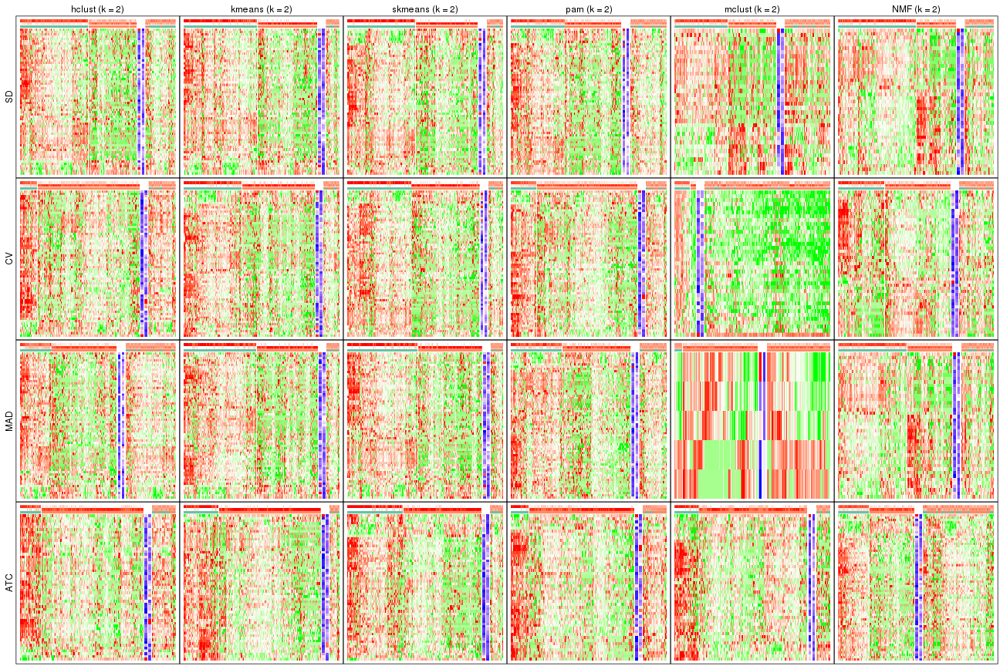</p>

</div>
<div id='tab-collect-get-signatures-2'>
<pre><code class="r">collect_plots(res_list, k = 3, fun = get_signatures, mc.cores = 4)
</code></pre>

<p></p>

</div>
<div id='tab-collect-get-signatures-3'>
<pre><code class="r">collect_plots(res_list, k = 4, fun = get_signatures, mc.cores = 4)
</code></pre>

<p></p>

</div>
<div id='tab-collect-get-signatures-4'>
<pre><code class="r">collect_plots(res_list, k = 5, fun = get_signatures, mc.cores = 4)
</code></pre>

<p></p>

</div>
<div id='tab-collect-get-signatures-5'>
<pre><code class="r">collect_plots(res_list, k = 6, fun = get_signatures, mc.cores = 4)
</code></pre>

<p></p>

</div>
</div>


### Statistics table

The statistics used for measuring the stability of consensus partitioning.
([How are they
defined?](http://bioconductor.org/packages/devel/bioc/vignettes/cola/inst/doc/cola.html#toc_13))


<script>
$( function() {
	$( '#tabs-get-stats-from-consensus-partition-list' ).tabs();
} );
</script>
<div id='tabs-get-stats-from-consensus-partition-list'>
<ul>
<li><a href='#tab-get-stats-from-consensus-partition-list-1'>k = 2</a></li>
<li><a href='#tab-get-stats-from-consensus-partition-list-2'>k = 3</a></li>
<li><a href='#tab-get-stats-from-consensus-partition-list-3'>k = 4</a></li>
<li><a href='#tab-get-stats-from-consensus-partition-list-4'>k = 5</a></li>
<li><a href='#tab-get-stats-from-consensus-partition-list-5'>k = 6</a></li>
</ul>
<div id='tab-get-stats-from-consensus-partition-list-1'>
<pre><code class="r">get_stats(res_list, k = 2)
</code></pre>

<pre><code>#&gt;             k  1-PAC mean_silhouette concordance area_increased  Rand Jaccard
#&gt; SD:NMF      2 0.0868           0.611       0.783          0.436 0.559   0.559
#&gt; CV:NMF      2 0.0531           0.586       0.769          0.477 0.508   0.508
#&gt; MAD:NMF     2 0.0189           0.578       0.741          0.470 0.514   0.514
#&gt; ATC:NMF     2 0.0360           0.436       0.697          0.474 0.515   0.515
#&gt; SD:skmeans  2 0.5034           0.781       0.903          0.501 0.499   0.499
#&gt; CV:skmeans  2 0.4390           0.787       0.899          0.501 0.498   0.498
#&gt; MAD:skmeans 2 0.5154           0.806       0.909          0.501 0.499   0.499
#&gt; ATC:skmeans 2 0.5610           0.806       0.911          0.492 0.507   0.507
#&gt; SD:mclust   2 0.0244           0.528       0.724          0.424 0.498   0.498
#&gt; CV:mclust   2 0.0238           0.323       0.657          0.390 0.610   0.610
#&gt; MAD:mclust  2 0.0224           0.348       0.719          0.362 0.898   0.898
#&gt; ATC:mclust  2 0.2278           0.732       0.842          0.379 0.662   0.662
#&gt; SD:kmeans   2 0.4394           0.780       0.893          0.490 0.502   0.502
#&gt; CV:kmeans   2 0.3571           0.750       0.871          0.483 0.507   0.507
#&gt; MAD:kmeans  2 0.4619           0.795       0.900          0.494 0.501   0.501
#&gt; ATC:kmeans  2 0.7215           0.861       0.936          0.398 0.603   0.603
#&gt; SD:pam      2 0.0488           0.560       0.765          0.457 0.500   0.500
#&gt; CV:pam      2 0.0681           0.648       0.774          0.371 0.653   0.653
#&gt; MAD:pam     2 0.0752           0.606       0.787          0.453 0.508   0.508
#&gt; ATC:pam     2 0.3297           0.709       0.851          0.335 0.729   0.729
#&gt; SD:hclust   2 0.0196           0.550       0.676          0.399 0.534   0.534
#&gt; CV:hclust   2 0.0329           0.633       0.775          0.368 0.708   0.708
#&gt; MAD:hclust  2 0.0294           0.483       0.725          0.402 0.554   0.554
#&gt; ATC:hclust  2 0.2029           0.695       0.836          0.362 0.648   0.648
</code></pre>

</div>
<div id='tab-get-stats-from-consensus-partition-list-2'>
<pre><code class="r">get_stats(res_list, k = 3)
</code></pre>

<pre><code>#&gt;             k  1-PAC mean_silhouette concordance area_increased  Rand Jaccard
#&gt; SD:NMF      3 0.0533           0.497       0.660          0.392 0.686   0.493
#&gt; CV:NMF      3 0.0802           0.424       0.647          0.329 0.778   0.596
#&gt; MAD:NMF     3 0.0748           0.427       0.655          0.346 0.752   0.557
#&gt; ATC:NMF     3 0.1187           0.493       0.665          0.310 0.648   0.417
#&gt; SD:skmeans  3 0.4377           0.653       0.797          0.319 0.767   0.565
#&gt; CV:skmeans  3 0.3917           0.652       0.788          0.317 0.793   0.608
#&gt; MAD:skmeans 3 0.4410           0.663       0.821          0.322 0.747   0.536
#&gt; ATC:skmeans 3 0.3942           0.643       0.807          0.328 0.775   0.584
#&gt; SD:mclust   3 0.0304           0.451       0.669          0.298 0.833   0.701
#&gt; CV:mclust   3 0.1544           0.713       0.790          0.441 0.592   0.436
#&gt; MAD:mclust  3 0.0426           0.559       0.719          0.444 0.477   0.456
#&gt; ATC:mclust  3 0.1636           0.534       0.723          0.499 0.646   0.491
#&gt; SD:kmeans   3 0.3116           0.462       0.723          0.306 0.679   0.447
#&gt; CV:kmeans   3 0.3029           0.674       0.773          0.317 0.656   0.436
#&gt; MAD:kmeans  3 0.3170           0.635       0.775          0.302 0.710   0.494
#&gt; ATC:kmeans  3 0.4214           0.695       0.844          0.515 0.613   0.438
#&gt; SD:pam      3 0.1058           0.409       0.620          0.381 0.680   0.453
#&gt; CV:pam      3 0.1288           0.503       0.720          0.598 0.650   0.503
#&gt; MAD:pam     3 0.1274           0.364       0.614          0.410 0.686   0.458
#&gt; ATC:pam     3 0.2528           0.599       0.789          0.723 0.594   0.473
#&gt; SD:hclust   3 0.0143           0.412       0.634          0.335 0.891   0.808
#&gt; CV:hclust   3 0.0265           0.376       0.619          0.454 0.969   0.956
#&gt; MAD:hclust  3 0.0226           0.219       0.611          0.407 0.810   0.695
#&gt; ATC:hclust  3 0.1245           0.538       0.754          0.311 0.885   0.840
</code></pre>

</div>
<div id='tab-get-stats-from-consensus-partition-list-3'>
<pre><code class="r">get_stats(res_list, k = 4)
</code></pre>

<pre><code>#&gt;             k  1-PAC mean_silhouette concordance area_increased  Rand Jaccard
#&gt; SD:NMF      4 0.0888           0.337       0.597         0.1220 0.924   0.804
#&gt; CV:NMF      4 0.1481           0.290       0.552         0.1227 0.904   0.759
#&gt; MAD:NMF     4 0.1474           0.337       0.600         0.1163 0.923   0.798
#&gt; ATC:NMF     4 0.1168           0.425       0.590         0.0776 0.957   0.881
#&gt; SD:skmeans  4 0.4171           0.428       0.675         0.1252 0.873   0.650
#&gt; CV:skmeans  4 0.4161           0.431       0.653         0.1222 0.860   0.635
#&gt; MAD:skmeans 4 0.4079           0.450       0.682         0.1211 0.934   0.812
#&gt; ATC:skmeans 4 0.4182           0.362       0.646         0.1324 0.879   0.682
#&gt; SD:mclust   4 0.1095           0.441       0.644         0.1285 0.785   0.586
#&gt; CV:mclust   4 0.2094           0.473       0.704         0.1170 0.938   0.864
#&gt; MAD:mclust  4 0.1192           0.458       0.671         0.1390 0.905   0.826
#&gt; ATC:mclust  4 0.1809           0.398       0.654         0.0954 0.888   0.740
#&gt; SD:kmeans   4 0.3539           0.508       0.694         0.1261 0.728   0.384
#&gt; CV:kmeans   4 0.3544           0.440       0.666         0.1331 0.898   0.739
#&gt; MAD:kmeans  4 0.3451           0.455       0.655         0.1281 0.857   0.637
#&gt; ATC:kmeans  4 0.3814           0.504       0.729         0.1546 0.871   0.691
#&gt; SD:pam      4 0.1938           0.256       0.520         0.1358 0.846   0.625
#&gt; CV:pam      4 0.2001           0.397       0.619         0.1722 0.886   0.732
#&gt; MAD:pam     4 0.1899           0.288       0.550         0.1166 0.748   0.423
#&gt; ATC:pam     4 0.2901           0.377       0.642         0.2082 0.843   0.635
#&gt; SD:hclust   4 0.0483           0.406       0.612         0.1383 0.954   0.910
#&gt; CV:hclust   4 0.0631           0.351       0.542         0.1736 0.685   0.545
#&gt; MAD:hclust  4 0.0494           0.237       0.463         0.1445 0.627   0.428
#&gt; ATC:hclust  4 0.1426           0.370       0.692         0.1542 0.949   0.926
</code></pre>

</div>
<div id='tab-get-stats-from-consensus-partition-list-4'>
<pre><code class="r">get_stats(res_list, k = 5)
</code></pre>

<pre><code>#&gt;             k 1-PAC mean_silhouette concordance area_increased  Rand Jaccard
#&gt; SD:NMF      5 0.119           0.278       0.533         0.0661 0.913   0.756
#&gt; CV:NMF      5 0.231           0.259       0.528         0.0676 0.891   0.690
#&gt; MAD:NMF     5 0.203           0.276       0.524         0.0636 0.940   0.822
#&gt; ATC:NMF     5 0.176           0.271       0.548         0.0776 0.857   0.651
#&gt; SD:skmeans  5 0.471           0.338       0.611         0.0681 0.882   0.604
#&gt; CV:skmeans  5 0.476           0.367       0.647         0.0691 0.849   0.531
#&gt; MAD:skmeans 5 0.457           0.303       0.576         0.0682 0.879   0.620
#&gt; ATC:skmeans 5 0.473           0.399       0.640         0.0688 0.825   0.483
#&gt; SD:mclust   5 0.200           0.454       0.621         0.1090 0.902   0.755
#&gt; CV:mclust   5 0.253           0.272       0.610         0.1141 0.944   0.872
#&gt; MAD:mclust  5 0.165           0.255       0.598         0.1268 0.908   0.817
#&gt; ATC:mclust  5 0.294           0.436       0.655         0.1144 0.836   0.622
#&gt; SD:kmeans   5 0.397           0.362       0.598         0.0721 0.919   0.728
#&gt; CV:kmeans   5 0.408           0.323       0.610         0.0768 0.877   0.641
#&gt; MAD:kmeans  5 0.385           0.394       0.578         0.0673 0.915   0.722
#&gt; ATC:kmeans  5 0.414           0.415       0.655         0.0855 0.792   0.464
#&gt; SD:pam      5 0.287           0.276       0.535         0.0787 0.744   0.347
#&gt; CV:pam      5 0.287           0.326       0.581         0.0943 0.843   0.579
#&gt; MAD:pam     5 0.267           0.283       0.518         0.0763 0.822   0.485
#&gt; ATC:pam     5 0.361           0.400       0.612         0.0983 0.824   0.493
#&gt; SD:hclust   5 0.101           0.254       0.521         0.0781 0.934   0.862
#&gt; CV:hclust   5 0.110           0.366       0.551         0.0953 0.771   0.543
#&gt; MAD:hclust  5 0.115           0.173       0.451         0.0776 0.717   0.467
#&gt; ATC:hclust  5 0.173           0.263       0.635         0.0922 0.917   0.876
</code></pre>

</div>
<div id='tab-get-stats-from-consensus-partition-list-5'>
<pre><code class="r">get_stats(res_list, k = 6)
</code></pre>

<pre><code>#&gt;             k 1-PAC mean_silhouette concordance area_increased  Rand Jaccard
#&gt; SD:NMF      6 0.207           0.245       0.513         0.0559 0.907   0.714
#&gt; CV:NMF      6 0.285           0.220       0.495         0.0448 0.860   0.545
#&gt; MAD:NMF     6 0.247           0.242       0.479         0.0426 0.903   0.697
#&gt; ATC:NMF     6 0.220           0.155       0.485         0.0485 0.824   0.588
#&gt; SD:skmeans  6 0.514           0.291       0.583         0.0408 0.913   0.640
#&gt; CV:skmeans  6 0.523           0.388       0.615         0.0437 0.899   0.589
#&gt; MAD:skmeans 6 0.497           0.240       0.505         0.0443 0.845   0.456
#&gt; ATC:skmeans 6 0.520           0.323       0.564         0.0416 0.888   0.548
#&gt; SD:mclust   6 0.254           0.340       0.586         0.0528 0.928   0.799
#&gt; CV:mclust   6 0.299           0.304       0.569         0.0550 0.888   0.730
#&gt; MAD:mclust  6 0.208           0.204       0.542         0.0585 0.903   0.784
#&gt; ATC:mclust  6 0.338           0.341       0.595         0.0559 0.763   0.429
#&gt; SD:kmeans   6 0.430           0.267       0.520         0.0436 0.924   0.719
#&gt; CV:kmeans   6 0.448           0.288       0.567         0.0400 0.902   0.646
#&gt; MAD:kmeans  6 0.429           0.269       0.502         0.0438 0.912   0.671
#&gt; ATC:kmeans  6 0.455           0.378       0.583         0.0461 0.844   0.482
#&gt; SD:pam      6 0.344           0.215       0.500         0.0487 0.915   0.656
#&gt; CV:pam      6 0.369           0.269       0.541         0.0564 0.908   0.672
#&gt; MAD:pam     6 0.344           0.247       0.478         0.0511 0.846   0.450
#&gt; ATC:pam     6 0.411           0.368       0.557         0.0505 0.895   0.613
#&gt; SD:hclust   6 0.148           0.246       0.520         0.0549 0.978   0.948
#&gt; CV:hclust   6 0.158           0.296       0.531         0.0554 0.916   0.794
#&gt; MAD:hclust  6 0.174           0.223       0.479         0.0479 0.704   0.399
#&gt; ATC:hclust  6 0.203           0.357       0.606         0.0648 0.863   0.772
</code></pre>

</div>
</div>

Following heatmap plots the partition for each combination of methods and the
lightness correspond to the silhouette scores for samples in each method. On
top the consensus subgroup is inferred from all methods by taking the mean
silhouette scores as weight.


<script>
$( function() {
	$( '#tabs-collect-stats-from-consensus-partition-list' ).tabs();
} );
</script>
<div id='tabs-collect-stats-from-consensus-partition-list'>
<ul>
<li><a href='#tab-collect-stats-from-consensus-partition-list-1'>k = 2</a></li>
<li><a href='#tab-collect-stats-from-consensus-partition-list-2'>k = 3</a></li>
<li><a href='#tab-collect-stats-from-consensus-partition-list-3'>k = 4</a></li>
<li><a href='#tab-collect-stats-from-consensus-partition-list-4'>k = 5</a></li>
<li><a href='#tab-collect-stats-from-consensus-partition-list-5'>k = 6</a></li>
</ul>
<div id='tab-collect-stats-from-consensus-partition-list-1'>
<pre><code class="r">collect_stats(res_list, k = 2)
</code></pre>

<p></p>

</div>
<div id='tab-collect-stats-from-consensus-partition-list-2'>
<pre><code class="r">collect_stats(res_list, k = 3)
</code></pre>

<p></p>

</div>
<div id='tab-collect-stats-from-consensus-partition-list-3'>
<pre><code class="r">collect_stats(res_list, k = 4)
</code></pre>

<p></p>

</div>
<div id='tab-collect-stats-from-consensus-partition-list-4'>
<pre><code class="r">collect_stats(res_list, k = 5)
</code></pre>

<p></p>

</div>
<div id='tab-collect-stats-from-consensus-partition-list-5'>
<pre><code class="r">collect_stats(res_list, k = 6)
</code></pre>

<p></p>

</div>
</div>

### Partition from all methods


Collect partitions from all methods:


<script>
$( function() {
	$( '#tabs-collect-classes-from-consensus-partition-list' ).tabs();
} );
</script>
<div id='tabs-collect-classes-from-consensus-partition-list'>
<ul>
<li><a href='#tab-collect-classes-from-consensus-partition-list-1'>k = 2</a></li>
<li><a href='#tab-collect-classes-from-consensus-partition-list-2'>k = 3</a></li>
<li><a href='#tab-collect-classes-from-consensus-partition-list-3'>k = 4</a></li>
<li><a href='#tab-collect-classes-from-consensus-partition-list-4'>k = 5</a></li>
<li><a href='#tab-collect-classes-from-consensus-partition-list-5'>k = 6</a></li>
</ul>
<div id='tab-collect-classes-from-consensus-partition-list-1'>
<pre><code class="r">collect_classes(res_list, k = 2)
</code></pre>

<p></p>

</div>
<div id='tab-collect-classes-from-consensus-partition-list-2'>
<pre><code class="r">collect_classes(res_list, k = 3)
</code></pre>

<p></p>

</div>
<div id='tab-collect-classes-from-consensus-partition-list-3'>
<pre><code class="r">collect_classes(res_list, k = 4)
</code></pre>

<p></p>

</div>
<div id='tab-collect-classes-from-consensus-partition-list-4'>
<pre><code class="r">collect_classes(res_list, k = 5)
</code></pre>

<p></p>

</div>
<div id='tab-collect-classes-from-consensus-partition-list-5'>
<pre><code class="r">collect_classes(res_list, k = 6)
</code></pre>

<p></p>

</div>
</div>


### Top rows overlap


Overlap of top rows from different top-row methods:


<script>
$( function() {
	$( '#tabs-top-rows-overlap-by-euler' ).tabs();
} );
</script>
<div id='tabs-top-rows-overlap-by-euler'>
<ul>
<li><a href='#tab-top-rows-overlap-by-euler-1'>top_n = 8</a></li>
<li><a href='#tab-top-rows-overlap-by-euler-2'>top_n = 16</a></li>
<li><a href='#tab-top-rows-overlap-by-euler-3'>top_n = 23</a></li>
<li><a href='#tab-top-rows-overlap-by-euler-4'>top_n = 30</a></li>
<li><a href='#tab-top-rows-overlap-by-euler-5'>top_n = 38</a></li>
</ul>
<div id='tab-top-rows-overlap-by-euler-1'>
<pre><code class="r">top_rows_overlap(res_list, top_n = 8, method = &quot;euler&quot;)
</code></pre>

<p></p>

</div>
<div id='tab-top-rows-overlap-by-euler-2'>
<pre><code class="r">top_rows_overlap(res_list, top_n = 16, method = &quot;euler&quot;)
</code></pre>

<p>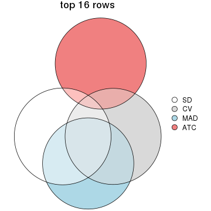</p>

</div>
<div id='tab-top-rows-overlap-by-euler-3'>
<pre><code class="r">top_rows_overlap(res_list, top_n = 23, method = &quot;euler&quot;)
</code></pre>

<p></p>

</div>
<div id='tab-top-rows-overlap-by-euler-4'>
<pre><code class="r">top_rows_overlap(res_list, top_n = 30, method = &quot;euler&quot;)
</code></pre>

<p></p>

</div>
<div id='tab-top-rows-overlap-by-euler-5'>
<pre><code class="r">top_rows_overlap(res_list, top_n = 38, method = &quot;euler&quot;)
</code></pre>

<p></p>

</div>
</div>

Also visualize the correspondance of rankings between different top-row methods:


<script>
$( function() {
	$( '#tabs-top-rows-overlap-by-correspondance' ).tabs();
} );
</script>
<div id='tabs-top-rows-overlap-by-correspondance'>
<ul>
<li><a href='#tab-top-rows-overlap-by-correspondance-1'>top_n = 8</a></li>
<li><a href='#tab-top-rows-overlap-by-correspondance-2'>top_n = 16</a></li>
<li><a href='#tab-top-rows-overlap-by-correspondance-3'>top_n = 23</a></li>
<li><a href='#tab-top-rows-overlap-by-correspondance-4'>top_n = 30</a></li>
<li><a href='#tab-top-rows-overlap-by-correspondance-5'>top_n = 38</a></li>
</ul>
<div id='tab-top-rows-overlap-by-correspondance-1'>
<pre><code class="r">top_rows_overlap(res_list, top_n = 8, method = &quot;correspondance&quot;)
</code></pre>

<p></p>

</div>
<div id='tab-top-rows-overlap-by-correspondance-2'>
<pre><code class="r">top_rows_overlap(res_list, top_n = 16, method = &quot;correspondance&quot;)
</code></pre>

<p></p>

</div>
<div id='tab-top-rows-overlap-by-correspondance-3'>
<pre><code class="r">top_rows_overlap(res_list, top_n = 23, method = &quot;correspondance&quot;)
</code></pre>

<p></p>

</div>
<div id='tab-top-rows-overlap-by-correspondance-4'>
<pre><code class="r">top_rows_overlap(res_list, top_n = 30, method = &quot;correspondance&quot;)
</code></pre>

<p></p>

</div>
<div id='tab-top-rows-overlap-by-correspondance-5'>
<pre><code class="r">top_rows_overlap(res_list, top_n = 38, method = &quot;correspondance&quot;)
</code></pre>

<p></p>

</div>
</div>


Heatmaps of the top rows:


<script>
$( function() {
	$( '#tabs-top-rows-heatmap' ).tabs();
} );
</script>
<div id='tabs-top-rows-heatmap'>
<ul>
<li><a href='#tab-top-rows-heatmap-1'>top_n = 8</a></li>
<li><a href='#tab-top-rows-heatmap-2'>top_n = 16</a></li>
<li><a href='#tab-top-rows-heatmap-3'>top_n = 23</a></li>
<li><a href='#tab-top-rows-heatmap-4'>top_n = 30</a></li>
<li><a href='#tab-top-rows-heatmap-5'>top_n = 38</a></li>
</ul>
<div id='tab-top-rows-heatmap-1'>
<pre><code class="r">top_rows_heatmap(res_list, top_n = 8)
</code></pre>

<p></p>

</div>
<div id='tab-top-rows-heatmap-2'>
<pre><code class="r">top_rows_heatmap(res_list, top_n = 16)
</code></pre>

<p>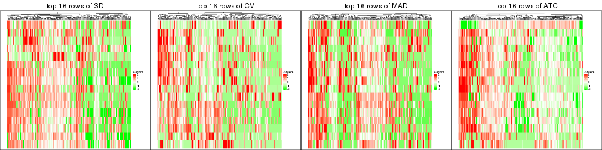</p>

</div>
<div id='tab-top-rows-heatmap-3'>
<pre><code class="r">top_rows_heatmap(res_list, top_n = 23)
</code></pre>

<p></p>

</div>
<div id='tab-top-rows-heatmap-4'>
<pre><code class="r">top_rows_heatmap(res_list, top_n = 30)
</code></pre>

<p></p>

</div>
<div id='tab-top-rows-heatmap-5'>
<pre><code class="r">top_rows_heatmap(res_list, top_n = 38)
</code></pre>

<p></p>

</div>
</div>


 
## Results for each method


---------------------------------------------------


### SD:hclust


The object with results only for a single top-value method and a single partition method 
can be extracted as:

```r
res = res_list["SD", "hclust"]
# you can also extract it by
# res = res_list["SD:hclust"]
```

A summary of `res` and all the functions that can be applied to it:

```r
res
```

```
#> A 'ConsensusPartition' object with k = 2, 3, 4, 5, 6.
#>   On a matrix with 77 rows and 243 columns.
#>   Top rows (8, 16, 23, 30, 38) are extracted by 'SD' method.
#>   Subgroups are detected by 'hclust' method.
#>   Performed in total 1250 partitions by row resampling.
#>   Best k for subgroups seems to be 2.
#> 
#> Following methods can be applied to this 'ConsensusPartition' object:
#>  [1] "cola_report"             "collect_classes"         "collect_plots"          
#>  [4] "collect_stats"           "colnames"                "compare_signatures"     
#>  [7] "consensus_heatmap"       "dimension_reduction"     "functional_enrichment"  
#> [10] "get_anno_col"            "get_anno"                "get_classes"            
#> [13] "get_consensus"           "get_matrix"              "get_membership"         
#> [16] "get_param"               "get_signatures"          "get_stats"              
#> [19] "is_best_k"               "is_stable_k"             "membership_heatmap"     
#> [22] "ncol"                    "nrow"                    "plot_ecdf"              
#> [25] "rownames"                "select_partition_number" "show"                   
#> [28] "suggest_best_k"          "test_to_known_factors"
```

`collect_plots()` function collects all the plots made from `res` for all `k` (number of partitions)
into one single page to provide an easy and fast comparison between different `k`.

```r
collect_plots(res)
```


The plots are:

- The first row: a plot of the ECDF (Empirical cumulative distribution
  function) curves of the consensus matrix for each `k` and the heatmap of
  predicted classes for each `k`.
- The second row: heatmaps of the consensus matrix for each `k`.
- The third row: heatmaps of the membership matrix for each `k`.
- The fouth row: heatmaps of the signatures for each `k`.

All the plots in panels can be made by individual functions and they are
plotted later in this section.

`select_partition_number()` produces several plots showing different
statistics for choosing "optimized" `k`. There are following statistics:

- ECDF curves of the consensus matrix for each `k`;
- 1-PAC. [The PAC
  score](https://en.wikipedia.org/wiki/Consensus_clustering#Over-interpretation_potential_of_consensus_clustering)
  measures the proportion of the ambiguous subgrouping.
- Mean silhouette score.
- Concordance. The mean probability of fiting the consensus class ids in all
  partitions.
- Area increased. Denote $A_k$ as the area under the ECDF curve for current
  `k`, the area increased is defined as $A_k - A_{k-1}$.
- Rand index. The percent of pairs of samples that are both in a same cluster
  or both are not in a same cluster in the partition of k and k-1.
- Jaccard index. The ratio of pairs of samples are both in a same cluster in
  the partition of k and k-1 and the pairs of samples are both in a same
  cluster in the partition k or k-1.

The detailed explanations of these statistics can be found in [the cola
vignette](http://bioconductor.org/packages/devel/bioc/vignettes/cola/inst/doc/cola.html#toc_13).

Generally speaking, lower PAC score, higher mean silhouette score or higher
concordance corresponds to better partition. Rand index and Jaccard index
measure how similar the current partition is compared to partition with `k-1`.
If they are too similar, we won't accept `k` is better than `k-1`.

```r
select_partition_number(res)
```


The numeric values for all these statistics can be obtained by `get_stats()`.

```r
get_stats(res)
```

```
#>   k  1-PAC mean_silhouette concordance area_increased  Rand Jaccard
#> 2 2 0.0196           0.550       0.676         0.3988 0.534   0.534
#> 3 3 0.0143           0.412       0.634         0.3347 0.891   0.808
#> 4 4 0.0483           0.406       0.612         0.1383 0.954   0.910
#> 5 5 0.1015           0.254       0.521         0.0781 0.934   0.862
#> 6 6 0.1483           0.246       0.520         0.0549 0.978   0.948
```

`suggest_best_k()` suggests the best $k$ based on these statistics. The rules are as follows:

- All $k$ with Jaccard index larger than 0.95 are removed because the increase of
  the partition number does not provides enough extra information. If all $k$ are removed,
  the best $k$ is assigned by `NA`.
- For $k$ with 1-PAC larger than 0.9, the maximal $k$ is taken as the "best k". Other $k$ is called "optional k".
- If it does not fit the second rule. The $k$ with the highest vote of highest
  1-PAC, mean silhouette and concordance is taken as the "best k".

```r
suggest_best_k(res)
```

```
#> [1] 2
```


Following shows the table of the partitions (You need to click the **show/hide
code output** link to see it). The membership matrix (columns with name `p*`)
is inferred by
[`clue::cl_consensus()`](https://www.rdocumentation.org/link/cl_consensus?package=clue)
function with the `SE` method. Basically the value in the membership matrix
represents the probability to belong to a certain group. The finall class
label for an item is determined with the group with highest probability it
belongs to.

In `get_classes()` function, the entropy is calculated from the membership
matrix and the silhouette score is calculated from the consensus matrix.


<script>
$( function() {
	$( '#tabs-SD-hclust-get-classes' ).tabs();
} );
</script>
<div id='tabs-SD-hclust-get-classes'>
<ul>
<li><a href='#tab-SD-hclust-get-classes-1'>k = 2</a></li>
<li><a href='#tab-SD-hclust-get-classes-2'>k = 3</a></li>
<li><a href='#tab-SD-hclust-get-classes-3'>k = 4</a></li>
<li><a href='#tab-SD-hclust-get-classes-4'>k = 5</a></li>
<li><a href='#tab-SD-hclust-get-classes-5'>k = 6</a></li>
</ul>

<div id='tab-SD-hclust-get-classes-1'>
<p><a id='tab-SD-hclust-get-classes-1-a' style='color:#0366d6' href='#'>show/hide code output</a></p>
<pre><code class="r">cbind(get_classes(res, k = 2), get_membership(res, k = 2))
</code></pre>

<pre><code>#&gt;           class entropy silhouette    p1    p2
#&gt; SRR191393     1   0.518    0.65853 0.884 0.116
#&gt; SRR191394     1   0.552    0.60194 0.872 0.128
#&gt; SRR191396     1   0.985   -0.04511 0.572 0.428
#&gt; SRR191397     1   0.506    0.64650 0.888 0.112
#&gt; SRR191398     1   0.595    0.60938 0.856 0.144
#&gt; SRR191399     1   0.388    0.67437 0.924 0.076
#&gt; SRR191400     1   0.634    0.64139 0.840 0.160
#&gt; SRR191401     1   0.552    0.65118 0.872 0.128
#&gt; SRR191402     1   0.753    0.65556 0.784 0.216
#&gt; SRR191403     1   0.482    0.63011 0.896 0.104
#&gt; SRR191404     2   0.981    0.61260 0.420 0.580
#&gt; SRR191405     1   0.936    0.30202 0.648 0.352
#&gt; SRR191406     1   0.808    0.57755 0.752 0.248
#&gt; SRR191407     1   0.680    0.66930 0.820 0.180
#&gt; SRR191408     1   0.745    0.62836 0.788 0.212
#&gt; SRR191409     1   0.722    0.63863 0.800 0.200
#&gt; SRR191410     1   0.775    0.59706 0.772 0.228
#&gt; SRR191411     1   0.775    0.62684 0.772 0.228
#&gt; SRR191412     1   0.443    0.67569 0.908 0.092
#&gt; SRR191413     1   0.469    0.68360 0.900 0.100
#&gt; SRR191414     1   0.163    0.65383 0.976 0.024
#&gt; SRR191415     1   0.767    0.60605 0.776 0.224
#&gt; SRR191416     1   0.311    0.68205 0.944 0.056
#&gt; SRR191418     1   0.529    0.69035 0.880 0.120
#&gt; SRR191419     1   0.605    0.59773 0.852 0.148
#&gt; SRR191420     1   0.343    0.66965 0.936 0.064
#&gt; SRR191421     1   0.343    0.67584 0.936 0.064
#&gt; SRR191422     2   0.904    0.72763 0.320 0.680
#&gt; SRR191423     2   0.969    0.68167 0.396 0.604
#&gt; SRR191424     2   0.714    0.67154 0.196 0.804
#&gt; SRR191425     1   0.224    0.67506 0.964 0.036
#&gt; SRR191426     1   0.917    0.39684 0.668 0.332
#&gt; SRR191427     1   0.999   -0.27211 0.520 0.480
#&gt; SRR191428     1   0.311    0.68513 0.944 0.056
#&gt; SRR191429     2   0.949    0.71748 0.368 0.632
#&gt; SRR191430     2   0.999    0.43196 0.484 0.516
#&gt; SRR191431     2   0.961    0.65488 0.384 0.616
#&gt; SRR191432     2   0.963    0.68800 0.388 0.612
#&gt; SRR191433     2   0.981    0.62458 0.420 0.580
#&gt; SRR191434     1   0.997   -0.23564 0.532 0.468
#&gt; SRR191435     1   0.760    0.61810 0.780 0.220
#&gt; SRR191436     1   0.808    0.56245 0.752 0.248
#&gt; SRR191437     2   0.730    0.67439 0.204 0.796
#&gt; SRR191438     1   0.969    0.13188 0.604 0.396
#&gt; SRR191439     2   0.929    0.72945 0.344 0.656
#&gt; SRR191440     2   0.730    0.66641 0.204 0.796
#&gt; SRR191441     2   0.689    0.65982 0.184 0.816
#&gt; SRR191442     1   0.753    0.60362 0.784 0.216
#&gt; SRR191443     1   0.625    0.68034 0.844 0.156
#&gt; SRR191444     1   0.913    0.46941 0.672 0.328
#&gt; SRR191445     2   1.000    0.40088 0.492 0.508
#&gt; SRR191446     2   0.917    0.71038 0.332 0.668
#&gt; SRR191447     2   0.946    0.71784 0.364 0.636
#&gt; SRR191448     1   0.738    0.63666 0.792 0.208
#&gt; SRR191449     1   0.469    0.68406 0.900 0.100
#&gt; SRR191450     1   0.876    0.50547 0.704 0.296
#&gt; SRR191451     1   0.855    0.49442 0.720 0.280
#&gt; SRR191452     2   0.802    0.71514 0.244 0.756
#&gt; SRR191453     2   0.998    0.40927 0.476 0.524
#&gt; SRR191454     1   0.671    0.67364 0.824 0.176
#&gt; SRR191455     1   0.975   -0.04847 0.592 0.408
#&gt; SRR191456     1   0.966    0.04518 0.608 0.392
#&gt; SRR191457     1   0.662    0.60290 0.828 0.172
#&gt; SRR191458     2   0.999    0.51468 0.480 0.520
#&gt; SRR191459     1   0.900    0.41891 0.684 0.316
#&gt; SRR191460     1   0.855    0.55494 0.720 0.280
#&gt; SRR191461     1   0.795    0.56957 0.760 0.240
#&gt; SRR191462     2   0.998    0.43872 0.472 0.528
#&gt; SRR191463     2   0.881    0.72028 0.300 0.700
#&gt; SRR191464     2   0.802    0.70904 0.244 0.756
#&gt; SRR191465     2   0.821    0.71621 0.256 0.744
#&gt; SRR191466     1   0.788    0.57766 0.764 0.236
#&gt; SRR191467     2   0.955    0.69579 0.376 0.624
#&gt; SRR191468     2   0.680    0.67079 0.180 0.820
#&gt; SRR191469     1   0.714    0.63972 0.804 0.196
#&gt; SRR191470     2   0.961    0.70648 0.384 0.616
#&gt; SRR191471     2   0.978    0.62330 0.412 0.588
#&gt; SRR191472     2   0.850    0.72610 0.276 0.724
#&gt; SRR191473     2   0.988    0.59234 0.436 0.564
#&gt; SRR191474     1   0.430    0.68357 0.912 0.088
#&gt; SRR191475     2   0.917    0.73027 0.332 0.668
#&gt; SRR191476     2   0.939    0.70328 0.356 0.644
#&gt; SRR191477     2   0.963    0.69654 0.388 0.612
#&gt; SRR191478     2   0.936    0.71519 0.352 0.648
#&gt; SRR191479     1   0.260    0.66441 0.956 0.044
#&gt; SRR191480     2   0.808    0.68237 0.248 0.752
#&gt; SRR191481     2   0.990    0.59179 0.440 0.560
#&gt; SRR191482     1   0.999   -0.34864 0.516 0.484
#&gt; SRR191483     2   0.991    0.59381 0.444 0.556
#&gt; SRR191484     1   0.653    0.54545 0.832 0.168
#&gt; SRR191485     1   1.000   -0.43908 0.504 0.496
#&gt; SRR191486     1   0.917    0.32412 0.668 0.332
#&gt; SRR191487     2   0.946    0.67542 0.364 0.636
#&gt; SRR191488     1   0.861    0.53772 0.716 0.284
#&gt; SRR191489     2   0.952    0.59556 0.372 0.628
#&gt; SRR191490     2   0.808    0.64725 0.248 0.752
#&gt; SRR191491     1   0.866    0.47888 0.712 0.288
#&gt; SRR191492     1   0.563    0.66819 0.868 0.132
#&gt; SRR191493     2   0.973    0.44909 0.404 0.596
#&gt; SRR191494     2   0.961    0.71444 0.384 0.616
#&gt; SRR191495     1   0.456    0.67365 0.904 0.096
#&gt; SRR191496     2   0.563    0.62877 0.132 0.868
#&gt; SRR191497     1   0.827    0.54821 0.740 0.260
#&gt; SRR191498     1   0.913    0.31569 0.672 0.328
#&gt; SRR191499     1   0.689    0.65349 0.816 0.184
#&gt; SRR191500     1   0.855    0.49958 0.720 0.280
#&gt; SRR191501     2   0.904    0.63591 0.320 0.680
#&gt; SRR191502     2   0.988    0.59347 0.436 0.564
#&gt; SRR191503     2   0.615    0.63909 0.152 0.848
#&gt; SRR191504     2   0.990    0.59985 0.440 0.560
#&gt; SRR191505     2   0.904    0.72635 0.320 0.680
#&gt; SRR191506     2   0.722    0.68469 0.200 0.800
#&gt; SRR191507     2   0.730    0.63974 0.204 0.796
#&gt; SRR191508     1   0.987   -0.15123 0.568 0.432
#&gt; SRR191509     2   0.990    0.61827 0.440 0.560
#&gt; SRR191510     2   0.969    0.64988 0.396 0.604
#&gt; SRR191511     2   0.961    0.68755 0.384 0.616
#&gt; SRR191512     2   0.541    0.62052 0.124 0.876
#&gt; SRR191513     2   0.844    0.71877 0.272 0.728
#&gt; SRR191514     2   0.936    0.71516 0.352 0.648
#&gt; SRR191515     2   0.983    0.66203 0.424 0.576
#&gt; SRR191516     1   0.788    0.57970 0.764 0.236
#&gt; SRR191517     1   0.969    0.05642 0.604 0.396
#&gt; SRR191518     2   0.969    0.66213 0.396 0.604
#&gt; SRR191519     2   0.730    0.68383 0.204 0.796
#&gt; SRR191520     1   0.697    0.61130 0.812 0.188
#&gt; SRR191521     2   0.978    0.66207 0.412 0.588
#&gt; SRR191522     2   0.991    0.59745 0.444 0.556
#&gt; SRR191523     2   0.995    0.58748 0.460 0.540
#&gt; SRR191524     1   0.891    0.46569 0.692 0.308
#&gt; SRR191525     2   0.958    0.70853 0.380 0.620
#&gt; SRR191526     2   0.855    0.72455 0.280 0.720
#&gt; SRR191527     1   1.000   -0.10902 0.504 0.496
#&gt; SRR191528     2   0.998    0.46596 0.476 0.524
#&gt; SRR191529     2   0.939    0.57970 0.356 0.644
#&gt; SRR191530     2   0.963    0.67992 0.388 0.612
#&gt; SRR191531     2   0.995    0.45024 0.460 0.540
#&gt; SRR191532     1   1.000   -0.43978 0.508 0.492
#&gt; SRR191533     2   0.971    0.61127 0.400 0.600
#&gt; SRR191534     2   0.946    0.71322 0.364 0.636
#&gt; SRR191535     2   0.975    0.68140 0.408 0.592
#&gt; SRR191536     1   0.999   -0.27824 0.516 0.484
#&gt; SRR191537     2   0.745    0.66675 0.212 0.788
#&gt; SRR191538     2   0.932    0.71600 0.348 0.652
#&gt; SRR191539     2   0.833    0.71597 0.264 0.736
#&gt; SRR191540     1   0.973    0.05232 0.596 0.404
#&gt; SRR191541     2   0.955    0.70766 0.376 0.624
#&gt; SRR191542     2   0.886    0.72977 0.304 0.696
#&gt; SRR191543     2   0.995    0.56473 0.460 0.540
#&gt; SRR191544     2   0.969    0.68086 0.396 0.604
#&gt; SRR191545     1   0.998   -0.37703 0.524 0.476
#&gt; SRR191546     1   1.000   -0.41871 0.504 0.496
#&gt; SRR191547     1   0.939    0.30285 0.644 0.356
#&gt; SRR191548     1   0.595    0.59705 0.856 0.144
#&gt; SRR191549     1   0.722    0.58074 0.800 0.200
#&gt; SRR191550     1   0.506    0.58085 0.888 0.112
#&gt; SRR191551     1   0.584    0.60187 0.860 0.140
#&gt; SRR191552     1   0.595    0.60484 0.856 0.144
#&gt; SRR191553     1   0.634    0.59023 0.840 0.160
#&gt; SRR191554     1   0.738    0.57825 0.792 0.208
#&gt; SRR191555     1   0.388    0.61894 0.924 0.076
#&gt; SRR191556     1   0.644    0.68314 0.836 0.164
#&gt; SRR191557     1   0.343    0.68016 0.936 0.064
#&gt; SRR191558     2   1.000    0.42956 0.492 0.508
#&gt; SRR191559     1   0.574    0.67408 0.864 0.136
#&gt; SRR191560     1   0.584    0.67294 0.860 0.140
#&gt; SRR191561     1   0.781    0.57497 0.768 0.232
#&gt; SRR191562     1   0.574    0.67977 0.864 0.136
#&gt; SRR191563     1   0.881    0.46841 0.700 0.300
#&gt; SRR191564     1   0.689    0.64640 0.816 0.184
#&gt; SRR191565     1   0.653    0.68139 0.832 0.168
#&gt; SRR191566     1   0.529    0.68115 0.880 0.120
#&gt; SRR191567     1   0.482    0.63762 0.896 0.104
#&gt; SRR191568     1   0.541    0.67823 0.876 0.124
#&gt; SRR191569     1   0.891    0.45356 0.692 0.308
#&gt; SRR191570     1   0.821    0.61269 0.744 0.256
#&gt; SRR191571     1   0.574    0.69040 0.864 0.136
#&gt; SRR191572     1   0.706    0.53055 0.808 0.192
#&gt; SRR191573     1   0.595    0.68610 0.856 0.144
#&gt; SRR191574     1   0.625    0.64823 0.844 0.156
#&gt; SRR191575     1   0.760    0.63657 0.780 0.220
#&gt; SRR191576     1   0.866    0.47885 0.712 0.288
#&gt; SRR191577     1   0.730    0.66144 0.796 0.204
#&gt; SRR191578     2   0.971    0.64806 0.400 0.600
#&gt; SRR191579     1   0.767    0.59049 0.776 0.224
#&gt; SRR191580     1   0.833    0.54639 0.736 0.264
#&gt; SRR191581     1   0.881    0.53387 0.700 0.300
#&gt; SRR191582     1   0.886    0.54621 0.696 0.304
#&gt; SRR191583     2   0.839    0.71661 0.268 0.732
#&gt; SRR191584     2   0.961    0.30493 0.384 0.616
#&gt; SRR191585     1   0.358    0.68213 0.932 0.068
#&gt; SRR191586     1   0.358    0.68023 0.932 0.068
#&gt; SRR191587     1   0.795    0.63252 0.760 0.240
#&gt; SRR191588     1   0.443    0.69246 0.908 0.092
#&gt; SRR191589     1   0.595    0.68080 0.856 0.144
#&gt; SRR191590     1   0.563    0.68674 0.868 0.132
#&gt; SRR191591     1   0.730    0.64100 0.796 0.204
#&gt; SRR191592     1   0.634    0.67004 0.840 0.160
#&gt; SRR191593     1   0.260    0.67680 0.956 0.044
#&gt; SRR191594     1   0.416    0.60355 0.916 0.084
#&gt; SRR191595     1   0.584    0.67288 0.860 0.140
#&gt; SRR191596     1   0.615    0.68676 0.848 0.152
#&gt; SRR191597     1   0.753    0.61780 0.784 0.216
#&gt; SRR191598     1   0.584    0.67364 0.860 0.140
#&gt; SRR191599     1   0.402    0.68634 0.920 0.080
#&gt; SRR191600     1   0.955    0.23772 0.624 0.376
#&gt; SRR191601     1   0.886    0.46907 0.696 0.304
#&gt; SRR191602     1   0.808    0.56072 0.752 0.248
#&gt; SRR191603     1   0.821    0.56464 0.744 0.256
#&gt; SRR191604     2   0.994    0.53215 0.456 0.544
#&gt; SRR191605     1   0.745    0.62172 0.788 0.212
#&gt; SRR191606     1   0.714    0.66798 0.804 0.196
#&gt; SRR191607     1   0.311    0.67798 0.944 0.056
#&gt; SRR191608     1   0.917    0.36910 0.668 0.332
#&gt; SRR191609     1   0.634    0.64719 0.840 0.160
#&gt; SRR191610     1   0.242    0.67368 0.960 0.040
#&gt; SRR191611     1   0.343    0.68016 0.936 0.064
#&gt; SRR191612     1   0.662    0.65809 0.828 0.172
#&gt; SRR191613     1   0.671    0.66220 0.824 0.176
#&gt; SRR191614     1   0.584    0.67602 0.860 0.140
#&gt; SRR191615     1   0.529    0.68283 0.880 0.120
#&gt; SRR191616     2   0.730    0.66578 0.204 0.796
#&gt; SRR191617     2   0.969    0.67434 0.396 0.604
#&gt; SRR191618     2   0.991    0.52345 0.444 0.556
#&gt; SRR191619     1   0.955    0.20746 0.624 0.376
#&gt; SRR191620     2   0.994    0.52045 0.456 0.544
#&gt; SRR191621     1   0.997   -0.28270 0.532 0.468
#&gt; SRR191622     1   0.952    0.24940 0.628 0.372
#&gt; SRR191623     1   0.552    0.68359 0.872 0.128
#&gt; SRR191624     1   0.163    0.65383 0.976 0.024
#&gt; SRR191625     1   0.904    0.40268 0.680 0.320
#&gt; SRR191626     1   0.876    0.45275 0.704 0.296
#&gt; SRR191627     1   0.978    0.02046 0.588 0.412
#&gt; SRR191628     1   0.753    0.61620 0.784 0.216
#&gt; SRR191629     1   0.730    0.62269 0.796 0.204
#&gt; SRR191630     1   0.416    0.60355 0.916 0.084
#&gt; SRR191631     1   0.975    0.00641 0.592 0.408
#&gt; SRR191632     1   0.745    0.66411 0.788 0.212
#&gt; SRR191633     1   0.978    0.04650 0.588 0.412
#&gt; SRR191634     2   0.706    0.66128 0.192 0.808
#&gt; SRR191635     1   0.689    0.64875 0.816 0.184
#&gt; SRR191636     2   0.963    0.64618 0.388 0.612
#&gt; SRR191637     2   0.518    0.61156 0.116 0.884
</code></pre>

<script>
$('#tab-SD-hclust-get-classes-1-a').parent().next().next().hide();
$('#tab-SD-hclust-get-classes-1-a').click(function(){
  $('#tab-SD-hclust-get-classes-1-a').parent().next().next().toggle();
  return(false);
});
</script>
</div>

<div id='tab-SD-hclust-get-classes-2'>
<p><a id='tab-SD-hclust-get-classes-2-a' style='color:#0366d6' href='#'>show/hide code output</a></p>
<pre><code class="r">cbind(get_classes(res, k = 3), get_membership(res, k = 3))
</code></pre>

<pre><code>#&gt;           class entropy silhouette    p1    p2    p3
#&gt; SRR191393     3   0.456    0.67071 0.080 0.060 0.860
#&gt; SRR191394     3   0.529    0.61119 0.148 0.040 0.812
#&gt; SRR191396     3   0.874   -0.07794 0.108 0.432 0.460
#&gt; SRR191397     3   0.440    0.65855 0.092 0.044 0.864
#&gt; SRR191398     3   0.547    0.61165 0.160 0.040 0.800
#&gt; SRR191399     3   0.400    0.68400 0.056 0.060 0.884
#&gt; SRR191400     3   0.611    0.64979 0.108 0.108 0.784
#&gt; SRR191401     3   0.463    0.66317 0.088 0.056 0.856
#&gt; SRR191402     3   0.628    0.65149 0.040 0.224 0.736
#&gt; SRR191403     3   0.452    0.64412 0.116 0.032 0.852
#&gt; SRR191404     2   0.837    0.44938 0.108 0.580 0.312
#&gt; SRR191405     3   0.772    0.23851 0.048 0.428 0.524
#&gt; SRR191406     3   0.645    0.56893 0.020 0.308 0.672
#&gt; SRR191407     3   0.579    0.67979 0.060 0.148 0.792
#&gt; SRR191408     3   0.654    0.62508 0.052 0.220 0.728
#&gt; SRR191409     3   0.542    0.64378 0.008 0.240 0.752
#&gt; SRR191410     3   0.592    0.59334 0.012 0.276 0.712
#&gt; SRR191411     3   0.645    0.63604 0.036 0.252 0.712
#&gt; SRR191412     3   0.380    0.67907 0.052 0.056 0.892
#&gt; SRR191413     3   0.451    0.69063 0.048 0.092 0.860
#&gt; SRR191414     3   0.207    0.65419 0.060 0.000 0.940
#&gt; SRR191415     3   0.596    0.60458 0.016 0.264 0.720
#&gt; SRR191416     3   0.350    0.68073 0.028 0.072 0.900
#&gt; SRR191418     3   0.539    0.69673 0.072 0.108 0.820
#&gt; SRR191419     3   0.578    0.60394 0.160 0.052 0.788
#&gt; SRR191420     3   0.325    0.66941 0.052 0.036 0.912
#&gt; SRR191421     3   0.324    0.68127 0.032 0.056 0.912
#&gt; SRR191422     2   0.774    0.40767 0.124 0.672 0.204
#&gt; SRR191423     2   0.787    0.49462 0.112 0.652 0.236
#&gt; SRR191424     2   0.798   -0.44791 0.376 0.556 0.068
#&gt; SRR191425     3   0.337    0.67486 0.040 0.052 0.908
#&gt; SRR191426     3   0.736    0.28404 0.032 0.440 0.528
#&gt; SRR191427     3   0.979   -0.30009 0.236 0.380 0.384
#&gt; SRR191428     3   0.374    0.69167 0.036 0.072 0.892
#&gt; SRR191429     2   0.816    0.43566 0.160 0.644 0.196
#&gt; SRR191430     2   0.771    0.36805 0.060 0.592 0.348
#&gt; SRR191431     2   0.906    0.33090 0.188 0.548 0.264
#&gt; SRR191432     2   0.677    0.50162 0.064 0.720 0.216
#&gt; SRR191433     2   0.770    0.50858 0.084 0.644 0.272
#&gt; SRR191434     2   0.796    0.16995 0.060 0.512 0.428
#&gt; SRR191435     3   0.762    0.57541 0.104 0.224 0.672
#&gt; SRR191436     3   0.647    0.54678 0.020 0.312 0.668
#&gt; SRR191437     2   0.780   -0.41862 0.320 0.608 0.072
#&gt; SRR191438     3   0.799    0.06564 0.060 0.456 0.484
#&gt; SRR191439     2   0.783    0.33363 0.156 0.672 0.172
#&gt; SRR191440     2   0.827   -0.56734 0.440 0.484 0.076
#&gt; SRR191441     2   0.782   -0.44854 0.376 0.564 0.060
#&gt; SRR191442     3   0.693    0.53081 0.040 0.296 0.664
#&gt; SRR191443     3   0.578    0.67477 0.052 0.160 0.788
#&gt; SRR191444     3   0.782    0.45720 0.072 0.324 0.604
#&gt; SRR191445     2   0.926    0.35021 0.160 0.464 0.376
#&gt; SRR191446     2   0.928    0.09726 0.276 0.520 0.204
#&gt; SRR191447     2   0.768    0.46796 0.112 0.672 0.216
#&gt; SRR191448     3   0.767    0.57365 0.168 0.148 0.684
#&gt; SRR191449     3   0.486    0.67874 0.044 0.116 0.840
#&gt; SRR191450     3   0.808    0.45785 0.268 0.108 0.624
#&gt; SRR191451     3   0.767    0.46800 0.072 0.300 0.628
#&gt; SRR191452     2   0.788    0.08397 0.224 0.656 0.120
#&gt; SRR191453     2   0.966    0.09650 0.224 0.444 0.332
#&gt; SRR191454     3   0.702    0.63482 0.068 0.232 0.700
#&gt; SRR191455     2   0.758    0.13673 0.040 0.496 0.464
#&gt; SRR191456     3   0.840   -0.03572 0.084 0.440 0.476
#&gt; SRR191457     3   0.723    0.57775 0.188 0.104 0.708
#&gt; SRR191458     2   0.815    0.46330 0.088 0.580 0.332
#&gt; SRR191459     3   0.688    0.40461 0.020 0.388 0.592
#&gt; SRR191460     3   0.700    0.55702 0.044 0.292 0.664
#&gt; SRR191461     3   0.626    0.56369 0.020 0.284 0.696
#&gt; SRR191462     2   0.875    0.40365 0.116 0.508 0.376
#&gt; SRR191463     2   0.857    0.12361 0.228 0.604 0.168
#&gt; SRR191464     2   0.860   -0.12884 0.284 0.580 0.136
#&gt; SRR191465     2   0.701    0.21966 0.176 0.724 0.100
#&gt; SRR191466     3   0.764    0.49445 0.076 0.284 0.640
#&gt; SRR191467     2   0.832    0.41900 0.160 0.628 0.212
#&gt; SRR191468     2   0.637   -0.23284 0.268 0.704 0.028
#&gt; SRR191469     3   0.670    0.58423 0.040 0.268 0.692
#&gt; SRR191470     2   0.851    0.28943 0.176 0.612 0.212
#&gt; SRR191471     2   0.846    0.44451 0.124 0.588 0.288
#&gt; SRR191472     2   0.722    0.19185 0.176 0.712 0.112
#&gt; SRR191473     2   0.745    0.50673 0.064 0.644 0.292
#&gt; SRR191474     3   0.523    0.66234 0.068 0.104 0.828
#&gt; SRR191475     2   0.737    0.36882 0.128 0.704 0.168
#&gt; SRR191476     2   0.880    0.29909 0.196 0.584 0.220
#&gt; SRR191477     2   0.828    0.47510 0.132 0.620 0.248
#&gt; SRR191478     2   0.700    0.47576 0.084 0.716 0.200
#&gt; SRR191479     3   0.438    0.67577 0.064 0.068 0.868
#&gt; SRR191480     2   0.855   -0.38154 0.412 0.492 0.096
#&gt; SRR191481     2   0.700    0.50750 0.048 0.672 0.280
#&gt; SRR191482     2   0.757    0.37075 0.048 0.576 0.376
#&gt; SRR191483     2   0.775    0.49833 0.076 0.624 0.300
#&gt; SRR191484     3   0.663    0.43271 0.272 0.036 0.692
#&gt; SRR191485     2   0.746    0.38385 0.044 0.584 0.372
#&gt; SRR191486     3   0.765    0.27765 0.048 0.400 0.552
#&gt; SRR191487     2   0.928    0.10935 0.288 0.516 0.196
#&gt; SRR191488     3   0.867    0.45548 0.184 0.220 0.596
#&gt; SRR191489     2   0.986   -0.00688 0.292 0.416 0.292
#&gt; SRR191490     1   0.889    0.55094 0.444 0.436 0.120
#&gt; SRR191491     3   0.800    0.38113 0.072 0.360 0.568
#&gt; SRR191492     3   0.614    0.62890 0.060 0.172 0.768
#&gt; SRR191493     2   0.984   -0.38042 0.336 0.408 0.256
#&gt; SRR191494     2   0.821    0.40594 0.140 0.632 0.228
#&gt; SRR191495     3   0.536    0.65300 0.064 0.116 0.820
#&gt; SRR191496     2   0.784   -0.55107 0.460 0.488 0.052
#&gt; SRR191497     3   0.599    0.57850 0.012 0.284 0.704
#&gt; SRR191498     3   0.900    0.07272 0.140 0.356 0.504
#&gt; SRR191499     3   0.654    0.64618 0.056 0.212 0.732
#&gt; SRR191500     3   0.671    0.51850 0.032 0.296 0.672
#&gt; SRR191501     1   0.956    0.49386 0.460 0.332 0.208
#&gt; SRR191502     2   0.894    0.46989 0.140 0.520 0.340
#&gt; SRR191503     2   0.756   -0.47756 0.440 0.520 0.040
#&gt; SRR191504     2   0.703    0.51010 0.044 0.660 0.296
#&gt; SRR191505     2   0.784    0.42293 0.140 0.668 0.192
#&gt; SRR191506     2   0.851   -0.23166 0.316 0.568 0.116
#&gt; SRR191507     1   0.795    0.47776 0.520 0.420 0.060
#&gt; SRR191508     2   0.803    0.27934 0.064 0.516 0.420
#&gt; SRR191509     2   0.780    0.50679 0.080 0.624 0.296
#&gt; SRR191510     2   0.894    0.41171 0.160 0.548 0.292
#&gt; SRR191511     2   0.787    0.48928 0.124 0.660 0.216
#&gt; SRR191512     2   0.633   -0.39968 0.332 0.656 0.012
#&gt; SRR191513     2   0.814    0.05201 0.260 0.624 0.116
#&gt; SRR191514     2   0.709    0.45731 0.096 0.716 0.188
#&gt; SRR191515     2   0.904    0.33920 0.176 0.544 0.280
#&gt; SRR191516     3   0.665    0.58390 0.048 0.240 0.712
#&gt; SRR191517     3   0.775   -0.03329 0.048 0.456 0.496
#&gt; SRR191518     2   0.709    0.50898 0.064 0.688 0.248
#&gt; SRR191519     2   0.798   -0.31162 0.340 0.584 0.076
#&gt; SRR191520     3   0.816    0.43468 0.136 0.228 0.636
#&gt; SRR191521     2   0.773    0.51406 0.084 0.640 0.276
#&gt; SRR191522     2   0.782    0.51089 0.080 0.620 0.300
#&gt; SRR191523     2   0.846    0.48288 0.132 0.596 0.272
#&gt; SRR191524     3   0.913    0.26274 0.180 0.288 0.532
#&gt; SRR191525     2   0.793    0.42846 0.128 0.656 0.216
#&gt; SRR191526     2   0.774    0.00694 0.236 0.660 0.104
#&gt; SRR191527     2   0.994    0.07452 0.280 0.364 0.356
#&gt; SRR191528     2   0.965    0.11165 0.236 0.460 0.304
#&gt; SRR191529     2   0.945   -0.34380 0.384 0.436 0.180
#&gt; SRR191530     2   0.731    0.50301 0.080 0.684 0.236
#&gt; SRR191531     2   0.975   -0.00850 0.260 0.444 0.296
#&gt; SRR191532     2   0.925    0.34941 0.156 0.448 0.396
#&gt; SRR191533     2   0.982   -0.24721 0.364 0.392 0.244
#&gt; SRR191534     2   0.746    0.38381 0.124 0.696 0.180
#&gt; SRR191535     2   0.771    0.48940 0.100 0.660 0.240
#&gt; SRR191536     2   0.906    0.31060 0.140 0.480 0.380
#&gt; SRR191537     2   0.851   -0.50629 0.392 0.512 0.096
#&gt; SRR191538     2   0.687    0.46538 0.080 0.724 0.196
#&gt; SRR191539     2   0.760   -0.13470 0.260 0.656 0.084
#&gt; SRR191540     3   0.879   -0.15521 0.112 0.444 0.444
#&gt; SRR191541     2   0.765    0.47639 0.108 0.672 0.220
#&gt; SRR191542     2   0.738    0.25287 0.164 0.704 0.132
#&gt; SRR191543     2   0.804    0.49842 0.088 0.600 0.312
#&gt; SRR191544     2   0.865    0.47126 0.136 0.572 0.292
#&gt; SRR191545     2   0.795    0.42794 0.068 0.564 0.368
#&gt; SRR191546     2   0.729    0.44721 0.040 0.604 0.356
#&gt; SRR191547     3   0.727    0.23725 0.028 0.452 0.520
#&gt; SRR191548     3   0.541    0.60004 0.172 0.032 0.796
#&gt; SRR191549     3   0.715    0.55338 0.200 0.092 0.708
#&gt; SRR191550     3   0.458    0.58963 0.184 0.004 0.812
#&gt; SRR191551     3   0.536    0.60250 0.168 0.032 0.800
#&gt; SRR191552     3   0.547    0.60518 0.168 0.036 0.796
#&gt; SRR191553     3   0.599    0.59699 0.168 0.056 0.776
#&gt; SRR191554     3   0.732    0.54167 0.208 0.096 0.696
#&gt; SRR191555     3   0.433    0.62843 0.144 0.012 0.844
#&gt; SRR191556     3   0.557    0.68401 0.044 0.160 0.796
#&gt; SRR191557     3   0.404    0.67314 0.040 0.080 0.880
#&gt; SRR191558     2   0.758    0.36052 0.048 0.572 0.380
#&gt; SRR191559     3   0.511    0.67449 0.024 0.168 0.808
#&gt; SRR191560     3   0.529    0.67444 0.028 0.172 0.800
#&gt; SRR191561     3   0.793    0.53331 0.172 0.164 0.664
#&gt; SRR191562     3   0.491    0.68751 0.068 0.088 0.844
#&gt; SRR191563     3   0.683    0.44958 0.020 0.376 0.604
#&gt; SRR191564     3   0.577    0.64973 0.020 0.232 0.748
#&gt; SRR191565     3   0.551    0.68571 0.044 0.156 0.800
#&gt; SRR191566     3   0.441    0.68386 0.016 0.140 0.844
#&gt; SRR191567     3   0.534    0.63628 0.132 0.052 0.816
#&gt; SRR191568     3   0.500    0.68405 0.068 0.092 0.840
#&gt; SRR191569     3   0.762    0.41164 0.052 0.368 0.580
#&gt; SRR191570     3   0.700    0.58428 0.044 0.292 0.664
#&gt; SRR191571     3   0.480    0.69378 0.032 0.132 0.836
#&gt; SRR191572     3   0.580    0.52072 0.248 0.016 0.736
#&gt; SRR191573     3   0.524    0.68599 0.032 0.160 0.808
#&gt; SRR191574     3   0.618    0.65831 0.100 0.120 0.780
#&gt; SRR191575     3   0.677    0.64498 0.096 0.164 0.740
#&gt; SRR191576     3   0.735    0.46954 0.044 0.348 0.608
#&gt; SRR191577     3   0.675    0.67047 0.076 0.192 0.732
#&gt; SRR191578     2   0.789    0.47276 0.088 0.624 0.288
#&gt; SRR191579     3   0.785    0.54308 0.188 0.144 0.668
#&gt; SRR191580     3   0.835    0.48714 0.184 0.188 0.628
#&gt; SRR191581     3   0.835    0.51939 0.200 0.172 0.628
#&gt; SRR191582     3   0.844    0.53470 0.144 0.248 0.608
#&gt; SRR191583     2   0.785   -0.09489 0.264 0.640 0.096
#&gt; SRR191584     1   0.993    0.20988 0.388 0.328 0.284
#&gt; SRR191585     3   0.417    0.67822 0.036 0.092 0.872
#&gt; SRR191586     3   0.409    0.67349 0.036 0.088 0.876
#&gt; SRR191587     3   0.656    0.61461 0.040 0.252 0.708
#&gt; SRR191588     3   0.417    0.69643 0.036 0.092 0.872
#&gt; SRR191589     3   0.502    0.68965 0.056 0.108 0.836
#&gt; SRR191590     3   0.489    0.69014 0.060 0.096 0.844
#&gt; SRR191591     3   0.558    0.64147 0.008 0.256 0.736
#&gt; SRR191592     3   0.571    0.66834 0.028 0.204 0.768
#&gt; SRR191593     3   0.347    0.67573 0.040 0.056 0.904
#&gt; SRR191594     3   0.394    0.59442 0.156 0.000 0.844
#&gt; SRR191595     3   0.546    0.67263 0.028 0.184 0.788
#&gt; SRR191596     3   0.563    0.68744 0.056 0.144 0.800
#&gt; SRR191597     3   0.636    0.59400 0.024 0.280 0.696
#&gt; SRR191598     3   0.524    0.68071 0.028 0.168 0.804
#&gt; SRR191599     3   0.433    0.69086 0.036 0.100 0.864
#&gt; SRR191600     3   0.743    0.27102 0.036 0.424 0.540
#&gt; SRR191601     3   0.681    0.40245 0.016 0.404 0.580
#&gt; SRR191602     3   0.617    0.55195 0.012 0.308 0.680
#&gt; SRR191603     3   0.650    0.54673 0.020 0.316 0.664
#&gt; SRR191604     2   0.798    0.44842 0.076 0.584 0.340
#&gt; SRR191605     3   0.576    0.61735 0.008 0.276 0.716
#&gt; SRR191606     3   0.595    0.67173 0.040 0.196 0.764
#&gt; SRR191607     3   0.448    0.67315 0.064 0.072 0.864
#&gt; SRR191608     3   0.800    0.28499 0.068 0.380 0.552
#&gt; SRR191609     3   0.644    0.62180 0.076 0.168 0.756
#&gt; SRR191610     3   0.369    0.67377 0.052 0.052 0.896
#&gt; SRR191611     3   0.401    0.67388 0.036 0.084 0.880
#&gt; SRR191612     3   0.522    0.66066 0.012 0.208 0.780
#&gt; SRR191613     3   0.646    0.65549 0.080 0.164 0.756
#&gt; SRR191614     3   0.522    0.67735 0.024 0.176 0.800
#&gt; SRR191615     3   0.478    0.68053 0.016 0.164 0.820
#&gt; SRR191616     1   0.863    0.57124 0.464 0.436 0.100
#&gt; SRR191617     2   0.753    0.50458 0.084 0.664 0.252
#&gt; SRR191618     2   0.998    0.13866 0.304 0.360 0.336
#&gt; SRR191619     3   0.748    0.12564 0.036 0.452 0.512
#&gt; SRR191620     2   0.855    0.46179 0.116 0.560 0.324
#&gt; SRR191621     2   0.738    0.33498 0.040 0.584 0.376
#&gt; SRR191622     3   0.765    0.19751 0.044 0.440 0.516
#&gt; SRR191623     3   0.511    0.68743 0.024 0.168 0.808
#&gt; SRR191624     3   0.207    0.65419 0.060 0.000 0.940
#&gt; SRR191625     3   0.692    0.35472 0.020 0.400 0.580
#&gt; SRR191626     3   0.665    0.41092 0.016 0.364 0.620
#&gt; SRR191627     2   0.767    0.05710 0.044 0.480 0.476
#&gt; SRR191628     3   0.574    0.61583 0.012 0.256 0.732
#&gt; SRR191629     3   0.550    0.61715 0.008 0.248 0.744
#&gt; SRR191630     3   0.394    0.59442 0.156 0.000 0.844
#&gt; SRR191631     3   0.767   -0.07400 0.044 0.476 0.480
#&gt; SRR191632     3   0.661    0.64468 0.048 0.236 0.716
#&gt; SRR191633     3   0.758    0.07371 0.040 0.468 0.492
#&gt; SRR191634     1   0.846    0.55110 0.464 0.448 0.088
#&gt; SRR191635     3   0.554    0.64152 0.012 0.236 0.752
#&gt; SRR191636     2   0.919    0.26673 0.208 0.536 0.256
#&gt; SRR191637     2   0.715   -0.45471 0.440 0.536 0.024
</code></pre>

<script>
$('#tab-SD-hclust-get-classes-2-a').parent().next().next().hide();
$('#tab-SD-hclust-get-classes-2-a').click(function(){
  $('#tab-SD-hclust-get-classes-2-a').parent().next().next().toggle();
  return(false);
});
</script>
</div>

<div id='tab-SD-hclust-get-classes-3'>
<p><a id='tab-SD-hclust-get-classes-3-a' style='color:#0366d6' href='#'>show/hide code output</a></p>
<pre><code class="r">cbind(get_classes(res, k = 4), get_membership(res, k = 4))
</code></pre>

<pre><code>#&gt;           class entropy silhouette    p1    p2    p3    p4
#&gt; SRR191393     3   0.465     0.6385 0.172 0.040 0.784 0.004
#&gt; SRR191394     3   0.601     0.5645 0.272 0.036 0.668 0.024
#&gt; SRR191396     3   0.840    -0.0860 0.124 0.376 0.436 0.064
#&gt; SRR191397     3   0.460     0.6297 0.180 0.028 0.784 0.008
#&gt; SRR191398     3   0.504     0.5768 0.280 0.024 0.696 0.000
#&gt; SRR191399     3   0.462     0.6609 0.092 0.028 0.824 0.056
#&gt; SRR191400     3   0.653     0.6040 0.216 0.072 0.676 0.036
#&gt; SRR191401     3   0.478     0.6333 0.184 0.040 0.772 0.004
#&gt; SRR191402     3   0.518     0.6271 0.060 0.160 0.768 0.012
#&gt; SRR191403     3   0.496     0.6069 0.228 0.024 0.740 0.008
#&gt; SRR191404     2   0.761     0.4353 0.124 0.520 0.332 0.024
#&gt; SRR191405     3   0.663     0.2671 0.020 0.380 0.552 0.048
#&gt; SRR191406     3   0.522     0.5595 0.016 0.256 0.712 0.016
#&gt; SRR191407     3   0.605     0.6437 0.124 0.124 0.728 0.024
#&gt; SRR191408     3   0.645     0.6059 0.080 0.168 0.704 0.048
#&gt; SRR191409     3   0.457     0.6167 0.020 0.184 0.784 0.012
#&gt; SRR191410     3   0.481     0.5730 0.016 0.220 0.752 0.012
#&gt; SRR191411     3   0.626     0.6083 0.064 0.200 0.700 0.036
#&gt; SRR191412     3   0.424     0.6461 0.152 0.040 0.808 0.000
#&gt; SRR191413     3   0.398     0.6639 0.064 0.048 0.860 0.028
#&gt; SRR191414     3   0.410     0.6244 0.148 0.000 0.816 0.036
#&gt; SRR191415     3   0.496     0.5837 0.016 0.212 0.752 0.020
#&gt; SRR191416     3   0.394     0.6482 0.052 0.040 0.864 0.044
#&gt; SRR191418     3   0.522     0.6694 0.100 0.072 0.792 0.036
#&gt; SRR191419     3   0.597     0.5649 0.280 0.032 0.664 0.024
#&gt; SRR191420     3   0.386     0.6443 0.152 0.024 0.824 0.000
#&gt; SRR191421     3   0.388     0.6576 0.108 0.036 0.848 0.008
#&gt; SRR191422     2   0.758     0.4518 0.156 0.592 0.216 0.036
#&gt; SRR191423     2   0.753     0.4924 0.148 0.596 0.220 0.036
#&gt; SRR191424     2   0.815    -0.3584 0.408 0.424 0.048 0.120
#&gt; SRR191425     3   0.431     0.6414 0.088 0.028 0.840 0.044
#&gt; SRR191426     3   0.702     0.1830 0.032 0.404 0.512 0.052
#&gt; SRR191427     3   0.956    -0.2817 0.260 0.288 0.336 0.116
#&gt; SRR191428     3   0.409     0.6634 0.076 0.048 0.852 0.024
#&gt; SRR191429     2   0.740     0.4710 0.108 0.636 0.188 0.068
#&gt; SRR191430     2   0.691     0.3685 0.072 0.564 0.344 0.020
#&gt; SRR191431     2   0.903     0.2551 0.216 0.452 0.240 0.092
#&gt; SRR191432     2   0.585     0.5058 0.056 0.712 0.212 0.020
#&gt; SRR191433     2   0.675     0.5060 0.064 0.644 0.252 0.040
#&gt; SRR191434     2   0.745     0.1395 0.080 0.452 0.436 0.032
#&gt; SRR191435     3   0.761     0.5174 0.084 0.168 0.628 0.120
#&gt; SRR191436     3   0.657     0.4907 0.040 0.280 0.636 0.044
#&gt; SRR191437     2   0.809    -0.2912 0.312 0.500 0.040 0.148
#&gt; SRR191438     3   0.731     0.1287 0.040 0.380 0.516 0.064
#&gt; SRR191439     2   0.800     0.3181 0.192 0.584 0.148 0.076
#&gt; SRR191440     1   0.856     0.4208 0.400 0.368 0.044 0.188
#&gt; SRR191441     2   0.731    -0.2661 0.404 0.496 0.048 0.052
#&gt; SRR191442     3   0.688     0.4858 0.044 0.260 0.632 0.064
#&gt; SRR191443     3   0.609     0.6520 0.104 0.120 0.736 0.040
#&gt; SRR191444     3   0.711     0.4129 0.072 0.292 0.596 0.040
#&gt; SRR191445     2   0.930     0.2596 0.204 0.348 0.348 0.100
#&gt; SRR191446     2   0.936     0.0464 0.144 0.416 0.168 0.272
#&gt; SRR191447     2   0.701     0.4864 0.120 0.644 0.204 0.032
#&gt; SRR191448     3   0.784     0.4950 0.220 0.084 0.592 0.104
#&gt; SRR191449     3   0.480     0.6478 0.048 0.076 0.820 0.056
#&gt; SRR191450     3   0.806     0.3465 0.372 0.092 0.472 0.064
#&gt; SRR191451     3   0.790     0.4173 0.084 0.228 0.584 0.104
#&gt; SRR191452     2   0.823     0.1675 0.236 0.552 0.124 0.088
#&gt; SRR191453     2   0.996    -0.2658 0.252 0.292 0.216 0.240
#&gt; SRR191454     3   0.691     0.5957 0.088 0.180 0.672 0.060
#&gt; SRR191455     2   0.743     0.1970 0.040 0.468 0.424 0.068
#&gt; SRR191456     3   0.859     0.0342 0.096 0.340 0.456 0.108
#&gt; SRR191457     3   0.763     0.5026 0.300 0.096 0.556 0.048
#&gt; SRR191458     2   0.812     0.4371 0.096 0.516 0.312 0.076
#&gt; SRR191459     3   0.546     0.3795 0.016 0.368 0.612 0.004
#&gt; SRR191460     3   0.629     0.5160 0.056 0.256 0.664 0.024
#&gt; SRR191461     3   0.578     0.5243 0.024 0.240 0.700 0.036
#&gt; SRR191462     2   0.855     0.3501 0.140 0.444 0.348 0.068
#&gt; SRR191463     2   0.800     0.2059 0.252 0.548 0.152 0.048
#&gt; SRR191464     2   0.823    -0.0233 0.276 0.532 0.104 0.088
#&gt; SRR191465     2   0.736     0.2708 0.208 0.628 0.108 0.056
#&gt; SRR191466     3   0.729     0.4899 0.040 0.224 0.620 0.116
#&gt; SRR191467     2   0.815     0.3987 0.124 0.580 0.188 0.108
#&gt; SRR191468     2   0.668    -0.0726 0.244 0.636 0.012 0.108
#&gt; SRR191469     3   0.706     0.5080 0.060 0.244 0.632 0.064
#&gt; SRR191470     2   0.933     0.0833 0.160 0.432 0.156 0.252
#&gt; SRR191471     2   0.840     0.3840 0.132 0.516 0.272 0.080
#&gt; SRR191472     2   0.767     0.2229 0.204 0.612 0.092 0.092
#&gt; SRR191473     2   0.631     0.5053 0.028 0.656 0.268 0.048
#&gt; SRR191474     3   0.567     0.6111 0.052 0.072 0.768 0.108
#&gt; SRR191475     2   0.712     0.4056 0.096 0.672 0.140 0.092
#&gt; SRR191476     2   0.877     0.3028 0.192 0.512 0.184 0.112
#&gt; SRR191477     2   0.782     0.4829 0.084 0.584 0.240 0.092
#&gt; SRR191478     2   0.686     0.4832 0.084 0.672 0.188 0.056
#&gt; SRR191479     3   0.585     0.6393 0.132 0.052 0.752 0.064
#&gt; SRR191480     2   0.875    -0.2983 0.244 0.420 0.048 0.288
#&gt; SRR191481     2   0.651     0.5051 0.036 0.664 0.240 0.060
#&gt; SRR191482     2   0.671     0.3482 0.012 0.556 0.364 0.068
#&gt; SRR191483     2   0.769     0.4857 0.076 0.556 0.300 0.068
#&gt; SRR191484     3   0.781     0.2559 0.300 0.028 0.524 0.148
#&gt; SRR191485     2   0.692     0.3934 0.048 0.556 0.360 0.036
#&gt; SRR191486     3   0.751     0.2696 0.088 0.356 0.520 0.036
#&gt; SRR191487     2   0.940     0.0170 0.144 0.384 0.160 0.312
#&gt; SRR191488     3   0.838     0.4352 0.244 0.128 0.536 0.092
#&gt; SRR191489     2   0.978    -0.1061 0.280 0.324 0.236 0.160
#&gt; SRR191490     1   0.854     0.4754 0.480 0.292 0.064 0.164
#&gt; SRR191491     3   0.789     0.3517 0.116 0.304 0.532 0.048
#&gt; SRR191492     3   0.653     0.5950 0.076 0.108 0.716 0.100
#&gt; SRR191493     1   0.938     0.3809 0.404 0.288 0.156 0.152
#&gt; SRR191494     2   0.815     0.3968 0.124 0.572 0.208 0.096
#&gt; SRR191495     3   0.586     0.5951 0.044 0.080 0.752 0.124
#&gt; SRR191496     1   0.853     0.4523 0.432 0.300 0.036 0.232
#&gt; SRR191497     3   0.499     0.5776 0.016 0.228 0.740 0.016
#&gt; SRR191498     3   0.896     0.0316 0.136 0.268 0.468 0.128
#&gt; SRR191499     3   0.653     0.6107 0.064 0.160 0.704 0.072
#&gt; SRR191500     3   0.577     0.4977 0.032 0.264 0.684 0.020
#&gt; SRR191501     1   0.906     0.4907 0.440 0.244 0.088 0.228
#&gt; SRR191502     2   0.905     0.4176 0.120 0.424 0.320 0.136
#&gt; SRR191503     2   0.876    -0.3969 0.364 0.368 0.048 0.220
#&gt; SRR191504     2   0.608     0.5049 0.032 0.668 0.268 0.032
#&gt; SRR191505     2   0.749     0.4253 0.128 0.632 0.172 0.068
#&gt; SRR191506     2   0.847    -0.2579 0.356 0.452 0.080 0.112
#&gt; SRR191507     1   0.847     0.4211 0.376 0.232 0.028 0.364
#&gt; SRR191508     2   0.792     0.3994 0.064 0.500 0.352 0.084
#&gt; SRR191509     2   0.785     0.4962 0.096 0.540 0.304 0.060
#&gt; SRR191510     2   0.900     0.3439 0.144 0.464 0.268 0.124
#&gt; SRR191511     2   0.675     0.4874 0.120 0.668 0.184 0.028
#&gt; SRR191512     2   0.712    -0.2482 0.340 0.548 0.016 0.096
#&gt; SRR191513     2   0.899     0.0191 0.208 0.476 0.108 0.208
#&gt; SRR191514     2   0.658     0.4626 0.088 0.696 0.168 0.048
#&gt; SRR191515     2   0.936     0.2181 0.148 0.436 0.220 0.196
#&gt; SRR191516     3   0.681     0.5483 0.068 0.188 0.676 0.068
#&gt; SRR191517     3   0.683    -0.0212 0.024 0.444 0.484 0.048
#&gt; SRR191518     2   0.622     0.5093 0.044 0.680 0.240 0.036
#&gt; SRR191519     2   0.777    -0.2095 0.328 0.524 0.044 0.104
#&gt; SRR191520     3   0.841     0.2832 0.068 0.216 0.528 0.188
#&gt; SRR191521     2   0.754     0.4998 0.064 0.592 0.260 0.084
#&gt; SRR191522     2   0.771     0.4910 0.064 0.560 0.292 0.084
#&gt; SRR191523     2   0.801     0.4367 0.156 0.556 0.236 0.052
#&gt; SRR191524     3   0.896     0.2080 0.172 0.216 0.488 0.124
#&gt; SRR191525     2   0.828     0.4003 0.168 0.556 0.196 0.080
#&gt; SRR191526     2   0.853     0.0167 0.264 0.512 0.096 0.128
#&gt; SRR191527     1   0.944     0.1100 0.372 0.216 0.296 0.116
#&gt; SRR191528     1   0.995     0.1876 0.296 0.248 0.240 0.216
#&gt; SRR191529     2   0.933    -0.4017 0.328 0.332 0.088 0.252
#&gt; SRR191530     2   0.659     0.5012 0.064 0.672 0.220 0.044
#&gt; SRR191531     1   0.994     0.2887 0.300 0.240 0.208 0.252
#&gt; SRR191532     2   0.965     0.1880 0.188 0.332 0.320 0.160
#&gt; SRR191533     1   0.979     0.3869 0.340 0.212 0.180 0.268
#&gt; SRR191534     2   0.829     0.3192 0.104 0.568 0.168 0.160
#&gt; SRR191535     2   0.767     0.4793 0.152 0.592 0.212 0.044
#&gt; SRR191536     2   0.932     0.1849 0.156 0.364 0.348 0.132
#&gt; SRR191537     2   0.862    -0.4171 0.344 0.408 0.044 0.204
#&gt; SRR191538     2   0.660     0.4824 0.072 0.692 0.180 0.056
#&gt; SRR191539     2   0.817    -0.1015 0.288 0.528 0.076 0.108
#&gt; SRR191540     2   0.834     0.2247 0.052 0.420 0.392 0.136
#&gt; SRR191541     2   0.739     0.4522 0.080 0.640 0.184 0.096
#&gt; SRR191542     2   0.821     0.2348 0.196 0.572 0.124 0.108
#&gt; SRR191543     2   0.722     0.4854 0.104 0.580 0.292 0.024
#&gt; SRR191544     2   0.887     0.4179 0.140 0.496 0.232 0.132
#&gt; SRR191545     2   0.725     0.4537 0.040 0.556 0.336 0.068
#&gt; SRR191546     2   0.697     0.4334 0.068 0.556 0.352 0.024
#&gt; SRR191547     3   0.667     0.1738 0.024 0.424 0.512 0.040
#&gt; SRR191548     3   0.504     0.5663 0.296 0.020 0.684 0.000
#&gt; SRR191549     3   0.694     0.5155 0.308 0.052 0.596 0.044
#&gt; SRR191550     3   0.530     0.5427 0.308 0.000 0.664 0.028
#&gt; SRR191551     3   0.501     0.5678 0.292 0.020 0.688 0.000
#&gt; SRR191552     3   0.499     0.5704 0.288 0.020 0.692 0.000
#&gt; SRR191553     3   0.627     0.5695 0.272 0.032 0.656 0.040
#&gt; SRR191554     3   0.705     0.5011 0.316 0.056 0.584 0.044
#&gt; SRR191555     3   0.632     0.5930 0.160 0.020 0.700 0.120
#&gt; SRR191556     3   0.408     0.6514 0.052 0.108 0.836 0.004
#&gt; SRR191557     3   0.467     0.6353 0.064 0.048 0.828 0.060
#&gt; SRR191558     2   0.731     0.3135 0.072 0.500 0.396 0.032
#&gt; SRR191559     3   0.396     0.6439 0.032 0.120 0.840 0.008
#&gt; SRR191560     3   0.430     0.6465 0.036 0.112 0.832 0.020
#&gt; SRR191561     3   0.801     0.4624 0.308 0.120 0.520 0.052
#&gt; SRR191562     3   0.425     0.6567 0.132 0.044 0.820 0.004
#&gt; SRR191563     3   0.599     0.4386 0.020 0.336 0.620 0.024
#&gt; SRR191564     3   0.471     0.6143 0.024 0.188 0.776 0.012
#&gt; SRR191565     3   0.464     0.6518 0.068 0.116 0.808 0.008
#&gt; SRR191566     3   0.386     0.6514 0.032 0.104 0.852 0.012
#&gt; SRR191567     3   0.669     0.5883 0.208 0.044 0.672 0.076
#&gt; SRR191568     3   0.502     0.6582 0.124 0.076 0.788 0.012
#&gt; SRR191569     3   0.744     0.4188 0.056 0.276 0.588 0.080
#&gt; SRR191570     3   0.712     0.5357 0.088 0.252 0.620 0.040
#&gt; SRR191571     3   0.462     0.6678 0.076 0.096 0.816 0.012
#&gt; SRR191572     3   0.564     0.4494 0.388 0.000 0.584 0.028
#&gt; SRR191573     3   0.440     0.6596 0.064 0.096 0.828 0.012
#&gt; SRR191574     3   0.609     0.6195 0.184 0.068 0.716 0.032
#&gt; SRR191575     3   0.702     0.6048 0.160 0.100 0.672 0.068
#&gt; SRR191576     3   0.693     0.4562 0.068 0.284 0.612 0.036
#&gt; SRR191577     3   0.638     0.6352 0.132 0.128 0.708 0.032
#&gt; SRR191578     2   0.692     0.4698 0.096 0.596 0.292 0.016
#&gt; SRR191579     3   0.749     0.5062 0.288 0.084 0.576 0.052
#&gt; SRR191580     3   0.811     0.4397 0.300 0.132 0.516 0.052
#&gt; SRR191581     3   0.747     0.4802 0.336 0.128 0.520 0.016
#&gt; SRR191582     3   0.784     0.4706 0.240 0.212 0.528 0.020
#&gt; SRR191583     2   0.874    -0.1343 0.276 0.480 0.088 0.156
#&gt; SRR191584     1   0.901     0.3610 0.484 0.168 0.216 0.132
#&gt; SRR191585     3   0.451     0.6432 0.048 0.056 0.836 0.060
#&gt; SRR191586     3   0.481     0.6324 0.056 0.052 0.820 0.072
#&gt; SRR191587     3   0.524     0.5902 0.044 0.196 0.748 0.012
#&gt; SRR191588     3   0.430     0.6690 0.076 0.064 0.840 0.020
#&gt; SRR191589     3   0.489     0.6597 0.120 0.072 0.796 0.012
#&gt; SRR191590     3   0.417     0.6597 0.120 0.048 0.828 0.004
#&gt; SRR191591     3   0.526     0.6153 0.028 0.200 0.748 0.024
#&gt; SRR191592     3   0.457     0.6431 0.052 0.144 0.800 0.004
#&gt; SRR191593     3   0.398     0.6449 0.084 0.028 0.856 0.032
#&gt; SRR191594     3   0.517     0.5545 0.272 0.000 0.696 0.032
#&gt; SRR191595     3   0.436     0.6413 0.040 0.136 0.816 0.008
#&gt; SRR191596     3   0.442     0.6605 0.072 0.088 0.828 0.012
#&gt; SRR191597     3   0.481     0.5630 0.016 0.252 0.728 0.004
#&gt; SRR191598     3   0.419     0.6505 0.036 0.112 0.836 0.016
#&gt; SRR191599     3   0.356     0.6629 0.032 0.056 0.880 0.032
#&gt; SRR191600     3   0.678     0.3068 0.068 0.352 0.564 0.016
#&gt; SRR191601     3   0.614     0.3902 0.012 0.360 0.592 0.036
#&gt; SRR191602     3   0.466     0.5248 0.012 0.272 0.716 0.000
#&gt; SRR191603     3   0.520     0.5246 0.016 0.288 0.688 0.008
#&gt; SRR191604     2   0.707     0.3924 0.096 0.536 0.356 0.012
#&gt; SRR191605     3   0.474     0.5968 0.012 0.212 0.760 0.016
#&gt; SRR191606     3   0.490     0.6429 0.052 0.140 0.792 0.016
#&gt; SRR191607     3   0.510     0.6327 0.060 0.040 0.800 0.100
#&gt; SRR191608     3   0.707     0.2794 0.028 0.356 0.548 0.068
#&gt; SRR191609     3   0.652     0.5630 0.048 0.124 0.708 0.120
#&gt; SRR191610     3   0.488     0.6371 0.080 0.032 0.812 0.076
#&gt; SRR191611     3   0.474     0.6336 0.056 0.052 0.824 0.068
#&gt; SRR191612     3   0.420     0.6320 0.016 0.160 0.812 0.012
#&gt; SRR191613     3   0.652     0.6314 0.116 0.096 0.716 0.072
#&gt; SRR191614     3   0.434     0.6493 0.024 0.128 0.824 0.024
#&gt; SRR191615     3   0.419     0.6535 0.024 0.104 0.840 0.032
#&gt; SRR191616     1   0.837     0.4541 0.492 0.312 0.072 0.124
#&gt; SRR191617     2   0.681     0.5062 0.072 0.652 0.232 0.044
#&gt; SRR191618     3   0.988    -0.3726 0.220 0.252 0.324 0.204
#&gt; SRR191619     3   0.607     0.1712 0.016 0.428 0.536 0.020
#&gt; SRR191620     2   0.799     0.4343 0.100 0.512 0.328 0.060
#&gt; SRR191621     2   0.651     0.3390 0.032 0.560 0.380 0.028
#&gt; SRR191622     3   0.677     0.2532 0.024 0.372 0.552 0.052
#&gt; SRR191623     3   0.434     0.6580 0.040 0.116 0.828 0.016
#&gt; SRR191624     3   0.410     0.6244 0.148 0.000 0.816 0.036
#&gt; SRR191625     3   0.584     0.3688 0.016 0.348 0.616 0.020
#&gt; SRR191626     3   0.636     0.4096 0.020 0.296 0.632 0.052
#&gt; SRR191627     3   0.693    -0.0250 0.032 0.440 0.484 0.044
#&gt; SRR191628     3   0.465     0.5901 0.016 0.216 0.760 0.008
#&gt; SRR191629     3   0.454     0.5939 0.016 0.192 0.780 0.012
#&gt; SRR191630     3   0.517     0.5545 0.272 0.000 0.696 0.032
#&gt; SRR191631     3   0.658    -0.0189 0.016 0.452 0.488 0.044
#&gt; SRR191632     3   0.568     0.6273 0.072 0.176 0.736 0.016
#&gt; SRR191633     3   0.709     0.0769 0.060 0.420 0.492 0.028
#&gt; SRR191634     1   0.816     0.4428 0.504 0.320 0.064 0.112
#&gt; SRR191635     3   0.438     0.6131 0.016 0.188 0.788 0.008
#&gt; SRR191636     2   0.913     0.1633 0.196 0.464 0.216 0.124
#&gt; SRR191637     2   0.816    -0.3723 0.364 0.384 0.012 0.240
</code></pre>

<script>
$('#tab-SD-hclust-get-classes-3-a').parent().next().next().hide();
$('#tab-SD-hclust-get-classes-3-a').click(function(){
  $('#tab-SD-hclust-get-classes-3-a').parent().next().next().toggle();
  return(false);
});
</script>
</div>

<div id='tab-SD-hclust-get-classes-4'>
<p><a id='tab-SD-hclust-get-classes-4-a' style='color:#0366d6' href='#'>show/hide code output</a></p>
<pre><code class="r">cbind(get_classes(res, k = 5), get_membership(res, k = 5))
</code></pre>

<pre><code>#&gt;           class entropy silhouette    p1    p2    p3    p4    p5
#&gt; SRR191393     3   0.458   0.111899 0.268 0.040 0.692 0.000 0.000
#&gt; SRR191394     3   0.508  -0.415580 0.424 0.028 0.544 0.004 0.000
#&gt; SRR191396     3   0.840  -0.217036 0.100 0.360 0.388 0.056 0.096
#&gt; SRR191397     3   0.470   0.045318 0.276 0.028 0.688 0.004 0.004
#&gt; SRR191398     3   0.509  -0.321137 0.392 0.024 0.576 0.004 0.004
#&gt; SRR191399     3   0.404   0.377786 0.160 0.028 0.796 0.012 0.004
#&gt; SRR191400     3   0.621  -0.289191 0.332 0.084 0.560 0.020 0.004
#&gt; SRR191401     3   0.472   0.132974 0.248 0.040 0.704 0.008 0.000
#&gt; SRR191402     3   0.469   0.488462 0.092 0.160 0.744 0.000 0.004
#&gt; SRR191403     3   0.469  -0.129343 0.332 0.016 0.644 0.008 0.000
#&gt; SRR191404     2   0.732   0.471898 0.016 0.472 0.340 0.036 0.136
#&gt; SRR191405     3   0.616   0.152943 0.020 0.388 0.532 0.032 0.028
#&gt; SRR191406     3   0.485   0.489316 0.028 0.244 0.708 0.012 0.008
#&gt; SRR191407     3   0.576   0.318879 0.184 0.116 0.676 0.004 0.020
#&gt; SRR191408     3   0.627   0.401807 0.108 0.160 0.672 0.036 0.024
#&gt; SRR191409     3   0.438   0.498497 0.044 0.180 0.764 0.000 0.012
#&gt; SRR191410     3   0.416   0.492783 0.024 0.208 0.760 0.004 0.004
#&gt; SRR191411     3   0.581   0.456608 0.084 0.224 0.664 0.012 0.016
#&gt; SRR191412     3   0.435   0.234082 0.212 0.040 0.744 0.004 0.000
#&gt; SRR191413     3   0.378   0.439598 0.124 0.040 0.824 0.008 0.004
#&gt; SRR191414     3   0.381   0.203261 0.240 0.000 0.748 0.012 0.000
#&gt; SRR191415     3   0.425   0.496805 0.032 0.200 0.760 0.004 0.004
#&gt; SRR191416     3   0.344   0.420884 0.104 0.028 0.848 0.020 0.000
#&gt; SRR191418     3   0.485   0.391495 0.168 0.064 0.748 0.016 0.004
#&gt; SRR191419     3   0.558  -0.361553 0.380 0.048 0.560 0.004 0.008
#&gt; SRR191420     3   0.412   0.221180 0.208 0.024 0.760 0.008 0.000
#&gt; SRR191421     3   0.401   0.332540 0.168 0.036 0.788 0.008 0.000
#&gt; SRR191422     2   0.649   0.496713 0.004 0.592 0.196 0.020 0.188
#&gt; SRR191423     2   0.689   0.538313 0.020 0.596 0.204 0.036 0.144
#&gt; SRR191424     5   0.699   0.148039 0.016 0.348 0.032 0.104 0.500
#&gt; SRR191425     3   0.403   0.368071 0.164 0.024 0.792 0.020 0.000
#&gt; SRR191426     3   0.648   0.043764 0.056 0.400 0.500 0.020 0.024
#&gt; SRR191427     3   0.964  -0.274917 0.140 0.276 0.292 0.136 0.156
#&gt; SRR191428     3   0.408   0.417760 0.116 0.040 0.816 0.024 0.004
#&gt; SRR191429     2   0.687   0.520858 0.008 0.612 0.184 0.100 0.096
#&gt; SRR191430     2   0.619   0.432692 0.032 0.568 0.344 0.020 0.036
#&gt; SRR191431     2   0.895   0.199278 0.152 0.408 0.180 0.052 0.208
#&gt; SRR191432     2   0.569   0.559397 0.020 0.688 0.216 0.036 0.040
#&gt; SRR191433     2   0.632   0.563887 0.032 0.632 0.244 0.024 0.068
#&gt; SRR191434     2   0.650   0.202592 0.056 0.472 0.428 0.020 0.024
#&gt; SRR191435     3   0.773   0.203656 0.160 0.152 0.564 0.076 0.048
#&gt; SRR191436     3   0.597   0.429378 0.052 0.284 0.624 0.016 0.024
#&gt; SRR191437     5   0.657   0.241013 0.028 0.380 0.032 0.044 0.516
#&gt; SRR191438     3   0.643   0.029311 0.020 0.384 0.520 0.040 0.036
#&gt; SRR191439     2   0.767   0.284494 0.080 0.556 0.108 0.044 0.212
#&gt; SRR191440     5   0.703   0.076471 0.028 0.260 0.020 0.140 0.552
#&gt; SRR191441     5   0.616   0.224024 0.012 0.416 0.040 0.028 0.504
#&gt; SRR191442     3   0.646   0.399952 0.084 0.260 0.608 0.024 0.024
#&gt; SRR191443     3   0.515   0.393869 0.156 0.100 0.728 0.008 0.008
#&gt; SRR191444     3   0.672   0.341672 0.096 0.272 0.580 0.016 0.036
#&gt; SRR191445     2   0.914   0.272926 0.208 0.296 0.280 0.036 0.180
#&gt; SRR191446     2   0.929  -0.084647 0.092 0.352 0.152 0.272 0.132
#&gt; SRR191447     2   0.641   0.532248 0.012 0.644 0.184 0.040 0.120
#&gt; SRR191448     3   0.780  -0.442965 0.320 0.056 0.480 0.060 0.084
#&gt; SRR191449     3   0.439   0.447452 0.108 0.064 0.800 0.024 0.004
#&gt; SRR191450     1   0.830   0.552570 0.408 0.120 0.340 0.092 0.040
#&gt; SRR191451     3   0.761   0.249234 0.096 0.200 0.568 0.044 0.092
#&gt; SRR191452     2   0.802   0.124714 0.072 0.540 0.096 0.096 0.196
#&gt; SRR191453     5   0.957   0.226727 0.244 0.252 0.156 0.084 0.264
#&gt; SRR191454     3   0.648   0.301150 0.168 0.168 0.624 0.032 0.008
#&gt; SRR191455     2   0.705   0.295000 0.064 0.464 0.400 0.024 0.048
#&gt; SRR191456     3   0.829  -0.073740 0.108 0.332 0.424 0.056 0.080
#&gt; SRR191457     1   0.691   0.599493 0.440 0.080 0.424 0.048 0.008
#&gt; SRR191458     2   0.788   0.506846 0.072 0.500 0.284 0.056 0.088
#&gt; SRR191459     3   0.476   0.311135 0.008 0.352 0.624 0.000 0.016
#&gt; SRR191460     3   0.554   0.448484 0.068 0.248 0.660 0.000 0.024
#&gt; SRR191461     3   0.527   0.451027 0.048 0.236 0.692 0.012 0.012
#&gt; SRR191462     2   0.773   0.422534 0.112 0.460 0.312 0.008 0.108
#&gt; SRR191463     2   0.783   0.156802 0.024 0.520 0.128 0.100 0.228
#&gt; SRR191464     2   0.727  -0.129581 0.000 0.472 0.092 0.100 0.336
#&gt; SRR191465     2   0.740   0.211105 0.052 0.560 0.100 0.044 0.244
#&gt; SRR191466     3   0.716   0.344699 0.100 0.216 0.592 0.056 0.036
#&gt; SRR191467     2   0.803   0.397496 0.056 0.524 0.192 0.068 0.160
#&gt; SRR191468     2   0.643  -0.254212 0.028 0.560 0.004 0.096 0.312
#&gt; SRR191469     3   0.664   0.328782 0.136 0.240 0.588 0.024 0.012
#&gt; SRR191470     2   0.921   0.094832 0.136 0.404 0.136 0.112 0.212
#&gt; SRR191471     2   0.828   0.430099 0.112 0.468 0.256 0.036 0.128
#&gt; SRR191472     2   0.706   0.179533 0.040 0.580 0.072 0.052 0.256
#&gt; SRR191473     2   0.541   0.561839 0.012 0.672 0.260 0.028 0.028
#&gt; SRR191474     3   0.571   0.331501 0.180 0.060 0.700 0.052 0.008
#&gt; SRR191475     2   0.702   0.417419 0.032 0.628 0.128 0.072 0.140
#&gt; SRR191476     2   0.842   0.281645 0.060 0.492 0.156 0.100 0.192
#&gt; SRR191477     2   0.760   0.526749 0.052 0.564 0.212 0.068 0.104
#&gt; SRR191478     2   0.693   0.520609 0.052 0.620 0.176 0.028 0.124
#&gt; SRR191479     3   0.496   0.271326 0.224 0.036 0.716 0.016 0.008
#&gt; SRR191480     4   0.819   0.326543 0.032 0.300 0.044 0.384 0.240
#&gt; SRR191481     2   0.594   0.561081 0.032 0.664 0.232 0.024 0.048
#&gt; SRR191482     2   0.638   0.401722 0.040 0.544 0.360 0.024 0.032
#&gt; SRR191483     2   0.744   0.548850 0.056 0.540 0.276 0.048 0.080
#&gt; SRR191484     3   0.782  -0.417999 0.292 0.020 0.456 0.180 0.052
#&gt; SRR191485     2   0.667   0.448357 0.040 0.528 0.360 0.036 0.036
#&gt; SRR191486     3   0.700   0.165925 0.088 0.368 0.488 0.016 0.040
#&gt; SRR191487     2   0.956  -0.152188 0.132 0.328 0.132 0.248 0.160
#&gt; SRR191488     3   0.796  -0.503409 0.372 0.112 0.408 0.028 0.080
#&gt; SRR191489     2   0.976  -0.188359 0.128 0.288 0.192 0.160 0.232
#&gt; SRR191490     5   0.748   0.237937 0.088 0.204 0.032 0.104 0.572
#&gt; SRR191491     3   0.745   0.236854 0.148 0.304 0.488 0.016 0.044
#&gt; SRR191492     3   0.606   0.338020 0.132 0.104 0.696 0.052 0.016
#&gt; SRR191493     5   0.929   0.156835 0.204 0.264 0.084 0.112 0.336
#&gt; SRR191494     2   0.768   0.426920 0.060 0.572 0.168 0.064 0.136
#&gt; SRR191495     3   0.581   0.337291 0.168 0.060 0.704 0.052 0.016
#&gt; SRR191496     5   0.760  -0.178388 0.032 0.212 0.020 0.264 0.472
#&gt; SRR191497     3   0.482   0.494449 0.036 0.204 0.736 0.012 0.012
#&gt; SRR191498     3   0.897  -0.072598 0.140 0.268 0.400 0.104 0.088
#&gt; SRR191499     3   0.610   0.464523 0.104 0.148 0.688 0.040 0.020
#&gt; SRR191500     3   0.536   0.444682 0.036 0.240 0.688 0.012 0.024
#&gt; SRR191501     5   0.888  -0.110386 0.132 0.164 0.056 0.232 0.416
#&gt; SRR191502     2   0.850   0.495793 0.088 0.420 0.308 0.060 0.124
#&gt; SRR191503     5   0.753  -0.164386 0.024 0.248 0.024 0.224 0.480
#&gt; SRR191504     2   0.595   0.565354 0.028 0.636 0.272 0.020 0.044
#&gt; SRR191505     2   0.727   0.421759 0.040 0.584 0.160 0.040 0.176
#&gt; SRR191506     5   0.797   0.250504 0.040 0.364 0.064 0.112 0.420
#&gt; SRR191507     4   0.749   0.340413 0.044 0.140 0.016 0.452 0.348
#&gt; SRR191508     2   0.760   0.466992 0.108 0.488 0.316 0.028 0.060
#&gt; SRR191509     2   0.726   0.559341 0.052 0.548 0.276 0.032 0.092
#&gt; SRR191510     2   0.881   0.395433 0.124 0.420 0.252 0.060 0.144
#&gt; SRR191511     2   0.617   0.535002 0.020 0.676 0.168 0.036 0.100
#&gt; SRR191512     5   0.620   0.104837 0.008 0.452 0.008 0.080 0.452
#&gt; SRR191513     2   0.878  -0.177727 0.076 0.428 0.080 0.188 0.228
#&gt; SRR191514     2   0.612   0.500245 0.056 0.684 0.152 0.012 0.096
#&gt; SRR191515     2   0.914   0.269784 0.112 0.408 0.204 0.100 0.176
#&gt; SRR191516     3   0.663   0.392171 0.104 0.176 0.644 0.024 0.052
#&gt; SRR191517     3   0.679  -0.103053 0.044 0.412 0.472 0.048 0.024
#&gt; SRR191518     2   0.537   0.562889 0.012 0.692 0.228 0.016 0.052
#&gt; SRR191519     2   0.700  -0.400170 0.008 0.424 0.036 0.108 0.424
#&gt; SRR191520     3   0.845   0.024686 0.204 0.184 0.448 0.140 0.024
#&gt; SRR191521     2   0.708   0.558666 0.048 0.592 0.236 0.052 0.072
#&gt; SRR191522     2   0.734   0.551108 0.100 0.536 0.276 0.020 0.068
#&gt; SRR191523     2   0.762   0.482621 0.044 0.532 0.220 0.036 0.168
#&gt; SRR191524     3   0.904  -0.134895 0.180 0.192 0.416 0.072 0.140
#&gt; SRR191525     2   0.794   0.413870 0.092 0.536 0.168 0.040 0.164
#&gt; SRR191526     2   0.774  -0.138379 0.060 0.476 0.056 0.076 0.332
#&gt; SRR191527     1   0.957  -0.077038 0.332 0.176 0.200 0.100 0.192
#&gt; SRR191528     5   0.925   0.235020 0.268 0.176 0.184 0.052 0.320
#&gt; SRR191529     5   0.925  -0.064152 0.128 0.224 0.076 0.208 0.364
#&gt; SRR191530     2   0.635   0.550760 0.032 0.652 0.208 0.032 0.076
#&gt; SRR191531     5   0.952   0.240256 0.240 0.200 0.156 0.088 0.316
#&gt; SRR191532     2   0.909   0.231589 0.128 0.296 0.292 0.044 0.240
#&gt; SRR191533     5   0.934   0.119914 0.156 0.120 0.156 0.172 0.396
#&gt; SRR191534     2   0.843   0.245526 0.120 0.516 0.128 0.092 0.144
#&gt; SRR191535     2   0.740   0.524481 0.068 0.572 0.200 0.028 0.132
#&gt; SRR191536     2   0.912   0.105574 0.252 0.324 0.252 0.052 0.120
#&gt; SRR191537     5   0.801  -0.009321 0.032 0.316 0.036 0.212 0.404
#&gt; SRR191538     2   0.699   0.523708 0.048 0.624 0.180 0.048 0.100
#&gt; SRR191539     2   0.749  -0.233617 0.044 0.468 0.064 0.060 0.364
#&gt; SRR191540     2   0.803   0.314312 0.072 0.400 0.372 0.124 0.032
#&gt; SRR191541     2   0.729   0.480151 0.056 0.612 0.164 0.076 0.092
#&gt; SRR191542     2   0.768   0.126213 0.060 0.528 0.084 0.060 0.268
#&gt; SRR191543     2   0.677   0.549293 0.032 0.572 0.280 0.020 0.096
#&gt; SRR191544     2   0.830   0.437656 0.072 0.480 0.216 0.052 0.180
#&gt; SRR191545     2   0.646   0.519236 0.048 0.572 0.320 0.028 0.032
#&gt; SRR191546     2   0.646   0.492748 0.048 0.552 0.340 0.012 0.048
#&gt; SRR191547     3   0.601   0.060570 0.040 0.416 0.512 0.020 0.012
#&gt; SRR191548     3   0.497  -0.354318 0.408 0.024 0.564 0.000 0.004
#&gt; SRR191549     1   0.618   0.614755 0.480 0.044 0.440 0.016 0.020
#&gt; SRR191550     3   0.460  -0.323109 0.424 0.000 0.564 0.012 0.000
#&gt; SRR191551     3   0.496  -0.347244 0.404 0.024 0.568 0.000 0.004
#&gt; SRR191552     3   0.510  -0.350681 0.400 0.024 0.568 0.004 0.004
#&gt; SRR191553     3   0.594  -0.403274 0.376 0.060 0.544 0.016 0.004
#&gt; SRR191554     1   0.666   0.643581 0.460 0.048 0.432 0.040 0.020
#&gt; SRR191555     3   0.557  -0.044948 0.332 0.020 0.600 0.048 0.000
#&gt; SRR191556     3   0.419   0.479125 0.084 0.100 0.804 0.004 0.008
#&gt; SRR191557     3   0.436   0.388599 0.148 0.036 0.788 0.024 0.004
#&gt; SRR191558     2   0.660   0.379280 0.040 0.508 0.380 0.012 0.060
#&gt; SRR191559     3   0.377   0.488821 0.060 0.108 0.824 0.000 0.008
#&gt; SRR191560     3   0.402   0.486679 0.076 0.108 0.808 0.000 0.008
#&gt; SRR191561     1   0.718   0.658325 0.480 0.116 0.352 0.036 0.016
#&gt; SRR191562     3   0.435   0.324594 0.180 0.040 0.768 0.004 0.008
#&gt; SRR191563     3   0.549   0.370377 0.028 0.320 0.620 0.004 0.028
#&gt; SRR191564     3   0.446   0.502701 0.048 0.164 0.772 0.004 0.012
#&gt; SRR191565     3   0.461   0.452712 0.104 0.104 0.776 0.004 0.012
#&gt; SRR191566     3   0.366   0.488086 0.064 0.092 0.836 0.004 0.004
#&gt; SRR191567     3   0.568  -0.276418 0.368 0.032 0.572 0.020 0.008
#&gt; SRR191568     3   0.482   0.325062 0.180 0.068 0.740 0.004 0.008
#&gt; SRR191569     3   0.711   0.344567 0.092 0.272 0.560 0.048 0.028
#&gt; SRR191570     3   0.639   0.335856 0.144 0.248 0.588 0.012 0.008
#&gt; SRR191571     3   0.483   0.446032 0.108 0.100 0.768 0.008 0.016
#&gt; SRR191572     3   0.660  -0.529728 0.412 0.028 0.484 0.048 0.028
#&gt; SRR191573     3   0.432   0.464996 0.116 0.100 0.780 0.000 0.004
#&gt; SRR191574     3   0.624  -0.200115 0.308 0.076 0.584 0.020 0.012
#&gt; SRR191575     3   0.657  -0.028713 0.272 0.088 0.592 0.020 0.028
#&gt; SRR191576     3   0.650   0.344047 0.104 0.264 0.592 0.008 0.032
#&gt; SRR191577     3   0.587   0.320117 0.172 0.136 0.668 0.004 0.020
#&gt; SRR191578     2   0.660   0.527847 0.008 0.560 0.292 0.024 0.116
#&gt; SRR191579     1   0.662   0.588906 0.452 0.072 0.436 0.016 0.024
#&gt; SRR191580     1   0.757   0.654186 0.444 0.120 0.364 0.048 0.024
#&gt; SRR191581     3   0.765  -0.508873 0.356 0.140 0.436 0.024 0.044
#&gt; SRR191582     3   0.739  -0.267989 0.296 0.232 0.440 0.008 0.024
#&gt; SRR191583     2   0.876  -0.300367 0.116 0.400 0.068 0.116 0.300
#&gt; SRR191584     5   0.972   0.153875 0.252 0.132 0.164 0.160 0.292
#&gt; SRR191585     3   0.432   0.416102 0.120 0.044 0.804 0.024 0.008
#&gt; SRR191586     3   0.459   0.388671 0.148 0.044 0.776 0.028 0.004
#&gt; SRR191587     3   0.469   0.494970 0.056 0.192 0.740 0.000 0.012
#&gt; SRR191588     3   0.390   0.404561 0.124 0.044 0.816 0.016 0.000
#&gt; SRR191589     3   0.435   0.350015 0.172 0.060 0.764 0.004 0.000
#&gt; SRR191590     3   0.432   0.344371 0.168 0.044 0.776 0.004 0.008
#&gt; SRR191591     3   0.449   0.505968 0.056 0.196 0.744 0.004 0.000
#&gt; SRR191592     3   0.440   0.496352 0.064 0.132 0.788 0.008 0.008
#&gt; SRR191593     3   0.387   0.379402 0.148 0.024 0.808 0.020 0.000
#&gt; SRR191594     3   0.452  -0.258037 0.388 0.000 0.600 0.012 0.000
#&gt; SRR191595     3   0.403   0.489101 0.064 0.124 0.804 0.000 0.008
#&gt; SRR191596     3   0.418   0.462483 0.108 0.076 0.804 0.004 0.008
#&gt; SRR191597     3   0.454   0.493872 0.024 0.244 0.720 0.008 0.004
#&gt; SRR191598     3   0.418   0.489458 0.068 0.108 0.808 0.008 0.008
#&gt; SRR191599     3   0.388   0.458999 0.108 0.060 0.820 0.012 0.000
#&gt; SRR191600     3   0.646   0.270387 0.036 0.328 0.556 0.008 0.072
#&gt; SRR191601     3   0.567   0.319048 0.044 0.356 0.580 0.012 0.008
#&gt; SRR191602     3   0.407   0.466962 0.004 0.268 0.720 0.004 0.004
#&gt; SRR191603     3   0.472   0.483015 0.016 0.264 0.700 0.008 0.012
#&gt; SRR191604     2   0.637   0.433691 0.004 0.524 0.356 0.016 0.100
#&gt; SRR191605     3   0.452   0.499958 0.032 0.204 0.748 0.012 0.004
#&gt; SRR191606     3   0.479   0.484970 0.088 0.128 0.764 0.004 0.016
#&gt; SRR191607     3   0.471   0.371108 0.168 0.032 0.756 0.044 0.000
#&gt; SRR191608     3   0.672   0.221710 0.032 0.336 0.544 0.052 0.036
#&gt; SRR191609     3   0.642   0.332075 0.152 0.108 0.664 0.060 0.016
#&gt; SRR191610     3   0.441   0.356930 0.168 0.028 0.772 0.032 0.000
#&gt; SRR191611     3   0.451   0.389545 0.148 0.044 0.780 0.024 0.004
#&gt; SRR191612     3   0.372   0.503690 0.032 0.144 0.816 0.004 0.004
#&gt; SRR191613     3   0.649   0.174020 0.228 0.096 0.624 0.032 0.020
#&gt; SRR191614     3   0.405   0.500043 0.052 0.120 0.812 0.012 0.004
#&gt; SRR191615     3   0.408   0.495026 0.076 0.100 0.812 0.008 0.004
#&gt; SRR191616     5   0.770   0.169529 0.044 0.212 0.044 0.168 0.532
#&gt; SRR191617     2   0.650   0.557931 0.016 0.628 0.228 0.056 0.072
#&gt; SRR191618     3   0.945  -0.341612 0.076 0.216 0.312 0.244 0.152
#&gt; SRR191619     3   0.536   0.073819 0.004 0.424 0.536 0.012 0.024
#&gt; SRR191620     2   0.720   0.477174 0.028 0.516 0.328 0.064 0.064
#&gt; SRR191621     2   0.592   0.374186 0.024 0.552 0.380 0.024 0.020
#&gt; SRR191622     3   0.603   0.159475 0.016 0.368 0.556 0.032 0.028
#&gt; SRR191623     3   0.418   0.495283 0.064 0.104 0.812 0.012 0.008
#&gt; SRR191624     3   0.381   0.203261 0.240 0.000 0.748 0.012 0.000
#&gt; SRR191625     3   0.530   0.280018 0.016 0.336 0.616 0.004 0.028
#&gt; SRR191626     3   0.586   0.321998 0.060 0.292 0.620 0.012 0.016
#&gt; SRR191627     3   0.670  -0.120133 0.032 0.424 0.468 0.040 0.036
#&gt; SRR191628     3   0.394   0.503602 0.016 0.204 0.772 0.004 0.004
#&gt; SRR191629     3   0.403   0.498388 0.032 0.192 0.772 0.000 0.004
#&gt; SRR191630     3   0.452  -0.258037 0.388 0.000 0.600 0.012 0.000
#&gt; SRR191631     3   0.648  -0.106423 0.032 0.432 0.472 0.044 0.020
#&gt; SRR191632     3   0.538   0.482225 0.104 0.176 0.704 0.008 0.008
#&gt; SRR191633     3   0.671  -0.000604 0.024 0.412 0.476 0.032 0.056
#&gt; SRR191634     5   0.723   0.183353 0.040 0.216 0.040 0.124 0.580
#&gt; SRR191635     3   0.391   0.506352 0.020 0.176 0.792 0.004 0.008
#&gt; SRR191636     2   0.917   0.106666 0.136 0.400 0.180 0.084 0.200
#&gt; SRR191637     5   0.756  -0.210283 0.024 0.300 0.012 0.252 0.412
</code></pre>

<script>
$('#tab-SD-hclust-get-classes-4-a').parent().next().next().hide();
$('#tab-SD-hclust-get-classes-4-a').click(function(){
  $('#tab-SD-hclust-get-classes-4-a').parent().next().next().toggle();
  return(false);
});
</script>
</div>

<div id='tab-SD-hclust-get-classes-5'>
<p><a id='tab-SD-hclust-get-classes-5-a' style='color:#0366d6' href='#'>show/hide code output</a></p>
<pre><code class="r">cbind(get_classes(res, k = 6), get_membership(res, k = 6))
</code></pre>

<pre><code>#&gt;           class entropy silhouette    p1    p2    p3    p4    p5    p6
#&gt; SRR191393     3   0.444   0.046136 0.312 0.048 0.640 0.000 0.000 0.000
#&gt; SRR191394     3   0.501  -0.469165 0.448 0.028 0.504 0.012 0.000 0.008
#&gt; SRR191396     3   0.792  -0.214437 0.088 0.356 0.364 0.008 0.064 0.120
#&gt; SRR191397     3   0.452  -0.039355 0.320 0.036 0.636 0.000 0.000 0.008
#&gt; SRR191398     3   0.461  -0.414888 0.436 0.024 0.532 0.000 0.000 0.008
#&gt; SRR191399     3   0.401   0.379165 0.176 0.032 0.768 0.020 0.004 0.000
#&gt; SRR191400     3   0.579  -0.323933 0.372 0.084 0.516 0.000 0.016 0.012
#&gt; SRR191401     3   0.460   0.070129 0.288 0.048 0.656 0.000 0.004 0.004
#&gt; SRR191402     3   0.430   0.497336 0.088 0.160 0.744 0.004 0.004 0.000
#&gt; SRR191403     3   0.452  -0.206344 0.372 0.024 0.596 0.004 0.000 0.004
#&gt; SRR191404     2   0.721   0.436177 0.032 0.444 0.328 0.004 0.136 0.056
#&gt; SRR191405     3   0.630   0.143964 0.024 0.372 0.500 0.024 0.012 0.068
#&gt; SRR191406     3   0.436   0.501139 0.016 0.244 0.712 0.012 0.004 0.012
#&gt; SRR191407     3   0.575   0.293234 0.212 0.092 0.644 0.016 0.004 0.032
#&gt; SRR191408     3   0.597   0.402570 0.096 0.128 0.644 0.008 0.000 0.124
#&gt; SRR191409     3   0.432   0.499283 0.052 0.196 0.736 0.000 0.004 0.012
#&gt; SRR191410     3   0.389   0.496962 0.028 0.224 0.740 0.000 0.008 0.000
#&gt; SRR191411     3   0.541   0.465689 0.084 0.212 0.664 0.008 0.004 0.028
#&gt; SRR191412     3   0.424   0.192618 0.244 0.048 0.704 0.000 0.004 0.000
#&gt; SRR191413     3   0.352   0.440417 0.116 0.040 0.824 0.012 0.000 0.008
#&gt; SRR191414     3   0.399   0.164997 0.272 0.000 0.700 0.024 0.000 0.004
#&gt; SRR191415     3   0.399   0.501365 0.032 0.208 0.748 0.000 0.008 0.004
#&gt; SRR191416     3   0.362   0.415388 0.132 0.024 0.808 0.036 0.000 0.000
#&gt; SRR191418     3   0.471   0.377288 0.188 0.052 0.724 0.012 0.000 0.024
#&gt; SRR191419     3   0.529  -0.430030 0.416 0.024 0.520 0.028 0.000 0.012
#&gt; SRR191420     3   0.418   0.189394 0.236 0.032 0.720 0.008 0.004 0.000
#&gt; SRR191421     3   0.390   0.309689 0.184 0.032 0.768 0.012 0.000 0.004
#&gt; SRR191422     2   0.646   0.486408 0.008 0.584 0.192 0.012 0.156 0.048
#&gt; SRR191423     2   0.695   0.486655 0.016 0.588 0.164 0.032 0.100 0.100
#&gt; SRR191424     5   0.696   0.322893 0.016 0.248 0.016 0.072 0.536 0.112
#&gt; SRR191425     3   0.399   0.363343 0.192 0.016 0.756 0.036 0.000 0.000
#&gt; SRR191426     3   0.634   0.056539 0.056 0.404 0.472 0.032 0.020 0.016
#&gt; SRR191427     3   0.969  -0.371345 0.176 0.200 0.264 0.112 0.096 0.152
#&gt; SRR191428     3   0.422   0.422885 0.136 0.044 0.780 0.032 0.004 0.004
#&gt; SRR191429     2   0.691   0.491905 0.004 0.584 0.168 0.064 0.116 0.064
#&gt; SRR191430     2   0.607   0.422935 0.028 0.568 0.316 0.016 0.048 0.024
#&gt; SRR191431     2   0.868   0.129093 0.108 0.400 0.160 0.020 0.136 0.176
#&gt; SRR191432     2   0.552   0.520496 0.012 0.676 0.200 0.016 0.028 0.068
#&gt; SRR191433     2   0.619   0.519038 0.036 0.632 0.220 0.032 0.032 0.048
#&gt; SRR191434     2   0.677   0.152527 0.068 0.424 0.420 0.048 0.024 0.016
#&gt; SRR191435     3   0.763   0.245580 0.132 0.128 0.548 0.032 0.056 0.104
#&gt; SRR191436     3   0.564   0.417381 0.056 0.276 0.620 0.016 0.012 0.020
#&gt; SRR191437     5   0.687   0.362918 0.008 0.284 0.024 0.028 0.492 0.164
#&gt; SRR191438     3   0.628   0.054708 0.012 0.376 0.496 0.020 0.024 0.072
#&gt; SRR191439     2   0.768   0.212524 0.064 0.536 0.072 0.036 0.172 0.120
#&gt; SRR191440     5   0.715   0.230837 0.032 0.168 0.004 0.076 0.528 0.192
#&gt; SRR191441     5   0.580   0.359826 0.004 0.356 0.024 0.004 0.532 0.080
#&gt; SRR191442     3   0.679   0.404013 0.068 0.212 0.584 0.060 0.008 0.068
#&gt; SRR191443     3   0.538   0.386855 0.144 0.096 0.696 0.012 0.000 0.052
#&gt; SRR191444     3   0.670   0.332100 0.108 0.240 0.568 0.036 0.016 0.032
#&gt; SRR191445     2   0.907   0.096605 0.152 0.268 0.268 0.036 0.072 0.204
#&gt; SRR191446     2   0.944  -0.105663 0.072 0.316 0.128 0.188 0.176 0.120
#&gt; SRR191447     2   0.634   0.499420 0.012 0.644 0.160 0.040 0.084 0.060
#&gt; SRR191448     3   0.743  -0.468639 0.340 0.044 0.424 0.020 0.032 0.140
#&gt; SRR191449     3   0.399   0.453788 0.116 0.056 0.796 0.028 0.004 0.000
#&gt; SRR191450     1   0.775   0.526204 0.424 0.068 0.316 0.128 0.020 0.044
#&gt; SRR191451     3   0.719   0.243734 0.072 0.144 0.532 0.036 0.008 0.208
#&gt; SRR191452     2   0.792   0.102642 0.056 0.496 0.080 0.032 0.184 0.152
#&gt; SRR191453     6   0.842   0.403466 0.156 0.184 0.124 0.020 0.084 0.432
#&gt; SRR191454     3   0.641   0.345320 0.160 0.156 0.608 0.048 0.020 0.008
#&gt; SRR191455     2   0.697   0.270828 0.052 0.452 0.380 0.024 0.032 0.060
#&gt; SRR191456     3   0.768  -0.091764 0.088 0.328 0.372 0.020 0.008 0.184
#&gt; SRR191457     1   0.691   0.623793 0.472 0.064 0.364 0.036 0.028 0.036
#&gt; SRR191458     2   0.817   0.411010 0.056 0.460 0.248 0.068 0.084 0.084
#&gt; SRR191459     3   0.470   0.303591 0.008 0.360 0.604 0.012 0.008 0.008
#&gt; SRR191460     3   0.537   0.442402 0.084 0.240 0.648 0.008 0.012 0.008
#&gt; SRR191461     3   0.508   0.435246 0.064 0.232 0.676 0.012 0.008 0.008
#&gt; SRR191462     2   0.808   0.282107 0.104 0.412 0.292 0.028 0.040 0.124
#&gt; SRR191463     2   0.854   0.132760 0.040 0.444 0.124 0.128 0.176 0.088
#&gt; SRR191464     2   0.776  -0.220025 0.012 0.432 0.076 0.080 0.312 0.088
#&gt; SRR191465     2   0.715   0.145507 0.016 0.516 0.076 0.020 0.256 0.116
#&gt; SRR191466     3   0.717   0.350694 0.080 0.212 0.552 0.052 0.012 0.092
#&gt; SRR191467     2   0.813   0.341376 0.032 0.488 0.164 0.072 0.104 0.140
#&gt; SRR191468     2   0.656  -0.333393 0.004 0.488 0.004 0.044 0.316 0.144
#&gt; SRR191469     3   0.687   0.341840 0.124 0.224 0.552 0.064 0.004 0.032
#&gt; SRR191470     2   0.838   0.012890 0.052 0.348 0.128 0.056 0.072 0.344
#&gt; SRR191471     2   0.833   0.321500 0.076 0.448 0.216 0.040 0.080 0.140
#&gt; SRR191472     2   0.708   0.101333 0.012 0.540 0.052 0.032 0.200 0.164
#&gt; SRR191473     2   0.524   0.514931 0.008 0.664 0.248 0.032 0.036 0.012
#&gt; SRR191474     3   0.559   0.335351 0.204 0.048 0.660 0.076 0.004 0.008
#&gt; SRR191475     2   0.699   0.395259 0.020 0.608 0.104 0.060 0.120 0.088
#&gt; SRR191476     2   0.877   0.241746 0.060 0.424 0.148 0.128 0.164 0.076
#&gt; SRR191477     2   0.754   0.482326 0.040 0.548 0.188 0.060 0.072 0.092
#&gt; SRR191478     2   0.687   0.486177 0.028 0.596 0.152 0.016 0.096 0.112
#&gt; SRR191479     3   0.542   0.246210 0.232 0.036 0.660 0.044 0.000 0.028
#&gt; SRR191480     4   0.761   0.251497 0.024 0.244 0.028 0.376 0.300 0.028
#&gt; SRR191481     2   0.600   0.514353 0.040 0.648 0.212 0.032 0.024 0.044
#&gt; SRR191482     2   0.676   0.353516 0.020 0.500 0.340 0.052 0.024 0.064
#&gt; SRR191483     2   0.744   0.486685 0.036 0.520 0.244 0.036 0.072 0.092
#&gt; SRR191484     3   0.781  -0.397541 0.308 0.012 0.372 0.204 0.024 0.080
#&gt; SRR191485     2   0.667   0.425810 0.036 0.516 0.336 0.032 0.044 0.036
#&gt; SRR191486     3   0.716   0.122710 0.108 0.340 0.440 0.020 0.004 0.088
#&gt; SRR191487     2   0.955  -0.176220 0.100 0.292 0.108 0.168 0.216 0.116
#&gt; SRR191488     3   0.746  -0.535211 0.356 0.092 0.372 0.004 0.016 0.160
#&gt; SRR191489     5   0.986  -0.129819 0.128 0.196 0.184 0.164 0.216 0.112
#&gt; SRR191490     5   0.739   0.290039 0.036 0.116 0.016 0.068 0.488 0.276
#&gt; SRR191491     3   0.752   0.192057 0.128 0.272 0.448 0.024 0.004 0.124
#&gt; SRR191492     3   0.632   0.329247 0.152 0.088 0.636 0.056 0.000 0.068
#&gt; SRR191493     6   0.941  -0.000111 0.136 0.188 0.052 0.120 0.232 0.272
#&gt; SRR191494     2   0.750   0.340085 0.032 0.544 0.136 0.040 0.080 0.168
#&gt; SRR191495     3   0.569   0.341561 0.188 0.052 0.664 0.080 0.008 0.008
#&gt; SRR191496     5   0.762  -0.013367 0.028 0.140 0.020 0.144 0.512 0.156
#&gt; SRR191497     3   0.456   0.502115 0.036 0.204 0.728 0.012 0.004 0.016
#&gt; SRR191498     3   0.870  -0.122123 0.128 0.256 0.356 0.060 0.032 0.168
#&gt; SRR191499     3   0.568   0.476236 0.104 0.132 0.692 0.040 0.016 0.016
#&gt; SRR191500     3   0.512   0.440035 0.040 0.236 0.680 0.012 0.016 0.016
#&gt; SRR191501     5   0.902  -0.146009 0.120 0.100 0.032 0.176 0.296 0.276
#&gt; SRR191502     2   0.799   0.401826 0.056 0.396 0.268 0.008 0.072 0.200
#&gt; SRR191503     5   0.657  -0.005938 0.020 0.132 0.016 0.156 0.612 0.064
#&gt; SRR191504     2   0.617   0.514111 0.028 0.608 0.256 0.024 0.032 0.052
#&gt; SRR191505     2   0.782   0.356033 0.032 0.532 0.124 0.068 0.128 0.116
#&gt; SRR191506     5   0.810   0.283665 0.016 0.312 0.052 0.060 0.340 0.220
#&gt; SRR191507     4   0.762   0.281313 0.044 0.092 0.012 0.420 0.336 0.096
#&gt; SRR191508     2   0.774   0.408614 0.108 0.472 0.276 0.048 0.048 0.048
#&gt; SRR191509     2   0.713   0.505048 0.028 0.540 0.248 0.028 0.080 0.076
#&gt; SRR191510     2   0.838   0.272099 0.080 0.404 0.204 0.020 0.080 0.212
#&gt; SRR191511     2   0.586   0.489381 0.024 0.672 0.136 0.008 0.040 0.120
#&gt; SRR191512     5   0.621   0.268958 0.004 0.360 0.004 0.040 0.496 0.096
#&gt; SRR191513     2   0.899  -0.294675 0.060 0.332 0.052 0.144 0.248 0.164
#&gt; SRR191514     2   0.658   0.446384 0.052 0.632 0.124 0.012 0.060 0.120
#&gt; SRR191515     2   0.845   0.161080 0.056 0.352 0.200 0.032 0.076 0.284
#&gt; SRR191516     3   0.659   0.400810 0.116 0.164 0.620 0.040 0.024 0.036
#&gt; SRR191517     3   0.644  -0.073182 0.052 0.412 0.456 0.048 0.012 0.020
#&gt; SRR191518     2   0.499   0.522628 0.016 0.720 0.188 0.024 0.020 0.032
#&gt; SRR191519     5   0.687   0.244390 0.012 0.400 0.020 0.056 0.428 0.084
#&gt; SRR191520     3   0.753   0.057375 0.188 0.152 0.428 0.220 0.012 0.000
#&gt; SRR191521     2   0.731   0.496202 0.056 0.560 0.204 0.072 0.036 0.072
#&gt; SRR191522     2   0.764   0.460998 0.048 0.464 0.260 0.028 0.036 0.164
#&gt; SRR191523     2   0.770   0.351353 0.032 0.500 0.176 0.024 0.096 0.172
#&gt; SRR191524     3   0.896  -0.157020 0.156 0.164 0.372 0.056 0.064 0.188
#&gt; SRR191525     2   0.799   0.335269 0.060 0.500 0.144 0.028 0.124 0.144
#&gt; SRR191526     2   0.762  -0.206437 0.012 0.412 0.044 0.036 0.232 0.264
#&gt; SRR191527     1   0.895  -0.422432 0.304 0.148 0.140 0.040 0.076 0.292
#&gt; SRR191528     6   0.784   0.405994 0.168 0.112 0.136 0.008 0.080 0.496
#&gt; SRR191529     6   0.910  -0.195922 0.048 0.200 0.048 0.200 0.248 0.256
#&gt; SRR191530     2   0.636   0.506806 0.036 0.644 0.180 0.040 0.048 0.052
#&gt; SRR191531     6   0.780   0.399321 0.116 0.132 0.112 0.016 0.100 0.524
#&gt; SRR191532     6   0.842   0.069383 0.072 0.224 0.252 0.028 0.060 0.364
#&gt; SRR191533     6   0.906   0.213552 0.100 0.076 0.132 0.128 0.168 0.396
#&gt; SRR191534     2   0.888   0.001740 0.100 0.428 0.096 0.096 0.120 0.160
#&gt; SRR191535     2   0.758   0.436239 0.040 0.544 0.160 0.044 0.076 0.136
#&gt; SRR191536     2   0.943  -0.188849 0.224 0.244 0.232 0.056 0.104 0.140
#&gt; SRR191537     5   0.850   0.104359 0.040 0.240 0.020 0.156 0.352 0.192
#&gt; SRR191538     2   0.717   0.487935 0.028 0.580 0.164 0.040 0.104 0.084
#&gt; SRR191539     2   0.705  -0.304058 0.004 0.420 0.040 0.016 0.328 0.192
#&gt; SRR191540     2   0.785   0.286743 0.072 0.372 0.360 0.136 0.032 0.028
#&gt; SRR191541     2   0.727   0.426374 0.048 0.596 0.128 0.092 0.064 0.072
#&gt; SRR191542     2   0.751   0.009256 0.016 0.476 0.052 0.036 0.184 0.236
#&gt; SRR191543     2   0.688   0.466955 0.028 0.532 0.248 0.008 0.044 0.140
#&gt; SRR191544     2   0.828   0.338800 0.056 0.464 0.168 0.060 0.072 0.180
#&gt; SRR191545     2   0.647   0.491359 0.032 0.560 0.288 0.044 0.012 0.064
#&gt; SRR191546     2   0.649   0.480953 0.040 0.544 0.316 0.032 0.028 0.040
#&gt; SRR191547     3   0.562   0.064108 0.044 0.428 0.492 0.012 0.008 0.016
#&gt; SRR191548     3   0.459  -0.445781 0.456 0.028 0.512 0.000 0.000 0.004
#&gt; SRR191549     1   0.580   0.643742 0.508 0.044 0.392 0.000 0.012 0.044
#&gt; SRR191550     3   0.418  -0.412495 0.480 0.000 0.508 0.012 0.000 0.000
#&gt; SRR191551     3   0.446  -0.432952 0.452 0.028 0.520 0.000 0.000 0.000
#&gt; SRR191552     3   0.459  -0.436641 0.448 0.028 0.520 0.000 0.000 0.004
#&gt; SRR191553     3   0.568  -0.457904 0.412 0.040 0.500 0.032 0.000 0.016
#&gt; SRR191554     1   0.631   0.662178 0.492 0.044 0.384 0.008 0.028 0.044
#&gt; SRR191555     3   0.536   0.000486 0.328 0.012 0.568 0.092 0.000 0.000
#&gt; SRR191556     3   0.395   0.479336 0.084 0.108 0.792 0.004 0.000 0.012
#&gt; SRR191557     3   0.450   0.379707 0.184 0.032 0.736 0.044 0.004 0.000
#&gt; SRR191558     2   0.675   0.351810 0.048 0.484 0.360 0.032 0.060 0.016
#&gt; SRR191559     3   0.375   0.491029 0.056 0.116 0.808 0.000 0.004 0.016
#&gt; SRR191560     3   0.389   0.487015 0.076 0.116 0.792 0.000 0.000 0.016
#&gt; SRR191561     1   0.675   0.657391 0.516 0.108 0.304 0.016 0.028 0.028
#&gt; SRR191562     3   0.411   0.313739 0.200 0.040 0.744 0.000 0.000 0.016
#&gt; SRR191563     3   0.511   0.375718 0.028 0.312 0.620 0.000 0.020 0.020
#&gt; SRR191564     3   0.390   0.507138 0.048 0.152 0.784 0.004 0.000 0.012
#&gt; SRR191565     3   0.442   0.450305 0.112 0.076 0.776 0.020 0.004 0.012
#&gt; SRR191566     3   0.328   0.488995 0.052 0.088 0.844 0.008 0.000 0.008
#&gt; SRR191567     3   0.539  -0.312933 0.388 0.024 0.544 0.024 0.004 0.016
#&gt; SRR191568     3   0.480   0.313365 0.200 0.084 0.696 0.000 0.000 0.020
#&gt; SRR191569     3   0.700   0.333696 0.100 0.264 0.524 0.020 0.012 0.080
#&gt; SRR191570     3   0.597   0.352443 0.156 0.248 0.572 0.012 0.008 0.004
#&gt; SRR191571     3   0.453   0.453340 0.104 0.112 0.756 0.000 0.012 0.016
#&gt; SRR191572     1   0.540   0.572824 0.508 0.008 0.420 0.048 0.012 0.004
#&gt; SRR191573     3   0.429   0.460072 0.128 0.116 0.748 0.000 0.000 0.008
#&gt; SRR191574     3   0.590  -0.205264 0.344 0.072 0.540 0.000 0.020 0.024
#&gt; SRR191575     3   0.633   0.002711 0.284 0.096 0.552 0.000 0.020 0.048
#&gt; SRR191576     3   0.643   0.334127 0.116 0.268 0.552 0.004 0.012 0.048
#&gt; SRR191577     3   0.591   0.322107 0.180 0.100 0.648 0.040 0.000 0.032
#&gt; SRR191578     2   0.629   0.480345 0.012 0.552 0.280 0.020 0.124 0.012
#&gt; SRR191579     1   0.663   0.603590 0.440 0.072 0.396 0.004 0.012 0.076
#&gt; SRR191580     1   0.723   0.659458 0.476 0.108 0.316 0.040 0.024 0.036
#&gt; SRR191581     1   0.718   0.515376 0.408 0.120 0.388 0.028 0.032 0.024
#&gt; SRR191582     3   0.741  -0.342157 0.332 0.192 0.396 0.040 0.008 0.032
#&gt; SRR191583     2   0.842  -0.348307 0.064 0.348 0.048 0.040 0.228 0.272
#&gt; SRR191584     6   0.947   0.291461 0.232 0.080 0.108 0.116 0.180 0.284
#&gt; SRR191585     3   0.439   0.415764 0.148 0.036 0.760 0.052 0.004 0.000
#&gt; SRR191586     3   0.474   0.381998 0.180 0.036 0.728 0.048 0.004 0.004
#&gt; SRR191587     3   0.437   0.499172 0.056 0.208 0.724 0.000 0.004 0.008
#&gt; SRR191588     3   0.373   0.402191 0.132 0.044 0.804 0.016 0.004 0.000
#&gt; SRR191589     3   0.429   0.349059 0.188 0.080 0.728 0.000 0.004 0.000
#&gt; SRR191590     3   0.402   0.325608 0.188 0.040 0.756 0.000 0.000 0.016
#&gt; SRR191591     3   0.432   0.507825 0.060 0.208 0.724 0.004 0.000 0.004
#&gt; SRR191592     3   0.402   0.498030 0.052 0.144 0.784 0.004 0.004 0.012
#&gt; SRR191593     3   0.391   0.375407 0.172 0.020 0.772 0.036 0.000 0.000
#&gt; SRR191594     3   0.425  -0.356511 0.456 0.000 0.528 0.016 0.000 0.000
#&gt; SRR191595     3   0.383   0.489277 0.060 0.132 0.792 0.000 0.000 0.016
#&gt; SRR191596     3   0.373   0.458934 0.104 0.068 0.808 0.000 0.000 0.020
#&gt; SRR191597     3   0.432   0.490680 0.028 0.248 0.708 0.004 0.008 0.004
#&gt; SRR191598     3   0.386   0.492059 0.064 0.120 0.800 0.004 0.004 0.008
#&gt; SRR191599     3   0.363   0.460391 0.104 0.056 0.820 0.012 0.000 0.008
#&gt; SRR191600     3   0.587   0.283978 0.036 0.324 0.560 0.000 0.064 0.016
#&gt; SRR191601     3   0.594   0.346558 0.016 0.316 0.568 0.044 0.004 0.052
#&gt; SRR191602     3   0.379   0.462221 0.004 0.272 0.712 0.000 0.008 0.004
#&gt; SRR191603     3   0.413   0.482535 0.008 0.272 0.700 0.012 0.004 0.004
#&gt; SRR191604     2   0.606   0.391835 0.016 0.516 0.348 0.012 0.104 0.004
#&gt; SRR191605     3   0.392   0.507593 0.028 0.196 0.760 0.004 0.000 0.012
#&gt; SRR191606     3   0.450   0.485578 0.096 0.136 0.744 0.000 0.000 0.024
#&gt; SRR191607     3   0.468   0.370720 0.196 0.024 0.716 0.060 0.000 0.004
#&gt; SRR191608     3   0.655   0.201398 0.032 0.344 0.512 0.064 0.020 0.028
#&gt; SRR191609     3   0.641   0.338405 0.160 0.100 0.624 0.088 0.020 0.008
#&gt; SRR191610     3   0.452   0.352001 0.200 0.020 0.724 0.052 0.000 0.004
#&gt; SRR191611     3   0.460   0.382466 0.180 0.036 0.732 0.048 0.004 0.000
#&gt; SRR191612     3   0.326   0.506579 0.028 0.132 0.828 0.004 0.000 0.008
#&gt; SRR191613     3   0.648   0.172342 0.220 0.084 0.596 0.024 0.008 0.068
#&gt; SRR191614     3   0.356   0.501688 0.048 0.108 0.824 0.008 0.000 0.012
#&gt; SRR191615     3   0.380   0.500240 0.068 0.112 0.804 0.008 0.000 0.008
#&gt; SRR191616     5   0.739   0.300526 0.044 0.160 0.016 0.072 0.536 0.172
#&gt; SRR191617     2   0.624   0.517712 0.016 0.632 0.204 0.036 0.072 0.040
#&gt; SRR191618     3   0.946  -0.329129 0.088 0.144 0.292 0.200 0.196 0.080
#&gt; SRR191619     3   0.532   0.118681 0.008 0.416 0.524 0.016 0.016 0.020
#&gt; SRR191620     2   0.731   0.455097 0.024 0.492 0.300 0.056 0.080 0.048
#&gt; SRR191621     2   0.568   0.335300 0.032 0.540 0.376 0.024 0.020 0.008
#&gt; SRR191622     3   0.600   0.175434 0.016 0.360 0.532 0.016 0.020 0.056
#&gt; SRR191623     3   0.394   0.496805 0.064 0.096 0.808 0.016 0.000 0.016
#&gt; SRR191624     3   0.405   0.168008 0.268 0.000 0.700 0.028 0.000 0.004
#&gt; SRR191625     3   0.516   0.280907 0.016 0.340 0.600 0.016 0.016 0.012
#&gt; SRR191626     3   0.595   0.298173 0.056 0.288 0.592 0.020 0.008 0.036
#&gt; SRR191627     3   0.635  -0.066178 0.040 0.424 0.452 0.044 0.032 0.008
#&gt; SRR191628     3   0.373   0.510687 0.020 0.200 0.768 0.004 0.004 0.004
#&gt; SRR191629     3   0.381   0.503102 0.036 0.208 0.752 0.000 0.004 0.000
#&gt; SRR191630     3   0.425  -0.356511 0.456 0.000 0.528 0.016 0.000 0.000
#&gt; SRR191631     3   0.614  -0.056455 0.040 0.432 0.456 0.048 0.016 0.008
#&gt; SRR191632     3   0.488   0.487841 0.104 0.180 0.696 0.000 0.000 0.020
#&gt; SRR191633     3   0.646   0.026485 0.032 0.408 0.464 0.020 0.044 0.032
#&gt; SRR191634     5   0.720   0.323341 0.036 0.168 0.016 0.064 0.548 0.168
#&gt; SRR191635     3   0.338   0.511494 0.012 0.168 0.804 0.008 0.000 0.008
#&gt; SRR191636     2   0.875  -0.126983 0.104 0.368 0.132 0.028 0.116 0.252
#&gt; SRR191637     5   0.675   0.019205 0.036 0.204 0.004 0.164 0.556 0.036
</code></pre>

<script>
$('#tab-SD-hclust-get-classes-5-a').parent().next().next().hide();
$('#tab-SD-hclust-get-classes-5-a').click(function(){
  $('#tab-SD-hclust-get-classes-5-a').parent().next().next().toggle();
  return(false);
});
</script>
</div>
</div>

Heatmaps for the consensus matrix. It visualizes the probability of two
samples to be in a same group.


<script>
$( function() {
	$( '#tabs-SD-hclust-consensus-heatmap' ).tabs();
} );
</script>
<div id='tabs-SD-hclust-consensus-heatmap'>
<ul>
<li><a href='#tab-SD-hclust-consensus-heatmap-1'>k = 2</a></li>
<li><a href='#tab-SD-hclust-consensus-heatmap-2'>k = 3</a></li>
<li><a href='#tab-SD-hclust-consensus-heatmap-3'>k = 4</a></li>
<li><a href='#tab-SD-hclust-consensus-heatmap-4'>k = 5</a></li>
<li><a href='#tab-SD-hclust-consensus-heatmap-5'>k = 6</a></li>
</ul>
<div id='tab-SD-hclust-consensus-heatmap-1'>
<pre><code class="r">consensus_heatmap(res, k = 2)
</code></pre>

<p>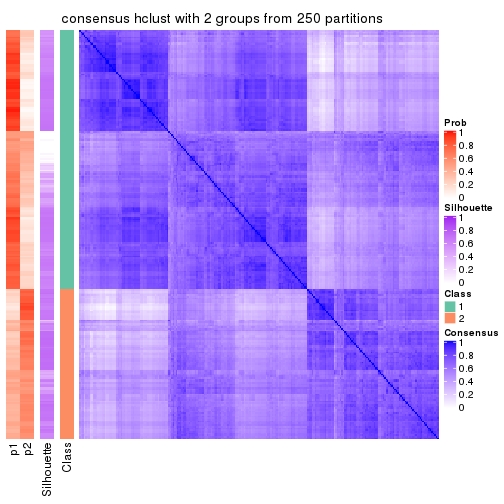</p>

</div>
<div id='tab-SD-hclust-consensus-heatmap-2'>
<pre><code class="r">consensus_heatmap(res, k = 3)
</code></pre>

<p></p>

</div>
<div id='tab-SD-hclust-consensus-heatmap-3'>
<pre><code class="r">consensus_heatmap(res, k = 4)
</code></pre>

<p></p>

</div>
<div id='tab-SD-hclust-consensus-heatmap-4'>
<pre><code class="r">consensus_heatmap(res, k = 5)
</code></pre>

<p></p>

</div>
<div id='tab-SD-hclust-consensus-heatmap-5'>
<pre><code class="r">consensus_heatmap(res, k = 6)
</code></pre>

<p></p>

</div>
</div>

Heatmaps for the membership of samples in all partitions to see how consistent they are:


<script>
$( function() {
	$( '#tabs-SD-hclust-membership-heatmap' ).tabs();
} );
</script>
<div id='tabs-SD-hclust-membership-heatmap'>
<ul>
<li><a href='#tab-SD-hclust-membership-heatmap-1'>k = 2</a></li>
<li><a href='#tab-SD-hclust-membership-heatmap-2'>k = 3</a></li>
<li><a href='#tab-SD-hclust-membership-heatmap-3'>k = 4</a></li>
<li><a href='#tab-SD-hclust-membership-heatmap-4'>k = 5</a></li>
<li><a href='#tab-SD-hclust-membership-heatmap-5'>k = 6</a></li>
</ul>
<div id='tab-SD-hclust-membership-heatmap-1'>
<pre><code class="r">membership_heatmap(res, k = 2)
</code></pre>

<p></p>

</div>
<div id='tab-SD-hclust-membership-heatmap-2'>
<pre><code class="r">membership_heatmap(res, k = 3)
</code></pre>

<p></p>

</div>
<div id='tab-SD-hclust-membership-heatmap-3'>
<pre><code class="r">membership_heatmap(res, k = 4)
</code></pre>

<p></p>

</div>
<div id='tab-SD-hclust-membership-heatmap-4'>
<pre><code class="r">membership_heatmap(res, k = 5)
</code></pre>

<p></p>

</div>
<div id='tab-SD-hclust-membership-heatmap-5'>
<pre><code class="r">membership_heatmap(res, k = 6)
</code></pre>

<p></p>

</div>
</div>

As soon as we have had the classes for columns, we can look for signatures
which are significantly different between classes which can be candidate marks
for certain classes. Following are the heatmaps for signatures.


Signature heatmaps where rows are scaled:


<script>
$( function() {
	$( '#tabs-SD-hclust-get-signatures' ).tabs();
} );
</script>
<div id='tabs-SD-hclust-get-signatures'>
<ul>
<li><a href='#tab-SD-hclust-get-signatures-1'>k = 2</a></li>
<li><a href='#tab-SD-hclust-get-signatures-2'>k = 3</a></li>
<li><a href='#tab-SD-hclust-get-signatures-3'>k = 4</a></li>
<li><a href='#tab-SD-hclust-get-signatures-4'>k = 5</a></li>
<li><a href='#tab-SD-hclust-get-signatures-5'>k = 6</a></li>
</ul>
<div id='tab-SD-hclust-get-signatures-1'>
<pre><code class="r">get_signatures(res, k = 2)
</code></pre>

<p></p>

</div>
<div id='tab-SD-hclust-get-signatures-2'>
<pre><code class="r">get_signatures(res, k = 3)
</code></pre>

<p></p>

</div>
<div id='tab-SD-hclust-get-signatures-3'>
<pre><code class="r">get_signatures(res, k = 4)
</code></pre>

<p>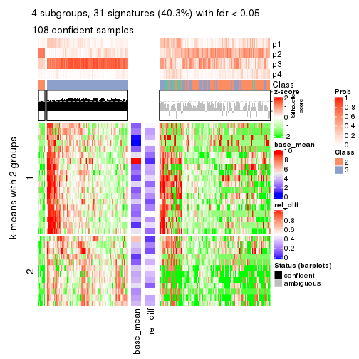</p>

</div>
<div id='tab-SD-hclust-get-signatures-4'>
<pre><code class="r">get_signatures(res, k = 5)
</code></pre>

<p></p>

</div>
<div id='tab-SD-hclust-get-signatures-5'>
<pre><code class="r">get_signatures(res, k = 6)
</code></pre>

<p></p>

</div>
</div>


Signature heatmaps where rows are not scaled:


<script>
$( function() {
	$( '#tabs-SD-hclust-get-signatures-no-scale' ).tabs();
} );
</script>
<div id='tabs-SD-hclust-get-signatures-no-scale'>
<ul>
<li><a href='#tab-SD-hclust-get-signatures-no-scale-1'>k = 2</a></li>
<li><a href='#tab-SD-hclust-get-signatures-no-scale-2'>k = 3</a></li>
<li><a href='#tab-SD-hclust-get-signatures-no-scale-3'>k = 4</a></li>
<li><a href='#tab-SD-hclust-get-signatures-no-scale-4'>k = 5</a></li>
<li><a href='#tab-SD-hclust-get-signatures-no-scale-5'>k = 6</a></li>
</ul>
<div id='tab-SD-hclust-get-signatures-no-scale-1'>
<pre><code class="r">get_signatures(res, k = 2, scale_rows = FALSE)
</code></pre>

<p></p>

</div>
<div id='tab-SD-hclust-get-signatures-no-scale-2'>
<pre><code class="r">get_signatures(res, k = 3, scale_rows = FALSE)
</code></pre>

<p></p>

</div>
<div id='tab-SD-hclust-get-signatures-no-scale-3'>
<pre><code class="r">get_signatures(res, k = 4, scale_rows = FALSE)
</code></pre>

<p></p>

</div>
<div id='tab-SD-hclust-get-signatures-no-scale-4'>
<pre><code class="r">get_signatures(res, k = 5, scale_rows = FALSE)
</code></pre>

<p></p>

</div>
<div id='tab-SD-hclust-get-signatures-no-scale-5'>
<pre><code class="r">get_signatures(res, k = 6, scale_rows = FALSE)
</code></pre>

<p></p>

</div>
</div>


Compare the overlap of signatures from different k:

```r
compare_signatures(res)
```


`get_signature()` returns a data frame invisibly. TO get the list of signatures, the function
call should be assigned to a variable explicitly. In following code, if `plot` argument is set
to `FALSE`, no heatmap is plotted while only the differential analysis is performed.

```r
# code only for demonstration
tb = get_signature(res, k = ..., plot = FALSE)
```

An example of the output of `tb` is:

```
#>   which_row         fdr    mean_1    mean_2 scaled_mean_1 scaled_mean_2 km
#> 1        38 0.042760348  8.373488  9.131774    -0.5533452     0.5164555  1
#> 2        40 0.018707592  7.106213  8.469186    -0.6173731     0.5762149  1
#> 3        55 0.019134737 10.221463 11.207825    -0.6159697     0.5749050  1
#> 4        59 0.006059896  5.921854  7.869574    -0.6899429     0.6439467  1
#> 5        60 0.018055526  8.928898 10.211722    -0.6204761     0.5791110  1
#> 6        98 0.009384629 15.714769 14.887706     0.6635654    -0.6193277  2
...
```

The columns in `tb` are:

1. `which_row`: row indices corresponding to the input matrix.
2. `fdr`: FDR for the differential test. 
3. `mean_x`: The mean value in group x.
4. `scaled_mean_x`: The mean value in group x after rows are scaled.
5. `km`: Row groups if k-means clustering is applied to rows.


UMAP plot which shows how samples are separated.


<script>
$( function() {
	$( '#tabs-SD-hclust-dimension-reduction' ).tabs();
} );
</script>
<div id='tabs-SD-hclust-dimension-reduction'>
<ul>
<li><a href='#tab-SD-hclust-dimension-reduction-1'>k = 2</a></li>
<li><a href='#tab-SD-hclust-dimension-reduction-2'>k = 3</a></li>
<li><a href='#tab-SD-hclust-dimension-reduction-3'>k = 4</a></li>
<li><a href='#tab-SD-hclust-dimension-reduction-4'>k = 5</a></li>
<li><a href='#tab-SD-hclust-dimension-reduction-5'>k = 6</a></li>
</ul>
<div id='tab-SD-hclust-dimension-reduction-1'>
<pre><code class="r">dimension_reduction(res, k = 2, method = &quot;UMAP&quot;)
</code></pre>

<p></p>

</div>
<div id='tab-SD-hclust-dimension-reduction-2'>
<pre><code class="r">dimension_reduction(res, k = 3, method = &quot;UMAP&quot;)
</code></pre>

<p></p>

</div>
<div id='tab-SD-hclust-dimension-reduction-3'>
<pre><code class="r">dimension_reduction(res, k = 4, method = &quot;UMAP&quot;)
</code></pre>

<p></p>

</div>
<div id='tab-SD-hclust-dimension-reduction-4'>
<pre><code class="r">dimension_reduction(res, k = 5, method = &quot;UMAP&quot;)
</code></pre>

<p></p>

</div>
<div id='tab-SD-hclust-dimension-reduction-5'>
<pre><code class="r">dimension_reduction(res, k = 6, method = &quot;UMAP&quot;)
</code></pre>

<p></p>

</div>
</div>


Following heatmap shows how subgroups are split when increasing `k`:

```r
collect_classes(res)
```


If matrix rows can be associated to genes, consider to use `GO_Enrichment(res,
...)` to perform function enrichment for the signature genes.


 

---------------------------------------------------


### SD:kmeans


The object with results only for a single top-value method and a single partition method 
can be extracted as:

```r
res = res_list["SD", "kmeans"]
# you can also extract it by
# res = res_list["SD:kmeans"]
```

A summary of `res` and all the functions that can be applied to it:

```r
res
```

```
#> A 'ConsensusPartition' object with k = 2, 3, 4, 5, 6.
#>   On a matrix with 77 rows and 243 columns.
#>   Top rows (8, 16, 23, 30, 38) are extracted by 'SD' method.
#>   Subgroups are detected by 'kmeans' method.
#>   Performed in total 1250 partitions by row resampling.
#>   Best k for subgroups seems to be 2.
#> 
#> Following methods can be applied to this 'ConsensusPartition' object:
#>  [1] "cola_report"             "collect_classes"         "collect_plots"          
#>  [4] "collect_stats"           "colnames"                "compare_signatures"     
#>  [7] "consensus_heatmap"       "dimension_reduction"     "functional_enrichment"  
#> [10] "get_anno_col"            "get_anno"                "get_classes"            
#> [13] "get_consensus"           "get_matrix"              "get_membership"         
#> [16] "get_param"               "get_signatures"          "get_stats"              
#> [19] "is_best_k"               "is_stable_k"             "membership_heatmap"     
#> [22] "ncol"                    "nrow"                    "plot_ecdf"              
#> [25] "rownames"                "select_partition_number" "show"                   
#> [28] "suggest_best_k"          "test_to_known_factors"
```

`collect_plots()` function collects all the plots made from `res` for all `k` (number of partitions)
into one single page to provide an easy and fast comparison between different `k`.

```r
collect_plots(res)
```


The plots are:

- The first row: a plot of the ECDF (Empirical cumulative distribution
  function) curves of the consensus matrix for each `k` and the heatmap of
  predicted classes for each `k`.
- The second row: heatmaps of the consensus matrix for each `k`.
- The third row: heatmaps of the membership matrix for each `k`.
- The fouth row: heatmaps of the signatures for each `k`.

All the plots in panels can be made by individual functions and they are
plotted later in this section.

`select_partition_number()` produces several plots showing different
statistics for choosing "optimized" `k`. There are following statistics:

- ECDF curves of the consensus matrix for each `k`;
- 1-PAC. [The PAC
  score](https://en.wikipedia.org/wiki/Consensus_clustering#Over-interpretation_potential_of_consensus_clustering)
  measures the proportion of the ambiguous subgrouping.
- Mean silhouette score.
- Concordance. The mean probability of fiting the consensus class ids in all
  partitions.
- Area increased. Denote $A_k$ as the area under the ECDF curve for current
  `k`, the area increased is defined as $A_k - A_{k-1}$.
- Rand index. The percent of pairs of samples that are both in a same cluster
  or both are not in a same cluster in the partition of k and k-1.
- Jaccard index. The ratio of pairs of samples are both in a same cluster in
  the partition of k and k-1 and the pairs of samples are both in a same
  cluster in the partition k or k-1.

The detailed explanations of these statistics can be found in [the cola
vignette](http://bioconductor.org/packages/devel/bioc/vignettes/cola/inst/doc/cola.html#toc_13).

Generally speaking, lower PAC score, higher mean silhouette score or higher
concordance corresponds to better partition. Rand index and Jaccard index
measure how similar the current partition is compared to partition with `k-1`.
If they are too similar, we won't accept `k` is better than `k-1`.

```r
select_partition_number(res)
```


The numeric values for all these statistics can be obtained by `get_stats()`.

```r
get_stats(res)
```

```
#>   k 1-PAC mean_silhouette concordance area_increased  Rand Jaccard
#> 2 2 0.439           0.780       0.893         0.4898 0.502   0.502
#> 3 3 0.312           0.462       0.723         0.3064 0.679   0.447
#> 4 4 0.354           0.508       0.694         0.1261 0.728   0.384
#> 5 5 0.397           0.362       0.598         0.0721 0.919   0.728
#> 6 6 0.430           0.267       0.520         0.0436 0.924   0.719
```

`suggest_best_k()` suggests the best $k$ based on these statistics. The rules are as follows:

- All $k$ with Jaccard index larger than 0.95 are removed because the increase of
  the partition number does not provides enough extra information. If all $k$ are removed,
  the best $k$ is assigned by `NA`.
- For $k$ with 1-PAC larger than 0.9, the maximal $k$ is taken as the "best k". Other $k$ is called "optional k".
- If it does not fit the second rule. The $k$ with the highest vote of highest
  1-PAC, mean silhouette and concordance is taken as the "best k".

```r
suggest_best_k(res)
```

```
#> [1] 2
```


Following shows the table of the partitions (You need to click the **show/hide
code output** link to see it). The membership matrix (columns with name `p*`)
is inferred by
[`clue::cl_consensus()`](https://www.rdocumentation.org/link/cl_consensus?package=clue)
function with the `SE` method. Basically the value in the membership matrix
represents the probability to belong to a certain group. The finall class
label for an item is determined with the group with highest probability it
belongs to.

In `get_classes()` function, the entropy is calculated from the membership
matrix and the silhouette score is calculated from the consensus matrix.


<script>
$( function() {
	$( '#tabs-SD-kmeans-get-classes' ).tabs();
} );
</script>
<div id='tabs-SD-kmeans-get-classes'>
<ul>
<li><a href='#tab-SD-kmeans-get-classes-1'>k = 2</a></li>
<li><a href='#tab-SD-kmeans-get-classes-2'>k = 3</a></li>
<li><a href='#tab-SD-kmeans-get-classes-3'>k = 4</a></li>
<li><a href='#tab-SD-kmeans-get-classes-4'>k = 5</a></li>
<li><a href='#tab-SD-kmeans-get-classes-5'>k = 6</a></li>
</ul>

<div id='tab-SD-kmeans-get-classes-1'>
<p><a id='tab-SD-kmeans-get-classes-1-a' style='color:#0366d6' href='#'>show/hide code output</a></p>
<pre><code class="r">cbind(get_classes(res, k = 2), get_membership(res, k = 2))
</code></pre>

<pre><code>#&gt;           class entropy silhouette    p1    p2
#&gt; SRR191393     1  0.0000     0.8727 1.000 0.000
#&gt; SRR191394     1  0.0000     0.8727 1.000 0.000
#&gt; SRR191396     1  0.9988     0.0931 0.520 0.480
#&gt; SRR191397     1  0.0000     0.8727 1.000 0.000
#&gt; SRR191398     1  0.0000     0.8727 1.000 0.000
#&gt; SRR191399     1  0.2043     0.8714 0.968 0.032
#&gt; SRR191400     1  0.1184     0.8697 0.984 0.016
#&gt; SRR191401     1  0.0000     0.8727 1.000 0.000
#&gt; SRR191402     1  0.4022     0.8575 0.920 0.080
#&gt; SRR191403     1  0.0000     0.8727 1.000 0.000
#&gt; SRR191404     2  0.0000     0.8769 0.000 1.000
#&gt; SRR191405     2  0.7602     0.7274 0.220 0.780
#&gt; SRR191406     1  0.7056     0.7746 0.808 0.192
#&gt; SRR191407     1  0.1414     0.8690 0.980 0.020
#&gt; SRR191408     1  0.3431     0.8488 0.936 0.064
#&gt; SRR191409     1  0.5842     0.8279 0.860 0.140
#&gt; SRR191410     1  0.7219     0.7649 0.800 0.200
#&gt; SRR191411     1  0.1184     0.8734 0.984 0.016
#&gt; SRR191412     1  0.0000     0.8727 1.000 0.000
#&gt; SRR191413     1  0.0000     0.8727 1.000 0.000
#&gt; SRR191414     1  0.0000     0.8727 1.000 0.000
#&gt; SRR191415     1  0.7453     0.7521 0.788 0.212
#&gt; SRR191416     1  0.4022     0.8566 0.920 0.080
#&gt; SRR191418     1  0.0000     0.8727 1.000 0.000
#&gt; SRR191419     1  0.0000     0.8727 1.000 0.000
#&gt; SRR191420     1  0.0000     0.8727 1.000 0.000
#&gt; SRR191421     1  0.0000     0.8727 1.000 0.000
#&gt; SRR191422     2  0.0000     0.8769 0.000 1.000
#&gt; SRR191423     2  0.0000     0.8769 0.000 1.000
#&gt; SRR191424     2  0.0000     0.8769 0.000 1.000
#&gt; SRR191425     1  0.0376     0.8733 0.996 0.004
#&gt; SRR191426     1  0.9323     0.5211 0.652 0.348
#&gt; SRR191427     1  0.9580     0.3559 0.620 0.380
#&gt; SRR191428     1  0.0672     0.8738 0.992 0.008
#&gt; SRR191429     2  0.0000     0.8769 0.000 1.000
#&gt; SRR191430     2  0.2603     0.8720 0.044 0.956
#&gt; SRR191431     2  0.0376     0.8766 0.004 0.996
#&gt; SRR191432     2  0.0000     0.8769 0.000 1.000
#&gt; SRR191433     2  0.3114     0.8673 0.056 0.944
#&gt; SRR191434     2  0.6343     0.7912 0.160 0.840
#&gt; SRR191435     1  0.2423     0.8675 0.960 0.040
#&gt; SRR191436     1  0.6887     0.7870 0.816 0.184
#&gt; SRR191437     2  0.0376     0.8762 0.004 0.996
#&gt; SRR191438     2  0.7745     0.7145 0.228 0.772
#&gt; SRR191439     2  0.1414     0.8768 0.020 0.980
#&gt; SRR191440     2  0.0938     0.8748 0.012 0.988
#&gt; SRR191441     2  0.0000     0.8769 0.000 1.000
#&gt; SRR191442     1  0.6887     0.7870 0.816 0.184
#&gt; SRR191443     1  0.0000     0.8727 1.000 0.000
#&gt; SRR191444     1  0.9491     0.4648 0.632 0.368
#&gt; SRR191445     2  0.6438     0.7948 0.164 0.836
#&gt; SRR191446     2  0.2778     0.8708 0.048 0.952
#&gt; SRR191447     2  0.0000     0.8769 0.000 1.000
#&gt; SRR191448     1  0.0000     0.8727 1.000 0.000
#&gt; SRR191449     1  0.5059     0.8400 0.888 0.112
#&gt; SRR191450     1  0.1843     0.8663 0.972 0.028
#&gt; SRR191451     1  0.7056     0.7422 0.808 0.192
#&gt; SRR191452     2  0.0000     0.8769 0.000 1.000
#&gt; SRR191453     2  0.9686     0.3793 0.396 0.604
#&gt; SRR191454     1  0.4161     0.8603 0.916 0.084
#&gt; SRR191455     2  0.9686     0.3578 0.396 0.604
#&gt; SRR191456     1  0.9815     0.2278 0.580 0.420
#&gt; SRR191457     1  0.3733     0.8418 0.928 0.072
#&gt; SRR191458     2  0.8499     0.6479 0.276 0.724
#&gt; SRR191459     1  0.9833     0.3095 0.576 0.424
#&gt; SRR191460     1  0.8016     0.7104 0.756 0.244
#&gt; SRR191461     1  0.7056     0.7767 0.808 0.192
#&gt; SRR191462     2  0.9460     0.4465 0.364 0.636
#&gt; SRR191463     2  0.0000     0.8769 0.000 1.000
#&gt; SRR191464     2  0.0000     0.8769 0.000 1.000
#&gt; SRR191465     2  0.0000     0.8769 0.000 1.000
#&gt; SRR191466     1  0.8955     0.6209 0.688 0.312
#&gt; SRR191467     2  0.0672     0.8777 0.008 0.992
#&gt; SRR191468     2  0.0000     0.8769 0.000 1.000
#&gt; SRR191469     1  0.5629     0.8360 0.868 0.132
#&gt; SRR191470     2  0.2043     0.8760 0.032 0.968
#&gt; SRR191471     2  0.5842     0.8113 0.140 0.860
#&gt; SRR191472     2  0.0000     0.8769 0.000 1.000
#&gt; SRR191473     2  0.4298     0.8491 0.088 0.912
#&gt; SRR191474     1  0.6623     0.7946 0.828 0.172
#&gt; SRR191475     2  0.0000     0.8769 0.000 1.000
#&gt; SRR191476     2  0.0938     0.8777 0.012 0.988
#&gt; SRR191477     2  0.1414     0.8767 0.020 0.980
#&gt; SRR191478     2  0.0000     0.8769 0.000 1.000
#&gt; SRR191479     1  0.0000     0.8727 1.000 0.000
#&gt; SRR191480     2  0.2423     0.8711 0.040 0.960
#&gt; SRR191481     2  0.4161     0.8519 0.084 0.916
#&gt; SRR191482     2  0.7528     0.7252 0.216 0.784
#&gt; SRR191483     2  0.5519     0.8199 0.128 0.872
#&gt; SRR191484     1  0.0000     0.8727 1.000 0.000
#&gt; SRR191485     2  0.0938     0.8774 0.012 0.988
#&gt; SRR191486     1  0.9286     0.4662 0.656 0.344
#&gt; SRR191487     2  0.6531     0.7858 0.168 0.832
#&gt; SRR191488     1  0.0376     0.8735 0.996 0.004
#&gt; SRR191489     2  0.9896     0.1895 0.440 0.560
#&gt; SRR191490     2  0.0938     0.8757 0.012 0.988
#&gt; SRR191491     1  0.3431     0.8657 0.936 0.064
#&gt; SRR191492     1  0.4815     0.8456 0.896 0.104
#&gt; SRR191493     2  0.8267     0.6446 0.260 0.740
#&gt; SRR191494     2  0.0000     0.8769 0.000 1.000
#&gt; SRR191495     1  0.5946     0.8186 0.856 0.144
#&gt; SRR191496     2  0.0000     0.8769 0.000 1.000
#&gt; SRR191497     1  0.6801     0.7870 0.820 0.180
#&gt; SRR191498     1  0.7299     0.7475 0.796 0.204
#&gt; SRR191499     1  0.5059     0.8410 0.888 0.112
#&gt; SRR191500     1  0.6712     0.7919 0.824 0.176
#&gt; SRR191501     2  0.4431     0.8364 0.092 0.908
#&gt; SRR191502     2  0.3879     0.8578 0.076 0.924
#&gt; SRR191503     2  0.0000     0.8769 0.000 1.000
#&gt; SRR191504     2  0.2603     0.8712 0.044 0.956
#&gt; SRR191505     2  0.3114     0.8664 0.056 0.944
#&gt; SRR191506     2  0.0000     0.8769 0.000 1.000
#&gt; SRR191507     2  0.3431     0.8608 0.064 0.936
#&gt; SRR191508     2  0.7528     0.7308 0.216 0.784
#&gt; SRR191509     2  0.2948     0.8696 0.052 0.948
#&gt; SRR191510     2  0.6048     0.8040 0.148 0.852
#&gt; SRR191511     2  0.0000     0.8769 0.000 1.000
#&gt; SRR191512     2  0.0000     0.8769 0.000 1.000
#&gt; SRR191513     2  0.0000     0.8769 0.000 1.000
#&gt; SRR191514     2  0.0000     0.8769 0.000 1.000
#&gt; SRR191515     2  0.2603     0.8717 0.044 0.956
#&gt; SRR191516     1  0.5294     0.8365 0.880 0.120
#&gt; SRR191517     2  0.9896     0.2159 0.440 0.560
#&gt; SRR191518     2  0.4815     0.8421 0.104 0.896
#&gt; SRR191519     2  0.0000     0.8769 0.000 1.000
#&gt; SRR191520     1  0.7883     0.7197 0.764 0.236
#&gt; SRR191521     2  0.3584     0.8615 0.068 0.932
#&gt; SRR191522     2  0.6712     0.7766 0.176 0.824
#&gt; SRR191523     2  0.0376     0.8770 0.004 0.996
#&gt; SRR191524     1  0.6531     0.7796 0.832 0.168
#&gt; SRR191525     2  0.2778     0.8705 0.048 0.952
#&gt; SRR191526     2  0.0000     0.8769 0.000 1.000
#&gt; SRR191527     1  0.9795     0.2386 0.584 0.416
#&gt; SRR191528     2  0.9963     0.1933 0.464 0.536
#&gt; SRR191529     2  0.2778     0.8584 0.048 0.952
#&gt; SRR191530     2  0.2603     0.8718 0.044 0.956
#&gt; SRR191531     2  0.9209     0.5089 0.336 0.664
#&gt; SRR191532     2  0.8713     0.6167 0.292 0.708
#&gt; SRR191533     2  0.7674     0.6949 0.224 0.776
#&gt; SRR191534     2  0.6801     0.7814 0.180 0.820
#&gt; SRR191535     2  0.2423     0.8732 0.040 0.960
#&gt; SRR191536     1  0.9881     0.2630 0.564 0.436
#&gt; SRR191537     2  0.0000     0.8769 0.000 1.000
#&gt; SRR191538     2  0.0000     0.8769 0.000 1.000
#&gt; SRR191539     2  0.0000     0.8769 0.000 1.000
#&gt; SRR191540     2  1.0000    -0.0501 0.500 0.500
#&gt; SRR191541     2  0.2043     0.8748 0.032 0.968
#&gt; SRR191542     2  0.0000     0.8769 0.000 1.000
#&gt; SRR191543     2  0.1843     0.8754 0.028 0.972
#&gt; SRR191544     2  0.3274     0.8660 0.060 0.940
#&gt; SRR191545     2  0.4298     0.8498 0.088 0.912
#&gt; SRR191546     2  0.9427     0.4532 0.360 0.640
#&gt; SRR191547     1  0.9850     0.3285 0.572 0.428
#&gt; SRR191548     1  0.0000     0.8727 1.000 0.000
#&gt; SRR191549     1  0.0000     0.8727 1.000 0.000
#&gt; SRR191550     1  0.0000     0.8727 1.000 0.000
#&gt; SRR191551     1  0.0000     0.8727 1.000 0.000
#&gt; SRR191552     1  0.0000     0.8727 1.000 0.000
#&gt; SRR191553     1  0.0000     0.8727 1.000 0.000
#&gt; SRR191554     1  0.1414     0.8691 0.980 0.020
#&gt; SRR191555     1  0.0000     0.8727 1.000 0.000
#&gt; SRR191556     1  0.0672     0.8735 0.992 0.008
#&gt; SRR191557     1  0.3733     0.8600 0.928 0.072
#&gt; SRR191558     2  0.0672     0.8773 0.008 0.992
#&gt; SRR191559     1  0.2236     0.8705 0.964 0.036
#&gt; SRR191560     1  0.0376     0.8733 0.996 0.004
#&gt; SRR191561     1  0.3879     0.8394 0.924 0.076
#&gt; SRR191562     1  0.0000     0.8727 1.000 0.000
#&gt; SRR191563     2  0.9491     0.4115 0.368 0.632
#&gt; SRR191564     1  0.4022     0.8565 0.920 0.080
#&gt; SRR191565     1  0.0000     0.8727 1.000 0.000
#&gt; SRR191566     1  0.0376     0.8733 0.996 0.004
#&gt; SRR191567     1  0.0000     0.8727 1.000 0.000
#&gt; SRR191568     1  0.0000     0.8727 1.000 0.000
#&gt; SRR191569     1  0.5294     0.8352 0.880 0.120
#&gt; SRR191570     1  0.3879     0.8405 0.924 0.076
#&gt; SRR191571     1  0.2043     0.8717 0.968 0.032
#&gt; SRR191572     1  0.0000     0.8727 1.000 0.000
#&gt; SRR191573     1  0.0672     0.8735 0.992 0.008
#&gt; SRR191574     1  0.0000     0.8727 1.000 0.000
#&gt; SRR191575     1  0.3114     0.8507 0.944 0.056
#&gt; SRR191576     1  0.9129     0.5416 0.672 0.328
#&gt; SRR191577     1  0.0672     0.8716 0.992 0.008
#&gt; SRR191578     2  0.0000     0.8769 0.000 1.000
#&gt; SRR191579     1  0.0000     0.8727 1.000 0.000
#&gt; SRR191580     1  0.7139     0.7170 0.804 0.196
#&gt; SRR191581     1  0.8144     0.6258 0.748 0.252
#&gt; SRR191582     1  0.4815     0.8192 0.896 0.104
#&gt; SRR191583     2  0.0000     0.8769 0.000 1.000
#&gt; SRR191584     2  0.9896     0.2500 0.440 0.560
#&gt; SRR191585     1  0.5946     0.8180 0.856 0.144
#&gt; SRR191586     1  0.5294     0.8351 0.880 0.120
#&gt; SRR191587     1  0.6712     0.7933 0.824 0.176
#&gt; SRR191588     1  0.0376     0.8733 0.996 0.004
#&gt; SRR191589     1  0.0672     0.8735 0.992 0.008
#&gt; SRR191590     1  0.0000     0.8727 1.000 0.000
#&gt; SRR191591     1  0.5946     0.8202 0.856 0.144
#&gt; SRR191592     1  0.2043     0.8714 0.968 0.032
#&gt; SRR191593     1  0.0376     0.8733 0.996 0.004
#&gt; SRR191594     1  0.0000     0.8727 1.000 0.000
#&gt; SRR191595     1  0.0376     0.8733 0.996 0.004
#&gt; SRR191596     1  0.0376     0.8733 0.996 0.004
#&gt; SRR191597     1  0.8813     0.6160 0.700 0.300
#&gt; SRR191598     1  0.0672     0.8735 0.992 0.008
#&gt; SRR191599     1  0.0000     0.8727 1.000 0.000
#&gt; SRR191600     2  0.2948     0.8699 0.052 0.948
#&gt; SRR191601     1  0.9248     0.5500 0.660 0.340
#&gt; SRR191602     1  0.8327     0.6790 0.736 0.264
#&gt; SRR191603     1  0.8608     0.6444 0.716 0.284
#&gt; SRR191604     2  0.0000     0.8769 0.000 1.000
#&gt; SRR191605     1  0.8267     0.6855 0.740 0.260
#&gt; SRR191606     1  0.0938     0.8741 0.988 0.012
#&gt; SRR191607     1  0.3114     0.8657 0.944 0.056
#&gt; SRR191608     1  0.9998     0.0558 0.508 0.492
#&gt; SRR191609     1  0.7815     0.7262 0.768 0.232
#&gt; SRR191610     1  0.0938     0.8736 0.988 0.012
#&gt; SRR191611     1  0.4939     0.8422 0.892 0.108
#&gt; SRR191612     1  0.3584     0.8621 0.932 0.068
#&gt; SRR191613     1  0.0000     0.8727 1.000 0.000
#&gt; SRR191614     1  0.3431     0.8629 0.936 0.064
#&gt; SRR191615     1  0.1843     0.8720 0.972 0.028
#&gt; SRR191616     2  0.3114     0.8546 0.056 0.944
#&gt; SRR191617     2  0.0000     0.8769 0.000 1.000
#&gt; SRR191618     2  0.8763     0.5762 0.296 0.704
#&gt; SRR191619     2  0.7674     0.7175 0.224 0.776
#&gt; SRR191620     2  0.0376     0.8772 0.004 0.996
#&gt; SRR191621     2  0.1633     0.8762 0.024 0.976
#&gt; SRR191622     2  0.7056     0.7627 0.192 0.808
#&gt; SRR191623     1  0.3431     0.8629 0.936 0.064
#&gt; SRR191624     1  0.0000     0.8727 1.000 0.000
#&gt; SRR191625     2  0.7950     0.6944 0.240 0.760
#&gt; SRR191626     1  0.9998     0.0571 0.508 0.492
#&gt; SRR191627     2  0.9087     0.5423 0.324 0.676
#&gt; SRR191628     1  0.6438     0.8026 0.836 0.164
#&gt; SRR191629     1  0.9000     0.5873 0.684 0.316
#&gt; SRR191630     1  0.0000     0.8727 1.000 0.000
#&gt; SRR191631     2  0.9775     0.3089 0.412 0.588
#&gt; SRR191632     1  0.3733     0.8607 0.928 0.072
#&gt; SRR191633     2  0.8499     0.6347 0.276 0.724
#&gt; SRR191634     2  0.0672     0.8759 0.008 0.992
#&gt; SRR191635     1  0.5178     0.8380 0.884 0.116
#&gt; SRR191636     2  0.7453     0.7385 0.212 0.788
#&gt; SRR191637     2  0.0000     0.8769 0.000 1.000
</code></pre>

<script>
$('#tab-SD-kmeans-get-classes-1-a').parent().next().next().hide();
$('#tab-SD-kmeans-get-classes-1-a').click(function(){
  $('#tab-SD-kmeans-get-classes-1-a').parent().next().next().toggle();
  return(false);
});
</script>
</div>

<div id='tab-SD-kmeans-get-classes-2'>
<p><a id='tab-SD-kmeans-get-classes-2-a' style='color:#0366d6' href='#'>show/hide code output</a></p>
<pre><code class="r">cbind(get_classes(res, k = 3), get_membership(res, k = 3))
</code></pre>

<pre><code>#&gt;           class entropy silhouette    p1    p2    p3
#&gt; SRR191393     1  0.1031    0.67687 0.976 0.000 0.024
#&gt; SRR191394     1  0.0592    0.67549 0.988 0.000 0.012
#&gt; SRR191396     3  0.8399    0.39121 0.256 0.136 0.608
#&gt; SRR191397     1  0.0424    0.67573 0.992 0.000 0.008
#&gt; SRR191398     1  0.0424    0.67573 0.992 0.000 0.008
#&gt; SRR191399     1  0.5988    0.28855 0.632 0.000 0.368
#&gt; SRR191400     1  0.2711    0.63998 0.912 0.000 0.088
#&gt; SRR191401     1  0.1163    0.67641 0.972 0.000 0.028
#&gt; SRR191402     3  0.6291    0.16826 0.468 0.000 0.532
#&gt; SRR191403     1  0.0237    0.67531 0.996 0.000 0.004
#&gt; SRR191404     2  0.2860    0.76689 0.004 0.912 0.084
#&gt; SRR191405     3  0.6393    0.50802 0.088 0.148 0.764
#&gt; SRR191406     3  0.4235    0.54455 0.176 0.000 0.824
#&gt; SRR191407     1  0.4808    0.58658 0.804 0.008 0.188
#&gt; SRR191408     1  0.6228    0.48946 0.672 0.012 0.316
#&gt; SRR191409     3  0.6045    0.30064 0.380 0.000 0.620
#&gt; SRR191410     3  0.5560    0.48637 0.300 0.000 0.700
#&gt; SRR191411     3  0.5465    0.44485 0.288 0.000 0.712
#&gt; SRR191412     1  0.1860    0.67239 0.948 0.000 0.052
#&gt; SRR191413     1  0.5859    0.36236 0.656 0.000 0.344
#&gt; SRR191414     1  0.2537    0.66145 0.920 0.000 0.080
#&gt; SRR191415     3  0.5058    0.52350 0.244 0.000 0.756
#&gt; SRR191416     3  0.6252    0.20328 0.444 0.000 0.556
#&gt; SRR191418     1  0.5621    0.42207 0.692 0.000 0.308
#&gt; SRR191419     1  0.1289    0.67240 0.968 0.000 0.032
#&gt; SRR191420     1  0.1964    0.66710 0.944 0.000 0.056
#&gt; SRR191421     1  0.3879    0.62008 0.848 0.000 0.152
#&gt; SRR191422     2  0.4887    0.76236 0.000 0.772 0.228
#&gt; SRR191423     2  0.3752    0.77965 0.000 0.856 0.144
#&gt; SRR191424     2  0.0424    0.76383 0.000 0.992 0.008
#&gt; SRR191425     1  0.6244    0.16876 0.560 0.000 0.440
#&gt; SRR191426     3  0.4968    0.55335 0.188 0.012 0.800
#&gt; SRR191427     1  0.9561    0.05297 0.428 0.196 0.376
#&gt; SRR191428     3  0.6299    0.10529 0.476 0.000 0.524
#&gt; SRR191429     2  0.5497    0.73793 0.000 0.708 0.292
#&gt; SRR191430     2  0.6682    0.52791 0.008 0.504 0.488
#&gt; SRR191431     2  0.3293    0.77876 0.012 0.900 0.088
#&gt; SRR191432     2  0.5138    0.75612 0.000 0.748 0.252
#&gt; SRR191433     2  0.6659    0.57748 0.008 0.532 0.460
#&gt; SRR191434     3  0.7801    0.20502 0.088 0.276 0.636
#&gt; SRR191435     1  0.6359    0.27851 0.592 0.004 0.404
#&gt; SRR191436     3  0.4121    0.55317 0.168 0.000 0.832
#&gt; SRR191437     2  0.0000    0.76162 0.000 1.000 0.000
#&gt; SRR191438     3  0.5696    0.48031 0.056 0.148 0.796
#&gt; SRR191439     2  0.4514    0.77850 0.012 0.832 0.156
#&gt; SRR191440     2  0.0829    0.76207 0.004 0.984 0.012
#&gt; SRR191441     2  0.0000    0.76162 0.000 1.000 0.000
#&gt; SRR191442     3  0.4575    0.54555 0.184 0.004 0.812
#&gt; SRR191443     1  0.5678    0.48349 0.684 0.000 0.316
#&gt; SRR191444     3  0.5291    0.51095 0.268 0.000 0.732
#&gt; SRR191445     2  0.8814    0.34997 0.140 0.548 0.312
#&gt; SRR191446     3  0.5882    0.05371 0.000 0.348 0.652
#&gt; SRR191447     2  0.5254    0.75320 0.000 0.736 0.264
#&gt; SRR191448     1  0.2301    0.66900 0.936 0.004 0.060
#&gt; SRR191449     3  0.6215    0.22448 0.428 0.000 0.572
#&gt; SRR191450     1  0.4862    0.62266 0.820 0.020 0.160
#&gt; SRR191451     3  0.7996    0.12320 0.380 0.068 0.552
#&gt; SRR191452     2  0.2096    0.77318 0.004 0.944 0.052
#&gt; SRR191453     2  0.9529    0.37272 0.356 0.448 0.196
#&gt; SRR191454     3  0.6330    0.29768 0.396 0.004 0.600
#&gt; SRR191455     3  0.3637    0.55969 0.084 0.024 0.892
#&gt; SRR191456     3  0.9098    0.21746 0.276 0.184 0.540
#&gt; SRR191457     1  0.3856    0.63472 0.888 0.040 0.072
#&gt; SRR191458     3  0.7106    0.38260 0.072 0.232 0.696
#&gt; SRR191459     3  0.5058    0.52581 0.244 0.000 0.756
#&gt; SRR191460     3  0.5058    0.52032 0.244 0.000 0.756
#&gt; SRR191461     3  0.4452    0.53813 0.192 0.000 0.808
#&gt; SRR191462     3  0.9086    0.40742 0.220 0.228 0.552
#&gt; SRR191463     2  0.3412    0.77745 0.000 0.876 0.124
#&gt; SRR191464     2  0.1643    0.77069 0.000 0.956 0.044
#&gt; SRR191465     2  0.2625    0.77917 0.000 0.916 0.084
#&gt; SRR191466     3  0.6653    0.43058 0.288 0.032 0.680
#&gt; SRR191467     2  0.6275    0.70254 0.008 0.644 0.348
#&gt; SRR191468     2  0.2165    0.77735 0.000 0.936 0.064
#&gt; SRR191469     3  0.6189    0.33999 0.364 0.004 0.632
#&gt; SRR191470     3  0.6513   -0.36412 0.004 0.476 0.520
#&gt; SRR191471     2  0.8415    0.57603 0.104 0.564 0.332
#&gt; SRR191472     2  0.3192    0.78039 0.000 0.888 0.112
#&gt; SRR191473     3  0.7382   -0.39833 0.032 0.456 0.512
#&gt; SRR191474     3  0.6095    0.30328 0.392 0.000 0.608
#&gt; SRR191475     2  0.4842    0.76456 0.000 0.776 0.224
#&gt; SRR191476     2  0.6483    0.53824 0.004 0.544 0.452
#&gt; SRR191477     2  0.6521    0.41104 0.004 0.500 0.496
#&gt; SRR191478     2  0.6500    0.54748 0.004 0.532 0.464
#&gt; SRR191479     1  0.6215    0.21411 0.572 0.000 0.428
#&gt; SRR191480     2  0.6267    0.39230 0.000 0.548 0.452
#&gt; SRR191481     3  0.6924   -0.27019 0.020 0.400 0.580
#&gt; SRR191482     3  0.4821    0.54449 0.064 0.088 0.848
#&gt; SRR191483     3  0.7357    0.07347 0.048 0.332 0.620
#&gt; SRR191484     1  0.5741    0.59472 0.776 0.036 0.188
#&gt; SRR191485     2  0.6302    0.54654 0.000 0.520 0.480
#&gt; SRR191486     3  0.8105    0.17336 0.336 0.084 0.580
#&gt; SRR191487     3  0.8318   -0.02042 0.084 0.392 0.524
#&gt; SRR191488     1  0.2860    0.66578 0.912 0.004 0.084
#&gt; SRR191489     3  0.8770    0.42319 0.180 0.236 0.584
#&gt; SRR191490     2  0.0475    0.76079 0.004 0.992 0.004
#&gt; SRR191491     3  0.6659   -0.00752 0.460 0.008 0.532
#&gt; SRR191492     3  0.6244    0.24185 0.440 0.000 0.560
#&gt; SRR191493     2  0.7884    0.57742 0.260 0.640 0.100
#&gt; SRR191494     2  0.4047    0.77771 0.004 0.848 0.148
#&gt; SRR191495     3  0.6140    0.28223 0.404 0.000 0.596
#&gt; SRR191496     2  0.0475    0.76036 0.004 0.992 0.004
#&gt; SRR191497     3  0.5291    0.48363 0.268 0.000 0.732
#&gt; SRR191498     3  0.7842    0.28107 0.328 0.072 0.600
#&gt; SRR191499     3  0.6062    0.32308 0.384 0.000 0.616
#&gt; SRR191500     3  0.5138    0.49688 0.252 0.000 0.748
#&gt; SRR191501     2  0.4925    0.74048 0.076 0.844 0.080
#&gt; SRR191502     3  0.6521   -0.42203 0.004 0.492 0.504
#&gt; SRR191503     2  0.0592    0.76393 0.000 0.988 0.012
#&gt; SRR191504     3  0.6432   -0.38103 0.004 0.428 0.568
#&gt; SRR191505     2  0.5845    0.74337 0.004 0.688 0.308
#&gt; SRR191506     2  0.0983    0.76407 0.004 0.980 0.016
#&gt; SRR191507     2  0.2527    0.75057 0.044 0.936 0.020
#&gt; SRR191508     3  0.7997   -0.11365 0.072 0.360 0.568
#&gt; SRR191509     3  0.7029   -0.31980 0.020 0.440 0.540
#&gt; SRR191510     3  0.7234    0.11471 0.048 0.312 0.640
#&gt; SRR191511     2  0.5926    0.69583 0.000 0.644 0.356
#&gt; SRR191512     2  0.0424    0.76422 0.000 0.992 0.008
#&gt; SRR191513     2  0.3752    0.77786 0.000 0.856 0.144
#&gt; SRR191514     2  0.4974    0.76304 0.000 0.764 0.236
#&gt; SRR191515     2  0.6625    0.57441 0.008 0.552 0.440
#&gt; SRR191516     3  0.5529    0.44902 0.296 0.000 0.704
#&gt; SRR191517     3  0.3896    0.56076 0.128 0.008 0.864
#&gt; SRR191518     3  0.6773   -0.13576 0.024 0.340 0.636
#&gt; SRR191519     2  0.0892    0.76683 0.000 0.980 0.020
#&gt; SRR191520     3  0.5835    0.40717 0.340 0.000 0.660
#&gt; SRR191521     3  0.6309   -0.54701 0.000 0.496 0.504
#&gt; SRR191522     3  0.7505   -0.20836 0.044 0.384 0.572
#&gt; SRR191523     2  0.5431    0.74545 0.000 0.716 0.284
#&gt; SRR191524     1  0.8296    0.16136 0.508 0.080 0.412
#&gt; SRR191525     2  0.6180    0.62269 0.000 0.584 0.416
#&gt; SRR191526     2  0.2537    0.77597 0.000 0.920 0.080
#&gt; SRR191527     1  0.8286    0.28087 0.624 0.236 0.140
#&gt; SRR191528     1  0.8556   -0.09309 0.488 0.416 0.096
#&gt; SRR191529     2  0.4931    0.77095 0.032 0.828 0.140
#&gt; SRR191530     2  0.6489    0.58724 0.004 0.540 0.456
#&gt; SRR191531     2  0.8610    0.43462 0.336 0.548 0.116
#&gt; SRR191532     2  0.8346    0.45184 0.092 0.548 0.360
#&gt; SRR191533     2  0.8603    0.39508 0.168 0.600 0.232
#&gt; SRR191534     2  0.7806    0.66526 0.064 0.584 0.352
#&gt; SRR191535     2  0.6104    0.69856 0.004 0.648 0.348
#&gt; SRR191536     1  0.9736   -0.04042 0.436 0.240 0.324
#&gt; SRR191537     2  0.2297    0.75679 0.020 0.944 0.036
#&gt; SRR191538     2  0.4887    0.76331 0.000 0.772 0.228
#&gt; SRR191539     2  0.1529    0.77126 0.000 0.960 0.040
#&gt; SRR191540     3  0.5554    0.55717 0.112 0.076 0.812
#&gt; SRR191541     2  0.6129    0.74463 0.016 0.700 0.284
#&gt; SRR191542     2  0.3686    0.77836 0.000 0.860 0.140
#&gt; SRR191543     2  0.6148    0.69930 0.004 0.640 0.356
#&gt; SRR191544     2  0.6140    0.66303 0.000 0.596 0.404
#&gt; SRR191545     3  0.6143    0.01255 0.012 0.304 0.684
#&gt; SRR191546     3  0.6856    0.50816 0.128 0.132 0.740
#&gt; SRR191547     3  0.5471    0.55933 0.128 0.060 0.812
#&gt; SRR191548     1  0.0424    0.67573 0.992 0.000 0.008
#&gt; SRR191549     1  0.0237    0.67488 0.996 0.000 0.004
#&gt; SRR191550     1  0.0747    0.67395 0.984 0.000 0.016
#&gt; SRR191551     1  0.0424    0.67573 0.992 0.000 0.008
#&gt; SRR191552     1  0.0592    0.67598 0.988 0.000 0.012
#&gt; SRR191553     1  0.2625    0.66284 0.916 0.000 0.084
#&gt; SRR191554     1  0.2866    0.64577 0.916 0.008 0.076
#&gt; SRR191555     1  0.5529    0.47308 0.704 0.000 0.296
#&gt; SRR191556     3  0.6302    0.09358 0.480 0.000 0.520
#&gt; SRR191557     3  0.6274    0.15986 0.456 0.000 0.544
#&gt; SRR191558     2  0.6811    0.61998 0.016 0.580 0.404
#&gt; SRR191559     3  0.6244    0.17499 0.440 0.000 0.560
#&gt; SRR191560     1  0.6140    0.29795 0.596 0.000 0.404
#&gt; SRR191561     1  0.3755    0.60471 0.872 0.008 0.120
#&gt; SRR191562     1  0.1163    0.67508 0.972 0.000 0.028
#&gt; SRR191563     3  0.3359    0.55452 0.084 0.016 0.900
#&gt; SRR191564     3  0.5560    0.43384 0.300 0.000 0.700
#&gt; SRR191565     1  0.6111    0.29841 0.604 0.000 0.396
#&gt; SRR191566     1  0.6244    0.16815 0.560 0.000 0.440
#&gt; SRR191567     1  0.1163    0.67399 0.972 0.000 0.028
#&gt; SRR191568     1  0.2261    0.66412 0.932 0.000 0.068
#&gt; SRR191569     3  0.5618    0.46696 0.260 0.008 0.732
#&gt; SRR191570     3  0.7099    0.24268 0.384 0.028 0.588
#&gt; SRR191571     1  0.6045    0.28245 0.620 0.000 0.380
#&gt; SRR191572     1  0.0237    0.67531 0.996 0.000 0.004
#&gt; SRR191573     1  0.5591    0.44868 0.696 0.000 0.304
#&gt; SRR191574     1  0.1753    0.66485 0.952 0.000 0.048
#&gt; SRR191575     1  0.3551    0.61096 0.868 0.000 0.132
#&gt; SRR191576     3  0.7003    0.40598 0.248 0.060 0.692
#&gt; SRR191577     1  0.4605    0.58047 0.796 0.000 0.204
#&gt; SRR191578     2  0.5529    0.69584 0.000 0.704 0.296
#&gt; SRR191579     1  0.0747    0.67246 0.984 0.000 0.016
#&gt; SRR191580     1  0.4609    0.58435 0.844 0.028 0.128
#&gt; SRR191581     1  0.6463    0.49583 0.756 0.080 0.164
#&gt; SRR191582     1  0.5743    0.52570 0.784 0.044 0.172
#&gt; SRR191583     2  0.2301    0.77386 0.004 0.936 0.060
#&gt; SRR191584     2  0.7072    0.13088 0.476 0.504 0.020
#&gt; SRR191585     3  0.6045    0.34283 0.380 0.000 0.620
#&gt; SRR191586     3  0.6204    0.23171 0.424 0.000 0.576
#&gt; SRR191587     3  0.5810    0.45130 0.336 0.000 0.664
#&gt; SRR191588     1  0.6291    0.06990 0.532 0.000 0.468
#&gt; SRR191589     1  0.6192    0.13219 0.580 0.000 0.420
#&gt; SRR191590     1  0.2356    0.65604 0.928 0.000 0.072
#&gt; SRR191591     3  0.6192    0.29429 0.420 0.000 0.580
#&gt; SRR191592     1  0.6274    0.11430 0.544 0.000 0.456
#&gt; SRR191593     1  0.6244    0.16962 0.560 0.000 0.440
#&gt; SRR191594     1  0.2356    0.66235 0.928 0.000 0.072
#&gt; SRR191595     1  0.6192    0.23535 0.580 0.000 0.420
#&gt; SRR191596     1  0.5859    0.34642 0.656 0.000 0.344
#&gt; SRR191597     3  0.5058    0.51282 0.244 0.000 0.756
#&gt; SRR191598     1  0.6309   -0.00425 0.500 0.000 0.500
#&gt; SRR191599     1  0.6168    0.26862 0.588 0.000 0.412
#&gt; SRR191600     3  0.4945    0.52846 0.056 0.104 0.840
#&gt; SRR191601     3  0.3755    0.56223 0.120 0.008 0.872
#&gt; SRR191602     3  0.3752    0.55944 0.144 0.000 0.856
#&gt; SRR191603     3  0.4842    0.52674 0.224 0.000 0.776
#&gt; SRR191604     2  0.5968    0.67725 0.000 0.636 0.364
#&gt; SRR191605     3  0.3752    0.55758 0.144 0.000 0.856
#&gt; SRR191606     1  0.6302    0.06770 0.520 0.000 0.480
#&gt; SRR191607     3  0.6252    0.17396 0.444 0.000 0.556
#&gt; SRR191608     3  0.5325    0.51423 0.248 0.004 0.748
#&gt; SRR191609     3  0.5678    0.43991 0.316 0.000 0.684
#&gt; SRR191610     3  0.6286    0.11088 0.464 0.000 0.536
#&gt; SRR191611     3  0.6192    0.24379 0.420 0.000 0.580
#&gt; SRR191612     3  0.6095    0.29163 0.392 0.000 0.608
#&gt; SRR191613     1  0.3686    0.64069 0.860 0.000 0.140
#&gt; SRR191614     3  0.6180    0.25356 0.416 0.000 0.584
#&gt; SRR191615     1  0.6252    0.08782 0.556 0.000 0.444
#&gt; SRR191616     2  0.2063    0.74705 0.044 0.948 0.008
#&gt; SRR191617     2  0.5650    0.72420 0.000 0.688 0.312
#&gt; SRR191618     3  0.6905    0.42869 0.044 0.280 0.676
#&gt; SRR191619     3  0.5944    0.47911 0.064 0.152 0.784
#&gt; SRR191620     2  0.6235    0.61731 0.000 0.564 0.436
#&gt; SRR191621     3  0.6540   -0.32655 0.008 0.408 0.584
#&gt; SRR191622     3  0.5573    0.44121 0.044 0.160 0.796
#&gt; SRR191623     3  0.6235    0.20667 0.436 0.000 0.564
#&gt; SRR191624     1  0.5621    0.45267 0.692 0.000 0.308
#&gt; SRR191625     3  0.7562    0.52834 0.160 0.148 0.692
#&gt; SRR191626     3  0.4062    0.55127 0.164 0.000 0.836
#&gt; SRR191627     3  0.2926    0.55382 0.040 0.036 0.924
#&gt; SRR191628     3  0.5431    0.49419 0.284 0.000 0.716
#&gt; SRR191629     3  0.5431    0.49982 0.284 0.000 0.716
#&gt; SRR191630     1  0.2796    0.65331 0.908 0.000 0.092
#&gt; SRR191631     3  0.3500    0.56152 0.116 0.004 0.880
#&gt; SRR191632     1  0.6305   -0.07759 0.516 0.000 0.484
#&gt; SRR191633     3  0.3267    0.55406 0.044 0.044 0.912
#&gt; SRR191634     2  0.0829    0.76011 0.004 0.984 0.012
#&gt; SRR191635     3  0.5835    0.41412 0.340 0.000 0.660
#&gt; SRR191636     2  0.9092    0.57098 0.200 0.548 0.252
#&gt; SRR191637     2  0.0747    0.76615 0.000 0.984 0.016
</code></pre>

<script>
$('#tab-SD-kmeans-get-classes-2-a').parent().next().next().hide();
$('#tab-SD-kmeans-get-classes-2-a').click(function(){
  $('#tab-SD-kmeans-get-classes-2-a').parent().next().next().toggle();
  return(false);
});
</script>
</div>

<div id='tab-SD-kmeans-get-classes-3'>
<p><a id='tab-SD-kmeans-get-classes-3-a' style='color:#0366d6' href='#'>show/hide code output</a></p>
<pre><code class="r">cbind(get_classes(res, k = 4), get_membership(res, k = 4))
</code></pre>

<pre><code>#&gt;           class entropy silhouette    p1    p2    p3    p4
#&gt; SRR191393     1   0.410    0.69484 0.744 0.000 0.256 0.000
#&gt; SRR191394     1   0.331    0.74024 0.828 0.000 0.172 0.000
#&gt; SRR191396     3   0.915    0.11434 0.212 0.316 0.388 0.084
#&gt; SRR191397     1   0.369    0.72995 0.792 0.000 0.208 0.000
#&gt; SRR191398     1   0.344    0.73709 0.816 0.000 0.184 0.000
#&gt; SRR191399     3   0.502    0.45007 0.332 0.012 0.656 0.000
#&gt; SRR191400     1   0.349    0.73073 0.864 0.028 0.104 0.004
#&gt; SRR191401     1   0.413    0.69649 0.740 0.000 0.260 0.000
#&gt; SRR191402     3   0.573    0.56981 0.264 0.064 0.672 0.000
#&gt; SRR191403     1   0.387    0.72246 0.772 0.000 0.228 0.000
#&gt; SRR191404     4   0.602    0.57029 0.032 0.272 0.028 0.668
#&gt; SRR191405     2   0.717    0.44108 0.100 0.584 0.292 0.024
#&gt; SRR191406     3   0.503    0.63065 0.080 0.156 0.764 0.000
#&gt; SRR191407     1   0.569    0.61426 0.708 0.096 0.196 0.000
#&gt; SRR191408     3   0.679    0.26175 0.396 0.076 0.520 0.008
#&gt; SRR191409     3   0.746    0.50097 0.240 0.188 0.560 0.012
#&gt; SRR191410     3   0.585    0.65947 0.164 0.132 0.704 0.000
#&gt; SRR191411     3   0.599    0.64463 0.148 0.160 0.692 0.000
#&gt; SRR191412     1   0.438    0.64713 0.704 0.000 0.296 0.000
#&gt; SRR191413     3   0.443    0.45466 0.304 0.000 0.696 0.000
#&gt; SRR191414     1   0.495    0.45901 0.560 0.000 0.440 0.000
#&gt; SRR191415     3   0.632    0.64905 0.172 0.168 0.660 0.000
#&gt; SRR191416     3   0.245    0.67110 0.072 0.016 0.912 0.000
#&gt; SRR191418     3   0.514    0.34398 0.360 0.012 0.628 0.000
#&gt; SRR191419     1   0.429    0.72484 0.772 0.016 0.212 0.000
#&gt; SRR191420     1   0.466    0.61392 0.652 0.000 0.348 0.000
#&gt; SRR191421     3   0.493    0.04356 0.432 0.000 0.568 0.000
#&gt; SRR191422     2   0.631    0.02530 0.028 0.548 0.020 0.404
#&gt; SRR191423     4   0.551    0.33841 0.016 0.472 0.000 0.512
#&gt; SRR191424     4   0.220    0.68259 0.004 0.080 0.000 0.916
#&gt; SRR191425     3   0.316    0.62772 0.144 0.004 0.852 0.000
#&gt; SRR191426     3   0.547    0.46244 0.032 0.324 0.644 0.000
#&gt; SRR191427     1   0.998   -0.10866 0.276 0.256 0.240 0.228
#&gt; SRR191428     3   0.267    0.65964 0.100 0.008 0.892 0.000
#&gt; SRR191429     2   0.499    0.38824 0.016 0.740 0.016 0.228
#&gt; SRR191430     2   0.429    0.57290 0.028 0.844 0.060 0.068
#&gt; SRR191431     4   0.616    0.60459 0.080 0.264 0.004 0.652
#&gt; SRR191432     2   0.458    0.39294 0.020 0.764 0.004 0.212
#&gt; SRR191433     2   0.410    0.52978 0.028 0.844 0.024 0.104
#&gt; SRR191434     2   0.810    0.49089 0.140 0.564 0.224 0.072
#&gt; SRR191435     3   0.650    0.44430 0.368 0.048 0.568 0.016
#&gt; SRR191436     3   0.620    0.54737 0.092 0.244 0.660 0.004
#&gt; SRR191437     4   0.208    0.68567 0.000 0.084 0.000 0.916
#&gt; SRR191438     2   0.669    0.42467 0.068 0.588 0.328 0.016
#&gt; SRR191439     4   0.613    0.41375 0.028 0.420 0.012 0.540
#&gt; SRR191440     4   0.149    0.67198 0.004 0.044 0.000 0.952
#&gt; SRR191441     4   0.253    0.68404 0.000 0.112 0.000 0.888
#&gt; SRR191442     3   0.621    0.55028 0.068 0.244 0.672 0.016
#&gt; SRR191443     3   0.585    0.47014 0.320 0.052 0.628 0.000
#&gt; SRR191444     3   0.771    0.44631 0.228 0.256 0.508 0.008
#&gt; SRR191445     4   0.935    0.16207 0.164 0.288 0.140 0.408
#&gt; SRR191446     2   0.769    0.51281 0.064 0.604 0.208 0.124
#&gt; SRR191447     2   0.555    0.14031 0.008 0.620 0.016 0.356
#&gt; SRR191448     1   0.482    0.73603 0.756 0.008 0.212 0.024
#&gt; SRR191449     3   0.152    0.68496 0.020 0.024 0.956 0.000
#&gt; SRR191450     1   0.623    0.54752 0.668 0.048 0.256 0.028
#&gt; SRR191451     3   0.833    0.41383 0.216 0.236 0.504 0.044
#&gt; SRR191452     4   0.456    0.66862 0.028 0.208 0.000 0.764
#&gt; SRR191453     1   0.858   -0.29623 0.360 0.336 0.028 0.276
#&gt; SRR191454     3   0.714    0.52368 0.276 0.156 0.564 0.004
#&gt; SRR191455     2   0.671    0.21134 0.080 0.524 0.392 0.004
#&gt; SRR191456     2   0.890    0.30146 0.180 0.452 0.284 0.084
#&gt; SRR191457     1   0.515    0.72676 0.772 0.040 0.164 0.024
#&gt; SRR191458     2   0.792    0.48060 0.056 0.552 0.272 0.120
#&gt; SRR191459     3   0.742    0.22888 0.172 0.372 0.456 0.000
#&gt; SRR191460     3   0.761    0.44194 0.240 0.288 0.472 0.000
#&gt; SRR191461     3   0.503    0.63880 0.072 0.152 0.772 0.004
#&gt; SRR191462     2   0.908    0.31865 0.232 0.452 0.216 0.100
#&gt; SRR191463     4   0.593    0.47627 0.020 0.372 0.016 0.592
#&gt; SRR191464     4   0.494    0.60375 0.012 0.316 0.000 0.672
#&gt; SRR191465     4   0.548    0.50189 0.020 0.396 0.000 0.584
#&gt; SRR191466     3   0.671    0.53197 0.128 0.232 0.632 0.008
#&gt; SRR191467     2   0.611    0.38340 0.040 0.680 0.032 0.248
#&gt; SRR191468     4   0.538    0.49658 0.016 0.396 0.000 0.588
#&gt; SRR191469     3   0.458    0.67259 0.080 0.120 0.800 0.000
#&gt; SRR191470     2   0.725    0.49747 0.084 0.648 0.080 0.188
#&gt; SRR191471     2   0.749    0.42373 0.152 0.596 0.032 0.220
#&gt; SRR191472     4   0.546    0.52416 0.020 0.392 0.000 0.588
#&gt; SRR191473     2   0.587    0.56976 0.080 0.760 0.072 0.088
#&gt; SRR191474     3   0.161    0.68443 0.016 0.032 0.952 0.000
#&gt; SRR191475     2   0.505    0.26439 0.028 0.704 0.000 0.268
#&gt; SRR191476     2   0.574    0.50476 0.028 0.736 0.056 0.180
#&gt; SRR191477     2   0.590    0.55262 0.032 0.744 0.096 0.128
#&gt; SRR191478     2   0.452    0.51489 0.036 0.816 0.020 0.128
#&gt; SRR191479     3   0.335    0.62598 0.160 0.004 0.836 0.000
#&gt; SRR191480     2   0.706    0.22581 0.016 0.564 0.096 0.324
#&gt; SRR191481     2   0.464    0.57135 0.040 0.828 0.064 0.068
#&gt; SRR191482     2   0.598    0.56423 0.064 0.696 0.224 0.016
#&gt; SRR191483     2   0.647    0.58550 0.100 0.716 0.124 0.060
#&gt; SRR191484     3   0.626   -0.07660 0.416 0.004 0.532 0.048
#&gt; SRR191485     2   0.436    0.55504 0.028 0.840 0.060 0.072
#&gt; SRR191486     2   0.901    0.21662 0.248 0.408 0.276 0.068
#&gt; SRR191487     2   0.799    0.47819 0.068 0.568 0.236 0.128
#&gt; SRR191488     1   0.640    0.66579 0.680 0.020 0.208 0.092
#&gt; SRR191489     3   0.965    0.19787 0.188 0.196 0.388 0.228
#&gt; SRR191490     4   0.136    0.67146 0.008 0.032 0.000 0.960
#&gt; SRR191491     3   0.800    0.46475 0.252 0.200 0.520 0.028
#&gt; SRR191492     3   0.303    0.67935 0.076 0.028 0.892 0.004
#&gt; SRR191493     4   0.671    0.56149 0.128 0.216 0.012 0.644
#&gt; SRR191494     4   0.608    0.35657 0.036 0.436 0.004 0.524
#&gt; SRR191495     3   0.183    0.68181 0.024 0.032 0.944 0.000
#&gt; SRR191496     4   0.177    0.67391 0.012 0.044 0.000 0.944
#&gt; SRR191497     3   0.416    0.67488 0.076 0.096 0.828 0.000
#&gt; SRR191498     3   0.854    0.32233 0.164 0.252 0.508 0.076
#&gt; SRR191499     3   0.151    0.68621 0.016 0.028 0.956 0.000
#&gt; SRR191500     3   0.466    0.66236 0.072 0.136 0.792 0.000
#&gt; SRR191501     4   0.478    0.62272 0.076 0.092 0.020 0.812
#&gt; SRR191502     2   0.705    0.51938 0.056 0.668 0.140 0.136
#&gt; SRR191503     4   0.416    0.64591 0.004 0.220 0.004 0.772
#&gt; SRR191504     2   0.460    0.57641 0.024 0.824 0.092 0.060
#&gt; SRR191505     2   0.553    0.36928 0.056 0.708 0.004 0.232
#&gt; SRR191506     4   0.241    0.68207 0.008 0.084 0.000 0.908
#&gt; SRR191507     4   0.554    0.61652 0.048 0.252 0.004 0.696
#&gt; SRR191508     2   0.583    0.56374 0.024 0.712 0.216 0.048
#&gt; SRR191509     2   0.565    0.55704 0.060 0.768 0.056 0.116
#&gt; SRR191510     2   0.873    0.44086 0.140 0.524 0.188 0.148
#&gt; SRR191511     2   0.454    0.41783 0.016 0.772 0.008 0.204
#&gt; SRR191512     4   0.428    0.61507 0.000 0.280 0.000 0.720
#&gt; SRR191513     4   0.555    0.43050 0.012 0.452 0.004 0.532
#&gt; SRR191514     2   0.460    0.29413 0.016 0.736 0.000 0.248
#&gt; SRR191515     2   0.712    0.51933 0.076 0.668 0.104 0.152
#&gt; SRR191516     3   0.380    0.68170 0.072 0.068 0.856 0.004
#&gt; SRR191517     2   0.638    0.12417 0.052 0.472 0.472 0.004
#&gt; SRR191518     2   0.355    0.57854 0.024 0.880 0.056 0.040
#&gt; SRR191519     4   0.428    0.61499 0.000 0.280 0.000 0.720
#&gt; SRR191520     3   0.297    0.67065 0.020 0.096 0.884 0.000
#&gt; SRR191521     2   0.474    0.56251 0.056 0.824 0.052 0.068
#&gt; SRR191522     2   0.623    0.57932 0.068 0.736 0.104 0.092
#&gt; SRR191523     2   0.640   -0.13059 0.040 0.504 0.012 0.444
#&gt; SRR191524     1   0.940    0.02551 0.348 0.240 0.312 0.100
#&gt; SRR191525     2   0.624    0.43374 0.044 0.684 0.040 0.232
#&gt; SRR191526     4   0.475    0.64874 0.016 0.244 0.004 0.736
#&gt; SRR191527     1   0.662    0.48241 0.676 0.120 0.024 0.180
#&gt; SRR191528     1   0.751    0.05322 0.488 0.088 0.032 0.392
#&gt; SRR191529     4   0.583    0.49112 0.016 0.324 0.024 0.636
#&gt; SRR191530     2   0.367    0.52362 0.008 0.860 0.032 0.100
#&gt; SRR191531     4   0.790    0.41975 0.260 0.220 0.016 0.504
#&gt; SRR191532     4   0.910    0.13260 0.108 0.292 0.168 0.432
#&gt; SRR191533     4   0.846    0.35558 0.196 0.144 0.112 0.548
#&gt; SRR191534     2   0.631    0.33398 0.040 0.668 0.040 0.252
#&gt; SRR191535     2   0.580    0.46210 0.036 0.724 0.040 0.200
#&gt; SRR191536     2   0.938    0.05921 0.312 0.364 0.220 0.104
#&gt; SRR191537     4   0.494    0.65360 0.032 0.204 0.008 0.756
#&gt; SRR191538     2   0.505    0.28211 0.024 0.716 0.004 0.256
#&gt; SRR191539     4   0.397    0.67647 0.016 0.180 0.000 0.804
#&gt; SRR191540     2   0.625    0.33128 0.064 0.564 0.372 0.000
#&gt; SRR191541     2   0.457    0.39277 0.024 0.772 0.004 0.200
#&gt; SRR191542     4   0.573    0.48552 0.024 0.392 0.004 0.580
#&gt; SRR191543     2   0.604    0.40637 0.052 0.712 0.036 0.200
#&gt; SRR191544     2   0.524    0.50278 0.064 0.780 0.024 0.132
#&gt; SRR191545     2   0.476    0.58647 0.068 0.812 0.100 0.020
#&gt; SRR191546     2   0.572    0.57870 0.096 0.736 0.156 0.012
#&gt; SRR191547     2   0.685    0.02433 0.076 0.472 0.444 0.008
#&gt; SRR191548     1   0.344    0.73709 0.816 0.000 0.184 0.000
#&gt; SRR191549     1   0.300    0.74446 0.864 0.000 0.132 0.004
#&gt; SRR191550     1   0.373    0.73016 0.788 0.000 0.212 0.000
#&gt; SRR191551     1   0.344    0.73709 0.816 0.000 0.184 0.000
#&gt; SRR191552     1   0.312    0.74355 0.844 0.000 0.156 0.000
#&gt; SRR191553     1   0.454    0.68838 0.760 0.024 0.216 0.000
#&gt; SRR191554     1   0.327    0.71960 0.884 0.024 0.080 0.012
#&gt; SRR191555     3   0.468    0.35621 0.316 0.004 0.680 0.000
#&gt; SRR191556     3   0.566    0.60873 0.228 0.076 0.696 0.000
#&gt; SRR191557     3   0.245    0.67085 0.072 0.016 0.912 0.000
#&gt; SRR191558     2   0.725    0.45656 0.052 0.632 0.100 0.216
#&gt; SRR191559     3   0.282    0.68911 0.064 0.036 0.900 0.000
#&gt; SRR191560     3   0.525    0.56981 0.248 0.044 0.708 0.000
#&gt; SRR191561     1   0.400    0.70975 0.852 0.072 0.064 0.012
#&gt; SRR191562     1   0.463    0.69705 0.740 0.012 0.244 0.004
#&gt; SRR191563     2   0.691    0.06351 0.108 0.480 0.412 0.000
#&gt; SRR191564     3   0.404    0.67764 0.076 0.088 0.836 0.000
#&gt; SRR191565     3   0.630    0.53898 0.320 0.080 0.600 0.000
#&gt; SRR191566     3   0.276    0.65051 0.128 0.000 0.872 0.000
#&gt; SRR191567     1   0.458    0.68623 0.696 0.004 0.300 0.000
#&gt; SRR191568     1   0.458    0.64841 0.696 0.004 0.300 0.000
#&gt; SRR191569     3   0.728    0.30120 0.144 0.336 0.516 0.004
#&gt; SRR191570     3   0.740    0.52068 0.256 0.200 0.540 0.004
#&gt; SRR191571     3   0.520    0.53288 0.276 0.032 0.692 0.000
#&gt; SRR191572     1   0.349    0.73657 0.812 0.000 0.188 0.000
#&gt; SRR191573     3   0.586    0.04763 0.476 0.024 0.496 0.004
#&gt; SRR191574     1   0.388    0.73434 0.824 0.016 0.156 0.004
#&gt; SRR191575     1   0.466    0.71214 0.804 0.040 0.140 0.016
#&gt; SRR191576     2   0.806   -0.05645 0.176 0.404 0.400 0.020
#&gt; SRR191577     1   0.654    0.39763 0.620 0.088 0.284 0.008
#&gt; SRR191578     2   0.625    0.28276 0.032 0.612 0.024 0.332
#&gt; SRR191579     1   0.276    0.74466 0.872 0.000 0.128 0.000
#&gt; SRR191580     1   0.450    0.71390 0.832 0.060 0.080 0.028
#&gt; SRR191581     1   0.451    0.67188 0.836 0.060 0.056 0.048
#&gt; SRR191582     1   0.418    0.66400 0.844 0.084 0.056 0.016
#&gt; SRR191583     4   0.522    0.64611 0.040 0.232 0.004 0.724
#&gt; SRR191584     1   0.630    0.00626 0.492 0.040 0.008 0.460
#&gt; SRR191585     3   0.240    0.68032 0.048 0.032 0.920 0.000
#&gt; SRR191586     3   0.228    0.67586 0.052 0.024 0.924 0.000
#&gt; SRR191587     3   0.668    0.57577 0.208 0.172 0.620 0.000
#&gt; SRR191588     3   0.253    0.66095 0.112 0.000 0.888 0.000
#&gt; SRR191589     3   0.467    0.58974 0.244 0.020 0.736 0.000
#&gt; SRR191590     1   0.484    0.70236 0.760 0.028 0.204 0.008
#&gt; SRR191591     3   0.580    0.58476 0.264 0.068 0.668 0.000
#&gt; SRR191592     3   0.494    0.62594 0.220 0.032 0.744 0.004
#&gt; SRR191593     3   0.292    0.63201 0.140 0.000 0.860 0.000
#&gt; SRR191594     1   0.470    0.59627 0.644 0.000 0.356 0.000
#&gt; SRR191595     3   0.469    0.64331 0.184 0.036 0.776 0.004
#&gt; SRR191596     3   0.488    0.50987 0.288 0.016 0.696 0.000
#&gt; SRR191597     3   0.406    0.66246 0.028 0.160 0.812 0.000
#&gt; SRR191598     3   0.360    0.67199 0.124 0.028 0.848 0.000
#&gt; SRR191599     3   0.253    0.65295 0.100 0.004 0.896 0.000
#&gt; SRR191600     2   0.740    0.30150 0.152 0.528 0.312 0.008
#&gt; SRR191601     3   0.624    0.48988 0.080 0.276 0.640 0.004
#&gt; SRR191602     3   0.632    0.42592 0.080 0.324 0.596 0.000
#&gt; SRR191603     3   0.478    0.63815 0.068 0.152 0.780 0.000
#&gt; SRR191604     2   0.503    0.52112 0.056 0.784 0.016 0.144
#&gt; SRR191605     3   0.569    0.54148 0.068 0.248 0.684 0.000
#&gt; SRR191606     3   0.662    0.54381 0.300 0.088 0.604 0.008
#&gt; SRR191607     3   0.209    0.67475 0.048 0.020 0.932 0.000
#&gt; SRR191608     3   0.503    0.41634 0.016 0.312 0.672 0.000
#&gt; SRR191609     3   0.174    0.68786 0.004 0.056 0.940 0.000
#&gt; SRR191610     3   0.238    0.67045 0.068 0.016 0.916 0.000
#&gt; SRR191611     3   0.226    0.67503 0.056 0.020 0.924 0.000
#&gt; SRR191612     3   0.441    0.68327 0.128 0.064 0.808 0.000
#&gt; SRR191613     1   0.519    0.32276 0.596 0.004 0.396 0.004
#&gt; SRR191614     3   0.172    0.68380 0.032 0.020 0.948 0.000
#&gt; SRR191615     3   0.417    0.60795 0.212 0.012 0.776 0.000
#&gt; SRR191616     4   0.204    0.66766 0.032 0.032 0.000 0.936
#&gt; SRR191617     2   0.536    0.40782 0.016 0.712 0.024 0.248
#&gt; SRR191618     3   0.902    0.02416 0.076 0.260 0.428 0.236
#&gt; SRR191619     2   0.555    0.57771 0.076 0.736 0.180 0.008
#&gt; SRR191620     2   0.555    0.54275 0.044 0.768 0.056 0.132
#&gt; SRR191621     2   0.418    0.57736 0.048 0.852 0.060 0.040
#&gt; SRR191622     2   0.667    0.43933 0.064 0.600 0.316 0.020
#&gt; SRR191623     3   0.145    0.67958 0.036 0.008 0.956 0.000
#&gt; SRR191624     3   0.387    0.53346 0.228 0.000 0.772 0.000
#&gt; SRR191625     2   0.656    0.53931 0.084 0.652 0.244 0.020
#&gt; SRR191626     3   0.656    0.18135 0.072 0.376 0.548 0.004
#&gt; SRR191627     2   0.641    0.47101 0.076 0.600 0.320 0.004
#&gt; SRR191628     3   0.329    0.69240 0.044 0.080 0.876 0.000
#&gt; SRR191629     3   0.643    0.62899 0.164 0.188 0.648 0.000
#&gt; SRR191630     1   0.483    0.54252 0.608 0.000 0.392 0.000
#&gt; SRR191631     2   0.659    0.24792 0.068 0.504 0.424 0.004
#&gt; SRR191632     3   0.573    0.57800 0.264 0.064 0.672 0.000
#&gt; SRR191633     2   0.652    0.19294 0.076 0.512 0.412 0.000
#&gt; SRR191634     4   0.193    0.67172 0.024 0.036 0.000 0.940
#&gt; SRR191635     3   0.249    0.68561 0.036 0.048 0.916 0.000
#&gt; SRR191636     4   0.882    0.18171 0.244 0.324 0.048 0.384
#&gt; SRR191637     4   0.416    0.65204 0.008 0.224 0.000 0.768
</code></pre>

<script>
$('#tab-SD-kmeans-get-classes-3-a').parent().next().next().hide();
$('#tab-SD-kmeans-get-classes-3-a').click(function(){
  $('#tab-SD-kmeans-get-classes-3-a').parent().next().next().toggle();
  return(false);
});
</script>
</div>

<div id='tab-SD-kmeans-get-classes-4'>
<p><a id='tab-SD-kmeans-get-classes-4-a' style='color:#0366d6' href='#'>show/hide code output</a></p>
<pre><code class="r">cbind(get_classes(res, k = 5), get_membership(res, k = 5))
</code></pre>

<pre><code>#&gt;           class entropy silhouette    p1    p2    p3    p4    p5
#&gt; SRR191393     1   0.399    0.63143 0.732 0.000 0.252 0.016 0.000
#&gt; SRR191394     1   0.262    0.71650 0.884 0.016 0.096 0.004 0.000
#&gt; SRR191396     4   0.910    0.06771 0.184 0.252 0.256 0.280 0.028
#&gt; SRR191397     1   0.349    0.68275 0.796 0.000 0.188 0.016 0.000
#&gt; SRR191398     1   0.229    0.71393 0.888 0.000 0.108 0.004 0.000
#&gt; SRR191399     3   0.481    0.35210 0.340 0.008 0.632 0.020 0.000
#&gt; SRR191400     1   0.337    0.71351 0.864 0.016 0.068 0.048 0.004
#&gt; SRR191401     1   0.431    0.60232 0.716 0.008 0.260 0.016 0.000
#&gt; SRR191402     3   0.683    0.38336 0.320 0.144 0.504 0.032 0.000
#&gt; SRR191403     1   0.374    0.68059 0.780 0.000 0.196 0.024 0.000
#&gt; SRR191404     5   0.706    0.31451 0.024 0.224 0.012 0.204 0.536
#&gt; SRR191405     2   0.794    0.11456 0.096 0.456 0.148 0.288 0.012
#&gt; SRR191406     3   0.610    0.45015 0.020 0.316 0.572 0.092 0.000
#&gt; SRR191407     1   0.681    0.49268 0.588 0.180 0.168 0.064 0.000
#&gt; SRR191408     3   0.811    0.34544 0.236 0.184 0.424 0.156 0.000
#&gt; SRR191409     3   0.846    0.26830 0.228 0.268 0.328 0.176 0.000
#&gt; SRR191410     3   0.700    0.42791 0.168 0.352 0.452 0.028 0.000
#&gt; SRR191411     3   0.662    0.46858 0.052 0.308 0.548 0.092 0.000
#&gt; SRR191412     1   0.409    0.60211 0.716 0.000 0.268 0.016 0.000
#&gt; SRR191413     3   0.484    0.32905 0.320 0.000 0.640 0.040 0.000
#&gt; SRR191414     3   0.497   -0.20221 0.456 0.000 0.516 0.028 0.000
#&gt; SRR191415     3   0.691    0.33797 0.120 0.412 0.428 0.040 0.000
#&gt; SRR191416     3   0.272    0.59259 0.056 0.028 0.896 0.020 0.000
#&gt; SRR191418     3   0.589    0.17792 0.400 0.024 0.524 0.052 0.000
#&gt; SRR191419     1   0.402    0.70031 0.796 0.032 0.156 0.016 0.000
#&gt; SRR191420     1   0.471    0.50021 0.612 0.000 0.364 0.024 0.000
#&gt; SRR191421     3   0.514    0.02757 0.424 0.000 0.536 0.040 0.000
#&gt; SRR191422     2   0.720   -0.03212 0.016 0.460 0.008 0.236 0.280
#&gt; SRR191423     5   0.692    0.10902 0.004 0.284 0.000 0.336 0.376
#&gt; SRR191424     5   0.210    0.61177 0.004 0.012 0.000 0.068 0.916
#&gt; SRR191425     3   0.315    0.55868 0.112 0.008 0.856 0.024 0.000
#&gt; SRR191426     2   0.670    0.00914 0.036 0.492 0.376 0.092 0.004
#&gt; SRR191427     4   0.934    0.26718 0.188 0.208 0.112 0.376 0.116
#&gt; SRR191428     3   0.279    0.57626 0.084 0.012 0.884 0.020 0.000
#&gt; SRR191429     2   0.636    0.12323 0.004 0.512 0.000 0.324 0.160
#&gt; SRR191430     2   0.572    0.24835 0.016 0.624 0.012 0.300 0.048
#&gt; SRR191431     5   0.736    0.25965 0.064 0.132 0.004 0.324 0.476
#&gt; SRR191432     2   0.606    0.11773 0.004 0.532 0.000 0.348 0.116
#&gt; SRR191433     2   0.543    0.20514 0.000 0.620 0.008 0.308 0.064
#&gt; SRR191434     2   0.609    0.35029 0.044 0.708 0.112 0.096 0.040
#&gt; SRR191435     3   0.720    0.37015 0.304 0.064 0.516 0.108 0.008
#&gt; SRR191436     3   0.593    0.31703 0.016 0.424 0.496 0.064 0.000
#&gt; SRR191437     5   0.327    0.60919 0.000 0.044 0.000 0.112 0.844
#&gt; SRR191438     2   0.701    0.19386 0.052 0.544 0.176 0.228 0.000
#&gt; SRR191439     5   0.736    0.07705 0.016 0.244 0.008 0.356 0.376
#&gt; SRR191440     5   0.246    0.59401 0.004 0.008 0.000 0.100 0.888
#&gt; SRR191441     5   0.289    0.61455 0.000 0.044 0.000 0.084 0.872
#&gt; SRR191442     3   0.737    0.27782 0.060 0.248 0.492 0.200 0.000
#&gt; SRR191443     3   0.656    0.46578 0.232 0.140 0.588 0.040 0.000
#&gt; SRR191444     2   0.777   -0.15111 0.136 0.424 0.324 0.116 0.000
#&gt; SRR191445     4   0.949    0.22960 0.152 0.208 0.084 0.316 0.240
#&gt; SRR191446     2   0.785    0.22832 0.024 0.480 0.132 0.288 0.076
#&gt; SRR191447     4   0.676    0.11977 0.000 0.388 0.004 0.392 0.216
#&gt; SRR191448     1   0.620    0.64203 0.632 0.012 0.200 0.144 0.012
#&gt; SRR191449     3   0.245    0.61470 0.012 0.052 0.908 0.028 0.000
#&gt; SRR191450     1   0.641    0.49841 0.632 0.084 0.224 0.048 0.012
#&gt; SRR191451     3   0.879    0.09406 0.124 0.240 0.312 0.300 0.024
#&gt; SRR191452     5   0.561    0.47110 0.008 0.088 0.000 0.280 0.624
#&gt; SRR191453     4   0.828    0.22949 0.196 0.180 0.004 0.424 0.196
#&gt; SRR191454     3   0.799    0.37972 0.280 0.268 0.368 0.084 0.000
#&gt; SRR191455     2   0.516    0.33710 0.004 0.688 0.216 0.092 0.000
#&gt; SRR191456     4   0.794    0.23915 0.112 0.300 0.124 0.452 0.012
#&gt; SRR191457     1   0.511    0.67379 0.760 0.040 0.112 0.080 0.008
#&gt; SRR191458     2   0.782    0.17484 0.016 0.484 0.172 0.256 0.072
#&gt; SRR191459     2   0.671    0.14439 0.180 0.540 0.256 0.024 0.000
#&gt; SRR191460     2   0.725   -0.04723 0.168 0.504 0.268 0.060 0.000
#&gt; SRR191461     3   0.523    0.47700 0.008 0.304 0.636 0.052 0.000
#&gt; SRR191462     2   0.818    0.16578 0.196 0.512 0.116 0.132 0.044
#&gt; SRR191463     5   0.690    0.30207 0.012 0.252 0.004 0.236 0.496
#&gt; SRR191464     5   0.585    0.52403 0.012 0.180 0.000 0.164 0.644
#&gt; SRR191465     5   0.638    0.36241 0.004 0.168 0.000 0.312 0.516
#&gt; SRR191466     3   0.767    0.37824 0.108 0.216 0.508 0.164 0.004
#&gt; SRR191467     2   0.671    0.09081 0.012 0.496 0.012 0.356 0.124
#&gt; SRR191468     5   0.618    0.44637 0.000 0.188 0.000 0.264 0.548
#&gt; SRR191469     3   0.564    0.57404 0.068 0.124 0.712 0.096 0.000
#&gt; SRR191470     2   0.694    0.18927 0.016 0.552 0.040 0.288 0.104
#&gt; SRR191471     2   0.753    0.17652 0.096 0.548 0.012 0.184 0.160
#&gt; SRR191472     5   0.654    0.29953 0.000 0.256 0.000 0.264 0.480
#&gt; SRR191473     2   0.403    0.39202 0.012 0.832 0.028 0.088 0.040
#&gt; SRR191474     3   0.302    0.60153 0.016 0.052 0.880 0.052 0.000
#&gt; SRR191475     4   0.671    0.07640 0.004 0.384 0.000 0.408 0.204
#&gt; SRR191476     2   0.670    0.31531 0.028 0.632 0.036 0.176 0.128
#&gt; SRR191477     2   0.691    0.26175 0.016 0.564 0.040 0.272 0.108
#&gt; SRR191478     2   0.616    0.22186 0.004 0.592 0.016 0.284 0.104
#&gt; SRR191479     3   0.371    0.56433 0.136 0.012 0.820 0.032 0.000
#&gt; SRR191480     2   0.734    0.14928 0.012 0.492 0.044 0.144 0.308
#&gt; SRR191481     2   0.381    0.39020 0.004 0.824 0.020 0.128 0.024
#&gt; SRR191482     2   0.577    0.37051 0.032 0.692 0.128 0.144 0.004
#&gt; SRR191483     2   0.459    0.39299 0.012 0.788 0.056 0.124 0.020
#&gt; SRR191484     3   0.688    0.05582 0.364 0.020 0.504 0.076 0.036
#&gt; SRR191485     2   0.504    0.31337 0.008 0.700 0.020 0.244 0.028
#&gt; SRR191486     4   0.817    0.18933 0.116 0.336 0.144 0.392 0.012
#&gt; SRR191487     2   0.868    0.13967 0.052 0.420 0.152 0.268 0.108
#&gt; SRR191488     1   0.673    0.59097 0.624 0.020 0.148 0.168 0.040
#&gt; SRR191489     3   0.968   -0.06273 0.100 0.240 0.268 0.160 0.232
#&gt; SRR191490     5   0.257    0.58447 0.004 0.008 0.000 0.108 0.880
#&gt; SRR191491     3   0.845    0.19569 0.180 0.248 0.340 0.232 0.000
#&gt; SRR191492     3   0.568    0.58510 0.076 0.104 0.712 0.108 0.000
#&gt; SRR191493     5   0.749    0.24078 0.088 0.112 0.004 0.336 0.460
#&gt; SRR191494     4   0.656    0.01392 0.008 0.184 0.000 0.508 0.300
#&gt; SRR191495     3   0.306    0.59743 0.024 0.052 0.880 0.044 0.000
#&gt; SRR191496     5   0.157    0.59941 0.008 0.004 0.000 0.044 0.944
#&gt; SRR191497     3   0.550    0.53118 0.028 0.256 0.660 0.056 0.000
#&gt; SRR191498     3   0.823    0.11703 0.124 0.136 0.416 0.308 0.016
#&gt; SRR191499     3   0.309    0.62174 0.020 0.068 0.876 0.036 0.000
#&gt; SRR191500     3   0.575    0.49452 0.040 0.300 0.616 0.044 0.000
#&gt; SRR191501     5   0.570    0.47514 0.048 0.036 0.004 0.260 0.652
#&gt; SRR191502     2   0.794    0.04628 0.044 0.424 0.092 0.368 0.072
#&gt; SRR191503     5   0.414    0.57966 0.000 0.072 0.000 0.148 0.780
#&gt; SRR191504     2   0.593    0.21550 0.000 0.564 0.052 0.352 0.032
#&gt; SRR191505     2   0.703   -0.08640 0.020 0.420 0.004 0.388 0.168
#&gt; SRR191506     5   0.327    0.60599 0.012 0.032 0.000 0.100 0.856
#&gt; SRR191507     5   0.542    0.55442 0.044 0.096 0.004 0.124 0.732
#&gt; SRR191508     2   0.701    0.25305 0.024 0.560 0.108 0.272 0.036
#&gt; SRR191509     2   0.558    0.26919 0.004 0.660 0.016 0.248 0.072
#&gt; SRR191510     4   0.856    0.08824 0.104 0.356 0.064 0.376 0.100
#&gt; SRR191511     2   0.638    0.05016 0.004 0.484 0.004 0.380 0.128
#&gt; SRR191512     5   0.441    0.58322 0.000 0.112 0.000 0.124 0.764
#&gt; SRR191513     5   0.654    0.25287 0.004 0.168 0.000 0.408 0.420
#&gt; SRR191514     4   0.651    0.06436 0.008 0.396 0.000 0.448 0.148
#&gt; SRR191515     2   0.746    0.03618 0.020 0.440 0.052 0.380 0.108
#&gt; SRR191516     3   0.492    0.57796 0.024 0.180 0.736 0.060 0.000
#&gt; SRR191517     2   0.548    0.24582 0.004 0.580 0.352 0.064 0.000
#&gt; SRR191518     2   0.468    0.34551 0.004 0.744 0.028 0.200 0.024
#&gt; SRR191519     5   0.445    0.58078 0.008 0.104 0.000 0.112 0.776
#&gt; SRR191520     3   0.463    0.54935 0.020 0.164 0.760 0.056 0.000
#&gt; SRR191521     2   0.605    0.23040 0.020 0.608 0.020 0.300 0.052
#&gt; SRR191522     2   0.550    0.29297 0.024 0.648 0.024 0.288 0.016
#&gt; SRR191523     4   0.679    0.26302 0.008 0.292 0.008 0.508 0.184
#&gt; SRR191524     4   0.900    0.22261 0.220 0.144 0.256 0.344 0.036
#&gt; SRR191525     2   0.693    0.02774 0.012 0.480 0.008 0.324 0.176
#&gt; SRR191526     5   0.519    0.44197 0.000 0.056 0.000 0.344 0.600
#&gt; SRR191527     1   0.664    0.26828 0.576 0.064 0.004 0.280 0.076
#&gt; SRR191528     1   0.743   -0.18926 0.384 0.040 0.000 0.360 0.216
#&gt; SRR191529     5   0.710    0.13508 0.016 0.252 0.004 0.264 0.464
#&gt; SRR191530     2   0.540    0.11810 0.000 0.560 0.000 0.376 0.064
#&gt; SRR191531     4   0.770    0.07745 0.172 0.092 0.000 0.452 0.284
#&gt; SRR191532     4   0.874    0.28277 0.048 0.260 0.092 0.396 0.204
#&gt; SRR191533     5   0.864   -0.00520 0.140 0.100 0.052 0.320 0.388
#&gt; SRR191534     4   0.702    0.21449 0.012 0.308 0.020 0.504 0.156
#&gt; SRR191535     2   0.633    0.06917 0.008 0.536 0.012 0.348 0.096
#&gt; SRR191536     1   0.919   -0.30461 0.280 0.280 0.104 0.272 0.064
#&gt; SRR191537     5   0.494    0.59062 0.024 0.100 0.004 0.112 0.760
#&gt; SRR191538     2   0.664   -0.06369 0.004 0.416 0.000 0.392 0.188
#&gt; SRR191539     5   0.476    0.53420 0.000 0.044 0.000 0.288 0.668
#&gt; SRR191540     2   0.670    0.26865 0.036 0.556 0.260 0.148 0.000
#&gt; SRR191541     2   0.679    0.03061 0.024 0.484 0.008 0.372 0.112
#&gt; SRR191542     5   0.630    0.22005 0.004 0.132 0.000 0.416 0.448
#&gt; SRR191543     4   0.680    0.06873 0.016 0.412 0.012 0.444 0.116
#&gt; SRR191544     2   0.622    0.04421 0.020 0.516 0.000 0.376 0.088
#&gt; SRR191545     2   0.513    0.31583 0.020 0.712 0.036 0.220 0.012
#&gt; SRR191546     2   0.510    0.37731 0.028 0.740 0.068 0.160 0.004
#&gt; SRR191547     2   0.623    0.27116 0.020 0.588 0.268 0.124 0.000
#&gt; SRR191548     1   0.229    0.71393 0.888 0.000 0.108 0.004 0.000
#&gt; SRR191549     1   0.237    0.71756 0.904 0.004 0.072 0.020 0.000
#&gt; SRR191550     1   0.275    0.70360 0.856 0.000 0.136 0.008 0.000
#&gt; SRR191551     1   0.234    0.71314 0.884 0.000 0.112 0.004 0.000
#&gt; SRR191552     1   0.225    0.71924 0.900 0.000 0.088 0.012 0.000
#&gt; SRR191553     1   0.499    0.64618 0.736 0.056 0.176 0.032 0.000
#&gt; SRR191554     1   0.266    0.67795 0.904 0.020 0.016 0.052 0.008
#&gt; SRR191555     3   0.495    0.38658 0.276 0.016 0.676 0.032 0.000
#&gt; SRR191556     3   0.711    0.44927 0.240 0.140 0.544 0.076 0.000
#&gt; SRR191557     3   0.341    0.58660 0.072 0.036 0.860 0.032 0.000
#&gt; SRR191558     2   0.710    0.05791 0.008 0.500 0.056 0.336 0.100
#&gt; SRR191559     3   0.506    0.60901 0.052 0.104 0.756 0.088 0.000
#&gt; SRR191560     3   0.703    0.35678 0.300 0.072 0.520 0.108 0.000
#&gt; SRR191561     1   0.319    0.67478 0.872 0.032 0.016 0.076 0.004
#&gt; SRR191562     1   0.485    0.64239 0.724 0.016 0.208 0.052 0.000
#&gt; SRR191563     2   0.576    0.29895 0.032 0.652 0.240 0.076 0.000
#&gt; SRR191564     3   0.511    0.55818 0.024 0.228 0.700 0.048 0.000
#&gt; SRR191565     3   0.750    0.36441 0.300 0.168 0.460 0.072 0.000
#&gt; SRR191566     3   0.347    0.55947 0.128 0.004 0.832 0.036 0.000
#&gt; SRR191567     1   0.473    0.65689 0.696 0.008 0.260 0.036 0.000
#&gt; SRR191568     1   0.566    0.56682 0.644 0.064 0.264 0.028 0.000
#&gt; SRR191569     3   0.812    0.21082 0.120 0.272 0.392 0.216 0.000
#&gt; SRR191570     3   0.793    0.38407 0.216 0.292 0.400 0.092 0.000
#&gt; SRR191571     3   0.699    0.26917 0.364 0.080 0.476 0.080 0.000
#&gt; SRR191572     1   0.246    0.71576 0.888 0.000 0.096 0.016 0.000
#&gt; SRR191573     1   0.658    0.10790 0.492 0.040 0.380 0.088 0.000
#&gt; SRR191574     1   0.326    0.71467 0.856 0.008 0.096 0.040 0.000
#&gt; SRR191575     1   0.534    0.66647 0.740 0.048 0.120 0.088 0.004
#&gt; SRR191576     2   0.824    0.01758 0.104 0.400 0.268 0.220 0.008
#&gt; SRR191577     1   0.816    0.08640 0.404 0.168 0.264 0.164 0.000
#&gt; SRR191578     2   0.651    0.18868 0.016 0.564 0.012 0.112 0.296
#&gt; SRR191579     1   0.266    0.71768 0.900 0.012 0.060 0.024 0.004
#&gt; SRR191580     1   0.374    0.68220 0.856 0.044 0.036 0.048 0.016
#&gt; SRR191581     1   0.423    0.62313 0.816 0.084 0.008 0.072 0.020
#&gt; SRR191582     1   0.481    0.61269 0.764 0.152 0.024 0.052 0.008
#&gt; SRR191583     5   0.628    0.41841 0.032 0.088 0.000 0.316 0.564
#&gt; SRR191584     1   0.672   -0.00138 0.472 0.028 0.000 0.124 0.376
#&gt; SRR191585     3   0.352    0.59663 0.048 0.060 0.856 0.036 0.000
#&gt; SRR191586     3   0.308    0.59125 0.048 0.044 0.880 0.028 0.000
#&gt; SRR191587     3   0.754    0.41332 0.228 0.292 0.428 0.052 0.000
#&gt; SRR191588     3   0.276    0.56678 0.104 0.000 0.872 0.024 0.000
#&gt; SRR191589     3   0.602    0.41525 0.324 0.060 0.580 0.036 0.000
#&gt; SRR191590     1   0.570    0.61005 0.676 0.028 0.192 0.104 0.000
#&gt; SRR191591     3   0.743    0.44746 0.276 0.212 0.460 0.052 0.000
#&gt; SRR191592     3   0.707    0.48140 0.228 0.112 0.560 0.100 0.000
#&gt; SRR191593     3   0.306    0.55639 0.108 0.004 0.860 0.028 0.000
#&gt; SRR191594     1   0.437    0.48485 0.644 0.000 0.344 0.012 0.000
#&gt; SRR191595     3   0.681    0.51339 0.188 0.116 0.600 0.096 0.000
#&gt; SRR191596     3   0.639    0.31358 0.344 0.048 0.540 0.068 0.000
#&gt; SRR191597     3   0.545    0.47646 0.016 0.296 0.632 0.056 0.000
#&gt; SRR191598     3   0.594    0.56421 0.152 0.112 0.680 0.056 0.000
#&gt; SRR191599     3   0.254    0.57336 0.088 0.000 0.888 0.024 0.000
#&gt; SRR191600     2   0.606    0.31672 0.056 0.676 0.164 0.100 0.004
#&gt; SRR191601     3   0.696    0.18383 0.032 0.404 0.420 0.144 0.000
#&gt; SRR191602     2   0.601   -0.10326 0.020 0.524 0.388 0.068 0.000
#&gt; SRR191603     3   0.570    0.37986 0.012 0.356 0.568 0.064 0.000
#&gt; SRR191604     2   0.487    0.36294 0.008 0.756 0.008 0.120 0.108
#&gt; SRR191605     3   0.620    0.33495 0.016 0.388 0.504 0.092 0.000
#&gt; SRR191606     3   0.792    0.39856 0.248 0.188 0.444 0.120 0.000
#&gt; SRR191607     3   0.243    0.59403 0.028 0.020 0.912 0.040 0.000
#&gt; SRR191608     3   0.584    0.19325 0.012 0.392 0.528 0.068 0.000
#&gt; SRR191609     3   0.363    0.58985 0.000 0.104 0.824 0.072 0.000
#&gt; SRR191610     3   0.252    0.58512 0.056 0.012 0.904 0.028 0.000
#&gt; SRR191611     3   0.322    0.59055 0.056 0.044 0.872 0.028 0.000
#&gt; SRR191612     3   0.610    0.57528 0.072 0.196 0.656 0.076 0.000
#&gt; SRR191613     1   0.623    0.32317 0.552 0.024 0.332 0.092 0.000
#&gt; SRR191614     3   0.290    0.62193 0.024 0.056 0.888 0.032 0.000
#&gt; SRR191615     3   0.581    0.46354 0.272 0.056 0.632 0.040 0.000
#&gt; SRR191616     5   0.297    0.58012 0.016 0.012 0.000 0.104 0.868
#&gt; SRR191617     2   0.618    0.20564 0.004 0.580 0.004 0.264 0.148
#&gt; SRR191618     2   0.913    0.05328 0.032 0.288 0.276 0.192 0.212
#&gt; SRR191619     2   0.358    0.40110 0.016 0.852 0.072 0.056 0.004
#&gt; SRR191620     2   0.656    0.13657 0.032 0.548 0.004 0.316 0.100
#&gt; SRR191621     2   0.332    0.39731 0.008 0.864 0.024 0.088 0.016
#&gt; SRR191622     2   0.690    0.17781 0.048 0.544 0.148 0.260 0.000
#&gt; SRR191623     3   0.219    0.60861 0.028 0.024 0.924 0.024 0.000
#&gt; SRR191624     3   0.365    0.51963 0.152 0.004 0.812 0.032 0.000
#&gt; SRR191625     2   0.511    0.37518 0.068 0.760 0.120 0.044 0.008
#&gt; SRR191626     2   0.546    0.09435 0.012 0.544 0.404 0.040 0.000
#&gt; SRR191627     2   0.507    0.36662 0.012 0.724 0.184 0.076 0.004
#&gt; SRR191628     3   0.501    0.58511 0.044 0.184 0.732 0.040 0.000
#&gt; SRR191629     3   0.729    0.35274 0.144 0.388 0.412 0.056 0.000
#&gt; SRR191630     1   0.451    0.41296 0.604 0.000 0.384 0.012 0.000
#&gt; SRR191631     2   0.520    0.32733 0.004 0.640 0.296 0.060 0.000
#&gt; SRR191632     3   0.730    0.39479 0.308 0.156 0.476 0.060 0.000
#&gt; SRR191633     2   0.668    0.18028 0.016 0.520 0.312 0.148 0.004
#&gt; SRR191634     5   0.240    0.58794 0.012 0.012 0.000 0.072 0.904
#&gt; SRR191635     3   0.411    0.61634 0.044 0.112 0.812 0.032 0.000
#&gt; SRR191636     4   0.869    0.09769 0.184 0.164 0.016 0.352 0.284
#&gt; SRR191637     5   0.486    0.57831 0.008 0.096 0.000 0.160 0.736
</code></pre>

<script>
$('#tab-SD-kmeans-get-classes-4-a').parent().next().next().hide();
$('#tab-SD-kmeans-get-classes-4-a').click(function(){
  $('#tab-SD-kmeans-get-classes-4-a').parent().next().next().toggle();
  return(false);
});
</script>
</div>

<div id='tab-SD-kmeans-get-classes-5'>
<p><a id='tab-SD-kmeans-get-classes-5-a' style='color:#0366d6' href='#'>show/hide code output</a></p>
<pre><code class="r">cbind(get_classes(res, k = 6), get_membership(res, k = 6))
</code></pre>

<pre><code>#&gt;           class entropy silhouette    p1    p2    p3    p4    p5    p6
#&gt; SRR191393     1   0.360   0.644329 0.760 0.000 0.216 0.012 0.000 0.012
#&gt; SRR191394     1   0.214   0.699263 0.908 0.012 0.068 0.004 0.000 0.008
#&gt; SRR191396     6   0.882   0.099079 0.084 0.236 0.276 0.084 0.032 0.288
#&gt; SRR191397     1   0.369   0.665756 0.788 0.008 0.172 0.020 0.000 0.012
#&gt; SRR191398     1   0.184   0.700940 0.916 0.004 0.072 0.000 0.000 0.008
#&gt; SRR191399     3   0.576   0.265495 0.324 0.008 0.516 0.152 0.000 0.000
#&gt; SRR191400     1   0.401   0.684333 0.812 0.040 0.084 0.016 0.000 0.048
#&gt; SRR191401     1   0.418   0.615650 0.728 0.008 0.228 0.024 0.000 0.012
#&gt; SRR191402     3   0.663   0.305001 0.292 0.140 0.508 0.024 0.000 0.036
#&gt; SRR191403     1   0.363   0.657249 0.780 0.000 0.184 0.020 0.000 0.016
#&gt; SRR191404     5   0.772   0.243901 0.016 0.204 0.036 0.068 0.456 0.220
#&gt; SRR191405     2   0.821   0.151672 0.048 0.372 0.232 0.132 0.004 0.212
#&gt; SRR191406     3   0.620   0.269020 0.028 0.328 0.536 0.068 0.000 0.040
#&gt; SRR191407     1   0.693   0.302808 0.468 0.168 0.296 0.024 0.000 0.044
#&gt; SRR191408     3   0.853   0.229843 0.196 0.160 0.364 0.120 0.000 0.160
#&gt; SRR191409     3   0.773   0.263326 0.156 0.232 0.424 0.028 0.000 0.160
#&gt; SRR191410     3   0.680   0.273604 0.132 0.360 0.436 0.060 0.000 0.012
#&gt; SRR191411     3   0.631   0.365845 0.036 0.276 0.568 0.072 0.000 0.048
#&gt; SRR191412     1   0.407   0.602463 0.724 0.004 0.240 0.020 0.000 0.012
#&gt; SRR191413     3   0.486   0.219932 0.304 0.000 0.624 0.064 0.000 0.008
#&gt; SRR191414     1   0.557   0.223396 0.460 0.000 0.432 0.096 0.000 0.012
#&gt; SRR191415     2   0.655  -0.101418 0.076 0.480 0.360 0.060 0.000 0.024
#&gt; SRR191416     3   0.463   0.494319 0.052 0.020 0.708 0.216 0.000 0.004
#&gt; SRR191418     3   0.583   0.170074 0.340 0.044 0.552 0.016 0.000 0.048
#&gt; SRR191419     1   0.450   0.636359 0.740 0.076 0.164 0.012 0.000 0.008
#&gt; SRR191420     1   0.483   0.509601 0.620 0.000 0.320 0.044 0.000 0.016
#&gt; SRR191421     3   0.571  -0.092619 0.428 0.000 0.460 0.088 0.000 0.024
#&gt; SRR191422     2   0.795  -0.073013 0.012 0.424 0.032 0.152 0.252 0.128
#&gt; SRR191423     5   0.766  -0.207071 0.000 0.280 0.000 0.192 0.296 0.232
#&gt; SRR191424     5   0.188   0.579634 0.000 0.024 0.000 0.020 0.928 0.028
#&gt; SRR191425     3   0.513   0.439280 0.120 0.004 0.668 0.196 0.000 0.012
#&gt; SRR191426     2   0.658   0.182673 0.028 0.516 0.324 0.072 0.004 0.056
#&gt; SRR191427     6   0.930   0.294583 0.128 0.148 0.176 0.112 0.080 0.356
#&gt; SRR191428     3   0.525   0.464023 0.088 0.024 0.668 0.212 0.000 0.008
#&gt; SRR191429     2   0.680  -0.343791 0.004 0.428 0.000 0.364 0.096 0.108
#&gt; SRR191430     2   0.616  -0.067313 0.008 0.564 0.020 0.300 0.028 0.080
#&gt; SRR191431     5   0.782   0.113479 0.040 0.096 0.032 0.080 0.388 0.364
#&gt; SRR191432     2   0.679  -0.360659 0.000 0.444 0.000 0.324 0.084 0.148
#&gt; SRR191433     2   0.636  -0.320494 0.000 0.504 0.004 0.316 0.048 0.128
#&gt; SRR191434     2   0.552   0.360097 0.032 0.708 0.156 0.044 0.020 0.040
#&gt; SRR191435     3   0.744   0.249972 0.264 0.036 0.456 0.088 0.000 0.156
#&gt; SRR191436     2   0.630  -0.114492 0.016 0.444 0.408 0.104 0.000 0.028
#&gt; SRR191437     5   0.367   0.580656 0.000 0.032 0.000 0.072 0.820 0.076
#&gt; SRR191438     2   0.794   0.211492 0.028 0.420 0.228 0.148 0.008 0.168
#&gt; SRR191439     6   0.753  -0.178175 0.000 0.176 0.004 0.160 0.300 0.360
#&gt; SRR191440     5   0.392   0.549068 0.008 0.004 0.000 0.064 0.784 0.140
#&gt; SRR191441     5   0.305   0.584083 0.000 0.040 0.000 0.048 0.864 0.048
#&gt; SRR191442     3   0.794   0.172880 0.024 0.212 0.364 0.236 0.000 0.164
#&gt; SRR191443     3   0.727   0.320875 0.240 0.136 0.480 0.124 0.000 0.020
#&gt; SRR191444     2   0.744  -0.018892 0.096 0.432 0.336 0.056 0.004 0.076
#&gt; SRR191445     6   0.832   0.203827 0.096 0.120 0.080 0.036 0.216 0.452
#&gt; SRR191446     2   0.857   0.048878 0.016 0.368 0.092 0.240 0.096 0.188
#&gt; SRR191447     2   0.786  -0.417492 0.000 0.304 0.012 0.296 0.172 0.216
#&gt; SRR191448     1   0.622   0.543206 0.576 0.016 0.216 0.020 0.004 0.168
#&gt; SRR191449     3   0.426   0.517210 0.012 0.056 0.748 0.180 0.000 0.004
#&gt; SRR191450     1   0.687   0.307270 0.484 0.088 0.344 0.032 0.020 0.032
#&gt; SRR191451     3   0.896  -0.091768 0.092 0.216 0.260 0.180 0.012 0.240
#&gt; SRR191452     5   0.676   0.316697 0.012 0.060 0.000 0.140 0.484 0.304
#&gt; SRR191453     6   0.685   0.257478 0.128 0.072 0.012 0.048 0.136 0.604
#&gt; SRR191454     3   0.808   0.314730 0.248 0.204 0.392 0.092 0.004 0.060
#&gt; SRR191455     2   0.560   0.363065 0.008 0.676 0.148 0.116 0.004 0.048
#&gt; SRR191456     6   0.804   0.229784 0.052 0.176 0.124 0.200 0.008 0.440
#&gt; SRR191457     1   0.555   0.635014 0.696 0.024 0.148 0.048 0.004 0.080
#&gt; SRR191458     2   0.797   0.159693 0.016 0.404 0.304 0.068 0.060 0.148
#&gt; SRR191459     2   0.650   0.272051 0.136 0.564 0.224 0.060 0.000 0.016
#&gt; SRR191460     2   0.646   0.082706 0.124 0.540 0.276 0.028 0.000 0.032
#&gt; SRR191461     3   0.671   0.279011 0.008 0.328 0.416 0.220 0.000 0.028
#&gt; SRR191462     2   0.764   0.220804 0.164 0.528 0.112 0.044 0.024 0.128
#&gt; SRR191463     5   0.768   0.255891 0.020 0.256 0.020 0.120 0.460 0.124
#&gt; SRR191464     5   0.671   0.388202 0.012 0.196 0.000 0.148 0.552 0.092
#&gt; SRR191465     5   0.726   0.014046 0.000 0.156 0.000 0.196 0.436 0.212
#&gt; SRR191466     3   0.826   0.187315 0.076 0.188 0.356 0.264 0.000 0.116
#&gt; SRR191467     2   0.704  -0.366561 0.000 0.400 0.004 0.356 0.140 0.100
#&gt; SRR191468     5   0.697   0.247419 0.000 0.124 0.000 0.196 0.484 0.196
#&gt; SRR191469     3   0.709   0.375878 0.040 0.172 0.472 0.276 0.000 0.040
#&gt; SRR191470     2   0.732   0.065237 0.016 0.468 0.028 0.132 0.056 0.300
#&gt; SRR191471     2   0.747   0.071655 0.060 0.512 0.012 0.060 0.136 0.220
#&gt; SRR191472     5   0.739   0.060773 0.000 0.208 0.000 0.144 0.384 0.264
#&gt; SRR191473     2   0.450   0.292804 0.016 0.796 0.024 0.076 0.036 0.052
#&gt; SRR191474     3   0.482   0.487646 0.008 0.044 0.668 0.264 0.000 0.016
#&gt; SRR191475     4   0.762   0.522076 0.000 0.284 0.000 0.296 0.168 0.252
#&gt; SRR191476     2   0.682   0.171555 0.020 0.596 0.064 0.188 0.096 0.036
#&gt; SRR191477     2   0.776  -0.109306 0.004 0.460 0.056 0.208 0.084 0.188
#&gt; SRR191478     2   0.663  -0.265273 0.000 0.520 0.000 0.184 0.084 0.212
#&gt; SRR191479     3   0.585   0.430337 0.144 0.012 0.612 0.208 0.000 0.024
#&gt; SRR191480     2   0.708  -0.014180 0.008 0.432 0.008 0.216 0.292 0.044
#&gt; SRR191481     2   0.440   0.198784 0.000 0.764 0.012 0.140 0.020 0.064
#&gt; SRR191482     2   0.586   0.287802 0.024 0.668 0.088 0.160 0.004 0.056
#&gt; SRR191483     2   0.535   0.280400 0.012 0.720 0.040 0.092 0.016 0.120
#&gt; SRR191484     3   0.808   0.051701 0.336 0.016 0.340 0.184 0.040 0.084
#&gt; SRR191485     2   0.586  -0.048517 0.008 0.600 0.016 0.268 0.016 0.092
#&gt; SRR191486     6   0.830   0.249888 0.068 0.192 0.160 0.176 0.004 0.400
#&gt; SRR191487     4   0.886   0.041738 0.028 0.276 0.084 0.320 0.128 0.164
#&gt; SRR191488     1   0.656   0.433954 0.492 0.000 0.188 0.020 0.020 0.280
#&gt; SRR191489     3   0.901  -0.069652 0.064 0.244 0.332 0.072 0.196 0.092
#&gt; SRR191490     5   0.345   0.533769 0.008 0.000 0.000 0.024 0.792 0.176
#&gt; SRR191491     6   0.888   0.007750 0.140 0.212 0.236 0.176 0.000 0.236
#&gt; SRR191492     3   0.690   0.462745 0.076 0.064 0.572 0.188 0.000 0.100
#&gt; SRR191493     6   0.731  -0.172985 0.064 0.044 0.004 0.108 0.388 0.392
#&gt; SRR191494     6   0.735  -0.225947 0.000 0.156 0.004 0.196 0.204 0.440
#&gt; SRR191495     3   0.471   0.486370 0.008 0.040 0.668 0.272 0.000 0.012
#&gt; SRR191496     5   0.319   0.563111 0.024 0.000 0.000 0.060 0.852 0.064
#&gt; SRR191497     3   0.653   0.369800 0.020 0.264 0.520 0.168 0.000 0.028
#&gt; SRR191498     3   0.814  -0.090454 0.060 0.076 0.352 0.180 0.012 0.320
#&gt; SRR191499     3   0.404   0.530945 0.004 0.048 0.768 0.168 0.000 0.012
#&gt; SRR191500     3   0.663   0.274021 0.032 0.332 0.464 0.156 0.000 0.016
#&gt; SRR191501     5   0.692   0.377342 0.040 0.036 0.008 0.120 0.516 0.280
#&gt; SRR191502     2   0.834  -0.094181 0.016 0.292 0.128 0.276 0.028 0.260
#&gt; SRR191503     5   0.494   0.530178 0.008 0.028 0.000 0.172 0.712 0.080
#&gt; SRR191504     4   0.628   0.377098 0.000 0.392 0.016 0.456 0.024 0.112
#&gt; SRR191505     4   0.784   0.516716 0.008 0.300 0.004 0.304 0.144 0.240
#&gt; SRR191506     5   0.506   0.563932 0.016 0.036 0.000 0.080 0.720 0.148
#&gt; SRR191507     5   0.592   0.527928 0.040 0.092 0.000 0.128 0.672 0.068
#&gt; SRR191508     2   0.746  -0.119104 0.020 0.464 0.088 0.292 0.020 0.116
#&gt; SRR191509     2   0.629   0.016038 0.000 0.596 0.012 0.160 0.060 0.172
#&gt; SRR191510     6   0.832   0.092762 0.048 0.280 0.116 0.092 0.052 0.412
#&gt; SRR191511     2   0.713  -0.383933 0.000 0.416 0.000 0.284 0.104 0.196
#&gt; SRR191512     5   0.554   0.476547 0.000 0.084 0.000 0.192 0.652 0.072
#&gt; SRR191513     4   0.728   0.210599 0.004 0.108 0.000 0.420 0.252 0.216
#&gt; SRR191514     4   0.718   0.516613 0.000 0.288 0.000 0.384 0.092 0.236
#&gt; SRR191515     2   0.787  -0.276830 0.012 0.340 0.032 0.280 0.060 0.276
#&gt; SRR191516     3   0.695   0.387664 0.024 0.228 0.468 0.244 0.000 0.036
#&gt; SRR191517     2   0.571   0.273235 0.000 0.552 0.268 0.172 0.000 0.008
#&gt; SRR191518     2   0.590   0.102651 0.008 0.632 0.036 0.204 0.008 0.112
#&gt; SRR191519     5   0.416   0.555798 0.008 0.088 0.000 0.104 0.784 0.016
#&gt; SRR191520     3   0.563   0.421856 0.004 0.136 0.588 0.260 0.000 0.012
#&gt; SRR191521     2   0.709  -0.302567 0.008 0.436 0.052 0.348 0.020 0.136
#&gt; SRR191522     2   0.656   0.220399 0.012 0.592 0.064 0.136 0.012 0.184
#&gt; SRR191523     6   0.757  -0.202913 0.004 0.240 0.004 0.284 0.112 0.356
#&gt; SRR191524     6   0.876   0.260299 0.148 0.128 0.168 0.192 0.008 0.356
#&gt; SRR191525     2   0.730  -0.216653 0.000 0.440 0.012 0.120 0.148 0.280
#&gt; SRR191526     5   0.649   0.240566 0.000 0.032 0.000 0.196 0.416 0.356
#&gt; SRR191527     1   0.687   0.078265 0.460 0.036 0.016 0.068 0.044 0.376
#&gt; SRR191528     6   0.579   0.188527 0.188 0.024 0.008 0.000 0.164 0.616
#&gt; SRR191529     5   0.760   0.058992 0.004 0.260 0.000 0.148 0.356 0.232
#&gt; SRR191530     4   0.667   0.433374 0.000 0.392 0.008 0.400 0.040 0.160
#&gt; SRR191531     6   0.599   0.198331 0.096 0.040 0.000 0.052 0.156 0.656
#&gt; SRR191532     6   0.798   0.224660 0.008 0.184 0.064 0.176 0.108 0.460
#&gt; SRR191533     6   0.790   0.063752 0.084 0.048 0.040 0.080 0.328 0.420
#&gt; SRR191534     4   0.784   0.284969 0.012 0.180 0.040 0.384 0.068 0.316
#&gt; SRR191535     2   0.692  -0.272667 0.000 0.424 0.004 0.260 0.052 0.260
#&gt; SRR191536     6   0.893   0.165975 0.244 0.208 0.128 0.136 0.008 0.276
#&gt; SRR191537     5   0.560   0.551406 0.024 0.060 0.000 0.104 0.692 0.120
#&gt; SRR191538     4   0.759   0.527605 0.000 0.280 0.000 0.312 0.164 0.244
#&gt; SRR191539     5   0.585   0.465293 0.000 0.056 0.000 0.112 0.604 0.228
#&gt; SRR191540     2   0.646   0.155290 0.020 0.476 0.108 0.368 0.008 0.020
#&gt; SRR191541     2   0.754  -0.477911 0.016 0.376 0.016 0.368 0.084 0.140
#&gt; SRR191542     6   0.723  -0.219349 0.000 0.096 0.000 0.248 0.284 0.372
#&gt; SRR191543     2   0.713  -0.399750 0.000 0.348 0.004 0.336 0.064 0.248
#&gt; SRR191544     2   0.724  -0.414517 0.004 0.376 0.012 0.368 0.068 0.172
#&gt; SRR191545     2   0.601  -0.085475 0.008 0.548 0.016 0.320 0.012 0.096
#&gt; SRR191546     2   0.504   0.198796 0.020 0.692 0.040 0.216 0.000 0.032
#&gt; SRR191547     2   0.703   0.302750 0.024 0.544 0.188 0.148 0.004 0.092
#&gt; SRR191548     1   0.187   0.698570 0.908 0.000 0.084 0.000 0.000 0.008
#&gt; SRR191549     1   0.219   0.686912 0.908 0.008 0.040 0.000 0.000 0.044
#&gt; SRR191550     1   0.265   0.688626 0.868 0.000 0.104 0.020 0.000 0.008
#&gt; SRR191551     1   0.187   0.698760 0.908 0.000 0.084 0.000 0.000 0.008
#&gt; SRR191552     1   0.229   0.699245 0.900 0.016 0.068 0.000 0.000 0.016
#&gt; SRR191553     1   0.499   0.603421 0.736 0.124 0.072 0.052 0.000 0.016
#&gt; SRR191554     1   0.376   0.611406 0.820 0.044 0.008 0.020 0.004 0.104
#&gt; SRR191555     3   0.615   0.264957 0.272 0.004 0.488 0.228 0.000 0.008
#&gt; SRR191556     3   0.587   0.400923 0.188 0.148 0.620 0.008 0.000 0.036
#&gt; SRR191557     3   0.528   0.477252 0.076 0.040 0.648 0.236 0.000 0.000
#&gt; SRR191558     2   0.786   0.170054 0.004 0.476 0.120 0.128 0.076 0.196
#&gt; SRR191559     3   0.440   0.500168 0.024 0.084 0.788 0.036 0.000 0.068
#&gt; SRR191560     3   0.637   0.368703 0.196 0.084 0.604 0.024 0.000 0.092
#&gt; SRR191561     1   0.408   0.627517 0.808 0.036 0.016 0.072 0.000 0.068
#&gt; SRR191562     1   0.544   0.481019 0.580 0.008 0.320 0.012 0.000 0.080
#&gt; SRR191563     2   0.568   0.192040 0.032 0.580 0.320 0.044 0.000 0.024
#&gt; SRR191564     3   0.504   0.391585 0.004 0.268 0.648 0.060 0.000 0.020
#&gt; SRR191565     3   0.656   0.371588 0.188 0.168 0.568 0.020 0.000 0.056
#&gt; SRR191566     3   0.344   0.479258 0.100 0.004 0.824 0.068 0.000 0.004
#&gt; SRR191567     1   0.439   0.586427 0.652 0.008 0.316 0.008 0.000 0.016
#&gt; SRR191568     1   0.539   0.547597 0.624 0.088 0.264 0.012 0.000 0.012
#&gt; SRR191569     3   0.790   0.117280 0.056 0.232 0.416 0.100 0.000 0.196
#&gt; SRR191570     3   0.701   0.309671 0.132 0.300 0.480 0.048 0.000 0.040
#&gt; SRR191571     3   0.602   0.325727 0.244 0.076 0.604 0.016 0.000 0.060
#&gt; SRR191572     1   0.191   0.697426 0.920 0.000 0.060 0.004 0.004 0.012
#&gt; SRR191573     3   0.646  -0.088786 0.424 0.056 0.424 0.016 0.000 0.080
#&gt; SRR191574     1   0.440   0.684811 0.768 0.016 0.128 0.016 0.000 0.072
#&gt; SRR191575     1   0.617   0.512697 0.568 0.020 0.264 0.028 0.000 0.120
#&gt; SRR191576     3   0.793   0.102419 0.068 0.292 0.376 0.076 0.000 0.188
#&gt; SRR191577     3   0.784   0.135592 0.256 0.164 0.400 0.032 0.000 0.148
#&gt; SRR191578     2   0.609   0.114844 0.020 0.600 0.004 0.092 0.248 0.036
#&gt; SRR191579     1   0.303   0.675987 0.864 0.004 0.044 0.008 0.004 0.076
#&gt; SRR191580     1   0.445   0.619994 0.784 0.064 0.032 0.028 0.000 0.092
#&gt; SRR191581     1   0.534   0.523038 0.720 0.088 0.028 0.024 0.012 0.128
#&gt; SRR191582     1   0.567   0.518247 0.664 0.192 0.044 0.028 0.000 0.072
#&gt; SRR191583     5   0.665   0.300843 0.020 0.072 0.004 0.064 0.452 0.388
#&gt; SRR191584     1   0.663  -0.165732 0.380 0.004 0.000 0.020 0.324 0.272
#&gt; SRR191585     3   0.546   0.480654 0.044 0.064 0.628 0.260 0.000 0.004
#&gt; SRR191586     3   0.504   0.482722 0.048 0.040 0.652 0.260 0.000 0.000
#&gt; SRR191587     3   0.725   0.268019 0.196 0.320 0.412 0.024 0.004 0.044
#&gt; SRR191588     3   0.405   0.477621 0.096 0.000 0.752 0.152 0.000 0.000
#&gt; SRR191589     3   0.577   0.309690 0.308 0.060 0.580 0.036 0.000 0.016
#&gt; SRR191590     1   0.607   0.462206 0.564 0.032 0.280 0.012 0.000 0.112
#&gt; SRR191591     3   0.706   0.416123 0.180 0.216 0.512 0.044 0.000 0.048
#&gt; SRR191592     3   0.634   0.441250 0.128 0.088 0.640 0.052 0.000 0.092
#&gt; SRR191593     3   0.501   0.433937 0.124 0.004 0.676 0.188 0.000 0.008
#&gt; SRR191594     1   0.455   0.503062 0.660 0.000 0.284 0.048 0.000 0.008
#&gt; SRR191595     3   0.603   0.441516 0.116 0.084 0.664 0.036 0.000 0.100
#&gt; SRR191596     3   0.541   0.294162 0.272 0.020 0.624 0.012 0.000 0.072
#&gt; SRR191597     3   0.550   0.347546 0.020 0.272 0.612 0.088 0.000 0.008
#&gt; SRR191598     3   0.462   0.466887 0.124 0.080 0.756 0.016 0.000 0.024
#&gt; SRR191599     3   0.380   0.490228 0.068 0.008 0.804 0.112 0.000 0.008
#&gt; SRR191600     2   0.631   0.232939 0.036 0.568 0.276 0.048 0.000 0.072
#&gt; SRR191601     2   0.732  -0.023060 0.024 0.400 0.352 0.128 0.000 0.096
#&gt; SRR191602     2   0.569   0.078827 0.032 0.564 0.340 0.032 0.000 0.032
#&gt; SRR191603     3   0.643   0.153022 0.016 0.388 0.444 0.124 0.000 0.028
#&gt; SRR191604     2   0.528   0.222611 0.016 0.724 0.016 0.112 0.104 0.028
#&gt; SRR191605     3   0.564   0.215681 0.020 0.388 0.524 0.044 0.000 0.024
#&gt; SRR191606     3   0.725   0.361325 0.160 0.204 0.500 0.024 0.000 0.112
#&gt; SRR191607     3   0.462   0.489723 0.028 0.028 0.688 0.252 0.000 0.004
#&gt; SRR191608     2   0.673   0.021934 0.016 0.396 0.384 0.176 0.000 0.028
#&gt; SRR191609     3   0.537   0.464128 0.000 0.100 0.624 0.256 0.004 0.016
#&gt; SRR191610     3   0.459   0.471307 0.064 0.008 0.680 0.248 0.000 0.000
#&gt; SRR191611     3   0.522   0.484565 0.064 0.044 0.652 0.240 0.000 0.000
#&gt; SRR191612     3   0.562   0.417464 0.028 0.196 0.664 0.036 0.000 0.076
#&gt; SRR191613     1   0.718   0.354211 0.484 0.024 0.264 0.100 0.000 0.128
#&gt; SRR191614     3   0.285   0.539306 0.012 0.052 0.880 0.044 0.000 0.012
#&gt; SRR191615     3   0.504   0.356361 0.252 0.036 0.668 0.028 0.000 0.016
#&gt; SRR191616     5   0.363   0.517810 0.028 0.000 0.000 0.008 0.776 0.188
#&gt; SRR191617     2   0.666  -0.048076 0.004 0.552 0.004 0.204 0.148 0.088
#&gt; SRR191618     2   0.937   0.000323 0.032 0.260 0.196 0.192 0.184 0.136
#&gt; SRR191619     2   0.433   0.321464 0.016 0.796 0.060 0.084 0.004 0.040
#&gt; SRR191620     2   0.729   0.048230 0.024 0.512 0.032 0.220 0.040 0.172
#&gt; SRR191621     2   0.303   0.254092 0.000 0.848 0.012 0.116 0.004 0.020
#&gt; SRR191622     2   0.803   0.156286 0.032 0.408 0.188 0.140 0.008 0.224
#&gt; SRR191623     3   0.375   0.528855 0.004 0.016 0.788 0.164 0.000 0.028
#&gt; SRR191624     3   0.553   0.362437 0.188 0.004 0.628 0.164 0.000 0.016
#&gt; SRR191625     2   0.513   0.339449 0.068 0.740 0.120 0.036 0.008 0.028
#&gt; SRR191626     2   0.608   0.199010 0.012 0.540 0.232 0.208 0.000 0.008
#&gt; SRR191627     2   0.563   0.350192 0.008 0.620 0.228 0.124 0.000 0.020
#&gt; SRR191628     3   0.645   0.422891 0.036 0.224 0.556 0.164 0.000 0.020
#&gt; SRR191629     2   0.636  -0.095843 0.100 0.464 0.384 0.036 0.000 0.016
#&gt; SRR191630     1   0.484   0.448697 0.620 0.000 0.312 0.060 0.000 0.008
#&gt; SRR191631     2   0.557   0.280094 0.004 0.572 0.276 0.144 0.000 0.004
#&gt; SRR191632     3   0.672   0.320160 0.288 0.124 0.508 0.016 0.000 0.064
#&gt; SRR191633     3   0.662  -0.057235 0.016 0.412 0.420 0.084 0.000 0.068
#&gt; SRR191634     5   0.300   0.542566 0.024 0.000 0.000 0.008 0.840 0.128
#&gt; SRR191635     3   0.457   0.504047 0.012 0.124 0.736 0.124 0.000 0.004
#&gt; SRR191636     6   0.818   0.127011 0.092 0.116 0.032 0.064 0.256 0.440
#&gt; SRR191637     5   0.453   0.546280 0.004 0.044 0.000 0.136 0.756 0.060
</code></pre>

<script>
$('#tab-SD-kmeans-get-classes-5-a').parent().next().next().hide();
$('#tab-SD-kmeans-get-classes-5-a').click(function(){
  $('#tab-SD-kmeans-get-classes-5-a').parent().next().next().toggle();
  return(false);
});
</script>
</div>
</div>

Heatmaps for the consensus matrix. It visualizes the probability of two
samples to be in a same group.


<script>
$( function() {
	$( '#tabs-SD-kmeans-consensus-heatmap' ).tabs();
} );
</script>
<div id='tabs-SD-kmeans-consensus-heatmap'>
<ul>
<li><a href='#tab-SD-kmeans-consensus-heatmap-1'>k = 2</a></li>
<li><a href='#tab-SD-kmeans-consensus-heatmap-2'>k = 3</a></li>
<li><a href='#tab-SD-kmeans-consensus-heatmap-3'>k = 4</a></li>
<li><a href='#tab-SD-kmeans-consensus-heatmap-4'>k = 5</a></li>
<li><a href='#tab-SD-kmeans-consensus-heatmap-5'>k = 6</a></li>
</ul>
<div id='tab-SD-kmeans-consensus-heatmap-1'>
<pre><code class="r">consensus_heatmap(res, k = 2)
</code></pre>

<p></p>

</div>
<div id='tab-SD-kmeans-consensus-heatmap-2'>
<pre><code class="r">consensus_heatmap(res, k = 3)
</code></pre>

<p></p>

</div>
<div id='tab-SD-kmeans-consensus-heatmap-3'>
<pre><code class="r">consensus_heatmap(res, k = 4)
</code></pre>

<p></p>

</div>
<div id='tab-SD-kmeans-consensus-heatmap-4'>
<pre><code class="r">consensus_heatmap(res, k = 5)
</code></pre>

<p></p>

</div>
<div id='tab-SD-kmeans-consensus-heatmap-5'>
<pre><code class="r">consensus_heatmap(res, k = 6)
</code></pre>

<p></p>

</div>
</div>

Heatmaps for the membership of samples in all partitions to see how consistent they are:


<script>
$( function() {
	$( '#tabs-SD-kmeans-membership-heatmap' ).tabs();
} );
</script>
<div id='tabs-SD-kmeans-membership-heatmap'>
<ul>
<li><a href='#tab-SD-kmeans-membership-heatmap-1'>k = 2</a></li>
<li><a href='#tab-SD-kmeans-membership-heatmap-2'>k = 3</a></li>
<li><a href='#tab-SD-kmeans-membership-heatmap-3'>k = 4</a></li>
<li><a href='#tab-SD-kmeans-membership-heatmap-4'>k = 5</a></li>
<li><a href='#tab-SD-kmeans-membership-heatmap-5'>k = 6</a></li>
</ul>
<div id='tab-SD-kmeans-membership-heatmap-1'>
<pre><code class="r">membership_heatmap(res, k = 2)
</code></pre>

<p></p>

</div>
<div id='tab-SD-kmeans-membership-heatmap-2'>
<pre><code class="r">membership_heatmap(res, k = 3)
</code></pre>

<p></p>

</div>
<div id='tab-SD-kmeans-membership-heatmap-3'>
<pre><code class="r">membership_heatmap(res, k = 4)
</code></pre>

<p></p>

</div>
<div id='tab-SD-kmeans-membership-heatmap-4'>
<pre><code class="r">membership_heatmap(res, k = 5)
</code></pre>

<p></p>

</div>
<div id='tab-SD-kmeans-membership-heatmap-5'>
<pre><code class="r">membership_heatmap(res, k = 6)
</code></pre>

<p></p>

</div>
</div>

As soon as we have had the classes for columns, we can look for signatures
which are significantly different between classes which can be candidate marks
for certain classes. Following are the heatmaps for signatures.


Signature heatmaps where rows are scaled:


<script>
$( function() {
	$( '#tabs-SD-kmeans-get-signatures' ).tabs();
} );
</script>
<div id='tabs-SD-kmeans-get-signatures'>
<ul>
<li><a href='#tab-SD-kmeans-get-signatures-1'>k = 2</a></li>
<li><a href='#tab-SD-kmeans-get-signatures-2'>k = 3</a></li>
<li><a href='#tab-SD-kmeans-get-signatures-3'>k = 4</a></li>
<li><a href='#tab-SD-kmeans-get-signatures-4'>k = 5</a></li>
<li><a href='#tab-SD-kmeans-get-signatures-5'>k = 6</a></li>
</ul>
<div id='tab-SD-kmeans-get-signatures-1'>
<pre><code class="r">get_signatures(res, k = 2)
</code></pre>

<p></p>

</div>
<div id='tab-SD-kmeans-get-signatures-2'>
<pre><code class="r">get_signatures(res, k = 3)
</code></pre>

<p></p>

</div>
<div id='tab-SD-kmeans-get-signatures-3'>
<pre><code class="r">get_signatures(res, k = 4)
</code></pre>

<p></p>

</div>
<div id='tab-SD-kmeans-get-signatures-4'>
<pre><code class="r">get_signatures(res, k = 5)
</code></pre>

<p></p>

</div>
<div id='tab-SD-kmeans-get-signatures-5'>
<pre><code class="r">get_signatures(res, k = 6)
</code></pre>

<p></p>

</div>
</div>


Signature heatmaps where rows are not scaled:


<script>
$( function() {
	$( '#tabs-SD-kmeans-get-signatures-no-scale' ).tabs();
} );
</script>
<div id='tabs-SD-kmeans-get-signatures-no-scale'>
<ul>
<li><a href='#tab-SD-kmeans-get-signatures-no-scale-1'>k = 2</a></li>
<li><a href='#tab-SD-kmeans-get-signatures-no-scale-2'>k = 3</a></li>
<li><a href='#tab-SD-kmeans-get-signatures-no-scale-3'>k = 4</a></li>
<li><a href='#tab-SD-kmeans-get-signatures-no-scale-4'>k = 5</a></li>
<li><a href='#tab-SD-kmeans-get-signatures-no-scale-5'>k = 6</a></li>
</ul>
<div id='tab-SD-kmeans-get-signatures-no-scale-1'>
<pre><code class="r">get_signatures(res, k = 2, scale_rows = FALSE)
</code></pre>

<p></p>

</div>
<div id='tab-SD-kmeans-get-signatures-no-scale-2'>
<pre><code class="r">get_signatures(res, k = 3, scale_rows = FALSE)
</code></pre>

<p></p>

</div>
<div id='tab-SD-kmeans-get-signatures-no-scale-3'>
<pre><code class="r">get_signatures(res, k = 4, scale_rows = FALSE)
</code></pre>

<p></p>

</div>
<div id='tab-SD-kmeans-get-signatures-no-scale-4'>
<pre><code class="r">get_signatures(res, k = 5, scale_rows = FALSE)
</code></pre>

<p></p>

</div>
<div id='tab-SD-kmeans-get-signatures-no-scale-5'>
<pre><code class="r">get_signatures(res, k = 6, scale_rows = FALSE)
</code></pre>

<p></p>

</div>
</div>


Compare the overlap of signatures from different k:

```r
compare_signatures(res)
```


`get_signature()` returns a data frame invisibly. TO get the list of signatures, the function
call should be assigned to a variable explicitly. In following code, if `plot` argument is set
to `FALSE`, no heatmap is plotted while only the differential analysis is performed.

```r
# code only for demonstration
tb = get_signature(res, k = ..., plot = FALSE)
```

An example of the output of `tb` is:

```
#>   which_row         fdr    mean_1    mean_2 scaled_mean_1 scaled_mean_2 km
#> 1        38 0.042760348  8.373488  9.131774    -0.5533452     0.5164555  1
#> 2        40 0.018707592  7.106213  8.469186    -0.6173731     0.5762149  1
#> 3        55 0.019134737 10.221463 11.207825    -0.6159697     0.5749050  1
#> 4        59 0.006059896  5.921854  7.869574    -0.6899429     0.6439467  1
#> 5        60 0.018055526  8.928898 10.211722    -0.6204761     0.5791110  1
#> 6        98 0.009384629 15.714769 14.887706     0.6635654    -0.6193277  2
...
```

The columns in `tb` are:

1. `which_row`: row indices corresponding to the input matrix.
2. `fdr`: FDR for the differential test. 
3. `mean_x`: The mean value in group x.
4. `scaled_mean_x`: The mean value in group x after rows are scaled.
5. `km`: Row groups if k-means clustering is applied to rows.


UMAP plot which shows how samples are separated.


<script>
$( function() {
	$( '#tabs-SD-kmeans-dimension-reduction' ).tabs();
} );
</script>
<div id='tabs-SD-kmeans-dimension-reduction'>
<ul>
<li><a href='#tab-SD-kmeans-dimension-reduction-1'>k = 2</a></li>
<li><a href='#tab-SD-kmeans-dimension-reduction-2'>k = 3</a></li>
<li><a href='#tab-SD-kmeans-dimension-reduction-3'>k = 4</a></li>
<li><a href='#tab-SD-kmeans-dimension-reduction-4'>k = 5</a></li>
<li><a href='#tab-SD-kmeans-dimension-reduction-5'>k = 6</a></li>
</ul>
<div id='tab-SD-kmeans-dimension-reduction-1'>
<pre><code class="r">dimension_reduction(res, k = 2, method = &quot;UMAP&quot;)
</code></pre>

<p></p>

</div>
<div id='tab-SD-kmeans-dimension-reduction-2'>
<pre><code class="r">dimension_reduction(res, k = 3, method = &quot;UMAP&quot;)
</code></pre>

<p></p>

</div>
<div id='tab-SD-kmeans-dimension-reduction-3'>
<pre><code class="r">dimension_reduction(res, k = 4, method = &quot;UMAP&quot;)
</code></pre>

<p></p>

</div>
<div id='tab-SD-kmeans-dimension-reduction-4'>
<pre><code class="r">dimension_reduction(res, k = 5, method = &quot;UMAP&quot;)
</code></pre>

<p></p>

</div>
<div id='tab-SD-kmeans-dimension-reduction-5'>
<pre><code class="r">dimension_reduction(res, k = 6, method = &quot;UMAP&quot;)
</code></pre>

<p></p>

</div>
</div>


Following heatmap shows how subgroups are split when increasing `k`:

```r
collect_classes(res)
```


If matrix rows can be associated to genes, consider to use `GO_Enrichment(res,
...)` to perform function enrichment for the signature genes.


 

---------------------------------------------------


### SD:skmeans


The object with results only for a single top-value method and a single partition method 
can be extracted as:

```r
res = res_list["SD", "skmeans"]
# you can also extract it by
# res = res_list["SD:skmeans"]
```

A summary of `res` and all the functions that can be applied to it:

```r
res
```

```
#> A 'ConsensusPartition' object with k = 2, 3, 4, 5, 6.
#>   On a matrix with 77 rows and 243 columns.
#>   Top rows (8, 16, 23, 30, 38) are extracted by 'SD' method.
#>   Subgroups are detected by 'skmeans' method.
#>   Performed in total 1250 partitions by row resampling.
#>   Best k for subgroups seems to be 2.
#> 
#> Following methods can be applied to this 'ConsensusPartition' object:
#>  [1] "cola_report"             "collect_classes"         "collect_plots"          
#>  [4] "collect_stats"           "colnames"                "compare_signatures"     
#>  [7] "consensus_heatmap"       "dimension_reduction"     "functional_enrichment"  
#> [10] "get_anno_col"            "get_anno"                "get_classes"            
#> [13] "get_consensus"           "get_matrix"              "get_membership"         
#> [16] "get_param"               "get_signatures"          "get_stats"              
#> [19] "is_best_k"               "is_stable_k"             "membership_heatmap"     
#> [22] "ncol"                    "nrow"                    "plot_ecdf"              
#> [25] "rownames"                "select_partition_number" "show"                   
#> [28] "suggest_best_k"          "test_to_known_factors"
```

`collect_plots()` function collects all the plots made from `res` for all `k` (number of partitions)
into one single page to provide an easy and fast comparison between different `k`.

```r
collect_plots(res)
```


The plots are:

- The first row: a plot of the ECDF (Empirical cumulative distribution
  function) curves of the consensus matrix for each `k` and the heatmap of
  predicted classes for each `k`.
- The second row: heatmaps of the consensus matrix for each `k`.
- The third row: heatmaps of the membership matrix for each `k`.
- The fouth row: heatmaps of the signatures for each `k`.

All the plots in panels can be made by individual functions and they are
plotted later in this section.

`select_partition_number()` produces several plots showing different
statistics for choosing "optimized" `k`. There are following statistics:

- ECDF curves of the consensus matrix for each `k`;
- 1-PAC. [The PAC
  score](https://en.wikipedia.org/wiki/Consensus_clustering#Over-interpretation_potential_of_consensus_clustering)
  measures the proportion of the ambiguous subgrouping.
- Mean silhouette score.
- Concordance. The mean probability of fiting the consensus class ids in all
  partitions.
- Area increased. Denote $A_k$ as the area under the ECDF curve for current
  `k`, the area increased is defined as $A_k - A_{k-1}$.
- Rand index. The percent of pairs of samples that are both in a same cluster
  or both are not in a same cluster in the partition of k and k-1.
- Jaccard index. The ratio of pairs of samples are both in a same cluster in
  the partition of k and k-1 and the pairs of samples are both in a same
  cluster in the partition k or k-1.

The detailed explanations of these statistics can be found in [the cola
vignette](http://bioconductor.org/packages/devel/bioc/vignettes/cola/inst/doc/cola.html#toc_13).

Generally speaking, lower PAC score, higher mean silhouette score or higher
concordance corresponds to better partition. Rand index and Jaccard index
measure how similar the current partition is compared to partition with `k-1`.
If they are too similar, we won't accept `k` is better than `k-1`.

```r
select_partition_number(res)
```


The numeric values for all these statistics can be obtained by `get_stats()`.

```r
get_stats(res)
```

```
#>   k 1-PAC mean_silhouette concordance area_increased  Rand Jaccard
#> 2 2 0.503           0.781       0.903         0.5008 0.499   0.499
#> 3 3 0.438           0.653       0.797         0.3189 0.767   0.565
#> 4 4 0.417           0.428       0.675         0.1252 0.873   0.650
#> 5 5 0.471           0.338       0.611         0.0681 0.882   0.604
#> 6 6 0.514           0.291       0.583         0.0408 0.913   0.640
```

`suggest_best_k()` suggests the best $k$ based on these statistics. The rules are as follows:

- All $k$ with Jaccard index larger than 0.95 are removed because the increase of
  the partition number does not provides enough extra information. If all $k$ are removed,
  the best $k$ is assigned by `NA`.
- For $k$ with 1-PAC larger than 0.9, the maximal $k$ is taken as the "best k". Other $k$ is called "optional k".
- If it does not fit the second rule. The $k$ with the highest vote of highest
  1-PAC, mean silhouette and concordance is taken as the "best k".

```r
suggest_best_k(res)
```

```
#> [1] 2
```


Following shows the table of the partitions (You need to click the **show/hide
code output** link to see it). The membership matrix (columns with name `p*`)
is inferred by
[`clue::cl_consensus()`](https://www.rdocumentation.org/link/cl_consensus?package=clue)
function with the `SE` method. Basically the value in the membership matrix
represents the probability to belong to a certain group. The finall class
label for an item is determined with the group with highest probability it
belongs to.

In `get_classes()` function, the entropy is calculated from the membership
matrix and the silhouette score is calculated from the consensus matrix.


<script>
$( function() {
	$( '#tabs-SD-skmeans-get-classes' ).tabs();
} );
</script>
<div id='tabs-SD-skmeans-get-classes'>
<ul>
<li><a href='#tab-SD-skmeans-get-classes-1'>k = 2</a></li>
<li><a href='#tab-SD-skmeans-get-classes-2'>k = 3</a></li>
<li><a href='#tab-SD-skmeans-get-classes-3'>k = 4</a></li>
<li><a href='#tab-SD-skmeans-get-classes-4'>k = 5</a></li>
<li><a href='#tab-SD-skmeans-get-classes-5'>k = 6</a></li>
</ul>

<div id='tab-SD-skmeans-get-classes-1'>
<p><a id='tab-SD-skmeans-get-classes-1-a' style='color:#0366d6' href='#'>show/hide code output</a></p>
<pre><code class="r">cbind(get_classes(res, k = 2), get_membership(res, k = 2))
</code></pre>

<pre><code>#&gt;           class entropy silhouette    p1    p2
#&gt; SRR191393     1  0.0000     0.8862 1.000 0.000
#&gt; SRR191394     1  0.0000     0.8862 1.000 0.000
#&gt; SRR191396     2  0.9977     0.1192 0.472 0.528
#&gt; SRR191397     1  0.0000     0.8862 1.000 0.000
#&gt; SRR191398     1  0.0000     0.8862 1.000 0.000
#&gt; SRR191399     1  0.0000     0.8862 1.000 0.000
#&gt; SRR191400     1  0.4431     0.8381 0.908 0.092
#&gt; SRR191401     1  0.0000     0.8862 1.000 0.000
#&gt; SRR191402     1  0.1633     0.8809 0.976 0.024
#&gt; SRR191403     1  0.0000     0.8862 1.000 0.000
#&gt; SRR191404     2  0.0000     0.8873 0.000 1.000
#&gt; SRR191405     2  0.4431     0.8455 0.092 0.908
#&gt; SRR191406     1  0.7674     0.7169 0.776 0.224
#&gt; SRR191407     1  0.3431     0.8615 0.936 0.064
#&gt; SRR191408     1  0.3733     0.8573 0.928 0.072
#&gt; SRR191409     1  0.7139     0.7384 0.804 0.196
#&gt; SRR191410     1  0.7528     0.7216 0.784 0.216
#&gt; SRR191411     1  0.2043     0.8768 0.968 0.032
#&gt; SRR191412     1  0.0000     0.8862 1.000 0.000
#&gt; SRR191413     1  0.0000     0.8862 1.000 0.000
#&gt; SRR191414     1  0.0000     0.8862 1.000 0.000
#&gt; SRR191415     1  0.7602     0.7203 0.780 0.220
#&gt; SRR191416     1  0.1184     0.8828 0.984 0.016
#&gt; SRR191418     1  0.0000     0.8862 1.000 0.000
#&gt; SRR191419     1  0.0000     0.8862 1.000 0.000
#&gt; SRR191420     1  0.0000     0.8862 1.000 0.000
#&gt; SRR191421     1  0.0000     0.8862 1.000 0.000
#&gt; SRR191422     2  0.0000     0.8873 0.000 1.000
#&gt; SRR191423     2  0.0000     0.8873 0.000 1.000
#&gt; SRR191424     2  0.0000     0.8873 0.000 1.000
#&gt; SRR191425     1  0.0000     0.8862 1.000 0.000
#&gt; SRR191426     2  1.0000    -0.0306 0.500 0.500
#&gt; SRR191427     1  0.9977     0.0778 0.528 0.472
#&gt; SRR191428     1  0.0000     0.8862 1.000 0.000
#&gt; SRR191429     2  0.0000     0.8873 0.000 1.000
#&gt; SRR191430     2  0.0000     0.8873 0.000 1.000
#&gt; SRR191431     2  0.2043     0.8762 0.032 0.968
#&gt; SRR191432     2  0.0000     0.8873 0.000 1.000
#&gt; SRR191433     2  0.1414     0.8827 0.020 0.980
#&gt; SRR191434     2  0.4815     0.8333 0.104 0.896
#&gt; SRR191435     1  0.3274     0.8597 0.940 0.060
#&gt; SRR191436     1  0.7376     0.7371 0.792 0.208
#&gt; SRR191437     2  0.0376     0.8870 0.004 0.996
#&gt; SRR191438     2  0.3733     0.8595 0.072 0.928
#&gt; SRR191439     2  0.0376     0.8872 0.004 0.996
#&gt; SRR191440     2  0.1184     0.8835 0.016 0.984
#&gt; SRR191441     2  0.0000     0.8873 0.000 1.000
#&gt; SRR191442     1  0.7883     0.6999 0.764 0.236
#&gt; SRR191443     1  0.0938     0.8834 0.988 0.012
#&gt; SRR191444     1  0.9358     0.4686 0.648 0.352
#&gt; SRR191445     2  0.5408     0.8254 0.124 0.876
#&gt; SRR191446     2  0.0376     0.8874 0.004 0.996
#&gt; SRR191447     2  0.0000     0.8873 0.000 1.000
#&gt; SRR191448     1  0.0000     0.8862 1.000 0.000
#&gt; SRR191449     1  0.3114     0.8659 0.944 0.056
#&gt; SRR191450     1  0.1633     0.8795 0.976 0.024
#&gt; SRR191451     1  0.7815     0.6933 0.768 0.232
#&gt; SRR191452     2  0.0000     0.8873 0.000 1.000
#&gt; SRR191453     2  0.9393     0.4437 0.356 0.644
#&gt; SRR191454     1  0.5294     0.8273 0.880 0.120
#&gt; SRR191455     2  0.8144     0.6565 0.252 0.748
#&gt; SRR191456     2  0.9815     0.2960 0.420 0.580
#&gt; SRR191457     1  0.4298     0.8423 0.912 0.088
#&gt; SRR191458     2  0.7883     0.6884 0.236 0.764
#&gt; SRR191459     1  0.9998     0.0376 0.508 0.492
#&gt; SRR191460     1  0.9393     0.4799 0.644 0.356
#&gt; SRR191461     1  0.6973     0.7608 0.812 0.188
#&gt; SRR191462     2  0.9129     0.5176 0.328 0.672
#&gt; SRR191463     2  0.0000     0.8873 0.000 1.000
#&gt; SRR191464     2  0.0000     0.8873 0.000 1.000
#&gt; SRR191465     2  0.0000     0.8873 0.000 1.000
#&gt; SRR191466     1  0.9775     0.3600 0.588 0.412
#&gt; SRR191467     2  0.0376     0.8874 0.004 0.996
#&gt; SRR191468     2  0.0000     0.8873 0.000 1.000
#&gt; SRR191469     1  0.5294     0.8345 0.880 0.120
#&gt; SRR191470     2  0.0376     0.8873 0.004 0.996
#&gt; SRR191471     2  0.5059     0.8268 0.112 0.888
#&gt; SRR191472     2  0.0000     0.8873 0.000 1.000
#&gt; SRR191473     2  0.2603     0.8715 0.044 0.956
#&gt; SRR191474     1  0.6048     0.7982 0.852 0.148
#&gt; SRR191475     2  0.0000     0.8873 0.000 1.000
#&gt; SRR191476     2  0.1184     0.8847 0.016 0.984
#&gt; SRR191477     2  0.0376     0.8874 0.004 0.996
#&gt; SRR191478     2  0.0000     0.8873 0.000 1.000
#&gt; SRR191479     1  0.0000     0.8862 1.000 0.000
#&gt; SRR191480     2  0.1184     0.8846 0.016 0.984
#&gt; SRR191481     2  0.2778     0.8694 0.048 0.952
#&gt; SRR191482     2  0.5629     0.8080 0.132 0.868
#&gt; SRR191483     2  0.3879     0.8528 0.076 0.924
#&gt; SRR191484     1  0.0938     0.8828 0.988 0.012
#&gt; SRR191485     2  0.0376     0.8872 0.004 0.996
#&gt; SRR191486     2  0.9983     0.0949 0.476 0.524
#&gt; SRR191487     2  0.5408     0.8179 0.124 0.876
#&gt; SRR191488     1  0.0000     0.8862 1.000 0.000
#&gt; SRR191489     1  0.9998     0.0534 0.508 0.492
#&gt; SRR191490     2  0.0938     0.8849 0.012 0.988
#&gt; SRR191491     1  0.2236     0.8768 0.964 0.036
#&gt; SRR191492     1  0.3584     0.8598 0.932 0.068
#&gt; SRR191493     2  0.8016     0.6562 0.244 0.756
#&gt; SRR191494     2  0.1414     0.8818 0.020 0.980
#&gt; SRR191495     1  0.4939     0.8332 0.892 0.108
#&gt; SRR191496     2  0.0000     0.8873 0.000 1.000
#&gt; SRR191497     1  0.7299     0.7396 0.796 0.204
#&gt; SRR191498     1  0.8081     0.6631 0.752 0.248
#&gt; SRR191499     1  0.1843     0.8790 0.972 0.028
#&gt; SRR191500     1  0.6887     0.7636 0.816 0.184
#&gt; SRR191501     2  0.4815     0.8269 0.104 0.896
#&gt; SRR191502     2  0.1184     0.8851 0.016 0.984
#&gt; SRR191503     2  0.0000     0.8873 0.000 1.000
#&gt; SRR191504     2  0.0376     0.8874 0.004 0.996
#&gt; SRR191505     2  0.1414     0.8834 0.020 0.980
#&gt; SRR191506     2  0.0000     0.8873 0.000 1.000
#&gt; SRR191507     2  0.3431     0.8605 0.064 0.936
#&gt; SRR191508     2  0.5842     0.8040 0.140 0.860
#&gt; SRR191509     2  0.0376     0.8872 0.004 0.996
#&gt; SRR191510     2  0.4431     0.8440 0.092 0.908
#&gt; SRR191511     2  0.0000     0.8873 0.000 1.000
#&gt; SRR191512     2  0.0000     0.8873 0.000 1.000
#&gt; SRR191513     2  0.0000     0.8873 0.000 1.000
#&gt; SRR191514     2  0.0000     0.8873 0.000 1.000
#&gt; SRR191515     2  0.0376     0.8874 0.004 0.996
#&gt; SRR191516     1  0.3114     0.8670 0.944 0.056
#&gt; SRR191517     2  0.9661     0.3556 0.392 0.608
#&gt; SRR191518     2  0.1843     0.8806 0.028 0.972
#&gt; SRR191519     2  0.0000     0.8873 0.000 1.000
#&gt; SRR191520     1  0.8443     0.6360 0.728 0.272
#&gt; SRR191521     2  0.0000     0.8873 0.000 1.000
#&gt; SRR191522     2  0.3114     0.8663 0.056 0.944
#&gt; SRR191523     2  0.1843     0.8791 0.028 0.972
#&gt; SRR191524     1  0.9129     0.5252 0.672 0.328
#&gt; SRR191525     2  0.0938     0.8852 0.012 0.988
#&gt; SRR191526     2  0.0000     0.8873 0.000 1.000
#&gt; SRR191527     1  0.9993     0.0424 0.516 0.484
#&gt; SRR191528     2  0.9833     0.2721 0.424 0.576
#&gt; SRR191529     2  0.3584     0.8542 0.068 0.932
#&gt; SRR191530     2  0.0000     0.8873 0.000 1.000
#&gt; SRR191531     2  0.9323     0.4602 0.348 0.652
#&gt; SRR191532     2  0.8081     0.6749 0.248 0.752
#&gt; SRR191533     2  0.7139     0.7302 0.196 0.804
#&gt; SRR191534     2  0.4298     0.8457 0.088 0.912
#&gt; SRR191535     2  0.0000     0.8873 0.000 1.000
#&gt; SRR191536     1  0.9850     0.2562 0.572 0.428
#&gt; SRR191537     2  0.0376     0.8872 0.004 0.996
#&gt; SRR191538     2  0.0000     0.8873 0.000 1.000
#&gt; SRR191539     2  0.0000     0.8873 0.000 1.000
#&gt; SRR191540     2  0.9427     0.4202 0.360 0.640
#&gt; SRR191541     2  0.0672     0.8861 0.008 0.992
#&gt; SRR191542     2  0.0000     0.8873 0.000 1.000
#&gt; SRR191543     2  0.0000     0.8873 0.000 1.000
#&gt; SRR191544     2  0.0000     0.8873 0.000 1.000
#&gt; SRR191545     2  0.0376     0.8874 0.004 0.996
#&gt; SRR191546     2  0.7056     0.7411 0.192 0.808
#&gt; SRR191547     2  0.9954     0.1090 0.460 0.540
#&gt; SRR191548     1  0.0000     0.8862 1.000 0.000
#&gt; SRR191549     1  0.0000     0.8862 1.000 0.000
#&gt; SRR191550     1  0.0000     0.8862 1.000 0.000
#&gt; SRR191551     1  0.0000     0.8862 1.000 0.000
#&gt; SRR191552     1  0.0000     0.8862 1.000 0.000
#&gt; SRR191553     1  0.0000     0.8862 1.000 0.000
#&gt; SRR191554     1  0.3114     0.8628 0.944 0.056
#&gt; SRR191555     1  0.0000     0.8862 1.000 0.000
#&gt; SRR191556     1  0.0000     0.8862 1.000 0.000
#&gt; SRR191557     1  0.0938     0.8835 0.988 0.012
#&gt; SRR191558     2  0.1414     0.8830 0.020 0.980
#&gt; SRR191559     1  0.0000     0.8862 1.000 0.000
#&gt; SRR191560     1  0.0000     0.8862 1.000 0.000
#&gt; SRR191561     1  0.6623     0.7629 0.828 0.172
#&gt; SRR191562     1  0.0000     0.8862 1.000 0.000
#&gt; SRR191563     2  0.7453     0.7108 0.212 0.788
#&gt; SRR191564     1  0.1414     0.8824 0.980 0.020
#&gt; SRR191565     1  0.0000     0.8862 1.000 0.000
#&gt; SRR191566     1  0.0000     0.8862 1.000 0.000
#&gt; SRR191567     1  0.0000     0.8862 1.000 0.000
#&gt; SRR191568     1  0.0000     0.8862 1.000 0.000
#&gt; SRR191569     1  0.7219     0.7319 0.800 0.200
#&gt; SRR191570     1  0.4161     0.8485 0.916 0.084
#&gt; SRR191571     1  0.0000     0.8862 1.000 0.000
#&gt; SRR191572     1  0.0000     0.8862 1.000 0.000
#&gt; SRR191573     1  0.0000     0.8862 1.000 0.000
#&gt; SRR191574     1  0.0000     0.8862 1.000 0.000
#&gt; SRR191575     1  0.5737     0.8010 0.864 0.136
#&gt; SRR191576     1  0.9323     0.4714 0.652 0.348
#&gt; SRR191577     1  0.3114     0.8657 0.944 0.056
#&gt; SRR191578     2  0.0000     0.8873 0.000 1.000
#&gt; SRR191579     1  0.0000     0.8862 1.000 0.000
#&gt; SRR191580     1  0.7219     0.7307 0.800 0.200
#&gt; SRR191581     1  0.8763     0.5695 0.704 0.296
#&gt; SRR191582     1  0.7219     0.7322 0.800 0.200
#&gt; SRR191583     2  0.0000     0.8873 0.000 1.000
#&gt; SRR191584     2  0.9922     0.1895 0.448 0.552
#&gt; SRR191585     1  0.5519     0.8165 0.872 0.128
#&gt; SRR191586     1  0.4022     0.8518 0.920 0.080
#&gt; SRR191587     1  0.6343     0.7914 0.840 0.160
#&gt; SRR191588     1  0.0000     0.8862 1.000 0.000
#&gt; SRR191589     1  0.0000     0.8862 1.000 0.000
#&gt; SRR191590     1  0.0000     0.8862 1.000 0.000
#&gt; SRR191591     1  0.5178     0.8307 0.884 0.116
#&gt; SRR191592     1  0.0000     0.8862 1.000 0.000
#&gt; SRR191593     1  0.0000     0.8862 1.000 0.000
#&gt; SRR191594     1  0.0000     0.8862 1.000 0.000
#&gt; SRR191595     1  0.0000     0.8862 1.000 0.000
#&gt; SRR191596     1  0.0000     0.8862 1.000 0.000
#&gt; SRR191597     1  0.9323     0.4848 0.652 0.348
#&gt; SRR191598     1  0.0000     0.8862 1.000 0.000
#&gt; SRR191599     1  0.0000     0.8862 1.000 0.000
#&gt; SRR191600     2  0.0376     0.8874 0.004 0.996
#&gt; SRR191601     2  0.9970     0.0759 0.468 0.532
#&gt; SRR191602     1  0.9580     0.4173 0.620 0.380
#&gt; SRR191603     1  0.9710     0.3526 0.600 0.400
#&gt; SRR191604     2  0.0000     0.8873 0.000 1.000
#&gt; SRR191605     1  0.9087     0.5449 0.676 0.324
#&gt; SRR191606     1  0.0000     0.8862 1.000 0.000
#&gt; SRR191607     1  0.0672     0.8848 0.992 0.008
#&gt; SRR191608     2  0.9954     0.1446 0.460 0.540
#&gt; SRR191609     1  0.8016     0.6817 0.756 0.244
#&gt; SRR191610     1  0.0000     0.8862 1.000 0.000
#&gt; SRR191611     1  0.2778     0.8697 0.952 0.048
#&gt; SRR191612     1  0.0376     0.8855 0.996 0.004
#&gt; SRR191613     1  0.0000     0.8862 1.000 0.000
#&gt; SRR191614     1  0.0000     0.8862 1.000 0.000
#&gt; SRR191615     1  0.0000     0.8862 1.000 0.000
#&gt; SRR191616     2  0.2948     0.8650 0.052 0.948
#&gt; SRR191617     2  0.0000     0.8873 0.000 1.000
#&gt; SRR191618     2  0.6887     0.7510 0.184 0.816
#&gt; SRR191619     2  0.5408     0.8146 0.124 0.876
#&gt; SRR191620     2  0.0000     0.8873 0.000 1.000
#&gt; SRR191621     2  0.0938     0.8851 0.012 0.988
#&gt; SRR191622     2  0.2778     0.8726 0.048 0.952
#&gt; SRR191623     1  0.0000     0.8862 1.000 0.000
#&gt; SRR191624     1  0.0000     0.8862 1.000 0.000
#&gt; SRR191625     2  0.7376     0.7245 0.208 0.792
#&gt; SRR191626     2  0.9993     0.0417 0.484 0.516
#&gt; SRR191627     2  0.5946     0.7980 0.144 0.856
#&gt; SRR191628     1  0.6438     0.7853 0.836 0.164
#&gt; SRR191629     1  0.9522     0.4290 0.628 0.372
#&gt; SRR191630     1  0.0000     0.8862 1.000 0.000
#&gt; SRR191631     2  0.9087     0.5182 0.324 0.676
#&gt; SRR191632     1  0.0672     0.8846 0.992 0.008
#&gt; SRR191633     2  0.7299     0.7362 0.204 0.796
#&gt; SRR191634     2  0.0672     0.8862 0.008 0.992
#&gt; SRR191635     1  0.4022     0.8520 0.920 0.080
#&gt; SRR191636     2  0.6712     0.7666 0.176 0.824
#&gt; SRR191637     2  0.0000     0.8873 0.000 1.000
</code></pre>

<script>
$('#tab-SD-skmeans-get-classes-1-a').parent().next().next().hide();
$('#tab-SD-skmeans-get-classes-1-a').click(function(){
  $('#tab-SD-skmeans-get-classes-1-a').parent().next().next().toggle();
  return(false);
});
</script>
</div>

<div id='tab-SD-skmeans-get-classes-2'>
<p><a id='tab-SD-skmeans-get-classes-2-a' style='color:#0366d6' href='#'>show/hide code output</a></p>
<pre><code class="r">cbind(get_classes(res, k = 3), get_membership(res, k = 3))
</code></pre>

<pre><code>#&gt;           class entropy silhouette    p1    p2    p3
#&gt; SRR191393     1  0.0747    0.72948 0.984 0.000 0.016
#&gt; SRR191394     1  0.0592    0.73003 0.988 0.000 0.012
#&gt; SRR191396     1  0.6339    0.43774 0.632 0.360 0.008
#&gt; SRR191397     1  0.0592    0.73003 0.988 0.000 0.012
#&gt; SRR191398     1  0.0592    0.73003 0.988 0.000 0.012
#&gt; SRR191399     1  0.6180   -0.04742 0.584 0.000 0.416
#&gt; SRR191400     1  0.1860    0.72079 0.948 0.052 0.000
#&gt; SRR191401     1  0.0592    0.73003 0.988 0.000 0.012
#&gt; SRR191402     1  0.6192   -0.04153 0.580 0.000 0.420
#&gt; SRR191403     1  0.0747    0.72971 0.984 0.000 0.016
#&gt; SRR191404     2  0.0000    0.87010 0.000 1.000 0.000
#&gt; SRR191405     2  0.6144    0.76313 0.088 0.780 0.132
#&gt; SRR191406     3  0.0237    0.70804 0.000 0.004 0.996
#&gt; SRR191407     1  0.4834    0.66772 0.792 0.004 0.204
#&gt; SRR191408     1  0.6008    0.50200 0.628 0.000 0.372
#&gt; SRR191409     1  0.4139    0.69121 0.860 0.124 0.016
#&gt; SRR191410     3  0.5363    0.67496 0.276 0.000 0.724
#&gt; SRR191411     3  0.6291   -0.18975 0.468 0.000 0.532
#&gt; SRR191412     1  0.0592    0.73003 0.988 0.000 0.012
#&gt; SRR191413     1  0.5621    0.46642 0.692 0.000 0.308
#&gt; SRR191414     1  0.3879    0.66117 0.848 0.000 0.152
#&gt; SRR191415     3  0.3551    0.71230 0.132 0.000 0.868
#&gt; SRR191416     3  0.4842    0.71650 0.224 0.000 0.776
#&gt; SRR191418     1  0.2878    0.71634 0.904 0.000 0.096
#&gt; SRR191419     1  0.4842    0.67310 0.776 0.000 0.224
#&gt; SRR191420     1  0.2959    0.70047 0.900 0.000 0.100
#&gt; SRR191421     1  0.3816    0.66628 0.852 0.000 0.148
#&gt; SRR191422     2  0.0000    0.87010 0.000 1.000 0.000
#&gt; SRR191423     2  0.1289    0.86727 0.000 0.968 0.032
#&gt; SRR191424     2  0.0000    0.87010 0.000 1.000 0.000
#&gt; SRR191425     3  0.6045    0.52032 0.380 0.000 0.620
#&gt; SRR191426     3  0.8637    0.57473 0.168 0.236 0.596
#&gt; SRR191427     1  0.8076    0.28526 0.524 0.408 0.068
#&gt; SRR191428     3  0.5327    0.67890 0.272 0.000 0.728
#&gt; SRR191429     2  0.0424    0.87065 0.000 0.992 0.008
#&gt; SRR191430     2  0.1315    0.87004 0.008 0.972 0.020
#&gt; SRR191431     2  0.0747    0.87014 0.016 0.984 0.000
#&gt; SRR191432     2  0.0424    0.87055 0.000 0.992 0.008
#&gt; SRR191433     2  0.3682    0.84150 0.008 0.876 0.116
#&gt; SRR191434     2  0.7633    0.67374 0.120 0.680 0.200
#&gt; SRR191435     1  0.4682    0.61143 0.804 0.004 0.192
#&gt; SRR191436     3  0.4931    0.68461 0.140 0.032 0.828
#&gt; SRR191437     2  0.0000    0.87010 0.000 1.000 0.000
#&gt; SRR191438     2  0.5538    0.79034 0.072 0.812 0.116
#&gt; SRR191439     2  0.0892    0.87034 0.020 0.980 0.000
#&gt; SRR191440     2  0.0000    0.87010 0.000 1.000 0.000
#&gt; SRR191441     2  0.0000    0.87010 0.000 1.000 0.000
#&gt; SRR191442     3  0.7683    0.63979 0.280 0.080 0.640
#&gt; SRR191443     1  0.6305    0.21342 0.516 0.000 0.484
#&gt; SRR191444     3  0.7495    0.44485 0.248 0.084 0.668
#&gt; SRR191445     2  0.4413    0.78875 0.160 0.832 0.008
#&gt; SRR191446     2  0.6659    0.26352 0.008 0.532 0.460
#&gt; SRR191447     2  0.0000    0.87010 0.000 1.000 0.000
#&gt; SRR191448     1  0.2796    0.72063 0.908 0.000 0.092
#&gt; SRR191449     3  0.3619    0.73612 0.136 0.000 0.864
#&gt; SRR191450     1  0.5618    0.63644 0.732 0.008 0.260
#&gt; SRR191451     1  0.8824    0.45844 0.572 0.168 0.260
#&gt; SRR191452     2  0.0000    0.87010 0.000 1.000 0.000
#&gt; SRR191453     2  0.7915   -0.01666 0.456 0.488 0.056
#&gt; SRR191454     1  0.7395    0.01666 0.580 0.040 0.380
#&gt; SRR191455     3  0.5514    0.62546 0.044 0.156 0.800
#&gt; SRR191456     1  0.7377    0.13545 0.516 0.452 0.032
#&gt; SRR191457     1  0.5449    0.70114 0.816 0.068 0.116
#&gt; SRR191458     2  0.9271    0.37343 0.228 0.528 0.244
#&gt; SRR191459     3  0.6189    0.56697 0.364 0.004 0.632
#&gt; SRR191460     3  0.7451    0.26783 0.396 0.040 0.564
#&gt; SRR191461     3  0.1878    0.71487 0.044 0.004 0.952
#&gt; SRR191462     2  0.9439    0.33924 0.224 0.500 0.276
#&gt; SRR191463     2  0.0592    0.87091 0.000 0.988 0.012
#&gt; SRR191464     2  0.0747    0.87073 0.000 0.984 0.016
#&gt; SRR191465     2  0.0424    0.86983 0.008 0.992 0.000
#&gt; SRR191466     3  0.9148    0.44779 0.336 0.160 0.504
#&gt; SRR191467     2  0.2261    0.86202 0.000 0.932 0.068
#&gt; SRR191468     2  0.0000    0.87010 0.000 1.000 0.000
#&gt; SRR191469     3  0.6506    0.70274 0.236 0.044 0.720
#&gt; SRR191470     2  0.4351    0.80821 0.004 0.828 0.168
#&gt; SRR191471     2  0.6151    0.76856 0.068 0.772 0.160
#&gt; SRR191472     2  0.0237    0.87058 0.000 0.996 0.004
#&gt; SRR191473     2  0.5327    0.71518 0.000 0.728 0.272
#&gt; SRR191474     3  0.3879    0.73270 0.152 0.000 0.848
#&gt; SRR191475     2  0.0424    0.86983 0.008 0.992 0.000
#&gt; SRR191476     2  0.3755    0.83835 0.008 0.872 0.120
#&gt; SRR191477     2  0.4293    0.79815 0.004 0.832 0.164
#&gt; SRR191478     2  0.2280    0.86590 0.008 0.940 0.052
#&gt; SRR191479     3  0.6252    0.37620 0.444 0.000 0.556
#&gt; SRR191480     2  0.6225    0.37379 0.000 0.568 0.432
#&gt; SRR191481     2  0.5678    0.65733 0.000 0.684 0.316
#&gt; SRR191482     3  0.8056    0.24701 0.068 0.400 0.532
#&gt; SRR191483     2  0.5815    0.65499 0.004 0.692 0.304
#&gt; SRR191484     1  0.5733    0.38772 0.676 0.000 0.324
#&gt; SRR191485     2  0.1774    0.86887 0.016 0.960 0.024
#&gt; SRR191486     1  0.8213    0.39230 0.568 0.344 0.088
#&gt; SRR191487     2  0.7970    0.42914 0.080 0.596 0.324
#&gt; SRR191488     1  0.1753    0.72691 0.952 0.000 0.048
#&gt; SRR191489     3  0.9489    0.21000 0.280 0.228 0.492
#&gt; SRR191490     2  0.0592    0.86997 0.012 0.988 0.000
#&gt; SRR191491     1  0.6794    0.52315 0.648 0.028 0.324
#&gt; SRR191492     3  0.5763    0.67436 0.276 0.008 0.716
#&gt; SRR191493     2  0.5706    0.49356 0.320 0.680 0.000
#&gt; SRR191494     2  0.0747    0.87045 0.016 0.984 0.000
#&gt; SRR191495     3  0.3619    0.73612 0.136 0.000 0.864
#&gt; SRR191496     2  0.0000    0.87010 0.000 1.000 0.000
#&gt; SRR191497     3  0.0747    0.71263 0.016 0.000 0.984
#&gt; SRR191498     1  0.8649    0.47647 0.596 0.172 0.232
#&gt; SRR191499     3  0.3816    0.73319 0.148 0.000 0.852
#&gt; SRR191500     3  0.0892    0.71324 0.020 0.000 0.980
#&gt; SRR191501     2  0.4485    0.79239 0.136 0.844 0.020
#&gt; SRR191502     2  0.4110    0.80275 0.004 0.844 0.152
#&gt; SRR191503     2  0.0237    0.86999 0.004 0.996 0.000
#&gt; SRR191504     2  0.3532    0.83922 0.008 0.884 0.108
#&gt; SRR191505     2  0.2866    0.85657 0.008 0.916 0.076
#&gt; SRR191506     2  0.0000    0.87010 0.000 1.000 0.000
#&gt; SRR191507     2  0.4269    0.83044 0.052 0.872 0.076
#&gt; SRR191508     2  0.7505    0.63058 0.144 0.696 0.160
#&gt; SRR191509     2  0.3551    0.82844 0.000 0.868 0.132
#&gt; SRR191510     2  0.6823    0.73231 0.152 0.740 0.108
#&gt; SRR191511     2  0.2063    0.86714 0.008 0.948 0.044
#&gt; SRR191512     2  0.0000    0.87010 0.000 1.000 0.000
#&gt; SRR191513     2  0.0848    0.87008 0.008 0.984 0.008
#&gt; SRR191514     2  0.0848    0.87008 0.008 0.984 0.008
#&gt; SRR191515     2  0.3112    0.84120 0.004 0.900 0.096
#&gt; SRR191516     3  0.2448    0.71959 0.076 0.000 0.924
#&gt; SRR191517     3  0.0424    0.70694 0.000 0.008 0.992
#&gt; SRR191518     2  0.5977    0.72696 0.020 0.728 0.252
#&gt; SRR191519     2  0.0000    0.87010 0.000 1.000 0.000
#&gt; SRR191520     3  0.3412    0.73779 0.124 0.000 0.876
#&gt; SRR191521     2  0.3682    0.84419 0.008 0.876 0.116
#&gt; SRR191522     2  0.5098    0.74635 0.000 0.752 0.248
#&gt; SRR191523     2  0.2492    0.85873 0.048 0.936 0.016
#&gt; SRR191524     1  0.9086    0.33917 0.552 0.228 0.220
#&gt; SRR191525     2  0.3607    0.84414 0.008 0.880 0.112
#&gt; SRR191526     2  0.0000    0.87010 0.000 1.000 0.000
#&gt; SRR191527     1  0.5706    0.52265 0.680 0.320 0.000
#&gt; SRR191528     1  0.6126    0.35970 0.600 0.400 0.000
#&gt; SRR191529     2  0.2496    0.84794 0.068 0.928 0.004
#&gt; SRR191530     2  0.2866    0.85979 0.008 0.916 0.076
#&gt; SRR191531     2  0.6267    0.09806 0.452 0.548 0.000
#&gt; SRR191532     2  0.7880    0.61366 0.108 0.648 0.244
#&gt; SRR191533     2  0.6294    0.55145 0.288 0.692 0.020
#&gt; SRR191534     2  0.5481    0.80211 0.108 0.816 0.076
#&gt; SRR191535     2  0.2680    0.86173 0.008 0.924 0.068
#&gt; SRR191536     1  0.7158    0.31845 0.596 0.372 0.032
#&gt; SRR191537     2  0.2187    0.86585 0.024 0.948 0.028
#&gt; SRR191538     2  0.0237    0.87025 0.000 0.996 0.004
#&gt; SRR191539     2  0.0000    0.87010 0.000 1.000 0.000
#&gt; SRR191540     3  0.4469    0.69771 0.060 0.076 0.864
#&gt; SRR191541     2  0.1015    0.87068 0.012 0.980 0.008
#&gt; SRR191542     2  0.0424    0.86983 0.008 0.992 0.000
#&gt; SRR191543     2  0.2486    0.86250 0.008 0.932 0.060
#&gt; SRR191544     2  0.3377    0.85287 0.012 0.896 0.092
#&gt; SRR191545     2  0.5486    0.77200 0.024 0.780 0.196
#&gt; SRR191546     3  0.9229   -0.09048 0.152 0.420 0.428
#&gt; SRR191547     3  0.7295    0.52055 0.072 0.252 0.676
#&gt; SRR191548     1  0.0592    0.73003 0.988 0.000 0.012
#&gt; SRR191549     1  0.0592    0.73003 0.988 0.000 0.012
#&gt; SRR191550     1  0.0747    0.72992 0.984 0.000 0.016
#&gt; SRR191551     1  0.0592    0.73003 0.988 0.000 0.012
#&gt; SRR191552     1  0.0592    0.73003 0.988 0.000 0.012
#&gt; SRR191553     1  0.5254    0.62082 0.736 0.000 0.264
#&gt; SRR191554     1  0.1411    0.72711 0.964 0.036 0.000
#&gt; SRR191555     3  0.6192    0.36144 0.420 0.000 0.580
#&gt; SRR191556     1  0.5706    0.44989 0.680 0.000 0.320
#&gt; SRR191557     3  0.4605    0.72176 0.204 0.000 0.796
#&gt; SRR191558     2  0.2879    0.85743 0.052 0.924 0.024
#&gt; SRR191559     3  0.5948    0.46453 0.360 0.000 0.640
#&gt; SRR191560     1  0.2878    0.71813 0.904 0.000 0.096
#&gt; SRR191561     1  0.2165    0.71764 0.936 0.064 0.000
#&gt; SRR191562     1  0.1964    0.72536 0.944 0.000 0.056
#&gt; SRR191563     3  0.6034    0.54787 0.036 0.212 0.752
#&gt; SRR191564     3  0.0747    0.71180 0.016 0.000 0.984
#&gt; SRR191565     1  0.5016    0.65672 0.760 0.000 0.240
#&gt; SRR191566     3  0.6126    0.37060 0.400 0.000 0.600
#&gt; SRR191567     1  0.2537    0.72000 0.920 0.000 0.080
#&gt; SRR191568     1  0.3412    0.69556 0.876 0.000 0.124
#&gt; SRR191569     1  0.5811    0.66975 0.800 0.108 0.092
#&gt; SRR191570     1  0.5803    0.65988 0.760 0.028 0.212
#&gt; SRR191571     1  0.3482    0.70443 0.872 0.000 0.128
#&gt; SRR191572     1  0.0592    0.73003 0.988 0.000 0.012
#&gt; SRR191573     1  0.0892    0.72866 0.980 0.000 0.020
#&gt; SRR191574     1  0.0424    0.73004 0.992 0.000 0.008
#&gt; SRR191575     1  0.4288    0.70584 0.872 0.068 0.060
#&gt; SRR191576     1  0.7772    0.56692 0.676 0.172 0.152
#&gt; SRR191577     1  0.4733    0.67053 0.800 0.004 0.196
#&gt; SRR191578     2  0.0237    0.87053 0.000 0.996 0.004
#&gt; SRR191579     1  0.0424    0.72964 0.992 0.000 0.008
#&gt; SRR191580     1  0.2448    0.71735 0.924 0.076 0.000
#&gt; SRR191581     1  0.4062    0.65923 0.836 0.164 0.000
#&gt; SRR191582     1  0.5423    0.66739 0.820 0.084 0.096
#&gt; SRR191583     2  0.0000    0.87010 0.000 1.000 0.000
#&gt; SRR191584     1  0.6421    0.29544 0.572 0.424 0.004
#&gt; SRR191585     3  0.4399    0.72697 0.188 0.000 0.812
#&gt; SRR191586     3  0.4235    0.73245 0.176 0.000 0.824
#&gt; SRR191587     3  0.6540    0.48180 0.408 0.008 0.584
#&gt; SRR191588     3  0.6302    0.29244 0.480 0.000 0.520
#&gt; SRR191589     1  0.5706    0.33400 0.680 0.000 0.320
#&gt; SRR191590     1  0.0892    0.73027 0.980 0.000 0.020
#&gt; SRR191591     1  0.6416    0.09156 0.616 0.008 0.376
#&gt; SRR191592     1  0.5016    0.61471 0.760 0.000 0.240
#&gt; SRR191593     3  0.6291    0.30469 0.468 0.000 0.532
#&gt; SRR191594     1  0.3482    0.67955 0.872 0.000 0.128
#&gt; SRR191595     1  0.4555    0.66767 0.800 0.000 0.200
#&gt; SRR191596     1  0.4062    0.67883 0.836 0.000 0.164
#&gt; SRR191597     3  0.3340    0.73783 0.120 0.000 0.880
#&gt; SRR191598     1  0.6252    0.18006 0.556 0.000 0.444
#&gt; SRR191599     1  0.6309    0.00379 0.504 0.000 0.496
#&gt; SRR191600     2  0.5791    0.76870 0.048 0.784 0.168
#&gt; SRR191601     3  0.6109    0.68336 0.080 0.140 0.780
#&gt; SRR191602     3  0.3129    0.72871 0.088 0.008 0.904
#&gt; SRR191603     3  0.3482    0.73904 0.128 0.000 0.872
#&gt; SRR191604     2  0.0747    0.87032 0.000 0.984 0.016
#&gt; SRR191605     3  0.0000    0.70823 0.000 0.000 1.000
#&gt; SRR191606     1  0.4235    0.69828 0.824 0.000 0.176
#&gt; SRR191607     3  0.3619    0.73612 0.136 0.000 0.864
#&gt; SRR191608     3  0.4342    0.73871 0.120 0.024 0.856
#&gt; SRR191609     3  0.3482    0.73750 0.128 0.000 0.872
#&gt; SRR191610     3  0.4605    0.72349 0.204 0.000 0.796
#&gt; SRR191611     3  0.4399    0.72768 0.188 0.000 0.812
#&gt; SRR191612     3  0.3879    0.67520 0.152 0.000 0.848
#&gt; SRR191613     1  0.3482    0.68344 0.872 0.000 0.128
#&gt; SRR191614     3  0.3879    0.73127 0.152 0.000 0.848
#&gt; SRR191615     3  0.6225    0.34590 0.432 0.000 0.568
#&gt; SRR191616     2  0.1529    0.86227 0.040 0.960 0.000
#&gt; SRR191617     2  0.0661    0.87076 0.008 0.988 0.004
#&gt; SRR191618     2  0.7394    0.53304 0.064 0.652 0.284
#&gt; SRR191619     2  0.7233    0.61732 0.064 0.672 0.264
#&gt; SRR191620     2  0.0000    0.87010 0.000 1.000 0.000
#&gt; SRR191621     2  0.4235    0.80153 0.000 0.824 0.176
#&gt; SRR191622     2  0.2804    0.85735 0.060 0.924 0.016
#&gt; SRR191623     3  0.4399    0.71276 0.188 0.000 0.812
#&gt; SRR191624     1  0.6309   -0.20618 0.504 0.000 0.496
#&gt; SRR191625     2  0.8495    0.47741 0.168 0.612 0.220
#&gt; SRR191626     3  0.2063    0.71419 0.044 0.008 0.948
#&gt; SRR191627     3  0.4531    0.59361 0.008 0.168 0.824
#&gt; SRR191628     3  0.4346    0.72672 0.184 0.000 0.816
#&gt; SRR191629     3  0.5621    0.64114 0.308 0.000 0.692
#&gt; SRR191630     1  0.4887    0.57505 0.772 0.000 0.228
#&gt; SRR191631     3  0.1163    0.70480 0.000 0.028 0.972
#&gt; SRR191632     1  0.6079    0.13178 0.612 0.000 0.388
#&gt; SRR191633     3  0.8310   -0.03309 0.080 0.420 0.500
#&gt; SRR191634     2  0.0424    0.87028 0.008 0.992 0.000
#&gt; SRR191635     3  0.3340    0.73783 0.120 0.000 0.880
#&gt; SRR191636     2  0.6730    0.57473 0.284 0.680 0.036
#&gt; SRR191637     2  0.0000    0.87010 0.000 1.000 0.000
</code></pre>

<script>
$('#tab-SD-skmeans-get-classes-2-a').parent().next().next().hide();
$('#tab-SD-skmeans-get-classes-2-a').click(function(){
  $('#tab-SD-skmeans-get-classes-2-a').parent().next().next().toggle();
  return(false);
});
</script>
</div>

<div id='tab-SD-skmeans-get-classes-3'>
<p><a id='tab-SD-skmeans-get-classes-3-a' style='color:#0366d6' href='#'>show/hide code output</a></p>
<pre><code class="r">cbind(get_classes(res, k = 4), get_membership(res, k = 4))
</code></pre>

<pre><code>#&gt;           class entropy silhouette    p1    p2    p3    p4
#&gt; SRR191393     1  0.1792    0.66618 0.932 0.000 0.068 0.000
#&gt; SRR191394     1  0.0927    0.67518 0.976 0.000 0.016 0.008
#&gt; SRR191396     1  0.8116    0.28381 0.496 0.320 0.044 0.140
#&gt; SRR191397     1  0.0817    0.67277 0.976 0.000 0.024 0.000
#&gt; SRR191398     1  0.1042    0.67373 0.972 0.000 0.020 0.008
#&gt; SRR191399     1  0.4961    0.08072 0.552 0.000 0.448 0.000
#&gt; SRR191400     1  0.2156    0.66978 0.928 0.008 0.004 0.060
#&gt; SRR191401     1  0.2011    0.66233 0.920 0.000 0.080 0.000
#&gt; SRR191402     1  0.6578    0.25601 0.592 0.000 0.300 0.108
#&gt; SRR191403     1  0.1389    0.67080 0.952 0.000 0.048 0.000
#&gt; SRR191404     2  0.1356    0.61249 0.008 0.960 0.000 0.032
#&gt; SRR191405     4  0.7427    0.03563 0.064 0.368 0.048 0.520
#&gt; SRR191406     3  0.4313    0.57214 0.000 0.004 0.736 0.260
#&gt; SRR191407     1  0.5783    0.60575 0.708 0.000 0.172 0.120
#&gt; SRR191408     1  0.6743    0.40627 0.576 0.004 0.320 0.100
#&gt; SRR191409     1  0.5338    0.62985 0.772 0.148 0.040 0.040
#&gt; SRR191410     3  0.7614    0.50173 0.232 0.000 0.468 0.300
#&gt; SRR191411     3  0.6974   -0.07112 0.396 0.000 0.488 0.116
#&gt; SRR191412     1  0.1557    0.66912 0.944 0.000 0.056 0.000
#&gt; SRR191413     1  0.6610    0.09523 0.468 0.000 0.452 0.080
#&gt; SRR191414     1  0.4697    0.37668 0.644 0.000 0.356 0.000
#&gt; SRR191415     3  0.6684    0.42080 0.104 0.000 0.560 0.336
#&gt; SRR191416     3  0.3647    0.68502 0.152 0.000 0.832 0.016
#&gt; SRR191418     1  0.3074    0.65100 0.848 0.000 0.152 0.000
#&gt; SRR191419     1  0.5314    0.62631 0.740 0.000 0.176 0.084
#&gt; SRR191420     1  0.3172    0.62477 0.840 0.000 0.160 0.000
#&gt; SRR191421     1  0.3801    0.56851 0.780 0.000 0.220 0.000
#&gt; SRR191422     2  0.2149    0.60831 0.000 0.912 0.000 0.088
#&gt; SRR191423     2  0.3088    0.61692 0.000 0.864 0.008 0.128
#&gt; SRR191424     2  0.0469    0.61303 0.000 0.988 0.000 0.012
#&gt; SRR191425     3  0.4253    0.64912 0.208 0.000 0.776 0.016
#&gt; SRR191426     3  0.8353    0.44840 0.124 0.068 0.484 0.324
#&gt; SRR191427     1  0.9335    0.12217 0.376 0.316 0.108 0.200
#&gt; SRR191428     3  0.4595    0.67383 0.176 0.000 0.780 0.044
#&gt; SRR191429     2  0.4624    0.45082 0.000 0.660 0.000 0.340
#&gt; SRR191430     2  0.5143    0.33020 0.000 0.540 0.004 0.456
#&gt; SRR191431     2  0.2521    0.60665 0.024 0.912 0.000 0.064
#&gt; SRR191432     2  0.4967    0.27866 0.000 0.548 0.000 0.452
#&gt; SRR191433     4  0.6222   -0.03161 0.000 0.412 0.056 0.532
#&gt; SRR191434     2  0.8531   -0.09294 0.112 0.476 0.092 0.320
#&gt; SRR191435     1  0.6977    0.40669 0.584 0.016 0.304 0.096
#&gt; SRR191436     3  0.6640    0.47268 0.104 0.004 0.604 0.288
#&gt; SRR191437     2  0.0524    0.61331 0.004 0.988 0.000 0.008
#&gt; SRR191438     4  0.7597    0.15993 0.048 0.292 0.096 0.564
#&gt; SRR191439     2  0.4267    0.56730 0.008 0.772 0.004 0.216
#&gt; SRR191440     2  0.1489    0.60952 0.004 0.952 0.000 0.044
#&gt; SRR191441     2  0.0592    0.61508 0.000 0.984 0.000 0.016
#&gt; SRR191442     3  0.8262    0.51969 0.180 0.068 0.548 0.204
#&gt; SRR191443     3  0.6292    0.05404 0.416 0.000 0.524 0.060
#&gt; SRR191444     3  0.9179    0.09328 0.204 0.088 0.372 0.336
#&gt; SRR191445     2  0.5691    0.45977 0.148 0.740 0.012 0.100
#&gt; SRR191446     4  0.7438    0.36704 0.008 0.288 0.168 0.536
#&gt; SRR191447     2  0.3569    0.59466 0.000 0.804 0.000 0.196
#&gt; SRR191448     1  0.4992    0.65077 0.788 0.008 0.100 0.104
#&gt; SRR191449     3  0.4525    0.68583 0.080 0.000 0.804 0.116
#&gt; SRR191450     1  0.6518    0.60732 0.680 0.020 0.180 0.120
#&gt; SRR191451     1  0.8857    0.34238 0.488 0.128 0.252 0.132
#&gt; SRR191452     2  0.1970    0.62125 0.008 0.932 0.000 0.060
#&gt; SRR191453     2  0.7993    0.18936 0.308 0.504 0.032 0.156
#&gt; SRR191454     1  0.7847   -0.00163 0.452 0.004 0.292 0.252
#&gt; SRR191455     4  0.6345    0.05430 0.004 0.052 0.424 0.520
#&gt; SRR191456     1  0.8572   -0.03140 0.368 0.240 0.032 0.360
#&gt; SRR191457     1  0.6412    0.63348 0.724 0.072 0.104 0.100
#&gt; SRR191458     2  0.8811   -0.21064 0.084 0.400 0.144 0.372
#&gt; SRR191459     4  0.8087   -0.15189 0.320 0.012 0.236 0.432
#&gt; SRR191460     4  0.8175   -0.06028 0.348 0.012 0.248 0.392
#&gt; SRR191461     3  0.4538    0.59184 0.024 0.000 0.760 0.216
#&gt; SRR191462     4  0.9597    0.27023 0.264 0.268 0.124 0.344
#&gt; SRR191463     2  0.3400    0.59645 0.000 0.820 0.000 0.180
#&gt; SRR191464     2  0.3528    0.58180 0.000 0.808 0.000 0.192
#&gt; SRR191465     2  0.3105    0.60738 0.004 0.856 0.000 0.140
#&gt; SRR191466     3  0.8386    0.38107 0.176 0.052 0.496 0.276
#&gt; SRR191467     2  0.4886    0.54407 0.004 0.744 0.028 0.224
#&gt; SRR191468     2  0.3764    0.58404 0.000 0.784 0.000 0.216
#&gt; SRR191469     3  0.6084    0.67332 0.148 0.004 0.696 0.152
#&gt; SRR191470     4  0.6500    0.03090 0.004 0.452 0.060 0.484
#&gt; SRR191471     2  0.8241   -0.20188 0.100 0.428 0.068 0.404
#&gt; SRR191472     2  0.3791    0.59580 0.000 0.796 0.004 0.200
#&gt; SRR191473     4  0.6835    0.41700 0.000 0.252 0.156 0.592
#&gt; SRR191474     3  0.3370    0.70758 0.080 0.000 0.872 0.048
#&gt; SRR191475     2  0.4950    0.44135 0.004 0.620 0.000 0.376
#&gt; SRR191476     4  0.5792    0.19199 0.000 0.416 0.032 0.552
#&gt; SRR191477     2  0.6484    0.04056 0.004 0.504 0.060 0.432
#&gt; SRR191478     4  0.5392   -0.08351 0.000 0.460 0.012 0.528
#&gt; SRR191479     3  0.4793    0.64459 0.204 0.000 0.756 0.040
#&gt; SRR191480     4  0.6678    0.26820 0.000 0.412 0.088 0.500
#&gt; SRR191481     4  0.6362    0.37738 0.000 0.288 0.096 0.616
#&gt; SRR191482     4  0.6791    0.46028 0.044 0.112 0.164 0.680
#&gt; SRR191483     4  0.6915    0.43744 0.000 0.212 0.196 0.592
#&gt; SRR191484     3  0.6446    0.21222 0.440 0.020 0.508 0.032
#&gt; SRR191485     2  0.5500    0.26547 0.000 0.520 0.016 0.464
#&gt; SRR191486     1  0.8393    0.19710 0.436 0.164 0.044 0.356
#&gt; SRR191487     4  0.8356    0.22209 0.032 0.352 0.192 0.424
#&gt; SRR191488     1  0.3770    0.67629 0.872 0.040 0.040 0.048
#&gt; SRR191489     2  0.9498   -0.26829 0.112 0.332 0.236 0.320
#&gt; SRR191490     2  0.1584    0.60742 0.012 0.952 0.000 0.036
#&gt; SRR191491     1  0.8455    0.26521 0.468 0.052 0.312 0.168
#&gt; SRR191492     3  0.5454    0.69105 0.172 0.000 0.732 0.096
#&gt; SRR191493     2  0.5628    0.47856 0.144 0.724 0.000 0.132
#&gt; SRR191494     2  0.3539    0.59052 0.004 0.820 0.000 0.176
#&gt; SRR191495     3  0.3453    0.70586 0.080 0.000 0.868 0.052
#&gt; SRR191496     2  0.0927    0.61407 0.008 0.976 0.000 0.016
#&gt; SRR191497     3  0.3052    0.64613 0.004 0.000 0.860 0.136
#&gt; SRR191498     1  0.9800    0.20569 0.348 0.184 0.232 0.236
#&gt; SRR191499     3  0.2949    0.69679 0.088 0.000 0.888 0.024
#&gt; SRR191500     3  0.4883    0.52100 0.016 0.000 0.696 0.288
#&gt; SRR191501     2  0.4519    0.54123 0.052 0.804 0.004 0.140
#&gt; SRR191502     2  0.6723    0.13287 0.004 0.472 0.076 0.448
#&gt; SRR191503     2  0.3591    0.58675 0.008 0.824 0.000 0.168
#&gt; SRR191504     4  0.6249   -0.05996 0.004 0.408 0.048 0.540
#&gt; SRR191505     2  0.5457    0.28732 0.008 0.516 0.004 0.472
#&gt; SRR191506     2  0.1022    0.61646 0.000 0.968 0.000 0.032
#&gt; SRR191507     2  0.4704    0.53932 0.028 0.764 0.004 0.204
#&gt; SRR191508     4  0.8072    0.10336 0.056 0.368 0.104 0.472
#&gt; SRR191509     4  0.6334   -0.02571 0.000 0.456 0.060 0.484
#&gt; SRR191510     2  0.7372    0.10586 0.120 0.500 0.012 0.368
#&gt; SRR191511     2  0.5137    0.27252 0.000 0.544 0.004 0.452
#&gt; SRR191512     2  0.3528    0.55747 0.000 0.808 0.000 0.192
#&gt; SRR191513     2  0.4522    0.50672 0.000 0.680 0.000 0.320
#&gt; SRR191514     2  0.4888    0.40276 0.000 0.588 0.000 0.412
#&gt; SRR191515     2  0.6515    0.31438 0.008 0.552 0.060 0.380
#&gt; SRR191516     3  0.3570    0.66606 0.048 0.000 0.860 0.092
#&gt; SRR191517     4  0.5151   -0.12405 0.000 0.004 0.464 0.532
#&gt; SRR191518     4  0.4462    0.41892 0.000 0.164 0.044 0.792
#&gt; SRR191519     2  0.3123    0.58302 0.000 0.844 0.000 0.156
#&gt; SRR191520     3  0.4352    0.70779 0.080 0.000 0.816 0.104
#&gt; SRR191521     4  0.5562    0.06365 0.008 0.360 0.016 0.616
#&gt; SRR191522     4  0.6582    0.32047 0.008 0.292 0.088 0.612
#&gt; SRR191523     2  0.4839    0.53567 0.016 0.724 0.004 0.256
#&gt; SRR191524     1  0.9407    0.19963 0.380 0.108 0.236 0.276
#&gt; SRR191525     2  0.5906    0.14766 0.000 0.528 0.036 0.436
#&gt; SRR191526     2  0.2760    0.60981 0.000 0.872 0.000 0.128
#&gt; SRR191527     1  0.6245    0.45679 0.636 0.268 0.000 0.096
#&gt; SRR191528     1  0.7049    0.18973 0.484 0.392 0.000 0.124
#&gt; SRR191529     2  0.3577    0.58403 0.012 0.832 0.000 0.156
#&gt; SRR191530     4  0.5630   -0.14067 0.004 0.432 0.016 0.548
#&gt; SRR191531     2  0.7028    0.25696 0.280 0.560 0.000 0.160
#&gt; SRR191532     2  0.8318    0.20035 0.068 0.540 0.180 0.212
#&gt; SRR191533     2  0.7170    0.30072 0.224 0.624 0.032 0.120
#&gt; SRR191534     4  0.6289   -0.25981 0.028 0.472 0.016 0.484
#&gt; SRR191535     2  0.5764    0.26513 0.000 0.520 0.028 0.452
#&gt; SRR191536     1  0.7844    0.23722 0.548 0.212 0.028 0.212
#&gt; SRR191537     2  0.3672    0.59895 0.012 0.848 0.012 0.128
#&gt; SRR191538     2  0.4790    0.41497 0.000 0.620 0.000 0.380
#&gt; SRR191539     2  0.1302    0.61920 0.000 0.956 0.000 0.044
#&gt; SRR191540     4  0.6407    0.08262 0.028 0.024 0.408 0.540
#&gt; SRR191541     2  0.5700    0.27203 0.008 0.508 0.012 0.472
#&gt; SRR191542     2  0.3831    0.57649 0.004 0.792 0.000 0.204
#&gt; SRR191543     2  0.5941    0.42865 0.008 0.616 0.036 0.340
#&gt; SRR191544     4  0.6069   -0.21532 0.008 0.460 0.028 0.504
#&gt; SRR191545     4  0.5509    0.31842 0.012 0.216 0.048 0.724
#&gt; SRR191546     4  0.6534    0.44719 0.068 0.132 0.088 0.712
#&gt; SRR191547     3  0.7355    0.17698 0.048 0.056 0.504 0.392
#&gt; SRR191548     1  0.1042    0.67373 0.972 0.000 0.020 0.008
#&gt; SRR191549     1  0.0927    0.67457 0.976 0.000 0.016 0.008
#&gt; SRR191550     1  0.1004    0.67417 0.972 0.000 0.024 0.004
#&gt; SRR191551     1  0.0707    0.67294 0.980 0.000 0.020 0.000
#&gt; SRR191552     1  0.1042    0.67373 0.972 0.000 0.020 0.008
#&gt; SRR191553     1  0.4833    0.60492 0.740 0.000 0.228 0.032
#&gt; SRR191554     1  0.1890    0.66965 0.936 0.008 0.000 0.056
#&gt; SRR191555     3  0.5036    0.52765 0.280 0.000 0.696 0.024
#&gt; SRR191556     1  0.6607    0.31110 0.536 0.000 0.376 0.088
#&gt; SRR191557     3  0.3606    0.69817 0.132 0.000 0.844 0.024
#&gt; SRR191558     2  0.2831    0.61118 0.040 0.908 0.008 0.044
#&gt; SRR191559     3  0.5247    0.63409 0.148 0.000 0.752 0.100
#&gt; SRR191560     1  0.5904    0.55516 0.688 0.004 0.228 0.080
#&gt; SRR191561     1  0.2928    0.66239 0.880 0.012 0.000 0.108
#&gt; SRR191562     1  0.2060    0.67471 0.932 0.000 0.052 0.016
#&gt; SRR191563     4  0.7288    0.25924 0.012 0.132 0.304 0.552
#&gt; SRR191564     3  0.3400    0.62487 0.000 0.000 0.820 0.180
#&gt; SRR191565     1  0.6578    0.52364 0.592 0.000 0.300 0.108
#&gt; SRR191566     3  0.5346    0.59403 0.192 0.000 0.732 0.076
#&gt; SRR191567     1  0.5208    0.60692 0.748 0.000 0.172 0.080
#&gt; SRR191568     1  0.4289    0.59963 0.796 0.000 0.172 0.032
#&gt; SRR191569     1  0.7937    0.45135 0.532 0.032 0.172 0.264
#&gt; SRR191570     1  0.7006    0.58335 0.632 0.032 0.236 0.100
#&gt; SRR191571     1  0.4853    0.58397 0.744 0.000 0.220 0.036
#&gt; SRR191572     1  0.1114    0.67451 0.972 0.004 0.016 0.008
#&gt; SRR191573     1  0.1940    0.66404 0.924 0.000 0.076 0.000
#&gt; SRR191574     1  0.1970    0.67211 0.932 0.000 0.008 0.060
#&gt; SRR191575     1  0.4785    0.65097 0.784 0.008 0.044 0.164
#&gt; SRR191576     1  0.8158    0.49266 0.556 0.104 0.096 0.244
#&gt; SRR191577     1  0.5974    0.61240 0.712 0.008 0.160 0.120
#&gt; SRR191578     2  0.4401    0.44313 0.004 0.724 0.000 0.272
#&gt; SRR191579     1  0.0967    0.67551 0.976 0.004 0.004 0.016
#&gt; SRR191580     1  0.3134    0.66521 0.884 0.088 0.004 0.024
#&gt; SRR191581     1  0.3931    0.64108 0.832 0.128 0.000 0.040
#&gt; SRR191582     1  0.4441    0.65236 0.836 0.080 0.052 0.032
#&gt; SRR191583     2  0.2142    0.61792 0.016 0.928 0.000 0.056
#&gt; SRR191584     1  0.6079    0.10849 0.492 0.464 0.000 0.044
#&gt; SRR191585     3  0.4181    0.70146 0.128 0.000 0.820 0.052
#&gt; SRR191586     3  0.3523    0.70511 0.112 0.000 0.856 0.032
#&gt; SRR191587     1  0.7841   -0.23422 0.404 0.000 0.312 0.284
#&gt; SRR191588     3  0.4655    0.53786 0.312 0.000 0.684 0.004
#&gt; SRR191589     1  0.5090    0.38254 0.660 0.000 0.324 0.016
#&gt; SRR191590     1  0.1297    0.67791 0.964 0.000 0.020 0.016
#&gt; SRR191591     1  0.6413    0.00762 0.516 0.000 0.416 0.068
#&gt; SRR191592     1  0.6471    0.20218 0.512 0.000 0.416 0.072
#&gt; SRR191593     3  0.4434    0.62748 0.228 0.000 0.756 0.016
#&gt; SRR191594     1  0.4284    0.55882 0.764 0.000 0.224 0.012
#&gt; SRR191595     1  0.6686    0.26695 0.520 0.000 0.388 0.092
#&gt; SRR191596     1  0.6016    0.46188 0.632 0.000 0.300 0.068
#&gt; SRR191597     3  0.6280    0.58647 0.080 0.000 0.604 0.316
#&gt; SRR191598     3  0.6554    0.13299 0.400 0.000 0.520 0.080
#&gt; SRR191599     3  0.6222    0.40142 0.304 0.000 0.616 0.080
#&gt; SRR191600     4  0.6442    0.16559 0.020 0.436 0.032 0.512
#&gt; SRR191601     3  0.7034    0.53384 0.052 0.060 0.616 0.272
#&gt; SRR191602     3  0.6505    0.48886 0.068 0.012 0.608 0.312
#&gt; SRR191603     3  0.5995    0.62301 0.084 0.000 0.660 0.256
#&gt; SRR191604     2  0.4661    0.31752 0.000 0.652 0.000 0.348
#&gt; SRR191605     3  0.4661    0.47891 0.000 0.000 0.652 0.348
#&gt; SRR191606     1  0.5448    0.62465 0.724 0.000 0.196 0.080
#&gt; SRR191607     3  0.3611    0.69765 0.080 0.000 0.860 0.060
#&gt; SRR191608     3  0.6412    0.52669 0.080 0.000 0.572 0.348
#&gt; SRR191609     3  0.3833    0.70895 0.080 0.000 0.848 0.072
#&gt; SRR191610     3  0.2888    0.69583 0.124 0.000 0.872 0.004
#&gt; SRR191611     3  0.3694    0.70055 0.124 0.000 0.844 0.032
#&gt; SRR191612     3  0.4374    0.64591 0.068 0.000 0.812 0.120
#&gt; SRR191613     1  0.4726    0.61782 0.784 0.004 0.164 0.048
#&gt; SRR191614     3  0.4104    0.67793 0.080 0.000 0.832 0.088
#&gt; SRR191615     3  0.6587    0.33810 0.324 0.000 0.576 0.100
#&gt; SRR191616     2  0.1936    0.59851 0.032 0.940 0.000 0.028
#&gt; SRR191617     2  0.4624    0.41163 0.000 0.660 0.000 0.340
#&gt; SRR191618     2  0.7804    0.04512 0.032 0.544 0.272 0.152
#&gt; SRR191619     4  0.7573    0.45330 0.064 0.156 0.156 0.624
#&gt; SRR191620     2  0.4500    0.51120 0.000 0.684 0.000 0.316
#&gt; SRR191621     4  0.6097    0.29639 0.000 0.364 0.056 0.580
#&gt; SRR191622     4  0.6604   -0.13074 0.028 0.424 0.032 0.516
#&gt; SRR191623     3  0.3521    0.69470 0.084 0.000 0.864 0.052
#&gt; SRR191624     3  0.4391    0.60871 0.252 0.000 0.740 0.008
#&gt; SRR191625     4  0.8549    0.41863 0.128 0.212 0.124 0.536
#&gt; SRR191626     3  0.5560    0.34771 0.024 0.000 0.584 0.392
#&gt; SRR191627     4  0.6272    0.29782 0.004 0.076 0.292 0.628
#&gt; SRR191628     3  0.6133    0.65511 0.124 0.000 0.672 0.204
#&gt; SRR191629     3  0.7879    0.40217 0.288 0.000 0.380 0.332
#&gt; SRR191630     1  0.5110    0.39303 0.656 0.000 0.328 0.016
#&gt; SRR191631     4  0.4985   -0.12861 0.000 0.000 0.468 0.532
#&gt; SRR191632     1  0.6753    0.28826 0.608 0.000 0.228 0.164
#&gt; SRR191633     4  0.8425    0.34196 0.036 0.200 0.324 0.440
#&gt; SRR191634     2  0.1174    0.60661 0.012 0.968 0.000 0.020
#&gt; SRR191635     3  0.5410    0.68002 0.080 0.000 0.728 0.192
#&gt; SRR191636     2  0.6963    0.28573 0.228 0.600 0.004 0.168
#&gt; SRR191637     2  0.3024    0.59442 0.000 0.852 0.000 0.148
</code></pre>

<script>
$('#tab-SD-skmeans-get-classes-3-a').parent().next().next().hide();
$('#tab-SD-skmeans-get-classes-3-a').click(function(){
  $('#tab-SD-skmeans-get-classes-3-a').parent().next().next().toggle();
  return(false);
});
</script>
</div>

<div id='tab-SD-skmeans-get-classes-4'>
<p><a id='tab-SD-skmeans-get-classes-4-a' style='color:#0366d6' href='#'>show/hide code output</a></p>
<pre><code class="r">cbind(get_classes(res, k = 5), get_membership(res, k = 5))
</code></pre>

<pre><code>#&gt;           class entropy silhouette    p1    p2    p3    p4    p5
#&gt; SRR191393     1  0.3476    0.60564 0.804 0.000 0.176 0.020 0.000
#&gt; SRR191394     1  0.1928    0.63779 0.920 0.004 0.072 0.004 0.000
#&gt; SRR191396     1  0.8157    0.18778 0.444 0.084 0.068 0.076 0.328
#&gt; SRR191397     1  0.1952    0.63664 0.912 0.000 0.084 0.004 0.000
#&gt; SRR191398     1  0.1831    0.63733 0.920 0.000 0.076 0.004 0.000
#&gt; SRR191399     1  0.5604    0.08998 0.468 0.000 0.460 0.072 0.000
#&gt; SRR191400     1  0.1200    0.63049 0.964 0.008 0.016 0.012 0.000
#&gt; SRR191401     1  0.3616    0.60714 0.804 0.000 0.164 0.032 0.000
#&gt; SRR191402     1  0.6896    0.22945 0.500 0.036 0.320 0.144 0.000
#&gt; SRR191403     1  0.2909    0.62508 0.848 0.000 0.140 0.012 0.000
#&gt; SRR191404     5  0.1270    0.56773 0.000 0.052 0.000 0.000 0.948
#&gt; SRR191405     2  0.7884    0.37701 0.092 0.512 0.020 0.192 0.184
#&gt; SRR191406     4  0.5397    0.05670 0.004 0.056 0.320 0.616 0.004
#&gt; SRR191407     1  0.4779    0.48121 0.628 0.000 0.032 0.340 0.000
#&gt; SRR191408     1  0.7149    0.17435 0.428 0.020 0.256 0.296 0.000
#&gt; SRR191409     1  0.5283    0.55350 0.716 0.036 0.068 0.000 0.180
#&gt; SRR191410     3  0.7204    0.18008 0.128 0.080 0.520 0.272 0.000
#&gt; SRR191411     3  0.7108    0.05068 0.284 0.012 0.376 0.328 0.000
#&gt; SRR191412     1  0.3577    0.61135 0.808 0.000 0.160 0.032 0.000
#&gt; SRR191413     3  0.6766    0.04736 0.284 0.000 0.396 0.320 0.000
#&gt; SRR191414     3  0.4861    0.00709 0.428 0.000 0.548 0.024 0.000
#&gt; SRR191415     3  0.6918   -0.00872 0.056 0.096 0.440 0.408 0.000
#&gt; SRR191416     3  0.2536    0.53001 0.044 0.004 0.900 0.052 0.000
#&gt; SRR191418     1  0.4619    0.58878 0.720 0.000 0.216 0.064 0.000
#&gt; SRR191419     1  0.4898    0.53442 0.684 0.000 0.068 0.248 0.000
#&gt; SRR191420     1  0.4173    0.51688 0.688 0.000 0.300 0.012 0.000
#&gt; SRR191421     1  0.4313    0.43796 0.636 0.000 0.356 0.008 0.000
#&gt; SRR191422     5  0.3381    0.53397 0.000 0.176 0.000 0.016 0.808
#&gt; SRR191423     5  0.4088    0.42065 0.000 0.304 0.000 0.008 0.688
#&gt; SRR191424     5  0.0955    0.57029 0.000 0.028 0.000 0.004 0.968
#&gt; SRR191425     3  0.2270    0.52740 0.072 0.004 0.908 0.016 0.000
#&gt; SRR191426     3  0.7138    0.20691 0.032 0.212 0.476 0.280 0.000
#&gt; SRR191427     5  0.8604    0.07937 0.332 0.152 0.076 0.060 0.380
#&gt; SRR191428     3  0.2544    0.52670 0.064 0.008 0.900 0.028 0.000
#&gt; SRR191429     2  0.4457    0.26182 0.000 0.620 0.000 0.012 0.368
#&gt; SRR191430     2  0.4429    0.45087 0.000 0.744 0.000 0.064 0.192
#&gt; SRR191431     5  0.2611    0.56336 0.016 0.072 0.000 0.016 0.896
#&gt; SRR191432     2  0.4313    0.44631 0.000 0.732 0.000 0.040 0.228
#&gt; SRR191433     2  0.3714    0.49817 0.000 0.812 0.000 0.056 0.132
#&gt; SRR191434     5  0.8095    0.07209 0.084 0.236 0.012 0.232 0.436
#&gt; SRR191435     1  0.7002    0.18631 0.496 0.012 0.312 0.164 0.016
#&gt; SRR191436     3  0.7278    0.15096 0.044 0.180 0.496 0.276 0.004
#&gt; SRR191437     5  0.0771    0.56985 0.004 0.020 0.000 0.000 0.976
#&gt; SRR191438     2  0.6636    0.47146 0.064 0.680 0.088 0.080 0.088
#&gt; SRR191439     5  0.5666    0.27439 0.036 0.368 0.008 0.016 0.572
#&gt; SRR191440     5  0.1124    0.57006 0.000 0.036 0.000 0.004 0.960
#&gt; SRR191441     5  0.1043    0.56829 0.000 0.040 0.000 0.000 0.960
#&gt; SRR191442     3  0.8057    0.24616 0.084 0.184 0.520 0.168 0.044
#&gt; SRR191443     3  0.6424    0.23645 0.328 0.004 0.500 0.168 0.000
#&gt; SRR191444     4  0.8042    0.25659 0.136 0.096 0.200 0.524 0.044
#&gt; SRR191445     5  0.5624    0.46597 0.148 0.056 0.032 0.036 0.728
#&gt; SRR191446     4  0.8468   -0.03180 0.048 0.280 0.064 0.412 0.196
#&gt; SRR191447     5  0.4420    0.20188 0.000 0.448 0.000 0.004 0.548
#&gt; SRR191448     1  0.5690    0.55830 0.692 0.012 0.064 0.200 0.032
#&gt; SRR191449     3  0.4270    0.35559 0.000 0.012 0.668 0.320 0.000
#&gt; SRR191450     1  0.6690    0.42535 0.552 0.000 0.092 0.296 0.060
#&gt; SRR191451     1  0.9122    0.12476 0.364 0.140 0.244 0.196 0.056
#&gt; SRR191452     5  0.4054    0.47673 0.008 0.236 0.000 0.012 0.744
#&gt; SRR191453     5  0.8127    0.11788 0.304 0.204 0.016 0.072 0.404
#&gt; SRR191454     1  0.7794    0.01753 0.412 0.160 0.328 0.100 0.000
#&gt; SRR191455     4  0.7338    0.23560 0.000 0.220 0.292 0.448 0.040
#&gt; SRR191456     2  0.8542    0.17778 0.284 0.428 0.048 0.112 0.128
#&gt; SRR191457     1  0.6163    0.55375 0.684 0.040 0.060 0.176 0.040
#&gt; SRR191458     4  0.7599    0.16967 0.060 0.184 0.016 0.516 0.224
#&gt; SRR191459     4  0.8537    0.13159 0.248 0.188 0.280 0.284 0.000
#&gt; SRR191460     4  0.8265    0.27227 0.300 0.144 0.124 0.416 0.016
#&gt; SRR191461     3  0.4639    0.23512 0.000 0.020 0.612 0.368 0.000
#&gt; SRR191462     4  0.9257    0.09259 0.248 0.188 0.040 0.276 0.248
#&gt; SRR191463     5  0.4361    0.49702 0.012 0.204 0.000 0.032 0.752
#&gt; SRR191464     5  0.3967    0.45424 0.000 0.264 0.000 0.012 0.724
#&gt; SRR191465     5  0.4443    0.41576 0.008 0.300 0.000 0.012 0.680
#&gt; SRR191466     3  0.7900    0.22133 0.124 0.244 0.496 0.120 0.016
#&gt; SRR191467     5  0.5562    0.12817 0.008 0.436 0.012 0.028 0.516
#&gt; SRR191468     5  0.4902    0.17074 0.008 0.460 0.000 0.012 0.520
#&gt; SRR191469     3  0.5294    0.43916 0.032 0.124 0.736 0.104 0.004
#&gt; SRR191470     2  0.8350    0.17220 0.024 0.316 0.060 0.284 0.316
#&gt; SRR191471     5  0.7999   -0.01676 0.080 0.244 0.004 0.268 0.404
#&gt; SRR191472     5  0.5304    0.22933 0.008 0.408 0.000 0.036 0.548
#&gt; SRR191473     2  0.7422    0.13107 0.000 0.420 0.064 0.364 0.152
#&gt; SRR191474     3  0.3242    0.50840 0.000 0.012 0.816 0.172 0.000
#&gt; SRR191475     2  0.4443    0.34233 0.008 0.680 0.000 0.012 0.300
#&gt; SRR191476     2  0.6878    0.16421 0.000 0.388 0.004 0.260 0.348
#&gt; SRR191477     2  0.6797    0.15295 0.008 0.468 0.012 0.144 0.368
#&gt; SRR191478     2  0.5538    0.40607 0.008 0.660 0.004 0.088 0.240
#&gt; SRR191479     3  0.4027    0.49928 0.144 0.012 0.800 0.044 0.000
#&gt; SRR191480     5  0.7714   -0.15202 0.000 0.336 0.056 0.248 0.360
#&gt; SRR191481     2  0.6930    0.27918 0.000 0.464 0.024 0.340 0.172
#&gt; SRR191482     2  0.8122   -0.01476 0.036 0.396 0.168 0.348 0.052
#&gt; SRR191483     2  0.7499    0.28277 0.008 0.480 0.080 0.316 0.116
#&gt; SRR191484     3  0.7102    0.33569 0.284 0.016 0.548 0.088 0.064
#&gt; SRR191485     2  0.5195    0.44881 0.016 0.704 0.016 0.036 0.228
#&gt; SRR191486     1  0.8199    0.08617 0.400 0.352 0.032 0.132 0.084
#&gt; SRR191487     2  0.9144    0.16990 0.068 0.328 0.192 0.112 0.300
#&gt; SRR191488     1  0.4012    0.61676 0.836 0.008 0.036 0.060 0.060
#&gt; SRR191489     4  0.7435    0.24868 0.052 0.064 0.048 0.476 0.360
#&gt; SRR191490     5  0.1116    0.56822 0.004 0.028 0.000 0.004 0.964
#&gt; SRR191491     1  0.8749    0.01661 0.336 0.176 0.248 0.228 0.012
#&gt; SRR191492     3  0.4964    0.49459 0.052 0.036 0.740 0.172 0.000
#&gt; SRR191493     5  0.5982    0.36233 0.144 0.240 0.000 0.008 0.608
#&gt; SRR191494     5  0.4931    0.31351 0.012 0.372 0.000 0.016 0.600
#&gt; SRR191495     3  0.3882    0.48574 0.000 0.020 0.756 0.224 0.000
#&gt; SRR191496     5  0.0510    0.56875 0.000 0.016 0.000 0.000 0.984
#&gt; SRR191497     3  0.4958    0.34395 0.004 0.032 0.616 0.348 0.000
#&gt; SRR191498     1  0.9446    0.11197 0.368 0.132 0.148 0.216 0.136
#&gt; SRR191499     3  0.3455    0.48521 0.000 0.008 0.784 0.208 0.000
#&gt; SRR191500     3  0.5646    0.09172 0.004 0.064 0.488 0.444 0.000
#&gt; SRR191501     5  0.4711    0.49328 0.040 0.152 0.000 0.044 0.764
#&gt; SRR191502     2  0.7382    0.30773 0.028 0.524 0.044 0.120 0.284
#&gt; SRR191503     5  0.3395    0.44761 0.000 0.236 0.000 0.000 0.764
#&gt; SRR191504     2  0.4562    0.48351 0.000 0.764 0.028 0.040 0.168
#&gt; SRR191505     2  0.6193    0.33759 0.036 0.576 0.000 0.076 0.312
#&gt; SRR191506     5  0.1043    0.57015 0.000 0.040 0.000 0.000 0.960
#&gt; SRR191507     5  0.4231    0.46975 0.016 0.232 0.000 0.012 0.740
#&gt; SRR191508     2  0.6882    0.45990 0.028 0.632 0.124 0.060 0.156
#&gt; SRR191509     2  0.5881    0.42213 0.004 0.624 0.004 0.132 0.236
#&gt; SRR191510     5  0.8378    0.09467 0.108 0.260 0.028 0.164 0.440
#&gt; SRR191511     2  0.5467    0.40034 0.000 0.624 0.000 0.100 0.276
#&gt; SRR191512     5  0.3857    0.37770 0.000 0.312 0.000 0.000 0.688
#&gt; SRR191513     2  0.4182    0.26947 0.000 0.644 0.000 0.004 0.352
#&gt; SRR191514     2  0.3957    0.36758 0.000 0.712 0.000 0.008 0.280
#&gt; SRR191515     5  0.7910   -0.08993 0.032 0.380 0.056 0.132 0.400
#&gt; SRR191516     3  0.4910    0.35175 0.012 0.020 0.628 0.340 0.000
#&gt; SRR191517     4  0.5575    0.36682 0.000 0.188 0.168 0.644 0.000
#&gt; SRR191518     2  0.4775    0.44261 0.000 0.688 0.008 0.268 0.036
#&gt; SRR191519     5  0.3318    0.50251 0.000 0.180 0.000 0.012 0.808
#&gt; SRR191520     3  0.4668    0.45084 0.000 0.044 0.684 0.272 0.000
#&gt; SRR191521     2  0.5657    0.48204 0.036 0.696 0.000 0.136 0.132
#&gt; SRR191522     2  0.7122    0.33667 0.016 0.412 0.008 0.384 0.180
#&gt; SRR191523     5  0.5755    0.03374 0.016 0.456 0.004 0.040 0.484
#&gt; SRR191524     1  0.9107    0.12278 0.392 0.208 0.200 0.132 0.068
#&gt; SRR191525     2  0.6808    0.12212 0.008 0.440 0.008 0.156 0.388
#&gt; SRR191526     5  0.4539    0.36580 0.008 0.320 0.000 0.012 0.660
#&gt; SRR191527     1  0.5565    0.46580 0.660 0.164 0.000 0.004 0.172
#&gt; SRR191528     1  0.6226    0.10311 0.508 0.044 0.000 0.052 0.396
#&gt; SRR191529     5  0.4615    0.47700 0.020 0.212 0.000 0.032 0.736
#&gt; SRR191530     2  0.2719    0.48109 0.000 0.852 0.000 0.004 0.144
#&gt; SRR191531     5  0.7744    0.13684 0.284 0.236 0.000 0.068 0.412
#&gt; SRR191532     5  0.8434    0.09701 0.056 0.224 0.076 0.180 0.464
#&gt; SRR191533     5  0.6759    0.36253 0.176 0.088 0.020 0.080 0.636
#&gt; SRR191534     2  0.4803    0.43552 0.012 0.736 0.000 0.068 0.184
#&gt; SRR191535     2  0.5033    0.44868 0.000 0.692 0.008 0.064 0.236
#&gt; SRR191536     1  0.7559    0.17591 0.488 0.320 0.056 0.028 0.108
#&gt; SRR191537     5  0.2670    0.55621 0.004 0.088 0.004 0.016 0.888
#&gt; SRR191538     2  0.4829    0.23151 0.008 0.604 0.000 0.016 0.372
#&gt; SRR191539     5  0.3421    0.52597 0.008 0.152 0.000 0.016 0.824
#&gt; SRR191540     2  0.6314    0.15699 0.000 0.528 0.324 0.140 0.008
#&gt; SRR191541     2  0.4410    0.45446 0.044 0.752 0.000 0.008 0.196
#&gt; SRR191542     5  0.4770    0.29356 0.008 0.384 0.000 0.012 0.596
#&gt; SRR191543     2  0.5691    0.29602 0.000 0.584 0.016 0.060 0.340
#&gt; SRR191544     2  0.5574    0.44532 0.028 0.700 0.004 0.092 0.176
#&gt; SRR191545     2  0.5106    0.48781 0.036 0.760 0.024 0.140 0.040
#&gt; SRR191546     2  0.5904    0.43941 0.044 0.680 0.048 0.208 0.020
#&gt; SRR191547     2  0.7637   -0.14099 0.036 0.348 0.344 0.268 0.004
#&gt; SRR191548     1  0.1831    0.63703 0.920 0.004 0.076 0.000 0.000
#&gt; SRR191549     1  0.1864    0.63774 0.924 0.004 0.068 0.004 0.000
#&gt; SRR191550     1  0.2233    0.63897 0.904 0.000 0.080 0.016 0.000
#&gt; SRR191551     1  0.1732    0.63661 0.920 0.000 0.080 0.000 0.000
#&gt; SRR191552     1  0.1928    0.63733 0.920 0.004 0.072 0.004 0.000
#&gt; SRR191553     1  0.4748    0.55684 0.728 0.000 0.172 0.100 0.000
#&gt; SRR191554     1  0.0889    0.62637 0.976 0.004 0.004 0.004 0.012
#&gt; SRR191555     3  0.5240    0.37763 0.204 0.000 0.676 0.120 0.000
#&gt; SRR191556     4  0.6819   -0.14926 0.340 0.000 0.312 0.348 0.000
#&gt; SRR191557     3  0.2451    0.52288 0.036 0.004 0.904 0.056 0.000
#&gt; SRR191558     5  0.4701    0.50661 0.036 0.192 0.000 0.028 0.744
#&gt; SRR191559     3  0.5320    0.26299 0.024 0.016 0.524 0.436 0.000
#&gt; SRR191560     1  0.6628    0.28271 0.432 0.000 0.188 0.376 0.004
#&gt; SRR191561     1  0.2275    0.61880 0.912 0.068 0.008 0.004 0.008
#&gt; SRR191562     1  0.3421    0.63106 0.840 0.000 0.080 0.080 0.000
#&gt; SRR191563     4  0.6433    0.41369 0.008 0.184 0.080 0.648 0.080
#&gt; SRR191564     4  0.4420   -0.07224 0.000 0.004 0.448 0.548 0.000
#&gt; SRR191565     4  0.6298   -0.23818 0.412 0.000 0.152 0.436 0.000
#&gt; SRR191566     3  0.4728    0.33698 0.040 0.000 0.664 0.296 0.000
#&gt; SRR191567     1  0.6006    0.43667 0.556 0.000 0.144 0.300 0.000
#&gt; SRR191568     1  0.5128    0.49843 0.656 0.000 0.268 0.076 0.000
#&gt; SRR191569     1  0.8482    0.21974 0.420 0.240 0.192 0.128 0.020
#&gt; SRR191570     1  0.7764    0.30510 0.456 0.084 0.148 0.304 0.008
#&gt; SRR191571     1  0.6297    0.41196 0.532 0.000 0.212 0.256 0.000
#&gt; SRR191572     1  0.1864    0.63760 0.924 0.000 0.068 0.004 0.004
#&gt; SRR191573     1  0.3495    0.61725 0.816 0.000 0.152 0.032 0.000
#&gt; SRR191574     1  0.0960    0.62819 0.972 0.008 0.004 0.016 0.000
#&gt; SRR191575     1  0.4456    0.56590 0.760 0.012 0.028 0.192 0.008
#&gt; SRR191576     1  0.7992    0.33851 0.488 0.208 0.028 0.208 0.068
#&gt; SRR191577     1  0.5026    0.44953 0.608 0.000 0.028 0.356 0.008
#&gt; SRR191578     5  0.4730    0.39006 0.000 0.260 0.000 0.052 0.688
#&gt; SRR191579     1  0.1282    0.63630 0.952 0.004 0.044 0.000 0.000
#&gt; SRR191580     1  0.2921    0.62631 0.884 0.028 0.020 0.000 0.068
#&gt; SRR191581     1  0.3151    0.58617 0.836 0.020 0.000 0.000 0.144
#&gt; SRR191582     1  0.4247    0.58879 0.808 0.036 0.000 0.056 0.100
#&gt; SRR191583     5  0.3247    0.54145 0.008 0.136 0.000 0.016 0.840
#&gt; SRR191584     1  0.5508    0.09780 0.476 0.064 0.000 0.000 0.460
#&gt; SRR191585     3  0.3019    0.51893 0.016 0.012 0.864 0.108 0.000
#&gt; SRR191586     3  0.2237    0.51517 0.008 0.004 0.904 0.084 0.000
#&gt; SRR191587     1  0.8198   -0.22723 0.352 0.104 0.212 0.328 0.004
#&gt; SRR191588     3  0.4065    0.47005 0.180 0.000 0.772 0.048 0.000
#&gt; SRR191589     1  0.5280    0.21738 0.512 0.000 0.440 0.048 0.000
#&gt; SRR191590     1  0.2478    0.63914 0.904 0.008 0.060 0.028 0.000
#&gt; SRR191591     3  0.6376    0.07066 0.396 0.068 0.496 0.040 0.000
#&gt; SRR191592     3  0.7047    0.13087 0.220 0.016 0.392 0.372 0.000
#&gt; SRR191593     3  0.2535    0.52553 0.076 0.000 0.892 0.032 0.000
#&gt; SRR191594     1  0.4972    0.42700 0.620 0.000 0.336 0.044 0.000
#&gt; SRR191595     4  0.6943   -0.11289 0.248 0.008 0.340 0.404 0.000
#&gt; SRR191596     1  0.6749    0.20399 0.400 0.000 0.272 0.328 0.000
#&gt; SRR191597     4  0.5731   -0.00929 0.000 0.084 0.436 0.480 0.000
#&gt; SRR191598     3  0.6399    0.18395 0.196 0.000 0.496 0.308 0.000
#&gt; SRR191599     3  0.5972    0.26812 0.140 0.000 0.560 0.300 0.000
#&gt; SRR191600     5  0.6936    0.05443 0.008 0.288 0.004 0.236 0.464
#&gt; SRR191601     3  0.7348    0.14107 0.008 0.172 0.428 0.360 0.032
#&gt; SRR191602     3  0.6870    0.04193 0.032 0.120 0.484 0.360 0.004
#&gt; SRR191603     3  0.5630    0.31285 0.000 0.096 0.580 0.324 0.000
#&gt; SRR191604     5  0.5385    0.28978 0.000 0.288 0.000 0.088 0.624
#&gt; SRR191605     4  0.5013    0.29938 0.000 0.084 0.232 0.684 0.000
#&gt; SRR191606     1  0.5745    0.42532 0.576 0.004 0.076 0.340 0.004
#&gt; SRR191607     3  0.3491    0.46651 0.000 0.004 0.768 0.228 0.000
#&gt; SRR191608     3  0.6244    0.23490 0.000 0.160 0.504 0.336 0.000
#&gt; SRR191609     3  0.4377    0.46803 0.000 0.028 0.720 0.248 0.004
#&gt; SRR191610     3  0.2079    0.52517 0.020 0.000 0.916 0.064 0.000
#&gt; SRR191611     3  0.2490    0.51789 0.020 0.004 0.896 0.080 0.000
#&gt; SRR191612     4  0.5114   -0.15949 0.008 0.024 0.424 0.544 0.000
#&gt; SRR191613     1  0.5249    0.53021 0.700 0.016 0.216 0.064 0.004
#&gt; SRR191614     3  0.4101    0.32193 0.000 0.000 0.628 0.372 0.000
#&gt; SRR191615     3  0.6534    0.10090 0.172 0.004 0.452 0.372 0.000
#&gt; SRR191616     5  0.1179    0.56616 0.016 0.016 0.000 0.004 0.964
#&gt; SRR191617     5  0.5806    0.11127 0.012 0.460 0.000 0.060 0.468
#&gt; SRR191618     5  0.7662    0.21541 0.024 0.104 0.204 0.120 0.548
#&gt; SRR191619     2  0.6682    0.34539 0.004 0.612 0.180 0.148 0.056
#&gt; SRR191620     2  0.5330   -0.05410 0.012 0.484 0.000 0.028 0.476
#&gt; SRR191621     2  0.6887    0.34021 0.000 0.508 0.024 0.268 0.200
#&gt; SRR191622     2  0.6099    0.46317 0.068 0.708 0.052 0.044 0.128
#&gt; SRR191623     3  0.3863    0.47445 0.000 0.012 0.740 0.248 0.000
#&gt; SRR191624     3  0.3146    0.50857 0.128 0.000 0.844 0.028 0.000
#&gt; SRR191625     2  0.9263   -0.05807 0.068 0.348 0.188 0.252 0.144
#&gt; SRR191626     4  0.6442    0.12827 0.004 0.156 0.380 0.460 0.000
#&gt; SRR191627     4  0.6055    0.33952 0.000 0.288 0.068 0.604 0.040
#&gt; SRR191628     3  0.4811    0.37947 0.012 0.052 0.720 0.216 0.000
#&gt; SRR191629     3  0.8075   -0.04773 0.196 0.116 0.380 0.308 0.000
#&gt; SRR191630     1  0.4957    0.22544 0.528 0.000 0.444 0.028 0.000
#&gt; SRR191631     4  0.6057    0.37435 0.000 0.224 0.164 0.604 0.008
#&gt; SRR191632     1  0.6801    0.21195 0.480 0.016 0.184 0.320 0.000
#&gt; SRR191633     4  0.7663    0.29840 0.012 0.240 0.136 0.516 0.096
#&gt; SRR191634     5  0.0486    0.56693 0.004 0.004 0.000 0.004 0.988
#&gt; SRR191635     3  0.4714    0.34658 0.000 0.032 0.644 0.324 0.000
#&gt; SRR191636     5  0.6967    0.33209 0.208 0.128 0.000 0.088 0.576
#&gt; SRR191637     5  0.3333    0.48922 0.000 0.208 0.000 0.004 0.788
</code></pre>

<script>
$('#tab-SD-skmeans-get-classes-4-a').parent().next().next().hide();
$('#tab-SD-skmeans-get-classes-4-a').click(function(){
  $('#tab-SD-skmeans-get-classes-4-a').parent().next().next().toggle();
  return(false);
});
</script>
</div>

<div id='tab-SD-skmeans-get-classes-5'>
<p><a id='tab-SD-skmeans-get-classes-5-a' style='color:#0366d6' href='#'>show/hide code output</a></p>
<pre><code class="r">cbind(get_classes(res, k = 6), get_membership(res, k = 6))
</code></pre>

<pre><code>#&gt;           class entropy silhouette    p1    p2    p3    p4    p5    p6
#&gt; SRR191393     1   0.387    0.46243 0.744 0.000 0.216 0.004 0.000 0.036
#&gt; SRR191394     1   0.221    0.54762 0.900 0.000 0.076 0.016 0.000 0.008
#&gt; SRR191396     1   0.869    0.03175 0.320 0.048 0.060 0.076 0.296 0.200
#&gt; SRR191397     1   0.266    0.52968 0.856 0.000 0.120 0.000 0.000 0.024
#&gt; SRR191398     1   0.161    0.54466 0.916 0.000 0.084 0.000 0.000 0.000
#&gt; SRR191399     3   0.526   -0.07173 0.448 0.000 0.476 0.012 0.000 0.064
#&gt; SRR191400     1   0.312    0.53646 0.844 0.004 0.028 0.004 0.004 0.116
#&gt; SRR191401     1   0.434    0.42596 0.704 0.000 0.232 0.004 0.000 0.060
#&gt; SRR191402     1   0.603    0.15812 0.500 0.000 0.332 0.144 0.000 0.024
#&gt; SRR191403     1   0.365    0.47618 0.756 0.000 0.216 0.004 0.000 0.024
#&gt; SRR191404     5   0.193    0.58326 0.000 0.040 0.000 0.016 0.924 0.020
#&gt; SRR191405     2   0.864    0.28742 0.056 0.304 0.016 0.268 0.216 0.140
#&gt; SRR191406     6   0.607    0.11426 0.000 0.020 0.220 0.232 0.000 0.528
#&gt; SRR191407     1   0.573    0.30080 0.576 0.000 0.024 0.132 0.000 0.268
#&gt; SRR191408     1   0.819   -0.09469 0.296 0.032 0.228 0.180 0.000 0.264
#&gt; SRR191409     1   0.583    0.44768 0.660 0.024 0.084 0.008 0.188 0.036
#&gt; SRR191410     3   0.614    0.09304 0.148 0.008 0.460 0.372 0.000 0.012
#&gt; SRR191411     3   0.777   -0.07677 0.176 0.016 0.392 0.200 0.000 0.216
#&gt; SRR191412     1   0.418    0.43497 0.708 0.000 0.244 0.004 0.000 0.044
#&gt; SRR191413     6   0.630    0.23708 0.236 0.000 0.364 0.012 0.000 0.388
#&gt; SRR191414     3   0.441    0.28152 0.276 0.000 0.672 0.004 0.000 0.048
#&gt; SRR191415     4   0.561    0.13928 0.052 0.020 0.392 0.520 0.000 0.016
#&gt; SRR191416     3   0.219    0.49503 0.040 0.000 0.908 0.008 0.000 0.044
#&gt; SRR191418     1   0.498    0.39646 0.648 0.000 0.232 0.004 0.000 0.116
#&gt; SRR191419     1   0.537    0.34283 0.644 0.000 0.060 0.060 0.000 0.236
#&gt; SRR191420     1   0.449    0.34142 0.584 0.000 0.384 0.004 0.000 0.028
#&gt; SRR191421     1   0.421    0.28904 0.560 0.000 0.424 0.000 0.000 0.016
#&gt; SRR191422     5   0.358    0.55248 0.000 0.120 0.000 0.072 0.804 0.004
#&gt; SRR191423     5   0.517    0.36107 0.000 0.304 0.000 0.068 0.608 0.020
#&gt; SRR191424     5   0.120    0.58472 0.000 0.040 0.000 0.008 0.952 0.000
#&gt; SRR191425     3   0.250    0.49371 0.048 0.004 0.896 0.012 0.000 0.040
#&gt; SRR191426     3   0.817    0.10350 0.040 0.112 0.360 0.256 0.008 0.224
#&gt; SRR191427     1   0.933   -0.01769 0.288 0.136 0.048 0.124 0.244 0.160
#&gt; SRR191428     3   0.261    0.48253 0.040 0.008 0.892 0.012 0.000 0.048
#&gt; SRR191429     2   0.568    0.25885 0.000 0.580 0.000 0.076 0.296 0.048
#&gt; SRR191430     2   0.490    0.51388 0.004 0.744 0.004 0.104 0.064 0.080
#&gt; SRR191431     5   0.410    0.54049 0.016 0.076 0.000 0.012 0.792 0.104
#&gt; SRR191432     2   0.550    0.45907 0.000 0.628 0.000 0.144 0.204 0.024
#&gt; SRR191433     2   0.361    0.52920 0.000 0.804 0.000 0.104 0.088 0.004
#&gt; SRR191434     5   0.804    0.05634 0.060 0.184 0.008 0.324 0.352 0.072
#&gt; SRR191435     6   0.731    0.07728 0.332 0.008 0.268 0.036 0.016 0.340
#&gt; SRR191436     3   0.749    0.11921 0.032 0.148 0.444 0.272 0.000 0.104
#&gt; SRR191437     5   0.120    0.58539 0.000 0.040 0.000 0.008 0.952 0.000
#&gt; SRR191438     2   0.716    0.46048 0.044 0.600 0.076 0.100 0.048 0.132
#&gt; SRR191439     5   0.653    0.22138 0.032 0.312 0.000 0.060 0.524 0.072
#&gt; SRR191440     5   0.198    0.58376 0.004 0.040 0.000 0.012 0.924 0.020
#&gt; SRR191441     5   0.137    0.58255 0.000 0.044 0.000 0.012 0.944 0.000
#&gt; SRR191442     3   0.875    0.10337 0.052 0.172 0.348 0.200 0.028 0.200
#&gt; SRR191443     3   0.635    0.24831 0.224 0.004 0.560 0.152 0.000 0.060
#&gt; SRR191444     4   0.777    0.10072 0.120 0.020 0.096 0.392 0.028 0.344
#&gt; SRR191445     5   0.614    0.43941 0.100 0.060 0.012 0.052 0.676 0.100
#&gt; SRR191446     4   0.789    0.28100 0.028 0.088 0.048 0.492 0.160 0.184
#&gt; SRR191447     2   0.493   -0.10532 0.000 0.488 0.000 0.044 0.460 0.008
#&gt; SRR191448     1   0.535    0.33978 0.620 0.016 0.040 0.012 0.012 0.300
#&gt; SRR191449     3   0.549    0.22448 0.008 0.000 0.572 0.132 0.000 0.288
#&gt; SRR191450     1   0.739    0.05780 0.452 0.000 0.100 0.076 0.064 0.308
#&gt; SRR191451     1   0.900   -0.00946 0.304 0.120 0.124 0.240 0.020 0.192
#&gt; SRR191452     5   0.438    0.47961 0.000 0.196 0.000 0.016 0.728 0.060
#&gt; SRR191453     5   0.850    0.01296 0.280 0.200 0.000 0.092 0.300 0.128
#&gt; SRR191454     1   0.823   -0.08093 0.344 0.084 0.308 0.176 0.004 0.084
#&gt; SRR191455     4   0.518    0.43408 0.000 0.092 0.172 0.696 0.012 0.028
#&gt; SRR191456     2   0.853    0.23216 0.224 0.388 0.040 0.108 0.044 0.196
#&gt; SRR191457     1   0.590    0.36238 0.628 0.012 0.056 0.040 0.020 0.244
#&gt; SRR191458     6   0.841   -0.14650 0.052 0.140 0.016 0.316 0.148 0.328
#&gt; SRR191459     4   0.662    0.25715 0.244 0.052 0.224 0.480 0.000 0.000
#&gt; SRR191460     4   0.607    0.32235 0.252 0.028 0.076 0.600 0.000 0.044
#&gt; SRR191461     3   0.497    0.07456 0.000 0.008 0.504 0.440 0.000 0.048
#&gt; SRR191462     4   0.825    0.27376 0.240 0.108 0.016 0.388 0.204 0.044
#&gt; SRR191463     5   0.465    0.50233 0.004 0.188 0.000 0.052 0.724 0.032
#&gt; SRR191464     5   0.416    0.47243 0.000 0.256 0.000 0.032 0.704 0.008
#&gt; SRR191465     5   0.498    0.42254 0.000 0.272 0.000 0.044 0.648 0.036
#&gt; SRR191466     3   0.869    0.12824 0.096 0.184 0.384 0.156 0.016 0.164
#&gt; SRR191467     5   0.605    0.03277 0.000 0.424 0.000 0.100 0.436 0.040
#&gt; SRR191468     5   0.545    0.30015 0.000 0.352 0.000 0.048 0.556 0.044
#&gt; SRR191469     3   0.607    0.36547 0.020 0.096 0.624 0.216 0.008 0.036
#&gt; SRR191470     4   0.799   -0.18043 0.004 0.240 0.012 0.336 0.224 0.184
#&gt; SRR191471     4   0.752    0.03039 0.060 0.092 0.000 0.392 0.360 0.096
#&gt; SRR191472     5   0.583    0.25964 0.000 0.332 0.000 0.084 0.540 0.044
#&gt; SRR191473     4   0.681    0.19031 0.000 0.280 0.052 0.504 0.140 0.024
#&gt; SRR191474     3   0.403    0.44134 0.000 0.000 0.720 0.048 0.000 0.232
#&gt; SRR191475     2   0.477    0.38283 0.000 0.672 0.000 0.040 0.256 0.032
#&gt; SRR191476     2   0.738    0.16507 0.004 0.356 0.000 0.268 0.276 0.096
#&gt; SRR191477     2   0.758    0.19864 0.008 0.404 0.016 0.168 0.308 0.096
#&gt; SRR191478     2   0.602    0.41874 0.000 0.576 0.000 0.204 0.180 0.040
#&gt; SRR191479     3   0.402    0.43868 0.100 0.008 0.788 0.008 0.000 0.096
#&gt; SRR191480     4   0.702    0.11442 0.000 0.184 0.028 0.436 0.316 0.036
#&gt; SRR191481     4   0.552    0.19038 0.000 0.296 0.016 0.600 0.072 0.016
#&gt; SRR191482     4   0.647    0.32184 0.032 0.172 0.092 0.628 0.016 0.060
#&gt; SRR191483     4   0.736   -0.00639 0.008 0.360 0.064 0.420 0.104 0.044
#&gt; SRR191484     3   0.727    0.24502 0.248 0.016 0.492 0.012 0.080 0.152
#&gt; SRR191485     2   0.641    0.51174 0.024 0.640 0.020 0.144 0.108 0.064
#&gt; SRR191486     2   0.864    0.10446 0.264 0.304 0.024 0.188 0.036 0.184
#&gt; SRR191487     2   0.940    0.19782 0.036 0.260 0.148 0.188 0.216 0.152
#&gt; SRR191488     1   0.490    0.49913 0.756 0.024 0.024 0.020 0.048 0.128
#&gt; SRR191489     6   0.741   -0.14391 0.044 0.004 0.020 0.312 0.304 0.316
#&gt; SRR191490     5   0.205    0.58017 0.000 0.040 0.000 0.008 0.916 0.036
#&gt; SRR191491     1   0.896   -0.04598 0.284 0.152 0.180 0.204 0.004 0.176
#&gt; SRR191492     3   0.572    0.42100 0.044 0.024 0.636 0.060 0.000 0.236
#&gt; SRR191493     5   0.725    0.15289 0.160 0.312 0.000 0.056 0.436 0.036
#&gt; SRR191494     5   0.566    0.17563 0.012 0.416 0.000 0.032 0.496 0.044
#&gt; SRR191495     3   0.459    0.39366 0.000 0.008 0.652 0.048 0.000 0.292
#&gt; SRR191496     5   0.114    0.58294 0.000 0.024 0.000 0.012 0.960 0.004
#&gt; SRR191497     3   0.622    0.27900 0.000 0.020 0.492 0.224 0.000 0.264
#&gt; SRR191498     6   0.936    0.05672 0.260 0.104 0.096 0.160 0.088 0.292
#&gt; SRR191499     3   0.418    0.39111 0.000 0.004 0.700 0.040 0.000 0.256
#&gt; SRR191500     4   0.617    0.05249 0.008 0.012 0.360 0.464 0.000 0.156
#&gt; SRR191501     5   0.576    0.46275 0.032 0.152 0.000 0.044 0.672 0.100
#&gt; SRR191502     2   0.773    0.37489 0.016 0.448 0.016 0.200 0.208 0.112
#&gt; SRR191503     5   0.450    0.42451 0.000 0.256 0.000 0.024 0.688 0.032
#&gt; SRR191504     2   0.490    0.51639 0.000 0.708 0.012 0.172 0.096 0.012
#&gt; SRR191505     2   0.646    0.39574 0.024 0.560 0.000 0.096 0.260 0.060
#&gt; SRR191506     5   0.173    0.58532 0.000 0.064 0.000 0.004 0.924 0.008
#&gt; SRR191507     5   0.489    0.47217 0.008 0.224 0.000 0.040 0.692 0.036
#&gt; SRR191508     2   0.728    0.47631 0.036 0.580 0.084 0.164 0.060 0.076
#&gt; SRR191509     2   0.621    0.45538 0.000 0.592 0.004 0.188 0.148 0.068
#&gt; SRR191510     4   0.809   -0.08745 0.048 0.132 0.004 0.336 0.332 0.148
#&gt; SRR191511     2   0.617    0.36759 0.000 0.504 0.000 0.220 0.256 0.020
#&gt; SRR191512     5   0.413    0.35652 0.000 0.340 0.000 0.016 0.640 0.004
#&gt; SRR191513     2   0.462    0.38313 0.000 0.684 0.000 0.032 0.252 0.032
#&gt; SRR191514     2   0.390    0.47681 0.000 0.764 0.000 0.040 0.184 0.012
#&gt; SRR191515     2   0.821    0.28698 0.024 0.384 0.024 0.196 0.248 0.124
#&gt; SRR191516     3   0.610    0.32127 0.004 0.016 0.532 0.244 0.000 0.204
#&gt; SRR191517     4   0.570    0.38021 0.000 0.048 0.164 0.632 0.000 0.156
#&gt; SRR191518     2   0.477    0.13393 0.004 0.524 0.000 0.436 0.004 0.032
#&gt; SRR191519     5   0.342    0.52935 0.000 0.168 0.000 0.032 0.796 0.004
#&gt; SRR191520     3   0.618    0.31322 0.004 0.048 0.532 0.108 0.000 0.308
#&gt; SRR191521     2   0.582    0.51961 0.024 0.684 0.004 0.120 0.084 0.084
#&gt; SRR191522     4   0.804   -0.14247 0.024 0.312 0.012 0.352 0.136 0.164
#&gt; SRR191523     2   0.737    0.18448 0.024 0.412 0.000 0.188 0.304 0.072
#&gt; SRR191524     1   0.943   -0.04936 0.284 0.180 0.140 0.164 0.044 0.188
#&gt; SRR191525     5   0.705   -0.13188 0.000 0.328 0.004 0.272 0.344 0.052
#&gt; SRR191526     5   0.545    0.21946 0.000 0.360 0.000 0.032 0.548 0.060
#&gt; SRR191527     1   0.671    0.35821 0.584 0.140 0.000 0.028 0.148 0.100
#&gt; SRR191528     1   0.773    0.02554 0.396 0.076 0.000 0.052 0.296 0.180
#&gt; SRR191529     5   0.672    0.36753 0.032 0.192 0.000 0.132 0.572 0.072
#&gt; SRR191530     2   0.256    0.52526 0.000 0.876 0.000 0.052 0.072 0.000
#&gt; SRR191531     5   0.851   -0.01869 0.256 0.236 0.000 0.072 0.280 0.156
#&gt; SRR191532     5   0.909   -0.08215 0.064 0.228 0.056 0.220 0.308 0.124
#&gt; SRR191533     5   0.784    0.28068 0.144 0.108 0.020 0.084 0.520 0.124
#&gt; SRR191534     2   0.419    0.50920 0.012 0.800 0.000 0.052 0.076 0.060
#&gt; SRR191535     2   0.548    0.51607 0.000 0.672 0.004 0.156 0.116 0.052
#&gt; SRR191536     1   0.725   -0.05419 0.412 0.400 0.032 0.048 0.040 0.068
#&gt; SRR191537     5   0.306    0.57446 0.004 0.092 0.004 0.016 0.860 0.024
#&gt; SRR191538     2   0.518    0.32849 0.000 0.620 0.000 0.056 0.292 0.032
#&gt; SRR191539     5   0.406    0.51382 0.000 0.148 0.000 0.032 0.776 0.044
#&gt; SRR191540     2   0.670    0.15846 0.004 0.496 0.212 0.240 0.004 0.044
#&gt; SRR191541     2   0.513    0.52771 0.040 0.740 0.000 0.060 0.100 0.060
#&gt; SRR191542     2   0.536   -0.07446 0.000 0.472 0.000 0.032 0.452 0.044
#&gt; SRR191543     2   0.622    0.40329 0.000 0.584 0.012 0.132 0.224 0.048
#&gt; SRR191544     2   0.539    0.51709 0.032 0.716 0.000 0.108 0.060 0.084
#&gt; SRR191545     2   0.613    0.47630 0.024 0.620 0.012 0.224 0.032 0.088
#&gt; SRR191546     2   0.571    0.27755 0.048 0.588 0.024 0.312 0.004 0.024
#&gt; SRR191547     2   0.809   -0.11471 0.024 0.320 0.228 0.196 0.000 0.232
#&gt; SRR191548     1   0.161    0.54466 0.916 0.000 0.084 0.000 0.000 0.000
#&gt; SRR191549     1   0.209    0.55064 0.908 0.000 0.064 0.004 0.000 0.024
#&gt; SRR191550     1   0.207    0.54450 0.896 0.000 0.092 0.000 0.000 0.012
#&gt; SRR191551     1   0.197    0.54202 0.900 0.000 0.092 0.000 0.000 0.008
#&gt; SRR191552     1   0.161    0.54466 0.916 0.000 0.084 0.000 0.000 0.000
#&gt; SRR191553     1   0.518    0.45106 0.700 0.004 0.152 0.096 0.000 0.048
#&gt; SRR191554     1   0.224    0.53951 0.900 0.004 0.008 0.004 0.004 0.080
#&gt; SRR191555     3   0.506    0.29613 0.200 0.000 0.676 0.024 0.000 0.100
#&gt; SRR191556     6   0.676    0.29519 0.292 0.000 0.224 0.052 0.000 0.432
#&gt; SRR191557     3   0.217    0.50295 0.028 0.000 0.904 0.064 0.000 0.004
#&gt; SRR191558     5   0.492    0.50904 0.016 0.184 0.000 0.036 0.716 0.048
#&gt; SRR191559     6   0.453    0.07220 0.020 0.000 0.352 0.016 0.000 0.612
#&gt; SRR191560     6   0.566    0.32471 0.312 0.000 0.132 0.012 0.000 0.544
#&gt; SRR191561     1   0.322    0.52677 0.856 0.044 0.000 0.020 0.008 0.072
#&gt; SRR191562     1   0.364    0.49396 0.788 0.000 0.072 0.000 0.000 0.140
#&gt; SRR191563     4   0.658    0.37390 0.008 0.072 0.048 0.604 0.064 0.204
#&gt; SRR191564     6   0.609    0.08754 0.000 0.000 0.312 0.296 0.000 0.392
#&gt; SRR191565     6   0.694    0.22697 0.316 0.000 0.128 0.120 0.000 0.436
#&gt; SRR191566     3   0.491    0.18474 0.036 0.000 0.620 0.028 0.000 0.316
#&gt; SRR191567     1   0.567   -0.00113 0.484 0.000 0.112 0.012 0.000 0.392
#&gt; SRR191568     1   0.520    0.33531 0.588 0.000 0.304 0.004 0.000 0.104
#&gt; SRR191569     6   0.911    0.07258 0.216 0.192 0.212 0.108 0.016 0.256
#&gt; SRR191570     1   0.837   -0.10565 0.336 0.096 0.152 0.128 0.000 0.288
#&gt; SRR191571     6   0.614    0.11009 0.400 0.000 0.172 0.016 0.000 0.412
#&gt; SRR191572     1   0.170    0.54716 0.920 0.000 0.072 0.000 0.008 0.000
#&gt; SRR191573     1   0.409    0.46716 0.740 0.000 0.196 0.004 0.000 0.060
#&gt; SRR191574     1   0.190    0.53751 0.912 0.004 0.008 0.000 0.000 0.076
#&gt; SRR191575     1   0.486    0.34879 0.612 0.012 0.024 0.004 0.008 0.340
#&gt; SRR191576     1   0.866    0.09531 0.372 0.176 0.040 0.156 0.040 0.216
#&gt; SRR191577     1   0.590    0.18375 0.508 0.000 0.012 0.120 0.008 0.352
#&gt; SRR191578     5   0.490    0.46883 0.000 0.172 0.000 0.112 0.696 0.020
#&gt; SRR191579     1   0.214    0.54866 0.908 0.000 0.040 0.000 0.004 0.048
#&gt; SRR191580     1   0.351    0.53873 0.852 0.028 0.020 0.008 0.064 0.028
#&gt; SRR191581     1   0.449    0.48194 0.756 0.020 0.000 0.012 0.144 0.068
#&gt; SRR191582     1   0.525    0.47488 0.724 0.020 0.000 0.076 0.084 0.096
#&gt; SRR191583     5   0.386    0.53187 0.000 0.104 0.000 0.016 0.796 0.084
#&gt; SRR191584     1   0.579    0.15424 0.480 0.044 0.000 0.004 0.416 0.056
#&gt; SRR191585     3   0.370    0.49083 0.012 0.000 0.800 0.060 0.000 0.128
#&gt; SRR191586     3   0.234    0.49797 0.004 0.000 0.892 0.076 0.000 0.028
#&gt; SRR191587     4   0.694    0.13752 0.328 0.012 0.180 0.428 0.000 0.052
#&gt; SRR191588     3   0.331    0.44605 0.096 0.000 0.832 0.008 0.000 0.064
#&gt; SRR191589     3   0.539    0.04323 0.400 0.000 0.516 0.024 0.000 0.060
#&gt; SRR191590     1   0.225    0.54303 0.896 0.000 0.040 0.000 0.000 0.064
#&gt; SRR191591     3   0.656    0.11949 0.368 0.056 0.476 0.032 0.000 0.068
#&gt; SRR191592     6   0.568    0.25873 0.160 0.000 0.260 0.012 0.000 0.568
#&gt; SRR191593     3   0.267    0.48057 0.060 0.004 0.880 0.004 0.000 0.052
#&gt; SRR191594     1   0.506    0.23077 0.504 0.000 0.428 0.004 0.000 0.064
#&gt; SRR191595     6   0.551    0.28931 0.168 0.000 0.252 0.004 0.000 0.576
#&gt; SRR191596     6   0.562    0.28148 0.344 0.000 0.140 0.004 0.000 0.512
#&gt; SRR191597     4   0.666    0.01514 0.004 0.020 0.312 0.360 0.000 0.304
#&gt; SRR191598     3   0.598   -0.16452 0.160 0.000 0.456 0.012 0.000 0.372
#&gt; SRR191599     3   0.558   -0.06953 0.100 0.000 0.488 0.012 0.000 0.400
#&gt; SRR191600     5   0.734    0.14439 0.004 0.156 0.000 0.268 0.420 0.152
#&gt; SRR191601     3   0.839    0.08877 0.028 0.116 0.304 0.248 0.024 0.280
#&gt; SRR191602     4   0.574    0.15280 0.032 0.028 0.388 0.520 0.000 0.032
#&gt; SRR191603     3   0.625    0.29096 0.000 0.024 0.500 0.228 0.000 0.248
#&gt; SRR191604     5   0.537    0.38585 0.000 0.212 0.000 0.152 0.624 0.012
#&gt; SRR191605     4   0.572    0.13295 0.000 0.008 0.148 0.524 0.000 0.320
#&gt; SRR191606     1   0.580    0.15683 0.532 0.000 0.024 0.096 0.004 0.344
#&gt; SRR191607     3   0.403    0.40840 0.000 0.000 0.724 0.052 0.000 0.224
#&gt; SRR191608     3   0.695    0.26849 0.004 0.064 0.440 0.212 0.000 0.280
#&gt; SRR191609     3   0.517    0.36423 0.000 0.016 0.600 0.072 0.000 0.312
#&gt; SRR191610     3   0.150    0.49498 0.008 0.000 0.944 0.016 0.000 0.032
#&gt; SRR191611     3   0.211    0.50196 0.012 0.000 0.904 0.076 0.000 0.008
#&gt; SRR191612     6   0.562    0.17609 0.016 0.008 0.240 0.124 0.000 0.612
#&gt; SRR191613     1   0.646    0.35501 0.604 0.016 0.180 0.064 0.008 0.128
#&gt; SRR191614     3   0.464    0.09514 0.000 0.000 0.552 0.044 0.000 0.404
#&gt; SRR191615     3   0.690   -0.18918 0.168 0.000 0.392 0.080 0.000 0.360
#&gt; SRR191616     5   0.206    0.57772 0.020 0.020 0.000 0.008 0.924 0.028
#&gt; SRR191617     5   0.674    0.12644 0.012 0.368 0.000 0.152 0.424 0.044
#&gt; SRR191618     5   0.821    0.22109 0.032 0.080 0.164 0.092 0.476 0.156
#&gt; SRR191619     2   0.650    0.15150 0.008 0.528 0.128 0.292 0.028 0.016
#&gt; SRR191620     2   0.634    0.05751 0.004 0.468 0.000 0.072 0.376 0.080
#&gt; SRR191621     4   0.611   -0.04426 0.000 0.400 0.012 0.468 0.092 0.028
#&gt; SRR191622     2   0.677    0.48394 0.048 0.632 0.044 0.100 0.048 0.128
#&gt; SRR191623     3   0.400    0.34590 0.000 0.000 0.620 0.012 0.000 0.368
#&gt; SRR191624     3   0.279    0.46523 0.088 0.004 0.864 0.000 0.000 0.044
#&gt; SRR191625     4   0.797    0.35075 0.060 0.184 0.156 0.472 0.116 0.012
#&gt; SRR191626     4   0.483    0.31413 0.000 0.028 0.312 0.628 0.000 0.032
#&gt; SRR191627     4   0.677    0.37605 0.000 0.144 0.068 0.524 0.016 0.248
#&gt; SRR191628     3   0.417    0.35502 0.012 0.004 0.684 0.288 0.000 0.012
#&gt; SRR191629     4   0.659    0.21765 0.196 0.020 0.276 0.488 0.000 0.020
#&gt; SRR191630     1   0.486    0.12714 0.476 0.000 0.468 0.000 0.000 0.056
#&gt; SRR191631     4   0.623    0.39239 0.000 0.096 0.132 0.588 0.000 0.184
#&gt; SRR191632     1   0.696   -0.04372 0.452 0.000 0.124 0.136 0.000 0.288
#&gt; SRR191633     6   0.835    0.06268 0.008 0.180 0.084 0.212 0.112 0.404
#&gt; SRR191634     5   0.115    0.58214 0.000 0.008 0.000 0.008 0.960 0.024
#&gt; SRR191635     3   0.533    0.31558 0.004 0.004 0.592 0.292 0.000 0.108
#&gt; SRR191636     5   0.758    0.27984 0.172 0.084 0.000 0.108 0.508 0.128
#&gt; SRR191637     5   0.380    0.51672 0.000 0.192 0.000 0.036 0.764 0.008
</code></pre>

<script>
$('#tab-SD-skmeans-get-classes-5-a').parent().next().next().hide();
$('#tab-SD-skmeans-get-classes-5-a').click(function(){
  $('#tab-SD-skmeans-get-classes-5-a').parent().next().next().toggle();
  return(false);
});
</script>
</div>
</div>

Heatmaps for the consensus matrix. It visualizes the probability of two
samples to be in a same group.


<script>
$( function() {
	$( '#tabs-SD-skmeans-consensus-heatmap' ).tabs();
} );
</script>
<div id='tabs-SD-skmeans-consensus-heatmap'>
<ul>
<li><a href='#tab-SD-skmeans-consensus-heatmap-1'>k = 2</a></li>
<li><a href='#tab-SD-skmeans-consensus-heatmap-2'>k = 3</a></li>
<li><a href='#tab-SD-skmeans-consensus-heatmap-3'>k = 4</a></li>
<li><a href='#tab-SD-skmeans-consensus-heatmap-4'>k = 5</a></li>
<li><a href='#tab-SD-skmeans-consensus-heatmap-5'>k = 6</a></li>
</ul>
<div id='tab-SD-skmeans-consensus-heatmap-1'>
<pre><code class="r">consensus_heatmap(res, k = 2)
</code></pre>

<p></p>

</div>
<div id='tab-SD-skmeans-consensus-heatmap-2'>
<pre><code class="r">consensus_heatmap(res, k = 3)
</code></pre>

<p></p>

</div>
<div id='tab-SD-skmeans-consensus-heatmap-3'>
<pre><code class="r">consensus_heatmap(res, k = 4)
</code></pre>

<p></p>

</div>
<div id='tab-SD-skmeans-consensus-heatmap-4'>
<pre><code class="r">consensus_heatmap(res, k = 5)
</code></pre>

<p></p>

</div>
<div id='tab-SD-skmeans-consensus-heatmap-5'>
<pre><code class="r">consensus_heatmap(res, k = 6)
</code></pre>

<p></p>

</div>
</div>

Heatmaps for the membership of samples in all partitions to see how consistent they are:


<script>
$( function() {
	$( '#tabs-SD-skmeans-membership-heatmap' ).tabs();
} );
</script>
<div id='tabs-SD-skmeans-membership-heatmap'>
<ul>
<li><a href='#tab-SD-skmeans-membership-heatmap-1'>k = 2</a></li>
<li><a href='#tab-SD-skmeans-membership-heatmap-2'>k = 3</a></li>
<li><a href='#tab-SD-skmeans-membership-heatmap-3'>k = 4</a></li>
<li><a href='#tab-SD-skmeans-membership-heatmap-4'>k = 5</a></li>
<li><a href='#tab-SD-skmeans-membership-heatmap-5'>k = 6</a></li>
</ul>
<div id='tab-SD-skmeans-membership-heatmap-1'>
<pre><code class="r">membership_heatmap(res, k = 2)
</code></pre>

<p></p>

</div>
<div id='tab-SD-skmeans-membership-heatmap-2'>
<pre><code class="r">membership_heatmap(res, k = 3)
</code></pre>

<p></p>

</div>
<div id='tab-SD-skmeans-membership-heatmap-3'>
<pre><code class="r">membership_heatmap(res, k = 4)
</code></pre>

<p></p>

</div>
<div id='tab-SD-skmeans-membership-heatmap-4'>
<pre><code class="r">membership_heatmap(res, k = 5)
</code></pre>

<p></p>

</div>
<div id='tab-SD-skmeans-membership-heatmap-5'>
<pre><code class="r">membership_heatmap(res, k = 6)
</code></pre>

<p></p>

</div>
</div>

As soon as we have had the classes for columns, we can look for signatures
which are significantly different between classes which can be candidate marks
for certain classes. Following are the heatmaps for signatures.


Signature heatmaps where rows are scaled:


<script>
$( function() {
	$( '#tabs-SD-skmeans-get-signatures' ).tabs();
} );
</script>
<div id='tabs-SD-skmeans-get-signatures'>
<ul>
<li><a href='#tab-SD-skmeans-get-signatures-1'>k = 2</a></li>
<li><a href='#tab-SD-skmeans-get-signatures-2'>k = 3</a></li>
<li><a href='#tab-SD-skmeans-get-signatures-3'>k = 4</a></li>
<li><a href='#tab-SD-skmeans-get-signatures-4'>k = 5</a></li>
<li><a href='#tab-SD-skmeans-get-signatures-5'>k = 6</a></li>
</ul>
<div id='tab-SD-skmeans-get-signatures-1'>
<pre><code class="r">get_signatures(res, k = 2)
</code></pre>

<p></p>

</div>
<div id='tab-SD-skmeans-get-signatures-2'>
<pre><code class="r">get_signatures(res, k = 3)
</code></pre>

<p>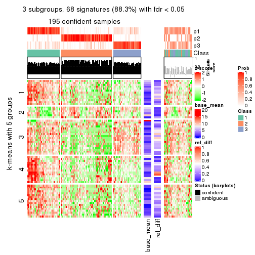</p>

</div>
<div id='tab-SD-skmeans-get-signatures-3'>
<pre><code class="r">get_signatures(res, k = 4)
</code></pre>

<p></p>

</div>
<div id='tab-SD-skmeans-get-signatures-4'>
<pre><code class="r">get_signatures(res, k = 5)
</code></pre>

<p></p>

</div>
<div id='tab-SD-skmeans-get-signatures-5'>
<pre><code class="r">get_signatures(res, k = 6)
</code></pre>

<p></p>

</div>
</div>


Signature heatmaps where rows are not scaled:


<script>
$( function() {
	$( '#tabs-SD-skmeans-get-signatures-no-scale' ).tabs();
} );
</script>
<div id='tabs-SD-skmeans-get-signatures-no-scale'>
<ul>
<li><a href='#tab-SD-skmeans-get-signatures-no-scale-1'>k = 2</a></li>
<li><a href='#tab-SD-skmeans-get-signatures-no-scale-2'>k = 3</a></li>
<li><a href='#tab-SD-skmeans-get-signatures-no-scale-3'>k = 4</a></li>
<li><a href='#tab-SD-skmeans-get-signatures-no-scale-4'>k = 5</a></li>
<li><a href='#tab-SD-skmeans-get-signatures-no-scale-5'>k = 6</a></li>
</ul>
<div id='tab-SD-skmeans-get-signatures-no-scale-1'>
<pre><code class="r">get_signatures(res, k = 2, scale_rows = FALSE)
</code></pre>

<p></p>

</div>
<div id='tab-SD-skmeans-get-signatures-no-scale-2'>
<pre><code class="r">get_signatures(res, k = 3, scale_rows = FALSE)
</code></pre>

<p></p>

</div>
<div id='tab-SD-skmeans-get-signatures-no-scale-3'>
<pre><code class="r">get_signatures(res, k = 4, scale_rows = FALSE)
</code></pre>

<p></p>

</div>
<div id='tab-SD-skmeans-get-signatures-no-scale-4'>
<pre><code class="r">get_signatures(res, k = 5, scale_rows = FALSE)
</code></pre>

<p></p>

</div>
<div id='tab-SD-skmeans-get-signatures-no-scale-5'>
<pre><code class="r">get_signatures(res, k = 6, scale_rows = FALSE)
</code></pre>

<p></p>

</div>
</div>


Compare the overlap of signatures from different k:

```r
compare_signatures(res)
```


`get_signature()` returns a data frame invisibly. TO get the list of signatures, the function
call should be assigned to a variable explicitly. In following code, if `plot` argument is set
to `FALSE`, no heatmap is plotted while only the differential analysis is performed.

```r
# code only for demonstration
tb = get_signature(res, k = ..., plot = FALSE)
```

An example of the output of `tb` is:

```
#>   which_row         fdr    mean_1    mean_2 scaled_mean_1 scaled_mean_2 km
#> 1        38 0.042760348  8.373488  9.131774    -0.5533452     0.5164555  1
#> 2        40 0.018707592  7.106213  8.469186    -0.6173731     0.5762149  1
#> 3        55 0.019134737 10.221463 11.207825    -0.6159697     0.5749050  1
#> 4        59 0.006059896  5.921854  7.869574    -0.6899429     0.6439467  1
#> 5        60 0.018055526  8.928898 10.211722    -0.6204761     0.5791110  1
#> 6        98 0.009384629 15.714769 14.887706     0.6635654    -0.6193277  2
...
```

The columns in `tb` are:

1. `which_row`: row indices corresponding to the input matrix.
2. `fdr`: FDR for the differential test. 
3. `mean_x`: The mean value in group x.
4. `scaled_mean_x`: The mean value in group x after rows are scaled.
5. `km`: Row groups if k-means clustering is applied to rows.


UMAP plot which shows how samples are separated.


<script>
$( function() {
	$( '#tabs-SD-skmeans-dimension-reduction' ).tabs();
} );
</script>
<div id='tabs-SD-skmeans-dimension-reduction'>
<ul>
<li><a href='#tab-SD-skmeans-dimension-reduction-1'>k = 2</a></li>
<li><a href='#tab-SD-skmeans-dimension-reduction-2'>k = 3</a></li>
<li><a href='#tab-SD-skmeans-dimension-reduction-3'>k = 4</a></li>
<li><a href='#tab-SD-skmeans-dimension-reduction-4'>k = 5</a></li>
<li><a href='#tab-SD-skmeans-dimension-reduction-5'>k = 6</a></li>
</ul>
<div id='tab-SD-skmeans-dimension-reduction-1'>
<pre><code class="r">dimension_reduction(res, k = 2, method = &quot;UMAP&quot;)
</code></pre>

<p></p>

</div>
<div id='tab-SD-skmeans-dimension-reduction-2'>
<pre><code class="r">dimension_reduction(res, k = 3, method = &quot;UMAP&quot;)
</code></pre>

<p></p>

</div>
<div id='tab-SD-skmeans-dimension-reduction-3'>
<pre><code class="r">dimension_reduction(res, k = 4, method = &quot;UMAP&quot;)
</code></pre>

<p></p>

</div>
<div id='tab-SD-skmeans-dimension-reduction-4'>
<pre><code class="r">dimension_reduction(res, k = 5, method = &quot;UMAP&quot;)
</code></pre>

<p>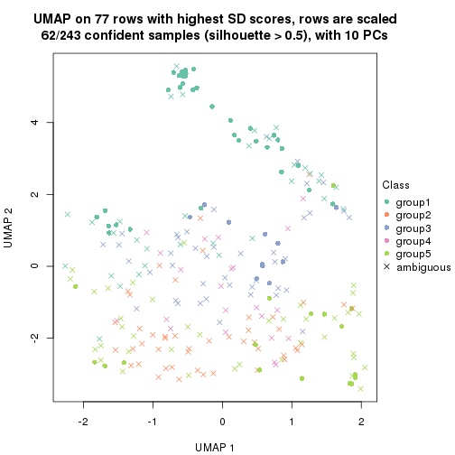</p>

</div>
<div id='tab-SD-skmeans-dimension-reduction-5'>
<pre><code class="r">dimension_reduction(res, k = 6, method = &quot;UMAP&quot;)
</code></pre>

<p></p>

</div>
</div>


Following heatmap shows how subgroups are split when increasing `k`:

```r
collect_classes(res)
```

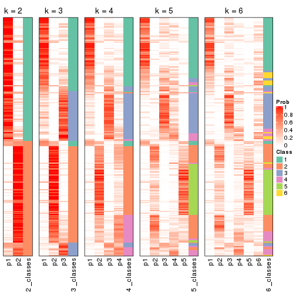


If matrix rows can be associated to genes, consider to use `GO_Enrichment(res,
...)` to perform function enrichment for the signature genes.


 

---------------------------------------------------


### SD:pam


The object with results only for a single top-value method and a single partition method 
can be extracted as:

```r
res = res_list["SD", "pam"]
# you can also extract it by
# res = res_list["SD:pam"]
```

A summary of `res` and all the functions that can be applied to it:

```r
res
```

```
#> A 'ConsensusPartition' object with k = 2, 3, 4, 5, 6.
#>   On a matrix with 77 rows and 243 columns.
#>   Top rows (8, 16, 23, 30, 38) are extracted by 'SD' method.
#>   Subgroups are detected by 'pam' method.
#>   Performed in total 1250 partitions by row resampling.
#>   Best k for subgroups seems to be 2.
#> 
#> Following methods can be applied to this 'ConsensusPartition' object:
#>  [1] "cola_report"             "collect_classes"         "collect_plots"          
#>  [4] "collect_stats"           "colnames"                "compare_signatures"     
#>  [7] "consensus_heatmap"       "dimension_reduction"     "functional_enrichment"  
#> [10] "get_anno_col"            "get_anno"                "get_classes"            
#> [13] "get_consensus"           "get_matrix"              "get_membership"         
#> [16] "get_param"               "get_signatures"          "get_stats"              
#> [19] "is_best_k"               "is_stable_k"             "membership_heatmap"     
#> [22] "ncol"                    "nrow"                    "plot_ecdf"              
#> [25] "rownames"                "select_partition_number" "show"                   
#> [28] "suggest_best_k"          "test_to_known_factors"
```

`collect_plots()` function collects all the plots made from `res` for all `k` (number of partitions)
into one single page to provide an easy and fast comparison between different `k`.

```r
collect_plots(res)
```


The plots are:

- The first row: a plot of the ECDF (Empirical cumulative distribution
  function) curves of the consensus matrix for each `k` and the heatmap of
  predicted classes for each `k`.
- The second row: heatmaps of the consensus matrix for each `k`.
- The third row: heatmaps of the membership matrix for each `k`.
- The fouth row: heatmaps of the signatures for each `k`.

All the plots in panels can be made by individual functions and they are
plotted later in this section.

`select_partition_number()` produces several plots showing different
statistics for choosing "optimized" `k`. There are following statistics:

- ECDF curves of the consensus matrix for each `k`;
- 1-PAC. [The PAC
  score](https://en.wikipedia.org/wiki/Consensus_clustering#Over-interpretation_potential_of_consensus_clustering)
  measures the proportion of the ambiguous subgrouping.
- Mean silhouette score.
- Concordance. The mean probability of fiting the consensus class ids in all
  partitions.
- Area increased. Denote $A_k$ as the area under the ECDF curve for current
  `k`, the area increased is defined as $A_k - A_{k-1}$.
- Rand index. The percent of pairs of samples that are both in a same cluster
  or both are not in a same cluster in the partition of k and k-1.
- Jaccard index. The ratio of pairs of samples are both in a same cluster in
  the partition of k and k-1 and the pairs of samples are both in a same
  cluster in the partition k or k-1.

The detailed explanations of these statistics can be found in [the cola
vignette](http://bioconductor.org/packages/devel/bioc/vignettes/cola/inst/doc/cola.html#toc_13).

Generally speaking, lower PAC score, higher mean silhouette score or higher
concordance corresponds to better partition. Rand index and Jaccard index
measure how similar the current partition is compared to partition with `k-1`.
If they are too similar, we won't accept `k` is better than `k-1`.

```r
select_partition_number(res)
```


The numeric values for all these statistics can be obtained by `get_stats()`.

```r
get_stats(res)
```

```
#>   k  1-PAC mean_silhouette concordance area_increased  Rand Jaccard
#> 2 2 0.0488           0.560       0.765         0.4566 0.500   0.500
#> 3 3 0.1058           0.409       0.620         0.3805 0.680   0.453
#> 4 4 0.1938           0.256       0.520         0.1358 0.846   0.625
#> 5 5 0.2871           0.276       0.535         0.0787 0.744   0.347
#> 6 6 0.3438           0.215       0.500         0.0487 0.915   0.656
```

`suggest_best_k()` suggests the best $k$ based on these statistics. The rules are as follows:

- All $k$ with Jaccard index larger than 0.95 are removed because the increase of
  the partition number does not provides enough extra information. If all $k$ are removed,
  the best $k$ is assigned by `NA`.
- For $k$ with 1-PAC larger than 0.9, the maximal $k$ is taken as the "best k". Other $k$ is called "optional k".
- If it does not fit the second rule. The $k$ with the highest vote of highest
  1-PAC, mean silhouette and concordance is taken as the "best k".

```r
suggest_best_k(res)
```

```
#> [1] 2
```


Following shows the table of the partitions (You need to click the **show/hide
code output** link to see it). The membership matrix (columns with name `p*`)
is inferred by
[`clue::cl_consensus()`](https://www.rdocumentation.org/link/cl_consensus?package=clue)
function with the `SE` method. Basically the value in the membership matrix
represents the probability to belong to a certain group. The finall class
label for an item is determined with the group with highest probability it
belongs to.

In `get_classes()` function, the entropy is calculated from the membership
matrix and the silhouette score is calculated from the consensus matrix.


<script>
$( function() {
	$( '#tabs-SD-pam-get-classes' ).tabs();
} );
</script>
<div id='tabs-SD-pam-get-classes'>
<ul>
<li><a href='#tab-SD-pam-get-classes-1'>k = 2</a></li>
<li><a href='#tab-SD-pam-get-classes-2'>k = 3</a></li>
<li><a href='#tab-SD-pam-get-classes-3'>k = 4</a></li>
<li><a href='#tab-SD-pam-get-classes-4'>k = 5</a></li>
<li><a href='#tab-SD-pam-get-classes-5'>k = 6</a></li>
</ul>

<div id='tab-SD-pam-get-classes-1'>
<p><a id='tab-SD-pam-get-classes-1-a' style='color:#0366d6' href='#'>show/hide code output</a></p>
<pre><code class="r">cbind(get_classes(res, k = 2), get_membership(res, k = 2))
</code></pre>

<pre><code>#&gt;           class entropy silhouette    p1    p2
#&gt; SRR191393     1  0.2948    0.68837 0.948 0.052
#&gt; SRR191394     1  0.3114    0.68245 0.944 0.056
#&gt; SRR191396     2  0.9896    0.23500 0.440 0.560
#&gt; SRR191397     1  0.3733    0.68920 0.928 0.072
#&gt; SRR191398     1  0.3879    0.68552 0.924 0.076
#&gt; SRR191399     1  0.4815    0.71041 0.896 0.104
#&gt; SRR191400     1  0.5946    0.67409 0.856 0.144
#&gt; SRR191401     1  0.4161    0.69608 0.916 0.084
#&gt; SRR191402     1  0.8909    0.61408 0.692 0.308
#&gt; SRR191403     1  0.3114    0.68313 0.944 0.056
#&gt; SRR191404     2  0.6048    0.71031 0.148 0.852
#&gt; SRR191405     2  0.9552    0.39078 0.376 0.624
#&gt; SRR191406     2  0.9983    0.00262 0.476 0.524
#&gt; SRR191407     1  0.8443    0.61465 0.728 0.272
#&gt; SRR191408     1  0.8713    0.58114 0.708 0.292
#&gt; SRR191409     2  0.9998    0.02267 0.492 0.508
#&gt; SRR191410     1  0.9954    0.33229 0.540 0.460
#&gt; SRR191411     1  0.8713    0.61310 0.708 0.292
#&gt; SRR191412     1  0.3584    0.69167 0.932 0.068
#&gt; SRR191413     1  0.4939    0.71038 0.892 0.108
#&gt; SRR191414     1  0.2778    0.68351 0.952 0.048
#&gt; SRR191415     1  0.9977    0.21750 0.528 0.472
#&gt; SRR191416     1  0.7950    0.68667 0.760 0.240
#&gt; SRR191418     1  0.6801    0.70302 0.820 0.180
#&gt; SRR191419     1  0.1184    0.67866 0.984 0.016
#&gt; SRR191420     1  0.3274    0.68757 0.940 0.060
#&gt; SRR191421     1  0.4022    0.69803 0.920 0.080
#&gt; SRR191422     2  0.3431    0.70571 0.064 0.936
#&gt; SRR191423     2  0.5946    0.68492 0.144 0.856
#&gt; SRR191424     2  0.3584    0.70085 0.068 0.932
#&gt; SRR191425     1  0.4939    0.70777 0.892 0.108
#&gt; SRR191426     2  0.9954    0.01264 0.460 0.540
#&gt; SRR191427     1  1.0000   -0.12599 0.504 0.496
#&gt; SRR191428     1  0.6148    0.70266 0.848 0.152
#&gt; SRR191429     2  0.2423    0.69447 0.040 0.960
#&gt; SRR191430     2  0.7528    0.66824 0.216 0.784
#&gt; SRR191431     2  0.7056    0.65991 0.192 0.808
#&gt; SRR191432     2  0.2778    0.69171 0.048 0.952
#&gt; SRR191433     2  0.6712    0.70374 0.176 0.824
#&gt; SRR191434     2  0.8267    0.64363 0.260 0.740
#&gt; SRR191435     1  0.6973    0.71042 0.812 0.188
#&gt; SRR191436     1  0.9996    0.14104 0.512 0.488
#&gt; SRR191437     2  0.3274    0.71021 0.060 0.940
#&gt; SRR191438     2  0.9209    0.46467 0.336 0.664
#&gt; SRR191439     2  0.7950    0.65707 0.240 0.760
#&gt; SRR191440     2  0.5842    0.67838 0.140 0.860
#&gt; SRR191441     2  0.1843    0.70054 0.028 0.972
#&gt; SRR191442     1  0.9286    0.55497 0.656 0.344
#&gt; SRR191443     1  0.5737    0.70785 0.864 0.136
#&gt; SRR191444     2  0.9996   -0.06418 0.488 0.512
#&gt; SRR191445     2  0.9087    0.54764 0.324 0.676
#&gt; SRR191446     2  0.5519    0.69165 0.128 0.872
#&gt; SRR191447     2  0.3879    0.71288 0.076 0.924
#&gt; SRR191448     1  0.3733    0.70105 0.928 0.072
#&gt; SRR191449     1  0.9129    0.58048 0.672 0.328
#&gt; SRR191450     1  0.8207    0.65192 0.744 0.256
#&gt; SRR191451     1  0.9970    0.11407 0.532 0.468
#&gt; SRR191452     2  0.5519    0.68617 0.128 0.872
#&gt; SRR191453     2  0.9881    0.30679 0.436 0.564
#&gt; SRR191454     1  0.9833    0.38604 0.576 0.424
#&gt; SRR191455     2  0.9754    0.26143 0.408 0.592
#&gt; SRR191456     2  0.9970    0.17290 0.468 0.532
#&gt; SRR191457     1  0.4690    0.68989 0.900 0.100
#&gt; SRR191458     2  0.8763    0.58747 0.296 0.704
#&gt; SRR191459     2  0.9996   -0.11838 0.488 0.512
#&gt; SRR191460     2  0.9909    0.12407 0.444 0.556
#&gt; SRR191461     1  0.9954    0.26452 0.540 0.460
#&gt; SRR191462     2  0.9044    0.50277 0.320 0.680
#&gt; SRR191463     2  0.4815    0.71434 0.104 0.896
#&gt; SRR191464     2  0.4690    0.69116 0.100 0.900
#&gt; SRR191465     2  0.2603    0.69723 0.044 0.956
#&gt; SRR191466     1  0.9754    0.41033 0.592 0.408
#&gt; SRR191467     2  0.3879    0.71029 0.076 0.924
#&gt; SRR191468     2  0.0938    0.69597 0.012 0.988
#&gt; SRR191469     1  0.8499    0.64110 0.724 0.276
#&gt; SRR191470     2  0.6887    0.68789 0.184 0.816
#&gt; SRR191471     2  0.7376    0.65155 0.208 0.792
#&gt; SRR191472     2  0.3274    0.70706 0.060 0.940
#&gt; SRR191473     2  0.4939    0.70351 0.108 0.892
#&gt; SRR191474     1  0.9393    0.54504 0.644 0.356
#&gt; SRR191475     2  0.2778    0.70651 0.048 0.952
#&gt; SRR191476     2  0.4431    0.69717 0.092 0.908
#&gt; SRR191477     2  0.6438    0.70078 0.164 0.836
#&gt; SRR191478     2  0.5059    0.71486 0.112 0.888
#&gt; SRR191479     1  0.6148    0.70610 0.848 0.152
#&gt; SRR191480     2  0.5842    0.69057 0.140 0.860
#&gt; SRR191481     2  0.5294    0.69652 0.120 0.880
#&gt; SRR191482     2  0.8763    0.52658 0.296 0.704
#&gt; SRR191483     2  0.8386    0.57930 0.268 0.732
#&gt; SRR191484     1  0.7219    0.68102 0.800 0.200
#&gt; SRR191485     2  0.6712    0.69408 0.176 0.824
#&gt; SRR191486     2  0.9944    0.22370 0.456 0.544
#&gt; SRR191487     2  0.8443    0.57484 0.272 0.728
#&gt; SRR191488     1  0.5946    0.70949 0.856 0.144
#&gt; SRR191489     2  0.9248    0.44237 0.340 0.660
#&gt; SRR191490     2  0.6343    0.66735 0.160 0.840
#&gt; SRR191491     1  0.8861    0.57500 0.696 0.304
#&gt; SRR191492     1  0.8909    0.61679 0.692 0.308
#&gt; SRR191493     2  0.8499    0.55754 0.276 0.724
#&gt; SRR191494     2  0.5629    0.69324 0.132 0.868
#&gt; SRR191495     1  0.9358    0.53114 0.648 0.352
#&gt; SRR191496     2  0.4161    0.69288 0.084 0.916
#&gt; SRR191497     1  0.9775    0.39607 0.588 0.412
#&gt; SRR191498     1  0.9608    0.40048 0.616 0.384
#&gt; SRR191499     1  0.9044    0.57817 0.680 0.320
#&gt; SRR191500     1  0.9393    0.52450 0.644 0.356
#&gt; SRR191501     2  0.8207    0.62183 0.256 0.744
#&gt; SRR191502     2  0.7139    0.69834 0.196 0.804
#&gt; SRR191503     2  0.2778    0.69894 0.048 0.952
#&gt; SRR191504     2  0.5629    0.68953 0.132 0.868
#&gt; SRR191505     2  0.5178    0.71075 0.116 0.884
#&gt; SRR191506     2  0.3114    0.70156 0.056 0.944
#&gt; SRR191507     2  0.5294    0.71630 0.120 0.880
#&gt; SRR191508     2  0.9635    0.33965 0.388 0.612
#&gt; SRR191509     2  0.7950    0.66457 0.240 0.760
#&gt; SRR191510     2  0.7815    0.66211 0.232 0.768
#&gt; SRR191511     2  0.3274    0.69373 0.060 0.940
#&gt; SRR191512     2  0.2236    0.69653 0.036 0.964
#&gt; SRR191513     2  0.2603    0.70073 0.044 0.956
#&gt; SRR191514     2  0.2948    0.70392 0.052 0.948
#&gt; SRR191515     2  0.6801    0.67829 0.180 0.820
#&gt; SRR191516     1  0.9000    0.58877 0.684 0.316
#&gt; SRR191517     2  0.9710    0.27325 0.400 0.600
#&gt; SRR191518     2  0.6531    0.68253 0.168 0.832
#&gt; SRR191519     2  0.2043    0.69576 0.032 0.968
#&gt; SRR191520     1  0.9963    0.28692 0.536 0.464
#&gt; SRR191521     2  0.6343    0.68393 0.160 0.840
#&gt; SRR191522     2  0.7602    0.64523 0.220 0.780
#&gt; SRR191523     2  0.8661    0.60206 0.288 0.712
#&gt; SRR191524     1  0.8909    0.56383 0.692 0.308
#&gt; SRR191525     2  0.5294    0.71513 0.120 0.880
#&gt; SRR191526     2  0.5178    0.69098 0.116 0.884
#&gt; SRR191527     1  1.0000   -0.07264 0.504 0.496
#&gt; SRR191528     2  0.9970    0.19860 0.468 0.532
#&gt; SRR191529     2  0.5294    0.70238 0.120 0.880
#&gt; SRR191530     2  0.6623    0.69936 0.172 0.828
#&gt; SRR191531     2  0.8813    0.50944 0.300 0.700
#&gt; SRR191532     2  0.9686    0.45099 0.396 0.604
#&gt; SRR191533     2  0.9044    0.53216 0.320 0.680
#&gt; SRR191534     2  0.8207    0.64147 0.256 0.744
#&gt; SRR191535     2  0.7453    0.68961 0.212 0.788
#&gt; SRR191536     1  0.9710    0.35990 0.600 0.400
#&gt; SRR191537     2  0.7139    0.69189 0.196 0.804
#&gt; SRR191538     2  0.2236    0.68948 0.036 0.964
#&gt; SRR191539     2  0.3114    0.70299 0.056 0.944
#&gt; SRR191540     2  0.9522    0.34118 0.372 0.628
#&gt; SRR191541     2  0.5294    0.71792 0.120 0.880
#&gt; SRR191542     2  0.5946    0.68838 0.144 0.856
#&gt; SRR191543     2  0.6048    0.70503 0.148 0.852
#&gt; SRR191544     2  0.6887    0.69750 0.184 0.816
#&gt; SRR191545     2  0.6801    0.67248 0.180 0.820
#&gt; SRR191546     2  0.9323    0.41462 0.348 0.652
#&gt; SRR191547     2  0.9896    0.23996 0.440 0.560
#&gt; SRR191548     1  0.3584    0.68330 0.932 0.068
#&gt; SRR191549     1  0.3879    0.68080 0.924 0.076
#&gt; SRR191550     1  0.1184    0.67819 0.984 0.016
#&gt; SRR191551     1  0.2423    0.67593 0.960 0.040
#&gt; SRR191552     1  0.3584    0.68087 0.932 0.068
#&gt; SRR191553     1  0.4690    0.68534 0.900 0.100
#&gt; SRR191554     1  0.5408    0.67367 0.876 0.124
#&gt; SRR191555     1  0.4298    0.68168 0.912 0.088
#&gt; SRR191556     1  0.9248    0.55627 0.660 0.340
#&gt; SRR191557     1  0.7950    0.65473 0.760 0.240
#&gt; SRR191558     2  0.6623    0.69724 0.172 0.828
#&gt; SRR191559     1  0.9522    0.49774 0.628 0.372
#&gt; SRR191560     1  0.8608    0.60042 0.716 0.284
#&gt; SRR191561     1  0.5842    0.64613 0.860 0.140
#&gt; SRR191562     1  0.5737    0.70066 0.864 0.136
#&gt; SRR191563     2  0.9087    0.48976 0.324 0.676
#&gt; SRR191564     1  0.9552    0.49793 0.624 0.376
#&gt; SRR191565     1  0.8661    0.62704 0.712 0.288
#&gt; SRR191566     1  0.5946    0.70689 0.856 0.144
#&gt; SRR191567     1  0.3114    0.70285 0.944 0.056
#&gt; SRR191568     1  0.3879    0.69499 0.924 0.076
#&gt; SRR191569     1  0.9881    0.28619 0.564 0.436
#&gt; SRR191570     1  0.9815    0.32694 0.580 0.420
#&gt; SRR191571     1  0.8713    0.61284 0.708 0.292
#&gt; SRR191572     1  0.3114    0.68234 0.944 0.056
#&gt; SRR191573     1  0.8909    0.59490 0.692 0.308
#&gt; SRR191574     1  0.2603    0.68701 0.956 0.044
#&gt; SRR191575     1  0.8763    0.58382 0.704 0.296
#&gt; SRR191576     2  0.9963    0.15820 0.464 0.536
#&gt; SRR191577     1  0.9044    0.53427 0.680 0.320
#&gt; SRR191578     2  0.4939    0.71949 0.108 0.892
#&gt; SRR191579     1  0.4431    0.67810 0.908 0.092
#&gt; SRR191580     1  0.8443    0.51006 0.728 0.272
#&gt; SRR191581     1  0.9580    0.31750 0.620 0.380
#&gt; SRR191582     1  0.9522    0.33890 0.628 0.372
#&gt; SRR191583     2  0.5178    0.69013 0.116 0.884
#&gt; SRR191584     2  0.9608    0.38756 0.384 0.616
#&gt; SRR191585     1  0.8861    0.59528 0.696 0.304
#&gt; SRR191586     1  0.8608    0.61704 0.716 0.284
#&gt; SRR191587     1  0.9954    0.29782 0.540 0.460
#&gt; SRR191588     1  0.5519    0.70110 0.872 0.128
#&gt; SRR191589     1  0.6438    0.70929 0.836 0.164
#&gt; SRR191590     1  0.7299    0.66827 0.796 0.204
#&gt; SRR191591     1  0.9922    0.27081 0.552 0.448
#&gt; SRR191592     1  0.9129    0.59072 0.672 0.328
#&gt; SRR191593     1  0.3879    0.70483 0.924 0.076
#&gt; SRR191594     1  0.1184    0.67819 0.984 0.016
#&gt; SRR191595     1  0.8661    0.62525 0.712 0.288
#&gt; SRR191596     1  0.6973    0.69284 0.812 0.188
#&gt; SRR191597     2  1.0000   -0.14406 0.496 0.504
#&gt; SRR191598     1  0.8955    0.59479 0.688 0.312
#&gt; SRR191599     1  0.5842    0.70625 0.860 0.140
#&gt; SRR191600     2  0.8267    0.64408 0.260 0.740
#&gt; SRR191601     2  0.9866    0.17613 0.432 0.568
#&gt; SRR191602     2  0.9922    0.09619 0.448 0.552
#&gt; SRR191603     2  0.9963    0.01644 0.464 0.536
#&gt; SRR191604     2  0.4161    0.70036 0.084 0.916
#&gt; SRR191605     2  0.9963    0.04830 0.464 0.536
#&gt; SRR191606     1  0.9815    0.34449 0.580 0.420
#&gt; SRR191607     1  0.8555    0.62389 0.720 0.280
#&gt; SRR191608     2  0.9881    0.11159 0.436 0.564
#&gt; SRR191609     1  0.9881    0.33784 0.564 0.436
#&gt; SRR191610     1  0.6887    0.68386 0.816 0.184
#&gt; SRR191611     1  0.8267    0.63163 0.740 0.260
#&gt; SRR191612     1  0.9427    0.52021 0.640 0.360
#&gt; SRR191613     1  0.4022    0.71105 0.920 0.080
#&gt; SRR191614     1  0.8443    0.63264 0.728 0.272
#&gt; SRR191615     1  0.7453    0.67878 0.788 0.212
#&gt; SRR191616     2  0.5946    0.68564 0.144 0.856
#&gt; SRR191617     2  0.2236    0.70778 0.036 0.964
#&gt; SRR191618     2  0.8443    0.62899 0.272 0.728
#&gt; SRR191619     2  0.8144    0.58283 0.252 0.748
#&gt; SRR191620     2  0.5519    0.71425 0.128 0.872
#&gt; SRR191621     2  0.3733    0.70710 0.072 0.928
#&gt; SRR191622     2  0.9686    0.38110 0.396 0.604
#&gt; SRR191623     1  0.8763    0.62265 0.704 0.296
#&gt; SRR191624     1  0.3584    0.70178 0.932 0.068
#&gt; SRR191625     2  0.8813    0.49779 0.300 0.700
#&gt; SRR191626     2  0.9922    0.09743 0.448 0.552
#&gt; SRR191627     2  0.7815    0.61830 0.232 0.768
#&gt; SRR191628     1  0.9909    0.30256 0.556 0.444
#&gt; SRR191629     2  0.9944    0.00637 0.456 0.544
#&gt; SRR191630     1  0.1184    0.67819 0.984 0.016
#&gt; SRR191631     2  0.9170    0.43671 0.332 0.668
#&gt; SRR191632     1  0.8813    0.62915 0.700 0.300
#&gt; SRR191633     2  0.9000    0.57214 0.316 0.684
#&gt; SRR191634     2  0.4815    0.69541 0.104 0.896
#&gt; SRR191635     1  0.9732    0.42774 0.596 0.404
#&gt; SRR191636     2  0.8499    0.62323 0.276 0.724
#&gt; SRR191637     2  0.2423    0.69226 0.040 0.960
</code></pre>

<script>
$('#tab-SD-pam-get-classes-1-a').parent().next().next().hide();
$('#tab-SD-pam-get-classes-1-a').click(function(){
  $('#tab-SD-pam-get-classes-1-a').parent().next().next().toggle();
  return(false);
});
</script>
</div>

<div id='tab-SD-pam-get-classes-2'>
<p><a id='tab-SD-pam-get-classes-2-a' style='color:#0366d6' href='#'>show/hide code output</a></p>
<pre><code class="r">cbind(get_classes(res, k = 3), get_membership(res, k = 3))
</code></pre>

<pre><code>#&gt;           class entropy silhouette    p1    p2    p3
#&gt; SRR191393     1   0.607    0.65432 0.728 0.024 0.248
#&gt; SRR191394     1   0.416    0.64041 0.848 0.008 0.144
#&gt; SRR191396     2   0.858    0.18898 0.096 0.460 0.444
#&gt; SRR191397     1   0.659    0.64903 0.732 0.060 0.208
#&gt; SRR191398     1   0.383    0.64259 0.868 0.008 0.124
#&gt; SRR191399     1   0.619    0.59628 0.724 0.028 0.248
#&gt; SRR191400     1   0.745    0.56683 0.636 0.060 0.304
#&gt; SRR191401     1   0.634    0.65558 0.736 0.044 0.220
#&gt; SRR191402     3   0.909   -0.10889 0.396 0.140 0.464
#&gt; SRR191403     1   0.554    0.65907 0.776 0.024 0.200
#&gt; SRR191404     2   0.573    0.63935 0.008 0.720 0.272
#&gt; SRR191405     3   0.794    0.06838 0.068 0.364 0.568
#&gt; SRR191406     3   0.593    0.49961 0.084 0.124 0.792
#&gt; SRR191407     3   0.910    0.01829 0.408 0.140 0.452
#&gt; SRR191408     3   0.915    0.23554 0.292 0.180 0.528
#&gt; SRR191409     3   0.874    0.04514 0.112 0.392 0.496
#&gt; SRR191410     3   0.802    0.46986 0.188 0.156 0.656
#&gt; SRR191411     3   0.791    0.44920 0.188 0.148 0.664
#&gt; SRR191412     1   0.589    0.65823 0.752 0.028 0.220
#&gt; SRR191413     1   0.674    0.53978 0.688 0.040 0.272
#&gt; SRR191414     1   0.445    0.63507 0.836 0.012 0.152
#&gt; SRR191415     3   0.596    0.51930 0.096 0.112 0.792
#&gt; SRR191416     3   0.790    0.16530 0.356 0.068 0.576
#&gt; SRR191418     1   0.761    0.49476 0.564 0.048 0.388
#&gt; SRR191419     1   0.406    0.63404 0.836 0.000 0.164
#&gt; SRR191420     1   0.656    0.63584 0.700 0.036 0.264
#&gt; SRR191421     1   0.673    0.63396 0.696 0.044 0.260
#&gt; SRR191422     2   0.553    0.65108 0.000 0.704 0.296
#&gt; SRR191423     2   0.498    0.66065 0.004 0.780 0.216
#&gt; SRR191424     2   0.517    0.66211 0.016 0.792 0.192
#&gt; SRR191425     1   0.769    0.42284 0.580 0.056 0.364
#&gt; SRR191426     3   0.760    0.48768 0.100 0.228 0.672
#&gt; SRR191427     3   0.872    0.15889 0.120 0.348 0.532
#&gt; SRR191428     3   0.735   -0.08283 0.432 0.032 0.536
#&gt; SRR191429     2   0.493    0.59500 0.000 0.768 0.232
#&gt; SRR191430     2   0.630    0.40807 0.004 0.608 0.388
#&gt; SRR191431     2   0.681    0.62281 0.064 0.716 0.220
#&gt; SRR191432     2   0.497    0.55298 0.000 0.764 0.236
#&gt; SRR191433     2   0.614    0.51562 0.000 0.596 0.404
#&gt; SRR191434     2   0.694    0.38838 0.016 0.520 0.464
#&gt; SRR191435     3   0.903    0.21409 0.352 0.144 0.504
#&gt; SRR191436     3   0.649    0.49250 0.076 0.172 0.752
#&gt; SRR191437     2   0.353    0.65717 0.016 0.892 0.092
#&gt; SRR191438     3   0.677    0.04988 0.016 0.392 0.592
#&gt; SRR191439     2   0.630    0.56694 0.008 0.640 0.352
#&gt; SRR191440     2   0.441    0.64343 0.024 0.852 0.124
#&gt; SRR191441     2   0.336    0.65402 0.016 0.900 0.084
#&gt; SRR191442     3   0.798    0.43397 0.164 0.176 0.660
#&gt; SRR191443     1   0.741    0.39608 0.548 0.036 0.416
#&gt; SRR191444     3   0.739    0.49885 0.108 0.196 0.696
#&gt; SRR191445     2   0.863    0.44512 0.140 0.580 0.280
#&gt; SRR191446     3   0.630   -0.23120 0.000 0.476 0.524
#&gt; SRR191447     2   0.388    0.67263 0.000 0.848 0.152
#&gt; SRR191448     1   0.815    0.43736 0.580 0.088 0.332
#&gt; SRR191449     3   0.848    0.30620 0.332 0.108 0.560
#&gt; SRR191450     1   0.852    0.40173 0.592 0.136 0.272
#&gt; SRR191451     3   0.757    0.44778 0.116 0.200 0.684
#&gt; SRR191452     2   0.454    0.64116 0.016 0.836 0.148
#&gt; SRR191453     2   0.907    0.11323 0.136 0.444 0.420
#&gt; SRR191454     3   0.917    0.32595 0.192 0.276 0.532
#&gt; SRR191455     3   0.501    0.45204 0.016 0.180 0.804
#&gt; SRR191456     3   0.832   -0.08830 0.080 0.428 0.492
#&gt; SRR191457     1   0.813    0.50785 0.612 0.104 0.284
#&gt; SRR191458     2   0.857    0.22249 0.096 0.476 0.428
#&gt; SRR191459     3   0.816    0.50506 0.136 0.228 0.636
#&gt; SRR191460     3   0.771    0.32355 0.088 0.264 0.648
#&gt; SRR191461     3   0.583    0.51740 0.076 0.128 0.796
#&gt; SRR191462     3   0.933    0.21037 0.172 0.356 0.472
#&gt; SRR191463     2   0.544    0.66563 0.004 0.736 0.260
#&gt; SRR191464     2   0.551    0.67484 0.028 0.784 0.188
#&gt; SRR191465     2   0.296    0.66076 0.000 0.900 0.100
#&gt; SRR191466     3   0.772    0.44349 0.160 0.160 0.680
#&gt; SRR191467     2   0.590    0.61751 0.004 0.680 0.316
#&gt; SRR191468     2   0.344    0.65399 0.016 0.896 0.088
#&gt; SRR191469     3   0.814    0.33484 0.252 0.120 0.628
#&gt; SRR191470     3   0.667   -0.13982 0.008 0.472 0.520
#&gt; SRR191471     2   0.734    0.38616 0.032 0.540 0.428
#&gt; SRR191472     2   0.304    0.66792 0.000 0.896 0.104
#&gt; SRR191473     2   0.615    0.46450 0.000 0.592 0.408
#&gt; SRR191474     3   0.884    0.35157 0.308 0.144 0.548
#&gt; SRR191475     2   0.412    0.67003 0.000 0.832 0.168
#&gt; SRR191476     2   0.619    0.53131 0.004 0.632 0.364
#&gt; SRR191477     2   0.634    0.56137 0.008 0.632 0.360
#&gt; SRR191478     2   0.556    0.60612 0.000 0.700 0.300
#&gt; SRR191479     1   0.835    0.16497 0.508 0.084 0.408
#&gt; SRR191480     2   0.610    0.41524 0.000 0.608 0.392
#&gt; SRR191481     2   0.629    0.33918 0.000 0.532 0.468
#&gt; SRR191482     3   0.729    0.30996 0.048 0.320 0.632
#&gt; SRR191483     3   0.572    0.27988 0.004 0.292 0.704
#&gt; SRR191484     1   0.905    0.22799 0.460 0.136 0.404
#&gt; SRR191485     3   0.631   -0.21937 0.000 0.496 0.504
#&gt; SRR191486     3   0.861   -0.02584 0.100 0.412 0.488
#&gt; SRR191487     3   0.740   -0.09894 0.032 0.480 0.488
#&gt; SRR191488     1   0.782    0.53093 0.620 0.080 0.300
#&gt; SRR191489     3   0.860    0.00135 0.100 0.408 0.492
#&gt; SRR191490     2   0.461    0.62861 0.028 0.844 0.128
#&gt; SRR191491     3   0.946    0.18487 0.312 0.204 0.484
#&gt; SRR191492     3   0.891    0.31640 0.272 0.168 0.560
#&gt; SRR191493     2   0.771    0.57263 0.128 0.676 0.196
#&gt; SRR191494     2   0.493    0.65469 0.004 0.784 0.212
#&gt; SRR191495     3   0.841    0.34749 0.308 0.112 0.580
#&gt; SRR191496     2   0.336    0.65718 0.016 0.900 0.084
#&gt; SRR191497     3   0.739    0.45740 0.208 0.100 0.692
#&gt; SRR191498     3   0.920    0.42281 0.212 0.252 0.536
#&gt; SRR191499     3   0.725    0.36815 0.276 0.060 0.664
#&gt; SRR191500     3   0.785    0.40788 0.248 0.104 0.648
#&gt; SRR191501     2   0.689    0.60292 0.052 0.692 0.256
#&gt; SRR191502     2   0.623    0.57162 0.012 0.672 0.316
#&gt; SRR191503     2   0.336    0.65864 0.016 0.900 0.084
#&gt; SRR191504     2   0.680    0.23040 0.012 0.532 0.456
#&gt; SRR191505     2   0.489    0.65443 0.000 0.772 0.228
#&gt; SRR191506     2   0.448    0.67249 0.020 0.844 0.136
#&gt; SRR191507     2   0.585    0.66186 0.044 0.776 0.180
#&gt; SRR191508     3   0.743    0.05023 0.036 0.424 0.540
#&gt; SRR191509     2   0.651    0.31252 0.004 0.520 0.476
#&gt; SRR191510     2   0.785    0.39988 0.056 0.532 0.412
#&gt; SRR191511     2   0.497    0.61098 0.000 0.764 0.236
#&gt; SRR191512     2   0.260    0.65298 0.016 0.932 0.052
#&gt; SRR191513     2   0.362    0.67653 0.000 0.864 0.136
#&gt; SRR191514     2   0.440    0.64745 0.000 0.812 0.188
#&gt; SRR191515     3   0.619    0.09708 0.000 0.420 0.580
#&gt; SRR191516     3   0.757    0.36954 0.248 0.088 0.664
#&gt; SRR191517     3   0.745    0.37747 0.076 0.260 0.664
#&gt; SRR191518     2   0.741    0.46379 0.044 0.596 0.360
#&gt; SRR191519     2   0.428    0.65302 0.016 0.852 0.132
#&gt; SRR191520     3   0.891    0.44185 0.260 0.176 0.564
#&gt; SRR191521     2   0.638    0.55755 0.008 0.624 0.368
#&gt; SRR191522     2   0.729    0.36652 0.028 0.504 0.468
#&gt; SRR191523     2   0.710    0.41226 0.028 0.588 0.384
#&gt; SRR191524     3   0.864    0.35515 0.160 0.248 0.592
#&gt; SRR191525     2   0.625    0.53520 0.008 0.648 0.344
#&gt; SRR191526     2   0.319    0.64571 0.000 0.888 0.112
#&gt; SRR191527     1   0.973    0.14245 0.428 0.340 0.232
#&gt; SRR191528     2   0.982    0.08287 0.320 0.420 0.260
#&gt; SRR191529     2   0.544    0.67124 0.024 0.784 0.192
#&gt; SRR191530     2   0.578    0.56364 0.004 0.696 0.300
#&gt; SRR191531     2   0.792    0.49648 0.120 0.652 0.228
#&gt; SRR191532     2   0.889    0.14370 0.120 0.448 0.432
#&gt; SRR191533     2   0.879    0.39125 0.132 0.540 0.328
#&gt; SRR191534     2   0.760    0.51421 0.060 0.612 0.328
#&gt; SRR191535     2   0.628    0.46868 0.004 0.612 0.384
#&gt; SRR191536     3   0.988    0.07198 0.352 0.260 0.388
#&gt; SRR191537     2   0.745    0.56533 0.064 0.644 0.292
#&gt; SRR191538     2   0.406    0.65277 0.000 0.836 0.164
#&gt; SRR191539     2   0.300    0.65457 0.016 0.916 0.068
#&gt; SRR191540     3   0.706    0.37540 0.052 0.276 0.672
#&gt; SRR191541     2   0.589    0.65211 0.028 0.752 0.220
#&gt; SRR191542     2   0.458    0.65810 0.004 0.812 0.184
#&gt; SRR191543     2   0.613    0.55075 0.004 0.644 0.352
#&gt; SRR191544     2   0.645    0.54234 0.020 0.672 0.308
#&gt; SRR191545     3   0.640    0.00675 0.004 0.416 0.580
#&gt; SRR191546     3   0.670    0.39707 0.044 0.256 0.700
#&gt; SRR191547     3   0.657    0.31557 0.024 0.308 0.668
#&gt; SRR191548     1   0.338    0.63916 0.892 0.008 0.100
#&gt; SRR191549     1   0.397    0.64244 0.860 0.008 0.132
#&gt; SRR191550     1   0.103    0.62100 0.976 0.000 0.024
#&gt; SRR191551     1   0.319    0.64710 0.888 0.000 0.112
#&gt; SRR191552     1   0.403    0.64388 0.856 0.008 0.136
#&gt; SRR191553     1   0.592    0.59596 0.712 0.012 0.276
#&gt; SRR191554     1   0.625    0.57252 0.744 0.044 0.212
#&gt; SRR191555     1   0.607    0.54338 0.676 0.008 0.316
#&gt; SRR191556     3   0.904    0.34635 0.280 0.176 0.544
#&gt; SRR191557     3   0.775   -0.02391 0.456 0.048 0.496
#&gt; SRR191558     2   0.633    0.61014 0.012 0.656 0.332
#&gt; SRR191559     3   0.865    0.37403 0.276 0.144 0.580
#&gt; SRR191560     3   0.948    0.18778 0.348 0.192 0.460
#&gt; SRR191561     1   0.621    0.56928 0.736 0.036 0.228
#&gt; SRR191562     1   0.723    0.60084 0.688 0.076 0.236
#&gt; SRR191563     3   0.682    0.12440 0.024 0.348 0.628
#&gt; SRR191564     3   0.693    0.48105 0.176 0.096 0.728
#&gt; SRR191565     3   0.932    0.20649 0.352 0.172 0.476
#&gt; SRR191566     1   0.757    0.18081 0.508 0.040 0.452
#&gt; SRR191567     1   0.550    0.62426 0.744 0.008 0.248
#&gt; SRR191568     1   0.638    0.61691 0.720 0.036 0.244
#&gt; SRR191569     3   0.842    0.14493 0.096 0.364 0.540
#&gt; SRR191570     3   0.952    0.29395 0.236 0.276 0.488
#&gt; SRR191571     3   0.933    0.04234 0.404 0.164 0.432
#&gt; SRR191572     1   0.287    0.64243 0.916 0.008 0.076
#&gt; SRR191573     1   0.954    0.19393 0.424 0.192 0.384
#&gt; SRR191574     1   0.453    0.64351 0.824 0.008 0.168
#&gt; SRR191575     1   0.972    0.04535 0.432 0.232 0.336
#&gt; SRR191576     3   0.864    0.07393 0.108 0.376 0.516
#&gt; SRR191577     3   0.914    0.33391 0.264 0.196 0.540
#&gt; SRR191578     2   0.522    0.65001 0.000 0.740 0.260
#&gt; SRR191579     1   0.416    0.64580 0.848 0.008 0.144
#&gt; SRR191580     1   0.714    0.54662 0.704 0.084 0.212
#&gt; SRR191581     1   0.933    0.26195 0.520 0.228 0.252
#&gt; SRR191582     1   0.901    0.29168 0.524 0.152 0.324
#&gt; SRR191583     2   0.441    0.67366 0.016 0.844 0.140
#&gt; SRR191584     2   0.917    0.22409 0.392 0.460 0.148
#&gt; SRR191585     3   0.776    0.31733 0.280 0.084 0.636
#&gt; SRR191586     3   0.795    0.22447 0.368 0.068 0.564
#&gt; SRR191587     3   0.767    0.48933 0.148 0.168 0.684
#&gt; SRR191588     1   0.674    0.41075 0.600 0.016 0.384
#&gt; SRR191589     3   0.726   -0.26419 0.444 0.028 0.528
#&gt; SRR191590     1   0.906    0.42046 0.520 0.156 0.324
#&gt; SRR191591     3   0.906    0.34924 0.180 0.276 0.544
#&gt; SRR191592     3   0.875    0.40848 0.256 0.164 0.580
#&gt; SRR191593     1   0.742    0.49339 0.608 0.048 0.344
#&gt; SRR191594     1   0.153    0.62373 0.960 0.000 0.040
#&gt; SRR191595     3   0.910    0.39431 0.248 0.204 0.548
#&gt; SRR191596     1   0.814    0.11685 0.476 0.068 0.456
#&gt; SRR191597     3   0.787    0.48513 0.180 0.152 0.668
#&gt; SRR191598     3   0.895    0.30911 0.320 0.148 0.532
#&gt; SRR191599     1   0.756    0.19080 0.520 0.040 0.440
#&gt; SRR191600     2   0.718    0.39464 0.024 0.504 0.472
#&gt; SRR191601     3   0.661    0.49072 0.072 0.188 0.740
#&gt; SRR191602     3   0.493    0.47406 0.024 0.156 0.820
#&gt; SRR191603     3   0.600    0.46953 0.052 0.176 0.772
#&gt; SRR191604     2   0.614    0.50619 0.000 0.596 0.404
#&gt; SRR191605     3   0.662    0.48490 0.100 0.148 0.752
#&gt; SRR191606     3   0.989    0.32398 0.304 0.288 0.408
#&gt; SRR191607     3   0.746    0.20867 0.372 0.044 0.584
#&gt; SRR191608     3   0.827    0.51103 0.156 0.212 0.632
#&gt; SRR191609     3   0.858    0.43687 0.224 0.172 0.604
#&gt; SRR191610     3   0.707   -0.08387 0.484 0.020 0.496
#&gt; SRR191611     3   0.802    0.12924 0.416 0.064 0.520
#&gt; SRR191612     3   0.833    0.46757 0.208 0.164 0.628
#&gt; SRR191613     1   0.738    0.37457 0.512 0.032 0.456
#&gt; SRR191614     3   0.762    0.25491 0.332 0.060 0.608
#&gt; SRR191615     3   0.845    0.02793 0.424 0.088 0.488
#&gt; SRR191616     2   0.585    0.63750 0.028 0.756 0.216
#&gt; SRR191617     2   0.484    0.66630 0.000 0.776 0.224
#&gt; SRR191618     3   0.737   -0.23749 0.032 0.448 0.520
#&gt; SRR191619     3   0.668   -0.19746 0.008 0.484 0.508
#&gt; SRR191620     2   0.590    0.58910 0.004 0.680 0.316
#&gt; SRR191621     2   0.595    0.54182 0.000 0.640 0.360
#&gt; SRR191622     3   0.706   -0.12166 0.020 0.460 0.520
#&gt; SRR191623     3   0.904    0.22497 0.372 0.140 0.488
#&gt; SRR191624     1   0.610    0.60452 0.740 0.032 0.228
#&gt; SRR191625     3   0.701   -0.00231 0.020 0.432 0.548
#&gt; SRR191626     3   0.659    0.44197 0.056 0.216 0.728
#&gt; SRR191627     3   0.665   -0.18079 0.008 0.452 0.540
#&gt; SRR191628     3   0.797    0.45804 0.180 0.160 0.660
#&gt; SRR191629     3   0.774    0.52509 0.124 0.204 0.672
#&gt; SRR191630     1   0.196    0.62696 0.944 0.000 0.056
#&gt; SRR191631     3   0.680    0.28218 0.032 0.308 0.660
#&gt; SRR191632     3   0.842    0.05033 0.408 0.088 0.504
#&gt; SRR191633     2   0.765    0.39924 0.044 0.512 0.444
#&gt; SRR191634     2   0.487    0.65993 0.032 0.832 0.136
#&gt; SRR191635     3   0.882    0.42403 0.272 0.160 0.568
#&gt; SRR191636     2   0.919    0.33293 0.152 0.468 0.380
#&gt; SRR191637     2   0.551    0.62729 0.016 0.764 0.220
</code></pre>

<script>
$('#tab-SD-pam-get-classes-2-a').parent().next().next().hide();
$('#tab-SD-pam-get-classes-2-a').click(function(){
  $('#tab-SD-pam-get-classes-2-a').parent().next().next().toggle();
  return(false);
});
</script>
</div>

<div id='tab-SD-pam-get-classes-3'>
<p><a id='tab-SD-pam-get-classes-3-a' style='color:#0366d6' href='#'>show/hide code output</a></p>
<pre><code class="r">cbind(get_classes(res, k = 4), get_membership(res, k = 4))
</code></pre>

<pre><code>#&gt;           class entropy silhouette    p1    p2    p3    p4
#&gt; SRR191393     1   0.605   0.568063 0.688 0.004 0.204 0.104
#&gt; SRR191394     1   0.316   0.563345 0.864 0.000 0.124 0.012
#&gt; SRR191396     4   0.936   0.217371 0.088 0.284 0.292 0.336
#&gt; SRR191397     1   0.647   0.558579 0.676 0.012 0.164 0.148
#&gt; SRR191398     1   0.233   0.577933 0.908 0.000 0.088 0.004
#&gt; SRR191399     1   0.709   0.438634 0.564 0.008 0.304 0.124
#&gt; SRR191400     1   0.732   0.459380 0.604 0.036 0.248 0.112
#&gt; SRR191401     1   0.694   0.544861 0.628 0.012 0.184 0.176
#&gt; SRR191402     3   0.857   0.078584 0.280 0.076 0.492 0.152
#&gt; SRR191403     1   0.598   0.578849 0.712 0.008 0.156 0.124
#&gt; SRR191404     2   0.755   0.403831 0.012 0.508 0.148 0.332
#&gt; SRR191405     3   0.896  -0.084086 0.076 0.260 0.440 0.224
#&gt; SRR191406     3   0.602   0.320236 0.004 0.128 0.700 0.168
#&gt; SRR191407     3   0.937  -0.175775 0.208 0.112 0.388 0.292
#&gt; SRR191408     4   0.921   0.109910 0.200 0.092 0.344 0.364
#&gt; SRR191409     3   0.937  -0.249778 0.100 0.232 0.364 0.304
#&gt; SRR191410     3   0.545   0.347416 0.088 0.040 0.780 0.092
#&gt; SRR191411     3   0.699   0.215759 0.056 0.052 0.616 0.276
#&gt; SRR191412     1   0.626   0.558707 0.660 0.004 0.236 0.100
#&gt; SRR191413     1   0.834   0.294772 0.384 0.016 0.292 0.308
#&gt; SRR191414     1   0.676   0.510059 0.612 0.000 0.188 0.200
#&gt; SRR191415     3   0.511   0.348549 0.052 0.048 0.800 0.100
#&gt; SRR191416     3   0.765   0.209380 0.260 0.020 0.548 0.172
#&gt; SRR191418     1   0.792   0.353987 0.464 0.012 0.320 0.204
#&gt; SRR191419     1   0.561   0.567681 0.716 0.000 0.188 0.096
#&gt; SRR191420     1   0.705   0.513219 0.588 0.008 0.264 0.140
#&gt; SRR191421     1   0.765   0.470371 0.520 0.008 0.232 0.240
#&gt; SRR191422     2   0.682   0.458388 0.004 0.608 0.140 0.248
#&gt; SRR191423     2   0.715   0.406464 0.012 0.580 0.132 0.276
#&gt; SRR191424     2   0.628   0.458069 0.000 0.596 0.076 0.328
#&gt; SRR191425     1   0.827   0.188470 0.392 0.016 0.344 0.248
#&gt; SRR191426     3   0.740   0.261210 0.056 0.152 0.636 0.156
#&gt; SRR191427     3   0.914  -0.167086 0.076 0.232 0.372 0.320
#&gt; SRR191428     3   0.748   0.191917 0.260 0.016 0.560 0.164
#&gt; SRR191429     2   0.519   0.520110 0.004 0.768 0.120 0.108
#&gt; SRR191430     2   0.793   0.272534 0.016 0.500 0.236 0.248
#&gt; SRR191431     2   0.816   0.238146 0.060 0.488 0.112 0.340
#&gt; SRR191432     2   0.551   0.501202 0.004 0.744 0.136 0.116
#&gt; SRR191433     2   0.758   0.341488 0.012 0.536 0.272 0.180
#&gt; SRR191434     2   0.824   0.226379 0.032 0.400 0.400 0.168
#&gt; SRR191435     3   0.863   0.112686 0.196 0.076 0.504 0.224
#&gt; SRR191436     3   0.710   0.330251 0.068 0.152 0.668 0.112
#&gt; SRR191437     2   0.597   0.424031 0.000 0.564 0.044 0.392
#&gt; SRR191438     3   0.874  -0.108562 0.048 0.292 0.420 0.240
#&gt; SRR191439     2   0.845   0.234726 0.044 0.480 0.220 0.256
#&gt; SRR191440     4   0.654  -0.398184 0.000 0.428 0.076 0.496
#&gt; SRR191441     2   0.548   0.449575 0.000 0.608 0.024 0.368
#&gt; SRR191442     3   0.823   0.192884 0.088 0.128 0.556 0.228
#&gt; SRR191443     3   0.800  -0.074327 0.300 0.012 0.460 0.228
#&gt; SRR191444     3   0.853   0.227285 0.108 0.160 0.540 0.192
#&gt; SRR191445     2   0.924   0.032434 0.104 0.424 0.244 0.228
#&gt; SRR191446     2   0.706   0.267928 0.000 0.520 0.344 0.136
#&gt; SRR191447     2   0.510   0.467220 0.004 0.748 0.048 0.200
#&gt; SRR191448     1   0.914   0.200042 0.360 0.068 0.288 0.284
#&gt; SRR191449     3   0.781   0.315695 0.172 0.048 0.584 0.196
#&gt; SRR191450     4   0.869  -0.181012 0.320 0.032 0.308 0.340
#&gt; SRR191451     3   0.854   0.042255 0.076 0.140 0.484 0.300
#&gt; SRR191452     2   0.671   0.396455 0.008 0.536 0.072 0.384
#&gt; SRR191453     2   0.959  -0.082453 0.120 0.320 0.256 0.304
#&gt; SRR191454     3   0.965  -0.059096 0.204 0.208 0.392 0.196
#&gt; SRR191455     3   0.607   0.322218 0.028 0.172 0.720 0.080
#&gt; SRR191456     2   0.930  -0.083867 0.088 0.344 0.240 0.328
#&gt; SRR191457     1   0.874   0.356858 0.444 0.060 0.296 0.200
#&gt; SRR191458     3   0.854  -0.150491 0.024 0.300 0.348 0.328
#&gt; SRR191459     3   0.734   0.330823 0.104 0.212 0.628 0.056
#&gt; SRR191460     3   0.874   0.112369 0.104 0.188 0.512 0.196
#&gt; SRR191461     3   0.597   0.391984 0.060 0.124 0.748 0.068
#&gt; SRR191462     2   0.903   0.028239 0.152 0.388 0.360 0.100
#&gt; SRR191463     2   0.636   0.490998 0.000 0.644 0.124 0.232
#&gt; SRR191464     2   0.699   0.463009 0.008 0.560 0.108 0.324
#&gt; SRR191465     2   0.450   0.503848 0.000 0.776 0.032 0.192
#&gt; SRR191466     3   0.757   0.205308 0.112 0.060 0.608 0.220
#&gt; SRR191467     2   0.772   0.449430 0.024 0.556 0.228 0.192
#&gt; SRR191468     2   0.530   0.485133 0.000 0.676 0.032 0.292
#&gt; SRR191469     3   0.710   0.333506 0.180 0.052 0.656 0.112
#&gt; SRR191470     3   0.823  -0.193165 0.032 0.372 0.428 0.168
#&gt; SRR191471     2   0.819   0.357115 0.048 0.496 0.312 0.144
#&gt; SRR191472     2   0.599   0.449871 0.000 0.656 0.080 0.264
#&gt; SRR191473     2   0.632   0.412433 0.000 0.604 0.312 0.084
#&gt; SRR191474     3   0.870   0.345878 0.188 0.088 0.504 0.220
#&gt; SRR191475     2   0.455   0.497454 0.012 0.820 0.072 0.096
#&gt; SRR191476     2   0.672   0.458500 0.000 0.616 0.200 0.184
#&gt; SRR191477     2   0.758   0.376674 0.008 0.532 0.232 0.228
#&gt; SRR191478     2   0.671   0.424124 0.004 0.632 0.204 0.160
#&gt; SRR191479     3   0.883   0.093021 0.284 0.048 0.396 0.272
#&gt; SRR191480     2   0.719   0.365220 0.004 0.528 0.332 0.136
#&gt; SRR191481     2   0.670   0.349616 0.008 0.556 0.360 0.076
#&gt; SRR191482     3   0.630   0.252234 0.020 0.312 0.624 0.044
#&gt; SRR191483     3   0.681   0.175224 0.004 0.276 0.596 0.124
#&gt; SRR191484     1   0.897   0.056084 0.344 0.052 0.292 0.312
#&gt; SRR191485     2   0.763   0.337908 0.036 0.520 0.344 0.100
#&gt; SRR191486     4   0.918   0.165133 0.088 0.308 0.212 0.392
#&gt; SRR191487     2   0.779   0.190945 0.056 0.464 0.404 0.076
#&gt; SRR191488     1   0.850   0.250817 0.380 0.024 0.292 0.304
#&gt; SRR191489     3   0.885  -0.076241 0.048 0.320 0.376 0.256
#&gt; SRR191490     2   0.636   0.350950 0.008 0.500 0.044 0.448
#&gt; SRR191491     4   0.964   0.067580 0.240 0.132 0.304 0.324
#&gt; SRR191492     3   0.890   0.231140 0.204 0.076 0.448 0.272
#&gt; SRR191493     2   0.775   0.174056 0.056 0.440 0.072 0.432
#&gt; SRR191494     2   0.666   0.419433 0.008 0.604 0.092 0.296
#&gt; SRR191495     3   0.816   0.353007 0.160 0.056 0.540 0.244
#&gt; SRR191496     2   0.563   0.443883 0.000 0.588 0.028 0.384
#&gt; SRR191497     3   0.691   0.390613 0.068 0.084 0.676 0.172
#&gt; SRR191498     3   0.891   0.062339 0.088 0.160 0.428 0.324
#&gt; SRR191499     3   0.674   0.376996 0.108 0.040 0.680 0.172
#&gt; SRR191500     3   0.649   0.391423 0.084 0.100 0.720 0.096
#&gt; SRR191501     4   0.833  -0.262286 0.056 0.388 0.128 0.428
#&gt; SRR191502     2   0.832   0.188664 0.028 0.444 0.212 0.316
#&gt; SRR191503     2   0.581   0.464381 0.000 0.624 0.048 0.328
#&gt; SRR191504     2   0.656   0.293500 0.004 0.584 0.328 0.084
#&gt; SRR191505     2   0.449   0.522923 0.000 0.808 0.096 0.096
#&gt; SRR191506     2   0.550   0.486365 0.000 0.652 0.036 0.312
#&gt; SRR191507     2   0.776   0.449733 0.048 0.580 0.140 0.232
#&gt; SRR191508     2   0.867   0.143172 0.072 0.412 0.372 0.144
#&gt; SRR191509     2   0.825   0.220403 0.028 0.436 0.348 0.188
#&gt; SRR191510     2   0.919   0.109139 0.104 0.432 0.252 0.212
#&gt; SRR191511     2   0.545   0.505650 0.004 0.748 0.140 0.108
#&gt; SRR191512     2   0.492   0.469017 0.000 0.656 0.008 0.336
#&gt; SRR191513     2   0.481   0.503231 0.004 0.780 0.052 0.164
#&gt; SRR191514     2   0.435   0.517325 0.004 0.824 0.076 0.096
#&gt; SRR191515     3   0.840  -0.031921 0.032 0.340 0.424 0.204
#&gt; SRR191516     3   0.692   0.383637 0.172 0.044 0.668 0.116
#&gt; SRR191517     3   0.740   0.300602 0.032 0.304 0.564 0.100
#&gt; SRR191518     2   0.697   0.387908 0.004 0.600 0.224 0.172
#&gt; SRR191519     2   0.586   0.470110 0.000 0.644 0.060 0.296
#&gt; SRR191520     3   0.861   0.366399 0.120 0.184 0.536 0.160
#&gt; SRR191521     2   0.704   0.407574 0.004 0.592 0.228 0.176
#&gt; SRR191522     2   0.761   0.260327 0.000 0.468 0.300 0.232
#&gt; SRR191523     2   0.805   0.296276 0.016 0.476 0.252 0.256
#&gt; SRR191524     3   0.932  -0.031876 0.148 0.184 0.440 0.228
#&gt; SRR191525     2   0.563   0.504824 0.012 0.736 0.176 0.076
#&gt; SRR191526     2   0.581   0.419762 0.004 0.620 0.036 0.340
#&gt; SRR191527     1   0.936  -0.208332 0.396 0.232 0.108 0.264
#&gt; SRR191528     4   0.944   0.247857 0.276 0.248 0.108 0.368
#&gt; SRR191529     2   0.684   0.446729 0.004 0.524 0.092 0.380
#&gt; SRR191530     2   0.636   0.434187 0.016 0.692 0.136 0.156
#&gt; SRR191531     4   0.897  -0.088333 0.124 0.360 0.116 0.400
#&gt; SRR191532     2   0.904   0.054500 0.060 0.352 0.324 0.264
#&gt; SRR191533     4   0.931   0.071596 0.128 0.280 0.176 0.416
#&gt; SRR191534     2   0.810   0.100425 0.028 0.456 0.164 0.352
#&gt; SRR191535     2   0.812   0.278754 0.016 0.456 0.284 0.244
#&gt; SRR191536     1   0.969  -0.163791 0.380 0.192 0.232 0.196
#&gt; SRR191537     2   0.829   0.298574 0.032 0.428 0.180 0.360
#&gt; SRR191538     2   0.422   0.511831 0.000 0.824 0.072 0.104
#&gt; SRR191539     2   0.533   0.455262 0.004 0.660 0.020 0.316
#&gt; SRR191540     3   0.710   0.188173 0.032 0.324 0.572 0.072
#&gt; SRR191541     2   0.594   0.474968 0.032 0.740 0.092 0.136
#&gt; SRR191542     2   0.599   0.399471 0.004 0.656 0.064 0.276
#&gt; SRR191543     2   0.765   0.407953 0.024 0.564 0.228 0.184
#&gt; SRR191544     2   0.831   0.275693 0.040 0.496 0.208 0.256
#&gt; SRR191545     2   0.783   0.187437 0.016 0.420 0.408 0.156
#&gt; SRR191546     3   0.673   0.271282 0.024 0.264 0.632 0.080
#&gt; SRR191547     3   0.784   0.135281 0.036 0.256 0.552 0.156
#&gt; SRR191548     1   0.182   0.575568 0.936 0.000 0.060 0.004
#&gt; SRR191549     1   0.253   0.570147 0.896 0.000 0.100 0.004
#&gt; SRR191550     1   0.324   0.567825 0.880 0.000 0.052 0.068
#&gt; SRR191551     1   0.238   0.579889 0.920 0.000 0.052 0.028
#&gt; SRR191552     1   0.343   0.560858 0.860 0.000 0.112 0.028
#&gt; SRR191553     1   0.498   0.506390 0.752 0.032 0.208 0.008
#&gt; SRR191554     1   0.512   0.470183 0.796 0.044 0.112 0.048
#&gt; SRR191555     1   0.753   0.272782 0.440 0.000 0.372 0.188
#&gt; SRR191556     3   0.865  -0.061718 0.136 0.076 0.424 0.364
#&gt; SRR191557     3   0.729   0.106379 0.292 0.004 0.540 0.164
#&gt; SRR191558     2   0.769   0.368183 0.020 0.548 0.188 0.244
#&gt; SRR191559     3   0.784   0.161847 0.108 0.044 0.512 0.336
#&gt; SRR191560     4   0.868   0.080637 0.132 0.080 0.384 0.404
#&gt; SRR191561     1   0.448   0.517101 0.828 0.040 0.104 0.028
#&gt; SRR191562     1   0.834   0.341717 0.416 0.020 0.268 0.296
#&gt; SRR191563     3   0.770   0.137608 0.016 0.252 0.536 0.196
#&gt; SRR191564     3   0.744   0.238502 0.064 0.060 0.564 0.312
#&gt; SRR191565     4   0.890   0.038635 0.152 0.088 0.356 0.404
#&gt; SRR191566     3   0.791   0.016236 0.232 0.008 0.460 0.300
#&gt; SRR191567     1   0.767   0.466763 0.496 0.004 0.252 0.248
#&gt; SRR191568     1   0.766   0.447428 0.484 0.004 0.304 0.208
#&gt; SRR191569     3   0.931  -0.234988 0.092 0.228 0.348 0.332
#&gt; SRR191570     3   0.900  -0.088787 0.112 0.152 0.452 0.284
#&gt; SRR191571     3   0.881  -0.056889 0.208 0.056 0.396 0.340
#&gt; SRR191572     1   0.189   0.575077 0.936 0.000 0.056 0.008
#&gt; SRR191573     3   0.937  -0.193616 0.260 0.092 0.344 0.304
#&gt; SRR191574     1   0.647   0.537395 0.668 0.008 0.176 0.148
#&gt; SRR191575     4   0.928   0.162496 0.268 0.104 0.220 0.408
#&gt; SRR191576     4   0.884   0.220872 0.048 0.244 0.352 0.356
#&gt; SRR191577     4   0.853   0.130741 0.092 0.100 0.396 0.412
#&gt; SRR191578     2   0.644   0.459880 0.000 0.648 0.184 0.168
#&gt; SRR191579     1   0.390   0.577309 0.840 0.000 0.108 0.052
#&gt; SRR191580     1   0.621   0.465156 0.720 0.040 0.160 0.080
#&gt; SRR191581     1   0.838   0.122604 0.564 0.168 0.128 0.140
#&gt; SRR191582     1   0.879   0.076197 0.504 0.128 0.232 0.136
#&gt; SRR191583     2   0.655   0.450507 0.024 0.584 0.044 0.348
#&gt; SRR191584     1   0.911  -0.116136 0.412 0.236 0.080 0.272
#&gt; SRR191585     3   0.748   0.363964 0.188 0.064 0.628 0.120
#&gt; SRR191586     3   0.795   0.300967 0.196 0.076 0.588 0.140
#&gt; SRR191587     3   0.772   0.267171 0.132 0.088 0.620 0.160
#&gt; SRR191588     3   0.743  -0.160968 0.380 0.000 0.448 0.172
#&gt; SRR191589     3   0.685  -0.001044 0.348 0.004 0.548 0.100
#&gt; SRR191590     1   0.911   0.171894 0.420 0.084 0.228 0.268
#&gt; SRR191591     3   0.905  -0.056543 0.156 0.132 0.472 0.240
#&gt; SRR191592     3   0.761   0.038804 0.096 0.036 0.512 0.356
#&gt; SRR191593     1   0.798   0.250365 0.444 0.012 0.336 0.208
#&gt; SRR191594     1   0.448   0.539711 0.808 0.000 0.084 0.108
#&gt; SRR191595     3   0.768  -0.041255 0.088 0.040 0.460 0.412
#&gt; SRR191596     3   0.834  -0.086790 0.288 0.016 0.380 0.316
#&gt; SRR191597     3   0.633   0.357999 0.032 0.120 0.712 0.136
#&gt; SRR191598     3   0.733   0.178501 0.104 0.032 0.584 0.280
#&gt; SRR191599     3   0.787  -0.062364 0.284 0.000 0.388 0.328
#&gt; SRR191600     3   0.840  -0.151698 0.024 0.344 0.396 0.236
#&gt; SRR191601     3   0.661   0.281451 0.016 0.108 0.656 0.220
#&gt; SRR191602     3   0.583   0.324989 0.028 0.112 0.748 0.112
#&gt; SRR191603     3   0.576   0.361506 0.016 0.184 0.728 0.072
#&gt; SRR191604     2   0.684   0.409671 0.000 0.580 0.280 0.140
#&gt; SRR191605     3   0.610   0.281049 0.000 0.104 0.664 0.232
#&gt; SRR191606     4   0.912   0.193245 0.132 0.128 0.340 0.400
#&gt; SRR191607     3   0.785   0.234628 0.192 0.020 0.520 0.268
#&gt; SRR191608     3   0.648   0.358398 0.024 0.176 0.688 0.112
#&gt; SRR191609     3   0.853   0.359874 0.136 0.204 0.540 0.120
#&gt; SRR191610     3   0.781  -0.000249 0.304 0.008 0.476 0.212
#&gt; SRR191611     3   0.829   0.230795 0.236 0.072 0.540 0.152
#&gt; SRR191612     3   0.735   0.168207 0.068 0.040 0.520 0.372
#&gt; SRR191613     3   0.774  -0.100574 0.292 0.008 0.492 0.208
#&gt; SRR191614     3   0.756   0.263505 0.144 0.024 0.560 0.272
#&gt; SRR191615     3   0.800   0.114986 0.196 0.024 0.504 0.276
#&gt; SRR191616     2   0.774   0.332958 0.016 0.436 0.144 0.404
#&gt; SRR191617     2   0.548   0.501436 0.000 0.728 0.092 0.180
#&gt; SRR191618     3   0.844  -0.225044 0.020 0.332 0.364 0.284
#&gt; SRR191619     2   0.774   0.206790 0.012 0.416 0.416 0.156
#&gt; SRR191620     2   0.790   0.311157 0.028 0.516 0.160 0.296
#&gt; SRR191621     2   0.643   0.438991 0.004 0.620 0.288 0.088
#&gt; SRR191622     3   0.902  -0.187194 0.060 0.312 0.368 0.260
#&gt; SRR191623     3   0.847   0.207830 0.172 0.044 0.408 0.376
#&gt; SRR191624     1   0.796   0.364018 0.472 0.012 0.284 0.232
#&gt; SRR191625     3   0.737  -0.051083 0.040 0.412 0.484 0.064
#&gt; SRR191626     3   0.678   0.355772 0.056 0.208 0.668 0.068
#&gt; SRR191627     3   0.699  -0.035866 0.000 0.412 0.472 0.116
#&gt; SRR191628     3   0.783   0.361406 0.148 0.116 0.616 0.120
#&gt; SRR191629     3   0.685   0.357330 0.076 0.128 0.692 0.104
#&gt; SRR191630     1   0.517   0.516486 0.760 0.000 0.112 0.128
#&gt; SRR191631     3   0.681   0.115489 0.000 0.360 0.532 0.108
#&gt; SRR191632     3   0.787   0.146266 0.236 0.016 0.512 0.236
#&gt; SRR191633     3   0.819  -0.139540 0.008 0.312 0.352 0.328
#&gt; SRR191634     2   0.669   0.428701 0.024 0.536 0.044 0.396
#&gt; SRR191635     3   0.794   0.391269 0.124 0.108 0.604 0.164
#&gt; SRR191636     2   0.936   0.056641 0.132 0.412 0.272 0.184
#&gt; SRR191637     2   0.528   0.476075 0.000 0.696 0.040 0.264
</code></pre>

<script>
$('#tab-SD-pam-get-classes-3-a').parent().next().next().hide();
$('#tab-SD-pam-get-classes-3-a').click(function(){
  $('#tab-SD-pam-get-classes-3-a').parent().next().next().toggle();
  return(false);
});
</script>
</div>

<div id='tab-SD-pam-get-classes-4'>
<p><a id='tab-SD-pam-get-classes-4-a' style='color:#0366d6' href='#'>show/hide code output</a></p>
<pre><code class="r">cbind(get_classes(res, k = 5), get_membership(res, k = 5))
</code></pre>

<pre><code>#&gt;           class entropy silhouette    p1    p2    p3    p4    p5
#&gt; SRR191393     1   0.640    0.31232 0.508 0.016 0.372 0.100 0.004
#&gt; SRR191394     1   0.350    0.63414 0.844 0.008 0.092 0.056 0.000
#&gt; SRR191396     2   0.839    0.35233 0.076 0.504 0.192 0.132 0.096
#&gt; SRR191397     1   0.634    0.33868 0.540 0.040 0.356 0.060 0.004
#&gt; SRR191398     1   0.324    0.63442 0.848 0.004 0.116 0.032 0.000
#&gt; SRR191399     3   0.681    0.03082 0.356 0.012 0.444 0.188 0.000
#&gt; SRR191400     1   0.724    0.39762 0.564 0.064 0.208 0.152 0.012
#&gt; SRR191401     1   0.667    0.18061 0.448 0.024 0.432 0.084 0.012
#&gt; SRR191402     4   0.883   -0.11857 0.232 0.116 0.276 0.344 0.032
#&gt; SRR191403     1   0.594    0.35812 0.536 0.020 0.388 0.052 0.004
#&gt; SRR191404     5   0.800    0.37677 0.044 0.232 0.064 0.156 0.504
#&gt; SRR191405     2   0.846   -0.03859 0.068 0.364 0.156 0.360 0.052
#&gt; SRR191406     4   0.510    0.38631 0.000 0.032 0.144 0.740 0.084
#&gt; SRR191407     3   0.784    0.25651 0.120 0.068 0.452 0.332 0.028
#&gt; SRR191408     3   0.837    0.14047 0.120 0.240 0.320 0.316 0.004
#&gt; SRR191409     2   0.739    0.35078 0.056 0.544 0.168 0.216 0.016
#&gt; SRR191410     4   0.601    0.37942 0.040 0.092 0.144 0.700 0.024
#&gt; SRR191411     4   0.621    0.06359 0.020 0.068 0.328 0.572 0.012
#&gt; SRR191412     1   0.668    0.27916 0.484 0.024 0.376 0.112 0.004
#&gt; SRR191413     3   0.548    0.38795 0.124 0.024 0.720 0.124 0.008
#&gt; SRR191414     3   0.566    0.07081 0.308 0.016 0.616 0.056 0.004
#&gt; SRR191415     4   0.518    0.41442 0.008 0.096 0.112 0.752 0.032
#&gt; SRR191416     3   0.694    0.19898 0.096 0.060 0.468 0.376 0.000
#&gt; SRR191418     3   0.841    0.18522 0.304 0.056 0.364 0.240 0.036
#&gt; SRR191419     1   0.604    0.36980 0.560 0.000 0.284 0.156 0.000
#&gt; SRR191420     3   0.717   -0.06272 0.372 0.036 0.440 0.148 0.004
#&gt; SRR191421     3   0.750    0.11812 0.288 0.088 0.492 0.128 0.004
#&gt; SRR191422     5   0.792    0.32671 0.008 0.300 0.068 0.208 0.416
#&gt; SRR191423     2   0.681    0.28552 0.044 0.592 0.020 0.096 0.248
#&gt; SRR191424     5   0.271    0.50918 0.012 0.036 0.004 0.048 0.900
#&gt; SRR191425     3   0.706    0.28296 0.188 0.072 0.576 0.160 0.004
#&gt; SRR191426     4   0.713    0.41250 0.028 0.184 0.088 0.608 0.092
#&gt; SRR191427     2   0.921    0.12720 0.072 0.332 0.120 0.288 0.188
#&gt; SRR191428     3   0.691    0.21585 0.104 0.044 0.492 0.356 0.004
#&gt; SRR191429     5   0.675    0.34059 0.048 0.360 0.000 0.096 0.496
#&gt; SRR191430     2   0.537    0.40411 0.004 0.716 0.024 0.168 0.088
#&gt; SRR191431     2   0.793    0.02522 0.056 0.460 0.084 0.068 0.332
#&gt; SRR191432     5   0.703    0.24453 0.048 0.376 0.000 0.124 0.452
#&gt; SRR191433     2   0.602    0.34754 0.020 0.664 0.012 0.184 0.120
#&gt; SRR191434     4   0.757   -0.06872 0.000 0.160 0.080 0.448 0.312
#&gt; SRR191435     4   0.822   -0.14741 0.108 0.212 0.320 0.356 0.004
#&gt; SRR191436     4   0.642    0.43691 0.032 0.144 0.096 0.676 0.052
#&gt; SRR191437     5   0.510    0.38653 0.016 0.252 0.012 0.028 0.692
#&gt; SRR191438     2   0.592    0.43250 0.052 0.656 0.056 0.232 0.004
#&gt; SRR191439     2   0.661    0.42224 0.048 0.668 0.048 0.104 0.132
#&gt; SRR191440     5   0.496    0.18077 0.012 0.364 0.012 0.004 0.608
#&gt; SRR191441     5   0.330    0.48646 0.016 0.068 0.012 0.032 0.872
#&gt; SRR191442     4   0.757    0.20384 0.056 0.312 0.184 0.444 0.004
#&gt; SRR191443     3   0.728    0.36423 0.188 0.044 0.500 0.264 0.004
#&gt; SRR191444     4   0.706    0.28353 0.044 0.048 0.228 0.596 0.084
#&gt; SRR191445     2   0.936    0.11339 0.096 0.360 0.132 0.176 0.236
#&gt; SRR191446     4   0.818   -0.14155 0.028 0.176 0.064 0.380 0.352
#&gt; SRR191447     2   0.577    0.19941 0.012 0.688 0.036 0.064 0.200
#&gt; SRR191448     3   0.760    0.33685 0.212 0.080 0.516 0.184 0.008
#&gt; SRR191449     3   0.586    0.09578 0.008 0.016 0.496 0.440 0.040
#&gt; SRR191450     3   0.727    0.35893 0.152 0.036 0.564 0.216 0.032
#&gt; SRR191451     4   0.836    0.17818 0.076 0.228 0.204 0.452 0.040
#&gt; SRR191452     2   0.665    0.10782 0.056 0.540 0.024 0.036 0.344
#&gt; SRR191453     2   0.728    0.44167 0.052 0.608 0.072 0.176 0.092
#&gt; SRR191454     2   0.879    0.23763 0.188 0.412 0.152 0.212 0.036
#&gt; SRR191455     4   0.541    0.47898 0.024 0.084 0.052 0.756 0.084
#&gt; SRR191456     2   0.534    0.45823 0.060 0.744 0.084 0.108 0.004
#&gt; SRR191457     3   0.855    0.10794 0.316 0.108 0.348 0.208 0.020
#&gt; SRR191458     3   0.885   -0.04068 0.028 0.148 0.356 0.272 0.196
#&gt; SRR191459     4   0.795    0.42494 0.068 0.144 0.096 0.560 0.132
#&gt; SRR191460     4   0.816    0.29488 0.060 0.156 0.148 0.532 0.104
#&gt; SRR191461     4   0.625    0.41293 0.032 0.052 0.160 0.684 0.072
#&gt; SRR191462     4   0.920    0.13437 0.132 0.152 0.096 0.396 0.224
#&gt; SRR191463     5   0.687    0.38010 0.020 0.348 0.012 0.124 0.496
#&gt; SRR191464     5   0.663    0.22762 0.008 0.416 0.008 0.128 0.440
#&gt; SRR191465     5   0.571    0.45589 0.052 0.252 0.004 0.036 0.656
#&gt; SRR191466     4   0.779    0.24814 0.088 0.264 0.164 0.476 0.008
#&gt; SRR191467     5   0.775    0.43552 0.044 0.224 0.032 0.196 0.504
#&gt; SRR191468     5   0.611    0.33189 0.056 0.332 0.008 0.028 0.576
#&gt; SRR191469     4   0.757    0.17115 0.080 0.116 0.280 0.508 0.016
#&gt; SRR191470     4   0.759    0.00134 0.032 0.244 0.012 0.444 0.268
#&gt; SRR191471     5   0.770    0.29524 0.028 0.152 0.036 0.368 0.416
#&gt; SRR191472     2   0.626    0.27415 0.052 0.620 0.008 0.060 0.260
#&gt; SRR191473     5   0.710    0.36563 0.004 0.172 0.028 0.320 0.476
#&gt; SRR191474     3   0.716   -0.00369 0.040 0.052 0.452 0.408 0.048
#&gt; SRR191475     2   0.524    0.19350 0.020 0.676 0.000 0.052 0.252
#&gt; SRR191476     5   0.730    0.44943 0.008 0.208 0.048 0.208 0.528
#&gt; SRR191477     5   0.842    0.16860 0.024 0.316 0.068 0.272 0.320
#&gt; SRR191478     2   0.654    0.32673 0.020 0.628 0.024 0.176 0.152
#&gt; SRR191479     3   0.773    0.32688 0.140 0.128 0.500 0.228 0.004
#&gt; SRR191480     5   0.602    0.30232 0.000 0.108 0.004 0.364 0.524
#&gt; SRR191481     5   0.685    0.33029 0.004 0.148 0.020 0.348 0.480
#&gt; SRR191482     4   0.712    0.47112 0.044 0.096 0.056 0.608 0.196
#&gt; SRR191483     4   0.551    0.39373 0.000 0.156 0.008 0.676 0.160
#&gt; SRR191484     3   0.782    0.31407 0.152 0.124 0.504 0.212 0.008
#&gt; SRR191485     2   0.669    0.31811 0.016 0.548 0.004 0.244 0.188
#&gt; SRR191486     2   0.674    0.43797 0.044 0.628 0.156 0.152 0.020
#&gt; SRR191487     4   0.793   -0.01451 0.036 0.220 0.024 0.380 0.340
#&gt; SRR191488     3   0.764    0.21324 0.284 0.060 0.488 0.152 0.016
#&gt; SRR191489     4   0.861   -0.08501 0.032 0.088 0.212 0.340 0.328
#&gt; SRR191490     5   0.489    0.30437 0.008 0.296 0.016 0.012 0.668
#&gt; SRR191491     2   0.853   -0.01523 0.160 0.340 0.264 0.232 0.004
#&gt; SRR191492     3   0.813    0.10514 0.072 0.228 0.384 0.304 0.012
#&gt; SRR191493     2   0.827    0.09562 0.052 0.448 0.172 0.056 0.272
#&gt; SRR191494     2   0.737    0.05570 0.048 0.540 0.032 0.112 0.268
#&gt; SRR191495     4   0.591    0.01446 0.008 0.044 0.436 0.496 0.016
#&gt; SRR191496     5   0.341    0.47665 0.016 0.088 0.008 0.028 0.860
#&gt; SRR191497     4   0.527    0.31651 0.020 0.012 0.220 0.704 0.044
#&gt; SRR191498     4   0.874    0.02150 0.072 0.248 0.292 0.340 0.048
#&gt; SRR191499     4   0.547    0.12804 0.008 0.020 0.348 0.600 0.024
#&gt; SRR191500     4   0.503    0.37169 0.024 0.024 0.156 0.756 0.040
#&gt; SRR191501     5   0.887    0.12882 0.060 0.320 0.124 0.132 0.364
#&gt; SRR191502     2   0.701    0.42939 0.060 0.636 0.064 0.160 0.080
#&gt; SRR191503     5   0.405    0.39786 0.000 0.296 0.000 0.008 0.696
#&gt; SRR191504     4   0.718   -0.08381 0.000 0.344 0.016 0.368 0.272
#&gt; SRR191505     2   0.672   -0.18052 0.032 0.472 0.000 0.116 0.380
#&gt; SRR191506     5   0.436    0.50934 0.008 0.172 0.012 0.032 0.776
#&gt; SRR191507     5   0.656    0.49409 0.040 0.136 0.040 0.120 0.664
#&gt; SRR191508     2   0.682    0.41994 0.036 0.612 0.040 0.224 0.088
#&gt; SRR191509     2   0.752    0.29337 0.024 0.460 0.040 0.344 0.132
#&gt; SRR191510     2   0.923    0.17288 0.088 0.356 0.124 0.276 0.156
#&gt; SRR191511     2   0.691   -0.05230 0.044 0.524 0.004 0.116 0.312
#&gt; SRR191512     5   0.487    0.44502 0.016 0.232 0.008 0.028 0.716
#&gt; SRR191513     2   0.593    0.00444 0.028 0.588 0.004 0.052 0.328
#&gt; SRR191514     2   0.604   -0.25104 0.004 0.480 0.008 0.076 0.432
#&gt; SRR191515     4   0.823    0.11714 0.056 0.192 0.040 0.436 0.276
#&gt; SRR191516     4   0.670    0.19166 0.092 0.028 0.244 0.604 0.032
#&gt; SRR191517     4   0.708    0.45232 0.016 0.076 0.124 0.600 0.184
#&gt; SRR191518     2   0.711    0.27906 0.004 0.568 0.072 0.200 0.156
#&gt; SRR191519     5   0.371    0.51099 0.008 0.092 0.008 0.052 0.840
#&gt; SRR191520     4   0.748    0.26320 0.012 0.080 0.328 0.480 0.100
#&gt; SRR191521     2   0.782   -0.08015 0.020 0.412 0.032 0.284 0.252
#&gt; SRR191522     4   0.885   -0.18217 0.036 0.204 0.120 0.356 0.284
#&gt; SRR191523     2   0.687    0.29086 0.044 0.604 0.016 0.148 0.188
#&gt; SRR191524     2   0.762    0.25939 0.096 0.500 0.112 0.280 0.012
#&gt; SRR191525     5   0.759    0.31697 0.020 0.300 0.040 0.168 0.472
#&gt; SRR191526     2   0.531    0.19349 0.056 0.604 0.004 0.000 0.336
#&gt; SRR191527     2   0.760    0.28850 0.312 0.488 0.120 0.048 0.032
#&gt; SRR191528     2   0.877    0.27296 0.256 0.384 0.180 0.028 0.152
#&gt; SRR191529     5   0.697    0.29105 0.028 0.356 0.028 0.084 0.504
#&gt; SRR191530     2   0.526    0.31157 0.020 0.728 0.004 0.104 0.144
#&gt; SRR191531     2   0.768    0.32233 0.116 0.560 0.080 0.044 0.200
#&gt; SRR191532     2   0.914    0.16735 0.060 0.324 0.128 0.304 0.184
#&gt; SRR191533     2   0.808    0.30847 0.096 0.504 0.108 0.048 0.244
#&gt; SRR191534     2   0.646    0.40531 0.032 0.680 0.120 0.100 0.068
#&gt; SRR191535     2   0.567    0.39306 0.056 0.716 0.004 0.108 0.116
#&gt; SRR191536     2   0.781    0.34202 0.228 0.512 0.108 0.136 0.016
#&gt; SRR191537     5   0.694    0.42573 0.024 0.124 0.104 0.112 0.636
#&gt; SRR191538     5   0.737    0.33716 0.048 0.404 0.032 0.080 0.436
#&gt; SRR191539     5   0.456    0.44789 0.056 0.160 0.008 0.008 0.768
#&gt; SRR191540     4   0.711    0.36925 0.032 0.212 0.036 0.584 0.136
#&gt; SRR191541     2   0.613    0.17946 0.020 0.612 0.036 0.040 0.292
#&gt; SRR191542     2   0.575    0.29952 0.024 0.692 0.036 0.044 0.204
#&gt; SRR191543     2   0.681    0.16479 0.040 0.576 0.008 0.132 0.244
#&gt; SRR191544     2   0.546    0.42047 0.044 0.740 0.016 0.128 0.072
#&gt; SRR191545     4   0.704   -0.01577 0.024 0.408 0.008 0.420 0.140
#&gt; SRR191546     4   0.558    0.44113 0.008 0.176 0.020 0.700 0.096
#&gt; SRR191547     4   0.689    0.13254 0.028 0.288 0.016 0.548 0.120
#&gt; SRR191548     1   0.295    0.62647 0.860 0.000 0.112 0.028 0.000
#&gt; SRR191549     1   0.355    0.63415 0.840 0.008 0.096 0.056 0.000
#&gt; SRR191550     1   0.353    0.56557 0.744 0.000 0.256 0.000 0.000
#&gt; SRR191551     1   0.300    0.62337 0.840 0.000 0.148 0.012 0.000
#&gt; SRR191552     1   0.359    0.62293 0.824 0.000 0.116 0.060 0.000
#&gt; SRR191553     1   0.532    0.44366 0.656 0.004 0.068 0.268 0.004
#&gt; SRR191554     1   0.460    0.57805 0.808 0.064 0.048 0.060 0.020
#&gt; SRR191555     3   0.634    0.34902 0.200 0.008 0.584 0.204 0.004
#&gt; SRR191556     3   0.726    0.36457 0.100 0.060 0.564 0.248 0.028
#&gt; SRR191557     3   0.653    0.26359 0.116 0.028 0.532 0.324 0.000
#&gt; SRR191558     5   0.836    0.22362 0.012 0.324 0.100 0.212 0.352
#&gt; SRR191559     3   0.612    0.30951 0.024 0.048 0.552 0.364 0.012
#&gt; SRR191560     3   0.725    0.31996 0.060 0.116 0.544 0.264 0.016
#&gt; SRR191561     1   0.427    0.59882 0.812 0.072 0.048 0.068 0.000
#&gt; SRR191562     3   0.716    0.19408 0.276 0.044 0.532 0.136 0.012
#&gt; SRR191563     4   0.674    0.40018 0.008 0.128 0.120 0.636 0.108
#&gt; SRR191564     3   0.591    0.19605 0.020 0.028 0.512 0.424 0.016
#&gt; SRR191565     3   0.668    0.33952 0.056 0.056 0.580 0.288 0.020
#&gt; SRR191566     3   0.455    0.44063 0.056 0.012 0.768 0.160 0.004
#&gt; SRR191567     3   0.608    0.21957 0.280 0.016 0.592 0.112 0.000
#&gt; SRR191568     3   0.680    0.21156 0.276 0.024 0.536 0.160 0.004
#&gt; SRR191569     2   0.720    0.35519 0.064 0.556 0.224 0.148 0.008
#&gt; SRR191570     3   0.833    0.12175 0.060 0.148 0.384 0.356 0.052
#&gt; SRR191571     3   0.753    0.40832 0.104 0.088 0.564 0.212 0.032
#&gt; SRR191572     1   0.315    0.61297 0.840 0.000 0.136 0.024 0.000
#&gt; SRR191573     3   0.876    0.25642 0.188 0.192 0.396 0.200 0.024
#&gt; SRR191574     1   0.592    0.41494 0.600 0.020 0.296 0.084 0.000
#&gt; SRR191575     3   0.784    0.28723 0.176 0.172 0.516 0.124 0.012
#&gt; SRR191576     2   0.800    0.18458 0.016 0.408 0.220 0.300 0.056
#&gt; SRR191577     3   0.708    0.24906 0.028 0.064 0.512 0.344 0.052
#&gt; SRR191578     5   0.746    0.40614 0.028 0.172 0.040 0.224 0.536
#&gt; SRR191579     1   0.477    0.62226 0.752 0.028 0.168 0.052 0.000
#&gt; SRR191580     1   0.607    0.55090 0.712 0.084 0.100 0.076 0.028
#&gt; SRR191581     1   0.803    0.36350 0.556 0.152 0.092 0.092 0.108
#&gt; SRR191582     1   0.860    0.22983 0.460 0.108 0.128 0.236 0.068
#&gt; SRR191583     5   0.701    0.42366 0.076 0.236 0.040 0.052 0.596
#&gt; SRR191584     1   0.830    0.07703 0.436 0.204 0.056 0.044 0.260
#&gt; SRR191585     4   0.636   -0.02060 0.060 0.016 0.392 0.512 0.020
#&gt; SRR191586     3   0.637    0.11970 0.052 0.020 0.488 0.420 0.020
#&gt; SRR191587     4   0.790    0.28453 0.072 0.208 0.184 0.508 0.028
#&gt; SRR191588     3   0.665    0.34885 0.180 0.012 0.536 0.268 0.004
#&gt; SRR191589     4   0.734   -0.15462 0.176 0.032 0.340 0.444 0.008
#&gt; SRR191590     3   0.806    0.07401 0.316 0.140 0.416 0.120 0.008
#&gt; SRR191591     2   0.853   -0.03197 0.128 0.340 0.208 0.312 0.012
#&gt; SRR191592     3   0.717    0.14766 0.044 0.104 0.428 0.412 0.012
#&gt; SRR191593     3   0.703    0.27010 0.212 0.056 0.564 0.164 0.004
#&gt; SRR191594     1   0.430    0.38751 0.608 0.000 0.388 0.004 0.000
#&gt; SRR191595     3   0.652    0.34346 0.032 0.096 0.576 0.288 0.008
#&gt; SRR191596     3   0.607    0.41359 0.136 0.024 0.632 0.208 0.000
#&gt; SRR191597     4   0.668    0.33553 0.020 0.056 0.244 0.608 0.072
#&gt; SRR191598     4   0.708   -0.09153 0.048 0.072 0.424 0.436 0.020
#&gt; SRR191599     3   0.498    0.44964 0.072 0.012 0.732 0.180 0.004
#&gt; SRR191600     4   0.871    0.08219 0.020 0.220 0.176 0.392 0.192
#&gt; SRR191601     4   0.653    0.43225 0.024 0.152 0.088 0.664 0.072
#&gt; SRR191602     4   0.575    0.45480 0.028 0.088 0.076 0.736 0.072
#&gt; SRR191603     4   0.536    0.44691 0.020 0.016 0.096 0.736 0.132
#&gt; SRR191604     5   0.727    0.36627 0.016 0.112 0.048 0.328 0.496
#&gt; SRR191605     4   0.645    0.30877 0.000 0.068 0.272 0.588 0.072
#&gt; SRR191606     3   0.809    0.22612 0.056 0.180 0.480 0.240 0.044
#&gt; SRR191607     3   0.514    0.27073 0.024 0.008 0.596 0.368 0.004
#&gt; SRR191608     4   0.651    0.43130 0.020 0.108 0.128 0.668 0.076
#&gt; SRR191609     4   0.652    0.25008 0.004 0.016 0.328 0.528 0.124
#&gt; SRR191610     3   0.572    0.36856 0.116 0.004 0.640 0.236 0.004
#&gt; SRR191611     3   0.636    0.23918 0.088 0.012 0.532 0.356 0.012
#&gt; SRR191612     3   0.565    0.26859 0.000 0.052 0.528 0.408 0.012
#&gt; SRR191613     3   0.769    0.32999 0.212 0.036 0.372 0.368 0.012
#&gt; SRR191614     3   0.607    0.28427 0.036 0.024 0.536 0.388 0.016
#&gt; SRR191615     3   0.696    0.39179 0.100 0.036 0.524 0.324 0.016
#&gt; SRR191616     5   0.622    0.19986 0.000 0.340 0.032 0.076 0.552
#&gt; SRR191617     5   0.679    0.22527 0.012 0.432 0.024 0.096 0.436
#&gt; SRR191618     4   0.830    0.06980 0.032 0.164 0.084 0.432 0.288
#&gt; SRR191619     2   0.678    0.33152 0.028 0.528 0.012 0.328 0.104
#&gt; SRR191620     2   0.582    0.37542 0.012 0.684 0.016 0.132 0.156
#&gt; SRR191621     5   0.706    0.33453 0.000 0.172 0.032 0.336 0.460
#&gt; SRR191622     2   0.592    0.43686 0.048 0.664 0.048 0.228 0.012
#&gt; SRR191623     3   0.632    0.28485 0.008 0.196 0.568 0.228 0.000
#&gt; SRR191624     3   0.637    0.22857 0.220 0.036 0.620 0.120 0.004
#&gt; SRR191625     2   0.813    0.15790 0.036 0.404 0.064 0.352 0.144
#&gt; SRR191626     4   0.645    0.44350 0.024 0.072 0.104 0.676 0.124
#&gt; SRR191627     4   0.731    0.30583 0.024 0.084 0.084 0.560 0.248
#&gt; SRR191628     4   0.737    0.33881 0.040 0.168 0.180 0.572 0.040
#&gt; SRR191629     4   0.668    0.44264 0.044 0.116 0.104 0.668 0.068
#&gt; SRR191630     1   0.465    0.26871 0.524 0.000 0.464 0.012 0.000
#&gt; SRR191631     4   0.579    0.41845 0.000 0.072 0.044 0.664 0.220
#&gt; SRR191632     3   0.797    0.33190 0.148 0.064 0.392 0.372 0.024
#&gt; SRR191633     4   0.842   -0.00921 0.008 0.268 0.168 0.392 0.164
#&gt; SRR191634     5   0.463    0.42892 0.036 0.172 0.008 0.020 0.764
#&gt; SRR191635     4   0.667    0.21621 0.000 0.072 0.328 0.532 0.068
#&gt; SRR191636     2   0.985   -0.01117 0.160 0.244 0.136 0.224 0.236
#&gt; SRR191637     5   0.390    0.51167 0.020 0.128 0.000 0.036 0.816
</code></pre>

<script>
$('#tab-SD-pam-get-classes-4-a').parent().next().next().hide();
$('#tab-SD-pam-get-classes-4-a').click(function(){
  $('#tab-SD-pam-get-classes-4-a').parent().next().next().toggle();
  return(false);
});
</script>
</div>

<div id='tab-SD-pam-get-classes-5'>
<p><a id='tab-SD-pam-get-classes-5-a' style='color:#0366d6' href='#'>show/hide code output</a></p>
<pre><code class="r">cbind(get_classes(res, k = 6), get_membership(res, k = 6))
</code></pre>

<pre><code>#&gt;           class entropy silhouette    p1    p2    p3    p4    p5    p6
#&gt; SRR191393     1   0.625    0.42380 0.560 0.000 0.244 0.052 0.140 0.004
#&gt; SRR191394     1   0.348    0.60262 0.852 0.024 0.040 0.020 0.060 0.004
#&gt; SRR191396     6   0.789    0.25079 0.028 0.160 0.272 0.088 0.024 0.428
#&gt; SRR191397     1   0.621    0.40478 0.532 0.000 0.284 0.016 0.152 0.016
#&gt; SRR191398     1   0.224    0.60539 0.900 0.000 0.072 0.008 0.020 0.000
#&gt; SRR191399     1   0.716    0.17267 0.432 0.000 0.296 0.128 0.140 0.004
#&gt; SRR191400     1   0.735    0.41399 0.508 0.012 0.248 0.076 0.116 0.040
#&gt; SRR191401     1   0.615    0.31307 0.456 0.000 0.384 0.016 0.136 0.008
#&gt; SRR191402     4   0.898   -0.12844 0.264 0.068 0.252 0.276 0.064 0.076
#&gt; SRR191403     1   0.580    0.43796 0.600 0.000 0.180 0.016 0.196 0.008
#&gt; SRR191404     2   0.725    0.14618 0.024 0.584 0.064 0.120 0.080 0.128
#&gt; SRR191405     4   0.822    0.07259 0.020 0.108 0.204 0.328 0.028 0.312
#&gt; SRR191406     4   0.515    0.42537 0.000 0.060 0.148 0.720 0.048 0.024
#&gt; SRR191407     3   0.839    0.19828 0.056 0.116 0.400 0.276 0.116 0.036
#&gt; SRR191408     4   0.796   -0.15089 0.040 0.004 0.332 0.344 0.108 0.172
#&gt; SRR191409     6   0.751    0.34235 0.008 0.092 0.200 0.176 0.032 0.492
#&gt; SRR191410     4   0.592    0.41805 0.008 0.024 0.180 0.660 0.052 0.076
#&gt; SRR191411     4   0.653    0.07008 0.004 0.024 0.340 0.500 0.096 0.036
#&gt; SRR191412     1   0.675    0.40112 0.508 0.000 0.264 0.076 0.144 0.008
#&gt; SRR191413     3   0.583    0.29408 0.188 0.004 0.644 0.048 0.108 0.008
#&gt; SRR191414     3   0.684    0.13076 0.232 0.000 0.396 0.028 0.332 0.012
#&gt; SRR191415     4   0.466    0.46444 0.000 0.016 0.100 0.764 0.044 0.076
#&gt; SRR191416     3   0.770    0.13059 0.080 0.000 0.344 0.320 0.224 0.032
#&gt; SRR191418     1   0.840   -0.01950 0.316 0.020 0.292 0.208 0.132 0.032
#&gt; SRR191419     1   0.630    0.42198 0.580 0.004 0.212 0.120 0.084 0.000
#&gt; SRR191420     1   0.748    0.07780 0.340 0.000 0.316 0.120 0.220 0.004
#&gt; SRR191421     3   0.775    0.06313 0.284 0.000 0.352 0.056 0.256 0.052
#&gt; SRR191422     2   0.631    0.25807 0.000 0.588 0.028 0.132 0.036 0.216
#&gt; SRR191423     6   0.659    0.34290 0.024 0.204 0.020 0.068 0.080 0.604
#&gt; SRR191424     2   0.512   -0.42772 0.000 0.540 0.000 0.040 0.396 0.024
#&gt; SRR191425     3   0.761    0.28859 0.132 0.000 0.388 0.096 0.340 0.044
#&gt; SRR191426     4   0.655    0.44929 0.000 0.080 0.160 0.580 0.016 0.164
#&gt; SRR191427     4   0.917   -0.05858 0.028 0.192 0.176 0.256 0.096 0.252
#&gt; SRR191428     3   0.788    0.16912 0.112 0.000 0.336 0.284 0.240 0.028
#&gt; SRR191429     2   0.655    0.07289 0.024 0.488 0.000 0.100 0.044 0.344
#&gt; SRR191430     6   0.530    0.42768 0.000 0.168 0.020 0.112 0.016 0.684
#&gt; SRR191431     2   0.748    0.00575 0.016 0.444 0.084 0.036 0.092 0.328
#&gt; SRR191432     2   0.643    0.07943 0.024 0.484 0.000 0.088 0.040 0.364
#&gt; SRR191433     6   0.584    0.36400 0.000 0.172 0.004 0.164 0.040 0.620
#&gt; SRR191434     2   0.740    0.14769 0.000 0.400 0.088 0.360 0.044 0.108
#&gt; SRR191435     3   0.823    0.12656 0.128 0.008 0.344 0.296 0.044 0.180
#&gt; SRR191436     4   0.602    0.45992 0.004 0.040 0.108 0.672 0.064 0.112
#&gt; SRR191437     2   0.626   -0.62649 0.000 0.400 0.000 0.016 0.384 0.200
#&gt; SRR191438     6   0.563    0.43473 0.004 0.028 0.108 0.192 0.012 0.656
#&gt; SRR191439     6   0.625    0.44211 0.000 0.136 0.064 0.080 0.072 0.648
#&gt; SRR191440     5   0.627    0.48999 0.000 0.252 0.004 0.004 0.404 0.336
#&gt; SRR191441     2   0.533   -0.53264 0.000 0.492 0.000 0.016 0.428 0.064
#&gt; SRR191442     4   0.762    0.22172 0.020 0.016 0.204 0.400 0.060 0.300
#&gt; SRR191443     3   0.761    0.29870 0.084 0.000 0.376 0.268 0.248 0.024
#&gt; SRR191444     4   0.661    0.27197 0.052 0.096 0.244 0.572 0.012 0.024
#&gt; SRR191445     2   0.905   -0.02004 0.084 0.336 0.152 0.104 0.064 0.260
#&gt; SRR191446     2   0.652    0.21930 0.016 0.512 0.032 0.328 0.012 0.100
#&gt; SRR191447     6   0.572    0.23109 0.000 0.356 0.028 0.024 0.044 0.548
#&gt; SRR191448     3   0.747    0.23955 0.224 0.024 0.520 0.124 0.060 0.048
#&gt; SRR191449     3   0.660    0.00180 0.028 0.040 0.456 0.396 0.072 0.008
#&gt; SRR191450     3   0.773    0.24107 0.160 0.068 0.524 0.132 0.096 0.020
#&gt; SRR191451     4   0.847    0.17911 0.024 0.068 0.180 0.416 0.120 0.192
#&gt; SRR191452     6   0.697   -0.01770 0.024 0.256 0.008 0.020 0.228 0.464
#&gt; SRR191453     6   0.729    0.40489 0.028 0.060 0.048 0.156 0.144 0.564
#&gt; SRR191454     6   0.866    0.21932 0.188 0.032 0.168 0.168 0.056 0.388
#&gt; SRR191455     4   0.481    0.49454 0.000 0.080 0.048 0.764 0.036 0.072
#&gt; SRR191456     6   0.523    0.45560 0.024 0.036 0.136 0.056 0.016 0.732
#&gt; SRR191457     3   0.885   -0.00426 0.276 0.052 0.348 0.120 0.136 0.068
#&gt; SRR191458     3   0.812   -0.05803 0.000 0.308 0.336 0.192 0.092 0.072
#&gt; SRR191459     4   0.755    0.44512 0.028 0.132 0.144 0.532 0.028 0.136
#&gt; SRR191460     4   0.814    0.27180 0.048 0.172 0.172 0.472 0.040 0.096
#&gt; SRR191461     4   0.593    0.46908 0.004 0.092 0.124 0.680 0.052 0.048
#&gt; SRR191462     2   0.864    0.03630 0.196 0.308 0.068 0.296 0.020 0.112
#&gt; SRR191463     2   0.706   -0.06034 0.016 0.512 0.008 0.088 0.120 0.256
#&gt; SRR191464     2   0.742   -0.06524 0.000 0.424 0.028 0.092 0.148 0.308
#&gt; SRR191465     2   0.613   -0.21181 0.024 0.568 0.000 0.012 0.236 0.160
#&gt; SRR191466     4   0.765    0.31452 0.032 0.012 0.164 0.476 0.096 0.220
#&gt; SRR191467     2   0.602    0.24001 0.000 0.628 0.020 0.156 0.040 0.156
#&gt; SRR191468     2   0.702   -0.23447 0.024 0.432 0.000 0.032 0.236 0.276
#&gt; SRR191469     4   0.807    0.23074 0.052 0.024 0.232 0.452 0.144 0.096
#&gt; SRR191470     4   0.756    0.00362 0.024 0.240 0.016 0.432 0.052 0.236
#&gt; SRR191471     2   0.608    0.31847 0.020 0.548 0.004 0.328 0.032 0.068
#&gt; SRR191472     6   0.577    0.27444 0.024 0.168 0.000 0.016 0.156 0.636
#&gt; SRR191473     2   0.569    0.31108 0.000 0.540 0.004 0.332 0.012 0.112
#&gt; SRR191474     4   0.823    0.11966 0.052 0.052 0.296 0.396 0.152 0.052
#&gt; SRR191475     6   0.542    0.27510 0.000 0.324 0.004 0.020 0.072 0.580
#&gt; SRR191476     2   0.569    0.25854 0.000 0.668 0.024 0.164 0.040 0.104
#&gt; SRR191477     2   0.736    0.22588 0.000 0.496 0.080 0.184 0.044 0.196
#&gt; SRR191478     6   0.641    0.30429 0.000 0.312 0.016 0.092 0.056 0.524
#&gt; SRR191479     3   0.815    0.30824 0.100 0.000 0.376 0.144 0.284 0.096
#&gt; SRR191480     2   0.641    0.21403 0.000 0.464 0.008 0.380 0.076 0.072
#&gt; SRR191481     2   0.565    0.29135 0.000 0.544 0.000 0.324 0.016 0.116
#&gt; SRR191482     4   0.673    0.45699 0.016 0.208 0.112 0.584 0.028 0.052
#&gt; SRR191483     4   0.550    0.38574 0.000 0.188 0.012 0.648 0.016 0.136
#&gt; SRR191484     3   0.864    0.30933 0.124 0.024 0.356 0.140 0.276 0.080
#&gt; SRR191485     6   0.624    0.32944 0.000 0.192 0.032 0.228 0.004 0.544
#&gt; SRR191486     6   0.726    0.38370 0.020 0.076 0.152 0.152 0.040 0.560
#&gt; SRR191487     4   0.757    0.11530 0.004 0.340 0.076 0.368 0.024 0.188
#&gt; SRR191488     3   0.750    0.18451 0.236 0.044 0.524 0.056 0.092 0.048
#&gt; SRR191489     2   0.750    0.21463 0.020 0.464 0.184 0.256 0.040 0.036
#&gt; SRR191490     5   0.646    0.59556 0.000 0.328 0.016 0.008 0.440 0.208
#&gt; SRR191491     6   0.902    0.09487 0.100 0.028 0.196 0.244 0.124 0.308
#&gt; SRR191492     3   0.841    0.10095 0.064 0.012 0.372 0.240 0.112 0.200
#&gt; SRR191493     2   0.818   -0.06392 0.004 0.280 0.160 0.024 0.280 0.252
#&gt; SRR191494     6   0.763    0.03300 0.024 0.348 0.016 0.088 0.128 0.396
#&gt; SRR191495     4   0.708    0.03033 0.032 0.012 0.328 0.464 0.128 0.036
#&gt; SRR191496     5   0.607    0.52702 0.000 0.420 0.016 0.020 0.452 0.092
#&gt; SRR191497     4   0.494    0.38793 0.004 0.028 0.156 0.728 0.072 0.012
#&gt; SRR191498     3   0.834   -0.04882 0.028 0.064 0.360 0.296 0.064 0.188
#&gt; SRR191499     4   0.676    0.21158 0.024 0.024 0.264 0.536 0.132 0.020
#&gt; SRR191500     4   0.504    0.41965 0.008 0.048 0.148 0.732 0.052 0.012
#&gt; SRR191501     2   0.832    0.09948 0.016 0.420 0.080 0.116 0.132 0.236
#&gt; SRR191502     6   0.622    0.40430 0.000 0.176 0.060 0.128 0.020 0.616
#&gt; SRR191503     2   0.643   -0.55906 0.000 0.392 0.000 0.016 0.316 0.276
#&gt; SRR191504     2   0.688    0.06725 0.000 0.360 0.012 0.324 0.024 0.280
#&gt; SRR191505     6   0.664   -0.03519 0.016 0.392 0.000 0.128 0.040 0.424
#&gt; SRR191506     2   0.575   -0.36874 0.000 0.572 0.000 0.028 0.280 0.120
#&gt; SRR191507     2   0.624    0.04614 0.032 0.648 0.008 0.084 0.156 0.072
#&gt; SRR191508     6   0.596    0.41686 0.000 0.108 0.084 0.176 0.004 0.628
#&gt; SRR191509     6   0.767    0.27486 0.000 0.196 0.044 0.296 0.072 0.392
#&gt; SRR191510     2   0.887   -0.01770 0.068 0.320 0.120 0.172 0.040 0.280
#&gt; SRR191511     6   0.670    0.04129 0.024 0.344 0.000 0.076 0.076 0.480
#&gt; SRR191512     5   0.643    0.44279 0.000 0.388 0.000 0.028 0.392 0.192
#&gt; SRR191513     6   0.541    0.16849 0.000 0.332 0.000 0.016 0.088 0.564
#&gt; SRR191514     2   0.556    0.04007 0.000 0.524 0.008 0.024 0.056 0.388
#&gt; SRR191515     4   0.800    0.07465 0.040 0.240 0.020 0.420 0.076 0.204
#&gt; SRR191516     4   0.602    0.29926 0.052 0.016 0.160 0.656 0.104 0.012
#&gt; SRR191517     4   0.569    0.45272 0.000 0.196 0.088 0.656 0.028 0.032
#&gt; SRR191518     6   0.635    0.24081 0.000 0.312 0.024 0.164 0.008 0.492
#&gt; SRR191519     2   0.533   -0.25948 0.000 0.600 0.000 0.032 0.304 0.064
#&gt; SRR191520     4   0.774    0.33511 0.016 0.108 0.256 0.476 0.080 0.064
#&gt; SRR191521     6   0.803   -0.11248 0.016 0.320 0.044 0.244 0.056 0.320
#&gt; SRR191522     2   0.768    0.20901 0.016 0.408 0.096 0.328 0.024 0.128
#&gt; SRR191523     6   0.680    0.27382 0.024 0.220 0.016 0.120 0.052 0.568
#&gt; SRR191524     6   0.768    0.18653 0.028 0.024 0.136 0.264 0.084 0.464
#&gt; SRR191525     2   0.686    0.21002 0.000 0.556 0.040 0.144 0.064 0.196
#&gt; SRR191526     6   0.602    0.05528 0.024 0.156 0.000 0.004 0.260 0.556
#&gt; SRR191527     6   0.843    0.19911 0.244 0.092 0.132 0.036 0.076 0.420
#&gt; SRR191528     6   0.901    0.20427 0.156 0.128 0.224 0.024 0.136 0.332
#&gt; SRR191529     2   0.675   -0.17568 0.000 0.440 0.020 0.032 0.160 0.348
#&gt; SRR191530     6   0.495    0.35791 0.000 0.216 0.004 0.076 0.020 0.684
#&gt; SRR191531     6   0.746    0.20514 0.076 0.120 0.060 0.016 0.192 0.536
#&gt; SRR191532     4   0.876   -0.14575 0.024 0.180 0.100 0.320 0.092 0.284
#&gt; SRR191533     6   0.820    0.10804 0.028 0.208 0.132 0.032 0.172 0.428
#&gt; SRR191534     6   0.647    0.40402 0.004 0.148 0.132 0.044 0.052 0.620
#&gt; SRR191535     6   0.419    0.41980 0.024 0.132 0.000 0.064 0.004 0.776
#&gt; SRR191536     6   0.751    0.31664 0.252 0.020 0.116 0.108 0.020 0.484
#&gt; SRR191537     2   0.729   -0.01528 0.012 0.532 0.068 0.104 0.228 0.056
#&gt; SRR191538     2   0.679    0.13552 0.024 0.540 0.004 0.088 0.084 0.260
#&gt; SRR191539     2   0.597   -0.45503 0.024 0.540 0.000 0.008 0.316 0.112
#&gt; SRR191540     4   0.664    0.36712 0.004 0.192 0.040 0.560 0.024 0.180
#&gt; SRR191541     6   0.623    0.25611 0.004 0.320 0.056 0.040 0.032 0.548
#&gt; SRR191542     6   0.601    0.31215 0.000 0.244 0.012 0.020 0.148 0.576
#&gt; SRR191543     6   0.645    0.19947 0.000 0.272 0.008 0.152 0.044 0.524
#&gt; SRR191544     6   0.471    0.43705 0.016 0.104 0.004 0.116 0.012 0.748
#&gt; SRR191545     4   0.691   -0.01849 0.016 0.160 0.016 0.396 0.020 0.392
#&gt; SRR191546     4   0.646    0.40963 0.012 0.140 0.056 0.600 0.012 0.180
#&gt; SRR191547     4   0.658    0.21539 0.000 0.148 0.032 0.532 0.028 0.260
#&gt; SRR191548     1   0.154    0.59942 0.936 0.000 0.052 0.008 0.004 0.000
#&gt; SRR191549     1   0.209    0.60322 0.908 0.000 0.064 0.024 0.004 0.000
#&gt; SRR191550     1   0.259    0.55887 0.844 0.000 0.148 0.000 0.008 0.000
#&gt; SRR191551     1   0.179    0.60266 0.916 0.000 0.076 0.004 0.004 0.000
#&gt; SRR191552     1   0.244    0.59677 0.880 0.000 0.096 0.020 0.004 0.000
#&gt; SRR191553     1   0.473    0.44675 0.688 0.000 0.056 0.232 0.024 0.000
#&gt; SRR191554     1   0.365    0.58861 0.840 0.044 0.072 0.024 0.008 0.012
#&gt; SRR191555     3   0.736    0.23845 0.228 0.004 0.408 0.092 0.264 0.004
#&gt; SRR191556     3   0.663    0.34077 0.108 0.068 0.640 0.116 0.028 0.040
#&gt; SRR191557     3   0.767    0.22946 0.092 0.000 0.372 0.240 0.272 0.024
#&gt; SRR191558     2   0.758    0.22065 0.000 0.492 0.116 0.124 0.064 0.204
#&gt; SRR191559     3   0.534    0.23436 0.004 0.020 0.608 0.316 0.028 0.024
#&gt; SRR191560     3   0.734    0.24053 0.032 0.112 0.540 0.216 0.036 0.064
#&gt; SRR191561     1   0.390    0.57189 0.824 0.012 0.024 0.064 0.008 0.068
#&gt; SRR191562     3   0.619    0.08757 0.256 0.012 0.600 0.048 0.064 0.020
#&gt; SRR191563     4   0.653    0.26838 0.000 0.232 0.092 0.576 0.032 0.068
#&gt; SRR191564     3   0.575    0.15937 0.000 0.024 0.540 0.360 0.056 0.020
#&gt; SRR191565     3   0.619    0.33184 0.060 0.052 0.640 0.200 0.028 0.020
#&gt; SRR191566     3   0.570    0.41194 0.056 0.008 0.676 0.104 0.148 0.008
#&gt; SRR191567     3   0.604    0.13772 0.288 0.000 0.572 0.056 0.072 0.012
#&gt; SRR191568     3   0.681    0.25606 0.144 0.000 0.552 0.132 0.160 0.012
#&gt; SRR191569     6   0.655    0.35809 0.020 0.012 0.288 0.124 0.024 0.532
#&gt; SRR191570     3   0.828    0.11830 0.036 0.160 0.428 0.240 0.072 0.064
#&gt; SRR191571     3   0.737    0.32587 0.108 0.072 0.584 0.124 0.072 0.040
#&gt; SRR191572     1   0.128    0.59870 0.944 0.000 0.052 0.004 0.000 0.000
#&gt; SRR191573     3   0.893    0.16600 0.140 0.104 0.416 0.112 0.072 0.156
#&gt; SRR191574     1   0.554    0.38506 0.552 0.000 0.360 0.024 0.052 0.012
#&gt; SRR191575     3   0.741    0.23443 0.128 0.080 0.580 0.044 0.060 0.108
#&gt; SRR191576     6   0.836    0.12939 0.004 0.180 0.252 0.208 0.040 0.316
#&gt; SRR191577     3   0.759    0.21751 0.016 0.140 0.480 0.252 0.072 0.040
#&gt; SRR191578     2   0.651    0.25173 0.000 0.624 0.080 0.136 0.060 0.100
#&gt; SRR191579     1   0.444    0.59097 0.764 0.000 0.128 0.020 0.076 0.012
#&gt; SRR191580     1   0.603    0.49834 0.696 0.068 0.084 0.048 0.024 0.080
#&gt; SRR191581     1   0.784    0.33017 0.496 0.216 0.112 0.028 0.056 0.092
#&gt; SRR191582     1   0.866    0.21883 0.412 0.208 0.132 0.136 0.068 0.044
#&gt; SRR191583     2   0.705   -0.27443 0.032 0.504 0.020 0.024 0.268 0.152
#&gt; SRR191584     1   0.826    0.05143 0.424 0.220 0.036 0.032 0.172 0.116
#&gt; SRR191585     4   0.727    0.01632 0.064 0.012 0.304 0.452 0.152 0.016
#&gt; SRR191586     3   0.772    0.16639 0.072 0.016 0.356 0.288 0.256 0.012
#&gt; SRR191587     4   0.790    0.30078 0.044 0.064 0.212 0.452 0.024 0.204
#&gt; SRR191588     3   0.724    0.29883 0.140 0.000 0.472 0.212 0.168 0.008
#&gt; SRR191589     4   0.769   -0.08421 0.232 0.004 0.248 0.388 0.116 0.012
#&gt; SRR191590     3   0.787    0.06038 0.244 0.052 0.488 0.064 0.056 0.096
#&gt; SRR191591     6   0.835   -0.03603 0.068 0.040 0.276 0.284 0.032 0.300
#&gt; SRR191592     3   0.640    0.13190 0.016 0.020 0.512 0.348 0.024 0.080
#&gt; SRR191593     3   0.791    0.26957 0.164 0.000 0.372 0.120 0.300 0.044
#&gt; SRR191594     1   0.541    0.19205 0.532 0.000 0.336 0.000 0.132 0.000
#&gt; SRR191595     3   0.523    0.32344 0.016 0.000 0.672 0.224 0.028 0.060
#&gt; SRR191596     3   0.623    0.30058 0.196 0.000 0.600 0.140 0.044 0.020
#&gt; SRR191597     4   0.639    0.41679 0.008 0.096 0.224 0.600 0.040 0.032
#&gt; SRR191598     3   0.624   -0.01319 0.004 0.036 0.512 0.364 0.048 0.036
#&gt; SRR191599     3   0.563    0.40096 0.040 0.008 0.676 0.128 0.140 0.008
#&gt; SRR191600     2   0.786    0.05794 0.000 0.352 0.216 0.292 0.032 0.108
#&gt; SRR191601     4   0.633    0.43947 0.000 0.084 0.172 0.608 0.016 0.120
#&gt; SRR191602     4   0.590    0.46792 0.000 0.084 0.156 0.660 0.024 0.076
#&gt; SRR191603     4   0.487    0.45541 0.000 0.100 0.164 0.712 0.016 0.008
#&gt; SRR191604     2   0.500    0.31861 0.000 0.664 0.032 0.260 0.012 0.032
#&gt; SRR191605     4   0.662    0.31274 0.000 0.116 0.228 0.564 0.028 0.064
#&gt; SRR191606     3   0.812    0.11735 0.012 0.168 0.416 0.236 0.044 0.124
#&gt; SRR191607     3   0.702    0.28274 0.048 0.012 0.484 0.232 0.216 0.008
#&gt; SRR191608     4   0.599    0.46681 0.000 0.068 0.152 0.652 0.024 0.104
#&gt; SRR191609     4   0.705    0.33369 0.028 0.108 0.220 0.552 0.076 0.016
#&gt; SRR191610     3   0.687    0.32592 0.096 0.004 0.468 0.132 0.300 0.000
#&gt; SRR191611     3   0.748    0.23168 0.084 0.012 0.404 0.236 0.260 0.004
#&gt; SRR191612     3   0.543    0.23435 0.000 0.016 0.572 0.348 0.036 0.028
#&gt; SRR191613     3   0.799    0.26263 0.188 0.020 0.340 0.308 0.136 0.008
#&gt; SRR191614     3   0.594    0.23558 0.020 0.024 0.584 0.300 0.060 0.012
#&gt; SRR191615     3   0.664    0.34374 0.068 0.012 0.580 0.224 0.096 0.020
#&gt; SRR191616     2   0.720   -0.47869 0.000 0.356 0.012 0.052 0.316 0.264
#&gt; SRR191617     2   0.624    0.11773 0.000 0.508 0.028 0.060 0.044 0.360
#&gt; SRR191618     2   0.795    0.07717 0.000 0.356 0.096 0.340 0.080 0.128
#&gt; SRR191619     6   0.668    0.32783 0.000 0.132 0.076 0.268 0.008 0.516
#&gt; SRR191620     6   0.521    0.38320 0.000 0.220 0.024 0.060 0.020 0.676
#&gt; SRR191621     2   0.586    0.29818 0.000 0.556 0.008 0.268 0.008 0.160
#&gt; SRR191622     6   0.545    0.43571 0.004 0.024 0.100 0.188 0.012 0.672
#&gt; SRR191623     3   0.720    0.25963 0.032 0.000 0.516 0.188 0.096 0.168
#&gt; SRR191624     3   0.723    0.26521 0.144 0.000 0.420 0.064 0.340 0.032
#&gt; SRR191625     6   0.764    0.13499 0.004 0.200 0.100 0.300 0.016 0.380
#&gt; SRR191626     4   0.538    0.47560 0.000 0.124 0.068 0.716 0.048 0.044
#&gt; SRR191627     4   0.625    0.29744 0.000 0.316 0.100 0.532 0.024 0.028
#&gt; SRR191628     4   0.672    0.44920 0.020 0.040 0.152 0.608 0.044 0.136
#&gt; SRR191629     4   0.605    0.47453 0.004 0.072 0.144 0.660 0.028 0.092
#&gt; SRR191630     1   0.614    0.00121 0.412 0.000 0.368 0.008 0.212 0.000
#&gt; SRR191631     4   0.529    0.41668 0.000 0.236 0.044 0.664 0.020 0.036
#&gt; SRR191632     3   0.758    0.28262 0.184 0.020 0.408 0.316 0.040 0.032
#&gt; SRR191633     4   0.814   -0.09811 0.000 0.268 0.144 0.360 0.052 0.176
#&gt; SRR191634     2   0.622   -0.55681 0.000 0.440 0.028 0.012 0.416 0.104
#&gt; SRR191635     4   0.741    0.26164 0.028 0.064 0.284 0.496 0.084 0.044
#&gt; SRR191636     2   0.930    0.16297 0.100 0.372 0.120 0.144 0.124 0.140
#&gt; SRR191637     2   0.581   -0.31269 0.000 0.564 0.004 0.036 0.308 0.088
</code></pre>

<script>
$('#tab-SD-pam-get-classes-5-a').parent().next().next().hide();
$('#tab-SD-pam-get-classes-5-a').click(function(){
  $('#tab-SD-pam-get-classes-5-a').parent().next().next().toggle();
  return(false);
});
</script>
</div>
</div>

Heatmaps for the consensus matrix. It visualizes the probability of two
samples to be in a same group.


<script>
$( function() {
	$( '#tabs-SD-pam-consensus-heatmap' ).tabs();
} );
</script>
<div id='tabs-SD-pam-consensus-heatmap'>
<ul>
<li><a href='#tab-SD-pam-consensus-heatmap-1'>k = 2</a></li>
<li><a href='#tab-SD-pam-consensus-heatmap-2'>k = 3</a></li>
<li><a href='#tab-SD-pam-consensus-heatmap-3'>k = 4</a></li>
<li><a href='#tab-SD-pam-consensus-heatmap-4'>k = 5</a></li>
<li><a href='#tab-SD-pam-consensus-heatmap-5'>k = 6</a></li>
</ul>
<div id='tab-SD-pam-consensus-heatmap-1'>
<pre><code class="r">consensus_heatmap(res, k = 2)
</code></pre>

<p></p>

</div>
<div id='tab-SD-pam-consensus-heatmap-2'>
<pre><code class="r">consensus_heatmap(res, k = 3)
</code></pre>

<p></p>

</div>
<div id='tab-SD-pam-consensus-heatmap-3'>
<pre><code class="r">consensus_heatmap(res, k = 4)
</code></pre>

<p>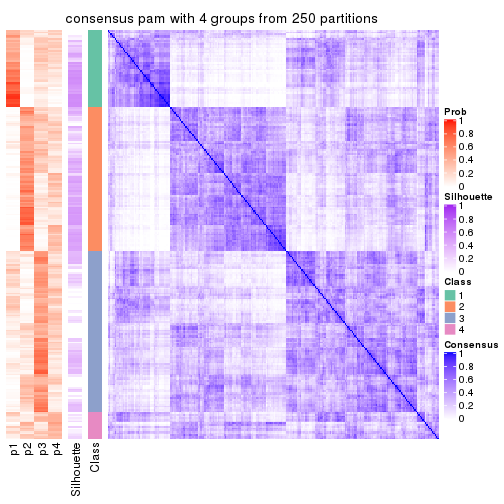</p>

</div>
<div id='tab-SD-pam-consensus-heatmap-4'>
<pre><code class="r">consensus_heatmap(res, k = 5)
</code></pre>

<p></p>

</div>
<div id='tab-SD-pam-consensus-heatmap-5'>
<pre><code class="r">consensus_heatmap(res, k = 6)
</code></pre>

<p></p>

</div>
</div>

Heatmaps for the membership of samples in all partitions to see how consistent they are:


<script>
$( function() {
	$( '#tabs-SD-pam-membership-heatmap' ).tabs();
} );
</script>
<div id='tabs-SD-pam-membership-heatmap'>
<ul>
<li><a href='#tab-SD-pam-membership-heatmap-1'>k = 2</a></li>
<li><a href='#tab-SD-pam-membership-heatmap-2'>k = 3</a></li>
<li><a href='#tab-SD-pam-membership-heatmap-3'>k = 4</a></li>
<li><a href='#tab-SD-pam-membership-heatmap-4'>k = 5</a></li>
<li><a href='#tab-SD-pam-membership-heatmap-5'>k = 6</a></li>
</ul>
<div id='tab-SD-pam-membership-heatmap-1'>
<pre><code class="r">membership_heatmap(res, k = 2)
</code></pre>

<p></p>

</div>
<div id='tab-SD-pam-membership-heatmap-2'>
<pre><code class="r">membership_heatmap(res, k = 3)
</code></pre>

<p></p>

</div>
<div id='tab-SD-pam-membership-heatmap-3'>
<pre><code class="r">membership_heatmap(res, k = 4)
</code></pre>

<p></p>

</div>
<div id='tab-SD-pam-membership-heatmap-4'>
<pre><code class="r">membership_heatmap(res, k = 5)
</code></pre>

<p></p>

</div>
<div id='tab-SD-pam-membership-heatmap-5'>
<pre><code class="r">membership_heatmap(res, k = 6)
</code></pre>

<p></p>

</div>
</div>

As soon as we have had the classes for columns, we can look for signatures
which are significantly different between classes which can be candidate marks
for certain classes. Following are the heatmaps for signatures.


Signature heatmaps where rows are scaled:


<script>
$( function() {
	$( '#tabs-SD-pam-get-signatures' ).tabs();
} );
</script>
<div id='tabs-SD-pam-get-signatures'>
<ul>
<li><a href='#tab-SD-pam-get-signatures-1'>k = 2</a></li>
<li><a href='#tab-SD-pam-get-signatures-2'>k = 3</a></li>
<li><a href='#tab-SD-pam-get-signatures-3'>k = 4</a></li>
<li><a href='#tab-SD-pam-get-signatures-4'>k = 5</a></li>
<li><a href='#tab-SD-pam-get-signatures-5'>k = 6</a></li>
</ul>
<div id='tab-SD-pam-get-signatures-1'>
<pre><code class="r">get_signatures(res, k = 2)
</code></pre>

<p></p>

</div>
<div id='tab-SD-pam-get-signatures-2'>
<pre><code class="r">get_signatures(res, k = 3)
</code></pre>

<p></p>

</div>
<div id='tab-SD-pam-get-signatures-3'>
<pre><code class="r">get_signatures(res, k = 4)
</code></pre>

<p></p>

</div>
<div id='tab-SD-pam-get-signatures-4'>
<pre><code class="r">get_signatures(res, k = 5)
</code></pre>

<p></p>

</div>
<div id='tab-SD-pam-get-signatures-5'>
<pre><code class="r">get_signatures(res, k = 6)
</code></pre>

<p></p>

</div>
</div>


Signature heatmaps where rows are not scaled:


<script>
$( function() {
	$( '#tabs-SD-pam-get-signatures-no-scale' ).tabs();
} );
</script>
<div id='tabs-SD-pam-get-signatures-no-scale'>
<ul>
<li><a href='#tab-SD-pam-get-signatures-no-scale-1'>k = 2</a></li>
<li><a href='#tab-SD-pam-get-signatures-no-scale-2'>k = 3</a></li>
<li><a href='#tab-SD-pam-get-signatures-no-scale-3'>k = 4</a></li>
<li><a href='#tab-SD-pam-get-signatures-no-scale-4'>k = 5</a></li>
<li><a href='#tab-SD-pam-get-signatures-no-scale-5'>k = 6</a></li>
</ul>
<div id='tab-SD-pam-get-signatures-no-scale-1'>
<pre><code class="r">get_signatures(res, k = 2, scale_rows = FALSE)
</code></pre>

<p></p>

</div>
<div id='tab-SD-pam-get-signatures-no-scale-2'>
<pre><code class="r">get_signatures(res, k = 3, scale_rows = FALSE)
</code></pre>

<p></p>

</div>
<div id='tab-SD-pam-get-signatures-no-scale-3'>
<pre><code class="r">get_signatures(res, k = 4, scale_rows = FALSE)
</code></pre>

<p></p>

</div>
<div id='tab-SD-pam-get-signatures-no-scale-4'>
<pre><code class="r">get_signatures(res, k = 5, scale_rows = FALSE)
</code></pre>

<p></p>

</div>
<div id='tab-SD-pam-get-signatures-no-scale-5'>
<pre><code class="r">get_signatures(res, k = 6, scale_rows = FALSE)
</code></pre>

<p></p>

</div>
</div>


Compare the overlap of signatures from different k:

```r
compare_signatures(res)
```


`get_signature()` returns a data frame invisibly. TO get the list of signatures, the function
call should be assigned to a variable explicitly. In following code, if `plot` argument is set
to `FALSE`, no heatmap is plotted while only the differential analysis is performed.

```r
# code only for demonstration
tb = get_signature(res, k = ..., plot = FALSE)
```

An example of the output of `tb` is:

```
#>   which_row         fdr    mean_1    mean_2 scaled_mean_1 scaled_mean_2 km
#> 1        38 0.042760348  8.373488  9.131774    -0.5533452     0.5164555  1
#> 2        40 0.018707592  7.106213  8.469186    -0.6173731     0.5762149  1
#> 3        55 0.019134737 10.221463 11.207825    -0.6159697     0.5749050  1
#> 4        59 0.006059896  5.921854  7.869574    -0.6899429     0.6439467  1
#> 5        60 0.018055526  8.928898 10.211722    -0.6204761     0.5791110  1
#> 6        98 0.009384629 15.714769 14.887706     0.6635654    -0.6193277  2
...
```

The columns in `tb` are:

1. `which_row`: row indices corresponding to the input matrix.
2. `fdr`: FDR for the differential test. 
3. `mean_x`: The mean value in group x.
4. `scaled_mean_x`: The mean value in group x after rows are scaled.
5. `km`: Row groups if k-means clustering is applied to rows.


UMAP plot which shows how samples are separated.


<script>
$( function() {
	$( '#tabs-SD-pam-dimension-reduction' ).tabs();
} );
</script>
<div id='tabs-SD-pam-dimension-reduction'>
<ul>
<li><a href='#tab-SD-pam-dimension-reduction-1'>k = 2</a></li>
<li><a href='#tab-SD-pam-dimension-reduction-2'>k = 3</a></li>
<li><a href='#tab-SD-pam-dimension-reduction-3'>k = 4</a></li>
<li><a href='#tab-SD-pam-dimension-reduction-4'>k = 5</a></li>
<li><a href='#tab-SD-pam-dimension-reduction-5'>k = 6</a></li>
</ul>
<div id='tab-SD-pam-dimension-reduction-1'>
<pre><code class="r">dimension_reduction(res, k = 2, method = &quot;UMAP&quot;)
</code></pre>

<p></p>

</div>
<div id='tab-SD-pam-dimension-reduction-2'>
<pre><code class="r">dimension_reduction(res, k = 3, method = &quot;UMAP&quot;)
</code></pre>

<p></p>

</div>
<div id='tab-SD-pam-dimension-reduction-3'>
<pre><code class="r">dimension_reduction(res, k = 4, method = &quot;UMAP&quot;)
</code></pre>

<p></p>

</div>
<div id='tab-SD-pam-dimension-reduction-4'>
<pre><code class="r">dimension_reduction(res, k = 5, method = &quot;UMAP&quot;)
</code></pre>

<p></p>

</div>
<div id='tab-SD-pam-dimension-reduction-5'>
<pre><code class="r">dimension_reduction(res, k = 6, method = &quot;UMAP&quot;)
</code></pre>

<p></p>

</div>
</div>


Following heatmap shows how subgroups are split when increasing `k`:

```r
collect_classes(res)
```


If matrix rows can be associated to genes, consider to use `GO_Enrichment(res,
...)` to perform function enrichment for the signature genes.


 

---------------------------------------------------


### SD:mclust


The object with results only for a single top-value method and a single partition method 
can be extracted as:

```r
res = res_list["SD", "mclust"]
# you can also extract it by
# res = res_list["SD:mclust"]
```

A summary of `res` and all the functions that can be applied to it:

```r
res
```

```
#> A 'ConsensusPartition' object with k = 2, 3, 4, 5, 6.
#>   On a matrix with 77 rows and 243 columns.
#>   Top rows (8, 16, 23, 30, 38) are extracted by 'SD' method.
#>   Subgroups are detected by 'mclust' method.
#>   Performed in total 1250 partitions by row resampling.
#>   Best k for subgroups seems to be 2.
#> 
#> Following methods can be applied to this 'ConsensusPartition' object:
#>  [1] "cola_report"             "collect_classes"         "collect_plots"          
#>  [4] "collect_stats"           "colnames"                "compare_signatures"     
#>  [7] "consensus_heatmap"       "dimension_reduction"     "functional_enrichment"  
#> [10] "get_anno_col"            "get_anno"                "get_classes"            
#> [13] "get_consensus"           "get_matrix"              "get_membership"         
#> [16] "get_param"               "get_signatures"          "get_stats"              
#> [19] "is_best_k"               "is_stable_k"             "membership_heatmap"     
#> [22] "ncol"                    "nrow"                    "plot_ecdf"              
#> [25] "rownames"                "select_partition_number" "show"                   
#> [28] "suggest_best_k"          "test_to_known_factors"
```

`collect_plots()` function collects all the plots made from `res` for all `k` (number of partitions)
into one single page to provide an easy and fast comparison between different `k`.

```r
collect_plots(res)
```


The plots are:

- The first row: a plot of the ECDF (Empirical cumulative distribution
  function) curves of the consensus matrix for each `k` and the heatmap of
  predicted classes for each `k`.
- The second row: heatmaps of the consensus matrix for each `k`.
- The third row: heatmaps of the membership matrix for each `k`.
- The fouth row: heatmaps of the signatures for each `k`.

All the plots in panels can be made by individual functions and they are
plotted later in this section.

`select_partition_number()` produces several plots showing different
statistics for choosing "optimized" `k`. There are following statistics:

- ECDF curves of the consensus matrix for each `k`;
- 1-PAC. [The PAC
  score](https://en.wikipedia.org/wiki/Consensus_clustering#Over-interpretation_potential_of_consensus_clustering)
  measures the proportion of the ambiguous subgrouping.
- Mean silhouette score.
- Concordance. The mean probability of fiting the consensus class ids in all
  partitions.
- Area increased. Denote $A_k$ as the area under the ECDF curve for current
  `k`, the area increased is defined as $A_k - A_{k-1}$.
- Rand index. The percent of pairs of samples that are both in a same cluster
  or both are not in a same cluster in the partition of k and k-1.
- Jaccard index. The ratio of pairs of samples are both in a same cluster in
  the partition of k and k-1 and the pairs of samples are both in a same
  cluster in the partition k or k-1.

The detailed explanations of these statistics can be found in [the cola
vignette](http://bioconductor.org/packages/devel/bioc/vignettes/cola/inst/doc/cola.html#toc_13).

Generally speaking, lower PAC score, higher mean silhouette score or higher
concordance corresponds to better partition. Rand index and Jaccard index
measure how similar the current partition is compared to partition with `k-1`.
If they are too similar, we won't accept `k` is better than `k-1`.

```r
select_partition_number(res)
```


The numeric values for all these statistics can be obtained by `get_stats()`.

```r
get_stats(res)
```

```
#>   k  1-PAC mean_silhouette concordance area_increased  Rand Jaccard
#> 2 2 0.0244           0.528       0.724         0.4240 0.498   0.498
#> 3 3 0.0304           0.451       0.669         0.2980 0.833   0.701
#> 4 4 0.1095           0.441       0.644         0.1285 0.785   0.586
#> 5 5 0.2004           0.454       0.621         0.1090 0.902   0.755
#> 6 6 0.2537           0.340       0.586         0.0528 0.928   0.799
```

`suggest_best_k()` suggests the best $k$ based on these statistics. The rules are as follows:

- All $k$ with Jaccard index larger than 0.95 are removed because the increase of
  the partition number does not provides enough extra information. If all $k$ are removed,
  the best $k$ is assigned by `NA`.
- For $k$ with 1-PAC larger than 0.9, the maximal $k$ is taken as the "best k". Other $k$ is called "optional k".
- If it does not fit the second rule. The $k$ with the highest vote of highest
  1-PAC, mean silhouette and concordance is taken as the "best k".

```r
suggest_best_k(res)
```

```
#> [1] 2
```


Following shows the table of the partitions (You need to click the **show/hide
code output** link to see it). The membership matrix (columns with name `p*`)
is inferred by
[`clue::cl_consensus()`](https://www.rdocumentation.org/link/cl_consensus?package=clue)
function with the `SE` method. Basically the value in the membership matrix
represents the probability to belong to a certain group. The finall class
label for an item is determined with the group with highest probability it
belongs to.

In `get_classes()` function, the entropy is calculated from the membership
matrix and the silhouette score is calculated from the consensus matrix.


<script>
$( function() {
	$( '#tabs-SD-mclust-get-classes' ).tabs();
} );
</script>
<div id='tabs-SD-mclust-get-classes'>
<ul>
<li><a href='#tab-SD-mclust-get-classes-1'>k = 2</a></li>
<li><a href='#tab-SD-mclust-get-classes-2'>k = 3</a></li>
<li><a href='#tab-SD-mclust-get-classes-3'>k = 4</a></li>
<li><a href='#tab-SD-mclust-get-classes-4'>k = 5</a></li>
<li><a href='#tab-SD-mclust-get-classes-5'>k = 6</a></li>
</ul>

<div id='tab-SD-mclust-get-classes-1'>
<p><a id='tab-SD-mclust-get-classes-1-a' style='color:#0366d6' href='#'>show/hide code output</a></p>
<pre><code class="r">cbind(get_classes(res, k = 2), get_membership(res, k = 2))
</code></pre>

<pre><code>#&gt;           class entropy silhouette    p1    p2
#&gt; SRR191393     1   0.760    0.59769 0.780 0.220
#&gt; SRR191394     2   0.963    0.49092 0.388 0.612
#&gt; SRR191396     1   0.980    0.25351 0.584 0.416
#&gt; SRR191397     1   0.855    0.48241 0.720 0.280
#&gt; SRR191398     2   0.998    0.29837 0.476 0.524
#&gt; SRR191399     1   0.671    0.67526 0.824 0.176
#&gt; SRR191400     1   0.998   -0.17861 0.528 0.472
#&gt; SRR191401     1   0.706    0.64148 0.808 0.192
#&gt; SRR191402     1   0.260    0.67476 0.956 0.044
#&gt; SRR191403     1   0.939    0.33928 0.644 0.356
#&gt; SRR191404     2   0.881    0.62578 0.300 0.700
#&gt; SRR191405     1   0.844    0.60246 0.728 0.272
#&gt; SRR191406     1   0.529    0.69913 0.880 0.120
#&gt; SRR191407     1   0.955    0.34645 0.624 0.376
#&gt; SRR191408     2   0.943    0.54088 0.360 0.640
#&gt; SRR191409     1   0.788    0.66080 0.764 0.236
#&gt; SRR191410     1   0.278    0.67164 0.952 0.048
#&gt; SRR191411     1   0.689    0.67394 0.816 0.184
#&gt; SRR191412     1   0.680    0.64836 0.820 0.180
#&gt; SRR191413     1   0.416    0.69056 0.916 0.084
#&gt; SRR191414     1   1.000   -0.23990 0.508 0.492
#&gt; SRR191415     1   0.584    0.67424 0.860 0.140
#&gt; SRR191416     1   0.518    0.70298 0.884 0.116
#&gt; SRR191418     1   0.850    0.61338 0.724 0.276
#&gt; SRR191419     2   0.978    0.44732 0.412 0.588
#&gt; SRR191420     1   0.680    0.67664 0.820 0.180
#&gt; SRR191421     1   0.697    0.65508 0.812 0.188
#&gt; SRR191422     2   0.900    0.59104 0.316 0.684
#&gt; SRR191423     2   0.730    0.65767 0.204 0.796
#&gt; SRR191424     2   0.358    0.64557 0.068 0.932
#&gt; SRR191425     1   0.861    0.61050 0.716 0.284
#&gt; SRR191426     1   0.671    0.67871 0.824 0.176
#&gt; SRR191427     2   0.891    0.62218 0.308 0.692
#&gt; SRR191428     1   0.767    0.69128 0.776 0.224
#&gt; SRR191429     2   0.985    0.13989 0.428 0.572
#&gt; SRR191430     2   0.839    0.57735 0.268 0.732
#&gt; SRR191431     2   0.795    0.66164 0.240 0.760
#&gt; SRR191432     2   0.895    0.47465 0.312 0.688
#&gt; SRR191433     2   0.975    0.20310 0.408 0.592
#&gt; SRR191434     1   0.861    0.63237 0.716 0.284
#&gt; SRR191435     1   0.605    0.69259 0.852 0.148
#&gt; SRR191436     1   0.760    0.66884 0.780 0.220
#&gt; SRR191437     2   0.443    0.66336 0.092 0.908
#&gt; SRR191438     1   0.886    0.55615 0.696 0.304
#&gt; SRR191439     2   0.671    0.68335 0.176 0.824
#&gt; SRR191440     2   0.469    0.66474 0.100 0.900
#&gt; SRR191441     2   0.443    0.66235 0.092 0.908
#&gt; SRR191442     1   0.866    0.62313 0.712 0.288
#&gt; SRR191443     1   0.921    0.56114 0.664 0.336
#&gt; SRR191444     1   0.722    0.69404 0.800 0.200
#&gt; SRR191445     2   0.973    0.48008 0.404 0.596
#&gt; SRR191446     2   0.925    0.54438 0.340 0.660
#&gt; SRR191447     2   0.814    0.62367 0.252 0.748
#&gt; SRR191448     2   0.981    0.48519 0.420 0.580
#&gt; SRR191449     1   0.671    0.69635 0.824 0.176
#&gt; SRR191450     2   0.985    0.47005 0.428 0.572
#&gt; SRR191451     1   0.999    0.00657 0.520 0.480
#&gt; SRR191452     2   0.563    0.67647 0.132 0.868
#&gt; SRR191453     2   0.722    0.68151 0.200 0.800
#&gt; SRR191454     1   0.680    0.63565 0.820 0.180
#&gt; SRR191455     1   0.861    0.62586 0.716 0.284
#&gt; SRR191456     2   0.760    0.67480 0.220 0.780
#&gt; SRR191457     2   0.981    0.50839 0.420 0.580
#&gt; SRR191458     2   0.997    0.18040 0.468 0.532
#&gt; SRR191459     1   0.563    0.70322 0.868 0.132
#&gt; SRR191460     1   0.506    0.69931 0.888 0.112
#&gt; SRR191461     1   0.706    0.68735 0.808 0.192
#&gt; SRR191462     1   0.946    0.41630 0.636 0.364
#&gt; SRR191463     2   0.775    0.67210 0.228 0.772
#&gt; SRR191464     2   0.722    0.67554 0.200 0.800
#&gt; SRR191465     2   0.456    0.66194 0.096 0.904
#&gt; SRR191466     1   0.925    0.54979 0.660 0.340
#&gt; SRR191467     2   0.981    0.29666 0.420 0.580
#&gt; SRR191468     2   0.456    0.66465 0.096 0.904
#&gt; SRR191469     1   0.895    0.55807 0.688 0.312
#&gt; SRR191470     2   0.997    0.12178 0.468 0.532
#&gt; SRR191471     2   0.961    0.52352 0.384 0.616
#&gt; SRR191472     2   0.529    0.67010 0.120 0.880
#&gt; SRR191473     1   1.000    0.00625 0.504 0.496
#&gt; SRR191474     1   0.855    0.62937 0.720 0.280
#&gt; SRR191475     2   0.730    0.64908 0.204 0.796
#&gt; SRR191476     2   0.990    0.22248 0.440 0.560
#&gt; SRR191477     1   0.946    0.44796 0.636 0.364
#&gt; SRR191478     2   0.991    0.14080 0.444 0.556
#&gt; SRR191479     1   0.980    0.30453 0.584 0.416
#&gt; SRR191480     2   0.753    0.66033 0.216 0.784
#&gt; SRR191481     2   0.886    0.59191 0.304 0.696
#&gt; SRR191482     1   0.932    0.53011 0.652 0.348
#&gt; SRR191483     1   0.886    0.59161 0.696 0.304
#&gt; SRR191484     2   0.827    0.66017 0.260 0.740
#&gt; SRR191485     1   1.000    0.01487 0.508 0.492
#&gt; SRR191486     2   0.936    0.53408 0.352 0.648
#&gt; SRR191487     2   0.988    0.23446 0.436 0.564
#&gt; SRR191488     2   0.971    0.48842 0.400 0.600
#&gt; SRR191489     2   0.760    0.67777 0.220 0.780
#&gt; SRR191490     2   0.506    0.67122 0.112 0.888
#&gt; SRR191491     2   0.891    0.60667 0.308 0.692
#&gt; SRR191492     1   0.978    0.29804 0.588 0.412
#&gt; SRR191493     2   0.518    0.67377 0.116 0.884
#&gt; SRR191494     2   0.615    0.68076 0.152 0.848
#&gt; SRR191495     1   0.949    0.46651 0.632 0.368
#&gt; SRR191496     2   0.430    0.65197 0.088 0.912
#&gt; SRR191497     1   0.722    0.69443 0.800 0.200
#&gt; SRR191498     1   0.994    0.15217 0.544 0.456
#&gt; SRR191499     1   0.850    0.60689 0.724 0.276
#&gt; SRR191500     1   0.615    0.70568 0.848 0.152
#&gt; SRR191501     2   0.574    0.66424 0.136 0.864
#&gt; SRR191502     2   0.985    0.25584 0.428 0.572
#&gt; SRR191503     2   0.494    0.66219 0.108 0.892
#&gt; SRR191504     2   0.973    0.29822 0.404 0.596
#&gt; SRR191505     2   0.781    0.67103 0.232 0.768
#&gt; SRR191506     2   0.469    0.66390 0.100 0.900
#&gt; SRR191507     2   0.605    0.67163 0.148 0.852
#&gt; SRR191508     2   0.996    0.13427 0.464 0.536
#&gt; SRR191509     2   1.000   -0.13646 0.492 0.508
#&gt; SRR191510     2   0.999    0.21549 0.480 0.520
#&gt; SRR191511     2   0.961    0.26526 0.384 0.616
#&gt; SRR191512     2   0.416    0.65705 0.084 0.916
#&gt; SRR191513     2   0.416    0.64007 0.084 0.916
#&gt; SRR191514     2   0.541    0.66353 0.124 0.876
#&gt; SRR191515     2   0.963    0.40381 0.388 0.612
#&gt; SRR191516     1   0.814    0.67183 0.748 0.252
#&gt; SRR191517     1   1.000   -0.10682 0.508 0.492
#&gt; SRR191518     1   0.985    0.33159 0.572 0.428
#&gt; SRR191519     2   0.416    0.65429 0.084 0.916
#&gt; SRR191520     2   0.999    0.11323 0.480 0.520
#&gt; SRR191521     2   0.981    0.35359 0.420 0.580
#&gt; SRR191522     2   1.000    0.06571 0.492 0.508
#&gt; SRR191523     2   0.644    0.66358 0.164 0.836
#&gt; SRR191524     2   0.975    0.44437 0.408 0.592
#&gt; SRR191525     2   0.881    0.57319 0.300 0.700
#&gt; SRR191526     2   0.358    0.64599 0.068 0.932
#&gt; SRR191527     2   0.795    0.65847 0.240 0.760
#&gt; SRR191528     2   0.795    0.65740 0.240 0.760
#&gt; SRR191529     2   0.584    0.68067 0.140 0.860
#&gt; SRR191530     2   0.936    0.38797 0.352 0.648
#&gt; SRR191531     2   0.595    0.68042 0.144 0.856
#&gt; SRR191532     2   0.767    0.67240 0.224 0.776
#&gt; SRR191533     2   0.821    0.66854 0.256 0.744
#&gt; SRR191534     2   0.518    0.66453 0.116 0.884
#&gt; SRR191535     2   0.767    0.62273 0.224 0.776
#&gt; SRR191536     2   0.925    0.61227 0.340 0.660
#&gt; SRR191537     2   0.738    0.67659 0.208 0.792
#&gt; SRR191538     2   0.855    0.59117 0.280 0.720
#&gt; SRR191539     2   0.469    0.66580 0.100 0.900
#&gt; SRR191540     2   0.821    0.64403 0.256 0.744
#&gt; SRR191541     2   0.850    0.64081 0.276 0.724
#&gt; SRR191542     2   0.482    0.66770 0.104 0.896
#&gt; SRR191543     2   0.697    0.66421 0.188 0.812
#&gt; SRR191544     2   0.767    0.66058 0.224 0.776
#&gt; SRR191545     2   0.998    0.04656 0.472 0.528
#&gt; SRR191546     1   0.963    0.40221 0.612 0.388
#&gt; SRR191547     2   1.000   -0.09006 0.496 0.504
#&gt; SRR191548     2   0.995    0.32937 0.460 0.540
#&gt; SRR191549     2   0.961    0.47883 0.384 0.616
#&gt; SRR191550     2   0.994    0.36119 0.456 0.544
#&gt; SRR191551     2   0.996    0.31974 0.464 0.536
#&gt; SRR191552     2   0.997    0.31243 0.468 0.532
#&gt; SRR191553     2   0.833    0.64849 0.264 0.736
#&gt; SRR191554     2   0.939    0.54236 0.356 0.644
#&gt; SRR191555     1   1.000    0.00118 0.504 0.496
#&gt; SRR191556     1   0.443    0.69316 0.908 0.092
#&gt; SRR191557     1   0.745    0.65161 0.788 0.212
#&gt; SRR191558     2   0.990    0.23806 0.440 0.560
#&gt; SRR191559     1   0.416    0.68783 0.916 0.084
#&gt; SRR191560     1   0.653    0.70010 0.832 0.168
#&gt; SRR191561     2   0.895    0.61145 0.312 0.688
#&gt; SRR191562     1   0.955    0.21688 0.624 0.376
#&gt; SRR191563     1   0.760    0.63651 0.780 0.220
#&gt; SRR191564     1   0.529    0.68947 0.880 0.120
#&gt; SRR191565     1   0.358    0.68414 0.932 0.068
#&gt; SRR191566     1   0.260    0.67491 0.956 0.044
#&gt; SRR191567     2   0.998    0.16399 0.476 0.524
#&gt; SRR191568     1   0.985   -0.02342 0.572 0.428
#&gt; SRR191569     1   0.781    0.65497 0.768 0.232
#&gt; SRR191570     1   0.714    0.67279 0.804 0.196
#&gt; SRR191571     1   0.443    0.70173 0.908 0.092
#&gt; SRR191572     2   0.871    0.62092 0.292 0.708
#&gt; SRR191573     1   0.753    0.65858 0.784 0.216
#&gt; SRR191574     2   0.990    0.43957 0.440 0.560
#&gt; SRR191575     2   0.993    0.42200 0.452 0.548
#&gt; SRR191576     1   0.866    0.60613 0.712 0.288
#&gt; SRR191577     1   0.985    0.03279 0.572 0.428
#&gt; SRR191578     2   1.000    0.04166 0.488 0.512
#&gt; SRR191579     2   0.966    0.47712 0.392 0.608
#&gt; SRR191580     2   0.886    0.61515 0.304 0.696
#&gt; SRR191581     2   0.866    0.63442 0.288 0.712
#&gt; SRR191582     2   0.904    0.60442 0.320 0.680
#&gt; SRR191583     2   0.738    0.67022 0.208 0.792
#&gt; SRR191584     2   0.760    0.66220 0.220 0.780
#&gt; SRR191585     1   0.634    0.69916 0.840 0.160
#&gt; SRR191586     1   0.943    0.43873 0.640 0.360
#&gt; SRR191587     1   0.141    0.66008 0.980 0.020
#&gt; SRR191588     1   0.373    0.68711 0.928 0.072
#&gt; SRR191589     1   0.260    0.67621 0.956 0.044
#&gt; SRR191590     1   0.958    0.17358 0.620 0.380
#&gt; SRR191591     1   0.402    0.69366 0.920 0.080
#&gt; SRR191592     1   0.494    0.69276 0.892 0.108
#&gt; SRR191593     1   0.753    0.66035 0.784 0.216
#&gt; SRR191594     2   0.991    0.39045 0.444 0.556
#&gt; SRR191595     1   0.680    0.68608 0.820 0.180
#&gt; SRR191596     1   0.373    0.68487 0.928 0.072
#&gt; SRR191597     1   0.443    0.69232 0.908 0.092
#&gt; SRR191598     1   0.278    0.67531 0.952 0.048
#&gt; SRR191599     1   0.482    0.69912 0.896 0.104
#&gt; SRR191600     1   0.753    0.66752 0.784 0.216
#&gt; SRR191601     1   0.850    0.61924 0.724 0.276
#&gt; SRR191602     1   0.416    0.68404 0.916 0.084
#&gt; SRR191603     1   0.469    0.69699 0.900 0.100
#&gt; SRR191604     1   0.996    0.19112 0.536 0.464
#&gt; SRR191605     1   0.373    0.68243 0.928 0.072
#&gt; SRR191606     1   0.788    0.64345 0.764 0.236
#&gt; SRR191607     1   0.900    0.55764 0.684 0.316
#&gt; SRR191608     1   0.855    0.62312 0.720 0.280
#&gt; SRR191609     1   0.949    0.46632 0.632 0.368
#&gt; SRR191610     1   0.925    0.45103 0.660 0.340
#&gt; SRR191611     1   0.844    0.58748 0.728 0.272
#&gt; SRR191612     1   0.552    0.70149 0.872 0.128
#&gt; SRR191613     1   0.943    0.35841 0.640 0.360
#&gt; SRR191614     1   0.224    0.66818 0.964 0.036
#&gt; SRR191615     1   0.184    0.66344 0.972 0.028
#&gt; SRR191616     2   0.552    0.66201 0.128 0.872
#&gt; SRR191617     2   0.936    0.54129 0.352 0.648
#&gt; SRR191618     1   0.998    0.18022 0.528 0.472
#&gt; SRR191619     1   0.745    0.67882 0.788 0.212
#&gt; SRR191620     2   0.913    0.54325 0.328 0.672
#&gt; SRR191621     1   0.949    0.45306 0.632 0.368
#&gt; SRR191622     1   0.943    0.50682 0.640 0.360
#&gt; SRR191623     1   0.615    0.69509 0.848 0.152
#&gt; SRR191624     1   0.992   -0.01044 0.552 0.448
#&gt; SRR191625     1   0.494    0.69742 0.892 0.108
#&gt; SRR191626     1   0.795    0.67407 0.760 0.240
#&gt; SRR191627     1   0.808    0.65715 0.752 0.248
#&gt; SRR191628     1   0.402    0.67377 0.920 0.080
#&gt; SRR191629     1   0.163    0.66063 0.976 0.024
#&gt; SRR191630     2   0.981    0.42063 0.420 0.580
#&gt; SRR191631     1   0.891    0.60251 0.692 0.308
#&gt; SRR191632     1   0.204    0.64616 0.968 0.032
#&gt; SRR191633     1   0.939    0.47533 0.644 0.356
#&gt; SRR191634     2   0.518    0.66536 0.116 0.884
#&gt; SRR191635     1   0.242    0.67285 0.960 0.040
#&gt; SRR191636     2   0.808    0.66213 0.248 0.752
#&gt; SRR191637     2   0.358    0.63990 0.068 0.932
</code></pre>

<script>
$('#tab-SD-mclust-get-classes-1-a').parent().next().next().hide();
$('#tab-SD-mclust-get-classes-1-a').click(function(){
  $('#tab-SD-mclust-get-classes-1-a').parent().next().next().toggle();
  return(false);
});
</script>
</div>

<div id='tab-SD-mclust-get-classes-2'>
<p><a id='tab-SD-mclust-get-classes-2-a' style='color:#0366d6' href='#'>show/hide code output</a></p>
<pre><code class="r">cbind(get_classes(res, k = 3), get_membership(res, k = 3))
</code></pre>

<pre><code>#&gt;           class entropy silhouette    p1    p2    p3
#&gt; SRR191393     3   0.626     0.4250 0.196 0.052 0.752
#&gt; SRR191394     1   0.967     0.8046 0.464 0.276 0.260
#&gt; SRR191396     3   0.814     0.3873 0.092 0.316 0.592
#&gt; SRR191397     3   0.749     0.2508 0.224 0.096 0.680
#&gt; SRR191398     1   0.960     0.7517 0.432 0.204 0.364
#&gt; SRR191399     3   0.475     0.6347 0.080 0.068 0.852
#&gt; SRR191400     3   0.931    -0.5663 0.384 0.164 0.452
#&gt; SRR191401     3   0.587     0.4884 0.160 0.056 0.784
#&gt; SRR191402     3   0.238     0.6229 0.056 0.008 0.936
#&gt; SRR191403     3   0.865    -0.1244 0.292 0.136 0.572
#&gt; SRR191404     2   0.787     0.5749 0.124 0.660 0.216
#&gt; SRR191405     3   0.738     0.4885 0.068 0.272 0.660
#&gt; SRR191406     3   0.404     0.6581 0.040 0.080 0.880
#&gt; SRR191407     3   0.818     0.3233 0.208 0.152 0.640
#&gt; SRR191408     2   0.852     0.1049 0.092 0.468 0.440
#&gt; SRR191409     3   0.492     0.6540 0.020 0.164 0.816
#&gt; SRR191410     3   0.218     0.6453 0.020 0.032 0.948
#&gt; SRR191411     3   0.530     0.6372 0.032 0.164 0.804
#&gt; SRR191412     3   0.570     0.5181 0.148 0.056 0.796
#&gt; SRR191413     3   0.398     0.6362 0.068 0.048 0.884
#&gt; SRR191414     3   0.952    -0.2813 0.212 0.312 0.476
#&gt; SRR191415     3   0.417     0.6611 0.028 0.104 0.868
#&gt; SRR191416     3   0.293     0.6454 0.040 0.036 0.924
#&gt; SRR191418     3   0.594     0.6089 0.072 0.140 0.788
#&gt; SRR191419     1   0.986     0.7385 0.408 0.264 0.328
#&gt; SRR191420     3   0.531     0.5732 0.124 0.056 0.820
#&gt; SRR191421     3   0.501     0.6003 0.084 0.076 0.840
#&gt; SRR191422     2   0.747     0.5222 0.056 0.624 0.320
#&gt; SRR191423     2   0.748     0.6165 0.116 0.692 0.192
#&gt; SRR191424     2   0.662     0.5118 0.196 0.736 0.068
#&gt; SRR191425     3   0.563     0.6309 0.076 0.116 0.808
#&gt; SRR191426     3   0.505     0.6544 0.024 0.164 0.812
#&gt; SRR191427     2   0.747     0.4021 0.044 0.580 0.376
#&gt; SRR191428     3   0.536     0.6624 0.032 0.168 0.800
#&gt; SRR191429     2   0.875     0.5555 0.148 0.568 0.284
#&gt; SRR191430     2   0.807     0.5385 0.088 0.596 0.316
#&gt; SRR191431     2   0.743     0.4102 0.212 0.688 0.100
#&gt; SRR191432     2   0.816     0.5909 0.136 0.636 0.228
#&gt; SRR191433     2   0.916     0.4314 0.164 0.508 0.328
#&gt; SRR191434     3   0.790     0.4713 0.084 0.300 0.616
#&gt; SRR191435     3   0.596     0.6258 0.112 0.096 0.792
#&gt; SRR191436     3   0.645     0.6145 0.060 0.196 0.744
#&gt; SRR191437     2   0.661     0.5470 0.152 0.752 0.096
#&gt; SRR191438     3   0.697     0.4521 0.044 0.288 0.668
#&gt; SRR191439     2   0.614     0.6149 0.088 0.780 0.132
#&gt; SRR191440     2   0.517     0.4890 0.128 0.824 0.048
#&gt; SRR191441     2   0.635     0.5317 0.156 0.764 0.080
#&gt; SRR191442     3   0.711     0.5559 0.060 0.260 0.680
#&gt; SRR191443     3   0.721     0.5837 0.068 0.252 0.680
#&gt; SRR191444     3   0.638     0.6477 0.076 0.164 0.760
#&gt; SRR191445     2   0.876     0.3766 0.120 0.520 0.360
#&gt; SRR191446     2   0.819     0.5243 0.156 0.640 0.204
#&gt; SRR191447     2   0.750     0.6209 0.104 0.684 0.212
#&gt; SRR191448     3   0.994    -0.6583 0.316 0.296 0.388
#&gt; SRR191449     3   0.621     0.5972 0.088 0.136 0.776
#&gt; SRR191450     3   0.974    -0.2424 0.248 0.312 0.440
#&gt; SRR191451     3   0.714     0.3563 0.032 0.368 0.600
#&gt; SRR191452     2   0.618     0.5322 0.100 0.780 0.120
#&gt; SRR191453     2   0.640     0.5653 0.056 0.744 0.200
#&gt; SRR191454     3   0.613     0.6290 0.084 0.136 0.780
#&gt; SRR191455     3   0.804     0.4596 0.100 0.280 0.620
#&gt; SRR191456     2   0.706     0.5577 0.056 0.680 0.264
#&gt; SRR191457     1   0.988     0.6738 0.376 0.260 0.364
#&gt; SRR191458     3   0.852    -0.0559 0.092 0.440 0.468
#&gt; SRR191459     3   0.489     0.6607 0.040 0.124 0.836
#&gt; SRR191460     3   0.594     0.6587 0.072 0.140 0.788
#&gt; SRR191461     3   0.550     0.6599 0.048 0.148 0.804
#&gt; SRR191462     3   0.857     0.3955 0.132 0.288 0.580
#&gt; SRR191463     2   0.563     0.6136 0.044 0.792 0.164
#&gt; SRR191464     2   0.665     0.6237 0.084 0.744 0.172
#&gt; SRR191465     2   0.559     0.5937 0.096 0.812 0.092
#&gt; SRR191466     3   0.667     0.5882 0.040 0.264 0.696
#&gt; SRR191467     2   0.828     0.4556 0.088 0.552 0.360
#&gt; SRR191468     2   0.557     0.5934 0.080 0.812 0.108
#&gt; SRR191469     3   0.686     0.5824 0.052 0.252 0.696
#&gt; SRR191470     2   0.837     0.3538 0.088 0.524 0.388
#&gt; SRR191471     2   0.920     0.4114 0.164 0.496 0.340
#&gt; SRR191472     2   0.662     0.6147 0.100 0.752 0.148
#&gt; SRR191473     2   0.810     0.3630 0.072 0.540 0.388
#&gt; SRR191474     3   0.735     0.5384 0.120 0.176 0.704
#&gt; SRR191475     2   0.756     0.5922 0.156 0.692 0.152
#&gt; SRR191476     2   0.846     0.4265 0.100 0.544 0.356
#&gt; SRR191477     3   0.841     0.1022 0.092 0.380 0.528
#&gt; SRR191478     2   0.928     0.3530 0.164 0.468 0.368
#&gt; SRR191479     3   0.681     0.5854 0.060 0.228 0.712
#&gt; SRR191480     2   0.829     0.5270 0.204 0.632 0.164
#&gt; SRR191481     2   0.852     0.5126 0.112 0.560 0.328
#&gt; SRR191482     3   0.777     0.2235 0.056 0.384 0.560
#&gt; SRR191483     3   0.828     0.2482 0.088 0.360 0.552
#&gt; SRR191484     2   0.948    -0.0361 0.224 0.492 0.284
#&gt; SRR191485     2   0.813     0.3417 0.072 0.528 0.400
#&gt; SRR191486     2   0.742     0.4418 0.044 0.592 0.364
#&gt; SRR191487     2   0.919     0.3305 0.160 0.492 0.348
#&gt; SRR191488     2   0.994    -0.5868 0.280 0.372 0.348
#&gt; SRR191489     2   0.891     0.4054 0.212 0.572 0.216
#&gt; SRR191490     2   0.557     0.4780 0.140 0.804 0.056
#&gt; SRR191491     2   0.809     0.3830 0.076 0.560 0.364
#&gt; SRR191492     3   0.649     0.5638 0.036 0.256 0.708
#&gt; SRR191493     2   0.645     0.5157 0.152 0.760 0.088
#&gt; SRR191494     2   0.594     0.5981 0.088 0.792 0.120
#&gt; SRR191495     3   0.814     0.4553 0.140 0.220 0.640
#&gt; SRR191496     2   0.598     0.3860 0.228 0.744 0.028
#&gt; SRR191497     3   0.537     0.6608 0.048 0.140 0.812
#&gt; SRR191498     3   0.768     0.3189 0.052 0.384 0.564
#&gt; SRR191499     3   0.638     0.6192 0.076 0.164 0.760
#&gt; SRR191500     3   0.551     0.6615 0.056 0.136 0.808
#&gt; SRR191501     2   0.562     0.4897 0.156 0.796 0.048
#&gt; SRR191502     2   0.784     0.3968 0.060 0.560 0.380
#&gt; SRR191503     2   0.604     0.4883 0.172 0.772 0.056
#&gt; SRR191504     2   0.845     0.5049 0.116 0.580 0.304
#&gt; SRR191505     2   0.708     0.6120 0.104 0.720 0.176
#&gt; SRR191506     2   0.567     0.4927 0.140 0.800 0.060
#&gt; SRR191507     2   0.767     0.4379 0.260 0.652 0.088
#&gt; SRR191508     2   0.843     0.3503 0.092 0.524 0.384
#&gt; SRR191509     3   0.919    -0.1573 0.148 0.416 0.436
#&gt; SRR191510     2   0.907     0.1819 0.136 0.436 0.428
#&gt; SRR191511     2   0.852     0.5226 0.128 0.584 0.288
#&gt; SRR191512     2   0.579     0.5304 0.136 0.796 0.068
#&gt; SRR191513     2   0.541     0.5080 0.164 0.800 0.036
#&gt; SRR191514     2   0.646     0.6032 0.112 0.764 0.124
#&gt; SRR191515     2   0.777     0.5401 0.080 0.628 0.292
#&gt; SRR191516     3   0.689     0.6355 0.088 0.184 0.728
#&gt; SRR191517     2   0.826     0.1418 0.076 0.492 0.432
#&gt; SRR191518     3   0.884    -0.1739 0.116 0.440 0.444
#&gt; SRR191519     2   0.615     0.5588 0.148 0.776 0.076
#&gt; SRR191520     3   0.905     0.1448 0.136 0.404 0.460
#&gt; SRR191521     2   0.796     0.5188 0.076 0.588 0.336
#&gt; SRR191522     2   0.842     0.3422 0.088 0.504 0.408
#&gt; SRR191523     2   0.657     0.5996 0.104 0.756 0.140
#&gt; SRR191524     2   0.882     0.2728 0.116 0.476 0.408
#&gt; SRR191525     2   0.846     0.5745 0.128 0.592 0.280
#&gt; SRR191526     2   0.451     0.5450 0.092 0.860 0.048
#&gt; SRR191527     2   0.867    -0.1328 0.304 0.564 0.132
#&gt; SRR191528     2   0.805     0.1000 0.256 0.632 0.112
#&gt; SRR191529     2   0.589     0.5692 0.100 0.796 0.104
#&gt; SRR191530     2   0.840     0.5245 0.120 0.592 0.288
#&gt; SRR191531     2   0.509     0.4797 0.112 0.832 0.056
#&gt; SRR191532     2   0.717     0.5580 0.088 0.704 0.208
#&gt; SRR191533     2   0.789     0.4488 0.140 0.664 0.196
#&gt; SRR191534     2   0.618     0.5754 0.120 0.780 0.100
#&gt; SRR191535     2   0.786     0.6078 0.116 0.656 0.228
#&gt; SRR191536     2   0.886     0.3557 0.132 0.524 0.344
#&gt; SRR191537     2   0.814     0.4648 0.260 0.624 0.116
#&gt; SRR191538     2   0.791     0.6160 0.124 0.656 0.220
#&gt; SRR191539     2   0.500     0.5606 0.092 0.840 0.068
#&gt; SRR191540     2   0.804     0.5573 0.104 0.624 0.272
#&gt; SRR191541     2   0.706     0.6180 0.076 0.704 0.220
#&gt; SRR191542     2   0.539     0.5686 0.108 0.820 0.072
#&gt; SRR191543     2   0.733     0.6020 0.116 0.704 0.180
#&gt; SRR191544     2   0.691     0.6076 0.084 0.724 0.192
#&gt; SRR191545     2   0.795     0.4206 0.068 0.564 0.368
#&gt; SRR191546     3   0.817     0.3000 0.088 0.336 0.576
#&gt; SRR191547     3   0.825     0.3353 0.096 0.324 0.580
#&gt; SRR191548     3   0.960    -0.7387 0.400 0.200 0.400
#&gt; SRR191549     1   0.969     0.8125 0.460 0.272 0.268
#&gt; SRR191550     1   0.996     0.7401 0.364 0.288 0.348
#&gt; SRR191551     1   0.967     0.7388 0.404 0.212 0.384
#&gt; SRR191552     1   0.958     0.7149 0.404 0.196 0.400
#&gt; SRR191553     1   0.959     0.7081 0.464 0.316 0.220
#&gt; SRR191554     1   0.981     0.7454 0.412 0.340 0.248
#&gt; SRR191555     3   0.956     0.1028 0.228 0.296 0.476
#&gt; SRR191556     3   0.358     0.6499 0.044 0.056 0.900
#&gt; SRR191557     3   0.579     0.6252 0.084 0.116 0.800
#&gt; SRR191558     2   0.755     0.2377 0.040 0.524 0.436
#&gt; SRR191559     3   0.315     0.6406 0.036 0.048 0.916
#&gt; SRR191560     3   0.419     0.6447 0.056 0.068 0.876
#&gt; SRR191561     1   0.959     0.7491 0.464 0.316 0.220
#&gt; SRR191562     3   0.846     0.0532 0.244 0.148 0.608
#&gt; SRR191563     3   0.620     0.6028 0.044 0.208 0.748
#&gt; SRR191564     3   0.429     0.6574 0.040 0.092 0.868
#&gt; SRR191565     3   0.465     0.6536 0.064 0.080 0.856
#&gt; SRR191566     3   0.212     0.6301 0.040 0.012 0.948
#&gt; SRR191567     3   0.980    -0.1463 0.304 0.264 0.432
#&gt; SRR191568     3   0.860     0.1330 0.168 0.232 0.600
#&gt; SRR191569     3   0.575     0.6219 0.040 0.180 0.780
#&gt; SRR191570     3   0.561     0.6567 0.072 0.120 0.808
#&gt; SRR191571     3   0.315     0.6454 0.036 0.048 0.916
#&gt; SRR191572     1   0.942     0.7427 0.492 0.304 0.204
#&gt; SRR191573     3   0.451     0.6454 0.048 0.092 0.860
#&gt; SRR191574     3   0.976    -0.6842 0.380 0.228 0.392
#&gt; SRR191575     3   0.992    -0.5435 0.284 0.324 0.392
#&gt; SRR191576     3   0.684     0.5484 0.044 0.272 0.684
#&gt; SRR191577     3   0.702     0.5194 0.076 0.216 0.708
#&gt; SRR191578     2   0.890     0.3153 0.124 0.480 0.396
#&gt; SRR191579     1   0.966     0.8130 0.464 0.256 0.280
#&gt; SRR191580     1   0.972     0.7101 0.416 0.360 0.224
#&gt; SRR191581     2   0.902    -0.2420 0.316 0.528 0.156
#&gt; SRR191582     2   0.990    -0.5170 0.316 0.400 0.284
#&gt; SRR191583     2   0.683     0.4201 0.192 0.728 0.080
#&gt; SRR191584     2   0.820    -0.1014 0.356 0.560 0.084
#&gt; SRR191585     3   0.492     0.6412 0.072 0.084 0.844
#&gt; SRR191586     3   0.732     0.5185 0.096 0.208 0.696
#&gt; SRR191587     3   0.279     0.6403 0.044 0.028 0.928
#&gt; SRR191588     3   0.206     0.6280 0.044 0.008 0.948
#&gt; SRR191589     3   0.176     0.6212 0.040 0.004 0.956
#&gt; SRR191590     3   0.843     0.1966 0.176 0.204 0.620
#&gt; SRR191591     3   0.315     0.6465 0.040 0.044 0.916
#&gt; SRR191592     3   0.326     0.6495 0.040 0.048 0.912
#&gt; SRR191593     3   0.447     0.6348 0.060 0.076 0.864
#&gt; SRR191594     3   0.994    -0.6389 0.284 0.344 0.372
#&gt; SRR191595     3   0.353     0.6563 0.032 0.068 0.900
#&gt; SRR191596     3   0.288     0.6373 0.052 0.024 0.924
#&gt; SRR191597     3   0.429     0.6661 0.032 0.104 0.864
#&gt; SRR191598     3   0.175     0.6340 0.028 0.012 0.960
#&gt; SRR191599     3   0.338     0.6424 0.048 0.044 0.908
#&gt; SRR191600     3   0.601     0.6362 0.044 0.192 0.764
#&gt; SRR191601     3   0.576     0.5803 0.016 0.244 0.740
#&gt; SRR191602     3   0.346     0.6570 0.024 0.076 0.900
#&gt; SRR191603     3   0.234     0.6570 0.012 0.048 0.940
#&gt; SRR191604     2   0.777     0.3401 0.056 0.560 0.384
#&gt; SRR191605     3   0.357     0.6523 0.040 0.060 0.900
#&gt; SRR191606     3   0.486     0.6542 0.044 0.116 0.840
#&gt; SRR191607     3   0.768     0.5116 0.132 0.188 0.680
#&gt; SRR191608     3   0.647     0.5198 0.028 0.280 0.692
#&gt; SRR191609     3   0.834     0.4218 0.144 0.236 0.620
#&gt; SRR191610     3   0.704     0.5529 0.096 0.184 0.720
#&gt; SRR191611     3   0.622     0.6059 0.092 0.132 0.776
#&gt; SRR191612     3   0.324     0.6550 0.032 0.056 0.912
#&gt; SRR191613     3   0.703     0.5546 0.104 0.172 0.724
#&gt; SRR191614     3   0.191     0.6334 0.028 0.016 0.956
#&gt; SRR191615     3   0.200     0.6332 0.036 0.012 0.952
#&gt; SRR191616     2   0.654     0.4018 0.204 0.736 0.060
#&gt; SRR191617     2   0.797     0.5232 0.084 0.604 0.312
#&gt; SRR191618     3   0.909     0.1083 0.148 0.356 0.496
#&gt; SRR191619     3   0.697     0.4590 0.048 0.276 0.676
#&gt; SRR191620     2   0.728     0.4980 0.044 0.620 0.336
#&gt; SRR191621     3   0.821     0.1619 0.080 0.380 0.540
#&gt; SRR191622     3   0.772     0.2926 0.060 0.352 0.588
#&gt; SRR191623     3   0.417     0.6577 0.036 0.092 0.872
#&gt; SRR191624     3   0.832     0.2729 0.116 0.284 0.600
#&gt; SRR191625     3   0.579     0.6303 0.048 0.168 0.784
#&gt; SRR191626     3   0.727     0.5510 0.064 0.268 0.668
#&gt; SRR191627     3   0.721     0.4313 0.040 0.340 0.620
#&gt; SRR191628     3   0.230     0.6471 0.020 0.036 0.944
#&gt; SRR191629     3   0.243     0.6512 0.024 0.036 0.940
#&gt; SRR191630     3   0.993    -0.6295 0.276 0.356 0.368
#&gt; SRR191631     3   0.890     0.2698 0.132 0.356 0.512
#&gt; SRR191632     3   0.337     0.6182 0.072 0.024 0.904
#&gt; SRR191633     3   0.771     0.2925 0.052 0.392 0.556
#&gt; SRR191634     2   0.638     0.3747 0.244 0.720 0.036
#&gt; SRR191635     3   0.191     0.6348 0.028 0.016 0.956
#&gt; SRR191636     2   0.772     0.4243 0.152 0.680 0.168
#&gt; SRR191637     2   0.628     0.4558 0.224 0.736 0.040
</code></pre>

<script>
$('#tab-SD-mclust-get-classes-2-a').parent().next().next().hide();
$('#tab-SD-mclust-get-classes-2-a').click(function(){
  $('#tab-SD-mclust-get-classes-2-a').parent().next().next().toggle();
  return(false);
});
</script>
</div>

<div id='tab-SD-mclust-get-classes-3'>
<p><a id='tab-SD-mclust-get-classes-3-a' style='color:#0366d6' href='#'>show/hide code output</a></p>
<pre><code class="r">cbind(get_classes(res, k = 4), get_membership(res, k = 4))
</code></pre>

<pre><code>#&gt;           class entropy silhouette    p1    p2    p3    p4
#&gt; SRR191393     3   0.552    0.18425 0.380 0.012 0.600 0.008
#&gt; SRR191394     1   0.498    0.70037 0.788 0.032 0.148 0.032
#&gt; SRR191396     3   0.728    0.50070 0.052 0.144 0.644 0.160
#&gt; SRR191397     3   0.583    0.27125 0.344 0.020 0.620 0.016
#&gt; SRR191398     1   0.430    0.71102 0.756 0.004 0.236 0.004
#&gt; SRR191399     3   0.531    0.64116 0.196 0.024 0.748 0.032
#&gt; SRR191400     1   0.657    0.55514 0.560 0.024 0.376 0.040
#&gt; SRR191401     3   0.546    0.40196 0.312 0.016 0.660 0.012
#&gt; SRR191402     3   0.275    0.68713 0.072 0.020 0.904 0.004
#&gt; SRR191403     1   0.574    0.40780 0.556 0.016 0.420 0.008
#&gt; SRR191404     2   0.855    0.22320 0.024 0.336 0.312 0.328
#&gt; SRR191405     3   0.629    0.45415 0.016 0.288 0.640 0.056
#&gt; SRR191406     3   0.317    0.69161 0.024 0.056 0.896 0.024
#&gt; SRR191407     3   0.670    0.48206 0.268 0.076 0.632 0.024
#&gt; SRR191408     3   0.766    0.54513 0.132 0.172 0.620 0.076
#&gt; SRR191409     3   0.507    0.69251 0.072 0.096 0.800 0.032
#&gt; SRR191410     3   0.235    0.69041 0.024 0.040 0.928 0.008
#&gt; SRR191411     3   0.377    0.67662 0.040 0.104 0.852 0.004
#&gt; SRR191412     3   0.513    0.48833 0.276 0.012 0.700 0.012
#&gt; SRR191413     3   0.434    0.66940 0.136 0.020 0.820 0.024
#&gt; SRR191414     3   0.741    0.23443 0.344 0.044 0.540 0.072
#&gt; SRR191415     3   0.337    0.68240 0.020 0.092 0.876 0.012
#&gt; SRR191416     3   0.305    0.69252 0.056 0.016 0.900 0.028
#&gt; SRR191418     3   0.508    0.66934 0.080 0.032 0.800 0.088
#&gt; SRR191419     1   0.678    0.67519 0.608 0.028 0.300 0.064
#&gt; SRR191420     3   0.470    0.65266 0.148 0.028 0.800 0.024
#&gt; SRR191421     3   0.471    0.62199 0.176 0.020 0.784 0.020
#&gt; SRR191422     2   0.768    0.37341 0.000 0.420 0.360 0.220
#&gt; SRR191423     2   0.638    0.47776 0.020 0.688 0.188 0.104
#&gt; SRR191424     4   0.483    0.58925 0.008 0.252 0.012 0.728
#&gt; SRR191425     3   0.498    0.67824 0.120 0.044 0.800 0.036
#&gt; SRR191426     3   0.403    0.66911 0.008 0.148 0.824 0.020
#&gt; SRR191427     3   0.865    0.17422 0.072 0.216 0.496 0.216
#&gt; SRR191428     3   0.476    0.68951 0.060 0.084 0.820 0.036
#&gt; SRR191429     2   0.793    0.43169 0.032 0.540 0.240 0.188
#&gt; SRR191430     2   0.605    0.52995 0.004 0.628 0.312 0.056
#&gt; SRR191431     4   0.804    0.55091 0.116 0.228 0.084 0.572
#&gt; SRR191432     2   0.591    0.46645 0.012 0.720 0.168 0.100
#&gt; SRR191433     2   0.503    0.52094 0.020 0.752 0.208 0.020
#&gt; SRR191434     3   0.773    0.41789 0.068 0.264 0.576 0.092
#&gt; SRR191435     3   0.531    0.67065 0.124 0.028 0.780 0.068
#&gt; SRR191436     3   0.491    0.64291 0.048 0.168 0.776 0.008
#&gt; SRR191437     4   0.559    0.56748 0.016 0.316 0.016 0.652
#&gt; SRR191438     3   0.627    0.25707 0.012 0.376 0.572 0.040
#&gt; SRR191439     2   0.697    0.29485 0.012 0.624 0.164 0.200
#&gt; SRR191440     4   0.567    0.55801 0.016 0.312 0.020 0.652
#&gt; SRR191441     4   0.576    0.55619 0.012 0.332 0.024 0.632
#&gt; SRR191442     3   0.535    0.61243 0.012 0.176 0.752 0.060
#&gt; SRR191443     3   0.620    0.63098 0.072 0.172 0.716 0.040
#&gt; SRR191444     3   0.563    0.66825 0.056 0.120 0.768 0.056
#&gt; SRR191445     3   0.875   -0.18817 0.048 0.288 0.420 0.244
#&gt; SRR191446     4   0.892   -0.11986 0.060 0.316 0.228 0.396
#&gt; SRR191447     2   0.622    0.49683 0.008 0.680 0.208 0.104
#&gt; SRR191448     1   0.735    0.56804 0.508 0.056 0.388 0.048
#&gt; SRR191449     3   0.472    0.68197 0.056 0.032 0.820 0.092
#&gt; SRR191450     3   0.851    0.11987 0.324 0.064 0.464 0.148
#&gt; SRR191451     3   0.612    0.59876 0.036 0.160 0.724 0.080
#&gt; SRR191452     4   0.722    0.41454 0.028 0.444 0.068 0.460
#&gt; SRR191453     2   0.942   -0.05289 0.168 0.408 0.152 0.272
#&gt; SRR191454     3   0.546    0.67093 0.100 0.092 0.776 0.032
#&gt; SRR191455     3   0.675    0.26126 0.020 0.372 0.552 0.056
#&gt; SRR191456     2   0.805    0.33539 0.024 0.460 0.344 0.172
#&gt; SRR191457     1   0.755    0.61498 0.532 0.056 0.344 0.068
#&gt; SRR191458     3   0.746    0.21572 0.052 0.356 0.528 0.064
#&gt; SRR191459     3   0.418    0.67382 0.020 0.124 0.832 0.024
#&gt; SRR191460     3   0.470    0.67428 0.052 0.116 0.812 0.020
#&gt; SRR191461     3   0.501    0.67243 0.044 0.116 0.800 0.040
#&gt; SRR191462     3   0.787    0.32865 0.112 0.280 0.552 0.056
#&gt; SRR191463     4   0.771    0.02882 0.008 0.404 0.168 0.420
#&gt; SRR191464     2   0.742    0.16689 0.008 0.516 0.148 0.328
#&gt; SRR191465     2   0.648   -0.29913 0.004 0.504 0.060 0.432
#&gt; SRR191466     3   0.667    0.57841 0.048 0.204 0.676 0.072
#&gt; SRR191467     2   0.686    0.49538 0.008 0.544 0.360 0.088
#&gt; SRR191468     2   0.658   -0.29775 0.032 0.532 0.028 0.408
#&gt; SRR191469     3   0.591    0.60458 0.068 0.196 0.716 0.020
#&gt; SRR191470     2   0.792    0.49965 0.044 0.508 0.332 0.116
#&gt; SRR191471     3   0.903   -0.38472 0.056 0.316 0.328 0.300
#&gt; SRR191472     2   0.717    0.11214 0.044 0.620 0.088 0.248
#&gt; SRR191473     2   0.800    0.36438 0.040 0.456 0.384 0.120
#&gt; SRR191474     3   0.607    0.64352 0.080 0.040 0.732 0.148
#&gt; SRR191475     2   0.552    0.41341 0.008 0.748 0.144 0.100
#&gt; SRR191476     2   0.758    0.39466 0.000 0.456 0.336 0.208
#&gt; SRR191477     3   0.734   -0.16562 0.016 0.432 0.452 0.100
#&gt; SRR191478     2   0.619    0.52687 0.024 0.672 0.252 0.052
#&gt; SRR191479     3   0.587    0.67401 0.108 0.084 0.756 0.052
#&gt; SRR191480     4   0.844    0.16991 0.040 0.280 0.212 0.468
#&gt; SRR191481     2   0.808    0.45314 0.040 0.480 0.344 0.136
#&gt; SRR191482     3   0.719    0.10635 0.008 0.344 0.528 0.120
#&gt; SRR191483     2   0.698    0.15350 0.028 0.464 0.456 0.052
#&gt; SRR191484     3   0.952   -0.22120 0.300 0.120 0.352 0.228
#&gt; SRR191485     2   0.691    0.30329 0.020 0.500 0.420 0.060
#&gt; SRR191486     3   0.751    0.04975 0.040 0.392 0.492 0.076
#&gt; SRR191487     4   0.898   -0.20963 0.056 0.256 0.340 0.348
#&gt; SRR191488     1   0.820    0.39570 0.448 0.080 0.388 0.084
#&gt; SRR191489     4   0.867    0.22617 0.088 0.152 0.268 0.492
#&gt; SRR191490     4   0.559    0.57624 0.028 0.252 0.020 0.700
#&gt; SRR191491     3   0.777    0.18421 0.060 0.360 0.504 0.076
#&gt; SRR191492     3   0.554    0.67312 0.056 0.108 0.776 0.060
#&gt; SRR191493     2   0.747   -0.37048 0.088 0.508 0.032 0.372
#&gt; SRR191494     2   0.634    0.13991 0.008 0.668 0.108 0.216
#&gt; SRR191495     3   0.665    0.60605 0.096 0.044 0.688 0.172
#&gt; SRR191496     4   0.515    0.58540 0.040 0.208 0.008 0.744
#&gt; SRR191497     3   0.446    0.68086 0.044 0.104 0.828 0.024
#&gt; SRR191498     3   0.712    0.57729 0.060 0.136 0.664 0.140
#&gt; SRR191499     3   0.587    0.64121 0.040 0.068 0.744 0.148
#&gt; SRR191500     3   0.441    0.68969 0.052 0.068 0.840 0.040
#&gt; SRR191501     4   0.745    0.52755 0.064 0.352 0.052 0.532
#&gt; SRR191502     2   0.794    0.43447 0.028 0.476 0.352 0.144
#&gt; SRR191503     4   0.656    0.55817 0.024 0.316 0.052 0.608
#&gt; SRR191504     2   0.581    0.53760 0.020 0.668 0.284 0.028
#&gt; SRR191505     2   0.668    0.43780 0.020 0.668 0.168 0.144
#&gt; SRR191506     4   0.653    0.58478 0.024 0.324 0.048 0.604
#&gt; SRR191507     4   0.755    0.52551 0.048 0.348 0.076 0.528
#&gt; SRR191508     2   0.643    0.23095 0.016 0.504 0.444 0.036
#&gt; SRR191509     2   0.580    0.51689 0.020 0.644 0.316 0.020
#&gt; SRR191510     3   0.870   -0.00295 0.076 0.300 0.464 0.160
#&gt; SRR191511     2   0.555    0.51031 0.012 0.732 0.196 0.060
#&gt; SRR191512     2   0.629   -0.51662 0.016 0.480 0.028 0.476
#&gt; SRR191513     2   0.580   -0.32546 0.028 0.616 0.008 0.348
#&gt; SRR191514     2   0.475    0.30501 0.008 0.804 0.092 0.096
#&gt; SRR191515     2   0.758    0.48760 0.024 0.556 0.276 0.144
#&gt; SRR191516     3   0.513    0.68299 0.056 0.096 0.800 0.048
#&gt; SRR191517     3   0.870    0.09697 0.072 0.260 0.480 0.188
#&gt; SRR191518     2   0.636    0.45909 0.016 0.592 0.348 0.044
#&gt; SRR191519     4   0.691    0.49045 0.012 0.340 0.088 0.560
#&gt; SRR191520     3   0.763    0.44008 0.060 0.096 0.584 0.260
#&gt; SRR191521     2   0.751    0.50764 0.020 0.532 0.320 0.128
#&gt; SRR191522     2   0.654    0.52265 0.024 0.612 0.312 0.052
#&gt; SRR191523     2   0.618    0.24945 0.016 0.704 0.108 0.172
#&gt; SRR191524     3   0.839    0.25013 0.076 0.244 0.528 0.152
#&gt; SRR191525     2   0.722    0.43480 0.020 0.612 0.200 0.168
#&gt; SRR191526     2   0.522   -0.19571 0.016 0.684 0.008 0.292
#&gt; SRR191527     1   0.882    0.11761 0.468 0.204 0.076 0.252
#&gt; SRR191528     4   0.883    0.19522 0.340 0.200 0.060 0.400
#&gt; SRR191529     2   0.806   -0.40015 0.040 0.424 0.124 0.412
#&gt; SRR191530     2   0.493    0.51519 0.012 0.760 0.200 0.028
#&gt; SRR191531     2   0.763   -0.38579 0.144 0.456 0.012 0.388
#&gt; SRR191532     2   0.769    0.25250 0.020 0.552 0.208 0.220
#&gt; SRR191533     4   0.930    0.17065 0.116 0.244 0.216 0.424
#&gt; SRR191534     2   0.609   -0.02368 0.020 0.700 0.072 0.208
#&gt; SRR191535     2   0.621    0.49651 0.024 0.700 0.196 0.080
#&gt; SRR191536     3   0.892   -0.14737 0.128 0.356 0.408 0.108
#&gt; SRR191537     4   0.813    0.43540 0.064 0.248 0.140 0.548
#&gt; SRR191538     2   0.668    0.48846 0.016 0.652 0.216 0.116
#&gt; SRR191539     4   0.652    0.43486 0.036 0.440 0.020 0.504
#&gt; SRR191540     2   0.788    0.39188 0.028 0.460 0.380 0.132
#&gt; SRR191541     2   0.728    0.49974 0.032 0.588 0.280 0.100
#&gt; SRR191542     2   0.504   -0.15270 0.008 0.712 0.016 0.264
#&gt; SRR191543     2   0.545    0.35499 0.012 0.760 0.124 0.104
#&gt; SRR191544     2   0.661    0.44691 0.012 0.660 0.188 0.140
#&gt; SRR191545     2   0.616    0.51325 0.008 0.620 0.320 0.052
#&gt; SRR191546     3   0.661    0.04326 0.024 0.436 0.504 0.036
#&gt; SRR191547     3   0.591    0.41269 0.024 0.340 0.620 0.016
#&gt; SRR191548     1   0.468    0.71473 0.744 0.004 0.236 0.016
#&gt; SRR191549     1   0.552    0.70556 0.748 0.016 0.168 0.068
#&gt; SRR191550     1   0.538    0.68867 0.760 0.028 0.168 0.044
#&gt; SRR191551     1   0.460    0.71079 0.756 0.008 0.224 0.012
#&gt; SRR191552     1   0.451    0.71302 0.744 0.004 0.244 0.008
#&gt; SRR191553     1   0.714    0.64882 0.628 0.028 0.208 0.136
#&gt; SRR191554     1   0.657    0.67248 0.688 0.028 0.152 0.132
#&gt; SRR191555     3   0.820    0.38866 0.228 0.044 0.524 0.204
#&gt; SRR191556     3   0.281    0.69621 0.036 0.036 0.912 0.016
#&gt; SRR191557     3   0.471    0.67519 0.104 0.016 0.812 0.068
#&gt; SRR191558     3   0.758   -0.00757 0.040 0.408 0.472 0.080
#&gt; SRR191559     3   0.182    0.69034 0.012 0.008 0.948 0.032
#&gt; SRR191560     3   0.301    0.69512 0.032 0.020 0.904 0.044
#&gt; SRR191561     1   0.606    0.68590 0.732 0.060 0.156 0.052
#&gt; SRR191562     3   0.604    0.04120 0.392 0.032 0.568 0.008
#&gt; SRR191563     3   0.567    0.59536 0.040 0.216 0.720 0.024
#&gt; SRR191564     3   0.389    0.68719 0.044 0.064 0.864 0.028
#&gt; SRR191565     3   0.360    0.69486 0.068 0.032 0.876 0.024
#&gt; SRR191566     3   0.154    0.69060 0.032 0.004 0.956 0.008
#&gt; SRR191567     3   0.794    0.06285 0.356 0.044 0.488 0.112
#&gt; SRR191568     3   0.633    0.42815 0.268 0.040 0.656 0.036
#&gt; SRR191569     3   0.535    0.62922 0.032 0.164 0.764 0.040
#&gt; SRR191570     3   0.486    0.67736 0.064 0.104 0.808 0.024
#&gt; SRR191571     3   0.229    0.69296 0.036 0.016 0.932 0.016
#&gt; SRR191572     1   0.504    0.59090 0.792 0.024 0.056 0.128
#&gt; SRR191573     3   0.454    0.66014 0.136 0.020 0.812 0.032
#&gt; SRR191574     1   0.699    0.56001 0.532 0.064 0.380 0.024
#&gt; SRR191575     3   0.814   -0.18632 0.384 0.092 0.456 0.068
#&gt; SRR191576     3   0.557    0.65248 0.056 0.148 0.760 0.036
#&gt; SRR191577     3   0.518    0.69271 0.108 0.068 0.792 0.032
#&gt; SRR191578     3   0.836   -0.34510 0.016 0.344 0.356 0.284
#&gt; SRR191579     1   0.579    0.71147 0.732 0.024 0.180 0.064
#&gt; SRR191580     1   0.686    0.62992 0.692 0.076 0.116 0.116
#&gt; SRR191581     1   0.859    0.40725 0.520 0.096 0.152 0.232
#&gt; SRR191582     1   0.799    0.59650 0.556 0.064 0.260 0.120
#&gt; SRR191583     4   0.714    0.57970 0.096 0.280 0.028 0.596
#&gt; SRR191584     1   0.788   -0.07537 0.448 0.140 0.024 0.388
#&gt; SRR191585     3   0.365    0.69197 0.056 0.028 0.876 0.040
#&gt; SRR191586     3   0.594    0.64524 0.108 0.024 0.736 0.132
#&gt; SRR191587     3   0.230    0.69493 0.024 0.044 0.928 0.004
#&gt; SRR191588     3   0.201    0.69222 0.036 0.004 0.940 0.020
#&gt; SRR191589     3   0.111    0.68741 0.016 0.008 0.972 0.004
#&gt; SRR191590     3   0.617    0.35986 0.292 0.048 0.644 0.016
#&gt; SRR191591     3   0.268    0.69980 0.048 0.036 0.912 0.004
#&gt; SRR191592     3   0.172    0.69284 0.032 0.020 0.948 0.000
#&gt; SRR191593     3   0.400    0.68849 0.092 0.020 0.852 0.036
#&gt; SRR191594     1   0.701    0.64236 0.608 0.040 0.284 0.068
#&gt; SRR191595     3   0.247    0.69615 0.044 0.016 0.924 0.016
#&gt; SRR191596     3   0.157    0.68867 0.028 0.004 0.956 0.012
#&gt; SRR191597     3   0.350    0.69344 0.012 0.076 0.876 0.036
#&gt; SRR191598     3   0.149    0.68715 0.024 0.008 0.960 0.008
#&gt; SRR191599     3   0.296    0.69424 0.040 0.012 0.904 0.044
#&gt; SRR191600     3   0.588    0.56489 0.036 0.240 0.696 0.028
#&gt; SRR191601     3   0.524    0.63939 0.024 0.144 0.776 0.056
#&gt; SRR191602     3   0.297    0.68332 0.020 0.096 0.884 0.000
#&gt; SRR191603     3   0.278    0.68977 0.016 0.072 0.904 0.008
#&gt; SRR191604     2   0.762    0.33478 0.012 0.460 0.384 0.144
#&gt; SRR191605     3   0.325    0.68711 0.024 0.072 0.888 0.016
#&gt; SRR191606     3   0.459    0.69912 0.060 0.060 0.832 0.048
#&gt; SRR191607     3   0.631    0.62230 0.108 0.032 0.712 0.148
#&gt; SRR191608     3   0.623    0.56353 0.024 0.192 0.700 0.084
#&gt; SRR191609     3   0.651    0.56903 0.056 0.056 0.688 0.200
#&gt; SRR191610     3   0.517    0.66574 0.108 0.016 0.784 0.092
#&gt; SRR191611     3   0.518    0.67316 0.108 0.032 0.792 0.068
#&gt; SRR191612     3   0.277    0.69365 0.032 0.044 0.912 0.012
#&gt; SRR191613     3   0.593    0.59727 0.200 0.028 0.716 0.056
#&gt; SRR191614     3   0.126    0.68864 0.016 0.008 0.968 0.008
#&gt; SRR191615     3   0.206    0.68977 0.048 0.008 0.936 0.008
#&gt; SRR191616     4   0.580    0.60288 0.064 0.172 0.028 0.736
#&gt; SRR191617     2   0.776    0.37596 0.008 0.488 0.296 0.208
#&gt; SRR191618     3   0.808    0.15070 0.032 0.160 0.484 0.324
#&gt; SRR191619     3   0.625    0.20242 0.032 0.388 0.564 0.016
#&gt; SRR191620     2   0.744    0.30594 0.012 0.456 0.412 0.120
#&gt; SRR191621     2   0.654    0.15663 0.036 0.484 0.460 0.020
#&gt; SRR191622     3   0.637    0.10578 0.012 0.416 0.532 0.040
#&gt; SRR191623     3   0.238    0.69491 0.040 0.016 0.928 0.016
#&gt; SRR191624     3   0.650    0.58803 0.192 0.052 0.692 0.064
#&gt; SRR191625     3   0.582    0.42473 0.032 0.308 0.648 0.012
#&gt; SRR191626     3   0.677    0.54676 0.052 0.224 0.660 0.064
#&gt; SRR191627     3   0.802    0.28373 0.060 0.280 0.540 0.120
#&gt; SRR191628     3   0.155    0.69071 0.000 0.040 0.952 0.008
#&gt; SRR191629     3   0.267    0.69057 0.020 0.068 0.908 0.004
#&gt; SRR191630     1   0.726    0.60184 0.556 0.044 0.336 0.064
#&gt; SRR191631     3   0.875    0.16880 0.072 0.244 0.476 0.208
#&gt; SRR191632     3   0.316    0.66116 0.120 0.008 0.868 0.004
#&gt; SRR191633     3   0.789    0.29572 0.044 0.300 0.532 0.124
#&gt; SRR191634     4   0.539    0.59065 0.056 0.140 0.032 0.772
#&gt; SRR191635     3   0.176    0.69269 0.012 0.020 0.952 0.016
#&gt; SRR191636     4   0.866    0.42984 0.096 0.260 0.144 0.500
#&gt; SRR191637     4   0.567    0.57452 0.016 0.312 0.020 0.652
</code></pre>

<script>
$('#tab-SD-mclust-get-classes-3-a').parent().next().next().hide();
$('#tab-SD-mclust-get-classes-3-a').click(function(){
  $('#tab-SD-mclust-get-classes-3-a').parent().next().next().toggle();
  return(false);
});
</script>
</div>

<div id='tab-SD-mclust-get-classes-4'>
<p><a id='tab-SD-mclust-get-classes-4-a' style='color:#0366d6' href='#'>show/hide code output</a></p>
<pre><code class="r">cbind(get_classes(res, k = 5), get_membership(res, k = 5))
</code></pre>

<pre><code>#&gt;           class entropy silhouette    p1    p2    p3 p4    p5
#&gt; SRR191393     3   0.516     0.1233 0.432 0.004 0.532 NA 0.000
#&gt; SRR191394     1   0.384     0.6856 0.812 0.040 0.140 NA 0.004
#&gt; SRR191396     3   0.729     0.4777 0.128 0.116 0.612 NA 0.108
#&gt; SRR191397     3   0.534     0.0741 0.432 0.008 0.524 NA 0.000
#&gt; SRR191398     1   0.316     0.6938 0.808 0.000 0.188 NA 0.004
#&gt; SRR191399     3   0.520     0.5475 0.204 0.000 0.680 NA 0.000
#&gt; SRR191400     1   0.446     0.5391 0.656 0.000 0.328 NA 0.004
#&gt; SRR191401     3   0.513     0.2393 0.380 0.004 0.580 NA 0.000
#&gt; SRR191402     3   0.318     0.6450 0.092 0.016 0.864 NA 0.000
#&gt; SRR191403     1   0.507     0.3466 0.572 0.000 0.388 NA 0.000
#&gt; SRR191404     2   0.832     0.2994 0.028 0.388 0.224 NA 0.296
#&gt; SRR191405     3   0.689     0.0392 0.060 0.360 0.512 NA 0.032
#&gt; SRR191406     3   0.453     0.6379 0.016 0.092 0.792 NA 0.008
#&gt; SRR191407     3   0.656     0.4614 0.244 0.072 0.596 NA 0.000
#&gt; SRR191408     3   0.809     0.4688 0.152 0.212 0.492 NA 0.020
#&gt; SRR191409     3   0.461     0.6493 0.052 0.084 0.796 NA 0.004
#&gt; SRR191410     3   0.238     0.6583 0.004 0.036 0.908 NA 0.000
#&gt; SRR191411     3   0.434     0.6257 0.008 0.120 0.784 NA 0.000
#&gt; SRR191412     3   0.516     0.3616 0.332 0.008 0.620 NA 0.000
#&gt; SRR191413     3   0.478     0.5914 0.168 0.008 0.740 NA 0.000
#&gt; SRR191414     3   0.697    -0.0292 0.332 0.008 0.436 NA 0.004
#&gt; SRR191415     3   0.407     0.6220 0.004 0.108 0.800 NA 0.000
#&gt; SRR191416     3   0.372     0.6490 0.032 0.004 0.816 NA 0.004
#&gt; SRR191418     3   0.427     0.6391 0.108 0.016 0.812 NA 0.016
#&gt; SRR191419     1   0.589     0.6502 0.664 0.036 0.224 NA 0.008
#&gt; SRR191420     3   0.468     0.5394 0.212 0.004 0.724 NA 0.000
#&gt; SRR191421     3   0.514     0.5427 0.168 0.008 0.720 NA 0.004
#&gt; SRR191422     2   0.805     0.4495 0.020 0.436 0.240 NA 0.244
#&gt; SRR191423     2   0.571     0.4149 0.000 0.660 0.092 NA 0.224
#&gt; SRR191424     5   0.447     0.6525 0.008 0.096 0.036 NA 0.804
#&gt; SRR191425     3   0.607     0.5022 0.136 0.024 0.632 NA 0.000
#&gt; SRR191426     3   0.475     0.6045 0.012 0.168 0.756 NA 0.008
#&gt; SRR191427     3   0.836     0.2607 0.080 0.200 0.488 NA 0.172
#&gt; SRR191428     3   0.555     0.6164 0.068 0.076 0.716 NA 0.000
#&gt; SRR191429     2   0.685     0.5131 0.000 0.596 0.160 NA 0.160
#&gt; SRR191430     2   0.642     0.5421 0.000 0.604 0.200 NA 0.164
#&gt; SRR191431     5   0.752     0.5459 0.220 0.160 0.056 NA 0.540
#&gt; SRR191432     2   0.545     0.4933 0.000 0.720 0.108 NA 0.128
#&gt; SRR191433     2   0.436     0.5503 0.000 0.788 0.136 NA 0.052
#&gt; SRR191434     3   0.734     0.1381 0.028 0.328 0.504 NA 0.084
#&gt; SRR191435     3   0.496     0.6019 0.216 0.016 0.724 NA 0.020
#&gt; SRR191436     3   0.543     0.5781 0.008 0.200 0.692 NA 0.008
#&gt; SRR191437     5   0.481     0.6521 0.008 0.156 0.036 NA 0.764
#&gt; SRR191438     3   0.640     0.0723 0.056 0.404 0.500 NA 0.016
#&gt; SRR191439     2   0.728     0.2483 0.064 0.576 0.092 NA 0.232
#&gt; SRR191440     5   0.592     0.6436 0.028 0.164 0.032 NA 0.700
#&gt; SRR191441     5   0.459     0.6462 0.008 0.176 0.032 NA 0.764
#&gt; SRR191442     3   0.628     0.5579 0.064 0.188 0.668 NA 0.024
#&gt; SRR191443     3   0.720     0.5569 0.076 0.184 0.580 NA 0.012
#&gt; SRR191444     3   0.629     0.5862 0.024 0.160 0.668 NA 0.032
#&gt; SRR191445     5   0.916    -0.2483 0.136 0.228 0.292 NA 0.296
#&gt; SRR191446     2   0.873     0.0913 0.028 0.344 0.116 NA 0.304
#&gt; SRR191447     2   0.624     0.4723 0.000 0.620 0.148 NA 0.204
#&gt; SRR191448     1   0.569     0.5494 0.620 0.028 0.312 NA 0.020
#&gt; SRR191449     3   0.490     0.6267 0.024 0.036 0.712 NA 0.000
#&gt; SRR191450     3   0.772     0.1084 0.352 0.052 0.456 NA 0.096
#&gt; SRR191451     3   0.616     0.5866 0.040 0.184 0.680 NA 0.036
#&gt; SRR191452     5   0.703     0.5761 0.048 0.280 0.076 NA 0.564
#&gt; SRR191453     2   0.922    -0.2146 0.148 0.352 0.100 NA 0.288
#&gt; SRR191454     3   0.462     0.6333 0.188 0.048 0.748 NA 0.000
#&gt; SRR191455     2   0.630     0.1093 0.000 0.468 0.428 NA 0.028
#&gt; SRR191456     2   0.865     0.2839 0.084 0.396 0.308 NA 0.152
#&gt; SRR191457     1   0.509     0.5536 0.624 0.016 0.340 NA 0.012
#&gt; SRR191458     3   0.739     0.0684 0.012 0.324 0.484 NA 0.124
#&gt; SRR191459     3   0.465     0.5044 0.016 0.224 0.732 NA 0.012
#&gt; SRR191460     3   0.522     0.6009 0.044 0.140 0.736 NA 0.000
#&gt; SRR191461     3   0.558     0.5896 0.000 0.168 0.668 NA 0.008
#&gt; SRR191462     3   0.793     0.1231 0.120 0.304 0.472 NA 0.060
#&gt; SRR191463     2   0.735     0.1649 0.008 0.444 0.144 NA 0.360
#&gt; SRR191464     2   0.716     0.0185 0.024 0.500 0.100 NA 0.340
#&gt; SRR191465     5   0.645     0.3574 0.000 0.392 0.056 NA 0.496
#&gt; SRR191466     3   0.696     0.4475 0.084 0.260 0.580 NA 0.028
#&gt; SRR191467     2   0.653     0.5718 0.000 0.568 0.260 NA 0.144
#&gt; SRR191468     5   0.616     0.4884 0.000 0.356 0.032 NA 0.544
#&gt; SRR191469     3   0.608     0.5955 0.068 0.164 0.668 NA 0.000
#&gt; SRR191470     2   0.670     0.5765 0.008 0.608 0.224 NA 0.068
#&gt; SRR191471     2   0.857     0.2834 0.060 0.348 0.244 NA 0.304
#&gt; SRR191472     2   0.633    -0.1053 0.000 0.548 0.048 NA 0.340
#&gt; SRR191473     2   0.716     0.5409 0.000 0.540 0.244 NA 0.132
#&gt; SRR191474     3   0.636     0.5215 0.036 0.064 0.564 NA 0.008
#&gt; SRR191475     2   0.559     0.3428 0.004 0.700 0.064 NA 0.188
#&gt; SRR191476     2   0.750     0.5347 0.004 0.484 0.276 NA 0.172
#&gt; SRR191477     2   0.708     0.3899 0.056 0.508 0.352 NA 0.040
#&gt; SRR191478     2   0.510     0.5705 0.004 0.744 0.156 NA 0.060
#&gt; SRR191479     3   0.727     0.5198 0.180 0.072 0.560 NA 0.008
#&gt; SRR191480     5   0.823     0.2565 0.016 0.240 0.100 NA 0.440
#&gt; SRR191481     2   0.734     0.5347 0.000 0.500 0.252 NA 0.184
#&gt; SRR191482     2   0.729     0.3268 0.036 0.456 0.392 NA 0.068
#&gt; SRR191483     2   0.635     0.4503 0.008 0.556 0.332 NA 0.024
#&gt; SRR191484     1   0.927     0.3589 0.364 0.068 0.224 NA 0.176
#&gt; SRR191485     2   0.709     0.5277 0.056 0.548 0.300 NA 0.036
#&gt; SRR191486     3   0.765     0.0957 0.068 0.348 0.464 NA 0.088
#&gt; SRR191487     2   0.939     0.3117 0.060 0.296 0.208 NA 0.176
#&gt; SRR191488     1   0.729     0.4732 0.532 0.068 0.300 NA 0.068
#&gt; SRR191489     5   0.820     0.2171 0.056 0.160 0.232 NA 0.488
#&gt; SRR191490     5   0.584     0.6467 0.056 0.104 0.024 NA 0.724
#&gt; SRR191491     3   0.869     0.1541 0.080 0.284 0.424 NA 0.096
#&gt; SRR191492     3   0.635     0.6286 0.040 0.092 0.672 NA 0.032
#&gt; SRR191493     5   0.719     0.5492 0.044 0.320 0.024 NA 0.516
#&gt; SRR191494     2   0.703    -0.0526 0.004 0.516 0.084 NA 0.320
#&gt; SRR191495     3   0.629     0.4123 0.040 0.032 0.520 NA 0.016
#&gt; SRR191496     5   0.452     0.6452 0.044 0.088 0.004 NA 0.800
#&gt; SRR191497     3   0.543     0.6129 0.012 0.152 0.692 NA 0.000
#&gt; SRR191498     3   0.718     0.5651 0.096 0.128 0.632 NA 0.060
#&gt; SRR191499     3   0.529     0.6346 0.012 0.056 0.708 NA 0.016
#&gt; SRR191500     3   0.503     0.6439 0.024 0.080 0.748 NA 0.004
#&gt; SRR191501     5   0.763     0.6112 0.052 0.200 0.040 NA 0.548
#&gt; SRR191502     2   0.662     0.5628 0.032 0.580 0.288 NA 0.080
#&gt; SRR191503     5   0.709     0.6272 0.040 0.200 0.036 NA 0.596
#&gt; SRR191504     2   0.569     0.5840 0.000 0.672 0.220 NA 0.056
#&gt; SRR191505     2   0.643     0.3989 0.032 0.664 0.096 NA 0.168
#&gt; SRR191506     5   0.578     0.6650 0.060 0.184 0.028 NA 0.700
#&gt; SRR191507     5   0.734     0.5779 0.044 0.212 0.052 NA 0.580
#&gt; SRR191508     2   0.705     0.5345 0.052 0.568 0.276 NA 0.040
#&gt; SRR191509     2   0.550     0.5912 0.000 0.688 0.212 NA 0.056
#&gt; SRR191510     3   0.861    -0.1381 0.176 0.256 0.396 NA 0.152
#&gt; SRR191511     2   0.543     0.5286 0.000 0.720 0.124 NA 0.116
#&gt; SRR191512     5   0.612     0.6207 0.024 0.296 0.020 NA 0.608
#&gt; SRR191513     5   0.695     0.4489 0.000 0.348 0.012 NA 0.420
#&gt; SRR191514     2   0.588     0.1839 0.000 0.652 0.048 NA 0.232
#&gt; SRR191515     2   0.701     0.5484 0.036 0.612 0.196 NA 0.104
#&gt; SRR191516     3   0.584     0.6053 0.012 0.128 0.636 NA 0.000
#&gt; SRR191517     3   0.826    -0.2700 0.000 0.320 0.344 NA 0.148
#&gt; SRR191518     2   0.561     0.5897 0.016 0.668 0.252 NA 0.028
#&gt; SRR191519     5   0.607     0.5787 0.008 0.224 0.076 NA 0.652
#&gt; SRR191520     3   0.808     0.2492 0.044 0.132 0.392 NA 0.056
#&gt; SRR191521     2   0.662     0.5809 0.028 0.640 0.196 NA 0.088
#&gt; SRR191522     2   0.537     0.5834 0.004 0.712 0.192 NA 0.044
#&gt; SRR191523     2   0.657     0.1456 0.000 0.584 0.076 NA 0.264
#&gt; SRR191524     3   0.835     0.2828 0.140 0.228 0.484 NA 0.092
#&gt; SRR191525     2   0.654     0.4705 0.004 0.600 0.132 NA 0.228
#&gt; SRR191526     5   0.592     0.4256 0.000 0.424 0.000 NA 0.472
#&gt; SRR191527     1   0.780     0.1461 0.512 0.092 0.056 NA 0.276
#&gt; SRR191528     1   0.796    -0.2924 0.384 0.116 0.016 NA 0.384
#&gt; SRR191529     5   0.719     0.5108 0.012 0.292 0.092 NA 0.532
#&gt; SRR191530     2   0.546     0.5307 0.000 0.724 0.132 NA 0.080
#&gt; SRR191531     5   0.797     0.4975 0.100 0.324 0.016 NA 0.436
#&gt; SRR191532     2   0.759     0.2026 0.008 0.524 0.152 NA 0.220
#&gt; SRR191533     5   0.889     0.3194 0.164 0.220 0.156 NA 0.412
#&gt; SRR191534     2   0.759    -0.1367 0.008 0.468 0.076 NA 0.316
#&gt; SRR191535     2   0.593     0.4540 0.004 0.672 0.116 NA 0.176
#&gt; SRR191536     3   0.903    -0.1552 0.212 0.256 0.360 NA 0.120
#&gt; SRR191537     5   0.761     0.4255 0.072 0.292 0.072 NA 0.516
#&gt; SRR191538     2   0.630     0.4792 0.000 0.640 0.136 NA 0.172
#&gt; SRR191539     5   0.562     0.5944 0.000 0.232 0.036 NA 0.668
#&gt; SRR191540     2   0.797     0.4690 0.004 0.452 0.264 NA 0.140
#&gt; SRR191541     2   0.679     0.5243 0.060 0.636 0.176 NA 0.100
#&gt; SRR191542     2   0.637    -0.3539 0.004 0.472 0.012 NA 0.412
#&gt; SRR191543     2   0.584     0.3935 0.000 0.664 0.104 NA 0.200
#&gt; SRR191544     2   0.652     0.4308 0.036 0.664 0.092 NA 0.160
#&gt; SRR191545     2   0.546     0.5859 0.024 0.692 0.224 NA 0.048
#&gt; SRR191546     2   0.656     0.3068 0.056 0.488 0.408 NA 0.024
#&gt; SRR191547     3   0.673     0.2527 0.008 0.336 0.532 NA 0.048
#&gt; SRR191548     1   0.352     0.6841 0.780 0.000 0.212 NA 0.004
#&gt; SRR191549     1   0.352     0.6756 0.844 0.016 0.112 NA 0.024
#&gt; SRR191550     1   0.409     0.6320 0.804 0.004 0.116 NA 0.004
#&gt; SRR191551     1   0.297     0.6863 0.828 0.000 0.168 NA 0.004
#&gt; SRR191552     1   0.316     0.6867 0.808 0.000 0.188 NA 0.004
#&gt; SRR191553     1   0.645     0.6458 0.640 0.032 0.224 NA 0.052
#&gt; SRR191554     1   0.407     0.6700 0.808 0.016 0.120 NA 0.056
#&gt; SRR191555     3   0.735     0.3408 0.164 0.040 0.472 NA 0.008
#&gt; SRR191556     3   0.250     0.6569 0.036 0.016 0.908 NA 0.000
#&gt; SRR191557     3   0.503     0.5561 0.072 0.000 0.668 NA 0.000
#&gt; SRR191558     2   0.757     0.3126 0.024 0.408 0.396 NA 0.132
#&gt; SRR191559     3   0.203     0.6568 0.024 0.008 0.928 NA 0.000
#&gt; SRR191560     3   0.221     0.6556 0.040 0.012 0.924 NA 0.004
#&gt; SRR191561     1   0.371     0.6710 0.824 0.032 0.132 NA 0.008
#&gt; SRR191562     3   0.514     0.0953 0.420 0.004 0.544 NA 0.000
#&gt; SRR191563     3   0.606     0.4307 0.020 0.260 0.624 NA 0.008
#&gt; SRR191564     3   0.429     0.6475 0.008 0.092 0.788 NA 0.000
#&gt; SRR191565     3   0.402     0.6595 0.052 0.052 0.828 NA 0.000
#&gt; SRR191566     3   0.200     0.6546 0.032 0.004 0.928 NA 0.000
#&gt; SRR191567     3   0.703     0.1450 0.360 0.056 0.488 NA 0.008
#&gt; SRR191568     3   0.568     0.3971 0.272 0.024 0.636 NA 0.000
#&gt; SRR191569     3   0.542     0.5946 0.076 0.156 0.728 NA 0.016
#&gt; SRR191570     3   0.492     0.6277 0.040 0.112 0.780 NA 0.020
#&gt; SRR191571     3   0.290     0.6601 0.044 0.020 0.888 NA 0.000
#&gt; SRR191572     1   0.413     0.6288 0.820 0.016 0.072 NA 0.084
#&gt; SRR191573     3   0.486     0.6046 0.156 0.028 0.760 NA 0.008
#&gt; SRR191574     1   0.532     0.5679 0.644 0.012 0.296 NA 0.004
#&gt; SRR191575     1   0.652     0.1064 0.468 0.020 0.432 NA 0.028
#&gt; SRR191576     3   0.469     0.6158 0.016 0.148 0.772 NA 0.012
#&gt; SRR191577     3   0.535     0.6464 0.108 0.080 0.752 NA 0.016
#&gt; SRR191578     2   0.782     0.4602 0.020 0.456 0.276 NA 0.200
#&gt; SRR191579     1   0.329     0.6733 0.852 0.012 0.108 NA 0.028
#&gt; SRR191580     1   0.462     0.6712 0.792 0.028 0.120 NA 0.044
#&gt; SRR191581     1   0.695     0.4552 0.604 0.044 0.116 NA 0.208
#&gt; SRR191582     1   0.696     0.5135 0.572 0.072 0.276 NA 0.048
#&gt; SRR191583     5   0.689     0.6193 0.132 0.152 0.036 NA 0.632
#&gt; SRR191584     1   0.677    -0.1859 0.436 0.072 0.004 NA 0.436
#&gt; SRR191585     3   0.507     0.6241 0.036 0.044 0.720 NA 0.000
#&gt; SRR191586     3   0.592     0.4925 0.060 0.028 0.576 NA 0.000
#&gt; SRR191587     3   0.307     0.6576 0.028 0.056 0.880 NA 0.000
#&gt; SRR191588     3   0.265     0.6571 0.064 0.000 0.888 NA 0.000
#&gt; SRR191589     3   0.261     0.6560 0.052 0.004 0.896 NA 0.000
#&gt; SRR191590     3   0.554     0.3676 0.296 0.020 0.628 NA 0.000
#&gt; SRR191591     3   0.293     0.6669 0.028 0.044 0.888 NA 0.000
#&gt; SRR191592     3   0.223     0.6555 0.044 0.020 0.920 NA 0.000
#&gt; SRR191593     3   0.545     0.5462 0.120 0.008 0.676 NA 0.000
#&gt; SRR191594     1   0.623     0.5777 0.600 0.008 0.208 NA 0.004
#&gt; SRR191595     3   0.321     0.6681 0.048 0.036 0.880 NA 0.008
#&gt; SRR191596     3   0.245     0.6474 0.084 0.004 0.896 NA 0.000
#&gt; SRR191597     3   0.416     0.6285 0.000 0.124 0.784 NA 0.000
#&gt; SRR191598     3   0.252     0.6598 0.012 0.028 0.904 NA 0.000
#&gt; SRR191599     3   0.362     0.6452 0.048 0.008 0.832 NA 0.000
#&gt; SRR191600     3   0.615     0.3727 0.032 0.304 0.600 NA 0.016
#&gt; SRR191601     3   0.513     0.5682 0.000 0.216 0.704 NA 0.020
#&gt; SRR191602     3   0.432     0.6230 0.004 0.136 0.788 NA 0.008
#&gt; SRR191603     3   0.368     0.6361 0.008 0.112 0.836 NA 0.008
#&gt; SRR191604     2   0.727     0.5165 0.012 0.532 0.280 NA 0.104
#&gt; SRR191605     3   0.428     0.6253 0.004 0.116 0.796 NA 0.008
#&gt; SRR191606     3   0.392     0.6572 0.040 0.060 0.844 NA 0.012
#&gt; SRR191607     3   0.578     0.4206 0.060 0.004 0.536 NA 0.008
#&gt; SRR191608     3   0.690     0.2923 0.012 0.272 0.568 NA 0.060
#&gt; SRR191609     3   0.689     0.4048 0.016 0.076 0.516 NA 0.044
#&gt; SRR191610     3   0.526     0.5472 0.076 0.004 0.656 NA 0.000
#&gt; SRR191611     3   0.545     0.5567 0.064 0.016 0.648 NA 0.000
#&gt; SRR191612     3   0.314     0.6651 0.024 0.048 0.876 NA 0.000
#&gt; SRR191613     3   0.607     0.5138 0.244 0.020 0.640 NA 0.016
#&gt; SRR191614     3   0.192     0.6587 0.012 0.012 0.932 NA 0.000
#&gt; SRR191615     3   0.228     0.6554 0.040 0.008 0.916 NA 0.000
#&gt; SRR191616     5   0.558     0.6420 0.092 0.068 0.032 NA 0.748
#&gt; SRR191617     2   0.823     0.4742 0.056 0.468 0.240 NA 0.184
#&gt; SRR191618     3   0.864     0.1010 0.036 0.220 0.432 NA 0.180
#&gt; SRR191619     2   0.535     0.3587 0.000 0.556 0.400 NA 0.020
#&gt; SRR191620     2   0.649     0.5557 0.004 0.564 0.272 NA 0.144
#&gt; SRR191621     2   0.671     0.4150 0.008 0.512 0.364 NA 0.056
#&gt; SRR191622     2   0.604     0.1367 0.052 0.476 0.448 NA 0.016
#&gt; SRR191623     3   0.396     0.6539 0.032 0.036 0.820 NA 0.000
#&gt; SRR191624     3   0.656     0.3743 0.180 0.012 0.556 NA 0.004
#&gt; SRR191625     3   0.512     0.0731 0.004 0.388 0.580 NA 0.012
#&gt; SRR191626     3   0.707     0.1783 0.004 0.336 0.476 NA 0.032
#&gt; SRR191627     3   0.687    -0.0296 0.000 0.372 0.476 NA 0.052
#&gt; SRR191628     3   0.239     0.6607 0.012 0.032 0.912 NA 0.000
#&gt; SRR191629     3   0.348     0.6418 0.012 0.088 0.848 NA 0.000
#&gt; SRR191630     1   0.700     0.4977 0.508 0.012 0.264 NA 0.012
#&gt; SRR191631     3   0.822    -0.2263 0.012 0.324 0.360 NA 0.080
#&gt; SRR191632     3   0.360     0.6115 0.160 0.008 0.812 NA 0.000
#&gt; SRR191633     3   0.699     0.2622 0.004 0.340 0.492 NA 0.040
#&gt; SRR191634     5   0.427     0.6264 0.076 0.040 0.008 NA 0.820
#&gt; SRR191635     3   0.271     0.6645 0.016 0.020 0.892 NA 0.000
#&gt; SRR191636     5   0.834     0.4612 0.208 0.148 0.112 NA 0.488
#&gt; SRR191637     5   0.531     0.6351 0.016 0.164 0.004 NA 0.716
</code></pre>

<script>
$('#tab-SD-mclust-get-classes-4-a').parent().next().next().hide();
$('#tab-SD-mclust-get-classes-4-a').click(function(){
  $('#tab-SD-mclust-get-classes-4-a').parent().next().next().toggle();
  return(false);
});
</script>
</div>

<div id='tab-SD-mclust-get-classes-5'>
<p><a id='tab-SD-mclust-get-classes-5-a' style='color:#0366d6' href='#'>show/hide code output</a></p>
<pre><code class="r">cbind(get_classes(res, k = 6), get_membership(res, k = 6))
</code></pre>

<pre><code>#&gt;           class entropy silhouette    p1    p2    p3    p4    p5 p6
#&gt; SRR191393     3   0.531    0.09415 0.392 0.000 0.528 0.060 0.000 NA
#&gt; SRR191394     1   0.370    0.67470 0.832 0.024 0.092 0.024 0.004 NA
#&gt; SRR191396     3   0.673    0.35738 0.116 0.124 0.616 0.008 0.088 NA
#&gt; SRR191397     3   0.518    0.03829 0.424 0.000 0.512 0.048 0.004 NA
#&gt; SRR191398     1   0.291    0.67799 0.828 0.000 0.156 0.012 0.000 NA
#&gt; SRR191399     3   0.550    0.10783 0.196 0.004 0.604 0.192 0.004 NA
#&gt; SRR191400     1   0.517    0.52228 0.616 0.020 0.312 0.016 0.000 NA
#&gt; SRR191401     3   0.506    0.19319 0.360 0.000 0.572 0.052 0.000 NA
#&gt; SRR191402     3   0.402    0.44555 0.128 0.024 0.796 0.036 0.000 NA
#&gt; SRR191403     1   0.545    0.29925 0.536 0.000 0.364 0.088 0.004 NA
#&gt; SRR191404     2   0.759    0.33499 0.008 0.380 0.220 0.040 0.312 NA
#&gt; SRR191405     3   0.680    0.02484 0.044 0.364 0.476 0.056 0.012 NA
#&gt; SRR191406     3   0.446    0.43443 0.000 0.088 0.776 0.076 0.008 NA
#&gt; SRR191407     3   0.564    0.31141 0.208 0.056 0.664 0.040 0.004 NA
#&gt; SRR191408     3   0.732    0.26009 0.080 0.216 0.544 0.092 0.024 NA
#&gt; SRR191409     3   0.401    0.47767 0.036 0.064 0.828 0.032 0.024 NA
#&gt; SRR191410     3   0.351    0.44206 0.004 0.056 0.836 0.076 0.000 NA
#&gt; SRR191411     3   0.335    0.46115 0.004 0.092 0.840 0.048 0.000 NA
#&gt; SRR191412     3   0.470    0.24887 0.304 0.000 0.640 0.040 0.000 NA
#&gt; SRR191413     3   0.493    0.30153 0.128 0.000 0.712 0.132 0.004 NA
#&gt; SRR191414     3   0.690   -0.34944 0.192 0.000 0.376 0.376 0.008 NA
#&gt; SRR191415     3   0.403    0.43577 0.004 0.092 0.800 0.068 0.000 NA
#&gt; SRR191416     3   0.525    0.13256 0.016 0.052 0.652 0.260 0.008 NA
#&gt; SRR191418     3   0.436    0.41170 0.104 0.000 0.784 0.064 0.028 NA
#&gt; SRR191419     1   0.593    0.57696 0.632 0.028 0.236 0.060 0.012 NA
#&gt; SRR191420     3   0.474    0.33266 0.116 0.004 0.732 0.124 0.000 NA
#&gt; SRR191421     3   0.503    0.29845 0.128 0.004 0.708 0.136 0.004 NA
#&gt; SRR191422     2   0.680    0.45236 0.000 0.460 0.264 0.012 0.228 NA
#&gt; SRR191423     2   0.556    0.42705 0.000 0.648 0.092 0.008 0.212 NA
#&gt; SRR191424     5   0.422    0.60368 0.000 0.080 0.028 0.028 0.800 NA
#&gt; SRR191425     3   0.621   -0.36106 0.064 0.028 0.500 0.376 0.004 NA
#&gt; SRR191426     3   0.535    0.38246 0.004 0.196 0.672 0.076 0.000 NA
#&gt; SRR191427     3   0.840    0.10219 0.068 0.116 0.460 0.044 0.176 NA
#&gt; SRR191428     3   0.591    0.07223 0.040 0.084 0.612 0.248 0.004 NA
#&gt; SRR191429     2   0.691    0.51559 0.000 0.548 0.144 0.040 0.204 NA
#&gt; SRR191430     2   0.650    0.53505 0.004 0.596 0.180 0.020 0.136 NA
#&gt; SRR191431     5   0.721    0.51644 0.188 0.144 0.036 0.000 0.524 NA
#&gt; SRR191432     2   0.496    0.48226 0.000 0.720 0.080 0.004 0.148 NA
#&gt; SRR191433     2   0.490    0.52092 0.000 0.752 0.108 0.028 0.056 NA
#&gt; SRR191434     3   0.647    0.18288 0.016 0.328 0.528 0.028 0.072 NA
#&gt; SRR191435     3   0.523    0.37369 0.200 0.016 0.700 0.036 0.024 NA
#&gt; SRR191436     3   0.531    0.35132 0.000 0.240 0.648 0.076 0.004 NA
#&gt; SRR191437     5   0.379    0.60580 0.000 0.076 0.040 0.004 0.820 NA
#&gt; SRR191438     3   0.684    0.04976 0.048 0.384 0.448 0.052 0.004 NA
#&gt; SRR191439     2   0.649    0.21523 0.040 0.596 0.072 0.016 0.236 NA
#&gt; SRR191440     5   0.506    0.59808 0.000 0.088 0.016 0.000 0.648 NA
#&gt; SRR191441     5   0.350    0.59686 0.004 0.108 0.024 0.004 0.832 NA
#&gt; SRR191442     3   0.661    0.26268 0.060 0.216 0.584 0.080 0.000 NA
#&gt; SRR191443     3   0.648    0.26541 0.032 0.216 0.580 0.136 0.004 NA
#&gt; SRR191444     3   0.618    0.39382 0.020 0.152 0.664 0.076 0.048 NA
#&gt; SRR191445     3   0.829   -0.28082 0.100 0.268 0.344 0.004 0.216 NA
#&gt; SRR191446     2   0.910    0.11137 0.032 0.316 0.088 0.172 0.196 NA
#&gt; SRR191447     2   0.631    0.46798 0.000 0.584 0.136 0.008 0.204 NA
#&gt; SRR191448     1   0.629    0.47100 0.544 0.020 0.324 0.056 0.012 NA
#&gt; SRR191449     3   0.592   -0.26119 0.028 0.036 0.560 0.332 0.004 NA
#&gt; SRR191450     3   0.721    0.04497 0.304 0.024 0.484 0.020 0.104 NA
#&gt; SRR191451     3   0.642    0.36197 0.024 0.172 0.636 0.048 0.032 NA
#&gt; SRR191452     5   0.678    0.51494 0.048 0.272 0.052 0.000 0.532 NA
#&gt; SRR191453     2   0.856   -0.18956 0.104 0.352 0.112 0.012 0.280 NA
#&gt; SRR191454     3   0.541    0.39944 0.160 0.056 0.700 0.036 0.000 NA
#&gt; SRR191455     2   0.628    0.17869 0.004 0.500 0.368 0.060 0.016 NA
#&gt; SRR191456     2   0.860    0.26822 0.060 0.380 0.256 0.036 0.116 NA
#&gt; SRR191457     1   0.557    0.39917 0.528 0.016 0.396 0.020 0.008 NA
#&gt; SRR191458     3   0.743   -0.05694 0.008 0.308 0.432 0.016 0.136 NA
#&gt; SRR191459     3   0.566    0.33739 0.048 0.240 0.644 0.044 0.008 NA
#&gt; SRR191460     3   0.449    0.44644 0.020 0.116 0.776 0.060 0.004 NA
#&gt; SRR191461     3   0.623    0.23279 0.008 0.200 0.580 0.180 0.012 NA
#&gt; SRR191462     3   0.787   -0.02792 0.124 0.316 0.416 0.032 0.080 NA
#&gt; SRR191463     5   0.683   -0.13012 0.000 0.396 0.136 0.016 0.400 NA
#&gt; SRR191464     2   0.719    0.04835 0.004 0.452 0.092 0.048 0.340 NA
#&gt; SRR191465     5   0.641    0.40636 0.004 0.276 0.068 0.024 0.564 NA
#&gt; SRR191466     3   0.697    0.26262 0.056 0.224 0.564 0.060 0.012 NA
#&gt; SRR191467     2   0.645    0.55849 0.004 0.584 0.208 0.024 0.140 NA
#&gt; SRR191468     5   0.581    0.45976 0.000 0.304 0.028 0.008 0.568 NA
#&gt; SRR191469     3   0.647    0.26399 0.060 0.160 0.612 0.124 0.000 NA
#&gt; SRR191470     2   0.616    0.57050 0.020 0.648 0.184 0.028 0.076 NA
#&gt; SRR191471     2   0.856    0.29397 0.064 0.324 0.268 0.020 0.228 NA
#&gt; SRR191472     2   0.558   -0.01285 0.000 0.540 0.044 0.000 0.360 NA
#&gt; SRR191473     2   0.693    0.52730 0.000 0.532 0.244 0.040 0.116 NA
#&gt; SRR191474     4   0.622    0.64529 0.012 0.060 0.416 0.452 0.000 NA
#&gt; SRR191475     2   0.600    0.24566 0.004 0.624 0.052 0.020 0.228 NA
#&gt; SRR191476     2   0.762    0.49472 0.012 0.456 0.236 0.028 0.192 NA
#&gt; SRR191477     2   0.726    0.43411 0.048 0.500 0.300 0.036 0.044 NA
#&gt; SRR191478     2   0.575    0.53994 0.004 0.684 0.140 0.036 0.096 NA
#&gt; SRR191479     3   0.703   -0.10840 0.092 0.052 0.532 0.260 0.008 NA
#&gt; SRR191480     5   0.864    0.09984 0.004 0.232 0.076 0.192 0.312 NA
#&gt; SRR191481     2   0.758    0.52042 0.000 0.468 0.224 0.060 0.172 NA
#&gt; SRR191482     3   0.755   -0.12602 0.020 0.380 0.396 0.096 0.060 NA
#&gt; SRR191483     2   0.557    0.42719 0.000 0.580 0.328 0.040 0.020 NA
#&gt; SRR191484     1   0.895    0.13492 0.304 0.028 0.244 0.200 0.152 NA
#&gt; SRR191485     2   0.638    0.56895 0.044 0.620 0.216 0.032 0.028 NA
#&gt; SRR191486     3   0.778    0.04955 0.052 0.364 0.400 0.048 0.048 NA
#&gt; SRR191487     2   0.944    0.24166 0.052 0.300 0.168 0.176 0.136 NA
#&gt; SRR191488     1   0.700    0.44161 0.528 0.044 0.284 0.024 0.044 NA
#&gt; SRR191489     5   0.848    0.11386 0.032 0.116 0.268 0.048 0.376 NA
#&gt; SRR191490     5   0.545    0.59699 0.028 0.064 0.012 0.004 0.648 NA
#&gt; SRR191491     3   0.797    0.00968 0.040 0.300 0.424 0.112 0.032 NA
#&gt; SRR191492     3   0.639    0.20535 0.052 0.092 0.640 0.164 0.028 NA
#&gt; SRR191493     5   0.692    0.50217 0.020 0.236 0.028 0.004 0.468 NA
#&gt; SRR191494     5   0.734    0.18721 0.004 0.372 0.092 0.016 0.380 NA
#&gt; SRR191495     4   0.603    0.71767 0.012 0.040 0.340 0.544 0.008 NA
#&gt; SRR191496     5   0.461    0.60390 0.036 0.048 0.000 0.012 0.748 NA
#&gt; SRR191497     3   0.598    0.17619 0.004 0.192 0.580 0.204 0.008 NA
#&gt; SRR191498     3   0.754    0.26004 0.084 0.104 0.572 0.068 0.048 NA
#&gt; SRR191499     3   0.616    0.17452 0.024 0.044 0.640 0.208 0.032 NA
#&gt; SRR191500     3   0.586    0.32136 0.032 0.096 0.660 0.180 0.012 NA
#&gt; SRR191501     5   0.727    0.55186 0.016 0.172 0.032 0.032 0.464 NA
#&gt; SRR191502     2   0.710    0.49231 0.020 0.508 0.296 0.032 0.068 NA
#&gt; SRR191503     5   0.662    0.56269 0.008 0.236 0.004 0.048 0.532 NA
#&gt; SRR191504     2   0.660    0.54734 0.012 0.628 0.148 0.052 0.064 NA
#&gt; SRR191505     2   0.630    0.37291 0.020 0.652 0.060 0.028 0.148 NA
#&gt; SRR191506     5   0.571    0.62306 0.056 0.132 0.016 0.024 0.700 NA
#&gt; SRR191507     5   0.850    0.50127 0.056 0.204 0.056 0.092 0.432 NA
#&gt; SRR191508     2   0.665    0.51044 0.052 0.584 0.240 0.048 0.016 NA
#&gt; SRR191509     2   0.567    0.58073 0.000 0.660 0.192 0.016 0.064 NA
#&gt; SRR191510     3   0.823   -0.16457 0.132 0.300 0.364 0.012 0.144 NA
#&gt; SRR191511     2   0.528    0.51215 0.008 0.712 0.104 0.004 0.120 NA
#&gt; SRR191512     5   0.594    0.58072 0.008 0.204 0.028 0.044 0.648 NA
#&gt; SRR191513     5   0.736    0.41809 0.008 0.312 0.000 0.096 0.380 NA
#&gt; SRR191514     2   0.615    0.21708 0.000 0.616 0.048 0.028 0.208 NA
#&gt; SRR191515     2   0.722    0.51436 0.036 0.576 0.156 0.028 0.100 NA
#&gt; SRR191516     3   0.651   -0.07448 0.012 0.168 0.516 0.276 0.008 NA
#&gt; SRR191517     2   0.822    0.14811 0.000 0.344 0.248 0.236 0.100 NA
#&gt; SRR191518     2   0.616    0.56836 0.004 0.612 0.236 0.040 0.040 NA
#&gt; SRR191519     5   0.617    0.49033 0.008 0.224 0.044 0.052 0.624 NA
#&gt; SRR191520     4   0.778    0.56359 0.012 0.148 0.272 0.440 0.040 NA
#&gt; SRR191521     2   0.687    0.55779 0.016 0.600 0.164 0.040 0.080 NA
#&gt; SRR191522     2   0.554    0.55956 0.020 0.704 0.148 0.032 0.020 NA
#&gt; SRR191523     2   0.642    0.17474 0.004 0.548 0.064 0.004 0.264 NA
#&gt; SRR191524     3   0.867    0.00601 0.140 0.192 0.424 0.052 0.072 NA
#&gt; SRR191525     2   0.674    0.42220 0.004 0.536 0.144 0.024 0.248 NA
#&gt; SRR191526     5   0.636    0.46176 0.004 0.316 0.000 0.032 0.488 NA
#&gt; SRR191527     1   0.798    0.09158 0.448 0.092 0.048 0.016 0.220 NA
#&gt; SRR191528     5   0.771    0.24357 0.316 0.056 0.036 0.004 0.336 NA
#&gt; SRR191529     5   0.746    0.43569 0.012 0.260 0.076 0.024 0.468 NA
#&gt; SRR191530     2   0.599    0.48398 0.008 0.684 0.092 0.040 0.080 NA
#&gt; SRR191531     5   0.746    0.48857 0.056 0.220 0.024 0.004 0.388 NA
#&gt; SRR191532     2   0.752    0.22706 0.008 0.500 0.132 0.028 0.176 NA
#&gt; SRR191533     5   0.882    0.23558 0.140 0.244 0.140 0.020 0.348 NA
#&gt; SRR191534     2   0.813   -0.20578 0.012 0.380 0.060 0.068 0.248 NA
#&gt; SRR191535     2   0.603    0.44413 0.012 0.660 0.088 0.016 0.156 NA
#&gt; SRR191536     3   0.886   -0.09985 0.212 0.248 0.332 0.044 0.076 NA
#&gt; SRR191537     5   0.744    0.27134 0.012 0.260 0.120 0.008 0.456 NA
#&gt; SRR191538     2   0.670    0.44359 0.000 0.560 0.120 0.032 0.224 NA
#&gt; SRR191539     5   0.476    0.57555 0.004 0.144 0.032 0.004 0.740 NA
#&gt; SRR191540     2   0.846    0.23715 0.012 0.364 0.220 0.212 0.136 NA
#&gt; SRR191541     2   0.677    0.46934 0.056 0.624 0.128 0.016 0.084 NA
#&gt; SRR191542     5   0.686    0.37486 0.004 0.380 0.016 0.032 0.404 NA
#&gt; SRR191543     2   0.569    0.39891 0.000 0.672 0.088 0.032 0.168 NA
#&gt; SRR191544     2   0.631    0.43500 0.020 0.656 0.076 0.024 0.104 NA
#&gt; SRR191545     2   0.567    0.56467 0.020 0.688 0.168 0.036 0.020 NA
#&gt; SRR191546     2   0.684    0.19897 0.064 0.468 0.372 0.040 0.020 NA
#&gt; SRR191547     3   0.702    0.12454 0.008 0.360 0.456 0.076 0.060 NA
#&gt; SRR191548     1   0.267    0.67623 0.852 0.000 0.128 0.020 0.000 NA
#&gt; SRR191549     1   0.315    0.66050 0.864 0.000 0.064 0.024 0.012 NA
#&gt; SRR191550     1   0.465    0.61261 0.748 0.000 0.064 0.136 0.004 NA
#&gt; SRR191551     1   0.312    0.67313 0.828 0.000 0.140 0.024 0.000 NA
#&gt; SRR191552     1   0.244    0.68061 0.852 0.000 0.144 0.000 0.000 NA
#&gt; SRR191553     1   0.623    0.59910 0.648 0.036 0.188 0.044 0.052 NA
#&gt; SRR191554     1   0.387    0.67063 0.804 0.004 0.104 0.000 0.020 NA
#&gt; SRR191555     3   0.744   -0.47070 0.108 0.032 0.404 0.368 0.012 NA
#&gt; SRR191556     3   0.334    0.44833 0.052 0.008 0.860 0.044 0.008 NA
#&gt; SRR191557     4   0.557    0.64239 0.024 0.040 0.444 0.476 0.000 NA
#&gt; SRR191558     3   0.693   -0.21310 0.032 0.364 0.432 0.000 0.128 NA
#&gt; SRR191559     3   0.293    0.43602 0.012 0.028 0.884 0.048 0.008 NA
#&gt; SRR191560     3   0.304    0.44828 0.040 0.004 0.876 0.036 0.008 NA
#&gt; SRR191561     1   0.438    0.65647 0.772 0.032 0.136 0.000 0.016 NA
#&gt; SRR191562     3   0.512   -0.05916 0.440 0.000 0.500 0.036 0.000 NA
#&gt; SRR191563     3   0.525    0.34837 0.004 0.264 0.640 0.056 0.000 NA
#&gt; SRR191564     3   0.467    0.41435 0.008 0.076 0.760 0.120 0.008 NA
#&gt; SRR191565     3   0.369    0.45490 0.044 0.036 0.836 0.064 0.000 NA
#&gt; SRR191566     3   0.250    0.42383 0.028 0.004 0.896 0.056 0.000 NA
#&gt; SRR191567     3   0.747    0.05568 0.316 0.024 0.452 0.120 0.032 NA
#&gt; SRR191568     3   0.522    0.31540 0.196 0.032 0.696 0.052 0.004 NA
#&gt; SRR191569     3   0.547    0.40866 0.048 0.144 0.700 0.032 0.000 NA
#&gt; SRR191570     3   0.444    0.46530 0.032 0.060 0.804 0.024 0.024 NA
#&gt; SRR191571     3   0.294    0.44868 0.036 0.004 0.872 0.064 0.000 NA
#&gt; SRR191572     1   0.430    0.62401 0.788 0.000 0.080 0.012 0.084 NA
#&gt; SRR191573     3   0.406    0.44010 0.152 0.040 0.780 0.012 0.000 NA
#&gt; SRR191574     1   0.496    0.51884 0.628 0.000 0.300 0.048 0.000 NA
#&gt; SRR191575     3   0.646    0.02395 0.392 0.036 0.476 0.032 0.012 NA
#&gt; SRR191576     3   0.429    0.45979 0.008 0.144 0.776 0.020 0.008 NA
#&gt; SRR191577     3   0.411    0.44159 0.096 0.036 0.808 0.020 0.004 NA
#&gt; SRR191578     2   0.747    0.42093 0.020 0.396 0.308 0.020 0.220 NA
#&gt; SRR191579     1   0.316    0.67063 0.852 0.000 0.084 0.012 0.004 NA
#&gt; SRR191580     1   0.504    0.62757 0.740 0.020 0.100 0.000 0.064 NA
#&gt; SRR191581     1   0.720    0.49225 0.540 0.040 0.152 0.004 0.176 NA
#&gt; SRR191582     1   0.636    0.50084 0.528 0.040 0.340 0.012 0.052 NA
#&gt; SRR191583     5   0.644    0.57495 0.148 0.112 0.016 0.000 0.604 NA
#&gt; SRR191584     1   0.703   -0.17426 0.408 0.044 0.016 0.004 0.360 NA
#&gt; SRR191585     3   0.560   -0.32937 0.020 0.056 0.532 0.380 0.004 NA
#&gt; SRR191586     4   0.572    0.72812 0.016 0.044 0.352 0.556 0.008 NA
#&gt; SRR191587     3   0.383    0.45729 0.036 0.068 0.828 0.044 0.000 NA
#&gt; SRR191588     3   0.379    0.36716 0.052 0.004 0.792 0.144 0.000 NA
#&gt; SRR191589     3   0.253    0.43487 0.044 0.008 0.892 0.052 0.000 NA
#&gt; SRR191590     3   0.524    0.26272 0.292 0.012 0.624 0.052 0.000 NA
#&gt; SRR191591     3   0.325    0.46471 0.036 0.052 0.856 0.052 0.000 NA
#&gt; SRR191592     3   0.329    0.45541 0.052 0.052 0.856 0.032 0.000 NA
#&gt; SRR191593     3   0.585   -0.19657 0.056 0.032 0.564 0.328 0.004 NA
#&gt; SRR191594     1   0.683    0.37000 0.460 0.000 0.176 0.300 0.008 NA
#&gt; SRR191595     3   0.354    0.44820 0.032 0.040 0.848 0.048 0.000 NA
#&gt; SRR191596     3   0.345    0.41931 0.108 0.000 0.820 0.064 0.000 NA
#&gt; SRR191597     3   0.504    0.37725 0.000 0.156 0.708 0.100 0.008 NA
#&gt; SRR191598     3   0.213    0.44915 0.000 0.012 0.912 0.060 0.004 NA
#&gt; SRR191599     3   0.445    0.34958 0.036 0.012 0.772 0.140 0.008 NA
#&gt; SRR191600     3   0.615    0.31413 0.024 0.296 0.580 0.040 0.040 NA
#&gt; SRR191601     3   0.485    0.40712 0.004 0.188 0.720 0.044 0.008 NA
#&gt; SRR191602     3   0.472    0.42134 0.008 0.144 0.744 0.056 0.000 NA
#&gt; SRR191603     3   0.481    0.39781 0.004 0.140 0.740 0.080 0.008 NA
#&gt; SRR191604     2   0.633    0.51104 0.000 0.548 0.280 0.020 0.116 NA
#&gt; SRR191605     3   0.437    0.43657 0.000 0.132 0.768 0.052 0.004 NA
#&gt; SRR191606     3   0.365    0.46685 0.056 0.036 0.848 0.016 0.024 NA
#&gt; SRR191607     4   0.575    0.71587 0.012 0.044 0.344 0.560 0.008 NA
#&gt; SRR191608     3   0.706    0.17264 0.016 0.240 0.536 0.124 0.052 NA
#&gt; SRR191609     4   0.755    0.53443 0.012 0.100 0.380 0.384 0.036 NA
#&gt; SRR191610     4   0.521    0.67655 0.020 0.024 0.432 0.512 0.008 NA
#&gt; SRR191611     4   0.549    0.68439 0.020 0.040 0.424 0.500 0.000 NA
#&gt; SRR191612     3   0.351    0.43312 0.000 0.056 0.840 0.068 0.008 NA
#&gt; SRR191613     3   0.576    0.32867 0.216 0.024 0.656 0.056 0.012 NA
#&gt; SRR191614     3   0.296    0.42566 0.008 0.028 0.872 0.068 0.000 NA
#&gt; SRR191615     3   0.189    0.44688 0.024 0.004 0.928 0.036 0.000 NA
#&gt; SRR191616     5   0.576    0.60076 0.060 0.064 0.028 0.004 0.676 NA
#&gt; SRR191617     2   0.762    0.44939 0.032 0.472 0.204 0.012 0.200 NA
#&gt; SRR191618     3   0.843    0.03614 0.020 0.212 0.420 0.108 0.156 NA
#&gt; SRR191619     2   0.539    0.31229 0.000 0.528 0.396 0.040 0.004 NA
#&gt; SRR191620     2   0.664    0.54031 0.000 0.536 0.260 0.020 0.124 NA
#&gt; SRR191621     2   0.620    0.36746 0.000 0.500 0.372 0.036 0.064 NA
#&gt; SRR191622     2   0.680    0.13632 0.048 0.452 0.388 0.048 0.008 NA
#&gt; SRR191623     3   0.506    0.25600 0.036 0.048 0.704 0.196 0.004 NA
#&gt; SRR191624     3   0.683   -0.43608 0.116 0.028 0.420 0.396 0.004 NA
#&gt; SRR191625     3   0.493    0.08924 0.004 0.388 0.564 0.032 0.004 NA
#&gt; SRR191626     3   0.723    0.03848 0.008 0.364 0.384 0.180 0.048 NA
#&gt; SRR191627     3   0.725   -0.02852 0.016 0.388 0.412 0.096 0.040 NA
#&gt; SRR191628     3   0.402    0.42308 0.020 0.068 0.812 0.072 0.000 NA
#&gt; SRR191629     3   0.352    0.42256 0.000 0.104 0.824 0.048 0.000 NA
#&gt; SRR191630     1   0.733    0.23190 0.404 0.020 0.172 0.340 0.008 NA
#&gt; SRR191631     3   0.823   -0.20497 0.000 0.268 0.328 0.236 0.084 NA
#&gt; SRR191632     3   0.355    0.41878 0.176 0.008 0.792 0.012 0.000 NA
#&gt; SRR191633     3   0.707    0.17219 0.004 0.356 0.452 0.076 0.048 NA
#&gt; SRR191634     5   0.428    0.58378 0.040 0.016 0.004 0.008 0.760 NA
#&gt; SRR191635     3   0.373    0.39306 0.016 0.040 0.808 0.128 0.000 NA
#&gt; SRR191636     5   0.806    0.45357 0.172 0.120 0.088 0.012 0.476 NA
#&gt; SRR191637     5   0.547    0.58126 0.000 0.132 0.012 0.044 0.684 NA
</code></pre>

<script>
$('#tab-SD-mclust-get-classes-5-a').parent().next().next().hide();
$('#tab-SD-mclust-get-classes-5-a').click(function(){
  $('#tab-SD-mclust-get-classes-5-a').parent().next().next().toggle();
  return(false);
});
</script>
</div>
</div>

Heatmaps for the consensus matrix. It visualizes the probability of two
samples to be in a same group.


<script>
$( function() {
	$( '#tabs-SD-mclust-consensus-heatmap' ).tabs();
} );
</script>
<div id='tabs-SD-mclust-consensus-heatmap'>
<ul>
<li><a href='#tab-SD-mclust-consensus-heatmap-1'>k = 2</a></li>
<li><a href='#tab-SD-mclust-consensus-heatmap-2'>k = 3</a></li>
<li><a href='#tab-SD-mclust-consensus-heatmap-3'>k = 4</a></li>
<li><a href='#tab-SD-mclust-consensus-heatmap-4'>k = 5</a></li>
<li><a href='#tab-SD-mclust-consensus-heatmap-5'>k = 6</a></li>
</ul>
<div id='tab-SD-mclust-consensus-heatmap-1'>
<pre><code class="r">consensus_heatmap(res, k = 2)
</code></pre>

<p></p>

</div>
<div id='tab-SD-mclust-consensus-heatmap-2'>
<pre><code class="r">consensus_heatmap(res, k = 3)
</code></pre>

<p></p>

</div>
<div id='tab-SD-mclust-consensus-heatmap-3'>
<pre><code class="r">consensus_heatmap(res, k = 4)
</code></pre>

<p></p>

</div>
<div id='tab-SD-mclust-consensus-heatmap-4'>
<pre><code class="r">consensus_heatmap(res, k = 5)
</code></pre>

<p></p>

</div>
<div id='tab-SD-mclust-consensus-heatmap-5'>
<pre><code class="r">consensus_heatmap(res, k = 6)
</code></pre>

<p></p>

</div>
</div>

Heatmaps for the membership of samples in all partitions to see how consistent they are:


<script>
$( function() {
	$( '#tabs-SD-mclust-membership-heatmap' ).tabs();
} );
</script>
<div id='tabs-SD-mclust-membership-heatmap'>
<ul>
<li><a href='#tab-SD-mclust-membership-heatmap-1'>k = 2</a></li>
<li><a href='#tab-SD-mclust-membership-heatmap-2'>k = 3</a></li>
<li><a href='#tab-SD-mclust-membership-heatmap-3'>k = 4</a></li>
<li><a href='#tab-SD-mclust-membership-heatmap-4'>k = 5</a></li>
<li><a href='#tab-SD-mclust-membership-heatmap-5'>k = 6</a></li>
</ul>
<div id='tab-SD-mclust-membership-heatmap-1'>
<pre><code class="r">membership_heatmap(res, k = 2)
</code></pre>

<p></p>

</div>
<div id='tab-SD-mclust-membership-heatmap-2'>
<pre><code class="r">membership_heatmap(res, k = 3)
</code></pre>

<p></p>

</div>
<div id='tab-SD-mclust-membership-heatmap-3'>
<pre><code class="r">membership_heatmap(res, k = 4)
</code></pre>

<p></p>

</div>
<div id='tab-SD-mclust-membership-heatmap-4'>
<pre><code class="r">membership_heatmap(res, k = 5)
</code></pre>

<p></p>

</div>
<div id='tab-SD-mclust-membership-heatmap-5'>
<pre><code class="r">membership_heatmap(res, k = 6)
</code></pre>

<p></p>

</div>
</div>

As soon as we have had the classes for columns, we can look for signatures
which are significantly different between classes which can be candidate marks
for certain classes. Following are the heatmaps for signatures.


Signature heatmaps where rows are scaled:


<script>
$( function() {
	$( '#tabs-SD-mclust-get-signatures' ).tabs();
} );
</script>
<div id='tabs-SD-mclust-get-signatures'>
<ul>
<li><a href='#tab-SD-mclust-get-signatures-1'>k = 2</a></li>
<li><a href='#tab-SD-mclust-get-signatures-2'>k = 3</a></li>
<li><a href='#tab-SD-mclust-get-signatures-3'>k = 4</a></li>
<li><a href='#tab-SD-mclust-get-signatures-4'>k = 5</a></li>
<li><a href='#tab-SD-mclust-get-signatures-5'>k = 6</a></li>
</ul>
<div id='tab-SD-mclust-get-signatures-1'>
<pre><code class="r">get_signatures(res, k = 2)
</code></pre>

<p></p>

</div>
<div id='tab-SD-mclust-get-signatures-2'>
<pre><code class="r">get_signatures(res, k = 3)
</code></pre>

<p></p>

</div>
<div id='tab-SD-mclust-get-signatures-3'>
<pre><code class="r">get_signatures(res, k = 4)
</code></pre>

<p></p>

</div>
<div id='tab-SD-mclust-get-signatures-4'>
<pre><code class="r">get_signatures(res, k = 5)
</code></pre>

<p></p>

</div>
<div id='tab-SD-mclust-get-signatures-5'>
<pre><code class="r">get_signatures(res, k = 6)
</code></pre>

<p></p>

</div>
</div>


Signature heatmaps where rows are not scaled:


<script>
$( function() {
	$( '#tabs-SD-mclust-get-signatures-no-scale' ).tabs();
} );
</script>
<div id='tabs-SD-mclust-get-signatures-no-scale'>
<ul>
<li><a href='#tab-SD-mclust-get-signatures-no-scale-1'>k = 2</a></li>
<li><a href='#tab-SD-mclust-get-signatures-no-scale-2'>k = 3</a></li>
<li><a href='#tab-SD-mclust-get-signatures-no-scale-3'>k = 4</a></li>
<li><a href='#tab-SD-mclust-get-signatures-no-scale-4'>k = 5</a></li>
<li><a href='#tab-SD-mclust-get-signatures-no-scale-5'>k = 6</a></li>
</ul>
<div id='tab-SD-mclust-get-signatures-no-scale-1'>
<pre><code class="r">get_signatures(res, k = 2, scale_rows = FALSE)
</code></pre>

<p></p>

</div>
<div id='tab-SD-mclust-get-signatures-no-scale-2'>
<pre><code class="r">get_signatures(res, k = 3, scale_rows = FALSE)
</code></pre>

<p></p>

</div>
<div id='tab-SD-mclust-get-signatures-no-scale-3'>
<pre><code class="r">get_signatures(res, k = 4, scale_rows = FALSE)
</code></pre>

<p></p>

</div>
<div id='tab-SD-mclust-get-signatures-no-scale-4'>
<pre><code class="r">get_signatures(res, k = 5, scale_rows = FALSE)
</code></pre>

<p></p>

</div>
<div id='tab-SD-mclust-get-signatures-no-scale-5'>
<pre><code class="r">get_signatures(res, k = 6, scale_rows = FALSE)
</code></pre>

<p></p>

</div>
</div>


Compare the overlap of signatures from different k:

```r
compare_signatures(res)
```


`get_signature()` returns a data frame invisibly. TO get the list of signatures, the function
call should be assigned to a variable explicitly. In following code, if `plot` argument is set
to `FALSE`, no heatmap is plotted while only the differential analysis is performed.

```r
# code only for demonstration
tb = get_signature(res, k = ..., plot = FALSE)
```

An example of the output of `tb` is:

```
#>   which_row         fdr    mean_1    mean_2 scaled_mean_1 scaled_mean_2 km
#> 1        38 0.042760348  8.373488  9.131774    -0.5533452     0.5164555  1
#> 2        40 0.018707592  7.106213  8.469186    -0.6173731     0.5762149  1
#> 3        55 0.019134737 10.221463 11.207825    -0.6159697     0.5749050  1
#> 4        59 0.006059896  5.921854  7.869574    -0.6899429     0.6439467  1
#> 5        60 0.018055526  8.928898 10.211722    -0.6204761     0.5791110  1
#> 6        98 0.009384629 15.714769 14.887706     0.6635654    -0.6193277  2
...
```

The columns in `tb` are:

1. `which_row`: row indices corresponding to the input matrix.
2. `fdr`: FDR for the differential test. 
3. `mean_x`: The mean value in group x.
4. `scaled_mean_x`: The mean value in group x after rows are scaled.
5. `km`: Row groups if k-means clustering is applied to rows.


UMAP plot which shows how samples are separated.


<script>
$( function() {
	$( '#tabs-SD-mclust-dimension-reduction' ).tabs();
} );
</script>
<div id='tabs-SD-mclust-dimension-reduction'>
<ul>
<li><a href='#tab-SD-mclust-dimension-reduction-1'>k = 2</a></li>
<li><a href='#tab-SD-mclust-dimension-reduction-2'>k = 3</a></li>
<li><a href='#tab-SD-mclust-dimension-reduction-3'>k = 4</a></li>
<li><a href='#tab-SD-mclust-dimension-reduction-4'>k = 5</a></li>
<li><a href='#tab-SD-mclust-dimension-reduction-5'>k = 6</a></li>
</ul>
<div id='tab-SD-mclust-dimension-reduction-1'>
<pre><code class="r">dimension_reduction(res, k = 2, method = &quot;UMAP&quot;)
</code></pre>

<p></p>

</div>
<div id='tab-SD-mclust-dimension-reduction-2'>
<pre><code class="r">dimension_reduction(res, k = 3, method = &quot;UMAP&quot;)
</code></pre>

<p></p>

</div>
<div id='tab-SD-mclust-dimension-reduction-3'>
<pre><code class="r">dimension_reduction(res, k = 4, method = &quot;UMAP&quot;)
</code></pre>

<p></p>

</div>
<div id='tab-SD-mclust-dimension-reduction-4'>
<pre><code class="r">dimension_reduction(res, k = 5, method = &quot;UMAP&quot;)
</code></pre>

<p></p>

</div>
<div id='tab-SD-mclust-dimension-reduction-5'>
<pre><code class="r">dimension_reduction(res, k = 6, method = &quot;UMAP&quot;)
</code></pre>

<p></p>

</div>
</div>


Following heatmap shows how subgroups are split when increasing `k`:

```r
collect_classes(res)
```


If matrix rows can be associated to genes, consider to use `GO_Enrichment(res,
...)` to perform function enrichment for the signature genes.


 

---------------------------------------------------


### SD:NMF


The object with results only for a single top-value method and a single partition method 
can be extracted as:

```r
res = res_list["SD", "NMF"]
# you can also extract it by
# res = res_list["SD:NMF"]
```

A summary of `res` and all the functions that can be applied to it:

```r
res
```

```
#> A 'ConsensusPartition' object with k = 2, 3, 4, 5, 6.
#>   On a matrix with 77 rows and 243 columns.
#>   Top rows (8, 16, 23, 30, 38) are extracted by 'SD' method.
#>   Subgroups are detected by 'NMF' method.
#>   Performed in total 1250 partitions by row resampling.
#>   Best k for subgroups seems to be 2.
#> 
#> Following methods can be applied to this 'ConsensusPartition' object:
#>  [1] "cola_report"             "collect_classes"         "collect_plots"          
#>  [4] "collect_stats"           "colnames"                "compare_signatures"     
#>  [7] "consensus_heatmap"       "dimension_reduction"     "functional_enrichment"  
#> [10] "get_anno_col"            "get_anno"                "get_classes"            
#> [13] "get_consensus"           "get_matrix"              "get_membership"         
#> [16] "get_param"               "get_signatures"          "get_stats"              
#> [19] "is_best_k"               "is_stable_k"             "membership_heatmap"     
#> [22] "ncol"                    "nrow"                    "plot_ecdf"              
#> [25] "rownames"                "select_partition_number" "show"                   
#> [28] "suggest_best_k"          "test_to_known_factors"
```

`collect_plots()` function collects all the plots made from `res` for all `k` (number of partitions)
into one single page to provide an easy and fast comparison between different `k`.

```r
collect_plots(res)
```


The plots are:

- The first row: a plot of the ECDF (Empirical cumulative distribution
  function) curves of the consensus matrix for each `k` and the heatmap of
  predicted classes for each `k`.
- The second row: heatmaps of the consensus matrix for each `k`.
- The third row: heatmaps of the membership matrix for each `k`.
- The fouth row: heatmaps of the signatures for each `k`.

All the plots in panels can be made by individual functions and they are
plotted later in this section.

`select_partition_number()` produces several plots showing different
statistics for choosing "optimized" `k`. There are following statistics:

- ECDF curves of the consensus matrix for each `k`;
- 1-PAC. [The PAC
  score](https://en.wikipedia.org/wiki/Consensus_clustering#Over-interpretation_potential_of_consensus_clustering)
  measures the proportion of the ambiguous subgrouping.
- Mean silhouette score.
- Concordance. The mean probability of fiting the consensus class ids in all
  partitions.
- Area increased. Denote $A_k$ as the area under the ECDF curve for current
  `k`, the area increased is defined as $A_k - A_{k-1}$.
- Rand index. The percent of pairs of samples that are both in a same cluster
  or both are not in a same cluster in the partition of k and k-1.
- Jaccard index. The ratio of pairs of samples are both in a same cluster in
  the partition of k and k-1 and the pairs of samples are both in a same
  cluster in the partition k or k-1.

The detailed explanations of these statistics can be found in [the cola
vignette](http://bioconductor.org/packages/devel/bioc/vignettes/cola/inst/doc/cola.html#toc_13).

Generally speaking, lower PAC score, higher mean silhouette score or higher
concordance corresponds to better partition. Rand index and Jaccard index
measure how similar the current partition is compared to partition with `k-1`.
If they are too similar, we won't accept `k` is better than `k-1`.

```r
select_partition_number(res)
```


The numeric values for all these statistics can be obtained by `get_stats()`.

```r
get_stats(res)
```

```
#>   k  1-PAC mean_silhouette concordance area_increased  Rand Jaccard
#> 2 2 0.0868           0.611       0.783         0.4358 0.559   0.559
#> 3 3 0.0533           0.497       0.660         0.3919 0.686   0.493
#> 4 4 0.0888           0.337       0.597         0.1220 0.924   0.804
#> 5 5 0.1190           0.278       0.533         0.0661 0.913   0.756
#> 6 6 0.2068           0.245       0.513         0.0559 0.907   0.714
```

`suggest_best_k()` suggests the best $k$ based on these statistics. The rules are as follows:

- All $k$ with Jaccard index larger than 0.95 are removed because the increase of
  the partition number does not provides enough extra information. If all $k$ are removed,
  the best $k$ is assigned by `NA`.
- For $k$ with 1-PAC larger than 0.9, the maximal $k$ is taken as the "best k". Other $k$ is called "optional k".
- If it does not fit the second rule. The $k$ with the highest vote of highest
  1-PAC, mean silhouette and concordance is taken as the "best k".

```r
suggest_best_k(res)
```

```
#> [1] 2
```


Following shows the table of the partitions (You need to click the **show/hide
code output** link to see it). The membership matrix (columns with name `p*`)
is inferred by
[`clue::cl_consensus()`](https://www.rdocumentation.org/link/cl_consensus?package=clue)
function with the `SE` method. Basically the value in the membership matrix
represents the probability to belong to a certain group. The finall class
label for an item is determined with the group with highest probability it
belongs to.

In `get_classes()` function, the entropy is calculated from the membership
matrix and the silhouette score is calculated from the consensus matrix.


<script>
$( function() {
	$( '#tabs-SD-NMF-get-classes' ).tabs();
} );
</script>
<div id='tabs-SD-NMF-get-classes'>
<ul>
<li><a href='#tab-SD-NMF-get-classes-1'>k = 2</a></li>
<li><a href='#tab-SD-NMF-get-classes-2'>k = 3</a></li>
<li><a href='#tab-SD-NMF-get-classes-3'>k = 4</a></li>
<li><a href='#tab-SD-NMF-get-classes-4'>k = 5</a></li>
<li><a href='#tab-SD-NMF-get-classes-5'>k = 6</a></li>
</ul>

<div id='tab-SD-NMF-get-classes-1'>
<p><a id='tab-SD-NMF-get-classes-1-a' style='color:#0366d6' href='#'>show/hide code output</a></p>
<pre><code class="r">cbind(get_classes(res, k = 2), get_membership(res, k = 2))
</code></pre>

<pre><code>#&gt;           class entropy silhouette    p1    p2
#&gt; SRR191393     1  0.8386     0.6067 0.732 0.268
#&gt; SRR191394     2  0.9460     0.5947 0.364 0.636
#&gt; SRR191396     2  0.8608     0.6619 0.284 0.716
#&gt; SRR191397     1  0.9896     0.0899 0.560 0.440
#&gt; SRR191398     2  0.7376     0.6903 0.208 0.792
#&gt; SRR191399     1  0.5842     0.7023 0.860 0.140
#&gt; SRR191400     2  0.7139     0.7001 0.196 0.804
#&gt; SRR191401     1  0.9775     0.2850 0.588 0.412
#&gt; SRR191402     1  0.8081     0.6490 0.752 0.248
#&gt; SRR191403     1  0.8813     0.5349 0.700 0.300
#&gt; SRR191404     2  0.7602     0.7226 0.220 0.780
#&gt; SRR191405     1  0.9970     0.1143 0.532 0.468
#&gt; SRR191406     1  0.2043     0.7645 0.968 0.032
#&gt; SRR191407     1  1.0000    -0.2962 0.504 0.496
#&gt; SRR191408     1  0.5842     0.7242 0.860 0.140
#&gt; SRR191409     1  1.0000    -0.2207 0.500 0.500
#&gt; SRR191410     1  0.2778     0.7644 0.952 0.048
#&gt; SRR191411     1  0.5408     0.7467 0.876 0.124
#&gt; SRR191412     1  0.8386     0.6046 0.732 0.268
#&gt; SRR191413     1  0.5059     0.7576 0.888 0.112
#&gt; SRR191414     1  0.3431     0.7631 0.936 0.064
#&gt; SRR191415     1  0.2236     0.7667 0.964 0.036
#&gt; SRR191416     1  0.2043     0.7646 0.968 0.032
#&gt; SRR191418     1  0.8081     0.6209 0.752 0.248
#&gt; SRR191419     1  0.8081     0.6271 0.752 0.248
#&gt; SRR191420     1  0.4161     0.7662 0.916 0.084
#&gt; SRR191421     1  0.3274     0.7690 0.940 0.060
#&gt; SRR191422     2  0.9286     0.6418 0.344 0.656
#&gt; SRR191423     2  0.9933     0.4533 0.452 0.548
#&gt; SRR191424     2  0.9881     0.5091 0.436 0.564
#&gt; SRR191425     1  0.2043     0.7610 0.968 0.032
#&gt; SRR191426     1  0.4815     0.7634 0.896 0.104
#&gt; SRR191427     2  0.9833     0.4536 0.424 0.576
#&gt; SRR191428     1  0.2948     0.7669 0.948 0.052
#&gt; SRR191429     1  0.9552     0.4051 0.624 0.376
#&gt; SRR191430     1  0.9460     0.4294 0.636 0.364
#&gt; SRR191431     2  0.2603     0.6797 0.044 0.956
#&gt; SRR191432     1  0.9608     0.3844 0.616 0.384
#&gt; SRR191433     1  0.9044     0.4769 0.680 0.320
#&gt; SRR191434     1  0.9286     0.4418 0.656 0.344
#&gt; SRR191435     1  0.9323     0.4743 0.652 0.348
#&gt; SRR191436     1  0.4562     0.7589 0.904 0.096
#&gt; SRR191437     2  0.7602     0.7204 0.220 0.780
#&gt; SRR191438     1  0.9358     0.4527 0.648 0.352
#&gt; SRR191439     2  0.8813     0.6865 0.300 0.700
#&gt; SRR191440     2  0.7745     0.7156 0.228 0.772
#&gt; SRR191441     2  0.6801     0.7246 0.180 0.820
#&gt; SRR191442     1  0.7745     0.6796 0.772 0.228
#&gt; SRR191443     1  0.2603     0.7618 0.956 0.044
#&gt; SRR191444     1  0.6048     0.7485 0.852 0.148
#&gt; SRR191445     2  0.7883     0.7024 0.236 0.764
#&gt; SRR191446     1  0.5946     0.7487 0.856 0.144
#&gt; SRR191447     2  0.9635     0.5368 0.388 0.612
#&gt; SRR191448     2  0.9833     0.4153 0.424 0.576
#&gt; SRR191449     1  0.3584     0.7545 0.932 0.068
#&gt; SRR191450     1  0.9044     0.5515 0.680 0.320
#&gt; SRR191451     1  0.9608     0.2147 0.616 0.384
#&gt; SRR191452     2  0.5629     0.7195 0.132 0.868
#&gt; SRR191453     2  0.9393     0.6429 0.356 0.644
#&gt; SRR191454     1  0.9944     0.0756 0.544 0.456
#&gt; SRR191455     1  0.3879     0.7592 0.924 0.076
#&gt; SRR191456     2  0.9170     0.6495 0.332 0.668
#&gt; SRR191457     2  0.9896     0.3575 0.440 0.560
#&gt; SRR191458     1  0.9944     0.0356 0.544 0.456
#&gt; SRR191459     1  0.4431     0.7661 0.908 0.092
#&gt; SRR191460     1  0.7602     0.6831 0.780 0.220
#&gt; SRR191461     1  0.1843     0.7613 0.972 0.028
#&gt; SRR191462     2  0.9775     0.5203 0.412 0.588
#&gt; SRR191463     2  0.9998     0.2851 0.492 0.508
#&gt; SRR191464     1  0.9686     0.2301 0.604 0.396
#&gt; SRR191465     2  0.9710     0.5595 0.400 0.600
#&gt; SRR191466     1  0.6148     0.7525 0.848 0.152
#&gt; SRR191467     1  0.9087     0.4941 0.676 0.324
#&gt; SRR191468     2  0.7950     0.7072 0.240 0.760
#&gt; SRR191469     1  0.4022     0.7686 0.920 0.080
#&gt; SRR191470     1  0.6148     0.7468 0.848 0.152
#&gt; SRR191471     2  0.9850     0.5198 0.428 0.572
#&gt; SRR191472     2  0.9775     0.4872 0.412 0.588
#&gt; SRR191473     1  0.6438     0.7305 0.836 0.164
#&gt; SRR191474     1  0.1414     0.7625 0.980 0.020
#&gt; SRR191475     2  0.9209     0.6249 0.336 0.664
#&gt; SRR191476     1  0.8955     0.5366 0.688 0.312
#&gt; SRR191477     1  0.7219     0.7253 0.800 0.200
#&gt; SRR191478     1  0.9909     0.1052 0.556 0.444
#&gt; SRR191479     1  0.3879     0.7683 0.924 0.076
#&gt; SRR191480     1  0.2603     0.7586 0.956 0.044
#&gt; SRR191481     1  0.3431     0.7630 0.936 0.064
#&gt; SRR191482     1  0.3274     0.7648 0.940 0.060
#&gt; SRR191483     1  0.4815     0.7595 0.896 0.104
#&gt; SRR191484     1  0.3733     0.7609 0.928 0.072
#&gt; SRR191485     1  0.8661     0.5782 0.712 0.288
#&gt; SRR191486     2  0.9970     0.3449 0.468 0.532
#&gt; SRR191487     1  0.6887     0.6809 0.816 0.184
#&gt; SRR191488     2  0.6887     0.6907 0.184 0.816
#&gt; SRR191489     1  0.7602     0.6444 0.780 0.220
#&gt; SRR191490     2  0.3584     0.6920 0.068 0.932
#&gt; SRR191491     1  0.8713     0.5338 0.708 0.292
#&gt; SRR191492     1  0.3274     0.7574 0.940 0.060
#&gt; SRR191493     2  0.9087     0.6418 0.324 0.676
#&gt; SRR191494     2  0.8267     0.6924 0.260 0.740
#&gt; SRR191495     1  0.2043     0.7626 0.968 0.032
#&gt; SRR191496     2  0.3114     0.6898 0.056 0.944
#&gt; SRR191497     1  0.2423     0.7599 0.960 0.040
#&gt; SRR191498     1  0.8713     0.6097 0.708 0.292
#&gt; SRR191499     1  0.2043     0.7593 0.968 0.032
#&gt; SRR191500     1  0.2236     0.7630 0.964 0.036
#&gt; SRR191501     2  0.7376     0.7269 0.208 0.792
#&gt; SRR191502     1  0.9754     0.3145 0.592 0.408
#&gt; SRR191503     2  0.7950     0.6593 0.240 0.760
#&gt; SRR191504     1  0.7950     0.6457 0.760 0.240
#&gt; SRR191505     2  0.9977     0.3646 0.472 0.528
#&gt; SRR191506     2  0.4815     0.7128 0.104 0.896
#&gt; SRR191507     1  0.9988    -0.0144 0.520 0.480
#&gt; SRR191508     1  0.7602     0.6810 0.780 0.220
#&gt; SRR191509     1  0.8016     0.6301 0.756 0.244
#&gt; SRR191510     2  0.7883     0.7251 0.236 0.764
#&gt; SRR191511     1  0.9427     0.4442 0.640 0.360
#&gt; SRR191512     2  0.7745     0.7174 0.228 0.772
#&gt; SRR191513     2  0.9552     0.5494 0.376 0.624
#&gt; SRR191514     2  0.9608     0.5252 0.384 0.616
#&gt; SRR191515     1  0.7745     0.6797 0.772 0.228
#&gt; SRR191516     1  0.1633     0.7605 0.976 0.024
#&gt; SRR191517     1  0.2778     0.7581 0.952 0.048
#&gt; SRR191518     1  0.8813     0.5737 0.700 0.300
#&gt; SRR191519     1  0.8955     0.5313 0.688 0.312
#&gt; SRR191520     1  0.3114     0.7652 0.944 0.056
#&gt; SRR191521     1  0.9323     0.4629 0.652 0.348
#&gt; SRR191522     1  0.8499     0.5702 0.724 0.276
#&gt; SRR191523     2  0.9833     0.4978 0.424 0.576
#&gt; SRR191524     2  0.9970     0.2951 0.468 0.532
#&gt; SRR191525     1  0.9710     0.2425 0.600 0.400
#&gt; SRR191526     2  0.8386     0.6941 0.268 0.732
#&gt; SRR191527     2  0.3274     0.6915 0.060 0.940
#&gt; SRR191528     2  0.3431     0.6846 0.064 0.936
#&gt; SRR191529     2  0.9427     0.6280 0.360 0.640
#&gt; SRR191530     1  0.9909     0.1652 0.556 0.444
#&gt; SRR191531     2  0.7453     0.7303 0.212 0.788
#&gt; SRR191532     1  0.9944    -0.1411 0.544 0.456
#&gt; SRR191533     2  0.9775     0.3286 0.412 0.588
#&gt; SRR191534     2  0.9044     0.6377 0.320 0.680
#&gt; SRR191535     1  0.9833     0.2377 0.576 0.424
#&gt; SRR191536     2  0.7950     0.7254 0.240 0.760
#&gt; SRR191537     2  0.9775     0.4237 0.412 0.588
#&gt; SRR191538     1  0.9815     0.2316 0.580 0.420
#&gt; SRR191539     2  0.7950     0.7100 0.240 0.760
#&gt; SRR191540     1  0.3114     0.7600 0.944 0.056
#&gt; SRR191541     1  0.9998     0.0303 0.508 0.492
#&gt; SRR191542     2  0.7883     0.7099 0.236 0.764
#&gt; SRR191543     1  0.9993    -0.2382 0.516 0.484
#&gt; SRR191544     1  0.9993    -0.1607 0.516 0.484
#&gt; SRR191545     1  0.6887     0.7138 0.816 0.184
#&gt; SRR191546     1  0.8661     0.6100 0.712 0.288
#&gt; SRR191547     1  0.6247     0.7286 0.844 0.156
#&gt; SRR191548     2  0.9427     0.5904 0.360 0.640
#&gt; SRR191549     2  0.6531     0.6867 0.168 0.832
#&gt; SRR191550     1  0.9710     0.2521 0.600 0.400
#&gt; SRR191551     2  0.8763     0.6504 0.296 0.704
#&gt; SRR191552     2  0.6712     0.7174 0.176 0.824
#&gt; SRR191553     1  0.9933    -0.1998 0.548 0.452
#&gt; SRR191554     2  0.4431     0.6835 0.092 0.908
#&gt; SRR191555     1  0.4562     0.7527 0.904 0.096
#&gt; SRR191556     1  0.6712     0.7343 0.824 0.176
#&gt; SRR191557     1  0.1843     0.7610 0.972 0.028
#&gt; SRR191558     2  0.8955     0.6678 0.312 0.688
#&gt; SRR191559     1  0.3879     0.7633 0.924 0.076
#&gt; SRR191560     1  0.7602     0.7025 0.780 0.220
#&gt; SRR191561     2  0.5629     0.7176 0.132 0.868
#&gt; SRR191562     2  0.9491     0.5830 0.368 0.632
#&gt; SRR191563     1  0.6048     0.7461 0.852 0.148
#&gt; SRR191564     1  0.3733     0.7602 0.928 0.072
#&gt; SRR191565     1  0.5946     0.7476 0.856 0.144
#&gt; SRR191566     1  0.1414     0.7634 0.980 0.020
#&gt; SRR191567     1  0.6973     0.7213 0.812 0.188
#&gt; SRR191568     1  0.5519     0.7498 0.872 0.128
#&gt; SRR191569     1  0.6973     0.7312 0.812 0.188
#&gt; SRR191570     1  0.6343     0.7367 0.840 0.160
#&gt; SRR191571     1  0.6247     0.7406 0.844 0.156
#&gt; SRR191572     2  0.9775     0.4485 0.412 0.588
#&gt; SRR191573     1  0.9044     0.5249 0.680 0.320
#&gt; SRR191574     2  0.7139     0.7309 0.196 0.804
#&gt; SRR191575     2  0.7528     0.7173 0.216 0.784
#&gt; SRR191576     2  0.9933     0.3721 0.452 0.548
#&gt; SRR191577     1  0.9896     0.0364 0.560 0.440
#&gt; SRR191578     1  0.8909     0.5586 0.692 0.308
#&gt; SRR191579     2  0.6148     0.6870 0.152 0.848
#&gt; SRR191580     2  0.4298     0.7018 0.088 0.912
#&gt; SRR191581     2  0.5294     0.7070 0.120 0.880
#&gt; SRR191582     2  0.8144     0.7238 0.252 0.748
#&gt; SRR191583     2  0.3274     0.6946 0.060 0.940
#&gt; SRR191584     2  0.4562     0.7070 0.096 0.904
#&gt; SRR191585     1  0.1414     0.7610 0.980 0.020
#&gt; SRR191586     1  0.1633     0.7593 0.976 0.024
#&gt; SRR191587     1  0.5842     0.7457 0.860 0.140
#&gt; SRR191588     1  0.3584     0.7540 0.932 0.068
#&gt; SRR191589     1  0.5059     0.7451 0.888 0.112
#&gt; SRR191590     2  0.9000     0.6622 0.316 0.684
#&gt; SRR191591     1  0.7139     0.7021 0.804 0.196
#&gt; SRR191592     1  0.5842     0.7607 0.860 0.140
#&gt; SRR191593     1  0.1843     0.7630 0.972 0.028
#&gt; SRR191594     1  0.3733     0.7657 0.928 0.072
#&gt; SRR191595     1  0.6623     0.7410 0.828 0.172
#&gt; SRR191596     1  0.6247     0.7438 0.844 0.156
#&gt; SRR191597     1  0.2948     0.7645 0.948 0.052
#&gt; SRR191598     1  0.3584     0.7637 0.932 0.068
#&gt; SRR191599     1  0.3274     0.7610 0.940 0.060
#&gt; SRR191600     1  0.7453     0.6987 0.788 0.212
#&gt; SRR191601     1  0.4690     0.7538 0.900 0.100
#&gt; SRR191602     1  0.1184     0.7630 0.984 0.016
#&gt; SRR191603     1  0.0938     0.7631 0.988 0.012
#&gt; SRR191604     1  0.7219     0.6731 0.800 0.200
#&gt; SRR191605     1  0.3431     0.7623 0.936 0.064
#&gt; SRR191606     1  0.8661     0.5811 0.712 0.288
#&gt; SRR191607     1  0.1633     0.7623 0.976 0.024
#&gt; SRR191608     1  0.2603     0.7637 0.956 0.044
#&gt; SRR191609     1  0.2236     0.7625 0.964 0.036
#&gt; SRR191610     1  0.1184     0.7607 0.984 0.016
#&gt; SRR191611     1  0.0938     0.7604 0.988 0.012
#&gt; SRR191612     1  0.4022     0.7635 0.920 0.080
#&gt; SRR191613     1  0.8016     0.6615 0.756 0.244
#&gt; SRR191614     1  0.3114     0.7652 0.944 0.056
#&gt; SRR191615     1  0.4298     0.7681 0.912 0.088
#&gt; SRR191616     2  0.3274     0.6825 0.060 0.940
#&gt; SRR191617     2  0.8207     0.7231 0.256 0.744
#&gt; SRR191618     1  0.8016     0.6451 0.756 0.244
#&gt; SRR191619     1  0.3431     0.7670 0.936 0.064
#&gt; SRR191620     1  0.9954    -0.0861 0.540 0.460
#&gt; SRR191621     1  0.5842     0.7420 0.860 0.140
#&gt; SRR191622     1  0.8955     0.5193 0.688 0.312
#&gt; SRR191623     1  0.2236     0.7654 0.964 0.036
#&gt; SRR191624     1  0.2603     0.7605 0.956 0.044
#&gt; SRR191625     1  0.4815     0.7631 0.896 0.104
#&gt; SRR191626     1  0.1843     0.7612 0.972 0.028
#&gt; SRR191627     1  0.3733     0.7584 0.928 0.072
#&gt; SRR191628     1  0.2778     0.7652 0.952 0.048
#&gt; SRR191629     1  0.1633     0.7644 0.976 0.024
#&gt; SRR191630     1  0.2948     0.7708 0.948 0.052
#&gt; SRR191631     1  0.2778     0.7635 0.952 0.048
#&gt; SRR191632     1  0.8016     0.6669 0.756 0.244
#&gt; SRR191633     1  0.4298     0.7617 0.912 0.088
#&gt; SRR191634     2  0.4431     0.6825 0.092 0.908
#&gt; SRR191635     1  0.1633     0.7629 0.976 0.024
#&gt; SRR191636     2  0.5946     0.7284 0.144 0.856
#&gt; SRR191637     2  0.9608     0.5921 0.384 0.616
</code></pre>

<script>
$('#tab-SD-NMF-get-classes-1-a').parent().next().next().hide();
$('#tab-SD-NMF-get-classes-1-a').click(function(){
  $('#tab-SD-NMF-get-classes-1-a').parent().next().next().toggle();
  return(false);
});
</script>
</div>

<div id='tab-SD-NMF-get-classes-2'>
<p><a id='tab-SD-NMF-get-classes-2-a' style='color:#0366d6' href='#'>show/hide code output</a></p>
<pre><code class="r">cbind(get_classes(res, k = 3), get_membership(res, k = 3))
</code></pre>

<pre><code>#&gt;           class entropy silhouette    p1    p2    p3
#&gt; SRR191393     3   0.747    0.41378 0.336 0.052 0.612
#&gt; SRR191394     1   0.907    0.44831 0.548 0.192 0.260
#&gt; SRR191396     1   0.715    0.63062 0.720 0.152 0.128
#&gt; SRR191397     1   0.884    0.04855 0.448 0.116 0.436
#&gt; SRR191398     1   0.587    0.65174 0.796 0.088 0.116
#&gt; SRR191399     3   0.475    0.65764 0.144 0.024 0.832
#&gt; SRR191400     1   0.639    0.65050 0.768 0.112 0.120
#&gt; SRR191401     1   0.753    0.18127 0.532 0.040 0.428
#&gt; SRR191402     3   0.764    0.56325 0.248 0.092 0.660
#&gt; SRR191403     3   0.787    0.42904 0.320 0.076 0.604
#&gt; SRR191404     1   0.722    0.63175 0.716 0.140 0.144
#&gt; SRR191405     2   0.814    0.52702 0.116 0.624 0.260
#&gt; SRR191406     3   0.595    0.63531 0.052 0.172 0.776
#&gt; SRR191407     1   0.974    0.17783 0.444 0.252 0.304
#&gt; SRR191408     2   0.767    0.21287 0.044 0.496 0.460
#&gt; SRR191409     1   0.968    0.17590 0.428 0.220 0.352
#&gt; SRR191410     3   0.427    0.67423 0.052 0.076 0.872
#&gt; SRR191411     3   0.776    0.25360 0.056 0.380 0.564
#&gt; SRR191412     3   0.851    0.23875 0.392 0.096 0.512
#&gt; SRR191413     3   0.657    0.63594 0.080 0.172 0.748
#&gt; SRR191414     3   0.534    0.66755 0.092 0.084 0.824
#&gt; SRR191415     3   0.417    0.67894 0.048 0.076 0.876
#&gt; SRR191416     3   0.401    0.67617 0.036 0.084 0.880
#&gt; SRR191418     3   0.798    0.25717 0.400 0.064 0.536
#&gt; SRR191419     3   0.877    0.35997 0.304 0.140 0.556
#&gt; SRR191420     3   0.704    0.63973 0.128 0.144 0.728
#&gt; SRR191421     3   0.606    0.65366 0.064 0.160 0.776
#&gt; SRR191422     2   0.848    0.53635 0.224 0.612 0.164
#&gt; SRR191423     2   0.862    0.60009 0.148 0.588 0.264
#&gt; SRR191424     2   0.995   -0.04800 0.352 0.364 0.284
#&gt; SRR191425     3   0.482    0.67212 0.040 0.120 0.840
#&gt; SRR191426     3   0.699    0.26359 0.024 0.384 0.592
#&gt; SRR191427     2   0.921    0.18643 0.304 0.516 0.180
#&gt; SRR191428     3   0.629    0.62396 0.036 0.236 0.728
#&gt; SRR191429     2   0.745    0.63330 0.068 0.652 0.280
#&gt; SRR191430     2   0.722    0.63472 0.056 0.660 0.284
#&gt; SRR191431     1   0.551    0.58861 0.764 0.220 0.016
#&gt; SRR191432     2   0.558    0.65558 0.024 0.772 0.204
#&gt; SRR191433     2   0.622    0.64905 0.032 0.728 0.240
#&gt; SRR191434     3   0.947    0.19749 0.324 0.200 0.476
#&gt; SRR191435     3   0.970    0.26842 0.248 0.300 0.452
#&gt; SRR191436     3   0.700    0.39593 0.032 0.340 0.628
#&gt; SRR191437     2   0.826    0.25912 0.340 0.568 0.092
#&gt; SRR191438     2   0.760    0.61657 0.088 0.660 0.252
#&gt; SRR191439     2   0.716    0.55601 0.140 0.720 0.140
#&gt; SRR191440     1   0.817    0.54638 0.600 0.300 0.100
#&gt; SRR191441     2   0.823    0.10256 0.384 0.536 0.080
#&gt; SRR191442     2   0.823    0.28768 0.076 0.512 0.412
#&gt; SRR191443     3   0.641    0.55832 0.036 0.248 0.716
#&gt; SRR191444     3   0.743    0.59980 0.168 0.132 0.700
#&gt; SRR191445     1   0.867    0.49703 0.552 0.324 0.124
#&gt; SRR191446     3   0.857    0.47953 0.144 0.264 0.592
#&gt; SRR191447     2   0.554    0.63818 0.052 0.804 0.144
#&gt; SRR191448     1   0.917    0.47472 0.532 0.192 0.276
#&gt; SRR191449     3   0.468    0.66205 0.040 0.112 0.848
#&gt; SRR191450     3   0.990   -0.08157 0.264 0.364 0.372
#&gt; SRR191451     2   0.950    0.47290 0.200 0.468 0.332
#&gt; SRR191452     2   0.696    0.36383 0.300 0.660 0.040
#&gt; SRR191453     2   0.865    0.51352 0.196 0.600 0.204
#&gt; SRR191454     3   0.987    0.03061 0.264 0.332 0.404
#&gt; SRR191455     3   0.658    0.40682 0.020 0.328 0.652
#&gt; SRR191456     2   0.800    0.53416 0.196 0.656 0.148
#&gt; SRR191457     1   0.993    0.05320 0.372 0.276 0.352
#&gt; SRR191458     2   0.940    0.45815 0.192 0.484 0.324
#&gt; SRR191459     3   0.621    0.63538 0.048 0.200 0.752
#&gt; SRR191460     3   0.830    0.52289 0.168 0.200 0.632
#&gt; SRR191461     3   0.478    0.65965 0.016 0.164 0.820
#&gt; SRR191462     2   1.000    0.12250 0.324 0.344 0.332
#&gt; SRR191463     2   0.800    0.63468 0.128 0.648 0.224
#&gt; SRR191464     2   0.684    0.65686 0.056 0.704 0.240
#&gt; SRR191465     2   0.817    0.59134 0.172 0.644 0.184
#&gt; SRR191466     2   0.784    0.34182 0.060 0.560 0.380
#&gt; SRR191467     2   0.955    0.44385 0.200 0.448 0.352
#&gt; SRR191468     2   0.701    0.53933 0.188 0.720 0.092
#&gt; SRR191469     3   0.708    0.52661 0.044 0.304 0.652
#&gt; SRR191470     3   0.816    0.08395 0.072 0.412 0.516
#&gt; SRR191471     1   0.867    0.47070 0.552 0.124 0.324
#&gt; SRR191472     2   0.759    0.61069 0.112 0.680 0.208
#&gt; SRR191473     3   0.792   -0.09878 0.056 0.456 0.488
#&gt; SRR191474     3   0.399    0.67436 0.012 0.124 0.864
#&gt; SRR191475     2   0.606    0.62933 0.084 0.784 0.132
#&gt; SRR191476     2   0.808    0.42898 0.072 0.544 0.384
#&gt; SRR191477     2   0.767    0.30699 0.052 0.568 0.380
#&gt; SRR191478     2   0.725    0.62844 0.056 0.656 0.288
#&gt; SRR191479     3   0.704    0.60059 0.060 0.252 0.688
#&gt; SRR191480     3   0.280    0.66875 0.016 0.060 0.924
#&gt; SRR191481     3   0.590    0.41971 0.000 0.352 0.648
#&gt; SRR191482     3   0.592    0.61642 0.016 0.260 0.724
#&gt; SRR191483     3   0.661    0.19402 0.008 0.432 0.560
#&gt; SRR191484     3   0.786    0.56001 0.088 0.284 0.628
#&gt; SRR191485     2   0.831    0.50880 0.096 0.568 0.336
#&gt; SRR191486     2   0.690    0.64205 0.100 0.732 0.168
#&gt; SRR191487     3   0.837    0.50658 0.164 0.212 0.624
#&gt; SRR191488     1   0.597    0.63806 0.792 0.104 0.104
#&gt; SRR191489     3   0.875    0.21399 0.356 0.120 0.524
#&gt; SRR191490     1   0.739    0.47803 0.600 0.356 0.044
#&gt; SRR191491     2   0.712    0.63598 0.056 0.672 0.272
#&gt; SRR191492     3   0.609    0.65714 0.092 0.124 0.784
#&gt; SRR191493     2   0.623    0.58659 0.128 0.776 0.096
#&gt; SRR191494     2   0.698    0.54047 0.192 0.720 0.088
#&gt; SRR191495     3   0.486    0.66461 0.020 0.160 0.820
#&gt; SRR191496     1   0.649    0.53961 0.700 0.268 0.032
#&gt; SRR191497     3   0.475    0.61450 0.000 0.216 0.784
#&gt; SRR191498     2   0.994    0.06496 0.280 0.372 0.348
#&gt; SRR191499     3   0.298    0.67415 0.024 0.056 0.920
#&gt; SRR191500     3   0.345    0.67311 0.008 0.104 0.888
#&gt; SRR191501     2   0.852    0.16561 0.356 0.540 0.104
#&gt; SRR191502     2   0.941    0.27218 0.256 0.508 0.236
#&gt; SRR191503     1   0.865    0.51350 0.580 0.276 0.144
#&gt; SRR191504     2   0.620    0.59923 0.020 0.704 0.276
#&gt; SRR191505     2   0.838    0.60333 0.168 0.624 0.208
#&gt; SRR191506     1   0.784    0.11861 0.484 0.464 0.052
#&gt; SRR191507     1   0.953    0.28446 0.448 0.196 0.356
#&gt; SRR191508     2   0.735    0.48011 0.040 0.592 0.368
#&gt; SRR191509     2   0.631    0.57587 0.012 0.660 0.328
#&gt; SRR191510     1   0.843    0.55340 0.612 0.240 0.148
#&gt; SRR191511     2   0.621    0.63761 0.036 0.736 0.228
#&gt; SRR191512     2   0.698    0.45910 0.220 0.708 0.072
#&gt; SRR191513     2   0.627    0.62604 0.076 0.768 0.156
#&gt; SRR191514     2   0.554    0.64017 0.052 0.804 0.144
#&gt; SRR191515     2   0.798    0.46384 0.072 0.572 0.356
#&gt; SRR191516     3   0.505    0.66426 0.024 0.164 0.812
#&gt; SRR191517     3   0.429    0.64696 0.004 0.164 0.832
#&gt; SRR191518     2   0.747    0.53641 0.056 0.624 0.320
#&gt; SRR191519     2   0.748    0.57297 0.060 0.632 0.308
#&gt; SRR191520     3   0.493    0.66904 0.032 0.140 0.828
#&gt; SRR191521     2   0.672    0.60781 0.048 0.704 0.248
#&gt; SRR191522     2   0.776    0.51570 0.068 0.604 0.328
#&gt; SRR191523     2   0.779    0.61969 0.136 0.672 0.192
#&gt; SRR191524     2   0.967    0.09198 0.316 0.452 0.232
#&gt; SRR191525     2   0.801    0.60806 0.092 0.612 0.296
#&gt; SRR191526     2   0.715    0.56325 0.176 0.716 0.108
#&gt; SRR191527     1   0.657    0.55034 0.680 0.292 0.028
#&gt; SRR191528     1   0.504    0.61566 0.808 0.172 0.020
#&gt; SRR191529     1   0.940    0.15123 0.464 0.356 0.180
#&gt; SRR191530     2   0.644    0.63662 0.040 0.720 0.240
#&gt; SRR191531     1   0.862    0.26354 0.480 0.420 0.100
#&gt; SRR191532     2   0.902    0.54484 0.148 0.516 0.336
#&gt; SRR191533     1   0.912    0.46424 0.536 0.280 0.184
#&gt; SRR191534     2   0.703    0.60474 0.152 0.728 0.120
#&gt; SRR191535     2   0.645    0.65275 0.032 0.704 0.264
#&gt; SRR191536     2   0.906    0.38040 0.276 0.544 0.180
#&gt; SRR191537     1   0.897    0.44024 0.564 0.200 0.236
#&gt; SRR191538     2   0.645    0.63428 0.060 0.744 0.196
#&gt; SRR191539     2   0.841    0.21065 0.360 0.544 0.096
#&gt; SRR191540     3   0.643    0.37703 0.008 0.380 0.612
#&gt; SRR191541     2   0.762    0.60802 0.128 0.684 0.188
#&gt; SRR191542     2   0.727    0.48728 0.232 0.688 0.080
#&gt; SRR191543     2   0.727    0.65538 0.076 0.684 0.240
#&gt; SRR191544     2   0.864    0.61490 0.152 0.588 0.260
#&gt; SRR191545     2   0.634    0.44905 0.008 0.632 0.360
#&gt; SRR191546     2   0.735    0.49951 0.040 0.592 0.368
#&gt; SRR191547     2   0.692    0.35285 0.016 0.536 0.448
#&gt; SRR191548     1   0.682    0.58942 0.700 0.052 0.248
#&gt; SRR191549     1   0.477    0.64207 0.848 0.052 0.100
#&gt; SRR191550     1   0.757    0.25332 0.552 0.044 0.404
#&gt; SRR191551     1   0.612    0.63395 0.772 0.064 0.164
#&gt; SRR191552     1   0.550    0.64304 0.816 0.100 0.084
#&gt; SRR191553     3   0.874   -0.15667 0.444 0.108 0.448
#&gt; SRR191554     1   0.446    0.63623 0.864 0.080 0.056
#&gt; SRR191555     3   0.466    0.67813 0.072 0.072 0.856
#&gt; SRR191556     3   0.840    0.52305 0.180 0.196 0.624
#&gt; SRR191557     3   0.353    0.67462 0.032 0.068 0.900
#&gt; SRR191558     2   0.915    0.36249 0.300 0.524 0.176
#&gt; SRR191559     3   0.649    0.61909 0.064 0.192 0.744
#&gt; SRR191560     3   0.875    0.46165 0.276 0.152 0.572
#&gt; SRR191561     1   0.775    0.50444 0.616 0.312 0.072
#&gt; SRR191562     1   0.810    0.53938 0.648 0.156 0.196
#&gt; SRR191563     3   0.750    0.44818 0.060 0.312 0.628
#&gt; SRR191564     3   0.563    0.60897 0.024 0.208 0.768
#&gt; SRR191565     3   0.771    0.59144 0.144 0.176 0.680
#&gt; SRR191566     3   0.280    0.67649 0.016 0.060 0.924
#&gt; SRR191567     3   0.857    0.39238 0.316 0.120 0.564
#&gt; SRR191568     3   0.891    0.35849 0.164 0.280 0.556
#&gt; SRR191569     3   0.946   -0.02699 0.180 0.400 0.420
#&gt; SRR191570     3   0.853    0.51239 0.240 0.156 0.604
#&gt; SRR191571     3   0.703    0.51634 0.296 0.044 0.660
#&gt; SRR191572     1   0.763    0.55587 0.652 0.084 0.264
#&gt; SRR191573     3   0.874   -0.00129 0.440 0.108 0.452
#&gt; SRR191574     1   0.673    0.62692 0.740 0.172 0.088
#&gt; SRR191575     1   0.819    0.50268 0.604 0.292 0.104
#&gt; SRR191576     2   0.972    0.39333 0.284 0.452 0.264
#&gt; SRR191577     1   0.926    0.23021 0.444 0.156 0.400
#&gt; SRR191578     3   0.815    0.17528 0.408 0.072 0.520
#&gt; SRR191579     1   0.561    0.64401 0.808 0.120 0.072
#&gt; SRR191580     1   0.514    0.63576 0.824 0.132 0.044
#&gt; SRR191581     1   0.459    0.63038 0.856 0.096 0.048
#&gt; SRR191582     1   0.731    0.61687 0.708 0.124 0.168
#&gt; SRR191583     1   0.599    0.56275 0.736 0.240 0.024
#&gt; SRR191584     1   0.677    0.56131 0.692 0.264 0.044
#&gt; SRR191585     3   0.355    0.67313 0.024 0.080 0.896
#&gt; SRR191586     3   0.285    0.67171 0.020 0.056 0.924
#&gt; SRR191587     3   0.666    0.65577 0.124 0.124 0.752
#&gt; SRR191588     3   0.475    0.67186 0.076 0.072 0.852
#&gt; SRR191589     3   0.554    0.65660 0.144 0.052 0.804
#&gt; SRR191590     1   0.751    0.60501 0.696 0.144 0.160
#&gt; SRR191591     3   0.822    0.57453 0.212 0.152 0.636
#&gt; SRR191592     3   0.835    0.49638 0.120 0.280 0.600
#&gt; SRR191593     3   0.343    0.67240 0.032 0.064 0.904
#&gt; SRR191594     3   0.665    0.64256 0.172 0.084 0.744
#&gt; SRR191595     3   0.881    0.29621 0.128 0.344 0.528
#&gt; SRR191596     3   0.740    0.61126 0.216 0.096 0.688
#&gt; SRR191597     3   0.405    0.64742 0.004 0.148 0.848
#&gt; SRR191598     3   0.399    0.68353 0.052 0.064 0.884
#&gt; SRR191599     3   0.395    0.67939 0.040 0.076 0.884
#&gt; SRR191600     3   0.856    0.50378 0.232 0.164 0.604
#&gt; SRR191601     3   0.654    0.47758 0.016 0.344 0.640
#&gt; SRR191602     3   0.367    0.67656 0.020 0.092 0.888
#&gt; SRR191603     3   0.385    0.66816 0.004 0.136 0.860
#&gt; SRR191604     3   0.749   -0.12676 0.036 0.468 0.496
#&gt; SRR191605     3   0.546    0.60543 0.016 0.216 0.768
#&gt; SRR191606     3   0.873    0.10573 0.420 0.108 0.472
#&gt; SRR191607     3   0.321    0.66512 0.008 0.092 0.900
#&gt; SRR191608     3   0.547    0.66499 0.032 0.176 0.792
#&gt; SRR191609     3   0.414    0.67505 0.020 0.116 0.864
#&gt; SRR191610     3   0.270    0.67590 0.016 0.056 0.928
#&gt; SRR191611     3   0.265    0.67391 0.012 0.060 0.928
#&gt; SRR191612     3   0.638    0.54955 0.032 0.256 0.712
#&gt; SRR191613     3   0.894    0.41872 0.176 0.264 0.560
#&gt; SRR191614     3   0.557    0.64384 0.032 0.184 0.784
#&gt; SRR191615     3   0.603    0.63553 0.036 0.212 0.752
#&gt; SRR191616     1   0.606    0.60051 0.744 0.224 0.032
#&gt; SRR191617     1   0.894    0.33210 0.512 0.352 0.136
#&gt; SRR191618     3   0.884    0.40953 0.256 0.172 0.572
#&gt; SRR191619     3   0.616    0.49720 0.016 0.288 0.696
#&gt; SRR191620     2   0.834    0.61314 0.152 0.624 0.224
#&gt; SRR191621     3   0.702    0.25701 0.024 0.392 0.584
#&gt; SRR191622     2   0.836    0.57303 0.112 0.588 0.300
#&gt; SRR191623     3   0.541    0.67272 0.040 0.156 0.804
#&gt; SRR191624     3   0.456    0.66967 0.044 0.100 0.856
#&gt; SRR191625     3   0.637    0.65340 0.100 0.132 0.768
#&gt; SRR191626     3   0.327    0.67219 0.004 0.104 0.892
#&gt; SRR191627     3   0.589    0.59564 0.028 0.220 0.752
#&gt; SRR191628     3   0.557    0.66868 0.044 0.160 0.796
#&gt; SRR191629     3   0.328    0.67623 0.024 0.068 0.908
#&gt; SRR191630     3   0.582    0.67358 0.100 0.100 0.800
#&gt; SRR191631     3   0.398    0.64476 0.004 0.144 0.852
#&gt; SRR191632     3   0.839    0.47984 0.316 0.108 0.576
#&gt; SRR191633     3   0.787    0.44359 0.084 0.296 0.620
#&gt; SRR191634     1   0.427    0.61251 0.860 0.116 0.024
#&gt; SRR191635     3   0.309    0.67741 0.016 0.072 0.912
#&gt; SRR191636     1   0.762    0.53206 0.636 0.292 0.072
#&gt; SRR191637     2   0.938    0.17663 0.336 0.480 0.184
</code></pre>

<script>
$('#tab-SD-NMF-get-classes-2-a').parent().next().next().hide();
$('#tab-SD-NMF-get-classes-2-a').click(function(){
  $('#tab-SD-NMF-get-classes-2-a').parent().next().next().toggle();
  return(false);
});
</script>
</div>

<div id='tab-SD-NMF-get-classes-3'>
<p><a id='tab-SD-NMF-get-classes-3-a' style='color:#0366d6' href='#'>show/hide code output</a></p>
<pre><code class="r">cbind(get_classes(res, k = 4), get_membership(res, k = 4))
</code></pre>

<pre><code>#&gt;           class entropy silhouette    p1    p2    p3    p4
#&gt; SRR191393     3   0.620    0.20243 0.396 0.020 0.560 0.024
#&gt; SRR191394     1   0.787    0.37755 0.564 0.180 0.216 0.040
#&gt; SRR191396     1   0.783    0.39545 0.608 0.128 0.088 0.176
#&gt; SRR191397     1   0.824    0.18416 0.456 0.196 0.320 0.028
#&gt; SRR191398     1   0.538    0.51148 0.772 0.120 0.088 0.020
#&gt; SRR191399     3   0.419    0.55566 0.112 0.036 0.836 0.016
#&gt; SRR191400     1   0.603    0.50478 0.744 0.112 0.096 0.048
#&gt; SRR191401     1   0.729    0.27534 0.536 0.072 0.356 0.036
#&gt; SRR191402     3   0.735    0.39869 0.264 0.100 0.596 0.040
#&gt; SRR191403     3   0.732    0.24218 0.352 0.048 0.540 0.060
#&gt; SRR191404     1   0.796    0.43489 0.596 0.132 0.092 0.180
#&gt; SRR191405     2   0.863    0.13090 0.060 0.464 0.184 0.292
#&gt; SRR191406     3   0.692    0.37827 0.032 0.076 0.616 0.276
#&gt; SRR191407     1   0.922    0.20577 0.428 0.280 0.168 0.124
#&gt; SRR191408     2   0.794    0.25184 0.036 0.488 0.348 0.128
#&gt; SRR191409     1   0.923    0.07485 0.372 0.276 0.272 0.080
#&gt; SRR191410     3   0.386    0.57427 0.012 0.092 0.856 0.040
#&gt; SRR191411     3   0.757    0.14529 0.024 0.388 0.480 0.108
#&gt; SRR191412     3   0.783    0.07689 0.380 0.092 0.480 0.048
#&gt; SRR191413     3   0.823    0.29035 0.072 0.132 0.536 0.260
#&gt; SRR191414     3   0.496    0.55427 0.076 0.056 0.812 0.056
#&gt; SRR191415     3   0.466    0.56828 0.024 0.124 0.812 0.040
#&gt; SRR191416     3   0.374    0.57555 0.004 0.108 0.852 0.036
#&gt; SRR191418     3   0.792   -0.07839 0.416 0.068 0.444 0.072
#&gt; SRR191419     3   0.887   -0.01153 0.356 0.076 0.400 0.168
#&gt; SRR191420     3   0.707    0.49704 0.080 0.188 0.660 0.072
#&gt; SRR191421     3   0.561    0.54012 0.024 0.192 0.736 0.048
#&gt; SRR191422     2   0.692    0.48946 0.140 0.672 0.144 0.044
#&gt; SRR191423     2   0.754    0.47606 0.088 0.632 0.176 0.104
#&gt; SRR191424     1   0.984    0.01654 0.308 0.248 0.276 0.168
#&gt; SRR191425     3   0.462    0.55707 0.024 0.080 0.824 0.072
#&gt; SRR191426     3   0.685    0.24912 0.016 0.376 0.540 0.068
#&gt; SRR191427     2   0.915   -0.21153 0.172 0.372 0.100 0.356
#&gt; SRR191428     3   0.766    0.34568 0.028 0.268 0.556 0.148
#&gt; SRR191429     2   0.684    0.50501 0.040 0.672 0.172 0.116
#&gt; SRR191430     2   0.639    0.49700 0.016 0.688 0.168 0.128
#&gt; SRR191431     1   0.611    0.45674 0.704 0.188 0.016 0.092
#&gt; SRR191432     2   0.430    0.52559 0.008 0.828 0.108 0.056
#&gt; SRR191433     2   0.473    0.52942 0.020 0.800 0.144 0.036
#&gt; SRR191434     3   0.858    0.20664 0.260 0.228 0.464 0.048
#&gt; SRR191435     4   0.981    0.30031 0.156 0.280 0.272 0.292
#&gt; SRR191436     3   0.684    0.19124 0.020 0.416 0.508 0.056
#&gt; SRR191437     2   0.829    0.31144 0.204 0.548 0.072 0.176
#&gt; SRR191438     2   0.690    0.45600 0.040 0.668 0.168 0.124
#&gt; SRR191439     2   0.617    0.48026 0.072 0.740 0.084 0.104
#&gt; SRR191440     1   0.905    0.23324 0.428 0.228 0.080 0.264
#&gt; SRR191441     2   0.811    0.27880 0.240 0.560 0.080 0.120
#&gt; SRR191442     2   0.855    0.20505 0.056 0.468 0.296 0.180
#&gt; SRR191443     3   0.636    0.45827 0.008 0.284 0.632 0.076
#&gt; SRR191444     3   0.765    0.45314 0.144 0.140 0.628 0.088
#&gt; SRR191445     1   0.930    0.09979 0.376 0.332 0.116 0.176
#&gt; SRR191446     4   0.881    0.15284 0.080 0.152 0.356 0.412
#&gt; SRR191447     2   0.559    0.51568 0.024 0.760 0.088 0.128
#&gt; SRR191448     1   0.950    0.08813 0.392 0.152 0.180 0.276
#&gt; SRR191449     3   0.557    0.50415 0.024 0.048 0.740 0.188
#&gt; SRR191450     3   0.994   -0.22392 0.264 0.244 0.288 0.204
#&gt; SRR191451     2   0.923    0.16365 0.136 0.440 0.260 0.164
#&gt; SRR191452     2   0.587    0.42952 0.196 0.720 0.024 0.060
#&gt; SRR191453     2   0.774    0.38704 0.140 0.624 0.112 0.124
#&gt; SRR191454     2   0.953   -0.07639 0.184 0.360 0.312 0.144
#&gt; SRR191455     3   0.609    0.21269 0.004 0.400 0.556 0.040
#&gt; SRR191456     2   0.658    0.49110 0.084 0.712 0.084 0.120
#&gt; SRR191457     1   0.992   -0.16179 0.296 0.260 0.196 0.248
#&gt; SRR191458     4   0.967    0.02460 0.144 0.316 0.220 0.320
#&gt; SRR191459     3   0.689    0.37904 0.020 0.340 0.568 0.072
#&gt; SRR191460     3   0.736    0.44190 0.112 0.268 0.588 0.032
#&gt; SRR191461     3   0.509    0.54959 0.000 0.180 0.752 0.068
#&gt; SRR191462     2   0.911    0.09146 0.232 0.364 0.332 0.072
#&gt; SRR191463     2   0.733    0.44852 0.044 0.628 0.132 0.196
#&gt; SRR191464     2   0.551    0.50020 0.024 0.760 0.148 0.068
#&gt; SRR191465     2   0.808    0.41827 0.112 0.592 0.140 0.156
#&gt; SRR191466     2   0.810    0.20859 0.040 0.516 0.280 0.164
#&gt; SRR191467     2   0.874    0.17162 0.112 0.424 0.360 0.104
#&gt; SRR191468     2   0.519    0.51174 0.064 0.800 0.064 0.072
#&gt; SRR191469     3   0.779    0.27657 0.032 0.312 0.524 0.132
#&gt; SRR191470     3   0.871   -0.13204 0.044 0.336 0.392 0.228
#&gt; SRR191471     1   0.915    0.22563 0.432 0.120 0.288 0.160
#&gt; SRR191472     2   0.599    0.48668 0.052 0.748 0.092 0.108
#&gt; SRR191473     3   0.778    0.01270 0.040 0.416 0.448 0.096
#&gt; SRR191474     3   0.533    0.56082 0.008 0.124 0.764 0.104
#&gt; SRR191475     2   0.562    0.51833 0.048 0.772 0.088 0.092
#&gt; SRR191476     2   0.895   -0.00701 0.052 0.360 0.284 0.304
#&gt; SRR191477     2   0.852    0.14409 0.040 0.456 0.264 0.240
#&gt; SRR191478     2   0.662    0.48973 0.036 0.684 0.180 0.100
#&gt; SRR191479     3   0.812    0.33689 0.048 0.248 0.536 0.168
#&gt; SRR191480     3   0.390    0.53107 0.008 0.048 0.852 0.092
#&gt; SRR191481     3   0.611    0.32740 0.000 0.368 0.576 0.056
#&gt; SRR191482     3   0.665    0.44997 0.008 0.224 0.640 0.128
#&gt; SRR191483     2   0.685    0.05829 0.008 0.476 0.440 0.076
#&gt; SRR191484     3   0.806    0.29809 0.048 0.204 0.552 0.196
#&gt; SRR191485     2   0.754    0.44459 0.056 0.612 0.212 0.120
#&gt; SRR191486     2   0.697    0.47173 0.052 0.660 0.092 0.196
#&gt; SRR191487     3   0.842   -0.06254 0.080 0.112 0.476 0.332
#&gt; SRR191488     1   0.706    0.45792 0.672 0.104 0.072 0.152
#&gt; SRR191489     3   0.853   -0.07974 0.348 0.036 0.404 0.212
#&gt; SRR191490     1   0.863    0.21099 0.472 0.252 0.056 0.220
#&gt; SRR191491     2   0.705    0.48024 0.024 0.632 0.208 0.136
#&gt; SRR191492     3   0.678    0.43161 0.048 0.084 0.672 0.196
#&gt; SRR191493     2   0.670    0.50112 0.064 0.692 0.080 0.164
#&gt; SRR191494     2   0.711    0.45729 0.120 0.668 0.068 0.144
#&gt; SRR191495     3   0.544    0.55135 0.008 0.080 0.748 0.164
#&gt; SRR191496     1   0.640    0.38100 0.664 0.248 0.028 0.060
#&gt; SRR191497     3   0.503    0.54972 0.000 0.156 0.764 0.080
#&gt; SRR191498     4   0.948    0.35621 0.156 0.216 0.212 0.416
#&gt; SRR191499     3   0.324    0.55211 0.000 0.056 0.880 0.064
#&gt; SRR191500     3   0.331    0.57444 0.004 0.076 0.880 0.040
#&gt; SRR191501     2   0.912   -0.05770 0.268 0.388 0.072 0.272
#&gt; SRR191502     4   0.899    0.01799 0.140 0.372 0.104 0.384
#&gt; SRR191503     4   0.919    0.02397 0.360 0.136 0.132 0.372
#&gt; SRR191504     2   0.692    0.45312 0.008 0.620 0.204 0.168
#&gt; SRR191505     2   0.845    0.25730 0.080 0.476 0.116 0.328
#&gt; SRR191506     2   0.733    0.20355 0.368 0.520 0.028 0.084
#&gt; SRR191507     1   0.907    0.10819 0.424 0.116 0.316 0.144
#&gt; SRR191508     2   0.775    0.36239 0.036 0.556 0.268 0.140
#&gt; SRR191509     2   0.681    0.46054 0.016 0.628 0.248 0.108
#&gt; SRR191510     1   0.945    0.06949 0.396 0.248 0.124 0.232
#&gt; SRR191511     2   0.625    0.49673 0.012 0.696 0.160 0.132
#&gt; SRR191512     2   0.626    0.46791 0.080 0.732 0.068 0.120
#&gt; SRR191513     2   0.613    0.44305 0.008 0.680 0.088 0.224
#&gt; SRR191514     2   0.487    0.50599 0.004 0.788 0.080 0.128
#&gt; SRR191515     2   0.804    0.28786 0.028 0.512 0.200 0.260
#&gt; SRR191516     3   0.524    0.54305 0.008 0.088 0.768 0.136
#&gt; SRR191517     3   0.598    0.46898 0.000 0.112 0.684 0.204
#&gt; SRR191518     2   0.738    0.41796 0.028 0.608 0.176 0.188
#&gt; SRR191519     2   0.825    0.30881 0.036 0.500 0.220 0.244
#&gt; SRR191520     3   0.591    0.53898 0.016 0.092 0.724 0.168
#&gt; SRR191521     2   0.759    0.26601 0.020 0.536 0.144 0.300
#&gt; SRR191522     2   0.797    0.27296 0.012 0.464 0.220 0.304
#&gt; SRR191523     2   0.698    0.50916 0.060 0.676 0.136 0.128
#&gt; SRR191524     4   0.973    0.26313 0.220 0.276 0.160 0.344
#&gt; SRR191525     2   0.874    0.37028 0.104 0.512 0.196 0.188
#&gt; SRR191526     2   0.610    0.49571 0.076 0.744 0.072 0.108
#&gt; SRR191527     1   0.611    0.40374 0.652 0.288 0.024 0.036
#&gt; SRR191528     1   0.667    0.44117 0.684 0.112 0.036 0.168
#&gt; SRR191529     2   0.968   -0.06470 0.296 0.348 0.168 0.188
#&gt; SRR191530     2   0.624    0.49780 0.028 0.716 0.116 0.140
#&gt; SRR191531     2   0.884   -0.11852 0.356 0.396 0.068 0.180
#&gt; SRR191532     2   0.900    0.26442 0.112 0.464 0.260 0.164
#&gt; SRR191533     4   0.913    0.02218 0.344 0.164 0.104 0.388
#&gt; SRR191534     2   0.751    0.41325 0.076 0.608 0.080 0.236
#&gt; SRR191535     2   0.584    0.52473 0.032 0.748 0.128 0.092
#&gt; SRR191536     2   0.800    0.41453 0.176 0.596 0.124 0.104
#&gt; SRR191537     1   0.825    0.21213 0.496 0.052 0.144 0.308
#&gt; SRR191538     2   0.685    0.46138 0.016 0.640 0.136 0.208
#&gt; SRR191539     2   0.842    0.24600 0.256 0.520 0.076 0.148
#&gt; SRR191540     3   0.693    0.02519 0.000 0.436 0.456 0.108
#&gt; SRR191541     2   0.800    0.26745 0.060 0.528 0.108 0.304
#&gt; SRR191542     2   0.681    0.49509 0.112 0.696 0.080 0.112
#&gt; SRR191543     2   0.649    0.52196 0.032 0.696 0.164 0.108
#&gt; SRR191544     2   0.799    0.39131 0.080 0.572 0.112 0.236
#&gt; SRR191545     2   0.653    0.42668 0.004 0.640 0.232 0.124
#&gt; SRR191546     2   0.699    0.42252 0.024 0.624 0.244 0.108
#&gt; SRR191547     2   0.703    0.18697 0.004 0.480 0.412 0.104
#&gt; SRR191548     1   0.659    0.45386 0.648 0.052 0.260 0.040
#&gt; SRR191549     1   0.484    0.50192 0.812 0.044 0.104 0.040
#&gt; SRR191550     1   0.652    0.33084 0.580 0.036 0.356 0.028
#&gt; SRR191551     1   0.562    0.49242 0.744 0.076 0.164 0.016
#&gt; SRR191552     1   0.421    0.51770 0.832 0.092 0.072 0.004
#&gt; SRR191553     1   0.769    0.21885 0.464 0.060 0.412 0.064
#&gt; SRR191554     1   0.447    0.48170 0.836 0.036 0.052 0.076
#&gt; SRR191555     3   0.375    0.57419 0.036 0.056 0.872 0.036
#&gt; SRR191556     3   0.921    0.09182 0.144 0.144 0.432 0.280
#&gt; SRR191557     3   0.182    0.56027 0.008 0.012 0.948 0.032
#&gt; SRR191558     2   0.793    0.35975 0.256 0.564 0.112 0.068
#&gt; SRR191559     3   0.736    0.28939 0.036 0.088 0.564 0.312
#&gt; SRR191560     3   0.867    0.24875 0.260 0.088 0.496 0.156
#&gt; SRR191561     1   0.840    0.27407 0.508 0.280 0.072 0.140
#&gt; SRR191562     1   0.722    0.43230 0.632 0.196 0.136 0.036
#&gt; SRR191563     3   0.788    0.34445 0.036 0.288 0.532 0.144
#&gt; SRR191564     3   0.708    0.35938 0.016 0.112 0.588 0.284
#&gt; SRR191565     3   0.841    0.39223 0.168 0.108 0.556 0.168
#&gt; SRR191566     3   0.282    0.56899 0.000 0.036 0.900 0.064
#&gt; SRR191567     3   0.865   -0.04559 0.392 0.080 0.400 0.128
#&gt; SRR191568     3   0.876    0.06932 0.188 0.336 0.416 0.060
#&gt; SRR191569     2   0.960   -0.05507 0.156 0.388 0.236 0.220
#&gt; SRR191570     3   0.829    0.29768 0.296 0.140 0.504 0.060
#&gt; SRR191571     3   0.689    0.36248 0.304 0.032 0.600 0.064
#&gt; SRR191572     1   0.761    0.42200 0.604 0.068 0.228 0.100
#&gt; SRR191573     1   0.815    0.19785 0.456 0.116 0.376 0.052
#&gt; SRR191574     1   0.743    0.46365 0.644 0.136 0.076 0.144
#&gt; SRR191575     1   0.817    0.33780 0.548 0.196 0.056 0.200
#&gt; SRR191576     2   0.963    0.03407 0.300 0.356 0.176 0.168
#&gt; SRR191577     1   0.914    0.23928 0.448 0.112 0.248 0.192
#&gt; SRR191578     3   0.806    0.19624 0.340 0.084 0.500 0.076
#&gt; SRR191579     1   0.661    0.47826 0.708 0.124 0.068 0.100
#&gt; SRR191580     1   0.534    0.49710 0.788 0.100 0.056 0.056
#&gt; SRR191581     1   0.366    0.49404 0.864 0.096 0.024 0.016
#&gt; SRR191582     1   0.593    0.50790 0.736 0.088 0.148 0.028
#&gt; SRR191583     1   0.600    0.42325 0.688 0.240 0.020 0.052
#&gt; SRR191584     1   0.663    0.42169 0.652 0.240 0.024 0.084
#&gt; SRR191585     3   0.259    0.57484 0.000 0.080 0.904 0.016
#&gt; SRR191586     3   0.242    0.55690 0.008 0.020 0.924 0.048
#&gt; SRR191587     3   0.704    0.49942 0.140 0.172 0.652 0.036
#&gt; SRR191588     3   0.330    0.56760 0.048 0.032 0.892 0.028
#&gt; SRR191589     3   0.463    0.53316 0.128 0.032 0.812 0.028
#&gt; SRR191590     1   0.761    0.45390 0.628 0.156 0.136 0.080
#&gt; SRR191591     3   0.821    0.40059 0.148 0.172 0.576 0.104
#&gt; SRR191592     3   0.927    0.12127 0.136 0.256 0.436 0.172
#&gt; SRR191593     3   0.292    0.56824 0.008 0.040 0.904 0.048
#&gt; SRR191594     3   0.650    0.48572 0.184 0.064 0.696 0.056
#&gt; SRR191595     4   0.936    0.13192 0.088 0.272 0.316 0.324
#&gt; SRR191596     3   0.817    0.34342 0.216 0.100 0.568 0.116
#&gt; SRR191597     3   0.552    0.47760 0.004 0.052 0.704 0.240
#&gt; SRR191598     3   0.417    0.57539 0.040 0.044 0.852 0.064
#&gt; SRR191599     3   0.413    0.55166 0.012 0.036 0.836 0.116
#&gt; SRR191600     3   0.896    0.26085 0.248 0.160 0.476 0.116
#&gt; SRR191601     3   0.686    0.09102 0.004 0.420 0.488 0.088
#&gt; SRR191602     3   0.402    0.57620 0.008 0.124 0.836 0.032
#&gt; SRR191603     3   0.384    0.57263 0.000 0.128 0.836 0.036
#&gt; SRR191604     3   0.813   -0.10854 0.024 0.380 0.420 0.176
#&gt; SRR191605     3   0.759    0.28804 0.024 0.132 0.540 0.304
#&gt; SRR191606     1   0.884    0.14149 0.416 0.088 0.352 0.144
#&gt; SRR191607     3   0.400    0.54530 0.000 0.036 0.824 0.140
#&gt; SRR191608     3   0.535    0.54681 0.016 0.100 0.772 0.112
#&gt; SRR191609     3   0.564    0.49380 0.008 0.060 0.712 0.220
#&gt; SRR191610     3   0.202    0.56422 0.004 0.024 0.940 0.032
#&gt; SRR191611     3   0.106    0.56210 0.000 0.016 0.972 0.012
#&gt; SRR191612     3   0.787    0.14280 0.016 0.176 0.476 0.332
#&gt; SRR191613     3   0.914   -0.11266 0.108 0.252 0.444 0.196
#&gt; SRR191614     3   0.677    0.41698 0.024 0.092 0.640 0.244
#&gt; SRR191615     3   0.712    0.44921 0.020 0.188 0.624 0.168
#&gt; SRR191616     1   0.675    0.37261 0.660 0.136 0.020 0.184
#&gt; SRR191617     1   0.796    0.15085 0.448 0.408 0.080 0.064
#&gt; SRR191618     3   0.928   -0.14294 0.188 0.124 0.428 0.260
#&gt; SRR191619     3   0.625    0.31108 0.004 0.380 0.564 0.052
#&gt; SRR191620     2   0.714    0.48270 0.064 0.664 0.144 0.128
#&gt; SRR191621     3   0.616    0.22560 0.000 0.416 0.532 0.052
#&gt; SRR191622     2   0.712    0.46701 0.068 0.664 0.164 0.104
#&gt; SRR191623     3   0.669    0.50558 0.032 0.124 0.680 0.164
#&gt; SRR191624     3   0.478    0.54532 0.020 0.088 0.812 0.080
#&gt; SRR191625     3   0.605    0.54064 0.052 0.192 0.716 0.040
#&gt; SRR191626     3   0.365    0.57532 0.000 0.108 0.852 0.040
#&gt; SRR191627     3   0.758    0.20648 0.012 0.152 0.504 0.332
#&gt; SRR191628     3   0.464    0.54170 0.004 0.188 0.776 0.032
#&gt; SRR191629     3   0.370    0.58167 0.032 0.068 0.872 0.028
#&gt; SRR191630     3   0.644    0.53899 0.088 0.096 0.724 0.092
#&gt; SRR191631     3   0.554    0.48325 0.004 0.060 0.712 0.224
#&gt; SRR191632     3   0.806    0.26071 0.328 0.112 0.504 0.056
#&gt; SRR191633     3   0.915   -0.01185 0.088 0.208 0.400 0.304
#&gt; SRR191634     1   0.534    0.40097 0.760 0.052 0.020 0.168
#&gt; SRR191635     3   0.347    0.57473 0.012 0.032 0.876 0.080
#&gt; SRR191636     1   0.882    0.22736 0.456 0.252 0.068 0.224
#&gt; SRR191637     2   0.973   -0.11336 0.228 0.348 0.160 0.264
</code></pre>

<script>
$('#tab-SD-NMF-get-classes-3-a').parent().next().next().hide();
$('#tab-SD-NMF-get-classes-3-a').click(function(){
  $('#tab-SD-NMF-get-classes-3-a').parent().next().next().toggle();
  return(false);
});
</script>
</div>

<div id='tab-SD-NMF-get-classes-4'>
<p><a id='tab-SD-NMF-get-classes-4-a' style='color:#0366d6' href='#'>show/hide code output</a></p>
<pre><code class="r">cbind(get_classes(res, k = 5), get_membership(res, k = 5))
</code></pre>

<pre><code>#&gt;           class entropy silhouette    p1    p2    p3    p4    p5
#&gt; SRR191393     3   0.632   0.269440 0.352 0.052 0.552 0.024 0.020
#&gt; SRR191394     1   0.742   0.323353 0.516 0.196 0.232 0.040 0.016
#&gt; SRR191396     1   0.869   0.153335 0.440 0.124 0.108 0.072 0.256
#&gt; SRR191397     1   0.853   0.120024 0.376 0.188 0.320 0.044 0.072
#&gt; SRR191398     1   0.618   0.396849 0.692 0.128 0.100 0.020 0.060
#&gt; SRR191399     3   0.478   0.515457 0.100 0.028 0.792 0.052 0.028
#&gt; SRR191400     1   0.661   0.372274 0.672 0.080 0.112 0.036 0.100
#&gt; SRR191401     1   0.777   0.219954 0.468 0.100 0.332 0.048 0.052
#&gt; SRR191402     3   0.726   0.389548 0.232 0.168 0.544 0.020 0.036
#&gt; SRR191403     3   0.748   0.150352 0.336 0.068 0.484 0.024 0.088
#&gt; SRR191404     1   0.842   0.229253 0.492 0.084 0.080 0.212 0.132
#&gt; SRR191405     2   0.839   0.141835 0.056 0.436 0.104 0.304 0.100
#&gt; SRR191406     3   0.671  -0.087873 0.020 0.044 0.480 0.408 0.048
#&gt; SRR191407     1   0.967   0.140890 0.328 0.188 0.196 0.132 0.156
#&gt; SRR191408     2   0.843   0.276885 0.052 0.464 0.252 0.112 0.120
#&gt; SRR191409     1   0.921   0.080149 0.296 0.260 0.268 0.060 0.116
#&gt; SRR191410     3   0.330   0.530049 0.000 0.096 0.856 0.036 0.012
#&gt; SRR191411     3   0.783   0.073731 0.052 0.368 0.424 0.120 0.036
#&gt; SRR191412     3   0.754   0.260077 0.296 0.068 0.520 0.052 0.064
#&gt; SRR191413     4   0.752   0.223811 0.048 0.120 0.396 0.416 0.020
#&gt; SRR191414     3   0.483   0.518789 0.056 0.040 0.796 0.032 0.076
#&gt; SRR191415     3   0.449   0.521403 0.016 0.104 0.800 0.064 0.016
#&gt; SRR191416     3   0.408   0.527525 0.004 0.092 0.824 0.048 0.032
#&gt; SRR191418     1   0.833   0.112287 0.384 0.072 0.376 0.076 0.092
#&gt; SRR191419     1   0.843   0.127215 0.400 0.056 0.292 0.204 0.048
#&gt; SRR191420     3   0.691   0.465480 0.060 0.168 0.640 0.068 0.064
#&gt; SRR191421     3   0.609   0.487061 0.036 0.200 0.676 0.040 0.048
#&gt; SRR191422     2   0.769   0.426790 0.164 0.568 0.148 0.052 0.068
#&gt; SRR191423     2   0.752   0.463486 0.084 0.592 0.144 0.048 0.132
#&gt; SRR191424     1   0.965   0.076271 0.324 0.180 0.204 0.116 0.176
#&gt; SRR191425     3   0.513   0.508383 0.012 0.080 0.748 0.020 0.140
#&gt; SRR191426     3   0.664   0.147271 0.008 0.416 0.468 0.036 0.072
#&gt; SRR191427     5   0.885   0.417958 0.156 0.248 0.060 0.120 0.416
#&gt; SRR191428     3   0.709   0.341402 0.024 0.288 0.520 0.016 0.152
#&gt; SRR191429     2   0.697   0.474299 0.036 0.632 0.160 0.104 0.068
#&gt; SRR191430     2   0.673   0.476116 0.044 0.656 0.152 0.060 0.088
#&gt; SRR191431     1   0.653   0.278695 0.644 0.144 0.020 0.036 0.156
#&gt; SRR191432     2   0.432   0.491539 0.008 0.808 0.100 0.020 0.064
#&gt; SRR191433     2   0.500   0.501766 0.012 0.760 0.144 0.032 0.052
#&gt; SRR191434     3   0.884   0.173966 0.236 0.164 0.428 0.088 0.084
#&gt; SRR191435     5   0.916   0.285361 0.092 0.260 0.224 0.080 0.344
#&gt; SRR191436     3   0.722   0.132488 0.016 0.368 0.472 0.092 0.052
#&gt; SRR191437     2   0.800   0.219556 0.184 0.492 0.056 0.040 0.228
#&gt; SRR191438     2   0.717   0.456389 0.044 0.620 0.148 0.068 0.120
#&gt; SRR191439     2   0.602   0.431451 0.056 0.708 0.060 0.036 0.140
#&gt; SRR191440     1   0.874  -0.044697 0.360 0.108 0.036 0.192 0.304
#&gt; SRR191441     2   0.792   0.051299 0.288 0.448 0.036 0.036 0.192
#&gt; SRR191442     2   0.817   0.225566 0.044 0.432 0.256 0.040 0.228
#&gt; SRR191443     3   0.701   0.317170 0.032 0.312 0.544 0.056 0.056
#&gt; SRR191444     3   0.797   0.336561 0.148 0.124 0.560 0.080 0.088
#&gt; SRR191445     1   0.907  -0.115589 0.344 0.284 0.104 0.064 0.204
#&gt; SRR191446     4   0.772   0.307342 0.032 0.084 0.220 0.540 0.124
#&gt; SRR191447     2   0.561   0.498828 0.036 0.748 0.076 0.080 0.060
#&gt; SRR191448     1   0.920   0.048647 0.380 0.092 0.108 0.232 0.188
#&gt; SRR191449     3   0.560   0.292271 0.012 0.028 0.648 0.280 0.032
#&gt; SRR191450     4   0.950   0.109595 0.252 0.208 0.208 0.268 0.064
#&gt; SRR191451     2   0.958   0.146777 0.136 0.340 0.184 0.128 0.212
#&gt; SRR191452     2   0.569   0.333225 0.212 0.680 0.008 0.024 0.076
#&gt; SRR191453     2   0.862   0.243001 0.136 0.488 0.084 0.124 0.168
#&gt; SRR191454     2   0.910   0.016865 0.104 0.332 0.300 0.068 0.196
#&gt; SRR191455     3   0.703   0.164740 0.008 0.360 0.488 0.056 0.088
#&gt; SRR191456     2   0.764   0.430272 0.088 0.592 0.100 0.076 0.144
#&gt; SRR191457     1   0.978  -0.161813 0.284 0.236 0.176 0.132 0.172
#&gt; SRR191458     4   0.940   0.191057 0.136 0.272 0.140 0.340 0.112
#&gt; SRR191459     3   0.706   0.356161 0.032 0.328 0.528 0.060 0.052
#&gt; SRR191460     3   0.719   0.415532 0.096 0.216 0.592 0.052 0.044
#&gt; SRR191461     3   0.552   0.501039 0.012 0.136 0.732 0.072 0.048
#&gt; SRR191462     3   0.893  -0.080181 0.252 0.272 0.336 0.056 0.084
#&gt; SRR191463     2   0.805   0.353758 0.100 0.548 0.068 0.156 0.128
#&gt; SRR191464     2   0.704   0.421724 0.044 0.636 0.128 0.072 0.120
#&gt; SRR191465     2   0.835   0.290418 0.112 0.516 0.124 0.076 0.172
#&gt; SRR191466     2   0.729   0.284814 0.028 0.532 0.240 0.024 0.176
#&gt; SRR191467     2   0.902   0.187527 0.116 0.388 0.280 0.092 0.124
#&gt; SRR191468     2   0.598   0.470793 0.072 0.720 0.064 0.036 0.108
#&gt; SRR191469     3   0.748   0.117354 0.012 0.372 0.420 0.040 0.156
#&gt; SRR191470     2   0.915   0.006651 0.048 0.328 0.276 0.152 0.196
#&gt; SRR191471     1   0.954   0.148944 0.332 0.124 0.248 0.136 0.160
#&gt; SRR191472     2   0.688   0.422999 0.076 0.660 0.072 0.080 0.112
#&gt; SRR191473     3   0.819  -0.038800 0.040 0.368 0.396 0.092 0.104
#&gt; SRR191474     3   0.590   0.502866 0.012 0.116 0.712 0.080 0.080
#&gt; SRR191475     2   0.497   0.469228 0.028 0.788 0.052 0.068 0.064
#&gt; SRR191476     4   0.869   0.206111 0.048 0.288 0.172 0.396 0.096
#&gt; SRR191477     2   0.810   0.168720 0.016 0.476 0.148 0.232 0.128
#&gt; SRR191478     2   0.660   0.446550 0.036 0.664 0.152 0.080 0.068
#&gt; SRR191479     3   0.830   0.224128 0.044 0.252 0.464 0.080 0.160
#&gt; SRR191480     3   0.468   0.444536 0.012 0.040 0.792 0.108 0.048
#&gt; SRR191481     3   0.668   0.261222 0.012 0.384 0.500 0.048 0.056
#&gt; SRR191482     3   0.681   0.353166 0.012 0.284 0.568 0.076 0.060
#&gt; SRR191483     2   0.673   0.249721 0.024 0.532 0.348 0.052 0.044
#&gt; SRR191484     3   0.790   0.222614 0.028 0.168 0.472 0.056 0.276
#&gt; SRR191485     2   0.753   0.422912 0.044 0.580 0.188 0.092 0.096
#&gt; SRR191486     2   0.815   0.412144 0.084 0.540 0.096 0.116 0.164
#&gt; SRR191487     3   0.854  -0.041961 0.044 0.108 0.384 0.128 0.336
#&gt; SRR191488     1   0.848   0.231181 0.500 0.084 0.128 0.104 0.184
#&gt; SRR191489     1   0.795   0.018279 0.348 0.012 0.284 0.312 0.044
#&gt; SRR191490     5   0.780   0.149873 0.348 0.200 0.032 0.024 0.396
#&gt; SRR191491     2   0.785   0.432838 0.044 0.536 0.220 0.084 0.116
#&gt; SRR191492     3   0.735   0.380956 0.040 0.096 0.588 0.076 0.200
#&gt; SRR191493     2   0.718   0.440830 0.104 0.632 0.056 0.116 0.092
#&gt; SRR191494     2   0.757   0.406960 0.120 0.596 0.056 0.124 0.104
#&gt; SRR191495     3   0.617   0.417818 0.004 0.112 0.656 0.184 0.044
#&gt; SRR191496     1   0.631   0.148299 0.632 0.184 0.008 0.024 0.152
#&gt; SRR191497     3   0.558   0.451879 0.000 0.136 0.700 0.132 0.032
#&gt; SRR191498     5   0.961   0.256102 0.160 0.152 0.124 0.244 0.320
#&gt; SRR191499     3   0.432   0.492748 0.020 0.020 0.812 0.108 0.040
#&gt; SRR191500     3   0.389   0.502325 0.004 0.060 0.840 0.060 0.036
#&gt; SRR191501     4   0.873  -0.130622 0.260 0.252 0.028 0.352 0.108
#&gt; SRR191502     4   0.855   0.103777 0.048 0.284 0.084 0.416 0.168
#&gt; SRR191503     5   0.810   0.435167 0.164 0.144 0.096 0.060 0.536
#&gt; SRR191504     2   0.614   0.439143 0.004 0.660 0.168 0.128 0.040
#&gt; SRR191505     2   0.897   0.256830 0.104 0.412 0.108 0.256 0.120
#&gt; SRR191506     2   0.770  -0.026462 0.396 0.396 0.036 0.032 0.140
#&gt; SRR191507     1   0.916   0.104381 0.384 0.116 0.240 0.084 0.176
#&gt; SRR191508     2   0.768   0.403470 0.032 0.544 0.200 0.068 0.156
#&gt; SRR191509     2   0.643   0.454617 0.016 0.656 0.180 0.060 0.088
#&gt; SRR191510     1   0.935  -0.078479 0.356 0.236 0.084 0.152 0.172
#&gt; SRR191511     2   0.632   0.475678 0.016 0.680 0.104 0.128 0.072
#&gt; SRR191512     2   0.716   0.371566 0.124 0.620 0.036 0.080 0.140
#&gt; SRR191513     2   0.771   0.322049 0.044 0.524 0.068 0.264 0.100
#&gt; SRR191514     2   0.629   0.484142 0.028 0.692 0.080 0.124 0.076
#&gt; SRR191515     2   0.858   0.238438 0.036 0.452 0.144 0.188 0.180
#&gt; SRR191516     3   0.688   0.410939 0.032 0.088 0.644 0.140 0.096
#&gt; SRR191517     3   0.648   0.217774 0.012 0.100 0.584 0.280 0.024
#&gt; SRR191518     2   0.716   0.294828 0.020 0.580 0.132 0.212 0.056
#&gt; SRR191519     2   0.893   0.229277 0.080 0.416 0.144 0.248 0.112
#&gt; SRR191520     3   0.718   0.363984 0.004 0.116 0.580 0.168 0.132
#&gt; SRR191521     4   0.724   0.027659 0.020 0.392 0.108 0.444 0.036
#&gt; SRR191522     2   0.864   0.000737 0.040 0.368 0.160 0.328 0.104
#&gt; SRR191523     2   0.749   0.431140 0.064 0.588 0.132 0.052 0.164
#&gt; SRR191524     5   0.857   0.419909 0.104 0.284 0.104 0.072 0.436
#&gt; SRR191525     2   0.848   0.296186 0.096 0.504 0.144 0.164 0.092
#&gt; SRR191526     2   0.650   0.454906 0.080 0.664 0.084 0.020 0.152
#&gt; SRR191527     1   0.709   0.215108 0.588 0.236 0.048 0.040 0.088
#&gt; SRR191528     1   0.664   0.195861 0.584 0.064 0.012 0.060 0.280
#&gt; SRR191529     1   0.975  -0.092885 0.252 0.240 0.152 0.116 0.240
#&gt; SRR191530     2   0.509   0.470138 0.008 0.748 0.088 0.136 0.020
#&gt; SRR191531     2   0.922  -0.139609 0.248 0.296 0.052 0.136 0.268
#&gt; SRR191532     2   0.910   0.222595 0.092 0.412 0.176 0.116 0.204
#&gt; SRR191533     5   0.849   0.433083 0.144 0.172 0.084 0.100 0.500
#&gt; SRR191534     2   0.867   0.258647 0.100 0.456 0.088 0.240 0.116
#&gt; SRR191535     2   0.608   0.481551 0.024 0.708 0.108 0.076 0.084
#&gt; SRR191536     2   0.863   0.399092 0.096 0.492 0.156 0.136 0.120
#&gt; SRR191537     1   0.756   0.115761 0.444 0.032 0.068 0.380 0.076
#&gt; SRR191538     2   0.604   0.396421 0.016 0.668 0.080 0.204 0.032
#&gt; SRR191539     2   0.911   0.099233 0.232 0.388 0.068 0.136 0.176
#&gt; SRR191540     2   0.676  -0.043765 0.004 0.436 0.428 0.100 0.032
#&gt; SRR191541     2   0.802   0.114161 0.052 0.444 0.072 0.340 0.092
#&gt; SRR191542     2   0.702   0.417387 0.144 0.640 0.056 0.076 0.084
#&gt; SRR191543     2   0.713   0.470135 0.044 0.628 0.144 0.096 0.088
#&gt; SRR191544     2   0.878   0.304339 0.080 0.460 0.112 0.180 0.168
#&gt; SRR191545     2   0.629   0.422096 0.008 0.636 0.228 0.076 0.052
#&gt; SRR191546     2   0.660   0.394274 0.020 0.608 0.236 0.108 0.028
#&gt; SRR191547     2   0.667   0.244464 0.000 0.500 0.368 0.060 0.072
#&gt; SRR191548     1   0.676   0.406371 0.620 0.048 0.220 0.032 0.080
#&gt; SRR191549     1   0.505   0.395521 0.776 0.052 0.088 0.016 0.068
#&gt; SRR191550     1   0.670   0.334535 0.552 0.044 0.324 0.020 0.060
#&gt; SRR191551     1   0.605   0.417080 0.696 0.092 0.148 0.028 0.036
#&gt; SRR191552     1   0.434   0.406100 0.820 0.056 0.076 0.020 0.028
#&gt; SRR191553     1   0.755   0.269636 0.476 0.032 0.344 0.072 0.076
#&gt; SRR191554     1   0.494   0.347218 0.788 0.048 0.044 0.032 0.088
#&gt; SRR191555     3   0.451   0.524240 0.020 0.048 0.812 0.044 0.076
#&gt; SRR191556     4   0.762   0.397966 0.128 0.100 0.288 0.480 0.004
#&gt; SRR191557     3   0.209   0.518283 0.000 0.020 0.928 0.020 0.032
#&gt; SRR191558     2   0.794   0.331199 0.236 0.524 0.108 0.068 0.064
#&gt; SRR191559     4   0.717   0.281444 0.040 0.064 0.376 0.480 0.040
#&gt; SRR191560     3   0.909  -0.116771 0.264 0.064 0.348 0.220 0.104
#&gt; SRR191561     1   0.829  -0.028236 0.440 0.272 0.052 0.052 0.184
#&gt; SRR191562     1   0.773   0.377272 0.584 0.144 0.104 0.092 0.076
#&gt; SRR191563     3   0.802   0.125981 0.044 0.252 0.472 0.188 0.044
#&gt; SRR191564     3   0.707  -0.123372 0.020 0.120 0.444 0.396 0.020
#&gt; SRR191565     3   0.844   0.204666 0.132 0.104 0.492 0.204 0.068
#&gt; SRR191566     3   0.351   0.504489 0.004 0.048 0.852 0.084 0.012
#&gt; SRR191567     3   0.798  -0.089604 0.356 0.020 0.392 0.172 0.060
#&gt; SRR191568     3   0.868   0.041098 0.148 0.320 0.384 0.088 0.060
#&gt; SRR191569     2   0.969   0.074032 0.172 0.308 0.212 0.112 0.196
#&gt; SRR191570     3   0.858   0.254014 0.220 0.168 0.460 0.084 0.068
#&gt; SRR191571     3   0.792   0.183668 0.292 0.036 0.484 0.100 0.088
#&gt; SRR191572     1   0.793   0.312188 0.500 0.052 0.240 0.044 0.164
#&gt; SRR191573     1   0.827   0.153146 0.404 0.116 0.352 0.048 0.080
#&gt; SRR191574     1   0.759   0.340263 0.600 0.124 0.092 0.108 0.076
#&gt; SRR191575     1   0.890   0.104711 0.376 0.192 0.072 0.280 0.080
#&gt; SRR191576     2   0.972   0.017440 0.192 0.312 0.148 0.208 0.140
#&gt; SRR191577     1   0.912   0.162559 0.344 0.060 0.236 0.248 0.112
#&gt; SRR191578     3   0.843   0.135529 0.288 0.084 0.448 0.072 0.108
#&gt; SRR191579     1   0.713   0.355103 0.628 0.116 0.104 0.036 0.116
#&gt; SRR191580     1   0.490   0.358086 0.784 0.072 0.040 0.016 0.088
#&gt; SRR191581     1   0.342   0.359653 0.872 0.032 0.024 0.020 0.052
#&gt; SRR191582     1   0.637   0.416719 0.692 0.072 0.124 0.048 0.064
#&gt; SRR191583     1   0.566   0.257427 0.676 0.204 0.008 0.012 0.100
#&gt; SRR191584     1   0.586   0.310427 0.704 0.168 0.028 0.036 0.064
#&gt; SRR191585     3   0.345   0.523112 0.012 0.056 0.868 0.040 0.024
#&gt; SRR191586     3   0.326   0.513491 0.008 0.020 0.876 0.048 0.048
#&gt; SRR191587     3   0.769   0.431533 0.128 0.152 0.580 0.064 0.076
#&gt; SRR191588     3   0.339   0.524517 0.024 0.020 0.868 0.016 0.072
#&gt; SRR191589     3   0.458   0.514083 0.116 0.036 0.796 0.036 0.016
#&gt; SRR191590     1   0.796   0.335897 0.564 0.132 0.112 0.076 0.116
#&gt; SRR191591     3   0.816   0.388754 0.156 0.172 0.520 0.048 0.104
#&gt; SRR191592     3   0.953  -0.103469 0.128 0.264 0.324 0.152 0.132
#&gt; SRR191593     3   0.296   0.530470 0.008 0.048 0.892 0.028 0.024
#&gt; SRR191594     3   0.658   0.468369 0.128 0.056 0.672 0.044 0.100
#&gt; SRR191595     4   0.934   0.279146 0.100 0.276 0.192 0.328 0.104
#&gt; SRR191596     3   0.840   0.204108 0.172 0.124 0.476 0.192 0.036
#&gt; SRR191597     3   0.582   0.168078 0.008 0.084 0.564 0.344 0.000
#&gt; SRR191598     3   0.479   0.512458 0.016 0.084 0.792 0.068 0.040
#&gt; SRR191599     3   0.496   0.461003 0.016 0.024 0.752 0.168 0.040
#&gt; SRR191600     3   0.894   0.040140 0.248 0.180 0.392 0.128 0.052
#&gt; SRR191601     2   0.758   0.068761 0.020 0.408 0.408 0.084 0.080
#&gt; SRR191602     3   0.469   0.515746 0.020 0.156 0.768 0.048 0.008
#&gt; SRR191603     3   0.465   0.508268 0.008 0.148 0.772 0.056 0.016
#&gt; SRR191604     3   0.852  -0.187822 0.040 0.356 0.360 0.148 0.096
#&gt; SRR191605     4   0.734   0.232092 0.008 0.168 0.392 0.400 0.032
#&gt; SRR191606     1   0.903   0.264519 0.392 0.060 0.244 0.156 0.148
#&gt; SRR191607     3   0.462   0.454945 0.004 0.044 0.764 0.168 0.020
#&gt; SRR191608     3   0.688   0.437685 0.016 0.160 0.628 0.100 0.096
#&gt; SRR191609     3   0.669   0.394211 0.008 0.084 0.636 0.132 0.140
#&gt; SRR191610     3   0.242   0.518857 0.004 0.024 0.916 0.036 0.020
#&gt; SRR191611     3   0.130   0.517236 0.000 0.020 0.960 0.012 0.008
#&gt; SRR191612     4   0.667   0.446299 0.008 0.164 0.296 0.524 0.008
#&gt; SRR191613     3   0.875   0.011200 0.100 0.228 0.400 0.044 0.228
#&gt; SRR191614     3   0.644  -0.061837 0.000 0.100 0.488 0.388 0.024
#&gt; SRR191615     3   0.681   0.202208 0.016 0.160 0.560 0.248 0.016
#&gt; SRR191616     1   0.668  -0.038078 0.488 0.088 0.016 0.020 0.388
#&gt; SRR191617     2   0.915  -0.009038 0.316 0.340 0.100 0.108 0.136
#&gt; SRR191618     3   0.807  -0.195786 0.096 0.136 0.376 0.016 0.376
#&gt; SRR191619     3   0.626   0.178196 0.008 0.420 0.492 0.032 0.048
#&gt; SRR191620     2   0.839   0.404148 0.096 0.520 0.140 0.104 0.140
#&gt; SRR191621     3   0.711   0.262756 0.016 0.352 0.496 0.080 0.056
#&gt; SRR191622     2   0.758   0.428914 0.100 0.584 0.144 0.040 0.132
#&gt; SRR191623     3   0.756   0.369684 0.020 0.120 0.564 0.172 0.124
#&gt; SRR191624     3   0.458   0.521421 0.016 0.080 0.804 0.032 0.068
#&gt; SRR191625     3   0.619   0.491885 0.040 0.196 0.672 0.056 0.036
#&gt; SRR191626     3   0.413   0.512307 0.004 0.100 0.816 0.060 0.020
#&gt; SRR191627     4   0.639   0.421341 0.008 0.140 0.304 0.544 0.004
#&gt; SRR191628     3   0.516   0.499187 0.012 0.196 0.720 0.012 0.060
#&gt; SRR191629     3   0.406   0.527838 0.008 0.084 0.828 0.056 0.024
#&gt; SRR191630     3   0.748   0.422408 0.084 0.112 0.608 0.072 0.124
#&gt; SRR191631     3   0.603   0.139742 0.012 0.076 0.544 0.364 0.004
#&gt; SRR191632     3   0.806   0.091165 0.340 0.132 0.428 0.048 0.052
#&gt; SRR191633     4   0.799   0.442008 0.048 0.164 0.252 0.488 0.048
#&gt; SRR191634     1   0.554   0.117038 0.600 0.024 0.008 0.024 0.344
#&gt; SRR191635     3   0.430   0.520117 0.008 0.092 0.808 0.076 0.016
#&gt; SRR191636     1   0.863   0.112910 0.464 0.212 0.060 0.136 0.128
#&gt; SRR191637     2   0.962  -0.196084 0.212 0.280 0.104 0.264 0.140
</code></pre>

<script>
$('#tab-SD-NMF-get-classes-4-a').parent().next().next().hide();
$('#tab-SD-NMF-get-classes-4-a').click(function(){
  $('#tab-SD-NMF-get-classes-4-a').parent().next().next().toggle();
  return(false);
});
</script>
</div>

<div id='tab-SD-NMF-get-classes-5'>
<p><a id='tab-SD-NMF-get-classes-5-a' style='color:#0366d6' href='#'>show/hide code output</a></p>
<pre><code class="r">cbind(get_classes(res, k = 6), get_membership(res, k = 6))
</code></pre>

<pre><code>#&gt;           class entropy silhouette    p1    p2    p3    p4    p5    p6
#&gt; SRR191393     3   0.561   0.121538 0.416 0.012 0.508 0.028 0.012 0.024
#&gt; SRR191394     1   0.679   0.373451 0.568 0.104 0.236 0.032 0.024 0.036
#&gt; SRR191396     1   0.931   0.014925 0.348 0.112 0.128 0.072 0.172 0.168
#&gt; SRR191397     1   0.752   0.065936 0.396 0.092 0.388 0.044 0.032 0.048
#&gt; SRR191398     1   0.500   0.409673 0.764 0.072 0.076 0.024 0.044 0.020
#&gt; SRR191399     3   0.447   0.510024 0.132 0.008 0.776 0.028 0.036 0.020
#&gt; SRR191400     1   0.650   0.407755 0.632 0.032 0.172 0.028 0.052 0.084
#&gt; SRR191401     1   0.611   0.265281 0.524 0.012 0.360 0.060 0.028 0.016
#&gt; SRR191402     3   0.641   0.379437 0.256 0.060 0.584 0.032 0.008 0.060
#&gt; SRR191403     3   0.579   0.037915 0.404 0.004 0.476 0.004 0.008 0.104
#&gt; SRR191404     1   0.780   0.167304 0.480 0.080 0.048 0.132 0.236 0.024
#&gt; SRR191405     2   0.772   0.177863 0.040 0.456 0.068 0.304 0.088 0.044
#&gt; SRR191406     3   0.727  -0.160423 0.028 0.032 0.416 0.376 0.116 0.032
#&gt; SRR191407     5   0.872   0.158505 0.312 0.108 0.140 0.084 0.324 0.032
#&gt; SRR191408     2   0.841   0.002125 0.032 0.324 0.284 0.056 0.244 0.060
#&gt; SRR191409     1   0.940  -0.097126 0.284 0.180 0.244 0.068 0.108 0.116
#&gt; SRR191410     3   0.366   0.523381 0.012 0.080 0.840 0.020 0.032 0.016
#&gt; SRR191411     3   0.843   0.057376 0.040 0.300 0.364 0.096 0.156 0.044
#&gt; SRR191412     3   0.734   0.148390 0.324 0.028 0.460 0.032 0.112 0.044
#&gt; SRR191413     4   0.622   0.326548 0.040 0.040 0.388 0.496 0.012 0.024
#&gt; SRR191414     3   0.536   0.499072 0.044 0.016 0.708 0.036 0.024 0.172
#&gt; SRR191415     3   0.483   0.512996 0.012 0.056 0.760 0.060 0.104 0.008
#&gt; SRR191416     3   0.402   0.523435 0.008 0.036 0.824 0.064 0.024 0.044
#&gt; SRR191418     3   0.775  -0.074456 0.360 0.020 0.396 0.092 0.052 0.080
#&gt; SRR191419     1   0.757   0.259301 0.428 0.020 0.300 0.168 0.064 0.020
#&gt; SRR191420     3   0.692   0.474940 0.076 0.080 0.632 0.044 0.096 0.072
#&gt; SRR191421     3   0.621   0.500915 0.036 0.100 0.676 0.040 0.108 0.040
#&gt; SRR191422     2   0.775   0.213178 0.172 0.516 0.116 0.056 0.120 0.020
#&gt; SRR191423     2   0.694   0.313399 0.040 0.576 0.120 0.032 0.200 0.032
#&gt; SRR191424     1   0.966   0.011533 0.272 0.140 0.176 0.092 0.200 0.120
#&gt; SRR191425     3   0.468   0.509712 0.016 0.036 0.752 0.016 0.020 0.160
#&gt; SRR191426     3   0.736   0.254925 0.008 0.320 0.456 0.052 0.060 0.104
#&gt; SRR191427     6   0.936   0.064178 0.088 0.204 0.104 0.080 0.256 0.268
#&gt; SRR191428     3   0.717   0.149478 0.020 0.208 0.452 0.028 0.016 0.276
#&gt; SRR191429     2   0.769   0.294089 0.024 0.524 0.128 0.124 0.156 0.044
#&gt; SRR191430     2   0.780   0.307720 0.024 0.524 0.144 0.092 0.140 0.076
#&gt; SRR191431     1   0.657   0.313769 0.620 0.188 0.032 0.028 0.052 0.080
#&gt; SRR191432     2   0.427   0.404023 0.008 0.796 0.064 0.020 0.096 0.016
#&gt; SRR191433     2   0.465   0.419608 0.004 0.764 0.124 0.036 0.056 0.016
#&gt; SRR191434     3   0.792   0.322561 0.228 0.108 0.488 0.072 0.068 0.036
#&gt; SRR191435     6   0.827   0.431877 0.072 0.192 0.176 0.040 0.068 0.452
#&gt; SRR191436     3   0.753   0.236266 0.008 0.264 0.472 0.120 0.100 0.036
#&gt; SRR191437     2   0.791   0.048257 0.160 0.448 0.052 0.028 0.256 0.056
#&gt; SRR191438     2   0.808   0.303838 0.044 0.504 0.148 0.088 0.072 0.144
#&gt; SRR191439     2   0.585   0.371766 0.020 0.696 0.056 0.028 0.080 0.120
#&gt; SRR191440     5   0.798   0.230181 0.240 0.112 0.060 0.032 0.472 0.084
#&gt; SRR191441     2   0.771   0.030701 0.228 0.480 0.052 0.036 0.168 0.036
#&gt; SRR191442     2   0.809   0.111382 0.016 0.400 0.244 0.024 0.156 0.160
#&gt; SRR191443     3   0.739   0.383192 0.020 0.184 0.536 0.048 0.152 0.060
#&gt; SRR191444     3   0.721   0.419398 0.080 0.080 0.604 0.096 0.100 0.040
#&gt; SRR191445     2   0.873  -0.184924 0.288 0.296 0.064 0.032 0.224 0.096
#&gt; SRR191446     4   0.823   0.276931 0.032 0.060 0.216 0.444 0.164 0.084
#&gt; SRR191447     2   0.590   0.384557 0.020 0.664 0.084 0.108 0.124 0.000
#&gt; SRR191448     1   0.878   0.176614 0.424 0.108 0.080 0.140 0.180 0.068
#&gt; SRR191449     3   0.594   0.109001 0.028 0.000 0.532 0.356 0.028 0.056
#&gt; SRR191450     1   0.884   0.055409 0.328 0.120 0.148 0.292 0.064 0.048
#&gt; SRR191451     5   0.861   0.289186 0.092 0.228 0.212 0.056 0.372 0.040
#&gt; SRR191452     2   0.626   0.259610 0.220 0.616 0.016 0.020 0.084 0.044
#&gt; SRR191453     2   0.832   0.004184 0.096 0.436 0.076 0.072 0.260 0.060
#&gt; SRR191454     3   0.874  -0.241774 0.072 0.228 0.300 0.068 0.044 0.288
#&gt; SRR191455     3   0.712   0.123816 0.008 0.356 0.432 0.036 0.132 0.036
#&gt; SRR191456     2   0.787   0.208738 0.056 0.508 0.080 0.076 0.216 0.064
#&gt; SRR191457     1   0.962  -0.076745 0.276 0.176 0.144 0.124 0.080 0.200
#&gt; SRR191458     4   0.836   0.291974 0.068 0.152 0.148 0.452 0.152 0.028
#&gt; SRR191459     3   0.662   0.381616 0.004 0.240 0.576 0.072 0.056 0.052
#&gt; SRR191460     3   0.719   0.443889 0.092 0.128 0.596 0.080 0.076 0.028
#&gt; SRR191461     3   0.570   0.489241 0.008 0.132 0.696 0.056 0.080 0.028
#&gt; SRR191462     1   0.827   0.087810 0.344 0.252 0.264 0.044 0.072 0.024
#&gt; SRR191463     2   0.768   0.150568 0.036 0.460 0.084 0.068 0.304 0.048
#&gt; SRR191464     2   0.742   0.279491 0.032 0.560 0.072 0.088 0.180 0.068
#&gt; SRR191465     2   0.797   0.239561 0.064 0.508 0.104 0.080 0.192 0.052
#&gt; SRR191466     2   0.763   0.086282 0.028 0.460 0.216 0.012 0.080 0.204
#&gt; SRR191467     2   0.904  -0.073144 0.104 0.296 0.272 0.088 0.196 0.044
#&gt; SRR191468     2   0.566   0.344394 0.048 0.708 0.032 0.040 0.140 0.032
#&gt; SRR191469     3   0.809   0.006463 0.016 0.316 0.356 0.048 0.072 0.192
#&gt; SRR191470     3   0.840  -0.214150 0.004 0.256 0.300 0.072 0.268 0.100
#&gt; SRR191471     1   0.922  -0.082192 0.260 0.148 0.236 0.080 0.232 0.044
#&gt; SRR191472     2   0.695   0.335227 0.020 0.612 0.068 0.108 0.120 0.072
#&gt; SRR191473     3   0.860   0.050448 0.044 0.268 0.380 0.124 0.128 0.056
#&gt; SRR191474     3   0.572   0.490799 0.004 0.128 0.692 0.084 0.028 0.064
#&gt; SRR191475     2   0.571   0.396726 0.016 0.708 0.088 0.088 0.076 0.024
#&gt; SRR191476     4   0.879   0.254216 0.048 0.184 0.196 0.392 0.104 0.076
#&gt; SRR191477     2   0.784   0.261690 0.016 0.460 0.132 0.244 0.040 0.108
#&gt; SRR191478     2   0.732   0.368033 0.016 0.552 0.180 0.076 0.124 0.052
#&gt; SRR191479     3   0.816   0.127484 0.008 0.164 0.432 0.060 0.144 0.192
#&gt; SRR191480     3   0.569   0.466189 0.008 0.024 0.696 0.124 0.056 0.092
#&gt; SRR191481     3   0.682   0.291665 0.000 0.312 0.496 0.100 0.056 0.036
#&gt; SRR191482     3   0.775   0.305031 0.012 0.196 0.504 0.076 0.096 0.116
#&gt; SRR191483     2   0.761   0.101985 0.016 0.400 0.356 0.064 0.124 0.040
#&gt; SRR191484     3   0.791  -0.142627 0.024 0.076 0.368 0.024 0.180 0.328
#&gt; SRR191485     2   0.787   0.275177 0.020 0.468 0.220 0.048 0.080 0.164
#&gt; SRR191486     2   0.732  -0.049322 0.048 0.424 0.060 0.048 0.384 0.036
#&gt; SRR191487     6   0.798   0.352663 0.024 0.068 0.324 0.080 0.096 0.408
#&gt; SRR191488     1   0.826   0.235568 0.472 0.100 0.072 0.036 0.172 0.148
#&gt; SRR191489     1   0.861   0.110334 0.316 0.028 0.248 0.260 0.088 0.060
#&gt; SRR191490     1   0.842  -0.106864 0.304 0.236 0.032 0.016 0.140 0.272
#&gt; SRR191491     2   0.734   0.166592 0.028 0.488 0.168 0.040 0.252 0.024
#&gt; SRR191492     3   0.741   0.296859 0.024 0.064 0.516 0.028 0.204 0.164
#&gt; SRR191493     2   0.744   0.307236 0.036 0.544 0.076 0.116 0.192 0.036
#&gt; SRR191494     2   0.683   0.331629 0.072 0.608 0.064 0.112 0.136 0.008
#&gt; SRR191495     3   0.697   0.320227 0.012 0.084 0.560 0.220 0.032 0.092
#&gt; SRR191496     1   0.596   0.260665 0.636 0.192 0.020 0.012 0.120 0.020
#&gt; SRR191497     3   0.543   0.493668 0.004 0.112 0.716 0.092 0.044 0.032
#&gt; SRR191498     4   0.947  -0.250369 0.052 0.140 0.144 0.260 0.164 0.240
#&gt; SRR191499     3   0.487   0.490178 0.016 0.004 0.756 0.104 0.064 0.056
#&gt; SRR191500     3   0.461   0.507459 0.004 0.060 0.784 0.068 0.056 0.028
#&gt; SRR191501     4   0.860  -0.220345 0.208 0.204 0.032 0.300 0.236 0.020
#&gt; SRR191502     4   0.845   0.136868 0.040 0.228 0.076 0.432 0.112 0.112
#&gt; SRR191503     6   0.704   0.371205 0.132 0.072 0.064 0.036 0.084 0.612
#&gt; SRR191504     2   0.654   0.382522 0.000 0.596 0.176 0.124 0.072 0.032
#&gt; SRR191505     2   0.813   0.142882 0.040 0.400 0.100 0.192 0.252 0.016
#&gt; SRR191506     1   0.692  -0.099599 0.392 0.384 0.012 0.032 0.172 0.008
#&gt; SRR191507     1   0.868   0.212143 0.416 0.080 0.208 0.048 0.108 0.140
#&gt; SRR191508     2   0.750   0.299716 0.004 0.484 0.200 0.036 0.088 0.188
#&gt; SRR191509     2   0.705   0.382435 0.004 0.572 0.172 0.060 0.092 0.100
#&gt; SRR191510     1   0.907  -0.128961 0.304 0.252 0.072 0.092 0.216 0.064
#&gt; SRR191511     2   0.629   0.388045 0.004 0.652 0.088 0.120 0.092 0.044
#&gt; SRR191512     2   0.706   0.310287 0.084 0.608 0.044 0.060 0.144 0.060
#&gt; SRR191513     2   0.755   0.222263 0.016 0.468 0.040 0.256 0.168 0.052
#&gt; SRR191514     2   0.601   0.351932 0.024 0.672 0.040 0.116 0.128 0.020
#&gt; SRR191515     2   0.773   0.121100 0.012 0.456 0.112 0.064 0.280 0.076
#&gt; SRR191516     3   0.679   0.442918 0.028 0.072 0.628 0.088 0.132 0.052
#&gt; SRR191517     3   0.609   0.075370 0.004 0.092 0.520 0.344 0.036 0.004
#&gt; SRR191518     2   0.726   0.303635 0.016 0.504 0.152 0.248 0.044 0.036
#&gt; SRR191519     2   0.858   0.145885 0.032 0.380 0.080 0.252 0.172 0.084
#&gt; SRR191520     3   0.766   0.261244 0.008 0.084 0.456 0.156 0.040 0.256
#&gt; SRR191521     4   0.676   0.220625 0.004 0.284 0.124 0.516 0.052 0.020
#&gt; SRR191522     4   0.820  -0.049816 0.012 0.292 0.156 0.316 0.204 0.020
#&gt; SRR191523     2   0.728   0.252470 0.032 0.532 0.108 0.044 0.240 0.044
#&gt; SRR191524     6   0.805   0.375727 0.052 0.180 0.120 0.024 0.148 0.476
#&gt; SRR191525     2   0.869   0.229370 0.040 0.416 0.172 0.140 0.156 0.076
#&gt; SRR191526     2   0.607   0.313535 0.048 0.656 0.044 0.032 0.192 0.028
#&gt; SRR191527     1   0.574   0.330606 0.680 0.184 0.020 0.040 0.036 0.040
#&gt; SRR191528     1   0.746   0.068337 0.464 0.088 0.036 0.016 0.304 0.092
#&gt; SRR191529     5   0.907   0.213339 0.180 0.172 0.116 0.092 0.376 0.064
#&gt; SRR191530     2   0.631   0.399918 0.008 0.632 0.148 0.124 0.068 0.020
#&gt; SRR191531     5   0.766   0.303924 0.172 0.292 0.024 0.040 0.432 0.040
#&gt; SRR191532     5   0.761   0.034550 0.072 0.356 0.140 0.032 0.388 0.012
#&gt; SRR191533     6   0.873   0.287906 0.112 0.160 0.064 0.052 0.212 0.400
#&gt; SRR191534     2   0.843   0.165544 0.068 0.376 0.080 0.276 0.172 0.028
#&gt; SRR191535     2   0.742   0.336519 0.028 0.572 0.116 0.088 0.128 0.068
#&gt; SRR191536     2   0.888   0.241843 0.108 0.432 0.144 0.120 0.108 0.088
#&gt; SRR191537     1   0.815   0.122237 0.372 0.016 0.080 0.300 0.180 0.052
#&gt; SRR191538     2   0.638   0.367638 0.000 0.580 0.108 0.232 0.060 0.020
#&gt; SRR191539     2   0.796  -0.000685 0.160 0.440 0.032 0.108 0.240 0.020
#&gt; SRR191540     3   0.679   0.188907 0.000 0.344 0.476 0.072 0.076 0.032
#&gt; SRR191541     2   0.828   0.186534 0.056 0.404 0.072 0.308 0.076 0.084
#&gt; SRR191542     2   0.729   0.313088 0.076 0.564 0.084 0.084 0.176 0.016
#&gt; SRR191543     2   0.666   0.325520 0.020 0.608 0.088 0.056 0.192 0.036
#&gt; SRR191544     2   0.836  -0.029573 0.036 0.364 0.084 0.120 0.328 0.068
#&gt; SRR191545     2   0.722   0.277139 0.012 0.508 0.252 0.052 0.140 0.036
#&gt; SRR191546     2   0.707   0.302274 0.016 0.512 0.276 0.104 0.072 0.020
#&gt; SRR191547     3   0.732   0.066892 0.008 0.352 0.432 0.064 0.100 0.044
#&gt; SRR191548     1   0.589   0.379532 0.604 0.008 0.272 0.020 0.072 0.024
#&gt; SRR191549     1   0.404   0.422915 0.820 0.016 0.072 0.008 0.040 0.044
#&gt; SRR191550     1   0.610   0.368334 0.584 0.012 0.292 0.028 0.044 0.040
#&gt; SRR191551     1   0.476   0.428577 0.732 0.016 0.188 0.020 0.028 0.016
#&gt; SRR191552     1   0.332   0.409652 0.864 0.040 0.040 0.012 0.036 0.008
#&gt; SRR191553     1   0.644   0.296522 0.496 0.016 0.368 0.020 0.068 0.032
#&gt; SRR191554     1   0.492   0.404932 0.772 0.024 0.048 0.024 0.076 0.056
#&gt; SRR191555     3   0.612   0.511718 0.092 0.060 0.692 0.052 0.032 0.072
#&gt; SRR191556     4   0.641   0.471347 0.132 0.060 0.220 0.576 0.008 0.004
#&gt; SRR191557     3   0.242   0.514245 0.004 0.008 0.904 0.024 0.008 0.052
#&gt; SRR191558     2   0.790   0.125553 0.284 0.436 0.124 0.064 0.076 0.016
#&gt; SRR191559     4   0.588   0.397348 0.016 0.008 0.360 0.540 0.044 0.032
#&gt; SRR191560     3   0.864  -0.133679 0.204 0.036 0.324 0.284 0.104 0.048
#&gt; SRR191561     1   0.800   0.211028 0.464 0.224 0.060 0.028 0.068 0.156
#&gt; SRR191562     1   0.675   0.324494 0.628 0.092 0.072 0.100 0.096 0.012
#&gt; SRR191563     3   0.790   0.122309 0.028 0.212 0.420 0.248 0.064 0.028
#&gt; SRR191564     4   0.491   0.189250 0.000 0.040 0.460 0.492 0.004 0.004
#&gt; SRR191565     3   0.707   0.216682 0.152 0.020 0.516 0.248 0.044 0.020
#&gt; SRR191566     3   0.393   0.503795 0.004 0.036 0.824 0.076 0.020 0.040
#&gt; SRR191567     1   0.732   0.176032 0.444 0.044 0.324 0.140 0.012 0.036
#&gt; SRR191568     3   0.870   0.147211 0.140 0.212 0.412 0.088 0.100 0.048
#&gt; SRR191569     5   0.942   0.078728 0.104 0.252 0.196 0.064 0.260 0.124
#&gt; SRR191570     3   0.736   0.357346 0.220 0.056 0.528 0.124 0.056 0.016
#&gt; SRR191571     3   0.708   0.262441 0.304 0.020 0.500 0.096 0.040 0.040
#&gt; SRR191572     1   0.747   0.326589 0.504 0.020 0.244 0.036 0.120 0.076
#&gt; SRR191573     1   0.843   0.143829 0.372 0.088 0.308 0.036 0.128 0.068
#&gt; SRR191574     1   0.749   0.304649 0.564 0.108 0.096 0.104 0.108 0.020
#&gt; SRR191575     1   0.818   0.048502 0.376 0.100 0.056 0.340 0.092 0.036
#&gt; SRR191576     3   0.943  -0.323727 0.156 0.212 0.232 0.192 0.176 0.032
#&gt; SRR191577     1   0.861   0.023465 0.328 0.052 0.172 0.176 0.256 0.016
#&gt; SRR191578     3   0.765   0.168981 0.296 0.036 0.464 0.064 0.040 0.100
#&gt; SRR191579     1   0.660   0.387102 0.632 0.104 0.080 0.004 0.088 0.092
#&gt; SRR191580     1   0.392   0.403937 0.828 0.048 0.024 0.004 0.036 0.060
#&gt; SRR191581     1   0.310   0.389368 0.868 0.032 0.020 0.004 0.068 0.008
#&gt; SRR191582     1   0.566   0.409943 0.680 0.024 0.160 0.028 0.100 0.008
#&gt; SRR191583     1   0.491   0.304054 0.688 0.212 0.008 0.012 0.080 0.000
#&gt; SRR191584     1   0.556   0.363061 0.724 0.092 0.016 0.036 0.076 0.056
#&gt; SRR191585     3   0.369   0.519516 0.000 0.064 0.836 0.048 0.024 0.028
#&gt; SRR191586     3   0.338   0.514207 0.008 0.004 0.848 0.036 0.020 0.084
#&gt; SRR191587     3   0.741   0.438174 0.096 0.132 0.580 0.084 0.040 0.068
#&gt; SRR191588     3   0.457   0.524527 0.064 0.016 0.796 0.040 0.040 0.044
#&gt; SRR191589     3   0.462   0.518853 0.080 0.012 0.784 0.068 0.032 0.024
#&gt; SRR191590     1   0.729   0.111804 0.504 0.120 0.068 0.036 0.260 0.012
#&gt; SRR191591     3   0.784   0.380179 0.076 0.116 0.528 0.060 0.052 0.168
#&gt; SRR191592     3   0.935  -0.144119 0.092 0.192 0.316 0.168 0.168 0.064
#&gt; SRR191593     3   0.249   0.522040 0.008 0.008 0.904 0.032 0.008 0.040
#&gt; SRR191594     3   0.642   0.469800 0.096 0.020 0.640 0.032 0.056 0.156
#&gt; SRR191595     4   0.852   0.360692 0.064 0.144 0.188 0.440 0.116 0.048
#&gt; SRR191596     3   0.821   0.177208 0.100 0.056 0.456 0.236 0.104 0.048
#&gt; SRR191597     3   0.548  -0.087715 0.000 0.064 0.476 0.440 0.008 0.012
#&gt; SRR191598     3   0.535   0.516104 0.028 0.060 0.744 0.084 0.056 0.028
#&gt; SRR191599     3   0.550   0.423793 0.012 0.024 0.684 0.196 0.032 0.052
#&gt; SRR191600     3   0.833   0.010709 0.284 0.068 0.364 0.192 0.072 0.020
#&gt; SRR191601     2   0.816   0.085040 0.016 0.352 0.332 0.092 0.156 0.052
#&gt; SRR191602     3   0.445   0.524816 0.012 0.092 0.792 0.052 0.016 0.036
#&gt; SRR191603     3   0.446   0.504017 0.000 0.116 0.772 0.068 0.028 0.016
#&gt; SRR191604     2   0.786   0.064215 0.020 0.348 0.328 0.180 0.116 0.008
#&gt; SRR191605     4   0.765   0.409764 0.020 0.136 0.288 0.436 0.104 0.016
#&gt; SRR191606     1   0.836   0.034441 0.352 0.032 0.192 0.096 0.292 0.036
#&gt; SRR191607     3   0.514   0.439349 0.000 0.024 0.684 0.220 0.040 0.032
#&gt; SRR191608     3   0.634   0.448072 0.008 0.072 0.640 0.100 0.032 0.148
#&gt; SRR191609     3   0.677   0.373566 0.016 0.036 0.592 0.164 0.044 0.148
#&gt; SRR191610     3   0.245   0.513490 0.008 0.004 0.908 0.024 0.028 0.028
#&gt; SRR191611     3   0.192   0.509034 0.000 0.012 0.928 0.032 0.004 0.024
#&gt; SRR191612     4   0.543   0.494872 0.004 0.064 0.296 0.608 0.024 0.004
#&gt; SRR191613     3   0.891  -0.303404 0.080 0.140 0.344 0.032 0.172 0.232
#&gt; SRR191614     4   0.540   0.282672 0.008 0.036 0.432 0.500 0.004 0.020
#&gt; SRR191615     3   0.714   0.006259 0.032 0.100 0.476 0.328 0.028 0.036
#&gt; SRR191616     1   0.698   0.036517 0.452 0.088 0.032 0.008 0.056 0.364
#&gt; SRR191617     2   0.914  -0.066397 0.292 0.300 0.124 0.124 0.100 0.060
#&gt; SRR191618     6   0.781   0.401403 0.052 0.076 0.284 0.040 0.084 0.464
#&gt; SRR191619     3   0.680   0.276654 0.004 0.312 0.512 0.068 0.052 0.052
#&gt; SRR191620     2   0.861   0.090922 0.048 0.404 0.148 0.096 0.236 0.068
#&gt; SRR191621     3   0.645   0.350177 0.004 0.272 0.564 0.084 0.040 0.036
#&gt; SRR191622     2   0.821   0.250827 0.060 0.496 0.128 0.068 0.092 0.156
#&gt; SRR191623     3   0.739   0.248686 0.016 0.060 0.496 0.152 0.032 0.244
#&gt; SRR191624     3   0.585   0.493449 0.028 0.040 0.692 0.036 0.056 0.148
#&gt; SRR191625     3   0.538   0.514640 0.020 0.092 0.736 0.040 0.032 0.080
#&gt; SRR191626     3   0.478   0.505535 0.004 0.080 0.768 0.064 0.064 0.020
#&gt; SRR191627     4   0.531   0.508037 0.000 0.112 0.236 0.636 0.008 0.008
#&gt; SRR191628     3   0.575   0.503839 0.016 0.112 0.708 0.056 0.044 0.064
#&gt; SRR191629     3   0.468   0.521497 0.032 0.056 0.788 0.024 0.072 0.028
#&gt; SRR191630     3   0.764   0.392671 0.080 0.032 0.536 0.056 0.120 0.176
#&gt; SRR191631     3   0.554   0.050013 0.004 0.028 0.504 0.416 0.004 0.044
#&gt; SRR191632     1   0.767   0.085051 0.388 0.080 0.376 0.076 0.016 0.064
#&gt; SRR191633     4   0.760   0.388770 0.040 0.092 0.192 0.528 0.116 0.032
#&gt; SRR191634     1   0.605   0.220557 0.568 0.020 0.028 0.016 0.052 0.316
#&gt; SRR191635     3   0.360   0.508686 0.000 0.024 0.832 0.096 0.020 0.028
#&gt; SRR191636     1   0.889   0.012858 0.364 0.224 0.080 0.092 0.188 0.052
#&gt; SRR191637     2   0.958  -0.061480 0.180 0.248 0.124 0.248 0.116 0.084
</code></pre>

<script>
$('#tab-SD-NMF-get-classes-5-a').parent().next().next().hide();
$('#tab-SD-NMF-get-classes-5-a').click(function(){
  $('#tab-SD-NMF-get-classes-5-a').parent().next().next().toggle();
  return(false);
});
</script>
</div>
</div>

Heatmaps for the consensus matrix. It visualizes the probability of two
samples to be in a same group.


<script>
$( function() {
	$( '#tabs-SD-NMF-consensus-heatmap' ).tabs();
} );
</script>
<div id='tabs-SD-NMF-consensus-heatmap'>
<ul>
<li><a href='#tab-SD-NMF-consensus-heatmap-1'>k = 2</a></li>
<li><a href='#tab-SD-NMF-consensus-heatmap-2'>k = 3</a></li>
<li><a href='#tab-SD-NMF-consensus-heatmap-3'>k = 4</a></li>
<li><a href='#tab-SD-NMF-consensus-heatmap-4'>k = 5</a></li>
<li><a href='#tab-SD-NMF-consensus-heatmap-5'>k = 6</a></li>
</ul>
<div id='tab-SD-NMF-consensus-heatmap-1'>
<pre><code class="r">consensus_heatmap(res, k = 2)
</code></pre>

<p></p>

</div>
<div id='tab-SD-NMF-consensus-heatmap-2'>
<pre><code class="r">consensus_heatmap(res, k = 3)
</code></pre>

<p></p>

</div>
<div id='tab-SD-NMF-consensus-heatmap-3'>
<pre><code class="r">consensus_heatmap(res, k = 4)
</code></pre>

<p></p>

</div>
<div id='tab-SD-NMF-consensus-heatmap-4'>
<pre><code class="r">consensus_heatmap(res, k = 5)
</code></pre>

<p></p>

</div>
<div id='tab-SD-NMF-consensus-heatmap-5'>
<pre><code class="r">consensus_heatmap(res, k = 6)
</code></pre>

<p></p>

</div>
</div>

Heatmaps for the membership of samples in all partitions to see how consistent they are:


<script>
$( function() {
	$( '#tabs-SD-NMF-membership-heatmap' ).tabs();
} );
</script>
<div id='tabs-SD-NMF-membership-heatmap'>
<ul>
<li><a href='#tab-SD-NMF-membership-heatmap-1'>k = 2</a></li>
<li><a href='#tab-SD-NMF-membership-heatmap-2'>k = 3</a></li>
<li><a href='#tab-SD-NMF-membership-heatmap-3'>k = 4</a></li>
<li><a href='#tab-SD-NMF-membership-heatmap-4'>k = 5</a></li>
<li><a href='#tab-SD-NMF-membership-heatmap-5'>k = 6</a></li>
</ul>
<div id='tab-SD-NMF-membership-heatmap-1'>
<pre><code class="r">membership_heatmap(res, k = 2)
</code></pre>

<p></p>

</div>
<div id='tab-SD-NMF-membership-heatmap-2'>
<pre><code class="r">membership_heatmap(res, k = 3)
</code></pre>

<p></p>

</div>
<div id='tab-SD-NMF-membership-heatmap-3'>
<pre><code class="r">membership_heatmap(res, k = 4)
</code></pre>

<p></p>

</div>
<div id='tab-SD-NMF-membership-heatmap-4'>
<pre><code class="r">membership_heatmap(res, k = 5)
</code></pre>

<p></p>

</div>
<div id='tab-SD-NMF-membership-heatmap-5'>
<pre><code class="r">membership_heatmap(res, k = 6)
</code></pre>

<p></p>

</div>
</div>

As soon as we have had the classes for columns, we can look for signatures
which are significantly different between classes which can be candidate marks
for certain classes. Following are the heatmaps for signatures.


Signature heatmaps where rows are scaled:


<script>
$( function() {
	$( '#tabs-SD-NMF-get-signatures' ).tabs();
} );
</script>
<div id='tabs-SD-NMF-get-signatures'>
<ul>
<li><a href='#tab-SD-NMF-get-signatures-1'>k = 2</a></li>
<li><a href='#tab-SD-NMF-get-signatures-2'>k = 3</a></li>
<li><a href='#tab-SD-NMF-get-signatures-3'>k = 4</a></li>
<li><a href='#tab-SD-NMF-get-signatures-4'>k = 5</a></li>
<li><a href='#tab-SD-NMF-get-signatures-5'>k = 6</a></li>
</ul>
<div id='tab-SD-NMF-get-signatures-1'>
<pre><code class="r">get_signatures(res, k = 2)
</code></pre>

<p></p>

</div>
<div id='tab-SD-NMF-get-signatures-2'>
<pre><code class="r">get_signatures(res, k = 3)
</code></pre>

<p></p>

</div>
<div id='tab-SD-NMF-get-signatures-3'>
<pre><code class="r">get_signatures(res, k = 4)
</code></pre>

<p></p>

</div>
<div id='tab-SD-NMF-get-signatures-4'>
<pre><code class="r">get_signatures(res, k = 5)
</code></pre>

<p></p>

</div>
<div id='tab-SD-NMF-get-signatures-5'>
<pre><code class="r">get_signatures(res, k = 6)
</code></pre>

<p></p>

</div>
</div>


Signature heatmaps where rows are not scaled:


<script>
$( function() {
	$( '#tabs-SD-NMF-get-signatures-no-scale' ).tabs();
} );
</script>
<div id='tabs-SD-NMF-get-signatures-no-scale'>
<ul>
<li><a href='#tab-SD-NMF-get-signatures-no-scale-1'>k = 2</a></li>
<li><a href='#tab-SD-NMF-get-signatures-no-scale-2'>k = 3</a></li>
<li><a href='#tab-SD-NMF-get-signatures-no-scale-3'>k = 4</a></li>
<li><a href='#tab-SD-NMF-get-signatures-no-scale-4'>k = 5</a></li>
<li><a href='#tab-SD-NMF-get-signatures-no-scale-5'>k = 6</a></li>
</ul>
<div id='tab-SD-NMF-get-signatures-no-scale-1'>
<pre><code class="r">get_signatures(res, k = 2, scale_rows = FALSE)
</code></pre>

<p></p>

</div>
<div id='tab-SD-NMF-get-signatures-no-scale-2'>
<pre><code class="r">get_signatures(res, k = 3, scale_rows = FALSE)
</code></pre>

<p></p>

</div>
<div id='tab-SD-NMF-get-signatures-no-scale-3'>
<pre><code class="r">get_signatures(res, k = 4, scale_rows = FALSE)
</code></pre>

<p></p>

</div>
<div id='tab-SD-NMF-get-signatures-no-scale-4'>
<pre><code class="r">get_signatures(res, k = 5, scale_rows = FALSE)
</code></pre>

<p></p>

</div>
<div id='tab-SD-NMF-get-signatures-no-scale-5'>
<pre><code class="r">get_signatures(res, k = 6, scale_rows = FALSE)
</code></pre>

<p></p>

</div>
</div>


Compare the overlap of signatures from different k:

```r
compare_signatures(res)
```


`get_signature()` returns a data frame invisibly. TO get the list of signatures, the function
call should be assigned to a variable explicitly. In following code, if `plot` argument is set
to `FALSE`, no heatmap is plotted while only the differential analysis is performed.

```r
# code only for demonstration
tb = get_signature(res, k = ..., plot = FALSE)
```

An example of the output of `tb` is:

```
#>   which_row         fdr    mean_1    mean_2 scaled_mean_1 scaled_mean_2 km
#> 1        38 0.042760348  8.373488  9.131774    -0.5533452     0.5164555  1
#> 2        40 0.018707592  7.106213  8.469186    -0.6173731     0.5762149  1
#> 3        55 0.019134737 10.221463 11.207825    -0.6159697     0.5749050  1
#> 4        59 0.006059896  5.921854  7.869574    -0.6899429     0.6439467  1
#> 5        60 0.018055526  8.928898 10.211722    -0.6204761     0.5791110  1
#> 6        98 0.009384629 15.714769 14.887706     0.6635654    -0.6193277  2
...
```

The columns in `tb` are:

1. `which_row`: row indices corresponding to the input matrix.
2. `fdr`: FDR for the differential test. 
3. `mean_x`: The mean value in group x.
4. `scaled_mean_x`: The mean value in group x after rows are scaled.
5. `km`: Row groups if k-means clustering is applied to rows.


UMAP plot which shows how samples are separated.


<script>
$( function() {
	$( '#tabs-SD-NMF-dimension-reduction' ).tabs();
} );
</script>
<div id='tabs-SD-NMF-dimension-reduction'>
<ul>
<li><a href='#tab-SD-NMF-dimension-reduction-1'>k = 2</a></li>
<li><a href='#tab-SD-NMF-dimension-reduction-2'>k = 3</a></li>
<li><a href='#tab-SD-NMF-dimension-reduction-3'>k = 4</a></li>
<li><a href='#tab-SD-NMF-dimension-reduction-4'>k = 5</a></li>
<li><a href='#tab-SD-NMF-dimension-reduction-5'>k = 6</a></li>
</ul>
<div id='tab-SD-NMF-dimension-reduction-1'>
<pre><code class="r">dimension_reduction(res, k = 2, method = &quot;UMAP&quot;)
</code></pre>

<p></p>

</div>
<div id='tab-SD-NMF-dimension-reduction-2'>
<pre><code class="r">dimension_reduction(res, k = 3, method = &quot;UMAP&quot;)
</code></pre>

<p></p>

</div>
<div id='tab-SD-NMF-dimension-reduction-3'>
<pre><code class="r">dimension_reduction(res, k = 4, method = &quot;UMAP&quot;)
</code></pre>

<p></p>

</div>
<div id='tab-SD-NMF-dimension-reduction-4'>
<pre><code class="r">dimension_reduction(res, k = 5, method = &quot;UMAP&quot;)
</code></pre>

<p></p>

</div>
<div id='tab-SD-NMF-dimension-reduction-5'>
<pre><code class="r">dimension_reduction(res, k = 6, method = &quot;UMAP&quot;)
</code></pre>

<p></p>

</div>
</div>


Following heatmap shows how subgroups are split when increasing `k`:

```r
collect_classes(res)
```


If matrix rows can be associated to genes, consider to use `GO_Enrichment(res,
...)` to perform function enrichment for the signature genes.


 

---------------------------------------------------


### CV:hclust


The object with results only for a single top-value method and a single partition method 
can be extracted as:

```r
res = res_list["CV", "hclust"]
# you can also extract it by
# res = res_list["CV:hclust"]
```

A summary of `res` and all the functions that can be applied to it:

```r
res
```

```
#> A 'ConsensusPartition' object with k = 2, 3, 4, 5, 6.
#>   On a matrix with 77 rows and 243 columns.
#>   Top rows (8, 16, 23, 30, 38) are extracted by 'CV' method.
#>   Subgroups are detected by 'hclust' method.
#>   Performed in total 1250 partitions by row resampling.
#>   Best k for subgroups seems to be 2.
#> 
#> Following methods can be applied to this 'ConsensusPartition' object:
#>  [1] "cola_report"             "collect_classes"         "collect_plots"          
#>  [4] "collect_stats"           "colnames"                "compare_signatures"     
#>  [7] "consensus_heatmap"       "dimension_reduction"     "functional_enrichment"  
#> [10] "get_anno_col"            "get_anno"                "get_classes"            
#> [13] "get_consensus"           "get_matrix"              "get_membership"         
#> [16] "get_param"               "get_signatures"          "get_stats"              
#> [19] "is_best_k"               "is_stable_k"             "membership_heatmap"     
#> [22] "ncol"                    "nrow"                    "plot_ecdf"              
#> [25] "rownames"                "select_partition_number" "show"                   
#> [28] "suggest_best_k"          "test_to_known_factors"
```

`collect_plots()` function collects all the plots made from `res` for all `k` (number of partitions)
into one single page to provide an easy and fast comparison between different `k`.

```r
collect_plots(res)
```


The plots are:

- The first row: a plot of the ECDF (Empirical cumulative distribution
  function) curves of the consensus matrix for each `k` and the heatmap of
  predicted classes for each `k`.
- The second row: heatmaps of the consensus matrix for each `k`.
- The third row: heatmaps of the membership matrix for each `k`.
- The fouth row: heatmaps of the signatures for each `k`.

All the plots in panels can be made by individual functions and they are
plotted later in this section.

`select_partition_number()` produces several plots showing different
statistics for choosing "optimized" `k`. There are following statistics:

- ECDF curves of the consensus matrix for each `k`;
- 1-PAC. [The PAC
  score](https://en.wikipedia.org/wiki/Consensus_clustering#Over-interpretation_potential_of_consensus_clustering)
  measures the proportion of the ambiguous subgrouping.
- Mean silhouette score.
- Concordance. The mean probability of fiting the consensus class ids in all
  partitions.
- Area increased. Denote $A_k$ as the area under the ECDF curve for current
  `k`, the area increased is defined as $A_k - A_{k-1}$.
- Rand index. The percent of pairs of samples that are both in a same cluster
  or both are not in a same cluster in the partition of k and k-1.
- Jaccard index. The ratio of pairs of samples are both in a same cluster in
  the partition of k and k-1 and the pairs of samples are both in a same
  cluster in the partition k or k-1.

The detailed explanations of these statistics can be found in [the cola
vignette](http://bioconductor.org/packages/devel/bioc/vignettes/cola/inst/doc/cola.html#toc_13).

Generally speaking, lower PAC score, higher mean silhouette score or higher
concordance corresponds to better partition. Rand index and Jaccard index
measure how similar the current partition is compared to partition with `k-1`.
If they are too similar, we won't accept `k` is better than `k-1`.

```r
select_partition_number(res)
```


The numeric values for all these statistics can be obtained by `get_stats()`.

```r
get_stats(res)
```

```
#>   k  1-PAC mean_silhouette concordance area_increased  Rand Jaccard
#> 2 2 0.0329           0.633       0.775         0.3681 0.708   0.708
#> 3 3 0.0265           0.376       0.619         0.4543 0.969   0.956
#> 4 4 0.0631           0.351       0.542         0.1736 0.685   0.545
#> 5 5 0.1103           0.366       0.551         0.0953 0.771   0.543
#> 6 6 0.1582           0.296       0.531         0.0554 0.916   0.794
```

`suggest_best_k()` suggests the best $k$ based on these statistics. The rules are as follows:

- All $k$ with Jaccard index larger than 0.95 are removed because the increase of
  the partition number does not provides enough extra information. If all $k$ are removed,
  the best $k$ is assigned by `NA`.
- For $k$ with 1-PAC larger than 0.9, the maximal $k$ is taken as the "best k". Other $k$ is called "optional k".
- If it does not fit the second rule. The $k$ with the highest vote of highest
  1-PAC, mean silhouette and concordance is taken as the "best k".

```r
suggest_best_k(res)
```

```
#> [1] 2
```


Following shows the table of the partitions (You need to click the **show/hide
code output** link to see it). The membership matrix (columns with name `p*`)
is inferred by
[`clue::cl_consensus()`](https://www.rdocumentation.org/link/cl_consensus?package=clue)
function with the `SE` method. Basically the value in the membership matrix
represents the probability to belong to a certain group. The finall class
label for an item is determined with the group with highest probability it
belongs to.

In `get_classes()` function, the entropy is calculated from the membership
matrix and the silhouette score is calculated from the consensus matrix.


<script>
$( function() {
	$( '#tabs-CV-hclust-get-classes' ).tabs();
} );
</script>
<div id='tabs-CV-hclust-get-classes'>
<ul>
<li><a href='#tab-CV-hclust-get-classes-1'>k = 2</a></li>
<li><a href='#tab-CV-hclust-get-classes-2'>k = 3</a></li>
<li><a href='#tab-CV-hclust-get-classes-3'>k = 4</a></li>
<li><a href='#tab-CV-hclust-get-classes-4'>k = 5</a></li>
<li><a href='#tab-CV-hclust-get-classes-5'>k = 6</a></li>
</ul>

<div id='tab-CV-hclust-get-classes-1'>
<p><a id='tab-CV-hclust-get-classes-1-a' style='color:#0366d6' href='#'>show/hide code output</a></p>
<pre><code class="r">cbind(get_classes(res, k = 2), get_membership(res, k = 2))
</code></pre>

<pre><code>#&gt;           class entropy silhouette    p1    p2
#&gt; SRR191393     1   0.949    0.59168 0.632 0.368
#&gt; SRR191394     1   0.605    0.70323 0.852 0.148
#&gt; SRR191396     2   0.653    0.75550 0.168 0.832
#&gt; SRR191397     1   0.929    0.63480 0.656 0.344
#&gt; SRR191398     1   0.781    0.71722 0.768 0.232
#&gt; SRR191399     2   0.958    0.35994 0.380 0.620
#&gt; SRR191400     1   0.808    0.72104 0.752 0.248
#&gt; SRR191401     1   0.900    0.65784 0.684 0.316
#&gt; SRR191402     2   0.932    0.49168 0.348 0.652
#&gt; SRR191403     1   0.886    0.69039 0.696 0.304
#&gt; SRR191404     2   0.827    0.68696 0.260 0.740
#&gt; SRR191405     2   0.891    0.59678 0.308 0.692
#&gt; SRR191406     2   0.855    0.62763 0.280 0.720
#&gt; SRR191407     1   0.844    0.71702 0.728 0.272
#&gt; SRR191408     2   0.973    0.32182 0.404 0.596
#&gt; SRR191409     2   0.904    0.60685 0.320 0.680
#&gt; SRR191410     2   0.808    0.67589 0.248 0.752
#&gt; SRR191411     2   0.730    0.73135 0.204 0.796
#&gt; SRR191412     1   0.932    0.61791 0.652 0.348
#&gt; SRR191413     2   0.966    0.39365 0.392 0.608
#&gt; SRR191414     1   0.980    0.46921 0.584 0.416
#&gt; SRR191415     2   0.814    0.68725 0.252 0.748
#&gt; SRR191416     2   0.955    0.51895 0.376 0.624
#&gt; SRR191418     2   0.932    0.53437 0.348 0.652
#&gt; SRR191419     1   0.788    0.71839 0.764 0.236
#&gt; SRR191420     2   0.987    0.25852 0.432 0.568
#&gt; SRR191421     1   1.000    0.21212 0.512 0.488
#&gt; SRR191422     2   0.541    0.74253 0.124 0.876
#&gt; SRR191423     2   0.518    0.75936 0.116 0.884
#&gt; SRR191424     2   0.388    0.75051 0.076 0.924
#&gt; SRR191425     2   0.943    0.49951 0.360 0.640
#&gt; SRR191426     2   0.563    0.75923 0.132 0.868
#&gt; SRR191427     2   0.714    0.72048 0.196 0.804
#&gt; SRR191428     2   0.814    0.67022 0.252 0.748
#&gt; SRR191429     2   0.416    0.75094 0.084 0.916
#&gt; SRR191430     2   0.529    0.75715 0.120 0.880
#&gt; SRR191431     2   0.574    0.74301 0.136 0.864
#&gt; SRR191432     2   0.430    0.73134 0.088 0.912
#&gt; SRR191433     2   0.430    0.74543 0.088 0.912
#&gt; SRR191434     2   0.714    0.72464 0.196 0.804
#&gt; SRR191435     2   0.925    0.54352 0.340 0.660
#&gt; SRR191436     2   0.706    0.74454 0.192 0.808
#&gt; SRR191437     2   0.518    0.73239 0.116 0.884
#&gt; SRR191438     2   0.595    0.75173 0.144 0.856
#&gt; SRR191439     2   0.653    0.72427 0.168 0.832
#&gt; SRR191440     2   0.529    0.75122 0.120 0.880
#&gt; SRR191441     2   0.260    0.74285 0.044 0.956
#&gt; SRR191442     2   0.680    0.73915 0.180 0.820
#&gt; SRR191443     1   0.988    0.43510 0.564 0.436
#&gt; SRR191444     2   0.795    0.68618 0.240 0.760
#&gt; SRR191445     2   0.634    0.75988 0.160 0.840
#&gt; SRR191446     2   0.653    0.73424 0.168 0.832
#&gt; SRR191447     2   0.494    0.75054 0.108 0.892
#&gt; SRR191448     1   0.952    0.63355 0.628 0.372
#&gt; SRR191449     2   0.886    0.61211 0.304 0.696
#&gt; SRR191450     2   0.996   -0.04326 0.464 0.536
#&gt; SRR191451     2   0.821    0.69918 0.256 0.744
#&gt; SRR191452     2   0.373    0.74700 0.072 0.928
#&gt; SRR191453     2   0.625    0.73747 0.156 0.844
#&gt; SRR191454     2   0.808    0.64737 0.248 0.752
#&gt; SRR191455     2   0.563    0.75559 0.132 0.868
#&gt; SRR191456     2   0.975    0.31120 0.408 0.592
#&gt; SRR191457     2   1.000   -0.37885 0.488 0.512
#&gt; SRR191458     2   0.833    0.66404 0.264 0.736
#&gt; SRR191459     2   0.644    0.75558 0.164 0.836
#&gt; SRR191460     2   0.745    0.70889 0.212 0.788
#&gt; SRR191461     2   0.506    0.76073 0.112 0.888
#&gt; SRR191462     2   0.584    0.73725 0.140 0.860
#&gt; SRR191463     2   0.482    0.74739 0.104 0.896
#&gt; SRR191464     2   0.529    0.76094 0.120 0.880
#&gt; SRR191465     2   0.311    0.73605 0.056 0.944
#&gt; SRR191466     2   0.730    0.74027 0.204 0.796
#&gt; SRR191467     2   0.327    0.73697 0.060 0.940
#&gt; SRR191468     2   0.373    0.73866 0.072 0.928
#&gt; SRR191469     2   0.738    0.73816 0.208 0.792
#&gt; SRR191470     2   0.388    0.75506 0.076 0.924
#&gt; SRR191471     2   0.416    0.75742 0.084 0.916
#&gt; SRR191472     2   0.443    0.72855 0.092 0.908
#&gt; SRR191473     2   0.260    0.75082 0.044 0.956
#&gt; SRR191474     2   0.844    0.70072 0.272 0.728
#&gt; SRR191475     2   0.430    0.72808 0.088 0.912
#&gt; SRR191476     2   0.402    0.72811 0.080 0.920
#&gt; SRR191477     2   0.595    0.76221 0.144 0.856
#&gt; SRR191478     2   0.402    0.74680 0.080 0.920
#&gt; SRR191479     2   0.980    0.33994 0.416 0.584
#&gt; SRR191480     2   0.605    0.75985 0.148 0.852
#&gt; SRR191481     2   0.358    0.75128 0.068 0.932
#&gt; SRR191482     2   0.584    0.75823 0.140 0.860
#&gt; SRR191483     2   0.456    0.75387 0.096 0.904
#&gt; SRR191484     1   0.998    0.28307 0.528 0.472
#&gt; SRR191485     2   0.518    0.76637 0.116 0.884
#&gt; SRR191486     2   0.456    0.76182 0.096 0.904
#&gt; SRR191487     2   0.662    0.74144 0.172 0.828
#&gt; SRR191488     1   0.999    0.43729 0.520 0.480
#&gt; SRR191489     2   0.949    0.47256 0.368 0.632
#&gt; SRR191490     2   0.605    0.73236 0.148 0.852
#&gt; SRR191491     2   0.767    0.69115 0.224 0.776
#&gt; SRR191492     2   0.871    0.66404 0.292 0.708
#&gt; SRR191493     2   0.443    0.74655 0.092 0.908
#&gt; SRR191494     2   0.430    0.75101 0.088 0.912
#&gt; SRR191495     2   0.788    0.68788 0.236 0.764
#&gt; SRR191496     2   0.388    0.74169 0.076 0.924
#&gt; SRR191497     2   0.738    0.72717 0.208 0.792
#&gt; SRR191498     2   0.827    0.58773 0.260 0.740
#&gt; SRR191499     2   0.730    0.74754 0.204 0.796
#&gt; SRR191500     2   0.634    0.75471 0.160 0.840
#&gt; SRR191501     2   0.625    0.74028 0.156 0.844
#&gt; SRR191502     2   0.644    0.73928 0.164 0.836
#&gt; SRR191503     2   0.469    0.73588 0.100 0.900
#&gt; SRR191504     2   0.443    0.73242 0.092 0.908
#&gt; SRR191505     2   0.416    0.75020 0.084 0.916
#&gt; SRR191506     2   0.373    0.74000 0.072 0.928
#&gt; SRR191507     2   0.671    0.74611 0.176 0.824
#&gt; SRR191508     2   0.563    0.73353 0.132 0.868
#&gt; SRR191509     2   0.416    0.75286 0.084 0.916
#&gt; SRR191510     2   0.469    0.75992 0.100 0.900
#&gt; SRR191511     2   0.402    0.75589 0.080 0.920
#&gt; SRR191512     2   0.278    0.73781 0.048 0.952
#&gt; SRR191513     2   0.443    0.74229 0.092 0.908
#&gt; SRR191514     2   0.343    0.74488 0.064 0.936
#&gt; SRR191515     2   0.552    0.74468 0.128 0.872
#&gt; SRR191516     2   0.482    0.75947 0.104 0.896
#&gt; SRR191517     2   0.506    0.75726 0.112 0.888
#&gt; SRR191518     2   0.242    0.74380 0.040 0.960
#&gt; SRR191519     2   0.184    0.74153 0.028 0.972
#&gt; SRR191520     2   0.745    0.72439 0.212 0.788
#&gt; SRR191521     2   0.388    0.72668 0.076 0.924
#&gt; SRR191522     2   0.388    0.75983 0.076 0.924
#&gt; SRR191523     2   0.388    0.74581 0.076 0.924
#&gt; SRR191524     2   0.881    0.53949 0.300 0.700
#&gt; SRR191525     2   0.311    0.74821 0.056 0.944
#&gt; SRR191526     2   0.402    0.74148 0.080 0.920
#&gt; SRR191527     1   0.998    0.42118 0.528 0.472
#&gt; SRR191528     1   0.994    0.46665 0.544 0.456
#&gt; SRR191529     2   0.469    0.74760 0.100 0.900
#&gt; SRR191530     2   0.343    0.74211 0.064 0.936
#&gt; SRR191531     2   0.975    0.25840 0.408 0.592
#&gt; SRR191532     2   0.552    0.75690 0.128 0.872
#&gt; SRR191533     2   0.909    0.58982 0.324 0.676
#&gt; SRR191534     2   0.456    0.71746 0.096 0.904
#&gt; SRR191535     2   0.327    0.74164 0.060 0.940
#&gt; SRR191536     2   0.563    0.73726 0.132 0.868
#&gt; SRR191537     2   0.745    0.70043 0.212 0.788
#&gt; SRR191538     2   0.358    0.72019 0.068 0.932
#&gt; SRR191539     2   0.563    0.72754 0.132 0.868
#&gt; SRR191540     2   0.402    0.72692 0.080 0.920
#&gt; SRR191541     2   0.574    0.73506 0.136 0.864
#&gt; SRR191542     2   0.311    0.74402 0.056 0.944
#&gt; SRR191543     2   0.295    0.73765 0.052 0.948
#&gt; SRR191544     2   0.552    0.74645 0.128 0.872
#&gt; SRR191545     2   0.430    0.72997 0.088 0.912
#&gt; SRR191546     2   0.443    0.75245 0.092 0.908
#&gt; SRR191547     2   0.506    0.75371 0.112 0.888
#&gt; SRR191548     1   0.469    0.67625 0.900 0.100
#&gt; SRR191549     1   0.456    0.66949 0.904 0.096
#&gt; SRR191550     1   0.456    0.66368 0.904 0.096
#&gt; SRR191551     1   0.494    0.67889 0.892 0.108
#&gt; SRR191552     1   0.563    0.69452 0.868 0.132
#&gt; SRR191553     1   0.760    0.71889 0.780 0.220
#&gt; SRR191554     1   0.662    0.70737 0.828 0.172
#&gt; SRR191555     2   0.909    0.56828 0.324 0.676
#&gt; SRR191556     2   0.997    0.12321 0.468 0.532
#&gt; SRR191557     2   0.802    0.68997 0.244 0.756
#&gt; SRR191558     2   0.745    0.71932 0.212 0.788
#&gt; SRR191559     2   0.925    0.54422 0.340 0.660
#&gt; SRR191560     2   0.955    0.45732 0.376 0.624
#&gt; SRR191561     1   0.981    0.56280 0.580 0.420
#&gt; SRR191562     1   0.995    0.35635 0.540 0.460
#&gt; SRR191563     2   0.775    0.69255 0.228 0.772
#&gt; SRR191564     2   0.861    0.63979 0.284 0.716
#&gt; SRR191565     2   0.983    0.27806 0.424 0.576
#&gt; SRR191566     2   0.971    0.33210 0.400 0.600
#&gt; SRR191567     1   0.917    0.67489 0.668 0.332
#&gt; SRR191568     1   0.998    0.29517 0.528 0.472
#&gt; SRR191569     2   0.925    0.55989 0.340 0.660
#&gt; SRR191570     2   0.997    0.00162 0.468 0.532
#&gt; SRR191571     2   0.987    0.19105 0.432 0.568
#&gt; SRR191572     1   0.482    0.67440 0.896 0.104
#&gt; SRR191573     2   0.980    0.32934 0.416 0.584
#&gt; SRR191574     1   0.994    0.44650 0.544 0.456
#&gt; SRR191575     1   0.990    0.40416 0.560 0.440
#&gt; SRR191576     2   0.866    0.62746 0.288 0.712
#&gt; SRR191577     2   0.980    0.25764 0.416 0.584
#&gt; SRR191578     2   0.605    0.75633 0.148 0.852
#&gt; SRR191579     1   0.714    0.71270 0.804 0.196
#&gt; SRR191580     1   0.595    0.69964 0.856 0.144
#&gt; SRR191581     1   0.760    0.72192 0.780 0.220
#&gt; SRR191582     1   0.767    0.72486 0.776 0.224
#&gt; SRR191583     2   0.358    0.74488 0.068 0.932
#&gt; SRR191584     1   0.808    0.71305 0.752 0.248
#&gt; SRR191585     2   0.753    0.71272 0.216 0.784
#&gt; SRR191586     2   0.850    0.69956 0.276 0.724
#&gt; SRR191587     2   0.929    0.51753 0.344 0.656
#&gt; SRR191588     2   0.993    0.13774 0.452 0.548
#&gt; SRR191589     2   0.936    0.49307 0.352 0.648
#&gt; SRR191590     1   0.975    0.49267 0.592 0.408
#&gt; SRR191591     2   0.821    0.70627 0.256 0.744
#&gt; SRR191592     2   0.963    0.38874 0.388 0.612
#&gt; SRR191593     2   0.961    0.39186 0.384 0.616
#&gt; SRR191594     1   0.714    0.70139 0.804 0.196
#&gt; SRR191595     2   0.992    0.15355 0.448 0.552
#&gt; SRR191596     1   0.993    0.29732 0.548 0.452
#&gt; SRR191597     2   0.781    0.69013 0.232 0.768
#&gt; SRR191598     2   0.981    0.29408 0.420 0.580
#&gt; SRR191599     2   0.998    0.02110 0.476 0.524
#&gt; SRR191600     2   0.814    0.67462 0.252 0.748
#&gt; SRR191601     2   0.850    0.70016 0.276 0.724
#&gt; SRR191602     2   0.730    0.69752 0.204 0.796
#&gt; SRR191603     2   0.781    0.67935 0.232 0.768
#&gt; SRR191604     2   0.574    0.74849 0.136 0.864
#&gt; SRR191605     2   0.850    0.62894 0.276 0.724
#&gt; SRR191606     2   0.995    0.13081 0.460 0.540
#&gt; SRR191607     2   0.814    0.68739 0.252 0.748
#&gt; SRR191608     2   0.753    0.71657 0.216 0.784
#&gt; SRR191609     2   0.689    0.73633 0.184 0.816
#&gt; SRR191610     2   0.767    0.69527 0.224 0.776
#&gt; SRR191611     2   0.833    0.71715 0.264 0.736
#&gt; SRR191612     2   0.876    0.60621 0.296 0.704
#&gt; SRR191613     1   0.991    0.48001 0.556 0.444
#&gt; SRR191614     2   0.881    0.60839 0.300 0.700
#&gt; SRR191615     2   0.876    0.60797 0.296 0.704
#&gt; SRR191616     2   0.808    0.57887 0.248 0.752
#&gt; SRR191617     2   0.518    0.75201 0.116 0.884
#&gt; SRR191618     2   0.827    0.69592 0.260 0.740
#&gt; SRR191619     2   0.541    0.75379 0.124 0.876
#&gt; SRR191620     2   0.563    0.74989 0.132 0.868
#&gt; SRR191621     2   0.506    0.75068 0.112 0.888
#&gt; SRR191622     2   0.738    0.71788 0.208 0.792
#&gt; SRR191623     2   0.881    0.59787 0.300 0.700
#&gt; SRR191624     1   0.981    0.38274 0.580 0.420
#&gt; SRR191625     2   0.680    0.75081 0.180 0.820
#&gt; SRR191626     2   0.662    0.75320 0.172 0.828
#&gt; SRR191627     2   0.760    0.70797 0.220 0.780
#&gt; SRR191628     2   0.909    0.57742 0.324 0.676
#&gt; SRR191629     2   0.767    0.68957 0.224 0.776
#&gt; SRR191630     1   0.730    0.69899 0.796 0.204
#&gt; SRR191631     2   0.775    0.70152 0.228 0.772
#&gt; SRR191632     2   0.981    0.30193 0.420 0.580
#&gt; SRR191633     2   0.844    0.69403 0.272 0.728
#&gt; SRR191634     2   0.850    0.49718 0.276 0.724
#&gt; SRR191635     2   0.881    0.59101 0.300 0.700
#&gt; SRR191636     2   0.821    0.51901 0.256 0.744
#&gt; SRR191637     2   0.278    0.73515 0.048 0.952
</code></pre>

<script>
$('#tab-CV-hclust-get-classes-1-a').parent().next().next().hide();
$('#tab-CV-hclust-get-classes-1-a').click(function(){
  $('#tab-CV-hclust-get-classes-1-a').parent().next().next().toggle();
  return(false);
});
</script>
</div>

<div id='tab-CV-hclust-get-classes-2'>
<p><a id='tab-CV-hclust-get-classes-2-a' style='color:#0366d6' href='#'>show/hide code output</a></p>
<pre><code class="r">cbind(get_classes(res, k = 3), get_membership(res, k = 3))
</code></pre>

<pre><code>#&gt;           class entropy silhouette    p1    p2    p3
#&gt; SRR191393     1   0.844    0.43343 0.568 0.108 0.324
#&gt; SRR191394     1   0.445    0.54078 0.860 0.040 0.100
#&gt; SRR191396     3   0.632    0.53756 0.112 0.116 0.772
#&gt; SRR191397     1   0.795    0.47650 0.636 0.104 0.260
#&gt; SRR191398     1   0.603    0.53593 0.776 0.060 0.164
#&gt; SRR191399     3   0.960    0.09912 0.320 0.220 0.460
#&gt; SRR191400     1   0.658    0.56256 0.736 0.064 0.200
#&gt; SRR191401     1   0.782    0.50243 0.644 0.096 0.260
#&gt; SRR191402     3   0.905    0.30316 0.288 0.172 0.540
#&gt; SRR191403     1   0.825    0.49190 0.628 0.140 0.232
#&gt; SRR191404     3   0.761    0.48786 0.164 0.148 0.688
#&gt; SRR191405     3   0.891    0.35839 0.248 0.184 0.568
#&gt; SRR191406     3   0.839    0.41762 0.204 0.172 0.624
#&gt; SRR191407     1   0.685    0.54420 0.716 0.068 0.216
#&gt; SRR191408     3   0.962    0.02258 0.344 0.212 0.444
#&gt; SRR191409     3   0.832    0.42075 0.228 0.148 0.624
#&gt; SRR191410     3   0.780    0.47130 0.188 0.140 0.672
#&gt; SRR191411     3   0.716    0.49743 0.144 0.136 0.720
#&gt; SRR191412     1   0.839    0.45038 0.584 0.112 0.304
#&gt; SRR191413     3   0.969    0.09618 0.332 0.228 0.440
#&gt; SRR191414     1   0.925    0.35967 0.508 0.180 0.312
#&gt; SRR191415     3   0.754    0.48296 0.176 0.132 0.692
#&gt; SRR191416     3   0.906    0.32214 0.264 0.188 0.548
#&gt; SRR191418     3   0.908    0.33519 0.256 0.196 0.548
#&gt; SRR191419     1   0.647    0.52730 0.760 0.092 0.148
#&gt; SRR191420     3   0.969    0.00323 0.308 0.240 0.452
#&gt; SRR191421     1   0.923    0.14492 0.436 0.152 0.412
#&gt; SRR191422     3   0.649    0.48694 0.052 0.216 0.732
#&gt; SRR191423     3   0.734    0.48604 0.100 0.204 0.696
#&gt; SRR191424     3   0.722    0.39453 0.052 0.296 0.652
#&gt; SRR191425     3   0.926    0.22836 0.272 0.204 0.524
#&gt; SRR191426     3   0.654    0.51287 0.060 0.204 0.736
#&gt; SRR191427     3   0.811    0.25920 0.092 0.312 0.596
#&gt; SRR191428     3   0.881    0.17637 0.132 0.332 0.536
#&gt; SRR191429     3   0.520    0.51407 0.020 0.184 0.796
#&gt; SRR191430     3   0.726    0.47803 0.088 0.216 0.696
#&gt; SRR191431     3   0.786    0.46057 0.132 0.204 0.664
#&gt; SRR191432     3   0.648    0.41213 0.024 0.296 0.680
#&gt; SRR191433     3   0.563    0.48161 0.032 0.188 0.780
#&gt; SRR191434     3   0.745    0.49860 0.148 0.152 0.700
#&gt; SRR191435     3   0.969   -0.07373 0.244 0.304 0.452
#&gt; SRR191436     3   0.826    0.43180 0.152 0.216 0.632
#&gt; SRR191437     3   0.590    0.37650 0.004 0.316 0.680
#&gt; SRR191438     3   0.670    0.52832 0.108 0.144 0.748
#&gt; SRR191439     3   0.839    0.18003 0.096 0.356 0.548
#&gt; SRR191440     3   0.665    0.46691 0.048 0.240 0.712
#&gt; SRR191441     3   0.617    0.43724 0.036 0.224 0.740
#&gt; SRR191442     3   0.791    0.44892 0.112 0.240 0.648
#&gt; SRR191443     1   0.936    0.21249 0.500 0.196 0.304
#&gt; SRR191444     3   0.852    0.40937 0.208 0.180 0.612
#&gt; SRR191445     3   0.737    0.47697 0.092 0.220 0.688
#&gt; SRR191446     3   0.725    0.36599 0.036 0.368 0.596
#&gt; SRR191447     3   0.680    0.45318 0.040 0.280 0.680
#&gt; SRR191448     1   0.893    0.45120 0.556 0.168 0.276
#&gt; SRR191449     3   0.891    0.35323 0.216 0.212 0.572
#&gt; SRR191450     1   0.981   -0.27702 0.408 0.244 0.348
#&gt; SRR191451     3   0.830    0.45743 0.168 0.200 0.632
#&gt; SRR191452     3   0.701    0.44550 0.064 0.240 0.696
#&gt; SRR191453     3   0.820    0.33325 0.116 0.268 0.616
#&gt; SRR191454     3   0.795    0.42842 0.192 0.148 0.660
#&gt; SRR191455     3   0.739    0.45454 0.100 0.208 0.692
#&gt; SRR191456     3   0.940    0.09880 0.344 0.184 0.472
#&gt; SRR191457     1   0.957    0.16646 0.468 0.220 0.312
#&gt; SRR191458     3   0.860    0.38783 0.184 0.212 0.604
#&gt; SRR191459     3   0.691    0.52873 0.092 0.180 0.728
#&gt; SRR191460     3   0.798    0.46192 0.172 0.168 0.660
#&gt; SRR191461     3   0.677    0.49483 0.064 0.216 0.720
#&gt; SRR191462     3   0.768    0.45029 0.120 0.204 0.676
#&gt; SRR191463     3   0.601    0.48555 0.032 0.220 0.748
#&gt; SRR191464     3   0.767    0.45520 0.100 0.236 0.664
#&gt; SRR191465     3   0.486    0.47563 0.008 0.192 0.800
#&gt; SRR191466     3   0.831    0.41984 0.112 0.292 0.596
#&gt; SRR191467     3   0.582    0.45169 0.020 0.236 0.744
#&gt; SRR191468     3   0.546    0.46155 0.020 0.204 0.776
#&gt; SRR191469     3   0.767    0.42467 0.084 0.268 0.648
#&gt; SRR191470     3   0.657    0.43362 0.028 0.292 0.680
#&gt; SRR191471     3   0.604    0.51591 0.056 0.172 0.772
#&gt; SRR191472     3   0.578    0.41649 0.004 0.300 0.696
#&gt; SRR191473     3   0.528    0.51490 0.024 0.180 0.796
#&gt; SRR191474     3   0.829    0.36648 0.116 0.280 0.604
#&gt; SRR191475     3   0.581    0.39639 0.004 0.304 0.692
#&gt; SRR191476     3   0.601    0.40065 0.004 0.332 0.664
#&gt; SRR191477     3   0.648    0.53160 0.068 0.184 0.748
#&gt; SRR191478     3   0.560    0.49481 0.016 0.228 0.756
#&gt; SRR191479     3   0.967    0.00322 0.324 0.228 0.448
#&gt; SRR191480     3   0.673    0.46090 0.044 0.260 0.696
#&gt; SRR191481     3   0.631    0.46262 0.052 0.200 0.748
#&gt; SRR191482     3   0.600    0.51740 0.052 0.176 0.772
#&gt; SRR191483     3   0.594    0.49341 0.020 0.248 0.732
#&gt; SRR191484     2   0.995    0.12213 0.352 0.364 0.284
#&gt; SRR191485     3   0.621    0.53750 0.068 0.164 0.768
#&gt; SRR191486     3   0.635    0.50205 0.052 0.204 0.744
#&gt; SRR191487     3   0.797    0.14419 0.064 0.396 0.540
#&gt; SRR191488     1   0.925    0.21108 0.512 0.184 0.304
#&gt; SRR191489     3   0.959   -0.06548 0.224 0.308 0.468
#&gt; SRR191490     3   0.753    0.11374 0.040 0.428 0.532
#&gt; SRR191491     3   0.919   -0.15720 0.152 0.380 0.468
#&gt; SRR191492     3   0.907   -0.00275 0.148 0.352 0.500
#&gt; SRR191493     3   0.706    0.34718 0.044 0.300 0.656
#&gt; SRR191494     3   0.698    0.39957 0.064 0.236 0.700
#&gt; SRR191495     3   0.857    0.31115 0.128 0.296 0.576
#&gt; SRR191496     3   0.580    0.44057 0.016 0.248 0.736
#&gt; SRR191497     3   0.804    0.47271 0.136 0.216 0.648
#&gt; SRR191498     3   0.899    0.19201 0.192 0.248 0.560
#&gt; SRR191499     3   0.750    0.46007 0.072 0.276 0.652
#&gt; SRR191500     3   0.725    0.45841 0.056 0.288 0.656
#&gt; SRR191501     3   0.711    0.39831 0.044 0.308 0.648
#&gt; SRR191502     3   0.758    0.28594 0.056 0.340 0.604
#&gt; SRR191503     3   0.629    0.43947 0.020 0.288 0.692
#&gt; SRR191504     3   0.544    0.47496 0.004 0.260 0.736
#&gt; SRR191505     3   0.682    0.44108 0.052 0.248 0.700
#&gt; SRR191506     3   0.580    0.45324 0.016 0.248 0.736
#&gt; SRR191507     3   0.884    0.30206 0.144 0.308 0.548
#&gt; SRR191508     3   0.777    0.26446 0.064 0.344 0.592
#&gt; SRR191509     3   0.733    0.38603 0.052 0.312 0.636
#&gt; SRR191510     3   0.628    0.51464 0.064 0.176 0.760
#&gt; SRR191511     3   0.694    0.44518 0.044 0.284 0.672
#&gt; SRR191512     3   0.483    0.47619 0.004 0.204 0.792
#&gt; SRR191513     3   0.711    0.46210 0.076 0.224 0.700
#&gt; SRR191514     3   0.536    0.45946 0.012 0.220 0.768
#&gt; SRR191515     3   0.653    0.51121 0.068 0.188 0.744
#&gt; SRR191516     3   0.718    0.40823 0.048 0.304 0.648
#&gt; SRR191517     3   0.678    0.49332 0.052 0.244 0.704
#&gt; SRR191518     3   0.549    0.50299 0.024 0.196 0.780
#&gt; SRR191519     3   0.549    0.47952 0.024 0.196 0.780
#&gt; SRR191520     3   0.827   -0.07365 0.076 0.444 0.480
#&gt; SRR191521     3   0.590    0.41430 0.008 0.292 0.700
#&gt; SRR191522     3   0.580    0.50906 0.028 0.212 0.760
#&gt; SRR191523     3   0.666    0.43334 0.052 0.232 0.716
#&gt; SRR191524     3   0.956   -0.37755 0.196 0.376 0.428
#&gt; SRR191525     3   0.637    0.46229 0.028 0.268 0.704
#&gt; SRR191526     3   0.541    0.48976 0.020 0.200 0.780
#&gt; SRR191527     1   0.954    0.10648 0.476 0.220 0.304
#&gt; SRR191528     1   0.938    0.17769 0.512 0.232 0.256
#&gt; SRR191529     3   0.749    0.38020 0.080 0.256 0.664
#&gt; SRR191530     3   0.483    0.48143 0.004 0.204 0.792
#&gt; SRR191531     2   0.995    0.41180 0.308 0.384 0.308
#&gt; SRR191532     3   0.670    0.49855 0.052 0.236 0.712
#&gt; SRR191533     2   0.892    0.46481 0.144 0.532 0.324
#&gt; SRR191534     3   0.643    0.35226 0.012 0.348 0.640
#&gt; SRR191535     3   0.491    0.50115 0.008 0.196 0.796
#&gt; SRR191536     3   0.792    0.39482 0.104 0.256 0.640
#&gt; SRR191537     3   0.800    0.41227 0.120 0.236 0.644
#&gt; SRR191538     3   0.540    0.44931 0.004 0.256 0.740
#&gt; SRR191539     3   0.702    0.44987 0.076 0.216 0.708
#&gt; SRR191540     3   0.522    0.44946 0.000 0.260 0.740
#&gt; SRR191541     3   0.730    0.38878 0.052 0.308 0.640
#&gt; SRR191542     3   0.672    0.41110 0.048 0.248 0.704
#&gt; SRR191543     3   0.473    0.47660 0.004 0.196 0.800
#&gt; SRR191544     3   0.684    0.43747 0.040 0.284 0.676
#&gt; SRR191545     3   0.629    0.43343 0.020 0.288 0.692
#&gt; SRR191546     3   0.646    0.46327 0.044 0.232 0.724
#&gt; SRR191547     3   0.685    0.46236 0.036 0.300 0.664
#&gt; SRR191548     1   0.296    0.51447 0.912 0.008 0.080
#&gt; SRR191549     1   0.294    0.50679 0.916 0.012 0.072
#&gt; SRR191550     1   0.325    0.48549 0.912 0.036 0.052
#&gt; SRR191551     1   0.313    0.52278 0.904 0.008 0.088
#&gt; SRR191552     1   0.389    0.52169 0.884 0.032 0.084
#&gt; SRR191553     1   0.653    0.52646 0.760 0.112 0.128
#&gt; SRR191554     1   0.502    0.52140 0.836 0.056 0.108
#&gt; SRR191555     3   0.941    0.12618 0.244 0.248 0.508
#&gt; SRR191556     3   0.922    0.07408 0.376 0.156 0.468
#&gt; SRR191557     3   0.835    0.39700 0.156 0.220 0.624
#&gt; SRR191558     3   0.736    0.50172 0.172 0.124 0.704
#&gt; SRR191559     3   0.895    0.34306 0.260 0.180 0.560
#&gt; SRR191560     3   0.911    0.29664 0.292 0.176 0.532
#&gt; SRR191561     1   0.884    0.31694 0.572 0.172 0.256
#&gt; SRR191562     1   0.902    0.33540 0.496 0.140 0.364
#&gt; SRR191563     3   0.787    0.47093 0.180 0.152 0.668
#&gt; SRR191564     3   0.888    0.37625 0.212 0.212 0.576
#&gt; SRR191565     3   0.934    0.17515 0.324 0.184 0.492
#&gt; SRR191566     3   0.912    0.21514 0.340 0.156 0.504
#&gt; SRR191567     1   0.889    0.43129 0.572 0.192 0.236
#&gt; SRR191568     1   0.917    0.25225 0.456 0.148 0.396
#&gt; SRR191569     3   0.885    0.35643 0.252 0.176 0.572
#&gt; SRR191570     3   0.915    0.03413 0.384 0.148 0.468
#&gt; SRR191571     3   0.921    0.07172 0.356 0.160 0.484
#&gt; SRR191572     1   0.318    0.51322 0.908 0.016 0.076
#&gt; SRR191573     3   0.898    0.23741 0.316 0.152 0.532
#&gt; SRR191574     1   0.878    0.36581 0.524 0.124 0.352
#&gt; SRR191575     1   0.874    0.34611 0.512 0.116 0.372
#&gt; SRR191576     3   0.844    0.40680 0.236 0.152 0.612
#&gt; SRR191577     3   0.903    0.16663 0.352 0.144 0.504
#&gt; SRR191578     3   0.606    0.53856 0.084 0.132 0.784
#&gt; SRR191579     1   0.591    0.53686 0.788 0.068 0.144
#&gt; SRR191580     1   0.417    0.52806 0.872 0.036 0.092
#&gt; SRR191581     1   0.630    0.55461 0.764 0.072 0.164
#&gt; SRR191582     1   0.662    0.56456 0.748 0.088 0.164
#&gt; SRR191583     3   0.676    0.46081 0.072 0.200 0.728
#&gt; SRR191584     1   0.654    0.52070 0.752 0.084 0.164
#&gt; SRR191585     3   0.825    0.32287 0.100 0.312 0.588
#&gt; SRR191586     3   0.846    0.39719 0.132 0.272 0.596
#&gt; SRR191587     3   0.843    0.34702 0.292 0.120 0.588
#&gt; SRR191588     3   0.917    0.03170 0.372 0.152 0.476
#&gt; SRR191589     3   0.873    0.35873 0.288 0.144 0.568
#&gt; SRR191590     1   0.836    0.38224 0.544 0.092 0.364
#&gt; SRR191591     3   0.770    0.49333 0.180 0.140 0.680
#&gt; SRR191592     3   0.909    0.26402 0.304 0.168 0.528
#&gt; SRR191593     3   0.901    0.24682 0.304 0.160 0.536
#&gt; SRR191594     1   0.654    0.48818 0.752 0.084 0.164
#&gt; SRR191595     3   0.916    0.05745 0.388 0.148 0.464
#&gt; SRR191596     1   0.923    0.27713 0.460 0.156 0.384
#&gt; SRR191597     3   0.785    0.46496 0.144 0.188 0.668
#&gt; SRR191598     3   0.919    0.16722 0.336 0.164 0.500
#&gt; SRR191599     3   0.926   -0.06165 0.404 0.156 0.440
#&gt; SRR191600     3   0.810    0.43950 0.200 0.152 0.648
#&gt; SRR191601     3   0.778    0.48220 0.164 0.160 0.676
#&gt; SRR191602     3   0.783    0.46780 0.156 0.172 0.672
#&gt; SRR191603     3   0.803    0.45020 0.176 0.168 0.656
#&gt; SRR191604     3   0.647    0.52463 0.092 0.148 0.760
#&gt; SRR191605     3   0.856    0.40425 0.208 0.184 0.608
#&gt; SRR191606     3   0.936    0.04776 0.368 0.172 0.460
#&gt; SRR191607     3   0.870    0.32923 0.140 0.292 0.568
#&gt; SRR191608     3   0.834    0.32198 0.112 0.296 0.592
#&gt; SRR191609     3   0.820    0.36829 0.096 0.316 0.588
#&gt; SRR191610     3   0.860    0.32581 0.136 0.284 0.580
#&gt; SRR191611     3   0.818    0.37357 0.092 0.324 0.584
#&gt; SRR191612     3   0.858    0.39247 0.224 0.172 0.604
#&gt; SRR191613     1   0.913    0.24583 0.520 0.168 0.312
#&gt; SRR191614     3   0.856    0.40836 0.212 0.180 0.608
#&gt; SRR191615     3   0.856    0.41101 0.208 0.184 0.608
#&gt; SRR191616     3   0.869    0.23508 0.204 0.200 0.596
#&gt; SRR191617     3   0.598    0.53545 0.080 0.132 0.788
#&gt; SRR191618     3   0.878    0.35351 0.172 0.248 0.580
#&gt; SRR191619     3   0.617    0.53886 0.080 0.144 0.776
#&gt; SRR191620     3   0.632    0.53259 0.104 0.124 0.772
#&gt; SRR191621     3   0.596    0.53335 0.076 0.136 0.788
#&gt; SRR191622     3   0.751    0.49637 0.160 0.144 0.696
#&gt; SRR191623     3   0.886    0.35706 0.232 0.192 0.576
#&gt; SRR191624     1   0.947    0.29495 0.484 0.208 0.308
#&gt; SRR191625     3   0.658    0.53197 0.108 0.136 0.756
#&gt; SRR191626     3   0.694    0.46098 0.044 0.284 0.672
#&gt; SRR191627     3   0.766    0.47320 0.116 0.208 0.676
#&gt; SRR191628     3   0.877    0.37657 0.212 0.200 0.588
#&gt; SRR191629     3   0.788    0.46205 0.172 0.160 0.668
#&gt; SRR191630     1   0.671    0.47560 0.740 0.084 0.176
#&gt; SRR191631     3   0.777    0.46837 0.132 0.196 0.672
#&gt; SRR191632     3   0.899    0.22670 0.320 0.152 0.528
#&gt; SRR191633     3   0.849    0.44104 0.148 0.248 0.604
#&gt; SRR191634     3   0.891    0.11611 0.208 0.220 0.572
#&gt; SRR191635     3   0.875    0.37595 0.224 0.188 0.588
#&gt; SRR191636     3   0.895    0.16215 0.216 0.216 0.568
#&gt; SRR191637     3   0.498    0.46366 0.004 0.216 0.780
</code></pre>

<script>
$('#tab-CV-hclust-get-classes-2-a').parent().next().next().hide();
$('#tab-CV-hclust-get-classes-2-a').click(function(){
  $('#tab-CV-hclust-get-classes-2-a').parent().next().next().toggle();
  return(false);
});
</script>
</div>

<div id='tab-CV-hclust-get-classes-3'>
<p><a id='tab-CV-hclust-get-classes-3-a' style='color:#0366d6' href='#'>show/hide code output</a></p>
<pre><code class="r">cbind(get_classes(res, k = 4), get_membership(res, k = 4))
</code></pre>

<pre><code>#&gt;           class entropy silhouette    p1    p2    p3    p4
#&gt; SRR191393     1   0.784    0.29434 0.500 0.128 0.340 0.032
#&gt; SRR191394     1   0.394    0.61119 0.856 0.032 0.088 0.024
#&gt; SRR191396     2   0.775    0.23977 0.100 0.568 0.272 0.060
#&gt; SRR191397     1   0.718    0.40364 0.556 0.096 0.328 0.020
#&gt; SRR191398     1   0.585    0.59080 0.760 0.080 0.096 0.064
#&gt; SRR191399     3   0.835    0.40855 0.256 0.184 0.508 0.052
#&gt; SRR191400     1   0.600    0.62305 0.740 0.064 0.144 0.052
#&gt; SRR191401     1   0.688    0.47210 0.612 0.092 0.276 0.020
#&gt; SRR191402     3   0.802    0.55225 0.216 0.272 0.492 0.020
#&gt; SRR191403     1   0.710    0.55660 0.620 0.080 0.256 0.044
#&gt; SRR191404     2   0.763   -0.31551 0.096 0.456 0.416 0.032
#&gt; SRR191405     3   0.859    0.24948 0.164 0.368 0.412 0.056
#&gt; SRR191406     3   0.744    0.45395 0.112 0.392 0.480 0.016
#&gt; SRR191407     1   0.711    0.60362 0.644 0.080 0.216 0.060
#&gt; SRR191408     3   0.922    0.32168 0.268 0.224 0.412 0.096
#&gt; SRR191409     3   0.832    0.39162 0.144 0.368 0.440 0.048
#&gt; SRR191410     2   0.764   -0.32077 0.112 0.440 0.424 0.024
#&gt; SRR191411     2   0.772   -0.02416 0.080 0.460 0.412 0.048
#&gt; SRR191412     1   0.784    0.31150 0.504 0.120 0.340 0.036
#&gt; SRR191413     3   0.842    0.40167 0.244 0.168 0.520 0.068
#&gt; SRR191414     1   0.834    0.17360 0.440 0.124 0.376 0.060
#&gt; SRR191415     2   0.752   -0.28209 0.100 0.456 0.420 0.024
#&gt; SRR191416     3   0.863    0.46324 0.160 0.332 0.444 0.064
#&gt; SRR191418     3   0.834    0.41284 0.188 0.360 0.420 0.032
#&gt; SRR191419     1   0.620    0.57848 0.712 0.036 0.180 0.072
#&gt; SRR191420     3   0.881    0.42576 0.248 0.224 0.460 0.068
#&gt; SRR191421     1   0.896   -0.18126 0.360 0.216 0.360 0.064
#&gt; SRR191422     2   0.711    0.50248 0.016 0.604 0.244 0.136
#&gt; SRR191423     2   0.779    0.41543 0.060 0.560 0.280 0.100
#&gt; SRR191424     2   0.780    0.34162 0.044 0.516 0.336 0.104
#&gt; SRR191425     3   0.899    0.42087 0.176 0.256 0.464 0.104
#&gt; SRR191426     2   0.742    0.09855 0.040 0.484 0.408 0.068
#&gt; SRR191427     2   0.880    0.15044 0.096 0.496 0.216 0.192
#&gt; SRR191428     3   0.770    0.35111 0.052 0.252 0.580 0.116
#&gt; SRR191429     2   0.409    0.53958 0.004 0.832 0.120 0.044
#&gt; SRR191430     2   0.760    0.46464 0.048 0.576 0.272 0.104
#&gt; SRR191431     2   0.858    0.37531 0.140 0.532 0.212 0.116
#&gt; SRR191432     2   0.597    0.49593 0.004 0.704 0.168 0.124
#&gt; SRR191433     2   0.435    0.55210 0.036 0.840 0.084 0.040
#&gt; SRR191434     2   0.776    0.25023 0.052 0.516 0.344 0.088
#&gt; SRR191435     3   0.909    0.03873 0.172 0.200 0.480 0.148
#&gt; SRR191436     2   0.836    0.27580 0.104 0.500 0.308 0.088
#&gt; SRR191437     2   0.668    0.41599 0.012 0.652 0.140 0.196
#&gt; SRR191438     2   0.786    0.24031 0.084 0.544 0.300 0.072
#&gt; SRR191439     2   0.842    0.07681 0.036 0.444 0.320 0.200
#&gt; SRR191440     2   0.700    0.49641 0.044 0.664 0.136 0.156
#&gt; SRR191441     2   0.561    0.49132 0.036 0.768 0.104 0.092
#&gt; SRR191442     2   0.836    0.33985 0.056 0.468 0.336 0.140
#&gt; SRR191443     1   0.872    0.27623 0.432 0.136 0.348 0.084
#&gt; SRR191444     2   0.887   -0.09868 0.152 0.392 0.372 0.084
#&gt; SRR191445     2   0.804    0.45751 0.060 0.536 0.284 0.120
#&gt; SRR191446     2   0.792    0.27689 0.032 0.540 0.248 0.180
#&gt; SRR191447     2   0.718    0.49518 0.020 0.592 0.268 0.120
#&gt; SRR191448     1   0.851    0.49139 0.532 0.152 0.220 0.096
#&gt; SRR191449     3   0.746    0.51650 0.112 0.304 0.556 0.028
#&gt; SRR191450     3   0.926   -0.20934 0.212 0.164 0.456 0.168
#&gt; SRR191451     2   0.809    0.07229 0.084 0.464 0.380 0.072
#&gt; SRR191452     2   0.654    0.47319 0.024 0.676 0.200 0.100
#&gt; SRR191453     2   0.860    0.35401 0.092 0.520 0.220 0.168
#&gt; SRR191454     2   0.903    0.09946 0.176 0.460 0.256 0.108
#&gt; SRR191455     2   0.820    0.36868 0.056 0.496 0.320 0.128
#&gt; SRR191456     3   0.929    0.37942 0.284 0.276 0.356 0.084
#&gt; SRR191457     1   0.914    0.26038 0.476 0.172 0.164 0.188
#&gt; SRR191458     2   0.861    0.22702 0.144 0.504 0.260 0.092
#&gt; SRR191459     2   0.675    0.30810 0.044 0.588 0.332 0.036
#&gt; SRR191460     2   0.826    0.11370 0.096 0.464 0.364 0.076
#&gt; SRR191461     2   0.728    0.22884 0.020 0.508 0.380 0.092
#&gt; SRR191462     2   0.858    0.40667 0.104 0.532 0.200 0.164
#&gt; SRR191463     2   0.631    0.53359 0.048 0.724 0.120 0.108
#&gt; SRR191464     2   0.774    0.45995 0.052 0.552 0.296 0.100
#&gt; SRR191465     2   0.231    0.54156 0.000 0.924 0.044 0.032
#&gt; SRR191466     3   0.795   -0.16975 0.020 0.400 0.420 0.160
#&gt; SRR191467     2   0.520    0.55782 0.024 0.788 0.100 0.088
#&gt; SRR191468     2   0.359    0.54438 0.040 0.880 0.032 0.048
#&gt; SRR191469     2   0.751    0.33944 0.024 0.556 0.288 0.132
#&gt; SRR191470     2   0.694    0.42652 0.008 0.564 0.324 0.104
#&gt; SRR191471     2   0.737    0.53356 0.060 0.640 0.164 0.136
#&gt; SRR191472     2   0.492    0.51336 0.004 0.784 0.132 0.080
#&gt; SRR191473     2   0.449    0.51745 0.000 0.772 0.200 0.028
#&gt; SRR191474     3   0.763    0.19380 0.040 0.404 0.472 0.084
#&gt; SRR191475     2   0.474    0.49349 0.012 0.808 0.080 0.100
#&gt; SRR191476     2   0.719    0.42841 0.016 0.608 0.196 0.180
#&gt; SRR191477     2   0.617    0.45379 0.020 0.664 0.264 0.052
#&gt; SRR191478     2   0.501    0.55555 0.020 0.796 0.112 0.072
#&gt; SRR191479     3   0.943    0.34073 0.272 0.312 0.320 0.096
#&gt; SRR191480     2   0.642    0.41038 0.004 0.632 0.268 0.096
#&gt; SRR191481     2   0.629    0.53191 0.040 0.708 0.180 0.072
#&gt; SRR191482     2   0.594    0.43961 0.020 0.676 0.264 0.040
#&gt; SRR191483     2   0.478    0.52454 0.004 0.776 0.176 0.044
#&gt; SRR191484     3   0.904   -0.16134 0.212 0.112 0.472 0.204
#&gt; SRR191485     2   0.743    0.46655 0.048 0.596 0.260 0.096
#&gt; SRR191486     2   0.707    0.44729 0.012 0.564 0.316 0.108
#&gt; SRR191487     2   0.880   -0.17418 0.048 0.384 0.332 0.236
#&gt; SRR191488     1   0.922    0.25454 0.464 0.160 0.196 0.180
#&gt; SRR191489     2   0.973   -0.13835 0.200 0.360 0.260 0.180
#&gt; SRR191490     2   0.812   -0.16363 0.012 0.432 0.252 0.304
#&gt; SRR191491     3   0.931   -0.45682 0.084 0.324 0.328 0.264
#&gt; SRR191492     3   0.910   -0.05117 0.088 0.268 0.428 0.216
#&gt; SRR191493     2   0.756    0.33736 0.016 0.548 0.268 0.168
#&gt; SRR191494     2   0.696    0.46226 0.068 0.680 0.112 0.140
#&gt; SRR191495     3   0.736    0.38160 0.060 0.252 0.608 0.080
#&gt; SRR191496     2   0.511    0.51384 0.036 0.800 0.084 0.080
#&gt; SRR191497     3   0.768    0.21582 0.076 0.432 0.444 0.048
#&gt; SRR191498     2   0.949    0.11265 0.216 0.416 0.208 0.160
#&gt; SRR191499     2   0.724    0.24454 0.024 0.524 0.368 0.084
#&gt; SRR191500     2   0.680    0.34991 0.012 0.556 0.356 0.076
#&gt; SRR191501     2   0.724    0.40597 0.040 0.636 0.180 0.144
#&gt; SRR191502     2   0.798    0.32522 0.044 0.556 0.188 0.212
#&gt; SRR191503     2   0.615    0.51112 0.024 0.720 0.124 0.132
#&gt; SRR191504     2   0.648    0.52788 0.008 0.660 0.208 0.124
#&gt; SRR191505     2   0.728    0.46221 0.064 0.652 0.136 0.148
#&gt; SRR191506     2   0.518    0.51329 0.036 0.796 0.084 0.084
#&gt; SRR191507     2   0.890    0.05015 0.080 0.412 0.340 0.168
#&gt; SRR191508     2   0.847    0.07665 0.032 0.392 0.364 0.212
#&gt; SRR191509     2   0.774    0.35975 0.048 0.504 0.360 0.088
#&gt; SRR191510     2   0.774    0.51099 0.060 0.600 0.200 0.140
#&gt; SRR191511     2   0.704    0.45626 0.016 0.600 0.268 0.116
#&gt; SRR191512     2   0.390    0.55345 0.004 0.848 0.052 0.096
#&gt; SRR191513     2   0.678    0.51475 0.100 0.700 0.108 0.092
#&gt; SRR191514     2   0.344    0.54852 0.020 0.884 0.040 0.056
#&gt; SRR191515     2   0.711    0.50739 0.088 0.660 0.180 0.072
#&gt; SRR191516     2   0.753    0.20107 0.016 0.464 0.400 0.120
#&gt; SRR191517     2   0.628    0.33129 0.012 0.588 0.356 0.044
#&gt; SRR191518     2   0.457    0.54068 0.012 0.808 0.136 0.044
#&gt; SRR191519     2   0.535    0.52827 0.008 0.740 0.196 0.056
#&gt; SRR191520     3   0.823   -0.29707 0.024 0.260 0.468 0.248
#&gt; SRR191521     2   0.574    0.52570 0.008 0.732 0.144 0.116
#&gt; SRR191522     2   0.629    0.50734 0.012 0.668 0.236 0.084
#&gt; SRR191523     2   0.727    0.45191 0.084 0.660 0.132 0.124
#&gt; SRR191524     4   0.978    0.54073 0.152 0.260 0.288 0.300
#&gt; SRR191525     2   0.674    0.43949 0.012 0.600 0.300 0.088
#&gt; SRR191526     2   0.502    0.55294 0.032 0.804 0.088 0.076
#&gt; SRR191527     1   0.882    0.15385 0.496 0.172 0.104 0.228
#&gt; SRR191528     1   0.870    0.21565 0.524 0.140 0.132 0.204
#&gt; SRR191529     2   0.785    0.42112 0.080 0.604 0.144 0.172
#&gt; SRR191530     2   0.327    0.54739 0.004 0.884 0.056 0.056
#&gt; SRR191531     4   0.946    0.57113 0.204 0.220 0.156 0.420
#&gt; SRR191532     2   0.670    0.51346 0.032 0.668 0.204 0.096
#&gt; SRR191533     4   0.786    0.61329 0.024 0.148 0.340 0.488
#&gt; SRR191534     2   0.698    0.41114 0.020 0.636 0.148 0.196
#&gt; SRR191535     2   0.422    0.53970 0.008 0.824 0.132 0.036
#&gt; SRR191536     2   0.850    0.37333 0.112 0.544 0.148 0.196
#&gt; SRR191537     2   0.844    0.35084 0.124 0.556 0.176 0.144
#&gt; SRR191538     2   0.443    0.54207 0.008 0.824 0.084 0.084
#&gt; SRR191539     2   0.702    0.49535 0.108 0.680 0.084 0.128
#&gt; SRR191540     2   0.499    0.54069 0.004 0.776 0.148 0.072
#&gt; SRR191541     2   0.677    0.45477 0.052 0.688 0.112 0.148
#&gt; SRR191542     2   0.756    0.41138 0.064 0.620 0.124 0.192
#&gt; SRR191543     2   0.378    0.54566 0.008 0.860 0.080 0.052
#&gt; SRR191544     2   0.774    0.41710 0.020 0.540 0.252 0.188
#&gt; SRR191545     2   0.605    0.51563 0.000 0.680 0.200 0.120
#&gt; SRR191546     2   0.619    0.56228 0.036 0.716 0.172 0.076
#&gt; SRR191547     2   0.771    0.37914 0.016 0.492 0.340 0.152
#&gt; SRR191548     1   0.377    0.58364 0.860 0.020 0.096 0.024
#&gt; SRR191549     1   0.290    0.57854 0.904 0.012 0.060 0.024
#&gt; SRR191550     1   0.426    0.56611 0.836 0.012 0.092 0.060
#&gt; SRR191551     1   0.329    0.58904 0.888 0.020 0.068 0.024
#&gt; SRR191552     1   0.284    0.58293 0.908 0.020 0.056 0.016
#&gt; SRR191553     1   0.520    0.58312 0.780 0.032 0.144 0.044
#&gt; SRR191554     1   0.352    0.57310 0.880 0.020 0.060 0.040
#&gt; SRR191555     3   0.912    0.29564 0.184 0.244 0.456 0.116
#&gt; SRR191556     3   0.795    0.49930 0.276 0.236 0.476 0.012
#&gt; SRR191557     3   0.779    0.40777 0.080 0.344 0.516 0.060
#&gt; SRR191558     2   0.791   -0.01128 0.084 0.484 0.372 0.060
#&gt; SRR191559     3   0.738    0.54256 0.136 0.292 0.556 0.016
#&gt; SRR191560     3   0.784    0.56197 0.184 0.260 0.532 0.024
#&gt; SRR191561     1   0.822    0.36355 0.576 0.120 0.124 0.180
#&gt; SRR191562     1   0.843    0.03456 0.428 0.168 0.360 0.044
#&gt; SRR191563     3   0.741    0.33603 0.084 0.416 0.472 0.028
#&gt; SRR191564     3   0.715    0.47637 0.096 0.300 0.580 0.024
#&gt; SRR191565     3   0.791    0.52702 0.236 0.244 0.504 0.016
#&gt; SRR191566     3   0.786    0.55807 0.228 0.264 0.496 0.012
#&gt; SRR191567     1   0.838    0.48810 0.520 0.124 0.272 0.084
#&gt; SRR191568     3   0.827    0.24303 0.380 0.200 0.396 0.024
#&gt; SRR191569     3   0.841    0.49306 0.188 0.352 0.424 0.036
#&gt; SRR191570     3   0.846    0.42183 0.296 0.280 0.400 0.024
#&gt; SRR191571     3   0.841    0.43477 0.296 0.224 0.448 0.032
#&gt; SRR191572     1   0.366    0.58664 0.864 0.020 0.096 0.020
#&gt; SRR191573     3   0.794    0.54588 0.244 0.264 0.480 0.012
#&gt; SRR191574     1   0.833    0.20036 0.456 0.140 0.352 0.052
#&gt; SRR191575     1   0.799    0.02068 0.464 0.176 0.340 0.020
#&gt; SRR191576     3   0.839    0.30652 0.160 0.380 0.416 0.044
#&gt; SRR191577     3   0.874    0.43403 0.276 0.268 0.412 0.044
#&gt; SRR191578     2   0.629    0.28068 0.044 0.640 0.292 0.024
#&gt; SRR191579     1   0.568    0.59666 0.764 0.052 0.124 0.060
#&gt; SRR191580     1   0.339    0.59802 0.884 0.028 0.068 0.020
#&gt; SRR191581     1   0.553    0.61043 0.776 0.080 0.100 0.044
#&gt; SRR191582     1   0.572    0.62406 0.748 0.048 0.160 0.044
#&gt; SRR191583     2   0.625    0.51590 0.084 0.736 0.084 0.096
#&gt; SRR191584     1   0.612    0.55885 0.740 0.060 0.120 0.080
#&gt; SRR191585     3   0.732    0.30832 0.024 0.304 0.564 0.108
#&gt; SRR191586     3   0.795    0.35400 0.076 0.396 0.460 0.068
#&gt; SRR191587     3   0.846    0.51443 0.192 0.304 0.460 0.044
#&gt; SRR191588     3   0.845    0.45040 0.304 0.228 0.436 0.032
#&gt; SRR191589     3   0.865    0.49485 0.200 0.308 0.440 0.052
#&gt; SRR191590     1   0.757    0.10122 0.480 0.128 0.376 0.016
#&gt; SRR191591     2   0.754   -0.14186 0.108 0.496 0.372 0.024
#&gt; SRR191592     3   0.794    0.54636 0.228 0.284 0.476 0.012
#&gt; SRR191593     3   0.870    0.53649 0.224 0.280 0.444 0.052
#&gt; SRR191594     1   0.744    0.52358 0.636 0.112 0.180 0.072
#&gt; SRR191595     3   0.800    0.48306 0.308 0.224 0.456 0.012
#&gt; SRR191596     3   0.783    0.23049 0.380 0.172 0.436 0.012
#&gt; SRR191597     2   0.711   -0.29043 0.080 0.472 0.432 0.016
#&gt; SRR191598     3   0.784    0.54696 0.232 0.256 0.500 0.012
#&gt; SRR191599     3   0.803    0.42150 0.300 0.200 0.480 0.020
#&gt; SRR191600     3   0.765    0.42169 0.124 0.392 0.464 0.020
#&gt; SRR191601     2   0.759   -0.26440 0.080 0.464 0.416 0.040
#&gt; SRR191602     3   0.704    0.32190 0.068 0.432 0.480 0.020
#&gt; SRR191603     3   0.719    0.39187 0.080 0.416 0.484 0.020
#&gt; SRR191604     2   0.680    0.05978 0.052 0.544 0.380 0.024
#&gt; SRR191605     3   0.721    0.47148 0.104 0.372 0.512 0.012
#&gt; SRR191606     3   0.793    0.45736 0.284 0.208 0.492 0.016
#&gt; SRR191607     3   0.740    0.40495 0.056 0.292 0.580 0.072
#&gt; SRR191608     3   0.751    0.30540 0.052 0.272 0.584 0.092
#&gt; SRR191609     3   0.772    0.26175 0.052 0.316 0.540 0.092
#&gt; SRR191610     3   0.803    0.39567 0.080 0.288 0.540 0.092
#&gt; SRR191611     3   0.729    0.15464 0.028 0.400 0.496 0.076
#&gt; SRR191612     3   0.736    0.48912 0.124 0.348 0.516 0.012
#&gt; SRR191613     1   0.903    0.31349 0.420 0.184 0.308 0.088
#&gt; SRR191614     3   0.747    0.48474 0.108 0.344 0.524 0.024
#&gt; SRR191615     3   0.729    0.47904 0.112 0.368 0.508 0.012
#&gt; SRR191616     2   0.905    0.17627 0.256 0.464 0.148 0.132
#&gt; SRR191617     2   0.712    0.27622 0.060 0.600 0.288 0.052
#&gt; SRR191618     2   0.905   -0.00391 0.124 0.404 0.344 0.128
#&gt; SRR191619     2   0.608    0.30638 0.036 0.628 0.320 0.016
#&gt; SRR191620     2   0.708    0.19303 0.052 0.564 0.340 0.044
#&gt; SRR191621     2   0.610    0.29099 0.020 0.612 0.340 0.028
#&gt; SRR191622     2   0.800   -0.12819 0.116 0.472 0.368 0.044
#&gt; SRR191623     3   0.751    0.53125 0.132 0.308 0.540 0.020
#&gt; SRR191624     3   0.856    0.02030 0.372 0.168 0.408 0.052
#&gt; SRR191625     2   0.689    0.13508 0.064 0.564 0.348 0.024
#&gt; SRR191626     2   0.641    0.39523 0.012 0.608 0.320 0.060
#&gt; SRR191627     2   0.678   -0.24376 0.056 0.472 0.456 0.016
#&gt; SRR191628     3   0.812    0.48734 0.140 0.348 0.472 0.040
#&gt; SRR191629     3   0.715    0.36513 0.076 0.428 0.476 0.020
#&gt; SRR191630     1   0.758    0.50907 0.624 0.124 0.180 0.072
#&gt; SRR191631     2   0.695   -0.26649 0.068 0.472 0.444 0.016
#&gt; SRR191632     3   0.800    0.54565 0.252 0.268 0.468 0.012
#&gt; SRR191633     3   0.805    0.31231 0.092 0.416 0.432 0.060
#&gt; SRR191634     2   0.892    0.03723 0.268 0.472 0.116 0.144
#&gt; SRR191635     3   0.734    0.52349 0.124 0.340 0.524 0.012
#&gt; SRR191636     2   0.879    0.08984 0.276 0.480 0.104 0.140
#&gt; SRR191637     2   0.280    0.54230 0.016 0.912 0.028 0.044
</code></pre>

<script>
$('#tab-CV-hclust-get-classes-3-a').parent().next().next().hide();
$('#tab-CV-hclust-get-classes-3-a').click(function(){
  $('#tab-CV-hclust-get-classes-3-a').parent().next().next().toggle();
  return(false);
});
</script>
</div>

<div id='tab-CV-hclust-get-classes-4'>
<p><a id='tab-CV-hclust-get-classes-4-a' style='color:#0366d6' href='#'>show/hide code output</a></p>
<pre><code class="r">cbind(get_classes(res, k = 5), get_membership(res, k = 5))
</code></pre>

<pre><code>#&gt;           class entropy silhouette    p1    p2    p3 p4    p5
#&gt; SRR191393     3   0.638   -0.22904 0.452 0.036 0.456 NA 0.012
#&gt; SRR191394     1   0.378    0.68326 0.824 0.008 0.132 NA 0.012
#&gt; SRR191396     3   0.784    0.00376 0.072 0.340 0.448 NA 0.028
#&gt; SRR191397     1   0.585    0.33573 0.504 0.016 0.436 NA 0.020
#&gt; SRR191398     1   0.584    0.65295 0.716 0.028 0.120 NA 0.032
#&gt; SRR191399     3   0.775    0.35591 0.220 0.068 0.548 NA 0.056
#&gt; SRR191400     1   0.529    0.66954 0.720 0.020 0.188 NA 0.012
#&gt; SRR191401     1   0.578    0.42299 0.544 0.016 0.396 NA 0.016
#&gt; SRR191402     3   0.626    0.53867 0.172 0.088 0.672 NA 0.020
#&gt; SRR191403     1   0.678    0.56356 0.556 0.012 0.304 NA 0.052
#&gt; SRR191404     3   0.607    0.42341 0.056 0.248 0.644 NA 0.016
#&gt; SRR191405     3   0.812    0.30096 0.136 0.252 0.480 NA 0.028
#&gt; SRR191406     3   0.576    0.50088 0.064 0.176 0.704 NA 0.020
#&gt; SRR191407     1   0.688    0.62231 0.580 0.032 0.260 NA 0.028
#&gt; SRR191408     3   0.858    0.32186 0.220 0.132 0.468 NA 0.064
#&gt; SRR191409     3   0.706    0.46311 0.120 0.168 0.608 NA 0.016
#&gt; SRR191410     3   0.646    0.44502 0.088 0.212 0.628 NA 0.004
#&gt; SRR191411     3   0.698    0.22962 0.052 0.312 0.528 NA 0.008
#&gt; SRR191412     1   0.619    0.22335 0.464 0.028 0.456 NA 0.012
#&gt; SRR191413     3   0.754    0.35768 0.196 0.052 0.576 NA 0.068
#&gt; SRR191414     3   0.720   -0.13668 0.404 0.032 0.452 NA 0.056
#&gt; SRR191415     3   0.631    0.41745 0.076 0.236 0.620 NA 0.000
#&gt; SRR191416     3   0.757    0.47910 0.124 0.156 0.588 NA 0.056
#&gt; SRR191418     3   0.768    0.45378 0.156 0.200 0.544 NA 0.032
#&gt; SRR191419     1   0.698    0.60766 0.608 0.016 0.168 NA 0.064
#&gt; SRR191420     3   0.811    0.38838 0.224 0.128 0.512 NA 0.056
#&gt; SRR191421     3   0.787    0.13241 0.348 0.068 0.452 NA 0.056
#&gt; SRR191422     2   0.741    0.48962 0.008 0.508 0.284 NA 0.072
#&gt; SRR191423     2   0.742    0.37915 0.036 0.472 0.320 NA 0.016
#&gt; SRR191424     2   0.779    0.36106 0.016 0.476 0.220 NA 0.056
#&gt; SRR191425     3   0.813    0.42353 0.136 0.112 0.548 NA 0.084
#&gt; SRR191426     3   0.720    0.14750 0.028 0.288 0.544 NA 0.056
#&gt; SRR191427     2   0.918    0.14934 0.084 0.388 0.212 NA 0.120
#&gt; SRR191428     3   0.776    0.36721 0.048 0.112 0.572 NA 0.140
#&gt; SRR191429     2   0.571    0.54975 0.008 0.656 0.240 NA 0.012
#&gt; SRR191430     2   0.771    0.42522 0.032 0.460 0.292 NA 0.028
#&gt; SRR191431     2   0.902    0.28453 0.132 0.360 0.280 NA 0.052
#&gt; SRR191432     2   0.631    0.56723 0.008 0.660 0.152 NA 0.052
#&gt; SRR191433     2   0.553    0.58379 0.024 0.700 0.192 NA 0.008
#&gt; SRR191434     3   0.813   -0.03500 0.056 0.328 0.416 NA 0.036
#&gt; SRR191435     3   0.926    0.07693 0.140 0.136 0.412 NA 0.168
#&gt; SRR191436     2   0.827    0.18705 0.080 0.380 0.360 NA 0.032
#&gt; SRR191437     2   0.700    0.45956 0.008 0.600 0.116 NA 0.092
#&gt; SRR191438     3   0.786   -0.03663 0.056 0.332 0.448 NA 0.032
#&gt; SRR191439     2   0.884    0.14060 0.028 0.388 0.200 NA 0.180
#&gt; SRR191440     2   0.775    0.51904 0.032 0.496 0.204 NA 0.040
#&gt; SRR191441     2   0.602    0.54830 0.016 0.684 0.128 NA 0.028
#&gt; SRR191442     2   0.858    0.26751 0.044 0.352 0.348 NA 0.080
#&gt; SRR191443     3   0.822   -0.26363 0.368 0.068 0.388 NA 0.044
#&gt; SRR191444     3   0.837    0.20827 0.132 0.224 0.436 NA 0.016
#&gt; SRR191445     2   0.845    0.42229 0.052 0.444 0.276 NA 0.092
#&gt; SRR191446     2   0.824    0.32932 0.024 0.460 0.200 NA 0.096
#&gt; SRR191447     2   0.722    0.51396 0.008 0.536 0.236 NA 0.048
#&gt; SRR191448     1   0.854    0.46653 0.432 0.056 0.284 NA 0.096
#&gt; SRR191449     3   0.575    0.51603 0.060 0.112 0.732 NA 0.028
#&gt; SRR191450     3   0.943   -0.16743 0.192 0.096 0.344 NA 0.132
#&gt; SRR191451     3   0.821    0.04585 0.076 0.312 0.440 NA 0.044
#&gt; SRR191452     2   0.678    0.53604 0.008 0.588 0.144 NA 0.040
#&gt; SRR191453     2   0.850    0.37969 0.044 0.392 0.252 NA 0.060
#&gt; SRR191454     3   0.894    0.11140 0.172 0.264 0.376 NA 0.044
#&gt; SRR191455     2   0.828    0.28653 0.036 0.396 0.336 NA 0.068
#&gt; SRR191456     3   0.881    0.30370 0.248 0.112 0.436 NA 0.100
#&gt; SRR191457     1   0.901    0.24326 0.368 0.088 0.180 NA 0.080
#&gt; SRR191458     2   0.842    0.12463 0.096 0.348 0.344 NA 0.020
#&gt; SRR191459     3   0.746   -0.09480 0.044 0.376 0.444 NA 0.024
#&gt; SRR191460     3   0.820    0.09554 0.092 0.300 0.432 NA 0.024
#&gt; SRR191461     3   0.800   -0.08412 0.016 0.352 0.408 NA 0.096
#&gt; SRR191462     2   0.856    0.41440 0.084 0.424 0.248 NA 0.044
#&gt; SRR191463     2   0.717    0.57950 0.032 0.584 0.212 NA 0.044
#&gt; SRR191464     2   0.774    0.46665 0.036 0.480 0.244 NA 0.028
#&gt; SRR191465     2   0.454    0.57738 0.000 0.748 0.180 NA 0.004
#&gt; SRR191466     3   0.863   -0.10455 0.032 0.272 0.404 NA 0.124
#&gt; SRR191467     2   0.606    0.60697 0.012 0.680 0.156 NA 0.036
#&gt; SRR191468     2   0.510    0.58331 0.024 0.740 0.156 NA 0.004
#&gt; SRR191469     2   0.822    0.27596 0.024 0.400 0.344 NA 0.116
#&gt; SRR191470     2   0.796    0.43380 0.012 0.460 0.276 NA 0.096
#&gt; SRR191471     2   0.759    0.55222 0.032 0.532 0.208 NA 0.044
#&gt; SRR191472     2   0.509    0.57159 0.000 0.736 0.144 NA 0.024
#&gt; SRR191473     2   0.582    0.50799 0.000 0.612 0.296 NA 0.028
#&gt; SRR191474     3   0.725    0.29643 0.016 0.204 0.580 NA 0.100
#&gt; SRR191475     2   0.521    0.55374 0.008 0.752 0.108 NA 0.036
#&gt; SRR191476     2   0.745    0.48822 0.012 0.560 0.168 NA 0.096
#&gt; SRR191477     2   0.673    0.39982 0.004 0.488 0.380 NA 0.040
#&gt; SRR191478     2   0.558    0.57756 0.016 0.672 0.224 NA 0.004
#&gt; SRR191479     3   0.883    0.27584 0.236 0.156 0.428 NA 0.068
#&gt; SRR191480     2   0.723    0.36854 0.004 0.504 0.312 NA 0.092
#&gt; SRR191481     2   0.661    0.56407 0.024 0.628 0.188 NA 0.028
#&gt; SRR191482     2   0.693    0.37603 0.016 0.508 0.352 NA 0.040
#&gt; SRR191483     2   0.598    0.51984 0.004 0.624 0.276 NA 0.044
#&gt; SRR191484     3   0.901   -0.12949 0.204 0.056 0.396 NA 0.208
#&gt; SRR191485     2   0.749    0.39510 0.016 0.476 0.320 NA 0.048
#&gt; SRR191486     2   0.757    0.42521 0.012 0.428 0.332 NA 0.036
#&gt; SRR191487     2   0.921   -0.26794 0.040 0.316 0.204 NA 0.236
#&gt; SRR191488     1   0.906    0.27227 0.412 0.088 0.188 NA 0.108
#&gt; SRR191489     3   0.979   -0.24391 0.136 0.252 0.272 NA 0.176
#&gt; SRR191490     2   0.857   -0.13875 0.012 0.360 0.136 NA 0.272
#&gt; SRR191491     2   0.959   -0.28723 0.080 0.288 0.216 NA 0.188
#&gt; SRR191492     3   0.914   -0.04916 0.072 0.172 0.380 NA 0.244
#&gt; SRR191493     2   0.817    0.39763 0.012 0.448 0.192 NA 0.112
#&gt; SRR191494     2   0.699    0.51893 0.044 0.612 0.136 NA 0.032
#&gt; SRR191495     3   0.726    0.39795 0.024 0.132 0.604 NA 0.104
#&gt; SRR191496     2   0.557    0.57105 0.024 0.736 0.104 NA 0.032
#&gt; SRR191497     3   0.753    0.35576 0.060 0.244 0.548 NA 0.040
#&gt; SRR191498     3   0.971   -0.21287 0.140 0.256 0.264 NA 0.120
#&gt; SRR191499     3   0.740   -0.12636 0.008 0.404 0.416 NA 0.080
#&gt; SRR191500     2   0.718    0.26467 0.004 0.464 0.364 NA 0.060
#&gt; SRR191501     2   0.787    0.47608 0.036 0.520 0.192 NA 0.064
#&gt; SRR191502     2   0.826    0.39303 0.036 0.492 0.208 NA 0.120
#&gt; SRR191503     2   0.677    0.56710 0.012 0.620 0.192 NA 0.068
#&gt; SRR191504     2   0.667    0.56093 0.000 0.600 0.216 NA 0.076
#&gt; SRR191505     2   0.772    0.51987 0.044 0.524 0.180 NA 0.040
#&gt; SRR191506     2   0.545    0.56625 0.024 0.740 0.104 NA 0.024
#&gt; SRR191507     2   0.914   -0.00318 0.060 0.320 0.252 NA 0.108
#&gt; SRR191508     2   0.893    0.01362 0.020 0.324 0.248 NA 0.216
#&gt; SRR191509     2   0.814    0.38259 0.020 0.456 0.236 NA 0.084
#&gt; SRR191510     2   0.815    0.51330 0.032 0.460 0.232 NA 0.064
#&gt; SRR191511     2   0.785    0.47502 0.016 0.476 0.236 NA 0.064
#&gt; SRR191512     2   0.526    0.59572 0.000 0.716 0.160 NA 0.020
#&gt; SRR191513     2   0.697    0.54642 0.052 0.592 0.180 NA 0.012
#&gt; SRR191514     2   0.481    0.58792 0.008 0.740 0.160 NA 0.000
#&gt; SRR191515     2   0.742    0.51706 0.044 0.512 0.264 NA 0.016
#&gt; SRR191516     3   0.848   -0.12444 0.012 0.320 0.356 NA 0.144
#&gt; SRR191517     2   0.689    0.23880 0.008 0.456 0.400 NA 0.032
#&gt; SRR191518     2   0.543    0.55466 0.016 0.688 0.224 NA 0.008
#&gt; SRR191519     2   0.595    0.54991 0.004 0.628 0.228 NA 0.008
#&gt; SRR191520     3   0.885   -0.34661 0.020 0.160 0.324 NA 0.276
#&gt; SRR191521     2   0.548    0.57994 0.000 0.692 0.156 NA 0.016
#&gt; SRR191522     2   0.672    0.50017 0.008 0.524 0.300 NA 0.012
#&gt; SRR191523     2   0.739    0.49258 0.060 0.564 0.152 NA 0.024
#&gt; SRR191524     5   0.979    0.50159 0.132 0.180 0.172 NA 0.280
#&gt; SRR191525     2   0.762    0.42290 0.008 0.468 0.296 NA 0.064
#&gt; SRR191526     2   0.663    0.58576 0.020 0.612 0.220 NA 0.028
#&gt; SRR191527     1   0.882    0.19050 0.436 0.096 0.128 NA 0.096
#&gt; SRR191528     1   0.862    0.25900 0.460 0.068 0.116 NA 0.124
#&gt; SRR191529     2   0.776    0.43409 0.052 0.484 0.168 NA 0.024
#&gt; SRR191530     2   0.522    0.57987 0.008 0.716 0.196 NA 0.016
#&gt; SRR191531     5   0.922    0.56423 0.168 0.144 0.072 NA 0.364
#&gt; SRR191532     2   0.761    0.49394 0.024 0.476 0.276 NA 0.032
#&gt; SRR191533     5   0.722    0.60868 0.016 0.080 0.172 NA 0.588
#&gt; SRR191534     2   0.682    0.52583 0.008 0.600 0.132 NA 0.056
#&gt; SRR191535     2   0.520    0.55300 0.012 0.696 0.232 NA 0.008
#&gt; SRR191536     2   0.877    0.35804 0.104 0.444 0.184 NA 0.068
#&gt; SRR191537     2   0.863    0.32699 0.068 0.428 0.220 NA 0.064
#&gt; SRR191538     2   0.433    0.59656 0.000 0.776 0.140 NA 0.004
#&gt; SRR191539     2   0.780    0.50659 0.064 0.524 0.188 NA 0.032
#&gt; SRR191540     2   0.534    0.57897 0.000 0.712 0.180 NA 0.036
#&gt; SRR191541     2   0.729    0.50091 0.036 0.604 0.164 NA 0.080
#&gt; SRR191542     2   0.731    0.48843 0.040 0.584 0.136 NA 0.048
#&gt; SRR191543     2   0.519    0.57249 0.004 0.708 0.192 NA 0.008
#&gt; SRR191544     2   0.765    0.45407 0.008 0.508 0.236 NA 0.088
#&gt; SRR191545     2   0.634    0.56948 0.000 0.632 0.180 NA 0.048
#&gt; SRR191546     2   0.696    0.59782 0.032 0.608 0.208 NA 0.048
#&gt; SRR191547     2   0.804    0.34604 0.008 0.404 0.324 NA 0.096
#&gt; SRR191548     1   0.350    0.66517 0.832 0.000 0.132 NA 0.012
#&gt; SRR191549     1   0.252    0.66496 0.888 0.000 0.096 NA 0.012
#&gt; SRR191550     1   0.425    0.65148 0.796 0.000 0.128 NA 0.056
#&gt; SRR191551     1   0.307    0.66764 0.860 0.000 0.112 NA 0.012
#&gt; SRR191552     1   0.291    0.66626 0.880 0.012 0.088 NA 0.004
#&gt; SRR191553     1   0.592    0.62608 0.704 0.016 0.132 NA 0.044
#&gt; SRR191554     1   0.391    0.65185 0.836 0.008 0.088 NA 0.024
#&gt; SRR191555     3   0.884    0.27682 0.144 0.136 0.468 NA 0.100
#&gt; SRR191556     3   0.512    0.44636 0.200 0.044 0.724 NA 0.012
#&gt; SRR191557     3   0.717    0.45652 0.072 0.136 0.632 NA 0.088
#&gt; SRR191558     3   0.790    0.20702 0.072 0.296 0.476 NA 0.032
#&gt; SRR191559     3   0.473    0.52883 0.076 0.092 0.788 NA 0.008
#&gt; SRR191560     3   0.468    0.53688 0.112 0.064 0.788 NA 0.020
#&gt; SRR191561     1   0.838    0.37609 0.484 0.060 0.132 NA 0.096
#&gt; SRR191562     3   0.716   -0.02898 0.368 0.068 0.484 NA 0.024
#&gt; SRR191563     3   0.634    0.45547 0.052 0.228 0.636 NA 0.012
#&gt; SRR191564     3   0.606    0.49398 0.056 0.156 0.684 NA 0.008
#&gt; SRR191565     3   0.581    0.46190 0.172 0.076 0.696 NA 0.008
#&gt; SRR191566     3   0.494    0.49891 0.156 0.060 0.752 NA 0.004
#&gt; SRR191567     1   0.779    0.48962 0.468 0.024 0.320 NA 0.096
#&gt; SRR191568     3   0.613    0.23969 0.308 0.036 0.600 NA 0.020
#&gt; SRR191569     3   0.687    0.51663 0.152 0.112 0.640 NA 0.036
#&gt; SRR191570     3   0.710    0.37011 0.244 0.104 0.568 NA 0.012
#&gt; SRR191571     3   0.648    0.37778 0.228 0.076 0.632 NA 0.032
#&gt; SRR191572     1   0.315    0.66721 0.844 0.000 0.136 NA 0.012
#&gt; SRR191573     3   0.580    0.49532 0.204 0.080 0.680 NA 0.020
#&gt; SRR191574     3   0.686   -0.11084 0.400 0.044 0.480 NA 0.044
#&gt; SRR191575     3   0.641   -0.02240 0.400 0.052 0.504 NA 0.016
#&gt; SRR191576     3   0.745    0.38248 0.132 0.224 0.540 NA 0.008
#&gt; SRR191577     3   0.754    0.39073 0.228 0.120 0.536 NA 0.012
#&gt; SRR191578     3   0.649   -0.04029 0.028 0.424 0.476 NA 0.016
#&gt; SRR191579     1   0.557    0.66075 0.716 0.016 0.172 NA 0.036
#&gt; SRR191580     1   0.324    0.67714 0.856 0.008 0.112 NA 0.008
#&gt; SRR191581     1   0.549    0.67277 0.732 0.032 0.136 NA 0.016
#&gt; SRR191582     1   0.557    0.67045 0.704 0.032 0.184 NA 0.008
#&gt; SRR191583     2   0.715    0.56182 0.076 0.612 0.140 NA 0.028
#&gt; SRR191584     1   0.610    0.62850 0.692 0.032 0.136 NA 0.028
#&gt; SRR191585     3   0.719    0.37147 0.012 0.148 0.596 NA 0.128
#&gt; SRR191586     3   0.715    0.42911 0.048 0.180 0.616 NA 0.080
#&gt; SRR191587     3   0.636    0.52447 0.136 0.108 0.676 NA 0.020
#&gt; SRR191588     3   0.579    0.41421 0.236 0.032 0.668 NA 0.016
#&gt; SRR191589     3   0.702    0.51506 0.160 0.116 0.624 NA 0.032
#&gt; SRR191590     3   0.558   -0.05642 0.420 0.012 0.532 NA 0.016
#&gt; SRR191591     3   0.680    0.34482 0.072 0.272 0.580 NA 0.016
#&gt; SRR191592     3   0.516    0.51615 0.172 0.068 0.732 NA 0.008
#&gt; SRR191593     3   0.691    0.51836 0.180 0.100 0.628 NA 0.036
#&gt; SRR191594     1   0.645    0.54767 0.596 0.028 0.276 NA 0.084
#&gt; SRR191595     3   0.535    0.41486 0.232 0.040 0.692 NA 0.008
#&gt; SRR191596     3   0.566    0.22020 0.312 0.020 0.620 NA 0.012
#&gt; SRR191597     3   0.582    0.40452 0.036 0.276 0.640 NA 0.016
#&gt; SRR191598     3   0.455    0.47033 0.164 0.036 0.772 NA 0.008
#&gt; SRR191599     3   0.522    0.36131 0.228 0.028 0.704 NA 0.016
#&gt; SRR191600     3   0.588    0.49102 0.076 0.176 0.692 NA 0.012
#&gt; SRR191601     3   0.680    0.39643 0.052 0.260 0.596 NA 0.040
#&gt; SRR191602     3   0.559    0.43200 0.036 0.224 0.684 NA 0.008
#&gt; SRR191603     3   0.568    0.46959 0.048 0.208 0.688 NA 0.008
#&gt; SRR191604     3   0.655    0.17930 0.036 0.360 0.524 NA 0.008
#&gt; SRR191605     3   0.555    0.50089 0.060 0.172 0.716 NA 0.012
#&gt; SRR191606     3   0.545    0.39386 0.216 0.032 0.696 NA 0.008
#&gt; SRR191607     3   0.695    0.42940 0.032 0.128 0.640 NA 0.104
#&gt; SRR191608     3   0.755    0.34460 0.020 0.176 0.564 NA 0.108
#&gt; SRR191609     3   0.760    0.30318 0.012 0.220 0.528 NA 0.088
#&gt; SRR191610     3   0.731    0.42045 0.044 0.112 0.616 NA 0.120
#&gt; SRR191611     3   0.721    0.28561 0.016 0.252 0.560 NA 0.088
#&gt; SRR191612     3   0.541    0.50919 0.072 0.144 0.736 NA 0.016
#&gt; SRR191613     1   0.888    0.31631 0.396 0.116 0.292 NA 0.084
#&gt; SRR191614     3   0.554    0.51492 0.056 0.164 0.724 NA 0.028
#&gt; SRR191615     3   0.540    0.50873 0.072 0.160 0.728 NA 0.016
#&gt; SRR191616     2   0.927    0.09398 0.204 0.348 0.192 NA 0.056
#&gt; SRR191617     3   0.716   -0.08495 0.028 0.380 0.444 NA 0.012
#&gt; SRR191618     3   0.904    0.05017 0.092 0.260 0.396 NA 0.104
#&gt; SRR191619     3   0.673   -0.10118 0.028 0.412 0.468 NA 0.016
#&gt; SRR191620     3   0.715    0.07164 0.040 0.340 0.500 NA 0.020
#&gt; SRR191621     3   0.635   -0.09829 0.004 0.424 0.468 NA 0.016
#&gt; SRR191622     3   0.712    0.31284 0.076 0.256 0.568 NA 0.020
#&gt; SRR191623     3   0.513    0.52722 0.084 0.104 0.764 NA 0.016
#&gt; SRR191624     3   0.733    0.08643 0.332 0.052 0.508 NA 0.052
#&gt; SRR191625     3   0.677    0.16404 0.044 0.340 0.532 NA 0.016
#&gt; SRR191626     2   0.699    0.30370 0.004 0.496 0.348 NA 0.060
#&gt; SRR191627     3   0.578    0.37399 0.024 0.284 0.636 NA 0.016
#&gt; SRR191628     3   0.630    0.50975 0.104 0.176 0.664 NA 0.028
#&gt; SRR191629     3   0.561    0.45967 0.044 0.208 0.692 NA 0.008
#&gt; SRR191630     1   0.651    0.52978 0.584 0.028 0.288 NA 0.084
#&gt; SRR191631     3   0.578    0.38722 0.024 0.284 0.636 NA 0.016
#&gt; SRR191632     3   0.592    0.48905 0.212 0.092 0.664 NA 0.016
#&gt; SRR191633     3   0.715    0.40332 0.056 0.272 0.556 NA 0.024
#&gt; SRR191634     2   0.935    0.00293 0.208 0.344 0.168 NA 0.068
#&gt; SRR191635     3   0.586    0.53567 0.096 0.120 0.712 NA 0.012
#&gt; SRR191636     2   0.930    0.00566 0.188 0.332 0.148 NA 0.068
#&gt; SRR191637     2   0.452    0.57438 0.004 0.764 0.168 NA 0.008
</code></pre>

<script>
$('#tab-CV-hclust-get-classes-4-a').parent().next().next().hide();
$('#tab-CV-hclust-get-classes-4-a').click(function(){
  $('#tab-CV-hclust-get-classes-4-a').parent().next().next().toggle();
  return(false);
});
</script>
</div>

<div id='tab-CV-hclust-get-classes-5'>
<p><a id='tab-CV-hclust-get-classes-5-a' style='color:#0366d6' href='#'>show/hide code output</a></p>
<pre><code class="r">cbind(get_classes(res, k = 6), get_membership(res, k = 6))
</code></pre>

<pre><code>#&gt;           class entropy silhouette    p1    p2    p3    p4    p5    p6
#&gt; SRR191393     1   0.644    0.24866 0.472 0.032 0.392 0.016 0.072 0.016
#&gt; SRR191394     1   0.284    0.48668 0.880 0.004 0.072 0.016 0.016 0.012
#&gt; SRR191396     3   0.778    0.09032 0.064 0.308 0.448 0.052 0.040 0.088
#&gt; SRR191397     1   0.601    0.37969 0.528 0.012 0.368 0.024 0.032 0.036
#&gt; SRR191398     1   0.472    0.34360 0.720 0.012 0.064 0.000 0.188 0.016
#&gt; SRR191399     3   0.814    0.28276 0.208 0.052 0.464 0.148 0.092 0.036
#&gt; SRR191400     1   0.491    0.47380 0.748 0.012 0.136 0.016 0.056 0.032
#&gt; SRR191401     1   0.585    0.40196 0.568 0.012 0.332 0.020 0.036 0.032
#&gt; SRR191402     3   0.632    0.50806 0.188 0.072 0.636 0.044 0.044 0.016
#&gt; SRR191403     1   0.660    0.38021 0.572 0.008 0.236 0.108 0.052 0.024
#&gt; SRR191404     3   0.617    0.48014 0.052 0.208 0.640 0.028 0.040 0.032
#&gt; SRR191405     3   0.836    0.29357 0.108 0.188 0.472 0.060 0.096 0.076
#&gt; SRR191406     3   0.482    0.53126 0.072 0.124 0.748 0.036 0.000 0.020
#&gt; SRR191407     1   0.618    0.42501 0.604 0.024 0.224 0.000 0.096 0.052
#&gt; SRR191408     3   0.819    0.27859 0.220 0.080 0.456 0.080 0.028 0.136
#&gt; SRR191409     3   0.705    0.49623 0.112 0.148 0.600 0.048 0.052 0.040
#&gt; SRR191410     3   0.605    0.48293 0.080 0.180 0.656 0.032 0.036 0.016
#&gt; SRR191411     3   0.726    0.29114 0.052 0.252 0.516 0.032 0.024 0.124
#&gt; SRR191412     1   0.623    0.26923 0.484 0.024 0.392 0.012 0.072 0.016
#&gt; SRR191413     3   0.737    0.33043 0.180 0.024 0.552 0.092 0.112 0.040
#&gt; SRR191414     1   0.718    0.14151 0.408 0.028 0.404 0.068 0.068 0.024
#&gt; SRR191415     3   0.601    0.46005 0.068 0.204 0.648 0.028 0.032 0.020
#&gt; SRR191416     3   0.672    0.50116 0.132 0.104 0.600 0.132 0.008 0.024
#&gt; SRR191418     3   0.756    0.47397 0.156 0.180 0.524 0.068 0.048 0.024
#&gt; SRR191419     1   0.672    0.25665 0.592 0.016 0.116 0.040 0.196 0.040
#&gt; SRR191420     3   0.811    0.27527 0.216 0.140 0.452 0.124 0.028 0.040
#&gt; SRR191421     3   0.798    0.06959 0.340 0.060 0.396 0.096 0.080 0.028
#&gt; SRR191422     2   0.716    0.40997 0.008 0.492 0.248 0.068 0.016 0.168
#&gt; SRR191423     2   0.747    0.33754 0.016 0.420 0.304 0.036 0.032 0.192
#&gt; SRR191424     2   0.836    0.07641 0.012 0.372 0.232 0.152 0.044 0.188
#&gt; SRR191425     3   0.791    0.37890 0.136 0.088 0.508 0.156 0.020 0.092
#&gt; SRR191426     3   0.694    0.23522 0.032 0.264 0.512 0.144 0.004 0.044
#&gt; SRR191427     2   0.909   -0.11122 0.044 0.364 0.152 0.124 0.128 0.188
#&gt; SRR191428     3   0.600    0.25362 0.036 0.072 0.528 0.352 0.004 0.008
#&gt; SRR191429     2   0.565    0.51661 0.000 0.640 0.224 0.028 0.020 0.088
#&gt; SRR191430     2   0.786    0.34723 0.012 0.396 0.268 0.068 0.036 0.220
#&gt; SRR191431     2   0.930    0.13648 0.116 0.332 0.228 0.080 0.108 0.136
#&gt; SRR191432     2   0.628    0.40535 0.004 0.628 0.124 0.108 0.012 0.124
#&gt; SRR191433     2   0.545    0.52434 0.008 0.688 0.184 0.016 0.036 0.068
#&gt; SRR191434     3   0.797    0.05082 0.044 0.316 0.412 0.116 0.032 0.080
#&gt; SRR191435     3   0.870   -0.21720 0.124 0.116 0.344 0.304 0.044 0.068
#&gt; SRR191436     3   0.816   -0.13969 0.060 0.332 0.356 0.048 0.032 0.172
#&gt; SRR191437     2   0.631    0.28494 0.004 0.592 0.064 0.044 0.044 0.252
#&gt; SRR191438     3   0.779    0.03709 0.032 0.312 0.428 0.072 0.032 0.124
#&gt; SRR191439     2   0.841   -0.31987 0.012 0.336 0.144 0.272 0.044 0.192
#&gt; SRR191440     2   0.783    0.32586 0.016 0.444 0.172 0.032 0.092 0.244
#&gt; SRR191441     2   0.608    0.45369 0.008 0.620 0.108 0.036 0.016 0.212
#&gt; SRR191442     3   0.831   -0.22745 0.008 0.304 0.316 0.160 0.040 0.172
#&gt; SRR191443     1   0.803    0.18229 0.364 0.044 0.356 0.040 0.056 0.140
#&gt; SRR191444     3   0.863    0.22627 0.112 0.220 0.420 0.108 0.044 0.096
#&gt; SRR191445     2   0.837    0.29432 0.032 0.408 0.236 0.172 0.048 0.104
#&gt; SRR191446     2   0.769    0.12754 0.012 0.448 0.168 0.100 0.024 0.248
#&gt; SRR191447     2   0.719    0.32372 0.004 0.488 0.208 0.076 0.016 0.208
#&gt; SRR191448     1   0.842    0.03424 0.408 0.064 0.236 0.056 0.184 0.052
#&gt; SRR191449     3   0.503    0.52278 0.060 0.064 0.748 0.104 0.016 0.008
#&gt; SRR191450     3   0.955   -0.35033 0.148 0.060 0.264 0.220 0.164 0.144
#&gt; SRR191451     3   0.795    0.12447 0.068 0.260 0.460 0.088 0.024 0.100
#&gt; SRR191452     2   0.749    0.33855 0.008 0.532 0.132 0.144 0.052 0.132
#&gt; SRR191453     2   0.859    0.17094 0.020 0.336 0.236 0.088 0.076 0.244
#&gt; SRR191454     3   0.903    0.16444 0.160 0.216 0.368 0.064 0.092 0.100
#&gt; SRR191455     2   0.798    0.24173 0.012 0.356 0.316 0.116 0.024 0.176
#&gt; SRR191456     3   0.873    0.24550 0.220 0.084 0.416 0.100 0.068 0.112
#&gt; SRR191457     5   0.838    0.46999 0.276 0.052 0.132 0.040 0.400 0.100
#&gt; SRR191458     3   0.847   -0.11996 0.080 0.288 0.340 0.020 0.072 0.200
#&gt; SRR191459     3   0.716    0.03498 0.036 0.348 0.460 0.092 0.028 0.036
#&gt; SRR191460     3   0.824    0.15012 0.080 0.280 0.424 0.100 0.040 0.076
#&gt; SRR191461     3   0.753    0.03178 0.016 0.268 0.424 0.216 0.016 0.060
#&gt; SRR191462     2   0.887    0.25662 0.084 0.392 0.212 0.092 0.064 0.156
#&gt; SRR191463     2   0.715    0.47498 0.012 0.548 0.196 0.052 0.048 0.144
#&gt; SRR191464     2   0.790    0.30532 0.012 0.420 0.248 0.108 0.028 0.184
#&gt; SRR191465     2   0.486    0.52135 0.000 0.708 0.176 0.020 0.004 0.092
#&gt; SRR191466     3   0.798   -0.20974 0.012 0.240 0.368 0.252 0.020 0.108
#&gt; SRR191467     2   0.582    0.49904 0.008 0.660 0.128 0.032 0.016 0.156
#&gt; SRR191468     2   0.496    0.51585 0.008 0.736 0.144 0.016 0.024 0.072
#&gt; SRR191469     2   0.754    0.19953 0.012 0.412 0.280 0.220 0.024 0.052
#&gt; SRR191470     2   0.793    0.20330 0.008 0.364 0.288 0.208 0.024 0.108
#&gt; SRR191471     2   0.772    0.43451 0.024 0.508 0.188 0.092 0.044 0.144
#&gt; SRR191472     2   0.499    0.44723 0.000 0.728 0.092 0.032 0.016 0.132
#&gt; SRR191473     2   0.598    0.46469 0.000 0.568 0.300 0.072 0.012 0.048
#&gt; SRR191474     3   0.638    0.33703 0.016 0.180 0.556 0.216 0.000 0.032
#&gt; SRR191475     2   0.502    0.45794 0.000 0.732 0.084 0.032 0.024 0.128
#&gt; SRR191476     2   0.752    0.25478 0.004 0.492 0.152 0.112 0.036 0.204
#&gt; SRR191477     2   0.623    0.35143 0.000 0.480 0.380 0.072 0.008 0.060
#&gt; SRR191478     2   0.534    0.52803 0.008 0.680 0.212 0.028 0.016 0.056
#&gt; SRR191479     3   0.872    0.20365 0.216 0.156 0.404 0.088 0.084 0.052
#&gt; SRR191480     2   0.637    0.31685 0.000 0.496 0.288 0.176 0.000 0.040
#&gt; SRR191481     2   0.658    0.47257 0.008 0.572 0.208 0.056 0.012 0.144
#&gt; SRR191482     2   0.637    0.35203 0.000 0.492 0.344 0.108 0.008 0.048
#&gt; SRR191483     2   0.556    0.48051 0.004 0.644 0.224 0.088 0.004 0.036
#&gt; SRR191484     3   0.819   -0.21379 0.168 0.024 0.344 0.336 0.084 0.044
#&gt; SRR191485     2   0.747    0.34751 0.004 0.440 0.304 0.064 0.044 0.144
#&gt; SRR191486     2   0.767    0.29816 0.004 0.360 0.332 0.116 0.016 0.172
#&gt; SRR191487     4   0.868    0.24324 0.020 0.252 0.184 0.324 0.052 0.168
#&gt; SRR191488     1   0.856   -0.28118 0.348 0.036 0.148 0.044 0.292 0.132
#&gt; SRR191489     2   0.960   -0.28744 0.144 0.256 0.220 0.156 0.064 0.160
#&gt; SRR191490     4   0.798    0.12489 0.004 0.316 0.100 0.336 0.036 0.208
#&gt; SRR191491     6   0.931   -0.00430 0.052 0.200 0.180 0.156 0.100 0.312
#&gt; SRR191492     3   0.849   -0.33938 0.052 0.140 0.332 0.328 0.032 0.116
#&gt; SRR191493     2   0.848    0.09361 0.012 0.360 0.196 0.180 0.048 0.204
#&gt; SRR191494     2   0.694    0.38758 0.024 0.548 0.108 0.012 0.072 0.236
#&gt; SRR191495     3   0.614    0.33229 0.012 0.064 0.596 0.264 0.016 0.048
#&gt; SRR191496     2   0.562    0.48714 0.024 0.708 0.100 0.072 0.008 0.088
#&gt; SRR191497     3   0.715    0.38664 0.036 0.224 0.552 0.092 0.024 0.072
#&gt; SRR191498     5   0.937   -0.09547 0.076 0.216 0.224 0.064 0.264 0.156
#&gt; SRR191499     2   0.696    0.11296 0.008 0.400 0.388 0.128 0.004 0.072
#&gt; SRR191500     2   0.686    0.24533 0.008 0.456 0.344 0.108 0.004 0.080
#&gt; SRR191501     2   0.769    0.35514 0.020 0.472 0.180 0.052 0.048 0.228
#&gt; SRR191502     2   0.801    0.26751 0.012 0.464 0.172 0.072 0.092 0.188
#&gt; SRR191503     2   0.624    0.43364 0.000 0.628 0.132 0.072 0.024 0.144
#&gt; SRR191504     2   0.664    0.38018 0.004 0.580 0.176 0.096 0.012 0.132
#&gt; SRR191505     2   0.732    0.30096 0.024 0.512 0.108 0.036 0.060 0.260
#&gt; SRR191506     2   0.583    0.48119 0.024 0.700 0.092 0.056 0.024 0.104
#&gt; SRR191507     4   0.933    0.15009 0.040 0.228 0.232 0.248 0.116 0.136
#&gt; SRR191508     4   0.851    0.27002 0.012 0.248 0.216 0.328 0.048 0.148
#&gt; SRR191509     2   0.826    0.15714 0.016 0.368 0.252 0.168 0.028 0.168
#&gt; SRR191510     2   0.820    0.39323 0.024 0.432 0.212 0.112 0.044 0.176
#&gt; SRR191511     2   0.812    0.11694 0.004 0.392 0.224 0.168 0.040 0.172
#&gt; SRR191512     2   0.541    0.51617 0.000 0.688 0.144 0.020 0.028 0.120
#&gt; SRR191513     2   0.705    0.43635 0.016 0.540 0.188 0.008 0.096 0.152
#&gt; SRR191514     2   0.502    0.52116 0.000 0.712 0.160 0.020 0.016 0.092
#&gt; SRR191515     2   0.775    0.42763 0.020 0.480 0.240 0.048 0.080 0.132
#&gt; SRR191516     3   0.793   -0.15585 0.008 0.228 0.368 0.280 0.036 0.080
#&gt; SRR191517     3   0.663   -0.15295 0.004 0.400 0.428 0.116 0.016 0.036
#&gt; SRR191518     2   0.559    0.50631 0.008 0.648 0.240 0.036 0.016 0.052
#&gt; SRR191519     2   0.643    0.46379 0.000 0.572 0.244 0.084 0.020 0.080
#&gt; SRR191520     4   0.757    0.25604 0.012 0.128 0.260 0.476 0.040 0.084
#&gt; SRR191521     2   0.542    0.47101 0.000 0.676 0.120 0.024 0.016 0.164
#&gt; SRR191522     2   0.712    0.39194 0.000 0.456 0.308 0.072 0.024 0.140
#&gt; SRR191523     2   0.766    0.35474 0.036 0.480 0.116 0.020 0.096 0.252
#&gt; SRR191524     4   0.968   -0.06055 0.084 0.140 0.140 0.268 0.184 0.184
#&gt; SRR191525     2   0.791    0.20638 0.012 0.392 0.288 0.180 0.028 0.100
#&gt; SRR191526     2   0.659    0.51098 0.012 0.596 0.192 0.036 0.036 0.128
#&gt; SRR191527     5   0.716    0.45636 0.356 0.052 0.072 0.004 0.444 0.072
#&gt; SRR191528     1   0.763   -0.37394 0.420 0.032 0.064 0.028 0.340 0.116
#&gt; SRR191529     2   0.789    0.20099 0.040 0.408 0.124 0.028 0.076 0.324
#&gt; SRR191530     2   0.520    0.52207 0.000 0.692 0.188 0.020 0.024 0.076
#&gt; SRR191531     6   0.927    0.14363 0.140 0.112 0.064 0.136 0.208 0.340
#&gt; SRR191532     2   0.768    0.38129 0.004 0.440 0.280 0.076 0.056 0.144
#&gt; SRR191533     4   0.836   -0.22335 0.012 0.060 0.136 0.388 0.160 0.244
#&gt; SRR191534     2   0.647    0.37542 0.000 0.548 0.104 0.032 0.040 0.276
#&gt; SRR191535     2   0.521    0.51138 0.004 0.680 0.224 0.032 0.016 0.044
#&gt; SRR191536     2   0.891    0.12587 0.052 0.380 0.132 0.072 0.168 0.196
#&gt; SRR191537     2   0.847    0.12424 0.044 0.416 0.184 0.036 0.144 0.176
#&gt; SRR191538     2   0.431    0.50165 0.000 0.772 0.120 0.020 0.008 0.080
#&gt; SRR191539     2   0.750    0.37660 0.024 0.488 0.156 0.004 0.164 0.164
#&gt; SRR191540     2   0.488    0.48415 0.000 0.720 0.152 0.032 0.004 0.092
#&gt; SRR191541     2   0.692    0.41020 0.004 0.588 0.144 0.048 0.108 0.108
#&gt; SRR191542     2   0.737    0.30541 0.020 0.500 0.096 0.024 0.100 0.260
#&gt; SRR191543     2   0.526    0.52130 0.000 0.680 0.196 0.028 0.012 0.084
#&gt; SRR191544     2   0.739    0.29574 0.004 0.464 0.208 0.068 0.028 0.228
#&gt; SRR191545     2   0.648    0.39668 0.000 0.584 0.164 0.132 0.008 0.112
#&gt; SRR191546     2   0.675    0.46584 0.020 0.584 0.164 0.056 0.016 0.160
#&gt; SRR191547     2   0.773    0.15740 0.004 0.372 0.296 0.144 0.012 0.172
#&gt; SRR191548     1   0.283    0.47396 0.872 0.000 0.072 0.020 0.036 0.000
#&gt; SRR191549     1   0.200    0.47073 0.916 0.000 0.048 0.000 0.032 0.004
#&gt; SRR191550     1   0.400    0.43999 0.792 0.000 0.076 0.012 0.112 0.008
#&gt; SRR191551     1   0.235    0.47059 0.900 0.000 0.052 0.012 0.036 0.000
#&gt; SRR191552     1   0.219    0.46291 0.912 0.004 0.044 0.000 0.032 0.008
#&gt; SRR191553     1   0.568    0.29465 0.688 0.008 0.092 0.032 0.148 0.032
#&gt; SRR191554     1   0.327    0.42236 0.848 0.008 0.048 0.000 0.084 0.012
#&gt; SRR191555     3   0.866    0.15042 0.100 0.088 0.432 0.212 0.092 0.076
#&gt; SRR191556     3   0.495    0.42748 0.208 0.024 0.708 0.012 0.036 0.012
#&gt; SRR191557     3   0.639    0.47534 0.068 0.104 0.608 0.196 0.008 0.016
#&gt; SRR191558     3   0.778    0.26464 0.072 0.264 0.480 0.068 0.032 0.084
#&gt; SRR191559     3   0.415    0.54070 0.084 0.052 0.804 0.048 0.008 0.004
#&gt; SRR191560     3   0.402    0.51594 0.120 0.028 0.804 0.024 0.020 0.004
#&gt; SRR191561     5   0.688    0.40371 0.400 0.028 0.076 0.024 0.436 0.036
#&gt; SRR191562     3   0.703   -0.05028 0.376 0.056 0.448 0.020 0.068 0.032
#&gt; SRR191563     3   0.561    0.49298 0.056 0.196 0.672 0.048 0.004 0.024
#&gt; SRR191564     3   0.589    0.51534 0.056 0.132 0.688 0.080 0.020 0.024
#&gt; SRR191565     3   0.591    0.44459 0.184 0.068 0.664 0.032 0.040 0.012
#&gt; SRR191566     3   0.446    0.47316 0.164 0.032 0.760 0.016 0.020 0.008
#&gt; SRR191567     1   0.743    0.27128 0.476 0.024 0.276 0.124 0.084 0.016
#&gt; SRR191568     3   0.575    0.16744 0.328 0.024 0.576 0.012 0.044 0.016
#&gt; SRR191569     3   0.656    0.54061 0.132 0.096 0.644 0.048 0.028 0.052
#&gt; SRR191570     3   0.717    0.34327 0.260 0.100 0.528 0.040 0.032 0.040
#&gt; SRR191571     3   0.627    0.36280 0.240 0.048 0.612 0.028 0.048 0.024
#&gt; SRR191572     1   0.289    0.47842 0.872 0.000 0.076 0.008 0.032 0.012
#&gt; SRR191573     3   0.559    0.47248 0.216 0.072 0.656 0.012 0.040 0.004
#&gt; SRR191574     1   0.712    0.21648 0.412 0.036 0.408 0.028 0.076 0.040
#&gt; SRR191575     3   0.618   -0.06359 0.400 0.032 0.488 0.012 0.044 0.024
#&gt; SRR191576     3   0.753    0.42243 0.124 0.200 0.528 0.048 0.024 0.076
#&gt; SRR191577     3   0.742    0.35569 0.228 0.100 0.528 0.036 0.032 0.076
#&gt; SRR191578     3   0.624    0.06369 0.028 0.396 0.484 0.056 0.008 0.028
#&gt; SRR191579     1   0.536    0.41038 0.716 0.012 0.108 0.028 0.116 0.020
#&gt; SRR191580     1   0.247    0.47490 0.900 0.004 0.056 0.004 0.024 0.012
#&gt; SRR191581     1   0.447    0.43203 0.760 0.016 0.088 0.000 0.124 0.012
#&gt; SRR191582     1   0.506    0.46744 0.728 0.024 0.136 0.000 0.076 0.036
#&gt; SRR191583     2   0.759    0.46027 0.076 0.568 0.136 0.056 0.076 0.088
#&gt; SRR191584     1   0.552    0.29719 0.712 0.020 0.068 0.028 0.140 0.032
#&gt; SRR191585     3   0.546    0.34926 0.004 0.096 0.580 0.308 0.000 0.012
#&gt; SRR191586     3   0.653    0.46231 0.048 0.148 0.592 0.184 0.012 0.016
#&gt; SRR191587     3   0.654    0.52038 0.148 0.080 0.644 0.044 0.040 0.044
#&gt; SRR191588     3   0.634    0.36693 0.252 0.028 0.600 0.028 0.056 0.036
#&gt; SRR191589     3   0.670    0.53869 0.152 0.092 0.628 0.044 0.048 0.036
#&gt; SRR191590     3   0.576   -0.12432 0.440 0.012 0.472 0.008 0.048 0.020
#&gt; SRR191591     3   0.647    0.41510 0.076 0.232 0.600 0.040 0.024 0.028
#&gt; SRR191592     3   0.490    0.48908 0.168 0.052 0.732 0.012 0.024 0.012
#&gt; SRR191593     3   0.658    0.49531 0.184 0.080 0.616 0.072 0.028 0.020
#&gt; SRR191594     1   0.630    0.36933 0.600 0.028 0.244 0.040 0.076 0.012
#&gt; SRR191595     3   0.487    0.38959 0.236 0.024 0.692 0.008 0.032 0.008
#&gt; SRR191596     3   0.581    0.21327 0.316 0.032 0.580 0.004 0.040 0.028
#&gt; SRR191597     3   0.511    0.45334 0.044 0.228 0.680 0.028 0.000 0.020
#&gt; SRR191598     3   0.465    0.45706 0.168 0.032 0.744 0.004 0.040 0.012
#&gt; SRR191599     3   0.506    0.34844 0.240 0.016 0.680 0.012 0.040 0.012
#&gt; SRR191600     3   0.533    0.52888 0.080 0.136 0.720 0.016 0.024 0.024
#&gt; SRR191601     3   0.612    0.46095 0.052 0.220 0.624 0.068 0.004 0.032
#&gt; SRR191602     3   0.514    0.47471 0.044 0.192 0.704 0.040 0.012 0.008
#&gt; SRR191603     3   0.488    0.50561 0.048 0.176 0.724 0.028 0.024 0.000
#&gt; SRR191604     3   0.620    0.26336 0.028 0.316 0.556 0.040 0.008 0.052
#&gt; SRR191605     3   0.455    0.53012 0.064 0.116 0.764 0.048 0.000 0.008
#&gt; SRR191606     3   0.563    0.37607 0.228 0.032 0.660 0.032 0.032 0.016
#&gt; SRR191607     3   0.536    0.39021 0.024 0.068 0.648 0.248 0.008 0.004
#&gt; SRR191608     3   0.651    0.30071 0.012 0.104 0.564 0.252 0.008 0.060
#&gt; SRR191609     3   0.710    0.24051 0.012 0.144 0.520 0.240 0.024 0.060
#&gt; SRR191610     3   0.617    0.36972 0.028 0.064 0.608 0.248 0.012 0.040
#&gt; SRR191611     3   0.634    0.30160 0.004 0.252 0.516 0.204 0.004 0.020
#&gt; SRR191612     3   0.437    0.53505 0.076 0.088 0.784 0.040 0.000 0.012
#&gt; SRR191613     1   0.899   -0.06317 0.328 0.084 0.244 0.068 0.208 0.068
#&gt; SRR191614     3   0.486    0.53937 0.064 0.104 0.756 0.040 0.000 0.036
#&gt; SRR191615     3   0.471    0.53460 0.080 0.112 0.760 0.028 0.004 0.016
#&gt; SRR191616     2   0.903   -0.10814 0.136 0.300 0.144 0.040 0.288 0.092
#&gt; SRR191617     3   0.718    0.00288 0.024 0.348 0.448 0.060 0.016 0.104
#&gt; SRR191618     3   0.914    0.03117 0.072 0.228 0.352 0.112 0.092 0.144
#&gt; SRR191619     3   0.676   -0.03370 0.032 0.384 0.464 0.044 0.020 0.056
#&gt; SRR191620     3   0.699    0.16973 0.024 0.304 0.504 0.064 0.016 0.088
#&gt; SRR191621     3   0.633    0.00526 0.004 0.404 0.468 0.052 0.028 0.044
#&gt; SRR191622     3   0.692    0.38566 0.064 0.244 0.556 0.024 0.024 0.088
#&gt; SRR191623     3   0.430    0.53818 0.088 0.072 0.784 0.052 0.000 0.004
#&gt; SRR191624     3   0.741    0.06115 0.336 0.056 0.456 0.064 0.064 0.024
#&gt; SRR191625     3   0.666    0.24131 0.044 0.320 0.524 0.064 0.016 0.032
#&gt; SRR191626     2   0.664    0.28641 0.008 0.496 0.320 0.108 0.004 0.064
#&gt; SRR191627     3   0.499    0.42928 0.020 0.232 0.688 0.036 0.004 0.020
#&gt; SRR191628     3   0.643    0.52243 0.112 0.200 0.608 0.044 0.016 0.020
#&gt; SRR191629     3   0.504    0.49986 0.040 0.180 0.720 0.024 0.028 0.008
#&gt; SRR191630     1   0.640    0.35159 0.588 0.032 0.252 0.040 0.076 0.012
#&gt; SRR191631     3   0.507    0.43809 0.032 0.232 0.680 0.036 0.000 0.020
#&gt; SRR191632     3   0.581    0.46404 0.220 0.080 0.640 0.020 0.036 0.004
#&gt; SRR191633     3   0.675    0.41244 0.044 0.260 0.560 0.052 0.012 0.072
#&gt; SRR191634     2   0.858   -0.14154 0.160 0.340 0.108 0.040 0.304 0.048
#&gt; SRR191635     3   0.538    0.55175 0.096 0.104 0.720 0.056 0.012 0.012
#&gt; SRR191636     2   0.900   -0.12952 0.132 0.304 0.112 0.040 0.296 0.116
#&gt; SRR191637     2   0.462    0.51936 0.004 0.748 0.164 0.012 0.036 0.036
</code></pre>

<script>
$('#tab-CV-hclust-get-classes-5-a').parent().next().next().hide();
$('#tab-CV-hclust-get-classes-5-a').click(function(){
  $('#tab-CV-hclust-get-classes-5-a').parent().next().next().toggle();
  return(false);
});
</script>
</div>
</div>

Heatmaps for the consensus matrix. It visualizes the probability of two
samples to be in a same group.


<script>
$( function() {
	$( '#tabs-CV-hclust-consensus-heatmap' ).tabs();
} );
</script>
<div id='tabs-CV-hclust-consensus-heatmap'>
<ul>
<li><a href='#tab-CV-hclust-consensus-heatmap-1'>k = 2</a></li>
<li><a href='#tab-CV-hclust-consensus-heatmap-2'>k = 3</a></li>
<li><a href='#tab-CV-hclust-consensus-heatmap-3'>k = 4</a></li>
<li><a href='#tab-CV-hclust-consensus-heatmap-4'>k = 5</a></li>
<li><a href='#tab-CV-hclust-consensus-heatmap-5'>k = 6</a></li>
</ul>
<div id='tab-CV-hclust-consensus-heatmap-1'>
<pre><code class="r">consensus_heatmap(res, k = 2)
</code></pre>

<p></p>

</div>
<div id='tab-CV-hclust-consensus-heatmap-2'>
<pre><code class="r">consensus_heatmap(res, k = 3)
</code></pre>

<p></p>

</div>
<div id='tab-CV-hclust-consensus-heatmap-3'>
<pre><code class="r">consensus_heatmap(res, k = 4)
</code></pre>

<p></p>

</div>
<div id='tab-CV-hclust-consensus-heatmap-4'>
<pre><code class="r">consensus_heatmap(res, k = 5)
</code></pre>

<p></p>

</div>
<div id='tab-CV-hclust-consensus-heatmap-5'>
<pre><code class="r">consensus_heatmap(res, k = 6)
</code></pre>

<p></p>

</div>
</div>

Heatmaps for the membership of samples in all partitions to see how consistent they are:


<script>
$( function() {
	$( '#tabs-CV-hclust-membership-heatmap' ).tabs();
} );
</script>
<div id='tabs-CV-hclust-membership-heatmap'>
<ul>
<li><a href='#tab-CV-hclust-membership-heatmap-1'>k = 2</a></li>
<li><a href='#tab-CV-hclust-membership-heatmap-2'>k = 3</a></li>
<li><a href='#tab-CV-hclust-membership-heatmap-3'>k = 4</a></li>
<li><a href='#tab-CV-hclust-membership-heatmap-4'>k = 5</a></li>
<li><a href='#tab-CV-hclust-membership-heatmap-5'>k = 6</a></li>
</ul>
<div id='tab-CV-hclust-membership-heatmap-1'>
<pre><code class="r">membership_heatmap(res, k = 2)
</code></pre>

<p></p>

</div>
<div id='tab-CV-hclust-membership-heatmap-2'>
<pre><code class="r">membership_heatmap(res, k = 3)
</code></pre>

<p></p>

</div>
<div id='tab-CV-hclust-membership-heatmap-3'>
<pre><code class="r">membership_heatmap(res, k = 4)
</code></pre>

<p></p>

</div>
<div id='tab-CV-hclust-membership-heatmap-4'>
<pre><code class="r">membership_heatmap(res, k = 5)
</code></pre>

<p></p>

</div>
<div id='tab-CV-hclust-membership-heatmap-5'>
<pre><code class="r">membership_heatmap(res, k = 6)
</code></pre>

<p></p>

</div>
</div>

As soon as we have had the classes for columns, we can look for signatures
which are significantly different between classes which can be candidate marks
for certain classes. Following are the heatmaps for signatures.


Signature heatmaps where rows are scaled:


<script>
$( function() {
	$( '#tabs-CV-hclust-get-signatures' ).tabs();
} );
</script>
<div id='tabs-CV-hclust-get-signatures'>
<ul>
<li><a href='#tab-CV-hclust-get-signatures-1'>k = 2</a></li>
<li><a href='#tab-CV-hclust-get-signatures-2'>k = 3</a></li>
<li><a href='#tab-CV-hclust-get-signatures-3'>k = 4</a></li>
<li><a href='#tab-CV-hclust-get-signatures-4'>k = 5</a></li>
<li><a href='#tab-CV-hclust-get-signatures-5'>k = 6</a></li>
</ul>
<div id='tab-CV-hclust-get-signatures-1'>
<pre><code class="r">get_signatures(res, k = 2)
</code></pre>

<p></p>

</div>
<div id='tab-CV-hclust-get-signatures-2'>
<pre><code class="r">get_signatures(res, k = 3)
</code></pre>

<p></p>

</div>
<div id='tab-CV-hclust-get-signatures-3'>
<pre><code class="r">get_signatures(res, k = 4)
</code></pre>

<p></p>

</div>
<div id='tab-CV-hclust-get-signatures-4'>
<pre><code class="r">get_signatures(res, k = 5)
</code></pre>

<p></p>

</div>
<div id='tab-CV-hclust-get-signatures-5'>
<pre><code class="r">get_signatures(res, k = 6)
</code></pre>

<p></p>

</div>
</div>


Signature heatmaps where rows are not scaled:


<script>
$( function() {
	$( '#tabs-CV-hclust-get-signatures-no-scale' ).tabs();
} );
</script>
<div id='tabs-CV-hclust-get-signatures-no-scale'>
<ul>
<li><a href='#tab-CV-hclust-get-signatures-no-scale-1'>k = 2</a></li>
<li><a href='#tab-CV-hclust-get-signatures-no-scale-2'>k = 3</a></li>
<li><a href='#tab-CV-hclust-get-signatures-no-scale-3'>k = 4</a></li>
<li><a href='#tab-CV-hclust-get-signatures-no-scale-4'>k = 5</a></li>
<li><a href='#tab-CV-hclust-get-signatures-no-scale-5'>k = 6</a></li>
</ul>
<div id='tab-CV-hclust-get-signatures-no-scale-1'>
<pre><code class="r">get_signatures(res, k = 2, scale_rows = FALSE)
</code></pre>

<p></p>

</div>
<div id='tab-CV-hclust-get-signatures-no-scale-2'>
<pre><code class="r">get_signatures(res, k = 3, scale_rows = FALSE)
</code></pre>

<p></p>

</div>
<div id='tab-CV-hclust-get-signatures-no-scale-3'>
<pre><code class="r">get_signatures(res, k = 4, scale_rows = FALSE)
</code></pre>

<p></p>

</div>
<div id='tab-CV-hclust-get-signatures-no-scale-4'>
<pre><code class="r">get_signatures(res, k = 5, scale_rows = FALSE)
</code></pre>

<p>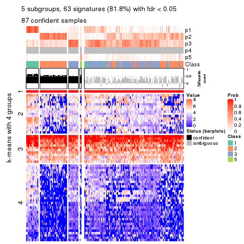</p>

</div>
<div id='tab-CV-hclust-get-signatures-no-scale-5'>
<pre><code class="r">get_signatures(res, k = 6, scale_rows = FALSE)
</code></pre>

<p></p>

</div>
</div>


Compare the overlap of signatures from different k:

```r
compare_signatures(res)
```


`get_signature()` returns a data frame invisibly. TO get the list of signatures, the function
call should be assigned to a variable explicitly. In following code, if `plot` argument is set
to `FALSE`, no heatmap is plotted while only the differential analysis is performed.

```r
# code only for demonstration
tb = get_signature(res, k = ..., plot = FALSE)
```

An example of the output of `tb` is:

```
#>   which_row         fdr    mean_1    mean_2 scaled_mean_1 scaled_mean_2 km
#> 1        38 0.042760348  8.373488  9.131774    -0.5533452     0.5164555  1
#> 2        40 0.018707592  7.106213  8.469186    -0.6173731     0.5762149  1
#> 3        55 0.019134737 10.221463 11.207825    -0.6159697     0.5749050  1
#> 4        59 0.006059896  5.921854  7.869574    -0.6899429     0.6439467  1
#> 5        60 0.018055526  8.928898 10.211722    -0.6204761     0.5791110  1
#> 6        98 0.009384629 15.714769 14.887706     0.6635654    -0.6193277  2
...
```

The columns in `tb` are:

1. `which_row`: row indices corresponding to the input matrix.
2. `fdr`: FDR for the differential test. 
3. `mean_x`: The mean value in group x.
4. `scaled_mean_x`: The mean value in group x after rows are scaled.
5. `km`: Row groups if k-means clustering is applied to rows.


UMAP plot which shows how samples are separated.


<script>
$( function() {
	$( '#tabs-CV-hclust-dimension-reduction' ).tabs();
} );
</script>
<div id='tabs-CV-hclust-dimension-reduction'>
<ul>
<li><a href='#tab-CV-hclust-dimension-reduction-1'>k = 2</a></li>
<li><a href='#tab-CV-hclust-dimension-reduction-2'>k = 3</a></li>
<li><a href='#tab-CV-hclust-dimension-reduction-3'>k = 4</a></li>
<li><a href='#tab-CV-hclust-dimension-reduction-4'>k = 5</a></li>
<li><a href='#tab-CV-hclust-dimension-reduction-5'>k = 6</a></li>
</ul>
<div id='tab-CV-hclust-dimension-reduction-1'>
<pre><code class="r">dimension_reduction(res, k = 2, method = &quot;UMAP&quot;)
</code></pre>

<p></p>

</div>
<div id='tab-CV-hclust-dimension-reduction-2'>
<pre><code class="r">dimension_reduction(res, k = 3, method = &quot;UMAP&quot;)
</code></pre>

<p></p>

</div>
<div id='tab-CV-hclust-dimension-reduction-3'>
<pre><code class="r">dimension_reduction(res, k = 4, method = &quot;UMAP&quot;)
</code></pre>

<p></p>

</div>
<div id='tab-CV-hclust-dimension-reduction-4'>
<pre><code class="r">dimension_reduction(res, k = 5, method = &quot;UMAP&quot;)
</code></pre>

<p></p>

</div>
<div id='tab-CV-hclust-dimension-reduction-5'>
<pre><code class="r">dimension_reduction(res, k = 6, method = &quot;UMAP&quot;)
</code></pre>

<p></p>

</div>
</div>


Following heatmap shows how subgroups are split when increasing `k`:

```r
collect_classes(res)
```


If matrix rows can be associated to genes, consider to use `GO_Enrichment(res,
...)` to perform function enrichment for the signature genes.


 

---------------------------------------------------


### CV:kmeans


The object with results only for a single top-value method and a single partition method 
can be extracted as:

```r
res = res_list["CV", "kmeans"]
# you can also extract it by
# res = res_list["CV:kmeans"]
```

A summary of `res` and all the functions that can be applied to it:

```r
res
```

```
#> A 'ConsensusPartition' object with k = 2, 3, 4, 5, 6.
#>   On a matrix with 77 rows and 243 columns.
#>   Top rows (8, 16, 23, 30, 38) are extracted by 'CV' method.
#>   Subgroups are detected by 'kmeans' method.
#>   Performed in total 1250 partitions by row resampling.
#>   Best k for subgroups seems to be 2.
#> 
#> Following methods can be applied to this 'ConsensusPartition' object:
#>  [1] "cola_report"             "collect_classes"         "collect_plots"          
#>  [4] "collect_stats"           "colnames"                "compare_signatures"     
#>  [7] "consensus_heatmap"       "dimension_reduction"     "functional_enrichment"  
#> [10] "get_anno_col"            "get_anno"                "get_classes"            
#> [13] "get_consensus"           "get_matrix"              "get_membership"         
#> [16] "get_param"               "get_signatures"          "get_stats"              
#> [19] "is_best_k"               "is_stable_k"             "membership_heatmap"     
#> [22] "ncol"                    "nrow"                    "plot_ecdf"              
#> [25] "rownames"                "select_partition_number" "show"                   
#> [28] "suggest_best_k"          "test_to_known_factors"
```

`collect_plots()` function collects all the plots made from `res` for all `k` (number of partitions)
into one single page to provide an easy and fast comparison between different `k`.

```r
collect_plots(res)
```


The plots are:

- The first row: a plot of the ECDF (Empirical cumulative distribution
  function) curves of the consensus matrix for each `k` and the heatmap of
  predicted classes for each `k`.
- The second row: heatmaps of the consensus matrix for each `k`.
- The third row: heatmaps of the membership matrix for each `k`.
- The fouth row: heatmaps of the signatures for each `k`.

All the plots in panels can be made by individual functions and they are
plotted later in this section.

`select_partition_number()` produces several plots showing different
statistics for choosing "optimized" `k`. There are following statistics:

- ECDF curves of the consensus matrix for each `k`;
- 1-PAC. [The PAC
  score](https://en.wikipedia.org/wiki/Consensus_clustering#Over-interpretation_potential_of_consensus_clustering)
  measures the proportion of the ambiguous subgrouping.
- Mean silhouette score.
- Concordance. The mean probability of fiting the consensus class ids in all
  partitions.
- Area increased. Denote $A_k$ as the area under the ECDF curve for current
  `k`, the area increased is defined as $A_k - A_{k-1}$.
- Rand index. The percent of pairs of samples that are both in a same cluster
  or both are not in a same cluster in the partition of k and k-1.
- Jaccard index. The ratio of pairs of samples are both in a same cluster in
  the partition of k and k-1 and the pairs of samples are both in a same
  cluster in the partition k or k-1.

The detailed explanations of these statistics can be found in [the cola
vignette](http://bioconductor.org/packages/devel/bioc/vignettes/cola/inst/doc/cola.html#toc_13).

Generally speaking, lower PAC score, higher mean silhouette score or higher
concordance corresponds to better partition. Rand index and Jaccard index
measure how similar the current partition is compared to partition with `k-1`.
If they are too similar, we won't accept `k` is better than `k-1`.

```r
select_partition_number(res)
```


The numeric values for all these statistics can be obtained by `get_stats()`.

```r
get_stats(res)
```

```
#>   k 1-PAC mean_silhouette concordance area_increased  Rand Jaccard
#> 2 2 0.357           0.750       0.871         0.4831 0.507   0.507
#> 3 3 0.303           0.674       0.773         0.3174 0.656   0.436
#> 4 4 0.354           0.440       0.666         0.1331 0.898   0.739
#> 5 5 0.408           0.323       0.610         0.0768 0.877   0.641
#> 6 6 0.448           0.288       0.567         0.0400 0.902   0.646
```

`suggest_best_k()` suggests the best $k$ based on these statistics. The rules are as follows:

- All $k$ with Jaccard index larger than 0.95 are removed because the increase of
  the partition number does not provides enough extra information. If all $k$ are removed,
  the best $k$ is assigned by `NA`.
- For $k$ with 1-PAC larger than 0.9, the maximal $k$ is taken as the "best k". Other $k$ is called "optional k".
- If it does not fit the second rule. The $k$ with the highest vote of highest
  1-PAC, mean silhouette and concordance is taken as the "best k".

```r
suggest_best_k(res)
```

```
#> [1] 2
```


Following shows the table of the partitions (You need to click the **show/hide
code output** link to see it). The membership matrix (columns with name `p*`)
is inferred by
[`clue::cl_consensus()`](https://www.rdocumentation.org/link/cl_consensus?package=clue)
function with the `SE` method. Basically the value in the membership matrix
represents the probability to belong to a certain group. The finall class
label for an item is determined with the group with highest probability it
belongs to.

In `get_classes()` function, the entropy is calculated from the membership
matrix and the silhouette score is calculated from the consensus matrix.


<script>
$( function() {
	$( '#tabs-CV-kmeans-get-classes' ).tabs();
} );
</script>
<div id='tabs-CV-kmeans-get-classes'>
<ul>
<li><a href='#tab-CV-kmeans-get-classes-1'>k = 2</a></li>
<li><a href='#tab-CV-kmeans-get-classes-2'>k = 3</a></li>
<li><a href='#tab-CV-kmeans-get-classes-3'>k = 4</a></li>
<li><a href='#tab-CV-kmeans-get-classes-4'>k = 5</a></li>
<li><a href='#tab-CV-kmeans-get-classes-5'>k = 6</a></li>
</ul>

<div id='tab-CV-kmeans-get-classes-1'>
<p><a id='tab-CV-kmeans-get-classes-1-a' style='color:#0366d6' href='#'>show/hide code output</a></p>
<pre><code class="r">cbind(get_classes(res, k = 2), get_membership(res, k = 2))
</code></pre>

<pre><code>#&gt;           class entropy silhouette    p1    p2
#&gt; SRR191393     1  0.1633    0.85979 0.976 0.024
#&gt; SRR191394     1  0.1633    0.85979 0.976 0.024
#&gt; SRR191396     2  0.8207    0.69312 0.256 0.744
#&gt; SRR191397     1  0.0938    0.85954 0.988 0.012
#&gt; SRR191398     1  0.1633    0.85979 0.976 0.024
#&gt; SRR191399     1  0.2423    0.86057 0.960 0.040
#&gt; SRR191400     1  0.1184    0.85948 0.984 0.016
#&gt; SRR191401     1  0.0938    0.85954 0.988 0.012
#&gt; SRR191402     1  0.5059    0.83995 0.888 0.112
#&gt; SRR191403     1  0.0938    0.85954 0.988 0.012
#&gt; SRR191404     2  0.8909    0.63335 0.308 0.692
#&gt; SRR191405     1  0.9460    0.41834 0.636 0.364
#&gt; SRR191406     1  0.7815    0.72683 0.768 0.232
#&gt; SRR191407     1  0.0938    0.85820 0.988 0.012
#&gt; SRR191408     1  0.7056    0.76817 0.808 0.192
#&gt; SRR191409     1  0.8207    0.69881 0.744 0.256
#&gt; SRR191410     2  0.9732    0.37843 0.404 0.596
#&gt; SRR191411     2  0.9795    0.33015 0.416 0.584
#&gt; SRR191412     1  0.1633    0.85979 0.976 0.024
#&gt; SRR191413     1  0.1184    0.86147 0.984 0.016
#&gt; SRR191414     1  0.1633    0.85979 0.976 0.024
#&gt; SRR191415     2  0.9358    0.51053 0.352 0.648
#&gt; SRR191416     1  0.8327    0.69556 0.736 0.264
#&gt; SRR191418     1  0.7745    0.74285 0.772 0.228
#&gt; SRR191419     1  0.0000    0.85664 1.000 0.000
#&gt; SRR191420     1  0.6623    0.80478 0.828 0.172
#&gt; SRR191421     1  0.1633    0.85979 0.976 0.024
#&gt; SRR191422     2  0.0000    0.84539 0.000 1.000
#&gt; SRR191423     2  0.0938    0.84866 0.012 0.988
#&gt; SRR191424     2  0.1633    0.84948 0.024 0.976
#&gt; SRR191425     1  0.7674    0.75845 0.776 0.224
#&gt; SRR191426     2  0.3879    0.84574 0.076 0.924
#&gt; SRR191427     2  0.6801    0.76037 0.180 0.820
#&gt; SRR191428     2  0.9922    0.20898 0.448 0.552
#&gt; SRR191429     2  0.1414    0.84990 0.020 0.980
#&gt; SRR191430     2  0.4022    0.84499 0.080 0.920
#&gt; SRR191431     2  0.8267    0.68289 0.260 0.740
#&gt; SRR191432     2  0.0672    0.84524 0.008 0.992
#&gt; SRR191433     2  0.1414    0.84990 0.020 0.980
#&gt; SRR191434     2  0.4431    0.83810 0.092 0.908
#&gt; SRR191435     1  0.8081    0.71005 0.752 0.248
#&gt; SRR191436     2  0.9922    0.19847 0.448 0.552
#&gt; SRR191437     2  0.0000    0.84539 0.000 1.000
#&gt; SRR191438     2  0.7056    0.77974 0.192 0.808
#&gt; SRR191439     2  0.1414    0.84827 0.020 0.980
#&gt; SRR191440     2  0.3879    0.84455 0.076 0.924
#&gt; SRR191441     2  0.1633    0.84981 0.024 0.976
#&gt; SRR191442     2  0.6712    0.76673 0.176 0.824
#&gt; SRR191443     1  0.3879    0.85007 0.924 0.076
#&gt; SRR191444     1  0.9491    0.40684 0.632 0.368
#&gt; SRR191445     2  0.4161    0.82762 0.084 0.916
#&gt; SRR191446     2  0.5059    0.82304 0.112 0.888
#&gt; SRR191447     2  0.1414    0.84452 0.020 0.980
#&gt; SRR191448     1  0.0672    0.85765 0.992 0.008
#&gt; SRR191449     1  0.7299    0.74981 0.796 0.204
#&gt; SRR191450     1  0.6531    0.77984 0.832 0.168
#&gt; SRR191451     1  0.9129    0.58567 0.672 0.328
#&gt; SRR191452     2  0.1843    0.85002 0.028 0.972
#&gt; SRR191453     2  0.3879    0.84331 0.076 0.924
#&gt; SRR191454     1  0.6343    0.79613 0.840 0.160
#&gt; SRR191455     2  0.4161    0.84159 0.084 0.916
#&gt; SRR191456     1  0.5946    0.81709 0.856 0.144
#&gt; SRR191457     1  0.4161    0.84074 0.916 0.084
#&gt; SRR191458     1  0.9209    0.51392 0.664 0.336
#&gt; SRR191459     2  0.3584    0.84423 0.068 0.932
#&gt; SRR191460     2  0.9754    0.38630 0.408 0.592
#&gt; SRR191461     2  0.7056    0.75582 0.192 0.808
#&gt; SRR191462     2  0.7376    0.74315 0.208 0.792
#&gt; SRR191463     2  0.1414    0.84990 0.020 0.980
#&gt; SRR191464     2  0.3274    0.84848 0.060 0.940
#&gt; SRR191465     2  0.1414    0.84990 0.020 0.980
#&gt; SRR191466     2  0.5178    0.81750 0.116 0.884
#&gt; SRR191467     2  0.0000    0.84539 0.000 1.000
#&gt; SRR191468     2  0.1414    0.84990 0.020 0.980
#&gt; SRR191469     2  0.6531    0.77435 0.168 0.832
#&gt; SRR191470     2  0.2603    0.85102 0.044 0.956
#&gt; SRR191471     2  0.0938    0.84981 0.012 0.988
#&gt; SRR191472     2  0.0000    0.84539 0.000 1.000
#&gt; SRR191473     2  0.0672    0.84524 0.008 0.992
#&gt; SRR191474     2  0.9170    0.55605 0.332 0.668
#&gt; SRR191475     2  0.0000    0.84539 0.000 1.000
#&gt; SRR191476     2  0.1843    0.84531 0.028 0.972
#&gt; SRR191477     2  0.2603    0.85058 0.044 0.956
#&gt; SRR191478     2  0.1633    0.85104 0.024 0.976
#&gt; SRR191479     1  0.4022    0.84732 0.920 0.080
#&gt; SRR191480     2  0.1633    0.85105 0.024 0.976
#&gt; SRR191481     2  0.1633    0.84981 0.024 0.976
#&gt; SRR191482     2  0.1414    0.85018 0.020 0.980
#&gt; SRR191483     2  0.0000    0.84539 0.000 1.000
#&gt; SRR191484     1  0.8443    0.67646 0.728 0.272
#&gt; SRR191485     2  0.1184    0.85076 0.016 0.984
#&gt; SRR191486     2  0.4815    0.83058 0.104 0.896
#&gt; SRR191487     2  0.7950    0.71479 0.240 0.760
#&gt; SRR191488     1  0.1184    0.86046 0.984 0.016
#&gt; SRR191489     1  0.7883    0.70729 0.764 0.236
#&gt; SRR191490     2  0.1184    0.84705 0.016 0.984
#&gt; SRR191491     2  0.9170    0.52673 0.332 0.668
#&gt; SRR191492     1  0.7602    0.76018 0.780 0.220
#&gt; SRR191493     2  0.2423    0.84904 0.040 0.960
#&gt; SRR191494     2  0.3431    0.84377 0.064 0.936
#&gt; SRR191495     1  0.9732    0.31509 0.596 0.404
#&gt; SRR191496     2  0.0672    0.84691 0.008 0.992
#&gt; SRR191497     2  0.9580    0.45221 0.380 0.620
#&gt; SRR191498     1  0.9635    0.36785 0.612 0.388
#&gt; SRR191499     2  0.7602    0.71870 0.220 0.780
#&gt; SRR191500     2  0.8081    0.66454 0.248 0.752
#&gt; SRR191501     2  0.5408    0.81652 0.124 0.876
#&gt; SRR191502     2  0.4815    0.83021 0.104 0.896
#&gt; SRR191503     2  0.0000    0.84539 0.000 1.000
#&gt; SRR191504     2  0.0000    0.84539 0.000 1.000
#&gt; SRR191505     2  0.0376    0.84580 0.004 0.996
#&gt; SRR191506     2  0.0376    0.84661 0.004 0.996
#&gt; SRR191507     2  0.8713    0.64530 0.292 0.708
#&gt; SRR191508     2  0.3733    0.84207 0.072 0.928
#&gt; SRR191509     2  0.2236    0.85113 0.036 0.964
#&gt; SRR191510     2  0.4022    0.83696 0.080 0.920
#&gt; SRR191511     2  0.2236    0.84787 0.036 0.964
#&gt; SRR191512     2  0.1414    0.84990 0.020 0.980
#&gt; SRR191513     2  0.4815    0.83065 0.104 0.896
#&gt; SRR191514     2  0.1843    0.85008 0.028 0.972
#&gt; SRR191515     2  0.2043    0.85056 0.032 0.968
#&gt; SRR191516     2  0.8661    0.62681 0.288 0.712
#&gt; SRR191517     2  0.3114    0.84882 0.056 0.944
#&gt; SRR191518     2  0.3114    0.84850 0.056 0.944
#&gt; SRR191519     2  0.2236    0.84787 0.036 0.964
#&gt; SRR191520     2  0.8813    0.60799 0.300 0.700
#&gt; SRR191521     2  0.0938    0.84474 0.012 0.988
#&gt; SRR191522     2  0.2423    0.84866 0.040 0.960
#&gt; SRR191523     2  0.2603    0.84895 0.044 0.956
#&gt; SRR191524     2  0.9988    0.01825 0.480 0.520
#&gt; SRR191525     2  0.1633    0.84904 0.024 0.976
#&gt; SRR191526     2  0.1414    0.84990 0.020 0.980
#&gt; SRR191527     1  0.6343    0.76628 0.840 0.160
#&gt; SRR191528     1  0.2778    0.85586 0.952 0.048
#&gt; SRR191529     2  0.6048    0.80320 0.148 0.852
#&gt; SRR191530     2  0.1414    0.84990 0.020 0.980
#&gt; SRR191531     1  0.6623    0.79619 0.828 0.172
#&gt; SRR191532     2  0.5178    0.82098 0.116 0.884
#&gt; SRR191533     2  0.9833    0.31255 0.424 0.576
#&gt; SRR191534     2  0.2236    0.84759 0.036 0.964
#&gt; SRR191535     2  0.1414    0.84990 0.020 0.980
#&gt; SRR191536     2  0.6343    0.78125 0.160 0.840
#&gt; SRR191537     2  0.7883    0.70375 0.236 0.764
#&gt; SRR191538     2  0.0938    0.84474 0.012 0.988
#&gt; SRR191539     2  0.3584    0.84492 0.068 0.932
#&gt; SRR191540     2  0.0000    0.84539 0.000 1.000
#&gt; SRR191541     2  0.4815    0.82532 0.104 0.896
#&gt; SRR191542     2  0.2603    0.84699 0.044 0.956
#&gt; SRR191543     2  0.1414    0.84990 0.020 0.980
#&gt; SRR191544     2  0.1633    0.85059 0.024 0.976
#&gt; SRR191545     2  0.0672    0.84524 0.008 0.992
#&gt; SRR191546     2  0.0376    0.84580 0.004 0.996
#&gt; SRR191547     2  0.5408    0.81148 0.124 0.876
#&gt; SRR191548     1  0.0938    0.85954 0.988 0.012
#&gt; SRR191549     1  0.1633    0.85979 0.976 0.024
#&gt; SRR191550     1  0.0000    0.85664 1.000 0.000
#&gt; SRR191551     1  0.0938    0.85954 0.988 0.012
#&gt; SRR191552     1  0.1633    0.85979 0.976 0.024
#&gt; SRR191553     1  0.2948    0.85464 0.948 0.052
#&gt; SRR191554     1  0.1633    0.85979 0.976 0.024
#&gt; SRR191555     1  0.5629    0.81853 0.868 0.132
#&gt; SRR191556     1  0.0376    0.85749 0.996 0.004
#&gt; SRR191557     1  0.7883    0.71666 0.764 0.236
#&gt; SRR191558     2  0.5737    0.81201 0.136 0.864
#&gt; SRR191559     1  0.7528    0.73691 0.784 0.216
#&gt; SRR191560     1  0.3431    0.85006 0.936 0.064
#&gt; SRR191561     1  0.4161    0.83500 0.916 0.084
#&gt; SRR191562     1  0.0672    0.85765 0.992 0.008
#&gt; SRR191563     2  0.9909    0.26562 0.444 0.556
#&gt; SRR191564     1  0.8813    0.60727 0.700 0.300
#&gt; SRR191565     1  0.1184    0.86008 0.984 0.016
#&gt; SRR191566     1  0.1184    0.86046 0.984 0.016
#&gt; SRR191567     1  0.0376    0.85743 0.996 0.004
#&gt; SRR191568     1  0.1184    0.86008 0.984 0.016
#&gt; SRR191569     1  0.7376    0.76194 0.792 0.208
#&gt; SRR191570     1  0.1843    0.86095 0.972 0.028
#&gt; SRR191571     1  0.1184    0.86147 0.984 0.016
#&gt; SRR191572     1  0.0938    0.85954 0.988 0.012
#&gt; SRR191573     1  0.2043    0.86092 0.968 0.032
#&gt; SRR191574     1  0.0376    0.85809 0.996 0.004
#&gt; SRR191575     1  0.0376    0.85743 0.996 0.004
#&gt; SRR191576     1  0.8763    0.63232 0.704 0.296
#&gt; SRR191577     1  0.2236    0.86167 0.964 0.036
#&gt; SRR191578     2  0.3114    0.84687 0.056 0.944
#&gt; SRR191579     1  0.0938    0.85954 0.988 0.012
#&gt; SRR191580     1  0.1633    0.85979 0.976 0.024
#&gt; SRR191581     1  0.1633    0.85979 0.976 0.024
#&gt; SRR191582     1  0.1414    0.85985 0.980 0.020
#&gt; SRR191583     2  0.5408    0.80715 0.124 0.876
#&gt; SRR191584     1  0.1414    0.85991 0.980 0.020
#&gt; SRR191585     2  0.9833    0.29400 0.424 0.576
#&gt; SRR191586     1  0.9993    0.00784 0.516 0.484
#&gt; SRR191587     1  0.3431    0.85435 0.936 0.064
#&gt; SRR191588     1  0.0938    0.85954 0.988 0.012
#&gt; SRR191589     1  0.2236    0.86146 0.964 0.036
#&gt; SRR191590     1  0.0000    0.85664 1.000 0.000
#&gt; SRR191591     1  0.9850    0.24125 0.572 0.428
#&gt; SRR191592     1  0.3879    0.84618 0.924 0.076
#&gt; SRR191593     1  0.5842    0.81941 0.860 0.140
#&gt; SRR191594     1  0.0938    0.85863 0.988 0.012
#&gt; SRR191595     1  0.0938    0.85964 0.988 0.012
#&gt; SRR191596     1  0.0938    0.85863 0.988 0.012
#&gt; SRR191597     2  0.9710    0.40543 0.400 0.600
#&gt; SRR191598     1  0.1633    0.86145 0.976 0.024
#&gt; SRR191599     1  0.0376    0.85749 0.996 0.004
#&gt; SRR191600     2  0.9754    0.43325 0.408 0.592
#&gt; SRR191601     2  0.8661    0.62959 0.288 0.712
#&gt; SRR191602     2  0.7950    0.69713 0.240 0.760
#&gt; SRR191603     2  0.9044    0.57026 0.320 0.680
#&gt; SRR191604     2  0.2236    0.84959 0.036 0.964
#&gt; SRR191605     1  0.9896    0.18566 0.560 0.440
#&gt; SRR191606     1  0.0376    0.85743 0.996 0.004
#&gt; SRR191607     1  0.9896    0.21660 0.560 0.440
#&gt; SRR191608     2  0.9129    0.57483 0.328 0.672
#&gt; SRR191609     2  0.9460    0.49861 0.364 0.636
#&gt; SRR191610     1  0.8144    0.68419 0.748 0.252
#&gt; SRR191611     1  0.9996    0.12811 0.512 0.488
#&gt; SRR191612     1  0.7950    0.69795 0.760 0.240
#&gt; SRR191613     1  0.2778    0.85972 0.952 0.048
#&gt; SRR191614     1  0.5946    0.81122 0.856 0.144
#&gt; SRR191615     1  0.7376    0.75259 0.792 0.208
#&gt; SRR191616     2  0.9000    0.57541 0.316 0.684
#&gt; SRR191617     2  0.4161    0.83993 0.084 0.916
#&gt; SRR191618     2  0.9977    0.05476 0.472 0.528
#&gt; SRR191619     2  0.6148    0.79723 0.152 0.848
#&gt; SRR191620     2  0.2043    0.85144 0.032 0.968
#&gt; SRR191621     2  0.1414    0.84878 0.020 0.980
#&gt; SRR191622     2  1.0000   -0.01706 0.496 0.504
#&gt; SRR191623     1  0.7453    0.74357 0.788 0.212
#&gt; SRR191624     1  0.1843    0.86199 0.972 0.028
#&gt; SRR191625     2  0.2236    0.85200 0.036 0.964
#&gt; SRR191626     2  0.0000    0.84539 0.000 1.000
#&gt; SRR191627     2  0.7745    0.72990 0.228 0.772
#&gt; SRR191628     1  0.9170    0.59402 0.668 0.332
#&gt; SRR191629     2  0.9954    0.19581 0.460 0.540
#&gt; SRR191630     1  0.2603    0.85771 0.956 0.044
#&gt; SRR191631     2  0.6148    0.80315 0.152 0.848
#&gt; SRR191632     1  0.0938    0.85904 0.988 0.012
#&gt; SRR191633     2  0.9732    0.33809 0.404 0.596
#&gt; SRR191634     2  0.7299    0.73077 0.204 0.796
#&gt; SRR191635     1  0.7815    0.72197 0.768 0.232
#&gt; SRR191636     2  0.8608    0.62161 0.284 0.716
#&gt; SRR191637     2  0.1414    0.84990 0.020 0.980
</code></pre>

<script>
$('#tab-CV-kmeans-get-classes-1-a').parent().next().next().hide();
$('#tab-CV-kmeans-get-classes-1-a').click(function(){
  $('#tab-CV-kmeans-get-classes-1-a').parent().next().next().toggle();
  return(false);
});
</script>
</div>

<div id='tab-CV-kmeans-get-classes-2'>
<p><a id='tab-CV-kmeans-get-classes-2-a' style='color:#0366d6' href='#'>show/hide code output</a></p>
<pre><code class="r">cbind(get_classes(res, k = 3), get_membership(res, k = 3))
</code></pre>

<pre><code>#&gt;           class entropy silhouette    p1    p2    p3
#&gt; SRR191393     1  0.3192    0.84403 0.888 0.000 0.112
#&gt; SRR191394     1  0.1860    0.86385 0.948 0.000 0.052
#&gt; SRR191396     3  0.9192    0.45560 0.180 0.300 0.520
#&gt; SRR191397     1  0.3573    0.84011 0.876 0.004 0.120
#&gt; SRR191398     1  0.1753    0.86299 0.952 0.000 0.048
#&gt; SRR191399     3  0.5650    0.58979 0.312 0.000 0.688
#&gt; SRR191400     1  0.1753    0.86299 0.952 0.000 0.048
#&gt; SRR191401     1  0.2356    0.86352 0.928 0.000 0.072
#&gt; SRR191402     3  0.6007    0.70383 0.192 0.044 0.764
#&gt; SRR191403     1  0.5058    0.71257 0.756 0.000 0.244
#&gt; SRR191404     3  0.5810    0.73911 0.072 0.132 0.796
#&gt; SRR191405     3  0.5740    0.72475 0.100 0.096 0.804
#&gt; SRR191406     3  0.4194    0.75175 0.060 0.064 0.876
#&gt; SRR191407     1  0.2955    0.85648 0.912 0.008 0.080
#&gt; SRR191408     3  0.5899    0.58496 0.244 0.020 0.736
#&gt; SRR191409     3  0.5521    0.72011 0.180 0.032 0.788
#&gt; SRR191410     3  0.5407    0.75495 0.076 0.104 0.820
#&gt; SRR191411     3  0.4749    0.72657 0.012 0.172 0.816
#&gt; SRR191412     1  0.3686    0.81737 0.860 0.000 0.140
#&gt; SRR191413     3  0.5115    0.66052 0.228 0.004 0.768
#&gt; SRR191414     1  0.2066    0.86391 0.940 0.000 0.060
#&gt; SRR191415     3  0.5028    0.75169 0.040 0.132 0.828
#&gt; SRR191416     3  0.5892    0.75215 0.104 0.100 0.796
#&gt; SRR191418     3  0.6044    0.72598 0.172 0.056 0.772
#&gt; SRR191419     1  0.3038    0.85462 0.896 0.000 0.104
#&gt; SRR191420     3  0.9119    0.20023 0.368 0.148 0.484
#&gt; SRR191421     1  0.5254    0.65951 0.736 0.000 0.264
#&gt; SRR191422     2  0.1620    0.80910 0.012 0.964 0.024
#&gt; SRR191423     2  0.5036    0.79620 0.020 0.808 0.172
#&gt; SRR191424     2  0.4931    0.79048 0.004 0.784 0.212
#&gt; SRR191425     3  0.6389    0.73610 0.124 0.108 0.768
#&gt; SRR191426     3  0.6155    0.42420 0.008 0.328 0.664
#&gt; SRR191427     2  0.8318    0.48796 0.128 0.612 0.260
#&gt; SRR191428     3  0.3532    0.73973 0.008 0.108 0.884
#&gt; SRR191429     2  0.3610    0.81902 0.016 0.888 0.096
#&gt; SRR191430     3  0.6955   -0.27664 0.016 0.492 0.492
#&gt; SRR191431     2  0.8543    0.63249 0.236 0.604 0.160
#&gt; SRR191432     2  0.3459    0.80392 0.012 0.892 0.096
#&gt; SRR191433     2  0.2749    0.81463 0.012 0.924 0.064
#&gt; SRR191434     2  0.6929    0.69373 0.052 0.688 0.260
#&gt; SRR191435     3  0.4779    0.71899 0.124 0.036 0.840
#&gt; SRR191436     3  0.7256    0.66696 0.088 0.216 0.696
#&gt; SRR191437     2  0.1781    0.80616 0.020 0.960 0.020
#&gt; SRR191438     3  0.7419    0.55747 0.088 0.232 0.680
#&gt; SRR191439     2  0.5940    0.76483 0.036 0.760 0.204
#&gt; SRR191440     2  0.5944    0.79828 0.088 0.792 0.120
#&gt; SRR191441     2  0.3502    0.81385 0.020 0.896 0.084
#&gt; SRR191442     3  0.7600    0.48241 0.056 0.344 0.600
#&gt; SRR191443     1  0.7164    0.26072 0.524 0.024 0.452
#&gt; SRR191444     3  0.5772    0.69774 0.220 0.024 0.756
#&gt; SRR191445     2  0.7186    0.67330 0.080 0.696 0.224
#&gt; SRR191446     2  0.7388    0.37557 0.044 0.600 0.356
#&gt; SRR191447     2  0.4920    0.79984 0.052 0.840 0.108
#&gt; SRR191448     1  0.4409    0.81415 0.824 0.004 0.172
#&gt; SRR191449     3  0.3461    0.74409 0.076 0.024 0.900
#&gt; SRR191450     3  0.5406    0.68231 0.200 0.020 0.780
#&gt; SRR191451     3  0.8008    0.69762 0.152 0.192 0.656
#&gt; SRR191452     2  0.3619    0.80185 0.000 0.864 0.136
#&gt; SRR191453     2  0.7420    0.32251 0.036 0.544 0.420
#&gt; SRR191454     1  0.8489   -0.00809 0.496 0.092 0.412
#&gt; SRR191455     3  0.7043    0.17069 0.020 0.448 0.532
#&gt; SRR191456     1  0.5757    0.73454 0.792 0.056 0.152
#&gt; SRR191457     1  0.6875    0.63707 0.700 0.056 0.244
#&gt; SRR191458     3  0.7072    0.71195 0.160 0.116 0.724
#&gt; SRR191459     3  0.7785    0.20437 0.052 0.420 0.528
#&gt; SRR191460     3  0.7568    0.68589 0.108 0.212 0.680
#&gt; SRR191461     3  0.4834    0.67765 0.004 0.204 0.792
#&gt; SRR191462     2  0.8321    0.58787 0.140 0.620 0.240
#&gt; SRR191463     2  0.3765    0.81887 0.028 0.888 0.084
#&gt; SRR191464     2  0.6688    0.51581 0.012 0.580 0.408
#&gt; SRR191465     2  0.2550    0.81354 0.012 0.932 0.056
#&gt; SRR191466     3  0.7279    0.36528 0.036 0.376 0.588
#&gt; SRR191467     2  0.0983    0.81026 0.004 0.980 0.016
#&gt; SRR191468     2  0.2599    0.81415 0.016 0.932 0.052
#&gt; SRR191469     3  0.7619    0.38879 0.044 0.424 0.532
#&gt; SRR191470     3  0.6713    0.10595 0.012 0.416 0.572
#&gt; SRR191471     2  0.4531    0.78183 0.008 0.824 0.168
#&gt; SRR191472     2  0.1182    0.80554 0.012 0.976 0.012
#&gt; SRR191473     2  0.4452    0.79257 0.000 0.808 0.192
#&gt; SRR191474     3  0.3826    0.74994 0.008 0.124 0.868
#&gt; SRR191475     2  0.1182    0.80554 0.012 0.976 0.012
#&gt; SRR191476     2  0.5506    0.75957 0.016 0.764 0.220
#&gt; SRR191477     2  0.6155    0.58948 0.008 0.664 0.328
#&gt; SRR191478     2  0.2229    0.81468 0.012 0.944 0.044
#&gt; SRR191479     3  0.7401    0.46140 0.340 0.048 0.612
#&gt; SRR191480     3  0.6468    0.36653 0.004 0.444 0.552
#&gt; SRR191481     2  0.4861    0.79050 0.012 0.808 0.180
#&gt; SRR191482     2  0.4861    0.77888 0.012 0.808 0.180
#&gt; SRR191483     2  0.4351    0.77438 0.004 0.828 0.168
#&gt; SRR191484     3  0.5253    0.73322 0.096 0.076 0.828
#&gt; SRR191485     2  0.4799    0.81485 0.032 0.836 0.132
#&gt; SRR191486     3  0.6814    0.28353 0.020 0.372 0.608
#&gt; SRR191487     3  0.8637   -0.21200 0.100 0.448 0.452
#&gt; SRR191488     1  0.5656    0.61831 0.712 0.004 0.284
#&gt; SRR191489     3  0.8354    0.41592 0.320 0.104 0.576
#&gt; SRR191490     2  0.4489    0.79341 0.036 0.856 0.108
#&gt; SRR191491     3  0.6400    0.66436 0.052 0.208 0.740
#&gt; SRR191492     3  0.4745    0.74147 0.068 0.080 0.852
#&gt; SRR191493     2  0.6053    0.76383 0.020 0.720 0.260
#&gt; SRR191494     2  0.4830    0.81359 0.068 0.848 0.084
#&gt; SRR191495     3  0.1411    0.74419 0.036 0.000 0.964
#&gt; SRR191496     2  0.1182    0.80554 0.012 0.976 0.012
#&gt; SRR191497     3  0.3550    0.75833 0.024 0.080 0.896
#&gt; SRR191498     3  0.8350    0.61471 0.196 0.176 0.628
#&gt; SRR191499     3  0.5763    0.70189 0.016 0.244 0.740
#&gt; SRR191500     3  0.6339    0.57814 0.008 0.360 0.632
#&gt; SRR191501     2  0.6458    0.72013 0.072 0.752 0.176
#&gt; SRR191502     2  0.7478    0.55907 0.060 0.632 0.308
#&gt; SRR191503     2  0.2918    0.80322 0.044 0.924 0.032
#&gt; SRR191504     2  0.2056    0.80828 0.024 0.952 0.024
#&gt; SRR191505     2  0.4146    0.81527 0.044 0.876 0.080
#&gt; SRR191506     2  0.1182    0.80579 0.012 0.976 0.012
#&gt; SRR191507     3  0.8277   -0.15232 0.076 0.460 0.464
#&gt; SRR191508     2  0.7459    0.50740 0.044 0.584 0.372
#&gt; SRR191509     2  0.6129    0.68839 0.008 0.668 0.324
#&gt; SRR191510     2  0.6867    0.42353 0.028 0.636 0.336
#&gt; SRR191511     2  0.4897    0.80185 0.016 0.812 0.172
#&gt; SRR191512     2  0.2384    0.81325 0.008 0.936 0.056
#&gt; SRR191513     2  0.4449    0.81108 0.040 0.860 0.100
#&gt; SRR191514     2  0.2550    0.81474 0.012 0.932 0.056
#&gt; SRR191515     2  0.4802    0.80401 0.020 0.824 0.156
#&gt; SRR191516     3  0.3918    0.72781 0.004 0.140 0.856
#&gt; SRR191517     3  0.5722    0.50895 0.004 0.292 0.704
#&gt; SRR191518     2  0.3771    0.81253 0.012 0.876 0.112
#&gt; SRR191519     2  0.4235    0.80216 0.000 0.824 0.176
#&gt; SRR191520     3  0.4349    0.73081 0.020 0.128 0.852
#&gt; SRR191521     2  0.3325    0.80272 0.020 0.904 0.076
#&gt; SRR191522     2  0.6890    0.66712 0.028 0.632 0.340
#&gt; SRR191523     2  0.4357    0.81456 0.052 0.868 0.080
#&gt; SRR191524     3  0.9996    0.01977 0.336 0.320 0.344
#&gt; SRR191525     2  0.4399    0.79239 0.000 0.812 0.188
#&gt; SRR191526     2  0.2599    0.81454 0.016 0.932 0.052
#&gt; SRR191527     1  0.2860    0.78318 0.912 0.084 0.004
#&gt; SRR191528     1  0.2743    0.84000 0.928 0.020 0.052
#&gt; SRR191529     2  0.7545    0.73827 0.136 0.692 0.172
#&gt; SRR191530     2  0.2703    0.81485 0.016 0.928 0.056
#&gt; SRR191531     1  0.6462    0.68361 0.764 0.116 0.120
#&gt; SRR191532     3  0.7187    0.10140 0.024 0.480 0.496
#&gt; SRR191533     3  0.5831    0.71033 0.076 0.128 0.796
#&gt; SRR191534     2  0.3456    0.80173 0.036 0.904 0.060
#&gt; SRR191535     2  0.3129    0.81672 0.008 0.904 0.088
#&gt; SRR191536     2  0.7256    0.72109 0.124 0.712 0.164
#&gt; SRR191537     2  0.7344    0.65147 0.084 0.684 0.232
#&gt; SRR191538     2  0.1129    0.80809 0.004 0.976 0.020
#&gt; SRR191539     2  0.4790    0.81463 0.056 0.848 0.096
#&gt; SRR191540     2  0.1585    0.81024 0.008 0.964 0.028
#&gt; SRR191541     2  0.5426    0.77871 0.092 0.820 0.088
#&gt; SRR191542     2  0.3780    0.81205 0.064 0.892 0.044
#&gt; SRR191543     2  0.3031    0.81760 0.012 0.912 0.076
#&gt; SRR191544     2  0.6253    0.64280 0.036 0.732 0.232
#&gt; SRR191545     2  0.3695    0.79996 0.012 0.880 0.108
#&gt; SRR191546     2  0.3045    0.80958 0.020 0.916 0.064
#&gt; SRR191547     3  0.6608    0.28152 0.008 0.432 0.560
#&gt; SRR191548     1  0.2066    0.86290 0.940 0.000 0.060
#&gt; SRR191549     1  0.1860    0.86385 0.948 0.000 0.052
#&gt; SRR191550     1  0.1860    0.86385 0.948 0.000 0.052
#&gt; SRR191551     1  0.2066    0.86290 0.940 0.000 0.060
#&gt; SRR191552     1  0.1860    0.86385 0.948 0.000 0.052
#&gt; SRR191553     1  0.2749    0.85075 0.924 0.012 0.064
#&gt; SRR191554     1  0.1643    0.86131 0.956 0.000 0.044
#&gt; SRR191555     3  0.4931    0.73324 0.140 0.032 0.828
#&gt; SRR191556     3  0.5845    0.55083 0.308 0.004 0.688
#&gt; SRR191557     3  0.4741    0.72824 0.152 0.020 0.828
#&gt; SRR191558     2  0.6847    0.68496 0.060 0.708 0.232
#&gt; SRR191559     3  0.2846    0.74324 0.056 0.020 0.924
#&gt; SRR191560     3  0.4128    0.72676 0.132 0.012 0.856
#&gt; SRR191561     1  0.1877    0.83185 0.956 0.032 0.012
#&gt; SRR191562     1  0.4834    0.75995 0.792 0.004 0.204
#&gt; SRR191563     3  0.4270    0.75217 0.024 0.116 0.860
#&gt; SRR191564     3  0.2550    0.74944 0.024 0.040 0.936
#&gt; SRR191565     3  0.6195    0.59725 0.276 0.020 0.704
#&gt; SRR191566     3  0.4602    0.71375 0.152 0.016 0.832
#&gt; SRR191567     1  0.5325    0.72292 0.748 0.004 0.248
#&gt; SRR191568     1  0.6229    0.54499 0.652 0.008 0.340
#&gt; SRR191569     3  0.4799    0.74565 0.132 0.032 0.836
#&gt; SRR191570     3  0.7043    0.37082 0.400 0.024 0.576
#&gt; SRR191571     3  0.5591    0.58365 0.304 0.000 0.696
#&gt; SRR191572     1  0.2066    0.86290 0.940 0.000 0.060
#&gt; SRR191573     3  0.6927    0.57769 0.296 0.040 0.664
#&gt; SRR191574     1  0.2711    0.85891 0.912 0.000 0.088
#&gt; SRR191575     1  0.4409    0.81074 0.824 0.004 0.172
#&gt; SRR191576     3  0.7192    0.71131 0.164 0.120 0.716
#&gt; SRR191577     3  0.6978    0.50521 0.336 0.032 0.632
#&gt; SRR191578     2  0.6232    0.71766 0.040 0.740 0.220
#&gt; SRR191579     1  0.2066    0.86290 0.940 0.000 0.060
#&gt; SRR191580     1  0.1860    0.86385 0.948 0.000 0.052
#&gt; SRR191581     1  0.1643    0.86138 0.956 0.000 0.044
#&gt; SRR191582     1  0.1860    0.86385 0.948 0.000 0.052
#&gt; SRR191583     2  0.4342    0.79013 0.120 0.856 0.024
#&gt; SRR191584     1  0.1765    0.85433 0.956 0.004 0.040
#&gt; SRR191585     3  0.2955    0.74644 0.008 0.080 0.912
#&gt; SRR191586     3  0.4469    0.75030 0.076 0.060 0.864
#&gt; SRR191587     3  0.4351    0.71747 0.168 0.004 0.828
#&gt; SRR191588     3  0.6154    0.40093 0.408 0.000 0.592
#&gt; SRR191589     3  0.4974    0.66994 0.236 0.000 0.764
#&gt; SRR191590     1  0.1964    0.86407 0.944 0.000 0.056
#&gt; SRR191591     3  0.5746    0.71987 0.180 0.040 0.780
#&gt; SRR191592     3  0.3826    0.72732 0.124 0.008 0.868
#&gt; SRR191593     3  0.5466    0.72867 0.160 0.040 0.800
#&gt; SRR191594     1  0.3921    0.84331 0.872 0.016 0.112
#&gt; SRR191595     3  0.6584    0.32769 0.380 0.012 0.608
#&gt; SRR191596     3  0.6669    0.15333 0.468 0.008 0.524
#&gt; SRR191597     3  0.4357    0.75163 0.052 0.080 0.868
#&gt; SRR191598     3  0.4682    0.69052 0.192 0.004 0.804
#&gt; SRR191599     1  0.6521    0.03127 0.504 0.004 0.492
#&gt; SRR191600     3  0.4249    0.74564 0.108 0.028 0.864
#&gt; SRR191601     3  0.4679    0.74126 0.020 0.148 0.832
#&gt; SRR191602     3  0.3682    0.74641 0.008 0.116 0.876
#&gt; SRR191603     3  0.3896    0.75329 0.008 0.128 0.864
#&gt; SRR191604     2  0.5244    0.75537 0.004 0.756 0.240
#&gt; SRR191605     3  0.3375    0.75553 0.048 0.044 0.908
#&gt; SRR191606     3  0.6081    0.47120 0.344 0.004 0.652
#&gt; SRR191607     3  0.2681    0.74564 0.040 0.028 0.932
#&gt; SRR191608     3  0.1411    0.74717 0.000 0.036 0.964
#&gt; SRR191609     3  0.1170    0.74755 0.008 0.016 0.976
#&gt; SRR191610     3  0.2066    0.74193 0.060 0.000 0.940
#&gt; SRR191611     3  0.5072    0.73987 0.012 0.196 0.792
#&gt; SRR191612     3  0.2998    0.74629 0.068 0.016 0.916
#&gt; SRR191613     1  0.6398    0.43330 0.620 0.008 0.372
#&gt; SRR191614     3  0.4628    0.74687 0.088 0.056 0.856
#&gt; SRR191615     3  0.4725    0.74652 0.088 0.060 0.852
#&gt; SRR191616     2  0.8508    0.58129 0.232 0.608 0.160
#&gt; SRR191617     2  0.6933    0.75173 0.076 0.716 0.208
#&gt; SRR191618     3  0.7021    0.70128 0.076 0.216 0.708
#&gt; SRR191619     3  0.5024    0.63816 0.004 0.220 0.776
#&gt; SRR191620     2  0.6543    0.63192 0.016 0.640 0.344
#&gt; SRR191621     2  0.4062    0.79951 0.000 0.836 0.164
#&gt; SRR191622     3  0.5085    0.74830 0.092 0.072 0.836
#&gt; SRR191623     3  0.3112    0.74590 0.056 0.028 0.916
#&gt; SRR191624     3  0.6521    0.06666 0.492 0.004 0.504
#&gt; SRR191625     2  0.7372    0.10850 0.032 0.520 0.448
#&gt; SRR191626     2  0.6771   -0.01755 0.012 0.548 0.440
#&gt; SRR191627     3  0.4411    0.74848 0.016 0.140 0.844
#&gt; SRR191628     3  0.5559    0.74069 0.028 0.192 0.780
#&gt; SRR191629     3  0.3434    0.75297 0.032 0.064 0.904
#&gt; SRR191630     1  0.4810    0.81796 0.832 0.028 0.140
#&gt; SRR191631     3  0.4834    0.70471 0.004 0.204 0.792
#&gt; SRR191632     3  0.5977    0.63872 0.252 0.020 0.728
#&gt; SRR191633     3  0.5253    0.73971 0.020 0.188 0.792
#&gt; SRR191634     2  0.5578    0.68999 0.240 0.748 0.012
#&gt; SRR191635     3  0.2903    0.74473 0.048 0.028 0.924
#&gt; SRR191636     2  0.7001    0.54656 0.340 0.628 0.032
#&gt; SRR191637     2  0.2384    0.81325 0.008 0.936 0.056
</code></pre>

<script>
$('#tab-CV-kmeans-get-classes-2-a').parent().next().next().hide();
$('#tab-CV-kmeans-get-classes-2-a').click(function(){
  $('#tab-CV-kmeans-get-classes-2-a').parent().next().next().toggle();
  return(false);
});
</script>
</div>

<div id='tab-CV-kmeans-get-classes-3'>
<p><a id='tab-CV-kmeans-get-classes-3-a' style='color:#0366d6' href='#'>show/hide code output</a></p>
<pre><code class="r">cbind(get_classes(res, k = 4), get_membership(res, k = 4))
</code></pre>

<pre><code>#&gt;           class entropy silhouette    p1    p2    p3    p4
#&gt; SRR191393     1  0.3484    0.74384 0.844 0.004 0.144 0.008
#&gt; SRR191394     1  0.0376    0.78565 0.992 0.000 0.004 0.004
#&gt; SRR191396     3  0.9272   -0.05760 0.108 0.196 0.404 0.292
#&gt; SRR191397     1  0.3399    0.76352 0.868 0.000 0.092 0.040
#&gt; SRR191398     1  0.0804    0.78627 0.980 0.000 0.008 0.012
#&gt; SRR191399     3  0.6578    0.58676 0.244 0.000 0.620 0.136
#&gt; SRR191400     1  0.0672    0.78654 0.984 0.000 0.008 0.008
#&gt; SRR191401     1  0.2473    0.77940 0.908 0.000 0.080 0.012
#&gt; SRR191402     3  0.5629    0.65548 0.136 0.024 0.756 0.084
#&gt; SRR191403     1  0.5406    0.57213 0.692 0.004 0.268 0.036
#&gt; SRR191404     3  0.6885    0.35227 0.024 0.084 0.612 0.280
#&gt; SRR191405     3  0.5797    0.51484 0.020 0.048 0.708 0.224
#&gt; SRR191406     3  0.1575    0.66963 0.004 0.028 0.956 0.012
#&gt; SRR191407     1  0.2941    0.76570 0.888 0.008 0.096 0.008
#&gt; SRR191408     3  0.6782    0.57173 0.168 0.024 0.664 0.144
#&gt; SRR191409     3  0.6941    0.58730 0.100 0.052 0.668 0.180
#&gt; SRR191410     3  0.6903    0.58126 0.040 0.096 0.656 0.208
#&gt; SRR191411     3  0.7214    0.44268 0.012 0.204 0.596 0.188
#&gt; SRR191412     1  0.3668    0.70853 0.808 0.000 0.188 0.004
#&gt; SRR191413     3  0.3907    0.65583 0.120 0.000 0.836 0.044
#&gt; SRR191414     1  0.1305    0.78813 0.960 0.000 0.036 0.004
#&gt; SRR191415     3  0.6985    0.54628 0.024 0.136 0.640 0.200
#&gt; SRR191416     3  0.6124    0.65068 0.056 0.092 0.740 0.112
#&gt; SRR191418     3  0.5839    0.66791 0.100 0.036 0.752 0.112
#&gt; SRR191419     1  0.3335    0.75217 0.860 0.000 0.120 0.020
#&gt; SRR191420     3  0.8843    0.18798 0.312 0.060 0.416 0.212
#&gt; SRR191421     1  0.5717    0.45229 0.632 0.000 0.324 0.044
#&gt; SRR191422     2  0.4814    0.36700 0.000 0.676 0.008 0.316
#&gt; SRR191423     2  0.6644    0.28590 0.008 0.572 0.076 0.344
#&gt; SRR191424     2  0.5830    0.40044 0.000 0.620 0.048 0.332
#&gt; SRR191425     3  0.7188    0.56374 0.100 0.032 0.604 0.264
#&gt; SRR191426     3  0.7904   -0.00567 0.004 0.248 0.428 0.320
#&gt; SRR191427     4  0.7796    0.31391 0.028 0.288 0.152 0.532
#&gt; SRR191428     3  0.6323    0.52595 0.004 0.084 0.632 0.280
#&gt; SRR191429     2  0.5117    0.49055 0.004 0.760 0.064 0.172
#&gt; SRR191430     2  0.8081   -0.05354 0.008 0.416 0.280 0.296
#&gt; SRR191431     4  0.8785    0.06426 0.124 0.340 0.100 0.436
#&gt; SRR191432     2  0.4307    0.47599 0.000 0.784 0.024 0.192
#&gt; SRR191433     2  0.3533    0.51565 0.008 0.864 0.024 0.104
#&gt; SRR191434     2  0.8265    0.08162 0.036 0.460 0.172 0.332
#&gt; SRR191435     3  0.6626    0.52124 0.060 0.028 0.628 0.284
#&gt; SRR191436     3  0.8627    0.18528 0.056 0.200 0.464 0.280
#&gt; SRR191437     2  0.4837    0.31036 0.000 0.648 0.004 0.348
#&gt; SRR191438     3  0.8284   -0.07516 0.048 0.136 0.416 0.400
#&gt; SRR191439     4  0.5980    0.06610 0.004 0.364 0.040 0.592
#&gt; SRR191440     2  0.7003    0.18488 0.032 0.520 0.052 0.396
#&gt; SRR191441     2  0.4772    0.44491 0.012 0.736 0.008 0.244
#&gt; SRR191442     4  0.7385    0.43066 0.024 0.136 0.256 0.584
#&gt; SRR191443     1  0.7814    0.13286 0.456 0.040 0.404 0.100
#&gt; SRR191444     3  0.7598    0.53972 0.148 0.044 0.600 0.208
#&gt; SRR191445     4  0.7614    0.19649 0.040 0.332 0.096 0.532
#&gt; SRR191446     4  0.7591    0.23466 0.000 0.340 0.208 0.452
#&gt; SRR191447     4  0.6000   -0.08684 0.000 0.452 0.040 0.508
#&gt; SRR191448     1  0.5045    0.61748 0.680 0.004 0.304 0.012
#&gt; SRR191449     3  0.1256    0.67219 0.008 0.000 0.964 0.028
#&gt; SRR191450     3  0.5653    0.63578 0.104 0.012 0.744 0.140
#&gt; SRR191451     3  0.7674    0.47318 0.092 0.204 0.612 0.092
#&gt; SRR191452     2  0.4500    0.48065 0.000 0.776 0.032 0.192
#&gt; SRR191453     4  0.8133    0.14262 0.012 0.376 0.232 0.380
#&gt; SRR191454     1  0.8510   -0.07761 0.352 0.024 0.348 0.276
#&gt; SRR191455     4  0.8521    0.25086 0.028 0.284 0.284 0.404
#&gt; SRR191456     1  0.6882    0.58808 0.656 0.028 0.128 0.188
#&gt; SRR191457     1  0.8295    0.31921 0.452 0.024 0.252 0.272
#&gt; SRR191458     3  0.5680    0.59669 0.040 0.068 0.760 0.132
#&gt; SRR191459     2  0.8715   -0.20978 0.036 0.348 0.344 0.272
#&gt; SRR191460     3  0.8184    0.39752 0.068 0.164 0.556 0.212
#&gt; SRR191461     3  0.7386    0.33508 0.000 0.184 0.496 0.320
#&gt; SRR191462     2  0.8583    0.16815 0.076 0.488 0.152 0.284
#&gt; SRR191463     2  0.4413    0.49286 0.008 0.812 0.040 0.140
#&gt; SRR191464     2  0.7506    0.09694 0.000 0.492 0.220 0.288
#&gt; SRR191465     2  0.3093    0.51493 0.004 0.884 0.020 0.092
#&gt; SRR191466     4  0.7738    0.39066 0.004 0.224 0.300 0.472
#&gt; SRR191467     2  0.4472    0.48363 0.000 0.760 0.020 0.220
#&gt; SRR191468     2  0.2874    0.51313 0.012 0.904 0.020 0.064
#&gt; SRR191469     4  0.8307    0.21233 0.020 0.232 0.352 0.396
#&gt; SRR191470     2  0.7912   -0.17087 0.000 0.360 0.312 0.328
#&gt; SRR191471     2  0.6510    0.30611 0.004 0.604 0.088 0.304
#&gt; SRR191472     2  0.4134    0.40083 0.000 0.740 0.000 0.260
#&gt; SRR191473     2  0.5522    0.45738 0.000 0.716 0.080 0.204
#&gt; SRR191474     3  0.4686    0.65530 0.000 0.068 0.788 0.144
#&gt; SRR191475     2  0.3975    0.40409 0.000 0.760 0.000 0.240
#&gt; SRR191476     2  0.7109    0.23551 0.000 0.520 0.144 0.336
#&gt; SRR191477     2  0.6547    0.11060 0.000 0.568 0.340 0.092
#&gt; SRR191478     2  0.2231    0.51859 0.012 0.932 0.012 0.044
#&gt; SRR191479     3  0.6484    0.52770 0.232 0.016 0.660 0.092
#&gt; SRR191480     2  0.7654   -0.19439 0.000 0.440 0.340 0.220
#&gt; SRR191481     2  0.5137    0.46062 0.008 0.740 0.036 0.216
#&gt; SRR191482     2  0.5540    0.42176 0.000 0.728 0.108 0.164
#&gt; SRR191483     2  0.5077    0.46009 0.000 0.760 0.080 0.160
#&gt; SRR191484     3  0.7109    0.56199 0.068 0.064 0.636 0.232
#&gt; SRR191485     2  0.6778    0.14454 0.008 0.496 0.072 0.424
#&gt; SRR191486     3  0.7916   -0.29635 0.000 0.316 0.356 0.328
#&gt; SRR191487     4  0.7293    0.39831 0.048 0.156 0.156 0.640
#&gt; SRR191488     1  0.7491    0.38854 0.524 0.012 0.316 0.148
#&gt; SRR191489     3  0.7650    0.39100 0.200 0.048 0.600 0.152
#&gt; SRR191490     4  0.6093   -0.08362 0.004 0.452 0.036 0.508
#&gt; SRR191491     4  0.6850    0.26004 0.016 0.072 0.356 0.556
#&gt; SRR191492     3  0.6390    0.52507 0.040 0.028 0.624 0.308
#&gt; SRR191493     2  0.7212    0.28025 0.000 0.516 0.160 0.324
#&gt; SRR191494     2  0.5989    0.38510 0.028 0.672 0.032 0.268
#&gt; SRR191495     3  0.3326    0.65883 0.004 0.008 0.856 0.132
#&gt; SRR191496     2  0.3751    0.42907 0.004 0.800 0.000 0.196
#&gt; SRR191497     3  0.4287    0.66096 0.012 0.072 0.836 0.080
#&gt; SRR191498     3  0.8149    0.17992 0.072 0.124 0.544 0.260
#&gt; SRR191499     3  0.6728    0.39698 0.000 0.136 0.596 0.268
#&gt; SRR191500     3  0.7580    0.07620 0.000 0.228 0.476 0.296
#&gt; SRR191501     2  0.7827   -0.03702 0.008 0.448 0.196 0.348
#&gt; SRR191502     4  0.7711    0.21528 0.000 0.340 0.232 0.428
#&gt; SRR191503     2  0.5165    0.25382 0.004 0.636 0.008 0.352
#&gt; SRR191504     2  0.4456    0.39682 0.000 0.716 0.004 0.280
#&gt; SRR191505     2  0.5694    0.18275 0.008 0.516 0.012 0.464
#&gt; SRR191506     2  0.3402    0.44595 0.004 0.832 0.000 0.164
#&gt; SRR191507     2  0.8884   -0.06244 0.068 0.444 0.240 0.248
#&gt; SRR191508     4  0.6499    0.37617 0.004 0.176 0.164 0.656
#&gt; SRR191509     2  0.6949    0.29410 0.004 0.548 0.112 0.336
#&gt; SRR191510     2  0.7613   -0.10571 0.004 0.420 0.172 0.404
#&gt; SRR191511     2  0.5292    0.46375 0.000 0.724 0.060 0.216
#&gt; SRR191512     2  0.2099    0.51531 0.004 0.936 0.020 0.040
#&gt; SRR191513     2  0.5280    0.46884 0.020 0.780 0.108 0.092
#&gt; SRR191514     2  0.2282    0.51540 0.000 0.924 0.024 0.052
#&gt; SRR191515     2  0.5759    0.46653 0.008 0.728 0.104 0.160
#&gt; SRR191516     3  0.6936    0.41836 0.000 0.148 0.568 0.284
#&gt; SRR191517     3  0.6859    0.21773 0.000 0.256 0.588 0.156
#&gt; SRR191518     2  0.4869    0.48738 0.000 0.780 0.132 0.088
#&gt; SRR191519     2  0.4996    0.47704 0.000 0.752 0.056 0.192
#&gt; SRR191520     3  0.6240    0.33921 0.000 0.064 0.568 0.368
#&gt; SRR191521     2  0.4844    0.36971 0.000 0.688 0.012 0.300
#&gt; SRR191522     2  0.7512    0.14059 0.000 0.496 0.268 0.236
#&gt; SRR191523     2  0.5952    0.35283 0.032 0.596 0.008 0.364
#&gt; SRR191524     4  0.7822    0.38451 0.140 0.104 0.140 0.616
#&gt; SRR191525     2  0.5935    0.42363 0.000 0.664 0.080 0.256
#&gt; SRR191526     2  0.3495    0.51374 0.012 0.868 0.020 0.100
#&gt; SRR191527     1  0.4779    0.63570 0.756 0.028 0.004 0.212
#&gt; SRR191528     1  0.5112    0.67355 0.772 0.024 0.036 0.168
#&gt; SRR191529     2  0.7628    0.16910 0.056 0.472 0.064 0.408
#&gt; SRR191530     2  0.2748    0.51751 0.004 0.904 0.020 0.072
#&gt; SRR191531     1  0.6863    0.34609 0.528 0.020 0.060 0.392
#&gt; SRR191532     3  0.7933   -0.22696 0.004 0.368 0.388 0.240
#&gt; SRR191533     4  0.6287    0.11369 0.024 0.028 0.364 0.584
#&gt; SRR191534     2  0.6340    0.25143 0.000 0.580 0.076 0.344
#&gt; SRR191535     2  0.3670    0.51397 0.004 0.860 0.044 0.092
#&gt; SRR191536     4  0.8300    0.15154 0.084 0.356 0.092 0.468
#&gt; SRR191537     2  0.8355   -0.00123 0.032 0.456 0.300 0.212
#&gt; SRR191538     2  0.2654    0.47084 0.000 0.888 0.004 0.108
#&gt; SRR191539     2  0.5749    0.45691 0.012 0.724 0.076 0.188
#&gt; SRR191540     2  0.4088    0.42847 0.000 0.764 0.004 0.232
#&gt; SRR191541     2  0.6864    0.23165 0.024 0.584 0.068 0.324
#&gt; SRR191542     2  0.5741    0.41421 0.032 0.688 0.020 0.260
#&gt; SRR191543     2  0.4004    0.51536 0.004 0.836 0.040 0.120
#&gt; SRR191544     2  0.7260   -0.03577 0.000 0.464 0.148 0.388
#&gt; SRR191545     2  0.5403    0.36838 0.000 0.628 0.024 0.348
#&gt; SRR191546     2  0.5570    0.23796 0.000 0.540 0.020 0.440
#&gt; SRR191547     4  0.8089    0.26340 0.008 0.252 0.360 0.380
#&gt; SRR191548     1  0.0937    0.78487 0.976 0.000 0.012 0.012
#&gt; SRR191549     1  0.0524    0.78666 0.988 0.000 0.008 0.004
#&gt; SRR191550     1  0.0707    0.78708 0.980 0.000 0.020 0.000
#&gt; SRR191551     1  0.0336    0.78667 0.992 0.000 0.008 0.000
#&gt; SRR191552     1  0.0524    0.78666 0.988 0.000 0.008 0.004
#&gt; SRR191553     1  0.1724    0.77091 0.948 0.020 0.000 0.032
#&gt; SRR191554     1  0.0469    0.78309 0.988 0.000 0.000 0.012
#&gt; SRR191555     3  0.5718    0.66971 0.084 0.020 0.744 0.152
#&gt; SRR191556     3  0.3306    0.63340 0.156 0.000 0.840 0.004
#&gt; SRR191557     3  0.5452    0.66052 0.080 0.016 0.760 0.144
#&gt; SRR191558     2  0.7463    0.23289 0.036 0.600 0.228 0.136
#&gt; SRR191559     3  0.0779    0.67025 0.004 0.000 0.980 0.016
#&gt; SRR191560     3  0.1398    0.67114 0.040 0.000 0.956 0.004
#&gt; SRR191561     1  0.3508    0.71391 0.848 0.012 0.004 0.136
#&gt; SRR191562     1  0.5645    0.47242 0.604 0.000 0.364 0.032
#&gt; SRR191563     3  0.3110    0.66428 0.004 0.056 0.892 0.048
#&gt; SRR191564     3  0.1890    0.67116 0.000 0.008 0.936 0.056
#&gt; SRR191565     3  0.3067    0.65725 0.104 0.008 0.880 0.008
#&gt; SRR191566     3  0.2275    0.67125 0.048 0.004 0.928 0.020
#&gt; SRR191567     1  0.4898    0.43180 0.584 0.000 0.416 0.000
#&gt; SRR191568     3  0.5163   -0.14593 0.480 0.004 0.516 0.000
#&gt; SRR191569     3  0.4979    0.66446 0.064 0.020 0.796 0.120
#&gt; SRR191570     3  0.4929    0.59088 0.224 0.024 0.744 0.008
#&gt; SRR191571     3  0.3836    0.64847 0.168 0.000 0.816 0.016
#&gt; SRR191572     1  0.0672    0.78587 0.984 0.000 0.008 0.008
#&gt; SRR191573     3  0.4136    0.62701 0.196 0.016 0.788 0.000
#&gt; SRR191574     1  0.2796    0.77474 0.892 0.000 0.092 0.016
#&gt; SRR191575     1  0.5268    0.48273 0.592 0.000 0.396 0.012
#&gt; SRR191576     3  0.7335    0.51194 0.084 0.088 0.644 0.184
#&gt; SRR191577     3  0.5736    0.58449 0.156 0.024 0.744 0.076
#&gt; SRR191578     2  0.7580    0.31805 0.036 0.592 0.156 0.216
#&gt; SRR191579     1  0.0336    0.78667 0.992 0.000 0.008 0.000
#&gt; SRR191580     1  0.0524    0.78666 0.988 0.000 0.008 0.004
#&gt; SRR191581     1  0.0804    0.78655 0.980 0.000 0.008 0.012
#&gt; SRR191582     1  0.0712    0.78631 0.984 0.004 0.008 0.004
#&gt; SRR191583     2  0.4997    0.48433 0.076 0.808 0.040 0.076
#&gt; SRR191584     1  0.1878    0.77716 0.944 0.008 0.008 0.040
#&gt; SRR191585     3  0.5797    0.57391 0.004 0.064 0.684 0.248
#&gt; SRR191586     3  0.5110    0.65066 0.008 0.056 0.764 0.172
#&gt; SRR191587     3  0.5562    0.64395 0.100 0.016 0.756 0.128
#&gt; SRR191588     3  0.5630    0.45849 0.360 0.000 0.608 0.032
#&gt; SRR191589     3  0.5968    0.63031 0.168 0.016 0.720 0.096
#&gt; SRR191590     1  0.1743    0.78671 0.940 0.000 0.056 0.004
#&gt; SRR191591     3  0.6520    0.63208 0.132 0.036 0.700 0.132
#&gt; SRR191592     3  0.1629    0.67479 0.024 0.000 0.952 0.024
#&gt; SRR191593     3  0.6021    0.65165 0.080 0.052 0.744 0.124
#&gt; SRR191594     1  0.3831    0.71159 0.792 0.000 0.204 0.004
#&gt; SRR191595     3  0.4049    0.57021 0.212 0.000 0.780 0.008
#&gt; SRR191596     3  0.4632    0.45400 0.308 0.000 0.688 0.004
#&gt; SRR191597     3  0.2123    0.67178 0.004 0.028 0.936 0.032
#&gt; SRR191598     3  0.1661    0.67043 0.052 0.000 0.944 0.004
#&gt; SRR191599     3  0.4567    0.48738 0.276 0.000 0.716 0.008
#&gt; SRR191600     3  0.3215    0.67511 0.024 0.020 0.892 0.064
#&gt; SRR191601     3  0.5321    0.61992 0.000 0.140 0.748 0.112
#&gt; SRR191602     3  0.5937    0.59615 0.004 0.112 0.704 0.180
#&gt; SRR191603     3  0.5188    0.62959 0.000 0.096 0.756 0.148
#&gt; SRR191604     2  0.6672    0.34089 0.000 0.620 0.212 0.168
#&gt; SRR191605     3  0.1394    0.67144 0.008 0.016 0.964 0.012
#&gt; SRR191606     3  0.3668    0.60703 0.188 0.000 0.808 0.004
#&gt; SRR191607     3  0.3208    0.65160 0.000 0.004 0.848 0.148
#&gt; SRR191608     3  0.4706    0.60662 0.000 0.020 0.732 0.248
#&gt; SRR191609     3  0.5022    0.59239 0.000 0.028 0.708 0.264
#&gt; SRR191610     3  0.4946    0.61131 0.020 0.004 0.720 0.256
#&gt; SRR191611     3  0.6019    0.55549 0.000 0.100 0.672 0.228
#&gt; SRR191612     3  0.1124    0.67142 0.012 0.004 0.972 0.012
#&gt; SRR191613     1  0.7288    0.35909 0.532 0.004 0.308 0.156
#&gt; SRR191614     3  0.1871    0.67206 0.016 0.024 0.948 0.012
#&gt; SRR191615     3  0.1526    0.67105 0.012 0.016 0.960 0.012
#&gt; SRR191616     2  0.9082    0.02692 0.176 0.464 0.120 0.240
#&gt; SRR191617     2  0.7988    0.28847 0.056 0.532 0.116 0.296
#&gt; SRR191618     3  0.7006    0.24229 0.020 0.068 0.508 0.404
#&gt; SRR191619     3  0.7204    0.38550 0.004 0.200 0.572 0.224
#&gt; SRR191620     2  0.7758   -0.03437 0.000 0.396 0.236 0.368
#&gt; SRR191621     2  0.5332    0.46405 0.000 0.736 0.080 0.184
#&gt; SRR191622     3  0.6803    0.50086 0.032 0.064 0.616 0.288
#&gt; SRR191623     3  0.1305    0.67120 0.000 0.004 0.960 0.036
#&gt; SRR191624     3  0.6597    0.35303 0.372 0.000 0.540 0.088
#&gt; SRR191625     2  0.8199   -0.16998 0.016 0.384 0.376 0.224
#&gt; SRR191626     2  0.7880   -0.24411 0.000 0.372 0.284 0.344
#&gt; SRR191627     3  0.3256    0.66317 0.004 0.068 0.884 0.044
#&gt; SRR191628     3  0.6088    0.58105 0.012 0.116 0.708 0.164
#&gt; SRR191629     3  0.4634    0.64565 0.004 0.048 0.792 0.156
#&gt; SRR191630     1  0.4601    0.66933 0.732 0.004 0.256 0.008
#&gt; SRR191631     3  0.4605    0.61026 0.000 0.132 0.796 0.072
#&gt; SRR191632     3  0.3462    0.66065 0.116 0.004 0.860 0.020
#&gt; SRR191633     3  0.4046    0.63678 0.000 0.048 0.828 0.124
#&gt; SRR191634     2  0.7798    0.03880 0.212 0.432 0.004 0.352
#&gt; SRR191635     3  0.1970    0.67268 0.008 0.000 0.932 0.060
#&gt; SRR191636     2  0.8184    0.02996 0.264 0.408 0.012 0.316
#&gt; SRR191637     2  0.2007    0.51403 0.004 0.940 0.020 0.036
</code></pre>

<script>
$('#tab-CV-kmeans-get-classes-3-a').parent().next().next().hide();
$('#tab-CV-kmeans-get-classes-3-a').click(function(){
  $('#tab-CV-kmeans-get-classes-3-a').parent().next().next().toggle();
  return(false);
});
</script>
</div>

<div id='tab-CV-kmeans-get-classes-4'>
<p><a id='tab-CV-kmeans-get-classes-4-a' style='color:#0366d6' href='#'>show/hide code output</a></p>
<pre><code class="r">cbind(get_classes(res, k = 5), get_membership(res, k = 5))
</code></pre>

<pre><code>#&gt;           class entropy silhouette    p1    p2    p3    p4    p5
#&gt; SRR191393     1  0.5129   0.589896 0.684 0.000 0.248 0.052 0.016
#&gt; SRR191394     1  0.0290   0.764374 0.992 0.000 0.000 0.008 0.000
#&gt; SRR191396     4  0.9274   0.233143 0.064 0.240 0.272 0.300 0.124
#&gt; SRR191397     1  0.4664   0.693758 0.772 0.016 0.156 0.040 0.016
#&gt; SRR191398     1  0.1485   0.759341 0.948 0.000 0.000 0.020 0.032
#&gt; SRR191399     3  0.6866   0.342138 0.176 0.000 0.496 0.304 0.024
#&gt; SRR191400     1  0.0566   0.764276 0.984 0.000 0.000 0.004 0.012
#&gt; SRR191401     1  0.3599   0.709925 0.812 0.000 0.160 0.020 0.008
#&gt; SRR191402     3  0.6150   0.501419 0.080 0.028 0.680 0.176 0.036
#&gt; SRR191403     1  0.5925   0.397400 0.584 0.000 0.288 0.124 0.004
#&gt; SRR191404     3  0.7137   0.215486 0.008 0.096 0.564 0.240 0.092
#&gt; SRR191405     3  0.5807   0.418127 0.004 0.040 0.680 0.196 0.080
#&gt; SRR191406     3  0.1243   0.580111 0.000 0.008 0.960 0.028 0.004
#&gt; SRR191407     1  0.2927   0.733290 0.880 0.008 0.088 0.012 0.012
#&gt; SRR191408     3  0.7334   0.388683 0.140 0.012 0.568 0.192 0.088
#&gt; SRR191409     3  0.7026   0.251705 0.052 0.024 0.524 0.332 0.068
#&gt; SRR191410     4  0.6372  -0.167032 0.028 0.036 0.456 0.456 0.024
#&gt; SRR191411     3  0.7562  -0.002639 0.000 0.172 0.456 0.296 0.076
#&gt; SRR191412     1  0.5161   0.563553 0.672 0.000 0.264 0.048 0.016
#&gt; SRR191413     3  0.3733   0.570735 0.068 0.000 0.836 0.080 0.016
#&gt; SRR191414     1  0.2644   0.752850 0.896 0.000 0.060 0.036 0.008
#&gt; SRR191415     3  0.6955   0.200602 0.016 0.076 0.508 0.352 0.048
#&gt; SRR191416     3  0.6391   0.387103 0.024 0.084 0.596 0.280 0.016
#&gt; SRR191418     3  0.6579   0.493747 0.072 0.036 0.640 0.208 0.044
#&gt; SRR191419     1  0.4226   0.691185 0.768 0.000 0.188 0.012 0.032
#&gt; SRR191420     3  0.8627   0.140069 0.200 0.012 0.380 0.228 0.180
#&gt; SRR191421     1  0.7162   0.067613 0.448 0.008 0.364 0.152 0.028
#&gt; SRR191422     2  0.5289  -0.023432 0.000 0.500 0.000 0.048 0.452
#&gt; SRR191423     4  0.7741  -0.082800 0.000 0.340 0.060 0.360 0.240
#&gt; SRR191424     2  0.6576   0.277231 0.000 0.480 0.004 0.320 0.196
#&gt; SRR191425     3  0.6657   0.200986 0.040 0.008 0.456 0.428 0.068
#&gt; SRR191426     4  0.7567   0.318511 0.000 0.220 0.208 0.488 0.084
#&gt; SRR191427     5  0.7966   0.388181 0.040 0.164 0.084 0.184 0.528
#&gt; SRR191428     4  0.6693  -0.071117 0.000 0.084 0.412 0.456 0.048
#&gt; SRR191429     2  0.5499   0.407482 0.000 0.712 0.040 0.144 0.104
#&gt; SRR191430     4  0.8113   0.227527 0.004 0.248 0.132 0.436 0.180
#&gt; SRR191431     4  0.8776  -0.050049 0.076 0.192 0.064 0.388 0.280
#&gt; SRR191432     2  0.5001   0.370189 0.000 0.700 0.004 0.080 0.216
#&gt; SRR191433     2  0.4722   0.402272 0.004 0.756 0.004 0.116 0.120
#&gt; SRR191434     4  0.8171   0.018555 0.016 0.332 0.092 0.396 0.164
#&gt; SRR191435     3  0.7773   0.211051 0.056 0.024 0.468 0.304 0.148
#&gt; SRR191436     4  0.8491   0.303468 0.020 0.148 0.308 0.384 0.140
#&gt; SRR191437     5  0.5322   0.133899 0.000 0.392 0.000 0.056 0.552
#&gt; SRR191438     4  0.7663   0.347977 0.024 0.096 0.200 0.548 0.132
#&gt; SRR191439     5  0.6775   0.336425 0.000 0.216 0.020 0.240 0.524
#&gt; SRR191440     2  0.7156   0.097570 0.020 0.460 0.024 0.124 0.372
#&gt; SRR191441     2  0.6255   0.242311 0.000 0.540 0.000 0.208 0.252
#&gt; SRR191442     4  0.6954   0.134899 0.004 0.036 0.128 0.496 0.336
#&gt; SRR191443     3  0.8048   0.031848 0.360 0.020 0.392 0.152 0.076
#&gt; SRR191444     4  0.7939   0.075867 0.108 0.024 0.376 0.404 0.088
#&gt; SRR191445     5  0.7599   0.312039 0.020 0.152 0.044 0.320 0.464
#&gt; SRR191446     5  0.7214   0.370704 0.000 0.224 0.140 0.092 0.544
#&gt; SRR191447     5  0.6055   0.350039 0.000 0.236 0.024 0.116 0.624
#&gt; SRR191448     1  0.5080   0.279228 0.524 0.000 0.448 0.012 0.016
#&gt; SRR191449     3  0.1591   0.580054 0.004 0.004 0.940 0.052 0.000
#&gt; SRR191450     3  0.6452   0.397032 0.072 0.004 0.600 0.264 0.060
#&gt; SRR191451     3  0.8338   0.158155 0.068 0.208 0.480 0.184 0.060
#&gt; SRR191452     2  0.5086   0.385209 0.000 0.700 0.004 0.096 0.200
#&gt; SRR191453     4  0.8262   0.215338 0.004 0.268 0.136 0.400 0.192
#&gt; SRR191454     4  0.8976   0.138437 0.204 0.040 0.284 0.340 0.132
#&gt; SRR191455     4  0.7481   0.237345 0.004 0.180 0.084 0.524 0.208
#&gt; SRR191456     1  0.8146   0.356230 0.460 0.008 0.188 0.200 0.144
#&gt; SRR191457     1  0.8819   0.212463 0.356 0.024 0.244 0.144 0.232
#&gt; SRR191458     3  0.5887   0.441951 0.016 0.048 0.700 0.164 0.072
#&gt; SRR191459     4  0.7957   0.313075 0.024 0.212 0.160 0.508 0.096
#&gt; SRR191460     4  0.7931   0.185198 0.024 0.108 0.364 0.416 0.088
#&gt; SRR191461     4  0.7979   0.311582 0.000 0.216 0.220 0.440 0.124
#&gt; SRR191462     2  0.8550   0.006679 0.048 0.364 0.092 0.356 0.140
#&gt; SRR191463     2  0.4617   0.389903 0.004 0.772 0.016 0.064 0.144
#&gt; SRR191464     4  0.7749   0.016966 0.000 0.324 0.080 0.408 0.188
#&gt; SRR191465     2  0.3664   0.429245 0.000 0.824 0.004 0.052 0.120
#&gt; SRR191466     4  0.7537  -0.127380 0.000 0.120 0.096 0.408 0.376
#&gt; SRR191467     2  0.6226   0.272222 0.000 0.580 0.012 0.148 0.260
#&gt; SRR191468     2  0.3654   0.403868 0.004 0.828 0.004 0.040 0.124
#&gt; SRR191469     4  0.8024   0.025876 0.008 0.096 0.172 0.424 0.300
#&gt; SRR191470     4  0.7954   0.147298 0.000 0.336 0.144 0.388 0.132
#&gt; SRR191471     2  0.7142   0.247956 0.000 0.524 0.060 0.160 0.256
#&gt; SRR191472     2  0.5488   0.048192 0.000 0.508 0.000 0.064 0.428
#&gt; SRR191473     2  0.5800   0.378745 0.000 0.660 0.028 0.212 0.100
#&gt; SRR191474     3  0.5674   0.338978 0.000 0.048 0.568 0.364 0.020
#&gt; SRR191475     2  0.4866   0.088418 0.000 0.580 0.000 0.028 0.392
#&gt; SRR191476     2  0.7109  -0.008325 0.000 0.440 0.040 0.152 0.368
#&gt; SRR191477     2  0.7467   0.082907 0.000 0.492 0.264 0.160 0.084
#&gt; SRR191478     2  0.3974   0.409219 0.012 0.824 0.012 0.040 0.112
#&gt; SRR191479     3  0.6616   0.477721 0.144 0.028 0.640 0.156 0.032
#&gt; SRR191480     4  0.7938   0.137553 0.000 0.348 0.132 0.380 0.140
#&gt; SRR191481     2  0.6179   0.319926 0.000 0.580 0.012 0.272 0.136
#&gt; SRR191482     2  0.6274   0.281720 0.000 0.620 0.060 0.240 0.080
#&gt; SRR191483     2  0.6181   0.351743 0.000 0.640 0.036 0.156 0.168
#&gt; SRR191484     3  0.7496   0.192468 0.048 0.068 0.464 0.368 0.052
#&gt; SRR191485     2  0.7823  -0.031428 0.004 0.372 0.052 0.300 0.272
#&gt; SRR191486     2  0.8057  -0.116621 0.000 0.360 0.140 0.348 0.152
#&gt; SRR191487     4  0.8200  -0.117447 0.060 0.084 0.084 0.392 0.380
#&gt; SRR191488     1  0.8228   0.223078 0.412 0.020 0.316 0.152 0.100
#&gt; SRR191489     3  0.7681   0.319761 0.148 0.028 0.552 0.088 0.184
#&gt; SRR191490     5  0.6335   0.320661 0.000 0.244 0.012 0.172 0.572
#&gt; SRR191491     4  0.7399   0.228168 0.004 0.036 0.196 0.428 0.336
#&gt; SRR191492     3  0.7116   0.106192 0.028 0.000 0.404 0.384 0.184
#&gt; SRR191493     2  0.7626   0.234170 0.000 0.480 0.096 0.172 0.252
#&gt; SRR191494     2  0.6471   0.256624 0.008 0.588 0.012 0.180 0.212
#&gt; SRR191495     3  0.4883   0.383405 0.000 0.004 0.620 0.348 0.028
#&gt; SRR191496     2  0.4761   0.132586 0.000 0.616 0.000 0.028 0.356
#&gt; SRR191497     3  0.6661   0.385727 0.008 0.100 0.616 0.212 0.064
#&gt; SRR191498     3  0.7756   0.206368 0.024 0.104 0.544 0.176 0.152
#&gt; SRR191499     3  0.7640   0.034034 0.000 0.064 0.420 0.308 0.208
#&gt; SRR191500     5  0.8298  -0.102449 0.000 0.128 0.292 0.252 0.328
#&gt; SRR191501     5  0.7518   0.184130 0.004 0.380 0.168 0.052 0.396
#&gt; SRR191502     5  0.7855   0.334800 0.000 0.272 0.168 0.116 0.444
#&gt; SRR191503     2  0.6229  -0.178857 0.000 0.472 0.012 0.100 0.416
#&gt; SRR191504     2  0.5915  -0.008761 0.000 0.484 0.000 0.104 0.412
#&gt; SRR191505     2  0.6718   0.074770 0.000 0.400 0.000 0.252 0.348
#&gt; SRR191506     2  0.3684   0.202267 0.000 0.720 0.000 0.000 0.280
#&gt; SRR191507     2  0.9184  -0.036364 0.072 0.336 0.108 0.276 0.208
#&gt; SRR191508     4  0.6539  -0.038101 0.000 0.064 0.060 0.520 0.356
#&gt; SRR191509     2  0.7039   0.178159 0.004 0.412 0.024 0.404 0.156
#&gt; SRR191510     2  0.7988  -0.014758 0.000 0.372 0.100 0.200 0.328
#&gt; SRR191511     2  0.6376   0.324297 0.000 0.584 0.024 0.140 0.252
#&gt; SRR191512     2  0.2775   0.414778 0.000 0.876 0.004 0.020 0.100
#&gt; SRR191513     2  0.5509   0.339632 0.012 0.732 0.112 0.036 0.108
#&gt; SRR191514     2  0.2520   0.418169 0.000 0.888 0.004 0.012 0.096
#&gt; SRR191515     2  0.5401   0.412858 0.004 0.736 0.048 0.108 0.104
#&gt; SRR191516     4  0.7643   0.155262 0.000 0.160 0.328 0.428 0.084
#&gt; SRR191517     3  0.7574  -0.120229 0.000 0.272 0.424 0.252 0.052
#&gt; SRR191518     2  0.4706   0.404332 0.000 0.776 0.120 0.060 0.044
#&gt; SRR191519     2  0.5079   0.404967 0.000 0.728 0.016 0.156 0.100
#&gt; SRR191520     4  0.7112   0.081493 0.000 0.012 0.348 0.360 0.280
#&gt; SRR191521     2  0.5512   0.081177 0.000 0.568 0.004 0.064 0.364
#&gt; SRR191522     2  0.7701   0.138312 0.000 0.492 0.200 0.120 0.188
#&gt; SRR191523     2  0.6767   0.211551 0.004 0.452 0.000 0.264 0.280
#&gt; SRR191524     5  0.7327   0.241180 0.096 0.028 0.060 0.272 0.544
#&gt; SRR191525     2  0.5784   0.379956 0.000 0.656 0.016 0.192 0.136
#&gt; SRR191526     2  0.3869   0.432942 0.004 0.816 0.004 0.052 0.124
#&gt; SRR191527     1  0.5237   0.608673 0.712 0.016 0.004 0.076 0.192
#&gt; SRR191528     1  0.5663   0.619235 0.700 0.008 0.024 0.108 0.160
#&gt; SRR191529     2  0.8204   0.106896 0.032 0.364 0.040 0.292 0.272
#&gt; SRR191530     2  0.2813   0.441248 0.000 0.884 0.004 0.048 0.064
#&gt; SRR191531     1  0.7515   0.319292 0.476 0.004 0.064 0.168 0.288
#&gt; SRR191532     2  0.8414  -0.202697 0.000 0.356 0.228 0.236 0.180
#&gt; SRR191533     4  0.6993   0.151112 0.012 0.012 0.176 0.488 0.312
#&gt; SRR191534     2  0.5890  -0.052391 0.000 0.504 0.040 0.032 0.424
#&gt; SRR191535     2  0.3468   0.440804 0.000 0.848 0.012 0.092 0.048
#&gt; SRR191536     5  0.8585   0.202877 0.044 0.288 0.056 0.296 0.316
#&gt; SRR191537     2  0.8298  -0.120042 0.012 0.364 0.316 0.092 0.216
#&gt; SRR191538     2  0.3720   0.259110 0.000 0.760 0.000 0.012 0.228
#&gt; SRR191539     2  0.5889   0.363000 0.012 0.700 0.064 0.064 0.160
#&gt; SRR191540     2  0.5546   0.121229 0.000 0.576 0.000 0.084 0.340
#&gt; SRR191541     2  0.7322  -0.139377 0.016 0.488 0.064 0.092 0.340
#&gt; SRR191542     2  0.6869   0.190420 0.012 0.536 0.012 0.204 0.236
#&gt; SRR191543     2  0.3465   0.440059 0.000 0.840 0.004 0.104 0.052
#&gt; SRR191544     5  0.7246   0.247483 0.000 0.320 0.076 0.120 0.484
#&gt; SRR191545     2  0.6738   0.048359 0.000 0.408 0.004 0.212 0.376
#&gt; SRR191546     5  0.6404   0.119673 0.000 0.360 0.008 0.140 0.492
#&gt; SRR191547     5  0.8480   0.069741 0.004 0.208 0.156 0.292 0.340
#&gt; SRR191548     1  0.0324   0.763526 0.992 0.000 0.000 0.004 0.004
#&gt; SRR191549     1  0.0324   0.764169 0.992 0.000 0.000 0.004 0.004
#&gt; SRR191550     1  0.0451   0.763689 0.988 0.000 0.000 0.004 0.008
#&gt; SRR191551     1  0.0162   0.763895 0.996 0.000 0.000 0.000 0.004
#&gt; SRR191552     1  0.0451   0.764275 0.988 0.000 0.000 0.004 0.008
#&gt; SRR191553     1  0.2352   0.745938 0.912 0.008 0.000 0.032 0.048
#&gt; SRR191554     1  0.1106   0.762244 0.964 0.000 0.000 0.012 0.024
#&gt; SRR191555     3  0.6141   0.393844 0.056 0.000 0.564 0.336 0.044
#&gt; SRR191556     3  0.2707   0.574034 0.080 0.000 0.888 0.024 0.008
#&gt; SRR191557     3  0.5915   0.324515 0.036 0.032 0.540 0.388 0.004
#&gt; SRR191558     2  0.7738   0.190297 0.012 0.520 0.216 0.136 0.116
#&gt; SRR191559     3  0.1124   0.580302 0.000 0.004 0.960 0.036 0.000
#&gt; SRR191560     3  0.0798   0.580776 0.016 0.000 0.976 0.008 0.000
#&gt; SRR191561     1  0.3823   0.694855 0.820 0.008 0.000 0.060 0.112
#&gt; SRR191562     3  0.5408  -0.000320 0.440 0.000 0.516 0.024 0.020
#&gt; SRR191563     3  0.4164   0.535012 0.000 0.064 0.812 0.096 0.028
#&gt; SRR191564     3  0.3333   0.559046 0.000 0.020 0.856 0.096 0.028
#&gt; SRR191565     3  0.2758   0.577847 0.076 0.000 0.888 0.024 0.012
#&gt; SRR191566     3  0.1843   0.584335 0.012 0.004 0.936 0.044 0.004
#&gt; SRR191567     3  0.4675  -0.013378 0.444 0.000 0.544 0.008 0.004
#&gt; SRR191568     3  0.4623   0.299887 0.340 0.000 0.640 0.012 0.008
#&gt; SRR191569     3  0.6106   0.507744 0.060 0.024 0.696 0.148 0.072
#&gt; SRR191570     3  0.4957   0.518114 0.196 0.024 0.736 0.032 0.012
#&gt; SRR191571     3  0.3612   0.577413 0.100 0.000 0.832 0.064 0.004
#&gt; SRR191572     1  0.0451   0.763377 0.988 0.000 0.000 0.008 0.004
#&gt; SRR191573     3  0.4461   0.567428 0.104 0.024 0.800 0.064 0.008
#&gt; SRR191574     1  0.4534   0.651054 0.732 0.000 0.224 0.028 0.016
#&gt; SRR191575     3  0.4791   0.131140 0.392 0.000 0.588 0.008 0.012
#&gt; SRR191576     3  0.7249   0.273294 0.040 0.060 0.564 0.260 0.076
#&gt; SRR191577     3  0.4937   0.529851 0.080 0.004 0.772 0.096 0.048
#&gt; SRR191578     2  0.6899   0.292438 0.020 0.572 0.076 0.276 0.056
#&gt; SRR191579     1  0.1471   0.764696 0.952 0.000 0.004 0.020 0.024
#&gt; SRR191580     1  0.0579   0.764344 0.984 0.000 0.000 0.008 0.008
#&gt; SRR191581     1  0.1579   0.757905 0.944 0.000 0.000 0.024 0.032
#&gt; SRR191582     1  0.0162   0.763928 0.996 0.000 0.000 0.004 0.000
#&gt; SRR191583     2  0.5251   0.382752 0.060 0.764 0.024 0.048 0.104
#&gt; SRR191584     1  0.1668   0.755669 0.940 0.000 0.000 0.028 0.032
#&gt; SRR191585     4  0.6478  -0.120215 0.000 0.064 0.440 0.448 0.048
#&gt; SRR191586     3  0.5524   0.299105 0.000 0.032 0.532 0.416 0.020
#&gt; SRR191587     3  0.5703   0.457638 0.072 0.004 0.660 0.240 0.024
#&gt; SRR191588     3  0.5564   0.452206 0.284 0.000 0.620 0.092 0.004
#&gt; SRR191589     3  0.6166   0.441791 0.092 0.012 0.624 0.252 0.020
#&gt; SRR191590     1  0.3402   0.701511 0.804 0.000 0.184 0.004 0.008
#&gt; SRR191591     3  0.6489   0.396062 0.080 0.048 0.580 0.288 0.004
#&gt; SRR191592     3  0.1278   0.583533 0.020 0.004 0.960 0.016 0.000
#&gt; SRR191593     3  0.5881   0.456394 0.048 0.028 0.656 0.248 0.020
#&gt; SRR191594     1  0.3989   0.624728 0.728 0.000 0.260 0.004 0.008
#&gt; SRR191595     3  0.3795   0.538290 0.164 0.004 0.804 0.020 0.008
#&gt; SRR191596     3  0.3831   0.523992 0.188 0.000 0.784 0.024 0.004
#&gt; SRR191597     3  0.2284   0.570346 0.000 0.004 0.896 0.096 0.004
#&gt; SRR191598     3  0.0932   0.582070 0.020 0.000 0.972 0.004 0.004
#&gt; SRR191599     3  0.3474   0.547843 0.148 0.000 0.824 0.020 0.008
#&gt; SRR191600     3  0.3638   0.552150 0.012 0.008 0.828 0.136 0.016
#&gt; SRR191601     3  0.6065   0.404306 0.000 0.128 0.644 0.196 0.032
#&gt; SRR191602     3  0.6656   0.175671 0.000 0.120 0.492 0.360 0.028
#&gt; SRR191603     3  0.5576   0.372350 0.000 0.084 0.604 0.308 0.004
#&gt; SRR191604     2  0.6763   0.330522 0.000 0.600 0.128 0.192 0.080
#&gt; SRR191605     3  0.1788   0.579138 0.000 0.008 0.932 0.056 0.004
#&gt; SRR191606     3  0.3469   0.557971 0.132 0.004 0.836 0.016 0.012
#&gt; SRR191607     3  0.4609   0.424627 0.000 0.008 0.688 0.280 0.024
#&gt; SRR191608     3  0.6030   0.213580 0.000 0.028 0.512 0.404 0.056
#&gt; SRR191609     3  0.6081   0.180715 0.000 0.024 0.492 0.420 0.064
#&gt; SRR191610     3  0.5435   0.282683 0.000 0.004 0.540 0.404 0.052
#&gt; SRR191611     3  0.6596   0.207380 0.000 0.016 0.480 0.364 0.140
#&gt; SRR191612     3  0.1446   0.581306 0.004 0.004 0.952 0.036 0.004
#&gt; SRR191613     1  0.8029   0.242471 0.412 0.008 0.276 0.228 0.076
#&gt; SRR191614     3  0.0992   0.582064 0.000 0.008 0.968 0.024 0.000
#&gt; SRR191615     3  0.1116   0.582564 0.004 0.004 0.964 0.028 0.000
#&gt; SRR191616     2  0.9306   0.000355 0.116 0.400 0.144 0.176 0.164
#&gt; SRR191617     2  0.7851   0.168339 0.020 0.404 0.056 0.364 0.156
#&gt; SRR191618     4  0.7214   0.128491 0.012 0.004 0.360 0.364 0.260
#&gt; SRR191619     3  0.8118  -0.199537 0.004 0.224 0.376 0.304 0.092
#&gt; SRR191620     4  0.8050   0.098317 0.000 0.348 0.132 0.360 0.160
#&gt; SRR191621     2  0.5174   0.402404 0.000 0.712 0.020 0.192 0.076
#&gt; SRR191622     3  0.6806   0.124241 0.008 0.048 0.468 0.404 0.072
#&gt; SRR191623     3  0.2017   0.580189 0.000 0.008 0.912 0.080 0.000
#&gt; SRR191624     3  0.6728   0.366772 0.272 0.008 0.536 0.172 0.012
#&gt; SRR191625     4  0.8197   0.292761 0.020 0.296 0.244 0.380 0.060
#&gt; SRR191626     5  0.8243   0.163770 0.000 0.232 0.124 0.304 0.340
#&gt; SRR191627     3  0.3968   0.538555 0.000 0.076 0.820 0.088 0.016
#&gt; SRR191628     3  0.6347   0.415199 0.000 0.044 0.620 0.212 0.124
#&gt; SRR191629     3  0.5341   0.412842 0.000 0.056 0.640 0.292 0.012
#&gt; SRR191630     1  0.4487   0.536515 0.660 0.004 0.324 0.004 0.008
#&gt; SRR191631     3  0.5057   0.483433 0.000 0.100 0.740 0.136 0.024
#&gt; SRR191632     3  0.3170   0.581849 0.072 0.004 0.868 0.052 0.004
#&gt; SRR191633     3  0.4649   0.525488 0.000 0.020 0.772 0.096 0.112
#&gt; SRR191634     5  0.8094   0.198584 0.148 0.328 0.012 0.104 0.408
#&gt; SRR191635     3  0.3047   0.547725 0.000 0.004 0.832 0.160 0.004
#&gt; SRR191636     2  0.8654  -0.000542 0.220 0.340 0.016 0.132 0.292
#&gt; SRR191637     2  0.1928   0.423830 0.000 0.920 0.004 0.004 0.072
</code></pre>

<script>
$('#tab-CV-kmeans-get-classes-4-a').parent().next().next().hide();
$('#tab-CV-kmeans-get-classes-4-a').click(function(){
  $('#tab-CV-kmeans-get-classes-4-a').parent().next().next().toggle();
  return(false);
});
</script>
</div>

<div id='tab-CV-kmeans-get-classes-5'>
<p><a id='tab-CV-kmeans-get-classes-5-a' style='color:#0366d6' href='#'>show/hide code output</a></p>
<pre><code class="r">cbind(get_classes(res, k = 6), get_membership(res, k = 6))
</code></pre>

<pre><code>#&gt;           class entropy silhouette    p1    p2    p3    p4    p5    p6
#&gt; SRR191393     1  0.6108    0.48005 0.580 0.000 0.272 0.060 0.072 0.016
#&gt; SRR191394     1  0.0696    0.72581 0.980 0.000 0.008 0.004 0.004 0.004
#&gt; SRR191396     5  0.9028    0.18824 0.048 0.152 0.212 0.160 0.352 0.076
#&gt; SRR191397     1  0.5484    0.62085 0.676 0.008 0.204 0.064 0.024 0.024
#&gt; SRR191398     1  0.2124    0.71959 0.916 0.000 0.004 0.016 0.048 0.016
#&gt; SRR191399     3  0.7307    0.08140 0.120 0.000 0.396 0.348 0.120 0.016
#&gt; SRR191400     1  0.1121    0.72674 0.964 0.000 0.004 0.008 0.016 0.008
#&gt; SRR191401     1  0.4610    0.62643 0.708 0.000 0.228 0.020 0.028 0.016
#&gt; SRR191402     3  0.6070    0.43420 0.048 0.024 0.660 0.176 0.068 0.024
#&gt; SRR191403     1  0.6962    0.29588 0.468 0.000 0.296 0.164 0.048 0.024
#&gt; SRR191404     3  0.6946    0.14218 0.008 0.056 0.484 0.044 0.336 0.072
#&gt; SRR191405     3  0.6615    0.39832 0.004 0.036 0.604 0.072 0.168 0.116
#&gt; SRR191406     3  0.2358    0.55740 0.000 0.012 0.908 0.044 0.016 0.020
#&gt; SRR191407     1  0.3448    0.69359 0.832 0.000 0.108 0.016 0.036 0.008
#&gt; SRR191408     3  0.7424    0.34045 0.112 0.008 0.520 0.140 0.184 0.036
#&gt; SRR191409     3  0.6890    0.17043 0.052 0.008 0.420 0.136 0.376 0.008
#&gt; SRR191410     3  0.7229    0.00836 0.024 0.032 0.380 0.324 0.236 0.004
#&gt; SRR191411     3  0.7332   -0.06892 0.000 0.136 0.384 0.120 0.348 0.012
#&gt; SRR191412     1  0.5511    0.51557 0.620 0.000 0.268 0.032 0.072 0.008
#&gt; SRR191413     3  0.3955    0.55704 0.044 0.000 0.820 0.056 0.060 0.020
#&gt; SRR191414     1  0.4006    0.69362 0.812 0.000 0.072 0.044 0.060 0.012
#&gt; SRR191415     3  0.7515    0.08408 0.008 0.092 0.412 0.228 0.252 0.008
#&gt; SRR191416     3  0.6831    0.09055 0.024 0.060 0.472 0.332 0.112 0.000
#&gt; SRR191418     3  0.7005    0.36754 0.044 0.024 0.572 0.192 0.128 0.040
#&gt; SRR191419     1  0.5371    0.64166 0.688 0.000 0.180 0.040 0.072 0.020
#&gt; SRR191420     3  0.8938   -0.10238 0.204 0.024 0.284 0.276 0.096 0.116
#&gt; SRR191421     1  0.7559    0.02536 0.368 0.000 0.332 0.140 0.144 0.016
#&gt; SRR191422     6  0.5556    0.18185 0.000 0.388 0.000 0.024 0.076 0.512
#&gt; SRR191423     5  0.7035    0.24626 0.000 0.292 0.052 0.040 0.484 0.132
#&gt; SRR191424     2  0.7101    0.06306 0.000 0.400 0.008 0.208 0.320 0.064
#&gt; SRR191425     4  0.7293    0.14026 0.036 0.008 0.328 0.408 0.192 0.028
#&gt; SRR191426     4  0.7137    0.23575 0.000 0.184 0.124 0.536 0.120 0.036
#&gt; SRR191427     6  0.7736    0.32413 0.004 0.104 0.060 0.172 0.176 0.484
#&gt; SRR191428     4  0.5942    0.36938 0.000 0.056 0.296 0.580 0.044 0.024
#&gt; SRR191429     2  0.6510    0.32583 0.000 0.608 0.056 0.056 0.176 0.104
#&gt; SRR191430     5  0.8157    0.31686 0.004 0.224 0.104 0.164 0.420 0.084
#&gt; SRR191431     5  0.8496    0.21284 0.064 0.144 0.052 0.112 0.448 0.180
#&gt; SRR191432     2  0.5789    0.28313 0.000 0.612 0.000 0.116 0.052 0.220
#&gt; SRR191433     2  0.4268    0.40108 0.004 0.784 0.000 0.044 0.072 0.096
#&gt; SRR191434     5  0.7521    0.27696 0.016 0.280 0.064 0.116 0.476 0.048
#&gt; SRR191435     4  0.7777    0.23917 0.056 0.008 0.308 0.400 0.056 0.172
#&gt; SRR191436     5  0.7801    0.26215 0.020 0.132 0.300 0.084 0.428 0.036
#&gt; SRR191437     6  0.5493    0.27890 0.000 0.324 0.000 0.032 0.072 0.572
#&gt; SRR191438     5  0.8052    0.30462 0.028 0.068 0.148 0.228 0.460 0.068
#&gt; SRR191439     6  0.7346    0.30180 0.004 0.128 0.004 0.220 0.192 0.452
#&gt; SRR191440     6  0.7418    0.11486 0.008 0.340 0.004 0.076 0.232 0.340
#&gt; SRR191441     2  0.5935    0.19061 0.000 0.516 0.000 0.020 0.320 0.144
#&gt; SRR191442     5  0.8031    0.13947 0.012 0.036 0.092 0.240 0.392 0.228
#&gt; SRR191443     3  0.7484    0.14356 0.300 0.012 0.432 0.072 0.164 0.020
#&gt; SRR191444     5  0.7761    0.01601 0.064 0.016 0.360 0.160 0.364 0.036
#&gt; SRR191445     6  0.8112    0.19585 0.016 0.112 0.024 0.204 0.300 0.344
#&gt; SRR191446     6  0.7186    0.42355 0.000 0.132 0.116 0.076 0.116 0.560
#&gt; SRR191447     6  0.5931    0.42665 0.000 0.156 0.016 0.048 0.140 0.640
#&gt; SRR191448     3  0.5999   -0.09421 0.404 0.000 0.488 0.036 0.040 0.032
#&gt; SRR191449     3  0.2238    0.54496 0.000 0.004 0.900 0.076 0.004 0.016
#&gt; SRR191450     3  0.6662    0.35953 0.044 0.008 0.560 0.104 0.252 0.032
#&gt; SRR191451     3  0.8413    0.15396 0.032 0.168 0.428 0.096 0.208 0.068
#&gt; SRR191452     2  0.5878    0.33278 0.000 0.624 0.000 0.152 0.068 0.156
#&gt; SRR191453     5  0.7553    0.39221 0.000 0.236 0.112 0.084 0.484 0.084
#&gt; SRR191454     5  0.8425    0.12601 0.192 0.012 0.264 0.140 0.344 0.048
#&gt; SRR191455     5  0.7743    0.30427 0.004 0.160 0.048 0.292 0.416 0.080
#&gt; SRR191456     1  0.8162    0.30848 0.420 0.000 0.112 0.160 0.204 0.104
#&gt; SRR191457     1  0.9071    0.12259 0.284 0.016 0.180 0.120 0.232 0.168
#&gt; SRR191458     3  0.5754    0.46243 0.016 0.028 0.676 0.036 0.184 0.060
#&gt; SRR191459     5  0.8364    0.27832 0.028 0.228 0.112 0.256 0.348 0.028
#&gt; SRR191460     5  0.7784    0.19744 0.024 0.088 0.292 0.144 0.428 0.024
#&gt; SRR191461     4  0.7184    0.29954 0.000 0.180 0.160 0.516 0.120 0.024
#&gt; SRR191462     5  0.7448    0.24582 0.040 0.300 0.048 0.104 0.476 0.032
#&gt; SRR191463     2  0.5696    0.23953 0.004 0.652 0.004 0.044 0.120 0.176
#&gt; SRR191464     2  0.8225   -0.11365 0.000 0.336 0.064 0.180 0.292 0.128
#&gt; SRR191465     2  0.3833    0.39706 0.000 0.804 0.000 0.024 0.084 0.088
#&gt; SRR191466     4  0.7975   -0.03374 0.004 0.092 0.060 0.396 0.160 0.288
#&gt; SRR191467     2  0.6341    0.20579 0.000 0.548 0.004 0.048 0.168 0.232
#&gt; SRR191468     2  0.3241    0.37451 0.004 0.844 0.000 0.008 0.060 0.084
#&gt; SRR191469     4  0.7950    0.16852 0.004 0.080 0.100 0.448 0.136 0.232
#&gt; SRR191470     4  0.7413    0.10947 0.000 0.240 0.064 0.492 0.124 0.080
#&gt; SRR191471     2  0.7867   -0.00648 0.000 0.356 0.048 0.076 0.268 0.252
#&gt; SRR191472     2  0.5295   -0.03372 0.000 0.500 0.000 0.032 0.040 0.428
#&gt; SRR191473     2  0.6386    0.36045 0.000 0.592 0.016 0.204 0.104 0.084
#&gt; SRR191474     3  0.6635   -0.13481 0.000 0.056 0.420 0.412 0.092 0.020
#&gt; SRR191475     2  0.4743    0.00210 0.000 0.560 0.000 0.008 0.036 0.396
#&gt; SRR191476     2  0.7971   -0.10766 0.000 0.344 0.052 0.164 0.112 0.328
#&gt; SRR191477     2  0.7121    0.17567 0.000 0.536 0.216 0.104 0.056 0.088
#&gt; SRR191478     2  0.3684    0.38125 0.016 0.828 0.004 0.012 0.044 0.096
#&gt; SRR191479     3  0.7552    0.28711 0.148 0.016 0.500 0.220 0.076 0.040
#&gt; SRR191480     2  0.7687   -0.12039 0.000 0.364 0.088 0.364 0.124 0.060
#&gt; SRR191481     2  0.6415    0.14875 0.000 0.524 0.016 0.112 0.304 0.044
#&gt; SRR191482     2  0.6373    0.27208 0.000 0.608 0.032 0.196 0.076 0.088
#&gt; SRR191483     2  0.6794    0.30491 0.000 0.576 0.036 0.164 0.084 0.140
#&gt; SRR191484     4  0.7094    0.22873 0.044 0.048 0.360 0.464 0.052 0.032
#&gt; SRR191485     5  0.7716    0.11021 0.000 0.276 0.032 0.112 0.404 0.176
#&gt; SRR191486     4  0.8617   -0.08740 0.000 0.224 0.104 0.316 0.208 0.148
#&gt; SRR191487     4  0.7469   -0.23045 0.020 0.052 0.012 0.404 0.204 0.308
#&gt; SRR191488     1  0.7735    0.14079 0.348 0.008 0.336 0.052 0.216 0.040
#&gt; SRR191489     3  0.7565    0.21701 0.080 0.008 0.492 0.120 0.060 0.240
#&gt; SRR191490     6  0.6938    0.36366 0.000 0.152 0.000 0.264 0.116 0.468
#&gt; SRR191491     5  0.7693    0.14675 0.008 0.008 0.108 0.256 0.376 0.244
#&gt; SRR191492     4  0.6534    0.34472 0.028 0.000 0.280 0.532 0.036 0.124
#&gt; SRR191493     2  0.8657    0.05214 0.000 0.296 0.092 0.184 0.208 0.220
#&gt; SRR191494     2  0.5881    0.13470 0.012 0.492 0.000 0.008 0.376 0.112
#&gt; SRR191495     3  0.5016   -0.03791 0.000 0.000 0.488 0.456 0.012 0.044
#&gt; SRR191496     2  0.4799    0.06174 0.000 0.592 0.000 0.012 0.040 0.356
#&gt; SRR191497     3  0.6588    0.28951 0.000 0.060 0.572 0.240 0.076 0.052
#&gt; SRR191498     3  0.8366    0.04616 0.008 0.084 0.416 0.144 0.180 0.168
#&gt; SRR191499     4  0.7914    0.28908 0.000 0.068 0.296 0.344 0.060 0.232
#&gt; SRR191500     4  0.8396    0.18409 0.000 0.152 0.204 0.296 0.064 0.284
#&gt; SRR191501     6  0.7224    0.33697 0.000 0.272 0.136 0.024 0.096 0.472
#&gt; SRR191502     6  0.7814    0.39058 0.000 0.172 0.144 0.060 0.160 0.464
#&gt; SRR191503     6  0.7008    0.33929 0.000 0.332 0.008 0.124 0.100 0.436
#&gt; SRR191504     2  0.5602   -0.12201 0.000 0.460 0.000 0.076 0.024 0.440
#&gt; SRR191505     5  0.6734   -0.03129 0.000 0.284 0.000 0.048 0.432 0.236
#&gt; SRR191506     2  0.4416    0.13290 0.000 0.668 0.000 0.012 0.032 0.288
#&gt; SRR191507     4  0.8502   -0.02072 0.028 0.292 0.064 0.360 0.100 0.156
#&gt; SRR191508     4  0.7069   -0.12701 0.000 0.064 0.012 0.456 0.228 0.240
#&gt; SRR191509     2  0.7413    0.01270 0.000 0.340 0.016 0.324 0.252 0.068
#&gt; SRR191510     6  0.8349    0.16413 0.000 0.264 0.060 0.144 0.220 0.312
#&gt; SRR191511     2  0.7512    0.19308 0.000 0.452 0.020 0.180 0.136 0.212
#&gt; SRR191512     2  0.3025    0.37392 0.000 0.844 0.000 0.020 0.016 0.120
#&gt; SRR191513     2  0.5773    0.28992 0.008 0.688 0.080 0.016 0.096 0.112
#&gt; SRR191514     2  0.2532    0.38358 0.000 0.884 0.000 0.008 0.032 0.076
#&gt; SRR191515     2  0.6206    0.34039 0.004 0.648 0.028 0.088 0.140 0.092
#&gt; SRR191516     4  0.6455    0.39892 0.000 0.108 0.192 0.600 0.068 0.032
#&gt; SRR191517     3  0.7697   -0.27179 0.000 0.264 0.320 0.316 0.056 0.044
#&gt; SRR191518     2  0.4591    0.39420 0.000 0.776 0.092 0.044 0.060 0.028
#&gt; SRR191519     2  0.5959    0.37234 0.000 0.636 0.012 0.180 0.104 0.068
#&gt; SRR191520     4  0.6514    0.33331 0.000 0.016 0.212 0.500 0.020 0.252
#&gt; SRR191521     2  0.6047   -0.12380 0.000 0.464 0.004 0.016 0.136 0.380
#&gt; SRR191522     2  0.8549    0.03475 0.000 0.360 0.180 0.140 0.128 0.192
#&gt; SRR191523     5  0.6497    0.02015 0.008 0.360 0.000 0.036 0.452 0.144
#&gt; SRR191524     6  0.6979    0.25601 0.060 0.016 0.000 0.324 0.156 0.444
#&gt; SRR191525     2  0.6737    0.31712 0.000 0.540 0.020 0.244 0.116 0.080
#&gt; SRR191526     2  0.4611    0.37377 0.004 0.752 0.000 0.036 0.112 0.096
#&gt; SRR191527     1  0.6361    0.48208 0.580 0.016 0.000 0.056 0.220 0.128
#&gt; SRR191528     1  0.5624    0.53781 0.644 0.000 0.008 0.040 0.208 0.100
#&gt; SRR191529     5  0.6957    0.17477 0.020 0.276 0.008 0.052 0.504 0.140
#&gt; SRR191530     2  0.3836    0.39654 0.000 0.808 0.000 0.036 0.092 0.064
#&gt; SRR191531     1  0.8002    0.15971 0.384 0.000 0.056 0.100 0.212 0.248
#&gt; SRR191532     2  0.8781   -0.20080 0.004 0.308 0.168 0.164 0.240 0.116
#&gt; SRR191533     4  0.6939    0.09108 0.016 0.004 0.056 0.512 0.208 0.204
#&gt; SRR191534     6  0.6362    0.24304 0.000 0.372 0.032 0.020 0.100 0.476
#&gt; SRR191535     2  0.3601    0.41970 0.000 0.824 0.004 0.084 0.072 0.016
#&gt; SRR191536     5  0.8356   -0.13632 0.040 0.208 0.024 0.124 0.396 0.208
#&gt; SRR191537     2  0.8557   -0.12846 0.008 0.308 0.256 0.060 0.144 0.224
#&gt; SRR191538     2  0.3788    0.17747 0.000 0.712 0.004 0.004 0.008 0.272
#&gt; SRR191539     2  0.6791    0.23375 0.008 0.568 0.048 0.032 0.200 0.144
#&gt; SRR191540     2  0.5150    0.05338 0.000 0.580 0.000 0.056 0.020 0.344
#&gt; SRR191541     2  0.7595   -0.26022 0.016 0.396 0.032 0.092 0.100 0.364
#&gt; SRR191542     2  0.6241    0.06413 0.016 0.444 0.000 0.016 0.400 0.124
#&gt; SRR191543     2  0.4254    0.40893 0.000 0.780 0.004 0.076 0.108 0.032
#&gt; SRR191544     6  0.7400    0.34460 0.000 0.216 0.068 0.068 0.148 0.500
#&gt; SRR191545     2  0.6919    0.01049 0.000 0.388 0.000 0.232 0.060 0.320
#&gt; SRR191546     6  0.6738    0.20804 0.000 0.300 0.004 0.048 0.196 0.452
#&gt; SRR191547     4  0.8574   -0.00973 0.004 0.148 0.112 0.320 0.128 0.288
#&gt; SRR191548     1  0.0767    0.72526 0.976 0.000 0.004 0.012 0.000 0.008
#&gt; SRR191549     1  0.0291    0.72617 0.992 0.000 0.004 0.000 0.004 0.000
#&gt; SRR191550     1  0.1242    0.72473 0.960 0.000 0.008 0.012 0.012 0.008
#&gt; SRR191551     1  0.0436    0.72569 0.988 0.000 0.004 0.004 0.000 0.004
#&gt; SRR191552     1  0.0582    0.72582 0.984 0.000 0.004 0.004 0.004 0.004
#&gt; SRR191553     1  0.3315    0.69901 0.860 0.012 0.004 0.032 0.060 0.032
#&gt; SRR191554     1  0.1223    0.72496 0.960 0.000 0.004 0.008 0.012 0.016
#&gt; SRR191555     3  0.6618    0.04526 0.032 0.004 0.456 0.344 0.156 0.008
#&gt; SRR191556     3  0.1750    0.56301 0.056 0.000 0.928 0.004 0.008 0.004
#&gt; SRR191557     4  0.6475    0.12875 0.036 0.036 0.396 0.456 0.076 0.000
#&gt; SRR191558     2  0.7924   -0.01475 0.012 0.424 0.216 0.040 0.224 0.084
#&gt; SRR191559     3  0.1738    0.55067 0.000 0.004 0.928 0.052 0.000 0.016
#&gt; SRR191560     3  0.0912    0.56158 0.008 0.004 0.972 0.004 0.000 0.012
#&gt; SRR191561     1  0.5538    0.57147 0.680 0.012 0.000 0.052 0.148 0.108
#&gt; SRR191562     3  0.5357    0.21244 0.352 0.000 0.572 0.028 0.036 0.012
#&gt; SRR191563     3  0.4507    0.53075 0.000 0.044 0.784 0.048 0.088 0.036
#&gt; SRR191564     3  0.3656    0.52394 0.000 0.016 0.820 0.116 0.016 0.032
#&gt; SRR191565     3  0.1975    0.56266 0.044 0.000 0.924 0.008 0.008 0.016
#&gt; SRR191566     3  0.1453    0.56150 0.008 0.000 0.944 0.040 0.008 0.000
#&gt; SRR191567     3  0.4226    0.26918 0.328 0.000 0.648 0.004 0.016 0.004
#&gt; SRR191568     3  0.5076    0.42313 0.236 0.004 0.680 0.024 0.040 0.016
#&gt; SRR191569     3  0.6370    0.45671 0.048 0.016 0.644 0.164 0.076 0.052
#&gt; SRR191570     3  0.4076    0.55013 0.112 0.012 0.804 0.012 0.044 0.016
#&gt; SRR191571     3  0.3707    0.56545 0.080 0.000 0.820 0.048 0.052 0.000
#&gt; SRR191572     1  0.0924    0.72507 0.972 0.000 0.008 0.008 0.004 0.008
#&gt; SRR191573     3  0.4631    0.53565 0.072 0.020 0.784 0.072 0.040 0.012
#&gt; SRR191574     1  0.5541    0.58076 0.636 0.000 0.252 0.048 0.048 0.016
#&gt; SRR191575     3  0.4302    0.32069 0.296 0.000 0.672 0.016 0.008 0.008
#&gt; SRR191576     3  0.6333    0.32138 0.024 0.044 0.560 0.032 0.308 0.032
#&gt; SRR191577     3  0.4516    0.54634 0.044 0.000 0.776 0.032 0.112 0.036
#&gt; SRR191578     2  0.7862    0.01133 0.016 0.432 0.076 0.200 0.240 0.036
#&gt; SRR191579     1  0.2118    0.72746 0.920 0.000 0.016 0.020 0.036 0.008
#&gt; SRR191580     1  0.0696    0.72581 0.980 0.000 0.008 0.004 0.004 0.004
#&gt; SRR191581     1  0.2030    0.71993 0.920 0.000 0.004 0.012 0.048 0.016
#&gt; SRR191582     1  0.1396    0.72811 0.952 0.000 0.008 0.012 0.024 0.004
#&gt; SRR191583     2  0.5667    0.32633 0.052 0.700 0.020 0.012 0.112 0.104
#&gt; SRR191584     1  0.2195    0.71923 0.920 0.004 0.008 0.024 0.016 0.028
#&gt; SRR191585     4  0.5524    0.36973 0.000 0.048 0.300 0.604 0.028 0.020
#&gt; SRR191586     4  0.5993    0.20044 0.004 0.036 0.372 0.512 0.068 0.008
#&gt; SRR191587     3  0.6132    0.42476 0.072 0.000 0.600 0.124 0.200 0.004
#&gt; SRR191588     3  0.5943    0.43721 0.200 0.000 0.624 0.116 0.048 0.012
#&gt; SRR191589     3  0.6867    0.35373 0.076 0.004 0.536 0.176 0.196 0.012
#&gt; SRR191590     1  0.4012    0.58877 0.700 0.000 0.276 0.004 0.012 0.008
#&gt; SRR191591     3  0.7206    0.28329 0.064 0.028 0.512 0.216 0.172 0.008
#&gt; SRR191592     3  0.1490    0.56414 0.000 0.004 0.948 0.024 0.008 0.016
#&gt; SRR191593     3  0.6546    0.28213 0.040 0.028 0.536 0.276 0.120 0.000
#&gt; SRR191594     1  0.4483    0.55434 0.664 0.000 0.296 0.016 0.016 0.008
#&gt; SRR191595     3  0.2376    0.54851 0.096 0.000 0.884 0.008 0.000 0.012
#&gt; SRR191596     3  0.2841    0.53609 0.128 0.000 0.848 0.012 0.000 0.012
#&gt; SRR191597     3  0.3399    0.53226 0.000 0.016 0.844 0.088 0.036 0.016
#&gt; SRR191598     3  0.0717    0.56104 0.008 0.000 0.976 0.016 0.000 0.000
#&gt; SRR191599     3  0.3578    0.52230 0.144 0.000 0.808 0.024 0.020 0.004
#&gt; SRR191600     3  0.4461    0.50509 0.000 0.020 0.760 0.092 0.120 0.008
#&gt; SRR191601     3  0.7281    0.23947 0.000 0.116 0.528 0.180 0.128 0.048
#&gt; SRR191602     3  0.6822   -0.03271 0.004 0.104 0.432 0.376 0.076 0.008
#&gt; SRR191603     3  0.6284    0.20002 0.000 0.064 0.524 0.320 0.084 0.008
#&gt; SRR191604     2  0.7811    0.17718 0.000 0.476 0.132 0.160 0.156 0.076
#&gt; SRR191605     3  0.2921    0.55027 0.000 0.012 0.876 0.064 0.020 0.028
#&gt; SRR191606     3  0.2670    0.55833 0.084 0.000 0.880 0.016 0.012 0.008
#&gt; SRR191607     3  0.4604    0.03974 0.000 0.008 0.536 0.432 0.000 0.024
#&gt; SRR191608     4  0.5284    0.24622 0.000 0.020 0.396 0.536 0.008 0.040
#&gt; SRR191609     4  0.5737    0.33858 0.000 0.016 0.328 0.568 0.044 0.044
#&gt; SRR191610     4  0.5011    0.26025 0.004 0.000 0.372 0.572 0.020 0.032
#&gt; SRR191611     4  0.6483    0.29657 0.000 0.016 0.316 0.508 0.044 0.116
#&gt; SRR191612     3  0.2865    0.54973 0.000 0.008 0.872 0.080 0.012 0.028
#&gt; SRR191613     1  0.8307    0.12359 0.304 0.000 0.276 0.120 0.236 0.064
#&gt; SRR191614     3  0.1768    0.55798 0.000 0.008 0.932 0.044 0.004 0.012
#&gt; SRR191615     3  0.1590    0.55679 0.000 0.000 0.936 0.048 0.008 0.008
#&gt; SRR191616     2  0.9230   -0.09612 0.072 0.328 0.092 0.104 0.224 0.180
#&gt; SRR191617     5  0.7793    0.18037 0.024 0.328 0.052 0.108 0.420 0.068
#&gt; SRR191618     5  0.7614    0.02569 0.008 0.000 0.320 0.184 0.340 0.148
#&gt; SRR191619     4  0.8543    0.10290 0.008 0.180 0.288 0.308 0.152 0.064
#&gt; SRR191620     5  0.8279    0.19761 0.000 0.288 0.104 0.200 0.328 0.080
#&gt; SRR191621     2  0.6313    0.31918 0.000 0.604 0.028 0.172 0.152 0.044
#&gt; SRR191622     3  0.6981    0.16570 0.012 0.024 0.424 0.184 0.340 0.016
#&gt; SRR191623     3  0.2648    0.54482 0.000 0.004 0.876 0.092 0.008 0.020
#&gt; SRR191624     3  0.7122    0.18317 0.212 0.000 0.440 0.264 0.076 0.008
#&gt; SRR191625     4  0.8510   -0.03657 0.012 0.256 0.180 0.292 0.224 0.036
#&gt; SRR191626     4  0.8007   -0.10631 0.000 0.240 0.068 0.320 0.068 0.304
#&gt; SRR191627     3  0.4622    0.50190 0.000 0.084 0.772 0.080 0.040 0.024
#&gt; SRR191628     3  0.7178    0.23269 0.004 0.072 0.536 0.228 0.088 0.072
#&gt; SRR191629     3  0.6095    0.20092 0.004 0.048 0.524 0.332 0.092 0.000
#&gt; SRR191630     1  0.4776    0.49823 0.628 0.000 0.324 0.016 0.016 0.016
#&gt; SRR191631     3  0.5785    0.39085 0.000 0.096 0.664 0.164 0.052 0.024
#&gt; SRR191632     3  0.3568    0.56202 0.040 0.004 0.848 0.052 0.040 0.016
#&gt; SRR191633     3  0.5119    0.45532 0.000 0.008 0.708 0.104 0.036 0.144
#&gt; SRR191634     6  0.8731    0.26162 0.128 0.256 0.004 0.132 0.168 0.312
#&gt; SRR191635     3  0.3424    0.46686 0.000 0.004 0.780 0.196 0.000 0.020
#&gt; SRR191636     5  0.8870   -0.15000 0.184 0.236 0.024 0.056 0.292 0.208
#&gt; SRR191637     2  0.2340    0.38500 0.000 0.896 0.000 0.004 0.044 0.056
</code></pre>

<script>
$('#tab-CV-kmeans-get-classes-5-a').parent().next().next().hide();
$('#tab-CV-kmeans-get-classes-5-a').click(function(){
  $('#tab-CV-kmeans-get-classes-5-a').parent().next().next().toggle();
  return(false);
});
</script>
</div>
</div>

Heatmaps for the consensus matrix. It visualizes the probability of two
samples to be in a same group.


<script>
$( function() {
	$( '#tabs-CV-kmeans-consensus-heatmap' ).tabs();
} );
</script>
<div id='tabs-CV-kmeans-consensus-heatmap'>
<ul>
<li><a href='#tab-CV-kmeans-consensus-heatmap-1'>k = 2</a></li>
<li><a href='#tab-CV-kmeans-consensus-heatmap-2'>k = 3</a></li>
<li><a href='#tab-CV-kmeans-consensus-heatmap-3'>k = 4</a></li>
<li><a href='#tab-CV-kmeans-consensus-heatmap-4'>k = 5</a></li>
<li><a href='#tab-CV-kmeans-consensus-heatmap-5'>k = 6</a></li>
</ul>
<div id='tab-CV-kmeans-consensus-heatmap-1'>
<pre><code class="r">consensus_heatmap(res, k = 2)
</code></pre>

<p></p>

</div>
<div id='tab-CV-kmeans-consensus-heatmap-2'>
<pre><code class="r">consensus_heatmap(res, k = 3)
</code></pre>

<p></p>

</div>
<div id='tab-CV-kmeans-consensus-heatmap-3'>
<pre><code class="r">consensus_heatmap(res, k = 4)
</code></pre>

<p></p>

</div>
<div id='tab-CV-kmeans-consensus-heatmap-4'>
<pre><code class="r">consensus_heatmap(res, k = 5)
</code></pre>

<p></p>

</div>
<div id='tab-CV-kmeans-consensus-heatmap-5'>
<pre><code class="r">consensus_heatmap(res, k = 6)
</code></pre>

<p></p>

</div>
</div>

Heatmaps for the membership of samples in all partitions to see how consistent they are:


<script>
$( function() {
	$( '#tabs-CV-kmeans-membership-heatmap' ).tabs();
} );
</script>
<div id='tabs-CV-kmeans-membership-heatmap'>
<ul>
<li><a href='#tab-CV-kmeans-membership-heatmap-1'>k = 2</a></li>
<li><a href='#tab-CV-kmeans-membership-heatmap-2'>k = 3</a></li>
<li><a href='#tab-CV-kmeans-membership-heatmap-3'>k = 4</a></li>
<li><a href='#tab-CV-kmeans-membership-heatmap-4'>k = 5</a></li>
<li><a href='#tab-CV-kmeans-membership-heatmap-5'>k = 6</a></li>
</ul>
<div id='tab-CV-kmeans-membership-heatmap-1'>
<pre><code class="r">membership_heatmap(res, k = 2)
</code></pre>

<p></p>

</div>
<div id='tab-CV-kmeans-membership-heatmap-2'>
<pre><code class="r">membership_heatmap(res, k = 3)
</code></pre>

<p></p>

</div>
<div id='tab-CV-kmeans-membership-heatmap-3'>
<pre><code class="r">membership_heatmap(res, k = 4)
</code></pre>

<p></p>

</div>
<div id='tab-CV-kmeans-membership-heatmap-4'>
<pre><code class="r">membership_heatmap(res, k = 5)
</code></pre>

<p></p>

</div>
<div id='tab-CV-kmeans-membership-heatmap-5'>
<pre><code class="r">membership_heatmap(res, k = 6)
</code></pre>

<p></p>

</div>
</div>

As soon as we have had the classes for columns, we can look for signatures
which are significantly different between classes which can be candidate marks
for certain classes. Following are the heatmaps for signatures.


Signature heatmaps where rows are scaled:


<script>
$( function() {
	$( '#tabs-CV-kmeans-get-signatures' ).tabs();
} );
</script>
<div id='tabs-CV-kmeans-get-signatures'>
<ul>
<li><a href='#tab-CV-kmeans-get-signatures-1'>k = 2</a></li>
<li><a href='#tab-CV-kmeans-get-signatures-2'>k = 3</a></li>
<li><a href='#tab-CV-kmeans-get-signatures-3'>k = 4</a></li>
<li><a href='#tab-CV-kmeans-get-signatures-4'>k = 5</a></li>
<li><a href='#tab-CV-kmeans-get-signatures-5'>k = 6</a></li>
</ul>
<div id='tab-CV-kmeans-get-signatures-1'>
<pre><code class="r">get_signatures(res, k = 2)
</code></pre>

<p>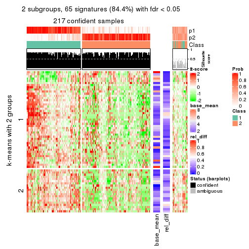</p>

</div>
<div id='tab-CV-kmeans-get-signatures-2'>
<pre><code class="r">get_signatures(res, k = 3)
</code></pre>

<p></p>

</div>
<div id='tab-CV-kmeans-get-signatures-3'>
<pre><code class="r">get_signatures(res, k = 4)
</code></pre>

<p></p>

</div>
<div id='tab-CV-kmeans-get-signatures-4'>
<pre><code class="r">get_signatures(res, k = 5)
</code></pre>

<p></p>

</div>
<div id='tab-CV-kmeans-get-signatures-5'>
<pre><code class="r">get_signatures(res, k = 6)
</code></pre>

<p></p>

</div>
</div>


Signature heatmaps where rows are not scaled:


<script>
$( function() {
	$( '#tabs-CV-kmeans-get-signatures-no-scale' ).tabs();
} );
</script>
<div id='tabs-CV-kmeans-get-signatures-no-scale'>
<ul>
<li><a href='#tab-CV-kmeans-get-signatures-no-scale-1'>k = 2</a></li>
<li><a href='#tab-CV-kmeans-get-signatures-no-scale-2'>k = 3</a></li>
<li><a href='#tab-CV-kmeans-get-signatures-no-scale-3'>k = 4</a></li>
<li><a href='#tab-CV-kmeans-get-signatures-no-scale-4'>k = 5</a></li>
<li><a href='#tab-CV-kmeans-get-signatures-no-scale-5'>k = 6</a></li>
</ul>
<div id='tab-CV-kmeans-get-signatures-no-scale-1'>
<pre><code class="r">get_signatures(res, k = 2, scale_rows = FALSE)
</code></pre>

<p></p>

</div>
<div id='tab-CV-kmeans-get-signatures-no-scale-2'>
<pre><code class="r">get_signatures(res, k = 3, scale_rows = FALSE)
</code></pre>

<p></p>

</div>
<div id='tab-CV-kmeans-get-signatures-no-scale-3'>
<pre><code class="r">get_signatures(res, k = 4, scale_rows = FALSE)
</code></pre>

<p>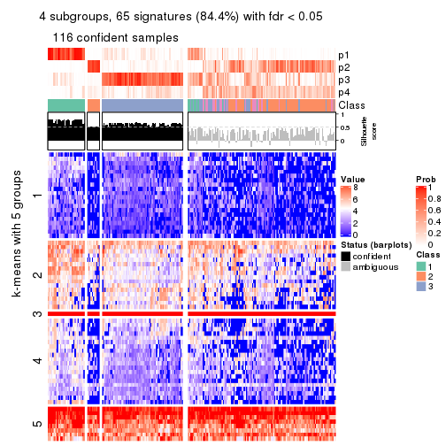</p>

</div>
<div id='tab-CV-kmeans-get-signatures-no-scale-4'>
<pre><code class="r">get_signatures(res, k = 5, scale_rows = FALSE)
</code></pre>

<p></p>

</div>
<div id='tab-CV-kmeans-get-signatures-no-scale-5'>
<pre><code class="r">get_signatures(res, k = 6, scale_rows = FALSE)
</code></pre>

<p>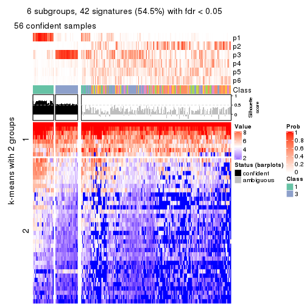</p>

</div>
</div>


Compare the overlap of signatures from different k:

```r
compare_signatures(res)
```


`get_signature()` returns a data frame invisibly. TO get the list of signatures, the function
call should be assigned to a variable explicitly. In following code, if `plot` argument is set
to `FALSE`, no heatmap is plotted while only the differential analysis is performed.

```r
# code only for demonstration
tb = get_signature(res, k = ..., plot = FALSE)
```

An example of the output of `tb` is:

```
#>   which_row         fdr    mean_1    mean_2 scaled_mean_1 scaled_mean_2 km
#> 1        38 0.042760348  8.373488  9.131774    -0.5533452     0.5164555  1
#> 2        40 0.018707592  7.106213  8.469186    -0.6173731     0.5762149  1
#> 3        55 0.019134737 10.221463 11.207825    -0.6159697     0.5749050  1
#> 4        59 0.006059896  5.921854  7.869574    -0.6899429     0.6439467  1
#> 5        60 0.018055526  8.928898 10.211722    -0.6204761     0.5791110  1
#> 6        98 0.009384629 15.714769 14.887706     0.6635654    -0.6193277  2
...
```

The columns in `tb` are:

1. `which_row`: row indices corresponding to the input matrix.
2. `fdr`: FDR for the differential test. 
3. `mean_x`: The mean value in group x.
4. `scaled_mean_x`: The mean value in group x after rows are scaled.
5. `km`: Row groups if k-means clustering is applied to rows.


UMAP plot which shows how samples are separated.


<script>
$( function() {
	$( '#tabs-CV-kmeans-dimension-reduction' ).tabs();
} );
</script>
<div id='tabs-CV-kmeans-dimension-reduction'>
<ul>
<li><a href='#tab-CV-kmeans-dimension-reduction-1'>k = 2</a></li>
<li><a href='#tab-CV-kmeans-dimension-reduction-2'>k = 3</a></li>
<li><a href='#tab-CV-kmeans-dimension-reduction-3'>k = 4</a></li>
<li><a href='#tab-CV-kmeans-dimension-reduction-4'>k = 5</a></li>
<li><a href='#tab-CV-kmeans-dimension-reduction-5'>k = 6</a></li>
</ul>
<div id='tab-CV-kmeans-dimension-reduction-1'>
<pre><code class="r">dimension_reduction(res, k = 2, method = &quot;UMAP&quot;)
</code></pre>

<p></p>

</div>
<div id='tab-CV-kmeans-dimension-reduction-2'>
<pre><code class="r">dimension_reduction(res, k = 3, method = &quot;UMAP&quot;)
</code></pre>

<p></p>

</div>
<div id='tab-CV-kmeans-dimension-reduction-3'>
<pre><code class="r">dimension_reduction(res, k = 4, method = &quot;UMAP&quot;)
</code></pre>

<p></p>

</div>
<div id='tab-CV-kmeans-dimension-reduction-4'>
<pre><code class="r">dimension_reduction(res, k = 5, method = &quot;UMAP&quot;)
</code></pre>

<p></p>

</div>
<div id='tab-CV-kmeans-dimension-reduction-5'>
<pre><code class="r">dimension_reduction(res, k = 6, method = &quot;UMAP&quot;)
</code></pre>

<p></p>

</div>
</div>


Following heatmap shows how subgroups are split when increasing `k`:

```r
collect_classes(res)
```


If matrix rows can be associated to genes, consider to use `GO_Enrichment(res,
...)` to perform function enrichment for the signature genes.


 

---------------------------------------------------


### CV:skmeans


The object with results only for a single top-value method and a single partition method 
can be extracted as:

```r
res = res_list["CV", "skmeans"]
# you can also extract it by
# res = res_list["CV:skmeans"]
```

A summary of `res` and all the functions that can be applied to it:

```r
res
```

```
#> A 'ConsensusPartition' object with k = 2, 3, 4, 5, 6.
#>   On a matrix with 77 rows and 243 columns.
#>   Top rows (8, 16, 23, 30, 38) are extracted by 'CV' method.
#>   Subgroups are detected by 'skmeans' method.
#>   Performed in total 1250 partitions by row resampling.
#>   Best k for subgroups seems to be 2.
#> 
#> Following methods can be applied to this 'ConsensusPartition' object:
#>  [1] "cola_report"             "collect_classes"         "collect_plots"          
#>  [4] "collect_stats"           "colnames"                "compare_signatures"     
#>  [7] "consensus_heatmap"       "dimension_reduction"     "functional_enrichment"  
#> [10] "get_anno_col"            "get_anno"                "get_classes"            
#> [13] "get_consensus"           "get_matrix"              "get_membership"         
#> [16] "get_param"               "get_signatures"          "get_stats"              
#> [19] "is_best_k"               "is_stable_k"             "membership_heatmap"     
#> [22] "ncol"                    "nrow"                    "plot_ecdf"              
#> [25] "rownames"                "select_partition_number" "show"                   
#> [28] "suggest_best_k"          "test_to_known_factors"
```

`collect_plots()` function collects all the plots made from `res` for all `k` (number of partitions)
into one single page to provide an easy and fast comparison between different `k`.

```r
collect_plots(res)
```


The plots are:

- The first row: a plot of the ECDF (Empirical cumulative distribution
  function) curves of the consensus matrix for each `k` and the heatmap of
  predicted classes for each `k`.
- The second row: heatmaps of the consensus matrix for each `k`.
- The third row: heatmaps of the membership matrix for each `k`.
- The fouth row: heatmaps of the signatures for each `k`.

All the plots in panels can be made by individual functions and they are
plotted later in this section.

`select_partition_number()` produces several plots showing different
statistics for choosing "optimized" `k`. There are following statistics:

- ECDF curves of the consensus matrix for each `k`;
- 1-PAC. [The PAC
  score](https://en.wikipedia.org/wiki/Consensus_clustering#Over-interpretation_potential_of_consensus_clustering)
  measures the proportion of the ambiguous subgrouping.
- Mean silhouette score.
- Concordance. The mean probability of fiting the consensus class ids in all
  partitions.
- Area increased. Denote $A_k$ as the area under the ECDF curve for current
  `k`, the area increased is defined as $A_k - A_{k-1}$.
- Rand index. The percent of pairs of samples that are both in a same cluster
  or both are not in a same cluster in the partition of k and k-1.
- Jaccard index. The ratio of pairs of samples are both in a same cluster in
  the partition of k and k-1 and the pairs of samples are both in a same
  cluster in the partition k or k-1.

The detailed explanations of these statistics can be found in [the cola
vignette](http://bioconductor.org/packages/devel/bioc/vignettes/cola/inst/doc/cola.html#toc_13).

Generally speaking, lower PAC score, higher mean silhouette score or higher
concordance corresponds to better partition. Rand index and Jaccard index
measure how similar the current partition is compared to partition with `k-1`.
If they are too similar, we won't accept `k` is better than `k-1`.

```r
select_partition_number(res)
```


The numeric values for all these statistics can be obtained by `get_stats()`.

```r
get_stats(res)
```

```
#>   k 1-PAC mean_silhouette concordance area_increased  Rand Jaccard
#> 2 2 0.439           0.787       0.899         0.5014 0.498   0.498
#> 3 3 0.392           0.652       0.788         0.3171 0.793   0.608
#> 4 4 0.416           0.431       0.653         0.1222 0.860   0.635
#> 5 5 0.476           0.367       0.647         0.0691 0.849   0.531
#> 6 6 0.523           0.388       0.615         0.0437 0.899   0.589
```

`suggest_best_k()` suggests the best $k$ based on these statistics. The rules are as follows:

- All $k$ with Jaccard index larger than 0.95 are removed because the increase of
  the partition number does not provides enough extra information. If all $k$ are removed,
  the best $k$ is assigned by `NA`.
- For $k$ with 1-PAC larger than 0.9, the maximal $k$ is taken as the "best k". Other $k$ is called "optional k".
- If it does not fit the second rule. The $k$ with the highest vote of highest
  1-PAC, mean silhouette and concordance is taken as the "best k".

```r
suggest_best_k(res)
```

```
#> [1] 2
```


Following shows the table of the partitions (You need to click the **show/hide
code output** link to see it). The membership matrix (columns with name `p*`)
is inferred by
[`clue::cl_consensus()`](https://www.rdocumentation.org/link/cl_consensus?package=clue)
function with the `SE` method. Basically the value in the membership matrix
represents the probability to belong to a certain group. The finall class
label for an item is determined with the group with highest probability it
belongs to.

In `get_classes()` function, the entropy is calculated from the membership
matrix and the silhouette score is calculated from the consensus matrix.


<script>
$( function() {
	$( '#tabs-CV-skmeans-get-classes' ).tabs();
} );
</script>
<div id='tabs-CV-skmeans-get-classes'>
<ul>
<li><a href='#tab-CV-skmeans-get-classes-1'>k = 2</a></li>
<li><a href='#tab-CV-skmeans-get-classes-2'>k = 3</a></li>
<li><a href='#tab-CV-skmeans-get-classes-3'>k = 4</a></li>
<li><a href='#tab-CV-skmeans-get-classes-4'>k = 5</a></li>
<li><a href='#tab-CV-skmeans-get-classes-5'>k = 6</a></li>
</ul>

<div id='tab-CV-skmeans-get-classes-1'>
<p><a id='tab-CV-skmeans-get-classes-1-a' style='color:#0366d6' href='#'>show/hide code output</a></p>
<pre><code class="r">cbind(get_classes(res, k = 2), get_membership(res, k = 2))
</code></pre>

<pre><code>#&gt;           class entropy silhouette    p1    p2
#&gt; SRR191393     1  0.0000     0.8874 1.000 0.000
#&gt; SRR191394     1  0.0000     0.8874 1.000 0.000
#&gt; SRR191396     2  0.8955     0.6057 0.312 0.688
#&gt; SRR191397     1  0.0000     0.8874 1.000 0.000
#&gt; SRR191398     1  0.0000     0.8874 1.000 0.000
#&gt; SRR191399     1  0.0376     0.8869 0.996 0.004
#&gt; SRR191400     1  0.0000     0.8874 1.000 0.000
#&gt; SRR191401     1  0.0000     0.8874 1.000 0.000
#&gt; SRR191402     1  0.2423     0.8760 0.960 0.040
#&gt; SRR191403     1  0.0000     0.8874 1.000 0.000
#&gt; SRR191404     2  0.9933     0.2558 0.452 0.548
#&gt; SRR191405     1  0.7139     0.7393 0.804 0.196
#&gt; SRR191406     1  0.2423     0.8772 0.960 0.040
#&gt; SRR191407     1  0.0000     0.8874 1.000 0.000
#&gt; SRR191408     1  0.5408     0.8247 0.876 0.124
#&gt; SRR191409     1  0.2236     0.8785 0.964 0.036
#&gt; SRR191410     2  0.9963     0.1553 0.464 0.536
#&gt; SRR191411     1  0.9970     0.1727 0.532 0.468
#&gt; SRR191412     1  0.0000     0.8874 1.000 0.000
#&gt; SRR191413     1  0.0000     0.8874 1.000 0.000
#&gt; SRR191414     1  0.0000     0.8874 1.000 0.000
#&gt; SRR191415     2  0.9427     0.4670 0.360 0.640
#&gt; SRR191416     1  0.5737     0.8163 0.864 0.136
#&gt; SRR191418     1  0.5059     0.8262 0.888 0.112
#&gt; SRR191419     1  0.0000     0.8874 1.000 0.000
#&gt; SRR191420     1  0.6343     0.7946 0.840 0.160
#&gt; SRR191421     1  0.0000     0.8874 1.000 0.000
#&gt; SRR191422     2  0.0000     0.8816 0.000 1.000
#&gt; SRR191423     2  0.0000     0.8816 0.000 1.000
#&gt; SRR191424     2  0.0000     0.8816 0.000 1.000
#&gt; SRR191425     1  0.5737     0.8150 0.864 0.136
#&gt; SRR191426     2  0.1414     0.8805 0.020 0.980
#&gt; SRR191427     2  0.6531     0.7871 0.168 0.832
#&gt; SRR191428     1  0.9944     0.2238 0.544 0.456
#&gt; SRR191429     2  0.0000     0.8816 0.000 1.000
#&gt; SRR191430     2  0.4815     0.8507 0.104 0.896
#&gt; SRR191431     2  0.8443     0.6648 0.272 0.728
#&gt; SRR191432     2  0.0000     0.8816 0.000 1.000
#&gt; SRR191433     2  0.0000     0.8816 0.000 1.000
#&gt; SRR191434     2  0.4815     0.8447 0.104 0.896
#&gt; SRR191435     1  0.5059     0.8372 0.888 0.112
#&gt; SRR191436     1  1.0000     0.0520 0.500 0.500
#&gt; SRR191437     2  0.0000     0.8816 0.000 1.000
#&gt; SRR191438     2  0.8016     0.7155 0.244 0.756
#&gt; SRR191439     2  0.0376     0.8816 0.004 0.996
#&gt; SRR191440     2  0.2043     0.8780 0.032 0.968
#&gt; SRR191441     2  0.0000     0.8816 0.000 1.000
#&gt; SRR191442     2  0.7376     0.7329 0.208 0.792
#&gt; SRR191443     1  0.2603     0.8748 0.956 0.044
#&gt; SRR191444     1  0.8386     0.6196 0.732 0.268
#&gt; SRR191445     2  0.4939     0.8476 0.108 0.892
#&gt; SRR191446     2  0.5519     0.8269 0.128 0.872
#&gt; SRR191447     2  0.0938     0.8811 0.012 0.988
#&gt; SRR191448     1  0.0000     0.8874 1.000 0.000
#&gt; SRR191449     1  0.0672     0.8858 0.992 0.008
#&gt; SRR191450     1  0.2423     0.8765 0.960 0.040
#&gt; SRR191451     1  0.7299     0.7538 0.796 0.204
#&gt; SRR191452     2  0.0000     0.8816 0.000 1.000
#&gt; SRR191453     2  0.3584     0.8639 0.068 0.932
#&gt; SRR191454     1  0.7219     0.7310 0.800 0.200
#&gt; SRR191455     2  0.1414     0.8798 0.020 0.980
#&gt; SRR191456     1  0.6343     0.7948 0.840 0.160
#&gt; SRR191457     1  0.5519     0.8153 0.872 0.128
#&gt; SRR191458     1  0.7299     0.7407 0.796 0.204
#&gt; SRR191459     2  0.3879     0.8598 0.076 0.924
#&gt; SRR191460     1  0.9988     0.0383 0.520 0.480
#&gt; SRR191461     2  0.5629     0.8202 0.132 0.868
#&gt; SRR191462     2  0.7056     0.7725 0.192 0.808
#&gt; SRR191463     2  0.0000     0.8816 0.000 1.000
#&gt; SRR191464     2  0.0672     0.8815 0.008 0.992
#&gt; SRR191465     2  0.0000     0.8816 0.000 1.000
#&gt; SRR191466     2  0.5737     0.8142 0.136 0.864
#&gt; SRR191467     2  0.1633     0.8778 0.024 0.976
#&gt; SRR191468     2  0.0000     0.8816 0.000 1.000
#&gt; SRR191469     2  0.5408     0.8323 0.124 0.876
#&gt; SRR191470     2  0.0000     0.8816 0.000 1.000
#&gt; SRR191471     2  0.0000     0.8816 0.000 1.000
#&gt; SRR191472     2  0.0000     0.8816 0.000 1.000
#&gt; SRR191473     2  0.0000     0.8816 0.000 1.000
#&gt; SRR191474     2  0.9954     0.1278 0.460 0.540
#&gt; SRR191475     2  0.0000     0.8816 0.000 1.000
#&gt; SRR191476     2  0.2236     0.8754 0.036 0.964
#&gt; SRR191477     2  0.2236     0.8753 0.036 0.964
#&gt; SRR191478     2  0.1633     0.8778 0.024 0.976
#&gt; SRR191479     1  0.1633     0.8824 0.976 0.024
#&gt; SRR191480     2  0.1414     0.8797 0.020 0.980
#&gt; SRR191481     2  0.0000     0.8816 0.000 1.000
#&gt; SRR191482     2  0.0000     0.8816 0.000 1.000
#&gt; SRR191483     2  0.0000     0.8816 0.000 1.000
#&gt; SRR191484     1  0.7950     0.7017 0.760 0.240
#&gt; SRR191485     2  0.0000     0.8816 0.000 1.000
#&gt; SRR191486     2  0.3879     0.8587 0.076 0.924
#&gt; SRR191487     2  0.7299     0.7587 0.204 0.796
#&gt; SRR191488     1  0.0938     0.8854 0.988 0.012
#&gt; SRR191489     1  0.6048     0.8030 0.852 0.148
#&gt; SRR191490     2  0.0000     0.8816 0.000 1.000
#&gt; SRR191491     2  0.9970     0.1068 0.468 0.532
#&gt; SRR191492     1  0.5629     0.8222 0.868 0.132
#&gt; SRR191493     2  0.1184     0.8806 0.016 0.984
#&gt; SRR191494     2  0.4298     0.8544 0.088 0.912
#&gt; SRR191495     1  0.6048     0.8078 0.852 0.148
#&gt; SRR191496     2  0.0000     0.8816 0.000 1.000
#&gt; SRR191497     1  0.9954     0.1845 0.540 0.460
#&gt; SRR191498     1  0.8443     0.6359 0.728 0.272
#&gt; SRR191499     2  0.7674     0.7117 0.224 0.776
#&gt; SRR191500     2  0.7299     0.7421 0.204 0.796
#&gt; SRR191501     2  0.6887     0.7799 0.184 0.816
#&gt; SRR191502     2  0.6148     0.8132 0.152 0.848
#&gt; SRR191503     2  0.0000     0.8816 0.000 1.000
#&gt; SRR191504     2  0.0000     0.8816 0.000 1.000
#&gt; SRR191505     2  0.0000     0.8816 0.000 1.000
#&gt; SRR191506     2  0.0000     0.8816 0.000 1.000
#&gt; SRR191507     2  0.8081     0.6988 0.248 0.752
#&gt; SRR191508     2  0.1843     0.8778 0.028 0.972
#&gt; SRR191509     2  0.0000     0.8816 0.000 1.000
#&gt; SRR191510     2  0.4022     0.8605 0.080 0.920
#&gt; SRR191511     2  0.0000     0.8816 0.000 1.000
#&gt; SRR191512     2  0.0000     0.8816 0.000 1.000
#&gt; SRR191513     2  0.4815     0.8433 0.104 0.896
#&gt; SRR191514     2  0.0000     0.8816 0.000 1.000
#&gt; SRR191515     2  0.0376     0.8813 0.004 0.996
#&gt; SRR191516     2  0.8327     0.6504 0.264 0.736
#&gt; SRR191517     2  0.1633     0.8785 0.024 0.976
#&gt; SRR191518     2  0.2778     0.8721 0.048 0.952
#&gt; SRR191519     2  0.0000     0.8816 0.000 1.000
#&gt; SRR191520     2  0.9427     0.4610 0.360 0.640
#&gt; SRR191521     2  0.0000     0.8816 0.000 1.000
#&gt; SRR191522     2  0.1633     0.8778 0.024 0.976
#&gt; SRR191523     2  0.1414     0.8798 0.020 0.980
#&gt; SRR191524     2  0.9933     0.1390 0.452 0.548
#&gt; SRR191525     2  0.0000     0.8816 0.000 1.000
#&gt; SRR191526     2  0.0000     0.8816 0.000 1.000
#&gt; SRR191527     1  0.6887     0.7491 0.816 0.184
#&gt; SRR191528     1  0.2948     0.8683 0.948 0.052
#&gt; SRR191529     2  0.5294     0.8366 0.120 0.880
#&gt; SRR191530     2  0.0000     0.8816 0.000 1.000
#&gt; SRR191531     1  0.6712     0.7889 0.824 0.176
#&gt; SRR191532     2  0.5629     0.8197 0.132 0.868
#&gt; SRR191533     1  0.9954     0.1284 0.540 0.460
#&gt; SRR191534     2  0.3114     0.8690 0.056 0.944
#&gt; SRR191535     2  0.0000     0.8816 0.000 1.000
#&gt; SRR191536     2  0.6048     0.8151 0.148 0.852
#&gt; SRR191537     2  0.8499     0.6598 0.276 0.724
#&gt; SRR191538     2  0.0000     0.8816 0.000 1.000
#&gt; SRR191539     2  0.3879     0.8606 0.076 0.924
#&gt; SRR191540     2  0.0000     0.8816 0.000 1.000
#&gt; SRR191541     2  0.6343     0.8001 0.160 0.840
#&gt; SRR191542     2  0.4161     0.8560 0.084 0.916
#&gt; SRR191543     2  0.0000     0.8816 0.000 1.000
#&gt; SRR191544     2  0.3879     0.8596 0.076 0.924
#&gt; SRR191545     2  0.0000     0.8816 0.000 1.000
#&gt; SRR191546     2  0.0000     0.8816 0.000 1.000
#&gt; SRR191547     2  0.6247     0.7956 0.156 0.844
#&gt; SRR191548     1  0.0000     0.8874 1.000 0.000
#&gt; SRR191549     1  0.0000     0.8874 1.000 0.000
#&gt; SRR191550     1  0.0000     0.8874 1.000 0.000
#&gt; SRR191551     1  0.0000     0.8874 1.000 0.000
#&gt; SRR191552     1  0.0000     0.8874 1.000 0.000
#&gt; SRR191553     1  0.1414     0.8832 0.980 0.020
#&gt; SRR191554     1  0.0000     0.8874 1.000 0.000
#&gt; SRR191555     1  0.3274     0.8680 0.940 0.060
#&gt; SRR191556     1  0.0000     0.8874 1.000 0.000
#&gt; SRR191557     1  0.2423     0.8778 0.960 0.040
#&gt; SRR191558     2  0.8443     0.6581 0.272 0.728
#&gt; SRR191559     1  0.0672     0.8858 0.992 0.008
#&gt; SRR191560     1  0.0000     0.8874 1.000 0.000
#&gt; SRR191561     1  0.5519     0.8131 0.872 0.128
#&gt; SRR191562     1  0.0000     0.8874 1.000 0.000
#&gt; SRR191563     1  0.8909     0.5962 0.692 0.308
#&gt; SRR191564     1  0.3584     0.8619 0.932 0.068
#&gt; SRR191565     1  0.0000     0.8874 1.000 0.000
#&gt; SRR191566     1  0.0000     0.8874 1.000 0.000
#&gt; SRR191567     1  0.0000     0.8874 1.000 0.000
#&gt; SRR191568     1  0.0000     0.8874 1.000 0.000
#&gt; SRR191569     1  0.3274     0.8679 0.940 0.060
#&gt; SRR191570     1  0.0376     0.8867 0.996 0.004
#&gt; SRR191571     1  0.0000     0.8874 1.000 0.000
#&gt; SRR191572     1  0.0000     0.8874 1.000 0.000
#&gt; SRR191573     1  0.0000     0.8874 1.000 0.000
#&gt; SRR191574     1  0.0000     0.8874 1.000 0.000
#&gt; SRR191575     1  0.0000     0.8874 1.000 0.000
#&gt; SRR191576     1  0.6887     0.7689 0.816 0.184
#&gt; SRR191577     1  0.0376     0.8865 0.996 0.004
#&gt; SRR191578     2  0.3274     0.8658 0.060 0.940
#&gt; SRR191579     1  0.0000     0.8874 1.000 0.000
#&gt; SRR191580     1  0.0000     0.8874 1.000 0.000
#&gt; SRR191581     1  0.0376     0.8865 0.996 0.004
#&gt; SRR191582     1  0.0000     0.8874 1.000 0.000
#&gt; SRR191583     2  0.6531     0.7928 0.168 0.832
#&gt; SRR191584     1  0.1633     0.8803 0.976 0.024
#&gt; SRR191585     1  0.9608     0.4342 0.616 0.384
#&gt; SRR191586     1  0.9460     0.4640 0.636 0.364
#&gt; SRR191587     1  0.0000     0.8874 1.000 0.000
#&gt; SRR191588     1  0.0000     0.8874 1.000 0.000
#&gt; SRR191589     1  0.0000     0.8874 1.000 0.000
#&gt; SRR191590     1  0.0000     0.8874 1.000 0.000
#&gt; SRR191591     1  0.7453     0.7190 0.788 0.212
#&gt; SRR191592     1  0.0000     0.8874 1.000 0.000
#&gt; SRR191593     1  0.2778     0.8723 0.952 0.048
#&gt; SRR191594     1  0.0000     0.8874 1.000 0.000
#&gt; SRR191595     1  0.0000     0.8874 1.000 0.000
#&gt; SRR191596     1  0.0000     0.8874 1.000 0.000
#&gt; SRR191597     1  0.9248     0.4973 0.660 0.340
#&gt; SRR191598     1  0.0000     0.8874 1.000 0.000
#&gt; SRR191599     1  0.0000     0.8874 1.000 0.000
#&gt; SRR191600     1  0.9970     0.0436 0.532 0.468
#&gt; SRR191601     2  0.8555     0.6197 0.280 0.720
#&gt; SRR191602     2  0.6712     0.7729 0.176 0.824
#&gt; SRR191603     2  0.9661     0.3510 0.392 0.608
#&gt; SRR191604     2  0.0000     0.8816 0.000 1.000
#&gt; SRR191605     1  0.5059     0.8380 0.888 0.112
#&gt; SRR191606     1  0.0000     0.8874 1.000 0.000
#&gt; SRR191607     1  0.6343     0.7979 0.840 0.160
#&gt; SRR191608     2  0.9896     0.2028 0.440 0.560
#&gt; SRR191609     2  0.9608     0.3868 0.384 0.616
#&gt; SRR191610     1  0.2236     0.8787 0.964 0.036
#&gt; SRR191611     1  0.8861     0.6044 0.696 0.304
#&gt; SRR191612     1  0.0672     0.8858 0.992 0.008
#&gt; SRR191613     1  0.0000     0.8874 1.000 0.000
#&gt; SRR191614     1  0.0672     0.8858 0.992 0.008
#&gt; SRR191615     1  0.0672     0.8858 0.992 0.008
#&gt; SRR191616     2  0.9000     0.5839 0.316 0.684
#&gt; SRR191617     2  0.5178     0.8372 0.116 0.884
#&gt; SRR191618     1  0.9732     0.3471 0.596 0.404
#&gt; SRR191619     2  0.5946     0.8084 0.144 0.856
#&gt; SRR191620     2  0.0938     0.8813 0.012 0.988
#&gt; SRR191621     2  0.0000     0.8816 0.000 1.000
#&gt; SRR191622     1  0.9754     0.3649 0.592 0.408
#&gt; SRR191623     1  0.3114     0.8695 0.944 0.056
#&gt; SRR191624     1  0.0000     0.8874 1.000 0.000
#&gt; SRR191625     2  0.2603     0.8750 0.044 0.956
#&gt; SRR191626     2  0.0000     0.8816 0.000 1.000
#&gt; SRR191627     2  0.9833     0.3030 0.424 0.576
#&gt; SRR191628     1  0.7950     0.7020 0.760 0.240
#&gt; SRR191629     1  0.8661     0.6294 0.712 0.288
#&gt; SRR191630     1  0.0000     0.8874 1.000 0.000
#&gt; SRR191631     2  0.7528     0.7449 0.216 0.784
#&gt; SRR191632     1  0.0000     0.8874 1.000 0.000
#&gt; SRR191633     1  0.9522     0.4588 0.628 0.372
#&gt; SRR191634     2  0.6623     0.7897 0.172 0.828
#&gt; SRR191635     1  0.3274     0.8667 0.940 0.060
#&gt; SRR191636     2  0.8327     0.6756 0.264 0.736
#&gt; SRR191637     2  0.0000     0.8816 0.000 1.000
</code></pre>

<script>
$('#tab-CV-skmeans-get-classes-1-a').parent().next().next().hide();
$('#tab-CV-skmeans-get-classes-1-a').click(function(){
  $('#tab-CV-skmeans-get-classes-1-a').parent().next().next().toggle();
  return(false);
});
</script>
</div>

<div id='tab-CV-skmeans-get-classes-2'>
<p><a id='tab-CV-skmeans-get-classes-2-a' style='color:#0366d6' href='#'>show/hide code output</a></p>
<pre><code class="r">cbind(get_classes(res, k = 3), get_membership(res, k = 3))
</code></pre>

<pre><code>#&gt;           class entropy silhouette    p1    p2    p3
#&gt; SRR191393     1  0.0000     0.7903 1.000 0.000 0.000
#&gt; SRR191394     1  0.0000     0.7903 1.000 0.000 0.000
#&gt; SRR191396     2  0.7391     0.5705 0.308 0.636 0.056
#&gt; SRR191397     1  0.0747     0.7895 0.984 0.000 0.016
#&gt; SRR191398     1  0.0000     0.7903 1.000 0.000 0.000
#&gt; SRR191399     1  0.6045     0.3399 0.620 0.000 0.380
#&gt; SRR191400     1  0.0000     0.7903 1.000 0.000 0.000
#&gt; SRR191401     1  0.0000     0.7903 1.000 0.000 0.000
#&gt; SRR191402     1  0.5559     0.6794 0.780 0.028 0.192
#&gt; SRR191403     1  0.1643     0.7884 0.956 0.000 0.044
#&gt; SRR191404     2  0.9581     0.2446 0.268 0.480 0.252
#&gt; SRR191405     1  0.8902     0.3708 0.536 0.144 0.320
#&gt; SRR191406     3  0.6255     0.6028 0.204 0.048 0.748
#&gt; SRR191407     1  0.1163     0.7895 0.972 0.000 0.028
#&gt; SRR191408     1  0.7163     0.4949 0.628 0.040 0.332
#&gt; SRR191409     1  0.3434     0.7651 0.904 0.032 0.064
#&gt; SRR191410     3  0.9346     0.4885 0.260 0.224 0.516
#&gt; SRR191411     3  0.9588     0.4077 0.284 0.240 0.476
#&gt; SRR191412     1  0.0000     0.7903 1.000 0.000 0.000
#&gt; SRR191413     3  0.6299    -0.0799 0.476 0.000 0.524
#&gt; SRR191414     1  0.0000     0.7903 1.000 0.000 0.000
#&gt; SRR191415     3  0.7091     0.6255 0.056 0.268 0.676
#&gt; SRR191416     3  0.7831     0.5498 0.280 0.088 0.632
#&gt; SRR191418     1  0.7868     0.1285 0.524 0.056 0.420
#&gt; SRR191419     1  0.3038     0.7695 0.896 0.000 0.104
#&gt; SRR191420     1  0.5093     0.7252 0.836 0.088 0.076
#&gt; SRR191421     1  0.0747     0.7907 0.984 0.000 0.016
#&gt; SRR191422     2  0.0892     0.8107 0.000 0.980 0.020
#&gt; SRR191423     2  0.0237     0.8130 0.000 0.996 0.004
#&gt; SRR191424     2  0.3886     0.8037 0.024 0.880 0.096
#&gt; SRR191425     3  0.8264     0.1798 0.436 0.076 0.488
#&gt; SRR191426     2  0.6925     0.2232 0.016 0.532 0.452
#&gt; SRR191427     2  0.7344     0.5897 0.232 0.684 0.084
#&gt; SRR191428     3  0.4139     0.7382 0.016 0.124 0.860
#&gt; SRR191429     2  0.0592     0.8123 0.000 0.988 0.012
#&gt; SRR191430     2  0.6705     0.7409 0.108 0.748 0.144
#&gt; SRR191431     2  0.5919     0.6534 0.276 0.712 0.012
#&gt; SRR191432     2  0.2261     0.8059 0.000 0.932 0.068
#&gt; SRR191433     2  0.0424     0.8116 0.000 0.992 0.008
#&gt; SRR191434     2  0.5263     0.7820 0.116 0.824 0.060
#&gt; SRR191435     1  0.7838     0.1507 0.488 0.052 0.460
#&gt; SRR191436     1  0.9119     0.1675 0.484 0.368 0.148
#&gt; SRR191437     2  0.0892     0.8107 0.000 0.980 0.020
#&gt; SRR191438     2  0.7424     0.6963 0.172 0.700 0.128
#&gt; SRR191439     2  0.4335     0.8034 0.036 0.864 0.100
#&gt; SRR191440     2  0.4277     0.7679 0.132 0.852 0.016
#&gt; SRR191441     2  0.0424     0.8116 0.000 0.992 0.008
#&gt; SRR191442     2  0.8752     0.3355 0.144 0.564 0.292
#&gt; SRR191443     1  0.4749     0.7385 0.844 0.040 0.116
#&gt; SRR191444     1  0.9015     0.1316 0.508 0.144 0.348
#&gt; SRR191445     2  0.5426     0.7819 0.092 0.820 0.088
#&gt; SRR191446     2  0.7145     0.2299 0.024 0.536 0.440
#&gt; SRR191447     2  0.2384     0.8163 0.008 0.936 0.056
#&gt; SRR191448     1  0.4963     0.7110 0.792 0.008 0.200
#&gt; SRR191449     3  0.1529     0.7456 0.040 0.000 0.960
#&gt; SRR191450     3  0.6516    -0.0591 0.480 0.004 0.516
#&gt; SRR191451     1  0.6476     0.6397 0.748 0.184 0.068
#&gt; SRR191452     2  0.2356     0.8042 0.000 0.928 0.072
#&gt; SRR191453     2  0.5538     0.7363 0.060 0.808 0.132
#&gt; SRR191454     1  0.3500     0.7274 0.880 0.116 0.004
#&gt; SRR191455     2  0.6258     0.6668 0.052 0.752 0.196
#&gt; SRR191456     1  0.3550     0.7551 0.896 0.024 0.080
#&gt; SRR191457     1  0.6208     0.7061 0.772 0.076 0.152
#&gt; SRR191458     1  0.9018     0.4099 0.548 0.176 0.276
#&gt; SRR191459     2  0.6488     0.7175 0.084 0.756 0.160
#&gt; SRR191460     2  0.9980    -0.1886 0.340 0.356 0.304
#&gt; SRR191461     3  0.5058     0.6425 0.000 0.244 0.756
#&gt; SRR191462     2  0.7007     0.6988 0.176 0.724 0.100
#&gt; SRR191463     2  0.0983     0.8144 0.004 0.980 0.016
#&gt; SRR191464     2  0.3454     0.8027 0.008 0.888 0.104
#&gt; SRR191465     2  0.0424     0.8116 0.000 0.992 0.008
#&gt; SRR191466     2  0.8350     0.2962 0.088 0.532 0.380
#&gt; SRR191467     2  0.2313     0.8143 0.032 0.944 0.024
#&gt; SRR191468     2  0.0424     0.8116 0.000 0.992 0.008
#&gt; SRR191469     2  0.7453     0.0849 0.036 0.528 0.436
#&gt; SRR191470     3  0.6267     0.1063 0.000 0.452 0.548
#&gt; SRR191471     2  0.3532     0.7827 0.008 0.884 0.108
#&gt; SRR191472     2  0.0892     0.8107 0.000 0.980 0.020
#&gt; SRR191473     2  0.3551     0.7912 0.000 0.868 0.132
#&gt; SRR191474     3  0.2878     0.7515 0.000 0.096 0.904
#&gt; SRR191475     2  0.0892     0.8107 0.000 0.980 0.020
#&gt; SRR191476     2  0.4887     0.7507 0.000 0.772 0.228
#&gt; SRR191477     2  0.5968     0.4814 0.000 0.636 0.364
#&gt; SRR191478     2  0.1267     0.8144 0.024 0.972 0.004
#&gt; SRR191479     1  0.5443     0.6589 0.736 0.004 0.260
#&gt; SRR191480     3  0.6280     0.2745 0.000 0.460 0.540
#&gt; SRR191481     2  0.1753     0.8117 0.000 0.952 0.048
#&gt; SRR191482     2  0.3482     0.7795 0.000 0.872 0.128
#&gt; SRR191483     2  0.4346     0.7177 0.000 0.816 0.184
#&gt; SRR191484     3  0.7568     0.6076 0.212 0.108 0.680
#&gt; SRR191485     2  0.1453     0.8126 0.008 0.968 0.024
#&gt; SRR191486     2  0.6839     0.5213 0.024 0.624 0.352
#&gt; SRR191487     2  0.8841     0.5364 0.216 0.580 0.204
#&gt; SRR191488     1  0.1999     0.7909 0.952 0.012 0.036
#&gt; SRR191489     1  0.8387     0.1933 0.488 0.084 0.428
#&gt; SRR191490     2  0.3377     0.8054 0.012 0.896 0.092
#&gt; SRR191491     3  0.9813     0.3049 0.304 0.268 0.428
#&gt; SRR191492     3  0.7589     0.3207 0.360 0.052 0.588
#&gt; SRR191493     2  0.5502     0.7152 0.008 0.744 0.248
#&gt; SRR191494     2  0.3129     0.8006 0.088 0.904 0.008
#&gt; SRR191495     3  0.0661     0.7494 0.004 0.008 0.988
#&gt; SRR191496     2  0.0892     0.8107 0.000 0.980 0.020
#&gt; SRR191497     3  0.1878     0.7582 0.004 0.044 0.952
#&gt; SRR191498     1  0.9481     0.0845 0.432 0.184 0.384
#&gt; SRR191499     3  0.4346     0.7160 0.000 0.184 0.816
#&gt; SRR191500     3  0.5760     0.5475 0.000 0.328 0.672
#&gt; SRR191501     2  0.7592     0.6171 0.112 0.680 0.208
#&gt; SRR191502     2  0.5404     0.6813 0.004 0.740 0.256
#&gt; SRR191503     2  0.1620     0.8122 0.012 0.964 0.024
#&gt; SRR191504     2  0.1031     0.8116 0.000 0.976 0.024
#&gt; SRR191505     2  0.0661     0.8150 0.004 0.988 0.008
#&gt; SRR191506     2  0.0892     0.8107 0.000 0.980 0.020
#&gt; SRR191507     2  0.8982     0.3657 0.168 0.548 0.284
#&gt; SRR191508     2  0.5764     0.7749 0.076 0.800 0.124
#&gt; SRR191509     2  0.4937     0.7831 0.028 0.824 0.148
#&gt; SRR191510     2  0.5036     0.7420 0.020 0.808 0.172
#&gt; SRR191511     2  0.3816     0.7910 0.000 0.852 0.148
#&gt; SRR191512     2  0.0424     0.8116 0.000 0.992 0.008
#&gt; SRR191513     2  0.3886     0.7910 0.024 0.880 0.096
#&gt; SRR191514     2  0.0424     0.8116 0.000 0.992 0.008
#&gt; SRR191515     2  0.3192     0.7974 0.000 0.888 0.112
#&gt; SRR191516     3  0.3686     0.7329 0.000 0.140 0.860
#&gt; SRR191517     3  0.2625     0.7529 0.000 0.084 0.916
#&gt; SRR191518     2  0.3619     0.7815 0.000 0.864 0.136
#&gt; SRR191519     2  0.3619     0.7950 0.000 0.864 0.136
#&gt; SRR191520     3  0.1289     0.7540 0.000 0.032 0.968
#&gt; SRR191521     2  0.3551     0.7825 0.000 0.868 0.132
#&gt; SRR191522     2  0.6154     0.4765 0.000 0.592 0.408
#&gt; SRR191523     2  0.1950     0.8131 0.040 0.952 0.008
#&gt; SRR191524     1  0.9109     0.1922 0.488 0.364 0.148
#&gt; SRR191525     2  0.3116     0.7992 0.000 0.892 0.108
#&gt; SRR191526     2  0.0424     0.8116 0.000 0.992 0.008
#&gt; SRR191527     1  0.2537     0.7563 0.920 0.080 0.000
#&gt; SRR191528     1  0.0592     0.7896 0.988 0.012 0.000
#&gt; SRR191529     2  0.3983     0.7773 0.144 0.852 0.004
#&gt; SRR191530     2  0.0424     0.8116 0.000 0.992 0.008
#&gt; SRR191531     1  0.3947     0.7513 0.884 0.040 0.076
#&gt; SRR191532     2  0.6912     0.0590 0.016 0.540 0.444
#&gt; SRR191533     3  0.8915     0.4946 0.216 0.212 0.572
#&gt; SRR191534     2  0.3340     0.7873 0.000 0.880 0.120
#&gt; SRR191535     2  0.1411     0.8140 0.000 0.964 0.036
#&gt; SRR191536     2  0.5111     0.7708 0.144 0.820 0.036
#&gt; SRR191537     2  0.7906     0.5779 0.124 0.656 0.220
#&gt; SRR191538     2  0.1289     0.8127 0.000 0.968 0.032
#&gt; SRR191539     2  0.3276     0.8066 0.024 0.908 0.068
#&gt; SRR191540     2  0.1753     0.8128 0.000 0.952 0.048
#&gt; SRR191541     2  0.4469     0.7842 0.028 0.852 0.120
#&gt; SRR191542     2  0.2448     0.8042 0.076 0.924 0.000
#&gt; SRR191543     2  0.0592     0.8124 0.000 0.988 0.012
#&gt; SRR191544     2  0.3983     0.7987 0.068 0.884 0.048
#&gt; SRR191545     2  0.3192     0.8034 0.000 0.888 0.112
#&gt; SRR191546     2  0.1163     0.8126 0.000 0.972 0.028
#&gt; SRR191547     2  0.7310     0.4466 0.040 0.600 0.360
#&gt; SRR191548     1  0.0000     0.7903 1.000 0.000 0.000
#&gt; SRR191549     1  0.0000     0.7903 1.000 0.000 0.000
#&gt; SRR191550     1  0.0592     0.7906 0.988 0.000 0.012
#&gt; SRR191551     1  0.0000     0.7903 1.000 0.000 0.000
#&gt; SRR191552     1  0.0000     0.7903 1.000 0.000 0.000
#&gt; SRR191553     1  0.0592     0.7896 0.988 0.012 0.000
#&gt; SRR191554     1  0.0000     0.7903 1.000 0.000 0.000
#&gt; SRR191555     3  0.5384     0.6502 0.188 0.024 0.788
#&gt; SRR191556     1  0.5706     0.5746 0.680 0.000 0.320
#&gt; SRR191557     3  0.5223     0.6871 0.176 0.024 0.800
#&gt; SRR191558     2  0.5722     0.5915 0.292 0.704 0.004
#&gt; SRR191559     3  0.1163     0.7472 0.028 0.000 0.972
#&gt; SRR191560     1  0.6215     0.3823 0.572 0.000 0.428
#&gt; SRR191561     1  0.0747     0.7890 0.984 0.016 0.000
#&gt; SRR191562     1  0.2165     0.7818 0.936 0.000 0.064
#&gt; SRR191563     3  0.8379     0.5281 0.208 0.168 0.624
#&gt; SRR191564     3  0.1643     0.7433 0.044 0.000 0.956
#&gt; SRR191565     1  0.5363     0.6419 0.724 0.000 0.276
#&gt; SRR191566     3  0.6244     0.0376 0.440 0.000 0.560
#&gt; SRR191567     1  0.4887     0.6911 0.772 0.000 0.228
#&gt; SRR191568     1  0.3116     0.7644 0.892 0.000 0.108
#&gt; SRR191569     1  0.5929     0.5778 0.676 0.004 0.320
#&gt; SRR191570     1  0.3851     0.7605 0.860 0.004 0.136
#&gt; SRR191571     1  0.2356     0.7848 0.928 0.000 0.072
#&gt; SRR191572     1  0.0000     0.7903 1.000 0.000 0.000
#&gt; SRR191573     1  0.2356     0.7833 0.928 0.000 0.072
#&gt; SRR191574     1  0.0000     0.7903 1.000 0.000 0.000
#&gt; SRR191575     1  0.3267     0.7599 0.884 0.000 0.116
#&gt; SRR191576     1  0.5524     0.6836 0.796 0.164 0.040
#&gt; SRR191577     1  0.3755     0.7577 0.872 0.008 0.120
#&gt; SRR191578     2  0.4505     0.7995 0.092 0.860 0.048
#&gt; SRR191579     1  0.0000     0.7903 1.000 0.000 0.000
#&gt; SRR191580     1  0.0000     0.7903 1.000 0.000 0.000
#&gt; SRR191581     1  0.0000     0.7903 1.000 0.000 0.000
#&gt; SRR191582     1  0.0237     0.7902 0.996 0.004 0.000
#&gt; SRR191583     2  0.4062     0.7627 0.164 0.836 0.000
#&gt; SRR191584     1  0.0237     0.7902 0.996 0.004 0.000
#&gt; SRR191585     3  0.3771     0.7415 0.012 0.112 0.876
#&gt; SRR191586     3  0.3337     0.7544 0.032 0.060 0.908
#&gt; SRR191587     1  0.4931     0.6529 0.768 0.000 0.232
#&gt; SRR191588     1  0.2959     0.7681 0.900 0.000 0.100
#&gt; SRR191589     1  0.2165     0.7796 0.936 0.000 0.064
#&gt; SRR191590     1  0.0237     0.7904 0.996 0.000 0.004
#&gt; SRR191591     1  0.8567     0.3165 0.576 0.128 0.296
#&gt; SRR191592     3  0.6295    -0.1236 0.472 0.000 0.528
#&gt; SRR191593     1  0.7114     0.2502 0.584 0.028 0.388
#&gt; SRR191594     1  0.3192     0.7618 0.888 0.000 0.112
#&gt; SRR191595     1  0.4887     0.7008 0.772 0.000 0.228
#&gt; SRR191596     1  0.4399     0.7256 0.812 0.000 0.188
#&gt; SRR191597     3  0.2879     0.7532 0.024 0.052 0.924
#&gt; SRR191598     1  0.6309     0.1578 0.500 0.000 0.500
#&gt; SRR191599     1  0.4504     0.7199 0.804 0.000 0.196
#&gt; SRR191600     3  0.9115     0.4082 0.236 0.216 0.548
#&gt; SRR191601     3  0.4062     0.7414 0.000 0.164 0.836
#&gt; SRR191602     3  0.4033     0.7340 0.008 0.136 0.856
#&gt; SRR191603     3  0.3340     0.7419 0.000 0.120 0.880
#&gt; SRR191604     2  0.3551     0.7992 0.000 0.868 0.132
#&gt; SRR191605     3  0.1289     0.7476 0.032 0.000 0.968
#&gt; SRR191606     1  0.4796     0.7035 0.780 0.000 0.220
#&gt; SRR191607     3  0.0892     0.7484 0.020 0.000 0.980
#&gt; SRR191608     3  0.1289     0.7539 0.000 0.032 0.968
#&gt; SRR191609     3  0.1289     0.7539 0.000 0.032 0.968
#&gt; SRR191610     3  0.2261     0.7428 0.068 0.000 0.932
#&gt; SRR191611     3  0.4634     0.7267 0.012 0.164 0.824
#&gt; SRR191612     3  0.1163     0.7481 0.028 0.000 0.972
#&gt; SRR191613     1  0.1989     0.7864 0.948 0.004 0.048
#&gt; SRR191614     3  0.3752     0.7173 0.096 0.020 0.884
#&gt; SRR191615     3  0.3965     0.6894 0.132 0.008 0.860
#&gt; SRR191616     2  0.5948     0.4998 0.360 0.640 0.000
#&gt; SRR191617     2  0.5334     0.7772 0.120 0.820 0.060
#&gt; SRR191618     1  0.9908    -0.2018 0.372 0.268 0.360
#&gt; SRR191619     2  0.8087     0.3584 0.076 0.560 0.364
#&gt; SRR191620     2  0.4586     0.7986 0.048 0.856 0.096
#&gt; SRR191621     2  0.1964     0.8122 0.000 0.944 0.056
#&gt; SRR191622     1  0.9211     0.2306 0.512 0.312 0.176
#&gt; SRR191623     3  0.1399     0.7492 0.028 0.004 0.968
#&gt; SRR191624     1  0.4887     0.6440 0.772 0.000 0.228
#&gt; SRR191625     2  0.5137     0.7914 0.064 0.832 0.104
#&gt; SRR191626     3  0.6286     0.2131 0.000 0.464 0.536
#&gt; SRR191627     3  0.4345     0.7379 0.016 0.136 0.848
#&gt; SRR191628     1  0.9481    -0.0839 0.432 0.184 0.384
#&gt; SRR191629     3  0.4015     0.7438 0.028 0.096 0.876
#&gt; SRR191630     1  0.3482     0.7600 0.872 0.000 0.128
#&gt; SRR191631     3  0.4033     0.7416 0.008 0.136 0.856
#&gt; SRR191632     1  0.3879     0.7518 0.848 0.000 0.152
#&gt; SRR191633     3  0.5667     0.7088 0.060 0.140 0.800
#&gt; SRR191634     2  0.5318     0.7315 0.204 0.780 0.016
#&gt; SRR191635     3  0.1267     0.7478 0.024 0.004 0.972
#&gt; SRR191636     2  0.5835     0.5313 0.340 0.660 0.000
#&gt; SRR191637     2  0.0424     0.8116 0.000 0.992 0.008
</code></pre>

<script>
$('#tab-CV-skmeans-get-classes-2-a').parent().next().next().hide();
$('#tab-CV-skmeans-get-classes-2-a').click(function(){
  $('#tab-CV-skmeans-get-classes-2-a').parent().next().next().toggle();
  return(false);
});
</script>
</div>

<div id='tab-CV-skmeans-get-classes-3'>
<p><a id='tab-CV-skmeans-get-classes-3-a' style='color:#0366d6' href='#'>show/hide code output</a></p>
<pre><code class="r">cbind(get_classes(res, k = 4), get_membership(res, k = 4))
</code></pre>

<pre><code>#&gt;           class entropy silhouette    p1    p2    p3    p4
#&gt; SRR191393     1  0.0376    0.74293 0.992 0.000 0.004 0.004
#&gt; SRR191394     1  0.0000    0.74314 1.000 0.000 0.000 0.000
#&gt; SRR191396     2  0.8468    0.21700 0.256 0.456 0.036 0.252
#&gt; SRR191397     1  0.1042    0.74087 0.972 0.000 0.008 0.020
#&gt; SRR191398     1  0.0000    0.74314 1.000 0.000 0.000 0.000
#&gt; SRR191399     1  0.6897    0.33924 0.584 0.000 0.160 0.256
#&gt; SRR191400     1  0.0000    0.74314 1.000 0.000 0.000 0.000
#&gt; SRR191401     1  0.0188    0.74305 0.996 0.000 0.004 0.000
#&gt; SRR191402     1  0.6618    0.59441 0.700 0.048 0.124 0.128
#&gt; SRR191403     1  0.3082    0.71761 0.884 0.000 0.032 0.084
#&gt; SRR191404     3  0.8629    0.13267 0.056 0.208 0.468 0.268
#&gt; SRR191405     3  0.8043    0.38960 0.180 0.056 0.564 0.200
#&gt; SRR191406     3  0.3360    0.58029 0.084 0.004 0.876 0.036
#&gt; SRR191407     1  0.1978    0.72704 0.928 0.000 0.068 0.004
#&gt; SRR191408     1  0.7008    0.48312 0.620 0.020 0.240 0.120
#&gt; SRR191409     1  0.6159    0.53811 0.672 0.012 0.072 0.244
#&gt; SRR191410     4  0.8330    0.35003 0.152 0.088 0.208 0.552
#&gt; SRR191411     4  0.9646    0.10786 0.192 0.156 0.316 0.336
#&gt; SRR191412     1  0.0000    0.74314 1.000 0.000 0.000 0.000
#&gt; SRR191413     3  0.5279    0.48397 0.232 0.000 0.716 0.052
#&gt; SRR191414     1  0.0000    0.74314 1.000 0.000 0.000 0.000
#&gt; SRR191415     4  0.7935    0.34206 0.060 0.112 0.280 0.548
#&gt; SRR191416     4  0.8665    0.17098 0.212 0.048 0.312 0.428
#&gt; SRR191418     1  0.8273    0.32391 0.536 0.060 0.224 0.180
#&gt; SRR191419     1  0.3791    0.65387 0.796 0.000 0.200 0.004
#&gt; SRR191420     1  0.5296    0.63834 0.764 0.164 0.020 0.052
#&gt; SRR191421     1  0.1151    0.74128 0.968 0.000 0.008 0.024
#&gt; SRR191422     2  0.1302    0.60440 0.000 0.956 0.000 0.044
#&gt; SRR191423     2  0.4916    0.52757 0.000 0.576 0.000 0.424
#&gt; SRR191424     2  0.5808    0.51469 0.000 0.544 0.032 0.424
#&gt; SRR191425     4  0.9293    0.23174 0.240 0.124 0.204 0.432
#&gt; SRR191426     4  0.7126    0.41849 0.008 0.188 0.208 0.596
#&gt; SRR191427     2  0.7364    0.15983 0.248 0.584 0.020 0.148
#&gt; SRR191428     4  0.5763    0.16170 0.012 0.012 0.428 0.548
#&gt; SRR191429     2  0.4472    0.62550 0.000 0.760 0.020 0.220
#&gt; SRR191430     4  0.6866   -0.17008 0.048 0.368 0.032 0.552
#&gt; SRR191431     2  0.7823    0.33410 0.236 0.452 0.004 0.308
#&gt; SRR191432     2  0.4927    0.60031 0.000 0.712 0.024 0.264
#&gt; SRR191433     2  0.4343    0.61055 0.000 0.732 0.004 0.264
#&gt; SRR191434     2  0.7204    0.44122 0.084 0.504 0.020 0.392
#&gt; SRR191435     1  0.8946    0.07524 0.404 0.060 0.280 0.256
#&gt; SRR191436     1  0.8395   -0.08365 0.408 0.160 0.044 0.388
#&gt; SRR191437     2  0.2281    0.59650 0.000 0.904 0.000 0.096
#&gt; SRR191438     4  0.7438   -0.03017 0.080 0.304 0.048 0.568
#&gt; SRR191439     2  0.5302    0.42211 0.012 0.628 0.004 0.356
#&gt; SRR191440     2  0.6877    0.49784 0.116 0.596 0.008 0.280
#&gt; SRR191441     2  0.4776    0.57133 0.000 0.624 0.000 0.376
#&gt; SRR191442     4  0.7070    0.34424 0.048 0.320 0.052 0.580
#&gt; SRR191443     1  0.5272    0.64357 0.752 0.000 0.112 0.136
#&gt; SRR191444     4  0.8479    0.10039 0.376 0.048 0.164 0.412
#&gt; SRR191445     2  0.5695    0.36107 0.028 0.640 0.008 0.324
#&gt; SRR191446     2  0.6833    0.17875 0.004 0.588 0.288 0.120
#&gt; SRR191447     2  0.3992    0.55491 0.004 0.800 0.008 0.188
#&gt; SRR191448     1  0.4804    0.41508 0.616 0.000 0.384 0.000
#&gt; SRR191449     3  0.0469    0.58333 0.012 0.000 0.988 0.000
#&gt; SRR191450     3  0.7740    0.34744 0.260 0.016 0.528 0.196
#&gt; SRR191451     1  0.7341    0.48773 0.624 0.092 0.060 0.224
#&gt; SRR191452     2  0.5254    0.58907 0.000 0.672 0.028 0.300
#&gt; SRR191453     4  0.7019   -0.25173 0.040 0.396 0.044 0.520
#&gt; SRR191454     1  0.5326    0.57837 0.736 0.060 0.004 0.200
#&gt; SRR191455     4  0.5625    0.38064 0.020 0.196 0.052 0.732
#&gt; SRR191456     1  0.5062    0.66465 0.792 0.052 0.028 0.128
#&gt; SRR191457     1  0.8157    0.44904 0.564 0.072 0.200 0.164
#&gt; SRR191458     3  0.7379    0.47286 0.160 0.060 0.640 0.140
#&gt; SRR191459     4  0.7333    0.08060 0.048 0.356 0.060 0.536
#&gt; SRR191460     4  0.8154    0.40946 0.204 0.148 0.080 0.568
#&gt; SRR191461     4  0.5879    0.38221 0.000 0.080 0.248 0.672
#&gt; SRR191462     4  0.7708   -0.28470 0.152 0.412 0.012 0.424
#&gt; SRR191463     2  0.4268    0.63356 0.004 0.760 0.004 0.232
#&gt; SRR191464     4  0.6103   -0.40655 0.004 0.468 0.036 0.492
#&gt; SRR191465     2  0.4155    0.61530 0.000 0.756 0.004 0.240
#&gt; SRR191466     4  0.7473    0.37317 0.036 0.328 0.092 0.544
#&gt; SRR191467     2  0.3123    0.62526 0.000 0.844 0.000 0.156
#&gt; SRR191468     2  0.4053    0.61737 0.000 0.768 0.004 0.228
#&gt; SRR191469     4  0.7513    0.34530 0.012 0.416 0.128 0.444
#&gt; SRR191470     4  0.7062    0.37152 0.000 0.224 0.204 0.572
#&gt; SRR191471     2  0.4815    0.61800 0.004 0.752 0.028 0.216
#&gt; SRR191472     2  0.2345    0.59578 0.000 0.900 0.000 0.100
#&gt; SRR191473     2  0.5898    0.53662 0.000 0.604 0.048 0.348
#&gt; SRR191474     3  0.6206    0.09444 0.000 0.056 0.540 0.404
#&gt; SRR191475     2  0.1940    0.60260 0.000 0.924 0.000 0.076
#&gt; SRR191476     2  0.4586    0.57124 0.000 0.796 0.068 0.136
#&gt; SRR191477     2  0.7133    0.24787 0.000 0.512 0.344 0.144
#&gt; SRR191478     2  0.3945    0.62421 0.004 0.780 0.000 0.216
#&gt; SRR191479     1  0.5634    0.53466 0.664 0.008 0.296 0.032
#&gt; SRR191480     4  0.7067    0.38119 0.000 0.288 0.160 0.552
#&gt; SRR191481     2  0.5004    0.54384 0.000 0.604 0.004 0.392
#&gt; SRR191482     2  0.5632    0.48089 0.000 0.624 0.036 0.340
#&gt; SRR191483     2  0.5662    0.53919 0.000 0.692 0.072 0.236
#&gt; SRR191484     4  0.7551    0.12547 0.148 0.008 0.388 0.456
#&gt; SRR191485     2  0.4008    0.57888 0.000 0.756 0.000 0.244
#&gt; SRR191486     4  0.7630    0.00341 0.016 0.368 0.136 0.480
#&gt; SRR191487     2  0.8043    0.10606 0.096 0.476 0.060 0.368
#&gt; SRR191488     1  0.2967    0.73209 0.904 0.016 0.052 0.028
#&gt; SRR191489     3  0.7484    0.28358 0.300 0.116 0.556 0.028
#&gt; SRR191490     2  0.4675    0.54163 0.000 0.736 0.020 0.244
#&gt; SRR191491     4  0.8478    0.35803 0.136 0.180 0.132 0.552
#&gt; SRR191492     4  0.9673    0.11806 0.240 0.152 0.244 0.364
#&gt; SRR191493     2  0.7205    0.45456 0.000 0.548 0.200 0.252
#&gt; SRR191494     2  0.5807    0.55837 0.044 0.612 0.000 0.344
#&gt; SRR191495     3  0.4283    0.39876 0.000 0.004 0.740 0.256
#&gt; SRR191496     2  0.1792    0.60822 0.000 0.932 0.000 0.068
#&gt; SRR191497     3  0.5271    0.45938 0.004 0.068 0.748 0.180
#&gt; SRR191498     3  0.7923    0.41291 0.172 0.140 0.600 0.088
#&gt; SRR191499     3  0.7917   -0.22339 0.000 0.340 0.348 0.312
#&gt; SRR191500     2  0.7775   -0.38539 0.000 0.404 0.244 0.352
#&gt; SRR191501     2  0.7302    0.37275 0.056 0.624 0.228 0.092
#&gt; SRR191502     2  0.6433    0.39420 0.000 0.648 0.188 0.164
#&gt; SRR191503     2  0.2466    0.58857 0.000 0.900 0.004 0.096
#&gt; SRR191504     2  0.2589    0.58335 0.000 0.884 0.000 0.116
#&gt; SRR191505     2  0.4720    0.56036 0.004 0.672 0.000 0.324
#&gt; SRR191506     2  0.0817    0.61089 0.000 0.976 0.000 0.024
#&gt; SRR191507     4  0.9012    0.04123 0.184 0.368 0.080 0.368
#&gt; SRR191508     4  0.6867   -0.12395 0.036 0.464 0.036 0.464
#&gt; SRR191509     4  0.6306   -0.36356 0.004 0.448 0.048 0.500
#&gt; SRR191510     2  0.5661    0.46079 0.012 0.724 0.064 0.200
#&gt; SRR191511     2  0.5839    0.59200 0.000 0.648 0.060 0.292
#&gt; SRR191512     2  0.3710    0.62820 0.000 0.804 0.004 0.192
#&gt; SRR191513     2  0.5815    0.59105 0.000 0.708 0.140 0.152
#&gt; SRR191514     2  0.3908    0.62653 0.000 0.784 0.004 0.212
#&gt; SRR191515     2  0.5432    0.61943 0.000 0.716 0.068 0.216
#&gt; SRR191516     4  0.5638    0.22395 0.000 0.028 0.388 0.584
#&gt; SRR191517     3  0.5770    0.42410 0.000 0.140 0.712 0.148
#&gt; SRR191518     2  0.6080    0.57406 0.000 0.684 0.156 0.160
#&gt; SRR191519     2  0.5334    0.58799 0.000 0.680 0.036 0.284
#&gt; SRR191520     3  0.6745    0.25126 0.000 0.152 0.604 0.244
#&gt; SRR191521     2  0.3280    0.57767 0.000 0.860 0.016 0.124
#&gt; SRR191522     2  0.6698    0.33427 0.000 0.556 0.340 0.104
#&gt; SRR191523     2  0.5482    0.56935 0.024 0.608 0.000 0.368
#&gt; SRR191524     1  0.8631   -0.09008 0.380 0.312 0.032 0.276
#&gt; SRR191525     2  0.5717    0.55704 0.000 0.632 0.044 0.324
#&gt; SRR191526     2  0.4053    0.62616 0.000 0.768 0.004 0.228
#&gt; SRR191527     1  0.5032    0.60770 0.764 0.080 0.000 0.156
#&gt; SRR191528     1  0.2413    0.72505 0.916 0.020 0.000 0.064
#&gt; SRR191529     2  0.7024    0.46799 0.112 0.524 0.004 0.360
#&gt; SRR191530     2  0.4088    0.62487 0.000 0.764 0.004 0.232
#&gt; SRR191531     1  0.6024    0.58921 0.708 0.124 0.008 0.160
#&gt; SRR191532     4  0.7799    0.15837 0.000 0.348 0.252 0.400
#&gt; SRR191533     4  0.7744    0.35437 0.052 0.180 0.172 0.596
#&gt; SRR191534     2  0.3761    0.58276 0.000 0.852 0.080 0.068
#&gt; SRR191535     2  0.4360    0.61268 0.000 0.744 0.008 0.248
#&gt; SRR191536     2  0.6624    0.44179 0.104 0.640 0.012 0.244
#&gt; SRR191537     2  0.6278    0.26650 0.020 0.584 0.364 0.032
#&gt; SRR191538     2  0.1716    0.63214 0.000 0.936 0.000 0.064
#&gt; SRR191539     2  0.5397    0.62459 0.000 0.720 0.068 0.212
#&gt; SRR191540     2  0.2345    0.58662 0.000 0.900 0.000 0.100
#&gt; SRR191541     2  0.4886    0.56200 0.016 0.800 0.068 0.116
#&gt; SRR191542     2  0.5792    0.55960 0.056 0.648 0.000 0.296
#&gt; SRR191543     2  0.4011    0.62345 0.000 0.784 0.008 0.208
#&gt; SRR191544     2  0.4378    0.54968 0.052 0.836 0.024 0.088
#&gt; SRR191545     2  0.4797    0.49514 0.000 0.720 0.020 0.260
#&gt; SRR191546     2  0.3688    0.54723 0.000 0.792 0.000 0.208
#&gt; SRR191547     2  0.7243   -0.10981 0.012 0.512 0.108 0.368
#&gt; SRR191548     1  0.0188    0.74303 0.996 0.000 0.004 0.000
#&gt; SRR191549     1  0.0000    0.74314 1.000 0.000 0.000 0.000
#&gt; SRR191550     1  0.0592    0.74199 0.984 0.000 0.016 0.000
#&gt; SRR191551     1  0.0000    0.74314 1.000 0.000 0.000 0.000
#&gt; SRR191552     1  0.0000    0.74314 1.000 0.000 0.000 0.000
#&gt; SRR191553     1  0.0895    0.74240 0.976 0.000 0.004 0.020
#&gt; SRR191554     1  0.0000    0.74314 1.000 0.000 0.000 0.000
#&gt; SRR191555     3  0.6895    0.18992 0.108 0.000 0.492 0.400
#&gt; SRR191556     3  0.4817    0.16819 0.388 0.000 0.612 0.000
#&gt; SRR191557     3  0.7282   -0.05858 0.148 0.000 0.436 0.416
#&gt; SRR191558     2  0.8094    0.44607 0.184 0.552 0.052 0.212
#&gt; SRR191559     3  0.0376    0.58032 0.004 0.000 0.992 0.004
#&gt; SRR191560     3  0.4134    0.43987 0.260 0.000 0.740 0.000
#&gt; SRR191561     1  0.2987    0.70629 0.880 0.016 0.000 0.104
#&gt; SRR191562     1  0.2760    0.70349 0.872 0.000 0.128 0.000
#&gt; SRR191563     3  0.5373    0.52760 0.052 0.088 0.788 0.072
#&gt; SRR191564     3  0.0927    0.58198 0.008 0.000 0.976 0.016
#&gt; SRR191565     3  0.5137   -0.03898 0.452 0.000 0.544 0.004
#&gt; SRR191566     3  0.4420    0.47119 0.240 0.000 0.748 0.012
#&gt; SRR191567     1  0.4999    0.15465 0.508 0.000 0.492 0.000
#&gt; SRR191568     1  0.3528    0.65471 0.808 0.000 0.192 0.000
#&gt; SRR191569     1  0.7960    0.14960 0.452 0.044 0.396 0.108
#&gt; SRR191570     1  0.5217    0.41332 0.608 0.000 0.380 0.012
#&gt; SRR191571     1  0.4307    0.65748 0.784 0.000 0.192 0.024
#&gt; SRR191572     1  0.0000    0.74314 1.000 0.000 0.000 0.000
#&gt; SRR191573     1  0.4136    0.66453 0.788 0.016 0.196 0.000
#&gt; SRR191574     1  0.0707    0.74262 0.980 0.000 0.020 0.000
#&gt; SRR191575     1  0.4730    0.44169 0.636 0.000 0.364 0.000
#&gt; SRR191576     1  0.8694    0.36317 0.516 0.100 0.196 0.188
#&gt; SRR191577     1  0.5213    0.49312 0.652 0.000 0.328 0.020
#&gt; SRR191578     2  0.6149    0.59646 0.076 0.688 0.016 0.220
#&gt; SRR191579     1  0.0000    0.74314 1.000 0.000 0.000 0.000
#&gt; SRR191580     1  0.0000    0.74314 1.000 0.000 0.000 0.000
#&gt; SRR191581     1  0.0000    0.74314 1.000 0.000 0.000 0.000
#&gt; SRR191582     1  0.0000    0.74314 1.000 0.000 0.000 0.000
#&gt; SRR191583     2  0.5990    0.57567 0.156 0.704 0.004 0.136
#&gt; SRR191584     1  0.0657    0.74333 0.984 0.000 0.004 0.012
#&gt; SRR191585     4  0.5854    0.10106 0.004 0.024 0.460 0.512
#&gt; SRR191586     3  0.6770    0.10741 0.020 0.056 0.544 0.380
#&gt; SRR191587     1  0.7229    0.36967 0.536 0.000 0.280 0.184
#&gt; SRR191588     1  0.3833    0.69814 0.848 0.000 0.072 0.080
#&gt; SRR191589     1  0.4100    0.67714 0.824 0.000 0.048 0.128
#&gt; SRR191590     1  0.0707    0.74295 0.980 0.000 0.020 0.000
#&gt; SRR191591     1  0.8340    0.08145 0.484 0.072 0.116 0.328
#&gt; SRR191592     3  0.4699    0.30731 0.320 0.000 0.676 0.004
#&gt; SRR191593     1  0.8070    0.19702 0.512 0.028 0.236 0.224
#&gt; SRR191594     1  0.3444    0.66195 0.816 0.000 0.184 0.000
#&gt; SRR191595     3  0.5105    0.00557 0.432 0.000 0.564 0.004
#&gt; SRR191596     1  0.4907    0.34992 0.580 0.000 0.420 0.000
#&gt; SRR191597     3  0.2002    0.57642 0.000 0.020 0.936 0.044
#&gt; SRR191598     3  0.4304    0.40037 0.284 0.000 0.716 0.000
#&gt; SRR191599     1  0.4999    0.15624 0.508 0.000 0.492 0.000
#&gt; SRR191600     3  0.7520    0.39324 0.124 0.180 0.628 0.068
#&gt; SRR191601     3  0.6366    0.23870 0.000 0.120 0.640 0.240
#&gt; SRR191602     4  0.5503    0.11334 0.000 0.016 0.468 0.516
#&gt; SRR191603     3  0.5080    0.06587 0.000 0.004 0.576 0.420
#&gt; SRR191604     2  0.5995    0.59141 0.000 0.660 0.084 0.256
#&gt; SRR191605     3  0.1398    0.58051 0.004 0.000 0.956 0.040
#&gt; SRR191606     1  0.4994    0.21059 0.520 0.000 0.480 0.000
#&gt; SRR191607     3  0.3444    0.47331 0.000 0.000 0.816 0.184
#&gt; SRR191608     3  0.4817    0.18525 0.000 0.000 0.612 0.388
#&gt; SRR191609     3  0.4925    0.13166 0.000 0.000 0.572 0.428
#&gt; SRR191610     3  0.5396    0.02824 0.012 0.000 0.524 0.464
#&gt; SRR191611     3  0.7663   -0.15043 0.000 0.212 0.408 0.380
#&gt; SRR191612     3  0.0707    0.57980 0.000 0.000 0.980 0.020
#&gt; SRR191613     1  0.3647    0.68081 0.832 0.000 0.016 0.152
#&gt; SRR191614     3  0.1488    0.58233 0.012 0.000 0.956 0.032
#&gt; SRR191615     3  0.1888    0.58620 0.044 0.000 0.940 0.016
#&gt; SRR191616     2  0.7319    0.29028 0.332 0.524 0.008 0.136
#&gt; SRR191617     2  0.6948    0.53338 0.080 0.576 0.020 0.324
#&gt; SRR191618     4  0.9112    0.31647 0.196 0.220 0.120 0.464
#&gt; SRR191619     2  0.8639    0.07599 0.040 0.404 0.228 0.328
#&gt; SRR191620     2  0.6004    0.52951 0.008 0.580 0.032 0.380
#&gt; SRR191621     2  0.4795    0.59952 0.000 0.696 0.012 0.292
#&gt; SRR191622     4  0.8673    0.21212 0.340 0.104 0.108 0.448
#&gt; SRR191623     3  0.0657    0.57975 0.004 0.000 0.984 0.012
#&gt; SRR191624     1  0.4907    0.61782 0.764 0.000 0.176 0.060
#&gt; SRR191625     2  0.7158    0.50349 0.092 0.632 0.048 0.228
#&gt; SRR191626     2  0.7454   -0.34120 0.000 0.448 0.176 0.376
#&gt; SRR191627     3  0.3900    0.53389 0.000 0.084 0.844 0.072
#&gt; SRR191628     1  0.9521   -0.02795 0.396 0.252 0.208 0.144
#&gt; SRR191629     4  0.5703    0.07028 0.012 0.008 0.480 0.500
#&gt; SRR191630     1  0.3751    0.65450 0.800 0.000 0.196 0.004
#&gt; SRR191631     3  0.3970    0.53420 0.000 0.076 0.840 0.084
#&gt; SRR191632     1  0.4193    0.60329 0.732 0.000 0.268 0.000
#&gt; SRR191633     3  0.4273    0.52778 0.008 0.136 0.820 0.036
#&gt; SRR191634     2  0.5869    0.47623 0.196 0.704 0.004 0.096
#&gt; SRR191635     3  0.2773    0.53013 0.004 0.000 0.880 0.116
#&gt; SRR191636     2  0.7608    0.26652 0.340 0.472 0.004 0.184
#&gt; SRR191637     2  0.3870    0.62168 0.000 0.788 0.004 0.208
</code></pre>

<script>
$('#tab-CV-skmeans-get-classes-3-a').parent().next().next().hide();
$('#tab-CV-skmeans-get-classes-3-a').click(function(){
  $('#tab-CV-skmeans-get-classes-3-a').parent().next().next().toggle();
  return(false);
});
</script>
</div>

<div id='tab-CV-skmeans-get-classes-4'>
<p><a id='tab-CV-skmeans-get-classes-4-a' style='color:#0366d6' href='#'>show/hide code output</a></p>
<pre><code class="r">cbind(get_classes(res, k = 5), get_membership(res, k = 5))
</code></pre>

<pre><code>#&gt;           class entropy silhouette    p1    p2    p3    p4    p5
#&gt; SRR191393     1  0.1828   0.721953 0.936 0.000 0.032 0.028 0.004
#&gt; SRR191394     1  0.0404   0.725730 0.988 0.000 0.012 0.000 0.000
#&gt; SRR191396     2  0.9058  -0.047909 0.184 0.360 0.060 0.120 0.276
#&gt; SRR191397     1  0.1485   0.723911 0.948 0.000 0.020 0.032 0.000
#&gt; SRR191398     1  0.0290   0.726874 0.992 0.000 0.008 0.000 0.000
#&gt; SRR191399     4  0.5658   0.026252 0.464 0.000 0.056 0.472 0.008
#&gt; SRR191400     1  0.0162   0.726589 0.996 0.000 0.004 0.000 0.000
#&gt; SRR191401     1  0.0794   0.725225 0.972 0.000 0.028 0.000 0.000
#&gt; SRR191402     1  0.6354   0.511931 0.636 0.000 0.076 0.196 0.092
#&gt; SRR191403     1  0.3432   0.681864 0.828 0.000 0.040 0.132 0.000
#&gt; SRR191404     3  0.7869   0.092616 0.040 0.208 0.456 0.028 0.268
#&gt; SRR191405     3  0.7457   0.439868 0.096 0.048 0.584 0.076 0.196
#&gt; SRR191406     3  0.4211   0.637413 0.044 0.036 0.824 0.084 0.012
#&gt; SRR191407     1  0.2416   0.686873 0.888 0.012 0.100 0.000 0.000
#&gt; SRR191408     1  0.7142   0.364014 0.540 0.000 0.208 0.188 0.064
#&gt; SRR191409     1  0.8591   0.155253 0.416 0.024 0.136 0.200 0.224
#&gt; SRR191410     4  0.6425   0.514494 0.088 0.072 0.048 0.692 0.100
#&gt; SRR191411     3  0.9733  -0.144604 0.116 0.220 0.292 0.168 0.204
#&gt; SRR191412     1  0.1364   0.724956 0.952 0.000 0.036 0.012 0.000
#&gt; SRR191413     3  0.4817   0.600892 0.168 0.000 0.744 0.072 0.016
#&gt; SRR191414     1  0.0404   0.726537 0.988 0.000 0.012 0.000 0.000
#&gt; SRR191415     4  0.6888   0.465042 0.044 0.148 0.044 0.636 0.128
#&gt; SRR191416     4  0.6215   0.552998 0.128 0.080 0.068 0.696 0.028
#&gt; SRR191418     1  0.8304   0.050649 0.432 0.036 0.096 0.304 0.132
#&gt; SRR191419     1  0.3612   0.537590 0.732 0.000 0.268 0.000 0.000
#&gt; SRR191420     1  0.6341   0.486860 0.628 0.012 0.020 0.140 0.200
#&gt; SRR191421     1  0.2032   0.720860 0.924 0.000 0.020 0.052 0.004
#&gt; SRR191422     2  0.4497   0.001212 0.000 0.568 0.008 0.000 0.424
#&gt; SRR191423     2  0.7548  -0.009512 0.000 0.396 0.112 0.104 0.388
#&gt; SRR191424     2  0.6657   0.308356 0.000 0.564 0.028 0.212 0.196
#&gt; SRR191425     4  0.6277   0.508439 0.104 0.020 0.072 0.688 0.116
#&gt; SRR191426     4  0.4944   0.403178 0.000 0.240 0.016 0.700 0.044
#&gt; SRR191427     5  0.7466   0.361028 0.176 0.176 0.024 0.064 0.560
#&gt; SRR191428     4  0.2728   0.577168 0.000 0.040 0.068 0.888 0.004
#&gt; SRR191429     2  0.2983   0.472612 0.000 0.864 0.040 0.000 0.096
#&gt; SRR191430     2  0.8426   0.020177 0.016 0.360 0.092 0.288 0.244
#&gt; SRR191431     5  0.8597   0.101416 0.180 0.296 0.048 0.080 0.396
#&gt; SRR191432     2  0.4693   0.428476 0.000 0.752 0.008 0.148 0.092
#&gt; SRR191433     2  0.2844   0.476926 0.000 0.880 0.012 0.020 0.088
#&gt; SRR191434     2  0.8255   0.181390 0.064 0.492 0.072 0.140 0.232
#&gt; SRR191435     4  0.8210   0.223351 0.300 0.016 0.124 0.424 0.136
#&gt; SRR191436     1  0.9676  -0.139139 0.272 0.184 0.096 0.196 0.252
#&gt; SRR191437     5  0.4816   0.042902 0.000 0.492 0.008 0.008 0.492
#&gt; SRR191438     5  0.8750   0.136689 0.044 0.180 0.100 0.316 0.360
#&gt; SRR191439     5  0.6439   0.298161 0.000 0.272 0.024 0.136 0.568
#&gt; SRR191440     2  0.5673   0.078687 0.044 0.536 0.012 0.004 0.404
#&gt; SRR191441     2  0.6139   0.261795 0.000 0.608 0.056 0.060 0.276
#&gt; SRR191442     5  0.6580   0.075173 0.004 0.040 0.088 0.320 0.548
#&gt; SRR191443     1  0.6264   0.581036 0.680 0.028 0.132 0.124 0.036
#&gt; SRR191444     1  0.9113  -0.173204 0.300 0.036 0.156 0.260 0.248
#&gt; SRR191445     5  0.6553   0.331333 0.012 0.232 0.032 0.116 0.608
#&gt; SRR191446     5  0.6720   0.330307 0.000 0.232 0.200 0.024 0.544
#&gt; SRR191447     5  0.5466   0.319141 0.000 0.284 0.032 0.040 0.644
#&gt; SRR191448     1  0.4560  -0.011176 0.508 0.008 0.484 0.000 0.000
#&gt; SRR191449     3  0.3246   0.600933 0.000 0.000 0.808 0.184 0.008
#&gt; SRR191450     3  0.7646   0.300793 0.204 0.008 0.528 0.132 0.128
#&gt; SRR191451     1  0.8818   0.246007 0.444 0.224 0.092 0.096 0.144
#&gt; SRR191452     2  0.3975   0.451014 0.000 0.792 0.000 0.144 0.064
#&gt; SRR191453     5  0.8530   0.095996 0.016 0.272 0.128 0.200 0.384
#&gt; SRR191454     1  0.6824   0.513477 0.632 0.040 0.048 0.092 0.188
#&gt; SRR191455     4  0.8120  -0.002338 0.008 0.220 0.080 0.368 0.324
#&gt; SRR191456     1  0.5364   0.598076 0.704 0.000 0.016 0.132 0.148
#&gt; SRR191457     1  0.7371   0.278987 0.484 0.028 0.256 0.012 0.220
#&gt; SRR191458     3  0.4347   0.593325 0.076 0.028 0.812 0.008 0.076
#&gt; SRR191459     4  0.8365  -0.043586 0.036 0.340 0.076 0.384 0.164
#&gt; SRR191460     4  0.9202   0.090791 0.076 0.168 0.140 0.376 0.240
#&gt; SRR191461     4  0.4896   0.508292 0.000 0.184 0.024 0.736 0.056
#&gt; SRR191462     2  0.8797   0.096130 0.112 0.432 0.068 0.148 0.240
#&gt; SRR191463     2  0.2911   0.450982 0.000 0.852 0.004 0.008 0.136
#&gt; SRR191464     2  0.7783   0.127185 0.000 0.440 0.084 0.236 0.240
#&gt; SRR191465     2  0.1774   0.484229 0.000 0.932 0.000 0.016 0.052
#&gt; SRR191466     4  0.6760   0.114729 0.012 0.080 0.036 0.504 0.368
#&gt; SRR191467     2  0.4826   0.296049 0.000 0.644 0.008 0.024 0.324
#&gt; SRR191468     2  0.1843   0.477728 0.000 0.932 0.008 0.008 0.052
#&gt; SRR191469     4  0.6895   0.231374 0.008 0.120 0.032 0.516 0.324
#&gt; SRR191470     4  0.6327   0.280983 0.000 0.272 0.028 0.584 0.116
#&gt; SRR191471     2  0.6118   0.149236 0.004 0.540 0.016 0.076 0.364
#&gt; SRR191472     2  0.4798   0.066649 0.000 0.576 0.004 0.016 0.404
#&gt; SRR191473     2  0.4737   0.433288 0.000 0.732 0.008 0.196 0.064
#&gt; SRR191474     4  0.5216   0.518005 0.000 0.080 0.180 0.716 0.024
#&gt; SRR191475     2  0.4553   0.088095 0.000 0.604 0.004 0.008 0.384
#&gt; SRR191476     2  0.6848   0.093039 0.000 0.496 0.040 0.124 0.340
#&gt; SRR191477     2  0.6136   0.232742 0.000 0.608 0.276 0.064 0.052
#&gt; SRR191478     2  0.2915   0.460584 0.012 0.876 0.004 0.012 0.096
#&gt; SRR191479     1  0.6947   0.501237 0.612 0.044 0.180 0.136 0.028
#&gt; SRR191480     4  0.6440   0.339766 0.000 0.300 0.032 0.560 0.108
#&gt; SRR191481     2  0.5703   0.371817 0.000 0.700 0.052 0.104 0.144
#&gt; SRR191482     2  0.5217   0.357687 0.000 0.712 0.020 0.184 0.084
#&gt; SRR191483     2  0.5865   0.310354 0.000 0.656 0.020 0.172 0.152
#&gt; SRR191484     4  0.4638   0.565129 0.100 0.032 0.068 0.792 0.008
#&gt; SRR191485     2  0.5722   0.000139 0.000 0.496 0.016 0.048 0.440
#&gt; SRR191486     2  0.7650   0.027278 0.004 0.392 0.044 0.328 0.232
#&gt; SRR191487     5  0.7766   0.318295 0.064 0.152 0.016 0.312 0.456
#&gt; SRR191488     1  0.4752   0.644598 0.760 0.004 0.144 0.012 0.080
#&gt; SRR191489     3  0.7046   0.490133 0.228 0.020 0.556 0.024 0.172
#&gt; SRR191490     5  0.6865   0.174335 0.000 0.352 0.016 0.184 0.448
#&gt; SRR191491     5  0.7802   0.002930 0.096 0.036 0.068 0.356 0.444
#&gt; SRR191492     4  0.7046   0.420473 0.160 0.000 0.060 0.544 0.236
#&gt; SRR191493     2  0.7158   0.271042 0.000 0.552 0.088 0.144 0.216
#&gt; SRR191494     2  0.6810   0.175184 0.032 0.548 0.044 0.052 0.324
#&gt; SRR191495     4  0.4331   0.172907 0.000 0.000 0.400 0.596 0.004
#&gt; SRR191496     2  0.4647   0.148216 0.000 0.628 0.004 0.016 0.352
#&gt; SRR191497     3  0.7355  -0.017472 0.000 0.064 0.416 0.380 0.140
#&gt; SRR191498     3  0.8128   0.440383 0.136 0.112 0.520 0.044 0.188
#&gt; SRR191499     4  0.7116   0.330644 0.000 0.080 0.100 0.496 0.324
#&gt; SRR191500     4  0.7227   0.191484 0.000 0.140 0.056 0.452 0.352
#&gt; SRR191501     5  0.6755   0.253634 0.004 0.336 0.196 0.004 0.460
#&gt; SRR191502     5  0.6115   0.325476 0.000 0.280 0.136 0.008 0.576
#&gt; SRR191503     5  0.5549   0.159589 0.000 0.460 0.016 0.036 0.488
#&gt; SRR191504     2  0.4937  -0.016495 0.000 0.544 0.000 0.028 0.428
#&gt; SRR191505     5  0.5886   0.083693 0.000 0.396 0.024 0.052 0.528
#&gt; SRR191506     2  0.3949   0.166880 0.000 0.668 0.000 0.000 0.332
#&gt; SRR191507     2  0.7767   0.081386 0.152 0.468 0.012 0.292 0.076
#&gt; SRR191508     5  0.7254   0.282898 0.012 0.180 0.020 0.344 0.444
#&gt; SRR191509     2  0.6686   0.278484 0.000 0.536 0.032 0.296 0.136
#&gt; SRR191510     5  0.6690   0.137769 0.008 0.400 0.032 0.084 0.476
#&gt; SRR191511     2  0.5492   0.403456 0.000 0.684 0.012 0.136 0.168
#&gt; SRR191512     2  0.1270   0.480224 0.000 0.948 0.000 0.000 0.052
#&gt; SRR191513     2  0.4351   0.406112 0.000 0.768 0.132 0.000 0.100
#&gt; SRR191514     2  0.1628   0.479842 0.000 0.936 0.000 0.008 0.056
#&gt; SRR191515     2  0.3674   0.463903 0.000 0.832 0.020 0.032 0.116
#&gt; SRR191516     4  0.4048   0.558101 0.000 0.096 0.052 0.820 0.032
#&gt; SRR191517     3  0.6817   0.324531 0.000 0.232 0.544 0.192 0.032
#&gt; SRR191518     2  0.3509   0.444210 0.000 0.832 0.132 0.016 0.020
#&gt; SRR191519     2  0.3570   0.461154 0.000 0.828 0.004 0.124 0.044
#&gt; SRR191520     4  0.6994   0.271783 0.000 0.016 0.308 0.448 0.228
#&gt; SRR191521     2  0.5078  -0.078994 0.000 0.508 0.020 0.008 0.464
#&gt; SRR191522     2  0.7687   0.116159 0.000 0.476 0.256 0.112 0.156
#&gt; SRR191523     2  0.6613   0.180699 0.008 0.532 0.052 0.060 0.348
#&gt; SRR191524     5  0.7839   0.150543 0.304 0.040 0.020 0.212 0.424
#&gt; SRR191525     2  0.4368   0.445078 0.000 0.772 0.012 0.164 0.052
#&gt; SRR191526     2  0.2329   0.468408 0.000 0.876 0.000 0.000 0.124
#&gt; SRR191527     1  0.5104   0.592338 0.724 0.032 0.028 0.012 0.204
#&gt; SRR191528     1  0.3722   0.653331 0.796 0.004 0.024 0.000 0.176
#&gt; SRR191529     2  0.7543   0.055241 0.036 0.436 0.064 0.072 0.392
#&gt; SRR191530     2  0.1121   0.485468 0.000 0.956 0.000 0.000 0.044
#&gt; SRR191531     1  0.6291   0.423754 0.560 0.004 0.032 0.072 0.332
#&gt; SRR191532     2  0.8410  -0.084856 0.000 0.344 0.164 0.244 0.248
#&gt; SRR191533     4  0.6178   0.259435 0.040 0.004 0.044 0.524 0.388
#&gt; SRR191534     5  0.5238   0.112349 0.000 0.472 0.044 0.000 0.484
#&gt; SRR191535     2  0.2036   0.488638 0.000 0.928 0.008 0.036 0.028
#&gt; SRR191536     5  0.8055   0.272554 0.080 0.232 0.076 0.092 0.520
#&gt; SRR191537     2  0.7359  -0.070144 0.020 0.388 0.324 0.004 0.264
#&gt; SRR191538     2  0.3366   0.319726 0.000 0.768 0.000 0.000 0.232
#&gt; SRR191539     2  0.4028   0.407660 0.000 0.768 0.040 0.000 0.192
#&gt; SRR191540     2  0.4949   0.088692 0.000 0.600 0.004 0.028 0.368
#&gt; SRR191541     5  0.5682   0.140003 0.008 0.460 0.040 0.008 0.484
#&gt; SRR191542     2  0.7188   0.042461 0.036 0.468 0.060 0.048 0.388
#&gt; SRR191543     2  0.2095   0.485096 0.000 0.920 0.012 0.008 0.060
#&gt; SRR191544     5  0.6440   0.268731 0.028 0.340 0.052 0.024 0.556
#&gt; SRR191545     2  0.6500   0.151551 0.000 0.516 0.004 0.216 0.264
#&gt; SRR191546     5  0.5166   0.094740 0.000 0.444 0.016 0.016 0.524
#&gt; SRR191547     5  0.8054   0.225577 0.012 0.272 0.060 0.268 0.388
#&gt; SRR191548     1  0.0566   0.726329 0.984 0.000 0.012 0.004 0.000
#&gt; SRR191549     1  0.0000   0.726356 1.000 0.000 0.000 0.000 0.000
#&gt; SRR191550     1  0.0290   0.726929 0.992 0.000 0.008 0.000 0.000
#&gt; SRR191551     1  0.0000   0.726356 1.000 0.000 0.000 0.000 0.000
#&gt; SRR191552     1  0.0000   0.726356 1.000 0.000 0.000 0.000 0.000
#&gt; SRR191553     1  0.0854   0.727651 0.976 0.008 0.012 0.000 0.004
#&gt; SRR191554     1  0.0162   0.726814 0.996 0.000 0.004 0.000 0.000
#&gt; SRR191555     4  0.6209   0.356596 0.052 0.008 0.316 0.584 0.040
#&gt; SRR191556     3  0.3607   0.571764 0.244 0.000 0.752 0.000 0.004
#&gt; SRR191557     4  0.4718   0.558222 0.120 0.008 0.096 0.768 0.008
#&gt; SRR191558     2  0.6353   0.305497 0.140 0.672 0.096 0.012 0.080
#&gt; SRR191559     3  0.3143   0.595871 0.000 0.000 0.796 0.204 0.000
#&gt; SRR191560     3  0.3449   0.641064 0.164 0.000 0.812 0.024 0.000
#&gt; SRR191561     1  0.3615   0.682326 0.840 0.016 0.016 0.012 0.116
#&gt; SRR191562     1  0.3039   0.618546 0.808 0.000 0.192 0.000 0.000
#&gt; SRR191563     3  0.4490   0.614669 0.028 0.120 0.800 0.024 0.028
#&gt; SRR191564     3  0.3439   0.606409 0.008 0.004 0.800 0.188 0.000
#&gt; SRR191565     3  0.4280   0.473797 0.312 0.008 0.676 0.004 0.000
#&gt; SRR191566     3  0.4535   0.628594 0.160 0.000 0.748 0.092 0.000
#&gt; SRR191567     3  0.4161   0.353476 0.392 0.000 0.608 0.000 0.000
#&gt; SRR191568     1  0.3366   0.579787 0.768 0.000 0.232 0.000 0.000
#&gt; SRR191569     3  0.8041   0.141277 0.344 0.000 0.356 0.188 0.112
#&gt; SRR191570     1  0.4890   0.061687 0.524 0.024 0.452 0.000 0.000
#&gt; SRR191571     1  0.4529   0.582684 0.732 0.000 0.220 0.040 0.008
#&gt; SRR191572     1  0.0510   0.725594 0.984 0.000 0.016 0.000 0.000
#&gt; SRR191573     1  0.4004   0.632875 0.776 0.012 0.196 0.004 0.012
#&gt; SRR191574     1  0.0963   0.724837 0.964 0.000 0.036 0.000 0.000
#&gt; SRR191575     1  0.4307  -0.061461 0.504 0.000 0.496 0.000 0.000
#&gt; SRR191576     1  0.8648   0.096283 0.376 0.080 0.296 0.044 0.204
#&gt; SRR191577     1  0.5731   0.121192 0.504 0.008 0.432 0.004 0.052
#&gt; SRR191578     2  0.4570   0.466485 0.036 0.812 0.032 0.068 0.052
#&gt; SRR191579     1  0.0451   0.727234 0.988 0.000 0.008 0.000 0.004
#&gt; SRR191580     1  0.0404   0.725730 0.988 0.000 0.012 0.000 0.000
#&gt; SRR191581     1  0.0451   0.727275 0.988 0.000 0.008 0.000 0.004
#&gt; SRR191582     1  0.0290   0.726976 0.992 0.000 0.008 0.000 0.000
#&gt; SRR191583     2  0.4395   0.426516 0.112 0.800 0.028 0.004 0.056
#&gt; SRR191584     1  0.1278   0.727735 0.960 0.000 0.020 0.004 0.016
#&gt; SRR191585     4  0.2569   0.577241 0.000 0.032 0.068 0.896 0.004
#&gt; SRR191586     4  0.5248   0.531519 0.008 0.044 0.180 0.728 0.040
#&gt; SRR191587     1  0.8305   0.052920 0.344 0.000 0.284 0.236 0.136
#&gt; SRR191588     1  0.4083   0.658453 0.788 0.000 0.080 0.132 0.000
#&gt; SRR191589     1  0.5591   0.502262 0.656 0.000 0.048 0.256 0.040
#&gt; SRR191590     1  0.0963   0.723952 0.964 0.000 0.036 0.000 0.000
#&gt; SRR191591     4  0.7385   0.217075 0.372 0.068 0.052 0.468 0.040
#&gt; SRR191592     3  0.4701   0.577611 0.236 0.000 0.704 0.060 0.000
#&gt; SRR191593     4  0.6711   0.272268 0.356 0.020 0.064 0.524 0.036
#&gt; SRR191594     1  0.3274   0.599071 0.780 0.000 0.220 0.000 0.000
#&gt; SRR191595     3  0.4218   0.448261 0.332 0.000 0.660 0.008 0.000
#&gt; SRR191596     3  0.4434   0.126078 0.460 0.000 0.536 0.004 0.000
#&gt; SRR191597     3  0.4100   0.605594 0.000 0.052 0.792 0.148 0.008
#&gt; SRR191598     3  0.4302   0.609611 0.208 0.000 0.744 0.048 0.000
#&gt; SRR191599     3  0.4321   0.340542 0.396 0.000 0.600 0.004 0.000
#&gt; SRR191600     3  0.5355   0.556092 0.060 0.176 0.720 0.040 0.004
#&gt; SRR191601     3  0.7793  -0.090838 0.000 0.192 0.376 0.352 0.080
#&gt; SRR191602     4  0.4233   0.569093 0.000 0.084 0.092 0.804 0.020
#&gt; SRR191603     4  0.4095   0.485127 0.000 0.016 0.228 0.748 0.008
#&gt; SRR191604     2  0.4269   0.469338 0.000 0.812 0.072 0.048 0.068
#&gt; SRR191605     3  0.3087   0.614180 0.004 0.000 0.836 0.152 0.008
#&gt; SRR191606     3  0.4402   0.404221 0.352 0.000 0.636 0.012 0.000
#&gt; SRR191607     3  0.4446   0.151265 0.000 0.000 0.520 0.476 0.004
#&gt; SRR191608     4  0.4295   0.475325 0.000 0.012 0.228 0.740 0.020
#&gt; SRR191609     4  0.4296   0.496087 0.000 0.016 0.204 0.756 0.024
#&gt; SRR191610     4  0.2338   0.569649 0.000 0.000 0.112 0.884 0.004
#&gt; SRR191611     4  0.5200   0.502564 0.000 0.012 0.072 0.688 0.228
#&gt; SRR191612     3  0.2929   0.604594 0.000 0.000 0.820 0.180 0.000
#&gt; SRR191613     1  0.5964   0.601835 0.704 0.008 0.088 0.104 0.096
#&gt; SRR191614     3  0.3606   0.605189 0.004 0.024 0.808 0.164 0.000
#&gt; SRR191615     3  0.3521   0.617651 0.024 0.008 0.824 0.144 0.000
#&gt; SRR191616     2  0.7312   0.047067 0.292 0.500 0.048 0.008 0.152
#&gt; SRR191617     2  0.7404   0.305783 0.060 0.584 0.040 0.136 0.180
#&gt; SRR191618     5  0.7244   0.027384 0.100 0.004 0.096 0.268 0.532
#&gt; SRR191619     2  0.7908   0.130344 0.012 0.444 0.112 0.316 0.116
#&gt; SRR191620     2  0.6222   0.349473 0.000 0.612 0.020 0.192 0.176
#&gt; SRR191621     2  0.3079   0.482586 0.000 0.868 0.012 0.092 0.028
#&gt; SRR191622     4  0.8827   0.086299 0.160 0.048 0.116 0.360 0.316
#&gt; SRR191623     3  0.3607   0.558324 0.000 0.000 0.752 0.244 0.004
#&gt; SRR191624     1  0.5295   0.441122 0.636 0.000 0.068 0.292 0.004
#&gt; SRR191625     2  0.6293   0.285254 0.032 0.636 0.024 0.240 0.068
#&gt; SRR191626     4  0.6715   0.128572 0.000 0.172 0.012 0.460 0.356
#&gt; SRR191627     3  0.4027   0.599635 0.000 0.144 0.800 0.044 0.012
#&gt; SRR191628     4  0.8448   0.213561 0.328 0.032 0.072 0.360 0.208
#&gt; SRR191629     4  0.3763   0.576270 0.008 0.040 0.104 0.836 0.012
#&gt; SRR191630     1  0.3671   0.580577 0.756 0.000 0.236 0.008 0.000
#&gt; SRR191631     3  0.4811   0.570274 0.000 0.160 0.744 0.084 0.012
#&gt; SRR191632     1  0.4365   0.490697 0.676 0.012 0.308 0.004 0.000
#&gt; SRR191633     3  0.5238   0.540100 0.012 0.032 0.732 0.048 0.176
#&gt; SRR191634     5  0.7059   0.179153 0.188 0.392 0.016 0.004 0.400
#&gt; SRR191635     3  0.4390   0.269679 0.000 0.000 0.568 0.428 0.004
#&gt; SRR191636     2  0.7592  -0.056553 0.340 0.396 0.028 0.012 0.224
#&gt; SRR191637     2  0.0609   0.479917 0.000 0.980 0.000 0.000 0.020
</code></pre>

<script>
$('#tab-CV-skmeans-get-classes-4-a').parent().next().next().hide();
$('#tab-CV-skmeans-get-classes-4-a').click(function(){
  $('#tab-CV-skmeans-get-classes-4-a').parent().next().next().toggle();
  return(false);
});
</script>
</div>

<div id='tab-CV-skmeans-get-classes-5'>
<p><a id='tab-CV-skmeans-get-classes-5-a' style='color:#0366d6' href='#'>show/hide code output</a></p>
<pre><code class="r">cbind(get_classes(res, k = 6), get_membership(res, k = 6))
</code></pre>

<pre><code>#&gt;           class entropy silhouette    p1    p2    p3    p4    p5    p6
#&gt; SRR191393     1  0.3598     0.7289 0.828 0.000 0.060 0.024 0.084 0.004
#&gt; SRR191394     1  0.0653     0.7570 0.980 0.000 0.012 0.000 0.004 0.004
#&gt; SRR191396     2  0.8925    -0.1075 0.064 0.316 0.056 0.092 0.264 0.208
#&gt; SRR191397     1  0.2005     0.7551 0.924 0.000 0.020 0.036 0.016 0.004
#&gt; SRR191398     1  0.1785     0.7544 0.936 0.000 0.028 0.008 0.012 0.016
#&gt; SRR191399     4  0.6691     0.1522 0.372 0.000 0.060 0.452 0.096 0.020
#&gt; SRR191400     1  0.1231     0.7589 0.960 0.000 0.012 0.004 0.012 0.012
#&gt; SRR191401     1  0.1480     0.7552 0.940 0.000 0.040 0.000 0.020 0.000
#&gt; SRR191402     1  0.6456     0.4829 0.596 0.000 0.064 0.200 0.032 0.108
#&gt; SRR191403     1  0.3612     0.6993 0.800 0.000 0.036 0.148 0.016 0.000
#&gt; SRR191404     3  0.8089    -0.2140 0.016 0.132 0.320 0.012 0.284 0.236
#&gt; SRR191405     3  0.8133     0.2321 0.052 0.048 0.440 0.080 0.272 0.108
#&gt; SRR191406     3  0.3502     0.6110 0.016 0.016 0.848 0.080 0.028 0.012
#&gt; SRR191407     1  0.2742     0.7258 0.872 0.000 0.076 0.000 0.044 0.008
#&gt; SRR191408     1  0.7469     0.3300 0.492 0.000 0.192 0.104 0.168 0.044
#&gt; SRR191409     5  0.8075     0.1984 0.248 0.024 0.088 0.148 0.440 0.052
#&gt; SRR191410     4  0.6713     0.4057 0.060 0.028 0.060 0.592 0.224 0.036
#&gt; SRR191411     5  0.7982     0.3810 0.052 0.180 0.192 0.040 0.476 0.060
#&gt; SRR191412     1  0.2786     0.7450 0.876 0.000 0.052 0.008 0.060 0.004
#&gt; SRR191413     3  0.5263     0.5885 0.116 0.000 0.708 0.048 0.116 0.012
#&gt; SRR191414     1  0.1458     0.7580 0.948 0.000 0.016 0.020 0.016 0.000
#&gt; SRR191415     4  0.6987     0.2955 0.020 0.104 0.056 0.532 0.264 0.024
#&gt; SRR191416     4  0.6427     0.5021 0.112 0.040 0.072 0.660 0.088 0.028
#&gt; SRR191418     4  0.9192     0.1731 0.248 0.044 0.128 0.312 0.120 0.148
#&gt; SRR191419     1  0.4733     0.5255 0.668 0.000 0.268 0.004 0.044 0.016
#&gt; SRR191420     1  0.6088     0.5093 0.604 0.000 0.020 0.136 0.032 0.208
#&gt; SRR191421     1  0.2945     0.7443 0.868 0.000 0.028 0.064 0.040 0.000
#&gt; SRR191422     6  0.4174     0.4001 0.000 0.352 0.004 0.000 0.016 0.628
#&gt; SRR191423     5  0.5597     0.3502 0.000 0.268 0.012 0.008 0.596 0.116
#&gt; SRR191424     2  0.6945     0.2565 0.000 0.520 0.020 0.144 0.232 0.084
#&gt; SRR191425     4  0.6302     0.3817 0.116 0.000 0.036 0.568 0.256 0.024
#&gt; SRR191426     4  0.5931     0.3030 0.000 0.220 0.028 0.624 0.096 0.032
#&gt; SRR191427     6  0.6787     0.3176 0.076 0.092 0.040 0.056 0.096 0.640
#&gt; SRR191428     4  0.0748     0.5645 0.000 0.000 0.016 0.976 0.004 0.004
#&gt; SRR191429     2  0.4008     0.5021 0.000 0.788 0.028 0.000 0.064 0.120
#&gt; SRR191430     5  0.7174     0.2633 0.008 0.256 0.024 0.144 0.500 0.068
#&gt; SRR191431     5  0.8540     0.2839 0.120 0.216 0.028 0.048 0.372 0.216
#&gt; SRR191432     2  0.6260     0.3669 0.000 0.604 0.012 0.128 0.072 0.184
#&gt; SRR191433     2  0.4213     0.4524 0.000 0.744 0.000 0.004 0.160 0.092
#&gt; SRR191434     5  0.6851     0.1446 0.028 0.364 0.028 0.020 0.464 0.096
#&gt; SRR191435     4  0.7383     0.2687 0.268 0.000 0.108 0.464 0.032 0.128
#&gt; SRR191436     5  0.7877     0.3883 0.224 0.144 0.060 0.028 0.480 0.064
#&gt; SRR191437     6  0.5044     0.4220 0.000 0.280 0.012 0.000 0.080 0.628
#&gt; SRR191438     5  0.7426     0.4045 0.044 0.108 0.020 0.192 0.540 0.096
#&gt; SRR191439     6  0.6913     0.3147 0.000 0.116 0.012 0.100 0.280 0.492
#&gt; SRR191440     6  0.7059    -0.0743 0.040 0.384 0.024 0.004 0.156 0.392
#&gt; SRR191441     5  0.5723     0.0722 0.000 0.408 0.000 0.000 0.428 0.164
#&gt; SRR191442     5  0.6678     0.2828 0.000 0.032 0.032 0.160 0.528 0.248
#&gt; SRR191443     1  0.6040     0.5740 0.636 0.008 0.104 0.044 0.192 0.016
#&gt; SRR191444     5  0.8076     0.3562 0.200 0.048 0.076 0.112 0.492 0.072
#&gt; SRR191445     6  0.7241     0.3769 0.028 0.176 0.020 0.044 0.220 0.512
#&gt; SRR191446     6  0.5117     0.4366 0.000 0.092 0.148 0.012 0.036 0.712
#&gt; SRR191447     6  0.5132     0.4458 0.000 0.088 0.012 0.028 0.172 0.700
#&gt; SRR191448     3  0.4224     0.1778 0.476 0.000 0.512 0.008 0.000 0.004
#&gt; SRR191449     3  0.3352     0.5476 0.000 0.000 0.776 0.208 0.008 0.008
#&gt; SRR191450     3  0.7079     0.1252 0.128 0.004 0.396 0.068 0.388 0.016
#&gt; SRR191451     1  0.9058    -0.0226 0.348 0.152 0.092 0.076 0.248 0.084
#&gt; SRR191452     2  0.5362     0.4769 0.000 0.700 0.012 0.140 0.060 0.088
#&gt; SRR191453     5  0.5762     0.4370 0.008 0.188 0.024 0.032 0.664 0.084
#&gt; SRR191454     1  0.5925     0.3288 0.552 0.020 0.024 0.012 0.344 0.048
#&gt; SRR191455     5  0.7252     0.3905 0.000 0.180 0.020 0.172 0.500 0.128
#&gt; SRR191456     1  0.6307     0.5281 0.620 0.000 0.020 0.088 0.148 0.124
#&gt; SRR191457     1  0.7602     0.3083 0.452 0.016 0.200 0.008 0.116 0.208
#&gt; SRR191458     3  0.5365     0.5254 0.032 0.020 0.656 0.000 0.240 0.052
#&gt; SRR191459     5  0.8121     0.2037 0.044 0.316 0.032 0.168 0.376 0.064
#&gt; SRR191460     5  0.6364     0.4075 0.032 0.100 0.056 0.144 0.648 0.020
#&gt; SRR191461     4  0.5728     0.3735 0.000 0.188 0.020 0.652 0.104 0.036
#&gt; SRR191462     5  0.7231     0.1943 0.044 0.368 0.028 0.052 0.444 0.064
#&gt; SRR191463     2  0.4859     0.4074 0.000 0.692 0.024 0.000 0.080 0.204
#&gt; SRR191464     5  0.7099     0.1969 0.000 0.292 0.028 0.140 0.472 0.068
#&gt; SRR191465     2  0.3424     0.4838 0.000 0.812 0.000 0.000 0.092 0.096
#&gt; SRR191466     4  0.7338    -0.1279 0.004 0.052 0.016 0.364 0.232 0.332
#&gt; SRR191467     2  0.6156     0.0120 0.000 0.432 0.004 0.004 0.212 0.348
#&gt; SRR191468     2  0.3834     0.4448 0.000 0.776 0.000 0.000 0.108 0.116
#&gt; SRR191469     4  0.7318     0.1429 0.004 0.084 0.032 0.444 0.112 0.324
#&gt; SRR191470     4  0.6957     0.0961 0.000 0.288 0.032 0.500 0.104 0.076
#&gt; SRR191471     2  0.7117     0.0682 0.000 0.396 0.028 0.056 0.144 0.376
#&gt; SRR191472     6  0.5260     0.3529 0.000 0.356 0.008 0.000 0.084 0.552
#&gt; SRR191473     2  0.5837     0.4604 0.000 0.668 0.028 0.152 0.088 0.064
#&gt; SRR191474     4  0.4873     0.5490 0.000 0.092 0.112 0.744 0.032 0.020
#&gt; SRR191475     6  0.5287     0.3400 0.000 0.368 0.008 0.000 0.084 0.540
#&gt; SRR191476     6  0.7177     0.2175 0.000 0.352 0.040 0.080 0.096 0.432
#&gt; SRR191477     2  0.6761     0.2934 0.000 0.560 0.228 0.076 0.040 0.096
#&gt; SRR191478     2  0.4604     0.4414 0.004 0.720 0.008 0.000 0.096 0.172
#&gt; SRR191479     1  0.7359     0.4858 0.564 0.040 0.104 0.180 0.056 0.056
#&gt; SRR191480     4  0.7470     0.1274 0.000 0.304 0.036 0.432 0.124 0.104
#&gt; SRR191481     2  0.5919     0.1949 0.000 0.568 0.040 0.020 0.312 0.060
#&gt; SRR191482     2  0.6617     0.3175 0.000 0.600 0.032 0.120 0.104 0.144
#&gt; SRR191483     2  0.6499     0.2729 0.000 0.588 0.024 0.128 0.068 0.192
#&gt; SRR191484     4  0.3619     0.5456 0.060 0.000 0.044 0.836 0.052 0.008
#&gt; SRR191485     2  0.6923     0.0176 0.000 0.388 0.016 0.028 0.236 0.332
#&gt; SRR191486     2  0.8003     0.0153 0.000 0.324 0.028 0.264 0.248 0.136
#&gt; SRR191487     6  0.8485     0.0586 0.056 0.100 0.036 0.228 0.176 0.404
#&gt; SRR191488     1  0.5618     0.6120 0.668 0.004 0.120 0.008 0.160 0.040
#&gt; SRR191489     3  0.6118     0.4856 0.196 0.016 0.544 0.008 0.000 0.236
#&gt; SRR191490     6  0.7139     0.3187 0.000 0.172 0.012 0.172 0.140 0.504
#&gt; SRR191491     5  0.8100     0.1803 0.044 0.036 0.036 0.260 0.340 0.284
#&gt; SRR191492     4  0.6068     0.4821 0.128 0.000 0.040 0.608 0.016 0.208
#&gt; SRR191493     2  0.7936     0.2857 0.000 0.464 0.088 0.152 0.152 0.144
#&gt; SRR191494     5  0.6890     0.0813 0.012 0.352 0.020 0.004 0.364 0.248
#&gt; SRR191495     4  0.4288     0.3682 0.000 0.000 0.308 0.660 0.020 0.012
#&gt; SRR191496     6  0.5300     0.2125 0.000 0.452 0.008 0.000 0.076 0.464
#&gt; SRR191497     3  0.7641    -0.1188 0.004 0.080 0.392 0.360 0.084 0.080
#&gt; SRR191498     3  0.8207     0.3040 0.100 0.100 0.468 0.028 0.100 0.204
#&gt; SRR191499     4  0.6786     0.1851 0.000 0.084 0.080 0.448 0.020 0.368
#&gt; SRR191500     6  0.6761     0.1141 0.000 0.104 0.032 0.340 0.048 0.476
#&gt; SRR191501     6  0.5853     0.4277 0.000 0.188 0.168 0.004 0.032 0.608
#&gt; SRR191502     6  0.5499     0.4714 0.000 0.148 0.080 0.008 0.080 0.684
#&gt; SRR191503     6  0.5631     0.3984 0.000 0.296 0.020 0.032 0.052 0.600
#&gt; SRR191504     6  0.4564     0.3629 0.000 0.404 0.008 0.012 0.008 0.568
#&gt; SRR191505     6  0.6621    -0.1278 0.000 0.276 0.028 0.000 0.312 0.384
#&gt; SRR191506     2  0.4183    -0.2220 0.000 0.508 0.000 0.000 0.012 0.480
#&gt; SRR191507     2  0.8225     0.1585 0.140 0.420 0.036 0.260 0.040 0.104
#&gt; SRR191508     6  0.7818     0.0436 0.008 0.112 0.016 0.280 0.208 0.376
#&gt; SRR191509     2  0.6599     0.2683 0.000 0.536 0.016 0.220 0.184 0.044
#&gt; SRR191510     6  0.7404     0.1857 0.004 0.268 0.040 0.072 0.144 0.472
#&gt; SRR191511     2  0.6602     0.4269 0.000 0.592 0.024 0.148 0.096 0.140
#&gt; SRR191512     2  0.2618     0.4936 0.000 0.860 0.000 0.000 0.024 0.116
#&gt; SRR191513     2  0.5672     0.4062 0.000 0.652 0.124 0.000 0.076 0.148
#&gt; SRR191514     2  0.3395     0.4732 0.000 0.816 0.004 0.000 0.056 0.124
#&gt; SRR191515     2  0.4909     0.4697 0.000 0.740 0.032 0.020 0.088 0.120
#&gt; SRR191516     4  0.3357     0.5335 0.000 0.092 0.036 0.844 0.016 0.012
#&gt; SRR191517     3  0.6711     0.2299 0.000 0.252 0.508 0.184 0.024 0.032
#&gt; SRR191518     2  0.4097     0.4827 0.000 0.784 0.132 0.004 0.052 0.028
#&gt; SRR191519     2  0.4136     0.5037 0.000 0.788 0.028 0.132 0.036 0.016
#&gt; SRR191520     4  0.6683     0.3386 0.000 0.016 0.228 0.472 0.024 0.260
#&gt; SRR191521     6  0.5046     0.3798 0.000 0.364 0.004 0.000 0.072 0.560
#&gt; SRR191522     2  0.8272     0.1351 0.000 0.376 0.240 0.096 0.104 0.184
#&gt; SRR191523     5  0.6166     0.0962 0.000 0.400 0.008 0.004 0.404 0.184
#&gt; SRR191524     6  0.7544     0.0984 0.176 0.020 0.020 0.224 0.080 0.480
#&gt; SRR191525     2  0.5344     0.4680 0.000 0.692 0.028 0.184 0.052 0.044
#&gt; SRR191526     2  0.4372     0.4596 0.000 0.740 0.008 0.000 0.124 0.128
#&gt; SRR191527     1  0.5992     0.5068 0.632 0.012 0.044 0.008 0.100 0.204
#&gt; SRR191528     1  0.5543     0.5982 0.688 0.008 0.044 0.008 0.136 0.116
#&gt; SRR191529     5  0.6726     0.2410 0.012 0.256 0.020 0.004 0.460 0.248
#&gt; SRR191530     2  0.2663     0.5135 0.000 0.876 0.012 0.000 0.028 0.084
#&gt; SRR191531     1  0.6613     0.3087 0.488 0.000 0.024 0.016 0.260 0.212
#&gt; SRR191532     5  0.8388     0.1863 0.000 0.304 0.116 0.172 0.312 0.096
#&gt; SRR191533     4  0.7464     0.1314 0.036 0.020 0.036 0.432 0.160 0.316
#&gt; SRR191534     6  0.5456     0.4115 0.000 0.288 0.048 0.000 0.060 0.604
#&gt; SRR191535     2  0.2139     0.5208 0.000 0.920 0.028 0.008 0.024 0.020
#&gt; SRR191536     6  0.8102    -0.0584 0.072 0.180 0.036 0.028 0.336 0.348
#&gt; SRR191537     6  0.7698     0.1608 0.016 0.296 0.264 0.008 0.076 0.340
#&gt; SRR191538     2  0.4058     0.0460 0.000 0.616 0.008 0.000 0.004 0.372
#&gt; SRR191539     2  0.5063     0.4215 0.004 0.684 0.020 0.000 0.100 0.192
#&gt; SRR191540     6  0.4960     0.2741 0.000 0.476 0.016 0.008 0.020 0.480
#&gt; SRR191541     6  0.5705     0.3923 0.008 0.312 0.020 0.004 0.080 0.576
#&gt; SRR191542     5  0.6554     0.0436 0.008 0.336 0.012 0.000 0.388 0.256
#&gt; SRR191543     2  0.3337     0.5163 0.000 0.852 0.020 0.012 0.056 0.060
#&gt; SRR191544     6  0.6189     0.4312 0.016 0.180 0.036 0.004 0.156 0.608
#&gt; SRR191545     2  0.7312    -0.1278 0.000 0.380 0.012 0.172 0.092 0.344
#&gt; SRR191546     6  0.5622     0.4233 0.000 0.264 0.008 0.004 0.144 0.580
#&gt; SRR191547     6  0.7642     0.3023 0.000 0.208 0.040 0.220 0.092 0.440
#&gt; SRR191548     1  0.0767     0.7563 0.976 0.000 0.012 0.000 0.008 0.004
#&gt; SRR191549     1  0.0260     0.7568 0.992 0.000 0.000 0.000 0.008 0.000
#&gt; SRR191550     1  0.0622     0.7572 0.980 0.000 0.012 0.000 0.008 0.000
#&gt; SRR191551     1  0.0405     0.7561 0.988 0.000 0.004 0.000 0.008 0.000
#&gt; SRR191552     1  0.0622     0.7581 0.980 0.000 0.000 0.000 0.012 0.008
#&gt; SRR191553     1  0.2130     0.7577 0.916 0.000 0.020 0.008 0.048 0.008
#&gt; SRR191554     1  0.0862     0.7585 0.972 0.000 0.004 0.000 0.016 0.008
#&gt; SRR191555     4  0.6853     0.4011 0.044 0.012 0.232 0.532 0.164 0.016
#&gt; SRR191556     3  0.3734     0.6341 0.184 0.000 0.776 0.008 0.028 0.004
#&gt; SRR191557     4  0.4588     0.5575 0.044 0.020 0.060 0.796 0.048 0.032
#&gt; SRR191558     2  0.6846     0.3347 0.084 0.596 0.080 0.004 0.164 0.072
#&gt; SRR191559     3  0.2994     0.5636 0.000 0.000 0.788 0.208 0.004 0.000
#&gt; SRR191560     3  0.3596     0.6397 0.156 0.000 0.796 0.040 0.004 0.004
#&gt; SRR191561     1  0.5039     0.6332 0.736 0.012 0.040 0.008 0.072 0.132
#&gt; SRR191562     1  0.4121     0.5837 0.716 0.000 0.248 0.004 0.012 0.020
#&gt; SRR191563     3  0.4793     0.5876 0.016 0.088 0.772 0.024 0.072 0.028
#&gt; SRR191564     3  0.3496     0.5815 0.000 0.016 0.804 0.160 0.012 0.008
#&gt; SRR191565     3  0.4453     0.5874 0.248 0.008 0.700 0.004 0.036 0.004
#&gt; SRR191566     3  0.4275     0.6299 0.168 0.000 0.744 0.080 0.004 0.004
#&gt; SRR191567     3  0.3930     0.4562 0.364 0.000 0.628 0.000 0.004 0.004
#&gt; SRR191568     1  0.3884     0.5695 0.736 0.000 0.232 0.000 0.020 0.012
#&gt; SRR191569     3  0.8325     0.2032 0.296 0.000 0.328 0.176 0.108 0.092
#&gt; SRR191570     3  0.5503     0.1808 0.452 0.016 0.472 0.004 0.048 0.008
#&gt; SRR191571     1  0.5883     0.4812 0.608 0.000 0.256 0.052 0.068 0.016
#&gt; SRR191572     1  0.0820     0.7558 0.972 0.000 0.016 0.000 0.012 0.000
#&gt; SRR191573     1  0.5348     0.6094 0.696 0.016 0.196 0.028 0.032 0.032
#&gt; SRR191574     1  0.2101     0.7528 0.912 0.000 0.052 0.000 0.028 0.008
#&gt; SRR191575     3  0.4431     0.2560 0.456 0.000 0.524 0.004 0.004 0.012
#&gt; SRR191576     5  0.8009     0.1799 0.240 0.064 0.192 0.012 0.424 0.068
#&gt; SRR191577     3  0.6481     0.1399 0.368 0.000 0.448 0.008 0.140 0.036
#&gt; SRR191578     2  0.5789     0.4465 0.032 0.712 0.052 0.052 0.108 0.044
#&gt; SRR191579     1  0.0405     0.7581 0.988 0.000 0.004 0.000 0.008 0.000
#&gt; SRR191580     1  0.0653     0.7570 0.980 0.000 0.012 0.000 0.004 0.004
#&gt; SRR191581     1  0.1956     0.7531 0.928 0.000 0.032 0.008 0.016 0.016
#&gt; SRR191582     1  0.1508     0.7594 0.948 0.000 0.016 0.004 0.020 0.012
#&gt; SRR191583     2  0.5559     0.4585 0.060 0.696 0.024 0.000 0.112 0.108
#&gt; SRR191584     1  0.1861     0.7585 0.928 0.000 0.016 0.000 0.036 0.020
#&gt; SRR191585     4  0.0820     0.5635 0.000 0.000 0.016 0.972 0.012 0.000
#&gt; SRR191586     4  0.4383     0.5582 0.004 0.036 0.084 0.796 0.052 0.028
#&gt; SRR191587     5  0.7815     0.0978 0.212 0.000 0.216 0.196 0.364 0.012
#&gt; SRR191588     1  0.4290     0.6530 0.744 0.000 0.076 0.168 0.012 0.000
#&gt; SRR191589     1  0.6442     0.4187 0.540 0.000 0.052 0.212 0.192 0.004
#&gt; SRR191590     1  0.1398     0.7509 0.940 0.000 0.052 0.000 0.008 0.000
#&gt; SRR191591     4  0.7955     0.2609 0.260 0.044 0.068 0.432 0.172 0.024
#&gt; SRR191592     3  0.4633     0.6303 0.188 0.000 0.724 0.064 0.012 0.012
#&gt; SRR191593     4  0.7075     0.3500 0.264 0.004 0.076 0.512 0.112 0.032
#&gt; SRR191594     1  0.3602     0.5818 0.744 0.000 0.240 0.004 0.004 0.008
#&gt; SRR191595     3  0.3969     0.5721 0.268 0.000 0.708 0.008 0.012 0.004
#&gt; SRR191596     3  0.4220     0.2972 0.436 0.000 0.552 0.004 0.004 0.004
#&gt; SRR191597     3  0.4019     0.5718 0.000 0.036 0.792 0.136 0.016 0.020
#&gt; SRR191598     3  0.3835     0.6381 0.176 0.000 0.772 0.044 0.004 0.004
#&gt; SRR191599     3  0.4120     0.5294 0.320 0.000 0.660 0.008 0.008 0.004
#&gt; SRR191600     3  0.6129     0.5055 0.032 0.152 0.664 0.028 0.092 0.032
#&gt; SRR191601     3  0.8180    -0.1121 0.000 0.204 0.356 0.268 0.076 0.096
#&gt; SRR191602     4  0.4803     0.5373 0.000 0.076 0.080 0.760 0.064 0.020
#&gt; SRR191603     4  0.4681     0.5263 0.000 0.040 0.184 0.728 0.008 0.040
#&gt; SRR191604     2  0.4714     0.5107 0.000 0.772 0.076 0.040 0.068 0.044
#&gt; SRR191605     3  0.3501     0.5955 0.004 0.000 0.816 0.128 0.044 0.008
#&gt; SRR191606     3  0.4420     0.5032 0.324 0.000 0.644 0.008 0.016 0.008
#&gt; SRR191607     4  0.4049     0.1679 0.000 0.000 0.412 0.580 0.004 0.004
#&gt; SRR191608     4  0.3161     0.5471 0.000 0.012 0.156 0.820 0.004 0.008
#&gt; SRR191609     4  0.3521     0.5540 0.000 0.012 0.152 0.808 0.012 0.016
#&gt; SRR191610     4  0.1296     0.5690 0.000 0.000 0.044 0.948 0.004 0.004
#&gt; SRR191611     4  0.4424     0.5246 0.000 0.012 0.040 0.728 0.012 0.208
#&gt; SRR191612     3  0.3669     0.5782 0.004 0.000 0.784 0.176 0.028 0.008
#&gt; SRR191613     1  0.6078     0.4972 0.604 0.016 0.060 0.020 0.264 0.036
#&gt; SRR191614     3  0.3893     0.5754 0.012 0.020 0.776 0.180 0.004 0.008
#&gt; SRR191615     3  0.3913     0.5964 0.032 0.008 0.796 0.144 0.012 0.008
#&gt; SRR191616     2  0.8330     0.0103 0.236 0.404 0.048 0.020 0.152 0.140
#&gt; SRR191617     2  0.7352     0.0824 0.032 0.468 0.024 0.052 0.312 0.112
#&gt; SRR191618     6  0.7520    -0.0480 0.072 0.000 0.060 0.120 0.356 0.392
#&gt; SRR191619     2  0.8158     0.1928 0.024 0.444 0.092 0.228 0.152 0.060
#&gt; SRR191620     2  0.7284     0.3009 0.000 0.492 0.020 0.168 0.196 0.124
#&gt; SRR191621     2  0.3962     0.5218 0.000 0.820 0.032 0.072 0.044 0.032
#&gt; SRR191622     5  0.8261     0.1984 0.092 0.040 0.060 0.272 0.424 0.112
#&gt; SRR191623     3  0.3875     0.4734 0.004 0.000 0.700 0.280 0.000 0.016
#&gt; SRR191624     1  0.5844     0.3211 0.552 0.000 0.052 0.336 0.048 0.012
#&gt; SRR191625     2  0.7600     0.2367 0.036 0.516 0.044 0.228 0.100 0.076
#&gt; SRR191626     6  0.6891     0.1363 0.000 0.132 0.020 0.348 0.056 0.444
#&gt; SRR191627     3  0.3724     0.5779 0.000 0.136 0.804 0.040 0.008 0.012
#&gt; SRR191628     4  0.8377     0.2235 0.276 0.040 0.068 0.360 0.044 0.212
#&gt; SRR191629     4  0.3004     0.5740 0.012 0.004 0.072 0.868 0.040 0.004
#&gt; SRR191630     1  0.4012     0.5352 0.708 0.004 0.268 0.008 0.004 0.008
#&gt; SRR191631     3  0.4787     0.5297 0.000 0.160 0.728 0.080 0.012 0.020
#&gt; SRR191632     1  0.5117     0.4765 0.644 0.016 0.288 0.012 0.016 0.024
#&gt; SRR191633     3  0.4738     0.5173 0.004 0.032 0.720 0.036 0.008 0.200
#&gt; SRR191634     6  0.7460     0.2533 0.172 0.276 0.028 0.004 0.076 0.444
#&gt; SRR191635     4  0.4211     0.0636 0.000 0.000 0.456 0.532 0.008 0.004
#&gt; SRR191636     2  0.8218    -0.0926 0.280 0.296 0.036 0.000 0.188 0.200
#&gt; SRR191637     2  0.1908     0.4948 0.000 0.900 0.004 0.000 0.000 0.096
</code></pre>

<script>
$('#tab-CV-skmeans-get-classes-5-a').parent().next().next().hide();
$('#tab-CV-skmeans-get-classes-5-a').click(function(){
  $('#tab-CV-skmeans-get-classes-5-a').parent().next().next().toggle();
  return(false);
});
</script>
</div>
</div>

Heatmaps for the consensus matrix. It visualizes the probability of two
samples to be in a same group.


<script>
$( function() {
	$( '#tabs-CV-skmeans-consensus-heatmap' ).tabs();
} );
</script>
<div id='tabs-CV-skmeans-consensus-heatmap'>
<ul>
<li><a href='#tab-CV-skmeans-consensus-heatmap-1'>k = 2</a></li>
<li><a href='#tab-CV-skmeans-consensus-heatmap-2'>k = 3</a></li>
<li><a href='#tab-CV-skmeans-consensus-heatmap-3'>k = 4</a></li>
<li><a href='#tab-CV-skmeans-consensus-heatmap-4'>k = 5</a></li>
<li><a href='#tab-CV-skmeans-consensus-heatmap-5'>k = 6</a></li>
</ul>
<div id='tab-CV-skmeans-consensus-heatmap-1'>
<pre><code class="r">consensus_heatmap(res, k = 2)
</code></pre>

<p></p>

</div>
<div id='tab-CV-skmeans-consensus-heatmap-2'>
<pre><code class="r">consensus_heatmap(res, k = 3)
</code></pre>

<p></p>

</div>
<div id='tab-CV-skmeans-consensus-heatmap-3'>
<pre><code class="r">consensus_heatmap(res, k = 4)
</code></pre>

<p></p>

</div>
<div id='tab-CV-skmeans-consensus-heatmap-4'>
<pre><code class="r">consensus_heatmap(res, k = 5)
</code></pre>

<p></p>

</div>
<div id='tab-CV-skmeans-consensus-heatmap-5'>
<pre><code class="r">consensus_heatmap(res, k = 6)
</code></pre>

<p>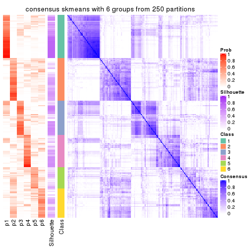</p>

</div>
</div>

Heatmaps for the membership of samples in all partitions to see how consistent they are:


<script>
$( function() {
	$( '#tabs-CV-skmeans-membership-heatmap' ).tabs();
} );
</script>
<div id='tabs-CV-skmeans-membership-heatmap'>
<ul>
<li><a href='#tab-CV-skmeans-membership-heatmap-1'>k = 2</a></li>
<li><a href='#tab-CV-skmeans-membership-heatmap-2'>k = 3</a></li>
<li><a href='#tab-CV-skmeans-membership-heatmap-3'>k = 4</a></li>
<li><a href='#tab-CV-skmeans-membership-heatmap-4'>k = 5</a></li>
<li><a href='#tab-CV-skmeans-membership-heatmap-5'>k = 6</a></li>
</ul>
<div id='tab-CV-skmeans-membership-heatmap-1'>
<pre><code class="r">membership_heatmap(res, k = 2)
</code></pre>

<p></p>

</div>
<div id='tab-CV-skmeans-membership-heatmap-2'>
<pre><code class="r">membership_heatmap(res, k = 3)
</code></pre>

<p></p>

</div>
<div id='tab-CV-skmeans-membership-heatmap-3'>
<pre><code class="r">membership_heatmap(res, k = 4)
</code></pre>

<p></p>

</div>
<div id='tab-CV-skmeans-membership-heatmap-4'>
<pre><code class="r">membership_heatmap(res, k = 5)
</code></pre>

<p></p>

</div>
<div id='tab-CV-skmeans-membership-heatmap-5'>
<pre><code class="r">membership_heatmap(res, k = 6)
</code></pre>

<p></p>

</div>
</div>

As soon as we have had the classes for columns, we can look for signatures
which are significantly different between classes which can be candidate marks
for certain classes. Following are the heatmaps for signatures.


Signature heatmaps where rows are scaled:


<script>
$( function() {
	$( '#tabs-CV-skmeans-get-signatures' ).tabs();
} );
</script>
<div id='tabs-CV-skmeans-get-signatures'>
<ul>
<li><a href='#tab-CV-skmeans-get-signatures-1'>k = 2</a></li>
<li><a href='#tab-CV-skmeans-get-signatures-2'>k = 3</a></li>
<li><a href='#tab-CV-skmeans-get-signatures-3'>k = 4</a></li>
<li><a href='#tab-CV-skmeans-get-signatures-4'>k = 5</a></li>
<li><a href='#tab-CV-skmeans-get-signatures-5'>k = 6</a></li>
</ul>
<div id='tab-CV-skmeans-get-signatures-1'>
<pre><code class="r">get_signatures(res, k = 2)
</code></pre>

<p></p>

</div>
<div id='tab-CV-skmeans-get-signatures-2'>
<pre><code class="r">get_signatures(res, k = 3)
</code></pre>

<p></p>

</div>
<div id='tab-CV-skmeans-get-signatures-3'>
<pre><code class="r">get_signatures(res, k = 4)
</code></pre>

<p></p>

</div>
<div id='tab-CV-skmeans-get-signatures-4'>
<pre><code class="r">get_signatures(res, k = 5)
</code></pre>

<p></p>

</div>
<div id='tab-CV-skmeans-get-signatures-5'>
<pre><code class="r">get_signatures(res, k = 6)
</code></pre>

<p></p>

</div>
</div>


Signature heatmaps where rows are not scaled:


<script>
$( function() {
	$( '#tabs-CV-skmeans-get-signatures-no-scale' ).tabs();
} );
</script>
<div id='tabs-CV-skmeans-get-signatures-no-scale'>
<ul>
<li><a href='#tab-CV-skmeans-get-signatures-no-scale-1'>k = 2</a></li>
<li><a href='#tab-CV-skmeans-get-signatures-no-scale-2'>k = 3</a></li>
<li><a href='#tab-CV-skmeans-get-signatures-no-scale-3'>k = 4</a></li>
<li><a href='#tab-CV-skmeans-get-signatures-no-scale-4'>k = 5</a></li>
<li><a href='#tab-CV-skmeans-get-signatures-no-scale-5'>k = 6</a></li>
</ul>
<div id='tab-CV-skmeans-get-signatures-no-scale-1'>
<pre><code class="r">get_signatures(res, k = 2, scale_rows = FALSE)
</code></pre>

<p></p>

</div>
<div id='tab-CV-skmeans-get-signatures-no-scale-2'>
<pre><code class="r">get_signatures(res, k = 3, scale_rows = FALSE)
</code></pre>

<p></p>

</div>
<div id='tab-CV-skmeans-get-signatures-no-scale-3'>
<pre><code class="r">get_signatures(res, k = 4, scale_rows = FALSE)
</code></pre>

<p></p>

</div>
<div id='tab-CV-skmeans-get-signatures-no-scale-4'>
<pre><code class="r">get_signatures(res, k = 5, scale_rows = FALSE)
</code></pre>

<p></p>

</div>
<div id='tab-CV-skmeans-get-signatures-no-scale-5'>
<pre><code class="r">get_signatures(res, k = 6, scale_rows = FALSE)
</code></pre>

<p></p>

</div>
</div>


Compare the overlap of signatures from different k:

```r
compare_signatures(res)
```


`get_signature()` returns a data frame invisibly. TO get the list of signatures, the function
call should be assigned to a variable explicitly. In following code, if `plot` argument is set
to `FALSE`, no heatmap is plotted while only the differential analysis is performed.

```r
# code only for demonstration
tb = get_signature(res, k = ..., plot = FALSE)
```

An example of the output of `tb` is:

```
#>   which_row         fdr    mean_1    mean_2 scaled_mean_1 scaled_mean_2 km
#> 1        38 0.042760348  8.373488  9.131774    -0.5533452     0.5164555  1
#> 2        40 0.018707592  7.106213  8.469186    -0.6173731     0.5762149  1
#> 3        55 0.019134737 10.221463 11.207825    -0.6159697     0.5749050  1
#> 4        59 0.006059896  5.921854  7.869574    -0.6899429     0.6439467  1
#> 5        60 0.018055526  8.928898 10.211722    -0.6204761     0.5791110  1
#> 6        98 0.009384629 15.714769 14.887706     0.6635654    -0.6193277  2
...
```

The columns in `tb` are:

1. `which_row`: row indices corresponding to the input matrix.
2. `fdr`: FDR for the differential test. 
3. `mean_x`: The mean value in group x.
4. `scaled_mean_x`: The mean value in group x after rows are scaled.
5. `km`: Row groups if k-means clustering is applied to rows.


UMAP plot which shows how samples are separated.


<script>
$( function() {
	$( '#tabs-CV-skmeans-dimension-reduction' ).tabs();
} );
</script>
<div id='tabs-CV-skmeans-dimension-reduction'>
<ul>
<li><a href='#tab-CV-skmeans-dimension-reduction-1'>k = 2</a></li>
<li><a href='#tab-CV-skmeans-dimension-reduction-2'>k = 3</a></li>
<li><a href='#tab-CV-skmeans-dimension-reduction-3'>k = 4</a></li>
<li><a href='#tab-CV-skmeans-dimension-reduction-4'>k = 5</a></li>
<li><a href='#tab-CV-skmeans-dimension-reduction-5'>k = 6</a></li>
</ul>
<div id='tab-CV-skmeans-dimension-reduction-1'>
<pre><code class="r">dimension_reduction(res, k = 2, method = &quot;UMAP&quot;)
</code></pre>

<p></p>

</div>
<div id='tab-CV-skmeans-dimension-reduction-2'>
<pre><code class="r">dimension_reduction(res, k = 3, method = &quot;UMAP&quot;)
</code></pre>

<p></p>

</div>
<div id='tab-CV-skmeans-dimension-reduction-3'>
<pre><code class="r">dimension_reduction(res, k = 4, method = &quot;UMAP&quot;)
</code></pre>

<p></p>

</div>
<div id='tab-CV-skmeans-dimension-reduction-4'>
<pre><code class="r">dimension_reduction(res, k = 5, method = &quot;UMAP&quot;)
</code></pre>

<p></p>

</div>
<div id='tab-CV-skmeans-dimension-reduction-5'>
<pre><code class="r">dimension_reduction(res, k = 6, method = &quot;UMAP&quot;)
</code></pre>

<p></p>

</div>
</div>


Following heatmap shows how subgroups are split when increasing `k`:

```r
collect_classes(res)
```


If matrix rows can be associated to genes, consider to use `GO_Enrichment(res,
...)` to perform function enrichment for the signature genes.


 

---------------------------------------------------


### CV:pam


The object with results only for a single top-value method and a single partition method 
can be extracted as:

```r
res = res_list["CV", "pam"]
# you can also extract it by
# res = res_list["CV:pam"]
```

A summary of `res` and all the functions that can be applied to it:

```r
res
```

```
#> A 'ConsensusPartition' object with k = 2, 3, 4, 5, 6.
#>   On a matrix with 77 rows and 243 columns.
#>   Top rows (8, 16, 23, 30, 38) are extracted by 'CV' method.
#>   Subgroups are detected by 'pam' method.
#>   Performed in total 1250 partitions by row resampling.
#>   Best k for subgroups seems to be 3.
#> 
#> Following methods can be applied to this 'ConsensusPartition' object:
#>  [1] "cola_report"             "collect_classes"         "collect_plots"          
#>  [4] "collect_stats"           "colnames"                "compare_signatures"     
#>  [7] "consensus_heatmap"       "dimension_reduction"     "functional_enrichment"  
#> [10] "get_anno_col"            "get_anno"                "get_classes"            
#> [13] "get_consensus"           "get_matrix"              "get_membership"         
#> [16] "get_param"               "get_signatures"          "get_stats"              
#> [19] "is_best_k"               "is_stable_k"             "membership_heatmap"     
#> [22] "ncol"                    "nrow"                    "plot_ecdf"              
#> [25] "rownames"                "select_partition_number" "show"                   
#> [28] "suggest_best_k"          "test_to_known_factors"
```

`collect_plots()` function collects all the plots made from `res` for all `k` (number of partitions)
into one single page to provide an easy and fast comparison between different `k`.

```r
collect_plots(res)
```


The plots are:

- The first row: a plot of the ECDF (Empirical cumulative distribution
  function) curves of the consensus matrix for each `k` and the heatmap of
  predicted classes for each `k`.
- The second row: heatmaps of the consensus matrix for each `k`.
- The third row: heatmaps of the membership matrix for each `k`.
- The fouth row: heatmaps of the signatures for each `k`.

All the plots in panels can be made by individual functions and they are
plotted later in this section.

`select_partition_number()` produces several plots showing different
statistics for choosing "optimized" `k`. There are following statistics:

- ECDF curves of the consensus matrix for each `k`;
- 1-PAC. [The PAC
  score](https://en.wikipedia.org/wiki/Consensus_clustering#Over-interpretation_potential_of_consensus_clustering)
  measures the proportion of the ambiguous subgrouping.
- Mean silhouette score.
- Concordance. The mean probability of fiting the consensus class ids in all
  partitions.
- Area increased. Denote $A_k$ as the area under the ECDF curve for current
  `k`, the area increased is defined as $A_k - A_{k-1}$.
- Rand index. The percent of pairs of samples that are both in a same cluster
  or both are not in a same cluster in the partition of k and k-1.
- Jaccard index. The ratio of pairs of samples are both in a same cluster in
  the partition of k and k-1 and the pairs of samples are both in a same
  cluster in the partition k or k-1.

The detailed explanations of these statistics can be found in [the cola
vignette](http://bioconductor.org/packages/devel/bioc/vignettes/cola/inst/doc/cola.html#toc_13).

Generally speaking, lower PAC score, higher mean silhouette score or higher
concordance corresponds to better partition. Rand index and Jaccard index
measure how similar the current partition is compared to partition with `k-1`.
If they are too similar, we won't accept `k` is better than `k-1`.

```r
select_partition_number(res)
```


The numeric values for all these statistics can be obtained by `get_stats()`.

```r
get_stats(res)
```

```
#>   k  1-PAC mean_silhouette concordance area_increased  Rand Jaccard
#> 2 2 0.0681           0.648       0.774         0.3713 0.653   0.653
#> 3 3 0.1288           0.503       0.720         0.5978 0.650   0.503
#> 4 4 0.2001           0.397       0.619         0.1722 0.886   0.732
#> 5 5 0.2867           0.326       0.581         0.0943 0.843   0.579
#> 6 6 0.3689           0.269       0.541         0.0564 0.908   0.672
```

`suggest_best_k()` suggests the best $k$ based on these statistics. The rules are as follows:

- All $k$ with Jaccard index larger than 0.95 are removed because the increase of
  the partition number does not provides enough extra information. If all $k$ are removed,
  the best $k$ is assigned by `NA`.
- For $k$ with 1-PAC larger than 0.9, the maximal $k$ is taken as the "best k". Other $k$ is called "optional k".
- If it does not fit the second rule. The $k$ with the highest vote of highest
  1-PAC, mean silhouette and concordance is taken as the "best k".

```r
suggest_best_k(res)
```

```
#> [1] 3
```


Following shows the table of the partitions (You need to click the **show/hide
code output** link to see it). The membership matrix (columns with name `p*`)
is inferred by
[`clue::cl_consensus()`](https://www.rdocumentation.org/link/cl_consensus?package=clue)
function with the `SE` method. Basically the value in the membership matrix
represents the probability to belong to a certain group. The finall class
label for an item is determined with the group with highest probability it
belongs to.

In `get_classes()` function, the entropy is calculated from the membership
matrix and the silhouette score is calculated from the consensus matrix.


<script>
$( function() {
	$( '#tabs-CV-pam-get-classes' ).tabs();
} );
</script>
<div id='tabs-CV-pam-get-classes'>
<ul>
<li><a href='#tab-CV-pam-get-classes-1'>k = 2</a></li>
<li><a href='#tab-CV-pam-get-classes-2'>k = 3</a></li>
<li><a href='#tab-CV-pam-get-classes-3'>k = 4</a></li>
<li><a href='#tab-CV-pam-get-classes-4'>k = 5</a></li>
<li><a href='#tab-CV-pam-get-classes-5'>k = 6</a></li>
</ul>

<div id='tab-CV-pam-get-classes-1'>
<p><a id='tab-CV-pam-get-classes-1-a' style='color:#0366d6' href='#'>show/hide code output</a></p>
<pre><code class="r">cbind(get_classes(res, k = 2), get_membership(res, k = 2))
</code></pre>

<pre><code>#&gt;           class entropy silhouette    p1    p2
#&gt; SRR191393     1   0.971     0.4638 0.600 0.400
#&gt; SRR191394     1   0.506     0.7155 0.888 0.112
#&gt; SRR191396     2   0.808     0.5844 0.248 0.752
#&gt; SRR191397     1   0.775     0.7385 0.772 0.228
#&gt; SRR191398     1   0.529     0.7250 0.880 0.120
#&gt; SRR191399     2   0.949     0.4634 0.368 0.632
#&gt; SRR191400     1   0.541     0.7265 0.876 0.124
#&gt; SRR191401     1   0.634     0.7403 0.840 0.160
#&gt; SRR191402     2   0.946     0.5173 0.364 0.636
#&gt; SRR191403     1   0.886     0.6801 0.696 0.304
#&gt; SRR191404     2   0.644     0.7531 0.164 0.836
#&gt; SRR191405     2   0.795     0.6647 0.240 0.760
#&gt; SRR191406     2   0.714     0.7361 0.196 0.804
#&gt; SRR191407     1   0.595     0.7342 0.856 0.144
#&gt; SRR191408     2   0.971     0.4064 0.400 0.600
#&gt; SRR191409     2   0.833     0.6818 0.264 0.736
#&gt; SRR191410     2   0.738     0.7312 0.208 0.792
#&gt; SRR191411     2   0.697     0.7470 0.188 0.812
#&gt; SRR191412     1   0.821     0.7249 0.744 0.256
#&gt; SRR191413     2   0.969     0.4307 0.396 0.604
#&gt; SRR191414     1   0.671     0.7386 0.824 0.176
#&gt; SRR191415     2   0.680     0.7422 0.180 0.820
#&gt; SRR191416     2   0.946     0.5216 0.364 0.636
#&gt; SRR191418     2   0.738     0.7367 0.208 0.792
#&gt; SRR191419     1   0.881     0.7077 0.700 0.300
#&gt; SRR191420     2   0.997     0.1497 0.468 0.532
#&gt; SRR191421     1   0.990     0.3162 0.560 0.440
#&gt; SRR191422     2   0.204     0.7376 0.032 0.968
#&gt; SRR191423     2   0.295     0.7455 0.052 0.948
#&gt; SRR191424     2   0.327     0.7358 0.060 0.940
#&gt; SRR191425     2   0.949     0.5119 0.368 0.632
#&gt; SRR191426     2   0.430     0.7650 0.088 0.912
#&gt; SRR191427     2   0.671     0.7598 0.176 0.824
#&gt; SRR191428     2   0.861     0.6548 0.284 0.716
#&gt; SRR191429     2   0.416     0.7322 0.084 0.916
#&gt; SRR191430     2   0.541     0.7596 0.124 0.876
#&gt; SRR191431     2   0.932     0.3503 0.348 0.652
#&gt; SRR191432     2   0.388     0.7166 0.076 0.924
#&gt; SRR191433     2   0.529     0.6968 0.120 0.880
#&gt; SRR191434     2   0.653     0.7510 0.168 0.832
#&gt; SRR191435     2   0.943     0.5376 0.360 0.640
#&gt; SRR191436     2   0.781     0.7453 0.232 0.768
#&gt; SRR191437     2   0.456     0.7328 0.096 0.904
#&gt; SRR191438     2   0.745     0.7108 0.212 0.788
#&gt; SRR191439     2   0.730     0.7461 0.204 0.796
#&gt; SRR191440     2   0.644     0.7644 0.164 0.836
#&gt; SRR191441     2   0.443     0.7091 0.092 0.908
#&gt; SRR191442     2   0.795     0.7136 0.240 0.760
#&gt; SRR191443     1   0.969     0.5483 0.604 0.396
#&gt; SRR191444     2   0.966     0.2893 0.392 0.608
#&gt; SRR191445     2   0.697     0.7508 0.188 0.812
#&gt; SRR191446     2   0.760     0.7182 0.220 0.780
#&gt; SRR191447     2   0.358     0.7528 0.068 0.932
#&gt; SRR191448     1   0.978     0.4899 0.588 0.412
#&gt; SRR191449     2   0.808     0.6972 0.248 0.752
#&gt; SRR191450     2   0.991     0.1159 0.444 0.556
#&gt; SRR191451     2   0.971     0.3404 0.400 0.600
#&gt; SRR191452     2   0.373     0.7075 0.072 0.928
#&gt; SRR191453     2   0.653     0.7545 0.168 0.832
#&gt; SRR191454     1   0.998     0.2109 0.524 0.476
#&gt; SRR191455     2   0.680     0.7572 0.180 0.820
#&gt; SRR191456     1   0.921     0.6354 0.664 0.336
#&gt; SRR191457     2   0.990     0.2542 0.440 0.560
#&gt; SRR191458     2   0.936     0.2164 0.352 0.648
#&gt; SRR191459     2   0.644     0.7484 0.164 0.836
#&gt; SRR191460     2   0.781     0.7025 0.232 0.768
#&gt; SRR191461     2   0.689     0.7581 0.184 0.816
#&gt; SRR191462     2   0.644     0.7222 0.164 0.836
#&gt; SRR191463     2   0.443     0.7114 0.092 0.908
#&gt; SRR191464     2   0.469     0.7613 0.100 0.900
#&gt; SRR191465     2   0.430     0.6865 0.088 0.912
#&gt; SRR191466     2   0.714     0.7438 0.196 0.804
#&gt; SRR191467     2   0.469     0.7299 0.100 0.900
#&gt; SRR191468     2   0.430     0.6848 0.088 0.912
#&gt; SRR191469     2   0.781     0.7190 0.232 0.768
#&gt; SRR191470     2   0.494     0.7634 0.108 0.892
#&gt; SRR191471     2   0.343     0.7492 0.064 0.936
#&gt; SRR191472     2   0.574     0.7283 0.136 0.864
#&gt; SRR191473     2   0.242     0.7322 0.040 0.960
#&gt; SRR191474     2   0.833     0.6790 0.264 0.736
#&gt; SRR191475     2   0.456     0.6818 0.096 0.904
#&gt; SRR191476     2   0.388     0.7338 0.076 0.924
#&gt; SRR191477     2   0.574     0.7567 0.136 0.864
#&gt; SRR191478     2   0.584     0.6934 0.140 0.860
#&gt; SRR191479     2   0.932     0.5748 0.348 0.652
#&gt; SRR191480     2   0.625     0.7627 0.156 0.844
#&gt; SRR191481     2   0.552     0.7600 0.128 0.872
#&gt; SRR191482     2   0.443     0.7621 0.092 0.908
#&gt; SRR191483     2   0.529     0.7558 0.120 0.880
#&gt; SRR191484     2   0.936     0.5576 0.352 0.648
#&gt; SRR191485     2   0.615     0.7608 0.152 0.848
#&gt; SRR191486     2   0.563     0.7562 0.132 0.868
#&gt; SRR191487     2   0.738     0.7344 0.208 0.792
#&gt; SRR191488     2   1.000    -0.3948 0.500 0.500
#&gt; SRR191489     1   0.999     0.3088 0.516 0.484
#&gt; SRR191490     2   0.506     0.7647 0.112 0.888
#&gt; SRR191491     2   0.795     0.7200 0.240 0.760
#&gt; SRR191492     1   0.992     0.2994 0.552 0.448
#&gt; SRR191493     2   0.456     0.7568 0.096 0.904
#&gt; SRR191494     2   0.506     0.7523 0.112 0.888
#&gt; SRR191495     2   0.904     0.6229 0.320 0.680
#&gt; SRR191496     2   0.494     0.6883 0.108 0.892
#&gt; SRR191497     2   0.697     0.7521 0.188 0.812
#&gt; SRR191498     2   0.760     0.7225 0.220 0.780
#&gt; SRR191499     2   0.689     0.7520 0.184 0.816
#&gt; SRR191500     2   0.689     0.7530 0.184 0.816
#&gt; SRR191501     2   0.952     0.4311 0.372 0.628
#&gt; SRR191502     2   0.634     0.7629 0.160 0.840
#&gt; SRR191503     2   0.482     0.7179 0.104 0.896
#&gt; SRR191504     2   0.529     0.7305 0.120 0.880
#&gt; SRR191505     2   0.430     0.7628 0.088 0.912
#&gt; SRR191506     2   0.402     0.6898 0.080 0.920
#&gt; SRR191507     2   0.605     0.7636 0.148 0.852
#&gt; SRR191508     2   0.722     0.7410 0.200 0.800
#&gt; SRR191509     2   0.311     0.7462 0.056 0.944
#&gt; SRR191510     2   0.518     0.7692 0.116 0.884
#&gt; SRR191511     2   0.260     0.7406 0.044 0.956
#&gt; SRR191512     2   0.443     0.6866 0.092 0.908
#&gt; SRR191513     2   0.634     0.6752 0.160 0.840
#&gt; SRR191514     2   0.430     0.6925 0.088 0.912
#&gt; SRR191515     2   0.416     0.7405 0.084 0.916
#&gt; SRR191516     2   0.634     0.7586 0.160 0.840
#&gt; SRR191517     2   0.327     0.7545 0.060 0.940
#&gt; SRR191518     2   0.388     0.7142 0.076 0.924
#&gt; SRR191519     2   0.343     0.7059 0.064 0.936
#&gt; SRR191520     2   0.833     0.7092 0.264 0.736
#&gt; SRR191521     2   0.443     0.7341 0.092 0.908
#&gt; SRR191522     2   0.494     0.7532 0.108 0.892
#&gt; SRR191523     2   0.529     0.7477 0.120 0.880
#&gt; SRR191524     2   0.788     0.7316 0.236 0.764
#&gt; SRR191525     2   0.295     0.7309 0.052 0.948
#&gt; SRR191526     2   0.430     0.6857 0.088 0.912
#&gt; SRR191527     1   0.936     0.6244 0.648 0.352
#&gt; SRR191528     1   0.895     0.6766 0.688 0.312
#&gt; SRR191529     2   0.689     0.7311 0.184 0.816
#&gt; SRR191530     2   0.494     0.7144 0.108 0.892
#&gt; SRR191531     1   0.929     0.6651 0.656 0.344
#&gt; SRR191532     2   0.680     0.7615 0.180 0.820
#&gt; SRR191533     2   0.871     0.6545 0.292 0.708
#&gt; SRR191534     2   0.634     0.6780 0.160 0.840
#&gt; SRR191535     2   0.456     0.7103 0.096 0.904
#&gt; SRR191536     2   0.680     0.7523 0.180 0.820
#&gt; SRR191537     2   0.584     0.7155 0.140 0.860
#&gt; SRR191538     2   0.402     0.6936 0.080 0.920
#&gt; SRR191539     2   0.595     0.6536 0.144 0.856
#&gt; SRR191540     2   0.541     0.7152 0.124 0.876
#&gt; SRR191541     2   0.697     0.7133 0.188 0.812
#&gt; SRR191542     2   0.456     0.7188 0.096 0.904
#&gt; SRR191543     2   0.443     0.6868 0.092 0.908
#&gt; SRR191544     2   0.443     0.7464 0.092 0.908
#&gt; SRR191545     2   0.506     0.7360 0.112 0.888
#&gt; SRR191546     2   0.625     0.7586 0.156 0.844
#&gt; SRR191547     2   0.574     0.7542 0.136 0.864
#&gt; SRR191548     1   0.482     0.7216 0.896 0.104
#&gt; SRR191549     1   0.469     0.7175 0.900 0.100
#&gt; SRR191550     1   0.456     0.7179 0.904 0.096
#&gt; SRR191551     1   0.506     0.7204 0.888 0.112
#&gt; SRR191552     1   0.469     0.7202 0.900 0.100
#&gt; SRR191553     1   0.730     0.7227 0.796 0.204
#&gt; SRR191554     1   0.541     0.7287 0.876 0.124
#&gt; SRR191555     2   0.932     0.5424 0.348 0.652
#&gt; SRR191556     1   0.997     0.2772 0.532 0.468
#&gt; SRR191557     2   0.943     0.5198 0.360 0.640
#&gt; SRR191558     2   0.529     0.7285 0.120 0.880
#&gt; SRR191559     2   0.895     0.6142 0.312 0.688
#&gt; SRR191560     2   0.921     0.5724 0.336 0.664
#&gt; SRR191561     1   0.891     0.6683 0.692 0.308
#&gt; SRR191562     1   0.929     0.6654 0.656 0.344
#&gt; SRR191563     2   0.644     0.7583 0.164 0.836
#&gt; SRR191564     2   0.855     0.6417 0.280 0.720
#&gt; SRR191565     1   0.983     0.4896 0.576 0.424
#&gt; SRR191566     2   0.999    -0.0078 0.484 0.516
#&gt; SRR191567     1   0.866     0.7099 0.712 0.288
#&gt; SRR191568     1   0.943     0.6157 0.640 0.360
#&gt; SRR191569     2   0.952     0.4685 0.372 0.628
#&gt; SRR191570     1   0.988     0.4959 0.564 0.436
#&gt; SRR191571     1   0.998     0.2890 0.528 0.472
#&gt; SRR191572     1   0.456     0.7177 0.904 0.096
#&gt; SRR191573     1   0.999     0.1199 0.516 0.484
#&gt; SRR191574     1   0.871     0.7145 0.708 0.292
#&gt; SRR191575     1   0.904     0.6882 0.680 0.320
#&gt; SRR191576     2   0.929     0.4276 0.344 0.656
#&gt; SRR191577     2   0.963     0.3182 0.388 0.612
#&gt; SRR191578     2   0.184     0.7449 0.028 0.972
#&gt; SRR191579     1   0.529     0.7246 0.880 0.120
#&gt; SRR191580     1   0.529     0.7137 0.880 0.120
#&gt; SRR191581     1   0.662     0.7237 0.828 0.172
#&gt; SRR191582     1   0.634     0.7318 0.840 0.160
#&gt; SRR191583     2   0.745     0.6079 0.212 0.788
#&gt; SRR191584     1   0.722     0.6981 0.800 0.200
#&gt; SRR191585     2   0.833     0.6786 0.264 0.736
#&gt; SRR191586     2   0.802     0.7053 0.244 0.756
#&gt; SRR191587     2   0.909     0.5938 0.324 0.676
#&gt; SRR191588     1   0.963     0.5389 0.612 0.388
#&gt; SRR191589     2   0.961     0.4710 0.384 0.616
#&gt; SRR191590     1   0.788     0.7349 0.764 0.236
#&gt; SRR191591     2   0.946     0.4650 0.364 0.636
#&gt; SRR191592     2   0.973     0.3564 0.404 0.596
#&gt; SRR191593     2   0.943     0.5509 0.360 0.640
#&gt; SRR191594     1   0.506     0.7274 0.888 0.112
#&gt; SRR191595     1   0.895     0.6767 0.688 0.312
#&gt; SRR191596     1   0.891     0.6846 0.692 0.308
#&gt; SRR191597     2   0.714     0.7365 0.196 0.804
#&gt; SRR191598     2   1.000    -0.0652 0.492 0.508
#&gt; SRR191599     1   0.876     0.6933 0.704 0.296
#&gt; SRR191600     2   0.788     0.7042 0.236 0.764
#&gt; SRR191601     2   0.745     0.7323 0.212 0.788
#&gt; SRR191602     2   0.625     0.7488 0.156 0.844
#&gt; SRR191603     2   0.662     0.7423 0.172 0.828
#&gt; SRR191604     2   0.242     0.7514 0.040 0.960
#&gt; SRR191605     2   0.745     0.7250 0.212 0.788
#&gt; SRR191606     1   0.921     0.6523 0.664 0.336
#&gt; SRR191607     2   0.808     0.6895 0.248 0.752
#&gt; SRR191608     2   0.788     0.7074 0.236 0.764
#&gt; SRR191609     2   0.653     0.7475 0.168 0.832
#&gt; SRR191610     2   0.904     0.5985 0.320 0.680
#&gt; SRR191611     2   0.895     0.6438 0.312 0.688
#&gt; SRR191612     2   0.871     0.6525 0.292 0.708
#&gt; SRR191613     2   0.999     0.1117 0.480 0.520
#&gt; SRR191614     2   0.833     0.6733 0.264 0.736
#&gt; SRR191615     2   0.881     0.6370 0.300 0.700
#&gt; SRR191616     2   0.753     0.6702 0.216 0.784
#&gt; SRR191617     2   0.456     0.7494 0.096 0.904
#&gt; SRR191618     2   0.833     0.6907 0.264 0.736
#&gt; SRR191619     2   0.388     0.7572 0.076 0.924
#&gt; SRR191620     2   0.518     0.7638 0.116 0.884
#&gt; SRR191621     2   0.327     0.7401 0.060 0.940
#&gt; SRR191622     2   0.839     0.6696 0.268 0.732
#&gt; SRR191623     2   0.891     0.6315 0.308 0.692
#&gt; SRR191624     1   0.998     0.1489 0.528 0.472
#&gt; SRR191625     2   0.469     0.7649 0.100 0.900
#&gt; SRR191626     2   0.706     0.7570 0.192 0.808
#&gt; SRR191627     2   0.469     0.7587 0.100 0.900
#&gt; SRR191628     2   0.886     0.6550 0.304 0.696
#&gt; SRR191629     2   0.730     0.7235 0.204 0.796
#&gt; SRR191630     1   0.615     0.7297 0.848 0.152
#&gt; SRR191631     2   0.469     0.7643 0.100 0.900
#&gt; SRR191632     2   0.943     0.5148 0.360 0.640
#&gt; SRR191633     2   0.722     0.7478 0.200 0.800
#&gt; SRR191634     2   0.855     0.6053 0.280 0.720
#&gt; SRR191635     2   0.802     0.7046 0.244 0.756
#&gt; SRR191636     2   0.929     0.4105 0.344 0.656
#&gt; SRR191637     2   0.402     0.6857 0.080 0.920
</code></pre>

<script>
$('#tab-CV-pam-get-classes-1-a').parent().next().next().hide();
$('#tab-CV-pam-get-classes-1-a').click(function(){
  $('#tab-CV-pam-get-classes-1-a').parent().next().next().toggle();
  return(false);
});
</script>
</div>

<div id='tab-CV-pam-get-classes-2'>
<p><a id='tab-CV-pam-get-classes-2-a' style='color:#0366d6' href='#'>show/hide code output</a></p>
<pre><code class="r">cbind(get_classes(res, k = 3), get_membership(res, k = 3))
</code></pre>

<pre><code>#&gt;           class entropy silhouette    p1    p2    p3
#&gt; SRR191393     3  0.7299    0.10730 0.412 0.032 0.556
#&gt; SRR191394     1  0.0747    0.70091 0.984 0.000 0.016
#&gt; SRR191396     2  0.9320    0.31812 0.184 0.496 0.320
#&gt; SRR191397     1  0.7545    0.61062 0.652 0.076 0.272
#&gt; SRR191398     1  0.1411    0.70225 0.964 0.000 0.036
#&gt; SRR191399     3  0.6576    0.59245 0.192 0.068 0.740
#&gt; SRR191400     1  0.2651    0.70855 0.928 0.012 0.060
#&gt; SRR191401     1  0.5803    0.67761 0.760 0.028 0.212
#&gt; SRR191402     3  0.5970    0.62863 0.160 0.060 0.780
#&gt; SRR191403     1  0.7890    0.28398 0.512 0.056 0.432
#&gt; SRR191404     3  0.6026    0.52374 0.024 0.244 0.732
#&gt; SRR191405     3  0.7606    0.43463 0.092 0.244 0.664
#&gt; SRR191406     3  0.2743    0.64863 0.020 0.052 0.928
#&gt; SRR191407     1  0.2496    0.71437 0.928 0.004 0.068
#&gt; SRR191408     3  0.5202    0.66407 0.136 0.044 0.820
#&gt; SRR191409     3  0.6372    0.63280 0.084 0.152 0.764
#&gt; SRR191410     3  0.4045    0.65073 0.024 0.104 0.872
#&gt; SRR191411     3  0.4326    0.63821 0.012 0.144 0.844
#&gt; SRR191412     1  0.7170    0.54432 0.612 0.036 0.352
#&gt; SRR191413     3  0.5167    0.63426 0.192 0.016 0.792
#&gt; SRR191414     1  0.5536    0.65213 0.752 0.012 0.236
#&gt; SRR191415     3  0.3276    0.65184 0.024 0.068 0.908
#&gt; SRR191416     3  0.6975    0.63228 0.144 0.124 0.732
#&gt; SRR191418     3  0.6062    0.64215 0.072 0.148 0.780
#&gt; SRR191419     1  0.7104    0.52936 0.608 0.032 0.360
#&gt; SRR191420     3  0.7590    0.50220 0.268 0.080 0.652
#&gt; SRR191421     3  0.7476    0.20444 0.404 0.040 0.556
#&gt; SRR191422     2  0.4931    0.67038 0.000 0.768 0.232
#&gt; SRR191423     2  0.5650    0.61949 0.000 0.688 0.312
#&gt; SRR191424     2  0.6126    0.54428 0.000 0.600 0.400
#&gt; SRR191425     3  0.5028    0.65784 0.132 0.040 0.828
#&gt; SRR191426     2  0.6683    0.37662 0.008 0.500 0.492
#&gt; SRR191427     3  0.5848    0.53308 0.012 0.268 0.720
#&gt; SRR191428     3  0.4288    0.66335 0.060 0.068 0.872
#&gt; SRR191429     2  0.5397    0.64025 0.000 0.720 0.280
#&gt; SRR191430     2  0.7841    0.24306 0.052 0.480 0.468
#&gt; SRR191431     2  0.9776    0.20106 0.252 0.432 0.316
#&gt; SRR191432     2  0.5016    0.66716 0.000 0.760 0.240
#&gt; SRR191433     2  0.3454    0.66381 0.008 0.888 0.104
#&gt; SRR191434     3  0.7513    0.30517 0.052 0.344 0.604
#&gt; SRR191435     3  0.6148    0.65370 0.148 0.076 0.776
#&gt; SRR191436     3  0.3816    0.62181 0.000 0.148 0.852
#&gt; SRR191437     2  0.5754    0.59168 0.004 0.700 0.296
#&gt; SRR191438     3  0.7775    0.40733 0.076 0.304 0.620
#&gt; SRR191439     3  0.5008    0.61507 0.016 0.180 0.804
#&gt; SRR191440     2  0.8142    0.18616 0.068 0.468 0.464
#&gt; SRR191441     2  0.5678    0.63704 0.000 0.684 0.316
#&gt; SRR191442     3  0.4423    0.66873 0.048 0.088 0.864
#&gt; SRR191443     3  0.6799   -0.10535 0.456 0.012 0.532
#&gt; SRR191444     3  0.9170    0.42947 0.248 0.212 0.540
#&gt; SRR191445     3  0.6770    0.55162 0.044 0.264 0.692
#&gt; SRR191446     3  0.8047    0.46410 0.112 0.256 0.632
#&gt; SRR191447     2  0.6225    0.46599 0.000 0.568 0.432
#&gt; SRR191448     1  0.7759    0.16973 0.480 0.048 0.472
#&gt; SRR191449     3  0.3888    0.65947 0.064 0.048 0.888
#&gt; SRR191450     3  0.8957    0.36630 0.312 0.152 0.536
#&gt; SRR191451     3  0.9468    0.30882 0.228 0.276 0.496
#&gt; SRR191452     2  0.4883    0.67759 0.004 0.788 0.208
#&gt; SRR191453     3  0.4634    0.64258 0.012 0.164 0.824
#&gt; SRR191454     3  0.8085    0.32076 0.332 0.084 0.584
#&gt; SRR191455     3  0.5585    0.59671 0.024 0.204 0.772
#&gt; SRR191456     1  0.8169    0.35701 0.536 0.076 0.388
#&gt; SRR191457     3  0.7590    0.51345 0.268 0.080 0.652
#&gt; SRR191458     2  0.9865    0.12679 0.264 0.404 0.332
#&gt; SRR191459     3  0.4874    0.63903 0.028 0.144 0.828
#&gt; SRR191460     3  0.7816    0.57376 0.132 0.200 0.668
#&gt; SRR191461     3  0.5681    0.56747 0.016 0.236 0.748
#&gt; SRR191462     3  0.8998   -0.13826 0.132 0.396 0.472
#&gt; SRR191463     2  0.5803    0.66374 0.016 0.736 0.248
#&gt; SRR191464     3  0.6518   -0.23067 0.004 0.484 0.512
#&gt; SRR191465     2  0.2959    0.65994 0.000 0.900 0.100
#&gt; SRR191466     3  0.3500    0.64668 0.004 0.116 0.880
#&gt; SRR191467     2  0.5318    0.68737 0.016 0.780 0.204
#&gt; SRR191468     2  0.2486    0.65129 0.008 0.932 0.060
#&gt; SRR191469     3  0.5905    0.63653 0.044 0.184 0.772
#&gt; SRR191470     3  0.6104    0.20382 0.004 0.348 0.648
#&gt; SRR191471     2  0.5968    0.53207 0.000 0.636 0.364
#&gt; SRR191472     2  0.5397    0.60185 0.000 0.720 0.280
#&gt; SRR191473     2  0.6079    0.59344 0.000 0.612 0.388
#&gt; SRR191474     3  0.4652    0.66472 0.080 0.064 0.856
#&gt; SRR191475     2  0.3340    0.66841 0.000 0.880 0.120
#&gt; SRR191476     2  0.6879    0.59222 0.024 0.616 0.360
#&gt; SRR191477     2  0.7152    0.41269 0.024 0.532 0.444
#&gt; SRR191478     2  0.4995    0.67798 0.032 0.824 0.144
#&gt; SRR191479     3  0.4342    0.67001 0.120 0.024 0.856
#&gt; SRR191480     3  0.6235    0.20409 0.000 0.436 0.564
#&gt; SRR191481     3  0.6309   -0.24085 0.000 0.496 0.504
#&gt; SRR191482     3  0.6079    0.18112 0.000 0.388 0.612
#&gt; SRR191483     3  0.6192    0.22037 0.000 0.420 0.580
#&gt; SRR191484     3  0.4563    0.66238 0.112 0.036 0.852
#&gt; SRR191485     3  0.5363    0.43952 0.000 0.276 0.724
#&gt; SRR191486     3  0.7758   -0.23895 0.048 0.468 0.484
#&gt; SRR191487     3  0.7076    0.48614 0.060 0.256 0.684
#&gt; SRR191488     1  0.9808    0.18102 0.432 0.288 0.280
#&gt; SRR191489     3  0.9676    0.00449 0.348 0.220 0.432
#&gt; SRR191490     3  0.6468   -0.06680 0.004 0.444 0.552
#&gt; SRR191491     3  0.4339    0.66213 0.048 0.084 0.868
#&gt; SRR191492     3  0.8698    0.35681 0.300 0.136 0.564
#&gt; SRR191493     3  0.7186   -0.36721 0.024 0.476 0.500
#&gt; SRR191494     3  0.7145   -0.15645 0.024 0.440 0.536
#&gt; SRR191495     3  0.3083    0.66115 0.060 0.024 0.916
#&gt; SRR191496     2  0.3965    0.66785 0.008 0.860 0.132
#&gt; SRR191497     3  0.6245    0.58394 0.060 0.180 0.760
#&gt; SRR191498     3  0.6431    0.58591 0.084 0.156 0.760
#&gt; SRR191499     3  0.4195    0.63281 0.012 0.136 0.852
#&gt; SRR191500     3  0.4733    0.60306 0.004 0.196 0.800
#&gt; SRR191501     3  0.9243    0.28347 0.208 0.264 0.528
#&gt; SRR191502     3  0.6441    0.48433 0.028 0.276 0.696
#&gt; SRR191503     2  0.5618    0.65184 0.008 0.732 0.260
#&gt; SRR191504     2  0.5650    0.60897 0.000 0.688 0.312
#&gt; SRR191505     3  0.6688    0.15861 0.012 0.408 0.580
#&gt; SRR191506     2  0.2356    0.65683 0.000 0.928 0.072
#&gt; SRR191507     3  0.7080    0.07666 0.024 0.412 0.564
#&gt; SRR191508     3  0.5659    0.49721 0.012 0.248 0.740
#&gt; SRR191509     2  0.6209    0.59220 0.004 0.628 0.368
#&gt; SRR191510     2  0.6680    0.22490 0.008 0.508 0.484
#&gt; SRR191511     2  0.6824    0.54461 0.016 0.576 0.408
#&gt; SRR191512     2  0.2537    0.65572 0.000 0.920 0.080
#&gt; SRR191513     2  0.5823    0.66987 0.064 0.792 0.144
#&gt; SRR191514     2  0.3112    0.66498 0.004 0.900 0.096
#&gt; SRR191515     2  0.6598    0.44756 0.008 0.564 0.428
#&gt; SRR191516     3  0.4834    0.57317 0.004 0.204 0.792
#&gt; SRR191517     3  0.6704    0.02185 0.016 0.376 0.608
#&gt; SRR191518     2  0.5639    0.67950 0.016 0.752 0.232
#&gt; SRR191519     2  0.4784    0.67829 0.004 0.796 0.200
#&gt; SRR191520     3  0.4270    0.65311 0.024 0.116 0.860
#&gt; SRR191521     2  0.6295    0.33665 0.000 0.528 0.472
#&gt; SRR191522     3  0.7498   -0.06346 0.040 0.412 0.548
#&gt; SRR191523     2  0.7549    0.39912 0.040 0.524 0.436
#&gt; SRR191524     3  0.6372    0.61992 0.084 0.152 0.764
#&gt; SRR191525     2  0.6330    0.57241 0.004 0.600 0.396
#&gt; SRR191526     2  0.3295    0.65716 0.008 0.896 0.096
#&gt; SRR191527     1  0.7507    0.54956 0.644 0.068 0.288
#&gt; SRR191528     1  0.7562    0.61641 0.692 0.160 0.148
#&gt; SRR191529     2  0.8518    0.31676 0.092 0.472 0.436
#&gt; SRR191530     2  0.5098    0.65718 0.000 0.752 0.248
#&gt; SRR191531     1  0.8492    0.56005 0.592 0.132 0.276
#&gt; SRR191532     3  0.5988    0.44233 0.008 0.304 0.688
#&gt; SRR191533     3  0.5737    0.65589 0.092 0.104 0.804
#&gt; SRR191534     2  0.5743    0.66568 0.044 0.784 0.172
#&gt; SRR191535     2  0.4605    0.67103 0.000 0.796 0.204
#&gt; SRR191536     3  0.7442    0.27755 0.048 0.348 0.604
#&gt; SRR191537     2  0.8754    0.31728 0.116 0.508 0.376
#&gt; SRR191538     2  0.2448    0.65779 0.000 0.924 0.076
#&gt; SRR191539     2  0.4960    0.67851 0.040 0.832 0.128
#&gt; SRR191540     2  0.5926    0.51279 0.000 0.644 0.356
#&gt; SRR191541     2  0.7676    0.50558 0.056 0.584 0.360
#&gt; SRR191542     2  0.6750    0.63924 0.024 0.640 0.336
#&gt; SRR191543     2  0.2959    0.66325 0.000 0.900 0.100
#&gt; SRR191544     2  0.5785    0.59982 0.000 0.668 0.332
#&gt; SRR191545     2  0.6168    0.48477 0.000 0.588 0.412
#&gt; SRR191546     3  0.5541    0.56701 0.008 0.252 0.740
#&gt; SRR191547     2  0.7360    0.42590 0.032 0.528 0.440
#&gt; SRR191548     1  0.0592    0.70177 0.988 0.000 0.012
#&gt; SRR191549     1  0.0747    0.70095 0.984 0.000 0.016
#&gt; SRR191550     1  0.0000    0.69819 1.000 0.000 0.000
#&gt; SRR191551     1  0.0592    0.70177 0.988 0.000 0.012
#&gt; SRR191552     1  0.0592    0.70177 0.988 0.000 0.012
#&gt; SRR191553     1  0.5092    0.68447 0.804 0.020 0.176
#&gt; SRR191554     1  0.1411    0.70113 0.964 0.000 0.036
#&gt; SRR191555     3  0.6044    0.65667 0.172 0.056 0.772
#&gt; SRR191556     3  0.8665    0.12029 0.384 0.108 0.508
#&gt; SRR191557     3  0.4859    0.66508 0.116 0.044 0.840
#&gt; SRR191558     2  0.7683    0.60377 0.064 0.608 0.328
#&gt; SRR191559     3  0.4489    0.65967 0.108 0.036 0.856
#&gt; SRR191560     3  0.4865    0.65091 0.136 0.032 0.832
#&gt; SRR191561     1  0.6276    0.63251 0.736 0.040 0.224
#&gt; SRR191562     1  0.8222    0.52440 0.592 0.100 0.308
#&gt; SRR191563     3  0.5402    0.58420 0.028 0.180 0.792
#&gt; SRR191564     3  0.7344    0.54386 0.100 0.204 0.696
#&gt; SRR191565     3  0.8820   -0.02578 0.408 0.116 0.476
#&gt; SRR191566     3  0.7644    0.43612 0.296 0.072 0.632
#&gt; SRR191567     1  0.7346    0.49309 0.592 0.040 0.368
#&gt; SRR191568     1  0.8277    0.18887 0.464 0.076 0.460
#&gt; SRR191569     3  0.6663    0.63825 0.156 0.096 0.748
#&gt; SRR191570     1  0.9692    0.25534 0.432 0.224 0.344
#&gt; SRR191571     3  0.9180    0.04946 0.376 0.152 0.472
#&gt; SRR191572     1  0.0592    0.70177 0.988 0.000 0.012
#&gt; SRR191573     3  0.6955    0.35118 0.332 0.032 0.636
#&gt; SRR191574     1  0.7710    0.61906 0.660 0.100 0.240
#&gt; SRR191575     1  0.8312    0.50218 0.576 0.100 0.324
#&gt; SRR191576     3  0.9461    0.33712 0.224 0.280 0.496
#&gt; SRR191577     3  0.8823    0.42267 0.280 0.156 0.564
#&gt; SRR191578     2  0.7150    0.57661 0.036 0.616 0.348
#&gt; SRR191579     1  0.2066    0.71576 0.940 0.000 0.060
#&gt; SRR191580     1  0.0592    0.70177 0.988 0.000 0.012
#&gt; SRR191581     1  0.1878    0.69796 0.952 0.004 0.044
#&gt; SRR191582     1  0.2945    0.71816 0.908 0.004 0.088
#&gt; SRR191583     2  0.5696    0.61350 0.136 0.800 0.064
#&gt; SRR191584     1  0.2846    0.69821 0.924 0.020 0.056
#&gt; SRR191585     3  0.2564    0.65506 0.028 0.036 0.936
#&gt; SRR191586     3  0.2152    0.65285 0.016 0.036 0.948
#&gt; SRR191587     3  0.4712    0.66988 0.108 0.044 0.848
#&gt; SRR191588     3  0.8140   -0.13811 0.456 0.068 0.476
#&gt; SRR191589     3  0.6435    0.63732 0.168 0.076 0.756
#&gt; SRR191590     1  0.7015    0.63607 0.696 0.064 0.240
#&gt; SRR191591     3  0.8206    0.55312 0.196 0.164 0.640
#&gt; SRR191592     3  0.6968    0.56077 0.204 0.080 0.716
#&gt; SRR191593     3  0.3832    0.66806 0.100 0.020 0.880
#&gt; SRR191594     1  0.1878    0.70805 0.952 0.004 0.044
#&gt; SRR191595     1  0.7681    0.39390 0.540 0.048 0.412
#&gt; SRR191596     1  0.7726    0.45752 0.572 0.056 0.372
#&gt; SRR191597     3  0.3406    0.64630 0.028 0.068 0.904
#&gt; SRR191598     3  0.7825    0.40397 0.300 0.080 0.620
#&gt; SRR191599     1  0.7223    0.37348 0.548 0.028 0.424
#&gt; SRR191600     3  0.7129    0.60949 0.104 0.180 0.716
#&gt; SRR191601     3  0.3682    0.62434 0.008 0.116 0.876
#&gt; SRR191602     3  0.2066    0.64314 0.000 0.060 0.940
#&gt; SRR191603     3  0.1765    0.64335 0.004 0.040 0.956
#&gt; SRR191604     3  0.6783   -0.05189 0.016 0.396 0.588
#&gt; SRR191605     3  0.3499    0.64776 0.028 0.072 0.900
#&gt; SRR191606     1  0.8346    0.43768 0.548 0.092 0.360
#&gt; SRR191607     3  0.2269    0.65316 0.040 0.016 0.944
#&gt; SRR191608     3  0.2810    0.65693 0.036 0.036 0.928
#&gt; SRR191609     3  0.3690    0.63921 0.016 0.100 0.884
#&gt; SRR191610     3  0.3183    0.66127 0.076 0.016 0.908
#&gt; SRR191611     3  0.3406    0.65646 0.028 0.068 0.904
#&gt; SRR191612     3  0.4370    0.66161 0.076 0.056 0.868
#&gt; SRR191613     3  0.6487    0.53680 0.268 0.032 0.700
#&gt; SRR191614     3  0.3554    0.66430 0.064 0.036 0.900
#&gt; SRR191615     3  0.5253    0.65951 0.096 0.076 0.828
#&gt; SRR191616     2  0.7884    0.61543 0.104 0.644 0.252
#&gt; SRR191617     2  0.7570    0.48104 0.044 0.552 0.404
#&gt; SRR191618     3  0.3472    0.66519 0.040 0.056 0.904
#&gt; SRR191619     3  0.6045    0.00746 0.000 0.380 0.620
#&gt; SRR191620     3  0.6294    0.44458 0.020 0.288 0.692
#&gt; SRR191621     2  0.6154    0.56167 0.000 0.592 0.408
#&gt; SRR191622     3  0.4477    0.66655 0.068 0.068 0.864
#&gt; SRR191623     3  0.3610    0.65969 0.096 0.016 0.888
#&gt; SRR191624     3  0.6326    0.48309 0.292 0.020 0.688
#&gt; SRR191625     3  0.6888   -0.09955 0.016 0.432 0.552
#&gt; SRR191626     3  0.5016    0.57639 0.000 0.240 0.760
#&gt; SRR191627     3  0.6543    0.14885 0.016 0.344 0.640
#&gt; SRR191628     3  0.3850    0.65723 0.028 0.088 0.884
#&gt; SRR191629     3  0.3805    0.65276 0.024 0.092 0.884
#&gt; SRR191630     1  0.3500    0.69021 0.880 0.004 0.116
#&gt; SRR191631     3  0.5506    0.47003 0.016 0.220 0.764
#&gt; SRR191632     3  0.5791    0.62558 0.168 0.048 0.784
#&gt; SRR191633     3  0.4934    0.64021 0.024 0.156 0.820
#&gt; SRR191634     2  0.8694    0.47569 0.152 0.580 0.268
#&gt; SRR191635     3  0.1711    0.65309 0.032 0.008 0.960
#&gt; SRR191636     2  0.9815    0.14499 0.256 0.420 0.324
#&gt; SRR191637     2  0.2448    0.65530 0.000 0.924 0.076
</code></pre>

<script>
$('#tab-CV-pam-get-classes-2-a').parent().next().next().hide();
$('#tab-CV-pam-get-classes-2-a').click(function(){
  $('#tab-CV-pam-get-classes-2-a').parent().next().next().toggle();
  return(false);
});
</script>
</div>

<div id='tab-CV-pam-get-classes-3'>
<p><a id='tab-CV-pam-get-classes-3-a' style='color:#0366d6' href='#'>show/hide code output</a></p>
<pre><code class="r">cbind(get_classes(res, k = 4), get_membership(res, k = 4))
</code></pre>

<pre><code>#&gt;           class entropy silhouette    p1    p2    p3    p4
#&gt; SRR191393     4  0.7893    0.39411 0.300 0.000 0.324 0.376
#&gt; SRR191394     1  0.1489    0.70182 0.952 0.000 0.004 0.044
#&gt; SRR191396     2  0.9206    0.27787 0.104 0.428 0.256 0.212
#&gt; SRR191397     1  0.7349   -0.13945 0.444 0.004 0.136 0.416
#&gt; SRR191398     1  0.1488    0.69803 0.956 0.000 0.012 0.032
#&gt; SRR191399     3  0.6277    0.42885 0.200 0.012 0.684 0.104
#&gt; SRR191400     1  0.2722    0.68864 0.904 0.000 0.032 0.064
#&gt; SRR191401     1  0.6655   -0.07905 0.476 0.000 0.084 0.440
#&gt; SRR191402     3  0.5725    0.46084 0.108 0.008 0.732 0.152
#&gt; SRR191403     4  0.7799    0.43398 0.328 0.000 0.260 0.412
#&gt; SRR191404     3  0.6978    0.50246 0.040 0.204 0.652 0.104
#&gt; SRR191405     3  0.7976    0.38876 0.060 0.216 0.572 0.152
#&gt; SRR191406     3  0.3526    0.51511 0.004 0.032 0.864 0.100
#&gt; SRR191407     1  0.3764    0.63889 0.852 0.000 0.072 0.076
#&gt; SRR191408     3  0.6226    0.32997 0.056 0.008 0.616 0.320
#&gt; SRR191409     3  0.7082    0.47868 0.108 0.056 0.660 0.176
#&gt; SRR191410     3  0.4792    0.53788 0.052 0.036 0.816 0.096
#&gt; SRR191411     3  0.5927    0.55711 0.024 0.156 0.732 0.088
#&gt; SRR191412     1  0.7154   -0.15003 0.440 0.000 0.132 0.428
#&gt; SRR191413     3  0.5745    0.31264 0.056 0.000 0.656 0.288
#&gt; SRR191414     1  0.6821    0.21844 0.592 0.000 0.152 0.256
#&gt; SRR191415     3  0.4395    0.54410 0.052 0.036 0.840 0.072
#&gt; SRR191416     3  0.7461   -0.07645 0.060 0.048 0.460 0.432
#&gt; SRR191418     3  0.5879    0.53504 0.052 0.092 0.756 0.100
#&gt; SRR191419     1  0.8060   -0.27250 0.424 0.008 0.280 0.288
#&gt; SRR191420     4  0.7400    0.11035 0.116 0.012 0.416 0.456
#&gt; SRR191421     3  0.7770   -0.28050 0.240 0.000 0.396 0.364
#&gt; SRR191422     2  0.6690    0.62578 0.000 0.608 0.144 0.248
#&gt; SRR191423     2  0.6274    0.59682 0.032 0.692 0.212 0.064
#&gt; SRR191424     2  0.7017    0.54754 0.020 0.612 0.256 0.112
#&gt; SRR191425     3  0.7421    0.15240 0.096 0.024 0.500 0.380
#&gt; SRR191426     2  0.7626    0.37334 0.032 0.492 0.376 0.100
#&gt; SRR191427     3  0.7215    0.46759 0.028 0.236 0.612 0.124
#&gt; SRR191428     3  0.6355    0.39314 0.012 0.060 0.620 0.308
#&gt; SRR191429     2  0.3672    0.62828 0.000 0.824 0.164 0.012
#&gt; SRR191430     3  0.8911   -0.11972 0.056 0.344 0.368 0.232
#&gt; SRR191431     2  0.9889    0.05680 0.200 0.308 0.276 0.216
#&gt; SRR191432     2  0.6323    0.64642 0.000 0.660 0.176 0.164
#&gt; SRR191433     2  0.4791    0.64121 0.000 0.784 0.080 0.136
#&gt; SRR191434     3  0.8156    0.26045 0.080 0.284 0.532 0.104
#&gt; SRR191435     3  0.6294    0.20241 0.060 0.004 0.584 0.352
#&gt; SRR191436     3  0.5571    0.51703 0.004 0.204 0.720 0.072
#&gt; SRR191437     2  0.7489    0.53895 0.004 0.528 0.220 0.248
#&gt; SRR191438     3  0.8734    0.37207 0.092 0.196 0.504 0.208
#&gt; SRR191439     3  0.6491    0.54347 0.020 0.112 0.680 0.188
#&gt; SRR191440     2  0.7681    0.21486 0.060 0.504 0.368 0.068
#&gt; SRR191441     2  0.6951    0.59560 0.024 0.644 0.196 0.136
#&gt; SRR191442     3  0.5927    0.52172 0.052 0.048 0.736 0.164
#&gt; SRR191443     4  0.8056    0.51088 0.300 0.004 0.328 0.368
#&gt; SRR191444     4  0.9193    0.38280 0.188 0.096 0.348 0.368
#&gt; SRR191445     3  0.7964    0.47953 0.096 0.156 0.600 0.148
#&gt; SRR191446     3  0.7771    0.42347 0.056 0.160 0.596 0.188
#&gt; SRR191447     2  0.7717    0.45111 0.000 0.444 0.304 0.252
#&gt; SRR191448     4  0.7841    0.57696 0.240 0.004 0.308 0.448
#&gt; SRR191449     3  0.5575    0.37733 0.016 0.036 0.708 0.240
#&gt; SRR191450     4  0.7758    0.52921 0.136 0.028 0.316 0.520
#&gt; SRR191451     4  0.8270    0.47715 0.088 0.140 0.216 0.556
#&gt; SRR191452     2  0.5575    0.64311 0.004 0.736 0.156 0.104
#&gt; SRR191453     3  0.6247    0.54551 0.032 0.152 0.716 0.100
#&gt; SRR191454     3  0.8531   -0.22318 0.236 0.032 0.404 0.328
#&gt; SRR191455     3  0.6277    0.54724 0.056 0.144 0.724 0.076
#&gt; SRR191456     4  0.7606    0.34540 0.348 0.000 0.208 0.444
#&gt; SRR191457     3  0.7439    0.22573 0.176 0.020 0.584 0.220
#&gt; SRR191458     4  0.9174    0.26546 0.096 0.312 0.192 0.400
#&gt; SRR191459     3  0.6310    0.53414 0.060 0.096 0.728 0.116
#&gt; SRR191460     3  0.7871    0.37840 0.116 0.064 0.572 0.248
#&gt; SRR191461     3  0.5490    0.51989 0.004 0.236 0.708 0.052
#&gt; SRR191462     3  0.8894    0.03594 0.148 0.316 0.440 0.096
#&gt; SRR191463     2  0.4546    0.63986 0.004 0.804 0.136 0.056
#&gt; SRR191464     2  0.7744    0.30439 0.020 0.480 0.360 0.140
#&gt; SRR191465     2  0.2845    0.63254 0.000 0.896 0.028 0.076
#&gt; SRR191466     3  0.5358    0.54890 0.012 0.044 0.736 0.208
#&gt; SRR191467     2  0.6805    0.63200 0.000 0.592 0.148 0.260
#&gt; SRR191468     2  0.3328    0.62978 0.004 0.872 0.024 0.100
#&gt; SRR191469     3  0.6859    0.49567 0.048 0.080 0.660 0.212
#&gt; SRR191470     3  0.5997    0.16850 0.000 0.376 0.576 0.048
#&gt; SRR191471     2  0.5231    0.49319 0.000 0.676 0.296 0.028
#&gt; SRR191472     2  0.6993    0.57878 0.000 0.572 0.168 0.260
#&gt; SRR191473     2  0.6544    0.60122 0.012 0.644 0.248 0.096
#&gt; SRR191474     3  0.6117    0.33694 0.004 0.072 0.648 0.276
#&gt; SRR191475     2  0.5055    0.61574 0.000 0.712 0.032 0.256
#&gt; SRR191476     2  0.7114    0.60461 0.000 0.564 0.232 0.204
#&gt; SRR191477     2  0.7363    0.31762 0.000 0.476 0.356 0.168
#&gt; SRR191478     2  0.7012    0.64177 0.040 0.660 0.152 0.148
#&gt; SRR191479     3  0.5451    0.48131 0.044 0.024 0.748 0.184
#&gt; SRR191480     3  0.6392    0.20163 0.000 0.404 0.528 0.068
#&gt; SRR191481     2  0.6044    0.25905 0.004 0.544 0.416 0.036
#&gt; SRR191482     3  0.6425    0.10121 0.000 0.424 0.508 0.068
#&gt; SRR191483     3  0.6575    0.24865 0.000 0.348 0.560 0.092
#&gt; SRR191484     3  0.6699    0.15592 0.028 0.040 0.540 0.392
#&gt; SRR191485     3  0.6601    0.38028 0.024 0.284 0.628 0.064
#&gt; SRR191486     2  0.7927    0.26962 0.004 0.428 0.304 0.264
#&gt; SRR191487     3  0.7899    0.38117 0.120 0.256 0.564 0.060
#&gt; SRR191488     4  0.9843    0.35327 0.280 0.176 0.232 0.312
#&gt; SRR191489     3  0.9373   -0.10377 0.200 0.140 0.428 0.232
#&gt; SRR191490     3  0.8011   -0.25707 0.016 0.392 0.408 0.184
#&gt; SRR191491     3  0.6182    0.49561 0.060 0.024 0.684 0.232
#&gt; SRR191492     4  0.8492    0.21352 0.156 0.052 0.396 0.396
#&gt; SRR191493     2  0.7043    0.28527 0.000 0.456 0.424 0.120
#&gt; SRR191494     3  0.8580    0.00798 0.060 0.324 0.452 0.164
#&gt; SRR191495     3  0.4458    0.48769 0.012 0.008 0.772 0.208
#&gt; SRR191496     2  0.5989    0.61654 0.000 0.656 0.080 0.264
#&gt; SRR191497     3  0.7180    0.41602 0.012 0.184 0.600 0.204
#&gt; SRR191498     3  0.6688    0.46979 0.064 0.136 0.700 0.100
#&gt; SRR191499     3  0.4565    0.53912 0.000 0.064 0.796 0.140
#&gt; SRR191500     3  0.6071    0.47625 0.000 0.144 0.684 0.172
#&gt; SRR191501     4  0.8818    0.24372 0.100 0.136 0.308 0.456
#&gt; SRR191502     3  0.7308    0.31826 0.004 0.188 0.552 0.256
#&gt; SRR191503     2  0.6667    0.62034 0.004 0.632 0.144 0.220
#&gt; SRR191504     2  0.6823    0.59190 0.000 0.596 0.160 0.244
#&gt; SRR191505     3  0.7436    0.24759 0.048 0.332 0.548 0.072
#&gt; SRR191506     2  0.4420    0.61077 0.000 0.748 0.012 0.240
#&gt; SRR191507     3  0.7463   -0.07883 0.016 0.420 0.452 0.112
#&gt; SRR191508     3  0.7288    0.40806 0.028 0.200 0.616 0.156
#&gt; SRR191509     2  0.7024    0.57016 0.028 0.616 0.260 0.096
#&gt; SRR191510     2  0.7573    0.24127 0.004 0.444 0.384 0.168
#&gt; SRR191511     2  0.6170    0.51833 0.000 0.600 0.332 0.068
#&gt; SRR191512     2  0.2413    0.62584 0.000 0.916 0.020 0.064
#&gt; SRR191513     2  0.5051    0.62549 0.028 0.800 0.092 0.080
#&gt; SRR191514     2  0.3877    0.63467 0.000 0.840 0.048 0.112
#&gt; SRR191515     2  0.6090    0.35346 0.000 0.564 0.384 0.052
#&gt; SRR191516     3  0.5939    0.44577 0.000 0.248 0.668 0.084
#&gt; SRR191517     3  0.6276   -0.14250 0.000 0.464 0.480 0.056
#&gt; SRR191518     2  0.5788    0.62555 0.008 0.724 0.168 0.100
#&gt; SRR191519     2  0.3793    0.64344 0.000 0.844 0.112 0.044
#&gt; SRR191520     3  0.5553    0.54862 0.000 0.100 0.724 0.176
#&gt; SRR191521     2  0.7693    0.40321 0.000 0.432 0.340 0.228
#&gt; SRR191522     3  0.7551   -0.08513 0.004 0.368 0.460 0.168
#&gt; SRR191523     2  0.8761    0.31160 0.092 0.440 0.336 0.132
#&gt; SRR191524     3  0.7535    0.49625 0.084 0.072 0.604 0.240
#&gt; SRR191525     2  0.5608    0.58715 0.000 0.684 0.256 0.060
#&gt; SRR191526     2  0.3414    0.63863 0.004 0.876 0.048 0.072
#&gt; SRR191527     1  0.6269    0.45963 0.708 0.024 0.156 0.112
#&gt; SRR191528     1  0.7463    0.38480 0.648 0.108 0.116 0.128
#&gt; SRR191529     2  0.8985    0.29224 0.132 0.428 0.324 0.116
#&gt; SRR191530     2  0.5208    0.61219 0.000 0.748 0.172 0.080
#&gt; SRR191531     1  0.8096   -0.02159 0.492 0.024 0.216 0.268
#&gt; SRR191532     3  0.5848    0.37144 0.000 0.336 0.616 0.048
#&gt; SRR191533     3  0.6069    0.53045 0.124 0.048 0.740 0.088
#&gt; SRR191534     2  0.6868    0.59114 0.000 0.544 0.120 0.336
#&gt; SRR191535     2  0.3821    0.64184 0.000 0.840 0.120 0.040
#&gt; SRR191536     3  0.8615    0.29670 0.116 0.244 0.516 0.124
#&gt; SRR191537     2  0.8512    0.24833 0.056 0.420 0.372 0.152
#&gt; SRR191538     2  0.4098    0.61700 0.000 0.784 0.012 0.204
#&gt; SRR191539     2  0.4988    0.64016 0.028 0.804 0.080 0.088
#&gt; SRR191540     2  0.7587    0.46885 0.000 0.480 0.276 0.244
#&gt; SRR191541     2  0.8738    0.51089 0.104 0.504 0.236 0.156
#&gt; SRR191542     2  0.8564    0.54920 0.056 0.480 0.264 0.200
#&gt; SRR191543     2  0.3081    0.63963 0.000 0.888 0.048 0.064
#&gt; SRR191544     2  0.7330    0.57267 0.004 0.552 0.200 0.244
#&gt; SRR191545     2  0.7969    0.33736 0.004 0.384 0.360 0.252
#&gt; SRR191546     3  0.6370    0.48686 0.004 0.148 0.668 0.180
#&gt; SRR191547     2  0.8463    0.43101 0.036 0.428 0.332 0.204
#&gt; SRR191548     1  0.1305    0.69900 0.960 0.000 0.004 0.036
#&gt; SRR191549     1  0.0188    0.69981 0.996 0.000 0.000 0.004
#&gt; SRR191550     1  0.1174    0.69008 0.968 0.000 0.020 0.012
#&gt; SRR191551     1  0.0188    0.69981 0.996 0.000 0.000 0.004
#&gt; SRR191552     1  0.0188    0.69979 0.996 0.000 0.004 0.000
#&gt; SRR191553     1  0.4339    0.63044 0.832 0.012 0.092 0.064
#&gt; SRR191554     1  0.0000    0.69969 1.000 0.000 0.000 0.000
#&gt; SRR191555     3  0.6680   -0.03374 0.080 0.004 0.536 0.380
#&gt; SRR191556     4  0.7471    0.59972 0.160 0.016 0.264 0.560
#&gt; SRR191557     3  0.6307    0.10615 0.056 0.004 0.564 0.376
#&gt; SRR191558     2  0.7113    0.55169 0.040 0.596 0.292 0.072
#&gt; SRR191559     3  0.6132   -0.20625 0.032 0.008 0.520 0.440
#&gt; SRR191560     3  0.6161   -0.12744 0.044 0.004 0.552 0.400
#&gt; SRR191561     1  0.3771    0.63347 0.856 0.004 0.088 0.052
#&gt; SRR191562     4  0.8152    0.49490 0.308 0.020 0.216 0.456
#&gt; SRR191563     3  0.5803    0.48141 0.004 0.148 0.720 0.128
#&gt; SRR191564     3  0.7867   -0.09900 0.024 0.140 0.456 0.380
#&gt; SRR191565     4  0.7709    0.59803 0.168 0.028 0.244 0.560
#&gt; SRR191566     4  0.6478    0.51766 0.088 0.000 0.336 0.576
#&gt; SRR191567     4  0.7893    0.52249 0.296 0.008 0.232 0.464
#&gt; SRR191568     4  0.7640    0.58401 0.180 0.008 0.316 0.496
#&gt; SRR191569     3  0.7090    0.24491 0.092 0.040 0.628 0.240
#&gt; SRR191570     4  0.9375    0.52513 0.224 0.128 0.228 0.420
#&gt; SRR191571     4  0.8941    0.41959 0.212 0.064 0.344 0.380
#&gt; SRR191572     1  0.0779    0.69970 0.980 0.000 0.004 0.016
#&gt; SRR191573     3  0.7198   -0.13216 0.124 0.008 0.536 0.332
#&gt; SRR191574     1  0.7459   -0.10332 0.480 0.008 0.140 0.372
#&gt; SRR191575     4  0.7182    0.45099 0.300 0.004 0.148 0.548
#&gt; SRR191576     4  0.9427    0.17769 0.144 0.160 0.344 0.352
#&gt; SRR191577     3  0.8384   -0.16493 0.112 0.076 0.472 0.340
#&gt; SRR191578     2  0.6666    0.54475 0.040 0.628 0.284 0.048
#&gt; SRR191579     1  0.3342    0.67323 0.868 0.000 0.032 0.100
#&gt; SRR191580     1  0.0657    0.69957 0.984 0.000 0.004 0.012
#&gt; SRR191581     1  0.1109    0.70157 0.968 0.000 0.004 0.028
#&gt; SRR191582     1  0.3156    0.66849 0.884 0.000 0.048 0.068
#&gt; SRR191583     2  0.6867    0.61653 0.112 0.692 0.080 0.116
#&gt; SRR191584     1  0.1471    0.69933 0.960 0.004 0.012 0.024
#&gt; SRR191585     3  0.4097    0.53617 0.032 0.016 0.840 0.112
#&gt; SRR191586     3  0.2604    0.54596 0.016 0.012 0.916 0.056
#&gt; SRR191587     3  0.5134    0.50951 0.104 0.004 0.772 0.120
#&gt; SRR191588     4  0.7620    0.47966 0.324 0.000 0.220 0.456
#&gt; SRR191589     3  0.7282    0.31131 0.156 0.012 0.576 0.256
#&gt; SRR191590     1  0.7328   -0.17331 0.468 0.004 0.136 0.392
#&gt; SRR191591     3  0.8215    0.25259 0.144 0.072 0.548 0.236
#&gt; SRR191592     3  0.6903   -0.12771 0.092 0.008 0.544 0.356
#&gt; SRR191593     3  0.5050    0.49641 0.088 0.004 0.776 0.132
#&gt; SRR191594     1  0.5307    0.50378 0.736 0.000 0.076 0.188
#&gt; SRR191595     4  0.7168    0.52539 0.236 0.000 0.208 0.556
#&gt; SRR191596     4  0.7248    0.49076 0.284 0.000 0.184 0.532
#&gt; SRR191597     3  0.4597    0.49962 0.004 0.056 0.800 0.140
#&gt; SRR191598     4  0.8084    0.48499 0.128 0.040 0.396 0.436
#&gt; SRR191599     4  0.7205    0.52029 0.252 0.000 0.200 0.548
#&gt; SRR191600     3  0.6385    0.37517 0.024 0.076 0.676 0.224
#&gt; SRR191601     3  0.4654    0.54158 0.016 0.100 0.816 0.068
#&gt; SRR191602     3  0.2870    0.54953 0.036 0.044 0.908 0.012
#&gt; SRR191603     3  0.2107    0.54075 0.024 0.020 0.940 0.016
#&gt; SRR191604     3  0.5980   -0.01634 0.000 0.396 0.560 0.044
#&gt; SRR191605     3  0.4321    0.49833 0.004 0.040 0.812 0.144
#&gt; SRR191606     4  0.7641    0.48936 0.292 0.016 0.164 0.528
#&gt; SRR191607     3  0.3768    0.47033 0.000 0.008 0.808 0.184
#&gt; SRR191608     3  0.3143    0.53528 0.000 0.024 0.876 0.100
#&gt; SRR191609     3  0.3972    0.56261 0.000 0.080 0.840 0.080
#&gt; SRR191610     3  0.5079    0.44183 0.032 0.004 0.728 0.236
#&gt; SRR191611     3  0.4284    0.51787 0.000 0.012 0.764 0.224
#&gt; SRR191612     3  0.5550    0.11451 0.012 0.008 0.592 0.388
#&gt; SRR191613     3  0.7394    0.11624 0.236 0.000 0.520 0.244
#&gt; SRR191614     3  0.5707    0.18002 0.020 0.008 0.600 0.372
#&gt; SRR191615     3  0.6109   -0.14399 0.020 0.016 0.504 0.460
#&gt; SRR191616     2  0.8093    0.55432 0.120 0.592 0.156 0.132
#&gt; SRR191617     2  0.7943    0.44923 0.076 0.524 0.320 0.080
#&gt; SRR191618     3  0.4840    0.54484 0.072 0.012 0.800 0.116
#&gt; SRR191619     3  0.6757   -0.13007 0.024 0.436 0.496 0.044
#&gt; SRR191620     3  0.7512    0.34765 0.016 0.236 0.564 0.184
#&gt; SRR191621     2  0.5312    0.57770 0.000 0.692 0.268 0.040
#&gt; SRR191622     3  0.4844    0.51918 0.064 0.004 0.784 0.148
#&gt; SRR191623     3  0.5214    0.32342 0.024 0.008 0.708 0.260
#&gt; SRR191624     3  0.7550   -0.17669 0.192 0.000 0.436 0.372
#&gt; SRR191625     3  0.7730   -0.06250 0.040 0.376 0.488 0.096
#&gt; SRR191626     3  0.5657    0.50657 0.000 0.160 0.720 0.120
#&gt; SRR191627     3  0.6850    0.07268 0.000 0.376 0.516 0.108
#&gt; SRR191628     3  0.4915    0.54388 0.012 0.040 0.776 0.172
#&gt; SRR191629     3  0.3790    0.54362 0.036 0.028 0.868 0.068
#&gt; SRR191630     1  0.7147    0.17482 0.540 0.004 0.136 0.320
#&gt; SRR191631     3  0.5900    0.39045 0.000 0.260 0.664 0.076
#&gt; SRR191632     3  0.5846    0.35360 0.076 0.008 0.704 0.212
#&gt; SRR191633     3  0.5590    0.49922 0.012 0.060 0.728 0.200
#&gt; SRR191634     2  0.9221    0.45388 0.164 0.464 0.192 0.180
#&gt; SRR191635     3  0.2466    0.52000 0.000 0.004 0.900 0.096
#&gt; SRR191636     2  0.9562    0.15492 0.252 0.360 0.264 0.124
#&gt; SRR191637     2  0.2563    0.62432 0.000 0.908 0.020 0.072
</code></pre>

<script>
$('#tab-CV-pam-get-classes-3-a').parent().next().next().hide();
$('#tab-CV-pam-get-classes-3-a').click(function(){
  $('#tab-CV-pam-get-classes-3-a').parent().next().next().toggle();
  return(false);
});
</script>
</div>

<div id='tab-CV-pam-get-classes-4'>
<p><a id='tab-CV-pam-get-classes-4-a' style='color:#0366d6' href='#'>show/hide code output</a></p>
<pre><code class="r">cbind(get_classes(res, k = 5), get_membership(res, k = 5))
</code></pre>

<pre><code>#&gt;           class entropy silhouette    p1    p2    p3    p4    p5
#&gt; SRR191393     4   0.786     0.2908 0.216 0.000 0.296 0.404 0.084
#&gt; SRR191394     1   0.234     0.8110 0.912 0.000 0.028 0.052 0.008
#&gt; SRR191396     2   0.897     0.1154 0.052 0.388 0.216 0.220 0.124
#&gt; SRR191397     4   0.792     0.2888 0.288 0.020 0.140 0.468 0.084
#&gt; SRR191398     1   0.254     0.8061 0.908 0.000 0.032 0.032 0.028
#&gt; SRR191399     3   0.685     0.4505 0.116 0.012 0.624 0.084 0.164
#&gt; SRR191400     1   0.389     0.7766 0.836 0.000 0.048 0.060 0.056
#&gt; SRR191401     4   0.512     0.2243 0.352 0.004 0.032 0.608 0.004
#&gt; SRR191402     3   0.609     0.4710 0.040 0.008 0.672 0.164 0.116
#&gt; SRR191403     4   0.698     0.4108 0.260 0.000 0.224 0.492 0.024
#&gt; SRR191404     3   0.769     0.4523 0.008 0.168 0.528 0.124 0.172
#&gt; SRR191405     3   0.856     0.1757 0.040 0.252 0.412 0.212 0.084
#&gt; SRR191406     3   0.459     0.4536 0.000 0.028 0.740 0.208 0.024
#&gt; SRR191407     1   0.438     0.6289 0.740 0.000 0.040 0.216 0.004
#&gt; SRR191408     3   0.681     0.2668 0.028 0.004 0.508 0.332 0.128
#&gt; SRR191409     3   0.711     0.4534 0.048 0.052 0.604 0.088 0.208
#&gt; SRR191410     3   0.575     0.5021 0.028 0.028 0.696 0.052 0.196
#&gt; SRR191411     3   0.619     0.5283 0.008 0.168 0.668 0.052 0.104
#&gt; SRR191412     4   0.759     0.2260 0.308 0.004 0.132 0.468 0.088
#&gt; SRR191413     3   0.589     0.1623 0.040 0.000 0.508 0.420 0.032
#&gt; SRR191414     1   0.722     0.1572 0.476 0.000 0.168 0.308 0.048
#&gt; SRR191415     3   0.476     0.5322 0.012 0.032 0.772 0.036 0.148
#&gt; SRR191416     4   0.676     0.1270 0.024 0.032 0.408 0.476 0.060
#&gt; SRR191418     3   0.724     0.4937 0.036 0.064 0.600 0.120 0.180
#&gt; SRR191419     4   0.688     0.3344 0.320 0.004 0.188 0.476 0.012
#&gt; SRR191420     4   0.701     0.0619 0.040 0.004 0.396 0.444 0.116
#&gt; SRR191421     3   0.693    -0.1447 0.116 0.000 0.420 0.420 0.044
#&gt; SRR191422     5   0.604     0.3215 0.000 0.452 0.080 0.012 0.456
#&gt; SRR191423     2   0.658     0.2769 0.028 0.632 0.184 0.024 0.132
#&gt; SRR191424     2   0.731     0.2550 0.040 0.552 0.236 0.028 0.144
#&gt; SRR191425     3   0.604     0.0763 0.036 0.004 0.500 0.424 0.036
#&gt; SRR191426     2   0.762     0.2438 0.024 0.480 0.316 0.056 0.124
#&gt; SRR191427     3   0.772     0.3222 0.008 0.204 0.468 0.064 0.256
#&gt; SRR191428     3   0.652     0.3417 0.020 0.036 0.592 0.284 0.068
#&gt; SRR191429     2   0.374     0.2627 0.000 0.824 0.116 0.008 0.052
#&gt; SRR191430     5   0.891    -0.1114 0.028 0.268 0.260 0.132 0.312
#&gt; SRR191431     3   0.971    -0.0954 0.092 0.236 0.252 0.220 0.200
#&gt; SRR191432     2   0.639     0.0915 0.020 0.592 0.116 0.008 0.264
#&gt; SRR191433     2   0.568     0.1367 0.000 0.576 0.040 0.028 0.356
#&gt; SRR191434     3   0.771     0.2982 0.024 0.184 0.504 0.052 0.236
#&gt; SRR191435     3   0.727     0.1279 0.064 0.004 0.452 0.368 0.112
#&gt; SRR191436     3   0.522     0.5365 0.008 0.132 0.744 0.028 0.088
#&gt; SRR191437     5   0.639     0.3099 0.000 0.380 0.112 0.016 0.492
#&gt; SRR191438     3   0.861     0.1184 0.036 0.240 0.432 0.140 0.152
#&gt; SRR191439     3   0.655     0.4272 0.024 0.056 0.532 0.028 0.360
#&gt; SRR191440     2   0.798     0.1640 0.072 0.488 0.292 0.072 0.076
#&gt; SRR191441     2   0.731     0.0333 0.012 0.408 0.184 0.020 0.376
#&gt; SRR191442     3   0.572     0.5222 0.016 0.028 0.712 0.128 0.116
#&gt; SRR191443     4   0.674     0.4058 0.164 0.000 0.316 0.500 0.020
#&gt; SRR191444     4   0.890     0.3163 0.108 0.092 0.268 0.412 0.120
#&gt; SRR191445     3   0.686     0.4071 0.012 0.104 0.564 0.044 0.276
#&gt; SRR191446     3   0.779     0.3473 0.028 0.112 0.516 0.092 0.252
#&gt; SRR191447     5   0.732     0.2933 0.000 0.312 0.144 0.068 0.476
#&gt; SRR191448     4   0.492     0.5391 0.124 0.004 0.144 0.728 0.000
#&gt; SRR191449     3   0.568     0.1386 0.000 0.036 0.516 0.424 0.024
#&gt; SRR191450     4   0.692     0.5106 0.064 0.048 0.160 0.640 0.088
#&gt; SRR191451     4   0.714     0.4867 0.048 0.116 0.148 0.624 0.064
#&gt; SRR191452     2   0.688     0.1728 0.032 0.560 0.080 0.032 0.296
#&gt; SRR191453     3   0.647     0.5104 0.012 0.160 0.652 0.056 0.120
#&gt; SRR191454     3   0.851    -0.0769 0.116 0.052 0.376 0.356 0.100
#&gt; SRR191455     3   0.653     0.5452 0.036 0.124 0.660 0.036 0.144
#&gt; SRR191456     4   0.839     0.2947 0.208 0.012 0.272 0.392 0.116
#&gt; SRR191457     3   0.816     0.1793 0.120 0.020 0.440 0.296 0.124
#&gt; SRR191458     4   0.711     0.2089 0.036 0.308 0.036 0.536 0.084
#&gt; SRR191459     3   0.674     0.4770 0.016 0.096 0.608 0.052 0.228
#&gt; SRR191460     3   0.737     0.4160 0.032 0.068 0.544 0.084 0.272
#&gt; SRR191461     3   0.554     0.4885 0.008 0.212 0.692 0.028 0.060
#&gt; SRR191462     3   0.829     0.1129 0.056 0.268 0.456 0.060 0.160
#&gt; SRR191463     2   0.451     0.2885 0.008 0.796 0.088 0.020 0.088
#&gt; SRR191464     2   0.785     0.1854 0.028 0.412 0.328 0.032 0.200
#&gt; SRR191465     2   0.361     0.1829 0.004 0.780 0.000 0.008 0.208
#&gt; SRR191466     3   0.608     0.5238 0.024 0.040 0.668 0.056 0.212
#&gt; SRR191467     2   0.743    -0.2758 0.012 0.400 0.156 0.036 0.396
#&gt; SRR191468     2   0.449     0.1273 0.000 0.648 0.004 0.012 0.336
#&gt; SRR191469     3   0.729     0.4909 0.020 0.084 0.588 0.136 0.172
#&gt; SRR191470     3   0.668     0.1429 0.032 0.340 0.540 0.024 0.064
#&gt; SRR191471     2   0.468     0.2624 0.000 0.688 0.272 0.004 0.036
#&gt; SRR191472     5   0.500     0.4255 0.000 0.276 0.064 0.000 0.660
#&gt; SRR191473     2   0.546     0.2648 0.000 0.668 0.228 0.012 0.092
#&gt; SRR191474     4   0.620    -0.0522 0.000 0.120 0.412 0.464 0.004
#&gt; SRR191475     5   0.419     0.3895 0.000 0.304 0.012 0.000 0.684
#&gt; SRR191476     2   0.726    -0.0631 0.000 0.504 0.116 0.088 0.292
#&gt; SRR191477     2   0.815     0.2038 0.000 0.424 0.172 0.212 0.192
#&gt; SRR191478     2   0.714     0.1512 0.016 0.552 0.164 0.036 0.232
#&gt; SRR191479     3   0.577     0.4142 0.028 0.020 0.652 0.264 0.036
#&gt; SRR191480     3   0.681     0.2534 0.004 0.332 0.480 0.012 0.172
#&gt; SRR191481     2   0.620     0.1587 0.008 0.524 0.372 0.008 0.088
#&gt; SRR191482     3   0.667     0.1159 0.000 0.412 0.436 0.020 0.132
#&gt; SRR191483     3   0.604     0.2313 0.000 0.340 0.528 0.000 0.132
#&gt; SRR191484     4   0.663     0.1441 0.028 0.028 0.392 0.500 0.052
#&gt; SRR191485     3   0.739     0.3722 0.032 0.216 0.548 0.036 0.168
#&gt; SRR191486     2   0.854     0.2187 0.032 0.436 0.160 0.132 0.240
#&gt; SRR191487     3   0.756     0.3059 0.048 0.272 0.532 0.056 0.092
#&gt; SRR191488     4   0.937     0.3108 0.212 0.192 0.160 0.356 0.080
#&gt; SRR191489     3   0.921     0.0118 0.100 0.116 0.356 0.288 0.140
#&gt; SRR191490     2   0.801    -0.0204 0.024 0.336 0.292 0.032 0.316
#&gt; SRR191491     3   0.670     0.3861 0.016 0.028 0.576 0.108 0.272
#&gt; SRR191492     4   0.850     0.1466 0.100 0.020 0.288 0.372 0.220
#&gt; SRR191493     2   0.750     0.2658 0.032 0.528 0.280 0.084 0.076
#&gt; SRR191494     5   0.841    -0.0765 0.036 0.192 0.344 0.068 0.360
#&gt; SRR191495     3   0.630     0.4333 0.016 0.012 0.600 0.268 0.104
#&gt; SRR191496     5   0.495     0.4126 0.000 0.272 0.052 0.004 0.672
#&gt; SRR191497     3   0.745     0.2762 0.004 0.180 0.472 0.292 0.052
#&gt; SRR191498     3   0.694     0.3854 0.020 0.184 0.544 0.240 0.012
#&gt; SRR191499     3   0.517     0.5230 0.000 0.052 0.732 0.052 0.164
#&gt; SRR191500     3   0.635     0.3166 0.004 0.104 0.564 0.020 0.308
#&gt; SRR191501     4   0.835     0.1543 0.052 0.064 0.144 0.380 0.360
#&gt; SRR191502     3   0.807     0.1029 0.004 0.128 0.380 0.144 0.344
#&gt; SRR191503     5   0.650     0.3354 0.004 0.416 0.060 0.044 0.476
#&gt; SRR191504     5   0.552     0.4229 0.000 0.348 0.068 0.004 0.580
#&gt; SRR191505     3   0.745     0.2090 0.020 0.292 0.492 0.036 0.160
#&gt; SRR191506     5   0.474     0.3545 0.000 0.408 0.020 0.000 0.572
#&gt; SRR191507     3   0.814     0.1219 0.048 0.292 0.424 0.036 0.200
#&gt; SRR191508     3   0.753     0.3470 0.036 0.168 0.552 0.048 0.196
#&gt; SRR191509     2   0.714     0.2922 0.036 0.576 0.212 0.028 0.148
#&gt; SRR191510     2   0.766     0.0816 0.000 0.360 0.312 0.048 0.280
#&gt; SRR191511     2   0.677     0.3024 0.028 0.608 0.228 0.036 0.100
#&gt; SRR191512     2   0.404     0.1306 0.000 0.720 0.008 0.004 0.268
#&gt; SRR191513     2   0.586     0.2335 0.000 0.676 0.036 0.140 0.148
#&gt; SRR191514     2   0.515     0.0841 0.000 0.624 0.024 0.020 0.332
#&gt; SRR191515     2   0.618     0.2462 0.000 0.608 0.268 0.080 0.044
#&gt; SRR191516     3   0.687     0.4060 0.032 0.216 0.596 0.024 0.132
#&gt; SRR191517     2   0.705     0.2222 0.000 0.484 0.312 0.168 0.036
#&gt; SRR191518     2   0.643     0.2272 0.000 0.628 0.056 0.140 0.176
#&gt; SRR191519     2   0.384     0.2953 0.000 0.836 0.072 0.032 0.060
#&gt; SRR191520     3   0.713     0.4976 0.020 0.112 0.612 0.148 0.108
#&gt; SRR191521     5   0.682     0.3374 0.000 0.236 0.200 0.028 0.536
#&gt; SRR191522     2   0.801     0.1965 0.000 0.424 0.216 0.244 0.116
#&gt; SRR191523     2   0.870     0.0855 0.068 0.340 0.244 0.048 0.300
#&gt; SRR191524     3   0.740     0.3281 0.080 0.036 0.464 0.048 0.372
#&gt; SRR191525     2   0.580     0.2928 0.028 0.692 0.176 0.012 0.092
#&gt; SRR191526     2   0.404     0.2206 0.000 0.780 0.020 0.016 0.184
#&gt; SRR191527     1   0.697     0.5407 0.628 0.028 0.132 0.068 0.144
#&gt; SRR191528     1   0.807     0.4497 0.556 0.104 0.104 0.136 0.100
#&gt; SRR191529     2   0.854     0.1247 0.052 0.384 0.340 0.092 0.132
#&gt; SRR191530     2   0.565     0.1353 0.000 0.632 0.100 0.008 0.260
#&gt; SRR191531     1   0.872     0.0789 0.396 0.032 0.120 0.224 0.228
#&gt; SRR191532     3   0.569     0.3007 0.000 0.356 0.576 0.032 0.036
#&gt; SRR191533     3   0.540     0.5526 0.044 0.056 0.764 0.064 0.072
#&gt; SRR191534     5   0.613     0.3579 0.000 0.328 0.032 0.072 0.568
#&gt; SRR191535     2   0.409     0.2374 0.000 0.796 0.076 0.004 0.124
#&gt; SRR191536     3   0.817     0.2613 0.048 0.176 0.468 0.056 0.252
#&gt; SRR191537     2   0.854     0.1417 0.016 0.416 0.208 0.176 0.184
#&gt; SRR191538     2   0.440    -0.1732 0.000 0.560 0.000 0.004 0.436
#&gt; SRR191539     2   0.616     0.2680 0.008 0.676 0.052 0.128 0.136
#&gt; SRR191540     5   0.700     0.3417 0.004 0.300 0.188 0.020 0.488
#&gt; SRR191541     2   0.874    -0.1049 0.036 0.356 0.144 0.140 0.324
#&gt; SRR191542     5   0.826     0.0492 0.036 0.272 0.260 0.044 0.388
#&gt; SRR191543     2   0.346     0.2373 0.000 0.820 0.016 0.008 0.156
#&gt; SRR191544     5   0.637     0.3370 0.000 0.408 0.128 0.008 0.456
#&gt; SRR191545     5   0.690     0.2575 0.008 0.204 0.292 0.008 0.488
#&gt; SRR191546     3   0.616     0.2742 0.000 0.076 0.472 0.020 0.432
#&gt; SRR191547     2   0.776    -0.1973 0.020 0.380 0.224 0.028 0.348
#&gt; SRR191548     1   0.219     0.7952 0.904 0.000 0.012 0.084 0.000
#&gt; SRR191549     1   0.140     0.8106 0.952 0.000 0.024 0.024 0.000
#&gt; SRR191550     1   0.172     0.8021 0.936 0.000 0.008 0.052 0.004
#&gt; SRR191551     1   0.157     0.8106 0.944 0.000 0.020 0.036 0.000
#&gt; SRR191552     1   0.140     0.8106 0.952 0.000 0.024 0.024 0.000
#&gt; SRR191553     1   0.416     0.7608 0.828 0.008 0.064 0.052 0.048
#&gt; SRR191554     1   0.140     0.8106 0.952 0.000 0.024 0.024 0.000
#&gt; SRR191555     4   0.548     0.3148 0.024 0.008 0.328 0.616 0.024
#&gt; SRR191556     4   0.391     0.5648 0.056 0.004 0.052 0.840 0.048
#&gt; SRR191557     3   0.608    -0.0776 0.048 0.016 0.468 0.456 0.012
#&gt; SRR191558     2   0.691     0.2992 0.028 0.620 0.196 0.064 0.092
#&gt; SRR191559     4   0.446     0.4832 0.000 0.012 0.216 0.740 0.032
#&gt; SRR191560     4   0.497     0.4067 0.008 0.004 0.304 0.656 0.028
#&gt; SRR191561     1   0.453     0.7482 0.808 0.016 0.084 0.048 0.044
#&gt; SRR191562     4   0.732     0.4838 0.184 0.020 0.092 0.584 0.120
#&gt; SRR191563     3   0.699     0.3634 0.000 0.172 0.552 0.220 0.056
#&gt; SRR191564     4   0.677     0.3522 0.004 0.112 0.236 0.588 0.060
#&gt; SRR191565     4   0.409     0.5618 0.076 0.016 0.052 0.832 0.024
#&gt; SRR191566     4   0.183     0.5506 0.008 0.000 0.068 0.924 0.000
#&gt; SRR191567     4   0.460     0.5215 0.164 0.000 0.060 0.760 0.016
#&gt; SRR191568     4   0.682     0.5176 0.096 0.004 0.124 0.616 0.160
#&gt; SRR191569     3   0.781     0.0543 0.048 0.064 0.448 0.356 0.084
#&gt; SRR191570     4   0.746     0.5358 0.108 0.100 0.108 0.612 0.072
#&gt; SRR191571     4   0.876     0.3522 0.120 0.044 0.204 0.420 0.212
#&gt; SRR191572     1   0.128     0.8024 0.956 0.000 0.012 0.032 0.000
#&gt; SRR191573     4   0.593     0.2745 0.040 0.000 0.404 0.520 0.036
#&gt; SRR191574     4   0.774     0.2641 0.320 0.016 0.112 0.464 0.088
#&gt; SRR191575     4   0.433     0.5039 0.156 0.004 0.016 0.784 0.040
#&gt; SRR191576     4   0.925     0.0502 0.060 0.160 0.300 0.308 0.172
#&gt; SRR191577     4   0.814     0.2137 0.032 0.076 0.272 0.460 0.160
#&gt; SRR191578     2   0.603     0.2590 0.024 0.644 0.256 0.040 0.036
#&gt; SRR191579     1   0.446     0.7417 0.780 0.004 0.044 0.152 0.020
#&gt; SRR191580     1   0.131     0.8106 0.956 0.000 0.024 0.020 0.000
#&gt; SRR191581     1   0.219     0.8115 0.920 0.000 0.028 0.044 0.008
#&gt; SRR191582     1   0.429     0.7371 0.784 0.000 0.072 0.136 0.008
#&gt; SRR191583     2   0.799    -0.0012 0.068 0.460 0.104 0.048 0.320
#&gt; SRR191584     1   0.195     0.8023 0.932 0.004 0.016 0.044 0.004
#&gt; SRR191585     3   0.432     0.5265 0.020 0.016 0.816 0.072 0.076
#&gt; SRR191586     3   0.450     0.5395 0.020 0.024 0.804 0.104 0.048
#&gt; SRR191587     3   0.454     0.5162 0.040 0.008 0.800 0.100 0.052
#&gt; SRR191588     4   0.600     0.4773 0.196 0.000 0.196 0.604 0.004
#&gt; SRR191589     3   0.724     0.3965 0.064 0.012 0.568 0.180 0.176
#&gt; SRR191590     4   0.613     0.3183 0.324 0.004 0.080 0.572 0.020
#&gt; SRR191591     3   0.815     0.2805 0.040 0.076 0.492 0.208 0.184
#&gt; SRR191592     4   0.685     0.3630 0.044 0.020 0.324 0.540 0.072
#&gt; SRR191593     3   0.502     0.4700 0.036 0.004 0.736 0.184 0.040
#&gt; SRR191594     1   0.466     0.2405 0.556 0.000 0.008 0.432 0.004
#&gt; SRR191595     4   0.278     0.5434 0.072 0.000 0.048 0.880 0.000
#&gt; SRR191596     4   0.393     0.5098 0.144 0.004 0.036 0.808 0.008
#&gt; SRR191597     3   0.570     0.3531 0.000 0.056 0.608 0.312 0.024
#&gt; SRR191598     4   0.481     0.5353 0.048 0.000 0.200 0.732 0.020
#&gt; SRR191599     4   0.291     0.5255 0.116 0.000 0.024 0.860 0.000
#&gt; SRR191600     3   0.754     0.1748 0.008 0.072 0.464 0.328 0.128
#&gt; SRR191601     3   0.498     0.5230 0.004 0.128 0.740 0.120 0.008
#&gt; SRR191602     3   0.321     0.5414 0.012 0.052 0.880 0.036 0.020
#&gt; SRR191603     3   0.241     0.5350 0.000 0.028 0.912 0.044 0.016
#&gt; SRR191604     2   0.672     0.2141 0.000 0.460 0.384 0.132 0.024
#&gt; SRR191605     3   0.518     0.3907 0.000 0.048 0.656 0.284 0.012
#&gt; SRR191606     4   0.482     0.5277 0.136 0.008 0.040 0.772 0.044
#&gt; SRR191607     3   0.509     0.3512 0.004 0.008 0.628 0.332 0.028
#&gt; SRR191608     3   0.541     0.5012 0.016 0.044 0.740 0.140 0.060
#&gt; SRR191609     3   0.622     0.5454 0.020 0.076 0.692 0.088 0.124
#&gt; SRR191610     3   0.545     0.4130 0.024 0.012 0.664 0.268 0.032
#&gt; SRR191611     3   0.553     0.4947 0.000 0.020 0.692 0.152 0.136
#&gt; SRR191612     4   0.575     0.1629 0.000 0.008 0.396 0.528 0.068
#&gt; SRR191613     3   0.653     0.3096 0.108 0.000 0.584 0.260 0.048
#&gt; SRR191614     4   0.534     0.1025 0.012 0.004 0.412 0.548 0.024
#&gt; SRR191615     4   0.470     0.4318 0.004 0.008 0.232 0.720 0.036
#&gt; SRR191616     2   0.757     0.2121 0.064 0.572 0.176 0.044 0.144
#&gt; SRR191617     2   0.798     0.1742 0.024 0.468 0.272 0.072 0.164
#&gt; SRR191618     3   0.476     0.5431 0.036 0.004 0.776 0.060 0.124
#&gt; SRR191619     2   0.646     0.2315 0.016 0.460 0.444 0.032 0.048
#&gt; SRR191620     3   0.841     0.1658 0.020 0.220 0.428 0.112 0.220
#&gt; SRR191621     2   0.480     0.3115 0.000 0.720 0.220 0.016 0.044
#&gt; SRR191622     3   0.596     0.5115 0.036 0.028 0.708 0.112 0.116
#&gt; SRR191623     4   0.491     0.0362 0.000 0.012 0.484 0.496 0.008
#&gt; SRR191624     4   0.631     0.2000 0.084 0.000 0.416 0.476 0.024
#&gt; SRR191625     2   0.763     0.1252 0.016 0.400 0.396 0.056 0.132
#&gt; SRR191626     3   0.570     0.4748 0.000 0.128 0.656 0.012 0.204
#&gt; SRR191627     2   0.758     0.1987 0.000 0.428 0.292 0.224 0.056
#&gt; SRR191628     3   0.463     0.5367 0.004 0.024 0.784 0.084 0.104
#&gt; SRR191629     3   0.439     0.5358 0.008 0.016 0.796 0.056 0.124
#&gt; SRR191630     4   0.474     0.1523 0.380 0.000 0.016 0.600 0.004
#&gt; SRR191631     3   0.724     0.2464 0.000 0.272 0.484 0.200 0.044
#&gt; SRR191632     3   0.646     0.2104 0.032 0.016 0.552 0.340 0.060
#&gt; SRR191633     3   0.662     0.4459 0.000 0.080 0.612 0.200 0.108
#&gt; SRR191634     5   0.857     0.2052 0.104 0.344 0.136 0.044 0.372
#&gt; SRR191635     3   0.451     0.4463 0.000 0.004 0.716 0.244 0.036
#&gt; SRR191636     2   0.950     0.0175 0.232 0.276 0.196 0.064 0.232
#&gt; SRR191637     2   0.361     0.1153 0.000 0.752 0.000 0.004 0.244
</code></pre>

<script>
$('#tab-CV-pam-get-classes-4-a').parent().next().next().hide();
$('#tab-CV-pam-get-classes-4-a').click(function(){
  $('#tab-CV-pam-get-classes-4-a').parent().next().next().toggle();
  return(false);
});
</script>
</div>

<div id='tab-CV-pam-get-classes-5'>
<p><a id='tab-CV-pam-get-classes-5-a' style='color:#0366d6' href='#'>show/hide code output</a></p>
<pre><code class="r">cbind(get_classes(res, k = 6), get_membership(res, k = 6))
</code></pre>

<pre><code>#&gt;           class entropy silhouette    p1    p2    p3    p4    p5    p6
#&gt; SRR191393     3  0.7910    0.15833 0.228 0.000 0.316 0.188 0.012 0.256
#&gt; SRR191394     1  0.2078    0.79047 0.912 0.000 0.040 0.004 0.000 0.044
#&gt; SRR191396     6  0.8851    0.19869 0.040 0.280 0.140 0.196 0.048 0.296
#&gt; SRR191397     3  0.7785    0.22720 0.240 0.008 0.388 0.120 0.012 0.232
#&gt; SRR191398     1  0.1946    0.78976 0.912 0.000 0.012 0.004 0.000 0.072
#&gt; SRR191399     4  0.6452    0.00462 0.112 0.004 0.056 0.448 0.000 0.380
#&gt; SRR191400     1  0.3667    0.72436 0.776 0.000 0.032 0.000 0.008 0.184
#&gt; SRR191401     3  0.5521    0.19544 0.328 0.000 0.568 0.020 0.004 0.080
#&gt; SRR191402     4  0.6542    0.22272 0.044 0.008 0.140 0.580 0.020 0.208
#&gt; SRR191403     3  0.7267    0.33973 0.216 0.000 0.436 0.228 0.004 0.116
#&gt; SRR191404     4  0.8214    0.25440 0.016 0.140 0.148 0.468 0.096 0.132
#&gt; SRR191405     4  0.8965    0.05616 0.012 0.236 0.224 0.272 0.108 0.148
#&gt; SRR191406     4  0.4696    0.38399 0.000 0.020 0.228 0.704 0.024 0.024
#&gt; SRR191407     1  0.4850    0.56203 0.696 0.000 0.208 0.040 0.000 0.056
#&gt; SRR191408     4  0.7384    0.05690 0.040 0.004 0.276 0.364 0.024 0.292
#&gt; SRR191409     6  0.6360    0.20021 0.040 0.020 0.040 0.376 0.024 0.500
#&gt; SRR191410     4  0.5155    0.05641 0.024 0.008 0.016 0.564 0.008 0.380
#&gt; SRR191411     4  0.7369    0.27051 0.000 0.148 0.052 0.492 0.076 0.232
#&gt; SRR191412     3  0.7449    0.16078 0.248 0.000 0.328 0.092 0.008 0.324
#&gt; SRR191413     4  0.6022    0.04335 0.040 0.004 0.432 0.456 0.008 0.060
#&gt; SRR191414     1  0.7376    0.14215 0.440 0.000 0.256 0.124 0.012 0.168
#&gt; SRR191415     4  0.4596    0.17129 0.024 0.008 0.008 0.660 0.004 0.296
#&gt; SRR191416     3  0.6816    0.09090 0.020 0.020 0.412 0.380 0.008 0.160
#&gt; SRR191418     4  0.6700    0.11161 0.036 0.056 0.060 0.552 0.016 0.280
#&gt; SRR191419     3  0.6945    0.36237 0.280 0.004 0.476 0.176 0.012 0.052
#&gt; SRR191420     3  0.7315    0.06482 0.024 0.000 0.376 0.360 0.068 0.172
#&gt; SRR191421     4  0.6884   -0.10362 0.104 0.000 0.376 0.392 0.000 0.128
#&gt; SRR191422     5  0.6074    0.38719 0.000 0.400 0.024 0.036 0.484 0.056
#&gt; SRR191423     2  0.6852    0.25702 0.000 0.500 0.012 0.088 0.124 0.276
#&gt; SRR191424     2  0.6935    0.24152 0.000 0.488 0.020 0.124 0.076 0.292
#&gt; SRR191425     4  0.6608   -0.00454 0.036 0.000 0.368 0.384 0.000 0.212
#&gt; SRR191426     2  0.7019    0.16359 0.000 0.440 0.044 0.260 0.016 0.240
#&gt; SRR191427     4  0.8177    0.06463 0.008 0.124 0.048 0.400 0.208 0.212
#&gt; SRR191428     4  0.6041    0.25109 0.000 0.020 0.240 0.552 0.004 0.184
#&gt; SRR191429     2  0.3739    0.33441 0.000 0.812 0.000 0.104 0.036 0.048
#&gt; SRR191430     6  0.7187    0.37257 0.012 0.112 0.064 0.132 0.100 0.580
#&gt; SRR191431     6  0.9296    0.30454 0.064 0.160 0.152 0.172 0.108 0.344
#&gt; SRR191432     2  0.6307    0.18061 0.000 0.564 0.008 0.064 0.252 0.112
#&gt; SRR191433     2  0.6326    0.11677 0.000 0.484 0.012 0.008 0.232 0.264
#&gt; SRR191434     6  0.7575    0.27620 0.012 0.152 0.044 0.352 0.048 0.392
#&gt; SRR191435     4  0.7147    0.16994 0.036 0.000 0.288 0.376 0.020 0.280
#&gt; SRR191436     4  0.5950    0.27672 0.000 0.120 0.008 0.608 0.044 0.220
#&gt; SRR191437     5  0.5839    0.33825 0.000 0.336 0.008 0.068 0.548 0.040
#&gt; SRR191438     4  0.8720   -0.28213 0.036 0.140 0.084 0.320 0.100 0.320
#&gt; SRR191439     4  0.6731   -0.07832 0.000 0.032 0.008 0.384 0.200 0.376
#&gt; SRR191440     2  0.8156    0.10192 0.060 0.436 0.036 0.260 0.072 0.136
#&gt; SRR191441     5  0.7307   -0.04379 0.000 0.316 0.004 0.080 0.320 0.280
#&gt; SRR191442     4  0.6375    0.15160 0.016 0.016 0.088 0.520 0.024 0.336
#&gt; SRR191443     3  0.7212    0.40946 0.156 0.004 0.476 0.256 0.012 0.096
#&gt; SRR191444     3  0.8805    0.16045 0.120 0.044 0.380 0.208 0.068 0.180
#&gt; SRR191445     4  0.7684    0.15523 0.016 0.108 0.020 0.456 0.244 0.156
#&gt; SRR191446     4  0.7540    0.28776 0.024 0.076 0.100 0.468 0.296 0.036
#&gt; SRR191447     5  0.6631    0.37428 0.000 0.248 0.052 0.068 0.564 0.068
#&gt; SRR191448     3  0.4218    0.53261 0.096 0.000 0.768 0.116 0.000 0.020
#&gt; SRR191449     3  0.5460   -0.01472 0.000 0.032 0.472 0.456 0.016 0.024
#&gt; SRR191450     3  0.7048    0.42213 0.048 0.024 0.580 0.128 0.048 0.172
#&gt; SRR191451     3  0.7351    0.26246 0.044 0.092 0.552 0.112 0.020 0.180
#&gt; SRR191452     2  0.6847    0.14842 0.000 0.484 0.024 0.032 0.224 0.236
#&gt; SRR191453     4  0.7260    0.06289 0.000 0.096 0.048 0.456 0.084 0.316
#&gt; SRR191454     6  0.8028    0.17353 0.100 0.016 0.256 0.252 0.020 0.356
#&gt; SRR191455     4  0.6031    0.29236 0.000 0.076 0.016 0.596 0.056 0.256
#&gt; SRR191456     6  0.8191    0.18706 0.144 0.008 0.228 0.180 0.044 0.396
#&gt; SRR191457     4  0.8307    0.12099 0.100 0.020 0.304 0.376 0.068 0.132
#&gt; SRR191458     3  0.7256    0.20160 0.024 0.248 0.524 0.028 0.100 0.076
#&gt; SRR191459     4  0.6219   -0.10898 0.028 0.040 0.016 0.472 0.028 0.416
#&gt; SRR191460     6  0.6783    0.14739 0.012 0.024 0.056 0.412 0.068 0.428
#&gt; SRR191461     4  0.5666    0.36403 0.000 0.172 0.028 0.664 0.028 0.108
#&gt; SRR191462     4  0.7703   -0.30728 0.020 0.212 0.040 0.360 0.032 0.336
#&gt; SRR191463     2  0.5479    0.33345 0.004 0.700 0.012 0.060 0.096 0.128
#&gt; SRR191464     6  0.7633   -0.08345 0.000 0.320 0.016 0.204 0.112 0.348
#&gt; SRR191465     2  0.4305    0.19419 0.000 0.684 0.000 0.000 0.260 0.056
#&gt; SRR191466     4  0.5928    0.13846 0.000 0.020 0.036 0.512 0.052 0.380
#&gt; SRR191467     5  0.7313    0.35117 0.000 0.312 0.028 0.108 0.440 0.112
#&gt; SRR191468     2  0.5234    0.10552 0.000 0.532 0.008 0.000 0.384 0.076
#&gt; SRR191469     4  0.7515    0.29532 0.028 0.068 0.108 0.560 0.092 0.144
#&gt; SRR191470     4  0.6379    0.17123 0.000 0.280 0.012 0.520 0.028 0.160
#&gt; SRR191471     2  0.4903    0.31021 0.000 0.676 0.004 0.244 0.044 0.032
#&gt; SRR191472     5  0.5320    0.48007 0.000 0.204 0.000 0.028 0.652 0.116
#&gt; SRR191473     2  0.6131    0.30377 0.000 0.608 0.016 0.220 0.068 0.088
#&gt; SRR191474     3  0.5849    0.04595 0.000 0.108 0.480 0.392 0.004 0.016
#&gt; SRR191475     5  0.3578    0.47252 0.000 0.164 0.000 0.000 0.784 0.052
#&gt; SRR191476     2  0.7346   -0.03133 0.004 0.472 0.088 0.076 0.300 0.060
#&gt; SRR191477     2  0.8415    0.21054 0.000 0.384 0.208 0.132 0.132 0.144
#&gt; SRR191478     2  0.7815    0.08777 0.012 0.452 0.028 0.128 0.224 0.156
#&gt; SRR191479     4  0.5419    0.40430 0.020 0.016 0.224 0.668 0.012 0.060
#&gt; SRR191480     4  0.7034    0.14621 0.000 0.312 0.008 0.448 0.128 0.104
#&gt; SRR191481     2  0.6916    0.05810 0.000 0.388 0.000 0.376 0.112 0.124
#&gt; SRR191482     4  0.7084   -0.03399 0.000 0.352 0.012 0.364 0.048 0.224
#&gt; SRR191483     4  0.6011    0.18867 0.000 0.332 0.000 0.516 0.116 0.036
#&gt; SRR191484     3  0.6445    0.21179 0.000 0.020 0.500 0.304 0.020 0.156
#&gt; SRR191485     4  0.6741   -0.12177 0.016 0.120 0.008 0.440 0.036 0.380
#&gt; SRR191486     2  0.8227    0.19057 0.000 0.344 0.096 0.100 0.156 0.304
#&gt; SRR191487     4  0.7493   -0.06717 0.036 0.244 0.028 0.392 0.012 0.288
#&gt; SRR191488     3  0.9315    0.08809 0.204 0.144 0.272 0.096 0.048 0.236
#&gt; SRR191489     3  0.8827   -0.02250 0.072 0.120 0.312 0.308 0.148 0.040
#&gt; SRR191490     4  0.7945   -0.23661 0.000 0.288 0.020 0.296 0.252 0.144
#&gt; SRR191491     4  0.7684    0.02674 0.016 0.020 0.096 0.456 0.224 0.188
#&gt; SRR191492     6  0.7962    0.07752 0.048 0.012 0.272 0.228 0.060 0.380
#&gt; SRR191493     2  0.7426    0.31298 0.000 0.500 0.068 0.200 0.068 0.164
#&gt; SRR191494     6  0.7612    0.30888 0.000 0.148 0.028 0.180 0.188 0.456
#&gt; SRR191495     4  0.6443    0.34813 0.012 0.004 0.276 0.480 0.008 0.220
#&gt; SRR191496     5  0.4044    0.47654 0.000 0.148 0.012 0.020 0.784 0.036
#&gt; SRR191497     4  0.7712    0.21349 0.000 0.136 0.312 0.404 0.056 0.092
#&gt; SRR191498     4  0.7022    0.33959 0.020 0.164 0.244 0.516 0.020 0.036
#&gt; SRR191499     4  0.4415    0.39880 0.000 0.028 0.020 0.776 0.120 0.056
#&gt; SRR191500     4  0.7123    0.16802 0.000 0.096 0.028 0.480 0.288 0.108
#&gt; SRR191501     5  0.7757   -0.05498 0.036 0.036 0.372 0.092 0.388 0.076
#&gt; SRR191502     4  0.8479   -0.01404 0.004 0.068 0.124 0.292 0.276 0.236
#&gt; SRR191503     5  0.7248    0.32015 0.000 0.284 0.012 0.084 0.428 0.192
#&gt; SRR191504     5  0.5768    0.48257 0.000 0.268 0.000 0.032 0.580 0.120
#&gt; SRR191505     4  0.7762   -0.00225 0.004 0.228 0.012 0.396 0.148 0.212
#&gt; SRR191506     5  0.3758    0.44232 0.000 0.284 0.000 0.000 0.700 0.016
#&gt; SRR191507     6  0.7421    0.18776 0.004 0.304 0.020 0.272 0.048 0.352
#&gt; SRR191508     6  0.6487    0.22080 0.000 0.132 0.012 0.284 0.048 0.524
#&gt; SRR191509     2  0.6591    0.33275 0.000 0.548 0.020 0.116 0.064 0.252
#&gt; SRR191510     2  0.8306    0.11666 0.000 0.340 0.056 0.224 0.224 0.156
#&gt; SRR191511     2  0.6580    0.35153 0.000 0.592 0.028 0.148 0.076 0.156
#&gt; SRR191512     2  0.4267    0.18507 0.000 0.692 0.000 0.004 0.260 0.044
#&gt; SRR191513     2  0.5894    0.29476 0.000 0.628 0.136 0.020 0.188 0.028
#&gt; SRR191514     2  0.5334    0.06493 0.000 0.532 0.004 0.004 0.376 0.084
#&gt; SRR191515     2  0.6506    0.30566 0.000 0.588 0.096 0.216 0.060 0.040
#&gt; SRR191516     4  0.6432    0.14418 0.000 0.188 0.008 0.504 0.028 0.272
#&gt; SRR191517     2  0.7180    0.23472 0.000 0.468 0.180 0.260 0.068 0.024
#&gt; SRR191518     2  0.6944    0.27038 0.000 0.568 0.152 0.048 0.148 0.084
#&gt; SRR191519     2  0.4333    0.35421 0.000 0.788 0.028 0.024 0.060 0.100
#&gt; SRR191520     4  0.6903    0.37307 0.000 0.104 0.160 0.568 0.036 0.132
#&gt; SRR191521     5  0.6385    0.41345 0.000 0.156 0.040 0.104 0.624 0.076
#&gt; SRR191522     2  0.7999    0.24263 0.000 0.408 0.244 0.148 0.144 0.056
#&gt; SRR191523     6  0.7573    0.25007 0.004 0.252 0.020 0.156 0.124 0.444
#&gt; SRR191524     6  0.7653    0.17347 0.044 0.040 0.020 0.288 0.176 0.432
#&gt; SRR191525     2  0.5661    0.33593 0.000 0.660 0.008 0.120 0.052 0.160
#&gt; SRR191526     2  0.4287    0.27528 0.000 0.728 0.008 0.008 0.216 0.040
#&gt; SRR191527     1  0.6071    0.46286 0.588 0.012 0.024 0.048 0.040 0.288
#&gt; SRR191528     1  0.7925    0.39002 0.504 0.088 0.088 0.044 0.068 0.208
#&gt; SRR191529     2  0.8177   -0.18524 0.032 0.304 0.024 0.300 0.072 0.268
#&gt; SRR191530     2  0.6054    0.16849 0.000 0.608 0.000 0.084 0.172 0.136
#&gt; SRR191531     1  0.8652    0.11515 0.344 0.008 0.168 0.084 0.228 0.168
#&gt; SRR191532     4  0.6197    0.24601 0.000 0.336 0.036 0.532 0.036 0.060
#&gt; SRR191533     4  0.5450    0.31417 0.056 0.028 0.008 0.672 0.020 0.216
#&gt; SRR191534     5  0.6106    0.44852 0.000 0.240 0.072 0.016 0.600 0.072
#&gt; SRR191535     2  0.4317    0.30046 0.000 0.772 0.000 0.076 0.108 0.044
#&gt; SRR191536     6  0.7455    0.33594 0.036 0.104 0.016 0.244 0.096 0.504
#&gt; SRR191537     2  0.8448    0.18840 0.024 0.376 0.196 0.152 0.216 0.036
#&gt; SRR191538     5  0.4399    0.14460 0.000 0.460 0.000 0.000 0.516 0.024
#&gt; SRR191539     2  0.5469    0.32842 0.004 0.684 0.124 0.004 0.136 0.048
#&gt; SRR191540     5  0.7089    0.39705 0.000 0.268 0.004 0.124 0.460 0.144
#&gt; SRR191541     5  0.8921    0.12454 0.044 0.264 0.116 0.068 0.324 0.184
#&gt; SRR191542     6  0.7691   -0.02301 0.000 0.240 0.004 0.168 0.252 0.336
#&gt; SRR191543     2  0.3963    0.30625 0.000 0.780 0.000 0.012 0.132 0.076
#&gt; SRR191544     5  0.6701    0.41552 0.000 0.280 0.012 0.092 0.516 0.100
#&gt; SRR191545     5  0.6971    0.35208 0.000 0.124 0.008 0.232 0.504 0.132
#&gt; SRR191546     4  0.7024    0.06964 0.000 0.060 0.004 0.376 0.340 0.220
#&gt; SRR191547     5  0.7671    0.27190 0.020 0.340 0.016 0.196 0.364 0.064
#&gt; SRR191548     1  0.1951    0.78323 0.916 0.000 0.060 0.004 0.000 0.020
#&gt; SRR191549     1  0.0000    0.79021 1.000 0.000 0.000 0.000 0.000 0.000
#&gt; SRR191550     1  0.1124    0.78403 0.956 0.000 0.036 0.000 0.000 0.008
#&gt; SRR191551     1  0.0508    0.79154 0.984 0.000 0.012 0.000 0.000 0.004
#&gt; SRR191552     1  0.0000    0.79021 1.000 0.000 0.000 0.000 0.000 0.000
#&gt; SRR191553     1  0.4489    0.71444 0.780 0.016 0.024 0.064 0.008 0.108
#&gt; SRR191554     1  0.0146    0.79027 0.996 0.000 0.000 0.004 0.000 0.000
#&gt; SRR191555     3  0.5233    0.38954 0.020 0.004 0.644 0.248 0.000 0.084
#&gt; SRR191556     3  0.2946    0.55122 0.044 0.000 0.880 0.024 0.020 0.032
#&gt; SRR191557     3  0.5951    0.12406 0.036 0.000 0.444 0.436 0.004 0.080
#&gt; SRR191558     2  0.7259    0.33561 0.016 0.568 0.056 0.164 0.096 0.100
#&gt; SRR191559     3  0.3385    0.49774 0.000 0.004 0.792 0.184 0.004 0.016
#&gt; SRR191560     3  0.4782    0.43008 0.004 0.004 0.684 0.248 0.020 0.040
#&gt; SRR191561     1  0.4092    0.71168 0.800 0.008 0.008 0.064 0.016 0.104
#&gt; SRR191562     3  0.7050    0.47223 0.144 0.008 0.588 0.076 0.080 0.104
#&gt; SRR191563     4  0.7342    0.29669 0.000 0.160 0.232 0.488 0.044 0.076
#&gt; SRR191564     3  0.6213    0.36496 0.000 0.072 0.612 0.220 0.040 0.056
#&gt; SRR191565     3  0.2282    0.55025 0.024 0.004 0.916 0.028 0.008 0.020
#&gt; SRR191566     3  0.1333    0.54198 0.000 0.000 0.944 0.048 0.000 0.008
#&gt; SRR191567     3  0.5094    0.53369 0.140 0.004 0.732 0.040 0.024 0.060
#&gt; SRR191568     3  0.6521    0.44453 0.076 0.008 0.576 0.060 0.028 0.252
#&gt; SRR191569     4  0.7699    0.03156 0.028 0.028 0.316 0.392 0.040 0.196
#&gt; SRR191570     3  0.7131    0.47519 0.072 0.072 0.616 0.092 0.056 0.092
#&gt; SRR191571     3  0.7862    0.12407 0.080 0.024 0.364 0.136 0.032 0.364
#&gt; SRR191572     1  0.0891    0.78821 0.968 0.000 0.024 0.008 0.000 0.000
#&gt; SRR191573     3  0.6661    0.27432 0.028 0.004 0.468 0.352 0.024 0.124
#&gt; SRR191574     3  0.7953    0.25461 0.284 0.008 0.400 0.088 0.048 0.172
#&gt; SRR191575     3  0.3597    0.54266 0.112 0.004 0.820 0.008 0.004 0.052
#&gt; SRR191576     6  0.8932    0.21500 0.036 0.088 0.240 0.212 0.100 0.324
#&gt; SRR191577     3  0.7481    0.20992 0.012 0.048 0.448 0.176 0.036 0.280
#&gt; SRR191578     2  0.6539    0.27095 0.024 0.588 0.028 0.224 0.024 0.112
#&gt; SRR191579     1  0.4030    0.71368 0.780 0.000 0.132 0.020 0.000 0.068
#&gt; SRR191580     1  0.0291    0.79136 0.992 0.000 0.004 0.004 0.000 0.000
#&gt; SRR191581     1  0.2069    0.79034 0.908 0.000 0.020 0.004 0.000 0.068
#&gt; SRR191582     1  0.4028    0.73208 0.796 0.000 0.096 0.052 0.000 0.056
#&gt; SRR191583     2  0.8430    0.01401 0.028 0.376 0.052 0.108 0.276 0.160
#&gt; SRR191584     1  0.2037    0.78785 0.924 0.008 0.028 0.012 0.000 0.028
#&gt; SRR191585     4  0.4333    0.37555 0.000 0.008 0.044 0.744 0.016 0.188
#&gt; SRR191586     4  0.3896    0.38060 0.016 0.000 0.080 0.792 0.000 0.112
#&gt; SRR191587     4  0.5313    0.30436 0.036 0.000 0.080 0.696 0.020 0.168
#&gt; SRR191588     3  0.6575    0.42950 0.156 0.000 0.560 0.192 0.008 0.084
#&gt; SRR191589     6  0.6579    0.11298 0.060 0.004 0.084 0.392 0.012 0.448
#&gt; SRR191590     3  0.5665    0.32394 0.308 0.008 0.584 0.052 0.000 0.048
#&gt; SRR191591     4  0.8269   -0.23354 0.048 0.056 0.148 0.384 0.056 0.308
#&gt; SRR191592     3  0.6142    0.38720 0.032 0.012 0.592 0.276 0.032 0.056
#&gt; SRR191593     4  0.4796    0.32087 0.028 0.000 0.156 0.716 0.000 0.100
#&gt; SRR191594     1  0.4853    0.07819 0.512 0.000 0.444 0.028 0.000 0.016
#&gt; SRR191595     3  0.2483    0.54896 0.060 0.004 0.896 0.024 0.000 0.016
#&gt; SRR191596     3  0.2449    0.55140 0.080 0.000 0.888 0.020 0.000 0.012
#&gt; SRR191597     4  0.5938    0.24532 0.000 0.060 0.324 0.556 0.044 0.016
#&gt; SRR191598     3  0.4269    0.52661 0.040 0.004 0.752 0.184 0.004 0.016
#&gt; SRR191599     3  0.2367    0.55282 0.064 0.004 0.900 0.020 0.000 0.012
#&gt; SRR191600     4  0.7659    0.15178 0.008 0.052 0.328 0.420 0.096 0.096
#&gt; SRR191601     4  0.4561    0.40684 0.004 0.100 0.124 0.752 0.008 0.012
#&gt; SRR191602     4  0.2650    0.38222 0.020 0.044 0.008 0.896 0.004 0.028
#&gt; SRR191603     4  0.2314    0.39327 0.008 0.012 0.048 0.908 0.000 0.024
#&gt; SRR191604     2  0.7001    0.21168 0.000 0.436 0.152 0.340 0.036 0.036
#&gt; SRR191605     4  0.4682    0.32080 0.000 0.024 0.312 0.640 0.004 0.020
#&gt; SRR191606     3  0.4358    0.54717 0.108 0.008 0.792 0.032 0.020 0.040
#&gt; SRR191607     4  0.4923    0.28066 0.000 0.000 0.340 0.596 0.012 0.052
#&gt; SRR191608     4  0.4843    0.41688 0.000 0.036 0.144 0.732 0.008 0.080
#&gt; SRR191609     4  0.6096    0.35057 0.000 0.064 0.076 0.596 0.016 0.248
#&gt; SRR191610     4  0.5181    0.34847 0.016 0.000 0.272 0.632 0.004 0.076
#&gt; SRR191611     4  0.5847    0.38371 0.000 0.016 0.136 0.664 0.100 0.084
#&gt; SRR191612     3  0.5530    0.23746 0.000 0.004 0.564 0.340 0.032 0.060
#&gt; SRR191613     4  0.7602    0.20577 0.096 0.000 0.200 0.444 0.036 0.224
#&gt; SRR191614     3  0.5309    0.22431 0.012 0.004 0.584 0.344 0.016 0.040
#&gt; SRR191615     3  0.4473    0.44311 0.004 0.004 0.732 0.200 0.020 0.040
#&gt; SRR191616     2  0.7500    0.20213 0.044 0.492 0.016 0.112 0.076 0.260
#&gt; SRR191617     2  0.8104   -0.13264 0.012 0.340 0.036 0.216 0.092 0.304
#&gt; SRR191618     4  0.5097    0.35176 0.024 0.004 0.032 0.732 0.132 0.076
#&gt; SRR191619     4  0.5829   -0.19011 0.000 0.416 0.008 0.468 0.016 0.092
#&gt; SRR191620     6  0.7583    0.37210 0.004 0.128 0.052 0.304 0.076 0.436
#&gt; SRR191621     2  0.5082    0.34210 0.000 0.688 0.016 0.212 0.024 0.060
#&gt; SRR191622     4  0.6424    0.08760 0.024 0.012 0.064 0.556 0.048 0.296
#&gt; SRR191623     4  0.4413   -0.07757 0.000 0.000 0.484 0.496 0.012 0.008
#&gt; SRR191624     3  0.7010    0.20433 0.096 0.000 0.416 0.364 0.012 0.112
#&gt; SRR191625     4  0.7751   -0.27507 0.012 0.336 0.036 0.340 0.048 0.228
#&gt; SRR191626     4  0.5607    0.32843 0.000 0.124 0.000 0.644 0.180 0.052
#&gt; SRR191627     2  0.7629    0.23466 0.000 0.432 0.228 0.200 0.112 0.028
#&gt; SRR191628     4  0.4781    0.39348 0.004 0.020 0.032 0.756 0.064 0.124
#&gt; SRR191629     4  0.4983    0.29408 0.012 0.020 0.032 0.740 0.048 0.148
#&gt; SRR191630     3  0.4919    0.27381 0.348 0.000 0.592 0.044 0.000 0.016
#&gt; SRR191631     4  0.7279    0.22020 0.000 0.256 0.224 0.436 0.060 0.024
#&gt; SRR191632     4  0.6208    0.16350 0.012 0.012 0.332 0.524 0.016 0.104
#&gt; SRR191633     4  0.6813    0.37546 0.000 0.060 0.220 0.560 0.108 0.052
#&gt; SRR191634     5  0.8549    0.25001 0.124 0.292 0.012 0.072 0.324 0.176
#&gt; SRR191635     4  0.4305    0.38949 0.000 0.000 0.236 0.704 0.004 0.056
#&gt; SRR191636     6  0.9355    0.10360 0.200 0.228 0.032 0.124 0.176 0.240
#&gt; SRR191637     2  0.4291    0.11545 0.000 0.664 0.000 0.000 0.292 0.044
</code></pre>

<script>
$('#tab-CV-pam-get-classes-5-a').parent().next().next().hide();
$('#tab-CV-pam-get-classes-5-a').click(function(){
  $('#tab-CV-pam-get-classes-5-a').parent().next().next().toggle();
  return(false);
});
</script>
</div>
</div>

Heatmaps for the consensus matrix. It visualizes the probability of two
samples to be in a same group.


<script>
$( function() {
	$( '#tabs-CV-pam-consensus-heatmap' ).tabs();
} );
</script>
<div id='tabs-CV-pam-consensus-heatmap'>
<ul>
<li><a href='#tab-CV-pam-consensus-heatmap-1'>k = 2</a></li>
<li><a href='#tab-CV-pam-consensus-heatmap-2'>k = 3</a></li>
<li><a href='#tab-CV-pam-consensus-heatmap-3'>k = 4</a></li>
<li><a href='#tab-CV-pam-consensus-heatmap-4'>k = 5</a></li>
<li><a href='#tab-CV-pam-consensus-heatmap-5'>k = 6</a></li>
</ul>
<div id='tab-CV-pam-consensus-heatmap-1'>
<pre><code class="r">consensus_heatmap(res, k = 2)
</code></pre>

<p></p>

</div>
<div id='tab-CV-pam-consensus-heatmap-2'>
<pre><code class="r">consensus_heatmap(res, k = 3)
</code></pre>

<p></p>

</div>
<div id='tab-CV-pam-consensus-heatmap-3'>
<pre><code class="r">consensus_heatmap(res, k = 4)
</code></pre>

<p></p>

</div>
<div id='tab-CV-pam-consensus-heatmap-4'>
<pre><code class="r">consensus_heatmap(res, k = 5)
</code></pre>

<p></p>

</div>
<div id='tab-CV-pam-consensus-heatmap-5'>
<pre><code class="r">consensus_heatmap(res, k = 6)
</code></pre>

<p></p>

</div>
</div>

Heatmaps for the membership of samples in all partitions to see how consistent they are:


<script>
$( function() {
	$( '#tabs-CV-pam-membership-heatmap' ).tabs();
} );
</script>
<div id='tabs-CV-pam-membership-heatmap'>
<ul>
<li><a href='#tab-CV-pam-membership-heatmap-1'>k = 2</a></li>
<li><a href='#tab-CV-pam-membership-heatmap-2'>k = 3</a></li>
<li><a href='#tab-CV-pam-membership-heatmap-3'>k = 4</a></li>
<li><a href='#tab-CV-pam-membership-heatmap-4'>k = 5</a></li>
<li><a href='#tab-CV-pam-membership-heatmap-5'>k = 6</a></li>
</ul>
<div id='tab-CV-pam-membership-heatmap-1'>
<pre><code class="r">membership_heatmap(res, k = 2)
</code></pre>

<p></p>

</div>
<div id='tab-CV-pam-membership-heatmap-2'>
<pre><code class="r">membership_heatmap(res, k = 3)
</code></pre>

<p></p>

</div>
<div id='tab-CV-pam-membership-heatmap-3'>
<pre><code class="r">membership_heatmap(res, k = 4)
</code></pre>

<p></p>

</div>
<div id='tab-CV-pam-membership-heatmap-4'>
<pre><code class="r">membership_heatmap(res, k = 5)
</code></pre>

<p>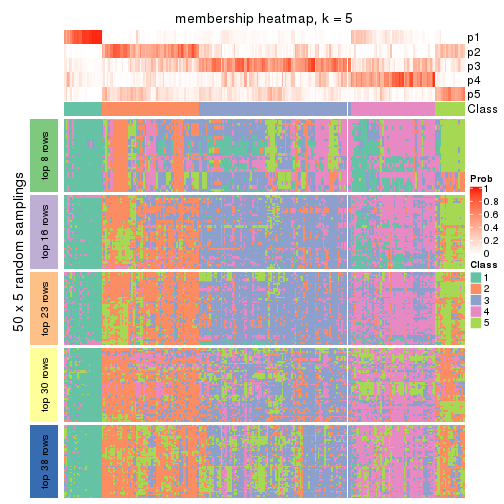</p>

</div>
<div id='tab-CV-pam-membership-heatmap-5'>
<pre><code class="r">membership_heatmap(res, k = 6)
</code></pre>

<p></p>

</div>
</div>

As soon as we have had the classes for columns, we can look for signatures
which are significantly different between classes which can be candidate marks
for certain classes. Following are the heatmaps for signatures.


Signature heatmaps where rows are scaled:


<script>
$( function() {
	$( '#tabs-CV-pam-get-signatures' ).tabs();
} );
</script>
<div id='tabs-CV-pam-get-signatures'>
<ul>
<li><a href='#tab-CV-pam-get-signatures-1'>k = 2</a></li>
<li><a href='#tab-CV-pam-get-signatures-2'>k = 3</a></li>
<li><a href='#tab-CV-pam-get-signatures-3'>k = 4</a></li>
<li><a href='#tab-CV-pam-get-signatures-4'>k = 5</a></li>
<li><a href='#tab-CV-pam-get-signatures-5'>k = 6</a></li>
</ul>
<div id='tab-CV-pam-get-signatures-1'>
<pre><code class="r">get_signatures(res, k = 2)
</code></pre>

<p></p>

</div>
<div id='tab-CV-pam-get-signatures-2'>
<pre><code class="r">get_signatures(res, k = 3)
</code></pre>

<p></p>

</div>
<div id='tab-CV-pam-get-signatures-3'>
<pre><code class="r">get_signatures(res, k = 4)
</code></pre>

<p></p>

</div>
<div id='tab-CV-pam-get-signatures-4'>
<pre><code class="r">get_signatures(res, k = 5)
</code></pre>

<p></p>

</div>
<div id='tab-CV-pam-get-signatures-5'>
<pre><code class="r">get_signatures(res, k = 6)
</code></pre>

<p></p>

</div>
</div>


Signature heatmaps where rows are not scaled:


<script>
$( function() {
	$( '#tabs-CV-pam-get-signatures-no-scale' ).tabs();
} );
</script>
<div id='tabs-CV-pam-get-signatures-no-scale'>
<ul>
<li><a href='#tab-CV-pam-get-signatures-no-scale-1'>k = 2</a></li>
<li><a href='#tab-CV-pam-get-signatures-no-scale-2'>k = 3</a></li>
<li><a href='#tab-CV-pam-get-signatures-no-scale-3'>k = 4</a></li>
<li><a href='#tab-CV-pam-get-signatures-no-scale-4'>k = 5</a></li>
<li><a href='#tab-CV-pam-get-signatures-no-scale-5'>k = 6</a></li>
</ul>
<div id='tab-CV-pam-get-signatures-no-scale-1'>
<pre><code class="r">get_signatures(res, k = 2, scale_rows = FALSE)
</code></pre>

<p></p>

</div>
<div id='tab-CV-pam-get-signatures-no-scale-2'>
<pre><code class="r">get_signatures(res, k = 3, scale_rows = FALSE)
</code></pre>

<p></p>

</div>
<div id='tab-CV-pam-get-signatures-no-scale-3'>
<pre><code class="r">get_signatures(res, k = 4, scale_rows = FALSE)
</code></pre>

<p></p>

</div>
<div id='tab-CV-pam-get-signatures-no-scale-4'>
<pre><code class="r">get_signatures(res, k = 5, scale_rows = FALSE)
</code></pre>

<p>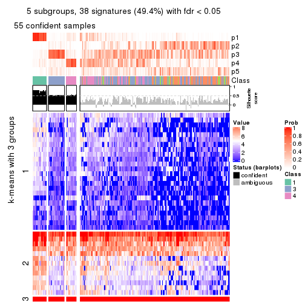</p>

</div>
<div id='tab-CV-pam-get-signatures-no-scale-5'>
<pre><code class="r">get_signatures(res, k = 6, scale_rows = FALSE)
</code></pre>

<p></p>

</div>
</div>


Compare the overlap of signatures from different k:

```r
compare_signatures(res)
```

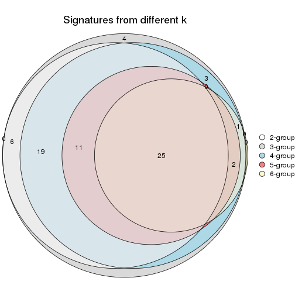

`get_signature()` returns a data frame invisibly. TO get the list of signatures, the function
call should be assigned to a variable explicitly. In following code, if `plot` argument is set
to `FALSE`, no heatmap is plotted while only the differential analysis is performed.

```r
# code only for demonstration
tb = get_signature(res, k = ..., plot = FALSE)
```

An example of the output of `tb` is:

```
#>   which_row         fdr    mean_1    mean_2 scaled_mean_1 scaled_mean_2 km
#> 1        38 0.042760348  8.373488  9.131774    -0.5533452     0.5164555  1
#> 2        40 0.018707592  7.106213  8.469186    -0.6173731     0.5762149  1
#> 3        55 0.019134737 10.221463 11.207825    -0.6159697     0.5749050  1
#> 4        59 0.006059896  5.921854  7.869574    -0.6899429     0.6439467  1
#> 5        60 0.018055526  8.928898 10.211722    -0.6204761     0.5791110  1
#> 6        98 0.009384629 15.714769 14.887706     0.6635654    -0.6193277  2
...
```

The columns in `tb` are:

1. `which_row`: row indices corresponding to the input matrix.
2. `fdr`: FDR for the differential test. 
3. `mean_x`: The mean value in group x.
4. `scaled_mean_x`: The mean value in group x after rows are scaled.
5. `km`: Row groups if k-means clustering is applied to rows.


UMAP plot which shows how samples are separated.


<script>
$( function() {
	$( '#tabs-CV-pam-dimension-reduction' ).tabs();
} );
</script>
<div id='tabs-CV-pam-dimension-reduction'>
<ul>
<li><a href='#tab-CV-pam-dimension-reduction-1'>k = 2</a></li>
<li><a href='#tab-CV-pam-dimension-reduction-2'>k = 3</a></li>
<li><a href='#tab-CV-pam-dimension-reduction-3'>k = 4</a></li>
<li><a href='#tab-CV-pam-dimension-reduction-4'>k = 5</a></li>
<li><a href='#tab-CV-pam-dimension-reduction-5'>k = 6</a></li>
</ul>
<div id='tab-CV-pam-dimension-reduction-1'>
<pre><code class="r">dimension_reduction(res, k = 2, method = &quot;UMAP&quot;)
</code></pre>

<p></p>

</div>
<div id='tab-CV-pam-dimension-reduction-2'>
<pre><code class="r">dimension_reduction(res, k = 3, method = &quot;UMAP&quot;)
</code></pre>

<p></p>

</div>
<div id='tab-CV-pam-dimension-reduction-3'>
<pre><code class="r">dimension_reduction(res, k = 4, method = &quot;UMAP&quot;)
</code></pre>

<p></p>

</div>
<div id='tab-CV-pam-dimension-reduction-4'>
<pre><code class="r">dimension_reduction(res, k = 5, method = &quot;UMAP&quot;)
</code></pre>

<p></p>

</div>
<div id='tab-CV-pam-dimension-reduction-5'>
<pre><code class="r">dimension_reduction(res, k = 6, method = &quot;UMAP&quot;)
</code></pre>

<p></p>

</div>
</div>


Following heatmap shows how subgroups are split when increasing `k`:

```r
collect_classes(res)
```

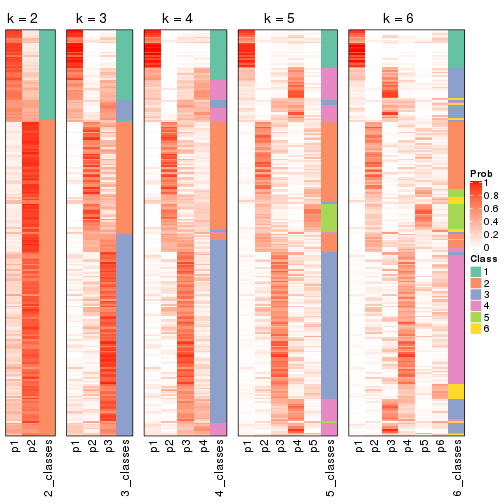


If matrix rows can be associated to genes, consider to use `GO_Enrichment(res,
...)` to perform function enrichment for the signature genes.


 

---------------------------------------------------


### CV:mclust


The object with results only for a single top-value method and a single partition method 
can be extracted as:

```r
res = res_list["CV", "mclust"]
# you can also extract it by
# res = res_list["CV:mclust"]
```

A summary of `res` and all the functions that can be applied to it:

```r
res
```

```
#> A 'ConsensusPartition' object with k = 2, 3, 4, 5, 6.
#>   On a matrix with 77 rows and 243 columns.
#>   Top rows (8, 16, 23, 30, 38) are extracted by 'CV' method.
#>   Subgroups are detected by 'mclust' method.
#>   Performed in total 1250 partitions by row resampling.
#>   Best k for subgroups seems to be 3.
#> 
#> Following methods can be applied to this 'ConsensusPartition' object:
#>  [1] "cola_report"             "collect_classes"         "collect_plots"          
#>  [4] "collect_stats"           "colnames"                "compare_signatures"     
#>  [7] "consensus_heatmap"       "dimension_reduction"     "functional_enrichment"  
#> [10] "get_anno_col"            "get_anno"                "get_classes"            
#> [13] "get_consensus"           "get_matrix"              "get_membership"         
#> [16] "get_param"               "get_signatures"          "get_stats"              
#> [19] "is_best_k"               "is_stable_k"             "membership_heatmap"     
#> [22] "ncol"                    "nrow"                    "plot_ecdf"              
#> [25] "rownames"                "select_partition_number" "show"                   
#> [28] "suggest_best_k"          "test_to_known_factors"
```

`collect_plots()` function collects all the plots made from `res` for all `k` (number of partitions)
into one single page to provide an easy and fast comparison between different `k`.

```r
collect_plots(res)
```


The plots are:

- The first row: a plot of the ECDF (Empirical cumulative distribution
  function) curves of the consensus matrix for each `k` and the heatmap of
  predicted classes for each `k`.
- The second row: heatmaps of the consensus matrix for each `k`.
- The third row: heatmaps of the membership matrix for each `k`.
- The fouth row: heatmaps of the signatures for each `k`.

All the plots in panels can be made by individual functions and they are
plotted later in this section.

`select_partition_number()` produces several plots showing different
statistics for choosing "optimized" `k`. There are following statistics:

- ECDF curves of the consensus matrix for each `k`;
- 1-PAC. [The PAC
  score](https://en.wikipedia.org/wiki/Consensus_clustering#Over-interpretation_potential_of_consensus_clustering)
  measures the proportion of the ambiguous subgrouping.
- Mean silhouette score.
- Concordance. The mean probability of fiting the consensus class ids in all
  partitions.
- Area increased. Denote $A_k$ as the area under the ECDF curve for current
  `k`, the area increased is defined as $A_k - A_{k-1}$.
- Rand index. The percent of pairs of samples that are both in a same cluster
  or both are not in a same cluster in the partition of k and k-1.
- Jaccard index. The ratio of pairs of samples are both in a same cluster in
  the partition of k and k-1 and the pairs of samples are both in a same
  cluster in the partition k or k-1.

The detailed explanations of these statistics can be found in [the cola
vignette](http://bioconductor.org/packages/devel/bioc/vignettes/cola/inst/doc/cola.html#toc_13).

Generally speaking, lower PAC score, higher mean silhouette score or higher
concordance corresponds to better partition. Rand index and Jaccard index
measure how similar the current partition is compared to partition with `k-1`.
If they are too similar, we won't accept `k` is better than `k-1`.

```r
select_partition_number(res)
```


The numeric values for all these statistics can be obtained by `get_stats()`.

```r
get_stats(res)
```

```
#>   k  1-PAC mean_silhouette concordance area_increased  Rand Jaccard
#> 2 2 0.0238           0.323       0.657          0.390 0.610   0.610
#> 3 3 0.1544           0.713       0.790          0.441 0.592   0.436
#> 4 4 0.2094           0.473       0.704          0.117 0.938   0.864
#> 5 5 0.2526           0.272       0.610          0.114 0.944   0.872
#> 6 6 0.2992           0.304       0.569          0.055 0.888   0.730
```

`suggest_best_k()` suggests the best $k$ based on these statistics. The rules are as follows:

- All $k$ with Jaccard index larger than 0.95 are removed because the increase of
  the partition number does not provides enough extra information. If all $k$ are removed,
  the best $k$ is assigned by `NA`.
- For $k$ with 1-PAC larger than 0.9, the maximal $k$ is taken as the "best k". Other $k$ is called "optional k".
- If it does not fit the second rule. The $k$ with the highest vote of highest
  1-PAC, mean silhouette and concordance is taken as the "best k".

```r
suggest_best_k(res)
```

```
#> [1] 3
```


Following shows the table of the partitions (You need to click the **show/hide
code output** link to see it). The membership matrix (columns with name `p*`)
is inferred by
[`clue::cl_consensus()`](https://www.rdocumentation.org/link/cl_consensus?package=clue)
function with the `SE` method. Basically the value in the membership matrix
represents the probability to belong to a certain group. The finall class
label for an item is determined with the group with highest probability it
belongs to.

In `get_classes()` function, the entropy is calculated from the membership
matrix and the silhouette score is calculated from the consensus matrix.


<script>
$( function() {
	$( '#tabs-CV-mclust-get-classes' ).tabs();
} );
</script>
<div id='tabs-CV-mclust-get-classes'>
<ul>
<li><a href='#tab-CV-mclust-get-classes-1'>k = 2</a></li>
<li><a href='#tab-CV-mclust-get-classes-2'>k = 3</a></li>
<li><a href='#tab-CV-mclust-get-classes-3'>k = 4</a></li>
<li><a href='#tab-CV-mclust-get-classes-4'>k = 5</a></li>
<li><a href='#tab-CV-mclust-get-classes-5'>k = 6</a></li>
</ul>

<div id='tab-CV-mclust-get-classes-1'>
<p><a id='tab-CV-mclust-get-classes-1-a' style='color:#0366d6' href='#'>show/hide code output</a></p>
<pre><code class="r">cbind(get_classes(res, k = 2), get_membership(res, k = 2))
</code></pre>

<pre><code>#&gt;           class entropy silhouette    p1    p2
#&gt; SRR191393     1   0.973   0.316428 0.596 0.404
#&gt; SRR191394     1   0.738   0.552330 0.792 0.208
#&gt; SRR191396     2   0.909   0.405842 0.324 0.676
#&gt; SRR191397     1   0.952   0.413898 0.628 0.372
#&gt; SRR191398     1   0.738   0.555394 0.792 0.208
#&gt; SRR191399     2   0.946   0.316113 0.364 0.636
#&gt; SRR191400     1   0.745   0.556520 0.788 0.212
#&gt; SRR191401     1   0.955   0.380503 0.624 0.376
#&gt; SRR191402     2   0.738   0.484767 0.208 0.792
#&gt; SRR191403     1   1.000   0.035666 0.500 0.500
#&gt; SRR191404     2   0.844   0.460533 0.272 0.728
#&gt; SRR191405     2   0.595   0.503276 0.144 0.856
#&gt; SRR191406     2   0.653   0.368684 0.168 0.832
#&gt; SRR191407     1   0.775   0.548038 0.772 0.228
#&gt; SRR191408     2   0.929   0.360855 0.344 0.656
#&gt; SRR191409     2   0.900   0.417735 0.316 0.684
#&gt; SRR191410     2   0.563   0.501545 0.132 0.868
#&gt; SRR191411     2   0.518   0.456745 0.116 0.884
#&gt; SRR191412     1   0.969   0.326111 0.604 0.396
#&gt; SRR191413     2   0.936   0.332340 0.352 0.648
#&gt; SRR191414     1   0.833   0.545060 0.736 0.264
#&gt; SRR191415     2   0.469   0.472420 0.100 0.900
#&gt; SRR191416     2   0.671   0.471531 0.176 0.824
#&gt; SRR191418     2   0.795   0.434539 0.240 0.760
#&gt; SRR191419     1   0.775   0.556165 0.772 0.228
#&gt; SRR191420     2   0.990   0.129814 0.440 0.560
#&gt; SRR191421     1   0.999   0.129996 0.516 0.484
#&gt; SRR191422     2   0.988   0.197279 0.436 0.564
#&gt; SRR191423     2   0.917   0.408860 0.332 0.668
#&gt; SRR191424     2   0.985   0.167464 0.428 0.572
#&gt; SRR191425     2   0.996   0.154548 0.464 0.536
#&gt; SRR191426     2   0.714   0.503117 0.196 0.804
#&gt; SRR191427     2   0.999   0.037786 0.484 0.516
#&gt; SRR191428     2   0.981   0.220205 0.420 0.580
#&gt; SRR191429     2   0.958   0.303716 0.380 0.620
#&gt; SRR191430     2   0.900   0.378013 0.316 0.684
#&gt; SRR191431     2   0.997   0.057354 0.468 0.532
#&gt; SRR191432     2   0.961   0.310461 0.384 0.616
#&gt; SRR191433     2   0.999   0.070860 0.480 0.520
#&gt; SRR191434     2   0.913   0.362029 0.328 0.672
#&gt; SRR191435     2   0.975   0.224578 0.408 0.592
#&gt; SRR191436     2   0.775   0.465551 0.228 0.772
#&gt; SRR191437     1   0.985   0.080441 0.572 0.428
#&gt; SRR191438     2   0.788   0.482359 0.236 0.764
#&gt; SRR191439     1   1.000  -0.075668 0.500 0.500
#&gt; SRR191440     1   0.988   0.150239 0.564 0.436
#&gt; SRR191441     1   1.000  -0.008545 0.508 0.492
#&gt; SRR191442     2   0.909   0.383070 0.324 0.676
#&gt; SRR191443     1   1.000   0.062977 0.512 0.488
#&gt; SRR191444     2   0.767   0.481921 0.224 0.776
#&gt; SRR191445     2   0.921   0.405447 0.336 0.664
#&gt; SRR191446     2   0.961   0.300000 0.384 0.616
#&gt; SRR191447     2   1.000   0.072097 0.492 0.508
#&gt; SRR191448     1   0.946   0.454662 0.636 0.364
#&gt; SRR191449     2   0.886   0.357079 0.304 0.696
#&gt; SRR191450     2   0.886   0.429274 0.304 0.696
#&gt; SRR191451     2   0.925   0.375291 0.340 0.660
#&gt; SRR191452     2   0.998   0.034928 0.472 0.528
#&gt; SRR191453     2   0.958   0.311237 0.380 0.620
#&gt; SRR191454     2   0.971   0.198898 0.400 0.600
#&gt; SRR191455     2   0.909   0.399633 0.324 0.676
#&gt; SRR191456     1   0.990   0.239855 0.560 0.440
#&gt; SRR191457     1   0.936   0.394397 0.648 0.352
#&gt; SRR191458     2   0.925   0.376605 0.340 0.660
#&gt; SRR191459     2   0.653   0.493264 0.168 0.832
#&gt; SRR191460     2   0.680   0.504519 0.180 0.820
#&gt; SRR191461     2   0.689   0.501279 0.184 0.816
#&gt; SRR191462     2   0.952   0.340949 0.372 0.628
#&gt; SRR191463     2   0.999   0.068535 0.484 0.516
#&gt; SRR191464     2   0.802   0.480801 0.244 0.756
#&gt; SRR191465     1   0.997   0.066103 0.532 0.468
#&gt; SRR191466     2   0.939   0.312632 0.356 0.644
#&gt; SRR191467     2   0.975   0.214119 0.408 0.592
#&gt; SRR191468     1   0.997   0.073988 0.532 0.468
#&gt; SRR191469     2   0.900   0.413897 0.316 0.684
#&gt; SRR191470     2   0.955   0.362490 0.376 0.624
#&gt; SRR191471     2   0.980   0.165797 0.416 0.584
#&gt; SRR191472     1   0.987   0.073787 0.568 0.432
#&gt; SRR191473     2   0.833   0.464228 0.264 0.736
#&gt; SRR191474     2   0.833   0.466197 0.264 0.736
#&gt; SRR191475     1   0.987   0.081053 0.568 0.432
#&gt; SRR191476     2   0.987   0.221101 0.432 0.568
#&gt; SRR191477     2   0.839   0.447182 0.268 0.732
#&gt; SRR191478     2   0.994   0.069067 0.456 0.544
#&gt; SRR191479     2   0.969   0.166944 0.396 0.604
#&gt; SRR191480     2   0.904   0.421134 0.320 0.680
#&gt; SRR191481     2   0.814   0.476995 0.252 0.748
#&gt; SRR191482     2   0.730   0.492447 0.204 0.796
#&gt; SRR191483     2   0.881   0.434825 0.300 0.700
#&gt; SRR191484     2   1.000  -0.036051 0.500 0.500
#&gt; SRR191485     2   0.993   0.169071 0.452 0.548
#&gt; SRR191486     2   0.671   0.506389 0.176 0.824
#&gt; SRR191487     2   0.973   0.267650 0.404 0.596
#&gt; SRR191488     1   0.886   0.508215 0.696 0.304
#&gt; SRR191489     1   1.000  -0.002317 0.504 0.496
#&gt; SRR191490     2   1.000   0.058262 0.492 0.508
#&gt; SRR191491     2   0.991   0.158940 0.444 0.556
#&gt; SRR191492     2   0.921   0.408191 0.336 0.664
#&gt; SRR191493     2   0.917   0.382994 0.332 0.668
#&gt; SRR191494     1   1.000  -0.000554 0.508 0.492
#&gt; SRR191495     2   0.958   0.328658 0.380 0.620
#&gt; SRR191496     1   0.992   0.069758 0.552 0.448
#&gt; SRR191497     2   0.653   0.449452 0.168 0.832
#&gt; SRR191498     2   0.995   0.023204 0.460 0.540
#&gt; SRR191499     2   0.745   0.494022 0.212 0.788
#&gt; SRR191500     2   0.644   0.464207 0.164 0.836
#&gt; SRR191501     2   0.983   0.168594 0.424 0.576
#&gt; SRR191502     2   0.975   0.253846 0.408 0.592
#&gt; SRR191503     1   0.997   0.025845 0.532 0.468
#&gt; SRR191504     2   0.995   0.138908 0.460 0.540
#&gt; SRR191505     1   0.999  -0.013099 0.516 0.484
#&gt; SRR191506     1   0.994   0.067512 0.544 0.456
#&gt; SRR191507     2   0.973   0.206533 0.404 0.596
#&gt; SRR191508     2   0.983   0.249055 0.424 0.576
#&gt; SRR191509     2   0.886   0.428018 0.304 0.696
#&gt; SRR191510     2   0.821   0.456665 0.256 0.744
#&gt; SRR191511     2   0.980   0.184244 0.416 0.584
#&gt; SRR191512     1   0.998   0.063875 0.528 0.472
#&gt; SRR191513     2   0.993   0.047095 0.452 0.548
#&gt; SRR191514     2   0.998   0.029991 0.476 0.524
#&gt; SRR191515     2   0.881   0.420505 0.300 0.700
#&gt; SRR191516     2   0.973   0.298219 0.404 0.596
#&gt; SRR191517     2   0.917   0.425813 0.332 0.668
#&gt; SRR191518     2   0.876   0.418557 0.296 0.704
#&gt; SRR191519     2   0.881   0.411504 0.300 0.700
#&gt; SRR191520     2   0.983   0.286001 0.424 0.576
#&gt; SRR191521     2   0.988   0.208866 0.436 0.564
#&gt; SRR191522     2   0.738   0.499366 0.208 0.792
#&gt; SRR191523     2   0.993   0.129908 0.452 0.548
#&gt; SRR191524     1   1.000   0.036636 0.508 0.492
#&gt; SRR191525     2   0.981   0.190355 0.420 0.580
#&gt; SRR191526     1   0.999   0.055835 0.520 0.480
#&gt; SRR191527     1   0.653   0.523609 0.832 0.168
#&gt; SRR191528     1   0.722   0.550765 0.800 0.200
#&gt; SRR191529     2   0.997   0.074328 0.468 0.532
#&gt; SRR191530     1   1.000   0.022213 0.512 0.488
#&gt; SRR191531     1   0.876   0.456968 0.704 0.296
#&gt; SRR191532     2   0.909   0.374431 0.324 0.676
#&gt; SRR191533     2   0.939   0.397151 0.356 0.644
#&gt; SRR191534     2   0.998   0.078651 0.472 0.528
#&gt; SRR191535     2   0.904   0.407864 0.320 0.680
#&gt; SRR191536     2   1.000   0.007118 0.496 0.504
#&gt; SRR191537     2   0.987   0.145435 0.432 0.568
#&gt; SRR191538     2   0.999   0.049748 0.484 0.516
#&gt; SRR191539     2   0.996   0.006910 0.464 0.536
#&gt; SRR191540     2   0.997   0.165567 0.468 0.532
#&gt; SRR191541     2   1.000   0.026686 0.492 0.508
#&gt; SRR191542     2   0.997   0.057795 0.468 0.532
#&gt; SRR191543     2   0.939   0.366728 0.356 0.644
#&gt; SRR191544     2   0.981   0.238654 0.420 0.580
#&gt; SRR191545     2   0.997   0.122208 0.468 0.532
#&gt; SRR191546     2   0.991   0.173407 0.444 0.556
#&gt; SRR191547     2   0.876   0.412827 0.296 0.704
#&gt; SRR191548     1   0.775   0.558778 0.772 0.228
#&gt; SRR191549     1   0.760   0.559493 0.780 0.220
#&gt; SRR191550     1   0.760   0.557889 0.780 0.220
#&gt; SRR191551     1   0.760   0.557551 0.780 0.220
#&gt; SRR191552     1   0.760   0.559493 0.780 0.220
#&gt; SRR191553     1   0.802   0.555070 0.756 0.244
#&gt; SRR191554     1   0.760   0.559493 0.780 0.220
#&gt; SRR191555     2   0.909   0.414680 0.324 0.676
#&gt; SRR191556     2   0.788   0.306674 0.236 0.764
#&gt; SRR191557     2   0.814   0.456123 0.252 0.748
#&gt; SRR191558     2   0.980   0.191361 0.416 0.584
#&gt; SRR191559     2   0.697   0.351530 0.188 0.812
#&gt; SRR191560     2   0.722   0.353421 0.200 0.800
#&gt; SRR191561     1   0.662   0.531659 0.828 0.172
#&gt; SRR191562     1   0.966   0.407211 0.608 0.392
#&gt; SRR191563     2   0.327   0.480243 0.060 0.940
#&gt; SRR191564     2   0.625   0.400669 0.156 0.844
#&gt; SRR191565     2   0.745   0.325306 0.212 0.788
#&gt; SRR191566     2   0.706   0.374952 0.192 0.808
#&gt; SRR191567     1   0.992   0.262144 0.552 0.448
#&gt; SRR191568     2   0.993   0.049958 0.452 0.548
#&gt; SRR191569     2   0.671   0.429980 0.176 0.824
#&gt; SRR191570     2   0.802   0.311246 0.244 0.756
#&gt; SRR191571     2   0.795   0.326816 0.240 0.760
#&gt; SRR191572     1   0.767   0.559092 0.776 0.224
#&gt; SRR191573     2   0.833   0.335273 0.264 0.736
#&gt; SRR191574     1   0.921   0.473285 0.664 0.336
#&gt; SRR191575     1   0.978   0.340338 0.588 0.412
#&gt; SRR191576     2   0.827   0.472779 0.260 0.740
#&gt; SRR191577     2   1.000  -0.089774 0.492 0.508
#&gt; SRR191578     2   0.644   0.500755 0.164 0.836
#&gt; SRR191579     1   0.781   0.559348 0.768 0.232
#&gt; SRR191580     1   0.730   0.548588 0.796 0.204
#&gt; SRR191581     1   0.738   0.552224 0.792 0.208
#&gt; SRR191582     1   0.788   0.561651 0.764 0.236
#&gt; SRR191583     2   0.998   0.008383 0.476 0.524
#&gt; SRR191584     1   0.760   0.557551 0.780 0.220
#&gt; SRR191585     2   0.866   0.443385 0.288 0.712
#&gt; SRR191586     2   0.866   0.419485 0.288 0.712
#&gt; SRR191587     2   0.615   0.436606 0.152 0.848
#&gt; SRR191588     2   0.850   0.321669 0.276 0.724
#&gt; SRR191589     2   0.714   0.391509 0.196 0.804
#&gt; SRR191590     1   0.881   0.526005 0.700 0.300
#&gt; SRR191591     2   0.358   0.459084 0.068 0.932
#&gt; SRR191592     2   0.722   0.331805 0.200 0.800
#&gt; SRR191593     2   0.671   0.394315 0.176 0.824
#&gt; SRR191594     1   0.844   0.547606 0.728 0.272
#&gt; SRR191595     2   0.839   0.325704 0.268 0.732
#&gt; SRR191596     2   0.904   0.248099 0.320 0.680
#&gt; SRR191597     2   0.595   0.415240 0.144 0.856
#&gt; SRR191598     2   0.745   0.332768 0.212 0.788
#&gt; SRR191599     2   0.921   0.264330 0.336 0.664
#&gt; SRR191600     2   0.327   0.469045 0.060 0.940
#&gt; SRR191601     2   0.242   0.473208 0.040 0.960
#&gt; SRR191602     2   0.295   0.472567 0.052 0.948
#&gt; SRR191603     2   0.278   0.463743 0.048 0.952
#&gt; SRR191604     2   0.529   0.506222 0.120 0.880
#&gt; SRR191605     2   0.574   0.421329 0.136 0.864
#&gt; SRR191606     2   0.844   0.311466 0.272 0.728
#&gt; SRR191607     2   0.993   0.145345 0.452 0.548
#&gt; SRR191608     2   0.904   0.415153 0.320 0.680
#&gt; SRR191609     2   0.850   0.424285 0.276 0.724
#&gt; SRR191610     2   0.999   0.066271 0.484 0.516
#&gt; SRR191611     2   0.921   0.426390 0.336 0.664
#&gt; SRR191612     2   0.680   0.372479 0.180 0.820
#&gt; SRR191613     2   0.987   0.139132 0.432 0.568
#&gt; SRR191614     2   0.689   0.377494 0.184 0.816
#&gt; SRR191615     2   0.625   0.402452 0.156 0.844
#&gt; SRR191616     1   0.993   0.178604 0.548 0.452
#&gt; SRR191617     2   0.952   0.282606 0.372 0.628
#&gt; SRR191618     2   0.939   0.330280 0.356 0.644
#&gt; SRR191619     2   0.278   0.479946 0.048 0.952
#&gt; SRR191620     2   0.850   0.419473 0.276 0.724
#&gt; SRR191621     2   0.714   0.493970 0.196 0.804
#&gt; SRR191622     2   0.416   0.496756 0.084 0.916
#&gt; SRR191623     2   0.662   0.374432 0.172 0.828
#&gt; SRR191624     1   0.998   0.117688 0.528 0.472
#&gt; SRR191625     2   0.402   0.506281 0.080 0.920
#&gt; SRR191626     2   0.909   0.405668 0.324 0.676
#&gt; SRR191627     2   0.402   0.487788 0.080 0.920
#&gt; SRR191628     2   0.730   0.459900 0.204 0.796
#&gt; SRR191629     2   0.469   0.439281 0.100 0.900
#&gt; SRR191630     1   0.871   0.535026 0.708 0.292
#&gt; SRR191631     2   0.662   0.495700 0.172 0.828
#&gt; SRR191632     2   0.795   0.338222 0.240 0.760
#&gt; SRR191633     2   0.494   0.485204 0.108 0.892
#&gt; SRR191634     1   0.983   0.193729 0.576 0.424
#&gt; SRR191635     2   0.653   0.399436 0.168 0.832
#&gt; SRR191636     1   0.925   0.395667 0.660 0.340
#&gt; SRR191637     1   0.998   0.059703 0.524 0.476
</code></pre>

<script>
$('#tab-CV-mclust-get-classes-1-a').parent().next().next().hide();
$('#tab-CV-mclust-get-classes-1-a').click(function(){
  $('#tab-CV-mclust-get-classes-1-a').parent().next().next().toggle();
  return(false);
});
</script>
</div>

<div id='tab-CV-mclust-get-classes-2'>
<p><a id='tab-CV-mclust-get-classes-2-a' style='color:#0366d6' href='#'>show/hide code output</a></p>
<pre><code class="r">cbind(get_classes(res, k = 3), get_membership(res, k = 3))
</code></pre>

<pre><code>#&gt;           class entropy silhouette    p1    p2    p3
#&gt; SRR191393     3  0.7056     0.4793 0.300 0.044 0.656
#&gt; SRR191394     1  0.5174     0.8525 0.832 0.076 0.092
#&gt; SRR191396     3  0.6723     0.6299 0.048 0.248 0.704
#&gt; SRR191397     3  0.5891     0.7453 0.168 0.052 0.780
#&gt; SRR191398     1  0.4786     0.8586 0.844 0.044 0.112
#&gt; SRR191399     3  0.4015     0.8079 0.096 0.028 0.876
#&gt; SRR191400     1  0.4960     0.8613 0.832 0.040 0.128
#&gt; SRR191401     3  0.7012     0.4235 0.308 0.040 0.652
#&gt; SRR191402     3  0.2550     0.8226 0.040 0.024 0.936
#&gt; SRR191403     3  0.5581     0.7658 0.168 0.040 0.792
#&gt; SRR191404     3  0.4865     0.7953 0.032 0.136 0.832
#&gt; SRR191405     3  0.2584     0.8262 0.008 0.064 0.928
#&gt; SRR191406     3  0.0892     0.8164 0.000 0.020 0.980
#&gt; SRR191407     1  0.6001     0.8517 0.784 0.072 0.144
#&gt; SRR191408     3  0.3637     0.8184 0.084 0.024 0.892
#&gt; SRR191409     3  0.4097     0.8168 0.060 0.060 0.880
#&gt; SRR191410     3  0.3148     0.8160 0.048 0.036 0.916
#&gt; SRR191411     3  0.4602     0.8046 0.040 0.108 0.852
#&gt; SRR191412     3  0.6796     0.3894 0.344 0.024 0.632
#&gt; SRR191413     3  0.2903     0.8183 0.048 0.028 0.924
#&gt; SRR191414     1  0.7505     0.5032 0.572 0.044 0.384
#&gt; SRR191415     3  0.4092     0.8164 0.036 0.088 0.876
#&gt; SRR191416     3  0.3213     0.8241 0.060 0.028 0.912
#&gt; SRR191418     3  0.2496     0.8233 0.004 0.068 0.928
#&gt; SRR191419     1  0.7391     0.6979 0.636 0.056 0.308
#&gt; SRR191420     3  0.5883     0.7965 0.112 0.092 0.796
#&gt; SRR191421     3  0.5229     0.7991 0.104 0.068 0.828
#&gt; SRR191422     2  0.4551     0.7978 0.024 0.844 0.132
#&gt; SRR191423     2  0.5939     0.7560 0.028 0.748 0.224
#&gt; SRR191424     2  0.6829     0.7723 0.096 0.736 0.168
#&gt; SRR191425     3  0.6374     0.7866 0.132 0.100 0.768
#&gt; SRR191426     3  0.5851     0.7688 0.068 0.140 0.792
#&gt; SRR191427     2  0.7864     0.5196 0.072 0.596 0.332
#&gt; SRR191428     3  0.5911     0.7945 0.156 0.060 0.784
#&gt; SRR191429     2  0.4741     0.7950 0.020 0.828 0.152
#&gt; SRR191430     3  0.8434    -0.1024 0.088 0.416 0.496
#&gt; SRR191431     2  0.7739     0.7137 0.088 0.644 0.268
#&gt; SRR191432     2  0.5506     0.7824 0.092 0.816 0.092
#&gt; SRR191433     2  0.4371     0.7967 0.032 0.860 0.108
#&gt; SRR191434     2  0.8195     0.3409 0.072 0.492 0.436
#&gt; SRR191435     3  0.4836     0.8159 0.080 0.072 0.848
#&gt; SRR191436     3  0.5435     0.7850 0.048 0.144 0.808
#&gt; SRR191437     2  0.2492     0.7364 0.048 0.936 0.016
#&gt; SRR191438     3  0.7673     0.5180 0.088 0.260 0.652
#&gt; SRR191439     2  0.8085     0.7056 0.148 0.648 0.204
#&gt; SRR191440     2  0.5656     0.7826 0.068 0.804 0.128
#&gt; SRR191441     2  0.4475     0.7747 0.064 0.864 0.072
#&gt; SRR191442     3  0.7536     0.5737 0.068 0.292 0.640
#&gt; SRR191443     3  0.6400     0.7183 0.208 0.052 0.740
#&gt; SRR191444     3  0.4838     0.8132 0.076 0.076 0.848
#&gt; SRR191445     2  0.7285     0.6182 0.048 0.632 0.320
#&gt; SRR191446     2  0.7446     0.2858 0.036 0.532 0.432
#&gt; SRR191447     2  0.6388     0.7809 0.064 0.752 0.184
#&gt; SRR191448     3  0.7284     0.3426 0.336 0.044 0.620
#&gt; SRR191449     3  0.2229     0.8194 0.044 0.012 0.944
#&gt; SRR191450     3  0.3678     0.8155 0.080 0.028 0.892
#&gt; SRR191451     3  0.4744     0.8008 0.028 0.136 0.836
#&gt; SRR191452     2  0.5506     0.7645 0.092 0.816 0.092
#&gt; SRR191453     2  0.7401     0.5828 0.048 0.612 0.340
#&gt; SRR191454     3  0.5582     0.7939 0.100 0.088 0.812
#&gt; SRR191455     3  0.7230     0.5071 0.040 0.344 0.616
#&gt; SRR191456     3  0.8379     0.3830 0.352 0.096 0.552
#&gt; SRR191457     3  0.8141     0.5073 0.260 0.116 0.624
#&gt; SRR191458     3  0.3713     0.8208 0.032 0.076 0.892
#&gt; SRR191459     3  0.7378     0.4453 0.052 0.320 0.628
#&gt; SRR191460     3  0.5207     0.7983 0.052 0.124 0.824
#&gt; SRR191461     3  0.6079     0.7805 0.088 0.128 0.784
#&gt; SRR191462     2  0.8000     0.6463 0.096 0.620 0.284
#&gt; SRR191463     2  0.4540     0.8001 0.028 0.848 0.124
#&gt; SRR191464     3  0.8440    -0.1130 0.088 0.420 0.492
#&gt; SRR191465     2  0.2599     0.7627 0.016 0.932 0.052
#&gt; SRR191466     3  0.8645     0.4738 0.132 0.300 0.568
#&gt; SRR191467     2  0.4270     0.8011 0.024 0.860 0.116
#&gt; SRR191468     2  0.3141     0.7734 0.020 0.912 0.068
#&gt; SRR191469     3  0.7513     0.5312 0.052 0.344 0.604
#&gt; SRR191470     3  0.8620     0.2831 0.112 0.352 0.536
#&gt; SRR191471     2  0.6445     0.6286 0.020 0.672 0.308
#&gt; SRR191472     2  0.2031     0.7377 0.032 0.952 0.016
#&gt; SRR191473     2  0.6446     0.7721 0.052 0.736 0.212
#&gt; SRR191474     3  0.3875     0.8232 0.044 0.068 0.888
#&gt; SRR191475     2  0.2031     0.7338 0.032 0.952 0.016
#&gt; SRR191476     2  0.6728     0.7822 0.080 0.736 0.184
#&gt; SRR191477     2  0.6969     0.5851 0.024 0.596 0.380
#&gt; SRR191478     2  0.3610     0.7927 0.016 0.888 0.096
#&gt; SRR191479     3  0.2879     0.8256 0.024 0.052 0.924
#&gt; SRR191480     3  0.7438     0.3407 0.036 0.428 0.536
#&gt; SRR191481     2  0.6535     0.7694 0.052 0.728 0.220
#&gt; SRR191482     2  0.5618     0.7638 0.008 0.732 0.260
#&gt; SRR191483     2  0.6161     0.6395 0.016 0.696 0.288
#&gt; SRR191484     3  0.6054     0.7784 0.180 0.052 0.768
#&gt; SRR191485     2  0.6586     0.7658 0.056 0.728 0.216
#&gt; SRR191486     3  0.7537     0.3454 0.056 0.332 0.612
#&gt; SRR191487     3  0.8872     0.2735 0.132 0.348 0.520
#&gt; SRR191488     3  0.7448     0.3903 0.332 0.052 0.616
#&gt; SRR191489     3  0.6171     0.7642 0.080 0.144 0.776
#&gt; SRR191490     2  0.5791     0.7549 0.148 0.792 0.060
#&gt; SRR191491     3  0.7980     0.6860 0.168 0.172 0.660
#&gt; SRR191492     3  0.4982     0.8080 0.096 0.064 0.840
#&gt; SRR191493     2  0.7620     0.6337 0.056 0.596 0.348
#&gt; SRR191494     2  0.5505     0.7887 0.088 0.816 0.096
#&gt; SRR191495     3  0.3973     0.8204 0.088 0.032 0.880
#&gt; SRR191496     2  0.2187     0.7495 0.024 0.948 0.028
#&gt; SRR191497     3  0.2584     0.8244 0.008 0.064 0.928
#&gt; SRR191498     3  0.6062     0.7459 0.064 0.160 0.776
#&gt; SRR191499     3  0.5524     0.7788 0.040 0.164 0.796
#&gt; SRR191500     3  0.5236     0.7796 0.028 0.168 0.804
#&gt; SRR191501     2  0.6597     0.7123 0.024 0.664 0.312
#&gt; SRR191502     2  0.6927     0.7190 0.040 0.664 0.296
#&gt; SRR191503     2  0.3375     0.7573 0.048 0.908 0.044
#&gt; SRR191504     2  0.4742     0.7848 0.048 0.848 0.104
#&gt; SRR191505     2  0.4505     0.7889 0.048 0.860 0.092
#&gt; SRR191506     2  0.2297     0.7556 0.020 0.944 0.036
#&gt; SRR191507     3  0.7889     0.5448 0.088 0.288 0.624
#&gt; SRR191508     2  0.9217     0.2412 0.152 0.448 0.400
#&gt; SRR191509     2  0.8421     0.6530 0.116 0.584 0.300
#&gt; SRR191510     2  0.7059     0.2651 0.020 0.520 0.460
#&gt; SRR191511     2  0.6203     0.7880 0.056 0.760 0.184
#&gt; SRR191512     2  0.2773     0.7594 0.024 0.928 0.048
#&gt; SRR191513     2  0.4921     0.7910 0.020 0.816 0.164
#&gt; SRR191514     2  0.4418     0.7940 0.020 0.848 0.132
#&gt; SRR191515     2  0.6187     0.7747 0.028 0.724 0.248
#&gt; SRR191516     3  0.6250     0.7847 0.120 0.104 0.776
#&gt; SRR191517     3  0.6276     0.6471 0.040 0.224 0.736
#&gt; SRR191518     2  0.5597     0.7894 0.020 0.764 0.216
#&gt; SRR191519     2  0.5849     0.7893 0.028 0.756 0.216
#&gt; SRR191520     3  0.6243     0.7810 0.100 0.124 0.776
#&gt; SRR191521     2  0.4609     0.7907 0.028 0.844 0.128
#&gt; SRR191522     2  0.6910     0.5976 0.020 0.584 0.396
#&gt; SRR191523     2  0.4994     0.7921 0.052 0.836 0.112
#&gt; SRR191524     3  0.9626     0.3279 0.260 0.268 0.472
#&gt; SRR191525     2  0.6775     0.7713 0.096 0.740 0.164
#&gt; SRR191526     2  0.3530     0.7762 0.032 0.900 0.068
#&gt; SRR191527     1  0.7713     0.6398 0.656 0.248 0.096
#&gt; SRR191528     1  0.5961     0.8435 0.788 0.076 0.136
#&gt; SRR191529     2  0.7276     0.7653 0.104 0.704 0.192
#&gt; SRR191530     2  0.3310     0.7746 0.028 0.908 0.064
#&gt; SRR191531     1  0.8655     0.5348 0.588 0.156 0.256
#&gt; SRR191532     3  0.7240     0.2361 0.028 0.432 0.540
#&gt; SRR191533     3  0.7963     0.6742 0.152 0.188 0.660
#&gt; SRR191534     2  0.4982     0.7857 0.036 0.828 0.136
#&gt; SRR191535     2  0.3832     0.7835 0.020 0.880 0.100
#&gt; SRR191536     2  0.6677     0.7725 0.080 0.740 0.180
#&gt; SRR191537     2  0.6647     0.5694 0.012 0.592 0.396
#&gt; SRR191538     2  0.4280     0.7884 0.020 0.856 0.124
#&gt; SRR191539     2  0.5355     0.7952 0.032 0.800 0.168
#&gt; SRR191540     2  0.3213     0.7670 0.028 0.912 0.060
#&gt; SRR191541     2  0.4563     0.7808 0.036 0.852 0.112
#&gt; SRR191542     2  0.4556     0.7716 0.080 0.860 0.060
#&gt; SRR191543     2  0.4591     0.7939 0.032 0.848 0.120
#&gt; SRR191544     2  0.6703     0.6717 0.040 0.692 0.268
#&gt; SRR191545     2  0.6222     0.7774 0.132 0.776 0.092
#&gt; SRR191546     2  0.4966     0.7845 0.060 0.840 0.100
#&gt; SRR191547     3  0.7416     0.5737 0.068 0.276 0.656
#&gt; SRR191548     1  0.5036     0.8611 0.832 0.048 0.120
#&gt; SRR191549     1  0.5060     0.8577 0.836 0.064 0.100
#&gt; SRR191550     1  0.5202     0.8593 0.820 0.044 0.136
#&gt; SRR191551     1  0.5067     0.8612 0.832 0.052 0.116
#&gt; SRR191552     1  0.5137     0.8607 0.832 0.064 0.104
#&gt; SRR191553     1  0.6968     0.8055 0.716 0.080 0.204
#&gt; SRR191554     1  0.5137     0.8607 0.832 0.064 0.104
#&gt; SRR191555     3  0.3896     0.8214 0.052 0.060 0.888
#&gt; SRR191556     3  0.1482     0.8138 0.012 0.020 0.968
#&gt; SRR191557     3  0.3083     0.8215 0.060 0.024 0.916
#&gt; SRR191558     3  0.7054    -0.0453 0.020 0.456 0.524
#&gt; SRR191559     3  0.1905     0.8165 0.028 0.016 0.956
#&gt; SRR191560     3  0.0424     0.8126 0.008 0.000 0.992
#&gt; SRR191561     1  0.5722     0.8423 0.804 0.084 0.112
#&gt; SRR191562     3  0.5921     0.6466 0.212 0.032 0.756
#&gt; SRR191563     3  0.1163     0.8175 0.000 0.028 0.972
#&gt; SRR191564     3  0.1751     0.8164 0.028 0.012 0.960
#&gt; SRR191565     3  0.1482     0.8142 0.020 0.012 0.968
#&gt; SRR191566     3  0.0848     0.8141 0.008 0.008 0.984
#&gt; SRR191567     3  0.5940     0.6640 0.204 0.036 0.760
#&gt; SRR191568     3  0.1774     0.8204 0.016 0.024 0.960
#&gt; SRR191569     3  0.2527     0.8205 0.044 0.020 0.936
#&gt; SRR191570     3  0.2297     0.8155 0.036 0.020 0.944
#&gt; SRR191571     3  0.1491     0.8141 0.016 0.016 0.968
#&gt; SRR191572     1  0.5094     0.8609 0.832 0.056 0.112
#&gt; SRR191573     3  0.1860     0.8188 0.000 0.052 0.948
#&gt; SRR191574     3  0.7909    -0.2424 0.448 0.056 0.496
#&gt; SRR191575     3  0.4931     0.7528 0.140 0.032 0.828
#&gt; SRR191576     3  0.3886     0.8201 0.024 0.096 0.880
#&gt; SRR191577     3  0.2636     0.8207 0.020 0.048 0.932
#&gt; SRR191578     2  0.7207     0.5711 0.032 0.584 0.384
#&gt; SRR191579     1  0.4662     0.8614 0.844 0.032 0.124
#&gt; SRR191580     1  0.4887     0.8544 0.844 0.060 0.096
#&gt; SRR191581     1  0.5243     0.8555 0.828 0.072 0.100
#&gt; SRR191582     1  0.6613     0.8300 0.740 0.072 0.188
#&gt; SRR191583     2  0.5492     0.7625 0.080 0.816 0.104
#&gt; SRR191584     1  0.5507     0.8613 0.808 0.056 0.136
#&gt; SRR191585     3  0.5058     0.8044 0.148 0.032 0.820
#&gt; SRR191586     3  0.4165     0.8219 0.048 0.076 0.876
#&gt; SRR191587     3  0.2804     0.8173 0.060 0.016 0.924
#&gt; SRR191588     3  0.3237     0.8171 0.032 0.056 0.912
#&gt; SRR191589     3  0.2527     0.8114 0.044 0.020 0.936
#&gt; SRR191590     1  0.8273     0.2938 0.476 0.076 0.448
#&gt; SRR191591     3  0.2663     0.8156 0.024 0.044 0.932
#&gt; SRR191592     3  0.1015     0.8140 0.012 0.008 0.980
#&gt; SRR191593     3  0.2663     0.8115 0.044 0.024 0.932
#&gt; SRR191594     1  0.6606     0.8010 0.716 0.048 0.236
#&gt; SRR191595     3  0.1129     0.8143 0.020 0.004 0.976
#&gt; SRR191596     3  0.2269     0.8187 0.016 0.040 0.944
#&gt; SRR191597     3  0.1267     0.8188 0.004 0.024 0.972
#&gt; SRR191598     3  0.0747     0.8148 0.000 0.016 0.984
#&gt; SRR191599     3  0.1491     0.8179 0.016 0.016 0.968
#&gt; SRR191600     3  0.1529     0.8208 0.000 0.040 0.960
#&gt; SRR191601     3  0.2625     0.8206 0.000 0.084 0.916
#&gt; SRR191602     3  0.2434     0.8214 0.024 0.036 0.940
#&gt; SRR191603     3  0.2269     0.8222 0.016 0.040 0.944
#&gt; SRR191604     3  0.6521    -0.3210 0.004 0.496 0.500
#&gt; SRR191605     3  0.0829     0.8162 0.004 0.012 0.984
#&gt; SRR191606     3  0.1267     0.8130 0.024 0.004 0.972
#&gt; SRR191607     3  0.3850     0.8184 0.088 0.028 0.884
#&gt; SRR191608     3  0.3370     0.8211 0.072 0.024 0.904
#&gt; SRR191609     3  0.3499     0.8233 0.072 0.028 0.900
#&gt; SRR191610     3  0.3502     0.8198 0.084 0.020 0.896
#&gt; SRR191611     3  0.5791     0.7904 0.060 0.148 0.792
#&gt; SRR191612     3  0.0892     0.8134 0.020 0.000 0.980
#&gt; SRR191613     3  0.6107     0.7325 0.184 0.052 0.764
#&gt; SRR191614     3  0.1919     0.8188 0.020 0.024 0.956
#&gt; SRR191615     3  0.1453     0.8184 0.008 0.024 0.968
#&gt; SRR191616     2  0.7308     0.6949 0.056 0.648 0.296
#&gt; SRR191617     2  0.7381     0.7497 0.080 0.676 0.244
#&gt; SRR191618     3  0.6402     0.7242 0.056 0.200 0.744
#&gt; SRR191619     3  0.4137     0.8115 0.032 0.096 0.872
#&gt; SRR191620     2  0.7841     0.2693 0.052 0.480 0.468
#&gt; SRR191621     2  0.6897     0.7203 0.040 0.668 0.292
#&gt; SRR191622     3  0.3337     0.8127 0.060 0.032 0.908
#&gt; SRR191623     3  0.2050     0.8192 0.028 0.020 0.952
#&gt; SRR191624     3  0.4335     0.8071 0.100 0.036 0.864
#&gt; SRR191625     3  0.5816     0.6854 0.024 0.224 0.752
#&gt; SRR191626     3  0.7570     0.3963 0.044 0.404 0.552
#&gt; SRR191627     3  0.1647     0.8216 0.004 0.036 0.960
#&gt; SRR191628     3  0.4483     0.8057 0.024 0.128 0.848
#&gt; SRR191629     3  0.1170     0.8162 0.008 0.016 0.976
#&gt; SRR191630     1  0.6819     0.7145 0.644 0.028 0.328
#&gt; SRR191631     3  0.4063     0.8026 0.020 0.112 0.868
#&gt; SRR191632     3  0.1860     0.8188 0.000 0.052 0.948
#&gt; SRR191633     3  0.2866     0.8205 0.008 0.076 0.916
#&gt; SRR191634     2  0.5343     0.7951 0.052 0.816 0.132
#&gt; SRR191635     3  0.1751     0.8179 0.028 0.012 0.960
#&gt; SRR191636     2  0.7672     0.6941 0.156 0.684 0.160
#&gt; SRR191637     2  0.2599     0.7626 0.016 0.932 0.052
</code></pre>

<script>
$('#tab-CV-mclust-get-classes-2-a').parent().next().next().hide();
$('#tab-CV-mclust-get-classes-2-a').click(function(){
  $('#tab-CV-mclust-get-classes-2-a').parent().next().next().toggle();
  return(false);
});
</script>
</div>

<div id='tab-CV-mclust-get-classes-3'>
<p><a id='tab-CV-mclust-get-classes-3-a' style='color:#0366d6' href='#'>show/hide code output</a></p>
<pre><code class="r">cbind(get_classes(res, k = 4), get_membership(res, k = 4))
</code></pre>

<pre><code>#&gt;           class entropy silhouette    p1    p2    p3    p4
#&gt; SRR191393     3  0.7004    0.38808 0.348 0.032 0.560 0.060
#&gt; SRR191394     1  0.3240    0.79531 0.892 0.036 0.056 0.016
#&gt; SRR191396     3  0.7145    0.45986 0.068 0.228 0.636 0.068
#&gt; SRR191397     3  0.6149    0.60151 0.192 0.012 0.696 0.100
#&gt; SRR191398     1  0.2262    0.79781 0.932 0.012 0.040 0.016
#&gt; SRR191399     3  0.4875    0.68776 0.128 0.008 0.792 0.072
#&gt; SRR191400     1  0.2489    0.80117 0.912 0.000 0.068 0.020
#&gt; SRR191401     3  0.6625    0.30922 0.388 0.016 0.544 0.052
#&gt; SRR191402     3  0.3398    0.70551 0.036 0.048 0.888 0.028
#&gt; SRR191403     3  0.6016    0.59720 0.228 0.016 0.692 0.064
#&gt; SRR191404     3  0.6481    0.59020 0.072 0.192 0.692 0.044
#&gt; SRR191405     3  0.3538    0.70088 0.024 0.060 0.880 0.036
#&gt; SRR191406     3  0.1863    0.69363 0.004 0.012 0.944 0.040
#&gt; SRR191407     1  0.3723    0.78309 0.856 0.024 0.108 0.012
#&gt; SRR191408     3  0.4873    0.69857 0.072 0.044 0.816 0.068
#&gt; SRR191409     3  0.4894    0.68958 0.068 0.064 0.816 0.052
#&gt; SRR191410     3  0.4395    0.69191 0.036 0.052 0.840 0.072
#&gt; SRR191411     3  0.5933    0.63020 0.040 0.188 0.724 0.048
#&gt; SRR191412     3  0.6848    0.24221 0.420 0.020 0.504 0.056
#&gt; SRR191413     3  0.3587    0.69554 0.088 0.000 0.860 0.052
#&gt; SRR191414     1  0.6115    0.17667 0.560 0.020 0.400 0.020
#&gt; SRR191415     3  0.4904    0.68573 0.052 0.092 0.812 0.044
#&gt; SRR191416     3  0.4808    0.69411 0.036 0.092 0.816 0.056
#&gt; SRR191418     3  0.4083    0.70432 0.056 0.056 0.856 0.032
#&gt; SRR191419     1  0.5108    0.49344 0.672 0.000 0.308 0.020
#&gt; SRR191420     3  0.6776    0.59995 0.116 0.068 0.696 0.120
#&gt; SRR191421     3  0.6166    0.61503 0.216 0.032 0.696 0.056
#&gt; SRR191422     2  0.6541    0.45951 0.028 0.684 0.184 0.104
#&gt; SRR191423     2  0.7873    0.25282 0.040 0.564 0.216 0.180
#&gt; SRR191424     2  0.6981    0.44495 0.036 0.652 0.116 0.196
#&gt; SRR191425     3  0.7600    0.48118 0.088 0.080 0.608 0.224
#&gt; SRR191426     3  0.6310    0.55824 0.016 0.128 0.696 0.160
#&gt; SRR191427     2  0.8960   -0.16522 0.084 0.456 0.232 0.228
#&gt; SRR191428     3  0.5179    0.60380 0.000 0.052 0.728 0.220
#&gt; SRR191429     2  0.4473    0.52486 0.008 0.804 0.152 0.036
#&gt; SRR191430     3  0.8922   -0.47613 0.048 0.304 0.344 0.304
#&gt; SRR191431     2  0.8760    0.20603 0.096 0.500 0.228 0.176
#&gt; SRR191432     2  0.5540    0.51965 0.004 0.740 0.148 0.108
#&gt; SRR191433     2  0.6435    0.47115 0.024 0.696 0.136 0.144
#&gt; SRR191434     3  0.8282   -0.29151 0.044 0.396 0.416 0.144
#&gt; SRR191435     3  0.4664    0.63083 0.040 0.020 0.808 0.132
#&gt; SRR191436     3  0.6344    0.59243 0.032 0.172 0.704 0.092
#&gt; SRR191437     2  0.5569    0.34879 0.040 0.676 0.004 0.280
#&gt; SRR191438     3  0.7615    0.27240 0.036 0.188 0.592 0.184
#&gt; SRR191439     4  0.7814    0.05085 0.040 0.372 0.104 0.484
#&gt; SRR191440     2  0.6778    0.39034 0.084 0.696 0.084 0.136
#&gt; SRR191441     2  0.5703    0.44958 0.040 0.716 0.024 0.220
#&gt; SRR191442     3  0.8644   -0.15964 0.056 0.192 0.452 0.300
#&gt; SRR191443     3  0.6359    0.58822 0.204 0.036 0.692 0.068
#&gt; SRR191444     3  0.5549    0.67537 0.100 0.036 0.772 0.092
#&gt; SRR191445     2  0.8636    0.06893 0.060 0.480 0.232 0.228
#&gt; SRR191446     3  0.8594   -0.50976 0.032 0.352 0.368 0.248
#&gt; SRR191447     2  0.7931    0.29612 0.044 0.556 0.160 0.240
#&gt; SRR191448     3  0.7070    0.22653 0.364 0.036 0.544 0.056
#&gt; SRR191449     3  0.2088    0.69163 0.004 0.004 0.928 0.064
#&gt; SRR191450     3  0.6024    0.64862 0.104 0.024 0.728 0.144
#&gt; SRR191451     3  0.5921    0.64303 0.028 0.164 0.732 0.076
#&gt; SRR191452     2  0.6229    0.41458 0.040 0.696 0.052 0.212
#&gt; SRR191453     2  0.8444   -0.05605 0.040 0.460 0.296 0.204
#&gt; SRR191454     3  0.7050    0.58463 0.132 0.056 0.668 0.144
#&gt; SRR191455     3  0.8465   -0.03310 0.036 0.264 0.456 0.244
#&gt; SRR191456     3  0.8746   -0.19487 0.360 0.072 0.412 0.156
#&gt; SRR191457     3  0.8301    0.06803 0.336 0.084 0.484 0.096
#&gt; SRR191458     3  0.5385    0.67783 0.080 0.096 0.784 0.040
#&gt; SRR191459     3  0.8288    0.07236 0.056 0.292 0.504 0.148
#&gt; SRR191460     3  0.7818    0.43746 0.084 0.120 0.604 0.192
#&gt; SRR191461     3  0.6044    0.58954 0.008 0.104 0.700 0.188
#&gt; SRR191462     2  0.9127    0.05744 0.092 0.432 0.244 0.232
#&gt; SRR191463     2  0.4721    0.54828 0.024 0.816 0.100 0.060
#&gt; SRR191464     3  0.8554   -0.31050 0.036 0.328 0.412 0.224
#&gt; SRR191465     2  0.2207    0.53361 0.004 0.932 0.024 0.040
#&gt; SRR191466     4  0.7381    0.40651 0.008 0.128 0.392 0.472
#&gt; SRR191467     2  0.6461    0.50722 0.036 0.704 0.116 0.144
#&gt; SRR191468     2  0.2882    0.52710 0.016 0.904 0.016 0.064
#&gt; SRR191469     3  0.8209   -0.19640 0.024 0.200 0.444 0.332
#&gt; SRR191470     3  0.7917    0.04248 0.020 0.232 0.516 0.232
#&gt; SRR191471     2  0.6566    0.19720 0.020 0.612 0.308 0.060
#&gt; SRR191472     2  0.5231    0.34956 0.028 0.676 0.000 0.296
#&gt; SRR191473     2  0.6931    0.27072 0.020 0.580 0.320 0.080
#&gt; SRR191474     3  0.4856    0.66768 0.000 0.084 0.780 0.136
#&gt; SRR191475     2  0.5171    0.37498 0.028 0.708 0.004 0.260
#&gt; SRR191476     2  0.6826    0.38200 0.012 0.608 0.276 0.104
#&gt; SRR191477     2  0.6679   -0.03394 0.008 0.488 0.440 0.064
#&gt; SRR191478     2  0.3540    0.55653 0.032 0.872 0.084 0.012
#&gt; SRR191479     3  0.4872    0.69328 0.052 0.052 0.816 0.080
#&gt; SRR191480     3  0.7843    0.07000 0.008 0.300 0.472 0.220
#&gt; SRR191481     2  0.7451    0.21024 0.028 0.584 0.252 0.136
#&gt; SRR191482     2  0.6388    0.11592 0.008 0.576 0.360 0.056
#&gt; SRR191483     2  0.7091   -0.09306 0.012 0.484 0.416 0.088
#&gt; SRR191484     3  0.6182    0.62304 0.076 0.044 0.724 0.156
#&gt; SRR191485     2  0.7011    0.39578 0.048 0.636 0.240 0.076
#&gt; SRR191486     3  0.7096    0.00375 0.008 0.328 0.548 0.116
#&gt; SRR191487     3  0.8411   -0.16240 0.040 0.240 0.480 0.240
#&gt; SRR191488     3  0.7737    0.13012 0.396 0.044 0.472 0.088
#&gt; SRR191489     3  0.6702    0.55087 0.108 0.064 0.700 0.128
#&gt; SRR191490     2  0.6639    0.14039 0.008 0.520 0.064 0.408
#&gt; SRR191491     3  0.8205    0.04268 0.084 0.092 0.504 0.320
#&gt; SRR191492     3  0.4771    0.63186 0.012 0.028 0.776 0.184
#&gt; SRR191493     2  0.8577    0.04653 0.048 0.444 0.312 0.196
#&gt; SRR191494     2  0.5106    0.53236 0.068 0.804 0.052 0.076
#&gt; SRR191495     3  0.3680    0.67879 0.012 0.016 0.852 0.120
#&gt; SRR191496     2  0.5163    0.48502 0.028 0.768 0.032 0.172
#&gt; SRR191497     3  0.2772    0.69629 0.004 0.040 0.908 0.048
#&gt; SRR191498     3  0.7333    0.44494 0.092 0.160 0.652 0.096
#&gt; SRR191499     3  0.5678    0.60949 0.024 0.084 0.752 0.140
#&gt; SRR191500     3  0.6482    0.57125 0.024 0.140 0.692 0.144
#&gt; SRR191501     2  0.8005    0.17949 0.040 0.536 0.260 0.164
#&gt; SRR191502     2  0.7672    0.26912 0.044 0.556 0.292 0.108
#&gt; SRR191503     2  0.5337    0.40668 0.028 0.732 0.020 0.220
#&gt; SRR191504     2  0.7426    0.32994 0.028 0.588 0.136 0.248
#&gt; SRR191505     2  0.4938    0.54457 0.044 0.812 0.064 0.080
#&gt; SRR191506     2  0.3363    0.51527 0.020 0.884 0.024 0.072
#&gt; SRR191507     3  0.8040    0.14746 0.048 0.224 0.552 0.176
#&gt; SRR191508     4  0.8255    0.35023 0.016 0.284 0.280 0.420
#&gt; SRR191509     2  0.8559   -0.00295 0.032 0.412 0.292 0.264
#&gt; SRR191510     2  0.7335   -0.03252 0.016 0.496 0.384 0.104
#&gt; SRR191511     2  0.7602    0.35622 0.032 0.584 0.164 0.220
#&gt; SRR191512     2  0.2234    0.50954 0.008 0.924 0.004 0.064
#&gt; SRR191513     2  0.4657    0.52894 0.012 0.804 0.136 0.048
#&gt; SRR191514     2  0.2855    0.53750 0.004 0.904 0.052 0.040
#&gt; SRR191515     2  0.5247    0.45688 0.000 0.720 0.228 0.052
#&gt; SRR191516     3  0.6239    0.55823 0.032 0.064 0.696 0.208
#&gt; SRR191517     3  0.5127    0.60730 0.008 0.132 0.776 0.084
#&gt; SRR191518     2  0.4822    0.49733 0.004 0.736 0.240 0.020
#&gt; SRR191519     2  0.6328    0.43283 0.016 0.660 0.252 0.072
#&gt; SRR191520     3  0.5595    0.51961 0.008 0.044 0.696 0.252
#&gt; SRR191521     2  0.4254    0.53815 0.036 0.848 0.060 0.056
#&gt; SRR191522     3  0.6103   -0.30413 0.004 0.468 0.492 0.036
#&gt; SRR191523     2  0.5635    0.53622 0.032 0.764 0.108 0.096
#&gt; SRR191524     4  0.9481    0.46692 0.160 0.164 0.284 0.392
#&gt; SRR191525     2  0.6792    0.44916 0.040 0.680 0.140 0.140
#&gt; SRR191526     2  0.3460    0.53489 0.016 0.876 0.024 0.084
#&gt; SRR191527     1  0.5363    0.67990 0.784 0.084 0.036 0.096
#&gt; SRR191528     1  0.4787    0.76078 0.820 0.056 0.044 0.080
#&gt; SRR191529     2  0.7680    0.41897 0.092 0.624 0.164 0.120
#&gt; SRR191530     2  0.2115    0.53890 0.004 0.936 0.036 0.024
#&gt; SRR191531     1  0.8230    0.38668 0.564 0.100 0.124 0.212
#&gt; SRR191532     3  0.7443   -0.16882 0.004 0.408 0.440 0.148
#&gt; SRR191533     3  0.7243    0.32747 0.040 0.072 0.568 0.320
#&gt; SRR191534     2  0.5691    0.48445 0.032 0.760 0.096 0.112
#&gt; SRR191535     2  0.3672    0.52369 0.000 0.824 0.164 0.012
#&gt; SRR191536     2  0.8177    0.37208 0.100 0.576 0.136 0.188
#&gt; SRR191537     2  0.7068    0.04697 0.056 0.516 0.396 0.032
#&gt; SRR191538     2  0.4340    0.53647 0.024 0.836 0.096 0.044
#&gt; SRR191539     2  0.5037    0.54092 0.056 0.808 0.076 0.060
#&gt; SRR191540     2  0.6501    0.47704 0.028 0.692 0.116 0.164
#&gt; SRR191541     2  0.6722    0.42619 0.064 0.688 0.076 0.172
#&gt; SRR191542     2  0.5819    0.50980 0.084 0.748 0.032 0.136
#&gt; SRR191543     2  0.3711    0.53582 0.000 0.836 0.140 0.024
#&gt; SRR191544     2  0.7611    0.26550 0.036 0.580 0.244 0.140
#&gt; SRR191545     2  0.7577    0.24862 0.008 0.528 0.204 0.260
#&gt; SRR191546     2  0.7097    0.44164 0.040 0.644 0.116 0.200
#&gt; SRR191547     3  0.7127    0.44001 0.036 0.220 0.632 0.112
#&gt; SRR191548     1  0.2917    0.79926 0.904 0.008 0.048 0.040
#&gt; SRR191549     1  0.2552    0.79684 0.920 0.012 0.048 0.020
#&gt; SRR191550     1  0.2742    0.79993 0.900 0.000 0.076 0.024
#&gt; SRR191551     1  0.2413    0.79811 0.916 0.000 0.064 0.020
#&gt; SRR191552     1  0.2040    0.79704 0.936 0.012 0.048 0.004
#&gt; SRR191553     1  0.4572    0.72032 0.796 0.024 0.164 0.016
#&gt; SRR191554     1  0.2438    0.79714 0.924 0.012 0.048 0.016
#&gt; SRR191555     3  0.5182    0.69524 0.076 0.024 0.788 0.112
#&gt; SRR191556     3  0.2529    0.69307 0.024 0.008 0.920 0.048
#&gt; SRR191557     3  0.3601    0.69100 0.024 0.012 0.864 0.100
#&gt; SRR191558     2  0.6752    0.04136 0.032 0.516 0.416 0.036
#&gt; SRR191559     3  0.0921    0.69179 0.000 0.000 0.972 0.028
#&gt; SRR191560     3  0.1743    0.68870 0.004 0.000 0.940 0.056
#&gt; SRR191561     1  0.3763    0.78192 0.872 0.052 0.036 0.040
#&gt; SRR191562     3  0.6232    0.46869 0.304 0.016 0.632 0.048
#&gt; SRR191563     3  0.2218    0.69751 0.004 0.028 0.932 0.036
#&gt; SRR191564     3  0.1489    0.69145 0.000 0.004 0.952 0.044
#&gt; SRR191565     3  0.2882    0.68476 0.016 0.016 0.904 0.064
#&gt; SRR191566     3  0.1968    0.69552 0.008 0.008 0.940 0.044
#&gt; SRR191567     3  0.5151    0.59266 0.192 0.016 0.756 0.036
#&gt; SRR191568     3  0.3679    0.67953 0.084 0.000 0.856 0.060
#&gt; SRR191569     3  0.2718    0.70255 0.020 0.012 0.912 0.056
#&gt; SRR191570     3  0.3716    0.69323 0.036 0.028 0.872 0.064
#&gt; SRR191571     3  0.3312    0.69429 0.072 0.000 0.876 0.052
#&gt; SRR191572     1  0.3007    0.79782 0.900 0.012 0.060 0.028
#&gt; SRR191573     3  0.3918    0.69261 0.020 0.048 0.860 0.072
#&gt; SRR191574     1  0.6020    0.24878 0.580 0.004 0.376 0.040
#&gt; SRR191575     3  0.5173    0.60743 0.156 0.016 0.772 0.056
#&gt; SRR191576     3  0.5298    0.68169 0.080 0.096 0.788 0.036
#&gt; SRR191577     3  0.4343    0.69629 0.084 0.032 0.840 0.044
#&gt; SRR191578     3  0.6860   -0.14194 0.036 0.444 0.484 0.036
#&gt; SRR191579     1  0.3492    0.79137 0.868 0.004 0.092 0.036
#&gt; SRR191580     1  0.2715    0.78435 0.916 0.036 0.032 0.016
#&gt; SRR191581     1  0.2945    0.80015 0.904 0.024 0.056 0.016
#&gt; SRR191582     1  0.3508    0.75050 0.848 0.012 0.136 0.004
#&gt; SRR191583     2  0.4186    0.53697 0.100 0.840 0.044 0.016
#&gt; SRR191584     1  0.3279    0.80060 0.888 0.016 0.068 0.028
#&gt; SRR191585     3  0.4998    0.62741 0.008 0.040 0.760 0.192
#&gt; SRR191586     3  0.4922    0.69062 0.036 0.044 0.804 0.116
#&gt; SRR191587     3  0.3875    0.69084 0.068 0.004 0.852 0.076
#&gt; SRR191588     3  0.4626    0.67492 0.120 0.004 0.804 0.072
#&gt; SRR191589     3  0.4817    0.68745 0.076 0.032 0.816 0.076
#&gt; SRR191590     1  0.6018    0.23038 0.556 0.004 0.404 0.036
#&gt; SRR191591     3  0.3831    0.69608 0.060 0.036 0.868 0.036
#&gt; SRR191592     3  0.1913    0.69190 0.020 0.000 0.940 0.040
#&gt; SRR191593     3  0.4149    0.69566 0.048 0.032 0.852 0.068
#&gt; SRR191594     1  0.5839    0.62860 0.708 0.032 0.224 0.036
#&gt; SRR191595     3  0.2884    0.68214 0.028 0.004 0.900 0.068
#&gt; SRR191596     3  0.4306    0.67793 0.072 0.020 0.840 0.068
#&gt; SRR191597     3  0.1771    0.69560 0.004 0.012 0.948 0.036
#&gt; SRR191598     3  0.2920    0.69451 0.044 0.008 0.904 0.044
#&gt; SRR191599     3  0.3726    0.68504 0.060 0.008 0.864 0.068
#&gt; SRR191600     3  0.2923    0.70363 0.036 0.020 0.908 0.036
#&gt; SRR191601     3  0.4645    0.68447 0.024 0.100 0.820 0.056
#&gt; SRR191602     3  0.3968    0.68440 0.016 0.072 0.856 0.056
#&gt; SRR191603     3  0.3716    0.69228 0.024 0.060 0.872 0.044
#&gt; SRR191604     3  0.5706    0.00924 0.004 0.420 0.556 0.020
#&gt; SRR191605     3  0.1305    0.69288 0.004 0.000 0.960 0.036
#&gt; SRR191606     3  0.3279    0.68504 0.028 0.016 0.888 0.068
#&gt; SRR191607     3  0.3196    0.66801 0.000 0.008 0.856 0.136
#&gt; SRR191608     3  0.3878    0.66493 0.016 0.004 0.824 0.156
#&gt; SRR191609     3  0.4160    0.65471 0.016 0.008 0.808 0.168
#&gt; SRR191610     3  0.4634    0.67126 0.048 0.004 0.792 0.156
#&gt; SRR191611     3  0.6333    0.60082 0.028 0.092 0.700 0.180
#&gt; SRR191612     3  0.0779    0.69192 0.004 0.000 0.980 0.016
#&gt; SRR191613     3  0.6919    0.57947 0.212 0.048 0.656 0.084
#&gt; SRR191614     3  0.2495    0.70042 0.012 0.028 0.924 0.036
#&gt; SRR191615     3  0.2141    0.69754 0.012 0.040 0.936 0.012
#&gt; SRR191616     2  0.6782    0.39719 0.080 0.664 0.212 0.044
#&gt; SRR191617     2  0.7403    0.31614 0.056 0.580 0.292 0.072
#&gt; SRR191618     3  0.7480    0.45789 0.060 0.120 0.624 0.196
#&gt; SRR191619     3  0.4273    0.68107 0.020 0.088 0.840 0.052
#&gt; SRR191620     3  0.7286   -0.07363 0.028 0.372 0.520 0.080
#&gt; SRR191621     2  0.6602    0.13496 0.020 0.540 0.396 0.044
#&gt; SRR191622     3  0.3716    0.69412 0.024 0.044 0.872 0.060
#&gt; SRR191623     3  0.1305    0.69350 0.000 0.004 0.960 0.036
#&gt; SRR191624     3  0.5247    0.65112 0.188 0.012 0.752 0.048
#&gt; SRR191625     3  0.6026    0.50376 0.032 0.248 0.684 0.036
#&gt; SRR191626     3  0.7753    0.23672 0.024 0.268 0.540 0.168
#&gt; SRR191627     3  0.2983    0.68931 0.000 0.068 0.892 0.040
#&gt; SRR191628     3  0.5361    0.64668 0.020 0.128 0.772 0.080
#&gt; SRR191629     3  0.2837    0.69865 0.024 0.036 0.912 0.028
#&gt; SRR191630     1  0.5765    0.53891 0.652 0.008 0.304 0.036
#&gt; SRR191631     3  0.3858    0.67349 0.000 0.100 0.844 0.056
#&gt; SRR191632     3  0.3744    0.69372 0.028 0.052 0.872 0.048
#&gt; SRR191633     3  0.3643    0.69498 0.024 0.048 0.876 0.052
#&gt; SRR191634     2  0.7327    0.40193 0.116 0.640 0.060 0.184
#&gt; SRR191635     3  0.1675    0.69363 0.004 0.004 0.948 0.044
#&gt; SRR191636     2  0.8210    0.23759 0.208 0.568 0.108 0.116
#&gt; SRR191637     2  0.1182    0.52232 0.000 0.968 0.016 0.016
</code></pre>

<script>
$('#tab-CV-mclust-get-classes-3-a').parent().next().next().hide();
$('#tab-CV-mclust-get-classes-3-a').click(function(){
  $('#tab-CV-mclust-get-classes-3-a').parent().next().next().toggle();
  return(false);
});
</script>
</div>

<div id='tab-CV-mclust-get-classes-4'>
<p><a id='tab-CV-mclust-get-classes-4-a' style='color:#0366d6' href='#'>show/hide code output</a></p>
<pre><code class="r">cbind(get_classes(res, k = 5), get_membership(res, k = 5))
</code></pre>

<pre><code>#&gt;           class entropy silhouette    p1    p2    p3    p4    p5
#&gt; SRR191393     3   0.773    0.26295 0.292 0.016 0.456 0.048 0.188
#&gt; SRR191394     1   0.318    0.80366 0.880 0.020 0.048 0.008 0.044
#&gt; SRR191396     3   0.714    0.15501 0.044 0.236 0.588 0.064 0.068
#&gt; SRR191397     3   0.660    0.34054 0.124 0.004 0.584 0.036 0.252
#&gt; SRR191398     1   0.254    0.79771 0.904 0.000 0.024 0.016 0.056
#&gt; SRR191399     3   0.618    0.41393 0.076 0.016 0.672 0.052 0.184
#&gt; SRR191400     1   0.267    0.80551 0.892 0.000 0.072 0.008 0.028
#&gt; SRR191401     3   0.680    0.29060 0.216 0.000 0.540 0.028 0.216
#&gt; SRR191402     3   0.426    0.44676 0.036 0.028 0.820 0.020 0.096
#&gt; SRR191403     3   0.649    0.33239 0.164 0.000 0.576 0.024 0.236
#&gt; SRR191404     3   0.679    0.19567 0.044 0.212 0.620 0.032 0.092
#&gt; SRR191405     3   0.506    0.38329 0.024 0.104 0.772 0.028 0.072
#&gt; SRR191406     3   0.245    0.43245 0.008 0.012 0.908 0.008 0.064
#&gt; SRR191407     1   0.406    0.77493 0.804 0.004 0.144 0.016 0.032
#&gt; SRR191408     3   0.504    0.41645 0.044 0.000 0.728 0.040 0.188
#&gt; SRR191409     3   0.604    0.41683 0.060 0.048 0.720 0.080 0.092
#&gt; SRR191410     3   0.575    0.35822 0.044 0.072 0.740 0.056 0.088
#&gt; SRR191411     3   0.590    0.28170 0.000 0.188 0.672 0.052 0.088
#&gt; SRR191412     3   0.733    0.25799 0.304 0.000 0.460 0.048 0.188
#&gt; SRR191413     3   0.500    0.44031 0.064 0.004 0.748 0.028 0.156
#&gt; SRR191414     1   0.687    0.17427 0.468 0.000 0.356 0.028 0.148
#&gt; SRR191415     3   0.634    0.27809 0.028 0.112 0.684 0.056 0.120
#&gt; SRR191416     3   0.510    0.35921 0.024 0.088 0.744 0.004 0.140
#&gt; SRR191418     3   0.482    0.42220 0.036 0.068 0.788 0.016 0.092
#&gt; SRR191419     1   0.629    0.44162 0.528 0.000 0.328 0.008 0.136
#&gt; SRR191420     3   0.750    0.31661 0.060 0.052 0.584 0.132 0.172
#&gt; SRR191421     3   0.715    0.36805 0.188 0.020 0.576 0.044 0.172
#&gt; SRR191422     2   0.614    0.44962 0.000 0.648 0.140 0.172 0.040
#&gt; SRR191423     2   0.738    0.15891 0.016 0.508 0.204 0.240 0.032
#&gt; SRR191424     2   0.698    0.36401 0.016 0.616 0.088 0.168 0.112
#&gt; SRR191425     3   0.818    0.04630 0.056 0.056 0.488 0.212 0.188
#&gt; SRR191426     3   0.735   -0.34401 0.000 0.136 0.508 0.088 0.268
#&gt; SRR191427     2   0.834   -0.08425 0.048 0.404 0.228 0.276 0.044
#&gt; SRR191428     3   0.659   -0.51340 0.000 0.040 0.444 0.084 0.432
#&gt; SRR191429     2   0.473    0.49052 0.000 0.768 0.140 0.044 0.048
#&gt; SRR191430     4   0.859    0.25387 0.016 0.260 0.308 0.308 0.108
#&gt; SRR191431     2   0.838    0.10592 0.052 0.496 0.176 0.164 0.112
#&gt; SRR191432     2   0.595    0.45629 0.000 0.688 0.112 0.124 0.076
#&gt; SRR191433     2   0.547    0.45475 0.000 0.692 0.092 0.192 0.024
#&gt; SRR191434     2   0.812   -0.11882 0.032 0.376 0.368 0.168 0.056
#&gt; SRR191435     3   0.608    0.26072 0.020 0.020 0.668 0.108 0.184
#&gt; SRR191436     3   0.690    0.28103 0.020 0.176 0.620 0.120 0.064
#&gt; SRR191437     2   0.508    0.24120 0.004 0.564 0.012 0.408 0.012
#&gt; SRR191438     3   0.798   -0.07858 0.032 0.184 0.492 0.228 0.064
#&gt; SRR191439     4   0.730    0.20129 0.024 0.296 0.092 0.528 0.060
#&gt; SRR191440     2   0.667    0.35139 0.068 0.636 0.060 0.204 0.032
#&gt; SRR191441     2   0.455    0.37139 0.028 0.692 0.000 0.276 0.004
#&gt; SRR191442     3   0.798   -0.28575 0.028 0.196 0.380 0.356 0.040
#&gt; SRR191443     3   0.734    0.32756 0.184 0.024 0.556 0.044 0.192
#&gt; SRR191444     3   0.636    0.33540 0.044 0.056 0.692 0.100 0.108
#&gt; SRR191445     2   0.829    0.02709 0.036 0.428 0.236 0.240 0.060
#&gt; SRR191446     2   0.826   -0.14179 0.000 0.372 0.236 0.256 0.136
#&gt; SRR191447     2   0.714    0.23726 0.008 0.496 0.156 0.308 0.032
#&gt; SRR191448     3   0.740    0.21912 0.260 0.016 0.468 0.020 0.236
#&gt; SRR191449     3   0.418    0.16802 0.000 0.008 0.712 0.008 0.272
#&gt; SRR191450     3   0.721    0.17538 0.048 0.032 0.576 0.116 0.228
#&gt; SRR191451     3   0.628    0.35130 0.024 0.172 0.672 0.044 0.088
#&gt; SRR191452     2   0.628    0.34826 0.016 0.628 0.028 0.244 0.084
#&gt; SRR191453     2   0.800   -0.06250 0.016 0.432 0.236 0.256 0.060
#&gt; SRR191454     3   0.785    0.34391 0.116 0.064 0.572 0.128 0.120
#&gt; SRR191455     3   0.811   -0.22539 0.016 0.272 0.376 0.280 0.056
#&gt; SRR191456     3   0.870   -0.02744 0.320 0.040 0.372 0.132 0.136
#&gt; SRR191457     3   0.888    0.02084 0.284 0.108 0.400 0.080 0.128
#&gt; SRR191458     3   0.688    0.29819 0.052 0.140 0.644 0.048 0.116
#&gt; SRR191459     3   0.846   -0.11320 0.048 0.280 0.428 0.168 0.076
#&gt; SRR191460     3   0.792    0.10203 0.056 0.152 0.536 0.192 0.064
#&gt; SRR191461     3   0.734   -0.31928 0.004 0.116 0.524 0.092 0.264
#&gt; SRR191462     2   0.891    0.06768 0.056 0.400 0.200 0.232 0.112
#&gt; SRR191463     2   0.429    0.51825 0.000 0.804 0.096 0.072 0.028
#&gt; SRR191464     3   0.843   -0.39787 0.020 0.328 0.360 0.196 0.096
#&gt; SRR191465     2   0.296    0.50487 0.000 0.880 0.024 0.076 0.020
#&gt; SRR191466     4   0.768    0.21832 0.008 0.096 0.308 0.468 0.120
#&gt; SRR191467     2   0.629    0.45820 0.008 0.648 0.132 0.176 0.036
#&gt; SRR191468     2   0.313    0.48985 0.000 0.864 0.028 0.096 0.012
#&gt; SRR191469     3   0.828   -0.31729 0.000 0.176 0.344 0.316 0.164
#&gt; SRR191470     5   0.826    0.33726 0.000 0.212 0.308 0.136 0.344
#&gt; SRR191471     2   0.612    0.25499 0.000 0.608 0.276 0.072 0.044
#&gt; SRR191472     2   0.482    0.27637 0.000 0.576 0.008 0.404 0.012
#&gt; SRR191473     2   0.744    0.21589 0.000 0.508 0.256 0.124 0.112
#&gt; SRR191474     3   0.637   -0.24057 0.008 0.068 0.532 0.028 0.364
#&gt; SRR191475     2   0.476    0.31897 0.004 0.640 0.008 0.336 0.012
#&gt; SRR191476     2   0.704    0.35319 0.000 0.576 0.164 0.092 0.168
#&gt; SRR191477     2   0.734    0.01753 0.008 0.436 0.360 0.036 0.160
#&gt; SRR191478     2   0.263    0.51822 0.000 0.896 0.068 0.024 0.012
#&gt; SRR191479     3   0.513    0.44010 0.044 0.028 0.748 0.020 0.160
#&gt; SRR191480     3   0.809   -0.31631 0.000 0.344 0.356 0.132 0.168
#&gt; SRR191481     2   0.730    0.25159 0.016 0.564 0.216 0.136 0.068
#&gt; SRR191482     2   0.695    0.11949 0.000 0.492 0.344 0.056 0.108
#&gt; SRR191483     2   0.718    0.04563 0.000 0.492 0.304 0.056 0.148
#&gt; SRR191484     3   0.734   -0.28885 0.064 0.028 0.472 0.068 0.368
#&gt; SRR191485     2   0.670    0.39940 0.032 0.620 0.208 0.112 0.028
#&gt; SRR191486     3   0.730   -0.21448 0.000 0.348 0.440 0.052 0.160
#&gt; SRR191487     3   0.854   -0.36198 0.020 0.256 0.392 0.216 0.116
#&gt; SRR191488     3   0.825   -0.05809 0.332 0.016 0.376 0.088 0.188
#&gt; SRR191489     3   0.795    0.21570 0.068 0.092 0.552 0.108 0.180
#&gt; SRR191490     2   0.667    0.06896 0.000 0.460 0.032 0.400 0.108
#&gt; SRR191491     3   0.824   -0.26552 0.044 0.100 0.432 0.324 0.100
#&gt; SRR191492     3   0.585    0.24430 0.000 0.020 0.644 0.112 0.224
#&gt; SRR191493     2   0.821    0.19770 0.020 0.484 0.176 0.152 0.168
#&gt; SRR191494     2   0.565    0.46380 0.080 0.740 0.052 0.100 0.028
#&gt; SRR191495     3   0.585   -0.26998 0.000 0.016 0.572 0.072 0.340
#&gt; SRR191496     2   0.396    0.42092 0.000 0.732 0.008 0.256 0.004
#&gt; SRR191497     3   0.468    0.19850 0.000 0.056 0.732 0.008 0.204
#&gt; SRR191498     3   0.831    0.11060 0.092 0.148 0.496 0.056 0.208
#&gt; SRR191499     3   0.734   -0.18474 0.000 0.120 0.536 0.124 0.220
#&gt; SRR191500     3   0.711   -0.06463 0.000 0.136 0.576 0.124 0.164
#&gt; SRR191501     2   0.759    0.20651 0.012 0.504 0.188 0.236 0.060
#&gt; SRR191502     2   0.731    0.27360 0.008 0.520 0.248 0.176 0.048
#&gt; SRR191503     2   0.486    0.36053 0.000 0.672 0.020 0.288 0.020
#&gt; SRR191504     2   0.688    0.29284 0.000 0.532 0.132 0.288 0.048
#&gt; SRR191505     2   0.452    0.50085 0.016 0.792 0.060 0.120 0.012
#&gt; SRR191506     2   0.288    0.48092 0.000 0.860 0.012 0.124 0.004
#&gt; SRR191507     3   0.864   -0.27898 0.032 0.196 0.436 0.172 0.164
#&gt; SRR191508     4   0.834    0.40409 0.016 0.232 0.248 0.408 0.096
#&gt; SRR191509     2   0.848    0.04459 0.016 0.428 0.188 0.204 0.164
#&gt; SRR191510     2   0.681    0.07497 0.000 0.488 0.368 0.076 0.068
#&gt; SRR191511     2   0.762    0.29163 0.016 0.536 0.100 0.220 0.128
#&gt; SRR191512     2   0.281    0.47518 0.012 0.876 0.000 0.100 0.012
#&gt; SRR191513     2   0.503    0.49295 0.028 0.780 0.096 0.044 0.052
#&gt; SRR191514     2   0.315    0.51356 0.000 0.876 0.052 0.044 0.028
#&gt; SRR191515     2   0.566    0.45780 0.008 0.700 0.184 0.040 0.068
#&gt; SRR191516     5   0.736    0.55344 0.020 0.064 0.400 0.080 0.436
#&gt; SRR191517     3   0.697   -0.39903 0.004 0.140 0.492 0.032 0.332
#&gt; SRR191518     2   0.517    0.49260 0.008 0.744 0.140 0.024 0.084
#&gt; SRR191519     2   0.647    0.40185 0.004 0.628 0.188 0.048 0.132
#&gt; SRR191520     5   0.717    0.48905 0.004 0.032 0.400 0.156 0.408
#&gt; SRR191521     2   0.485    0.50982 0.000 0.764 0.092 0.112 0.032
#&gt; SRR191522     2   0.747    0.00424 0.000 0.416 0.340 0.052 0.192
#&gt; SRR191523     2   0.593    0.46379 0.016 0.692 0.120 0.144 0.028
#&gt; SRR191524     4   0.928    0.32431 0.120 0.132 0.228 0.388 0.132
#&gt; SRR191525     2   0.720    0.35668 0.016 0.600 0.132 0.104 0.148
#&gt; SRR191526     2   0.310    0.50883 0.000 0.876 0.040 0.064 0.020
#&gt; SRR191527     1   0.590    0.70118 0.724 0.060 0.032 0.104 0.080
#&gt; SRR191528     1   0.488    0.75600 0.780 0.020 0.024 0.068 0.108
#&gt; SRR191529     2   0.749    0.37484 0.072 0.600 0.124 0.140 0.064
#&gt; SRR191530     2   0.251    0.51188 0.000 0.908 0.040 0.032 0.020
#&gt; SRR191531     1   0.830    0.36703 0.508 0.076 0.116 0.208 0.092
#&gt; SRR191532     3   0.792   -0.17906 0.008 0.356 0.396 0.148 0.092
#&gt; SRR191533     3   0.807   -0.29051 0.028 0.060 0.460 0.228 0.224
#&gt; SRR191534     2   0.594    0.43793 0.008 0.688 0.076 0.172 0.056
#&gt; SRR191535     2   0.409    0.49584 0.000 0.804 0.128 0.016 0.052
#&gt; SRR191536     2   0.720    0.34987 0.076 0.588 0.116 0.200 0.020
#&gt; SRR191537     2   0.781    0.11926 0.052 0.492 0.300 0.060 0.096
#&gt; SRR191538     2   0.403    0.50365 0.000 0.824 0.040 0.088 0.048
#&gt; SRR191539     2   0.576    0.48621 0.036 0.736 0.100 0.056 0.072
#&gt; SRR191540     2   0.577    0.45317 0.000 0.668 0.096 0.204 0.032
#&gt; SRR191541     2   0.601    0.39207 0.012 0.652 0.084 0.228 0.024
#&gt; SRR191542     2   0.560    0.44940 0.052 0.724 0.028 0.160 0.036
#&gt; SRR191543     2   0.432    0.49386 0.000 0.792 0.136 0.032 0.040
#&gt; SRR191544     2   0.749    0.18466 0.004 0.500 0.232 0.200 0.064
#&gt; SRR191545     2   0.740    0.27826 0.000 0.516 0.124 0.248 0.112
#&gt; SRR191546     2   0.620    0.35696 0.000 0.552 0.088 0.336 0.024
#&gt; SRR191547     3   0.781   -0.22476 0.000 0.244 0.468 0.144 0.144
#&gt; SRR191548     1   0.355    0.79096 0.848 0.004 0.024 0.024 0.100
#&gt; SRR191549     1   0.317    0.79849 0.880 0.004 0.036 0.032 0.048
#&gt; SRR191550     1   0.435    0.79164 0.808 0.000 0.060 0.072 0.060
#&gt; SRR191551     1   0.353    0.79220 0.852 0.000 0.048 0.024 0.076
#&gt; SRR191552     1   0.274    0.80712 0.900 0.012 0.052 0.008 0.028
#&gt; SRR191553     1   0.516    0.69486 0.716 0.004 0.188 0.012 0.080
#&gt; SRR191554     1   0.266    0.80251 0.904 0.004 0.036 0.016 0.040
#&gt; SRR191555     3   0.667    0.15651 0.064 0.040 0.608 0.036 0.252
#&gt; SRR191556     3   0.416    0.43657 0.040 0.008 0.776 0.000 0.176
#&gt; SRR191557     3   0.550    0.00375 0.012 0.028 0.644 0.024 0.292
#&gt; SRR191558     2   0.675    0.11234 0.028 0.512 0.372 0.044 0.044
#&gt; SRR191559     3   0.351    0.30276 0.000 0.020 0.800 0.000 0.180
#&gt; SRR191560     3   0.267    0.43560 0.004 0.000 0.856 0.000 0.140
#&gt; SRR191561     1   0.440    0.77936 0.820 0.032 0.028 0.048 0.072
#&gt; SRR191562     3   0.627    0.32880 0.252 0.004 0.584 0.008 0.152
#&gt; SRR191563     3   0.334    0.40620 0.008 0.060 0.868 0.012 0.052
#&gt; SRR191564     3   0.400    0.22908 0.000 0.024 0.748 0.000 0.228
#&gt; SRR191565     3   0.432    0.42994 0.016 0.024 0.768 0.004 0.188
#&gt; SRR191566     3   0.368    0.44195 0.008 0.024 0.820 0.004 0.144
#&gt; SRR191567     3   0.636    0.32378 0.184 0.004 0.592 0.012 0.208
#&gt; SRR191568     3   0.497    0.42115 0.044 0.012 0.748 0.024 0.172
#&gt; SRR191569     3   0.334    0.41992 0.000 0.008 0.836 0.020 0.136
#&gt; SRR191570     3   0.383    0.44779 0.016 0.040 0.820 0.000 0.124
#&gt; SRR191571     3   0.380    0.44952 0.044 0.000 0.808 0.004 0.144
#&gt; SRR191572     1   0.381    0.78939 0.844 0.004 0.056 0.032 0.064
#&gt; SRR191573     3   0.492    0.43744 0.020 0.032 0.748 0.020 0.180
#&gt; SRR191574     3   0.712    0.08985 0.380 0.004 0.448 0.044 0.124
#&gt; SRR191575     3   0.626    0.36894 0.124 0.012 0.624 0.016 0.224
#&gt; SRR191576     3   0.549    0.40827 0.028 0.080 0.752 0.052 0.088
#&gt; SRR191577     3   0.509    0.44254 0.060 0.028 0.752 0.012 0.148
#&gt; SRR191578     2   0.743    0.01142 0.012 0.420 0.400 0.064 0.104
#&gt; SRR191579     1   0.429    0.79326 0.816 0.004 0.076 0.044 0.060
#&gt; SRR191580     1   0.270    0.80067 0.904 0.016 0.040 0.008 0.032
#&gt; SRR191581     1   0.326    0.79660 0.872 0.004 0.040 0.020 0.064
#&gt; SRR191582     1   0.374    0.77277 0.836 0.012 0.108 0.008 0.036
#&gt; SRR191583     2   0.496    0.49801 0.052 0.792 0.064 0.048 0.044
#&gt; SRR191584     1   0.427    0.78560 0.820 0.012 0.060 0.028 0.080
#&gt; SRR191585     3   0.650   -0.45892 0.012 0.020 0.472 0.076 0.420
#&gt; SRR191586     3   0.635   -0.12743 0.028 0.056 0.576 0.020 0.320
#&gt; SRR191587     3   0.405    0.44015 0.036 0.004 0.816 0.024 0.120
#&gt; SRR191588     3   0.519    0.42908 0.056 0.008 0.712 0.016 0.208
#&gt; SRR191589     3   0.564    0.44540 0.072 0.024 0.732 0.044 0.128
#&gt; SRR191590     3   0.646   -0.03623 0.404 0.000 0.436 0.004 0.156
#&gt; SRR191591     3   0.425    0.41208 0.032 0.040 0.828 0.028 0.072
#&gt; SRR191592     3   0.320    0.42648 0.016 0.008 0.844 0.000 0.132
#&gt; SRR191593     3   0.530    0.44515 0.048 0.036 0.760 0.040 0.116
#&gt; SRR191594     1   0.683    0.62112 0.612 0.020 0.180 0.040 0.148
#&gt; SRR191595     3   0.480    0.39853 0.016 0.004 0.704 0.024 0.252
#&gt; SRR191596     3   0.561    0.41076 0.052 0.016 0.692 0.028 0.212
#&gt; SRR191597     3   0.436    0.22532 0.000 0.048 0.752 0.004 0.196
#&gt; SRR191598     3   0.316    0.44732 0.020 0.028 0.868 0.000 0.084
#&gt; SRR191599     3   0.482    0.41453 0.052 0.000 0.728 0.016 0.204
#&gt; SRR191600     3   0.383    0.38645 0.020 0.044 0.848 0.020 0.068
#&gt; SRR191601     3   0.539    0.28442 0.008 0.112 0.724 0.020 0.136
#&gt; SRR191602     3   0.537    0.12298 0.000 0.100 0.676 0.008 0.216
#&gt; SRR191603     3   0.446    0.28915 0.012 0.028 0.780 0.020 0.160
#&gt; SRR191604     3   0.672   -0.15957 0.000 0.408 0.456 0.044 0.092
#&gt; SRR191605     3   0.323    0.33248 0.000 0.012 0.836 0.008 0.144
#&gt; SRR191606     3   0.431    0.41371 0.020 0.004 0.744 0.008 0.224
#&gt; SRR191607     3   0.532   -0.43426 0.000 0.012 0.512 0.028 0.448
#&gt; SRR191608     3   0.545   -0.30586 0.000 0.024 0.572 0.028 0.376
#&gt; SRR191609     3   0.555   -0.29517 0.000 0.024 0.580 0.036 0.360
#&gt; SRR191610     3   0.575   -0.31317 0.016 0.012 0.548 0.032 0.392
#&gt; SRR191611     3   0.704   -0.26966 0.000 0.068 0.512 0.112 0.308
#&gt; SRR191612     3   0.292    0.33468 0.004 0.004 0.844 0.000 0.148
#&gt; SRR191613     3   0.744    0.31678 0.248 0.008 0.520 0.068 0.156
#&gt; SRR191614     3   0.317    0.41193 0.028 0.016 0.872 0.004 0.080
#&gt; SRR191615     3   0.355    0.39217 0.020 0.036 0.844 0.000 0.100
#&gt; SRR191616     2   0.701    0.30738 0.072 0.592 0.240 0.032 0.064
#&gt; SRR191617     2   0.744    0.28569 0.032 0.544 0.256 0.112 0.056
#&gt; SRR191618     3   0.722    0.10667 0.020 0.124 0.548 0.260 0.048
#&gt; SRR191619     3   0.571    0.20822 0.000 0.108 0.704 0.060 0.128
#&gt; SRR191620     3   0.742   -0.19956 0.004 0.368 0.440 0.104 0.084
#&gt; SRR191621     2   0.643    0.25460 0.000 0.564 0.308 0.052 0.076
#&gt; SRR191622     3   0.461    0.38713 0.028 0.060 0.804 0.084 0.024
#&gt; SRR191623     3   0.297    0.34021 0.000 0.008 0.836 0.000 0.156
#&gt; SRR191624     3   0.577    0.39794 0.100 0.008 0.660 0.012 0.220
#&gt; SRR191625     3   0.705    0.10614 0.028 0.248 0.580 0.052 0.092
#&gt; SRR191626     3   0.839   -0.35958 0.000 0.268 0.352 0.172 0.208
#&gt; SRR191627     3   0.559    0.10450 0.008 0.108 0.668 0.004 0.212
#&gt; SRR191628     3   0.576    0.39193 0.008 0.084 0.720 0.084 0.104
#&gt; SRR191629     3   0.404    0.32182 0.012 0.028 0.796 0.004 0.160
#&gt; SRR191630     1   0.719    0.54532 0.560 0.024 0.228 0.036 0.152
#&gt; SRR191631     3   0.645   -0.05790 0.008 0.124 0.600 0.024 0.244
#&gt; SRR191632     3   0.435    0.44792 0.032 0.036 0.796 0.004 0.132
#&gt; SRR191633     3   0.528    0.31050 0.008 0.080 0.736 0.028 0.148
#&gt; SRR191634     2   0.717    0.34943 0.084 0.600 0.092 0.196 0.028
#&gt; SRR191635     3   0.286    0.36738 0.000 0.008 0.856 0.004 0.132
#&gt; SRR191636     2   0.850    0.16089 0.184 0.500 0.096 0.116 0.104
#&gt; SRR191637     2   0.167    0.49270 0.000 0.944 0.008 0.032 0.016
</code></pre>

<script>
$('#tab-CV-mclust-get-classes-4-a').parent().next().next().hide();
$('#tab-CV-mclust-get-classes-4-a').click(function(){
  $('#tab-CV-mclust-get-classes-4-a').parent().next().next().toggle();
  return(false);
});
</script>
</div>

<div id='tab-CV-mclust-get-classes-5'>
<p><a id='tab-CV-mclust-get-classes-5-a' style='color:#0366d6' href='#'>show/hide code output</a></p>
<pre><code class="r">cbind(get_classes(res, k = 6), get_membership(res, k = 6))
</code></pre>

<pre><code>#&gt;           class entropy silhouette    p1    p2    p3    p4 p5    p6
#&gt; SRR191393     3   0.663    0.36443 0.224 0.028 0.540 0.024 NA 0.004
#&gt; SRR191394     1   0.237    0.79347 0.904 0.012 0.056 0.012 NA 0.000
#&gt; SRR191396     3   0.779    0.06014 0.036 0.252 0.460 0.164 NA 0.044
#&gt; SRR191397     3   0.630    0.40291 0.072 0.000 0.616 0.112 NA 0.024
#&gt; SRR191398     1   0.265    0.78450 0.880 0.000 0.028 0.008 NA 0.004
#&gt; SRR191399     3   0.577    0.46735 0.072 0.024 0.688 0.096 NA 0.004
#&gt; SRR191400     1   0.347    0.79153 0.836 0.000 0.064 0.020 NA 0.004
#&gt; SRR191401     3   0.596    0.37500 0.180 0.000 0.592 0.044 NA 0.000
#&gt; SRR191402     3   0.414    0.47554 0.004 0.060 0.804 0.092 NA 0.020
#&gt; SRR191403     3   0.628    0.40887 0.112 0.004 0.628 0.088 NA 0.016
#&gt; SRR191404     3   0.667    0.17837 0.016 0.192 0.572 0.160 NA 0.012
#&gt; SRR191405     3   0.512    0.38645 0.012 0.088 0.732 0.120 NA 0.008
#&gt; SRR191406     3   0.324    0.46370 0.004 0.028 0.852 0.080 NA 0.000
#&gt; SRR191407     1   0.478    0.72117 0.720 0.024 0.180 0.008 NA 0.000
#&gt; SRR191408     3   0.544    0.44436 0.016 0.012 0.700 0.136 NA 0.024
#&gt; SRR191409     3   0.603    0.43285 0.044 0.072 0.696 0.104 NA 0.036
#&gt; SRR191410     3   0.616    0.33717 0.032 0.060 0.656 0.180 NA 0.036
#&gt; SRR191411     3   0.621    0.29189 0.000 0.208 0.604 0.120 NA 0.024
#&gt; SRR191412     3   0.657    0.33816 0.256 0.012 0.516 0.028 NA 0.004
#&gt; SRR191413     3   0.487    0.47490 0.036 0.012 0.748 0.104 NA 0.004
#&gt; SRR191414     3   0.651    0.10911 0.376 0.024 0.428 0.012 NA 0.000
#&gt; SRR191415     3   0.653    0.24893 0.020 0.128 0.588 0.212 NA 0.020
#&gt; SRR191416     3   0.572    0.38192 0.032 0.100 0.656 0.192 NA 0.008
#&gt; SRR191418     3   0.557    0.44983 0.028 0.060 0.712 0.136 NA 0.020
#&gt; SRR191419     1   0.577    0.39202 0.472 0.000 0.368 0.004 NA 0.000
#&gt; SRR191420     3   0.766    0.35060 0.040 0.068 0.556 0.100 NA 0.112
#&gt; SRR191421     3   0.709    0.41519 0.124 0.036 0.580 0.084 NA 0.020
#&gt; SRR191422     2   0.604    0.37363 0.008 0.648 0.108 0.064 NA 0.160
#&gt; SRR191423     2   0.802    0.15669 0.016 0.440 0.172 0.112 NA 0.220
#&gt; SRR191424     2   0.641    0.29720 0.000 0.580 0.036 0.236 NA 0.104
#&gt; SRR191425     3   0.876    0.00618 0.048 0.060 0.368 0.244 NA 0.172
#&gt; SRR191426     4   0.675    0.41226 0.000 0.108 0.296 0.508 NA 0.064
#&gt; SRR191427     6   0.816    0.20696 0.060 0.328 0.180 0.056 NA 0.352
#&gt; SRR191428     4   0.538    0.48646 0.000 0.024 0.208 0.676 NA 0.048
#&gt; SRR191429     2   0.512    0.41473 0.000 0.724 0.108 0.108 NA 0.044
#&gt; SRR191430     6   0.800    0.11137 0.000 0.188 0.220 0.240 NA 0.332
#&gt; SRR191431     2   0.838    0.06075 0.028 0.448 0.160 0.140 NA 0.156
#&gt; SRR191432     2   0.596    0.38875 0.000 0.656 0.084 0.164 NA 0.064
#&gt; SRR191433     2   0.594    0.33301 0.000 0.624 0.080 0.060 NA 0.220
#&gt; SRR191434     2   0.802    0.01509 0.000 0.372 0.276 0.160 NA 0.148
#&gt; SRR191435     3   0.694    0.26665 0.020 0.020 0.568 0.200 NA 0.120
#&gt; SRR191436     3   0.718    0.27952 0.024 0.200 0.560 0.104 NA 0.076
#&gt; SRR191437     6   0.493   -0.04878 0.000 0.468 0.000 0.016 NA 0.484
#&gt; SRR191438     3   0.819   -0.15418 0.012 0.164 0.380 0.252 NA 0.160
#&gt; SRR191439     6   0.740    0.30892 0.008 0.200 0.072 0.140 NA 0.524
#&gt; SRR191440     2   0.692    0.15277 0.048 0.568 0.052 0.040 NA 0.244
#&gt; SRR191441     2   0.493    0.31391 0.016 0.708 0.020 0.008 NA 0.208
#&gt; SRR191442     6   0.861    0.03368 0.028 0.168 0.280 0.172 NA 0.316
#&gt; SRR191443     3   0.672    0.41292 0.104 0.036 0.616 0.052 NA 0.028
#&gt; SRR191444     3   0.737    0.20097 0.032 0.056 0.552 0.200 NA 0.100
#&gt; SRR191445     2   0.866   -0.02685 0.024 0.340 0.188 0.160 NA 0.240
#&gt; SRR191446     6   0.876    0.18887 0.016 0.280 0.212 0.144 NA 0.280
#&gt; SRR191447     2   0.727   -0.02793 0.012 0.408 0.116 0.044 NA 0.380
#&gt; SRR191448     3   0.685    0.33971 0.224 0.028 0.560 0.032 NA 0.024
#&gt; SRR191449     3   0.519    0.12404 0.004 0.008 0.588 0.344 NA 0.012
#&gt; SRR191450     3   0.744    0.10580 0.012 0.012 0.456 0.268 NA 0.152
#&gt; SRR191451     3   0.613    0.41394 0.012 0.148 0.664 0.084 NA 0.048
#&gt; SRR191452     2   0.614    0.23190 0.016 0.580 0.000 0.128 NA 0.244
#&gt; SRR191453     2   0.836    0.00816 0.028 0.392 0.176 0.164 NA 0.212
#&gt; SRR191454     3   0.769    0.36548 0.116 0.060 0.560 0.080 NA 0.116
#&gt; SRR191455     3   0.899   -0.23825 0.028 0.188 0.268 0.232 NA 0.224
#&gt; SRR191456     3   0.864    0.10235 0.264 0.040 0.380 0.068 NA 0.128
#&gt; SRR191457     3   0.874    0.01793 0.288 0.076 0.364 0.068 NA 0.124
#&gt; SRR191458     3   0.728    0.29868 0.028 0.120 0.584 0.120 NA 0.056
#&gt; SRR191459     3   0.856   -0.15807 0.032 0.224 0.332 0.248 NA 0.132
#&gt; SRR191460     3   0.840    0.03395 0.032 0.136 0.440 0.188 NA 0.144
#&gt; SRR191461     4   0.633    0.46193 0.000 0.080 0.324 0.528 NA 0.036
#&gt; SRR191462     2   0.912    0.11824 0.056 0.368 0.164 0.144 NA 0.168
#&gt; SRR191463     2   0.428    0.44154 0.000 0.792 0.084 0.048 NA 0.064
#&gt; SRR191464     4   0.795   -0.05766 0.000 0.256 0.236 0.296 NA 0.200
#&gt; SRR191465     2   0.263    0.42108 0.000 0.872 0.008 0.008 NA 0.104
#&gt; SRR191466     6   0.766    0.15432 0.008 0.060 0.232 0.200 NA 0.452
#&gt; SRR191467     2   0.544    0.40802 0.008 0.700 0.092 0.052 NA 0.140
#&gt; SRR191468     2   0.380    0.40218 0.016 0.820 0.024 0.008 NA 0.112
#&gt; SRR191469     6   0.826   -0.10566 0.016 0.140 0.280 0.240 NA 0.304
#&gt; SRR191470     4   0.727    0.32341 0.000 0.176 0.168 0.524 NA 0.060
#&gt; SRR191471     2   0.667    0.25981 0.000 0.568 0.212 0.128 NA 0.052
#&gt; SRR191472     6   0.509   -0.05209 0.000 0.456 0.016 0.008 NA 0.492
#&gt; SRR191473     2   0.680    0.25193 0.000 0.508 0.156 0.256 NA 0.068
#&gt; SRR191474     4   0.665    0.42204 0.004 0.060 0.364 0.480 NA 0.056
#&gt; SRR191475     2   0.465    0.11460 0.000 0.568 0.004 0.004 NA 0.396
#&gt; SRR191476     2   0.682    0.31798 0.000 0.572 0.108 0.188 NA 0.092
#&gt; SRR191477     2   0.773   -0.00610 0.020 0.376 0.300 0.224 NA 0.064
#&gt; SRR191478     2   0.345    0.44031 0.016 0.856 0.056 0.016 NA 0.044
#&gt; SRR191479     3   0.527    0.48123 0.040 0.056 0.752 0.052 NA 0.024
#&gt; SRR191480     4   0.798    0.13243 0.000 0.284 0.196 0.348 NA 0.140
#&gt; SRR191481     2   0.771    0.14237 0.016 0.456 0.180 0.196 NA 0.140
#&gt; SRR191482     2   0.725    0.08325 0.008 0.428 0.272 0.216 NA 0.072
#&gt; SRR191483     2   0.739    0.08504 0.000 0.424 0.208 0.272 NA 0.072
#&gt; SRR191484     4   0.717    0.27667 0.036 0.024 0.320 0.484 NA 0.048
#&gt; SRR191485     2   0.690    0.34371 0.024 0.584 0.192 0.100 NA 0.076
#&gt; SRR191486     4   0.748    0.14400 0.000 0.292 0.276 0.352 NA 0.044
#&gt; SRR191487     3   0.859   -0.26153 0.008 0.208 0.328 0.212 NA 0.184
#&gt; SRR191488     3   0.724   -0.03187 0.356 0.012 0.404 0.028 NA 0.032
#&gt; SRR191489     3   0.829    0.20973 0.040 0.088 0.484 0.140 NA 0.140
#&gt; SRR191490     6   0.718    0.07540 0.000 0.388 0.036 0.116 NA 0.392
#&gt; SRR191491     3   0.866   -0.23169 0.020 0.072 0.316 0.236 NA 0.256
#&gt; SRR191492     3   0.664    0.23743 0.000 0.012 0.552 0.224 NA 0.088
#&gt; SRR191493     2   0.846    0.12385 0.016 0.388 0.116 0.264 NA 0.112
#&gt; SRR191494     2   0.484    0.40278 0.052 0.784 0.036 0.036 NA 0.044
#&gt; SRR191495     4   0.547    0.46110 0.000 0.008 0.360 0.556 NA 0.032
#&gt; SRR191496     2   0.475    0.25275 0.000 0.656 0.016 0.004 NA 0.284
#&gt; SRR191497     3   0.582    0.05361 0.000 0.072 0.568 0.316 NA 0.024
#&gt; SRR191498     3   0.831    0.16003 0.044 0.132 0.488 0.112 NA 0.100
#&gt; SRR191499     4   0.786    0.35553 0.016 0.088 0.332 0.388 NA 0.140
#&gt; SRR191500     3   0.772   -0.28172 0.008 0.076 0.404 0.336 NA 0.120
#&gt; SRR191501     2   0.789    0.02462 0.012 0.444 0.120 0.076 NA 0.272
#&gt; SRR191502     2   0.804    0.19522 0.016 0.476 0.156 0.112 NA 0.172
#&gt; SRR191503     2   0.543    0.13808 0.016 0.576 0.020 0.012 NA 0.352
#&gt; SRR191504     2   0.694    0.10837 0.008 0.472 0.084 0.064 NA 0.344
#&gt; SRR191505     2   0.477    0.41259 0.028 0.784 0.032 0.040 NA 0.076
#&gt; SRR191506     2   0.383    0.35682 0.000 0.776 0.016 0.000 NA 0.172
#&gt; SRR191507     3   0.852   -0.29051 0.016 0.160 0.320 0.264 NA 0.200
#&gt; SRR191508     6   0.865    0.30381 0.000 0.212 0.172 0.236 NA 0.288
#&gt; SRR191509     2   0.772    0.05695 0.000 0.372 0.120 0.332 NA 0.140
#&gt; SRR191510     2   0.743    0.13481 0.008 0.464 0.288 0.128 NA 0.076
#&gt; SRR191511     2   0.709    0.18014 0.016 0.520 0.028 0.200 NA 0.200
#&gt; SRR191512     2   0.257    0.39537 0.000 0.856 0.004 0.000 NA 0.132
#&gt; SRR191513     2   0.505    0.40812 0.012 0.748 0.100 0.012 NA 0.064
#&gt; SRR191514     2   0.252    0.42534 0.000 0.884 0.044 0.000 NA 0.068
#&gt; SRR191515     2   0.597    0.36983 0.000 0.628 0.188 0.124 NA 0.044
#&gt; SRR191516     4   0.603    0.51001 0.020 0.052 0.188 0.656 NA 0.024
#&gt; SRR191517     4   0.692    0.44351 0.000 0.120 0.304 0.488 NA 0.036
#&gt; SRR191518     2   0.545    0.42119 0.004 0.696 0.156 0.088 NA 0.036
#&gt; SRR191519     2   0.632    0.33897 0.000 0.572 0.156 0.220 NA 0.028
#&gt; SRR191520     4   0.715    0.43417 0.004 0.028 0.232 0.520 NA 0.116
#&gt; SRR191521     2   0.483    0.40758 0.008 0.760 0.052 0.024 NA 0.120
#&gt; SRR191522     2   0.759    0.05740 0.000 0.372 0.240 0.292 NA 0.040
#&gt; SRR191523     2   0.618    0.40915 0.028 0.676 0.104 0.056 NA 0.104
#&gt; SRR191524     6   0.922    0.28640 0.088 0.116 0.188 0.136 NA 0.368
#&gt; SRR191525     2   0.665    0.32007 0.016 0.584 0.060 0.240 NA 0.048
#&gt; SRR191526     2   0.361    0.43682 0.016 0.852 0.028 0.024 NA 0.052
#&gt; SRR191527     1   0.626    0.66005 0.636 0.044 0.024 0.020 NA 0.088
#&gt; SRR191528     1   0.513    0.72272 0.708 0.016 0.028 0.020 NA 0.032
#&gt; SRR191529     2   0.745    0.33132 0.056 0.580 0.136 0.072 NA 0.084
#&gt; SRR191530     2   0.195    0.43516 0.000 0.928 0.020 0.008 NA 0.032
#&gt; SRR191531     1   0.832    0.43558 0.464 0.076 0.112 0.052 NA 0.208
#&gt; SRR191532     2   0.795   -0.13571 0.000 0.352 0.264 0.196 NA 0.164
#&gt; SRR191533     3   0.823   -0.30277 0.004 0.072 0.356 0.304 NA 0.148
#&gt; SRR191534     2   0.589    0.29618 0.020 0.656 0.036 0.028 NA 0.208
#&gt; SRR191535     2   0.435    0.43243 0.000 0.776 0.096 0.092 NA 0.028
#&gt; SRR191536     2   0.760    0.26074 0.068 0.540 0.092 0.032 NA 0.188
#&gt; SRR191537     2   0.828    0.16451 0.044 0.464 0.184 0.160 NA 0.080
#&gt; SRR191538     2   0.461    0.39153 0.008 0.768 0.052 0.020 NA 0.128
#&gt; SRR191539     2   0.525    0.40748 0.004 0.724 0.080 0.020 NA 0.048
#&gt; SRR191540     2   0.606    0.33570 0.000 0.608 0.072 0.056 NA 0.240
#&gt; SRR191541     2   0.615    0.21971 0.024 0.608 0.044 0.020 NA 0.256
#&gt; SRR191542     2   0.626    0.34187 0.040 0.660 0.028 0.032 NA 0.128
#&gt; SRR191543     2   0.453    0.43430 0.000 0.772 0.088 0.084 NA 0.044
#&gt; SRR191544     2   0.749    0.14324 0.012 0.468 0.152 0.092 NA 0.256
#&gt; SRR191545     2   0.706    0.20675 0.000 0.484 0.056 0.208 NA 0.228
#&gt; SRR191546     2   0.689    0.17751 0.000 0.480 0.104 0.040 NA 0.324
#&gt; SRR191547     3   0.773   -0.27376 0.004 0.216 0.348 0.312 NA 0.104
#&gt; SRR191548     1   0.434    0.76079 0.764 0.000 0.036 0.072 NA 0.000
#&gt; SRR191549     1   0.289    0.78274 0.852 0.000 0.036 0.004 NA 0.000
#&gt; SRR191550     1   0.433    0.76480 0.760 0.000 0.048 0.008 NA 0.024
#&gt; SRR191551     1   0.440    0.76794 0.760 0.000 0.044 0.064 NA 0.000
#&gt; SRR191552     1   0.201    0.79224 0.916 0.000 0.040 0.000 NA 0.004
#&gt; SRR191553     1   0.568    0.67162 0.636 0.028 0.200 0.004 NA 0.004
#&gt; SRR191554     1   0.239    0.79178 0.892 0.000 0.040 0.000 NA 0.004
#&gt; SRR191555     3   0.735    0.05889 0.048 0.048 0.464 0.328 NA 0.024
#&gt; SRR191556     3   0.308    0.49484 0.016 0.004 0.848 0.020 NA 0.000
#&gt; SRR191557     3   0.561   -0.20035 0.012 0.020 0.496 0.428 NA 0.012
#&gt; SRR191558     2   0.679    0.15395 0.008 0.472 0.336 0.132 NA 0.024
#&gt; SRR191559     3   0.446    0.33604 0.004 0.020 0.724 0.220 NA 0.016
#&gt; SRR191560     3   0.222    0.48878 0.012 0.004 0.912 0.032 NA 0.000
#&gt; SRR191561     1   0.510    0.73470 0.728 0.012 0.028 0.020 NA 0.056
#&gt; SRR191562     3   0.563    0.42988 0.184 0.020 0.664 0.012 NA 0.012
#&gt; SRR191563     3   0.509    0.35228 0.004 0.076 0.704 0.176 NA 0.004
#&gt; SRR191564     3   0.528    0.16667 0.000 0.028 0.608 0.316 NA 0.024
#&gt; SRR191565     3   0.380    0.48053 0.004 0.028 0.812 0.052 NA 0.000
#&gt; SRR191566     3   0.356    0.48806 0.000 0.020 0.828 0.056 NA 0.004
#&gt; SRR191567     3   0.572    0.40847 0.092 0.004 0.656 0.088 NA 0.000
#&gt; SRR191568     3   0.369    0.47010 0.012 0.012 0.804 0.028 NA 0.000
#&gt; SRR191569     3   0.369    0.46421 0.000 0.004 0.812 0.116 NA 0.016
#&gt; SRR191570     3   0.339    0.49509 0.000 0.044 0.836 0.028 NA 0.000
#&gt; SRR191571     3   0.296    0.49941 0.016 0.000 0.864 0.056 NA 0.000
#&gt; SRR191572     1   0.451    0.76174 0.756 0.000 0.032 0.060 NA 0.008
#&gt; SRR191573     3   0.451    0.48555 0.032 0.044 0.764 0.004 NA 0.012
#&gt; SRR191574     3   0.641    0.19292 0.332 0.000 0.476 0.052 NA 0.000
#&gt; SRR191575     3   0.478    0.44866 0.064 0.000 0.724 0.052 NA 0.000
#&gt; SRR191576     3   0.536    0.44354 0.012 0.072 0.728 0.096 NA 0.016
#&gt; SRR191577     3   0.513    0.49119 0.052 0.048 0.764 0.044 NA 0.028
#&gt; SRR191578     2   0.727    0.03210 0.004 0.396 0.316 0.220 NA 0.044
#&gt; SRR191579     1   0.546    0.75459 0.704 0.004 0.104 0.020 NA 0.044
#&gt; SRR191580     1   0.151    0.79105 0.948 0.012 0.028 0.004 NA 0.004
#&gt; SRR191581     1   0.309    0.78363 0.856 0.000 0.032 0.012 NA 0.008
#&gt; SRR191582     1   0.323    0.75616 0.820 0.000 0.128 0.000 NA 0.000
#&gt; SRR191583     2   0.525    0.41455 0.060 0.752 0.068 0.020 NA 0.064
#&gt; SRR191584     1   0.540    0.74737 0.720 0.024 0.036 0.092 NA 0.012
#&gt; SRR191585     4   0.504    0.52776 0.000 0.020 0.264 0.660 NA 0.024
#&gt; SRR191586     4   0.607    0.39370 0.012 0.060 0.380 0.508 NA 0.012
#&gt; SRR191587     3   0.453    0.48015 0.016 0.020 0.784 0.084 NA 0.016
#&gt; SRR191588     3   0.465    0.46506 0.020 0.012 0.736 0.064 NA 0.000
#&gt; SRR191589     3   0.460    0.49061 0.048 0.032 0.784 0.052 NA 0.004
#&gt; SRR191590     3   0.537    0.23729 0.332 0.000 0.552 0.004 NA 0.000
#&gt; SRR191591     3   0.521    0.37397 0.012 0.044 0.704 0.188 NA 0.012
#&gt; SRR191592     3   0.346    0.46629 0.000 0.004 0.828 0.104 NA 0.012
#&gt; SRR191593     3   0.448    0.48707 0.036 0.044 0.788 0.068 NA 0.000
#&gt; SRR191594     1   0.703    0.55791 0.496 0.024 0.220 0.020 NA 0.020
#&gt; SRR191595     3   0.408    0.45207 0.004 0.000 0.756 0.084 NA 0.000
#&gt; SRR191596     3   0.506    0.46353 0.052 0.024 0.732 0.016 NA 0.020
#&gt; SRR191597     3   0.542    0.13763 0.000 0.040 0.608 0.304 NA 0.020
#&gt; SRR191598     3   0.255    0.48627 0.000 0.012 0.888 0.044 NA 0.000
#&gt; SRR191599     3   0.396    0.45918 0.016 0.000 0.764 0.040 NA 0.000
#&gt; SRR191600     3   0.488    0.33613 0.004 0.028 0.712 0.204 NA 0.016
#&gt; SRR191601     3   0.597    0.21156 0.004 0.096 0.608 0.244 NA 0.016
#&gt; SRR191602     3   0.643   -0.14626 0.000 0.100 0.460 0.384 NA 0.020
#&gt; SRR191603     3   0.542    0.22569 0.000 0.056 0.632 0.268 NA 0.016
#&gt; SRR191604     2   0.710    0.02339 0.000 0.396 0.332 0.212 NA 0.032
#&gt; SRR191605     3   0.399    0.36254 0.000 0.020 0.760 0.192 NA 0.004
#&gt; SRR191606     3   0.365    0.46874 0.008 0.000 0.800 0.060 NA 0.000
#&gt; SRR191607     4   0.545    0.49438 0.000 0.008 0.292 0.608 NA 0.028
#&gt; SRR191608     4   0.516    0.53437 0.000 0.036 0.300 0.624 NA 0.008
#&gt; SRR191609     4   0.506    0.50514 0.000 0.024 0.320 0.616 NA 0.012
#&gt; SRR191610     4   0.484    0.45316 0.012 0.008 0.284 0.656 NA 0.004
#&gt; SRR191611     4   0.742    0.43055 0.016 0.060 0.324 0.448 NA 0.116
#&gt; SRR191612     3   0.456    0.33057 0.000 0.012 0.720 0.212 NA 0.020
#&gt; SRR191613     3   0.681    0.39198 0.192 0.032 0.568 0.020 NA 0.028
#&gt; SRR191614     3   0.471    0.44141 0.024 0.032 0.768 0.128 NA 0.020
#&gt; SRR191615     3   0.519    0.43006 0.020 0.048 0.724 0.156 NA 0.012
#&gt; SRR191616     2   0.758    0.25055 0.068 0.540 0.192 0.092 NA 0.032
#&gt; SRR191617     2   0.685    0.31479 0.000 0.564 0.184 0.136 NA 0.080
#&gt; SRR191618     3   0.820    0.06585 0.032 0.108 0.432 0.128 NA 0.252
#&gt; SRR191619     3   0.652   -0.00199 0.000 0.124 0.500 0.320 NA 0.020
#&gt; SRR191620     3   0.772   -0.22087 0.000 0.276 0.344 0.264 NA 0.092
#&gt; SRR191621     2   0.645    0.27123 0.000 0.548 0.192 0.208 NA 0.040
#&gt; SRR191622     3   0.528    0.39482 0.000 0.080 0.716 0.132 NA 0.044
#&gt; SRR191623     3   0.419    0.37769 0.000 0.008 0.740 0.208 NA 0.012
#&gt; SRR191624     3   0.634    0.44153 0.084 0.040 0.640 0.084 NA 0.004
#&gt; SRR191625     3   0.765   -0.04189 0.004 0.256 0.424 0.212 NA 0.056
#&gt; SRR191626     4   0.815    0.17790 0.000 0.216 0.212 0.348 NA 0.188
#&gt; SRR191627     3   0.658   -0.10184 0.000 0.116 0.484 0.336 NA 0.016
#&gt; SRR191628     3   0.582    0.43564 0.016 0.096 0.704 0.068 NA 0.080
#&gt; SRR191629     3   0.542    0.25932 0.000 0.048 0.636 0.264 NA 0.016
#&gt; SRR191630     1   0.732    0.48868 0.456 0.032 0.264 0.024 NA 0.020
#&gt; SRR191631     3   0.705   -0.22209 0.012 0.124 0.424 0.376 NA 0.036
#&gt; SRR191632     3   0.342    0.49391 0.020 0.036 0.860 0.020 NA 0.012
#&gt; SRR191633     3   0.694    0.10196 0.020 0.076 0.516 0.304 NA 0.036
#&gt; SRR191634     2   0.742    0.10309 0.064 0.528 0.044 0.032 NA 0.232
#&gt; SRR191635     3   0.414    0.36678 0.000 0.008 0.732 0.220 NA 0.004
#&gt; SRR191636     2   0.847    0.07658 0.148 0.440 0.080 0.028 NA 0.140
#&gt; SRR191637     2   0.209    0.41618 0.000 0.912 0.004 0.008 NA 0.064
</code></pre>

<script>
$('#tab-CV-mclust-get-classes-5-a').parent().next().next().hide();
$('#tab-CV-mclust-get-classes-5-a').click(function(){
  $('#tab-CV-mclust-get-classes-5-a').parent().next().next().toggle();
  return(false);
});
</script>
</div>
</div>

Heatmaps for the consensus matrix. It visualizes the probability of two
samples to be in a same group.


<script>
$( function() {
	$( '#tabs-CV-mclust-consensus-heatmap' ).tabs();
} );
</script>
<div id='tabs-CV-mclust-consensus-heatmap'>
<ul>
<li><a href='#tab-CV-mclust-consensus-heatmap-1'>k = 2</a></li>
<li><a href='#tab-CV-mclust-consensus-heatmap-2'>k = 3</a></li>
<li><a href='#tab-CV-mclust-consensus-heatmap-3'>k = 4</a></li>
<li><a href='#tab-CV-mclust-consensus-heatmap-4'>k = 5</a></li>
<li><a href='#tab-CV-mclust-consensus-heatmap-5'>k = 6</a></li>
</ul>
<div id='tab-CV-mclust-consensus-heatmap-1'>
<pre><code class="r">consensus_heatmap(res, k = 2)
</code></pre>

<p></p>

</div>
<div id='tab-CV-mclust-consensus-heatmap-2'>
<pre><code class="r">consensus_heatmap(res, k = 3)
</code></pre>

<p></p>

</div>
<div id='tab-CV-mclust-consensus-heatmap-3'>
<pre><code class="r">consensus_heatmap(res, k = 4)
</code></pre>

<p></p>

</div>
<div id='tab-CV-mclust-consensus-heatmap-4'>
<pre><code class="r">consensus_heatmap(res, k = 5)
</code></pre>

<p></p>

</div>
<div id='tab-CV-mclust-consensus-heatmap-5'>
<pre><code class="r">consensus_heatmap(res, k = 6)
</code></pre>

<p></p>

</div>
</div>

Heatmaps for the membership of samples in all partitions to see how consistent they are:


<script>
$( function() {
	$( '#tabs-CV-mclust-membership-heatmap' ).tabs();
} );
</script>
<div id='tabs-CV-mclust-membership-heatmap'>
<ul>
<li><a href='#tab-CV-mclust-membership-heatmap-1'>k = 2</a></li>
<li><a href='#tab-CV-mclust-membership-heatmap-2'>k = 3</a></li>
<li><a href='#tab-CV-mclust-membership-heatmap-3'>k = 4</a></li>
<li><a href='#tab-CV-mclust-membership-heatmap-4'>k = 5</a></li>
<li><a href='#tab-CV-mclust-membership-heatmap-5'>k = 6</a></li>
</ul>
<div id='tab-CV-mclust-membership-heatmap-1'>
<pre><code class="r">membership_heatmap(res, k = 2)
</code></pre>

<p></p>

</div>
<div id='tab-CV-mclust-membership-heatmap-2'>
<pre><code class="r">membership_heatmap(res, k = 3)
</code></pre>

<p></p>

</div>
<div id='tab-CV-mclust-membership-heatmap-3'>
<pre><code class="r">membership_heatmap(res, k = 4)
</code></pre>

<p></p>

</div>
<div id='tab-CV-mclust-membership-heatmap-4'>
<pre><code class="r">membership_heatmap(res, k = 5)
</code></pre>

<p></p>

</div>
<div id='tab-CV-mclust-membership-heatmap-5'>
<pre><code class="r">membership_heatmap(res, k = 6)
</code></pre>

<p></p>

</div>
</div>

As soon as we have had the classes for columns, we can look for signatures
which are significantly different between classes which can be candidate marks
for certain classes. Following are the heatmaps for signatures.


Signature heatmaps where rows are scaled:


<script>
$( function() {
	$( '#tabs-CV-mclust-get-signatures' ).tabs();
} );
</script>
<div id='tabs-CV-mclust-get-signatures'>
<ul>
<li><a href='#tab-CV-mclust-get-signatures-1'>k = 2</a></li>
<li><a href='#tab-CV-mclust-get-signatures-2'>k = 3</a></li>
<li><a href='#tab-CV-mclust-get-signatures-3'>k = 4</a></li>
<li><a href='#tab-CV-mclust-get-signatures-4'>k = 5</a></li>
<li><a href='#tab-CV-mclust-get-signatures-5'>k = 6</a></li>
</ul>
<div id='tab-CV-mclust-get-signatures-1'>
<pre><code class="r">get_signatures(res, k = 2)
</code></pre>

<p></p>

</div>
<div id='tab-CV-mclust-get-signatures-2'>
<pre><code class="r">get_signatures(res, k = 3)
</code></pre>

<p></p>

</div>
<div id='tab-CV-mclust-get-signatures-3'>
<pre><code class="r">get_signatures(res, k = 4)
</code></pre>

<p></p>

</div>
<div id='tab-CV-mclust-get-signatures-4'>
<pre><code class="r">get_signatures(res, k = 5)
</code></pre>

<p></p>

</div>
<div id='tab-CV-mclust-get-signatures-5'>
<pre><code class="r">get_signatures(res, k = 6)
</code></pre>

<p>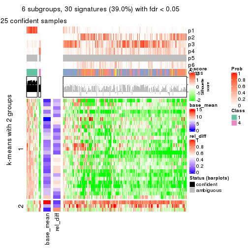</p>

</div>
</div>


Signature heatmaps where rows are not scaled:


<script>
$( function() {
	$( '#tabs-CV-mclust-get-signatures-no-scale' ).tabs();
} );
</script>
<div id='tabs-CV-mclust-get-signatures-no-scale'>
<ul>
<li><a href='#tab-CV-mclust-get-signatures-no-scale-1'>k = 2</a></li>
<li><a href='#tab-CV-mclust-get-signatures-no-scale-2'>k = 3</a></li>
<li><a href='#tab-CV-mclust-get-signatures-no-scale-3'>k = 4</a></li>
<li><a href='#tab-CV-mclust-get-signatures-no-scale-4'>k = 5</a></li>
<li><a href='#tab-CV-mclust-get-signatures-no-scale-5'>k = 6</a></li>
</ul>
<div id='tab-CV-mclust-get-signatures-no-scale-1'>
<pre><code class="r">get_signatures(res, k = 2, scale_rows = FALSE)
</code></pre>

<p></p>

</div>
<div id='tab-CV-mclust-get-signatures-no-scale-2'>
<pre><code class="r">get_signatures(res, k = 3, scale_rows = FALSE)
</code></pre>

<p>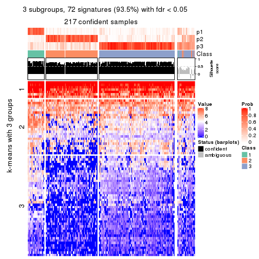</p>

</div>
<div id='tab-CV-mclust-get-signatures-no-scale-3'>
<pre><code class="r">get_signatures(res, k = 4, scale_rows = FALSE)
</code></pre>

<p></p>

</div>
<div id='tab-CV-mclust-get-signatures-no-scale-4'>
<pre><code class="r">get_signatures(res, k = 5, scale_rows = FALSE)
</code></pre>

<p></p>

</div>
<div id='tab-CV-mclust-get-signatures-no-scale-5'>
<pre><code class="r">get_signatures(res, k = 6, scale_rows = FALSE)
</code></pre>

<p></p>

</div>
</div>


Compare the overlap of signatures from different k:

```r
compare_signatures(res)
```


`get_signature()` returns a data frame invisibly. TO get the list of signatures, the function
call should be assigned to a variable explicitly. In following code, if `plot` argument is set
to `FALSE`, no heatmap is plotted while only the differential analysis is performed.

```r
# code only for demonstration
tb = get_signature(res, k = ..., plot = FALSE)
```

An example of the output of `tb` is:

```
#>   which_row         fdr    mean_1    mean_2 scaled_mean_1 scaled_mean_2 km
#> 1        38 0.042760348  8.373488  9.131774    -0.5533452     0.5164555  1
#> 2        40 0.018707592  7.106213  8.469186    -0.6173731     0.5762149  1
#> 3        55 0.019134737 10.221463 11.207825    -0.6159697     0.5749050  1
#> 4        59 0.006059896  5.921854  7.869574    -0.6899429     0.6439467  1
#> 5        60 0.018055526  8.928898 10.211722    -0.6204761     0.5791110  1
#> 6        98 0.009384629 15.714769 14.887706     0.6635654    -0.6193277  2
...
```

The columns in `tb` are:

1. `which_row`: row indices corresponding to the input matrix.
2. `fdr`: FDR for the differential test. 
3. `mean_x`: The mean value in group x.
4. `scaled_mean_x`: The mean value in group x after rows are scaled.
5. `km`: Row groups if k-means clustering is applied to rows.


UMAP plot which shows how samples are separated.


<script>
$( function() {
	$( '#tabs-CV-mclust-dimension-reduction' ).tabs();
} );
</script>
<div id='tabs-CV-mclust-dimension-reduction'>
<ul>
<li><a href='#tab-CV-mclust-dimension-reduction-1'>k = 2</a></li>
<li><a href='#tab-CV-mclust-dimension-reduction-2'>k = 3</a></li>
<li><a href='#tab-CV-mclust-dimension-reduction-3'>k = 4</a></li>
<li><a href='#tab-CV-mclust-dimension-reduction-4'>k = 5</a></li>
<li><a href='#tab-CV-mclust-dimension-reduction-5'>k = 6</a></li>
</ul>
<div id='tab-CV-mclust-dimension-reduction-1'>
<pre><code class="r">dimension_reduction(res, k = 2, method = &quot;UMAP&quot;)
</code></pre>

<p></p>

</div>
<div id='tab-CV-mclust-dimension-reduction-2'>
<pre><code class="r">dimension_reduction(res, k = 3, method = &quot;UMAP&quot;)
</code></pre>

<p></p>

</div>
<div id='tab-CV-mclust-dimension-reduction-3'>
<pre><code class="r">dimension_reduction(res, k = 4, method = &quot;UMAP&quot;)
</code></pre>

<p></p>

</div>
<div id='tab-CV-mclust-dimension-reduction-4'>
<pre><code class="r">dimension_reduction(res, k = 5, method = &quot;UMAP&quot;)
</code></pre>

<p></p>

</div>
<div id='tab-CV-mclust-dimension-reduction-5'>
<pre><code class="r">dimension_reduction(res, k = 6, method = &quot;UMAP&quot;)
</code></pre>

<p></p>

</div>
</div>


Following heatmap shows how subgroups are split when increasing `k`:

```r
collect_classes(res)
```


If matrix rows can be associated to genes, consider to use `GO_Enrichment(res,
...)` to perform function enrichment for the signature genes.


 

---------------------------------------------------


### CV:NMF


The object with results only for a single top-value method and a single partition method 
can be extracted as:

```r
res = res_list["CV", "NMF"]
# you can also extract it by
# res = res_list["CV:NMF"]
```

A summary of `res` and all the functions that can be applied to it:

```r
res
```

```
#> A 'ConsensusPartition' object with k = 2, 3, 4, 5, 6.
#>   On a matrix with 77 rows and 243 columns.
#>   Top rows (8, 16, 23, 30, 38) are extracted by 'CV' method.
#>   Subgroups are detected by 'NMF' method.
#>   Performed in total 1250 partitions by row resampling.
#>   Best k for subgroups seems to be 2.
#> 
#> Following methods can be applied to this 'ConsensusPartition' object:
#>  [1] "cola_report"             "collect_classes"         "collect_plots"          
#>  [4] "collect_stats"           "colnames"                "compare_signatures"     
#>  [7] "consensus_heatmap"       "dimension_reduction"     "functional_enrichment"  
#> [10] "get_anno_col"            "get_anno"                "get_classes"            
#> [13] "get_consensus"           "get_matrix"              "get_membership"         
#> [16] "get_param"               "get_signatures"          "get_stats"              
#> [19] "is_best_k"               "is_stable_k"             "membership_heatmap"     
#> [22] "ncol"                    "nrow"                    "plot_ecdf"              
#> [25] "rownames"                "select_partition_number" "show"                   
#> [28] "suggest_best_k"          "test_to_known_factors"
```

`collect_plots()` function collects all the plots made from `res` for all `k` (number of partitions)
into one single page to provide an easy and fast comparison between different `k`.

```r
collect_plots(res)
```


The plots are:

- The first row: a plot of the ECDF (Empirical cumulative distribution
  function) curves of the consensus matrix for each `k` and the heatmap of
  predicted classes for each `k`.
- The second row: heatmaps of the consensus matrix for each `k`.
- The third row: heatmaps of the membership matrix for each `k`.
- The fouth row: heatmaps of the signatures for each `k`.

All the plots in panels can be made by individual functions and they are
plotted later in this section.

`select_partition_number()` produces several plots showing different
statistics for choosing "optimized" `k`. There are following statistics:

- ECDF curves of the consensus matrix for each `k`;
- 1-PAC. [The PAC
  score](https://en.wikipedia.org/wiki/Consensus_clustering#Over-interpretation_potential_of_consensus_clustering)
  measures the proportion of the ambiguous subgrouping.
- Mean silhouette score.
- Concordance. The mean probability of fiting the consensus class ids in all
  partitions.
- Area increased. Denote $A_k$ as the area under the ECDF curve for current
  `k`, the area increased is defined as $A_k - A_{k-1}$.
- Rand index. The percent of pairs of samples that are both in a same cluster
  or both are not in a same cluster in the partition of k and k-1.
- Jaccard index. The ratio of pairs of samples are both in a same cluster in
  the partition of k and k-1 and the pairs of samples are both in a same
  cluster in the partition k or k-1.

The detailed explanations of these statistics can be found in [the cola
vignette](http://bioconductor.org/packages/devel/bioc/vignettes/cola/inst/doc/cola.html#toc_13).

Generally speaking, lower PAC score, higher mean silhouette score or higher
concordance corresponds to better partition. Rand index and Jaccard index
measure how similar the current partition is compared to partition with `k-1`.
If they are too similar, we won't accept `k` is better than `k-1`.

```r
select_partition_number(res)
```


The numeric values for all these statistics can be obtained by `get_stats()`.

```r
get_stats(res)
```

```
#>   k  1-PAC mean_silhouette concordance area_increased  Rand Jaccard
#> 2 2 0.0531           0.586       0.769         0.4768 0.508   0.508
#> 3 3 0.0802           0.424       0.647         0.3286 0.778   0.596
#> 4 4 0.1481           0.290       0.552         0.1227 0.904   0.759
#> 5 5 0.2314           0.259       0.528         0.0676 0.891   0.690
#> 6 6 0.2854           0.220       0.495         0.0448 0.860   0.545
```

`suggest_best_k()` suggests the best $k$ based on these statistics. The rules are as follows:

- All $k$ with Jaccard index larger than 0.95 are removed because the increase of
  the partition number does not provides enough extra information. If all $k$ are removed,
  the best $k$ is assigned by `NA`.
- For $k$ with 1-PAC larger than 0.9, the maximal $k$ is taken as the "best k". Other $k$ is called "optional k".
- If it does not fit the second rule. The $k$ with the highest vote of highest
  1-PAC, mean silhouette and concordance is taken as the "best k".

```r
suggest_best_k(res)
```

```
#> [1] 2
```


Following shows the table of the partitions (You need to click the **show/hide
code output** link to see it). The membership matrix (columns with name `p*`)
is inferred by
[`clue::cl_consensus()`](https://www.rdocumentation.org/link/cl_consensus?package=clue)
function with the `SE` method. Basically the value in the membership matrix
represents the probability to belong to a certain group. The finall class
label for an item is determined with the group with highest probability it
belongs to.

In `get_classes()` function, the entropy is calculated from the membership
matrix and the silhouette score is calculated from the consensus matrix.


<script>
$( function() {
	$( '#tabs-CV-NMF-get-classes' ).tabs();
} );
</script>
<div id='tabs-CV-NMF-get-classes'>
<ul>
<li><a href='#tab-CV-NMF-get-classes-1'>k = 2</a></li>
<li><a href='#tab-CV-NMF-get-classes-2'>k = 3</a></li>
<li><a href='#tab-CV-NMF-get-classes-3'>k = 4</a></li>
<li><a href='#tab-CV-NMF-get-classes-4'>k = 5</a></li>
<li><a href='#tab-CV-NMF-get-classes-5'>k = 6</a></li>
</ul>

<div id='tab-CV-NMF-get-classes-1'>
<p><a id='tab-CV-NMF-get-classes-1-a' style='color:#0366d6' href='#'>show/hide code output</a></p>
<pre><code class="r">cbind(get_classes(res, k = 2), get_membership(res, k = 2))
</code></pre>

<pre><code>#&gt;           class entropy silhouette    p1    p2
#&gt; SRR191393     1  0.9129    0.37668 0.672 0.328
#&gt; SRR191394     1  0.3584    0.72659 0.932 0.068
#&gt; SRR191396     1  0.7056    0.67032 0.808 0.192
#&gt; SRR191397     1  0.9881    0.06528 0.564 0.436
#&gt; SRR191398     1  0.1184    0.71895 0.984 0.016
#&gt; SRR191399     1  0.9795    0.09271 0.584 0.416
#&gt; SRR191400     1  0.2043    0.72114 0.968 0.032
#&gt; SRR191401     1  0.9732    0.10278 0.596 0.404
#&gt; SRR191402     2  0.9460    0.61157 0.364 0.636
#&gt; SRR191403     2  0.9460    0.60629 0.364 0.636
#&gt; SRR191404     1  0.8207    0.61544 0.744 0.256
#&gt; SRR191405     2  0.9988    0.20954 0.480 0.520
#&gt; SRR191406     2  0.8207    0.69963 0.256 0.744
#&gt; SRR191407     1  0.2043    0.72370 0.968 0.032
#&gt; SRR191408     2  0.7883    0.67464 0.236 0.764
#&gt; SRR191409     1  0.6531    0.67931 0.832 0.168
#&gt; SRR191410     2  0.9881    0.45857 0.436 0.564
#&gt; SRR191411     2  0.9552    0.52206 0.376 0.624
#&gt; SRR191412     1  0.7602    0.61021 0.780 0.220
#&gt; SRR191413     2  0.8327    0.69790 0.264 0.736
#&gt; SRR191414     1  0.8081    0.57048 0.752 0.248
#&gt; SRR191415     2  0.8813    0.66144 0.300 0.700
#&gt; SRR191416     2  0.7950    0.71428 0.240 0.760
#&gt; SRR191418     1  0.9129    0.44664 0.672 0.328
#&gt; SRR191419     1  0.7139    0.70534 0.804 0.196
#&gt; SRR191420     2  0.8207    0.70084 0.256 0.744
#&gt; SRR191421     1  0.9944   -0.16361 0.544 0.456
#&gt; SRR191422     2  0.9944    0.07032 0.456 0.544
#&gt; SRR191423     2  0.9795    0.31546 0.416 0.584
#&gt; SRR191424     2  0.9933    0.07921 0.452 0.548
#&gt; SRR191425     2  0.7815    0.71937 0.232 0.768
#&gt; SRR191426     2  0.4022    0.73752 0.080 0.920
#&gt; SRR191427     1  0.9248    0.56555 0.660 0.340
#&gt; SRR191428     2  0.3584    0.73490 0.068 0.932
#&gt; SRR191429     1  0.9358    0.50143 0.648 0.352
#&gt; SRR191430     2  0.8909    0.61036 0.308 0.692
#&gt; SRR191431     1  0.4431    0.71792 0.908 0.092
#&gt; SRR191432     2  0.6148    0.67387 0.152 0.848
#&gt; SRR191433     1  0.9970   -0.05186 0.532 0.468
#&gt; SRR191434     1  0.8267    0.63434 0.740 0.260
#&gt; SRR191435     2  0.5737    0.72244 0.136 0.864
#&gt; SRR191436     1  0.9944    0.21378 0.544 0.456
#&gt; SRR191437     1  0.9044    0.57930 0.680 0.320
#&gt; SRR191438     2  0.9248    0.59191 0.340 0.660
#&gt; SRR191439     2  0.9686    0.19323 0.396 0.604
#&gt; SRR191440     1  0.6712    0.70411 0.824 0.176
#&gt; SRR191441     1  0.7674    0.68122 0.776 0.224
#&gt; SRR191442     2  0.9970    0.18429 0.468 0.532
#&gt; SRR191443     2  0.9608    0.53744 0.384 0.616
#&gt; SRR191444     2  0.9795    0.44614 0.416 0.584
#&gt; SRR191445     1  0.8207    0.65678 0.744 0.256
#&gt; SRR191446     2  0.9427    0.32645 0.360 0.640
#&gt; SRR191447     1  0.9977    0.35054 0.528 0.472
#&gt; SRR191448     1  0.9963   -0.07354 0.536 0.464
#&gt; SRR191449     2  0.5294    0.74232 0.120 0.880
#&gt; SRR191450     2  0.8267    0.69327 0.260 0.740
#&gt; SRR191451     2  0.9963    0.38946 0.464 0.536
#&gt; SRR191452     1  1.0000    0.18672 0.504 0.496
#&gt; SRR191453     2  0.9170    0.54031 0.332 0.668
#&gt; SRR191454     1  0.6247    0.72301 0.844 0.156
#&gt; SRR191455     2  0.9522    0.47991 0.372 0.628
#&gt; SRR191456     1  0.7745    0.67405 0.772 0.228
#&gt; SRR191457     1  0.4939    0.72888 0.892 0.108
#&gt; SRR191458     1  0.9710    0.32254 0.600 0.400
#&gt; SRR191459     2  0.8861    0.66269 0.304 0.696
#&gt; SRR191460     2  0.9977    0.35128 0.472 0.528
#&gt; SRR191461     2  0.2948    0.72639 0.052 0.948
#&gt; SRR191462     1  0.9608    0.28405 0.616 0.384
#&gt; SRR191463     1  0.7602    0.67705 0.780 0.220
#&gt; SRR191464     2  0.5629    0.74336 0.132 0.868
#&gt; SRR191465     2  0.8955    0.62089 0.312 0.688
#&gt; SRR191466     2  0.5946    0.71276 0.144 0.856
#&gt; SRR191467     2  0.9909    0.16635 0.444 0.556
#&gt; SRR191468     1  0.6973    0.70560 0.812 0.188
#&gt; SRR191469     2  0.8813    0.65157 0.300 0.700
#&gt; SRR191470     2  0.2778    0.72261 0.048 0.952
#&gt; SRR191471     1  0.9170    0.57439 0.668 0.332
#&gt; SRR191472     2  0.9209    0.46988 0.336 0.664
#&gt; SRR191473     2  0.3114    0.72387 0.056 0.944
#&gt; SRR191474     2  0.4815    0.74281 0.104 0.896
#&gt; SRR191475     1  0.9552    0.49341 0.624 0.376
#&gt; SRR191476     2  0.9209    0.30290 0.336 0.664
#&gt; SRR191477     2  0.4562    0.73912 0.096 0.904
#&gt; SRR191478     1  0.7602    0.69024 0.780 0.220
#&gt; SRR191479     1  0.9866    0.13235 0.568 0.432
#&gt; SRR191480     2  0.5059    0.73730 0.112 0.888
#&gt; SRR191481     2  0.7056    0.72598 0.192 0.808
#&gt; SRR191482     2  0.4939    0.73913 0.108 0.892
#&gt; SRR191483     2  0.4690    0.73108 0.100 0.900
#&gt; SRR191484     2  0.3584    0.73464 0.068 0.932
#&gt; SRR191485     1  0.7674    0.69335 0.776 0.224
#&gt; SRR191486     2  0.4298    0.73480 0.088 0.912
#&gt; SRR191487     2  0.9998   -0.12970 0.492 0.508
#&gt; SRR191488     1  0.4298    0.72540 0.912 0.088
#&gt; SRR191489     2  0.9996    0.11424 0.488 0.512
#&gt; SRR191490     2  0.9661    0.15285 0.392 0.608
#&gt; SRR191491     2  0.7674    0.65618 0.224 0.776
#&gt; SRR191492     2  0.5842    0.73776 0.140 0.860
#&gt; SRR191493     2  0.6801    0.64548 0.180 0.820
#&gt; SRR191494     1  0.4022    0.72145 0.920 0.080
#&gt; SRR191495     2  0.3274    0.73231 0.060 0.940
#&gt; SRR191496     1  0.7674    0.66229 0.776 0.224
#&gt; SRR191497     2  0.5294    0.74524 0.120 0.880
#&gt; SRR191498     1  0.9248    0.47775 0.660 0.340
#&gt; SRR191499     2  0.4690    0.73830 0.100 0.900
#&gt; SRR191500     2  0.5178    0.72764 0.116 0.884
#&gt; SRR191501     1  0.9248    0.56562 0.660 0.340
#&gt; SRR191502     1  0.9460    0.53845 0.636 0.364
#&gt; SRR191503     1  0.8499    0.61724 0.724 0.276
#&gt; SRR191504     2  0.9209    0.43996 0.336 0.664
#&gt; SRR191505     1  0.7950    0.67463 0.760 0.240
#&gt; SRR191506     1  0.6623    0.67582 0.828 0.172
#&gt; SRR191507     2  0.9710    0.36859 0.400 0.600
#&gt; SRR191508     2  0.9209    0.41280 0.336 0.664
#&gt; SRR191509     2  0.5842    0.73919 0.140 0.860
#&gt; SRR191510     2  0.9996    0.08022 0.488 0.512
#&gt; SRR191511     2  0.9170    0.38990 0.332 0.668
#&gt; SRR191512     1  0.5842    0.71834 0.860 0.140
#&gt; SRR191513     1  0.6531    0.72020 0.832 0.168
#&gt; SRR191514     1  0.9922    0.35063 0.552 0.448
#&gt; SRR191515     1  1.0000   -0.08595 0.504 0.496
#&gt; SRR191516     2  0.3733    0.73400 0.072 0.928
#&gt; SRR191517     2  0.2236    0.72473 0.036 0.964
#&gt; SRR191518     2  0.6247    0.74591 0.156 0.844
#&gt; SRR191519     2  0.1184    0.71359 0.016 0.984
#&gt; SRR191520     2  0.1843    0.70099 0.028 0.972
#&gt; SRR191521     2  0.9732    0.14321 0.404 0.596
#&gt; SRR191522     2  0.6048    0.67677 0.148 0.852
#&gt; SRR191523     1  0.7674    0.69381 0.776 0.224
#&gt; SRR191524     1  0.9754    0.47233 0.592 0.408
#&gt; SRR191525     2  0.3114    0.72718 0.056 0.944
#&gt; SRR191526     1  0.7674    0.69006 0.776 0.224
#&gt; SRR191527     1  0.1843    0.71856 0.972 0.028
#&gt; SRR191528     1  0.1414    0.71941 0.980 0.020
#&gt; SRR191529     1  0.5842    0.72705 0.860 0.140
#&gt; SRR191530     1  0.9491    0.46070 0.632 0.368
#&gt; SRR191531     1  0.6247    0.69446 0.844 0.156
#&gt; SRR191532     2  0.8861    0.65887 0.304 0.696
#&gt; SRR191533     2  0.7883    0.67382 0.236 0.764
#&gt; SRR191534     1  0.9087    0.57530 0.676 0.324
#&gt; SRR191535     2  0.6623    0.74299 0.172 0.828
#&gt; SRR191536     1  0.4690    0.73026 0.900 0.100
#&gt; SRR191537     1  0.7883    0.68403 0.764 0.236
#&gt; SRR191538     2  0.8144    0.58159 0.252 0.748
#&gt; SRR191539     1  0.4022    0.72854 0.920 0.080
#&gt; SRR191540     2  0.9686    0.33670 0.396 0.604
#&gt; SRR191541     1  0.6887    0.69831 0.816 0.184
#&gt; SRR191542     1  0.5059    0.71785 0.888 0.112
#&gt; SRR191543     2  0.9393    0.59140 0.356 0.644
#&gt; SRR191544     1  0.9896    0.37282 0.560 0.440
#&gt; SRR191545     2  0.3584    0.70895 0.068 0.932
#&gt; SRR191546     1  0.9552    0.51633 0.624 0.376
#&gt; SRR191547     2  0.6887    0.71546 0.184 0.816
#&gt; SRR191548     1  0.4298    0.72671 0.912 0.088
#&gt; SRR191549     1  0.1184    0.71915 0.984 0.016
#&gt; SRR191550     1  0.1633    0.72018 0.976 0.024
#&gt; SRR191551     1  0.2423    0.72427 0.960 0.040
#&gt; SRR191552     1  0.0938    0.71839 0.988 0.012
#&gt; SRR191553     1  0.2778    0.72674 0.952 0.048
#&gt; SRR191554     1  0.0938    0.71869 0.988 0.012
#&gt; SRR191555     2  0.7219    0.72912 0.200 0.800
#&gt; SRR191556     2  0.9087    0.63971 0.324 0.676
#&gt; SRR191557     2  0.7219    0.73018 0.200 0.800
#&gt; SRR191558     1  0.3274    0.72992 0.940 0.060
#&gt; SRR191559     2  0.3584    0.73504 0.068 0.932
#&gt; SRR191560     2  0.7745    0.72119 0.228 0.772
#&gt; SRR191561     1  0.1184    0.71994 0.984 0.016
#&gt; SRR191562     1  0.2778    0.72674 0.952 0.048
#&gt; SRR191563     2  0.8861    0.65443 0.304 0.696
#&gt; SRR191564     2  0.2948    0.73046 0.052 0.948
#&gt; SRR191565     2  0.8144    0.70882 0.252 0.748
#&gt; SRR191566     2  0.6712    0.73198 0.176 0.824
#&gt; SRR191567     2  0.9358    0.61145 0.352 0.648
#&gt; SRR191568     1  0.9944   -0.00605 0.544 0.456
#&gt; SRR191569     2  0.8016    0.71102 0.244 0.756
#&gt; SRR191570     2  0.9909    0.43742 0.444 0.556
#&gt; SRR191571     1  0.9286    0.39640 0.656 0.344
#&gt; SRR191572     1  0.3584    0.72934 0.932 0.068
#&gt; SRR191573     1  0.9993   -0.20550 0.516 0.484
#&gt; SRR191574     1  0.3879    0.72750 0.924 0.076
#&gt; SRR191575     1  0.9044    0.52256 0.680 0.320
#&gt; SRR191576     1  0.9795    0.18094 0.584 0.416
#&gt; SRR191577     1  0.5842    0.71887 0.860 0.140
#&gt; SRR191578     2  0.8909    0.65589 0.308 0.692
#&gt; SRR191579     1  0.3274    0.72854 0.940 0.060
#&gt; SRR191580     1  0.1633    0.72002 0.976 0.024
#&gt; SRR191581     1  0.1414    0.71925 0.980 0.020
#&gt; SRR191582     1  0.2043    0.72286 0.968 0.032
#&gt; SRR191583     1  0.2043    0.72372 0.968 0.032
#&gt; SRR191584     1  0.2423    0.72358 0.960 0.040
#&gt; SRR191585     2  0.3274    0.73053 0.060 0.940
#&gt; SRR191586     2  0.5737    0.74484 0.136 0.864
#&gt; SRR191587     2  0.9393    0.60155 0.356 0.644
#&gt; SRR191588     2  0.9044    0.64349 0.320 0.680
#&gt; SRR191589     2  0.9988    0.31758 0.480 0.520
#&gt; SRR191590     1  0.3431    0.72942 0.936 0.064
#&gt; SRR191591     2  0.9710    0.54132 0.400 0.600
#&gt; SRR191592     2  0.7056    0.73349 0.192 0.808
#&gt; SRR191593     2  0.9460    0.60754 0.364 0.636
#&gt; SRR191594     1  0.9896    0.10655 0.560 0.440
#&gt; SRR191595     2  0.7602    0.72665 0.220 0.780
#&gt; SRR191596     2  1.0000    0.27311 0.496 0.504
#&gt; SRR191597     2  0.5178    0.74118 0.116 0.884
#&gt; SRR191598     2  0.8016    0.70488 0.244 0.756
#&gt; SRR191599     2  0.8267    0.70315 0.260 0.740
#&gt; SRR191600     2  0.9491    0.57611 0.368 0.632
#&gt; SRR191601     2  0.6623    0.74103 0.172 0.828
#&gt; SRR191602     2  0.4431    0.73975 0.092 0.908
#&gt; SRR191603     2  0.4815    0.74499 0.104 0.896
#&gt; SRR191604     2  0.5629    0.74709 0.132 0.868
#&gt; SRR191605     2  0.5059    0.74225 0.112 0.888
#&gt; SRR191606     2  0.8327    0.69309 0.264 0.736
#&gt; SRR191607     2  0.2043    0.72197 0.032 0.968
#&gt; SRR191608     2  0.2236    0.72372 0.036 0.964
#&gt; SRR191609     2  0.2603    0.72801 0.044 0.956
#&gt; SRR191610     2  0.4431    0.74031 0.092 0.908
#&gt; SRR191611     2  0.3733    0.73602 0.072 0.928
#&gt; SRR191612     2  0.5059    0.74187 0.112 0.888
#&gt; SRR191613     1  0.8608    0.55366 0.716 0.284
#&gt; SRR191614     2  0.6438    0.73978 0.164 0.836
#&gt; SRR191615     2  0.6148    0.73754 0.152 0.848
#&gt; SRR191616     1  0.6531    0.68868 0.832 0.168
#&gt; SRR191617     1  0.6247    0.70933 0.844 0.156
#&gt; SRR191618     1  0.9983    0.19216 0.524 0.476
#&gt; SRR191619     2  0.6973    0.74297 0.188 0.812
#&gt; SRR191620     2  0.9993    0.05530 0.484 0.516
#&gt; SRR191621     2  0.4690    0.73812 0.100 0.900
#&gt; SRR191622     2  0.8763    0.67747 0.296 0.704
#&gt; SRR191623     2  0.5059    0.74324 0.112 0.888
#&gt; SRR191624     2  0.8555    0.68467 0.280 0.720
#&gt; SRR191625     2  0.9833    0.48312 0.424 0.576
#&gt; SRR191626     2  0.4161    0.72016 0.084 0.916
#&gt; SRR191627     2  0.5737    0.73964 0.136 0.864
#&gt; SRR191628     2  0.8555    0.69656 0.280 0.720
#&gt; SRR191629     2  0.6343    0.74039 0.160 0.840
#&gt; SRR191630     2  0.9393    0.61044 0.356 0.644
#&gt; SRR191631     2  0.5519    0.73957 0.128 0.872
#&gt; SRR191632     1  0.7376    0.66104 0.792 0.208
#&gt; SRR191633     2  0.7815    0.65853 0.232 0.768
#&gt; SRR191634     1  0.2236    0.71992 0.964 0.036
#&gt; SRR191635     2  0.4815    0.74203 0.104 0.896
#&gt; SRR191636     1  0.2778    0.72623 0.952 0.048
#&gt; SRR191637     1  0.7950    0.68368 0.760 0.240
</code></pre>

<script>
$('#tab-CV-NMF-get-classes-1-a').parent().next().next().hide();
$('#tab-CV-NMF-get-classes-1-a').click(function(){
  $('#tab-CV-NMF-get-classes-1-a').parent().next().next().toggle();
  return(false);
});
</script>
</div>

<div id='tab-CV-NMF-get-classes-2'>
<p><a id='tab-CV-NMF-get-classes-2-a' style='color:#0366d6' href='#'>show/hide code output</a></p>
<pre><code class="r">cbind(get_classes(res, k = 3), get_membership(res, k = 3))
</code></pre>

<pre><code>#&gt;           class entropy silhouette    p1    p2    p3
#&gt; SRR191393     1   0.744    0.30772 0.628 0.056 0.316
#&gt; SRR191394     1   0.269    0.61135 0.932 0.032 0.036
#&gt; SRR191396     1   0.726    0.51675 0.680 0.072 0.248
#&gt; SRR191397     1   0.764    0.39612 0.616 0.064 0.320
#&gt; SRR191398     1   0.245    0.58733 0.924 0.076 0.000
#&gt; SRR191399     1   0.786    0.07780 0.528 0.056 0.416
#&gt; SRR191400     1   0.153    0.60073 0.964 0.032 0.004
#&gt; SRR191401     1   0.753    0.23785 0.600 0.052 0.348
#&gt; SRR191402     3   0.853    0.37937 0.400 0.096 0.504
#&gt; SRR191403     3   0.779    0.47080 0.368 0.060 0.572
#&gt; SRR191404     1   0.782    0.52477 0.668 0.132 0.200
#&gt; SRR191405     3   0.957    0.09552 0.384 0.196 0.420
#&gt; SRR191406     3   0.771    0.53272 0.240 0.100 0.660
#&gt; SRR191407     1   0.425    0.59429 0.864 0.108 0.028
#&gt; SRR191408     3   0.826    0.46553 0.120 0.268 0.612
#&gt; SRR191409     1   0.676    0.57177 0.744 0.108 0.148
#&gt; SRR191410     3   0.809    0.42122 0.364 0.076 0.560
#&gt; SRR191411     3   0.921    0.42399 0.244 0.220 0.536
#&gt; SRR191412     1   0.644    0.54505 0.748 0.064 0.188
#&gt; SRR191413     3   0.749    0.59114 0.168 0.136 0.696
#&gt; SRR191414     1   0.734    0.43337 0.652 0.060 0.288
#&gt; SRR191415     3   0.756    0.56350 0.264 0.080 0.656
#&gt; SRR191416     3   0.760    0.60102 0.192 0.124 0.684
#&gt; SRR191418     1   0.709    0.41670 0.640 0.040 0.320
#&gt; SRR191419     1   0.649    0.58021 0.760 0.096 0.144
#&gt; SRR191420     3   0.886    0.39242 0.136 0.332 0.532
#&gt; SRR191421     3   0.874    0.22629 0.436 0.108 0.456
#&gt; SRR191422     2   0.847    0.57825 0.176 0.616 0.208
#&gt; SRR191423     2   0.933    0.29732 0.200 0.508 0.292
#&gt; SRR191424     3   1.000   -0.28669 0.336 0.320 0.344
#&gt; SRR191425     3   0.822    0.51995 0.108 0.288 0.604
#&gt; SRR191426     3   0.576    0.58817 0.056 0.152 0.792
#&gt; SRR191427     2   0.921    0.43174 0.320 0.508 0.172
#&gt; SRR191428     3   0.524    0.58715 0.036 0.152 0.812
#&gt; SRR191429     1   0.974   -0.01089 0.428 0.336 0.236
#&gt; SRR191430     3   0.968    0.14003 0.228 0.328 0.444
#&gt; SRR191431     1   0.689    0.46570 0.692 0.256 0.052
#&gt; SRR191432     2   0.755    0.34375 0.048 0.580 0.372
#&gt; SRR191433     2   0.986    0.25180 0.304 0.416 0.280
#&gt; SRR191434     1   0.905    0.32885 0.556 0.220 0.224
#&gt; SRR191435     3   0.753    0.15824 0.044 0.392 0.564
#&gt; SRR191436     2   0.994    0.18604 0.304 0.388 0.308
#&gt; SRR191437     2   0.724    0.55113 0.208 0.700 0.092
#&gt; SRR191438     3   0.949    0.31269 0.208 0.312 0.480
#&gt; SRR191439     2   0.706    0.58911 0.100 0.720 0.180
#&gt; SRR191440     1   0.875   -0.02241 0.492 0.396 0.112
#&gt; SRR191441     2   0.719    0.40295 0.280 0.664 0.056
#&gt; SRR191442     2   0.859    0.39205 0.128 0.572 0.300
#&gt; SRR191443     3   0.953    0.38427 0.288 0.228 0.484
#&gt; SRR191444     3   0.921    0.44923 0.320 0.172 0.508
#&gt; SRR191445     2   0.948    0.29333 0.384 0.432 0.184
#&gt; SRR191446     2   0.893    0.53202 0.148 0.536 0.316
#&gt; SRR191447     2   0.605    0.58496 0.080 0.784 0.136
#&gt; SRR191448     1   0.877    0.06252 0.476 0.112 0.412
#&gt; SRR191449     3   0.399    0.61678 0.064 0.052 0.884
#&gt; SRR191450     3   0.857    0.51444 0.200 0.192 0.608
#&gt; SRR191451     3   0.946    0.16371 0.396 0.180 0.424
#&gt; SRR191452     2   0.907    0.53852 0.192 0.548 0.260
#&gt; SRR191453     2   0.945    0.10237 0.180 0.432 0.388
#&gt; SRR191454     1   0.838    0.40815 0.604 0.268 0.128
#&gt; SRR191455     2   0.924    0.31019 0.172 0.500 0.328
#&gt; SRR191456     1   0.899    0.22506 0.528 0.320 0.152
#&gt; SRR191457     1   0.763    0.44211 0.668 0.232 0.100
#&gt; SRR191458     1   0.965    0.04212 0.400 0.208 0.392
#&gt; SRR191459     3   0.826    0.54903 0.260 0.124 0.616
#&gt; SRR191460     3   0.923    0.30166 0.384 0.156 0.460
#&gt; SRR191461     3   0.533    0.55318 0.024 0.184 0.792
#&gt; SRR191462     1   0.966    0.13954 0.460 0.240 0.300
#&gt; SRR191463     1   0.851    0.39828 0.580 0.296 0.124
#&gt; SRR191464     3   0.801    0.27317 0.064 0.412 0.524
#&gt; SRR191465     2   0.896    0.36807 0.132 0.492 0.376
#&gt; SRR191466     2   0.807    0.24064 0.068 0.528 0.404
#&gt; SRR191467     2   0.937    0.40243 0.192 0.492 0.316
#&gt; SRR191468     1   0.845    0.02544 0.484 0.428 0.088
#&gt; SRR191469     3   0.894    0.19610 0.128 0.388 0.484
#&gt; SRR191470     3   0.603    0.48216 0.024 0.244 0.732
#&gt; SRR191471     1   0.943    0.14975 0.504 0.264 0.232
#&gt; SRR191472     2   0.677    0.56577 0.064 0.720 0.216
#&gt; SRR191473     3   0.601    0.53592 0.032 0.220 0.748
#&gt; SRR191474     3   0.492    0.61532 0.052 0.108 0.840
#&gt; SRR191475     2   0.732    0.56439 0.196 0.700 0.104
#&gt; SRR191476     2   0.919    0.45075 0.160 0.492 0.348
#&gt; SRR191477     3   0.687    0.56692 0.080 0.196 0.724
#&gt; SRR191478     1   0.825    0.08869 0.528 0.392 0.080
#&gt; SRR191479     3   0.940    0.00819 0.412 0.172 0.416
#&gt; SRR191480     3   0.640    0.55776 0.040 0.236 0.724
#&gt; SRR191481     3   0.804    0.47748 0.092 0.300 0.608
#&gt; SRR191482     3   0.626    0.55320 0.048 0.204 0.748
#&gt; SRR191483     3   0.729    0.34830 0.040 0.356 0.604
#&gt; SRR191484     3   0.564    0.58618 0.036 0.180 0.784
#&gt; SRR191485     2   0.875    0.25789 0.396 0.492 0.112
#&gt; SRR191486     3   0.654    0.54529 0.056 0.212 0.732
#&gt; SRR191487     2   0.976    0.46035 0.284 0.444 0.272
#&gt; SRR191488     1   0.550    0.59859 0.812 0.124 0.064
#&gt; SRR191489     1   0.998   -0.17984 0.356 0.304 0.340
#&gt; SRR191490     2   0.761    0.57101 0.108 0.676 0.216
#&gt; SRR191491     2   0.787    0.48293 0.076 0.604 0.320
#&gt; SRR191492     3   0.741    0.50872 0.076 0.256 0.668
#&gt; SRR191493     2   0.807    0.27596 0.064 0.472 0.464
#&gt; SRR191494     1   0.706    0.38543 0.656 0.300 0.044
#&gt; SRR191495     3   0.421    0.59173 0.020 0.120 0.860
#&gt; SRR191496     2   0.768    0.42542 0.360 0.584 0.056
#&gt; SRR191497     3   0.578    0.60616 0.080 0.120 0.800
#&gt; SRR191498     1   0.891    0.33924 0.560 0.168 0.272
#&gt; SRR191499     3   0.722    0.44650 0.056 0.284 0.660
#&gt; SRR191500     3   0.788    0.10032 0.056 0.424 0.520
#&gt; SRR191501     2   0.935    0.47162 0.276 0.512 0.212
#&gt; SRR191502     2   0.901    0.46591 0.296 0.540 0.164
#&gt; SRR191503     2   0.918    0.34867 0.376 0.472 0.152
#&gt; SRR191504     2   0.764    0.52493 0.072 0.632 0.296
#&gt; SRR191505     2   0.814    0.31323 0.360 0.560 0.080
#&gt; SRR191506     2   0.772    0.36551 0.396 0.552 0.052
#&gt; SRR191507     3   0.997   -0.21089 0.320 0.308 0.372
#&gt; SRR191508     2   0.825    0.45199 0.088 0.560 0.352
#&gt; SRR191509     3   0.797    0.35920 0.084 0.312 0.604
#&gt; SRR191510     1   0.989   -0.10719 0.404 0.276 0.320
#&gt; SRR191511     2   0.785    0.52951 0.076 0.608 0.316
#&gt; SRR191512     1   0.868   -0.00432 0.476 0.420 0.104
#&gt; SRR191513     1   0.859    0.29145 0.544 0.344 0.112
#&gt; SRR191514     2   0.890    0.53210 0.180 0.568 0.252
#&gt; SRR191515     3   0.968    0.18752 0.340 0.224 0.436
#&gt; SRR191516     3   0.524    0.57328 0.036 0.152 0.812
#&gt; SRR191517     3   0.385    0.55352 0.004 0.136 0.860
#&gt; SRR191518     3   0.736    0.54097 0.112 0.188 0.700
#&gt; SRR191519     3   0.441    0.53447 0.004 0.172 0.824
#&gt; SRR191520     3   0.623    0.28568 0.004 0.372 0.624
#&gt; SRR191521     2   0.716    0.55849 0.056 0.668 0.276
#&gt; SRR191522     3   0.807   -0.00995 0.072 0.380 0.548
#&gt; SRR191523     1   0.879   -0.03492 0.456 0.432 0.112
#&gt; SRR191524     2   0.891    0.53972 0.260 0.564 0.176
#&gt; SRR191525     3   0.678    0.48490 0.052 0.244 0.704
#&gt; SRR191526     1   0.863   -0.00973 0.468 0.432 0.100
#&gt; SRR191527     1   0.493    0.51384 0.784 0.212 0.004
#&gt; SRR191528     1   0.250    0.59348 0.928 0.068 0.004
#&gt; SRR191529     1   0.847    0.24937 0.540 0.360 0.100
#&gt; SRR191530     2   0.950    0.29773 0.372 0.440 0.188
#&gt; SRR191531     2   0.740    0.10079 0.476 0.492 0.032
#&gt; SRR191532     3   0.932    0.34530 0.192 0.304 0.504
#&gt; SRR191533     3   0.890    0.07764 0.124 0.396 0.480
#&gt; SRR191534     2   0.935    0.34129 0.364 0.464 0.172
#&gt; SRR191535     3   0.701    0.58386 0.100 0.176 0.724
#&gt; SRR191536     1   0.759    0.28121 0.588 0.360 0.052
#&gt; SRR191537     1   0.873    0.32751 0.592 0.200 0.208
#&gt; SRR191538     2   0.782    0.46123 0.064 0.580 0.356
#&gt; SRR191539     1   0.530    0.58747 0.824 0.108 0.068
#&gt; SRR191540     2   0.846    0.53442 0.132 0.596 0.272
#&gt; SRR191541     2   0.857    0.28376 0.392 0.508 0.100
#&gt; SRR191542     1   0.733    0.23888 0.576 0.388 0.036
#&gt; SRR191543     3   0.882    0.43212 0.232 0.188 0.580
#&gt; SRR191544     2   0.932    0.42810 0.296 0.508 0.196
#&gt; SRR191545     3   0.682   -0.04114 0.012 0.488 0.500
#&gt; SRR191546     2   0.779    0.57437 0.192 0.672 0.136
#&gt; SRR191547     3   0.872    0.09974 0.108 0.412 0.480
#&gt; SRR191548     1   0.425    0.61224 0.872 0.048 0.080
#&gt; SRR191549     1   0.153    0.60253 0.964 0.032 0.004
#&gt; SRR191550     1   0.331    0.60882 0.908 0.064 0.028
#&gt; SRR191551     1   0.264    0.60472 0.932 0.048 0.020
#&gt; SRR191552     1   0.265    0.59774 0.928 0.060 0.012
#&gt; SRR191553     1   0.353    0.60693 0.900 0.068 0.032
#&gt; SRR191554     1   0.162    0.60330 0.964 0.024 0.012
#&gt; SRR191555     3   0.678    0.60805 0.140 0.116 0.744
#&gt; SRR191556     3   0.784    0.48123 0.328 0.072 0.600
#&gt; SRR191557     3   0.603    0.61826 0.164 0.060 0.776
#&gt; SRR191558     1   0.457    0.61056 0.860 0.068 0.072
#&gt; SRR191559     3   0.311    0.60611 0.028 0.056 0.916
#&gt; SRR191560     3   0.665    0.60129 0.184 0.076 0.740
#&gt; SRR191561     1   0.304    0.57871 0.896 0.104 0.000
#&gt; SRR191562     1   0.343    0.61235 0.904 0.032 0.064
#&gt; SRR191563     3   0.826    0.50132 0.268 0.120 0.612
#&gt; SRR191564     3   0.480    0.56074 0.020 0.156 0.824
#&gt; SRR191565     3   0.754    0.53517 0.304 0.064 0.632
#&gt; SRR191566     3   0.594    0.62229 0.140 0.072 0.788
#&gt; SRR191567     3   0.745    0.36595 0.396 0.040 0.564
#&gt; SRR191568     1   0.760    0.23021 0.568 0.048 0.384
#&gt; SRR191569     3   0.887    0.49906 0.224 0.200 0.576
#&gt; SRR191570     1   0.735    0.03654 0.532 0.032 0.436
#&gt; SRR191571     1   0.602    0.47829 0.700 0.012 0.288
#&gt; SRR191572     1   0.397    0.61372 0.884 0.044 0.072
#&gt; SRR191573     1   0.831    0.09769 0.528 0.084 0.388
#&gt; SRR191574     1   0.331    0.61593 0.908 0.028 0.064
#&gt; SRR191575     1   0.702    0.53612 0.700 0.068 0.232
#&gt; SRR191576     1   0.872    0.37820 0.560 0.136 0.304
#&gt; SRR191577     1   0.608    0.58485 0.772 0.060 0.168
#&gt; SRR191578     3   0.690    0.57690 0.280 0.044 0.676
#&gt; SRR191579     1   0.445    0.59705 0.856 0.112 0.032
#&gt; SRR191580     1   0.255    0.60497 0.936 0.040 0.024
#&gt; SRR191581     1   0.196    0.59540 0.944 0.056 0.000
#&gt; SRR191582     1   0.249    0.60019 0.932 0.060 0.008
#&gt; SRR191583     1   0.300    0.59581 0.916 0.068 0.016
#&gt; SRR191584     1   0.372    0.59428 0.888 0.088 0.024
#&gt; SRR191585     3   0.475    0.56836 0.024 0.144 0.832
#&gt; SRR191586     3   0.534    0.62437 0.084 0.092 0.824
#&gt; SRR191587     3   0.875    0.50898 0.256 0.164 0.580
#&gt; SRR191588     3   0.738    0.51225 0.336 0.048 0.616
#&gt; SRR191589     1   0.784   -0.19127 0.476 0.052 0.472
#&gt; SRR191590     1   0.461    0.60872 0.856 0.092 0.052
#&gt; SRR191591     3   0.807    0.37053 0.404 0.068 0.528
#&gt; SRR191592     3   0.645    0.61995 0.196 0.060 0.744
#&gt; SRR191593     3   0.737    0.54920 0.292 0.060 0.648
#&gt; SRR191594     1   0.902    0.01487 0.452 0.132 0.416
#&gt; SRR191595     3   0.744    0.57521 0.200 0.108 0.692
#&gt; SRR191596     3   0.807    0.15203 0.464 0.064 0.472
#&gt; SRR191597     3   0.555    0.60573 0.076 0.112 0.812
#&gt; SRR191598     3   0.609    0.59062 0.264 0.020 0.716
#&gt; SRR191599     3   0.649    0.60708 0.216 0.052 0.732
#&gt; SRR191600     3   0.758    0.44443 0.380 0.048 0.572
#&gt; SRR191601     3   0.598    0.61625 0.080 0.132 0.788
#&gt; SRR191602     3   0.427    0.62414 0.076 0.052 0.872
#&gt; SRR191603     3   0.422    0.60305 0.032 0.100 0.868
#&gt; SRR191604     3   0.616    0.58021 0.092 0.128 0.780
#&gt; SRR191605     3   0.519    0.60848 0.060 0.112 0.828
#&gt; SRR191606     3   0.778    0.43933 0.364 0.060 0.576
#&gt; SRR191607     3   0.304    0.57583 0.008 0.084 0.908
#&gt; SRR191608     3   0.385    0.58168 0.016 0.108 0.876
#&gt; SRR191609     3   0.406    0.57691 0.012 0.128 0.860
#&gt; SRR191610     3   0.449    0.58763 0.036 0.108 0.856
#&gt; SRR191611     3   0.584    0.57897 0.036 0.196 0.768
#&gt; SRR191612     3   0.448    0.61299 0.064 0.072 0.864
#&gt; SRR191613     1   0.929    0.31233 0.516 0.200 0.284
#&gt; SRR191614     3   0.574    0.61520 0.104 0.092 0.804
#&gt; SRR191615     3   0.561    0.61549 0.120 0.072 0.808
#&gt; SRR191616     1   0.545    0.59206 0.816 0.068 0.116
#&gt; SRR191617     1   0.604    0.58133 0.788 0.100 0.112
#&gt; SRR191618     2   0.944    0.38568 0.208 0.492 0.300
#&gt; SRR191619     3   0.793    0.59359 0.168 0.168 0.664
#&gt; SRR191620     3   0.960    0.08186 0.384 0.200 0.416
#&gt; SRR191621     3   0.704    0.57074 0.108 0.168 0.724
#&gt; SRR191622     3   0.891    0.51777 0.220 0.208 0.572
#&gt; SRR191623     3   0.409    0.62091 0.068 0.052 0.880
#&gt; SRR191624     3   0.642    0.60357 0.228 0.044 0.728
#&gt; SRR191625     3   0.753    0.42744 0.392 0.044 0.564
#&gt; SRR191626     3   0.774    0.04029 0.048 0.448 0.504
#&gt; SRR191627     3   0.625    0.59778 0.108 0.116 0.776
#&gt; SRR191628     3   0.871    0.52680 0.184 0.224 0.592
#&gt; SRR191629     3   0.531    0.62855 0.136 0.048 0.816
#&gt; SRR191630     3   0.896    0.41600 0.304 0.156 0.540
#&gt; SRR191631     3   0.587    0.60345 0.088 0.116 0.796
#&gt; SRR191632     1   0.662    0.49069 0.684 0.032 0.284
#&gt; SRR191633     3   0.825    0.20374 0.096 0.324 0.580
#&gt; SRR191634     1   0.445    0.54888 0.836 0.152 0.012
#&gt; SRR191635     3   0.463    0.61897 0.088 0.056 0.856
#&gt; SRR191636     1   0.434    0.59022 0.856 0.120 0.024
#&gt; SRR191637     1   0.783    0.41722 0.672 0.164 0.164
</code></pre>

<script>
$('#tab-CV-NMF-get-classes-2-a').parent().next().next().hide();
$('#tab-CV-NMF-get-classes-2-a').click(function(){
  $('#tab-CV-NMF-get-classes-2-a').parent().next().next().toggle();
  return(false);
});
</script>
</div>

<div id='tab-CV-NMF-get-classes-3'>
<p><a id='tab-CV-NMF-get-classes-3-a' style='color:#0366d6' href='#'>show/hide code output</a></p>
<pre><code class="r">cbind(get_classes(res, k = 4), get_membership(res, k = 4))
</code></pre>

<pre><code>#&gt;           class entropy silhouette    p1    p2    p3    p4
#&gt; SRR191393     1   0.755   0.107118 0.492 0.016 0.364 0.128
#&gt; SRR191394     1   0.261   0.520115 0.920 0.016 0.024 0.040
#&gt; SRR191396     1   0.822   0.234936 0.488 0.032 0.276 0.204
#&gt; SRR191397     1   0.785   0.278721 0.572 0.072 0.256 0.100
#&gt; SRR191398     1   0.286   0.501238 0.888 0.016 0.000 0.096
#&gt; SRR191399     3   0.786   0.256186 0.352 0.028 0.484 0.136
#&gt; SRR191400     1   0.214   0.515284 0.932 0.008 0.008 0.052
#&gt; SRR191401     1   0.657   0.335864 0.628 0.016 0.280 0.076
#&gt; SRR191402     3   0.794   0.306935 0.348 0.048 0.496 0.108
#&gt; SRR191403     3   0.774   0.336699 0.348 0.032 0.504 0.116
#&gt; SRR191404     1   0.796   0.183531 0.492 0.016 0.224 0.268
#&gt; SRR191405     4   0.914   0.090162 0.244 0.072 0.328 0.356
#&gt; SRR191406     3   0.763   0.394528 0.184 0.032 0.584 0.200
#&gt; SRR191407     1   0.501   0.496543 0.780 0.020 0.040 0.160
#&gt; SRR191408     3   0.850   0.318171 0.080 0.172 0.524 0.224
#&gt; SRR191409     1   0.805   0.189855 0.492 0.020 0.240 0.248
#&gt; SRR191410     3   0.736   0.399870 0.224 0.020 0.592 0.164
#&gt; SRR191411     3   0.788   0.311560 0.104 0.056 0.536 0.304
#&gt; SRR191412     1   0.727   0.265281 0.564 0.020 0.304 0.112
#&gt; SRR191413     3   0.736   0.433852 0.076 0.056 0.596 0.272
#&gt; SRR191414     1   0.756   0.000789 0.452 0.028 0.424 0.096
#&gt; SRR191415     3   0.725   0.457785 0.116 0.048 0.636 0.200
#&gt; SRR191416     3   0.632   0.496979 0.112 0.032 0.712 0.144
#&gt; SRR191418     1   0.710   0.267132 0.556 0.024 0.340 0.080
#&gt; SRR191419     1   0.683   0.418591 0.660 0.024 0.160 0.156
#&gt; SRR191420     3   0.882   0.273270 0.128 0.280 0.476 0.116
#&gt; SRR191421     3   0.808   0.309658 0.336 0.048 0.492 0.124
#&gt; SRR191422     2   0.715   0.394656 0.128 0.672 0.104 0.096
#&gt; SRR191423     4   0.896   0.143434 0.076 0.308 0.196 0.420
#&gt; SRR191424     4   0.990   0.203591 0.236 0.200 0.248 0.316
#&gt; SRR191425     3   0.735   0.387421 0.032 0.136 0.608 0.224
#&gt; SRR191426     3   0.652   0.447565 0.008 0.136 0.660 0.196
#&gt; SRR191427     2   0.935   0.225177 0.232 0.428 0.132 0.208
#&gt; SRR191428     3   0.569   0.487023 0.012 0.100 0.740 0.148
#&gt; SRR191429     4   0.952   0.104775 0.332 0.124 0.212 0.332
#&gt; SRR191430     3   0.938  -0.128328 0.092 0.268 0.336 0.304
#&gt; SRR191431     1   0.812   0.220262 0.556 0.140 0.068 0.236
#&gt; SRR191432     2   0.751   0.296194 0.028 0.592 0.176 0.204
#&gt; SRR191433     2   0.985  -0.117796 0.268 0.320 0.232 0.180
#&gt; SRR191434     1   0.950  -0.106577 0.388 0.136 0.204 0.272
#&gt; SRR191435     3   0.850  -0.105160 0.036 0.368 0.392 0.204
#&gt; SRR191436     4   0.954   0.282682 0.172 0.168 0.268 0.392
#&gt; SRR191437     2   0.740   0.380868 0.148 0.636 0.056 0.160
#&gt; SRR191438     3   0.879  -0.064415 0.060 0.188 0.380 0.372
#&gt; SRR191439     2   0.599   0.376159 0.052 0.736 0.056 0.156
#&gt; SRR191440     1   0.953  -0.119173 0.384 0.240 0.132 0.244
#&gt; SRR191441     2   0.855   0.056026 0.168 0.468 0.060 0.304
#&gt; SRR191442     4   0.888   0.023600 0.048 0.336 0.264 0.352
#&gt; SRR191443     3   0.858   0.085212 0.140 0.068 0.424 0.368
#&gt; SRR191444     3   0.922   0.095925 0.248 0.088 0.400 0.264
#&gt; SRR191445     2   0.963   0.018697 0.236 0.388 0.172 0.204
#&gt; SRR191446     2   0.834   0.344459 0.084 0.552 0.180 0.184
#&gt; SRR191447     2   0.582   0.389103 0.028 0.720 0.048 0.204
#&gt; SRR191448     1   0.800   0.103378 0.452 0.024 0.364 0.160
#&gt; SRR191449     3   0.505   0.519421 0.044 0.032 0.792 0.132
#&gt; SRR191450     3   0.854   0.262010 0.096 0.116 0.492 0.296
#&gt; SRR191451     3   0.911   0.128712 0.288 0.072 0.388 0.252
#&gt; SRR191452     2   0.887   0.167249 0.180 0.508 0.136 0.176
#&gt; SRR191453     4   0.892   0.187323 0.060 0.232 0.308 0.400
#&gt; SRR191454     1   0.964  -0.090154 0.372 0.204 0.160 0.264
#&gt; SRR191455     2   0.896  -0.119033 0.056 0.348 0.248 0.348
#&gt; SRR191456     1   0.943   0.049668 0.432 0.180 0.184 0.204
#&gt; SRR191457     1   0.829   0.232346 0.536 0.168 0.064 0.232
#&gt; SRR191458     4   0.921   0.089007 0.236 0.080 0.332 0.352
#&gt; SRR191459     3   0.732   0.438764 0.088 0.072 0.636 0.204
#&gt; SRR191460     3   0.875   0.294173 0.212 0.076 0.484 0.228
#&gt; SRR191461     3   0.693   0.428547 0.012 0.196 0.628 0.164
#&gt; SRR191462     4   0.957   0.257864 0.280 0.120 0.256 0.344
#&gt; SRR191463     1   0.900   0.149241 0.444 0.132 0.124 0.300
#&gt; SRR191464     3   0.798   0.168244 0.008 0.260 0.448 0.284
#&gt; SRR191465     2   0.908   0.141769 0.084 0.428 0.236 0.252
#&gt; SRR191466     2   0.783   0.205489 0.028 0.524 0.296 0.152
#&gt; SRR191467     2   0.955  -0.005929 0.128 0.372 0.248 0.252
#&gt; SRR191468     1   0.908  -0.085025 0.384 0.312 0.072 0.232
#&gt; SRR191469     3   0.887   0.217761 0.096 0.256 0.476 0.172
#&gt; SRR191470     3   0.782   0.232697 0.008 0.272 0.484 0.236
#&gt; SRR191471     1   0.947  -0.010093 0.424 0.172 0.204 0.200
#&gt; SRR191472     2   0.561   0.403022 0.036 0.764 0.128 0.072
#&gt; SRR191473     3   0.717   0.423014 0.016 0.228 0.604 0.152
#&gt; SRR191474     3   0.461   0.522356 0.020 0.040 0.812 0.128
#&gt; SRR191475     2   0.669   0.397331 0.136 0.700 0.064 0.100
#&gt; SRR191476     2   0.849   0.240110 0.048 0.484 0.244 0.224
#&gt; SRR191477     3   0.681   0.451310 0.024 0.136 0.660 0.180
#&gt; SRR191478     2   0.891   0.032327 0.364 0.396 0.088 0.152
#&gt; SRR191479     3   0.894   0.012967 0.316 0.060 0.392 0.232
#&gt; SRR191480     3   0.668   0.470345 0.028 0.212 0.664 0.096
#&gt; SRR191481     3   0.787   0.240979 0.016 0.180 0.484 0.320
#&gt; SRR191482     3   0.686   0.458571 0.028 0.136 0.660 0.176
#&gt; SRR191483     3   0.793   0.292370 0.032 0.320 0.504 0.144
#&gt; SRR191484     3   0.622   0.485863 0.008 0.144 0.692 0.156
#&gt; SRR191485     1   0.921  -0.246261 0.328 0.312 0.072 0.288
#&gt; SRR191486     3   0.828   0.293753 0.040 0.192 0.496 0.272
#&gt; SRR191487     4   0.975  -0.020458 0.212 0.296 0.164 0.328
#&gt; SRR191488     1   0.752   0.318742 0.540 0.036 0.096 0.328
#&gt; SRR191489     1   0.977  -0.050892 0.336 0.192 0.284 0.188
#&gt; SRR191490     2   0.787   0.348972 0.100 0.600 0.104 0.196
#&gt; SRR191491     2   0.800   0.077549 0.020 0.464 0.180 0.336
#&gt; SRR191492     3   0.793   0.386038 0.040 0.252 0.548 0.160
#&gt; SRR191493     4   0.880  -0.107789 0.044 0.352 0.252 0.352
#&gt; SRR191494     1   0.806   0.115738 0.504 0.156 0.036 0.304
#&gt; SRR191495     3   0.598   0.501345 0.012 0.108 0.716 0.164
#&gt; SRR191496     2   0.718   0.300409 0.252 0.608 0.028 0.112
#&gt; SRR191497     3   0.635   0.533690 0.072 0.088 0.728 0.112
#&gt; SRR191498     1   0.906  -0.005967 0.376 0.064 0.280 0.280
#&gt; SRR191499     3   0.655   0.390115 0.020 0.292 0.624 0.064
#&gt; SRR191500     3   0.728   0.043257 0.044 0.452 0.452 0.052
#&gt; SRR191501     2   0.898   0.287613 0.144 0.472 0.128 0.256
#&gt; SRR191502     2   0.931   0.232406 0.144 0.416 0.156 0.284
#&gt; SRR191503     2   0.922   0.164870 0.312 0.380 0.088 0.220
#&gt; SRR191504     2   0.635   0.412238 0.044 0.712 0.160 0.084
#&gt; SRR191505     4   0.854   0.038641 0.220 0.328 0.036 0.416
#&gt; SRR191506     2   0.724   0.289892 0.308 0.568 0.024 0.100
#&gt; SRR191507     1   0.974  -0.200926 0.324 0.276 0.252 0.148
#&gt; SRR191508     2   0.795   0.231116 0.044 0.560 0.180 0.216
#&gt; SRR191509     3   0.813   0.170860 0.016 0.260 0.456 0.268
#&gt; SRR191510     1   0.996  -0.173645 0.292 0.248 0.216 0.244
#&gt; SRR191511     2   0.793   0.286796 0.060 0.580 0.156 0.204
#&gt; SRR191512     1   0.931  -0.050134 0.404 0.276 0.108 0.212
#&gt; SRR191513     1   0.881   0.157158 0.464 0.168 0.084 0.284
#&gt; SRR191514     2   0.943   0.253805 0.164 0.424 0.180 0.232
#&gt; SRR191515     3   0.920   0.063952 0.264 0.080 0.384 0.272
#&gt; SRR191516     3   0.645   0.469749 0.020 0.168 0.688 0.124
#&gt; SRR191517     3   0.659   0.443796 0.012 0.148 0.664 0.176
#&gt; SRR191518     3   0.847   0.353127 0.080 0.168 0.528 0.224
#&gt; SRR191519     3   0.711   0.374816 0.000 0.200 0.564 0.236
#&gt; SRR191520     3   0.744   0.090812 0.004 0.408 0.440 0.148
#&gt; SRR191521     2   0.762   0.311684 0.028 0.552 0.136 0.284
#&gt; SRR191522     3   0.892  -0.094256 0.052 0.268 0.372 0.308
#&gt; SRR191523     4   0.898   0.178659 0.328 0.292 0.052 0.328
#&gt; SRR191524     2   0.790   0.321360 0.144 0.608 0.100 0.148
#&gt; SRR191525     3   0.852   0.204176 0.044 0.292 0.456 0.208
#&gt; SRR191526     1   0.878  -0.034448 0.428 0.272 0.052 0.248
#&gt; SRR191527     1   0.516   0.449353 0.776 0.104 0.008 0.112
#&gt; SRR191528     1   0.377   0.490460 0.848 0.024 0.008 0.120
#&gt; SRR191529     4   0.913   0.255395 0.304 0.204 0.088 0.404
#&gt; SRR191530     1   0.965  -0.203591 0.348 0.284 0.140 0.228
#&gt; SRR191531     2   0.815   0.040352 0.340 0.424 0.016 0.220
#&gt; SRR191532     3   0.853   0.284690 0.100 0.120 0.508 0.272
#&gt; SRR191533     3   0.910  -0.066882 0.064 0.312 0.352 0.272
#&gt; SRR191534     2   0.921   0.192341 0.252 0.424 0.100 0.224
#&gt; SRR191535     3   0.780   0.439998 0.084 0.116 0.604 0.196
#&gt; SRR191536     4   0.890   0.207034 0.312 0.192 0.072 0.424
#&gt; SRR191537     1   0.947   0.078698 0.420 0.172 0.180 0.228
#&gt; SRR191538     2   0.736   0.369162 0.032 0.616 0.168 0.184
#&gt; SRR191539     1   0.602   0.455476 0.704 0.048 0.032 0.216
#&gt; SRR191540     2   0.775   0.368123 0.104 0.600 0.216 0.080
#&gt; SRR191541     2   0.867   0.250133 0.216 0.472 0.060 0.252
#&gt; SRR191542     4   0.884   0.171313 0.312 0.256 0.048 0.384
#&gt; SRR191543     3   0.888   0.179789 0.148 0.108 0.472 0.272
#&gt; SRR191544     2   0.954   0.110656 0.160 0.356 0.164 0.320
#&gt; SRR191545     2   0.657   0.238662 0.000 0.604 0.280 0.116
#&gt; SRR191546     2   0.626   0.374753 0.108 0.732 0.060 0.100
#&gt; SRR191547     2   0.861   0.107969 0.056 0.440 0.328 0.176
#&gt; SRR191548     1   0.429   0.515344 0.836 0.012 0.080 0.072
#&gt; SRR191549     1   0.194   0.516123 0.944 0.008 0.016 0.032
#&gt; SRR191550     1   0.345   0.516878 0.872 0.008 0.028 0.092
#&gt; SRR191551     1   0.306   0.518524 0.892 0.004 0.032 0.072
#&gt; SRR191552     1   0.177   0.513794 0.948 0.012 0.004 0.036
#&gt; SRR191553     1   0.454   0.503651 0.824 0.032 0.036 0.108
#&gt; SRR191554     1   0.176   0.513041 0.944 0.004 0.004 0.048
#&gt; SRR191555     3   0.704   0.483792 0.072 0.076 0.660 0.192
#&gt; SRR191556     3   0.760   0.417545 0.244 0.028 0.572 0.156
#&gt; SRR191557     3   0.534   0.517409 0.104 0.020 0.776 0.100
#&gt; SRR191558     1   0.504   0.507371 0.792 0.024 0.056 0.128
#&gt; SRR191559     3   0.485   0.511377 0.012 0.048 0.788 0.152
#&gt; SRR191560     3   0.615   0.496995 0.124 0.008 0.696 0.172
#&gt; SRR191561     1   0.432   0.478099 0.824 0.032 0.016 0.128
#&gt; SRR191562     1   0.514   0.513232 0.792 0.024 0.092 0.092
#&gt; SRR191563     3   0.828   0.350948 0.236 0.052 0.524 0.188
#&gt; SRR191564     3   0.714   0.437217 0.024 0.164 0.628 0.184
#&gt; SRR191565     3   0.762   0.402193 0.260 0.036 0.572 0.132
#&gt; SRR191566     3   0.523   0.529614 0.080 0.028 0.788 0.104
#&gt; SRR191567     3   0.823   0.132902 0.392 0.036 0.416 0.156
#&gt; SRR191568     1   0.807   0.086072 0.448 0.040 0.384 0.128
#&gt; SRR191569     3   0.917   0.287538 0.176 0.136 0.460 0.228
#&gt; SRR191570     1   0.654   0.142742 0.544 0.008 0.388 0.060
#&gt; SRR191571     1   0.687   0.283939 0.560 0.012 0.344 0.084
#&gt; SRR191572     1   0.385   0.525487 0.860 0.012 0.060 0.068
#&gt; SRR191573     3   0.813   0.070234 0.372 0.016 0.404 0.208
#&gt; SRR191574     1   0.441   0.514787 0.824 0.008 0.100 0.068
#&gt; SRR191575     1   0.670   0.434850 0.664 0.024 0.200 0.112
#&gt; SRR191576     1   0.868   0.025067 0.384 0.036 0.316 0.264
#&gt; SRR191577     1   0.743   0.399491 0.612 0.036 0.192 0.160
#&gt; SRR191578     3   0.654   0.493495 0.200 0.024 0.676 0.100
#&gt; SRR191579     1   0.598   0.479422 0.732 0.040 0.064 0.164
#&gt; SRR191580     1   0.227   0.513775 0.928 0.008 0.012 0.052
#&gt; SRR191581     1   0.271   0.503958 0.884 0.004 0.000 0.112
#&gt; SRR191582     1   0.271   0.510417 0.892 0.004 0.004 0.100
#&gt; SRR191583     1   0.483   0.504147 0.804 0.024 0.048 0.124
#&gt; SRR191584     1   0.336   0.512551 0.888 0.040 0.020 0.052
#&gt; SRR191585     3   0.563   0.478703 0.000 0.144 0.724 0.132
#&gt; SRR191586     3   0.476   0.527301 0.028 0.048 0.812 0.112
#&gt; SRR191587     3   0.770   0.375936 0.116 0.048 0.572 0.264
#&gt; SRR191588     3   0.632   0.464129 0.240 0.012 0.664 0.084
#&gt; SRR191589     3   0.756   0.327232 0.288 0.008 0.520 0.184
#&gt; SRR191590     1   0.530   0.505128 0.768 0.016 0.068 0.148
#&gt; SRR191591     3   0.747   0.365241 0.308 0.020 0.544 0.128
#&gt; SRR191592     3   0.662   0.518497 0.128 0.048 0.700 0.124
#&gt; SRR191593     3   0.648   0.494725 0.144 0.024 0.692 0.140
#&gt; SRR191594     3   0.864   0.073178 0.348 0.048 0.408 0.196
#&gt; SRR191595     3   0.723   0.448210 0.168 0.028 0.624 0.180
#&gt; SRR191596     3   0.758   0.146838 0.404 0.020 0.460 0.116
#&gt; SRR191597     3   0.567   0.493873 0.032 0.052 0.744 0.172
#&gt; SRR191598     3   0.622   0.498912 0.228 0.008 0.672 0.092
#&gt; SRR191599     3   0.633   0.505694 0.148 0.028 0.708 0.116
#&gt; SRR191600     3   0.744   0.374180 0.320 0.036 0.552 0.092
#&gt; SRR191601     3   0.587   0.518868 0.024 0.056 0.716 0.204
#&gt; SRR191602     3   0.418   0.540717 0.048 0.040 0.852 0.060
#&gt; SRR191603     3   0.449   0.530563 0.008 0.076 0.820 0.096
#&gt; SRR191604     3   0.775   0.394581 0.100 0.072 0.588 0.240
#&gt; SRR191605     3   0.622   0.498938 0.036 0.060 0.700 0.204
#&gt; SRR191606     3   0.749   0.395480 0.268 0.024 0.568 0.140
#&gt; SRR191607     3   0.554   0.491051 0.008 0.136 0.748 0.108
#&gt; SRR191608     3   0.581   0.472828 0.000 0.152 0.708 0.140
#&gt; SRR191609     3   0.624   0.455450 0.000 0.176 0.668 0.156
#&gt; SRR191610     3   0.540   0.489299 0.004 0.132 0.752 0.112
#&gt; SRR191611     3   0.548   0.503050 0.012 0.168 0.748 0.072
#&gt; SRR191612     3   0.602   0.501532 0.036 0.064 0.724 0.176
#&gt; SRR191613     4   0.875   0.139261 0.312 0.040 0.268 0.380
#&gt; SRR191614     3   0.642   0.504212 0.076 0.052 0.708 0.164
#&gt; SRR191615     3   0.563   0.526169 0.084 0.040 0.768 0.108
#&gt; SRR191616     1   0.624   0.444234 0.700 0.016 0.116 0.168
#&gt; SRR191617     1   0.811   0.228972 0.544 0.068 0.124 0.264
#&gt; SRR191618     2   0.884  -0.077117 0.044 0.364 0.308 0.284
#&gt; SRR191619     3   0.859   0.374822 0.128 0.128 0.532 0.212
#&gt; SRR191620     3   0.983  -0.124848 0.228 0.176 0.324 0.272
#&gt; SRR191621     3   0.816   0.391175 0.080 0.200 0.568 0.152
#&gt; SRR191622     3   0.732   0.403808 0.076 0.048 0.584 0.292
#&gt; SRR191623     3   0.448   0.528188 0.020 0.032 0.816 0.132
#&gt; SRR191624     3   0.571   0.514430 0.140 0.016 0.744 0.100
#&gt; SRR191625     3   0.813   0.317216 0.336 0.056 0.492 0.116
#&gt; SRR191626     2   0.686  -0.013014 0.032 0.476 0.452 0.040
#&gt; SRR191627     3   0.689   0.470525 0.084 0.052 0.664 0.200
#&gt; SRR191628     3   0.819   0.410482 0.128 0.136 0.584 0.152
#&gt; SRR191629     3   0.552   0.536548 0.072 0.060 0.780 0.088
#&gt; SRR191630     3   0.753   0.424860 0.164 0.036 0.600 0.200
#&gt; SRR191631     3   0.645   0.487593 0.064 0.060 0.704 0.172
#&gt; SRR191632     1   0.652   0.373404 0.624 0.008 0.280 0.088
#&gt; SRR191633     3   0.913   0.074194 0.092 0.300 0.412 0.196
#&gt; SRR191634     1   0.506   0.465193 0.788 0.104 0.012 0.096
#&gt; SRR191635     3   0.574   0.540991 0.084 0.076 0.768 0.072
#&gt; SRR191636     1   0.571   0.465691 0.756 0.080 0.032 0.132
#&gt; SRR191637     1   0.830   0.240912 0.560 0.092 0.156 0.192
</code></pre>

<script>
$('#tab-CV-NMF-get-classes-3-a').parent().next().next().hide();
$('#tab-CV-NMF-get-classes-3-a').click(function(){
  $('#tab-CV-NMF-get-classes-3-a').parent().next().next().toggle();
  return(false);
});
</script>
</div>

<div id='tab-CV-NMF-get-classes-4'>
<p><a id='tab-CV-NMF-get-classes-4-a' style='color:#0366d6' href='#'>show/hide code output</a></p>
<pre><code class="r">cbind(get_classes(res, k = 5), get_membership(res, k = 5))
</code></pre>

<pre><code>#&gt;           class entropy silhouette    p1    p2    p3    p4    p5
#&gt; SRR191393     1   0.701    0.00508 0.432 0.032 0.428 0.020 0.088
#&gt; SRR191394     1   0.320    0.53310 0.880 0.032 0.052 0.008 0.028
#&gt; SRR191396     1   0.915    0.05397 0.340 0.052 0.272 0.156 0.180
#&gt; SRR191397     1   0.810    0.18943 0.476 0.032 0.212 0.212 0.068
#&gt; SRR191398     1   0.263    0.50859 0.892 0.016 0.000 0.012 0.080
#&gt; SRR191399     3   0.764    0.31911 0.280 0.016 0.500 0.080 0.124
#&gt; SRR191400     1   0.207    0.52357 0.928 0.004 0.016 0.008 0.044
#&gt; SRR191401     1   0.600    0.32295 0.600 0.012 0.312 0.024 0.052
#&gt; SRR191402     3   0.732    0.36995 0.272 0.104 0.544 0.040 0.040
#&gt; SRR191403     3   0.663    0.35546 0.328 0.028 0.556 0.044 0.044
#&gt; SRR191404     1   0.899    0.01490 0.348 0.032 0.180 0.184 0.256
#&gt; SRR191405     4   0.940   -0.12076 0.204 0.052 0.228 0.272 0.244
#&gt; SRR191406     3   0.818    0.24579 0.148 0.036 0.476 0.252 0.088
#&gt; SRR191407     1   0.661    0.46646 0.660 0.040 0.048 0.096 0.156
#&gt; SRR191408     3   0.909    0.04285 0.064 0.112 0.364 0.248 0.212
#&gt; SRR191409     1   0.799   -0.01800 0.364 0.024 0.300 0.032 0.280
#&gt; SRR191410     3   0.609    0.46878 0.108 0.028 0.696 0.036 0.132
#&gt; SRR191411     3   0.743    0.23310 0.080 0.020 0.496 0.080 0.324
#&gt; SRR191412     1   0.683    0.26402 0.536 0.016 0.312 0.024 0.112
#&gt; SRR191413     3   0.754    0.30610 0.056 0.020 0.516 0.148 0.260
#&gt; SRR191414     3   0.699    0.30405 0.332 0.032 0.528 0.040 0.068
#&gt; SRR191415     3   0.633    0.46949 0.060 0.020 0.668 0.076 0.176
#&gt; SRR191416     3   0.552    0.49139 0.072 0.048 0.752 0.036 0.092
#&gt; SRR191418     1   0.747    0.14799 0.448 0.056 0.388 0.044 0.064
#&gt; SRR191419     1   0.679    0.44084 0.636 0.016 0.100 0.092 0.156
#&gt; SRR191420     3   0.789    0.24003 0.100 0.320 0.468 0.044 0.068
#&gt; SRR191421     3   0.705    0.35961 0.300 0.032 0.540 0.028 0.100
#&gt; SRR191422     2   0.597    0.43232 0.112 0.720 0.076 0.052 0.040
#&gt; SRR191423     5   0.816    0.25021 0.036 0.236 0.148 0.092 0.488
#&gt; SRR191424     5   0.903    0.10978 0.200 0.052 0.124 0.260 0.364
#&gt; SRR191425     3   0.610    0.44243 0.020 0.128 0.676 0.024 0.152
#&gt; SRR191426     3   0.636    0.26864 0.004 0.060 0.612 0.256 0.068
#&gt; SRR191427     2   0.898    0.27149 0.176 0.440 0.172 0.112 0.100
#&gt; SRR191428     3   0.507    0.41288 0.000 0.044 0.720 0.200 0.036
#&gt; SRR191429     4   0.965   -0.11336 0.232 0.136 0.112 0.284 0.236
#&gt; SRR191430     5   0.950    0.09313 0.100 0.124 0.204 0.276 0.296
#&gt; SRR191431     5   0.852    0.14127 0.344 0.120 0.044 0.112 0.380
#&gt; SRR191432     2   0.793    0.11033 0.028 0.444 0.096 0.336 0.096
#&gt; SRR191433     2   0.967   -0.07991 0.252 0.276 0.168 0.100 0.204
#&gt; SRR191434     1   0.928   -0.22783 0.288 0.072 0.240 0.112 0.288
#&gt; SRR191435     4   0.869    0.16758 0.036 0.300 0.260 0.324 0.080
#&gt; SRR191436     5   0.868    0.28879 0.096 0.104 0.240 0.104 0.456
#&gt; SRR191437     2   0.559    0.44064 0.056 0.744 0.028 0.068 0.104
#&gt; SRR191438     5   0.798    0.19279 0.020 0.072 0.336 0.152 0.420
#&gt; SRR191439     2   0.584    0.39756 0.028 0.720 0.044 0.080 0.128
#&gt; SRR191440     1   0.936   -0.21206 0.280 0.252 0.052 0.180 0.236
#&gt; SRR191441     2   0.678    0.09470 0.068 0.452 0.016 0.036 0.428
#&gt; SRR191442     5   0.819    0.15975 0.020 0.284 0.268 0.056 0.372
#&gt; SRR191443     3   0.834    0.06026 0.104 0.024 0.376 0.148 0.348
#&gt; SRR191444     3   0.889    0.10455 0.208 0.044 0.392 0.128 0.228
#&gt; SRR191445     2   0.877    0.03666 0.196 0.388 0.168 0.024 0.224
#&gt; SRR191446     2   0.821    0.30719 0.060 0.500 0.100 0.236 0.104
#&gt; SRR191447     2   0.568    0.42239 0.008 0.712 0.044 0.148 0.088
#&gt; SRR191448     1   0.766    0.24552 0.476 0.048 0.336 0.088 0.052
#&gt; SRR191449     3   0.462    0.44121 0.000 0.016 0.748 0.188 0.048
#&gt; SRR191450     3   0.871    0.00991 0.068 0.060 0.356 0.192 0.324
#&gt; SRR191451     3   0.924    0.17038 0.152 0.108 0.396 0.128 0.216
#&gt; SRR191452     4   0.890    0.04299 0.124 0.288 0.056 0.380 0.152
#&gt; SRR191453     5   0.793    0.30633 0.024 0.132 0.252 0.096 0.496
#&gt; SRR191454     5   0.950    0.28950 0.220 0.204 0.196 0.072 0.308
#&gt; SRR191455     5   0.877    0.20981 0.048 0.188 0.272 0.100 0.392
#&gt; SRR191456     1   0.968   -0.16995 0.292 0.216 0.168 0.104 0.220
#&gt; SRR191457     1   0.889    0.14515 0.448 0.172 0.112 0.088 0.180
#&gt; SRR191458     5   0.943    0.10118 0.192 0.056 0.232 0.256 0.264
#&gt; SRR191459     3   0.634    0.45730 0.052 0.056 0.680 0.048 0.164
#&gt; SRR191460     3   0.818    0.25323 0.152 0.068 0.476 0.048 0.256
#&gt; SRR191461     3   0.630    0.15743 0.004 0.056 0.536 0.364 0.040
#&gt; SRR191462     5   0.897    0.28899 0.208 0.056 0.200 0.132 0.404
#&gt; SRR191463     1   0.905    0.08209 0.352 0.096 0.064 0.248 0.240
#&gt; SRR191464     3   0.845   -0.12260 0.000 0.156 0.296 0.264 0.284
#&gt; SRR191465     2   0.907    0.11838 0.056 0.336 0.108 0.268 0.232
#&gt; SRR191466     2   0.754    0.07407 0.016 0.500 0.244 0.196 0.044
#&gt; SRR191467     2   0.939   -0.04932 0.100 0.324 0.176 0.120 0.280
#&gt; SRR191468     1   0.871   -0.12663 0.340 0.264 0.044 0.072 0.280
#&gt; SRR191469     3   0.808    0.20493 0.100 0.264 0.496 0.060 0.080
#&gt; SRR191470     4   0.699    0.34161 0.004 0.068 0.276 0.548 0.104
#&gt; SRR191471     1   0.958   -0.01466 0.336 0.180 0.108 0.168 0.208
#&gt; SRR191472     2   0.529    0.41372 0.036 0.764 0.040 0.104 0.056
#&gt; SRR191473     3   0.758    0.03298 0.028 0.080 0.440 0.380 0.072
#&gt; SRR191474     3   0.339    0.48706 0.000 0.020 0.860 0.064 0.056
#&gt; SRR191475     2   0.515    0.43074 0.076 0.772 0.028 0.036 0.088
#&gt; SRR191476     4   0.891   -0.00318 0.048 0.324 0.128 0.340 0.160
#&gt; SRR191477     3   0.635    0.40763 0.000 0.096 0.644 0.176 0.084
#&gt; SRR191478     2   0.880    0.06671 0.312 0.384 0.076 0.088 0.140
#&gt; SRR191479     3   0.919   -0.01376 0.264 0.140 0.376 0.120 0.100
#&gt; SRR191480     3   0.638    0.39500 0.028 0.208 0.652 0.064 0.048
#&gt; SRR191481     3   0.772    0.19629 0.004 0.128 0.472 0.112 0.284
#&gt; SRR191482     3   0.595    0.42482 0.012 0.128 0.704 0.096 0.060
#&gt; SRR191483     3   0.821    0.04316 0.028 0.264 0.420 0.228 0.060
#&gt; SRR191484     3   0.607    0.36084 0.004 0.048 0.624 0.268 0.056
#&gt; SRR191485     5   0.944    0.04084 0.228 0.272 0.132 0.080 0.288
#&gt; SRR191486     4   0.742    0.22564 0.016 0.064 0.304 0.504 0.112
#&gt; SRR191487     4   0.942    0.11752 0.132 0.156 0.120 0.364 0.228
#&gt; SRR191488     1   0.804    0.16005 0.424 0.020 0.108 0.112 0.336
#&gt; SRR191489     2   0.915    0.06701 0.260 0.300 0.232 0.172 0.036
#&gt; SRR191490     2   0.720    0.31290 0.028 0.584 0.064 0.220 0.104
#&gt; SRR191491     2   0.876   -0.03663 0.028 0.312 0.104 0.276 0.280
#&gt; SRR191492     3   0.821    0.13468 0.048 0.204 0.460 0.236 0.052
#&gt; SRR191493     4   0.697    0.22475 0.008 0.120 0.084 0.600 0.188
#&gt; SRR191494     5   0.693    0.16811 0.368 0.108 0.016 0.024 0.484
#&gt; SRR191495     3   0.481    0.42270 0.000 0.028 0.740 0.188 0.044
#&gt; SRR191496     2   0.619    0.34376 0.188 0.648 0.004 0.036 0.124
#&gt; SRR191497     3   0.734    0.40839 0.080 0.056 0.576 0.232 0.056
#&gt; SRR191498     1   0.911    0.06653 0.344 0.060 0.260 0.224 0.112
#&gt; SRR191499     3   0.560    0.30217 0.004 0.268 0.644 0.072 0.012
#&gt; SRR191500     2   0.671   -0.04226 0.008 0.456 0.396 0.128 0.012
#&gt; SRR191501     2   0.884    0.27019 0.072 0.428 0.132 0.244 0.124
#&gt; SRR191502     2   0.890    0.30524 0.092 0.444 0.104 0.188 0.172
#&gt; SRR191503     2   0.876    0.24577 0.220 0.452 0.092 0.092 0.144
#&gt; SRR191504     2   0.586    0.37722 0.016 0.700 0.088 0.160 0.036
#&gt; SRR191505     5   0.815    0.06668 0.112 0.224 0.020 0.168 0.476
#&gt; SRR191506     2   0.535    0.37261 0.216 0.692 0.000 0.028 0.064
#&gt; SRR191507     4   0.932    0.14291 0.252 0.164 0.200 0.324 0.060
#&gt; SRR191508     4   0.854    0.07446 0.028 0.316 0.116 0.380 0.160
#&gt; SRR191509     4   0.765    0.32870 0.008 0.056 0.276 0.464 0.196
#&gt; SRR191510     4   0.954   -0.02913 0.264 0.136 0.136 0.324 0.140
#&gt; SRR191511     4   0.784   -0.03424 0.040 0.372 0.048 0.420 0.120
#&gt; SRR191512     2   0.883    0.16994 0.272 0.396 0.056 0.104 0.172
#&gt; SRR191513     1   0.920    0.07084 0.364 0.148 0.064 0.240 0.184
#&gt; SRR191514     2   0.871    0.32602 0.072 0.464 0.128 0.200 0.136
#&gt; SRR191515     3   0.887   -0.02565 0.248 0.032 0.316 0.288 0.116
#&gt; SRR191516     3   0.573    0.18223 0.008 0.024 0.556 0.384 0.028
#&gt; SRR191517     3   0.617    0.12858 0.000 0.056 0.504 0.404 0.036
#&gt; SRR191518     3   0.801   -0.05879 0.028 0.100 0.396 0.380 0.096
#&gt; SRR191519     4   0.594    0.23452 0.000 0.028 0.312 0.592 0.068
#&gt; SRR191520     4   0.745    0.24839 0.004 0.272 0.324 0.376 0.024
#&gt; SRR191521     2   0.777    0.30711 0.000 0.460 0.096 0.220 0.224
#&gt; SRR191522     4   0.766    0.17615 0.008 0.164 0.224 0.512 0.092
#&gt; SRR191523     5   0.857    0.25583 0.260 0.148 0.036 0.128 0.428
#&gt; SRR191524     2   0.852    0.16242 0.128 0.440 0.064 0.280 0.088
#&gt; SRR191525     4   0.780    0.35914 0.060 0.068 0.272 0.516 0.084
#&gt; SRR191526     1   0.865   -0.00563 0.412 0.156 0.024 0.192 0.216
#&gt; SRR191527     1   0.515    0.40335 0.712 0.096 0.012 0.000 0.180
#&gt; SRR191528     1   0.530    0.46824 0.712 0.016 0.024 0.040 0.208
#&gt; SRR191529     5   0.819    0.30540 0.160 0.104 0.052 0.164 0.520
#&gt; SRR191530     2   0.935    0.08795 0.260 0.260 0.048 0.240 0.192
#&gt; SRR191531     2   0.780    0.17326 0.260 0.460 0.012 0.060 0.208
#&gt; SRR191532     3   0.909    0.14647 0.060 0.176 0.396 0.164 0.204
#&gt; SRR191533     3   0.926   -0.30182 0.048 0.172 0.292 0.284 0.204
#&gt; SRR191534     2   0.888    0.25992 0.124 0.444 0.076 0.188 0.168
#&gt; SRR191535     3   0.791    0.17213 0.040 0.096 0.484 0.296 0.084
#&gt; SRR191536     5   0.843    0.28849 0.188 0.172 0.088 0.064 0.488
#&gt; SRR191537     1   0.919    0.14824 0.396 0.104 0.148 0.232 0.120
#&gt; SRR191538     2   0.649    0.31563 0.000 0.580 0.124 0.260 0.036
#&gt; SRR191539     1   0.698    0.40836 0.600 0.028 0.036 0.152 0.184
#&gt; SRR191540     2   0.724    0.36425 0.108 0.620 0.136 0.092 0.044
#&gt; SRR191541     2   0.815    0.36044 0.140 0.532 0.064 0.096 0.168
#&gt; SRR191542     5   0.700    0.24142 0.228 0.184 0.008 0.032 0.548
#&gt; SRR191543     3   0.931   -0.06028 0.088 0.100 0.312 0.276 0.224
#&gt; SRR191544     2   0.905    0.18615 0.092 0.404 0.092 0.208 0.204
#&gt; SRR191545     4   0.737    0.14053 0.004 0.368 0.144 0.432 0.052
#&gt; SRR191546     2   0.623    0.40259 0.068 0.696 0.028 0.084 0.124
#&gt; SRR191547     4   0.875    0.18773 0.060 0.320 0.204 0.348 0.068
#&gt; SRR191548     1   0.478    0.50955 0.792 0.012 0.076 0.072 0.048
#&gt; SRR191549     1   0.242    0.52767 0.916 0.016 0.032 0.004 0.032
#&gt; SRR191550     1   0.404    0.53009 0.832 0.016 0.064 0.016 0.072
#&gt; SRR191551     1   0.334    0.52218 0.872 0.024 0.040 0.008 0.056
#&gt; SRR191552     1   0.157    0.51841 0.952 0.020 0.004 0.008 0.016
#&gt; SRR191553     1   0.421    0.51917 0.832 0.036 0.028 0.040 0.064
#&gt; SRR191554     1   0.215    0.52048 0.928 0.024 0.008 0.008 0.032
#&gt; SRR191555     3   0.643    0.44523 0.036 0.044 0.676 0.124 0.120
#&gt; SRR191556     3   0.805    0.32667 0.228 0.028 0.480 0.192 0.072
#&gt; SRR191557     3   0.418    0.48688 0.072 0.032 0.832 0.032 0.032
#&gt; SRR191558     1   0.588    0.49681 0.708 0.016 0.044 0.100 0.132
#&gt; SRR191559     3   0.528    0.38652 0.004 0.024 0.652 0.292 0.028
#&gt; SRR191560     3   0.667    0.43246 0.068 0.040 0.640 0.200 0.052
#&gt; SRR191561     1   0.428    0.47381 0.808 0.064 0.008 0.016 0.104
#&gt; SRR191562     1   0.526    0.51641 0.764 0.028 0.096 0.036 0.076
#&gt; SRR191563     3   0.826    0.28250 0.184 0.048 0.468 0.236 0.064
#&gt; SRR191564     4   0.558   -0.03391 0.000 0.016 0.420 0.524 0.040
#&gt; SRR191565     3   0.769    0.37480 0.248 0.020 0.508 0.160 0.064
#&gt; SRR191566     3   0.482    0.50021 0.048 0.024 0.796 0.064 0.068
#&gt; SRR191567     1   0.813    0.02415 0.388 0.020 0.336 0.188 0.068
#&gt; SRR191568     1   0.840    0.19499 0.440 0.044 0.288 0.108 0.120
#&gt; SRR191569     3   0.913    0.00411 0.160 0.076 0.332 0.316 0.116
#&gt; SRR191570     1   0.692    0.30576 0.556 0.012 0.288 0.088 0.056
#&gt; SRR191571     1   0.737    0.12677 0.456 0.028 0.380 0.048 0.088
#&gt; SRR191572     1   0.392    0.52576 0.832 0.012 0.104 0.024 0.028
#&gt; SRR191573     3   0.844    0.20677 0.292 0.044 0.432 0.128 0.104
#&gt; SRR191574     1   0.557    0.50719 0.736 0.028 0.112 0.028 0.096
#&gt; SRR191575     1   0.771    0.36149 0.536 0.052 0.220 0.148 0.044
#&gt; SRR191576     5   0.904    0.03063 0.288 0.040 0.228 0.132 0.312
#&gt; SRR191577     1   0.716    0.38564 0.580 0.016 0.216 0.116 0.072
#&gt; SRR191578     3   0.664    0.45778 0.136 0.036 0.664 0.100 0.064
#&gt; SRR191579     1   0.595    0.45984 0.696 0.036 0.088 0.020 0.160
#&gt; SRR191580     1   0.237    0.52790 0.920 0.012 0.020 0.012 0.036
#&gt; SRR191581     1   0.315    0.51324 0.868 0.024 0.004 0.012 0.092
#&gt; SRR191582     1   0.356    0.52375 0.860 0.012 0.028 0.028 0.072
#&gt; SRR191583     1   0.528    0.45260 0.732 0.048 0.012 0.036 0.172
#&gt; SRR191584     1   0.358    0.51721 0.860 0.024 0.012 0.040 0.064
#&gt; SRR191585     3   0.479    0.31234 0.004 0.016 0.652 0.320 0.008
#&gt; SRR191586     3   0.345    0.47746 0.008 0.028 0.864 0.072 0.028
#&gt; SRR191587     3   0.690    0.36241 0.072 0.044 0.576 0.032 0.276
#&gt; SRR191588     3   0.490    0.47143 0.236 0.008 0.712 0.024 0.020
#&gt; SRR191589     3   0.613    0.43532 0.196 0.012 0.640 0.012 0.140
#&gt; SRR191590     1   0.598    0.49698 0.724 0.052 0.052 0.096 0.076
#&gt; SRR191591     3   0.733    0.43042 0.196 0.052 0.592 0.056 0.104
#&gt; SRR191592     3   0.718    0.40318 0.112 0.020 0.568 0.240 0.060
#&gt; SRR191593     3   0.589    0.49101 0.076 0.048 0.732 0.076 0.068
#&gt; SRR191594     3   0.812    0.32404 0.212 0.072 0.524 0.100 0.092
#&gt; SRR191595     3   0.819    0.27024 0.152 0.028 0.448 0.284 0.088
#&gt; SRR191596     3   0.736    0.15167 0.376 0.012 0.444 0.116 0.052
#&gt; SRR191597     3   0.509    0.40543 0.004 0.040 0.700 0.236 0.020
#&gt; SRR191598     3   0.631    0.43977 0.248 0.000 0.588 0.144 0.020
#&gt; SRR191599     3   0.614    0.44907 0.120 0.020 0.648 0.200 0.012
#&gt; SRR191600     3   0.755    0.31673 0.304 0.020 0.476 0.160 0.040
#&gt; SRR191601     3   0.645    0.40815 0.016 0.048 0.636 0.216 0.084
#&gt; SRR191602     3   0.528    0.46426 0.048 0.028 0.756 0.128 0.040
#&gt; SRR191603     3   0.393    0.45318 0.000 0.008 0.792 0.168 0.032
#&gt; SRR191604     3   0.732    0.11567 0.064 0.016 0.436 0.400 0.084
#&gt; SRR191605     3   0.574    0.40400 0.008 0.032 0.652 0.260 0.048
#&gt; SRR191606     3   0.844    0.26482 0.272 0.020 0.396 0.212 0.100
#&gt; SRR191607     3   0.470    0.28647 0.000 0.016 0.640 0.336 0.008
#&gt; SRR191608     3   0.539    0.20418 0.000 0.024 0.592 0.356 0.028
#&gt; SRR191609     3   0.607    0.14511 0.000 0.024 0.528 0.380 0.068
#&gt; SRR191610     3   0.427    0.34601 0.000 0.004 0.708 0.272 0.016
#&gt; SRR191611     3   0.436    0.46119 0.008 0.144 0.792 0.032 0.024
#&gt; SRR191612     3   0.548    0.36212 0.004 0.024 0.620 0.320 0.032
#&gt; SRR191613     5   0.896    0.19222 0.228 0.060 0.312 0.084 0.316
#&gt; SRR191614     3   0.606    0.41109 0.036 0.032 0.668 0.216 0.048
#&gt; SRR191615     3   0.547    0.47114 0.048 0.020 0.728 0.164 0.040
#&gt; SRR191616     1   0.688    0.43502 0.648 0.052 0.148 0.064 0.088
#&gt; SRR191617     1   0.811    0.04729 0.452 0.032 0.084 0.132 0.300
#&gt; SRR191618     2   0.837   -0.08991 0.064 0.364 0.236 0.028 0.308
#&gt; SRR191619     3   0.803    0.22671 0.100 0.032 0.488 0.264 0.116
#&gt; SRR191620     4   0.957   -0.03137 0.212 0.080 0.232 0.292 0.184
#&gt; SRR191621     4   0.756    0.05898 0.072 0.040 0.412 0.416 0.060
#&gt; SRR191622     3   0.778    0.32753 0.068 0.064 0.544 0.096 0.228
#&gt; SRR191623     3   0.416    0.47266 0.004 0.024 0.800 0.144 0.028
#&gt; SRR191624     3   0.488    0.49534 0.100 0.040 0.788 0.032 0.040
#&gt; SRR191625     3   0.692    0.39717 0.252 0.032 0.580 0.108 0.028
#&gt; SRR191626     2   0.662   -0.05646 0.020 0.472 0.412 0.080 0.016
#&gt; SRR191627     3   0.710    0.29461 0.064 0.032 0.540 0.308 0.056
#&gt; SRR191628     3   0.702    0.43978 0.108 0.136 0.636 0.040 0.080
#&gt; SRR191629     3   0.471    0.45355 0.036 0.012 0.768 0.160 0.024
#&gt; SRR191630     3   0.739    0.42713 0.148 0.052 0.604 0.072 0.124
#&gt; SRR191631     3   0.588    0.36947 0.024 0.036 0.644 0.268 0.028
#&gt; SRR191632     1   0.656    0.34748 0.564 0.040 0.324 0.040 0.032
#&gt; SRR191633     4   0.820    0.10972 0.032 0.224 0.300 0.396 0.048
#&gt; SRR191634     1   0.534    0.42175 0.740 0.140 0.028 0.016 0.076
#&gt; SRR191635     3   0.474    0.43622 0.048 0.020 0.740 0.192 0.000
#&gt; SRR191636     1   0.574    0.45041 0.720 0.076 0.016 0.052 0.136
#&gt; SRR191637     1   0.856    0.12358 0.500 0.144 0.104 0.100 0.152
</code></pre>

<script>
$('#tab-CV-NMF-get-classes-4-a').parent().next().next().hide();
$('#tab-CV-NMF-get-classes-4-a').click(function(){
  $('#tab-CV-NMF-get-classes-4-a').parent().next().next().toggle();
  return(false);
});
</script>
</div>

<div id='tab-CV-NMF-get-classes-5'>
<p><a id='tab-CV-NMF-get-classes-5-a' style='color:#0366d6' href='#'>show/hide code output</a></p>
<pre><code class="r">cbind(get_classes(res, k = 6), get_membership(res, k = 6))
</code></pre>

<pre><code>#&gt;           class entropy silhouette    p1    p2    p3    p4    p5    p6
#&gt; SRR191393     3   0.690    0.21311 0.352 0.056 0.484 0.040 0.044 0.024
#&gt; SRR191394     1   0.438    0.55645 0.804 0.028 0.072 0.028 0.052 0.016
#&gt; SRR191396     3   0.892   -0.15460 0.256 0.016 0.304 0.152 0.168 0.104
#&gt; SRR191397     1   0.712    0.18099 0.440 0.004 0.168 0.040 0.028 0.320
#&gt; SRR191398     1   0.295    0.52220 0.828 0.008 0.004 0.000 0.156 0.004
#&gt; SRR191399     3   0.760    0.33111 0.248 0.028 0.492 0.032 0.120 0.080
#&gt; SRR191400     1   0.386    0.55967 0.836 0.016 0.020 0.052 0.052 0.024
#&gt; SRR191401     1   0.571    0.39057 0.616 0.012 0.280 0.028 0.020 0.044
#&gt; SRR191402     3   0.670    0.31883 0.292 0.092 0.536 0.024 0.036 0.020
#&gt; SRR191403     3   0.724    0.32052 0.276 0.056 0.512 0.024 0.040 0.092
#&gt; SRR191404     4   0.854   -0.03117 0.236 0.016 0.100 0.316 0.268 0.064
#&gt; SRR191405     4   0.941    0.06736 0.144 0.064 0.160 0.328 0.160 0.144
#&gt; SRR191406     4   0.725    0.20314 0.108 0.004 0.320 0.460 0.056 0.052
#&gt; SRR191407     1   0.778    0.38860 0.512 0.048 0.072 0.204 0.120 0.044
#&gt; SRR191408     3   0.911   -0.02007 0.056 0.056 0.300 0.152 0.236 0.200
#&gt; SRR191409     3   0.748   -0.01095 0.268 0.008 0.388 0.040 0.268 0.028
#&gt; SRR191410     3   0.483    0.45929 0.080 0.000 0.752 0.012 0.092 0.064
#&gt; SRR191411     3   0.748    0.18468 0.036 0.016 0.440 0.176 0.292 0.040
#&gt; SRR191412     3   0.700   -0.01078 0.384 0.020 0.428 0.024 0.112 0.032
#&gt; SRR191413     4   0.757    0.04806 0.036 0.008 0.304 0.312 0.308 0.032
#&gt; SRR191414     3   0.555    0.40131 0.188 0.000 0.676 0.044 0.060 0.032
#&gt; SRR191415     3   0.668    0.41364 0.060 0.008 0.604 0.052 0.184 0.092
#&gt; SRR191416     3   0.443    0.44015 0.048 0.032 0.808 0.040 0.044 0.028
#&gt; SRR191418     1   0.703    0.10266 0.436 0.024 0.392 0.068 0.040 0.040
#&gt; SRR191419     1   0.577    0.49905 0.676 0.008 0.040 0.148 0.108 0.020
#&gt; SRR191420     3   0.725    0.20346 0.056 0.340 0.468 0.028 0.052 0.056
#&gt; SRR191421     3   0.623    0.39952 0.216 0.056 0.624 0.012 0.064 0.028
#&gt; SRR191422     2   0.543    0.42934 0.072 0.740 0.068 0.036 0.024 0.060
#&gt; SRR191423     5   0.803    0.28518 0.008 0.176 0.180 0.088 0.460 0.088
#&gt; SRR191424     6   0.773   -0.01469 0.164 0.020 0.072 0.024 0.324 0.396
#&gt; SRR191425     3   0.446    0.44136 0.008 0.060 0.784 0.016 0.104 0.028
#&gt; SRR191426     3   0.487    0.15968 0.004 0.008 0.588 0.012 0.020 0.368
#&gt; SRR191427     2   0.906    0.22829 0.104 0.368 0.144 0.204 0.128 0.052
#&gt; SRR191428     3   0.436    0.36670 0.004 0.004 0.724 0.024 0.020 0.224
#&gt; SRR191429     4   0.932   -0.06924 0.160 0.092 0.072 0.336 0.152 0.188
#&gt; SRR191430     6   0.910    0.02245 0.076 0.088 0.196 0.080 0.220 0.340
#&gt; SRR191431     1   0.882    0.05798 0.368 0.080 0.084 0.064 0.264 0.140
#&gt; SRR191432     6   0.767   -0.02899 0.012 0.344 0.032 0.128 0.088 0.396
#&gt; SRR191433     2   0.942   -0.07038 0.200 0.256 0.164 0.048 0.224 0.108
#&gt; SRR191434     1   0.914   -0.13697 0.276 0.060 0.260 0.052 0.192 0.160
#&gt; SRR191435     6   0.901    0.16220 0.052 0.212 0.252 0.120 0.060 0.304
#&gt; SRR191436     5   0.872    0.30759 0.080 0.104 0.244 0.096 0.404 0.072
#&gt; SRR191437     2   0.662    0.41027 0.056 0.644 0.020 0.084 0.100 0.096
#&gt; SRR191438     5   0.752    0.21807 0.016 0.056 0.264 0.016 0.420 0.228
#&gt; SRR191439     2   0.555    0.37417 0.008 0.676 0.032 0.008 0.160 0.116
#&gt; SRR191440     4   0.943   -0.22156 0.200 0.156 0.040 0.236 0.236 0.132
#&gt; SRR191441     5   0.674    0.01044 0.056 0.376 0.016 0.016 0.464 0.072
#&gt; SRR191442     5   0.775    0.23455 0.004 0.192 0.340 0.060 0.356 0.048
#&gt; SRR191443     3   0.841    0.01373 0.092 0.032 0.384 0.084 0.300 0.108
#&gt; SRR191444     3   0.844    0.19956 0.172 0.032 0.416 0.044 0.188 0.148
#&gt; SRR191445     2   0.870   -0.00217 0.140 0.352 0.200 0.036 0.228 0.044
#&gt; SRR191446     2   0.798    0.32389 0.040 0.416 0.036 0.308 0.076 0.124
#&gt; SRR191447     2   0.558    0.42451 0.000 0.660 0.000 0.152 0.072 0.116
#&gt; SRR191448     1   0.764    0.10452 0.452 0.028 0.224 0.224 0.036 0.036
#&gt; SRR191449     3   0.564    0.10479 0.020 0.000 0.508 0.400 0.012 0.060
#&gt; SRR191450     3   0.900    0.00160 0.084 0.044 0.328 0.136 0.264 0.144
#&gt; SRR191451     3   0.881    0.15375 0.116 0.088 0.440 0.124 0.140 0.092
#&gt; SRR191452     6   0.706    0.13565 0.112 0.252 0.020 0.024 0.060 0.532
#&gt; SRR191453     5   0.791    0.32577 0.032 0.132 0.232 0.024 0.460 0.120
#&gt; SRR191454     5   0.921    0.25838 0.120 0.132 0.268 0.064 0.312 0.104
#&gt; SRR191455     5   0.789    0.28261 0.028 0.128 0.260 0.024 0.444 0.116
#&gt; SRR191456     5   0.964    0.14623 0.204 0.152 0.220 0.104 0.236 0.084
#&gt; SRR191457     1   0.869   -0.04023 0.316 0.124 0.052 0.204 0.276 0.028
#&gt; SRR191458     4   0.828    0.17644 0.112 0.040 0.152 0.472 0.160 0.064
#&gt; SRR191459     3   0.533    0.44362 0.028 0.028 0.728 0.036 0.140 0.040
#&gt; SRR191460     3   0.731    0.30321 0.104 0.044 0.564 0.044 0.188 0.056
#&gt; SRR191461     6   0.593    0.01456 0.008 0.008 0.436 0.040 0.044 0.464
#&gt; SRR191462     5   0.847    0.30485 0.192 0.048 0.192 0.032 0.408 0.128
#&gt; SRR191463     4   0.926   -0.08290 0.240 0.124 0.056 0.316 0.152 0.112
#&gt; SRR191464     3   0.843   -0.14752 0.008 0.096 0.296 0.068 0.260 0.272
#&gt; SRR191465     6   0.947   -0.06080 0.060 0.216 0.120 0.140 0.184 0.280
#&gt; SRR191466     2   0.741   -0.01110 0.004 0.420 0.288 0.024 0.060 0.204
#&gt; SRR191467     2   0.950   -0.05726 0.064 0.256 0.212 0.116 0.224 0.128
#&gt; SRR191468     2   0.902   -0.00465 0.244 0.288 0.040 0.108 0.240 0.080
#&gt; SRR191469     3   0.823    0.18099 0.080 0.208 0.476 0.052 0.100 0.084
#&gt; SRR191470     6   0.583    0.43069 0.008 0.036 0.180 0.096 0.020 0.660
#&gt; SRR191471     1   0.975   -0.04566 0.280 0.124 0.132 0.176 0.148 0.140
#&gt; SRR191472     2   0.608    0.41368 0.024 0.688 0.064 0.044 0.072 0.108
#&gt; SRR191473     6   0.720    0.10002 0.020 0.040 0.392 0.108 0.032 0.408
#&gt; SRR191474     3   0.464    0.37316 0.004 0.012 0.732 0.192 0.032 0.028
#&gt; SRR191475     2   0.534    0.41946 0.040 0.748 0.040 0.040 0.084 0.048
#&gt; SRR191476     2   0.859    0.02730 0.036 0.320 0.052 0.196 0.092 0.304
#&gt; SRR191477     3   0.726    0.13551 0.004 0.096 0.472 0.308 0.064 0.056
#&gt; SRR191478     2   0.916    0.07830 0.248 0.344 0.116 0.096 0.108 0.088
#&gt; SRR191479     3   0.890   -0.01150 0.172 0.084 0.392 0.192 0.100 0.060
#&gt; SRR191480     3   0.667    0.38713 0.020 0.156 0.624 0.072 0.040 0.088
#&gt; SRR191481     3   0.776    0.07186 0.020 0.056 0.432 0.072 0.316 0.104
#&gt; SRR191482     3   0.684    0.31460 0.020 0.084 0.592 0.200 0.052 0.052
#&gt; SRR191483     3   0.845    0.01816 0.020 0.252 0.384 0.124 0.060 0.160
#&gt; SRR191484     3   0.547    0.26583 0.000 0.024 0.608 0.024 0.044 0.300
#&gt; SRR191485     5   0.951    0.10808 0.148 0.212 0.144 0.080 0.300 0.116
#&gt; SRR191486     6   0.727    0.33390 0.020 0.020 0.204 0.168 0.068 0.520
#&gt; SRR191487     6   0.944    0.07826 0.120 0.172 0.092 0.112 0.172 0.332
#&gt; SRR191488     5   0.847    0.05801 0.308 0.032 0.108 0.168 0.340 0.044
#&gt; SRR191489     4   0.858    0.12974 0.188 0.244 0.148 0.352 0.028 0.040
#&gt; SRR191490     2   0.792    0.28538 0.044 0.488 0.052 0.076 0.112 0.228
#&gt; SRR191491     6   0.843   -0.01511 0.016 0.220 0.096 0.056 0.292 0.320
#&gt; SRR191492     3   0.852   -0.13357 0.032 0.256 0.344 0.084 0.052 0.232
#&gt; SRR191493     6   0.682    0.23406 0.012 0.076 0.008 0.308 0.096 0.500
#&gt; SRR191494     5   0.659    0.28679 0.260 0.104 0.016 0.044 0.560 0.016
#&gt; SRR191495     3   0.627    0.32049 0.000 0.004 0.568 0.172 0.052 0.204
#&gt; SRR191496     2   0.627    0.32361 0.192 0.624 0.004 0.048 0.096 0.036
#&gt; SRR191497     3   0.748    0.26707 0.084 0.032 0.520 0.228 0.032 0.104
#&gt; SRR191498     4   0.824   -0.05154 0.352 0.036 0.116 0.356 0.080 0.060
#&gt; SRR191499     3   0.669    0.18550 0.016 0.272 0.504 0.176 0.008 0.024
#&gt; SRR191500     2   0.759   -0.06552 0.032 0.384 0.380 0.108 0.020 0.076
#&gt; SRR191501     4   0.686   -0.16918 0.072 0.360 0.012 0.472 0.052 0.032
#&gt; SRR191502     2   0.746    0.33318 0.044 0.464 0.036 0.308 0.116 0.032
#&gt; SRR191503     2   0.882    0.20813 0.176 0.408 0.096 0.128 0.148 0.044
#&gt; SRR191504     2   0.576    0.41630 0.012 0.696 0.048 0.108 0.028 0.108
#&gt; SRR191505     5   0.795    0.15414 0.072 0.172 0.016 0.128 0.492 0.120
#&gt; SRR191506     2   0.562    0.36651 0.204 0.664 0.004 0.064 0.048 0.016
#&gt; SRR191507     6   0.892    0.18321 0.252 0.152 0.132 0.056 0.060 0.348
#&gt; SRR191508     6   0.762    0.23116 0.020 0.240 0.128 0.012 0.136 0.464
#&gt; SRR191509     6   0.588    0.39771 0.008 0.036 0.156 0.028 0.104 0.668
#&gt; SRR191510     1   0.980   -0.13863 0.232 0.124 0.112 0.188 0.136 0.208
#&gt; SRR191511     6   0.703    0.05609 0.040 0.300 0.000 0.100 0.072 0.488
#&gt; SRR191512     2   0.895    0.11070 0.248 0.348 0.044 0.112 0.160 0.088
#&gt; SRR191513     4   0.824   -0.09672 0.328 0.124 0.012 0.336 0.152 0.048
#&gt; SRR191514     4   0.827   -0.24762 0.072 0.336 0.028 0.356 0.140 0.068
#&gt; SRR191515     4   0.858    0.26262 0.168 0.036 0.216 0.408 0.080 0.092
#&gt; SRR191516     6   0.567   -0.01915 0.020 0.008 0.448 0.048 0.008 0.468
#&gt; SRR191517     4   0.606    0.22895 0.004 0.012 0.260 0.524 0.000 0.200
#&gt; SRR191518     4   0.776    0.17883 0.020 0.052 0.228 0.452 0.044 0.204
#&gt; SRR191519     6   0.607    0.23419 0.004 0.008 0.180 0.256 0.008 0.544
#&gt; SRR191520     6   0.806    0.19730 0.004 0.260 0.192 0.204 0.016 0.324
#&gt; SRR191521     2   0.707    0.20397 0.004 0.380 0.024 0.328 0.244 0.020
#&gt; SRR191522     4   0.725    0.20319 0.032 0.112 0.100 0.556 0.020 0.180
#&gt; SRR191523     5   0.824    0.27145 0.172 0.108 0.036 0.052 0.460 0.172
#&gt; SRR191524     2   0.827    0.20041 0.088 0.428 0.064 0.064 0.076 0.280
#&gt; SRR191525     6   0.605    0.42870 0.060 0.048 0.140 0.052 0.020 0.680
#&gt; SRR191526     1   0.882   -0.10768 0.312 0.116 0.016 0.100 0.200 0.256
#&gt; SRR191527     1   0.594    0.36441 0.620 0.104 0.024 0.012 0.228 0.012
#&gt; SRR191528     1   0.669    0.34365 0.544 0.024 0.044 0.056 0.296 0.036
#&gt; SRR191529     5   0.801    0.32035 0.108 0.040 0.080 0.088 0.508 0.176
#&gt; SRR191530     1   0.956   -0.17398 0.244 0.184 0.048 0.160 0.164 0.200
#&gt; SRR191531     2   0.791    0.16577 0.172 0.440 0.008 0.064 0.240 0.076
#&gt; SRR191532     3   0.899    0.05816 0.072 0.116 0.384 0.188 0.168 0.072
#&gt; SRR191533     6   0.938    0.14443 0.044 0.196 0.228 0.096 0.192 0.244
#&gt; SRR191534     2   0.837    0.24331 0.088 0.408 0.068 0.264 0.140 0.032
#&gt; SRR191535     3   0.855    0.06386 0.060 0.084 0.404 0.136 0.060 0.256
#&gt; SRR191536     5   0.844    0.29507 0.180 0.152 0.096 0.076 0.452 0.044
#&gt; SRR191537     4   0.784    0.13914 0.316 0.084 0.076 0.436 0.048 0.040
#&gt; SRR191538     2   0.507    0.34316 0.004 0.576 0.020 0.368 0.004 0.028
#&gt; SRR191539     1   0.712    0.36841 0.540 0.040 0.004 0.192 0.152 0.072
#&gt; SRR191540     2   0.755    0.34594 0.080 0.560 0.156 0.080 0.036 0.088
#&gt; SRR191541     2   0.776    0.31472 0.080 0.500 0.048 0.132 0.212 0.028
#&gt; SRR191542     5   0.704    0.24700 0.128 0.172 0.024 0.056 0.580 0.040
#&gt; SRR191543     3   0.943   -0.01721 0.092 0.072 0.296 0.208 0.148 0.184
#&gt; SRR191544     2   0.921    0.14238 0.052 0.308 0.108 0.260 0.136 0.136
#&gt; SRR191545     6   0.637    0.20452 0.000 0.344 0.100 0.036 0.020 0.500
#&gt; SRR191546     2   0.624    0.39215 0.076 0.664 0.020 0.028 0.124 0.088
#&gt; SRR191547     6   0.837    0.18709 0.056 0.276 0.164 0.068 0.044 0.392
#&gt; SRR191548     1   0.530    0.51455 0.724 0.004 0.060 0.040 0.040 0.132
#&gt; SRR191549     1   0.237    0.56008 0.912 0.012 0.032 0.016 0.024 0.004
#&gt; SRR191550     1   0.460    0.54244 0.776 0.008 0.056 0.060 0.092 0.008
#&gt; SRR191551     1   0.401    0.55733 0.832 0.020 0.044 0.032 0.032 0.040
#&gt; SRR191552     1   0.212    0.55522 0.924 0.008 0.024 0.020 0.020 0.004
#&gt; SRR191553     1   0.496    0.53030 0.768 0.024 0.024 0.044 0.056 0.084
#&gt; SRR191554     1   0.292    0.54431 0.880 0.020 0.000 0.048 0.036 0.016
#&gt; SRR191555     3   0.707    0.41378 0.064 0.032 0.608 0.068 0.120 0.108
#&gt; SRR191556     4   0.678    0.09155 0.180 0.004 0.348 0.428 0.028 0.012
#&gt; SRR191557     3   0.225    0.44634 0.024 0.004 0.916 0.020 0.004 0.032
#&gt; SRR191558     1   0.668    0.50217 0.644 0.048 0.040 0.120 0.072 0.076
#&gt; SRR191559     3   0.590    0.01649 0.012 0.004 0.460 0.428 0.012 0.084
#&gt; SRR191560     3   0.675    0.15964 0.068 0.008 0.500 0.336 0.048 0.040
#&gt; SRR191561     1   0.502    0.50439 0.756 0.048 0.012 0.052 0.104 0.028
#&gt; SRR191562     1   0.625    0.50522 0.668 0.032 0.108 0.112 0.052 0.028
#&gt; SRR191563     4   0.693    0.17195 0.112 0.020 0.332 0.480 0.028 0.028
#&gt; SRR191564     4   0.634    0.04694 0.004 0.012 0.212 0.416 0.000 0.356
#&gt; SRR191565     3   0.747    0.17799 0.212 0.000 0.432 0.256 0.044 0.056
#&gt; SRR191566     3   0.501    0.34386 0.016 0.020 0.700 0.216 0.036 0.012
#&gt; SRR191567     1   0.794   -0.15008 0.336 0.008 0.224 0.312 0.028 0.092
#&gt; SRR191568     1   0.836    0.20872 0.380 0.016 0.280 0.152 0.076 0.096
#&gt; SRR191569     6   0.900    0.12304 0.096 0.068 0.292 0.160 0.072 0.312
#&gt; SRR191570     1   0.755    0.18422 0.452 0.020 0.320 0.072 0.052 0.084
#&gt; SRR191571     3   0.796    0.04129 0.332 0.024 0.400 0.096 0.096 0.052
#&gt; SRR191572     1   0.576    0.53175 0.708 0.028 0.124 0.052 0.044 0.044
#&gt; SRR191573     3   0.818    0.25407 0.224 0.056 0.468 0.120 0.068 0.064
#&gt; SRR191574     1   0.553    0.53319 0.736 0.048 0.084 0.044 0.052 0.036
#&gt; SRR191575     1   0.658    0.31512 0.516 0.004 0.116 0.304 0.044 0.016
#&gt; SRR191576     5   0.928    0.13821 0.164 0.024 0.236 0.200 0.240 0.136
#&gt; SRR191577     1   0.797    0.18983 0.424 0.020 0.140 0.284 0.084 0.048
#&gt; SRR191578     3   0.630    0.39675 0.080 0.016 0.648 0.040 0.052 0.164
#&gt; SRR191579     1   0.640    0.47487 0.648 0.044 0.124 0.028 0.124 0.032
#&gt; SRR191580     1   0.373    0.55218 0.844 0.024 0.032 0.032 0.056 0.012
#&gt; SRR191581     1   0.474    0.53944 0.780 0.032 0.016 0.048 0.088 0.036
#&gt; SRR191582     1   0.431    0.54838 0.808 0.012 0.036 0.044 0.072 0.028
#&gt; SRR191583     1   0.600    0.48018 0.696 0.036 0.048 0.056 0.116 0.048
#&gt; SRR191584     1   0.384    0.54359 0.824 0.016 0.004 0.024 0.044 0.088
#&gt; SRR191585     3   0.420    0.20940 0.000 0.008 0.608 0.004 0.004 0.376
#&gt; SRR191586     3   0.474    0.40545 0.012 0.004 0.756 0.124 0.040 0.064
#&gt; SRR191587     3   0.683    0.34881 0.076 0.020 0.564 0.036 0.248 0.056
#&gt; SRR191588     3   0.465    0.43654 0.184 0.000 0.732 0.016 0.024 0.044
#&gt; SRR191589     3   0.608    0.42171 0.172 0.020 0.636 0.012 0.132 0.028
#&gt; SRR191590     1   0.767    0.42871 0.548 0.040 0.092 0.156 0.100 0.064
#&gt; SRR191591     3   0.611    0.40720 0.148 0.020 0.672 0.044 0.068 0.048
#&gt; SRR191592     3   0.740    0.30758 0.072 0.004 0.500 0.152 0.048 0.224
#&gt; SRR191593     3   0.494    0.44159 0.056 0.008 0.768 0.060 0.064 0.044
#&gt; SRR191594     3   0.774    0.27183 0.184 0.052 0.520 0.128 0.084 0.032
#&gt; SRR191595     4   0.805    0.15330 0.112 0.032 0.280 0.432 0.044 0.100
#&gt; SRR191596     3   0.749    0.11033 0.308 0.008 0.400 0.208 0.036 0.040
#&gt; SRR191597     4   0.445    0.02434 0.004 0.008 0.480 0.500 0.000 0.008
#&gt; SRR191598     3   0.793    0.19509 0.160 0.020 0.456 0.228 0.040 0.096
#&gt; SRR191599     3   0.620    0.09089 0.056 0.004 0.484 0.396 0.024 0.036
#&gt; SRR191600     3   0.810    0.16067 0.260 0.000 0.356 0.180 0.040 0.164
#&gt; SRR191601     3   0.701    0.19545 0.004 0.032 0.504 0.288 0.096 0.076
#&gt; SRR191602     3   0.458    0.43240 0.024 0.000 0.760 0.044 0.032 0.140
#&gt; SRR191603     3   0.568    0.37670 0.008 0.004 0.668 0.140 0.048 0.132
#&gt; SRR191604     4   0.801    0.21795 0.056 0.032 0.240 0.420 0.040 0.212
#&gt; SRR191605     4   0.576   -0.01225 0.008 0.008 0.452 0.460 0.040 0.032
#&gt; SRR191606     3   0.858    0.15745 0.164 0.012 0.372 0.200 0.072 0.180
#&gt; SRR191607     3   0.639    0.10784 0.000 0.012 0.436 0.292 0.004 0.256
#&gt; SRR191608     3   0.595    0.15015 0.000 0.004 0.496 0.116 0.020 0.364
#&gt; SRR191609     6   0.589   -0.05917 0.008 0.000 0.436 0.076 0.028 0.452
#&gt; SRR191610     3   0.461    0.25408 0.000 0.000 0.624 0.028 0.016 0.332
#&gt; SRR191611     3   0.461    0.41271 0.008 0.136 0.756 0.068 0.004 0.028
#&gt; SRR191612     4   0.555    0.11252 0.008 0.004 0.376 0.516 0.000 0.096
#&gt; SRR191613     5   0.836    0.17057 0.132 0.036 0.332 0.116 0.344 0.040
#&gt; SRR191614     3   0.533    0.11146 0.012 0.004 0.524 0.412 0.016 0.032
#&gt; SRR191615     3   0.521    0.18411 0.036 0.004 0.572 0.364 0.016 0.008
#&gt; SRR191616     1   0.590    0.47571 0.684 0.032 0.160 0.036 0.048 0.040
#&gt; SRR191617     1   0.837    0.06656 0.380 0.008 0.140 0.060 0.220 0.192
#&gt; SRR191618     2   0.787   -0.11440 0.032 0.332 0.248 0.048 0.320 0.020
#&gt; SRR191619     3   0.886   -0.07485 0.096 0.056 0.340 0.176 0.064 0.268
#&gt; SRR191620     6   0.891    0.15503 0.148 0.044 0.196 0.100 0.124 0.388
#&gt; SRR191621     6   0.667    0.23006 0.060 0.024 0.324 0.052 0.020 0.520
#&gt; SRR191622     3   0.730    0.28075 0.020 0.036 0.540 0.076 0.208 0.120
#&gt; SRR191623     3   0.604    0.30918 0.020 0.012 0.616 0.244 0.036 0.072
#&gt; SRR191624     3   0.326    0.44779 0.028 0.004 0.868 0.028 0.036 0.036
#&gt; SRR191625     3   0.692    0.32913 0.224 0.020 0.552 0.020 0.052 0.132
#&gt; SRR191626     3   0.670    0.00805 0.008 0.412 0.420 0.052 0.012 0.096
#&gt; SRR191627     4   0.561    0.21094 0.036 0.008 0.344 0.568 0.008 0.036
#&gt; SRR191628     3   0.671    0.39197 0.068 0.144 0.636 0.060 0.048 0.044
#&gt; SRR191629     3   0.488    0.39590 0.044 0.004 0.700 0.020 0.012 0.220
#&gt; SRR191630     3   0.668    0.38445 0.112 0.048 0.640 0.096 0.076 0.028
#&gt; SRR191631     4   0.502    0.07795 0.016 0.012 0.440 0.516 0.008 0.008
#&gt; SRR191632     1   0.660    0.35788 0.540 0.040 0.296 0.080 0.036 0.008
#&gt; SRR191633     4   0.710    0.27256 0.032 0.204 0.144 0.536 0.004 0.080
#&gt; SRR191634     1   0.574    0.47234 0.704 0.124 0.072 0.024 0.052 0.024
#&gt; SRR191635     3   0.636    0.30283 0.052 0.004 0.572 0.180 0.004 0.188
#&gt; SRR191636     1   0.551    0.48805 0.732 0.036 0.020 0.064 0.080 0.068
#&gt; SRR191637     1   0.823    0.24810 0.500 0.084 0.072 0.112 0.156 0.076
</code></pre>

<script>
$('#tab-CV-NMF-get-classes-5-a').parent().next().next().hide();
$('#tab-CV-NMF-get-classes-5-a').click(function(){
  $('#tab-CV-NMF-get-classes-5-a').parent().next().next().toggle();
  return(false);
});
</script>
</div>
</div>

Heatmaps for the consensus matrix. It visualizes the probability of two
samples to be in a same group.


<script>
$( function() {
	$( '#tabs-CV-NMF-consensus-heatmap' ).tabs();
} );
</script>
<div id='tabs-CV-NMF-consensus-heatmap'>
<ul>
<li><a href='#tab-CV-NMF-consensus-heatmap-1'>k = 2</a></li>
<li><a href='#tab-CV-NMF-consensus-heatmap-2'>k = 3</a></li>
<li><a href='#tab-CV-NMF-consensus-heatmap-3'>k = 4</a></li>
<li><a href='#tab-CV-NMF-consensus-heatmap-4'>k = 5</a></li>
<li><a href='#tab-CV-NMF-consensus-heatmap-5'>k = 6</a></li>
</ul>
<div id='tab-CV-NMF-consensus-heatmap-1'>
<pre><code class="r">consensus_heatmap(res, k = 2)
</code></pre>

<p></p>

</div>
<div id='tab-CV-NMF-consensus-heatmap-2'>
<pre><code class="r">consensus_heatmap(res, k = 3)
</code></pre>

<p></p>

</div>
<div id='tab-CV-NMF-consensus-heatmap-3'>
<pre><code class="r">consensus_heatmap(res, k = 4)
</code></pre>

<p></p>

</div>
<div id='tab-CV-NMF-consensus-heatmap-4'>
<pre><code class="r">consensus_heatmap(res, k = 5)
</code></pre>

<p></p>

</div>
<div id='tab-CV-NMF-consensus-heatmap-5'>
<pre><code class="r">consensus_heatmap(res, k = 6)
</code></pre>

<p></p>

</div>
</div>

Heatmaps for the membership of samples in all partitions to see how consistent they are:


<script>
$( function() {
	$( '#tabs-CV-NMF-membership-heatmap' ).tabs();
} );
</script>
<div id='tabs-CV-NMF-membership-heatmap'>
<ul>
<li><a href='#tab-CV-NMF-membership-heatmap-1'>k = 2</a></li>
<li><a href='#tab-CV-NMF-membership-heatmap-2'>k = 3</a></li>
<li><a href='#tab-CV-NMF-membership-heatmap-3'>k = 4</a></li>
<li><a href='#tab-CV-NMF-membership-heatmap-4'>k = 5</a></li>
<li><a href='#tab-CV-NMF-membership-heatmap-5'>k = 6</a></li>
</ul>
<div id='tab-CV-NMF-membership-heatmap-1'>
<pre><code class="r">membership_heatmap(res, k = 2)
</code></pre>

<p></p>

</div>
<div id='tab-CV-NMF-membership-heatmap-2'>
<pre><code class="r">membership_heatmap(res, k = 3)
</code></pre>

<p></p>

</div>
<div id='tab-CV-NMF-membership-heatmap-3'>
<pre><code class="r">membership_heatmap(res, k = 4)
</code></pre>

<p></p>

</div>
<div id='tab-CV-NMF-membership-heatmap-4'>
<pre><code class="r">membership_heatmap(res, k = 5)
</code></pre>

<p></p>

</div>
<div id='tab-CV-NMF-membership-heatmap-5'>
<pre><code class="r">membership_heatmap(res, k = 6)
</code></pre>

<p></p>

</div>
</div>

As soon as we have had the classes for columns, we can look for signatures
which are significantly different between classes which can be candidate marks
for certain classes. Following are the heatmaps for signatures.


Signature heatmaps where rows are scaled:


<script>
$( function() {
	$( '#tabs-CV-NMF-get-signatures' ).tabs();
} );
</script>
<div id='tabs-CV-NMF-get-signatures'>
<ul>
<li><a href='#tab-CV-NMF-get-signatures-1'>k = 2</a></li>
<li><a href='#tab-CV-NMF-get-signatures-2'>k = 3</a></li>
<li><a href='#tab-CV-NMF-get-signatures-3'>k = 4</a></li>
<li><a href='#tab-CV-NMF-get-signatures-4'>k = 5</a></li>
<li><a href='#tab-CV-NMF-get-signatures-5'>k = 6</a></li>
</ul>
<div id='tab-CV-NMF-get-signatures-1'>
<pre><code class="r">get_signatures(res, k = 2)
</code></pre>

<p></p>

</div>
<div id='tab-CV-NMF-get-signatures-2'>
<pre><code class="r">get_signatures(res, k = 3)
</code></pre>

<p></p>

</div>
<div id='tab-CV-NMF-get-signatures-3'>
<pre><code class="r">get_signatures(res, k = 4)
</code></pre>

<p></p>

</div>
<div id='tab-CV-NMF-get-signatures-4'>
<pre><code class="r">get_signatures(res, k = 5)
</code></pre>

<p></p>

</div>
<div id='tab-CV-NMF-get-signatures-5'>
<pre><code class="r">get_signatures(res, k = 6)
</code></pre>

<p></p>

</div>
</div>


Signature heatmaps where rows are not scaled:


<script>
$( function() {
	$( '#tabs-CV-NMF-get-signatures-no-scale' ).tabs();
} );
</script>
<div id='tabs-CV-NMF-get-signatures-no-scale'>
<ul>
<li><a href='#tab-CV-NMF-get-signatures-no-scale-1'>k = 2</a></li>
<li><a href='#tab-CV-NMF-get-signatures-no-scale-2'>k = 3</a></li>
<li><a href='#tab-CV-NMF-get-signatures-no-scale-3'>k = 4</a></li>
<li><a href='#tab-CV-NMF-get-signatures-no-scale-4'>k = 5</a></li>
<li><a href='#tab-CV-NMF-get-signatures-no-scale-5'>k = 6</a></li>
</ul>
<div id='tab-CV-NMF-get-signatures-no-scale-1'>
<pre><code class="r">get_signatures(res, k = 2, scale_rows = FALSE)
</code></pre>

<p></p>

</div>
<div id='tab-CV-NMF-get-signatures-no-scale-2'>
<pre><code class="r">get_signatures(res, k = 3, scale_rows = FALSE)
</code></pre>

<p></p>

</div>
<div id='tab-CV-NMF-get-signatures-no-scale-3'>
<pre><code class="r">get_signatures(res, k = 4, scale_rows = FALSE)
</code></pre>

<p></p>

</div>
<div id='tab-CV-NMF-get-signatures-no-scale-4'>
<pre><code class="r">get_signatures(res, k = 5, scale_rows = FALSE)
</code></pre>

<p></p>

</div>
<div id='tab-CV-NMF-get-signatures-no-scale-5'>
<pre><code class="r">get_signatures(res, k = 6, scale_rows = FALSE)
</code></pre>

<p></p>

</div>
</div>


Compare the overlap of signatures from different k:

```r
compare_signatures(res)
```


`get_signature()` returns a data frame invisibly. TO get the list of signatures, the function
call should be assigned to a variable explicitly. In following code, if `plot` argument is set
to `FALSE`, no heatmap is plotted while only the differential analysis is performed.

```r
# code only for demonstration
tb = get_signature(res, k = ..., plot = FALSE)
```

An example of the output of `tb` is:

```
#>   which_row         fdr    mean_1    mean_2 scaled_mean_1 scaled_mean_2 km
#> 1        38 0.042760348  8.373488  9.131774    -0.5533452     0.5164555  1
#> 2        40 0.018707592  7.106213  8.469186    -0.6173731     0.5762149  1
#> 3        55 0.019134737 10.221463 11.207825    -0.6159697     0.5749050  1
#> 4        59 0.006059896  5.921854  7.869574    -0.6899429     0.6439467  1
#> 5        60 0.018055526  8.928898 10.211722    -0.6204761     0.5791110  1
#> 6        98 0.009384629 15.714769 14.887706     0.6635654    -0.6193277  2
...
```

The columns in `tb` are:

1. `which_row`: row indices corresponding to the input matrix.
2. `fdr`: FDR for the differential test. 
3. `mean_x`: The mean value in group x.
4. `scaled_mean_x`: The mean value in group x after rows are scaled.
5. `km`: Row groups if k-means clustering is applied to rows.


UMAP plot which shows how samples are separated.


<script>
$( function() {
	$( '#tabs-CV-NMF-dimension-reduction' ).tabs();
} );
</script>
<div id='tabs-CV-NMF-dimension-reduction'>
<ul>
<li><a href='#tab-CV-NMF-dimension-reduction-1'>k = 2</a></li>
<li><a href='#tab-CV-NMF-dimension-reduction-2'>k = 3</a></li>
<li><a href='#tab-CV-NMF-dimension-reduction-3'>k = 4</a></li>
<li><a href='#tab-CV-NMF-dimension-reduction-4'>k = 5</a></li>
<li><a href='#tab-CV-NMF-dimension-reduction-5'>k = 6</a></li>
</ul>
<div id='tab-CV-NMF-dimension-reduction-1'>
<pre><code class="r">dimension_reduction(res, k = 2, method = &quot;UMAP&quot;)
</code></pre>

<p></p>

</div>
<div id='tab-CV-NMF-dimension-reduction-2'>
<pre><code class="r">dimension_reduction(res, k = 3, method = &quot;UMAP&quot;)
</code></pre>

<p></p>

</div>
<div id='tab-CV-NMF-dimension-reduction-3'>
<pre><code class="r">dimension_reduction(res, k = 4, method = &quot;UMAP&quot;)
</code></pre>

<p></p>

</div>
<div id='tab-CV-NMF-dimension-reduction-4'>
<pre><code class="r">dimension_reduction(res, k = 5, method = &quot;UMAP&quot;)
</code></pre>

<p></p>

</div>
<div id='tab-CV-NMF-dimension-reduction-5'>
<pre><code class="r">dimension_reduction(res, k = 6, method = &quot;UMAP&quot;)
</code></pre>

<p></p>

</div>
</div>


Following heatmap shows how subgroups are split when increasing `k`:

```r
collect_classes(res)
```


If matrix rows can be associated to genes, consider to use `GO_Enrichment(res,
...)` to perform function enrichment for the signature genes.


 

---------------------------------------------------


### MAD:hclust


The object with results only for a single top-value method and a single partition method 
can be extracted as:

```r
res = res_list["MAD", "hclust"]
# you can also extract it by
# res = res_list["MAD:hclust"]
```

A summary of `res` and all the functions that can be applied to it:

```r
res
```

```
#> A 'ConsensusPartition' object with k = 2, 3, 4, 5, 6.
#>   On a matrix with 77 rows and 243 columns.
#>   Top rows (8, 16, 23, 30, 38) are extracted by 'MAD' method.
#>   Subgroups are detected by 'hclust' method.
#>   Performed in total 1250 partitions by row resampling.
#>   Best k for subgroups seems to be 3.
#> 
#> Following methods can be applied to this 'ConsensusPartition' object:
#>  [1] "cola_report"             "collect_classes"         "collect_plots"          
#>  [4] "collect_stats"           "colnames"                "compare_signatures"     
#>  [7] "consensus_heatmap"       "dimension_reduction"     "functional_enrichment"  
#> [10] "get_anno_col"            "get_anno"                "get_classes"            
#> [13] "get_consensus"           "get_matrix"              "get_membership"         
#> [16] "get_param"               "get_signatures"          "get_stats"              
#> [19] "is_best_k"               "is_stable_k"             "membership_heatmap"     
#> [22] "ncol"                    "nrow"                    "plot_ecdf"              
#> [25] "rownames"                "select_partition_number" "show"                   
#> [28] "suggest_best_k"          "test_to_known_factors"
```

`collect_plots()` function collects all the plots made from `res` for all `k` (number of partitions)
into one single page to provide an easy and fast comparison between different `k`.

```r
collect_plots(res)
```


The plots are:

- The first row: a plot of the ECDF (Empirical cumulative distribution
  function) curves of the consensus matrix for each `k` and the heatmap of
  predicted classes for each `k`.
- The second row: heatmaps of the consensus matrix for each `k`.
- The third row: heatmaps of the membership matrix for each `k`.
- The fouth row: heatmaps of the signatures for each `k`.

All the plots in panels can be made by individual functions and they are
plotted later in this section.

`select_partition_number()` produces several plots showing different
statistics for choosing "optimized" `k`. There are following statistics:

- ECDF curves of the consensus matrix for each `k`;
- 1-PAC. [The PAC
  score](https://en.wikipedia.org/wiki/Consensus_clustering#Over-interpretation_potential_of_consensus_clustering)
  measures the proportion of the ambiguous subgrouping.
- Mean silhouette score.
- Concordance. The mean probability of fiting the consensus class ids in all
  partitions.
- Area increased. Denote $A_k$ as the area under the ECDF curve for current
  `k`, the area increased is defined as $A_k - A_{k-1}$.
- Rand index. The percent of pairs of samples that are both in a same cluster
  or both are not in a same cluster in the partition of k and k-1.
- Jaccard index. The ratio of pairs of samples are both in a same cluster in
  the partition of k and k-1 and the pairs of samples are both in a same
  cluster in the partition k or k-1.

The detailed explanations of these statistics can be found in [the cola
vignette](http://bioconductor.org/packages/devel/bioc/vignettes/cola/inst/doc/cola.html#toc_13).

Generally speaking, lower PAC score, higher mean silhouette score or higher
concordance corresponds to better partition. Rand index and Jaccard index
measure how similar the current partition is compared to partition with `k-1`.
If they are too similar, we won't accept `k` is better than `k-1`.

```r
select_partition_number(res)
```


The numeric values for all these statistics can be obtained by `get_stats()`.

```r
get_stats(res)
```

```
#>   k  1-PAC mean_silhouette concordance area_increased  Rand Jaccard
#> 2 2 0.0294           0.483       0.725         0.4020 0.554   0.554
#> 3 3 0.0226           0.219       0.611         0.4073 0.810   0.695
#> 4 4 0.0494           0.237       0.463         0.1445 0.627   0.428
#> 5 5 0.1150           0.173       0.451         0.0776 0.717   0.467
#> 6 6 0.1735           0.223       0.479         0.0479 0.704   0.399
```

`suggest_best_k()` suggests the best $k$ based on these statistics. The rules are as follows:

- All $k$ with Jaccard index larger than 0.95 are removed because the increase of
  the partition number does not provides enough extra information. If all $k$ are removed,
  the best $k$ is assigned by `NA`.
- For $k$ with 1-PAC larger than 0.9, the maximal $k$ is taken as the "best k". Other $k$ is called "optional k".
- If it does not fit the second rule. The $k$ with the highest vote of highest
  1-PAC, mean silhouette and concordance is taken as the "best k".

```r
suggest_best_k(res)
```

```
#> [1] 3
```


Following shows the table of the partitions (You need to click the **show/hide
code output** link to see it). The membership matrix (columns with name `p*`)
is inferred by
[`clue::cl_consensus()`](https://www.rdocumentation.org/link/cl_consensus?package=clue)
function with the `SE` method. Basically the value in the membership matrix
represents the probability to belong to a certain group. The finall class
label for an item is determined with the group with highest probability it
belongs to.

In `get_classes()` function, the entropy is calculated from the membership
matrix and the silhouette score is calculated from the consensus matrix.


<script>
$( function() {
	$( '#tabs-MAD-hclust-get-classes' ).tabs();
} );
</script>
<div id='tabs-MAD-hclust-get-classes'>
<ul>
<li><a href='#tab-MAD-hclust-get-classes-1'>k = 2</a></li>
<li><a href='#tab-MAD-hclust-get-classes-2'>k = 3</a></li>
<li><a href='#tab-MAD-hclust-get-classes-3'>k = 4</a></li>
<li><a href='#tab-MAD-hclust-get-classes-4'>k = 5</a></li>
<li><a href='#tab-MAD-hclust-get-classes-5'>k = 6</a></li>
</ul>

<div id='tab-MAD-hclust-get-classes-1'>
<p><a id='tab-MAD-hclust-get-classes-1-a' style='color:#0366d6' href='#'>show/hide code output</a></p>
<pre><code class="r">cbind(get_classes(res, k = 2), get_membership(res, k = 2))
</code></pre>

<pre><code>#&gt;           class entropy silhouette    p1    p2
#&gt; SRR191393     1   0.939    0.60215 0.644 0.356
#&gt; SRR191394     1   0.839    0.63420 0.732 0.268
#&gt; SRR191396     2   0.788    0.58208 0.236 0.764
#&gt; SRR191397     1   0.850    0.64647 0.724 0.276
#&gt; SRR191398     1   0.821    0.63189 0.744 0.256
#&gt; SRR191399     1   0.952    0.58293 0.628 0.372
#&gt; SRR191400     1   0.913    0.60895 0.672 0.328
#&gt; SRR191401     1   0.904    0.62743 0.680 0.320
#&gt; SRR191402     2   0.998   -0.21274 0.472 0.528
#&gt; SRR191403     1   0.802    0.63829 0.756 0.244
#&gt; SRR191404     2   0.821    0.58004 0.256 0.744
#&gt; SRR191405     2   0.850    0.54589 0.276 0.724
#&gt; SRR191406     2   0.988    0.05197 0.436 0.564
#&gt; SRR191407     1   0.900    0.63522 0.684 0.316
#&gt; SRR191408     1   0.998    0.43445 0.524 0.476
#&gt; SRR191409     2   0.994   -0.06212 0.456 0.544
#&gt; SRR191410     2   0.987   -0.01296 0.432 0.568
#&gt; SRR191411     2   0.891    0.48532 0.308 0.692
#&gt; SRR191412     1   0.900    0.64244 0.684 0.316
#&gt; SRR191413     1   0.955    0.59072 0.624 0.376
#&gt; SRR191414     1   0.529    0.57926 0.880 0.120
#&gt; SRR191415     2   0.990   -0.00812 0.440 0.560
#&gt; SRR191416     1   0.993    0.47687 0.548 0.452
#&gt; SRR191418     1   1.000    0.30173 0.508 0.492
#&gt; SRR191419     1   0.993    0.42433 0.548 0.452
#&gt; SRR191420     1   0.827    0.64348 0.740 0.260
#&gt; SRR191421     1   0.833    0.64040 0.736 0.264
#&gt; SRR191422     2   0.595    0.67735 0.144 0.856
#&gt; SRR191423     2   0.469    0.68486 0.100 0.900
#&gt; SRR191424     2   0.443    0.67934 0.092 0.908
#&gt; SRR191425     1   0.871    0.64263 0.708 0.292
#&gt; SRR191426     2   0.861    0.52071 0.284 0.716
#&gt; SRR191427     2   0.958    0.25292 0.380 0.620
#&gt; SRR191428     1   0.971    0.54509 0.600 0.400
#&gt; SRR191429     2   0.563    0.68265 0.132 0.868
#&gt; SRR191430     2   0.625    0.65712 0.156 0.844
#&gt; SRR191431     2   0.563    0.66040 0.132 0.868
#&gt; SRR191432     2   0.327    0.67851 0.060 0.940
#&gt; SRR191433     2   0.563    0.68123 0.132 0.868
#&gt; SRR191434     2   0.730    0.63694 0.204 0.796
#&gt; SRR191435     1   0.983    0.49939 0.576 0.424
#&gt; SRR191436     2   0.971    0.20718 0.400 0.600
#&gt; SRR191437     2   0.373    0.66029 0.072 0.928
#&gt; SRR191438     2   0.876    0.45728 0.296 0.704
#&gt; SRR191439     2   0.529    0.68491 0.120 0.880
#&gt; SRR191440     2   0.697    0.62716 0.188 0.812
#&gt; SRR191441     2   0.343    0.65726 0.064 0.936
#&gt; SRR191442     2   0.980   -0.00943 0.416 0.584
#&gt; SRR191443     1   0.821    0.63652 0.744 0.256
#&gt; SRR191444     2   0.866    0.51008 0.288 0.712
#&gt; SRR191445     2   0.936    0.39421 0.352 0.648
#&gt; SRR191446     2   0.615    0.66267 0.152 0.848
#&gt; SRR191447     2   0.456    0.67871 0.096 0.904
#&gt; SRR191448     1   0.999    0.27981 0.520 0.480
#&gt; SRR191449     1   0.993    0.41735 0.548 0.452
#&gt; SRR191450     1   0.917    0.57867 0.668 0.332
#&gt; SRR191451     2   0.996   -0.18082 0.464 0.536
#&gt; SRR191452     2   0.343    0.66659 0.064 0.936
#&gt; SRR191453     2   0.714    0.64569 0.196 0.804
#&gt; SRR191454     1   1.000    0.36109 0.504 0.496
#&gt; SRR191455     2   0.904    0.45247 0.320 0.680
#&gt; SRR191456     1   0.993    0.47778 0.548 0.452
#&gt; SRR191457     1   0.992    0.44748 0.552 0.448
#&gt; SRR191458     2   0.574    0.67316 0.136 0.864
#&gt; SRR191459     2   0.895    0.48074 0.312 0.688
#&gt; SRR191460     2   0.844    0.54592 0.272 0.728
#&gt; SRR191461     2   0.932    0.41238 0.348 0.652
#&gt; SRR191462     2   0.430    0.67793 0.088 0.912
#&gt; SRR191463     2   0.506    0.67022 0.112 0.888
#&gt; SRR191464     2   0.469    0.68301 0.100 0.900
#&gt; SRR191465     2   0.311    0.65357 0.056 0.944
#&gt; SRR191466     2   0.983   -0.01428 0.424 0.576
#&gt; SRR191467     2   0.373    0.67774 0.072 0.928
#&gt; SRR191468     2   0.260    0.66192 0.044 0.956
#&gt; SRR191469     2   1.000   -0.37033 0.500 0.500
#&gt; SRR191470     2   0.689    0.66968 0.184 0.816
#&gt; SRR191471     2   0.753    0.65301 0.216 0.784
#&gt; SRR191472     2   0.358    0.66806 0.068 0.932
#&gt; SRR191473     2   0.456    0.67966 0.096 0.904
#&gt; SRR191474     2   0.992   -0.09187 0.448 0.552
#&gt; SRR191475     2   0.311    0.67551 0.056 0.944
#&gt; SRR191476     2   0.416    0.67300 0.084 0.916
#&gt; SRR191477     2   0.430    0.68516 0.088 0.912
#&gt; SRR191478     2   0.327    0.67451 0.060 0.940
#&gt; SRR191479     1   0.881    0.62876 0.700 0.300
#&gt; SRR191480     2   0.615    0.67225 0.152 0.848
#&gt; SRR191481     2   0.388    0.67861 0.076 0.924
#&gt; SRR191482     2   0.781    0.60009 0.232 0.768
#&gt; SRR191483     2   0.802    0.61195 0.244 0.756
#&gt; SRR191484     1   0.402    0.53841 0.920 0.080
#&gt; SRR191485     2   0.714    0.65508 0.196 0.804
#&gt; SRR191486     2   0.788    0.59497 0.236 0.764
#&gt; SRR191487     2   0.738    0.63131 0.208 0.792
#&gt; SRR191488     2   0.999   -0.17782 0.480 0.520
#&gt; SRR191489     2   0.738    0.64025 0.208 0.792
#&gt; SRR191490     2   0.311    0.66981 0.056 0.944
#&gt; SRR191491     2   0.925    0.37716 0.340 0.660
#&gt; SRR191492     1   0.975    0.52693 0.592 0.408
#&gt; SRR191493     2   0.644    0.65025 0.164 0.836
#&gt; SRR191494     2   0.343    0.67355 0.064 0.936
#&gt; SRR191495     2   0.990    0.04169 0.440 0.560
#&gt; SRR191496     2   0.278    0.66504 0.048 0.952
#&gt; SRR191497     2   0.921    0.41212 0.336 0.664
#&gt; SRR191498     2   0.876    0.52068 0.296 0.704
#&gt; SRR191499     2   0.988    0.05111 0.436 0.564
#&gt; SRR191500     2   0.904    0.46901 0.320 0.680
#&gt; SRR191501     2   0.584    0.65660 0.140 0.860
#&gt; SRR191502     2   0.891    0.47523 0.308 0.692
#&gt; SRR191503     2   0.358    0.66259 0.068 0.932
#&gt; SRR191504     2   0.430    0.67887 0.088 0.912
#&gt; SRR191505     2   0.469    0.66672 0.100 0.900
#&gt; SRR191506     2   0.260    0.66141 0.044 0.956
#&gt; SRR191507     2   0.605    0.66991 0.148 0.852
#&gt; SRR191508     2   0.584    0.67927 0.140 0.860
#&gt; SRR191509     2   0.529    0.68088 0.120 0.880
#&gt; SRR191510     2   0.738    0.65032 0.208 0.792
#&gt; SRR191511     2   0.327    0.66365 0.060 0.940
#&gt; SRR191512     2   0.278    0.66748 0.048 0.952
#&gt; SRR191513     2   0.278    0.66788 0.048 0.952
#&gt; SRR191514     2   0.295    0.67054 0.052 0.948
#&gt; SRR191515     2   0.563    0.67958 0.132 0.868
#&gt; SRR191516     2   0.943    0.40654 0.360 0.640
#&gt; SRR191517     2   0.541    0.67364 0.124 0.876
#&gt; SRR191518     2   0.295    0.67105 0.052 0.948
#&gt; SRR191519     2   0.311    0.66001 0.056 0.944
#&gt; SRR191520     2   0.814    0.57492 0.252 0.748
#&gt; SRR191521     2   0.494    0.67403 0.108 0.892
#&gt; SRR191522     2   0.615    0.66571 0.152 0.848
#&gt; SRR191523     2   0.456    0.66541 0.096 0.904
#&gt; SRR191524     2   1.000   -0.18477 0.492 0.508
#&gt; SRR191525     2   0.430    0.66153 0.088 0.912
#&gt; SRR191526     2   0.295    0.66140 0.052 0.948
#&gt; SRR191527     2   0.969    0.18854 0.396 0.604
#&gt; SRR191528     2   0.795    0.54896 0.240 0.760
#&gt; SRR191529     2   0.506    0.66313 0.112 0.888
#&gt; SRR191530     2   0.469    0.66687 0.100 0.900
#&gt; SRR191531     2   0.827    0.55805 0.260 0.740
#&gt; SRR191532     2   0.634    0.67093 0.160 0.840
#&gt; SRR191533     2   0.881    0.50739 0.300 0.700
#&gt; SRR191534     2   0.469    0.65926 0.100 0.900
#&gt; SRR191535     2   0.358    0.67701 0.068 0.932
#&gt; SRR191536     2   0.541    0.68161 0.124 0.876
#&gt; SRR191537     2   0.343    0.67709 0.064 0.936
#&gt; SRR191538     2   0.311    0.67113 0.056 0.944
#&gt; SRR191539     2   0.184    0.65750 0.028 0.972
#&gt; SRR191540     2   0.625    0.67403 0.156 0.844
#&gt; SRR191541     2   0.204    0.66348 0.032 0.968
#&gt; SRR191542     2   0.327    0.66598 0.060 0.940
#&gt; SRR191543     2   0.416    0.67911 0.084 0.916
#&gt; SRR191544     2   0.760    0.60168 0.220 0.780
#&gt; SRR191545     2   0.563    0.67708 0.132 0.868
#&gt; SRR191546     2   0.706    0.65954 0.192 0.808
#&gt; SRR191547     2   0.767    0.58999 0.224 0.776
#&gt; SRR191548     1   0.388    0.55045 0.924 0.076
#&gt; SRR191549     1   0.358    0.53871 0.932 0.068
#&gt; SRR191550     1   0.327    0.53176 0.940 0.060
#&gt; SRR191551     1   0.416    0.54583 0.916 0.084
#&gt; SRR191552     1   0.595    0.57452 0.856 0.144
#&gt; SRR191553     1   0.932    0.57069 0.652 0.348
#&gt; SRR191554     1   0.866    0.56354 0.712 0.288
#&gt; SRR191555     1   0.827    0.59769 0.740 0.260
#&gt; SRR191556     2   0.994   -0.12936 0.456 0.544
#&gt; SRR191557     1   0.978    0.53489 0.588 0.412
#&gt; SRR191558     2   0.662    0.66004 0.172 0.828
#&gt; SRR191559     1   0.999    0.34380 0.516 0.484
#&gt; SRR191560     1   0.999    0.39169 0.520 0.480
#&gt; SRR191561     1   1.000    0.31520 0.504 0.496
#&gt; SRR191562     1   0.949    0.60696 0.632 0.368
#&gt; SRR191563     2   0.932    0.35003 0.348 0.652
#&gt; SRR191564     2   0.990   -0.17733 0.440 0.560
#&gt; SRR191565     1   0.998    0.45087 0.528 0.472
#&gt; SRR191566     1   0.980    0.53964 0.584 0.416
#&gt; SRR191567     1   0.966    0.56890 0.608 0.392
#&gt; SRR191568     1   0.821    0.63621 0.744 0.256
#&gt; SRR191569     2   0.969    0.06717 0.396 0.604
#&gt; SRR191570     2   0.998   -0.25716 0.472 0.528
#&gt; SRR191571     2   0.999   -0.29352 0.484 0.516
#&gt; SRR191572     1   0.430    0.54965 0.912 0.088
#&gt; SRR191573     1   0.995    0.40378 0.540 0.460
#&gt; SRR191574     1   0.975    0.55150 0.592 0.408
#&gt; SRR191575     1   0.961    0.56914 0.616 0.384
#&gt; SRR191576     2   0.886    0.42242 0.304 0.696
#&gt; SRR191577     2   0.998   -0.12595 0.472 0.528
#&gt; SRR191578     2   0.714    0.62938 0.196 0.804
#&gt; SRR191579     1   0.876    0.60690 0.704 0.296
#&gt; SRR191580     1   0.753    0.56494 0.784 0.216
#&gt; SRR191581     1   0.871    0.62116 0.708 0.292
#&gt; SRR191582     1   0.987    0.51663 0.568 0.432
#&gt; SRR191583     2   0.224    0.65868 0.036 0.964
#&gt; SRR191584     1   0.999    0.28923 0.516 0.484
#&gt; SRR191585     1   1.000    0.28898 0.508 0.492
#&gt; SRR191586     1   0.991    0.46757 0.556 0.444
#&gt; SRR191587     2   0.992   -0.00799 0.448 0.552
#&gt; SRR191588     1   0.975    0.51991 0.592 0.408
#&gt; SRR191589     1   0.991    0.43044 0.556 0.444
#&gt; SRR191590     1   0.988    0.52336 0.564 0.436
#&gt; SRR191591     2   0.999   -0.28109 0.480 0.520
#&gt; SRR191592     1   1.000    0.35613 0.504 0.496
#&gt; SRR191593     1   0.909    0.62821 0.676 0.324
#&gt; SRR191594     1   0.311    0.52945 0.944 0.056
#&gt; SRR191595     1   0.997    0.41049 0.532 0.468
#&gt; SRR191596     1   0.999    0.39189 0.520 0.480
#&gt; SRR191597     2   0.973    0.12932 0.404 0.596
#&gt; SRR191598     1   0.969    0.56407 0.604 0.396
#&gt; SRR191599     1   0.925    0.61896 0.660 0.340
#&gt; SRR191600     2   0.971    0.11277 0.400 0.600
#&gt; SRR191601     2   0.983    0.06212 0.424 0.576
#&gt; SRR191602     2   0.949    0.27372 0.368 0.632
#&gt; SRR191603     2   0.980    0.07417 0.416 0.584
#&gt; SRR191604     2   0.722    0.62672 0.200 0.800
#&gt; SRR191605     2   0.994   -0.14515 0.456 0.544
#&gt; SRR191606     1   0.983    0.53803 0.576 0.424
#&gt; SRR191607     1   0.981    0.49158 0.580 0.420
#&gt; SRR191608     2   0.980    0.17912 0.416 0.584
#&gt; SRR191609     2   0.939    0.39852 0.356 0.644
#&gt; SRR191610     1   0.969    0.53837 0.604 0.396
#&gt; SRR191611     1   0.998    0.37752 0.524 0.476
#&gt; SRR191612     2   0.995   -0.19264 0.460 0.540
#&gt; SRR191613     1   0.998    0.41089 0.524 0.476
#&gt; SRR191614     1   1.000    0.27213 0.504 0.496
#&gt; SRR191615     1   1.000    0.37589 0.512 0.488
#&gt; SRR191616     2   0.494    0.65891 0.108 0.892
#&gt; SRR191617     2   0.494    0.67693 0.108 0.892
#&gt; SRR191618     1   0.991    0.47826 0.556 0.444
#&gt; SRR191619     2   0.839    0.51811 0.268 0.732
#&gt; SRR191620     2   0.900    0.41450 0.316 0.684
#&gt; SRR191621     2   0.689    0.64636 0.184 0.816
#&gt; SRR191622     2   0.955    0.18901 0.376 0.624
#&gt; SRR191623     1   0.981    0.52158 0.580 0.420
#&gt; SRR191624     1   0.529    0.58238 0.880 0.120
#&gt; SRR191625     2   0.917    0.37256 0.332 0.668
#&gt; SRR191626     2   0.730    0.63488 0.204 0.796
#&gt; SRR191627     2   0.795    0.58262 0.240 0.760
#&gt; SRR191628     2   1.000   -0.21158 0.488 0.512
#&gt; SRR191629     2   0.969    0.13358 0.396 0.604
#&gt; SRR191630     1   0.311    0.52945 0.944 0.056
#&gt; SRR191631     2   0.662    0.64588 0.172 0.828
#&gt; SRR191632     2   0.993   -0.08196 0.452 0.548
#&gt; SRR191633     2   0.952    0.32632 0.372 0.628
#&gt; SRR191634     2   0.358    0.67080 0.068 0.932
#&gt; SRR191635     1   1.000    0.24362 0.504 0.496
#&gt; SRR191636     2   0.615    0.66167 0.152 0.848
#&gt; SRR191637     2   0.242    0.66209 0.040 0.960
</code></pre>

<script>
$('#tab-MAD-hclust-get-classes-1-a').parent().next().next().hide();
$('#tab-MAD-hclust-get-classes-1-a').click(function(){
  $('#tab-MAD-hclust-get-classes-1-a').parent().next().next().toggle();
  return(false);
});
</script>
</div>

<div id='tab-MAD-hclust-get-classes-2'>
<p><a id='tab-MAD-hclust-get-classes-2-a' style='color:#0366d6' href='#'>show/hide code output</a></p>
<pre><code class="r">cbind(get_classes(res, k = 3), get_membership(res, k = 3))
</code></pre>

<pre><code>#&gt;           class entropy silhouette    p1    p2    p3
#&gt; SRR191393     3   0.625   0.620222 0.036 0.232 0.732
#&gt; SRR191394     3   0.678   0.571998 0.116 0.140 0.744
#&gt; SRR191396     2   0.895   0.097462 0.188 0.564 0.248
#&gt; SRR191397     3   0.600   0.612209 0.072 0.144 0.784
#&gt; SRR191398     3   0.679   0.567805 0.136 0.120 0.744
#&gt; SRR191399     3   0.738   0.599968 0.080 0.244 0.676
#&gt; SRR191400     3   0.866   0.514288 0.176 0.228 0.596
#&gt; SRR191401     3   0.656   0.622825 0.072 0.184 0.744
#&gt; SRR191402     3   0.696   0.463018 0.020 0.412 0.568
#&gt; SRR191403     3   0.632   0.613745 0.068 0.172 0.760
#&gt; SRR191404     2   0.805   0.311056 0.096 0.612 0.292
#&gt; SRR191405     2   0.849   0.224716 0.136 0.596 0.268
#&gt; SRR191406     3   0.754   0.373061 0.040 0.432 0.528
#&gt; SRR191407     3   0.717   0.603891 0.088 0.208 0.704
#&gt; SRR191408     3   0.841   0.490712 0.100 0.344 0.556
#&gt; SRR191409     3   0.723   0.410443 0.028 0.428 0.544
#&gt; SRR191410     3   0.727   0.369888 0.028 0.448 0.524
#&gt; SRR191411     2   0.774   0.207533 0.060 0.584 0.356
#&gt; SRR191412     3   0.693   0.626583 0.076 0.208 0.716
#&gt; SRR191413     3   0.700   0.610045 0.052 0.268 0.680
#&gt; SRR191414     3   0.563   0.554402 0.132 0.064 0.804
#&gt; SRR191415     3   0.745   0.393150 0.036 0.432 0.532
#&gt; SRR191416     3   0.801   0.561573 0.080 0.332 0.588
#&gt; SRR191418     3   0.742   0.528908 0.044 0.364 0.592
#&gt; SRR191419     3   0.872   0.521659 0.152 0.272 0.576
#&gt; SRR191420     3   0.618   0.615620 0.072 0.156 0.772
#&gt; SRR191421     3   0.713   0.611518 0.104 0.180 0.716
#&gt; SRR191422     2   0.723   0.260911 0.172 0.712 0.116
#&gt; SRR191423     2   0.729   0.145774 0.212 0.696 0.092
#&gt; SRR191424     2   0.804  -0.121775 0.300 0.608 0.092
#&gt; SRR191425     3   0.670   0.617733 0.076 0.188 0.736
#&gt; SRR191426     2   0.788   0.242494 0.072 0.592 0.336
#&gt; SRR191427     2   0.985  -0.275789 0.292 0.420 0.288
#&gt; SRR191428     3   0.856   0.552630 0.124 0.304 0.572
#&gt; SRR191429     2   0.728   0.185033 0.192 0.704 0.104
#&gt; SRR191430     2   0.761   0.209063 0.144 0.688 0.168
#&gt; SRR191431     2   0.837  -0.028638 0.228 0.620 0.152
#&gt; SRR191432     2   0.606   0.188389 0.188 0.764 0.048
#&gt; SRR191433     2   0.808   0.182085 0.252 0.632 0.116
#&gt; SRR191434     2   0.752   0.347430 0.100 0.680 0.220
#&gt; SRR191435     3   0.915   0.486655 0.168 0.316 0.516
#&gt; SRR191436     3   0.884   0.253632 0.116 0.424 0.460
#&gt; SRR191437     2   0.755  -0.437848 0.396 0.560 0.044
#&gt; SRR191438     2   0.878   0.212158 0.136 0.548 0.316
#&gt; SRR191439     2   0.759   0.158645 0.208 0.680 0.112
#&gt; SRR191440     1   0.894   0.000000 0.444 0.432 0.124
#&gt; SRR191441     2   0.682  -0.116040 0.296 0.668 0.036
#&gt; SRR191442     2   0.930  -0.192658 0.160 0.420 0.420
#&gt; SRR191443     3   0.715   0.605953 0.108 0.176 0.716
#&gt; SRR191444     2   0.866   0.160284 0.116 0.536 0.348
#&gt; SRR191445     2   0.941   0.124477 0.184 0.468 0.348
#&gt; SRR191446     2   0.880  -0.445203 0.372 0.508 0.120
#&gt; SRR191447     2   0.730   0.050050 0.252 0.676 0.072
#&gt; SRR191448     3   0.957   0.249424 0.208 0.336 0.456
#&gt; SRR191449     3   0.764   0.549163 0.068 0.308 0.624
#&gt; SRR191450     3   0.894   0.423724 0.228 0.204 0.568
#&gt; SRR191451     3   0.977   0.228337 0.236 0.352 0.412
#&gt; SRR191452     2   0.652   0.022688 0.248 0.712 0.040
#&gt; SRR191453     2   0.898  -0.435282 0.316 0.532 0.152
#&gt; SRR191454     3   0.911   0.384188 0.148 0.364 0.488
#&gt; SRR191455     2   0.855   0.145635 0.112 0.552 0.336
#&gt; SRR191456     3   0.928   0.391303 0.176 0.328 0.496
#&gt; SRR191457     3   0.933   0.283450 0.204 0.284 0.512
#&gt; SRR191458     2   0.710   0.245248 0.132 0.724 0.144
#&gt; SRR191459     2   0.866   0.141669 0.116 0.536 0.348
#&gt; SRR191460     2   0.777   0.285001 0.080 0.628 0.292
#&gt; SRR191461     2   0.859  -0.051879 0.100 0.500 0.400
#&gt; SRR191462     2   0.665   0.241985 0.184 0.740 0.076
#&gt; SRR191463     2   0.750  -0.210129 0.276 0.652 0.072
#&gt; SRR191464     2   0.778   0.069527 0.264 0.644 0.092
#&gt; SRR191465     2   0.663  -0.085574 0.260 0.700 0.040
#&gt; SRR191466     2   0.940  -0.208657 0.172 0.416 0.412
#&gt; SRR191467     2   0.662   0.163758 0.176 0.744 0.080
#&gt; SRR191468     2   0.626  -0.009929 0.256 0.716 0.028
#&gt; SRR191469     3   0.915   0.351974 0.152 0.364 0.484
#&gt; SRR191470     2   0.843   0.193322 0.204 0.620 0.176
#&gt; SRR191471     2   0.920   0.104980 0.200 0.532 0.268
#&gt; SRR191472     2   0.687   0.046622 0.276 0.680 0.044
#&gt; SRR191473     2   0.605   0.289170 0.136 0.784 0.080
#&gt; SRR191474     3   0.928   0.351744 0.164 0.368 0.468
#&gt; SRR191475     2   0.584   0.132188 0.196 0.768 0.036
#&gt; SRR191476     2   0.723   0.057411 0.200 0.704 0.096
#&gt; SRR191477     2   0.698   0.198795 0.192 0.720 0.088
#&gt; SRR191478     2   0.658   0.148186 0.200 0.736 0.064
#&gt; SRR191479     3   0.787   0.571064 0.124 0.216 0.660
#&gt; SRR191480     2   0.901   0.085762 0.268 0.552 0.180
#&gt; SRR191481     2   0.617   0.265497 0.168 0.768 0.064
#&gt; SRR191482     2   0.847   0.271884 0.160 0.612 0.228
#&gt; SRR191483     2   0.820   0.292592 0.112 0.612 0.276
#&gt; SRR191484     3   0.549   0.459148 0.196 0.024 0.780
#&gt; SRR191485     2   0.761   0.311092 0.116 0.680 0.204
#&gt; SRR191486     2   0.891   0.009460 0.228 0.572 0.200
#&gt; SRR191487     2   0.898   0.035158 0.264 0.556 0.180
#&gt; SRR191488     3   0.971   0.190447 0.232 0.332 0.436
#&gt; SRR191489     2   0.936   0.105307 0.240 0.516 0.244
#&gt; SRR191490     2   0.755  -0.377619 0.372 0.580 0.048
#&gt; SRR191491     2   0.977  -0.079149 0.264 0.440 0.296
#&gt; SRR191492     3   0.817   0.574898 0.132 0.236 0.632
#&gt; SRR191493     2   0.889  -0.436197 0.328 0.532 0.140
#&gt; SRR191494     2   0.636   0.049569 0.232 0.728 0.040
#&gt; SRR191495     3   0.883   0.327038 0.116 0.420 0.464
#&gt; SRR191496     2   0.685  -0.135423 0.316 0.652 0.032
#&gt; SRR191497     2   0.834   0.064177 0.088 0.536 0.376
#&gt; SRR191498     2   0.971  -0.029649 0.256 0.452 0.292
#&gt; SRR191499     3   0.843   0.357693 0.088 0.412 0.500
#&gt; SRR191500     2   0.823   0.140424 0.088 0.564 0.348
#&gt; SRR191501     2   0.853  -0.572779 0.376 0.524 0.100
#&gt; SRR191502     2   0.951  -0.064567 0.252 0.492 0.256
#&gt; SRR191503     2   0.748  -0.283448 0.308 0.632 0.060
#&gt; SRR191504     2   0.609   0.255100 0.124 0.784 0.092
#&gt; SRR191505     2   0.775  -0.352616 0.340 0.596 0.064
#&gt; SRR191506     2   0.651  -0.079368 0.284 0.688 0.028
#&gt; SRR191507     2   0.883   0.000223 0.316 0.544 0.140
#&gt; SRR191508     2   0.778   0.255840 0.164 0.676 0.160
#&gt; SRR191509     2   0.657   0.284392 0.140 0.756 0.104
#&gt; SRR191510     2   0.906  -0.087335 0.248 0.552 0.200
#&gt; SRR191511     2   0.607   0.048855 0.248 0.728 0.024
#&gt; SRR191512     2   0.636  -0.039409 0.280 0.696 0.024
#&gt; SRR191513     2   0.629  -0.088421 0.288 0.692 0.020
#&gt; SRR191514     2   0.611   0.016198 0.240 0.732 0.028
#&gt; SRR191515     2   0.786   0.203369 0.184 0.668 0.148
#&gt; SRR191516     2   0.926   0.012888 0.156 0.444 0.400
#&gt; SRR191517     2   0.733   0.299241 0.160 0.708 0.132
#&gt; SRR191518     2   0.531   0.215888 0.136 0.816 0.048
#&gt; SRR191519     2   0.616  -0.022064 0.272 0.708 0.020
#&gt; SRR191520     2   0.931   0.176783 0.208 0.516 0.276
#&gt; SRR191521     2   0.623   0.011208 0.220 0.740 0.040
#&gt; SRR191522     2   0.814  -0.070510 0.276 0.616 0.108
#&gt; SRR191523     2   0.747  -0.140105 0.272 0.656 0.072
#&gt; SRR191524     3   0.987   0.064941 0.264 0.336 0.400
#&gt; SRR191525     2   0.714   0.064560 0.212 0.704 0.084
#&gt; SRR191526     2   0.622   0.006387 0.264 0.712 0.024
#&gt; SRR191527     2   0.999  -0.321499 0.316 0.356 0.328
#&gt; SRR191528     2   0.960  -0.526392 0.392 0.408 0.200
#&gt; SRR191529     2   0.845  -0.393195 0.304 0.580 0.116
#&gt; SRR191530     2   0.718   0.059709 0.216 0.700 0.084
#&gt; SRR191531     2   0.957  -0.577900 0.384 0.420 0.196
#&gt; SRR191532     2   0.890  -0.227739 0.320 0.536 0.144
#&gt; SRR191533     2   0.985  -0.209278 0.324 0.412 0.264
#&gt; SRR191534     2   0.748  -0.349360 0.284 0.648 0.068
#&gt; SRR191535     2   0.727   0.136306 0.240 0.684 0.076
#&gt; SRR191536     2   0.823  -0.272554 0.280 0.608 0.112
#&gt; SRR191537     2   0.702   0.096196 0.232 0.700 0.068
#&gt; SRR191538     2   0.558   0.160886 0.176 0.788 0.036
#&gt; SRR191539     2   0.668  -0.147631 0.324 0.652 0.024
#&gt; SRR191540     2   0.767   0.314918 0.152 0.684 0.164
#&gt; SRR191541     2   0.552   0.127012 0.180 0.788 0.032
#&gt; SRR191542     2   0.635   0.033062 0.212 0.740 0.048
#&gt; SRR191543     2   0.753   0.103163 0.236 0.672 0.092
#&gt; SRR191544     2   0.885  -0.114415 0.252 0.572 0.176
#&gt; SRR191545     2   0.654   0.203186 0.176 0.748 0.076
#&gt; SRR191546     2   0.803   0.164938 0.180 0.656 0.164
#&gt; SRR191547     2   0.763   0.334367 0.084 0.652 0.264
#&gt; SRR191548     3   0.399   0.495841 0.124 0.012 0.864
#&gt; SRR191549     3   0.405   0.467587 0.148 0.004 0.848
#&gt; SRR191550     3   0.417   0.461043 0.156 0.004 0.840
#&gt; SRR191551     3   0.468   0.478604 0.140 0.024 0.836
#&gt; SRR191552     3   0.540   0.513966 0.124 0.060 0.816
#&gt; SRR191553     3   0.829   0.521127 0.164 0.204 0.632
#&gt; SRR191554     3   0.817   0.385256 0.212 0.148 0.640
#&gt; SRR191555     3   0.738   0.543726 0.132 0.164 0.704
#&gt; SRR191556     3   0.768   0.427152 0.048 0.412 0.540
#&gt; SRR191557     3   0.804   0.571486 0.104 0.272 0.624
#&gt; SRR191558     2   0.782   0.322347 0.116 0.660 0.224
#&gt; SRR191559     3   0.783   0.526575 0.068 0.340 0.592
#&gt; SRR191560     3   0.761   0.543575 0.064 0.316 0.620
#&gt; SRR191561     3   0.963  -0.039581 0.228 0.312 0.460
#&gt; SRR191562     3   0.700   0.606948 0.084 0.200 0.716
#&gt; SRR191563     2   0.743  -0.061602 0.036 0.540 0.424
#&gt; SRR191564     3   0.769   0.426737 0.048 0.416 0.536
#&gt; SRR191565     3   0.755   0.559747 0.060 0.320 0.620
#&gt; SRR191566     3   0.790   0.596043 0.092 0.280 0.628
#&gt; SRR191567     3   0.825   0.554405 0.128 0.252 0.620
#&gt; SRR191568     3   0.636   0.586233 0.096 0.136 0.768
#&gt; SRR191569     2   0.911  -0.216209 0.140 0.440 0.420
#&gt; SRR191570     3   0.777   0.435129 0.056 0.384 0.560
#&gt; SRR191571     3   0.769   0.507448 0.056 0.364 0.580
#&gt; SRR191572     3   0.484   0.480222 0.168 0.016 0.816
#&gt; SRR191573     3   0.682   0.553912 0.028 0.328 0.644
#&gt; SRR191574     3   0.910   0.489923 0.204 0.248 0.548
#&gt; SRR191575     3   0.861   0.499030 0.152 0.256 0.592
#&gt; SRR191576     2   0.769   0.123590 0.056 0.580 0.364
#&gt; SRR191577     3   0.884   0.402249 0.124 0.368 0.508
#&gt; SRR191578     2   0.689   0.329946 0.072 0.716 0.212
#&gt; SRR191579     3   0.808   0.527403 0.176 0.172 0.652
#&gt; SRR191580     3   0.758   0.409124 0.180 0.132 0.688
#&gt; SRR191581     3   0.761   0.561148 0.164 0.148 0.688
#&gt; SRR191582     3   0.787   0.556598 0.092 0.276 0.632
#&gt; SRR191583     2   0.683  -0.251127 0.312 0.656 0.032
#&gt; SRR191584     3   0.969   0.016141 0.264 0.276 0.460
#&gt; SRR191585     3   0.853   0.479517 0.112 0.332 0.556
#&gt; SRR191586     3   0.868   0.542799 0.144 0.280 0.576
#&gt; SRR191587     3   0.791   0.438799 0.060 0.404 0.536
#&gt; SRR191588     3   0.700   0.596631 0.052 0.268 0.680
#&gt; SRR191589     3   0.691   0.560914 0.032 0.324 0.644
#&gt; SRR191590     3   0.764   0.593249 0.088 0.256 0.656
#&gt; SRR191591     3   0.722   0.477841 0.032 0.388 0.580
#&gt; SRR191592     3   0.786   0.532777 0.072 0.332 0.596
#&gt; SRR191593     3   0.698   0.622667 0.088 0.192 0.720
#&gt; SRR191594     3   0.452   0.456352 0.180 0.004 0.816
#&gt; SRR191595     3   0.780   0.565230 0.080 0.296 0.624
#&gt; SRR191596     3   0.764   0.550393 0.068 0.308 0.624
#&gt; SRR191597     2   0.719  -0.286599 0.024 0.492 0.484
#&gt; SRR191598     3   0.670   0.599696 0.044 0.256 0.700
#&gt; SRR191599     3   0.717   0.622786 0.088 0.208 0.704
#&gt; SRR191600     2   0.749  -0.271822 0.036 0.488 0.476
#&gt; SRR191601     2   0.858  -0.310616 0.096 0.460 0.444
#&gt; SRR191602     2   0.715  -0.164484 0.024 0.532 0.444
#&gt; SRR191603     3   0.740   0.313638 0.032 0.476 0.492
#&gt; SRR191604     2   0.707   0.345451 0.072 0.700 0.228
#&gt; SRR191605     3   0.735   0.412393 0.032 0.432 0.536
#&gt; SRR191606     3   0.723   0.596567 0.064 0.264 0.672
#&gt; SRR191607     3   0.851   0.540323 0.124 0.296 0.580
#&gt; SRR191608     2   0.834  -0.251509 0.080 0.476 0.444
#&gt; SRR191609     2   0.952  -0.086170 0.188 0.424 0.388
#&gt; SRR191610     3   0.832   0.559748 0.120 0.276 0.604
#&gt; SRR191611     3   0.885   0.515512 0.148 0.300 0.552
#&gt; SRR191612     3   0.725   0.429793 0.028 0.436 0.536
#&gt; SRR191613     3   0.917   0.455963 0.168 0.320 0.512
#&gt; SRR191614     3   0.782   0.524271 0.064 0.356 0.580
#&gt; SRR191615     3   0.726   0.527770 0.036 0.372 0.592
#&gt; SRR191616     2   0.821  -0.380210 0.344 0.568 0.088
#&gt; SRR191617     2   0.653   0.271889 0.116 0.760 0.124
#&gt; SRR191618     3   0.906   0.492485 0.152 0.336 0.512
#&gt; SRR191619     2   0.723   0.277558 0.048 0.640 0.312
#&gt; SRR191620     2   0.843   0.155660 0.104 0.560 0.336
#&gt; SRR191621     2   0.654   0.345536 0.064 0.740 0.196
#&gt; SRR191622     2   0.851  -0.133970 0.092 0.476 0.432
#&gt; SRR191623     3   0.736   0.588793 0.056 0.304 0.640
#&gt; SRR191624     3   0.552   0.563219 0.120 0.068 0.812
#&gt; SRR191625     2   0.755  -0.022285 0.044 0.560 0.396
#&gt; SRR191626     2   0.810   0.326800 0.140 0.644 0.216
#&gt; SRR191627     2   0.687   0.341018 0.048 0.688 0.264
#&gt; SRR191628     3   0.816   0.488612 0.076 0.384 0.540
#&gt; SRR191629     2   0.730  -0.290098 0.028 0.488 0.484
#&gt; SRR191630     3   0.452   0.456352 0.180 0.004 0.816
#&gt; SRR191631     2   0.741   0.345627 0.112 0.696 0.192
#&gt; SRR191632     3   0.752   0.436987 0.040 0.420 0.540
#&gt; SRR191633     2   0.827  -0.128714 0.076 0.484 0.440
#&gt; SRR191634     2   0.764  -0.277025 0.320 0.616 0.064
#&gt; SRR191635     3   0.738   0.484774 0.040 0.376 0.584
#&gt; SRR191636     2   0.892  -0.545782 0.364 0.504 0.132
#&gt; SRR191637     2   0.662  -0.120314 0.284 0.684 0.032
</code></pre>

<script>
$('#tab-MAD-hclust-get-classes-2-a').parent().next().next().hide();
$('#tab-MAD-hclust-get-classes-2-a').click(function(){
  $('#tab-MAD-hclust-get-classes-2-a').parent().next().next().toggle();
  return(false);
});
</script>
</div>

<div id='tab-MAD-hclust-get-classes-3'>
<p><a id='tab-MAD-hclust-get-classes-3-a' style='color:#0366d6' href='#'>show/hide code output</a></p>
<pre><code class="r">cbind(get_classes(res, k = 4), get_membership(res, k = 4))
</code></pre>

<pre><code>#&gt;           class entropy silhouette    p1    p2    p3    p4
#&gt; SRR191393     3   0.556    0.24711 0.224 0.032 0.720 0.024
#&gt; SRR191394     3   0.714   -0.42710 0.416 0.028 0.492 0.064
#&gt; SRR191396     3   0.947   -0.20651 0.128 0.308 0.368 0.196
#&gt; SRR191397     3   0.638   -0.15998 0.344 0.024 0.596 0.036
#&gt; SRR191398     3   0.753   -0.45960 0.408 0.032 0.472 0.088
#&gt; SRR191399     3   0.583    0.26193 0.252 0.044 0.688 0.016
#&gt; SRR191400     3   0.877   -0.25267 0.300 0.112 0.468 0.120
#&gt; SRR191401     3   0.551    0.14561 0.268 0.020 0.692 0.020
#&gt; SRR191402     3   0.425    0.48660 0.056 0.096 0.836 0.012
#&gt; SRR191403     3   0.595   -0.10410 0.356 0.028 0.604 0.012
#&gt; SRR191404     3   0.757    0.07117 0.016 0.308 0.528 0.148
#&gt; SRR191405     3   0.849   -0.10419 0.048 0.356 0.428 0.168
#&gt; SRR191406     3   0.546    0.50892 0.060 0.120 0.776 0.044
#&gt; SRR191407     3   0.734   -0.17058 0.320 0.052 0.564 0.064
#&gt; SRR191408     3   0.761    0.35010 0.180 0.132 0.620 0.068
#&gt; SRR191409     3   0.521    0.49622 0.088 0.124 0.776 0.012
#&gt; SRR191410     3   0.440    0.49798 0.044 0.132 0.816 0.008
#&gt; SRR191411     3   0.715    0.24078 0.060 0.308 0.584 0.048
#&gt; SRR191412     3   0.627    0.04969 0.300 0.028 0.636 0.036
#&gt; SRR191413     3   0.583    0.24146 0.272 0.024 0.676 0.028
#&gt; SRR191414     1   0.545    0.56896 0.524 0.004 0.464 0.008
#&gt; SRR191415     3   0.480    0.49849 0.048 0.108 0.812 0.032
#&gt; SRR191416     3   0.638    0.39976 0.232 0.072 0.672 0.024
#&gt; SRR191418     3   0.617    0.45975 0.124 0.100 0.732 0.044
#&gt; SRR191419     3   0.837    0.04836 0.312 0.124 0.492 0.072
#&gt; SRR191420     3   0.586   -0.08764 0.340 0.032 0.620 0.008
#&gt; SRR191421     3   0.591   -0.08508 0.364 0.016 0.600 0.020
#&gt; SRR191422     2   0.788    0.37522 0.036 0.500 0.340 0.124
#&gt; SRR191423     2   0.813    0.41812 0.060 0.540 0.260 0.140
#&gt; SRR191424     2   0.817    0.23099 0.072 0.564 0.180 0.184
#&gt; SRR191425     3   0.646    0.02068 0.356 0.048 0.580 0.016
#&gt; SRR191426     3   0.805    0.23032 0.132 0.272 0.540 0.056
#&gt; SRR191427     3   0.985   -0.43250 0.196 0.204 0.300 0.300
#&gt; SRR191428     3   0.687    0.28688 0.300 0.076 0.600 0.024
#&gt; SRR191429     2   0.835    0.34410 0.048 0.492 0.284 0.176
#&gt; SRR191430     2   0.826    0.28938 0.060 0.484 0.332 0.124
#&gt; SRR191431     2   0.929    0.05601 0.096 0.396 0.252 0.256
#&gt; SRR191432     2   0.671    0.45803 0.020 0.652 0.220 0.108
#&gt; SRR191433     2   0.750    0.41865 0.072 0.604 0.244 0.080
#&gt; SRR191434     3   0.742   -0.14066 0.032 0.400 0.488 0.080
#&gt; SRR191435     3   0.888    0.04329 0.260 0.080 0.460 0.200
#&gt; SRR191436     3   0.842    0.45502 0.160 0.156 0.560 0.124
#&gt; SRR191437     2   0.803   -0.10205 0.096 0.516 0.068 0.320
#&gt; SRR191438     3   0.908    0.09064 0.144 0.304 0.432 0.120
#&gt; SRR191439     2   0.889    0.33757 0.132 0.496 0.224 0.148
#&gt; SRR191440     4   0.833    0.43273 0.084 0.216 0.152 0.548
#&gt; SRR191441     2   0.796    0.27917 0.048 0.560 0.164 0.228
#&gt; SRR191442     3   0.884    0.34128 0.152 0.216 0.504 0.128
#&gt; SRR191443     3   0.652   -0.23990 0.356 0.032 0.580 0.032
#&gt; SRR191444     3   0.805    0.26843 0.104 0.244 0.564 0.088
#&gt; SRR191445     3   0.948    0.03521 0.160 0.244 0.412 0.184
#&gt; SRR191446     4   0.912    0.34293 0.096 0.320 0.180 0.404
#&gt; SRR191447     2   0.819    0.38761 0.060 0.544 0.232 0.164
#&gt; SRR191448     3   0.960   -0.14357 0.272 0.124 0.340 0.264
#&gt; SRR191449     3   0.608    0.40549 0.180 0.060 0.720 0.040
#&gt; SRR191450     3   0.865   -0.30206 0.352 0.108 0.440 0.100
#&gt; SRR191451     3   0.911    0.19571 0.144 0.200 0.476 0.180
#&gt; SRR191452     2   0.795    0.38671 0.068 0.584 0.196 0.152
#&gt; SRR191453     4   0.965    0.23640 0.140 0.304 0.224 0.332
#&gt; SRR191454     3   0.887    0.16535 0.288 0.144 0.464 0.104
#&gt; SRR191455     3   0.819    0.25732 0.136 0.268 0.532 0.064
#&gt; SRR191456     3   0.927   -0.00175 0.228 0.128 0.440 0.204
#&gt; SRR191457     1   0.941    0.29251 0.372 0.168 0.324 0.136
#&gt; SRR191458     2   0.808    0.30608 0.044 0.492 0.332 0.132
#&gt; SRR191459     3   0.761    0.27839 0.088 0.264 0.584 0.064
#&gt; SRR191460     3   0.714    0.20445 0.064 0.292 0.596 0.048
#&gt; SRR191461     3   0.826    0.37371 0.120 0.208 0.564 0.108
#&gt; SRR191462     2   0.841    0.39794 0.096 0.504 0.296 0.104
#&gt; SRR191463     2   0.800    0.19550 0.036 0.540 0.200 0.224
#&gt; SRR191464     2   0.767    0.35455 0.084 0.612 0.204 0.100
#&gt; SRR191465     2   0.790    0.29208 0.048 0.560 0.144 0.248
#&gt; SRR191466     3   0.869    0.36027 0.148 0.240 0.508 0.104
#&gt; SRR191467     2   0.846    0.39312 0.072 0.520 0.236 0.172
#&gt; SRR191468     2   0.618    0.35460 0.032 0.724 0.120 0.124
#&gt; SRR191469     3   0.853    0.29948 0.204 0.228 0.504 0.064
#&gt; SRR191470     3   0.922   -0.39950 0.076 0.316 0.344 0.264
#&gt; SRR191471     3   0.955   -0.30585 0.136 0.212 0.372 0.280
#&gt; SRR191472     2   0.832    0.38831 0.080 0.548 0.212 0.160
#&gt; SRR191473     2   0.772    0.40938 0.080 0.520 0.344 0.056
#&gt; SRR191474     3   0.844    0.35634 0.236 0.176 0.520 0.068
#&gt; SRR191475     2   0.619    0.44169 0.028 0.712 0.172 0.088
#&gt; SRR191476     2   0.783    0.35742 0.080 0.604 0.184 0.132
#&gt; SRR191477     2   0.724    0.43278 0.048 0.616 0.248 0.088
#&gt; SRR191478     2   0.737    0.44297 0.052 0.616 0.232 0.100
#&gt; SRR191479     3   0.761   -0.29668 0.372 0.048 0.504 0.076
#&gt; SRR191480     2   0.885    0.15938 0.128 0.468 0.288 0.116
#&gt; SRR191481     2   0.773    0.41254 0.076 0.548 0.308 0.068
#&gt; SRR191482     2   0.860    0.24824 0.100 0.424 0.376 0.100
#&gt; SRR191483     3   0.884   -0.03860 0.128 0.328 0.440 0.104
#&gt; SRR191484     1   0.605    0.64902 0.576 0.012 0.384 0.028
#&gt; SRR191485     2   0.882    0.24325 0.080 0.396 0.372 0.152
#&gt; SRR191486     3   0.918   -0.31635 0.076 0.340 0.344 0.240
#&gt; SRR191487     3   0.977   -0.34344 0.180 0.304 0.320 0.196
#&gt; SRR191488     3   0.954   -0.05722 0.268 0.148 0.388 0.196
#&gt; SRR191489     3   0.952   -0.27640 0.160 0.332 0.348 0.160
#&gt; SRR191490     2   0.774   -0.06786 0.044 0.532 0.104 0.320
#&gt; SRR191491     3   0.965   -0.27288 0.152 0.212 0.364 0.272
#&gt; SRR191492     3   0.776    0.17125 0.272 0.112 0.564 0.052
#&gt; SRR191493     4   0.939    0.23612 0.108 0.304 0.216 0.372
#&gt; SRR191494     2   0.664    0.41060 0.008 0.652 0.172 0.168
#&gt; SRR191495     3   0.834    0.45822 0.188 0.152 0.560 0.100
#&gt; SRR191496     2   0.646    0.27506 0.036 0.700 0.100 0.164
#&gt; SRR191497     3   0.769    0.33991 0.112 0.248 0.584 0.056
#&gt; SRR191498     3   0.972   -0.30206 0.168 0.220 0.360 0.252
#&gt; SRR191499     3   0.713    0.49349 0.140 0.164 0.652 0.044
#&gt; SRR191500     3   0.796    0.29719 0.128 0.252 0.560 0.060
#&gt; SRR191501     2   0.890   -0.25113 0.088 0.432 0.160 0.320
#&gt; SRR191502     2   0.955   -0.11534 0.120 0.324 0.324 0.232
#&gt; SRR191503     2   0.785    0.09947 0.056 0.556 0.112 0.276
#&gt; SRR191504     2   0.837    0.37853 0.056 0.488 0.304 0.152
#&gt; SRR191505     4   0.819    0.16653 0.032 0.388 0.160 0.420
#&gt; SRR191506     2   0.664    0.33217 0.024 0.676 0.132 0.168
#&gt; SRR191507     2   0.863    0.22223 0.108 0.520 0.228 0.144
#&gt; SRR191508     2   0.943    0.25740 0.128 0.368 0.320 0.184
#&gt; SRR191509     2   0.814    0.39818 0.088 0.500 0.332 0.080
#&gt; SRR191510     4   0.932    0.23885 0.088 0.252 0.316 0.344
#&gt; SRR191511     2   0.829    0.33295 0.068 0.544 0.204 0.184
#&gt; SRR191512     2   0.566    0.33837 0.044 0.768 0.088 0.100
#&gt; SRR191513     2   0.607    0.35479 0.012 0.712 0.128 0.148
#&gt; SRR191514     2   0.619    0.39937 0.024 0.716 0.144 0.116
#&gt; SRR191515     2   0.857    0.17130 0.044 0.428 0.328 0.200
#&gt; SRR191516     3   0.902    0.24350 0.212 0.208 0.472 0.108
#&gt; SRR191517     2   0.826    0.35415 0.096 0.484 0.340 0.080
#&gt; SRR191518     2   0.754    0.44136 0.072 0.592 0.260 0.076
#&gt; SRR191519     2   0.736    0.41028 0.040 0.624 0.184 0.152
#&gt; SRR191520     3   0.931   -0.10700 0.176 0.312 0.392 0.120
#&gt; SRR191521     2   0.808    0.32311 0.036 0.528 0.228 0.208
#&gt; SRR191522     2   0.893    0.10487 0.068 0.432 0.260 0.240
#&gt; SRR191523     2   0.858    0.24392 0.056 0.480 0.208 0.256
#&gt; SRR191524     3   0.959   -0.17635 0.240 0.128 0.352 0.280
#&gt; SRR191525     2   0.856    0.32041 0.064 0.500 0.212 0.224
#&gt; SRR191526     2   0.794    0.33678 0.052 0.572 0.172 0.204
#&gt; SRR191527     4   0.987    0.31408 0.248 0.204 0.220 0.328
#&gt; SRR191528     4   0.952    0.43360 0.184 0.204 0.196 0.416
#&gt; SRR191529     4   0.914    0.24686 0.092 0.328 0.188 0.392
#&gt; SRR191530     2   0.837    0.33687 0.060 0.524 0.216 0.200
#&gt; SRR191531     4   0.947    0.36581 0.144 0.308 0.172 0.376
#&gt; SRR191532     2   0.932   -0.15487 0.088 0.352 0.256 0.304
#&gt; SRR191533     4   0.974    0.32109 0.148 0.256 0.272 0.324
#&gt; SRR191534     2   0.867   -0.06079 0.072 0.468 0.164 0.296
#&gt; SRR191535     2   0.771    0.43780 0.068 0.596 0.228 0.108
#&gt; SRR191536     2   0.917    0.01879 0.120 0.448 0.184 0.248
#&gt; SRR191537     2   0.829    0.34434 0.068 0.536 0.240 0.156
#&gt; SRR191538     2   0.592    0.45991 0.020 0.708 0.212 0.060
#&gt; SRR191539     2   0.759    0.24145 0.044 0.588 0.124 0.244
#&gt; SRR191540     2   0.789    0.34650 0.056 0.488 0.368 0.088
#&gt; SRR191541     2   0.599    0.44626 0.024 0.724 0.168 0.084
#&gt; SRR191542     2   0.772    0.35474 0.036 0.576 0.220 0.168
#&gt; SRR191543     2   0.761    0.38897 0.028 0.576 0.228 0.168
#&gt; SRR191544     2   0.939   -0.03642 0.100 0.364 0.288 0.248
#&gt; SRR191545     2   0.844    0.33599 0.044 0.460 0.312 0.184
#&gt; SRR191546     2   0.878    0.28954 0.080 0.456 0.300 0.164
#&gt; SRR191547     3   0.789    0.01768 0.100 0.336 0.512 0.052
#&gt; SRR191548     1   0.578    0.66684 0.532 0.008 0.444 0.016
#&gt; SRR191549     1   0.542    0.70493 0.596 0.004 0.388 0.012
#&gt; SRR191550     1   0.480    0.70196 0.616 0.000 0.384 0.000
#&gt; SRR191551     1   0.590    0.68717 0.564 0.008 0.404 0.024
#&gt; SRR191552     1   0.630    0.61903 0.488 0.008 0.464 0.040
#&gt; SRR191553     3   0.836   -0.29235 0.364 0.080 0.456 0.100
#&gt; SRR191554     1   0.908    0.47284 0.388 0.084 0.336 0.192
#&gt; SRR191555     3   0.755   -0.31723 0.392 0.060 0.492 0.056
#&gt; SRR191556     3   0.517    0.49140 0.064 0.100 0.796 0.040
#&gt; SRR191557     3   0.658    0.32764 0.280 0.064 0.632 0.024
#&gt; SRR191558     2   0.811    0.28589 0.076 0.444 0.400 0.080
#&gt; SRR191559     3   0.516    0.43066 0.116 0.056 0.792 0.036
#&gt; SRR191560     3   0.541    0.40806 0.128 0.056 0.776 0.040
#&gt; SRR191561     1   0.990    0.04937 0.304 0.240 0.264 0.192
#&gt; SRR191562     3   0.703    0.03857 0.284 0.052 0.608 0.056
#&gt; SRR191563     3   0.566    0.42946 0.032 0.224 0.716 0.028
#&gt; SRR191564     3   0.581    0.48389 0.104 0.100 0.756 0.040
#&gt; SRR191565     3   0.616    0.40392 0.176 0.072 0.716 0.036
#&gt; SRR191566     3   0.536    0.36652 0.192 0.036 0.748 0.024
#&gt; SRR191567     3   0.825    0.00420 0.296 0.108 0.516 0.080
#&gt; SRR191568     3   0.704   -0.37206 0.376 0.024 0.532 0.068
#&gt; SRR191569     3   0.833    0.37863 0.116 0.188 0.564 0.132
#&gt; SRR191570     3   0.730    0.41513 0.164 0.136 0.644 0.056
#&gt; SRR191571     3   0.680    0.45357 0.152 0.152 0.668 0.028
#&gt; SRR191572     1   0.617    0.70069 0.560 0.012 0.396 0.032
#&gt; SRR191573     3   0.433    0.44415 0.096 0.060 0.832 0.012
#&gt; SRR191574     3   0.863   -0.11047 0.256 0.068 0.488 0.188
#&gt; SRR191575     3   0.867   -0.20142 0.296 0.072 0.468 0.164
#&gt; SRR191576     3   0.769    0.29093 0.092 0.280 0.568 0.060
#&gt; SRR191577     3   0.771    0.38982 0.168 0.180 0.600 0.052
#&gt; SRR191578     3   0.718   -0.09578 0.052 0.408 0.500 0.040
#&gt; SRR191579     3   0.794   -0.45110 0.412 0.040 0.436 0.112
#&gt; SRR191580     1   0.827    0.59662 0.476 0.116 0.344 0.064
#&gt; SRR191581     3   0.771   -0.36303 0.352 0.032 0.504 0.112
#&gt; SRR191582     3   0.772    0.19789 0.252 0.092 0.584 0.072
#&gt; SRR191583     2   0.803    0.07546 0.064 0.548 0.120 0.268
#&gt; SRR191584     1   0.985    0.04680 0.320 0.212 0.276 0.192
#&gt; SRR191585     3   0.702    0.41288 0.220 0.104 0.640 0.036
#&gt; SRR191586     3   0.654    0.33389 0.264 0.068 0.644 0.024
#&gt; SRR191587     3   0.552    0.50099 0.068 0.108 0.776 0.048
#&gt; SRR191588     3   0.478    0.36882 0.156 0.020 0.792 0.032
#&gt; SRR191589     3   0.523    0.42400 0.152 0.068 0.768 0.012
#&gt; SRR191590     3   0.626    0.26595 0.200 0.036 0.700 0.064
#&gt; SRR191591     3   0.539    0.47944 0.120 0.112 0.760 0.008
#&gt; SRR191592     3   0.522    0.42522 0.120 0.056 0.788 0.036
#&gt; SRR191593     3   0.586    0.15656 0.300 0.036 0.652 0.012
#&gt; SRR191594     1   0.471    0.70066 0.640 0.000 0.360 0.000
#&gt; SRR191595     3   0.563    0.39698 0.160 0.052 0.752 0.036
#&gt; SRR191596     3   0.557    0.39483 0.140 0.052 0.764 0.044
#&gt; SRR191597     3   0.487    0.50556 0.040 0.180 0.772 0.008
#&gt; SRR191598     3   0.514    0.33858 0.180 0.036 0.764 0.020
#&gt; SRR191599     3   0.553    0.20874 0.272 0.024 0.688 0.016
#&gt; SRR191600     3   0.525    0.50765 0.044 0.156 0.772 0.028
#&gt; SRR191601     3   0.682    0.50715 0.092 0.120 0.696 0.092
#&gt; SRR191602     3   0.519    0.45712 0.028 0.204 0.748 0.020
#&gt; SRR191603     3   0.488    0.50917 0.036 0.148 0.792 0.024
#&gt; SRR191604     3   0.712   -0.16331 0.024 0.420 0.488 0.068
#&gt; SRR191605     3   0.442    0.49733 0.052 0.132 0.812 0.004
#&gt; SRR191606     3   0.535    0.32356 0.172 0.032 0.760 0.036
#&gt; SRR191607     3   0.643    0.33551 0.256 0.064 0.656 0.024
#&gt; SRR191608     3   0.773    0.48410 0.136 0.156 0.620 0.088
#&gt; SRR191609     3   0.856    0.35830 0.128 0.172 0.544 0.156
#&gt; SRR191610     3   0.631    0.31412 0.260 0.056 0.660 0.024
#&gt; SRR191611     3   0.689    0.35937 0.260 0.080 0.628 0.032
#&gt; SRR191612     3   0.514    0.49278 0.068 0.112 0.792 0.028
#&gt; SRR191613     3   0.859    0.35476 0.196 0.180 0.528 0.096
#&gt; SRR191614     3   0.607    0.45803 0.116 0.076 0.744 0.064
#&gt; SRR191615     3   0.496    0.45057 0.104 0.076 0.800 0.020
#&gt; SRR191616     2   0.865   -0.13523 0.108 0.472 0.108 0.312
#&gt; SRR191617     2   0.841    0.33021 0.068 0.472 0.332 0.128
#&gt; SRR191618     3   0.777    0.29455 0.260 0.088 0.576 0.076
#&gt; SRR191619     3   0.636    0.19355 0.032 0.336 0.604 0.028
#&gt; SRR191620     3   0.768    0.27050 0.064 0.276 0.572 0.088
#&gt; SRR191621     2   0.765    0.21516 0.060 0.448 0.432 0.060
#&gt; SRR191622     3   0.779    0.40191 0.088 0.220 0.596 0.096
#&gt; SRR191623     3   0.520    0.39612 0.176 0.052 0.760 0.012
#&gt; SRR191624     1   0.546    0.50071 0.504 0.004 0.484 0.008
#&gt; SRR191625     3   0.595    0.40125 0.040 0.252 0.684 0.024
#&gt; SRR191626     3   0.839   -0.12533 0.096 0.356 0.460 0.088
#&gt; SRR191627     3   0.674    0.03806 0.032 0.376 0.552 0.040
#&gt; SRR191628     3   0.616    0.48430 0.112 0.072 0.740 0.076
#&gt; SRR191629     3   0.371    0.50351 0.012 0.152 0.832 0.004
#&gt; SRR191630     1   0.471    0.70066 0.640 0.000 0.360 0.000
#&gt; SRR191631     3   0.720   -0.25479 0.036 0.440 0.468 0.056
#&gt; SRR191632     3   0.469    0.49359 0.052 0.084 0.824 0.040
#&gt; SRR191633     3   0.713    0.47000 0.088 0.196 0.652 0.064
#&gt; SRR191634     2   0.838   -0.04073 0.084 0.500 0.112 0.304
#&gt; SRR191635     3   0.517    0.47323 0.088 0.080 0.796 0.036
#&gt; SRR191636     4   0.908    0.38934 0.112 0.272 0.168 0.448
#&gt; SRR191637     2   0.719    0.18745 0.048 0.628 0.092 0.232
</code></pre>

<script>
$('#tab-MAD-hclust-get-classes-3-a').parent().next().next().hide();
$('#tab-MAD-hclust-get-classes-3-a').click(function(){
  $('#tab-MAD-hclust-get-classes-3-a').parent().next().next().toggle();
  return(false);
});
</script>
</div>

<div id='tab-MAD-hclust-get-classes-4'>
<p><a id='tab-MAD-hclust-get-classes-4-a' style='color:#0366d6' href='#'>show/hide code output</a></p>
<pre><code class="r">cbind(get_classes(res, k = 5), get_membership(res, k = 5))
</code></pre>

<pre><code>#&gt;           class entropy silhouette    p1    p2    p3    p4    p5
#&gt; SRR191393     1   0.607    0.21219 0.528 0.020 0.396 0.040 0.016
#&gt; SRR191394     1   0.551    0.51406 0.704 0.020 0.180 0.088 0.008
#&gt; SRR191396     3   0.905   -0.02188 0.116 0.244 0.392 0.072 0.176
#&gt; SRR191397     1   0.573    0.45949 0.652 0.016 0.256 0.064 0.012
#&gt; SRR191398     1   0.562    0.48833 0.716 0.024 0.144 0.100 0.016
#&gt; SRR191399     1   0.649    0.13999 0.488 0.028 0.404 0.072 0.008
#&gt; SRR191400     1   0.760    0.42766 0.564 0.052 0.192 0.140 0.052
#&gt; SRR191401     1   0.560    0.31322 0.576 0.012 0.368 0.032 0.012
#&gt; SRR191402     3   0.508    0.24680 0.340 0.032 0.620 0.004 0.004
#&gt; SRR191403     1   0.547    0.38592 0.640 0.008 0.284 0.064 0.004
#&gt; SRR191404     3   0.798    0.36305 0.128 0.192 0.536 0.048 0.096
#&gt; SRR191405     3   0.872    0.20147 0.136 0.272 0.408 0.044 0.140
#&gt; SRR191406     3   0.588    0.30052 0.288 0.040 0.628 0.016 0.028
#&gt; SRR191407     1   0.587    0.44419 0.644 0.036 0.264 0.044 0.012
#&gt; SRR191408     3   0.737   -0.07667 0.376 0.052 0.464 0.072 0.036
#&gt; SRR191409     3   0.601    0.25462 0.340 0.040 0.580 0.024 0.016
#&gt; SRR191410     3   0.551    0.30144 0.288 0.040 0.644 0.020 0.008
#&gt; SRR191411     3   0.749    0.41216 0.168 0.156 0.576 0.056 0.044
#&gt; SRR191412     1   0.602    0.37292 0.592 0.016 0.316 0.064 0.012
#&gt; SRR191413     1   0.618    0.21430 0.480 0.008 0.424 0.080 0.008
#&gt; SRR191414     1   0.430    0.51616 0.788 0.004 0.124 0.080 0.004
#&gt; SRR191415     3   0.588    0.29016 0.312 0.044 0.608 0.024 0.012
#&gt; SRR191416     3   0.629    0.00644 0.408 0.028 0.488 0.076 0.000
#&gt; SRR191418     3   0.710    0.11638 0.372 0.048 0.488 0.060 0.032
#&gt; SRR191419     1   0.830    0.26729 0.436 0.084 0.316 0.108 0.056
#&gt; SRR191420     1   0.529    0.40943 0.632 0.012 0.308 0.048 0.000
#&gt; SRR191421     1   0.584    0.40422 0.592 0.012 0.320 0.072 0.004
#&gt; SRR191422     3   0.760   -0.23142 0.060 0.404 0.416 0.032 0.088
#&gt; SRR191423     2   0.768    0.34660 0.028 0.432 0.344 0.032 0.164
#&gt; SRR191424     2   0.779    0.28531 0.004 0.488 0.232 0.116 0.160
#&gt; SRR191425     1   0.620    0.34387 0.580 0.028 0.312 0.076 0.004
#&gt; SRR191426     3   0.716    0.39080 0.164 0.100 0.620 0.068 0.048
#&gt; SRR191427     3   0.992   -0.55842 0.212 0.148 0.232 0.184 0.224
#&gt; SRR191428     3   0.668   -0.08491 0.420 0.040 0.456 0.080 0.004
#&gt; SRR191429     3   0.841   -0.35602 0.036 0.348 0.372 0.080 0.164
#&gt; SRR191430     2   0.873    0.20303 0.092 0.360 0.352 0.076 0.120
#&gt; SRR191431     2   0.874    0.06267 0.056 0.328 0.320 0.064 0.232
#&gt; SRR191432     2   0.693    0.44971 0.016 0.548 0.304 0.056 0.076
#&gt; SRR191433     2   0.711    0.41648 0.016 0.536 0.300 0.088 0.060
#&gt; SRR191434     3   0.685    0.27144 0.076 0.240 0.600 0.024 0.060
#&gt; SRR191435     1   0.882    0.19680 0.388 0.068 0.296 0.156 0.092
#&gt; SRR191436     3   0.810    0.23357 0.284 0.100 0.480 0.056 0.080
#&gt; SRR191437     2   0.732    0.01955 0.008 0.468 0.080 0.088 0.356
#&gt; SRR191438     3   0.896    0.27298 0.172 0.200 0.424 0.068 0.136
#&gt; SRR191439     2   0.820    0.32090 0.060 0.432 0.336 0.080 0.092
#&gt; SRR191440     5   0.822    0.15388 0.060 0.188 0.124 0.108 0.520
#&gt; SRR191441     2   0.666    0.36155 0.000 0.576 0.172 0.036 0.216
#&gt; SRR191442     3   0.922    0.13724 0.256 0.196 0.356 0.080 0.112
#&gt; SRR191443     1   0.579    0.46336 0.640 0.016 0.276 0.048 0.020
#&gt; SRR191444     3   0.743    0.38983 0.128 0.096 0.612 0.096 0.068
#&gt; SRR191445     3   0.930    0.15438 0.176 0.192 0.392 0.104 0.136
#&gt; SRR191446     5   0.879    0.25320 0.028 0.232 0.180 0.168 0.392
#&gt; SRR191447     2   0.800    0.35560 0.028 0.448 0.276 0.052 0.196
#&gt; SRR191448     1   0.930   -0.22525 0.360 0.068 0.212 0.180 0.180
#&gt; SRR191449     3   0.650    0.05749 0.400 0.024 0.500 0.052 0.024
#&gt; SRR191450     1   0.893    0.05188 0.436 0.100 0.196 0.176 0.092
#&gt; SRR191451     3   0.936   -0.01865 0.288 0.136 0.312 0.080 0.184
#&gt; SRR191452     2   0.716    0.40819 0.004 0.532 0.260 0.056 0.148
#&gt; SRR191453     2   0.947   -0.16073 0.068 0.272 0.236 0.164 0.260
#&gt; SRR191454     3   0.876   -0.08962 0.352 0.096 0.352 0.132 0.068
#&gt; SRR191455     3   0.767    0.36685 0.184 0.168 0.544 0.080 0.024
#&gt; SRR191456     1   0.894    0.23515 0.412 0.092 0.260 0.116 0.120
#&gt; SRR191457     1   0.874   -0.15316 0.456 0.128 0.204 0.144 0.068
#&gt; SRR191458     3   0.826   -0.21978 0.072 0.340 0.392 0.032 0.164
#&gt; SRR191459     3   0.753    0.41038 0.176 0.180 0.556 0.056 0.032
#&gt; SRR191460     3   0.639    0.43047 0.124 0.132 0.672 0.048 0.024
#&gt; SRR191461     3   0.777    0.35251 0.180 0.080 0.568 0.104 0.068
#&gt; SRR191462     3   0.729   -0.38063 0.012 0.360 0.472 0.072 0.084
#&gt; SRR191463     2   0.790    0.19358 0.016 0.484 0.208 0.076 0.216
#&gt; SRR191464     2   0.743    0.38614 0.012 0.532 0.256 0.116 0.084
#&gt; SRR191465     2   0.716    0.34449 0.004 0.504 0.216 0.032 0.244
#&gt; SRR191466     3   0.896    0.18087 0.260 0.204 0.376 0.060 0.100
#&gt; SRR191467     2   0.813    0.30644 0.012 0.396 0.328 0.092 0.172
#&gt; SRR191468     2   0.521    0.42157 0.000 0.736 0.128 0.036 0.100
#&gt; SRR191469     3   0.855    0.07989 0.300 0.140 0.408 0.112 0.040
#&gt; SRR191470     3   0.879   -0.25306 0.040 0.212 0.412 0.132 0.204
#&gt; SRR191471     3   0.905   -0.17901 0.136 0.108 0.400 0.100 0.256
#&gt; SRR191472     2   0.762    0.38582 0.012 0.492 0.292 0.096 0.108
#&gt; SRR191473     3   0.646   -0.27029 0.012 0.396 0.504 0.048 0.040
#&gt; SRR191474     3   0.813    0.08257 0.308 0.076 0.440 0.144 0.032
#&gt; SRR191475     2   0.591    0.46452 0.004 0.652 0.216 0.020 0.108
#&gt; SRR191476     2   0.785    0.38659 0.036 0.488 0.296 0.084 0.096
#&gt; SRR191477     2   0.632    0.39900 0.020 0.576 0.324 0.032 0.048
#&gt; SRR191478     2   0.710    0.42285 0.012 0.532 0.304 0.080 0.072
#&gt; SRR191479     1   0.714    0.44993 0.568 0.040 0.244 0.120 0.028
#&gt; SRR191480     3   0.851   -0.27038 0.040 0.288 0.408 0.180 0.084
#&gt; SRR191481     3   0.616   -0.26883 0.000 0.376 0.528 0.064 0.032
#&gt; SRR191482     3   0.831   -0.01009 0.120 0.348 0.404 0.052 0.076
#&gt; SRR191483     3   0.790    0.29741 0.116 0.236 0.524 0.076 0.048
#&gt; SRR191484     1   0.493    0.34873 0.732 0.012 0.064 0.188 0.004
#&gt; SRR191485     3   0.841   -0.00869 0.084 0.276 0.460 0.100 0.080
#&gt; SRR191486     3   0.923   -0.26057 0.096 0.212 0.340 0.088 0.264
#&gt; SRR191487     3   0.907   -0.20156 0.076 0.256 0.388 0.120 0.160
#&gt; SRR191488     1   0.963   -0.27555 0.328 0.112 0.180 0.180 0.200
#&gt; SRR191489     3   0.920   -0.14135 0.100 0.196 0.408 0.144 0.152
#&gt; SRR191490     2   0.724    0.07364 0.012 0.528 0.076 0.092 0.292
#&gt; SRR191491     5   0.956    0.04716 0.200 0.112 0.264 0.124 0.300
#&gt; SRR191492     1   0.752    0.26359 0.488 0.064 0.324 0.100 0.024
#&gt; SRR191493     5   0.875    0.23041 0.060 0.232 0.172 0.104 0.432
#&gt; SRR191494     2   0.714    0.43104 0.004 0.556 0.224 0.068 0.148
#&gt; SRR191495     3   0.790    0.25521 0.272 0.072 0.508 0.084 0.064
#&gt; SRR191496     2   0.614    0.35381 0.000 0.656 0.112 0.056 0.176
#&gt; SRR191497     3   0.717    0.39162 0.152 0.108 0.620 0.080 0.040
#&gt; SRR191498     3   0.947   -0.20766 0.124 0.144 0.368 0.196 0.168
#&gt; SRR191499     3   0.720    0.28151 0.288 0.068 0.548 0.060 0.036
#&gt; SRR191500     3   0.677    0.39699 0.136 0.092 0.652 0.092 0.028
#&gt; SRR191501     2   0.842   -0.20727 0.052 0.392 0.124 0.084 0.348
#&gt; SRR191502     3   0.986   -0.24266 0.176 0.244 0.256 0.144 0.180
#&gt; SRR191503     2   0.721    0.22915 0.012 0.552 0.116 0.068 0.252
#&gt; SRR191504     3   0.769   -0.37564 0.020 0.376 0.420 0.060 0.124
#&gt; SRR191505     5   0.807    0.10049 0.012 0.328 0.184 0.080 0.396
#&gt; SRR191506     2   0.574    0.40208 0.000 0.680 0.136 0.028 0.156
#&gt; SRR191507     2   0.854    0.19701 0.028 0.348 0.348 0.168 0.108
#&gt; SRR191508     3   0.846   -0.20254 0.072 0.272 0.456 0.104 0.096
#&gt; SRR191509     3   0.706   -0.20856 0.020 0.356 0.496 0.088 0.040
#&gt; SRR191510     3   0.907   -0.41611 0.064 0.148 0.344 0.136 0.308
#&gt; SRR191511     2   0.775    0.33839 0.008 0.468 0.256 0.068 0.200
#&gt; SRR191512     2   0.560    0.41169 0.000 0.716 0.124 0.076 0.084
#&gt; SRR191513     2   0.584    0.40858 0.000 0.664 0.148 0.024 0.164
#&gt; SRR191514     2   0.574    0.45278 0.004 0.684 0.172 0.024 0.116
#&gt; SRR191515     3   0.844   -0.38733 0.016 0.340 0.356 0.136 0.152
#&gt; SRR191516     3   0.858    0.24722 0.176 0.108 0.488 0.148 0.080
#&gt; SRR191517     3   0.676   -0.10210 0.028 0.324 0.548 0.068 0.032
#&gt; SRR191518     2   0.704    0.37655 0.012 0.468 0.388 0.076 0.056
#&gt; SRR191519     2   0.666    0.42686 0.000 0.548 0.280 0.032 0.140
#&gt; SRR191520     3   0.858    0.17182 0.120 0.160 0.480 0.176 0.064
#&gt; SRR191521     2   0.790    0.31060 0.008 0.424 0.304 0.072 0.192
#&gt; SRR191522     2   0.851    0.08316 0.036 0.332 0.300 0.060 0.272
#&gt; SRR191523     2   0.825    0.20958 0.008 0.388 0.252 0.096 0.256
#&gt; SRR191524     1   0.954   -0.40993 0.284 0.072 0.224 0.228 0.192
#&gt; SRR191525     3   0.842   -0.48494 0.016 0.344 0.352 0.120 0.168
#&gt; SRR191526     2   0.718    0.36730 0.008 0.540 0.220 0.044 0.188
#&gt; SRR191527     4   0.963    0.00000 0.268 0.144 0.108 0.280 0.200
#&gt; SRR191528     5   0.922   -0.02866 0.092 0.192 0.140 0.176 0.400
#&gt; SRR191529     5   0.865    0.25780 0.036 0.232 0.172 0.132 0.428
#&gt; SRR191530     2   0.811    0.29913 0.008 0.412 0.292 0.096 0.192
#&gt; SRR191531     5   0.939    0.11424 0.116 0.276 0.136 0.132 0.340
#&gt; SRR191532     2   0.888   -0.13066 0.036 0.312 0.228 0.112 0.312
#&gt; SRR191533     5   0.972    0.03816 0.112 0.156 0.216 0.248 0.268
#&gt; SRR191534     2   0.868   -0.04335 0.036 0.380 0.172 0.112 0.300
#&gt; SRR191535     2   0.749    0.38252 0.004 0.440 0.360 0.108 0.088
#&gt; SRR191536     2   0.905    0.04197 0.056 0.388 0.212 0.140 0.204
#&gt; SRR191537     2   0.762    0.34833 0.008 0.484 0.296 0.104 0.108
#&gt; SRR191538     2   0.498    0.45743 0.004 0.692 0.256 0.016 0.032
#&gt; SRR191539     2   0.711    0.31553 0.004 0.564 0.156 0.068 0.208
#&gt; SRR191540     3   0.763   -0.18109 0.020 0.336 0.456 0.136 0.052
#&gt; SRR191541     2   0.596    0.46527 0.000 0.636 0.244 0.036 0.084
#&gt; SRR191542     2   0.741    0.36778 0.012 0.516 0.248 0.048 0.176
#&gt; SRR191543     2   0.744    0.39536 0.012 0.504 0.268 0.048 0.168
#&gt; SRR191544     5   0.911    0.05304 0.084 0.256 0.284 0.072 0.304
#&gt; SRR191545     3   0.759   -0.37781 0.004 0.380 0.392 0.060 0.164
#&gt; SRR191546     3   0.898   -0.17506 0.080 0.288 0.384 0.128 0.120
#&gt; SRR191547     3   0.702    0.36508 0.088 0.132 0.644 0.068 0.068
#&gt; SRR191548     1   0.245    0.45304 0.900 0.000 0.048 0.052 0.000
#&gt; SRR191549     1   0.235    0.39396 0.900 0.000 0.012 0.084 0.004
#&gt; SRR191550     1   0.241    0.40073 0.892 0.000 0.016 0.092 0.000
#&gt; SRR191551     1   0.248    0.42960 0.900 0.004 0.028 0.068 0.000
#&gt; SRR191552     1   0.361    0.45450 0.840 0.004 0.088 0.064 0.004
#&gt; SRR191553     1   0.782    0.34374 0.524 0.048 0.244 0.120 0.064
#&gt; SRR191554     1   0.731    0.07569 0.600 0.032 0.108 0.168 0.092
#&gt; SRR191555     1   0.677    0.39698 0.552 0.020 0.296 0.112 0.020
#&gt; SRR191556     3   0.634    0.23428 0.328 0.044 0.572 0.036 0.020
#&gt; SRR191557     3   0.669   -0.06566 0.424 0.024 0.448 0.096 0.008
#&gt; SRR191558     3   0.801    0.07413 0.100 0.320 0.460 0.060 0.060
#&gt; SRR191559     3   0.631    0.05402 0.388 0.048 0.520 0.032 0.012
#&gt; SRR191560     3   0.633   -0.01481 0.428 0.044 0.484 0.028 0.016
#&gt; SRR191561     1   0.918   -0.48655 0.408 0.180 0.124 0.188 0.100
#&gt; SRR191562     1   0.626    0.38494 0.584 0.044 0.312 0.052 0.008
#&gt; SRR191563     3   0.643    0.38411 0.228 0.104 0.624 0.024 0.020
#&gt; SRR191564     3   0.633    0.19660 0.308 0.028 0.588 0.052 0.024
#&gt; SRR191565     3   0.571   -0.01458 0.396 0.016 0.548 0.020 0.020
#&gt; SRR191566     3   0.637   -0.07361 0.436 0.020 0.468 0.064 0.012
#&gt; SRR191567     1   0.750    0.34676 0.512 0.052 0.300 0.100 0.036
#&gt; SRR191568     1   0.531    0.51213 0.708 0.012 0.192 0.080 0.008
#&gt; SRR191569     3   0.848    0.17538 0.272 0.132 0.440 0.044 0.112
#&gt; SRR191570     3   0.717    0.05427 0.380 0.100 0.464 0.024 0.032
#&gt; SRR191571     3   0.689    0.11293 0.376 0.080 0.492 0.028 0.024
#&gt; SRR191572     1   0.286    0.38709 0.876 0.000 0.016 0.096 0.012
#&gt; SRR191573     3   0.563    0.09496 0.412 0.024 0.536 0.020 0.008
#&gt; SRR191574     1   0.850    0.31823 0.452 0.048 0.252 0.108 0.140
#&gt; SRR191575     1   0.820    0.37134 0.508 0.084 0.228 0.104 0.076
#&gt; SRR191576     3   0.798    0.33505 0.212 0.176 0.508 0.044 0.060
#&gt; SRR191577     3   0.781    0.09750 0.340 0.076 0.452 0.104 0.028
#&gt; SRR191578     3   0.734    0.26786 0.104 0.276 0.540 0.044 0.036
#&gt; SRR191579     1   0.739    0.31821 0.584 0.032 0.172 0.144 0.068
#&gt; SRR191580     1   0.582    0.18721 0.720 0.120 0.044 0.092 0.024
#&gt; SRR191581     1   0.675    0.45093 0.632 0.032 0.184 0.112 0.040
#&gt; SRR191582     1   0.704    0.26785 0.464 0.040 0.404 0.056 0.036
#&gt; SRR191583     2   0.722    0.21331 0.012 0.564 0.112 0.080 0.232
#&gt; SRR191584     1   0.910   -0.53026 0.432 0.168 0.124 0.156 0.120
#&gt; SRR191585     3   0.703    0.12369 0.340 0.040 0.496 0.116 0.008
#&gt; SRR191586     3   0.724   -0.02355 0.388 0.036 0.436 0.128 0.012
#&gt; SRR191587     3   0.618    0.26037 0.308 0.048 0.596 0.028 0.020
#&gt; SRR191588     1   0.571    0.05285 0.488 0.012 0.456 0.036 0.008
#&gt; SRR191589     3   0.592    0.04734 0.436 0.028 0.500 0.020 0.016
#&gt; SRR191590     1   0.661    0.20352 0.492 0.036 0.404 0.036 0.032
#&gt; SRR191591     3   0.611    0.20487 0.348 0.056 0.564 0.020 0.012
#&gt; SRR191592     3   0.621    0.04142 0.392 0.044 0.524 0.024 0.016
#&gt; SRR191593     1   0.623    0.28847 0.552 0.028 0.352 0.060 0.008
#&gt; SRR191594     1   0.287    0.37543 0.860 0.000 0.020 0.120 0.000
#&gt; SRR191595     3   0.627   -0.05428 0.436 0.040 0.480 0.028 0.016
#&gt; SRR191596     3   0.634   -0.03189 0.436 0.040 0.476 0.032 0.016
#&gt; SRR191597     3   0.582    0.34520 0.260 0.076 0.640 0.016 0.008
#&gt; SRR191598     1   0.586    0.10667 0.492 0.024 0.448 0.020 0.016
#&gt; SRR191599     1   0.600    0.25845 0.540 0.024 0.380 0.052 0.004
#&gt; SRR191600     3   0.597    0.33556 0.272 0.068 0.628 0.016 0.016
#&gt; SRR191601     3   0.698    0.31338 0.236 0.060 0.596 0.032 0.076
#&gt; SRR191602     3   0.628    0.37152 0.252 0.120 0.604 0.008 0.016
#&gt; SRR191603     3   0.610    0.33155 0.264 0.068 0.628 0.016 0.024
#&gt; SRR191604     3   0.711    0.24289 0.108 0.268 0.556 0.020 0.048
#&gt; SRR191605     3   0.602    0.27919 0.316 0.064 0.592 0.012 0.016
#&gt; SRR191606     1   0.605    0.13195 0.492 0.036 0.436 0.024 0.012
#&gt; SRR191607     3   0.655   -0.01572 0.396 0.020 0.484 0.092 0.008
#&gt; SRR191608     3   0.780    0.31347 0.252 0.064 0.528 0.092 0.064
#&gt; SRR191609     3   0.835    0.30081 0.176 0.092 0.516 0.128 0.088
#&gt; SRR191610     3   0.642   -0.05730 0.420 0.020 0.468 0.088 0.004
#&gt; SRR191611     3   0.719    0.04253 0.352 0.032 0.468 0.136 0.012
#&gt; SRR191612     3   0.609    0.24372 0.324 0.056 0.584 0.008 0.028
#&gt; SRR191613     3   0.865    0.06011 0.344 0.136 0.368 0.056 0.096
#&gt; SRR191614     3   0.659    0.14224 0.360 0.028 0.532 0.036 0.044
#&gt; SRR191615     3   0.599    0.13727 0.388 0.032 0.540 0.028 0.012
#&gt; SRR191616     2   0.866   -0.01308 0.040 0.436 0.128 0.180 0.216
#&gt; SRR191617     3   0.793   -0.20271 0.056 0.380 0.412 0.048 0.104
#&gt; SRR191618     3   0.759   -0.14546 0.400 0.036 0.424 0.072 0.068
#&gt; SRR191619     3   0.645    0.42865 0.152 0.188 0.624 0.012 0.024
#&gt; SRR191620     3   0.792    0.36153 0.180 0.192 0.516 0.028 0.084
#&gt; SRR191621     3   0.718    0.18660 0.092 0.292 0.540 0.024 0.052
#&gt; SRR191622     3   0.793    0.29712 0.248 0.144 0.496 0.024 0.088
#&gt; SRR191623     3   0.597   -0.02362 0.420 0.036 0.508 0.032 0.004
#&gt; SRR191624     1   0.441    0.51391 0.772 0.004 0.156 0.064 0.004
#&gt; SRR191625     3   0.642    0.40549 0.220 0.116 0.624 0.020 0.020
#&gt; SRR191626     3   0.663    0.26187 0.060 0.188 0.648 0.068 0.036
#&gt; SRR191627     3   0.666    0.35488 0.128 0.212 0.612 0.024 0.024
#&gt; SRR191628     3   0.703    0.22159 0.320 0.032 0.536 0.056 0.056
#&gt; SRR191629     3   0.548    0.33472 0.264 0.064 0.656 0.008 0.008
#&gt; SRR191630     1   0.287    0.37543 0.860 0.000 0.020 0.120 0.000
#&gt; SRR191631     3   0.675    0.16819 0.064 0.268 0.592 0.044 0.032
#&gt; SRR191632     3   0.606    0.25081 0.308 0.040 0.604 0.024 0.024
#&gt; SRR191633     3   0.731    0.34593 0.244 0.124 0.556 0.032 0.044
#&gt; SRR191634     2   0.781    0.11596 0.008 0.504 0.132 0.140 0.216
#&gt; SRR191635     3   0.618    0.20155 0.364 0.020 0.552 0.036 0.028
#&gt; SRR191636     5   0.877    0.15411 0.024 0.244 0.152 0.204 0.376
#&gt; SRR191637     2   0.648    0.30668 0.004 0.632 0.120 0.056 0.188
</code></pre>

<script>
$('#tab-MAD-hclust-get-classes-4-a').parent().next().next().hide();
$('#tab-MAD-hclust-get-classes-4-a').click(function(){
  $('#tab-MAD-hclust-get-classes-4-a').parent().next().next().toggle();
  return(false);
});
</script>
</div>

<div id='tab-MAD-hclust-get-classes-5'>
<p><a id='tab-MAD-hclust-get-classes-5-a' style='color:#0366d6' href='#'>show/hide code output</a></p>
<pre><code class="r">cbind(get_classes(res, k = 6), get_membership(res, k = 6))
</code></pre>

<pre><code>#&gt;           class entropy silhouette    p1    p2    p3    p4    p5    p6
#&gt; SRR191393     3   0.471    0.40075 0.136 0.036 0.760 0.044 0.012 0.012
#&gt; SRR191394     3   0.655   -0.32666 0.392 0.044 0.460 0.076 0.008 0.020
#&gt; SRR191396     3   0.900   -0.23694 0.088 0.272 0.312 0.036 0.152 0.140
#&gt; SRR191397     3   0.539    0.04128 0.324 0.028 0.592 0.044 0.000 0.012
#&gt; SRR191398     3   0.659   -0.38517 0.416 0.028 0.436 0.076 0.008 0.036
#&gt; SRR191399     3   0.551    0.38750 0.164 0.052 0.692 0.068 0.020 0.004
#&gt; SRR191400     3   0.799   -0.22530 0.304 0.052 0.428 0.108 0.040 0.068
#&gt; SRR191401     3   0.422    0.31958 0.220 0.020 0.732 0.020 0.000 0.008
#&gt; SRR191402     3   0.360    0.52446 0.028 0.156 0.800 0.008 0.008 0.000
#&gt; SRR191403     3   0.522    0.18050 0.280 0.024 0.628 0.064 0.004 0.000
#&gt; SRR191404     3   0.730    0.04434 0.016 0.340 0.452 0.044 0.052 0.096
#&gt; SRR191405     3   0.837   -0.16518 0.036 0.328 0.368 0.100 0.076 0.092
#&gt; SRR191406     3   0.480    0.51999 0.032 0.184 0.732 0.020 0.012 0.020
#&gt; SRR191407     3   0.639   -0.06923 0.320 0.056 0.540 0.040 0.008 0.036
#&gt; SRR191408     3   0.705    0.34631 0.200 0.172 0.540 0.032 0.016 0.040
#&gt; SRR191409     3   0.435    0.52756 0.040 0.160 0.760 0.032 0.000 0.008
#&gt; SRR191410     3   0.399    0.51302 0.016 0.176 0.772 0.024 0.012 0.000
#&gt; SRR191411     3   0.703    0.21940 0.064 0.312 0.508 0.032 0.048 0.036
#&gt; SRR191412     3   0.523    0.26063 0.260 0.040 0.648 0.044 0.000 0.008
#&gt; SRR191413     3   0.564    0.35650 0.204 0.052 0.656 0.076 0.008 0.004
#&gt; SRR191414     1   0.466    0.40880 0.508 0.000 0.456 0.032 0.000 0.004
#&gt; SRR191415     3   0.419    0.52200 0.024 0.176 0.764 0.024 0.004 0.008
#&gt; SRR191416     3   0.592    0.45371 0.180 0.112 0.640 0.056 0.004 0.008
#&gt; SRR191418     3   0.534    0.50920 0.064 0.112 0.724 0.076 0.012 0.012
#&gt; SRR191419     3   0.818    0.02968 0.232 0.080 0.468 0.096 0.056 0.068
#&gt; SRR191420     3   0.560    0.10719 0.304 0.064 0.592 0.032 0.004 0.004
#&gt; SRR191421     3   0.578    0.06021 0.336 0.044 0.556 0.056 0.004 0.004
#&gt; SRR191422     2   0.734    0.35382 0.012 0.468 0.260 0.020 0.180 0.060
#&gt; SRR191423     2   0.789    0.21476 0.028 0.468 0.156 0.036 0.224 0.088
#&gt; SRR191424     5   0.775    0.34931 0.016 0.232 0.088 0.136 0.480 0.048
#&gt; SRR191425     3   0.587    0.22353 0.280 0.064 0.588 0.060 0.008 0.000
#&gt; SRR191426     3   0.734    0.20653 0.104 0.328 0.460 0.044 0.036 0.028
#&gt; SRR191427     6   0.961   -0.18154 0.196 0.152 0.180 0.196 0.052 0.224
#&gt; SRR191428     3   0.673    0.36185 0.224 0.136 0.552 0.068 0.004 0.016
#&gt; SRR191429     2   0.843    0.31710 0.024 0.420 0.216 0.076 0.156 0.108
#&gt; SRR191430     2   0.793    0.25718 0.008 0.388 0.272 0.028 0.196 0.108
#&gt; SRR191431     2   0.923    0.00535 0.072 0.308 0.172 0.056 0.212 0.180
#&gt; SRR191432     2   0.705   -0.04321 0.008 0.428 0.120 0.056 0.368 0.020
#&gt; SRR191433     2   0.752    0.03595 0.024 0.412 0.140 0.100 0.320 0.004
#&gt; SRR191434     3   0.719   -0.13456 0.008 0.384 0.408 0.032 0.112 0.056
#&gt; SRR191435     3   0.829    0.00115 0.232 0.108 0.388 0.208 0.016 0.048
#&gt; SRR191436     3   0.737    0.44474 0.072 0.196 0.556 0.068 0.028 0.080
#&gt; SRR191437     5   0.707    0.22055 0.004 0.132 0.020 0.120 0.540 0.184
#&gt; SRR191438     3   0.848    0.07417 0.072 0.264 0.412 0.052 0.092 0.108
#&gt; SRR191439     2   0.863    0.12040 0.084 0.412 0.116 0.080 0.244 0.064
#&gt; SRR191440     6   0.831    0.06856 0.044 0.116 0.068 0.140 0.156 0.476
#&gt; SRR191441     5   0.655    0.38155 0.004 0.344 0.036 0.032 0.500 0.084
#&gt; SRR191442     3   0.871    0.26061 0.108 0.104 0.448 0.132 0.140 0.068
#&gt; SRR191443     3   0.575   -0.07121 0.336 0.056 0.564 0.020 0.004 0.020
#&gt; SRR191444     3   0.773    0.25205 0.068 0.284 0.476 0.060 0.064 0.048
#&gt; SRR191445     3   0.917   -0.03333 0.064 0.176 0.364 0.164 0.136 0.096
#&gt; SRR191446     4   0.874    0.02337 0.004 0.164 0.104 0.320 0.188 0.220
#&gt; SRR191447     2   0.799    0.12263 0.016 0.420 0.140 0.028 0.252 0.144
#&gt; SRR191448     4   0.929    0.06988 0.240 0.076 0.248 0.256 0.076 0.104
#&gt; SRR191449     3   0.522    0.47198 0.108 0.076 0.736 0.052 0.016 0.012
#&gt; SRR191450     1   0.897    0.14640 0.340 0.116 0.280 0.116 0.068 0.080
#&gt; SRR191451     3   0.884    0.11668 0.164 0.108 0.400 0.040 0.112 0.176
#&gt; SRR191452     2   0.707   -0.03275 0.012 0.504 0.084 0.032 0.296 0.072
#&gt; SRR191453     2   0.950   -0.24276 0.080 0.284 0.124 0.108 0.180 0.224
#&gt; SRR191454     3   0.846    0.10876 0.252 0.184 0.388 0.076 0.032 0.068
#&gt; SRR191455     3   0.730    0.20466 0.064 0.336 0.468 0.056 0.040 0.036
#&gt; SRR191456     3   0.875   -0.00892 0.220 0.104 0.404 0.112 0.044 0.116
#&gt; SRR191457     1   0.902    0.15975 0.372 0.096 0.228 0.132 0.068 0.104
#&gt; SRR191458     2   0.826    0.24017 0.032 0.384 0.268 0.024 0.160 0.132
#&gt; SRR191459     3   0.649    0.22612 0.028 0.328 0.520 0.072 0.048 0.004
#&gt; SRR191460     3   0.601    0.20181 0.012 0.388 0.508 0.048 0.028 0.016
#&gt; SRR191461     3   0.738    0.31756 0.048 0.220 0.520 0.148 0.036 0.028
#&gt; SRR191462     2   0.846    0.25428 0.040 0.440 0.180 0.064 0.164 0.112
#&gt; SRR191463     2   0.857   -0.20320 0.036 0.320 0.092 0.044 0.276 0.232
#&gt; SRR191464     2   0.784   -0.13610 0.024 0.416 0.104 0.108 0.316 0.032
#&gt; SRR191465     2   0.730   -0.20730 0.004 0.432 0.048 0.036 0.320 0.160
#&gt; SRR191466     3   0.877    0.24313 0.120 0.152 0.436 0.124 0.108 0.060
#&gt; SRR191467     2   0.855   -0.00505 0.024 0.380 0.124 0.060 0.232 0.180
#&gt; SRR191468     5   0.544    0.45962 0.004 0.308 0.028 0.048 0.604 0.008
#&gt; SRR191469     3   0.824    0.25495 0.136 0.112 0.472 0.112 0.148 0.020
#&gt; SRR191470     2   0.900    0.08005 0.048 0.336 0.228 0.088 0.096 0.204
#&gt; SRR191471     3   0.924   -0.30385 0.056 0.180 0.316 0.124 0.096 0.228
#&gt; SRR191472     2   0.696    0.06126 0.028 0.552 0.088 0.036 0.252 0.044
#&gt; SRR191473     2   0.640    0.38323 0.012 0.588 0.220 0.036 0.128 0.016
#&gt; SRR191474     3   0.801    0.32465 0.200 0.128 0.472 0.132 0.028 0.040
#&gt; SRR191475     5   0.659    0.22342 0.004 0.368 0.080 0.016 0.472 0.060
#&gt; SRR191476     2   0.844   -0.09689 0.052 0.408 0.100 0.060 0.272 0.108
#&gt; SRR191477     2   0.723    0.15236 0.012 0.448 0.160 0.072 0.300 0.008
#&gt; SRR191478     2   0.728    0.13329 0.012 0.512 0.124 0.024 0.236 0.092
#&gt; SRR191479     1   0.695    0.25832 0.408 0.052 0.404 0.088 0.000 0.048
#&gt; SRR191480     2   0.873    0.13440 0.044 0.280 0.228 0.248 0.180 0.020
#&gt; SRR191481     2   0.624    0.36955 0.024 0.636 0.188 0.048 0.088 0.016
#&gt; SRR191482     2   0.805    0.32952 0.036 0.408 0.300 0.112 0.116 0.028
#&gt; SRR191483     2   0.729    0.10022 0.044 0.412 0.396 0.072 0.044 0.032
#&gt; SRR191484     1   0.606    0.54740 0.552 0.028 0.312 0.092 0.004 0.012
#&gt; SRR191485     2   0.826    0.32131 0.048 0.408 0.300 0.104 0.076 0.064
#&gt; SRR191486     6   0.926    0.00694 0.080 0.212 0.240 0.048 0.152 0.268
#&gt; SRR191487     2   0.978    0.05671 0.128 0.228 0.220 0.140 0.180 0.104
#&gt; SRR191488     3   0.897   -0.32712 0.272 0.056 0.276 0.080 0.072 0.244
#&gt; SRR191489     3   0.890   -0.26457 0.032 0.204 0.320 0.216 0.172 0.056
#&gt; SRR191490     5   0.711    0.27303 0.012 0.100 0.048 0.116 0.580 0.144
#&gt; SRR191491     6   0.896    0.06696 0.140 0.168 0.236 0.056 0.056 0.344
#&gt; SRR191492     3   0.727    0.21202 0.248 0.084 0.528 0.080 0.024 0.036
#&gt; SRR191493     6   0.818    0.21514 0.060 0.204 0.088 0.048 0.124 0.476
#&gt; SRR191494     5   0.790    0.28309 0.012 0.352 0.080 0.052 0.368 0.136
#&gt; SRR191495     3   0.708    0.44345 0.100 0.212 0.536 0.124 0.008 0.020
#&gt; SRR191496     5   0.572    0.50890 0.004 0.256 0.012 0.048 0.624 0.056
#&gt; SRR191497     3   0.696    0.29914 0.080 0.296 0.520 0.048 0.032 0.024
#&gt; SRR191498     3   0.942   -0.33186 0.084 0.112 0.280 0.256 0.100 0.168
#&gt; SRR191499     3   0.609    0.51548 0.060 0.168 0.656 0.080 0.020 0.016
#&gt; SRR191500     3   0.682    0.26601 0.072 0.296 0.512 0.096 0.016 0.008
#&gt; SRR191501     6   0.834    0.10773 0.072 0.132 0.064 0.040 0.328 0.364
#&gt; SRR191502     3   0.968   -0.34435 0.088 0.212 0.260 0.140 0.128 0.172
#&gt; SRR191503     5   0.784    0.36742 0.028 0.224 0.048 0.060 0.472 0.168
#&gt; SRR191504     2   0.741    0.34164 0.008 0.528 0.196 0.052 0.124 0.092
#&gt; SRR191505     2   0.875   -0.17883 0.008 0.276 0.068 0.196 0.212 0.240
#&gt; SRR191506     5   0.627    0.49317 0.004 0.280 0.032 0.028 0.568 0.088
#&gt; SRR191507     2   0.835    0.07095 0.024 0.392 0.152 0.188 0.212 0.032
#&gt; SRR191508     2   0.898    0.29887 0.104 0.396 0.204 0.100 0.116 0.080
#&gt; SRR191509     2   0.695    0.40080 0.036 0.568 0.232 0.044 0.084 0.036
#&gt; SRR191510     6   0.933   -0.06398 0.060 0.196 0.212 0.196 0.068 0.268
#&gt; SRR191511     2   0.770    0.04459 0.008 0.476 0.096 0.060 0.244 0.116
#&gt; SRR191512     5   0.525    0.40090 0.000 0.392 0.024 0.040 0.540 0.004
#&gt; SRR191513     5   0.639    0.46058 0.004 0.320 0.016 0.016 0.500 0.144
#&gt; SRR191514     5   0.660    0.38947 0.008 0.344 0.044 0.016 0.492 0.096
#&gt; SRR191515     2   0.937    0.03270 0.052 0.252 0.188 0.084 0.232 0.192
#&gt; SRR191516     3   0.835    0.15550 0.100 0.188 0.440 0.180 0.056 0.036
#&gt; SRR191517     2   0.622    0.38814 0.004 0.588 0.252 0.072 0.072 0.012
#&gt; SRR191518     2   0.698    0.31189 0.028 0.588 0.148 0.028 0.144 0.064
#&gt; SRR191519     2   0.715   -0.10955 0.000 0.444 0.092 0.044 0.344 0.076
#&gt; SRR191520     2   0.855    0.16306 0.116 0.360 0.288 0.148 0.052 0.036
#&gt; SRR191521     2   0.788    0.17243 0.012 0.456 0.120 0.036 0.172 0.204
#&gt; SRR191522     5   0.909   -0.05127 0.052 0.248 0.160 0.048 0.252 0.240
#&gt; SRR191523     2   0.881   -0.04208 0.020 0.344 0.112 0.104 0.232 0.188
#&gt; SRR191524     4   0.913    0.18006 0.240 0.104 0.216 0.264 0.024 0.152
#&gt; SRR191525     2   0.828    0.19832 0.028 0.460 0.136 0.120 0.184 0.072
#&gt; SRR191526     2   0.720   -0.08187 0.004 0.476 0.072 0.036 0.300 0.112
#&gt; SRR191527     1   0.954   -0.33873 0.264 0.092 0.116 0.200 0.100 0.228
#&gt; SRR191528     6   0.878    0.16562 0.132 0.068 0.096 0.104 0.168 0.432
#&gt; SRR191529     6   0.770    0.20231 0.024 0.176 0.068 0.076 0.132 0.524
#&gt; SRR191530     2   0.853    0.17310 0.020 0.420 0.128 0.132 0.196 0.104
#&gt; SRR191531     6   0.938    0.14407 0.092 0.088 0.120 0.160 0.228 0.312
#&gt; SRR191532     5   0.929   -0.08933 0.052 0.152 0.144 0.120 0.324 0.208
#&gt; SRR191533     6   0.960   -0.00478 0.092 0.108 0.192 0.240 0.120 0.248
#&gt; SRR191534     6   0.799    0.05027 0.052 0.180 0.044 0.032 0.280 0.412
#&gt; SRR191535     2   0.807    0.20851 0.032 0.460 0.148 0.068 0.228 0.064
#&gt; SRR191536     6   0.904    0.00998 0.088 0.272 0.056 0.076 0.232 0.276
#&gt; SRR191537     2   0.828   -0.13361 0.048 0.376 0.120 0.072 0.328 0.056
#&gt; SRR191538     2   0.613   -0.04507 0.004 0.440 0.116 0.004 0.416 0.020
#&gt; SRR191539     5   0.762    0.44615 0.016 0.276 0.044 0.080 0.468 0.116
#&gt; SRR191540     2   0.817    0.34007 0.024 0.376 0.268 0.132 0.180 0.020
#&gt; SRR191541     2   0.689   -0.10058 0.008 0.436 0.080 0.048 0.392 0.036
#&gt; SRR191542     5   0.809    0.27191 0.036 0.320 0.084 0.016 0.340 0.204
#&gt; SRR191543     5   0.818    0.18176 0.016 0.304 0.132 0.036 0.364 0.148
#&gt; SRR191544     6   0.915    0.07961 0.096 0.236 0.196 0.032 0.152 0.288
#&gt; SRR191545     2   0.776    0.35184 0.012 0.496 0.188 0.052 0.116 0.136
#&gt; SRR191546     2   0.815    0.35537 0.036 0.456 0.240 0.116 0.088 0.064
#&gt; SRR191547     3   0.707   -0.02461 0.056 0.412 0.416 0.048 0.040 0.028
#&gt; SRR191548     1   0.470    0.58746 0.572 0.008 0.392 0.020 0.000 0.008
#&gt; SRR191549     1   0.406    0.63082 0.644 0.000 0.340 0.008 0.000 0.008
#&gt; SRR191550     1   0.409    0.62355 0.636 0.000 0.344 0.020 0.000 0.000
#&gt; SRR191551     1   0.460    0.60675 0.600 0.000 0.364 0.024 0.004 0.008
#&gt; SRR191552     1   0.537    0.55418 0.532 0.012 0.396 0.048 0.004 0.008
#&gt; SRR191553     3   0.795   -0.31136 0.352 0.044 0.388 0.112 0.044 0.060
#&gt; SRR191554     1   0.803    0.40064 0.416 0.012 0.268 0.132 0.044 0.128
#&gt; SRR191555     3   0.737   -0.18355 0.360 0.088 0.408 0.112 0.008 0.024
#&gt; SRR191556     3   0.441    0.52698 0.028 0.132 0.776 0.044 0.004 0.016
#&gt; SRR191557     3   0.614    0.39629 0.184 0.088 0.628 0.084 0.012 0.004
#&gt; SRR191558     3   0.771   -0.27899 0.020 0.344 0.380 0.036 0.172 0.048
#&gt; SRR191559     3   0.488    0.47285 0.076 0.084 0.768 0.028 0.020 0.024
#&gt; SRR191560     3   0.508    0.44430 0.104 0.080 0.748 0.024 0.016 0.028
#&gt; SRR191561     1   0.939   -0.04896 0.292 0.040 0.184 0.164 0.152 0.168
#&gt; SRR191562     3   0.620    0.14716 0.264 0.044 0.600 0.036 0.016 0.040
#&gt; SRR191563     3   0.504    0.40338 0.012 0.312 0.628 0.008 0.024 0.016
#&gt; SRR191564     3   0.509    0.51714 0.084 0.148 0.720 0.012 0.004 0.032
#&gt; SRR191565     3   0.480    0.46105 0.120 0.096 0.744 0.004 0.008 0.028
#&gt; SRR191566     3   0.476    0.46249 0.120 0.068 0.756 0.040 0.004 0.012
#&gt; SRR191567     3   0.761   -0.00448 0.272 0.108 0.464 0.112 0.024 0.020
#&gt; SRR191568     3   0.616   -0.26531 0.380 0.032 0.496 0.072 0.004 0.016
#&gt; SRR191569     3   0.755    0.39951 0.056 0.180 0.552 0.072 0.048 0.092
#&gt; SRR191570     3   0.644    0.44653 0.116 0.132 0.644 0.024 0.032 0.052
#&gt; SRR191571     3   0.621    0.48210 0.124 0.156 0.640 0.048 0.016 0.016
#&gt; SRR191572     1   0.472    0.62858 0.612 0.000 0.340 0.024 0.000 0.024
#&gt; SRR191573     3   0.347    0.50121 0.048 0.100 0.828 0.024 0.000 0.000
#&gt; SRR191574     3   0.834   -0.19689 0.244 0.048 0.412 0.136 0.028 0.132
#&gt; SRR191575     3   0.824   -0.15192 0.276 0.064 0.428 0.092 0.044 0.096
#&gt; SRR191576     3   0.737    0.29423 0.064 0.260 0.512 0.016 0.080 0.068
#&gt; SRR191577     3   0.749    0.42389 0.144 0.132 0.560 0.076 0.040 0.048
#&gt; SRR191578     2   0.622    0.15562 0.032 0.488 0.388 0.016 0.068 0.008
#&gt; SRR191579     1   0.756    0.45088 0.456 0.076 0.312 0.060 0.016 0.080
#&gt; SRR191580     1   0.682    0.52890 0.544 0.016 0.268 0.048 0.096 0.028
#&gt; SRR191581     3   0.714   -0.35499 0.384 0.044 0.424 0.092 0.012 0.044
#&gt; SRR191582     3   0.657    0.21843 0.224 0.112 0.580 0.012 0.016 0.056
#&gt; SRR191583     5   0.760    0.37017 0.020 0.204 0.036 0.068 0.492 0.180
#&gt; SRR191584     1   0.902    0.07173 0.376 0.076 0.204 0.072 0.112 0.160
#&gt; SRR191585     3   0.639    0.45436 0.164 0.128 0.616 0.068 0.008 0.016
#&gt; SRR191586     3   0.649    0.38931 0.208 0.088 0.600 0.076 0.016 0.012
#&gt; SRR191587     3   0.455    0.53402 0.028 0.156 0.756 0.044 0.008 0.008
#&gt; SRR191588     3   0.399    0.45892 0.092 0.028 0.816 0.044 0.008 0.012
#&gt; SRR191589     3   0.461    0.49517 0.112 0.084 0.764 0.024 0.008 0.008
#&gt; SRR191590     3   0.543    0.36581 0.176 0.056 0.696 0.044 0.008 0.020
#&gt; SRR191591     3   0.510    0.52686 0.068 0.140 0.732 0.020 0.032 0.008
#&gt; SRR191592     3   0.479    0.46455 0.084 0.088 0.768 0.020 0.016 0.024
#&gt; SRR191593     3   0.524    0.32196 0.224 0.048 0.672 0.044 0.012 0.000
#&gt; SRR191594     1   0.397    0.62963 0.668 0.000 0.312 0.020 0.000 0.000
#&gt; SRR191595     3   0.498    0.43911 0.116 0.068 0.752 0.024 0.016 0.024
#&gt; SRR191596     3   0.519    0.43840 0.112 0.076 0.740 0.028 0.016 0.028
#&gt; SRR191597     3   0.413    0.47945 0.012 0.232 0.728 0.020 0.008 0.000
#&gt; SRR191598     3   0.411    0.43816 0.124 0.064 0.788 0.008 0.004 0.012
#&gt; SRR191599     3   0.454    0.34685 0.224 0.044 0.712 0.008 0.004 0.008
#&gt; SRR191600     3   0.484    0.48715 0.028 0.216 0.708 0.012 0.028 0.008
#&gt; SRR191601     3   0.647    0.49700 0.068 0.176 0.632 0.060 0.016 0.048
#&gt; SRR191602     3   0.452    0.42538 0.008 0.288 0.672 0.012 0.012 0.008
#&gt; SRR191603     3   0.469    0.50278 0.028 0.228 0.708 0.016 0.012 0.008
#&gt; SRR191604     2   0.623    0.17625 0.012 0.488 0.392 0.016 0.060 0.032
#&gt; SRR191605     3   0.407    0.52701 0.028 0.188 0.760 0.012 0.012 0.000
#&gt; SRR191606     3   0.461    0.41134 0.136 0.064 0.760 0.008 0.012 0.020
#&gt; SRR191607     3   0.627    0.39847 0.180 0.112 0.616 0.076 0.004 0.012
#&gt; SRR191608     3   0.667    0.45048 0.052 0.216 0.584 0.108 0.020 0.020
#&gt; SRR191609     3   0.747    0.31244 0.056 0.184 0.512 0.188 0.036 0.024
#&gt; SRR191610     3   0.622    0.38998 0.196 0.096 0.616 0.076 0.004 0.012
#&gt; SRR191611     3   0.659    0.40913 0.188 0.120 0.592 0.076 0.012 0.012
#&gt; SRR191612     3   0.482    0.52107 0.052 0.164 0.736 0.032 0.008 0.008
#&gt; SRR191613     3   0.845    0.27267 0.148 0.124 0.476 0.108 0.080 0.064
#&gt; SRR191614     3   0.494    0.51563 0.060 0.104 0.732 0.100 0.000 0.004
#&gt; SRR191615     3   0.461    0.50904 0.076 0.132 0.752 0.032 0.008 0.000
#&gt; SRR191616     5   0.832    0.21197 0.040 0.108 0.072 0.176 0.468 0.136
#&gt; SRR191617     2   0.827    0.30174 0.044 0.388 0.260 0.028 0.196 0.084
#&gt; SRR191618     3   0.732    0.28975 0.232 0.136 0.516 0.048 0.012 0.056
#&gt; SRR191619     3   0.576    0.13345 0.032 0.408 0.504 0.012 0.036 0.008
#&gt; SRR191620     3   0.788    0.21979 0.060 0.248 0.480 0.036 0.100 0.076
#&gt; SRR191621     2   0.665    0.23601 0.016 0.452 0.384 0.012 0.104 0.032
#&gt; SRR191622     3   0.722    0.37979 0.044 0.200 0.568 0.044 0.056 0.088
#&gt; SRR191623     3   0.501    0.48269 0.104 0.096 0.736 0.048 0.016 0.000
#&gt; SRR191624     3   0.527   -0.35575 0.444 0.016 0.488 0.048 0.000 0.004
#&gt; SRR191625     3   0.478    0.35211 0.020 0.368 0.592 0.008 0.004 0.008
#&gt; SRR191626     2   0.673    0.16286 0.024 0.444 0.396 0.084 0.040 0.012
#&gt; SRR191627     2   0.539    0.04270 0.016 0.504 0.432 0.012 0.028 0.008
#&gt; SRR191628     3   0.507    0.52700 0.036 0.104 0.736 0.104 0.008 0.012
#&gt; SRR191629     3   0.380    0.48200 0.004 0.224 0.748 0.012 0.012 0.000
#&gt; SRR191630     1   0.397    0.62963 0.668 0.000 0.312 0.020 0.000 0.000
#&gt; SRR191631     2   0.643    0.31247 0.028 0.500 0.364 0.044 0.056 0.008
#&gt; SRR191632     3   0.451    0.52680 0.036 0.124 0.772 0.052 0.012 0.004
#&gt; SRR191633     3   0.608    0.43121 0.040 0.256 0.612 0.028 0.016 0.048
#&gt; SRR191634     5   0.771    0.33536 0.028 0.128 0.052 0.164 0.528 0.100
#&gt; SRR191635     3   0.425    0.51921 0.052 0.120 0.780 0.044 0.004 0.000
#&gt; SRR191636     4   0.887    0.06126 0.036 0.128 0.068 0.344 0.220 0.204
#&gt; SRR191637     5   0.690    0.48038 0.016 0.236 0.028 0.084 0.560 0.076
</code></pre>

<script>
$('#tab-MAD-hclust-get-classes-5-a').parent().next().next().hide();
$('#tab-MAD-hclust-get-classes-5-a').click(function(){
  $('#tab-MAD-hclust-get-classes-5-a').parent().next().next().toggle();
  return(false);
});
</script>
</div>
</div>

Heatmaps for the consensus matrix. It visualizes the probability of two
samples to be in a same group.


<script>
$( function() {
	$( '#tabs-MAD-hclust-consensus-heatmap' ).tabs();
} );
</script>
<div id='tabs-MAD-hclust-consensus-heatmap'>
<ul>
<li><a href='#tab-MAD-hclust-consensus-heatmap-1'>k = 2</a></li>
<li><a href='#tab-MAD-hclust-consensus-heatmap-2'>k = 3</a></li>
<li><a href='#tab-MAD-hclust-consensus-heatmap-3'>k = 4</a></li>
<li><a href='#tab-MAD-hclust-consensus-heatmap-4'>k = 5</a></li>
<li><a href='#tab-MAD-hclust-consensus-heatmap-5'>k = 6</a></li>
</ul>
<div id='tab-MAD-hclust-consensus-heatmap-1'>
<pre><code class="r">consensus_heatmap(res, k = 2)
</code></pre>

<p></p>

</div>
<div id='tab-MAD-hclust-consensus-heatmap-2'>
<pre><code class="r">consensus_heatmap(res, k = 3)
</code></pre>

<p></p>

</div>
<div id='tab-MAD-hclust-consensus-heatmap-3'>
<pre><code class="r">consensus_heatmap(res, k = 4)
</code></pre>

<p>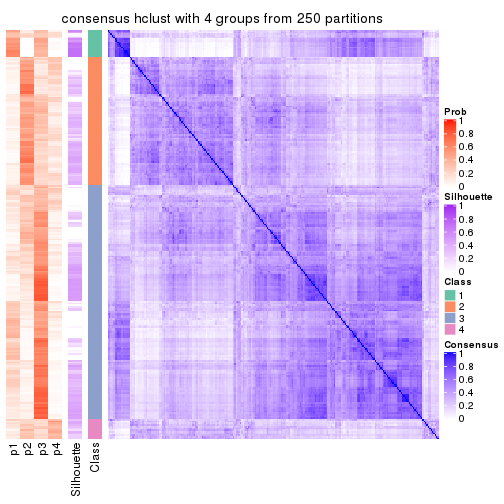</p>

</div>
<div id='tab-MAD-hclust-consensus-heatmap-4'>
<pre><code class="r">consensus_heatmap(res, k = 5)
</code></pre>

<p></p>

</div>
<div id='tab-MAD-hclust-consensus-heatmap-5'>
<pre><code class="r">consensus_heatmap(res, k = 6)
</code></pre>

<p></p>

</div>
</div>

Heatmaps for the membership of samples in all partitions to see how consistent they are:


<script>
$( function() {
	$( '#tabs-MAD-hclust-membership-heatmap' ).tabs();
} );
</script>
<div id='tabs-MAD-hclust-membership-heatmap'>
<ul>
<li><a href='#tab-MAD-hclust-membership-heatmap-1'>k = 2</a></li>
<li><a href='#tab-MAD-hclust-membership-heatmap-2'>k = 3</a></li>
<li><a href='#tab-MAD-hclust-membership-heatmap-3'>k = 4</a></li>
<li><a href='#tab-MAD-hclust-membership-heatmap-4'>k = 5</a></li>
<li><a href='#tab-MAD-hclust-membership-heatmap-5'>k = 6</a></li>
</ul>
<div id='tab-MAD-hclust-membership-heatmap-1'>
<pre><code class="r">membership_heatmap(res, k = 2)
</code></pre>

<p></p>

</div>
<div id='tab-MAD-hclust-membership-heatmap-2'>
<pre><code class="r">membership_heatmap(res, k = 3)
</code></pre>

<p></p>

</div>
<div id='tab-MAD-hclust-membership-heatmap-3'>
<pre><code class="r">membership_heatmap(res, k = 4)
</code></pre>

<p></p>

</div>
<div id='tab-MAD-hclust-membership-heatmap-4'>
<pre><code class="r">membership_heatmap(res, k = 5)
</code></pre>

<p></p>

</div>
<div id='tab-MAD-hclust-membership-heatmap-5'>
<pre><code class="r">membership_heatmap(res, k = 6)
</code></pre>

<p></p>

</div>
</div>

As soon as we have had the classes for columns, we can look for signatures
which are significantly different between classes which can be candidate marks
for certain classes. Following are the heatmaps for signatures.


Signature heatmaps where rows are scaled:


<script>
$( function() {
	$( '#tabs-MAD-hclust-get-signatures' ).tabs();
} );
</script>
<div id='tabs-MAD-hclust-get-signatures'>
<ul>
<li><a href='#tab-MAD-hclust-get-signatures-1'>k = 2</a></li>
<li><a href='#tab-MAD-hclust-get-signatures-2'>k = 3</a></li>
<li><a href='#tab-MAD-hclust-get-signatures-3'>k = 4</a></li>
<li><a href='#tab-MAD-hclust-get-signatures-4'>k = 5</a></li>
<li><a href='#tab-MAD-hclust-get-signatures-5'>k = 6</a></li>
</ul>
<div id='tab-MAD-hclust-get-signatures-1'>
<pre><code class="r">get_signatures(res, k = 2)
</code></pre>

<p></p>

</div>
<div id='tab-MAD-hclust-get-signatures-2'>
<pre><code class="r">get_signatures(res, k = 3)
</code></pre>

<p></p>

</div>
<div id='tab-MAD-hclust-get-signatures-3'>
<pre><code class="r">get_signatures(res, k = 4)
</code></pre>

<p></p>

</div>
<div id='tab-MAD-hclust-get-signatures-4'>
<pre><code class="r">get_signatures(res, k = 5)
</code></pre>

<p></p>

</div>
<div id='tab-MAD-hclust-get-signatures-5'>
<pre><code class="r">get_signatures(res, k = 6)
</code></pre>

<p></p>

</div>
</div>


Signature heatmaps where rows are not scaled:


<script>
$( function() {
	$( '#tabs-MAD-hclust-get-signatures-no-scale' ).tabs();
} );
</script>
<div id='tabs-MAD-hclust-get-signatures-no-scale'>
<ul>
<li><a href='#tab-MAD-hclust-get-signatures-no-scale-1'>k = 2</a></li>
<li><a href='#tab-MAD-hclust-get-signatures-no-scale-2'>k = 3</a></li>
<li><a href='#tab-MAD-hclust-get-signatures-no-scale-3'>k = 4</a></li>
<li><a href='#tab-MAD-hclust-get-signatures-no-scale-4'>k = 5</a></li>
<li><a href='#tab-MAD-hclust-get-signatures-no-scale-5'>k = 6</a></li>
</ul>
<div id='tab-MAD-hclust-get-signatures-no-scale-1'>
<pre><code class="r">get_signatures(res, k = 2, scale_rows = FALSE)
</code></pre>

<p></p>

</div>
<div id='tab-MAD-hclust-get-signatures-no-scale-2'>
<pre><code class="r">get_signatures(res, k = 3, scale_rows = FALSE)
</code></pre>

<p></p>

</div>
<div id='tab-MAD-hclust-get-signatures-no-scale-3'>
<pre><code class="r">get_signatures(res, k = 4, scale_rows = FALSE)
</code></pre>

<p></p>

</div>
<div id='tab-MAD-hclust-get-signatures-no-scale-4'>
<pre><code class="r">get_signatures(res, k = 5, scale_rows = FALSE)
</code></pre>

<p></p>

</div>
<div id='tab-MAD-hclust-get-signatures-no-scale-5'>
<pre><code class="r">get_signatures(res, k = 6, scale_rows = FALSE)
</code></pre>

<p></p>

</div>
</div>


Compare the overlap of signatures from different k:

```r
compare_signatures(res)
```


`get_signature()` returns a data frame invisibly. TO get the list of signatures, the function
call should be assigned to a variable explicitly. In following code, if `plot` argument is set
to `FALSE`, no heatmap is plotted while only the differential analysis is performed.

```r
# code only for demonstration
tb = get_signature(res, k = ..., plot = FALSE)
```

An example of the output of `tb` is:

```
#>   which_row         fdr    mean_1    mean_2 scaled_mean_1 scaled_mean_2 km
#> 1        38 0.042760348  8.373488  9.131774    -0.5533452     0.5164555  1
#> 2        40 0.018707592  7.106213  8.469186    -0.6173731     0.5762149  1
#> 3        55 0.019134737 10.221463 11.207825    -0.6159697     0.5749050  1
#> 4        59 0.006059896  5.921854  7.869574    -0.6899429     0.6439467  1
#> 5        60 0.018055526  8.928898 10.211722    -0.6204761     0.5791110  1
#> 6        98 0.009384629 15.714769 14.887706     0.6635654    -0.6193277  2
...
```

The columns in `tb` are:

1. `which_row`: row indices corresponding to the input matrix.
2. `fdr`: FDR for the differential test. 
3. `mean_x`: The mean value in group x.
4. `scaled_mean_x`: The mean value in group x after rows are scaled.
5. `km`: Row groups if k-means clustering is applied to rows.


UMAP plot which shows how samples are separated.


<script>
$( function() {
	$( '#tabs-MAD-hclust-dimension-reduction' ).tabs();
} );
</script>
<div id='tabs-MAD-hclust-dimension-reduction'>
<ul>
<li><a href='#tab-MAD-hclust-dimension-reduction-1'>k = 2</a></li>
<li><a href='#tab-MAD-hclust-dimension-reduction-2'>k = 3</a></li>
<li><a href='#tab-MAD-hclust-dimension-reduction-3'>k = 4</a></li>
<li><a href='#tab-MAD-hclust-dimension-reduction-4'>k = 5</a></li>
<li><a href='#tab-MAD-hclust-dimension-reduction-5'>k = 6</a></li>
</ul>
<div id='tab-MAD-hclust-dimension-reduction-1'>
<pre><code class="r">dimension_reduction(res, k = 2, method = &quot;UMAP&quot;)
</code></pre>

<p></p>

</div>
<div id='tab-MAD-hclust-dimension-reduction-2'>
<pre><code class="r">dimension_reduction(res, k = 3, method = &quot;UMAP&quot;)
</code></pre>

<p></p>

</div>
<div id='tab-MAD-hclust-dimension-reduction-3'>
<pre><code class="r">dimension_reduction(res, k = 4, method = &quot;UMAP&quot;)
</code></pre>

<p></p>

</div>
<div id='tab-MAD-hclust-dimension-reduction-4'>
<pre><code class="r">dimension_reduction(res, k = 5, method = &quot;UMAP&quot;)
</code></pre>

<p></p>

</div>
<div id='tab-MAD-hclust-dimension-reduction-5'>
<pre><code class="r">dimension_reduction(res, k = 6, method = &quot;UMAP&quot;)
</code></pre>

<p></p>

</div>
</div>


Following heatmap shows how subgroups are split when increasing `k`:

```r
collect_classes(res)
```

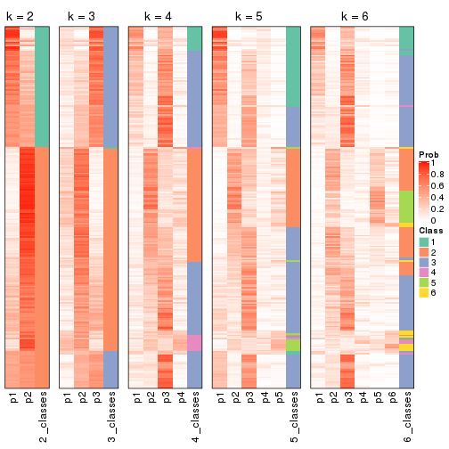


If matrix rows can be associated to genes, consider to use `GO_Enrichment(res,
...)` to perform function enrichment for the signature genes.


 

---------------------------------------------------


### MAD:kmeans


The object with results only for a single top-value method and a single partition method 
can be extracted as:

```r
res = res_list["MAD", "kmeans"]
# you can also extract it by
# res = res_list["MAD:kmeans"]
```

A summary of `res` and all the functions that can be applied to it:

```r
res
```

```
#> A 'ConsensusPartition' object with k = 2, 3, 4, 5, 6.
#>   On a matrix with 77 rows and 243 columns.
#>   Top rows (8, 16, 23, 30, 38) are extracted by 'MAD' method.
#>   Subgroups are detected by 'kmeans' method.
#>   Performed in total 1250 partitions by row resampling.
#>   Best k for subgroups seems to be 2.
#> 
#> Following methods can be applied to this 'ConsensusPartition' object:
#>  [1] "cola_report"             "collect_classes"         "collect_plots"          
#>  [4] "collect_stats"           "colnames"                "compare_signatures"     
#>  [7] "consensus_heatmap"       "dimension_reduction"     "functional_enrichment"  
#> [10] "get_anno_col"            "get_anno"                "get_classes"            
#> [13] "get_consensus"           "get_matrix"              "get_membership"         
#> [16] "get_param"               "get_signatures"          "get_stats"              
#> [19] "is_best_k"               "is_stable_k"             "membership_heatmap"     
#> [22] "ncol"                    "nrow"                    "plot_ecdf"              
#> [25] "rownames"                "select_partition_number" "show"                   
#> [28] "suggest_best_k"          "test_to_known_factors"
```

`collect_plots()` function collects all the plots made from `res` for all `k` (number of partitions)
into one single page to provide an easy and fast comparison between different `k`.

```r
collect_plots(res)
```


The plots are:

- The first row: a plot of the ECDF (Empirical cumulative distribution
  function) curves of the consensus matrix for each `k` and the heatmap of
  predicted classes for each `k`.
- The second row: heatmaps of the consensus matrix for each `k`.
- The third row: heatmaps of the membership matrix for each `k`.
- The fouth row: heatmaps of the signatures for each `k`.

All the plots in panels can be made by individual functions and they are
plotted later in this section.

`select_partition_number()` produces several plots showing different
statistics for choosing "optimized" `k`. There are following statistics:

- ECDF curves of the consensus matrix for each `k`;
- 1-PAC. [The PAC
  score](https://en.wikipedia.org/wiki/Consensus_clustering#Over-interpretation_potential_of_consensus_clustering)
  measures the proportion of the ambiguous subgrouping.
- Mean silhouette score.
- Concordance. The mean probability of fiting the consensus class ids in all
  partitions.
- Area increased. Denote $A_k$ as the area under the ECDF curve for current
  `k`, the area increased is defined as $A_k - A_{k-1}$.
- Rand index. The percent of pairs of samples that are both in a same cluster
  or both are not in a same cluster in the partition of k and k-1.
- Jaccard index. The ratio of pairs of samples are both in a same cluster in
  the partition of k and k-1 and the pairs of samples are both in a same
  cluster in the partition k or k-1.

The detailed explanations of these statistics can be found in [the cola
vignette](http://bioconductor.org/packages/devel/bioc/vignettes/cola/inst/doc/cola.html#toc_13).

Generally speaking, lower PAC score, higher mean silhouette score or higher
concordance corresponds to better partition. Rand index and Jaccard index
measure how similar the current partition is compared to partition with `k-1`.
If they are too similar, we won't accept `k` is better than `k-1`.

```r
select_partition_number(res)
```


The numeric values for all these statistics can be obtained by `get_stats()`.

```r
get_stats(res)
```

```
#>   k 1-PAC mean_silhouette concordance area_increased  Rand Jaccard
#> 2 2 0.462           0.795       0.900         0.4937 0.501   0.501
#> 3 3 0.317           0.635       0.775         0.3024 0.710   0.494
#> 4 4 0.345           0.455       0.655         0.1281 0.857   0.637
#> 5 5 0.385           0.394       0.578         0.0673 0.915   0.722
#> 6 6 0.429           0.269       0.502         0.0438 0.912   0.671
```

`suggest_best_k()` suggests the best $k$ based on these statistics. The rules are as follows:

- All $k$ with Jaccard index larger than 0.95 are removed because the increase of
  the partition number does not provides enough extra information. If all $k$ are removed,
  the best $k$ is assigned by `NA`.
- For $k$ with 1-PAC larger than 0.9, the maximal $k$ is taken as the "best k". Other $k$ is called "optional k".
- If it does not fit the second rule. The $k$ with the highest vote of highest
  1-PAC, mean silhouette and concordance is taken as the "best k".

```r
suggest_best_k(res)
```

```
#> [1] 2
```


Following shows the table of the partitions (You need to click the **show/hide
code output** link to see it). The membership matrix (columns with name `p*`)
is inferred by
[`clue::cl_consensus()`](https://www.rdocumentation.org/link/cl_consensus?package=clue)
function with the `SE` method. Basically the value in the membership matrix
represents the probability to belong to a certain group. The finall class
label for an item is determined with the group with highest probability it
belongs to.

In `get_classes()` function, the entropy is calculated from the membership
matrix and the silhouette score is calculated from the consensus matrix.


<script>
$( function() {
	$( '#tabs-MAD-kmeans-get-classes' ).tabs();
} );
</script>
<div id='tabs-MAD-kmeans-get-classes'>
<ul>
<li><a href='#tab-MAD-kmeans-get-classes-1'>k = 2</a></li>
<li><a href='#tab-MAD-kmeans-get-classes-2'>k = 3</a></li>
<li><a href='#tab-MAD-kmeans-get-classes-3'>k = 4</a></li>
<li><a href='#tab-MAD-kmeans-get-classes-4'>k = 5</a></li>
<li><a href='#tab-MAD-kmeans-get-classes-5'>k = 6</a></li>
</ul>

<div id='tab-MAD-kmeans-get-classes-1'>
<p><a id='tab-MAD-kmeans-get-classes-1-a' style='color:#0366d6' href='#'>show/hide code output</a></p>
<pre><code class="r">cbind(get_classes(res, k = 2), get_membership(res, k = 2))
</code></pre>

<pre><code>#&gt;           class entropy silhouette    p1    p2
#&gt; SRR191393     1  0.0000     0.8905 1.000 0.000
#&gt; SRR191394     1  0.0000     0.8905 1.000 0.000
#&gt; SRR191396     2  0.9996     0.0529 0.488 0.512
#&gt; SRR191397     1  0.0000     0.8905 1.000 0.000
#&gt; SRR191398     1  0.0000     0.8905 1.000 0.000
#&gt; SRR191399     1  0.1843     0.8884 0.972 0.028
#&gt; SRR191400     1  0.0000     0.8905 1.000 0.000
#&gt; SRR191401     1  0.0672     0.8885 0.992 0.008
#&gt; SRR191402     1  0.3733     0.8745 0.928 0.072
#&gt; SRR191403     1  0.0376     0.8896 0.996 0.004
#&gt; SRR191404     2  0.4161     0.8543 0.084 0.916
#&gt; SRR191405     2  0.3733     0.8627 0.072 0.928
#&gt; SRR191406     1  0.6343     0.8148 0.840 0.160
#&gt; SRR191407     1  0.0000     0.8905 1.000 0.000
#&gt; SRR191408     1  0.0000     0.8905 1.000 0.000
#&gt; SRR191409     1  0.5294     0.8462 0.880 0.120
#&gt; SRR191410     1  0.6973     0.7771 0.812 0.188
#&gt; SRR191411     1  0.9983     0.1291 0.524 0.476
#&gt; SRR191412     1  0.0000     0.8905 1.000 0.000
#&gt; SRR191413     1  0.0672     0.8885 0.992 0.008
#&gt; SRR191414     1  0.0000     0.8905 1.000 0.000
#&gt; SRR191415     1  0.6247     0.8185 0.844 0.156
#&gt; SRR191416     1  0.1414     0.8902 0.980 0.020
#&gt; SRR191418     1  0.0000     0.8905 1.000 0.000
#&gt; SRR191419     1  0.2043     0.8866 0.968 0.032
#&gt; SRR191420     1  0.0672     0.8885 0.992 0.008
#&gt; SRR191421     1  0.0672     0.8885 0.992 0.008
#&gt; SRR191422     2  0.0000     0.8837 0.000 1.000
#&gt; SRR191423     2  0.0000     0.8837 0.000 1.000
#&gt; SRR191424     2  0.0672     0.8854 0.008 0.992
#&gt; SRR191425     1  0.0376     0.8896 0.996 0.004
#&gt; SRR191426     2  0.9909     0.2178 0.444 0.556
#&gt; SRR191427     1  0.8443     0.6590 0.728 0.272
#&gt; SRR191428     1  0.1843     0.8877 0.972 0.028
#&gt; SRR191429     2  0.0376     0.8845 0.004 0.996
#&gt; SRR191430     2  0.3114     0.8755 0.056 0.944
#&gt; SRR191431     2  0.3274     0.8696 0.060 0.940
#&gt; SRR191432     2  0.0672     0.8854 0.008 0.992
#&gt; SRR191433     2  0.0672     0.8854 0.008 0.992
#&gt; SRR191434     2  0.4815     0.8473 0.104 0.896
#&gt; SRR191435     1  0.0672     0.8885 0.992 0.008
#&gt; SRR191436     1  0.7299     0.7579 0.796 0.204
#&gt; SRR191437     2  0.0672     0.8854 0.008 0.992
#&gt; SRR191438     2  0.8443     0.6455 0.272 0.728
#&gt; SRR191439     2  0.0000     0.8837 0.000 1.000
#&gt; SRR191440     2  0.7815     0.7152 0.232 0.768
#&gt; SRR191441     2  0.0000     0.8837 0.000 1.000
#&gt; SRR191442     1  0.8813     0.6263 0.700 0.300
#&gt; SRR191443     1  0.0000     0.8905 1.000 0.000
#&gt; SRR191444     1  0.8499     0.6532 0.724 0.276
#&gt; SRR191445     2  0.8081     0.6901 0.248 0.752
#&gt; SRR191446     2  0.8713     0.6038 0.292 0.708
#&gt; SRR191447     2  0.0000     0.8837 0.000 1.000
#&gt; SRR191448     1  0.2043     0.8864 0.968 0.032
#&gt; SRR191449     1  0.3274     0.8798 0.940 0.060
#&gt; SRR191450     1  0.5629     0.8266 0.868 0.132
#&gt; SRR191451     1  0.5842     0.8167 0.860 0.140
#&gt; SRR191452     2  0.0000     0.8837 0.000 1.000
#&gt; SRR191453     2  0.8386     0.6612 0.268 0.732
#&gt; SRR191454     1  0.4815     0.8446 0.896 0.104
#&gt; SRR191455     2  1.0000    -0.0897 0.500 0.500
#&gt; SRR191456     1  0.4939     0.8365 0.892 0.108
#&gt; SRR191457     1  0.7745     0.7071 0.772 0.228
#&gt; SRR191458     2  0.6712     0.7908 0.176 0.824
#&gt; SRR191459     2  0.9732     0.3428 0.404 0.596
#&gt; SRR191460     1  1.0000     0.0253 0.504 0.496
#&gt; SRR191461     1  0.7453     0.7642 0.788 0.212
#&gt; SRR191462     2  0.4815     0.8421 0.104 0.896
#&gt; SRR191463     2  0.1414     0.8843 0.020 0.980
#&gt; SRR191464     2  0.0672     0.8854 0.008 0.992
#&gt; SRR191465     2  0.0000     0.8837 0.000 1.000
#&gt; SRR191466     1  0.9661     0.4138 0.608 0.392
#&gt; SRR191467     2  0.2948     0.8718 0.052 0.948
#&gt; SRR191468     2  0.0672     0.8854 0.008 0.992
#&gt; SRR191469     1  0.6973     0.7856 0.812 0.188
#&gt; SRR191470     2  0.8443     0.6440 0.272 0.728
#&gt; SRR191471     2  0.7745     0.7179 0.228 0.772
#&gt; SRR191472     2  0.0000     0.8837 0.000 1.000
#&gt; SRR191473     2  0.3431     0.8651 0.064 0.936
#&gt; SRR191474     1  0.6247     0.8180 0.844 0.156
#&gt; SRR191475     2  0.0672     0.8854 0.008 0.992
#&gt; SRR191476     2  0.0672     0.8854 0.008 0.992
#&gt; SRR191477     2  0.0672     0.8854 0.008 0.992
#&gt; SRR191478     2  0.0672     0.8854 0.008 0.992
#&gt; SRR191479     1  0.1843     0.8870 0.972 0.028
#&gt; SRR191480     2  0.6438     0.7935 0.164 0.836
#&gt; SRR191481     2  0.0000     0.8837 0.000 1.000
#&gt; SRR191482     2  0.3431     0.8691 0.064 0.936
#&gt; SRR191483     2  0.6973     0.7669 0.188 0.812
#&gt; SRR191484     1  0.0000     0.8905 1.000 0.000
#&gt; SRR191485     2  0.2423     0.8779 0.040 0.960
#&gt; SRR191486     2  0.8386     0.6563 0.268 0.732
#&gt; SRR191487     2  0.5629     0.8289 0.132 0.868
#&gt; SRR191488     1  0.2043     0.8876 0.968 0.032
#&gt; SRR191489     2  0.9963     0.1744 0.464 0.536
#&gt; SRR191490     2  0.0672     0.8854 0.008 0.992
#&gt; SRR191491     1  0.5946     0.8326 0.856 0.144
#&gt; SRR191492     1  0.1184     0.8911 0.984 0.016
#&gt; SRR191493     2  0.5946     0.8020 0.144 0.856
#&gt; SRR191494     2  0.0672     0.8854 0.008 0.992
#&gt; SRR191495     1  0.5408     0.8473 0.876 0.124
#&gt; SRR191496     2  0.0672     0.8854 0.008 0.992
#&gt; SRR191497     1  0.9833     0.2946 0.576 0.424
#&gt; SRR191498     1  0.9686     0.3982 0.604 0.396
#&gt; SRR191499     1  0.6048     0.8209 0.852 0.148
#&gt; SRR191500     1  0.6148     0.8261 0.848 0.152
#&gt; SRR191501     2  0.3274     0.8737 0.060 0.940
#&gt; SRR191502     2  0.9209     0.5353 0.336 0.664
#&gt; SRR191503     2  0.0672     0.8854 0.008 0.992
#&gt; SRR191504     2  0.0000     0.8837 0.000 1.000
#&gt; SRR191505     2  0.3114     0.8704 0.056 0.944
#&gt; SRR191506     2  0.0672     0.8854 0.008 0.992
#&gt; SRR191507     2  0.4431     0.8556 0.092 0.908
#&gt; SRR191508     2  0.3584     0.8629 0.068 0.932
#&gt; SRR191509     2  0.0672     0.8847 0.008 0.992
#&gt; SRR191510     2  1.0000    -0.0105 0.496 0.504
#&gt; SRR191511     2  0.0000     0.8837 0.000 1.000
#&gt; SRR191512     2  0.0672     0.8854 0.008 0.992
#&gt; SRR191513     2  0.0672     0.8854 0.008 0.992
#&gt; SRR191514     2  0.0672     0.8854 0.008 0.992
#&gt; SRR191515     2  0.0672     0.8854 0.008 0.992
#&gt; SRR191516     1  0.7674     0.7412 0.776 0.224
#&gt; SRR191517     2  0.2603     0.8750 0.044 0.956
#&gt; SRR191518     2  0.0000     0.8837 0.000 1.000
#&gt; SRR191519     2  0.0000     0.8837 0.000 1.000
#&gt; SRR191520     2  0.9970     0.0978 0.468 0.532
#&gt; SRR191521     2  0.0000     0.8837 0.000 1.000
#&gt; SRR191522     2  0.2423     0.8799 0.040 0.960
#&gt; SRR191523     2  0.0000     0.8837 0.000 1.000
#&gt; SRR191524     1  0.4562     0.8626 0.904 0.096
#&gt; SRR191525     2  0.2603     0.8756 0.044 0.956
#&gt; SRR191526     2  0.0000     0.8837 0.000 1.000
#&gt; SRR191527     1  0.8661     0.6118 0.712 0.288
#&gt; SRR191528     1  0.9795     0.2640 0.584 0.416
#&gt; SRR191529     2  0.6801     0.7742 0.180 0.820
#&gt; SRR191530     2  0.0000     0.8837 0.000 1.000
#&gt; SRR191531     2  0.9944     0.2251 0.456 0.544
#&gt; SRR191532     2  0.6531     0.7955 0.168 0.832
#&gt; SRR191533     1  0.9580     0.4155 0.620 0.380
#&gt; SRR191534     2  0.5519     0.8301 0.128 0.872
#&gt; SRR191535     2  0.1633     0.8839 0.024 0.976
#&gt; SRR191536     2  0.5629     0.8313 0.132 0.868
#&gt; SRR191537     2  0.0672     0.8854 0.008 0.992
#&gt; SRR191538     2  0.0672     0.8854 0.008 0.992
#&gt; SRR191539     2  0.0672     0.8854 0.008 0.992
#&gt; SRR191540     2  0.2236     0.8806 0.036 0.964
#&gt; SRR191541     2  0.0672     0.8854 0.008 0.992
#&gt; SRR191542     2  0.0672     0.8854 0.008 0.992
#&gt; SRR191543     2  0.0672     0.8854 0.008 0.992
#&gt; SRR191544     2  0.5408     0.8338 0.124 0.876
#&gt; SRR191545     2  0.0000     0.8837 0.000 1.000
#&gt; SRR191546     2  0.5059     0.8341 0.112 0.888
#&gt; SRR191547     2  0.9087     0.5454 0.324 0.676
#&gt; SRR191548     1  0.0000     0.8905 1.000 0.000
#&gt; SRR191549     1  0.0000     0.8905 1.000 0.000
#&gt; SRR191550     1  0.0000     0.8905 1.000 0.000
#&gt; SRR191551     1  0.0000     0.8905 1.000 0.000
#&gt; SRR191552     1  0.0000     0.8905 1.000 0.000
#&gt; SRR191553     1  0.0000     0.8905 1.000 0.000
#&gt; SRR191554     1  0.0000     0.8905 1.000 0.000
#&gt; SRR191555     1  0.2603     0.8814 0.956 0.044
#&gt; SRR191556     1  0.2423     0.8863 0.960 0.040
#&gt; SRR191557     1  0.1633     0.8889 0.976 0.024
#&gt; SRR191558     2  0.1414     0.8841 0.020 0.980
#&gt; SRR191559     1  0.0672     0.8908 0.992 0.008
#&gt; SRR191560     1  0.0000     0.8905 1.000 0.000
#&gt; SRR191561     1  0.8813     0.5857 0.700 0.300
#&gt; SRR191562     1  0.0000     0.8905 1.000 0.000
#&gt; SRR191563     2  0.9661     0.4026 0.392 0.608
#&gt; SRR191564     1  0.3114     0.8796 0.944 0.056
#&gt; SRR191565     1  0.0672     0.8885 0.992 0.008
#&gt; SRR191566     1  0.0000     0.8905 1.000 0.000
#&gt; SRR191567     1  0.0672     0.8885 0.992 0.008
#&gt; SRR191568     1  0.0000     0.8905 1.000 0.000
#&gt; SRR191569     1  0.4690     0.8582 0.900 0.100
#&gt; SRR191570     1  0.2423     0.8843 0.960 0.040
#&gt; SRR191571     1  0.2423     0.8870 0.960 0.040
#&gt; SRR191572     1  0.0000     0.8905 1.000 0.000
#&gt; SRR191573     1  0.0000     0.8905 1.000 0.000
#&gt; SRR191574     1  0.0000     0.8905 1.000 0.000
#&gt; SRR191575     1  0.0000     0.8905 1.000 0.000
#&gt; SRR191576     1  0.9896     0.2008 0.560 0.440
#&gt; SRR191577     1  0.4815     0.8563 0.896 0.104
#&gt; SRR191578     2  0.1184     0.8852 0.016 0.984
#&gt; SRR191579     1  0.0672     0.8885 0.992 0.008
#&gt; SRR191580     1  0.1843     0.8842 0.972 0.028
#&gt; SRR191581     1  0.0376     0.8908 0.996 0.004
#&gt; SRR191582     1  0.0000     0.8905 1.000 0.000
#&gt; SRR191583     2  0.0672     0.8854 0.008 0.992
#&gt; SRR191584     1  0.7219     0.7396 0.800 0.200
#&gt; SRR191585     1  0.4815     0.8570 0.896 0.104
#&gt; SRR191586     1  0.4298     0.8640 0.912 0.088
#&gt; SRR191587     1  0.6247     0.8183 0.844 0.156
#&gt; SRR191588     1  0.0000     0.8905 1.000 0.000
#&gt; SRR191589     1  0.1633     0.8895 0.976 0.024
#&gt; SRR191590     1  0.0000     0.8905 1.000 0.000
#&gt; SRR191591     1  0.5408     0.8446 0.876 0.124
#&gt; SRR191592     1  0.0000     0.8905 1.000 0.000
#&gt; SRR191593     1  0.0000     0.8905 1.000 0.000
#&gt; SRR191594     1  0.0000     0.8905 1.000 0.000
#&gt; SRR191595     1  0.0000     0.8905 1.000 0.000
#&gt; SRR191596     1  0.0000     0.8905 1.000 0.000
#&gt; SRR191597     1  0.9866     0.2525 0.568 0.432
#&gt; SRR191598     1  0.0672     0.8885 0.992 0.008
#&gt; SRR191599     1  0.0672     0.8885 0.992 0.008
#&gt; SRR191600     2  0.9850     0.3045 0.428 0.572
#&gt; SRR191601     1  0.5059     0.8564 0.888 0.112
#&gt; SRR191602     1  0.9522     0.4311 0.628 0.372
#&gt; SRR191603     1  0.8555     0.6560 0.720 0.280
#&gt; SRR191604     2  0.0672     0.8854 0.008 0.992
#&gt; SRR191605     1  0.7815     0.7236 0.768 0.232
#&gt; SRR191606     1  0.0000     0.8905 1.000 0.000
#&gt; SRR191607     1  0.3584     0.8776 0.932 0.068
#&gt; SRR191608     1  0.9286     0.5196 0.656 0.344
#&gt; SRR191609     1  0.8386     0.6773 0.732 0.268
#&gt; SRR191610     1  0.2043     0.8888 0.968 0.032
#&gt; SRR191611     1  0.3584     0.8745 0.932 0.068
#&gt; SRR191612     1  0.3431     0.8790 0.936 0.064
#&gt; SRR191613     1  0.4562     0.8535 0.904 0.096
#&gt; SRR191614     1  0.2236     0.8883 0.964 0.036
#&gt; SRR191615     1  0.2778     0.8850 0.952 0.048
#&gt; SRR191616     2  0.0672     0.8854 0.008 0.992
#&gt; SRR191617     2  0.1184     0.8849 0.016 0.984
#&gt; SRR191618     1  0.6148     0.8254 0.848 0.152
#&gt; SRR191619     2  0.5408     0.8335 0.124 0.876
#&gt; SRR191620     2  0.4431     0.8559 0.092 0.908
#&gt; SRR191621     2  0.1414     0.8838 0.020 0.980
#&gt; SRR191622     1  0.7950     0.7089 0.760 0.240
#&gt; SRR191623     1  0.0938     0.8907 0.988 0.012
#&gt; SRR191624     1  0.0000     0.8905 1.000 0.000
#&gt; SRR191625     2  0.8144     0.6835 0.252 0.748
#&gt; SRR191626     2  0.9552     0.4193 0.376 0.624
#&gt; SRR191627     2  0.0672     0.8844 0.008 0.992
#&gt; SRR191628     1  0.1633     0.8902 0.976 0.024
#&gt; SRR191629     1  0.5842     0.8291 0.860 0.140
#&gt; SRR191630     1  0.0000     0.8905 1.000 0.000
#&gt; SRR191631     2  0.4022     0.8608 0.080 0.920
#&gt; SRR191632     1  0.1414     0.8903 0.980 0.020
#&gt; SRR191633     1  0.7674     0.7370 0.776 0.224
#&gt; SRR191634     2  0.0672     0.8854 0.008 0.992
#&gt; SRR191635     1  0.2948     0.8834 0.948 0.052
#&gt; SRR191636     2  0.6247     0.8020 0.156 0.844
#&gt; SRR191637     2  0.0672     0.8854 0.008 0.992
</code></pre>

<script>
$('#tab-MAD-kmeans-get-classes-1-a').parent().next().next().hide();
$('#tab-MAD-kmeans-get-classes-1-a').click(function(){
  $('#tab-MAD-kmeans-get-classes-1-a').parent().next().next().toggle();
  return(false);
});
</script>
</div>

<div id='tab-MAD-kmeans-get-classes-2'>
<p><a id='tab-MAD-kmeans-get-classes-2-a' style='color:#0366d6' href='#'>show/hide code output</a></p>
<pre><code class="r">cbind(get_classes(res, k = 3), get_membership(res, k = 3))
</code></pre>

<pre><code>#&gt;           class entropy silhouette    p1    p2    p3
#&gt; SRR191393     3  0.6295    -0.1858 0.472 0.000 0.528
#&gt; SRR191394     1  0.4654     0.7806 0.792 0.000 0.208
#&gt; SRR191396     3  0.8866     0.4763 0.248 0.180 0.572
#&gt; SRR191397     1  0.4796     0.7779 0.780 0.000 0.220
#&gt; SRR191398     1  0.4654     0.7816 0.792 0.000 0.208
#&gt; SRR191399     3  0.2301     0.7247 0.060 0.004 0.936
#&gt; SRR191400     1  0.3425     0.7539 0.884 0.004 0.112
#&gt; SRR191401     1  0.6215     0.5053 0.572 0.000 0.428
#&gt; SRR191402     3  0.2496     0.7271 0.068 0.004 0.928
#&gt; SRR191403     1  0.6307     0.4161 0.512 0.000 0.488
#&gt; SRR191404     2  0.8595     0.6797 0.180 0.604 0.216
#&gt; SRR191405     2  0.8957     0.3455 0.128 0.472 0.400
#&gt; SRR191406     3  0.1399     0.7333 0.028 0.004 0.968
#&gt; SRR191407     1  0.3941     0.7708 0.844 0.000 0.156
#&gt; SRR191408     1  0.5397     0.7427 0.720 0.000 0.280
#&gt; SRR191409     3  0.4409     0.6877 0.172 0.004 0.824
#&gt; SRR191410     3  0.2096     0.7300 0.052 0.004 0.944
#&gt; SRR191411     3  0.6192     0.6457 0.060 0.176 0.764
#&gt; SRR191412     1  0.6235     0.4767 0.564 0.000 0.436
#&gt; SRR191413     3  0.3038     0.7056 0.104 0.000 0.896
#&gt; SRR191414     1  0.4750     0.7787 0.784 0.000 0.216
#&gt; SRR191415     3  0.1163     0.7293 0.028 0.000 0.972
#&gt; SRR191416     3  0.3816     0.6881 0.148 0.000 0.852
#&gt; SRR191418     3  0.4796     0.5965 0.220 0.000 0.780
#&gt; SRR191419     1  0.6111     0.6329 0.604 0.000 0.396
#&gt; SRR191420     1  0.5650     0.7348 0.688 0.000 0.312
#&gt; SRR191421     1  0.6140     0.6275 0.596 0.000 0.404
#&gt; SRR191422     2  0.3369     0.8234 0.052 0.908 0.040
#&gt; SRR191423     2  0.2903     0.8186 0.048 0.924 0.028
#&gt; SRR191424     2  0.3669     0.8186 0.064 0.896 0.040
#&gt; SRR191425     3  0.4504     0.6158 0.196 0.000 0.804
#&gt; SRR191426     3  0.4689     0.7050 0.052 0.096 0.852
#&gt; SRR191427     1  0.8787     0.4450 0.584 0.188 0.228
#&gt; SRR191428     3  0.3682     0.7044 0.116 0.008 0.876
#&gt; SRR191429     2  0.5965     0.8089 0.100 0.792 0.108
#&gt; SRR191430     2  0.7844     0.5444 0.084 0.624 0.292
#&gt; SRR191431     2  0.5932     0.7878 0.164 0.780 0.056
#&gt; SRR191432     2  0.1877     0.8183 0.012 0.956 0.032
#&gt; SRR191433     2  0.3644     0.8023 0.004 0.872 0.124
#&gt; SRR191434     2  0.7890     0.2874 0.056 0.512 0.432
#&gt; SRR191435     3  0.6359     0.3214 0.364 0.008 0.628
#&gt; SRR191436     3  0.4602     0.7140 0.108 0.040 0.852
#&gt; SRR191437     2  0.3263     0.8161 0.048 0.912 0.040
#&gt; SRR191438     3  0.8705     0.2141 0.116 0.360 0.524
#&gt; SRR191439     2  0.3692     0.8188 0.048 0.896 0.056
#&gt; SRR191440     2  0.7683     0.5943 0.328 0.608 0.064
#&gt; SRR191441     2  0.1878     0.8123 0.044 0.952 0.004
#&gt; SRR191442     3  0.7721     0.5947 0.168 0.152 0.680
#&gt; SRR191443     1  0.5760     0.6951 0.672 0.000 0.328
#&gt; SRR191444     3  0.4056     0.7262 0.092 0.032 0.876
#&gt; SRR191445     2  0.8743     0.1824 0.108 0.452 0.440
#&gt; SRR191446     3  0.9111     0.3461 0.212 0.240 0.548
#&gt; SRR191447     2  0.2982     0.8174 0.056 0.920 0.024
#&gt; SRR191448     1  0.6434     0.6241 0.612 0.008 0.380
#&gt; SRR191449     3  0.2301     0.7262 0.060 0.004 0.936
#&gt; SRR191450     1  0.8071     0.5431 0.564 0.076 0.360
#&gt; SRR191451     1  0.7635     0.6142 0.676 0.112 0.212
#&gt; SRR191452     2  0.2269     0.8138 0.040 0.944 0.016
#&gt; SRR191453     2  0.8765     0.6080 0.200 0.588 0.212
#&gt; SRR191454     1  0.7956     0.2890 0.516 0.060 0.424
#&gt; SRR191455     3  0.4281     0.7008 0.056 0.072 0.872
#&gt; SRR191456     1  0.4369     0.7134 0.864 0.040 0.096
#&gt; SRR191457     1  0.7388     0.6527 0.704 0.160 0.136
#&gt; SRR191458     2  0.8622     0.5037 0.132 0.572 0.296
#&gt; SRR191459     3  0.3502     0.7119 0.020 0.084 0.896
#&gt; SRR191460     3  0.3356     0.7254 0.056 0.036 0.908
#&gt; SRR191461     3  0.1765     0.7304 0.040 0.004 0.956
#&gt; SRR191462     3  0.7835    -0.0944 0.052 0.456 0.492
#&gt; SRR191463     2  0.4094     0.8103 0.100 0.872 0.028
#&gt; SRR191464     2  0.2152     0.8179 0.016 0.948 0.036
#&gt; SRR191465     2  0.2173     0.8139 0.048 0.944 0.008
#&gt; SRR191466     3  0.8120     0.5537 0.136 0.224 0.640
#&gt; SRR191467     2  0.6004     0.7790 0.064 0.780 0.156
#&gt; SRR191468     2  0.0848     0.8117 0.008 0.984 0.008
#&gt; SRR191469     3  0.5344     0.7039 0.092 0.084 0.824
#&gt; SRR191470     3  0.8362     0.2324 0.096 0.348 0.556
#&gt; SRR191471     2  0.9191     0.2475 0.148 0.428 0.424
#&gt; SRR191472     2  0.4165     0.8145 0.048 0.876 0.076
#&gt; SRR191473     2  0.6678     0.7341 0.064 0.728 0.208
#&gt; SRR191474     3  0.2229     0.7335 0.044 0.012 0.944
#&gt; SRR191475     2  0.0661     0.8118 0.004 0.988 0.008
#&gt; SRR191476     2  0.4045     0.8117 0.024 0.872 0.104
#&gt; SRR191477     2  0.4063     0.8095 0.020 0.868 0.112
#&gt; SRR191478     2  0.3183     0.8187 0.016 0.908 0.076
#&gt; SRR191479     3  0.6783     0.0804 0.396 0.016 0.588
#&gt; SRR191480     3  0.6988     0.4227 0.036 0.320 0.644
#&gt; SRR191481     2  0.6852     0.6016 0.036 0.664 0.300
#&gt; SRR191482     3  0.6737     0.5298 0.040 0.272 0.688
#&gt; SRR191483     3  0.7301     0.3942 0.052 0.308 0.640
#&gt; SRR191484     1  0.5785     0.7208 0.668 0.000 0.332
#&gt; SRR191485     2  0.8900     0.4647 0.132 0.512 0.356
#&gt; SRR191486     2  0.9654     0.3123 0.228 0.452 0.320
#&gt; SRR191487     3  0.8569     0.0469 0.100 0.392 0.508
#&gt; SRR191488     1  0.7013     0.6050 0.640 0.036 0.324
#&gt; SRR191489     3  0.5944     0.6447 0.064 0.152 0.784
#&gt; SRR191490     2  0.2384     0.8110 0.056 0.936 0.008
#&gt; SRR191491     3  0.8043     0.3137 0.372 0.072 0.556
#&gt; SRR191492     3  0.5948     0.3351 0.360 0.000 0.640
#&gt; SRR191493     2  0.5536     0.7603 0.200 0.776 0.024
#&gt; SRR191494     2  0.3112     0.8053 0.096 0.900 0.004
#&gt; SRR191495     3  0.1647     0.7318 0.036 0.004 0.960
#&gt; SRR191496     2  0.0829     0.8108 0.012 0.984 0.004
#&gt; SRR191497     3  0.3589     0.7244 0.048 0.052 0.900
#&gt; SRR191498     3  0.8212     0.5305 0.192 0.168 0.640
#&gt; SRR191499     3  0.1529     0.7307 0.040 0.000 0.960
#&gt; SRR191500     3  0.1765     0.7323 0.040 0.004 0.956
#&gt; SRR191501     2  0.5677     0.7749 0.160 0.792 0.048
#&gt; SRR191502     2  0.9775     0.3410 0.288 0.440 0.272
#&gt; SRR191503     2  0.3129     0.8065 0.088 0.904 0.008
#&gt; SRR191504     2  0.5466     0.7692 0.040 0.800 0.160
#&gt; SRR191505     2  0.6027     0.7846 0.164 0.776 0.060
#&gt; SRR191506     2  0.0592     0.8114 0.012 0.988 0.000
#&gt; SRR191507     2  0.5803     0.7253 0.028 0.760 0.212
#&gt; SRR191508     2  0.7890     0.2736 0.056 0.512 0.432
#&gt; SRR191509     2  0.7095     0.6075 0.048 0.660 0.292
#&gt; SRR191510     3  0.9379     0.3647 0.288 0.208 0.504
#&gt; SRR191511     2  0.4121     0.8119 0.040 0.876 0.084
#&gt; SRR191512     2  0.0661     0.8120 0.008 0.988 0.004
#&gt; SRR191513     2  0.0829     0.8124 0.012 0.984 0.004
#&gt; SRR191514     2  0.0848     0.8119 0.008 0.984 0.008
#&gt; SRR191515     2  0.6158     0.7503 0.052 0.760 0.188
#&gt; SRR191516     3  0.1877     0.7335 0.032 0.012 0.956
#&gt; SRR191517     3  0.6662     0.5366 0.044 0.252 0.704
#&gt; SRR191518     2  0.6208     0.7467 0.052 0.756 0.192
#&gt; SRR191519     2  0.2187     0.8172 0.028 0.948 0.024
#&gt; SRR191520     3  0.4489     0.6960 0.036 0.108 0.856
#&gt; SRR191521     2  0.2926     0.8240 0.040 0.924 0.036
#&gt; SRR191522     2  0.7039     0.7451 0.128 0.728 0.144
#&gt; SRR191523     2  0.6091     0.8056 0.124 0.784 0.092
#&gt; SRR191524     1  0.6262     0.6217 0.696 0.020 0.284
#&gt; SRR191525     2  0.6144     0.7915 0.088 0.780 0.132
#&gt; SRR191526     2  0.2063     0.8141 0.044 0.948 0.008
#&gt; SRR191527     1  0.5408     0.6175 0.812 0.136 0.052
#&gt; SRR191528     1  0.8345     0.1690 0.560 0.344 0.096
#&gt; SRR191529     2  0.8132     0.6518 0.284 0.612 0.104
#&gt; SRR191530     2  0.5722     0.8002 0.084 0.804 0.112
#&gt; SRR191531     1  0.7940    -0.1217 0.524 0.416 0.060
#&gt; SRR191532     2  0.8094     0.5640 0.100 0.612 0.288
#&gt; SRR191533     3  0.9553     0.2886 0.244 0.272 0.484
#&gt; SRR191534     2  0.6319     0.7137 0.228 0.732 0.040
#&gt; SRR191535     2  0.4514     0.7822 0.012 0.832 0.156
#&gt; SRR191536     2  0.6757     0.7499 0.084 0.736 0.180
#&gt; SRR191537     2  0.4249     0.8100 0.028 0.864 0.108
#&gt; SRR191538     2  0.0475     0.8124 0.004 0.992 0.004
#&gt; SRR191539     2  0.3459     0.8051 0.096 0.892 0.012
#&gt; SRR191540     3  0.7785     0.1122 0.052 0.420 0.528
#&gt; SRR191541     2  0.1129     0.8141 0.020 0.976 0.004
#&gt; SRR191542     2  0.1031     0.8131 0.024 0.976 0.000
#&gt; SRR191543     2  0.2492     0.8244 0.016 0.936 0.048
#&gt; SRR191544     2  0.8765     0.6043 0.200 0.588 0.212
#&gt; SRR191545     2  0.7065     0.6345 0.052 0.672 0.276
#&gt; SRR191546     3  0.8387    -0.0417 0.084 0.428 0.488
#&gt; SRR191547     3  0.6737     0.6509 0.100 0.156 0.744
#&gt; SRR191548     1  0.4605     0.7807 0.796 0.000 0.204
#&gt; SRR191549     1  0.4605     0.7807 0.796 0.000 0.204
#&gt; SRR191550     1  0.4605     0.7807 0.796 0.000 0.204
#&gt; SRR191551     1  0.4654     0.7806 0.792 0.000 0.208
#&gt; SRR191552     1  0.4346     0.7792 0.816 0.000 0.184
#&gt; SRR191553     1  0.5835     0.7025 0.660 0.000 0.340
#&gt; SRR191554     1  0.3482     0.7596 0.872 0.000 0.128
#&gt; SRR191555     3  0.6667     0.1564 0.368 0.016 0.616
#&gt; SRR191556     3  0.3038     0.7079 0.104 0.000 0.896
#&gt; SRR191557     3  0.2261     0.7218 0.068 0.000 0.932
#&gt; SRR191558     2  0.3713     0.8173 0.076 0.892 0.032
#&gt; SRR191559     3  0.4702     0.6197 0.212 0.000 0.788
#&gt; SRR191560     3  0.6180     0.1272 0.416 0.000 0.584
#&gt; SRR191561     1  0.6850     0.5297 0.720 0.208 0.072
#&gt; SRR191562     1  0.4702     0.7807 0.788 0.000 0.212
#&gt; SRR191563     3  0.5174     0.7002 0.092 0.076 0.832
#&gt; SRR191564     3  0.2796     0.7213 0.092 0.000 0.908
#&gt; SRR191565     3  0.6126     0.1932 0.400 0.000 0.600
#&gt; SRR191566     3  0.4555     0.6320 0.200 0.000 0.800
#&gt; SRR191567     1  0.5926     0.6830 0.644 0.000 0.356
#&gt; SRR191568     1  0.4702     0.7805 0.788 0.000 0.212
#&gt; SRR191569     3  0.5285     0.6485 0.244 0.004 0.752
#&gt; SRR191570     3  0.5268     0.6580 0.212 0.012 0.776
#&gt; SRR191571     3  0.5220     0.6370 0.208 0.012 0.780
#&gt; SRR191572     1  0.4605     0.7807 0.796 0.000 0.204
#&gt; SRR191573     3  0.5760     0.4123 0.328 0.000 0.672
#&gt; SRR191574     1  0.3879     0.7390 0.848 0.000 0.152
#&gt; SRR191575     1  0.3482     0.7544 0.872 0.000 0.128
#&gt; SRR191576     3  0.9309     0.3945 0.264 0.216 0.520
#&gt; SRR191577     3  0.7372     0.1674 0.448 0.032 0.520
#&gt; SRR191578     2  0.5901     0.7728 0.048 0.776 0.176
#&gt; SRR191579     1  0.5397     0.7502 0.720 0.000 0.280
#&gt; SRR191580     1  0.3618     0.7541 0.884 0.012 0.104
#&gt; SRR191581     1  0.3267     0.7442 0.884 0.000 0.116
#&gt; SRR191582     1  0.4178     0.7734 0.828 0.000 0.172
#&gt; SRR191583     2  0.1860     0.8114 0.052 0.948 0.000
#&gt; SRR191584     1  0.4290     0.7026 0.872 0.064 0.064
#&gt; SRR191585     3  0.1411     0.7278 0.036 0.000 0.964
#&gt; SRR191586     3  0.2301     0.7247 0.060 0.004 0.936
#&gt; SRR191587     3  0.1643     0.7322 0.044 0.000 0.956
#&gt; SRR191588     3  0.5560     0.4606 0.300 0.000 0.700
#&gt; SRR191589     3  0.3619     0.6910 0.136 0.000 0.864
#&gt; SRR191590     1  0.5098     0.7719 0.752 0.000 0.248
#&gt; SRR191591     3  0.3918     0.7137 0.120 0.012 0.868
#&gt; SRR191592     3  0.5291     0.5363 0.268 0.000 0.732
#&gt; SRR191593     3  0.6095     0.2117 0.392 0.000 0.608
#&gt; SRR191594     1  0.4605     0.7807 0.796 0.000 0.204
#&gt; SRR191595     1  0.6309     0.2486 0.504 0.000 0.496
#&gt; SRR191596     3  0.5926     0.3148 0.356 0.000 0.644
#&gt; SRR191597     3  0.2318     0.7336 0.028 0.028 0.944
#&gt; SRR191598     3  0.4399     0.6343 0.188 0.000 0.812
#&gt; SRR191599     1  0.6008     0.6488 0.628 0.000 0.372
#&gt; SRR191600     3  0.5202     0.7052 0.136 0.044 0.820
#&gt; SRR191601     3  0.2280     0.7324 0.052 0.008 0.940
#&gt; SRR191602     3  0.1877     0.7318 0.032 0.012 0.956
#&gt; SRR191603     3  0.1015     0.7314 0.012 0.008 0.980
#&gt; SRR191604     2  0.3375     0.8214 0.044 0.908 0.048
#&gt; SRR191605     3  0.1765     0.7320 0.040 0.004 0.956
#&gt; SRR191606     3  0.6111     0.1571 0.396 0.000 0.604
#&gt; SRR191607     3  0.1964     0.7229 0.056 0.000 0.944
#&gt; SRR191608     3  0.2229     0.7317 0.044 0.012 0.944
#&gt; SRR191609     3  0.1453     0.7335 0.024 0.008 0.968
#&gt; SRR191610     3  0.2165     0.7208 0.064 0.000 0.936
#&gt; SRR191611     3  0.1753     0.7256 0.048 0.000 0.952
#&gt; SRR191612     3  0.2261     0.7294 0.068 0.000 0.932
#&gt; SRR191613     3  0.8065    -0.2699 0.452 0.064 0.484
#&gt; SRR191614     3  0.1860     0.7252 0.052 0.000 0.948
#&gt; SRR191615     3  0.2356     0.7265 0.072 0.000 0.928
#&gt; SRR191616     2  0.4563     0.8024 0.112 0.852 0.036
#&gt; SRR191617     2  0.6653     0.7783 0.112 0.752 0.136
#&gt; SRR191618     3  0.6012     0.6151 0.220 0.032 0.748
#&gt; SRR191619     3  0.5728     0.6300 0.032 0.196 0.772
#&gt; SRR191620     2  0.9405     0.4446 0.204 0.496 0.300
#&gt; SRR191621     2  0.7069     0.3705 0.024 0.568 0.408
#&gt; SRR191622     3  0.6653     0.6105 0.288 0.032 0.680
#&gt; SRR191623     3  0.3983     0.6872 0.144 0.004 0.852
#&gt; SRR191624     1  0.6095     0.6167 0.608 0.000 0.392
#&gt; SRR191625     3  0.3967     0.7083 0.044 0.072 0.884
#&gt; SRR191626     3  0.3832     0.7057 0.036 0.076 0.888
#&gt; SRR191627     3  0.6939     0.5388 0.072 0.216 0.712
#&gt; SRR191628     3  0.2356     0.7212 0.072 0.000 0.928
#&gt; SRR191629     3  0.0983     0.7320 0.016 0.004 0.980
#&gt; SRR191630     1  0.4605     0.7807 0.796 0.000 0.204
#&gt; SRR191631     3  0.6416     0.5470 0.032 0.260 0.708
#&gt; SRR191632     3  0.3686     0.6796 0.140 0.000 0.860
#&gt; SRR191633     3  0.4164     0.7130 0.144 0.008 0.848
#&gt; SRR191634     2  0.3797     0.8203 0.052 0.892 0.056
#&gt; SRR191635     3  0.1860     0.7249 0.052 0.000 0.948
#&gt; SRR191636     2  0.8388     0.6870 0.248 0.612 0.140
#&gt; SRR191637     2  0.0983     0.8121 0.016 0.980 0.004
</code></pre>

<script>
$('#tab-MAD-kmeans-get-classes-2-a').parent().next().next().hide();
$('#tab-MAD-kmeans-get-classes-2-a').click(function(){
  $('#tab-MAD-kmeans-get-classes-2-a').parent().next().next().toggle();
  return(false);
});
</script>
</div>

<div id='tab-MAD-kmeans-get-classes-3'>
<p><a id='tab-MAD-kmeans-get-classes-3-a' style='color:#0366d6' href='#'>show/hide code output</a></p>
<pre><code class="r">cbind(get_classes(res, k = 4), get_membership(res, k = 4))
</code></pre>

<pre><code>#&gt;           class entropy silhouette    p1    p2    p3    p4
#&gt; SRR191393     3   0.566    0.27340 0.396 0.000 0.576 0.028
#&gt; SRR191394     1   0.248    0.75602 0.904 0.000 0.088 0.008
#&gt; SRR191396     4   0.844    0.41948 0.132 0.084 0.268 0.516
#&gt; SRR191397     1   0.358    0.74565 0.832 0.000 0.156 0.012
#&gt; SRR191398     1   0.280    0.75659 0.892 0.000 0.092 0.016
#&gt; SRR191399     3   0.172    0.67831 0.048 0.000 0.944 0.008
#&gt; SRR191400     1   0.292    0.71808 0.900 0.004 0.036 0.060
#&gt; SRR191401     3   0.585   -0.00129 0.460 0.000 0.508 0.032
#&gt; SRR191402     3   0.256    0.67821 0.032 0.000 0.912 0.056
#&gt; SRR191403     3   0.564    0.03792 0.424 0.000 0.552 0.024
#&gt; SRR191404     4   0.654    0.30874 0.040 0.232 0.060 0.668
#&gt; SRR191405     4   0.842    0.21307 0.028 0.304 0.240 0.428
#&gt; SRR191406     3   0.546    0.64278 0.064 0.000 0.708 0.228
#&gt; SRR191407     1   0.308    0.74667 0.888 0.000 0.064 0.048
#&gt; SRR191408     1   0.630    0.57588 0.632 0.000 0.268 0.100
#&gt; SRR191409     3   0.675    0.54803 0.124 0.004 0.608 0.264
#&gt; SRR191410     3   0.345    0.67128 0.028 0.008 0.872 0.092
#&gt; SRR191411     3   0.729    0.43178 0.036 0.116 0.612 0.236
#&gt; SRR191412     1   0.535    0.30047 0.556 0.000 0.432 0.012
#&gt; SRR191413     3   0.284    0.67152 0.088 0.000 0.892 0.020
#&gt; SRR191414     1   0.393    0.74139 0.808 0.000 0.176 0.016
#&gt; SRR191415     3   0.409    0.66806 0.044 0.004 0.832 0.120
#&gt; SRR191416     3   0.346    0.67132 0.108 0.000 0.860 0.032
#&gt; SRR191418     3   0.474    0.64810 0.132 0.000 0.788 0.080
#&gt; SRR191419     1   0.700    0.53923 0.592 0.012 0.280 0.116
#&gt; SRR191420     1   0.519    0.62883 0.656 0.000 0.324 0.020
#&gt; SRR191421     3   0.586   -0.19833 0.464 0.000 0.504 0.032
#&gt; SRR191422     2   0.578    0.51091 0.020 0.648 0.020 0.312
#&gt; SRR191423     2   0.552    0.51402 0.012 0.664 0.020 0.304
#&gt; SRR191424     2   0.540    0.47895 0.008 0.668 0.020 0.304
#&gt; SRR191425     3   0.455    0.58757 0.180 0.000 0.780 0.040
#&gt; SRR191426     3   0.592    0.56364 0.016 0.052 0.688 0.244
#&gt; SRR191427     4   0.872    0.14323 0.332 0.076 0.152 0.440
#&gt; SRR191428     3   0.344    0.67156 0.084 0.000 0.868 0.048
#&gt; SRR191429     4   0.590   -0.32356 0.008 0.480 0.020 0.492
#&gt; SRR191430     2   0.799    0.08142 0.068 0.492 0.084 0.356
#&gt; SRR191431     4   0.719    0.08999 0.076 0.392 0.024 0.508
#&gt; SRR191432     2   0.265    0.58535 0.000 0.880 0.000 0.120
#&gt; SRR191433     2   0.406    0.56656 0.000 0.812 0.028 0.160
#&gt; SRR191434     2   0.872   -0.08488 0.040 0.380 0.252 0.328
#&gt; SRR191435     3   0.731    0.32412 0.300 0.012 0.552 0.136
#&gt; SRR191436     3   0.561    0.63926 0.068 0.008 0.724 0.200
#&gt; SRR191437     2   0.577    0.33978 0.032 0.612 0.004 0.352
#&gt; SRR191438     4   0.887    0.42476 0.064 0.220 0.284 0.432
#&gt; SRR191439     2   0.503    0.54232 0.004 0.740 0.036 0.220
#&gt; SRR191440     4   0.675    0.27757 0.112 0.248 0.012 0.628
#&gt; SRR191441     2   0.422    0.54020 0.004 0.748 0.000 0.248
#&gt; SRR191442     3   0.828    0.12886 0.064 0.124 0.492 0.320
#&gt; SRR191443     1   0.575    0.49607 0.624 0.000 0.332 0.044
#&gt; SRR191444     3   0.664    0.47134 0.064 0.016 0.588 0.332
#&gt; SRR191445     3   0.876   -0.39727 0.036 0.324 0.324 0.316
#&gt; SRR191446     4   0.873    0.38395 0.088 0.164 0.260 0.488
#&gt; SRR191447     2   0.505    0.45139 0.016 0.668 0.000 0.316
#&gt; SRR191448     1   0.761    0.34323 0.444 0.000 0.348 0.208
#&gt; SRR191449     3   0.230    0.67996 0.064 0.000 0.920 0.016
#&gt; SRR191450     1   0.856    0.38119 0.488 0.116 0.300 0.096
#&gt; SRR191451     1   0.859    0.19591 0.448 0.052 0.188 0.312
#&gt; SRR191452     2   0.349    0.56319 0.000 0.812 0.000 0.188
#&gt; SRR191453     4   0.841    0.07688 0.060 0.376 0.132 0.432
#&gt; SRR191454     3   0.829    0.14263 0.332 0.048 0.472 0.148
#&gt; SRR191455     3   0.500    0.59890 0.008 0.044 0.764 0.184
#&gt; SRR191456     1   0.585    0.62606 0.716 0.008 0.096 0.180
#&gt; SRR191457     1   0.743    0.53330 0.648 0.132 0.132 0.088
#&gt; SRR191458     4   0.821    0.32848 0.076 0.288 0.112 0.524
#&gt; SRR191459     3   0.519    0.59842 0.012 0.080 0.776 0.132
#&gt; SRR191460     3   0.613    0.59229 0.048 0.056 0.720 0.176
#&gt; SRR191461     3   0.429    0.64307 0.036 0.000 0.800 0.164
#&gt; SRR191462     3   0.833   -0.14034 0.020 0.272 0.420 0.288
#&gt; SRR191463     2   0.633    0.34720 0.048 0.612 0.016 0.324
#&gt; SRR191464     2   0.266    0.59123 0.004 0.900 0.008 0.088
#&gt; SRR191465     2   0.414    0.56047 0.012 0.780 0.000 0.208
#&gt; SRR191466     3   0.835    0.29141 0.076 0.204 0.544 0.176
#&gt; SRR191467     2   0.712    0.45661 0.024 0.592 0.100 0.284
#&gt; SRR191468     2   0.182    0.58628 0.004 0.936 0.000 0.060
#&gt; SRR191469     3   0.486    0.62547 0.032 0.112 0.808 0.048
#&gt; SRR191470     4   0.821    0.17516 0.024 0.188 0.388 0.400
#&gt; SRR191471     4   0.732    0.45781 0.068 0.108 0.180 0.644
#&gt; SRR191472     2   0.455    0.55292 0.000 0.780 0.040 0.180
#&gt; SRR191473     2   0.745    0.38154 0.024 0.576 0.140 0.260
#&gt; SRR191474     3   0.403    0.67508 0.040 0.008 0.840 0.112
#&gt; SRR191475     2   0.253    0.58813 0.000 0.888 0.000 0.112
#&gt; SRR191476     2   0.628    0.49424 0.032 0.620 0.028 0.320
#&gt; SRR191477     2   0.415    0.57723 0.008 0.832 0.040 0.120
#&gt; SRR191478     2   0.505    0.56154 0.020 0.768 0.032 0.180
#&gt; SRR191479     3   0.573    0.24255 0.364 0.004 0.604 0.028
#&gt; SRR191480     3   0.798    0.18580 0.020 0.228 0.504 0.248
#&gt; SRR191481     2   0.731    0.33122 0.004 0.548 0.180 0.268
#&gt; SRR191482     3   0.788    0.01227 0.012 0.332 0.464 0.192
#&gt; SRR191483     3   0.801   -0.01882 0.008 0.280 0.440 0.272
#&gt; SRR191484     1   0.511    0.69146 0.704 0.000 0.264 0.032
#&gt; SRR191485     4   0.722    0.24165 0.008 0.236 0.176 0.580
#&gt; SRR191486     4   0.776    0.44309 0.080 0.204 0.112 0.604
#&gt; SRR191487     4   0.870    0.35951 0.048 0.224 0.304 0.424
#&gt; SRR191488     1   0.777    0.40107 0.472 0.004 0.276 0.248
#&gt; SRR191489     3   0.749    0.41697 0.056 0.092 0.596 0.256
#&gt; SRR191490     2   0.516    0.41576 0.016 0.676 0.004 0.304
#&gt; SRR191491     4   0.861    0.03638 0.232 0.036 0.348 0.384
#&gt; SRR191492     3   0.660    0.36245 0.356 0.000 0.552 0.092
#&gt; SRR191493     4   0.633    0.05989 0.052 0.364 0.008 0.576
#&gt; SRR191494     2   0.507    0.47866 0.016 0.664 0.000 0.320
#&gt; SRR191495     3   0.220    0.66889 0.008 0.000 0.920 0.072
#&gt; SRR191496     2   0.340    0.54891 0.008 0.840 0.000 0.152
#&gt; SRR191497     3   0.595    0.57450 0.032 0.060 0.724 0.184
#&gt; SRR191498     4   0.847    0.24693 0.072 0.120 0.380 0.428
#&gt; SRR191499     3   0.263    0.68100 0.028 0.008 0.916 0.048
#&gt; SRR191500     3   0.388    0.64583 0.016 0.004 0.824 0.156
#&gt; SRR191501     2   0.676    0.01233 0.064 0.512 0.012 0.412
#&gt; SRR191502     4   0.930    0.44011 0.172 0.220 0.160 0.448
#&gt; SRR191503     2   0.537    0.46058 0.032 0.688 0.004 0.276
#&gt; SRR191504     2   0.579    0.48369 0.000 0.640 0.052 0.308
#&gt; SRR191505     4   0.636   -0.01833 0.052 0.372 0.008 0.568
#&gt; SRR191506     2   0.331    0.56410 0.004 0.840 0.000 0.156
#&gt; SRR191507     2   0.679    0.34957 0.008 0.636 0.184 0.172
#&gt; SRR191508     2   0.787    0.08846 0.004 0.424 0.232 0.340
#&gt; SRR191509     2   0.740    0.29592 0.004 0.528 0.180 0.288
#&gt; SRR191510     4   0.771    0.47336 0.096 0.080 0.224 0.600
#&gt; SRR191511     2   0.491    0.53437 0.000 0.692 0.016 0.292
#&gt; SRR191512     2   0.140    0.58593 0.004 0.956 0.000 0.040
#&gt; SRR191513     2   0.302    0.57184 0.000 0.852 0.000 0.148
#&gt; SRR191514     2   0.228    0.58365 0.000 0.904 0.000 0.096
#&gt; SRR191515     2   0.702    0.22089 0.020 0.524 0.072 0.384
#&gt; SRR191516     3   0.475    0.64843 0.036 0.008 0.780 0.176
#&gt; SRR191517     3   0.748    0.18844 0.004 0.212 0.528 0.256
#&gt; SRR191518     2   0.669    0.47177 0.020 0.632 0.084 0.264
#&gt; SRR191519     2   0.358    0.59585 0.000 0.816 0.004 0.180
#&gt; SRR191520     3   0.517    0.57469 0.004 0.080 0.764 0.152
#&gt; SRR191521     2   0.495    0.56880 0.004 0.708 0.016 0.272
#&gt; SRR191522     4   0.745    0.16204 0.072 0.360 0.044 0.524
#&gt; SRR191523     4   0.637   -0.28762 0.032 0.468 0.016 0.484
#&gt; SRR191524     1   0.774    0.44221 0.560 0.028 0.180 0.232
#&gt; SRR191525     2   0.683    0.45136 0.012 0.548 0.076 0.364
#&gt; SRR191526     2   0.387    0.56194 0.000 0.772 0.000 0.228
#&gt; SRR191527     1   0.656    0.51437 0.676 0.076 0.036 0.212
#&gt; SRR191528     4   0.771    0.38938 0.276 0.132 0.036 0.556
#&gt; SRR191529     4   0.675    0.31668 0.112 0.232 0.016 0.640
#&gt; SRR191530     2   0.533    0.52232 0.004 0.660 0.020 0.316
#&gt; SRR191531     4   0.762    0.37305 0.260 0.180 0.016 0.544
#&gt; SRR191532     4   0.823    0.19416 0.032 0.368 0.168 0.432
#&gt; SRR191533     4   0.939    0.20939 0.164 0.136 0.332 0.368
#&gt; SRR191534     4   0.753    0.11289 0.120 0.408 0.016 0.456
#&gt; SRR191535     2   0.587    0.50013 0.004 0.688 0.076 0.232
#&gt; SRR191536     2   0.781    0.11880 0.040 0.484 0.104 0.372
#&gt; SRR191537     2   0.687    0.45950 0.020 0.636 0.116 0.228
#&gt; SRR191538     2   0.194    0.59582 0.000 0.924 0.000 0.076
#&gt; SRR191539     2   0.545    0.43703 0.036 0.660 0.000 0.304
#&gt; SRR191540     2   0.764    0.07424 0.004 0.492 0.292 0.212
#&gt; SRR191541     2   0.358    0.59257 0.008 0.836 0.004 0.152
#&gt; SRR191542     2   0.428    0.55896 0.020 0.780 0.000 0.200
#&gt; SRR191543     2   0.489    0.50166 0.000 0.680 0.012 0.308
#&gt; SRR191544     4   0.821    0.35581 0.100 0.308 0.080 0.512
#&gt; SRR191545     2   0.657    0.41543 0.008 0.600 0.080 0.312
#&gt; SRR191546     2   0.807   -0.07836 0.004 0.360 0.328 0.308
#&gt; SRR191547     3   0.742    0.32389 0.020 0.112 0.524 0.344
#&gt; SRR191548     1   0.266    0.75511 0.900 0.000 0.084 0.016
#&gt; SRR191549     1   0.278    0.75477 0.896 0.000 0.084 0.020
#&gt; SRR191550     1   0.254    0.75554 0.904 0.000 0.084 0.012
#&gt; SRR191551     1   0.254    0.75554 0.904 0.000 0.084 0.012
#&gt; SRR191552     1   0.254    0.75478 0.904 0.000 0.084 0.012
#&gt; SRR191553     1   0.597    0.66508 0.708 0.008 0.180 0.104
#&gt; SRR191554     1   0.314    0.72941 0.884 0.000 0.044 0.072
#&gt; SRR191555     3   0.521    0.51569 0.224 0.000 0.724 0.052
#&gt; SRR191556     3   0.456    0.66492 0.152 0.000 0.792 0.056
#&gt; SRR191557     3   0.181    0.67748 0.052 0.000 0.940 0.008
#&gt; SRR191558     2   0.578    0.39851 0.032 0.556 0.000 0.412
#&gt; SRR191559     3   0.652    0.52135 0.208 0.000 0.636 0.156
#&gt; SRR191560     3   0.719    0.33605 0.308 0.000 0.528 0.164
#&gt; SRR191561     1   0.798    0.22888 0.528 0.180 0.032 0.260
#&gt; SRR191562     1   0.428    0.73825 0.804 0.000 0.156 0.040
#&gt; SRR191563     3   0.675    0.50948 0.052 0.048 0.640 0.260
#&gt; SRR191564     3   0.397    0.67829 0.084 0.000 0.840 0.076
#&gt; SRR191565     3   0.672    0.44232 0.300 0.000 0.580 0.120
#&gt; SRR191566     3   0.415    0.62792 0.168 0.000 0.804 0.028
#&gt; SRR191567     1   0.643    0.37637 0.532 0.000 0.396 0.072
#&gt; SRR191568     1   0.339    0.75242 0.856 0.000 0.124 0.020
#&gt; SRR191569     3   0.737    0.37596 0.204 0.000 0.516 0.280
#&gt; SRR191570     3   0.603    0.63850 0.168 0.000 0.688 0.144
#&gt; SRR191571     3   0.675    0.54882 0.212 0.000 0.612 0.176
#&gt; SRR191572     1   0.266    0.75478 0.900 0.000 0.084 0.016
#&gt; SRR191573     3   0.664    0.46152 0.260 0.000 0.608 0.132
#&gt; SRR191574     1   0.636    0.49251 0.616 0.000 0.096 0.288
#&gt; SRR191575     1   0.298    0.71049 0.888 0.000 0.028 0.084
#&gt; SRR191576     4   0.860    0.43141 0.144 0.096 0.248 0.512
#&gt; SRR191577     4   0.836    0.07194 0.352 0.020 0.248 0.380
#&gt; SRR191578     2   0.790    0.32067 0.044 0.512 0.116 0.328
#&gt; SRR191579     1   0.447    0.70840 0.752 0.000 0.232 0.016
#&gt; SRR191580     1   0.298    0.73265 0.904 0.016 0.048 0.032
#&gt; SRR191581     1   0.343    0.69053 0.860 0.000 0.028 0.112
#&gt; SRR191582     1   0.331    0.73381 0.876 0.000 0.052 0.072
#&gt; SRR191583     2   0.496    0.51260 0.036 0.732 0.000 0.232
#&gt; SRR191584     1   0.441    0.62093 0.812 0.040 0.008 0.140
#&gt; SRR191585     3   0.161    0.67533 0.016 0.000 0.952 0.032
#&gt; SRR191586     3   0.212    0.67943 0.040 0.000 0.932 0.028
#&gt; SRR191587     3   0.259    0.68278 0.040 0.000 0.912 0.048
#&gt; SRR191588     3   0.493    0.49947 0.296 0.000 0.688 0.016
#&gt; SRR191589     3   0.399    0.66315 0.120 0.000 0.832 0.048
#&gt; SRR191590     1   0.653    0.59961 0.632 0.000 0.220 0.148
#&gt; SRR191591     3   0.582    0.64010 0.112 0.004 0.716 0.168
#&gt; SRR191592     3   0.700    0.46274 0.228 0.000 0.580 0.192
#&gt; SRR191593     3   0.575    0.35002 0.348 0.000 0.612 0.040
#&gt; SRR191594     1   0.286    0.75526 0.888 0.000 0.096 0.016
#&gt; SRR191595     3   0.732    0.24124 0.340 0.000 0.492 0.168
#&gt; SRR191596     3   0.697    0.37812 0.300 0.000 0.556 0.144
#&gt; SRR191597     3   0.390    0.65612 0.020 0.012 0.840 0.128
#&gt; SRR191598     3   0.484    0.62657 0.140 0.000 0.780 0.080
#&gt; SRR191599     3   0.593   -0.12109 0.464 0.000 0.500 0.036
#&gt; SRR191600     3   0.732    0.43462 0.092 0.028 0.548 0.332
#&gt; SRR191601     3   0.423    0.63643 0.008 0.000 0.760 0.232
#&gt; SRR191602     3   0.377    0.64595 0.024 0.008 0.848 0.120
#&gt; SRR191603     3   0.377    0.65024 0.008 0.000 0.808 0.184
#&gt; SRR191604     2   0.629    0.31508 0.020 0.508 0.024 0.448
#&gt; SRR191605     3   0.388    0.65904 0.024 0.008 0.840 0.128
#&gt; SRR191606     3   0.725    0.29259 0.336 0.000 0.504 0.160
#&gt; SRR191607     3   0.141    0.67593 0.024 0.000 0.960 0.016
#&gt; SRR191608     3   0.433    0.65801 0.032 0.004 0.804 0.160
#&gt; SRR191609     3   0.365    0.66719 0.028 0.000 0.844 0.128
#&gt; SRR191610     3   0.158    0.67653 0.036 0.000 0.952 0.012
#&gt; SRR191611     3   0.202    0.67548 0.024 0.004 0.940 0.032
#&gt; SRR191612     3   0.472    0.63948 0.040 0.000 0.764 0.196
#&gt; SRR191613     3   0.865    0.12445 0.316 0.084 0.464 0.136
#&gt; SRR191614     3   0.158    0.67626 0.012 0.000 0.952 0.036
#&gt; SRR191615     3   0.193    0.67920 0.024 0.000 0.940 0.036
#&gt; SRR191616     2   0.655    0.32463 0.044 0.560 0.020 0.376
#&gt; SRR191617     4   0.750    0.04035 0.056 0.400 0.056 0.488
#&gt; SRR191618     3   0.662    0.57079 0.104 0.016 0.652 0.228
#&gt; SRR191619     3   0.698    0.40788 0.020 0.120 0.624 0.236
#&gt; SRR191620     4   0.787    0.41679 0.096 0.240 0.084 0.580
#&gt; SRR191621     2   0.808    0.17660 0.020 0.484 0.228 0.268
#&gt; SRR191622     3   0.754    0.20952 0.164 0.004 0.452 0.380
#&gt; SRR191623     3   0.454    0.62837 0.164 0.000 0.788 0.048
#&gt; SRR191624     1   0.540    0.45409 0.580 0.000 0.404 0.016
#&gt; SRR191625     3   0.552    0.55106 0.016 0.048 0.732 0.204
#&gt; SRR191626     3   0.543    0.53847 0.004 0.064 0.728 0.204
#&gt; SRR191627     3   0.755    0.16170 0.012 0.152 0.512 0.324
#&gt; SRR191628     3   0.238    0.67936 0.024 0.004 0.924 0.048
#&gt; SRR191629     3   0.299    0.66912 0.012 0.004 0.884 0.100
#&gt; SRR191630     1   0.286    0.75526 0.888 0.000 0.096 0.016
#&gt; SRR191631     3   0.749    0.27579 0.016 0.184 0.568 0.232
#&gt; SRR191632     3   0.434    0.67409 0.076 0.000 0.816 0.108
#&gt; SRR191633     3   0.685    0.46998 0.072 0.016 0.556 0.356
#&gt; SRR191634     2   0.590    0.41685 0.024 0.640 0.020 0.316
#&gt; SRR191635     3   0.212    0.67909 0.040 0.000 0.932 0.028
#&gt; SRR191636     4   0.808    0.14271 0.100 0.320 0.068 0.512
#&gt; SRR191637     2   0.322    0.56618 0.000 0.836 0.000 0.164
</code></pre>

<script>
$('#tab-MAD-kmeans-get-classes-3-a').parent().next().next().hide();
$('#tab-MAD-kmeans-get-classes-3-a').click(function(){
  $('#tab-MAD-kmeans-get-classes-3-a').parent().next().next().toggle();
  return(false);
});
</script>
</div>

<div id='tab-MAD-kmeans-get-classes-4'>
<p><a id='tab-MAD-kmeans-get-classes-4-a' style='color:#0366d6' href='#'>show/hide code output</a></p>
<pre><code class="r">cbind(get_classes(res, k = 5), get_membership(res, k = 5))
</code></pre>

<pre><code>#&gt;           class entropy silhouette    p1    p2    p3    p4    p5
#&gt; SRR191393     3   0.569    0.35973 0.332 0.000 0.592 0.020 0.056
#&gt; SRR191394     1   0.258    0.69562 0.900 0.000 0.064 0.016 0.020
#&gt; SRR191396     5   0.801    0.33991 0.052 0.032 0.220 0.228 0.468
#&gt; SRR191397     1   0.453    0.65189 0.752 0.000 0.172 0.004 0.072
#&gt; SRR191398     1   0.355    0.69245 0.848 0.000 0.076 0.016 0.060
#&gt; SRR191399     3   0.389    0.63685 0.068 0.000 0.832 0.072 0.028
#&gt; SRR191400     1   0.414    0.66329 0.804 0.004 0.036 0.020 0.136
#&gt; SRR191401     3   0.571    0.23635 0.356 0.000 0.564 0.008 0.072
#&gt; SRR191402     3   0.345    0.61089 0.012 0.000 0.836 0.128 0.024
#&gt; SRR191403     3   0.578    0.16343 0.368 0.000 0.560 0.028 0.044
#&gt; SRR191404     5   0.768    0.20663 0.024 0.148 0.044 0.336 0.448
#&gt; SRR191405     4   0.880    0.23740 0.028 0.220 0.156 0.388 0.208
#&gt; SRR191406     3   0.685    0.55132 0.064 0.000 0.580 0.204 0.152
#&gt; SRR191407     1   0.337    0.68325 0.860 0.000 0.032 0.028 0.080
#&gt; SRR191408     1   0.752    0.41056 0.508 0.000 0.232 0.112 0.148
#&gt; SRR191409     3   0.764    0.41748 0.120 0.000 0.484 0.140 0.256
#&gt; SRR191410     3   0.497    0.56004 0.052 0.000 0.708 0.224 0.016
#&gt; SRR191411     3   0.758    0.29393 0.012 0.052 0.488 0.264 0.184
#&gt; SRR191412     3   0.559    0.02931 0.440 0.000 0.496 0.004 0.060
#&gt; SRR191413     3   0.341    0.63024 0.072 0.000 0.860 0.028 0.040
#&gt; SRR191414     1   0.449    0.64478 0.752 0.000 0.196 0.020 0.032
#&gt; SRR191415     3   0.482    0.53126 0.032 0.000 0.708 0.240 0.020
#&gt; SRR191416     3   0.406    0.62821 0.092 0.000 0.820 0.032 0.056
#&gt; SRR191418     3   0.502    0.62727 0.108 0.000 0.760 0.068 0.064
#&gt; SRR191419     1   0.684    0.47877 0.592 0.004 0.220 0.112 0.072
#&gt; SRR191420     1   0.564    0.46525 0.552 0.000 0.384 0.016 0.048
#&gt; SRR191421     3   0.570    0.04670 0.376 0.000 0.556 0.020 0.048
#&gt; SRR191422     2   0.721    0.24112 0.004 0.408 0.020 0.360 0.208
#&gt; SRR191423     2   0.650    0.41637 0.004 0.524 0.012 0.328 0.132
#&gt; SRR191424     2   0.686    0.32961 0.004 0.528 0.024 0.276 0.168
#&gt; SRR191425     3   0.487    0.54621 0.152 0.000 0.752 0.028 0.068
#&gt; SRR191426     3   0.652    0.34096 0.008 0.008 0.524 0.328 0.132
#&gt; SRR191427     5   0.847    0.35563 0.196 0.080 0.124 0.104 0.496
#&gt; SRR191428     3   0.315    0.62304 0.056 0.000 0.876 0.032 0.036
#&gt; SRR191429     4   0.702    0.12067 0.008 0.268 0.012 0.488 0.224
#&gt; SRR191430     2   0.819    0.10758 0.024 0.384 0.052 0.268 0.272
#&gt; SRR191431     5   0.768    0.16456 0.040 0.272 0.024 0.184 0.480
#&gt; SRR191432     2   0.440    0.41653 0.000 0.684 0.004 0.296 0.016
#&gt; SRR191433     2   0.504    0.39452 0.000 0.648 0.020 0.308 0.024
#&gt; SRR191434     4   0.815    0.38202 0.016 0.256 0.192 0.444 0.092
#&gt; SRR191435     3   0.743    0.33526 0.224 0.008 0.532 0.072 0.164
#&gt; SRR191436     3   0.716    0.52278 0.068 0.016 0.588 0.184 0.144
#&gt; SRR191437     2   0.630    0.21748 0.004 0.496 0.004 0.120 0.376
#&gt; SRR191438     5   0.845    0.30198 0.012 0.164 0.240 0.172 0.412
#&gt; SRR191439     2   0.574    0.50825 0.008 0.688 0.044 0.200 0.060
#&gt; SRR191440     5   0.647    0.26088 0.028 0.196 0.004 0.164 0.608
#&gt; SRR191441     2   0.482    0.52812 0.000 0.724 0.000 0.164 0.112
#&gt; SRR191442     3   0.846   -0.11628 0.048 0.092 0.392 0.128 0.340
#&gt; SRR191443     1   0.625    0.32045 0.540 0.000 0.356 0.060 0.044
#&gt; SRR191444     3   0.783    0.28915 0.036 0.024 0.436 0.216 0.288
#&gt; SRR191445     5   0.914    0.13661 0.028 0.244 0.224 0.228 0.276
#&gt; SRR191446     4   0.808    0.04334 0.036 0.060 0.156 0.444 0.304
#&gt; SRR191447     2   0.632    0.44535 0.004 0.552 0.000 0.208 0.236
#&gt; SRR191448     1   0.769    0.26499 0.396 0.000 0.336 0.068 0.200
#&gt; SRR191449     3   0.309    0.63508 0.048 0.000 0.876 0.060 0.016
#&gt; SRR191450     1   0.914    0.13627 0.328 0.080 0.324 0.132 0.136
#&gt; SRR191451     5   0.851    0.23829 0.244 0.052 0.160 0.092 0.452
#&gt; SRR191452     2   0.479    0.50000 0.000 0.684 0.000 0.260 0.056
#&gt; SRR191453     2   0.905   -0.07563 0.052 0.316 0.108 0.232 0.292
#&gt; SRR191454     3   0.738    0.32735 0.228 0.024 0.560 0.068 0.120
#&gt; SRR191455     3   0.620    0.46086 0.004 0.036 0.612 0.268 0.080
#&gt; SRR191456     1   0.699    0.40334 0.544 0.024 0.088 0.040 0.304
#&gt; SRR191457     1   0.767    0.41817 0.584 0.136 0.108 0.052 0.120
#&gt; SRR191458     5   0.879    0.29794 0.056 0.220 0.092 0.224 0.408
#&gt; SRR191459     3   0.557    0.46464 0.016 0.028 0.656 0.272 0.028
#&gt; SRR191460     3   0.633    0.39139 0.024 0.020 0.576 0.320 0.060
#&gt; SRR191461     3   0.554    0.51460 0.024 0.000 0.660 0.248 0.068
#&gt; SRR191462     4   0.783    0.40200 0.004 0.188 0.192 0.492 0.124
#&gt; SRR191463     2   0.610    0.43756 0.000 0.560 0.000 0.176 0.264
#&gt; SRR191464     2   0.425    0.52851 0.000 0.756 0.004 0.200 0.040
#&gt; SRR191465     2   0.560    0.47632 0.004 0.632 0.000 0.256 0.108
#&gt; SRR191466     3   0.887    0.06263 0.056 0.160 0.432 0.184 0.168
#&gt; SRR191467     2   0.725    0.21500 0.004 0.480 0.064 0.336 0.116
#&gt; SRR191468     2   0.271    0.55838 0.000 0.876 0.000 0.100 0.024
#&gt; SRR191469     3   0.563    0.54901 0.016 0.108 0.732 0.096 0.048
#&gt; SRR191470     4   0.823    0.09191 0.004 0.112 0.224 0.388 0.272
#&gt; SRR191471     5   0.800    0.18828 0.040 0.056 0.128 0.368 0.408
#&gt; SRR191472     2   0.532    0.45206 0.000 0.632 0.016 0.308 0.044
#&gt; SRR191473     4   0.668    0.23996 0.008 0.368 0.088 0.504 0.032
#&gt; SRR191474     3   0.540    0.60603 0.040 0.004 0.732 0.104 0.120
#&gt; SRR191475     2   0.341    0.56034 0.000 0.836 0.000 0.112 0.052
#&gt; SRR191476     2   0.629    0.36398 0.008 0.584 0.008 0.268 0.132
#&gt; SRR191477     2   0.553    0.40169 0.004 0.624 0.028 0.312 0.032
#&gt; SRR191478     2   0.532    0.40778 0.000 0.604 0.008 0.340 0.048
#&gt; SRR191479     3   0.554    0.40399 0.252 0.004 0.664 0.024 0.056
#&gt; SRR191480     4   0.714    0.28744 0.028 0.112 0.312 0.520 0.028
#&gt; SRR191481     4   0.598    0.25857 0.000 0.332 0.092 0.564 0.012
#&gt; SRR191482     4   0.753    0.33863 0.016 0.176 0.312 0.460 0.036
#&gt; SRR191483     4   0.738    0.41572 0.008 0.148 0.260 0.520 0.064
#&gt; SRR191484     1   0.547    0.57751 0.652 0.000 0.272 0.032 0.044
#&gt; SRR191485     4   0.828    0.28057 0.028 0.136 0.132 0.472 0.232
#&gt; SRR191486     5   0.666    0.44279 0.020 0.108 0.076 0.144 0.652
#&gt; SRR191487     4   0.876    0.12150 0.020 0.148 0.248 0.360 0.224
#&gt; SRR191488     5   0.791   -0.10136 0.328 0.012 0.256 0.044 0.360
#&gt; SRR191489     3   0.811    0.10118 0.044 0.060 0.416 0.348 0.132
#&gt; SRR191490     2   0.543    0.44074 0.008 0.680 0.004 0.092 0.216
#&gt; SRR191491     5   0.866    0.34082 0.164 0.032 0.260 0.136 0.408
#&gt; SRR191492     3   0.757    0.22328 0.384 0.000 0.396 0.120 0.100
#&gt; SRR191493     5   0.761    0.19601 0.048 0.208 0.016 0.232 0.496
#&gt; SRR191494     2   0.564    0.50861 0.012 0.656 0.000 0.112 0.220
#&gt; SRR191495     3   0.339    0.61883 0.008 0.000 0.836 0.132 0.024
#&gt; SRR191496     2   0.293    0.54692 0.000 0.868 0.000 0.040 0.092
#&gt; SRR191497     3   0.666    0.35804 0.020 0.032 0.520 0.364 0.064
#&gt; SRR191498     5   0.887    0.29072 0.064 0.080 0.252 0.224 0.380
#&gt; SRR191499     3   0.427    0.63702 0.044 0.000 0.796 0.132 0.028
#&gt; SRR191500     3   0.510    0.45422 0.012 0.000 0.628 0.328 0.032
#&gt; SRR191501     2   0.623    0.16868 0.004 0.460 0.000 0.124 0.412
#&gt; SRR191502     5   0.925    0.36177 0.164 0.112 0.132 0.188 0.404
#&gt; SRR191503     2   0.635    0.44885 0.012 0.584 0.008 0.128 0.268
#&gt; SRR191504     4   0.627   -0.08162 0.000 0.416 0.024 0.480 0.080
#&gt; SRR191505     5   0.748   -0.02279 0.032 0.228 0.004 0.348 0.388
#&gt; SRR191506     2   0.357    0.54940 0.000 0.828 0.000 0.068 0.104
#&gt; SRR191507     2   0.750   -0.15632 0.008 0.420 0.104 0.388 0.080
#&gt; SRR191508     4   0.778    0.25020 0.004 0.256 0.160 0.476 0.104
#&gt; SRR191509     4   0.687    0.19424 0.000 0.316 0.092 0.524 0.068
#&gt; SRR191510     5   0.773    0.34430 0.052 0.024 0.152 0.296 0.476
#&gt; SRR191511     2   0.581    0.25432 0.000 0.468 0.008 0.456 0.068
#&gt; SRR191512     2   0.213    0.56084 0.000 0.908 0.000 0.080 0.012
#&gt; SRR191513     2   0.372    0.56154 0.000 0.816 0.000 0.068 0.116
#&gt; SRR191514     2   0.296    0.56308 0.000 0.868 0.000 0.048 0.084
#&gt; SRR191515     4   0.788    0.10260 0.004 0.320 0.060 0.372 0.244
#&gt; SRR191516     3   0.655    0.43752 0.044 0.008 0.560 0.316 0.072
#&gt; SRR191517     4   0.638    0.31290 0.008 0.064 0.336 0.556 0.036
#&gt; SRR191518     4   0.582   -0.08317 0.000 0.428 0.028 0.504 0.040
#&gt; SRR191519     2   0.540    0.42709 0.004 0.604 0.004 0.336 0.052
#&gt; SRR191520     3   0.538    0.30360 0.004 0.032 0.588 0.364 0.012
#&gt; SRR191521     2   0.589    0.49201 0.004 0.620 0.004 0.244 0.128
#&gt; SRR191522     5   0.721    0.26037 0.012 0.232 0.024 0.224 0.508
#&gt; SRR191523     4   0.730   -0.22383 0.024 0.336 0.000 0.376 0.264
#&gt; SRR191524     1   0.823    0.16676 0.432 0.024 0.136 0.108 0.300
#&gt; SRR191525     4   0.690   -0.08829 0.012 0.384 0.024 0.468 0.112
#&gt; SRR191526     2   0.558    0.47724 0.000 0.624 0.000 0.256 0.120
#&gt; SRR191527     1   0.688    0.40448 0.588 0.040 0.024 0.100 0.248
#&gt; SRR191528     5   0.667    0.45837 0.116 0.104 0.040 0.072 0.668
#&gt; SRR191529     5   0.636    0.39198 0.036 0.108 0.008 0.220 0.628
#&gt; SRR191530     2   0.685    0.26386 0.012 0.444 0.020 0.412 0.112
#&gt; SRR191531     5   0.703    0.44026 0.180 0.152 0.016 0.056 0.596
#&gt; SRR191532     5   0.833    0.23463 0.008 0.292 0.124 0.192 0.384
#&gt; SRR191533     5   0.907    0.32694 0.148 0.084 0.252 0.120 0.396
#&gt; SRR191534     5   0.719    0.00649 0.052 0.376 0.004 0.120 0.448
#&gt; SRR191535     2   0.679    0.18727 0.004 0.480 0.032 0.376 0.108
#&gt; SRR191536     2   0.776    0.23123 0.016 0.472 0.072 0.144 0.296
#&gt; SRR191537     2   0.704    0.27031 0.008 0.528 0.044 0.296 0.124
#&gt; SRR191538     2   0.339    0.53138 0.000 0.800 0.000 0.188 0.012
#&gt; SRR191539     2   0.635    0.44466 0.020 0.588 0.000 0.160 0.232
#&gt; SRR191540     4   0.741    0.37645 0.004 0.296 0.172 0.476 0.052
#&gt; SRR191541     2   0.524    0.49117 0.008 0.684 0.004 0.236 0.068
#&gt; SRR191542     2   0.434    0.55084 0.000 0.768 0.000 0.096 0.136
#&gt; SRR191543     2   0.649    0.43050 0.008 0.560 0.004 0.200 0.228
#&gt; SRR191544     5   0.742    0.34056 0.028 0.144 0.044 0.244 0.540
#&gt; SRR191545     4   0.672   -0.11357 0.004 0.416 0.032 0.452 0.096
#&gt; SRR191546     4   0.791    0.29513 0.008 0.280 0.168 0.452 0.092
#&gt; SRR191547     4   0.718    0.14136 0.008 0.024 0.308 0.476 0.184
#&gt; SRR191548     1   0.215    0.68828 0.924 0.000 0.040 0.020 0.016
#&gt; SRR191549     1   0.223    0.68788 0.920 0.000 0.044 0.020 0.016
#&gt; SRR191550     1   0.191    0.68902 0.932 0.000 0.044 0.016 0.008
#&gt; SRR191551     1   0.213    0.69112 0.920 0.000 0.056 0.016 0.008
#&gt; SRR191552     1   0.220    0.69019 0.920 0.000 0.048 0.012 0.020
#&gt; SRR191553     1   0.596    0.57325 0.688 0.000 0.124 0.104 0.084
#&gt; SRR191554     1   0.339    0.66129 0.852 0.000 0.024 0.024 0.100
#&gt; SRR191555     3   0.482    0.50725 0.188 0.000 0.740 0.040 0.032
#&gt; SRR191556     3   0.557    0.60717 0.160 0.000 0.708 0.072 0.060
#&gt; SRR191557     3   0.265    0.63097 0.036 0.000 0.900 0.048 0.016
#&gt; SRR191558     4   0.730   -0.00902 0.020 0.356 0.008 0.412 0.204
#&gt; SRR191559     3   0.636    0.49230 0.196 0.000 0.600 0.024 0.180
#&gt; SRR191560     3   0.720    0.31148 0.272 0.000 0.464 0.032 0.232
#&gt; SRR191561     1   0.756    0.24195 0.532 0.156 0.016 0.072 0.224
#&gt; SRR191562     1   0.496    0.62405 0.724 0.000 0.148 0.004 0.124
#&gt; SRR191563     3   0.691    0.29678 0.024 0.012 0.496 0.348 0.120
#&gt; SRR191564     3   0.549    0.60996 0.064 0.000 0.716 0.152 0.068
#&gt; SRR191565     3   0.735    0.43823 0.228 0.000 0.524 0.088 0.160
#&gt; SRR191566     3   0.324    0.61071 0.116 0.000 0.844 0.000 0.040
#&gt; SRR191567     1   0.668    0.19875 0.468 0.000 0.400 0.048 0.084
#&gt; SRR191568     1   0.438    0.66974 0.784 0.000 0.124 0.012 0.080
#&gt; SRR191569     3   0.759    0.22259 0.148 0.004 0.444 0.072 0.332
#&gt; SRR191570     3   0.680    0.55093 0.120 0.000 0.608 0.164 0.108
#&gt; SRR191571     3   0.803    0.46430 0.196 0.008 0.480 0.148 0.168
#&gt; SRR191572     1   0.195    0.68931 0.932 0.000 0.040 0.016 0.012
#&gt; SRR191573     3   0.630    0.47996 0.208 0.000 0.612 0.028 0.152
#&gt; SRR191574     1   0.667    0.32428 0.496 0.000 0.124 0.028 0.352
#&gt; SRR191575     1   0.437    0.63761 0.772 0.000 0.044 0.016 0.168
#&gt; SRR191576     5   0.816    0.32043 0.080 0.036 0.248 0.160 0.476
#&gt; SRR191577     5   0.830    0.25373 0.236 0.004 0.204 0.148 0.408
#&gt; SRR191578     4   0.756    0.27986 0.008 0.320 0.088 0.472 0.112
#&gt; SRR191579     1   0.545    0.59150 0.656 0.000 0.268 0.032 0.044
#&gt; SRR191580     1   0.207    0.66040 0.928 0.012 0.000 0.028 0.032
#&gt; SRR191581     1   0.453    0.59817 0.748 0.000 0.028 0.024 0.200
#&gt; SRR191582     1   0.431    0.64668 0.804 0.000 0.040 0.052 0.104
#&gt; SRR191583     2   0.475    0.52044 0.000 0.724 0.000 0.092 0.184
#&gt; SRR191584     1   0.504    0.56940 0.744 0.028 0.004 0.064 0.160
#&gt; SRR191585     3   0.258    0.62163 0.004 0.000 0.892 0.080 0.024
#&gt; SRR191586     3   0.347    0.62659 0.048 0.000 0.848 0.092 0.012
#&gt; SRR191587     3   0.413    0.64212 0.048 0.000 0.820 0.080 0.052
#&gt; SRR191588     3   0.445    0.50988 0.260 0.000 0.704 0.000 0.036
#&gt; SRR191589     3   0.497    0.62910 0.116 0.000 0.760 0.076 0.048
#&gt; SRR191590     1   0.646    0.42887 0.528 0.000 0.236 0.004 0.232
#&gt; SRR191591     3   0.654    0.58458 0.084 0.000 0.632 0.140 0.144
#&gt; SRR191592     3   0.671    0.45550 0.164 0.000 0.564 0.036 0.236
#&gt; SRR191593     3   0.558    0.42727 0.256 0.000 0.648 0.016 0.080
#&gt; SRR191594     1   0.264    0.68974 0.896 0.000 0.068 0.016 0.020
#&gt; SRR191595     3   0.711    0.20280 0.316 0.000 0.432 0.020 0.232
#&gt; SRR191596     3   0.676    0.35875 0.280 0.000 0.516 0.020 0.184
#&gt; SRR191597     3   0.454    0.52675 0.020 0.000 0.704 0.264 0.012
#&gt; SRR191598     3   0.437    0.59529 0.084 0.000 0.780 0.008 0.128
#&gt; SRR191599     3   0.573    0.20911 0.336 0.000 0.584 0.016 0.064
#&gt; SRR191600     3   0.756    0.26549 0.044 0.004 0.416 0.328 0.208
#&gt; SRR191601     3   0.577    0.50676 0.008 0.000 0.640 0.140 0.212
#&gt; SRR191602     3   0.477    0.48779 0.008 0.000 0.680 0.280 0.032
#&gt; SRR191603     3   0.550    0.52900 0.008 0.000 0.660 0.228 0.104
#&gt; SRR191604     4   0.702    0.23505 0.008 0.252 0.016 0.504 0.220
#&gt; SRR191605     3   0.474    0.59087 0.008 0.000 0.744 0.164 0.084
#&gt; SRR191606     3   0.695    0.33123 0.280 0.000 0.492 0.024 0.204
#&gt; SRR191607     3   0.243    0.62238 0.020 0.000 0.904 0.068 0.008
#&gt; SRR191608     3   0.519    0.56010 0.008 0.000 0.700 0.192 0.100
#&gt; SRR191609     3   0.485    0.51494 0.016 0.000 0.684 0.272 0.028
#&gt; SRR191610     3   0.236    0.62682 0.024 0.000 0.912 0.052 0.012
#&gt; SRR191611     3   0.316    0.62007 0.032 0.000 0.860 0.100 0.008
#&gt; SRR191612     3   0.554    0.54904 0.012 0.000 0.668 0.108 0.212
#&gt; SRR191613     3   0.888    0.11116 0.284 0.064 0.392 0.112 0.148
#&gt; SRR191614     3   0.223    0.63390 0.012 0.000 0.920 0.040 0.028
#&gt; SRR191615     3   0.247    0.62900 0.016 0.000 0.908 0.052 0.024
#&gt; SRR191616     2   0.734    0.30173 0.036 0.496 0.016 0.152 0.300
#&gt; SRR191617     4   0.825    0.00997 0.036 0.252 0.040 0.344 0.328
#&gt; SRR191618     3   0.676    0.51037 0.076 0.012 0.624 0.100 0.188
#&gt; SRR191619     3   0.648    0.14050 0.008 0.024 0.476 0.416 0.076
#&gt; SRR191620     5   0.767    0.40309 0.048 0.124 0.068 0.200 0.560
#&gt; SRR191621     4   0.648    0.38909 0.004 0.248 0.108 0.600 0.040
#&gt; SRR191622     3   0.797   -0.02006 0.080 0.020 0.388 0.132 0.380
#&gt; SRR191623     3   0.437    0.61912 0.112 0.000 0.796 0.028 0.064
#&gt; SRR191624     1   0.536    0.35883 0.532 0.000 0.424 0.012 0.032
#&gt; SRR191625     3   0.539    0.34170 0.004 0.004 0.592 0.352 0.048
#&gt; SRR191626     3   0.526    0.30078 0.008 0.008 0.560 0.404 0.020
#&gt; SRR191627     4   0.618    0.37618 0.016 0.040 0.308 0.596 0.040
#&gt; SRR191628     3   0.373    0.63618 0.036 0.000 0.836 0.100 0.028
#&gt; SRR191629     3   0.416    0.56239 0.020 0.000 0.748 0.224 0.008
#&gt; SRR191630     1   0.277    0.68948 0.888 0.000 0.076 0.016 0.020
#&gt; SRR191631     4   0.610    0.19383 0.008 0.056 0.384 0.532 0.020
#&gt; SRR191632     3   0.528    0.61707 0.084 0.000 0.740 0.060 0.116
#&gt; SRR191633     3   0.731    0.39291 0.048 0.000 0.484 0.232 0.236
#&gt; SRR191634     2   0.709    0.36246 0.020 0.540 0.020 0.184 0.236
#&gt; SRR191635     3   0.373    0.63415 0.060 0.000 0.832 0.096 0.012
#&gt; SRR191636     5   0.863    0.08054 0.072 0.236 0.044 0.272 0.376
#&gt; SRR191637     2   0.417    0.53252 0.000 0.780 0.000 0.140 0.080
</code></pre>

<script>
$('#tab-MAD-kmeans-get-classes-4-a').parent().next().next().hide();
$('#tab-MAD-kmeans-get-classes-4-a').click(function(){
  $('#tab-MAD-kmeans-get-classes-4-a').parent().next().next().toggle();
  return(false);
});
</script>
</div>

<div id='tab-MAD-kmeans-get-classes-5'>
<p><a id='tab-MAD-kmeans-get-classes-5-a' style='color:#0366d6' href='#'>show/hide code output</a></p>
<pre><code class="r">cbind(get_classes(res, k = 6), get_membership(res, k = 6))
</code></pre>

<pre><code>#&gt;           class entropy silhouette    p1    p2    p3    p4    p5    p6
#&gt; SRR191393     3   0.594   3.58e-01 0.280 0.000 0.568 0.020 0.012 0.120
#&gt; SRR191394     1   0.296   6.50e-01 0.872 0.000 0.040 0.012 0.012 0.064
#&gt; SRR191396     6   0.766   1.36e-01 0.020 0.020 0.112 0.188 0.176 0.484
#&gt; SRR191397     1   0.527   5.43e-01 0.672 0.000 0.152 0.008 0.016 0.152
#&gt; SRR191398     1   0.374   6.42e-01 0.820 0.000 0.036 0.008 0.036 0.100
#&gt; SRR191399     3   0.379   5.62e-01 0.060 0.000 0.824 0.076 0.024 0.016
#&gt; SRR191400     1   0.465   5.97e-01 0.720 0.000 0.028 0.012 0.036 0.204
#&gt; SRR191401     3   0.621   2.56e-01 0.296 0.000 0.524 0.020 0.012 0.148
#&gt; SRR191402     3   0.457   5.21e-01 0.016 0.000 0.728 0.188 0.008 0.060
#&gt; SRR191403     3   0.553   3.51e-01 0.268 0.000 0.624 0.020 0.024 0.064
#&gt; SRR191404     5   0.824   3.03e-01 0.012 0.064 0.068 0.260 0.344 0.252
#&gt; SRR191405     4   0.860   4.91e-02 0.000 0.160 0.108 0.336 0.192 0.204
#&gt; SRR191406     3   0.710   2.94e-01 0.056 0.000 0.400 0.280 0.008 0.256
#&gt; SRR191407     1   0.425   6.25e-01 0.784 0.000 0.040 0.028 0.020 0.128
#&gt; SRR191408     1   0.760   1.67e-01 0.380 0.000 0.160 0.136 0.016 0.308
#&gt; SRR191409     6   0.740   1.42e-02 0.100 0.000 0.264 0.208 0.012 0.416
#&gt; SRR191410     3   0.552   4.14e-01 0.032 0.000 0.612 0.280 0.008 0.068
#&gt; SRR191411     3   0.712   1.64e-02 0.008 0.032 0.400 0.364 0.024 0.172
#&gt; SRR191412     3   0.623   1.93e-02 0.412 0.000 0.440 0.020 0.016 0.112
#&gt; SRR191413     3   0.407   5.28e-01 0.064 0.000 0.800 0.020 0.016 0.100
#&gt; SRR191414     1   0.423   5.88e-01 0.772 0.000 0.156 0.020 0.024 0.028
#&gt; SRR191415     3   0.580   3.86e-01 0.036 0.000 0.584 0.288 0.008 0.084
#&gt; SRR191416     3   0.450   5.44e-01 0.088 0.000 0.772 0.048 0.008 0.084
#&gt; SRR191418     3   0.601   4.95e-01 0.080 0.000 0.644 0.076 0.024 0.176
#&gt; SRR191419     1   0.719   3.76e-01 0.536 0.004 0.188 0.132 0.032 0.108
#&gt; SRR191420     1   0.613   2.76e-01 0.464 0.000 0.400 0.020 0.016 0.100
#&gt; SRR191421     3   0.591   2.40e-01 0.284 0.000 0.580 0.028 0.016 0.092
#&gt; SRR191422     2   0.730   2.95e-01 0.000 0.400 0.008 0.324 0.120 0.148
#&gt; SRR191423     2   0.711   3.09e-01 0.000 0.432 0.008 0.260 0.232 0.068
#&gt; SRR191424     2   0.739   1.17e-01 0.008 0.404 0.024 0.256 0.268 0.040
#&gt; SRR191425     3   0.484   4.82e-01 0.112 0.000 0.740 0.032 0.012 0.104
#&gt; SRR191426     3   0.693   9.26e-02 0.004 0.008 0.392 0.364 0.040 0.192
#&gt; SRR191427     6   0.741   2.53e-02 0.124 0.028 0.056 0.032 0.260 0.500
#&gt; SRR191428     3   0.386   5.30e-01 0.052 0.000 0.824 0.040 0.016 0.068
#&gt; SRR191429     4   0.770  -9.96e-05 0.000 0.216 0.020 0.408 0.220 0.136
#&gt; SRR191430     6   0.689  -1.89e-01 0.000 0.332 0.004 0.168 0.068 0.428
#&gt; SRR191431     6   0.761  -2.53e-01 0.008 0.172 0.020 0.084 0.352 0.364
#&gt; SRR191432     2   0.455   5.03e-01 0.000 0.668 0.004 0.280 0.040 0.008
#&gt; SRR191433     2   0.483   4.53e-01 0.000 0.636 0.000 0.300 0.044 0.020
#&gt; SRR191434     4   0.728   3.42e-01 0.000 0.164 0.108 0.536 0.056 0.136
#&gt; SRR191435     3   0.760   2.25e-01 0.172 0.008 0.472 0.028 0.104 0.216
#&gt; SRR191436     3   0.804   2.88e-01 0.052 0.020 0.416 0.204 0.064 0.244
#&gt; SRR191437     2   0.688  -9.07e-03 0.000 0.412 0.000 0.076 0.336 0.176
#&gt; SRR191438     6   0.773   2.45e-01 0.012 0.084 0.132 0.152 0.100 0.520
#&gt; SRR191439     2   0.681   4.42e-01 0.004 0.572 0.024 0.140 0.176 0.084
#&gt; SRR191440     5   0.669   3.42e-01 0.028 0.108 0.000 0.056 0.524 0.284
#&gt; SRR191441     2   0.523   4.37e-01 0.000 0.632 0.000 0.104 0.248 0.016
#&gt; SRR191442     6   0.846   1.13e-01 0.028 0.084 0.284 0.060 0.188 0.356
#&gt; SRR191443     1   0.621   2.21e-01 0.484 0.000 0.372 0.068 0.004 0.072
#&gt; SRR191444     6   0.752  -3.94e-02 0.012 0.016 0.288 0.276 0.048 0.360
#&gt; SRR191445     5   0.891   1.57e-01 0.008 0.148 0.160 0.148 0.308 0.228
#&gt; SRR191446     4   0.832  -1.52e-01 0.028 0.036 0.092 0.344 0.296 0.204
#&gt; SRR191447     2   0.693   3.07e-01 0.000 0.488 0.000 0.116 0.208 0.188
#&gt; SRR191448     3   0.798  -1.88e-01 0.308 0.000 0.340 0.036 0.180 0.136
#&gt; SRR191449     3   0.344   5.62e-01 0.072 0.000 0.836 0.072 0.016 0.004
#&gt; SRR191450     1   0.918   4.32e-02 0.268 0.064 0.248 0.136 0.056 0.228
#&gt; SRR191451     6   0.701   2.84e-01 0.164 0.048 0.092 0.060 0.036 0.600
#&gt; SRR191452     2   0.554   4.84e-01 0.000 0.652 0.000 0.156 0.144 0.048
#&gt; SRR191453     6   0.917  -2.46e-01 0.036 0.236 0.072 0.208 0.196 0.252
#&gt; SRR191454     3   0.786   2.19e-01 0.164 0.008 0.468 0.068 0.084 0.208
#&gt; SRR191455     3   0.708   2.67e-01 0.004 0.028 0.508 0.264 0.076 0.120
#&gt; SRR191456     6   0.629  -2.01e-01 0.400 0.004 0.052 0.012 0.064 0.468
#&gt; SRR191457     1   0.828   3.72e-01 0.500 0.080 0.104 0.072 0.144 0.100
#&gt; SRR191458     6   0.786   4.39e-02 0.008 0.204 0.048 0.216 0.084 0.440
#&gt; SRR191459     3   0.643   1.59e-01 0.004 0.032 0.504 0.356 0.052 0.052
#&gt; SRR191460     4   0.670  -1.25e-01 0.016 0.016 0.404 0.420 0.020 0.124
#&gt; SRR191461     3   0.587   3.47e-01 0.016 0.000 0.584 0.292 0.068 0.040
#&gt; SRR191462     4   0.720   3.14e-01 0.000 0.088 0.156 0.552 0.128 0.076
#&gt; SRR191463     2   0.669   2.11e-01 0.000 0.480 0.000 0.132 0.092 0.296
#&gt; SRR191464     2   0.473   5.07e-01 0.000 0.708 0.000 0.176 0.100 0.016
#&gt; SRR191465     2   0.628   4.11e-01 0.000 0.544 0.000 0.196 0.212 0.048
#&gt; SRR191466     3   0.910  -7.94e-02 0.052 0.164 0.352 0.124 0.096 0.212
#&gt; SRR191467     2   0.764   2.73e-01 0.000 0.412 0.048 0.312 0.124 0.104
#&gt; SRR191468     2   0.368   5.21e-01 0.000 0.796 0.000 0.120 0.080 0.004
#&gt; SRR191469     3   0.563   4.44e-01 0.012 0.080 0.716 0.056 0.096 0.040
#&gt; SRR191470     4   0.834   8.32e-04 0.004 0.048 0.204 0.356 0.172 0.216
#&gt; SRR191471     5   0.847   1.45e-01 0.040 0.036 0.080 0.292 0.304 0.248
#&gt; SRR191472     2   0.601   4.51e-01 0.000 0.568 0.000 0.264 0.116 0.052
#&gt; SRR191473     4   0.552   2.32e-01 0.004 0.288 0.064 0.612 0.012 0.020
#&gt; SRR191474     3   0.640   4.45e-01 0.044 0.004 0.636 0.112 0.068 0.136
#&gt; SRR191475     2   0.404   5.25e-01 0.000 0.796 0.000 0.092 0.056 0.056
#&gt; SRR191476     2   0.679   3.11e-01 0.000 0.464 0.000 0.304 0.100 0.132
#&gt; SRR191477     2   0.584   4.59e-01 0.004 0.576 0.004 0.296 0.088 0.032
#&gt; SRR191478     2   0.588   4.35e-01 0.000 0.536 0.004 0.340 0.040 0.080
#&gt; SRR191479     3   0.583   3.72e-01 0.216 0.000 0.640 0.036 0.036 0.072
#&gt; SRR191480     4   0.662   3.37e-01 0.004 0.092 0.296 0.528 0.060 0.020
#&gt; SRR191481     4   0.566   1.68e-01 0.000 0.260 0.044 0.616 0.072 0.008
#&gt; SRR191482     4   0.750   3.20e-01 0.008 0.172 0.260 0.460 0.064 0.036
#&gt; SRR191483     4   0.699   3.87e-01 0.012 0.088 0.252 0.544 0.056 0.048
#&gt; SRR191484     1   0.608   4.62e-01 0.600 0.000 0.252 0.028 0.048 0.072
#&gt; SRR191485     4   0.780   1.01e-01 0.000 0.056 0.084 0.416 0.256 0.188
#&gt; SRR191486     6   0.621   4.49e-02 0.004 0.088 0.024 0.096 0.144 0.644
#&gt; SRR191487     4   0.897   1.50e-02 0.020 0.108 0.156 0.332 0.176 0.208
#&gt; SRR191488     6   0.801   1.68e-01 0.244 0.016 0.168 0.044 0.096 0.432
#&gt; SRR191489     4   0.850   1.93e-01 0.036 0.040 0.292 0.348 0.172 0.112
#&gt; SRR191490     2   0.569   1.48e-01 0.004 0.504 0.000 0.024 0.392 0.076
#&gt; SRR191491     6   0.819   2.22e-01 0.124 0.024 0.148 0.112 0.108 0.484
#&gt; SRR191492     1   0.782  -1.27e-01 0.352 0.000 0.316 0.128 0.028 0.176
#&gt; SRR191493     6   0.764  -2.70e-01 0.024 0.144 0.000 0.136 0.304 0.392
#&gt; SRR191494     2   0.618   3.80e-01 0.000 0.596 0.000 0.096 0.136 0.172
#&gt; SRR191495     3   0.354   5.42e-01 0.008 0.000 0.816 0.128 0.008 0.040
#&gt; SRR191496     2   0.372   4.50e-01 0.000 0.776 0.000 0.048 0.172 0.004
#&gt; SRR191497     3   0.602   1.25e-01 0.004 0.016 0.456 0.428 0.016 0.080
#&gt; SRR191498     6   0.871  -1.53e-01 0.028 0.052 0.172 0.148 0.284 0.316
#&gt; SRR191499     3   0.562   5.26e-01 0.044 0.000 0.676 0.164 0.024 0.092
#&gt; SRR191500     3   0.539   2.69e-01 0.016 0.000 0.536 0.380 0.004 0.064
#&gt; SRR191501     2   0.660   4.09e-02 0.000 0.424 0.000 0.060 0.148 0.368
#&gt; SRR191502     6   0.905   1.37e-02 0.112 0.072 0.088 0.180 0.164 0.384
#&gt; SRR191503     2   0.663   2.79e-01 0.000 0.524 0.008 0.056 0.224 0.188
#&gt; SRR191504     4   0.703  -2.31e-01 0.000 0.348 0.016 0.420 0.152 0.064
#&gt; SRR191505     5   0.784   3.32e-01 0.020 0.160 0.008 0.212 0.428 0.172
#&gt; SRR191506     2   0.429   4.74e-01 0.000 0.764 0.000 0.076 0.132 0.028
#&gt; SRR191507     2   0.700   1.68e-01 0.000 0.428 0.052 0.380 0.084 0.056
#&gt; SRR191508     4   0.842   2.22e-02 0.000 0.184 0.100 0.364 0.224 0.128
#&gt; SRR191509     4   0.719   1.09e-01 0.000 0.276 0.088 0.488 0.108 0.040
#&gt; SRR191510     6   0.776  -1.46e-01 0.032 0.012 0.084 0.152 0.328 0.392
#&gt; SRR191511     2   0.618   3.30e-01 0.000 0.432 0.000 0.368 0.184 0.016
#&gt; SRR191512     2   0.350   5.20e-01 0.000 0.824 0.000 0.092 0.068 0.016
#&gt; SRR191513     2   0.362   4.95e-01 0.000 0.824 0.000 0.032 0.068 0.076
#&gt; SRR191514     2   0.393   4.98e-01 0.000 0.804 0.000 0.044 0.080 0.072
#&gt; SRR191515     4   0.835  -2.66e-01 0.000 0.272 0.048 0.292 0.196 0.192
#&gt; SRR191516     3   0.677   1.71e-01 0.028 0.004 0.452 0.380 0.056 0.080
#&gt; SRR191517     4   0.544   3.33e-01 0.004 0.044 0.320 0.596 0.024 0.012
#&gt; SRR191518     4   0.590  -1.28e-01 0.000 0.376 0.008 0.512 0.048 0.056
#&gt; SRR191519     2   0.607   4.29e-01 0.000 0.512 0.004 0.308 0.160 0.016
#&gt; SRR191520     3   0.565   1.63e-01 0.000 0.016 0.520 0.392 0.036 0.036
#&gt; SRR191521     2   0.586   4.93e-01 0.000 0.636 0.000 0.152 0.108 0.104
#&gt; SRR191522     6   0.775  -2.49e-01 0.000 0.156 0.016 0.192 0.256 0.380
#&gt; SRR191523     5   0.785   3.70e-02 0.004 0.224 0.012 0.248 0.364 0.148
#&gt; SRR191524     1   0.789   9.50e-02 0.344 0.000 0.084 0.052 0.196 0.324
#&gt; SRR191525     4   0.744  -1.12e-01 0.008 0.248 0.032 0.408 0.268 0.036
#&gt; SRR191526     2   0.617   3.76e-01 0.000 0.540 0.000 0.180 0.244 0.036
#&gt; SRR191527     1   0.743   3.45e-01 0.452 0.040 0.024 0.020 0.256 0.208
#&gt; SRR191528     6   0.704  -1.01e-01 0.088 0.064 0.008 0.036 0.316 0.488
#&gt; SRR191529     6   0.670  -2.23e-01 0.000 0.076 0.000 0.144 0.332 0.448
#&gt; SRR191530     2   0.701   2.89e-01 0.000 0.416 0.008 0.308 0.212 0.056
#&gt; SRR191531     6   0.733  -1.05e-01 0.112 0.096 0.000 0.044 0.268 0.480
#&gt; SRR191532     5   0.855   2.83e-01 0.008 0.200 0.060 0.168 0.336 0.228
#&gt; SRR191533     6   0.925  -1.57e-04 0.112 0.060 0.184 0.096 0.248 0.300
#&gt; SRR191534     6   0.706  -1.56e-01 0.028 0.336 0.000 0.056 0.140 0.440
#&gt; SRR191535     2   0.707   2.45e-01 0.000 0.392 0.024 0.392 0.120 0.072
#&gt; SRR191536     2   0.780   1.84e-01 0.024 0.456 0.036 0.084 0.136 0.264
#&gt; SRR191537     2   0.699   2.35e-01 0.004 0.440 0.036 0.336 0.160 0.024
#&gt; SRR191538     2   0.392   5.29e-01 0.000 0.728 0.000 0.240 0.024 0.008
#&gt; SRR191539     2   0.676   1.42e-01 0.004 0.496 0.000 0.120 0.280 0.100
#&gt; SRR191540     4   0.754   3.03e-01 0.008 0.260 0.160 0.464 0.064 0.044
#&gt; SRR191541     2   0.544   5.10e-01 0.004 0.676 0.000 0.172 0.080 0.068
#&gt; SRR191542     2   0.524   4.79e-01 0.000 0.696 0.000 0.116 0.068 0.120
#&gt; SRR191543     2   0.649   3.59e-01 0.000 0.564 0.000 0.148 0.132 0.156
#&gt; SRR191544     6   0.725  -8.70e-02 0.004 0.140 0.024 0.192 0.120 0.520
#&gt; SRR191545     4   0.713  -2.13e-01 0.000 0.340 0.012 0.408 0.164 0.076
#&gt; SRR191546     4   0.843   2.01e-01 0.004 0.204 0.112 0.388 0.184 0.108
#&gt; SRR191547     4   0.704   2.78e-01 0.000 0.024 0.224 0.496 0.060 0.196
#&gt; SRR191548     1   0.179   6.46e-01 0.936 0.000 0.020 0.008 0.024 0.012
#&gt; SRR191549     1   0.158   6.45e-01 0.944 0.000 0.020 0.008 0.024 0.004
#&gt; SRR191550     1   0.162   6.44e-01 0.940 0.000 0.020 0.012 0.028 0.000
#&gt; SRR191551     1   0.158   6.48e-01 0.944 0.000 0.028 0.012 0.012 0.004
#&gt; SRR191552     1   0.170   6.48e-01 0.936 0.000 0.028 0.000 0.012 0.024
#&gt; SRR191553     1   0.640   5.05e-01 0.644 0.004 0.108 0.116 0.068 0.060
#&gt; SRR191554     1   0.327   6.25e-01 0.848 0.000 0.008 0.012 0.048 0.084
#&gt; SRR191555     3   0.555   4.45e-01 0.156 0.000 0.692 0.056 0.060 0.036
#&gt; SRR191556     3   0.670   4.53e-01 0.148 0.000 0.560 0.132 0.008 0.152
#&gt; SRR191557     3   0.275   5.50e-01 0.052 0.000 0.884 0.044 0.012 0.008
#&gt; SRR191558     4   0.764  -7.29e-02 0.012 0.300 0.008 0.400 0.132 0.148
#&gt; SRR191559     3   0.644   1.48e-01 0.200 0.000 0.416 0.028 0.000 0.356
#&gt; SRR191560     6   0.622  -4.67e-02 0.244 0.000 0.336 0.008 0.000 0.412
#&gt; SRR191561     1   0.770   1.23e-01 0.432 0.136 0.004 0.028 0.264 0.136
#&gt; SRR191562     1   0.456   5.31e-01 0.688 0.000 0.100 0.000 0.000 0.212
#&gt; SRR191563     4   0.648  -5.25e-03 0.008 0.008 0.356 0.444 0.012 0.172
#&gt; SRR191564     3   0.593   4.79e-01 0.044 0.000 0.612 0.216 0.008 0.120
#&gt; SRR191565     3   0.710   2.09e-01 0.128 0.000 0.412 0.120 0.004 0.336
#&gt; SRR191566     3   0.399   5.11e-01 0.120 0.000 0.780 0.012 0.000 0.088
#&gt; SRR191567     1   0.723   1.45e-01 0.388 0.000 0.348 0.048 0.028 0.188
#&gt; SRR191568     1   0.509   5.83e-01 0.708 0.000 0.112 0.012 0.024 0.144
#&gt; SRR191569     6   0.699   1.81e-01 0.104 0.000 0.284 0.080 0.032 0.500
#&gt; SRR191570     3   0.776   3.22e-01 0.100 0.000 0.428 0.200 0.044 0.228
#&gt; SRR191571     6   0.777  -8.50e-02 0.208 0.000 0.276 0.156 0.012 0.348
#&gt; SRR191572     1   0.161   6.47e-01 0.944 0.000 0.020 0.008 0.020 0.008
#&gt; SRR191573     3   0.644   2.27e-01 0.208 0.000 0.452 0.016 0.008 0.316
#&gt; SRR191574     6   0.678  -1.21e-01 0.380 0.000 0.096 0.004 0.104 0.416
#&gt; SRR191575     1   0.458   5.68e-01 0.696 0.000 0.016 0.008 0.036 0.244
#&gt; SRR191576     6   0.712   2.82e-01 0.032 0.044 0.100 0.164 0.072 0.588
#&gt; SRR191577     6   0.782   2.83e-01 0.184 0.004 0.104 0.164 0.068 0.476
#&gt; SRR191578     4   0.719   2.47e-01 0.000 0.176 0.048 0.540 0.108 0.128
#&gt; SRR191579     1   0.649   4.82e-01 0.564 0.000 0.232 0.032 0.036 0.136
#&gt; SRR191580     1   0.262   6.28e-01 0.884 0.008 0.000 0.004 0.032 0.072
#&gt; SRR191581     1   0.493   5.56e-01 0.680 0.000 0.012 0.012 0.064 0.232
#&gt; SRR191582     1   0.512   5.65e-01 0.696 0.000 0.028 0.052 0.024 0.200
#&gt; SRR191583     2   0.594   3.56e-01 0.000 0.596 0.000 0.072 0.236 0.096
#&gt; SRR191584     1   0.575   5.08e-01 0.668 0.016 0.000 0.064 0.108 0.144
#&gt; SRR191585     3   0.323   5.51e-01 0.024 0.000 0.856 0.080 0.012 0.028
#&gt; SRR191586     3   0.385   5.53e-01 0.072 0.000 0.812 0.088 0.020 0.008
#&gt; SRR191587     3   0.517   5.38e-01 0.048 0.000 0.712 0.112 0.008 0.120
#&gt; SRR191588     3   0.515   4.36e-01 0.252 0.000 0.648 0.012 0.008 0.080
#&gt; SRR191589     3   0.647   4.90e-01 0.164 0.000 0.592 0.128 0.012 0.104
#&gt; SRR191590     1   0.636   1.54e-01 0.436 0.000 0.228 0.004 0.012 0.320
#&gt; SRR191591     3   0.695   2.83e-01 0.044 0.000 0.424 0.184 0.016 0.332
#&gt; SRR191592     6   0.633  -9.88e-02 0.172 0.000 0.380 0.028 0.000 0.420
#&gt; SRR191593     3   0.561   3.99e-01 0.236 0.000 0.620 0.028 0.004 0.112
#&gt; SRR191594     1   0.209   6.41e-01 0.920 0.000 0.036 0.020 0.020 0.004
#&gt; SRR191595     6   0.622  -2.96e-02 0.248 0.000 0.328 0.008 0.000 0.416
#&gt; SRR191596     3   0.635   1.16e-01 0.244 0.000 0.400 0.008 0.004 0.344
#&gt; SRR191597     3   0.513   3.31e-01 0.012 0.000 0.584 0.348 0.008 0.048
#&gt; SRR191598     3   0.506   4.47e-01 0.100 0.000 0.676 0.016 0.004 0.204
#&gt; SRR191599     3   0.593   2.85e-01 0.276 0.000 0.576 0.032 0.008 0.108
#&gt; SRR191600     4   0.693  -4.15e-02 0.016 0.000 0.284 0.376 0.024 0.300
#&gt; SRR191601     3   0.631   2.67e-01 0.008 0.000 0.496 0.124 0.036 0.336
#&gt; SRR191602     3   0.528   2.94e-01 0.004 0.000 0.544 0.368 0.004 0.080
#&gt; SRR191603     3   0.616   3.40e-01 0.008 0.000 0.532 0.276 0.020 0.164
#&gt; SRR191604     4   0.679   1.72e-01 0.004 0.136 0.024 0.584 0.112 0.140
#&gt; SRR191605     3   0.565   4.22e-01 0.004 0.000 0.592 0.244 0.012 0.148
#&gt; SRR191606     6   0.635  -5.86e-02 0.256 0.000 0.360 0.012 0.000 0.372
#&gt; SRR191607     3   0.240   5.51e-01 0.028 0.000 0.892 0.072 0.008 0.000
#&gt; SRR191608     3   0.658   4.10e-01 0.024 0.004 0.576 0.180 0.044 0.172
#&gt; SRR191609     3   0.627   3.63e-01 0.044 0.000 0.564 0.288 0.040 0.064
#&gt; SRR191610     3   0.233   5.51e-01 0.040 0.000 0.908 0.032 0.012 0.008
#&gt; SRR191611     3   0.332   5.44e-01 0.036 0.000 0.848 0.084 0.024 0.008
#&gt; SRR191612     3   0.627   2.83e-01 0.020 0.000 0.456 0.164 0.004 0.356
#&gt; SRR191613     3   0.899  -5.70e-02 0.232 0.068 0.344 0.072 0.088 0.196
#&gt; SRR191614     3   0.290   5.61e-01 0.016 0.000 0.876 0.052 0.008 0.048
#&gt; SRR191615     3   0.357   5.59e-01 0.008 0.000 0.828 0.080 0.012 0.072
#&gt; SRR191616     5   0.668  -3.94e-02 0.008 0.360 0.000 0.100 0.452 0.080
#&gt; SRR191617     4   0.818  -1.20e-01 0.004 0.180 0.024 0.296 0.208 0.288
#&gt; SRR191618     3   0.692   2.21e-01 0.044 0.004 0.456 0.084 0.048 0.364
#&gt; SRR191619     4   0.630   2.27e-01 0.004 0.028 0.308 0.528 0.012 0.120
#&gt; SRR191620     6   0.590   1.45e-01 0.012 0.092 0.020 0.152 0.052 0.672
#&gt; SRR191621     4   0.577   3.80e-01 0.000 0.152 0.084 0.676 0.044 0.044
#&gt; SRR191622     6   0.633   3.32e-01 0.036 0.012 0.200 0.084 0.044 0.624
#&gt; SRR191623     3   0.447   4.95e-01 0.112 0.000 0.740 0.016 0.000 0.132
#&gt; SRR191624     3   0.582  -1.47e-01 0.444 0.000 0.460 0.032 0.020 0.044
#&gt; SRR191625     3   0.594   1.19e-01 0.004 0.004 0.464 0.404 0.012 0.112
#&gt; SRR191626     3   0.523   1.16e-01 0.004 0.016 0.508 0.436 0.012 0.024
#&gt; SRR191627     4   0.518   3.95e-01 0.008 0.024 0.244 0.672 0.032 0.020
#&gt; SRR191628     3   0.478   5.54e-01 0.040 0.000 0.752 0.128 0.024 0.056
#&gt; SRR191629     3   0.519   3.80e-01 0.008 0.000 0.600 0.316 0.008 0.068
#&gt; SRR191630     1   0.228   6.41e-01 0.912 0.000 0.040 0.020 0.020 0.008
#&gt; SRR191631     4   0.507   3.38e-01 0.000 0.056 0.304 0.620 0.004 0.016
#&gt; SRR191632     3   0.580   4.12e-01 0.056 0.000 0.584 0.068 0.004 0.288
#&gt; SRR191633     6   0.733  -1.25e-01 0.044 0.000 0.328 0.240 0.028 0.360
#&gt; SRR191634     2   0.682   3.48e-02 0.004 0.400 0.000 0.148 0.380 0.068
#&gt; SRR191635     3   0.435   5.37e-01 0.056 0.000 0.760 0.152 0.004 0.028
#&gt; SRR191636     5   0.791   3.56e-01 0.032 0.144 0.040 0.196 0.488 0.100
#&gt; SRR191637     2   0.516   4.44e-01 0.000 0.676 0.000 0.120 0.176 0.028
</code></pre>

<script>
$('#tab-MAD-kmeans-get-classes-5-a').parent().next().next().hide();
$('#tab-MAD-kmeans-get-classes-5-a').click(function(){
  $('#tab-MAD-kmeans-get-classes-5-a').parent().next().next().toggle();
  return(false);
});
</script>
</div>
</div>

Heatmaps for the consensus matrix. It visualizes the probability of two
samples to be in a same group.


<script>
$( function() {
	$( '#tabs-MAD-kmeans-consensus-heatmap' ).tabs();
} );
</script>
<div id='tabs-MAD-kmeans-consensus-heatmap'>
<ul>
<li><a href='#tab-MAD-kmeans-consensus-heatmap-1'>k = 2</a></li>
<li><a href='#tab-MAD-kmeans-consensus-heatmap-2'>k = 3</a></li>
<li><a href='#tab-MAD-kmeans-consensus-heatmap-3'>k = 4</a></li>
<li><a href='#tab-MAD-kmeans-consensus-heatmap-4'>k = 5</a></li>
<li><a href='#tab-MAD-kmeans-consensus-heatmap-5'>k = 6</a></li>
</ul>
<div id='tab-MAD-kmeans-consensus-heatmap-1'>
<pre><code class="r">consensus_heatmap(res, k = 2)
</code></pre>

<p></p>

</div>
<div id='tab-MAD-kmeans-consensus-heatmap-2'>
<pre><code class="r">consensus_heatmap(res, k = 3)
</code></pre>

<p></p>

</div>
<div id='tab-MAD-kmeans-consensus-heatmap-3'>
<pre><code class="r">consensus_heatmap(res, k = 4)
</code></pre>

<p></p>

</div>
<div id='tab-MAD-kmeans-consensus-heatmap-4'>
<pre><code class="r">consensus_heatmap(res, k = 5)
</code></pre>

<p></p>

</div>
<div id='tab-MAD-kmeans-consensus-heatmap-5'>
<pre><code class="r">consensus_heatmap(res, k = 6)
</code></pre>

<p></p>

</div>
</div>

Heatmaps for the membership of samples in all partitions to see how consistent they are:


<script>
$( function() {
	$( '#tabs-MAD-kmeans-membership-heatmap' ).tabs();
} );
</script>
<div id='tabs-MAD-kmeans-membership-heatmap'>
<ul>
<li><a href='#tab-MAD-kmeans-membership-heatmap-1'>k = 2</a></li>
<li><a href='#tab-MAD-kmeans-membership-heatmap-2'>k = 3</a></li>
<li><a href='#tab-MAD-kmeans-membership-heatmap-3'>k = 4</a></li>
<li><a href='#tab-MAD-kmeans-membership-heatmap-4'>k = 5</a></li>
<li><a href='#tab-MAD-kmeans-membership-heatmap-5'>k = 6</a></li>
</ul>
<div id='tab-MAD-kmeans-membership-heatmap-1'>
<pre><code class="r">membership_heatmap(res, k = 2)
</code></pre>

<p></p>

</div>
<div id='tab-MAD-kmeans-membership-heatmap-2'>
<pre><code class="r">membership_heatmap(res, k = 3)
</code></pre>

<p></p>

</div>
<div id='tab-MAD-kmeans-membership-heatmap-3'>
<pre><code class="r">membership_heatmap(res, k = 4)
</code></pre>

<p></p>

</div>
<div id='tab-MAD-kmeans-membership-heatmap-4'>
<pre><code class="r">membership_heatmap(res, k = 5)
</code></pre>

<p></p>

</div>
<div id='tab-MAD-kmeans-membership-heatmap-5'>
<pre><code class="r">membership_heatmap(res, k = 6)
</code></pre>

<p></p>

</div>
</div>

As soon as we have had the classes for columns, we can look for signatures
which are significantly different between classes which can be candidate marks
for certain classes. Following are the heatmaps for signatures.


Signature heatmaps where rows are scaled:


<script>
$( function() {
	$( '#tabs-MAD-kmeans-get-signatures' ).tabs();
} );
</script>
<div id='tabs-MAD-kmeans-get-signatures'>
<ul>
<li><a href='#tab-MAD-kmeans-get-signatures-1'>k = 2</a></li>
<li><a href='#tab-MAD-kmeans-get-signatures-2'>k = 3</a></li>
<li><a href='#tab-MAD-kmeans-get-signatures-3'>k = 4</a></li>
<li><a href='#tab-MAD-kmeans-get-signatures-4'>k = 5</a></li>
<li><a href='#tab-MAD-kmeans-get-signatures-5'>k = 6</a></li>
</ul>
<div id='tab-MAD-kmeans-get-signatures-1'>
<pre><code class="r">get_signatures(res, k = 2)
</code></pre>

<p></p>

</div>
<div id='tab-MAD-kmeans-get-signatures-2'>
<pre><code class="r">get_signatures(res, k = 3)
</code></pre>

<p>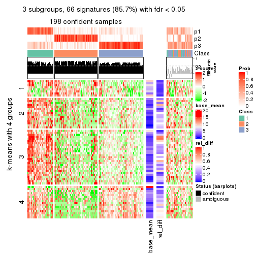</p>

</div>
<div id='tab-MAD-kmeans-get-signatures-3'>
<pre><code class="r">get_signatures(res, k = 4)
</code></pre>

<p></p>

</div>
<div id='tab-MAD-kmeans-get-signatures-4'>
<pre><code class="r">get_signatures(res, k = 5)
</code></pre>

<p></p>

</div>
<div id='tab-MAD-kmeans-get-signatures-5'>
<pre><code class="r">get_signatures(res, k = 6)
</code></pre>

<p></p>

</div>
</div>


Signature heatmaps where rows are not scaled:


<script>
$( function() {
	$( '#tabs-MAD-kmeans-get-signatures-no-scale' ).tabs();
} );
</script>
<div id='tabs-MAD-kmeans-get-signatures-no-scale'>
<ul>
<li><a href='#tab-MAD-kmeans-get-signatures-no-scale-1'>k = 2</a></li>
<li><a href='#tab-MAD-kmeans-get-signatures-no-scale-2'>k = 3</a></li>
<li><a href='#tab-MAD-kmeans-get-signatures-no-scale-3'>k = 4</a></li>
<li><a href='#tab-MAD-kmeans-get-signatures-no-scale-4'>k = 5</a></li>
<li><a href='#tab-MAD-kmeans-get-signatures-no-scale-5'>k = 6</a></li>
</ul>
<div id='tab-MAD-kmeans-get-signatures-no-scale-1'>
<pre><code class="r">get_signatures(res, k = 2, scale_rows = FALSE)
</code></pre>

<p></p>

</div>
<div id='tab-MAD-kmeans-get-signatures-no-scale-2'>
<pre><code class="r">get_signatures(res, k = 3, scale_rows = FALSE)
</code></pre>

<p></p>

</div>
<div id='tab-MAD-kmeans-get-signatures-no-scale-3'>
<pre><code class="r">get_signatures(res, k = 4, scale_rows = FALSE)
</code></pre>

<p></p>

</div>
<div id='tab-MAD-kmeans-get-signatures-no-scale-4'>
<pre><code class="r">get_signatures(res, k = 5, scale_rows = FALSE)
</code></pre>

<p></p>

</div>
<div id='tab-MAD-kmeans-get-signatures-no-scale-5'>
<pre><code class="r">get_signatures(res, k = 6, scale_rows = FALSE)
</code></pre>

<p></p>

</div>
</div>


Compare the overlap of signatures from different k:

```r
compare_signatures(res)
```


`get_signature()` returns a data frame invisibly. TO get the list of signatures, the function
call should be assigned to a variable explicitly. In following code, if `plot` argument is set
to `FALSE`, no heatmap is plotted while only the differential analysis is performed.

```r
# code only for demonstration
tb = get_signature(res, k = ..., plot = FALSE)
```

An example of the output of `tb` is:

```
#>   which_row         fdr    mean_1    mean_2 scaled_mean_1 scaled_mean_2 km
#> 1        38 0.042760348  8.373488  9.131774    -0.5533452     0.5164555  1
#> 2        40 0.018707592  7.106213  8.469186    -0.6173731     0.5762149  1
#> 3        55 0.019134737 10.221463 11.207825    -0.6159697     0.5749050  1
#> 4        59 0.006059896  5.921854  7.869574    -0.6899429     0.6439467  1
#> 5        60 0.018055526  8.928898 10.211722    -0.6204761     0.5791110  1
#> 6        98 0.009384629 15.714769 14.887706     0.6635654    -0.6193277  2
...
```

The columns in `tb` are:

1. `which_row`: row indices corresponding to the input matrix.
2. `fdr`: FDR for the differential test. 
3. `mean_x`: The mean value in group x.
4. `scaled_mean_x`: The mean value in group x after rows are scaled.
5. `km`: Row groups if k-means clustering is applied to rows.


UMAP plot which shows how samples are separated.


<script>
$( function() {
	$( '#tabs-MAD-kmeans-dimension-reduction' ).tabs();
} );
</script>
<div id='tabs-MAD-kmeans-dimension-reduction'>
<ul>
<li><a href='#tab-MAD-kmeans-dimension-reduction-1'>k = 2</a></li>
<li><a href='#tab-MAD-kmeans-dimension-reduction-2'>k = 3</a></li>
<li><a href='#tab-MAD-kmeans-dimension-reduction-3'>k = 4</a></li>
<li><a href='#tab-MAD-kmeans-dimension-reduction-4'>k = 5</a></li>
<li><a href='#tab-MAD-kmeans-dimension-reduction-5'>k = 6</a></li>
</ul>
<div id='tab-MAD-kmeans-dimension-reduction-1'>
<pre><code class="r">dimension_reduction(res, k = 2, method = &quot;UMAP&quot;)
</code></pre>

<p></p>

</div>
<div id='tab-MAD-kmeans-dimension-reduction-2'>
<pre><code class="r">dimension_reduction(res, k = 3, method = &quot;UMAP&quot;)
</code></pre>

<p></p>

</div>
<div id='tab-MAD-kmeans-dimension-reduction-3'>
<pre><code class="r">dimension_reduction(res, k = 4, method = &quot;UMAP&quot;)
</code></pre>

<p></p>

</div>
<div id='tab-MAD-kmeans-dimension-reduction-4'>
<pre><code class="r">dimension_reduction(res, k = 5, method = &quot;UMAP&quot;)
</code></pre>

<p></p>

</div>
<div id='tab-MAD-kmeans-dimension-reduction-5'>
<pre><code class="r">dimension_reduction(res, k = 6, method = &quot;UMAP&quot;)
</code></pre>

<p></p>

</div>
</div>


Following heatmap shows how subgroups are split when increasing `k`:

```r
collect_classes(res)
```


If matrix rows can be associated to genes, consider to use `GO_Enrichment(res,
...)` to perform function enrichment for the signature genes.


 

---------------------------------------------------


### MAD:skmeans


The object with results only for a single top-value method and a single partition method 
can be extracted as:

```r
res = res_list["MAD", "skmeans"]
# you can also extract it by
# res = res_list["MAD:skmeans"]
```

A summary of `res` and all the functions that can be applied to it:

```r
res
```

```
#> A 'ConsensusPartition' object with k = 2, 3, 4, 5, 6.
#>   On a matrix with 77 rows and 243 columns.
#>   Top rows (8, 16, 23, 30, 38) are extracted by 'MAD' method.
#>   Subgroups are detected by 'skmeans' method.
#>   Performed in total 1250 partitions by row resampling.
#>   Best k for subgroups seems to be 2.
#> 
#> Following methods can be applied to this 'ConsensusPartition' object:
#>  [1] "cola_report"             "collect_classes"         "collect_plots"          
#>  [4] "collect_stats"           "colnames"                "compare_signatures"     
#>  [7] "consensus_heatmap"       "dimension_reduction"     "functional_enrichment"  
#> [10] "get_anno_col"            "get_anno"                "get_classes"            
#> [13] "get_consensus"           "get_matrix"              "get_membership"         
#> [16] "get_param"               "get_signatures"          "get_stats"              
#> [19] "is_best_k"               "is_stable_k"             "membership_heatmap"     
#> [22] "ncol"                    "nrow"                    "plot_ecdf"              
#> [25] "rownames"                "select_partition_number" "show"                   
#> [28] "suggest_best_k"          "test_to_known_factors"
```

`collect_plots()` function collects all the plots made from `res` for all `k` (number of partitions)
into one single page to provide an easy and fast comparison between different `k`.

```r
collect_plots(res)
```

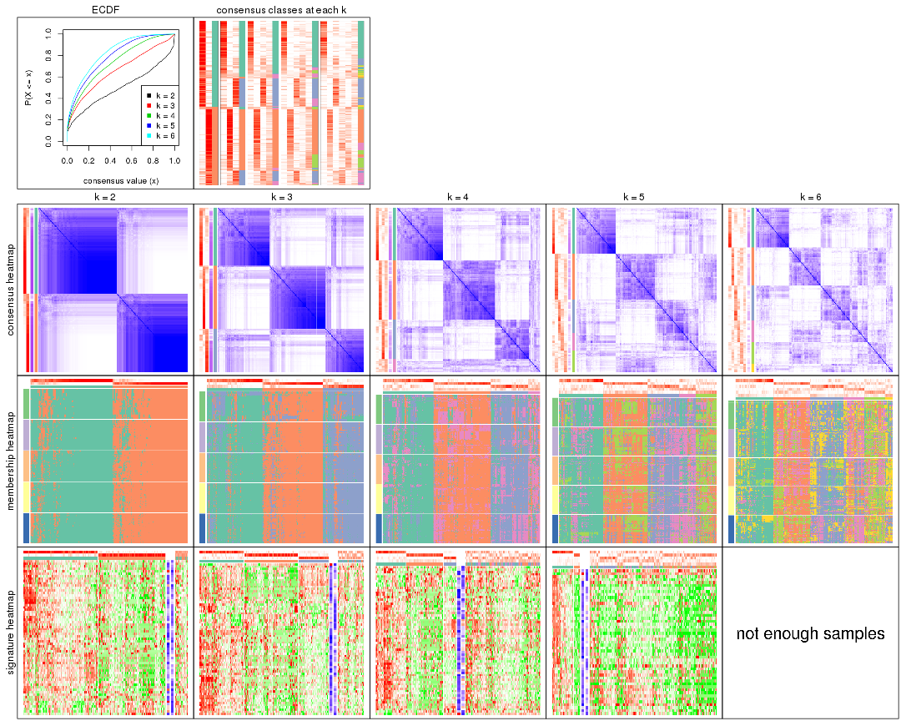

The plots are:

- The first row: a plot of the ECDF (Empirical cumulative distribution
  function) curves of the consensus matrix for each `k` and the heatmap of
  predicted classes for each `k`.
- The second row: heatmaps of the consensus matrix for each `k`.
- The third row: heatmaps of the membership matrix for each `k`.
- The fouth row: heatmaps of the signatures for each `k`.

All the plots in panels can be made by individual functions and they are
plotted later in this section.

`select_partition_number()` produces several plots showing different
statistics for choosing "optimized" `k`. There are following statistics:

- ECDF curves of the consensus matrix for each `k`;
- 1-PAC. [The PAC
  score](https://en.wikipedia.org/wiki/Consensus_clustering#Over-interpretation_potential_of_consensus_clustering)
  measures the proportion of the ambiguous subgrouping.
- Mean silhouette score.
- Concordance. The mean probability of fiting the consensus class ids in all
  partitions.
- Area increased. Denote $A_k$ as the area under the ECDF curve for current
  `k`, the area increased is defined as $A_k - A_{k-1}$.
- Rand index. The percent of pairs of samples that are both in a same cluster
  or both are not in a same cluster in the partition of k and k-1.
- Jaccard index. The ratio of pairs of samples are both in a same cluster in
  the partition of k and k-1 and the pairs of samples are both in a same
  cluster in the partition k or k-1.

The detailed explanations of these statistics can be found in [the cola
vignette](http://bioconductor.org/packages/devel/bioc/vignettes/cola/inst/doc/cola.html#toc_13).

Generally speaking, lower PAC score, higher mean silhouette score or higher
concordance corresponds to better partition. Rand index and Jaccard index
measure how similar the current partition is compared to partition with `k-1`.
If they are too similar, we won't accept `k` is better than `k-1`.

```r
select_partition_number(res)
```


The numeric values for all these statistics can be obtained by `get_stats()`.

```r
get_stats(res)
```

```
#>   k 1-PAC mean_silhouette concordance area_increased  Rand Jaccard
#> 2 2 0.515           0.806       0.909         0.5012 0.499   0.499
#> 3 3 0.441           0.663       0.821         0.3224 0.747   0.536
#> 4 4 0.408           0.450       0.682         0.1211 0.934   0.812
#> 5 5 0.457           0.303       0.576         0.0682 0.879   0.620
#> 6 6 0.497           0.240       0.505         0.0443 0.845   0.456
```

`suggest_best_k()` suggests the best $k$ based on these statistics. The rules are as follows:

- All $k$ with Jaccard index larger than 0.95 are removed because the increase of
  the partition number does not provides enough extra information. If all $k$ are removed,
  the best $k$ is assigned by `NA`.
- For $k$ with 1-PAC larger than 0.9, the maximal $k$ is taken as the "best k". Other $k$ is called "optional k".
- If it does not fit the second rule. The $k$ with the highest vote of highest
  1-PAC, mean silhouette and concordance is taken as the "best k".

```r
suggest_best_k(res)
```

```
#> [1] 2
```


Following shows the table of the partitions (You need to click the **show/hide
code output** link to see it). The membership matrix (columns with name `p*`)
is inferred by
[`clue::cl_consensus()`](https://www.rdocumentation.org/link/cl_consensus?package=clue)
function with the `SE` method. Basically the value in the membership matrix
represents the probability to belong to a certain group. The finall class
label for an item is determined with the group with highest probability it
belongs to.

In `get_classes()` function, the entropy is calculated from the membership
matrix and the silhouette score is calculated from the consensus matrix.


<script>
$( function() {
	$( '#tabs-MAD-skmeans-get-classes' ).tabs();
} );
</script>
<div id='tabs-MAD-skmeans-get-classes'>
<ul>
<li><a href='#tab-MAD-skmeans-get-classes-1'>k = 2</a></li>
<li><a href='#tab-MAD-skmeans-get-classes-2'>k = 3</a></li>
<li><a href='#tab-MAD-skmeans-get-classes-3'>k = 4</a></li>
<li><a href='#tab-MAD-skmeans-get-classes-4'>k = 5</a></li>
<li><a href='#tab-MAD-skmeans-get-classes-5'>k = 6</a></li>
</ul>

<div id='tab-MAD-skmeans-get-classes-1'>
<p><a id='tab-MAD-skmeans-get-classes-1-a' style='color:#0366d6' href='#'>show/hide code output</a></p>
<pre><code class="r">cbind(get_classes(res, k = 2), get_membership(res, k = 2))
</code></pre>

<pre><code>#&gt;           class entropy silhouette    p1    p2
#&gt; SRR191393     1  0.0000     0.8949 1.000 0.000
#&gt; SRR191394     1  0.0000     0.8949 1.000 0.000
#&gt; SRR191396     2  0.9686     0.3647 0.396 0.604
#&gt; SRR191397     1  0.0000     0.8949 1.000 0.000
#&gt; SRR191398     1  0.0000     0.8949 1.000 0.000
#&gt; SRR191399     1  0.0938     0.8934 0.988 0.012
#&gt; SRR191400     1  0.1633     0.8894 0.976 0.024
#&gt; SRR191401     1  0.0000     0.8949 1.000 0.000
#&gt; SRR191402     1  0.4939     0.8449 0.892 0.108
#&gt; SRR191403     1  0.0000     0.8949 1.000 0.000
#&gt; SRR191404     2  0.2423     0.8885 0.040 0.960
#&gt; SRR191405     2  0.2043     0.8924 0.032 0.968
#&gt; SRR191406     1  0.5059     0.8412 0.888 0.112
#&gt; SRR191407     1  0.0000     0.8949 1.000 0.000
#&gt; SRR191408     1  0.0000     0.8949 1.000 0.000
#&gt; SRR191409     1  0.6623     0.7835 0.828 0.172
#&gt; SRR191410     1  0.8144     0.6726 0.748 0.252
#&gt; SRR191411     2  0.9248     0.5015 0.340 0.660
#&gt; SRR191412     1  0.0000     0.8949 1.000 0.000
#&gt; SRR191413     1  0.0000     0.8949 1.000 0.000
#&gt; SRR191414     1  0.0000     0.8949 1.000 0.000
#&gt; SRR191415     1  0.6438     0.7896 0.836 0.164
#&gt; SRR191416     1  0.0000     0.8949 1.000 0.000
#&gt; SRR191418     1  0.0000     0.8949 1.000 0.000
#&gt; SRR191419     1  0.2778     0.8802 0.952 0.048
#&gt; SRR191420     1  0.0000     0.8949 1.000 0.000
#&gt; SRR191421     1  0.0000     0.8949 1.000 0.000
#&gt; SRR191422     2  0.0000     0.8994 0.000 1.000
#&gt; SRR191423     2  0.0000     0.8994 0.000 1.000
#&gt; SRR191424     2  0.0000     0.8994 0.000 1.000
#&gt; SRR191425     1  0.0000     0.8949 1.000 0.000
#&gt; SRR191426     2  0.9580     0.4234 0.380 0.620
#&gt; SRR191427     1  0.9248     0.5198 0.660 0.340
#&gt; SRR191428     1  0.2236     0.8845 0.964 0.036
#&gt; SRR191429     2  0.0000     0.8994 0.000 1.000
#&gt; SRR191430     2  0.2236     0.8907 0.036 0.964
#&gt; SRR191431     2  0.5059     0.8458 0.112 0.888
#&gt; SRR191432     2  0.0000     0.8994 0.000 1.000
#&gt; SRR191433     2  0.0000     0.8994 0.000 1.000
#&gt; SRR191434     2  0.3879     0.8693 0.076 0.924
#&gt; SRR191435     1  0.0000     0.8949 1.000 0.000
#&gt; SRR191436     1  0.7528     0.7350 0.784 0.216
#&gt; SRR191437     2  0.0000     0.8994 0.000 1.000
#&gt; SRR191438     2  0.7376     0.7448 0.208 0.792
#&gt; SRR191439     2  0.0000     0.8994 0.000 1.000
#&gt; SRR191440     2  0.6343     0.7993 0.160 0.840
#&gt; SRR191441     2  0.0000     0.8994 0.000 1.000
#&gt; SRR191442     1  0.9635     0.4175 0.612 0.388
#&gt; SRR191443     1  0.0000     0.8949 1.000 0.000
#&gt; SRR191444     1  0.9248     0.5165 0.660 0.340
#&gt; SRR191445     2  0.6343     0.8014 0.160 0.840
#&gt; SRR191446     2  0.7376     0.7464 0.208 0.792
#&gt; SRR191447     2  0.0000     0.8994 0.000 1.000
#&gt; SRR191448     1  0.1843     0.8876 0.972 0.028
#&gt; SRR191449     1  0.0376     0.8945 0.996 0.004
#&gt; SRR191450     1  0.7056     0.7665 0.808 0.192
#&gt; SRR191451     1  0.7815     0.7132 0.768 0.232
#&gt; SRR191452     2  0.0000     0.8994 0.000 1.000
#&gt; SRR191453     2  0.7528     0.7392 0.216 0.784
#&gt; SRR191454     1  0.4939     0.8399 0.892 0.108
#&gt; SRR191455     2  0.9933     0.1696 0.452 0.548
#&gt; SRR191456     1  0.6531     0.7828 0.832 0.168
#&gt; SRR191457     1  0.8608     0.6351 0.716 0.284
#&gt; SRR191458     2  0.4939     0.8518 0.108 0.892
#&gt; SRR191459     2  0.8267     0.6629 0.260 0.740
#&gt; SRR191460     2  0.9522     0.4327 0.372 0.628
#&gt; SRR191461     1  0.7883     0.7123 0.764 0.236
#&gt; SRR191462     2  0.4562     0.8550 0.096 0.904
#&gt; SRR191463     2  0.0000     0.8994 0.000 1.000
#&gt; SRR191464     2  0.0000     0.8994 0.000 1.000
#&gt; SRR191465     2  0.0000     0.8994 0.000 1.000
#&gt; SRR191466     1  0.9954     0.2023 0.540 0.460
#&gt; SRR191467     2  0.1414     0.8955 0.020 0.980
#&gt; SRR191468     2  0.0000     0.8994 0.000 1.000
#&gt; SRR191469     1  0.7815     0.7231 0.768 0.232
#&gt; SRR191470     2  0.7376     0.7508 0.208 0.792
#&gt; SRR191471     2  0.7219     0.7624 0.200 0.800
#&gt; SRR191472     2  0.0000     0.8994 0.000 1.000
#&gt; SRR191473     2  0.1843     0.8914 0.028 0.972
#&gt; SRR191474     1  0.5519     0.8334 0.872 0.128
#&gt; SRR191475     2  0.0000     0.8994 0.000 1.000
#&gt; SRR191476     2  0.0000     0.8994 0.000 1.000
#&gt; SRR191477     2  0.0000     0.8994 0.000 1.000
#&gt; SRR191478     2  0.0000     0.8994 0.000 1.000
#&gt; SRR191479     1  0.1414     0.8909 0.980 0.020
#&gt; SRR191480     2  0.5629     0.8238 0.132 0.868
#&gt; SRR191481     2  0.0000     0.8994 0.000 1.000
#&gt; SRR191482     2  0.1633     0.8947 0.024 0.976
#&gt; SRR191483     2  0.6623     0.7897 0.172 0.828
#&gt; SRR191484     1  0.0000     0.8949 1.000 0.000
#&gt; SRR191485     2  0.3733     0.8742 0.072 0.928
#&gt; SRR191486     2  0.6247     0.7997 0.156 0.844
#&gt; SRR191487     2  0.3431     0.8780 0.064 0.936
#&gt; SRR191488     1  0.3274     0.8747 0.940 0.060
#&gt; SRR191489     2  0.9732     0.3606 0.404 0.596
#&gt; SRR191490     2  0.0000     0.8994 0.000 1.000
#&gt; SRR191491     1  0.5294     0.8376 0.880 0.120
#&gt; SRR191492     1  0.0672     0.8942 0.992 0.008
#&gt; SRR191493     2  0.6148     0.8028 0.152 0.848
#&gt; SRR191494     2  0.0376     0.8986 0.004 0.996
#&gt; SRR191495     1  0.4161     0.8613 0.916 0.084
#&gt; SRR191496     2  0.0000     0.8994 0.000 1.000
#&gt; SRR191497     2  0.9996     0.0476 0.488 0.512
#&gt; SRR191498     1  1.0000     0.0637 0.504 0.496
#&gt; SRR191499     1  0.3584     0.8718 0.932 0.068
#&gt; SRR191500     1  0.7950     0.7057 0.760 0.240
#&gt; SRR191501     2  0.3431     0.8773 0.064 0.936
#&gt; SRR191502     2  0.7674     0.7274 0.224 0.776
#&gt; SRR191503     2  0.0000     0.8994 0.000 1.000
#&gt; SRR191504     2  0.0000     0.8994 0.000 1.000
#&gt; SRR191505     2  0.2236     0.8901 0.036 0.964
#&gt; SRR191506     2  0.0000     0.8994 0.000 1.000
#&gt; SRR191507     2  0.2043     0.8917 0.032 0.968
#&gt; SRR191508     2  0.4022     0.8656 0.080 0.920
#&gt; SRR191509     2  0.0000     0.8994 0.000 1.000
#&gt; SRR191510     2  0.9954     0.1325 0.460 0.540
#&gt; SRR191511     2  0.0000     0.8994 0.000 1.000
#&gt; SRR191512     2  0.0000     0.8994 0.000 1.000
#&gt; SRR191513     2  0.0000     0.8994 0.000 1.000
#&gt; SRR191514     2  0.0000     0.8994 0.000 1.000
#&gt; SRR191515     2  0.0000     0.8994 0.000 1.000
#&gt; SRR191516     1  0.8016     0.7043 0.756 0.244
#&gt; SRR191517     2  0.2948     0.8817 0.052 0.948
#&gt; SRR191518     2  0.0000     0.8994 0.000 1.000
#&gt; SRR191519     2  0.0000     0.8994 0.000 1.000
#&gt; SRR191520     2  0.9795     0.2943 0.416 0.584
#&gt; SRR191521     2  0.0000     0.8994 0.000 1.000
#&gt; SRR191522     2  0.2603     0.8866 0.044 0.956
#&gt; SRR191523     2  0.0376     0.8988 0.004 0.996
#&gt; SRR191524     1  0.4161     0.8609 0.916 0.084
#&gt; SRR191525     2  0.2043     0.8922 0.032 0.968
#&gt; SRR191526     2  0.0000     0.8994 0.000 1.000
#&gt; SRR191527     1  0.9754     0.3481 0.592 0.408
#&gt; SRR191528     1  0.9954     0.1479 0.540 0.460
#&gt; SRR191529     2  0.6048     0.8173 0.148 0.852
#&gt; SRR191530     2  0.0000     0.8994 0.000 1.000
#&gt; SRR191531     2  0.9909     0.2348 0.444 0.556
#&gt; SRR191532     2  0.3733     0.8765 0.072 0.928
#&gt; SRR191533     1  0.9580     0.4063 0.620 0.380
#&gt; SRR191534     2  0.3584     0.8733 0.068 0.932
#&gt; SRR191535     2  0.0376     0.8986 0.004 0.996
#&gt; SRR191536     2  0.6247     0.8095 0.156 0.844
#&gt; SRR191537     2  0.0000     0.8994 0.000 1.000
#&gt; SRR191538     2  0.0000     0.8994 0.000 1.000
#&gt; SRR191539     2  0.0000     0.8994 0.000 1.000
#&gt; SRR191540     2  0.1843     0.8931 0.028 0.972
#&gt; SRR191541     2  0.0000     0.8994 0.000 1.000
#&gt; SRR191542     2  0.0000     0.8994 0.000 1.000
#&gt; SRR191543     2  0.0000     0.8994 0.000 1.000
#&gt; SRR191544     2  0.5842     0.8241 0.140 0.860
#&gt; SRR191545     2  0.0000     0.8994 0.000 1.000
#&gt; SRR191546     2  0.4161     0.8648 0.084 0.916
#&gt; SRR191547     2  0.8909     0.5837 0.308 0.692
#&gt; SRR191548     1  0.0000     0.8949 1.000 0.000
#&gt; SRR191549     1  0.0000     0.8949 1.000 0.000
#&gt; SRR191550     1  0.0000     0.8949 1.000 0.000
#&gt; SRR191551     1  0.0000     0.8949 1.000 0.000
#&gt; SRR191552     1  0.0000     0.8949 1.000 0.000
#&gt; SRR191553     1  0.3114     0.8746 0.944 0.056
#&gt; SRR191554     1  0.0000     0.8949 1.000 0.000
#&gt; SRR191555     1  0.2236     0.8850 0.964 0.036
#&gt; SRR191556     1  0.0376     0.8948 0.996 0.004
#&gt; SRR191557     1  0.0000     0.8949 1.000 0.000
#&gt; SRR191558     2  0.0000     0.8994 0.000 1.000
#&gt; SRR191559     1  0.0000     0.8949 1.000 0.000
#&gt; SRR191560     1  0.0000     0.8949 1.000 0.000
#&gt; SRR191561     1  0.9522     0.4581 0.628 0.372
#&gt; SRR191562     1  0.0000     0.8949 1.000 0.000
#&gt; SRR191563     2  0.7376     0.7482 0.208 0.792
#&gt; SRR191564     1  0.1184     0.8928 0.984 0.016
#&gt; SRR191565     1  0.0000     0.8949 1.000 0.000
#&gt; SRR191566     1  0.0000     0.8949 1.000 0.000
#&gt; SRR191567     1  0.0000     0.8949 1.000 0.000
#&gt; SRR191568     1  0.0000     0.8949 1.000 0.000
#&gt; SRR191569     1  0.3733     0.8688 0.928 0.072
#&gt; SRR191570     1  0.2236     0.8877 0.964 0.036
#&gt; SRR191571     1  0.3431     0.8741 0.936 0.064
#&gt; SRR191572     1  0.0000     0.8949 1.000 0.000
#&gt; SRR191573     1  0.0000     0.8949 1.000 0.000
#&gt; SRR191574     1  0.0672     0.8938 0.992 0.008
#&gt; SRR191575     1  0.0672     0.8938 0.992 0.008
#&gt; SRR191576     1  0.9944     0.1727 0.544 0.456
#&gt; SRR191577     1  0.6247     0.8041 0.844 0.156
#&gt; SRR191578     2  0.0000     0.8994 0.000 1.000
#&gt; SRR191579     1  0.0000     0.8949 1.000 0.000
#&gt; SRR191580     1  0.2778     0.8785 0.952 0.048
#&gt; SRR191581     1  0.0376     0.8947 0.996 0.004
#&gt; SRR191582     1  0.1414     0.8911 0.980 0.020
#&gt; SRR191583     2  0.0000     0.8994 0.000 1.000
#&gt; SRR191584     1  0.7950     0.7012 0.760 0.240
#&gt; SRR191585     1  0.2043     0.8879 0.968 0.032
#&gt; SRR191586     1  0.1843     0.8888 0.972 0.028
#&gt; SRR191587     1  0.5178     0.8383 0.884 0.116
#&gt; SRR191588     1  0.0000     0.8949 1.000 0.000
#&gt; SRR191589     1  0.0376     0.8946 0.996 0.004
#&gt; SRR191590     1  0.0000     0.8949 1.000 0.000
#&gt; SRR191591     1  0.5059     0.8452 0.888 0.112
#&gt; SRR191592     1  0.0000     0.8949 1.000 0.000
#&gt; SRR191593     1  0.0000     0.8949 1.000 0.000
#&gt; SRR191594     1  0.0000     0.8949 1.000 0.000
#&gt; SRR191595     1  0.0000     0.8949 1.000 0.000
#&gt; SRR191596     1  0.0000     0.8949 1.000 0.000
#&gt; SRR191597     2  0.9988     0.1013 0.480 0.520
#&gt; SRR191598     1  0.0000     0.8949 1.000 0.000
#&gt; SRR191599     1  0.0000     0.8949 1.000 0.000
#&gt; SRR191600     2  0.8763     0.6136 0.296 0.704
#&gt; SRR191601     1  0.4022     0.8650 0.920 0.080
#&gt; SRR191602     1  0.9983     0.0702 0.524 0.476
#&gt; SRR191603     1  0.8608     0.6177 0.716 0.284
#&gt; SRR191604     2  0.0000     0.8994 0.000 1.000
#&gt; SRR191605     1  0.9087     0.5346 0.676 0.324
#&gt; SRR191606     1  0.0000     0.8949 1.000 0.000
#&gt; SRR191607     1  0.0672     0.8944 0.992 0.008
#&gt; SRR191608     1  0.8608     0.6149 0.716 0.284
#&gt; SRR191609     1  0.8763     0.6070 0.704 0.296
#&gt; SRR191610     1  0.0376     0.8945 0.996 0.004
#&gt; SRR191611     1  0.1633     0.8904 0.976 0.024
#&gt; SRR191612     1  0.0376     0.8946 0.996 0.004
#&gt; SRR191613     1  0.6247     0.8028 0.844 0.156
#&gt; SRR191614     1  0.0672     0.8940 0.992 0.008
#&gt; SRR191615     1  0.0938     0.8932 0.988 0.012
#&gt; SRR191616     2  0.0000     0.8994 0.000 1.000
#&gt; SRR191617     2  0.0938     0.8974 0.012 0.988
#&gt; SRR191618     1  0.6048     0.8165 0.852 0.148
#&gt; SRR191619     2  0.1843     0.8943 0.028 0.972
#&gt; SRR191620     2  0.2423     0.8900 0.040 0.960
#&gt; SRR191621     2  0.0000     0.8994 0.000 1.000
#&gt; SRR191622     1  0.9460     0.4615 0.636 0.364
#&gt; SRR191623     1  0.0000     0.8949 1.000 0.000
#&gt; SRR191624     1  0.0000     0.8949 1.000 0.000
#&gt; SRR191625     2  0.7139     0.7646 0.196 0.804
#&gt; SRR191626     2  0.8327     0.6581 0.264 0.736
#&gt; SRR191627     2  0.0000     0.8994 0.000 1.000
#&gt; SRR191628     1  0.2043     0.8877 0.968 0.032
#&gt; SRR191629     1  0.6247     0.8013 0.844 0.156
#&gt; SRR191630     1  0.0000     0.8949 1.000 0.000
#&gt; SRR191631     2  0.3274     0.8772 0.060 0.940
#&gt; SRR191632     1  0.1414     0.8914 0.980 0.020
#&gt; SRR191633     1  0.8443     0.6393 0.728 0.272
#&gt; SRR191634     2  0.0000     0.8994 0.000 1.000
#&gt; SRR191635     1  0.2043     0.8873 0.968 0.032
#&gt; SRR191636     2  0.4298     0.8653 0.088 0.912
#&gt; SRR191637     2  0.0000     0.8994 0.000 1.000
</code></pre>

<script>
$('#tab-MAD-skmeans-get-classes-1-a').parent().next().next().hide();
$('#tab-MAD-skmeans-get-classes-1-a').click(function(){
  $('#tab-MAD-skmeans-get-classes-1-a').parent().next().next().toggle();
  return(false);
});
</script>
</div>

<div id='tab-MAD-skmeans-get-classes-2'>
<p><a id='tab-MAD-skmeans-get-classes-2-a' style='color:#0366d6' href='#'>show/hide code output</a></p>
<pre><code class="r">cbind(get_classes(res, k = 3), get_membership(res, k = 3))
</code></pre>

<pre><code>#&gt;           class entropy silhouette    p1    p2    p3
#&gt; SRR191393     1  0.4702     0.6844 0.788 0.000 0.212
#&gt; SRR191394     1  0.1163     0.7687 0.972 0.000 0.028
#&gt; SRR191396     1  0.8063     0.0540 0.488 0.448 0.064
#&gt; SRR191397     1  0.0892     0.7687 0.980 0.000 0.020
#&gt; SRR191398     1  0.0747     0.7689 0.984 0.000 0.016
#&gt; SRR191399     3  0.2356     0.7613 0.072 0.000 0.928
#&gt; SRR191400     1  0.0000     0.7672 1.000 0.000 0.000
#&gt; SRR191401     1  0.1964     0.7650 0.944 0.000 0.056
#&gt; SRR191402     3  0.4629     0.6992 0.188 0.004 0.808
#&gt; SRR191403     1  0.6079     0.4380 0.612 0.000 0.388
#&gt; SRR191404     2  0.3253     0.8438 0.036 0.912 0.052
#&gt; SRR191405     2  0.5111     0.7897 0.036 0.820 0.144
#&gt; SRR191406     3  0.5072     0.6893 0.196 0.012 0.792
#&gt; SRR191407     1  0.1289     0.7627 0.968 0.000 0.032
#&gt; SRR191408     1  0.2356     0.7666 0.928 0.000 0.072
#&gt; SRR191409     1  0.5823     0.6854 0.792 0.144 0.064
#&gt; SRR191410     3  0.3116     0.7528 0.108 0.000 0.892
#&gt; SRR191411     3  0.9008     0.4577 0.164 0.296 0.540
#&gt; SRR191412     1  0.4235     0.6896 0.824 0.000 0.176
#&gt; SRR191413     3  0.6026     0.3403 0.376 0.000 0.624
#&gt; SRR191414     1  0.2537     0.7594 0.920 0.000 0.080
#&gt; SRR191415     3  0.3272     0.7579 0.104 0.004 0.892
#&gt; SRR191416     3  0.5216     0.6115 0.260 0.000 0.740
#&gt; SRR191418     1  0.6126     0.3953 0.600 0.000 0.400
#&gt; SRR191419     1  0.5831     0.6367 0.708 0.008 0.284
#&gt; SRR191420     1  0.4605     0.6819 0.796 0.000 0.204
#&gt; SRR191421     1  0.5098     0.6507 0.752 0.000 0.248
#&gt; SRR191422     2  0.0892     0.8536 0.000 0.980 0.020
#&gt; SRR191423     2  0.1765     0.8525 0.004 0.956 0.040
#&gt; SRR191424     2  0.1163     0.8543 0.000 0.972 0.028
#&gt; SRR191425     3  0.6267     0.0539 0.452 0.000 0.548
#&gt; SRR191426     3  0.7849     0.5874 0.104 0.248 0.648
#&gt; SRR191427     1  0.7383     0.5849 0.680 0.236 0.084
#&gt; SRR191428     3  0.4002     0.6947 0.160 0.000 0.840
#&gt; SRR191429     2  0.1711     0.8554 0.008 0.960 0.032
#&gt; SRR191430     2  0.3921     0.8088 0.112 0.872 0.016
#&gt; SRR191431     2  0.5223     0.7649 0.176 0.800 0.024
#&gt; SRR191432     2  0.0424     0.8557 0.000 0.992 0.008
#&gt; SRR191433     2  0.1031     0.8542 0.000 0.976 0.024
#&gt; SRR191434     2  0.5236     0.7511 0.028 0.804 0.168
#&gt; SRR191435     1  0.5591     0.5978 0.696 0.000 0.304
#&gt; SRR191436     1  0.8967     0.2797 0.488 0.132 0.380
#&gt; SRR191437     2  0.0592     0.8545 0.012 0.988 0.000
#&gt; SRR191438     2  0.7926     0.5962 0.216 0.656 0.128
#&gt; SRR191439     2  0.2165     0.8468 0.000 0.936 0.064
#&gt; SRR191440     2  0.7095     0.5770 0.292 0.660 0.048
#&gt; SRR191441     2  0.1031     0.8528 0.000 0.976 0.024
#&gt; SRR191442     1  0.9907     0.1469 0.400 0.312 0.288
#&gt; SRR191443     1  0.4121     0.7362 0.832 0.000 0.168
#&gt; SRR191444     1  0.9383     0.1973 0.460 0.176 0.364
#&gt; SRR191445     2  0.7596     0.5649 0.100 0.672 0.228
#&gt; SRR191446     3  0.9584     0.1398 0.200 0.372 0.428
#&gt; SRR191447     2  0.0592     0.8545 0.012 0.988 0.000
#&gt; SRR191448     1  0.5560     0.5862 0.700 0.000 0.300
#&gt; SRR191449     3  0.2066     0.7607 0.060 0.000 0.940
#&gt; SRR191450     1  0.7979     0.5449 0.640 0.112 0.248
#&gt; SRR191451     1  0.4063     0.7249 0.868 0.112 0.020
#&gt; SRR191452     2  0.1031     0.8528 0.000 0.976 0.024
#&gt; SRR191453     2  0.8095     0.5923 0.200 0.648 0.152
#&gt; SRR191454     1  0.6151     0.7007 0.772 0.068 0.160
#&gt; SRR191455     3  0.3155     0.7511 0.040 0.044 0.916
#&gt; SRR191456     1  0.1643     0.7549 0.956 0.044 0.000
#&gt; SRR191457     1  0.7064     0.6231 0.704 0.220 0.076
#&gt; SRR191458     2  0.6253     0.6769 0.232 0.732 0.036
#&gt; SRR191459     3  0.4689     0.7486 0.052 0.096 0.852
#&gt; SRR191460     3  0.5330     0.7150 0.044 0.144 0.812
#&gt; SRR191461     3  0.2443     0.7575 0.028 0.032 0.940
#&gt; SRR191462     2  0.6307     0.1090 0.000 0.512 0.488
#&gt; SRR191463     2  0.1411     0.8500 0.036 0.964 0.000
#&gt; SRR191464     2  0.0000     0.8548 0.000 1.000 0.000
#&gt; SRR191465     2  0.1453     0.8529 0.008 0.968 0.024
#&gt; SRR191466     2  0.9907    -0.1914 0.356 0.376 0.268
#&gt; SRR191467     2  0.3207     0.8419 0.012 0.904 0.084
#&gt; SRR191468     2  0.0000     0.8548 0.000 1.000 0.000
#&gt; SRR191469     3  0.5760     0.7232 0.064 0.140 0.796
#&gt; SRR191470     3  0.7072    -0.0857 0.020 0.476 0.504
#&gt; SRR191471     2  0.7757     0.6319 0.112 0.664 0.224
#&gt; SRR191472     2  0.1964     0.8504 0.000 0.944 0.056
#&gt; SRR191473     2  0.5327     0.6655 0.000 0.728 0.272
#&gt; SRR191474     3  0.4915     0.7171 0.132 0.036 0.832
#&gt; SRR191475     2  0.0000     0.8548 0.000 1.000 0.000
#&gt; SRR191476     2  0.0592     0.8544 0.000 0.988 0.012
#&gt; SRR191477     2  0.1529     0.8515 0.000 0.960 0.040
#&gt; SRR191478     2  0.1289     0.8529 0.000 0.968 0.032
#&gt; SRR191479     1  0.6483     0.2458 0.544 0.004 0.452
#&gt; SRR191480     3  0.4842     0.6588 0.000 0.224 0.776
#&gt; SRR191481     2  0.5948     0.4745 0.000 0.640 0.360
#&gt; SRR191482     3  0.6282     0.3883 0.004 0.384 0.612
#&gt; SRR191483     3  0.5859     0.3977 0.000 0.344 0.656
#&gt; SRR191484     1  0.4842     0.6715 0.776 0.000 0.224
#&gt; SRR191485     2  0.3888     0.8346 0.064 0.888 0.048
#&gt; SRR191486     2  0.6155     0.5205 0.328 0.664 0.008
#&gt; SRR191487     2  0.7328     0.4272 0.044 0.612 0.344
#&gt; SRR191488     1  0.2187     0.7714 0.948 0.024 0.028
#&gt; SRR191489     3  0.5136     0.7154 0.044 0.132 0.824
#&gt; SRR191490     2  0.0237     0.8551 0.000 0.996 0.004
#&gt; SRR191491     1  0.5811     0.7091 0.800 0.092 0.108
#&gt; SRR191492     1  0.5480     0.6138 0.732 0.004 0.264
#&gt; SRR191493     2  0.5053     0.7717 0.164 0.812 0.024
#&gt; SRR191494     2  0.0237     0.8548 0.004 0.996 0.000
#&gt; SRR191495     3  0.2711     0.7560 0.088 0.000 0.912
#&gt; SRR191496     2  0.0000     0.8548 0.000 1.000 0.000
#&gt; SRR191497     3  0.3722     0.7481 0.024 0.088 0.888
#&gt; SRR191498     2  0.9980    -0.1336 0.324 0.364 0.312
#&gt; SRR191499     3  0.2261     0.7611 0.068 0.000 0.932
#&gt; SRR191500     3  0.2550     0.7610 0.040 0.024 0.936
#&gt; SRR191501     2  0.4575     0.7607 0.184 0.812 0.004
#&gt; SRR191502     2  0.7925     0.4829 0.316 0.604 0.080
#&gt; SRR191503     2  0.0829     0.8547 0.012 0.984 0.004
#&gt; SRR191504     2  0.1964     0.8504 0.000 0.944 0.056
#&gt; SRR191505     2  0.3375     0.8412 0.044 0.908 0.048
#&gt; SRR191506     2  0.0000     0.8548 0.000 1.000 0.000
#&gt; SRR191507     2  0.4605     0.7224 0.000 0.796 0.204
#&gt; SRR191508     2  0.6447     0.7029 0.060 0.744 0.196
#&gt; SRR191509     2  0.5327     0.6491 0.000 0.728 0.272
#&gt; SRR191510     1  0.8884     0.1173 0.460 0.420 0.120
#&gt; SRR191511     2  0.1753     0.8519 0.000 0.952 0.048
#&gt; SRR191512     2  0.0000     0.8548 0.000 1.000 0.000
#&gt; SRR191513     2  0.0000     0.8548 0.000 1.000 0.000
#&gt; SRR191514     2  0.0000     0.8548 0.000 1.000 0.000
#&gt; SRR191515     2  0.2537     0.8360 0.000 0.920 0.080
#&gt; SRR191516     3  0.2703     0.7603 0.056 0.016 0.928
#&gt; SRR191517     3  0.3752     0.7064 0.000 0.144 0.856
#&gt; SRR191518     2  0.3340     0.8167 0.000 0.880 0.120
#&gt; SRR191519     2  0.0892     0.8536 0.000 0.980 0.020
#&gt; SRR191520     3  0.3550     0.7500 0.024 0.080 0.896
#&gt; SRR191521     2  0.1031     0.8528 0.000 0.976 0.024
#&gt; SRR191522     2  0.3889     0.8194 0.084 0.884 0.032
#&gt; SRR191523     2  0.2773     0.8494 0.024 0.928 0.048
#&gt; SRR191524     1  0.4443     0.7454 0.864 0.052 0.084
#&gt; SRR191525     2  0.3682     0.8257 0.008 0.876 0.116
#&gt; SRR191526     2  0.1031     0.8528 0.000 0.976 0.024
#&gt; SRR191527     1  0.6341     0.6003 0.716 0.252 0.032
#&gt; SRR191528     1  0.5797     0.5650 0.712 0.280 0.008
#&gt; SRR191529     2  0.6881     0.5521 0.320 0.648 0.032
#&gt; SRR191530     2  0.1765     0.8531 0.004 0.956 0.040
#&gt; SRR191531     1  0.6661     0.2702 0.588 0.400 0.012
#&gt; SRR191532     2  0.5680     0.7052 0.024 0.764 0.212
#&gt; SRR191533     1  0.9692     0.1349 0.432 0.344 0.224
#&gt; SRR191534     2  0.5254     0.6592 0.264 0.736 0.000
#&gt; SRR191535     2  0.1753     0.8490 0.000 0.952 0.048
#&gt; SRR191536     2  0.4786     0.7970 0.112 0.844 0.044
#&gt; SRR191537     2  0.3412     0.8096 0.000 0.876 0.124
#&gt; SRR191538     2  0.0000     0.8548 0.000 1.000 0.000
#&gt; SRR191539     2  0.0592     0.8545 0.012 0.988 0.000
#&gt; SRR191540     2  0.6302     0.0258 0.000 0.520 0.480
#&gt; SRR191541     2  0.0237     0.8551 0.000 0.996 0.004
#&gt; SRR191542     2  0.0000     0.8548 0.000 1.000 0.000
#&gt; SRR191543     2  0.0000     0.8548 0.000 1.000 0.000
#&gt; SRR191544     2  0.6180     0.6496 0.260 0.716 0.024
#&gt; SRR191545     2  0.3816     0.8023 0.000 0.852 0.148
#&gt; SRR191546     2  0.6659     0.5618 0.028 0.668 0.304
#&gt; SRR191547     3  0.8280     0.3171 0.088 0.360 0.552
#&gt; SRR191548     1  0.0592     0.7685 0.988 0.000 0.012
#&gt; SRR191549     1  0.0592     0.7685 0.988 0.000 0.012
#&gt; SRR191550     1  0.0592     0.7685 0.988 0.000 0.012
#&gt; SRR191551     1  0.0592     0.7685 0.988 0.000 0.012
#&gt; SRR191552     1  0.0424     0.7683 0.992 0.000 0.008
#&gt; SRR191553     1  0.4887     0.6933 0.772 0.000 0.228
#&gt; SRR191554     1  0.0424     0.7672 0.992 0.000 0.008
#&gt; SRR191555     3  0.7085     0.3070 0.356 0.032 0.612
#&gt; SRR191556     3  0.6126     0.3699 0.400 0.000 0.600
#&gt; SRR191557     3  0.2261     0.7602 0.068 0.000 0.932
#&gt; SRR191558     2  0.1015     0.8558 0.008 0.980 0.012
#&gt; SRR191559     1  0.5098     0.6312 0.752 0.000 0.248
#&gt; SRR191560     1  0.0747     0.7691 0.984 0.000 0.016
#&gt; SRR191561     1  0.6341     0.5476 0.672 0.312 0.016
#&gt; SRR191562     1  0.0592     0.7685 0.988 0.000 0.012
#&gt; SRR191563     3  0.8817     0.5028 0.160 0.272 0.568
#&gt; SRR191564     3  0.4504     0.6521 0.196 0.000 0.804
#&gt; SRR191565     1  0.2356     0.7665 0.928 0.000 0.072
#&gt; SRR191566     3  0.6308     0.0471 0.492 0.000 0.508
#&gt; SRR191567     1  0.5058     0.6537 0.756 0.000 0.244
#&gt; SRR191568     1  0.0747     0.7689 0.984 0.000 0.016
#&gt; SRR191569     1  0.6054     0.6735 0.768 0.052 0.180
#&gt; SRR191570     1  0.6027     0.6171 0.712 0.016 0.272
#&gt; SRR191571     1  0.5526     0.7073 0.792 0.036 0.172
#&gt; SRR191572     1  0.0592     0.7685 0.988 0.000 0.012
#&gt; SRR191573     1  0.1643     0.7680 0.956 0.000 0.044
#&gt; SRR191574     1  0.0424     0.7672 0.992 0.000 0.008
#&gt; SRR191575     1  0.0000     0.7672 1.000 0.000 0.000
#&gt; SRR191576     1  0.6843     0.4369 0.640 0.332 0.028
#&gt; SRR191577     1  0.5042     0.7132 0.836 0.104 0.060
#&gt; SRR191578     2  0.1163     0.8543 0.000 0.972 0.028
#&gt; SRR191579     1  0.4291     0.7039 0.820 0.000 0.180
#&gt; SRR191580     1  0.1399     0.7632 0.968 0.028 0.004
#&gt; SRR191581     1  0.0000     0.7672 1.000 0.000 0.000
#&gt; SRR191582     1  0.1289     0.7610 0.968 0.000 0.032
#&gt; SRR191583     2  0.0000     0.8548 0.000 1.000 0.000
#&gt; SRR191584     1  0.3461     0.7425 0.900 0.076 0.024
#&gt; SRR191585     3  0.2066     0.7596 0.060 0.000 0.940
#&gt; SRR191586     3  0.2261     0.7602 0.068 0.000 0.932
#&gt; SRR191587     3  0.3112     0.7584 0.096 0.004 0.900
#&gt; SRR191588     1  0.6235     0.2534 0.564 0.000 0.436
#&gt; SRR191589     3  0.6267     0.2395 0.452 0.000 0.548
#&gt; SRR191590     1  0.0747     0.7694 0.984 0.000 0.016
#&gt; SRR191591     1  0.7517     0.2011 0.540 0.040 0.420
#&gt; SRR191592     1  0.1860     0.7678 0.948 0.000 0.052
#&gt; SRR191593     1  0.5327     0.6150 0.728 0.000 0.272
#&gt; SRR191594     1  0.0747     0.7688 0.984 0.000 0.016
#&gt; SRR191595     1  0.0747     0.7691 0.984 0.000 0.016
#&gt; SRR191596     1  0.2796     0.7563 0.908 0.000 0.092
#&gt; SRR191597     3  0.2400     0.7625 0.064 0.004 0.932
#&gt; SRR191598     1  0.4931     0.6626 0.768 0.000 0.232
#&gt; SRR191599     1  0.3116     0.7487 0.892 0.000 0.108
#&gt; SRR191600     2  0.9247     0.3728 0.276 0.524 0.200
#&gt; SRR191601     3  0.7492     0.3786 0.340 0.052 0.608
#&gt; SRR191602     3  0.1751     0.7611 0.028 0.012 0.960
#&gt; SRR191603     3  0.2772     0.7613 0.080 0.004 0.916
#&gt; SRR191604     2  0.0000     0.8548 0.000 1.000 0.000
#&gt; SRR191605     3  0.1751     0.7596 0.028 0.012 0.960
#&gt; SRR191606     1  0.1525     0.7707 0.964 0.004 0.032
#&gt; SRR191607     3  0.2261     0.7591 0.068 0.000 0.932
#&gt; SRR191608     3  0.2448     0.7607 0.076 0.000 0.924
#&gt; SRR191609     3  0.2845     0.7650 0.068 0.012 0.920
#&gt; SRR191610     3  0.2537     0.7577 0.080 0.000 0.920
#&gt; SRR191611     3  0.2066     0.7596 0.060 0.000 0.940
#&gt; SRR191612     3  0.6553     0.1311 0.412 0.008 0.580
#&gt; SRR191613     1  0.7639     0.5885 0.656 0.088 0.256
#&gt; SRR191614     3  0.3116     0.7485 0.108 0.000 0.892
#&gt; SRR191615     3  0.3340     0.7376 0.120 0.000 0.880
#&gt; SRR191616     2  0.0829     0.8554 0.012 0.984 0.004
#&gt; SRR191617     2  0.1999     0.8524 0.036 0.952 0.012
#&gt; SRR191618     1  0.7958     0.3714 0.544 0.064 0.392
#&gt; SRR191619     3  0.6267     0.1508 0.000 0.452 0.548
#&gt; SRR191620     2  0.4121     0.7722 0.168 0.832 0.000
#&gt; SRR191621     2  0.4291     0.7448 0.000 0.820 0.180
#&gt; SRR191622     1  0.5986     0.6013 0.736 0.240 0.024
#&gt; SRR191623     3  0.6267     0.1265 0.452 0.000 0.548
#&gt; SRR191624     1  0.5810     0.5331 0.664 0.000 0.336
#&gt; SRR191625     3  0.6108     0.6180 0.028 0.240 0.732
#&gt; SRR191626     3  0.1491     0.7567 0.016 0.016 0.968
#&gt; SRR191627     3  0.6291     0.0487 0.000 0.468 0.532
#&gt; SRR191628     3  0.4974     0.6395 0.236 0.000 0.764
#&gt; SRR191629     3  0.1964     0.7610 0.056 0.000 0.944
#&gt; SRR191630     1  0.0747     0.7688 0.984 0.000 0.016
#&gt; SRR191631     3  0.5098     0.6212 0.000 0.248 0.752
#&gt; SRR191632     1  0.6282     0.3911 0.612 0.004 0.384
#&gt; SRR191633     1  0.9228     0.3673 0.508 0.176 0.316
#&gt; SRR191634     2  0.0983     0.8560 0.004 0.980 0.016
#&gt; SRR191635     3  0.2448     0.7604 0.076 0.000 0.924
#&gt; SRR191636     2  0.6309     0.7554 0.128 0.772 0.100
#&gt; SRR191637     2  0.0000     0.8548 0.000 1.000 0.000
</code></pre>

<script>
$('#tab-MAD-skmeans-get-classes-2-a').parent().next().next().hide();
$('#tab-MAD-skmeans-get-classes-2-a').click(function(){
  $('#tab-MAD-skmeans-get-classes-2-a').parent().next().next().toggle();
  return(false);
});
</script>
</div>

<div id='tab-MAD-skmeans-get-classes-3'>
<p><a id='tab-MAD-skmeans-get-classes-3-a' style='color:#0366d6' href='#'>show/hide code output</a></p>
<pre><code class="r">cbind(get_classes(res, k = 4), get_membership(res, k = 4))
</code></pre>

<pre><code>#&gt;           class entropy silhouette    p1    p2    p3    p4
#&gt; SRR191393     1  0.4485     0.6129 0.740 0.000 0.248 0.012
#&gt; SRR191394     1  0.0592     0.6750 0.984 0.000 0.016 0.000
#&gt; SRR191396     4  0.9374     0.2613 0.296 0.300 0.088 0.316
#&gt; SRR191397     1  0.0707     0.6757 0.980 0.000 0.020 0.000
#&gt; SRR191398     1  0.0927     0.6751 0.976 0.000 0.016 0.008
#&gt; SRR191399     3  0.2660     0.5750 0.056 0.000 0.908 0.036
#&gt; SRR191400     1  0.1792     0.6570 0.932 0.000 0.000 0.068
#&gt; SRR191401     1  0.3757     0.6580 0.828 0.000 0.152 0.020
#&gt; SRR191402     3  0.5678     0.5284 0.112 0.000 0.716 0.172
#&gt; SRR191403     1  0.5478     0.3340 0.540 0.000 0.444 0.016
#&gt; SRR191404     2  0.5033     0.5999 0.020 0.708 0.004 0.268
#&gt; SRR191405     2  0.6995     0.5132 0.028 0.616 0.092 0.264
#&gt; SRR191406     4  0.6966    -0.2648 0.096 0.004 0.448 0.452
#&gt; SRR191407     1  0.1722     0.6665 0.944 0.000 0.008 0.048
#&gt; SRR191408     1  0.2759     0.6728 0.904 0.000 0.044 0.052
#&gt; SRR191409     1  0.6575     0.5551 0.708 0.076 0.076 0.140
#&gt; SRR191410     3  0.6033     0.5049 0.116 0.000 0.680 0.204
#&gt; SRR191411     3  0.9388    -0.0431 0.128 0.240 0.416 0.216
#&gt; SRR191412     1  0.3852     0.6344 0.800 0.000 0.192 0.008
#&gt; SRR191413     3  0.4748     0.4330 0.268 0.000 0.716 0.016
#&gt; SRR191414     1  0.3208     0.6663 0.848 0.000 0.148 0.004
#&gt; SRR191415     3  0.5820     0.5146 0.100 0.000 0.696 0.204
#&gt; SRR191416     3  0.6010     0.4280 0.220 0.000 0.676 0.104
#&gt; SRR191418     1  0.5643     0.3303 0.548 0.000 0.428 0.024
#&gt; SRR191419     1  0.6866     0.5492 0.672 0.052 0.184 0.092
#&gt; SRR191420     1  0.4313     0.5912 0.736 0.000 0.260 0.004
#&gt; SRR191421     1  0.5543     0.3841 0.556 0.000 0.424 0.020
#&gt; SRR191422     2  0.3157     0.6757 0.000 0.852 0.004 0.144
#&gt; SRR191423     2  0.3892     0.6618 0.004 0.800 0.004 0.192
#&gt; SRR191424     2  0.2651     0.6786 0.004 0.896 0.004 0.096
#&gt; SRR191425     3  0.5693     0.3687 0.240 0.000 0.688 0.072
#&gt; SRR191426     4  0.7981    -0.0729 0.056 0.092 0.400 0.452
#&gt; SRR191427     1  0.8685     0.1032 0.460 0.184 0.064 0.292
#&gt; SRR191428     3  0.4646     0.4988 0.120 0.000 0.796 0.084
#&gt; SRR191429     2  0.4825     0.5917 0.008 0.700 0.004 0.288
#&gt; SRR191430     2  0.6200     0.4984 0.044 0.608 0.012 0.336
#&gt; SRR191431     2  0.6039     0.5338 0.128 0.684 0.000 0.188
#&gt; SRR191432     2  0.3751     0.6530 0.000 0.800 0.004 0.196
#&gt; SRR191433     2  0.4262     0.6256 0.000 0.756 0.008 0.236
#&gt; SRR191434     2  0.6363     0.4102 0.012 0.596 0.052 0.340
#&gt; SRR191435     1  0.7290     0.3772 0.504 0.000 0.328 0.168
#&gt; SRR191436     1  0.9066     0.1094 0.416 0.076 0.248 0.260
#&gt; SRR191437     2  0.3688     0.6412 0.000 0.792 0.000 0.208
#&gt; SRR191438     4  0.8359     0.0289 0.060 0.396 0.124 0.420
#&gt; SRR191439     2  0.4720     0.6599 0.004 0.768 0.032 0.196
#&gt; SRR191440     2  0.7492     0.2143 0.168 0.488 0.004 0.340
#&gt; SRR191441     2  0.3676     0.6624 0.004 0.820 0.004 0.172
#&gt; SRR191442     4  0.9282     0.3002 0.128 0.176 0.272 0.424
#&gt; SRR191443     1  0.5213     0.6086 0.724 0.000 0.224 0.052
#&gt; SRR191444     4  0.8660     0.1764 0.208 0.056 0.276 0.460
#&gt; SRR191445     2  0.8023     0.0989 0.032 0.488 0.152 0.328
#&gt; SRR191446     4  0.9060     0.3146 0.088 0.224 0.248 0.440
#&gt; SRR191447     2  0.3791     0.6609 0.000 0.796 0.004 0.200
#&gt; SRR191448     1  0.7651     0.2910 0.452 0.000 0.320 0.228
#&gt; SRR191449     3  0.2399     0.5730 0.048 0.000 0.920 0.032
#&gt; SRR191450     1  0.8423     0.3167 0.544 0.100 0.216 0.140
#&gt; SRR191451     1  0.6071     0.5083 0.688 0.108 0.004 0.200
#&gt; SRR191452     2  0.3870     0.6576 0.000 0.788 0.004 0.208
#&gt; SRR191453     2  0.8456     0.2892 0.136 0.500 0.076 0.288
#&gt; SRR191454     1  0.7729     0.4597 0.568 0.036 0.244 0.152
#&gt; SRR191455     3  0.6477     0.2503 0.024 0.040 0.588 0.348
#&gt; SRR191456     1  0.3662     0.6247 0.836 0.012 0.004 0.148
#&gt; SRR191457     1  0.6918     0.4694 0.660 0.208 0.072 0.060
#&gt; SRR191458     2  0.7248     0.3955 0.152 0.620 0.028 0.200
#&gt; SRR191459     3  0.6822     0.3659 0.028 0.068 0.608 0.296
#&gt; SRR191460     3  0.7618     0.2282 0.052 0.068 0.476 0.404
#&gt; SRR191461     3  0.4840     0.4944 0.028 0.000 0.732 0.240
#&gt; SRR191462     4  0.7806     0.2087 0.000 0.324 0.264 0.412
#&gt; SRR191463     2  0.3257     0.6496 0.004 0.844 0.000 0.152
#&gt; SRR191464     2  0.2973     0.6655 0.000 0.856 0.000 0.144
#&gt; SRR191465     2  0.4074     0.6617 0.008 0.792 0.004 0.196
#&gt; SRR191466     4  0.9924     0.3020 0.196 0.240 0.276 0.288
#&gt; SRR191467     2  0.4319     0.6615 0.000 0.760 0.012 0.228
#&gt; SRR191468     2  0.2530     0.6737 0.000 0.888 0.000 0.112
#&gt; SRR191469     3  0.5384     0.4331 0.024 0.156 0.764 0.056
#&gt; SRR191470     4  0.7594     0.3435 0.004 0.212 0.280 0.504
#&gt; SRR191471     4  0.7788    -0.0470 0.052 0.416 0.080 0.452
#&gt; SRR191472     2  0.4252     0.6461 0.000 0.744 0.004 0.252
#&gt; SRR191473     2  0.6957     0.2268 0.000 0.472 0.112 0.416
#&gt; SRR191474     3  0.5874     0.3804 0.020 0.032 0.668 0.280
#&gt; SRR191475     2  0.2469     0.6661 0.000 0.892 0.000 0.108
#&gt; SRR191476     2  0.3006     0.6814 0.012 0.888 0.008 0.092
#&gt; SRR191477     2  0.4053     0.6287 0.000 0.768 0.004 0.228
#&gt; SRR191478     2  0.3870     0.6466 0.000 0.788 0.004 0.208
#&gt; SRR191479     3  0.6016    -0.0441 0.412 0.000 0.544 0.044
#&gt; SRR191480     3  0.7803     0.1679 0.016 0.164 0.480 0.340
#&gt; SRR191481     2  0.7292     0.1556 0.000 0.460 0.152 0.388
#&gt; SRR191482     3  0.8063    -0.1630 0.004 0.300 0.356 0.340
#&gt; SRR191483     4  0.7640     0.1994 0.000 0.228 0.316 0.456
#&gt; SRR191484     1  0.5436     0.4791 0.620 0.000 0.356 0.024
#&gt; SRR191485     2  0.6146     0.5123 0.044 0.620 0.012 0.324
#&gt; SRR191486     2  0.7292     0.0463 0.152 0.460 0.000 0.388
#&gt; SRR191487     2  0.7556     0.0984 0.004 0.500 0.192 0.304
#&gt; SRR191488     1  0.5599     0.6189 0.756 0.044 0.044 0.156
#&gt; SRR191489     3  0.7676     0.2988 0.036 0.144 0.572 0.248
#&gt; SRR191490     2  0.2704     0.6673 0.000 0.876 0.000 0.124
#&gt; SRR191491     4  0.8439     0.0228 0.344 0.040 0.184 0.432
#&gt; SRR191492     1  0.6475     0.5046 0.644 0.000 0.184 0.172
#&gt; SRR191493     2  0.6873     0.3650 0.100 0.540 0.004 0.356
#&gt; SRR191494     2  0.2610     0.6697 0.012 0.900 0.000 0.088
#&gt; SRR191495     3  0.4808     0.4774 0.028 0.000 0.736 0.236
#&gt; SRR191496     2  0.2281     0.6707 0.000 0.904 0.000 0.096
#&gt; SRR191497     3  0.6625     0.3437 0.016 0.056 0.564 0.364
#&gt; SRR191498     4  0.9766     0.3969 0.188 0.268 0.196 0.348
#&gt; SRR191499     3  0.4925     0.4886 0.036 0.004 0.752 0.208
#&gt; SRR191500     3  0.5436     0.4286 0.024 0.000 0.620 0.356
#&gt; SRR191501     2  0.6226     0.4373 0.064 0.612 0.004 0.320
#&gt; SRR191502     2  0.9167    -0.0850 0.272 0.404 0.084 0.240
#&gt; SRR191503     2  0.2799     0.6644 0.008 0.884 0.000 0.108
#&gt; SRR191504     2  0.5255     0.5995 0.004 0.696 0.028 0.272
#&gt; SRR191505     2  0.5314     0.5782 0.024 0.676 0.004 0.296
#&gt; SRR191506     2  0.0921     0.6730 0.000 0.972 0.000 0.028
#&gt; SRR191507     2  0.6726     0.3625 0.000 0.584 0.124 0.292
#&gt; SRR191508     2  0.7611     0.4225 0.040 0.580 0.128 0.252
#&gt; SRR191509     2  0.6536     0.4531 0.000 0.580 0.096 0.324
#&gt; SRR191510     4  0.9117     0.2413 0.312 0.228 0.076 0.384
#&gt; SRR191511     2  0.4841     0.6107 0.004 0.712 0.012 0.272
#&gt; SRR191512     2  0.1637     0.6774 0.000 0.940 0.000 0.060
#&gt; SRR191513     2  0.1716     0.6734 0.000 0.936 0.000 0.064
#&gt; SRR191514     2  0.2469     0.6688 0.000 0.892 0.000 0.108
#&gt; SRR191515     2  0.5646     0.4534 0.000 0.656 0.048 0.296
#&gt; SRR191516     3  0.6652     0.4069 0.064 0.020 0.604 0.312
#&gt; SRR191517     3  0.6652     0.2165 0.000 0.088 0.516 0.396
#&gt; SRR191518     2  0.6101     0.4115 0.000 0.560 0.052 0.388
#&gt; SRR191519     2  0.3306     0.6731 0.000 0.840 0.004 0.156
#&gt; SRR191520     3  0.5778     0.4459 0.008 0.052 0.684 0.256
#&gt; SRR191521     2  0.3626     0.6647 0.000 0.812 0.004 0.184
#&gt; SRR191522     2  0.6239     0.3790 0.048 0.612 0.012 0.328
#&gt; SRR191523     2  0.5834     0.5738 0.028 0.632 0.012 0.328
#&gt; SRR191524     1  0.7098     0.4904 0.632 0.028 0.132 0.208
#&gt; SRR191525     2  0.4632     0.6347 0.004 0.740 0.012 0.244
#&gt; SRR191526     2  0.3289     0.6664 0.004 0.852 0.004 0.140
#&gt; SRR191527     1  0.6267     0.4925 0.700 0.128 0.016 0.156
#&gt; SRR191528     1  0.8069    -0.0633 0.404 0.252 0.008 0.336
#&gt; SRR191529     2  0.7043     0.2518 0.128 0.504 0.000 0.368
#&gt; SRR191530     2  0.4420     0.6585 0.012 0.776 0.008 0.204
#&gt; SRR191531     1  0.7888    -0.1741 0.380 0.300 0.000 0.320
#&gt; SRR191532     2  0.7567    -0.0128 0.008 0.464 0.152 0.376
#&gt; SRR191533     4  0.9635     0.3871 0.208 0.232 0.172 0.388
#&gt; SRR191534     2  0.6924     0.3139 0.180 0.588 0.000 0.232
#&gt; SRR191535     2  0.3790     0.6637 0.000 0.820 0.016 0.164
#&gt; SRR191536     2  0.5713     0.5808 0.036 0.760 0.088 0.116
#&gt; SRR191537     2  0.4174     0.6536 0.000 0.816 0.044 0.140
#&gt; SRR191538     2  0.2216     0.6726 0.000 0.908 0.000 0.092
#&gt; SRR191539     2  0.2924     0.6593 0.016 0.884 0.000 0.100
#&gt; SRR191540     2  0.7767    -0.0934 0.004 0.432 0.204 0.360
#&gt; SRR191541     2  0.2469     0.6731 0.000 0.892 0.000 0.108
#&gt; SRR191542     2  0.2011     0.6770 0.000 0.920 0.000 0.080
#&gt; SRR191543     2  0.2973     0.6693 0.000 0.856 0.000 0.144
#&gt; SRR191544     2  0.7176     0.2769 0.136 0.532 0.004 0.328
#&gt; SRR191545     2  0.5864     0.3978 0.004 0.488 0.024 0.484
#&gt; SRR191546     2  0.7889     0.2505 0.024 0.460 0.144 0.372
#&gt; SRR191547     4  0.8164     0.2029 0.056 0.140 0.280 0.524
#&gt; SRR191548     1  0.0927     0.6756 0.976 0.000 0.016 0.008
#&gt; SRR191549     1  0.0779     0.6750 0.980 0.000 0.016 0.004
#&gt; SRR191550     1  0.0592     0.6750 0.984 0.000 0.016 0.000
#&gt; SRR191551     1  0.0592     0.6750 0.984 0.000 0.016 0.000
#&gt; SRR191552     1  0.0779     0.6750 0.980 0.000 0.016 0.004
#&gt; SRR191553     1  0.5921     0.5991 0.744 0.036 0.132 0.088
#&gt; SRR191554     1  0.2125     0.6611 0.920 0.000 0.004 0.076
#&gt; SRR191555     3  0.5354     0.4165 0.232 0.000 0.712 0.056
#&gt; SRR191556     3  0.6743     0.2043 0.392 0.000 0.512 0.096
#&gt; SRR191557     3  0.1629     0.5660 0.024 0.000 0.952 0.024
#&gt; SRR191558     2  0.2334     0.6790 0.004 0.908 0.000 0.088
#&gt; SRR191559     1  0.7640     0.2852 0.456 0.000 0.316 0.228
#&gt; SRR191560     1  0.4874     0.6178 0.764 0.000 0.056 0.180
#&gt; SRR191561     1  0.6548     0.3227 0.608 0.276 0.000 0.116
#&gt; SRR191562     1  0.1059     0.6757 0.972 0.000 0.016 0.012
#&gt; SRR191563     3  0.9378     0.0239 0.140 0.160 0.384 0.316
#&gt; SRR191564     3  0.5495     0.4581 0.176 0.000 0.728 0.096
#&gt; SRR191565     1  0.4581     0.6559 0.800 0.000 0.120 0.080
#&gt; SRR191566     3  0.5436     0.2356 0.356 0.000 0.620 0.024
#&gt; SRR191567     1  0.5559     0.5917 0.696 0.000 0.240 0.064
#&gt; SRR191568     1  0.0592     0.6750 0.984 0.000 0.016 0.000
#&gt; SRR191569     1  0.8254     0.2474 0.444 0.020 0.260 0.276
#&gt; SRR191570     1  0.6301     0.5378 0.668 0.008 0.224 0.100
#&gt; SRR191571     1  0.6515     0.5694 0.688 0.024 0.160 0.128
#&gt; SRR191572     1  0.0779     0.6750 0.980 0.000 0.016 0.004
#&gt; SRR191573     1  0.2859     0.6746 0.880 0.000 0.112 0.008
#&gt; SRR191574     1  0.4644     0.6014 0.764 0.024 0.004 0.208
#&gt; SRR191575     1  0.2011     0.6565 0.920 0.000 0.000 0.080
#&gt; SRR191576     1  0.7997     0.0853 0.484 0.272 0.016 0.228
#&gt; SRR191577     1  0.6084     0.5241 0.692 0.072 0.016 0.220
#&gt; SRR191578     2  0.4018     0.6005 0.000 0.772 0.004 0.224
#&gt; SRR191579     1  0.4361     0.6154 0.772 0.000 0.208 0.020
#&gt; SRR191580     1  0.1509     0.6726 0.960 0.012 0.008 0.020
#&gt; SRR191581     1  0.1716     0.6582 0.936 0.000 0.000 0.064
#&gt; SRR191582     1  0.1743     0.6685 0.940 0.000 0.004 0.056
#&gt; SRR191583     2  0.1637     0.6774 0.000 0.940 0.000 0.060
#&gt; SRR191584     1  0.4205     0.6296 0.832 0.068 0.004 0.096
#&gt; SRR191585     3  0.2222     0.5554 0.016 0.000 0.924 0.060
#&gt; SRR191586     3  0.1733     0.5728 0.028 0.000 0.948 0.024
#&gt; SRR191587     3  0.3934     0.5517 0.116 0.000 0.836 0.048
#&gt; SRR191588     1  0.5604     0.1849 0.504 0.000 0.476 0.020
#&gt; SRR191589     3  0.5888     0.1615 0.424 0.000 0.540 0.036
#&gt; SRR191590     1  0.2224     0.6762 0.928 0.000 0.032 0.040
#&gt; SRR191591     1  0.8284     0.1133 0.428 0.020 0.308 0.244
#&gt; SRR191592     1  0.7080     0.4484 0.568 0.000 0.196 0.236
#&gt; SRR191593     1  0.5673     0.3128 0.528 0.000 0.448 0.024
#&gt; SRR191594     1  0.1022     0.6764 0.968 0.000 0.032 0.000
#&gt; SRR191595     1  0.5494     0.5933 0.716 0.000 0.076 0.208
#&gt; SRR191596     1  0.7234     0.4194 0.544 0.000 0.252 0.204
#&gt; SRR191597     3  0.5018     0.5129 0.024 0.012 0.744 0.220
#&gt; SRR191598     1  0.6192     0.3193 0.512 0.000 0.436 0.052
#&gt; SRR191599     1  0.5062     0.5788 0.692 0.000 0.284 0.024
#&gt; SRR191600     4  0.9661     0.2981 0.220 0.296 0.144 0.340
#&gt; SRR191601     3  0.7564     0.2072 0.112 0.028 0.528 0.332
#&gt; SRR191602     3  0.4328     0.4962 0.000 0.008 0.748 0.244
#&gt; SRR191603     3  0.5150     0.3581 0.008 0.000 0.596 0.396
#&gt; SRR191604     2  0.2345     0.6771 0.000 0.900 0.000 0.100
#&gt; SRR191605     3  0.4124     0.5419 0.012 0.012 0.812 0.164
#&gt; SRR191606     1  0.3453     0.6723 0.868 0.000 0.080 0.052
#&gt; SRR191607     3  0.1724     0.5702 0.032 0.000 0.948 0.020
#&gt; SRR191608     3  0.5736     0.3440 0.044 0.000 0.628 0.328
#&gt; SRR191609     3  0.5154     0.5036 0.024 0.012 0.728 0.236
#&gt; SRR191610     3  0.1256     0.5643 0.028 0.000 0.964 0.008
#&gt; SRR191611     3  0.1863     0.5704 0.012 0.004 0.944 0.040
#&gt; SRR191612     3  0.6637     0.2717 0.104 0.000 0.572 0.324
#&gt; SRR191613     1  0.8950     0.2408 0.468 0.092 0.228 0.212
#&gt; SRR191614     3  0.2399     0.5603 0.048 0.000 0.920 0.032
#&gt; SRR191615     3  0.3674     0.5528 0.104 0.000 0.852 0.044
#&gt; SRR191616     2  0.3523     0.6637 0.032 0.856 0.000 0.112
#&gt; SRR191617     2  0.4500     0.6309 0.032 0.776 0.000 0.192
#&gt; SRR191618     3  0.8856     0.0264 0.296 0.048 0.384 0.272
#&gt; SRR191619     2  0.7877    -0.1834 0.000 0.388 0.300 0.312
#&gt; SRR191620     2  0.6875     0.2446 0.108 0.504 0.000 0.388
#&gt; SRR191621     2  0.5839     0.4403 0.000 0.648 0.060 0.292
#&gt; SRR191622     1  0.8741     0.0999 0.456 0.184 0.068 0.292
#&gt; SRR191623     3  0.6371     0.2599 0.300 0.000 0.608 0.092
#&gt; SRR191624     1  0.5288     0.2918 0.520 0.000 0.472 0.008
#&gt; SRR191625     3  0.7748     0.1591 0.016 0.184 0.520 0.280
#&gt; SRR191626     3  0.4454     0.4510 0.000 0.000 0.692 0.308
#&gt; SRR191627     4  0.7816     0.1784 0.000 0.284 0.300 0.416
#&gt; SRR191628     3  0.6288     0.5052 0.196 0.004 0.672 0.128
#&gt; SRR191629     3  0.4542     0.5223 0.020 0.004 0.768 0.208
#&gt; SRR191630     1  0.1305     0.6777 0.960 0.000 0.036 0.004
#&gt; SRR191631     3  0.7401     0.1440 0.000 0.188 0.496 0.316
#&gt; SRR191632     1  0.7349     0.1786 0.456 0.000 0.384 0.160
#&gt; SRR191633     1  0.9395     0.0777 0.428 0.148 0.196 0.228
#&gt; SRR191634     2  0.2384     0.6768 0.004 0.916 0.008 0.072
#&gt; SRR191635     3  0.3764     0.5748 0.076 0.000 0.852 0.072
#&gt; SRR191636     2  0.7818     0.4094 0.116 0.548 0.048 0.288
#&gt; SRR191637     2  0.1118     0.6736 0.000 0.964 0.000 0.036
</code></pre>

<script>
$('#tab-MAD-skmeans-get-classes-3-a').parent().next().next().hide();
$('#tab-MAD-skmeans-get-classes-3-a').click(function(){
  $('#tab-MAD-skmeans-get-classes-3-a').parent().next().next().toggle();
  return(false);
});
</script>
</div>

<div id='tab-MAD-skmeans-get-classes-4'>
<p><a id='tab-MAD-skmeans-get-classes-4-a' style='color:#0366d6' href='#'>show/hide code output</a></p>
<pre><code class="r">cbind(get_classes(res, k = 5), get_membership(res, k = 5))
</code></pre>

<pre><code>#&gt;           class entropy silhouette    p1    p2    p3    p4    p5
#&gt; SRR191393     1  0.5542    0.46019 0.672 0.000 0.200 0.116 0.012
#&gt; SRR191394     1  0.0566    0.62902 0.984 0.000 0.000 0.012 0.004
#&gt; SRR191396     5  0.8721    0.39273 0.200 0.172 0.096 0.076 0.456
#&gt; SRR191397     1  0.0451    0.62819 0.988 0.000 0.000 0.008 0.004
#&gt; SRR191398     1  0.1041    0.62967 0.964 0.000 0.000 0.004 0.032
#&gt; SRR191399     3  0.5028    0.30803 0.068 0.000 0.708 0.212 0.012
#&gt; SRR191400     1  0.2700    0.62219 0.884 0.000 0.004 0.024 0.088
#&gt; SRR191401     1  0.5125    0.50636 0.716 0.000 0.084 0.184 0.016
#&gt; SRR191402     3  0.5309    0.30366 0.080 0.000 0.680 0.228 0.012
#&gt; SRR191403     1  0.6985    0.03146 0.436 0.000 0.296 0.256 0.012
#&gt; SRR191404     5  0.5144   -0.04308 0.000 0.356 0.024 0.016 0.604
#&gt; SRR191405     2  0.6789    0.28233 0.004 0.508 0.136 0.024 0.328
#&gt; SRR191406     3  0.7559   -0.02889 0.072 0.008 0.436 0.360 0.124
#&gt; SRR191407     1  0.2308    0.62782 0.912 0.000 0.004 0.048 0.036
#&gt; SRR191408     1  0.4305    0.60333 0.800 0.000 0.072 0.104 0.024
#&gt; SRR191409     1  0.7616    0.40938 0.576 0.080 0.100 0.056 0.188
#&gt; SRR191410     3  0.3216    0.40058 0.096 0.004 0.856 0.044 0.000
#&gt; SRR191411     3  0.8904    0.21929 0.116 0.204 0.448 0.108 0.124
#&gt; SRR191412     1  0.4581    0.53799 0.764 0.000 0.148 0.076 0.012
#&gt; SRR191413     3  0.6854   -0.04958 0.212 0.000 0.460 0.316 0.012
#&gt; SRR191414     1  0.3859    0.58328 0.820 0.000 0.072 0.100 0.008
#&gt; SRR191415     3  0.4008    0.40704 0.052 0.004 0.820 0.108 0.016
#&gt; SRR191416     4  0.6587    0.16038 0.168 0.000 0.352 0.472 0.008
#&gt; SRR191418     1  0.6691    0.15927 0.488 0.000 0.360 0.124 0.028
#&gt; SRR191419     1  0.6080    0.49044 0.648 0.008 0.212 0.108 0.024
#&gt; SRR191420     1  0.5676    0.44579 0.664 0.000 0.148 0.176 0.012
#&gt; SRR191421     1  0.6241    0.18274 0.512 0.000 0.164 0.324 0.000
#&gt; SRR191422     2  0.4521    0.49611 0.000 0.716 0.012 0.024 0.248
#&gt; SRR191423     2  0.5132    0.48143 0.000 0.664 0.012 0.048 0.276
#&gt; SRR191424     2  0.6110    0.36787 0.004 0.608 0.088 0.024 0.276
#&gt; SRR191425     4  0.5961    0.23726 0.132 0.000 0.316 0.552 0.000
#&gt; SRR191426     4  0.7817    0.13216 0.064 0.044 0.296 0.492 0.104
#&gt; SRR191427     5  0.7693    0.10630 0.360 0.068 0.016 0.124 0.432
#&gt; SRR191428     4  0.6280    0.13102 0.108 0.000 0.392 0.488 0.012
#&gt; SRR191429     2  0.6061    0.38388 0.000 0.524 0.100 0.008 0.368
#&gt; SRR191430     2  0.6899    0.12852 0.012 0.516 0.008 0.220 0.244
#&gt; SRR191431     5  0.6978    0.14379 0.092 0.368 0.008 0.048 0.484
#&gt; SRR191432     2  0.4127    0.52099 0.000 0.820 0.080 0.048 0.052
#&gt; SRR191433     2  0.4525    0.50445 0.000 0.796 0.076 0.072 0.056
#&gt; SRR191434     2  0.8132    0.21214 0.012 0.452 0.260 0.140 0.136
#&gt; SRR191435     1  0.8210    0.02787 0.396 0.028 0.092 0.352 0.132
#&gt; SRR191436     1  0.9310   -0.08775 0.308 0.052 0.252 0.212 0.176
#&gt; SRR191437     2  0.5901    0.28706 0.000 0.548 0.008 0.088 0.356
#&gt; SRR191438     5  0.8738    0.26349 0.052 0.280 0.064 0.272 0.332
#&gt; SRR191439     2  0.5739    0.44888 0.000 0.680 0.036 0.100 0.184
#&gt; SRR191440     5  0.5756    0.33452 0.072 0.224 0.004 0.032 0.668
#&gt; SRR191441     2  0.5119    0.46895 0.000 0.656 0.004 0.060 0.280
#&gt; SRR191442     4  0.8112   -0.03715 0.036 0.148 0.080 0.480 0.256
#&gt; SRR191443     1  0.5433    0.48573 0.664 0.000 0.096 0.232 0.008
#&gt; SRR191444     4  0.7173    0.23933 0.084 0.016 0.140 0.596 0.164
#&gt; SRR191445     2  0.8687   -0.12281 0.016 0.352 0.140 0.232 0.260
#&gt; SRR191446     5  0.7991    0.15435 0.040 0.124 0.344 0.060 0.432
#&gt; SRR191447     2  0.5466    0.34724 0.004 0.584 0.004 0.052 0.356
#&gt; SRR191448     4  0.8038    0.04532 0.348 0.000 0.168 0.360 0.124
#&gt; SRR191449     3  0.5689    0.24477 0.060 0.000 0.604 0.316 0.020
#&gt; SRR191450     1  0.8139    0.29898 0.500 0.100 0.180 0.188 0.032
#&gt; SRR191451     1  0.7714    0.29991 0.512 0.064 0.020 0.184 0.220
#&gt; SRR191452     2  0.4457    0.47977 0.000 0.740 0.004 0.048 0.208
#&gt; SRR191453     5  0.8910    0.13272 0.096 0.304 0.072 0.156 0.372
#&gt; SRR191454     1  0.7669    0.07731 0.412 0.068 0.028 0.400 0.092
#&gt; SRR191455     4  0.7899    0.07139 0.024 0.100 0.216 0.516 0.144
#&gt; SRR191456     1  0.4754    0.56602 0.736 0.008 0.000 0.072 0.184
#&gt; SRR191457     1  0.7273    0.45386 0.616 0.144 0.048 0.080 0.112
#&gt; SRR191458     5  0.8428    0.23366 0.092 0.332 0.040 0.140 0.396
#&gt; SRR191459     3  0.5732    0.36304 0.008 0.144 0.696 0.128 0.024
#&gt; SRR191460     3  0.7039    0.33879 0.036 0.108 0.600 0.212 0.044
#&gt; SRR191461     3  0.6590    0.32046 0.020 0.012 0.580 0.260 0.128
#&gt; SRR191462     3  0.8566   -0.13560 0.000 0.272 0.276 0.200 0.252
#&gt; SRR191463     2  0.5402    0.31685 0.000 0.612 0.004 0.068 0.316
#&gt; SRR191464     2  0.4330    0.51109 0.000 0.808 0.048 0.072 0.072
#&gt; SRR191465     2  0.4750    0.48105 0.000 0.692 0.004 0.044 0.260
#&gt; SRR191466     4  0.9130    0.02606 0.152 0.260 0.096 0.384 0.108
#&gt; SRR191467     2  0.6820    0.42884 0.000 0.584 0.084 0.108 0.224
#&gt; SRR191468     2  0.3869    0.52140 0.000 0.832 0.028 0.056 0.084
#&gt; SRR191469     3  0.7254    0.14927 0.016 0.136 0.432 0.388 0.028
#&gt; SRR191470     5  0.8049    0.07659 0.000 0.160 0.132 0.344 0.364
#&gt; SRR191471     5  0.7695    0.24259 0.024 0.216 0.116 0.104 0.540
#&gt; SRR191472     2  0.4982    0.47530 0.000 0.732 0.020 0.072 0.176
#&gt; SRR191473     2  0.7338    0.23069 0.000 0.492 0.300 0.104 0.104
#&gt; SRR191474     4  0.5346    0.20079 0.020 0.008 0.316 0.632 0.024
#&gt; SRR191475     2  0.4407    0.47729 0.000 0.760 0.004 0.064 0.172
#&gt; SRR191476     2  0.6100    0.44078 0.012 0.608 0.020 0.072 0.288
#&gt; SRR191477     2  0.4387    0.50181 0.000 0.804 0.080 0.068 0.048
#&gt; SRR191478     2  0.5001    0.50833 0.000 0.764 0.088 0.072 0.076
#&gt; SRR191479     4  0.7151    0.20458 0.344 0.004 0.276 0.368 0.008
#&gt; SRR191480     3  0.6301    0.34067 0.012 0.192 0.656 0.088 0.052
#&gt; SRR191481     2  0.6740    0.25842 0.000 0.508 0.340 0.040 0.112
#&gt; SRR191482     3  0.6392    0.15644 0.000 0.352 0.528 0.088 0.032
#&gt; SRR191483     3  0.8027   -0.01164 0.000 0.328 0.380 0.124 0.168
#&gt; SRR191484     1  0.6344    0.26715 0.556 0.000 0.120 0.304 0.020
#&gt; SRR191485     5  0.7159   -0.25061 0.024 0.404 0.084 0.040 0.448
#&gt; SRR191486     5  0.7240    0.40364 0.096 0.204 0.000 0.152 0.548
#&gt; SRR191487     5  0.8213    0.17423 0.004 0.264 0.276 0.096 0.360
#&gt; SRR191488     1  0.5970    0.54339 0.692 0.016 0.032 0.120 0.140
#&gt; SRR191489     3  0.7605    0.27614 0.028 0.116 0.568 0.172 0.116
#&gt; SRR191490     2  0.5559    0.37418 0.000 0.600 0.004 0.080 0.316
#&gt; SRR191491     4  0.7969    0.21783 0.256 0.040 0.032 0.448 0.224
#&gt; SRR191492     1  0.6723    0.31015 0.584 0.000 0.196 0.172 0.048
#&gt; SRR191493     5  0.6933    0.16953 0.064 0.328 0.000 0.100 0.508
#&gt; SRR191494     2  0.4922    0.41570 0.008 0.636 0.000 0.028 0.328
#&gt; SRR191495     3  0.5575   -0.03554 0.008 0.004 0.476 0.472 0.040
#&gt; SRR191496     2  0.4525    0.47863 0.000 0.740 0.004 0.056 0.200
#&gt; SRR191497     3  0.6812    0.21979 0.008 0.064 0.548 0.308 0.072
#&gt; SRR191498     5  0.8871    0.32015 0.132 0.136 0.080 0.208 0.444
#&gt; SRR191499     3  0.5743    0.05763 0.032 0.004 0.528 0.412 0.024
#&gt; SRR191500     3  0.5430    0.31207 0.008 0.008 0.664 0.256 0.064
#&gt; SRR191501     5  0.7430    0.16842 0.044 0.396 0.008 0.152 0.400
#&gt; SRR191502     5  0.8906    0.37563 0.224 0.276 0.088 0.056 0.356
#&gt; SRR191503     2  0.4503    0.39804 0.000 0.664 0.000 0.024 0.312
#&gt; SRR191504     2  0.5641    0.42026 0.000 0.644 0.032 0.056 0.268
#&gt; SRR191505     5  0.4954   -0.04613 0.004 0.364 0.016 0.008 0.608
#&gt; SRR191506     2  0.3790    0.46682 0.000 0.724 0.000 0.004 0.272
#&gt; SRR191507     2  0.7208    0.26955 0.000 0.532 0.256 0.100 0.112
#&gt; SRR191508     2  0.7475    0.29346 0.016 0.500 0.084 0.092 0.308
#&gt; SRR191509     2  0.7099    0.34532 0.000 0.560 0.132 0.092 0.216
#&gt; SRR191510     5  0.7623    0.38662 0.216 0.092 0.036 0.100 0.556
#&gt; SRR191511     2  0.5375    0.46038 0.000 0.684 0.084 0.016 0.216
#&gt; SRR191512     2  0.2628    0.53184 0.000 0.884 0.000 0.028 0.088
#&gt; SRR191513     2  0.4138    0.43693 0.000 0.708 0.000 0.016 0.276
#&gt; SRR191514     2  0.4712    0.46508 0.000 0.720 0.004 0.060 0.216
#&gt; SRR191515     2  0.6929    0.18005 0.000 0.536 0.044 0.160 0.260
#&gt; SRR191516     3  0.6761    0.15402 0.044 0.004 0.536 0.316 0.100
#&gt; SRR191517     3  0.6254    0.34068 0.000 0.176 0.652 0.088 0.084
#&gt; SRR191518     2  0.6280    0.38918 0.000 0.632 0.208 0.052 0.108
#&gt; SRR191519     2  0.4296    0.51022 0.000 0.756 0.024 0.016 0.204
#&gt; SRR191520     3  0.5812    0.35647 0.008 0.056 0.684 0.200 0.052
#&gt; SRR191521     2  0.4759    0.42739 0.000 0.636 0.004 0.024 0.336
#&gt; SRR191522     5  0.7737    0.23004 0.016 0.332 0.040 0.196 0.416
#&gt; SRR191523     5  0.5637   -0.21457 0.000 0.428 0.008 0.056 0.508
#&gt; SRR191524     1  0.6550    0.43713 0.584 0.008 0.024 0.128 0.256
#&gt; SRR191525     2  0.6530    0.31442 0.004 0.516 0.092 0.028 0.360
#&gt; SRR191526     2  0.4015    0.47814 0.000 0.708 0.004 0.004 0.284
#&gt; SRR191527     1  0.6104    0.46355 0.640 0.072 0.012 0.032 0.244
#&gt; SRR191528     5  0.7706    0.40087 0.260 0.100 0.004 0.152 0.484
#&gt; SRR191529     5  0.6939    0.38035 0.084 0.200 0.004 0.120 0.592
#&gt; SRR191530     2  0.5176    0.42692 0.000 0.632 0.020 0.028 0.320
#&gt; SRR191531     5  0.7521    0.40380 0.260 0.112 0.000 0.132 0.496
#&gt; SRR191532     5  0.8022    0.19654 0.000 0.284 0.084 0.288 0.344
#&gt; SRR191533     4  0.9091   -0.10854 0.168 0.120 0.068 0.356 0.288
#&gt; SRR191534     5  0.7357    0.22572 0.088 0.368 0.000 0.108 0.436
#&gt; SRR191535     2  0.5078    0.48817 0.000 0.732 0.064 0.032 0.172
#&gt; SRR191536     2  0.7046    0.14053 0.040 0.496 0.028 0.072 0.364
#&gt; SRR191537     2  0.6417    0.38842 0.000 0.612 0.080 0.072 0.236
#&gt; SRR191538     2  0.1857    0.53799 0.000 0.928 0.008 0.004 0.060
#&gt; SRR191539     2  0.4350    0.35834 0.004 0.588 0.000 0.000 0.408
#&gt; SRR191540     2  0.7480    0.11886 0.000 0.456 0.328 0.116 0.100
#&gt; SRR191541     2  0.4117    0.52319 0.000 0.788 0.028 0.020 0.164
#&gt; SRR191542     2  0.4276    0.46503 0.000 0.716 0.000 0.028 0.256
#&gt; SRR191543     2  0.4867    0.42740 0.000 0.652 0.004 0.036 0.308
#&gt; SRR191544     5  0.8101    0.34272 0.092 0.316 0.028 0.124 0.440
#&gt; SRR191545     2  0.6684    0.35750 0.000 0.572 0.072 0.088 0.268
#&gt; SRR191546     2  0.7574    0.27651 0.008 0.504 0.080 0.148 0.260
#&gt; SRR191547     4  0.8577   -0.00127 0.028 0.124 0.268 0.408 0.172
#&gt; SRR191548     1  0.1168    0.63002 0.960 0.000 0.000 0.008 0.032
#&gt; SRR191549     1  0.0671    0.62881 0.980 0.000 0.000 0.004 0.016
#&gt; SRR191550     1  0.0807    0.62873 0.976 0.000 0.000 0.012 0.012
#&gt; SRR191551     1  0.0693    0.62873 0.980 0.000 0.000 0.012 0.008
#&gt; SRR191552     1  0.0609    0.62889 0.980 0.000 0.000 0.000 0.020
#&gt; SRR191553     1  0.6041    0.52580 0.676 0.004 0.172 0.088 0.060
#&gt; SRR191554     1  0.2735    0.61879 0.880 0.000 0.000 0.036 0.084
#&gt; SRR191555     4  0.6819    0.14661 0.176 0.000 0.352 0.456 0.016
#&gt; SRR191556     3  0.7267   -0.02021 0.360 0.000 0.412 0.192 0.036
#&gt; SRR191557     3  0.4582    0.16118 0.012 0.000 0.572 0.416 0.000
#&gt; SRR191558     2  0.4537    0.44881 0.004 0.668 0.012 0.004 0.312
#&gt; SRR191559     4  0.5889    0.20801 0.356 0.000 0.036 0.564 0.044
#&gt; SRR191560     1  0.4800    0.45592 0.676 0.000 0.000 0.272 0.052
#&gt; SRR191561     1  0.6717    0.22032 0.540 0.184 0.000 0.024 0.252
#&gt; SRR191562     1  0.1364    0.63005 0.952 0.000 0.000 0.012 0.036
#&gt; SRR191563     3  0.7569    0.30637 0.136 0.120 0.596 0.084 0.064
#&gt; SRR191564     3  0.6476    0.21997 0.116 0.000 0.548 0.308 0.028
#&gt; SRR191565     1  0.5756    0.51817 0.656 0.000 0.072 0.236 0.036
#&gt; SRR191566     4  0.6853    0.08190 0.248 0.000 0.360 0.388 0.004
#&gt; SRR191567     1  0.6434    0.38293 0.588 0.000 0.172 0.216 0.024
#&gt; SRR191568     1  0.0579    0.62955 0.984 0.000 0.000 0.008 0.008
#&gt; SRR191569     5  0.8741   -0.08042 0.300 0.020 0.124 0.248 0.308
#&gt; SRR191570     1  0.7164    0.27845 0.520 0.012 0.284 0.148 0.036
#&gt; SRR191571     1  0.6943    0.40347 0.612 0.016 0.184 0.116 0.072
#&gt; SRR191572     1  0.0671    0.62881 0.980 0.000 0.000 0.004 0.016
#&gt; SRR191573     1  0.3395    0.60085 0.852 0.000 0.044 0.092 0.012
#&gt; SRR191574     1  0.5513    0.52935 0.664 0.004 0.000 0.144 0.188
#&gt; SRR191575     1  0.3309    0.60821 0.836 0.000 0.000 0.036 0.128
#&gt; SRR191576     5  0.8627    0.27008 0.316 0.116 0.032 0.164 0.372
#&gt; SRR191577     1  0.7465    0.37417 0.536 0.020 0.064 0.132 0.248
#&gt; SRR191578     2  0.6148    0.42282 0.000 0.644 0.128 0.040 0.188
#&gt; SRR191579     1  0.5293    0.51135 0.716 0.000 0.128 0.136 0.020
#&gt; SRR191580     1  0.1750    0.63008 0.936 0.000 0.000 0.036 0.028
#&gt; SRR191581     1  0.2408    0.61992 0.892 0.000 0.000 0.016 0.092
#&gt; SRR191582     1  0.3078    0.62568 0.872 0.000 0.008 0.064 0.056
#&gt; SRR191583     2  0.4268    0.43989 0.000 0.708 0.004 0.016 0.272
#&gt; SRR191584     1  0.5092    0.58122 0.756 0.056 0.004 0.056 0.128
#&gt; SRR191585     4  0.4560   -0.09992 0.008 0.000 0.484 0.508 0.000
#&gt; SRR191586     3  0.4734    0.26296 0.036 0.000 0.652 0.312 0.000
#&gt; SRR191587     3  0.6581    0.22030 0.076 0.004 0.560 0.308 0.052
#&gt; SRR191588     1  0.6973   -0.08223 0.432 0.000 0.316 0.240 0.012
#&gt; SRR191589     3  0.6209    0.05513 0.392 0.000 0.500 0.092 0.016
#&gt; SRR191590     1  0.3410    0.60401 0.840 0.000 0.000 0.092 0.068
#&gt; SRR191591     3  0.8674   -0.17146 0.312 0.036 0.324 0.248 0.080
#&gt; SRR191592     4  0.5791   -0.05409 0.448 0.000 0.004 0.472 0.076
#&gt; SRR191593     1  0.6363   -0.09037 0.444 0.000 0.164 0.392 0.000
#&gt; SRR191594     1  0.0798    0.62848 0.976 0.000 0.008 0.016 0.000
#&gt; SRR191595     1  0.5364    0.32798 0.588 0.000 0.004 0.352 0.056
#&gt; SRR191596     4  0.6016   -0.05398 0.460 0.000 0.028 0.460 0.052
#&gt; SRR191597     3  0.3272    0.41267 0.068 0.012 0.868 0.048 0.004
#&gt; SRR191598     1  0.6782   -0.03452 0.440 0.000 0.164 0.380 0.016
#&gt; SRR191599     1  0.5741    0.26790 0.568 0.000 0.088 0.340 0.004
#&gt; SRR191600     3  0.9922   -0.27906 0.156 0.192 0.236 0.180 0.236
#&gt; SRR191601     4  0.7109    0.31503 0.060 0.028 0.152 0.608 0.152
#&gt; SRR191602     3  0.3475    0.40158 0.000 0.012 0.804 0.180 0.004
#&gt; SRR191603     4  0.5889    0.05997 0.008 0.000 0.428 0.488 0.076
#&gt; SRR191604     2  0.4684    0.42395 0.000 0.664 0.016 0.012 0.308
#&gt; SRR191605     3  0.5657    0.28175 0.008 0.008 0.572 0.364 0.048
#&gt; SRR191606     1  0.4521    0.57723 0.784 0.000 0.024 0.112 0.080
#&gt; SRR191607     3  0.4403    0.21387 0.008 0.000 0.608 0.384 0.000
#&gt; SRR191608     4  0.6199    0.19544 0.020 0.004 0.316 0.572 0.088
#&gt; SRR191609     3  0.6449    0.16088 0.040 0.000 0.564 0.300 0.096
#&gt; SRR191610     3  0.4481    0.17239 0.008 0.000 0.576 0.416 0.000
#&gt; SRR191611     3  0.4127    0.27388 0.008 0.000 0.680 0.312 0.000
#&gt; SRR191612     4  0.5399    0.30801 0.044 0.000 0.216 0.692 0.048
#&gt; SRR191613     1  0.8699    0.05705 0.384 0.104 0.128 0.324 0.060
#&gt; SRR191614     3  0.5638    0.17386 0.024 0.000 0.568 0.368 0.040
#&gt; SRR191615     3  0.5759    0.20367 0.064 0.000 0.576 0.344 0.016
#&gt; SRR191616     2  0.5492    0.23022 0.008 0.516 0.012 0.024 0.440
#&gt; SRR191617     2  0.6018    0.29138 0.004 0.564 0.048 0.032 0.352
#&gt; SRR191618     4  0.7899    0.36348 0.188 0.028 0.136 0.532 0.116
#&gt; SRR191619     2  0.6905    0.14217 0.000 0.468 0.380 0.092 0.060
#&gt; SRR191620     5  0.7381    0.30650 0.044 0.308 0.000 0.208 0.440
#&gt; SRR191621     2  0.6392    0.34671 0.000 0.588 0.264 0.036 0.112
#&gt; SRR191622     1  0.8164   -0.09266 0.384 0.112 0.008 0.164 0.332
#&gt; SRR191623     4  0.6766    0.27128 0.224 0.000 0.268 0.496 0.012
#&gt; SRR191624     1  0.6599   -0.01798 0.436 0.000 0.220 0.344 0.000
#&gt; SRR191625     3  0.6483    0.34633 0.008 0.192 0.640 0.092 0.068
#&gt; SRR191626     3  0.4417    0.40178 0.000 0.032 0.788 0.132 0.048
#&gt; SRR191627     3  0.7090    0.01383 0.000 0.308 0.464 0.028 0.200
#&gt; SRR191628     3  0.6223    0.21023 0.196 0.000 0.604 0.184 0.016
#&gt; SRR191629     3  0.2276    0.41728 0.028 0.004 0.920 0.040 0.008
#&gt; SRR191630     1  0.1082    0.62805 0.964 0.000 0.008 0.028 0.000
#&gt; SRR191631     3  0.5655    0.34263 0.000 0.236 0.664 0.060 0.040
#&gt; SRR191632     1  0.7335   -0.09520 0.400 0.000 0.228 0.340 0.032
#&gt; SRR191633     1  0.9503   -0.04138 0.304 0.084 0.196 0.156 0.260
#&gt; SRR191634     2  0.5396    0.29250 0.008 0.576 0.016 0.020 0.380
#&gt; SRR191635     3  0.4898    0.34733 0.048 0.000 0.728 0.200 0.024
#&gt; SRR191636     5  0.7307    0.16268 0.068 0.312 0.044 0.052 0.524
#&gt; SRR191637     2  0.3585    0.48296 0.000 0.772 0.004 0.004 0.220
</code></pre>

<script>
$('#tab-MAD-skmeans-get-classes-4-a').parent().next().next().hide();
$('#tab-MAD-skmeans-get-classes-4-a').click(function(){
  $('#tab-MAD-skmeans-get-classes-4-a').parent().next().next().toggle();
  return(false);
});
</script>
</div>

<div id='tab-MAD-skmeans-get-classes-5'>
<p><a id='tab-MAD-skmeans-get-classes-5-a' style='color:#0366d6' href='#'>show/hide code output</a></p>
<pre><code class="r">cbind(get_classes(res, k = 6), get_membership(res, k = 6))
</code></pre>

<pre><code>#&gt;           class entropy silhouette    p1    p2    p3    p4    p5    p6
#&gt; SRR191393     1  0.6356    0.22349 0.460 0.000 0.312 0.012 0.008 0.208
#&gt; SRR191394     1  0.2052    0.60535 0.912 0.000 0.028 0.004 0.000 0.056
#&gt; SRR191396     5  0.8151    0.35536 0.144 0.092 0.056 0.080 0.508 0.120
#&gt; SRR191397     1  0.2344    0.60118 0.896 0.000 0.048 0.004 0.000 0.052
#&gt; SRR191398     1  0.1419    0.60671 0.952 0.000 0.016 0.004 0.016 0.012
#&gt; SRR191399     3  0.5245    0.38558 0.040 0.000 0.696 0.100 0.008 0.156
#&gt; SRR191400     1  0.3401    0.59631 0.824 0.000 0.000 0.008 0.104 0.064
#&gt; SRR191401     1  0.5785    0.32838 0.536 0.000 0.288 0.004 0.004 0.168
#&gt; SRR191402     3  0.5619    0.35968 0.056 0.000 0.628 0.248 0.008 0.060
#&gt; SRR191403     3  0.5591    0.20839 0.232 0.000 0.568 0.000 0.004 0.196
#&gt; SRR191404     5  0.6765    0.09541 0.008 0.204 0.000 0.224 0.504 0.060
#&gt; SRR191405     2  0.7671    0.17282 0.000 0.368 0.040 0.304 0.220 0.068
#&gt; SRR191406     6  0.6828    0.12217 0.048 0.000 0.248 0.168 0.024 0.512
#&gt; SRR191407     1  0.2775    0.59771 0.856 0.000 0.000 0.000 0.040 0.104
#&gt; SRR191408     1  0.5036    0.53872 0.700 0.000 0.024 0.040 0.032 0.204
#&gt; SRR191409     1  0.7235    0.30376 0.520 0.016 0.112 0.040 0.252 0.060
#&gt; SRR191410     3  0.6833    0.25890 0.076 0.000 0.452 0.320 0.004 0.148
#&gt; SRR191411     4  0.9163    0.11564 0.084 0.060 0.252 0.320 0.128 0.156
#&gt; SRR191412     1  0.5176    0.45074 0.648 0.000 0.236 0.012 0.004 0.100
#&gt; SRR191413     3  0.4996    0.33318 0.124 0.000 0.700 0.020 0.004 0.152
#&gt; SRR191414     1  0.4907    0.46619 0.648 0.000 0.248 0.000 0.004 0.100
#&gt; SRR191415     3  0.6413    0.26252 0.036 0.000 0.480 0.324 0.004 0.156
#&gt; SRR191416     3  0.5477    0.25386 0.116 0.000 0.628 0.020 0.004 0.232
#&gt; SRR191418     1  0.7195    0.03481 0.376 0.000 0.332 0.040 0.024 0.228
#&gt; SRR191419     1  0.6344    0.38179 0.544 0.008 0.064 0.056 0.016 0.312
#&gt; SRR191420     1  0.5475    0.33328 0.528 0.000 0.348 0.004 0.000 0.120
#&gt; SRR191421     3  0.5579    0.04300 0.368 0.000 0.500 0.004 0.000 0.128
#&gt; SRR191422     2  0.5951    0.37581 0.000 0.528 0.000 0.228 0.232 0.012
#&gt; SRR191423     2  0.5761    0.39515 0.000 0.592 0.000 0.208 0.176 0.024
#&gt; SRR191424     2  0.6624    0.16688 0.000 0.420 0.000 0.160 0.364 0.056
#&gt; SRR191425     3  0.4569    0.25557 0.084 0.000 0.708 0.004 0.004 0.200
#&gt; SRR191426     3  0.7782   -0.13496 0.044 0.020 0.332 0.252 0.028 0.324
#&gt; SRR191427     1  0.8926   -0.14431 0.300 0.128 0.040 0.072 0.296 0.164
#&gt; SRR191428     3  0.4397    0.30685 0.048 0.000 0.748 0.028 0.004 0.172
#&gt; SRR191429     5  0.6656   -0.18243 0.000 0.304 0.000 0.308 0.360 0.028
#&gt; SRR191430     2  0.6127    0.18714 0.008 0.608 0.000 0.068 0.196 0.120
#&gt; SRR191431     5  0.7363    0.17294 0.060 0.312 0.004 0.096 0.460 0.068
#&gt; SRR191432     2  0.4006    0.43436 0.000 0.744 0.000 0.200 0.052 0.004
#&gt; SRR191433     2  0.4114    0.42314 0.000 0.740 0.000 0.200 0.052 0.008
#&gt; SRR191434     2  0.7312    0.05647 0.004 0.380 0.008 0.336 0.196 0.076
#&gt; SRR191435     3  0.8739   -0.15234 0.284 0.056 0.304 0.080 0.048 0.228
#&gt; SRR191436     6  0.8844    0.15332 0.208 0.080 0.160 0.176 0.024 0.352
#&gt; SRR191437     2  0.5350    0.09084 0.000 0.496 0.000 0.032 0.428 0.044
#&gt; SRR191438     2  0.8243   -0.16375 0.044 0.364 0.036 0.068 0.312 0.176
#&gt; SRR191439     2  0.4885    0.39364 0.000 0.728 0.020 0.168 0.044 0.040
#&gt; SRR191440     5  0.6811    0.29837 0.072 0.172 0.000 0.112 0.584 0.060
#&gt; SRR191441     2  0.5223    0.38722 0.000 0.652 0.000 0.136 0.196 0.016
#&gt; SRR191442     6  0.8565    0.02221 0.020 0.236 0.148 0.040 0.232 0.324
#&gt; SRR191443     1  0.6401    0.29508 0.500 0.000 0.276 0.008 0.024 0.192
#&gt; SRR191444     6  0.8375    0.30936 0.052 0.096 0.176 0.072 0.136 0.468
#&gt; SRR191445     5  0.8313    0.12597 0.020 0.316 0.076 0.056 0.328 0.204
#&gt; SRR191446     4  0.8294    0.05228 0.032 0.072 0.092 0.412 0.280 0.112
#&gt; SRR191447     2  0.4257    0.34806 0.000 0.728 0.000 0.060 0.204 0.008
#&gt; SRR191448     1  0.7684   -0.10536 0.344 0.000 0.228 0.052 0.052 0.324
#&gt; SRR191449     3  0.4742    0.38643 0.032 0.000 0.728 0.112 0.000 0.128
#&gt; SRR191450     1  0.9137    0.10089 0.352 0.156 0.180 0.072 0.064 0.176
#&gt; SRR191451     1  0.7996    0.21743 0.444 0.140 0.012 0.040 0.212 0.152
#&gt; SRR191452     2  0.4176    0.41854 0.000 0.740 0.000 0.200 0.044 0.016
#&gt; SRR191453     2  0.7860    0.15637 0.064 0.500 0.036 0.220 0.096 0.084
#&gt; SRR191454     3  0.8879   -0.12684 0.260 0.064 0.332 0.084 0.060 0.200
#&gt; SRR191455     4  0.8340   -0.13809 0.012 0.132 0.272 0.292 0.032 0.260
#&gt; SRR191456     1  0.5438    0.48224 0.664 0.024 0.000 0.020 0.208 0.084
#&gt; SRR191457     1  0.7464    0.38603 0.580 0.120 0.060 0.052 0.096 0.092
#&gt; SRR191458     2  0.7389   -0.12687 0.032 0.384 0.004 0.080 0.380 0.120
#&gt; SRR191459     4  0.7142    0.11593 0.000 0.180 0.332 0.412 0.020 0.056
#&gt; SRR191460     4  0.8041    0.21778 0.020 0.136 0.232 0.440 0.036 0.136
#&gt; SRR191461     3  0.7295    0.11092 0.020 0.004 0.384 0.280 0.040 0.272
#&gt; SRR191462     4  0.7722    0.27928 0.000 0.080 0.104 0.484 0.180 0.152
#&gt; SRR191463     2  0.5862    0.16607 0.000 0.524 0.000 0.096 0.344 0.036
#&gt; SRR191464     2  0.4699    0.43433 0.000 0.728 0.000 0.140 0.104 0.028
#&gt; SRR191465     2  0.5639    0.37521 0.000 0.596 0.000 0.204 0.184 0.016
#&gt; SRR191466     2  0.9180   -0.16062 0.100 0.336 0.228 0.064 0.104 0.168
#&gt; SRR191467     2  0.6945    0.35762 0.000 0.536 0.028 0.204 0.156 0.076
#&gt; SRR191468     2  0.3842    0.44147 0.000 0.784 0.000 0.112 0.100 0.004
#&gt; SRR191469     3  0.6388    0.23425 0.004 0.156 0.620 0.060 0.028 0.132
#&gt; SRR191470     4  0.8715   -0.00117 0.004 0.100 0.160 0.296 0.172 0.268
#&gt; SRR191471     5  0.7594    0.24939 0.012 0.092 0.024 0.240 0.464 0.168
#&gt; SRR191472     2  0.4159    0.38164 0.000 0.672 0.000 0.300 0.020 0.008
#&gt; SRR191473     4  0.6451    0.30397 0.000 0.208 0.072 0.600 0.076 0.044
#&gt; SRR191474     3  0.6196    0.04549 0.024 0.000 0.504 0.052 0.052 0.368
#&gt; SRR191475     2  0.1657    0.43221 0.000 0.928 0.000 0.016 0.056 0.000
#&gt; SRR191476     2  0.6532    0.30103 0.012 0.440 0.000 0.204 0.328 0.016
#&gt; SRR191477     2  0.4778    0.39154 0.000 0.692 0.000 0.224 0.044 0.040
#&gt; SRR191478     2  0.5091    0.32378 0.000 0.564 0.000 0.360 0.068 0.008
#&gt; SRR191479     3  0.5680    0.19666 0.256 0.000 0.604 0.012 0.016 0.112
#&gt; SRR191480     4  0.7048    0.28997 0.000 0.084 0.192 0.512 0.020 0.192
#&gt; SRR191481     4  0.5098    0.26690 0.000 0.236 0.036 0.676 0.032 0.020
#&gt; SRR191482     4  0.7153    0.29636 0.000 0.308 0.128 0.464 0.048 0.052
#&gt; SRR191483     4  0.7763    0.32890 0.004 0.176 0.112 0.468 0.048 0.192
#&gt; SRR191484     1  0.6334    0.11897 0.448 0.000 0.356 0.008 0.016 0.172
#&gt; SRR191485     4  0.7805   -0.18751 0.044 0.232 0.004 0.344 0.316 0.060
#&gt; SRR191486     5  0.6884    0.29816 0.076 0.192 0.000 0.040 0.560 0.132
#&gt; SRR191487     5  0.8502    0.16543 0.004 0.232 0.104 0.224 0.340 0.096
#&gt; SRR191488     1  0.6460    0.43090 0.600 0.016 0.088 0.008 0.204 0.084
#&gt; SRR191489     4  0.8867    0.13710 0.036 0.040 0.184 0.276 0.200 0.264
#&gt; SRR191490     2  0.5192    0.26915 0.000 0.616 0.000 0.032 0.296 0.056
#&gt; SRR191491     6  0.8325    0.31879 0.216 0.032 0.108 0.036 0.204 0.404
#&gt; SRR191492     1  0.6648    0.27758 0.568 0.000 0.132 0.092 0.016 0.192
#&gt; SRR191493     5  0.8100    0.11729 0.064 0.268 0.000 0.188 0.372 0.108
#&gt; SRR191494     2  0.5325    0.30707 0.008 0.604 0.000 0.068 0.304 0.016
#&gt; SRR191495     3  0.5240    0.08242 0.000 0.000 0.544 0.108 0.000 0.348
#&gt; SRR191496     2  0.3667    0.37298 0.000 0.740 0.000 0.012 0.240 0.008
#&gt; SRR191497     4  0.7319    0.00344 0.000 0.020 0.248 0.344 0.052 0.336
#&gt; SRR191498     5  0.8950    0.28050 0.100 0.112 0.080 0.104 0.400 0.204
#&gt; SRR191499     3  0.6303    0.10847 0.016 0.008 0.444 0.112 0.012 0.408
#&gt; SRR191500     3  0.6342    0.00179 0.000 0.000 0.336 0.324 0.008 0.332
#&gt; SRR191501     2  0.6006   -0.00712 0.028 0.512 0.000 0.024 0.372 0.064
#&gt; SRR191502     5  0.8013    0.33560 0.192 0.172 0.068 0.072 0.472 0.024
#&gt; SRR191503     2  0.5821    0.24407 0.000 0.540 0.000 0.096 0.328 0.036
#&gt; SRR191504     4  0.6719   -0.22171 0.000 0.372 0.008 0.432 0.124 0.064
#&gt; SRR191505     5  0.6847    0.10602 0.012 0.212 0.000 0.196 0.512 0.068
#&gt; SRR191506     2  0.5419    0.31225 0.000 0.556 0.000 0.108 0.328 0.008
#&gt; SRR191507     2  0.8173    0.06469 0.004 0.348 0.044 0.292 0.172 0.140
#&gt; SRR191508     4  0.7843   -0.16190 0.008 0.308 0.056 0.396 0.168 0.064
#&gt; SRR191509     4  0.6837   -0.09023 0.000 0.368 0.060 0.456 0.060 0.056
#&gt; SRR191510     5  0.8318    0.25672 0.164 0.032 0.028 0.200 0.412 0.164
#&gt; SRR191511     4  0.6196   -0.23015 0.000 0.380 0.004 0.460 0.128 0.028
#&gt; SRR191512     2  0.3886    0.43881 0.000 0.776 0.000 0.080 0.140 0.004
#&gt; SRR191513     2  0.3884    0.38724 0.000 0.760 0.000 0.052 0.184 0.004
#&gt; SRR191514     2  0.2560    0.42669 0.000 0.872 0.000 0.036 0.092 0.000
#&gt; SRR191515     2  0.8001    0.05732 0.000 0.340 0.028 0.216 0.268 0.148
#&gt; SRR191516     6  0.7337    0.00760 0.028 0.004 0.284 0.220 0.044 0.420
#&gt; SRR191517     4  0.5149    0.36816 0.000 0.024 0.204 0.684 0.012 0.076
#&gt; SRR191518     4  0.5241    0.07332 0.000 0.292 0.012 0.616 0.072 0.008
#&gt; SRR191519     2  0.6014    0.35068 0.000 0.448 0.000 0.360 0.184 0.008
#&gt; SRR191520     3  0.6234    0.12430 0.000 0.016 0.452 0.384 0.012 0.136
#&gt; SRR191521     2  0.5399    0.38154 0.000 0.632 0.000 0.184 0.168 0.016
#&gt; SRR191522     5  0.6948    0.16802 0.000 0.220 0.004 0.116 0.500 0.160
#&gt; SRR191523     2  0.7253    0.16475 0.004 0.420 0.000 0.228 0.248 0.100
#&gt; SRR191524     1  0.7130    0.35753 0.576 0.008 0.064 0.084 0.148 0.120
#&gt; SRR191525     4  0.7188   -0.17684 0.004 0.256 0.004 0.416 0.252 0.068
#&gt; SRR191526     2  0.6251    0.35759 0.000 0.500 0.000 0.280 0.192 0.028
#&gt; SRR191527     1  0.6807    0.39221 0.592 0.040 0.032 0.076 0.212 0.048
#&gt; SRR191528     5  0.5719    0.34050 0.228 0.040 0.000 0.004 0.620 0.108
#&gt; SRR191529     5  0.6835    0.31541 0.056 0.148 0.000 0.088 0.588 0.120
#&gt; SRR191530     2  0.6486    0.35241 0.004 0.504 0.008 0.292 0.164 0.028
#&gt; SRR191531     5  0.7384    0.30806 0.252 0.104 0.000 0.036 0.476 0.132
#&gt; SRR191532     5  0.7768    0.14856 0.000 0.304 0.044 0.068 0.344 0.240
#&gt; SRR191533     5  0.8668    0.00853 0.156 0.056 0.108 0.044 0.356 0.280
#&gt; SRR191534     5  0.7049    0.06951 0.060 0.392 0.000 0.052 0.412 0.084
#&gt; SRR191535     2  0.6518    0.28603 0.000 0.428 0.008 0.360 0.180 0.024
#&gt; SRR191536     2  0.7306    0.12227 0.020 0.464 0.020 0.100 0.316 0.080
#&gt; SRR191537     2  0.7405    0.22072 0.000 0.328 0.020 0.296 0.300 0.056
#&gt; SRR191538     2  0.5090    0.43375 0.000 0.640 0.000 0.240 0.112 0.008
#&gt; SRR191539     5  0.5644   -0.17893 0.000 0.424 0.000 0.116 0.452 0.008
#&gt; SRR191540     4  0.7773    0.17124 0.000 0.312 0.092 0.400 0.064 0.132
#&gt; SRR191541     2  0.6178    0.35411 0.000 0.532 0.000 0.192 0.244 0.032
#&gt; SRR191542     2  0.5350    0.34993 0.000 0.616 0.000 0.100 0.264 0.020
#&gt; SRR191543     2  0.5968    0.33183 0.000 0.572 0.000 0.140 0.248 0.040
#&gt; SRR191544     5  0.6585    0.28179 0.032 0.192 0.008 0.088 0.604 0.076
#&gt; SRR191545     2  0.5841    0.20790 0.000 0.488 0.000 0.396 0.064 0.052
#&gt; SRR191546     2  0.7344    0.16078 0.012 0.452 0.052 0.332 0.052 0.100
#&gt; SRR191547     4  0.8068   -0.02006 0.020 0.032 0.200 0.372 0.084 0.292
#&gt; SRR191548     1  0.1332    0.60512 0.952 0.000 0.008 0.000 0.012 0.028
#&gt; SRR191549     1  0.0862    0.60496 0.972 0.000 0.004 0.000 0.008 0.016
#&gt; SRR191550     1  0.0914    0.60571 0.968 0.000 0.016 0.000 0.000 0.016
#&gt; SRR191551     1  0.1700    0.60312 0.928 0.000 0.024 0.000 0.000 0.048
#&gt; SRR191552     1  0.0508    0.60405 0.984 0.000 0.000 0.000 0.012 0.004
#&gt; SRR191553     1  0.5907    0.44892 0.640 0.000 0.056 0.052 0.040 0.212
#&gt; SRR191554     1  0.1983    0.59987 0.908 0.000 0.000 0.000 0.072 0.020
#&gt; SRR191555     3  0.4771    0.28799 0.092 0.000 0.724 0.024 0.004 0.156
#&gt; SRR191556     3  0.7752    0.08773 0.296 0.000 0.356 0.108 0.024 0.216
#&gt; SRR191557     3  0.2094    0.38752 0.004 0.000 0.908 0.024 0.000 0.064
#&gt; SRR191558     2  0.6393    0.24381 0.004 0.428 0.000 0.172 0.372 0.024
#&gt; SRR191559     6  0.6521    0.20653 0.344 0.000 0.224 0.000 0.028 0.404
#&gt; SRR191560     1  0.4848    0.38787 0.624 0.000 0.028 0.000 0.032 0.316
#&gt; SRR191561     1  0.7025    0.25017 0.524 0.172 0.000 0.032 0.204 0.068
#&gt; SRR191562     1  0.1442    0.60249 0.944 0.000 0.004 0.000 0.012 0.040
#&gt; SRR191563     4  0.8128    0.22022 0.080 0.016 0.196 0.464 0.112 0.132
#&gt; SRR191564     3  0.7434    0.21577 0.100 0.000 0.476 0.156 0.036 0.232
#&gt; SRR191565     1  0.6514    0.32635 0.484 0.000 0.112 0.016 0.044 0.344
#&gt; SRR191566     3  0.5365    0.22265 0.204 0.000 0.632 0.008 0.004 0.152
#&gt; SRR191567     1  0.6262    0.23803 0.480 0.000 0.196 0.016 0.004 0.304
#&gt; SRR191568     1  0.1951    0.60609 0.916 0.000 0.020 0.004 0.000 0.060
#&gt; SRR191569     5  0.8884   -0.15828 0.240 0.032 0.168 0.048 0.288 0.224
#&gt; SRR191570     1  0.7795    0.17861 0.412 0.000 0.216 0.088 0.048 0.236
#&gt; SRR191571     1  0.7264    0.30320 0.520 0.020 0.052 0.080 0.064 0.264
#&gt; SRR191572     1  0.0405    0.60520 0.988 0.000 0.004 0.000 0.000 0.008
#&gt; SRR191573     1  0.5296    0.48329 0.656 0.000 0.192 0.004 0.016 0.132
#&gt; SRR191574     1  0.5209    0.48020 0.656 0.000 0.004 0.008 0.160 0.172
#&gt; SRR191575     1  0.2868    0.57902 0.840 0.000 0.000 0.000 0.132 0.028
#&gt; SRR191576     5  0.8243    0.23882 0.184 0.148 0.000 0.080 0.400 0.188
#&gt; SRR191577     1  0.6906    0.31423 0.516 0.008 0.008 0.064 0.228 0.176
#&gt; SRR191578     4  0.6670   -0.26167 0.000 0.316 0.004 0.348 0.312 0.020
#&gt; SRR191579     1  0.5121    0.40560 0.632 0.000 0.268 0.008 0.004 0.088
#&gt; SRR191580     1  0.1429    0.60512 0.940 0.004 0.000 0.000 0.052 0.004
#&gt; SRR191581     1  0.2112    0.59405 0.896 0.000 0.000 0.000 0.088 0.016
#&gt; SRR191582     1  0.3231    0.58852 0.840 0.000 0.004 0.004 0.060 0.092
#&gt; SRR191583     2  0.5254    0.23733 0.000 0.508 0.000 0.100 0.392 0.000
#&gt; SRR191584     1  0.4671    0.53401 0.736 0.036 0.000 0.016 0.176 0.036
#&gt; SRR191585     3  0.3812    0.31999 0.004 0.000 0.772 0.056 0.000 0.168
#&gt; SRR191586     3  0.4006    0.39166 0.012 0.000 0.788 0.104 0.004 0.092
#&gt; SRR191587     3  0.6249    0.32633 0.064 0.000 0.600 0.192 0.012 0.132
#&gt; SRR191588     3  0.6018    0.14776 0.312 0.000 0.484 0.004 0.004 0.196
#&gt; SRR191589     3  0.7407    0.20839 0.256 0.000 0.428 0.112 0.012 0.192
#&gt; SRR191590     1  0.4712    0.51882 0.732 0.000 0.048 0.008 0.040 0.172
#&gt; SRR191591     3  0.8959    0.04259 0.176 0.028 0.360 0.168 0.104 0.164
#&gt; SRR191592     6  0.6471    0.09499 0.376 0.000 0.140 0.000 0.052 0.432
#&gt; SRR191593     3  0.5325    0.13908 0.328 0.000 0.548 0.000 0.000 0.124
#&gt; SRR191594     1  0.2585    0.60081 0.880 0.000 0.048 0.000 0.004 0.068
#&gt; SRR191595     1  0.5754    0.19493 0.504 0.000 0.072 0.000 0.040 0.384
#&gt; SRR191596     1  0.6397   -0.12455 0.404 0.000 0.172 0.000 0.032 0.392
#&gt; SRR191597     3  0.6847    0.13405 0.040 0.004 0.392 0.384 0.008 0.172
#&gt; SRR191598     3  0.6415    0.07198 0.272 0.000 0.476 0.008 0.016 0.228
#&gt; SRR191599     1  0.5820    0.07945 0.416 0.000 0.400 0.000 0.000 0.184
#&gt; SRR191600     5  0.9228    0.15026 0.116 0.120 0.052 0.208 0.332 0.172
#&gt; SRR191601     6  0.7039    0.17388 0.036 0.008 0.376 0.092 0.052 0.436
#&gt; SRR191602     3  0.5738    0.13647 0.000 0.000 0.464 0.412 0.016 0.108
#&gt; SRR191603     3  0.6097   -0.00632 0.004 0.000 0.440 0.172 0.008 0.376
#&gt; SRR191604     2  0.6106    0.24469 0.000 0.468 0.000 0.176 0.340 0.016
#&gt; SRR191605     3  0.6897    0.18661 0.000 0.004 0.452 0.256 0.060 0.228
#&gt; SRR191606     1  0.5999    0.45260 0.648 0.000 0.084 0.028 0.068 0.172
#&gt; SRR191607     3  0.2493    0.39146 0.004 0.000 0.884 0.076 0.000 0.036
#&gt; SRR191608     3  0.6239   -0.05819 0.020 0.004 0.500 0.096 0.020 0.360
#&gt; SRR191609     3  0.7151    0.01648 0.036 0.008 0.388 0.200 0.016 0.352
#&gt; SRR191610     3  0.1989    0.39973 0.004 0.000 0.916 0.052 0.000 0.028
#&gt; SRR191611     3  0.3749    0.39651 0.004 0.000 0.796 0.128 0.004 0.068
#&gt; SRR191612     6  0.6039    0.14115 0.024 0.000 0.408 0.048 0.040 0.480
#&gt; SRR191613     1  0.8405    0.09189 0.420 0.104 0.140 0.036 0.060 0.240
#&gt; SRR191614     3  0.4001    0.38443 0.012 0.000 0.780 0.060 0.004 0.144
#&gt; SRR191615     3  0.4081    0.39513 0.032 0.000 0.788 0.088 0.000 0.092
#&gt; SRR191616     5  0.6671   -0.00796 0.040 0.344 0.000 0.092 0.484 0.040
#&gt; SRR191617     5  0.6377   -0.03127 0.016 0.356 0.000 0.140 0.468 0.020
#&gt; SRR191618     6  0.7265    0.15539 0.136 0.016 0.388 0.032 0.036 0.392
#&gt; SRR191619     4  0.6927    0.38802 0.000 0.140 0.148 0.576 0.072 0.064
#&gt; SRR191620     5  0.6735    0.12946 0.032 0.384 0.000 0.024 0.420 0.140
#&gt; SRR191621     4  0.6047    0.09999 0.000 0.280 0.004 0.556 0.124 0.036
#&gt; SRR191622     5  0.8218    0.11476 0.264 0.160 0.032 0.012 0.368 0.164
#&gt; SRR191623     3  0.5636    0.19121 0.172 0.000 0.616 0.012 0.008 0.192
#&gt; SRR191624     3  0.5081    0.17414 0.308 0.000 0.588 0.000 0.000 0.104
#&gt; SRR191625     4  0.6155    0.21553 0.004 0.024 0.344 0.532 0.060 0.036
#&gt; SRR191626     4  0.5919    0.04480 0.000 0.004 0.364 0.468 0.004 0.160
#&gt; SRR191627     4  0.5063    0.39234 0.004 0.088 0.084 0.748 0.048 0.028
#&gt; SRR191628     3  0.6977    0.30340 0.172 0.000 0.528 0.156 0.012 0.132
#&gt; SRR191629     3  0.6155    0.19463 0.008 0.000 0.456 0.360 0.008 0.168
#&gt; SRR191630     1  0.2696    0.59952 0.872 0.000 0.048 0.000 0.004 0.076
#&gt; SRR191631     4  0.5788    0.38860 0.000 0.076 0.200 0.644 0.012 0.068
#&gt; SRR191632     3  0.7093   -0.15515 0.320 0.000 0.324 0.028 0.020 0.308
#&gt; SRR191633     6  0.9224    0.21391 0.212 0.076 0.104 0.156 0.104 0.348
#&gt; SRR191634     5  0.6310   -0.12291 0.008 0.396 0.000 0.120 0.444 0.032
#&gt; SRR191635     3  0.5201    0.36557 0.032 0.000 0.672 0.188 0.000 0.108
#&gt; SRR191636     5  0.8129    0.17729 0.084 0.232 0.012 0.212 0.404 0.056
#&gt; SRR191637     2  0.5586    0.29556 0.000 0.544 0.000 0.152 0.300 0.004
</code></pre>

<script>
$('#tab-MAD-skmeans-get-classes-5-a').parent().next().next().hide();
$('#tab-MAD-skmeans-get-classes-5-a').click(function(){
  $('#tab-MAD-skmeans-get-classes-5-a').parent().next().next().toggle();
  return(false);
});
</script>
</div>
</div>

Heatmaps for the consensus matrix. It visualizes the probability of two
samples to be in a same group.


<script>
$( function() {
	$( '#tabs-MAD-skmeans-consensus-heatmap' ).tabs();
} );
</script>
<div id='tabs-MAD-skmeans-consensus-heatmap'>
<ul>
<li><a href='#tab-MAD-skmeans-consensus-heatmap-1'>k = 2</a></li>
<li><a href='#tab-MAD-skmeans-consensus-heatmap-2'>k = 3</a></li>
<li><a href='#tab-MAD-skmeans-consensus-heatmap-3'>k = 4</a></li>
<li><a href='#tab-MAD-skmeans-consensus-heatmap-4'>k = 5</a></li>
<li><a href='#tab-MAD-skmeans-consensus-heatmap-5'>k = 6</a></li>
</ul>
<div id='tab-MAD-skmeans-consensus-heatmap-1'>
<pre><code class="r">consensus_heatmap(res, k = 2)
</code></pre>

<p></p>

</div>
<div id='tab-MAD-skmeans-consensus-heatmap-2'>
<pre><code class="r">consensus_heatmap(res, k = 3)
</code></pre>

<p></p>

</div>
<div id='tab-MAD-skmeans-consensus-heatmap-3'>
<pre><code class="r">consensus_heatmap(res, k = 4)
</code></pre>

<p></p>

</div>
<div id='tab-MAD-skmeans-consensus-heatmap-4'>
<pre><code class="r">consensus_heatmap(res, k = 5)
</code></pre>

<p></p>

</div>
<div id='tab-MAD-skmeans-consensus-heatmap-5'>
<pre><code class="r">consensus_heatmap(res, k = 6)
</code></pre>

<p></p>

</div>
</div>

Heatmaps for the membership of samples in all partitions to see how consistent they are:


<script>
$( function() {
	$( '#tabs-MAD-skmeans-membership-heatmap' ).tabs();
} );
</script>
<div id='tabs-MAD-skmeans-membership-heatmap'>
<ul>
<li><a href='#tab-MAD-skmeans-membership-heatmap-1'>k = 2</a></li>
<li><a href='#tab-MAD-skmeans-membership-heatmap-2'>k = 3</a></li>
<li><a href='#tab-MAD-skmeans-membership-heatmap-3'>k = 4</a></li>
<li><a href='#tab-MAD-skmeans-membership-heatmap-4'>k = 5</a></li>
<li><a href='#tab-MAD-skmeans-membership-heatmap-5'>k = 6</a></li>
</ul>
<div id='tab-MAD-skmeans-membership-heatmap-1'>
<pre><code class="r">membership_heatmap(res, k = 2)
</code></pre>

<p></p>

</div>
<div id='tab-MAD-skmeans-membership-heatmap-2'>
<pre><code class="r">membership_heatmap(res, k = 3)
</code></pre>

<p></p>

</div>
<div id='tab-MAD-skmeans-membership-heatmap-3'>
<pre><code class="r">membership_heatmap(res, k = 4)
</code></pre>

<p></p>

</div>
<div id='tab-MAD-skmeans-membership-heatmap-4'>
<pre><code class="r">membership_heatmap(res, k = 5)
</code></pre>

<p></p>

</div>
<div id='tab-MAD-skmeans-membership-heatmap-5'>
<pre><code class="r">membership_heatmap(res, k = 6)
</code></pre>

<p></p>

</div>
</div>

As soon as we have had the classes for columns, we can look for signatures
which are significantly different between classes which can be candidate marks
for certain classes. Following are the heatmaps for signatures.


Signature heatmaps where rows are scaled:


<script>
$( function() {
	$( '#tabs-MAD-skmeans-get-signatures' ).tabs();
} );
</script>
<div id='tabs-MAD-skmeans-get-signatures'>
<ul>
<li><a href='#tab-MAD-skmeans-get-signatures-1'>k = 2</a></li>
<li><a href='#tab-MAD-skmeans-get-signatures-2'>k = 3</a></li>
<li><a href='#tab-MAD-skmeans-get-signatures-3'>k = 4</a></li>
<li><a href='#tab-MAD-skmeans-get-signatures-4'>k = 5</a></li>
<li><a href='#tab-MAD-skmeans-get-signatures-5'>k = 6</a></li>
</ul>
<div id='tab-MAD-skmeans-get-signatures-1'>
<pre><code class="r">get_signatures(res, k = 2)
</code></pre>

<p></p>

</div>
<div id='tab-MAD-skmeans-get-signatures-2'>
<pre><code class="r">get_signatures(res, k = 3)
</code></pre>

<p></p>

</div>
<div id='tab-MAD-skmeans-get-signatures-3'>
<pre><code class="r">get_signatures(res, k = 4)
</code></pre>

<p></p>

</div>
<div id='tab-MAD-skmeans-get-signatures-4'>
<pre><code class="r">get_signatures(res, k = 5)
</code></pre>

<p></p>

</div>
<div id='tab-MAD-skmeans-get-signatures-5'>
<pre><code class="r">get_signatures(res, k = 6)
</code></pre>

<p></p>

</div>
</div>


Signature heatmaps where rows are not scaled:


<script>
$( function() {
	$( '#tabs-MAD-skmeans-get-signatures-no-scale' ).tabs();
} );
</script>
<div id='tabs-MAD-skmeans-get-signatures-no-scale'>
<ul>
<li><a href='#tab-MAD-skmeans-get-signatures-no-scale-1'>k = 2</a></li>
<li><a href='#tab-MAD-skmeans-get-signatures-no-scale-2'>k = 3</a></li>
<li><a href='#tab-MAD-skmeans-get-signatures-no-scale-3'>k = 4</a></li>
<li><a href='#tab-MAD-skmeans-get-signatures-no-scale-4'>k = 5</a></li>
<li><a href='#tab-MAD-skmeans-get-signatures-no-scale-5'>k = 6</a></li>
</ul>
<div id='tab-MAD-skmeans-get-signatures-no-scale-1'>
<pre><code class="r">get_signatures(res, k = 2, scale_rows = FALSE)
</code></pre>

<p></p>

</div>
<div id='tab-MAD-skmeans-get-signatures-no-scale-2'>
<pre><code class="r">get_signatures(res, k = 3, scale_rows = FALSE)
</code></pre>

<p></p>

</div>
<div id='tab-MAD-skmeans-get-signatures-no-scale-3'>
<pre><code class="r">get_signatures(res, k = 4, scale_rows = FALSE)
</code></pre>

<p></p>

</div>
<div id='tab-MAD-skmeans-get-signatures-no-scale-4'>
<pre><code class="r">get_signatures(res, k = 5, scale_rows = FALSE)
</code></pre>

<p></p>

</div>
<div id='tab-MAD-skmeans-get-signatures-no-scale-5'>
<pre><code class="r">get_signatures(res, k = 6, scale_rows = FALSE)
</code></pre>

<p></p>

</div>
</div>


Compare the overlap of signatures from different k:

```r
compare_signatures(res)
```


`get_signature()` returns a data frame invisibly. TO get the list of signatures, the function
call should be assigned to a variable explicitly. In following code, if `plot` argument is set
to `FALSE`, no heatmap is plotted while only the differential analysis is performed.

```r
# code only for demonstration
tb = get_signature(res, k = ..., plot = FALSE)
```

An example of the output of `tb` is:

```
#>   which_row         fdr    mean_1    mean_2 scaled_mean_1 scaled_mean_2 km
#> 1        38 0.042760348  8.373488  9.131774    -0.5533452     0.5164555  1
#> 2        40 0.018707592  7.106213  8.469186    -0.6173731     0.5762149  1
#> 3        55 0.019134737 10.221463 11.207825    -0.6159697     0.5749050  1
#> 4        59 0.006059896  5.921854  7.869574    -0.6899429     0.6439467  1
#> 5        60 0.018055526  8.928898 10.211722    -0.6204761     0.5791110  1
#> 6        98 0.009384629 15.714769 14.887706     0.6635654    -0.6193277  2
...
```

The columns in `tb` are:

1. `which_row`: row indices corresponding to the input matrix.
2. `fdr`: FDR for the differential test. 
3. `mean_x`: The mean value in group x.
4. `scaled_mean_x`: The mean value in group x after rows are scaled.
5. `km`: Row groups if k-means clustering is applied to rows.


UMAP plot which shows how samples are separated.


<script>
$( function() {
	$( '#tabs-MAD-skmeans-dimension-reduction' ).tabs();
} );
</script>
<div id='tabs-MAD-skmeans-dimension-reduction'>
<ul>
<li><a href='#tab-MAD-skmeans-dimension-reduction-1'>k = 2</a></li>
<li><a href='#tab-MAD-skmeans-dimension-reduction-2'>k = 3</a></li>
<li><a href='#tab-MAD-skmeans-dimension-reduction-3'>k = 4</a></li>
<li><a href='#tab-MAD-skmeans-dimension-reduction-4'>k = 5</a></li>
<li><a href='#tab-MAD-skmeans-dimension-reduction-5'>k = 6</a></li>
</ul>
<div id='tab-MAD-skmeans-dimension-reduction-1'>
<pre><code class="r">dimension_reduction(res, k = 2, method = &quot;UMAP&quot;)
</code></pre>

<p></p>

</div>
<div id='tab-MAD-skmeans-dimension-reduction-2'>
<pre><code class="r">dimension_reduction(res, k = 3, method = &quot;UMAP&quot;)
</code></pre>

<p></p>

</div>
<div id='tab-MAD-skmeans-dimension-reduction-3'>
<pre><code class="r">dimension_reduction(res, k = 4, method = &quot;UMAP&quot;)
</code></pre>

<p></p>

</div>
<div id='tab-MAD-skmeans-dimension-reduction-4'>
<pre><code class="r">dimension_reduction(res, k = 5, method = &quot;UMAP&quot;)
</code></pre>

<p></p>

</div>
<div id='tab-MAD-skmeans-dimension-reduction-5'>
<pre><code class="r">dimension_reduction(res, k = 6, method = &quot;UMAP&quot;)
</code></pre>

<p></p>

</div>
</div>


Following heatmap shows how subgroups are split when increasing `k`:

```r
collect_classes(res)
```


If matrix rows can be associated to genes, consider to use `GO_Enrichment(res,
...)` to perform function enrichment for the signature genes.


 

---------------------------------------------------


### MAD:pam


The object with results only for a single top-value method and a single partition method 
can be extracted as:

```r
res = res_list["MAD", "pam"]
# you can also extract it by
# res = res_list["MAD:pam"]
```

A summary of `res` and all the functions that can be applied to it:

```r
res
```

```
#> A 'ConsensusPartition' object with k = 2, 3, 4, 5, 6.
#>   On a matrix with 77 rows and 243 columns.
#>   Top rows (8, 16, 23, 30, 38) are extracted by 'MAD' method.
#>   Subgroups are detected by 'pam' method.
#>   Performed in total 1250 partitions by row resampling.
#>   Best k for subgroups seems to be 2.
#> 
#> Following methods can be applied to this 'ConsensusPartition' object:
#>  [1] "cola_report"             "collect_classes"         "collect_plots"          
#>  [4] "collect_stats"           "colnames"                "compare_signatures"     
#>  [7] "consensus_heatmap"       "dimension_reduction"     "functional_enrichment"  
#> [10] "get_anno_col"            "get_anno"                "get_classes"            
#> [13] "get_consensus"           "get_matrix"              "get_membership"         
#> [16] "get_param"               "get_signatures"          "get_stats"              
#> [19] "is_best_k"               "is_stable_k"             "membership_heatmap"     
#> [22] "ncol"                    "nrow"                    "plot_ecdf"              
#> [25] "rownames"                "select_partition_number" "show"                   
#> [28] "suggest_best_k"          "test_to_known_factors"
```

`collect_plots()` function collects all the plots made from `res` for all `k` (number of partitions)
into one single page to provide an easy and fast comparison between different `k`.

```r
collect_plots(res)
```


The plots are:

- The first row: a plot of the ECDF (Empirical cumulative distribution
  function) curves of the consensus matrix for each `k` and the heatmap of
  predicted classes for each `k`.
- The second row: heatmaps of the consensus matrix for each `k`.
- The third row: heatmaps of the membership matrix for each `k`.
- The fouth row: heatmaps of the signatures for each `k`.

All the plots in panels can be made by individual functions and they are
plotted later in this section.

`select_partition_number()` produces several plots showing different
statistics for choosing "optimized" `k`. There are following statistics:

- ECDF curves of the consensus matrix for each `k`;
- 1-PAC. [The PAC
  score](https://en.wikipedia.org/wiki/Consensus_clustering#Over-interpretation_potential_of_consensus_clustering)
  measures the proportion of the ambiguous subgrouping.
- Mean silhouette score.
- Concordance. The mean probability of fiting the consensus class ids in all
  partitions.
- Area increased. Denote $A_k$ as the area under the ECDF curve for current
  `k`, the area increased is defined as $A_k - A_{k-1}$.
- Rand index. The percent of pairs of samples that are both in a same cluster
  or both are not in a same cluster in the partition of k and k-1.
- Jaccard index. The ratio of pairs of samples are both in a same cluster in
  the partition of k and k-1 and the pairs of samples are both in a same
  cluster in the partition k or k-1.

The detailed explanations of these statistics can be found in [the cola
vignette](http://bioconductor.org/packages/devel/bioc/vignettes/cola/inst/doc/cola.html#toc_13).

Generally speaking, lower PAC score, higher mean silhouette score or higher
concordance corresponds to better partition. Rand index and Jaccard index
measure how similar the current partition is compared to partition with `k-1`.
If they are too similar, we won't accept `k` is better than `k-1`.

```r
select_partition_number(res)
```


The numeric values for all these statistics can be obtained by `get_stats()`.

```r
get_stats(res)
```

```
#>   k  1-PAC mean_silhouette concordance area_increased  Rand Jaccard
#> 2 2 0.0752           0.606       0.787         0.4531 0.508   0.508
#> 3 3 0.1274           0.364       0.614         0.4099 0.686   0.458
#> 4 4 0.1899           0.288       0.550         0.1166 0.748   0.423
#> 5 5 0.2665           0.283       0.518         0.0763 0.822   0.485
#> 6 6 0.3441           0.247       0.478         0.0511 0.846   0.450
```

`suggest_best_k()` suggests the best $k$ based on these statistics. The rules are as follows:

- All $k$ with Jaccard index larger than 0.95 are removed because the increase of
  the partition number does not provides enough extra information. If all $k$ are removed,
  the best $k$ is assigned by `NA`.
- For $k$ with 1-PAC larger than 0.9, the maximal $k$ is taken as the "best k". Other $k$ is called "optional k".
- If it does not fit the second rule. The $k$ with the highest vote of highest
  1-PAC, mean silhouette and concordance is taken as the "best k".

```r
suggest_best_k(res)
```

```
#> [1] 2
```


Following shows the table of the partitions (You need to click the **show/hide
code output** link to see it). The membership matrix (columns with name `p*`)
is inferred by
[`clue::cl_consensus()`](https://www.rdocumentation.org/link/cl_consensus?package=clue)
function with the `SE` method. Basically the value in the membership matrix
represents the probability to belong to a certain group. The finall class
label for an item is determined with the group with highest probability it
belongs to.

In `get_classes()` function, the entropy is calculated from the membership
matrix and the silhouette score is calculated from the consensus matrix.


<script>
$( function() {
	$( '#tabs-MAD-pam-get-classes' ).tabs();
} );
</script>
<div id='tabs-MAD-pam-get-classes'>
<ul>
<li><a href='#tab-MAD-pam-get-classes-1'>k = 2</a></li>
<li><a href='#tab-MAD-pam-get-classes-2'>k = 3</a></li>
<li><a href='#tab-MAD-pam-get-classes-3'>k = 4</a></li>
<li><a href='#tab-MAD-pam-get-classes-4'>k = 5</a></li>
<li><a href='#tab-MAD-pam-get-classes-5'>k = 6</a></li>
</ul>

<div id='tab-MAD-pam-get-classes-1'>
<p><a id='tab-MAD-pam-get-classes-1-a' style='color:#0366d6' href='#'>show/hide code output</a></p>
<pre><code class="r">cbind(get_classes(res, k = 2), get_membership(res, k = 2))
</code></pre>

<pre><code>#&gt;           class entropy silhouette    p1    p2
#&gt; SRR191393     1  0.5059    0.73667 0.888 0.112
#&gt; SRR191394     1  0.2423    0.70546 0.960 0.040
#&gt; SRR191396     2  0.9129    0.52719 0.328 0.672
#&gt; SRR191397     1  0.4161    0.72487 0.916 0.084
#&gt; SRR191398     1  0.4298    0.72330 0.912 0.088
#&gt; SRR191399     1  0.9209    0.54741 0.664 0.336
#&gt; SRR191400     1  0.7950    0.69281 0.760 0.240
#&gt; SRR191401     1  0.4690    0.72942 0.900 0.100
#&gt; SRR191402     1  0.9998    0.09295 0.508 0.492
#&gt; SRR191403     1  0.2603    0.71425 0.956 0.044
#&gt; SRR191404     2  0.6343    0.74028 0.160 0.840
#&gt; SRR191405     2  0.5519    0.76076 0.128 0.872
#&gt; SRR191406     2  0.9833    0.31111 0.424 0.576
#&gt; SRR191407     1  0.6531    0.72291 0.832 0.168
#&gt; SRR191408     1  0.4562    0.70656 0.904 0.096
#&gt; SRR191409     2  0.9881    0.20243 0.436 0.564
#&gt; SRR191410     2  0.9866    0.24567 0.432 0.568
#&gt; SRR191411     2  0.8443    0.66884 0.272 0.728
#&gt; SRR191412     1  0.4690    0.72075 0.900 0.100
#&gt; SRR191413     1  0.6801    0.71558 0.820 0.180
#&gt; SRR191414     1  0.0376    0.69440 0.996 0.004
#&gt; SRR191415     1  0.9996    0.10428 0.512 0.488
#&gt; SRR191416     1  0.7139    0.71683 0.804 0.196
#&gt; SRR191418     1  0.9358    0.53628 0.648 0.352
#&gt; SRR191419     1  0.8608    0.63445 0.716 0.284
#&gt; SRR191420     1  0.0672    0.69831 0.992 0.008
#&gt; SRR191421     1  0.2043    0.71070 0.968 0.032
#&gt; SRR191422     2  0.2948    0.75227 0.052 0.948
#&gt; SRR191423     2  0.4562    0.76195 0.096 0.904
#&gt; SRR191424     2  0.3584    0.75878 0.068 0.932
#&gt; SRR191425     1  0.2236    0.70959 0.964 0.036
#&gt; SRR191426     2  0.9954    0.21361 0.460 0.540
#&gt; SRR191427     1  0.8661    0.60584 0.712 0.288
#&gt; SRR191428     1  0.6148    0.71910 0.848 0.152
#&gt; SRR191429     2  0.2043    0.74564 0.032 0.968
#&gt; SRR191430     2  0.9170    0.53241 0.332 0.668
#&gt; SRR191431     2  0.8813    0.57076 0.300 0.700
#&gt; SRR191432     2  0.0376    0.73164 0.004 0.996
#&gt; SRR191433     2  0.2778    0.74339 0.048 0.952
#&gt; SRR191434     2  0.6343    0.73692 0.160 0.840
#&gt; SRR191435     1  0.2236    0.70863 0.964 0.036
#&gt; SRR191436     1  0.9866    0.29870 0.568 0.432
#&gt; SRR191437     2  0.4022    0.73604 0.080 0.920
#&gt; SRR191438     2  0.9248    0.48810 0.340 0.660
#&gt; SRR191439     2  0.7453    0.69259 0.212 0.788
#&gt; SRR191440     2  0.7883    0.68873 0.236 0.764
#&gt; SRR191441     2  0.0376    0.73164 0.004 0.996
#&gt; SRR191442     2  0.9983    0.08980 0.476 0.524
#&gt; SRR191443     1  0.4690    0.73056 0.900 0.100
#&gt; SRR191444     2  0.9686    0.39059 0.396 0.604
#&gt; SRR191445     2  0.6712    0.74744 0.176 0.824
#&gt; SRR191446     2  0.7950    0.68678 0.240 0.760
#&gt; SRR191447     2  0.2948    0.74221 0.052 0.948
#&gt; SRR191448     1  0.7745    0.70259 0.772 0.228
#&gt; SRR191449     1  0.9977    0.19411 0.528 0.472
#&gt; SRR191450     1  0.9323    0.56601 0.652 0.348
#&gt; SRR191451     1  0.8861    0.59809 0.696 0.304
#&gt; SRR191452     2  0.2603    0.74310 0.044 0.956
#&gt; SRR191453     2  0.9850    0.30181 0.428 0.572
#&gt; SRR191454     1  0.6247    0.72700 0.844 0.156
#&gt; SRR191455     2  0.9896    0.30174 0.440 0.560
#&gt; SRR191456     1  0.6531    0.71475 0.832 0.168
#&gt; SRR191457     1  0.9552    0.43448 0.624 0.376
#&gt; SRR191458     2  0.8081    0.66661 0.248 0.752
#&gt; SRR191459     2  0.8713    0.61792 0.292 0.708
#&gt; SRR191460     2  0.8861    0.58144 0.304 0.696
#&gt; SRR191461     2  0.9170    0.55744 0.332 0.668
#&gt; SRR191462     2  0.6148    0.74411 0.152 0.848
#&gt; SRR191463     2  0.3733    0.75517 0.072 0.928
#&gt; SRR191464     2  0.3274    0.75102 0.060 0.940
#&gt; SRR191465     2  0.1414    0.74053 0.020 0.980
#&gt; SRR191466     2  0.9710    0.35092 0.400 0.600
#&gt; SRR191467     2  0.5629    0.76223 0.132 0.868
#&gt; SRR191468     2  0.0672    0.73139 0.008 0.992
#&gt; SRR191469     2  0.9850    0.20248 0.428 0.572
#&gt; SRR191470     2  0.9209    0.57274 0.336 0.664
#&gt; SRR191471     2  0.7139    0.72763 0.196 0.804
#&gt; SRR191472     2  0.4690    0.76167 0.100 0.900
#&gt; SRR191473     2  0.5408    0.75282 0.124 0.876
#&gt; SRR191474     1  0.9866    0.28153 0.568 0.432
#&gt; SRR191475     2  0.0938    0.73297 0.012 0.988
#&gt; SRR191476     2  0.4690    0.76240 0.100 0.900
#&gt; SRR191477     2  0.3274    0.74874 0.060 0.940
#&gt; SRR191478     2  0.3431    0.75692 0.064 0.936
#&gt; SRR191479     1  0.6148    0.73247 0.848 0.152
#&gt; SRR191480     2  0.5629    0.75139 0.132 0.868
#&gt; SRR191481     2  0.3584    0.75415 0.068 0.932
#&gt; SRR191482     2  0.5842    0.75032 0.140 0.860
#&gt; SRR191483     2  0.7376    0.71106 0.208 0.792
#&gt; SRR191484     1  0.1633    0.70177 0.976 0.024
#&gt; SRR191485     2  0.6438    0.75035 0.164 0.836
#&gt; SRR191486     2  0.7883    0.66399 0.236 0.764
#&gt; SRR191487     2  0.6973    0.73619 0.188 0.812
#&gt; SRR191488     1  0.7299    0.71681 0.796 0.204
#&gt; SRR191489     2  0.7950    0.68088 0.240 0.760
#&gt; SRR191490     2  0.5842    0.70622 0.140 0.860
#&gt; SRR191491     1  0.9044    0.58507 0.680 0.320
#&gt; SRR191492     1  0.5629    0.72511 0.868 0.132
#&gt; SRR191493     2  0.8499    0.58649 0.276 0.724
#&gt; SRR191494     2  0.3733    0.74757 0.072 0.928
#&gt; SRR191495     1  0.8763    0.58194 0.704 0.296
#&gt; SRR191496     2  0.1414    0.73510 0.020 0.980
#&gt; SRR191497     2  0.9044    0.58763 0.320 0.680
#&gt; SRR191498     2  0.9170    0.54948 0.332 0.668
#&gt; SRR191499     2  0.9998    0.05895 0.492 0.508
#&gt; SRR191500     2  0.9993    0.05394 0.484 0.516
#&gt; SRR191501     2  0.8555    0.59300 0.280 0.720
#&gt; SRR191502     2  0.9323    0.49636 0.348 0.652
#&gt; SRR191503     2  0.3879    0.74393 0.076 0.924
#&gt; SRR191504     2  0.5519    0.71129 0.128 0.872
#&gt; SRR191505     2  0.5294    0.75660 0.120 0.880
#&gt; SRR191506     2  0.0000    0.73063 0.000 1.000
#&gt; SRR191507     2  0.5737    0.75761 0.136 0.864
#&gt; SRR191508     2  0.9393    0.48017 0.356 0.644
#&gt; SRR191509     2  0.4562    0.76262 0.096 0.904
#&gt; SRR191510     2  0.8443    0.67179 0.272 0.728
#&gt; SRR191511     2  0.3584    0.74495 0.068 0.932
#&gt; SRR191512     2  0.0938    0.73046 0.012 0.988
#&gt; SRR191513     2  0.1414    0.73534 0.020 0.980
#&gt; SRR191514     2  0.2236    0.73660 0.036 0.964
#&gt; SRR191515     2  0.2423    0.74143 0.040 0.960
#&gt; SRR191516     2  0.9580    0.47565 0.380 0.620
#&gt; SRR191517     2  0.5842    0.74739 0.140 0.860
#&gt; SRR191518     2  0.4815    0.76048 0.104 0.896
#&gt; SRR191519     2  0.1414    0.73665 0.020 0.980
#&gt; SRR191520     2  0.9977    0.12452 0.472 0.528
#&gt; SRR191521     2  0.0672    0.73344 0.008 0.992
#&gt; SRR191522     2  0.6712    0.74300 0.176 0.824
#&gt; SRR191523     2  0.6247    0.74373 0.156 0.844
#&gt; SRR191524     1  0.8016    0.67403 0.756 0.244
#&gt; SRR191525     2  0.6712    0.74063 0.176 0.824
#&gt; SRR191526     2  0.1633    0.73648 0.024 0.976
#&gt; SRR191527     1  0.9944    0.29186 0.544 0.456
#&gt; SRR191528     1  1.0000    0.07052 0.500 0.500
#&gt; SRR191529     2  0.8267    0.63393 0.260 0.740
#&gt; SRR191530     2  0.4431    0.75829 0.092 0.908
#&gt; SRR191531     2  0.9977    0.08278 0.472 0.528
#&gt; SRR191532     2  0.6343    0.74356 0.160 0.840
#&gt; SRR191533     2  0.9983    0.11277 0.476 0.524
#&gt; SRR191534     2  0.8608    0.56850 0.284 0.716
#&gt; SRR191535     2  0.2423    0.74312 0.040 0.960
#&gt; SRR191536     2  0.9248    0.55021 0.340 0.660
#&gt; SRR191537     2  0.4562    0.75952 0.096 0.904
#&gt; SRR191538     2  0.0000    0.73063 0.000 1.000
#&gt; SRR191539     2  0.1184    0.73699 0.016 0.984
#&gt; SRR191540     2  0.4562    0.75253 0.096 0.904
#&gt; SRR191541     2  0.0938    0.73839 0.012 0.988
#&gt; SRR191542     2  0.2236    0.73908 0.036 0.964
#&gt; SRR191543     2  0.3879    0.73621 0.076 0.924
#&gt; SRR191544     2  0.7602    0.69517 0.220 0.780
#&gt; SRR191545     2  0.4298    0.76098 0.088 0.912
#&gt; SRR191546     2  0.7139    0.74265 0.196 0.804
#&gt; SRR191547     2  0.8861    0.63006 0.304 0.696
#&gt; SRR191548     1  0.2236    0.70635 0.964 0.036
#&gt; SRR191549     1  0.1843    0.70365 0.972 0.028
#&gt; SRR191550     1  0.0376    0.69422 0.996 0.004
#&gt; SRR191551     1  0.2043    0.70104 0.968 0.032
#&gt; SRR191552     1  0.2423    0.70389 0.960 0.040
#&gt; SRR191553     1  0.8909    0.63002 0.692 0.308
#&gt; SRR191554     1  0.7376    0.71045 0.792 0.208
#&gt; SRR191555     1  0.4815    0.71406 0.896 0.104
#&gt; SRR191556     2  0.9963    0.05107 0.464 0.536
#&gt; SRR191557     1  0.6247    0.72275 0.844 0.156
#&gt; SRR191558     2  0.3879    0.75755 0.076 0.924
#&gt; SRR191559     1  0.9087    0.57120 0.676 0.324
#&gt; SRR191560     1  0.7745    0.69115 0.772 0.228
#&gt; SRR191561     2  0.9983   -0.00493 0.476 0.524
#&gt; SRR191562     1  0.8955    0.59256 0.688 0.312
#&gt; SRR191563     2  0.7815    0.68426 0.232 0.768
#&gt; SRR191564     2  1.0000   -0.07501 0.500 0.500
#&gt; SRR191565     1  0.8499    0.66075 0.724 0.276
#&gt; SRR191566     1  0.6247    0.73355 0.844 0.156
#&gt; SRR191567     1  0.3879    0.72712 0.924 0.076
#&gt; SRR191568     1  0.5178    0.72919 0.884 0.116
#&gt; SRR191569     1  0.9635    0.43698 0.612 0.388
#&gt; SRR191570     1  0.9996    0.13296 0.512 0.488
#&gt; SRR191571     1  0.9661    0.46046 0.608 0.392
#&gt; SRR191572     1  0.1184    0.69803 0.984 0.016
#&gt; SRR191573     1  0.7674    0.70504 0.776 0.224
#&gt; SRR191574     1  0.8016    0.68944 0.756 0.244
#&gt; SRR191575     1  0.7950    0.68685 0.760 0.240
#&gt; SRR191576     1  1.0000    0.03724 0.504 0.496
#&gt; SRR191577     1  0.9993    0.10042 0.516 0.484
#&gt; SRR191578     2  0.5408    0.74825 0.124 0.876
#&gt; SRR191579     1  0.5737    0.73436 0.864 0.136
#&gt; SRR191580     1  0.7815    0.68572 0.768 0.232
#&gt; SRR191581     1  0.8763    0.63266 0.704 0.296
#&gt; SRR191582     1  0.9393    0.50752 0.644 0.356
#&gt; SRR191583     2  0.1843    0.73954 0.028 0.972
#&gt; SRR191584     1  0.9608    0.47303 0.616 0.384
#&gt; SRR191585     1  0.8713    0.62346 0.708 0.292
#&gt; SRR191586     1  0.9248    0.51510 0.660 0.340
#&gt; SRR191587     1  0.9977    0.16890 0.528 0.472
#&gt; SRR191588     1  0.5842    0.73163 0.860 0.140
#&gt; SRR191589     1  0.8555    0.66037 0.720 0.280
#&gt; SRR191590     1  0.8267    0.66773 0.740 0.260
#&gt; SRR191591     2  0.9998   -0.07226 0.492 0.508
#&gt; SRR191592     1  0.8909    0.59964 0.692 0.308
#&gt; SRR191593     1  0.1414    0.70253 0.980 0.020
#&gt; SRR191594     1  0.0672    0.69461 0.992 0.008
#&gt; SRR191595     1  0.6048    0.72935 0.852 0.148
#&gt; SRR191596     1  0.6148    0.72994 0.848 0.152
#&gt; SRR191597     2  0.8813    0.59821 0.300 0.700
#&gt; SRR191598     1  0.6438    0.73245 0.836 0.164
#&gt; SRR191599     1  0.0938    0.69846 0.988 0.012
#&gt; SRR191600     2  0.8443    0.63810 0.272 0.728
#&gt; SRR191601     1  0.8499    0.65633 0.724 0.276
#&gt; SRR191602     2  0.8608    0.62101 0.284 0.716
#&gt; SRR191603     2  0.9323    0.53371 0.348 0.652
#&gt; SRR191604     2  0.5294    0.75016 0.120 0.880
#&gt; SRR191605     2  0.9000    0.58312 0.316 0.684
#&gt; SRR191606     1  0.9170    0.57924 0.668 0.332
#&gt; SRR191607     1  0.8608    0.62635 0.716 0.284
#&gt; SRR191608     1  0.9522    0.44572 0.628 0.372
#&gt; SRR191609     2  0.9993    0.10810 0.484 0.516
#&gt; SRR191610     1  0.6887    0.70742 0.816 0.184
#&gt; SRR191611     1  0.9323    0.51306 0.652 0.348
#&gt; SRR191612     1  0.9896    0.23949 0.560 0.440
#&gt; SRR191613     1  0.8661    0.61075 0.712 0.288
#&gt; SRR191614     1  0.8016    0.67728 0.756 0.244
#&gt; SRR191615     1  0.9286    0.54510 0.656 0.344
#&gt; SRR191616     2  0.4161    0.74773 0.084 0.916
#&gt; SRR191617     2  0.5294    0.76109 0.120 0.880
#&gt; SRR191618     1  0.8955    0.61889 0.688 0.312
#&gt; SRR191619     2  0.6973    0.73734 0.188 0.812
#&gt; SRR191620     2  0.9000    0.57850 0.316 0.684
#&gt; SRR191621     2  0.5408    0.75303 0.124 0.876
#&gt; SRR191622     1  0.9963    0.20710 0.536 0.464
#&gt; SRR191623     1  0.5946    0.73030 0.856 0.144
#&gt; SRR191624     1  0.0938    0.69804 0.988 0.012
#&gt; SRR191625     2  0.8327    0.66062 0.264 0.736
#&gt; SRR191626     2  0.8499    0.66005 0.276 0.724
#&gt; SRR191627     2  0.5737    0.74597 0.136 0.864
#&gt; SRR191628     1  0.9922    0.23380 0.552 0.448
#&gt; SRR191629     2  0.9775    0.31448 0.412 0.588
#&gt; SRR191630     1  0.0672    0.69461 0.992 0.008
#&gt; SRR191631     2  0.5946    0.74548 0.144 0.856
#&gt; SRR191632     1  0.8713    0.62856 0.708 0.292
#&gt; SRR191633     2  0.9732    0.38004 0.404 0.596
#&gt; SRR191634     2  0.2778    0.73854 0.048 0.952
#&gt; SRR191635     1  0.9248    0.53468 0.660 0.340
#&gt; SRR191636     2  0.7745    0.69136 0.228 0.772
#&gt; SRR191637     2  0.0000    0.73063 0.000 1.000
</code></pre>

<script>
$('#tab-MAD-pam-get-classes-1-a').parent().next().next().hide();
$('#tab-MAD-pam-get-classes-1-a').click(function(){
  $('#tab-MAD-pam-get-classes-1-a').parent().next().next().toggle();
  return(false);
});
</script>
</div>

<div id='tab-MAD-pam-get-classes-2'>
<p><a id='tab-MAD-pam-get-classes-2-a' style='color:#0366d6' href='#'>show/hide code output</a></p>
<pre><code class="r">cbind(get_classes(res, k = 3), get_membership(res, k = 3))
</code></pre>

<pre><code>#&gt;           class entropy silhouette    p1    p2    p3
#&gt; SRR191393     1  0.6978     0.5639 0.632 0.032 0.336
#&gt; SRR191394     1  0.3619     0.6323 0.864 0.000 0.136
#&gt; SRR191396     3  0.9654     0.3532 0.288 0.248 0.464
#&gt; SRR191397     1  0.4473     0.6566 0.828 0.008 0.164
#&gt; SRR191398     1  0.4195     0.6281 0.852 0.012 0.136
#&gt; SRR191399     3  0.9268     0.1309 0.336 0.172 0.492
#&gt; SRR191400     1  0.6828     0.5585 0.656 0.032 0.312
#&gt; SRR191401     1  0.4782     0.6564 0.820 0.016 0.164
#&gt; SRR191402     3  0.8230     0.3103 0.280 0.112 0.608
#&gt; SRR191403     1  0.6047     0.5359 0.680 0.008 0.312
#&gt; SRR191404     2  0.6079     0.5120 0.000 0.612 0.388
#&gt; SRR191405     3  0.6505    -0.1964 0.004 0.468 0.528
#&gt; SRR191406     3  0.8230     0.4265 0.144 0.224 0.632
#&gt; SRR191407     1  0.5894     0.6131 0.752 0.028 0.220
#&gt; SRR191408     1  0.6255     0.6151 0.684 0.016 0.300
#&gt; SRR191409     3  0.7741     0.3600 0.216 0.116 0.668
#&gt; SRR191410     3  0.7815     0.4404 0.148 0.180 0.672
#&gt; SRR191411     3  0.6770     0.2360 0.044 0.264 0.692
#&gt; SRR191412     1  0.5618     0.6104 0.732 0.008 0.260
#&gt; SRR191413     1  0.7909     0.2951 0.496 0.056 0.448
#&gt; SRR191414     1  0.3272     0.6409 0.892 0.004 0.104
#&gt; SRR191415     3  0.8934     0.4109 0.196 0.236 0.568
#&gt; SRR191416     1  0.7828     0.4414 0.592 0.068 0.340
#&gt; SRR191418     3  0.8158     0.0170 0.364 0.080 0.556
#&gt; SRR191419     1  0.7660     0.3128 0.548 0.048 0.404
#&gt; SRR191420     1  0.5327     0.5846 0.728 0.000 0.272
#&gt; SRR191421     1  0.5733     0.5633 0.676 0.000 0.324
#&gt; SRR191422     3  0.6521    -0.4045 0.004 0.492 0.504
#&gt; SRR191423     2  0.6489     0.4765 0.004 0.540 0.456
#&gt; SRR191424     2  0.4121     0.6208 0.000 0.832 0.168
#&gt; SRR191425     1  0.5024     0.6389 0.776 0.004 0.220
#&gt; SRR191426     3  0.9802     0.2741 0.260 0.312 0.428
#&gt; SRR191427     3  0.9095    -0.0702 0.376 0.144 0.480
#&gt; SRR191428     1  0.7289     0.2911 0.504 0.028 0.468
#&gt; SRR191429     2  0.5158     0.6066 0.004 0.764 0.232
#&gt; SRR191430     3  0.9647     0.2369 0.268 0.264 0.468
#&gt; SRR191431     3  0.9644     0.2322 0.276 0.256 0.468
#&gt; SRR191432     2  0.3482     0.6057 0.000 0.872 0.128
#&gt; SRR191433     2  0.5706     0.5131 0.000 0.680 0.320
#&gt; SRR191434     3  0.6927     0.0999 0.040 0.296 0.664
#&gt; SRR191435     1  0.6566     0.5527 0.612 0.012 0.376
#&gt; SRR191436     3  0.8495     0.3903 0.220 0.168 0.612
#&gt; SRR191437     2  0.6482     0.5525 0.040 0.716 0.244
#&gt; SRR191438     3  0.7988     0.3522 0.200 0.144 0.656
#&gt; SRR191439     3  0.7466    -0.1985 0.036 0.444 0.520
#&gt; SRR191440     3  0.8209    -0.3310 0.072 0.456 0.472
#&gt; SRR191441     2  0.3879     0.5879 0.000 0.848 0.152
#&gt; SRR191442     3  0.9026     0.3636 0.248 0.196 0.556
#&gt; SRR191443     1  0.5171     0.6572 0.784 0.012 0.204
#&gt; SRR191444     3  0.9287     0.2902 0.304 0.188 0.508
#&gt; SRR191445     2  0.7138     0.4598 0.024 0.540 0.436
#&gt; SRR191446     3  0.7940     0.0164 0.060 0.416 0.524
#&gt; SRR191447     2  0.6126     0.4662 0.004 0.644 0.352
#&gt; SRR191448     1  0.7913     0.3190 0.492 0.056 0.452
#&gt; SRR191449     3  0.9536     0.3893 0.252 0.260 0.488
#&gt; SRR191450     1  0.7997     0.2653 0.472 0.060 0.468
#&gt; SRR191451     1  0.7722     0.3607 0.520 0.048 0.432
#&gt; SRR191452     2  0.5325     0.5524 0.004 0.748 0.248
#&gt; SRR191453     3  0.8022     0.3920 0.160 0.184 0.656
#&gt; SRR191454     1  0.6541     0.5965 0.672 0.024 0.304
#&gt; SRR191455     3  0.8266     0.3544 0.136 0.240 0.624
#&gt; SRR191456     1  0.6627     0.5899 0.644 0.020 0.336
#&gt; SRR191457     1  0.9332     0.1363 0.432 0.164 0.404
#&gt; SRR191458     3  0.9041    -0.0433 0.140 0.372 0.488
#&gt; SRR191459     3  0.7536     0.3324 0.068 0.292 0.640
#&gt; SRR191460     3  0.6677     0.3546 0.088 0.168 0.744
#&gt; SRR191461     3  0.7694     0.2512 0.068 0.316 0.616
#&gt; SRR191462     2  0.6566     0.4957 0.016 0.636 0.348
#&gt; SRR191463     2  0.5158     0.6066 0.004 0.764 0.232
#&gt; SRR191464     2  0.5363     0.5813 0.000 0.724 0.276
#&gt; SRR191465     2  0.4750     0.6251 0.000 0.784 0.216
#&gt; SRR191466     3  0.7777     0.4104 0.160 0.164 0.676
#&gt; SRR191467     2  0.7993     0.3131 0.060 0.484 0.456
#&gt; SRR191468     2  0.2796     0.6020 0.000 0.908 0.092
#&gt; SRR191469     3  0.8419     0.4034 0.168 0.212 0.620
#&gt; SRR191470     2  0.8614     0.2137 0.100 0.484 0.416
#&gt; SRR191471     2  0.6935     0.5125 0.024 0.604 0.372
#&gt; SRR191472     2  0.6244     0.4045 0.000 0.560 0.440
#&gt; SRR191473     2  0.6079     0.4356 0.000 0.612 0.388
#&gt; SRR191474     3  0.9452     0.2760 0.328 0.196 0.476
#&gt; SRR191475     2  0.4974     0.5602 0.000 0.764 0.236
#&gt; SRR191476     2  0.4974     0.5932 0.000 0.764 0.236
#&gt; SRR191477     2  0.6357     0.4987 0.012 0.652 0.336
#&gt; SRR191478     2  0.6168     0.4634 0.000 0.588 0.412
#&gt; SRR191479     1  0.7054     0.3358 0.524 0.020 0.456
#&gt; SRR191480     2  0.6295     0.2937 0.000 0.528 0.472
#&gt; SRR191481     2  0.5968     0.4590 0.000 0.636 0.364
#&gt; SRR191482     3  0.6683    -0.1533 0.008 0.492 0.500
#&gt; SRR191483     3  0.6633    -0.1073 0.008 0.444 0.548
#&gt; SRR191484     1  0.4682     0.6454 0.804 0.004 0.192
#&gt; SRR191485     2  0.6204     0.4426 0.000 0.576 0.424
#&gt; SRR191486     3  0.9041    -0.0236 0.140 0.372 0.488
#&gt; SRR191487     2  0.7498     0.3191 0.040 0.548 0.412
#&gt; SRR191488     1  0.6699     0.6345 0.700 0.044 0.256
#&gt; SRR191489     3  0.8513     0.2221 0.116 0.316 0.568
#&gt; SRR191490     2  0.6322     0.4579 0.024 0.700 0.276
#&gt; SRR191491     1  0.8334     0.2926 0.480 0.080 0.440
#&gt; SRR191492     1  0.7974     0.5422 0.604 0.084 0.312
#&gt; SRR191493     3  0.9009    -0.1287 0.132 0.404 0.464
#&gt; SRR191494     2  0.6318     0.5030 0.008 0.636 0.356
#&gt; SRR191495     3  0.9735     0.2087 0.316 0.244 0.440
#&gt; SRR191496     2  0.3879     0.5841 0.000 0.848 0.152
#&gt; SRR191497     3  0.8132     0.2888 0.096 0.304 0.600
#&gt; SRR191498     3  0.8927     0.2046 0.128 0.384 0.488
#&gt; SRR191499     3  0.7592     0.3906 0.208 0.112 0.680
#&gt; SRR191500     3  0.8388     0.3701 0.140 0.248 0.612
#&gt; SRR191501     3  0.8754     0.0358 0.116 0.376 0.508
#&gt; SRR191502     3  0.9433     0.1675 0.184 0.356 0.460
#&gt; SRR191503     2  0.5062     0.6246 0.016 0.800 0.184
#&gt; SRR191504     2  0.5731     0.5018 0.020 0.752 0.228
#&gt; SRR191505     2  0.6497     0.5496 0.016 0.648 0.336
#&gt; SRR191506     2  0.1643     0.6000 0.000 0.956 0.044
#&gt; SRR191507     2  0.6818     0.5264 0.024 0.628 0.348
#&gt; SRR191508     3  0.7820     0.0678 0.056 0.400 0.544
#&gt; SRR191509     2  0.6295     0.4304 0.000 0.528 0.472
#&gt; SRR191510     3  0.8180    -0.1179 0.076 0.392 0.532
#&gt; SRR191511     2  0.4978     0.5730 0.004 0.780 0.216
#&gt; SRR191512     2  0.2711     0.5993 0.000 0.912 0.088
#&gt; SRR191513     2  0.3879     0.5754 0.000 0.848 0.152
#&gt; SRR191514     2  0.3532     0.5892 0.008 0.884 0.108
#&gt; SRR191515     2  0.5553     0.6180 0.004 0.724 0.272
#&gt; SRR191516     3  0.8688     0.1197 0.104 0.436 0.460
#&gt; SRR191517     2  0.6500     0.2728 0.004 0.532 0.464
#&gt; SRR191518     3  0.6308    -0.2037 0.000 0.492 0.508
#&gt; SRR191519     2  0.4121     0.6164 0.000 0.832 0.168
#&gt; SRR191520     3  0.8969     0.2612 0.140 0.348 0.512
#&gt; SRR191521     2  0.3340     0.6290 0.000 0.880 0.120
#&gt; SRR191522     2  0.7895     0.3784 0.056 0.508 0.436
#&gt; SRR191523     3  0.6936    -0.2461 0.016 0.460 0.524
#&gt; SRR191524     1  0.8889     0.2174 0.452 0.120 0.428
#&gt; SRR191525     2  0.5656     0.5613 0.004 0.712 0.284
#&gt; SRR191526     2  0.4931     0.6150 0.004 0.784 0.212
#&gt; SRR191527     3  0.8683    -0.1283 0.428 0.104 0.468
#&gt; SRR191528     1  0.9594     0.0424 0.436 0.204 0.360
#&gt; SRR191529     3  0.9633     0.0759 0.212 0.352 0.436
#&gt; SRR191530     2  0.6735     0.4402 0.012 0.564 0.424
#&gt; SRR191531     3  0.9383     0.0447 0.384 0.172 0.444
#&gt; SRR191532     2  0.7232     0.4370 0.028 0.544 0.428
#&gt; SRR191533     3  0.9488     0.2445 0.312 0.208 0.480
#&gt; SRR191534     2  0.9830    -0.0736 0.252 0.408 0.340
#&gt; SRR191535     2  0.5465     0.5937 0.000 0.712 0.288
#&gt; SRR191536     2  0.8561     0.2163 0.096 0.484 0.420
#&gt; SRR191537     2  0.4605     0.6224 0.000 0.796 0.204
#&gt; SRR191538     2  0.1529     0.5959 0.000 0.960 0.040
#&gt; SRR191539     2  0.3412     0.6280 0.000 0.876 0.124
#&gt; SRR191540     2  0.6280     0.3371 0.000 0.540 0.460
#&gt; SRR191541     2  0.2625     0.5994 0.000 0.916 0.084
#&gt; SRR191542     2  0.4883     0.5507 0.004 0.788 0.208
#&gt; SRR191543     2  0.4589     0.6231 0.008 0.820 0.172
#&gt; SRR191544     3  0.8876    -0.1385 0.120 0.412 0.468
#&gt; SRR191545     2  0.6518     0.2306 0.004 0.512 0.484
#&gt; SRR191546     3  0.6096     0.1502 0.016 0.280 0.704
#&gt; SRR191547     3  0.8886     0.0343 0.132 0.352 0.516
#&gt; SRR191548     1  0.1289     0.6340 0.968 0.000 0.032
#&gt; SRR191549     1  0.0747     0.6325 0.984 0.000 0.016
#&gt; SRR191550     1  0.0592     0.6320 0.988 0.000 0.012
#&gt; SRR191551     1  0.0747     0.6313 0.984 0.000 0.016
#&gt; SRR191552     1  0.1529     0.6354 0.960 0.000 0.040
#&gt; SRR191553     1  0.7905     0.3362 0.560 0.064 0.376
#&gt; SRR191554     1  0.4453     0.6276 0.836 0.012 0.152
#&gt; SRR191555     1  0.6696     0.4752 0.632 0.020 0.348
#&gt; SRR191556     3  0.8649     0.1503 0.360 0.112 0.528
#&gt; SRR191557     3  0.7671    -0.2586 0.464 0.044 0.492
#&gt; SRR191558     2  0.7056     0.4943 0.024 0.572 0.404
#&gt; SRR191559     1  0.7558     0.4146 0.556 0.044 0.400
#&gt; SRR191560     1  0.7067     0.4980 0.596 0.028 0.376
#&gt; SRR191561     1  0.9574    -0.0297 0.412 0.196 0.392
#&gt; SRR191562     1  0.6894     0.5269 0.692 0.052 0.256
#&gt; SRR191563     3  0.6416     0.2320 0.032 0.260 0.708
#&gt; SRR191564     3  0.7844     0.2993 0.292 0.084 0.624
#&gt; SRR191565     1  0.7388     0.4983 0.600 0.044 0.356
#&gt; SRR191566     1  0.6018     0.5924 0.684 0.008 0.308
#&gt; SRR191567     1  0.6155     0.6004 0.664 0.008 0.328
#&gt; SRR191568     1  0.5156     0.6487 0.776 0.008 0.216
#&gt; SRR191569     3  0.7546    -0.1308 0.396 0.044 0.560
#&gt; SRR191570     3  0.8426     0.0507 0.384 0.092 0.524
#&gt; SRR191571     1  0.8524     0.2940 0.456 0.092 0.452
#&gt; SRR191572     1  0.1529     0.6345 0.960 0.000 0.040
#&gt; SRR191573     1  0.7353     0.5030 0.568 0.036 0.396
#&gt; SRR191574     1  0.6507     0.5574 0.688 0.028 0.284
#&gt; SRR191575     1  0.6108     0.5699 0.732 0.028 0.240
#&gt; SRR191576     3  0.8432     0.1420 0.312 0.112 0.576
#&gt; SRR191577     3  0.9030     0.1093 0.328 0.152 0.520
#&gt; SRR191578     2  0.6282     0.5247 0.004 0.612 0.384
#&gt; SRR191579     1  0.5171     0.6334 0.784 0.012 0.204
#&gt; SRR191580     1  0.4228     0.6206 0.844 0.008 0.148
#&gt; SRR191581     1  0.5921     0.5892 0.756 0.032 0.212
#&gt; SRR191582     1  0.6905     0.4721 0.676 0.044 0.280
#&gt; SRR191583     2  0.4912     0.5566 0.008 0.796 0.196
#&gt; SRR191584     1  0.8056     0.3173 0.532 0.068 0.400
#&gt; SRR191585     3  0.8720     0.1912 0.304 0.136 0.560
#&gt; SRR191586     3  0.9441     0.1897 0.316 0.200 0.484
#&gt; SRR191587     3  0.8427     0.3728 0.240 0.148 0.612
#&gt; SRR191588     1  0.6313     0.5863 0.676 0.016 0.308
#&gt; SRR191589     1  0.8208     0.2771 0.476 0.072 0.452
#&gt; SRR191590     1  0.6407     0.5591 0.700 0.028 0.272
#&gt; SRR191591     3  0.8685     0.2291 0.328 0.124 0.548
#&gt; SRR191592     1  0.7508     0.3981 0.544 0.040 0.416
#&gt; SRR191593     1  0.3983     0.6488 0.852 0.004 0.144
#&gt; SRR191594     1  0.0747     0.6320 0.984 0.000 0.016
#&gt; SRR191595     1  0.5953     0.6078 0.708 0.012 0.280
#&gt; SRR191596     1  0.6200     0.5891 0.676 0.012 0.312
#&gt; SRR191597     3  0.8204     0.2972 0.096 0.316 0.588
#&gt; SRR191598     1  0.6601     0.5839 0.676 0.028 0.296
#&gt; SRR191599     1  0.2959     0.6467 0.900 0.000 0.100
#&gt; SRR191600     3  0.7814     0.2244 0.104 0.244 0.652
#&gt; SRR191601     3  0.8513     0.1377 0.316 0.116 0.568
#&gt; SRR191602     3  0.8016     0.3503 0.108 0.260 0.632
#&gt; SRR191603     3  0.7394     0.1998 0.064 0.284 0.652
#&gt; SRR191604     2  0.5859     0.5597 0.000 0.656 0.344
#&gt; SRR191605     3  0.6644     0.3675 0.108 0.140 0.752
#&gt; SRR191606     1  0.8025     0.3074 0.516 0.064 0.420
#&gt; SRR191607     3  0.8328    -0.0296 0.396 0.084 0.520
#&gt; SRR191608     3  0.9175     0.3549 0.216 0.244 0.540
#&gt; SRR191609     3  0.9229     0.1991 0.152 0.420 0.428
#&gt; SRR191610     3  0.8521    -0.1333 0.440 0.092 0.468
#&gt; SRR191611     3  0.9190     0.2547 0.292 0.184 0.524
#&gt; SRR191612     3  0.6853     0.3204 0.224 0.064 0.712
#&gt; SRR191613     3  0.8034    -0.0832 0.392 0.068 0.540
#&gt; SRR191614     3  0.8250     0.1542 0.292 0.108 0.600
#&gt; SRR191615     3  0.7531     0.2981 0.236 0.092 0.672
#&gt; SRR191616     2  0.6096     0.6052 0.016 0.704 0.280
#&gt; SRR191617     2  0.7995     0.3146 0.060 0.480 0.460
#&gt; SRR191618     1  0.8786     0.1284 0.464 0.112 0.424
#&gt; SRR191619     3  0.6701    -0.0528 0.012 0.412 0.576
#&gt; SRR191620     3  0.8457     0.2731 0.168 0.216 0.616
#&gt; SRR191621     2  0.6045     0.4428 0.000 0.620 0.380
#&gt; SRR191622     3  0.8415     0.0984 0.332 0.104 0.564
#&gt; SRR191623     1  0.7460     0.4596 0.524 0.036 0.440
#&gt; SRR191624     1  0.4409     0.6360 0.824 0.004 0.172
#&gt; SRR191625     3  0.7353     0.0239 0.032 0.436 0.532
#&gt; SRR191626     3  0.7037     0.2219 0.036 0.328 0.636
#&gt; SRR191627     2  0.6280     0.3007 0.000 0.540 0.460
#&gt; SRR191628     3  0.8595     0.4175 0.216 0.180 0.604
#&gt; SRR191629     3  0.7634     0.4027 0.100 0.232 0.668
#&gt; SRR191630     1  0.1031     0.6340 0.976 0.000 0.024
#&gt; SRR191631     2  0.6295     0.2781 0.000 0.528 0.472
#&gt; SRR191632     3  0.7705    -0.0256 0.332 0.064 0.604
#&gt; SRR191633     3  0.7431     0.3792 0.116 0.188 0.696
#&gt; SRR191634     2  0.3425     0.6055 0.004 0.884 0.112
#&gt; SRR191635     3  0.9192     0.2077 0.300 0.180 0.520
#&gt; SRR191636     3  0.7874     0.0643 0.064 0.368 0.568
#&gt; SRR191637     2  0.0747     0.5836 0.000 0.984 0.016
</code></pre>

<script>
$('#tab-MAD-pam-get-classes-2-a').parent().next().next().hide();
$('#tab-MAD-pam-get-classes-2-a').click(function(){
  $('#tab-MAD-pam-get-classes-2-a').parent().next().next().toggle();
  return(false);
});
</script>
</div>

<div id='tab-MAD-pam-get-classes-3'>
<p><a id='tab-MAD-pam-get-classes-3-a' style='color:#0366d6' href='#'>show/hide code output</a></p>
<pre><code class="r">cbind(get_classes(res, k = 4), get_membership(res, k = 4))
</code></pre>

<pre><code>#&gt;           class entropy silhouette    p1    p2    p3    p4
#&gt; SRR191393     1   0.770     0.2774 0.568 0.032 0.240 0.160
#&gt; SRR191394     4   0.638     0.4984 0.356 0.000 0.076 0.568
#&gt; SRR191396     1   0.891     0.0237 0.380 0.204 0.352 0.064
#&gt; SRR191397     1   0.626     0.1264 0.688 0.016 0.092 0.204
#&gt; SRR191398     4   0.674     0.4552 0.408 0.004 0.080 0.508
#&gt; SRR191399     3   0.730     0.1698 0.312 0.028 0.564 0.096
#&gt; SRR191400     1   0.868    -0.0132 0.456 0.068 0.168 0.308
#&gt; SRR191401     1   0.637     0.1594 0.688 0.024 0.088 0.200
#&gt; SRR191402     3   0.831     0.2074 0.284 0.128 0.516 0.072
#&gt; SRR191403     1   0.749     0.2294 0.528 0.004 0.248 0.220
#&gt; SRR191404     2   0.692     0.3923 0.020 0.524 0.392 0.064
#&gt; SRR191405     3   0.676     0.1828 0.048 0.232 0.656 0.064
#&gt; SRR191406     3   0.754     0.3536 0.260 0.140 0.572 0.028
#&gt; SRR191407     1   0.767    -0.1678 0.468 0.012 0.152 0.368
#&gt; SRR191408     1   0.761     0.2473 0.552 0.016 0.196 0.236
#&gt; SRR191409     3   0.822     0.0573 0.348 0.152 0.460 0.040
#&gt; SRR191410     3   0.670     0.4268 0.144 0.116 0.692 0.048
#&gt; SRR191411     3   0.645     0.4400 0.092 0.192 0.688 0.028
#&gt; SRR191412     1   0.699     0.1719 0.612 0.008 0.200 0.180
#&gt; SRR191413     1   0.715     0.1744 0.488 0.008 0.400 0.104
#&gt; SRR191414     1   0.613    -0.1917 0.548 0.000 0.052 0.400
#&gt; SRR191415     3   0.608     0.4304 0.164 0.056 0.728 0.052
#&gt; SRR191416     1   0.711     0.2612 0.596 0.032 0.288 0.084
#&gt; SRR191418     3   0.829    -0.0779 0.408 0.100 0.420 0.072
#&gt; SRR191419     3   0.819    -0.2340 0.352 0.012 0.384 0.252
#&gt; SRR191420     1   0.740     0.1776 0.508 0.000 0.200 0.292
#&gt; SRR191421     1   0.712     0.2733 0.584 0.004 0.200 0.212
#&gt; SRR191422     2   0.791     0.3576 0.084 0.504 0.348 0.064
#&gt; SRR191423     2   0.729     0.5010 0.052 0.592 0.284 0.072
#&gt; SRR191424     2   0.500     0.5090 0.000 0.660 0.328 0.012
#&gt; SRR191425     1   0.552     0.2714 0.740 0.004 0.100 0.156
#&gt; SRR191426     2   0.909    -0.0666 0.288 0.364 0.284 0.064
#&gt; SRR191427     1   0.924     0.2422 0.424 0.104 0.240 0.232
#&gt; SRR191428     1   0.786     0.1361 0.416 0.016 0.408 0.160
#&gt; SRR191429     2   0.751     0.5034 0.016 0.524 0.324 0.136
#&gt; SRR191430     1   0.924     0.0912 0.408 0.296 0.188 0.108
#&gt; SRR191431     1   0.912     0.0255 0.400 0.336 0.152 0.112
#&gt; SRR191432     2   0.566     0.5457 0.012 0.700 0.244 0.044
#&gt; SRR191433     2   0.768     0.3589 0.080 0.532 0.332 0.056
#&gt; SRR191434     3   0.780     0.2031 0.100 0.296 0.548 0.056
#&gt; SRR191435     1   0.731     0.2752 0.552 0.004 0.256 0.188
#&gt; SRR191436     3   0.730     0.2143 0.312 0.048 0.572 0.068
#&gt; SRR191437     2   0.585     0.5829 0.064 0.756 0.120 0.060
#&gt; SRR191438     1   0.898     0.0378 0.384 0.188 0.352 0.076
#&gt; SRR191439     2   0.956     0.2713 0.204 0.372 0.284 0.140
#&gt; SRR191440     2   0.870     0.4694 0.088 0.504 0.188 0.220
#&gt; SRR191441     2   0.514     0.5844 0.024 0.784 0.056 0.136
#&gt; SRR191442     1   0.843     0.0596 0.448 0.236 0.284 0.032
#&gt; SRR191443     1   0.757     0.1087 0.540 0.016 0.160 0.284
#&gt; SRR191444     1   0.855     0.0962 0.428 0.236 0.300 0.036
#&gt; SRR191445     2   0.723     0.3386 0.108 0.516 0.364 0.012
#&gt; SRR191446     3   0.744     0.2179 0.072 0.192 0.632 0.104
#&gt; SRR191447     2   0.706     0.5327 0.076 0.676 0.120 0.128
#&gt; SRR191448     1   0.753     0.3286 0.560 0.032 0.292 0.116
#&gt; SRR191449     3   0.727     0.3447 0.288 0.084 0.588 0.040
#&gt; SRR191450     3   0.881    -0.2833 0.348 0.048 0.368 0.236
#&gt; SRR191451     1   0.814     0.3239 0.544 0.060 0.248 0.148
#&gt; SRR191452     2   0.749     0.5475 0.072 0.636 0.136 0.156
#&gt; SRR191453     3   0.931     0.1402 0.264 0.164 0.428 0.144
#&gt; SRR191454     1   0.659     0.3274 0.672 0.024 0.104 0.200
#&gt; SRR191455     3   0.776     0.4011 0.228 0.112 0.592 0.068
#&gt; SRR191456     1   0.757     0.2525 0.596 0.048 0.120 0.236
#&gt; SRR191457     4   0.958    -0.0430 0.284 0.120 0.256 0.340
#&gt; SRR191458     2   0.859     0.2596 0.256 0.452 0.248 0.044
#&gt; SRR191459     3   0.457     0.4906 0.084 0.060 0.828 0.028
#&gt; SRR191460     3   0.706     0.3754 0.156 0.156 0.652 0.036
#&gt; SRR191461     3   0.506     0.4737 0.096 0.096 0.792 0.016
#&gt; SRR191462     2   0.713     0.3423 0.036 0.484 0.428 0.052
#&gt; SRR191463     2   0.712     0.5770 0.048 0.648 0.196 0.108
#&gt; SRR191464     2   0.657     0.5274 0.052 0.652 0.256 0.040
#&gt; SRR191465     2   0.671     0.5658 0.012 0.652 0.184 0.152
#&gt; SRR191466     3   0.902     0.1446 0.300 0.184 0.428 0.088
#&gt; SRR191467     2   0.851     0.3665 0.124 0.512 0.268 0.096
#&gt; SRR191468     2   0.566     0.5418 0.012 0.716 0.216 0.056
#&gt; SRR191469     3   0.754     0.3821 0.248 0.124 0.588 0.040
#&gt; SRR191470     2   0.895     0.2694 0.180 0.416 0.324 0.080
#&gt; SRR191471     2   0.686     0.4593 0.044 0.576 0.340 0.040
#&gt; SRR191472     3   0.848    -0.2353 0.060 0.348 0.448 0.144
#&gt; SRR191473     3   0.582    -0.1150 0.004 0.392 0.576 0.028
#&gt; SRR191474     1   0.855    -0.0885 0.404 0.148 0.388 0.060
#&gt; SRR191475     2   0.624     0.5308 0.056 0.724 0.152 0.068
#&gt; SRR191476     2   0.644     0.5169 0.020 0.636 0.284 0.060
#&gt; SRR191477     2   0.730     0.1539 0.064 0.484 0.416 0.036
#&gt; SRR191478     3   0.730    -0.0709 0.032 0.392 0.504 0.072
#&gt; SRR191479     1   0.878     0.2412 0.392 0.052 0.344 0.212
#&gt; SRR191480     3   0.437     0.2229 0.004 0.268 0.728 0.000
#&gt; SRR191481     3   0.633    -0.1201 0.000 0.376 0.556 0.068
#&gt; SRR191482     3   0.510     0.3443 0.024 0.204 0.752 0.020
#&gt; SRR191483     3   0.574     0.3322 0.056 0.212 0.716 0.016
#&gt; SRR191484     1   0.718    -0.0515 0.536 0.012 0.108 0.344
#&gt; SRR191485     3   0.807    -0.2313 0.056 0.368 0.472 0.104
#&gt; SRR191486     2   0.901     0.2349 0.300 0.416 0.208 0.076
#&gt; SRR191487     3   0.717    -0.0141 0.044 0.368 0.536 0.052
#&gt; SRR191488     1   0.737     0.2893 0.632 0.048 0.152 0.168
#&gt; SRR191489     3   0.763     0.1354 0.140 0.352 0.492 0.016
#&gt; SRR191490     2   0.472     0.5701 0.068 0.824 0.068 0.040
#&gt; SRR191491     1   0.777     0.3688 0.596 0.076 0.220 0.108
#&gt; SRR191492     1   0.789     0.2361 0.572 0.068 0.248 0.112
#&gt; SRR191493     2   0.921     0.3319 0.292 0.408 0.100 0.200
#&gt; SRR191494     2   0.640     0.5686 0.056 0.720 0.120 0.104
#&gt; SRR191495     3   0.768     0.2500 0.344 0.064 0.524 0.068
#&gt; SRR191496     2   0.301     0.5731 0.020 0.904 0.040 0.036
#&gt; SRR191497     3   0.598     0.4934 0.096 0.088 0.752 0.064
#&gt; SRR191498     3   0.881     0.2060 0.252 0.212 0.464 0.072
#&gt; SRR191499     3   0.765     0.2231 0.308 0.120 0.540 0.032
#&gt; SRR191500     3   0.703     0.4577 0.148 0.084 0.676 0.092
#&gt; SRR191501     2   0.931     0.2840 0.220 0.440 0.204 0.136
#&gt; SRR191502     2   0.958     0.1153 0.260 0.336 0.284 0.120
#&gt; SRR191503     2   0.696     0.5190 0.048 0.620 0.272 0.060
#&gt; SRR191504     2   0.809     0.3464 0.040 0.456 0.372 0.132
#&gt; SRR191505     2   0.735     0.5074 0.016 0.540 0.324 0.120
#&gt; SRR191506     2   0.322     0.5669 0.004 0.884 0.076 0.036
#&gt; SRR191507     2   0.734     0.3905 0.076 0.568 0.312 0.044
#&gt; SRR191508     3   0.817     0.2876 0.096 0.188 0.576 0.140
#&gt; SRR191509     2   0.778     0.2841 0.040 0.448 0.416 0.096
#&gt; SRR191510     3   0.954    -0.1066 0.216 0.300 0.356 0.128
#&gt; SRR191511     2   0.743     0.3525 0.008 0.452 0.408 0.132
#&gt; SRR191512     2   0.260     0.5728 0.004 0.916 0.040 0.040
#&gt; SRR191513     2   0.434     0.5723 0.040 0.844 0.064 0.052
#&gt; SRR191514     2   0.538     0.5593 0.036 0.780 0.116 0.068
#&gt; SRR191515     2   0.625     0.5590 0.064 0.660 0.260 0.016
#&gt; SRR191516     3   0.716     0.3158 0.144 0.224 0.612 0.020
#&gt; SRR191517     3   0.448     0.2467 0.008 0.264 0.728 0.000
#&gt; SRR191518     3   0.759     0.2163 0.052 0.204 0.608 0.136
#&gt; SRR191519     2   0.601     0.4906 0.000 0.604 0.340 0.056
#&gt; SRR191520     3   0.673     0.4570 0.124 0.104 0.700 0.072
#&gt; SRR191521     2   0.684     0.5445 0.016 0.640 0.212 0.132
#&gt; SRR191522     2   0.760     0.4629 0.112 0.592 0.244 0.052
#&gt; SRR191523     2   0.947     0.3631 0.140 0.392 0.280 0.188
#&gt; SRR191524     4   0.917    -0.1459 0.320 0.068 0.284 0.328
#&gt; SRR191525     2   0.790     0.4413 0.036 0.500 0.336 0.128
#&gt; SRR191526     2   0.678     0.5717 0.020 0.656 0.188 0.136
#&gt; SRR191527     4   0.893     0.1370 0.228 0.108 0.180 0.484
#&gt; SRR191528     1   0.852     0.2389 0.520 0.252 0.104 0.124
#&gt; SRR191529     2   0.866     0.1312 0.388 0.392 0.064 0.156
#&gt; SRR191530     2   0.906     0.3054 0.088 0.368 0.368 0.176
#&gt; SRR191531     1   0.897     0.2595 0.488 0.220 0.164 0.128
#&gt; SRR191532     2   0.714     0.4374 0.116 0.580 0.288 0.016
#&gt; SRR191533     1   0.857     0.2098 0.468 0.280 0.200 0.052
#&gt; SRR191534     2   0.867     0.1480 0.340 0.448 0.096 0.116
#&gt; SRR191535     2   0.566     0.5916 0.060 0.736 0.184 0.020
#&gt; SRR191536     2   0.869     0.2706 0.224 0.476 0.236 0.064
#&gt; SRR191537     2   0.532     0.4860 0.004 0.624 0.360 0.012
#&gt; SRR191538     2   0.406     0.5507 0.004 0.808 0.172 0.016
#&gt; SRR191539     2   0.539     0.5767 0.004 0.744 0.172 0.080
#&gt; SRR191540     3   0.633     0.1186 0.036 0.356 0.588 0.020
#&gt; SRR191541     2   0.551     0.5304 0.012 0.724 0.216 0.048
#&gt; SRR191542     2   0.499     0.5776 0.088 0.808 0.060 0.044
#&gt; SRR191543     2   0.532     0.5852 0.056 0.752 0.180 0.012
#&gt; SRR191544     2   0.897     0.3005 0.232 0.464 0.212 0.092
#&gt; SRR191545     3   0.845     0.0613 0.056 0.256 0.500 0.188
#&gt; SRR191546     3   0.893     0.1886 0.120 0.240 0.484 0.156
#&gt; SRR191547     2   0.908     0.2461 0.212 0.432 0.268 0.088
#&gt; SRR191548     4   0.475     0.6149 0.368 0.000 0.000 0.632
#&gt; SRR191549     4   0.454     0.6248 0.324 0.000 0.000 0.676
#&gt; SRR191550     4   0.452     0.6251 0.320 0.000 0.000 0.680
#&gt; SRR191551     4   0.470     0.6155 0.320 0.000 0.004 0.676
#&gt; SRR191552     4   0.496     0.6241 0.320 0.000 0.012 0.668
#&gt; SRR191553     4   0.848     0.2115 0.164 0.056 0.308 0.472
#&gt; SRR191554     4   0.608     0.5604 0.388 0.024 0.016 0.572
#&gt; SRR191555     1   0.794     0.2513 0.472 0.012 0.296 0.220
#&gt; SRR191556     1   0.793     0.1825 0.452 0.148 0.376 0.024
#&gt; SRR191557     1   0.721     0.1239 0.460 0.008 0.424 0.108
#&gt; SRR191558     2   0.653     0.5170 0.060 0.680 0.212 0.048
#&gt; SRR191559     1   0.565     0.3432 0.764 0.072 0.124 0.040
#&gt; SRR191560     1   0.419     0.3270 0.848 0.028 0.076 0.048
#&gt; SRR191561     4   0.977     0.0474 0.220 0.204 0.212 0.364
#&gt; SRR191562     1   0.718     0.2079 0.660 0.092 0.080 0.168
#&gt; SRR191563     3   0.629     0.3993 0.080 0.176 0.708 0.036
#&gt; SRR191564     3   0.800    -0.0333 0.372 0.092 0.476 0.060
#&gt; SRR191565     1   0.671     0.3664 0.684 0.052 0.180 0.084
#&gt; SRR191566     1   0.628     0.2658 0.692 0.012 0.168 0.128
#&gt; SRR191567     1   0.676     0.2673 0.648 0.012 0.168 0.172
#&gt; SRR191568     1   0.794     0.1075 0.536 0.036 0.160 0.268
#&gt; SRR191569     1   0.762     0.3543 0.604 0.108 0.224 0.064
#&gt; SRR191570     1   0.837     0.2614 0.460 0.132 0.348 0.060
#&gt; SRR191571     1   0.843     0.3097 0.520 0.128 0.264 0.088
#&gt; SRR191572     4   0.475     0.6162 0.368 0.000 0.000 0.632
#&gt; SRR191573     1   0.733     0.3463 0.648 0.080 0.172 0.100
#&gt; SRR191574     1   0.687     0.2695 0.672 0.044 0.112 0.172
#&gt; SRR191575     1   0.740     0.1778 0.616 0.060 0.092 0.232
#&gt; SRR191576     1   0.855     0.2255 0.476 0.120 0.316 0.088
#&gt; SRR191577     3   0.918    -0.1708 0.360 0.184 0.360 0.096
#&gt; SRR191578     2   0.612     0.3472 0.008 0.528 0.432 0.032
#&gt; SRR191579     4   0.769     0.2950 0.380 0.016 0.140 0.464
#&gt; SRR191580     4   0.612     0.5756 0.328 0.016 0.036 0.620
#&gt; SRR191581     4   0.698     0.4897 0.392 0.028 0.056 0.524
#&gt; SRR191582     1   0.830    -0.0846 0.448 0.044 0.152 0.356
#&gt; SRR191583     2   0.440     0.5764 0.036 0.840 0.056 0.068
#&gt; SRR191584     4   0.803     0.3476 0.232 0.072 0.128 0.568
#&gt; SRR191585     3   0.651     0.1708 0.344 0.004 0.576 0.076
#&gt; SRR191586     3   0.704     0.2179 0.304 0.028 0.588 0.080
#&gt; SRR191587     3   0.711     0.2362 0.332 0.076 0.564 0.028
#&gt; SRR191588     1   0.731     0.2334 0.600 0.024 0.232 0.144
#&gt; SRR191589     3   0.764    -0.2250 0.432 0.032 0.440 0.096
#&gt; SRR191590     1   0.659     0.2896 0.704 0.052 0.128 0.116
#&gt; SRR191591     1   0.817     0.1018 0.412 0.168 0.392 0.028
#&gt; SRR191592     1   0.500     0.3418 0.800 0.048 0.116 0.036
#&gt; SRR191593     1   0.558     0.1371 0.716 0.004 0.068 0.212
#&gt; SRR191594     4   0.450     0.6219 0.316 0.000 0.000 0.684
#&gt; SRR191595     1   0.447     0.3023 0.828 0.016 0.076 0.080
#&gt; SRR191596     1   0.436     0.2899 0.828 0.008 0.076 0.088
#&gt; SRR191597     3   0.497     0.4783 0.064 0.112 0.800 0.024
#&gt; SRR191598     1   0.647     0.3560 0.696 0.036 0.176 0.092
#&gt; SRR191599     1   0.494     0.1178 0.740 0.000 0.040 0.220
#&gt; SRR191600     3   0.824     0.1831 0.184 0.276 0.500 0.040
#&gt; SRR191601     1   0.791     0.0623 0.452 0.072 0.408 0.068
#&gt; SRR191602     3   0.506     0.4603 0.100 0.100 0.788 0.012
#&gt; SRR191603     3   0.762     0.2093 0.152 0.288 0.540 0.020
#&gt; SRR191604     2   0.539     0.4621 0.012 0.636 0.344 0.008
#&gt; SRR191605     3   0.755     0.3303 0.204 0.192 0.580 0.024
#&gt; SRR191606     1   0.638     0.3624 0.708 0.100 0.156 0.036
#&gt; SRR191607     3   0.739     0.1769 0.300 0.020 0.556 0.124
#&gt; SRR191608     3   0.810     0.2707 0.320 0.124 0.504 0.052
#&gt; SRR191609     3   0.713     0.4105 0.156 0.172 0.640 0.032
#&gt; SRR191610     3   0.730    -0.0689 0.428 0.008 0.448 0.116
#&gt; SRR191611     3   0.668     0.2946 0.256 0.024 0.640 0.080
#&gt; SRR191612     1   0.735     0.0387 0.452 0.092 0.436 0.020
#&gt; SRR191613     1   0.796     0.1920 0.492 0.056 0.356 0.096
#&gt; SRR191614     3   0.653     0.0992 0.388 0.004 0.540 0.068
#&gt; SRR191615     3   0.712     0.2389 0.268 0.044 0.612 0.076
#&gt; SRR191616     2   0.627     0.5887 0.040 0.700 0.200 0.060
#&gt; SRR191617     2   0.922     0.3317 0.180 0.404 0.308 0.108
#&gt; SRR191618     1   0.853     0.2851 0.508 0.120 0.272 0.100
#&gt; SRR191619     3   0.605     0.3415 0.076 0.208 0.700 0.016
#&gt; SRR191620     1   0.954     0.0501 0.360 0.228 0.288 0.124
#&gt; SRR191621     3   0.592    -0.1086 0.004 0.396 0.568 0.032
#&gt; SRR191622     1   0.810     0.2966 0.532 0.112 0.288 0.068
#&gt; SRR191623     1   0.663     0.3185 0.664 0.032 0.224 0.080
#&gt; SRR191624     1   0.666     0.0951 0.592 0.000 0.120 0.288
#&gt; SRR191625     3   0.433     0.3963 0.040 0.160 0.800 0.000
#&gt; SRR191626     3   0.366     0.4597 0.032 0.084 0.868 0.016
#&gt; SRR191627     3   0.445     0.1505 0.000 0.308 0.692 0.000
#&gt; SRR191628     3   0.654     0.3728 0.264 0.024 0.644 0.068
#&gt; SRR191629     3   0.415     0.4938 0.100 0.048 0.840 0.012
#&gt; SRR191630     4   0.458     0.6162 0.332 0.000 0.000 0.668
#&gt; SRR191631     3   0.413     0.2397 0.000 0.260 0.740 0.000
#&gt; SRR191632     1   0.740     0.1675 0.500 0.068 0.392 0.040
#&gt; SRR191633     3   0.812     0.2300 0.284 0.184 0.500 0.032
#&gt; SRR191634     2   0.469     0.5863 0.020 0.800 0.148 0.032
#&gt; SRR191635     3   0.716     0.2354 0.304 0.028 0.580 0.088
#&gt; SRR191636     3   0.845     0.0694 0.056 0.300 0.480 0.164
#&gt; SRR191637     2   0.397     0.5401 0.004 0.816 0.164 0.016
</code></pre>

<script>
$('#tab-MAD-pam-get-classes-3-a').parent().next().next().hide();
$('#tab-MAD-pam-get-classes-3-a').click(function(){
  $('#tab-MAD-pam-get-classes-3-a').parent().next().next().toggle();
  return(false);
});
</script>
</div>

<div id='tab-MAD-pam-get-classes-4'>
<p><a id='tab-MAD-pam-get-classes-4-a' style='color:#0366d6' href='#'>show/hide code output</a></p>
<pre><code class="r">cbind(get_classes(res, k = 5), get_membership(res, k = 5))
</code></pre>

<pre><code>#&gt;           class entropy silhouette    p1    p2    p3    p4    p5
#&gt; SRR191393     3   0.571    0.48200 0.036 0.004 0.696 0.168 0.096
#&gt; SRR191394     3   0.621   -0.36264 0.440 0.000 0.468 0.052 0.040
#&gt; SRR191396     5   0.791    0.28513 0.008 0.076 0.208 0.264 0.444
#&gt; SRR191397     3   0.484    0.46912 0.060 0.000 0.768 0.052 0.120
#&gt; SRR191398     3   0.645   -0.31296 0.416 0.000 0.472 0.072 0.040
#&gt; SRR191399     4   0.622    0.02206 0.008 0.020 0.436 0.476 0.060
#&gt; SRR191400     5   0.831   -0.03781 0.180 0.016 0.324 0.100 0.380
#&gt; SRR191401     3   0.385    0.48819 0.028 0.000 0.824 0.032 0.116
#&gt; SRR191402     4   0.750    0.17636 0.004 0.032 0.296 0.412 0.256
#&gt; SRR191403     3   0.458    0.46014 0.016 0.000 0.752 0.184 0.048
#&gt; SRR191404     2   0.690    0.33264 0.004 0.436 0.008 0.356 0.196
#&gt; SRR191405     4   0.764    0.20462 0.056 0.172 0.032 0.540 0.200
#&gt; SRR191406     4   0.753    0.16887 0.012 0.084 0.116 0.508 0.280
#&gt; SRR191407     3   0.809    0.03734 0.280 0.008 0.392 0.076 0.244
#&gt; SRR191408     3   0.809    0.19560 0.060 0.024 0.384 0.180 0.352
#&gt; SRR191409     5   0.720    0.26058 0.004 0.036 0.192 0.268 0.500
#&gt; SRR191410     4   0.696    0.35844 0.004 0.048 0.196 0.568 0.184
#&gt; SRR191411     4   0.760    0.32282 0.012 0.088 0.116 0.496 0.288
#&gt; SRR191412     3   0.495    0.47697 0.044 0.000 0.756 0.136 0.064
#&gt; SRR191413     3   0.520    0.34421 0.008 0.000 0.652 0.284 0.056
#&gt; SRR191414     3   0.508    0.19163 0.256 0.000 0.680 0.012 0.052
#&gt; SRR191415     4   0.617    0.38497 0.004 0.028 0.184 0.644 0.140
#&gt; SRR191416     3   0.566    0.42873 0.008 0.004 0.652 0.236 0.100
#&gt; SRR191418     3   0.778    0.08895 0.016 0.028 0.356 0.336 0.264
#&gt; SRR191419     4   0.877   -0.20005 0.152 0.016 0.288 0.316 0.228
#&gt; SRR191420     3   0.580    0.46081 0.088 0.000 0.684 0.176 0.052
#&gt; SRR191421     3   0.637    0.44237 0.048 0.000 0.628 0.180 0.144
#&gt; SRR191422     2   0.782    0.29330 0.048 0.396 0.016 0.184 0.356
#&gt; SRR191423     2   0.784    0.48937 0.080 0.492 0.016 0.168 0.244
#&gt; SRR191424     2   0.519    0.54526 0.012 0.680 0.000 0.244 0.064
#&gt; SRR191425     3   0.438    0.49834 0.016 0.000 0.788 0.076 0.120
#&gt; SRR191426     2   0.894   -0.10750 0.032 0.328 0.248 0.260 0.132
#&gt; SRR191427     5   0.895    0.17420 0.108 0.076 0.248 0.160 0.408
#&gt; SRR191428     3   0.573    0.26227 0.020 0.000 0.604 0.312 0.064
#&gt; SRR191429     2   0.737    0.40993 0.048 0.432 0.000 0.336 0.184
#&gt; SRR191430     5   0.622    0.43125 0.020 0.140 0.084 0.068 0.688
#&gt; SRR191431     5   0.720    0.37767 0.036 0.236 0.148 0.024 0.556
#&gt; SRR191432     2   0.595    0.52946 0.016 0.644 0.004 0.216 0.120
#&gt; SRR191433     2   0.787    0.26562 0.028 0.396 0.024 0.272 0.280
#&gt; SRR191434     5   0.679   -0.06791 0.008 0.140 0.012 0.384 0.456
#&gt; SRR191435     3   0.721    0.34572 0.040 0.000 0.488 0.240 0.232
#&gt; SRR191436     4   0.716    0.13104 0.008 0.020 0.264 0.488 0.220
#&gt; SRR191437     2   0.598    0.54362 0.032 0.660 0.012 0.072 0.224
#&gt; SRR191438     5   0.637    0.40876 0.008 0.064 0.148 0.120 0.660
#&gt; SRR191439     5   0.909   -0.08246 0.092 0.276 0.064 0.260 0.308
#&gt; SRR191440     2   0.876    0.36186 0.176 0.412 0.060 0.092 0.260
#&gt; SRR191441     2   0.640    0.55255 0.160 0.640 0.004 0.048 0.148
#&gt; SRR191442     5   0.868    0.29179 0.040 0.136 0.212 0.176 0.436
#&gt; SRR191443     3   0.691    0.42360 0.156 0.000 0.596 0.104 0.144
#&gt; SRR191444     5   0.844    0.30884 0.020 0.140 0.212 0.188 0.440
#&gt; SRR191445     2   0.806    0.28295 0.032 0.376 0.036 0.336 0.220
#&gt; SRR191446     4   0.780    0.23644 0.076 0.136 0.032 0.524 0.232
#&gt; SRR191447     2   0.627    0.35421 0.068 0.484 0.000 0.032 0.416
#&gt; SRR191448     5   0.782   -0.08174 0.040 0.008 0.320 0.292 0.340
#&gt; SRR191449     4   0.598    0.26922 0.000 0.028 0.336 0.572 0.064
#&gt; SRR191450     3   0.812    0.26596 0.072 0.028 0.464 0.244 0.192
#&gt; SRR191451     5   0.757    0.19810 0.048 0.056 0.264 0.096 0.536
#&gt; SRR191452     2   0.788    0.44441 0.164 0.472 0.008 0.100 0.256
#&gt; SRR191453     5   0.935    0.19897 0.100 0.136 0.156 0.248 0.360
#&gt; SRR191454     3   0.579    0.37957 0.040 0.008 0.636 0.036 0.280
#&gt; SRR191455     4   0.768    0.30519 0.036 0.060 0.192 0.544 0.168
#&gt; SRR191456     5   0.763    0.04733 0.076 0.040 0.340 0.068 0.476
#&gt; SRR191457     5   0.952    0.06328 0.224 0.072 0.180 0.232 0.292
#&gt; SRR191458     5   0.771    0.12750 0.008 0.316 0.108 0.108 0.460
#&gt; SRR191459     4   0.541    0.44592 0.000 0.048 0.080 0.720 0.152
#&gt; SRR191460     4   0.653    0.11669 0.004 0.028 0.084 0.460 0.424
#&gt; SRR191461     4   0.525    0.43364 0.000 0.036 0.100 0.732 0.132
#&gt; SRR191462     2   0.696    0.29902 0.020 0.448 0.008 0.384 0.140
#&gt; SRR191463     2   0.663    0.54730 0.060 0.628 0.016 0.088 0.208
#&gt; SRR191464     2   0.745    0.45721 0.032 0.508 0.020 0.216 0.224
#&gt; SRR191465     2   0.584    0.57869 0.140 0.688 0.000 0.120 0.052
#&gt; SRR191466     5   0.834    0.15527 0.052 0.056 0.176 0.288 0.428
#&gt; SRR191467     2   0.845    0.30359 0.072 0.416 0.040 0.204 0.268
#&gt; SRR191468     2   0.577    0.52787 0.024 0.676 0.004 0.192 0.104
#&gt; SRR191469     4   0.820    0.23378 0.032 0.072 0.300 0.432 0.164
#&gt; SRR191470     2   0.870    0.27866 0.068 0.380 0.068 0.312 0.172
#&gt; SRR191471     2   0.642    0.39786 0.000 0.532 0.016 0.320 0.132
#&gt; SRR191472     4   0.872   -0.13702 0.132 0.272 0.028 0.380 0.188
#&gt; SRR191473     4   0.631    0.04594 0.016 0.328 0.008 0.556 0.092
#&gt; SRR191474     4   0.851    0.03500 0.020 0.096 0.280 0.364 0.240
#&gt; SRR191475     2   0.689    0.35900 0.028 0.532 0.008 0.140 0.292
#&gt; SRR191476     2   0.612    0.55247 0.012 0.636 0.008 0.180 0.164
#&gt; SRR191477     4   0.824    0.03461 0.040 0.312 0.048 0.400 0.200
#&gt; SRR191478     4   0.748    0.09288 0.020 0.236 0.016 0.444 0.284
#&gt; SRR191479     3   0.674    0.35487 0.044 0.000 0.568 0.240 0.148
#&gt; SRR191480     4   0.490    0.34288 0.000 0.172 0.004 0.724 0.100
#&gt; SRR191481     4   0.627    0.11361 0.064 0.280 0.000 0.596 0.060
#&gt; SRR191482     4   0.594    0.39307 0.028 0.160 0.032 0.700 0.080
#&gt; SRR191483     4   0.555    0.39722 0.004 0.132 0.044 0.720 0.100
#&gt; SRR191484     3   0.714    0.25957 0.248 0.000 0.536 0.072 0.144
#&gt; SRR191485     4   0.753   -0.13030 0.020 0.300 0.020 0.440 0.220
#&gt; SRR191486     5   0.607    0.33827 0.020 0.192 0.088 0.028 0.672
#&gt; SRR191487     4   0.727    0.03002 0.012 0.320 0.032 0.480 0.156
#&gt; SRR191488     3   0.702    0.37667 0.048 0.020 0.564 0.100 0.268
#&gt; SRR191489     4   0.759    0.06705 0.000 0.272 0.044 0.376 0.308
#&gt; SRR191490     2   0.515    0.55067 0.052 0.752 0.012 0.040 0.144
#&gt; SRR191491     5   0.776   -0.05875 0.040 0.040 0.380 0.124 0.416
#&gt; SRR191492     3   0.812    0.34456 0.032 0.056 0.448 0.208 0.256
#&gt; SRR191493     5   0.833    0.04251 0.156 0.300 0.104 0.024 0.416
#&gt; SRR191494     2   0.625    0.46655 0.036 0.576 0.004 0.068 0.316
#&gt; SRR191495     4   0.657    0.25269 0.012 0.028 0.292 0.572 0.096
#&gt; SRR191496     2   0.335    0.54576 0.020 0.860 0.004 0.024 0.092
#&gt; SRR191497     4   0.665    0.39524 0.008 0.068 0.124 0.632 0.168
#&gt; SRR191498     4   0.842    0.12503 0.032 0.168 0.088 0.396 0.316
#&gt; SRR191499     4   0.759    0.15154 0.008 0.056 0.192 0.480 0.264
#&gt; SRR191500     4   0.587    0.40894 0.004 0.044 0.160 0.688 0.104
#&gt; SRR191501     5   0.730    0.15611 0.076 0.320 0.052 0.036 0.516
#&gt; SRR191502     5   0.847    0.27189 0.032 0.196 0.132 0.180 0.460
#&gt; SRR191503     2   0.763    0.47201 0.076 0.500 0.012 0.268 0.144
#&gt; SRR191504     4   0.759   -0.22553 0.144 0.380 0.028 0.416 0.032
#&gt; SRR191505     2   0.748    0.49174 0.088 0.484 0.000 0.280 0.148
#&gt; SRR191506     2   0.265    0.56243 0.020 0.904 0.004 0.024 0.048
#&gt; SRR191507     2   0.752    0.32568 0.008 0.460 0.052 0.316 0.164
#&gt; SRR191508     4   0.807    0.29906 0.112 0.160 0.076 0.548 0.104
#&gt; SRR191509     4   0.835   -0.09191 0.080 0.304 0.044 0.428 0.144
#&gt; SRR191510     5   0.908    0.02535 0.088 0.192 0.092 0.244 0.384
#&gt; SRR191511     4   0.758   -0.24249 0.144 0.392 0.008 0.396 0.060
#&gt; SRR191512     2   0.379    0.55952 0.028 0.844 0.004 0.056 0.068
#&gt; SRR191513     2   0.463    0.53983 0.028 0.780 0.004 0.056 0.132
#&gt; SRR191514     2   0.532    0.52002 0.032 0.736 0.008 0.080 0.144
#&gt; SRR191515     2   0.674    0.53973 0.032 0.584 0.008 0.224 0.152
#&gt; SRR191516     4   0.685    0.31647 0.004 0.212 0.084 0.596 0.104
#&gt; SRR191517     4   0.469    0.34159 0.008 0.192 0.012 0.748 0.040
#&gt; SRR191518     4   0.776    0.22679 0.072 0.152 0.016 0.484 0.276
#&gt; SRR191519     2   0.659    0.47698 0.100 0.560 0.000 0.292 0.048
#&gt; SRR191520     4   0.608    0.45038 0.052 0.068 0.148 0.700 0.032
#&gt; SRR191521     2   0.719    0.51170 0.128 0.556 0.004 0.228 0.084
#&gt; SRR191522     2   0.653    0.41340 0.012 0.516 0.008 0.116 0.348
#&gt; SRR191523     5   0.900   -0.21508 0.100 0.312 0.064 0.184 0.340
#&gt; SRR191524     3   0.954    0.02190 0.196 0.072 0.288 0.208 0.236
#&gt; SRR191525     2   0.740    0.29666 0.064 0.436 0.020 0.396 0.084
#&gt; SRR191526     2   0.711    0.56239 0.140 0.572 0.000 0.180 0.108
#&gt; SRR191527     5   0.888    0.05566 0.304 0.044 0.200 0.108 0.344
#&gt; SRR191528     5   0.718    0.34108 0.044 0.164 0.232 0.012 0.548
#&gt; SRR191529     5   0.824    0.08843 0.120 0.352 0.124 0.020 0.384
#&gt; SRR191530     4   0.860   -0.12181 0.108 0.216 0.024 0.376 0.276
#&gt; SRR191531     5   0.604    0.39267 0.032 0.140 0.160 0.004 0.664
#&gt; SRR191532     2   0.715    0.41414 0.024 0.516 0.012 0.196 0.252
#&gt; SRR191533     5   0.791    0.38360 0.016 0.172 0.184 0.116 0.512
#&gt; SRR191534     5   0.668    0.25455 0.036 0.280 0.076 0.024 0.584
#&gt; SRR191535     2   0.625    0.56989 0.012 0.608 0.004 0.192 0.184
#&gt; SRR191536     5   0.848    0.06825 0.032 0.320 0.088 0.180 0.380
#&gt; SRR191537     2   0.596    0.38463 0.012 0.540 0.004 0.376 0.068
#&gt; SRR191538     2   0.371    0.57209 0.000 0.784 0.000 0.192 0.024
#&gt; SRR191539     2   0.425    0.59692 0.012 0.792 0.000 0.068 0.128
#&gt; SRR191540     4   0.692    0.18014 0.024 0.252 0.020 0.564 0.140
#&gt; SRR191541     2   0.615    0.50543 0.040 0.644 0.004 0.216 0.096
#&gt; SRR191542     2   0.518    0.53477 0.004 0.688 0.004 0.076 0.228
#&gt; SRR191543     2   0.549    0.60729 0.020 0.708 0.004 0.140 0.128
#&gt; SRR191544     5   0.667    0.12872 0.020 0.296 0.076 0.036 0.572
#&gt; SRR191545     4   0.884    0.07673 0.156 0.164 0.052 0.432 0.196
#&gt; SRR191546     5   0.853   -0.07414 0.060 0.120 0.088 0.360 0.372
#&gt; SRR191547     2   0.868    0.09219 0.020 0.356 0.124 0.240 0.260
#&gt; SRR191548     1   0.422    0.82158 0.724 0.000 0.248 0.000 0.028
#&gt; SRR191549     1   0.378    0.82478 0.752 0.000 0.236 0.000 0.012
#&gt; SRR191550     1   0.388    0.82577 0.748 0.000 0.236 0.000 0.016
#&gt; SRR191551     1   0.400    0.80388 0.704 0.000 0.288 0.000 0.008
#&gt; SRR191552     1   0.417    0.82523 0.732 0.000 0.240 0.000 0.028
#&gt; SRR191553     1   0.836    0.09477 0.408 0.032 0.200 0.288 0.072
#&gt; SRR191554     1   0.498    0.79719 0.700 0.000 0.228 0.008 0.064
#&gt; SRR191555     3   0.620    0.39688 0.076 0.000 0.628 0.236 0.060
#&gt; SRR191556     3   0.735   -0.09352 0.000 0.032 0.372 0.228 0.368
#&gt; SRR191557     3   0.548    0.26477 0.004 0.000 0.592 0.336 0.068
#&gt; SRR191558     2   0.611    0.47038 0.008 0.556 0.000 0.120 0.316
#&gt; SRR191559     3   0.656    0.20522 0.032 0.016 0.476 0.056 0.420
#&gt; SRR191560     3   0.627    0.26441 0.036 0.012 0.520 0.040 0.392
#&gt; SRR191561     5   0.950    0.19246 0.288 0.156 0.100 0.156 0.300
#&gt; SRR191562     3   0.698    0.21127 0.104 0.028 0.472 0.016 0.380
#&gt; SRR191563     4   0.660    0.24838 0.004 0.060 0.056 0.516 0.364
#&gt; SRR191564     3   0.719   -0.11078 0.004 0.008 0.336 0.320 0.332
#&gt; SRR191565     3   0.619    0.15599 0.016 0.000 0.488 0.088 0.408
#&gt; SRR191566     3   0.407    0.49247 0.016 0.000 0.812 0.072 0.100
#&gt; SRR191567     3   0.780    0.35400 0.072 0.012 0.480 0.192 0.244
#&gt; SRR191568     3   0.638    0.42195 0.108 0.004 0.660 0.092 0.136
#&gt; SRR191569     5   0.593    0.24785 0.004 0.012 0.304 0.084 0.596
#&gt; SRR191570     5   0.738    0.12904 0.004 0.028 0.344 0.220 0.404
#&gt; SRR191571     5   0.848   -0.07761 0.024 0.088 0.328 0.212 0.348
#&gt; SRR191572     1   0.429    0.81148 0.704 0.000 0.272 0.000 0.024
#&gt; SRR191573     3   0.584    0.38202 0.004 0.012 0.600 0.076 0.308
#&gt; SRR191574     5   0.730   -0.00827 0.076 0.036 0.372 0.044 0.472
#&gt; SRR191575     5   0.673   -0.01081 0.132 0.012 0.384 0.008 0.464
#&gt; SRR191576     5   0.628    0.36907 0.008 0.032 0.232 0.100 0.628
#&gt; SRR191577     5   0.817    0.22843 0.012 0.100 0.228 0.220 0.440
#&gt; SRR191578     4   0.662   -0.23585 0.008 0.400 0.000 0.428 0.164
#&gt; SRR191579     3   0.756   -0.02368 0.352 0.012 0.452 0.104 0.080
#&gt; SRR191580     1   0.487    0.80557 0.720 0.000 0.216 0.020 0.044
#&gt; SRR191581     1   0.728    0.50116 0.492 0.016 0.312 0.032 0.148
#&gt; SRR191582     5   0.785   -0.02455 0.304 0.004 0.288 0.052 0.352
#&gt; SRR191583     2   0.459    0.53542 0.000 0.704 0.000 0.048 0.248
#&gt; SRR191584     1   0.631    0.52222 0.624 0.012 0.080 0.036 0.248
#&gt; SRR191585     4   0.602    0.03269 0.004 0.000 0.416 0.480 0.100
#&gt; SRR191586     4   0.569    0.06760 0.004 0.016 0.448 0.496 0.036
#&gt; SRR191587     4   0.715    0.12482 0.000 0.020 0.244 0.420 0.316
#&gt; SRR191588     3   0.559    0.49169 0.028 0.004 0.700 0.172 0.096
#&gt; SRR191589     3   0.662    0.27609 0.016 0.008 0.512 0.348 0.116
#&gt; SRR191590     3   0.513    0.22556 0.020 0.000 0.548 0.012 0.420
#&gt; SRR191591     5   0.744    0.24564 0.016 0.032 0.260 0.200 0.492
#&gt; SRR191592     3   0.665    0.14054 0.024 0.028 0.456 0.056 0.436
#&gt; SRR191593     3   0.442    0.48363 0.044 0.000 0.788 0.036 0.132
#&gt; SRR191594     1   0.378    0.82087 0.740 0.000 0.252 0.000 0.008
#&gt; SRR191595     3   0.650    0.28697 0.048 0.024 0.540 0.032 0.356
#&gt; SRR191596     3   0.623    0.34355 0.040 0.012 0.576 0.044 0.328
#&gt; SRR191597     4   0.585    0.42210 0.004 0.052 0.080 0.688 0.176
#&gt; SRR191598     3   0.559    0.42677 0.008 0.004 0.668 0.108 0.212
#&gt; SRR191599     3   0.378    0.46983 0.040 0.000 0.820 0.012 0.128
#&gt; SRR191600     5   0.763    0.13709 0.000 0.168 0.084 0.300 0.448
#&gt; SRR191601     4   0.807   -0.19130 0.016 0.048 0.312 0.340 0.284
#&gt; SRR191602     4   0.591    0.35294 0.004 0.048 0.056 0.652 0.240
#&gt; SRR191603     4   0.759    0.09342 0.008 0.244 0.044 0.460 0.244
#&gt; SRR191604     2   0.620    0.48525 0.008 0.564 0.000 0.284 0.144
#&gt; SRR191605     4   0.745    0.07873 0.000 0.080 0.136 0.448 0.336
#&gt; SRR191606     3   0.553    0.13609 0.004 0.012 0.500 0.032 0.452
#&gt; SRR191607     4   0.570    0.08075 0.008 0.000 0.436 0.496 0.060
#&gt; SRR191608     4   0.809    0.12864 0.008 0.120 0.272 0.440 0.160
#&gt; SRR191609     4   0.593    0.42561 0.004 0.112 0.136 0.692 0.056
#&gt; SRR191610     3   0.496    0.21817 0.004 0.000 0.616 0.348 0.032
#&gt; SRR191611     4   0.563    0.16095 0.004 0.012 0.420 0.524 0.040
#&gt; SRR191612     5   0.695    0.19091 0.008 0.024 0.136 0.348 0.484
#&gt; SRR191613     5   0.866   -0.00218 0.056 0.052 0.268 0.296 0.328
#&gt; SRR191614     4   0.606   -0.01096 0.004 0.004 0.428 0.476 0.088
#&gt; SRR191615     4   0.632    0.10987 0.012 0.008 0.416 0.480 0.084
#&gt; SRR191616     2   0.612    0.57659 0.048 0.688 0.016 0.140 0.108
#&gt; SRR191617     5   0.709   -0.16972 0.000 0.300 0.032 0.192 0.476
#&gt; SRR191618     3   0.847    0.00932 0.048 0.044 0.344 0.268 0.296
#&gt; SRR191619     4   0.627    0.39333 0.008 0.148 0.040 0.656 0.148
#&gt; SRR191620     5   0.610    0.44298 0.016 0.108 0.076 0.100 0.700
#&gt; SRR191621     4   0.623    0.10861 0.008 0.280 0.004 0.576 0.132
#&gt; SRR191622     5   0.647    0.32710 0.008 0.032 0.228 0.120 0.612
#&gt; SRR191623     3   0.657    0.43031 0.020 0.000 0.560 0.196 0.224
#&gt; SRR191624     3   0.467    0.45619 0.100 0.000 0.784 0.060 0.056
#&gt; SRR191625     4   0.534    0.42665 0.008 0.124 0.036 0.740 0.092
#&gt; SRR191626     4   0.389    0.46520 0.000 0.052 0.060 0.836 0.052
#&gt; SRR191627     4   0.456    0.30497 0.000 0.208 0.000 0.728 0.064
#&gt; SRR191628     4   0.625    0.31943 0.000 0.008 0.260 0.568 0.164
#&gt; SRR191629     4   0.592    0.40539 0.004 0.032 0.096 0.664 0.204
#&gt; SRR191630     1   0.418    0.81052 0.712 0.000 0.268 0.000 0.020
#&gt; SRR191631     4   0.521    0.34111 0.012 0.180 0.008 0.720 0.080
#&gt; SRR191632     5   0.750   -0.12954 0.004 0.024 0.320 0.316 0.336
#&gt; SRR191633     5   0.748    0.10088 0.000 0.068 0.152 0.380 0.400
#&gt; SRR191634     2   0.471    0.60738 0.040 0.784 0.004 0.108 0.064
#&gt; SRR191635     4   0.612    0.15047 0.004 0.020 0.396 0.516 0.064
#&gt; SRR191636     4   0.896    0.12782 0.112 0.184 0.056 0.372 0.276
#&gt; SRR191637     2   0.286    0.58128 0.000 0.852 0.000 0.136 0.012
</code></pre>

<script>
$('#tab-MAD-pam-get-classes-4-a').parent().next().next().hide();
$('#tab-MAD-pam-get-classes-4-a').click(function(){
  $('#tab-MAD-pam-get-classes-4-a').parent().next().next().toggle();
  return(false);
});
</script>
</div>

<div id='tab-MAD-pam-get-classes-5'>
<p><a id='tab-MAD-pam-get-classes-5-a' style='color:#0366d6' href='#'>show/hide code output</a></p>
<pre><code class="r">cbind(get_classes(res, k = 6), get_membership(res, k = 6))
</code></pre>

<pre><code>#&gt;           class entropy silhouette    p1    p2    p3    p4    p5    p6
#&gt; SRR191393     3   0.545    0.36677 0.016 0.000 0.596 0.292 0.004 0.092
#&gt; SRR191394     3   0.654   -0.22409 0.384 0.004 0.424 0.152 0.004 0.032
#&gt; SRR191396     6   0.784    0.29412 0.000 0.052 0.156 0.148 0.196 0.448
#&gt; SRR191397     3   0.546    0.47561 0.064 0.004 0.680 0.148 0.000 0.104
#&gt; SRR191398     3   0.674   -0.14658 0.348 0.008 0.444 0.160 0.008 0.032
#&gt; SRR191399     4   0.574    0.17755 0.000 0.000 0.332 0.528 0.124 0.016
#&gt; SRR191400     3   0.857    0.09918 0.140 0.040 0.304 0.240 0.020 0.256
#&gt; SRR191401     3   0.466    0.50062 0.036 0.004 0.748 0.108 0.000 0.104
#&gt; SRR191402     4   0.760    0.28552 0.008 0.028 0.224 0.456 0.084 0.200
#&gt; SRR191403     3   0.470    0.35508 0.004 0.000 0.672 0.268 0.028 0.028
#&gt; SRR191404     5   0.770    0.05086 0.004 0.276 0.008 0.192 0.376 0.144
#&gt; SRR191405     5   0.642    0.46639 0.048 0.024 0.008 0.152 0.612 0.156
#&gt; SRR191406     4   0.724    0.34847 0.012 0.052 0.060 0.548 0.176 0.152
#&gt; SRR191407     3   0.807    0.04648 0.280 0.008 0.332 0.136 0.020 0.224
#&gt; SRR191408     6   0.796   -0.06378 0.072 0.020 0.280 0.288 0.020 0.320
#&gt; SRR191409     6   0.743    0.13383 0.008 0.032 0.132 0.284 0.080 0.464
#&gt; SRR191410     4   0.669    0.37616 0.008 0.016 0.124 0.596 0.132 0.124
#&gt; SRR191411     4   0.786    0.15991 0.028 0.028 0.072 0.440 0.248 0.184
#&gt; SRR191412     3   0.529    0.43244 0.040 0.004 0.632 0.284 0.008 0.032
#&gt; SRR191413     3   0.502    0.23520 0.000 0.004 0.572 0.372 0.024 0.028
#&gt; SRR191414     3   0.506    0.28523 0.224 0.004 0.680 0.068 0.016 0.008
#&gt; SRR191415     4   0.590    0.36061 0.000 0.012 0.100 0.632 0.200 0.056
#&gt; SRR191416     3   0.662    0.32308 0.020 0.008 0.556 0.264 0.076 0.076
#&gt; SRR191418     4   0.693    0.12346 0.004 0.016 0.272 0.508 0.076 0.124
#&gt; SRR191419     4   0.831    0.05246 0.148 0.008 0.292 0.348 0.052 0.152
#&gt; SRR191420     3   0.579    0.38310 0.064 0.004 0.624 0.252 0.020 0.036
#&gt; SRR191421     3   0.599    0.38640 0.024 0.000 0.584 0.256 0.016 0.120
#&gt; SRR191422     6   0.802   -0.20362 0.012 0.276 0.036 0.076 0.248 0.352
#&gt; SRR191423     2   0.828    0.29701 0.028 0.376 0.040 0.084 0.264 0.208
#&gt; SRR191424     2   0.687    0.27797 0.068 0.476 0.004 0.076 0.344 0.032
#&gt; SRR191425     3   0.460    0.45874 0.004 0.000 0.732 0.160 0.016 0.088
#&gt; SRR191426     4   0.851    0.11754 0.016 0.260 0.184 0.360 0.072 0.108
#&gt; SRR191427     6   0.907    0.14441 0.052 0.092 0.176 0.248 0.104 0.328
#&gt; SRR191428     3   0.478    0.18380 0.008 0.000 0.592 0.364 0.028 0.008
#&gt; SRR191429     5   0.512    0.22336 0.016 0.224 0.000 0.008 0.668 0.084
#&gt; SRR191430     6   0.711    0.37927 0.024 0.128 0.076 0.100 0.072 0.600
#&gt; SRR191431     6   0.689    0.35965 0.016 0.176 0.100 0.036 0.080 0.592
#&gt; SRR191432     2   0.581    0.23205 0.008 0.552 0.000 0.028 0.328 0.084
#&gt; SRR191433     2   0.719    0.09269 0.016 0.444 0.004 0.052 0.260 0.224
#&gt; SRR191434     6   0.784    0.09555 0.016 0.104 0.024 0.248 0.176 0.432
#&gt; SRR191435     3   0.707    0.22359 0.008 0.008 0.404 0.364 0.056 0.160
#&gt; SRR191436     4   0.782    0.29983 0.012 0.024 0.188 0.456 0.160 0.160
#&gt; SRR191437     2   0.683    0.46282 0.028 0.552 0.012 0.036 0.208 0.164
#&gt; SRR191438     6   0.641    0.40291 0.036 0.064 0.072 0.120 0.044 0.664
#&gt; SRR191439     2   0.912    0.02988 0.080 0.296 0.064 0.164 0.108 0.288
#&gt; SRR191440     2   0.870    0.29154 0.060 0.312 0.052 0.064 0.252 0.260
#&gt; SRR191441     2   0.511    0.47807 0.028 0.692 0.000 0.008 0.188 0.084
#&gt; SRR191442     6   0.903    0.19758 0.080 0.096 0.148 0.200 0.092 0.384
#&gt; SRR191443     3   0.680    0.43446 0.148 0.000 0.560 0.152 0.016 0.124
#&gt; SRR191444     6   0.844    0.24802 0.016 0.104 0.176 0.216 0.084 0.404
#&gt; SRR191445     5   0.919   -0.03992 0.068 0.256 0.048 0.160 0.260 0.208
#&gt; SRR191446     5   0.629    0.44066 0.020 0.020 0.032 0.136 0.628 0.164
#&gt; SRR191447     2   0.708    0.33810 0.032 0.448 0.020 0.024 0.128 0.348
#&gt; SRR191448     4   0.775    0.01158 0.048 0.000 0.268 0.352 0.060 0.272
#&gt; SRR191449     4   0.703    0.28068 0.000 0.008 0.292 0.428 0.212 0.060
#&gt; SRR191450     3   0.804    0.12940 0.060 0.032 0.428 0.272 0.052 0.156
#&gt; SRR191451     6   0.791    0.30959 0.068 0.080 0.192 0.104 0.044 0.512
#&gt; SRR191452     2   0.730    0.34614 0.032 0.484 0.008 0.052 0.240 0.184
#&gt; SRR191453     6   0.894    0.11411 0.012 0.188 0.104 0.236 0.168 0.292
#&gt; SRR191454     3   0.637    0.36580 0.024 0.008 0.576 0.116 0.028 0.248
#&gt; SRR191455     4   0.780    0.24525 0.008 0.020 0.180 0.420 0.244 0.128
#&gt; SRR191456     6   0.720    0.15005 0.036 0.060 0.288 0.092 0.020 0.504
#&gt; SRR191457     4   0.901    0.01777 0.220 0.036 0.200 0.292 0.056 0.196
#&gt; SRR191458     6   0.808    0.19693 0.036 0.192 0.064 0.108 0.112 0.488
#&gt; SRR191459     4   0.650   -0.01394 0.008 0.008 0.040 0.436 0.408 0.100
#&gt; SRR191460     6   0.702   -0.00806 0.008 0.028 0.052 0.372 0.104 0.436
#&gt; SRR191461     4   0.693    0.14526 0.012 0.004 0.072 0.460 0.332 0.120
#&gt; SRR191462     5   0.774   -0.01297 0.008 0.296 0.028 0.148 0.412 0.108
#&gt; SRR191463     2   0.705    0.39417 0.044 0.452 0.000 0.024 0.284 0.196
#&gt; SRR191464     2   0.755    0.23743 0.028 0.448 0.012 0.060 0.244 0.208
#&gt; SRR191465     2   0.519    0.38164 0.024 0.528 0.000 0.000 0.404 0.044
#&gt; SRR191466     4   0.874    0.03072 0.076 0.068 0.132 0.328 0.072 0.324
#&gt; SRR191467     2   0.851    0.19001 0.016 0.300 0.056 0.104 0.248 0.276
#&gt; SRR191468     2   0.416    0.36470 0.004 0.716 0.000 0.004 0.240 0.036
#&gt; SRR191469     4   0.849    0.31168 0.076 0.008 0.216 0.376 0.176 0.148
#&gt; SRR191470     4   0.857   -0.13666 0.008 0.268 0.092 0.320 0.212 0.100
#&gt; SRR191471     2   0.815    0.16040 0.012 0.380 0.036 0.200 0.256 0.116
#&gt; SRR191472     5   0.810    0.16775 0.040 0.232 0.040 0.088 0.452 0.148
#&gt; SRR191473     5   0.625    0.44915 0.000 0.108 0.028 0.132 0.636 0.096
#&gt; SRR191474     4   0.817    0.19921 0.020 0.072 0.292 0.408 0.096 0.112
#&gt; SRR191475     2   0.589    0.33806 0.004 0.592 0.000 0.036 0.124 0.244
#&gt; SRR191476     2   0.686    0.33148 0.000 0.480 0.020 0.064 0.312 0.124
#&gt; SRR191477     5   0.890    0.20658 0.064 0.220 0.044 0.192 0.352 0.128
#&gt; SRR191478     5   0.748    0.33040 0.004 0.128 0.020 0.148 0.468 0.232
#&gt; SRR191479     3   0.610    0.16133 0.016 0.000 0.500 0.376 0.040 0.068
#&gt; SRR191480     5   0.567    0.41387 0.024 0.036 0.008 0.260 0.632 0.040
#&gt; SRR191481     5   0.524    0.45291 0.024 0.076 0.020 0.116 0.736 0.028
#&gt; SRR191482     5   0.674    0.27880 0.076 0.036 0.028 0.312 0.524 0.024
#&gt; SRR191483     5   0.713    0.17057 0.012 0.052 0.036 0.380 0.428 0.092
#&gt; SRR191484     3   0.739    0.30446 0.228 0.004 0.480 0.160 0.020 0.108
#&gt; SRR191485     5   0.804    0.33288 0.040 0.148 0.028 0.164 0.476 0.144
#&gt; SRR191486     6   0.627    0.35846 0.044 0.120 0.060 0.044 0.056 0.676
#&gt; SRR191487     5   0.767    0.35180 0.040 0.176 0.012 0.200 0.484 0.088
#&gt; SRR191488     3   0.784    0.27694 0.080 0.020 0.452 0.172 0.036 0.240
#&gt; SRR191489     6   0.844    0.02122 0.016 0.232 0.040 0.256 0.128 0.328
#&gt; SRR191490     2   0.556    0.51001 0.092 0.708 0.016 0.008 0.096 0.080
#&gt; SRR191491     6   0.800    0.09408 0.044 0.036 0.312 0.192 0.040 0.376
#&gt; SRR191492     3   0.798    0.22949 0.040 0.056 0.368 0.360 0.044 0.132
#&gt; SRR191493     6   0.834   -0.06491 0.044 0.272 0.092 0.024 0.208 0.360
#&gt; SRR191494     2   0.600    0.44504 0.012 0.636 0.012 0.040 0.100 0.200
#&gt; SRR191495     4   0.641    0.31191 0.004 0.000 0.220 0.520 0.220 0.036
#&gt; SRR191496     2   0.208    0.50308 0.000 0.912 0.000 0.004 0.044 0.040
#&gt; SRR191497     4   0.672    0.28610 0.020 0.024 0.052 0.584 0.212 0.108
#&gt; SRR191498     5   0.810    0.25894 0.068 0.032 0.048 0.188 0.436 0.228
#&gt; SRR191499     4   0.662    0.33428 0.012 0.032 0.152 0.596 0.040 0.168
#&gt; SRR191500     4   0.636    0.27508 0.004 0.012 0.092 0.572 0.256 0.064
#&gt; SRR191501     6   0.722    0.11337 0.044 0.296 0.040 0.024 0.100 0.496
#&gt; SRR191502     6   0.794    0.31509 0.016 0.148 0.128 0.132 0.076 0.500
#&gt; SRR191503     5   0.797   -0.04900 0.072 0.276 0.020 0.072 0.440 0.120
#&gt; SRR191504     5   0.458    0.34412 0.028 0.144 0.008 0.036 0.764 0.020
#&gt; SRR191505     5   0.664   -0.10670 0.016 0.344 0.000 0.044 0.468 0.128
#&gt; SRR191506     2   0.247    0.48882 0.000 0.876 0.000 0.008 0.104 0.012
#&gt; SRR191507     2   0.853    0.03244 0.024 0.336 0.040 0.220 0.252 0.128
#&gt; SRR191508     5   0.694    0.42339 0.040 0.040 0.056 0.168 0.604 0.092
#&gt; SRR191509     5   0.785    0.21984 0.020 0.184 0.036 0.208 0.464 0.088
#&gt; SRR191510     5   0.772    0.09554 0.024 0.056 0.068 0.088 0.384 0.380
#&gt; SRR191511     5   0.435    0.33900 0.028 0.140 0.000 0.044 0.772 0.016
#&gt; SRR191512     2   0.220    0.49521 0.008 0.908 0.000 0.008 0.064 0.012
#&gt; SRR191513     2   0.316    0.48057 0.004 0.840 0.000 0.000 0.076 0.080
#&gt; SRR191514     2   0.415    0.45172 0.004 0.784 0.004 0.016 0.124 0.068
#&gt; SRR191515     2   0.788    0.31463 0.040 0.460 0.016 0.164 0.220 0.100
#&gt; SRR191516     4   0.783    0.14430 0.032 0.132 0.056 0.480 0.240 0.060
#&gt; SRR191517     5   0.498    0.42472 0.016 0.024 0.004 0.268 0.664 0.024
#&gt; SRR191518     5   0.667    0.40741 0.012 0.064 0.020 0.108 0.580 0.216
#&gt; SRR191519     5   0.569    0.00636 0.012 0.320 0.028 0.028 0.588 0.024
#&gt; SRR191520     4   0.699    0.09907 0.040 0.016 0.136 0.416 0.380 0.012
#&gt; SRR191521     2   0.563    0.23078 0.024 0.508 0.000 0.028 0.408 0.032
#&gt; SRR191522     2   0.805    0.35115 0.032 0.412 0.024 0.088 0.188 0.256
#&gt; SRR191523     5   0.848   -0.10445 0.032 0.220 0.024 0.140 0.336 0.248
#&gt; SRR191524     4   0.929   -0.02938 0.124 0.068 0.212 0.312 0.084 0.200
#&gt; SRR191525     5   0.572    0.32451 0.012 0.192 0.008 0.088 0.660 0.040
#&gt; SRR191526     2   0.600    0.33559 0.028 0.480 0.000 0.016 0.404 0.072
#&gt; SRR191527     6   0.891   -0.05416 0.276 0.060 0.156 0.156 0.040 0.312
#&gt; SRR191528     6   0.717    0.37455 0.040 0.148 0.196 0.048 0.020 0.548
#&gt; SRR191529     6   0.798    0.08058 0.032 0.296 0.068 0.052 0.124 0.428
#&gt; SRR191530     5   0.704    0.21612 0.040 0.132 0.004 0.060 0.532 0.232
#&gt; SRR191531     6   0.633    0.41900 0.052 0.128 0.132 0.028 0.016 0.644
#&gt; SRR191532     2   0.857    0.33200 0.072 0.416 0.028 0.140 0.172 0.172
#&gt; SRR191533     6   0.785    0.36594 0.020 0.156 0.160 0.132 0.040 0.492
#&gt; SRR191534     6   0.718    0.18405 0.032 0.288 0.060 0.048 0.056 0.516
#&gt; SRR191535     2   0.712    0.38958 0.012 0.504 0.000 0.132 0.196 0.156
#&gt; SRR191536     6   0.882    0.03039 0.044 0.276 0.076 0.176 0.092 0.336
#&gt; SRR191537     5   0.609    0.25380 0.008 0.308 0.000 0.100 0.544 0.040
#&gt; SRR191538     2   0.430    0.35702 0.000 0.628 0.000 0.004 0.344 0.024
#&gt; SRR191539     2   0.539    0.45573 0.032 0.632 0.000 0.008 0.264 0.064
#&gt; SRR191540     5   0.801    0.31131 0.040 0.136 0.024 0.268 0.432 0.100
#&gt; SRR191541     2   0.645    0.10747 0.072 0.452 0.000 0.008 0.388 0.080
#&gt; SRR191542     2   0.572    0.47378 0.004 0.604 0.004 0.012 0.156 0.220
#&gt; SRR191543     2   0.687    0.44637 0.040 0.520 0.004 0.036 0.268 0.132
#&gt; SRR191544     6   0.608    0.19418 0.028 0.232 0.028 0.016 0.072 0.624
#&gt; SRR191545     5   0.715    0.28101 0.044 0.128 0.004 0.128 0.560 0.136
#&gt; SRR191546     4   0.808    0.05787 0.020 0.068 0.036 0.356 0.244 0.276
#&gt; SRR191547     4   0.877   -0.07634 0.012 0.264 0.096 0.308 0.124 0.196
#&gt; SRR191548     1   0.365    0.74276 0.760 0.000 0.212 0.008 0.000 0.020
#&gt; SRR191549     1   0.304    0.74434 0.796 0.004 0.196 0.000 0.004 0.000
#&gt; SRR191550     1   0.321    0.74302 0.788 0.004 0.200 0.004 0.004 0.000
#&gt; SRR191551     1   0.343    0.72533 0.740 0.004 0.252 0.004 0.000 0.000
#&gt; SRR191552     1   0.391    0.74337 0.756 0.000 0.200 0.024 0.000 0.020
#&gt; SRR191553     1   0.785    0.02375 0.404 0.016 0.128 0.324 0.044 0.084
#&gt; SRR191554     1   0.424    0.72220 0.740 0.000 0.188 0.012 0.000 0.060
#&gt; SRR191555     3   0.591    0.26146 0.056 0.000 0.592 0.284 0.028 0.040
#&gt; SRR191556     6   0.793    0.19087 0.028 0.028 0.272 0.228 0.056 0.388
#&gt; SRR191557     3   0.503    0.12872 0.000 0.000 0.532 0.412 0.028 0.028
#&gt; SRR191558     2   0.720    0.31895 0.008 0.428 0.000 0.084 0.204 0.276
#&gt; SRR191559     6   0.729   -0.08094 0.052 0.008 0.384 0.144 0.028 0.384
#&gt; SRR191560     3   0.714    0.11495 0.052 0.012 0.428 0.128 0.020 0.360
#&gt; SRR191561     1   0.907   -0.09788 0.316 0.108 0.076 0.160 0.064 0.276
#&gt; SRR191562     6   0.692   -0.06154 0.092 0.012 0.400 0.068 0.012 0.416
#&gt; SRR191563     4   0.685    0.11990 0.008 0.024 0.016 0.428 0.172 0.352
#&gt; SRR191564     6   0.793    0.01880 0.036 0.016 0.220 0.324 0.060 0.344
#&gt; SRR191565     6   0.655   -0.02073 0.032 0.008 0.408 0.136 0.004 0.412
#&gt; SRR191566     3   0.493    0.48444 0.024 0.000 0.708 0.164 0.004 0.100
#&gt; SRR191567     3   0.751    0.24268 0.032 0.008 0.400 0.332 0.056 0.172
#&gt; SRR191568     3   0.627    0.40838 0.080 0.008 0.564 0.264 0.000 0.084
#&gt; SRR191569     6   0.580    0.33399 0.000 0.016 0.252 0.072 0.044 0.616
#&gt; SRR191570     6   0.794    0.19365 0.036 0.024 0.252 0.232 0.056 0.400
#&gt; SRR191571     4   0.865   -0.11984 0.048 0.052 0.300 0.324 0.084 0.192
#&gt; SRR191572     1   0.359    0.73850 0.752 0.000 0.228 0.008 0.000 0.012
#&gt; SRR191573     3   0.655    0.30517 0.020 0.016 0.492 0.164 0.004 0.304
#&gt; SRR191574     6   0.730    0.07386 0.040 0.036 0.336 0.104 0.028 0.456
#&gt; SRR191575     6   0.653    0.09692 0.088 0.004 0.356 0.064 0.008 0.480
#&gt; SRR191576     6   0.603    0.40356 0.004 0.032 0.128 0.112 0.060 0.664
#&gt; SRR191577     4   0.866   -0.02822 0.052 0.076 0.172 0.356 0.064 0.280
#&gt; SRR191578     5   0.700    0.16975 0.000 0.240 0.000 0.152 0.472 0.136
#&gt; SRR191579     3   0.747    0.04430 0.328 0.016 0.404 0.176 0.016 0.060
#&gt; SRR191580     1   0.434    0.70613 0.772 0.004 0.132 0.012 0.012 0.068
#&gt; SRR191581     1   0.750    0.39293 0.456 0.036 0.272 0.064 0.008 0.164
#&gt; SRR191582     6   0.766    0.09737 0.296 0.012 0.240 0.068 0.016 0.368
#&gt; SRR191583     2   0.587    0.45770 0.000 0.560 0.004 0.016 0.152 0.268
#&gt; SRR191584     1   0.548    0.51451 0.640 0.004 0.060 0.024 0.016 0.256
#&gt; SRR191585     4   0.551    0.21535 0.000 0.000 0.328 0.568 0.072 0.032
#&gt; SRR191586     4   0.573    0.11204 0.008 0.000 0.404 0.472 0.112 0.004
#&gt; SRR191587     4   0.785    0.19522 0.000 0.012 0.184 0.328 0.200 0.276
#&gt; SRR191588     3   0.577    0.42955 0.032 0.000 0.592 0.292 0.020 0.064
#&gt; SRR191589     4   0.625   -0.07431 0.020 0.008 0.400 0.476 0.068 0.028
#&gt; SRR191590     3   0.595    0.08549 0.036 0.004 0.480 0.060 0.008 0.412
#&gt; SRR191591     6   0.736    0.21346 0.000 0.032 0.184 0.288 0.064 0.432
#&gt; SRR191592     6   0.730   -0.03439 0.044 0.012 0.364 0.148 0.028 0.404
#&gt; SRR191593     3   0.434    0.50755 0.044 0.000 0.768 0.120 0.000 0.068
#&gt; SRR191594     1   0.349    0.73231 0.748 0.004 0.240 0.004 0.004 0.000
#&gt; SRR191595     3   0.705    0.18751 0.056 0.016 0.472 0.116 0.016 0.324
#&gt; SRR191596     3   0.686    0.22610 0.056 0.004 0.488 0.120 0.020 0.312
#&gt; SRR191597     4   0.644    0.24117 0.008 0.012 0.048 0.556 0.272 0.104
#&gt; SRR191598     3   0.564    0.38760 0.000 0.004 0.592 0.184 0.008 0.212
#&gt; SRR191599     3   0.400    0.49430 0.016 0.000 0.784 0.088 0.000 0.112
#&gt; SRR191600     6   0.760    0.20663 0.008 0.136 0.056 0.264 0.068 0.468
#&gt; SRR191601     4   0.719    0.08208 0.008 0.032 0.240 0.460 0.028 0.232
#&gt; SRR191602     4   0.656    0.15019 0.000 0.016 0.016 0.464 0.296 0.208
#&gt; SRR191603     4   0.772    0.23561 0.020 0.184 0.044 0.488 0.072 0.192
#&gt; SRR191604     2   0.736    0.19678 0.016 0.412 0.000 0.132 0.320 0.120
#&gt; SRR191605     4   0.739    0.11243 0.000 0.068 0.088 0.424 0.076 0.344
#&gt; SRR191606     6   0.623    0.06389 0.028 0.020 0.404 0.052 0.016 0.480
#&gt; SRR191607     4   0.535    0.12779 0.004 0.000 0.400 0.516 0.072 0.008
#&gt; SRR191608     4   0.806    0.27513 0.012 0.076 0.216 0.456 0.136 0.104
#&gt; SRR191609     5   0.669   -0.04249 0.012 0.036 0.100 0.408 0.428 0.016
#&gt; SRR191610     3   0.479    0.09451 0.000 0.000 0.540 0.412 0.044 0.004
#&gt; SRR191611     4   0.547    0.21142 0.008 0.000 0.340 0.552 0.096 0.004
#&gt; SRR191612     4   0.672    0.06866 0.012 0.012 0.112 0.464 0.040 0.360
#&gt; SRR191613     4   0.761    0.11361 0.084 0.008 0.196 0.440 0.024 0.248
#&gt; SRR191614     4   0.598    0.21427 0.004 0.004 0.280 0.576 0.096 0.040
#&gt; SRR191615     4   0.561    0.20992 0.000 0.008 0.324 0.568 0.080 0.020
#&gt; SRR191616     2   0.777    0.40130 0.100 0.512 0.016 0.076 0.184 0.112
#&gt; SRR191617     6   0.637   -0.08912 0.000 0.220 0.008 0.020 0.248 0.504
#&gt; SRR191618     4   0.806   -0.08351 0.008 0.028 0.304 0.312 0.104 0.244
#&gt; SRR191619     5   0.696    0.27491 0.008 0.052 0.024 0.304 0.492 0.120
#&gt; SRR191620     6   0.616    0.38891 0.012 0.084 0.032 0.120 0.084 0.668
#&gt; SRR191621     5   0.557    0.46581 0.016 0.052 0.004 0.136 0.692 0.100
#&gt; SRR191622     6   0.698    0.36809 0.012 0.044 0.176 0.116 0.072 0.580
#&gt; SRR191623     3   0.671    0.34748 0.028 0.000 0.464 0.328 0.024 0.156
#&gt; SRR191624     3   0.458    0.47083 0.072 0.000 0.748 0.148 0.012 0.020
#&gt; SRR191625     5   0.545    0.31748 0.000 0.016 0.036 0.332 0.584 0.032
#&gt; SRR191626     4   0.494   -0.09173 0.000 0.000 0.024 0.492 0.460 0.024
#&gt; SRR191627     5   0.447    0.44963 0.008 0.016 0.000 0.236 0.708 0.032
#&gt; SRR191628     4   0.732    0.37974 0.024 0.000 0.180 0.484 0.208 0.104
#&gt; SRR191629     4   0.633    0.26088 0.008 0.000 0.052 0.548 0.268 0.124
#&gt; SRR191630     1   0.402    0.71690 0.720 0.004 0.252 0.008 0.004 0.012
#&gt; SRR191631     5   0.449    0.43585 0.008 0.008 0.000 0.260 0.688 0.036
#&gt; SRR191632     4   0.681    0.09368 0.004 0.008 0.204 0.496 0.048 0.240
#&gt; SRR191633     6   0.793    0.05083 0.008 0.068 0.100 0.312 0.108 0.404
#&gt; SRR191634     2   0.652    0.43495 0.088 0.572 0.004 0.020 0.244 0.072
#&gt; SRR191635     4   0.590    0.25800 0.000 0.000 0.260 0.544 0.180 0.016
#&gt; SRR191636     5   0.849    0.14385 0.036 0.164 0.020 0.180 0.336 0.264
#&gt; SRR191637     2   0.405    0.41218 0.000 0.676 0.004 0.000 0.300 0.020
</code></pre>

<script>
$('#tab-MAD-pam-get-classes-5-a').parent().next().next().hide();
$('#tab-MAD-pam-get-classes-5-a').click(function(){
  $('#tab-MAD-pam-get-classes-5-a').parent().next().next().toggle();
  return(false);
});
</script>
</div>
</div>

Heatmaps for the consensus matrix. It visualizes the probability of two
samples to be in a same group.


<script>
$( function() {
	$( '#tabs-MAD-pam-consensus-heatmap' ).tabs();
} );
</script>
<div id='tabs-MAD-pam-consensus-heatmap'>
<ul>
<li><a href='#tab-MAD-pam-consensus-heatmap-1'>k = 2</a></li>
<li><a href='#tab-MAD-pam-consensus-heatmap-2'>k = 3</a></li>
<li><a href='#tab-MAD-pam-consensus-heatmap-3'>k = 4</a></li>
<li><a href='#tab-MAD-pam-consensus-heatmap-4'>k = 5</a></li>
<li><a href='#tab-MAD-pam-consensus-heatmap-5'>k = 6</a></li>
</ul>
<div id='tab-MAD-pam-consensus-heatmap-1'>
<pre><code class="r">consensus_heatmap(res, k = 2)
</code></pre>

<p></p>

</div>
<div id='tab-MAD-pam-consensus-heatmap-2'>
<pre><code class="r">consensus_heatmap(res, k = 3)
</code></pre>

<p></p>

</div>
<div id='tab-MAD-pam-consensus-heatmap-3'>
<pre><code class="r">consensus_heatmap(res, k = 4)
</code></pre>

<p></p>

</div>
<div id='tab-MAD-pam-consensus-heatmap-4'>
<pre><code class="r">consensus_heatmap(res, k = 5)
</code></pre>

<p></p>

</div>
<div id='tab-MAD-pam-consensus-heatmap-5'>
<pre><code class="r">consensus_heatmap(res, k = 6)
</code></pre>

<p></p>

</div>
</div>

Heatmaps for the membership of samples in all partitions to see how consistent they are:


<script>
$( function() {
	$( '#tabs-MAD-pam-membership-heatmap' ).tabs();
} );
</script>
<div id='tabs-MAD-pam-membership-heatmap'>
<ul>
<li><a href='#tab-MAD-pam-membership-heatmap-1'>k = 2</a></li>
<li><a href='#tab-MAD-pam-membership-heatmap-2'>k = 3</a></li>
<li><a href='#tab-MAD-pam-membership-heatmap-3'>k = 4</a></li>
<li><a href='#tab-MAD-pam-membership-heatmap-4'>k = 5</a></li>
<li><a href='#tab-MAD-pam-membership-heatmap-5'>k = 6</a></li>
</ul>
<div id='tab-MAD-pam-membership-heatmap-1'>
<pre><code class="r">membership_heatmap(res, k = 2)
</code></pre>

<p></p>

</div>
<div id='tab-MAD-pam-membership-heatmap-2'>
<pre><code class="r">membership_heatmap(res, k = 3)
</code></pre>

<p></p>

</div>
<div id='tab-MAD-pam-membership-heatmap-3'>
<pre><code class="r">membership_heatmap(res, k = 4)
</code></pre>

<p></p>

</div>
<div id='tab-MAD-pam-membership-heatmap-4'>
<pre><code class="r">membership_heatmap(res, k = 5)
</code></pre>

<p></p>

</div>
<div id='tab-MAD-pam-membership-heatmap-5'>
<pre><code class="r">membership_heatmap(res, k = 6)
</code></pre>

<p>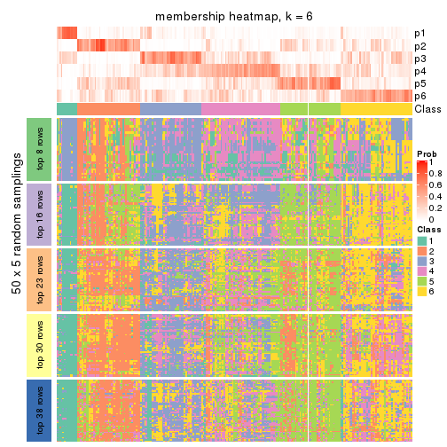</p>

</div>
</div>

As soon as we have had the classes for columns, we can look for signatures
which are significantly different between classes which can be candidate marks
for certain classes. Following are the heatmaps for signatures.


Signature heatmaps where rows are scaled:


<script>
$( function() {
	$( '#tabs-MAD-pam-get-signatures' ).tabs();
} );
</script>
<div id='tabs-MAD-pam-get-signatures'>
<ul>
<li><a href='#tab-MAD-pam-get-signatures-1'>k = 2</a></li>
<li><a href='#tab-MAD-pam-get-signatures-2'>k = 3</a></li>
<li><a href='#tab-MAD-pam-get-signatures-3'>k = 4</a></li>
<li><a href='#tab-MAD-pam-get-signatures-4'>k = 5</a></li>
<li><a href='#tab-MAD-pam-get-signatures-5'>k = 6</a></li>
</ul>
<div id='tab-MAD-pam-get-signatures-1'>
<pre><code class="r">get_signatures(res, k = 2)
</code></pre>

<p></p>

</div>
<div id='tab-MAD-pam-get-signatures-2'>
<pre><code class="r">get_signatures(res, k = 3)
</code></pre>

<p></p>

</div>
<div id='tab-MAD-pam-get-signatures-3'>
<pre><code class="r">get_signatures(res, k = 4)
</code></pre>

<p></p>

</div>
<div id='tab-MAD-pam-get-signatures-4'>
<pre><code class="r">get_signatures(res, k = 5)
</code></pre>

<p></p>

</div>
<div id='tab-MAD-pam-get-signatures-5'>
<pre><code class="r">get_signatures(res, k = 6)
</code></pre>

<p></p>

</div>
</div>


Signature heatmaps where rows are not scaled:


<script>
$( function() {
	$( '#tabs-MAD-pam-get-signatures-no-scale' ).tabs();
} );
</script>
<div id='tabs-MAD-pam-get-signatures-no-scale'>
<ul>
<li><a href='#tab-MAD-pam-get-signatures-no-scale-1'>k = 2</a></li>
<li><a href='#tab-MAD-pam-get-signatures-no-scale-2'>k = 3</a></li>
<li><a href='#tab-MAD-pam-get-signatures-no-scale-3'>k = 4</a></li>
<li><a href='#tab-MAD-pam-get-signatures-no-scale-4'>k = 5</a></li>
<li><a href='#tab-MAD-pam-get-signatures-no-scale-5'>k = 6</a></li>
</ul>
<div id='tab-MAD-pam-get-signatures-no-scale-1'>
<pre><code class="r">get_signatures(res, k = 2, scale_rows = FALSE)
</code></pre>

<p></p>

</div>
<div id='tab-MAD-pam-get-signatures-no-scale-2'>
<pre><code class="r">get_signatures(res, k = 3, scale_rows = FALSE)
</code></pre>

<p></p>

</div>
<div id='tab-MAD-pam-get-signatures-no-scale-3'>
<pre><code class="r">get_signatures(res, k = 4, scale_rows = FALSE)
</code></pre>

<p></p>

</div>
<div id='tab-MAD-pam-get-signatures-no-scale-4'>
<pre><code class="r">get_signatures(res, k = 5, scale_rows = FALSE)
</code></pre>

<p></p>

</div>
<div id='tab-MAD-pam-get-signatures-no-scale-5'>
<pre><code class="r">get_signatures(res, k = 6, scale_rows = FALSE)
</code></pre>

<p></p>

</div>
</div>


Compare the overlap of signatures from different k:

```r
compare_signatures(res)
```


`get_signature()` returns a data frame invisibly. TO get the list of signatures, the function
call should be assigned to a variable explicitly. In following code, if `plot` argument is set
to `FALSE`, no heatmap is plotted while only the differential analysis is performed.

```r
# code only for demonstration
tb = get_signature(res, k = ..., plot = FALSE)
```

An example of the output of `tb` is:

```
#>   which_row         fdr    mean_1    mean_2 scaled_mean_1 scaled_mean_2 km
#> 1        38 0.042760348  8.373488  9.131774    -0.5533452     0.5164555  1
#> 2        40 0.018707592  7.106213  8.469186    -0.6173731     0.5762149  1
#> 3        55 0.019134737 10.221463 11.207825    -0.6159697     0.5749050  1
#> 4        59 0.006059896  5.921854  7.869574    -0.6899429     0.6439467  1
#> 5        60 0.018055526  8.928898 10.211722    -0.6204761     0.5791110  1
#> 6        98 0.009384629 15.714769 14.887706     0.6635654    -0.6193277  2
...
```

The columns in `tb` are:

1. `which_row`: row indices corresponding to the input matrix.
2. `fdr`: FDR for the differential test. 
3. `mean_x`: The mean value in group x.
4. `scaled_mean_x`: The mean value in group x after rows are scaled.
5. `km`: Row groups if k-means clustering is applied to rows.


UMAP plot which shows how samples are separated.


<script>
$( function() {
	$( '#tabs-MAD-pam-dimension-reduction' ).tabs();
} );
</script>
<div id='tabs-MAD-pam-dimension-reduction'>
<ul>
<li><a href='#tab-MAD-pam-dimension-reduction-1'>k = 2</a></li>
<li><a href='#tab-MAD-pam-dimension-reduction-2'>k = 3</a></li>
<li><a href='#tab-MAD-pam-dimension-reduction-3'>k = 4</a></li>
<li><a href='#tab-MAD-pam-dimension-reduction-4'>k = 5</a></li>
<li><a href='#tab-MAD-pam-dimension-reduction-5'>k = 6</a></li>
</ul>
<div id='tab-MAD-pam-dimension-reduction-1'>
<pre><code class="r">dimension_reduction(res, k = 2, method = &quot;UMAP&quot;)
</code></pre>

<p></p>

</div>
<div id='tab-MAD-pam-dimension-reduction-2'>
<pre><code class="r">dimension_reduction(res, k = 3, method = &quot;UMAP&quot;)
</code></pre>

<p>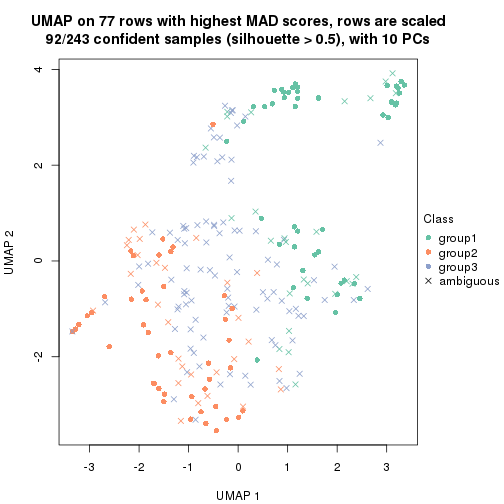</p>

</div>
<div id='tab-MAD-pam-dimension-reduction-3'>
<pre><code class="r">dimension_reduction(res, k = 4, method = &quot;UMAP&quot;)
</code></pre>

<p></p>

</div>
<div id='tab-MAD-pam-dimension-reduction-4'>
<pre><code class="r">dimension_reduction(res, k = 5, method = &quot;UMAP&quot;)
</code></pre>

<p></p>

</div>
<div id='tab-MAD-pam-dimension-reduction-5'>
<pre><code class="r">dimension_reduction(res, k = 6, method = &quot;UMAP&quot;)
</code></pre>

<p></p>

</div>
</div>


Following heatmap shows how subgroups are split when increasing `k`:

```r
collect_classes(res)
```


If matrix rows can be associated to genes, consider to use `GO_Enrichment(res,
...)` to perform function enrichment for the signature genes.


 

---------------------------------------------------


### MAD:mclust


The object with results only for a single top-value method and a single partition method 
can be extracted as:

```r
res = res_list["MAD", "mclust"]
# you can also extract it by
# res = res_list["MAD:mclust"]
```

A summary of `res` and all the functions that can be applied to it:

```r
res
```

```
#> A 'ConsensusPartition' object with k = 2, 3, 4, 5, 6.
#>   On a matrix with 77 rows and 243 columns.
#>   Top rows (8, 16, 23, 30, 38) are extracted by 'MAD' method.
#>   Subgroups are detected by 'mclust' method.
#>   Performed in total 1250 partitions by row resampling.
#>   Best k for subgroups seems to be 3.
#> 
#> Following methods can be applied to this 'ConsensusPartition' object:
#>  [1] "cola_report"             "collect_classes"         "collect_plots"          
#>  [4] "collect_stats"           "colnames"                "compare_signatures"     
#>  [7] "consensus_heatmap"       "dimension_reduction"     "functional_enrichment"  
#> [10] "get_anno_col"            "get_anno"                "get_classes"            
#> [13] "get_consensus"           "get_matrix"              "get_membership"         
#> [16] "get_param"               "get_signatures"          "get_stats"              
#> [19] "is_best_k"               "is_stable_k"             "membership_heatmap"     
#> [22] "ncol"                    "nrow"                    "plot_ecdf"              
#> [25] "rownames"                "select_partition_number" "show"                   
#> [28] "suggest_best_k"          "test_to_known_factors"
```

`collect_plots()` function collects all the plots made from `res` for all `k` (number of partitions)
into one single page to provide an easy and fast comparison between different `k`.

```r
collect_plots(res)
```


The plots are:

- The first row: a plot of the ECDF (Empirical cumulative distribution
  function) curves of the consensus matrix for each `k` and the heatmap of
  predicted classes for each `k`.
- The second row: heatmaps of the consensus matrix for each `k`.
- The third row: heatmaps of the membership matrix for each `k`.
- The fouth row: heatmaps of the signatures for each `k`.

All the plots in panels can be made by individual functions and they are
plotted later in this section.

`select_partition_number()` produces several plots showing different
statistics for choosing "optimized" `k`. There are following statistics:

- ECDF curves of the consensus matrix for each `k`;
- 1-PAC. [The PAC
  score](https://en.wikipedia.org/wiki/Consensus_clustering#Over-interpretation_potential_of_consensus_clustering)
  measures the proportion of the ambiguous subgrouping.
- Mean silhouette score.
- Concordance. The mean probability of fiting the consensus class ids in all
  partitions.
- Area increased. Denote $A_k$ as the area under the ECDF curve for current
  `k`, the area increased is defined as $A_k - A_{k-1}$.
- Rand index. The percent of pairs of samples that are both in a same cluster
  or both are not in a same cluster in the partition of k and k-1.
- Jaccard index. The ratio of pairs of samples are both in a same cluster in
  the partition of k and k-1 and the pairs of samples are both in a same
  cluster in the partition k or k-1.

The detailed explanations of these statistics can be found in [the cola
vignette](http://bioconductor.org/packages/devel/bioc/vignettes/cola/inst/doc/cola.html#toc_13).

Generally speaking, lower PAC score, higher mean silhouette score or higher
concordance corresponds to better partition. Rand index and Jaccard index
measure how similar the current partition is compared to partition with `k-1`.
If they are too similar, we won't accept `k` is better than `k-1`.

```r
select_partition_number(res)
```


The numeric values for all these statistics can be obtained by `get_stats()`.

```r
get_stats(res)
```

```
#>   k  1-PAC mean_silhouette concordance area_increased  Rand Jaccard
#> 2 2 0.0224           0.348       0.719         0.3624 0.898   0.898
#> 3 3 0.0426           0.559       0.719         0.4443 0.477   0.456
#> 4 4 0.1192           0.458       0.671         0.1390 0.905   0.826
#> 5 5 0.1654           0.255       0.598         0.1268 0.908   0.817
#> 6 6 0.2078           0.204       0.542         0.0585 0.903   0.784
```

`suggest_best_k()` suggests the best $k$ based on these statistics. The rules are as follows:

- All $k$ with Jaccard index larger than 0.95 are removed because the increase of
  the partition number does not provides enough extra information. If all $k$ are removed,
  the best $k$ is assigned by `NA`.
- For $k$ with 1-PAC larger than 0.9, the maximal $k$ is taken as the "best k". Other $k$ is called "optional k".
- If it does not fit the second rule. The $k$ with the highest vote of highest
  1-PAC, mean silhouette and concordance is taken as the "best k".

```r
suggest_best_k(res)
```

```
#> [1] 3
```


Following shows the table of the partitions (You need to click the **show/hide
code output** link to see it). The membership matrix (columns with name `p*`)
is inferred by
[`clue::cl_consensus()`](https://www.rdocumentation.org/link/cl_consensus?package=clue)
function with the `SE` method. Basically the value in the membership matrix
represents the probability to belong to a certain group. The finall class
label for an item is determined with the group with highest probability it
belongs to.

In `get_classes()` function, the entropy is calculated from the membership
matrix and the silhouette score is calculated from the consensus matrix.


<script>
$( function() {
	$( '#tabs-MAD-mclust-get-classes' ).tabs();
} );
</script>
<div id='tabs-MAD-mclust-get-classes'>
<ul>
<li><a href='#tab-MAD-mclust-get-classes-1'>k = 2</a></li>
<li><a href='#tab-MAD-mclust-get-classes-2'>k = 3</a></li>
<li><a href='#tab-MAD-mclust-get-classes-3'>k = 4</a></li>
<li><a href='#tab-MAD-mclust-get-classes-4'>k = 5</a></li>
<li><a href='#tab-MAD-mclust-get-classes-5'>k = 6</a></li>
</ul>

<div id='tab-MAD-mclust-get-classes-1'>
<p><a id='tab-MAD-mclust-get-classes-1-a' style='color:#0366d6' href='#'>show/hide code output</a></p>
<pre><code class="r">cbind(get_classes(res, k = 2), get_membership(res, k = 2))
</code></pre>

<pre><code>#&gt;           class entropy silhouette    p1    p2
#&gt; SRR191393     2   0.998   -0.41021 0.476 0.524
#&gt; SRR191394     2   0.722    0.55793 0.200 0.800
#&gt; SRR191396     2   0.615    0.47485 0.152 0.848
#&gt; SRR191397     2   0.541    0.49318 0.124 0.876
#&gt; SRR191398     2   0.714    0.56286 0.196 0.804
#&gt; SRR191399     2   0.644    0.41885 0.164 0.836
#&gt; SRR191400     2   0.795    0.58043 0.240 0.760
#&gt; SRR191401     2   0.949   -0.45312 0.368 0.632
#&gt; SRR191402     2   0.952   -0.49780 0.372 0.628
#&gt; SRR191403     2   0.671    0.39832 0.176 0.824
#&gt; SRR191404     2   0.605    0.58480 0.148 0.852
#&gt; SRR191405     2   0.802    0.31212 0.244 0.756
#&gt; SRR191406     2   0.963   -0.51190 0.388 0.612
#&gt; SRR191407     2   0.529    0.57882 0.120 0.880
#&gt; SRR191408     2   0.653    0.57279 0.168 0.832
#&gt; SRR191409     2   0.990   -0.17746 0.440 0.560
#&gt; SRR191410     1   0.997    0.84559 0.532 0.468
#&gt; SRR191411     2   1.000   -0.44658 0.496 0.504
#&gt; SRR191412     2   0.917   -0.19578 0.332 0.668
#&gt; SRR191413     2   0.983   -0.64857 0.424 0.576
#&gt; SRR191414     2   0.722    0.58437 0.200 0.800
#&gt; SRR191415     1   0.990    0.83877 0.560 0.440
#&gt; SRR191416     2   0.981   -0.65180 0.420 0.580
#&gt; SRR191418     2   0.955   -0.46166 0.376 0.624
#&gt; SRR191419     2   0.866    0.55016 0.288 0.712
#&gt; SRR191420     2   0.494    0.48457 0.108 0.892
#&gt; SRR191421     2   0.644    0.38936 0.164 0.836
#&gt; SRR191422     2   0.541    0.51963 0.124 0.876
#&gt; SRR191423     2   0.529    0.58763 0.120 0.880
#&gt; SRR191424     2   0.955    0.49481 0.376 0.624
#&gt; SRR191425     2   0.644    0.39856 0.164 0.836
#&gt; SRR191426     2   0.925   -0.35967 0.340 0.660
#&gt; SRR191427     2   0.595    0.58245 0.144 0.856
#&gt; SRR191428     2   0.680    0.36010 0.180 0.820
#&gt; SRR191429     2   0.494    0.53204 0.108 0.892
#&gt; SRR191430     2   0.760    0.54785 0.220 0.780
#&gt; SRR191431     2   0.706    0.57045 0.192 0.808
#&gt; SRR191432     2   0.814    0.53132 0.252 0.748
#&gt; SRR191433     2   0.871    0.48753 0.292 0.708
#&gt; SRR191434     2   0.913    0.47587 0.328 0.672
#&gt; SRR191435     2   0.605    0.45123 0.148 0.852
#&gt; SRR191436     2   0.917   -0.21703 0.332 0.668
#&gt; SRR191437     2   0.939    0.50776 0.356 0.644
#&gt; SRR191438     2   0.706    0.43535 0.192 0.808
#&gt; SRR191439     2   0.653    0.58023 0.168 0.832
#&gt; SRR191440     2   0.730    0.56519 0.204 0.796
#&gt; SRR191441     2   0.745    0.56246 0.212 0.788
#&gt; SRR191442     2   0.866    0.51583 0.288 0.712
#&gt; SRR191443     2   0.388    0.52957 0.076 0.924
#&gt; SRR191444     2   0.595    0.41903 0.144 0.856
#&gt; SRR191445     2   0.891    0.53573 0.308 0.692
#&gt; SRR191446     2   0.653    0.47278 0.168 0.832
#&gt; SRR191447     2   0.634    0.59184 0.160 0.840
#&gt; SRR191448     2   0.730    0.55905 0.204 0.796
#&gt; SRR191449     2   0.689    0.38654 0.184 0.816
#&gt; SRR191450     2   0.932    0.50135 0.348 0.652
#&gt; SRR191451     2   0.738    0.57873 0.208 0.792
#&gt; SRR191452     2   0.722    0.56824 0.200 0.800
#&gt; SRR191453     2   0.595    0.58648 0.144 0.856
#&gt; SRR191454     2   0.494    0.47640 0.108 0.892
#&gt; SRR191455     2   0.844    0.04330 0.272 0.728
#&gt; SRR191456     2   0.634    0.57815 0.160 0.840
#&gt; SRR191457     2   0.909    0.53241 0.324 0.676
#&gt; SRR191458     2   0.827    0.49911 0.260 0.740
#&gt; SRR191459     2   0.913   -0.11251 0.328 0.672
#&gt; SRR191460     2   0.900   -0.26087 0.316 0.684
#&gt; SRR191461     2   0.671    0.41138 0.176 0.824
#&gt; SRR191462     2   0.644    0.52880 0.164 0.836
#&gt; SRR191463     2   0.788    0.56965 0.236 0.764
#&gt; SRR191464     2   0.886    0.55135 0.304 0.696
#&gt; SRR191465     2   0.541    0.58762 0.124 0.876
#&gt; SRR191466     2   0.913    0.40783 0.328 0.672
#&gt; SRR191467     2   0.529    0.55195 0.120 0.880
#&gt; SRR191468     2   0.921    0.51715 0.336 0.664
#&gt; SRR191469     2   0.996   -0.04723 0.464 0.536
#&gt; SRR191470     2   0.680    0.48082 0.180 0.820
#&gt; SRR191471     2   0.443    0.56947 0.092 0.908
#&gt; SRR191472     2   0.625    0.58286 0.156 0.844
#&gt; SRR191473     2   0.416    0.51487 0.084 0.916
#&gt; SRR191474     2   0.929    0.27341 0.344 0.656
#&gt; SRR191475     2   0.788    0.55885 0.236 0.764
#&gt; SRR191476     2   0.900    0.54889 0.316 0.684
#&gt; SRR191477     2   0.833    0.52750 0.264 0.736
#&gt; SRR191478     2   0.821    0.51931 0.256 0.744
#&gt; SRR191479     2   0.745    0.24963 0.212 0.788
#&gt; SRR191480     2   0.788    0.58449 0.236 0.764
#&gt; SRR191481     2   0.605    0.48428 0.148 0.852
#&gt; SRR191482     2   0.963    0.29879 0.388 0.612
#&gt; SRR191483     2   0.844    0.12418 0.272 0.728
#&gt; SRR191484     2   0.808    0.57486 0.248 0.752
#&gt; SRR191485     2   0.738    0.37600 0.208 0.792
#&gt; SRR191486     2   0.788    0.55674 0.236 0.764
#&gt; SRR191487     2   0.808    0.49971 0.248 0.752
#&gt; SRR191488     2   0.839    0.57555 0.268 0.732
#&gt; SRR191489     2   0.913    0.54237 0.328 0.672
#&gt; SRR191490     2   0.939    0.50319 0.356 0.644
#&gt; SRR191491     2   0.625    0.57467 0.156 0.844
#&gt; SRR191492     2   0.833    0.47331 0.264 0.736
#&gt; SRR191493     2   0.760    0.56204 0.220 0.780
#&gt; SRR191494     2   0.925    0.52685 0.340 0.660
#&gt; SRR191495     2   0.866   -0.00691 0.288 0.712
#&gt; SRR191496     2   0.943    0.49978 0.360 0.640
#&gt; SRR191497     2   0.980   -0.07302 0.416 0.584
#&gt; SRR191498     2   0.767    0.58267 0.224 0.776
#&gt; SRR191499     1   0.988    0.56033 0.564 0.436
#&gt; SRR191500     2   0.895   -0.23387 0.312 0.688
#&gt; SRR191501     2   0.900    0.53407 0.316 0.684
#&gt; SRR191502     2   0.850    0.55938 0.276 0.724
#&gt; SRR191503     2   0.821    0.56118 0.256 0.744
#&gt; SRR191504     2   0.680    0.45149 0.180 0.820
#&gt; SRR191505     2   0.552    0.58735 0.128 0.872
#&gt; SRR191506     2   0.929    0.51206 0.344 0.656
#&gt; SRR191507     2   0.929    0.53180 0.344 0.656
#&gt; SRR191508     2   0.850    0.21237 0.276 0.724
#&gt; SRR191509     2   0.653    0.46074 0.168 0.832
#&gt; SRR191510     2   0.494    0.56739 0.108 0.892
#&gt; SRR191511     2   0.469    0.58118 0.100 0.900
#&gt; SRR191512     2   0.939    0.50501 0.356 0.644
#&gt; SRR191513     2   0.936    0.50452 0.352 0.648
#&gt; SRR191514     2   0.917    0.51901 0.332 0.668
#&gt; SRR191515     2   0.738    0.56953 0.208 0.792
#&gt; SRR191516     2   0.625    0.57952 0.156 0.844
#&gt; SRR191517     2   0.563    0.50280 0.132 0.868
#&gt; SRR191518     2   0.541    0.50685 0.124 0.876
#&gt; SRR191519     2   0.605    0.58923 0.148 0.852
#&gt; SRR191520     2   0.697    0.35914 0.188 0.812
#&gt; SRR191521     2   0.430    0.57611 0.088 0.912
#&gt; SRR191522     2   0.753    0.57638 0.216 0.784
#&gt; SRR191523     2   0.644    0.58050 0.164 0.836
#&gt; SRR191524     2   0.541    0.56366 0.124 0.876
#&gt; SRR191525     2   0.506    0.58100 0.112 0.888
#&gt; SRR191526     2   0.714    0.57051 0.196 0.804
#&gt; SRR191527     2   0.781    0.54775 0.232 0.768
#&gt; SRR191528     2   0.886    0.53297 0.304 0.696
#&gt; SRR191529     2   0.595    0.58713 0.144 0.856
#&gt; SRR191530     2   0.653    0.53866 0.168 0.832
#&gt; SRR191531     2   0.904    0.53366 0.320 0.680
#&gt; SRR191532     2   0.844    0.56091 0.272 0.728
#&gt; SRR191533     2   0.876    0.56088 0.296 0.704
#&gt; SRR191534     2   0.909    0.53009 0.324 0.676
#&gt; SRR191535     2   0.861    0.52744 0.284 0.716
#&gt; SRR191536     2   0.861    0.55540 0.284 0.716
#&gt; SRR191537     2   0.844    0.56130 0.272 0.728
#&gt; SRR191538     2   0.781    0.55977 0.232 0.768
#&gt; SRR191539     2   0.913    0.53551 0.328 0.672
#&gt; SRR191540     2   0.913    0.48061 0.328 0.672
#&gt; SRR191541     2   0.788    0.56354 0.236 0.764
#&gt; SRR191542     2   0.881    0.53963 0.300 0.700
#&gt; SRR191543     2   0.844    0.56892 0.272 0.728
#&gt; SRR191544     2   0.730    0.56533 0.204 0.796
#&gt; SRR191545     2   0.443    0.56300 0.092 0.908
#&gt; SRR191546     2   0.706    0.44098 0.192 0.808
#&gt; SRR191547     2   0.850   -0.05565 0.276 0.724
#&gt; SRR191548     2   0.802    0.53048 0.244 0.756
#&gt; SRR191549     2   0.929    0.50628 0.344 0.656
#&gt; SRR191550     2   0.802    0.52574 0.244 0.756
#&gt; SRR191551     2   0.781    0.53614 0.232 0.768
#&gt; SRR191552     2   0.795    0.52919 0.240 0.760
#&gt; SRR191553     2   0.871    0.54018 0.292 0.708
#&gt; SRR191554     2   0.929    0.50628 0.344 0.656
#&gt; SRR191555     2   0.506    0.56278 0.112 0.888
#&gt; SRR191556     1   1.000    0.82323 0.500 0.500
#&gt; SRR191557     2   0.615    0.39742 0.152 0.848
#&gt; SRR191558     2   0.753    0.57352 0.216 0.784
#&gt; SRR191559     2   0.955   -0.48569 0.376 0.624
#&gt; SRR191560     2   0.808    0.17494 0.248 0.752
#&gt; SRR191561     2   0.949    0.50488 0.368 0.632
#&gt; SRR191562     2   0.506    0.57953 0.112 0.888
#&gt; SRR191563     2   0.946   -0.44656 0.364 0.636
#&gt; SRR191564     1   0.997    0.84668 0.532 0.468
#&gt; SRR191565     2   0.844   -0.03998 0.272 0.728
#&gt; SRR191566     2   0.909   -0.27621 0.324 0.676
#&gt; SRR191567     2   0.781    0.27172 0.232 0.768
#&gt; SRR191568     2   0.469    0.51609 0.100 0.900
#&gt; SRR191569     2   0.981   -0.61718 0.420 0.580
#&gt; SRR191570     1   1.000    0.84017 0.500 0.500
#&gt; SRR191571     2   0.980    0.01598 0.416 0.584
#&gt; SRR191572     2   0.917    0.51499 0.332 0.668
#&gt; SRR191573     2   0.996   -0.77852 0.464 0.536
#&gt; SRR191574     2   0.595    0.58254 0.144 0.856
#&gt; SRR191575     2   0.714    0.56328 0.196 0.804
#&gt; SRR191576     2   0.625    0.43409 0.156 0.844
#&gt; SRR191577     2   0.802    0.57397 0.244 0.756
#&gt; SRR191578     2   0.730    0.55703 0.204 0.796
#&gt; SRR191579     2   0.738    0.55162 0.208 0.792
#&gt; SRR191580     2   0.936    0.50571 0.352 0.648
#&gt; SRR191581     2   0.788    0.53613 0.236 0.764
#&gt; SRR191582     2   0.730    0.55065 0.204 0.796
#&gt; SRR191583     2   0.952    0.49204 0.372 0.628
#&gt; SRR191584     2   0.913    0.51830 0.328 0.672
#&gt; SRR191585     2   0.886   -0.15361 0.304 0.696
#&gt; SRR191586     2   0.767    0.52459 0.224 0.776
#&gt; SRR191587     1   0.991    0.84287 0.556 0.444
#&gt; SRR191588     2   0.795    0.21873 0.240 0.760
#&gt; SRR191589     1   0.996    0.73633 0.536 0.464
#&gt; SRR191590     2   0.574    0.57939 0.136 0.864
#&gt; SRR191591     1   1.000    0.60499 0.508 0.492
#&gt; SRR191592     2   0.895   -0.24566 0.312 0.688
#&gt; SRR191593     2   0.767    0.18756 0.224 0.776
#&gt; SRR191594     2   0.913    0.52190 0.328 0.672
#&gt; SRR191595     2   0.689    0.38475 0.184 0.816
#&gt; SRR191596     2   0.781    0.20627 0.232 0.768
#&gt; SRR191597     1   0.997    0.85258 0.532 0.468
#&gt; SRR191598     2   0.998   -0.81265 0.472 0.528
#&gt; SRR191599     2   0.671    0.34141 0.176 0.824
#&gt; SRR191600     2   0.952   -0.49606 0.372 0.628
#&gt; SRR191601     2   0.973   -0.64336 0.404 0.596
#&gt; SRR191602     2   1.000   -0.84548 0.500 0.500
#&gt; SRR191603     2   0.966   -0.59936 0.392 0.608
#&gt; SRR191604     2   0.469    0.54077 0.100 0.900
#&gt; SRR191605     2   0.985   -0.71370 0.428 0.572
#&gt; SRR191606     2   0.767    0.25706 0.224 0.776
#&gt; SRR191607     2   0.671    0.35647 0.176 0.824
#&gt; SRR191608     2   0.929   -0.33965 0.344 0.656
#&gt; SRR191609     2   0.680    0.42420 0.180 0.820
#&gt; SRR191610     2   0.456    0.51930 0.096 0.904
#&gt; SRR191611     2   0.697    0.41558 0.188 0.812
#&gt; SRR191612     2   0.978   -0.66908 0.412 0.588
#&gt; SRR191613     2   1.000    0.03824 0.496 0.504
#&gt; SRR191614     1   0.998    0.85034 0.528 0.472
#&gt; SRR191615     2   0.871   -0.10634 0.292 0.708
#&gt; SRR191616     2   0.966    0.48475 0.392 0.608
#&gt; SRR191617     2   0.689    0.59241 0.184 0.816
#&gt; SRR191618     2   0.886   -0.13677 0.304 0.696
#&gt; SRR191619     2   0.943   -0.30446 0.360 0.640
#&gt; SRR191620     2   0.563    0.51391 0.132 0.868
#&gt; SRR191621     2   0.827    0.20552 0.260 0.740
#&gt; SRR191622     2   0.760    0.36336 0.220 0.780
#&gt; SRR191623     2   0.949   -0.42092 0.368 0.632
#&gt; SRR191624     2   0.295    0.53259 0.052 0.948
#&gt; SRR191625     2   0.988   -0.72937 0.436 0.564
#&gt; SRR191626     2   0.808    0.14371 0.248 0.752
#&gt; SRR191627     2   0.781    0.23028 0.232 0.768
#&gt; SRR191628     1   0.998    0.82122 0.528 0.472
#&gt; SRR191629     1   0.994    0.84706 0.544 0.456
#&gt; SRR191630     2   0.895    0.53568 0.312 0.688
#&gt; SRR191631     2   0.821    0.24529 0.256 0.744
#&gt; SRR191632     2   0.980   -0.63598 0.416 0.584
#&gt; SRR191633     2   0.921   -0.29479 0.336 0.664
#&gt; SRR191634     2   0.961    0.48186 0.384 0.616
#&gt; SRR191635     2   0.973   -0.55728 0.404 0.596
#&gt; SRR191636     2   0.814    0.54213 0.252 0.748
#&gt; SRR191637     2   0.961    0.48058 0.384 0.616
</code></pre>

<script>
$('#tab-MAD-mclust-get-classes-1-a').parent().next().next().hide();
$('#tab-MAD-mclust-get-classes-1-a').click(function(){
  $('#tab-MAD-mclust-get-classes-1-a').parent().next().next().toggle();
  return(false);
});
</script>
</div>

<div id='tab-MAD-mclust-get-classes-2'>
<p><a id='tab-MAD-mclust-get-classes-2-a' style='color:#0366d6' href='#'>show/hide code output</a></p>
<pre><code class="r">cbind(get_classes(res, k = 3), get_membership(res, k = 3))
</code></pre>

<pre><code>#&gt;           class entropy silhouette    p1    p2    p3
#&gt; SRR191393     3   0.504   0.695015 0.048 0.120 0.832
#&gt; SRR191394     3   0.906   0.083512 0.336 0.152 0.512
#&gt; SRR191396     3   0.668   0.679457 0.064 0.208 0.728
#&gt; SRR191397     3   0.566   0.695371 0.128 0.068 0.804
#&gt; SRR191398     3   0.885   0.054573 0.396 0.120 0.484
#&gt; SRR191399     3   0.501   0.717230 0.080 0.080 0.840
#&gt; SRR191400     3   0.916   0.409223 0.208 0.252 0.540
#&gt; SRR191401     3   0.337   0.720092 0.072 0.024 0.904
#&gt; SRR191402     3   0.192   0.711707 0.024 0.020 0.956
#&gt; SRR191403     3   0.482   0.727631 0.088 0.064 0.848
#&gt; SRR191404     3   0.756   0.466903 0.064 0.308 0.628
#&gt; SRR191405     3   0.742   0.208925 0.044 0.364 0.592
#&gt; SRR191406     3   0.257   0.722449 0.032 0.032 0.936
#&gt; SRR191407     3   0.864   0.459125 0.248 0.160 0.592
#&gt; SRR191408     3   0.632   0.711638 0.068 0.172 0.760
#&gt; SRR191409     3   0.530   0.687469 0.032 0.164 0.804
#&gt; SRR191410     3   0.171   0.698928 0.032 0.008 0.960
#&gt; SRR191411     3   0.558   0.671455 0.024 0.204 0.772
#&gt; SRR191412     3   0.377   0.713803 0.084 0.028 0.888
#&gt; SRR191413     3   0.153   0.707976 0.032 0.004 0.964
#&gt; SRR191414     1   0.952   0.327681 0.424 0.188 0.388
#&gt; SRR191415     3   0.176   0.701845 0.040 0.004 0.956
#&gt; SRR191416     3   0.290   0.707035 0.064 0.016 0.920
#&gt; SRR191418     3   0.277   0.722916 0.048 0.024 0.928
#&gt; SRR191419     3   0.939   0.182591 0.284 0.212 0.504
#&gt; SRR191420     3   0.589   0.712022 0.108 0.096 0.796
#&gt; SRR191421     3   0.507   0.729522 0.068 0.096 0.836
#&gt; SRR191422     2   0.672   0.546750 0.016 0.604 0.380
#&gt; SRR191423     2   0.670   0.643229 0.076 0.736 0.188
#&gt; SRR191424     2   0.692   0.546090 0.164 0.732 0.104
#&gt; SRR191425     3   0.490   0.725634 0.064 0.092 0.844
#&gt; SRR191426     3   0.389   0.726834 0.064 0.048 0.888
#&gt; SRR191427     3   0.903   0.257605 0.140 0.368 0.492
#&gt; SRR191428     3   0.509   0.728962 0.088 0.076 0.836
#&gt; SRR191429     2   0.799   0.368929 0.060 0.484 0.456
#&gt; SRR191430     2   0.710   0.420651 0.032 0.608 0.360
#&gt; SRR191431     2   0.844   0.537063 0.128 0.596 0.276
#&gt; SRR191432     2   0.572   0.654436 0.016 0.744 0.240
#&gt; SRR191433     2   0.527   0.652487 0.012 0.776 0.212
#&gt; SRR191434     3   0.675   0.387775 0.016 0.388 0.596
#&gt; SRR191435     3   0.690   0.710288 0.116 0.148 0.736
#&gt; SRR191436     3   0.475   0.731846 0.068 0.080 0.852
#&gt; SRR191437     2   0.589   0.582518 0.104 0.796 0.100
#&gt; SRR191438     3   0.636   0.620114 0.024 0.280 0.696
#&gt; SRR191439     2   0.682   0.618330 0.052 0.700 0.248
#&gt; SRR191440     2   0.931   0.348977 0.216 0.520 0.264
#&gt; SRR191441     2   0.670   0.568926 0.164 0.744 0.092
#&gt; SRR191442     3   0.731   0.468998 0.036 0.384 0.580
#&gt; SRR191443     3   0.692   0.685360 0.128 0.136 0.736
#&gt; SRR191444     3   0.550   0.731805 0.048 0.148 0.804
#&gt; SRR191445     3   0.861   0.304053 0.104 0.384 0.512
#&gt; SRR191446     3   0.862   0.476316 0.164 0.240 0.596
#&gt; SRR191447     2   0.634   0.647073 0.064 0.756 0.180
#&gt; SRR191448     3   0.877   0.448812 0.236 0.180 0.584
#&gt; SRR191449     3   0.484   0.720558 0.080 0.072 0.848
#&gt; SRR191450     3   0.830   0.440649 0.092 0.348 0.560
#&gt; SRR191451     3   0.780   0.373086 0.052 0.428 0.520
#&gt; SRR191452     2   0.637   0.588077 0.132 0.768 0.100
#&gt; SRR191453     2   0.855   0.402989 0.104 0.532 0.364
#&gt; SRR191454     3   0.632   0.717848 0.104 0.124 0.772
#&gt; SRR191455     3   0.597   0.706757 0.060 0.160 0.780
#&gt; SRR191456     3   0.889   0.412249 0.148 0.308 0.544
#&gt; SRR191457     3   0.942   0.269445 0.188 0.340 0.472
#&gt; SRR191458     2   0.693   0.058698 0.016 0.528 0.456
#&gt; SRR191459     3   0.468   0.728133 0.040 0.112 0.848
#&gt; SRR191460     3   0.238   0.725956 0.008 0.056 0.936
#&gt; SRR191461     3   0.623   0.708314 0.128 0.096 0.776
#&gt; SRR191462     3   0.795   0.199676 0.064 0.388 0.548
#&gt; SRR191463     2   0.404   0.641755 0.024 0.872 0.104
#&gt; SRR191464     2   0.505   0.665539 0.024 0.812 0.164
#&gt; SRR191465     2   0.679   0.634923 0.124 0.744 0.132
#&gt; SRR191466     3   0.726   0.563655 0.048 0.316 0.636
#&gt; SRR191467     2   0.709   0.631523 0.064 0.688 0.248
#&gt; SRR191468     2   0.534   0.612976 0.084 0.824 0.092
#&gt; SRR191469     3   0.663   0.660328 0.064 0.204 0.732
#&gt; SRR191470     3   0.847   0.340783 0.100 0.360 0.540
#&gt; SRR191471     3   0.821   0.323086 0.088 0.344 0.568
#&gt; SRR191472     2   0.674   0.619600 0.100 0.744 0.156
#&gt; SRR191473     2   0.776   0.460042 0.052 0.540 0.408
#&gt; SRR191474     3   0.654   0.667372 0.064 0.196 0.740
#&gt; SRR191475     2   0.391   0.645118 0.020 0.876 0.104
#&gt; SRR191476     2   0.712   0.589838 0.048 0.656 0.296
#&gt; SRR191477     2   0.616   0.634653 0.020 0.708 0.272
#&gt; SRR191478     2   0.573   0.657177 0.024 0.760 0.216
#&gt; SRR191479     3   0.419   0.732310 0.060 0.064 0.876
#&gt; SRR191480     3   0.879   0.074297 0.112 0.424 0.464
#&gt; SRR191481     2   0.748   0.384232 0.036 0.508 0.456
#&gt; SRR191482     3   0.755   0.341286 0.048 0.372 0.580
#&gt; SRR191483     3   0.730   0.527518 0.072 0.252 0.676
#&gt; SRR191484     1   0.985   0.349799 0.388 0.252 0.360
#&gt; SRR191485     3   0.614   0.622479 0.040 0.212 0.748
#&gt; SRR191486     2   0.680   0.000709 0.012 0.532 0.456
#&gt; SRR191487     3   0.761   0.360195 0.048 0.388 0.564
#&gt; SRR191488     3   0.846   0.517782 0.124 0.288 0.588
#&gt; SRR191489     3   0.925   0.158129 0.156 0.392 0.452
#&gt; SRR191490     2   0.397   0.560926 0.088 0.880 0.032
#&gt; SRR191491     3   0.850   0.471912 0.120 0.304 0.576
#&gt; SRR191492     3   0.681   0.671686 0.084 0.184 0.732
#&gt; SRR191493     2   0.815   0.560673 0.156 0.644 0.200
#&gt; SRR191494     2   0.463   0.627724 0.056 0.856 0.088
#&gt; SRR191495     3   0.517   0.726740 0.092 0.076 0.832
#&gt; SRR191496     2   0.429   0.552811 0.104 0.864 0.032
#&gt; SRR191497     3   0.584   0.677026 0.036 0.196 0.768
#&gt; SRR191498     3   0.864   0.353087 0.108 0.376 0.516
#&gt; SRR191499     3   0.471   0.689015 0.044 0.108 0.848
#&gt; SRR191500     3   0.448   0.729874 0.064 0.072 0.864
#&gt; SRR191501     2   0.583   0.599289 0.052 0.784 0.164
#&gt; SRR191502     3   0.828   0.298155 0.080 0.404 0.516
#&gt; SRR191503     2   0.417   0.639012 0.036 0.872 0.092
#&gt; SRR191504     2   0.817   0.612695 0.108 0.612 0.280
#&gt; SRR191505     2   0.812   0.613630 0.136 0.640 0.224
#&gt; SRR191506     2   0.380   0.600934 0.056 0.892 0.052
#&gt; SRR191507     2   0.760   0.352174 0.048 0.568 0.384
#&gt; SRR191508     3   0.761   0.324043 0.064 0.316 0.620
#&gt; SRR191509     2   0.820   0.444886 0.076 0.524 0.400
#&gt; SRR191510     3   0.882   0.466662 0.156 0.280 0.564
#&gt; SRR191511     2   0.684   0.622723 0.116 0.740 0.144
#&gt; SRR191512     2   0.268   0.571948 0.040 0.932 0.028
#&gt; SRR191513     2   0.325   0.580880 0.052 0.912 0.036
#&gt; SRR191514     2   0.338   0.598927 0.044 0.908 0.048
#&gt; SRR191515     2   0.693   0.571576 0.040 0.664 0.296
#&gt; SRR191516     3   0.798   0.593331 0.104 0.264 0.632
#&gt; SRR191517     3   0.800   0.306233 0.076 0.344 0.580
#&gt; SRR191518     2   0.726   0.554355 0.036 0.592 0.372
#&gt; SRR191519     2   0.723   0.643607 0.080 0.692 0.228
#&gt; SRR191520     3   0.692   0.671225 0.104 0.164 0.732
#&gt; SRR191521     2   0.678   0.630911 0.088 0.736 0.176
#&gt; SRR191522     2   0.597   0.603599 0.032 0.752 0.216
#&gt; SRR191523     2   0.804   0.615022 0.128 0.644 0.228
#&gt; SRR191524     3   0.902   0.463621 0.276 0.176 0.548
#&gt; SRR191525     2   0.829   0.600851 0.116 0.604 0.280
#&gt; SRR191526     2   0.579   0.595131 0.116 0.800 0.084
#&gt; SRR191527     3   0.993  -0.145177 0.344 0.280 0.376
#&gt; SRR191528     2   0.943   0.048973 0.220 0.500 0.280
#&gt; SRR191529     2   0.856   0.472602 0.124 0.572 0.304
#&gt; SRR191530     2   0.797   0.617088 0.096 0.624 0.280
#&gt; SRR191531     2   0.859   0.243586 0.116 0.552 0.332
#&gt; SRR191532     2   0.709   0.516330 0.056 0.676 0.268
#&gt; SRR191533     3   0.889   0.164663 0.120 0.440 0.440
#&gt; SRR191534     2   0.481   0.610891 0.060 0.848 0.092
#&gt; SRR191535     2   0.608   0.649525 0.036 0.748 0.216
#&gt; SRR191536     2   0.645   0.594418 0.060 0.744 0.196
#&gt; SRR191537     2   0.665   0.631587 0.076 0.740 0.184
#&gt; SRR191538     2   0.455   0.654479 0.024 0.844 0.132
#&gt; SRR191539     2   0.528   0.560811 0.128 0.820 0.052
#&gt; SRR191540     2   0.796   0.210729 0.060 0.516 0.424
#&gt; SRR191541     2   0.472   0.660705 0.016 0.824 0.160
#&gt; SRR191542     2   0.313   0.609280 0.032 0.916 0.052
#&gt; SRR191543     2   0.420   0.658221 0.012 0.852 0.136
#&gt; SRR191544     2   0.702   0.344157 0.024 0.584 0.392
#&gt; SRR191545     2   0.774   0.635834 0.124 0.672 0.204
#&gt; SRR191546     3   0.811   0.321899 0.080 0.352 0.568
#&gt; SRR191547     3   0.596   0.730446 0.076 0.136 0.788
#&gt; SRR191548     1   0.766   0.705063 0.676 0.116 0.208
#&gt; SRR191549     1   0.718   0.662523 0.708 0.196 0.096
#&gt; SRR191550     1   0.689   0.676163 0.736 0.112 0.152
#&gt; SRR191551     1   0.773   0.698116 0.676 0.132 0.192
#&gt; SRR191552     1   0.772   0.702230 0.672 0.120 0.208
#&gt; SRR191553     3   0.975  -0.170087 0.364 0.228 0.408
#&gt; SRR191554     1   0.958   0.557587 0.480 0.256 0.264
#&gt; SRR191555     3   0.639   0.699527 0.112 0.120 0.768
#&gt; SRR191556     3   0.188   0.705729 0.044 0.004 0.952
#&gt; SRR191557     3   0.448   0.721830 0.064 0.072 0.864
#&gt; SRR191558     2   0.645   0.574226 0.016 0.656 0.328
#&gt; SRR191559     3   0.288   0.715143 0.052 0.024 0.924
#&gt; SRR191560     3   0.436   0.719950 0.080 0.052 0.868
#&gt; SRR191561     3   1.000  -0.266232 0.332 0.332 0.336
#&gt; SRR191562     3   0.795   0.575246 0.192 0.148 0.660
#&gt; SRR191563     3   0.397   0.731362 0.032 0.088 0.880
#&gt; SRR191564     3   0.268   0.706322 0.040 0.028 0.932
#&gt; SRR191565     3   0.500   0.722230 0.092 0.068 0.840
#&gt; SRR191566     3   0.232   0.716271 0.028 0.028 0.944
#&gt; SRR191567     3   0.606   0.697420 0.160 0.064 0.776
#&gt; SRR191568     3   0.683   0.681123 0.148 0.112 0.740
#&gt; SRR191569     3   0.447   0.708531 0.076 0.060 0.864
#&gt; SRR191570     3   0.375   0.704543 0.096 0.020 0.884
#&gt; SRR191571     3   0.572   0.683397 0.052 0.156 0.792
#&gt; SRR191572     1   0.761   0.683187 0.676 0.216 0.108
#&gt; SRR191573     3   0.311   0.711775 0.056 0.028 0.916
#&gt; SRR191574     3   0.860   0.537246 0.208 0.188 0.604
#&gt; SRR191575     3   0.915   0.321303 0.272 0.192 0.536
#&gt; SRR191576     3   0.730   0.615785 0.072 0.252 0.676
#&gt; SRR191577     3   0.745   0.603376 0.064 0.292 0.644
#&gt; SRR191578     3   0.769   0.036613 0.048 0.416 0.536
#&gt; SRR191579     3   0.919   0.003218 0.380 0.152 0.468
#&gt; SRR191580     1   0.932   0.611108 0.516 0.272 0.212
#&gt; SRR191581     3   0.943  -0.212824 0.396 0.176 0.428
#&gt; SRR191582     3   0.906   0.102801 0.348 0.148 0.504
#&gt; SRR191583     2   0.551   0.550084 0.136 0.808 0.056
#&gt; SRR191584     1   0.978   0.497632 0.440 0.276 0.284
#&gt; SRR191585     3   0.357   0.716602 0.060 0.040 0.900
#&gt; SRR191586     3   0.695   0.665402 0.084 0.196 0.720
#&gt; SRR191587     3   0.134   0.704097 0.016 0.012 0.972
#&gt; SRR191588     3   0.389   0.730656 0.064 0.048 0.888
#&gt; SRR191589     3   0.328   0.712544 0.024 0.068 0.908
#&gt; SRR191590     3   0.760   0.621860 0.140 0.172 0.688
#&gt; SRR191591     3   0.485   0.697765 0.036 0.128 0.836
#&gt; SRR191592     3   0.525   0.693992 0.076 0.096 0.828
#&gt; SRR191593     3   0.438   0.727661 0.060 0.072 0.868
#&gt; SRR191594     1   0.776   0.692679 0.672 0.200 0.128
#&gt; SRR191595     3   0.596   0.705091 0.096 0.112 0.792
#&gt; SRR191596     3   0.453   0.718020 0.088 0.052 0.860
#&gt; SRR191597     3   0.244   0.706377 0.028 0.032 0.940
#&gt; SRR191598     3   0.350   0.711011 0.072 0.028 0.900
#&gt; SRR191599     3   0.481   0.725479 0.092 0.060 0.848
#&gt; SRR191600     3   0.445   0.731724 0.032 0.112 0.856
#&gt; SRR191601     3   0.484   0.710896 0.076 0.076 0.848
#&gt; SRR191602     3   0.219   0.705418 0.028 0.024 0.948
#&gt; SRR191603     3   0.244   0.721965 0.028 0.032 0.940
#&gt; SRR191604     2   0.729   0.285425 0.028 0.504 0.468
#&gt; SRR191605     3   0.230   0.716553 0.020 0.036 0.944
#&gt; SRR191606     3   0.466   0.726079 0.076 0.068 0.856
#&gt; SRR191607     3   0.457   0.724116 0.068 0.072 0.860
#&gt; SRR191608     3   0.474   0.710745 0.104 0.048 0.848
#&gt; SRR191609     3   0.542   0.716022 0.084 0.096 0.820
#&gt; SRR191610     3   0.589   0.718233 0.096 0.108 0.796
#&gt; SRR191611     3   0.583   0.717425 0.076 0.128 0.796
#&gt; SRR191612     3   0.292   0.716046 0.032 0.044 0.924
#&gt; SRR191613     3   0.711   0.640863 0.100 0.184 0.716
#&gt; SRR191614     3   0.238   0.709645 0.056 0.008 0.936
#&gt; SRR191615     3   0.303   0.725087 0.032 0.048 0.920
#&gt; SRR191616     2   0.803   0.483580 0.204 0.652 0.144
#&gt; SRR191617     3   0.821  -0.114622 0.072 0.456 0.472
#&gt; SRR191618     3   0.451   0.724838 0.092 0.048 0.860
#&gt; SRR191619     3   0.393   0.732788 0.028 0.092 0.880
#&gt; SRR191620     3   0.623   0.524727 0.012 0.316 0.672
#&gt; SRR191621     3   0.633   0.395478 0.012 0.332 0.656
#&gt; SRR191622     3   0.499   0.725067 0.024 0.160 0.816
#&gt; SRR191623     3   0.281   0.721828 0.040 0.032 0.928
#&gt; SRR191624     3   0.825   0.357711 0.312 0.100 0.588
#&gt; SRR191625     3   0.298   0.723612 0.024 0.056 0.920
#&gt; SRR191626     3   0.559   0.719404 0.068 0.124 0.808
#&gt; SRR191627     3   0.597   0.614770 0.032 0.216 0.752
#&gt; SRR191628     3   0.318   0.712377 0.064 0.024 0.912
#&gt; SRR191629     3   0.132   0.700001 0.020 0.008 0.972
#&gt; SRR191630     1   0.807   0.689665 0.648 0.208 0.144
#&gt; SRR191631     3   0.708   0.583998 0.060 0.256 0.684
#&gt; SRR191632     3   0.285   0.711980 0.056 0.020 0.924
#&gt; SRR191633     3   0.438   0.729599 0.068 0.064 0.868
#&gt; SRR191634     2   0.812   0.468170 0.188 0.648 0.164
#&gt; SRR191635     3   0.331   0.722947 0.064 0.028 0.908
#&gt; SRR191636     2   0.932   0.413012 0.256 0.520 0.224
#&gt; SRR191637     2   0.590   0.567066 0.132 0.792 0.076
</code></pre>

<script>
$('#tab-MAD-mclust-get-classes-2-a').parent().next().next().hide();
$('#tab-MAD-mclust-get-classes-2-a').click(function(){
  $('#tab-MAD-mclust-get-classes-2-a').parent().next().next().toggle();
  return(false);
});
</script>
</div>

<div id='tab-MAD-mclust-get-classes-3'>
<p><a id='tab-MAD-mclust-get-classes-3-a' style='color:#0366d6' href='#'>show/hide code output</a></p>
<pre><code class="r">cbind(get_classes(res, k = 4), get_membership(res, k = 4))
</code></pre>

<pre><code>#&gt;           class entropy silhouette    p1    p2    p3    p4
#&gt; SRR191393     3   0.588    0.68552 0.104 0.024 0.740 0.132
#&gt; SRR191394     3   0.773    0.08510 0.328 0.020 0.504 0.148
#&gt; SRR191396     3   0.566    0.67715 0.044 0.096 0.768 0.092
#&gt; SRR191397     3   0.605    0.60028 0.088 0.012 0.700 0.200
#&gt; SRR191398     3   0.798   -0.08836 0.340 0.008 0.424 0.228
#&gt; SRR191399     3   0.309    0.70077 0.020 0.004 0.884 0.092
#&gt; SRR191400     3   0.894    0.09256 0.268 0.060 0.408 0.264
#&gt; SRR191401     3   0.467    0.68802 0.028 0.000 0.752 0.220
#&gt; SRR191402     3   0.198    0.70401 0.016 0.000 0.936 0.048
#&gt; SRR191403     3   0.363    0.70214 0.020 0.004 0.848 0.128
#&gt; SRR191404     3   0.698    0.52050 0.056 0.216 0.652 0.076
#&gt; SRR191405     3   0.700    0.09991 0.040 0.340 0.568 0.052
#&gt; SRR191406     3   0.190    0.70730 0.004 0.000 0.932 0.064
#&gt; SRR191407     3   0.807    0.08672 0.236 0.016 0.468 0.280
#&gt; SRR191408     3   0.713    0.57658 0.072 0.060 0.632 0.236
#&gt; SRR191409     3   0.513    0.69231 0.092 0.044 0.800 0.064
#&gt; SRR191410     3   0.248    0.70255 0.032 0.000 0.916 0.052
#&gt; SRR191411     3   0.557    0.67894 0.040 0.100 0.772 0.088
#&gt; SRR191412     3   0.423    0.70146 0.060 0.000 0.820 0.120
#&gt; SRR191413     3   0.330    0.70946 0.008 0.000 0.848 0.144
#&gt; SRR191414     1   0.706    0.10456 0.508 0.012 0.392 0.088
#&gt; SRR191415     3   0.261    0.70301 0.012 0.000 0.900 0.088
#&gt; SRR191416     3   0.320    0.70757 0.008 0.012 0.876 0.104
#&gt; SRR191418     3   0.222    0.70433 0.016 0.000 0.924 0.060
#&gt; SRR191419     3   0.798    0.40865 0.268 0.044 0.540 0.148
#&gt; SRR191420     3   0.520    0.65844 0.040 0.012 0.748 0.200
#&gt; SRR191421     3   0.492    0.66452 0.020 0.004 0.724 0.252
#&gt; SRR191422     2   0.703    0.36558 0.032 0.504 0.412 0.052
#&gt; SRR191423     2   0.664    0.43633 0.008 0.624 0.264 0.104
#&gt; SRR191424     2   0.792    0.25462 0.100 0.572 0.080 0.248
#&gt; SRR191425     3   0.358    0.70611 0.004 0.008 0.836 0.152
#&gt; SRR191426     3   0.350    0.70487 0.000 0.024 0.852 0.124
#&gt; SRR191427     4   0.919    0.37444 0.072 0.288 0.288 0.352
#&gt; SRR191428     3   0.521    0.68036 0.020 0.020 0.732 0.228
#&gt; SRR191429     3   0.761   -0.20661 0.048 0.408 0.472 0.072
#&gt; SRR191430     2   0.768    0.22756 0.040 0.464 0.408 0.088
#&gt; SRR191431     2   0.795    0.31392 0.048 0.556 0.244 0.152
#&gt; SRR191432     2   0.560    0.49077 0.012 0.664 0.300 0.024
#&gt; SRR191433     2   0.511    0.47699 0.000 0.672 0.308 0.020
#&gt; SRR191434     3   0.695    0.50480 0.064 0.248 0.636 0.052
#&gt; SRR191435     3   0.625    0.65726 0.036 0.044 0.676 0.244
#&gt; SRR191436     3   0.437    0.70980 0.016 0.020 0.808 0.156
#&gt; SRR191437     2   0.756    0.30762 0.112 0.628 0.080 0.180
#&gt; SRR191438     3   0.713    0.60369 0.064 0.172 0.660 0.104
#&gt; SRR191439     2   0.572    0.41563 0.020 0.736 0.176 0.068
#&gt; SRR191440     4   0.855    0.45603 0.112 0.348 0.088 0.452
#&gt; SRR191441     2   0.642    0.34069 0.068 0.704 0.052 0.176
#&gt; SRR191442     3   0.743    0.53914 0.048 0.244 0.604 0.104
#&gt; SRR191443     3   0.585    0.63108 0.096 0.008 0.716 0.180
#&gt; SRR191444     3   0.364    0.71397 0.008 0.036 0.864 0.092
#&gt; SRR191445     3   0.767    0.45577 0.064 0.264 0.580 0.092
#&gt; SRR191446     3   0.799    0.40393 0.036 0.192 0.540 0.232
#&gt; SRR191447     2   0.610    0.41285 0.032 0.724 0.160 0.084
#&gt; SRR191448     3   0.878    0.18506 0.196 0.068 0.456 0.280
#&gt; SRR191449     3   0.298    0.69797 0.016 0.004 0.888 0.092
#&gt; SRR191450     3   0.826    0.50270 0.116 0.180 0.572 0.132
#&gt; SRR191451     3   0.894    0.17255 0.076 0.220 0.444 0.260
#&gt; SRR191452     2   0.527    0.37052 0.040 0.788 0.060 0.112
#&gt; SRR191453     2   0.779    0.11620 0.016 0.524 0.240 0.220
#&gt; SRR191454     3   0.604    0.62597 0.016 0.036 0.636 0.312
#&gt; SRR191455     3   0.541    0.68643 0.004 0.084 0.744 0.168
#&gt; SRR191456     3   0.945   -0.30280 0.136 0.180 0.376 0.308
#&gt; SRR191457     3   0.981   -0.19495 0.228 0.208 0.352 0.212
#&gt; SRR191458     3   0.823   -0.05270 0.044 0.372 0.444 0.140
#&gt; SRR191459     3   0.339    0.70828 0.044 0.024 0.888 0.044
#&gt; SRR191460     3   0.236    0.70980 0.004 0.020 0.924 0.052
#&gt; SRR191461     3   0.453    0.67387 0.012 0.008 0.764 0.216
#&gt; SRR191462     3   0.799    0.28015 0.036 0.252 0.536 0.176
#&gt; SRR191463     2   0.538    0.50784 0.036 0.768 0.152 0.044
#&gt; SRR191464     2   0.487    0.52026 0.004 0.752 0.212 0.032
#&gt; SRR191465     2   0.664    0.47037 0.012 0.660 0.160 0.168
#&gt; SRR191466     3   0.676    0.57683 0.028 0.264 0.632 0.076
#&gt; SRR191467     2   0.707    0.40143 0.016 0.540 0.356 0.088
#&gt; SRR191468     2   0.549    0.46104 0.036 0.776 0.096 0.092
#&gt; SRR191469     3   0.620    0.67493 0.048 0.100 0.732 0.120
#&gt; SRR191470     3   0.723    0.49071 0.004 0.204 0.568 0.224
#&gt; SRR191471     3   0.802    0.31899 0.032 0.200 0.528 0.240
#&gt; SRR191472     2   0.570    0.39389 0.016 0.736 0.076 0.172
#&gt; SRR191473     3   0.679   -0.26076 0.000 0.428 0.476 0.096
#&gt; SRR191474     3   0.577    0.68306 0.092 0.056 0.764 0.088
#&gt; SRR191475     2   0.338    0.51540 0.000 0.848 0.140 0.012
#&gt; SRR191476     2   0.750    0.45535 0.064 0.560 0.312 0.064
#&gt; SRR191477     2   0.569    0.47834 0.012 0.660 0.300 0.028
#&gt; SRR191478     2   0.683    0.46887 0.040 0.608 0.300 0.052
#&gt; SRR191479     3   0.436    0.68586 0.016 0.004 0.780 0.200
#&gt; SRR191480     3   0.816    0.48293 0.092 0.216 0.568 0.124
#&gt; SRR191481     3   0.714   -0.20643 0.016 0.416 0.484 0.084
#&gt; SRR191482     3   0.663    0.50480 0.036 0.268 0.640 0.056
#&gt; SRR191483     3   0.656    0.52983 0.004 0.192 0.648 0.156
#&gt; SRR191484     1   0.837    0.00269 0.416 0.056 0.396 0.132
#&gt; SRR191485     3   0.632    0.55611 0.032 0.188 0.700 0.080
#&gt; SRR191486     3   0.833   -0.01584 0.036 0.376 0.416 0.172
#&gt; SRR191487     3   0.754    0.50807 0.064 0.228 0.608 0.100
#&gt; SRR191488     3   0.876    0.35504 0.132 0.124 0.504 0.240
#&gt; SRR191489     3   0.882    0.35478 0.168 0.140 0.516 0.176
#&gt; SRR191490     2   0.448    0.36002 0.064 0.836 0.036 0.064
#&gt; SRR191491     3   0.842    0.29096 0.048 0.224 0.496 0.232
#&gt; SRR191492     3   0.623    0.67104 0.164 0.028 0.712 0.096
#&gt; SRR191493     2   0.823    0.03539 0.060 0.524 0.144 0.272
#&gt; SRR191494     2   0.609    0.39894 0.060 0.744 0.092 0.104
#&gt; SRR191495     3   0.458    0.68419 0.012 0.016 0.776 0.196
#&gt; SRR191496     2   0.620    0.34100 0.072 0.716 0.040 0.172
#&gt; SRR191497     3   0.583    0.68288 0.096 0.056 0.760 0.088
#&gt; SRR191498     3   0.835    0.41787 0.080 0.192 0.548 0.180
#&gt; SRR191499     3   0.493    0.69143 0.100 0.036 0.808 0.056
#&gt; SRR191500     3   0.422    0.70054 0.020 0.004 0.800 0.176
#&gt; SRR191501     2   0.675    0.13681 0.060 0.684 0.080 0.176
#&gt; SRR191502     3   0.857    0.35338 0.104 0.232 0.524 0.140
#&gt; SRR191503     2   0.634    0.45315 0.064 0.724 0.132 0.080
#&gt; SRR191504     2   0.760    0.40053 0.016 0.504 0.340 0.140
#&gt; SRR191505     2   0.800    0.36698 0.032 0.532 0.200 0.236
#&gt; SRR191506     2   0.382    0.43217 0.016 0.864 0.052 0.068
#&gt; SRR191507     2   0.826    0.20841 0.076 0.432 0.400 0.092
#&gt; SRR191508     3   0.748    0.27882 0.016 0.296 0.544 0.144
#&gt; SRR191509     2   0.765    0.25509 0.016 0.428 0.424 0.132
#&gt; SRR191510     3   0.781    0.45898 0.044 0.140 0.564 0.252
#&gt; SRR191511     2   0.652    0.46144 0.016 0.676 0.176 0.132
#&gt; SRR191512     2   0.241    0.41480 0.016 0.928 0.036 0.020
#&gt; SRR191513     2   0.256    0.40647 0.008 0.920 0.036 0.036
#&gt; SRR191514     2   0.203    0.41247 0.000 0.936 0.036 0.028
#&gt; SRR191515     2   0.680    0.31642 0.016 0.516 0.408 0.060
#&gt; SRR191516     3   0.703    0.62316 0.104 0.068 0.672 0.156
#&gt; SRR191517     3   0.621    0.55487 0.016 0.212 0.688 0.084
#&gt; SRR191518     2   0.722    0.35096 0.008 0.448 0.436 0.108
#&gt; SRR191519     2   0.731    0.44052 0.048 0.568 0.316 0.068
#&gt; SRR191520     3   0.556    0.65828 0.004 0.076 0.724 0.196
#&gt; SRR191521     2   0.600    0.47965 0.032 0.688 0.244 0.036
#&gt; SRR191522     2   0.749    0.37046 0.040 0.576 0.280 0.104
#&gt; SRR191523     2   0.762    0.34219 0.020 0.560 0.228 0.192
#&gt; SRR191524     3   0.878   -0.08874 0.176 0.064 0.384 0.376
#&gt; SRR191525     2   0.856    0.38672 0.044 0.456 0.272 0.228
#&gt; SRR191526     2   0.499    0.37621 0.024 0.796 0.056 0.124
#&gt; SRR191527     4   0.922    0.22518 0.284 0.136 0.152 0.428
#&gt; SRR191528     4   0.926    0.31544 0.236 0.232 0.108 0.424
#&gt; SRR191529     4   0.813    0.18280 0.016 0.376 0.208 0.400
#&gt; SRR191530     2   0.765    0.42052 0.020 0.532 0.296 0.152
#&gt; SRR191531     2   0.944   -0.53204 0.192 0.356 0.124 0.328
#&gt; SRR191532     2   0.737    0.26024 0.032 0.576 0.288 0.104
#&gt; SRR191533     3   0.860    0.32766 0.104 0.252 0.512 0.132
#&gt; SRR191534     2   0.742   -0.14519 0.072 0.576 0.056 0.296
#&gt; SRR191535     2   0.666    0.43680 0.036 0.608 0.312 0.044
#&gt; SRR191536     2   0.719    0.33460 0.088 0.668 0.124 0.120
#&gt; SRR191537     2   0.796    0.44781 0.068 0.584 0.192 0.156
#&gt; SRR191538     2   0.461    0.52540 0.004 0.752 0.228 0.016
#&gt; SRR191539     2   0.774    0.22338 0.108 0.564 0.052 0.276
#&gt; SRR191540     3   0.710    0.01949 0.016 0.424 0.480 0.080
#&gt; SRR191541     2   0.538    0.52613 0.016 0.732 0.216 0.036
#&gt; SRR191542     2   0.478    0.44328 0.040 0.820 0.064 0.076
#&gt; SRR191543     2   0.586    0.49870 0.032 0.740 0.156 0.072
#&gt; SRR191544     3   0.825   -0.14483 0.048 0.392 0.428 0.132
#&gt; SRR191545     2   0.727    0.42865 0.004 0.544 0.288 0.164
#&gt; SRR191546     3   0.767    0.24755 0.020 0.300 0.528 0.152
#&gt; SRR191547     3   0.376    0.70745 0.000 0.028 0.836 0.136
#&gt; SRR191548     1   0.500    0.51207 0.772 0.000 0.128 0.100
#&gt; SRR191549     1   0.290    0.48324 0.904 0.012 0.060 0.024
#&gt; SRR191550     1   0.408    0.47981 0.820 0.008 0.152 0.020
#&gt; SRR191551     1   0.529    0.49791 0.760 0.008 0.156 0.076
#&gt; SRR191552     1   0.607    0.46777 0.696 0.004 0.164 0.136
#&gt; SRR191553     1   0.825    0.09216 0.436 0.028 0.348 0.188
#&gt; SRR191554     1   0.742    0.30434 0.572 0.032 0.108 0.288
#&gt; SRR191555     3   0.469    0.70509 0.044 0.008 0.792 0.156
#&gt; SRR191556     3   0.283    0.70577 0.040 0.000 0.900 0.060
#&gt; SRR191557     3   0.296    0.70455 0.004 0.004 0.876 0.116
#&gt; SRR191558     2   0.783    0.39125 0.072 0.504 0.356 0.068
#&gt; SRR191559     3   0.356    0.69542 0.012 0.004 0.844 0.140
#&gt; SRR191560     3   0.492    0.65837 0.044 0.008 0.772 0.176
#&gt; SRR191561     4   0.967    0.09276 0.320 0.204 0.152 0.324
#&gt; SRR191562     3   0.730    0.48329 0.164 0.020 0.600 0.216
#&gt; SRR191563     3   0.313    0.70789 0.028 0.016 0.896 0.060
#&gt; SRR191564     3   0.215    0.70525 0.000 0.000 0.912 0.088
#&gt; SRR191565     3   0.436    0.69105 0.012 0.004 0.772 0.212
#&gt; SRR191566     3   0.265    0.70612 0.004 0.000 0.888 0.108
#&gt; SRR191567     3   0.570    0.64391 0.048 0.004 0.672 0.276
#&gt; SRR191568     3   0.676    0.55714 0.100 0.016 0.628 0.256
#&gt; SRR191569     3   0.466    0.70033 0.056 0.020 0.816 0.108
#&gt; SRR191570     3   0.420    0.70885 0.036 0.000 0.808 0.156
#&gt; SRR191571     3   0.550    0.69317 0.116 0.032 0.772 0.080
#&gt; SRR191572     1   0.439    0.50909 0.836 0.024 0.084 0.056
#&gt; SRR191573     3   0.342    0.69437 0.008 0.008 0.856 0.128
#&gt; SRR191574     3   0.841    0.00767 0.132 0.060 0.440 0.368
#&gt; SRR191575     3   0.881   -0.15611 0.276 0.052 0.420 0.252
#&gt; SRR191576     3   0.746    0.57425 0.056 0.136 0.628 0.180
#&gt; SRR191577     3   0.720    0.64161 0.160 0.076 0.660 0.104
#&gt; SRR191578     3   0.705    0.29520 0.040 0.304 0.592 0.064
#&gt; SRR191579     3   0.838   -0.17332 0.324 0.020 0.392 0.264
#&gt; SRR191580     1   0.754    0.32902 0.612 0.072 0.092 0.224
#&gt; SRR191581     1   0.817    0.09587 0.428 0.016 0.228 0.328
#&gt; SRR191582     3   0.788   -0.14587 0.340 0.008 0.444 0.208
#&gt; SRR191583     2   0.751    0.31864 0.120 0.616 0.056 0.208
#&gt; SRR191584     1   0.785    0.22267 0.532 0.060 0.092 0.316
#&gt; SRR191585     3   0.259    0.70165 0.000 0.000 0.884 0.116
#&gt; SRR191586     3   0.548    0.67612 0.108 0.028 0.772 0.092
#&gt; SRR191587     3   0.221    0.70275 0.012 0.004 0.928 0.056
#&gt; SRR191588     3   0.321    0.70856 0.032 0.000 0.876 0.092
#&gt; SRR191589     3   0.404    0.69907 0.088 0.012 0.848 0.052
#&gt; SRR191590     3   0.753    0.50955 0.104 0.052 0.596 0.248
#&gt; SRR191591     3   0.501    0.69841 0.072 0.044 0.808 0.076
#&gt; SRR191592     3   0.565    0.66625 0.044 0.040 0.748 0.168
#&gt; SRR191593     3   0.408    0.68328 0.020 0.000 0.800 0.180
#&gt; SRR191594     1   0.322    0.48218 0.888 0.020 0.076 0.016
#&gt; SRR191595     3   0.623    0.60871 0.064 0.040 0.708 0.188
#&gt; SRR191596     3   0.474    0.67566 0.044 0.008 0.788 0.160
#&gt; SRR191597     3   0.280    0.70257 0.020 0.012 0.908 0.060
#&gt; SRR191598     3   0.340    0.70096 0.000 0.004 0.832 0.164
#&gt; SRR191599     3   0.458    0.67298 0.012 0.000 0.728 0.260
#&gt; SRR191600     3   0.393    0.70695 0.028 0.036 0.860 0.076
#&gt; SRR191601     3   0.421    0.70210 0.008 0.016 0.804 0.172
#&gt; SRR191602     3   0.215    0.69988 0.000 0.000 0.912 0.088
#&gt; SRR191603     3   0.216    0.70149 0.008 0.004 0.928 0.060
#&gt; SRR191604     3   0.723   -0.13957 0.020 0.408 0.488 0.084
#&gt; SRR191605     3   0.234    0.70744 0.020 0.000 0.920 0.060
#&gt; SRR191606     3   0.427    0.69058 0.064 0.008 0.832 0.096
#&gt; SRR191607     3   0.345    0.69910 0.000 0.004 0.828 0.168
#&gt; SRR191608     3   0.429    0.69620 0.008 0.016 0.796 0.180
#&gt; SRR191609     3   0.379    0.69584 0.020 0.016 0.852 0.112
#&gt; SRR191610     3   0.443    0.70239 0.012 0.012 0.784 0.192
#&gt; SRR191611     3   0.502    0.68873 0.076 0.016 0.792 0.116
#&gt; SRR191612     3   0.259    0.70325 0.000 0.004 0.892 0.104
#&gt; SRR191613     3   0.730    0.62861 0.068 0.132 0.652 0.148
#&gt; SRR191614     3   0.358    0.70257 0.012 0.000 0.832 0.156
#&gt; SRR191615     3   0.303    0.71006 0.000 0.008 0.868 0.124
#&gt; SRR191616     2   0.847    0.17590 0.112 0.512 0.100 0.276
#&gt; SRR191617     3   0.895   -0.19714 0.136 0.360 0.400 0.104
#&gt; SRR191618     3   0.450    0.69207 0.012 0.004 0.756 0.228
#&gt; SRR191619     3   0.420    0.70603 0.048 0.048 0.852 0.052
#&gt; SRR191620     3   0.771    0.48675 0.076 0.240 0.592 0.092
#&gt; SRR191621     3   0.651    0.33828 0.024 0.280 0.636 0.060
#&gt; SRR191622     3   0.579    0.69362 0.076 0.064 0.764 0.096
#&gt; SRR191623     3   0.197    0.70436 0.008 0.000 0.932 0.060
#&gt; SRR191624     3   0.691    0.41727 0.240 0.000 0.588 0.172
#&gt; SRR191625     3   0.238    0.70376 0.000 0.028 0.920 0.052
#&gt; SRR191626     3   0.424    0.69816 0.000 0.036 0.804 0.160
#&gt; SRR191627     3   0.489    0.63790 0.008 0.140 0.788 0.064
#&gt; SRR191628     3   0.347    0.70659 0.072 0.000 0.868 0.060
#&gt; SRR191629     3   0.181    0.69911 0.008 0.000 0.940 0.052
#&gt; SRR191630     1   0.417    0.46616 0.836 0.028 0.116 0.020
#&gt; SRR191631     3   0.569    0.63307 0.016 0.148 0.744 0.092
#&gt; SRR191632     3   0.307    0.70192 0.012 0.008 0.884 0.096
#&gt; SRR191633     3   0.491    0.70271 0.020 0.028 0.776 0.176
#&gt; SRR191634     2   0.832    0.18882 0.096 0.540 0.116 0.248
#&gt; SRR191635     3   0.305    0.70410 0.012 0.000 0.872 0.116
#&gt; SRR191636     4   0.872    0.06124 0.100 0.344 0.116 0.440
#&gt; SRR191637     2   0.659    0.36299 0.072 0.696 0.060 0.172
</code></pre>

<script>
$('#tab-MAD-mclust-get-classes-3-a').parent().next().next().hide();
$('#tab-MAD-mclust-get-classes-3-a').click(function(){
  $('#tab-MAD-mclust-get-classes-3-a').parent().next().next().toggle();
  return(false);
});
</script>
</div>

<div id='tab-MAD-mclust-get-classes-4'>
<p><a id='tab-MAD-mclust-get-classes-4-a' style='color:#0366d6' href='#'>show/hide code output</a></p>
<pre><code class="r">cbind(get_classes(res, k = 5), get_membership(res, k = 5))
</code></pre>

<pre><code>#&gt;           class entropy silhouette    p1    p2    p3    p4    p5
#&gt; SRR191393     3   0.628    0.34509 0.168 0.000 0.580 0.240 0.012
#&gt; SRR191394     1   0.704   -0.21888 0.380 0.008 0.380 0.228 0.004
#&gt; SRR191396     3   0.602    0.50257 0.080 0.076 0.724 0.052 0.068
#&gt; SRR191397     3   0.647    0.08023 0.208 0.004 0.520 0.268 0.000
#&gt; SRR191398     1   0.760   -0.14065 0.476 0.012 0.228 0.240 0.044
#&gt; SRR191399     3   0.486    0.44484 0.028 0.000 0.724 0.212 0.036
#&gt; SRR191400     1   0.745   -0.25795 0.492 0.052 0.276 0.172 0.008
#&gt; SRR191401     3   0.668    0.36245 0.080 0.000 0.584 0.248 0.088
#&gt; SRR191402     3   0.195    0.55289 0.004 0.004 0.928 0.056 0.008
#&gt; SRR191403     3   0.519    0.41061 0.060 0.000 0.660 0.272 0.008
#&gt; SRR191404     3   0.744    0.36270 0.024 0.236 0.552 0.116 0.072
#&gt; SRR191405     3   0.659    0.22913 0.012 0.296 0.572 0.084 0.036
#&gt; SRR191406     3   0.356    0.56303 0.012 0.008 0.824 0.148 0.008
#&gt; SRR191407     1   0.701   -0.15238 0.424 0.016 0.376 0.180 0.004
#&gt; SRR191408     3   0.713   -0.00219 0.184 0.036 0.512 0.264 0.004
#&gt; SRR191409     3   0.529    0.51252 0.124 0.056 0.744 0.072 0.004
#&gt; SRR191410     3   0.277    0.54550 0.016 0.004 0.892 0.072 0.016
#&gt; SRR191411     3   0.588    0.51376 0.056 0.124 0.716 0.084 0.020
#&gt; SRR191412     3   0.550    0.44914 0.060 0.000 0.644 0.276 0.020
#&gt; SRR191413     3   0.405    0.53395 0.000 0.000 0.748 0.224 0.028
#&gt; SRR191414     1   0.711   -0.80167 0.396 0.008 0.220 0.368 0.008
#&gt; SRR191415     3   0.349    0.55336 0.000 0.000 0.816 0.152 0.032
#&gt; SRR191416     3   0.359    0.54306 0.008 0.000 0.828 0.128 0.036
#&gt; SRR191418     3   0.257    0.55364 0.012 0.004 0.884 0.100 0.000
#&gt; SRR191419     1   0.726   -0.36317 0.444 0.040 0.388 0.112 0.016
#&gt; SRR191420     3   0.680    0.20283 0.144 0.008 0.504 0.328 0.016
#&gt; SRR191421     3   0.658    0.25651 0.124 0.012 0.516 0.340 0.008
#&gt; SRR191422     2   0.627    0.34673 0.016 0.532 0.380 0.036 0.036
#&gt; SRR191423     2   0.693    0.30908 0.004 0.592 0.204 0.116 0.084
#&gt; SRR191424     2   0.725   -0.23511 0.032 0.448 0.056 0.060 0.404
#&gt; SRR191425     3   0.544    0.42803 0.048 0.000 0.656 0.268 0.028
#&gt; SRR191426     3   0.495    0.55778 0.004 0.040 0.768 0.104 0.084
#&gt; SRR191427     1   0.962    0.00764 0.280 0.252 0.204 0.176 0.088
#&gt; SRR191428     3   0.637    0.46049 0.016 0.016 0.608 0.248 0.112
#&gt; SRR191429     3   0.699   -0.17731 0.012 0.380 0.480 0.064 0.064
#&gt; SRR191430     2   0.810    0.20992 0.096 0.476 0.292 0.072 0.064
#&gt; SRR191431     2   0.869    0.01365 0.080 0.460 0.180 0.088 0.192
#&gt; SRR191432     2   0.461    0.40966 0.004 0.688 0.284 0.008 0.016
#&gt; SRR191433     2   0.631    0.39856 0.000 0.608 0.252 0.048 0.092
#&gt; SRR191434     3   0.660    0.41463 0.072 0.244 0.612 0.056 0.016
#&gt; SRR191435     3   0.784    0.25551 0.084 0.024 0.496 0.268 0.128
#&gt; SRR191436     3   0.543    0.53161 0.024 0.012 0.684 0.240 0.040
#&gt; SRR191437     2   0.625   -0.02884 0.052 0.572 0.048 0.004 0.324
#&gt; SRR191438     3   0.707    0.39686 0.120 0.140 0.624 0.088 0.028
#&gt; SRR191439     2   0.642    0.24556 0.012 0.664 0.144 0.072 0.108
#&gt; SRR191440     5   0.836    0.37697 0.272 0.284 0.064 0.024 0.356
#&gt; SRR191441     2   0.592    0.16314 0.012 0.664 0.032 0.068 0.224
#&gt; SRR191442     3   0.781    0.30608 0.072 0.232 0.520 0.144 0.032
#&gt; SRR191443     3   0.670    0.04438 0.196 0.008 0.468 0.328 0.000
#&gt; SRR191444     3   0.482    0.55752 0.040 0.028 0.796 0.064 0.072
#&gt; SRR191445     3   0.779    0.33451 0.056 0.232 0.540 0.096 0.076
#&gt; SRR191446     3   0.811    0.23367 0.048 0.128 0.488 0.076 0.260
#&gt; SRR191447     2   0.638    0.21210 0.048 0.676 0.140 0.028 0.108
#&gt; SRR191448     3   0.862   -0.38098 0.284 0.052 0.328 0.284 0.052
#&gt; SRR191449     3   0.468    0.50868 0.012 0.000 0.728 0.216 0.044
#&gt; SRR191450     3   0.883   -0.07695 0.184 0.168 0.424 0.180 0.044
#&gt; SRR191451     3   0.943   -0.38552 0.264 0.208 0.280 0.188 0.060
#&gt; SRR191452     2   0.580    0.20414 0.000 0.692 0.056 0.100 0.152
#&gt; SRR191453     2   0.840    0.08685 0.072 0.496 0.204 0.092 0.136
#&gt; SRR191454     3   0.822    0.16323 0.148 0.032 0.472 0.248 0.100
#&gt; SRR191455     3   0.616    0.53091 0.004 0.080 0.652 0.208 0.056
#&gt; SRR191456     1   0.891   -0.08467 0.356 0.140 0.280 0.188 0.036
#&gt; SRR191457     1   0.835   -0.32959 0.384 0.144 0.268 0.200 0.004
#&gt; SRR191458     3   0.846   -0.09514 0.156 0.360 0.364 0.068 0.052
#&gt; SRR191459     3   0.420    0.54675 0.028 0.040 0.828 0.080 0.024
#&gt; SRR191460     3   0.234    0.55755 0.000 0.024 0.916 0.040 0.020
#&gt; SRR191461     3   0.574    0.47004 0.016 0.004 0.656 0.232 0.092
#&gt; SRR191462     3   0.780    0.30653 0.012 0.228 0.504 0.156 0.100
#&gt; SRR191463     2   0.543    0.37375 0.048 0.736 0.132 0.008 0.076
#&gt; SRR191464     2   0.590    0.39967 0.004 0.684 0.168 0.044 0.100
#&gt; SRR191465     2   0.610    0.33597 0.004 0.644 0.132 0.024 0.196
#&gt; SRR191466     3   0.807    0.29596 0.076 0.212 0.504 0.168 0.040
#&gt; SRR191467     2   0.696    0.35623 0.004 0.564 0.256 0.100 0.076
#&gt; SRR191468     2   0.501    0.29856 0.008 0.740 0.076 0.012 0.164
#&gt; SRR191469     3   0.697    0.43190 0.040 0.112 0.592 0.228 0.028
#&gt; SRR191470     3   0.811    0.20845 0.004 0.228 0.448 0.164 0.156
#&gt; SRR191471     3   0.860    0.16349 0.048 0.164 0.452 0.116 0.220
#&gt; SRR191472     2   0.605    0.20718 0.004 0.664 0.048 0.088 0.196
#&gt; SRR191473     2   0.732    0.27769 0.000 0.428 0.372 0.136 0.064
#&gt; SRR191474     3   0.642    0.45640 0.120 0.024 0.648 0.180 0.028
#&gt; SRR191475     2   0.372    0.39845 0.000 0.824 0.120 0.008 0.048
#&gt; SRR191476     2   0.694    0.36698 0.072 0.560 0.292 0.024 0.052
#&gt; SRR191477     2   0.617    0.41146 0.012 0.636 0.248 0.044 0.060
#&gt; SRR191478     2   0.643    0.42234 0.048 0.652 0.208 0.044 0.048
#&gt; SRR191479     3   0.621    0.31817 0.108 0.004 0.600 0.268 0.020
#&gt; SRR191480     3   0.873    0.18025 0.108 0.168 0.432 0.236 0.056
#&gt; SRR191481     3   0.688   -0.16651 0.004 0.392 0.468 0.080 0.056
#&gt; SRR191482     3   0.695    0.37529 0.032 0.264 0.576 0.092 0.036
#&gt; SRR191483     3   0.721    0.39704 0.004 0.168 0.576 0.116 0.136
#&gt; SRR191484     4   0.738    0.00000 0.372 0.008 0.224 0.376 0.020
#&gt; SRR191485     3   0.594    0.51714 0.028 0.128 0.704 0.112 0.028
#&gt; SRR191486     2   0.887   -0.02984 0.184 0.360 0.308 0.068 0.080
#&gt; SRR191487     3   0.786    0.32936 0.088 0.224 0.540 0.088 0.060
#&gt; SRR191488     3   0.879   -0.37893 0.340 0.112 0.344 0.156 0.048
#&gt; SRR191489     3   0.908    0.04265 0.132 0.088 0.420 0.160 0.200
#&gt; SRR191490     2   0.508    0.15417 0.020 0.740 0.056 0.012 0.172
#&gt; SRR191491     3   0.964   -0.23053 0.172 0.172 0.344 0.168 0.144
#&gt; SRR191492     3   0.609    0.36865 0.272 0.004 0.612 0.088 0.024
#&gt; SRR191493     2   0.813   -0.27630 0.116 0.464 0.076 0.048 0.296
#&gt; SRR191494     2   0.538    0.18088 0.032 0.744 0.048 0.032 0.144
#&gt; SRR191495     3   0.558    0.51715 0.004 0.016 0.688 0.184 0.108
#&gt; SRR191496     2   0.483    0.11957 0.020 0.688 0.024 0.000 0.268
#&gt; SRR191497     3   0.674    0.47999 0.108 0.072 0.664 0.112 0.044
#&gt; SRR191498     3   0.913   -0.02834 0.068 0.216 0.380 0.124 0.212
#&gt; SRR191499     3   0.478    0.51558 0.112 0.016 0.776 0.084 0.012
#&gt; SRR191500     3   0.398    0.54517 0.000 0.000 0.764 0.204 0.032
#&gt; SRR191501     2   0.720   -0.13498 0.136 0.604 0.072 0.028 0.160
#&gt; SRR191502     3   0.802    0.18762 0.168 0.256 0.480 0.040 0.056
#&gt; SRR191503     2   0.513    0.32134 0.020 0.752 0.112 0.012 0.104
#&gt; SRR191504     2   0.710    0.33249 0.000 0.492 0.280 0.036 0.192
#&gt; SRR191505     2   0.766    0.01151 0.028 0.428 0.188 0.024 0.332
#&gt; SRR191506     2   0.319    0.29462 0.004 0.864 0.040 0.004 0.088
#&gt; SRR191507     2   0.854    0.21018 0.072 0.404 0.328 0.084 0.112
#&gt; SRR191508     3   0.799    0.13488 0.012 0.308 0.440 0.120 0.120
#&gt; SRR191509     2   0.771    0.24166 0.000 0.404 0.356 0.104 0.136
#&gt; SRR191510     3   0.855    0.26477 0.088 0.100 0.488 0.128 0.196
#&gt; SRR191511     2   0.640    0.30950 0.000 0.616 0.120 0.048 0.216
#&gt; SRR191512     2   0.284    0.27776 0.004 0.892 0.020 0.020 0.064
#&gt; SRR191513     2   0.249    0.23599 0.004 0.900 0.004 0.016 0.076
#&gt; SRR191514     2   0.232    0.28744 0.000 0.912 0.024 0.008 0.056
#&gt; SRR191515     2   0.679    0.31386 0.016 0.552 0.312 0.048 0.072
#&gt; SRR191516     3   0.794    0.27002 0.120 0.052 0.536 0.208 0.084
#&gt; SRR191517     3   0.691    0.36447 0.012 0.184 0.596 0.160 0.048
#&gt; SRR191518     2   0.739    0.31253 0.004 0.456 0.348 0.124 0.068
#&gt; SRR191519     2   0.624    0.37399 0.020 0.588 0.312 0.024 0.056
#&gt; SRR191520     3   0.668    0.47316 0.008 0.088 0.636 0.156 0.112
#&gt; SRR191521     2   0.546    0.37081 0.000 0.700 0.192 0.068 0.040
#&gt; SRR191522     2   0.765    0.19709 0.056 0.524 0.236 0.028 0.156
#&gt; SRR191523     2   0.757    0.22407 0.016 0.504 0.204 0.048 0.228
#&gt; SRR191524     1   0.916   -0.22069 0.340 0.048 0.256 0.196 0.160
#&gt; SRR191525     2   0.825    0.24278 0.016 0.408 0.284 0.088 0.204
#&gt; SRR191526     2   0.511    0.22381 0.004 0.716 0.048 0.024 0.208
#&gt; SRR191527     1   0.857    0.11817 0.496 0.136 0.100 0.100 0.168
#&gt; SRR191528     1   0.840   -0.33437 0.364 0.240 0.060 0.032 0.304
#&gt; SRR191529     5   0.838    0.26510 0.116 0.348 0.128 0.028 0.380
#&gt; SRR191530     2   0.745    0.33239 0.008 0.528 0.228 0.072 0.164
#&gt; SRR191531     2   0.840   -0.39975 0.348 0.360 0.076 0.032 0.184
#&gt; SRR191532     2   0.799    0.12344 0.036 0.484 0.244 0.056 0.180
#&gt; SRR191533     3   0.933   -0.00522 0.108 0.224 0.380 0.148 0.140
#&gt; SRR191534     2   0.714   -0.25357 0.204 0.568 0.028 0.028 0.172
#&gt; SRR191535     2   0.683    0.38888 0.052 0.600 0.252 0.044 0.052
#&gt; SRR191536     2   0.652    0.17827 0.132 0.676 0.080 0.036 0.076
#&gt; SRR191537     2   0.801    0.26674 0.068 0.532 0.168 0.060 0.172
#&gt; SRR191538     2   0.450    0.42195 0.004 0.752 0.200 0.016 0.028
#&gt; SRR191539     2   0.657   -0.29776 0.056 0.480 0.024 0.024 0.416
#&gt; SRR191540     3   0.762   -0.07295 0.008 0.364 0.424 0.132 0.072
#&gt; SRR191541     2   0.506    0.41719 0.016 0.732 0.196 0.024 0.032
#&gt; SRR191542     2   0.341    0.28635 0.012 0.860 0.036 0.008 0.084
#&gt; SRR191543     2   0.516    0.38321 0.020 0.748 0.144 0.016 0.072
#&gt; SRR191544     2   0.835    0.14248 0.148 0.392 0.340 0.036 0.084
#&gt; SRR191545     2   0.765    0.32833 0.004 0.496 0.220 0.084 0.196
#&gt; SRR191546     3   0.813    0.20583 0.008 0.260 0.432 0.192 0.108
#&gt; SRR191547     3   0.586    0.54332 0.012 0.052 0.708 0.132 0.096
#&gt; SRR191548     1   0.599    0.14505 0.648 0.004 0.184 0.148 0.016
#&gt; SRR191549     1   0.506    0.10206 0.700 0.004 0.024 0.240 0.032
#&gt; SRR191550     1   0.704    0.10608 0.500 0.004 0.112 0.332 0.052
#&gt; SRR191551     1   0.627    0.12501 0.552 0.004 0.088 0.336 0.020
#&gt; SRR191552     1   0.585    0.16892 0.648 0.004 0.092 0.236 0.020
#&gt; SRR191553     1   0.661   -0.18657 0.616 0.024 0.224 0.108 0.028
#&gt; SRR191554     1   0.470    0.18724 0.804 0.032 0.056 0.036 0.072
#&gt; SRR191555     3   0.687    0.35222 0.084 0.012 0.548 0.304 0.052
#&gt; SRR191556     3   0.260    0.55954 0.004 0.000 0.872 0.120 0.004
#&gt; SRR191557     3   0.496    0.44300 0.016 0.004 0.704 0.240 0.036
#&gt; SRR191558     2   0.711    0.31582 0.028 0.496 0.352 0.032 0.092
#&gt; SRR191559     3   0.438    0.50178 0.064 0.008 0.772 0.156 0.000
#&gt; SRR191560     3   0.548    0.35408 0.132 0.008 0.676 0.184 0.000
#&gt; SRR191561     1   0.870    0.13602 0.476 0.184 0.088 0.120 0.132
#&gt; SRR191562     3   0.688   -0.19298 0.316 0.016 0.468 0.200 0.000
#&gt; SRR191563     3   0.320    0.55717 0.024 0.020 0.880 0.060 0.016
#&gt; SRR191564     3   0.265    0.55490 0.004 0.000 0.868 0.124 0.004
#&gt; SRR191565     3   0.650    0.34690 0.104 0.000 0.564 0.292 0.040
#&gt; SRR191566     3   0.427    0.49215 0.020 0.000 0.744 0.224 0.012
#&gt; SRR191567     3   0.761    0.14926 0.160 0.004 0.480 0.276 0.080
#&gt; SRR191568     3   0.759   -0.13157 0.252 0.016 0.400 0.312 0.020
#&gt; SRR191569     3   0.480    0.50185 0.052 0.024 0.756 0.164 0.004
#&gt; SRR191570     3   0.503    0.53532 0.024 0.000 0.716 0.208 0.052
#&gt; SRR191571     3   0.568    0.50140 0.160 0.032 0.708 0.088 0.012
#&gt; SRR191572     1   0.540    0.08418 0.672 0.016 0.036 0.260 0.016
#&gt; SRR191573     3   0.439    0.44075 0.048 0.004 0.748 0.200 0.000
#&gt; SRR191574     1   0.867   -0.08390 0.356 0.036 0.244 0.280 0.084
#&gt; SRR191575     1   0.737   -0.07821 0.456 0.020 0.272 0.240 0.012
#&gt; SRR191576     3   0.711    0.36471 0.076 0.136 0.620 0.136 0.032
#&gt; SRR191577     3   0.764    0.29591 0.240 0.084 0.528 0.128 0.020
#&gt; SRR191578     3   0.654    0.23135 0.028 0.304 0.580 0.044 0.044
#&gt; SRR191579     1   0.789   -0.20334 0.452 0.012 0.280 0.184 0.072
#&gt; SRR191580     1   0.503    0.18570 0.780 0.072 0.084 0.040 0.024
#&gt; SRR191581     1   0.685    0.18504 0.636 0.028 0.144 0.132 0.060
#&gt; SRR191582     1   0.639   -0.12820 0.504 0.004 0.364 0.120 0.008
#&gt; SRR191583     2   0.579    0.04217 0.056 0.616 0.024 0.004 0.300
#&gt; SRR191584     1   0.578    0.17812 0.732 0.076 0.100 0.028 0.064
#&gt; SRR191585     3   0.411    0.52482 0.000 0.004 0.768 0.192 0.036
#&gt; SRR191586     3   0.696    0.33155 0.120 0.020 0.580 0.240 0.040
#&gt; SRR191587     3   0.302    0.55488 0.000 0.004 0.848 0.136 0.012
#&gt; SRR191588     3   0.431    0.53626 0.060 0.000 0.788 0.136 0.016
#&gt; SRR191589     3   0.435    0.51766 0.132 0.000 0.768 0.100 0.000
#&gt; SRR191590     3   0.777   -0.07738 0.228 0.036 0.416 0.304 0.016
#&gt; SRR191591     3   0.510    0.51745 0.140 0.024 0.744 0.088 0.004
#&gt; SRR191592     3   0.587    0.34467 0.096 0.036 0.660 0.208 0.000
#&gt; SRR191593     3   0.587    0.33248 0.100 0.000 0.632 0.248 0.020
#&gt; SRR191594     1   0.638   -0.01512 0.528 0.008 0.040 0.372 0.052
#&gt; SRR191595     3   0.667    0.17876 0.132 0.032 0.536 0.300 0.000
#&gt; SRR191596     3   0.557    0.35529 0.116 0.004 0.644 0.236 0.000
#&gt; SRR191597     3   0.318    0.54648 0.004 0.020 0.872 0.080 0.024
#&gt; SRR191598     3   0.500    0.46831 0.020 0.004 0.656 0.304 0.016
#&gt; SRR191599     3   0.717    0.24824 0.108 0.004 0.516 0.300 0.072
#&gt; SRR191600     3   0.279    0.55735 0.012 0.044 0.896 0.044 0.004
#&gt; SRR191601     3   0.592    0.50915 0.012 0.036 0.688 0.172 0.092
#&gt; SRR191602     3   0.240    0.54646 0.000 0.008 0.904 0.072 0.016
#&gt; SRR191603     3   0.231    0.56021 0.008 0.012 0.916 0.056 0.008
#&gt; SRR191604     3   0.648    0.06618 0.032 0.344 0.552 0.028 0.044
#&gt; SRR191605     3   0.296    0.55502 0.004 0.008 0.872 0.100 0.016
#&gt; SRR191606     3   0.485    0.45545 0.096 0.012 0.744 0.148 0.000
#&gt; SRR191607     3   0.529    0.43377 0.008 0.004 0.620 0.328 0.040
#&gt; SRR191608     3   0.596    0.52361 0.008 0.036 0.676 0.184 0.096
#&gt; SRR191609     3   0.508    0.50337 0.016 0.028 0.744 0.172 0.040
#&gt; SRR191610     3   0.531    0.38779 0.012 0.000 0.584 0.368 0.036
#&gt; SRR191611     3   0.616    0.40414 0.072 0.016 0.656 0.216 0.040
#&gt; SRR191612     3   0.409    0.52229 0.024 0.016 0.792 0.164 0.004
#&gt; SRR191613     3   0.765    0.22070 0.136 0.112 0.500 0.248 0.004
#&gt; SRR191614     3   0.430    0.52945 0.000 0.000 0.728 0.236 0.036
#&gt; SRR191615     3   0.432    0.53739 0.004 0.004 0.752 0.208 0.032
#&gt; SRR191616     5   0.725    0.17551 0.056 0.392 0.056 0.036 0.460
#&gt; SRR191617     3   0.770   -0.02346 0.088 0.304 0.480 0.016 0.112
#&gt; SRR191618     3   0.643    0.49446 0.076 0.024 0.676 0.136 0.088
#&gt; SRR191619     3   0.470    0.53399 0.052 0.084 0.800 0.044 0.020
#&gt; SRR191620     3   0.757    0.27414 0.096 0.236 0.552 0.076 0.040
#&gt; SRR191621     3   0.520    0.34905 0.000 0.260 0.672 0.052 0.016
#&gt; SRR191622     3   0.588    0.46119 0.112 0.068 0.692 0.128 0.000
#&gt; SRR191623     3   0.371    0.53754 0.020 0.004 0.812 0.156 0.008
#&gt; SRR191624     3   0.706   -0.40715 0.188 0.004 0.400 0.392 0.016
#&gt; SRR191625     3   0.336    0.55706 0.000 0.032 0.856 0.092 0.020
#&gt; SRR191626     3   0.547    0.52416 0.000 0.072 0.684 0.216 0.028
#&gt; SRR191627     3   0.483    0.50737 0.000 0.128 0.764 0.072 0.036
#&gt; SRR191628     3   0.420    0.54639 0.072 0.008 0.792 0.128 0.000
#&gt; SRR191629     3   0.193    0.54863 0.000 0.004 0.928 0.052 0.016
#&gt; SRR191630     1   0.665   -0.09259 0.488 0.008 0.056 0.396 0.052
#&gt; SRR191631     3   0.664    0.43845 0.036 0.184 0.636 0.116 0.028
#&gt; SRR191632     3   0.372    0.53452 0.008 0.012 0.800 0.176 0.004
#&gt; SRR191633     3   0.612    0.51315 0.036 0.020 0.680 0.168 0.096
#&gt; SRR191634     2   0.726   -0.26771 0.044 0.440 0.088 0.024 0.404
#&gt; SRR191635     3   0.339    0.55294 0.000 0.000 0.800 0.188 0.012
#&gt; SRR191636     5   0.736    0.40150 0.096 0.232 0.072 0.032 0.568
#&gt; SRR191637     2   0.522    0.12507 0.016 0.676 0.036 0.008 0.264
</code></pre>

<script>
$('#tab-MAD-mclust-get-classes-4-a').parent().next().next().hide();
$('#tab-MAD-mclust-get-classes-4-a').click(function(){
  $('#tab-MAD-mclust-get-classes-4-a').parent().next().next().toggle();
  return(false);
});
</script>
</div>

<div id='tab-MAD-mclust-get-classes-5'>
<p><a id='tab-MAD-mclust-get-classes-5-a' style='color:#0366d6' href='#'>show/hide code output</a></p>
<pre><code class="r">cbind(get_classes(res, k = 6), get_membership(res, k = 6))
</code></pre>

<pre><code>#&gt;           class entropy silhouette    p1    p2    p3    p4    p5    p6
#&gt; SRR191393     3   0.660    0.26696 0.248 0.000 0.540 0.068 0.012 0.132
#&gt; SRR191394     1   0.651    0.37712 0.452 0.004 0.368 0.024 0.012 0.140
#&gt; SRR191396     3   0.615    0.35327 0.144 0.060 0.672 0.060 0.040 0.024
#&gt; SRR191397     3   0.534   -0.00461 0.448 0.000 0.484 0.008 0.020 0.040
#&gt; SRR191398     1   0.657    0.27444 0.508 0.000 0.200 0.008 0.040 0.244
#&gt; SRR191399     3   0.442    0.12201 0.028 0.000 0.644 0.320 0.004 0.004
#&gt; SRR191400     1   0.647    0.41256 0.536 0.004 0.252 0.064 0.000 0.144
#&gt; SRR191401     3   0.608    0.24413 0.308 0.000 0.552 0.020 0.092 0.028
#&gt; SRR191402     3   0.186    0.47233 0.028 0.004 0.928 0.036 0.004 0.000
#&gt; SRR191403     3   0.596    0.27313 0.280 0.004 0.572 0.116 0.016 0.012
#&gt; SRR191404     3   0.766    0.02653 0.128 0.252 0.468 0.080 0.068 0.004
#&gt; SRR191405     3   0.684   -0.00501 0.072 0.280 0.524 0.076 0.048 0.000
#&gt; SRR191406     3   0.345    0.48728 0.116 0.008 0.828 0.040 0.004 0.004
#&gt; SRR191407     1   0.617    0.40831 0.496 0.000 0.344 0.032 0.004 0.124
#&gt; SRR191408     3   0.557   -0.08945 0.456 0.024 0.472 0.024 0.012 0.012
#&gt; SRR191409     3   0.544    0.44806 0.080 0.072 0.716 0.036 0.000 0.096
#&gt; SRR191410     3   0.209    0.44585 0.004 0.000 0.908 0.072 0.012 0.004
#&gt; SRR191411     3   0.598    0.40169 0.048 0.096 0.700 0.064 0.028 0.064
#&gt; SRR191412     3   0.530    0.29953 0.344 0.000 0.580 0.008 0.028 0.040
#&gt; SRR191413     3   0.434    0.46716 0.228 0.000 0.712 0.048 0.012 0.000
#&gt; SRR191414     6   0.705   -0.09212 0.276 0.000 0.236 0.044 0.016 0.428
#&gt; SRR191415     3   0.354    0.45861 0.080 0.000 0.828 0.064 0.028 0.000
#&gt; SRR191416     3   0.424    0.47481 0.092 0.000 0.780 0.096 0.004 0.028
#&gt; SRR191418     3   0.317    0.49955 0.108 0.004 0.840 0.044 0.004 0.000
#&gt; SRR191419     3   0.793   -0.22338 0.252 0.020 0.388 0.084 0.020 0.236
#&gt; SRR191420     3   0.550   -0.03045 0.456 0.004 0.468 0.008 0.048 0.016
#&gt; SRR191421     1   0.530   -0.12721 0.476 0.008 0.460 0.024 0.032 0.000
#&gt; SRR191422     2   0.669    0.24150 0.060 0.456 0.392 0.036 0.048 0.008
#&gt; SRR191423     2   0.730    0.34190 0.124 0.524 0.208 0.032 0.104 0.008
#&gt; SRR191424     5   0.644    0.51679 0.012 0.412 0.024 0.084 0.448 0.020
#&gt; SRR191425     3   0.584    0.28035 0.304 0.008 0.564 0.104 0.016 0.004
#&gt; SRR191426     3   0.534    0.45143 0.144 0.056 0.712 0.040 0.048 0.000
#&gt; SRR191427     1   0.747    0.23325 0.520 0.180 0.168 0.052 0.068 0.012
#&gt; SRR191428     3   0.667    0.37130 0.224 0.016 0.552 0.148 0.056 0.004
#&gt; SRR191429     3   0.763   -0.18479 0.096 0.348 0.412 0.052 0.080 0.012
#&gt; SRR191430     2   0.856    0.24447 0.120 0.432 0.216 0.072 0.104 0.056
#&gt; SRR191431     2   0.827    0.12605 0.228 0.408 0.160 0.040 0.144 0.020
#&gt; SRR191432     2   0.487    0.36822 0.008 0.700 0.220 0.032 0.036 0.004
#&gt; SRR191433     2   0.619    0.37202 0.012 0.580 0.232 0.028 0.144 0.004
#&gt; SRR191434     3   0.690    0.09823 0.036 0.252 0.552 0.096 0.020 0.044
#&gt; SRR191435     3   0.727    0.01779 0.360 0.028 0.408 0.064 0.136 0.004
#&gt; SRR191436     3   0.579    0.45491 0.260 0.024 0.620 0.060 0.032 0.004
#&gt; SRR191437     2   0.759   -0.32860 0.080 0.444 0.032 0.064 0.332 0.048
#&gt; SRR191438     3   0.710    0.34386 0.224 0.148 0.536 0.028 0.028 0.036
#&gt; SRR191439     2   0.682    0.23693 0.100 0.584 0.100 0.036 0.176 0.004
#&gt; SRR191440     1   0.839   -0.29434 0.356 0.180 0.024 0.128 0.276 0.036
#&gt; SRR191441     2   0.588    0.03008 0.076 0.572 0.028 0.012 0.308 0.004
#&gt; SRR191442     3   0.771    0.22841 0.220 0.192 0.468 0.064 0.028 0.028
#&gt; SRR191443     3   0.565   -0.04568 0.444 0.004 0.476 0.020 0.020 0.036
#&gt; SRR191444     3   0.528    0.46388 0.104 0.040 0.728 0.072 0.056 0.000
#&gt; SRR191445     3   0.808   -0.35476 0.024 0.236 0.416 0.192 0.104 0.028
#&gt; SRR191446     3   0.836   -0.20612 0.080 0.124 0.416 0.116 0.244 0.020
#&gt; SRR191447     2   0.706    0.19402 0.092 0.588 0.128 0.032 0.136 0.024
#&gt; SRR191448     1   0.822    0.31136 0.428 0.044 0.268 0.128 0.052 0.080
#&gt; SRR191449     3   0.477    0.23363 0.052 0.004 0.684 0.244 0.012 0.004
#&gt; SRR191450     3   0.892   -0.11596 0.264 0.176 0.340 0.084 0.072 0.064
#&gt; SRR191451     1   0.795    0.33610 0.444 0.128 0.276 0.064 0.028 0.060
#&gt; SRR191452     2   0.616    0.20181 0.132 0.604 0.040 0.008 0.208 0.008
#&gt; SRR191453     2   0.804    0.13165 0.164 0.452 0.140 0.104 0.140 0.000
#&gt; SRR191454     1   0.629   -0.04059 0.448 0.012 0.408 0.040 0.092 0.000
#&gt; SRR191455     3   0.679    0.39633 0.168 0.080 0.588 0.108 0.056 0.000
#&gt; SRR191456     1   0.667    0.34083 0.560 0.108 0.252 0.032 0.012 0.036
#&gt; SRR191457     1   0.783    0.37837 0.464 0.132 0.236 0.048 0.012 0.108
#&gt; SRR191458     2   0.872    0.02334 0.196 0.332 0.284 0.056 0.060 0.072
#&gt; SRR191459     3   0.485    0.31170 0.012 0.068 0.748 0.136 0.020 0.016
#&gt; SRR191460     3   0.355    0.44044 0.040 0.048 0.840 0.064 0.008 0.000
#&gt; SRR191461     3   0.634   -0.13514 0.076 0.008 0.528 0.308 0.080 0.000
#&gt; SRR191462     3   0.838   -0.29971 0.112 0.176 0.408 0.180 0.120 0.004
#&gt; SRR191463     2   0.627    0.29993 0.072 0.680 0.104 0.052 0.052 0.040
#&gt; SRR191464     2   0.600    0.32315 0.012 0.644 0.120 0.048 0.168 0.008
#&gt; SRR191465     2   0.548    0.26800 0.004 0.588 0.104 0.012 0.292 0.000
#&gt; SRR191466     3   0.842    0.07559 0.204 0.240 0.380 0.064 0.092 0.020
#&gt; SRR191467     2   0.759    0.36336 0.092 0.504 0.232 0.076 0.084 0.012
#&gt; SRR191468     2   0.484    0.05753 0.008 0.676 0.044 0.020 0.252 0.000
#&gt; SRR191469     3   0.742    0.12642 0.108 0.116 0.524 0.204 0.032 0.016
#&gt; SRR191470     3   0.830   -0.34340 0.060 0.212 0.352 0.224 0.152 0.000
#&gt; SRR191471     3   0.867   -0.27721 0.176 0.164 0.360 0.096 0.196 0.008
#&gt; SRR191472     2   0.639    0.18890 0.072 0.584 0.032 0.056 0.252 0.004
#&gt; SRR191473     2   0.776    0.01525 0.088 0.360 0.360 0.124 0.068 0.000
#&gt; SRR191474     3   0.696    0.23851 0.104 0.016 0.568 0.180 0.016 0.116
#&gt; SRR191475     2   0.328    0.31254 0.004 0.836 0.096 0.004 0.060 0.000
#&gt; SRR191476     2   0.727    0.28555 0.040 0.512 0.284 0.044 0.068 0.052
#&gt; SRR191477     2   0.652    0.37328 0.020 0.596 0.196 0.060 0.120 0.008
#&gt; SRR191478     2   0.621    0.39200 0.016 0.648 0.176 0.052 0.076 0.032
#&gt; SRR191479     3   0.534    0.18327 0.388 0.004 0.540 0.048 0.016 0.004
#&gt; SRR191480     4   0.759    0.63801 0.000 0.152 0.280 0.436 0.052 0.080
#&gt; SRR191481     3   0.758   -0.21099 0.052 0.296 0.416 0.172 0.064 0.000
#&gt; SRR191482     3   0.728   -0.20822 0.012 0.268 0.460 0.188 0.056 0.016
#&gt; SRR191483     3   0.784   -0.08480 0.072 0.200 0.476 0.124 0.124 0.004
#&gt; SRR191484     6   0.745   -0.09837 0.308 0.016 0.204 0.044 0.020 0.408
#&gt; SRR191485     3   0.641    0.29653 0.136 0.160 0.616 0.060 0.020 0.008
#&gt; SRR191486     3   0.827   -0.06168 0.260 0.296 0.312 0.028 0.052 0.052
#&gt; SRR191487     3   0.841   -0.25729 0.048 0.212 0.424 0.184 0.056 0.076
#&gt; SRR191488     1   0.750    0.32989 0.440 0.080 0.312 0.028 0.012 0.128
#&gt; SRR191489     4   0.842    0.65770 0.008 0.088 0.288 0.348 0.168 0.100
#&gt; SRR191490     2   0.572   -0.09458 0.064 0.684 0.012 0.076 0.152 0.012
#&gt; SRR191491     3   0.866   -0.20007 0.296 0.164 0.308 0.036 0.160 0.036
#&gt; SRR191492     3   0.650    0.35798 0.168 0.004 0.576 0.056 0.012 0.184
#&gt; SRR191493     2   0.848   -0.14134 0.172 0.360 0.064 0.088 0.288 0.028
#&gt; SRR191494     2   0.571   -0.02099 0.060 0.680 0.044 0.056 0.160 0.000
#&gt; SRR191495     3   0.593    0.30197 0.096 0.020 0.656 0.168 0.056 0.004
#&gt; SRR191496     2   0.473   -0.24858 0.004 0.632 0.012 0.020 0.324 0.008
#&gt; SRR191497     3   0.618    0.29925 0.020 0.068 0.668 0.128 0.028 0.088
#&gt; SRR191498     3   0.919   -0.61128 0.068 0.168 0.284 0.264 0.160 0.056
#&gt; SRR191499     3   0.487    0.39361 0.028 0.024 0.744 0.116 0.000 0.088
#&gt; SRR191500     3   0.528    0.32497 0.128 0.008 0.668 0.180 0.016 0.000
#&gt; SRR191501     2   0.817   -0.14050 0.188 0.472 0.044 0.116 0.136 0.044
#&gt; SRR191502     3   0.865   -0.07500 0.164 0.180 0.428 0.096 0.052 0.080
#&gt; SRR191503     2   0.644    0.17972 0.076 0.664 0.072 0.036 0.108 0.044
#&gt; SRR191504     2   0.684    0.32257 0.020 0.456 0.272 0.028 0.224 0.000
#&gt; SRR191505     2   0.770    0.07249 0.076 0.412 0.144 0.044 0.316 0.008
#&gt; SRR191506     2   0.405    0.11198 0.012 0.780 0.040 0.008 0.156 0.004
#&gt; SRR191507     2   0.846    0.03332 0.028 0.376 0.248 0.092 0.200 0.056
#&gt; SRR191508     3   0.785   -0.09946 0.084 0.288 0.416 0.116 0.096 0.000
#&gt; SRR191509     2   0.808    0.21521 0.092 0.400 0.260 0.096 0.152 0.000
#&gt; SRR191510     3   0.826    0.05086 0.212 0.072 0.416 0.084 0.200 0.016
#&gt; SRR191511     2   0.598    0.29559 0.024 0.568 0.104 0.016 0.288 0.000
#&gt; SRR191512     2   0.320    0.11330 0.016 0.832 0.004 0.008 0.136 0.004
#&gt; SRR191513     2   0.307    0.05640 0.032 0.852 0.000 0.020 0.096 0.000
#&gt; SRR191514     2   0.284    0.17556 0.024 0.880 0.020 0.012 0.064 0.000
#&gt; SRR191515     2   0.716    0.15226 0.012 0.472 0.264 0.168 0.080 0.004
#&gt; SRR191516     4   0.765    0.61792 0.020 0.072 0.360 0.408 0.056 0.084
#&gt; SRR191517     3   0.697   -0.38296 0.012 0.152 0.456 0.308 0.072 0.000
#&gt; SRR191518     2   0.784    0.21428 0.096 0.396 0.324 0.048 0.128 0.008
#&gt; SRR191519     2   0.717    0.31841 0.020 0.500 0.260 0.056 0.148 0.016
#&gt; SRR191520     3   0.734   -0.05549 0.084 0.096 0.528 0.196 0.096 0.000
#&gt; SRR191521     2   0.504    0.31362 0.064 0.724 0.136 0.008 0.068 0.000
#&gt; SRR191522     2   0.800    0.22875 0.052 0.500 0.180 0.076 0.140 0.052
#&gt; SRR191523     2   0.749    0.27502 0.056 0.456 0.192 0.044 0.248 0.004
#&gt; SRR191524     1   0.780    0.39970 0.468 0.028 0.244 0.036 0.148 0.076
#&gt; SRR191525     2   0.818    0.18826 0.048 0.400 0.184 0.180 0.184 0.004
#&gt; SRR191526     2   0.494    0.12159 0.036 0.636 0.020 0.008 0.300 0.000
#&gt; SRR191527     1   0.813   -0.12096 0.512 0.064 0.068 0.100 0.120 0.136
#&gt; SRR191528     1   0.904   -0.23254 0.340 0.124 0.024 0.176 0.176 0.160
#&gt; SRR191529     5   0.872    0.04468 0.200 0.284 0.108 0.080 0.308 0.020
#&gt; SRR191530     2   0.659    0.33183 0.040 0.528 0.192 0.008 0.228 0.004
#&gt; SRR191531     1   0.911   -0.18794 0.340 0.232 0.068 0.176 0.088 0.096
#&gt; SRR191532     2   0.821    0.06836 0.060 0.456 0.164 0.152 0.148 0.020
#&gt; SRR191533     4   0.925    0.39009 0.072 0.204 0.252 0.284 0.116 0.072
#&gt; SRR191534     2   0.804   -0.21743 0.256 0.420 0.012 0.160 0.104 0.048
#&gt; SRR191535     2   0.658    0.36729 0.020 0.592 0.232 0.060 0.068 0.028
#&gt; SRR191536     2   0.753    0.02510 0.140 0.572 0.068 0.056 0.088 0.076
#&gt; SRR191537     2   0.787    0.04565 0.016 0.480 0.140 0.124 0.196 0.044
#&gt; SRR191538     2   0.438    0.32468 0.004 0.744 0.168 0.012 0.072 0.000
#&gt; SRR191539     5   0.754    0.50246 0.060 0.364 0.008 0.120 0.396 0.052
#&gt; SRR191540     2   0.732   -0.17530 0.008 0.380 0.360 0.164 0.080 0.008
#&gt; SRR191541     2   0.468    0.33459 0.012 0.744 0.156 0.020 0.064 0.004
#&gt; SRR191542     2   0.460    0.14186 0.024 0.768 0.040 0.020 0.136 0.012
#&gt; SRR191543     2   0.547    0.29172 0.028 0.696 0.132 0.036 0.108 0.000
#&gt; SRR191544     2   0.881    0.08442 0.160 0.336 0.292 0.072 0.084 0.056
#&gt; SRR191545     2   0.705    0.35019 0.032 0.476 0.204 0.040 0.248 0.000
#&gt; SRR191546     3   0.828   -0.03083 0.180 0.272 0.360 0.064 0.120 0.004
#&gt; SRR191547     3   0.654    0.39143 0.148 0.072 0.636 0.060 0.072 0.012
#&gt; SRR191548     6   0.584    0.47254 0.260 0.000 0.172 0.016 0.000 0.552
#&gt; SRR191549     6   0.298    0.55837 0.152 0.000 0.008 0.012 0.000 0.828
#&gt; SRR191550     6   0.481    0.52322 0.112 0.000 0.108 0.040 0.004 0.736
#&gt; SRR191551     6   0.500    0.51814 0.284 0.000 0.064 0.012 0.004 0.636
#&gt; SRR191552     6   0.541    0.46351 0.340 0.000 0.072 0.024 0.000 0.564
#&gt; SRR191553     6   0.845    0.01122 0.292 0.020 0.204 0.116 0.044 0.324
#&gt; SRR191554     6   0.694    0.37431 0.380 0.012 0.044 0.112 0.020 0.432
#&gt; SRR191555     3   0.686    0.25530 0.296 0.012 0.484 0.164 0.024 0.020
#&gt; SRR191556     3   0.316    0.49015 0.132 0.004 0.828 0.036 0.000 0.000
#&gt; SRR191557     3   0.479    0.27879 0.100 0.000 0.648 0.252 0.000 0.000
#&gt; SRR191558     2   0.770    0.23878 0.044 0.452 0.304 0.084 0.088 0.028
#&gt; SRR191559     3   0.397    0.39727 0.260 0.004 0.716 0.008 0.008 0.004
#&gt; SRR191560     3   0.460    0.25538 0.316 0.000 0.636 0.004 0.004 0.040
#&gt; SRR191561     1   0.879   -0.18509 0.396 0.144 0.068 0.104 0.064 0.224
#&gt; SRR191562     3   0.530   -0.17843 0.452 0.000 0.472 0.004 0.008 0.064
#&gt; SRR191563     3   0.390    0.44503 0.040 0.040 0.832 0.060 0.012 0.016
#&gt; SRR191564     3   0.302    0.49810 0.116 0.000 0.844 0.032 0.008 0.000
#&gt; SRR191565     3   0.487    0.28533 0.400 0.000 0.552 0.020 0.028 0.000
#&gt; SRR191566     3   0.470    0.38825 0.264 0.004 0.680 0.028 0.012 0.012
#&gt; SRR191567     3   0.623    0.09831 0.388 0.000 0.480 0.056 0.060 0.016
#&gt; SRR191568     1   0.579    0.20423 0.540 0.008 0.364 0.012 0.028 0.048
#&gt; SRR191569     3   0.425    0.42638 0.212 0.024 0.736 0.020 0.000 0.008
#&gt; SRR191570     3   0.522    0.45503 0.248 0.004 0.664 0.036 0.032 0.016
#&gt; SRR191571     3   0.566    0.44668 0.120 0.008 0.664 0.032 0.008 0.168
#&gt; SRR191572     6   0.353    0.56977 0.192 0.000 0.004 0.020 0.004 0.780
#&gt; SRR191573     3   0.372    0.34122 0.280 0.004 0.708 0.004 0.000 0.004
#&gt; SRR191574     1   0.604    0.43451 0.616 0.012 0.244 0.044 0.016 0.068
#&gt; SRR191575     1   0.567    0.40563 0.600 0.008 0.264 0.020 0.000 0.108
#&gt; SRR191576     3   0.660    0.25176 0.308 0.116 0.516 0.032 0.016 0.012
#&gt; SRR191577     3   0.724    0.30971 0.236 0.040 0.512 0.048 0.012 0.152
#&gt; SRR191578     3   0.734   -0.13967 0.008 0.284 0.476 0.128 0.068 0.036
#&gt; SRR191579     1   0.748    0.31523 0.416 0.012 0.288 0.024 0.048 0.212
#&gt; SRR191580     6   0.670    0.37593 0.412 0.032 0.036 0.072 0.012 0.436
#&gt; SRR191581     1   0.654   -0.05522 0.560 0.000 0.136 0.044 0.028 0.232
#&gt; SRR191582     1   0.651    0.35785 0.440 0.000 0.328 0.036 0.000 0.196
#&gt; SRR191583     2   0.577   -0.36218 0.040 0.540 0.008 0.028 0.368 0.016
#&gt; SRR191584     1   0.745   -0.36899 0.452 0.028 0.064 0.104 0.028 0.324
#&gt; SRR191585     3   0.402    0.41610 0.100 0.000 0.756 0.144 0.000 0.000
#&gt; SRR191586     3   0.619   -0.26505 0.028 0.004 0.496 0.352 0.004 0.116
#&gt; SRR191587     3   0.316    0.47659 0.092 0.004 0.848 0.048 0.008 0.000
#&gt; SRR191588     3   0.460    0.46609 0.156 0.000 0.724 0.108 0.008 0.004
#&gt; SRR191589     3   0.442    0.43679 0.056 0.012 0.772 0.036 0.000 0.124
#&gt; SRR191590     1   0.605    0.21176 0.528 0.020 0.364 0.012 0.032 0.044
#&gt; SRR191591     3   0.567    0.45261 0.112 0.036 0.692 0.036 0.004 0.120
#&gt; SRR191592     3   0.525    0.28158 0.284 0.032 0.636 0.012 0.004 0.032
#&gt; SRR191593     3   0.568    0.22668 0.320 0.004 0.580 0.056 0.012 0.028
#&gt; SRR191594     6   0.334    0.53805 0.100 0.000 0.024 0.032 0.004 0.840
#&gt; SRR191595     3   0.525    0.12684 0.432 0.012 0.508 0.008 0.004 0.036
#&gt; SRR191596     3   0.529    0.21940 0.360 0.004 0.572 0.024 0.008 0.032
#&gt; SRR191597     3   0.302    0.40487 0.004 0.024 0.860 0.096 0.012 0.004
#&gt; SRR191598     3   0.494    0.35670 0.336 0.004 0.612 0.012 0.024 0.012
#&gt; SRR191599     3   0.631    0.09484 0.392 0.000 0.468 0.032 0.084 0.024
#&gt; SRR191600     3   0.396    0.44501 0.040 0.064 0.828 0.040 0.016 0.012
#&gt; SRR191601     3   0.549    0.44560 0.188 0.024 0.672 0.016 0.096 0.004
#&gt; SRR191602     3   0.299    0.40457 0.016 0.012 0.848 0.120 0.004 0.000
#&gt; SRR191603     3   0.354    0.44086 0.036 0.016 0.840 0.088 0.016 0.004
#&gt; SRR191604     3   0.714   -0.09430 0.024 0.304 0.488 0.104 0.064 0.016
#&gt; SRR191605     3   0.290    0.47523 0.052 0.008 0.872 0.060 0.008 0.000
#&gt; SRR191606     3   0.479    0.30298 0.292 0.004 0.652 0.016 0.004 0.032
#&gt; SRR191607     3   0.569    0.18116 0.172 0.000 0.556 0.264 0.008 0.000
#&gt; SRR191608     3   0.578    0.39889 0.104 0.040 0.688 0.096 0.072 0.000
#&gt; SRR191609     3   0.511    0.12111 0.044 0.016 0.660 0.256 0.024 0.000
#&gt; SRR191610     3   0.595    0.13793 0.200 0.000 0.500 0.292 0.008 0.000
#&gt; SRR191611     3   0.609    0.04016 0.052 0.020 0.588 0.276 0.004 0.060
#&gt; SRR191612     3   0.350    0.43174 0.220 0.004 0.764 0.004 0.004 0.004
#&gt; SRR191613     3   0.720    0.15797 0.316 0.116 0.472 0.052 0.024 0.020
#&gt; SRR191614     3   0.418    0.48154 0.196 0.000 0.744 0.036 0.024 0.000
#&gt; SRR191615     3   0.406    0.49119 0.212 0.000 0.740 0.016 0.032 0.000
#&gt; SRR191616     5   0.726    0.57371 0.044 0.348 0.024 0.112 0.444 0.028
#&gt; SRR191617     3   0.824   -0.19214 0.100 0.252 0.424 0.048 0.144 0.032
#&gt; SRR191618     3   0.565    0.42520 0.244 0.020 0.628 0.024 0.084 0.000
#&gt; SRR191619     3   0.504    0.34618 0.016 0.100 0.752 0.080 0.028 0.024
#&gt; SRR191620     3   0.742    0.23624 0.204 0.208 0.492 0.036 0.028 0.032
#&gt; SRR191621     3   0.580    0.10538 0.024 0.240 0.616 0.100 0.020 0.000
#&gt; SRR191622     3   0.532    0.40535 0.224 0.048 0.668 0.016 0.000 0.044
#&gt; SRR191623     3   0.402    0.45008 0.212 0.008 0.744 0.032 0.004 0.000
#&gt; SRR191624     3   0.740   -0.17124 0.320 0.004 0.408 0.072 0.020 0.176
#&gt; SRR191625     3   0.490    0.39088 0.088 0.056 0.748 0.092 0.016 0.000
#&gt; SRR191626     3   0.686    0.08665 0.132 0.088 0.536 0.224 0.020 0.000
#&gt; SRR191627     3   0.650    0.10573 0.060 0.148 0.592 0.172 0.028 0.000
#&gt; SRR191628     3   0.356    0.48931 0.080 0.000 0.832 0.056 0.004 0.028
#&gt; SRR191629     3   0.201    0.44240 0.008 0.000 0.908 0.076 0.008 0.000
#&gt; SRR191630     6   0.372    0.53698 0.120 0.000 0.032 0.032 0.004 0.812
#&gt; SRR191631     3   0.683   -0.09590 0.016 0.176 0.540 0.216 0.032 0.020
#&gt; SRR191632     3   0.382    0.44727 0.216 0.008 0.752 0.020 0.000 0.004
#&gt; SRR191633     3   0.607    0.46337 0.196 0.040 0.636 0.056 0.072 0.000
#&gt; SRR191634     5   0.738    0.52066 0.028 0.384 0.048 0.128 0.392 0.020
#&gt; SRR191635     3   0.404    0.43371 0.096 0.004 0.780 0.112 0.008 0.000
#&gt; SRR191636     5   0.760    0.43776 0.124 0.196 0.072 0.044 0.528 0.036
#&gt; SRR191637     2   0.459   -0.30081 0.012 0.592 0.012 0.000 0.376 0.008
</code></pre>

<script>
$('#tab-MAD-mclust-get-classes-5-a').parent().next().next().hide();
$('#tab-MAD-mclust-get-classes-5-a').click(function(){
  $('#tab-MAD-mclust-get-classes-5-a').parent().next().next().toggle();
  return(false);
});
</script>
</div>
</div>

Heatmaps for the consensus matrix. It visualizes the probability of two
samples to be in a same group.


<script>
$( function() {
	$( '#tabs-MAD-mclust-consensus-heatmap' ).tabs();
} );
</script>
<div id='tabs-MAD-mclust-consensus-heatmap'>
<ul>
<li><a href='#tab-MAD-mclust-consensus-heatmap-1'>k = 2</a></li>
<li><a href='#tab-MAD-mclust-consensus-heatmap-2'>k = 3</a></li>
<li><a href='#tab-MAD-mclust-consensus-heatmap-3'>k = 4</a></li>
<li><a href='#tab-MAD-mclust-consensus-heatmap-4'>k = 5</a></li>
<li><a href='#tab-MAD-mclust-consensus-heatmap-5'>k = 6</a></li>
</ul>
<div id='tab-MAD-mclust-consensus-heatmap-1'>
<pre><code class="r">consensus_heatmap(res, k = 2)
</code></pre>

<p></p>

</div>
<div id='tab-MAD-mclust-consensus-heatmap-2'>
<pre><code class="r">consensus_heatmap(res, k = 3)
</code></pre>

<p></p>

</div>
<div id='tab-MAD-mclust-consensus-heatmap-3'>
<pre><code class="r">consensus_heatmap(res, k = 4)
</code></pre>

<p></p>

</div>
<div id='tab-MAD-mclust-consensus-heatmap-4'>
<pre><code class="r">consensus_heatmap(res, k = 5)
</code></pre>

<p></p>

</div>
<div id='tab-MAD-mclust-consensus-heatmap-5'>
<pre><code class="r">consensus_heatmap(res, k = 6)
</code></pre>

<p>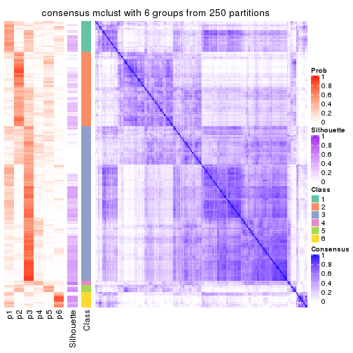</p>

</div>
</div>

Heatmaps for the membership of samples in all partitions to see how consistent they are:


<script>
$( function() {
	$( '#tabs-MAD-mclust-membership-heatmap' ).tabs();
} );
</script>
<div id='tabs-MAD-mclust-membership-heatmap'>
<ul>
<li><a href='#tab-MAD-mclust-membership-heatmap-1'>k = 2</a></li>
<li><a href='#tab-MAD-mclust-membership-heatmap-2'>k = 3</a></li>
<li><a href='#tab-MAD-mclust-membership-heatmap-3'>k = 4</a></li>
<li><a href='#tab-MAD-mclust-membership-heatmap-4'>k = 5</a></li>
<li><a href='#tab-MAD-mclust-membership-heatmap-5'>k = 6</a></li>
</ul>
<div id='tab-MAD-mclust-membership-heatmap-1'>
<pre><code class="r">membership_heatmap(res, k = 2)
</code></pre>

<p></p>

</div>
<div id='tab-MAD-mclust-membership-heatmap-2'>
<pre><code class="r">membership_heatmap(res, k = 3)
</code></pre>

<p></p>

</div>
<div id='tab-MAD-mclust-membership-heatmap-3'>
<pre><code class="r">membership_heatmap(res, k = 4)
</code></pre>

<p></p>

</div>
<div id='tab-MAD-mclust-membership-heatmap-4'>
<pre><code class="r">membership_heatmap(res, k = 5)
</code></pre>

<p></p>

</div>
<div id='tab-MAD-mclust-membership-heatmap-5'>
<pre><code class="r">membership_heatmap(res, k = 6)
</code></pre>

<p></p>

</div>
</div>

As soon as we have had the classes for columns, we can look for signatures
which are significantly different between classes which can be candidate marks
for certain classes. Following are the heatmaps for signatures.


Signature heatmaps where rows are scaled:


<script>
$( function() {
	$( '#tabs-MAD-mclust-get-signatures' ).tabs();
} );
</script>
<div id='tabs-MAD-mclust-get-signatures'>
<ul>
<li><a href='#tab-MAD-mclust-get-signatures-1'>k = 2</a></li>
<li><a href='#tab-MAD-mclust-get-signatures-2'>k = 3</a></li>
<li><a href='#tab-MAD-mclust-get-signatures-3'>k = 4</a></li>
<li><a href='#tab-MAD-mclust-get-signatures-4'>k = 5</a></li>
<li><a href='#tab-MAD-mclust-get-signatures-5'>k = 6</a></li>
</ul>
<div id='tab-MAD-mclust-get-signatures-1'>
<pre><code class="r">get_signatures(res, k = 2)
</code></pre>

<p></p>

</div>
<div id='tab-MAD-mclust-get-signatures-2'>
<pre><code class="r">get_signatures(res, k = 3)
</code></pre>

<p></p>

</div>
<div id='tab-MAD-mclust-get-signatures-3'>
<pre><code class="r">get_signatures(res, k = 4)
</code></pre>

<p></p>

</div>
<div id='tab-MAD-mclust-get-signatures-4'>
<pre><code class="r">get_signatures(res, k = 5)
</code></pre>

<p></p>

</div>
<div id='tab-MAD-mclust-get-signatures-5'>
<pre><code class="r">get_signatures(res, k = 6)
</code></pre>

<p></p>

</div>
</div>


Signature heatmaps where rows are not scaled:


<script>
$( function() {
	$( '#tabs-MAD-mclust-get-signatures-no-scale' ).tabs();
} );
</script>
<div id='tabs-MAD-mclust-get-signatures-no-scale'>
<ul>
<li><a href='#tab-MAD-mclust-get-signatures-no-scale-1'>k = 2</a></li>
<li><a href='#tab-MAD-mclust-get-signatures-no-scale-2'>k = 3</a></li>
<li><a href='#tab-MAD-mclust-get-signatures-no-scale-3'>k = 4</a></li>
<li><a href='#tab-MAD-mclust-get-signatures-no-scale-4'>k = 5</a></li>
<li><a href='#tab-MAD-mclust-get-signatures-no-scale-5'>k = 6</a></li>
</ul>
<div id='tab-MAD-mclust-get-signatures-no-scale-1'>
<pre><code class="r">get_signatures(res, k = 2, scale_rows = FALSE)
</code></pre>

<p></p>

</div>
<div id='tab-MAD-mclust-get-signatures-no-scale-2'>
<pre><code class="r">get_signatures(res, k = 3, scale_rows = FALSE)
</code></pre>

<p></p>

</div>
<div id='tab-MAD-mclust-get-signatures-no-scale-3'>
<pre><code class="r">get_signatures(res, k = 4, scale_rows = FALSE)
</code></pre>

<p></p>

</div>
<div id='tab-MAD-mclust-get-signatures-no-scale-4'>
<pre><code class="r">get_signatures(res, k = 5, scale_rows = FALSE)
</code></pre>

<p></p>

</div>
<div id='tab-MAD-mclust-get-signatures-no-scale-5'>
<pre><code class="r">get_signatures(res, k = 6, scale_rows = FALSE)
</code></pre>

<p>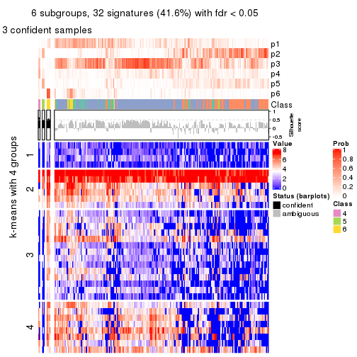</p>

</div>
</div>


Compare the overlap of signatures from different k:

```r
compare_signatures(res)
```


`get_signature()` returns a data frame invisibly. TO get the list of signatures, the function
call should be assigned to a variable explicitly. In following code, if `plot` argument is set
to `FALSE`, no heatmap is plotted while only the differential analysis is performed.

```r
# code only for demonstration
tb = get_signature(res, k = ..., plot = FALSE)
```

An example of the output of `tb` is:

```
#>   which_row         fdr    mean_1    mean_2 scaled_mean_1 scaled_mean_2 km
#> 1        38 0.042760348  8.373488  9.131774    -0.5533452     0.5164555  1
#> 2        40 0.018707592  7.106213  8.469186    -0.6173731     0.5762149  1
#> 3        55 0.019134737 10.221463 11.207825    -0.6159697     0.5749050  1
#> 4        59 0.006059896  5.921854  7.869574    -0.6899429     0.6439467  1
#> 5        60 0.018055526  8.928898 10.211722    -0.6204761     0.5791110  1
#> 6        98 0.009384629 15.714769 14.887706     0.6635654    -0.6193277  2
...
```

The columns in `tb` are:

1. `which_row`: row indices corresponding to the input matrix.
2. `fdr`: FDR for the differential test. 
3. `mean_x`: The mean value in group x.
4. `scaled_mean_x`: The mean value in group x after rows are scaled.
5. `km`: Row groups if k-means clustering is applied to rows.


UMAP plot which shows how samples are separated.


<script>
$( function() {
	$( '#tabs-MAD-mclust-dimension-reduction' ).tabs();
} );
</script>
<div id='tabs-MAD-mclust-dimension-reduction'>
<ul>
<li><a href='#tab-MAD-mclust-dimension-reduction-1'>k = 2</a></li>
<li><a href='#tab-MAD-mclust-dimension-reduction-2'>k = 3</a></li>
<li><a href='#tab-MAD-mclust-dimension-reduction-3'>k = 4</a></li>
<li><a href='#tab-MAD-mclust-dimension-reduction-4'>k = 5</a></li>
<li><a href='#tab-MAD-mclust-dimension-reduction-5'>k = 6</a></li>
</ul>
<div id='tab-MAD-mclust-dimension-reduction-1'>
<pre><code class="r">dimension_reduction(res, k = 2, method = &quot;UMAP&quot;)
</code></pre>

<p></p>

</div>
<div id='tab-MAD-mclust-dimension-reduction-2'>
<pre><code class="r">dimension_reduction(res, k = 3, method = &quot;UMAP&quot;)
</code></pre>

<p></p>

</div>
<div id='tab-MAD-mclust-dimension-reduction-3'>
<pre><code class="r">dimension_reduction(res, k = 4, method = &quot;UMAP&quot;)
</code></pre>

<p></p>

</div>
<div id='tab-MAD-mclust-dimension-reduction-4'>
<pre><code class="r">dimension_reduction(res, k = 5, method = &quot;UMAP&quot;)
</code></pre>

<p></p>

</div>
<div id='tab-MAD-mclust-dimension-reduction-5'>
<pre><code class="r">dimension_reduction(res, k = 6, method = &quot;UMAP&quot;)
</code></pre>

<p></p>

</div>
</div>


Following heatmap shows how subgroups are split when increasing `k`:

```r
collect_classes(res)
```


If matrix rows can be associated to genes, consider to use `GO_Enrichment(res,
...)` to perform function enrichment for the signature genes.


 

---------------------------------------------------


### MAD:NMF


The object with results only for a single top-value method and a single partition method 
can be extracted as:

```r
res = res_list["MAD", "NMF"]
# you can also extract it by
# res = res_list["MAD:NMF"]
```

A summary of `res` and all the functions that can be applied to it:

```r
res
```

```
#> A 'ConsensusPartition' object with k = 2, 3, 4, 5, 6.
#>   On a matrix with 77 rows and 243 columns.
#>   Top rows (8, 16, 23, 30, 38) are extracted by 'MAD' method.
#>   Subgroups are detected by 'NMF' method.
#>   Performed in total 1250 partitions by row resampling.
#>   Best k for subgroups seems to be 2.
#> 
#> Following methods can be applied to this 'ConsensusPartition' object:
#>  [1] "cola_report"             "collect_classes"         "collect_plots"          
#>  [4] "collect_stats"           "colnames"                "compare_signatures"     
#>  [7] "consensus_heatmap"       "dimension_reduction"     "functional_enrichment"  
#> [10] "get_anno_col"            "get_anno"                "get_classes"            
#> [13] "get_consensus"           "get_matrix"              "get_membership"         
#> [16] "get_param"               "get_signatures"          "get_stats"              
#> [19] "is_best_k"               "is_stable_k"             "membership_heatmap"     
#> [22] "ncol"                    "nrow"                    "plot_ecdf"              
#> [25] "rownames"                "select_partition_number" "show"                   
#> [28] "suggest_best_k"          "test_to_known_factors"
```

`collect_plots()` function collects all the plots made from `res` for all `k` (number of partitions)
into one single page to provide an easy and fast comparison between different `k`.

```r
collect_plots(res)
```


The plots are:

- The first row: a plot of the ECDF (Empirical cumulative distribution
  function) curves of the consensus matrix for each `k` and the heatmap of
  predicted classes for each `k`.
- The second row: heatmaps of the consensus matrix for each `k`.
- The third row: heatmaps of the membership matrix for each `k`.
- The fouth row: heatmaps of the signatures for each `k`.

All the plots in panels can be made by individual functions and they are
plotted later in this section.

`select_partition_number()` produces several plots showing different
statistics for choosing "optimized" `k`. There are following statistics:

- ECDF curves of the consensus matrix for each `k`;
- 1-PAC. [The PAC
  score](https://en.wikipedia.org/wiki/Consensus_clustering#Over-interpretation_potential_of_consensus_clustering)
  measures the proportion of the ambiguous subgrouping.
- Mean silhouette score.
- Concordance. The mean probability of fiting the consensus class ids in all
  partitions.
- Area increased. Denote $A_k$ as the area under the ECDF curve for current
  `k`, the area increased is defined as $A_k - A_{k-1}$.
- Rand index. The percent of pairs of samples that are both in a same cluster
  or both are not in a same cluster in the partition of k and k-1.
- Jaccard index. The ratio of pairs of samples are both in a same cluster in
  the partition of k and k-1 and the pairs of samples are both in a same
  cluster in the partition k or k-1.

The detailed explanations of these statistics can be found in [the cola
vignette](http://bioconductor.org/packages/devel/bioc/vignettes/cola/inst/doc/cola.html#toc_13).

Generally speaking, lower PAC score, higher mean silhouette score or higher
concordance corresponds to better partition. Rand index and Jaccard index
measure how similar the current partition is compared to partition with `k-1`.
If they are too similar, we won't accept `k` is better than `k-1`.

```r
select_partition_number(res)
```


The numeric values for all these statistics can be obtained by `get_stats()`.

```r
get_stats(res)
```

```
#>   k  1-PAC mean_silhouette concordance area_increased  Rand Jaccard
#> 2 2 0.0189           0.578       0.741         0.4696 0.514   0.514
#> 3 3 0.0748           0.427       0.655         0.3462 0.752   0.557
#> 4 4 0.1474           0.337       0.600         0.1163 0.923   0.798
#> 5 5 0.2034           0.276       0.524         0.0636 0.940   0.822
#> 6 6 0.2466           0.242       0.479         0.0426 0.903   0.697
```

`suggest_best_k()` suggests the best $k$ based on these statistics. The rules are as follows:

- All $k$ with Jaccard index larger than 0.95 are removed because the increase of
  the partition number does not provides enough extra information. If all $k$ are removed,
  the best $k$ is assigned by `NA`.
- For $k$ with 1-PAC larger than 0.9, the maximal $k$ is taken as the "best k". Other $k$ is called "optional k".
- If it does not fit the second rule. The $k$ with the highest vote of highest
  1-PAC, mean silhouette and concordance is taken as the "best k".

```r
suggest_best_k(res)
```

```
#> [1] 2
```


Following shows the table of the partitions (You need to click the **show/hide
code output** link to see it). The membership matrix (columns with name `p*`)
is inferred by
[`clue::cl_consensus()`](https://www.rdocumentation.org/link/cl_consensus?package=clue)
function with the `SE` method. Basically the value in the membership matrix
represents the probability to belong to a certain group. The finall class
label for an item is determined with the group with highest probability it
belongs to.

In `get_classes()` function, the entropy is calculated from the membership
matrix and the silhouette score is calculated from the consensus matrix.


<script>
$( function() {
	$( '#tabs-MAD-NMF-get-classes' ).tabs();
} );
</script>
<div id='tabs-MAD-NMF-get-classes'>
<ul>
<li><a href='#tab-MAD-NMF-get-classes-1'>k = 2</a></li>
<li><a href='#tab-MAD-NMF-get-classes-2'>k = 3</a></li>
<li><a href='#tab-MAD-NMF-get-classes-3'>k = 4</a></li>
<li><a href='#tab-MAD-NMF-get-classes-4'>k = 5</a></li>
<li><a href='#tab-MAD-NMF-get-classes-5'>k = 6</a></li>
</ul>

<div id='tab-MAD-NMF-get-classes-1'>
<p><a id='tab-MAD-NMF-get-classes-1-a' style='color:#0366d6' href='#'>show/hide code output</a></p>
<pre><code class="r">cbind(get_classes(res, k = 2), get_membership(res, k = 2))
</code></pre>

<pre><code>#&gt;           class entropy silhouette    p1    p2
#&gt; SRR191393     1   0.730    0.66650 0.796 0.204
#&gt; SRR191394     2   0.966    0.46841 0.392 0.608
#&gt; SRR191396     2   0.963    0.47409 0.388 0.612
#&gt; SRR191397     2   0.997    0.21996 0.468 0.532
#&gt; SRR191398     2   0.802    0.65564 0.244 0.756
#&gt; SRR191399     1   0.529    0.69759 0.880 0.120
#&gt; SRR191400     2   0.814    0.64623 0.252 0.748
#&gt; SRR191401     1   0.767    0.69598 0.776 0.224
#&gt; SRR191402     1   0.689    0.70270 0.816 0.184
#&gt; SRR191403     1   0.443    0.71278 0.908 0.092
#&gt; SRR191404     2   0.861    0.63450 0.284 0.716
#&gt; SRR191405     1   0.999   -0.06329 0.520 0.480
#&gt; SRR191406     1   0.605    0.72070 0.852 0.148
#&gt; SRR191407     2   0.808    0.66960 0.248 0.752
#&gt; SRR191408     1   0.909    0.54080 0.676 0.324
#&gt; SRR191409     1   0.969    0.31827 0.604 0.396
#&gt; SRR191410     1   0.482    0.72098 0.896 0.104
#&gt; SRR191411     1   0.706    0.70178 0.808 0.192
#&gt; SRR191412     1   0.850    0.59932 0.724 0.276
#&gt; SRR191413     1   0.416    0.73112 0.916 0.084
#&gt; SRR191414     1   0.745    0.66579 0.788 0.212
#&gt; SRR191415     1   0.416    0.73463 0.916 0.084
#&gt; SRR191416     1   0.541    0.73036 0.876 0.124
#&gt; SRR191418     1   0.689    0.66559 0.816 0.184
#&gt; SRR191419     1   0.904    0.47323 0.680 0.320
#&gt; SRR191420     1   0.605    0.72620 0.852 0.148
#&gt; SRR191421     1   0.430    0.72292 0.912 0.088
#&gt; SRR191422     2   0.917    0.56969 0.332 0.668
#&gt; SRR191423     2   0.939    0.52961 0.356 0.644
#&gt; SRR191424     2   0.983    0.41484 0.424 0.576
#&gt; SRR191425     1   0.358    0.73036 0.932 0.068
#&gt; SRR191426     1   0.767    0.65289 0.776 0.224
#&gt; SRR191427     2   0.839    0.65029 0.268 0.732
#&gt; SRR191428     1   0.343    0.71213 0.936 0.064
#&gt; SRR191429     2   0.958    0.46422 0.380 0.620
#&gt; SRR191430     2   0.988    0.29867 0.436 0.564
#&gt; SRR191431     2   0.343    0.66550 0.064 0.936
#&gt; SRR191432     1   0.929    0.50969 0.656 0.344
#&gt; SRR191433     1   0.917    0.44683 0.668 0.332
#&gt; SRR191434     1   0.886    0.57980 0.696 0.304
#&gt; SRR191435     1   0.871    0.61780 0.708 0.292
#&gt; SRR191436     1   0.788    0.65995 0.764 0.236
#&gt; SRR191437     2   0.653    0.68361 0.168 0.832
#&gt; SRR191438     2   0.978    0.44673 0.412 0.588
#&gt; SRR191439     2   0.998    0.22467 0.472 0.528
#&gt; SRR191440     2   0.552    0.66165 0.128 0.872
#&gt; SRR191441     2   0.821    0.60276 0.256 0.744
#&gt; SRR191442     1   0.987    0.02534 0.568 0.432
#&gt; SRR191443     1   0.802    0.62516 0.756 0.244
#&gt; SRR191444     1   0.958    0.30271 0.620 0.380
#&gt; SRR191445     1   0.955    0.31884 0.624 0.376
#&gt; SRR191446     2   0.999    0.18999 0.484 0.516
#&gt; SRR191447     2   0.722    0.64774 0.200 0.800
#&gt; SRR191448     1   0.999   -0.14400 0.520 0.480
#&gt; SRR191449     1   0.552    0.70329 0.872 0.128
#&gt; SRR191450     1   0.909    0.54327 0.676 0.324
#&gt; SRR191451     2   0.932    0.58273 0.348 0.652
#&gt; SRR191452     2   0.932    0.50449 0.348 0.652
#&gt; SRR191453     2   0.990    0.36188 0.440 0.560
#&gt; SRR191454     1   1.000   -0.05880 0.500 0.500
#&gt; SRR191455     1   0.697    0.65601 0.812 0.188
#&gt; SRR191456     2   0.671    0.70216 0.176 0.824
#&gt; SRR191457     2   0.946    0.55257 0.364 0.636
#&gt; SRR191458     2   0.839    0.66627 0.268 0.732
#&gt; SRR191459     1   0.443    0.73355 0.908 0.092
#&gt; SRR191460     1   0.634    0.70437 0.840 0.160
#&gt; SRR191461     1   0.456    0.71093 0.904 0.096
#&gt; SRR191462     1   0.886    0.54362 0.696 0.304
#&gt; SRR191463     2   0.961    0.51508 0.384 0.616
#&gt; SRR191464     1   0.991    0.07695 0.556 0.444
#&gt; SRR191465     2   0.998    0.20273 0.472 0.528
#&gt; SRR191466     1   0.788    0.66057 0.764 0.236
#&gt; SRR191467     1   0.917    0.46794 0.668 0.332
#&gt; SRR191468     2   0.921    0.58851 0.336 0.664
#&gt; SRR191469     1   0.506    0.72130 0.888 0.112
#&gt; SRR191470     1   0.706    0.66432 0.808 0.192
#&gt; SRR191471     2   0.891    0.64150 0.308 0.692
#&gt; SRR191472     1   0.978    0.25033 0.588 0.412
#&gt; SRR191473     1   0.697    0.68642 0.812 0.188
#&gt; SRR191474     1   0.416    0.72878 0.916 0.084
#&gt; SRR191475     2   0.913    0.58490 0.328 0.672
#&gt; SRR191476     2   0.943    0.55781 0.360 0.640
#&gt; SRR191477     1   0.738    0.68786 0.792 0.208
#&gt; SRR191478     1   0.988    0.20194 0.564 0.436
#&gt; SRR191479     1   0.753    0.70155 0.784 0.216
#&gt; SRR191480     1   0.343    0.72879 0.936 0.064
#&gt; SRR191481     1   0.518    0.69005 0.884 0.116
#&gt; SRR191482     1   0.430    0.73129 0.912 0.088
#&gt; SRR191483     1   0.634    0.66769 0.840 0.160
#&gt; SRR191484     1   0.625    0.72036 0.844 0.156
#&gt; SRR191485     2   0.996    0.25889 0.464 0.536
#&gt; SRR191486     2   0.839    0.67223 0.268 0.732
#&gt; SRR191487     1   0.925    0.47187 0.660 0.340
#&gt; SRR191488     2   0.866    0.62738 0.288 0.712
#&gt; SRR191489     1   0.866    0.53338 0.712 0.288
#&gt; SRR191490     2   0.781    0.67678 0.232 0.768
#&gt; SRR191491     2   0.990    0.32030 0.440 0.560
#&gt; SRR191492     1   0.827    0.59029 0.740 0.260
#&gt; SRR191493     2   0.738    0.63350 0.208 0.792
#&gt; SRR191494     2   0.552    0.68584 0.128 0.872
#&gt; SRR191495     1   0.388    0.70921 0.924 0.076
#&gt; SRR191496     2   0.808    0.67352 0.248 0.752
#&gt; SRR191497     1   0.482    0.73281 0.896 0.104
#&gt; SRR191498     1   0.961    0.35333 0.616 0.384
#&gt; SRR191499     1   0.456    0.72470 0.904 0.096
#&gt; SRR191500     1   0.456    0.72401 0.904 0.096
#&gt; SRR191501     2   0.689    0.68876 0.184 0.816
#&gt; SRR191502     2   0.753    0.66628 0.216 0.784
#&gt; SRR191503     2   0.745    0.69184 0.212 0.788
#&gt; SRR191504     1   0.871    0.54952 0.708 0.292
#&gt; SRR191505     2   0.821    0.64494 0.256 0.744
#&gt; SRR191506     2   0.738    0.69866 0.208 0.792
#&gt; SRR191507     1   0.921    0.43598 0.664 0.336
#&gt; SRR191508     1   0.808    0.60801 0.752 0.248
#&gt; SRR191509     1   0.802    0.59150 0.756 0.244
#&gt; SRR191510     2   0.881    0.61674 0.300 0.700
#&gt; SRR191511     1   0.996    0.07875 0.536 0.464
#&gt; SRR191512     2   0.844    0.65746 0.272 0.728
#&gt; SRR191513     2   0.814    0.66027 0.252 0.748
#&gt; SRR191514     2   0.904    0.59674 0.320 0.680
#&gt; SRR191515     1   0.795    0.62706 0.760 0.240
#&gt; SRR191516     1   0.541    0.70756 0.876 0.124
#&gt; SRR191517     1   0.242    0.71855 0.960 0.040
#&gt; SRR191518     1   0.891    0.54765 0.692 0.308
#&gt; SRR191519     1   0.855    0.57183 0.720 0.280
#&gt; SRR191520     1   0.311    0.71488 0.944 0.056
#&gt; SRR191521     2   0.952    0.46952 0.372 0.628
#&gt; SRR191522     2   0.850    0.68560 0.276 0.724
#&gt; SRR191523     2   0.975    0.40796 0.408 0.592
#&gt; SRR191524     2   0.839    0.66417 0.268 0.732
#&gt; SRR191525     1   0.876    0.56596 0.704 0.296
#&gt; SRR191526     2   0.913    0.54026 0.328 0.672
#&gt; SRR191527     2   0.529    0.67525 0.120 0.880
#&gt; SRR191528     2   0.671    0.66940 0.176 0.824
#&gt; SRR191529     2   0.605    0.67201 0.148 0.852
#&gt; SRR191530     2   0.963    0.43002 0.388 0.612
#&gt; SRR191531     2   0.416    0.67568 0.084 0.916
#&gt; SRR191532     2   1.000    0.33470 0.496 0.504
#&gt; SRR191533     1   0.995    0.02764 0.540 0.460
#&gt; SRR191534     2   0.671    0.68760 0.176 0.824
#&gt; SRR191535     1   0.855    0.57345 0.720 0.280
#&gt; SRR191536     2   0.895    0.64444 0.312 0.688
#&gt; SRR191537     1   0.886    0.48426 0.696 0.304
#&gt; SRR191538     1   0.975    0.25383 0.592 0.408
#&gt; SRR191539     2   0.563    0.68404 0.132 0.868
#&gt; SRR191540     1   0.443    0.73215 0.908 0.092
#&gt; SRR191541     2   0.932    0.55748 0.348 0.652
#&gt; SRR191542     2   0.775    0.68775 0.228 0.772
#&gt; SRR191543     2   0.996    0.36690 0.464 0.536
#&gt; SRR191544     2   0.680    0.69661 0.180 0.820
#&gt; SRR191545     1   0.861    0.55889 0.716 0.284
#&gt; SRR191546     1   0.929    0.44789 0.656 0.344
#&gt; SRR191547     1   0.753    0.65204 0.784 0.216
#&gt; SRR191548     2   0.855    0.61106 0.280 0.720
#&gt; SRR191549     2   0.821    0.62430 0.256 0.744
#&gt; SRR191550     2   0.946    0.51920 0.364 0.636
#&gt; SRR191551     2   0.876    0.59596 0.296 0.704
#&gt; SRR191552     2   0.615    0.67580 0.152 0.848
#&gt; SRR191553     2   0.997    0.30424 0.468 0.532
#&gt; SRR191554     2   0.730    0.65618 0.204 0.796
#&gt; SRR191555     1   0.388    0.72637 0.924 0.076
#&gt; SRR191556     1   0.781    0.66387 0.768 0.232
#&gt; SRR191557     1   0.327    0.72571 0.940 0.060
#&gt; SRR191558     2   0.788    0.68740 0.236 0.764
#&gt; SRR191559     1   0.722    0.67910 0.800 0.200
#&gt; SRR191560     1   1.000   -0.04872 0.512 0.488
#&gt; SRR191561     2   0.781    0.65327 0.232 0.768
#&gt; SRR191562     2   0.802    0.64583 0.244 0.756
#&gt; SRR191563     1   0.925    0.44779 0.660 0.340
#&gt; SRR191564     1   0.563    0.72355 0.868 0.132
#&gt; SRR191565     1   0.886    0.55373 0.696 0.304
#&gt; SRR191566     1   0.456    0.73089 0.904 0.096
#&gt; SRR191567     1   0.738    0.67125 0.792 0.208
#&gt; SRR191568     1   0.981    0.23499 0.580 0.420
#&gt; SRR191569     1   0.995   -0.00399 0.540 0.460
#&gt; SRR191570     1   0.788    0.67073 0.764 0.236
#&gt; SRR191571     1   0.900    0.51917 0.684 0.316
#&gt; SRR191572     2   0.855    0.61474 0.280 0.720
#&gt; SRR191573     1   0.839    0.60489 0.732 0.268
#&gt; SRR191574     2   0.730    0.67774 0.204 0.796
#&gt; SRR191575     2   0.529    0.67820 0.120 0.880
#&gt; SRR191576     2   0.861    0.64763 0.284 0.716
#&gt; SRR191577     2   0.939    0.55214 0.356 0.644
#&gt; SRR191578     1   0.760    0.68444 0.780 0.220
#&gt; SRR191579     2   0.983    0.39647 0.424 0.576
#&gt; SRR191580     2   0.634    0.67225 0.160 0.840
#&gt; SRR191581     2   0.506    0.67650 0.112 0.888
#&gt; SRR191582     2   0.730    0.68440 0.204 0.796
#&gt; SRR191583     2   0.584    0.68204 0.140 0.860
#&gt; SRR191584     2   0.552    0.67954 0.128 0.872
#&gt; SRR191585     1   0.204    0.72590 0.968 0.032
#&gt; SRR191586     1   0.506    0.71171 0.888 0.112
#&gt; SRR191587     1   0.482    0.73204 0.896 0.104
#&gt; SRR191588     1   0.615    0.68145 0.848 0.152
#&gt; SRR191589     1   0.760    0.65500 0.780 0.220
#&gt; SRR191590     2   0.697    0.69755 0.188 0.812
#&gt; SRR191591     1   0.802    0.64522 0.756 0.244
#&gt; SRR191592     1   0.994    0.08976 0.544 0.456
#&gt; SRR191593     1   0.552    0.72773 0.872 0.128
#&gt; SRR191594     2   1.000    0.09822 0.496 0.504
#&gt; SRR191595     2   0.993    0.32826 0.452 0.548
#&gt; SRR191596     1   0.876    0.56417 0.704 0.296
#&gt; SRR191597     1   0.430    0.72840 0.912 0.088
#&gt; SRR191598     1   0.529    0.72862 0.880 0.120
#&gt; SRR191599     1   0.494    0.73486 0.892 0.108
#&gt; SRR191600     1   0.969    0.29664 0.604 0.396
#&gt; SRR191601     1   0.788    0.63459 0.764 0.236
#&gt; SRR191602     1   0.295    0.72981 0.948 0.052
#&gt; SRR191603     1   0.242    0.72891 0.960 0.040
#&gt; SRR191604     1   0.932    0.39605 0.652 0.348
#&gt; SRR191605     1   0.416    0.73582 0.916 0.084
#&gt; SRR191606     2   0.985    0.34885 0.428 0.572
#&gt; SRR191607     1   0.163    0.72344 0.976 0.024
#&gt; SRR191608     1   0.563    0.68866 0.868 0.132
#&gt; SRR191609     1   0.563    0.70817 0.868 0.132
#&gt; SRR191610     1   0.118    0.72324 0.984 0.016
#&gt; SRR191611     1   0.260    0.72517 0.956 0.044
#&gt; SRR191612     1   0.552    0.71912 0.872 0.128
#&gt; SRR191613     1   0.850    0.58931 0.724 0.276
#&gt; SRR191614     1   0.343    0.72195 0.936 0.064
#&gt; SRR191615     1   0.469    0.72203 0.900 0.100
#&gt; SRR191616     2   0.827    0.62688 0.260 0.740
#&gt; SRR191617     2   0.653    0.68411 0.168 0.832
#&gt; SRR191618     1   0.808    0.65377 0.752 0.248
#&gt; SRR191619     1   0.469    0.73471 0.900 0.100
#&gt; SRR191620     2   0.866    0.63753 0.288 0.712
#&gt; SRR191621     1   0.671    0.71283 0.824 0.176
#&gt; SRR191622     2   0.996    0.30973 0.464 0.536
#&gt; SRR191623     1   0.518    0.71274 0.884 0.116
#&gt; SRR191624     1   0.482    0.72487 0.896 0.104
#&gt; SRR191625     1   0.563    0.73539 0.868 0.132
#&gt; SRR191626     1   0.327    0.71563 0.940 0.060
#&gt; SRR191627     1   0.327    0.71935 0.940 0.060
#&gt; SRR191628     1   0.552    0.72022 0.872 0.128
#&gt; SRR191629     1   0.402    0.72519 0.920 0.080
#&gt; SRR191630     1   0.992    0.11180 0.552 0.448
#&gt; SRR191631     1   0.295    0.72844 0.948 0.052
#&gt; SRR191632     1   0.891    0.51595 0.692 0.308
#&gt; SRR191633     1   0.881    0.58474 0.700 0.300
#&gt; SRR191634     2   0.955    0.47403 0.376 0.624
#&gt; SRR191635     1   0.402    0.72318 0.920 0.080
#&gt; SRR191636     2   0.745    0.65452 0.212 0.788
#&gt; SRR191637     2   0.802    0.69437 0.244 0.756
</code></pre>

<script>
$('#tab-MAD-NMF-get-classes-1-a').parent().next().next().hide();
$('#tab-MAD-NMF-get-classes-1-a').click(function(){
  $('#tab-MAD-NMF-get-classes-1-a').parent().next().next().toggle();
  return(false);
});
</script>
</div>

<div id='tab-MAD-NMF-get-classes-2'>
<p><a id='tab-MAD-NMF-get-classes-2-a' style='color:#0366d6' href='#'>show/hide code output</a></p>
<pre><code class="r">cbind(get_classes(res, k = 3), get_membership(res, k = 3))
</code></pre>

<pre><code>#&gt;           class entropy silhouette    p1    p2    p3
#&gt; SRR191393     3   0.517    0.65484 0.148 0.036 0.816
#&gt; SRR191394     1   0.842    0.45549 0.616 0.156 0.228
#&gt; SRR191396     1   0.733    0.52058 0.692 0.092 0.216
#&gt; SRR191397     1   0.719    0.46272 0.664 0.056 0.280
#&gt; SRR191398     1   0.518    0.58934 0.832 0.084 0.084
#&gt; SRR191399     3   0.343    0.66481 0.064 0.032 0.904
#&gt; SRR191400     1   0.548    0.58284 0.816 0.108 0.076
#&gt; SRR191401     3   0.856    0.53018 0.256 0.148 0.596
#&gt; SRR191402     3   0.666    0.65283 0.116 0.132 0.752
#&gt; SRR191403     3   0.292    0.66410 0.032 0.044 0.924
#&gt; SRR191404     1   0.745    0.50091 0.668 0.252 0.080
#&gt; SRR191405     2   0.926    0.42325 0.196 0.520 0.284
#&gt; SRR191406     3   0.787    0.58330 0.136 0.200 0.664
#&gt; SRR191407     1   0.659    0.58039 0.756 0.112 0.132
#&gt; SRR191408     3   0.968    0.13453 0.284 0.256 0.460
#&gt; SRR191409     1   0.849    0.15026 0.496 0.092 0.412
#&gt; SRR191410     3   0.446    0.67431 0.080 0.056 0.864
#&gt; SRR191411     3   0.743    0.58627 0.188 0.116 0.696
#&gt; SRR191412     3   0.807    0.53194 0.284 0.100 0.616
#&gt; SRR191413     3   0.374    0.67088 0.036 0.072 0.892
#&gt; SRR191414     3   0.606    0.64728 0.148 0.072 0.780
#&gt; SRR191415     3   0.588    0.65363 0.064 0.148 0.788
#&gt; SRR191416     3   0.395    0.67306 0.076 0.040 0.884
#&gt; SRR191418     3   0.730    0.55336 0.272 0.064 0.664
#&gt; SRR191419     3   0.778    0.25876 0.416 0.052 0.532
#&gt; SRR191420     3   0.727    0.58166 0.076 0.240 0.684
#&gt; SRR191421     3   0.629    0.57532 0.024 0.272 0.704
#&gt; SRR191422     2   0.835    0.36914 0.332 0.568 0.100
#&gt; SRR191423     2   0.760    0.46395 0.260 0.656 0.084
#&gt; SRR191424     1   0.862    0.44330 0.596 0.164 0.240
#&gt; SRR191425     3   0.327    0.66128 0.016 0.080 0.904
#&gt; SRR191426     2   0.812    0.11860 0.068 0.496 0.436
#&gt; SRR191427     2   0.857    0.10218 0.392 0.508 0.100
#&gt; SRR191428     3   0.473    0.62150 0.004 0.196 0.800
#&gt; SRR191429     2   0.867    0.17189 0.384 0.508 0.108
#&gt; SRR191430     2   0.853    0.36904 0.320 0.564 0.116
#&gt; SRR191431     1   0.642    0.45356 0.676 0.304 0.020
#&gt; SRR191432     2   0.863    0.50018 0.124 0.560 0.316
#&gt; SRR191433     2   0.841    0.43144 0.096 0.544 0.360
#&gt; SRR191434     3   0.873    0.27139 0.388 0.112 0.500
#&gt; SRR191435     2   0.811    0.42113 0.084 0.580 0.336
#&gt; SRR191436     3   0.861    0.17699 0.104 0.384 0.512
#&gt; SRR191437     1   0.730    0.22724 0.556 0.412 0.032
#&gt; SRR191438     2   0.909    0.31043 0.312 0.524 0.164
#&gt; SRR191439     2   0.677    0.53593 0.096 0.740 0.164
#&gt; SRR191440     1   0.606    0.47392 0.708 0.276 0.016
#&gt; SRR191441     2   0.673    0.36241 0.284 0.680 0.036
#&gt; SRR191442     2   0.963    0.27650 0.236 0.464 0.300
#&gt; SRR191443     3   0.901    0.33693 0.188 0.256 0.556
#&gt; SRR191444     3   0.945    0.20058 0.336 0.192 0.472
#&gt; SRR191445     3   0.939    0.15566 0.304 0.200 0.496
#&gt; SRR191446     2   0.947    0.20035 0.360 0.452 0.188
#&gt; SRR191447     2   0.638    0.30102 0.340 0.648 0.012
#&gt; SRR191448     1   0.998    0.10236 0.360 0.328 0.312
#&gt; SRR191449     3   0.438    0.66167 0.064 0.068 0.868
#&gt; SRR191450     3   0.965    0.19201 0.248 0.288 0.464
#&gt; SRR191451     1   0.906    0.25765 0.512 0.336 0.152
#&gt; SRR191452     2   0.600    0.51794 0.144 0.784 0.072
#&gt; SRR191453     2   0.745    0.56222 0.140 0.700 0.160
#&gt; SRR191454     2   0.870    0.50925 0.180 0.592 0.228
#&gt; SRR191455     3   0.630    0.09213 0.000 0.480 0.520
#&gt; SRR191456     1   0.731    0.41013 0.628 0.324 0.048
#&gt; SRR191457     1   0.965    0.25534 0.456 0.312 0.232
#&gt; SRR191458     1   0.832    0.21610 0.540 0.372 0.088
#&gt; SRR191459     3   0.506    0.64928 0.028 0.156 0.816
#&gt; SRR191460     3   0.769    0.44970 0.068 0.316 0.616
#&gt; SRR191461     3   0.641    0.62788 0.080 0.160 0.760
#&gt; SRR191462     3   0.905    0.35547 0.172 0.288 0.540
#&gt; SRR191463     2   0.894    0.03743 0.432 0.444 0.124
#&gt; SRR191464     2   0.894    0.44570 0.152 0.540 0.308
#&gt; SRR191465     2   0.783    0.53513 0.160 0.672 0.168
#&gt; SRR191466     3   0.873   -0.06241 0.108 0.424 0.468
#&gt; SRR191467     2   0.911    0.43440 0.156 0.508 0.336
#&gt; SRR191468     2   0.875    0.36007 0.284 0.568 0.148
#&gt; SRR191469     3   0.550    0.63950 0.064 0.124 0.812
#&gt; SRR191470     3   0.862   -0.01300 0.100 0.420 0.480
#&gt; SRR191471     1   0.827    0.45584 0.628 0.228 0.144
#&gt; SRR191472     2   0.612    0.55603 0.036 0.744 0.220
#&gt; SRR191473     3   0.708    0.43150 0.036 0.336 0.628
#&gt; SRR191474     3   0.453    0.66063 0.040 0.104 0.856
#&gt; SRR191475     2   0.788    0.35334 0.308 0.612 0.080
#&gt; SRR191476     1   0.962    0.02677 0.420 0.376 0.204
#&gt; SRR191477     2   0.766    0.13154 0.044 0.504 0.452
#&gt; SRR191478     2   0.889    0.50033 0.192 0.572 0.236
#&gt; SRR191479     3   0.832    0.54986 0.140 0.240 0.620
#&gt; SRR191480     3   0.388    0.66437 0.044 0.068 0.888
#&gt; SRR191481     3   0.625    0.35477 0.004 0.376 0.620
#&gt; SRR191482     3   0.466    0.65165 0.016 0.156 0.828
#&gt; SRR191483     3   0.692    0.27298 0.020 0.400 0.580
#&gt; SRR191484     3   0.772    0.57232 0.152 0.168 0.680
#&gt; SRR191485     2   0.938    0.33738 0.288 0.504 0.208
#&gt; SRR191486     1   0.804    0.25075 0.556 0.372 0.072
#&gt; SRR191487     3   0.977    0.06471 0.328 0.244 0.428
#&gt; SRR191488     1   0.744    0.54691 0.692 0.108 0.200
#&gt; SRR191489     3   0.766    0.37542 0.376 0.052 0.572
#&gt; SRR191490     1   0.910    0.28175 0.492 0.360 0.148
#&gt; SRR191491     2   0.862    0.48749 0.240 0.596 0.164
#&gt; SRR191492     3   0.731    0.48178 0.324 0.048 0.628
#&gt; SRR191493     2   0.719    0.30377 0.336 0.624 0.040
#&gt; SRR191494     1   0.720    0.26682 0.556 0.416 0.028
#&gt; SRR191495     3   0.488    0.61965 0.004 0.208 0.788
#&gt; SRR191496     1   0.851    0.11016 0.480 0.428 0.092
#&gt; SRR191497     3   0.500    0.67004 0.072 0.088 0.840
#&gt; SRR191498     3   0.922    0.06792 0.376 0.156 0.468
#&gt; SRR191499     3   0.303    0.66687 0.048 0.032 0.920
#&gt; SRR191500     3   0.499    0.62996 0.024 0.160 0.816
#&gt; SRR191501     1   0.814    0.06967 0.472 0.460 0.068
#&gt; SRR191502     1   0.682    0.57841 0.740 0.152 0.108
#&gt; SRR191503     1   0.846    0.39538 0.564 0.328 0.108
#&gt; SRR191504     2   0.725    0.49744 0.060 0.664 0.276
#&gt; SRR191505     2   0.854    0.04813 0.408 0.496 0.096
#&gt; SRR191506     1   0.857    0.11841 0.476 0.428 0.096
#&gt; SRR191507     3   0.976    0.17418 0.256 0.304 0.440
#&gt; SRR191508     2   0.733    0.26934 0.036 0.576 0.388
#&gt; SRR191509     2   0.694    0.34780 0.024 0.604 0.372
#&gt; SRR191510     1   0.886    0.26715 0.524 0.344 0.132
#&gt; SRR191511     2   0.687    0.55750 0.104 0.736 0.160
#&gt; SRR191512     2   0.753    0.38497 0.280 0.648 0.072
#&gt; SRR191513     2   0.785    0.25229 0.344 0.588 0.068
#&gt; SRR191514     2   0.783    0.38169 0.280 0.632 0.088
#&gt; SRR191515     3   0.877    0.27220 0.128 0.336 0.536
#&gt; SRR191516     3   0.596    0.64808 0.136 0.076 0.788
#&gt; SRR191517     3   0.353    0.65104 0.008 0.108 0.884
#&gt; SRR191518     2   0.845    0.35717 0.104 0.556 0.340
#&gt; SRR191519     2   0.863    0.35855 0.108 0.520 0.372
#&gt; SRR191520     3   0.630    0.56965 0.028 0.260 0.712
#&gt; SRR191521     2   0.760    0.47760 0.236 0.668 0.096
#&gt; SRR191522     1   0.901    0.33525 0.524 0.324 0.152
#&gt; SRR191523     2   0.812    0.48376 0.236 0.636 0.128
#&gt; SRR191524     1   0.905    0.34520 0.516 0.332 0.152
#&gt; SRR191525     3   0.903   -0.05927 0.132 0.432 0.436
#&gt; SRR191526     2   0.621    0.50390 0.164 0.768 0.068
#&gt; SRR191527     1   0.726    0.45445 0.636 0.316 0.048
#&gt; SRR191528     1   0.477    0.57278 0.848 0.100 0.052
#&gt; SRR191529     1   0.773    0.27154 0.572 0.372 0.056
#&gt; SRR191530     2   0.753    0.48959 0.228 0.676 0.096
#&gt; SRR191531     1   0.555    0.51591 0.768 0.212 0.020
#&gt; SRR191532     3   0.999   -0.29522 0.308 0.344 0.348
#&gt; SRR191533     1   0.921    0.15397 0.456 0.152 0.392
#&gt; SRR191534     1   0.708    0.19258 0.564 0.412 0.024
#&gt; SRR191535     2   0.889    0.30630 0.124 0.488 0.388
#&gt; SRR191536     2   0.918    0.02848 0.400 0.452 0.148
#&gt; SRR191537     3   0.840    0.46625 0.256 0.136 0.608
#&gt; SRR191538     2   0.802    0.55751 0.140 0.652 0.208
#&gt; SRR191539     1   0.616    0.52746 0.756 0.196 0.048
#&gt; SRR191540     3   0.658    0.61885 0.068 0.192 0.740
#&gt; SRR191541     2   0.933   -0.09506 0.400 0.436 0.164
#&gt; SRR191542     1   0.840    0.12726 0.480 0.436 0.084
#&gt; SRR191543     2   0.968    0.23345 0.348 0.432 0.220
#&gt; SRR191544     1   0.738    0.48055 0.672 0.252 0.076
#&gt; SRR191545     2   0.690    0.45442 0.040 0.668 0.292
#&gt; SRR191546     2   0.678    0.52812 0.052 0.704 0.244
#&gt; SRR191547     3   0.855    0.08071 0.096 0.412 0.492
#&gt; SRR191548     1   0.462    0.58076 0.840 0.024 0.136
#&gt; SRR191549     1   0.462    0.57510 0.836 0.020 0.144
#&gt; SRR191550     1   0.652    0.52366 0.712 0.040 0.248
#&gt; SRR191551     1   0.560    0.58091 0.804 0.060 0.136
#&gt; SRR191552     1   0.269    0.57080 0.932 0.032 0.036
#&gt; SRR191553     1   0.776    0.39966 0.604 0.068 0.328
#&gt; SRR191554     1   0.429    0.57919 0.868 0.040 0.092
#&gt; SRR191555     3   0.455    0.65810 0.024 0.132 0.844
#&gt; SRR191556     3   0.758    0.49274 0.340 0.056 0.604
#&gt; SRR191557     3   0.164    0.66051 0.020 0.016 0.964
#&gt; SRR191558     1   0.722    0.54238 0.712 0.176 0.112
#&gt; SRR191559     3   0.707    0.60145 0.228 0.072 0.700
#&gt; SRR191560     1   0.764    0.43424 0.632 0.072 0.296
#&gt; SRR191561     1   0.810    0.49129 0.648 0.200 0.152
#&gt; SRR191562     1   0.499    0.58681 0.836 0.052 0.112
#&gt; SRR191563     3   0.916    0.30952 0.340 0.160 0.500
#&gt; SRR191564     3   0.651    0.62787 0.180 0.072 0.748
#&gt; SRR191565     3   0.948    0.22770 0.296 0.216 0.488
#&gt; SRR191566     3   0.526    0.66945 0.088 0.084 0.828
#&gt; SRR191567     3   0.902    0.49861 0.276 0.176 0.548
#&gt; SRR191568     1   0.972    0.12227 0.440 0.240 0.320
#&gt; SRR191569     1   0.960    0.18221 0.476 0.276 0.248
#&gt; SRR191570     3   0.922    0.41336 0.260 0.208 0.532
#&gt; SRR191571     3   0.748    0.19748 0.456 0.036 0.508
#&gt; SRR191572     1   0.559    0.58622 0.808 0.068 0.124
#&gt; SRR191573     3   0.837    0.40804 0.324 0.104 0.572
#&gt; SRR191574     1   0.554    0.58121 0.812 0.116 0.072
#&gt; SRR191575     1   0.445    0.57913 0.860 0.100 0.040
#&gt; SRR191576     1   0.869    0.26733 0.560 0.308 0.132
#&gt; SRR191577     1   0.585    0.56893 0.776 0.044 0.180
#&gt; SRR191578     3   0.769    0.56287 0.292 0.076 0.632
#&gt; SRR191579     1   0.955    0.26264 0.480 0.292 0.228
#&gt; SRR191580     1   0.517    0.57660 0.832 0.092 0.076
#&gt; SRR191581     1   0.399    0.55365 0.864 0.124 0.012
#&gt; SRR191582     1   0.432    0.57532 0.868 0.088 0.044
#&gt; SRR191583     1   0.493    0.55344 0.820 0.156 0.024
#&gt; SRR191584     1   0.441    0.57078 0.860 0.104 0.036
#&gt; SRR191585     3   0.285    0.65803 0.012 0.068 0.920
#&gt; SRR191586     3   0.269    0.66186 0.032 0.036 0.932
#&gt; SRR191587     3   0.574    0.67727 0.092 0.104 0.804
#&gt; SRR191588     3   0.482    0.65780 0.120 0.040 0.840
#&gt; SRR191589     3   0.554    0.63928 0.200 0.024 0.776
#&gt; SRR191590     1   0.608    0.55527 0.772 0.168 0.060
#&gt; SRR191591     3   0.734    0.57981 0.248 0.076 0.676
#&gt; SRR191592     1   0.976    0.12694 0.432 0.244 0.324
#&gt; SRR191593     3   0.511    0.66633 0.144 0.036 0.820
#&gt; SRR191594     1   0.860    0.26242 0.516 0.104 0.380
#&gt; SRR191595     1   0.924    0.20120 0.520 0.288 0.192
#&gt; SRR191596     3   0.807    0.33288 0.380 0.072 0.548
#&gt; SRR191597     3   0.365    0.67238 0.068 0.036 0.896
#&gt; SRR191598     3   0.718    0.61833 0.168 0.116 0.716
#&gt; SRR191599     3   0.722    0.62151 0.132 0.152 0.716
#&gt; SRR191600     1   0.817    0.07687 0.512 0.072 0.416
#&gt; SRR191601     2   0.813    0.25494 0.072 0.528 0.400
#&gt; SRR191602     3   0.326    0.66745 0.048 0.040 0.912
#&gt; SRR191603     3   0.446    0.67276 0.056 0.080 0.864
#&gt; SRR191604     3   0.995   -0.21468 0.348 0.284 0.368
#&gt; SRR191605     3   0.581    0.66485 0.108 0.092 0.800
#&gt; SRR191606     1   0.712    0.45287 0.656 0.048 0.296
#&gt; SRR191607     3   0.311    0.65089 0.004 0.096 0.900
#&gt; SRR191608     3   0.682    0.45566 0.028 0.328 0.644
#&gt; SRR191609     3   0.492    0.66257 0.076 0.080 0.844
#&gt; SRR191610     3   0.249    0.66023 0.008 0.060 0.932
#&gt; SRR191611     3   0.255    0.66143 0.024 0.040 0.936
#&gt; SRR191612     3   0.713    0.61589 0.104 0.180 0.716
#&gt; SRR191613     3   0.915    0.20130 0.180 0.292 0.528
#&gt; SRR191614     3   0.473    0.62284 0.004 0.196 0.800
#&gt; SRR191615     3   0.603    0.58728 0.024 0.244 0.732
#&gt; SRR191616     1   0.802    0.48158 0.656 0.160 0.184
#&gt; SRR191617     1   0.453    0.57783 0.856 0.104 0.040
#&gt; SRR191618     2   0.906    0.18930 0.140 0.480 0.380
#&gt; SRR191619     3   0.547    0.64549 0.036 0.168 0.796
#&gt; SRR191620     1   0.804    0.20611 0.556 0.372 0.072
#&gt; SRR191621     3   0.854    0.49338 0.160 0.236 0.604
#&gt; SRR191622     1   0.942    0.18995 0.480 0.328 0.192
#&gt; SRR191623     3   0.558    0.66239 0.088 0.100 0.812
#&gt; SRR191624     3   0.428    0.67208 0.072 0.056 0.872
#&gt; SRR191625     3   0.558    0.67119 0.084 0.104 0.812
#&gt; SRR191626     3   0.457    0.63468 0.012 0.160 0.828
#&gt; SRR191627     3   0.454    0.65220 0.016 0.148 0.836
#&gt; SRR191628     3   0.625    0.64477 0.108 0.116 0.776
#&gt; SRR191629     3   0.347    0.67242 0.040 0.056 0.904
#&gt; SRR191630     3   0.907    0.00569 0.416 0.136 0.448
#&gt; SRR191631     3   0.350    0.66358 0.028 0.072 0.900
#&gt; SRR191632     3   0.899    0.17964 0.372 0.136 0.492
#&gt; SRR191633     3   0.993   -0.04416 0.276 0.352 0.372
#&gt; SRR191634     1   0.825    0.43760 0.628 0.140 0.232
#&gt; SRR191635     3   0.390    0.67075 0.060 0.052 0.888
#&gt; SRR191636     1   0.828    0.34526 0.564 0.344 0.092
#&gt; SRR191637     1   0.848    0.33297 0.568 0.320 0.112
</code></pre>

<script>
$('#tab-MAD-NMF-get-classes-2-a').parent().next().next().hide();
$('#tab-MAD-NMF-get-classes-2-a').click(function(){
  $('#tab-MAD-NMF-get-classes-2-a').parent().next().next().toggle();
  return(false);
});
</script>
</div>

<div id='tab-MAD-NMF-get-classes-3'>
<p><a id='tab-MAD-NMF-get-classes-3-a' style='color:#0366d6' href='#'>show/hide code output</a></p>
<pre><code class="r">cbind(get_classes(res, k = 4), get_membership(res, k = 4))
</code></pre>

<pre><code>#&gt;           class entropy silhouette    p1    p2    p3    p4
#&gt; SRR191393     3   0.541    0.62634 0.124 0.024 0.772 0.080
#&gt; SRR191394     1   0.870    0.18120 0.528 0.128 0.180 0.164
#&gt; SRR191396     1   0.722    0.31154 0.624 0.032 0.132 0.212
#&gt; SRR191397     1   0.677    0.26885 0.652 0.028 0.224 0.096
#&gt; SRR191398     1   0.513    0.40302 0.800 0.048 0.056 0.096
#&gt; SRR191399     3   0.307    0.63666 0.044 0.000 0.888 0.068
#&gt; SRR191400     1   0.698    0.30496 0.644 0.064 0.060 0.232
#&gt; SRR191401     3   0.849    0.36797 0.280 0.156 0.496 0.068
#&gt; SRR191402     3   0.735    0.53562 0.124 0.052 0.632 0.192
#&gt; SRR191403     3   0.396    0.63071 0.032 0.008 0.840 0.120
#&gt; SRR191404     1   0.787    0.18526 0.580 0.216 0.056 0.148
#&gt; SRR191405     2   0.925    0.18257 0.156 0.440 0.148 0.256
#&gt; SRR191406     3   0.870    0.38831 0.140 0.188 0.528 0.144
#&gt; SRR191407     1   0.610    0.43209 0.736 0.056 0.068 0.140
#&gt; SRR191408     3   0.935    0.20208 0.252 0.172 0.428 0.148
#&gt; SRR191409     1   0.804    0.05703 0.488 0.036 0.332 0.144
#&gt; SRR191410     3   0.471    0.64571 0.076 0.040 0.824 0.060
#&gt; SRR191411     3   0.646    0.61196 0.116 0.092 0.720 0.072
#&gt; SRR191412     3   0.819    0.27308 0.364 0.056 0.464 0.116
#&gt; SRR191413     3   0.539    0.64386 0.068 0.060 0.788 0.084
#&gt; SRR191414     3   0.597    0.59758 0.144 0.024 0.732 0.100
#&gt; SRR191415     3   0.488    0.64478 0.052 0.096 0.812 0.040
#&gt; SRR191416     3   0.338    0.64077 0.060 0.012 0.884 0.044
#&gt; SRR191418     3   0.860    0.11994 0.284 0.044 0.444 0.228
#&gt; SRR191419     3   0.721    0.29332 0.328 0.012 0.544 0.116
#&gt; SRR191420     3   0.773    0.54077 0.060 0.204 0.600 0.136
#&gt; SRR191421     3   0.669    0.54976 0.028 0.236 0.652 0.084
#&gt; SRR191422     2   0.771    0.35008 0.292 0.560 0.084 0.064
#&gt; SRR191423     2   0.830    0.35609 0.204 0.552 0.080 0.164
#&gt; SRR191424     1   0.856    0.11172 0.532 0.112 0.140 0.216
#&gt; SRR191425     3   0.395    0.63589 0.020 0.040 0.856 0.084
#&gt; SRR191426     2   0.774    0.13844 0.040 0.484 0.380 0.096
#&gt; SRR191427     2   0.873   -0.10888 0.296 0.360 0.036 0.308
#&gt; SRR191428     3   0.664    0.53545 0.004 0.192 0.640 0.164
#&gt; SRR191429     2   0.889    0.11464 0.276 0.420 0.060 0.244
#&gt; SRR191430     2   0.876    0.23361 0.292 0.468 0.088 0.152
#&gt; SRR191431     1   0.697    0.29444 0.616 0.232 0.012 0.140
#&gt; SRR191432     2   0.844    0.39067 0.096 0.544 0.156 0.204
#&gt; SRR191433     2   0.809    0.33083 0.032 0.500 0.292 0.176
#&gt; SRR191434     3   0.891    0.17583 0.300 0.140 0.452 0.108
#&gt; SRR191435     2   0.817    0.30130 0.076 0.556 0.136 0.232
#&gt; SRR191436     3   0.879    0.15774 0.088 0.340 0.432 0.140
#&gt; SRR191437     1   0.804    0.10038 0.456 0.280 0.012 0.252
#&gt; SRR191438     2   0.898    0.12506 0.200 0.432 0.080 0.288
#&gt; SRR191439     2   0.616    0.37211 0.020 0.672 0.056 0.252
#&gt; SRR191440     1   0.796    0.17923 0.520 0.228 0.024 0.228
#&gt; SRR191441     2   0.698    0.33304 0.180 0.644 0.024 0.152
#&gt; SRR191442     4   0.936    0.11397 0.116 0.288 0.200 0.396
#&gt; SRR191443     3   0.796    0.47372 0.112 0.208 0.588 0.092
#&gt; SRR191444     3   0.919    0.15517 0.272 0.112 0.432 0.184
#&gt; SRR191445     3   0.962   -0.29555 0.232 0.132 0.336 0.300
#&gt; SRR191446     2   0.922    0.09473 0.212 0.416 0.100 0.272
#&gt; SRR191447     2   0.636    0.35524 0.220 0.648 0.000 0.132
#&gt; SRR191448     4   0.975    0.34524 0.276 0.184 0.192 0.348
#&gt; SRR191449     3   0.452    0.63097 0.060 0.004 0.808 0.128
#&gt; SRR191450     3   0.947    0.13407 0.176 0.248 0.412 0.164
#&gt; SRR191451     1   0.918    0.17584 0.460 0.192 0.132 0.216
#&gt; SRR191452     2   0.393    0.45189 0.028 0.860 0.036 0.076
#&gt; SRR191453     2   0.771    0.44830 0.096 0.624 0.128 0.152
#&gt; SRR191454     2   0.912    0.14568 0.156 0.456 0.132 0.256
#&gt; SRR191455     2   0.649    0.22544 0.004 0.532 0.400 0.064
#&gt; SRR191456     1   0.752    0.24401 0.552 0.192 0.012 0.244
#&gt; SRR191457     4   0.919    0.36191 0.248 0.156 0.144 0.452
#&gt; SRR191458     1   0.884    0.25036 0.496 0.216 0.104 0.184
#&gt; SRR191459     3   0.675    0.58540 0.028 0.120 0.668 0.184
#&gt; SRR191460     3   0.812    0.28556 0.064 0.308 0.516 0.112
#&gt; SRR191461     3   0.623    0.60532 0.060 0.084 0.732 0.124
#&gt; SRR191462     3   0.901    0.30814 0.168 0.216 0.484 0.132
#&gt; SRR191463     1   0.889    0.07961 0.408 0.276 0.056 0.260
#&gt; SRR191464     2   0.929    0.20859 0.096 0.396 0.256 0.252
#&gt; SRR191465     2   0.612    0.44473 0.076 0.744 0.084 0.096
#&gt; SRR191466     2   0.917    0.02342 0.068 0.336 0.292 0.304
#&gt; SRR191467     2   0.895    0.35407 0.140 0.484 0.240 0.136
#&gt; SRR191468     2   0.913    0.28403 0.172 0.456 0.124 0.248
#&gt; SRR191469     3   0.717    0.41273 0.040 0.068 0.576 0.316
#&gt; SRR191470     2   0.857    0.17723 0.076 0.408 0.392 0.124
#&gt; SRR191471     1   0.884    0.15887 0.508 0.180 0.124 0.188
#&gt; SRR191472     2   0.533    0.47317 0.020 0.772 0.136 0.072
#&gt; SRR191473     3   0.729    0.47643 0.044 0.220 0.624 0.112
#&gt; SRR191474     3   0.536    0.61936 0.024 0.068 0.772 0.136
#&gt; SRR191475     2   0.814    0.36393 0.156 0.568 0.076 0.200
#&gt; SRR191476     1   0.968    0.08428 0.364 0.272 0.172 0.192
#&gt; SRR191477     2   0.857    0.12695 0.036 0.412 0.232 0.320
#&gt; SRR191478     2   0.893    0.28736 0.156 0.500 0.196 0.148
#&gt; SRR191479     3   0.850    0.21742 0.084 0.116 0.472 0.328
#&gt; SRR191480     3   0.412    0.63505 0.020 0.036 0.844 0.100
#&gt; SRR191481     3   0.610    0.34707 0.008 0.340 0.608 0.044
#&gt; SRR191482     3   0.693    0.52528 0.016 0.140 0.632 0.212
#&gt; SRR191483     3   0.691    0.18939 0.012 0.400 0.512 0.076
#&gt; SRR191484     3   0.817    0.43852 0.100 0.116 0.568 0.216
#&gt; SRR191485     2   0.922    0.06229 0.184 0.412 0.108 0.296
#&gt; SRR191486     1   0.875    0.20137 0.464 0.272 0.068 0.196
#&gt; SRR191487     4   0.897    0.34584 0.208 0.072 0.308 0.412
#&gt; SRR191488     1   0.780    0.26122 0.580 0.048 0.152 0.220
#&gt; SRR191489     3   0.771    0.32333 0.252 0.020 0.544 0.184
#&gt; SRR191490     4   0.881    0.25622 0.280 0.212 0.064 0.444
#&gt; SRR191491     2   0.792    0.41991 0.180 0.600 0.128 0.092
#&gt; SRR191492     3   0.719    0.43268 0.260 0.008 0.576 0.156
#&gt; SRR191493     2   0.700    0.34832 0.232 0.624 0.020 0.124
#&gt; SRR191494     1   0.764    0.19455 0.500 0.308 0.008 0.184
#&gt; SRR191495     3   0.628    0.57814 0.012 0.200 0.684 0.104
#&gt; SRR191496     2   0.917   -0.03002 0.344 0.352 0.080 0.224
#&gt; SRR191497     3   0.393    0.64717 0.048 0.036 0.864 0.052
#&gt; SRR191498     4   0.869    0.31619 0.232 0.048 0.284 0.436
#&gt; SRR191499     3   0.218    0.63530 0.012 0.000 0.924 0.064
#&gt; SRR191500     3   0.445    0.63673 0.020 0.076 0.832 0.072
#&gt; SRR191501     1   0.850    0.09754 0.432 0.280 0.032 0.256
#&gt; SRR191502     1   0.723    0.30855 0.628 0.080 0.060 0.232
#&gt; SRR191503     4   0.813    0.15301 0.396 0.100 0.060 0.444
#&gt; SRR191504     2   0.570    0.44878 0.016 0.728 0.192 0.064
#&gt; SRR191505     2   0.882    0.06886 0.296 0.396 0.048 0.260
#&gt; SRR191506     2   0.928    0.03253 0.344 0.344 0.092 0.220
#&gt; SRR191507     3   0.942    0.01980 0.196 0.144 0.420 0.240
#&gt; SRR191508     2   0.756    0.33301 0.016 0.556 0.184 0.244
#&gt; SRR191509     2   0.605    0.40504 0.012 0.640 0.304 0.044
#&gt; SRR191510     1   0.895    0.00902 0.388 0.316 0.060 0.236
#&gt; SRR191511     2   0.524    0.46229 0.040 0.792 0.100 0.068
#&gt; SRR191512     2   0.782    0.36664 0.136 0.600 0.072 0.192
#&gt; SRR191513     2   0.840    0.28942 0.224 0.524 0.064 0.188
#&gt; SRR191514     2   0.840    0.29182 0.176 0.520 0.064 0.240
#&gt; SRR191515     3   0.865    0.25463 0.084 0.220 0.508 0.188
#&gt; SRR191516     3   0.631    0.53611 0.104 0.012 0.680 0.204
#&gt; SRR191517     3   0.239    0.63486 0.008 0.016 0.924 0.052
#&gt; SRR191518     2   0.818    0.39074 0.104 0.560 0.232 0.104
#&gt; SRR191519     2   0.804    0.36002 0.060 0.532 0.292 0.116
#&gt; SRR191520     3   0.756    0.40113 0.020 0.172 0.564 0.244
#&gt; SRR191521     2   0.760    0.39321 0.184 0.616 0.060 0.140
#&gt; SRR191522     1   0.942    0.09672 0.428 0.180 0.164 0.228
#&gt; SRR191523     2   0.688    0.38158 0.144 0.672 0.040 0.144
#&gt; SRR191524     1   0.894   -0.12943 0.400 0.240 0.060 0.300
#&gt; SRR191525     2   0.929    0.14428 0.120 0.420 0.268 0.192
#&gt; SRR191526     2   0.570    0.43973 0.088 0.768 0.052 0.092
#&gt; SRR191527     1   0.740    0.14721 0.572 0.212 0.012 0.204
#&gt; SRR191528     1   0.533    0.36175 0.728 0.036 0.012 0.224
#&gt; SRR191529     1   0.831    0.15132 0.432 0.320 0.024 0.224
#&gt; SRR191530     2   0.717    0.34489 0.152 0.640 0.036 0.172
#&gt; SRR191531     1   0.691    0.30881 0.616 0.152 0.008 0.224
#&gt; SRR191532     4   0.976    0.14234 0.236 0.156 0.284 0.324
#&gt; SRR191533     4   0.890    0.27078 0.328 0.056 0.232 0.384
#&gt; SRR191534     1   0.760    0.20610 0.504 0.328 0.012 0.156
#&gt; SRR191535     3   0.856   -0.12853 0.052 0.364 0.416 0.168
#&gt; SRR191536     4   0.917    0.10074 0.296 0.308 0.068 0.328
#&gt; SRR191537     3   0.796    0.34403 0.208 0.048 0.564 0.180
#&gt; SRR191538     2   0.781    0.43376 0.088 0.612 0.156 0.144
#&gt; SRR191539     1   0.635    0.32369 0.672 0.116 0.008 0.204
#&gt; SRR191540     3   0.774    0.52101 0.072 0.168 0.612 0.148
#&gt; SRR191541     4   0.886    0.24297 0.260 0.224 0.068 0.448
#&gt; SRR191542     1   0.858    0.01038 0.384 0.380 0.044 0.192
#&gt; SRR191543     2   0.979    0.12017 0.280 0.332 0.212 0.176
#&gt; SRR191544     1   0.808    0.31844 0.564 0.192 0.060 0.184
#&gt; SRR191545     2   0.587    0.44424 0.012 0.704 0.216 0.068
#&gt; SRR191546     2   0.522    0.47162 0.036 0.788 0.120 0.056
#&gt; SRR191547     3   0.802    0.29189 0.088 0.312 0.524 0.076
#&gt; SRR191548     1   0.455    0.42592 0.820 0.012 0.096 0.072
#&gt; SRR191549     1   0.386    0.41548 0.852 0.004 0.084 0.060
#&gt; SRR191550     1   0.652    0.29241 0.684 0.036 0.200 0.080
#&gt; SRR191551     1   0.511    0.42825 0.796 0.028 0.096 0.080
#&gt; SRR191552     1   0.293    0.42409 0.908 0.024 0.028 0.040
#&gt; SRR191553     1   0.771    0.02262 0.532 0.024 0.296 0.148
#&gt; SRR191554     1   0.417    0.38629 0.836 0.020 0.028 0.116
#&gt; SRR191555     3   0.518    0.63015 0.016 0.100 0.784 0.100
#&gt; SRR191556     3   0.782    0.35922 0.320 0.064 0.532 0.084
#&gt; SRR191557     3   0.212    0.63040 0.012 0.004 0.932 0.052
#&gt; SRR191558     1   0.784    0.36039 0.616 0.124 0.116 0.144
#&gt; SRR191559     3   0.699    0.50917 0.212 0.028 0.640 0.120
#&gt; SRR191560     1   0.703    0.22993 0.604 0.024 0.276 0.096
#&gt; SRR191561     4   0.783    0.15440 0.408 0.084 0.052 0.456
#&gt; SRR191562     1   0.434    0.43776 0.836 0.020 0.092 0.052
#&gt; SRR191563     3   0.763    0.42237 0.276 0.064 0.576 0.084
#&gt; SRR191564     3   0.489    0.62962 0.120 0.040 0.804 0.036
#&gt; SRR191565     3   0.875    0.23687 0.296 0.212 0.436 0.056
#&gt; SRR191566     3   0.512    0.64486 0.064 0.068 0.804 0.064
#&gt; SRR191567     3   0.936    0.07281 0.304 0.140 0.396 0.160
#&gt; SRR191568     1   0.878    0.15088 0.500 0.192 0.212 0.096
#&gt; SRR191569     1   0.947    0.05039 0.424 0.176 0.196 0.204
#&gt; SRR191570     3   0.845    0.32179 0.280 0.192 0.480 0.048
#&gt; SRR191571     3   0.765    0.12367 0.396 0.008 0.436 0.160
#&gt; SRR191572     1   0.584    0.37353 0.720 0.012 0.084 0.184
#&gt; SRR191573     3   0.819    0.36107 0.284 0.064 0.524 0.128
#&gt; SRR191574     1   0.612    0.36444 0.720 0.104 0.024 0.152
#&gt; SRR191575     1   0.476    0.41577 0.812 0.048 0.028 0.112
#&gt; SRR191576     1   0.825    0.31481 0.556 0.224 0.092 0.128
#&gt; SRR191577     1   0.678    0.38427 0.684 0.044 0.144 0.128
#&gt; SRR191578     3   0.693    0.44222 0.268 0.012 0.604 0.116
#&gt; SRR191579     1   0.957   -0.14568 0.384 0.216 0.144 0.256
#&gt; SRR191580     1   0.566    0.37136 0.756 0.056 0.040 0.148
#&gt; SRR191581     1   0.330    0.42914 0.888 0.052 0.012 0.048
#&gt; SRR191582     1   0.524    0.43634 0.796 0.052 0.068 0.084
#&gt; SRR191583     1   0.594    0.38513 0.744 0.084 0.040 0.132
#&gt; SRR191584     1   0.538    0.43095 0.788 0.080 0.052 0.080
#&gt; SRR191585     3   0.222    0.63220 0.004 0.032 0.932 0.032
#&gt; SRR191586     3   0.305    0.63408 0.028 0.000 0.884 0.088
#&gt; SRR191587     3   0.678    0.61092 0.080 0.088 0.696 0.136
#&gt; SRR191588     3   0.516    0.61812 0.100 0.008 0.776 0.116
#&gt; SRR191589     3   0.529    0.59864 0.196 0.004 0.740 0.060
#&gt; SRR191590     1   0.621    0.38129 0.716 0.080 0.036 0.168
#&gt; SRR191591     3   0.761    0.42009 0.240 0.028 0.572 0.160
#&gt; SRR191592     1   0.934    0.08048 0.424 0.192 0.252 0.132
#&gt; SRR191593     3   0.377    0.63534 0.104 0.004 0.852 0.040
#&gt; SRR191594     3   0.794    0.11774 0.416 0.040 0.432 0.112
#&gt; SRR191595     1   0.909    0.15689 0.468 0.236 0.136 0.160
#&gt; SRR191596     3   0.834    0.13648 0.364 0.056 0.448 0.132
#&gt; SRR191597     3   0.274    0.64061 0.040 0.008 0.912 0.040
#&gt; SRR191598     3   0.657    0.60784 0.124 0.084 0.712 0.080
#&gt; SRR191599     3   0.578    0.63662 0.072 0.116 0.760 0.052
#&gt; SRR191600     1   0.745   -0.06605 0.464 0.044 0.428 0.064
#&gt; SRR191601     2   0.701    0.38716 0.036 0.604 0.288 0.072
#&gt; SRR191602     3   0.194    0.63351 0.028 0.000 0.940 0.032
#&gt; SRR191603     3   0.421    0.64079 0.036 0.040 0.848 0.076
#&gt; SRR191604     3   0.959   -0.07465 0.244 0.204 0.392 0.160
#&gt; SRR191605     3   0.562    0.62584 0.068 0.056 0.772 0.104
#&gt; SRR191606     1   0.731    0.25746 0.588 0.020 0.252 0.140
#&gt; SRR191607     3   0.180    0.63101 0.000 0.040 0.944 0.016
#&gt; SRR191608     3   0.723    0.25588 0.016 0.376 0.512 0.096
#&gt; SRR191609     3   0.578    0.59863 0.072 0.020 0.732 0.176
#&gt; SRR191610     3   0.207    0.62899 0.004 0.016 0.936 0.044
#&gt; SRR191611     3   0.214    0.63066 0.008 0.008 0.932 0.052
#&gt; SRR191612     3   0.601    0.61765 0.080 0.136 0.740 0.044
#&gt; SRR191613     3   0.918   -0.08913 0.112 0.168 0.412 0.308
#&gt; SRR191614     3   0.632    0.60074 0.036 0.192 0.700 0.072
#&gt; SRR191615     3   0.575    0.56500 0.020 0.228 0.708 0.044
#&gt; SRR191616     1   0.757   -0.08033 0.508 0.064 0.056 0.372
#&gt; SRR191617     1   0.578    0.40499 0.752 0.076 0.036 0.136
#&gt; SRR191618     2   0.899    0.21218 0.100 0.464 0.248 0.188
#&gt; SRR191619     3   0.476    0.64268 0.024 0.080 0.816 0.080
#&gt; SRR191620     1   0.774    0.22984 0.516 0.336 0.036 0.112
#&gt; SRR191621     3   0.740    0.53559 0.108 0.196 0.632 0.064
#&gt; SRR191622     1   0.958   -0.01903 0.380 0.236 0.140 0.244
#&gt; SRR191623     3   0.632    0.54280 0.072 0.024 0.680 0.224
#&gt; SRR191624     3   0.416    0.63348 0.052 0.016 0.844 0.088
#&gt; SRR191625     3   0.648    0.62871 0.104 0.076 0.720 0.100
#&gt; SRR191626     3   0.326    0.63596 0.004 0.096 0.876 0.024
#&gt; SRR191627     3   0.462    0.63725 0.028 0.108 0.820 0.044
#&gt; SRR191628     3   0.670    0.59304 0.092 0.056 0.692 0.160
#&gt; SRR191629     3   0.313    0.64306 0.032 0.028 0.900 0.040
#&gt; SRR191630     3   0.807    0.28488 0.336 0.064 0.500 0.100
#&gt; SRR191631     3   0.238    0.63655 0.012 0.020 0.928 0.040
#&gt; SRR191632     3   0.911   -0.05203 0.332 0.080 0.380 0.208
#&gt; SRR191633     3   0.954   -0.14526 0.240 0.316 0.328 0.116
#&gt; SRR191634     1   0.801   -0.20138 0.440 0.044 0.112 0.404
#&gt; SRR191635     3   0.431    0.64586 0.048 0.036 0.844 0.072
#&gt; SRR191636     1   0.812    0.05279 0.456 0.320 0.020 0.204
#&gt; SRR191637     1   0.890    0.06544 0.464 0.268 0.092 0.176
</code></pre>

<script>
$('#tab-MAD-NMF-get-classes-3-a').parent().next().next().hide();
$('#tab-MAD-NMF-get-classes-3-a').click(function(){
  $('#tab-MAD-NMF-get-classes-3-a').parent().next().next().toggle();
  return(false);
});
</script>
</div>

<div id='tab-MAD-NMF-get-classes-4'>
<p><a id='tab-MAD-NMF-get-classes-4-a' style='color:#0366d6' href='#'>show/hide code output</a></p>
<pre><code class="r">cbind(get_classes(res, k = 5), get_membership(res, k = 5))
</code></pre>

<pre><code>#&gt;           class entropy silhouette    p1    p2    p3    p4    p5
#&gt; SRR191393     3   0.483    0.57466 0.080 0.000 0.760 0.028 0.132
#&gt; SRR191394     1   0.852    0.21644 0.452 0.044 0.188 0.216 0.100
#&gt; SRR191396     1   0.755    0.34895 0.596 0.064 0.084 0.108 0.148
#&gt; SRR191397     1   0.667    0.27200 0.616 0.016 0.228 0.068 0.072
#&gt; SRR191398     1   0.610    0.40643 0.712 0.044 0.056 0.076 0.112
#&gt; SRR191399     3   0.289    0.59357 0.012 0.004 0.884 0.020 0.080
#&gt; SRR191400     1   0.683    0.31518 0.588 0.004 0.052 0.156 0.200
#&gt; SRR191401     3   0.830    0.25718 0.268 0.192 0.436 0.040 0.064
#&gt; SRR191402     3   0.671    0.52695 0.096 0.044 0.644 0.176 0.040
#&gt; SRR191403     3   0.441    0.60226 0.020 0.028 0.816 0.068 0.068
#&gt; SRR191404     1   0.864   -0.02650 0.424 0.216 0.060 0.072 0.228
#&gt; SRR191405     4   0.936    0.10626 0.096 0.280 0.120 0.328 0.176
#&gt; SRR191406     3   0.853    0.24566 0.096 0.204 0.456 0.048 0.196
#&gt; SRR191407     1   0.680    0.37297 0.612 0.020 0.060 0.088 0.220
#&gt; SRR191408     3   0.895    0.05422 0.256 0.060 0.348 0.252 0.084
#&gt; SRR191409     1   0.836    0.03332 0.376 0.020 0.328 0.180 0.096
#&gt; SRR191410     3   0.341    0.60709 0.024 0.016 0.872 0.048 0.040
#&gt; SRR191411     3   0.704    0.49248 0.176 0.040 0.616 0.120 0.048
#&gt; SRR191412     3   0.760    0.25407 0.344 0.036 0.468 0.048 0.104
#&gt; SRR191413     3   0.562    0.60639 0.040 0.080 0.748 0.080 0.052
#&gt; SRR191414     3   0.511    0.58972 0.120 0.012 0.756 0.088 0.024
#&gt; SRR191415     3   0.496    0.59599 0.024 0.124 0.772 0.024 0.056
#&gt; SRR191416     3   0.452    0.61012 0.080 0.024 0.812 0.044 0.040
#&gt; SRR191418     3   0.782    0.03246 0.284 0.008 0.432 0.060 0.216
#&gt; SRR191419     3   0.760    0.26930 0.212 0.028 0.516 0.040 0.204
#&gt; SRR191420     3   0.787    0.45138 0.076 0.120 0.544 0.204 0.056
#&gt; SRR191421     3   0.624    0.55804 0.024 0.164 0.672 0.108 0.032
#&gt; SRR191422     2   0.788    0.07937 0.308 0.468 0.052 0.132 0.040
#&gt; SRR191423     2   0.872    0.09193 0.224 0.424 0.064 0.208 0.080
#&gt; SRR191424     5   0.837    0.15868 0.336 0.056 0.108 0.088 0.412
#&gt; SRR191425     3   0.419    0.60255 0.004 0.056 0.816 0.096 0.028
#&gt; SRR191426     2   0.708    0.16702 0.044 0.504 0.356 0.060 0.036
#&gt; SRR191427     4   0.862    0.20473 0.264 0.248 0.036 0.372 0.080
#&gt; SRR191428     3   0.640    0.50541 0.004 0.196 0.624 0.140 0.036
#&gt; SRR191429     2   0.938    0.05335 0.212 0.288 0.060 0.168 0.272
#&gt; SRR191430     4   0.879    0.19720 0.256 0.252 0.056 0.364 0.072
#&gt; SRR191431     1   0.762    0.24369 0.504 0.248 0.004 0.132 0.112
#&gt; SRR191432     4   0.904    0.03186 0.052 0.312 0.112 0.312 0.212
#&gt; SRR191433     4   0.862    0.11910 0.040 0.252 0.192 0.416 0.100
#&gt; SRR191434     3   0.824    0.18955 0.280 0.032 0.448 0.152 0.088
#&gt; SRR191435     2   0.755    0.06597 0.028 0.452 0.124 0.356 0.040
#&gt; SRR191436     3   0.910    0.07883 0.060 0.168 0.392 0.212 0.168
#&gt; SRR191437     1   0.844   -0.04048 0.348 0.212 0.000 0.248 0.192
#&gt; SRR191438     4   0.824    0.31926 0.184 0.192 0.056 0.496 0.072
#&gt; SRR191439     4   0.638    0.03208 0.016 0.416 0.044 0.492 0.032
#&gt; SRR191440     1   0.824    0.19442 0.448 0.192 0.008 0.168 0.184
#&gt; SRR191441     2   0.797    0.02776 0.116 0.460 0.016 0.292 0.116
#&gt; SRR191442     4   0.896    0.15248 0.108 0.188 0.108 0.444 0.152
#&gt; SRR191443     3   0.828    0.41032 0.120 0.136 0.532 0.128 0.084
#&gt; SRR191444     3   0.942   -0.07653 0.240 0.108 0.356 0.152 0.144
#&gt; SRR191445     5   0.942    0.33381 0.148 0.076 0.272 0.200 0.304
#&gt; SRR191446     2   0.867    0.13949 0.176 0.448 0.056 0.108 0.212
#&gt; SRR191447     2   0.773   -0.10689 0.240 0.404 0.000 0.292 0.064
#&gt; SRR191448     5   0.978    0.30485 0.180 0.144 0.164 0.212 0.300
#&gt; SRR191449     3   0.491    0.57158 0.028 0.016 0.772 0.056 0.128
#&gt; SRR191450     3   0.920   -0.09185 0.168 0.116 0.320 0.316 0.080
#&gt; SRR191451     1   0.864    0.17113 0.456 0.084 0.088 0.240 0.132
#&gt; SRR191452     2   0.537    0.17924 0.044 0.636 0.008 0.304 0.008
#&gt; SRR191453     2   0.851    0.04375 0.088 0.436 0.112 0.292 0.072
#&gt; SRR191454     2   0.853    0.10502 0.136 0.448 0.084 0.264 0.068
#&gt; SRR191455     2   0.709    0.27349 0.008 0.520 0.304 0.120 0.048
#&gt; SRR191456     1   0.763    0.20724 0.508 0.096 0.020 0.280 0.096
#&gt; SRR191457     4   0.856    0.16925 0.196 0.072 0.124 0.484 0.124
#&gt; SRR191458     1   0.827    0.19268 0.504 0.120 0.064 0.216 0.096
#&gt; SRR191459     3   0.634    0.51918 0.016 0.056 0.644 0.220 0.064
#&gt; SRR191460     3   0.837    0.25188 0.056 0.220 0.468 0.188 0.068
#&gt; SRR191461     3   0.618    0.52694 0.024 0.140 0.668 0.020 0.148
#&gt; SRR191462     3   0.858    0.17614 0.116 0.228 0.448 0.044 0.164
#&gt; SRR191463     1   0.903   -0.09303 0.316 0.180 0.036 0.300 0.168
#&gt; SRR191464     4   0.816    0.19585 0.060 0.172 0.168 0.520 0.080
#&gt; SRR191465     2   0.523    0.35474 0.064 0.772 0.032 0.052 0.080
#&gt; SRR191466     4   0.757    0.13851 0.040 0.140 0.228 0.544 0.048
#&gt; SRR191467     2   0.843    0.24367 0.128 0.508 0.172 0.112 0.080
#&gt; SRR191468     4   0.895    0.23849 0.120 0.216 0.064 0.412 0.188
#&gt; SRR191469     3   0.783    0.19471 0.016 0.080 0.472 0.288 0.144
#&gt; SRR191470     2   0.791    0.25328 0.076 0.488 0.292 0.044 0.100
#&gt; SRR191471     1   0.892   -0.00809 0.392 0.208 0.108 0.056 0.236
#&gt; SRR191472     2   0.603    0.25876 0.024 0.624 0.076 0.268 0.008
#&gt; SRR191473     3   0.764    0.34630 0.040 0.256 0.532 0.108 0.064
#&gt; SRR191474     3   0.587    0.57748 0.020 0.076 0.712 0.140 0.052
#&gt; SRR191475     4   0.845    0.26429 0.128 0.280 0.040 0.436 0.116
#&gt; SRR191476     1   0.944    0.00541 0.356 0.140 0.136 0.240 0.128
#&gt; SRR191477     4   0.683    0.17797 0.004 0.204 0.176 0.576 0.040
#&gt; SRR191478     4   0.907    0.06676 0.140 0.312 0.160 0.332 0.056
#&gt; SRR191479     3   0.852    0.20147 0.080 0.096 0.476 0.228 0.120
#&gt; SRR191480     3   0.491    0.57980 0.008 0.044 0.764 0.040 0.144
#&gt; SRR191481     3   0.641    0.24142 0.004 0.392 0.504 0.060 0.040
#&gt; SRR191482     3   0.737    0.43171 0.020 0.084 0.556 0.240 0.100
#&gt; SRR191483     3   0.712    0.15926 0.004 0.372 0.464 0.100 0.060
#&gt; SRR191484     3   0.789    0.40905 0.100 0.068 0.520 0.252 0.060
#&gt; SRR191485     2   0.947    0.04957 0.116 0.352 0.136 0.232 0.164
#&gt; SRR191486     1   0.880    0.10468 0.416 0.148 0.040 0.184 0.212
#&gt; SRR191487     3   0.946   -0.37643 0.176 0.068 0.296 0.256 0.204
#&gt; SRR191488     1   0.795    0.28590 0.532 0.028 0.136 0.140 0.164
#&gt; SRR191489     3   0.762    0.22980 0.180 0.020 0.516 0.056 0.228
#&gt; SRR191490     4   0.868    0.10518 0.152 0.152 0.040 0.436 0.220
#&gt; SRR191491     2   0.850    0.16615 0.224 0.480 0.076 0.116 0.104
#&gt; SRR191492     3   0.662    0.49461 0.176 0.012 0.632 0.052 0.128
#&gt; SRR191493     2   0.786    0.10412 0.224 0.500 0.012 0.108 0.156
#&gt; SRR191494     1   0.861   -0.05506 0.324 0.128 0.012 0.284 0.252
#&gt; SRR191495     3   0.621    0.53458 0.004 0.224 0.636 0.096 0.040
#&gt; SRR191496     4   0.933    0.04824 0.236 0.172 0.052 0.300 0.240
#&gt; SRR191497     3   0.448    0.60604 0.036 0.048 0.816 0.072 0.028
#&gt; SRR191498     5   0.843    0.36953 0.112 0.032 0.204 0.196 0.456
#&gt; SRR191499     3   0.286    0.59927 0.012 0.004 0.892 0.048 0.044
#&gt; SRR191500     3   0.413    0.59757 0.004 0.084 0.824 0.040 0.048
#&gt; SRR191501     4   0.834    0.09727 0.348 0.140 0.012 0.356 0.144
#&gt; SRR191502     1   0.816    0.25568 0.476 0.052 0.052 0.188 0.232
#&gt; SRR191503     4   0.820    0.03936 0.328 0.068 0.036 0.416 0.152
#&gt; SRR191504     2   0.515    0.37967 0.024 0.760 0.112 0.084 0.020
#&gt; SRR191505     2   0.845    0.13145 0.212 0.420 0.024 0.104 0.240
#&gt; SRR191506     4   0.930    0.27349 0.252 0.208 0.056 0.320 0.164
#&gt; SRR191507     3   0.879   -0.09093 0.152 0.064 0.372 0.320 0.092
#&gt; SRR191508     2   0.769    0.27357 0.036 0.516 0.148 0.252 0.048
#&gt; SRR191509     2   0.653    0.33018 0.012 0.620 0.204 0.132 0.032
#&gt; SRR191510     2   0.837   -0.01083 0.272 0.352 0.036 0.048 0.292
#&gt; SRR191511     2   0.393    0.35536 0.028 0.840 0.028 0.084 0.020
#&gt; SRR191512     4   0.800    0.26482 0.140 0.276 0.040 0.480 0.064
#&gt; SRR191513     4   0.859    0.29672 0.196 0.236 0.040 0.428 0.100
#&gt; SRR191514     4   0.811    0.29446 0.116 0.248 0.036 0.492 0.108
#&gt; SRR191515     3   0.924   -0.16477 0.096 0.216 0.352 0.092 0.244
#&gt; SRR191516     3   0.612    0.45094 0.048 0.032 0.644 0.028 0.248
#&gt; SRR191517     3   0.363    0.59822 0.012 0.084 0.852 0.016 0.036
#&gt; SRR191518     2   0.878    0.16547 0.104 0.428 0.164 0.240 0.064
#&gt; SRR191519     2   0.762    0.33533 0.064 0.560 0.216 0.052 0.108
#&gt; SRR191520     3   0.726    0.36742 0.004 0.180 0.520 0.244 0.052
#&gt; SRR191521     2   0.854   -0.12872 0.184 0.388 0.036 0.304 0.088
#&gt; SRR191522     1   0.924    0.10887 0.392 0.116 0.120 0.144 0.228
#&gt; SRR191523     2   0.632    0.33705 0.080 0.688 0.032 0.064 0.136
#&gt; SRR191524     1   0.919   -0.07210 0.276 0.248 0.032 0.232 0.212
#&gt; SRR191525     2   0.880    0.11724 0.072 0.404 0.220 0.072 0.232
#&gt; SRR191526     2   0.560    0.31363 0.052 0.736 0.020 0.120 0.072
#&gt; SRR191527     1   0.811    0.08927 0.448 0.100 0.012 0.192 0.248
#&gt; SRR191528     1   0.604    0.34392 0.648 0.008 0.016 0.132 0.196
#&gt; SRR191529     1   0.752    0.07285 0.404 0.376 0.004 0.056 0.160
#&gt; SRR191530     2   0.819    0.14697 0.092 0.476 0.028 0.220 0.184
#&gt; SRR191531     1   0.721    0.28035 0.524 0.068 0.000 0.160 0.248
#&gt; SRR191532     5   0.973    0.07923 0.168 0.116 0.196 0.232 0.288
#&gt; SRR191533     5   0.934    0.37899 0.188 0.064 0.236 0.176 0.336
#&gt; SRR191534     1   0.772    0.09040 0.484 0.180 0.008 0.252 0.076
#&gt; SRR191535     3   0.921   -0.28920 0.056 0.276 0.296 0.248 0.124
#&gt; SRR191536     4   0.906    0.29940 0.244 0.160 0.104 0.400 0.092
#&gt; SRR191537     3   0.850    0.10954 0.140 0.044 0.452 0.116 0.248
#&gt; SRR191538     2   0.776    0.00997 0.072 0.488 0.084 0.312 0.044
#&gt; SRR191539     1   0.743    0.12598 0.440 0.068 0.008 0.112 0.372
#&gt; SRR191540     3   0.802    0.35193 0.036 0.144 0.520 0.100 0.200
#&gt; SRR191541     4   0.811    0.28963 0.180 0.112 0.040 0.520 0.148
#&gt; SRR191542     1   0.899   -0.10447 0.328 0.208 0.024 0.240 0.200
#&gt; SRR191543     4   0.988    0.17055 0.244 0.180 0.168 0.252 0.156
#&gt; SRR191544     1   0.806    0.25252 0.508 0.104 0.028 0.188 0.172
#&gt; SRR191545     2   0.546    0.37080 0.016 0.728 0.128 0.108 0.020
#&gt; SRR191546     2   0.681    0.31564 0.024 0.640 0.104 0.156 0.076
#&gt; SRR191547     3   0.842    0.05712 0.092 0.352 0.396 0.064 0.096
#&gt; SRR191548     1   0.506    0.39053 0.764 0.020 0.080 0.020 0.116
#&gt; SRR191549     1   0.460    0.40275 0.800 0.012 0.060 0.036 0.092
#&gt; SRR191550     1   0.701    0.22671 0.592 0.020 0.228 0.068 0.092
#&gt; SRR191551     1   0.481    0.41732 0.796 0.032 0.084 0.044 0.044
#&gt; SRR191552     1   0.391    0.40176 0.828 0.020 0.008 0.032 0.112
#&gt; SRR191553     1   0.826   -0.21432 0.348 0.028 0.332 0.052 0.240
#&gt; SRR191554     1   0.550    0.30050 0.684 0.016 0.012 0.060 0.228
#&gt; SRR191555     3   0.523    0.59758 0.016 0.100 0.760 0.084 0.040
#&gt; SRR191556     3   0.779    0.27721 0.284 0.092 0.468 0.008 0.148
#&gt; SRR191557     3   0.177    0.59287 0.000 0.008 0.936 0.048 0.008
#&gt; SRR191558     1   0.832    0.28190 0.500 0.096 0.072 0.112 0.220
#&gt; SRR191559     3   0.711    0.47732 0.200 0.048 0.604 0.044 0.104
#&gt; SRR191560     1   0.771    0.22213 0.520 0.048 0.264 0.052 0.116
#&gt; SRR191561     4   0.869   -0.16033 0.264 0.068 0.044 0.324 0.300
#&gt; SRR191562     1   0.523    0.40896 0.760 0.016 0.072 0.044 0.108
#&gt; SRR191563     3   0.842    0.30519 0.252 0.052 0.456 0.160 0.080
#&gt; SRR191564     3   0.540    0.58981 0.128 0.068 0.740 0.008 0.056
#&gt; SRR191565     3   0.818    0.29712 0.288 0.188 0.432 0.056 0.036
#&gt; SRR191566     3   0.441    0.60991 0.076 0.052 0.816 0.040 0.016
#&gt; SRR191567     3   0.905    0.05735 0.236 0.164 0.388 0.056 0.156
#&gt; SRR191568     1   0.918    0.19466 0.412 0.096 0.188 0.148 0.156
#&gt; SRR191569     1   0.901    0.21035 0.440 0.180 0.100 0.144 0.136
#&gt; SRR191570     3   0.864    0.21109 0.248 0.236 0.392 0.040 0.084
#&gt; SRR191571     3   0.716    0.31306 0.328 0.012 0.508 0.064 0.088
#&gt; SRR191572     1   0.664    0.39021 0.644 0.008 0.096 0.128 0.124
#&gt; SRR191573     3   0.853    0.20323 0.296 0.040 0.408 0.160 0.096
#&gt; SRR191574     1   0.716    0.27653 0.580 0.076 0.036 0.064 0.244
#&gt; SRR191575     1   0.577    0.42075 0.716 0.040 0.016 0.108 0.120
#&gt; SRR191576     1   0.821    0.20348 0.528 0.156 0.084 0.156 0.076
#&gt; SRR191577     1   0.745    0.23490 0.572 0.040 0.188 0.052 0.148
#&gt; SRR191578     3   0.686    0.42458 0.300 0.024 0.560 0.068 0.048
#&gt; SRR191579     1   0.946   -0.04913 0.348 0.180 0.128 0.232 0.112
#&gt; SRR191580     1   0.632    0.36754 0.664 0.048 0.016 0.172 0.100
#&gt; SRR191581     1   0.440    0.40614 0.804 0.056 0.000 0.064 0.076
#&gt; SRR191582     1   0.576    0.40088 0.728 0.048 0.048 0.044 0.132
#&gt; SRR191583     1   0.673    0.33863 0.640 0.072 0.016 0.132 0.140
#&gt; SRR191584     1   0.681    0.36520 0.636 0.036 0.044 0.120 0.164
#&gt; SRR191585     3   0.334    0.60184 0.008 0.060 0.872 0.032 0.028
#&gt; SRR191586     3   0.295    0.58884 0.016 0.000 0.884 0.056 0.044
#&gt; SRR191587     3   0.693    0.54508 0.048 0.132 0.648 0.080 0.092
#&gt; SRR191588     3   0.446    0.57711 0.052 0.008 0.792 0.020 0.128
#&gt; SRR191589     3   0.421    0.59139 0.136 0.000 0.796 0.020 0.048
#&gt; SRR191590     1   0.700    0.36205 0.620 0.128 0.016 0.096 0.140
#&gt; SRR191591     3   0.717    0.45745 0.204 0.028 0.564 0.176 0.028
#&gt; SRR191592     1   0.869    0.18078 0.448 0.144 0.236 0.072 0.100
#&gt; SRR191593     3   0.459    0.60267 0.116 0.024 0.796 0.040 0.024
#&gt; SRR191594     3   0.736    0.18572 0.392 0.024 0.432 0.120 0.032
#&gt; SRR191595     1   0.876    0.25982 0.468 0.180 0.088 0.152 0.112
#&gt; SRR191596     3   0.822    0.17297 0.340 0.084 0.416 0.040 0.120
#&gt; SRR191597     3   0.239    0.60279 0.032 0.020 0.920 0.012 0.016
#&gt; SRR191598     3   0.650    0.53929 0.144 0.148 0.640 0.004 0.064
#&gt; SRR191599     3   0.560    0.58575 0.096 0.160 0.708 0.008 0.028
#&gt; SRR191600     1   0.771    0.03892 0.460 0.044 0.348 0.052 0.096
#&gt; SRR191601     2   0.555    0.37568 0.044 0.692 0.220 0.024 0.020
#&gt; SRR191602     3   0.235    0.59774 0.024 0.028 0.920 0.004 0.024
#&gt; SRR191603     3   0.459    0.59730 0.028 0.072 0.804 0.020 0.076
#&gt; SRR191604     3   0.956   -0.22450 0.280 0.136 0.296 0.112 0.176
#&gt; SRR191605     3   0.631    0.55858 0.080 0.076 0.696 0.036 0.112
#&gt; SRR191606     1   0.680    0.23091 0.588 0.016 0.232 0.032 0.132
#&gt; SRR191607     3   0.304    0.59742 0.004 0.080 0.876 0.008 0.032
#&gt; SRR191608     2   0.579   -0.05103 0.008 0.520 0.420 0.020 0.032
#&gt; SRR191609     3   0.601    0.54639 0.048 0.036 0.704 0.060 0.152
#&gt; SRR191610     3   0.187    0.59375 0.008 0.028 0.940 0.008 0.016
#&gt; SRR191611     3   0.176    0.59274 0.004 0.012 0.944 0.028 0.012
#&gt; SRR191612     3   0.672    0.56536 0.080 0.116 0.668 0.088 0.048
#&gt; SRR191613     3   0.849   -0.14917 0.068 0.084 0.376 0.364 0.108
#&gt; SRR191614     3   0.637    0.53859 0.008 0.228 0.628 0.092 0.044
#&gt; SRR191615     3   0.560    0.55122 0.008 0.224 0.668 0.092 0.008
#&gt; SRR191616     1   0.836   -0.19133 0.348 0.040 0.048 0.228 0.336
#&gt; SRR191617     1   0.646    0.36403 0.656 0.052 0.020 0.096 0.176
#&gt; SRR191618     2   0.817    0.28593 0.120 0.512 0.220 0.080 0.068
#&gt; SRR191619     3   0.577    0.60427 0.044 0.072 0.732 0.112 0.040
#&gt; SRR191620     1   0.786    0.10470 0.484 0.200 0.024 0.236 0.056
#&gt; SRR191621     3   0.792    0.46294 0.088 0.192 0.552 0.076 0.092
#&gt; SRR191622     4   0.911    0.06271 0.324 0.136 0.084 0.336 0.120
#&gt; SRR191623     3   0.614    0.52762 0.040 0.032 0.688 0.164 0.076
#&gt; SRR191624     3   0.389    0.60550 0.048 0.020 0.848 0.056 0.028
#&gt; SRR191625     3   0.615    0.59038 0.076 0.116 0.696 0.096 0.016
#&gt; SRR191626     3   0.301    0.59769 0.000 0.100 0.868 0.012 0.020
#&gt; SRR191627     3   0.530    0.55615 0.016 0.232 0.688 0.004 0.060
#&gt; SRR191628     3   0.620    0.56340 0.048 0.040 0.700 0.092 0.120
#&gt; SRR191629     3   0.240    0.60327 0.016 0.012 0.920 0.024 0.028
#&gt; SRR191630     3   0.764    0.29776 0.324 0.032 0.464 0.144 0.036
#&gt; SRR191631     3   0.299    0.60034 0.004 0.052 0.888 0.024 0.032
#&gt; SRR191632     3   0.912   -0.00959 0.228 0.080 0.400 0.148 0.144
#&gt; SRR191633     2   0.959    0.06111 0.192 0.284 0.272 0.096 0.156
#&gt; SRR191634     1   0.882   -0.20671 0.320 0.036 0.100 0.300 0.244
#&gt; SRR191635     3   0.375    0.60277 0.016 0.040 0.848 0.016 0.080
#&gt; SRR191636     5   0.874    0.11608 0.296 0.272 0.032 0.092 0.308
#&gt; SRR191637     1   0.920    0.03023 0.368 0.248 0.072 0.140 0.172
</code></pre>

<script>
$('#tab-MAD-NMF-get-classes-4-a').parent().next().next().hide();
$('#tab-MAD-NMF-get-classes-4-a').click(function(){
  $('#tab-MAD-NMF-get-classes-4-a').parent().next().next().toggle();
  return(false);
});
</script>
</div>

<div id='tab-MAD-NMF-get-classes-5'>
<p><a id='tab-MAD-NMF-get-classes-5-a' style='color:#0366d6' href='#'>show/hide code output</a></p>
<pre><code class="r">cbind(get_classes(res, k = 6), get_membership(res, k = 6))
</code></pre>

<pre><code>#&gt;           class entropy silhouette    p1    p2    p3    p4    p5    p6
#&gt; SRR191393     3   0.659   0.565459 0.152 0.020 0.624 0.100 0.080 0.024
#&gt; SRR191394     1   0.815   0.203426 0.456 0.048 0.184 0.200 0.056 0.056
#&gt; SRR191396     1   0.793   0.183174 0.460 0.024 0.060 0.056 0.204 0.196
#&gt; SRR191397     1   0.619   0.334959 0.648 0.012 0.180 0.044 0.064 0.052
#&gt; SRR191398     1   0.616   0.317919 0.688 0.052 0.036 0.064 0.056 0.104
#&gt; SRR191399     3   0.310   0.601733 0.028 0.012 0.876 0.036 0.040 0.008
#&gt; SRR191400     1   0.754   0.248246 0.544 0.036 0.040 0.088 0.172 0.120
#&gt; SRR191401     1   0.859   0.017348 0.320 0.212 0.296 0.076 0.056 0.040
#&gt; SRR191402     3   0.709   0.451620 0.112 0.064 0.524 0.060 0.240 0.000
#&gt; SRR191403     3   0.563   0.583866 0.076 0.024 0.700 0.048 0.140 0.012
#&gt; SRR191404     1   0.796   0.103089 0.420 0.272 0.012 0.048 0.156 0.092
#&gt; SRR191405     2   0.973  -0.064716 0.084 0.236 0.152 0.144 0.224 0.160
#&gt; SRR191406     3   0.937   0.075052 0.144 0.220 0.324 0.084 0.100 0.128
#&gt; SRR191407     1   0.761   0.218174 0.528 0.028 0.048 0.116 0.088 0.192
#&gt; SRR191408     3   0.913  -0.117294 0.180 0.076 0.304 0.272 0.076 0.092
#&gt; SRR191409     1   0.876   0.129082 0.376 0.068 0.244 0.160 0.104 0.048
#&gt; SRR191410     3   0.501   0.598197 0.076 0.036 0.740 0.124 0.020 0.004
#&gt; SRR191411     3   0.743   0.499955 0.116 0.052 0.552 0.120 0.016 0.144
#&gt; SRR191412     1   0.738  -0.038986 0.432 0.036 0.368 0.068 0.056 0.040
#&gt; SRR191413     3   0.672   0.580411 0.084 0.096 0.632 0.084 0.092 0.012
#&gt; SRR191414     3   0.562   0.569818 0.112 0.012 0.684 0.104 0.088 0.000
#&gt; SRR191415     3   0.615   0.565581 0.084 0.128 0.672 0.060 0.040 0.016
#&gt; SRR191416     3   0.541   0.608001 0.064 0.036 0.744 0.076 0.044 0.036
#&gt; SRR191418     1   0.818   0.044628 0.384 0.044 0.256 0.028 0.224 0.064
#&gt; SRR191419     3   0.810   0.316391 0.212 0.020 0.460 0.064 0.104 0.140
#&gt; SRR191420     3   0.803   0.319756 0.060 0.120 0.452 0.264 0.064 0.040
#&gt; SRR191421     3   0.632   0.506028 0.020 0.204 0.588 0.156 0.024 0.008
#&gt; SRR191422     2   0.753   0.187744 0.244 0.472 0.036 0.144 0.004 0.100
#&gt; SRR191423     2   0.864  -0.014800 0.168 0.272 0.028 0.248 0.028 0.256
#&gt; SRR191424     1   0.877   0.019849 0.372 0.040 0.068 0.128 0.152 0.240
#&gt; SRR191425     3   0.502   0.589051 0.004 0.032 0.724 0.092 0.140 0.008
#&gt; SRR191426     2   0.740   0.196571 0.024 0.468 0.320 0.056 0.052 0.080
#&gt; SRR191427     5   0.950   0.097980 0.176 0.164 0.044 0.160 0.264 0.192
#&gt; SRR191428     3   0.677   0.412628 0.000 0.216 0.508 0.076 0.196 0.004
#&gt; SRR191429     2   0.931  -0.028557 0.200 0.260 0.044 0.148 0.100 0.248
#&gt; SRR191430     4   0.805   0.237923 0.216 0.164 0.032 0.448 0.028 0.112
#&gt; SRR191431     1   0.784   0.139904 0.468 0.204 0.004 0.060 0.144 0.120
#&gt; SRR191432     4   0.904   0.214319 0.092 0.200 0.068 0.376 0.104 0.160
#&gt; SRR191433     4   0.717   0.275766 0.016 0.152 0.176 0.548 0.024 0.084
#&gt; SRR191434     3   0.809   0.113601 0.320 0.028 0.372 0.172 0.048 0.060
#&gt; SRR191435     2   0.818   0.038488 0.044 0.384 0.092 0.284 0.176 0.020
#&gt; SRR191436     3   0.950  -0.139966 0.100 0.176 0.264 0.256 0.108 0.096
#&gt; SRR191437     6   0.803   0.250749 0.256 0.088 0.016 0.220 0.032 0.388
#&gt; SRR191438     4   0.918   0.160857 0.100 0.140 0.052 0.344 0.200 0.164
#&gt; SRR191439     4   0.747   0.203146 0.020 0.252 0.032 0.476 0.172 0.048
#&gt; SRR191440     1   0.836  -0.108688 0.340 0.172 0.020 0.056 0.096 0.316
#&gt; SRR191441     2   0.810  -0.006005 0.076 0.364 0.016 0.320 0.052 0.172
#&gt; SRR191442     5   0.928   0.136583 0.040 0.108 0.144 0.216 0.284 0.208
#&gt; SRR191443     3   0.792   0.382573 0.100 0.108 0.508 0.184 0.032 0.068
#&gt; SRR191444     3   0.893   0.036946 0.144 0.072 0.372 0.164 0.048 0.200
#&gt; SRR191445     6   0.960  -0.108366 0.132 0.060 0.224 0.188 0.164 0.232
#&gt; SRR191446     2   0.828   0.142848 0.188 0.440 0.052 0.028 0.112 0.180
#&gt; SRR191447     2   0.796  -0.036595 0.176 0.308 0.000 0.264 0.016 0.236
#&gt; SRR191448     6   0.961  -0.126960 0.172 0.108 0.172 0.076 0.224 0.248
#&gt; SRR191449     3   0.510   0.597625 0.052 0.036 0.760 0.024 0.088 0.040
#&gt; SRR191450     4   0.801   0.185240 0.164 0.068 0.296 0.404 0.032 0.036
#&gt; SRR191451     1   0.893  -0.055879 0.328 0.068 0.096 0.184 0.056 0.268
#&gt; SRR191452     2   0.561   0.048318 0.032 0.540 0.020 0.380 0.008 0.020
#&gt; SRR191453     4   0.882   0.133755 0.084 0.288 0.100 0.352 0.056 0.120
#&gt; SRR191454     2   0.868   0.109816 0.092 0.396 0.068 0.216 0.180 0.048
#&gt; SRR191455     2   0.718   0.173470 0.008 0.448 0.244 0.244 0.032 0.024
#&gt; SRR191456     1   0.872   0.052402 0.376 0.088 0.020 0.204 0.144 0.168
#&gt; SRR191457     5   0.868   0.197884 0.148 0.044 0.100 0.240 0.392 0.076
#&gt; SRR191458     1   0.791  -0.028940 0.420 0.072 0.052 0.104 0.032 0.320
#&gt; SRR191459     3   0.749   0.406685 0.016 0.068 0.496 0.184 0.204 0.032
#&gt; SRR191460     3   0.881   0.071011 0.112 0.200 0.352 0.232 0.040 0.064
#&gt; SRR191461     3   0.706   0.507280 0.052 0.172 0.592 0.028 0.084 0.072
#&gt; SRR191462     3   0.871   0.006178 0.092 0.232 0.364 0.080 0.032 0.200
#&gt; SRR191463     6   0.923   0.166801 0.188 0.120 0.060 0.168 0.116 0.348
#&gt; SRR191464     4   0.726   0.309956 0.052 0.112 0.144 0.584 0.036 0.072
#&gt; SRR191465     2   0.599   0.321173 0.056 0.676 0.016 0.096 0.024 0.132
#&gt; SRR191466     4   0.822   0.143107 0.012 0.084 0.216 0.416 0.196 0.076
#&gt; SRR191467     2   0.862   0.128533 0.124 0.436 0.144 0.124 0.032 0.140
#&gt; SRR191468     4   0.794   0.289499 0.056 0.140 0.064 0.504 0.052 0.184
#&gt; SRR191469     3   0.705   0.171508 0.032 0.044 0.424 0.076 0.400 0.024
#&gt; SRR191470     2   0.741   0.250241 0.028 0.444 0.284 0.040 0.016 0.188
#&gt; SRR191471     1   0.830  -0.064097 0.336 0.220 0.076 0.020 0.052 0.296
#&gt; SRR191472     2   0.600   0.006932 0.008 0.468 0.072 0.420 0.024 0.008
#&gt; SRR191473     3   0.841   0.159744 0.072 0.268 0.380 0.188 0.044 0.048
#&gt; SRR191474     3   0.594   0.559297 0.012 0.040 0.680 0.048 0.144 0.076
#&gt; SRR191475     4   0.833   0.259504 0.064 0.180 0.048 0.400 0.048 0.260
#&gt; SRR191476     4   0.920   0.031648 0.256 0.084 0.096 0.272 0.064 0.228
#&gt; SRR191477     4   0.779   0.117400 0.008 0.192 0.136 0.340 0.316 0.008
#&gt; SRR191478     4   0.872   0.190260 0.124 0.248 0.136 0.380 0.040 0.072
#&gt; SRR191479     3   0.812   0.173357 0.064 0.084 0.428 0.100 0.288 0.036
#&gt; SRR191480     3   0.561   0.586606 0.036 0.024 0.724 0.088 0.080 0.048
#&gt; SRR191481     3   0.620   0.331715 0.000 0.320 0.524 0.112 0.032 0.012
#&gt; SRR191482     3   0.670   0.452037 0.012 0.040 0.548 0.236 0.148 0.016
#&gt; SRR191483     2   0.740   0.120159 0.004 0.408 0.332 0.168 0.032 0.056
#&gt; SRR191484     3   0.853   0.279102 0.060 0.068 0.444 0.168 0.172 0.088
#&gt; SRR191485     2   0.979   0.047298 0.196 0.236 0.104 0.124 0.152 0.188
#&gt; SRR191486     6   0.821   0.286736 0.228 0.108 0.080 0.088 0.036 0.460
#&gt; SRR191487     5   0.797   0.251852 0.076 0.028 0.264 0.040 0.436 0.156
#&gt; SRR191488     1   0.897   0.064614 0.348 0.036 0.216 0.080 0.164 0.156
#&gt; SRR191489     3   0.836   0.286398 0.168 0.048 0.448 0.044 0.116 0.176
#&gt; SRR191490     5   0.836   0.113844 0.068 0.088 0.012 0.224 0.360 0.248
#&gt; SRR191491     2   0.784   0.230654 0.100 0.492 0.088 0.124 0.008 0.188
#&gt; SRR191492     3   0.731   0.476768 0.176 0.020 0.556 0.040 0.096 0.112
#&gt; SRR191493     2   0.723  -0.022507 0.136 0.380 0.000 0.104 0.012 0.368
#&gt; SRR191494     6   0.827   0.085721 0.288 0.108 0.000 0.228 0.068 0.308
#&gt; SRR191495     3   0.655   0.428457 0.008 0.288 0.536 0.080 0.080 0.008
#&gt; SRR191496     6   0.899  -0.012264 0.124 0.120 0.056 0.280 0.088 0.332
#&gt; SRR191497     3   0.496   0.597433 0.024 0.040 0.764 0.100 0.024 0.048
#&gt; SRR191498     5   0.827   0.238575 0.116 0.044 0.184 0.020 0.404 0.232
#&gt; SRR191499     3   0.260   0.602803 0.012 0.004 0.896 0.052 0.028 0.008
#&gt; SRR191500     3   0.539   0.579288 0.012 0.092 0.716 0.124 0.040 0.016
#&gt; SRR191501     6   0.867   0.197242 0.228 0.092 0.032 0.244 0.064 0.340
#&gt; SRR191502     1   0.862   0.137055 0.428 0.048 0.064 0.128 0.168 0.164
#&gt; SRR191503     5   0.801   0.257479 0.200 0.052 0.024 0.096 0.472 0.156
#&gt; SRR191504     2   0.529   0.332943 0.012 0.736 0.084 0.096 0.024 0.048
#&gt; SRR191505     6   0.824   0.045385 0.208 0.320 0.016 0.048 0.084 0.324
#&gt; SRR191506     6   0.884   0.066861 0.172 0.152 0.064 0.200 0.040 0.372
#&gt; SRR191507     3   0.884  -0.063840 0.116 0.056 0.340 0.292 0.128 0.068
#&gt; SRR191508     2   0.729   0.236108 0.008 0.500 0.096 0.088 0.268 0.040
#&gt; SRR191509     2   0.665   0.212060 0.008 0.564 0.160 0.208 0.028 0.032
#&gt; SRR191510     2   0.785   0.000612 0.252 0.372 0.048 0.008 0.052 0.268
#&gt; SRR191511     2   0.421   0.320885 0.024 0.804 0.036 0.092 0.004 0.040
#&gt; SRR191512     4   0.792   0.310365 0.080 0.184 0.044 0.476 0.028 0.188
#&gt; SRR191513     4   0.852   0.073085 0.100 0.168 0.044 0.332 0.040 0.316
#&gt; SRR191514     4   0.850   0.218571 0.080 0.144 0.044 0.392 0.068 0.272
#&gt; SRR191515     3   0.841  -0.102909 0.028 0.156 0.348 0.076 0.072 0.320
#&gt; SRR191516     3   0.737   0.463533 0.108 0.044 0.572 0.032 0.116 0.128
#&gt; SRR191517     3   0.369   0.603852 0.008 0.068 0.840 0.044 0.016 0.024
#&gt; SRR191518     2   0.833  -0.040962 0.136 0.404 0.116 0.264 0.028 0.052
#&gt; SRR191519     2   0.807   0.273110 0.056 0.464 0.188 0.072 0.032 0.188
#&gt; SRR191520     3   0.766   0.300605 0.008 0.180 0.424 0.112 0.260 0.016
#&gt; SRR191521     2   0.848  -0.094952 0.076 0.352 0.056 0.288 0.036 0.192
#&gt; SRR191522     6   0.807   0.296726 0.188 0.080 0.148 0.064 0.036 0.484
#&gt; SRR191523     2   0.649   0.305393 0.128 0.616 0.020 0.036 0.028 0.172
#&gt; SRR191524     1   0.921  -0.143216 0.268 0.184 0.032 0.104 0.252 0.160
#&gt; SRR191525     2   0.894   0.155620 0.124 0.388 0.120 0.064 0.088 0.216
#&gt; SRR191526     2   0.542   0.285575 0.028 0.684 0.020 0.108 0.000 0.160
#&gt; SRR191527     1   0.802   0.075085 0.468 0.116 0.004 0.152 0.160 0.100
#&gt; SRR191528     6   0.709   0.034497 0.392 0.020 0.032 0.032 0.108 0.416
#&gt; SRR191529     2   0.753  -0.165088 0.300 0.336 0.012 0.024 0.036 0.292
#&gt; SRR191530     2   0.838   0.146171 0.140 0.444 0.020 0.180 0.096 0.120
#&gt; SRR191531     6   0.699   0.155524 0.376 0.028 0.016 0.068 0.064 0.448
#&gt; SRR191532     6   0.850   0.140322 0.048 0.076 0.240 0.132 0.084 0.420
#&gt; SRR191533     5   0.911   0.086844 0.160 0.052 0.192 0.056 0.276 0.264
#&gt; SRR191534     1   0.771  -0.060310 0.396 0.080 0.000 0.192 0.044 0.288
#&gt; SRR191535     4   0.907   0.117722 0.044 0.176 0.228 0.292 0.056 0.204
#&gt; SRR191536     6   0.957  -0.065526 0.160 0.112 0.064 0.220 0.208 0.236
#&gt; SRR191537     3   0.872   0.168697 0.120 0.052 0.416 0.128 0.080 0.204
#&gt; SRR191538     2   0.853  -0.182120 0.040 0.352 0.124 0.316 0.060 0.108
#&gt; SRR191539     6   0.716   0.115797 0.380 0.036 0.004 0.068 0.096 0.416
#&gt; SRR191540     3   0.851   0.321262 0.060 0.144 0.448 0.188 0.068 0.092
#&gt; SRR191541     5   0.858   0.166533 0.104 0.088 0.040 0.188 0.432 0.148
#&gt; SRR191542     6   0.847   0.098179 0.236 0.164 0.020 0.204 0.032 0.344
#&gt; SRR191543     6   0.856   0.219325 0.176 0.104 0.132 0.160 0.016 0.412
#&gt; SRR191544     6   0.884   0.122889 0.300 0.092 0.060 0.152 0.068 0.328
#&gt; SRR191545     2   0.503   0.303400 0.000 0.728 0.084 0.132 0.016 0.040
#&gt; SRR191546     2   0.739   0.097387 0.064 0.484 0.076 0.300 0.020 0.056
#&gt; SRR191547     3   0.802   0.013707 0.052 0.328 0.368 0.108 0.008 0.136
#&gt; SRR191548     1   0.492   0.285613 0.728 0.008 0.064 0.008 0.028 0.164
#&gt; SRR191549     1   0.393   0.336261 0.824 0.004 0.040 0.020 0.076 0.036
#&gt; SRR191550     1   0.708   0.295963 0.588 0.016 0.164 0.072 0.080 0.080
#&gt; SRR191551     1   0.537   0.319732 0.724 0.004 0.056 0.040 0.056 0.120
#&gt; SRR191552     1   0.229   0.318909 0.908 0.004 0.004 0.004 0.032 0.048
#&gt; SRR191553     1   0.844   0.088167 0.380 0.040 0.260 0.036 0.176 0.108
#&gt; SRR191554     1   0.635   0.218276 0.620 0.016 0.024 0.032 0.168 0.140
#&gt; SRR191555     3   0.537   0.596409 0.020 0.080 0.740 0.060 0.072 0.028
#&gt; SRR191556     3   0.800   0.290222 0.312 0.116 0.416 0.032 0.060 0.064
#&gt; SRR191557     3   0.237   0.598656 0.000 0.016 0.900 0.032 0.052 0.000
#&gt; SRR191558     1   0.823   0.004625 0.444 0.080 0.056 0.096 0.064 0.260
#&gt; SRR191559     3   0.736   0.485650 0.124 0.048 0.572 0.032 0.088 0.136
#&gt; SRR191560     1   0.796   0.169942 0.440 0.036 0.188 0.024 0.080 0.232
#&gt; SRR191561     5   0.754   0.316548 0.248 0.056 0.020 0.076 0.504 0.096
#&gt; SRR191562     1   0.418   0.316615 0.804 0.004 0.036 0.040 0.020 0.096
#&gt; SRR191563     3   0.815   0.287447 0.236 0.088 0.436 0.164 0.032 0.044
#&gt; SRR191564     3   0.560   0.587468 0.096 0.048 0.724 0.028 0.032 0.072
#&gt; SRR191565     3   0.835   0.046563 0.320 0.192 0.328 0.088 0.024 0.048
#&gt; SRR191566     3   0.462   0.608689 0.044 0.056 0.792 0.060 0.016 0.032
#&gt; SRR191567     1   0.894   0.054945 0.304 0.196 0.280 0.068 0.104 0.048
#&gt; SRR191568     1   0.898   0.148482 0.368 0.136 0.160 0.208 0.052 0.076
#&gt; SRR191569     1   0.932   0.045997 0.344 0.140 0.144 0.064 0.128 0.180
#&gt; SRR191570     1   0.845  -0.015955 0.336 0.188 0.308 0.088 0.032 0.048
#&gt; SRR191571     3   0.787   0.277166 0.276 0.020 0.448 0.124 0.072 0.060
#&gt; SRR191572     1   0.642   0.290977 0.644 0.012 0.084 0.036 0.092 0.132
#&gt; SRR191573     3   0.921   0.147342 0.216 0.088 0.352 0.124 0.136 0.084
#&gt; SRR191574     1   0.742   0.196489 0.536 0.096 0.024 0.040 0.096 0.208
#&gt; SRR191575     1   0.601   0.314780 0.680 0.024 0.024 0.076 0.060 0.136
#&gt; SRR191576     1   0.855   0.127439 0.448 0.124 0.068 0.148 0.052 0.160
#&gt; SRR191577     1   0.820   0.204965 0.476 0.040 0.156 0.068 0.084 0.176
#&gt; SRR191578     3   0.774   0.155621 0.316 0.012 0.404 0.044 0.164 0.060
#&gt; SRR191579     1   0.858   0.094749 0.432 0.160 0.084 0.120 0.168 0.036
#&gt; SRR191580     1   0.634   0.272057 0.636 0.012 0.020 0.100 0.156 0.076
#&gt; SRR191581     1   0.452   0.265338 0.752 0.024 0.000 0.036 0.024 0.164
#&gt; SRR191582     1   0.531   0.302843 0.740 0.024 0.028 0.048 0.052 0.108
#&gt; SRR191583     1   0.663   0.252815 0.636 0.060 0.012 0.108 0.080 0.104
#&gt; SRR191584     1   0.710   0.266307 0.596 0.032 0.052 0.148 0.064 0.108
#&gt; SRR191585     3   0.342   0.598530 0.000 0.060 0.852 0.040 0.024 0.024
#&gt; SRR191586     3   0.309   0.598024 0.004 0.020 0.860 0.016 0.092 0.008
#&gt; SRR191587     3   0.758   0.499763 0.088 0.176 0.540 0.092 0.084 0.020
#&gt; SRR191588     3   0.556   0.581168 0.112 0.028 0.720 0.024 0.076 0.040
#&gt; SRR191589     3   0.491   0.592625 0.164 0.008 0.736 0.040 0.024 0.028
#&gt; SRR191590     1   0.705   0.103938 0.516 0.072 0.028 0.032 0.056 0.296
#&gt; SRR191591     3   0.815   0.349253 0.200 0.032 0.468 0.084 0.148 0.068
#&gt; SRR191592     1   0.893   0.021810 0.320 0.124 0.216 0.076 0.032 0.232
#&gt; SRR191593     3   0.447   0.608441 0.068 0.012 0.800 0.040 0.036 0.044
#&gt; SRR191594     3   0.756   0.133354 0.324 0.004 0.424 0.120 0.076 0.052
#&gt; SRR191595     1   0.864  -0.022883 0.348 0.164 0.076 0.068 0.048 0.296
#&gt; SRR191596     3   0.842  -0.049279 0.268 0.112 0.324 0.012 0.052 0.232
#&gt; SRR191597     3   0.366   0.606934 0.024 0.036 0.844 0.064 0.024 0.008
#&gt; SRR191598     3   0.729   0.441096 0.124 0.128 0.544 0.016 0.024 0.164
#&gt; SRR191599     3   0.604   0.554009 0.044 0.168 0.668 0.040 0.020 0.060
#&gt; SRR191600     1   0.767   0.178935 0.456 0.028 0.272 0.056 0.032 0.156
#&gt; SRR191601     2   0.529   0.338030 0.024 0.696 0.196 0.036 0.008 0.040
#&gt; SRR191602     3   0.316   0.602468 0.028 0.020 0.872 0.056 0.012 0.012
#&gt; SRR191603     3   0.463   0.595602 0.008 0.076 0.776 0.028 0.020 0.092
#&gt; SRR191604     6   0.780   0.231744 0.152 0.096 0.236 0.032 0.020 0.464
#&gt; SRR191605     3   0.708   0.483970 0.048 0.072 0.584 0.048 0.052 0.196
#&gt; SRR191606     1   0.836   0.167181 0.444 0.032 0.160 0.092 0.076 0.196
#&gt; SRR191607     3   0.262   0.598587 0.000 0.068 0.888 0.024 0.008 0.012
#&gt; SRR191608     2   0.654   0.067435 0.016 0.484 0.372 0.020 0.036 0.072
#&gt; SRR191609     3   0.610   0.571692 0.072 0.048 0.684 0.024 0.120 0.052
#&gt; SRR191610     3   0.223   0.598583 0.000 0.040 0.912 0.008 0.032 0.008
#&gt; SRR191611     3   0.140   0.597387 0.000 0.008 0.952 0.012 0.024 0.004
#&gt; SRR191612     3   0.716   0.524735 0.052 0.120 0.596 0.108 0.028 0.096
#&gt; SRR191613     3   0.855  -0.192475 0.024 0.040 0.324 0.220 0.264 0.128
#&gt; SRR191614     3   0.673   0.470509 0.036 0.272 0.544 0.080 0.064 0.004
#&gt; SRR191615     3   0.600   0.482381 0.016 0.220 0.592 0.156 0.012 0.004
#&gt; SRR191616     5   0.735   0.180085 0.364 0.020 0.024 0.052 0.412 0.128
#&gt; SRR191617     1   0.673   0.279542 0.612 0.044 0.008 0.096 0.096 0.144
#&gt; SRR191618     2   0.761   0.299146 0.100 0.568 0.116 0.052 0.096 0.068
#&gt; SRR191619     3   0.629   0.545511 0.008 0.056 0.628 0.196 0.076 0.036
#&gt; SRR191620     1   0.853   0.008489 0.388 0.156 0.028 0.180 0.044 0.204
#&gt; SRR191621     3   0.825   0.369871 0.112 0.184 0.460 0.156 0.044 0.044
#&gt; SRR191622     1   0.976  -0.081528 0.208 0.128 0.084 0.196 0.208 0.176
#&gt; SRR191623     3   0.602   0.501198 0.032 0.048 0.608 0.020 0.268 0.024
#&gt; SRR191624     3   0.473   0.601594 0.044 0.028 0.772 0.060 0.092 0.004
#&gt; SRR191625     3   0.686   0.552975 0.080 0.152 0.596 0.036 0.124 0.012
#&gt; SRR191626     3   0.428   0.594349 0.012 0.080 0.804 0.048 0.044 0.012
#&gt; SRR191627     3   0.579   0.539952 0.036 0.220 0.656 0.036 0.020 0.032
#&gt; SRR191628     3   0.695   0.526707 0.052 0.036 0.612 0.100 0.144 0.056
#&gt; SRR191629     3   0.376   0.607818 0.008 0.052 0.836 0.060 0.032 0.012
#&gt; SRR191630     3   0.797   0.222356 0.248 0.012 0.440 0.156 0.068 0.076
#&gt; SRR191631     3   0.370   0.600382 0.004 0.040 0.824 0.104 0.020 0.008
#&gt; SRR191632     3   0.893  -0.053198 0.264 0.080 0.308 0.072 0.220 0.056
#&gt; SRR191633     2   0.918   0.157312 0.208 0.348 0.152 0.144 0.076 0.072
#&gt; SRR191634     5   0.697   0.299264 0.288 0.024 0.044 0.044 0.528 0.072
#&gt; SRR191635     3   0.537   0.595471 0.072 0.072 0.740 0.056 0.048 0.012
#&gt; SRR191636     1   0.855   0.035920 0.376 0.232 0.020 0.060 0.140 0.172
#&gt; SRR191637     1   0.931  -0.040198 0.308 0.212 0.052 0.100 0.168 0.160
</code></pre>

<script>
$('#tab-MAD-NMF-get-classes-5-a').parent().next().next().hide();
$('#tab-MAD-NMF-get-classes-5-a').click(function(){
  $('#tab-MAD-NMF-get-classes-5-a').parent().next().next().toggle();
  return(false);
});
</script>
</div>
</div>

Heatmaps for the consensus matrix. It visualizes the probability of two
samples to be in a same group.


<script>
$( function() {
	$( '#tabs-MAD-NMF-consensus-heatmap' ).tabs();
} );
</script>
<div id='tabs-MAD-NMF-consensus-heatmap'>
<ul>
<li><a href='#tab-MAD-NMF-consensus-heatmap-1'>k = 2</a></li>
<li><a href='#tab-MAD-NMF-consensus-heatmap-2'>k = 3</a></li>
<li><a href='#tab-MAD-NMF-consensus-heatmap-3'>k = 4</a></li>
<li><a href='#tab-MAD-NMF-consensus-heatmap-4'>k = 5</a></li>
<li><a href='#tab-MAD-NMF-consensus-heatmap-5'>k = 6</a></li>
</ul>
<div id='tab-MAD-NMF-consensus-heatmap-1'>
<pre><code class="r">consensus_heatmap(res, k = 2)
</code></pre>

<p></p>

</div>
<div id='tab-MAD-NMF-consensus-heatmap-2'>
<pre><code class="r">consensus_heatmap(res, k = 3)
</code></pre>

<p></p>

</div>
<div id='tab-MAD-NMF-consensus-heatmap-3'>
<pre><code class="r">consensus_heatmap(res, k = 4)
</code></pre>

<p></p>

</div>
<div id='tab-MAD-NMF-consensus-heatmap-4'>
<pre><code class="r">consensus_heatmap(res, k = 5)
</code></pre>

<p></p>

</div>
<div id='tab-MAD-NMF-consensus-heatmap-5'>
<pre><code class="r">consensus_heatmap(res, k = 6)
</code></pre>

<p></p>

</div>
</div>

Heatmaps for the membership of samples in all partitions to see how consistent they are:


<script>
$( function() {
	$( '#tabs-MAD-NMF-membership-heatmap' ).tabs();
} );
</script>
<div id='tabs-MAD-NMF-membership-heatmap'>
<ul>
<li><a href='#tab-MAD-NMF-membership-heatmap-1'>k = 2</a></li>
<li><a href='#tab-MAD-NMF-membership-heatmap-2'>k = 3</a></li>
<li><a href='#tab-MAD-NMF-membership-heatmap-3'>k = 4</a></li>
<li><a href='#tab-MAD-NMF-membership-heatmap-4'>k = 5</a></li>
<li><a href='#tab-MAD-NMF-membership-heatmap-5'>k = 6</a></li>
</ul>
<div id='tab-MAD-NMF-membership-heatmap-1'>
<pre><code class="r">membership_heatmap(res, k = 2)
</code></pre>

<p></p>

</div>
<div id='tab-MAD-NMF-membership-heatmap-2'>
<pre><code class="r">membership_heatmap(res, k = 3)
</code></pre>

<p></p>

</div>
<div id='tab-MAD-NMF-membership-heatmap-3'>
<pre><code class="r">membership_heatmap(res, k = 4)
</code></pre>

<p></p>

</div>
<div id='tab-MAD-NMF-membership-heatmap-4'>
<pre><code class="r">membership_heatmap(res, k = 5)
</code></pre>

<p></p>

</div>
<div id='tab-MAD-NMF-membership-heatmap-5'>
<pre><code class="r">membership_heatmap(res, k = 6)
</code></pre>

<p></p>

</div>
</div>

As soon as we have had the classes for columns, we can look for signatures
which are significantly different between classes which can be candidate marks
for certain classes. Following are the heatmaps for signatures.


Signature heatmaps where rows are scaled:


<script>
$( function() {
	$( '#tabs-MAD-NMF-get-signatures' ).tabs();
} );
</script>
<div id='tabs-MAD-NMF-get-signatures'>
<ul>
<li><a href='#tab-MAD-NMF-get-signatures-1'>k = 2</a></li>
<li><a href='#tab-MAD-NMF-get-signatures-2'>k = 3</a></li>
<li><a href='#tab-MAD-NMF-get-signatures-3'>k = 4</a></li>
<li><a href='#tab-MAD-NMF-get-signatures-4'>k = 5</a></li>
<li><a href='#tab-MAD-NMF-get-signatures-5'>k = 6</a></li>
</ul>
<div id='tab-MAD-NMF-get-signatures-1'>
<pre><code class="r">get_signatures(res, k = 2)
</code></pre>

<p></p>

</div>
<div id='tab-MAD-NMF-get-signatures-2'>
<pre><code class="r">get_signatures(res, k = 3)
</code></pre>

<p>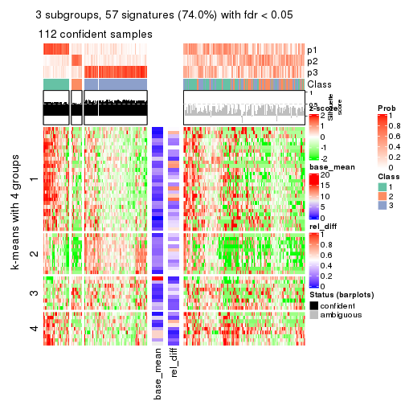</p>

</div>
<div id='tab-MAD-NMF-get-signatures-3'>
<pre><code class="r">get_signatures(res, k = 4)
</code></pre>

<p></p>

</div>
<div id='tab-MAD-NMF-get-signatures-4'>
<pre><code class="r">get_signatures(res, k = 5)
</code></pre>

<p></p>

</div>
<div id='tab-MAD-NMF-get-signatures-5'>
<pre><code class="r">get_signatures(res, k = 6)
</code></pre>

<p></p>

</div>
</div>


Signature heatmaps where rows are not scaled:


<script>
$( function() {
	$( '#tabs-MAD-NMF-get-signatures-no-scale' ).tabs();
} );
</script>
<div id='tabs-MAD-NMF-get-signatures-no-scale'>
<ul>
<li><a href='#tab-MAD-NMF-get-signatures-no-scale-1'>k = 2</a></li>
<li><a href='#tab-MAD-NMF-get-signatures-no-scale-2'>k = 3</a></li>
<li><a href='#tab-MAD-NMF-get-signatures-no-scale-3'>k = 4</a></li>
<li><a href='#tab-MAD-NMF-get-signatures-no-scale-4'>k = 5</a></li>
<li><a href='#tab-MAD-NMF-get-signatures-no-scale-5'>k = 6</a></li>
</ul>
<div id='tab-MAD-NMF-get-signatures-no-scale-1'>
<pre><code class="r">get_signatures(res, k = 2, scale_rows = FALSE)
</code></pre>

<p></p>

</div>
<div id='tab-MAD-NMF-get-signatures-no-scale-2'>
<pre><code class="r">get_signatures(res, k = 3, scale_rows = FALSE)
</code></pre>

<p></p>

</div>
<div id='tab-MAD-NMF-get-signatures-no-scale-3'>
<pre><code class="r">get_signatures(res, k = 4, scale_rows = FALSE)
</code></pre>

<p></p>

</div>
<div id='tab-MAD-NMF-get-signatures-no-scale-4'>
<pre><code class="r">get_signatures(res, k = 5, scale_rows = FALSE)
</code></pre>

<p></p>

</div>
<div id='tab-MAD-NMF-get-signatures-no-scale-5'>
<pre><code class="r">get_signatures(res, k = 6, scale_rows = FALSE)
</code></pre>

<p></p>

</div>
</div>


Compare the overlap of signatures from different k:

```r
compare_signatures(res)
```


`get_signature()` returns a data frame invisibly. TO get the list of signatures, the function
call should be assigned to a variable explicitly. In following code, if `plot` argument is set
to `FALSE`, no heatmap is plotted while only the differential analysis is performed.

```r
# code only for demonstration
tb = get_signature(res, k = ..., plot = FALSE)
```

An example of the output of `tb` is:

```
#>   which_row         fdr    mean_1    mean_2 scaled_mean_1 scaled_mean_2 km
#> 1        38 0.042760348  8.373488  9.131774    -0.5533452     0.5164555  1
#> 2        40 0.018707592  7.106213  8.469186    -0.6173731     0.5762149  1
#> 3        55 0.019134737 10.221463 11.207825    -0.6159697     0.5749050  1
#> 4        59 0.006059896  5.921854  7.869574    -0.6899429     0.6439467  1
#> 5        60 0.018055526  8.928898 10.211722    -0.6204761     0.5791110  1
#> 6        98 0.009384629 15.714769 14.887706     0.6635654    -0.6193277  2
...
```

The columns in `tb` are:

1. `which_row`: row indices corresponding to the input matrix.
2. `fdr`: FDR for the differential test. 
3. `mean_x`: The mean value in group x.
4. `scaled_mean_x`: The mean value in group x after rows are scaled.
5. `km`: Row groups if k-means clustering is applied to rows.


UMAP plot which shows how samples are separated.


<script>
$( function() {
	$( '#tabs-MAD-NMF-dimension-reduction' ).tabs();
} );
</script>
<div id='tabs-MAD-NMF-dimension-reduction'>
<ul>
<li><a href='#tab-MAD-NMF-dimension-reduction-1'>k = 2</a></li>
<li><a href='#tab-MAD-NMF-dimension-reduction-2'>k = 3</a></li>
<li><a href='#tab-MAD-NMF-dimension-reduction-3'>k = 4</a></li>
<li><a href='#tab-MAD-NMF-dimension-reduction-4'>k = 5</a></li>
<li><a href='#tab-MAD-NMF-dimension-reduction-5'>k = 6</a></li>
</ul>
<div id='tab-MAD-NMF-dimension-reduction-1'>
<pre><code class="r">dimension_reduction(res, k = 2, method = &quot;UMAP&quot;)
</code></pre>

<p></p>

</div>
<div id='tab-MAD-NMF-dimension-reduction-2'>
<pre><code class="r">dimension_reduction(res, k = 3, method = &quot;UMAP&quot;)
</code></pre>

<p></p>

</div>
<div id='tab-MAD-NMF-dimension-reduction-3'>
<pre><code class="r">dimension_reduction(res, k = 4, method = &quot;UMAP&quot;)
</code></pre>

<p></p>

</div>
<div id='tab-MAD-NMF-dimension-reduction-4'>
<pre><code class="r">dimension_reduction(res, k = 5, method = &quot;UMAP&quot;)
</code></pre>

<p></p>

</div>
<div id='tab-MAD-NMF-dimension-reduction-5'>
<pre><code class="r">dimension_reduction(res, k = 6, method = &quot;UMAP&quot;)
</code></pre>

<p></p>

</div>
</div>


Following heatmap shows how subgroups are split when increasing `k`:

```r
collect_classes(res)
```


If matrix rows can be associated to genes, consider to use `GO_Enrichment(res,
...)` to perform function enrichment for the signature genes.


 

---------------------------------------------------


### ATC:hclust


The object with results only for a single top-value method and a single partition method 
can be extracted as:

```r
res = res_list["ATC", "hclust"]
# you can also extract it by
# res = res_list["ATC:hclust"]
```

A summary of `res` and all the functions that can be applied to it:

```r
res
```

```
#> A 'ConsensusPartition' object with k = 2, 3, 4, 5, 6.
#>   On a matrix with 77 rows and 243 columns.
#>   Top rows (8, 16, 23, 30, 38) are extracted by 'ATC' method.
#>   Subgroups are detected by 'hclust' method.
#>   Performed in total 1250 partitions by row resampling.
#>   Best k for subgroups seems to be 2.
#> 
#> Following methods can be applied to this 'ConsensusPartition' object:
#>  [1] "cola_report"             "collect_classes"         "collect_plots"          
#>  [4] "collect_stats"           "colnames"                "compare_signatures"     
#>  [7] "consensus_heatmap"       "dimension_reduction"     "functional_enrichment"  
#> [10] "get_anno_col"            "get_anno"                "get_classes"            
#> [13] "get_consensus"           "get_matrix"              "get_membership"         
#> [16] "get_param"               "get_signatures"          "get_stats"              
#> [19] "is_best_k"               "is_stable_k"             "membership_heatmap"     
#> [22] "ncol"                    "nrow"                    "plot_ecdf"              
#> [25] "rownames"                "select_partition_number" "show"                   
#> [28] "suggest_best_k"          "test_to_known_factors"
```

`collect_plots()` function collects all the plots made from `res` for all `k` (number of partitions)
into one single page to provide an easy and fast comparison between different `k`.

```r
collect_plots(res)
```


The plots are:

- The first row: a plot of the ECDF (Empirical cumulative distribution
  function) curves of the consensus matrix for each `k` and the heatmap of
  predicted classes for each `k`.
- The second row: heatmaps of the consensus matrix for each `k`.
- The third row: heatmaps of the membership matrix for each `k`.
- The fouth row: heatmaps of the signatures for each `k`.

All the plots in panels can be made by individual functions and they are
plotted later in this section.

`select_partition_number()` produces several plots showing different
statistics for choosing "optimized" `k`. There are following statistics:

- ECDF curves of the consensus matrix for each `k`;
- 1-PAC. [The PAC
  score](https://en.wikipedia.org/wiki/Consensus_clustering#Over-interpretation_potential_of_consensus_clustering)
  measures the proportion of the ambiguous subgrouping.
- Mean silhouette score.
- Concordance. The mean probability of fiting the consensus class ids in all
  partitions.
- Area increased. Denote $A_k$ as the area under the ECDF curve for current
  `k`, the area increased is defined as $A_k - A_{k-1}$.
- Rand index. The percent of pairs of samples that are both in a same cluster
  or both are not in a same cluster in the partition of k and k-1.
- Jaccard index. The ratio of pairs of samples are both in a same cluster in
  the partition of k and k-1 and the pairs of samples are both in a same
  cluster in the partition k or k-1.

The detailed explanations of these statistics can be found in [the cola
vignette](http://bioconductor.org/packages/devel/bioc/vignettes/cola/inst/doc/cola.html#toc_13).

Generally speaking, lower PAC score, higher mean silhouette score or higher
concordance corresponds to better partition. Rand index and Jaccard index
measure how similar the current partition is compared to partition with `k-1`.
If they are too similar, we won't accept `k` is better than `k-1`.

```r
select_partition_number(res)
```


The numeric values for all these statistics can be obtained by `get_stats()`.

```r
get_stats(res)
```

```
#>   k 1-PAC mean_silhouette concordance area_increased  Rand Jaccard
#> 2 2 0.203           0.695       0.836         0.3624 0.648   0.648
#> 3 3 0.125           0.538       0.754         0.3107 0.885   0.840
#> 4 4 0.143           0.370       0.692         0.1542 0.949   0.926
#> 5 5 0.173           0.263       0.635         0.0922 0.917   0.876
#> 6 6 0.203           0.357       0.606         0.0648 0.863   0.772
```

`suggest_best_k()` suggests the best $k$ based on these statistics. The rules are as follows:

- All $k$ with Jaccard index larger than 0.95 are removed because the increase of
  the partition number does not provides enough extra information. If all $k$ are removed,
  the best $k$ is assigned by `NA`.
- For $k$ with 1-PAC larger than 0.9, the maximal $k$ is taken as the "best k". Other $k$ is called "optional k".
- If it does not fit the second rule. The $k$ with the highest vote of highest
  1-PAC, mean silhouette and concordance is taken as the "best k".

```r
suggest_best_k(res)
```

```
#> [1] 2
```


Following shows the table of the partitions (You need to click the **show/hide
code output** link to see it). The membership matrix (columns with name `p*`)
is inferred by
[`clue::cl_consensus()`](https://www.rdocumentation.org/link/cl_consensus?package=clue)
function with the `SE` method. Basically the value in the membership matrix
represents the probability to belong to a certain group. The finall class
label for an item is determined with the group with highest probability it
belongs to.

In `get_classes()` function, the entropy is calculated from the membership
matrix and the silhouette score is calculated from the consensus matrix.


<script>
$( function() {
	$( '#tabs-ATC-hclust-get-classes' ).tabs();
} );
</script>
<div id='tabs-ATC-hclust-get-classes'>
<ul>
<li><a href='#tab-ATC-hclust-get-classes-1'>k = 2</a></li>
<li><a href='#tab-ATC-hclust-get-classes-2'>k = 3</a></li>
<li><a href='#tab-ATC-hclust-get-classes-3'>k = 4</a></li>
<li><a href='#tab-ATC-hclust-get-classes-4'>k = 5</a></li>
<li><a href='#tab-ATC-hclust-get-classes-5'>k = 6</a></li>
</ul>

<div id='tab-ATC-hclust-get-classes-1'>
<p><a id='tab-ATC-hclust-get-classes-1-a' style='color:#0366d6' href='#'>show/hide code output</a></p>
<pre><code class="r">cbind(get_classes(res, k = 2), get_membership(res, k = 2))
</code></pre>

<pre><code>#&gt;           class entropy silhouette    p1    p2
#&gt; SRR191393     1  0.9933    0.37986 0.548 0.452
#&gt; SRR191394     1  0.6247    0.71320 0.844 0.156
#&gt; SRR191396     2  0.8327    0.65457 0.264 0.736
#&gt; SRR191397     1  0.9977    0.31130 0.528 0.472
#&gt; SRR191398     1  0.5408    0.71913 0.876 0.124
#&gt; SRR191399     2  0.9000    0.56123 0.316 0.684
#&gt; SRR191400     1  0.9248    0.59039 0.660 0.340
#&gt; SRR191401     1  0.9850    0.43724 0.572 0.428
#&gt; SRR191402     2  0.7950    0.70629 0.240 0.760
#&gt; SRR191403     1  0.9732    0.49110 0.596 0.404
#&gt; SRR191404     2  0.5842    0.80734 0.140 0.860
#&gt; SRR191405     2  0.4161    0.83484 0.084 0.916
#&gt; SRR191406     2  0.5408    0.81990 0.124 0.876
#&gt; SRR191407     1  0.9850    0.43870 0.572 0.428
#&gt; SRR191408     2  0.9850    0.16655 0.428 0.572
#&gt; SRR191409     2  0.7453    0.73303 0.212 0.788
#&gt; SRR191410     2  0.5408    0.81512 0.124 0.876
#&gt; SRR191411     2  0.7602    0.72439 0.220 0.780
#&gt; SRR191412     1  0.9754    0.48781 0.592 0.408
#&gt; SRR191413     2  0.9248    0.49511 0.340 0.660
#&gt; SRR191414     1  0.9815    0.45213 0.580 0.420
#&gt; SRR191415     2  0.4562    0.82981 0.096 0.904
#&gt; SRR191416     2  0.6531    0.77755 0.168 0.832
#&gt; SRR191418     2  0.9427    0.45009 0.360 0.640
#&gt; SRR191419     1  0.2778    0.71204 0.952 0.048
#&gt; SRR191420     1  0.9993    0.26431 0.516 0.484
#&gt; SRR191421     1  0.9993    0.26256 0.516 0.484
#&gt; SRR191422     2  0.6801    0.78217 0.180 0.820
#&gt; SRR191423     2  0.4161    0.83990 0.084 0.916
#&gt; SRR191424     2  0.6247    0.77946 0.156 0.844
#&gt; SRR191425     2  0.7453    0.74013 0.212 0.788
#&gt; SRR191426     2  0.1843    0.83623 0.028 0.972
#&gt; SRR191427     2  0.9000    0.53317 0.316 0.684
#&gt; SRR191428     2  0.9044    0.53375 0.320 0.680
#&gt; SRR191429     2  0.1414    0.82488 0.020 0.980
#&gt; SRR191430     2  0.2236    0.83781 0.036 0.964
#&gt; SRR191431     2  0.8207    0.68516 0.256 0.744
#&gt; SRR191432     2  0.1843    0.81794 0.028 0.972
#&gt; SRR191433     2  0.2236    0.82736 0.036 0.964
#&gt; SRR191434     2  0.6887    0.77617 0.184 0.816
#&gt; SRR191435     2  0.6438    0.79563 0.164 0.836
#&gt; SRR191436     2  0.4022    0.84004 0.080 0.920
#&gt; SRR191437     2  0.9909    0.00398 0.444 0.556
#&gt; SRR191438     2  0.3274    0.83924 0.060 0.940
#&gt; SRR191439     2  0.4161    0.83636 0.084 0.916
#&gt; SRR191440     2  0.7602    0.71458 0.220 0.780
#&gt; SRR191441     2  0.3733    0.83894 0.072 0.928
#&gt; SRR191442     2  0.5519    0.81921 0.128 0.872
#&gt; SRR191443     1  0.9970    0.32794 0.532 0.468
#&gt; SRR191444     2  0.9044    0.53915 0.320 0.680
#&gt; SRR191445     2  0.5408    0.82672 0.124 0.876
#&gt; SRR191446     2  0.3431    0.83182 0.064 0.936
#&gt; SRR191447     2  0.6712    0.77037 0.176 0.824
#&gt; SRR191448     1  0.4431    0.71769 0.908 0.092
#&gt; SRR191449     2  0.2778    0.83739 0.048 0.952
#&gt; SRR191450     1  0.5408    0.71878 0.876 0.124
#&gt; SRR191451     2  0.9732    0.23018 0.404 0.596
#&gt; SRR191452     2  0.6438    0.79594 0.164 0.836
#&gt; SRR191453     2  0.9996   -0.15056 0.488 0.512
#&gt; SRR191454     2  0.8861    0.56789 0.304 0.696
#&gt; SRR191455     2  0.6801    0.77479 0.180 0.820
#&gt; SRR191456     2  0.9732    0.24530 0.404 0.596
#&gt; SRR191457     1  0.4161    0.71860 0.916 0.084
#&gt; SRR191458     2  0.9795    0.19658 0.416 0.584
#&gt; SRR191459     2  0.1414    0.83120 0.020 0.980
#&gt; SRR191460     2  0.6801    0.78612 0.180 0.820
#&gt; SRR191461     2  0.4562    0.83263 0.096 0.904
#&gt; SRR191462     2  0.6438    0.78925 0.164 0.836
#&gt; SRR191463     2  0.3584    0.84027 0.068 0.932
#&gt; SRR191464     2  0.1184    0.83114 0.016 0.984
#&gt; SRR191465     2  0.1414    0.83026 0.020 0.980
#&gt; SRR191466     2  0.4298    0.83852 0.088 0.912
#&gt; SRR191467     2  0.3274    0.81963 0.060 0.940
#&gt; SRR191468     2  0.2043    0.82041 0.032 0.968
#&gt; SRR191469     2  0.5294    0.81838 0.120 0.880
#&gt; SRR191470     2  0.1633    0.82660 0.024 0.976
#&gt; SRR191471     2  0.3431    0.83328 0.064 0.936
#&gt; SRR191472     2  0.3114    0.83812 0.056 0.944
#&gt; SRR191473     2  0.1843    0.83128 0.028 0.972
#&gt; SRR191474     2  0.2043    0.83813 0.032 0.968
#&gt; SRR191475     2  0.2423    0.82493 0.040 0.960
#&gt; SRR191476     2  0.2603    0.81678 0.044 0.956
#&gt; SRR191477     2  0.0938    0.82985 0.012 0.988
#&gt; SRR191478     2  0.1414    0.82867 0.020 0.980
#&gt; SRR191479     1  0.9954    0.35340 0.540 0.460
#&gt; SRR191480     2  0.2236    0.81419 0.036 0.964
#&gt; SRR191481     2  0.1843    0.82228 0.028 0.972
#&gt; SRR191482     2  0.1633    0.81924 0.024 0.976
#&gt; SRR191483     2  0.1843    0.82767 0.028 0.972
#&gt; SRR191484     1  0.7528    0.68651 0.784 0.216
#&gt; SRR191485     2  0.1184    0.83182 0.016 0.984
#&gt; SRR191486     2  0.8909    0.55417 0.308 0.692
#&gt; SRR191487     2  0.2423    0.82949 0.040 0.960
#&gt; SRR191488     1  0.9286    0.58300 0.656 0.344
#&gt; SRR191489     2  0.9996   -0.16839 0.488 0.512
#&gt; SRR191490     2  1.0000   -0.20702 0.496 0.504
#&gt; SRR191491     2  0.7815    0.69635 0.232 0.768
#&gt; SRR191492     2  0.4690    0.82449 0.100 0.900
#&gt; SRR191493     1  0.9491    0.54890 0.632 0.368
#&gt; SRR191494     2  0.5737    0.80724 0.136 0.864
#&gt; SRR191495     2  0.5737    0.81143 0.136 0.864
#&gt; SRR191496     2  0.4562    0.83162 0.096 0.904
#&gt; SRR191497     2  0.5946    0.81809 0.144 0.856
#&gt; SRR191498     2  0.9933    0.05402 0.452 0.548
#&gt; SRR191499     2  0.4815    0.83427 0.104 0.896
#&gt; SRR191500     2  0.6247    0.79509 0.156 0.844
#&gt; SRR191501     2  0.9427    0.41341 0.360 0.640
#&gt; SRR191502     2  0.2948    0.84070 0.052 0.948
#&gt; SRR191503     2  0.2778    0.82242 0.048 0.952
#&gt; SRR191504     2  0.2423    0.82784 0.040 0.960
#&gt; SRR191505     2  0.2423    0.81191 0.040 0.960
#&gt; SRR191506     2  0.6343    0.79023 0.160 0.840
#&gt; SRR191507     2  0.2778    0.82288 0.048 0.952
#&gt; SRR191508     2  0.2778    0.83679 0.048 0.952
#&gt; SRR191509     2  0.2603    0.83594 0.044 0.956
#&gt; SRR191510     2  0.5629    0.82388 0.132 0.868
#&gt; SRR191511     2  0.3114    0.83925 0.056 0.944
#&gt; SRR191512     2  0.2603    0.80954 0.044 0.956
#&gt; SRR191513     2  0.2948    0.82029 0.052 0.948
#&gt; SRR191514     2  0.1633    0.82389 0.024 0.976
#&gt; SRR191515     2  0.2603    0.82068 0.044 0.956
#&gt; SRR191516     2  0.4431    0.83662 0.092 0.908
#&gt; SRR191517     2  0.1843    0.81794 0.028 0.972
#&gt; SRR191518     2  0.1843    0.82966 0.028 0.972
#&gt; SRR191519     2  0.2236    0.81823 0.036 0.964
#&gt; SRR191520     2  0.3431    0.83645 0.064 0.936
#&gt; SRR191521     2  0.2236    0.82302 0.036 0.964
#&gt; SRR191522     2  0.1414    0.82519 0.020 0.980
#&gt; SRR191523     2  0.4562    0.83361 0.096 0.904
#&gt; SRR191524     2  0.7950    0.69303 0.240 0.760
#&gt; SRR191525     2  0.4161    0.83603 0.084 0.916
#&gt; SRR191526     2  0.3431    0.83867 0.064 0.936
#&gt; SRR191527     1  0.6438    0.71185 0.836 0.164
#&gt; SRR191528     1  0.8813    0.63041 0.700 0.300
#&gt; SRR191529     2  0.9522    0.39385 0.372 0.628
#&gt; SRR191530     2  0.2423    0.82044 0.040 0.960
#&gt; SRR191531     1  0.9933    0.40257 0.548 0.452
#&gt; SRR191532     2  0.3584    0.83930 0.068 0.932
#&gt; SRR191533     2  0.4939    0.82929 0.108 0.892
#&gt; SRR191534     2  0.3431    0.83070 0.064 0.936
#&gt; SRR191535     2  0.2778    0.83474 0.048 0.952
#&gt; SRR191536     2  0.3733    0.83568 0.072 0.928
#&gt; SRR191537     2  0.2778    0.82513 0.048 0.952
#&gt; SRR191538     2  0.1843    0.82169 0.028 0.972
#&gt; SRR191539     2  0.3879    0.83676 0.076 0.924
#&gt; SRR191540     2  0.2236    0.81419 0.036 0.964
#&gt; SRR191541     2  0.2043    0.81584 0.032 0.968
#&gt; SRR191542     2  0.3879    0.83655 0.076 0.924
#&gt; SRR191543     2  0.2778    0.83289 0.048 0.952
#&gt; SRR191544     2  0.2236    0.81419 0.036 0.964
#&gt; SRR191545     2  0.2236    0.81482 0.036 0.964
#&gt; SRR191546     2  0.2778    0.83136 0.048 0.952
#&gt; SRR191547     2  0.4022    0.83972 0.080 0.920
#&gt; SRR191548     1  0.2603    0.71008 0.956 0.044
#&gt; SRR191549     1  0.2603    0.71008 0.956 0.044
#&gt; SRR191550     1  0.2603    0.71008 0.956 0.044
#&gt; SRR191551     1  0.2948    0.71352 0.948 0.052
#&gt; SRR191552     1  0.2603    0.71008 0.956 0.044
#&gt; SRR191553     1  0.2603    0.71008 0.956 0.044
#&gt; SRR191554     1  0.2603    0.71008 0.956 0.044
#&gt; SRR191555     1  0.8608    0.64426 0.716 0.284
#&gt; SRR191556     2  0.8386    0.66030 0.268 0.732
#&gt; SRR191557     2  0.3733    0.83899 0.072 0.928
#&gt; SRR191558     2  0.8207    0.67515 0.256 0.744
#&gt; SRR191559     2  0.6438    0.78474 0.164 0.836
#&gt; SRR191560     2  0.7219    0.74230 0.200 0.800
#&gt; SRR191561     1  0.2603    0.71008 0.956 0.044
#&gt; SRR191562     2  0.9977   -0.05899 0.472 0.528
#&gt; SRR191563     2  0.2948    0.83544 0.052 0.948
#&gt; SRR191564     2  0.5519    0.82080 0.128 0.872
#&gt; SRR191565     2  0.9286    0.46794 0.344 0.656
#&gt; SRR191566     2  0.8327    0.65627 0.264 0.736
#&gt; SRR191567     1  0.9248    0.59010 0.660 0.340
#&gt; SRR191568     1  0.9933    0.36827 0.548 0.452
#&gt; SRR191569     2  0.7745    0.70816 0.228 0.772
#&gt; SRR191570     2  0.9850    0.15650 0.428 0.572
#&gt; SRR191571     2  0.7299    0.75632 0.204 0.796
#&gt; SRR191572     1  0.2603    0.71008 0.956 0.044
#&gt; SRR191573     2  0.8813    0.60154 0.300 0.700
#&gt; SRR191574     1  0.9393    0.56909 0.644 0.356
#&gt; SRR191575     1  0.9775    0.47353 0.588 0.412
#&gt; SRR191576     2  0.8909    0.56092 0.308 0.692
#&gt; SRR191577     2  0.9491    0.43254 0.368 0.632
#&gt; SRR191578     2  0.6531    0.78471 0.168 0.832
#&gt; SRR191579     1  0.2603    0.71008 0.956 0.044
#&gt; SRR191580     1  0.2778    0.71043 0.952 0.048
#&gt; SRR191581     1  0.2948    0.71342 0.948 0.052
#&gt; SRR191582     1  0.3114    0.71450 0.944 0.056
#&gt; SRR191583     1  0.9996    0.22446 0.512 0.488
#&gt; SRR191584     1  0.2603    0.71008 0.956 0.044
#&gt; SRR191585     2  0.2236    0.83602 0.036 0.964
#&gt; SRR191586     2  0.2043    0.83727 0.032 0.968
#&gt; SRR191587     2  0.5842    0.80492 0.140 0.860
#&gt; SRR191588     1  0.9988    0.28911 0.520 0.480
#&gt; SRR191589     2  0.8608    0.63232 0.284 0.716
#&gt; SRR191590     1  0.9993    0.29377 0.516 0.484
#&gt; SRR191591     2  0.4431    0.82776 0.092 0.908
#&gt; SRR191592     2  0.6048    0.79921 0.148 0.852
#&gt; SRR191593     2  0.7139    0.75272 0.196 0.804
#&gt; SRR191594     1  0.3274    0.71508 0.940 0.060
#&gt; SRR191595     2  0.7674    0.70874 0.224 0.776
#&gt; SRR191596     2  0.9996   -0.19047 0.488 0.512
#&gt; SRR191597     2  0.2043    0.83579 0.032 0.968
#&gt; SRR191598     2  0.9552    0.34441 0.376 0.624
#&gt; SRR191599     1  0.9988    0.30862 0.520 0.480
#&gt; SRR191600     2  0.2948    0.83553 0.052 0.948
#&gt; SRR191601     2  0.4939    0.82571 0.108 0.892
#&gt; SRR191602     2  0.4939    0.81916 0.108 0.892
#&gt; SRR191603     2  0.3879    0.83304 0.076 0.924
#&gt; SRR191604     2  0.1633    0.83460 0.024 0.976
#&gt; SRR191605     2  0.5178    0.82188 0.116 0.884
#&gt; SRR191606     1  0.9993    0.29209 0.516 0.484
#&gt; SRR191607     2  0.4022    0.82997 0.080 0.920
#&gt; SRR191608     2  0.2423    0.82351 0.040 0.960
#&gt; SRR191609     2  0.2948    0.83355 0.052 0.948
#&gt; SRR191610     2  0.5842    0.80114 0.140 0.860
#&gt; SRR191611     2  0.2423    0.83717 0.040 0.960
#&gt; SRR191612     2  0.5737    0.80489 0.136 0.864
#&gt; SRR191613     1  0.7528    0.69501 0.784 0.216
#&gt; SRR191614     2  0.5408    0.82122 0.124 0.876
#&gt; SRR191615     2  0.7299    0.74458 0.204 0.796
#&gt; SRR191616     1  0.5737    0.71495 0.864 0.136
#&gt; SRR191617     2  0.6712    0.77505 0.176 0.824
#&gt; SRR191618     2  0.8499    0.63364 0.276 0.724
#&gt; SRR191619     2  0.0938    0.83146 0.012 0.988
#&gt; SRR191620     2  0.2043    0.83741 0.032 0.968
#&gt; SRR191621     2  0.1843    0.83497 0.028 0.972
#&gt; SRR191622     2  0.4022    0.83363 0.080 0.920
#&gt; SRR191623     2  0.4431    0.83015 0.092 0.908
#&gt; SRR191624     1  0.9909    0.39201 0.556 0.444
#&gt; SRR191625     2  0.1633    0.83296 0.024 0.976
#&gt; SRR191626     2  0.1633    0.83249 0.024 0.976
#&gt; SRR191627     2  0.1414    0.82859 0.020 0.980
#&gt; SRR191628     2  0.5842    0.80667 0.140 0.860
#&gt; SRR191629     2  0.3274    0.83682 0.060 0.940
#&gt; SRR191630     1  0.3274    0.71508 0.940 0.060
#&gt; SRR191631     2  0.2236    0.82762 0.036 0.964
#&gt; SRR191632     2  0.6712    0.79204 0.176 0.824
#&gt; SRR191633     2  0.4939    0.82841 0.108 0.892
#&gt; SRR191634     1  0.6531    0.70736 0.832 0.168
#&gt; SRR191635     2  0.4298    0.83619 0.088 0.912
#&gt; SRR191636     1  0.7299    0.68881 0.796 0.204
#&gt; SRR191637     2  0.5519    0.76377 0.128 0.872
</code></pre>

<script>
$('#tab-ATC-hclust-get-classes-1-a').parent().next().next().hide();
$('#tab-ATC-hclust-get-classes-1-a').click(function(){
  $('#tab-ATC-hclust-get-classes-1-a').parent().next().next().toggle();
  return(false);
});
</script>
</div>

<div id='tab-ATC-hclust-get-classes-2'>
<p><a id='tab-ATC-hclust-get-classes-2-a' style='color:#0366d6' href='#'>show/hide code output</a></p>
<pre><code class="r">cbind(get_classes(res, k = 3), get_membership(res, k = 3))
</code></pre>

<pre><code>#&gt;           class entropy silhouette    p1    p2    p3
#&gt; SRR191393     3  0.9071   -0.05471 0.432 0.136 0.432
#&gt; SRR191394     1  0.5875    0.48174 0.792 0.072 0.136
#&gt; SRR191396     3  0.6962    0.61455 0.184 0.092 0.724
#&gt; SRR191397     3  0.9181    0.05213 0.404 0.148 0.448
#&gt; SRR191398     1  0.4505    0.52777 0.860 0.048 0.092
#&gt; SRR191399     3  0.7960    0.54032 0.208 0.136 0.656
#&gt; SRR191400     1  0.8752    0.24686 0.548 0.132 0.320
#&gt; SRR191401     1  0.9202    0.14882 0.460 0.152 0.388
#&gt; SRR191402     3  0.7211    0.61972 0.156 0.128 0.716
#&gt; SRR191403     1  0.8975    0.17099 0.484 0.132 0.384
#&gt; SRR191404     3  0.4665    0.71298 0.100 0.048 0.852
#&gt; SRR191405     3  0.3472    0.71656 0.040 0.056 0.904
#&gt; SRR191406     3  0.5393    0.70675 0.072 0.108 0.820
#&gt; SRR191407     1  0.9264    0.09069 0.432 0.156 0.412
#&gt; SRR191408     3  0.8814    0.35239 0.312 0.140 0.548
#&gt; SRR191409     3  0.6511    0.64729 0.136 0.104 0.760
#&gt; SRR191410     3  0.4709    0.71476 0.092 0.056 0.852
#&gt; SRR191411     3  0.6380    0.65117 0.164 0.076 0.760
#&gt; SRR191412     1  0.9030    0.15709 0.476 0.136 0.388
#&gt; SRR191413     3  0.8094    0.51054 0.240 0.124 0.636
#&gt; SRR191414     1  0.9425    0.13132 0.432 0.176 0.392
#&gt; SRR191415     3  0.4288    0.72015 0.060 0.068 0.872
#&gt; SRR191416     3  0.6023    0.67703 0.120 0.092 0.788
#&gt; SRR191418     3  0.8221    0.49141 0.248 0.128 0.624
#&gt; SRR191419     1  0.0592    0.56035 0.988 0.000 0.012
#&gt; SRR191420     3  0.9202    0.07713 0.388 0.152 0.460
#&gt; SRR191421     3  0.9280    0.06286 0.388 0.160 0.452
#&gt; SRR191422     3  0.6500    0.68197 0.100 0.140 0.760
#&gt; SRR191423     3  0.3967    0.72653 0.044 0.072 0.884
#&gt; SRR191424     3  0.7801    0.30356 0.076 0.308 0.616
#&gt; SRR191425     3  0.6792    0.64613 0.132 0.124 0.744
#&gt; SRR191426     3  0.3043    0.70993 0.008 0.084 0.908
#&gt; SRR191427     3  0.8444    0.44953 0.236 0.152 0.612
#&gt; SRR191428     3  0.8081    0.51202 0.220 0.136 0.644
#&gt; SRR191429     3  0.3116    0.68702 0.000 0.108 0.892
#&gt; SRR191430     3  0.3532    0.70927 0.008 0.108 0.884
#&gt; SRR191431     3  0.7245    0.62390 0.168 0.120 0.712
#&gt; SRR191432     3  0.3551    0.67120 0.000 0.132 0.868
#&gt; SRR191433     3  0.3686    0.68086 0.000 0.140 0.860
#&gt; SRR191434     3  0.7108    0.61067 0.100 0.184 0.716
#&gt; SRR191435     3  0.5737    0.69680 0.092 0.104 0.804
#&gt; SRR191436     3  0.3583    0.72447 0.044 0.056 0.900
#&gt; SRR191437     1  0.9980   -0.31021 0.356 0.304 0.340
#&gt; SRR191438     3  0.3649    0.72104 0.036 0.068 0.896
#&gt; SRR191439     3  0.4859    0.71664 0.044 0.116 0.840
#&gt; SRR191440     3  0.8955   -0.01525 0.144 0.332 0.524
#&gt; SRR191441     3  0.4485    0.71484 0.020 0.136 0.844
#&gt; SRR191442     3  0.4709    0.71348 0.056 0.092 0.852
#&gt; SRR191443     3  0.9189   -0.00880 0.416 0.148 0.436
#&gt; SRR191444     3  0.8246    0.50947 0.220 0.148 0.632
#&gt; SRR191445     3  0.5094    0.71825 0.056 0.112 0.832
#&gt; SRR191446     3  0.5858    0.58791 0.020 0.240 0.740
#&gt; SRR191447     3  0.6455    0.67486 0.128 0.108 0.764
#&gt; SRR191448     1  0.2918    0.55419 0.924 0.032 0.044
#&gt; SRR191449     3  0.2982    0.71743 0.024 0.056 0.920
#&gt; SRR191450     1  0.6128    0.49786 0.780 0.136 0.084
#&gt; SRR191451     3  0.8872    0.33543 0.296 0.152 0.552
#&gt; SRR191452     3  0.5889    0.70228 0.096 0.108 0.796
#&gt; SRR191453     3  0.9154    0.12711 0.384 0.148 0.468
#&gt; SRR191454     3  0.8250    0.49154 0.232 0.140 0.628
#&gt; SRR191455     3  0.6462    0.67878 0.116 0.120 0.764
#&gt; SRR191456     3  0.8918    0.34256 0.288 0.160 0.552
#&gt; SRR191457     1  0.3039    0.55671 0.920 0.036 0.044
#&gt; SRR191458     3  0.9089    0.29900 0.288 0.176 0.536
#&gt; SRR191459     3  0.2625    0.70774 0.000 0.084 0.916
#&gt; SRR191460     3  0.6037    0.68939 0.100 0.112 0.788
#&gt; SRR191461     3  0.4146    0.72282 0.044 0.080 0.876
#&gt; SRR191462     3  0.6794    0.62435 0.076 0.196 0.728
#&gt; SRR191463     3  0.4056    0.72150 0.032 0.092 0.876
#&gt; SRR191464     3  0.1989    0.69932 0.004 0.048 0.948
#&gt; SRR191465     3  0.3112    0.69673 0.004 0.096 0.900
#&gt; SRR191466     3  0.4249    0.72102 0.028 0.108 0.864
#&gt; SRR191467     3  0.5754    0.51227 0.004 0.296 0.700
#&gt; SRR191468     3  0.5327    0.54157 0.000 0.272 0.728
#&gt; SRR191469     3  0.5344    0.70823 0.084 0.092 0.824
#&gt; SRR191470     3  0.3879    0.67888 0.000 0.152 0.848
#&gt; SRR191471     3  0.4618    0.70111 0.024 0.136 0.840
#&gt; SRR191472     3  0.5111    0.69262 0.024 0.168 0.808
#&gt; SRR191473     3  0.2796    0.69918 0.000 0.092 0.908
#&gt; SRR191474     3  0.3183    0.71488 0.016 0.076 0.908
#&gt; SRR191475     3  0.5420    0.58264 0.008 0.240 0.752
#&gt; SRR191476     3  0.5815    0.48370 0.004 0.304 0.692
#&gt; SRR191477     3  0.2261    0.69477 0.000 0.068 0.932
#&gt; SRR191478     3  0.2590    0.69773 0.004 0.072 0.924
#&gt; SRR191479     3  0.9370   -0.05032 0.412 0.168 0.420
#&gt; SRR191480     3  0.5138    0.57296 0.000 0.252 0.748
#&gt; SRR191481     3  0.3193    0.68292 0.004 0.100 0.896
#&gt; SRR191482     3  0.3192    0.67727 0.000 0.112 0.888
#&gt; SRR191483     3  0.3112    0.69720 0.004 0.096 0.900
#&gt; SRR191484     1  0.7222    0.37795 0.696 0.220 0.084
#&gt; SRR191485     3  0.3030    0.70604 0.004 0.092 0.904
#&gt; SRR191486     3  0.8162    0.52313 0.192 0.164 0.644
#&gt; SRR191487     3  0.5378    0.59556 0.008 0.236 0.756
#&gt; SRR191488     1  0.8982    0.17266 0.548 0.168 0.284
#&gt; SRR191489     3  0.9328    0.15700 0.356 0.172 0.472
#&gt; SRR191490     1  0.9837   -0.24977 0.424 0.292 0.284
#&gt; SRR191491     3  0.7396    0.59360 0.144 0.152 0.704
#&gt; SRR191492     3  0.6245    0.64114 0.060 0.180 0.760
#&gt; SRR191493     1  0.8868    0.11974 0.568 0.172 0.260
#&gt; SRR191494     3  0.5608    0.69025 0.072 0.120 0.808
#&gt; SRR191495     3  0.5793    0.69630 0.084 0.116 0.800
#&gt; SRR191496     3  0.6201    0.63668 0.044 0.208 0.748
#&gt; SRR191497     3  0.6023    0.71002 0.092 0.120 0.788
#&gt; SRR191498     3  0.9338   -0.05584 0.360 0.172 0.468
#&gt; SRR191499     3  0.4281    0.72417 0.056 0.072 0.872
#&gt; SRR191500     3  0.5576    0.70432 0.104 0.084 0.812
#&gt; SRR191501     3  0.9767   -0.39748 0.232 0.364 0.404
#&gt; SRR191502     3  0.4094    0.71952 0.028 0.100 0.872
#&gt; SRR191503     3  0.5327    0.53910 0.000 0.272 0.728
#&gt; SRR191504     3  0.4796    0.60894 0.000 0.220 0.780
#&gt; SRR191505     3  0.5431    0.51980 0.000 0.284 0.716
#&gt; SRR191506     3  0.7157    0.57965 0.100 0.188 0.712
#&gt; SRR191507     3  0.5760    0.44563 0.000 0.328 0.672
#&gt; SRR191508     3  0.5115    0.66545 0.016 0.188 0.796
#&gt; SRR191509     3  0.4056    0.69942 0.032 0.092 0.876
#&gt; SRR191510     3  0.5375    0.71942 0.056 0.128 0.816
#&gt; SRR191511     3  0.4209    0.71167 0.016 0.128 0.856
#&gt; SRR191512     3  0.5835    0.40524 0.000 0.340 0.660
#&gt; SRR191513     3  0.5902    0.47767 0.004 0.316 0.680
#&gt; SRR191514     3  0.4346    0.67649 0.000 0.184 0.816
#&gt; SRR191515     3  0.5024    0.63368 0.004 0.220 0.776
#&gt; SRR191516     3  0.6247    0.62332 0.044 0.212 0.744
#&gt; SRR191517     3  0.3752    0.66480 0.000 0.144 0.856
#&gt; SRR191518     3  0.2878    0.69466 0.000 0.096 0.904
#&gt; SRR191519     3  0.4235    0.65414 0.000 0.176 0.824
#&gt; SRR191520     3  0.6264    0.58274 0.032 0.244 0.724
#&gt; SRR191521     3  0.4605    0.64280 0.000 0.204 0.796
#&gt; SRR191522     3  0.3192    0.69609 0.000 0.112 0.888
#&gt; SRR191523     3  0.5318    0.67755 0.016 0.204 0.780
#&gt; SRR191524     3  0.7825    0.56169 0.172 0.156 0.672
#&gt; SRR191525     3  0.5298    0.69494 0.032 0.164 0.804
#&gt; SRR191526     3  0.5414    0.64504 0.016 0.212 0.772
#&gt; SRR191527     1  0.5377    0.49949 0.820 0.068 0.112
#&gt; SRR191528     1  0.8221    0.26967 0.624 0.128 0.248
#&gt; SRR191529     2  0.9574    0.14346 0.196 0.412 0.392
#&gt; SRR191530     3  0.5098    0.57394 0.000 0.248 0.752
#&gt; SRR191531     1  0.8876    0.00993 0.468 0.120 0.412
#&gt; SRR191532     3  0.5826    0.65488 0.032 0.204 0.764
#&gt; SRR191533     3  0.6292    0.63280 0.044 0.216 0.740
#&gt; SRR191534     3  0.5956    0.46758 0.004 0.324 0.672
#&gt; SRR191535     3  0.3459    0.70473 0.012 0.096 0.892
#&gt; SRR191536     3  0.6396    0.46664 0.016 0.320 0.664
#&gt; SRR191537     3  0.5690    0.52425 0.004 0.288 0.708
#&gt; SRR191538     3  0.4887    0.58606 0.000 0.228 0.772
#&gt; SRR191539     3  0.5315    0.66897 0.012 0.216 0.772
#&gt; SRR191540     3  0.5291    0.55577 0.000 0.268 0.732
#&gt; SRR191541     3  0.4178    0.65476 0.000 0.172 0.828
#&gt; SRR191542     3  0.4995    0.70108 0.032 0.144 0.824
#&gt; SRR191543     3  0.4692    0.68156 0.012 0.168 0.820
#&gt; SRR191544     3  0.5098    0.56556 0.000 0.248 0.752
#&gt; SRR191545     3  0.4605    0.63184 0.000 0.204 0.796
#&gt; SRR191546     3  0.4068    0.70039 0.016 0.120 0.864
#&gt; SRR191547     3  0.4209    0.71496 0.016 0.128 0.856
#&gt; SRR191548     1  0.0237    0.55660 0.996 0.000 0.004
#&gt; SRR191549     1  0.0237    0.55660 0.996 0.000 0.004
#&gt; SRR191550     1  0.0237    0.55660 0.996 0.000 0.004
#&gt; SRR191551     1  0.0829    0.56078 0.984 0.004 0.012
#&gt; SRR191552     1  0.0237    0.55660 0.996 0.000 0.004
#&gt; SRR191553     1  0.0237    0.55660 0.996 0.000 0.004
#&gt; SRR191554     1  0.0237    0.55660 0.996 0.000 0.004
#&gt; SRR191555     1  0.8357    0.26160 0.620 0.148 0.232
#&gt; SRR191556     3  0.7441    0.60231 0.164 0.136 0.700
#&gt; SRR191557     3  0.4056    0.71758 0.032 0.092 0.876
#&gt; SRR191558     3  0.7202    0.62435 0.160 0.124 0.716
#&gt; SRR191559     3  0.5815    0.67825 0.104 0.096 0.800
#&gt; SRR191560     3  0.6455    0.64827 0.128 0.108 0.764
#&gt; SRR191561     1  0.0237    0.55660 0.996 0.000 0.004
#&gt; SRR191562     3  0.9268    0.21845 0.336 0.172 0.492
#&gt; SRR191563     3  0.3370    0.71306 0.024 0.072 0.904
#&gt; SRR191564     3  0.4836    0.72047 0.072 0.080 0.848
#&gt; SRR191565     3  0.8175    0.50282 0.236 0.132 0.632
#&gt; SRR191566     3  0.7505    0.59180 0.160 0.144 0.696
#&gt; SRR191567     1  0.8752    0.24718 0.548 0.132 0.320
#&gt; SRR191568     3  0.9229   -0.04300 0.420 0.152 0.428
#&gt; SRR191569     3  0.6949    0.62990 0.156 0.112 0.732
#&gt; SRR191570     3  0.8863    0.35050 0.312 0.144 0.544
#&gt; SRR191571     3  0.6222    0.67855 0.132 0.092 0.776
#&gt; SRR191572     1  0.0237    0.55660 0.996 0.000 0.004
#&gt; SRR191573     3  0.7830    0.55863 0.196 0.136 0.668
#&gt; SRR191574     1  0.8841    0.21889 0.528 0.132 0.340
#&gt; SRR191575     1  0.9213    0.15025 0.452 0.152 0.396
#&gt; SRR191576     3  0.8030    0.53588 0.204 0.144 0.652
#&gt; SRR191577     3  0.8637    0.44495 0.260 0.152 0.588
#&gt; SRR191578     3  0.7059    0.56058 0.092 0.192 0.716
#&gt; SRR191579     1  0.0237    0.55660 0.996 0.000 0.004
#&gt; SRR191580     1  0.0661    0.55662 0.988 0.004 0.008
#&gt; SRR191581     1  0.0829    0.56059 0.984 0.004 0.012
#&gt; SRR191582     1  0.1129    0.56169 0.976 0.004 0.020
#&gt; SRR191583     2  0.9144    0.02017 0.408 0.448 0.144
#&gt; SRR191584     1  0.0237    0.55660 0.996 0.000 0.004
#&gt; SRR191585     3  0.3193    0.71097 0.004 0.100 0.896
#&gt; SRR191586     3  0.3454    0.70831 0.008 0.104 0.888
#&gt; SRR191587     3  0.5253    0.69847 0.096 0.076 0.828
#&gt; SRR191588     3  0.9161    0.10267 0.388 0.148 0.464
#&gt; SRR191589     3  0.7739    0.57060 0.188 0.136 0.676
#&gt; SRR191590     3  0.9241    0.08410 0.388 0.156 0.456
#&gt; SRR191591     3  0.4379    0.71668 0.060 0.072 0.868
#&gt; SRR191592     3  0.5344    0.70709 0.092 0.084 0.824
#&gt; SRR191593     3  0.6208    0.67622 0.136 0.088 0.776
#&gt; SRR191594     1  0.2443    0.55656 0.940 0.028 0.032
#&gt; SRR191595     3  0.6968    0.62565 0.148 0.120 0.732
#&gt; SRR191596     3  0.9213    0.18293 0.356 0.160 0.484
#&gt; SRR191597     3  0.3293    0.70436 0.012 0.088 0.900
#&gt; SRR191598     3  0.8291    0.43758 0.280 0.116 0.604
#&gt; SRR191599     3  0.9311    0.06605 0.384 0.164 0.452
#&gt; SRR191600     3  0.3310    0.71264 0.028 0.064 0.908
#&gt; SRR191601     3  0.4925    0.71198 0.076 0.080 0.844
#&gt; SRR191602     3  0.4925    0.70953 0.080 0.076 0.844
#&gt; SRR191603     3  0.3993    0.72018 0.052 0.064 0.884
#&gt; SRR191604     3  0.2866    0.70944 0.008 0.076 0.916
#&gt; SRR191605     3  0.5179    0.70870 0.080 0.088 0.832
#&gt; SRR191606     3  0.9305    0.07168 0.380 0.164 0.456
#&gt; SRR191607     3  0.4964    0.69559 0.048 0.116 0.836
#&gt; SRR191608     3  0.5325    0.58138 0.004 0.248 0.748
#&gt; SRR191609     3  0.4413    0.70116 0.024 0.124 0.852
#&gt; SRR191610     3  0.6168    0.66871 0.096 0.124 0.780
#&gt; SRR191611     3  0.3120    0.71442 0.012 0.080 0.908
#&gt; SRR191612     3  0.5346    0.69675 0.088 0.088 0.824
#&gt; SRR191613     1  0.6463    0.43242 0.756 0.080 0.164
#&gt; SRR191614     3  0.4838    0.71910 0.076 0.076 0.848
#&gt; SRR191615     3  0.6448    0.65236 0.132 0.104 0.764
#&gt; SRR191616     1  0.4569    0.52303 0.860 0.068 0.072
#&gt; SRR191617     3  0.7317    0.54337 0.096 0.208 0.696
#&gt; SRR191618     3  0.8693    0.36275 0.176 0.232 0.592
#&gt; SRR191619     3  0.2772    0.70094 0.004 0.080 0.916
#&gt; SRR191620     3  0.3375    0.71189 0.008 0.100 0.892
#&gt; SRR191621     3  0.2774    0.70416 0.008 0.072 0.920
#&gt; SRR191622     3  0.3888    0.71851 0.048 0.064 0.888
#&gt; SRR191623     3  0.4097    0.71701 0.060 0.060 0.880
#&gt; SRR191624     1  0.9494    0.07363 0.412 0.184 0.404
#&gt; SRR191625     3  0.2866    0.70219 0.008 0.076 0.916
#&gt; SRR191626     3  0.2878    0.69831 0.000 0.096 0.904
#&gt; SRR191627     3  0.3482    0.68794 0.000 0.128 0.872
#&gt; SRR191628     3  0.5961    0.69328 0.096 0.112 0.792
#&gt; SRR191629     3  0.3356    0.71745 0.036 0.056 0.908
#&gt; SRR191630     1  0.2443    0.55656 0.940 0.028 0.032
#&gt; SRR191631     3  0.3752    0.67834 0.000 0.144 0.856
#&gt; SRR191632     3  0.5889    0.69967 0.108 0.096 0.796
#&gt; SRR191633     3  0.5407    0.71512 0.076 0.104 0.820
#&gt; SRR191634     1  0.5307    0.46631 0.816 0.136 0.048
#&gt; SRR191635     3  0.4458    0.72394 0.056 0.080 0.864
#&gt; SRR191636     1  0.6098    0.40357 0.768 0.176 0.056
#&gt; SRR191637     2  0.7580    0.40613 0.056 0.604 0.340
</code></pre>

<script>
$('#tab-ATC-hclust-get-classes-2-a').parent().next().next().hide();
$('#tab-ATC-hclust-get-classes-2-a').click(function(){
  $('#tab-ATC-hclust-get-classes-2-a').parent().next().next().toggle();
  return(false);
});
</script>
</div>

<div id='tab-ATC-hclust-get-classes-3'>
<p><a id='tab-ATC-hclust-get-classes-3-a' style='color:#0366d6' href='#'>show/hide code output</a></p>
<pre><code class="r">cbind(get_classes(res, k = 4), get_membership(res, k = 4))
</code></pre>

<pre><code>#&gt;           class entropy silhouette    p1    p2    p3    p4
#&gt; SRR191393     3  0.8069    0.05397 0.348 0.248 0.396 0.008
#&gt; SRR191394     1  0.5473    0.46829 0.744 0.152 0.100 0.004
#&gt; SRR191396     3  0.6164    0.51560 0.140 0.144 0.704 0.012
#&gt; SRR191397     3  0.7934    0.14209 0.328 0.252 0.416 0.004
#&gt; SRR191398     1  0.4077    0.52196 0.840 0.088 0.068 0.004
#&gt; SRR191399     3  0.7248    0.43174 0.168 0.204 0.608 0.020
#&gt; SRR191400     1  0.7896    0.26690 0.468 0.244 0.280 0.008
#&gt; SRR191401     1  0.8138    0.07064 0.368 0.272 0.352 0.008
#&gt; SRR191402     3  0.6149    0.51199 0.124 0.172 0.696 0.008
#&gt; SRR191403     1  0.8055    0.10554 0.400 0.244 0.348 0.008
#&gt; SRR191404     3  0.4346    0.58920 0.076 0.096 0.824 0.004
#&gt; SRR191405     3  0.2915    0.58788 0.028 0.080 0.892 0.000
#&gt; SRR191406     3  0.4837    0.57790 0.056 0.148 0.788 0.008
#&gt; SRR191407     3  0.8019   -0.01032 0.352 0.272 0.372 0.004
#&gt; SRR191408     3  0.7664    0.31957 0.252 0.224 0.516 0.008
#&gt; SRR191409     3  0.5577    0.53819 0.104 0.144 0.744 0.008
#&gt; SRR191410     3  0.3966    0.58615 0.072 0.088 0.840 0.000
#&gt; SRR191411     3  0.5171    0.55246 0.128 0.112 0.760 0.000
#&gt; SRR191412     1  0.8072    0.09013 0.392 0.248 0.352 0.008
#&gt; SRR191413     3  0.7354    0.41240 0.192 0.204 0.588 0.016
#&gt; SRR191414     3  0.8264   -0.03988 0.348 0.284 0.356 0.012
#&gt; SRR191415     3  0.3758    0.58725 0.048 0.104 0.848 0.000
#&gt; SRR191416     3  0.5210    0.56127 0.096 0.124 0.772 0.008
#&gt; SRR191418     3  0.7306    0.40330 0.192 0.212 0.584 0.012
#&gt; SRR191419     1  0.0524    0.55785 0.988 0.008 0.004 0.000
#&gt; SRR191420     3  0.8149    0.18002 0.300 0.264 0.424 0.012
#&gt; SRR191421     3  0.8175    0.16799 0.300 0.272 0.416 0.012
#&gt; SRR191422     3  0.5652    0.56242 0.080 0.172 0.736 0.012
#&gt; SRR191423     3  0.3806    0.58583 0.028 0.092 0.860 0.020
#&gt; SRR191424     3  0.8609   -0.34215 0.052 0.252 0.468 0.228
#&gt; SRR191425     3  0.6344    0.52442 0.092 0.172 0.704 0.032
#&gt; SRR191426     3  0.3800    0.55492 0.004 0.112 0.848 0.036
#&gt; SRR191427     3  0.8250    0.28791 0.176 0.236 0.532 0.056
#&gt; SRR191428     3  0.7343    0.41667 0.180 0.180 0.612 0.028
#&gt; SRR191429     3  0.3495    0.51089 0.000 0.140 0.844 0.016
#&gt; SRR191430     3  0.3415    0.54922 0.008 0.128 0.856 0.008
#&gt; SRR191431     3  0.6488    0.50835 0.136 0.168 0.680 0.016
#&gt; SRR191432     3  0.4238    0.45004 0.000 0.176 0.796 0.028
#&gt; SRR191433     3  0.4149    0.47852 0.000 0.168 0.804 0.028
#&gt; SRR191434     3  0.7323    0.28638 0.068 0.180 0.644 0.108
#&gt; SRR191435     3  0.4818    0.57497 0.068 0.140 0.788 0.004
#&gt; SRR191436     3  0.3100    0.58642 0.028 0.080 0.888 0.004
#&gt; SRR191437     4  0.9953    0.08660 0.252 0.268 0.204 0.276
#&gt; SRR191438     3  0.2742    0.58130 0.024 0.076 0.900 0.000
#&gt; SRR191439     3  0.5510    0.55328 0.036 0.156 0.760 0.048
#&gt; SRR191440     2  0.9177    0.16130 0.080 0.368 0.324 0.228
#&gt; SRR191441     3  0.5152    0.52780 0.012 0.204 0.748 0.036
#&gt; SRR191442     3  0.3947    0.58952 0.040 0.116 0.840 0.004
#&gt; SRR191443     3  0.8113    0.07572 0.332 0.268 0.392 0.008
#&gt; SRR191444     3  0.7209    0.41430 0.156 0.244 0.588 0.012
#&gt; SRR191445     3  0.4716    0.58046 0.036 0.152 0.796 0.016
#&gt; SRR191446     3  0.6232    0.13687 0.004 0.308 0.620 0.068
#&gt; SRR191447     3  0.5674    0.55124 0.096 0.176 0.724 0.004
#&gt; SRR191448     1  0.3408    0.54162 0.876 0.088 0.024 0.012
#&gt; SRR191449     3  0.3138    0.58215 0.020 0.060 0.896 0.024
#&gt; SRR191450     1  0.6631    0.44033 0.692 0.176 0.068 0.064
#&gt; SRR191451     3  0.7861    0.29710 0.224 0.248 0.512 0.016
#&gt; SRR191452     3  0.5714    0.55846 0.072 0.160 0.744 0.024
#&gt; SRR191453     3  0.8319    0.15077 0.316 0.228 0.432 0.024
#&gt; SRR191454     3  0.7360    0.36997 0.196 0.188 0.596 0.020
#&gt; SRR191455     3  0.5894    0.52609 0.084 0.168 0.728 0.020
#&gt; SRR191456     3  0.7940    0.28733 0.200 0.276 0.504 0.020
#&gt; SRR191457     1  0.3328    0.54375 0.872 0.100 0.024 0.004
#&gt; SRR191458     3  0.8191    0.24013 0.212 0.276 0.484 0.028
#&gt; SRR191459     3  0.3367    0.54333 0.000 0.108 0.864 0.028
#&gt; SRR191460     3  0.4852    0.57287 0.072 0.152 0.776 0.000
#&gt; SRR191461     3  0.3681    0.58947 0.036 0.104 0.856 0.004
#&gt; SRR191462     3  0.6956    0.33227 0.048 0.296 0.604 0.052
#&gt; SRR191463     3  0.4386    0.55892 0.024 0.124 0.824 0.028
#&gt; SRR191464     3  0.2021    0.54566 0.000 0.056 0.932 0.012
#&gt; SRR191465     3  0.3943    0.51865 0.004 0.136 0.832 0.028
#&gt; SRR191466     3  0.4070    0.57248 0.024 0.124 0.836 0.016
#&gt; SRR191467     3  0.7121   -0.32347 0.004 0.364 0.512 0.120
#&gt; SRR191468     3  0.6293    0.06348 0.000 0.276 0.628 0.096
#&gt; SRR191469     3  0.5169    0.55260 0.072 0.116 0.788 0.024
#&gt; SRR191470     3  0.4491    0.48882 0.000 0.140 0.800 0.060
#&gt; SRR191471     3  0.4508    0.51755 0.012 0.160 0.800 0.028
#&gt; SRR191472     3  0.5900    0.36507 0.012 0.256 0.680 0.052
#&gt; SRR191473     3  0.3441    0.52786 0.000 0.120 0.856 0.024
#&gt; SRR191474     3  0.3571    0.57079 0.008 0.088 0.868 0.036
#&gt; SRR191475     3  0.6371   -0.04041 0.004 0.324 0.600 0.072
#&gt; SRR191476     3  0.7092   -0.27317 0.000 0.320 0.532 0.148
#&gt; SRR191477     3  0.2342    0.53278 0.000 0.080 0.912 0.008
#&gt; SRR191478     3  0.2593    0.53387 0.000 0.104 0.892 0.004
#&gt; SRR191479     3  0.8235    0.05974 0.328 0.276 0.384 0.012
#&gt; SRR191480     3  0.6324   -0.10650 0.000 0.340 0.584 0.076
#&gt; SRR191481     3  0.3560    0.50120 0.004 0.140 0.844 0.012
#&gt; SRR191482     3  0.3658    0.49236 0.000 0.144 0.836 0.020
#&gt; SRR191483     3  0.3501    0.52411 0.000 0.132 0.848 0.020
#&gt; SRR191484     1  0.7454    0.19471 0.600 0.112 0.044 0.244
#&gt; SRR191485     3  0.3509    0.54983 0.004 0.112 0.860 0.024
#&gt; SRR191486     3  0.7229    0.39485 0.120 0.276 0.584 0.020
#&gt; SRR191487     3  0.6207    0.00687 0.004 0.316 0.616 0.064
#&gt; SRR191488     1  0.8424    0.21061 0.484 0.260 0.212 0.044
#&gt; SRR191489     3  0.8508    0.16366 0.272 0.292 0.408 0.028
#&gt; SRR191490     1  0.9539   -0.36606 0.336 0.140 0.188 0.336
#&gt; SRR191491     3  0.6753    0.42669 0.092 0.272 0.620 0.016
#&gt; SRR191492     3  0.6706    0.31260 0.036 0.208 0.668 0.088
#&gt; SRR191493     1  0.9277   -0.03098 0.456 0.184 0.168 0.192
#&gt; SRR191494     3  0.5890    0.50084 0.040 0.220 0.708 0.032
#&gt; SRR191495     3  0.5416    0.53907 0.056 0.168 0.756 0.020
#&gt; SRR191496     3  0.7017    0.06397 0.024 0.332 0.568 0.076
#&gt; SRR191497     3  0.5274    0.57472 0.064 0.152 0.768 0.016
#&gt; SRR191498     3  0.8954   -0.18298 0.296 0.292 0.360 0.052
#&gt; SRR191499     3  0.4188    0.58572 0.044 0.108 0.836 0.012
#&gt; SRR191500     3  0.4805    0.57954 0.084 0.132 0.784 0.000
#&gt; SRR191501     3  0.9900   -0.41013 0.184 0.272 0.292 0.252
#&gt; SRR191502     3  0.4328    0.56637 0.008 0.164 0.804 0.024
#&gt; SRR191503     3  0.7249   -0.41656 0.000 0.348 0.496 0.156
#&gt; SRR191504     3  0.5815    0.13119 0.000 0.288 0.652 0.060
#&gt; SRR191505     3  0.6677   -0.32031 0.000 0.384 0.524 0.092
#&gt; SRR191506     3  0.7759    0.24984 0.076 0.240 0.588 0.096
#&gt; SRR191507     3  0.7401   -0.38519 0.000 0.316 0.496 0.188
#&gt; SRR191508     3  0.5844    0.33014 0.008 0.236 0.692 0.064
#&gt; SRR191509     3  0.3662    0.54057 0.024 0.104 0.860 0.012
#&gt; SRR191510     3  0.4915    0.57834 0.040 0.172 0.776 0.012
#&gt; SRR191511     3  0.4813    0.52129 0.012 0.188 0.772 0.028
#&gt; SRR191512     2  0.7314    0.47857 0.000 0.424 0.424 0.152
#&gt; SRR191513     2  0.7297    0.53648 0.000 0.456 0.392 0.152
#&gt; SRR191514     3  0.5083    0.42696 0.000 0.248 0.716 0.036
#&gt; SRR191515     3  0.5573    0.31683 0.000 0.272 0.676 0.052
#&gt; SRR191516     3  0.6592    0.22082 0.020 0.300 0.616 0.064
#&gt; SRR191517     3  0.3969    0.46259 0.000 0.180 0.804 0.016
#&gt; SRR191518     3  0.3447    0.51887 0.000 0.128 0.852 0.020
#&gt; SRR191519     3  0.5358    0.30492 0.000 0.252 0.700 0.048
#&gt; SRR191520     3  0.7116   -0.06415 0.008 0.268 0.580 0.144
#&gt; SRR191521     3  0.6558    0.00226 0.000 0.296 0.596 0.108
#&gt; SRR191522     3  0.3450    0.51814 0.000 0.156 0.836 0.008
#&gt; SRR191523     3  0.5733    0.39350 0.004 0.308 0.648 0.040
#&gt; SRR191524     3  0.7620    0.38221 0.108 0.244 0.592 0.056
#&gt; SRR191525     3  0.5900    0.44346 0.012 0.256 0.680 0.052
#&gt; SRR191526     3  0.6650    0.01195 0.004 0.336 0.572 0.088
#&gt; SRR191527     1  0.5451    0.47701 0.764 0.124 0.096 0.016
#&gt; SRR191528     1  0.7927    0.28181 0.564 0.204 0.188 0.044
#&gt; SRR191529     2  0.9478   -0.18181 0.124 0.388 0.232 0.256
#&gt; SRR191530     3  0.6324   -0.13115 0.000 0.356 0.572 0.072
#&gt; SRR191531     1  0.8707    0.06271 0.388 0.248 0.324 0.040
#&gt; SRR191532     3  0.6922    0.32109 0.012 0.220 0.624 0.144
#&gt; SRR191533     3  0.7099   -0.03177 0.016 0.348 0.544 0.092
#&gt; SRR191534     2  0.7573    0.51988 0.000 0.432 0.372 0.196
#&gt; SRR191535     3  0.4129    0.53724 0.008 0.132 0.828 0.032
#&gt; SRR191536     3  0.7556   -0.32403 0.004 0.312 0.496 0.188
#&gt; SRR191537     3  0.6140   -0.01716 0.000 0.340 0.596 0.064
#&gt; SRR191538     3  0.6477   -0.07677 0.000 0.300 0.600 0.100
#&gt; SRR191539     3  0.5883    0.34105 0.000 0.300 0.640 0.060
#&gt; SRR191540     3  0.6617   -0.27840 0.000 0.380 0.532 0.088
#&gt; SRR191541     3  0.4711    0.37420 0.000 0.236 0.740 0.024
#&gt; SRR191542     3  0.5546    0.46401 0.012 0.240 0.708 0.040
#&gt; SRR191543     3  0.5274    0.43879 0.008 0.232 0.724 0.036
#&gt; SRR191544     3  0.6170   -0.08675 0.000 0.332 0.600 0.068
#&gt; SRR191545     3  0.5416    0.28813 0.000 0.260 0.692 0.048
#&gt; SRR191546     3  0.4030    0.52656 0.012 0.156 0.820 0.012
#&gt; SRR191547     3  0.4375    0.55696 0.016 0.156 0.808 0.020
#&gt; SRR191548     1  0.0000    0.55377 1.000 0.000 0.000 0.000
#&gt; SRR191549     1  0.0000    0.55377 1.000 0.000 0.000 0.000
#&gt; SRR191550     1  0.0000    0.55377 1.000 0.000 0.000 0.000
#&gt; SRR191551     1  0.0524    0.55833 0.988 0.004 0.008 0.000
#&gt; SRR191552     1  0.0000    0.55377 1.000 0.000 0.000 0.000
#&gt; SRR191553     1  0.0000    0.55377 1.000 0.000 0.000 0.000
#&gt; SRR191554     1  0.0000    0.55377 1.000 0.000 0.000 0.000
#&gt; SRR191555     1  0.8274    0.27444 0.560 0.172 0.184 0.084
#&gt; SRR191556     3  0.6178    0.50779 0.128 0.184 0.684 0.004
#&gt; SRR191557     3  0.3679    0.58266 0.024 0.084 0.868 0.024
#&gt; SRR191558     3  0.6091    0.52535 0.124 0.180 0.692 0.004
#&gt; SRR191559     3  0.5070    0.56060 0.076 0.128 0.784 0.012
#&gt; SRR191560     3  0.5679    0.53746 0.096 0.152 0.740 0.012
#&gt; SRR191561     1  0.0000    0.55377 1.000 0.000 0.000 0.000
#&gt; SRR191562     3  0.8210    0.22585 0.264 0.260 0.456 0.020
#&gt; SRR191563     3  0.3060    0.57411 0.016 0.088 0.888 0.008
#&gt; SRR191564     3  0.4117    0.59028 0.048 0.116 0.832 0.004
#&gt; SRR191565     3  0.7083    0.43334 0.192 0.184 0.612 0.012
#&gt; SRR191566     3  0.6291    0.49648 0.120 0.192 0.680 0.008
#&gt; SRR191567     1  0.7928    0.26469 0.460 0.248 0.284 0.008
#&gt; SRR191568     3  0.7996    0.07109 0.336 0.268 0.392 0.004
#&gt; SRR191569     3  0.5974    0.52158 0.120 0.160 0.712 0.008
#&gt; SRR191570     3  0.7561    0.32160 0.248 0.232 0.516 0.004
#&gt; SRR191571     3  0.5128    0.56204 0.092 0.148 0.760 0.000
#&gt; SRR191572     1  0.0000    0.55377 1.000 0.000 0.000 0.000
#&gt; SRR191573     3  0.6388    0.47250 0.156 0.192 0.652 0.000
#&gt; SRR191574     1  0.7955    0.23463 0.448 0.240 0.304 0.008
#&gt; SRR191575     1  0.8112    0.03884 0.372 0.260 0.360 0.008
#&gt; SRR191576     3  0.6726    0.45929 0.152 0.200 0.640 0.008
#&gt; SRR191577     3  0.7394    0.38371 0.208 0.224 0.560 0.008
#&gt; SRR191578     3  0.7579    0.13634 0.060 0.172 0.620 0.148
#&gt; SRR191579     1  0.0000    0.55377 1.000 0.000 0.000 0.000
#&gt; SRR191580     1  0.0564    0.55668 0.988 0.004 0.004 0.004
#&gt; SRR191581     1  0.0657    0.55838 0.984 0.012 0.004 0.000
#&gt; SRR191582     1  0.0937    0.55940 0.976 0.012 0.012 0.000
#&gt; SRR191583     4  0.7693    0.28758 0.332 0.076 0.060 0.532
#&gt; SRR191584     1  0.0000    0.55377 1.000 0.000 0.000 0.000
#&gt; SRR191585     3  0.3301    0.56277 0.004 0.092 0.876 0.028
#&gt; SRR191586     3  0.3995    0.54389 0.004 0.148 0.824 0.024
#&gt; SRR191587     3  0.4736    0.57657 0.076 0.104 0.808 0.012
#&gt; SRR191588     3  0.7995    0.17381 0.320 0.240 0.432 0.008
#&gt; SRR191589     3  0.6607    0.47927 0.144 0.196 0.652 0.008
#&gt; SRR191590     3  0.8241    0.16313 0.316 0.252 0.416 0.016
#&gt; SRR191591     3  0.3619    0.58416 0.036 0.100 0.860 0.004
#&gt; SRR191592     3  0.4464    0.58528 0.060 0.124 0.812 0.004
#&gt; SRR191593     3  0.5379    0.56269 0.104 0.128 0.760 0.008
#&gt; SRR191594     1  0.2400    0.54816 0.928 0.028 0.032 0.012
#&gt; SRR191595     3  0.6077    0.52021 0.112 0.168 0.708 0.012
#&gt; SRR191596     3  0.8148    0.21419 0.292 0.244 0.448 0.016
#&gt; SRR191597     3  0.3043    0.55090 0.008 0.112 0.876 0.004
#&gt; SRR191598     3  0.7255    0.38857 0.236 0.180 0.576 0.008
#&gt; SRR191599     3  0.8247    0.16043 0.312 0.256 0.416 0.016
#&gt; SRR191600     3  0.2821    0.57297 0.020 0.076 0.900 0.004
#&gt; SRR191601     3  0.4439    0.58118 0.060 0.112 0.820 0.008
#&gt; SRR191602     3  0.4193    0.58277 0.064 0.100 0.832 0.004
#&gt; SRR191603     3  0.3790    0.58430 0.040 0.088 0.860 0.012
#&gt; SRR191604     3  0.2660    0.56135 0.008 0.072 0.908 0.012
#&gt; SRR191605     3  0.4680    0.57959 0.064 0.124 0.804 0.008
#&gt; SRR191606     3  0.8208    0.17694 0.308 0.248 0.428 0.016
#&gt; SRR191607     3  0.5524    0.50931 0.040 0.120 0.772 0.068
#&gt; SRR191608     3  0.6536   -0.14072 0.000 0.324 0.580 0.096
#&gt; SRR191609     3  0.5006    0.51928 0.016 0.136 0.788 0.060
#&gt; SRR191610     3  0.6389    0.48806 0.084 0.120 0.724 0.072
#&gt; SRR191611     3  0.3105    0.56823 0.008 0.084 0.888 0.020
#&gt; SRR191612     3  0.4571    0.57741 0.072 0.116 0.808 0.004
#&gt; SRR191613     1  0.7246    0.38298 0.660 0.136 0.128 0.076
#&gt; SRR191614     3  0.4233    0.59053 0.044 0.120 0.828 0.008
#&gt; SRR191615     3  0.5430    0.54455 0.104 0.132 0.756 0.008
#&gt; SRR191616     1  0.5487    0.48394 0.780 0.100 0.052 0.068
#&gt; SRR191617     3  0.7819    0.09801 0.064 0.192 0.596 0.148
#&gt; SRR191618     3  0.8973   -0.15104 0.120 0.272 0.464 0.144
#&gt; SRR191619     3  0.2714    0.53934 0.000 0.112 0.884 0.004
#&gt; SRR191620     3  0.3304    0.55434 0.008 0.120 0.864 0.008
#&gt; SRR191621     3  0.2872    0.55034 0.008 0.084 0.896 0.012
#&gt; SRR191622     3  0.3463    0.58491 0.032 0.096 0.868 0.004
#&gt; SRR191623     3  0.3670    0.58639 0.044 0.092 0.860 0.004
#&gt; SRR191624     3  0.8267    0.01992 0.328 0.292 0.368 0.012
#&gt; SRR191625     3  0.2799    0.54488 0.000 0.108 0.884 0.008
#&gt; SRR191626     3  0.2593    0.53979 0.000 0.104 0.892 0.004
#&gt; SRR191627     3  0.3351    0.51885 0.000 0.148 0.844 0.008
#&gt; SRR191628     3  0.5390    0.56023 0.072 0.160 0.756 0.012
#&gt; SRR191629     3  0.3134    0.58095 0.024 0.088 0.884 0.004
#&gt; SRR191630     1  0.2400    0.54816 0.928 0.028 0.032 0.012
#&gt; SRR191631     3  0.3498    0.50632 0.000 0.160 0.832 0.008
#&gt; SRR191632     3  0.5592    0.56226 0.092 0.140 0.752 0.016
#&gt; SRR191633     3  0.5275    0.54894 0.052 0.172 0.760 0.016
#&gt; SRR191634     1  0.5515    0.36663 0.740 0.056 0.016 0.188
#&gt; SRR191635     3  0.4203    0.58899 0.032 0.128 0.828 0.012
#&gt; SRR191636     1  0.5938    0.27620 0.696 0.052 0.020 0.232
#&gt; SRR191637     4  0.6075    0.16911 0.000 0.148 0.168 0.684
</code></pre>

<script>
$('#tab-ATC-hclust-get-classes-3-a').parent().next().next().hide();
$('#tab-ATC-hclust-get-classes-3-a').click(function(){
  $('#tab-ATC-hclust-get-classes-3-a').parent().next().next().toggle();
  return(false);
});
</script>
</div>

<div id='tab-ATC-hclust-get-classes-4'>
<p><a id='tab-ATC-hclust-get-classes-4-a' style='color:#0366d6' href='#'>show/hide code output</a></p>
<pre><code class="r">cbind(get_classes(res, k = 5), get_membership(res, k = 5))
</code></pre>

<pre><code>#&gt;           class entropy silhouette    p1    p2    p3    p4    p5
#&gt; SRR191393     3  0.6801  -0.513258 0.292 0.000 0.360 0.000 0.348
#&gt; SRR191394     1  0.4747   0.449745 0.720 0.000 0.084 0.000 0.196
#&gt; SRR191396     3  0.5714   0.427074 0.112 0.020 0.664 0.000 0.204
#&gt; SRR191397     3  0.6778  -0.461850 0.280 0.000 0.380 0.000 0.340
#&gt; SRR191398     1  0.3752   0.551317 0.812 0.000 0.064 0.000 0.124
#&gt; SRR191399     3  0.6769   0.204224 0.140 0.024 0.548 0.008 0.280
#&gt; SRR191400     1  0.6698  -0.402270 0.412 0.000 0.248 0.000 0.340
#&gt; SRR191401     5  0.6805   0.522350 0.312 0.000 0.316 0.000 0.372
#&gt; SRR191402     3  0.5314   0.420266 0.100 0.000 0.684 0.008 0.208
#&gt; SRR191403     1  0.6820  -0.559773 0.344 0.000 0.312 0.000 0.344
#&gt; SRR191404     3  0.4219   0.563346 0.056 0.032 0.816 0.004 0.092
#&gt; SRR191405     3  0.2921   0.549235 0.020 0.028 0.884 0.000 0.068
#&gt; SRR191406     3  0.4564   0.555138 0.040 0.036 0.772 0.000 0.152
#&gt; SRR191407     5  0.6948   0.513217 0.304 0.004 0.336 0.000 0.356
#&gt; SRR191408     3  0.6450  -0.095675 0.212 0.000 0.492 0.000 0.296
#&gt; SRR191409     3  0.4811   0.478124 0.076 0.000 0.732 0.008 0.184
#&gt; SRR191410     3  0.3894   0.554102 0.056 0.032 0.832 0.000 0.080
#&gt; SRR191411     3  0.4908   0.500874 0.100 0.004 0.736 0.004 0.156
#&gt; SRR191412     5  0.6821   0.509660 0.336 0.000 0.316 0.000 0.348
#&gt; SRR191413     3  0.6750   0.136747 0.156 0.016 0.536 0.008 0.284
#&gt; SRR191414     5  0.6933   0.502568 0.292 0.000 0.336 0.004 0.368
#&gt; SRR191415     3  0.3755   0.545820 0.032 0.048 0.840 0.000 0.080
#&gt; SRR191416     3  0.4858   0.534991 0.072 0.016 0.760 0.008 0.144
#&gt; SRR191418     3  0.6067   0.142038 0.164 0.000 0.560 0.000 0.276
#&gt; SRR191419     1  0.0932   0.606919 0.972 0.000 0.004 0.004 0.020
#&gt; SRR191420     3  0.6849  -0.399833 0.252 0.000 0.404 0.004 0.340
#&gt; SRR191421     3  0.6849  -0.391797 0.252 0.000 0.404 0.004 0.340
#&gt; SRR191422     3  0.5765   0.538383 0.068 0.044 0.692 0.008 0.188
#&gt; SRR191423     3  0.3783   0.541723 0.020 0.040 0.848 0.016 0.076
#&gt; SRR191424     3  0.8994  -0.354480 0.036 0.172 0.356 0.180 0.256
#&gt; SRR191425     3  0.5606   0.470912 0.076 0.012 0.700 0.024 0.188
#&gt; SRR191426     3  0.4202   0.449973 0.004 0.124 0.804 0.016 0.052
#&gt; SRR191427     3  0.7891   0.051886 0.144 0.056 0.480 0.036 0.284
#&gt; SRR191428     3  0.6236   0.316245 0.132 0.008 0.620 0.016 0.224
#&gt; SRR191429     3  0.3888   0.366246 0.000 0.176 0.788 0.004 0.032
#&gt; SRR191430     3  0.4065   0.470137 0.008 0.132 0.808 0.008 0.044
#&gt; SRR191431     3  0.6022   0.437543 0.108 0.032 0.640 0.000 0.220
#&gt; SRR191432     3  0.4592   0.179048 0.000 0.244 0.716 0.016 0.024
#&gt; SRR191433     3  0.4597   0.309437 0.000 0.200 0.744 0.020 0.036
#&gt; SRR191434     3  0.7673   0.167301 0.056 0.080 0.572 0.108 0.184
#&gt; SRR191435     3  0.4400   0.559711 0.048 0.016 0.772 0.000 0.164
#&gt; SRR191436     3  0.3398   0.541349 0.020 0.048 0.868 0.008 0.056
#&gt; SRR191437     5  0.9492  -0.405126 0.176 0.120 0.128 0.228 0.348
#&gt; SRR191438     3  0.3054   0.532164 0.012 0.052 0.876 0.000 0.060
#&gt; SRR191439     3  0.5645   0.512547 0.028 0.076 0.728 0.032 0.136
#&gt; SRR191440     5  0.9198  -0.169382 0.048 0.236 0.204 0.172 0.340
#&gt; SRR191441     3  0.6079   0.412596 0.008 0.156 0.672 0.036 0.128
#&gt; SRR191442     3  0.4017   0.564444 0.032 0.024 0.816 0.004 0.124
#&gt; SRR191443     3  0.7108  -0.469512 0.284 0.012 0.376 0.000 0.328
#&gt; SRR191444     3  0.6814   0.266686 0.124 0.036 0.576 0.012 0.252
#&gt; SRR191445     3  0.4947   0.540775 0.028 0.068 0.744 0.000 0.160
#&gt; SRR191446     3  0.6662  -0.259846 0.004 0.332 0.532 0.040 0.092
#&gt; SRR191447     3  0.5979   0.534472 0.072 0.068 0.680 0.004 0.176
#&gt; SRR191448     1  0.3750   0.573875 0.836 0.000 0.028 0.040 0.096
#&gt; SRR191449     3  0.3050   0.530687 0.012 0.040 0.884 0.008 0.056
#&gt; SRR191450     1  0.6688   0.412864 0.600 0.024 0.056 0.060 0.260
#&gt; SRR191451     3  0.6896  -0.081561 0.176 0.008 0.492 0.012 0.312
#&gt; SRR191452     3  0.5866   0.527212 0.060 0.060 0.704 0.016 0.160
#&gt; SRR191453     3  0.7550  -0.362745 0.248 0.008 0.400 0.028 0.316
#&gt; SRR191454     3  0.7020   0.252454 0.164 0.056 0.544 0.000 0.236
#&gt; SRR191455     3  0.6224   0.475291 0.068 0.088 0.684 0.016 0.144
#&gt; SRR191456     3  0.6998  -0.106919 0.156 0.016 0.484 0.012 0.332
#&gt; SRR191457     1  0.3506   0.577097 0.836 0.000 0.016 0.024 0.124
#&gt; SRR191458     3  0.7532  -0.199500 0.164 0.024 0.448 0.028 0.336
#&gt; SRR191459     3  0.3689   0.425637 0.000 0.144 0.816 0.008 0.032
#&gt; SRR191460     3  0.4407   0.555597 0.052 0.012 0.768 0.000 0.168
#&gt; SRR191461     3  0.4116   0.549041 0.032 0.056 0.816 0.000 0.096
#&gt; SRR191462     3  0.7268   0.180021 0.020 0.128 0.504 0.036 0.312
#&gt; SRR191463     3  0.5067   0.478577 0.020 0.120 0.760 0.016 0.084
#&gt; SRR191464     3  0.2130   0.463248 0.000 0.080 0.908 0.000 0.012
#&gt; SRR191465     3  0.4439   0.392628 0.000 0.176 0.760 0.008 0.056
#&gt; SRR191466     3  0.4084   0.507829 0.020 0.092 0.824 0.008 0.056
#&gt; SRR191467     2  0.6949   0.660976 0.004 0.448 0.408 0.080 0.060
#&gt; SRR191468     3  0.6495  -0.391250 0.000 0.340 0.536 0.068 0.056
#&gt; SRR191469     3  0.5308   0.483293 0.064 0.092 0.748 0.004 0.092
#&gt; SRR191470     3  0.5164   0.323638 0.000 0.164 0.732 0.060 0.044
#&gt; SRR191471     3  0.5074   0.376772 0.012 0.164 0.744 0.020 0.060
#&gt; SRR191472     3  0.6828  -0.015427 0.004 0.196 0.556 0.028 0.216
#&gt; SRR191473     3  0.4012   0.386453 0.000 0.168 0.788 0.008 0.036
#&gt; SRR191474     3  0.3405   0.503855 0.004 0.072 0.860 0.012 0.052
#&gt; SRR191475     3  0.5949  -0.559046 0.004 0.420 0.508 0.024 0.044
#&gt; SRR191476     3  0.7125  -0.626875 0.000 0.380 0.436 0.136 0.048
#&gt; SRR191477     3  0.2833   0.425750 0.000 0.120 0.864 0.004 0.012
#&gt; SRR191478     3  0.3218   0.424684 0.000 0.128 0.844 0.004 0.024
#&gt; SRR191479     3  0.6908  -0.494106 0.272 0.000 0.364 0.004 0.360
#&gt; SRR191480     2  0.5186   0.607142 0.000 0.492 0.476 0.016 0.016
#&gt; SRR191481     3  0.3972   0.327281 0.000 0.188 0.780 0.012 0.020
#&gt; SRR191482     3  0.4141   0.295209 0.000 0.208 0.760 0.012 0.020
#&gt; SRR191483     3  0.4235   0.399641 0.000 0.176 0.772 0.008 0.044
#&gt; SRR191484     1  0.7887  -0.000679 0.508 0.060 0.036 0.228 0.168
#&gt; SRR191485     3  0.3654   0.455180 0.004 0.124 0.828 0.004 0.040
#&gt; SRR191486     3  0.6975   0.206904 0.092 0.044 0.552 0.020 0.292
#&gt; SRR191487     3  0.5320  -0.542325 0.004 0.444 0.516 0.004 0.032
#&gt; SRR191488     1  0.7861   0.015077 0.424 0.024 0.168 0.048 0.336
#&gt; SRR191489     3  0.7599  -0.405387 0.228 0.040 0.380 0.004 0.348
#&gt; SRR191490     4  0.9172   0.386718 0.248 0.068 0.112 0.348 0.224
#&gt; SRR191491     3  0.6806   0.327759 0.080 0.076 0.568 0.004 0.272
#&gt; SRR191492     3  0.7035   0.093418 0.032 0.220 0.592 0.040 0.116
#&gt; SRR191493     1  0.8935  -0.224782 0.360 0.048 0.120 0.184 0.288
#&gt; SRR191494     3  0.6255   0.409325 0.032 0.092 0.624 0.008 0.244
#&gt; SRR191495     3  0.5409   0.481371 0.044 0.108 0.724 0.000 0.124
#&gt; SRR191496     3  0.7943  -0.341576 0.008 0.264 0.400 0.060 0.268
#&gt; SRR191497     3  0.5294   0.535020 0.044 0.080 0.752 0.012 0.112
#&gt; SRR191498     3  0.8919  -0.325545 0.264 0.092 0.328 0.048 0.268
#&gt; SRR191499     3  0.4557   0.531168 0.036 0.080 0.796 0.004 0.084
#&gt; SRR191500     3  0.5299   0.561044 0.068 0.052 0.740 0.004 0.136
#&gt; SRR191501     5  0.9223  -0.190525 0.136 0.072 0.192 0.232 0.368
#&gt; SRR191502     3  0.4503   0.485536 0.008 0.140 0.768 0.000 0.084
#&gt; SRR191503     2  0.5903   0.704148 0.000 0.556 0.364 0.032 0.048
#&gt; SRR191504     3  0.4958  -0.454556 0.000 0.424 0.552 0.012 0.012
#&gt; SRR191505     2  0.4936   0.706994 0.000 0.560 0.416 0.016 0.008
#&gt; SRR191506     3  0.8169  -0.001262 0.044 0.168 0.480 0.068 0.240
#&gt; SRR191507     2  0.7655   0.524416 0.000 0.416 0.352 0.112 0.120
#&gt; SRR191508     3  0.5945  -0.096819 0.008 0.316 0.600 0.032 0.044
#&gt; SRR191509     3  0.4019   0.427822 0.020 0.132 0.812 0.004 0.032
#&gt; SRR191510     3  0.5182   0.525437 0.028 0.100 0.732 0.000 0.140
#&gt; SRR191511     3  0.5432   0.378635 0.012 0.196 0.692 0.004 0.096
#&gt; SRR191512     2  0.5471   0.603728 0.000 0.652 0.272 0.044 0.032
#&gt; SRR191513     2  0.6421   0.510773 0.000 0.608 0.240 0.060 0.092
#&gt; SRR191514     3  0.5674   0.127400 0.000 0.272 0.628 0.012 0.088
#&gt; SRR191515     3  0.5928  -0.072445 0.000 0.296 0.608 0.044 0.052
#&gt; SRR191516     3  0.6957  -0.112100 0.016 0.296 0.536 0.028 0.124
#&gt; SRR191517     3  0.4438   0.230776 0.000 0.228 0.732 0.008 0.032
#&gt; SRR191518     3  0.3850   0.365043 0.000 0.172 0.792 0.004 0.032
#&gt; SRR191519     3  0.5571  -0.218137 0.000 0.332 0.600 0.020 0.048
#&gt; SRR191520     3  0.7366  -0.461565 0.004 0.344 0.460 0.064 0.128
#&gt; SRR191521     3  0.5564  -0.547569 0.000 0.456 0.492 0.020 0.032
#&gt; SRR191522     3  0.4377   0.381275 0.000 0.192 0.756 0.008 0.044
#&gt; SRR191523     3  0.6462   0.218760 0.000 0.196 0.568 0.016 0.220
#&gt; SRR191524     3  0.7489   0.278649 0.092 0.076 0.532 0.028 0.272
#&gt; SRR191525     3  0.6237   0.279173 0.000 0.208 0.608 0.020 0.164
#&gt; SRR191526     3  0.7407  -0.367385 0.004 0.296 0.424 0.028 0.248
#&gt; SRR191527     1  0.5327   0.504089 0.720 0.004 0.076 0.028 0.172
#&gt; SRR191528     1  0.7302   0.226649 0.512 0.016 0.144 0.040 0.288
#&gt; SRR191529     5  0.8027  -0.359426 0.052 0.144 0.112 0.148 0.544
#&gt; SRR191530     2  0.4972   0.616539 0.000 0.500 0.476 0.004 0.020
#&gt; SRR191531     1  0.8098  -0.360269 0.344 0.044 0.288 0.020 0.304
#&gt; SRR191532     3  0.7251   0.194869 0.004 0.148 0.564 0.096 0.188
#&gt; SRR191533     3  0.7797  -0.316247 0.004 0.276 0.388 0.052 0.280
#&gt; SRR191534     2  0.7023   0.410400 0.000 0.556 0.236 0.076 0.132
#&gt; SRR191535     3  0.4652   0.431339 0.008 0.152 0.772 0.020 0.048
#&gt; SRR191536     3  0.8302  -0.477807 0.000 0.320 0.336 0.164 0.180
#&gt; SRR191537     3  0.6437  -0.493836 0.000 0.396 0.492 0.044 0.068
#&gt; SRR191538     2  0.4659   0.595823 0.000 0.496 0.492 0.012 0.000
#&gt; SRR191539     3  0.6690   0.061701 0.000 0.248 0.552 0.028 0.172
#&gt; SRR191540     2  0.5283   0.696352 0.000 0.540 0.420 0.012 0.028
#&gt; SRR191541     3  0.5254  -0.071415 0.000 0.300 0.640 0.012 0.048
#&gt; SRR191542     3  0.6209   0.338672 0.012 0.152 0.632 0.012 0.192
#&gt; SRR191543     3  0.5706   0.191121 0.008 0.248 0.652 0.012 0.080
#&gt; SRR191544     3  0.4560  -0.617613 0.000 0.484 0.508 0.008 0.000
#&gt; SRR191545     3  0.5152  -0.112040 0.000 0.336 0.620 0.028 0.016
#&gt; SRR191546     3  0.4859   0.389176 0.012 0.172 0.752 0.016 0.048
#&gt; SRR191547     3  0.4595   0.467864 0.012 0.124 0.768 0.000 0.096
#&gt; SRR191548     1  0.0000   0.601298 1.000 0.000 0.000 0.000 0.000
#&gt; SRR191549     1  0.0000   0.601298 1.000 0.000 0.000 0.000 0.000
#&gt; SRR191550     1  0.0000   0.601298 1.000 0.000 0.000 0.000 0.000
#&gt; SRR191551     1  0.0693   0.607138 0.980 0.000 0.008 0.000 0.012
#&gt; SRR191552     1  0.0290   0.602163 0.992 0.000 0.000 0.000 0.008
#&gt; SRR191553     1  0.0162   0.600769 0.996 0.000 0.000 0.004 0.000
#&gt; SRR191554     1  0.0000   0.601298 1.000 0.000 0.000 0.000 0.000
#&gt; SRR191555     1  0.7492   0.216531 0.508 0.020 0.160 0.044 0.268
#&gt; SRR191556     3  0.5316   0.394774 0.096 0.004 0.668 0.000 0.232
#&gt; SRR191557     3  0.3447   0.538504 0.012 0.044 0.860 0.008 0.076
#&gt; SRR191558     3  0.5594   0.456966 0.092 0.020 0.668 0.000 0.220
#&gt; SRR191559     3  0.4322   0.534377 0.056 0.004 0.784 0.008 0.148
#&gt; SRR191560     3  0.4796   0.470054 0.068 0.000 0.728 0.008 0.196
#&gt; SRR191561     1  0.0000   0.601298 1.000 0.000 0.000 0.000 0.000
#&gt; SRR191562     3  0.7081  -0.318159 0.220 0.012 0.420 0.004 0.344
#&gt; SRR191563     3  0.2661   0.521090 0.000 0.056 0.888 0.000 0.056
#&gt; SRR191564     3  0.4169   0.560992 0.032 0.044 0.816 0.004 0.104
#&gt; SRR191565     3  0.6162   0.225694 0.160 0.000 0.584 0.008 0.248
#&gt; SRR191566     3  0.5361   0.398480 0.088 0.000 0.668 0.008 0.236
#&gt; SRR191567     1  0.6706  -0.422349 0.404 0.000 0.248 0.000 0.348
#&gt; SRR191568     3  0.6798  -0.490451 0.292 0.000 0.368 0.000 0.340
#&gt; SRR191569     3  0.5277   0.446985 0.092 0.004 0.700 0.008 0.196
#&gt; SRR191570     3  0.6595  -0.083813 0.212 0.004 0.488 0.000 0.296
#&gt; SRR191571     3  0.4795   0.523985 0.068 0.016 0.744 0.000 0.172
#&gt; SRR191572     1  0.0000   0.601298 1.000 0.000 0.000 0.000 0.000
#&gt; SRR191573     3  0.5541   0.328686 0.128 0.000 0.636 0.000 0.236
#&gt; SRR191574     1  0.6753  -0.479227 0.392 0.000 0.268 0.000 0.340
#&gt; SRR191575     5  0.6952   0.516469 0.316 0.004 0.324 0.000 0.356
#&gt; SRR191576     3  0.6004   0.316746 0.120 0.004 0.624 0.012 0.240
#&gt; SRR191577     3  0.6408   0.114249 0.180 0.000 0.544 0.008 0.268
#&gt; SRR191578     3  0.7913   0.006371 0.052 0.100 0.552 0.124 0.172
#&gt; SRR191579     1  0.0162   0.600911 0.996 0.004 0.000 0.000 0.000
#&gt; SRR191580     1  0.0451   0.601788 0.988 0.000 0.000 0.004 0.008
#&gt; SRR191581     1  0.1059   0.605707 0.968 0.000 0.004 0.008 0.020
#&gt; SRR191582     1  0.1280   0.606566 0.960 0.000 0.008 0.008 0.024
#&gt; SRR191583     4  0.7149   0.495532 0.280 0.056 0.020 0.548 0.096
#&gt; SRR191584     1  0.0290   0.600278 0.992 0.000 0.000 0.008 0.000
#&gt; SRR191585     3  0.3285   0.496618 0.004 0.076 0.864 0.008 0.048
#&gt; SRR191586     3  0.4315   0.430780 0.004 0.156 0.772 0.000 0.068
#&gt; SRR191587     3  0.4170   0.551380 0.060 0.004 0.800 0.008 0.128
#&gt; SRR191588     3  0.6884  -0.401969 0.272 0.004 0.400 0.000 0.324
#&gt; SRR191589     3  0.5733   0.339544 0.116 0.000 0.632 0.008 0.244
#&gt; SRR191590     3  0.7200  -0.394492 0.264 0.012 0.396 0.004 0.324
#&gt; SRR191591     3  0.3478   0.546059 0.016 0.040 0.848 0.000 0.096
#&gt; SRR191592     3  0.4082   0.561983 0.032 0.028 0.804 0.000 0.136
#&gt; SRR191593     3  0.5080   0.524163 0.084 0.020 0.740 0.004 0.152
#&gt; SRR191594     1  0.2634   0.590433 0.900 0.000 0.024 0.020 0.056
#&gt; SRR191595     3  0.5205   0.447329 0.084 0.004 0.704 0.008 0.200
#&gt; SRR191596     3  0.7114  -0.309456 0.240 0.012 0.428 0.004 0.316
#&gt; SRR191597     3  0.3095   0.470206 0.008 0.096 0.868 0.004 0.024
#&gt; SRR191598     3  0.6282   0.106348 0.192 0.004 0.556 0.000 0.248
#&gt; SRR191599     3  0.7194  -0.402010 0.260 0.012 0.396 0.004 0.328
#&gt; SRR191600     3  0.2681   0.520604 0.004 0.052 0.892 0.000 0.052
#&gt; SRR191601     3  0.4240   0.553024 0.044 0.036 0.804 0.000 0.116
#&gt; SRR191602     3  0.3907   0.554589 0.040 0.028 0.824 0.000 0.108
#&gt; SRR191603     3  0.3514   0.538339 0.020 0.056 0.852 0.000 0.072
#&gt; SRR191604     3  0.2812   0.482716 0.004 0.096 0.876 0.000 0.024
#&gt; SRR191605     3  0.4451   0.555006 0.048 0.036 0.788 0.000 0.128
#&gt; SRR191606     3  0.7172  -0.372404 0.256 0.012 0.408 0.004 0.320
#&gt; SRR191607     3  0.5742   0.412049 0.032 0.140 0.720 0.028 0.080
#&gt; SRR191608     3  0.5811  -0.622084 0.000 0.452 0.480 0.020 0.048
#&gt; SRR191609     3  0.5327   0.409264 0.016 0.148 0.732 0.016 0.088
#&gt; SRR191610     3  0.6329   0.425232 0.064 0.116 0.688 0.028 0.104
#&gt; SRR191611     3  0.3244   0.498394 0.008 0.084 0.860 0.000 0.048
#&gt; SRR191612     3  0.4011   0.558040 0.048 0.012 0.804 0.000 0.136
#&gt; SRR191613     1  0.7106   0.367725 0.604 0.012 0.116 0.116 0.152
#&gt; SRR191614     3  0.3913   0.560326 0.032 0.036 0.824 0.000 0.108
#&gt; SRR191615     3  0.4705   0.488333 0.076 0.000 0.744 0.008 0.172
#&gt; SRR191616     1  0.5617   0.460373 0.720 0.012 0.032 0.120 0.116
#&gt; SRR191617     3  0.8038   0.014003 0.056 0.096 0.536 0.124 0.188
#&gt; SRR191618     3  0.8897  -0.048974 0.104 0.092 0.404 0.120 0.280
#&gt; SRR191619     3  0.2920   0.439199 0.000 0.132 0.852 0.000 0.016
#&gt; SRR191620     3  0.3973   0.478610 0.008 0.124 0.816 0.008 0.044
#&gt; SRR191621     3  0.3039   0.462269 0.004 0.108 0.864 0.004 0.020
#&gt; SRR191622     3  0.3593   0.545553 0.020 0.044 0.844 0.000 0.092
#&gt; SRR191623     3  0.3511   0.550615 0.028 0.028 0.848 0.000 0.096
#&gt; SRR191624     5  0.6905   0.471931 0.272 0.000 0.348 0.004 0.376
#&gt; SRR191625     3  0.2777   0.448370 0.000 0.120 0.864 0.000 0.016
#&gt; SRR191626     3  0.2932   0.452803 0.000 0.112 0.864 0.004 0.020
#&gt; SRR191627     3  0.3398   0.397419 0.000 0.144 0.828 0.004 0.024
#&gt; SRR191628     3  0.4820   0.538560 0.048 0.040 0.756 0.000 0.156
#&gt; SRR191629     3  0.2900   0.533510 0.012 0.040 0.884 0.000 0.064
#&gt; SRR191630     1  0.2634   0.590433 0.900 0.000 0.024 0.020 0.056
#&gt; SRR191631     3  0.3691   0.360542 0.000 0.164 0.804 0.004 0.028
#&gt; SRR191632     3  0.5306   0.543734 0.068 0.052 0.728 0.000 0.152
#&gt; SRR191633     3  0.5216   0.509544 0.036 0.076 0.740 0.004 0.144
#&gt; SRR191634     1  0.5041   0.326173 0.700 0.004 0.012 0.236 0.048
#&gt; SRR191635     3  0.3966   0.549515 0.024 0.048 0.820 0.000 0.108
#&gt; SRR191636     1  0.5494   0.189054 0.648 0.008 0.020 0.284 0.040
#&gt; SRR191637     4  0.5756   0.460542 0.000 0.236 0.072 0.656 0.036
</code></pre>

<script>
$('#tab-ATC-hclust-get-classes-4-a').parent().next().next().hide();
$('#tab-ATC-hclust-get-classes-4-a').click(function(){
  $('#tab-ATC-hclust-get-classes-4-a').parent().next().next().toggle();
  return(false);
});
</script>
</div>

<div id='tab-ATC-hclust-get-classes-5'>
<p><a id='tab-ATC-hclust-get-classes-5-a' style='color:#0366d6' href='#'>show/hide code output</a></p>
<pre><code class="r">cbind(get_classes(res, k = 6), get_membership(res, k = 6))
</code></pre>

<pre><code>#&gt;           class entropy silhouette    p1    p2    p3    p4    p5    p6
#&gt; SRR191393     5  0.6228    0.67683 0.256 0.000 0.316 0.008 0.420 0.000
#&gt; SRR191394     1  0.4576    0.45472 0.692 0.000 0.072 0.008 0.228 0.000
#&gt; SRR191396     3  0.5383    0.34621 0.092 0.020 0.640 0.000 0.240 0.008
#&gt; SRR191397     5  0.6232    0.66049 0.248 0.000 0.336 0.008 0.408 0.000
#&gt; SRR191398     1  0.3565    0.63147 0.796 0.000 0.040 0.008 0.156 0.000
#&gt; SRR191399     3  0.6261   -0.00236 0.120 0.024 0.528 0.008 0.312 0.008
#&gt; SRR191400     5  0.6132    0.54637 0.376 0.000 0.208 0.008 0.408 0.000
#&gt; SRR191401     5  0.6198    0.68280 0.276 0.000 0.276 0.008 0.440 0.000
#&gt; SRR191402     3  0.5056    0.30558 0.084 0.004 0.640 0.008 0.264 0.000
#&gt; SRR191403     5  0.6255    0.68024 0.308 0.000 0.272 0.008 0.412 0.000
#&gt; SRR191404     3  0.4027    0.57533 0.048 0.032 0.792 0.000 0.124 0.004
#&gt; SRR191405     3  0.3050    0.60371 0.016 0.028 0.848 0.000 0.108 0.000
#&gt; SRR191406     3  0.4352    0.54891 0.028 0.032 0.736 0.004 0.200 0.000
#&gt; SRR191407     5  0.6003    0.69710 0.272 0.000 0.292 0.000 0.436 0.000
#&gt; SRR191408     3  0.5951   -0.38916 0.192 0.000 0.448 0.004 0.356 0.000
#&gt; SRR191409     3  0.4542    0.41804 0.064 0.000 0.700 0.012 0.224 0.000
#&gt; SRR191410     3  0.3953    0.58465 0.052 0.048 0.800 0.000 0.100 0.000
#&gt; SRR191411     3  0.4624    0.43508 0.084 0.004 0.700 0.000 0.208 0.004
#&gt; SRR191412     5  0.6251    0.68400 0.300 0.000 0.276 0.008 0.416 0.000
#&gt; SRR191413     3  0.6163   -0.10060 0.136 0.016 0.516 0.008 0.320 0.004
#&gt; SRR191414     5  0.6295    0.69103 0.252 0.000 0.292 0.004 0.444 0.008
#&gt; SRR191415     3  0.3787    0.59902 0.028 0.064 0.808 0.000 0.100 0.000
#&gt; SRR191416     3  0.4696    0.50847 0.060 0.016 0.720 0.012 0.192 0.000
#&gt; SRR191418     3  0.5603   -0.14126 0.140 0.000 0.520 0.000 0.336 0.004
#&gt; SRR191419     1  0.1396    0.74781 0.952 0.000 0.004 0.008 0.024 0.012
#&gt; SRR191420     5  0.6085    0.62155 0.224 0.000 0.360 0.004 0.412 0.000
#&gt; SRR191421     5  0.6278    0.61259 0.216 0.000 0.360 0.004 0.412 0.008
#&gt; SRR191422     3  0.5423    0.50083 0.056 0.048 0.668 0.016 0.212 0.000
#&gt; SRR191423     3  0.3744    0.60228 0.020 0.040 0.820 0.008 0.108 0.004
#&gt; SRR191424     3  0.9299   -0.42023 0.028 0.176 0.284 0.188 0.176 0.148
#&gt; SRR191425     3  0.5126    0.40654 0.064 0.016 0.668 0.016 0.236 0.000
#&gt; SRR191426     3  0.4203    0.51835 0.004 0.132 0.784 0.016 0.052 0.012
#&gt; SRR191427     3  0.7946   -0.14375 0.116 0.056 0.432 0.072 0.296 0.028
#&gt; SRR191428     3  0.6074    0.20392 0.112 0.012 0.592 0.016 0.252 0.016
#&gt; SRR191429     3  0.4105    0.42525 0.000 0.188 0.752 0.020 0.040 0.000
#&gt; SRR191430     3  0.4089    0.52239 0.008 0.136 0.784 0.020 0.052 0.000
#&gt; SRR191431     3  0.5717    0.35178 0.088 0.024 0.620 0.008 0.252 0.008
#&gt; SRR191432     3  0.4670    0.28397 0.000 0.252 0.688 0.024 0.024 0.012
#&gt; SRR191433     3  0.4395    0.41309 0.000 0.204 0.732 0.012 0.040 0.012
#&gt; SRR191434     3  0.7818    0.22116 0.044 0.084 0.544 0.124 0.108 0.096
#&gt; SRR191435     3  0.4130    0.54459 0.040 0.016 0.756 0.000 0.184 0.004
#&gt; SRR191436     3  0.3551    0.59391 0.016 0.048 0.836 0.008 0.088 0.004
#&gt; SRR191437     5  0.9187   -0.64716 0.112 0.120 0.072 0.200 0.364 0.132
#&gt; SRR191438     3  0.3033    0.59041 0.012 0.056 0.856 0.000 0.076 0.000
#&gt; SRR191439     3  0.5250    0.55583 0.024 0.080 0.696 0.016 0.180 0.004
#&gt; SRR191440     5  0.8988   -0.61410 0.032 0.192 0.128 0.260 0.304 0.084
#&gt; SRR191441     3  0.5825    0.42611 0.008 0.156 0.632 0.040 0.164 0.000
#&gt; SRR191442     3  0.4032    0.58990 0.028 0.028 0.780 0.008 0.156 0.000
#&gt; SRR191443     5  0.6577    0.64298 0.248 0.004 0.336 0.008 0.396 0.008
#&gt; SRR191444     3  0.6433    0.11460 0.104 0.032 0.536 0.024 0.300 0.004
#&gt; SRR191445     3  0.5113    0.57411 0.028 0.084 0.696 0.004 0.184 0.004
#&gt; SRR191446     3  0.6513   -0.22883 0.004 0.372 0.476 0.044 0.084 0.020
#&gt; SRR191447     3  0.5820    0.51348 0.060 0.076 0.648 0.012 0.200 0.004
#&gt; SRR191448     1  0.4185    0.68652 0.796 0.000 0.024 0.024 0.104 0.052
#&gt; SRR191449     3  0.3232    0.58746 0.008 0.056 0.852 0.012 0.072 0.000
#&gt; SRR191450     1  0.6813    0.39334 0.564 0.008 0.044 0.092 0.236 0.056
#&gt; SRR191451     3  0.6486   -0.33944 0.144 0.008 0.448 0.020 0.372 0.008
#&gt; SRR191452     3  0.5493    0.54150 0.044 0.064 0.680 0.008 0.192 0.012
#&gt; SRR191453     3  0.7122   -0.52264 0.212 0.004 0.376 0.028 0.356 0.024
#&gt; SRR191454     3  0.6748    0.14437 0.148 0.048 0.524 0.012 0.260 0.008
#&gt; SRR191455     3  0.6192    0.52214 0.060 0.080 0.652 0.032 0.164 0.012
#&gt; SRR191456     3  0.6854   -0.37707 0.128 0.020 0.432 0.020 0.380 0.020
#&gt; SRR191457     1  0.4110    0.69137 0.804 0.008 0.012 0.028 0.108 0.040
#&gt; SRR191458     3  0.7008   -0.42302 0.136 0.020 0.404 0.036 0.392 0.012
#&gt; SRR191459     3  0.3655    0.50434 0.000 0.144 0.804 0.020 0.028 0.004
#&gt; SRR191460     3  0.4117    0.52486 0.044 0.012 0.740 0.000 0.204 0.000
#&gt; SRR191461     3  0.4117    0.60154 0.024 0.084 0.788 0.000 0.100 0.004
#&gt; SRR191462     3  0.7407   -0.05556 0.012 0.152 0.404 0.064 0.348 0.020
#&gt; SRR191463     3  0.5244    0.54074 0.012 0.124 0.712 0.020 0.120 0.012
#&gt; SRR191464     3  0.2452    0.54195 0.000 0.084 0.884 0.004 0.028 0.000
#&gt; SRR191465     3  0.4401    0.48169 0.000 0.168 0.744 0.028 0.060 0.000
#&gt; SRR191466     3  0.3945    0.57858 0.016 0.096 0.808 0.004 0.068 0.008
#&gt; SRR191467     2  0.6818    0.56623 0.004 0.464 0.360 0.092 0.048 0.032
#&gt; SRR191468     3  0.6704   -0.24486 0.000 0.328 0.500 0.048 0.072 0.052
#&gt; SRR191469     3  0.5640    0.54094 0.056 0.100 0.700 0.012 0.116 0.016
#&gt; SRR191470     3  0.5534    0.39193 0.000 0.164 0.688 0.072 0.040 0.036
#&gt; SRR191471     3  0.5105    0.45227 0.012 0.172 0.716 0.036 0.056 0.008
#&gt; SRR191472     3  0.7096   -0.07620 0.000 0.180 0.488 0.144 0.184 0.004
#&gt; SRR191473     3  0.3873    0.47055 0.000 0.168 0.780 0.020 0.028 0.004
#&gt; SRR191474     3  0.3510    0.57448 0.000 0.088 0.824 0.016 0.072 0.000
#&gt; SRR191475     3  0.5557   -0.40717 0.000 0.432 0.488 0.032 0.036 0.012
#&gt; SRR191476     3  0.7456   -0.53474 0.000 0.364 0.384 0.132 0.044 0.076
#&gt; SRR191477     3  0.3032    0.50431 0.000 0.128 0.840 0.004 0.024 0.004
#&gt; SRR191478     3  0.3593    0.48599 0.000 0.132 0.800 0.000 0.064 0.004
#&gt; SRR191479     5  0.6286    0.66755 0.232 0.000 0.320 0.004 0.436 0.008
#&gt; SRR191480     2  0.5200    0.52214 0.000 0.524 0.416 0.028 0.024 0.008
#&gt; SRR191481     3  0.4044    0.39773 0.000 0.200 0.752 0.016 0.028 0.004
#&gt; SRR191482     3  0.4271    0.36139 0.000 0.220 0.728 0.024 0.024 0.004
#&gt; SRR191483     3  0.4450    0.46869 0.000 0.164 0.748 0.028 0.056 0.004
#&gt; SRR191484     1  0.7723   -0.08562 0.400 0.008 0.036 0.128 0.100 0.328
#&gt; SRR191485     3  0.3436    0.53423 0.004 0.128 0.824 0.008 0.032 0.004
#&gt; SRR191486     3  0.6326    0.02891 0.072 0.048 0.512 0.016 0.348 0.004
#&gt; SRR191487     3  0.5326   -0.43225 0.004 0.456 0.480 0.032 0.024 0.004
#&gt; SRR191488     1  0.7864    0.02351 0.412 0.052 0.132 0.040 0.324 0.040
#&gt; SRR191489     5  0.7094    0.60231 0.200 0.032 0.340 0.012 0.404 0.012
#&gt; SRR191490     6  0.8303    0.02669 0.144 0.040 0.072 0.084 0.204 0.456
#&gt; SRR191491     3  0.6865    0.19577 0.052 0.112 0.516 0.032 0.284 0.004
#&gt; SRR191492     3  0.7369    0.14047 0.016 0.192 0.540 0.108 0.104 0.040
#&gt; SRR191493     5  0.8976   -0.57627 0.252 0.044 0.072 0.100 0.280 0.252
#&gt; SRR191494     3  0.6457    0.35848 0.024 0.128 0.560 0.032 0.252 0.004
#&gt; SRR191495     3  0.5255    0.54081 0.040 0.108 0.708 0.008 0.132 0.004
#&gt; SRR191496     2  0.8262    0.20624 0.004 0.284 0.272 0.176 0.236 0.028
#&gt; SRR191497     3  0.5107    0.59228 0.032 0.080 0.728 0.004 0.136 0.020
#&gt; SRR191498     5  0.8663    0.02315 0.240 0.092 0.272 0.036 0.308 0.052
#&gt; SRR191499     3  0.4379    0.59391 0.024 0.080 0.784 0.008 0.096 0.008
#&gt; SRR191500     3  0.5063    0.54653 0.056 0.060 0.712 0.000 0.164 0.008
#&gt; SRR191501     5  0.9360   -0.63616 0.120 0.092 0.132 0.096 0.304 0.256
#&gt; SRR191502     3  0.4752    0.53937 0.008 0.140 0.728 0.016 0.108 0.000
#&gt; SRR191503     2  0.5688    0.52260 0.000 0.588 0.284 0.100 0.012 0.016
#&gt; SRR191504     3  0.4797   -0.33820 0.000 0.460 0.500 0.024 0.016 0.000
#&gt; SRR191505     2  0.4763    0.60776 0.000 0.592 0.364 0.028 0.012 0.004
#&gt; SRR191506     3  0.8197   -0.15783 0.016 0.172 0.416 0.052 0.236 0.108
#&gt; SRR191507     2  0.8083    0.21994 0.000 0.332 0.236 0.284 0.064 0.084
#&gt; SRR191508     3  0.6076   -0.05917 0.004 0.320 0.556 0.032 0.064 0.024
#&gt; SRR191509     3  0.4113    0.51668 0.012 0.132 0.788 0.004 0.052 0.012
#&gt; SRR191510     3  0.5149    0.56999 0.028 0.104 0.700 0.004 0.160 0.004
#&gt; SRR191511     3  0.5734    0.43501 0.008 0.176 0.652 0.060 0.104 0.000
#&gt; SRR191512     2  0.5881    0.40117 0.000 0.624 0.196 0.132 0.036 0.012
#&gt; SRR191513     2  0.6312    0.13550 0.000 0.624 0.120 0.124 0.112 0.020
#&gt; SRR191514     3  0.5866    0.17856 0.000 0.280 0.592 0.032 0.076 0.020
#&gt; SRR191515     3  0.6062   -0.02405 0.000 0.304 0.568 0.048 0.044 0.036
#&gt; SRR191516     3  0.6793   -0.14180 0.012 0.356 0.464 0.040 0.112 0.016
#&gt; SRR191517     3  0.4660    0.27794 0.000 0.240 0.692 0.020 0.044 0.004
#&gt; SRR191518     3  0.3929    0.43050 0.000 0.184 0.768 0.020 0.024 0.004
#&gt; SRR191519     3  0.5762   -0.14247 0.000 0.332 0.564 0.028 0.052 0.024
#&gt; SRR191520     3  0.7628   -0.44059 0.000 0.300 0.396 0.188 0.076 0.040
#&gt; SRR191521     2  0.5722    0.54144 0.000 0.488 0.416 0.056 0.032 0.008
#&gt; SRR191522     3  0.4624    0.44190 0.000 0.184 0.724 0.020 0.068 0.004
#&gt; SRR191523     3  0.6879    0.11590 0.000 0.192 0.488 0.068 0.244 0.008
#&gt; SRR191524     3  0.7544    0.12294 0.076 0.072 0.472 0.056 0.300 0.024
#&gt; SRR191525     3  0.6595    0.23536 0.000 0.224 0.544 0.044 0.168 0.020
#&gt; SRR191526     2  0.7713    0.27375 0.000 0.332 0.308 0.116 0.228 0.016
#&gt; SRR191527     1  0.5429    0.55652 0.696 0.008 0.064 0.028 0.176 0.028
#&gt; SRR191528     1  0.7395    0.20467 0.496 0.036 0.112 0.044 0.276 0.036
#&gt; SRR191529     4  0.8055    0.00000 0.040 0.040 0.076 0.400 0.320 0.124
#&gt; SRR191530     2  0.4457    0.52369 0.000 0.544 0.432 0.008 0.016 0.000
#&gt; SRR191531     5  0.8090    0.22367 0.308 0.048 0.232 0.048 0.340 0.024
#&gt; SRR191532     3  0.7515    0.11210 0.000 0.128 0.504 0.112 0.192 0.064
#&gt; SRR191533     2  0.7953    0.06440 0.000 0.296 0.260 0.204 0.228 0.012
#&gt; SRR191534     2  0.6521    0.01598 0.000 0.596 0.108 0.184 0.084 0.028
#&gt; SRR191535     3  0.4874    0.48853 0.008 0.156 0.728 0.024 0.080 0.004
#&gt; SRR191536     2  0.8795    0.02133 0.000 0.292 0.204 0.204 0.164 0.136
#&gt; SRR191537     3  0.6898   -0.41812 0.000 0.376 0.432 0.084 0.084 0.024
#&gt; SRR191538     2  0.4712    0.47926 0.000 0.512 0.452 0.024 0.012 0.000
#&gt; SRR191539     3  0.7103   -0.06924 0.000 0.260 0.472 0.052 0.188 0.028
#&gt; SRR191540     2  0.5408    0.60562 0.000 0.564 0.344 0.060 0.032 0.000
#&gt; SRR191541     3  0.5693   -0.00990 0.000 0.292 0.596 0.032 0.064 0.016
#&gt; SRR191542     3  0.6398    0.24828 0.008 0.192 0.544 0.040 0.216 0.000
#&gt; SRR191543     3  0.5855    0.21090 0.008 0.276 0.604 0.024 0.068 0.020
#&gt; SRR191544     2  0.4408    0.45254 0.000 0.512 0.468 0.012 0.008 0.000
#&gt; SRR191545     3  0.5086   -0.00465 0.000 0.352 0.588 0.020 0.012 0.028
#&gt; SRR191546     3  0.5229    0.43021 0.012 0.192 0.696 0.028 0.064 0.008
#&gt; SRR191547     3  0.4939    0.53771 0.012 0.132 0.720 0.020 0.116 0.000
#&gt; SRR191548     1  0.0146    0.74903 0.996 0.000 0.000 0.000 0.004 0.000
#&gt; SRR191549     1  0.0000    0.74773 1.000 0.000 0.000 0.000 0.000 0.000
#&gt; SRR191550     1  0.0000    0.74773 1.000 0.000 0.000 0.000 0.000 0.000
#&gt; SRR191551     1  0.1065    0.74813 0.964 0.000 0.008 0.008 0.020 0.000
#&gt; SRR191552     1  0.0520    0.74759 0.984 0.000 0.000 0.008 0.008 0.000
#&gt; SRR191553     1  0.0260    0.74761 0.992 0.000 0.000 0.000 0.000 0.008
#&gt; SRR191554     1  0.0000    0.74773 1.000 0.000 0.000 0.000 0.000 0.000
#&gt; SRR191555     1  0.7722    0.13178 0.460 0.020 0.128 0.052 0.276 0.064
#&gt; SRR191556     3  0.4818    0.28993 0.076 0.004 0.636 0.000 0.284 0.000
#&gt; SRR191557     3  0.3378    0.59592 0.008 0.040 0.844 0.012 0.092 0.004
#&gt; SRR191558     3  0.5161    0.39165 0.076 0.020 0.648 0.004 0.252 0.000
#&gt; SRR191559     3  0.4149    0.50897 0.040 0.012 0.756 0.008 0.184 0.000
#&gt; SRR191560     3  0.4512    0.42081 0.052 0.004 0.708 0.012 0.224 0.000
#&gt; SRR191561     1  0.0146    0.74787 0.996 0.000 0.000 0.000 0.000 0.004
#&gt; SRR191562     5  0.6684    0.54941 0.196 0.016 0.380 0.008 0.392 0.008
#&gt; SRR191563     3  0.2852    0.58735 0.000 0.064 0.856 0.000 0.080 0.000
#&gt; SRR191564     3  0.3974    0.58254 0.024 0.044 0.788 0.000 0.140 0.004
#&gt; SRR191565     3  0.5700    0.03630 0.136 0.004 0.552 0.008 0.300 0.000
#&gt; SRR191566     3  0.4961    0.29588 0.068 0.004 0.636 0.008 0.284 0.000
#&gt; SRR191567     5  0.6128    0.56786 0.368 0.000 0.208 0.008 0.416 0.000
#&gt; SRR191568     5  0.6155    0.66778 0.260 0.000 0.324 0.004 0.412 0.000
#&gt; SRR191569     3  0.4953    0.35681 0.080 0.004 0.668 0.012 0.236 0.000
#&gt; SRR191570     3  0.5799   -0.37413 0.184 0.000 0.448 0.000 0.368 0.000
#&gt; SRR191571     3  0.4494    0.46433 0.056 0.016 0.708 0.000 0.220 0.000
#&gt; SRR191572     1  0.0000    0.74773 1.000 0.000 0.000 0.000 0.000 0.000
#&gt; SRR191573     3  0.5074    0.17541 0.108 0.000 0.596 0.000 0.296 0.000
#&gt; SRR191574     5  0.6215    0.62955 0.356 0.000 0.236 0.008 0.400 0.000
#&gt; SRR191575     5  0.6023    0.69564 0.288 0.000 0.284 0.000 0.428 0.000
#&gt; SRR191576     3  0.5567    0.14065 0.096 0.004 0.584 0.012 0.300 0.004
#&gt; SRR191577     3  0.5865   -0.15004 0.152 0.000 0.504 0.012 0.332 0.000
#&gt; SRR191578     3  0.8121    0.04458 0.036 0.096 0.504 0.140 0.120 0.104
#&gt; SRR191579     1  0.0146    0.74800 0.996 0.000 0.000 0.004 0.000 0.000
#&gt; SRR191580     1  0.0405    0.74908 0.988 0.000 0.000 0.000 0.008 0.004
#&gt; SRR191581     1  0.0891    0.74897 0.968 0.000 0.000 0.000 0.024 0.008
#&gt; SRR191582     1  0.1194    0.74804 0.956 0.000 0.004 0.000 0.032 0.008
#&gt; SRR191583     6  0.4757    0.30563 0.220 0.024 0.004 0.012 0.032 0.708
#&gt; SRR191584     1  0.0260    0.74760 0.992 0.000 0.000 0.000 0.000 0.008
#&gt; SRR191585     3  0.3250    0.56672 0.004 0.076 0.856 0.024 0.036 0.004
#&gt; SRR191586     3  0.4146    0.51530 0.000 0.160 0.764 0.012 0.060 0.004
#&gt; SRR191587     3  0.3980    0.52361 0.056 0.004 0.780 0.012 0.148 0.000
#&gt; SRR191588     5  0.6156    0.62103 0.248 0.004 0.360 0.000 0.388 0.000
#&gt; SRR191589     3  0.5269    0.19598 0.096 0.000 0.600 0.012 0.292 0.000
#&gt; SRR191590     5  0.6724    0.61331 0.240 0.016 0.356 0.008 0.376 0.004
#&gt; SRR191591     3  0.3392    0.59660 0.012 0.040 0.820 0.000 0.128 0.000
#&gt; SRR191592     3  0.3733    0.55920 0.028 0.020 0.784 0.000 0.168 0.000
#&gt; SRR191593     3  0.4745    0.48333 0.080 0.020 0.716 0.004 0.180 0.000
#&gt; SRR191594     1  0.2949    0.71483 0.876 0.000 0.020 0.012 0.056 0.036
#&gt; SRR191595     3  0.4750    0.37125 0.064 0.004 0.672 0.008 0.252 0.000
#&gt; SRR191596     3  0.6659   -0.56718 0.216 0.016 0.388 0.008 0.368 0.004
#&gt; SRR191597     3  0.2935    0.53738 0.004 0.112 0.852 0.000 0.028 0.004
#&gt; SRR191598     3  0.5706   -0.14711 0.168 0.004 0.524 0.000 0.304 0.000
#&gt; SRR191599     5  0.6714    0.61878 0.236 0.016 0.356 0.008 0.380 0.004
#&gt; SRR191600     3  0.2822    0.57905 0.004 0.056 0.864 0.000 0.076 0.000
#&gt; SRR191601     3  0.3996    0.57788 0.032 0.032 0.784 0.000 0.148 0.004
#&gt; SRR191602     3  0.3689    0.57939 0.032 0.036 0.808 0.000 0.124 0.000
#&gt; SRR191603     3  0.3308    0.59395 0.012 0.064 0.836 0.000 0.088 0.000
#&gt; SRR191604     3  0.2776    0.55198 0.004 0.104 0.860 0.000 0.032 0.000
#&gt; SRR191605     3  0.4174    0.56729 0.036 0.032 0.768 0.000 0.160 0.004
#&gt; SRR191606     5  0.6706    0.59611 0.232 0.016 0.368 0.008 0.372 0.004
#&gt; SRR191607     3  0.5609    0.50012 0.028 0.120 0.716 0.048 0.064 0.024
#&gt; SRR191608     2  0.5840    0.49613 0.000 0.460 0.440 0.044 0.044 0.012
#&gt; SRR191609     3  0.5223    0.49825 0.012 0.132 0.728 0.040 0.072 0.016
#&gt; SRR191610     3  0.6170    0.50707 0.056 0.092 0.684 0.056 0.088 0.024
#&gt; SRR191611     3  0.3291    0.56935 0.008 0.080 0.852 0.012 0.044 0.004
#&gt; SRR191612     3  0.4031    0.55676 0.036 0.016 0.764 0.004 0.180 0.000
#&gt; SRR191613     1  0.7198    0.37098 0.544 0.012 0.088 0.028 0.148 0.180
#&gt; SRR191614     3  0.3920    0.58768 0.032 0.032 0.792 0.004 0.140 0.000
#&gt; SRR191615     3  0.4433    0.43987 0.068 0.000 0.720 0.012 0.200 0.000
#&gt; SRR191616     1  0.5662    0.52829 0.660 0.004 0.016 0.028 0.108 0.184
#&gt; SRR191617     3  0.8209    0.04534 0.040 0.092 0.496 0.136 0.128 0.108
#&gt; SRR191618     3  0.9191   -0.11935 0.084 0.108 0.356 0.132 0.220 0.100
#&gt; SRR191619     3  0.3183    0.49631 0.000 0.128 0.828 0.004 0.040 0.000
#&gt; SRR191620     3  0.4010    0.53075 0.008 0.128 0.792 0.020 0.052 0.000
#&gt; SRR191621     3  0.3218    0.51956 0.000 0.112 0.836 0.004 0.044 0.004
#&gt; SRR191622     3  0.3581    0.59975 0.020 0.040 0.820 0.004 0.116 0.000
#&gt; SRR191623     3  0.3534    0.60067 0.024 0.028 0.820 0.004 0.124 0.000
#&gt; SRR191624     5  0.6254    0.68120 0.232 0.000 0.304 0.004 0.452 0.008
#&gt; SRR191625     3  0.3207    0.50349 0.000 0.124 0.828 0.004 0.044 0.000
#&gt; SRR191626     3  0.3098    0.50594 0.000 0.120 0.836 0.000 0.040 0.004
#&gt; SRR191627     3  0.3604    0.44219 0.000 0.160 0.796 0.008 0.032 0.004
#&gt; SRR191628     3  0.4956    0.54469 0.044 0.044 0.704 0.004 0.200 0.004
#&gt; SRR191629     3  0.3140    0.59178 0.008 0.056 0.844 0.000 0.092 0.000
#&gt; SRR191630     1  0.2949    0.71483 0.876 0.000 0.020 0.012 0.056 0.036
#&gt; SRR191631     3  0.3875    0.41042 0.000 0.172 0.776 0.012 0.036 0.004
#&gt; SRR191632     3  0.5158    0.54421 0.060 0.056 0.704 0.004 0.172 0.004
#&gt; SRR191633     3  0.5329    0.54653 0.032 0.076 0.688 0.008 0.188 0.008
#&gt; SRR191634     1  0.4957    0.39130 0.628 0.000 0.004 0.016 0.048 0.304
#&gt; SRR191635     3  0.4190    0.60005 0.024 0.044 0.776 0.004 0.148 0.004
#&gt; SRR191636     1  0.5169    0.24629 0.588 0.004 0.008 0.016 0.036 0.348
#&gt; SRR191637     6  0.6569    0.14932 0.000 0.184 0.032 0.220 0.024 0.540
</code></pre>

<script>
$('#tab-ATC-hclust-get-classes-5-a').parent().next().next().hide();
$('#tab-ATC-hclust-get-classes-5-a').click(function(){
  $('#tab-ATC-hclust-get-classes-5-a').parent().next().next().toggle();
  return(false);
});
</script>
</div>
</div>

Heatmaps for the consensus matrix. It visualizes the probability of two
samples to be in a same group.


<script>
$( function() {
	$( '#tabs-ATC-hclust-consensus-heatmap' ).tabs();
} );
</script>
<div id='tabs-ATC-hclust-consensus-heatmap'>
<ul>
<li><a href='#tab-ATC-hclust-consensus-heatmap-1'>k = 2</a></li>
<li><a href='#tab-ATC-hclust-consensus-heatmap-2'>k = 3</a></li>
<li><a href='#tab-ATC-hclust-consensus-heatmap-3'>k = 4</a></li>
<li><a href='#tab-ATC-hclust-consensus-heatmap-4'>k = 5</a></li>
<li><a href='#tab-ATC-hclust-consensus-heatmap-5'>k = 6</a></li>
</ul>
<div id='tab-ATC-hclust-consensus-heatmap-1'>
<pre><code class="r">consensus_heatmap(res, k = 2)
</code></pre>

<p></p>

</div>
<div id='tab-ATC-hclust-consensus-heatmap-2'>
<pre><code class="r">consensus_heatmap(res, k = 3)
</code></pre>

<p></p>

</div>
<div id='tab-ATC-hclust-consensus-heatmap-3'>
<pre><code class="r">consensus_heatmap(res, k = 4)
</code></pre>

<p></p>

</div>
<div id='tab-ATC-hclust-consensus-heatmap-4'>
<pre><code class="r">consensus_heatmap(res, k = 5)
</code></pre>

<p></p>

</div>
<div id='tab-ATC-hclust-consensus-heatmap-5'>
<pre><code class="r">consensus_heatmap(res, k = 6)
</code></pre>

<p></p>

</div>
</div>

Heatmaps for the membership of samples in all partitions to see how consistent they are:


<script>
$( function() {
	$( '#tabs-ATC-hclust-membership-heatmap' ).tabs();
} );
</script>
<div id='tabs-ATC-hclust-membership-heatmap'>
<ul>
<li><a href='#tab-ATC-hclust-membership-heatmap-1'>k = 2</a></li>
<li><a href='#tab-ATC-hclust-membership-heatmap-2'>k = 3</a></li>
<li><a href='#tab-ATC-hclust-membership-heatmap-3'>k = 4</a></li>
<li><a href='#tab-ATC-hclust-membership-heatmap-4'>k = 5</a></li>
<li><a href='#tab-ATC-hclust-membership-heatmap-5'>k = 6</a></li>
</ul>
<div id='tab-ATC-hclust-membership-heatmap-1'>
<pre><code class="r">membership_heatmap(res, k = 2)
</code></pre>

<p></p>

</div>
<div id='tab-ATC-hclust-membership-heatmap-2'>
<pre><code class="r">membership_heatmap(res, k = 3)
</code></pre>

<p></p>

</div>
<div id='tab-ATC-hclust-membership-heatmap-3'>
<pre><code class="r">membership_heatmap(res, k = 4)
</code></pre>

<p></p>

</div>
<div id='tab-ATC-hclust-membership-heatmap-4'>
<pre><code class="r">membership_heatmap(res, k = 5)
</code></pre>

<p></p>

</div>
<div id='tab-ATC-hclust-membership-heatmap-5'>
<pre><code class="r">membership_heatmap(res, k = 6)
</code></pre>

<p></p>

</div>
</div>

As soon as we have had the classes for columns, we can look for signatures
which are significantly different between classes which can be candidate marks
for certain classes. Following are the heatmaps for signatures.


Signature heatmaps where rows are scaled:


<script>
$( function() {
	$( '#tabs-ATC-hclust-get-signatures' ).tabs();
} );
</script>
<div id='tabs-ATC-hclust-get-signatures'>
<ul>
<li><a href='#tab-ATC-hclust-get-signatures-1'>k = 2</a></li>
<li><a href='#tab-ATC-hclust-get-signatures-2'>k = 3</a></li>
<li><a href='#tab-ATC-hclust-get-signatures-3'>k = 4</a></li>
<li><a href='#tab-ATC-hclust-get-signatures-4'>k = 5</a></li>
<li><a href='#tab-ATC-hclust-get-signatures-5'>k = 6</a></li>
</ul>
<div id='tab-ATC-hclust-get-signatures-1'>
<pre><code class="r">get_signatures(res, k = 2)
</code></pre>

<p></p>

</div>
<div id='tab-ATC-hclust-get-signatures-2'>
<pre><code class="r">get_signatures(res, k = 3)
</code></pre>

<p></p>

</div>
<div id='tab-ATC-hclust-get-signatures-3'>
<pre><code class="r">get_signatures(res, k = 4)
</code></pre>

<p></p>

</div>
<div id='tab-ATC-hclust-get-signatures-4'>
<pre><code class="r">get_signatures(res, k = 5)
</code></pre>

<p></p>

</div>
<div id='tab-ATC-hclust-get-signatures-5'>
<pre><code class="r">get_signatures(res, k = 6)
</code></pre>

<p></p>

</div>
</div>


Signature heatmaps where rows are not scaled:


<script>
$( function() {
	$( '#tabs-ATC-hclust-get-signatures-no-scale' ).tabs();
} );
</script>
<div id='tabs-ATC-hclust-get-signatures-no-scale'>
<ul>
<li><a href='#tab-ATC-hclust-get-signatures-no-scale-1'>k = 2</a></li>
<li><a href='#tab-ATC-hclust-get-signatures-no-scale-2'>k = 3</a></li>
<li><a href='#tab-ATC-hclust-get-signatures-no-scale-3'>k = 4</a></li>
<li><a href='#tab-ATC-hclust-get-signatures-no-scale-4'>k = 5</a></li>
<li><a href='#tab-ATC-hclust-get-signatures-no-scale-5'>k = 6</a></li>
</ul>
<div id='tab-ATC-hclust-get-signatures-no-scale-1'>
<pre><code class="r">get_signatures(res, k = 2, scale_rows = FALSE)
</code></pre>

<p></p>

</div>
<div id='tab-ATC-hclust-get-signatures-no-scale-2'>
<pre><code class="r">get_signatures(res, k = 3, scale_rows = FALSE)
</code></pre>

<p></p>

</div>
<div id='tab-ATC-hclust-get-signatures-no-scale-3'>
<pre><code class="r">get_signatures(res, k = 4, scale_rows = FALSE)
</code></pre>

<p></p>

</div>
<div id='tab-ATC-hclust-get-signatures-no-scale-4'>
<pre><code class="r">get_signatures(res, k = 5, scale_rows = FALSE)
</code></pre>

<p></p>

</div>
<div id='tab-ATC-hclust-get-signatures-no-scale-5'>
<pre><code class="r">get_signatures(res, k = 6, scale_rows = FALSE)
</code></pre>

<p></p>

</div>
</div>


Compare the overlap of signatures from different k:

```r
compare_signatures(res)
```


`get_signature()` returns a data frame invisibly. TO get the list of signatures, the function
call should be assigned to a variable explicitly. In following code, if `plot` argument is set
to `FALSE`, no heatmap is plotted while only the differential analysis is performed.

```r
# code only for demonstration
tb = get_signature(res, k = ..., plot = FALSE)
```

An example of the output of `tb` is:

```
#>   which_row         fdr    mean_1    mean_2 scaled_mean_1 scaled_mean_2 km
#> 1        38 0.042760348  8.373488  9.131774    -0.5533452     0.5164555  1
#> 2        40 0.018707592  7.106213  8.469186    -0.6173731     0.5762149  1
#> 3        55 0.019134737 10.221463 11.207825    -0.6159697     0.5749050  1
#> 4        59 0.006059896  5.921854  7.869574    -0.6899429     0.6439467  1
#> 5        60 0.018055526  8.928898 10.211722    -0.6204761     0.5791110  1
#> 6        98 0.009384629 15.714769 14.887706     0.6635654    -0.6193277  2
...
```

The columns in `tb` are:

1. `which_row`: row indices corresponding to the input matrix.
2. `fdr`: FDR for the differential test. 
3. `mean_x`: The mean value in group x.
4. `scaled_mean_x`: The mean value in group x after rows are scaled.
5. `km`: Row groups if k-means clustering is applied to rows.


UMAP plot which shows how samples are separated.


<script>
$( function() {
	$( '#tabs-ATC-hclust-dimension-reduction' ).tabs();
} );
</script>
<div id='tabs-ATC-hclust-dimension-reduction'>
<ul>
<li><a href='#tab-ATC-hclust-dimension-reduction-1'>k = 2</a></li>
<li><a href='#tab-ATC-hclust-dimension-reduction-2'>k = 3</a></li>
<li><a href='#tab-ATC-hclust-dimension-reduction-3'>k = 4</a></li>
<li><a href='#tab-ATC-hclust-dimension-reduction-4'>k = 5</a></li>
<li><a href='#tab-ATC-hclust-dimension-reduction-5'>k = 6</a></li>
</ul>
<div id='tab-ATC-hclust-dimension-reduction-1'>
<pre><code class="r">dimension_reduction(res, k = 2, method = &quot;UMAP&quot;)
</code></pre>

<p></p>

</div>
<div id='tab-ATC-hclust-dimension-reduction-2'>
<pre><code class="r">dimension_reduction(res, k = 3, method = &quot;UMAP&quot;)
</code></pre>

<p></p>

</div>
<div id='tab-ATC-hclust-dimension-reduction-3'>
<pre><code class="r">dimension_reduction(res, k = 4, method = &quot;UMAP&quot;)
</code></pre>

<p></p>

</div>
<div id='tab-ATC-hclust-dimension-reduction-4'>
<pre><code class="r">dimension_reduction(res, k = 5, method = &quot;UMAP&quot;)
</code></pre>

<p></p>

</div>
<div id='tab-ATC-hclust-dimension-reduction-5'>
<pre><code class="r">dimension_reduction(res, k = 6, method = &quot;UMAP&quot;)
</code></pre>

<p></p>

</div>
</div>


Following heatmap shows how subgroups are split when increasing `k`:

```r
collect_classes(res)
```


If matrix rows can be associated to genes, consider to use `GO_Enrichment(res,
...)` to perform function enrichment for the signature genes.


 

---------------------------------------------------


### ATC:kmeans


The object with results only for a single top-value method and a single partition method 
can be extracted as:

```r
res = res_list["ATC", "kmeans"]
# you can also extract it by
# res = res_list["ATC:kmeans"]
```

A summary of `res` and all the functions that can be applied to it:

```r
res
```

```
#> A 'ConsensusPartition' object with k = 2, 3, 4, 5, 6.
#>   On a matrix with 77 rows and 243 columns.
#>   Top rows (8, 16, 23, 30, 38) are extracted by 'ATC' method.
#>   Subgroups are detected by 'kmeans' method.
#>   Performed in total 1250 partitions by row resampling.
#>   Best k for subgroups seems to be 3.
#> 
#> Following methods can be applied to this 'ConsensusPartition' object:
#>  [1] "cola_report"             "collect_classes"         "collect_plots"          
#>  [4] "collect_stats"           "colnames"                "compare_signatures"     
#>  [7] "consensus_heatmap"       "dimension_reduction"     "functional_enrichment"  
#> [10] "get_anno_col"            "get_anno"                "get_classes"            
#> [13] "get_consensus"           "get_matrix"              "get_membership"         
#> [16] "get_param"               "get_signatures"          "get_stats"              
#> [19] "is_best_k"               "is_stable_k"             "membership_heatmap"     
#> [22] "ncol"                    "nrow"                    "plot_ecdf"              
#> [25] "rownames"                "select_partition_number" "show"                   
#> [28] "suggest_best_k"          "test_to_known_factors"
```

`collect_plots()` function collects all the plots made from `res` for all `k` (number of partitions)
into one single page to provide an easy and fast comparison between different `k`.

```r
collect_plots(res)
```


The plots are:

- The first row: a plot of the ECDF (Empirical cumulative distribution
  function) curves of the consensus matrix for each `k` and the heatmap of
  predicted classes for each `k`.
- The second row: heatmaps of the consensus matrix for each `k`.
- The third row: heatmaps of the membership matrix for each `k`.
- The fouth row: heatmaps of the signatures for each `k`.

All the plots in panels can be made by individual functions and they are
plotted later in this section.

`select_partition_number()` produces several plots showing different
statistics for choosing "optimized" `k`. There are following statistics:

- ECDF curves of the consensus matrix for each `k`;
- 1-PAC. [The PAC
  score](https://en.wikipedia.org/wiki/Consensus_clustering#Over-interpretation_potential_of_consensus_clustering)
  measures the proportion of the ambiguous subgrouping.
- Mean silhouette score.
- Concordance. The mean probability of fiting the consensus class ids in all
  partitions.
- Area increased. Denote $A_k$ as the area under the ECDF curve for current
  `k`, the area increased is defined as $A_k - A_{k-1}$.
- Rand index. The percent of pairs of samples that are both in a same cluster
  or both are not in a same cluster in the partition of k and k-1.
- Jaccard index. The ratio of pairs of samples are both in a same cluster in
  the partition of k and k-1 and the pairs of samples are both in a same
  cluster in the partition k or k-1.

The detailed explanations of these statistics can be found in [the cola
vignette](http://bioconductor.org/packages/devel/bioc/vignettes/cola/inst/doc/cola.html#toc_13).

Generally speaking, lower PAC score, higher mean silhouette score or higher
concordance corresponds to better partition. Rand index and Jaccard index
measure how similar the current partition is compared to partition with `k-1`.
If they are too similar, we won't accept `k` is better than `k-1`.

```r
select_partition_number(res)
```


The numeric values for all these statistics can be obtained by `get_stats()`.

```r
get_stats(res)
```

```
#>   k 1-PAC mean_silhouette concordance area_increased  Rand Jaccard
#> 2 2 0.721           0.861       0.936         0.3984 0.603   0.603
#> 3 3 0.421           0.695       0.844         0.5152 0.613   0.438
#> 4 4 0.381           0.504       0.729         0.1546 0.871   0.691
#> 5 5 0.414           0.415       0.655         0.0855 0.792   0.464
#> 6 6 0.455           0.378       0.583         0.0461 0.844   0.482
```

`suggest_best_k()` suggests the best $k$ based on these statistics. The rules are as follows:

- All $k$ with Jaccard index larger than 0.95 are removed because the increase of
  the partition number does not provides enough extra information. If all $k$ are removed,
  the best $k$ is assigned by `NA`.
- For $k$ with 1-PAC larger than 0.9, the maximal $k$ is taken as the "best k". Other $k$ is called "optional k".
- If it does not fit the second rule. The $k$ with the highest vote of highest
  1-PAC, mean silhouette and concordance is taken as the "best k".

```r
suggest_best_k(res)
```

```
#> [1] 3
```


Following shows the table of the partitions (You need to click the **show/hide
code output** link to see it). The membership matrix (columns with name `p*`)
is inferred by
[`clue::cl_consensus()`](https://www.rdocumentation.org/link/cl_consensus?package=clue)
function with the `SE` method. Basically the value in the membership matrix
represents the probability to belong to a certain group. The finall class
label for an item is determined with the group with highest probability it
belongs to.

In `get_classes()` function, the entropy is calculated from the membership
matrix and the silhouette score is calculated from the consensus matrix.


<script>
$( function() {
	$( '#tabs-ATC-kmeans-get-classes' ).tabs();
} );
</script>
<div id='tabs-ATC-kmeans-get-classes'>
<ul>
<li><a href='#tab-ATC-kmeans-get-classes-1'>k = 2</a></li>
<li><a href='#tab-ATC-kmeans-get-classes-2'>k = 3</a></li>
<li><a href='#tab-ATC-kmeans-get-classes-3'>k = 4</a></li>
<li><a href='#tab-ATC-kmeans-get-classes-4'>k = 5</a></li>
<li><a href='#tab-ATC-kmeans-get-classes-5'>k = 6</a></li>
</ul>

<div id='tab-ATC-kmeans-get-classes-1'>
<p><a id='tab-ATC-kmeans-get-classes-1-a' style='color:#0366d6' href='#'>show/hide code output</a></p>
<pre><code class="r">cbind(get_classes(res, k = 2), get_membership(res, k = 2))
</code></pre>

<pre><code>#&gt;           class entropy silhouette    p1    p2
#&gt; SRR191393     1  0.4562     0.8576 0.904 0.096
#&gt; SRR191394     1  0.0000     0.8859 1.000 0.000
#&gt; SRR191396     2  0.3584     0.9022 0.068 0.932
#&gt; SRR191397     1  0.2423     0.8825 0.960 0.040
#&gt; SRR191398     1  0.0000     0.8859 1.000 0.000
#&gt; SRR191399     2  0.4815     0.8678 0.104 0.896
#&gt; SRR191400     1  0.2603     0.8817 0.956 0.044
#&gt; SRR191401     1  0.3584     0.8736 0.932 0.068
#&gt; SRR191402     2  0.4022     0.8944 0.080 0.920
#&gt; SRR191403     1  0.1843     0.8844 0.972 0.028
#&gt; SRR191404     2  0.0000     0.9459 0.000 1.000
#&gt; SRR191405     2  0.0000     0.9459 0.000 1.000
#&gt; SRR191406     2  0.0376     0.9448 0.004 0.996
#&gt; SRR191407     1  0.3274     0.8774 0.940 0.060
#&gt; SRR191408     2  0.9998    -0.0809 0.492 0.508
#&gt; SRR191409     2  0.2603     0.9216 0.044 0.956
#&gt; SRR191410     2  0.0376     0.9448 0.004 0.996
#&gt; SRR191411     2  0.3274     0.9103 0.060 0.940
#&gt; SRR191412     1  0.2603     0.8818 0.956 0.044
#&gt; SRR191413     2  0.9815     0.2048 0.420 0.580
#&gt; SRR191414     1  0.3879     0.8701 0.924 0.076
#&gt; SRR191415     2  0.0000     0.9459 0.000 1.000
#&gt; SRR191416     2  0.2236     0.9273 0.036 0.964
#&gt; SRR191418     1  0.9710     0.4151 0.600 0.400
#&gt; SRR191419     1  0.0000     0.8859 1.000 0.000
#&gt; SRR191420     1  0.3431     0.8762 0.936 0.064
#&gt; SRR191421     1  0.3879     0.8708 0.924 0.076
#&gt; SRR191422     2  0.0000     0.9459 0.000 1.000
#&gt; SRR191423     2  0.0000     0.9459 0.000 1.000
#&gt; SRR191424     2  0.4298     0.8812 0.088 0.912
#&gt; SRR191425     2  0.3879     0.8962 0.076 0.924
#&gt; SRR191426     2  0.0000     0.9459 0.000 1.000
#&gt; SRR191427     2  0.9323     0.4445 0.348 0.652
#&gt; SRR191428     2  0.4562     0.8806 0.096 0.904
#&gt; SRR191429     2  0.0000     0.9459 0.000 1.000
#&gt; SRR191430     2  0.0000     0.9459 0.000 1.000
#&gt; SRR191431     2  0.4298     0.8860 0.088 0.912
#&gt; SRR191432     2  0.0000     0.9459 0.000 1.000
#&gt; SRR191433     2  0.0000     0.9459 0.000 1.000
#&gt; SRR191434     2  0.4815     0.8645 0.104 0.896
#&gt; SRR191435     2  0.1633     0.9356 0.024 0.976
#&gt; SRR191436     2  0.0000     0.9459 0.000 1.000
#&gt; SRR191437     1  0.9933     0.2874 0.548 0.452
#&gt; SRR191438     2  0.0000     0.9459 0.000 1.000
#&gt; SRR191439     2  0.0938     0.9410 0.012 0.988
#&gt; SRR191440     2  0.5842     0.8309 0.140 0.860
#&gt; SRR191441     2  0.0000     0.9459 0.000 1.000
#&gt; SRR191442     2  0.0672     0.9432 0.008 0.992
#&gt; SRR191443     1  0.8081     0.7110 0.752 0.248
#&gt; SRR191444     2  0.0376     0.9448 0.004 0.996
#&gt; SRR191445     2  0.1633     0.9336 0.024 0.976
#&gt; SRR191446     2  0.0000     0.9459 0.000 1.000
#&gt; SRR191447     2  0.2236     0.9265 0.036 0.964
#&gt; SRR191448     1  0.0000     0.8859 1.000 0.000
#&gt; SRR191449     2  0.0376     0.9448 0.004 0.996
#&gt; SRR191450     1  0.0000     0.8859 1.000 0.000
#&gt; SRR191451     2  0.9580     0.3551 0.380 0.620
#&gt; SRR191452     2  0.4022     0.8894 0.080 0.920
#&gt; SRR191453     1  0.8763     0.6320 0.704 0.296
#&gt; SRR191454     2  0.8386     0.6290 0.268 0.732
#&gt; SRR191455     2  0.3431     0.9042 0.064 0.936
#&gt; SRR191456     2  0.8267     0.6461 0.260 0.740
#&gt; SRR191457     1  0.0000     0.8859 1.000 0.000
#&gt; SRR191458     1  0.9988     0.1769 0.520 0.480
#&gt; SRR191459     2  0.0000     0.9459 0.000 1.000
#&gt; SRR191460     2  0.0938     0.9414 0.012 0.988
#&gt; SRR191461     2  0.0376     0.9448 0.004 0.996
#&gt; SRR191462     2  0.5178     0.8512 0.116 0.884
#&gt; SRR191463     2  0.0938     0.9406 0.012 0.988
#&gt; SRR191464     2  0.0000     0.9459 0.000 1.000
#&gt; SRR191465     2  0.0000     0.9459 0.000 1.000
#&gt; SRR191466     2  0.0000     0.9459 0.000 1.000
#&gt; SRR191467     2  0.0000     0.9459 0.000 1.000
#&gt; SRR191468     2  0.0000     0.9459 0.000 1.000
#&gt; SRR191469     2  0.3431     0.9036 0.064 0.936
#&gt; SRR191470     2  0.0000     0.9459 0.000 1.000
#&gt; SRR191471     2  0.0000     0.9459 0.000 1.000
#&gt; SRR191472     2  0.0000     0.9459 0.000 1.000
#&gt; SRR191473     2  0.0000     0.9459 0.000 1.000
#&gt; SRR191474     2  0.0376     0.9448 0.004 0.996
#&gt; SRR191475     2  0.0000     0.9459 0.000 1.000
#&gt; SRR191476     2  0.0000     0.9459 0.000 1.000
#&gt; SRR191477     2  0.0000     0.9459 0.000 1.000
#&gt; SRR191478     2  0.0000     0.9459 0.000 1.000
#&gt; SRR191479     1  0.9922     0.2829 0.552 0.448
#&gt; SRR191480     2  0.0000     0.9459 0.000 1.000
#&gt; SRR191481     2  0.0000     0.9459 0.000 1.000
#&gt; SRR191482     2  0.0000     0.9459 0.000 1.000
#&gt; SRR191483     2  0.0000     0.9459 0.000 1.000
#&gt; SRR191484     1  0.4431     0.8598 0.908 0.092
#&gt; SRR191485     2  0.0000     0.9459 0.000 1.000
#&gt; SRR191486     2  0.6343     0.8012 0.160 0.840
#&gt; SRR191487     2  0.0000     0.9459 0.000 1.000
#&gt; SRR191488     1  0.0000     0.8859 1.000 0.000
#&gt; SRR191489     1  0.7376     0.7673 0.792 0.208
#&gt; SRR191490     2  0.9710     0.2581 0.400 0.600
#&gt; SRR191491     2  0.6048     0.8172 0.148 0.852
#&gt; SRR191492     2  0.0376     0.9448 0.004 0.996
#&gt; SRR191493     1  0.4562     0.8601 0.904 0.096
#&gt; SRR191494     2  0.4815     0.8657 0.104 0.896
#&gt; SRR191495     2  0.1633     0.9361 0.024 0.976
#&gt; SRR191496     2  0.1633     0.9346 0.024 0.976
#&gt; SRR191497     2  0.0376     0.9448 0.004 0.996
#&gt; SRR191498     1  0.8763     0.6440 0.704 0.296
#&gt; SRR191499     2  0.0000     0.9459 0.000 1.000
#&gt; SRR191500     2  0.0672     0.9432 0.008 0.992
#&gt; SRR191501     1  0.9393     0.5186 0.644 0.356
#&gt; SRR191502     2  0.0000     0.9459 0.000 1.000
#&gt; SRR191503     2  0.0000     0.9459 0.000 1.000
#&gt; SRR191504     2  0.0000     0.9459 0.000 1.000
#&gt; SRR191505     2  0.0000     0.9459 0.000 1.000
#&gt; SRR191506     2  0.2043     0.9289 0.032 0.968
#&gt; SRR191507     2  0.0000     0.9459 0.000 1.000
#&gt; SRR191508     2  0.0000     0.9459 0.000 1.000
#&gt; SRR191509     2  0.0000     0.9459 0.000 1.000
#&gt; SRR191510     2  0.0000     0.9459 0.000 1.000
#&gt; SRR191511     2  0.0000     0.9459 0.000 1.000
#&gt; SRR191512     2  0.0000     0.9459 0.000 1.000
#&gt; SRR191513     2  0.0000     0.9459 0.000 1.000
#&gt; SRR191514     2  0.0000     0.9459 0.000 1.000
#&gt; SRR191515     2  0.0000     0.9459 0.000 1.000
#&gt; SRR191516     2  0.1843     0.9338 0.028 0.972
#&gt; SRR191517     2  0.0000     0.9459 0.000 1.000
#&gt; SRR191518     2  0.0000     0.9459 0.000 1.000
#&gt; SRR191519     2  0.0000     0.9459 0.000 1.000
#&gt; SRR191520     2  0.0000     0.9459 0.000 1.000
#&gt; SRR191521     2  0.0000     0.9459 0.000 1.000
#&gt; SRR191522     2  0.0000     0.9459 0.000 1.000
#&gt; SRR191523     2  0.0376     0.9448 0.004 0.996
#&gt; SRR191524     2  0.7299     0.7403 0.204 0.796
#&gt; SRR191525     2  0.0000     0.9459 0.000 1.000
#&gt; SRR191526     2  0.0000     0.9459 0.000 1.000
#&gt; SRR191527     1  0.0000     0.8859 1.000 0.000
#&gt; SRR191528     1  0.0672     0.8850 0.992 0.008
#&gt; SRR191529     2  0.8267     0.6351 0.260 0.740
#&gt; SRR191530     2  0.0000     0.9459 0.000 1.000
#&gt; SRR191531     1  0.4298     0.8639 0.912 0.088
#&gt; SRR191532     2  0.0000     0.9459 0.000 1.000
#&gt; SRR191533     2  0.2236     0.9279 0.036 0.964
#&gt; SRR191534     2  0.0000     0.9459 0.000 1.000
#&gt; SRR191535     2  0.0000     0.9459 0.000 1.000
#&gt; SRR191536     2  0.1184     0.9387 0.016 0.984
#&gt; SRR191537     2  0.0000     0.9459 0.000 1.000
#&gt; SRR191538     2  0.0000     0.9459 0.000 1.000
#&gt; SRR191539     2  0.0000     0.9459 0.000 1.000
#&gt; SRR191540     2  0.0000     0.9459 0.000 1.000
#&gt; SRR191541     2  0.0000     0.9459 0.000 1.000
#&gt; SRR191542     2  0.0376     0.9445 0.004 0.996
#&gt; SRR191543     2  0.0000     0.9459 0.000 1.000
#&gt; SRR191544     2  0.0000     0.9459 0.000 1.000
#&gt; SRR191545     2  0.0000     0.9459 0.000 1.000
#&gt; SRR191546     2  0.0000     0.9459 0.000 1.000
#&gt; SRR191547     2  0.0000     0.9459 0.000 1.000
#&gt; SRR191548     1  0.0000     0.8859 1.000 0.000
#&gt; SRR191549     1  0.0000     0.8859 1.000 0.000
#&gt; SRR191550     1  0.0000     0.8859 1.000 0.000
#&gt; SRR191551     1  0.0000     0.8859 1.000 0.000
#&gt; SRR191552     1  0.0000     0.8859 1.000 0.000
#&gt; SRR191553     1  0.0000     0.8859 1.000 0.000
#&gt; SRR191554     1  0.0000     0.8859 1.000 0.000
#&gt; SRR191555     1  0.2423     0.8809 0.960 0.040
#&gt; SRR191556     2  0.7950     0.6811 0.240 0.760
#&gt; SRR191557     2  0.1184     0.9395 0.016 0.984
#&gt; SRR191558     2  0.3274     0.9082 0.060 0.940
#&gt; SRR191559     2  0.2236     0.9276 0.036 0.964
#&gt; SRR191560     2  0.6148     0.8112 0.152 0.848
#&gt; SRR191561     1  0.0000     0.8859 1.000 0.000
#&gt; SRR191562     1  0.5946     0.8261 0.856 0.144
#&gt; SRR191563     2  0.0000     0.9459 0.000 1.000
#&gt; SRR191564     2  0.0376     0.9448 0.004 0.996
#&gt; SRR191565     2  0.9248     0.4686 0.340 0.660
#&gt; SRR191566     2  0.7815     0.6919 0.232 0.768
#&gt; SRR191567     1  0.1843     0.8844 0.972 0.028
#&gt; SRR191568     1  0.6343     0.8110 0.840 0.160
#&gt; SRR191569     2  0.4161     0.8873 0.084 0.916
#&gt; SRR191570     1  0.9998     0.1326 0.508 0.492
#&gt; SRR191571     2  0.2603     0.9218 0.044 0.956
#&gt; SRR191572     1  0.0000     0.8859 1.000 0.000
#&gt; SRR191573     2  0.7219     0.7443 0.200 0.800
#&gt; SRR191574     1  0.0000     0.8859 1.000 0.000
#&gt; SRR191575     1  0.3114     0.8792 0.944 0.056
#&gt; SRR191576     2  0.6247     0.8058 0.156 0.844
#&gt; SRR191577     1  0.9815     0.3783 0.580 0.420
#&gt; SRR191578     2  0.4161     0.8847 0.084 0.916
#&gt; SRR191579     1  0.0000     0.8859 1.000 0.000
#&gt; SRR191580     1  0.0000     0.8859 1.000 0.000
#&gt; SRR191581     1  0.0000     0.8859 1.000 0.000
#&gt; SRR191582     1  0.0000     0.8859 1.000 0.000
#&gt; SRR191583     1  0.9686     0.4224 0.604 0.396
#&gt; SRR191584     1  0.0000     0.8859 1.000 0.000
#&gt; SRR191585     2  0.0000     0.9459 0.000 1.000
#&gt; SRR191586     2  0.0376     0.9448 0.004 0.996
#&gt; SRR191587     2  0.0376     0.9448 0.004 0.996
#&gt; SRR191588     1  0.8327     0.6864 0.736 0.264
#&gt; SRR191589     2  0.7815     0.6991 0.232 0.768
#&gt; SRR191590     1  0.3431     0.8760 0.936 0.064
#&gt; SRR191591     2  0.0000     0.9459 0.000 1.000
#&gt; SRR191592     2  0.0376     0.9448 0.004 0.996
#&gt; SRR191593     2  0.3274     0.9091 0.060 0.940
#&gt; SRR191594     1  0.0000     0.8859 1.000 0.000
#&gt; SRR191595     2  0.7528     0.7174 0.216 0.784
#&gt; SRR191596     1  0.7528     0.7542 0.784 0.216
#&gt; SRR191597     2  0.0000     0.9459 0.000 1.000
#&gt; SRR191598     2  0.9983     0.0113 0.476 0.524
#&gt; SRR191599     1  0.4161     0.8671 0.916 0.084
#&gt; SRR191600     2  0.0000     0.9459 0.000 1.000
#&gt; SRR191601     2  0.0000     0.9459 0.000 1.000
#&gt; SRR191602     2  0.0000     0.9459 0.000 1.000
#&gt; SRR191603     2  0.0000     0.9459 0.000 1.000
#&gt; SRR191604     2  0.0000     0.9459 0.000 1.000
#&gt; SRR191605     2  0.0376     0.9447 0.004 0.996
#&gt; SRR191606     1  0.5519     0.8382 0.872 0.128
#&gt; SRR191607     2  0.0672     0.9432 0.008 0.992
#&gt; SRR191608     2  0.0000     0.9459 0.000 1.000
#&gt; SRR191609     2  0.0000     0.9459 0.000 1.000
#&gt; SRR191610     2  0.1633     0.9358 0.024 0.976
#&gt; SRR191611     2  0.0376     0.9448 0.004 0.996
#&gt; SRR191612     2  0.0376     0.9448 0.004 0.996
#&gt; SRR191613     1  0.1414     0.8851 0.980 0.020
#&gt; SRR191614     2  0.1633     0.9351 0.024 0.976
#&gt; SRR191615     2  0.1414     0.9374 0.020 0.980
#&gt; SRR191616     1  0.0000     0.8859 1.000 0.000
#&gt; SRR191617     2  0.4562     0.8728 0.096 0.904
#&gt; SRR191618     2  0.9815     0.2312 0.420 0.580
#&gt; SRR191619     2  0.0000     0.9459 0.000 1.000
#&gt; SRR191620     2  0.0000     0.9459 0.000 1.000
#&gt; SRR191621     2  0.0000     0.9459 0.000 1.000
#&gt; SRR191622     2  0.0000     0.9459 0.000 1.000
#&gt; SRR191623     2  0.0938     0.9416 0.012 0.988
#&gt; SRR191624     1  0.9608     0.4558 0.616 0.384
#&gt; SRR191625     2  0.0000     0.9459 0.000 1.000
#&gt; SRR191626     2  0.0000     0.9459 0.000 1.000
#&gt; SRR191627     2  0.0000     0.9459 0.000 1.000
#&gt; SRR191628     2  0.2778     0.9205 0.048 0.952
#&gt; SRR191629     2  0.0000     0.9459 0.000 1.000
#&gt; SRR191630     1  0.0000     0.8859 1.000 0.000
#&gt; SRR191631     2  0.0000     0.9459 0.000 1.000
#&gt; SRR191632     2  0.1184     0.9402 0.016 0.984
#&gt; SRR191633     2  0.0000     0.9459 0.000 1.000
#&gt; SRR191634     1  0.0000     0.8859 1.000 0.000
#&gt; SRR191635     2  0.0938     0.9413 0.012 0.988
#&gt; SRR191636     1  0.0000     0.8859 1.000 0.000
#&gt; SRR191637     2  0.2778     0.9168 0.048 0.952
</code></pre>

<script>
$('#tab-ATC-kmeans-get-classes-1-a').parent().next().next().hide();
$('#tab-ATC-kmeans-get-classes-1-a').click(function(){
  $('#tab-ATC-kmeans-get-classes-1-a').parent().next().next().toggle();
  return(false);
});
</script>
</div>

<div id='tab-ATC-kmeans-get-classes-2'>
<p><a id='tab-ATC-kmeans-get-classes-2-a' style='color:#0366d6' href='#'>show/hide code output</a></p>
<pre><code class="r">cbind(get_classes(res, k = 3), get_membership(res, k = 3))
</code></pre>

<pre><code>#&gt;           class entropy silhouette    p1    p2    p3
#&gt; SRR191393     3  0.3340    0.74681 0.120 0.000 0.880
#&gt; SRR191394     1  0.2711    0.82734 0.912 0.000 0.088
#&gt; SRR191396     3  0.0592    0.81125 0.000 0.012 0.988
#&gt; SRR191397     3  0.3412    0.74291 0.124 0.000 0.876
#&gt; SRR191398     1  0.1163    0.87076 0.972 0.000 0.028
#&gt; SRR191399     3  0.2261    0.80592 0.000 0.068 0.932
#&gt; SRR191400     3  0.5138    0.60332 0.252 0.000 0.748
#&gt; SRR191401     3  0.3551    0.74047 0.132 0.000 0.868
#&gt; SRR191402     3  0.0424    0.81024 0.000 0.008 0.992
#&gt; SRR191403     3  0.4291    0.69349 0.180 0.000 0.820
#&gt; SRR191404     3  0.5431    0.55942 0.000 0.284 0.716
#&gt; SRR191405     3  0.2959    0.78885 0.000 0.100 0.900
#&gt; SRR191406     3  0.2261    0.80241 0.000 0.068 0.932
#&gt; SRR191407     3  0.4796    0.64902 0.220 0.000 0.780
#&gt; SRR191408     3  0.0747    0.80496 0.016 0.000 0.984
#&gt; SRR191409     3  0.0424    0.81024 0.000 0.008 0.992
#&gt; SRR191410     3  0.4702    0.68080 0.000 0.212 0.788
#&gt; SRR191411     3  0.0424    0.81024 0.000 0.008 0.992
#&gt; SRR191412     3  0.3340    0.74616 0.120 0.000 0.880
#&gt; SRR191413     3  0.2680    0.80259 0.008 0.068 0.924
#&gt; SRR191414     3  0.3619    0.73681 0.136 0.000 0.864
#&gt; SRR191415     3  0.4750    0.66775 0.000 0.216 0.784
#&gt; SRR191416     3  0.4555    0.70059 0.000 0.200 0.800
#&gt; SRR191418     3  0.0892    0.80571 0.020 0.000 0.980
#&gt; SRR191419     1  0.0424    0.87909 0.992 0.000 0.008
#&gt; SRR191420     3  0.1529    0.79350 0.040 0.000 0.960
#&gt; SRR191421     3  0.1860    0.79126 0.052 0.000 0.948
#&gt; SRR191422     3  0.5982    0.43192 0.004 0.328 0.668
#&gt; SRR191423     3  0.5859    0.43885 0.000 0.344 0.656
#&gt; SRR191424     2  0.5792    0.73709 0.036 0.772 0.192
#&gt; SRR191425     3  0.1964    0.80833 0.000 0.056 0.944
#&gt; SRR191426     2  0.2796    0.83440 0.000 0.908 0.092
#&gt; SRR191427     3  0.2663    0.81037 0.024 0.044 0.932
#&gt; SRR191428     3  0.0829    0.81085 0.004 0.012 0.984
#&gt; SRR191429     2  0.1860    0.83809 0.000 0.948 0.052
#&gt; SRR191430     2  0.5591    0.60329 0.000 0.696 0.304
#&gt; SRR191431     3  0.3349    0.77657 0.004 0.108 0.888
#&gt; SRR191432     2  0.1289    0.83486 0.000 0.968 0.032
#&gt; SRR191433     2  0.1753    0.83710 0.000 0.952 0.048
#&gt; SRR191434     3  0.5008    0.72474 0.016 0.180 0.804
#&gt; SRR191435     3  0.3038    0.78738 0.000 0.104 0.896
#&gt; SRR191436     3  0.6154    0.33077 0.000 0.408 0.592
#&gt; SRR191437     3  0.9972    0.01257 0.304 0.328 0.368
#&gt; SRR191438     3  0.3752    0.76806 0.000 0.144 0.856
#&gt; SRR191439     3  0.6260    0.06624 0.000 0.448 0.552
#&gt; SRR191440     3  0.6410    0.21742 0.004 0.420 0.576
#&gt; SRR191441     2  0.4555    0.75825 0.000 0.800 0.200
#&gt; SRR191442     3  0.4834    0.71264 0.004 0.204 0.792
#&gt; SRR191443     3  0.2261    0.78210 0.068 0.000 0.932
#&gt; SRR191444     3  0.1163    0.81325 0.000 0.028 0.972
#&gt; SRR191445     2  0.6521    0.16594 0.004 0.500 0.496
#&gt; SRR191446     2  0.2796    0.83153 0.000 0.908 0.092
#&gt; SRR191447     3  0.6247    0.32806 0.004 0.376 0.620
#&gt; SRR191448     1  0.0237    0.87753 0.996 0.000 0.004
#&gt; SRR191449     3  0.6204    0.24126 0.000 0.424 0.576
#&gt; SRR191450     1  0.5420    0.66807 0.752 0.008 0.240
#&gt; SRR191451     3  0.1129    0.80446 0.020 0.004 0.976
#&gt; SRR191452     3  0.6314    0.25905 0.004 0.392 0.604
#&gt; SRR191453     3  0.1964    0.78929 0.056 0.000 0.944
#&gt; SRR191454     3  0.1267    0.81349 0.004 0.024 0.972
#&gt; SRR191455     3  0.6521   -0.12991 0.004 0.492 0.504
#&gt; SRR191456     3  0.0661    0.80753 0.008 0.004 0.988
#&gt; SRR191457     1  0.0237    0.87753 0.996 0.000 0.004
#&gt; SRR191458     3  0.1765    0.79681 0.040 0.004 0.956
#&gt; SRR191459     2  0.2448    0.83878 0.000 0.924 0.076
#&gt; SRR191460     3  0.1031    0.81306 0.000 0.024 0.976
#&gt; SRR191461     2  0.6286    0.23227 0.000 0.536 0.464
#&gt; SRR191462     3  0.6330    0.28360 0.004 0.396 0.600
#&gt; SRR191463     2  0.5404    0.71047 0.004 0.740 0.256
#&gt; SRR191464     2  0.3551    0.81790 0.000 0.868 0.132
#&gt; SRR191465     2  0.1753    0.83912 0.000 0.952 0.048
#&gt; SRR191466     3  0.6280    0.17517 0.000 0.460 0.540
#&gt; SRR191467     2  0.1525    0.83233 0.004 0.964 0.032
#&gt; SRR191468     2  0.2165    0.84004 0.000 0.936 0.064
#&gt; SRR191469     2  0.6468    0.34665 0.004 0.552 0.444
#&gt; SRR191470     2  0.2448    0.83676 0.000 0.924 0.076
#&gt; SRR191471     2  0.4452    0.77689 0.000 0.808 0.192
#&gt; SRR191472     2  0.4702    0.75504 0.000 0.788 0.212
#&gt; SRR191473     2  0.2356    0.83694 0.000 0.928 0.072
#&gt; SRR191474     2  0.6215    0.32246 0.000 0.572 0.428
#&gt; SRR191475     2  0.1529    0.83689 0.000 0.960 0.040
#&gt; SRR191476     2  0.1529    0.83644 0.000 0.960 0.040
#&gt; SRR191477     2  0.3340    0.82431 0.000 0.880 0.120
#&gt; SRR191478     2  0.4399    0.78625 0.000 0.812 0.188
#&gt; SRR191479     3  0.1129    0.80376 0.020 0.004 0.976
#&gt; SRR191480     2  0.1643    0.83710 0.000 0.956 0.044
#&gt; SRR191481     2  0.1643    0.83763 0.000 0.956 0.044
#&gt; SRR191482     2  0.1529    0.83674 0.000 0.960 0.040
#&gt; SRR191483     2  0.2261    0.83795 0.000 0.932 0.068
#&gt; SRR191484     1  0.6565    0.32309 0.576 0.008 0.416
#&gt; SRR191485     2  0.1529    0.83637 0.000 0.960 0.040
#&gt; SRR191486     3  0.3359    0.80438 0.016 0.084 0.900
#&gt; SRR191487     2  0.2878    0.82221 0.000 0.904 0.096
#&gt; SRR191488     1  0.4453    0.77465 0.836 0.012 0.152
#&gt; SRR191489     3  0.5610    0.67382 0.196 0.028 0.776
#&gt; SRR191490     2  0.9706    0.21692 0.268 0.456 0.276
#&gt; SRR191491     3  0.4700    0.73946 0.008 0.180 0.812
#&gt; SRR191492     2  0.6140    0.43910 0.000 0.596 0.404
#&gt; SRR191493     1  0.6839    0.60644 0.684 0.044 0.272
#&gt; SRR191494     3  0.6786    0.16433 0.012 0.448 0.540
#&gt; SRR191495     3  0.5810    0.51999 0.000 0.336 0.664
#&gt; SRR191496     2  0.5020    0.76626 0.012 0.796 0.192
#&gt; SRR191497     3  0.5810    0.50372 0.000 0.336 0.664
#&gt; SRR191498     1  0.8843    0.09248 0.448 0.116 0.436
#&gt; SRR191499     3  0.6309    0.00177 0.000 0.496 0.504
#&gt; SRR191500     3  0.4978    0.67679 0.004 0.216 0.780
#&gt; SRR191501     1  0.9888    0.14762 0.400 0.328 0.272
#&gt; SRR191502     2  0.5497    0.67277 0.000 0.708 0.292
#&gt; SRR191503     2  0.1411    0.83554 0.000 0.964 0.036
#&gt; SRR191504     2  0.1411    0.83554 0.000 0.964 0.036
#&gt; SRR191505     2  0.1411    0.83554 0.000 0.964 0.036
#&gt; SRR191506     2  0.5285    0.70518 0.004 0.752 0.244
#&gt; SRR191507     2  0.1529    0.83598 0.000 0.960 0.040
#&gt; SRR191508     2  0.2959    0.82153 0.000 0.900 0.100
#&gt; SRR191509     2  0.5016    0.73130 0.000 0.760 0.240
#&gt; SRR191510     2  0.6518    0.20847 0.004 0.512 0.484
#&gt; SRR191511     2  0.3752    0.81574 0.000 0.856 0.144
#&gt; SRR191512     2  0.1411    0.83554 0.000 0.964 0.036
#&gt; SRR191513     2  0.1267    0.82852 0.004 0.972 0.024
#&gt; SRR191514     2  0.0892    0.83103 0.000 0.980 0.020
#&gt; SRR191515     2  0.1529    0.83559 0.000 0.960 0.040
#&gt; SRR191516     2  0.6373    0.31459 0.004 0.588 0.408
#&gt; SRR191517     2  0.1411    0.83602 0.000 0.964 0.036
#&gt; SRR191518     2  0.2066    0.83768 0.000 0.940 0.060
#&gt; SRR191519     2  0.1289    0.83495 0.000 0.968 0.032
#&gt; SRR191520     2  0.3267    0.82646 0.000 0.884 0.116
#&gt; SRR191521     2  0.1289    0.83495 0.000 0.968 0.032
#&gt; SRR191522     2  0.1411    0.83514 0.000 0.964 0.036
#&gt; SRR191523     2  0.4883    0.75403 0.004 0.788 0.208
#&gt; SRR191524     3  0.6124    0.66569 0.036 0.220 0.744
#&gt; SRR191525     2  0.2165    0.83528 0.000 0.936 0.064
#&gt; SRR191526     2  0.3715    0.81074 0.004 0.868 0.128
#&gt; SRR191527     1  0.0475    0.87641 0.992 0.004 0.004
#&gt; SRR191528     1  0.4033    0.79020 0.856 0.008 0.136
#&gt; SRR191529     2  0.7839    0.10240 0.052 0.484 0.464
#&gt; SRR191530     2  0.1411    0.83554 0.000 0.964 0.036
#&gt; SRR191531     3  0.7036    0.10502 0.444 0.020 0.536
#&gt; SRR191532     2  0.5397    0.64645 0.000 0.720 0.280
#&gt; SRR191533     2  0.6051    0.63580 0.012 0.696 0.292
#&gt; SRR191534     2  0.3349    0.81049 0.004 0.888 0.108
#&gt; SRR191535     2  0.4654    0.75701 0.000 0.792 0.208
#&gt; SRR191536     2  0.4178    0.77348 0.000 0.828 0.172
#&gt; SRR191537     2  0.3340    0.82205 0.000 0.880 0.120
#&gt; SRR191538     2  0.1411    0.83554 0.000 0.964 0.036
#&gt; SRR191539     2  0.1765    0.83210 0.004 0.956 0.040
#&gt; SRR191540     2  0.1529    0.83632 0.000 0.960 0.040
#&gt; SRR191541     2  0.1289    0.83486 0.000 0.968 0.032
#&gt; SRR191542     2  0.5158    0.70443 0.004 0.764 0.232
#&gt; SRR191543     2  0.1267    0.82852 0.004 0.972 0.024
#&gt; SRR191544     2  0.1529    0.83689 0.000 0.960 0.040
#&gt; SRR191545     2  0.1411    0.83554 0.000 0.964 0.036
#&gt; SRR191546     2  0.3879    0.79937 0.000 0.848 0.152
#&gt; SRR191547     2  0.3038    0.83025 0.000 0.896 0.104
#&gt; SRR191548     1  0.0424    0.87909 0.992 0.000 0.008
#&gt; SRR191549     1  0.0424    0.87909 0.992 0.000 0.008
#&gt; SRR191550     1  0.0424    0.87909 0.992 0.000 0.008
#&gt; SRR191551     1  0.0424    0.87909 0.992 0.000 0.008
#&gt; SRR191552     1  0.0424    0.87909 0.992 0.000 0.008
#&gt; SRR191553     1  0.0424    0.87909 0.992 0.000 0.008
#&gt; SRR191554     1  0.0424    0.87909 0.992 0.000 0.008
#&gt; SRR191555     3  0.6505    0.01433 0.468 0.004 0.528
#&gt; SRR191556     3  0.0237    0.80954 0.000 0.004 0.996
#&gt; SRR191557     3  0.3412    0.77610 0.000 0.124 0.876
#&gt; SRR191558     3  0.0892    0.81350 0.000 0.020 0.980
#&gt; SRR191559     3  0.1163    0.81321 0.000 0.028 0.972
#&gt; SRR191560     3  0.0237    0.80954 0.000 0.004 0.996
#&gt; SRR191561     1  0.0424    0.87909 0.992 0.000 0.008
#&gt; SRR191562     3  0.3752    0.73641 0.144 0.000 0.856
#&gt; SRR191563     3  0.3619    0.76377 0.000 0.136 0.864
#&gt; SRR191564     3  0.5363    0.56140 0.000 0.276 0.724
#&gt; SRR191565     3  0.0475    0.80885 0.004 0.004 0.992
#&gt; SRR191566     3  0.0475    0.80885 0.004 0.004 0.992
#&gt; SRR191567     3  0.4842    0.64018 0.224 0.000 0.776
#&gt; SRR191568     3  0.2261    0.78199 0.068 0.000 0.932
#&gt; SRR191569     3  0.0592    0.81190 0.000 0.012 0.988
#&gt; SRR191570     3  0.1031    0.80220 0.024 0.000 0.976
#&gt; SRR191571     3  0.0592    0.81115 0.000 0.012 0.988
#&gt; SRR191572     1  0.0424    0.87909 0.992 0.000 0.008
#&gt; SRR191573     3  0.0424    0.81024 0.000 0.008 0.992
#&gt; SRR191574     1  0.6192    0.33055 0.580 0.000 0.420
#&gt; SRR191575     3  0.4399    0.68352 0.188 0.000 0.812
#&gt; SRR191576     3  0.0000    0.80928 0.000 0.000 1.000
#&gt; SRR191577     3  0.0892    0.80389 0.020 0.000 0.980
#&gt; SRR191578     2  0.6172    0.63019 0.012 0.680 0.308
#&gt; SRR191579     1  0.0424    0.87909 0.992 0.000 0.008
#&gt; SRR191580     1  0.0424    0.87909 0.992 0.000 0.008
#&gt; SRR191581     1  0.0424    0.87909 0.992 0.000 0.008
#&gt; SRR191582     1  0.0424    0.87909 0.992 0.000 0.008
#&gt; SRR191583     1  0.9252    0.14378 0.448 0.396 0.156
#&gt; SRR191584     1  0.0424    0.87909 0.992 0.000 0.008
#&gt; SRR191585     3  0.6267    0.09543 0.000 0.452 0.548
#&gt; SRR191586     2  0.6204    0.27297 0.000 0.576 0.424
#&gt; SRR191587     3  0.1411    0.81266 0.000 0.036 0.964
#&gt; SRR191588     3  0.1753    0.79105 0.048 0.000 0.952
#&gt; SRR191589     3  0.0237    0.80954 0.000 0.004 0.996
#&gt; SRR191590     3  0.3412    0.74516 0.124 0.000 0.876
#&gt; SRR191591     3  0.1411    0.81286 0.000 0.036 0.964
#&gt; SRR191592     3  0.0747    0.81169 0.000 0.016 0.984
#&gt; SRR191593     3  0.1163    0.81277 0.000 0.028 0.972
#&gt; SRR191594     1  0.0424    0.87909 0.992 0.000 0.008
#&gt; SRR191595     3  0.0475    0.80885 0.004 0.004 0.992
#&gt; SRR191596     3  0.2537    0.77634 0.080 0.000 0.920
#&gt; SRR191597     2  0.6062    0.42894 0.000 0.616 0.384
#&gt; SRR191598     3  0.0983    0.80573 0.016 0.004 0.980
#&gt; SRR191599     3  0.3619    0.74288 0.136 0.000 0.864
#&gt; SRR191600     2  0.5859    0.59684 0.000 0.656 0.344
#&gt; SRR191601     3  0.5529    0.56468 0.000 0.296 0.704
#&gt; SRR191602     3  0.3941    0.74702 0.000 0.156 0.844
#&gt; SRR191603     2  0.6267    0.21606 0.000 0.548 0.452
#&gt; SRR191604     2  0.2625    0.83654 0.000 0.916 0.084
#&gt; SRR191605     3  0.2356    0.80585 0.000 0.072 0.928
#&gt; SRR191606     3  0.3644    0.75151 0.124 0.004 0.872
#&gt; SRR191607     3  0.6126    0.27093 0.000 0.400 0.600
#&gt; SRR191608     2  0.1643    0.83710 0.000 0.956 0.044
#&gt; SRR191609     2  0.4062    0.78991 0.000 0.836 0.164
#&gt; SRR191610     3  0.4702    0.69429 0.000 0.212 0.788
#&gt; SRR191611     2  0.6267    0.17592 0.000 0.548 0.452
#&gt; SRR191612     3  0.4399    0.71454 0.000 0.188 0.812
#&gt; SRR191613     1  0.6427    0.48955 0.640 0.012 0.348
#&gt; SRR191614     3  0.2711    0.79629 0.000 0.088 0.912
#&gt; SRR191615     3  0.0892    0.81204 0.000 0.020 0.980
#&gt; SRR191616     1  0.0829    0.87348 0.984 0.012 0.004
#&gt; SRR191617     2  0.6704    0.47745 0.016 0.608 0.376
#&gt; SRR191618     3  0.7339    0.65014 0.144 0.148 0.708
#&gt; SRR191619     2  0.2261    0.83780 0.000 0.932 0.068
#&gt; SRR191620     2  0.6305    0.07522 0.000 0.516 0.484
#&gt; SRR191621     2  0.2448    0.83669 0.000 0.924 0.076
#&gt; SRR191622     3  0.4555    0.71593 0.000 0.200 0.800
#&gt; SRR191623     3  0.4121    0.74069 0.000 0.168 0.832
#&gt; SRR191624     3  0.0983    0.80462 0.016 0.004 0.980
#&gt; SRR191625     2  0.3619    0.81920 0.000 0.864 0.136
#&gt; SRR191626     2  0.2165    0.83690 0.000 0.936 0.064
#&gt; SRR191627     2  0.1860    0.83750 0.000 0.948 0.052
#&gt; SRR191628     3  0.2711    0.79879 0.000 0.088 0.912
#&gt; SRR191629     3  0.5650    0.51329 0.000 0.312 0.688
#&gt; SRR191630     1  0.2448    0.84225 0.924 0.000 0.076
#&gt; SRR191631     2  0.1860    0.83750 0.000 0.948 0.052
#&gt; SRR191632     3  0.3784    0.76632 0.004 0.132 0.864
#&gt; SRR191633     2  0.6307    0.19602 0.000 0.512 0.488
#&gt; SRR191634     1  0.1015    0.87210 0.980 0.008 0.012
#&gt; SRR191635     3  0.2537    0.80029 0.000 0.080 0.920
#&gt; SRR191636     1  0.1337    0.86898 0.972 0.012 0.016
#&gt; SRR191637     2  0.2527    0.81961 0.020 0.936 0.044
</code></pre>

<script>
$('#tab-ATC-kmeans-get-classes-2-a').parent().next().next().hide();
$('#tab-ATC-kmeans-get-classes-2-a').click(function(){
  $('#tab-ATC-kmeans-get-classes-2-a').parent().next().next().toggle();
  return(false);
});
</script>
</div>

<div id='tab-ATC-kmeans-get-classes-3'>
<p><a id='tab-ATC-kmeans-get-classes-3-a' style='color:#0366d6' href='#'>show/hide code output</a></p>
<pre><code class="r">cbind(get_classes(res, k = 4), get_membership(res, k = 4))
</code></pre>

<pre><code>#&gt;           class entropy silhouette    p1    p2    p3    p4
#&gt; SRR191393     3  0.1722    0.71062 0.048 0.000 0.944 0.008
#&gt; SRR191394     1  0.2530    0.79073 0.888 0.000 0.112 0.000
#&gt; SRR191396     3  0.3325    0.71940 0.000 0.112 0.864 0.024
#&gt; SRR191397     3  0.1545    0.71291 0.040 0.000 0.952 0.008
#&gt; SRR191398     1  0.1211    0.86708 0.960 0.000 0.040 0.000
#&gt; SRR191399     3  0.3711    0.70388 0.000 0.140 0.836 0.024
#&gt; SRR191400     3  0.2973    0.66465 0.144 0.000 0.856 0.000
#&gt; SRR191401     3  0.1902    0.70676 0.064 0.000 0.932 0.004
#&gt; SRR191402     3  0.1743    0.72913 0.000 0.056 0.940 0.004
#&gt; SRR191403     3  0.2329    0.69913 0.072 0.000 0.916 0.012
#&gt; SRR191404     3  0.6340    0.27536 0.000 0.408 0.528 0.064
#&gt; SRR191405     3  0.4328    0.62625 0.000 0.244 0.748 0.008
#&gt; SRR191406     3  0.4105    0.70704 0.000 0.156 0.812 0.032
#&gt; SRR191407     3  0.3606    0.66015 0.132 0.000 0.844 0.024
#&gt; SRR191408     3  0.2669    0.72557 0.004 0.032 0.912 0.052
#&gt; SRR191409     3  0.2944    0.71712 0.000 0.128 0.868 0.004
#&gt; SRR191410     3  0.5638    0.42683 0.000 0.388 0.584 0.028
#&gt; SRR191411     3  0.2489    0.73370 0.000 0.068 0.912 0.020
#&gt; SRR191412     3  0.1584    0.71341 0.036 0.000 0.952 0.012
#&gt; SRR191413     3  0.2281    0.72164 0.000 0.096 0.904 0.000
#&gt; SRR191414     3  0.2174    0.71076 0.052 0.000 0.928 0.020
#&gt; SRR191415     3  0.5774    0.26203 0.000 0.464 0.508 0.028
#&gt; SRR191416     3  0.4718    0.61088 0.000 0.280 0.708 0.012
#&gt; SRR191418     3  0.1256    0.72700 0.000 0.008 0.964 0.028
#&gt; SRR191419     1  0.0188    0.88552 0.996 0.000 0.004 0.000
#&gt; SRR191420     3  0.1878    0.72358 0.008 0.008 0.944 0.040
#&gt; SRR191421     3  0.1909    0.72141 0.008 0.004 0.940 0.048
#&gt; SRR191422     3  0.7093    0.24351 0.000 0.212 0.568 0.220
#&gt; SRR191423     3  0.6727    0.25863 0.000 0.384 0.520 0.096
#&gt; SRR191424     4  0.6710    0.45159 0.024 0.292 0.068 0.616
#&gt; SRR191425     3  0.4907    0.68895 0.000 0.176 0.764 0.060
#&gt; SRR191426     2  0.2521    0.57210 0.000 0.912 0.024 0.064
#&gt; SRR191427     3  0.5891    0.62277 0.000 0.132 0.700 0.168
#&gt; SRR191428     3  0.4015    0.71465 0.000 0.116 0.832 0.052
#&gt; SRR191429     2  0.2198    0.58367 0.000 0.920 0.008 0.072
#&gt; SRR191430     2  0.4565    0.48132 0.000 0.796 0.140 0.064
#&gt; SRR191431     3  0.5410    0.59163 0.000 0.080 0.728 0.192
#&gt; SRR191432     2  0.3219    0.56926 0.000 0.836 0.000 0.164
#&gt; SRR191433     2  0.3591    0.57608 0.000 0.824 0.008 0.168
#&gt; SRR191434     3  0.7485    0.40343 0.020 0.232 0.576 0.172
#&gt; SRR191435     3  0.5298    0.62233 0.000 0.244 0.708 0.048
#&gt; SRR191436     2  0.6462    0.14556 0.000 0.580 0.332 0.088
#&gt; SRR191437     4  0.7262    0.46833 0.136 0.032 0.212 0.620
#&gt; SRR191438     3  0.6061    0.41318 0.000 0.400 0.552 0.048
#&gt; SRR191439     3  0.7803   -0.10795 0.000 0.340 0.404 0.256
#&gt; SRR191440     4  0.7754    0.32016 0.000 0.244 0.336 0.420
#&gt; SRR191441     2  0.6780   -0.07097 0.000 0.488 0.096 0.416
#&gt; SRR191442     3  0.7150    0.29874 0.000 0.384 0.480 0.136
#&gt; SRR191443     3  0.2977    0.72329 0.024 0.020 0.904 0.052
#&gt; SRR191444     3  0.3443    0.71774 0.000 0.136 0.848 0.016
#&gt; SRR191445     4  0.7904    0.34852 0.000 0.308 0.324 0.368
#&gt; SRR191446     2  0.5620    0.36334 0.000 0.560 0.024 0.416
#&gt; SRR191447     3  0.7509   -0.13400 0.000 0.188 0.452 0.360
#&gt; SRR191448     1  0.0895    0.88114 0.976 0.000 0.004 0.020
#&gt; SRR191449     2  0.5467    0.17274 0.000 0.612 0.364 0.024
#&gt; SRR191450     1  0.6603    0.36112 0.572 0.000 0.328 0.100
#&gt; SRR191451     3  0.2360    0.72555 0.004 0.020 0.924 0.052
#&gt; SRR191452     3  0.7669   -0.16722 0.000 0.236 0.452 0.312
#&gt; SRR191453     3  0.2748    0.72407 0.004 0.020 0.904 0.072
#&gt; SRR191454     3  0.5070    0.61569 0.000 0.060 0.748 0.192
#&gt; SRR191455     2  0.6779    0.16138 0.000 0.560 0.324 0.116
#&gt; SRR191456     3  0.2751    0.72585 0.000 0.040 0.904 0.056
#&gt; SRR191457     1  0.1356    0.87570 0.960 0.000 0.008 0.032
#&gt; SRR191458     3  0.2486    0.73001 0.004 0.028 0.920 0.048
#&gt; SRR191459     2  0.2060    0.58121 0.000 0.932 0.016 0.052
#&gt; SRR191460     3  0.3088    0.72340 0.000 0.128 0.864 0.008
#&gt; SRR191461     2  0.6834    0.19327 0.000 0.596 0.240 0.164
#&gt; SRR191462     4  0.7393    0.46467 0.000 0.180 0.332 0.488
#&gt; SRR191463     2  0.6595    0.26937 0.000 0.608 0.124 0.268
#&gt; SRR191464     2  0.3833    0.56063 0.000 0.848 0.072 0.080
#&gt; SRR191465     2  0.4502    0.46848 0.000 0.748 0.016 0.236
#&gt; SRR191466     2  0.6112    0.31284 0.000 0.656 0.248 0.096
#&gt; SRR191467     4  0.5167   -0.23528 0.000 0.488 0.004 0.508
#&gt; SRR191468     2  0.5193    0.48703 0.000 0.656 0.020 0.324
#&gt; SRR191469     2  0.7590   -0.04447 0.000 0.480 0.248 0.272
#&gt; SRR191470     2  0.2805    0.58450 0.000 0.888 0.012 0.100
#&gt; SRR191471     2  0.4374    0.52439 0.000 0.812 0.120 0.068
#&gt; SRR191472     2  0.6396   -0.19736 0.000 0.468 0.064 0.468
#&gt; SRR191473     2  0.2376    0.58146 0.000 0.916 0.016 0.068
#&gt; SRR191474     2  0.5074    0.35968 0.000 0.724 0.236 0.040
#&gt; SRR191475     2  0.4382    0.50021 0.000 0.704 0.000 0.296
#&gt; SRR191476     2  0.4535    0.51083 0.000 0.704 0.004 0.292
#&gt; SRR191477     2  0.1724    0.58870 0.000 0.948 0.032 0.020
#&gt; SRR191478     2  0.4599    0.54998 0.000 0.800 0.088 0.112
#&gt; SRR191479     3  0.3030    0.72783 0.004 0.028 0.892 0.076
#&gt; SRR191480     2  0.4072    0.51960 0.000 0.748 0.000 0.252
#&gt; SRR191481     2  0.2773    0.59163 0.000 0.880 0.004 0.116
#&gt; SRR191482     2  0.2530    0.58652 0.000 0.888 0.000 0.112
#&gt; SRR191483     2  0.3447    0.56591 0.000 0.852 0.020 0.128
#&gt; SRR191484     1  0.8812    0.00732 0.380 0.044 0.300 0.276
#&gt; SRR191485     2  0.2530    0.59014 0.000 0.888 0.000 0.112
#&gt; SRR191486     3  0.5986    0.58675 0.004 0.092 0.688 0.216
#&gt; SRR191487     2  0.4792    0.48759 0.000 0.680 0.008 0.312
#&gt; SRR191488     1  0.6969    0.54149 0.640 0.020 0.176 0.164
#&gt; SRR191489     3  0.5864    0.55725 0.072 0.020 0.724 0.184
#&gt; SRR191490     4  0.7398    0.52188 0.120 0.096 0.132 0.652
#&gt; SRR191491     3  0.7252    0.34708 0.000 0.232 0.544 0.224
#&gt; SRR191492     2  0.7278   -0.05707 0.000 0.508 0.168 0.324
#&gt; SRR191493     4  0.8180    0.08230 0.348 0.036 0.156 0.460
#&gt; SRR191494     4  0.7844    0.40327 0.004 0.232 0.324 0.440
#&gt; SRR191495     3  0.7849   -0.02138 0.000 0.316 0.400 0.284
#&gt; SRR191496     4  0.6837    0.44627 0.004 0.308 0.112 0.576
#&gt; SRR191497     3  0.6822    0.29457 0.000 0.384 0.512 0.104
#&gt; SRR191498     4  0.9616    0.41650 0.216 0.180 0.208 0.396
#&gt; SRR191499     2  0.7015    0.07456 0.000 0.568 0.264 0.168
#&gt; SRR191500     3  0.7629    0.17200 0.000 0.328 0.452 0.220
#&gt; SRR191501     4  0.7793    0.50486 0.128 0.076 0.192 0.604
#&gt; SRR191502     2  0.6790    0.15496 0.000 0.576 0.128 0.296
#&gt; SRR191503     2  0.4643    0.47815 0.000 0.656 0.000 0.344
#&gt; SRR191504     2  0.4872    0.45452 0.000 0.640 0.004 0.356
#&gt; SRR191505     2  0.4605    0.46509 0.000 0.664 0.000 0.336
#&gt; SRR191506     4  0.7077    0.45779 0.000 0.316 0.148 0.536
#&gt; SRR191507     2  0.5560    0.30505 0.000 0.584 0.024 0.392
#&gt; SRR191508     2  0.5557    0.48777 0.000 0.652 0.040 0.308
#&gt; SRR191509     2  0.5042    0.50713 0.000 0.768 0.136 0.096
#&gt; SRR191510     2  0.7654   -0.12015 0.000 0.464 0.252 0.284
#&gt; SRR191511     2  0.4595    0.50467 0.000 0.776 0.040 0.184
#&gt; SRR191512     2  0.4817    0.42052 0.000 0.612 0.000 0.388
#&gt; SRR191513     4  0.4655    0.14446 0.000 0.312 0.004 0.684
#&gt; SRR191514     2  0.4509    0.48197 0.000 0.708 0.004 0.288
#&gt; SRR191515     2  0.4262    0.53690 0.000 0.756 0.008 0.236
#&gt; SRR191516     4  0.7474    0.18267 0.000 0.292 0.212 0.496
#&gt; SRR191517     2  0.1940    0.59143 0.000 0.924 0.000 0.076
#&gt; SRR191518     2  0.1978    0.58671 0.000 0.928 0.004 0.068
#&gt; SRR191519     2  0.3907    0.53335 0.000 0.768 0.000 0.232
#&gt; SRR191520     2  0.4391    0.50027 0.000 0.740 0.008 0.252
#&gt; SRR191521     2  0.4677    0.50033 0.000 0.680 0.004 0.316
#&gt; SRR191522     2  0.4781    0.31002 0.000 0.660 0.004 0.336
#&gt; SRR191523     2  0.6546   -0.15779 0.000 0.492 0.076 0.432
#&gt; SRR191524     3  0.7806    0.27979 0.012 0.200 0.496 0.292
#&gt; SRR191525     4  0.5600    0.17839 0.000 0.468 0.020 0.512
#&gt; SRR191526     2  0.6082   -0.09716 0.000 0.480 0.044 0.476
#&gt; SRR191527     1  0.1629    0.87112 0.952 0.000 0.024 0.024
#&gt; SRR191528     1  0.5580    0.65128 0.740 0.016 0.180 0.064
#&gt; SRR191529     4  0.7820    0.51855 0.028 0.168 0.264 0.540
#&gt; SRR191530     2  0.4655    0.48053 0.000 0.684 0.004 0.312
#&gt; SRR191531     3  0.8029    0.10729 0.248 0.016 0.480 0.256
#&gt; SRR191532     4  0.7218    0.31700 0.000 0.416 0.140 0.444
#&gt; SRR191533     4  0.6161    0.33959 0.004 0.400 0.044 0.552
#&gt; SRR191534     4  0.5312    0.21715 0.000 0.268 0.040 0.692
#&gt; SRR191535     2  0.5875    0.43264 0.000 0.692 0.104 0.204
#&gt; SRR191536     4  0.6765    0.39899 0.000 0.300 0.124 0.576
#&gt; SRR191537     2  0.6229    0.45175 0.000 0.628 0.088 0.284
#&gt; SRR191538     2  0.4624    0.47891 0.000 0.660 0.000 0.340
#&gt; SRR191539     2  0.5764    0.09140 0.000 0.520 0.028 0.452
#&gt; SRR191540     2  0.4250    0.50529 0.000 0.724 0.000 0.276
#&gt; SRR191541     2  0.3123    0.57846 0.000 0.844 0.000 0.156
#&gt; SRR191542     4  0.7002    0.39843 0.000 0.352 0.128 0.520
#&gt; SRR191543     4  0.5155   -0.04521 0.000 0.468 0.004 0.528
#&gt; SRR191544     2  0.4382    0.50171 0.000 0.704 0.000 0.296
#&gt; SRR191545     2  0.4008    0.52703 0.000 0.756 0.000 0.244
#&gt; SRR191546     2  0.5121    0.54687 0.000 0.764 0.116 0.120
#&gt; SRR191547     2  0.5460    0.20520 0.000 0.632 0.028 0.340
#&gt; SRR191548     1  0.0000    0.88669 1.000 0.000 0.000 0.000
#&gt; SRR191549     1  0.0000    0.88669 1.000 0.000 0.000 0.000
#&gt; SRR191550     1  0.0000    0.88669 1.000 0.000 0.000 0.000
#&gt; SRR191551     1  0.0188    0.88552 0.996 0.000 0.004 0.000
#&gt; SRR191552     1  0.0188    0.88552 0.996 0.000 0.004 0.000
#&gt; SRR191553     1  0.0000    0.88669 1.000 0.000 0.000 0.000
#&gt; SRR191554     1  0.0000    0.88669 1.000 0.000 0.000 0.000
#&gt; SRR191555     3  0.7861    0.06460 0.276 0.008 0.476 0.240
#&gt; SRR191556     3  0.0336    0.72472 0.000 0.008 0.992 0.000
#&gt; SRR191557     3  0.5141    0.62368 0.000 0.268 0.700 0.032
#&gt; SRR191558     3  0.0921    0.73051 0.000 0.028 0.972 0.000
#&gt; SRR191559     3  0.4199    0.70274 0.000 0.164 0.804 0.032
#&gt; SRR191560     3  0.2334    0.72995 0.000 0.088 0.908 0.004
#&gt; SRR191561     1  0.0000    0.88669 1.000 0.000 0.000 0.000
#&gt; SRR191562     3  0.4452    0.65494 0.052 0.008 0.816 0.124
#&gt; SRR191563     3  0.5417    0.37240 0.000 0.412 0.572 0.016
#&gt; SRR191564     3  0.5947    0.37651 0.000 0.384 0.572 0.044
#&gt; SRR191565     3  0.0336    0.72472 0.000 0.008 0.992 0.000
#&gt; SRR191566     3  0.0895    0.72795 0.000 0.020 0.976 0.004
#&gt; SRR191567     3  0.2928    0.67756 0.108 0.000 0.880 0.012
#&gt; SRR191568     3  0.1929    0.71839 0.024 0.000 0.940 0.036
#&gt; SRR191569     3  0.3421    0.72463 0.000 0.088 0.868 0.044
#&gt; SRR191570     3  0.0967    0.72366 0.004 0.004 0.976 0.016
#&gt; SRR191571     3  0.2053    0.72927 0.000 0.072 0.924 0.004
#&gt; SRR191572     1  0.0000    0.88669 1.000 0.000 0.000 0.000
#&gt; SRR191573     3  0.0707    0.72789 0.000 0.020 0.980 0.000
#&gt; SRR191574     3  0.5268    0.21345 0.396 0.000 0.592 0.012
#&gt; SRR191575     3  0.2813    0.68980 0.080 0.000 0.896 0.024
#&gt; SRR191576     3  0.0895    0.72972 0.000 0.020 0.976 0.004
#&gt; SRR191577     3  0.0524    0.72585 0.000 0.008 0.988 0.004
#&gt; SRR191578     2  0.7118    0.25035 0.016 0.608 0.144 0.232
#&gt; SRR191579     1  0.0000    0.88669 1.000 0.000 0.000 0.000
#&gt; SRR191580     1  0.0000    0.88669 1.000 0.000 0.000 0.000
#&gt; SRR191581     1  0.0000    0.88669 1.000 0.000 0.000 0.000
#&gt; SRR191582     1  0.0000    0.88669 1.000 0.000 0.000 0.000
#&gt; SRR191583     4  0.7977    0.31730 0.256 0.052 0.140 0.552
#&gt; SRR191584     1  0.0000    0.88669 1.000 0.000 0.000 0.000
#&gt; SRR191585     2  0.4182    0.46569 0.000 0.796 0.180 0.024
#&gt; SRR191586     2  0.6522    0.33876 0.000 0.632 0.224 0.144
#&gt; SRR191587     3  0.3852    0.68887 0.000 0.192 0.800 0.008
#&gt; SRR191588     3  0.1229    0.71913 0.008 0.004 0.968 0.020
#&gt; SRR191589     3  0.1022    0.72944 0.000 0.032 0.968 0.000
#&gt; SRR191590     3  0.2844    0.70447 0.048 0.000 0.900 0.052
#&gt; SRR191591     3  0.4137    0.68748 0.000 0.208 0.780 0.012
#&gt; SRR191592     3  0.3850    0.72329 0.000 0.116 0.840 0.044
#&gt; SRR191593     3  0.4017    0.71470 0.000 0.128 0.828 0.044
#&gt; SRR191594     1  0.0000    0.88669 1.000 0.000 0.000 0.000
#&gt; SRR191595     3  0.1510    0.73068 0.000 0.028 0.956 0.016
#&gt; SRR191596     3  0.3434    0.70290 0.024 0.020 0.880 0.076
#&gt; SRR191597     2  0.2737    0.53611 0.000 0.888 0.104 0.008
#&gt; SRR191598     3  0.0992    0.72383 0.004 0.008 0.976 0.012
#&gt; SRR191599     3  0.4273    0.65360 0.036 0.008 0.820 0.136
#&gt; SRR191600     2  0.4245    0.46187 0.000 0.784 0.196 0.020
#&gt; SRR191601     3  0.7790    0.08633 0.000 0.340 0.408 0.252
#&gt; SRR191602     3  0.5220    0.53609 0.000 0.352 0.632 0.016
#&gt; SRR191603     2  0.4245    0.42005 0.000 0.784 0.196 0.020
#&gt; SRR191604     2  0.2413    0.59044 0.000 0.916 0.020 0.064
#&gt; SRR191605     3  0.5630    0.66043 0.000 0.140 0.724 0.136
#&gt; SRR191606     3  0.4303    0.66474 0.036 0.016 0.828 0.120
#&gt; SRR191607     2  0.7784   -0.16206 0.000 0.428 0.280 0.292
#&gt; SRR191608     2  0.4304    0.50382 0.000 0.716 0.000 0.284
#&gt; SRR191609     2  0.4010    0.53262 0.000 0.816 0.028 0.156
#&gt; SRR191610     3  0.7475    0.28698 0.000 0.332 0.476 0.192
#&gt; SRR191611     2  0.5565    0.37281 0.000 0.700 0.232 0.068
#&gt; SRR191612     3  0.5003    0.58582 0.000 0.308 0.676 0.016
#&gt; SRR191613     1  0.7606    0.18029 0.444 0.000 0.348 0.208
#&gt; SRR191614     3  0.5519    0.59862 0.000 0.264 0.684 0.052
#&gt; SRR191615     3  0.3208    0.70856 0.000 0.148 0.848 0.004
#&gt; SRR191616     1  0.3279    0.82810 0.872 0.000 0.032 0.096
#&gt; SRR191617     4  0.7449    0.46901 0.016 0.260 0.160 0.564
#&gt; SRR191618     4  0.8161    0.21141 0.040 0.148 0.336 0.476
#&gt; SRR191619     2  0.3224    0.58965 0.000 0.864 0.016 0.120
#&gt; SRR191620     2  0.7048    0.10014 0.000 0.556 0.284 0.160
#&gt; SRR191621     2  0.1488    0.58488 0.000 0.956 0.012 0.032
#&gt; SRR191622     3  0.6607    0.42678 0.000 0.376 0.536 0.088
#&gt; SRR191623     3  0.5878    0.56178 0.000 0.312 0.632 0.056
#&gt; SRR191624     3  0.2099    0.72818 0.004 0.020 0.936 0.040
#&gt; SRR191625     2  0.3323    0.58006 0.000 0.876 0.060 0.064
#&gt; SRR191626     2  0.1042    0.59031 0.000 0.972 0.008 0.020
#&gt; SRR191627     2  0.2021    0.59236 0.000 0.932 0.012 0.056
#&gt; SRR191628     3  0.7128    0.36160 0.000 0.152 0.528 0.320
#&gt; SRR191629     2  0.5663   -0.02232 0.000 0.536 0.440 0.024
#&gt; SRR191630     1  0.2456    0.84346 0.924 0.008 0.028 0.040
#&gt; SRR191631     2  0.1890    0.59233 0.000 0.936 0.008 0.056
#&gt; SRR191632     3  0.7210    0.36947 0.000 0.184 0.540 0.276
#&gt; SRR191633     2  0.7863   -0.23163 0.000 0.380 0.276 0.344
#&gt; SRR191634     1  0.3266    0.82693 0.868 0.000 0.024 0.108
#&gt; SRR191635     3  0.5820    0.62124 0.000 0.240 0.680 0.080
#&gt; SRR191636     1  0.3335    0.81943 0.860 0.000 0.020 0.120
#&gt; SRR191637     4  0.5483   -0.00379 0.012 0.368 0.008 0.612
</code></pre>

<script>
$('#tab-ATC-kmeans-get-classes-3-a').parent().next().next().hide();
$('#tab-ATC-kmeans-get-classes-3-a').click(function(){
  $('#tab-ATC-kmeans-get-classes-3-a').parent().next().next().toggle();
  return(false);
});
</script>
</div>

<div id='tab-ATC-kmeans-get-classes-4'>
<p><a id='tab-ATC-kmeans-get-classes-4-a' style='color:#0366d6' href='#'>show/hide code output</a></p>
<pre><code class="r">cbind(get_classes(res, k = 5), get_membership(res, k = 5))
</code></pre>

<pre><code>#&gt;           class entropy silhouette    p1    p2    p3    p4    p5
#&gt; SRR191393     3  0.1059    0.71105 0.008 0.000 0.968 0.004 0.020
#&gt; SRR191394     1  0.2852    0.71588 0.828 0.000 0.172 0.000 0.000
#&gt; SRR191396     3  0.3752    0.69843 0.000 0.000 0.812 0.124 0.064
#&gt; SRR191397     3  0.1267    0.71122 0.012 0.000 0.960 0.004 0.024
#&gt; SRR191398     1  0.2248    0.82257 0.900 0.000 0.088 0.000 0.012
#&gt; SRR191399     3  0.4472    0.65400 0.000 0.004 0.760 0.160 0.076
#&gt; SRR191400     3  0.2608    0.68707 0.088 0.000 0.888 0.004 0.020
#&gt; SRR191401     3  0.1087    0.71760 0.016 0.000 0.968 0.008 0.008
#&gt; SRR191402     3  0.3282    0.66468 0.000 0.000 0.804 0.188 0.008
#&gt; SRR191403     3  0.1471    0.71088 0.020 0.000 0.952 0.004 0.024
#&gt; SRR191404     4  0.5807    0.34551 0.000 0.044 0.352 0.572 0.032
#&gt; SRR191405     3  0.4796    0.08395 0.000 0.012 0.516 0.468 0.004
#&gt; SRR191406     3  0.4768    0.40719 0.000 0.000 0.592 0.384 0.024
#&gt; SRR191407     3  0.3043    0.68356 0.064 0.004 0.876 0.004 0.052
#&gt; SRR191408     3  0.2843    0.70556 0.000 0.000 0.876 0.048 0.076
#&gt; SRR191409     3  0.3829    0.64656 0.000 0.000 0.776 0.196 0.028
#&gt; SRR191410     4  0.4779    0.24494 0.000 0.004 0.396 0.584 0.016
#&gt; SRR191411     3  0.4394    0.63487 0.000 0.008 0.744 0.212 0.036
#&gt; SRR191412     3  0.1059    0.71221 0.008 0.000 0.968 0.004 0.020
#&gt; SRR191413     3  0.3119    0.70121 0.000 0.000 0.860 0.072 0.068
#&gt; SRR191414     3  0.2060    0.71103 0.016 0.000 0.924 0.008 0.052
#&gt; SRR191415     4  0.4380    0.43567 0.000 0.012 0.288 0.692 0.008
#&gt; SRR191416     3  0.5033    0.31866 0.000 0.004 0.568 0.400 0.028
#&gt; SRR191418     3  0.1774    0.71865 0.000 0.000 0.932 0.016 0.052
#&gt; SRR191419     1  0.0000    0.89505 1.000 0.000 0.000 0.000 0.000
#&gt; SRR191420     3  0.2853    0.69488 0.000 0.000 0.876 0.072 0.052
#&gt; SRR191421     3  0.3056    0.69702 0.000 0.000 0.864 0.068 0.068
#&gt; SRR191422     3  0.7977   -0.05048 0.000 0.144 0.404 0.312 0.140
#&gt; SRR191423     4  0.7282    0.28920 0.000 0.104 0.308 0.492 0.096
#&gt; SRR191424     5  0.5846    0.42146 0.004 0.184 0.004 0.168 0.640
#&gt; SRR191425     3  0.5721    0.31836 0.000 0.000 0.492 0.424 0.084
#&gt; SRR191426     4  0.4617    0.25380 0.000 0.224 0.000 0.716 0.060
#&gt; SRR191427     3  0.7081    0.30575 0.000 0.028 0.484 0.248 0.240
#&gt; SRR191428     3  0.5652    0.40077 0.000 0.000 0.564 0.344 0.092
#&gt; SRR191429     4  0.5511   -0.00202 0.000 0.344 0.000 0.576 0.080
#&gt; SRR191430     4  0.5313    0.37099 0.000 0.180 0.056 0.716 0.048
#&gt; SRR191431     3  0.5898    0.55627 0.000 0.020 0.652 0.152 0.176
#&gt; SRR191432     2  0.5551    0.30904 0.000 0.488 0.000 0.444 0.068
#&gt; SRR191433     4  0.5847   -0.18532 0.000 0.424 0.000 0.480 0.096
#&gt; SRR191434     3  0.7972   -0.16659 0.004 0.064 0.336 0.328 0.268
#&gt; SRR191435     4  0.5321   -0.00827 0.000 0.004 0.472 0.484 0.040
#&gt; SRR191436     4  0.5001    0.46925 0.000 0.056 0.128 0.756 0.060
#&gt; SRR191437     5  0.6863    0.50759 0.080 0.108 0.120 0.040 0.652
#&gt; SRR191438     4  0.5403    0.42609 0.000 0.032 0.272 0.656 0.040
#&gt; SRR191439     4  0.7775    0.20505 0.000 0.144 0.196 0.488 0.172
#&gt; SRR191440     5  0.8559    0.28747 0.004 0.188 0.208 0.252 0.348
#&gt; SRR191441     2  0.7291   -0.03355 0.000 0.344 0.020 0.332 0.304
#&gt; SRR191442     4  0.5635    0.36607 0.000 0.028 0.168 0.688 0.116
#&gt; SRR191443     3  0.2616    0.70911 0.000 0.000 0.888 0.036 0.076
#&gt; SRR191444     3  0.5807    0.37763 0.000 0.032 0.572 0.352 0.044
#&gt; SRR191445     4  0.8033    0.02074 0.000 0.164 0.220 0.444 0.172
#&gt; SRR191446     2  0.6381    0.38577 0.000 0.552 0.008 0.256 0.184
#&gt; SRR191447     5  0.8367    0.26646 0.000 0.152 0.244 0.256 0.348
#&gt; SRR191448     1  0.2238    0.85867 0.912 0.000 0.020 0.004 0.064
#&gt; SRR191449     4  0.4595    0.46048 0.000 0.056 0.116 0.784 0.044
#&gt; SRR191450     3  0.6881   -0.09939 0.396 0.000 0.408 0.016 0.180
#&gt; SRR191451     3  0.2795    0.71124 0.000 0.000 0.880 0.056 0.064
#&gt; SRR191452     4  0.8401   -0.12423 0.000 0.164 0.308 0.316 0.212
#&gt; SRR191453     3  0.4147    0.66829 0.004 0.012 0.804 0.052 0.128
#&gt; SRR191454     3  0.6241    0.41859 0.000 0.004 0.564 0.240 0.192
#&gt; SRR191455     4  0.7330    0.35691 0.000 0.148 0.156 0.552 0.144
#&gt; SRR191456     3  0.3234    0.70668 0.000 0.000 0.852 0.084 0.064
#&gt; SRR191457     1  0.1787    0.87218 0.936 0.000 0.016 0.004 0.044
#&gt; SRR191458     3  0.3635    0.70433 0.000 0.008 0.836 0.068 0.088
#&gt; SRR191459     4  0.4904    0.20510 0.000 0.240 0.000 0.688 0.072
#&gt; SRR191460     3  0.4695    0.47802 0.000 0.012 0.644 0.332 0.012
#&gt; SRR191461     4  0.5754    0.42090 0.000 0.108 0.060 0.700 0.132
#&gt; SRR191462     5  0.7816    0.47773 0.000 0.188 0.268 0.100 0.444
#&gt; SRR191463     4  0.7467    0.07724 0.000 0.272 0.068 0.476 0.184
#&gt; SRR191464     4  0.5587    0.25215 0.000 0.280 0.044 0.640 0.036
#&gt; SRR191465     2  0.6431    0.29462 0.000 0.436 0.000 0.388 0.176
#&gt; SRR191466     4  0.5053    0.45226 0.000 0.096 0.112 0.752 0.040
#&gt; SRR191467     2  0.4121    0.49449 0.000 0.788 0.000 0.112 0.100
#&gt; SRR191468     2  0.5568    0.51875 0.000 0.596 0.000 0.308 0.096
#&gt; SRR191469     4  0.7180    0.26611 0.000 0.104 0.132 0.556 0.208
#&gt; SRR191470     4  0.6030   -0.05063 0.000 0.316 0.000 0.544 0.140
#&gt; SRR191471     4  0.6911    0.20764 0.000 0.240 0.108 0.568 0.084
#&gt; SRR191472     5  0.7166    0.16125 0.000 0.264 0.016 0.360 0.360
#&gt; SRR191473     4  0.5613    0.04201 0.000 0.308 0.000 0.592 0.100
#&gt; SRR191474     4  0.4699    0.45755 0.000 0.088 0.104 0.776 0.032
#&gt; SRR191475     2  0.4315    0.57927 0.000 0.700 0.000 0.276 0.024
#&gt; SRR191476     2  0.5224    0.55787 0.000 0.644 0.000 0.276 0.080
#&gt; SRR191477     4  0.4363    0.24544 0.000 0.268 0.008 0.708 0.016
#&gt; SRR191478     4  0.6278    0.19531 0.000 0.300 0.044 0.580 0.076
#&gt; SRR191479     3  0.3800    0.70651 0.000 0.000 0.812 0.080 0.108
#&gt; SRR191480     2  0.4538    0.47418 0.000 0.636 0.004 0.348 0.012
#&gt; SRR191481     4  0.5285   -0.01344 0.000 0.356 0.000 0.584 0.060
#&gt; SRR191482     4  0.5168   -0.02007 0.000 0.356 0.000 0.592 0.052
#&gt; SRR191483     4  0.6069   -0.09385 0.000 0.340 0.000 0.524 0.136
#&gt; SRR191484     5  0.8520    0.25605 0.224 0.016 0.212 0.140 0.408
#&gt; SRR191485     4  0.4909   -0.01887 0.000 0.380 0.000 0.588 0.032
#&gt; SRR191486     3  0.7132    0.26530 0.000 0.032 0.484 0.236 0.248
#&gt; SRR191487     2  0.5289    0.40666 0.000 0.580 0.008 0.372 0.040
#&gt; SRR191488     1  0.7132    0.13857 0.436 0.000 0.260 0.020 0.284
#&gt; SRR191489     3  0.5554    0.54319 0.020 0.008 0.704 0.100 0.168
#&gt; SRR191490     5  0.5936    0.51432 0.076 0.048 0.088 0.060 0.728
#&gt; SRR191491     3  0.7631   -0.04108 0.000 0.048 0.384 0.288 0.280
#&gt; SRR191492     4  0.7324    0.07940 0.000 0.164 0.068 0.500 0.268
#&gt; SRR191493     5  0.6394    0.34597 0.216 0.020 0.108 0.024 0.632
#&gt; SRR191494     5  0.8089    0.48151 0.000 0.164 0.208 0.192 0.436
#&gt; SRR191495     4  0.7597    0.11222 0.000 0.100 0.220 0.496 0.184
#&gt; SRR191496     5  0.7258    0.43845 0.000 0.240 0.080 0.152 0.528
#&gt; SRR191497     4  0.6957    0.32104 0.000 0.092 0.256 0.556 0.096
#&gt; SRR191498     5  0.8089    0.48972 0.100 0.044 0.156 0.176 0.524
#&gt; SRR191499     4  0.5279    0.40043 0.000 0.060 0.084 0.740 0.116
#&gt; SRR191500     4  0.6925    0.24582 0.000 0.052 0.200 0.560 0.188
#&gt; SRR191501     5  0.5805    0.51567 0.060 0.044 0.172 0.020 0.704
#&gt; SRR191502     4  0.6433    0.30001 0.000 0.212 0.032 0.600 0.156
#&gt; SRR191503     2  0.4021    0.60818 0.000 0.764 0.000 0.200 0.036
#&gt; SRR191504     2  0.3355    0.59097 0.000 0.832 0.000 0.132 0.036
#&gt; SRR191505     2  0.3276    0.59927 0.000 0.836 0.000 0.132 0.032
#&gt; SRR191506     5  0.7474    0.38519 0.000 0.296 0.088 0.140 0.476
#&gt; SRR191507     2  0.6452    0.42554 0.000 0.572 0.024 0.144 0.260
#&gt; SRR191508     2  0.5155    0.55166 0.000 0.660 0.020 0.284 0.036
#&gt; SRR191509     4  0.7085    0.04217 0.000 0.344 0.084 0.484 0.088
#&gt; SRR191510     4  0.7442    0.15237 0.000 0.092 0.164 0.512 0.232
#&gt; SRR191511     4  0.6638   -0.08928 0.000 0.356 0.012 0.472 0.160
#&gt; SRR191512     2  0.3169    0.56540 0.000 0.856 0.000 0.084 0.060
#&gt; SRR191513     2  0.4248    0.23932 0.000 0.728 0.000 0.032 0.240
#&gt; SRR191514     2  0.5775    0.48097 0.000 0.608 0.000 0.244 0.148
#&gt; SRR191515     2  0.5000    0.59242 0.000 0.688 0.004 0.240 0.068
#&gt; SRR191516     2  0.7483    0.02758 0.000 0.456 0.076 0.316 0.152
#&gt; SRR191517     4  0.5422   -0.00982 0.000 0.348 0.000 0.580 0.072
#&gt; SRR191518     4  0.4849    0.03917 0.000 0.360 0.000 0.608 0.032
#&gt; SRR191519     2  0.5224    0.55071 0.000 0.644 0.000 0.276 0.080
#&gt; SRR191520     4  0.6232   -0.08399 0.000 0.356 0.000 0.492 0.152
#&gt; SRR191521     2  0.4201    0.61197 0.000 0.752 0.000 0.204 0.044
#&gt; SRR191522     2  0.6482    0.30586 0.000 0.440 0.000 0.372 0.188
#&gt; SRR191523     5  0.7300    0.23857 0.000 0.268 0.028 0.284 0.420
#&gt; SRR191524     4  0.7778   -0.10429 0.000 0.056 0.316 0.332 0.296
#&gt; SRR191525     5  0.6698    0.12220 0.000 0.316 0.000 0.260 0.424
#&gt; SRR191526     2  0.7011   -0.07970 0.000 0.436 0.016 0.224 0.324
#&gt; SRR191527     1  0.2628    0.84017 0.884 0.000 0.028 0.000 0.088
#&gt; SRR191528     1  0.5707    0.48905 0.624 0.000 0.216 0.000 0.160
#&gt; SRR191529     5  0.7038    0.53464 0.020 0.092 0.132 0.136 0.620
#&gt; SRR191530     2  0.3278    0.60899 0.000 0.824 0.000 0.156 0.020
#&gt; SRR191531     3  0.7900    0.11794 0.132 0.040 0.488 0.060 0.280
#&gt; SRR191532     5  0.7758    0.34908 0.000 0.184 0.080 0.352 0.384
#&gt; SRR191533     5  0.6917    0.34416 0.000 0.228 0.012 0.312 0.448
#&gt; SRR191534     2  0.4990    0.23204 0.000 0.688 0.008 0.056 0.248
#&gt; SRR191535     4  0.6930   -0.04217 0.000 0.340 0.024 0.464 0.172
#&gt; SRR191536     5  0.7555    0.24979 0.000 0.360 0.084 0.140 0.416
#&gt; SRR191537     2  0.6285    0.51036 0.000 0.612 0.092 0.248 0.048
#&gt; SRR191538     2  0.4193    0.60959 0.000 0.748 0.000 0.212 0.040
#&gt; SRR191539     2  0.6821    0.16193 0.000 0.476 0.012 0.216 0.296
#&gt; SRR191540     2  0.4404    0.55286 0.000 0.684 0.000 0.292 0.024
#&gt; SRR191541     4  0.5858   -0.28250 0.000 0.452 0.000 0.452 0.096
#&gt; SRR191542     5  0.7518    0.26669 0.000 0.352 0.052 0.200 0.396
#&gt; SRR191543     2  0.5816    0.25977 0.000 0.608 0.000 0.164 0.228
#&gt; SRR191544     2  0.4009    0.54506 0.000 0.684 0.000 0.312 0.004
#&gt; SRR191545     2  0.4086    0.57417 0.000 0.704 0.000 0.284 0.012
#&gt; SRR191546     2  0.6960    0.22402 0.000 0.460 0.092 0.384 0.064
#&gt; SRR191547     4  0.7061   -0.15794 0.000 0.300 0.012 0.408 0.280
#&gt; SRR191548     1  0.0000    0.89505 1.000 0.000 0.000 0.000 0.000
#&gt; SRR191549     1  0.0000    0.89505 1.000 0.000 0.000 0.000 0.000
#&gt; SRR191550     1  0.0000    0.89505 1.000 0.000 0.000 0.000 0.000
#&gt; SRR191551     1  0.0000    0.89505 1.000 0.000 0.000 0.000 0.000
#&gt; SRR191552     1  0.0000    0.89505 1.000 0.000 0.000 0.000 0.000
#&gt; SRR191553     1  0.0000    0.89505 1.000 0.000 0.000 0.000 0.000
#&gt; SRR191554     1  0.0000    0.89505 1.000 0.000 0.000 0.000 0.000
#&gt; SRR191555     3  0.7804   -0.01699 0.144 0.004 0.424 0.096 0.332
#&gt; SRR191556     3  0.1270    0.72410 0.000 0.000 0.948 0.052 0.000
#&gt; SRR191557     4  0.5078    0.10965 0.000 0.004 0.388 0.576 0.032
#&gt; SRR191558     3  0.2692    0.72140 0.000 0.016 0.884 0.092 0.008
#&gt; SRR191559     3  0.5066    0.46791 0.000 0.000 0.608 0.344 0.048
#&gt; SRR191560     3  0.3151    0.69705 0.000 0.000 0.836 0.144 0.020
#&gt; SRR191561     1  0.0000    0.89505 1.000 0.000 0.000 0.000 0.000
#&gt; SRR191562     3  0.4638    0.61433 0.012 0.004 0.768 0.072 0.144
#&gt; SRR191563     4  0.5474    0.40949 0.000 0.048 0.308 0.624 0.020
#&gt; SRR191564     4  0.5328    0.34619 0.000 0.036 0.344 0.604 0.016
#&gt; SRR191565     3  0.1041    0.72192 0.000 0.000 0.964 0.032 0.004
#&gt; SRR191566     3  0.1571    0.72774 0.000 0.000 0.936 0.060 0.004
#&gt; SRR191567     3  0.1901    0.70431 0.040 0.000 0.932 0.004 0.024
#&gt; SRR191568     3  0.1934    0.71410 0.004 0.000 0.928 0.016 0.052
#&gt; SRR191569     3  0.4434    0.63230 0.000 0.000 0.736 0.208 0.056
#&gt; SRR191570     3  0.1310    0.72336 0.000 0.000 0.956 0.024 0.020
#&gt; SRR191571     3  0.3203    0.67818 0.000 0.000 0.820 0.168 0.012
#&gt; SRR191572     1  0.0000    0.89505 1.000 0.000 0.000 0.000 0.000
#&gt; SRR191573     3  0.1952    0.72007 0.000 0.000 0.912 0.084 0.004
#&gt; SRR191574     3  0.4083    0.51197 0.228 0.000 0.744 0.000 0.028
#&gt; SRR191575     3  0.1493    0.70615 0.028 0.000 0.948 0.000 0.024
#&gt; SRR191576     3  0.1924    0.72460 0.000 0.004 0.924 0.064 0.008
#&gt; SRR191577     3  0.0898    0.72203 0.000 0.000 0.972 0.020 0.008
#&gt; SRR191578     4  0.6805    0.22988 0.000 0.136 0.040 0.532 0.292
#&gt; SRR191579     1  0.0000    0.89505 1.000 0.000 0.000 0.000 0.000
#&gt; SRR191580     1  0.0000    0.89505 1.000 0.000 0.000 0.000 0.000
#&gt; SRR191581     1  0.0000    0.89505 1.000 0.000 0.000 0.000 0.000
#&gt; SRR191582     1  0.0290    0.89221 0.992 0.000 0.008 0.000 0.000
#&gt; SRR191583     5  0.7094    0.42256 0.160 0.072 0.152 0.016 0.600
#&gt; SRR191584     1  0.0000    0.89505 1.000 0.000 0.000 0.000 0.000
#&gt; SRR191585     4  0.4486    0.41615 0.000 0.124 0.068 0.784 0.024
#&gt; SRR191586     4  0.5797    0.28722 0.000 0.204 0.048 0.672 0.076
#&gt; SRR191587     3  0.4825    0.31874 0.000 0.000 0.568 0.408 0.024
#&gt; SRR191588     3  0.1059    0.71590 0.000 0.004 0.968 0.008 0.020
#&gt; SRR191589     3  0.2390    0.71977 0.000 0.000 0.896 0.084 0.020
#&gt; SRR191590     3  0.3096    0.68740 0.008 0.000 0.868 0.040 0.084
#&gt; SRR191591     4  0.5001   -0.09506 0.000 0.008 0.480 0.496 0.016
#&gt; SRR191592     3  0.5375    0.43749 0.000 0.000 0.568 0.368 0.064
#&gt; SRR191593     3  0.5406    0.45049 0.000 0.000 0.572 0.360 0.068
#&gt; SRR191594     1  0.0579    0.88971 0.984 0.000 0.008 0.000 0.008
#&gt; SRR191595     3  0.2331    0.72426 0.000 0.000 0.900 0.080 0.020
#&gt; SRR191596     3  0.4022    0.64870 0.000 0.000 0.796 0.104 0.100
#&gt; SRR191597     4  0.3379    0.36012 0.000 0.148 0.016 0.828 0.008
#&gt; SRR191598     3  0.1750    0.72050 0.000 0.000 0.936 0.036 0.028
#&gt; SRR191599     3  0.5089    0.58096 0.004 0.004 0.720 0.112 0.160
#&gt; SRR191600     4  0.4877    0.42256 0.000 0.136 0.128 0.732 0.004
#&gt; SRR191601     4  0.6412    0.31188 0.000 0.052 0.168 0.628 0.152
#&gt; SRR191602     4  0.4919    0.24712 0.000 0.012 0.368 0.604 0.016
#&gt; SRR191603     4  0.3497    0.42571 0.000 0.084 0.040 0.852 0.024
#&gt; SRR191604     4  0.5384   -0.02288 0.000 0.380 0.004 0.564 0.052
#&gt; SRR191605     4  0.6410   -0.20299 0.000 0.008 0.424 0.436 0.132
#&gt; SRR191606     3  0.4634    0.60674 0.004 0.000 0.752 0.100 0.144
#&gt; SRR191607     4  0.6537    0.22805 0.000 0.080 0.076 0.596 0.248
#&gt; SRR191608     2  0.4930    0.43198 0.000 0.580 0.000 0.388 0.032
#&gt; SRR191609     4  0.5533    0.28173 0.000 0.176 0.008 0.672 0.144
#&gt; SRR191610     4  0.7093    0.16394 0.000 0.044 0.220 0.520 0.216
#&gt; SRR191611     4  0.4304    0.42084 0.000 0.112 0.060 0.800 0.028
#&gt; SRR191612     4  0.5227    0.10407 0.000 0.008 0.404 0.556 0.032
#&gt; SRR191613     3  0.7867   -0.23384 0.256 0.004 0.344 0.056 0.340
#&gt; SRR191614     4  0.5868    0.04957 0.000 0.024 0.424 0.504 0.048
#&gt; SRR191615     3  0.4240    0.60518 0.000 0.000 0.736 0.228 0.036
#&gt; SRR191616     1  0.4888    0.67275 0.700 0.000 0.064 0.004 0.232
#&gt; SRR191617     5  0.6411    0.42172 0.000 0.112 0.036 0.268 0.584
#&gt; SRR191618     5  0.7153    0.34869 0.012 0.028 0.200 0.232 0.528
#&gt; SRR191619     4  0.5071    0.16321 0.000 0.328 0.008 0.628 0.036
#&gt; SRR191620     4  0.6082    0.44140 0.000 0.088 0.140 0.676 0.096
#&gt; SRR191621     4  0.4645    0.20788 0.000 0.268 0.000 0.688 0.044
#&gt; SRR191622     4  0.5253    0.38361 0.000 0.016 0.248 0.676 0.060
#&gt; SRR191623     4  0.5034    0.30209 0.000 0.004 0.300 0.648 0.048
#&gt; SRR191624     3  0.3180    0.71480 0.000 0.000 0.856 0.068 0.076
#&gt; SRR191625     4  0.5433    0.27169 0.000 0.252 0.040 0.668 0.040
#&gt; SRR191626     4  0.5074    0.13117 0.000 0.268 0.000 0.660 0.072
#&gt; SRR191627     4  0.4568    0.21562 0.000 0.288 0.008 0.684 0.020
#&gt; SRR191628     4  0.7568   -0.06308 0.000 0.040 0.292 0.364 0.304
#&gt; SRR191629     4  0.4692    0.47153 0.000 0.036 0.212 0.732 0.020
#&gt; SRR191630     1  0.2395    0.83623 0.904 0.000 0.016 0.008 0.072
#&gt; SRR191631     4  0.4584    0.14620 0.000 0.312 0.000 0.660 0.028
#&gt; SRR191632     4  0.6979    0.05571 0.000 0.012 0.312 0.432 0.244
#&gt; SRR191633     4  0.7247    0.22540 0.000 0.096 0.156 0.548 0.200
#&gt; SRR191634     1  0.4897    0.66547 0.688 0.000 0.056 0.004 0.252
#&gt; SRR191635     4  0.6000    0.14606 0.000 0.012 0.340 0.556 0.092
#&gt; SRR191636     1  0.5005    0.63167 0.664 0.000 0.044 0.008 0.284
#&gt; SRR191637     2  0.5421    0.32054 0.008 0.612 0.000 0.060 0.320
</code></pre>

<script>
$('#tab-ATC-kmeans-get-classes-4-a').parent().next().next().hide();
$('#tab-ATC-kmeans-get-classes-4-a').click(function(){
  $('#tab-ATC-kmeans-get-classes-4-a').parent().next().next().toggle();
  return(false);
});
</script>
</div>

<div id='tab-ATC-kmeans-get-classes-5'>
<p><a id='tab-ATC-kmeans-get-classes-5-a' style='color:#0366d6' href='#'>show/hide code output</a></p>
<pre><code class="r">cbind(get_classes(res, k = 6), get_membership(res, k = 6))
</code></pre>

<pre><code>#&gt;           class entropy silhouette    p1    p2    p3    p4    p5    p6
#&gt; SRR191393     3  0.0976     0.6851 0.008 0.000 0.968 0.008 0.016 0.000
#&gt; SRR191394     1  0.3411     0.5966 0.756 0.000 0.232 0.004 0.008 0.000
#&gt; SRR191396     3  0.4668     0.5429 0.000 0.028 0.712 0.208 0.048 0.004
#&gt; SRR191397     3  0.1116     0.6840 0.008 0.000 0.960 0.004 0.028 0.000
#&gt; SRR191398     1  0.2747     0.7520 0.860 0.000 0.108 0.004 0.028 0.000
#&gt; SRR191399     3  0.5162     0.5289 0.000 0.048 0.708 0.168 0.060 0.016
#&gt; SRR191400     3  0.2002     0.6689 0.076 0.000 0.908 0.004 0.012 0.000
#&gt; SRR191401     3  0.1078     0.6884 0.008 0.000 0.964 0.016 0.012 0.000
#&gt; SRR191402     3  0.3753     0.4415 0.000 0.008 0.696 0.292 0.004 0.000
#&gt; SRR191403     3  0.1053     0.6838 0.012 0.000 0.964 0.004 0.020 0.000
#&gt; SRR191404     4  0.6597     0.4543 0.000 0.228 0.280 0.460 0.012 0.020
#&gt; SRR191405     4  0.5806     0.3119 0.000 0.156 0.408 0.432 0.000 0.004
#&gt; SRR191406     4  0.5639     0.2267 0.000 0.072 0.424 0.480 0.016 0.008
#&gt; SRR191407     3  0.2917     0.6677 0.040 0.000 0.876 0.032 0.048 0.004
#&gt; SRR191408     3  0.3943     0.6320 0.000 0.004 0.772 0.172 0.040 0.012
#&gt; SRR191409     3  0.4359     0.3861 0.000 0.028 0.652 0.312 0.008 0.000
#&gt; SRR191410     4  0.6091     0.4335 0.000 0.204 0.328 0.460 0.004 0.004
#&gt; SRR191411     3  0.4852     0.3367 0.000 0.016 0.604 0.348 0.020 0.012
#&gt; SRR191412     3  0.0603     0.6849 0.004 0.000 0.980 0.000 0.016 0.000
#&gt; SRR191413     3  0.3809     0.6366 0.000 0.048 0.812 0.104 0.032 0.004
#&gt; SRR191414     3  0.1944     0.6838 0.016 0.000 0.924 0.024 0.036 0.000
#&gt; SRR191415     4  0.5860     0.4289 0.000 0.268 0.248 0.484 0.000 0.000
#&gt; SRR191416     3  0.5700    -0.1417 0.000 0.144 0.480 0.372 0.004 0.000
#&gt; SRR191418     3  0.2278     0.6844 0.000 0.000 0.900 0.044 0.052 0.004
#&gt; SRR191419     1  0.0291     0.8484 0.992 0.000 0.000 0.004 0.004 0.000
#&gt; SRR191420     3  0.3758     0.5967 0.000 0.000 0.764 0.192 0.040 0.004
#&gt; SRR191421     3  0.3682     0.5976 0.000 0.000 0.764 0.200 0.032 0.004
#&gt; SRR191422     4  0.7995     0.3310 0.000 0.152 0.304 0.372 0.064 0.108
#&gt; SRR191423     4  0.7101     0.4587 0.000 0.188 0.224 0.492 0.020 0.076
#&gt; SRR191424     5  0.7029     0.3627 0.008 0.108 0.008 0.148 0.528 0.200
#&gt; SRR191425     4  0.5161     0.3682 0.000 0.044 0.288 0.632 0.028 0.008
#&gt; SRR191426     2  0.4593     0.4904 0.000 0.688 0.000 0.248 0.036 0.028
#&gt; SRR191427     4  0.7790     0.1100 0.000 0.132 0.336 0.372 0.108 0.052
#&gt; SRR191428     4  0.5944     0.1316 0.000 0.064 0.428 0.456 0.048 0.004
#&gt; SRR191429     2  0.3548     0.4908 0.000 0.816 0.000 0.116 0.016 0.052
#&gt; SRR191430     2  0.5715     0.0648 0.000 0.508 0.048 0.400 0.024 0.020
#&gt; SRR191431     3  0.6662     0.3616 0.000 0.060 0.564 0.228 0.112 0.036
#&gt; SRR191432     2  0.3120     0.3977 0.000 0.840 0.000 0.040 0.008 0.112
#&gt; SRR191433     2  0.5307     0.3657 0.000 0.668 0.000 0.124 0.036 0.172
#&gt; SRR191434     4  0.8415     0.2655 0.004 0.184 0.260 0.316 0.188 0.048
#&gt; SRR191435     4  0.6359     0.3669 0.000 0.172 0.384 0.420 0.016 0.008
#&gt; SRR191436     4  0.5467     0.3633 0.000 0.296 0.076 0.600 0.008 0.020
#&gt; SRR191437     5  0.7242     0.4728 0.068 0.000 0.068 0.164 0.532 0.168
#&gt; SRR191438     4  0.5772     0.4485 0.000 0.272 0.180 0.540 0.000 0.008
#&gt; SRR191439     4  0.7678     0.3459 0.000 0.184 0.120 0.492 0.080 0.124
#&gt; SRR191440     4  0.8656    -0.2117 0.000 0.084 0.180 0.248 0.244 0.244
#&gt; SRR191441     6  0.7820    -0.0190 0.000 0.288 0.012 0.244 0.148 0.308
#&gt; SRR191442     4  0.5547     0.4979 0.000 0.172 0.092 0.676 0.040 0.020
#&gt; SRR191443     3  0.4181     0.6412 0.008 0.004 0.772 0.156 0.048 0.012
#&gt; SRR191444     3  0.6712    -0.1057 0.000 0.180 0.440 0.336 0.016 0.028
#&gt; SRR191445     4  0.8387     0.1022 0.000 0.132 0.168 0.396 0.128 0.176
#&gt; SRR191446     6  0.6386     0.3741 0.000 0.320 0.000 0.156 0.044 0.480
#&gt; SRR191447     4  0.8431     0.0160 0.000 0.104 0.180 0.380 0.176 0.160
#&gt; SRR191448     1  0.3517     0.7653 0.828 0.000 0.040 0.016 0.108 0.008
#&gt; SRR191449     4  0.6070     0.2865 0.000 0.368 0.084 0.504 0.016 0.028
#&gt; SRR191450     3  0.6984    -0.1265 0.356 0.000 0.408 0.072 0.156 0.008
#&gt; SRR191451     3  0.4380     0.6077 0.000 0.004 0.724 0.216 0.036 0.020
#&gt; SRR191452     4  0.8517     0.1950 0.000 0.164 0.284 0.312 0.116 0.124
#&gt; SRR191453     3  0.5065     0.5603 0.008 0.000 0.680 0.208 0.088 0.016
#&gt; SRR191454     3  0.5853     0.1206 0.000 0.000 0.460 0.392 0.136 0.012
#&gt; SRR191455     2  0.6784     0.1191 0.000 0.496 0.100 0.316 0.052 0.036
#&gt; SRR191456     3  0.5163     0.5414 0.000 0.012 0.664 0.244 0.048 0.032
#&gt; SRR191457     1  0.3463     0.7686 0.828 0.000 0.052 0.012 0.104 0.004
#&gt; SRR191458     3  0.4824     0.6151 0.000 0.012 0.712 0.200 0.044 0.032
#&gt; SRR191459     2  0.3560     0.5097 0.000 0.788 0.000 0.176 0.016 0.020
#&gt; SRR191460     3  0.5511     0.0756 0.000 0.128 0.532 0.336 0.000 0.004
#&gt; SRR191461     4  0.6323     0.2061 0.000 0.344 0.040 0.516 0.036 0.064
#&gt; SRR191462     5  0.8593     0.3663 0.000 0.104 0.168 0.160 0.316 0.252
#&gt; SRR191463     2  0.7818     0.2009 0.000 0.408 0.048 0.272 0.104 0.168
#&gt; SRR191464     2  0.5460     0.3170 0.000 0.564 0.036 0.340 0.000 0.060
#&gt; SRR191465     2  0.5537     0.1861 0.000 0.652 0.000 0.108 0.056 0.184
#&gt; SRR191466     4  0.5800     0.2668 0.000 0.368 0.056 0.528 0.012 0.036
#&gt; SRR191467     6  0.4748     0.4968 0.000 0.240 0.000 0.036 0.040 0.684
#&gt; SRR191468     2  0.6494    -0.0270 0.000 0.484 0.000 0.112 0.080 0.324
#&gt; SRR191469     4  0.7479     0.2908 0.000 0.192 0.092 0.512 0.124 0.080
#&gt; SRR191470     2  0.3238     0.4335 0.000 0.848 0.000 0.072 0.056 0.024
#&gt; SRR191471     2  0.4896     0.4587 0.000 0.704 0.088 0.184 0.016 0.008
#&gt; SRR191472     4  0.7695    -0.2951 0.000 0.228 0.000 0.300 0.220 0.252
#&gt; SRR191473     2  0.2844     0.5050 0.000 0.856 0.000 0.112 0.020 0.012
#&gt; SRR191474     4  0.5726     0.2375 0.000 0.372 0.076 0.520 0.004 0.028
#&gt; SRR191475     2  0.5080    -0.0992 0.000 0.544 0.000 0.048 0.016 0.392
#&gt; SRR191476     2  0.5424    -0.0362 0.000 0.576 0.000 0.036 0.060 0.328
#&gt; SRR191477     2  0.4071     0.4322 0.000 0.672 0.000 0.304 0.004 0.020
#&gt; SRR191478     2  0.5256     0.4713 0.000 0.636 0.032 0.268 0.004 0.060
#&gt; SRR191479     3  0.4460     0.6239 0.000 0.004 0.728 0.192 0.064 0.012
#&gt; SRR191480     2  0.5030     0.0706 0.000 0.576 0.000 0.044 0.020 0.360
#&gt; SRR191481     2  0.2976     0.5076 0.000 0.844 0.000 0.124 0.012 0.020
#&gt; SRR191482     2  0.2687     0.4929 0.000 0.872 0.000 0.092 0.012 0.024
#&gt; SRR191483     2  0.4788     0.4236 0.000 0.720 0.000 0.168 0.048 0.064
#&gt; SRR191484     5  0.7264     0.3891 0.144 0.000 0.132 0.248 0.464 0.012
#&gt; SRR191485     2  0.5671     0.4231 0.000 0.576 0.000 0.240 0.012 0.172
#&gt; SRR191486     4  0.7258     0.0347 0.000 0.032 0.352 0.416 0.116 0.084
#&gt; SRR191487     6  0.6256     0.2947 0.000 0.276 0.008 0.192 0.016 0.508
#&gt; SRR191488     1  0.7697    -0.1174 0.332 0.004 0.268 0.064 0.304 0.028
#&gt; SRR191489     3  0.5452     0.4587 0.008 0.000 0.644 0.224 0.100 0.024
#&gt; SRR191490     5  0.5676     0.4693 0.072 0.028 0.028 0.084 0.720 0.068
#&gt; SRR191491     4  0.8405    -0.0312 0.000 0.140 0.252 0.360 0.140 0.108
#&gt; SRR191492     4  0.7570     0.1013 0.000 0.172 0.048 0.476 0.204 0.100
#&gt; SRR191493     5  0.6594     0.4683 0.148 0.012 0.044 0.112 0.624 0.060
#&gt; SRR191494     5  0.8730     0.2832 0.000 0.160 0.124 0.176 0.284 0.256
#&gt; SRR191495     4  0.7295     0.3536 0.000 0.152 0.144 0.540 0.092 0.072
#&gt; SRR191496     5  0.7969     0.2818 0.000 0.120 0.052 0.156 0.368 0.304
#&gt; SRR191497     4  0.6984     0.4709 0.000 0.232 0.152 0.520 0.032 0.064
#&gt; SRR191498     5  0.8646     0.4162 0.056 0.124 0.092 0.208 0.428 0.092
#&gt; SRR191499     4  0.6229     0.3789 0.000 0.240 0.064 0.600 0.052 0.044
#&gt; SRR191500     4  0.7132     0.3775 0.000 0.156 0.112 0.560 0.104 0.068
#&gt; SRR191501     5  0.6536     0.4915 0.044 0.028 0.116 0.048 0.644 0.120
#&gt; SRR191502     4  0.6686     0.0944 0.000 0.244 0.008 0.492 0.044 0.212
#&gt; SRR191503     6  0.5293     0.3689 0.000 0.340 0.000 0.052 0.032 0.576
#&gt; SRR191504     6  0.4356     0.4185 0.000 0.376 0.000 0.012 0.012 0.600
#&gt; SRR191505     6  0.4100     0.3901 0.000 0.388 0.000 0.004 0.008 0.600
#&gt; SRR191506     5  0.7973     0.2264 0.000 0.180 0.048 0.112 0.360 0.300
#&gt; SRR191507     6  0.7474     0.2718 0.000 0.320 0.016 0.076 0.248 0.340
#&gt; SRR191508     6  0.6638     0.1751 0.000 0.356 0.012 0.164 0.032 0.436
#&gt; SRR191509     2  0.5426     0.4665 0.000 0.672 0.060 0.204 0.016 0.048
#&gt; SRR191510     4  0.7954     0.2488 0.000 0.208 0.144 0.444 0.128 0.076
#&gt; SRR191511     2  0.7217     0.1068 0.000 0.452 0.004 0.212 0.120 0.212
#&gt; SRR191512     6  0.4590     0.4639 0.000 0.272 0.000 0.012 0.048 0.668
#&gt; SRR191513     6  0.3671     0.3601 0.000 0.056 0.000 0.028 0.100 0.816
#&gt; SRR191514     2  0.5356    -0.1388 0.000 0.552 0.000 0.052 0.032 0.364
#&gt; SRR191515     2  0.5158    -0.2066 0.000 0.524 0.000 0.032 0.032 0.412
#&gt; SRR191516     6  0.6847     0.1254 0.000 0.092 0.032 0.340 0.064 0.472
#&gt; SRR191517     2  0.3178     0.4906 0.000 0.844 0.000 0.092 0.012 0.052
#&gt; SRR191518     2  0.3662     0.4988 0.000 0.800 0.000 0.128 0.008 0.064
#&gt; SRR191519     2  0.3983     0.1872 0.000 0.720 0.000 0.020 0.012 0.248
#&gt; SRR191520     2  0.7343     0.1139 0.000 0.348 0.000 0.324 0.124 0.204
#&gt; SRR191521     6  0.5482     0.2970 0.000 0.384 0.000 0.064 0.028 0.524
#&gt; SRR191522     2  0.6494     0.0315 0.000 0.500 0.000 0.132 0.072 0.296
#&gt; SRR191523     2  0.7873    -0.2692 0.000 0.332 0.016 0.188 0.176 0.288
#&gt; SRR191524     4  0.7825     0.2510 0.000 0.096 0.196 0.468 0.148 0.092
#&gt; SRR191525     2  0.7432    -0.2382 0.000 0.360 0.000 0.140 0.216 0.284
#&gt; SRR191526     6  0.7046    -0.0297 0.000 0.172 0.000 0.132 0.228 0.468
#&gt; SRR191527     1  0.3406     0.7607 0.824 0.000 0.056 0.004 0.112 0.004
#&gt; SRR191528     1  0.6319     0.3886 0.560 0.000 0.200 0.016 0.196 0.028
#&gt; SRR191529     5  0.8140     0.4162 0.008 0.124 0.084 0.200 0.448 0.136
#&gt; SRR191530     6  0.4337     0.4000 0.000 0.372 0.000 0.016 0.008 0.604
#&gt; SRR191531     3  0.8273     0.0259 0.108 0.008 0.428 0.200 0.160 0.096
#&gt; SRR191532     5  0.8024     0.1497 0.000 0.216 0.016 0.272 0.284 0.212
#&gt; SRR191533     6  0.7727    -0.2170 0.000 0.180 0.004 0.228 0.264 0.324
#&gt; SRR191534     6  0.4432     0.3531 0.000 0.052 0.012 0.040 0.124 0.772
#&gt; SRR191535     2  0.5781     0.3893 0.000 0.656 0.020 0.184 0.056 0.084
#&gt; SRR191536     5  0.7826     0.1828 0.000 0.092 0.060 0.144 0.360 0.344
#&gt; SRR191537     2  0.6977    -0.1207 0.000 0.452 0.076 0.084 0.036 0.352
#&gt; SRR191538     6  0.4795     0.3237 0.000 0.392 0.000 0.040 0.008 0.560
#&gt; SRR191539     6  0.6904     0.1419 0.000 0.380 0.004 0.108 0.108 0.400
#&gt; SRR191540     2  0.4991    -0.1262 0.000 0.512 0.000 0.024 0.028 0.436
#&gt; SRR191541     2  0.2844     0.3938 0.000 0.860 0.000 0.016 0.020 0.104
#&gt; SRR191542     6  0.7770    -0.1323 0.000 0.172 0.024 0.148 0.260 0.396
#&gt; SRR191543     6  0.6094     0.3484 0.000 0.268 0.000 0.080 0.088 0.564
#&gt; SRR191544     2  0.5168    -0.2078 0.000 0.472 0.000 0.056 0.012 0.460
#&gt; SRR191545     2  0.4345    -0.0475 0.000 0.604 0.000 0.012 0.012 0.372
#&gt; SRR191546     2  0.5696     0.3824 0.000 0.684 0.056 0.108 0.028 0.124
#&gt; SRR191547     2  0.7753    -0.1504 0.000 0.320 0.008 0.276 0.152 0.244
#&gt; SRR191548     1  0.0000     0.8499 1.000 0.000 0.000 0.000 0.000 0.000
#&gt; SRR191549     1  0.0000     0.8499 1.000 0.000 0.000 0.000 0.000 0.000
#&gt; SRR191550     1  0.0000     0.8499 1.000 0.000 0.000 0.000 0.000 0.000
#&gt; SRR191551     1  0.0291     0.8484 0.992 0.000 0.000 0.004 0.004 0.000
#&gt; SRR191552     1  0.0291     0.8484 0.992 0.000 0.000 0.004 0.004 0.000
#&gt; SRR191553     1  0.0146     0.8497 0.996 0.000 0.000 0.000 0.000 0.004
#&gt; SRR191554     1  0.0000     0.8499 1.000 0.000 0.000 0.000 0.000 0.000
#&gt; SRR191555     5  0.7306     0.2915 0.068 0.000 0.320 0.236 0.364 0.012
#&gt; SRR191556     3  0.2006     0.6765 0.000 0.000 0.892 0.104 0.004 0.000
#&gt; SRR191557     4  0.5546     0.5018 0.000 0.136 0.240 0.608 0.008 0.008
#&gt; SRR191558     3  0.3791     0.6207 0.000 0.016 0.776 0.184 0.008 0.016
#&gt; SRR191559     3  0.5069    -0.0335 0.000 0.064 0.492 0.440 0.004 0.000
#&gt; SRR191560     3  0.3855     0.4819 0.000 0.016 0.704 0.276 0.004 0.000
#&gt; SRR191561     1  0.0000     0.8499 1.000 0.000 0.000 0.000 0.000 0.000
#&gt; SRR191562     3  0.4753     0.5593 0.008 0.000 0.728 0.156 0.088 0.020
#&gt; SRR191563     4  0.5722     0.3379 0.000 0.340 0.156 0.500 0.000 0.004
#&gt; SRR191564     4  0.6013     0.4827 0.000 0.224 0.232 0.528 0.000 0.016
#&gt; SRR191565     3  0.1444     0.6854 0.000 0.000 0.928 0.072 0.000 0.000
#&gt; SRR191566     3  0.2544     0.6774 0.000 0.000 0.852 0.140 0.004 0.004
#&gt; SRR191567     3  0.1390     0.6803 0.032 0.000 0.948 0.004 0.016 0.000
#&gt; SRR191568     3  0.2450     0.6805 0.004 0.000 0.892 0.068 0.032 0.004
#&gt; SRR191569     3  0.4523     0.3926 0.000 0.016 0.632 0.332 0.016 0.004
#&gt; SRR191570     3  0.1542     0.6924 0.000 0.004 0.936 0.052 0.008 0.000
#&gt; SRR191571     3  0.3489     0.4573 0.000 0.004 0.708 0.288 0.000 0.000
#&gt; SRR191572     1  0.0000     0.8499 1.000 0.000 0.000 0.000 0.000 0.000
#&gt; SRR191573     3  0.2668     0.6304 0.000 0.000 0.828 0.168 0.004 0.000
#&gt; SRR191574     3  0.3593     0.5436 0.180 0.000 0.784 0.016 0.020 0.000
#&gt; SRR191575     3  0.1802     0.6786 0.024 0.000 0.932 0.024 0.020 0.000
#&gt; SRR191576     3  0.2431     0.6731 0.000 0.000 0.860 0.132 0.000 0.008
#&gt; SRR191577     3  0.1745     0.6906 0.000 0.000 0.920 0.068 0.012 0.000
#&gt; SRR191578     2  0.7499     0.2319 0.008 0.428 0.044 0.264 0.220 0.036
#&gt; SRR191579     1  0.0000     0.8499 1.000 0.000 0.000 0.000 0.000 0.000
#&gt; SRR191580     1  0.0146     0.8497 0.996 0.000 0.000 0.000 0.000 0.004
#&gt; SRR191581     1  0.0146     0.8497 0.996 0.000 0.000 0.000 0.000 0.004
#&gt; SRR191582     1  0.0405     0.8479 0.988 0.000 0.008 0.000 0.000 0.004
#&gt; SRR191583     5  0.6121     0.4764 0.108 0.012 0.124 0.044 0.668 0.044
#&gt; SRR191584     1  0.0146     0.8497 0.996 0.000 0.000 0.000 0.000 0.004
#&gt; SRR191585     2  0.4939     0.1331 0.000 0.520 0.020 0.436 0.008 0.016
#&gt; SRR191586     4  0.7215     0.0567 0.000 0.368 0.048 0.400 0.044 0.140
#&gt; SRR191587     4  0.5412     0.2058 0.000 0.088 0.436 0.468 0.008 0.000
#&gt; SRR191588     3  0.0909     0.6890 0.000 0.000 0.968 0.020 0.012 0.000
#&gt; SRR191589     3  0.2668     0.6287 0.000 0.000 0.828 0.168 0.004 0.000
#&gt; SRR191590     3  0.3848     0.6139 0.012 0.000 0.800 0.132 0.044 0.012
#&gt; SRR191591     4  0.5470     0.3767 0.000 0.136 0.348 0.516 0.000 0.000
#&gt; SRR191592     4  0.4970     0.1560 0.000 0.032 0.388 0.560 0.016 0.004
#&gt; SRR191593     4  0.5023     0.1276 0.000 0.032 0.420 0.528 0.016 0.004
#&gt; SRR191594     1  0.1116     0.8377 0.960 0.000 0.004 0.008 0.028 0.000
#&gt; SRR191595     3  0.3110     0.6441 0.000 0.000 0.792 0.196 0.012 0.000
#&gt; SRR191596     3  0.4257     0.5362 0.000 0.000 0.728 0.204 0.060 0.008
#&gt; SRR191597     2  0.4093     0.2361 0.000 0.584 0.012 0.404 0.000 0.000
#&gt; SRR191598     3  0.2118     0.6858 0.000 0.000 0.888 0.104 0.008 0.000
#&gt; SRR191599     3  0.4769     0.4857 0.004 0.000 0.676 0.248 0.060 0.012
#&gt; SRR191600     2  0.5013     0.0907 0.000 0.508 0.060 0.428 0.000 0.004
#&gt; SRR191601     4  0.5205     0.4988 0.000 0.096 0.088 0.732 0.048 0.036
#&gt; SRR191602     4  0.5805     0.4625 0.000 0.212 0.300 0.488 0.000 0.000
#&gt; SRR191603     2  0.4696    -0.0334 0.000 0.484 0.020 0.484 0.004 0.008
#&gt; SRR191604     2  0.3562     0.5183 0.000 0.784 0.000 0.176 0.004 0.036
#&gt; SRR191605     4  0.5593     0.3379 0.000 0.044 0.288 0.608 0.044 0.016
#&gt; SRR191606     3  0.4702     0.5232 0.008 0.000 0.712 0.196 0.072 0.012
#&gt; SRR191607     4  0.7005     0.3100 0.000 0.148 0.064 0.544 0.196 0.048
#&gt; SRR191608     2  0.6323    -0.0506 0.000 0.440 0.000 0.140 0.040 0.380
#&gt; SRR191609     2  0.6657     0.1112 0.000 0.408 0.004 0.404 0.088 0.096
#&gt; SRR191610     4  0.6872     0.3517 0.000 0.188 0.088 0.536 0.172 0.016
#&gt; SRR191611     4  0.5554     0.2156 0.000 0.396 0.048 0.520 0.012 0.024
#&gt; SRR191612     4  0.5740     0.4443 0.000 0.156 0.308 0.528 0.008 0.000
#&gt; SRR191613     5  0.7474     0.3063 0.188 0.000 0.280 0.128 0.396 0.008
#&gt; SRR191614     4  0.6061     0.4658 0.000 0.136 0.304 0.532 0.020 0.008
#&gt; SRR191615     3  0.4690     0.1990 0.000 0.036 0.584 0.372 0.008 0.000
#&gt; SRR191616     1  0.5434     0.3862 0.532 0.000 0.052 0.020 0.388 0.008
#&gt; SRR191617     5  0.7341     0.3467 0.004 0.116 0.048 0.244 0.504 0.084
#&gt; SRR191618     4  0.6919    -0.2595 0.008 0.008 0.148 0.396 0.392 0.048
#&gt; SRR191619     2  0.5032     0.4834 0.000 0.648 0.000 0.264 0.028 0.060
#&gt; SRR191620     4  0.7023     0.2209 0.000 0.336 0.088 0.464 0.064 0.048
#&gt; SRR191621     2  0.3758     0.5070 0.000 0.740 0.000 0.232 0.004 0.024
#&gt; SRR191622     4  0.5369     0.5161 0.000 0.184 0.164 0.636 0.000 0.016
#&gt; SRR191623     4  0.5155     0.5319 0.000 0.152 0.188 0.652 0.004 0.004
#&gt; SRR191624     3  0.3844     0.6600 0.000 0.008 0.788 0.152 0.044 0.008
#&gt; SRR191625     2  0.5317     0.4111 0.000 0.612 0.016 0.304 0.020 0.048
#&gt; SRR191626     2  0.2573     0.5153 0.000 0.856 0.000 0.132 0.008 0.004
#&gt; SRR191627     2  0.4071     0.4882 0.000 0.712 0.000 0.248 0.004 0.036
#&gt; SRR191628     4  0.6721     0.2636 0.000 0.048 0.188 0.572 0.144 0.048
#&gt; SRR191629     4  0.5521     0.3547 0.000 0.328 0.132 0.536 0.000 0.004
#&gt; SRR191630     1  0.2265     0.7953 0.896 0.000 0.004 0.024 0.076 0.000
#&gt; SRR191631     2  0.4016     0.5173 0.000 0.752 0.000 0.196 0.016 0.036
#&gt; SRR191632     4  0.6506     0.3603 0.000 0.048 0.252 0.544 0.140 0.016
#&gt; SRR191633     4  0.6450     0.4392 0.000 0.128 0.100 0.632 0.068 0.072
#&gt; SRR191634     1  0.5303     0.3452 0.508 0.000 0.044 0.016 0.424 0.008
#&gt; SRR191635     4  0.5205     0.5298 0.000 0.112 0.152 0.696 0.032 0.008
#&gt; SRR191636     1  0.5403     0.3661 0.520 0.000 0.036 0.024 0.408 0.012
#&gt; SRR191637     6  0.6427     0.2996 0.000 0.220 0.000 0.028 0.296 0.456
</code></pre>

<script>
$('#tab-ATC-kmeans-get-classes-5-a').parent().next().next().hide();
$('#tab-ATC-kmeans-get-classes-5-a').click(function(){
  $('#tab-ATC-kmeans-get-classes-5-a').parent().next().next().toggle();
  return(false);
});
</script>
</div>
</div>

Heatmaps for the consensus matrix. It visualizes the probability of two
samples to be in a same group.


<script>
$( function() {
	$( '#tabs-ATC-kmeans-consensus-heatmap' ).tabs();
} );
</script>
<div id='tabs-ATC-kmeans-consensus-heatmap'>
<ul>
<li><a href='#tab-ATC-kmeans-consensus-heatmap-1'>k = 2</a></li>
<li><a href='#tab-ATC-kmeans-consensus-heatmap-2'>k = 3</a></li>
<li><a href='#tab-ATC-kmeans-consensus-heatmap-3'>k = 4</a></li>
<li><a href='#tab-ATC-kmeans-consensus-heatmap-4'>k = 5</a></li>
<li><a href='#tab-ATC-kmeans-consensus-heatmap-5'>k = 6</a></li>
</ul>
<div id='tab-ATC-kmeans-consensus-heatmap-1'>
<pre><code class="r">consensus_heatmap(res, k = 2)
</code></pre>

<p></p>

</div>
<div id='tab-ATC-kmeans-consensus-heatmap-2'>
<pre><code class="r">consensus_heatmap(res, k = 3)
</code></pre>

<p></p>

</div>
<div id='tab-ATC-kmeans-consensus-heatmap-3'>
<pre><code class="r">consensus_heatmap(res, k = 4)
</code></pre>

<p></p>

</div>
<div id='tab-ATC-kmeans-consensus-heatmap-4'>
<pre><code class="r">consensus_heatmap(res, k = 5)
</code></pre>

<p></p>

</div>
<div id='tab-ATC-kmeans-consensus-heatmap-5'>
<pre><code class="r">consensus_heatmap(res, k = 6)
</code></pre>

<p></p>

</div>
</div>

Heatmaps for the membership of samples in all partitions to see how consistent they are:


<script>
$( function() {
	$( '#tabs-ATC-kmeans-membership-heatmap' ).tabs();
} );
</script>
<div id='tabs-ATC-kmeans-membership-heatmap'>
<ul>
<li><a href='#tab-ATC-kmeans-membership-heatmap-1'>k = 2</a></li>
<li><a href='#tab-ATC-kmeans-membership-heatmap-2'>k = 3</a></li>
<li><a href='#tab-ATC-kmeans-membership-heatmap-3'>k = 4</a></li>
<li><a href='#tab-ATC-kmeans-membership-heatmap-4'>k = 5</a></li>
<li><a href='#tab-ATC-kmeans-membership-heatmap-5'>k = 6</a></li>
</ul>
<div id='tab-ATC-kmeans-membership-heatmap-1'>
<pre><code class="r">membership_heatmap(res, k = 2)
</code></pre>

<p></p>

</div>
<div id='tab-ATC-kmeans-membership-heatmap-2'>
<pre><code class="r">membership_heatmap(res, k = 3)
</code></pre>

<p></p>

</div>
<div id='tab-ATC-kmeans-membership-heatmap-3'>
<pre><code class="r">membership_heatmap(res, k = 4)
</code></pre>

<p></p>

</div>
<div id='tab-ATC-kmeans-membership-heatmap-4'>
<pre><code class="r">membership_heatmap(res, k = 5)
</code></pre>

<p></p>

</div>
<div id='tab-ATC-kmeans-membership-heatmap-5'>
<pre><code class="r">membership_heatmap(res, k = 6)
</code></pre>

<p></p>

</div>
</div>

As soon as we have had the classes for columns, we can look for signatures
which are significantly different between classes which can be candidate marks
for certain classes. Following are the heatmaps for signatures.


Signature heatmaps where rows are scaled:


<script>
$( function() {
	$( '#tabs-ATC-kmeans-get-signatures' ).tabs();
} );
</script>
<div id='tabs-ATC-kmeans-get-signatures'>
<ul>
<li><a href='#tab-ATC-kmeans-get-signatures-1'>k = 2</a></li>
<li><a href='#tab-ATC-kmeans-get-signatures-2'>k = 3</a></li>
<li><a href='#tab-ATC-kmeans-get-signatures-3'>k = 4</a></li>
<li><a href='#tab-ATC-kmeans-get-signatures-4'>k = 5</a></li>
<li><a href='#tab-ATC-kmeans-get-signatures-5'>k = 6</a></li>
</ul>
<div id='tab-ATC-kmeans-get-signatures-1'>
<pre><code class="r">get_signatures(res, k = 2)
</code></pre>

<p></p>

</div>
<div id='tab-ATC-kmeans-get-signatures-2'>
<pre><code class="r">get_signatures(res, k = 3)
</code></pre>

<p></p>

</div>
<div id='tab-ATC-kmeans-get-signatures-3'>
<pre><code class="r">get_signatures(res, k = 4)
</code></pre>

<p></p>

</div>
<div id='tab-ATC-kmeans-get-signatures-4'>
<pre><code class="r">get_signatures(res, k = 5)
</code></pre>

<p></p>

</div>
<div id='tab-ATC-kmeans-get-signatures-5'>
<pre><code class="r">get_signatures(res, k = 6)
</code></pre>

<p></p>

</div>
</div>


Signature heatmaps where rows are not scaled:


<script>
$( function() {
	$( '#tabs-ATC-kmeans-get-signatures-no-scale' ).tabs();
} );
</script>
<div id='tabs-ATC-kmeans-get-signatures-no-scale'>
<ul>
<li><a href='#tab-ATC-kmeans-get-signatures-no-scale-1'>k = 2</a></li>
<li><a href='#tab-ATC-kmeans-get-signatures-no-scale-2'>k = 3</a></li>
<li><a href='#tab-ATC-kmeans-get-signatures-no-scale-3'>k = 4</a></li>
<li><a href='#tab-ATC-kmeans-get-signatures-no-scale-4'>k = 5</a></li>
<li><a href='#tab-ATC-kmeans-get-signatures-no-scale-5'>k = 6</a></li>
</ul>
<div id='tab-ATC-kmeans-get-signatures-no-scale-1'>
<pre><code class="r">get_signatures(res, k = 2, scale_rows = FALSE)
</code></pre>

<p></p>

</div>
<div id='tab-ATC-kmeans-get-signatures-no-scale-2'>
<pre><code class="r">get_signatures(res, k = 3, scale_rows = FALSE)
</code></pre>

<p></p>

</div>
<div id='tab-ATC-kmeans-get-signatures-no-scale-3'>
<pre><code class="r">get_signatures(res, k = 4, scale_rows = FALSE)
</code></pre>

<p></p>

</div>
<div id='tab-ATC-kmeans-get-signatures-no-scale-4'>
<pre><code class="r">get_signatures(res, k = 5, scale_rows = FALSE)
</code></pre>

<p></p>

</div>
<div id='tab-ATC-kmeans-get-signatures-no-scale-5'>
<pre><code class="r">get_signatures(res, k = 6, scale_rows = FALSE)
</code></pre>

<p></p>

</div>
</div>


Compare the overlap of signatures from different k:

```r
compare_signatures(res)
```

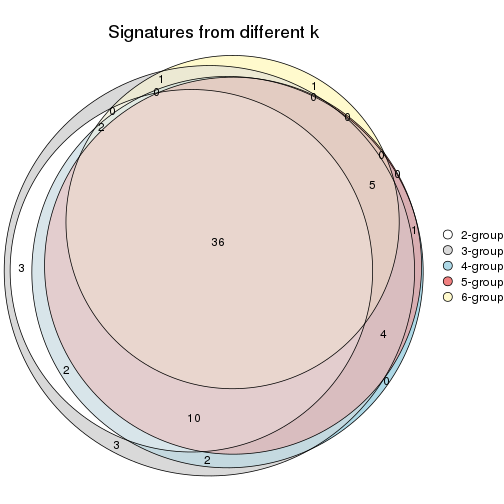

`get_signature()` returns a data frame invisibly. TO get the list of signatures, the function
call should be assigned to a variable explicitly. In following code, if `plot` argument is set
to `FALSE`, no heatmap is plotted while only the differential analysis is performed.

```r
# code only for demonstration
tb = get_signature(res, k = ..., plot = FALSE)
```

An example of the output of `tb` is:

```
#>   which_row         fdr    mean_1    mean_2 scaled_mean_1 scaled_mean_2 km
#> 1        38 0.042760348  8.373488  9.131774    -0.5533452     0.5164555  1
#> 2        40 0.018707592  7.106213  8.469186    -0.6173731     0.5762149  1
#> 3        55 0.019134737 10.221463 11.207825    -0.6159697     0.5749050  1
#> 4        59 0.006059896  5.921854  7.869574    -0.6899429     0.6439467  1
#> 5        60 0.018055526  8.928898 10.211722    -0.6204761     0.5791110  1
#> 6        98 0.009384629 15.714769 14.887706     0.6635654    -0.6193277  2
...
```

The columns in `tb` are:

1. `which_row`: row indices corresponding to the input matrix.
2. `fdr`: FDR for the differential test. 
3. `mean_x`: The mean value in group x.
4. `scaled_mean_x`: The mean value in group x after rows are scaled.
5. `km`: Row groups if k-means clustering is applied to rows.


UMAP plot which shows how samples are separated.


<script>
$( function() {
	$( '#tabs-ATC-kmeans-dimension-reduction' ).tabs();
} );
</script>
<div id='tabs-ATC-kmeans-dimension-reduction'>
<ul>
<li><a href='#tab-ATC-kmeans-dimension-reduction-1'>k = 2</a></li>
<li><a href='#tab-ATC-kmeans-dimension-reduction-2'>k = 3</a></li>
<li><a href='#tab-ATC-kmeans-dimension-reduction-3'>k = 4</a></li>
<li><a href='#tab-ATC-kmeans-dimension-reduction-4'>k = 5</a></li>
<li><a href='#tab-ATC-kmeans-dimension-reduction-5'>k = 6</a></li>
</ul>
<div id='tab-ATC-kmeans-dimension-reduction-1'>
<pre><code class="r">dimension_reduction(res, k = 2, method = &quot;UMAP&quot;)
</code></pre>

<p></p>

</div>
<div id='tab-ATC-kmeans-dimension-reduction-2'>
<pre><code class="r">dimension_reduction(res, k = 3, method = &quot;UMAP&quot;)
</code></pre>

<p></p>

</div>
<div id='tab-ATC-kmeans-dimension-reduction-3'>
<pre><code class="r">dimension_reduction(res, k = 4, method = &quot;UMAP&quot;)
</code></pre>

<p></p>

</div>
<div id='tab-ATC-kmeans-dimension-reduction-4'>
<pre><code class="r">dimension_reduction(res, k = 5, method = &quot;UMAP&quot;)
</code></pre>

<p></p>

</div>
<div id='tab-ATC-kmeans-dimension-reduction-5'>
<pre><code class="r">dimension_reduction(res, k = 6, method = &quot;UMAP&quot;)
</code></pre>

<p>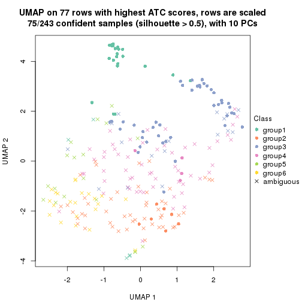</p>

</div>
</div>


Following heatmap shows how subgroups are split when increasing `k`:

```r
collect_classes(res)
```


If matrix rows can be associated to genes, consider to use `GO_Enrichment(res,
...)` to perform function enrichment for the signature genes.


 

---------------------------------------------------


### ATC:skmeans


The object with results only for a single top-value method and a single partition method 
can be extracted as:

```r
res = res_list["ATC", "skmeans"]
# you can also extract it by
# res = res_list["ATC:skmeans"]
```

A summary of `res` and all the functions that can be applied to it:

```r
res
```

```
#> A 'ConsensusPartition' object with k = 2, 3, 4, 5, 6.
#>   On a matrix with 77 rows and 243 columns.
#>   Top rows (8, 16, 23, 30, 38) are extracted by 'ATC' method.
#>   Subgroups are detected by 'skmeans' method.
#>   Performed in total 1250 partitions by row resampling.
#>   Best k for subgroups seems to be 2.
#> 
#> Following methods can be applied to this 'ConsensusPartition' object:
#>  [1] "cola_report"             "collect_classes"         "collect_plots"          
#>  [4] "collect_stats"           "colnames"                "compare_signatures"     
#>  [7] "consensus_heatmap"       "dimension_reduction"     "functional_enrichment"  
#> [10] "get_anno_col"            "get_anno"                "get_classes"            
#> [13] "get_consensus"           "get_matrix"              "get_membership"         
#> [16] "get_param"               "get_signatures"          "get_stats"              
#> [19] "is_best_k"               "is_stable_k"             "membership_heatmap"     
#> [22] "ncol"                    "nrow"                    "plot_ecdf"              
#> [25] "rownames"                "select_partition_number" "show"                   
#> [28] "suggest_best_k"          "test_to_known_factors"
```

`collect_plots()` function collects all the plots made from `res` for all `k` (number of partitions)
into one single page to provide an easy and fast comparison between different `k`.

```r
collect_plots(res)
```

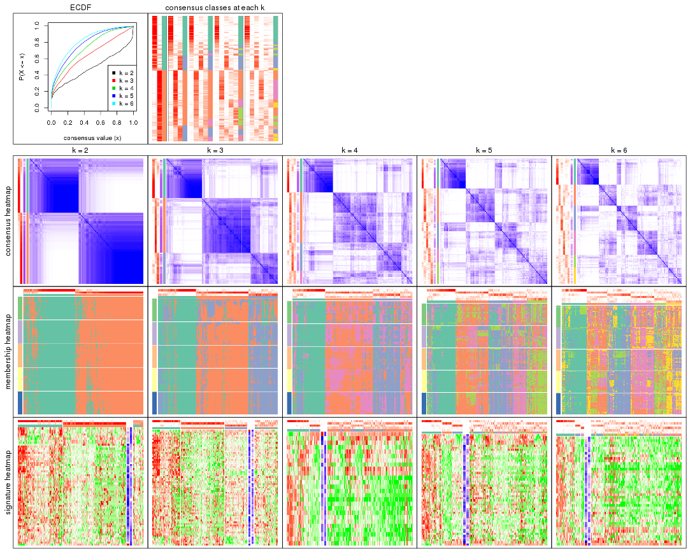

The plots are:

- The first row: a plot of the ECDF (Empirical cumulative distribution
  function) curves of the consensus matrix for each `k` and the heatmap of
  predicted classes for each `k`.
- The second row: heatmaps of the consensus matrix for each `k`.
- The third row: heatmaps of the membership matrix for each `k`.
- The fouth row: heatmaps of the signatures for each `k`.

All the plots in panels can be made by individual functions and they are
plotted later in this section.

`select_partition_number()` produces several plots showing different
statistics for choosing "optimized" `k`. There are following statistics:

- ECDF curves of the consensus matrix for each `k`;
- 1-PAC. [The PAC
  score](https://en.wikipedia.org/wiki/Consensus_clustering#Over-interpretation_potential_of_consensus_clustering)
  measures the proportion of the ambiguous subgrouping.
- Mean silhouette score.
- Concordance. The mean probability of fiting the consensus class ids in all
  partitions.
- Area increased. Denote $A_k$ as the area under the ECDF curve for current
  `k`, the area increased is defined as $A_k - A_{k-1}$.
- Rand index. The percent of pairs of samples that are both in a same cluster
  or both are not in a same cluster in the partition of k and k-1.
- Jaccard index. The ratio of pairs of samples are both in a same cluster in
  the partition of k and k-1 and the pairs of samples are both in a same
  cluster in the partition k or k-1.

The detailed explanations of these statistics can be found in [the cola
vignette](http://bioconductor.org/packages/devel/bioc/vignettes/cola/inst/doc/cola.html#toc_13).

Generally speaking, lower PAC score, higher mean silhouette score or higher
concordance corresponds to better partition. Rand index and Jaccard index
measure how similar the current partition is compared to partition with `k-1`.
If they are too similar, we won't accept `k` is better than `k-1`.

```r
select_partition_number(res)
```


The numeric values for all these statistics can be obtained by `get_stats()`.

```r
get_stats(res)
```

```
#>   k 1-PAC mean_silhouette concordance area_increased  Rand Jaccard
#> 2 2 0.561           0.806       0.911         0.4924 0.507   0.507
#> 3 3 0.394           0.643       0.807         0.3280 0.775   0.584
#> 4 4 0.418           0.362       0.646         0.1324 0.879   0.682
#> 5 5 0.473           0.399       0.640         0.0688 0.825   0.483
#> 6 6 0.520           0.323       0.564         0.0416 0.888   0.548
```

`suggest_best_k()` suggests the best $k$ based on these statistics. The rules are as follows:

- All $k$ with Jaccard index larger than 0.95 are removed because the increase of
  the partition number does not provides enough extra information. If all $k$ are removed,
  the best $k$ is assigned by `NA`.
- For $k$ with 1-PAC larger than 0.9, the maximal $k$ is taken as the "best k". Other $k$ is called "optional k".
- If it does not fit the second rule. The $k$ with the highest vote of highest
  1-PAC, mean silhouette and concordance is taken as the "best k".

```r
suggest_best_k(res)
```

```
#> [1] 2
```


Following shows the table of the partitions (You need to click the **show/hide
code output** link to see it). The membership matrix (columns with name `p*`)
is inferred by
[`clue::cl_consensus()`](https://www.rdocumentation.org/link/cl_consensus?package=clue)
function with the `SE` method. Basically the value in the membership matrix
represents the probability to belong to a certain group. The finall class
label for an item is determined with the group with highest probability it
belongs to.

In `get_classes()` function, the entropy is calculated from the membership
matrix and the silhouette score is calculated from the consensus matrix.


<script>
$( function() {
	$( '#tabs-ATC-skmeans-get-classes' ).tabs();
} );
</script>
<div id='tabs-ATC-skmeans-get-classes'>
<ul>
<li><a href='#tab-ATC-skmeans-get-classes-1'>k = 2</a></li>
<li><a href='#tab-ATC-skmeans-get-classes-2'>k = 3</a></li>
<li><a href='#tab-ATC-skmeans-get-classes-3'>k = 4</a></li>
<li><a href='#tab-ATC-skmeans-get-classes-4'>k = 5</a></li>
<li><a href='#tab-ATC-skmeans-get-classes-5'>k = 6</a></li>
</ul>

<div id='tab-ATC-skmeans-get-classes-1'>
<p><a id='tab-ATC-skmeans-get-classes-1-a' style='color:#0366d6' href='#'>show/hide code output</a></p>
<pre><code class="r">cbind(get_classes(res, k = 2), get_membership(res, k = 2))
</code></pre>

<pre><code>#&gt;           class entropy silhouette    p1    p2
#&gt; SRR191393     1  0.0000      0.886 1.000 0.000
#&gt; SRR191394     1  0.0000      0.886 1.000 0.000
#&gt; SRR191396     1  0.8763      0.620 0.704 0.296
#&gt; SRR191397     1  0.0000      0.886 1.000 0.000
#&gt; SRR191398     1  0.0000      0.886 1.000 0.000
#&gt; SRR191399     1  0.9087      0.556 0.676 0.324
#&gt; SRR191400     1  0.0000      0.886 1.000 0.000
#&gt; SRR191401     1  0.0000      0.886 1.000 0.000
#&gt; SRR191402     1  0.8861      0.581 0.696 0.304
#&gt; SRR191403     1  0.0000      0.886 1.000 0.000
#&gt; SRR191404     2  0.2778      0.893 0.048 0.952
#&gt; SRR191405     2  0.5408      0.843 0.124 0.876
#&gt; SRR191406     2  0.7950      0.682 0.240 0.760
#&gt; SRR191407     1  0.0000      0.886 1.000 0.000
#&gt; SRR191408     1  0.3584      0.852 0.932 0.068
#&gt; SRR191409     1  0.8499      0.650 0.724 0.276
#&gt; SRR191410     2  0.3114      0.888 0.056 0.944
#&gt; SRR191411     1  0.9427      0.490 0.640 0.360
#&gt; SRR191412     1  0.0000      0.886 1.000 0.000
#&gt; SRR191413     1  0.5629      0.806 0.868 0.132
#&gt; SRR191414     1  0.0000      0.886 1.000 0.000
#&gt; SRR191415     2  0.1414      0.905 0.020 0.980
#&gt; SRR191416     2  0.8861      0.550 0.304 0.696
#&gt; SRR191418     1  0.0000      0.886 1.000 0.000
#&gt; SRR191419     1  0.0000      0.886 1.000 0.000
#&gt; SRR191420     1  0.0000      0.886 1.000 0.000
#&gt; SRR191421     1  0.0000      0.886 1.000 0.000
#&gt; SRR191422     2  0.9635      0.382 0.388 0.612
#&gt; SRR191423     2  0.2948      0.893 0.052 0.948
#&gt; SRR191424     2  0.6531      0.794 0.168 0.832
#&gt; SRR191425     1  0.9795      0.356 0.584 0.416
#&gt; SRR191426     2  0.0000      0.910 0.000 1.000
#&gt; SRR191427     1  0.7139      0.746 0.804 0.196
#&gt; SRR191428     1  0.9795      0.320 0.584 0.416
#&gt; SRR191429     2  0.0000      0.910 0.000 1.000
#&gt; SRR191430     2  0.0000      0.910 0.000 1.000
#&gt; SRR191431     1  0.7219      0.741 0.800 0.200
#&gt; SRR191432     2  0.0000      0.910 0.000 1.000
#&gt; SRR191433     2  0.0000      0.910 0.000 1.000
#&gt; SRR191434     2  0.9866      0.241 0.432 0.568
#&gt; SRR191435     2  0.9087      0.532 0.324 0.676
#&gt; SRR191436     2  0.0938      0.909 0.012 0.988
#&gt; SRR191437     1  0.9129      0.549 0.672 0.328
#&gt; SRR191438     2  0.0000      0.910 0.000 1.000
#&gt; SRR191439     2  0.4161      0.871 0.084 0.916
#&gt; SRR191440     2  0.9552      0.405 0.376 0.624
#&gt; SRR191441     2  0.1414      0.905 0.020 0.980
#&gt; SRR191442     2  0.4298      0.869 0.088 0.912
#&gt; SRR191443     1  0.0672      0.883 0.992 0.008
#&gt; SRR191444     2  0.9635      0.379 0.388 0.612
#&gt; SRR191445     2  0.7056      0.764 0.192 0.808
#&gt; SRR191446     2  0.1633      0.904 0.024 0.976
#&gt; SRR191447     2  0.8207      0.653 0.256 0.744
#&gt; SRR191448     1  0.0000      0.886 1.000 0.000
#&gt; SRR191449     2  0.2603      0.895 0.044 0.956
#&gt; SRR191450     1  0.0000      0.886 1.000 0.000
#&gt; SRR191451     1  0.2043      0.874 0.968 0.032
#&gt; SRR191452     2  0.9460      0.443 0.364 0.636
#&gt; SRR191453     1  0.0000      0.886 1.000 0.000
#&gt; SRR191454     1  0.3879      0.847 0.924 0.076
#&gt; SRR191455     2  0.6343      0.799 0.160 0.840
#&gt; SRR191456     1  0.4161      0.844 0.916 0.084
#&gt; SRR191457     1  0.0000      0.886 1.000 0.000
#&gt; SRR191458     1  0.1843      0.875 0.972 0.028
#&gt; SRR191459     2  0.0000      0.910 0.000 1.000
#&gt; SRR191460     2  0.9209      0.517 0.336 0.664
#&gt; SRR191461     2  0.0672      0.909 0.008 0.992
#&gt; SRR191462     1  0.9970      0.184 0.532 0.468
#&gt; SRR191463     2  0.3431      0.884 0.064 0.936
#&gt; SRR191464     2  0.0000      0.910 0.000 1.000
#&gt; SRR191465     2  0.0000      0.910 0.000 1.000
#&gt; SRR191466     2  0.1414      0.906 0.020 0.980
#&gt; SRR191467     2  0.0000      0.910 0.000 1.000
#&gt; SRR191468     2  0.0000      0.910 0.000 1.000
#&gt; SRR191469     2  0.7602      0.725 0.220 0.780
#&gt; SRR191470     2  0.0000      0.910 0.000 1.000
#&gt; SRR191471     2  0.2778      0.892 0.048 0.952
#&gt; SRR191472     2  0.1414      0.906 0.020 0.980
#&gt; SRR191473     2  0.0000      0.910 0.000 1.000
#&gt; SRR191474     2  0.1414      0.906 0.020 0.980
#&gt; SRR191475     2  0.0000      0.910 0.000 1.000
#&gt; SRR191476     2  0.0000      0.910 0.000 1.000
#&gt; SRR191477     2  0.0000      0.910 0.000 1.000
#&gt; SRR191478     2  0.0672      0.909 0.008 0.992
#&gt; SRR191479     1  0.0376      0.885 0.996 0.004
#&gt; SRR191480     2  0.0000      0.910 0.000 1.000
#&gt; SRR191481     2  0.0000      0.910 0.000 1.000
#&gt; SRR191482     2  0.0000      0.910 0.000 1.000
#&gt; SRR191483     2  0.0000      0.910 0.000 1.000
#&gt; SRR191484     1  0.0938      0.882 0.988 0.012
#&gt; SRR191485     2  0.0000      0.910 0.000 1.000
#&gt; SRR191486     1  0.7950      0.701 0.760 0.240
#&gt; SRR191487     2  0.0000      0.910 0.000 1.000
#&gt; SRR191488     1  0.0000      0.886 1.000 0.000
#&gt; SRR191489     1  0.0938      0.882 0.988 0.012
#&gt; SRR191490     1  0.9833      0.313 0.576 0.424
#&gt; SRR191491     1  0.9427      0.503 0.640 0.360
#&gt; SRR191492     2  0.6048      0.819 0.148 0.852
#&gt; SRR191493     1  0.4161      0.844 0.916 0.084
#&gt; SRR191494     1  1.0000      0.120 0.504 0.496
#&gt; SRR191495     2  0.9044      0.532 0.320 0.680
#&gt; SRR191496     2  0.5059      0.852 0.112 0.888
#&gt; SRR191497     2  0.4431      0.865 0.092 0.908
#&gt; SRR191498     1  0.6343      0.782 0.840 0.160
#&gt; SRR191499     2  0.0672      0.909 0.008 0.992
#&gt; SRR191500     2  0.4939      0.855 0.108 0.892
#&gt; SRR191501     1  0.7299      0.721 0.796 0.204
#&gt; SRR191502     2  0.0000      0.910 0.000 1.000
#&gt; SRR191503     2  0.0000      0.910 0.000 1.000
#&gt; SRR191504     2  0.0000      0.910 0.000 1.000
#&gt; SRR191505     2  0.0000      0.910 0.000 1.000
#&gt; SRR191506     2  0.5842      0.817 0.140 0.860
#&gt; SRR191507     2  0.1843      0.902 0.028 0.972
#&gt; SRR191508     2  0.0000      0.910 0.000 1.000
#&gt; SRR191509     2  0.2948      0.891 0.052 0.948
#&gt; SRR191510     2  0.5842      0.824 0.140 0.860
#&gt; SRR191511     2  0.0376      0.910 0.004 0.996
#&gt; SRR191512     2  0.0000      0.910 0.000 1.000
#&gt; SRR191513     2  0.1414      0.906 0.020 0.980
#&gt; SRR191514     2  0.0000      0.910 0.000 1.000
#&gt; SRR191515     2  0.0000      0.910 0.000 1.000
#&gt; SRR191516     2  0.7453      0.723 0.212 0.788
#&gt; SRR191517     2  0.0000      0.910 0.000 1.000
#&gt; SRR191518     2  0.0000      0.910 0.000 1.000
#&gt; SRR191519     2  0.0000      0.910 0.000 1.000
#&gt; SRR191520     2  0.0000      0.910 0.000 1.000
#&gt; SRR191521     2  0.0000      0.910 0.000 1.000
#&gt; SRR191522     2  0.0000      0.910 0.000 1.000
#&gt; SRR191523     2  0.3114      0.892 0.056 0.944
#&gt; SRR191524     1  0.9795      0.345 0.584 0.416
#&gt; SRR191525     2  0.0000      0.910 0.000 1.000
#&gt; SRR191526     2  0.2423      0.897 0.040 0.960
#&gt; SRR191527     1  0.0000      0.886 1.000 0.000
#&gt; SRR191528     1  0.0000      0.886 1.000 0.000
#&gt; SRR191529     2  0.9996     -0.019 0.488 0.512
#&gt; SRR191530     2  0.0000      0.910 0.000 1.000
#&gt; SRR191531     1  0.2043      0.874 0.968 0.032
#&gt; SRR191532     2  0.1633      0.904 0.024 0.976
#&gt; SRR191533     2  0.6148      0.807 0.152 0.848
#&gt; SRR191534     2  0.2603      0.895 0.044 0.956
#&gt; SRR191535     2  0.1414      0.905 0.020 0.980
#&gt; SRR191536     2  0.5408      0.841 0.124 0.876
#&gt; SRR191537     2  0.3733      0.877 0.072 0.928
#&gt; SRR191538     2  0.0000      0.910 0.000 1.000
#&gt; SRR191539     2  0.0000      0.910 0.000 1.000
#&gt; SRR191540     2  0.0000      0.910 0.000 1.000
#&gt; SRR191541     2  0.0000      0.910 0.000 1.000
#&gt; SRR191542     2  0.5737      0.821 0.136 0.864
#&gt; SRR191543     2  0.0000      0.910 0.000 1.000
#&gt; SRR191544     2  0.0000      0.910 0.000 1.000
#&gt; SRR191545     2  0.0000      0.910 0.000 1.000
#&gt; SRR191546     2  0.1184      0.907 0.016 0.984
#&gt; SRR191547     2  0.0000      0.910 0.000 1.000
#&gt; SRR191548     1  0.0000      0.886 1.000 0.000
#&gt; SRR191549     1  0.0000      0.886 1.000 0.000
#&gt; SRR191550     1  0.0000      0.886 1.000 0.000
#&gt; SRR191551     1  0.0000      0.886 1.000 0.000
#&gt; SRR191552     1  0.0000      0.886 1.000 0.000
#&gt; SRR191553     1  0.0000      0.886 1.000 0.000
#&gt; SRR191554     1  0.0000      0.886 1.000 0.000
#&gt; SRR191555     1  0.0000      0.886 1.000 0.000
#&gt; SRR191556     1  0.1414      0.879 0.980 0.020
#&gt; SRR191557     2  0.6531      0.787 0.168 0.832
#&gt; SRR191558     1  0.8144      0.671 0.748 0.252
#&gt; SRR191559     1  0.9933      0.257 0.548 0.452
#&gt; SRR191560     1  0.5519      0.812 0.872 0.128
#&gt; SRR191561     1  0.0000      0.886 1.000 0.000
#&gt; SRR191562     1  0.0000      0.886 1.000 0.000
#&gt; SRR191563     2  0.2948      0.891 0.052 0.948
#&gt; SRR191564     2  0.6048      0.822 0.148 0.852
#&gt; SRR191565     1  0.0938      0.882 0.988 0.012
#&gt; SRR191566     1  0.0938      0.882 0.988 0.012
#&gt; SRR191567     1  0.0000      0.886 1.000 0.000
#&gt; SRR191568     1  0.0000      0.886 1.000 0.000
#&gt; SRR191569     1  0.9833      0.331 0.576 0.424
#&gt; SRR191570     1  0.1414      0.879 0.980 0.020
#&gt; SRR191571     1  0.9580      0.429 0.620 0.380
#&gt; SRR191572     1  0.0000      0.886 1.000 0.000
#&gt; SRR191573     1  0.1843      0.876 0.972 0.028
#&gt; SRR191574     1  0.0000      0.886 1.000 0.000
#&gt; SRR191575     1  0.0000      0.886 1.000 0.000
#&gt; SRR191576     1  0.2043      0.874 0.968 0.032
#&gt; SRR191577     1  0.0000      0.886 1.000 0.000
#&gt; SRR191578     2  0.6048      0.812 0.148 0.852
#&gt; SRR191579     1  0.0000      0.886 1.000 0.000
#&gt; SRR191580     1  0.0000      0.886 1.000 0.000
#&gt; SRR191581     1  0.0000      0.886 1.000 0.000
#&gt; SRR191582     1  0.0000      0.886 1.000 0.000
#&gt; SRR191583     1  0.8661      0.597 0.712 0.288
#&gt; SRR191584     1  0.0000      0.886 1.000 0.000
#&gt; SRR191585     2  0.0000      0.910 0.000 1.000
#&gt; SRR191586     2  0.1843      0.902 0.028 0.972
#&gt; SRR191587     2  0.7745      0.703 0.228 0.772
#&gt; SRR191588     1  0.0000      0.886 1.000 0.000
#&gt; SRR191589     1  0.0672      0.883 0.992 0.008
#&gt; SRR191590     1  0.0000      0.886 1.000 0.000
#&gt; SRR191591     2  0.1633      0.905 0.024 0.976
#&gt; SRR191592     1  0.9661      0.435 0.608 0.392
#&gt; SRR191593     1  0.9998      0.119 0.508 0.492
#&gt; SRR191594     1  0.0000      0.886 1.000 0.000
#&gt; SRR191595     1  0.3879      0.848 0.924 0.076
#&gt; SRR191596     1  0.0000      0.886 1.000 0.000
#&gt; SRR191597     2  0.0000      0.910 0.000 1.000
#&gt; SRR191598     1  0.0376      0.885 0.996 0.004
#&gt; SRR191599     1  0.0000      0.886 1.000 0.000
#&gt; SRR191600     2  0.0000      0.910 0.000 1.000
#&gt; SRR191601     2  0.0000      0.910 0.000 1.000
#&gt; SRR191602     2  0.2236      0.900 0.036 0.964
#&gt; SRR191603     2  0.0000      0.910 0.000 1.000
#&gt; SRR191604     2  0.0000      0.910 0.000 1.000
#&gt; SRR191605     2  0.9087      0.522 0.324 0.676
#&gt; SRR191606     1  0.0000      0.886 1.000 0.000
#&gt; SRR191607     2  0.5946      0.816 0.144 0.856
#&gt; SRR191608     2  0.0000      0.910 0.000 1.000
#&gt; SRR191609     2  0.0000      0.910 0.000 1.000
#&gt; SRR191610     2  0.9922      0.140 0.448 0.552
#&gt; SRR191611     2  0.3733      0.876 0.072 0.928
#&gt; SRR191612     2  0.7815      0.691 0.232 0.768
#&gt; SRR191613     1  0.0000      0.886 1.000 0.000
#&gt; SRR191614     2  0.9460      0.409 0.364 0.636
#&gt; SRR191615     1  0.9954      0.223 0.540 0.460
#&gt; SRR191616     1  0.0000      0.886 1.000 0.000
#&gt; SRR191617     2  0.9044      0.550 0.320 0.680
#&gt; SRR191618     1  0.7602      0.722 0.780 0.220
#&gt; SRR191619     2  0.0000      0.910 0.000 1.000
#&gt; SRR191620     2  0.0376      0.910 0.004 0.996
#&gt; SRR191621     2  0.0000      0.910 0.000 1.000
#&gt; SRR191622     2  0.0000      0.910 0.000 1.000
#&gt; SRR191623     2  0.5294      0.834 0.120 0.880
#&gt; SRR191624     1  0.0000      0.886 1.000 0.000
#&gt; SRR191625     2  0.0000      0.910 0.000 1.000
#&gt; SRR191626     2  0.0000      0.910 0.000 1.000
#&gt; SRR191627     2  0.0000      0.910 0.000 1.000
#&gt; SRR191628     1  0.8861      0.598 0.696 0.304
#&gt; SRR191629     2  0.0000      0.910 0.000 1.000
#&gt; SRR191630     1  0.0000      0.886 1.000 0.000
#&gt; SRR191631     2  0.0000      0.910 0.000 1.000
#&gt; SRR191632     1  0.9358      0.502 0.648 0.352
#&gt; SRR191633     2  0.3879      0.878 0.076 0.924
#&gt; SRR191634     1  0.0000      0.886 1.000 0.000
#&gt; SRR191635     2  0.8813      0.575 0.300 0.700
#&gt; SRR191636     1  0.0672      0.883 0.992 0.008
#&gt; SRR191637     2  0.3733      0.879 0.072 0.928
</code></pre>

<script>
$('#tab-ATC-skmeans-get-classes-1-a').parent().next().next().hide();
$('#tab-ATC-skmeans-get-classes-1-a').click(function(){
  $('#tab-ATC-skmeans-get-classes-1-a').parent().next().next().toggle();
  return(false);
});
</script>
</div>

<div id='tab-ATC-skmeans-get-classes-2'>
<p><a id='tab-ATC-skmeans-get-classes-2-a' style='color:#0366d6' href='#'>show/hide code output</a></p>
<pre><code class="r">cbind(get_classes(res, k = 3), get_membership(res, k = 3))
</code></pre>

<pre><code>#&gt;           class entropy silhouette    p1    p2    p3
#&gt; SRR191393     1  0.6305    0.01850 0.516 0.000 0.484
#&gt; SRR191394     1  0.3267    0.73416 0.884 0.000 0.116
#&gt; SRR191396     3  0.7717    0.66273 0.148 0.172 0.680
#&gt; SRR191397     1  0.5291    0.56531 0.732 0.000 0.268
#&gt; SRR191398     1  0.0237    0.79931 0.996 0.000 0.004
#&gt; SRR191399     3  0.7702    0.66716 0.140 0.180 0.680
#&gt; SRR191400     1  0.5882    0.41826 0.652 0.000 0.348
#&gt; SRR191401     3  0.6126    0.32408 0.400 0.000 0.600
#&gt; SRR191402     3  0.4733    0.63632 0.196 0.004 0.800
#&gt; SRR191403     1  0.5138    0.59304 0.748 0.000 0.252
#&gt; SRR191404     2  0.6111    0.22277 0.000 0.604 0.396
#&gt; SRR191405     3  0.5875    0.73544 0.056 0.160 0.784
#&gt; SRR191406     3  0.5285    0.67243 0.004 0.244 0.752
#&gt; SRR191407     1  0.3879    0.70402 0.848 0.000 0.152
#&gt; SRR191408     1  0.6008    0.56174 0.664 0.004 0.332
#&gt; SRR191409     3  0.4563    0.72220 0.036 0.112 0.852
#&gt; SRR191410     3  0.5465    0.62391 0.000 0.288 0.712
#&gt; SRR191411     3  0.6254    0.69641 0.116 0.108 0.776
#&gt; SRR191412     1  0.6045    0.34993 0.620 0.000 0.380
#&gt; SRR191413     3  0.7413    0.63497 0.204 0.104 0.692
#&gt; SRR191414     1  0.6192    0.25354 0.580 0.000 0.420
#&gt; SRR191415     3  0.5363    0.63431 0.000 0.276 0.724
#&gt; SRR191416     3  0.4178    0.71328 0.000 0.172 0.828
#&gt; SRR191418     1  0.5327    0.57120 0.728 0.000 0.272
#&gt; SRR191419     1  0.0000    0.80018 1.000 0.000 0.000
#&gt; SRR191420     1  0.1529    0.78685 0.960 0.000 0.040
#&gt; SRR191421     1  0.1031    0.79520 0.976 0.000 0.024
#&gt; SRR191422     2  0.9627   -0.06224 0.208 0.428 0.364
#&gt; SRR191423     3  0.6126    0.41328 0.004 0.352 0.644
#&gt; SRR191424     2  0.5119    0.73768 0.152 0.816 0.032
#&gt; SRR191425     3  0.2804    0.71293 0.016 0.060 0.924
#&gt; SRR191426     2  0.2625    0.81570 0.000 0.916 0.084
#&gt; SRR191427     1  0.8727    0.41830 0.572 0.148 0.280
#&gt; SRR191428     3  0.2446    0.69218 0.052 0.012 0.936
#&gt; SRR191429     2  0.2066    0.81401 0.000 0.940 0.060
#&gt; SRR191430     2  0.5926    0.40511 0.000 0.644 0.356
#&gt; SRR191431     1  0.8894    0.24512 0.548 0.152 0.300
#&gt; SRR191432     2  0.1643    0.81507 0.000 0.956 0.044
#&gt; SRR191433     2  0.1529    0.81720 0.000 0.960 0.040
#&gt; SRR191434     2  0.9783   -0.01796 0.264 0.436 0.300
#&gt; SRR191435     3  0.5986    0.64438 0.024 0.240 0.736
#&gt; SRR191436     2  0.6204    0.29862 0.000 0.576 0.424
#&gt; SRR191437     1  0.6918    0.61603 0.736 0.136 0.128
#&gt; SRR191438     3  0.4291    0.67555 0.000 0.180 0.820
#&gt; SRR191439     3  0.7665   -0.07147 0.044 0.456 0.500
#&gt; SRR191440     2  0.9325    0.29299 0.228 0.520 0.252
#&gt; SRR191441     2  0.4291    0.77148 0.000 0.820 0.180
#&gt; SRR191442     3  0.7084    0.41193 0.036 0.336 0.628
#&gt; SRR191443     1  0.5363    0.62731 0.724 0.000 0.276
#&gt; SRR191444     3  0.8303    0.66150 0.172 0.196 0.632
#&gt; SRR191445     2  0.6829    0.68186 0.168 0.736 0.096
#&gt; SRR191446     2  0.2384    0.81236 0.008 0.936 0.056
#&gt; SRR191447     2  0.9247    0.35728 0.200 0.524 0.276
#&gt; SRR191448     1  0.0000    0.80018 1.000 0.000 0.000
#&gt; SRR191449     3  0.5968    0.54353 0.000 0.364 0.636
#&gt; SRR191450     1  0.0000    0.80018 1.000 0.000 0.000
#&gt; SRR191451     3  0.5733    0.38488 0.324 0.000 0.676
#&gt; SRR191452     2  0.8132    0.47924 0.284 0.612 0.104
#&gt; SRR191453     1  0.6280    0.30597 0.540 0.000 0.460
#&gt; SRR191454     1  0.3237    0.76385 0.912 0.032 0.056
#&gt; SRR191455     2  0.6151    0.73837 0.056 0.764 0.180
#&gt; SRR191456     3  0.5443    0.50720 0.260 0.004 0.736
#&gt; SRR191457     1  0.0237    0.79931 0.996 0.000 0.004
#&gt; SRR191458     1  0.6432    0.28749 0.568 0.004 0.428
#&gt; SRR191459     2  0.2261    0.81384 0.000 0.932 0.068
#&gt; SRR191460     3  0.6529    0.71389 0.116 0.124 0.760
#&gt; SRR191461     2  0.4346    0.73032 0.000 0.816 0.184
#&gt; SRR191462     1  0.7839    0.00443 0.484 0.464 0.052
#&gt; SRR191463     2  0.5466    0.77125 0.040 0.800 0.160
#&gt; SRR191464     2  0.4605    0.69616 0.000 0.796 0.204
#&gt; SRR191465     2  0.2537    0.81074 0.000 0.920 0.080
#&gt; SRR191466     2  0.6680   -0.11591 0.008 0.508 0.484
#&gt; SRR191467     2  0.1289    0.81454 0.000 0.968 0.032
#&gt; SRR191468     2  0.1860    0.81659 0.000 0.948 0.052
#&gt; SRR191469     2  0.7205    0.67991 0.100 0.708 0.192
#&gt; SRR191470     2  0.2537    0.81111 0.000 0.920 0.080
#&gt; SRR191471     2  0.3589    0.80476 0.052 0.900 0.048
#&gt; SRR191472     2  0.4782    0.77061 0.016 0.820 0.164
#&gt; SRR191473     2  0.2878    0.80940 0.000 0.904 0.096
#&gt; SRR191474     3  0.5785    0.54793 0.000 0.332 0.668
#&gt; SRR191475     2  0.1031    0.81529 0.000 0.976 0.024
#&gt; SRR191476     2  0.1860    0.81092 0.000 0.948 0.052
#&gt; SRR191477     2  0.5785    0.49637 0.000 0.668 0.332
#&gt; SRR191478     2  0.4887    0.72615 0.000 0.772 0.228
#&gt; SRR191479     3  0.6095    0.20000 0.392 0.000 0.608
#&gt; SRR191480     2  0.2066    0.80821 0.000 0.940 0.060
#&gt; SRR191481     2  0.3412    0.79517 0.000 0.876 0.124
#&gt; SRR191482     2  0.1753    0.81395 0.000 0.952 0.048
#&gt; SRR191483     2  0.2261    0.81695 0.000 0.932 0.068
#&gt; SRR191484     1  0.2945    0.75621 0.908 0.004 0.088
#&gt; SRR191485     2  0.1643    0.81326 0.000 0.956 0.044
#&gt; SRR191486     1  0.7588    0.47247 0.624 0.064 0.312
#&gt; SRR191487     2  0.1964    0.81530 0.000 0.944 0.056
#&gt; SRR191488     1  0.0000    0.80018 1.000 0.000 0.000
#&gt; SRR191489     1  0.1015    0.79529 0.980 0.008 0.012
#&gt; SRR191490     1  0.7624    0.52233 0.672 0.224 0.104
#&gt; SRR191491     1  0.9405    0.13051 0.496 0.204 0.300
#&gt; SRR191492     2  0.7059    0.67483 0.164 0.724 0.112
#&gt; SRR191493     1  0.3755    0.73234 0.872 0.008 0.120
#&gt; SRR191494     1  0.8569    0.19805 0.508 0.392 0.100
#&gt; SRR191495     2  0.9615    0.01127 0.316 0.460 0.224
#&gt; SRR191496     2  0.5348    0.71110 0.176 0.796 0.028
#&gt; SRR191497     2  0.6483   -0.03033 0.004 0.544 0.452
#&gt; SRR191498     1  0.5598    0.64707 0.800 0.148 0.052
#&gt; SRR191499     2  0.4874    0.76887 0.028 0.828 0.144
#&gt; SRR191500     2  0.6621    0.68856 0.148 0.752 0.100
#&gt; SRR191501     1  0.3678    0.73953 0.892 0.080 0.028
#&gt; SRR191502     2  0.4555    0.75962 0.000 0.800 0.200
#&gt; SRR191503     2  0.2796    0.79532 0.000 0.908 0.092
#&gt; SRR191504     2  0.1289    0.81395 0.000 0.968 0.032
#&gt; SRR191505     2  0.0747    0.81342 0.000 0.984 0.016
#&gt; SRR191506     2  0.4665    0.76702 0.100 0.852 0.048
#&gt; SRR191507     2  0.1482    0.81798 0.020 0.968 0.012
#&gt; SRR191508     2  0.1964    0.81475 0.000 0.944 0.056
#&gt; SRR191509     2  0.4741    0.76809 0.020 0.828 0.152
#&gt; SRR191510     2  0.6722    0.64635 0.220 0.720 0.060
#&gt; SRR191511     2  0.2878    0.80565 0.000 0.904 0.096
#&gt; SRR191512     2  0.0000    0.81360 0.000 1.000 0.000
#&gt; SRR191513     2  0.1482    0.81894 0.020 0.968 0.012
#&gt; SRR191514     2  0.1964    0.81405 0.000 0.944 0.056
#&gt; SRR191515     2  0.1411    0.81422 0.000 0.964 0.036
#&gt; SRR191516     2  0.7021    0.58281 0.216 0.708 0.076
#&gt; SRR191517     2  0.1289    0.81326 0.000 0.968 0.032
#&gt; SRR191518     2  0.2066    0.81664 0.000 0.940 0.060
#&gt; SRR191519     2  0.0424    0.81364 0.000 0.992 0.008
#&gt; SRR191520     2  0.3482    0.77743 0.000 0.872 0.128
#&gt; SRR191521     2  0.2959    0.78758 0.000 0.900 0.100
#&gt; SRR191522     2  0.1411    0.81433 0.000 0.964 0.036
#&gt; SRR191523     2  0.5085    0.78427 0.072 0.836 0.092
#&gt; SRR191524     1  0.9161    0.27881 0.532 0.280 0.188
#&gt; SRR191525     2  0.2584    0.80899 0.008 0.928 0.064
#&gt; SRR191526     2  0.1774    0.81783 0.024 0.960 0.016
#&gt; SRR191527     1  0.0000    0.80018 1.000 0.000 0.000
#&gt; SRR191528     1  0.0237    0.79931 0.996 0.000 0.004
#&gt; SRR191529     1  0.7913    0.06561 0.492 0.452 0.056
#&gt; SRR191530     2  0.0747    0.81342 0.000 0.984 0.016
#&gt; SRR191531     1  0.3192    0.74536 0.888 0.000 0.112
#&gt; SRR191532     2  0.5551    0.67663 0.016 0.760 0.224
#&gt; SRR191533     2  0.6986    0.56140 0.256 0.688 0.056
#&gt; SRR191534     2  0.5067    0.76818 0.052 0.832 0.116
#&gt; SRR191535     2  0.4473    0.77009 0.008 0.828 0.164
#&gt; SRR191536     2  0.5393    0.75333 0.108 0.820 0.072
#&gt; SRR191537     2  0.3649    0.79709 0.068 0.896 0.036
#&gt; SRR191538     2  0.2878    0.78795 0.000 0.904 0.096
#&gt; SRR191539     2  0.1529    0.81460 0.000 0.960 0.040
#&gt; SRR191540     2  0.0237    0.81417 0.000 0.996 0.004
#&gt; SRR191541     2  0.1289    0.81599 0.000 0.968 0.032
#&gt; SRR191542     2  0.6587    0.68406 0.156 0.752 0.092
#&gt; SRR191543     2  0.1529    0.81164 0.000 0.960 0.040
#&gt; SRR191544     2  0.1753    0.81427 0.000 0.952 0.048
#&gt; SRR191545     2  0.1163    0.81313 0.000 0.972 0.028
#&gt; SRR191546     2  0.3755    0.77802 0.008 0.872 0.120
#&gt; SRR191547     2  0.2939    0.81215 0.012 0.916 0.072
#&gt; SRR191548     1  0.0000    0.80018 1.000 0.000 0.000
#&gt; SRR191549     1  0.0000    0.80018 1.000 0.000 0.000
#&gt; SRR191550     1  0.0000    0.80018 1.000 0.000 0.000
#&gt; SRR191551     1  0.0000    0.80018 1.000 0.000 0.000
#&gt; SRR191552     1  0.0000    0.80018 1.000 0.000 0.000
#&gt; SRR191553     1  0.0000    0.80018 1.000 0.000 0.000
#&gt; SRR191554     1  0.0000    0.80018 1.000 0.000 0.000
#&gt; SRR191555     1  0.0424    0.79790 0.992 0.000 0.008
#&gt; SRR191556     3  0.5178    0.57250 0.256 0.000 0.744
#&gt; SRR191557     3  0.4999    0.73094 0.028 0.152 0.820
#&gt; SRR191558     3  0.7220    0.55370 0.284 0.056 0.660
#&gt; SRR191559     3  0.4128    0.72272 0.012 0.132 0.856
#&gt; SRR191560     3  0.4945    0.70100 0.104 0.056 0.840
#&gt; SRR191561     1  0.0000    0.80018 1.000 0.000 0.000
#&gt; SRR191562     1  0.0424    0.79884 0.992 0.000 0.008
#&gt; SRR191563     3  0.6596    0.58537 0.040 0.256 0.704
#&gt; SRR191564     3  0.8268    0.12224 0.076 0.440 0.484
#&gt; SRR191565     3  0.5560    0.51931 0.300 0.000 0.700
#&gt; SRR191566     3  0.5541    0.58075 0.252 0.008 0.740
#&gt; SRR191567     1  0.5058    0.60140 0.756 0.000 0.244
#&gt; SRR191568     1  0.5560    0.58652 0.700 0.000 0.300
#&gt; SRR191569     3  0.2050    0.70173 0.028 0.020 0.952
#&gt; SRR191570     3  0.6912    0.13048 0.444 0.016 0.540
#&gt; SRR191571     3  0.5180    0.67252 0.156 0.032 0.812
#&gt; SRR191572     1  0.0000    0.80018 1.000 0.000 0.000
#&gt; SRR191573     3  0.5156    0.61601 0.216 0.008 0.776
#&gt; SRR191574     1  0.0237    0.79947 0.996 0.000 0.004
#&gt; SRR191575     1  0.2959    0.74770 0.900 0.000 0.100
#&gt; SRR191576     3  0.6475    0.54584 0.280 0.028 0.692
#&gt; SRR191577     1  0.6308    0.02368 0.508 0.000 0.492
#&gt; SRR191578     2  0.7323    0.62866 0.104 0.700 0.196
#&gt; SRR191579     1  0.0000    0.80018 1.000 0.000 0.000
#&gt; SRR191580     1  0.0000    0.80018 1.000 0.000 0.000
#&gt; SRR191581     1  0.0000    0.80018 1.000 0.000 0.000
#&gt; SRR191582     1  0.0000    0.80018 1.000 0.000 0.000
#&gt; SRR191583     1  0.4883    0.61413 0.788 0.208 0.004
#&gt; SRR191584     1  0.0000    0.80018 1.000 0.000 0.000
#&gt; SRR191585     3  0.5497    0.61805 0.000 0.292 0.708
#&gt; SRR191586     2  0.6308   -0.10753 0.000 0.508 0.492
#&gt; SRR191587     3  0.4483    0.72727 0.024 0.128 0.848
#&gt; SRR191588     1  0.5882    0.43097 0.652 0.000 0.348
#&gt; SRR191589     3  0.5465    0.54046 0.288 0.000 0.712
#&gt; SRR191590     1  0.0592    0.79779 0.988 0.000 0.012
#&gt; SRR191591     3  0.3267    0.72357 0.000 0.116 0.884
#&gt; SRR191592     3  0.5136    0.70810 0.044 0.132 0.824
#&gt; SRR191593     3  0.2772    0.71334 0.004 0.080 0.916
#&gt; SRR191594     1  0.0237    0.79895 0.996 0.000 0.004
#&gt; SRR191595     3  0.5058    0.67072 0.148 0.032 0.820
#&gt; SRR191596     1  0.1031    0.79424 0.976 0.000 0.024
#&gt; SRR191597     3  0.6252    0.39025 0.000 0.444 0.556
#&gt; SRR191598     1  0.6111    0.30031 0.604 0.000 0.396
#&gt; SRR191599     1  0.0592    0.79775 0.988 0.000 0.012
#&gt; SRR191600     2  0.5560    0.54181 0.000 0.700 0.300
#&gt; SRR191601     2  0.5253    0.73005 0.020 0.792 0.188
#&gt; SRR191602     3  0.4062    0.71741 0.000 0.164 0.836
#&gt; SRR191603     2  0.6192    0.18227 0.000 0.580 0.420
#&gt; SRR191604     2  0.1411    0.81567 0.000 0.964 0.036
#&gt; SRR191605     3  0.8351    0.55092 0.124 0.272 0.604
#&gt; SRR191606     1  0.0237    0.79931 0.996 0.000 0.004
#&gt; SRR191607     2  0.8192    0.48528 0.144 0.636 0.220
#&gt; SRR191608     2  0.0424    0.81495 0.000 0.992 0.008
#&gt; SRR191609     2  0.2796    0.80616 0.000 0.908 0.092
#&gt; SRR191610     3  0.9322    0.45580 0.192 0.304 0.504
#&gt; SRR191611     3  0.6154    0.45500 0.000 0.408 0.592
#&gt; SRR191612     3  0.4974    0.70092 0.000 0.236 0.764
#&gt; SRR191613     1  0.0000    0.80018 1.000 0.000 0.000
#&gt; SRR191614     3  0.6984    0.62211 0.040 0.304 0.656
#&gt; SRR191615     3  0.4892    0.72405 0.048 0.112 0.840
#&gt; SRR191616     1  0.0000    0.80018 1.000 0.000 0.000
#&gt; SRR191617     2  0.8125    0.41572 0.340 0.576 0.084
#&gt; SRR191618     1  0.4964    0.71811 0.836 0.048 0.116
#&gt; SRR191619     2  0.2066    0.81263 0.000 0.940 0.060
#&gt; SRR191620     2  0.4978    0.68929 0.004 0.780 0.216
#&gt; SRR191621     2  0.2165    0.81398 0.000 0.936 0.064
#&gt; SRR191622     3  0.5760    0.48035 0.000 0.328 0.672
#&gt; SRR191623     3  0.4504    0.71091 0.000 0.196 0.804
#&gt; SRR191624     3  0.6111    0.25311 0.396 0.000 0.604
#&gt; SRR191625     2  0.2796    0.80598 0.000 0.908 0.092
#&gt; SRR191626     2  0.1529    0.81485 0.000 0.960 0.040
#&gt; SRR191627     2  0.3482    0.76411 0.000 0.872 0.128
#&gt; SRR191628     1  0.8309    0.45700 0.632 0.188 0.180
#&gt; SRR191629     3  0.5216    0.63522 0.000 0.260 0.740
#&gt; SRR191630     1  0.1964    0.77543 0.944 0.000 0.056
#&gt; SRR191631     2  0.2356    0.80733 0.000 0.928 0.072
#&gt; SRR191632     1  0.7804    0.45272 0.664 0.216 0.120
#&gt; SRR191633     2  0.5497    0.75200 0.048 0.804 0.148
#&gt; SRR191634     1  0.0000    0.80018 1.000 0.000 0.000
#&gt; SRR191635     3  0.7304    0.62972 0.084 0.228 0.688
#&gt; SRR191636     1  0.0000    0.80018 1.000 0.000 0.000
#&gt; SRR191637     2  0.2793    0.81024 0.044 0.928 0.028
</code></pre>

<script>
$('#tab-ATC-skmeans-get-classes-2-a').parent().next().next().hide();
$('#tab-ATC-skmeans-get-classes-2-a').click(function(){
  $('#tab-ATC-skmeans-get-classes-2-a').parent().next().next().toggle();
  return(false);
});
</script>
</div>

<div id='tab-ATC-skmeans-get-classes-3'>
<p><a id='tab-ATC-skmeans-get-classes-3-a' style='color:#0366d6' href='#'>show/hide code output</a></p>
<pre><code class="r">cbind(get_classes(res, k = 4), get_membership(res, k = 4))
</code></pre>

<pre><code>#&gt;           class entropy silhouette    p1    p2    p3    p4
#&gt; SRR191393     3  0.4817   0.277072 0.388 0.000 0.612 0.000
#&gt; SRR191394     1  0.3486   0.661112 0.812 0.000 0.188 0.000
#&gt; SRR191396     3  0.5841   0.554281 0.100 0.080 0.760 0.060
#&gt; SRR191397     1  0.4898   0.282446 0.584 0.000 0.416 0.000
#&gt; SRR191398     1  0.1211   0.771018 0.960 0.000 0.040 0.000
#&gt; SRR191399     3  0.5779   0.515179 0.040 0.140 0.752 0.068
#&gt; SRR191400     1  0.4999   0.064015 0.508 0.000 0.492 0.000
#&gt; SRR191401     3  0.4250   0.487241 0.276 0.000 0.724 0.000
#&gt; SRR191402     3  0.3205   0.600571 0.104 0.000 0.872 0.024
#&gt; SRR191403     1  0.4830   0.349041 0.608 0.000 0.392 0.000
#&gt; SRR191404     4  0.7882   0.130710 0.000 0.284 0.348 0.368
#&gt; SRR191405     3  0.6832   0.481485 0.040 0.132 0.676 0.152
#&gt; SRR191406     3  0.7239   0.180143 0.000 0.344 0.500 0.156
#&gt; SRR191407     1  0.4844   0.496515 0.688 0.000 0.300 0.012
#&gt; SRR191408     1  0.7036   0.383287 0.556 0.008 0.324 0.112
#&gt; SRR191409     3  0.2300   0.570497 0.000 0.028 0.924 0.048
#&gt; SRR191410     3  0.6656   0.341304 0.000 0.160 0.620 0.220
#&gt; SRR191411     3  0.6057   0.519726 0.044 0.096 0.740 0.120
#&gt; SRR191412     3  0.4972   0.069659 0.456 0.000 0.544 0.000
#&gt; SRR191413     3  0.4060   0.589893 0.084 0.024 0.852 0.040
#&gt; SRR191414     3  0.5290   0.034389 0.476 0.000 0.516 0.008
#&gt; SRR191415     3  0.7705  -0.076371 0.000 0.244 0.444 0.312
#&gt; SRR191416     3  0.5604   0.487906 0.000 0.160 0.724 0.116
#&gt; SRR191418     1  0.5590   0.191551 0.524 0.000 0.456 0.020
#&gt; SRR191419     1  0.0469   0.777742 0.988 0.000 0.012 0.000
#&gt; SRR191420     1  0.2730   0.747911 0.896 0.000 0.088 0.016
#&gt; SRR191421     1  0.1913   0.768380 0.940 0.000 0.040 0.020
#&gt; SRR191422     3  0.9733  -0.331874 0.144 0.252 0.312 0.292
#&gt; SRR191423     4  0.7777   0.214005 0.004 0.208 0.352 0.436
#&gt; SRR191424     2  0.7914  -0.052043 0.100 0.476 0.048 0.376
#&gt; SRR191425     3  0.5986   0.429722 0.008 0.040 0.620 0.332
#&gt; SRR191426     2  0.5376   0.377527 0.000 0.588 0.016 0.396
#&gt; SRR191427     1  0.8530   0.133638 0.424 0.044 0.188 0.344
#&gt; SRR191428     3  0.5959   0.505857 0.036 0.036 0.700 0.228
#&gt; SRR191429     2  0.4399   0.430792 0.000 0.760 0.016 0.224
#&gt; SRR191430     2  0.6685   0.280777 0.000 0.616 0.160 0.224
#&gt; SRR191431     3  0.9202   0.144130 0.300 0.116 0.416 0.168
#&gt; SRR191432     2  0.3945   0.428269 0.000 0.780 0.004 0.216
#&gt; SRR191433     2  0.4509   0.369347 0.000 0.708 0.004 0.288
#&gt; SRR191434     2  0.9986  -0.282790 0.244 0.268 0.228 0.260
#&gt; SRR191435     3  0.7235   0.327564 0.024 0.104 0.576 0.296
#&gt; SRR191436     2  0.6709   0.194038 0.000 0.460 0.088 0.452
#&gt; SRR191437     1  0.7543   0.322190 0.564 0.132 0.028 0.276
#&gt; SRR191438     3  0.7643   0.113282 0.000 0.256 0.468 0.276
#&gt; SRR191439     4  0.8092   0.231415 0.012 0.268 0.276 0.444
#&gt; SRR191440     4  0.9268   0.273116 0.156 0.260 0.148 0.436
#&gt; SRR191441     4  0.5997   0.049369 0.000 0.376 0.048 0.576
#&gt; SRR191442     4  0.7204   0.215849 0.020 0.128 0.256 0.596
#&gt; SRR191443     1  0.6685   0.376743 0.568 0.000 0.324 0.108
#&gt; SRR191444     3  0.8921   0.164689 0.084 0.184 0.448 0.284
#&gt; SRR191445     4  0.8440   0.093759 0.068 0.364 0.124 0.444
#&gt; SRR191446     2  0.4831   0.400049 0.000 0.752 0.040 0.208
#&gt; SRR191447     4  0.9000   0.268430 0.136 0.288 0.124 0.452
#&gt; SRR191448     1  0.0336   0.778571 0.992 0.000 0.008 0.000
#&gt; SRR191449     2  0.7812  -0.018928 0.000 0.408 0.264 0.328
#&gt; SRR191450     1  0.0817   0.777424 0.976 0.000 0.024 0.000
#&gt; SRR191451     3  0.6386   0.477436 0.236 0.000 0.640 0.124
#&gt; SRR191452     4  0.9505   0.227111 0.208 0.324 0.124 0.344
#&gt; SRR191453     3  0.7182  -0.016165 0.412 0.000 0.452 0.136
#&gt; SRR191454     1  0.4915   0.699606 0.808 0.028 0.092 0.072
#&gt; SRR191455     4  0.7615  -0.176847 0.044 0.432 0.076 0.448
#&gt; SRR191456     3  0.5957   0.528425 0.116 0.012 0.720 0.152
#&gt; SRR191457     1  0.0921   0.773930 0.972 0.000 0.028 0.000
#&gt; SRR191458     3  0.6708   0.003059 0.448 0.000 0.464 0.088
#&gt; SRR191459     2  0.5138   0.365533 0.000 0.600 0.008 0.392
#&gt; SRR191460     3  0.7031   0.436770 0.048 0.072 0.628 0.252
#&gt; SRR191461     2  0.5884   0.350141 0.000 0.592 0.044 0.364
#&gt; SRR191462     4  0.9612   0.257910 0.224 0.288 0.136 0.352
#&gt; SRR191463     2  0.7105   0.028266 0.028 0.464 0.060 0.448
#&gt; SRR191464     2  0.6315   0.270641 0.000 0.540 0.064 0.396
#&gt; SRR191465     2  0.5483   0.184279 0.000 0.536 0.016 0.448
#&gt; SRR191466     2  0.7605   0.058735 0.000 0.416 0.200 0.384
#&gt; SRR191467     2  0.3975   0.290361 0.000 0.760 0.000 0.240
#&gt; SRR191468     2  0.4792   0.325309 0.000 0.680 0.008 0.312
#&gt; SRR191469     2  0.7774   0.112523 0.060 0.520 0.080 0.340
#&gt; SRR191470     2  0.5313   0.382421 0.000 0.608 0.016 0.376
#&gt; SRR191471     2  0.6963   0.286981 0.008 0.500 0.088 0.404
#&gt; SRR191472     4  0.5803   0.006063 0.008 0.372 0.024 0.596
#&gt; SRR191473     2  0.5186   0.381969 0.000 0.640 0.016 0.344
#&gt; SRR191474     4  0.7710   0.037105 0.000 0.296 0.256 0.448
#&gt; SRR191475     2  0.3751   0.430414 0.000 0.800 0.004 0.196
#&gt; SRR191476     2  0.4220   0.424124 0.000 0.748 0.004 0.248
#&gt; SRR191477     2  0.7242   0.187151 0.000 0.476 0.148 0.376
#&gt; SRR191478     2  0.5417   0.368235 0.000 0.676 0.040 0.284
#&gt; SRR191479     3  0.6733   0.338449 0.324 0.000 0.564 0.112
#&gt; SRR191480     2  0.5040   0.371739 0.000 0.628 0.008 0.364
#&gt; SRR191481     2  0.5174   0.368835 0.000 0.620 0.012 0.368
#&gt; SRR191482     2  0.4837   0.385073 0.000 0.648 0.004 0.348
#&gt; SRR191483     2  0.4914   0.427799 0.000 0.676 0.012 0.312
#&gt; SRR191484     1  0.4371   0.696986 0.820 0.008 0.048 0.124
#&gt; SRR191485     2  0.2921   0.438700 0.000 0.860 0.000 0.140
#&gt; SRR191486     1  0.8893   0.096827 0.400 0.064 0.204 0.332
#&gt; SRR191487     2  0.4511   0.374785 0.000 0.724 0.008 0.268
#&gt; SRR191488     1  0.0336   0.777657 0.992 0.000 0.000 0.008
#&gt; SRR191489     1  0.2125   0.760697 0.920 0.000 0.076 0.004
#&gt; SRR191490     1  0.8379  -0.101021 0.396 0.192 0.032 0.380
#&gt; SRR191491     4  0.9774   0.162639 0.304 0.188 0.188 0.320
#&gt; SRR191492     2  0.7152   0.163623 0.080 0.508 0.020 0.392
#&gt; SRR191493     1  0.5497   0.597038 0.720 0.020 0.032 0.228
#&gt; SRR191494     4  0.8506   0.193740 0.204 0.372 0.036 0.388
#&gt; SRR191495     2  0.8472   0.054918 0.132 0.500 0.080 0.288
#&gt; SRR191496     2  0.7337  -0.031419 0.016 0.464 0.100 0.420
#&gt; SRR191497     2  0.6985   0.202198 0.000 0.548 0.140 0.312
#&gt; SRR191498     1  0.6517   0.509131 0.684 0.144 0.020 0.152
#&gt; SRR191499     2  0.5530   0.335369 0.004 0.616 0.020 0.360
#&gt; SRR191500     4  0.8643  -0.091523 0.072 0.380 0.140 0.408
#&gt; SRR191501     1  0.7629   0.321979 0.560 0.064 0.076 0.300
#&gt; SRR191502     2  0.6557   0.145158 0.000 0.476 0.076 0.448
#&gt; SRR191503     2  0.3668   0.398605 0.000 0.808 0.004 0.188
#&gt; SRR191504     2  0.2868   0.387306 0.000 0.864 0.000 0.136
#&gt; SRR191505     2  0.1716   0.442928 0.000 0.936 0.000 0.064
#&gt; SRR191506     2  0.7900  -0.115645 0.060 0.456 0.080 0.404
#&gt; SRR191507     2  0.4579   0.355051 0.000 0.768 0.032 0.200
#&gt; SRR191508     2  0.3583   0.420569 0.000 0.816 0.004 0.180
#&gt; SRR191509     2  0.6373   0.317489 0.012 0.640 0.072 0.276
#&gt; SRR191510     2  0.8576   0.027494 0.092 0.440 0.108 0.360
#&gt; SRR191511     2  0.5022   0.316937 0.000 0.708 0.028 0.264
#&gt; SRR191512     2  0.2760   0.417030 0.000 0.872 0.000 0.128
#&gt; SRR191513     2  0.4713   0.195437 0.000 0.640 0.000 0.360
#&gt; SRR191514     2  0.5028   0.233691 0.000 0.596 0.004 0.400
#&gt; SRR191515     2  0.2412   0.434162 0.000 0.908 0.008 0.084
#&gt; SRR191516     2  0.7430   0.189744 0.124 0.588 0.032 0.256
#&gt; SRR191517     2  0.4950   0.377786 0.000 0.620 0.004 0.376
#&gt; SRR191518     2  0.4283   0.425095 0.000 0.740 0.004 0.256
#&gt; SRR191519     2  0.3123   0.412868 0.000 0.844 0.000 0.156
#&gt; SRR191520     2  0.5290   0.267069 0.000 0.584 0.012 0.404
#&gt; SRR191521     2  0.3907   0.366160 0.000 0.768 0.000 0.232
#&gt; SRR191522     2  0.4830   0.267765 0.000 0.608 0.000 0.392
#&gt; SRR191523     4  0.6442  -0.048044 0.032 0.436 0.020 0.512
#&gt; SRR191524     1  0.8708  -0.051201 0.424 0.160 0.068 0.348
#&gt; SRR191525     2  0.5300   0.147500 0.000 0.580 0.012 0.408
#&gt; SRR191526     2  0.4950   0.170423 0.004 0.620 0.000 0.376
#&gt; SRR191527     1  0.0000   0.778771 1.000 0.000 0.000 0.000
#&gt; SRR191528     1  0.1474   0.770132 0.948 0.000 0.052 0.000
#&gt; SRR191529     4  0.8987   0.257657 0.324 0.264 0.056 0.356
#&gt; SRR191530     2  0.2216   0.440117 0.000 0.908 0.000 0.092
#&gt; SRR191531     1  0.4487   0.695728 0.808 0.000 0.100 0.092
#&gt; SRR191532     2  0.7046  -0.065026 0.000 0.448 0.120 0.432
#&gt; SRR191533     4  0.7434   0.000313 0.100 0.428 0.020 0.452
#&gt; SRR191534     2  0.5508   0.105392 0.020 0.572 0.000 0.408
#&gt; SRR191535     2  0.5929   0.260894 0.000 0.596 0.048 0.356
#&gt; SRR191536     2  0.7218   0.043235 0.024 0.516 0.080 0.380
#&gt; SRR191537     2  0.5734   0.369333 0.048 0.764 0.084 0.104
#&gt; SRR191538     2  0.3074   0.421375 0.000 0.848 0.000 0.152
#&gt; SRR191539     2  0.5253   0.178972 0.000 0.624 0.016 0.360
#&gt; SRR191540     2  0.3356   0.441757 0.000 0.824 0.000 0.176
#&gt; SRR191541     2  0.4313   0.430452 0.000 0.736 0.004 0.260
#&gt; SRR191542     2  0.6442   0.039180 0.036 0.552 0.020 0.392
#&gt; SRR191543     2  0.4643   0.185476 0.000 0.656 0.000 0.344
#&gt; SRR191544     2  0.2737   0.453813 0.000 0.888 0.008 0.104
#&gt; SRR191545     2  0.2149   0.447596 0.000 0.912 0.000 0.088
#&gt; SRR191546     2  0.5677   0.383587 0.004 0.708 0.072 0.216
#&gt; SRR191547     2  0.4813   0.275110 0.004 0.716 0.012 0.268
#&gt; SRR191548     1  0.0000   0.778771 1.000 0.000 0.000 0.000
#&gt; SRR191549     1  0.0000   0.778771 1.000 0.000 0.000 0.000
#&gt; SRR191550     1  0.0000   0.778771 1.000 0.000 0.000 0.000
#&gt; SRR191551     1  0.0469   0.777742 0.988 0.000 0.012 0.000
#&gt; SRR191552     1  0.0469   0.777742 0.988 0.000 0.012 0.000
#&gt; SRR191553     1  0.0000   0.778771 1.000 0.000 0.000 0.000
#&gt; SRR191554     1  0.0000   0.778771 1.000 0.000 0.000 0.000
#&gt; SRR191555     1  0.3521   0.731636 0.864 0.000 0.084 0.052
#&gt; SRR191556     3  0.2868   0.595402 0.136 0.000 0.864 0.000
#&gt; SRR191557     3  0.7984   0.158106 0.016 0.232 0.488 0.264
#&gt; SRR191558     3  0.4790   0.588734 0.140 0.032 0.800 0.028
#&gt; SRR191559     3  0.4549   0.537787 0.000 0.096 0.804 0.100
#&gt; SRR191560     3  0.2990   0.587457 0.036 0.016 0.904 0.044
#&gt; SRR191561     1  0.0000   0.778771 1.000 0.000 0.000 0.000
#&gt; SRR191562     1  0.2345   0.750808 0.900 0.000 0.100 0.000
#&gt; SRR191563     3  0.8092  -0.022704 0.020 0.212 0.472 0.296
#&gt; SRR191564     2  0.9050  -0.056198 0.060 0.360 0.292 0.288
#&gt; SRR191565     3  0.3969   0.586128 0.180 0.000 0.804 0.016
#&gt; SRR191566     3  0.3047   0.600907 0.116 0.000 0.872 0.012
#&gt; SRR191567     1  0.4843   0.336190 0.604 0.000 0.396 0.000
#&gt; SRR191568     1  0.6168   0.322709 0.556 0.000 0.388 0.056
#&gt; SRR191569     3  0.3836   0.571728 0.028 0.004 0.840 0.128
#&gt; SRR191570     3  0.5673   0.441972 0.288 0.000 0.660 0.052
#&gt; SRR191571     3  0.3471   0.598228 0.068 0.016 0.880 0.036
#&gt; SRR191572     1  0.0000   0.778771 1.000 0.000 0.000 0.000
#&gt; SRR191573     3  0.3060   0.597860 0.088 0.008 0.888 0.016
#&gt; SRR191574     1  0.1637   0.768186 0.940 0.000 0.060 0.000
#&gt; SRR191575     1  0.3873   0.620552 0.772 0.000 0.228 0.000
#&gt; SRR191576     3  0.4057   0.582020 0.160 0.000 0.812 0.028
#&gt; SRR191577     3  0.4908   0.435065 0.292 0.000 0.692 0.016
#&gt; SRR191578     2  0.8563   0.098676 0.104 0.416 0.092 0.388
#&gt; SRR191579     1  0.0000   0.778771 1.000 0.000 0.000 0.000
#&gt; SRR191580     1  0.0000   0.778771 1.000 0.000 0.000 0.000
#&gt; SRR191581     1  0.0000   0.778771 1.000 0.000 0.000 0.000
#&gt; SRR191582     1  0.0000   0.778771 1.000 0.000 0.000 0.000
#&gt; SRR191583     1  0.7214   0.417736 0.636 0.156 0.036 0.172
#&gt; SRR191584     1  0.0000   0.778771 1.000 0.000 0.000 0.000
#&gt; SRR191585     4  0.7654  -0.074946 0.000 0.368 0.212 0.420
#&gt; SRR191586     2  0.6664   0.233726 0.000 0.580 0.112 0.308
#&gt; SRR191587     3  0.5694   0.452357 0.000 0.080 0.696 0.224
#&gt; SRR191588     1  0.5165   0.100730 0.512 0.000 0.484 0.004
#&gt; SRR191589     3  0.4194   0.573728 0.228 0.000 0.764 0.008
#&gt; SRR191590     1  0.2281   0.750482 0.904 0.000 0.096 0.000
#&gt; SRR191591     3  0.5998   0.437773 0.000 0.108 0.680 0.212
#&gt; SRR191592     3  0.6557   0.422715 0.028 0.056 0.632 0.284
#&gt; SRR191593     3  0.5361   0.516986 0.000 0.068 0.724 0.208
#&gt; SRR191594     1  0.0336   0.777067 0.992 0.000 0.008 0.000
#&gt; SRR191595     3  0.4512   0.595704 0.100 0.032 0.828 0.040
#&gt; SRR191596     1  0.2589   0.738064 0.884 0.000 0.116 0.000
#&gt; SRR191597     2  0.7426   0.140854 0.000 0.452 0.172 0.376
#&gt; SRR191598     1  0.4941   0.206564 0.564 0.000 0.436 0.000
#&gt; SRR191599     1  0.1489   0.770344 0.952 0.000 0.044 0.004
#&gt; SRR191600     2  0.7225   0.244180 0.000 0.512 0.160 0.328
#&gt; SRR191601     2  0.6330   0.134941 0.000 0.492 0.060 0.448
#&gt; SRR191602     3  0.7315   0.277200 0.000 0.216 0.532 0.252
#&gt; SRR191603     2  0.7162   0.172181 0.000 0.472 0.136 0.392
#&gt; SRR191604     2  0.2999   0.456246 0.000 0.864 0.004 0.132
#&gt; SRR191605     3  0.8480  -0.028532 0.028 0.236 0.388 0.348
#&gt; SRR191606     1  0.1118   0.774187 0.964 0.000 0.036 0.000
#&gt; SRR191607     2  0.7668   0.170308 0.060 0.484 0.064 0.392
#&gt; SRR191608     2  0.4382   0.366903 0.000 0.704 0.000 0.296
#&gt; SRR191609     2  0.5937   0.309974 0.000 0.608 0.052 0.340
#&gt; SRR191610     4  0.9273   0.082020 0.096 0.332 0.208 0.364
#&gt; SRR191611     2  0.7383   0.126342 0.000 0.448 0.164 0.388
#&gt; SRR191612     3  0.7159   0.295865 0.000 0.260 0.552 0.188
#&gt; SRR191613     1  0.0817   0.775116 0.976 0.000 0.000 0.024
#&gt; SRR191614     3  0.8082   0.242976 0.028 0.252 0.508 0.212
#&gt; SRR191615     3  0.3266   0.565976 0.004 0.032 0.880 0.084
#&gt; SRR191616     1  0.0779   0.775565 0.980 0.000 0.004 0.016
#&gt; SRR191617     4  0.8717   0.202933 0.240 0.308 0.044 0.408
#&gt; SRR191618     1  0.6219   0.592839 0.716 0.044 0.068 0.172
#&gt; SRR191619     2  0.4891   0.405136 0.000 0.680 0.012 0.308
#&gt; SRR191620     2  0.6514   0.239845 0.000 0.516 0.076 0.408
#&gt; SRR191621     2  0.4908   0.412220 0.000 0.692 0.016 0.292
#&gt; SRR191622     4  0.7836   0.067912 0.000 0.264 0.348 0.388
#&gt; SRR191623     3  0.7714   0.017363 0.000 0.224 0.400 0.376
#&gt; SRR191624     3  0.6425   0.402809 0.300 0.000 0.604 0.096
#&gt; SRR191625     2  0.5237   0.380196 0.000 0.628 0.016 0.356
#&gt; SRR191626     2  0.5189   0.379398 0.000 0.616 0.012 0.372
#&gt; SRR191627     2  0.5872   0.330508 0.000 0.576 0.040 0.384
#&gt; SRR191628     1  0.8738  -0.037947 0.412 0.208 0.052 0.328
#&gt; SRR191629     4  0.7702   0.020023 0.000 0.288 0.260 0.452
#&gt; SRR191630     1  0.2408   0.746877 0.920 0.000 0.044 0.036
#&gt; SRR191631     2  0.5231   0.360733 0.000 0.604 0.012 0.384
#&gt; SRR191632     1  0.8832   0.165379 0.496 0.124 0.140 0.240
#&gt; SRR191633     2  0.6713   0.229362 0.032 0.580 0.044 0.344
#&gt; SRR191634     1  0.1398   0.767035 0.956 0.000 0.004 0.040
#&gt; SRR191635     4  0.8943   0.122399 0.076 0.260 0.220 0.444
#&gt; SRR191636     1  0.1022   0.772103 0.968 0.000 0.000 0.032
#&gt; SRR191637     2  0.6328   0.222788 0.072 0.660 0.016 0.252
</code></pre>

<script>
$('#tab-ATC-skmeans-get-classes-3-a').parent().next().next().hide();
$('#tab-ATC-skmeans-get-classes-3-a').click(function(){
  $('#tab-ATC-skmeans-get-classes-3-a').parent().next().next().toggle();
  return(false);
});
</script>
</div>

<div id='tab-ATC-skmeans-get-classes-4'>
<p><a id='tab-ATC-skmeans-get-classes-4-a' style='color:#0366d6' href='#'>show/hide code output</a></p>
<pre><code class="r">cbind(get_classes(res, k = 5), get_membership(res, k = 5))
</code></pre>

<pre><code>#&gt;           class entropy silhouette    p1    p2    p3    p4    p5
#&gt; SRR191393     3  0.3730   0.465377 0.288 0.000 0.712 0.000 0.000
#&gt; SRR191394     1  0.3534   0.581322 0.744 0.000 0.256 0.000 0.000
#&gt; SRR191396     3  0.5174   0.539275 0.068 0.004 0.756 0.064 0.108
#&gt; SRR191397     1  0.4283   0.096020 0.544 0.000 0.456 0.000 0.000
#&gt; SRR191398     1  0.1478   0.751208 0.936 0.000 0.064 0.000 0.000
#&gt; SRR191399     3  0.5279   0.498596 0.020 0.032 0.756 0.100 0.092
#&gt; SRR191400     3  0.4287   0.112341 0.460 0.000 0.540 0.000 0.000
#&gt; SRR191401     3  0.3398   0.555602 0.216 0.000 0.780 0.004 0.000
#&gt; SRR191402     3  0.4042   0.586383 0.064 0.048 0.832 0.052 0.004
#&gt; SRR191403     3  0.4297   0.035673 0.472 0.000 0.528 0.000 0.000
#&gt; SRR191404     2  0.6772   0.188264 0.000 0.548 0.288 0.056 0.108
#&gt; SRR191405     3  0.7080   0.238427 0.028 0.332 0.492 0.136 0.012
#&gt; SRR191406     4  0.7426   0.160922 0.000 0.160 0.368 0.412 0.060
#&gt; SRR191407     1  0.4567   0.347371 0.628 0.000 0.356 0.004 0.012
#&gt; SRR191408     1  0.7009   0.188479 0.492 0.000 0.316 0.152 0.040
#&gt; SRR191409     3  0.3423   0.549459 0.000 0.016 0.856 0.068 0.060
#&gt; SRR191410     3  0.7293   0.206057 0.000 0.276 0.512 0.104 0.108
#&gt; SRR191411     3  0.6107   0.502805 0.024 0.028 0.684 0.120 0.144
#&gt; SRR191412     3  0.4138   0.281326 0.384 0.000 0.616 0.000 0.000
#&gt; SRR191413     3  0.3125   0.571714 0.020 0.004 0.880 0.040 0.056
#&gt; SRR191414     3  0.4708   0.212665 0.436 0.000 0.548 0.016 0.000
#&gt; SRR191415     2  0.7237  -0.000639 0.000 0.452 0.340 0.160 0.048
#&gt; SRR191416     3  0.6853   0.354158 0.000 0.140 0.604 0.108 0.148
#&gt; SRR191418     3  0.5415   0.061402 0.464 0.000 0.492 0.028 0.016
#&gt; SRR191419     1  0.1197   0.755052 0.952 0.000 0.048 0.000 0.000
#&gt; SRR191420     1  0.4681   0.616742 0.728 0.000 0.188 0.084 0.000
#&gt; SRR191421     1  0.3631   0.692576 0.824 0.000 0.104 0.072 0.000
#&gt; SRR191422     5  0.8985   0.262153 0.132 0.216 0.240 0.044 0.368
#&gt; SRR191423     2  0.8444  -0.082560 0.000 0.352 0.236 0.212 0.200
#&gt; SRR191424     5  0.7398   0.467772 0.104 0.100 0.040 0.156 0.600
#&gt; SRR191425     4  0.6869   0.253096 0.000 0.068 0.304 0.532 0.096
#&gt; SRR191426     2  0.5192   0.496729 0.000 0.644 0.000 0.076 0.280
#&gt; SRR191427     1  0.9034   0.097417 0.392 0.072 0.124 0.156 0.256
#&gt; SRR191428     3  0.6642   0.318215 0.020 0.100 0.520 0.348 0.012
#&gt; SRR191429     2  0.4714   0.517461 0.000 0.712 0.008 0.044 0.236
#&gt; SRR191430     2  0.4736   0.471275 0.000 0.776 0.044 0.112 0.068
#&gt; SRR191431     3  0.8698   0.176984 0.240 0.044 0.412 0.100 0.204
#&gt; SRR191432     2  0.4101   0.548197 0.000 0.768 0.000 0.048 0.184
#&gt; SRR191433     2  0.5213   0.400591 0.000 0.616 0.000 0.064 0.320
#&gt; SRR191434     2  0.8698  -0.133037 0.216 0.348 0.168 0.012 0.256
#&gt; SRR191435     3  0.7929   0.229554 0.012 0.156 0.508 0.172 0.152
#&gt; SRR191436     2  0.5656   0.268270 0.000 0.648 0.032 0.260 0.060
#&gt; SRR191437     1  0.6506   0.058429 0.484 0.016 0.004 0.108 0.388
#&gt; SRR191438     2  0.7705  -0.172827 0.000 0.388 0.288 0.268 0.056
#&gt; SRR191439     5  0.8438   0.099606 0.004 0.248 0.132 0.280 0.336
#&gt; SRR191440     5  0.9261   0.250326 0.112 0.280 0.116 0.136 0.356
#&gt; SRR191441     5  0.4878   0.477705 0.000 0.164 0.004 0.104 0.728
#&gt; SRR191442     4  0.7948   0.346514 0.004 0.172 0.112 0.452 0.260
#&gt; SRR191443     1  0.7098   0.064283 0.436 0.000 0.380 0.140 0.044
#&gt; SRR191444     3  0.8745   0.027820 0.060 0.312 0.384 0.096 0.148
#&gt; SRR191445     5  0.7933   0.450195 0.064 0.148 0.128 0.100 0.560
#&gt; SRR191446     5  0.7328   0.120649 0.004 0.288 0.020 0.276 0.412
#&gt; SRR191447     5  0.7949   0.380373 0.064 0.088 0.124 0.172 0.552
#&gt; SRR191448     1  0.1478   0.753810 0.936 0.000 0.064 0.000 0.000
#&gt; SRR191449     4  0.7846   0.408590 0.000 0.232 0.140 0.468 0.160
#&gt; SRR191450     1  0.1830   0.751234 0.924 0.000 0.068 0.008 0.000
#&gt; SRR191451     3  0.6626   0.513990 0.180 0.000 0.608 0.152 0.060
#&gt; SRR191452     5  0.8872   0.371967 0.132 0.244 0.128 0.072 0.424
#&gt; SRR191453     3  0.7443   0.344467 0.272 0.000 0.480 0.180 0.068
#&gt; SRR191454     1  0.5995   0.551311 0.652 0.012 0.092 0.224 0.020
#&gt; SRR191455     2  0.6841   0.412055 0.020 0.628 0.060 0.148 0.144
#&gt; SRR191456     3  0.6427   0.508668 0.120 0.000 0.636 0.172 0.072
#&gt; SRR191457     1  0.1341   0.752820 0.944 0.000 0.056 0.000 0.000
#&gt; SRR191458     3  0.7508   0.123821 0.372 0.004 0.428 0.100 0.096
#&gt; SRR191459     2  0.4619   0.535057 0.000 0.728 0.004 0.056 0.212
#&gt; SRR191460     3  0.6851   0.193639 0.032 0.292 0.532 0.140 0.004
#&gt; SRR191461     2  0.7354   0.072731 0.000 0.416 0.032 0.300 0.252
#&gt; SRR191462     5  0.5979   0.427471 0.164 0.020 0.132 0.012 0.672
#&gt; SRR191463     5  0.7275   0.274403 0.012 0.336 0.048 0.120 0.484
#&gt; SRR191464     2  0.5012   0.483460 0.000 0.740 0.020 0.100 0.140
#&gt; SRR191465     5  0.4906   0.120411 0.000 0.380 0.004 0.024 0.592
#&gt; SRR191466     4  0.7703   0.424884 0.000 0.268 0.112 0.468 0.152
#&gt; SRR191467     5  0.6429   0.229182 0.000 0.296 0.000 0.208 0.496
#&gt; SRR191468     2  0.6128   0.270064 0.004 0.516 0.016 0.072 0.392
#&gt; SRR191469     4  0.6916   0.275142 0.020 0.248 0.060 0.588 0.084
#&gt; SRR191470     2  0.4557   0.504172 0.000 0.700 0.004 0.032 0.264
#&gt; SRR191471     2  0.5148   0.527749 0.000 0.748 0.100 0.048 0.104
#&gt; SRR191472     5  0.5870   0.423246 0.000 0.276 0.000 0.140 0.584
#&gt; SRR191473     2  0.4244   0.505808 0.000 0.712 0.004 0.016 0.268
#&gt; SRR191474     4  0.7342   0.206312 0.000 0.404 0.088 0.404 0.104
#&gt; SRR191475     2  0.5336   0.479832 0.000 0.648 0.000 0.100 0.252
#&gt; SRR191476     2  0.4766   0.529269 0.000 0.708 0.000 0.072 0.220
#&gt; SRR191477     2  0.5572   0.386675 0.000 0.712 0.068 0.148 0.072
#&gt; SRR191478     2  0.3792   0.538175 0.000 0.832 0.044 0.100 0.024
#&gt; SRR191479     3  0.6994   0.383766 0.280 0.000 0.436 0.272 0.012
#&gt; SRR191480     2  0.2909   0.504265 0.000 0.848 0.000 0.140 0.012
#&gt; SRR191481     2  0.3802   0.546611 0.000 0.820 0.004 0.080 0.096
#&gt; SRR191482     2  0.3647   0.561287 0.000 0.816 0.000 0.052 0.132
#&gt; SRR191483     2  0.6352   0.318738 0.000 0.504 0.000 0.188 0.308
#&gt; SRR191484     1  0.5222   0.464377 0.600 0.000 0.028 0.356 0.016
#&gt; SRR191485     2  0.6439   0.150379 0.000 0.448 0.000 0.372 0.180
#&gt; SRR191486     5  0.8191   0.175953 0.236 0.004 0.132 0.204 0.424
#&gt; SRR191487     4  0.6310   0.260437 0.000 0.336 0.012 0.528 0.124
#&gt; SRR191488     1  0.0566   0.761087 0.984 0.000 0.012 0.000 0.004
#&gt; SRR191489     1  0.2871   0.736483 0.872 0.000 0.088 0.040 0.000
#&gt; SRR191490     5  0.6685   0.285153 0.324 0.004 0.004 0.188 0.480
#&gt; SRR191491     5  0.8222   0.038916 0.116 0.028 0.160 0.212 0.484
#&gt; SRR191492     4  0.6873   0.354250 0.052 0.168 0.008 0.596 0.176
#&gt; SRR191493     1  0.5996   0.343544 0.576 0.004 0.004 0.108 0.308
#&gt; SRR191494     5  0.4220   0.473670 0.096 0.044 0.004 0.040 0.816
#&gt; SRR191495     4  0.6165   0.468343 0.008 0.152 0.048 0.672 0.120
#&gt; SRR191496     5  0.6414   0.468847 0.000 0.124 0.096 0.132 0.648
#&gt; SRR191497     4  0.7869   0.344654 0.000 0.272 0.084 0.412 0.232
#&gt; SRR191498     1  0.6475   0.446568 0.624 0.036 0.016 0.096 0.228
#&gt; SRR191499     4  0.6692   0.377490 0.000 0.188 0.012 0.496 0.304
#&gt; SRR191500     5  0.8683  -0.091064 0.020 0.256 0.116 0.272 0.336
#&gt; SRR191501     5  0.6763   0.133328 0.396 0.000 0.092 0.048 0.464
#&gt; SRR191502     4  0.7399  -0.041895 0.000 0.300 0.032 0.400 0.268
#&gt; SRR191503     2  0.5868   0.324140 0.000 0.576 0.000 0.292 0.132
#&gt; SRR191504     2  0.6468   0.163925 0.000 0.452 0.000 0.188 0.360
#&gt; SRR191505     2  0.6158   0.333198 0.000 0.552 0.000 0.184 0.264
#&gt; SRR191506     5  0.5303   0.489553 0.052 0.044 0.088 0.048 0.768
#&gt; SRR191507     2  0.7406   0.063550 0.000 0.452 0.048 0.212 0.288
#&gt; SRR191508     2  0.6374   0.271149 0.000 0.512 0.000 0.280 0.208
#&gt; SRR191509     2  0.6119   0.482930 0.008 0.672 0.052 0.176 0.092
#&gt; SRR191510     5  0.8531   0.236572 0.048 0.276 0.100 0.144 0.432
#&gt; SRR191511     5  0.6011   0.129085 0.000 0.380 0.012 0.084 0.524
#&gt; SRR191512     2  0.6219   0.234947 0.000 0.548 0.000 0.212 0.240
#&gt; SRR191513     5  0.6053   0.400593 0.000 0.232 0.004 0.172 0.592
#&gt; SRR191514     5  0.4935   0.224579 0.000 0.344 0.000 0.040 0.616
#&gt; SRR191515     2  0.6508   0.355714 0.000 0.540 0.012 0.180 0.268
#&gt; SRR191516     4  0.7368   0.241565 0.028 0.212 0.016 0.500 0.244
#&gt; SRR191517     2  0.2278   0.560728 0.000 0.908 0.000 0.032 0.060
#&gt; SRR191518     2  0.3705   0.558439 0.000 0.816 0.000 0.064 0.120
#&gt; SRR191519     2  0.5274   0.463405 0.000 0.676 0.000 0.132 0.192
#&gt; SRR191520     4  0.5342   0.314382 0.000 0.312 0.000 0.612 0.076
#&gt; SRR191521     2  0.5998   0.315177 0.000 0.584 0.000 0.188 0.228
#&gt; SRR191522     5  0.5520   0.278010 0.000 0.364 0.000 0.076 0.560
#&gt; SRR191523     5  0.3920   0.496273 0.008 0.120 0.020 0.028 0.824
#&gt; SRR191524     1  0.8718  -0.185377 0.328 0.072 0.048 0.324 0.228
#&gt; SRR191525     5  0.4592   0.449979 0.000 0.100 0.004 0.140 0.756
#&gt; SRR191526     5  0.5213   0.468299 0.000 0.176 0.004 0.124 0.696
#&gt; SRR191527     1  0.0162   0.761768 0.996 0.000 0.000 0.000 0.004
#&gt; SRR191528     1  0.1830   0.752766 0.924 0.000 0.068 0.000 0.008
#&gt; SRR191529     5  0.8167   0.367518 0.228 0.124 0.052 0.092 0.504
#&gt; SRR191530     2  0.6289   0.322271 0.000 0.536 0.000 0.228 0.236
#&gt; SRR191531     1  0.6289   0.569952 0.656 0.000 0.152 0.104 0.088
#&gt; SRR191532     5  0.5827   0.378871 0.000 0.084 0.064 0.164 0.688
#&gt; SRR191533     5  0.6863   0.329242 0.016 0.176 0.008 0.276 0.524
#&gt; SRR191534     5  0.6661   0.399602 0.008 0.244 0.008 0.196 0.544
#&gt; SRR191535     2  0.6471   0.213342 0.000 0.480 0.004 0.168 0.348
#&gt; SRR191536     5  0.7557   0.393275 0.008 0.192 0.060 0.244 0.496
#&gt; SRR191537     2  0.7470   0.417273 0.028 0.572 0.076 0.140 0.184
#&gt; SRR191538     2  0.5159   0.498954 0.000 0.688 0.000 0.188 0.124
#&gt; SRR191539     5  0.4504   0.486347 0.000 0.152 0.012 0.068 0.768
#&gt; SRR191540     2  0.4360   0.489288 0.000 0.752 0.000 0.184 0.064
#&gt; SRR191541     2  0.2879   0.565490 0.000 0.868 0.000 0.032 0.100
#&gt; SRR191542     5  0.3970   0.467289 0.000 0.076 0.008 0.104 0.812
#&gt; SRR191543     5  0.4849   0.444828 0.000 0.136 0.000 0.140 0.724
#&gt; SRR191544     2  0.6187   0.427014 0.000 0.600 0.012 0.192 0.196
#&gt; SRR191545     2  0.5971   0.420197 0.000 0.584 0.000 0.172 0.244
#&gt; SRR191546     2  0.6868   0.428613 0.000 0.580 0.088 0.108 0.224
#&gt; SRR191547     5  0.6101   0.378588 0.000 0.216 0.008 0.176 0.600
#&gt; SRR191548     1  0.0000   0.761750 1.000 0.000 0.000 0.000 0.000
#&gt; SRR191549     1  0.0000   0.761750 1.000 0.000 0.000 0.000 0.000
#&gt; SRR191550     1  0.0000   0.761750 1.000 0.000 0.000 0.000 0.000
#&gt; SRR191551     1  0.1121   0.756158 0.956 0.000 0.044 0.000 0.000
#&gt; SRR191552     1  0.1121   0.756158 0.956 0.000 0.044 0.000 0.000
#&gt; SRR191553     1  0.0000   0.761750 1.000 0.000 0.000 0.000 0.000
#&gt; SRR191554     1  0.0000   0.761750 1.000 0.000 0.000 0.000 0.000
#&gt; SRR191555     1  0.4943   0.652367 0.756 0.000 0.092 0.120 0.032
#&gt; SRR191556     3  0.2230   0.602349 0.116 0.000 0.884 0.000 0.000
#&gt; SRR191557     4  0.7331   0.336355 0.000 0.148 0.304 0.480 0.068
#&gt; SRR191558     3  0.5031   0.588654 0.084 0.052 0.780 0.020 0.064
#&gt; SRR191559     3  0.5993   0.388072 0.000 0.028 0.644 0.208 0.120
#&gt; SRR191560     3  0.3844   0.572976 0.032 0.016 0.848 0.068 0.036
#&gt; SRR191561     1  0.0000   0.761750 1.000 0.000 0.000 0.000 0.000
#&gt; SRR191562     1  0.2280   0.733598 0.880 0.000 0.120 0.000 0.000
#&gt; SRR191563     2  0.6513   0.191318 0.012 0.552 0.276 0.156 0.004
#&gt; SRR191564     2  0.6975   0.276138 0.036 0.604 0.220 0.092 0.048
#&gt; SRR191565     3  0.3035   0.602607 0.136 0.000 0.848 0.008 0.008
#&gt; SRR191566     3  0.4178   0.592504 0.084 0.000 0.808 0.088 0.020
#&gt; SRR191567     1  0.4307   0.003854 0.500 0.000 0.500 0.000 0.000
#&gt; SRR191568     1  0.5816   0.032823 0.468 0.000 0.440 0.092 0.000
#&gt; SRR191569     3  0.4538   0.541834 0.008 0.048 0.772 0.160 0.012
#&gt; SRR191570     3  0.5395   0.544750 0.204 0.004 0.700 0.068 0.024
#&gt; SRR191571     3  0.4228   0.580938 0.052 0.068 0.824 0.048 0.008
#&gt; SRR191572     1  0.0162   0.761609 0.996 0.000 0.004 0.000 0.000
#&gt; SRR191573     3  0.2751   0.587645 0.044 0.000 0.896 0.020 0.040
#&gt; SRR191574     1  0.2732   0.700426 0.840 0.000 0.160 0.000 0.000
#&gt; SRR191575     1  0.3837   0.505251 0.692 0.000 0.308 0.000 0.000
#&gt; SRR191576     3  0.4663   0.593659 0.112 0.008 0.788 0.032 0.060
#&gt; SRR191577     3  0.4486   0.532172 0.220 0.000 0.736 0.012 0.032
#&gt; SRR191578     2  0.6776   0.373691 0.108 0.620 0.020 0.052 0.200
#&gt; SRR191579     1  0.0162   0.761609 0.996 0.000 0.004 0.000 0.000
#&gt; SRR191580     1  0.0000   0.761750 1.000 0.000 0.000 0.000 0.000
#&gt; SRR191581     1  0.0000   0.761750 1.000 0.000 0.000 0.000 0.000
#&gt; SRR191582     1  0.0000   0.761750 1.000 0.000 0.000 0.000 0.000
#&gt; SRR191583     1  0.7186   0.281088 0.556 0.044 0.024 0.120 0.256
#&gt; SRR191584     1  0.0000   0.761750 1.000 0.000 0.000 0.000 0.000
#&gt; SRR191585     2  0.7665  -0.130147 0.000 0.432 0.092 0.324 0.152
#&gt; SRR191586     4  0.6925   0.431995 0.000 0.204 0.056 0.564 0.176
#&gt; SRR191587     3  0.6826   0.328538 0.000 0.152 0.604 0.148 0.096
#&gt; SRR191588     3  0.4617   0.138045 0.436 0.000 0.552 0.012 0.000
#&gt; SRR191589     3  0.4516   0.598056 0.204 0.012 0.748 0.032 0.004
#&gt; SRR191590     1  0.3074   0.677092 0.804 0.000 0.196 0.000 0.000
#&gt; SRR191591     3  0.6490   0.152778 0.000 0.312 0.512 0.168 0.008
#&gt; SRR191592     4  0.5605  -0.061925 0.000 0.052 0.468 0.472 0.008
#&gt; SRR191593     3  0.6551   0.069636 0.000 0.108 0.440 0.428 0.024
#&gt; SRR191594     1  0.0771   0.758156 0.976 0.000 0.020 0.004 0.000
#&gt; SRR191595     3  0.3903   0.573025 0.024 0.020 0.840 0.088 0.028
#&gt; SRR191596     1  0.3462   0.669668 0.792 0.000 0.196 0.012 0.000
#&gt; SRR191597     2  0.4905   0.365961 0.000 0.752 0.076 0.144 0.028
#&gt; SRR191598     1  0.4562  -0.028023 0.500 0.000 0.492 0.008 0.000
#&gt; SRR191599     1  0.2069   0.747975 0.912 0.000 0.076 0.012 0.000
#&gt; SRR191600     2  0.4121   0.494714 0.000 0.808 0.104 0.072 0.016
#&gt; SRR191601     4  0.4983   0.388686 0.000 0.116 0.016 0.740 0.128
#&gt; SRR191602     3  0.8183  -0.004813 0.000 0.188 0.416 0.224 0.172
#&gt; SRR191603     2  0.6279   0.239334 0.000 0.632 0.056 0.212 0.100
#&gt; SRR191604     2  0.5557   0.481763 0.000 0.644 0.008 0.096 0.252
#&gt; SRR191605     4  0.6507   0.389032 0.000 0.072 0.252 0.596 0.080
#&gt; SRR191606     1  0.1831   0.746637 0.920 0.000 0.076 0.004 0.000
#&gt; SRR191607     4  0.6655   0.375008 0.008 0.140 0.036 0.600 0.216
#&gt; SRR191608     2  0.5237  -0.057768 0.000 0.488 0.000 0.468 0.044
#&gt; SRR191609     4  0.6611   0.379636 0.000 0.224 0.036 0.580 0.160
#&gt; SRR191610     4  0.7316   0.418280 0.024 0.088 0.088 0.568 0.232
#&gt; SRR191611     4  0.6578   0.399193 0.000 0.348 0.044 0.520 0.088
#&gt; SRR191612     3  0.7419  -0.066600 0.000 0.316 0.404 0.244 0.036
#&gt; SRR191613     1  0.1901   0.742945 0.928 0.000 0.004 0.056 0.012
#&gt; SRR191614     3  0.8045  -0.029220 0.004 0.224 0.384 0.304 0.084
#&gt; SRR191615     3  0.4151   0.530009 0.000 0.052 0.820 0.068 0.060
#&gt; SRR191616     1  0.1525   0.750118 0.948 0.000 0.004 0.036 0.012
#&gt; SRR191617     5  0.8822   0.296116 0.236 0.232 0.024 0.148 0.360
#&gt; SRR191618     1  0.7121   0.310019 0.520 0.024 0.056 0.328 0.072
#&gt; SRR191619     2  0.1774   0.542687 0.000 0.932 0.000 0.052 0.016
#&gt; SRR191620     2  0.4994   0.451383 0.000 0.732 0.032 0.052 0.184
#&gt; SRR191621     2  0.1549   0.556486 0.000 0.944 0.000 0.016 0.040
#&gt; SRR191622     4  0.6709   0.319016 0.000 0.360 0.208 0.428 0.004
#&gt; SRR191623     4  0.6744   0.424020 0.000 0.296 0.220 0.476 0.008
#&gt; SRR191624     3  0.6942   0.404943 0.280 0.012 0.452 0.256 0.000
#&gt; SRR191625     2  0.2618   0.548939 0.000 0.900 0.012 0.052 0.036
#&gt; SRR191626     2  0.3891   0.559115 0.000 0.808 0.004 0.060 0.128
#&gt; SRR191627     2  0.2284   0.509087 0.000 0.896 0.004 0.096 0.004
#&gt; SRR191628     4  0.5848   0.364004 0.096 0.116 0.036 0.720 0.032
#&gt; SRR191629     2  0.5810   0.131659 0.000 0.604 0.152 0.244 0.000
#&gt; SRR191630     1  0.2633   0.719496 0.896 0.000 0.024 0.068 0.012
#&gt; SRR191631     2  0.1121   0.536384 0.000 0.956 0.000 0.044 0.000
#&gt; SRR191632     1  0.9402  -0.086877 0.344 0.092 0.164 0.252 0.148
#&gt; SRR191633     4  0.6768   0.210368 0.004 0.288 0.020 0.528 0.160
#&gt; SRR191634     1  0.2012   0.735626 0.920 0.000 0.000 0.060 0.020
#&gt; SRR191635     4  0.6337   0.460840 0.020 0.308 0.084 0.576 0.012
#&gt; SRR191636     1  0.1774   0.741542 0.932 0.000 0.000 0.052 0.016
#&gt; SRR191637     5  0.8274   0.211155 0.068 0.304 0.020 0.236 0.372
</code></pre>

<script>
$('#tab-ATC-skmeans-get-classes-4-a').parent().next().next().hide();
$('#tab-ATC-skmeans-get-classes-4-a').click(function(){
  $('#tab-ATC-skmeans-get-classes-4-a').parent().next().next().toggle();
  return(false);
});
</script>
</div>

<div id='tab-ATC-skmeans-get-classes-5'>
<p><a id='tab-ATC-skmeans-get-classes-5-a' style='color:#0366d6' href='#'>show/hide code output</a></p>
<pre><code class="r">cbind(get_classes(res, k = 6), get_membership(res, k = 6))
</code></pre>

<pre><code>#&gt;           class entropy silhouette    p1    p2    p3    p4    p5    p6
#&gt; SRR191393     3  0.3468    0.48167 0.264 0.000 0.728 0.000 0.008 0.000
#&gt; SRR191394     1  0.3916    0.49747 0.680 0.000 0.300 0.000 0.020 0.000
#&gt; SRR191396     3  0.5957    0.45044 0.048 0.080 0.676 0.000 0.104 0.092
#&gt; SRR191397     3  0.4250    0.12150 0.456 0.000 0.528 0.000 0.016 0.000
#&gt; SRR191398     1  0.2020    0.74472 0.896 0.000 0.096 0.000 0.008 0.000
#&gt; SRR191399     3  0.5844    0.41534 0.012 0.076 0.676 0.008 0.108 0.120
#&gt; SRR191400     3  0.4192    0.23086 0.412 0.000 0.572 0.000 0.016 0.000
#&gt; SRR191401     3  0.2416    0.55483 0.156 0.000 0.844 0.000 0.000 0.000
#&gt; SRR191402     3  0.4302    0.47780 0.044 0.000 0.756 0.012 0.016 0.172
#&gt; SRR191403     3  0.4372    0.17400 0.432 0.000 0.544 0.000 0.024 0.000
#&gt; SRR191404     4  0.7124    0.23599 0.000 0.064 0.236 0.524 0.064 0.112
#&gt; SRR191405     3  0.7476   -0.05714 0.020 0.032 0.392 0.268 0.020 0.268
#&gt; SRR191406     6  0.7999    0.24837 0.000 0.212 0.292 0.108 0.044 0.344
#&gt; SRR191407     1  0.4537    0.17608 0.552 0.000 0.412 0.000 0.036 0.000
#&gt; SRR191408     1  0.7241   -0.09130 0.364 0.000 0.336 0.000 0.180 0.120
#&gt; SRR191409     3  0.3604    0.46653 0.000 0.032 0.820 0.000 0.044 0.104
#&gt; SRR191410     3  0.7720   -0.14110 0.000 0.052 0.352 0.272 0.052 0.272
#&gt; SRR191411     3  0.6543    0.38312 0.016 0.036 0.584 0.020 0.216 0.128
#&gt; SRR191412     3  0.3853    0.41048 0.304 0.000 0.680 0.000 0.016 0.000
#&gt; SRR191413     3  0.4002    0.50263 0.020 0.032 0.812 0.000 0.088 0.048
#&gt; SRR191414     3  0.4510    0.30702 0.380 0.000 0.588 0.000 0.024 0.008
#&gt; SRR191415     4  0.7071    0.11525 0.000 0.024 0.188 0.452 0.048 0.288
#&gt; SRR191416     3  0.7120    0.14399 0.000 0.140 0.524 0.080 0.040 0.216
#&gt; SRR191418     3  0.5881    0.32895 0.332 0.000 0.528 0.000 0.108 0.032
#&gt; SRR191419     1  0.2006    0.75027 0.904 0.000 0.080 0.000 0.016 0.000
#&gt; SRR191420     1  0.5850    0.50141 0.612 0.004 0.236 0.000 0.068 0.080
#&gt; SRR191421     1  0.4718    0.65724 0.748 0.004 0.120 0.000 0.060 0.068
#&gt; SRR191422     5  0.9146    0.36258 0.100 0.144 0.228 0.104 0.352 0.072
#&gt; SRR191423     6  0.8574    0.02505 0.000 0.160 0.180 0.280 0.092 0.288
#&gt; SRR191424     5  0.7789    0.36778 0.092 0.260 0.036 0.048 0.480 0.084
#&gt; SRR191425     6  0.6527    0.36063 0.004 0.044 0.232 0.044 0.092 0.584
#&gt; SRR191426     4  0.5259    0.39923 0.000 0.188 0.000 0.676 0.080 0.056
#&gt; SRR191427     5  0.9093    0.24180 0.288 0.048 0.096 0.116 0.296 0.156
#&gt; SRR191428     6  0.6435    0.09758 0.000 0.000 0.368 0.080 0.096 0.456
#&gt; SRR191429     4  0.5309    0.36268 0.000 0.256 0.000 0.636 0.060 0.048
#&gt; SRR191430     4  0.6177    0.46790 0.000 0.092 0.028 0.620 0.060 0.200
#&gt; SRR191431     3  0.8507   -0.16328 0.164 0.068 0.352 0.036 0.304 0.076
#&gt; SRR191432     4  0.3648    0.37881 0.000 0.240 0.000 0.740 0.004 0.016
#&gt; SRR191433     2  0.5434    0.22392 0.000 0.496 0.000 0.416 0.068 0.020
#&gt; SRR191434     5  0.9036    0.25883 0.160 0.092 0.124 0.284 0.300 0.040
#&gt; SRR191435     3  0.7560   -0.02238 0.008 0.012 0.404 0.228 0.084 0.264
#&gt; SRR191436     4  0.6789    0.26946 0.000 0.072 0.036 0.552 0.108 0.232
#&gt; SRR191437     5  0.6939    0.29191 0.384 0.120 0.000 0.016 0.408 0.072
#&gt; SRR191438     6  0.7414    0.19815 0.000 0.116 0.176 0.276 0.012 0.420
#&gt; SRR191439     6  0.8343   -0.08445 0.000 0.160 0.088 0.144 0.236 0.372
#&gt; SRR191440     5  0.8940    0.26736 0.084 0.128 0.076 0.228 0.384 0.100
#&gt; SRR191441     2  0.7296   -0.17905 0.000 0.348 0.000 0.188 0.340 0.124
#&gt; SRR191442     6  0.7570    0.14332 0.000 0.092 0.072 0.096 0.300 0.440
#&gt; SRR191443     1  0.7248   -0.11018 0.360 0.000 0.344 0.000 0.164 0.132
#&gt; SRR191444     4  0.9010   -0.05451 0.056 0.076 0.232 0.356 0.144 0.136
#&gt; SRR191445     5  0.8859    0.29640 0.036 0.264 0.112 0.156 0.344 0.088
#&gt; SRR191446     2  0.6717    0.34072 0.000 0.548 0.012 0.216 0.120 0.104
#&gt; SRR191447     5  0.7824    0.38269 0.044 0.184 0.068 0.036 0.496 0.172
#&gt; SRR191448     1  0.1802    0.75626 0.916 0.000 0.072 0.000 0.012 0.000
#&gt; SRR191449     6  0.7394    0.30450 0.000 0.156 0.080 0.228 0.048 0.488
#&gt; SRR191450     1  0.2822    0.74681 0.868 0.000 0.068 0.000 0.056 0.008
#&gt; SRR191451     3  0.6766    0.37560 0.104 0.008 0.536 0.000 0.212 0.140
#&gt; SRR191452     5  0.9379    0.34888 0.100 0.180 0.128 0.152 0.344 0.096
#&gt; SRR191453     3  0.7402    0.26006 0.172 0.004 0.408 0.000 0.268 0.148
#&gt; SRR191454     1  0.7313    0.45968 0.552 0.048 0.108 0.012 0.108 0.172
#&gt; SRR191455     4  0.6748    0.33351 0.016 0.060 0.044 0.612 0.116 0.152
#&gt; SRR191456     3  0.6757    0.30714 0.084 0.008 0.524 0.000 0.232 0.152
#&gt; SRR191457     1  0.1753    0.75133 0.912 0.000 0.084 0.000 0.004 0.000
#&gt; SRR191458     3  0.8028    0.16713 0.276 0.032 0.356 0.004 0.212 0.120
#&gt; SRR191459     4  0.3764    0.46385 0.000 0.160 0.000 0.784 0.012 0.044
#&gt; SRR191460     3  0.7414   -0.14479 0.024 0.004 0.388 0.292 0.048 0.244
#&gt; SRR191461     4  0.7451   -0.05623 0.000 0.328 0.012 0.380 0.124 0.156
#&gt; SRR191462     5  0.6886    0.43510 0.104 0.240 0.108 0.000 0.528 0.020
#&gt; SRR191463     2  0.8070    0.04631 0.004 0.308 0.024 0.300 0.224 0.140
#&gt; SRR191464     4  0.5822    0.45900 0.000 0.132 0.024 0.644 0.028 0.172
#&gt; SRR191465     2  0.5909    0.19490 0.000 0.476 0.000 0.372 0.136 0.016
#&gt; SRR191466     6  0.7461    0.36672 0.000 0.212 0.072 0.168 0.060 0.488
#&gt; SRR191467     2  0.4531    0.44260 0.000 0.744 0.000 0.148 0.072 0.036
#&gt; SRR191468     2  0.6533    0.16604 0.004 0.456 0.008 0.380 0.100 0.052
#&gt; SRR191469     6  0.7961    0.09394 0.012 0.284 0.044 0.100 0.148 0.412
#&gt; SRR191470     4  0.4303    0.44242 0.000 0.168 0.000 0.748 0.064 0.020
#&gt; SRR191471     4  0.3994    0.49063 0.000 0.024 0.092 0.812 0.044 0.028
#&gt; SRR191472     5  0.7408    0.14837 0.000 0.308 0.000 0.188 0.356 0.148
#&gt; SRR191473     4  0.4052    0.46798 0.000 0.132 0.000 0.776 0.076 0.016
#&gt; SRR191474     6  0.6512    0.10970 0.000 0.068 0.052 0.336 0.036 0.508
#&gt; SRR191475     2  0.5149    0.11554 0.000 0.468 0.000 0.468 0.048 0.016
#&gt; SRR191476     4  0.5050    0.21311 0.000 0.288 0.000 0.628 0.064 0.020
#&gt; SRR191477     4  0.6111    0.35437 0.000 0.080 0.052 0.576 0.016 0.276
#&gt; SRR191478     4  0.5082    0.45086 0.000 0.148 0.012 0.700 0.016 0.124
#&gt; SRR191479     3  0.7419    0.28042 0.252 0.004 0.372 0.000 0.108 0.264
#&gt; SRR191480     4  0.4982    0.42114 0.000 0.180 0.000 0.648 0.000 0.172
#&gt; SRR191481     4  0.3610    0.51015 0.000 0.104 0.000 0.804 0.004 0.088
#&gt; SRR191482     4  0.3000    0.48467 0.000 0.124 0.000 0.840 0.004 0.032
#&gt; SRR191483     4  0.6361    0.06100 0.000 0.312 0.000 0.508 0.080 0.100
#&gt; SRR191484     1  0.6560    0.25368 0.520 0.040 0.016 0.000 0.152 0.272
#&gt; SRR191485     2  0.5817    0.32645 0.000 0.544 0.000 0.288 0.016 0.152
#&gt; SRR191486     5  0.7900    0.28917 0.104 0.104 0.104 0.008 0.484 0.196
#&gt; SRR191487     2  0.6448    0.14900 0.000 0.476 0.004 0.196 0.028 0.296
#&gt; SRR191488     1  0.2030    0.75567 0.908 0.000 0.028 0.000 0.064 0.000
#&gt; SRR191489     1  0.3845    0.72600 0.812 0.008 0.104 0.000 0.048 0.028
#&gt; SRR191490     5  0.7278    0.42784 0.244 0.168 0.000 0.012 0.460 0.116
#&gt; SRR191491     5  0.8212    0.24810 0.056 0.188 0.140 0.028 0.460 0.128
#&gt; SRR191492     6  0.7252    0.09210 0.032 0.376 0.000 0.068 0.136 0.388
#&gt; SRR191493     1  0.6263   -0.06246 0.472 0.064 0.000 0.004 0.380 0.080
#&gt; SRR191494     5  0.6217    0.30456 0.076 0.384 0.004 0.028 0.488 0.020
#&gt; SRR191495     6  0.6997    0.22478 0.012 0.356 0.016 0.068 0.096 0.452
#&gt; SRR191496     5  0.7223    0.31686 0.008 0.296 0.056 0.068 0.492 0.080
#&gt; SRR191497     2  0.7815   -0.04547 0.000 0.400 0.064 0.116 0.112 0.308
#&gt; SRR191498     1  0.7025    0.22368 0.532 0.156 0.012 0.008 0.200 0.092
#&gt; SRR191499     2  0.7122   -0.05587 0.000 0.400 0.008 0.180 0.076 0.336
#&gt; SRR191500     5  0.8920    0.08807 0.012 0.180 0.096 0.264 0.272 0.176
#&gt; SRR191501     5  0.6792    0.43581 0.284 0.120 0.068 0.000 0.508 0.020
#&gt; SRR191502     2  0.7849    0.00913 0.000 0.308 0.012 0.208 0.172 0.300
#&gt; SRR191503     2  0.6102    0.30472 0.000 0.480 0.000 0.360 0.032 0.128
#&gt; SRR191504     2  0.4281    0.41373 0.000 0.708 0.000 0.244 0.020 0.028
#&gt; SRR191505     2  0.4224    0.34052 0.000 0.640 0.000 0.336 0.008 0.016
#&gt; SRR191506     5  0.6636    0.26951 0.028 0.400 0.064 0.032 0.456 0.020
#&gt; SRR191507     2  0.7529    0.29336 0.004 0.420 0.028 0.276 0.204 0.068
#&gt; SRR191508     2  0.5630    0.34912 0.000 0.524 0.000 0.368 0.028 0.080
#&gt; SRR191509     4  0.6597    0.31882 0.008 0.176 0.024 0.584 0.044 0.164
#&gt; SRR191510     5  0.8368    0.12804 0.016 0.132 0.088 0.324 0.348 0.092
#&gt; SRR191511     2  0.6908    0.24257 0.000 0.440 0.004 0.244 0.256 0.056
#&gt; SRR191512     2  0.5300    0.36145 0.000 0.560 0.000 0.360 0.044 0.036
#&gt; SRR191513     2  0.5322    0.29182 0.000 0.648 0.000 0.148 0.184 0.020
#&gt; SRR191514     2  0.5503    0.28312 0.000 0.540 0.000 0.352 0.092 0.016
#&gt; SRR191515     2  0.4556    0.34894 0.000 0.656 0.004 0.300 0.020 0.020
#&gt; SRR191516     2  0.6856    0.03099 0.016 0.532 0.012 0.060 0.120 0.260
#&gt; SRR191517     4  0.1152    0.52227 0.000 0.004 0.000 0.952 0.000 0.044
#&gt; SRR191518     4  0.4252    0.47503 0.000 0.128 0.000 0.768 0.028 0.076
#&gt; SRR191519     4  0.4931   -0.08917 0.000 0.444 0.000 0.508 0.024 0.024
#&gt; SRR191520     6  0.6863    0.00464 0.000 0.296 0.000 0.256 0.052 0.396
#&gt; SRR191521     2  0.5381    0.26232 0.000 0.484 0.000 0.436 0.024 0.056
#&gt; SRR191522     4  0.6572   -0.22752 0.000 0.340 0.000 0.444 0.164 0.052
#&gt; SRR191523     2  0.6754   -0.14605 0.000 0.392 0.008 0.168 0.388 0.044
#&gt; SRR191524     6  0.8869   -0.24541 0.232 0.116 0.036 0.060 0.276 0.280
#&gt; SRR191525     2  0.6205   -0.05120 0.000 0.496 0.000 0.156 0.316 0.032
#&gt; SRR191526     2  0.5798    0.00150 0.000 0.540 0.000 0.100 0.328 0.032
#&gt; SRR191527     1  0.0713    0.76437 0.972 0.000 0.000 0.000 0.028 0.000
#&gt; SRR191528     1  0.2801    0.75070 0.860 0.000 0.072 0.000 0.068 0.000
#&gt; SRR191529     5  0.7584    0.44844 0.148 0.144 0.036 0.096 0.540 0.036
#&gt; SRR191530     2  0.4792    0.37267 0.000 0.644 0.000 0.292 0.020 0.044
#&gt; SRR191531     1  0.6486    0.50499 0.596 0.020 0.124 0.000 0.172 0.088
#&gt; SRR191532     5  0.7114    0.27807 0.000 0.292 0.072 0.060 0.492 0.084
#&gt; SRR191533     5  0.7314    0.13223 0.008 0.356 0.000 0.116 0.368 0.152
#&gt; SRR191534     2  0.6399    0.24365 0.004 0.548 0.000 0.192 0.204 0.052
#&gt; SRR191535     4  0.6678    0.14338 0.000 0.228 0.000 0.520 0.108 0.144
#&gt; SRR191536     2  0.7781   -0.03935 0.008 0.388 0.028 0.168 0.312 0.096
#&gt; SRR191537     2  0.6692    0.11404 0.012 0.436 0.052 0.416 0.036 0.048
#&gt; SRR191538     2  0.4991    0.17271 0.000 0.476 0.000 0.456 0.000 0.068
#&gt; SRR191539     2  0.6282    0.12801 0.000 0.540 0.004 0.160 0.256 0.040
#&gt; SRR191540     4  0.5018   -0.02088 0.000 0.372 0.000 0.556 0.004 0.068
#&gt; SRR191541     4  0.2883    0.45104 0.000 0.152 0.000 0.832 0.008 0.008
#&gt; SRR191542     2  0.5261   -0.11981 0.008 0.524 0.004 0.028 0.416 0.020
#&gt; SRR191543     2  0.4601    0.25764 0.000 0.708 0.000 0.072 0.204 0.016
#&gt; SRR191544     2  0.5120    0.16751 0.000 0.536 0.004 0.404 0.016 0.040
#&gt; SRR191545     2  0.4100    0.23537 0.000 0.600 0.000 0.388 0.008 0.004
#&gt; SRR191546     4  0.6423    0.26564 0.000 0.208 0.060 0.604 0.056 0.072
#&gt; SRR191547     2  0.5889    0.22334 0.000 0.592 0.000 0.100 0.248 0.060
#&gt; SRR191548     1  0.0000    0.76692 1.000 0.000 0.000 0.000 0.000 0.000
#&gt; SRR191549     1  0.0000    0.76692 1.000 0.000 0.000 0.000 0.000 0.000
#&gt; SRR191550     1  0.0000    0.76692 1.000 0.000 0.000 0.000 0.000 0.000
#&gt; SRR191551     1  0.1700    0.75036 0.916 0.000 0.080 0.000 0.004 0.000
#&gt; SRR191552     1  0.1700    0.75036 0.916 0.000 0.080 0.000 0.004 0.000
#&gt; SRR191553     1  0.0146    0.76666 0.996 0.000 0.000 0.000 0.004 0.000
#&gt; SRR191554     1  0.0000    0.76692 1.000 0.000 0.000 0.000 0.000 0.000
#&gt; SRR191555     1  0.6290    0.53346 0.632 0.028 0.104 0.000 0.136 0.100
#&gt; SRR191556     3  0.2663    0.54902 0.084 0.000 0.876 0.000 0.012 0.028
#&gt; SRR191557     6  0.6744    0.39595 0.000 0.108 0.236 0.084 0.024 0.548
#&gt; SRR191558     3  0.5504    0.51608 0.068 0.024 0.736 0.056 0.072 0.044
#&gt; SRR191559     3  0.6626    0.14350 0.000 0.084 0.552 0.048 0.052 0.264
#&gt; SRR191560     3  0.4008    0.47799 0.020 0.008 0.804 0.008 0.044 0.116
#&gt; SRR191561     1  0.0146    0.76666 0.996 0.000 0.000 0.000 0.004 0.000
#&gt; SRR191562     1  0.2950    0.72256 0.828 0.000 0.148 0.000 0.024 0.000
#&gt; SRR191563     4  0.6544    0.19095 0.008 0.000 0.144 0.480 0.044 0.324
#&gt; SRR191564     4  0.7768    0.31708 0.028 0.108 0.128 0.500 0.036 0.200
#&gt; SRR191565     3  0.2949    0.55530 0.116 0.000 0.848 0.000 0.028 0.008
#&gt; SRR191566     3  0.4610    0.49098 0.056 0.012 0.756 0.000 0.040 0.136
#&gt; SRR191567     3  0.4229    0.16415 0.436 0.000 0.548 0.000 0.016 0.000
#&gt; SRR191568     3  0.5931    0.13269 0.408 0.000 0.468 0.000 0.048 0.076
#&gt; SRR191569     3  0.4821    0.44438 0.004 0.008 0.708 0.032 0.036 0.212
#&gt; SRR191570     3  0.5216    0.54149 0.152 0.000 0.716 0.032 0.056 0.044
#&gt; SRR191571     3  0.4474    0.50144 0.048 0.000 0.768 0.016 0.036 0.132
#&gt; SRR191572     1  0.0146    0.76667 0.996 0.000 0.000 0.000 0.004 0.000
#&gt; SRR191573     3  0.3512    0.51183 0.032 0.012 0.844 0.000 0.056 0.056
#&gt; SRR191574     1  0.3287    0.66025 0.768 0.000 0.220 0.000 0.012 0.000
#&gt; SRR191575     1  0.3984    0.43112 0.648 0.000 0.336 0.000 0.016 0.000
#&gt; SRR191576     3  0.4959    0.52980 0.064 0.028 0.764 0.012 0.084 0.048
#&gt; SRR191577     3  0.4306    0.54934 0.136 0.000 0.760 0.000 0.080 0.024
#&gt; SRR191578     4  0.6780    0.30043 0.092 0.032 0.008 0.564 0.236 0.068
#&gt; SRR191579     1  0.0146    0.76667 0.996 0.000 0.000 0.000 0.004 0.000
#&gt; SRR191580     1  0.0000    0.76692 1.000 0.000 0.000 0.000 0.000 0.000
#&gt; SRR191581     1  0.0146    0.76685 0.996 0.000 0.000 0.000 0.004 0.000
#&gt; SRR191582     1  0.0146    0.76685 0.996 0.000 0.000 0.000 0.004 0.000
#&gt; SRR191583     1  0.7571   -0.11596 0.440 0.132 0.032 0.028 0.316 0.052
#&gt; SRR191584     1  0.0146    0.76685 0.996 0.000 0.000 0.000 0.004 0.000
#&gt; SRR191585     6  0.6589    0.04107 0.000 0.132 0.056 0.372 0.004 0.436
#&gt; SRR191586     6  0.6566    0.17820 0.000 0.388 0.020 0.124 0.032 0.436
#&gt; SRR191587     3  0.7191   -0.03276 0.000 0.028 0.460 0.156 0.068 0.288
#&gt; SRR191588     3  0.4291    0.32666 0.356 0.000 0.620 0.000 0.016 0.008
#&gt; SRR191589     3  0.3585    0.54536 0.140 0.004 0.808 0.000 0.012 0.036
#&gt; SRR191590     1  0.3514    0.66143 0.768 0.000 0.208 0.000 0.020 0.004
#&gt; SRR191591     3  0.6847   -0.19834 0.000 0.028 0.372 0.284 0.008 0.308
#&gt; SRR191592     6  0.5655    0.16838 0.004 0.008 0.400 0.052 0.024 0.512
#&gt; SRR191593     6  0.6441    0.18118 0.000 0.068 0.352 0.044 0.036 0.500
#&gt; SRR191594     1  0.1461    0.75601 0.940 0.000 0.016 0.000 0.044 0.000
#&gt; SRR191595     3  0.4207    0.50081 0.024 0.048 0.808 0.016 0.016 0.088
#&gt; SRR191596     1  0.4175    0.62223 0.716 0.000 0.240 0.000 0.028 0.016
#&gt; SRR191597     4  0.4984    0.30781 0.000 0.028 0.036 0.632 0.004 0.300
#&gt; SRR191598     3  0.4412    0.04646 0.480 0.000 0.500 0.000 0.012 0.008
#&gt; SRR191599     1  0.2418    0.74333 0.884 0.000 0.092 0.000 0.016 0.008
#&gt; SRR191600     4  0.5702    0.49638 0.000 0.060 0.060 0.676 0.036 0.168
#&gt; SRR191601     6  0.6488    0.18433 0.000 0.316 0.000 0.072 0.124 0.488
#&gt; SRR191602     6  0.8102    0.26978 0.000 0.168 0.256 0.232 0.028 0.316
#&gt; SRR191603     4  0.6311    0.18336 0.000 0.180 0.028 0.464 0.000 0.328
#&gt; SRR191604     4  0.4327    0.12910 0.000 0.384 0.008 0.596 0.008 0.004
#&gt; SRR191605     6  0.7445    0.34021 0.004 0.084 0.160 0.076 0.144 0.532
#&gt; SRR191606     1  0.2791    0.73605 0.864 0.000 0.096 0.000 0.032 0.008
#&gt; SRR191607     6  0.7427    0.20539 0.000 0.296 0.028 0.096 0.148 0.432
#&gt; SRR191608     4  0.6451   -0.19802 0.000 0.336 0.000 0.372 0.016 0.276
#&gt; SRR191609     6  0.7339    0.14257 0.000 0.332 0.012 0.144 0.116 0.396
#&gt; SRR191610     6  0.7557    0.23207 0.008 0.368 0.072 0.048 0.112 0.392
#&gt; SRR191611     6  0.6154    0.33809 0.000 0.224 0.028 0.176 0.008 0.564
#&gt; SRR191612     6  0.7314    0.25870 0.000 0.068 0.336 0.236 0.012 0.348
#&gt; SRR191613     1  0.2406    0.73953 0.896 0.004 0.004 0.000 0.060 0.036
#&gt; SRR191614     3  0.7838   -0.16622 0.000 0.192 0.340 0.104 0.036 0.328
#&gt; SRR191615     3  0.4610    0.43316 0.000 0.020 0.760 0.028 0.064 0.128
#&gt; SRR191616     1  0.2344    0.73434 0.892 0.004 0.000 0.000 0.076 0.028
#&gt; SRR191617     5  0.8418    0.35990 0.168 0.140 0.008 0.168 0.416 0.100
#&gt; SRR191618     1  0.7856   -0.10432 0.396 0.072 0.044 0.008 0.288 0.192
#&gt; SRR191619     4  0.4050    0.47763 0.000 0.104 0.000 0.776 0.012 0.108
#&gt; SRR191620     4  0.6621    0.36414 0.000 0.104 0.020 0.580 0.184 0.112
#&gt; SRR191621     4  0.3703    0.51619 0.000 0.084 0.000 0.812 0.020 0.084
#&gt; SRR191622     6  0.6617    0.28753 0.000 0.016 0.156 0.324 0.032 0.472
#&gt; SRR191623     6  0.6028    0.38449 0.000 0.024 0.136 0.236 0.016 0.588
#&gt; SRR191624     3  0.7288    0.31069 0.224 0.004 0.432 0.012 0.068 0.260
#&gt; SRR191625     4  0.4043    0.48814 0.000 0.084 0.004 0.788 0.016 0.108
#&gt; SRR191626     4  0.2883    0.50300 0.000 0.088 0.000 0.864 0.016 0.032
#&gt; SRR191627     4  0.4018    0.51345 0.000 0.056 0.004 0.760 0.004 0.176
#&gt; SRR191628     6  0.7814    0.22594 0.052 0.204 0.012 0.124 0.124 0.484
#&gt; SRR191629     4  0.5515    0.18267 0.000 0.008 0.068 0.540 0.016 0.368
#&gt; SRR191630     1  0.2756    0.70906 0.872 0.000 0.016 0.000 0.084 0.028
#&gt; SRR191631     4  0.2662    0.51643 0.000 0.024 0.000 0.856 0.000 0.120
#&gt; SRR191632     1  0.9723   -0.33905 0.248 0.104 0.136 0.116 0.216 0.180
#&gt; SRR191633     2  0.7666    0.07976 0.000 0.388 0.012 0.196 0.152 0.252
#&gt; SRR191634     1  0.3009    0.69468 0.844 0.004 0.000 0.000 0.112 0.040
#&gt; SRR191635     6  0.7115    0.35581 0.004 0.124 0.056 0.216 0.060 0.540
#&gt; SRR191636     1  0.2485    0.72748 0.884 0.008 0.000 0.000 0.084 0.024
#&gt; SRR191637     2  0.7333    0.31777 0.052 0.500 0.012 0.224 0.176 0.036
</code></pre>

<script>
$('#tab-ATC-skmeans-get-classes-5-a').parent().next().next().hide();
$('#tab-ATC-skmeans-get-classes-5-a').click(function(){
  $('#tab-ATC-skmeans-get-classes-5-a').parent().next().next().toggle();
  return(false);
});
</script>
</div>
</div>

Heatmaps for the consensus matrix. It visualizes the probability of two
samples to be in a same group.


<script>
$( function() {
	$( '#tabs-ATC-skmeans-consensus-heatmap' ).tabs();
} );
</script>
<div id='tabs-ATC-skmeans-consensus-heatmap'>
<ul>
<li><a href='#tab-ATC-skmeans-consensus-heatmap-1'>k = 2</a></li>
<li><a href='#tab-ATC-skmeans-consensus-heatmap-2'>k = 3</a></li>
<li><a href='#tab-ATC-skmeans-consensus-heatmap-3'>k = 4</a></li>
<li><a href='#tab-ATC-skmeans-consensus-heatmap-4'>k = 5</a></li>
<li><a href='#tab-ATC-skmeans-consensus-heatmap-5'>k = 6</a></li>
</ul>
<div id='tab-ATC-skmeans-consensus-heatmap-1'>
<pre><code class="r">consensus_heatmap(res, k = 2)
</code></pre>

<p></p>

</div>
<div id='tab-ATC-skmeans-consensus-heatmap-2'>
<pre><code class="r">consensus_heatmap(res, k = 3)
</code></pre>

<p></p>

</div>
<div id='tab-ATC-skmeans-consensus-heatmap-3'>
<pre><code class="r">consensus_heatmap(res, k = 4)
</code></pre>

<p></p>

</div>
<div id='tab-ATC-skmeans-consensus-heatmap-4'>
<pre><code class="r">consensus_heatmap(res, k = 5)
</code></pre>

<p></p>

</div>
<div id='tab-ATC-skmeans-consensus-heatmap-5'>
<pre><code class="r">consensus_heatmap(res, k = 6)
</code></pre>

<p></p>

</div>
</div>

Heatmaps for the membership of samples in all partitions to see how consistent they are:


<script>
$( function() {
	$( '#tabs-ATC-skmeans-membership-heatmap' ).tabs();
} );
</script>
<div id='tabs-ATC-skmeans-membership-heatmap'>
<ul>
<li><a href='#tab-ATC-skmeans-membership-heatmap-1'>k = 2</a></li>
<li><a href='#tab-ATC-skmeans-membership-heatmap-2'>k = 3</a></li>
<li><a href='#tab-ATC-skmeans-membership-heatmap-3'>k = 4</a></li>
<li><a href='#tab-ATC-skmeans-membership-heatmap-4'>k = 5</a></li>
<li><a href='#tab-ATC-skmeans-membership-heatmap-5'>k = 6</a></li>
</ul>
<div id='tab-ATC-skmeans-membership-heatmap-1'>
<pre><code class="r">membership_heatmap(res, k = 2)
</code></pre>

<p></p>

</div>
<div id='tab-ATC-skmeans-membership-heatmap-2'>
<pre><code class="r">membership_heatmap(res, k = 3)
</code></pre>

<p></p>

</div>
<div id='tab-ATC-skmeans-membership-heatmap-3'>
<pre><code class="r">membership_heatmap(res, k = 4)
</code></pre>

<p></p>

</div>
<div id='tab-ATC-skmeans-membership-heatmap-4'>
<pre><code class="r">membership_heatmap(res, k = 5)
</code></pre>

<p></p>

</div>
<div id='tab-ATC-skmeans-membership-heatmap-5'>
<pre><code class="r">membership_heatmap(res, k = 6)
</code></pre>

<p></p>

</div>
</div>

As soon as we have had the classes for columns, we can look for signatures
which are significantly different between classes which can be candidate marks
for certain classes. Following are the heatmaps for signatures.


Signature heatmaps where rows are scaled:


<script>
$( function() {
	$( '#tabs-ATC-skmeans-get-signatures' ).tabs();
} );
</script>
<div id='tabs-ATC-skmeans-get-signatures'>
<ul>
<li><a href='#tab-ATC-skmeans-get-signatures-1'>k = 2</a></li>
<li><a href='#tab-ATC-skmeans-get-signatures-2'>k = 3</a></li>
<li><a href='#tab-ATC-skmeans-get-signatures-3'>k = 4</a></li>
<li><a href='#tab-ATC-skmeans-get-signatures-4'>k = 5</a></li>
<li><a href='#tab-ATC-skmeans-get-signatures-5'>k = 6</a></li>
</ul>
<div id='tab-ATC-skmeans-get-signatures-1'>
<pre><code class="r">get_signatures(res, k = 2)
</code></pre>

<p></p>

</div>
<div id='tab-ATC-skmeans-get-signatures-2'>
<pre><code class="r">get_signatures(res, k = 3)
</code></pre>

<p></p>

</div>
<div id='tab-ATC-skmeans-get-signatures-3'>
<pre><code class="r">get_signatures(res, k = 4)
</code></pre>

<p>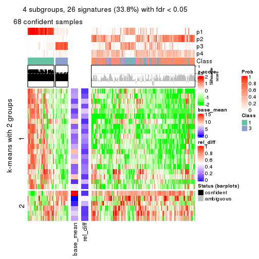</p>

</div>
<div id='tab-ATC-skmeans-get-signatures-4'>
<pre><code class="r">get_signatures(res, k = 5)
</code></pre>

<p></p>

</div>
<div id='tab-ATC-skmeans-get-signatures-5'>
<pre><code class="r">get_signatures(res, k = 6)
</code></pre>

<p></p>

</div>
</div>


Signature heatmaps where rows are not scaled:


<script>
$( function() {
	$( '#tabs-ATC-skmeans-get-signatures-no-scale' ).tabs();
} );
</script>
<div id='tabs-ATC-skmeans-get-signatures-no-scale'>
<ul>
<li><a href='#tab-ATC-skmeans-get-signatures-no-scale-1'>k = 2</a></li>
<li><a href='#tab-ATC-skmeans-get-signatures-no-scale-2'>k = 3</a></li>
<li><a href='#tab-ATC-skmeans-get-signatures-no-scale-3'>k = 4</a></li>
<li><a href='#tab-ATC-skmeans-get-signatures-no-scale-4'>k = 5</a></li>
<li><a href='#tab-ATC-skmeans-get-signatures-no-scale-5'>k = 6</a></li>
</ul>
<div id='tab-ATC-skmeans-get-signatures-no-scale-1'>
<pre><code class="r">get_signatures(res, k = 2, scale_rows = FALSE)
</code></pre>

<p></p>

</div>
<div id='tab-ATC-skmeans-get-signatures-no-scale-2'>
<pre><code class="r">get_signatures(res, k = 3, scale_rows = FALSE)
</code></pre>

<p></p>

</div>
<div id='tab-ATC-skmeans-get-signatures-no-scale-3'>
<pre><code class="r">get_signatures(res, k = 4, scale_rows = FALSE)
</code></pre>

<p></p>

</div>
<div id='tab-ATC-skmeans-get-signatures-no-scale-4'>
<pre><code class="r">get_signatures(res, k = 5, scale_rows = FALSE)
</code></pre>

<p></p>

</div>
<div id='tab-ATC-skmeans-get-signatures-no-scale-5'>
<pre><code class="r">get_signatures(res, k = 6, scale_rows = FALSE)
</code></pre>

<p></p>

</div>
</div>


Compare the overlap of signatures from different k:

```r
compare_signatures(res)
```


`get_signature()` returns a data frame invisibly. TO get the list of signatures, the function
call should be assigned to a variable explicitly. In following code, if `plot` argument is set
to `FALSE`, no heatmap is plotted while only the differential analysis is performed.

```r
# code only for demonstration
tb = get_signature(res, k = ..., plot = FALSE)
```

An example of the output of `tb` is:

```
#>   which_row         fdr    mean_1    mean_2 scaled_mean_1 scaled_mean_2 km
#> 1        38 0.042760348  8.373488  9.131774    -0.5533452     0.5164555  1
#> 2        40 0.018707592  7.106213  8.469186    -0.6173731     0.5762149  1
#> 3        55 0.019134737 10.221463 11.207825    -0.6159697     0.5749050  1
#> 4        59 0.006059896  5.921854  7.869574    -0.6899429     0.6439467  1
#> 5        60 0.018055526  8.928898 10.211722    -0.6204761     0.5791110  1
#> 6        98 0.009384629 15.714769 14.887706     0.6635654    -0.6193277  2
...
```

The columns in `tb` are:

1. `which_row`: row indices corresponding to the input matrix.
2. `fdr`: FDR for the differential test. 
3. `mean_x`: The mean value in group x.
4. `scaled_mean_x`: The mean value in group x after rows are scaled.
5. `km`: Row groups if k-means clustering is applied to rows.


UMAP plot which shows how samples are separated.


<script>
$( function() {
	$( '#tabs-ATC-skmeans-dimension-reduction' ).tabs();
} );
</script>
<div id='tabs-ATC-skmeans-dimension-reduction'>
<ul>
<li><a href='#tab-ATC-skmeans-dimension-reduction-1'>k = 2</a></li>
<li><a href='#tab-ATC-skmeans-dimension-reduction-2'>k = 3</a></li>
<li><a href='#tab-ATC-skmeans-dimension-reduction-3'>k = 4</a></li>
<li><a href='#tab-ATC-skmeans-dimension-reduction-4'>k = 5</a></li>
<li><a href='#tab-ATC-skmeans-dimension-reduction-5'>k = 6</a></li>
</ul>
<div id='tab-ATC-skmeans-dimension-reduction-1'>
<pre><code class="r">dimension_reduction(res, k = 2, method = &quot;UMAP&quot;)
</code></pre>

<p></p>

</div>
<div id='tab-ATC-skmeans-dimension-reduction-2'>
<pre><code class="r">dimension_reduction(res, k = 3, method = &quot;UMAP&quot;)
</code></pre>

<p></p>

</div>
<div id='tab-ATC-skmeans-dimension-reduction-3'>
<pre><code class="r">dimension_reduction(res, k = 4, method = &quot;UMAP&quot;)
</code></pre>

<p></p>

</div>
<div id='tab-ATC-skmeans-dimension-reduction-4'>
<pre><code class="r">dimension_reduction(res, k = 5, method = &quot;UMAP&quot;)
</code></pre>

<p></p>

</div>
<div id='tab-ATC-skmeans-dimension-reduction-5'>
<pre><code class="r">dimension_reduction(res, k = 6, method = &quot;UMAP&quot;)
</code></pre>

<p></p>

</div>
</div>


Following heatmap shows how subgroups are split when increasing `k`:

```r
collect_classes(res)
```


If matrix rows can be associated to genes, consider to use `GO_Enrichment(res,
...)` to perform function enrichment for the signature genes.


 

---------------------------------------------------


### ATC:pam


The object with results only for a single top-value method and a single partition method 
can be extracted as:

```r
res = res_list["ATC", "pam"]
# you can also extract it by
# res = res_list["ATC:pam"]
```

A summary of `res` and all the functions that can be applied to it:

```r
res
```

```
#> A 'ConsensusPartition' object with k = 2, 3, 4, 5, 6.
#>   On a matrix with 77 rows and 243 columns.
#>   Top rows (8, 16, 23, 30, 38) are extracted by 'ATC' method.
#>   Subgroups are detected by 'pam' method.
#>   Performed in total 1250 partitions by row resampling.
#>   Best k for subgroups seems to be 3.
#> 
#> Following methods can be applied to this 'ConsensusPartition' object:
#>  [1] "cola_report"             "collect_classes"         "collect_plots"          
#>  [4] "collect_stats"           "colnames"                "compare_signatures"     
#>  [7] "consensus_heatmap"       "dimension_reduction"     "functional_enrichment"  
#> [10] "get_anno_col"            "get_anno"                "get_classes"            
#> [13] "get_consensus"           "get_matrix"              "get_membership"         
#> [16] "get_param"               "get_signatures"          "get_stats"              
#> [19] "is_best_k"               "is_stable_k"             "membership_heatmap"     
#> [22] "ncol"                    "nrow"                    "plot_ecdf"              
#> [25] "rownames"                "select_partition_number" "show"                   
#> [28] "suggest_best_k"          "test_to_known_factors"
```

`collect_plots()` function collects all the plots made from `res` for all `k` (number of partitions)
into one single page to provide an easy and fast comparison between different `k`.

```r
collect_plots(res)
```


The plots are:

- The first row: a plot of the ECDF (Empirical cumulative distribution
  function) curves of the consensus matrix for each `k` and the heatmap of
  predicted classes for each `k`.
- The second row: heatmaps of the consensus matrix for each `k`.
- The third row: heatmaps of the membership matrix for each `k`.
- The fouth row: heatmaps of the signatures for each `k`.

All the plots in panels can be made by individual functions and they are
plotted later in this section.

`select_partition_number()` produces several plots showing different
statistics for choosing "optimized" `k`. There are following statistics:

- ECDF curves of the consensus matrix for each `k`;
- 1-PAC. [The PAC
  score](https://en.wikipedia.org/wiki/Consensus_clustering#Over-interpretation_potential_of_consensus_clustering)
  measures the proportion of the ambiguous subgrouping.
- Mean silhouette score.
- Concordance. The mean probability of fiting the consensus class ids in all
  partitions.
- Area increased. Denote $A_k$ as the area under the ECDF curve for current
  `k`, the area increased is defined as $A_k - A_{k-1}$.
- Rand index. The percent of pairs of samples that are both in a same cluster
  or both are not in a same cluster in the partition of k and k-1.
- Jaccard index. The ratio of pairs of samples are both in a same cluster in
  the partition of k and k-1 and the pairs of samples are both in a same
  cluster in the partition k or k-1.

The detailed explanations of these statistics can be found in [the cola
vignette](http://bioconductor.org/packages/devel/bioc/vignettes/cola/inst/doc/cola.html#toc_13).

Generally speaking, lower PAC score, higher mean silhouette score or higher
concordance corresponds to better partition. Rand index and Jaccard index
measure how similar the current partition is compared to partition with `k-1`.
If they are too similar, we won't accept `k` is better than `k-1`.

```r
select_partition_number(res)
```


The numeric values for all these statistics can be obtained by `get_stats()`.

```r
get_stats(res)
```

```
#>   k 1-PAC mean_silhouette concordance area_increased  Rand Jaccard
#> 2 2 0.330           0.709       0.851         0.3355 0.729   0.729
#> 3 3 0.253           0.599       0.789         0.7235 0.594   0.473
#> 4 4 0.290           0.377       0.642         0.2082 0.843   0.635
#> 5 5 0.361           0.400       0.612         0.0983 0.824   0.493
#> 6 6 0.411           0.368       0.557         0.0505 0.895   0.613
```

`suggest_best_k()` suggests the best $k$ based on these statistics. The rules are as follows:

- All $k$ with Jaccard index larger than 0.95 are removed because the increase of
  the partition number does not provides enough extra information. If all $k$ are removed,
  the best $k$ is assigned by `NA`.
- For $k$ with 1-PAC larger than 0.9, the maximal $k$ is taken as the "best k". Other $k$ is called "optional k".
- If it does not fit the second rule. The $k$ with the highest vote of highest
  1-PAC, mean silhouette and concordance is taken as the "best k".

```r
suggest_best_k(res)
```

```
#> [1] 3
```


Following shows the table of the partitions (You need to click the **show/hide
code output** link to see it). The membership matrix (columns with name `p*`)
is inferred by
[`clue::cl_consensus()`](https://www.rdocumentation.org/link/cl_consensus?package=clue)
function with the `SE` method. Basically the value in the membership matrix
represents the probability to belong to a certain group. The finall class
label for an item is determined with the group with highest probability it
belongs to.

In `get_classes()` function, the entropy is calculated from the membership
matrix and the silhouette score is calculated from the consensus matrix.


<script>
$( function() {
	$( '#tabs-ATC-pam-get-classes' ).tabs();
} );
</script>
<div id='tabs-ATC-pam-get-classes'>
<ul>
<li><a href='#tab-ATC-pam-get-classes-1'>k = 2</a></li>
<li><a href='#tab-ATC-pam-get-classes-2'>k = 3</a></li>
<li><a href='#tab-ATC-pam-get-classes-3'>k = 4</a></li>
<li><a href='#tab-ATC-pam-get-classes-4'>k = 5</a></li>
<li><a href='#tab-ATC-pam-get-classes-5'>k = 6</a></li>
</ul>

<div id='tab-ATC-pam-get-classes-1'>
<p><a id='tab-ATC-pam-get-classes-1-a' style='color:#0366d6' href='#'>show/hide code output</a></p>
<pre><code class="r">cbind(get_classes(res, k = 2), get_membership(res, k = 2))
</code></pre>

<pre><code>#&gt;           class entropy silhouette    p1    p2
#&gt; SRR191393     2  1.0000     0.2011 0.496 0.504
#&gt; SRR191394     1  0.1184     0.7910 0.984 0.016
#&gt; SRR191396     2  0.8327     0.7105 0.264 0.736
#&gt; SRR191397     1  0.9988    -0.1351 0.520 0.480
#&gt; SRR191398     1  0.1843     0.7889 0.972 0.028
#&gt; SRR191399     2  0.8081     0.7285 0.248 0.752
#&gt; SRR191400     1  0.8661     0.5091 0.712 0.288
#&gt; SRR191401     1  0.9983    -0.1146 0.524 0.476
#&gt; SRR191402     2  0.8813     0.6628 0.300 0.700
#&gt; SRR191403     1  0.9795     0.1545 0.584 0.416
#&gt; SRR191404     2  0.5059     0.8245 0.112 0.888
#&gt; SRR191405     2  0.6247     0.8071 0.156 0.844
#&gt; SRR191406     2  0.5408     0.8219 0.124 0.876
#&gt; SRR191407     1  0.9754     0.1919 0.592 0.408
#&gt; SRR191408     2  0.9686     0.4924 0.396 0.604
#&gt; SRR191409     2  0.7528     0.7590 0.216 0.784
#&gt; SRR191410     2  0.6247     0.7993 0.156 0.844
#&gt; SRR191411     2  0.7376     0.7649 0.208 0.792
#&gt; SRR191412     2  1.0000     0.1977 0.496 0.504
#&gt; SRR191413     2  0.8661     0.6820 0.288 0.712
#&gt; SRR191414     1  0.9988    -0.1300 0.520 0.480
#&gt; SRR191415     2  0.4298     0.8299 0.088 0.912
#&gt; SRR191416     2  0.7139     0.7743 0.196 0.804
#&gt; SRR191418     2  0.9686     0.4952 0.396 0.604
#&gt; SRR191419     1  0.0000     0.7921 1.000 0.000
#&gt; SRR191420     2  0.9775     0.4340 0.412 0.588
#&gt; SRR191421     2  0.9881     0.3767 0.436 0.564
#&gt; SRR191422     2  0.4815     0.8275 0.104 0.896
#&gt; SRR191423     2  0.4298     0.8323 0.088 0.912
#&gt; SRR191424     2  0.4022     0.8221 0.080 0.920
#&gt; SRR191425     2  0.6801     0.7888 0.180 0.820
#&gt; SRR191426     2  0.0000     0.8231 0.000 1.000
#&gt; SRR191427     2  0.7674     0.7497 0.224 0.776
#&gt; SRR191428     2  0.7674     0.7578 0.224 0.776
#&gt; SRR191429     2  0.0000     0.8231 0.000 1.000
#&gt; SRR191430     2  0.2423     0.8330 0.040 0.960
#&gt; SRR191431     2  0.9170     0.6128 0.332 0.668
#&gt; SRR191432     2  0.0000     0.8231 0.000 1.000
#&gt; SRR191433     2  0.0000     0.8231 0.000 1.000
#&gt; SRR191434     2  0.6712     0.7960 0.176 0.824
#&gt; SRR191435     2  0.7299     0.7702 0.204 0.796
#&gt; SRR191436     2  0.2948     0.8342 0.052 0.948
#&gt; SRR191437     2  0.9087     0.5791 0.324 0.676
#&gt; SRR191438     2  0.4431     0.8294 0.092 0.908
#&gt; SRR191439     2  0.4298     0.8331 0.088 0.912
#&gt; SRR191440     2  0.6343     0.7894 0.160 0.840
#&gt; SRR191441     2  0.0672     0.8252 0.008 0.992
#&gt; SRR191442     2  0.4939     0.8264 0.108 0.892
#&gt; SRR191443     2  0.9866     0.3980 0.432 0.568
#&gt; SRR191444     2  0.6712     0.7937 0.176 0.824
#&gt; SRR191445     2  0.4562     0.8303 0.096 0.904
#&gt; SRR191446     2  0.0376     0.8245 0.004 0.996
#&gt; SRR191447     2  0.3431     0.8333 0.064 0.936
#&gt; SRR191448     1  0.4161     0.7688 0.916 0.084
#&gt; SRR191449     2  0.4431     0.8300 0.092 0.908
#&gt; SRR191450     1  0.8267     0.5979 0.740 0.260
#&gt; SRR191451     2  0.9393     0.5532 0.356 0.644
#&gt; SRR191452     2  0.5629     0.8111 0.132 0.868
#&gt; SRR191453     2  0.9710     0.4741 0.400 0.600
#&gt; SRR191454     2  0.9427     0.5489 0.360 0.640
#&gt; SRR191455     2  0.3431     0.8272 0.064 0.936
#&gt; SRR191456     2  0.9580     0.5187 0.380 0.620
#&gt; SRR191457     1  0.2603     0.7853 0.956 0.044
#&gt; SRR191458     2  0.9635     0.5084 0.388 0.612
#&gt; SRR191459     2  0.0000     0.8231 0.000 1.000
#&gt; SRR191460     2  0.8327     0.7003 0.264 0.736
#&gt; SRR191461     2  0.1414     0.8301 0.020 0.980
#&gt; SRR191462     2  0.5946     0.8123 0.144 0.856
#&gt; SRR191463     2  0.1184     0.8294 0.016 0.984
#&gt; SRR191464     2  0.0672     0.8257 0.008 0.992
#&gt; SRR191465     2  0.0000     0.8231 0.000 1.000
#&gt; SRR191466     2  0.3274     0.8341 0.060 0.940
#&gt; SRR191467     2  0.0938     0.8278 0.012 0.988
#&gt; SRR191468     2  0.0000     0.8231 0.000 1.000
#&gt; SRR191469     2  0.5408     0.8213 0.124 0.876
#&gt; SRR191470     2  0.0376     0.8243 0.004 0.996
#&gt; SRR191471     2  0.0672     0.8258 0.008 0.992
#&gt; SRR191472     2  0.1414     0.8305 0.020 0.980
#&gt; SRR191473     2  0.0000     0.8231 0.000 1.000
#&gt; SRR191474     2  0.3114     0.8338 0.056 0.944
#&gt; SRR191475     2  0.0000     0.8231 0.000 1.000
#&gt; SRR191476     2  0.0000     0.8231 0.000 1.000
#&gt; SRR191477     2  0.0376     0.8238 0.004 0.996
#&gt; SRR191478     2  0.0672     0.8264 0.008 0.992
#&gt; SRR191479     2  0.9710     0.4769 0.400 0.600
#&gt; SRR191480     2  0.0376     0.8238 0.004 0.996
#&gt; SRR191481     2  0.0000     0.8231 0.000 1.000
#&gt; SRR191482     2  0.0000     0.8231 0.000 1.000
#&gt; SRR191483     2  0.0000     0.8231 0.000 1.000
#&gt; SRR191484     2  0.9963     0.2535 0.464 0.536
#&gt; SRR191485     2  0.0000     0.8231 0.000 1.000
#&gt; SRR191486     2  0.8443     0.6854 0.272 0.728
#&gt; SRR191487     2  0.2603     0.8337 0.044 0.956
#&gt; SRR191488     1  0.9170     0.4534 0.668 0.332
#&gt; SRR191489     2  0.9635     0.4812 0.388 0.612
#&gt; SRR191490     2  0.7815     0.7112 0.232 0.768
#&gt; SRR191491     2  0.7745     0.7430 0.228 0.772
#&gt; SRR191492     2  0.4431     0.8317 0.092 0.908
#&gt; SRR191493     1  0.9881     0.2126 0.564 0.436
#&gt; SRR191494     2  0.6531     0.7978 0.168 0.832
#&gt; SRR191495     2  0.6801     0.7869 0.180 0.820
#&gt; SRR191496     2  0.3584     0.8341 0.068 0.932
#&gt; SRR191497     2  0.3733     0.8345 0.072 0.928
#&gt; SRR191498     2  0.8661     0.6777 0.288 0.712
#&gt; SRR191499     2  0.4161     0.8325 0.084 0.916
#&gt; SRR191500     2  0.4022     0.8343 0.080 0.920
#&gt; SRR191501     2  0.9491     0.4141 0.368 0.632
#&gt; SRR191502     2  0.3274     0.8345 0.060 0.940
#&gt; SRR191503     2  0.1843     0.8317 0.028 0.972
#&gt; SRR191504     2  0.0000     0.8231 0.000 1.000
#&gt; SRR191505     2  0.0000     0.8231 0.000 1.000
#&gt; SRR191506     2  0.1633     0.8314 0.024 0.976
#&gt; SRR191507     2  0.0000     0.8231 0.000 1.000
#&gt; SRR191508     2  0.1414     0.8306 0.020 0.980
#&gt; SRR191509     2  0.1843     0.8267 0.028 0.972
#&gt; SRR191510     2  0.4161     0.8199 0.084 0.916
#&gt; SRR191511     2  0.0376     0.8251 0.004 0.996
#&gt; SRR191512     2  0.0000     0.8231 0.000 1.000
#&gt; SRR191513     2  0.2423     0.8281 0.040 0.960
#&gt; SRR191514     2  0.0000     0.8231 0.000 1.000
#&gt; SRR191515     2  0.0000     0.8231 0.000 1.000
#&gt; SRR191516     2  0.4298     0.8331 0.088 0.912
#&gt; SRR191517     2  0.0000     0.8231 0.000 1.000
#&gt; SRR191518     2  0.0000     0.8231 0.000 1.000
#&gt; SRR191519     2  0.0000     0.8231 0.000 1.000
#&gt; SRR191520     2  0.2236     0.8323 0.036 0.964
#&gt; SRR191521     2  0.0000     0.8231 0.000 1.000
#&gt; SRR191522     2  0.0376     0.8232 0.004 0.996
#&gt; SRR191523     2  0.2423     0.8311 0.040 0.960
#&gt; SRR191524     2  0.7453     0.7689 0.212 0.788
#&gt; SRR191525     2  0.0672     0.8253 0.008 0.992
#&gt; SRR191526     2  0.0938     0.8267 0.012 0.988
#&gt; SRR191527     1  0.3584     0.7775 0.932 0.068
#&gt; SRR191528     1  0.5946     0.7269 0.856 0.144
#&gt; SRR191529     2  0.6247     0.7822 0.156 0.844
#&gt; SRR191530     2  0.0000     0.8231 0.000 1.000
#&gt; SRR191531     2  0.9988     0.1958 0.480 0.520
#&gt; SRR191532     2  0.1414     0.8301 0.020 0.980
#&gt; SRR191533     2  0.5059     0.8276 0.112 0.888
#&gt; SRR191534     2  0.5059     0.8248 0.112 0.888
#&gt; SRR191535     2  0.0000     0.8231 0.000 1.000
#&gt; SRR191536     2  0.4431     0.8276 0.092 0.908
#&gt; SRR191537     2  0.0938     0.8249 0.012 0.988
#&gt; SRR191538     2  0.0000     0.8231 0.000 1.000
#&gt; SRR191539     2  0.0672     0.8237 0.008 0.992
#&gt; SRR191540     2  0.0376     0.8247 0.004 0.996
#&gt; SRR191541     2  0.0000     0.8231 0.000 1.000
#&gt; SRR191542     2  0.2948     0.8354 0.052 0.948
#&gt; SRR191543     2  0.0000     0.8231 0.000 1.000
#&gt; SRR191544     2  0.0000     0.8231 0.000 1.000
#&gt; SRR191545     2  0.0000     0.8231 0.000 1.000
#&gt; SRR191546     2  0.0000     0.8231 0.000 1.000
#&gt; SRR191547     2  0.1414     0.8290 0.020 0.980
#&gt; SRR191548     1  0.0000     0.7921 1.000 0.000
#&gt; SRR191549     1  0.0000     0.7921 1.000 0.000
#&gt; SRR191550     1  0.0000     0.7921 1.000 0.000
#&gt; SRR191551     1  0.0000     0.7921 1.000 0.000
#&gt; SRR191552     1  0.0000     0.7921 1.000 0.000
#&gt; SRR191553     1  0.0000     0.7921 1.000 0.000
#&gt; SRR191554     1  0.0000     0.7921 1.000 0.000
#&gt; SRR191555     1  0.9944     0.0626 0.544 0.456
#&gt; SRR191556     2  0.9909     0.3665 0.444 0.556
#&gt; SRR191557     2  0.5946     0.8131 0.144 0.856
#&gt; SRR191558     2  0.8267     0.7121 0.260 0.740
#&gt; SRR191559     2  0.6343     0.8044 0.160 0.840
#&gt; SRR191560     2  0.8763     0.6742 0.296 0.704
#&gt; SRR191561     1  0.0000     0.7921 1.000 0.000
#&gt; SRR191562     2  1.0000     0.2026 0.496 0.504
#&gt; SRR191563     2  0.4161     0.8330 0.084 0.916
#&gt; SRR191564     2  0.4298     0.8321 0.088 0.912
#&gt; SRR191565     2  0.9933     0.3438 0.452 0.548
#&gt; SRR191566     2  0.9427     0.5602 0.360 0.640
#&gt; SRR191567     1  0.9686     0.2339 0.604 0.396
#&gt; SRR191568     2  1.0000     0.1911 0.500 0.500
#&gt; SRR191569     2  0.8909     0.6534 0.308 0.692
#&gt; SRR191570     2  0.9775     0.4496 0.412 0.588
#&gt; SRR191571     2  0.8207     0.7192 0.256 0.744
#&gt; SRR191572     1  0.0000     0.7921 1.000 0.000
#&gt; SRR191573     2  0.9427     0.5665 0.360 0.640
#&gt; SRR191574     1  0.8081     0.5817 0.752 0.248
#&gt; SRR191575     1  0.9866     0.0828 0.568 0.432
#&gt; SRR191576     2  0.9522     0.5401 0.372 0.628
#&gt; SRR191577     2  0.9922     0.3534 0.448 0.552
#&gt; SRR191578     2  0.4690     0.8298 0.100 0.900
#&gt; SRR191579     1  0.0000     0.7921 1.000 0.000
#&gt; SRR191580     1  0.0376     0.7908 0.996 0.004
#&gt; SRR191581     1  0.0000     0.7921 1.000 0.000
#&gt; SRR191582     1  0.0000     0.7921 1.000 0.000
#&gt; SRR191583     2  0.9775     0.3278 0.412 0.588
#&gt; SRR191584     1  0.0000     0.7921 1.000 0.000
#&gt; SRR191585     2  0.1633     0.8297 0.024 0.976
#&gt; SRR191586     2  0.3114     0.8354 0.056 0.944
#&gt; SRR191587     2  0.5408     0.8197 0.124 0.876
#&gt; SRR191588     2  0.9998     0.2215 0.492 0.508
#&gt; SRR191589     2  0.9000     0.6419 0.316 0.684
#&gt; SRR191590     2  0.9983     0.2633 0.476 0.524
#&gt; SRR191591     2  0.5946     0.8127 0.144 0.856
#&gt; SRR191592     2  0.8555     0.6780 0.280 0.720
#&gt; SRR191593     2  0.7602     0.7634 0.220 0.780
#&gt; SRR191594     1  0.0000     0.7921 1.000 0.000
#&gt; SRR191595     2  0.9661     0.4983 0.392 0.608
#&gt; SRR191596     2  0.9881     0.3740 0.436 0.564
#&gt; SRR191597     2  0.1633     0.8293 0.024 0.976
#&gt; SRR191598     2  0.9775     0.4537 0.412 0.588
#&gt; SRR191599     2  0.9815     0.4111 0.420 0.580
#&gt; SRR191600     2  0.3431     0.8334 0.064 0.936
#&gt; SRR191601     2  0.4022     0.8329 0.080 0.920
#&gt; SRR191602     2  0.4690     0.8269 0.100 0.900
#&gt; SRR191603     2  0.0938     0.8275 0.012 0.988
#&gt; SRR191604     2  0.0000     0.8231 0.000 1.000
#&gt; SRR191605     2  0.7528     0.7503 0.216 0.784
#&gt; SRR191606     2  0.9775     0.4321 0.412 0.588
#&gt; SRR191607     2  0.4431     0.8274 0.092 0.908
#&gt; SRR191608     2  0.1843     0.8310 0.028 0.972
#&gt; SRR191609     2  0.2423     0.8328 0.040 0.960
#&gt; SRR191610     2  0.5408     0.8185 0.124 0.876
#&gt; SRR191611     2  0.3584     0.8330 0.068 0.932
#&gt; SRR191612     2  0.5294     0.8202 0.120 0.880
#&gt; SRR191613     2  0.9993     0.1975 0.484 0.516
#&gt; SRR191614     2  0.5519     0.8178 0.128 0.872
#&gt; SRR191615     2  0.6712     0.7910 0.176 0.824
#&gt; SRR191616     1  0.5519     0.7380 0.872 0.128
#&gt; SRR191617     2  0.6148     0.8113 0.152 0.848
#&gt; SRR191618     2  0.7950     0.7346 0.240 0.760
#&gt; SRR191619     2  0.2043     0.8318 0.032 0.968
#&gt; SRR191620     2  0.3584     0.8331 0.068 0.932
#&gt; SRR191621     2  0.0376     0.8249 0.004 0.996
#&gt; SRR191622     2  0.4022     0.8304 0.080 0.920
#&gt; SRR191623     2  0.4815     0.8244 0.104 0.896
#&gt; SRR191624     2  0.9833     0.4239 0.424 0.576
#&gt; SRR191625     2  0.1843     0.8319 0.028 0.972
#&gt; SRR191626     2  0.0376     0.8247 0.004 0.996
#&gt; SRR191627     2  0.1184     0.8275 0.016 0.984
#&gt; SRR191628     2  0.8267     0.7069 0.260 0.740
#&gt; SRR191629     2  0.3879     0.8318 0.076 0.924
#&gt; SRR191630     1  0.2043     0.7878 0.968 0.032
#&gt; SRR191631     2  0.0376     0.8238 0.004 0.996
#&gt; SRR191632     2  0.6801     0.7922 0.180 0.820
#&gt; SRR191633     2  0.6148     0.8026 0.152 0.848
#&gt; SRR191634     1  0.5946     0.7275 0.856 0.144
#&gt; SRR191635     2  0.5629     0.8159 0.132 0.868
#&gt; SRR191636     1  0.4939     0.7560 0.892 0.108
#&gt; SRR191637     2  0.1633     0.8238 0.024 0.976
</code></pre>

<script>
$('#tab-ATC-pam-get-classes-1-a').parent().next().next().hide();
$('#tab-ATC-pam-get-classes-1-a').click(function(){
  $('#tab-ATC-pam-get-classes-1-a').parent().next().next().toggle();
  return(false);
});
</script>
</div>

<div id='tab-ATC-pam-get-classes-2'>
<p><a id='tab-ATC-pam-get-classes-2-a' style='color:#0366d6' href='#'>show/hide code output</a></p>
<pre><code class="r">cbind(get_classes(res, k = 3), get_membership(res, k = 3))
</code></pre>

<pre><code>#&gt;           class entropy silhouette    p1    p2    p3
#&gt; SRR191393     3  0.2301    0.68667 0.060 0.004 0.936
#&gt; SRR191394     1  0.4605    0.77989 0.796 0.000 0.204
#&gt; SRR191396     3  0.5111    0.66143 0.024 0.168 0.808
#&gt; SRR191397     3  0.2448    0.67589 0.076 0.000 0.924
#&gt; SRR191398     1  0.4452    0.79476 0.808 0.000 0.192
#&gt; SRR191399     3  0.6180    0.57719 0.024 0.260 0.716
#&gt; SRR191400     3  0.5254    0.46030 0.264 0.000 0.736
#&gt; SRR191401     3  0.3030    0.67208 0.092 0.004 0.904
#&gt; SRR191402     3  0.3987    0.68761 0.020 0.108 0.872
#&gt; SRR191403     3  0.3619    0.63068 0.136 0.000 0.864
#&gt; SRR191404     3  0.6154    0.26541 0.000 0.408 0.592
#&gt; SRR191405     3  0.5431    0.53504 0.000 0.284 0.716
#&gt; SRR191406     3  0.5254    0.62501 0.000 0.264 0.736
#&gt; SRR191407     3  0.4351    0.60993 0.168 0.004 0.828
#&gt; SRR191408     3  0.2926    0.70230 0.036 0.040 0.924
#&gt; SRR191409     3  0.5253    0.64452 0.020 0.188 0.792
#&gt; SRR191410     3  0.6553    0.27593 0.008 0.412 0.580
#&gt; SRR191411     3  0.4345    0.68949 0.016 0.136 0.848
#&gt; SRR191412     3  0.1964    0.68712 0.056 0.000 0.944
#&gt; SRR191413     3  0.5167    0.65796 0.024 0.172 0.804
#&gt; SRR191414     3  0.2796    0.67130 0.092 0.000 0.908
#&gt; SRR191415     3  0.6215    0.21012 0.000 0.428 0.572
#&gt; SRR191416     3  0.6849    0.37314 0.020 0.380 0.600
#&gt; SRR191418     3  0.2681    0.69850 0.028 0.040 0.932
#&gt; SRR191419     1  0.0000    0.89648 1.000 0.000 0.000
#&gt; SRR191420     3  0.3856    0.68802 0.040 0.072 0.888
#&gt; SRR191421     3  0.3583    0.68772 0.044 0.056 0.900
#&gt; SRR191422     3  0.6291    0.18625 0.000 0.468 0.532
#&gt; SRR191423     3  0.6045    0.36116 0.000 0.380 0.620
#&gt; SRR191424     2  0.4953    0.70942 0.016 0.808 0.176
#&gt; SRR191425     3  0.5365    0.62632 0.004 0.252 0.744
#&gt; SRR191426     2  0.2537    0.76505 0.000 0.920 0.080
#&gt; SRR191427     3  0.5797    0.59417 0.008 0.280 0.712
#&gt; SRR191428     3  0.3879    0.68089 0.000 0.152 0.848
#&gt; SRR191429     2  0.1411    0.75073 0.000 0.964 0.036
#&gt; SRR191430     2  0.5621    0.59202 0.000 0.692 0.308
#&gt; SRR191431     3  0.4679    0.69810 0.020 0.148 0.832
#&gt; SRR191432     2  0.1411    0.75042 0.000 0.964 0.036
#&gt; SRR191433     2  0.2878    0.75805 0.000 0.904 0.096
#&gt; SRR191434     3  0.6215    0.21869 0.000 0.428 0.572
#&gt; SRR191435     3  0.5763    0.55820 0.008 0.276 0.716
#&gt; SRR191436     2  0.5859    0.53587 0.000 0.656 0.344
#&gt; SRR191437     2  0.8511   -0.05511 0.092 0.480 0.428
#&gt; SRR191438     3  0.6225    0.21951 0.000 0.432 0.568
#&gt; SRR191439     3  0.6095    0.39174 0.000 0.392 0.608
#&gt; SRR191440     2  0.6944    0.13744 0.016 0.516 0.468
#&gt; SRR191441     2  0.2878    0.74310 0.000 0.904 0.096
#&gt; SRR191442     3  0.6308    0.12958 0.000 0.492 0.508
#&gt; SRR191443     3  0.3888    0.69241 0.048 0.064 0.888
#&gt; SRR191444     3  0.5988    0.41959 0.000 0.368 0.632
#&gt; SRR191445     2  0.6513    0.01149 0.004 0.520 0.476
#&gt; SRR191446     2  0.2448    0.75922 0.000 0.924 0.076
#&gt; SRR191447     2  0.6468    0.11905 0.004 0.552 0.444
#&gt; SRR191448     1  0.6047    0.62545 0.680 0.008 0.312
#&gt; SRR191449     3  0.6307    0.00792 0.000 0.488 0.512
#&gt; SRR191450     1  0.8341    0.12310 0.468 0.080 0.452
#&gt; SRR191451     3  0.3637    0.69135 0.024 0.084 0.892
#&gt; SRR191452     3  0.6154    0.33046 0.000 0.408 0.592
#&gt; SRR191453     3  0.2569    0.70408 0.032 0.032 0.936
#&gt; SRR191454     3  0.4345    0.68726 0.016 0.136 0.848
#&gt; SRR191455     2  0.6204    0.34720 0.000 0.576 0.424
#&gt; SRR191456     3  0.3933    0.69978 0.028 0.092 0.880
#&gt; SRR191457     1  0.5325    0.73475 0.748 0.004 0.248
#&gt; SRR191458     3  0.3973    0.70253 0.032 0.088 0.880
#&gt; SRR191459     2  0.3340    0.75829 0.000 0.880 0.120
#&gt; SRR191460     3  0.3573    0.70163 0.004 0.120 0.876
#&gt; SRR191461     2  0.5291    0.66309 0.000 0.732 0.268
#&gt; SRR191462     3  0.6598    0.31083 0.008 0.428 0.564
#&gt; SRR191463     2  0.5098    0.63906 0.000 0.752 0.248
#&gt; SRR191464     2  0.4654    0.70853 0.000 0.792 0.208
#&gt; SRR191465     2  0.0892    0.75035 0.000 0.980 0.020
#&gt; SRR191466     2  0.6008    0.40147 0.000 0.628 0.372
#&gt; SRR191467     2  0.4178    0.71740 0.000 0.828 0.172
#&gt; SRR191468     2  0.1529    0.75962 0.000 0.960 0.040
#&gt; SRR191469     3  0.5948    0.46730 0.000 0.360 0.640
#&gt; SRR191470     2  0.1860    0.74856 0.000 0.948 0.052
#&gt; SRR191471     2  0.3551    0.73796 0.000 0.868 0.132
#&gt; SRR191472     2  0.5465    0.61440 0.000 0.712 0.288
#&gt; SRR191473     2  0.2261    0.74851 0.000 0.932 0.068
#&gt; SRR191474     2  0.5948    0.49597 0.000 0.640 0.360
#&gt; SRR191475     2  0.0592    0.74990 0.000 0.988 0.012
#&gt; SRR191476     2  0.1289    0.75818 0.000 0.968 0.032
#&gt; SRR191477     2  0.4121    0.74231 0.000 0.832 0.168
#&gt; SRR191478     2  0.4452    0.72622 0.000 0.808 0.192
#&gt; SRR191479     3  0.2318    0.70023 0.028 0.028 0.944
#&gt; SRR191480     2  0.2959    0.75130 0.000 0.900 0.100
#&gt; SRR191481     2  0.2261    0.74934 0.000 0.932 0.068
#&gt; SRR191482     2  0.2066    0.75183 0.000 0.940 0.060
#&gt; SRR191483     2  0.0892    0.75241 0.000 0.980 0.020
#&gt; SRR191484     3  0.7282    0.62794 0.144 0.144 0.712
#&gt; SRR191485     2  0.3038    0.75213 0.000 0.896 0.104
#&gt; SRR191486     3  0.5903    0.64496 0.024 0.232 0.744
#&gt; SRR191487     2  0.4605    0.69742 0.000 0.796 0.204
#&gt; SRR191488     3  0.8759    0.18828 0.360 0.120 0.520
#&gt; SRR191489     3  0.5094    0.67008 0.040 0.136 0.824
#&gt; SRR191490     2  0.7392   -0.09880 0.032 0.500 0.468
#&gt; SRR191491     3  0.6952    0.46959 0.024 0.376 0.600
#&gt; SRR191492     2  0.6298    0.29339 0.004 0.608 0.388
#&gt; SRR191493     3  0.9296   -0.02605 0.404 0.160 0.436
#&gt; SRR191494     3  0.6819    0.22790 0.012 0.476 0.512
#&gt; SRR191495     3  0.7043    0.30250 0.020 0.448 0.532
#&gt; SRR191496     2  0.6404    0.45071 0.012 0.644 0.344
#&gt; SRR191497     2  0.6302    0.05645 0.000 0.520 0.480
#&gt; SRR191498     3  0.8089    0.52967 0.092 0.308 0.600
#&gt; SRR191499     2  0.5948    0.37873 0.000 0.640 0.360
#&gt; SRR191500     2  0.6095    0.40235 0.000 0.608 0.392
#&gt; SRR191501     3  0.9062    0.17692 0.136 0.412 0.452
#&gt; SRR191502     2  0.6566    0.35353 0.012 0.612 0.376
#&gt; SRR191503     2  0.4931    0.67414 0.000 0.768 0.232
#&gt; SRR191504     2  0.0592    0.75070 0.000 0.988 0.012
#&gt; SRR191505     2  0.0237    0.74761 0.000 0.996 0.004
#&gt; SRR191506     2  0.4702    0.67927 0.000 0.788 0.212
#&gt; SRR191507     2  0.1964    0.75911 0.000 0.944 0.056
#&gt; SRR191508     2  0.5397    0.61674 0.000 0.720 0.280
#&gt; SRR191509     2  0.4504    0.67022 0.000 0.804 0.196
#&gt; SRR191510     2  0.5956    0.52700 0.004 0.672 0.324
#&gt; SRR191511     2  0.3412    0.76174 0.000 0.876 0.124
#&gt; SRR191512     2  0.0237    0.74721 0.000 0.996 0.004
#&gt; SRR191513     2  0.3340    0.74162 0.000 0.880 0.120
#&gt; SRR191514     2  0.0424    0.74825 0.000 0.992 0.008
#&gt; SRR191515     2  0.1529    0.75931 0.000 0.960 0.040
#&gt; SRR191516     2  0.6057    0.48903 0.004 0.656 0.340
#&gt; SRR191517     2  0.2165    0.74746 0.000 0.936 0.064
#&gt; SRR191518     2  0.1860    0.74836 0.000 0.948 0.052
#&gt; SRR191519     2  0.0424    0.74914 0.000 0.992 0.008
#&gt; SRR191520     2  0.4842    0.67335 0.000 0.776 0.224
#&gt; SRR191521     2  0.1643    0.75977 0.000 0.956 0.044
#&gt; SRR191522     2  0.1643    0.75876 0.000 0.956 0.044
#&gt; SRR191523     2  0.5988    0.56954 0.008 0.688 0.304
#&gt; SRR191524     3  0.7368    0.50673 0.044 0.352 0.604
#&gt; SRR191525     2  0.2625    0.76298 0.000 0.916 0.084
#&gt; SRR191526     2  0.2537    0.76268 0.000 0.920 0.080
#&gt; SRR191527     1  0.3340    0.84707 0.880 0.000 0.120
#&gt; SRR191528     1  0.7050    0.48967 0.600 0.028 0.372
#&gt; SRR191529     2  0.6975    0.34999 0.028 0.616 0.356
#&gt; SRR191530     2  0.0592    0.75118 0.000 0.988 0.012
#&gt; SRR191531     3  0.7004    0.58986 0.160 0.112 0.728
#&gt; SRR191532     2  0.4452    0.71029 0.000 0.808 0.192
#&gt; SRR191533     2  0.6836    0.16364 0.016 0.572 0.412
#&gt; SRR191534     2  0.6543    0.40147 0.016 0.640 0.344
#&gt; SRR191535     2  0.3816    0.70256 0.000 0.852 0.148
#&gt; SRR191536     2  0.6126    0.32012 0.000 0.600 0.400
#&gt; SRR191537     2  0.4178    0.72468 0.000 0.828 0.172
#&gt; SRR191538     2  0.1643    0.75631 0.000 0.956 0.044
#&gt; SRR191539     2  0.2165    0.75900 0.000 0.936 0.064
#&gt; SRR191540     2  0.3116    0.75845 0.000 0.892 0.108
#&gt; SRR191541     2  0.1860    0.74933 0.000 0.948 0.052
#&gt; SRR191542     2  0.5363    0.57971 0.000 0.724 0.276
#&gt; SRR191543     2  0.1289    0.75457 0.000 0.968 0.032
#&gt; SRR191544     2  0.1031    0.75431 0.000 0.976 0.024
#&gt; SRR191545     2  0.0237    0.74657 0.000 0.996 0.004
#&gt; SRR191546     2  0.3551    0.72803 0.000 0.868 0.132
#&gt; SRR191547     2  0.3112    0.75968 0.004 0.900 0.096
#&gt; SRR191548     1  0.0000    0.89648 1.000 0.000 0.000
#&gt; SRR191549     1  0.0000    0.89648 1.000 0.000 0.000
#&gt; SRR191550     1  0.0000    0.89648 1.000 0.000 0.000
#&gt; SRR191551     1  0.0000    0.89648 1.000 0.000 0.000
#&gt; SRR191552     1  0.0000    0.89648 1.000 0.000 0.000
#&gt; SRR191553     1  0.0000    0.89648 1.000 0.000 0.000
#&gt; SRR191554     1  0.0000    0.89648 1.000 0.000 0.000
#&gt; SRR191555     3  0.7256    0.55728 0.216 0.088 0.696
#&gt; SRR191556     3  0.1399    0.69053 0.028 0.004 0.968
#&gt; SRR191557     3  0.5733    0.50159 0.000 0.324 0.676
#&gt; SRR191558     3  0.4418    0.68811 0.020 0.132 0.848
#&gt; SRR191559     3  0.4702    0.62963 0.000 0.212 0.788
#&gt; SRR191560     3  0.4342    0.68875 0.024 0.120 0.856
#&gt; SRR191561     1  0.0000    0.89648 1.000 0.000 0.000
#&gt; SRR191562     3  0.4097    0.68861 0.060 0.060 0.880
#&gt; SRR191563     3  0.6168    0.26448 0.000 0.412 0.588
#&gt; SRR191564     3  0.5905    0.43808 0.000 0.352 0.648
#&gt; SRR191565     3  0.1399    0.68981 0.028 0.004 0.968
#&gt; SRR191566     3  0.1999    0.70235 0.012 0.036 0.952
#&gt; SRR191567     3  0.4555    0.55870 0.200 0.000 0.800
#&gt; SRR191568     3  0.1964    0.68650 0.056 0.000 0.944
#&gt; SRR191569     3  0.4172    0.69773 0.028 0.104 0.868
#&gt; SRR191570     3  0.1765    0.68807 0.040 0.004 0.956
#&gt; SRR191571     3  0.5053    0.66176 0.024 0.164 0.812
#&gt; SRR191572     1  0.0000    0.89648 1.000 0.000 0.000
#&gt; SRR191573     3  0.2879    0.69903 0.024 0.052 0.924
#&gt; SRR191574     3  0.6169    0.22334 0.360 0.004 0.636
#&gt; SRR191575     3  0.4059    0.63884 0.128 0.012 0.860
#&gt; SRR191576     3  0.3009    0.70169 0.028 0.052 0.920
#&gt; SRR191577     3  0.1399    0.68904 0.028 0.004 0.968
#&gt; SRR191578     2  0.6008    0.48202 0.000 0.628 0.372
#&gt; SRR191579     1  0.0000    0.89648 1.000 0.000 0.000
#&gt; SRR191580     1  0.0000    0.89648 1.000 0.000 0.000
#&gt; SRR191581     1  0.0000    0.89648 1.000 0.000 0.000
#&gt; SRR191582     1  0.0237    0.89545 0.996 0.000 0.004
#&gt; SRR191583     3  0.9532    0.29298 0.212 0.316 0.472
#&gt; SRR191584     1  0.0000    0.89648 1.000 0.000 0.000
#&gt; SRR191585     2  0.5058    0.69239 0.000 0.756 0.244
#&gt; SRR191586     2  0.5810    0.54575 0.000 0.664 0.336
#&gt; SRR191587     3  0.5431    0.54761 0.000 0.284 0.716
#&gt; SRR191588     3  0.1989    0.68740 0.048 0.004 0.948
#&gt; SRR191589     3  0.3461    0.69756 0.024 0.076 0.900
#&gt; SRR191590     3  0.4189    0.68708 0.056 0.068 0.876
#&gt; SRR191591     3  0.5216    0.58092 0.000 0.260 0.740
#&gt; SRR191592     3  0.4663    0.68682 0.016 0.156 0.828
#&gt; SRR191593     3  0.4915    0.65864 0.012 0.184 0.804
#&gt; SRR191594     1  0.0237    0.89526 0.996 0.000 0.004
#&gt; SRR191595     3  0.2564    0.69923 0.036 0.028 0.936
#&gt; SRR191596     3  0.4369    0.68354 0.040 0.096 0.864
#&gt; SRR191597     2  0.5098    0.66927 0.000 0.752 0.248
#&gt; SRR191598     3  0.2313    0.69838 0.032 0.024 0.944
#&gt; SRR191599     3  0.4449    0.68170 0.040 0.100 0.860
#&gt; SRR191600     2  0.6140    0.36388 0.000 0.596 0.404
#&gt; SRR191601     2  0.6286    0.02974 0.000 0.536 0.464
#&gt; SRR191602     3  0.6140    0.32142 0.000 0.404 0.596
#&gt; SRR191603     2  0.4842    0.70770 0.000 0.776 0.224
#&gt; SRR191604     2  0.1643    0.75882 0.000 0.956 0.044
#&gt; SRR191605     3  0.6096    0.59285 0.016 0.280 0.704
#&gt; SRR191606     3  0.4295    0.68114 0.032 0.104 0.864
#&gt; SRR191607     3  0.6244    0.30721 0.000 0.440 0.560
#&gt; SRR191608     2  0.3941    0.73855 0.000 0.844 0.156
#&gt; SRR191609     2  0.4750    0.69739 0.000 0.784 0.216
#&gt; SRR191610     3  0.6111    0.39663 0.000 0.396 0.604
#&gt; SRR191611     2  0.6045    0.43615 0.000 0.620 0.380
#&gt; SRR191612     3  0.6045    0.38263 0.000 0.380 0.620
#&gt; SRR191613     3  0.6663    0.61950 0.156 0.096 0.748
#&gt; SRR191614     3  0.5785    0.45934 0.000 0.332 0.668
#&gt; SRR191615     3  0.5070    0.61783 0.004 0.224 0.772
#&gt; SRR191616     1  0.6093    0.74796 0.776 0.068 0.156
#&gt; SRR191617     3  0.6682    0.07315 0.008 0.488 0.504
#&gt; SRR191618     3  0.7116    0.55172 0.040 0.324 0.636
#&gt; SRR191619     2  0.4002    0.74265 0.000 0.840 0.160
#&gt; SRR191620     2  0.6204    0.31485 0.000 0.576 0.424
#&gt; SRR191621     2  0.4121    0.73601 0.000 0.832 0.168
#&gt; SRR191622     3  0.6308    0.12258 0.000 0.492 0.508
#&gt; SRR191623     3  0.6215    0.24898 0.000 0.428 0.572
#&gt; SRR191624     3  0.1711    0.69460 0.032 0.008 0.960
#&gt; SRR191625     2  0.4887    0.69928 0.000 0.772 0.228
#&gt; SRR191626     2  0.3551    0.74622 0.000 0.868 0.132
#&gt; SRR191627     2  0.4062    0.73654 0.000 0.836 0.164
#&gt; SRR191628     3  0.5633    0.65776 0.024 0.208 0.768
#&gt; SRR191629     3  0.6225    0.19808 0.000 0.432 0.568
#&gt; SRR191630     1  0.3412    0.83783 0.876 0.000 0.124
#&gt; SRR191631     2  0.3551    0.74625 0.000 0.868 0.132
#&gt; SRR191632     3  0.6205    0.52543 0.008 0.336 0.656
#&gt; SRR191633     3  0.6763    0.28245 0.012 0.436 0.552
#&gt; SRR191634     1  0.3826    0.83878 0.868 0.008 0.124
#&gt; SRR191635     3  0.6079    0.40079 0.000 0.388 0.612
#&gt; SRR191636     1  0.4768    0.82033 0.848 0.052 0.100
#&gt; SRR191637     2  0.1411    0.75983 0.000 0.964 0.036
</code></pre>

<script>
$('#tab-ATC-pam-get-classes-2-a').parent().next().next().hide();
$('#tab-ATC-pam-get-classes-2-a').click(function(){
  $('#tab-ATC-pam-get-classes-2-a').parent().next().next().toggle();
  return(false);
});
</script>
</div>

<div id='tab-ATC-pam-get-classes-3'>
<p><a id='tab-ATC-pam-get-classes-3-a' style='color:#0366d6' href='#'>show/hide code output</a></p>
<pre><code class="r">cbind(get_classes(res, k = 4), get_membership(res, k = 4))
</code></pre>

<pre><code>#&gt;           class entropy silhouette    p1    p2    p3    p4
#&gt; SRR191393     3  0.4961    0.01335 0.000 0.000 0.552 0.448
#&gt; SRR191394     1  0.7192    0.40214 0.488 0.000 0.144 0.368
#&gt; SRR191396     3  0.4130    0.39440 0.000 0.064 0.828 0.108
#&gt; SRR191397     3  0.5158   -0.01813 0.004 0.000 0.524 0.472
#&gt; SRR191398     1  0.6653    0.51028 0.568 0.000 0.104 0.328
#&gt; SRR191399     3  0.4669    0.39353 0.000 0.100 0.796 0.104
#&gt; SRR191400     4  0.7073    0.08136 0.124 0.000 0.412 0.464
#&gt; SRR191401     3  0.5543    0.01471 0.020 0.000 0.556 0.424
#&gt; SRR191402     3  0.3858    0.38212 0.000 0.056 0.844 0.100
#&gt; SRR191403     3  0.5668   -0.00634 0.024 0.000 0.532 0.444
#&gt; SRR191404     3  0.5448    0.35978 0.000 0.244 0.700 0.056
#&gt; SRR191405     3  0.5062    0.39610 0.000 0.184 0.752 0.064
#&gt; SRR191406     3  0.6222    0.18386 0.000 0.080 0.616 0.304
#&gt; SRR191407     4  0.6380    0.06824 0.064 0.000 0.436 0.500
#&gt; SRR191408     3  0.4877    0.21971 0.000 0.008 0.664 0.328
#&gt; SRR191409     3  0.3107    0.41127 0.000 0.080 0.884 0.036
#&gt; SRR191410     3  0.5141    0.36659 0.000 0.268 0.700 0.032
#&gt; SRR191411     3  0.4466    0.36650 0.000 0.036 0.784 0.180
#&gt; SRR191412     3  0.5300    0.03361 0.012 0.000 0.580 0.408
#&gt; SRR191413     3  0.4773    0.37897 0.000 0.092 0.788 0.120
#&gt; SRR191414     3  0.5167   -0.02628 0.004 0.000 0.508 0.488
#&gt; SRR191415     3  0.5473    0.32392 0.000 0.324 0.644 0.032
#&gt; SRR191416     3  0.4072    0.36172 0.000 0.252 0.748 0.000
#&gt; SRR191418     3  0.4382    0.20796 0.000 0.000 0.704 0.296
#&gt; SRR191419     1  0.1706    0.83245 0.948 0.000 0.016 0.036
#&gt; SRR191420     4  0.5039    0.14458 0.004 0.000 0.404 0.592
#&gt; SRR191421     4  0.5060    0.12345 0.004 0.000 0.412 0.584
#&gt; SRR191422     3  0.7196    0.17767 0.000 0.212 0.552 0.236
#&gt; SRR191423     3  0.6461    0.29164 0.000 0.216 0.640 0.144
#&gt; SRR191424     2  0.6972    0.62156 0.020 0.632 0.216 0.132
#&gt; SRR191425     3  0.6634    0.19851 0.000 0.108 0.580 0.312
#&gt; SRR191426     2  0.5091    0.68627 0.000 0.752 0.068 0.180
#&gt; SRR191427     3  0.6727    0.08657 0.000 0.092 0.496 0.412
#&gt; SRR191428     3  0.5769    0.29736 0.000 0.056 0.652 0.292
#&gt; SRR191429     2  0.2256    0.69003 0.000 0.924 0.056 0.020
#&gt; SRR191430     2  0.7146    0.31707 0.000 0.516 0.336 0.148
#&gt; SRR191431     3  0.5675    0.29155 0.004 0.048 0.676 0.272
#&gt; SRR191432     2  0.1118    0.67400 0.000 0.964 0.000 0.036
#&gt; SRR191433     2  0.3392    0.69496 0.000 0.872 0.072 0.056
#&gt; SRR191434     3  0.6961    0.29674 0.000 0.316 0.548 0.136
#&gt; SRR191435     3  0.6490    0.36949 0.000 0.204 0.640 0.156
#&gt; SRR191436     2  0.7609    0.25550 0.000 0.464 0.312 0.224
#&gt; SRR191437     4  0.8411    0.19128 0.040 0.268 0.216 0.476
#&gt; SRR191438     3  0.6746    0.30350 0.000 0.296 0.580 0.124
#&gt; SRR191439     3  0.7138    0.21822 0.000 0.180 0.552 0.268
#&gt; SRR191440     3  0.7737    0.06371 0.000 0.360 0.408 0.232
#&gt; SRR191441     2  0.4356    0.68446 0.000 0.804 0.048 0.148
#&gt; SRR191442     4  0.7693    0.00989 0.000 0.224 0.352 0.424
#&gt; SRR191443     4  0.4855    0.19066 0.004 0.000 0.352 0.644
#&gt; SRR191444     3  0.6958    0.29241 0.000 0.184 0.584 0.232
#&gt; SRR191445     3  0.7855    0.00809 0.000 0.284 0.396 0.320
#&gt; SRR191446     2  0.5361    0.65848 0.000 0.724 0.068 0.208
#&gt; SRR191447     3  0.7779   -0.08675 0.000 0.244 0.400 0.356
#&gt; SRR191448     1  0.6705    0.39197 0.496 0.004 0.076 0.424
#&gt; SRR191449     3  0.7286    0.15000 0.000 0.364 0.480 0.156
#&gt; SRR191450     4  0.6374    0.25971 0.228 0.000 0.128 0.644
#&gt; SRR191451     3  0.5459    0.00537 0.004 0.008 0.512 0.476
#&gt; SRR191452     3  0.7165    0.12375 0.000 0.144 0.500 0.356
#&gt; SRR191453     3  0.5163    0.03389 0.000 0.004 0.516 0.480
#&gt; SRR191454     4  0.5700    0.07500 0.000 0.028 0.412 0.560
#&gt; SRR191455     4  0.7795   -0.11350 0.000 0.344 0.252 0.404
#&gt; SRR191456     3  0.5672    0.20947 0.004 0.036 0.648 0.312
#&gt; SRR191457     1  0.6400    0.44467 0.524 0.000 0.068 0.408
#&gt; SRR191458     3  0.4985    0.02501 0.000 0.000 0.532 0.468
#&gt; SRR191459     2  0.4827    0.68677 0.000 0.784 0.124 0.092
#&gt; SRR191460     3  0.5968    0.32672 0.000 0.084 0.664 0.252
#&gt; SRR191461     2  0.6848    0.52764 0.000 0.592 0.248 0.160
#&gt; SRR191462     3  0.7721    0.14092 0.000 0.248 0.440 0.312
#&gt; SRR191463     2  0.7827    0.28031 0.000 0.408 0.276 0.316
#&gt; SRR191464     2  0.5156    0.60328 0.000 0.720 0.236 0.044
#&gt; SRR191465     2  0.3554    0.68349 0.000 0.844 0.020 0.136
#&gt; SRR191466     2  0.7843    0.20231 0.000 0.388 0.344 0.268
#&gt; SRR191467     2  0.7268    0.48918 0.000 0.476 0.152 0.372
#&gt; SRR191468     2  0.4401    0.69882 0.000 0.812 0.112 0.076
#&gt; SRR191469     3  0.7103    0.01785 0.000 0.128 0.468 0.404
#&gt; SRR191470     2  0.2773    0.68631 0.000 0.900 0.028 0.072
#&gt; SRR191471     2  0.4508    0.65928 0.000 0.780 0.184 0.036
#&gt; SRR191472     2  0.7486    0.46468 0.000 0.500 0.228 0.272
#&gt; SRR191473     2  0.2494    0.68227 0.000 0.916 0.048 0.036
#&gt; SRR191474     2  0.7245    0.34275 0.000 0.512 0.324 0.164
#&gt; SRR191475     2  0.4964    0.68748 0.000 0.764 0.068 0.168
#&gt; SRR191476     2  0.5579    0.64695 0.000 0.688 0.060 0.252
#&gt; SRR191477     2  0.4852    0.66514 0.000 0.776 0.152 0.072
#&gt; SRR191478     2  0.4576    0.63164 0.000 0.748 0.232 0.020
#&gt; SRR191479     4  0.5607   -0.06641 0.000 0.020 0.488 0.492
#&gt; SRR191480     2  0.3899    0.67131 0.000 0.840 0.052 0.108
#&gt; SRR191481     2  0.1837    0.68182 0.000 0.944 0.028 0.028
#&gt; SRR191482     2  0.1913    0.68042 0.000 0.940 0.040 0.020
#&gt; SRR191483     2  0.3870    0.66526 0.000 0.788 0.004 0.208
#&gt; SRR191484     4  0.6625    0.24343 0.060 0.036 0.256 0.648
#&gt; SRR191485     2  0.6479    0.58056 0.000 0.636 0.140 0.224
#&gt; SRR191486     4  0.6562    0.09447 0.000 0.088 0.360 0.552
#&gt; SRR191487     2  0.7517    0.40193 0.000 0.428 0.184 0.388
#&gt; SRR191488     4  0.7144    0.24681 0.152 0.012 0.240 0.596
#&gt; SRR191489     4  0.4252    0.25778 0.004 0.000 0.252 0.744
#&gt; SRR191490     4  0.7520    0.09638 0.008 0.292 0.176 0.524
#&gt; SRR191491     4  0.7618   -0.01936 0.004 0.176 0.376 0.444
#&gt; SRR191492     4  0.7868   -0.14874 0.000 0.352 0.276 0.372
#&gt; SRR191493     4  0.7650    0.25575 0.228 0.048 0.132 0.592
#&gt; SRR191494     3  0.7967    0.01830 0.004 0.252 0.388 0.356
#&gt; SRR191495     4  0.7363    0.07377 0.000 0.176 0.332 0.492
#&gt; SRR191496     2  0.7867    0.19180 0.000 0.392 0.292 0.316
#&gt; SRR191497     4  0.7842   -0.02416 0.000 0.264 0.360 0.376
#&gt; SRR191498     4  0.7863    0.13645 0.044 0.116 0.316 0.524
#&gt; SRR191499     4  0.7816   -0.11202 0.000 0.316 0.272 0.412
#&gt; SRR191500     2  0.7806    0.31377 0.000 0.420 0.284 0.296
#&gt; SRR191501     4  0.8384    0.20618 0.056 0.204 0.224 0.516
#&gt; SRR191502     2  0.8013    0.14308 0.004 0.392 0.324 0.280
#&gt; SRR191503     2  0.7388    0.48533 0.000 0.504 0.192 0.304
#&gt; SRR191504     2  0.4079    0.67420 0.000 0.800 0.020 0.180
#&gt; SRR191505     2  0.2281    0.65896 0.000 0.904 0.000 0.096
#&gt; SRR191506     2  0.7786    0.33944 0.000 0.424 0.268 0.308
#&gt; SRR191507     2  0.3754    0.69578 0.000 0.852 0.084 0.064
#&gt; SRR191508     2  0.7732    0.38859 0.000 0.432 0.244 0.324
#&gt; SRR191509     2  0.5705    0.57640 0.000 0.704 0.204 0.092
#&gt; SRR191510     4  0.7970   -0.00445 0.004 0.288 0.292 0.416
#&gt; SRR191511     2  0.6330    0.65601 0.000 0.656 0.144 0.200
#&gt; SRR191512     2  0.3047    0.67069 0.000 0.872 0.012 0.116
#&gt; SRR191513     2  0.6664    0.57642 0.000 0.600 0.128 0.272
#&gt; SRR191514     2  0.2179    0.68013 0.000 0.924 0.012 0.064
#&gt; SRR191515     2  0.4552    0.69131 0.000 0.800 0.072 0.128
#&gt; SRR191516     4  0.7681   -0.29321 0.000 0.380 0.216 0.404
#&gt; SRR191517     2  0.1706    0.67817 0.000 0.948 0.036 0.016
#&gt; SRR191518     2  0.1706    0.67673 0.000 0.948 0.016 0.036
#&gt; SRR191519     2  0.1557    0.67873 0.000 0.944 0.000 0.056
#&gt; SRR191520     2  0.6770    0.55422 0.000 0.604 0.160 0.236
#&gt; SRR191521     2  0.5309    0.65111 0.000 0.700 0.044 0.256
#&gt; SRR191522     2  0.4501    0.66240 0.000 0.764 0.024 0.212
#&gt; SRR191523     2  0.7538    0.46246 0.000 0.492 0.248 0.260
#&gt; SRR191524     3  0.7313    0.08973 0.004 0.144 0.504 0.348
#&gt; SRR191525     2  0.5463    0.63965 0.000 0.692 0.052 0.256
#&gt; SRR191526     2  0.5783    0.66833 0.000 0.704 0.108 0.188
#&gt; SRR191527     1  0.5397    0.67251 0.716 0.000 0.064 0.220
#&gt; SRR191528     1  0.8018    0.27734 0.460 0.028 0.152 0.360
#&gt; SRR191529     2  0.7724    0.22071 0.004 0.420 0.192 0.384
#&gt; SRR191530     2  0.2546    0.66878 0.000 0.900 0.008 0.092
#&gt; SRR191531     4  0.6801    0.23491 0.068 0.028 0.292 0.612
#&gt; SRR191532     2  0.7572    0.44858 0.000 0.476 0.224 0.300
#&gt; SRR191533     2  0.7920    0.00562 0.000 0.344 0.340 0.316
#&gt; SRR191534     2  0.8056    0.17316 0.004 0.368 0.300 0.328
#&gt; SRR191535     2  0.5897    0.62792 0.000 0.700 0.136 0.164
#&gt; SRR191536     2  0.7807    0.18108 0.000 0.420 0.288 0.292
#&gt; SRR191537     2  0.4472    0.60792 0.000 0.760 0.220 0.020
#&gt; SRR191538     2  0.3399    0.69390 0.000 0.868 0.040 0.092
#&gt; SRR191539     2  0.4856    0.67698 0.000 0.780 0.084 0.136
#&gt; SRR191540     2  0.4245    0.67754 0.000 0.820 0.064 0.116
#&gt; SRR191541     2  0.1284    0.67693 0.000 0.964 0.024 0.012
#&gt; SRR191542     2  0.7536    0.40027 0.000 0.492 0.264 0.244
#&gt; SRR191543     2  0.5365    0.62712 0.000 0.692 0.044 0.264
#&gt; SRR191544     2  0.4525    0.69448 0.000 0.804 0.080 0.116
#&gt; SRR191545     2  0.3271    0.67138 0.000 0.856 0.012 0.132
#&gt; SRR191546     2  0.4071    0.67257 0.000 0.832 0.104 0.064
#&gt; SRR191547     2  0.6134    0.64210 0.000 0.668 0.116 0.216
#&gt; SRR191548     1  0.0000    0.84340 1.000 0.000 0.000 0.000
#&gt; SRR191549     1  0.0000    0.84340 1.000 0.000 0.000 0.000
#&gt; SRR191550     1  0.0000    0.84340 1.000 0.000 0.000 0.000
#&gt; SRR191551     1  0.0376    0.84233 0.992 0.000 0.004 0.004
#&gt; SRR191552     1  0.0000    0.84340 1.000 0.000 0.000 0.000
#&gt; SRR191553     1  0.0000    0.84340 1.000 0.000 0.000 0.000
#&gt; SRR191554     1  0.0000    0.84340 1.000 0.000 0.000 0.000
#&gt; SRR191555     4  0.6522    0.23178 0.112 0.000 0.280 0.608
#&gt; SRR191556     3  0.5193    0.19423 0.000 0.020 0.656 0.324
#&gt; SRR191557     3  0.6187    0.30136 0.000 0.108 0.656 0.236
#&gt; SRR191558     3  0.5715    0.33249 0.004 0.096 0.720 0.180
#&gt; SRR191559     3  0.5624    0.39393 0.000 0.128 0.724 0.148
#&gt; SRR191560     3  0.3239    0.39247 0.000 0.052 0.880 0.068
#&gt; SRR191561     1  0.0000    0.84340 1.000 0.000 0.000 0.000
#&gt; SRR191562     4  0.5384    0.10554 0.004 0.008 0.420 0.568
#&gt; SRR191563     3  0.6422    0.30551 0.000 0.280 0.616 0.104
#&gt; SRR191564     3  0.6576    0.32157 0.000 0.200 0.632 0.168
#&gt; SRR191565     3  0.4720    0.18015 0.000 0.004 0.672 0.324
#&gt; SRR191566     3  0.4767    0.27455 0.000 0.020 0.724 0.256
#&gt; SRR191567     4  0.6750    0.06314 0.092 0.000 0.436 0.472
#&gt; SRR191568     3  0.5132    0.00385 0.004 0.000 0.548 0.448
#&gt; SRR191569     3  0.3037    0.37061 0.000 0.020 0.880 0.100
#&gt; SRR191570     3  0.4661    0.11051 0.000 0.000 0.652 0.348
#&gt; SRR191571     3  0.2908    0.39303 0.000 0.040 0.896 0.064
#&gt; SRR191572     1  0.0000    0.84340 1.000 0.000 0.000 0.000
#&gt; SRR191573     3  0.3647    0.33627 0.000 0.016 0.832 0.152
#&gt; SRR191574     4  0.7349    0.11785 0.164 0.000 0.364 0.472
#&gt; SRR191575     4  0.6081    0.04556 0.044 0.000 0.472 0.484
#&gt; SRR191576     3  0.3280    0.34993 0.000 0.016 0.860 0.124
#&gt; SRR191577     3  0.3942    0.23341 0.000 0.000 0.764 0.236
#&gt; SRR191578     2  0.6889    0.27565 0.000 0.496 0.396 0.108
#&gt; SRR191579     1  0.0000    0.84340 1.000 0.000 0.000 0.000
#&gt; SRR191580     1  0.0000    0.84340 1.000 0.000 0.000 0.000
#&gt; SRR191581     1  0.0469    0.84120 0.988 0.000 0.000 0.012
#&gt; SRR191582     1  0.2342    0.81924 0.912 0.000 0.008 0.080
#&gt; SRR191583     4  0.8394    0.25547 0.116 0.172 0.152 0.560
#&gt; SRR191584     1  0.0000    0.84340 1.000 0.000 0.000 0.000
#&gt; SRR191585     2  0.6194    0.53811 0.000 0.628 0.288 0.084
#&gt; SRR191586     2  0.7556    0.41846 0.000 0.488 0.248 0.264
#&gt; SRR191587     3  0.4335    0.40673 0.000 0.168 0.796 0.036
#&gt; SRR191588     3  0.4999   -0.03631 0.000 0.000 0.508 0.492
#&gt; SRR191589     3  0.3157    0.33804 0.000 0.004 0.852 0.144
#&gt; SRR191590     4  0.4936    0.15420 0.004 0.000 0.372 0.624
#&gt; SRR191591     3  0.5783    0.38028 0.000 0.172 0.708 0.120
#&gt; SRR191592     3  0.5848    0.17008 0.000 0.040 0.584 0.376
#&gt; SRR191593     3  0.5872    0.34310 0.004 0.080 0.692 0.224
#&gt; SRR191594     1  0.1059    0.83623 0.972 0.000 0.016 0.012
#&gt; SRR191595     3  0.4910    0.25713 0.000 0.020 0.704 0.276
#&gt; SRR191596     4  0.4991    0.15908 0.004 0.000 0.388 0.608
#&gt; SRR191597     2  0.5494    0.58235 0.000 0.716 0.208 0.076
#&gt; SRR191598     3  0.5366    0.05785 0.000 0.012 0.548 0.440
#&gt; SRR191599     4  0.4283    0.25773 0.004 0.000 0.256 0.740
#&gt; SRR191600     2  0.6147    0.10462 0.000 0.488 0.464 0.048
#&gt; SRR191601     3  0.7677   -0.05711 0.000 0.216 0.412 0.372
#&gt; SRR191602     3  0.6994    0.28431 0.000 0.288 0.560 0.152
#&gt; SRR191603     2  0.6595    0.50120 0.000 0.608 0.268 0.124
#&gt; SRR191604     2  0.5770    0.66913 0.000 0.712 0.148 0.140
#&gt; SRR191605     4  0.5931    0.01860 0.000 0.036 0.460 0.504
#&gt; SRR191606     4  0.4687    0.24742 0.004 0.004 0.288 0.704
#&gt; SRR191607     4  0.7554   -0.02019 0.000 0.192 0.376 0.432
#&gt; SRR191608     2  0.5803    0.64815 0.000 0.700 0.104 0.196
#&gt; SRR191609     2  0.7062    0.53608 0.000 0.572 0.224 0.204
#&gt; SRR191610     3  0.7674    0.08290 0.000 0.220 0.428 0.352
#&gt; SRR191611     2  0.7758    0.28755 0.000 0.432 0.308 0.260
#&gt; SRR191612     3  0.6623    0.32522 0.000 0.232 0.620 0.148
#&gt; SRR191613     4  0.5279    0.27128 0.044 0.000 0.252 0.704
#&gt; SRR191614     3  0.5613    0.36085 0.000 0.156 0.724 0.120
#&gt; SRR191615     3  0.3051    0.41228 0.000 0.088 0.884 0.028
#&gt; SRR191616     1  0.5137    0.64446 0.716 0.000 0.040 0.244
#&gt; SRR191617     4  0.8278   -0.03930 0.012 0.296 0.336 0.356
#&gt; SRR191618     3  0.6998    0.01401 0.000 0.116 0.468 0.416
#&gt; SRR191619     2  0.5165    0.65494 0.000 0.752 0.168 0.080
#&gt; SRR191620     3  0.7007   -0.05218 0.000 0.432 0.452 0.116
#&gt; SRR191621     2  0.4898    0.64856 0.000 0.772 0.156 0.072
#&gt; SRR191622     3  0.7058    0.25712 0.000 0.200 0.572 0.228
#&gt; SRR191623     3  0.6950    0.27828 0.000 0.272 0.572 0.156
#&gt; SRR191624     3  0.5478    0.09312 0.000 0.016 0.540 0.444
#&gt; SRR191625     2  0.5820    0.58579 0.000 0.684 0.232 0.084
#&gt; SRR191626     2  0.3400    0.67375 0.000 0.872 0.064 0.064
#&gt; SRR191627     2  0.4114    0.67873 0.000 0.828 0.112 0.060
#&gt; SRR191628     4  0.6114    0.06308 0.000 0.048 0.428 0.524
#&gt; SRR191629     3  0.6702    0.22112 0.000 0.356 0.544 0.100
#&gt; SRR191630     1  0.4568    0.73892 0.800 0.000 0.076 0.124
#&gt; SRR191631     2  0.3858    0.66779 0.000 0.844 0.100 0.056
#&gt; SRR191632     3  0.6746    0.23099 0.000 0.108 0.552 0.340
#&gt; SRR191633     4  0.7093    0.05482 0.000 0.128 0.396 0.476
#&gt; SRR191634     1  0.4038    0.76612 0.828 0.004 0.032 0.136
#&gt; SRR191635     3  0.6907    0.23584 0.000 0.172 0.588 0.240
#&gt; SRR191636     1  0.5041    0.66964 0.728 0.000 0.040 0.232
#&gt; SRR191637     2  0.5318    0.67121 0.000 0.732 0.072 0.196
</code></pre>

<script>
$('#tab-ATC-pam-get-classes-3-a').parent().next().next().hide();
$('#tab-ATC-pam-get-classes-3-a').click(function(){
  $('#tab-ATC-pam-get-classes-3-a').parent().next().next().toggle();
  return(false);
});
</script>
</div>

<div id='tab-ATC-pam-get-classes-4'>
<p><a id='tab-ATC-pam-get-classes-4-a' style='color:#0366d6' href='#'>show/hide code output</a></p>
<pre><code class="r">cbind(get_classes(res, k = 5), get_membership(res, k = 5))
</code></pre>

<pre><code>#&gt;           class entropy silhouette    p1    p2    p3    p4    p5
#&gt; SRR191393     5  0.2424     0.6232 0.000 0.000 0.132 0.000 0.868
#&gt; SRR191394     5  0.4808     0.2927 0.348 0.000 0.032 0.000 0.620
#&gt; SRR191396     3  0.4910     0.4614 0.000 0.004 0.712 0.080 0.204
#&gt; SRR191397     5  0.2074     0.6251 0.000 0.000 0.104 0.000 0.896
#&gt; SRR191398     5  0.4783     0.0464 0.452 0.000 0.012 0.004 0.532
#&gt; SRR191399     3  0.6511     0.3569 0.000 0.052 0.552 0.080 0.316
#&gt; SRR191400     5  0.2659     0.6268 0.060 0.000 0.052 0.000 0.888
#&gt; SRR191401     5  0.2843     0.6161 0.008 0.000 0.144 0.000 0.848
#&gt; SRR191402     3  0.4496     0.4643 0.000 0.004 0.724 0.040 0.232
#&gt; SRR191403     5  0.3430     0.6170 0.012 0.000 0.152 0.012 0.824
#&gt; SRR191404     3  0.6181     0.4099 0.000 0.104 0.648 0.192 0.056
#&gt; SRR191405     3  0.6444     0.4615 0.000 0.080 0.640 0.152 0.128
#&gt; SRR191406     3  0.6624    -0.1075 0.000 0.040 0.448 0.424 0.088
#&gt; SRR191407     5  0.2429     0.6382 0.020 0.000 0.068 0.008 0.904
#&gt; SRR191408     3  0.6523     0.1191 0.000 0.000 0.432 0.196 0.372
#&gt; SRR191409     3  0.3505     0.5044 0.000 0.020 0.840 0.024 0.116
#&gt; SRR191410     3  0.5577     0.4160 0.000 0.152 0.704 0.104 0.040
#&gt; SRR191411     3  0.6947     0.3915 0.000 0.028 0.512 0.244 0.216
#&gt; SRR191412     5  0.3053     0.6115 0.008 0.000 0.164 0.000 0.828
#&gt; SRR191413     3  0.6126     0.4345 0.000 0.044 0.632 0.092 0.232
#&gt; SRR191414     5  0.2583     0.6210 0.000 0.000 0.132 0.004 0.864
#&gt; SRR191415     3  0.5295     0.3950 0.000 0.160 0.716 0.100 0.024
#&gt; SRR191416     3  0.6037     0.4319 0.000 0.160 0.672 0.064 0.104
#&gt; SRR191418     5  0.5553     0.0698 0.000 0.000 0.448 0.068 0.484
#&gt; SRR191419     1  0.1965     0.8513 0.904 0.000 0.000 0.000 0.096
#&gt; SRR191420     5  0.5640     0.5719 0.000 0.000 0.188 0.176 0.636
#&gt; SRR191421     5  0.5514     0.5605 0.000 0.000 0.176 0.172 0.652
#&gt; SRR191422     3  0.6979     0.1949 0.000 0.144 0.548 0.248 0.060
#&gt; SRR191423     3  0.7292     0.2544 0.000 0.140 0.524 0.248 0.088
#&gt; SRR191424     2  0.7341     0.3425 0.012 0.544 0.160 0.224 0.060
#&gt; SRR191425     3  0.7135     0.0493 0.000 0.084 0.476 0.348 0.092
#&gt; SRR191426     2  0.4647     0.5393 0.000 0.732 0.084 0.184 0.000
#&gt; SRR191427     4  0.7616     0.0368 0.000 0.056 0.356 0.376 0.212
#&gt; SRR191428     3  0.6797     0.3530 0.000 0.020 0.520 0.240 0.220
#&gt; SRR191429     2  0.3362     0.6088 0.000 0.844 0.080 0.076 0.000
#&gt; SRR191430     2  0.6989     0.0499 0.000 0.396 0.384 0.204 0.016
#&gt; SRR191431     3  0.6632     0.2775 0.000 0.020 0.520 0.152 0.308
#&gt; SRR191432     2  0.1800     0.5982 0.000 0.932 0.020 0.048 0.000
#&gt; SRR191433     2  0.4447     0.5978 0.000 0.768 0.136 0.092 0.004
#&gt; SRR191434     3  0.7057     0.3716 0.000 0.164 0.576 0.164 0.096
#&gt; SRR191435     3  0.7527     0.3504 0.000 0.128 0.520 0.200 0.152
#&gt; SRR191436     4  0.7577     0.1300 0.000 0.308 0.296 0.356 0.040
#&gt; SRR191437     4  0.8143     0.4378 0.016 0.228 0.092 0.452 0.212
#&gt; SRR191438     3  0.6537     0.3739 0.000 0.140 0.624 0.168 0.068
#&gt; SRR191439     3  0.7483     0.1639 0.000 0.108 0.468 0.312 0.112
#&gt; SRR191440     3  0.8478    -0.0343 0.000 0.272 0.312 0.244 0.172
#&gt; SRR191441     2  0.4903     0.5658 0.000 0.752 0.088 0.136 0.024
#&gt; SRR191442     4  0.6154     0.4050 0.000 0.152 0.240 0.596 0.012
#&gt; SRR191443     5  0.4723     0.5967 0.000 0.000 0.136 0.128 0.736
#&gt; SRR191444     3  0.7666     0.3247 0.000 0.116 0.496 0.200 0.188
#&gt; SRR191445     4  0.8037     0.2830 0.000 0.244 0.304 0.360 0.092
#&gt; SRR191446     2  0.5510     0.4576 0.000 0.636 0.072 0.280 0.012
#&gt; SRR191447     4  0.7598     0.4202 0.000 0.184 0.284 0.456 0.076
#&gt; SRR191448     5  0.5973     0.2242 0.368 0.000 0.032 0.052 0.548
#&gt; SRR191449     3  0.7368     0.1778 0.000 0.236 0.480 0.232 0.052
#&gt; SRR191450     5  0.6021     0.5166 0.120 0.000 0.028 0.212 0.640
#&gt; SRR191451     3  0.6671     0.0185 0.000 0.000 0.420 0.240 0.340
#&gt; SRR191452     3  0.7711     0.0139 0.000 0.092 0.388 0.368 0.152
#&gt; SRR191453     5  0.6473     0.0922 0.000 0.000 0.364 0.188 0.448
#&gt; SRR191454     5  0.7206     0.0140 0.000 0.020 0.248 0.360 0.372
#&gt; SRR191455     4  0.8194     0.3555 0.000 0.268 0.216 0.384 0.132
#&gt; SRR191456     3  0.5605     0.0185 0.000 0.000 0.520 0.076 0.404
#&gt; SRR191457     5  0.5883     0.1287 0.408 0.000 0.020 0.056 0.516
#&gt; SRR191458     5  0.5972     0.3641 0.000 0.000 0.276 0.152 0.572
#&gt; SRR191459     2  0.5490     0.4968 0.000 0.644 0.228 0.128 0.000
#&gt; SRR191460     3  0.5729     0.4764 0.000 0.032 0.684 0.124 0.160
#&gt; SRR191461     2  0.7351     0.1422 0.000 0.408 0.320 0.240 0.032
#&gt; SRR191462     3  0.8454     0.0179 0.000 0.196 0.336 0.268 0.200
#&gt; SRR191463     4  0.7441     0.3002 0.000 0.328 0.180 0.436 0.056
#&gt; SRR191464     2  0.6508     0.3676 0.000 0.528 0.320 0.132 0.020
#&gt; SRR191465     2  0.3160     0.5770 0.000 0.852 0.028 0.116 0.004
#&gt; SRR191466     4  0.7098     0.2663 0.000 0.292 0.268 0.424 0.016
#&gt; SRR191467     4  0.5325     0.2315 0.000 0.308 0.076 0.616 0.000
#&gt; SRR191468     2  0.5070     0.5711 0.000 0.732 0.092 0.156 0.020
#&gt; SRR191469     4  0.6983     0.3498 0.000 0.056 0.268 0.536 0.140
#&gt; SRR191470     2  0.2770     0.5921 0.000 0.880 0.044 0.076 0.000
#&gt; SRR191471     2  0.5540     0.5061 0.000 0.652 0.248 0.088 0.012
#&gt; SRR191472     2  0.6073     0.0610 0.000 0.456 0.104 0.436 0.004
#&gt; SRR191473     2  0.3226     0.6007 0.000 0.852 0.088 0.060 0.000
#&gt; SRR191474     3  0.6972    -0.0867 0.000 0.348 0.388 0.256 0.008
#&gt; SRR191475     2  0.5018     0.5386 0.000 0.660 0.052 0.284 0.004
#&gt; SRR191476     2  0.4298     0.4451 0.000 0.640 0.008 0.352 0.000
#&gt; SRR191477     2  0.5831     0.4599 0.000 0.592 0.268 0.140 0.000
#&gt; SRR191478     2  0.6133     0.4156 0.000 0.560 0.316 0.112 0.012
#&gt; SRR191479     5  0.6157     0.1715 0.000 0.000 0.364 0.140 0.496
#&gt; SRR191480     2  0.5030     0.5583 0.000 0.696 0.104 0.200 0.000
#&gt; SRR191481     2  0.3397     0.6078 0.000 0.848 0.080 0.068 0.004
#&gt; SRR191482     2  0.3085     0.6023 0.000 0.852 0.116 0.032 0.000
#&gt; SRR191483     2  0.4420     0.4719 0.000 0.692 0.028 0.280 0.000
#&gt; SRR191484     4  0.7700     0.3192 0.056 0.024 0.152 0.496 0.272
#&gt; SRR191485     2  0.6110     0.0224 0.000 0.492 0.112 0.392 0.004
#&gt; SRR191486     4  0.7133     0.3618 0.000 0.060 0.268 0.520 0.152
#&gt; SRR191487     4  0.5294     0.3328 0.000 0.244 0.088 0.664 0.004
#&gt; SRR191488     5  0.6842     0.5111 0.064 0.000 0.148 0.208 0.580
#&gt; SRR191489     5  0.5579     0.5081 0.000 0.000 0.116 0.264 0.620
#&gt; SRR191490     4  0.7210     0.4813 0.004 0.216 0.072 0.552 0.156
#&gt; SRR191491     4  0.7673     0.2230 0.000 0.136 0.328 0.432 0.104
#&gt; SRR191492     4  0.6720     0.4917 0.000 0.232 0.144 0.576 0.048
#&gt; SRR191493     4  0.8261     0.2594 0.172 0.036 0.088 0.472 0.232
#&gt; SRR191494     4  0.7958     0.2304 0.000 0.188 0.316 0.392 0.104
#&gt; SRR191495     4  0.6531     0.4519 0.000 0.132 0.200 0.612 0.056
#&gt; SRR191496     4  0.7975     0.2181 0.000 0.316 0.172 0.396 0.116
#&gt; SRR191497     4  0.7220     0.3429 0.000 0.160 0.308 0.480 0.052
#&gt; SRR191498     4  0.7889     0.3864 0.032 0.084 0.184 0.528 0.172
#&gt; SRR191499     4  0.6491     0.4292 0.000 0.208 0.212 0.564 0.016
#&gt; SRR191500     3  0.7642    -0.1649 0.000 0.328 0.328 0.300 0.044
#&gt; SRR191501     4  0.8893     0.3244 0.032 0.176 0.180 0.380 0.232
#&gt; SRR191502     4  0.7584     0.2598 0.000 0.292 0.328 0.340 0.040
#&gt; SRR191503     4  0.6266    -0.0859 0.000 0.376 0.152 0.472 0.000
#&gt; SRR191504     2  0.4295     0.5626 0.000 0.724 0.024 0.248 0.004
#&gt; SRR191505     2  0.3242     0.5556 0.000 0.816 0.012 0.172 0.000
#&gt; SRR191506     4  0.6850     0.2087 0.000 0.376 0.132 0.460 0.032
#&gt; SRR191507     2  0.4380     0.5778 0.000 0.788 0.048 0.136 0.028
#&gt; SRR191508     4  0.6472     0.4178 0.000 0.212 0.192 0.576 0.020
#&gt; SRR191509     2  0.6030     0.4892 0.000 0.660 0.196 0.084 0.060
#&gt; SRR191510     4  0.7187     0.4134 0.000 0.180 0.216 0.536 0.068
#&gt; SRR191511     2  0.6338     0.3155 0.000 0.520 0.140 0.332 0.008
#&gt; SRR191512     2  0.3807     0.5402 0.000 0.748 0.012 0.240 0.000
#&gt; SRR191513     4  0.5097    -0.1838 0.000 0.476 0.016 0.496 0.012
#&gt; SRR191514     2  0.1478     0.5938 0.000 0.936 0.000 0.064 0.000
#&gt; SRR191515     2  0.4819     0.5499 0.000 0.716 0.092 0.192 0.000
#&gt; SRR191516     4  0.7019     0.3396 0.000 0.252 0.140 0.544 0.064
#&gt; SRR191517     2  0.3994     0.5859 0.000 0.792 0.140 0.068 0.000
#&gt; SRR191518     2  0.2482     0.5961 0.000 0.892 0.024 0.084 0.000
#&gt; SRR191519     2  0.1764     0.5911 0.000 0.928 0.008 0.064 0.000
#&gt; SRR191520     4  0.5738     0.1012 0.000 0.436 0.072 0.488 0.004
#&gt; SRR191521     2  0.5014     0.3821 0.000 0.592 0.040 0.368 0.000
#&gt; SRR191522     2  0.4250     0.5218 0.000 0.720 0.028 0.252 0.000
#&gt; SRR191523     2  0.7295     0.0510 0.000 0.424 0.188 0.348 0.040
#&gt; SRR191524     4  0.7796     0.1251 0.000 0.076 0.324 0.392 0.208
#&gt; SRR191525     2  0.5114     0.2280 0.000 0.560 0.032 0.404 0.004
#&gt; SRR191526     2  0.5808     0.4893 0.000 0.656 0.096 0.220 0.028
#&gt; SRR191527     1  0.4984     0.4388 0.620 0.000 0.008 0.028 0.344
#&gt; SRR191528     5  0.7395     0.3362 0.312 0.016 0.112 0.060 0.500
#&gt; SRR191529     2  0.8121    -0.2524 0.004 0.364 0.152 0.352 0.128
#&gt; SRR191530     2  0.3863     0.5662 0.000 0.772 0.028 0.200 0.000
#&gt; SRR191531     5  0.6221     0.5581 0.032 0.008 0.120 0.192 0.648
#&gt; SRR191532     4  0.6837     0.2925 0.000 0.348 0.196 0.444 0.012
#&gt; SRR191533     4  0.7222     0.3722 0.000 0.300 0.204 0.460 0.036
#&gt; SRR191534     4  0.7238     0.4432 0.000 0.204 0.176 0.540 0.080
#&gt; SRR191535     2  0.5713     0.4874 0.000 0.684 0.092 0.184 0.040
#&gt; SRR191536     2  0.7899    -0.2633 0.000 0.368 0.212 0.336 0.084
#&gt; SRR191537     2  0.5755     0.5265 0.000 0.692 0.168 0.076 0.064
#&gt; SRR191538     2  0.4734     0.5978 0.000 0.728 0.096 0.176 0.000
#&gt; SRR191539     2  0.5136     0.5465 0.000 0.736 0.084 0.148 0.032
#&gt; SRR191540     2  0.5482     0.5521 0.000 0.652 0.144 0.204 0.000
#&gt; SRR191541     2  0.2522     0.6017 0.000 0.896 0.052 0.052 0.000
#&gt; SRR191542     4  0.7330     0.3346 0.000 0.324 0.216 0.424 0.036
#&gt; SRR191543     2  0.4425     0.2666 0.000 0.600 0.008 0.392 0.000
#&gt; SRR191544     2  0.5117     0.5317 0.000 0.652 0.072 0.276 0.000
#&gt; SRR191545     2  0.2516     0.5844 0.000 0.860 0.000 0.140 0.000
#&gt; SRR191546     2  0.4377     0.5819 0.000 0.776 0.112 0.108 0.004
#&gt; SRR191547     2  0.6196     0.2842 0.000 0.552 0.096 0.332 0.020
#&gt; SRR191548     1  0.0162     0.9003 0.996 0.000 0.000 0.000 0.004
#&gt; SRR191549     1  0.0000     0.9004 1.000 0.000 0.000 0.000 0.000
#&gt; SRR191550     1  0.0000     0.9004 1.000 0.000 0.000 0.000 0.000
#&gt; SRR191551     1  0.0404     0.8982 0.988 0.000 0.000 0.000 0.012
#&gt; SRR191552     1  0.0162     0.8999 0.996 0.000 0.000 0.000 0.004
#&gt; SRR191553     1  0.0162     0.9003 0.996 0.000 0.000 0.000 0.004
#&gt; SRR191554     1  0.0000     0.9004 1.000 0.000 0.000 0.000 0.000
#&gt; SRR191555     5  0.7347     0.1278 0.068 0.000 0.132 0.384 0.416
#&gt; SRR191556     3  0.5238    -0.0387 0.000 0.000 0.484 0.044 0.472
#&gt; SRR191557     3  0.5536     0.3876 0.000 0.048 0.688 0.208 0.056
#&gt; SRR191558     3  0.6223     0.4022 0.000 0.052 0.616 0.080 0.252
#&gt; SRR191559     3  0.5385     0.4762 0.000 0.048 0.728 0.120 0.104
#&gt; SRR191560     3  0.5137     0.4751 0.000 0.028 0.720 0.064 0.188
#&gt; SRR191561     1  0.0162     0.9005 0.996 0.000 0.000 0.000 0.004
#&gt; SRR191562     5  0.4149     0.6223 0.000 0.000 0.128 0.088 0.784
#&gt; SRR191563     3  0.6270     0.3711 0.000 0.180 0.636 0.140 0.044
#&gt; SRR191564     3  0.6553     0.3696 0.000 0.112 0.608 0.216 0.064
#&gt; SRR191565     5  0.4917     0.1988 0.000 0.000 0.416 0.028 0.556
#&gt; SRR191566     3  0.5265     0.4059 0.000 0.000 0.656 0.096 0.248
#&gt; SRR191567     5  0.2438     0.6302 0.040 0.000 0.060 0.000 0.900
#&gt; SRR191568     5  0.2966     0.5995 0.000 0.000 0.184 0.000 0.816
#&gt; SRR191569     3  0.4866     0.3813 0.000 0.000 0.664 0.052 0.284
#&gt; SRR191570     5  0.4066     0.4830 0.000 0.000 0.324 0.004 0.672
#&gt; SRR191571     3  0.4362     0.4820 0.000 0.008 0.748 0.036 0.208
#&gt; SRR191572     1  0.0000     0.9004 1.000 0.000 0.000 0.000 0.000
#&gt; SRR191573     3  0.4734     0.3336 0.000 0.000 0.652 0.036 0.312
#&gt; SRR191574     5  0.3622     0.6234 0.096 0.000 0.068 0.004 0.832
#&gt; SRR191575     5  0.2805     0.6361 0.012 0.000 0.108 0.008 0.872
#&gt; SRR191576     3  0.5325     0.3137 0.000 0.000 0.616 0.076 0.308
#&gt; SRR191577     5  0.5178     0.1032 0.000 0.000 0.480 0.040 0.480
#&gt; SRR191578     3  0.7651     0.0250 0.000 0.368 0.396 0.148 0.088
#&gt; SRR191579     1  0.0290     0.9002 0.992 0.000 0.000 0.000 0.008
#&gt; SRR191580     1  0.0290     0.9001 0.992 0.000 0.000 0.000 0.008
#&gt; SRR191581     1  0.1043     0.8917 0.960 0.000 0.000 0.000 0.040
#&gt; SRR191582     1  0.3053     0.7898 0.828 0.000 0.000 0.008 0.164
#&gt; SRR191583     4  0.8936     0.2207 0.104 0.148 0.072 0.368 0.308
#&gt; SRR191584     1  0.0290     0.9001 0.992 0.000 0.000 0.000 0.008
#&gt; SRR191585     2  0.6480     0.1582 0.000 0.412 0.404 0.184 0.000
#&gt; SRR191586     2  0.7588    -0.1799 0.000 0.336 0.328 0.296 0.040
#&gt; SRR191587     3  0.4197     0.5100 0.000 0.052 0.816 0.052 0.080
#&gt; SRR191588     5  0.2563     0.6272 0.000 0.000 0.120 0.008 0.872
#&gt; SRR191589     3  0.5113     0.2392 0.000 0.000 0.576 0.044 0.380
#&gt; SRR191590     5  0.4117     0.6266 0.000 0.000 0.096 0.116 0.788
#&gt; SRR191591     3  0.4652     0.4790 0.000 0.052 0.784 0.104 0.060
#&gt; SRR191592     3  0.6398     0.2557 0.000 0.012 0.540 0.300 0.148
#&gt; SRR191593     3  0.5778     0.4648 0.000 0.016 0.660 0.168 0.156
#&gt; SRR191594     1  0.1270     0.8795 0.948 0.000 0.000 0.000 0.052
#&gt; SRR191595     3  0.5405     0.2459 0.000 0.000 0.596 0.076 0.328
#&gt; SRR191596     5  0.5177     0.5844 0.000 0.000 0.132 0.180 0.688
#&gt; SRR191597     2  0.5981     0.3873 0.000 0.540 0.348 0.108 0.004
#&gt; SRR191598     5  0.6094     0.3564 0.000 0.004 0.312 0.132 0.552
#&gt; SRR191599     5  0.5088     0.5591 0.000 0.000 0.092 0.228 0.680
#&gt; SRR191600     3  0.6684     0.1151 0.000 0.360 0.484 0.132 0.024
#&gt; SRR191601     4  0.6295     0.4548 0.000 0.132 0.224 0.612 0.032
#&gt; SRR191602     3  0.6258     0.3145 0.000 0.164 0.620 0.188 0.028
#&gt; SRR191603     2  0.6797     0.1086 0.000 0.404 0.388 0.200 0.008
#&gt; SRR191604     2  0.5653     0.4499 0.000 0.632 0.160 0.208 0.000
#&gt; SRR191605     4  0.5798     0.2947 0.000 0.012 0.336 0.576 0.076
#&gt; SRR191606     5  0.5327     0.5499 0.000 0.000 0.120 0.216 0.664
#&gt; SRR191607     4  0.5877     0.4010 0.000 0.088 0.276 0.616 0.020
#&gt; SRR191608     2  0.5745     0.4612 0.000 0.592 0.100 0.304 0.004
#&gt; SRR191609     2  0.7046     0.0916 0.000 0.420 0.228 0.336 0.016
#&gt; SRR191610     4  0.7394     0.2950 0.000 0.156 0.276 0.492 0.076
#&gt; SRR191611     4  0.7360     0.1983 0.000 0.276 0.304 0.392 0.028
#&gt; SRR191612     3  0.7169     0.3815 0.000 0.136 0.564 0.188 0.112
#&gt; SRR191613     5  0.6599     0.1908 0.036 0.000 0.092 0.416 0.456
#&gt; SRR191614     3  0.7033     0.3346 0.000 0.064 0.524 0.288 0.124
#&gt; SRR191615     3  0.4398     0.5098 0.000 0.036 0.796 0.056 0.112
#&gt; SRR191616     1  0.5875     0.6205 0.676 0.000 0.040 0.124 0.160
#&gt; SRR191617     4  0.8001     0.3776 0.008 0.204 0.220 0.464 0.104
#&gt; SRR191618     4  0.7127     0.2891 0.000 0.076 0.304 0.508 0.112
#&gt; SRR191619     2  0.6282     0.4765 0.000 0.600 0.220 0.160 0.020
#&gt; SRR191620     3  0.6884     0.1792 0.000 0.276 0.496 0.208 0.020
#&gt; SRR191621     2  0.5982     0.4552 0.000 0.580 0.284 0.132 0.004
#&gt; SRR191622     3  0.6480     0.2598 0.000 0.112 0.556 0.300 0.032
#&gt; SRR191623     3  0.6280     0.3425 0.000 0.144 0.612 0.216 0.028
#&gt; SRR191624     5  0.5658     0.1748 0.000 0.000 0.408 0.080 0.512
#&gt; SRR191625     2  0.6498     0.3656 0.000 0.500 0.344 0.144 0.012
#&gt; SRR191626     2  0.4718     0.5455 0.000 0.728 0.180 0.092 0.000
#&gt; SRR191627     2  0.5568     0.5309 0.000 0.660 0.212 0.120 0.008
#&gt; SRR191628     4  0.5981     0.3531 0.000 0.016 0.232 0.624 0.128
#&gt; SRR191629     3  0.6339     0.2500 0.000 0.224 0.576 0.188 0.012
#&gt; SRR191630     1  0.4028     0.7122 0.776 0.000 0.048 0.000 0.176
#&gt; SRR191631     2  0.4725     0.5355 0.000 0.720 0.200 0.080 0.000
#&gt; SRR191632     3  0.6758     0.1667 0.000 0.032 0.468 0.380 0.120
#&gt; SRR191633     4  0.6810     0.3933 0.000 0.072 0.276 0.556 0.096
#&gt; SRR191634     1  0.4983     0.7231 0.740 0.000 0.016 0.128 0.116
#&gt; SRR191635     3  0.6260     0.1275 0.000 0.068 0.528 0.368 0.036
#&gt; SRR191636     1  0.6002     0.6086 0.656 0.000 0.032 0.164 0.148
#&gt; SRR191637     2  0.5294     0.3905 0.000 0.564 0.056 0.380 0.000
</code></pre>

<script>
$('#tab-ATC-pam-get-classes-4-a').parent().next().next().hide();
$('#tab-ATC-pam-get-classes-4-a').click(function(){
  $('#tab-ATC-pam-get-classes-4-a').parent().next().next().toggle();
  return(false);
});
</script>
</div>

<div id='tab-ATC-pam-get-classes-5'>
<p><a id='tab-ATC-pam-get-classes-5-a' style='color:#0366d6' href='#'>show/hide code output</a></p>
<pre><code class="r">cbind(get_classes(res, k = 6), get_membership(res, k = 6))
</code></pre>

<pre><code>#&gt;           class entropy silhouette    p1    p2    p3    p4 p5    p6
#&gt; SRR191393     3  0.2302    0.63055 0.000 0.000 0.900 0.032 NA 0.008
#&gt; SRR191394     3  0.4078    0.40461 0.268 0.000 0.700 0.008 NA 0.000
#&gt; SRR191396     4  0.7193    0.31853 0.000 0.000 0.184 0.440 NA 0.140
#&gt; SRR191397     3  0.1644    0.63080 0.000 0.000 0.932 0.012 NA 0.004
#&gt; SRR191398     3  0.4961    0.15186 0.368 0.000 0.564 0.000 NA 0.004
#&gt; SRR191399     4  0.7299    0.16081 0.000 0.000 0.312 0.364 NA 0.116
#&gt; SRR191400     3  0.1901    0.62554 0.040 0.000 0.924 0.008 NA 0.000
#&gt; SRR191401     3  0.2729    0.62957 0.008 0.000 0.876 0.032 NA 0.004
#&gt; SRR191402     4  0.6263    0.35519 0.000 0.000 0.224 0.560 NA 0.064
#&gt; SRR191403     3  0.3318    0.62844 0.012 0.000 0.852 0.036 NA 0.024
#&gt; SRR191404     4  0.6416    0.37242 0.000 0.076 0.040 0.620 NA 0.104
#&gt; SRR191405     4  0.6240    0.40048 0.000 0.044 0.108 0.648 NA 0.088
#&gt; SRR191406     6  0.6678    0.20081 0.000 0.036 0.072 0.348 NA 0.484
#&gt; SRR191407     3  0.1931    0.63284 0.016 0.000 0.928 0.020 NA 0.004
#&gt; SRR191408     6  0.7445   -0.06898 0.000 0.000 0.312 0.220 NA 0.332
#&gt; SRR191409     4  0.6502    0.37142 0.000 0.000 0.096 0.524 NA 0.116
#&gt; SRR191410     4  0.4315    0.41106 0.000 0.060 0.036 0.800 NA 0.044
#&gt; SRR191411     6  0.7574   -0.19955 0.000 0.004 0.180 0.308 NA 0.344
#&gt; SRR191412     3  0.3178    0.62049 0.000 0.000 0.848 0.044 NA 0.020
#&gt; SRR191413     4  0.7800    0.27077 0.000 0.016 0.228 0.352 NA 0.140
#&gt; SRR191414     3  0.2456    0.63042 0.000 0.000 0.892 0.048 NA 0.008
#&gt; SRR191415     4  0.4903    0.39422 0.000 0.092 0.032 0.756 NA 0.064
#&gt; SRR191416     4  0.7775    0.34736 0.000 0.100 0.092 0.464 NA 0.116
#&gt; SRR191418     3  0.6995    0.21340 0.000 0.000 0.468 0.216 NA 0.108
#&gt; SRR191419     1  0.2942    0.79120 0.836 0.000 0.132 0.000 NA 0.000
#&gt; SRR191420     3  0.5446    0.57718 0.000 0.000 0.676 0.072 NA 0.132
#&gt; SRR191421     3  0.5525    0.56696 0.000 0.000 0.664 0.072 NA 0.160
#&gt; SRR191422     4  0.7844    0.12984 0.000 0.088 0.048 0.384 NA 0.280
#&gt; SRR191423     4  0.6808    0.26976 0.000 0.048 0.052 0.560 NA 0.204
#&gt; SRR191424     2  0.7698    0.23513 0.000 0.408 0.024 0.124 NA 0.248
#&gt; SRR191425     6  0.7624   -0.01964 0.000 0.060 0.060 0.296 NA 0.412
#&gt; SRR191426     2  0.4943    0.54485 0.000 0.680 0.000 0.124 NA 0.184
#&gt; SRR191427     6  0.7738    0.22439 0.000 0.028 0.160 0.240 NA 0.420
#&gt; SRR191428     4  0.7501    0.20888 0.000 0.012 0.164 0.396 NA 0.296
#&gt; SRR191429     2  0.5792    0.58418 0.000 0.636 0.000 0.176 NA 0.088
#&gt; SRR191430     4  0.7474    0.09645 0.000 0.284 0.004 0.384 NA 0.176
#&gt; SRR191431     3  0.7682   -0.04295 0.000 0.000 0.304 0.260 NA 0.220
#&gt; SRR191432     2  0.2401    0.60540 0.000 0.900 0.000 0.048 NA 0.024
#&gt; SRR191433     2  0.5750    0.57244 0.000 0.632 0.000 0.196 NA 0.096
#&gt; SRR191434     4  0.8012    0.21655 0.000 0.084 0.076 0.400 NA 0.204
#&gt; SRR191435     4  0.6819    0.26707 0.000 0.108 0.132 0.584 NA 0.136
#&gt; SRR191436     4  0.7296    0.07321 0.000 0.192 0.016 0.408 NA 0.308
#&gt; SRR191437     6  0.7435    0.40412 0.004 0.196 0.108 0.048 NA 0.516
#&gt; SRR191438     4  0.5504    0.38443 0.000 0.076 0.040 0.712 NA 0.100
#&gt; SRR191439     4  0.7948    0.05536 0.000 0.080 0.072 0.372 NA 0.304
#&gt; SRR191440     4  0.8623   -0.04228 0.000 0.216 0.096 0.284 NA 0.256
#&gt; SRR191441     2  0.5469    0.55423 0.000 0.660 0.000 0.072 NA 0.188
#&gt; SRR191442     6  0.5533    0.34657 0.000 0.124 0.000 0.240 NA 0.612
#&gt; SRR191443     3  0.5290    0.55900 0.000 0.000 0.680 0.052 NA 0.164
#&gt; SRR191444     4  0.7683    0.25950 0.000 0.080 0.148 0.488 NA 0.184
#&gt; SRR191445     6  0.8127    0.23194 0.000 0.204 0.104 0.304 NA 0.328
#&gt; SRR191446     2  0.6719    0.38008 0.000 0.496 0.004 0.100 NA 0.288
#&gt; SRR191447     6  0.6918    0.38499 0.000 0.168 0.032 0.168 NA 0.552
#&gt; SRR191448     3  0.6451    0.35312 0.248 0.000 0.544 0.004 NA 0.072
#&gt; SRR191449     4  0.6402    0.27242 0.000 0.176 0.016 0.584 NA 0.168
#&gt; SRR191450     3  0.6119    0.47583 0.072 0.000 0.620 0.016 NA 0.196
#&gt; SRR191451     6  0.7439   -0.00642 0.000 0.000 0.292 0.208 NA 0.356
#&gt; SRR191452     6  0.8192    0.19585 0.000 0.044 0.180 0.248 NA 0.348
#&gt; SRR191453     3  0.7319    0.13501 0.000 0.000 0.372 0.152 NA 0.316
#&gt; SRR191454     3  0.7734    0.01168 0.000 0.024 0.348 0.168 NA 0.332
#&gt; SRR191455     6  0.7527    0.30233 0.000 0.220 0.088 0.252 NA 0.416
#&gt; SRR191456     3  0.7749    0.05025 0.000 0.004 0.308 0.284 NA 0.200
#&gt; SRR191457     3  0.6348    0.25729 0.316 0.000 0.504 0.000 NA 0.068
#&gt; SRR191458     3  0.6934    0.40680 0.000 0.000 0.496 0.200 NA 0.152
#&gt; SRR191459     2  0.5352    0.40346 0.000 0.532 0.000 0.380 NA 0.072
#&gt; SRR191460     4  0.6900    0.31889 0.000 0.020 0.160 0.544 NA 0.180
#&gt; SRR191461     4  0.6811    0.10371 0.000 0.268 0.000 0.456 NA 0.208
#&gt; SRR191462     6  0.8622    0.12904 0.000 0.164 0.104 0.168 NA 0.296
#&gt; SRR191463     6  0.7542    0.19929 0.000 0.304 0.032 0.212 NA 0.384
#&gt; SRR191464     4  0.6442   -0.15276 0.000 0.376 0.008 0.464 NA 0.080
#&gt; SRR191465     2  0.3794    0.57965 0.000 0.804 0.000 0.020 NA 0.100
#&gt; SRR191466     4  0.7249   -0.08436 0.000 0.268 0.012 0.380 NA 0.280
#&gt; SRR191467     6  0.7159    0.15922 0.000 0.208 0.000 0.104 NA 0.412
#&gt; SRR191468     2  0.5950    0.54840 0.000 0.592 0.000 0.200 NA 0.044
#&gt; SRR191469     6  0.6406    0.37598 0.000 0.044 0.084 0.240 NA 0.584
#&gt; SRR191470     2  0.3643    0.59467 0.000 0.824 0.000 0.052 NA 0.044
#&gt; SRR191471     2  0.5566    0.44650 0.000 0.560 0.032 0.352 NA 0.040
#&gt; SRR191472     6  0.6954   -0.06513 0.000 0.380 0.004 0.124 NA 0.392
#&gt; SRR191473     2  0.4133    0.60013 0.000 0.788 0.000 0.100 NA 0.052
#&gt; SRR191474     4  0.6355    0.09574 0.000 0.260 0.004 0.532 NA 0.160
#&gt; SRR191475     2  0.6194    0.54975 0.000 0.580 0.000 0.136 NA 0.076
#&gt; SRR191476     2  0.6435    0.50192 0.000 0.552 0.000 0.080 NA 0.188
#&gt; SRR191477     2  0.5836    0.26815 0.000 0.460 0.000 0.424 NA 0.076
#&gt; SRR191478     2  0.5607    0.36576 0.000 0.480 0.000 0.424 NA 0.060
#&gt; SRR191479     3  0.7276    0.17149 0.000 0.000 0.376 0.288 NA 0.228
#&gt; SRR191480     2  0.5837    0.53420 0.000 0.580 0.000 0.184 NA 0.024
#&gt; SRR191481     2  0.4268    0.58784 0.000 0.752 0.000 0.172 NA 0.044
#&gt; SRR191482     2  0.4164    0.57794 0.000 0.756 0.000 0.176 NA 0.040
#&gt; SRR191483     2  0.4398    0.51117 0.000 0.696 0.000 0.032 NA 0.252
#&gt; SRR191484     6  0.6050    0.36237 0.044 0.004 0.184 0.032 NA 0.644
#&gt; SRR191485     2  0.6159    0.06995 0.000 0.428 0.000 0.196 NA 0.364
#&gt; SRR191486     6  0.6337    0.40639 0.000 0.060 0.136 0.076 NA 0.640
#&gt; SRR191487     6  0.7448    0.23958 0.000 0.172 0.004 0.176 NA 0.416
#&gt; SRR191488     3  0.7057    0.40440 0.036 0.000 0.476 0.036 NA 0.216
#&gt; SRR191489     3  0.5940    0.48074 0.000 0.000 0.600 0.096 NA 0.228
#&gt; SRR191490     6  0.6178    0.44344 0.000 0.168 0.088 0.024 NA 0.632
#&gt; SRR191491     6  0.8082    0.26029 0.000 0.120 0.104 0.148 NA 0.440
#&gt; SRR191492     6  0.6717    0.37879 0.000 0.228 0.028 0.140 NA 0.548
#&gt; SRR191493     6  0.7749    0.29063 0.124 0.048 0.168 0.004 NA 0.476
#&gt; SRR191494     6  0.8305    0.23851 0.000 0.156 0.072 0.148 NA 0.328
#&gt; SRR191495     6  0.5497    0.40657 0.000 0.080 0.032 0.172 NA 0.684
#&gt; SRR191496     6  0.8386    0.16210 0.000 0.268 0.076 0.124 NA 0.316
#&gt; SRR191497     6  0.7268    0.22148 0.000 0.128 0.024 0.296 NA 0.452
#&gt; SRR191498     6  0.8000    0.37480 0.016 0.056 0.120 0.120 NA 0.456
#&gt; SRR191499     6  0.6664    0.28133 0.000 0.188 0.012 0.300 NA 0.468
#&gt; SRR191500     4  0.7833   -0.04008 0.000 0.236 0.028 0.332 NA 0.300
#&gt; SRR191501     6  0.8101    0.31043 0.008 0.120 0.192 0.036 NA 0.372
#&gt; SRR191502     6  0.7490    0.16520 0.000 0.236 0.028 0.320 NA 0.356
#&gt; SRR191503     6  0.7700   -0.02783 0.000 0.240 0.000 0.224 NA 0.300
#&gt; SRR191504     2  0.6354    0.53559 0.000 0.528 0.000 0.068 NA 0.128
#&gt; SRR191505     2  0.4172    0.54712 0.000 0.708 0.000 0.024 NA 0.016
#&gt; SRR191506     2  0.7783   -0.05258 0.000 0.340 0.016 0.148 NA 0.304
#&gt; SRR191507     2  0.5334    0.57903 0.000 0.708 0.012 0.100 NA 0.068
#&gt; SRR191508     6  0.7469    0.26831 0.000 0.196 0.004 0.272 NA 0.388
#&gt; SRR191509     2  0.6214    0.49934 0.000 0.576 0.020 0.244 NA 0.128
#&gt; SRR191510     6  0.7241    0.34826 0.000 0.116 0.076 0.260 NA 0.496
#&gt; SRR191511     2  0.7162    0.30383 0.000 0.452 0.004 0.196 NA 0.240
#&gt; SRR191512     2  0.4797    0.52816 0.000 0.648 0.000 0.028 NA 0.036
#&gt; SRR191513     2  0.6795    0.21704 0.000 0.372 0.000 0.044 NA 0.248
#&gt; SRR191514     2  0.2663    0.60267 0.000 0.876 0.000 0.028 NA 0.012
#&gt; SRR191515     2  0.6186    0.51985 0.000 0.596 0.000 0.176 NA 0.104
#&gt; SRR191516     6  0.7917    0.32914 0.000 0.124 0.044 0.168 NA 0.388
#&gt; SRR191517     2  0.5080    0.52572 0.000 0.652 0.000 0.256 NA 0.052
#&gt; SRR191518     2  0.3288    0.59464 0.000 0.848 0.000 0.052 NA 0.064
#&gt; SRR191519     2  0.2065    0.60513 0.000 0.912 0.000 0.032 NA 0.004
#&gt; SRR191520     6  0.6313    0.04499 0.000 0.376 0.000 0.100 NA 0.460
#&gt; SRR191521     2  0.6394    0.32973 0.000 0.484 0.000 0.112 NA 0.336
#&gt; SRR191522     2  0.4289    0.54503 0.000 0.724 0.000 0.044 NA 0.216
#&gt; SRR191523     2  0.7912    0.10329 0.000 0.380 0.036 0.128 NA 0.268
#&gt; SRR191524     6  0.8061    0.24777 0.000 0.064 0.180 0.224 NA 0.408
#&gt; SRR191525     2  0.5968    0.25706 0.000 0.504 0.000 0.016 NA 0.320
#&gt; SRR191526     2  0.6878    0.43987 0.000 0.540 0.012 0.124 NA 0.180
#&gt; SRR191527     1  0.5928    0.25456 0.492 0.000 0.368 0.000 NA 0.028
#&gt; SRR191528     3  0.7326    0.38865 0.212 0.000 0.496 0.044 NA 0.076
#&gt; SRR191529     6  0.7414    0.25014 0.000 0.240 0.040 0.072 NA 0.464
#&gt; SRR191530     2  0.5156    0.55526 0.000 0.644 0.000 0.056 NA 0.040
#&gt; SRR191531     3  0.6345    0.50395 0.012 0.008 0.608 0.064 NA 0.192
#&gt; SRR191532     6  0.7504    0.19102 0.000 0.296 0.008 0.172 NA 0.384
#&gt; SRR191533     6  0.7727    0.27679 0.000 0.300 0.040 0.112 NA 0.400
#&gt; SRR191534     6  0.8273    0.34235 0.000 0.136 0.064 0.188 NA 0.340
#&gt; SRR191535     2  0.4850    0.49925 0.000 0.692 0.016 0.036 NA 0.232
#&gt; SRR191536     6  0.8210    0.22329 0.000 0.284 0.072 0.200 NA 0.340
#&gt; SRR191537     2  0.5918    0.52551 0.000 0.628 0.052 0.212 NA 0.016
#&gt; SRR191538     2  0.6529    0.55136 0.000 0.556 0.000 0.172 NA 0.120
#&gt; SRR191539     2  0.5696    0.53945 0.000 0.680 0.016 0.088 NA 0.092
#&gt; SRR191540     2  0.6614    0.52047 0.000 0.520 0.000 0.188 NA 0.080
#&gt; SRR191541     2  0.3367    0.60668 0.000 0.836 0.000 0.088 NA 0.020
#&gt; SRR191542     6  0.7808    0.21703 0.000 0.284 0.016 0.132 NA 0.328
#&gt; SRR191543     2  0.6132    0.26398 0.000 0.516 0.000 0.056 NA 0.328
#&gt; SRR191544     2  0.6248    0.51241 0.000 0.548 0.000 0.148 NA 0.056
#&gt; SRR191545     2  0.3498    0.59692 0.000 0.824 0.000 0.024 NA 0.044
#&gt; SRR191546     2  0.4249    0.59135 0.000 0.784 0.012 0.112 NA 0.068
#&gt; SRR191547     2  0.7148    0.31871 0.000 0.468 0.008 0.144 NA 0.256
#&gt; SRR191548     1  0.0632    0.87172 0.976 0.000 0.000 0.000 NA 0.000
#&gt; SRR191549     1  0.0146    0.87062 0.996 0.000 0.000 0.000 NA 0.000
#&gt; SRR191550     1  0.0146    0.87062 0.996 0.000 0.000 0.000 NA 0.000
#&gt; SRR191551     1  0.0993    0.86975 0.964 0.000 0.012 0.000 NA 0.000
#&gt; SRR191552     1  0.0260    0.87200 0.992 0.000 0.000 0.000 NA 0.000
#&gt; SRR191553     1  0.0547    0.87211 0.980 0.000 0.000 0.000 NA 0.000
#&gt; SRR191554     1  0.0146    0.87062 0.996 0.000 0.000 0.000 NA 0.000
#&gt; SRR191555     6  0.7336    0.07263 0.040 0.000 0.304 0.040 NA 0.404
#&gt; SRR191556     3  0.6614    0.27230 0.000 0.000 0.492 0.284 NA 0.076
#&gt; SRR191557     4  0.5803    0.37533 0.000 0.024 0.040 0.656 NA 0.168
#&gt; SRR191558     4  0.8048    0.25030 0.000 0.036 0.196 0.360 NA 0.152
#&gt; SRR191559     4  0.6671    0.36496 0.000 0.016 0.052 0.536 NA 0.192
#&gt; SRR191560     4  0.7306    0.31949 0.000 0.000 0.168 0.400 NA 0.152
#&gt; SRR191561     1  0.0632    0.87246 0.976 0.000 0.000 0.000 NA 0.000
#&gt; SRR191562     3  0.4235    0.60661 0.000 0.000 0.780 0.044 NA 0.092
#&gt; SRR191563     4  0.5664    0.39989 0.000 0.096 0.032 0.696 NA 0.092
#&gt; SRR191564     4  0.5656    0.35629 0.000 0.076 0.032 0.692 NA 0.128
#&gt; SRR191565     3  0.6510    0.31998 0.000 0.000 0.528 0.228 NA 0.072
#&gt; SRR191566     4  0.7231    0.30401 0.000 0.000 0.184 0.440 NA 0.156
#&gt; SRR191567     3  0.2135    0.63002 0.012 0.000 0.916 0.024 NA 0.004
#&gt; SRR191568     3  0.3534    0.61483 0.000 0.000 0.828 0.084 NA 0.028
#&gt; SRR191569     4  0.7225    0.29181 0.000 0.000 0.204 0.436 NA 0.140
#&gt; SRR191570     3  0.5073    0.53651 0.000 0.000 0.684 0.180 NA 0.028
#&gt; SRR191571     4  0.6473    0.35561 0.000 0.000 0.184 0.528 NA 0.064
#&gt; SRR191572     1  0.0146    0.87062 0.996 0.000 0.000 0.000 NA 0.000
#&gt; SRR191573     4  0.7496    0.20178 0.000 0.000 0.252 0.336 NA 0.140
#&gt; SRR191574     3  0.3003    0.63044 0.028 0.000 0.868 0.012 NA 0.016
#&gt; SRR191575     3  0.1592    0.63387 0.000 0.000 0.940 0.032 NA 0.008
#&gt; SRR191576     4  0.7497    0.17054 0.000 0.000 0.268 0.344 NA 0.144
#&gt; SRR191577     3  0.7175    0.10331 0.000 0.000 0.408 0.236 NA 0.100
#&gt; SRR191578     4  0.8169    0.13943 0.000 0.228 0.052 0.376 NA 0.164
#&gt; SRR191579     1  0.0777    0.87175 0.972 0.000 0.004 0.000 NA 0.000
#&gt; SRR191580     1  0.0865    0.87001 0.964 0.000 0.000 0.000 NA 0.000
#&gt; SRR191581     1  0.2164    0.85239 0.900 0.000 0.032 0.000 NA 0.000
#&gt; SRR191582     1  0.4366    0.69887 0.720 0.000 0.204 0.000 NA 0.008
#&gt; SRR191583     6  0.8392    0.27457 0.088 0.116 0.260 0.020 NA 0.404
#&gt; SRR191584     1  0.0937    0.86925 0.960 0.000 0.000 0.000 NA 0.000
#&gt; SRR191585     4  0.5740    0.12797 0.000 0.288 0.000 0.572 NA 0.108
#&gt; SRR191586     4  0.7141    0.00928 0.000 0.236 0.008 0.420 NA 0.268
#&gt; SRR191587     4  0.6247    0.39651 0.000 0.008 0.064 0.580 NA 0.116
#&gt; SRR191588     3  0.2328    0.63731 0.000 0.000 0.904 0.032 NA 0.020
#&gt; SRR191589     3  0.7507   -0.09781 0.000 0.000 0.332 0.284 NA 0.144
#&gt; SRR191590     3  0.3933    0.60213 0.000 0.000 0.800 0.032 NA 0.084
#&gt; SRR191591     4  0.4441    0.41651 0.000 0.012 0.036 0.776 NA 0.100
#&gt; SRR191592     4  0.7031    0.09345 0.000 0.000 0.116 0.392 NA 0.352
#&gt; SRR191593     4  0.6254    0.34958 0.000 0.000 0.100 0.588 NA 0.172
#&gt; SRR191594     1  0.1642    0.85162 0.936 0.000 0.032 0.000 NA 0.028
#&gt; SRR191595     4  0.7548    0.12250 0.000 0.000 0.252 0.336 NA 0.156
#&gt; SRR191596     3  0.5587    0.56690 0.000 0.000 0.656 0.068 NA 0.164
#&gt; SRR191597     4  0.4707   -0.11676 0.000 0.388 0.000 0.572 NA 0.020
#&gt; SRR191598     3  0.6963    0.43165 0.000 0.004 0.508 0.184 NA 0.172
#&gt; SRR191599     3  0.5412    0.53756 0.000 0.000 0.664 0.056 NA 0.184
#&gt; SRR191600     4  0.5119    0.26942 0.000 0.244 0.016 0.664 NA 0.060
#&gt; SRR191601     6  0.5367    0.39589 0.000 0.092 0.024 0.224 NA 0.652
#&gt; SRR191602     4  0.5676    0.34469 0.000 0.076 0.012 0.644 NA 0.216
#&gt; SRR191603     4  0.5323    0.20428 0.000 0.260 0.000 0.612 NA 0.116
#&gt; SRR191604     2  0.5773    0.46067 0.000 0.564 0.000 0.272 NA 0.144
#&gt; SRR191605     6  0.4746    0.36189 0.000 0.012 0.040 0.208 NA 0.712
#&gt; SRR191606     3  0.5180    0.54827 0.000 0.000 0.684 0.048 NA 0.180
#&gt; SRR191607     6  0.5789    0.33053 0.000 0.052 0.004 0.256 NA 0.604
#&gt; SRR191608     2  0.6769    0.44442 0.000 0.520 0.000 0.124 NA 0.188
#&gt; SRR191609     2  0.7379    0.01118 0.000 0.300 0.000 0.292 NA 0.300
#&gt; SRR191610     6  0.7253    0.20494 0.000 0.076 0.048 0.192 NA 0.516
#&gt; SRR191611     4  0.6849    0.07928 0.000 0.168 0.008 0.472 NA 0.288
#&gt; SRR191612     4  0.6952    0.34397 0.000 0.052 0.056 0.548 NA 0.200
#&gt; SRR191613     6  0.6434   -0.13177 0.020 0.000 0.396 0.012 NA 0.416
#&gt; SRR191614     4  0.7195    0.27316 0.000 0.036 0.076 0.504 NA 0.224
#&gt; SRR191615     4  0.6349    0.38592 0.000 0.000 0.088 0.536 NA 0.104
#&gt; SRR191616     1  0.6674    0.52588 0.548 0.000 0.160 0.004 NA 0.112
#&gt; SRR191617     6  0.7436    0.32186 0.000 0.108 0.052 0.184 NA 0.508
#&gt; SRR191618     6  0.6084    0.35146 0.000 0.024 0.088 0.140 NA 0.648
#&gt; SRR191619     2  0.6703    0.39455 0.000 0.464 0.004 0.332 NA 0.120
#&gt; SRR191620     4  0.7528    0.26121 0.000 0.172 0.012 0.436 NA 0.188
#&gt; SRR191621     4  0.5571   -0.24770 0.000 0.424 0.000 0.484 NA 0.048
#&gt; SRR191622     4  0.6901    0.26333 0.000 0.072 0.016 0.496 NA 0.272
#&gt; SRR191623     4  0.7028    0.35013 0.000 0.076 0.020 0.508 NA 0.192
#&gt; SRR191624     3  0.6878    0.29618 0.000 0.000 0.456 0.300 NA 0.128
#&gt; SRR191625     4  0.6186   -0.14174 0.000 0.352 0.008 0.508 NA 0.072
#&gt; SRR191626     2  0.5204    0.50882 0.000 0.632 0.000 0.268 NA 0.072
#&gt; SRR191627     2  0.5840    0.43844 0.000 0.548 0.004 0.332 NA 0.068
#&gt; SRR191628     6  0.5334    0.39440 0.000 0.012 0.120 0.164 NA 0.680
#&gt; SRR191629     4  0.4416    0.33461 0.000 0.144 0.008 0.756 NA 0.076
#&gt; SRR191630     1  0.4128    0.71755 0.768 0.000 0.124 0.000 NA 0.096
#&gt; SRR191631     2  0.5421    0.43333 0.000 0.568 0.000 0.340 NA 0.044
#&gt; SRR191632     4  0.7435    0.07563 0.000 0.012 0.116 0.384 NA 0.324
#&gt; SRR191633     6  0.5712    0.39218 0.000 0.052 0.060 0.228 NA 0.640
#&gt; SRR191634     1  0.6300    0.60845 0.592 0.000 0.088 0.004 NA 0.168
#&gt; SRR191635     4  0.6345    0.18561 0.000 0.028 0.036 0.556 NA 0.276
#&gt; SRR191636     1  0.6518    0.58044 0.572 0.000 0.120 0.004 NA 0.140
#&gt; SRR191637     2  0.7275    0.34534 0.000 0.424 0.012 0.088 NA 0.188
</code></pre>

<script>
$('#tab-ATC-pam-get-classes-5-a').parent().next().next().hide();
$('#tab-ATC-pam-get-classes-5-a').click(function(){
  $('#tab-ATC-pam-get-classes-5-a').parent().next().next().toggle();
  return(false);
});
</script>
</div>
</div>

Heatmaps for the consensus matrix. It visualizes the probability of two
samples to be in a same group.


<script>
$( function() {
	$( '#tabs-ATC-pam-consensus-heatmap' ).tabs();
} );
</script>
<div id='tabs-ATC-pam-consensus-heatmap'>
<ul>
<li><a href='#tab-ATC-pam-consensus-heatmap-1'>k = 2</a></li>
<li><a href='#tab-ATC-pam-consensus-heatmap-2'>k = 3</a></li>
<li><a href='#tab-ATC-pam-consensus-heatmap-3'>k = 4</a></li>
<li><a href='#tab-ATC-pam-consensus-heatmap-4'>k = 5</a></li>
<li><a href='#tab-ATC-pam-consensus-heatmap-5'>k = 6</a></li>
</ul>
<div id='tab-ATC-pam-consensus-heatmap-1'>
<pre><code class="r">consensus_heatmap(res, k = 2)
</code></pre>

<p></p>

</div>
<div id='tab-ATC-pam-consensus-heatmap-2'>
<pre><code class="r">consensus_heatmap(res, k = 3)
</code></pre>

<p></p>

</div>
<div id='tab-ATC-pam-consensus-heatmap-3'>
<pre><code class="r">consensus_heatmap(res, k = 4)
</code></pre>

<p></p>

</div>
<div id='tab-ATC-pam-consensus-heatmap-4'>
<pre><code class="r">consensus_heatmap(res, k = 5)
</code></pre>

<p></p>

</div>
<div id='tab-ATC-pam-consensus-heatmap-5'>
<pre><code class="r">consensus_heatmap(res, k = 6)
</code></pre>

<p></p>

</div>
</div>

Heatmaps for the membership of samples in all partitions to see how consistent they are:


<script>
$( function() {
	$( '#tabs-ATC-pam-membership-heatmap' ).tabs();
} );
</script>
<div id='tabs-ATC-pam-membership-heatmap'>
<ul>
<li><a href='#tab-ATC-pam-membership-heatmap-1'>k = 2</a></li>
<li><a href='#tab-ATC-pam-membership-heatmap-2'>k = 3</a></li>
<li><a href='#tab-ATC-pam-membership-heatmap-3'>k = 4</a></li>
<li><a href='#tab-ATC-pam-membership-heatmap-4'>k = 5</a></li>
<li><a href='#tab-ATC-pam-membership-heatmap-5'>k = 6</a></li>
</ul>
<div id='tab-ATC-pam-membership-heatmap-1'>
<pre><code class="r">membership_heatmap(res, k = 2)
</code></pre>

<p></p>

</div>
<div id='tab-ATC-pam-membership-heatmap-2'>
<pre><code class="r">membership_heatmap(res, k = 3)
</code></pre>

<p></p>

</div>
<div id='tab-ATC-pam-membership-heatmap-3'>
<pre><code class="r">membership_heatmap(res, k = 4)
</code></pre>

<p></p>

</div>
<div id='tab-ATC-pam-membership-heatmap-4'>
<pre><code class="r">membership_heatmap(res, k = 5)
</code></pre>

<p>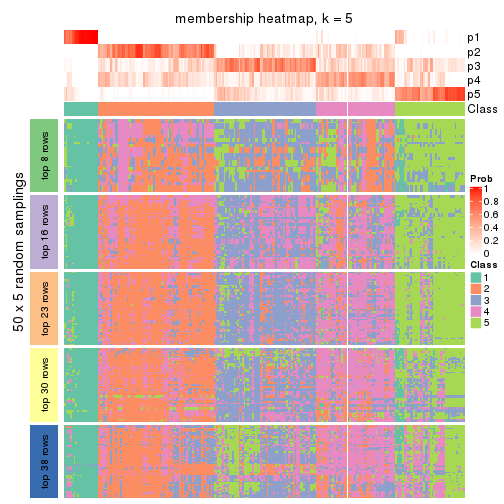</p>

</div>
<div id='tab-ATC-pam-membership-heatmap-5'>
<pre><code class="r">membership_heatmap(res, k = 6)
</code></pre>

<p></p>

</div>
</div>

As soon as we have had the classes for columns, we can look for signatures
which are significantly different between classes which can be candidate marks
for certain classes. Following are the heatmaps for signatures.


Signature heatmaps where rows are scaled:


<script>
$( function() {
	$( '#tabs-ATC-pam-get-signatures' ).tabs();
} );
</script>
<div id='tabs-ATC-pam-get-signatures'>
<ul>
<li><a href='#tab-ATC-pam-get-signatures-1'>k = 2</a></li>
<li><a href='#tab-ATC-pam-get-signatures-2'>k = 3</a></li>
<li><a href='#tab-ATC-pam-get-signatures-3'>k = 4</a></li>
<li><a href='#tab-ATC-pam-get-signatures-4'>k = 5</a></li>
<li><a href='#tab-ATC-pam-get-signatures-5'>k = 6</a></li>
</ul>
<div id='tab-ATC-pam-get-signatures-1'>
<pre><code class="r">get_signatures(res, k = 2)
</code></pre>

<p></p>

</div>
<div id='tab-ATC-pam-get-signatures-2'>
<pre><code class="r">get_signatures(res, k = 3)
</code></pre>

<p></p>

</div>
<div id='tab-ATC-pam-get-signatures-3'>
<pre><code class="r">get_signatures(res, k = 4)
</code></pre>

<p></p>

</div>
<div id='tab-ATC-pam-get-signatures-4'>
<pre><code class="r">get_signatures(res, k = 5)
</code></pre>

<p></p>

</div>
<div id='tab-ATC-pam-get-signatures-5'>
<pre><code class="r">get_signatures(res, k = 6)
</code></pre>

<p></p>

</div>
</div>


Signature heatmaps where rows are not scaled:


<script>
$( function() {
	$( '#tabs-ATC-pam-get-signatures-no-scale' ).tabs();
} );
</script>
<div id='tabs-ATC-pam-get-signatures-no-scale'>
<ul>
<li><a href='#tab-ATC-pam-get-signatures-no-scale-1'>k = 2</a></li>
<li><a href='#tab-ATC-pam-get-signatures-no-scale-2'>k = 3</a></li>
<li><a href='#tab-ATC-pam-get-signatures-no-scale-3'>k = 4</a></li>
<li><a href='#tab-ATC-pam-get-signatures-no-scale-4'>k = 5</a></li>
<li><a href='#tab-ATC-pam-get-signatures-no-scale-5'>k = 6</a></li>
</ul>
<div id='tab-ATC-pam-get-signatures-no-scale-1'>
<pre><code class="r">get_signatures(res, k = 2, scale_rows = FALSE)
</code></pre>

<p></p>

</div>
<div id='tab-ATC-pam-get-signatures-no-scale-2'>
<pre><code class="r">get_signatures(res, k = 3, scale_rows = FALSE)
</code></pre>

<p>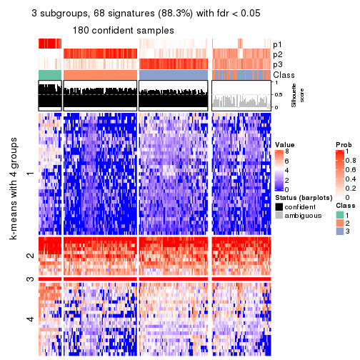</p>

</div>
<div id='tab-ATC-pam-get-signatures-no-scale-3'>
<pre><code class="r">get_signatures(res, k = 4, scale_rows = FALSE)
</code></pre>

<p></p>

</div>
<div id='tab-ATC-pam-get-signatures-no-scale-4'>
<pre><code class="r">get_signatures(res, k = 5, scale_rows = FALSE)
</code></pre>

<p></p>

</div>
<div id='tab-ATC-pam-get-signatures-no-scale-5'>
<pre><code class="r">get_signatures(res, k = 6, scale_rows = FALSE)
</code></pre>

<p></p>

</div>
</div>


Compare the overlap of signatures from different k:

```r
compare_signatures(res)
```


`get_signature()` returns a data frame invisibly. TO get the list of signatures, the function
call should be assigned to a variable explicitly. In following code, if `plot` argument is set
to `FALSE`, no heatmap is plotted while only the differential analysis is performed.

```r
# code only for demonstration
tb = get_signature(res, k = ..., plot = FALSE)
```

An example of the output of `tb` is:

```
#>   which_row         fdr    mean_1    mean_2 scaled_mean_1 scaled_mean_2 km
#> 1        38 0.042760348  8.373488  9.131774    -0.5533452     0.5164555  1
#> 2        40 0.018707592  7.106213  8.469186    -0.6173731     0.5762149  1
#> 3        55 0.019134737 10.221463 11.207825    -0.6159697     0.5749050  1
#> 4        59 0.006059896  5.921854  7.869574    -0.6899429     0.6439467  1
#> 5        60 0.018055526  8.928898 10.211722    -0.6204761     0.5791110  1
#> 6        98 0.009384629 15.714769 14.887706     0.6635654    -0.6193277  2
...
```

The columns in `tb` are:

1. `which_row`: row indices corresponding to the input matrix.
2. `fdr`: FDR for the differential test. 
3. `mean_x`: The mean value in group x.
4. `scaled_mean_x`: The mean value in group x after rows are scaled.
5. `km`: Row groups if k-means clustering is applied to rows.


UMAP plot which shows how samples are separated.


<script>
$( function() {
	$( '#tabs-ATC-pam-dimension-reduction' ).tabs();
} );
</script>
<div id='tabs-ATC-pam-dimension-reduction'>
<ul>
<li><a href='#tab-ATC-pam-dimension-reduction-1'>k = 2</a></li>
<li><a href='#tab-ATC-pam-dimension-reduction-2'>k = 3</a></li>
<li><a href='#tab-ATC-pam-dimension-reduction-3'>k = 4</a></li>
<li><a href='#tab-ATC-pam-dimension-reduction-4'>k = 5</a></li>
<li><a href='#tab-ATC-pam-dimension-reduction-5'>k = 6</a></li>
</ul>
<div id='tab-ATC-pam-dimension-reduction-1'>
<pre><code class="r">dimension_reduction(res, k = 2, method = &quot;UMAP&quot;)
</code></pre>

<p></p>

</div>
<div id='tab-ATC-pam-dimension-reduction-2'>
<pre><code class="r">dimension_reduction(res, k = 3, method = &quot;UMAP&quot;)
</code></pre>

<p></p>

</div>
<div id='tab-ATC-pam-dimension-reduction-3'>
<pre><code class="r">dimension_reduction(res, k = 4, method = &quot;UMAP&quot;)
</code></pre>

<p></p>

</div>
<div id='tab-ATC-pam-dimension-reduction-4'>
<pre><code class="r">dimension_reduction(res, k = 5, method = &quot;UMAP&quot;)
</code></pre>

<p></p>

</div>
<div id='tab-ATC-pam-dimension-reduction-5'>
<pre><code class="r">dimension_reduction(res, k = 6, method = &quot;UMAP&quot;)
</code></pre>

<p></p>

</div>
</div>


Following heatmap shows how subgroups are split when increasing `k`:

```r
collect_classes(res)
```


If matrix rows can be associated to genes, consider to use `GO_Enrichment(res,
...)` to perform function enrichment for the signature genes.


 

---------------------------------------------------


### ATC:mclust


The object with results only for a single top-value method and a single partition method 
can be extracted as:

```r
res = res_list["ATC", "mclust"]
# you can also extract it by
# res = res_list["ATC:mclust"]
```

A summary of `res` and all the functions that can be applied to it:

```r
res
```

```
#> A 'ConsensusPartition' object with k = 2, 3, 4, 5, 6.
#>   On a matrix with 77 rows and 243 columns.
#>   Top rows (8, 16, 23, 30, 38) are extracted by 'ATC' method.
#>   Subgroups are detected by 'mclust' method.
#>   Performed in total 1250 partitions by row resampling.
#>   Best k for subgroups seems to be 3.
#> 
#> Following methods can be applied to this 'ConsensusPartition' object:
#>  [1] "cola_report"             "collect_classes"         "collect_plots"          
#>  [4] "collect_stats"           "colnames"                "compare_signatures"     
#>  [7] "consensus_heatmap"       "dimension_reduction"     "functional_enrichment"  
#> [10] "get_anno_col"            "get_anno"                "get_classes"            
#> [13] "get_consensus"           "get_matrix"              "get_membership"         
#> [16] "get_param"               "get_signatures"          "get_stats"              
#> [19] "is_best_k"               "is_stable_k"             "membership_heatmap"     
#> [22] "ncol"                    "nrow"                    "plot_ecdf"              
#> [25] "rownames"                "select_partition_number" "show"                   
#> [28] "suggest_best_k"          "test_to_known_factors"
```

`collect_plots()` function collects all the plots made from `res` for all `k` (number of partitions)
into one single page to provide an easy and fast comparison between different `k`.

```r
collect_plots(res)
```


The plots are:

- The first row: a plot of the ECDF (Empirical cumulative distribution
  function) curves of the consensus matrix for each `k` and the heatmap of
  predicted classes for each `k`.
- The second row: heatmaps of the consensus matrix for each `k`.
- The third row: heatmaps of the membership matrix for each `k`.
- The fouth row: heatmaps of the signatures for each `k`.

All the plots in panels can be made by individual functions and they are
plotted later in this section.

`select_partition_number()` produces several plots showing different
statistics for choosing "optimized" `k`. There are following statistics:

- ECDF curves of the consensus matrix for each `k`;
- 1-PAC. [The PAC
  score](https://en.wikipedia.org/wiki/Consensus_clustering#Over-interpretation_potential_of_consensus_clustering)
  measures the proportion of the ambiguous subgrouping.
- Mean silhouette score.
- Concordance. The mean probability of fiting the consensus class ids in all
  partitions.
- Area increased. Denote $A_k$ as the area under the ECDF curve for current
  `k`, the area increased is defined as $A_k - A_{k-1}$.
- Rand index. The percent of pairs of samples that are both in a same cluster
  or both are not in a same cluster in the partition of k and k-1.
- Jaccard index. The ratio of pairs of samples are both in a same cluster in
  the partition of k and k-1 and the pairs of samples are both in a same
  cluster in the partition k or k-1.

The detailed explanations of these statistics can be found in [the cola
vignette](http://bioconductor.org/packages/devel/bioc/vignettes/cola/inst/doc/cola.html#toc_13).

Generally speaking, lower PAC score, higher mean silhouette score or higher
concordance corresponds to better partition. Rand index and Jaccard index
measure how similar the current partition is compared to partition with `k-1`.
If they are too similar, we won't accept `k` is better than `k-1`.

```r
select_partition_number(res)
```


The numeric values for all these statistics can be obtained by `get_stats()`.

```r
get_stats(res)
```

```
#>   k 1-PAC mean_silhouette concordance area_increased  Rand Jaccard
#> 2 2 0.228           0.732       0.842         0.3792 0.662   0.662
#> 3 3 0.164           0.534       0.723         0.4986 0.646   0.491
#> 4 4 0.181           0.398       0.654         0.0954 0.888   0.740
#> 5 5 0.294           0.436       0.655         0.1144 0.836   0.622
#> 6 6 0.338           0.341       0.595         0.0559 0.763   0.429
```

`suggest_best_k()` suggests the best $k$ based on these statistics. The rules are as follows:

- All $k$ with Jaccard index larger than 0.95 are removed because the increase of
  the partition number does not provides enough extra information. If all $k$ are removed,
  the best $k$ is assigned by `NA`.
- For $k$ with 1-PAC larger than 0.9, the maximal $k$ is taken as the "best k". Other $k$ is called "optional k".
- If it does not fit the second rule. The $k$ with the highest vote of highest
  1-PAC, mean silhouette and concordance is taken as the "best k".

```r
suggest_best_k(res)
```

```
#> [1] 3
```


Following shows the table of the partitions (You need to click the **show/hide
code output** link to see it). The membership matrix (columns with name `p*`)
is inferred by
[`clue::cl_consensus()`](https://www.rdocumentation.org/link/cl_consensus?package=clue)
function with the `SE` method. Basically the value in the membership matrix
represents the probability to belong to a certain group. The finall class
label for an item is determined with the group with highest probability it
belongs to.

In `get_classes()` function, the entropy is calculated from the membership
matrix and the silhouette score is calculated from the consensus matrix.


<script>
$( function() {
	$( '#tabs-ATC-mclust-get-classes' ).tabs();
} );
</script>
<div id='tabs-ATC-mclust-get-classes'>
<ul>
<li><a href='#tab-ATC-mclust-get-classes-1'>k = 2</a></li>
<li><a href='#tab-ATC-mclust-get-classes-2'>k = 3</a></li>
<li><a href='#tab-ATC-mclust-get-classes-3'>k = 4</a></li>
<li><a href='#tab-ATC-mclust-get-classes-4'>k = 5</a></li>
<li><a href='#tab-ATC-mclust-get-classes-5'>k = 6</a></li>
</ul>

<div id='tab-ATC-mclust-get-classes-1'>
<p><a id='tab-ATC-mclust-get-classes-1-a' style='color:#0366d6' href='#'>show/hide code output</a></p>
<pre><code class="r">cbind(get_classes(res, k = 2), get_membership(res, k = 2))
</code></pre>

<pre><code>#&gt;           class entropy silhouette    p1    p2
#&gt; SRR191393     2  0.4562    0.82834 0.096 0.904
#&gt; SRR191394     1  0.9460    0.39857 0.636 0.364
#&gt; SRR191396     2  0.2423    0.82997 0.040 0.960
#&gt; SRR191397     2  0.3733    0.82749 0.072 0.928
#&gt; SRR191398     1  0.6531    0.73358 0.832 0.168
#&gt; SRR191399     2  0.4161    0.83049 0.084 0.916
#&gt; SRR191400     2  0.7299    0.79740 0.204 0.796
#&gt; SRR191401     2  0.7950    0.78283 0.240 0.760
#&gt; SRR191402     2  0.0672    0.81574 0.008 0.992
#&gt; SRR191403     2  0.5294    0.81517 0.120 0.880
#&gt; SRR191404     2  0.1843    0.82828 0.028 0.972
#&gt; SRR191405     2  0.2043    0.81823 0.032 0.968
#&gt; SRR191406     2  0.2423    0.82979 0.040 0.960
#&gt; SRR191407     2  0.9460    0.55593 0.364 0.636
#&gt; SRR191408     2  0.2778    0.82919 0.048 0.952
#&gt; SRR191409     2  0.1184    0.81478 0.016 0.984
#&gt; SRR191410     2  0.0672    0.81574 0.008 0.992
#&gt; SRR191411     2  0.1633    0.82235 0.024 0.976
#&gt; SRR191412     2  0.4298    0.82992 0.088 0.912
#&gt; SRR191413     2  0.2603    0.82072 0.044 0.956
#&gt; SRR191414     2  0.7674    0.76604 0.224 0.776
#&gt; SRR191415     2  0.0672    0.81574 0.008 0.992
#&gt; SRR191416     2  0.1184    0.81478 0.016 0.984
#&gt; SRR191418     2  0.4431    0.82658 0.092 0.908
#&gt; SRR191419     1  0.1633    0.81056 0.976 0.024
#&gt; SRR191420     2  0.2423    0.83351 0.040 0.960
#&gt; SRR191421     2  0.4022    0.83900 0.080 0.920
#&gt; SRR191422     2  0.3274    0.83491 0.060 0.940
#&gt; SRR191423     2  0.2948    0.83448 0.052 0.948
#&gt; SRR191424     1  0.7139    0.70728 0.804 0.196
#&gt; SRR191425     2  0.1843    0.83013 0.028 0.972
#&gt; SRR191426     2  0.4939    0.83469 0.108 0.892
#&gt; SRR191427     2  0.7056    0.80561 0.192 0.808
#&gt; SRR191428     2  0.7602    0.77987 0.220 0.780
#&gt; SRR191429     2  0.5737    0.82752 0.136 0.864
#&gt; SRR191430     2  0.4022    0.82045 0.080 0.920
#&gt; SRR191431     2  0.6531    0.81724 0.168 0.832
#&gt; SRR191432     2  0.6887    0.80492 0.184 0.816
#&gt; SRR191433     2  0.7602    0.78517 0.220 0.780
#&gt; SRR191434     2  0.8763    0.62081 0.296 0.704
#&gt; SRR191435     2  0.2423    0.83080 0.040 0.960
#&gt; SRR191436     2  0.2043    0.83071 0.032 0.968
#&gt; SRR191437     1  0.3274    0.80441 0.940 0.060
#&gt; SRR191438     2  0.0938    0.81714 0.012 0.988
#&gt; SRR191439     2  0.4939    0.83866 0.108 0.892
#&gt; SRR191440     2  0.9963    0.25057 0.464 0.536
#&gt; SRR191441     2  0.9522    0.56637 0.372 0.628
#&gt; SRR191442     2  0.3431    0.83588 0.064 0.936
#&gt; SRR191443     2  0.4022    0.83403 0.080 0.920
#&gt; SRR191444     2  0.3114    0.83533 0.056 0.944
#&gt; SRR191445     2  0.6887    0.80690 0.184 0.816
#&gt; SRR191446     2  0.9460    0.58363 0.364 0.636
#&gt; SRR191447     2  0.5737    0.83130 0.136 0.864
#&gt; SRR191448     1  0.1633    0.81018 0.976 0.024
#&gt; SRR191449     2  0.2948    0.83581 0.052 0.948
#&gt; SRR191450     1  0.6712    0.72890 0.824 0.176
#&gt; SRR191451     2  0.1843    0.82832 0.028 0.972
#&gt; SRR191452     2  0.5842    0.82949 0.140 0.860
#&gt; SRR191453     2  0.7219    0.79108 0.200 0.800
#&gt; SRR191454     2  0.8081    0.75623 0.248 0.752
#&gt; SRR191455     2  0.4690    0.83698 0.100 0.900
#&gt; SRR191456     2  0.3879    0.83983 0.076 0.924
#&gt; SRR191457     1  0.4161    0.79209 0.916 0.084
#&gt; SRR191458     2  0.6887    0.80644 0.184 0.816
#&gt; SRR191459     2  0.6438    0.81457 0.164 0.836
#&gt; SRR191460     2  0.1184    0.81991 0.016 0.984
#&gt; SRR191461     2  0.4562    0.83491 0.096 0.904
#&gt; SRR191462     2  0.9944    0.35476 0.456 0.544
#&gt; SRR191463     2  0.7139    0.79543 0.196 0.804
#&gt; SRR191464     2  0.3733    0.83794 0.072 0.928
#&gt; SRR191465     2  0.8144    0.75094 0.252 0.748
#&gt; SRR191466     2  0.6048    0.82790 0.148 0.852
#&gt; SRR191467     2  0.9909    0.40344 0.444 0.556
#&gt; SRR191468     2  0.9209    0.64989 0.336 0.664
#&gt; SRR191469     2  0.7602    0.77796 0.220 0.780
#&gt; SRR191470     2  0.8499    0.71883 0.276 0.724
#&gt; SRR191471     2  0.6048    0.82539 0.148 0.852
#&gt; SRR191472     2  0.9170    0.65306 0.332 0.668
#&gt; SRR191473     2  0.6247    0.82002 0.156 0.844
#&gt; SRR191474     2  0.2948    0.83520 0.052 0.948
#&gt; SRR191475     2  0.8499    0.72449 0.276 0.724
#&gt; SRR191476     2  0.9552    0.56163 0.376 0.624
#&gt; SRR191477     2  0.2043    0.82894 0.032 0.968
#&gt; SRR191478     2  0.2423    0.83400 0.040 0.960
#&gt; SRR191479     2  0.4939    0.83234 0.108 0.892
#&gt; SRR191480     2  0.8813    0.69693 0.300 0.700
#&gt; SRR191481     2  0.4562    0.83736 0.096 0.904
#&gt; SRR191482     2  0.5408    0.83194 0.124 0.876
#&gt; SRR191483     2  0.7745    0.77422 0.228 0.772
#&gt; SRR191484     1  0.5737    0.76091 0.864 0.136
#&gt; SRR191485     2  0.5178    0.83039 0.116 0.884
#&gt; SRR191486     2  0.5519    0.83348 0.128 0.872
#&gt; SRR191487     2  0.9170    0.65525 0.332 0.668
#&gt; SRR191488     1  0.2236    0.80945 0.964 0.036
#&gt; SRR191489     2  0.9358    0.61550 0.352 0.648
#&gt; SRR191490     1  0.4022    0.79825 0.920 0.080
#&gt; SRR191491     2  0.9661    0.52272 0.392 0.608
#&gt; SRR191492     2  0.9552    0.53235 0.376 0.624
#&gt; SRR191493     1  0.4562    0.78127 0.904 0.096
#&gt; SRR191494     2  0.9954    0.30425 0.460 0.540
#&gt; SRR191495     2  0.7815    0.76657 0.232 0.768
#&gt; SRR191496     1  0.9248    0.46109 0.660 0.340
#&gt; SRR191497     2  0.4562    0.83593 0.096 0.904
#&gt; SRR191498     1  0.6623    0.72953 0.828 0.172
#&gt; SRR191499     2  0.4562    0.83578 0.096 0.904
#&gt; SRR191500     2  0.4690    0.83475 0.100 0.900
#&gt; SRR191501     1  0.2236    0.80797 0.964 0.036
#&gt; SRR191502     2  0.5519    0.83198 0.128 0.872
#&gt; SRR191503     2  0.9358    0.62359 0.352 0.648
#&gt; SRR191504     2  0.9000    0.68441 0.316 0.684
#&gt; SRR191505     2  0.9954    0.35790 0.460 0.540
#&gt; SRR191506     1  0.9933    0.03896 0.548 0.452
#&gt; SRR191507     1  0.9129    0.46125 0.672 0.328
#&gt; SRR191508     2  0.8661    0.71903 0.288 0.712
#&gt; SRR191509     2  0.4562    0.83331 0.096 0.904
#&gt; SRR191510     2  0.6801    0.80887 0.180 0.820
#&gt; SRR191511     2  0.7056    0.80465 0.192 0.808
#&gt; SRR191512     1  0.9881    0.08524 0.564 0.436
#&gt; SRR191513     1  0.8443    0.58694 0.728 0.272
#&gt; SRR191514     2  0.9170    0.64341 0.332 0.668
#&gt; SRR191515     2  0.9427    0.60838 0.360 0.640
#&gt; SRR191516     2  0.9866    0.43387 0.432 0.568
#&gt; SRR191517     2  0.5737    0.82771 0.136 0.864
#&gt; SRR191518     2  0.3733    0.83629 0.072 0.928
#&gt; SRR191519     2  0.8443    0.73193 0.272 0.728
#&gt; SRR191520     2  0.9358    0.60860 0.352 0.648
#&gt; SRR191521     2  0.8713    0.71570 0.292 0.708
#&gt; SRR191522     2  0.8207    0.74383 0.256 0.744
#&gt; SRR191523     2  0.9909    0.38581 0.444 0.556
#&gt; SRR191524     2  0.7815    0.77938 0.232 0.768
#&gt; SRR191525     2  0.9996    0.17572 0.488 0.512
#&gt; SRR191526     1  0.9944    0.00984 0.544 0.456
#&gt; SRR191527     1  0.2043    0.80747 0.968 0.032
#&gt; SRR191528     1  0.3879    0.79850 0.924 0.076
#&gt; SRR191529     1  0.9552    0.32724 0.624 0.376
#&gt; SRR191530     2  0.9491    0.59301 0.368 0.632
#&gt; SRR191531     1  0.8443    0.62326 0.728 0.272
#&gt; SRR191532     2  0.8499    0.72337 0.276 0.724
#&gt; SRR191533     1  1.0000   -0.16093 0.504 0.496
#&gt; SRR191534     1  0.9580    0.30652 0.620 0.380
#&gt; SRR191535     2  0.7815    0.77574 0.232 0.768
#&gt; SRR191536     1  0.9977   -0.03697 0.528 0.472
#&gt; SRR191537     2  0.8955    0.68692 0.312 0.688
#&gt; SRR191538     2  0.8763    0.70506 0.296 0.704
#&gt; SRR191539     2  0.9977    0.27416 0.472 0.528
#&gt; SRR191540     2  0.8499    0.73402 0.276 0.724
#&gt; SRR191541     2  0.7056    0.80738 0.192 0.808
#&gt; SRR191542     2  0.9998    0.17249 0.492 0.508
#&gt; SRR191543     2  0.9775    0.46968 0.412 0.588
#&gt; SRR191544     2  0.9170    0.65678 0.332 0.668
#&gt; SRR191545     2  0.8499    0.73339 0.276 0.724
#&gt; SRR191546     2  0.6531    0.81163 0.168 0.832
#&gt; SRR191547     2  0.8555    0.72895 0.280 0.720
#&gt; SRR191548     1  0.0938    0.80882 0.988 0.012
#&gt; SRR191549     1  0.0938    0.80882 0.988 0.012
#&gt; SRR191550     1  0.0938    0.80882 0.988 0.012
#&gt; SRR191551     1  0.1414    0.81025 0.980 0.020
#&gt; SRR191552     1  0.1414    0.81025 0.980 0.020
#&gt; SRR191553     1  0.0938    0.80882 0.988 0.012
#&gt; SRR191554     1  0.0938    0.80882 0.988 0.012
#&gt; SRR191555     1  0.9000    0.54164 0.684 0.316
#&gt; SRR191556     2  0.1843    0.81877 0.028 0.972
#&gt; SRR191557     2  0.4562    0.83626 0.096 0.904
#&gt; SRR191558     2  0.2603    0.83227 0.044 0.956
#&gt; SRR191559     2  0.0938    0.81714 0.012 0.988
#&gt; SRR191560     2  0.1184    0.81478 0.016 0.984
#&gt; SRR191561     1  0.0938    0.80882 0.988 0.012
#&gt; SRR191562     2  0.9323    0.62149 0.348 0.652
#&gt; SRR191563     2  0.1184    0.81934 0.016 0.984
#&gt; SRR191564     2  0.0376    0.82186 0.004 0.996
#&gt; SRR191565     2  0.1414    0.81770 0.020 0.980
#&gt; SRR191566     2  0.1414    0.81765 0.020 0.980
#&gt; SRR191567     2  0.6801    0.79902 0.180 0.820
#&gt; SRR191568     2  0.3733    0.83353 0.072 0.928
#&gt; SRR191569     2  0.0938    0.81570 0.012 0.988
#&gt; SRR191570     2  0.2423    0.82742 0.040 0.960
#&gt; SRR191571     2  0.0938    0.81570 0.012 0.988
#&gt; SRR191572     1  0.0938    0.80882 0.988 0.012
#&gt; SRR191573     2  0.1184    0.81478 0.016 0.984
#&gt; SRR191574     2  0.9635    0.52248 0.388 0.612
#&gt; SRR191575     2  0.8207    0.72790 0.256 0.744
#&gt; SRR191576     2  0.1184    0.81478 0.016 0.984
#&gt; SRR191577     2  0.1414    0.81687 0.020 0.980
#&gt; SRR191578     2  0.9087    0.55807 0.324 0.676
#&gt; SRR191579     1  0.0938    0.80882 0.988 0.012
#&gt; SRR191580     1  0.0938    0.80882 0.988 0.012
#&gt; SRR191581     1  0.0938    0.80882 0.988 0.012
#&gt; SRR191582     1  0.0938    0.80882 0.988 0.012
#&gt; SRR191583     1  0.5294    0.77072 0.880 0.120
#&gt; SRR191584     1  0.0938    0.80882 0.988 0.012
#&gt; SRR191585     2  0.5842    0.82843 0.140 0.860
#&gt; SRR191586     2  0.6247    0.82419 0.156 0.844
#&gt; SRR191587     2  0.0672    0.81574 0.008 0.992
#&gt; SRR191588     2  0.4431    0.83770 0.092 0.908
#&gt; SRR191589     2  0.2043    0.81578 0.032 0.968
#&gt; SRR191590     2  0.4939    0.83681 0.108 0.892
#&gt; SRR191591     2  0.0938    0.81714 0.012 0.988
#&gt; SRR191592     2  0.1414    0.82497 0.020 0.980
#&gt; SRR191593     2  0.0938    0.82310 0.012 0.988
#&gt; SRR191594     1  0.1184    0.80918 0.984 0.016
#&gt; SRR191595     2  0.0938    0.81714 0.012 0.988
#&gt; SRR191596     2  0.5737    0.83132 0.136 0.864
#&gt; SRR191597     2  0.0938    0.81714 0.012 0.988
#&gt; SRR191598     2  0.2423    0.82673 0.040 0.960
#&gt; SRR191599     2  0.8813    0.67810 0.300 0.700
#&gt; SRR191600     2  0.0376    0.82153 0.004 0.996
#&gt; SRR191601     2  0.4161    0.83529 0.084 0.916
#&gt; SRR191602     2  0.0672    0.81748 0.008 0.992
#&gt; SRR191603     2  0.0376    0.82153 0.004 0.996
#&gt; SRR191604     2  0.5294    0.83088 0.120 0.880
#&gt; SRR191605     2  0.3274    0.83427 0.060 0.940
#&gt; SRR191606     2  0.8661    0.70079 0.288 0.712
#&gt; SRR191607     2  0.9170    0.61281 0.332 0.668
#&gt; SRR191608     2  0.8955    0.69117 0.312 0.688
#&gt; SRR191609     2  0.8555    0.71670 0.280 0.720
#&gt; SRR191610     2  0.9087    0.59737 0.324 0.676
#&gt; SRR191611     2  0.6048    0.82351 0.148 0.852
#&gt; SRR191612     2  0.0672    0.81926 0.008 0.992
#&gt; SRR191613     1  0.3733    0.80005 0.928 0.072
#&gt; SRR191614     2  0.2043    0.83218 0.032 0.968
#&gt; SRR191615     2  0.0938    0.81806 0.012 0.988
#&gt; SRR191616     1  0.0938    0.80882 0.988 0.012
#&gt; SRR191617     1  0.9909    0.22569 0.556 0.444
#&gt; SRR191618     1  0.9393    0.49302 0.644 0.356
#&gt; SRR191619     2  0.3879    0.83027 0.076 0.924
#&gt; SRR191620     2  0.5294    0.79397 0.120 0.880
#&gt; SRR191621     2  0.1414    0.82738 0.020 0.980
#&gt; SRR191622     2  0.1633    0.82542 0.024 0.976
#&gt; SRR191623     2  0.1184    0.82292 0.016 0.984
#&gt; SRR191624     2  0.4815    0.83598 0.104 0.896
#&gt; SRR191625     2  0.2948    0.83491 0.052 0.948
#&gt; SRR191626     2  0.2778    0.83311 0.048 0.952
#&gt; SRR191627     2  0.2778    0.83168 0.048 0.952
#&gt; SRR191628     2  0.8207    0.72873 0.256 0.744
#&gt; SRR191629     2  0.1184    0.81478 0.016 0.984
#&gt; SRR191630     1  0.1184    0.80918 0.984 0.016
#&gt; SRR191631     2  0.2423    0.83005 0.040 0.960
#&gt; SRR191632     2  0.7950    0.76192 0.240 0.760
#&gt; SRR191633     2  0.5629    0.82853 0.132 0.868
#&gt; SRR191634     1  0.0938    0.80882 0.988 0.012
#&gt; SRR191635     2  0.1843    0.82863 0.028 0.972
#&gt; SRR191636     1  0.0938    0.80882 0.988 0.012
#&gt; SRR191637     1  0.7815    0.64733 0.768 0.232
</code></pre>

<script>
$('#tab-ATC-mclust-get-classes-1-a').parent().next().next().hide();
$('#tab-ATC-mclust-get-classes-1-a').click(function(){
  $('#tab-ATC-mclust-get-classes-1-a').parent().next().next().toggle();
  return(false);
});
</script>
</div>

<div id='tab-ATC-mclust-get-classes-2'>
<p><a id='tab-ATC-mclust-get-classes-2-a' style='color:#0366d6' href='#'>show/hide code output</a></p>
<pre><code class="r">cbind(get_classes(res, k = 3), get_membership(res, k = 3))
</code></pre>

<pre><code>#&gt;           class entropy silhouette    p1    p2    p3
#&gt; SRR191393     3  0.2318    0.65689 0.028 0.028 0.944
#&gt; SRR191394     1  0.6180    0.56148 0.716 0.024 0.260
#&gt; SRR191396     3  0.3995    0.63392 0.016 0.116 0.868
#&gt; SRR191397     3  0.2056    0.66352 0.024 0.024 0.952
#&gt; SRR191398     1  0.5696    0.72137 0.800 0.064 0.136
#&gt; SRR191399     3  0.5874    0.51180 0.032 0.208 0.760
#&gt; SRR191400     3  0.5402    0.54934 0.180 0.028 0.792
#&gt; SRR191401     3  0.6970    0.39894 0.276 0.048 0.676
#&gt; SRR191402     3  0.0983    0.66366 0.004 0.016 0.980
#&gt; SRR191403     3  0.3253    0.65334 0.052 0.036 0.912
#&gt; SRR191404     3  0.5690    0.50316 0.004 0.288 0.708
#&gt; SRR191405     3  0.2878    0.68106 0.000 0.096 0.904
#&gt; SRR191406     3  0.4887    0.60596 0.000 0.228 0.772
#&gt; SRR191407     3  0.7801    0.31035 0.276 0.088 0.636
#&gt; SRR191408     3  0.2496    0.67834 0.004 0.068 0.928
#&gt; SRR191409     3  0.1129    0.66220 0.004 0.020 0.976
#&gt; SRR191410     3  0.2200    0.67880 0.004 0.056 0.940
#&gt; SRR191411     3  0.2537    0.67652 0.000 0.080 0.920
#&gt; SRR191412     3  0.1751    0.66226 0.012 0.028 0.960
#&gt; SRR191413     3  0.3472    0.63308 0.040 0.056 0.904
#&gt; SRR191414     3  0.5741    0.53287 0.188 0.036 0.776
#&gt; SRR191415     3  0.4887    0.60168 0.000 0.228 0.772
#&gt; SRR191416     3  0.2711    0.65042 0.000 0.088 0.912
#&gt; SRR191418     3  0.4558    0.64594 0.044 0.100 0.856
#&gt; SRR191419     1  0.1170    0.83106 0.976 0.008 0.016
#&gt; SRR191420     3  0.4897    0.64818 0.016 0.172 0.812
#&gt; SRR191421     3  0.5692    0.63023 0.040 0.176 0.784
#&gt; SRR191422     3  0.6081    0.39934 0.004 0.344 0.652
#&gt; SRR191423     3  0.6082    0.47890 0.012 0.296 0.692
#&gt; SRR191424     1  0.7222    0.40257 0.580 0.388 0.032
#&gt; SRR191425     3  0.4228    0.66121 0.008 0.148 0.844
#&gt; SRR191426     2  0.6026    0.47272 0.000 0.624 0.376
#&gt; SRR191427     3  0.8836   -0.08885 0.120 0.388 0.492
#&gt; SRR191428     3  0.9163    0.10051 0.252 0.208 0.540
#&gt; SRR191429     2  0.6387    0.57562 0.020 0.680 0.300
#&gt; SRR191430     3  0.7044    0.33855 0.032 0.348 0.620
#&gt; SRR191431     3  0.8352    0.17982 0.100 0.332 0.568
#&gt; SRR191432     2  0.6057    0.54148 0.004 0.656 0.340
#&gt; SRR191433     2  0.6905    0.61946 0.044 0.676 0.280
#&gt; SRR191434     2  0.9354    0.46015 0.176 0.472 0.352
#&gt; SRR191435     3  0.4351    0.65155 0.004 0.168 0.828
#&gt; SRR191436     3  0.6209    0.33108 0.004 0.368 0.628
#&gt; SRR191437     1  0.7164    0.53321 0.640 0.316 0.044
#&gt; SRR191438     3  0.3879    0.64912 0.000 0.152 0.848
#&gt; SRR191439     3  0.7015    0.22589 0.024 0.392 0.584
#&gt; SRR191440     2  0.9351    0.55214 0.256 0.516 0.228
#&gt; SRR191441     2  0.7983    0.63256 0.108 0.636 0.256
#&gt; SRR191442     3  0.6416    0.32452 0.008 0.376 0.616
#&gt; SRR191443     3  0.3472    0.67436 0.040 0.056 0.904
#&gt; SRR191444     3  0.5247    0.62095 0.008 0.224 0.768
#&gt; SRR191445     2  0.7597    0.48213 0.048 0.568 0.384
#&gt; SRR191446     2  0.6783    0.64617 0.116 0.744 0.140
#&gt; SRR191447     2  0.7489    0.24917 0.036 0.496 0.468
#&gt; SRR191448     1  0.1919    0.83122 0.956 0.020 0.024
#&gt; SRR191449     3  0.6359    0.30519 0.008 0.364 0.628
#&gt; SRR191450     1  0.7393    0.62941 0.704 0.140 0.156
#&gt; SRR191451     3  0.1765    0.67579 0.004 0.040 0.956
#&gt; SRR191452     2  0.8070    0.22967 0.064 0.468 0.468
#&gt; SRR191453     3  0.7888    0.39033 0.196 0.140 0.664
#&gt; SRR191454     2  0.8865    0.37709 0.120 0.476 0.404
#&gt; SRR191455     3  0.7493   -0.22195 0.036 0.480 0.484
#&gt; SRR191456     3  0.4136    0.67680 0.020 0.116 0.864
#&gt; SRR191457     1  0.2050    0.82805 0.952 0.020 0.028
#&gt; SRR191458     3  0.6693    0.57957 0.104 0.148 0.748
#&gt; SRR191459     2  0.6647    0.46388 0.012 0.592 0.396
#&gt; SRR191460     3  0.3983    0.66056 0.004 0.144 0.852
#&gt; SRR191461     2  0.6045    0.46884 0.000 0.620 0.380
#&gt; SRR191462     2  0.8994    0.56067 0.260 0.556 0.184
#&gt; SRR191463     2  0.6954    0.55932 0.028 0.620 0.352
#&gt; SRR191464     3  0.6897    0.05199 0.016 0.436 0.548
#&gt; SRR191465     2  0.5635    0.63548 0.036 0.784 0.180
#&gt; SRR191466     2  0.7839    0.22172 0.052 0.484 0.464
#&gt; SRR191467     2  0.5793    0.62722 0.116 0.800 0.084
#&gt; SRR191468     2  0.7983    0.63027 0.124 0.648 0.228
#&gt; SRR191469     2  0.7962    0.52402 0.072 0.576 0.352
#&gt; SRR191470     2  0.7145    0.63949 0.072 0.692 0.236
#&gt; SRR191471     2  0.7640    0.53418 0.056 0.592 0.352
#&gt; SRR191472     2  0.7971    0.63005 0.096 0.624 0.280
#&gt; SRR191473     2  0.6104    0.50787 0.004 0.648 0.348
#&gt; SRR191474     3  0.6521    0.40528 0.016 0.340 0.644
#&gt; SRR191475     2  0.6673    0.62681 0.056 0.720 0.224
#&gt; SRR191476     2  0.7835    0.64447 0.112 0.656 0.232
#&gt; SRR191477     3  0.6381    0.38651 0.012 0.340 0.648
#&gt; SRR191478     3  0.6008    0.29715 0.000 0.372 0.628
#&gt; SRR191479     3  0.5377    0.62007 0.112 0.068 0.820
#&gt; SRR191480     2  0.8759    0.47989 0.120 0.520 0.360
#&gt; SRR191481     3  0.6813   -0.11078 0.012 0.468 0.520
#&gt; SRR191482     2  0.6386    0.44147 0.004 0.584 0.412
#&gt; SRR191483     2  0.6662    0.62453 0.044 0.704 0.252
#&gt; SRR191484     1  0.5987    0.72366 0.756 0.208 0.036
#&gt; SRR191485     2  0.6416    0.51509 0.008 0.616 0.376
#&gt; SRR191486     3  0.7311    0.19538 0.036 0.384 0.580
#&gt; SRR191487     2  0.7333    0.65394 0.116 0.704 0.180
#&gt; SRR191488     1  0.5566    0.75646 0.812 0.108 0.080
#&gt; SRR191489     3  0.9466   -0.15097 0.188 0.356 0.456
#&gt; SRR191490     1  0.6420    0.62918 0.688 0.288 0.024
#&gt; SRR191491     2  0.9355    0.43935 0.188 0.492 0.320
#&gt; SRR191492     2  0.8777    0.56460 0.148 0.564 0.288
#&gt; SRR191493     1  0.5506    0.77440 0.816 0.092 0.092
#&gt; SRR191494     2  0.8805    0.56444 0.208 0.584 0.208
#&gt; SRR191495     2  0.7990    0.41873 0.064 0.532 0.404
#&gt; SRR191496     2  0.7705    0.32741 0.332 0.604 0.064
#&gt; SRR191497     3  0.6647    0.07871 0.008 0.452 0.540
#&gt; SRR191498     1  0.7592    0.63740 0.680 0.208 0.112
#&gt; SRR191499     2  0.6661    0.44195 0.012 0.588 0.400
#&gt; SRR191500     2  0.6565    0.37989 0.008 0.576 0.416
#&gt; SRR191501     1  0.6154    0.68090 0.752 0.204 0.044
#&gt; SRR191502     2  0.6204    0.38182 0.000 0.576 0.424
#&gt; SRR191503     2  0.7543    0.64306 0.104 0.680 0.216
#&gt; SRR191504     2  0.5667    0.64513 0.060 0.800 0.140
#&gt; SRR191505     2  0.7287    0.58419 0.212 0.696 0.092
#&gt; SRR191506     2  0.8623    0.53173 0.272 0.584 0.144
#&gt; SRR191507     2  0.7690    0.06743 0.416 0.536 0.048
#&gt; SRR191508     2  0.7164    0.64122 0.064 0.680 0.256
#&gt; SRR191509     2  0.6280    0.31368 0.000 0.540 0.460
#&gt; SRR191510     2  0.7123    0.51690 0.032 0.604 0.364
#&gt; SRR191511     2  0.5595    0.63734 0.016 0.756 0.228
#&gt; SRR191512     2  0.7065    0.39603 0.288 0.664 0.048
#&gt; SRR191513     2  0.7209    0.18858 0.360 0.604 0.036
#&gt; SRR191514     2  0.6757    0.64096 0.084 0.736 0.180
#&gt; SRR191515     2  0.7082    0.65334 0.120 0.724 0.156
#&gt; SRR191516     2  0.6910    0.63926 0.120 0.736 0.144
#&gt; SRR191517     2  0.6291    0.27053 0.000 0.532 0.468
#&gt; SRR191518     2  0.6280    0.28707 0.000 0.540 0.460
#&gt; SRR191519     2  0.6107    0.64514 0.052 0.764 0.184
#&gt; SRR191520     2  0.7620    0.63322 0.128 0.684 0.188
#&gt; SRR191521     2  0.7024    0.64755 0.072 0.704 0.224
#&gt; SRR191522     2  0.7213    0.63808 0.068 0.680 0.252
#&gt; SRR191523     2  0.7495    0.60853 0.188 0.692 0.120
#&gt; SRR191524     2  0.7890    0.48065 0.064 0.564 0.372
#&gt; SRR191525     2  0.7213    0.52415 0.212 0.700 0.088
#&gt; SRR191526     2  0.7884    0.48520 0.260 0.640 0.100
#&gt; SRR191527     1  0.2903    0.82390 0.924 0.028 0.048
#&gt; SRR191528     1  0.4925    0.78228 0.844 0.076 0.080
#&gt; SRR191529     2  0.9014    0.31740 0.408 0.460 0.132
#&gt; SRR191530     2  0.5576    0.63541 0.084 0.812 0.104
#&gt; SRR191531     1  0.9118    0.33526 0.548 0.232 0.220
#&gt; SRR191532     2  0.7698    0.55694 0.072 0.624 0.304
#&gt; SRR191533     2  0.6895    0.52301 0.212 0.716 0.072
#&gt; SRR191534     2  0.7277    0.42716 0.280 0.660 0.060
#&gt; SRR191535     2  0.6355    0.61039 0.024 0.696 0.280
#&gt; SRR191536     2  0.8883    0.55167 0.256 0.568 0.176
#&gt; SRR191537     2  0.7657    0.64773 0.116 0.676 0.208
#&gt; SRR191538     2  0.7022    0.63237 0.068 0.700 0.232
#&gt; SRR191539     2  0.8212    0.58278 0.192 0.640 0.168
#&gt; SRR191540     2  0.6950    0.62042 0.056 0.692 0.252
#&gt; SRR191541     2  0.7123    0.50776 0.032 0.604 0.364
#&gt; SRR191542     2  0.7199    0.53593 0.204 0.704 0.092
#&gt; SRR191543     2  0.6222    0.60781 0.132 0.776 0.092
#&gt; SRR191544     2  0.6138    0.64995 0.060 0.768 0.172
#&gt; SRR191545     2  0.5823    0.64994 0.064 0.792 0.144
#&gt; SRR191546     2  0.6008    0.52555 0.000 0.628 0.372
#&gt; SRR191547     2  0.5905    0.65050 0.044 0.772 0.184
#&gt; SRR191548     1  0.0661    0.82902 0.988 0.008 0.004
#&gt; SRR191549     1  0.0000    0.82445 1.000 0.000 0.000
#&gt; SRR191550     1  0.0000    0.82445 1.000 0.000 0.000
#&gt; SRR191551     1  0.0592    0.82930 0.988 0.000 0.012
#&gt; SRR191552     1  0.0592    0.82930 0.988 0.000 0.012
#&gt; SRR191553     1  0.0237    0.82657 0.996 0.004 0.000
#&gt; SRR191554     1  0.0000    0.82445 1.000 0.000 0.000
#&gt; SRR191555     1  0.8765    0.37213 0.588 0.212 0.200
#&gt; SRR191556     3  0.1267    0.66117 0.004 0.024 0.972
#&gt; SRR191557     3  0.6742    0.51145 0.052 0.240 0.708
#&gt; SRR191558     3  0.4473    0.64887 0.008 0.164 0.828
#&gt; SRR191559     3  0.2590    0.67767 0.004 0.072 0.924
#&gt; SRR191560     3  0.0661    0.66159 0.004 0.008 0.988
#&gt; SRR191561     1  0.0237    0.82657 0.996 0.004 0.000
#&gt; SRR191562     3  0.9718   -0.05639 0.260 0.288 0.452
#&gt; SRR191563     3  0.4733    0.60947 0.004 0.196 0.800
#&gt; SRR191564     3  0.5325    0.57293 0.004 0.248 0.748
#&gt; SRR191565     3  0.1129    0.66250 0.004 0.020 0.976
#&gt; SRR191566     3  0.1525    0.67117 0.004 0.032 0.964
#&gt; SRR191567     3  0.4289    0.62995 0.092 0.040 0.868
#&gt; SRR191568     3  0.2443    0.66204 0.032 0.028 0.940
#&gt; SRR191569     3  0.0237    0.65876 0.000 0.004 0.996
#&gt; SRR191570     3  0.1482    0.66183 0.012 0.020 0.968
#&gt; SRR191571     3  0.0983    0.65982 0.004 0.016 0.980
#&gt; SRR191572     1  0.0000    0.82445 1.000 0.000 0.000
#&gt; SRR191573     3  0.1129    0.66220 0.004 0.020 0.976
#&gt; SRR191574     3  0.8370    0.15386 0.416 0.084 0.500
#&gt; SRR191575     3  0.7351    0.36827 0.268 0.068 0.664
#&gt; SRR191576     3  0.1129    0.66427 0.004 0.020 0.976
#&gt; SRR191577     3  0.1015    0.66193 0.008 0.012 0.980
#&gt; SRR191578     2  0.9627    0.49898 0.220 0.452 0.328
#&gt; SRR191579     1  0.0848    0.83036 0.984 0.008 0.008
#&gt; SRR191580     1  0.0000    0.82445 1.000 0.000 0.000
#&gt; SRR191581     1  0.0983    0.83068 0.980 0.016 0.004
#&gt; SRR191582     1  0.1170    0.83179 0.976 0.016 0.008
#&gt; SRR191583     1  0.6113    0.62879 0.688 0.300 0.012
#&gt; SRR191584     1  0.0237    0.82596 0.996 0.004 0.000
#&gt; SRR191585     3  0.7918    0.20026 0.076 0.328 0.596
#&gt; SRR191586     2  0.6881    0.58392 0.032 0.648 0.320
#&gt; SRR191587     3  0.3030    0.68008 0.004 0.092 0.904
#&gt; SRR191588     3  0.2663    0.66916 0.024 0.044 0.932
#&gt; SRR191589     3  0.1774    0.66375 0.024 0.016 0.960
#&gt; SRR191590     3  0.5852    0.61207 0.044 0.180 0.776
#&gt; SRR191591     3  0.3686    0.66414 0.000 0.140 0.860
#&gt; SRR191592     3  0.4121    0.65113 0.000 0.168 0.832
#&gt; SRR191593     3  0.2537    0.67798 0.000 0.080 0.920
#&gt; SRR191594     1  0.2313    0.83025 0.944 0.032 0.024
#&gt; SRR191595     3  0.1163    0.66908 0.000 0.028 0.972
#&gt; SRR191596     3  0.6414    0.54051 0.036 0.248 0.716
#&gt; SRR191597     3  0.5138    0.55392 0.000 0.252 0.748
#&gt; SRR191598     3  0.2945    0.68060 0.004 0.088 0.908
#&gt; SRR191599     3  0.9648   -0.02505 0.244 0.292 0.464
#&gt; SRR191600     3  0.5845    0.45159 0.004 0.308 0.688
#&gt; SRR191601     2  0.6521    0.21742 0.004 0.500 0.496
#&gt; SRR191602     3  0.3340    0.66763 0.000 0.120 0.880
#&gt; SRR191603     3  0.5982    0.39845 0.004 0.328 0.668
#&gt; SRR191604     2  0.6451    0.48739 0.008 0.608 0.384
#&gt; SRR191605     3  0.5754    0.48990 0.004 0.296 0.700
#&gt; SRR191606     3  0.9517    0.05828 0.232 0.280 0.488
#&gt; SRR191607     2  0.8982    0.51300 0.156 0.536 0.308
#&gt; SRR191608     2  0.5974    0.64824 0.068 0.784 0.148
#&gt; SRR191609     2  0.7692    0.63660 0.108 0.668 0.224
#&gt; SRR191610     2  0.9134    0.42721 0.156 0.500 0.344
#&gt; SRR191611     3  0.7555   -0.06966 0.040 0.440 0.520
#&gt; SRR191612     3  0.4293    0.66387 0.004 0.164 0.832
#&gt; SRR191613     1  0.5650    0.76896 0.808 0.108 0.084
#&gt; SRR191614     3  0.4897    0.65419 0.016 0.172 0.812
#&gt; SRR191615     3  0.1529    0.66825 0.000 0.040 0.960
#&gt; SRR191616     1  0.2599    0.82917 0.932 0.052 0.016
#&gt; SRR191617     2  0.9514    0.40532 0.364 0.444 0.192
#&gt; SRR191618     1  0.9183    0.06418 0.484 0.360 0.156
#&gt; SRR191619     2  0.7295    0.19325 0.028 0.492 0.480
#&gt; SRR191620     3  0.8140   -0.22237 0.068 0.456 0.476
#&gt; SRR191621     3  0.6286    0.00758 0.000 0.464 0.536
#&gt; SRR191622     3  0.4750    0.60044 0.000 0.216 0.784
#&gt; SRR191623     3  0.4555    0.63499 0.000 0.200 0.800
#&gt; SRR191624     3  0.4146    0.66198 0.080 0.044 0.876
#&gt; SRR191625     3  0.7274   -0.09343 0.028 0.452 0.520
#&gt; SRR191626     2  0.6252    0.30320 0.000 0.556 0.444
#&gt; SRR191627     3  0.6148    0.36881 0.004 0.356 0.640
#&gt; SRR191628     2  0.8283    0.44835 0.084 0.536 0.380
#&gt; SRR191629     3  0.4555    0.61305 0.000 0.200 0.800
#&gt; SRR191630     1  0.2681    0.83067 0.932 0.040 0.028
#&gt; SRR191631     3  0.6045    0.30228 0.000 0.380 0.620
#&gt; SRR191632     2  0.8476    0.53604 0.108 0.560 0.332
#&gt; SRR191633     2  0.7819    0.37973 0.052 0.508 0.440
#&gt; SRR191634     1  0.2998    0.82618 0.916 0.068 0.016
#&gt; SRR191635     3  0.4974    0.60575 0.000 0.236 0.764
#&gt; SRR191636     1  0.2939    0.82489 0.916 0.072 0.012
#&gt; SRR191637     1  0.6985    0.44126 0.592 0.384 0.024
</code></pre>

<script>
$('#tab-ATC-mclust-get-classes-2-a').parent().next().next().hide();
$('#tab-ATC-mclust-get-classes-2-a').click(function(){
  $('#tab-ATC-mclust-get-classes-2-a').parent().next().next().toggle();
  return(false);
});
</script>
</div>

<div id='tab-ATC-mclust-get-classes-3'>
<p><a id='tab-ATC-mclust-get-classes-3-a' style='color:#0366d6' href='#'>show/hide code output</a></p>
<pre><code class="r">cbind(get_classes(res, k = 4), get_membership(res, k = 4))
</code></pre>

<pre><code>#&gt;           class entropy silhouette    p1    p2    p3    p4
#&gt; SRR191393     3  0.3001    0.65562 0.008 0.024 0.896 0.072
#&gt; SRR191394     1  0.6772    0.00195 0.604 0.024 0.304 0.068
#&gt; SRR191396     3  0.3295    0.67263 0.008 0.072 0.884 0.036
#&gt; SRR191397     3  0.2933    0.65502 0.012 0.012 0.896 0.080
#&gt; SRR191398     1  0.5965    0.41143 0.748 0.072 0.124 0.056
#&gt; SRR191399     3  0.5125    0.58104 0.008 0.160 0.768 0.064
#&gt; SRR191400     3  0.5125    0.60605 0.076 0.024 0.792 0.108
#&gt; SRR191401     3  0.5753    0.56384 0.136 0.024 0.748 0.092
#&gt; SRR191402     3  0.1296    0.66246 0.004 0.004 0.964 0.028
#&gt; SRR191403     3  0.3943    0.64775 0.032 0.024 0.856 0.088
#&gt; SRR191404     3  0.4934    0.55749 0.000 0.252 0.720 0.028
#&gt; SRR191405     3  0.2775    0.67642 0.000 0.084 0.896 0.020
#&gt; SRR191406     3  0.3649    0.63762 0.000 0.204 0.796 0.000
#&gt; SRR191407     3  0.7045    0.47166 0.156 0.072 0.672 0.100
#&gt; SRR191408     3  0.2494    0.67588 0.000 0.036 0.916 0.048
#&gt; SRR191409     3  0.1452    0.66555 0.000 0.008 0.956 0.036
#&gt; SRR191410     3  0.3307    0.66935 0.000 0.104 0.868 0.028
#&gt; SRR191411     3  0.2739    0.68087 0.000 0.060 0.904 0.036
#&gt; SRR191412     3  0.3095    0.65605 0.012 0.020 0.892 0.076
#&gt; SRR191413     3  0.3574    0.64959 0.016 0.064 0.876 0.044
#&gt; SRR191414     3  0.4991    0.60457 0.100 0.016 0.796 0.088
#&gt; SRR191415     3  0.4399    0.59982 0.000 0.212 0.768 0.020
#&gt; SRR191416     3  0.4030    0.65000 0.000 0.092 0.836 0.072
#&gt; SRR191418     3  0.4338    0.66009 0.024 0.064 0.840 0.072
#&gt; SRR191419     1  0.2634    0.60018 0.920 0.032 0.028 0.020
#&gt; SRR191420     3  0.4359    0.66472 0.000 0.100 0.816 0.084
#&gt; SRR191421     3  0.4599    0.66409 0.008 0.108 0.812 0.072
#&gt; SRR191422     3  0.5827    0.38546 0.000 0.316 0.632 0.052
#&gt; SRR191423     3  0.5231    0.54815 0.004 0.244 0.716 0.036
#&gt; SRR191424     2  0.8776   -0.47996 0.276 0.364 0.040 0.320
#&gt; SRR191425     3  0.4312    0.66118 0.000 0.132 0.812 0.056
#&gt; SRR191426     2  0.5954    0.33968 0.004 0.580 0.380 0.036
#&gt; SRR191427     3  0.7441    0.44608 0.080 0.244 0.608 0.068
#&gt; SRR191428     3  0.7718    0.42261 0.148 0.148 0.620 0.084
#&gt; SRR191429     2  0.5663    0.51743 0.000 0.676 0.264 0.060
#&gt; SRR191430     3  0.6616    0.04462 0.008 0.436 0.496 0.060
#&gt; SRR191431     3  0.6671    0.49493 0.024 0.264 0.636 0.076
#&gt; SRR191432     2  0.5989    0.52218 0.000 0.656 0.264 0.080
#&gt; SRR191433     2  0.7032    0.56030 0.016 0.608 0.252 0.124
#&gt; SRR191434     3  0.8621    0.06387 0.100 0.336 0.456 0.108
#&gt; SRR191435     3  0.4598    0.65250 0.004 0.160 0.792 0.044
#&gt; SRR191436     3  0.5452    0.40576 0.000 0.360 0.616 0.024
#&gt; SRR191437     1  0.9209   -0.38454 0.368 0.212 0.088 0.332
#&gt; SRR191438     3  0.3969    0.62267 0.000 0.180 0.804 0.016
#&gt; SRR191439     3  0.6282    0.20078 0.004 0.392 0.552 0.052
#&gt; SRR191440     2  0.9502    0.10977 0.144 0.400 0.252 0.204
#&gt; SRR191441     2  0.7973    0.50030 0.040 0.552 0.200 0.208
#&gt; SRR191442     3  0.5812    0.45692 0.000 0.328 0.624 0.048
#&gt; SRR191443     3  0.3257    0.67578 0.008 0.052 0.888 0.052
#&gt; SRR191444     3  0.4141    0.67422 0.004 0.144 0.820 0.032
#&gt; SRR191445     2  0.6932    0.28837 0.000 0.492 0.396 0.112
#&gt; SRR191446     2  0.6632    0.50245 0.044 0.696 0.120 0.140
#&gt; SRR191447     3  0.7756   -0.17805 0.024 0.416 0.436 0.124
#&gt; SRR191448     1  0.5751    0.49340 0.760 0.040 0.092 0.108
#&gt; SRR191449     3  0.6048    0.36091 0.008 0.368 0.588 0.036
#&gt; SRR191450     1  0.8868   -0.15798 0.484 0.096 0.188 0.232
#&gt; SRR191451     3  0.2032    0.67474 0.000 0.036 0.936 0.028
#&gt; SRR191452     3  0.8015   -0.17834 0.028 0.380 0.444 0.148
#&gt; SRR191453     3  0.6927    0.49465 0.124 0.088 0.688 0.100
#&gt; SRR191454     3  0.7893    0.40050 0.080 0.236 0.580 0.104
#&gt; SRR191455     3  0.6730    0.20329 0.012 0.396 0.528 0.064
#&gt; SRR191456     3  0.3304    0.68390 0.012 0.052 0.888 0.048
#&gt; SRR191457     1  0.4714    0.54612 0.812 0.016 0.068 0.104
#&gt; SRR191458     3  0.5456    0.60516 0.020 0.112 0.768 0.100
#&gt; SRR191459     2  0.6371    0.30379 0.008 0.564 0.376 0.052
#&gt; SRR191460     3  0.3280    0.66213 0.000 0.124 0.860 0.016
#&gt; SRR191461     2  0.6134    0.13602 0.004 0.532 0.424 0.040
#&gt; SRR191462     2  0.9092    0.24965 0.088 0.432 0.224 0.256
#&gt; SRR191463     2  0.6790    0.49640 0.000 0.576 0.296 0.128
#&gt; SRR191464     3  0.6240   -0.04015 0.004 0.452 0.500 0.044
#&gt; SRR191465     2  0.5902    0.52104 0.000 0.696 0.120 0.184
#&gt; SRR191466     3  0.7426   -0.02954 0.016 0.428 0.448 0.108
#&gt; SRR191467     2  0.6350    0.40014 0.028 0.680 0.068 0.224
#&gt; SRR191468     2  0.7615    0.53104 0.036 0.592 0.188 0.184
#&gt; SRR191469     2  0.7615    0.14429 0.036 0.460 0.416 0.088
#&gt; SRR191470     2  0.7020    0.56180 0.064 0.664 0.184 0.088
#&gt; SRR191471     2  0.7414    0.45002 0.032 0.560 0.308 0.100
#&gt; SRR191472     2  0.7610    0.54859 0.032 0.584 0.216 0.168
#&gt; SRR191473     2  0.5861    0.47507 0.000 0.644 0.296 0.060
#&gt; SRR191474     3  0.5826    0.35189 0.012 0.372 0.596 0.020
#&gt; SRR191475     2  0.6001    0.56885 0.024 0.728 0.152 0.096
#&gt; SRR191476     2  0.7002    0.52372 0.084 0.676 0.156 0.084
#&gt; SRR191477     3  0.5284    0.16543 0.004 0.436 0.556 0.004
#&gt; SRR191478     3  0.5708    0.14457 0.000 0.416 0.556 0.028
#&gt; SRR191479     3  0.4351    0.66658 0.044 0.052 0.844 0.060
#&gt; SRR191480     2  0.7092    0.52272 0.052 0.620 0.260 0.068
#&gt; SRR191481     2  0.6372    0.23719 0.012 0.528 0.420 0.040
#&gt; SRR191482     2  0.5954    0.31703 0.004 0.580 0.380 0.036
#&gt; SRR191483     2  0.7090    0.54577 0.036 0.628 0.236 0.100
#&gt; SRR191484     1  0.8620   -0.19540 0.432 0.140 0.072 0.356
#&gt; SRR191485     2  0.5807    0.34262 0.000 0.596 0.364 0.040
#&gt; SRR191486     3  0.5837    0.54606 0.008 0.276 0.668 0.048
#&gt; SRR191487     2  0.7595    0.47951 0.028 0.580 0.176 0.216
#&gt; SRR191488     1  0.7564    0.24730 0.608 0.092 0.072 0.228
#&gt; SRR191489     3  0.8529    0.34963 0.092 0.204 0.532 0.172
#&gt; SRR191490     4  0.8077   -0.20452 0.404 0.144 0.032 0.420
#&gt; SRR191491     3  0.9051   -0.05497 0.088 0.316 0.412 0.184
#&gt; SRR191492     2  0.8994    0.34366 0.072 0.408 0.308 0.212
#&gt; SRR191493     1  0.8101    0.02937 0.516 0.068 0.104 0.312
#&gt; SRR191494     2  0.9185    0.09237 0.088 0.380 0.208 0.324
#&gt; SRR191495     3  0.8088    0.14020 0.036 0.336 0.480 0.148
#&gt; SRR191496     2  0.8541   -0.12178 0.108 0.436 0.088 0.368
#&gt; SRR191497     3  0.5773    0.39130 0.004 0.376 0.592 0.028
#&gt; SRR191498     1  0.9432   -0.31815 0.368 0.200 0.120 0.312
#&gt; SRR191499     2  0.6951    0.07237 0.008 0.460 0.448 0.084
#&gt; SRR191500     3  0.6852    0.20011 0.008 0.400 0.512 0.080
#&gt; SRR191501     1  0.8033   -0.25373 0.404 0.188 0.016 0.392
#&gt; SRR191502     2  0.6426    0.30616 0.000 0.536 0.392 0.072
#&gt; SRR191503     2  0.7042    0.50354 0.044 0.660 0.136 0.160
#&gt; SRR191504     2  0.5956    0.46517 0.000 0.680 0.100 0.220
#&gt; SRR191505     2  0.6305    0.29879 0.060 0.696 0.040 0.204
#&gt; SRR191506     2  0.8640    0.24839 0.108 0.516 0.140 0.236
#&gt; SRR191507     2  0.8464   -0.22744 0.212 0.460 0.040 0.288
#&gt; SRR191508     2  0.6691    0.55811 0.028 0.656 0.228 0.088
#&gt; SRR191509     2  0.5808    0.24032 0.000 0.544 0.424 0.032
#&gt; SRR191510     2  0.6960    0.25793 0.016 0.512 0.400 0.072
#&gt; SRR191511     2  0.6414    0.56473 0.000 0.636 0.240 0.124
#&gt; SRR191512     2  0.6571    0.09352 0.096 0.640 0.012 0.252
#&gt; SRR191513     2  0.7629   -0.27638 0.144 0.456 0.012 0.388
#&gt; SRR191514     2  0.6722    0.44968 0.020 0.648 0.104 0.228
#&gt; SRR191515     2  0.6872    0.47736 0.028 0.648 0.108 0.216
#&gt; SRR191516     2  0.7689    0.44170 0.048 0.596 0.200 0.156
#&gt; SRR191517     2  0.5708    0.23435 0.000 0.556 0.416 0.028
#&gt; SRR191518     2  0.5681    0.28641 0.000 0.568 0.404 0.028
#&gt; SRR191519     2  0.6514    0.55627 0.012 0.672 0.164 0.152
#&gt; SRR191520     2  0.7946    0.47746 0.052 0.572 0.192 0.184
#&gt; SRR191521     2  0.7038    0.57336 0.020 0.632 0.188 0.160
#&gt; SRR191522     2  0.7176    0.56835 0.012 0.600 0.208 0.180
#&gt; SRR191523     2  0.7962    0.35144 0.060 0.536 0.108 0.296
#&gt; SRR191524     3  0.7835    0.11862 0.048 0.384 0.476 0.092
#&gt; SRR191525     2  0.7923    0.21002 0.112 0.572 0.072 0.244
#&gt; SRR191526     2  0.7898   -0.02641 0.084 0.444 0.056 0.416
#&gt; SRR191527     1  0.5906    0.49350 0.728 0.060 0.032 0.180
#&gt; SRR191528     1  0.6849    0.40614 0.688 0.100 0.068 0.144
#&gt; SRR191529     2  0.9442   -0.11565 0.192 0.424 0.160 0.224
#&gt; SRR191530     2  0.6138    0.43234 0.032 0.716 0.076 0.176
#&gt; SRR191531     1  0.9774   -0.35317 0.324 0.156 0.272 0.248
#&gt; SRR191532     2  0.7219    0.51593 0.008 0.564 0.280 0.148
#&gt; SRR191533     2  0.7903    0.12157 0.056 0.512 0.096 0.336
#&gt; SRR191534     2  0.7586   -0.15334 0.120 0.484 0.020 0.376
#&gt; SRR191535     2  0.7019    0.51711 0.028 0.612 0.268 0.092
#&gt; SRR191536     2  0.8660    0.22086 0.092 0.484 0.136 0.288
#&gt; SRR191537     2  0.7116    0.58342 0.028 0.628 0.216 0.128
#&gt; SRR191538     2  0.6761    0.56330 0.020 0.660 0.176 0.144
#&gt; SRR191539     2  0.7856    0.17127 0.080 0.524 0.068 0.328
#&gt; SRR191540     2  0.6112    0.57258 0.000 0.676 0.196 0.128
#&gt; SRR191541     2  0.6018    0.53382 0.008 0.668 0.260 0.064
#&gt; SRR191542     2  0.8098    0.01698 0.080 0.460 0.076 0.384
#&gt; SRR191543     2  0.7032    0.38403 0.032 0.620 0.092 0.256
#&gt; SRR191544     2  0.5878    0.51656 0.028 0.744 0.108 0.120
#&gt; SRR191545     2  0.6180    0.51360 0.024 0.716 0.112 0.148
#&gt; SRR191546     2  0.5954    0.42002 0.000 0.604 0.344 0.052
#&gt; SRR191547     2  0.7291    0.57686 0.016 0.596 0.200 0.188
#&gt; SRR191548     1  0.1082    0.60465 0.972 0.020 0.004 0.004
#&gt; SRR191549     1  0.0336    0.59581 0.992 0.000 0.000 0.008
#&gt; SRR191550     1  0.0336    0.59581 0.992 0.000 0.000 0.008
#&gt; SRR191551     1  0.2301    0.60023 0.932 0.028 0.028 0.012
#&gt; SRR191552     1  0.2422    0.60030 0.928 0.028 0.028 0.016
#&gt; SRR191553     1  0.1059    0.60341 0.972 0.012 0.000 0.016
#&gt; SRR191554     1  0.0336    0.59581 0.992 0.000 0.000 0.008
#&gt; SRR191555     1  0.9406   -0.30946 0.360 0.100 0.252 0.288
#&gt; SRR191556     3  0.1637    0.65704 0.000 0.000 0.940 0.060
#&gt; SRR191557     3  0.6119    0.58582 0.040 0.184 0.716 0.060
#&gt; SRR191558     3  0.3504    0.68148 0.008 0.084 0.872 0.036
#&gt; SRR191559     3  0.2830    0.67690 0.000 0.060 0.900 0.040
#&gt; SRR191560     3  0.2207    0.66351 0.004 0.012 0.928 0.056
#&gt; SRR191561     1  0.0927    0.60285 0.976 0.016 0.000 0.008
#&gt; SRR191562     3  0.8384    0.38533 0.156 0.152 0.564 0.128
#&gt; SRR191563     3  0.4194    0.57146 0.000 0.228 0.764 0.008
#&gt; SRR191564     3  0.4295    0.57606 0.000 0.240 0.752 0.008
#&gt; SRR191565     3  0.1302    0.65770 0.000 0.000 0.956 0.044
#&gt; SRR191566     3  0.1920    0.67252 0.004 0.024 0.944 0.028
#&gt; SRR191567     3  0.4277    0.64052 0.044 0.024 0.840 0.092
#&gt; SRR191568     3  0.2761    0.65934 0.016 0.012 0.908 0.064
#&gt; SRR191569     3  0.1820    0.66601 0.000 0.020 0.944 0.036
#&gt; SRR191570     3  0.2515    0.66232 0.004 0.012 0.912 0.072
#&gt; SRR191571     3  0.1798    0.66531 0.000 0.016 0.944 0.040
#&gt; SRR191572     1  0.0469    0.60150 0.988 0.012 0.000 0.000
#&gt; SRR191573     3  0.1576    0.65823 0.004 0.000 0.948 0.048
#&gt; SRR191574     3  0.6807    0.36824 0.264 0.020 0.624 0.092
#&gt; SRR191575     3  0.5543    0.59039 0.104 0.028 0.768 0.100
#&gt; SRR191576     3  0.1256    0.66480 0.000 0.008 0.964 0.028
#&gt; SRR191577     3  0.1822    0.66192 0.004 0.008 0.944 0.044
#&gt; SRR191578     2  0.8878    0.37201 0.116 0.440 0.324 0.120
#&gt; SRR191579     1  0.0712    0.60238 0.984 0.008 0.004 0.004
#&gt; SRR191580     1  0.0657    0.59946 0.984 0.004 0.000 0.012
#&gt; SRR191581     1  0.2680    0.60035 0.912 0.048 0.004 0.036
#&gt; SRR191582     1  0.2731    0.59966 0.912 0.032 0.008 0.048
#&gt; SRR191583     1  0.7609   -0.24848 0.428 0.172 0.004 0.396
#&gt; SRR191584     1  0.1042    0.60361 0.972 0.008 0.000 0.020
#&gt; SRR191585     3  0.8062    0.08114 0.072 0.364 0.480 0.084
#&gt; SRR191586     2  0.7052    0.28565 0.012 0.528 0.368 0.092
#&gt; SRR191587     3  0.3093    0.67558 0.004 0.092 0.884 0.020
#&gt; SRR191588     3  0.3146    0.67008 0.016 0.032 0.896 0.056
#&gt; SRR191589     3  0.2586    0.66300 0.008 0.012 0.912 0.068
#&gt; SRR191590     3  0.4889    0.66968 0.024 0.080 0.808 0.088
#&gt; SRR191591     3  0.2867    0.66780 0.000 0.104 0.884 0.012
#&gt; SRR191592     3  0.3325    0.66923 0.000 0.112 0.864 0.024
#&gt; SRR191593     3  0.2965    0.67451 0.000 0.072 0.892 0.036
#&gt; SRR191594     1  0.3329    0.58470 0.880 0.044 0.004 0.072
#&gt; SRR191595     3  0.1929    0.66904 0.000 0.024 0.940 0.036
#&gt; SRR191596     3  0.5935    0.62220 0.024 0.132 0.736 0.108
#&gt; SRR191597     3  0.5038    0.39251 0.000 0.336 0.652 0.012
#&gt; SRR191598     3  0.2742    0.67989 0.000 0.076 0.900 0.024
#&gt; SRR191599     3  0.7973    0.43854 0.132 0.120 0.604 0.144
#&gt; SRR191600     3  0.5220    0.35420 0.000 0.352 0.632 0.016
#&gt; SRR191601     3  0.6292    0.16986 0.000 0.416 0.524 0.060
#&gt; SRR191602     3  0.3694    0.66005 0.000 0.124 0.844 0.032
#&gt; SRR191603     3  0.5882    0.36825 0.000 0.344 0.608 0.048
#&gt; SRR191604     2  0.5957    0.35186 0.000 0.588 0.364 0.048
#&gt; SRR191605     3  0.5458    0.56905 0.000 0.236 0.704 0.060
#&gt; SRR191606     3  0.8087    0.43041 0.120 0.128 0.592 0.160
#&gt; SRR191607     2  0.8851    0.19892 0.068 0.380 0.372 0.180
#&gt; SRR191608     2  0.6447    0.53542 0.016 0.684 0.164 0.136
#&gt; SRR191609     2  0.8149    0.44814 0.048 0.528 0.260 0.164
#&gt; SRR191610     3  0.9160   -0.05922 0.092 0.316 0.396 0.196
#&gt; SRR191611     3  0.7857    0.16707 0.036 0.348 0.496 0.120
#&gt; SRR191612     3  0.4057    0.66441 0.000 0.152 0.816 0.032
#&gt; SRR191613     1  0.8699   -0.17359 0.476 0.096 0.132 0.296
#&gt; SRR191614     3  0.4199    0.64870 0.000 0.164 0.804 0.032
#&gt; SRR191615     3  0.2310    0.66769 0.004 0.040 0.928 0.028
#&gt; SRR191616     1  0.5862    0.40690 0.664 0.048 0.008 0.280
#&gt; SRR191617     2  0.9742    0.05442 0.196 0.368 0.232 0.204
#&gt; SRR191618     4  0.9963    0.22795 0.248 0.248 0.216 0.288
#&gt; SRR191619     2  0.6684    0.27691 0.008 0.524 0.400 0.068
#&gt; SRR191620     3  0.6734    0.06371 0.008 0.436 0.488 0.068
#&gt; SRR191621     2  0.6192    0.16601 0.000 0.512 0.436 0.052
#&gt; SRR191622     3  0.4610    0.57592 0.000 0.236 0.744 0.020
#&gt; SRR191623     3  0.4553    0.63521 0.000 0.180 0.780 0.040
#&gt; SRR191624     3  0.4568    0.66558 0.028 0.060 0.828 0.084
#&gt; SRR191625     2  0.6071    0.13869 0.000 0.504 0.452 0.044
#&gt; SRR191626     2  0.5326    0.31463 0.000 0.604 0.380 0.016
#&gt; SRR191627     3  0.5404    0.03946 0.000 0.476 0.512 0.012
#&gt; SRR191628     3  0.8136    0.18192 0.060 0.332 0.496 0.112
#&gt; SRR191629     3  0.4364    0.58288 0.000 0.220 0.764 0.016
#&gt; SRR191630     1  0.4080    0.57232 0.848 0.048 0.016 0.088
#&gt; SRR191631     3  0.5277    0.08422 0.000 0.460 0.532 0.008
#&gt; SRR191632     3  0.8137    0.21150 0.052 0.320 0.500 0.128
#&gt; SRR191633     2  0.6082    0.00231 0.000 0.480 0.476 0.044
#&gt; SRR191634     1  0.6179    0.33110 0.612 0.060 0.004 0.324
#&gt; SRR191635     3  0.4540    0.61779 0.000 0.196 0.772 0.032
#&gt; SRR191636     1  0.6222    0.34416 0.616 0.080 0.000 0.304
#&gt; SRR191637     2  0.8515   -0.48487 0.296 0.372 0.024 0.308
</code></pre>

<script>
$('#tab-ATC-mclust-get-classes-3-a').parent().next().next().hide();
$('#tab-ATC-mclust-get-classes-3-a').click(function(){
  $('#tab-ATC-mclust-get-classes-3-a').parent().next().next().toggle();
  return(false);
});
</script>
</div>

<div id='tab-ATC-mclust-get-classes-4'>
<p><a id='tab-ATC-mclust-get-classes-4-a' style='color:#0366d6' href='#'>show/hide code output</a></p>
<pre><code class="r">cbind(get_classes(res, k = 5), get_membership(res, k = 5))
</code></pre>

<pre><code>#&gt;           class entropy silhouette    p1    p2    p3    p4    p5
#&gt; SRR191393     3  0.2710     0.6933 0.000 0.008 0.892 0.064 0.036
#&gt; SRR191394     1  0.7269     0.0271 0.436 0.012 0.388 0.040 0.124
#&gt; SRR191396     3  0.3987     0.7133 0.008 0.136 0.808 0.044 0.004
#&gt; SRR191397     3  0.2228     0.6940 0.000 0.000 0.912 0.048 0.040
#&gt; SRR191398     1  0.6572     0.5178 0.660 0.024 0.140 0.060 0.116
#&gt; SRR191399     3  0.5254     0.6511 0.000 0.132 0.732 0.100 0.036
#&gt; SRR191400     3  0.4323     0.6327 0.024 0.000 0.800 0.088 0.088
#&gt; SRR191401     3  0.4009     0.6489 0.016 0.004 0.824 0.084 0.072
#&gt; SRR191402     3  0.3386     0.7216 0.000 0.068 0.856 0.064 0.012
#&gt; SRR191403     3  0.3412     0.6752 0.000 0.012 0.852 0.088 0.048
#&gt; SRR191404     3  0.4905     0.4699 0.000 0.336 0.624 0.040 0.000
#&gt; SRR191405     3  0.4523     0.6938 0.000 0.160 0.764 0.064 0.012
#&gt; SRR191406     3  0.4644     0.6046 0.000 0.280 0.680 0.040 0.000
#&gt; SRR191407     3  0.5489     0.5916 0.044 0.032 0.752 0.092 0.080
#&gt; SRR191408     3  0.2228     0.7242 0.000 0.056 0.916 0.020 0.008
#&gt; SRR191409     3  0.3373     0.7146 0.000 0.092 0.848 0.056 0.004
#&gt; SRR191410     3  0.4424     0.6493 0.000 0.224 0.728 0.048 0.000
#&gt; SRR191411     3  0.3412     0.7121 0.000 0.152 0.820 0.028 0.000
#&gt; SRR191412     3  0.2766     0.6950 0.000 0.012 0.892 0.056 0.040
#&gt; SRR191413     3  0.4046     0.7097 0.000 0.060 0.820 0.092 0.028
#&gt; SRR191414     3  0.3674     0.6743 0.024 0.016 0.856 0.068 0.036
#&gt; SRR191415     3  0.5099     0.4851 0.000 0.336 0.612 0.052 0.000
#&gt; SRR191416     3  0.4428     0.6963 0.000 0.160 0.756 0.084 0.000
#&gt; SRR191418     3  0.3617     0.7106 0.016 0.064 0.860 0.032 0.028
#&gt; SRR191419     1  0.3005     0.7657 0.880 0.000 0.020 0.032 0.068
#&gt; SRR191420     3  0.3923     0.6947 0.000 0.040 0.812 0.132 0.016
#&gt; SRR191421     3  0.4238     0.6980 0.000 0.056 0.804 0.112 0.028
#&gt; SRR191422     3  0.5979     0.0689 0.000 0.428 0.488 0.068 0.016
#&gt; SRR191423     3  0.5459     0.4284 0.000 0.352 0.588 0.048 0.012
#&gt; SRR191424     5  0.7376     0.0710 0.076 0.228 0.008 0.148 0.540
#&gt; SRR191425     3  0.5359     0.6853 0.000 0.172 0.696 0.120 0.012
#&gt; SRR191426     2  0.2880     0.5360 0.000 0.868 0.108 0.020 0.004
#&gt; SRR191427     3  0.6960     0.4902 0.024 0.248 0.584 0.048 0.096
#&gt; SRR191428     3  0.6339     0.6123 0.032 0.156 0.664 0.024 0.124
#&gt; SRR191429     2  0.3656     0.4980 0.000 0.844 0.080 0.052 0.024
#&gt; SRR191430     2  0.5785     0.4248 0.000 0.608 0.296 0.080 0.016
#&gt; SRR191431     3  0.5355     0.3819 0.000 0.352 0.596 0.016 0.036
#&gt; SRR191432     2  0.3012     0.5030 0.000 0.872 0.072 0.052 0.004
#&gt; SRR191433     2  0.5882     0.4374 0.008 0.676 0.112 0.180 0.024
#&gt; SRR191434     3  0.8128     0.0307 0.044 0.336 0.412 0.048 0.160
#&gt; SRR191435     3  0.4907     0.6452 0.000 0.264 0.680 0.052 0.004
#&gt; SRR191436     3  0.5791     0.2352 0.000 0.448 0.472 0.076 0.004
#&gt; SRR191437     5  0.7632     0.3425 0.092 0.108 0.068 0.140 0.592
#&gt; SRR191438     3  0.5178     0.5760 0.000 0.280 0.652 0.064 0.004
#&gt; SRR191439     2  0.5862     0.2568 0.008 0.552 0.380 0.036 0.024
#&gt; SRR191440     2  0.8999    -0.1896 0.040 0.368 0.240 0.156 0.196
#&gt; SRR191441     2  0.6987    -0.1804 0.000 0.544 0.068 0.264 0.124
#&gt; SRR191442     3  0.5680     0.2900 0.000 0.428 0.492 0.080 0.000
#&gt; SRR191443     3  0.3160     0.7118 0.004 0.048 0.868 0.076 0.004
#&gt; SRR191444     3  0.5835     0.6361 0.000 0.228 0.644 0.108 0.020
#&gt; SRR191445     2  0.5831     0.4608 0.000 0.632 0.268 0.064 0.036
#&gt; SRR191446     2  0.6199     0.3784 0.008 0.656 0.060 0.204 0.072
#&gt; SRR191447     2  0.6988     0.3539 0.008 0.512 0.336 0.084 0.060
#&gt; SRR191448     1  0.6395     0.4669 0.608 0.008 0.092 0.036 0.256
#&gt; SRR191449     2  0.6108    -0.0523 0.000 0.456 0.432 0.108 0.004
#&gt; SRR191450     5  0.8171     0.1769 0.292 0.028 0.292 0.040 0.348
#&gt; SRR191451     3  0.2359     0.7180 0.000 0.036 0.904 0.060 0.000
#&gt; SRR191452     2  0.6737     0.3023 0.000 0.484 0.380 0.064 0.072
#&gt; SRR191453     3  0.5715     0.5953 0.040 0.068 0.736 0.044 0.112
#&gt; SRR191454     3  0.7476     0.3859 0.008 0.192 0.548 0.148 0.104
#&gt; SRR191455     2  0.6293     0.1795 0.004 0.472 0.436 0.040 0.048
#&gt; SRR191456     3  0.3256     0.7252 0.004 0.068 0.872 0.032 0.024
#&gt; SRR191457     1  0.6049     0.5405 0.636 0.000 0.072 0.052 0.240
#&gt; SRR191458     3  0.5066     0.6852 0.000 0.112 0.756 0.064 0.068
#&gt; SRR191459     2  0.4291     0.5414 0.000 0.788 0.140 0.056 0.016
#&gt; SRR191460     3  0.5097     0.6740 0.000 0.204 0.712 0.064 0.020
#&gt; SRR191461     2  0.5337     0.5007 0.004 0.668 0.228 0.100 0.000
#&gt; SRR191462     2  0.8648    -0.4130 0.012 0.348 0.168 0.284 0.188
#&gt; SRR191463     2  0.5098     0.4756 0.000 0.740 0.132 0.100 0.028
#&gt; SRR191464     2  0.4751     0.5095 0.000 0.692 0.264 0.036 0.008
#&gt; SRR191465     2  0.4785     0.3504 0.000 0.732 0.052 0.200 0.016
#&gt; SRR191466     2  0.7123     0.1993 0.000 0.440 0.320 0.216 0.024
#&gt; SRR191467     2  0.5274     0.1757 0.000 0.664 0.008 0.256 0.072
#&gt; SRR191468     2  0.6283     0.2743 0.008 0.644 0.060 0.216 0.072
#&gt; SRR191469     2  0.7166     0.3932 0.004 0.504 0.284 0.168 0.040
#&gt; SRR191470     2  0.5017     0.4626 0.012 0.776 0.076 0.084 0.052
#&gt; SRR191471     2  0.4377     0.5392 0.004 0.796 0.128 0.028 0.044
#&gt; SRR191472     2  0.6008     0.2026 0.000 0.664 0.056 0.188 0.092
#&gt; SRR191473     2  0.3870     0.4991 0.000 0.820 0.092 0.080 0.008
#&gt; SRR191474     2  0.5604     0.0518 0.004 0.520 0.424 0.044 0.008
#&gt; SRR191475     2  0.3538     0.3865 0.000 0.848 0.016 0.080 0.056
#&gt; SRR191476     2  0.4780     0.4040 0.008 0.784 0.048 0.052 0.108
#&gt; SRR191477     2  0.4536     0.3880 0.000 0.640 0.344 0.008 0.008
#&gt; SRR191478     2  0.4874     0.4482 0.000 0.632 0.328 0.040 0.000
#&gt; SRR191479     3  0.4205     0.7007 0.016 0.056 0.828 0.068 0.032
#&gt; SRR191480     2  0.6424     0.4559 0.004 0.644 0.128 0.164 0.060
#&gt; SRR191481     2  0.4032     0.5382 0.000 0.792 0.164 0.024 0.020
#&gt; SRR191482     2  0.4155     0.5402 0.000 0.796 0.140 0.048 0.016
#&gt; SRR191483     2  0.3771     0.4997 0.004 0.844 0.048 0.076 0.028
#&gt; SRR191484     5  0.8130     0.4298 0.172 0.048 0.064 0.224 0.492
#&gt; SRR191485     2  0.4482     0.5383 0.000 0.752 0.160 0.088 0.000
#&gt; SRR191486     3  0.6399     0.5592 0.004 0.264 0.588 0.120 0.024
#&gt; SRR191487     2  0.6439     0.2010 0.000 0.532 0.036 0.344 0.088
#&gt; SRR191488     1  0.7441    -0.0162 0.420 0.016 0.064 0.096 0.404
#&gt; SRR191489     3  0.7597     0.4669 0.020 0.128 0.536 0.232 0.084
#&gt; SRR191490     5  0.5754     0.4722 0.128 0.048 0.032 0.064 0.728
#&gt; SRR191491     3  0.8088     0.0379 0.016 0.196 0.388 0.332 0.068
#&gt; SRR191492     2  0.8283     0.1572 0.008 0.380 0.168 0.316 0.128
#&gt; SRR191493     5  0.6666     0.4061 0.216 0.032 0.080 0.044 0.628
#&gt; SRR191494     4  0.8899     0.4084 0.024 0.296 0.164 0.316 0.200
#&gt; SRR191495     3  0.8205    -0.0873 0.008 0.320 0.336 0.256 0.080
#&gt; SRR191496     5  0.7801    -0.4107 0.012 0.260 0.036 0.320 0.372
#&gt; SRR191497     3  0.6569     0.2269 0.000 0.348 0.464 0.184 0.004
#&gt; SRR191498     5  0.9076     0.2301 0.116 0.120 0.120 0.228 0.416
#&gt; SRR191499     2  0.6483     0.3337 0.004 0.508 0.296 0.192 0.000
#&gt; SRR191500     2  0.7016     0.2424 0.004 0.456 0.332 0.192 0.016
#&gt; SRR191501     5  0.6376     0.4256 0.136 0.032 0.020 0.156 0.656
#&gt; SRR191502     2  0.5281     0.5285 0.000 0.680 0.224 0.088 0.008
#&gt; SRR191503     2  0.6280     0.2902 0.008 0.640 0.032 0.200 0.120
#&gt; SRR191504     2  0.5337     0.2179 0.000 0.668 0.016 0.252 0.064
#&gt; SRR191505     2  0.5786     0.0604 0.000 0.584 0.008 0.320 0.088
#&gt; SRR191506     2  0.8486    -0.3419 0.040 0.428 0.080 0.236 0.216
#&gt; SRR191507     5  0.7952    -0.3608 0.032 0.312 0.020 0.304 0.332
#&gt; SRR191508     2  0.5670     0.4838 0.016 0.720 0.116 0.116 0.032
#&gt; SRR191509     2  0.3280     0.5360 0.000 0.812 0.176 0.012 0.000
#&gt; SRR191510     2  0.5918     0.5041 0.004 0.644 0.208 0.132 0.012
#&gt; SRR191511     2  0.4968     0.4172 0.000 0.740 0.104 0.140 0.016
#&gt; SRR191512     2  0.6988    -0.3428 0.016 0.456 0.004 0.340 0.184
#&gt; SRR191513     4  0.6919     0.2158 0.024 0.164 0.000 0.448 0.364
#&gt; SRR191514     2  0.5981     0.0746 0.004 0.576 0.048 0.340 0.032
#&gt; SRR191515     2  0.6089     0.2575 0.008 0.628 0.040 0.264 0.060
#&gt; SRR191516     2  0.7453     0.1714 0.008 0.480 0.104 0.324 0.084
#&gt; SRR191517     2  0.3368     0.5426 0.000 0.820 0.156 0.024 0.000
#&gt; SRR191518     2  0.2824     0.5349 0.000 0.864 0.116 0.020 0.000
#&gt; SRR191519     2  0.4605     0.3593 0.000 0.732 0.040 0.216 0.012
#&gt; SRR191520     2  0.7708     0.1713 0.004 0.432 0.100 0.340 0.124
#&gt; SRR191521     2  0.5746     0.3739 0.008 0.692 0.048 0.192 0.060
#&gt; SRR191522     2  0.5648     0.3643 0.000 0.692 0.084 0.180 0.044
#&gt; SRR191523     2  0.7082    -0.2953 0.012 0.484 0.044 0.360 0.100
#&gt; SRR191524     3  0.7737    -0.0632 0.012 0.376 0.412 0.112 0.088
#&gt; SRR191525     2  0.7129    -0.3099 0.016 0.524 0.020 0.240 0.200
#&gt; SRR191526     4  0.7524     0.5318 0.008 0.264 0.044 0.472 0.212
#&gt; SRR191527     1  0.5847     0.3408 0.560 0.000 0.036 0.040 0.364
#&gt; SRR191528     1  0.7546     0.1345 0.456 0.040 0.032 0.116 0.356
#&gt; SRR191529     2  0.9035    -0.3623 0.044 0.344 0.152 0.176 0.284
#&gt; SRR191530     2  0.5255     0.2305 0.000 0.672 0.008 0.244 0.076
#&gt; SRR191531     5  0.9085     0.1840 0.116 0.072 0.276 0.168 0.368
#&gt; SRR191532     2  0.6711     0.2726 0.000 0.584 0.144 0.220 0.052
#&gt; SRR191533     4  0.7826     0.4039 0.012 0.324 0.060 0.424 0.180
#&gt; SRR191534     4  0.7426     0.4211 0.016 0.264 0.012 0.416 0.292
#&gt; SRR191535     2  0.4129     0.5138 0.012 0.824 0.096 0.044 0.024
#&gt; SRR191536     2  0.8394    -0.3897 0.012 0.372 0.104 0.284 0.228
#&gt; SRR191537     2  0.6088     0.3393 0.004 0.640 0.064 0.240 0.052
#&gt; SRR191538     2  0.5579     0.3569 0.000 0.708 0.048 0.148 0.096
#&gt; SRR191539     4  0.7801     0.5106 0.012 0.352 0.048 0.388 0.200
#&gt; SRR191540     2  0.6041     0.3714 0.000 0.644 0.064 0.228 0.064
#&gt; SRR191541     2  0.5084     0.4813 0.000 0.744 0.096 0.128 0.032
#&gt; SRR191542     4  0.7916     0.5389 0.012 0.300 0.060 0.420 0.208
#&gt; SRR191543     2  0.6203    -0.0634 0.008 0.568 0.024 0.332 0.068
#&gt; SRR191544     2  0.5211     0.3400 0.004 0.700 0.012 0.216 0.068
#&gt; SRR191545     2  0.5149     0.3509 0.000 0.696 0.028 0.232 0.044
#&gt; SRR191546     2  0.3477     0.5330 0.000 0.824 0.136 0.040 0.000
#&gt; SRR191547     2  0.6161     0.4121 0.000 0.612 0.112 0.248 0.028
#&gt; SRR191548     1  0.0693     0.7804 0.980 0.000 0.000 0.008 0.012
#&gt; SRR191549     1  0.0566     0.7756 0.984 0.000 0.000 0.012 0.004
#&gt; SRR191550     1  0.0566     0.7756 0.984 0.000 0.000 0.012 0.004
#&gt; SRR191551     1  0.2844     0.7678 0.888 0.000 0.016 0.032 0.064
#&gt; SRR191552     1  0.3079     0.7695 0.876 0.000 0.016 0.044 0.064
#&gt; SRR191553     1  0.1522     0.7753 0.944 0.000 0.000 0.012 0.044
#&gt; SRR191554     1  0.0566     0.7756 0.984 0.000 0.000 0.012 0.004
#&gt; SRR191555     5  0.8835     0.2951 0.120 0.048 0.244 0.184 0.404
#&gt; SRR191556     3  0.2283     0.7213 0.000 0.036 0.916 0.040 0.008
#&gt; SRR191557     3  0.6678     0.5661 0.004 0.240 0.584 0.132 0.040
#&gt; SRR191558     3  0.3548     0.7256 0.000 0.112 0.836 0.044 0.008
#&gt; SRR191559     3  0.4503     0.6964 0.000 0.140 0.768 0.084 0.008
#&gt; SRR191560     3  0.2577     0.7205 0.000 0.084 0.892 0.016 0.008
#&gt; SRR191561     1  0.0807     0.7743 0.976 0.000 0.000 0.012 0.012
#&gt; SRR191562     3  0.7642     0.5102 0.040 0.128 0.568 0.180 0.084
#&gt; SRR191563     3  0.5237     0.5349 0.000 0.300 0.628 0.072 0.000
#&gt; SRR191564     3  0.5382     0.4556 0.000 0.336 0.592 0.072 0.000
#&gt; SRR191565     3  0.1412     0.7064 0.000 0.008 0.952 0.036 0.004
#&gt; SRR191566     3  0.2387     0.7217 0.000 0.048 0.908 0.040 0.004
#&gt; SRR191567     3  0.3621     0.6630 0.012 0.008 0.848 0.088 0.044
#&gt; SRR191568     3  0.2471     0.6945 0.004 0.012 0.908 0.060 0.016
#&gt; SRR191569     3  0.3019     0.7189 0.000 0.088 0.864 0.048 0.000
#&gt; SRR191570     3  0.2551     0.7181 0.000 0.044 0.904 0.040 0.012
#&gt; SRR191571     3  0.3629     0.7179 0.000 0.092 0.832 0.072 0.004
#&gt; SRR191572     1  0.0807     0.7778 0.976 0.000 0.000 0.012 0.012
#&gt; SRR191573     3  0.2654     0.7222 0.000 0.056 0.896 0.040 0.008
#&gt; SRR191574     3  0.5454     0.5649 0.120 0.012 0.736 0.036 0.096
#&gt; SRR191575     3  0.3754     0.6893 0.012 0.028 0.852 0.060 0.048
#&gt; SRR191576     3  0.2504     0.7233 0.000 0.064 0.900 0.032 0.004
#&gt; SRR191577     3  0.2228     0.7155 0.000 0.040 0.912 0.048 0.000
#&gt; SRR191578     2  0.6843     0.3837 0.016 0.564 0.208 0.016 0.196
#&gt; SRR191579     1  0.0992     0.7807 0.968 0.000 0.000 0.008 0.024
#&gt; SRR191580     1  0.0693     0.7773 0.980 0.000 0.000 0.012 0.008
#&gt; SRR191581     1  0.2237     0.7636 0.904 0.000 0.004 0.008 0.084
#&gt; SRR191582     1  0.2414     0.7653 0.900 0.000 0.012 0.008 0.080
#&gt; SRR191583     5  0.5594     0.4592 0.180 0.060 0.004 0.052 0.704
#&gt; SRR191584     1  0.1251     0.7792 0.956 0.000 0.000 0.008 0.036
#&gt; SRR191585     2  0.7248     0.3064 0.012 0.500 0.324 0.108 0.056
#&gt; SRR191586     2  0.6933     0.4235 0.000 0.536 0.244 0.180 0.040
#&gt; SRR191587     3  0.4691     0.6750 0.000 0.184 0.736 0.076 0.004
#&gt; SRR191588     3  0.2376     0.7137 0.004 0.024 0.916 0.044 0.012
#&gt; SRR191589     3  0.2321     0.7254 0.000 0.044 0.916 0.016 0.024
#&gt; SRR191590     3  0.3665     0.7023 0.004 0.032 0.844 0.096 0.024
#&gt; SRR191591     3  0.4393     0.6839 0.000 0.168 0.756 0.076 0.000
#&gt; SRR191592     3  0.4864     0.6822 0.000 0.164 0.720 0.116 0.000
#&gt; SRR191593     3  0.4473     0.7055 0.000 0.116 0.768 0.112 0.004
#&gt; SRR191594     1  0.3124     0.7451 0.844 0.004 0.016 0.000 0.136
#&gt; SRR191595     3  0.2445     0.7255 0.000 0.056 0.908 0.020 0.016
#&gt; SRR191596     3  0.5267     0.6612 0.000 0.068 0.732 0.148 0.052
#&gt; SRR191597     3  0.4740     0.1787 0.000 0.468 0.516 0.016 0.000
#&gt; SRR191598     3  0.2735     0.7265 0.000 0.084 0.880 0.036 0.000
#&gt; SRR191599     3  0.6770     0.4827 0.016 0.052 0.612 0.212 0.108
#&gt; SRR191600     2  0.5302     0.1458 0.000 0.536 0.412 0.052 0.000
#&gt; SRR191601     2  0.5989     0.3212 0.000 0.536 0.336 0.128 0.000
#&gt; SRR191602     3  0.5036     0.6590 0.000 0.200 0.704 0.092 0.004
#&gt; SRR191603     3  0.5819     0.1144 0.000 0.452 0.456 0.092 0.000
#&gt; SRR191604     2  0.3193     0.5359 0.000 0.840 0.132 0.028 0.000
#&gt; SRR191605     3  0.5937     0.4855 0.000 0.300 0.564 0.136 0.000
#&gt; SRR191606     3  0.6764     0.5274 0.016 0.060 0.620 0.200 0.104
#&gt; SRR191607     2  0.8415     0.1842 0.008 0.400 0.180 0.252 0.160
#&gt; SRR191608     2  0.6422     0.3105 0.000 0.564 0.048 0.308 0.080
#&gt; SRR191609     2  0.7026     0.3191 0.004 0.552 0.088 0.268 0.088
#&gt; SRR191610     4  0.8844    -0.1022 0.012 0.252 0.248 0.296 0.192
#&gt; SRR191611     2  0.7713     0.2965 0.004 0.428 0.284 0.228 0.056
#&gt; SRR191612     3  0.5237     0.6384 0.000 0.236 0.664 0.100 0.000
#&gt; SRR191613     5  0.8475     0.4184 0.200 0.024 0.168 0.160 0.448
#&gt; SRR191614     3  0.4815     0.6237 0.000 0.244 0.692 0.064 0.000
#&gt; SRR191615     3  0.3788     0.7165 0.000 0.104 0.820 0.072 0.004
#&gt; SRR191616     5  0.5205     0.1890 0.348 0.020 0.012 0.008 0.612
#&gt; SRR191617     2  0.7486     0.0544 0.036 0.512 0.104 0.048 0.300
#&gt; SRR191618     5  0.9095     0.1214 0.056 0.152 0.200 0.208 0.384
#&gt; SRR191619     2  0.5024     0.5326 0.000 0.700 0.232 0.052 0.016
#&gt; SRR191620     2  0.6639     0.2547 0.000 0.488 0.372 0.108 0.032
#&gt; SRR191621     2  0.3993     0.5315 0.000 0.756 0.216 0.028 0.000
#&gt; SRR191622     3  0.5393     0.5198 0.000 0.312 0.608 0.080 0.000
#&gt; SRR191623     3  0.5506     0.6390 0.000 0.236 0.656 0.100 0.008
#&gt; SRR191624     3  0.4095     0.7079 0.012 0.044 0.832 0.076 0.036
#&gt; SRR191625     2  0.4223     0.5253 0.000 0.724 0.248 0.028 0.000
#&gt; SRR191626     2  0.4662     0.5373 0.000 0.736 0.168 0.096 0.000
#&gt; SRR191627     2  0.5171     0.5102 0.000 0.648 0.276 0.076 0.000
#&gt; SRR191628     3  0.7976    -0.0101 0.004 0.320 0.392 0.200 0.084
#&gt; SRR191629     3  0.5188     0.5035 0.000 0.328 0.612 0.060 0.000
#&gt; SRR191630     1  0.3433     0.7280 0.832 0.004 0.032 0.000 0.132
#&gt; SRR191631     2  0.4360     0.4951 0.000 0.680 0.300 0.020 0.000
#&gt; SRR191632     2  0.7617     0.0800 0.000 0.396 0.356 0.180 0.068
#&gt; SRR191633     2  0.6087     0.4343 0.000 0.540 0.332 0.124 0.004
#&gt; SRR191634     5  0.4301     0.3460 0.244 0.020 0.000 0.008 0.728
#&gt; SRR191635     3  0.5640     0.5374 0.000 0.276 0.608 0.116 0.000
#&gt; SRR191636     5  0.4477     0.2793 0.288 0.016 0.000 0.008 0.688
#&gt; SRR191637     5  0.7308    -0.0312 0.080 0.280 0.008 0.108 0.524
</code></pre>

<script>
$('#tab-ATC-mclust-get-classes-4-a').parent().next().next().hide();
$('#tab-ATC-mclust-get-classes-4-a').click(function(){
  $('#tab-ATC-mclust-get-classes-4-a').parent().next().next().toggle();
  return(false);
});
</script>
</div>

<div id='tab-ATC-mclust-get-classes-5'>
<p><a id='tab-ATC-mclust-get-classes-5-a' style='color:#0366d6' href='#'>show/hide code output</a></p>
<pre><code class="r">cbind(get_classes(res, k = 6), get_membership(res, k = 6))
</code></pre>

<pre><code>#&gt;           class entropy silhouette    p1    p2    p3    p4    p5    p6
#&gt; SRR191393     6  0.3972    0.75907 0.000 0.012 0.320 0.000 0.004 0.664
#&gt; SRR191394     6  0.7338    0.07909 0.324 0.004 0.132 0.016 0.100 0.424
#&gt; SRR191396     3  0.4447    0.12603 0.004 0.036 0.680 0.000 0.008 0.272
#&gt; SRR191397     6  0.3592    0.75090 0.000 0.000 0.344 0.000 0.000 0.656
#&gt; SRR191398     1  0.6315    0.47852 0.628 0.024 0.036 0.020 0.108 0.184
#&gt; SRR191399     3  0.6372   -0.19978 0.000 0.064 0.532 0.048 0.036 0.320
#&gt; SRR191400     6  0.5358    0.72992 0.028 0.004 0.272 0.000 0.072 0.624
#&gt; SRR191401     6  0.4942    0.75878 0.016 0.008 0.304 0.000 0.040 0.632
#&gt; SRR191402     3  0.3515   -0.06557 0.000 0.000 0.676 0.000 0.000 0.324
#&gt; SRR191403     6  0.5072    0.75721 0.012 0.012 0.320 0.000 0.044 0.612
#&gt; SRR191404     3  0.3518    0.52300 0.000 0.092 0.804 0.000 0.000 0.104
#&gt; SRR191405     3  0.3243    0.42064 0.012 0.020 0.828 0.000 0.004 0.136
#&gt; SRR191406     3  0.2705    0.53931 0.000 0.072 0.872 0.000 0.004 0.052
#&gt; SRR191407     6  0.6313    0.70946 0.036 0.012 0.236 0.052 0.056 0.608
#&gt; SRR191408     3  0.4724   -0.43698 0.000 0.008 0.504 0.012 0.012 0.464
#&gt; SRR191409     3  0.3126    0.15839 0.000 0.000 0.752 0.000 0.000 0.248
#&gt; SRR191410     3  0.2983    0.46861 0.000 0.032 0.832 0.000 0.000 0.136
#&gt; SRR191411     3  0.3796    0.34758 0.000 0.032 0.768 0.000 0.012 0.188
#&gt; SRR191412     6  0.3883    0.75590 0.000 0.012 0.332 0.000 0.000 0.656
#&gt; SRR191413     3  0.5382   -0.55438 0.000 0.032 0.468 0.012 0.024 0.464
#&gt; SRR191414     6  0.4749    0.74921 0.036 0.000 0.264 0.000 0.032 0.668
#&gt; SRR191415     3  0.3086    0.53929 0.000 0.080 0.852 0.000 0.012 0.056
#&gt; SRR191416     3  0.3858    0.31935 0.000 0.032 0.760 0.012 0.000 0.196
#&gt; SRR191418     3  0.5734   -0.50957 0.004 0.024 0.460 0.004 0.064 0.444
#&gt; SRR191419     1  0.3159    0.79425 0.856 0.000 0.004 0.016 0.064 0.060
#&gt; SRR191420     6  0.4955    0.65218 0.000 0.004 0.420 0.056 0.000 0.520
#&gt; SRR191421     6  0.5243    0.70200 0.012 0.004 0.388 0.040 0.008 0.548
#&gt; SRR191422     3  0.6324    0.37641 0.000 0.216 0.596 0.076 0.020 0.092
#&gt; SRR191423     3  0.5529    0.50602 0.000 0.160 0.652 0.032 0.004 0.152
#&gt; SRR191424     5  0.7152   -0.03009 0.024 0.224 0.056 0.184 0.504 0.008
#&gt; SRR191425     3  0.3989    0.41190 0.000 0.028 0.808 0.040 0.020 0.104
#&gt; SRR191426     2  0.5000    0.28016 0.004 0.508 0.448 0.020 0.012 0.008
#&gt; SRR191427     3  0.7489    0.02625 0.008 0.100 0.480 0.044 0.100 0.268
#&gt; SRR191428     3  0.6865    0.08182 0.016 0.044 0.540 0.020 0.136 0.244
#&gt; SRR191429     2  0.3536    0.52278 0.000 0.736 0.252 0.008 0.004 0.000
#&gt; SRR191430     3  0.4181    0.39309 0.000 0.256 0.704 0.028 0.000 0.012
#&gt; SRR191431     3  0.5844    0.48656 0.000 0.204 0.636 0.024 0.032 0.104
#&gt; SRR191432     2  0.4066    0.51003 0.000 0.752 0.196 0.036 0.004 0.012
#&gt; SRR191433     2  0.5844    0.43825 0.016 0.580 0.252 0.144 0.008 0.000
#&gt; SRR191434     3  0.6941    0.31253 0.020 0.208 0.560 0.032 0.140 0.040
#&gt; SRR191435     3  0.4062    0.51279 0.000 0.084 0.792 0.008 0.016 0.100
#&gt; SRR191436     3  0.3239    0.51531 0.000 0.164 0.808 0.000 0.004 0.024
#&gt; SRR191437     5  0.7517    0.37477 0.048 0.104 0.072 0.144 0.568 0.064
#&gt; SRR191438     3  0.2393    0.53581 0.000 0.064 0.892 0.004 0.000 0.040
#&gt; SRR191439     3  0.5845    0.36126 0.000 0.276 0.600 0.056 0.020 0.048
#&gt; SRR191440     2  0.9223   -0.28241 0.024 0.256 0.212 0.232 0.132 0.144
#&gt; SRR191441     4  0.7066    0.31226 0.004 0.364 0.176 0.396 0.044 0.016
#&gt; SRR191442     3  0.3851    0.55417 0.000 0.120 0.800 0.004 0.016 0.060
#&gt; SRR191443     6  0.4273    0.73995 0.000 0.004 0.368 0.012 0.004 0.612
#&gt; SRR191444     3  0.3306    0.44542 0.000 0.040 0.832 0.004 0.008 0.116
#&gt; SRR191445     3  0.6786    0.06538 0.000 0.320 0.488 0.112 0.032 0.048
#&gt; SRR191446     2  0.6816    0.42964 0.000 0.560 0.200 0.140 0.052 0.048
#&gt; SRR191447     3  0.7145    0.07669 0.008 0.288 0.476 0.148 0.020 0.060
#&gt; SRR191448     1  0.6614    0.40138 0.540 0.008 0.016 0.036 0.256 0.144
#&gt; SRR191449     3  0.4030    0.49860 0.000 0.196 0.752 0.020 0.000 0.032
#&gt; SRR191450     5  0.8585    0.23456 0.248 0.016 0.140 0.048 0.308 0.240
#&gt; SRR191451     3  0.4227   -0.55398 0.000 0.004 0.500 0.008 0.000 0.488
#&gt; SRR191452     3  0.7552    0.11512 0.000 0.268 0.456 0.136 0.060 0.080
#&gt; SRR191453     6  0.6967    0.61031 0.020 0.032 0.332 0.016 0.136 0.464
#&gt; SRR191454     3  0.7324    0.27186 0.004 0.092 0.520 0.076 0.076 0.232
#&gt; SRR191455     3  0.6324    0.44889 0.004 0.188 0.616 0.036 0.040 0.116
#&gt; SRR191456     3  0.4551   -0.41590 0.000 0.016 0.536 0.012 0.000 0.436
#&gt; SRR191457     1  0.5695    0.51633 0.584 0.000 0.000 0.036 0.280 0.100
#&gt; SRR191458     6  0.5726    0.62286 0.000 0.024 0.440 0.016 0.052 0.468
#&gt; SRR191459     2  0.5518    0.27845 0.000 0.468 0.456 0.036 0.016 0.024
#&gt; SRR191460     3  0.2776    0.45453 0.000 0.020 0.860 0.004 0.004 0.112
#&gt; SRR191461     3  0.4927    0.22971 0.004 0.320 0.620 0.032 0.000 0.024
#&gt; SRR191462     4  0.8484    0.46921 0.008 0.240 0.180 0.368 0.120 0.084
#&gt; SRR191463     2  0.6808    0.38221 0.000 0.468 0.324 0.144 0.032 0.032
#&gt; SRR191464     3  0.5309   -0.05016 0.000 0.388 0.536 0.056 0.004 0.016
#&gt; SRR191465     2  0.5798    0.31259 0.000 0.636 0.144 0.176 0.016 0.028
#&gt; SRR191466     3  0.5274    0.32376 0.000 0.284 0.620 0.052 0.000 0.044
#&gt; SRR191467     2  0.5214    0.15542 0.012 0.676 0.040 0.232 0.032 0.008
#&gt; SRR191468     2  0.5713    0.16860 0.004 0.588 0.148 0.248 0.008 0.004
#&gt; SRR191469     3  0.7277    0.19868 0.000 0.268 0.468 0.068 0.036 0.160
#&gt; SRR191470     2  0.6292    0.45358 0.000 0.588 0.244 0.080 0.060 0.028
#&gt; SRR191471     2  0.6172    0.35458 0.004 0.472 0.412 0.024 0.040 0.048
#&gt; SRR191472     2  0.6822    0.11304 0.000 0.464 0.212 0.268 0.048 0.008
#&gt; SRR191473     2  0.5216    0.50078 0.000 0.600 0.300 0.088 0.012 0.000
#&gt; SRR191474     3  0.4618    0.34365 0.004 0.276 0.676 0.012 0.016 0.016
#&gt; SRR191475     2  0.4325    0.45052 0.012 0.780 0.112 0.068 0.028 0.000
#&gt; SRR191476     2  0.5446    0.43384 0.012 0.712 0.128 0.060 0.076 0.012
#&gt; SRR191477     3  0.4744    0.02721 0.000 0.408 0.556 0.008 0.016 0.012
#&gt; SRR191478     3  0.5013    0.13246 0.000 0.364 0.576 0.012 0.004 0.044
#&gt; SRR191479     6  0.5113    0.70132 0.008 0.016 0.388 0.012 0.016 0.560
#&gt; SRR191480     2  0.6069    0.47520 0.016 0.584 0.280 0.084 0.024 0.012
#&gt; SRR191481     2  0.5603    0.35283 0.004 0.520 0.400 0.016 0.024 0.036
#&gt; SRR191482     2  0.5210    0.42173 0.000 0.564 0.372 0.012 0.024 0.028
#&gt; SRR191483     2  0.5800    0.50947 0.000 0.628 0.244 0.048 0.036 0.044
#&gt; SRR191484     5  0.7838    0.48137 0.112 0.032 0.036 0.136 0.500 0.184
#&gt; SRR191485     2  0.5156    0.41688 0.000 0.540 0.392 0.048 0.000 0.020
#&gt; SRR191486     3  0.6467    0.16800 0.000 0.116 0.588 0.068 0.024 0.204
#&gt; SRR191487     2  0.7984    0.28941 0.012 0.456 0.200 0.176 0.056 0.100
#&gt; SRR191488     5  0.7820    0.14308 0.332 0.044 0.016 0.096 0.404 0.108
#&gt; SRR191489     6  0.7792    0.40544 0.008 0.060 0.336 0.144 0.064 0.388
#&gt; SRR191490     5  0.4956    0.51791 0.076 0.048 0.024 0.064 0.768 0.020
#&gt; SRR191491     3  0.7894   -0.10166 0.008 0.108 0.384 0.272 0.024 0.204
#&gt; SRR191492     3  0.8388   -0.07815 0.004 0.184 0.352 0.236 0.056 0.168
#&gt; SRR191493     5  0.6062    0.52954 0.136 0.044 0.052 0.032 0.684 0.052
#&gt; SRR191494     4  0.7988    0.50546 0.008 0.212 0.212 0.428 0.076 0.064
#&gt; SRR191495     3  0.7043    0.30844 0.000 0.088 0.548 0.160 0.040 0.164
#&gt; SRR191496     4  0.7199    0.53081 0.000 0.252 0.092 0.424 0.228 0.004
#&gt; SRR191497     3  0.4390    0.51210 0.000 0.172 0.744 0.052 0.000 0.032
#&gt; SRR191498     5  0.8656    0.36166 0.060 0.092 0.080 0.220 0.420 0.128
#&gt; SRR191499     3  0.5905    0.33885 0.004 0.224 0.604 0.124 0.000 0.044
#&gt; SRR191500     3  0.6089    0.43009 0.004 0.180 0.636 0.108 0.020 0.052
#&gt; SRR191501     5  0.6336    0.47409 0.080 0.096 0.016 0.128 0.652 0.028
#&gt; SRR191502     3  0.5948   -0.20094 0.000 0.420 0.468 0.068 0.012 0.032
#&gt; SRR191503     2  0.6826    0.38614 0.012 0.588 0.140 0.164 0.064 0.032
#&gt; SRR191504     2  0.4830    0.29154 0.000 0.716 0.072 0.180 0.024 0.008
#&gt; SRR191505     2  0.5308    0.13515 0.012 0.660 0.032 0.252 0.028 0.016
#&gt; SRR191506     2  0.7749   -0.43353 0.012 0.388 0.144 0.316 0.124 0.016
#&gt; SRR191507     2  0.7310   -0.35298 0.024 0.392 0.020 0.260 0.288 0.016
#&gt; SRR191508     2  0.6298    0.47284 0.016 0.568 0.296 0.052 0.024 0.044
#&gt; SRR191509     2  0.5386    0.42151 0.000 0.556 0.356 0.016 0.004 0.068
#&gt; SRR191510     3  0.6805   -0.09036 0.004 0.380 0.444 0.084 0.020 0.068
#&gt; SRR191511     2  0.5778    0.37774 0.000 0.544 0.272 0.176 0.004 0.004
#&gt; SRR191512     2  0.5952   -0.21595 0.016 0.552 0.004 0.320 0.092 0.016
#&gt; SRR191513     4  0.6175    0.23156 0.016 0.208 0.000 0.548 0.216 0.012
#&gt; SRR191514     2  0.4928    0.00578 0.004 0.668 0.060 0.252 0.004 0.012
#&gt; SRR191515     2  0.4947    0.35284 0.004 0.704 0.108 0.168 0.008 0.008
#&gt; SRR191516     2  0.8162    0.18973 0.016 0.372 0.272 0.204 0.036 0.100
#&gt; SRR191517     2  0.4560    0.38732 0.000 0.564 0.408 0.012 0.004 0.012
#&gt; SRR191518     2  0.4656    0.44664 0.000 0.596 0.368 0.008 0.016 0.012
#&gt; SRR191519     2  0.3448    0.35277 0.000 0.816 0.072 0.108 0.000 0.004
#&gt; SRR191520     2  0.8444    0.16383 0.000 0.320 0.228 0.208 0.064 0.180
#&gt; SRR191521     2  0.5890    0.40007 0.016 0.680 0.116 0.124 0.040 0.024
#&gt; SRR191522     2  0.6242    0.34601 0.000 0.588 0.192 0.168 0.028 0.024
#&gt; SRR191523     4  0.7347    0.47190 0.004 0.300 0.148 0.452 0.048 0.048
#&gt; SRR191524     3  0.7635    0.34187 0.004 0.208 0.492 0.100 0.060 0.136
#&gt; SRR191525     2  0.7332   -0.38344 0.004 0.452 0.072 0.296 0.148 0.028
#&gt; SRR191526     4  0.5935    0.59144 0.004 0.196 0.092 0.636 0.064 0.008
#&gt; SRR191527     1  0.6070    0.24892 0.492 0.020 0.004 0.032 0.396 0.056
#&gt; SRR191528     1  0.7357    0.01796 0.404 0.032 0.024 0.076 0.392 0.072
#&gt; SRR191529     2  0.9071   -0.44307 0.028 0.280 0.140 0.252 0.208 0.092
#&gt; SRR191530     2  0.5249    0.25251 0.012 0.700 0.040 0.196 0.028 0.024
#&gt; SRR191531     5  0.8701    0.30710 0.076 0.036 0.100 0.164 0.368 0.256
#&gt; SRR191532     2  0.6913    0.04931 0.000 0.424 0.280 0.240 0.004 0.052
#&gt; SRR191533     4  0.7646    0.46805 0.008 0.280 0.140 0.444 0.092 0.036
#&gt; SRR191534     4  0.6165    0.45696 0.016 0.264 0.016 0.576 0.116 0.012
#&gt; SRR191535     2  0.6037    0.48874 0.000 0.616 0.236 0.056 0.036 0.056
#&gt; SRR191536     4  0.7635    0.33433 0.004 0.356 0.152 0.368 0.088 0.032
#&gt; SRR191537     2  0.5984    0.35203 0.000 0.612 0.168 0.176 0.028 0.016
#&gt; SRR191538     2  0.5700    0.42266 0.012 0.684 0.128 0.112 0.056 0.008
#&gt; SRR191539     4  0.6492    0.59537 0.004 0.316 0.072 0.524 0.068 0.016
#&gt; SRR191540     2  0.6016    0.45089 0.000 0.568 0.244 0.160 0.016 0.012
#&gt; SRR191541     2  0.4738    0.51266 0.000 0.688 0.224 0.076 0.008 0.004
#&gt; SRR191542     4  0.6119    0.61943 0.004 0.216 0.120 0.604 0.048 0.008
#&gt; SRR191543     2  0.5002   -0.09254 0.004 0.640 0.044 0.292 0.012 0.008
#&gt; SRR191544     2  0.5565    0.42446 0.016 0.692 0.112 0.140 0.024 0.016
#&gt; SRR191545     2  0.4225    0.40718 0.000 0.788 0.072 0.104 0.020 0.016
#&gt; SRR191546     2  0.4830    0.51511 0.000 0.656 0.280 0.032 0.004 0.028
#&gt; SRR191547     2  0.6467    0.29448 0.000 0.480 0.256 0.236 0.008 0.020
#&gt; SRR191548     1  0.1074    0.81930 0.960 0.012 0.000 0.000 0.028 0.000
#&gt; SRR191549     1  0.0767    0.81113 0.976 0.000 0.000 0.008 0.004 0.012
#&gt; SRR191550     1  0.0767    0.81113 0.976 0.000 0.000 0.008 0.004 0.012
#&gt; SRR191551     1  0.2450    0.80752 0.896 0.000 0.000 0.016 0.048 0.040
#&gt; SRR191552     1  0.2620    0.80812 0.888 0.000 0.000 0.024 0.048 0.040
#&gt; SRR191553     1  0.1007    0.81220 0.956 0.000 0.000 0.000 0.044 0.000
#&gt; SRR191554     1  0.0405    0.81277 0.988 0.000 0.000 0.008 0.004 0.000
#&gt; SRR191555     5  0.8342    0.32363 0.048 0.016 0.184 0.128 0.388 0.236
#&gt; SRR191556     3  0.4123   -0.39150 0.012 0.000 0.568 0.000 0.000 0.420
#&gt; SRR191557     3  0.3457    0.53926 0.000 0.064 0.848 0.028 0.016 0.044
#&gt; SRR191558     3  0.3917    0.05634 0.000 0.024 0.692 0.000 0.000 0.284
#&gt; SRR191559     3  0.2218    0.42243 0.000 0.000 0.884 0.000 0.012 0.104
#&gt; SRR191560     3  0.3816    0.02339 0.000 0.000 0.688 0.000 0.016 0.296
#&gt; SRR191561     1  0.1149    0.81447 0.960 0.008 0.000 0.008 0.024 0.000
#&gt; SRR191562     6  0.7673    0.57952 0.024 0.052 0.308 0.108 0.060 0.448
#&gt; SRR191563     3  0.2760    0.53865 0.000 0.076 0.868 0.004 0.000 0.052
#&gt; SRR191564     3  0.3161    0.53505 0.000 0.080 0.840 0.004 0.000 0.076
#&gt; SRR191565     6  0.3857    0.60776 0.000 0.000 0.468 0.000 0.000 0.532
#&gt; SRR191566     3  0.3810   -0.39632 0.000 0.000 0.572 0.000 0.000 0.428
#&gt; SRR191567     6  0.5318    0.74881 0.020 0.012 0.292 0.004 0.048 0.624
#&gt; SRR191568     6  0.3844    0.75848 0.004 0.000 0.312 0.008 0.000 0.676
#&gt; SRR191569     3  0.3615    0.07015 0.000 0.000 0.700 0.008 0.000 0.292
#&gt; SRR191570     6  0.4123    0.68398 0.012 0.000 0.420 0.000 0.000 0.568
#&gt; SRR191571     3  0.3360    0.15518 0.000 0.004 0.732 0.000 0.000 0.264
#&gt; SRR191572     1  0.0260    0.81587 0.992 0.008 0.000 0.000 0.000 0.000
#&gt; SRR191573     3  0.3907   -0.33326 0.000 0.004 0.588 0.000 0.000 0.408
#&gt; SRR191574     6  0.5537    0.73091 0.088 0.008 0.268 0.004 0.016 0.616
#&gt; SRR191575     6  0.4299    0.76419 0.004 0.000 0.320 0.008 0.016 0.652
#&gt; SRR191576     3  0.3830   -0.19370 0.000 0.004 0.620 0.000 0.000 0.376
#&gt; SRR191577     6  0.3774    0.69429 0.000 0.000 0.408 0.000 0.000 0.592
#&gt; SRR191578     3  0.6802   -0.22802 0.012 0.360 0.424 0.020 0.172 0.012
#&gt; SRR191579     1  0.0993    0.81869 0.964 0.012 0.000 0.000 0.024 0.000
#&gt; SRR191580     1  0.0458    0.81607 0.984 0.000 0.000 0.000 0.016 0.000
#&gt; SRR191581     1  0.3196    0.78774 0.848 0.020 0.000 0.012 0.104 0.016
#&gt; SRR191582     1  0.3516    0.77693 0.836 0.012 0.008 0.012 0.104 0.028
#&gt; SRR191583     5  0.5233    0.49041 0.116 0.064 0.000 0.092 0.716 0.012
#&gt; SRR191584     1  0.1297    0.81421 0.948 0.000 0.000 0.000 0.040 0.012
#&gt; SRR191585     3  0.5965    0.23726 0.004 0.264 0.608 0.032 0.040 0.052
#&gt; SRR191586     3  0.5614    0.16169 0.000 0.332 0.560 0.052 0.000 0.056
#&gt; SRR191587     3  0.1461    0.49897 0.000 0.016 0.940 0.000 0.000 0.044
#&gt; SRR191588     6  0.3991    0.58206 0.000 0.004 0.472 0.000 0.000 0.524
#&gt; SRR191589     3  0.3706   -0.19771 0.000 0.000 0.620 0.000 0.000 0.380
#&gt; SRR191590     6  0.5073    0.74332 0.016 0.004 0.336 0.048 0.000 0.596
#&gt; SRR191591     3  0.1769    0.47815 0.000 0.012 0.924 0.004 0.000 0.060
#&gt; SRR191592     3  0.2376    0.44537 0.000 0.012 0.884 0.008 0.000 0.096
#&gt; SRR191593     3  0.3168    0.36135 0.000 0.000 0.804 0.024 0.000 0.172
#&gt; SRR191594     1  0.3308    0.79288 0.844 0.012 0.000 0.016 0.100 0.028
#&gt; SRR191595     3  0.3695   -0.25416 0.000 0.000 0.624 0.000 0.000 0.376
#&gt; SRR191596     3  0.5979   -0.45238 0.000 0.028 0.484 0.100 0.004 0.384
#&gt; SRR191597     3  0.3852    0.39898 0.000 0.256 0.720 0.008 0.000 0.016
#&gt; SRR191598     3  0.4089   -0.19540 0.000 0.012 0.632 0.000 0.004 0.352
#&gt; SRR191599     6  0.6920    0.52988 0.012 0.020 0.344 0.108 0.048 0.468
#&gt; SRR191600     3  0.3657    0.48262 0.000 0.188 0.776 0.004 0.004 0.028
#&gt; SRR191601     3  0.4746    0.45714 0.000 0.180 0.716 0.036 0.000 0.068
#&gt; SRR191602     3  0.2452    0.51780 0.000 0.028 0.904 0.016 0.012 0.040
#&gt; SRR191603     3  0.3526    0.49247 0.000 0.172 0.792 0.016 0.000 0.020
#&gt; SRR191604     2  0.4367    0.46262 0.000 0.604 0.364 0.032 0.000 0.000
#&gt; SRR191605     3  0.3610    0.53221 0.000 0.064 0.828 0.048 0.000 0.060
#&gt; SRR191606     6  0.6936    0.49220 0.004 0.036 0.404 0.108 0.040 0.408
#&gt; SRR191607     3  0.8182    0.06915 0.000 0.148 0.436 0.132 0.148 0.136
#&gt; SRR191608     2  0.6090    0.43431 0.000 0.608 0.204 0.116 0.008 0.064
#&gt; SRR191609     3  0.7936   -0.26455 0.000 0.340 0.340 0.136 0.048 0.136
#&gt; SRR191610     3  0.8229    0.10123 0.000 0.132 0.428 0.136 0.148 0.156
#&gt; SRR191611     3  0.6348    0.32999 0.000 0.176 0.604 0.080 0.016 0.124
#&gt; SRR191612     3  0.1780    0.52449 0.000 0.028 0.932 0.012 0.000 0.028
#&gt; SRR191613     5  0.8175    0.47132 0.108 0.020 0.104 0.100 0.464 0.204
#&gt; SRR191614     3  0.2837    0.51880 0.000 0.056 0.856 0.000 0.000 0.088
#&gt; SRR191615     3  0.3290    0.27893 0.000 0.016 0.776 0.000 0.000 0.208
#&gt; SRR191616     5  0.4505    0.34019 0.272 0.020 0.000 0.000 0.676 0.032
#&gt; SRR191617     2  0.8175   -0.02173 0.016 0.312 0.268 0.132 0.256 0.016
#&gt; SRR191618     5  0.8794    0.14110 0.020 0.108 0.236 0.124 0.356 0.156
#&gt; SRR191619     3  0.4791   -0.11307 0.012 0.444 0.520 0.016 0.000 0.008
#&gt; SRR191620     3  0.5187    0.43032 0.004 0.228 0.680 0.032 0.036 0.020
#&gt; SRR191621     3  0.4930   -0.17628 0.000 0.448 0.504 0.028 0.000 0.020
#&gt; SRR191622     3  0.3228    0.54739 0.000 0.080 0.848 0.012 0.004 0.056
#&gt; SRR191623     3  0.1716    0.52696 0.000 0.036 0.932 0.000 0.004 0.028
#&gt; SRR191624     6  0.4961    0.73499 0.008 0.004 0.372 0.016 0.020 0.580
#&gt; SRR191625     3  0.4327    0.07107 0.000 0.384 0.596 0.008 0.004 0.008
#&gt; SRR191626     2  0.4385    0.31397 0.000 0.540 0.440 0.012 0.000 0.008
#&gt; SRR191627     3  0.4523   -0.05853 0.000 0.416 0.556 0.016 0.000 0.012
#&gt; SRR191628     3  0.7097    0.36788 0.000 0.108 0.560 0.124 0.056 0.152
#&gt; SRR191629     3  0.3077    0.54746 0.000 0.084 0.852 0.012 0.000 0.052
#&gt; SRR191630     1  0.4011    0.75106 0.796 0.012 0.012 0.004 0.128 0.048
#&gt; SRR191631     3  0.4300   -0.11856 0.000 0.444 0.540 0.008 0.000 0.008
#&gt; SRR191632     3  0.7080    0.43743 0.012 0.164 0.580 0.088 0.052 0.104
#&gt; SRR191633     3  0.5831    0.30601 0.000 0.252 0.604 0.060 0.004 0.080
#&gt; SRR191634     5  0.3387    0.47126 0.160 0.016 0.000 0.012 0.808 0.004
#&gt; SRR191635     3  0.2076    0.54152 0.000 0.060 0.912 0.012 0.000 0.016
#&gt; SRR191636     5  0.3755    0.45938 0.168 0.016 0.000 0.016 0.788 0.012
#&gt; SRR191637     5  0.6626   -0.12540 0.024 0.344 0.004 0.164 0.452 0.012
</code></pre>

<script>
$('#tab-ATC-mclust-get-classes-5-a').parent().next().next().hide();
$('#tab-ATC-mclust-get-classes-5-a').click(function(){
  $('#tab-ATC-mclust-get-classes-5-a').parent().next().next().toggle();
  return(false);
});
</script>
</div>
</div>

Heatmaps for the consensus matrix. It visualizes the probability of two
samples to be in a same group.


<script>
$( function() {
	$( '#tabs-ATC-mclust-consensus-heatmap' ).tabs();
} );
</script>
<div id='tabs-ATC-mclust-consensus-heatmap'>
<ul>
<li><a href='#tab-ATC-mclust-consensus-heatmap-1'>k = 2</a></li>
<li><a href='#tab-ATC-mclust-consensus-heatmap-2'>k = 3</a></li>
<li><a href='#tab-ATC-mclust-consensus-heatmap-3'>k = 4</a></li>
<li><a href='#tab-ATC-mclust-consensus-heatmap-4'>k = 5</a></li>
<li><a href='#tab-ATC-mclust-consensus-heatmap-5'>k = 6</a></li>
</ul>
<div id='tab-ATC-mclust-consensus-heatmap-1'>
<pre><code class="r">consensus_heatmap(res, k = 2)
</code></pre>

<p></p>

</div>
<div id='tab-ATC-mclust-consensus-heatmap-2'>
<pre><code class="r">consensus_heatmap(res, k = 3)
</code></pre>

<p></p>

</div>
<div id='tab-ATC-mclust-consensus-heatmap-3'>
<pre><code class="r">consensus_heatmap(res, k = 4)
</code></pre>

<p></p>

</div>
<div id='tab-ATC-mclust-consensus-heatmap-4'>
<pre><code class="r">consensus_heatmap(res, k = 5)
</code></pre>

<p></p>

</div>
<div id='tab-ATC-mclust-consensus-heatmap-5'>
<pre><code class="r">consensus_heatmap(res, k = 6)
</code></pre>

<p></p>

</div>
</div>

Heatmaps for the membership of samples in all partitions to see how consistent they are:


<script>
$( function() {
	$( '#tabs-ATC-mclust-membership-heatmap' ).tabs();
} );
</script>
<div id='tabs-ATC-mclust-membership-heatmap'>
<ul>
<li><a href='#tab-ATC-mclust-membership-heatmap-1'>k = 2</a></li>
<li><a href='#tab-ATC-mclust-membership-heatmap-2'>k = 3</a></li>
<li><a href='#tab-ATC-mclust-membership-heatmap-3'>k = 4</a></li>
<li><a href='#tab-ATC-mclust-membership-heatmap-4'>k = 5</a></li>
<li><a href='#tab-ATC-mclust-membership-heatmap-5'>k = 6</a></li>
</ul>
<div id='tab-ATC-mclust-membership-heatmap-1'>
<pre><code class="r">membership_heatmap(res, k = 2)
</code></pre>

<p></p>

</div>
<div id='tab-ATC-mclust-membership-heatmap-2'>
<pre><code class="r">membership_heatmap(res, k = 3)
</code></pre>

<p></p>

</div>
<div id='tab-ATC-mclust-membership-heatmap-3'>
<pre><code class="r">membership_heatmap(res, k = 4)
</code></pre>

<p></p>

</div>
<div id='tab-ATC-mclust-membership-heatmap-4'>
<pre><code class="r">membership_heatmap(res, k = 5)
</code></pre>

<p></p>

</div>
<div id='tab-ATC-mclust-membership-heatmap-5'>
<pre><code class="r">membership_heatmap(res, k = 6)
</code></pre>

<p></p>

</div>
</div>

As soon as we have had the classes for columns, we can look for signatures
which are significantly different between classes which can be candidate marks
for certain classes. Following are the heatmaps for signatures.


Signature heatmaps where rows are scaled:


<script>
$( function() {
	$( '#tabs-ATC-mclust-get-signatures' ).tabs();
} );
</script>
<div id='tabs-ATC-mclust-get-signatures'>
<ul>
<li><a href='#tab-ATC-mclust-get-signatures-1'>k = 2</a></li>
<li><a href='#tab-ATC-mclust-get-signatures-2'>k = 3</a></li>
<li><a href='#tab-ATC-mclust-get-signatures-3'>k = 4</a></li>
<li><a href='#tab-ATC-mclust-get-signatures-4'>k = 5</a></li>
<li><a href='#tab-ATC-mclust-get-signatures-5'>k = 6</a></li>
</ul>
<div id='tab-ATC-mclust-get-signatures-1'>
<pre><code class="r">get_signatures(res, k = 2)
</code></pre>

<p></p>

</div>
<div id='tab-ATC-mclust-get-signatures-2'>
<pre><code class="r">get_signatures(res, k = 3)
</code></pre>

<p></p>

</div>
<div id='tab-ATC-mclust-get-signatures-3'>
<pre><code class="r">get_signatures(res, k = 4)
</code></pre>

<p></p>

</div>
<div id='tab-ATC-mclust-get-signatures-4'>
<pre><code class="r">get_signatures(res, k = 5)
</code></pre>

<p></p>

</div>
<div id='tab-ATC-mclust-get-signatures-5'>
<pre><code class="r">get_signatures(res, k = 6)
</code></pre>

<p>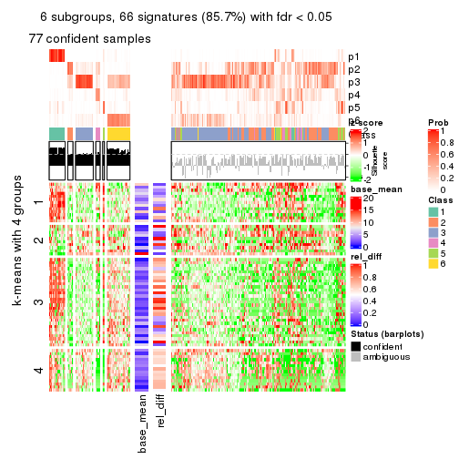</p>

</div>
</div>


Signature heatmaps where rows are not scaled:


<script>
$( function() {
	$( '#tabs-ATC-mclust-get-signatures-no-scale' ).tabs();
} );
</script>
<div id='tabs-ATC-mclust-get-signatures-no-scale'>
<ul>
<li><a href='#tab-ATC-mclust-get-signatures-no-scale-1'>k = 2</a></li>
<li><a href='#tab-ATC-mclust-get-signatures-no-scale-2'>k = 3</a></li>
<li><a href='#tab-ATC-mclust-get-signatures-no-scale-3'>k = 4</a></li>
<li><a href='#tab-ATC-mclust-get-signatures-no-scale-4'>k = 5</a></li>
<li><a href='#tab-ATC-mclust-get-signatures-no-scale-5'>k = 6</a></li>
</ul>
<div id='tab-ATC-mclust-get-signatures-no-scale-1'>
<pre><code class="r">get_signatures(res, k = 2, scale_rows = FALSE)
</code></pre>

<p></p>

</div>
<div id='tab-ATC-mclust-get-signatures-no-scale-2'>
<pre><code class="r">get_signatures(res, k = 3, scale_rows = FALSE)
</code></pre>

<p></p>

</div>
<div id='tab-ATC-mclust-get-signatures-no-scale-3'>
<pre><code class="r">get_signatures(res, k = 4, scale_rows = FALSE)
</code></pre>

<p></p>

</div>
<div id='tab-ATC-mclust-get-signatures-no-scale-4'>
<pre><code class="r">get_signatures(res, k = 5, scale_rows = FALSE)
</code></pre>

<p></p>

</div>
<div id='tab-ATC-mclust-get-signatures-no-scale-5'>
<pre><code class="r">get_signatures(res, k = 6, scale_rows = FALSE)
</code></pre>

<p></p>

</div>
</div>


Compare the overlap of signatures from different k:

```r
compare_signatures(res)
```


`get_signature()` returns a data frame invisibly. TO get the list of signatures, the function
call should be assigned to a variable explicitly. In following code, if `plot` argument is set
to `FALSE`, no heatmap is plotted while only the differential analysis is performed.

```r
# code only for demonstration
tb = get_signature(res, k = ..., plot = FALSE)
```

An example of the output of `tb` is:

```
#>   which_row         fdr    mean_1    mean_2 scaled_mean_1 scaled_mean_2 km
#> 1        38 0.042760348  8.373488  9.131774    -0.5533452     0.5164555  1
#> 2        40 0.018707592  7.106213  8.469186    -0.6173731     0.5762149  1
#> 3        55 0.019134737 10.221463 11.207825    -0.6159697     0.5749050  1
#> 4        59 0.006059896  5.921854  7.869574    -0.6899429     0.6439467  1
#> 5        60 0.018055526  8.928898 10.211722    -0.6204761     0.5791110  1
#> 6        98 0.009384629 15.714769 14.887706     0.6635654    -0.6193277  2
...
```

The columns in `tb` are:

1. `which_row`: row indices corresponding to the input matrix.
2. `fdr`: FDR for the differential test. 
3. `mean_x`: The mean value in group x.
4. `scaled_mean_x`: The mean value in group x after rows are scaled.
5. `km`: Row groups if k-means clustering is applied to rows.


UMAP plot which shows how samples are separated.


<script>
$( function() {
	$( '#tabs-ATC-mclust-dimension-reduction' ).tabs();
} );
</script>
<div id='tabs-ATC-mclust-dimension-reduction'>
<ul>
<li><a href='#tab-ATC-mclust-dimension-reduction-1'>k = 2</a></li>
<li><a href='#tab-ATC-mclust-dimension-reduction-2'>k = 3</a></li>
<li><a href='#tab-ATC-mclust-dimension-reduction-3'>k = 4</a></li>
<li><a href='#tab-ATC-mclust-dimension-reduction-4'>k = 5</a></li>
<li><a href='#tab-ATC-mclust-dimension-reduction-5'>k = 6</a></li>
</ul>
<div id='tab-ATC-mclust-dimension-reduction-1'>
<pre><code class="r">dimension_reduction(res, k = 2, method = &quot;UMAP&quot;)
</code></pre>

<p></p>

</div>
<div id='tab-ATC-mclust-dimension-reduction-2'>
<pre><code class="r">dimension_reduction(res, k = 3, method = &quot;UMAP&quot;)
</code></pre>

<p></p>

</div>
<div id='tab-ATC-mclust-dimension-reduction-3'>
<pre><code class="r">dimension_reduction(res, k = 4, method = &quot;UMAP&quot;)
</code></pre>

<p></p>

</div>
<div id='tab-ATC-mclust-dimension-reduction-4'>
<pre><code class="r">dimension_reduction(res, k = 5, method = &quot;UMAP&quot;)
</code></pre>

<p></p>

</div>
<div id='tab-ATC-mclust-dimension-reduction-5'>
<pre><code class="r">dimension_reduction(res, k = 6, method = &quot;UMAP&quot;)
</code></pre>

<p></p>

</div>
</div>


Following heatmap shows how subgroups are split when increasing `k`:

```r
collect_classes(res)
```


If matrix rows can be associated to genes, consider to use `GO_Enrichment(res,
...)` to perform function enrichment for the signature genes.


 

---------------------------------------------------


### ATC:NMF


The object with results only for a single top-value method and a single partition method 
can be extracted as:

```r
res = res_list["ATC", "NMF"]
# you can also extract it by
# res = res_list["ATC:NMF"]
```

A summary of `res` and all the functions that can be applied to it:

```r
res
```

```
#> A 'ConsensusPartition' object with k = 2, 3, 4, 5, 6.
#>   On a matrix with 77 rows and 243 columns.
#>   Top rows (8, 16, 23, 30, 38) are extracted by 'ATC' method.
#>   Subgroups are detected by 'NMF' method.
#>   Performed in total 1250 partitions by row resampling.
#>   Best k for subgroups seems to be 2.
#> 
#> Following methods can be applied to this 'ConsensusPartition' object:
#>  [1] "cola_report"             "collect_classes"         "collect_plots"          
#>  [4] "collect_stats"           "colnames"                "compare_signatures"     
#>  [7] "consensus_heatmap"       "dimension_reduction"     "functional_enrichment"  
#> [10] "get_anno_col"            "get_anno"                "get_classes"            
#> [13] "get_consensus"           "get_matrix"              "get_membership"         
#> [16] "get_param"               "get_signatures"          "get_stats"              
#> [19] "is_best_k"               "is_stable_k"             "membership_heatmap"     
#> [22] "ncol"                    "nrow"                    "plot_ecdf"              
#> [25] "rownames"                "select_partition_number" "show"                   
#> [28] "suggest_best_k"          "test_to_known_factors"
```

`collect_plots()` function collects all the plots made from `res` for all `k` (number of partitions)
into one single page to provide an easy and fast comparison between different `k`.

```r
collect_plots(res)
```


The plots are:

- The first row: a plot of the ECDF (Empirical cumulative distribution
  function) curves of the consensus matrix for each `k` and the heatmap of
  predicted classes for each `k`.
- The second row: heatmaps of the consensus matrix for each `k`.
- The third row: heatmaps of the membership matrix for each `k`.
- The fouth row: heatmaps of the signatures for each `k`.

All the plots in panels can be made by individual functions and they are
plotted later in this section.

`select_partition_number()` produces several plots showing different
statistics for choosing "optimized" `k`. There are following statistics:

- ECDF curves of the consensus matrix for each `k`;
- 1-PAC. [The PAC
  score](https://en.wikipedia.org/wiki/Consensus_clustering#Over-interpretation_potential_of_consensus_clustering)
  measures the proportion of the ambiguous subgrouping.
- Mean silhouette score.
- Concordance. The mean probability of fiting the consensus class ids in all
  partitions.
- Area increased. Denote $A_k$ as the area under the ECDF curve for current
  `k`, the area increased is defined as $A_k - A_{k-1}$.
- Rand index. The percent of pairs of samples that are both in a same cluster
  or both are not in a same cluster in the partition of k and k-1.
- Jaccard index. The ratio of pairs of samples are both in a same cluster in
  the partition of k and k-1 and the pairs of samples are both in a same
  cluster in the partition k or k-1.

The detailed explanations of these statistics can be found in [the cola
vignette](http://bioconductor.org/packages/devel/bioc/vignettes/cola/inst/doc/cola.html#toc_13).

Generally speaking, lower PAC score, higher mean silhouette score or higher
concordance corresponds to better partition. Rand index and Jaccard index
measure how similar the current partition is compared to partition with `k-1`.
If they are too similar, we won't accept `k` is better than `k-1`.

```r
select_partition_number(res)
```


The numeric values for all these statistics can be obtained by `get_stats()`.

```r
get_stats(res)
```

```
#>   k 1-PAC mean_silhouette concordance area_increased  Rand Jaccard
#> 2 2 0.036           0.436       0.697         0.4735 0.515   0.515
#> 3 3 0.119           0.493       0.665         0.3096 0.648   0.417
#> 4 4 0.117           0.425       0.590         0.0776 0.957   0.881
#> 5 5 0.176           0.271       0.548         0.0776 0.857   0.651
#> 6 6 0.220           0.155       0.485         0.0485 0.824   0.588
```

`suggest_best_k()` suggests the best $k$ based on these statistics. The rules are as follows:

- All $k$ with Jaccard index larger than 0.95 are removed because the increase of
  the partition number does not provides enough extra information. If all $k$ are removed,
  the best $k$ is assigned by `NA`.
- For $k$ with 1-PAC larger than 0.9, the maximal $k$ is taken as the "best k". Other $k$ is called "optional k".
- If it does not fit the second rule. The $k$ with the highest vote of highest
  1-PAC, mean silhouette and concordance is taken as the "best k".

```r
suggest_best_k(res)
```

```
#> [1] 2
```


Following shows the table of the partitions (You need to click the **show/hide
code output** link to see it). The membership matrix (columns with name `p*`)
is inferred by
[`clue::cl_consensus()`](https://www.rdocumentation.org/link/cl_consensus?package=clue)
function with the `SE` method. Basically the value in the membership matrix
represents the probability to belong to a certain group. The finall class
label for an item is determined with the group with highest probability it
belongs to.

In `get_classes()` function, the entropy is calculated from the membership
matrix and the silhouette score is calculated from the consensus matrix.


<script>
$( function() {
	$( '#tabs-ATC-NMF-get-classes' ).tabs();
} );
</script>
<div id='tabs-ATC-NMF-get-classes'>
<ul>
<li><a href='#tab-ATC-NMF-get-classes-1'>k = 2</a></li>
<li><a href='#tab-ATC-NMF-get-classes-2'>k = 3</a></li>
<li><a href='#tab-ATC-NMF-get-classes-3'>k = 4</a></li>
<li><a href='#tab-ATC-NMF-get-classes-4'>k = 5</a></li>
<li><a href='#tab-ATC-NMF-get-classes-5'>k = 6</a></li>
</ul>

<div id='tab-ATC-NMF-get-classes-1'>
<p><a id='tab-ATC-NMF-get-classes-1-a' style='color:#0366d6' href='#'>show/hide code output</a></p>
<pre><code class="r">cbind(get_classes(res, k = 2), get_membership(res, k = 2))
</code></pre>

<pre><code>#&gt;           class entropy silhouette    p1    p2
#&gt; SRR191393     1   0.541     0.6019 0.876 0.124
#&gt; SRR191394     1   0.358     0.6116 0.932 0.068
#&gt; SRR191396     1   0.988     0.1200 0.564 0.436
#&gt; SRR191397     1   0.416     0.6153 0.916 0.084
#&gt; SRR191398     1   0.625     0.5821 0.844 0.156
#&gt; SRR191399     1   0.788     0.5451 0.764 0.236
#&gt; SRR191400     1   0.327     0.6138 0.940 0.060
#&gt; SRR191401     1   0.260     0.6048 0.956 0.044
#&gt; SRR191402     1   0.745     0.5353 0.788 0.212
#&gt; SRR191403     1   0.482     0.6043 0.896 0.104
#&gt; SRR191404     2   0.990     0.2256 0.440 0.560
#&gt; SRR191405     1   0.973     0.1506 0.596 0.404
#&gt; SRR191406     2   0.995     0.2370 0.460 0.540
#&gt; SRR191407     1   0.745     0.5872 0.788 0.212
#&gt; SRR191408     2   0.971     0.3465 0.400 0.600
#&gt; SRR191409     1   0.955     0.2335 0.624 0.376
#&gt; SRR191410     2   0.985     0.3211 0.428 0.572
#&gt; SRR191411     2   0.936     0.4272 0.352 0.648
#&gt; SRR191412     1   0.430     0.5977 0.912 0.088
#&gt; SRR191413     1   0.876     0.4187 0.704 0.296
#&gt; SRR191414     1   0.584     0.6041 0.860 0.140
#&gt; SRR191415     2   0.988     0.3237 0.436 0.564
#&gt; SRR191416     1   1.000    -0.1273 0.508 0.492
#&gt; SRR191418     1   0.722     0.5858 0.800 0.200
#&gt; SRR191419     1   0.644     0.5907 0.836 0.164
#&gt; SRR191420     1   0.814     0.5169 0.748 0.252
#&gt; SRR191421     1   0.469     0.6098 0.900 0.100
#&gt; SRR191422     2   0.981     0.0377 0.420 0.580
#&gt; SRR191423     2   0.706     0.5876 0.192 0.808
#&gt; SRR191424     2   0.929     0.1962 0.344 0.656
#&gt; SRR191425     2   0.992     0.2786 0.448 0.552
#&gt; SRR191426     2   0.634     0.5970 0.160 0.840
#&gt; SRR191427     2   0.891     0.4584 0.308 0.692
#&gt; SRR191428     2   1.000     0.1919 0.492 0.508
#&gt; SRR191429     2   0.224     0.6056 0.036 0.964
#&gt; SRR191430     2   0.966     0.3441 0.392 0.608
#&gt; SRR191431     1   0.966     0.3980 0.608 0.392
#&gt; SRR191432     2   0.260     0.6044 0.044 0.956
#&gt; SRR191433     2   0.506     0.5678 0.112 0.888
#&gt; SRR191434     1   0.844     0.5573 0.728 0.272
#&gt; SRR191435     2   0.981     0.3410 0.420 0.580
#&gt; SRR191436     2   0.886     0.4942 0.304 0.696
#&gt; SRR191437     2   0.827     0.3611 0.260 0.740
#&gt; SRR191438     2   0.955     0.4077 0.376 0.624
#&gt; SRR191439     2   0.814     0.5562 0.252 0.748
#&gt; SRR191440     2   0.996    -0.0774 0.464 0.536
#&gt; SRR191441     2   0.552     0.5517 0.128 0.872
#&gt; SRR191442     2   0.861     0.5215 0.284 0.716
#&gt; SRR191443     1   0.932     0.3546 0.652 0.348
#&gt; SRR191444     1   0.775     0.5610 0.772 0.228
#&gt; SRR191445     2   0.689     0.5290 0.184 0.816
#&gt; SRR191446     2   0.278     0.6046 0.048 0.952
#&gt; SRR191447     2   0.456     0.5810 0.096 0.904
#&gt; SRR191448     1   0.680     0.6000 0.820 0.180
#&gt; SRR191449     2   0.991     0.2943 0.444 0.556
#&gt; SRR191450     1   0.895     0.5332 0.688 0.312
#&gt; SRR191451     1   0.990     0.0779 0.560 0.440
#&gt; SRR191452     2   0.913     0.2549 0.328 0.672
#&gt; SRR191453     2   0.946     0.4334 0.364 0.636
#&gt; SRR191454     1   0.969     0.4087 0.604 0.396
#&gt; SRR191455     2   0.738     0.5784 0.208 0.792
#&gt; SRR191456     1   0.876     0.4479 0.704 0.296
#&gt; SRR191457     1   0.995     0.2611 0.540 0.460
#&gt; SRR191458     1   0.994     0.2074 0.544 0.456
#&gt; SRR191459     2   0.943     0.4364 0.360 0.640
#&gt; SRR191460     1   0.891     0.4106 0.692 0.308
#&gt; SRR191461     2   0.662     0.5900 0.172 0.828
#&gt; SRR191462     2   0.987    -0.0397 0.432 0.568
#&gt; SRR191463     2   0.388     0.5967 0.076 0.924
#&gt; SRR191464     2   0.861     0.5190 0.284 0.716
#&gt; SRR191465     2   0.278     0.5910 0.048 0.952
#&gt; SRR191466     2   0.939     0.4373 0.356 0.644
#&gt; SRR191467     2   0.644     0.5526 0.164 0.836
#&gt; SRR191468     2   0.753     0.4566 0.216 0.784
#&gt; SRR191469     2   0.833     0.5510 0.264 0.736
#&gt; SRR191470     2   0.706     0.5744 0.192 0.808
#&gt; SRR191471     2   0.999     0.1041 0.484 0.516
#&gt; SRR191472     2   0.311     0.5921 0.056 0.944
#&gt; SRR191473     2   0.781     0.5639 0.232 0.768
#&gt; SRR191474     2   0.981     0.3428 0.420 0.580
#&gt; SRR191475     2   0.430     0.5887 0.088 0.912
#&gt; SRR191476     2   0.689     0.5327 0.184 0.816
#&gt; SRR191477     2   0.958     0.3951 0.380 0.620
#&gt; SRR191478     2   0.891     0.4645 0.308 0.692
#&gt; SRR191479     1   0.958     0.3038 0.620 0.380
#&gt; SRR191480     2   0.939     0.4537 0.356 0.644
#&gt; SRR191481     2   0.876     0.5008 0.296 0.704
#&gt; SRR191482     2   0.886     0.4933 0.304 0.696
#&gt; SRR191483     2   0.184     0.6060 0.028 0.972
#&gt; SRR191484     1   1.000    -0.1031 0.508 0.492
#&gt; SRR191485     2   0.358     0.6105 0.068 0.932
#&gt; SRR191486     2   0.388     0.6122 0.076 0.924
#&gt; SRR191487     2   0.802     0.5587 0.244 0.756
#&gt; SRR191488     1   0.929     0.3993 0.656 0.344
#&gt; SRR191489     1   0.995     0.2839 0.540 0.460
#&gt; SRR191490     2   0.615     0.5383 0.152 0.848
#&gt; SRR191491     2   0.680     0.5930 0.180 0.820
#&gt; SRR191492     2   0.988     0.2667 0.436 0.564
#&gt; SRR191493     2   0.518     0.5554 0.116 0.884
#&gt; SRR191494     2   0.518     0.5617 0.116 0.884
#&gt; SRR191495     2   0.891     0.5070 0.308 0.692
#&gt; SRR191496     2   0.943     0.1637 0.360 0.640
#&gt; SRR191497     2   0.932     0.4660 0.348 0.652
#&gt; SRR191498     2   0.850     0.3448 0.276 0.724
#&gt; SRR191499     2   0.689     0.5798 0.184 0.816
#&gt; SRR191500     2   0.738     0.5737 0.208 0.792
#&gt; SRR191501     2   0.991    -0.0714 0.444 0.556
#&gt; SRR191502     2   0.595     0.6046 0.144 0.856
#&gt; SRR191503     2   0.689     0.5870 0.184 0.816
#&gt; SRR191504     2   0.311     0.5879 0.056 0.944
#&gt; SRR191505     2   0.224     0.5990 0.036 0.964
#&gt; SRR191506     2   0.714     0.4750 0.196 0.804
#&gt; SRR191507     1   1.000     0.2004 0.512 0.488
#&gt; SRR191508     2   0.494     0.5853 0.108 0.892
#&gt; SRR191509     2   0.388     0.5991 0.076 0.924
#&gt; SRR191510     2   0.662     0.5168 0.172 0.828
#&gt; SRR191511     2   0.388     0.5960 0.076 0.924
#&gt; SRR191512     2   0.584     0.5442 0.140 0.860
#&gt; SRR191513     2   0.952     0.1527 0.372 0.628
#&gt; SRR191514     2   0.358     0.5809 0.068 0.932
#&gt; SRR191515     2   0.469     0.5792 0.100 0.900
#&gt; SRR191516     2   0.730     0.5852 0.204 0.796
#&gt; SRR191517     2   0.844     0.5202 0.272 0.728
#&gt; SRR191518     2   0.552     0.6051 0.128 0.872
#&gt; SRR191519     2   0.242     0.5964 0.040 0.960
#&gt; SRR191520     2   0.671     0.5894 0.176 0.824
#&gt; SRR191521     2   0.295     0.5993 0.052 0.948
#&gt; SRR191522     2   0.327     0.5921 0.060 0.940
#&gt; SRR191523     2   0.563     0.5465 0.132 0.868
#&gt; SRR191524     2   0.886     0.4596 0.304 0.696
#&gt; SRR191525     2   0.184     0.6009 0.028 0.972
#&gt; SRR191526     2   0.595     0.5383 0.144 0.856
#&gt; SRR191527     1   0.929     0.3882 0.656 0.344
#&gt; SRR191528     1   0.921     0.4101 0.664 0.336
#&gt; SRR191529     2   0.949     0.1253 0.368 0.632
#&gt; SRR191530     2   0.456     0.5956 0.096 0.904
#&gt; SRR191531     2   0.991    -0.0301 0.444 0.556
#&gt; SRR191532     2   0.416     0.6095 0.084 0.916
#&gt; SRR191533     2   0.662     0.5780 0.172 0.828
#&gt; SRR191534     2   0.958     0.1570 0.380 0.620
#&gt; SRR191535     2   0.163     0.6057 0.024 0.976
#&gt; SRR191536     2   0.975     0.0285 0.408 0.592
#&gt; SRR191537     1   0.987     0.2631 0.568 0.432
#&gt; SRR191538     2   0.295     0.6014 0.052 0.948
#&gt; SRR191539     2   0.827     0.3820 0.260 0.740
#&gt; SRR191540     2   0.541     0.6127 0.124 0.876
#&gt; SRR191541     2   0.886     0.5288 0.304 0.696
#&gt; SRR191542     2   0.634     0.5244 0.160 0.840
#&gt; SRR191543     2   0.327     0.5845 0.060 0.940
#&gt; SRR191544     2   0.634     0.6007 0.160 0.840
#&gt; SRR191545     2   0.141     0.6034 0.020 0.980
#&gt; SRR191546     2   0.671     0.5459 0.176 0.824
#&gt; SRR191547     2   0.767     0.4520 0.224 0.776
#&gt; SRR191548     1   0.814     0.5296 0.748 0.252
#&gt; SRR191549     1   0.738     0.5567 0.792 0.208
#&gt; SRR191550     1   0.518     0.6065 0.884 0.116
#&gt; SRR191551     1   0.644     0.5920 0.836 0.164
#&gt; SRR191552     1   0.775     0.5458 0.772 0.228
#&gt; SRR191553     1   0.904     0.4615 0.680 0.320
#&gt; SRR191554     1   0.821     0.5241 0.744 0.256
#&gt; SRR191555     2   0.987     0.1348 0.432 0.568
#&gt; SRR191556     1   0.605     0.5930 0.852 0.148
#&gt; SRR191557     1   0.998    -0.1044 0.528 0.472
#&gt; SRR191558     1   0.975     0.3443 0.592 0.408
#&gt; SRR191559     2   1.000     0.1674 0.496 0.504
#&gt; SRR191560     1   0.978     0.1246 0.588 0.412
#&gt; SRR191561     1   0.936     0.4139 0.648 0.352
#&gt; SRR191562     1   0.827     0.5475 0.740 0.260
#&gt; SRR191563     2   0.999     0.1985 0.484 0.516
#&gt; SRR191564     2   0.966     0.3670 0.392 0.608
#&gt; SRR191565     1   0.529     0.6077 0.880 0.120
#&gt; SRR191566     1   0.975     0.1487 0.592 0.408
#&gt; SRR191567     1   0.327     0.6127 0.940 0.060
#&gt; SRR191568     1   0.881     0.4487 0.700 0.300
#&gt; SRR191569     1   0.992     0.0152 0.552 0.448
#&gt; SRR191570     1   0.625     0.6078 0.844 0.156
#&gt; SRR191571     1   0.833     0.4875 0.736 0.264
#&gt; SRR191572     1   0.402     0.6120 0.920 0.080
#&gt; SRR191573     1   0.753     0.5330 0.784 0.216
#&gt; SRR191574     1   0.529     0.6162 0.880 0.120
#&gt; SRR191575     1   0.615     0.6160 0.848 0.152
#&gt; SRR191576     1   0.981     0.1776 0.580 0.420
#&gt; SRR191577     1   0.781     0.5658 0.768 0.232
#&gt; SRR191578     1   0.541     0.6008 0.876 0.124
#&gt; SRR191579     1   0.529     0.5923 0.880 0.120
#&gt; SRR191580     1   0.844     0.4921 0.728 0.272
#&gt; SRR191581     1   0.855     0.4836 0.720 0.280
#&gt; SRR191582     1   0.781     0.5400 0.768 0.232
#&gt; SRR191583     1   0.978     0.3325 0.588 0.412
#&gt; SRR191584     1   0.943     0.3836 0.640 0.360
#&gt; SRR191585     2   0.985     0.3281 0.428 0.572
#&gt; SRR191586     2   0.958     0.4019 0.380 0.620
#&gt; SRR191587     1   0.981     0.1083 0.580 0.420
#&gt; SRR191588     1   0.634     0.5800 0.840 0.160
#&gt; SRR191589     1   0.625     0.5850 0.844 0.156
#&gt; SRR191590     1   0.494     0.6189 0.892 0.108
#&gt; SRR191591     1   0.973     0.1398 0.596 0.404
#&gt; SRR191592     1   0.952     0.2464 0.628 0.372
#&gt; SRR191593     2   0.995     0.2733 0.460 0.540
#&gt; SRR191594     1   0.529     0.6109 0.880 0.120
#&gt; SRR191595     1   0.781     0.5120 0.768 0.232
#&gt; SRR191596     1   0.416     0.6123 0.916 0.084
#&gt; SRR191597     2   0.978     0.3533 0.412 0.588
#&gt; SRR191598     1   0.738     0.5878 0.792 0.208
#&gt; SRR191599     1   0.730     0.6071 0.796 0.204
#&gt; SRR191600     1   0.991     0.0650 0.556 0.444
#&gt; SRR191601     2   0.552     0.6070 0.128 0.872
#&gt; SRR191602     2   0.973     0.3597 0.404 0.596
#&gt; SRR191603     2   0.958     0.4009 0.380 0.620
#&gt; SRR191604     2   0.343     0.6077 0.064 0.936
#&gt; SRR191605     2   0.985     0.3233 0.428 0.572
#&gt; SRR191606     1   0.680     0.6180 0.820 0.180
#&gt; SRR191607     2   0.833     0.5341 0.264 0.736
#&gt; SRR191608     2   0.886     0.4967 0.304 0.696
#&gt; SRR191609     2   0.855     0.5224 0.280 0.720
#&gt; SRR191610     2   0.913     0.4716 0.328 0.672
#&gt; SRR191611     2   0.990     0.3158 0.440 0.560
#&gt; SRR191612     2   0.997     0.2291 0.468 0.532
#&gt; SRR191613     1   0.963     0.3933 0.612 0.388
#&gt; SRR191614     2   0.963     0.3935 0.388 0.612
#&gt; SRR191615     1   0.996    -0.0443 0.536 0.464
#&gt; SRR191616     1   0.961     0.3585 0.616 0.384
#&gt; SRR191617     1   0.969     0.3662 0.604 0.396
#&gt; SRR191618     1   0.997     0.2969 0.532 0.468
#&gt; SRR191619     2   0.992     0.3030 0.448 0.552
#&gt; SRR191620     2   0.998     0.0826 0.472 0.528
#&gt; SRR191621     2   0.541     0.6116 0.124 0.876
#&gt; SRR191622     2   0.975     0.3613 0.408 0.592
#&gt; SRR191623     2   0.997     0.2486 0.468 0.532
#&gt; SRR191624     1   0.802     0.5059 0.756 0.244
#&gt; SRR191625     1   0.925     0.3721 0.660 0.340
#&gt; SRR191626     2   0.827     0.5267 0.260 0.740
#&gt; SRR191627     2   0.983     0.3448 0.424 0.576
#&gt; SRR191628     2   0.913     0.4548 0.328 0.672
#&gt; SRR191629     2   0.992     0.2998 0.448 0.552
#&gt; SRR191630     1   0.714     0.5748 0.804 0.196
#&gt; SRR191631     2   0.963     0.3887 0.388 0.612
#&gt; SRR191632     1   0.855     0.5227 0.720 0.280
#&gt; SRR191633     2   0.671     0.5687 0.176 0.824
#&gt; SRR191634     1   0.946     0.3625 0.636 0.364
#&gt; SRR191635     1   0.966     0.2142 0.608 0.392
#&gt; SRR191636     1   0.963     0.3287 0.612 0.388
#&gt; SRR191637     2   1.000    -0.1819 0.500 0.500
</code></pre>

<script>
$('#tab-ATC-NMF-get-classes-1-a').parent().next().next().hide();
$('#tab-ATC-NMF-get-classes-1-a').click(function(){
  $('#tab-ATC-NMF-get-classes-1-a').parent().next().next().toggle();
  return(false);
});
</script>
</div>

<div id='tab-ATC-NMF-get-classes-2'>
<p><a id='tab-ATC-NMF-get-classes-2-a' style='color:#0366d6' href='#'>show/hide code output</a></p>
<pre><code class="r">cbind(get_classes(res, k = 3), get_membership(res, k = 3))
</code></pre>

<pre><code>#&gt;           class entropy silhouette    p1    p2    p3
#&gt; SRR191393     3   0.687     0.1025 0.424 0.016 0.560
#&gt; SRR191394     1   0.469     0.7168 0.852 0.052 0.096
#&gt; SRR191396     3   0.816     0.5214 0.228 0.136 0.636
#&gt; SRR191397     1   0.568     0.6783 0.764 0.024 0.212
#&gt; SRR191398     1   0.353     0.7214 0.900 0.068 0.032
#&gt; SRR191399     3   0.787     0.3070 0.368 0.064 0.568
#&gt; SRR191400     1   0.541     0.6985 0.804 0.040 0.156
#&gt; SRR191401     1   0.779     0.3348 0.528 0.052 0.420
#&gt; SRR191402     3   0.580     0.4906 0.248 0.016 0.736
#&gt; SRR191403     1   0.772     0.3290 0.552 0.052 0.396
#&gt; SRR191404     3   0.898     0.3879 0.252 0.188 0.560
#&gt; SRR191405     3   0.589     0.5995 0.168 0.052 0.780
#&gt; SRR191406     3   0.504     0.6266 0.060 0.104 0.836
#&gt; SRR191407     1   0.659     0.7177 0.752 0.156 0.092
#&gt; SRR191408     3   0.915     0.3930 0.176 0.300 0.524
#&gt; SRR191409     3   0.554     0.6320 0.132 0.060 0.808
#&gt; SRR191410     3   0.562     0.5899 0.048 0.156 0.796
#&gt; SRR191411     3   0.788     0.4183 0.100 0.260 0.640
#&gt; SRR191412     1   0.701     0.3110 0.548 0.020 0.432
#&gt; SRR191413     3   0.728     0.5077 0.260 0.068 0.672
#&gt; SRR191414     3   0.859     0.1680 0.344 0.112 0.544
#&gt; SRR191415     3   0.464     0.5997 0.036 0.116 0.848
#&gt; SRR191416     3   0.410     0.6344 0.060 0.060 0.880
#&gt; SRR191418     1   0.851     0.4672 0.568 0.116 0.316
#&gt; SRR191419     1   0.437     0.7387 0.868 0.076 0.056
#&gt; SRR191420     3   0.698     0.4604 0.212 0.076 0.712
#&gt; SRR191421     1   0.821     0.2372 0.480 0.072 0.448
#&gt; SRR191422     2   0.979     0.2519 0.240 0.408 0.352
#&gt; SRR191423     3   0.758    -0.3306 0.040 0.460 0.500
#&gt; SRR191424     2   0.897     0.0459 0.412 0.460 0.128
#&gt; SRR191425     3   0.329     0.6266 0.012 0.088 0.900
#&gt; SRR191426     2   0.617     0.5603 0.000 0.588 0.412
#&gt; SRR191427     2   0.968     0.0693 0.364 0.420 0.216
#&gt; SRR191428     3   0.549     0.5848 0.080 0.104 0.816
#&gt; SRR191429     2   0.627     0.6347 0.008 0.644 0.348
#&gt; SRR191430     3   0.825     0.4359 0.140 0.232 0.628
#&gt; SRR191431     1   0.894     0.5427 0.568 0.232 0.200
#&gt; SRR191432     2   0.576     0.6467 0.000 0.672 0.328
#&gt; SRR191433     2   0.642     0.6803 0.044 0.728 0.228
#&gt; SRR191434     1   0.761     0.6838 0.688 0.168 0.144
#&gt; SRR191435     3   0.663     0.5382 0.064 0.204 0.732
#&gt; SRR191436     3   0.718     0.3675 0.048 0.304 0.648
#&gt; SRR191437     2   0.855     0.4206 0.284 0.584 0.132
#&gt; SRR191438     3   0.595     0.5578 0.048 0.180 0.772
#&gt; SRR191439     3   0.837    -0.1626 0.084 0.416 0.500
#&gt; SRR191440     1   0.830     0.5624 0.592 0.300 0.108
#&gt; SRR191441     2   0.802     0.6665 0.124 0.644 0.232
#&gt; SRR191442     3   0.674    -0.1621 0.012 0.428 0.560
#&gt; SRR191443     3   0.904     0.4042 0.240 0.204 0.556
#&gt; SRR191444     3   0.852     0.0364 0.448 0.092 0.460
#&gt; SRR191445     2   0.874     0.6366 0.156 0.576 0.268
#&gt; SRR191446     2   0.736     0.6584 0.056 0.640 0.304
#&gt; SRR191447     2   0.734     0.6827 0.056 0.644 0.300
#&gt; SRR191448     1   0.570     0.7303 0.800 0.064 0.136
#&gt; SRR191449     3   0.372     0.6157 0.024 0.088 0.888
#&gt; SRR191450     1   0.976     0.3740 0.440 0.260 0.300
#&gt; SRR191451     3   0.740     0.5860 0.152 0.144 0.704
#&gt; SRR191452     2   0.865     0.4941 0.276 0.580 0.144
#&gt; SRR191453     3   0.839     0.2918 0.092 0.372 0.536
#&gt; SRR191454     1   0.972     0.3324 0.452 0.272 0.276
#&gt; SRR191455     2   0.826     0.4060 0.088 0.556 0.356
#&gt; SRR191456     3   0.834    -0.1736 0.452 0.080 0.468
#&gt; SRR191457     1   0.749     0.5573 0.620 0.324 0.056
#&gt; SRR191458     3   0.938     0.3533 0.236 0.252 0.512
#&gt; SRR191459     3   0.659     0.4451 0.044 0.244 0.712
#&gt; SRR191460     3   0.649     0.5638 0.192 0.064 0.744
#&gt; SRR191461     2   0.717     0.3815 0.024 0.520 0.456
#&gt; SRR191462     2   0.863     0.1314 0.428 0.472 0.100
#&gt; SRR191463     2   0.681     0.6828 0.044 0.688 0.268
#&gt; SRR191464     3   0.625     0.3276 0.016 0.300 0.684
#&gt; SRR191465     2   0.580     0.6657 0.008 0.712 0.280
#&gt; SRR191466     3   0.606     0.4032 0.016 0.276 0.708
#&gt; SRR191467     2   0.738     0.6782 0.076 0.672 0.252
#&gt; SRR191468     2   0.727     0.6114 0.160 0.712 0.128
#&gt; SRR191469     2   0.892     0.3072 0.128 0.492 0.380
#&gt; SRR191470     3   0.668    -0.1850 0.008 0.476 0.516
#&gt; SRR191471     1   0.996    -0.1067 0.368 0.296 0.336
#&gt; SRR191472     2   0.598     0.6829 0.020 0.728 0.252
#&gt; SRR191473     3   0.682    -0.2366 0.012 0.476 0.512
#&gt; SRR191474     3   0.333     0.6181 0.020 0.076 0.904
#&gt; SRR191475     2   0.629     0.6747 0.024 0.704 0.272
#&gt; SRR191476     2   0.730     0.6416 0.100 0.700 0.200
#&gt; SRR191477     3   0.343     0.6060 0.004 0.112 0.884
#&gt; SRR191478     3   0.883    -0.0928 0.116 0.416 0.468
#&gt; SRR191479     3   0.890     0.4023 0.252 0.180 0.568
#&gt; SRR191480     3   0.546     0.5763 0.028 0.184 0.788
#&gt; SRR191481     3   0.577     0.4478 0.012 0.260 0.728
#&gt; SRR191482     3   0.623     0.3021 0.012 0.316 0.672
#&gt; SRR191483     2   0.626     0.6513 0.012 0.668 0.320
#&gt; SRR191484     3   0.823     0.4679 0.112 0.280 0.608
#&gt; SRR191485     2   0.684     0.6537 0.028 0.640 0.332
#&gt; SRR191486     2   0.690     0.6153 0.024 0.612 0.364
#&gt; SRR191487     2   0.765     0.5743 0.080 0.644 0.276
#&gt; SRR191488     1   0.628     0.6539 0.736 0.224 0.040
#&gt; SRR191489     1   0.811     0.4739 0.580 0.336 0.084
#&gt; SRR191490     2   0.761     0.6095 0.148 0.688 0.164
#&gt; SRR191491     2   0.781     0.5092 0.056 0.548 0.396
#&gt; SRR191492     3   0.908     0.1997 0.144 0.368 0.488
#&gt; SRR191493     2   0.717     0.6454 0.112 0.716 0.172
#&gt; SRR191494     2   0.694     0.6802 0.068 0.708 0.224
#&gt; SRR191495     3   0.703     0.1055 0.024 0.396 0.580
#&gt; SRR191496     2   0.844     0.5131 0.284 0.592 0.124
#&gt; SRR191497     3   0.779     0.2930 0.064 0.348 0.588
#&gt; SRR191498     2   0.788     0.4812 0.260 0.640 0.100
#&gt; SRR191499     2   0.678     0.4576 0.012 0.544 0.444
#&gt; SRR191500     2   0.857     0.4824 0.104 0.524 0.372
#&gt; SRR191501     2   0.799     0.0340 0.456 0.484 0.060
#&gt; SRR191502     2   0.859     0.4904 0.100 0.496 0.404
#&gt; SRR191503     2   0.833     0.4835 0.096 0.564 0.340
#&gt; SRR191504     2   0.590     0.6647 0.008 0.700 0.292
#&gt; SRR191505     2   0.652     0.6813 0.040 0.712 0.248
#&gt; SRR191506     2   0.756     0.6405 0.164 0.692 0.144
#&gt; SRR191507     1   0.868     0.2974 0.540 0.340 0.120
#&gt; SRR191508     2   0.719     0.6736 0.052 0.656 0.292
#&gt; SRR191509     2   0.654     0.6731 0.028 0.684 0.288
#&gt; SRR191510     2   0.793     0.6617 0.128 0.656 0.216
#&gt; SRR191511     2   0.616     0.6703 0.016 0.696 0.288
#&gt; SRR191512     2   0.710     0.6876 0.080 0.704 0.216
#&gt; SRR191513     2   0.689     0.4462 0.256 0.692 0.052
#&gt; SRR191514     2   0.596     0.6724 0.016 0.720 0.264
#&gt; SRR191515     2   0.662     0.6726 0.068 0.736 0.196
#&gt; SRR191516     2   0.808     0.3651 0.068 0.520 0.412
#&gt; SRR191517     3   0.603     0.3987 0.016 0.272 0.712
#&gt; SRR191518     2   0.676     0.5121 0.012 0.552 0.436
#&gt; SRR191519     2   0.569     0.6636 0.004 0.708 0.288
#&gt; SRR191520     2   0.704     0.4001 0.020 0.536 0.444
#&gt; SRR191521     2   0.599     0.6703 0.016 0.716 0.268
#&gt; SRR191522     2   0.676     0.6824 0.048 0.700 0.252
#&gt; SRR191523     2   0.686     0.6667 0.092 0.732 0.176
#&gt; SRR191524     2   0.966     0.1509 0.368 0.420 0.212
#&gt; SRR191525     2   0.574     0.6733 0.012 0.732 0.256
#&gt; SRR191526     2   0.682     0.6475 0.108 0.740 0.152
#&gt; SRR191527     1   0.303     0.7286 0.912 0.076 0.012
#&gt; SRR191528     1   0.466     0.7124 0.828 0.156 0.016
#&gt; SRR191529     2   0.901     0.0995 0.408 0.460 0.132
#&gt; SRR191530     2   0.690     0.6709 0.048 0.684 0.268
#&gt; SRR191531     1   0.937     0.4333 0.508 0.280 0.212
#&gt; SRR191532     2   0.739     0.6606 0.056 0.636 0.308
#&gt; SRR191533     2   0.785     0.6437 0.080 0.616 0.304
#&gt; SRR191534     2   0.823     0.2146 0.320 0.584 0.096
#&gt; SRR191535     2   0.572     0.6649 0.004 0.704 0.292
#&gt; SRR191536     2   0.894     0.0284 0.432 0.444 0.124
#&gt; SRR191537     1   0.880     0.4288 0.568 0.276 0.156
#&gt; SRR191538     2   0.602     0.6564 0.008 0.684 0.308
#&gt; SRR191539     2   0.767     0.4856 0.260 0.652 0.088
#&gt; SRR191540     2   0.714     0.5877 0.032 0.600 0.368
#&gt; SRR191541     3   0.830    -0.0797 0.080 0.412 0.508
#&gt; SRR191542     2   0.787     0.6604 0.124 0.660 0.216
#&gt; SRR191543     2   0.580     0.6772 0.016 0.736 0.248
#&gt; SRR191544     2   0.799     0.4564 0.064 0.532 0.404
#&gt; SRR191545     2   0.590     0.6481 0.004 0.680 0.316
#&gt; SRR191546     2   0.861     0.6382 0.152 0.592 0.256
#&gt; SRR191547     2   0.703     0.6582 0.104 0.724 0.172
#&gt; SRR191548     1   0.313     0.7332 0.916 0.052 0.032
#&gt; SRR191549     1   0.326     0.7332 0.912 0.048 0.040
#&gt; SRR191550     1   0.327     0.7323 0.912 0.044 0.044
#&gt; SRR191551     1   0.347     0.7324 0.904 0.040 0.056
#&gt; SRR191552     1   0.293     0.7325 0.924 0.036 0.040
#&gt; SRR191553     1   0.498     0.7091 0.812 0.168 0.020
#&gt; SRR191554     1   0.380     0.7343 0.888 0.080 0.032
#&gt; SRR191555     2   0.992     0.1151 0.344 0.380 0.276
#&gt; SRR191556     3   0.695     0.2319 0.376 0.024 0.600
#&gt; SRR191557     3   0.293     0.6335 0.036 0.040 0.924
#&gt; SRR191558     1   0.783     0.4899 0.632 0.088 0.280
#&gt; SRR191559     3   0.227     0.6340 0.040 0.016 0.944
#&gt; SRR191560     3   0.445     0.6301 0.112 0.032 0.856
#&gt; SRR191561     1   0.474     0.7284 0.836 0.136 0.028
#&gt; SRR191562     1   0.514     0.7195 0.832 0.064 0.104
#&gt; SRR191563     3   0.549     0.6377 0.104 0.080 0.816
#&gt; SRR191564     3   0.761     0.4567 0.092 0.244 0.664
#&gt; SRR191565     3   0.729    -0.0453 0.464 0.028 0.508
#&gt; SRR191566     3   0.414     0.6379 0.096 0.032 0.872
#&gt; SRR191567     1   0.600     0.6668 0.760 0.040 0.200
#&gt; SRR191568     1   0.909     0.1457 0.460 0.140 0.400
#&gt; SRR191569     3   0.541     0.6310 0.136 0.052 0.812
#&gt; SRR191570     1   0.808     0.5383 0.608 0.096 0.296
#&gt; SRR191571     3   0.714     0.4302 0.328 0.040 0.632
#&gt; SRR191572     1   0.343     0.7294 0.904 0.032 0.064
#&gt; SRR191573     3   0.582     0.5032 0.224 0.024 0.752
#&gt; SRR191574     1   0.512     0.7042 0.816 0.032 0.152
#&gt; SRR191575     1   0.585     0.7171 0.788 0.060 0.152
#&gt; SRR191576     3   0.761     0.5680 0.204 0.116 0.680
#&gt; SRR191577     1   0.722     0.2639 0.548 0.028 0.424
#&gt; SRR191578     1   0.814     0.5326 0.572 0.084 0.344
#&gt; SRR191579     1   0.288     0.7293 0.924 0.024 0.052
#&gt; SRR191580     1   0.341     0.7330 0.904 0.068 0.028
#&gt; SRR191581     1   0.280     0.7272 0.924 0.060 0.016
#&gt; SRR191582     1   0.338     0.7299 0.908 0.048 0.044
#&gt; SRR191583     1   0.630     0.6948 0.744 0.208 0.048
#&gt; SRR191584     1   0.406     0.7239 0.860 0.128 0.012
#&gt; SRR191585     3   0.259     0.6118 0.004 0.072 0.924
#&gt; SRR191586     3   0.542     0.4920 0.008 0.240 0.752
#&gt; SRR191587     3   0.468     0.6216 0.132 0.028 0.840
#&gt; SRR191588     3   0.797     0.1419 0.372 0.068 0.560
#&gt; SRR191589     3   0.703     0.2090 0.368 0.028 0.604
#&gt; SRR191590     1   0.569     0.6942 0.780 0.036 0.184
#&gt; SRR191591     3   0.453     0.6349 0.104 0.040 0.856
#&gt; SRR191592     3   0.638     0.6224 0.164 0.076 0.760
#&gt; SRR191593     3   0.535     0.6134 0.036 0.160 0.804
#&gt; SRR191594     1   0.734     0.6755 0.700 0.108 0.192
#&gt; SRR191595     3   0.689     0.4942 0.228 0.064 0.708
#&gt; SRR191596     1   0.689     0.6091 0.692 0.052 0.256
#&gt; SRR191597     3   0.314     0.6199 0.020 0.068 0.912
#&gt; SRR191598     3   0.833     0.1273 0.396 0.084 0.520
#&gt; SRR191599     1   0.851     0.5549 0.596 0.140 0.264
#&gt; SRR191600     3   0.820     0.5341 0.276 0.112 0.612
#&gt; SRR191601     2   0.653     0.5884 0.012 0.620 0.368
#&gt; SRR191602     3   0.329     0.6084 0.008 0.096 0.896
#&gt; SRR191603     3   0.398     0.5756 0.004 0.144 0.852
#&gt; SRR191604     2   0.599     0.6607 0.008 0.688 0.304
#&gt; SRR191605     3   0.611     0.5876 0.048 0.192 0.760
#&gt; SRR191606     1   0.801     0.6050 0.636 0.112 0.252
#&gt; SRR191607     3   0.704    -0.1466 0.020 0.444 0.536
#&gt; SRR191608     3   0.663     0.0743 0.012 0.392 0.596
#&gt; SRR191609     3   0.702     0.2421 0.032 0.344 0.624
#&gt; SRR191610     3   0.660     0.3037 0.020 0.332 0.648
#&gt; SRR191611     3   0.338     0.6045 0.008 0.100 0.892
#&gt; SRR191612     3   0.512     0.6209 0.060 0.108 0.832
#&gt; SRR191613     1   0.902     0.4750 0.516 0.336 0.148
#&gt; SRR191614     3   0.620     0.5326 0.044 0.208 0.748
#&gt; SRR191615     3   0.509     0.6381 0.112 0.056 0.832
#&gt; SRR191616     1   0.679     0.6918 0.728 0.196 0.076
#&gt; SRR191617     1   0.746     0.6781 0.676 0.236 0.088
#&gt; SRR191618     2   0.995    -0.2232 0.332 0.376 0.292
#&gt; SRR191619     3   0.556     0.6242 0.048 0.152 0.800
#&gt; SRR191620     3   0.936     0.2879 0.320 0.188 0.492
#&gt; SRR191621     2   0.718     0.4501 0.024 0.504 0.472
#&gt; SRR191622     3   0.412     0.6243 0.040 0.084 0.876
#&gt; SRR191623     3   0.269     0.6301 0.032 0.036 0.932
#&gt; SRR191624     3   0.800     0.4191 0.224 0.128 0.648
#&gt; SRR191625     3   0.863     0.3979 0.340 0.116 0.544
#&gt; SRR191626     3   0.601     0.1722 0.000 0.372 0.628
#&gt; SRR191627     3   0.464     0.6164 0.044 0.104 0.852
#&gt; SRR191628     3   0.884    -0.0194 0.116 0.432 0.452
#&gt; SRR191629     3   0.353     0.6310 0.032 0.068 0.900
#&gt; SRR191630     1   0.884     0.5089 0.548 0.144 0.308
#&gt; SRR191631     3   0.345     0.6026 0.008 0.104 0.888
#&gt; SRR191632     1   0.604     0.7153 0.788 0.104 0.108
#&gt; SRR191633     2   0.862     0.5199 0.144 0.584 0.272
#&gt; SRR191634     1   0.462     0.7208 0.840 0.136 0.024
#&gt; SRR191635     3   0.625     0.6237 0.116 0.108 0.776
#&gt; SRR191636     1   0.541     0.6933 0.780 0.200 0.020
#&gt; SRR191637     1   0.811     0.4006 0.536 0.392 0.072
</code></pre>

<script>
$('#tab-ATC-NMF-get-classes-2-a').parent().next().next().hide();
$('#tab-ATC-NMF-get-classes-2-a').click(function(){
  $('#tab-ATC-NMF-get-classes-2-a').parent().next().next().toggle();
  return(false);
});
</script>
</div>

<div id='tab-ATC-NMF-get-classes-3'>
<p><a id='tab-ATC-NMF-get-classes-3-a' style='color:#0366d6' href='#'>show/hide code output</a></p>
<pre><code class="r">cbind(get_classes(res, k = 4), get_membership(res, k = 4))
</code></pre>

<pre><code>#&gt;           class entropy silhouette    p1    p2    p3    p4
#&gt; SRR191393     3   0.688   -0.14426 0.428 0.024 0.496 0.052
#&gt; SRR191394     1   0.561    0.65676 0.748 0.020 0.160 0.072
#&gt; SRR191396     3   0.858    0.43798 0.156 0.160 0.544 0.140
#&gt; SRR191397     1   0.681    0.58944 0.644 0.028 0.236 0.092
#&gt; SRR191398     1   0.455    0.67389 0.832 0.040 0.052 0.076
#&gt; SRR191399     3   0.871    0.09402 0.336 0.072 0.436 0.156
#&gt; SRR191400     1   0.664    0.62848 0.680 0.036 0.188 0.096
#&gt; SRR191401     1   0.774    0.22510 0.428 0.020 0.420 0.132
#&gt; SRR191402     3   0.602    0.45520 0.212 0.024 0.704 0.060
#&gt; SRR191403     1   0.689    0.55050 0.620 0.020 0.260 0.100
#&gt; SRR191404     3   0.857    0.26101 0.244 0.216 0.484 0.056
#&gt; SRR191405     3   0.637    0.55375 0.136 0.056 0.720 0.088
#&gt; SRR191406     3   0.615    0.53214 0.052 0.124 0.736 0.088
#&gt; SRR191407     1   0.818    0.61495 0.584 0.152 0.120 0.144
#&gt; SRR191408     3   0.829    0.39631 0.132 0.232 0.548 0.088
#&gt; SRR191409     3   0.572    0.56691 0.092 0.060 0.768 0.080
#&gt; SRR191410     3   0.515    0.51881 0.036 0.140 0.784 0.040
#&gt; SRR191411     3   0.687    0.37270 0.068 0.260 0.632 0.040
#&gt; SRR191412     1   0.724    0.24134 0.468 0.012 0.420 0.100
#&gt; SRR191413     3   0.772    0.44444 0.212 0.076 0.604 0.108
#&gt; SRR191414     3   0.858    0.00192 0.340 0.076 0.452 0.132
#&gt; SRR191415     3   0.572    0.47916 0.028 0.152 0.748 0.072
#&gt; SRR191416     3   0.495    0.56097 0.028 0.064 0.804 0.104
#&gt; SRR191418     1   0.797    0.54995 0.568 0.060 0.232 0.140
#&gt; SRR191419     1   0.489    0.69183 0.812 0.048 0.096 0.044
#&gt; SRR191420     3   0.694    0.42488 0.164 0.064 0.676 0.096
#&gt; SRR191421     3   0.822   -0.10153 0.344 0.076 0.484 0.096
#&gt; SRR191422     3   0.793   -0.01664 0.120 0.348 0.492 0.040
#&gt; SRR191423     3   0.656    0.18377 0.020 0.356 0.576 0.048
#&gt; SRR191424     1   0.935    0.17466 0.372 0.332 0.128 0.168
#&gt; SRR191425     3   0.447    0.55895 0.004 0.076 0.816 0.104
#&gt; SRR191426     2   0.603    0.50744 0.008 0.572 0.388 0.032
#&gt; SRR191427     2   0.985    0.07472 0.248 0.332 0.228 0.192
#&gt; SRR191428     3   0.625    0.49458 0.064 0.056 0.720 0.160
#&gt; SRR191429     2   0.702    0.52037 0.020 0.556 0.344 0.080
#&gt; SRR191430     3   0.765    0.44229 0.064 0.152 0.616 0.168
#&gt; SRR191431     1   0.912    0.43696 0.464 0.240 0.156 0.140
#&gt; SRR191432     2   0.579    0.56537 0.008 0.668 0.280 0.044
#&gt; SRR191433     2   0.625    0.59202 0.048 0.656 0.272 0.024
#&gt; SRR191434     1   0.872    0.56322 0.528 0.168 0.156 0.148
#&gt; SRR191435     3   0.846    0.33692 0.080 0.240 0.524 0.156
#&gt; SRR191436     3   0.742    0.25157 0.048 0.300 0.572 0.080
#&gt; SRR191437     2   0.868    0.32121 0.196 0.524 0.112 0.168
#&gt; SRR191438     3   0.614    0.51134 0.036 0.188 0.712 0.064
#&gt; SRR191439     3   0.795   -0.10145 0.032 0.372 0.464 0.132
#&gt; SRR191440     1   0.952    0.40348 0.384 0.208 0.136 0.272
#&gt; SRR191441     2   0.787    0.56812 0.084 0.584 0.232 0.100
#&gt; SRR191442     3   0.632    0.04044 0.004 0.380 0.560 0.056
#&gt; SRR191443     3   0.848    0.34207 0.160 0.168 0.552 0.120
#&gt; SRR191444     3   0.812    0.12351 0.364 0.080 0.476 0.080
#&gt; SRR191445     2   0.855    0.49353 0.184 0.484 0.272 0.060
#&gt; SRR191446     2   0.866    0.52469 0.088 0.512 0.196 0.204
#&gt; SRR191447     2   0.706    0.59049 0.064 0.600 0.292 0.044
#&gt; SRR191448     1   0.633    0.67442 0.712 0.052 0.168 0.068
#&gt; SRR191449     3   0.615    0.50512 0.016 0.100 0.704 0.180
#&gt; SRR191450     1   0.913    0.33938 0.392 0.208 0.316 0.084
#&gt; SRR191451     3   0.715    0.52086 0.096 0.120 0.672 0.112
#&gt; SRR191452     2   0.856    0.31117 0.308 0.472 0.152 0.068
#&gt; SRR191453     3   0.761    0.41788 0.064 0.264 0.584 0.088
#&gt; SRR191454     1   0.974    0.24916 0.356 0.228 0.248 0.168
#&gt; SRR191455     2   0.844    0.29546 0.112 0.480 0.324 0.084
#&gt; SRR191456     3   0.872    0.14164 0.252 0.072 0.480 0.196
#&gt; SRR191457     1   0.762    0.62041 0.624 0.176 0.080 0.120
#&gt; SRR191458     3   0.810    0.44233 0.140 0.180 0.584 0.096
#&gt; SRR191459     3   0.791    0.04167 0.028 0.308 0.508 0.156
#&gt; SRR191460     3   0.689    0.54800 0.136 0.100 0.688 0.076
#&gt; SRR191461     2   0.792    0.48225 0.044 0.496 0.348 0.112
#&gt; SRR191462     2   0.867    0.28160 0.296 0.480 0.120 0.104
#&gt; SRR191463     2   0.678    0.56554 0.044 0.596 0.320 0.040
#&gt; SRR191464     3   0.562    0.28588 0.000 0.320 0.640 0.040
#&gt; SRR191465     2   0.567    0.58171 0.020 0.652 0.312 0.016
#&gt; SRR191466     3   0.658    0.32860 0.004 0.296 0.604 0.096
#&gt; SRR191467     2   0.608    0.60877 0.016 0.696 0.212 0.076
#&gt; SRR191468     2   0.770    0.56181 0.144 0.620 0.156 0.080
#&gt; SRR191469     2   0.935    0.20350 0.124 0.392 0.304 0.180
#&gt; SRR191470     3   0.678   -0.16433 0.008 0.424 0.496 0.072
#&gt; SRR191471     1   0.960    0.09873 0.376 0.264 0.212 0.148
#&gt; SRR191472     2   0.685    0.58211 0.044 0.636 0.256 0.064
#&gt; SRR191473     3   0.706   -0.10956 0.028 0.400 0.512 0.060
#&gt; SRR191474     3   0.464    0.55606 0.004 0.064 0.800 0.132
#&gt; SRR191475     2   0.649    0.59603 0.028 0.656 0.252 0.064
#&gt; SRR191476     2   0.745    0.51844 0.068 0.632 0.188 0.112
#&gt; SRR191477     3   0.510    0.48887 0.000 0.188 0.748 0.064
#&gt; SRR191478     3   0.827    0.10292 0.088 0.324 0.496 0.092
#&gt; SRR191479     3   0.924    0.30345 0.204 0.160 0.460 0.176
#&gt; SRR191480     3   0.662    0.38685 0.012 0.260 0.632 0.096
#&gt; SRR191481     3   0.537    0.36962 0.000 0.304 0.664 0.032
#&gt; SRR191482     3   0.735   -0.02883 0.012 0.376 0.496 0.116
#&gt; SRR191483     2   0.664    0.54132 0.012 0.576 0.344 0.068
#&gt; SRR191484     3   0.941    0.21568 0.124 0.212 0.404 0.260
#&gt; SRR191485     2   0.715    0.55773 0.020 0.572 0.308 0.100
#&gt; SRR191486     2   0.635    0.40420 0.020 0.520 0.432 0.028
#&gt; SRR191487     2   0.866    0.43129 0.076 0.500 0.216 0.208
#&gt; SRR191488     1   0.754    0.58125 0.604 0.196 0.040 0.160
#&gt; SRR191489     1   0.866    0.49089 0.520 0.224 0.120 0.136
#&gt; SRR191490     2   0.800    0.47338 0.156 0.600 0.112 0.132
#&gt; SRR191491     2   0.719    0.43162 0.020 0.528 0.364 0.088
#&gt; SRR191492     3   0.936   -0.09176 0.088 0.308 0.328 0.276
#&gt; SRR191493     2   0.696    0.55237 0.088 0.684 0.136 0.092
#&gt; SRR191494     2   0.667    0.59507 0.036 0.648 0.252 0.064
#&gt; SRR191495     3   0.776   -0.04206 0.020 0.368 0.472 0.140
#&gt; SRR191496     2   0.839    0.36403 0.252 0.532 0.112 0.104
#&gt; SRR191497     3   0.711    0.28688 0.044 0.332 0.568 0.056
#&gt; SRR191498     2   0.895    0.43871 0.184 0.484 0.112 0.220
#&gt; SRR191499     2   0.675    0.48551 0.008 0.536 0.380 0.076
#&gt; SRR191500     2   0.826    0.39667 0.084 0.468 0.360 0.088
#&gt; SRR191501     2   0.849   -0.09106 0.388 0.404 0.052 0.156
#&gt; SRR191502     2   0.848    0.45976 0.044 0.432 0.344 0.180
#&gt; SRR191503     2   0.897    0.37598 0.100 0.472 0.232 0.196
#&gt; SRR191504     2   0.517    0.57561 0.000 0.696 0.272 0.032
#&gt; SRR191505     2   0.721    0.59491 0.044 0.628 0.224 0.104
#&gt; SRR191506     2   0.746    0.57277 0.128 0.644 0.144 0.084
#&gt; SRR191507     1   0.815    0.46116 0.544 0.264 0.080 0.112
#&gt; SRR191508     2   0.780    0.56996 0.072 0.584 0.240 0.104
#&gt; SRR191509     2   0.700    0.53188 0.052 0.584 0.320 0.044
#&gt; SRR191510     2   0.851    0.54735 0.164 0.544 0.184 0.108
#&gt; SRR191511     2   0.607    0.56929 0.012 0.636 0.308 0.044
#&gt; SRR191512     2   0.732    0.60490 0.052 0.628 0.212 0.108
#&gt; SRR191513     2   0.817    0.34641 0.184 0.540 0.052 0.224
#&gt; SRR191514     2   0.541    0.60015 0.024 0.716 0.240 0.020
#&gt; SRR191515     2   0.761    0.59237 0.060 0.612 0.200 0.128
#&gt; SRR191516     2   0.908    0.35338 0.080 0.420 0.240 0.260
#&gt; SRR191517     3   0.698    0.20491 0.016 0.304 0.584 0.096
#&gt; SRR191518     2   0.677    0.38284 0.016 0.496 0.432 0.056
#&gt; SRR191519     2   0.528    0.57163 0.012 0.676 0.300 0.012
#&gt; SRR191520     2   0.798    0.24598 0.020 0.456 0.352 0.172
#&gt; SRR191521     2   0.577    0.59315 0.016 0.708 0.224 0.052
#&gt; SRR191522     2   0.704    0.60451 0.044 0.624 0.256 0.076
#&gt; SRR191523     2   0.768    0.59143 0.092 0.608 0.212 0.088
#&gt; SRR191524     2   0.987    0.20413 0.236 0.324 0.192 0.248
#&gt; SRR191525     2   0.637    0.60346 0.020 0.664 0.244 0.072
#&gt; SRR191526     2   0.734    0.58599 0.092 0.640 0.192 0.076
#&gt; SRR191527     1   0.362    0.68666 0.876 0.056 0.020 0.048
#&gt; SRR191528     1   0.663    0.65507 0.696 0.116 0.044 0.144
#&gt; SRR191529     2   0.952    0.25129 0.216 0.408 0.156 0.220
#&gt; SRR191530     2   0.805    0.55504 0.072 0.576 0.196 0.156
#&gt; SRR191531     1   0.966    0.16065 0.344 0.212 0.296 0.148
#&gt; SRR191532     2   0.730    0.54277 0.036 0.568 0.312 0.084
#&gt; SRR191533     2   0.863    0.51020 0.056 0.472 0.244 0.228
#&gt; SRR191534     2   0.881    0.11359 0.232 0.452 0.064 0.252
#&gt; SRR191535     2   0.658    0.54750 0.036 0.612 0.312 0.040
#&gt; SRR191536     2   0.883   -0.10358 0.364 0.400 0.076 0.160
#&gt; SRR191537     1   0.891    0.31508 0.488 0.228 0.172 0.112
#&gt; SRR191538     2   0.561    0.57180 0.008 0.700 0.244 0.048
#&gt; SRR191539     2   0.883    0.40373 0.224 0.496 0.104 0.176
#&gt; SRR191540     2   0.702    0.51262 0.012 0.568 0.316 0.104
#&gt; SRR191541     2   0.811    0.32553 0.044 0.444 0.388 0.124
#&gt; SRR191542     2   0.756    0.56594 0.060 0.612 0.212 0.116
#&gt; SRR191543     2   0.553    0.60253 0.020 0.716 0.232 0.032
#&gt; SRR191544     2   0.871    0.37564 0.064 0.448 0.308 0.180
#&gt; SRR191545     2   0.582    0.56756 0.004 0.668 0.272 0.056
#&gt; SRR191546     2   0.870    0.47554 0.160 0.504 0.240 0.096
#&gt; SRR191547     2   0.662    0.60600 0.060 0.664 0.232 0.044
#&gt; SRR191548     1   0.344    0.69336 0.884 0.032 0.060 0.024
#&gt; SRR191549     1   0.327    0.68771 0.892 0.024 0.056 0.028
#&gt; SRR191550     1   0.315    0.68819 0.896 0.016 0.056 0.032
#&gt; SRR191551     1   0.426    0.68772 0.844 0.032 0.084 0.040
#&gt; SRR191552     1   0.393    0.68796 0.860 0.020 0.064 0.056
#&gt; SRR191553     1   0.537    0.68205 0.784 0.104 0.040 0.072
#&gt; SRR191554     1   0.392    0.69053 0.864 0.052 0.052 0.032
#&gt; SRR191555     1   0.966    0.13873 0.352 0.292 0.200 0.156
#&gt; SRR191556     3   0.640    0.20474 0.328 0.008 0.600 0.064
#&gt; SRR191557     3   0.451    0.55688 0.016 0.048 0.820 0.116
#&gt; SRR191558     1   0.836    0.06748 0.436 0.108 0.384 0.072
#&gt; SRR191559     3   0.392    0.56609 0.020 0.048 0.860 0.072
#&gt; SRR191560     3   0.441    0.56775 0.072 0.024 0.836 0.068
#&gt; SRR191561     1   0.448    0.69225 0.836 0.076 0.044 0.044
#&gt; SRR191562     1   0.628    0.67035 0.728 0.052 0.108 0.112
#&gt; SRR191563     3   0.525    0.52674 0.040 0.148 0.776 0.036
#&gt; SRR191564     3   0.720    0.32225 0.052 0.232 0.628 0.088
#&gt; SRR191565     3   0.786    0.06339 0.324 0.028 0.504 0.144
#&gt; SRR191566     3   0.402    0.56934 0.040 0.052 0.860 0.048
#&gt; SRR191567     1   0.624    0.64141 0.704 0.024 0.180 0.092
#&gt; SRR191568     3   0.861    0.14578 0.332 0.108 0.460 0.100
#&gt; SRR191569     3   0.476    0.56844 0.064 0.036 0.820 0.080
#&gt; SRR191570     1   0.848    0.23246 0.424 0.052 0.368 0.156
#&gt; SRR191571     3   0.764    0.39224 0.276 0.052 0.572 0.100
#&gt; SRR191572     1   0.440    0.68926 0.828 0.012 0.096 0.064
#&gt; SRR191573     3   0.583    0.45673 0.172 0.016 0.728 0.084
#&gt; SRR191574     1   0.632    0.62510 0.680 0.016 0.212 0.092
#&gt; SRR191575     1   0.740    0.64051 0.636 0.080 0.192 0.092
#&gt; SRR191576     3   0.682    0.54733 0.112 0.108 0.696 0.084
#&gt; SRR191577     3   0.770    0.29305 0.320 0.056 0.540 0.084
#&gt; SRR191578     1   0.846    0.42491 0.464 0.060 0.328 0.148
#&gt; SRR191579     1   0.448    0.69452 0.832 0.028 0.088 0.052
#&gt; SRR191580     1   0.359    0.68961 0.880 0.032 0.048 0.040
#&gt; SRR191581     1   0.373    0.69071 0.872 0.040 0.060 0.028
#&gt; SRR191582     1   0.443    0.69165 0.836 0.032 0.084 0.048
#&gt; SRR191583     1   0.721    0.63605 0.644 0.184 0.048 0.124
#&gt; SRR191584     1   0.427    0.69006 0.848 0.060 0.048 0.044
#&gt; SRR191585     3   0.440    0.53712 0.000 0.076 0.812 0.112
#&gt; SRR191586     3   0.718    0.30503 0.012 0.208 0.600 0.180
#&gt; SRR191587     3   0.479    0.56621 0.060 0.032 0.816 0.092
#&gt; SRR191588     3   0.788    0.04837 0.352 0.052 0.500 0.096
#&gt; SRR191589     3   0.656    0.08920 0.356 0.012 0.572 0.060
#&gt; SRR191590     1   0.688    0.56635 0.624 0.040 0.272 0.064
#&gt; SRR191591     3   0.580    0.57232 0.068 0.088 0.764 0.080
#&gt; SRR191592     3   0.670    0.55999 0.104 0.076 0.704 0.116
#&gt; SRR191593     3   0.608    0.52905 0.036 0.156 0.728 0.080
#&gt; SRR191594     1   0.808    0.49352 0.520 0.048 0.292 0.140
#&gt; SRR191595     3   0.597    0.50124 0.136 0.012 0.720 0.132
#&gt; SRR191596     1   0.709    0.50251 0.584 0.032 0.308 0.076
#&gt; SRR191597     3   0.392    0.53607 0.012 0.108 0.848 0.032
#&gt; SRR191598     3   0.720   -0.03712 0.420 0.044 0.488 0.048
#&gt; SRR191599     1   0.861    0.46061 0.484 0.140 0.292 0.084
#&gt; SRR191600     3   0.862    0.39043 0.224 0.156 0.520 0.100
#&gt; SRR191601     2   0.576    0.54560 0.012 0.632 0.332 0.024
#&gt; SRR191602     3   0.411    0.51599 0.012 0.144 0.824 0.020
#&gt; SRR191603     3   0.590    0.42052 0.012 0.204 0.708 0.076
#&gt; SRR191604     2   0.611    0.57305 0.016 0.644 0.296 0.044
#&gt; SRR191605     3   0.531    0.51956 0.008 0.164 0.756 0.072
#&gt; SRR191606     1   0.895    0.52855 0.480 0.116 0.240 0.164
#&gt; SRR191607     3   0.778   -0.12010 0.016 0.360 0.468 0.156
#&gt; SRR191608     2   0.776    0.25589 0.012 0.428 0.400 0.160
#&gt; SRR191609     3   0.881   -0.10867 0.048 0.308 0.396 0.248
#&gt; SRR191610     3   0.758    0.09236 0.012 0.312 0.516 0.160
#&gt; SRR191611     3   0.522    0.51758 0.000 0.092 0.752 0.156
#&gt; SRR191612     3   0.412    0.54366 0.024 0.112 0.840 0.024
#&gt; SRR191613     1   0.926    0.49634 0.448 0.216 0.136 0.200
#&gt; SRR191614     3   0.694    0.43098 0.040 0.188 0.660 0.112
#&gt; SRR191615     3   0.415    0.56843 0.056 0.076 0.848 0.020
#&gt; SRR191616     1   0.733    0.63919 0.648 0.124 0.068 0.160
#&gt; SRR191617     1   0.840    0.58409 0.536 0.212 0.076 0.176
#&gt; SRR191618     2   0.990   -0.00774 0.200 0.308 0.224 0.268
#&gt; SRR191619     3   0.628    0.52925 0.056 0.176 0.712 0.056
#&gt; SRR191620     3   0.952    0.25516 0.180 0.196 0.416 0.208
#&gt; SRR191621     2   0.663    0.41470 0.016 0.512 0.424 0.048
#&gt; SRR191622     3   0.460    0.55120 0.008 0.108 0.812 0.072
#&gt; SRR191623     3   0.447    0.56669 0.012 0.044 0.816 0.128
#&gt; SRR191624     3   0.785    0.38693 0.172 0.056 0.588 0.184
#&gt; SRR191625     3   0.911    0.31018 0.228 0.168 0.468 0.136
#&gt; SRR191626     3   0.674    0.01293 0.004 0.384 0.528 0.084
#&gt; SRR191627     3   0.448    0.51983 0.000 0.152 0.796 0.052
#&gt; SRR191628     3   0.949   -0.14902 0.144 0.340 0.344 0.172
#&gt; SRR191629     3   0.470    0.52892 0.008 0.164 0.788 0.040
#&gt; SRR191630     1   0.914    0.26315 0.360 0.084 0.352 0.204
#&gt; SRR191631     3   0.479    0.49592 0.000 0.172 0.772 0.056
#&gt; SRR191632     1   0.671    0.66501 0.700 0.088 0.076 0.136
#&gt; SRR191633     2   0.871    0.43764 0.120 0.516 0.220 0.144
#&gt; SRR191634     1   0.556    0.66613 0.764 0.104 0.024 0.108
#&gt; SRR191635     3   0.733    0.48906 0.068 0.124 0.648 0.160
#&gt; SRR191636     1   0.592    0.64491 0.724 0.128 0.012 0.136
#&gt; SRR191637     1   0.884    0.39027 0.444 0.264 0.064 0.228
</code></pre>

<script>
$('#tab-ATC-NMF-get-classes-3-a').parent().next().next().hide();
$('#tab-ATC-NMF-get-classes-3-a').click(function(){
  $('#tab-ATC-NMF-get-classes-3-a').parent().next().next().toggle();
  return(false);
});
</script>
</div>

<div id='tab-ATC-NMF-get-classes-4'>
<p><a id='tab-ATC-NMF-get-classes-4-a' style='color:#0366d6' href='#'>show/hide code output</a></p>
<pre><code class="r">cbind(get_classes(res, k = 5), get_membership(res, k = 5))
</code></pre>

<pre><code>#&gt;           class entropy silhouette    p1    p2    p3    p4 p5
#&gt; SRR191393     3   0.667   -0.03151 0.432 0.016 0.456 0.032 NA
#&gt; SRR191394     1   0.488    0.55951 0.736 0.004 0.164 0.004 NA
#&gt; SRR191396     3   0.903    0.20013 0.160 0.328 0.336 0.092 NA
#&gt; SRR191397     1   0.579    0.54690 0.716 0.040 0.156 0.048 NA
#&gt; SRR191398     1   0.407    0.58619 0.820 0.012 0.048 0.012 NA
#&gt; SRR191399     3   0.885    0.08535 0.332 0.116 0.356 0.136 NA
#&gt; SRR191400     1   0.596    0.51191 0.660 0.008 0.208 0.024 NA
#&gt; SRR191401     3   0.660    0.00959 0.392 0.000 0.472 0.028 NA
#&gt; SRR191402     3   0.676    0.42306 0.256 0.116 0.580 0.012 NA
#&gt; SRR191403     1   0.632    0.47412 0.632 0.024 0.244 0.032 NA
#&gt; SRR191404     2   0.813   -0.11797 0.228 0.404 0.288 0.060 NA
#&gt; SRR191405     3   0.782    0.43567 0.132 0.172 0.560 0.056 NA
#&gt; SRR191406     3   0.748    0.41651 0.048 0.320 0.492 0.112 NA
#&gt; SRR191407     1   0.786    0.40253 0.552 0.052 0.120 0.088 NA
#&gt; SRR191408     3   0.817    0.23872 0.124 0.272 0.476 0.080 NA
#&gt; SRR191409     3   0.707    0.51934 0.116 0.204 0.600 0.044 NA
#&gt; SRR191410     3   0.695    0.38309 0.040 0.364 0.504 0.064 NA
#&gt; SRR191411     3   0.735    0.35144 0.084 0.352 0.484 0.032 NA
#&gt; SRR191412     3   0.692   -0.05577 0.408 0.020 0.460 0.080 NA
#&gt; SRR191413     3   0.877    0.27203 0.236 0.152 0.424 0.140 NA
#&gt; SRR191414     3   0.833    0.00893 0.308 0.020 0.404 0.160 NA
#&gt; SRR191415     3   0.728    0.37169 0.048 0.324 0.512 0.084 NA
#&gt; SRR191416     3   0.614    0.49445 0.028 0.184 0.680 0.060 NA
#&gt; SRR191418     1   0.841    0.28532 0.504 0.108 0.176 0.144 NA
#&gt; SRR191419     1   0.458    0.59753 0.808 0.032 0.084 0.028 NA
#&gt; SRR191420     3   0.672    0.33418 0.156 0.044 0.652 0.100 NA
#&gt; SRR191421     3   0.747    0.08330 0.324 0.020 0.492 0.088 NA
#&gt; SRR191422     2   0.777    0.11620 0.120 0.456 0.336 0.056 NA
#&gt; SRR191423     3   0.678    0.21512 0.052 0.368 0.512 0.044 NA
#&gt; SRR191424     1   0.852   -0.25090 0.340 0.244 0.092 0.304 NA
#&gt; SRR191425     3   0.663    0.44327 0.028 0.168 0.644 0.120 NA
#&gt; SRR191426     2   0.485    0.45369 0.016 0.768 0.144 0.052 NA
#&gt; SRR191427     2   0.987   -0.46464 0.196 0.272 0.188 0.200 NA
#&gt; SRR191428     3   0.753    0.30088 0.048 0.096 0.576 0.200 NA
#&gt; SRR191429     2   0.621    0.42139 0.028 0.640 0.224 0.096 NA
#&gt; SRR191430     3   0.783    0.36141 0.060 0.240 0.528 0.056 NA
#&gt; SRR191431     1   0.855    0.11198 0.452 0.232 0.104 0.164 NA
#&gt; SRR191432     2   0.386    0.44624 0.004 0.824 0.116 0.044 NA
#&gt; SRR191433     2   0.570    0.43587 0.044 0.740 0.104 0.064 NA
#&gt; SRR191434     1   0.868    0.30459 0.476 0.124 0.196 0.108 NA
#&gt; SRR191435     2   0.884   -0.02387 0.072 0.368 0.312 0.168 NA
#&gt; SRR191436     3   0.786    0.35205 0.032 0.308 0.472 0.120 NA
#&gt; SRR191437     2   0.943   -0.33633 0.208 0.340 0.100 0.232 NA
#&gt; SRR191438     3   0.704    0.41678 0.044 0.336 0.524 0.040 NA
#&gt; SRR191439     2   0.812   -0.01161 0.056 0.396 0.376 0.116 NA
#&gt; SRR191440     1   0.941   -0.28494 0.284 0.076 0.132 0.280 NA
#&gt; SRR191441     2   0.765    0.23276 0.048 0.584 0.124 0.112 NA
#&gt; SRR191442     2   0.665    0.07752 0.008 0.488 0.384 0.096 NA
#&gt; SRR191443     3   0.867    0.11134 0.168 0.092 0.484 0.116 NA
#&gt; SRR191444     3   0.846    0.23581 0.332 0.144 0.396 0.052 NA
#&gt; SRR191445     2   0.701    0.30025 0.196 0.600 0.104 0.088 NA
#&gt; SRR191446     2   0.815    0.11379 0.072 0.456 0.140 0.292 NA
#&gt; SRR191447     2   0.605    0.39796 0.052 0.700 0.144 0.080 NA
#&gt; SRR191448     1   0.553    0.58908 0.748 0.036 0.104 0.072 NA
#&gt; SRR191449     3   0.775    0.35600 0.024 0.328 0.412 0.208 NA
#&gt; SRR191450     1   0.895    0.04436 0.388 0.180 0.256 0.120 NA
#&gt; SRR191451     3   0.758    0.34059 0.112 0.180 0.580 0.056 NA
#&gt; SRR191452     2   0.841   -0.06106 0.256 0.464 0.112 0.116 NA
#&gt; SRR191453     3   0.758    0.25209 0.080 0.192 0.576 0.100 NA
#&gt; SRR191454     1   0.923   -0.09991 0.372 0.200 0.152 0.208 NA
#&gt; SRR191455     2   0.887   -0.00632 0.108 0.360 0.328 0.136 NA
#&gt; SRR191456     3   0.885   -0.01691 0.208 0.076 0.444 0.120 NA
#&gt; SRR191457     1   0.759    0.44065 0.584 0.124 0.068 0.164 NA
#&gt; SRR191458     3   0.813    0.24128 0.156 0.132 0.540 0.068 NA
#&gt; SRR191459     2   0.806    0.10637 0.052 0.464 0.248 0.200 NA
#&gt; SRR191460     3   0.679    0.45734 0.152 0.132 0.636 0.056 NA
#&gt; SRR191461     2   0.715    0.34318 0.032 0.524 0.268 0.164 NA
#&gt; SRR191462     2   0.854   -0.12555 0.292 0.432 0.088 0.116 NA
#&gt; SRR191463     2   0.606    0.43636 0.068 0.712 0.112 0.076 NA
#&gt; SRR191464     3   0.649    0.34009 0.024 0.416 0.484 0.056 NA
#&gt; SRR191465     2   0.358    0.44967 0.016 0.852 0.064 0.064 NA
#&gt; SRR191466     2   0.749   -0.20275 0.016 0.424 0.392 0.108 NA
#&gt; SRR191467     2   0.549    0.36687 0.024 0.732 0.068 0.148 NA
#&gt; SRR191468     2   0.756    0.24058 0.084 0.600 0.076 0.104 NA
#&gt; SRR191469     2   0.938   -0.17257 0.164 0.340 0.204 0.220 NA
#&gt; SRR191470     2   0.702    0.29982 0.024 0.564 0.256 0.124 NA
#&gt; SRR191471     1   0.930   -0.24321 0.348 0.208 0.148 0.228 NA
#&gt; SRR191472     2   0.761    0.30434 0.060 0.580 0.172 0.120 NA
#&gt; SRR191473     2   0.648    0.21675 0.028 0.584 0.304 0.044 NA
#&gt; SRR191474     3   0.622    0.46677 0.008 0.200 0.656 0.080 NA
#&gt; SRR191475     2   0.516    0.43854 0.012 0.756 0.104 0.100 NA
#&gt; SRR191476     2   0.754    0.20235 0.052 0.576 0.140 0.176 NA
#&gt; SRR191477     3   0.636    0.40274 0.004 0.376 0.520 0.068 NA
#&gt; SRR191478     3   0.825   -0.01549 0.076 0.380 0.388 0.088 NA
#&gt; SRR191479     3   0.956   -0.23120 0.184 0.112 0.332 0.228 NA
#&gt; SRR191480     3   0.644    0.29157 0.008 0.396 0.480 0.108 NA
#&gt; SRR191481     3   0.612    0.34610 0.000 0.396 0.508 0.076 NA
#&gt; SRR191482     2   0.694    0.16282 0.008 0.532 0.280 0.152 NA
#&gt; SRR191483     2   0.605    0.42883 0.028 0.672 0.172 0.116 NA
#&gt; SRR191484     4   0.915    0.36772 0.096 0.176 0.272 0.364 NA
#&gt; SRR191485     2   0.516    0.44113 0.008 0.748 0.104 0.116 NA
#&gt; SRR191486     2   0.602    0.32409 0.044 0.640 0.260 0.040 NA
#&gt; SRR191487     2   0.889    0.01469 0.064 0.420 0.112 0.208 NA
#&gt; SRR191488     1   0.739    0.37936 0.576 0.200 0.048 0.132 NA
#&gt; SRR191489     1   0.881    0.24561 0.456 0.184 0.088 0.168 NA
#&gt; SRR191490     2   0.739    0.04691 0.108 0.568 0.056 0.228 NA
#&gt; SRR191491     2   0.806    0.17460 0.048 0.504 0.248 0.100 NA
#&gt; SRR191492     2   0.950   -0.22235 0.112 0.332 0.180 0.248 NA
#&gt; SRR191493     2   0.694    0.12671 0.096 0.632 0.056 0.172 NA
#&gt; SRR191494     2   0.578    0.37015 0.056 0.732 0.064 0.112 NA
#&gt; SRR191495     2   0.764    0.23651 0.020 0.484 0.252 0.204 NA
#&gt; SRR191496     2   0.804   -0.02844 0.264 0.488 0.064 0.136 NA
#&gt; SRR191497     2   0.763   -0.16241 0.040 0.436 0.384 0.084 NA
#&gt; SRR191498     2   0.857   -0.07923 0.172 0.432 0.028 0.224 NA
#&gt; SRR191499     2   0.500    0.44153 0.004 0.752 0.120 0.104 NA
#&gt; SRR191500     2   0.811    0.25691 0.100 0.464 0.272 0.140 NA
#&gt; SRR191501     1   0.831   -0.16024 0.352 0.344 0.032 0.216 NA
#&gt; SRR191502     2   0.773    0.29786 0.060 0.504 0.192 0.224 NA
#&gt; SRR191503     2   0.866   -0.10510 0.076 0.420 0.132 0.288 NA
#&gt; SRR191504     2   0.407    0.45356 0.008 0.828 0.088 0.048 NA
#&gt; SRR191505     2   0.581    0.39105 0.032 0.696 0.048 0.192 NA
#&gt; SRR191506     2   0.627    0.24754 0.112 0.676 0.020 0.148 NA
#&gt; SRR191507     1   0.884    0.10047 0.424 0.236 0.076 0.172 NA
#&gt; SRR191508     2   0.706    0.25942 0.056 0.620 0.060 0.188 NA
#&gt; SRR191509     2   0.675    0.38078 0.072 0.616 0.216 0.080 NA
#&gt; SRR191510     2   0.738    0.21096 0.200 0.580 0.096 0.096 NA
#&gt; SRR191511     2   0.621    0.42954 0.024 0.684 0.156 0.088 NA
#&gt; SRR191512     2   0.612    0.38950 0.028 0.692 0.052 0.160 NA
#&gt; SRR191513     2   0.831   -0.00613 0.116 0.472 0.028 0.184 NA
#&gt; SRR191514     2   0.283    0.43252 0.032 0.892 0.012 0.060 NA
#&gt; SRR191515     2   0.594    0.37957 0.036 0.716 0.040 0.120 NA
#&gt; SRR191516     2   0.796    0.03926 0.060 0.412 0.156 0.348 NA
#&gt; SRR191517     3   0.712    0.17450 0.016 0.380 0.452 0.128 NA
#&gt; SRR191518     2   0.587    0.35651 0.008 0.640 0.264 0.060 NA
#&gt; SRR191519     2   0.273    0.45244 0.008 0.892 0.052 0.048 NA
#&gt; SRR191520     2   0.873    0.08657 0.040 0.396 0.260 0.196 NA
#&gt; SRR191521     2   0.569    0.39180 0.032 0.728 0.120 0.092 NA
#&gt; SRR191522     2   0.588    0.39170 0.040 0.704 0.080 0.156 NA
#&gt; SRR191523     2   0.723    0.30305 0.100 0.628 0.096 0.120 NA
#&gt; SRR191524     4   0.970    0.31178 0.164 0.256 0.172 0.288 NA
#&gt; SRR191525     2   0.506    0.42254 0.028 0.752 0.068 0.144 NA
#&gt; SRR191526     2   0.724    0.29327 0.056 0.624 0.100 0.136 NA
#&gt; SRR191527     1   0.378    0.57961 0.856 0.028 0.028 0.040 NA
#&gt; SRR191528     1   0.719    0.45327 0.608 0.060 0.040 0.120 NA
#&gt; SRR191529     2   0.964   -0.34404 0.172 0.308 0.116 0.248 NA
#&gt; SRR191530     2   0.684    0.31117 0.040 0.592 0.088 0.252 NA
#&gt; SRR191531     1   0.965   -0.30839 0.272 0.236 0.248 0.128 NA
#&gt; SRR191532     2   0.688    0.29317 0.036 0.616 0.184 0.132 NA
#&gt; SRR191533     2   0.812    0.17264 0.048 0.464 0.128 0.292 NA
#&gt; SRR191534     2   0.916   -0.33725 0.140 0.336 0.080 0.312 NA
#&gt; SRR191535     2   0.732    0.33082 0.064 0.572 0.236 0.088 NA
#&gt; SRR191536     2   0.912   -0.24468 0.292 0.348 0.096 0.180 NA
#&gt; SRR191537     1   0.881    0.07041 0.436 0.240 0.124 0.076 NA
#&gt; SRR191538     2   0.591    0.39763 0.016 0.688 0.184 0.076 NA
#&gt; SRR191539     2   0.816    0.01217 0.152 0.492 0.020 0.160 NA
#&gt; SRR191540     2   0.672    0.40612 0.008 0.604 0.200 0.144 NA
#&gt; SRR191541     2   0.769    0.33263 0.040 0.540 0.240 0.088 NA
#&gt; SRR191542     2   0.729    0.28332 0.056 0.616 0.096 0.152 NA
#&gt; SRR191543     2   0.376    0.40765 0.020 0.832 0.016 0.120 NA
#&gt; SRR191544     2   0.824    0.17838 0.036 0.488 0.192 0.188 NA
#&gt; SRR191545     2   0.362    0.45553 0.004 0.844 0.080 0.064 NA
#&gt; SRR191546     2   0.843    0.16546 0.200 0.492 0.128 0.120 NA
#&gt; SRR191547     2   0.630    0.40335 0.084 0.696 0.120 0.056 NA
#&gt; SRR191548     1   0.299    0.59723 0.892 0.020 0.040 0.036 NA
#&gt; SRR191549     1   0.255    0.59016 0.912 0.024 0.020 0.036 NA
#&gt; SRR191550     1   0.287    0.59160 0.900 0.016 0.028 0.028 NA
#&gt; SRR191551     1   0.335    0.59471 0.876 0.020 0.040 0.020 NA
#&gt; SRR191552     1   0.321    0.59006 0.880 0.016 0.032 0.016 NA
#&gt; SRR191553     1   0.479    0.56804 0.788 0.060 0.020 0.104 NA
#&gt; SRR191554     1   0.353    0.58683 0.864 0.052 0.024 0.048 NA
#&gt; SRR191555     1   0.929   -0.03953 0.380 0.192 0.132 0.204 NA
#&gt; SRR191556     3   0.634    0.29791 0.336 0.060 0.556 0.004 NA
#&gt; SRR191557     3   0.623    0.49253 0.016 0.188 0.652 0.120 NA
#&gt; SRR191558     1   0.867   -0.13943 0.364 0.288 0.224 0.036 NA
#&gt; SRR191559     3   0.560    0.51835 0.028 0.184 0.712 0.044 NA
#&gt; SRR191560     3   0.612    0.49735 0.072 0.160 0.692 0.032 NA
#&gt; SRR191561     1   0.435    0.58033 0.820 0.056 0.016 0.072 NA
#&gt; SRR191562     1   0.610    0.56197 0.716 0.056 0.052 0.080 NA
#&gt; SRR191563     3   0.704    0.46530 0.044 0.312 0.540 0.072 NA
#&gt; SRR191564     2   0.724   -0.13502 0.040 0.444 0.400 0.092 NA
#&gt; SRR191565     3   0.729    0.28704 0.284 0.036 0.532 0.032 NA
#&gt; SRR191566     3   0.570    0.51808 0.040 0.224 0.680 0.044 NA
#&gt; SRR191567     1   0.587    0.56318 0.704 0.016 0.148 0.040 NA
#&gt; SRR191568     3   0.859    0.14694 0.304 0.180 0.392 0.068 NA
#&gt; SRR191569     3   0.682    0.49636 0.088 0.172 0.640 0.036 NA
#&gt; SRR191570     3   0.819   -0.00325 0.364 0.052 0.392 0.052 NA
#&gt; SRR191571     3   0.876    0.35613 0.236 0.228 0.400 0.064 NA
#&gt; SRR191572     1   0.460    0.57956 0.804 0.020 0.084 0.032 NA
#&gt; SRR191573     3   0.697    0.38864 0.208 0.072 0.616 0.052 NA
#&gt; SRR191574     1   0.519    0.53507 0.724 0.020 0.196 0.044 NA
#&gt; SRR191575     1   0.609    0.56116 0.688 0.016 0.160 0.080 NA
#&gt; SRR191576     3   0.699    0.50319 0.092 0.244 0.588 0.040 NA
#&gt; SRR191577     3   0.768    0.31492 0.340 0.132 0.452 0.024 NA
#&gt; SRR191578     1   0.813    0.36147 0.500 0.052 0.244 0.116 NA
#&gt; SRR191579     1   0.420    0.59855 0.828 0.024 0.080 0.028 NA
#&gt; SRR191580     1   0.380    0.58475 0.848 0.040 0.012 0.072 NA
#&gt; SRR191581     1   0.247    0.59390 0.912 0.032 0.040 0.004 NA
#&gt; SRR191582     1   0.407    0.59449 0.832 0.016 0.076 0.020 NA
#&gt; SRR191583     1   0.689    0.43875 0.604 0.112 0.028 0.216 NA
#&gt; SRR191584     1   0.381    0.58801 0.852 0.056 0.016 0.040 NA
#&gt; SRR191585     3   0.636    0.44615 0.000 0.300 0.568 0.100 NA
#&gt; SRR191586     2   0.765   -0.03548 0.016 0.408 0.328 0.220 NA
#&gt; SRR191587     3   0.633    0.50463 0.072 0.160 0.680 0.052 NA
#&gt; SRR191588     3   0.792    0.13200 0.320 0.072 0.464 0.104 NA
#&gt; SRR191589     3   0.667    0.15061 0.376 0.036 0.512 0.052 NA
#&gt; SRR191590     1   0.628    0.49160 0.628 0.020 0.240 0.020 NA
#&gt; SRR191591     3   0.693    0.52154 0.068 0.212 0.616 0.064 NA
#&gt; SRR191592     3   0.772    0.49928 0.088 0.208 0.560 0.084 NA
#&gt; SRR191593     3   0.738    0.38779 0.016 0.268 0.520 0.148 NA
#&gt; SRR191594     1   0.821    0.13254 0.440 0.020 0.276 0.164 NA
#&gt; SRR191595     3   0.753    0.40756 0.128 0.140 0.592 0.044 NA
#&gt; SRR191596     1   0.680    0.49032 0.628 0.036 0.204 0.072 NA
#&gt; SRR191597     3   0.592    0.44038 0.004 0.304 0.600 0.076 NA
#&gt; SRR191598     1   0.823    0.12051 0.436 0.096 0.328 0.064 NA
#&gt; SRR191599     1   0.804    0.29121 0.484 0.084 0.228 0.180 NA
#&gt; SRR191600     3   0.838    0.30711 0.176 0.332 0.384 0.072 NA
#&gt; SRR191601     2   0.531    0.41138 0.024 0.724 0.156 0.092 NA
#&gt; SRR191602     3   0.598    0.41398 0.016 0.356 0.568 0.040 NA
#&gt; SRR191603     3   0.647    0.28810 0.000 0.420 0.452 0.108 NA
#&gt; SRR191604     2   0.441    0.46060 0.008 0.800 0.096 0.080 NA
#&gt; SRR191605     3   0.693    0.37499 0.020 0.308 0.544 0.088 NA
#&gt; SRR191606     1   0.847    0.28906 0.452 0.092 0.272 0.120 NA
#&gt; SRR191607     2   0.722    0.27700 0.020 0.528 0.236 0.192 NA
#&gt; SRR191608     2   0.696    0.31586 0.004 0.556 0.188 0.212 NA
#&gt; SRR191609     2   0.798    0.12642 0.028 0.420 0.168 0.332 NA
#&gt; SRR191610     2   0.787    0.12542 0.028 0.460 0.288 0.176 NA
#&gt; SRR191611     3   0.689    0.44120 0.008 0.304 0.536 0.112 NA
#&gt; SRR191612     3   0.565    0.49880 0.020 0.276 0.648 0.040 NA
#&gt; SRR191613     1   0.899    0.13996 0.420 0.192 0.104 0.200 NA
#&gt; SRR191614     3   0.804    0.21609 0.064 0.380 0.396 0.120 NA
#&gt; SRR191615     3   0.667    0.52854 0.092 0.252 0.596 0.048 NA
#&gt; SRR191616     1   0.717    0.43391 0.596 0.100 0.060 0.208 NA
#&gt; SRR191617     1   0.785    0.31302 0.516 0.120 0.080 0.248 NA
#&gt; SRR191618     4   0.933    0.45051 0.152 0.212 0.212 0.352 NA
#&gt; SRR191619     3   0.729    0.41538 0.060 0.232 0.576 0.092 NA
#&gt; SRR191620     3   0.966   -0.21425 0.172 0.208 0.324 0.120 NA
#&gt; SRR191621     2   0.667    0.19890 0.028 0.552 0.320 0.080 NA
#&gt; SRR191622     3   0.638    0.48897 0.024 0.248 0.628 0.048 NA
#&gt; SRR191623     3   0.587    0.49349 0.012 0.176 0.692 0.080 NA
#&gt; SRR191624     3   0.772    0.19685 0.136 0.048 0.528 0.240 NA
#&gt; SRR191625     3   0.941    0.09839 0.176 0.264 0.328 0.148 NA
#&gt; SRR191626     2   0.654   -0.01331 0.004 0.492 0.384 0.096 NA
#&gt; SRR191627     3   0.582    0.45412 0.012 0.288 0.620 0.072 NA
#&gt; SRR191628     2   0.874   -0.18465 0.124 0.328 0.268 0.260 NA
#&gt; SRR191629     3   0.631    0.45222 0.024 0.276 0.608 0.072 NA
#&gt; SRR191630     3   0.891   -0.28392 0.292 0.032 0.320 0.228 NA
#&gt; SRR191631     3   0.576    0.40237 0.000 0.328 0.588 0.068 NA
#&gt; SRR191632     1   0.704    0.47462 0.620 0.108 0.040 0.176 NA
#&gt; SRR191633     2   0.886   -0.07528 0.120 0.388 0.196 0.252 NA
#&gt; SRR191634     1   0.585    0.51147 0.684 0.080 0.012 0.192 NA
#&gt; SRR191635     3   0.797    0.26260 0.072 0.224 0.476 0.208 NA
#&gt; SRR191636     1   0.640    0.47830 0.648 0.084 0.012 0.196 NA
#&gt; SRR191637     1   0.775    0.06848 0.424 0.156 0.024 0.352 NA
</code></pre>

<script>
$('#tab-ATC-NMF-get-classes-4-a').parent().next().next().hide();
$('#tab-ATC-NMF-get-classes-4-a').click(function(){
  $('#tab-ATC-NMF-get-classes-4-a').parent().next().next().toggle();
  return(false);
});
</script>
</div>

<div id='tab-ATC-NMF-get-classes-5'>
<p><a id='tab-ATC-NMF-get-classes-5-a' style='color:#0366d6' href='#'>show/hide code output</a></p>
<pre><code class="r">cbind(get_classes(res, k = 6), get_membership(res, k = 6))
</code></pre>

<pre><code>#&gt;           class entropy silhouette    p1    p2    p3    p4    p5    p6
#&gt; SRR191393     3   0.751  -0.111289 0.360 0.016 0.396 0.124 0.084 0.020
#&gt; SRR191394     1   0.612   0.460810 0.652 0.004 0.092 0.156 0.032 0.064
#&gt; SRR191396     3   0.850   0.089551 0.100 0.148 0.448 0.180 0.048 0.076
#&gt; SRR191397     1   0.628   0.433233 0.612 0.016 0.144 0.184 0.024 0.020
#&gt; SRR191398     1   0.479   0.504990 0.764 0.016 0.024 0.116 0.020 0.060
#&gt; SRR191399     3   0.894  -0.059972 0.276 0.084 0.320 0.140 0.036 0.144
#&gt; SRR191400     1   0.697   0.410594 0.584 0.024 0.108 0.188 0.044 0.052
#&gt; SRR191401     3   0.794  -0.000941 0.320 0.016 0.392 0.120 0.116 0.036
#&gt; SRR191402     3   0.622   0.289924 0.236 0.020 0.608 0.080 0.044 0.012
#&gt; SRR191403     1   0.689   0.445386 0.584 0.016 0.184 0.120 0.060 0.036
#&gt; SRR191404     3   0.796   0.089380 0.260 0.172 0.424 0.040 0.016 0.088
#&gt; SRR191405     3   0.674   0.308769 0.128 0.040 0.564 0.008 0.224 0.036
#&gt; SRR191406     3   0.685   0.255953 0.040 0.152 0.592 0.016 0.052 0.148
#&gt; SRR191407     1   0.875  -0.093673 0.420 0.092 0.056 0.196 0.108 0.128
#&gt; SRR191408     3   0.870   0.000189 0.136 0.212 0.416 0.056 0.100 0.080
#&gt; SRR191409     3   0.604   0.411182 0.060 0.072 0.700 0.084 0.044 0.040
#&gt; SRR191410     3   0.584   0.313927 0.068 0.104 0.684 0.016 0.012 0.116
#&gt; SRR191411     3   0.713   0.366016 0.076 0.132 0.596 0.020 0.096 0.080
#&gt; SRR191412     1   0.811   0.092806 0.360 0.012 0.320 0.132 0.136 0.040
#&gt; SRR191413     3   0.825   0.156800 0.204 0.072 0.452 0.152 0.028 0.092
#&gt; SRR191414     3   0.911  -0.210538 0.252 0.052 0.296 0.204 0.068 0.128
#&gt; SRR191415     3   0.567   0.312123 0.048 0.092 0.684 0.008 0.016 0.152
#&gt; SRR191416     3   0.584   0.359715 0.012 0.104 0.660 0.060 0.160 0.004
#&gt; SRR191418     1   0.795   0.254514 0.488 0.056 0.180 0.132 0.020 0.124
#&gt; SRR191419     1   0.504   0.524606 0.764 0.024 0.072 0.072 0.040 0.028
#&gt; SRR191420     3   0.719   0.143236 0.148 0.068 0.512 0.008 0.236 0.028
#&gt; SRR191421     3   0.863  -0.150743 0.228 0.060 0.332 0.088 0.260 0.032
#&gt; SRR191422     3   0.757  -0.019768 0.084 0.380 0.400 0.040 0.064 0.032
#&gt; SRR191423     3   0.693   0.286555 0.020 0.216 0.532 0.012 0.176 0.044
#&gt; SRR191424     1   0.847  -0.103285 0.344 0.280 0.048 0.184 0.020 0.124
#&gt; SRR191425     3   0.657   0.320566 0.028 0.076 0.608 0.020 0.204 0.064
#&gt; SRR191426     2   0.597   0.281925 0.028 0.520 0.376 0.020 0.008 0.048
#&gt; SRR191427     2   0.943  -0.471807 0.168 0.260 0.152 0.112 0.252 0.056
#&gt; SRR191428     3   0.750   0.158621 0.060 0.072 0.516 0.040 0.252 0.060
#&gt; SRR191429     2   0.627   0.251435 0.020 0.456 0.396 0.004 0.012 0.112
#&gt; SRR191430     3   0.818   0.033252 0.040 0.160 0.460 0.196 0.100 0.044
#&gt; SRR191431     1   0.803   0.148019 0.444 0.216 0.104 0.176 0.020 0.040
#&gt; SRR191432     2   0.600   0.306194 0.020 0.548 0.332 0.008 0.016 0.076
#&gt; SRR191433     2   0.677   0.322350 0.064 0.508 0.308 0.016 0.008 0.096
#&gt; SRR191434     1   0.815   0.264629 0.476 0.128 0.124 0.184 0.036 0.052
#&gt; SRR191435     3   0.799   0.049109 0.068 0.128 0.496 0.036 0.080 0.192
#&gt; SRR191436     3   0.763   0.253809 0.040 0.124 0.532 0.028 0.156 0.120
#&gt; SRR191437     2   0.939  -0.293046 0.160 0.332 0.076 0.152 0.176 0.104
#&gt; SRR191438     3   0.610   0.345896 0.020 0.108 0.676 0.024 0.072 0.100
#&gt; SRR191439     3   0.842  -0.145484 0.052 0.316 0.348 0.064 0.172 0.048
#&gt; SRR191440     5   0.901   0.000000 0.204 0.100 0.092 0.228 0.332 0.044
#&gt; SRR191441     2   0.831   0.141037 0.080 0.484 0.172 0.100 0.108 0.056
#&gt; SRR191442     3   0.659   0.140247 0.012 0.348 0.456 0.004 0.156 0.024
#&gt; SRR191443     3   0.871  -0.038505 0.100 0.096 0.408 0.048 0.224 0.124
#&gt; SRR191444     3   0.821   0.094927 0.292 0.060 0.424 0.088 0.072 0.064
#&gt; SRR191445     2   0.821   0.158488 0.188 0.408 0.240 0.040 0.024 0.100
#&gt; SRR191446     2   0.830  -0.167503 0.072 0.428 0.088 0.116 0.036 0.260
#&gt; SRR191447     2   0.695   0.313308 0.052 0.548 0.268 0.036 0.036 0.060
#&gt; SRR191448     1   0.557   0.528681 0.728 0.040 0.060 0.100 0.040 0.032
#&gt; SRR191449     3   0.687   0.226500 0.032 0.120 0.564 0.008 0.064 0.212
#&gt; SRR191450     1   0.932  -0.169520 0.304 0.200 0.204 0.108 0.132 0.052
#&gt; SRR191451     3   0.775   0.179683 0.080 0.132 0.468 0.044 0.256 0.020
#&gt; SRR191452     2   0.848  -0.033525 0.292 0.372 0.152 0.088 0.052 0.044
#&gt; SRR191453     3   0.796   0.046135 0.088 0.164 0.456 0.032 0.228 0.032
#&gt; SRR191454     1   0.950  -0.060755 0.324 0.136 0.188 0.128 0.100 0.124
#&gt; SRR191455     3   0.899  -0.236101 0.112 0.284 0.308 0.052 0.172 0.072
#&gt; SRR191456     3   0.850  -0.156649 0.120 0.108 0.388 0.112 0.256 0.016
#&gt; SRR191457     1   0.672   0.451318 0.644 0.080 0.036 0.108 0.064 0.068
#&gt; SRR191458     3   0.874   0.043684 0.104 0.128 0.440 0.092 0.164 0.072
#&gt; SRR191459     3   0.769  -0.056350 0.060 0.224 0.456 0.028 0.024 0.208
#&gt; SRR191460     3   0.714   0.324311 0.148 0.104 0.576 0.024 0.120 0.028
#&gt; SRR191461     3   0.795  -0.183020 0.048 0.320 0.356 0.052 0.016 0.208
#&gt; SRR191462     2   0.821  -0.067210 0.288 0.396 0.084 0.152 0.024 0.056
#&gt; SRR191463     2   0.701   0.298298 0.072 0.556 0.244 0.028 0.036 0.064
#&gt; SRR191464     3   0.649   0.328444 0.020 0.232 0.580 0.008 0.112 0.048
#&gt; SRR191465     2   0.550   0.346219 0.032 0.648 0.256 0.020 0.016 0.028
#&gt; SRR191466     3   0.704   0.237534 0.012 0.216 0.508 0.004 0.180 0.080
#&gt; SRR191467     2   0.570   0.257841 0.012 0.696 0.132 0.040 0.028 0.092
#&gt; SRR191468     2   0.833   0.123932 0.132 0.468 0.124 0.068 0.040 0.168
#&gt; SRR191469     2   0.914  -0.312841 0.136 0.336 0.188 0.068 0.064 0.208
#&gt; SRR191470     3   0.714  -0.026807 0.036 0.364 0.444 0.020 0.040 0.096
#&gt; SRR191471     1   0.949  -0.178506 0.268 0.120 0.216 0.124 0.064 0.208
#&gt; SRR191472     2   0.804   0.167449 0.056 0.496 0.204 0.088 0.096 0.060
#&gt; SRR191473     3   0.677  -0.067199 0.032 0.396 0.452 0.052 0.020 0.048
#&gt; SRR191474     3   0.598   0.345489 0.004 0.104 0.624 0.004 0.200 0.064
#&gt; SRR191475     2   0.713   0.305406 0.036 0.500 0.300 0.036 0.028 0.100
#&gt; SRR191476     2   0.805   0.054438 0.052 0.500 0.184 0.060 0.124 0.080
#&gt; SRR191477     3   0.556   0.344308 0.004 0.184 0.652 0.000 0.120 0.040
#&gt; SRR191478     3   0.836   0.028693 0.092 0.260 0.428 0.096 0.044 0.080
#&gt; SRR191479     3   0.959  -0.364572 0.212 0.128 0.276 0.168 0.140 0.076
#&gt; SRR191480     3   0.637   0.321024 0.008 0.152 0.616 0.008 0.096 0.120
#&gt; SRR191481     3   0.581   0.337432 0.012 0.184 0.652 0.004 0.100 0.048
#&gt; SRR191482     3   0.711   0.057271 0.020 0.252 0.496 0.016 0.040 0.176
#&gt; SRR191483     2   0.674   0.272842 0.028 0.516 0.304 0.032 0.012 0.108
#&gt; SRR191484     3   0.987  -0.415568 0.128 0.188 0.224 0.136 0.188 0.136
#&gt; SRR191485     2   0.628   0.238054 0.008 0.540 0.308 0.024 0.016 0.104
#&gt; SRR191486     2   0.682   0.147624 0.032 0.456 0.380 0.020 0.084 0.028
#&gt; SRR191487     2   0.901  -0.543462 0.060 0.284 0.216 0.056 0.108 0.276
#&gt; SRR191488     1   0.744   0.366910 0.512 0.204 0.024 0.156 0.020 0.084
#&gt; SRR191489     1   0.853   0.245130 0.424 0.184 0.084 0.112 0.028 0.168
#&gt; SRR191490     2   0.741  -0.019357 0.116 0.588 0.056 0.076 0.072 0.092
#&gt; SRR191491     2   0.773   0.088024 0.028 0.484 0.260 0.056 0.092 0.080
#&gt; SRR191492     6   0.863   0.000000 0.048 0.312 0.180 0.056 0.080 0.324
#&gt; SRR191493     2   0.652   0.104685 0.104 0.664 0.060 0.060 0.060 0.052
#&gt; SRR191494     2   0.674   0.316533 0.068 0.612 0.180 0.052 0.020 0.068
#&gt; SRR191495     3   0.806  -0.280747 0.028 0.320 0.380 0.040 0.072 0.160
#&gt; SRR191496     2   0.751   0.037978 0.244 0.504 0.056 0.120 0.020 0.056
#&gt; SRR191497     3   0.739   0.119861 0.032 0.288 0.468 0.008 0.080 0.124
#&gt; SRR191498     2   0.788  -0.195604 0.148 0.432 0.056 0.048 0.028 0.288
#&gt; SRR191499     2   0.658   0.148840 0.024 0.476 0.368 0.024 0.012 0.096
#&gt; SRR191500     3   0.788  -0.093826 0.100 0.320 0.368 0.024 0.012 0.176
#&gt; SRR191501     2   0.817  -0.213723 0.308 0.348 0.012 0.172 0.036 0.124
#&gt; SRR191502     2   0.806   0.118270 0.044 0.408 0.288 0.064 0.032 0.164
#&gt; SRR191503     2   0.885  -0.102796 0.052 0.388 0.216 0.092 0.096 0.156
#&gt; SRR191504     2   0.579   0.323369 0.008 0.608 0.272 0.028 0.012 0.072
#&gt; SRR191505     2   0.624   0.230552 0.008 0.584 0.212 0.012 0.024 0.160
#&gt; SRR191506     2   0.658   0.262598 0.116 0.640 0.108 0.056 0.016 0.064
#&gt; SRR191507     1   0.861   0.153476 0.396 0.256 0.052 0.140 0.080 0.076
#&gt; SRR191508     2   0.772   0.119379 0.056 0.516 0.220 0.048 0.068 0.092
#&gt; SRR191509     2   0.709   0.231905 0.076 0.456 0.356 0.016 0.028 0.068
#&gt; SRR191510     2   0.847   0.080602 0.220 0.404 0.180 0.060 0.028 0.108
#&gt; SRR191511     2   0.638   0.314287 0.024 0.572 0.288 0.032 0.048 0.036
#&gt; SRR191512     2   0.736   0.227259 0.028 0.560 0.188 0.068 0.068 0.088
#&gt; SRR191513     2   0.817  -0.105205 0.068 0.444 0.032 0.120 0.084 0.252
#&gt; SRR191514     2   0.519   0.345872 0.024 0.688 0.200 0.000 0.020 0.068
#&gt; SRR191515     2   0.619   0.224857 0.040 0.636 0.132 0.012 0.020 0.160
#&gt; SRR191516     2   0.848  -0.310727 0.064 0.320 0.200 0.100 0.016 0.300
#&gt; SRR191517     3   0.625   0.204425 0.032 0.168 0.608 0.004 0.024 0.164
#&gt; SRR191518     3   0.646  -0.211305 0.024 0.412 0.456 0.016 0.032 0.060
#&gt; SRR191519     2   0.477   0.338241 0.016 0.656 0.288 0.004 0.004 0.032
#&gt; SRR191520     3   0.847  -0.417397 0.012 0.280 0.344 0.064 0.128 0.172
#&gt; SRR191521     2   0.669   0.285440 0.032 0.564 0.268 0.024 0.056 0.056
#&gt; SRR191522     2   0.740   0.258130 0.044 0.544 0.212 0.060 0.040 0.100
#&gt; SRR191523     2   0.735   0.221839 0.064 0.552 0.140 0.024 0.048 0.172
#&gt; SRR191524     2   0.964  -0.363891 0.148 0.272 0.100 0.100 0.172 0.208
#&gt; SRR191525     2   0.590   0.271053 0.048 0.680 0.136 0.036 0.008 0.092
#&gt; SRR191526     2   0.729   0.236708 0.072 0.564 0.156 0.028 0.040 0.140
#&gt; SRR191527     1   0.376   0.525755 0.824 0.036 0.004 0.100 0.012 0.024
#&gt; SRR191528     1   0.753   0.330718 0.536 0.104 0.028 0.176 0.036 0.120
#&gt; SRR191529     2   0.916  -0.363422 0.120 0.320 0.076 0.276 0.100 0.108
#&gt; SRR191530     2   0.749   0.123007 0.032 0.476 0.216 0.072 0.008 0.196
#&gt; SRR191531     2   0.963  -0.290331 0.168 0.288 0.176 0.088 0.160 0.120
#&gt; SRR191532     2   0.774   0.027638 0.028 0.456 0.292 0.052 0.108 0.064
#&gt; SRR191533     2   0.833  -0.106067 0.036 0.444 0.136 0.116 0.056 0.212
#&gt; SRR191534     2   0.887  -0.250995 0.128 0.384 0.048 0.204 0.160 0.076
#&gt; SRR191535     2   0.749   0.193166 0.060 0.456 0.328 0.032 0.080 0.044
#&gt; SRR191536     2   0.854  -0.119049 0.280 0.400 0.072 0.092 0.072 0.084
#&gt; SRR191537     1   0.897   0.069083 0.388 0.180 0.144 0.092 0.052 0.144
#&gt; SRR191538     2   0.678   0.260159 0.020 0.496 0.340 0.020 0.068 0.056
#&gt; SRR191539     2   0.833  -0.066430 0.144 0.448 0.056 0.068 0.064 0.220
#&gt; SRR191540     2   0.732   0.165489 0.012 0.404 0.360 0.016 0.068 0.140
#&gt; SRR191541     3   0.781  -0.194308 0.028 0.336 0.400 0.072 0.032 0.132
#&gt; SRR191542     2   0.725   0.200409 0.064 0.600 0.120 0.080 0.048 0.088
#&gt; SRR191543     2   0.518   0.322722 0.024 0.720 0.152 0.012 0.016 0.076
#&gt; SRR191544     3   0.834  -0.196198 0.024 0.316 0.340 0.100 0.044 0.176
#&gt; SRR191545     2   0.503   0.320237 0.008 0.628 0.288 0.004 0.000 0.072
#&gt; SRR191546     2   0.875   0.039539 0.184 0.360 0.256 0.060 0.076 0.064
#&gt; SRR191547     2   0.664   0.275110 0.072 0.592 0.216 0.032 0.012 0.076
#&gt; SRR191548     1   0.413   0.539727 0.808 0.044 0.020 0.092 0.004 0.032
#&gt; SRR191549     1   0.249   0.519284 0.904 0.028 0.008 0.040 0.004 0.016
#&gt; SRR191550     1   0.250   0.519649 0.904 0.016 0.012 0.048 0.008 0.012
#&gt; SRR191551     1   0.308   0.527961 0.864 0.016 0.020 0.080 0.020 0.000
#&gt; SRR191552     1   0.238   0.516895 0.904 0.004 0.008 0.060 0.008 0.016
#&gt; SRR191553     1   0.440   0.497484 0.792 0.068 0.008 0.088 0.020 0.024
#&gt; SRR191554     1   0.307   0.515973 0.872 0.048 0.008 0.052 0.008 0.012
#&gt; SRR191555     1   0.885   0.127459 0.396 0.168 0.164 0.132 0.036 0.104
#&gt; SRR191556     3   0.716   0.174177 0.260 0.020 0.500 0.064 0.144 0.012
#&gt; SRR191557     3   0.601   0.349155 0.020 0.044 0.660 0.012 0.144 0.120
#&gt; SRR191558     3   0.835   0.048508 0.328 0.136 0.360 0.084 0.052 0.040
#&gt; SRR191559     3   0.477   0.408699 0.020 0.072 0.752 0.012 0.132 0.012
#&gt; SRR191560     3   0.629   0.365744 0.072 0.076 0.656 0.036 0.144 0.016
#&gt; SRR191561     1   0.365   0.505345 0.840 0.064 0.008 0.052 0.028 0.008
#&gt; SRR191562     1   0.712   0.446382 0.580 0.064 0.076 0.192 0.032 0.056
#&gt; SRR191563     3   0.563   0.402700 0.052 0.116 0.716 0.028 0.024 0.064
#&gt; SRR191564     3   0.671   0.214474 0.044 0.188 0.592 0.040 0.012 0.124
#&gt; SRR191565     3   0.761   0.163180 0.224 0.036 0.492 0.144 0.088 0.016
#&gt; SRR191566     3   0.503   0.405747 0.036 0.072 0.740 0.012 0.128 0.012
#&gt; SRR191567     1   0.614   0.508683 0.660 0.020 0.092 0.156 0.032 0.040
#&gt; SRR191568     3   0.874   0.007466 0.212 0.112 0.420 0.100 0.084 0.072
#&gt; SRR191569     3   0.670   0.352491 0.044 0.060 0.636 0.072 0.144 0.044
#&gt; SRR191570     3   0.806  -0.091778 0.316 0.040 0.356 0.208 0.044 0.036
#&gt; SRR191571     3   0.745   0.214327 0.232 0.028 0.496 0.164 0.024 0.056
#&gt; SRR191572     1   0.463   0.495995 0.776 0.012 0.056 0.108 0.020 0.028
#&gt; SRR191573     3   0.715   0.221517 0.156 0.044 0.532 0.052 0.208 0.008
#&gt; SRR191574     1   0.680   0.381920 0.572 0.020 0.192 0.140 0.064 0.012
#&gt; SRR191575     1   0.740   0.427533 0.576 0.092 0.072 0.128 0.104 0.028
#&gt; SRR191576     3   0.700   0.352231 0.072 0.076 0.620 0.072 0.120 0.040
#&gt; SRR191577     3   0.736   0.208038 0.276 0.052 0.512 0.064 0.056 0.040
#&gt; SRR191578     1   0.814   0.276252 0.492 0.088 0.144 0.164 0.068 0.044
#&gt; SRR191579     1   0.409   0.535002 0.816 0.028 0.032 0.088 0.024 0.012
#&gt; SRR191580     1   0.315   0.526393 0.868 0.040 0.008 0.060 0.012 0.012
#&gt; SRR191581     1   0.321   0.537719 0.864 0.044 0.016 0.060 0.008 0.008
#&gt; SRR191582     1   0.388   0.536246 0.816 0.020 0.024 0.112 0.008 0.020
#&gt; SRR191583     1   0.661   0.391654 0.608 0.136 0.020 0.160 0.020 0.056
#&gt; SRR191584     1   0.351   0.536681 0.848 0.056 0.012 0.060 0.012 0.012
#&gt; SRR191585     3   0.546   0.327799 0.008 0.092 0.692 0.000 0.080 0.128
#&gt; SRR191586     3   0.765  -0.193318 0.012 0.204 0.384 0.028 0.056 0.316
#&gt; SRR191587     3   0.588   0.371092 0.036 0.048 0.660 0.028 0.204 0.024
#&gt; SRR191588     3   0.803  -0.058129 0.344 0.052 0.396 0.052 0.072 0.084
#&gt; SRR191589     3   0.720   0.118214 0.292 0.012 0.500 0.068 0.080 0.048
#&gt; SRR191590     1   0.769   0.289296 0.492 0.032 0.216 0.152 0.080 0.028
#&gt; SRR191591     3   0.510   0.408716 0.036 0.040 0.760 0.088 0.052 0.024
#&gt; SRR191592     3   0.672   0.344711 0.044 0.064 0.632 0.144 0.080 0.036
#&gt; SRR191593     3   0.710   0.221677 0.036 0.096 0.604 0.044 0.100 0.120
#&gt; SRR191594     1   0.880  -0.395342 0.312 0.052 0.212 0.220 0.180 0.024
#&gt; SRR191595     3   0.702   0.235279 0.068 0.024 0.540 0.080 0.260 0.028
#&gt; SRR191596     1   0.770   0.378762 0.512 0.044 0.204 0.136 0.040 0.064
#&gt; SRR191597     3   0.380   0.385053 0.004 0.060 0.824 0.004 0.036 0.072
#&gt; SRR191598     3   0.790  -0.100597 0.372 0.040 0.376 0.056 0.052 0.104
#&gt; SRR191599     1   0.930   0.104716 0.368 0.156 0.140 0.132 0.096 0.108
#&gt; SRR191600     3   0.753   0.224983 0.136 0.148 0.544 0.072 0.016 0.084
#&gt; SRR191601     2   0.620   0.250911 0.020 0.544 0.332 0.016 0.060 0.028
#&gt; SRR191602     3   0.530   0.349112 0.016 0.196 0.688 0.008 0.020 0.072
#&gt; SRR191603     3   0.566   0.282499 0.008 0.156 0.664 0.012 0.024 0.136
#&gt; SRR191604     2   0.604   0.326701 0.028 0.584 0.288 0.016 0.012 0.072
#&gt; SRR191605     3   0.688   0.259254 0.016 0.180 0.504 0.012 0.256 0.032
#&gt; SRR191606     1   0.897   0.231282 0.388 0.092 0.200 0.148 0.064 0.108
#&gt; SRR191607     3   0.710  -0.224157 0.016 0.368 0.384 0.012 0.028 0.192
#&gt; SRR191608     3   0.724  -0.259864 0.012 0.332 0.392 0.008 0.048 0.208
#&gt; SRR191609     3   0.806  -0.293501 0.056 0.292 0.324 0.052 0.012 0.264
#&gt; SRR191610     3   0.795  -0.304216 0.028 0.340 0.352 0.028 0.064 0.188
#&gt; SRR191611     3   0.577   0.313814 0.000 0.104 0.648 0.000 0.128 0.120
#&gt; SRR191612     3   0.464   0.398521 0.004 0.120 0.764 0.016 0.068 0.028
#&gt; SRR191613     1   0.861   0.227572 0.424 0.220 0.120 0.072 0.056 0.108
#&gt; SRR191614     3   0.664   0.258898 0.076 0.164 0.596 0.008 0.020 0.136
#&gt; SRR191615     3   0.541   0.417235 0.080 0.068 0.740 0.020 0.048 0.044
#&gt; SRR191616     1   0.725   0.378485 0.576 0.160 0.052 0.112 0.028 0.072
#&gt; SRR191617     1   0.827   0.001830 0.416 0.172 0.060 0.252 0.044 0.056
#&gt; SRR191618     4   0.972  -0.109877 0.164 0.224 0.136 0.244 0.140 0.092
#&gt; SRR191619     3   0.693   0.297952 0.064 0.164 0.604 0.024 0.056 0.088
#&gt; SRR191620     4   0.945   0.029749 0.096 0.208 0.236 0.248 0.152 0.060
#&gt; SRR191621     3   0.624  -0.051023 0.028 0.340 0.520 0.008 0.012 0.092
#&gt; SRR191622     3   0.542   0.360758 0.012 0.112 0.684 0.008 0.164 0.020
#&gt; SRR191623     3   0.586   0.366094 0.016 0.064 0.680 0.012 0.132 0.096
#&gt; SRR191624     3   0.897  -0.096163 0.132 0.076 0.404 0.172 0.084 0.132
#&gt; SRR191625     3   0.820   0.068856 0.172 0.124 0.464 0.040 0.040 0.160
#&gt; SRR191626     3   0.644   0.184572 0.024 0.208 0.568 0.000 0.036 0.164
#&gt; SRR191627     3   0.477   0.396705 0.004 0.108 0.752 0.004 0.080 0.052
#&gt; SRR191628     2   0.927  -0.306628 0.108 0.296 0.276 0.084 0.088 0.148
#&gt; SRR191629     3   0.458   0.389315 0.028 0.048 0.784 0.004 0.052 0.084
#&gt; SRR191630     3   0.948  -0.477815 0.208 0.108 0.256 0.184 0.192 0.052
#&gt; SRR191631     3   0.452   0.372812 0.008 0.100 0.776 0.008 0.032 0.076
#&gt; SRR191632     1   0.721   0.422433 0.544 0.128 0.064 0.172 0.000 0.092
#&gt; SRR191633     2   0.907  -0.153192 0.088 0.388 0.192 0.100 0.096 0.136
#&gt; SRR191634     1   0.615   0.434922 0.652 0.120 0.008 0.136 0.024 0.060
#&gt; SRR191635     3   0.748   0.136592 0.064 0.156 0.552 0.032 0.056 0.140
#&gt; SRR191636     1   0.645   0.445813 0.624 0.088 0.008 0.132 0.020 0.128
#&gt; SRR191637     1   0.859  -0.071527 0.328 0.204 0.024 0.264 0.044 0.136
</code></pre>

<script>
$('#tab-ATC-NMF-get-classes-5-a').parent().next().next().hide();
$('#tab-ATC-NMF-get-classes-5-a').click(function(){
  $('#tab-ATC-NMF-get-classes-5-a').parent().next().next().toggle();
  return(false);
});
</script>
</div>
</div>

Heatmaps for the consensus matrix. It visualizes the probability of two
samples to be in a same group.


<script>
$( function() {
	$( '#tabs-ATC-NMF-consensus-heatmap' ).tabs();
} );
</script>
<div id='tabs-ATC-NMF-consensus-heatmap'>
<ul>
<li><a href='#tab-ATC-NMF-consensus-heatmap-1'>k = 2</a></li>
<li><a href='#tab-ATC-NMF-consensus-heatmap-2'>k = 3</a></li>
<li><a href='#tab-ATC-NMF-consensus-heatmap-3'>k = 4</a></li>
<li><a href='#tab-ATC-NMF-consensus-heatmap-4'>k = 5</a></li>
<li><a href='#tab-ATC-NMF-consensus-heatmap-5'>k = 6</a></li>
</ul>
<div id='tab-ATC-NMF-consensus-heatmap-1'>
<pre><code class="r">consensus_heatmap(res, k = 2)
</code></pre>

<p></p>

</div>
<div id='tab-ATC-NMF-consensus-heatmap-2'>
<pre><code class="r">consensus_heatmap(res, k = 3)
</code></pre>

<p></p>

</div>
<div id='tab-ATC-NMF-consensus-heatmap-3'>
<pre><code class="r">consensus_heatmap(res, k = 4)
</code></pre>

<p></p>

</div>
<div id='tab-ATC-NMF-consensus-heatmap-4'>
<pre><code class="r">consensus_heatmap(res, k = 5)
</code></pre>

<p></p>

</div>
<div id='tab-ATC-NMF-consensus-heatmap-5'>
<pre><code class="r">consensus_heatmap(res, k = 6)
</code></pre>

<p></p>

</div>
</div>

Heatmaps for the membership of samples in all partitions to see how consistent they are:


<script>
$( function() {
	$( '#tabs-ATC-NMF-membership-heatmap' ).tabs();
} );
</script>
<div id='tabs-ATC-NMF-membership-heatmap'>
<ul>
<li><a href='#tab-ATC-NMF-membership-heatmap-1'>k = 2</a></li>
<li><a href='#tab-ATC-NMF-membership-heatmap-2'>k = 3</a></li>
<li><a href='#tab-ATC-NMF-membership-heatmap-3'>k = 4</a></li>
<li><a href='#tab-ATC-NMF-membership-heatmap-4'>k = 5</a></li>
<li><a href='#tab-ATC-NMF-membership-heatmap-5'>k = 6</a></li>
</ul>
<div id='tab-ATC-NMF-membership-heatmap-1'>
<pre><code class="r">membership_heatmap(res, k = 2)
</code></pre>

<p></p>

</div>
<div id='tab-ATC-NMF-membership-heatmap-2'>
<pre><code class="r">membership_heatmap(res, k = 3)
</code></pre>

<p></p>

</div>
<div id='tab-ATC-NMF-membership-heatmap-3'>
<pre><code class="r">membership_heatmap(res, k = 4)
</code></pre>

<p></p>

</div>
<div id='tab-ATC-NMF-membership-heatmap-4'>
<pre><code class="r">membership_heatmap(res, k = 5)
</code></pre>

<p></p>

</div>
<div id='tab-ATC-NMF-membership-heatmap-5'>
<pre><code class="r">membership_heatmap(res, k = 6)
</code></pre>

<p></p>

</div>
</div>

As soon as we have had the classes for columns, we can look for signatures
which are significantly different between classes which can be candidate marks
for certain classes. Following are the heatmaps for signatures.


Signature heatmaps where rows are scaled:


<script>
$( function() {
	$( '#tabs-ATC-NMF-get-signatures' ).tabs();
} );
</script>
<div id='tabs-ATC-NMF-get-signatures'>
<ul>
<li><a href='#tab-ATC-NMF-get-signatures-1'>k = 2</a></li>
<li><a href='#tab-ATC-NMF-get-signatures-2'>k = 3</a></li>
<li><a href='#tab-ATC-NMF-get-signatures-3'>k = 4</a></li>
<li><a href='#tab-ATC-NMF-get-signatures-4'>k = 5</a></li>
<li><a href='#tab-ATC-NMF-get-signatures-5'>k = 6</a></li>
</ul>
<div id='tab-ATC-NMF-get-signatures-1'>
<pre><code class="r">get_signatures(res, k = 2)
</code></pre>

<p></p>

</div>
<div id='tab-ATC-NMF-get-signatures-2'>
<pre><code class="r">get_signatures(res, k = 3)
</code></pre>

<p></p>

</div>
<div id='tab-ATC-NMF-get-signatures-3'>
<pre><code class="r">get_signatures(res, k = 4)
</code></pre>

<p></p>

</div>
<div id='tab-ATC-NMF-get-signatures-4'>
<pre><code class="r">get_signatures(res, k = 5)
</code></pre>

<p></p>

</div>
<div id='tab-ATC-NMF-get-signatures-5'>
<pre><code class="r">get_signatures(res, k = 6)
</code></pre>

<p></p>

</div>
</div>


Signature heatmaps where rows are not scaled:


<script>
$( function() {
	$( '#tabs-ATC-NMF-get-signatures-no-scale' ).tabs();
} );
</script>
<div id='tabs-ATC-NMF-get-signatures-no-scale'>
<ul>
<li><a href='#tab-ATC-NMF-get-signatures-no-scale-1'>k = 2</a></li>
<li><a href='#tab-ATC-NMF-get-signatures-no-scale-2'>k = 3</a></li>
<li><a href='#tab-ATC-NMF-get-signatures-no-scale-3'>k = 4</a></li>
<li><a href='#tab-ATC-NMF-get-signatures-no-scale-4'>k = 5</a></li>
<li><a href='#tab-ATC-NMF-get-signatures-no-scale-5'>k = 6</a></li>
</ul>
<div id='tab-ATC-NMF-get-signatures-no-scale-1'>
<pre><code class="r">get_signatures(res, k = 2, scale_rows = FALSE)
</code></pre>

<p></p>

</div>
<div id='tab-ATC-NMF-get-signatures-no-scale-2'>
<pre><code class="r">get_signatures(res, k = 3, scale_rows = FALSE)
</code></pre>

<p></p>

</div>
<div id='tab-ATC-NMF-get-signatures-no-scale-3'>
<pre><code class="r">get_signatures(res, k = 4, scale_rows = FALSE)
</code></pre>

<p></p>

</div>
<div id='tab-ATC-NMF-get-signatures-no-scale-4'>
<pre><code class="r">get_signatures(res, k = 5, scale_rows = FALSE)
</code></pre>

<p></p>

</div>
<div id='tab-ATC-NMF-get-signatures-no-scale-5'>
<pre><code class="r">get_signatures(res, k = 6, scale_rows = FALSE)
</code></pre>

<p></p>

</div>
</div>


Compare the overlap of signatures from different k:

```r
compare_signatures(res)
```


`get_signature()` returns a data frame invisibly. TO get the list of signatures, the function
call should be assigned to a variable explicitly. In following code, if `plot` argument is set
to `FALSE`, no heatmap is plotted while only the differential analysis is performed.

```r
# code only for demonstration
tb = get_signature(res, k = ..., plot = FALSE)
```

An example of the output of `tb` is:

```
#>   which_row         fdr    mean_1    mean_2 scaled_mean_1 scaled_mean_2 km
#> 1        38 0.042760348  8.373488  9.131774    -0.5533452     0.5164555  1
#> 2        40 0.018707592  7.106213  8.469186    -0.6173731     0.5762149  1
#> 3        55 0.019134737 10.221463 11.207825    -0.6159697     0.5749050  1
#> 4        59 0.006059896  5.921854  7.869574    -0.6899429     0.6439467  1
#> 5        60 0.018055526  8.928898 10.211722    -0.6204761     0.5791110  1
#> 6        98 0.009384629 15.714769 14.887706     0.6635654    -0.6193277  2
...
```

The columns in `tb` are:

1. `which_row`: row indices corresponding to the input matrix.
2. `fdr`: FDR for the differential test. 
3. `mean_x`: The mean value in group x.
4. `scaled_mean_x`: The mean value in group x after rows are scaled.
5. `km`: Row groups if k-means clustering is applied to rows.


UMAP plot which shows how samples are separated.


<script>
$( function() {
	$( '#tabs-ATC-NMF-dimension-reduction' ).tabs();
} );
</script>
<div id='tabs-ATC-NMF-dimension-reduction'>
<ul>
<li><a href='#tab-ATC-NMF-dimension-reduction-1'>k = 2</a></li>
<li><a href='#tab-ATC-NMF-dimension-reduction-2'>k = 3</a></li>
<li><a href='#tab-ATC-NMF-dimension-reduction-3'>k = 4</a></li>
<li><a href='#tab-ATC-NMF-dimension-reduction-4'>k = 5</a></li>
<li><a href='#tab-ATC-NMF-dimension-reduction-5'>k = 6</a></li>
</ul>
<div id='tab-ATC-NMF-dimension-reduction-1'>
<pre><code class="r">dimension_reduction(res, k = 2, method = &quot;UMAP&quot;)
</code></pre>

<p></p>

</div>
<div id='tab-ATC-NMF-dimension-reduction-2'>
<pre><code class="r">dimension_reduction(res, k = 3, method = &quot;UMAP&quot;)
</code></pre>

<p></p>

</div>
<div id='tab-ATC-NMF-dimension-reduction-3'>
<pre><code class="r">dimension_reduction(res, k = 4, method = &quot;UMAP&quot;)
</code></pre>

<p></p>

</div>
<div id='tab-ATC-NMF-dimension-reduction-4'>
<pre><code class="r">dimension_reduction(res, k = 5, method = &quot;UMAP&quot;)
</code></pre>

<p></p>

</div>
<div id='tab-ATC-NMF-dimension-reduction-5'>
<pre><code class="r">dimension_reduction(res, k = 6, method = &quot;UMAP&quot;)
</code></pre>

<p></p>

</div>
</div>


Following heatmap shows how subgroups are split when increasing `k`:

```r
collect_classes(res)
```


If matrix rows can be associated to genes, consider to use `GO_Enrichment(res,
...)` to perform function enrichment for the signature genes.


 

## Session info


```r
sessionInfo()
```

```
#> R version 3.6.0 (2019-04-26)
#> Platform: x86_64-pc-linux-gnu (64-bit)
#> Running under: CentOS Linux 7 (Core)
#> 
#> Matrix products: default
#> BLAS:   /usr/lib64/libblas.so.3.4.2
#> LAPACK: /usr/lib64/liblapack.so.3.4.2
#> 
#> locale:
#>  [1] LC_CTYPE=en_GB.UTF-8       LC_NUMERIC=C               LC_TIME=en_GB.UTF-8       
#>  [4] LC_COLLATE=en_GB.UTF-8     LC_MONETARY=en_GB.UTF-8    LC_MESSAGES=en_GB.UTF-8   
#>  [7] LC_PAPER=en_GB.UTF-8       LC_NAME=C                  LC_ADDRESS=C              
#> [10] LC_TELEPHONE=C             LC_MEASUREMENT=en_GB.UTF-8 LC_IDENTIFICATION=C       
#> 
#> attached base packages:
#>  [1] grid      parallel  stats4    stats     graphics  grDevices utils     datasets  methods  
#> [10] base     
#> 
#> other attached packages:
#>  [1] genefilter_1.66.0           ComplexHeatmap_2.1.1        markdown_1.1               
#>  [4] knitr_1.26                  cola_1.3.2                  SummarizedExperiment_1.14.1
#>  [7] DelayedArray_0.10.0         BiocParallel_1.18.1         matrixStats_0.55.0         
#> [10] Biobase_2.44.0              GenomicRanges_1.36.1        GenomeInfoDb_1.20.0        
#> [13] IRanges_2.18.3              S4Vectors_0.22.1            BiocGenerics_0.30.0        
#> [16] GetoptLong_0.1.7           
#> 
#> loaded via a namespace (and not attached):
#>  [1] bitops_1.0-6           bit64_0.9-7            doParallel_1.0.15      RColorBrewer_1.1-2    
#>  [5] httr_1.4.1             backports_1.1.5        tools_3.6.0            R6_2.4.1              
#>  [9] DBI_1.0.0              lazyeval_0.2.2         colorspace_1.4-1       withr_2.1.2           
#> [13] tidyselect_0.2.5       gridExtra_2.3          bit_1.1-14             compiler_3.6.0        
#> [17] xml2_1.2.2             microbenchmark_1.4-7   pkgmaker_0.28          slam_0.1-46           
#> [21] scales_1.1.0           NMF_0.23.6             stringr_1.4.0          digest_0.6.23         
#> [25] XVector_0.24.0         pkgconfig_2.0.3        bibtex_0.4.2           highr_0.8             
#> [29] rlang_0.4.2            GlobalOptions_0.1.1    RSQLite_2.1.2          impute_1.58.0         
#> [33] shape_1.4.4            mclust_5.4.5           dendextend_1.12.0      dplyr_0.8.3           
#> [37] RCurl_1.95-4.12        magrittr_1.5           GenomeInfoDbData_1.2.1 Matrix_1.2-17         
#> [41] Rcpp_1.0.3             munsell_0.5.0          viridis_0.5.1          lifecycle_0.1.0       
#> [45] stringi_1.4.3          zlibbioc_1.30.0        plyr_1.8.4             blob_1.2.0            
#> [49] crayon_1.3.4           lattice_0.20-38        splines_3.6.0          annotate_1.62.0       
#> [53] circlize_0.4.9         zeallot_0.1.0          pillar_1.4.2           rjson_0.2.20          
#> [57] rngtools_1.4           reshape2_1.4.3         codetools_0.2-16       XML_3.98-1.20         
#> [61] glue_1.3.1             evaluate_0.14          vctrs_0.2.0            png_0.1-7             
#> [65] foreach_1.4.7          polyclip_1.10-0        gtable_0.3.0           purrr_0.3.3           
#> [69] clue_0.3-57            assertthat_0.2.1       ggplot2_3.2.1          xfun_0.11             
#> [73] gridBase_0.4-7         eulerr_6.0.0           xtable_1.8-4           skmeans_0.2-11        
#> [77] survival_2.44-1.1      viridisLite_0.3.0      tibble_2.1.3           iterators_1.0.12      
#> [81] memoise_1.1.0          AnnotationDbi_1.46.1   registry_0.5-1         GTF_0.0.1             
#> [85] cluster_2.1.0          brew_1.0-6
```


